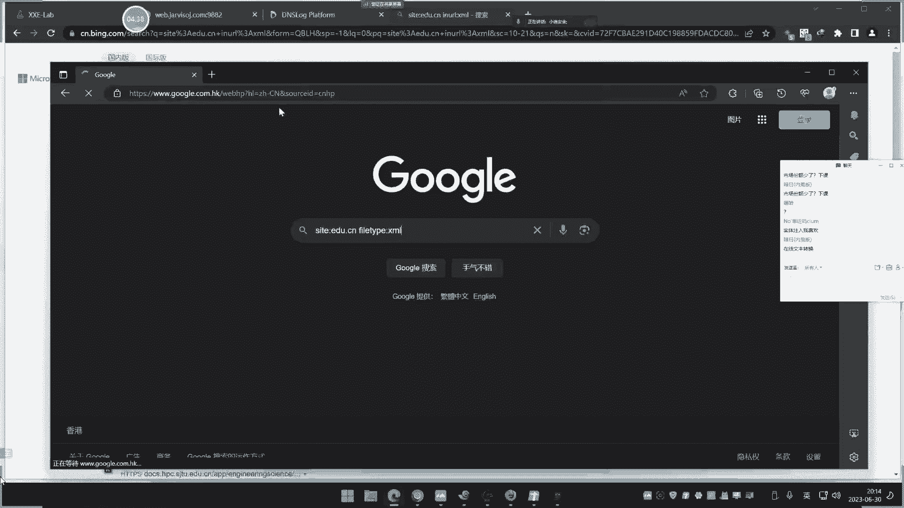
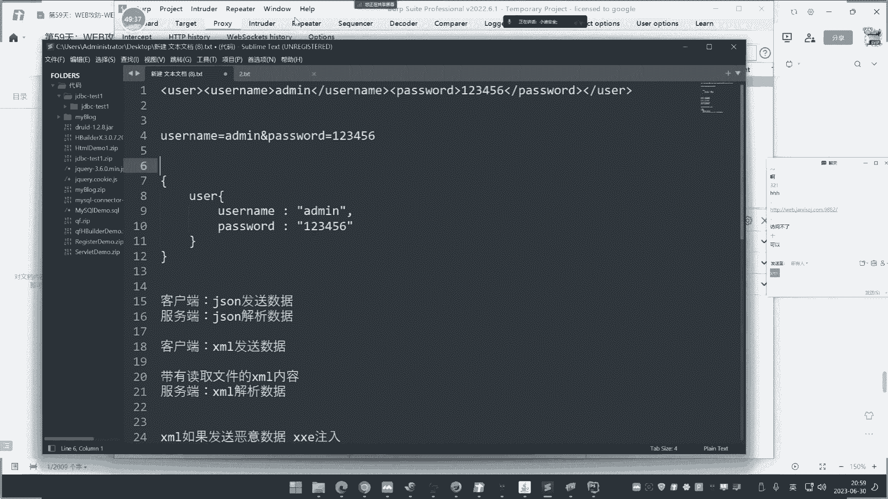

# P59：第59天：XML&XXE安全&无回显方案&OOB盲注&DTD外部实体&黑白盒挖掘 - 逆风微笑的代码狗 - BV1Mx4y1q7Ny

呃叉叉一的安全问题啊。

这个安全问题呢，其实也等同于是那个JSN的一些格式，数据的传输安全问题和那个有点有点类似啊，不网上呢是专门呢有讲这个叉叉一的，呃其实叉叉一呢就是说的是这个XML啊，就说他的语言的这个格式呢是XML。

然后呢他的安全问题呢被引出，名称呢叫做叉叉一，其实那就是XML，那是他的这个语言的一个教法，它的安全度物种呢被称之为叉叉一，两个呢是一样事情啊，网上也可以称之为插满L注入啊。

叉叉一注入这种呢都是他的一个教法，这个安全问题呢，额首先我们先要明白一下这个叉叉，ESXL这个是什么东西啊，这个东西呢，它其实呢就是一个传输的一个格式语言，叫做XML，然后在早期的年代呢。

这个用的是相当广泛的，随着这个JSON这种传输的格式语言的出现，XML呢在市场上的份额呢就有一些减少的趋势了，这个差买L呢和那个JSO，那是差不多的一个概念，就说两个呢解决的问题都有点类似。

不过插满L呢比SJSN呢多了一个东西，就是多了一个存储方面的一些事情，简单说这是个什么东西啊，这个XML呢，它的一个设计初衷呢，是为了将这个数据呢进行传输并且存储数据啊，然后呢以它固定的这个格式。

然后在传输和存储数据的时候，经常会被一些这个后端语言呐进行解析，那么如果传输的这个XML里面呢，带有这个A1的这个利用的代码在里面的话，在解释的时候，那就会被触发，这就是造成这个叉叉一族漏洞的一个地方。

啊就这个意思啊，这是它的全称叫XML，然后一什么一定的injection啊，也叫叉叉一实体组，他的一个安全危害呢，通常指的就是说可以进行文件读取，然后呢进行一些常规的信息收集。

其实有点类似于这个SSRF的一，些攻击的危害，然后呢比SSRF呢啊多一个危害，就是说它能够进行文件读取啊，不过SSF呢也可以，他和那个文，和那个SRSF呢利用的危害呢差不多。

但是他的漏洞的产生原因呢是截然相反的啊，那个呢是属于逻辑上面的是吧，没有过滤这个本地地址，导致呢通过SRSF呢读取本地，或者说内网的一些IP端的信息呢一个漏洞，这个X秒L呢他不是的啊，那么说了这么多。

大家呢也是似懂非懂啊，我们来给他看一下啊，解释一下这个XML是什么东西啊，啊，这个网上呢大家也经常可以看到，有很多这个XML的这个什么东西文件啊，我们可以网上呢给他搜一下啊，嗯看网能不能找到啊。

哎这个也不知道能不能找找，找几个看一下啊，哎呀这能不能找到哦，这上面这个语法还是要谷歌语法才行，这个上面一些语法呢说实话还是不行啊，谷歌语法搞一下啊，开个代理访问下谷歌。

来看一下网上这种XML的一个存储的一个案例啊，大家就能明白它大概是什么东西了，一解释，那么它的漏洞，那就是产生在进行这个传输的时候呢，出现了安全问题嘶。

搜一下啊。

嗯啥情况啊。

搜都不让我搜。

唉把代理换一个吧。

哪里哪里哪里哪。

哎呀不要搞人呐，好看下这个吧，那这有啊来我们看一下啦，嘶啊大家可以看一下啊，这个是一个可以看到啊。

这个XML的是吧，这个里面呢有很多这个XL的一些东西来，你看啊，我们可以看一下这个源代码来大家可以看到啊，啧前面那就是叉叉买L的一个第一，然后下面呢有很多这种是吧星系，那其实呢这个XML呢。

我们可以把它理解为是一个什么存储数据的，就是这个呢就像是存储数据的，存储什么数据啊，就有点类似于我们在上面写着的啊，比如说这里的它的这个名称，然后他下一集啊，然后叫什么名字，这里面是值啊。

前面是他的这个索引，就有点类似于我们的开发里面呢，去赋值的兼民兼职，前面那就是间名，中间的是兼职，然后他也要去对这个数据进行转换的时候，那就用后端语言呢去解析这里面的东西，把里面数据就给取出来。

所以说这个XML呢他是个干嘛的事情啊。

很除了这个之外呢，网上还有很多啊，还有很多这个是吧，很多，这种类似的一些平台啊，很多这种类似的网站啊。

哎给看一下啊，这没搜，我搜一下那种XML的一些文件给你看一下啊，就大概明白他这个含义。

你看这个啊。

啊，这个是一个网站的一个EDUCN上面的存在，一个什么matter data的XML文件，来看一下是什么东西啊，你看它其实呢这个插板文件呢，它的这个组成部分呢就大概这样子啊。

老虎里面呢就会有类似说我们说的那种兼民啊，啊是兼职，然后一个分类它就类似于我们说的，像那个GSN一样的兼并兼职，然后一个索引就这么个大概概念，它和那个JSN一样的，我们举个例子呢。

就是简单就是说什么意思啊。

我们打开开看一下，就类似于啊，比如说我前面像JSN的那个数据一样的，按模型，JSN的可能就这样子啊，比如说这个个人信息的，就叫这个雷姆啊，知道吧，就叫这个，ACCOUNT啊。

然后呢在它下面呢又有几个极点是吧，我这有几个，括号在下面呢有几个，然后呢在这里呢有生命类目是吧，比如叫啊，嗯然后呢A级是吧，连几对不对，多少，啊他就会以这种形式呢取这个啊，去这个去去搜索他的信息。

然后这里呢是个这个里面的，然后呢下个部分呢，比如说有搜那个其他信息是吧，其他的一些这个信息，比如说我们给取个名字啊，下面的就是这个是吧，各种各样的，那么去引用的时候呢，就引用这个东西叫引申义。

那这个是那个类似什么JSN的啊，JSN的这个数据的格式存储啊。

这个XML呢就是这么一个形式，那这是他点一下了，分级是吧，一点下去呢，这是他下面一级，然后这个呢这一点卡了啊。

因为他数据比较多卡了。

啊就是这个意思啊。

这个就是那个XML的一个大概情况啊，他这个情况呢就类似于这个JSN，为什么说它的市场份额较小呢，因为大家可以看到啊。

我刚才看到的这个东西，你看呢啊，这个东西他比那个JSN呢，看起来会更加的复杂一些，主要有大量这个东西介绍呢就比较简单干脆。

所以说这也是为什么说分量开始变小的原因啊，还有这个取代的趋势，所以说这个XML呢他具体是干嘛的。

应该就能大概清楚了，他就是用来传输和存储数据的，你可能说刚才是延时的传输数据啊，这个存储数据，那传输数据是什么概念呢，很简单的道理啊，我刚才说了，你就把它理解为它是一个存储的一个东西。

然后呢你要从里面去取出数据或说解析数据，后端语言呢就会解析这个语言，在解析的时候，如果这个里面呢有一些这个恶意代码，那么解析出来就会形成这个攻击，比如说里面呢有进行文件的读取，就会形成攻击好。

那么现在呢我们就先看一个本地double，看完之后呢，我们再来分析一下在实战中和这个真实案例中，他的一个具体现象是什么情况啊。

好我们打开这个本地的小案例来测试一下啊，你比如说额，那我们前期在讲那个SQL注入的时候呢，大家都知道，我们当时呢SL注时候还讲过一个东西，叫JSN注入是吧，大家有没有印象。

就是那个支点呢是一个JSN的传输格式，所以我们在做的时候，就必须要按照这个JS文的格式，去发送那个数据包，那么现在呢我们再看一下，除了GSN，其实呢XML呢也有这种安全问题。

哦你看一下啊，这个呢是我们那个本地搭建的啊，那这里一个登录的啊，本地搭建了个DMO啊，这个小靶场来看一下啊，他是个登录的一个对象啊，登录账密码呢，然后进行这个登录，对不对，把登录进去啊，一点登录好。

然后呢我们看一下这个数据包来，这是啥数据包，我们把数据包呢拿出来看一下啊，看下这个数据包，你看他在登录的下半部分啊，就有这个什么，你看啊，那账号和密码额正常来讲的话呢，我们把格式给他输出的啊。

我们把逻辑呢给他理一下，那这是他传输的这种格式，那么由线呢可能就是这样传输吧，有些可能这样传输，哎有些可能就这样传输了，嗯这是一种这第二种，还有现在如果说GSN的话，他会怎么样。

他有这样子看他是user括起来嘛，那个user啊，然后呢user里面的再把UC，咳大概是这么个逻辑吧，来就说那传输的时候呢，这是XML的传输模式格式，然后这个呢是什么正常的我们常规的那种。

还有一种呢是接收温呢，我们前期讲JS温注入就在这里呢就进注入，对不对啊，如果说在这里呢，那就是在后面的进出，那如果说这个呢那也是一样道理啊，也在这里后面进出了是个道理吧，啊没问题啊。

其实就是说这个菜苗呢，它只是一种传输的一个格式语言吧，没什么日和其他不同的支出。

你就把你这样去理解它就可以了，好也就是说对方呢就是解析这个格式，那么同样道理你试想一下啊，那么既然他这样去发送这个数据，那么必定服务器那边就会以怎么一个模式呢，去解析这个数据啊。

是以同样的解析模式去发送数据啊。

就很简单的一句话呀，你如果说用JSON啊去发送数据，那么B订单服务端那边呢，也就是客户端和服务端啊，我们就写一下啊，这个是客户端啊，健身去发数据，那么我这个服务端就是我做服务器的那一件哈。

那么他就可以介绍问呢去解析数据，这样子那才能正常的把数据把它取出来，对不对，那么同理啊，你这个XML的格式呢去发送数据，那么同样这里面也会有XML的格式去解析数据，对不对，那么大家试想一下。

前期呢我们在在这里讲的时候呢讲猪，那么同样道理，看菜毛如果发送这个恶意数据的话，哎这里呢就造成了差这一组，那么这何为恶意数据呢。

来我们就来看一下啊，比如说我们这里呢给他先发过去，看他回血，那回显出来呢是吧，这里返回零这个什么艾德米是吧，然后就是他的这个返回的信息，发我信息的也是这种是吧，也是这种那这种模式。

然后呢我们现在呢看一下啊，我用一个这个带有恶意的这个XML的一个payload啊，这个为什么这样写，等下我们来看资料啊，来白血这什么东西啊，那把这个里面的设计个变量叫做test。

test里面呢为file去读取D盘，E点TIT下面的username，这里呢去引用它，然后password这里随便写了啊，这个是随便写的，这个无双你用啊，这个不影响前面这个也是随便写的啊。

啊就是这里呢要保证和这里对应上就可以了，然后面这个东西就是你的这个工具配，漏读取D盘的一点TIT，我们来关注一下这边的这么一个情况，这里有一点TT，它的内容是123121，我们把它进行一个法数，看到没。

123121显示出了，因为呢我们再加上去再访问，再发送，同样实时更改，这个是刚才显示艾德米的地方，为什么会在这里显示呢，因为它显示艾德米是你登录用户这里，你这里呢触发的是这个呢test。

而这里呢是请求一点TT，那么就是在这这个变量吗，然后这里显示的是，刚才显示艾德米是在这里输的艾米，对不对，艾德米呢就在这里显示，但显示是这个是吧，类似它的一个变量值读取的这个什么一点TT。

所以这个就显示它这种呢是有回显的一种，工具的一个思路，然后呢去读取这个文件实现的一个操作，你可能会问呃，这和前面讲到的那些杂七杂八的，有什么不不太一样的呢，首先关注两点，第一点什么两年呢。

第一点我刚才去登录的时候抓到的数据包，可以看一下，是这么个情况，那就是说为什么其他的网站不能这样直接测试，我现在讲这课要这样测试，啥意思呢，就是说问一下大家，这个意思就是在何种情况下面。

是这种的测试流程，有哪些情况，不这样测试，黑盒里面的一个测试方式呢，是关注数据的发送格式来决定它，既然发送本身的数据传输，走的就是XML的语言格式，那么你这个时候就可以去测试它，有没有XML的一个注入。

就把你的这个工具payload呢给他放上去，给他发过去，来看一下情况，这是你的一个测试思路，还有一种情况就是看一下这个地方叫contental type，啥意思啊。

内容类型application XML，这里已经明确告诉你，它的一个数据类型的走的是XML，那么这里呢也是成为一个点的重要，就是有时候呢即使说下面的数据啊，你看到或者说看不懂，或者说没有。

但是你有看到他的数据，这个数据包自带的请求是这个XML的话，那么一般的话就是表示代码中啊，有正常接收这个XML，这个时候呢你就可以发什么，这工具配合写到这里来进行测试，能理解吗。

所以说啊这个小小的安妮呢，单从这个点上面，那就给你分析到了这个叉叉一漏洞，在黑盒中的一个测试的一个情况，主要呢就是看几个地方，就看哪几个地方呢，那就是可以看一下这个类型，如果为XML的时候。

那就说明他有结束这个XML格式语言，这个时候呢就可以测试，这是第一点，第二点呢就是你也不用管这个地方是吧，也不用管这个地方是不是XML，你只要看到下面数据呢也是这么一个格式的话，那也是OK的。

也是可以测试的啊，就是看这个数据包的，你有人会问了，那怎么看数据包啊，有没有这样的问题啊，啊我不是说不知道怎么开数据包，就是怎么这个有这个数据包东西呢是吧，对不对，肯定有这样的问题啊，这不用想的。

我也想都想不到啊，是不是有没有这样的问题啊，那你问就问嘛，是不是我们不说其他的哈，哎其实我告诉你啊，你一些东西呢你自己活学活用呢，很多东西都能解决的哈，你比如说像仙仔啊，我不可能说来这里有很多数据包啊。

对不对，我不可能说这个一个看，那在里面看到什么猴年马月，对不对。

其实呢你不管是包里面还是这个真正里面，你看到了这有很多数据包产生的是吧，人不可能一个点开看的，那你看看这个呢就是这种增长模式啊，这个呢就不一样啊，你这里呢把数据包进行一个筛选，第三就可以了呗。

来搜这个关键字呢，好写错了啊，不是关键字，来把这个前面这个开端把它写进去，搜到关键数据包里面啊，你也可以搜其他的一匹配，那只有一个出来了，这个里面匹配到了是吧，有这个呢，你看这里都有这个东西啊。

诶匹配到哪里去了哦，应该是在哪里，在这里呢你看这个数据包里面都匹配到了，你看那啊，我意思就是说你要活学活用啊，有时候呢你把工具呢去搜一下这种关键字，就能知道哪个地方有走这个类似的东西，那你就给撤了嘛。

题外话啊，我怕有些人老这样问，问的弯的真的是你不给他解答，他就永远是个答案啊，这个是我们说的那个东西啊，好然后呢除了这个之外呀，还有很多啊，还有很多，我现在问一下大家，我现在讲课呢，我就是死怕你听不懂。

我是想把你讲的非常好，我我所以说我还要问大家一句话啊，你像那刚才我说的那个XML的那个解析，是不是啊，我不知道大家有没有明白那个流程啊，来我再给大家讲一遍啊，XML它是用来存储和传输数据的好这是第一点。

也就是说和那个JS文段有点类似，那就是以那个JSN那种形式的去存储数据，那么为什么会造成这个漏洞呢，大家想一想啊，为什么造成这个漏洞呢，首先第一个啊，他刚才呢我们不是去发送那个数据的时候啊，对吧。

发送这个呢发送这个数据的时候对不对，他是个GSN的格式是吧，法统是个JS啊，是是个XML的一个格式，对方肯定是要结束这个账号和密码，那就是就这两个你写的值，那么也就是说对方会解析是吧。

对方正面会解析它，解析的时候，如果你之前发送给他的，这里面带有这个什么读取文件的，那个什么上马干嘛，这里，这里呢他解析的时候就不就读取了吗，然后在这里读取了就形成了叉叉一组，然后叉叉一组呢有两种。

一种叫回避险，还总是讲共同回线的两次，你看我想今天又提到不会写，哪天别人又问你这个叉叉一注入五块钱怎么办，对不对，你又不会回答you，骂我对不对，基础number one什么都没讲。

这个呢也是一样道理吗是吧，无回血和无回显啥情况决定的，就是看代码给不给源啊。

你看我刚才这个租漏洞啊，这个这个差的一是吧，我在这里呢去发送过去呢啊，去读它这个文件，它有显示实原因是什么呢，就是因为他这个登录正常的账号，这里呢它也显示的嘛，就是你呢你在登录账号密码的时候呢。

如果登录呢登录艾特米，那它就显示艾特密码对吧，那那你只能假设艾特米一，那他有2米1，对不对，他有显示他有节收你这个数据，并板你这个数据显示，所以说呢我刚才为什么会在这里弄呢。

把test test读这个DID嘛，在这里就显示了吗，好吧，有显示这种叫有显示啊，优先事就好办好，那无回旋，那是不是，那怎么办呢，是不是那五块钱呢，在叉叉一组里面的解决方案呢就有几种。

一种叫外部实体应用，那网上呢也称作叫ob，叫盲蛛，叫叉叉一的盲注ob啊，网上有种专业叫法啊。

那其实就是一个地理题，一个问DDT的一个文件，就然后这是他的一个利用。

如果说进行探针分析的话啊，探针分析的话，那基本上那就可以直接用这个什么DIY的，一个查询就完了啊，带Y查询就可以借助一个app的访问呢，来确定他有没有这个情况，那也是非常简单。

就是把刚才那个payload呢把它进行一个更改，就可以来测试它有没有这个测试啊，来比如说现在我们就来测试一下，就是刚才他登录的数据包，这里啊，我们在前面再写一个这个什么X1，X1的一个利用代码。

待会测试来看一下他有没有对吧，这个执行成功来确定这个漏洞是否存在，我们观察一下啊，首先这里那里看的啊，嗯这个地方呢可以随便写啊，这个地方可以随便写，因为这里已经写了呢，这个file去调用这个的地方。

D的话是刚才那个是file协议，这个是HP协议返回的DSLOG地址来确定一下，需要再来是吧，然后你看啊这个随便写啊，这个无所谓的这个这个地方无所谓了，下面这个无所谓的，那主要是这里啊，写了啊。

我们来好访问了，刷新一下有没有，大家看到没有了，说明有执行，那就被执行是吧，没问题啊。

啊当然了，你也不用完全用这个什么DSLOG是吧，你也可以用这个什么，在服务器上面创建一个这个监听器啊，用这个Python这个这个是吧，监听器呢开一个这个什么开个，I mean in a python。

哎呀，老用了老忘记拍子啊，这里，开个这个服务是吧，开个web服务查询端口，对不对，然然去访问一下吧，啊，对不看这边有没有记录也是OK的啊，但是有些这是AP协议，他能搞啊，如果其他协议他就不能搞了。

你看一访问来解释到这个IP的访问过，对不对，哎有了啊。

那IP是谁呢，那我看一下啊，我看我的IP啊，多少啊，119。98。142点，什么200这边显示的呢。

1999814620，就我自己呀，因为我在本地超市嘛。

对不对，所以他就是自己没问题啊，来用用发问过是吧，有记录R没问题，说明他带歪了，那这种呢就是测的，第一种就是分析能不能去玩它，它没有回血，你无法判定你有没有成功，第一步先做DIY的一个测试。

能带歪了再去利用，因为如果说你都不知道能不能带歪，你测到后面那个攻击配漏的，那是没有任何意义的啊，然后呢这个测的方式呢，我们就直接啊给他使用第三种无回线读文件，这个外部实体引用呢这个就不讲了。

因为它不是解决不会线，它就是说在上面这个读取文件的基础上面呢，搞了个DIY，啥意思呢，就说你可以看一下代码呢，去访问一个远程地址的一个叫DDT，DDT的文件，这个DT呢就类似于加载了一个库文件。

就可以这样去理解它啊，也不用去学这个XML的一个本身代码，不用去学它，底题呢就理解为是它的一个库，这个语言的库库里面呢可以写代码呢，让他去加载运行，就类似于我们在开发语言中的，什么包含哪个文件。

哪有什么库的意思，就应用那个库呢，就会享用那里面的库里面的一些函数，就和这个意思差不多，那么他就去呢用这个file呢，去加载这个染成文件的一个DDT，然后呢在远程文件上面写成这个代码，这个代码干嘛呢。

就是读取一个一点TIT是吧，就这个意思就是加了一个外部引用，就是把核心代码呢放到这个DDT里面，然后呢这里呢只做一个访问加载是吧，就这个意思啊，这个是外部stem，然后无回旋呢，就是什么办法呢。

就是在它上面呢加了上一层，加了另外一层，这个是绝无回旋的，好，我先把这个呢给大家看一下啊，来来看一下啊，然后呢我在服务上面创建一个啊，在我这个电脑门这个服务上面搞一个，好我们在这里。

那就搞一个这个小低点DDTDDDDTD。

搞上去之后，把这个代码呢给他捞上去啊。

这个就是那个苍白的语言吗。

来去读取这个D盘一点TT，然后呢是这个C的啊保存，然后呢保存好之后再把这个地方呢改来复制啊。

然后呢我们在引用的时候呢，就把它粘贴上去，去请求远程地址，远程地址，就是我刚才那个服务器的一个地址是吧，放上去那个小地点DDT那个地方好吧，就这个地址嘛啊去请求这个软层的地方好吧。

然后呢去访问他这个地方，刚才写的代码大家看到了啊，就是读取那个文件，我看他是不是能够正常读取呢，来勾一下看一下吧，来能够正常读取，对不对，同样道理啊，你改这个地方。

你把它进行修改啊，比如说再换一个啊，读一个这个D盘的什么R点TIT，这是R点TIT是吧，我读个R点TIT开试下，保存，勾那他就读到是2号点，第二天内容对不对。

它会随这个更改，这个干嘛他就干嘛，这就是外部实体应用，叉叉一里面的外部实体应用，就是呢让他去加载外部这个dd啊，DTD这个文件啊，然后呢主要功能呢就由他来决定，就这个文件里面的代码决定啊。

XML的一个工具代码决定，但这个呢他不是解决回弦的，它不是解决回弦的，因为这个回旋呢就会运用到这个奇数，解决回旋的话就要用用了这个技术，刚才这个待外测试是分析有没有回旋的，就是分析有没有。

就是说无回线怎么判断是用代码啊，这个DIY执行的去判断它，大家不要搞混淆了啊，不是说DIY去访问呢。

是解决这个误会线利用的，它是分两步的啊，不要搞错了啊。

来这个分析判断呢是吧，就是他带外查询，但是这个利用啊，是要用到这个什么外部实体的这个东西的啊，不要搞错了啊，DIY查询啊，然后呢他的利用思路就是我说的这个Y5实体。

嗯这么说外部实力及T里请分析的一个情况啊，然后他是如何成功的啊，大家看一下思路啊，额其实呢大家可以思考一下啊，这个diva查询呢其实也能解决，那个也能解决那个叫啥呀。

也能解决那个DIY把数据带出去的一个操作，大家在前期我们讲那个嘶讲那个反弹的时候，我那个带歪的时候。

不知道他有没有影响啊，就是说我这个钱就比如说个dn log吧，我前面呢加上计算机名呀，然后呢后面加上什么鬼东西是吧，我也可以把数据呢加到前面来，这边呢是能够接收到的。

其实呢就是说你要改变这个这个payload的一个。

那个写法啊，就改变那个payload的写法。

就是让那个数据呢写到那个什么d slog，那个头部啊，然后呢去让他请求这个DISS，那么数据也是会在这边显示，但是呢前提是你要会写那个什么东西好，我先把这个原转本本身的给他开一下啊，你看他怎么搞的啊。

首先在这里呢外网的主机上面呢啊，先先看这个代码啊，来file读取一点TT，然后呢remote a remote，远程地址去访问一个test on dt d执行remote。

再执行个O你跟说这哪是Y这不是file吗，告诉你啊，这个file不用执行，它也能访问到啊，然后呢你看啊，下面这个test d d t里面呢写了个什么东西啊，哦这是双引号，啥意思啊，就是把当字符串。

字符串里面是这个整体执行，它去访问一个另外一个地址，叫get pp file，加上这样就这个值，将一点TT的内容访问这个地址啊，访问这个地址复制给这个file。

然后get pp呢去结束这个file值并写入文件，啥意思呢，流程是什么意思啊，现在大家关注一下，首先这里呢读一点t t fail啊，等于fail，然后呢去访问这个特色TT，去加这个特色TT啊。

然后加载这个代码里面是一个all核心，就是让他去访问这个什么，另外一个get pp文件来接收这个file的值，file值，那就是这里获取值，所以它的追踪核心呢就是读取这个文件，并且访问这个地址。

所以我们就给给大家看一下效果了，这个是他的一个不回显的利用，刚才那个只是分析不会显的判断，就是有没有那个漏洞，现在就是利用，比如说利用它的读文件，你可能说它的危害不是还有什么内网扫描啊，命令执行吗。

但是我告诉你啊，最常见的就是文件读取命令执行，我执行没有碰到过，网上说有这种漏洞，但是一般是那种插件漏洞啊，就是说像网上的java里面有一些那种叉叉一的猪，引起的命令执行啊，有但是它不是原生态的啊。

是那个什么鬼框架里面东西就是和XML组一样的，内网扫描，和工信内网一样的道理，你把那个地址改成内网地址，就是访问内网地址的值了，把地址file里面加上地址，也是访问内网内容。

所以说他和那个sf5比较类似的，原因就是这个意思就是把这个协议改成啊，比如AP这里加上个内网地址，那么就是访问内网地址，所以他就是什么内网的信息收集，就那个意思啊，我刚才没给他忘记提好，看一下这里啊。

看那个刚才代码里那一个get点pp搭传上去，看看怎么写的，接收file的一个值。

保存到file txt，写入这个代码没有问题吧，很简单，接受file参数名的值给变量D，把data数据的写到file给TT，就这简单。

好接下来看一下上面那是没有file0T的，然后呢再来关注下这个呃，Test t t tsd d t。

来all变量啊，然后呢去请求这个get点field tt是吧，就这个逻辑啊，就是把这两个文件给传上去。

一个是get的VP接收的文件，还有一个呢就是这个远程的这个实体化文件。

他想去，那么代码攻击，代码就只需把这个写下去就可以了。

你可能说上面呢是不是这个username这些东西吗，这些东西呢是我按照那个格式发送的啊，其实上呢你不用写到上面那就可以了，来看一下啊，来再重新分析一遍啊，读取一点TT内容，然后呢去加载远程的特色TT。

那我刚才说过，加载远程TTT就会执行这个特色0TT的东西，那么特色TT是什么东西呢。

就是什么去让你去访问这个get app，然后呢把这个file传上去，再有呢就是这里面得到的这个东西嘛。

点贴内容好，现在呢我们来访问，你看这里呢没有任何显示，但是我们在这边可以看一下有没有file DK t了，嗯那有了在20。47分，就是刚才打开一看内容传输到这来了。

是吧，这个就是他的一个无回血的一个文件读取利用。

啊就说我不需要显示，我这里呢可以把代码呢给他简单的过一下，就是它本身这个漏洞核心代码就是个本地DOO，看行漏洞产生过程和无回险和不危险险。

有哪些方面来决定，这也是方便大家日后针对这种漏洞的一个啊，他的一个分析吧，啊这是他的一个本身代码啊。

这个里面的我们可以关注一下啊，看前端页面和它是用pp的一个写法啊。

但这个漏洞呢在任何语言都有产生，因为它不是和语言挂钩的，它是一个存储数据XML。

所以java里面也有，那这是它发送数据的地方呢。

这是它定义呢，刚为什么发送的时候呢，是走这个模式，可以关注一下来，为什么走这个user username加上艾米亚也350，那定义好呢，这是结束到UNAME和password。

他写到这个模式格式里面去发送，是给这个丢DEPOSER发送周的这个什么就是XML，对不对好了，给这个due locking，那导算呢咱们呢去接收它呢，去接收这个输入的值给这个XML。

然后呢用这个什么load XML和什么snip XML，这个现在去解析这个语言，把解析出来呢来进行这个呢，spint input f就是输出的一个意思，八进行输出，刚才为什么输出就是这三个语句才输出它。

如果我把这三个语句把注释掉，就是没有输出，他只做判断，不做任何事情，不给他输出，那么这个时候呢，我们再把刚才那个payload重新打到里面去。

看是不是就没有输出了啊，比如说像刚才我把这个读取代码这个地方啊，要换着来哈，来看下这里勾，你看我刚才能够读取到的，现在空的啥都没有，你怎么去判定他有安全问题呢，不知道啊，内容都没有任何回血，咋办呢。

时不时就是搞个DIY呀，搞个DIY呀，来给他DIY一下，看一下有没有这个数据的回写，先看他有没有这个东西，阀刷新是有了，说明有漏洞，截下来，再按照你想读哪个文件，我颜色是读一点TT。

再把这个弹幕搁这写到这里面来去读一下，在读之前我先把这个test给他删掉，访问还是没有回旋，刷新有了打开读到了时间20。51分。

就是刚才。

所以说这个就是他没有回旋的种情况。

没有回旋呢就是由代码的这个显示操作来决定，它不给你显示，结果就没有显示，你也不知道层和北辰优先是，那就好办了吧，是不是是这个意思啊，那么具体漏洞成因，这是从pp的角度给他看到的，其实呢也是非常简单。

根据代码的逻辑是可以直接看出来的，首先它在发送数据的时候，是以这个什么XML的一个语言格式数据，去罚这两个数据的，所以说我们就可以在这里呢车它有没有XML足，因为它解析和传输的语言是这个XML。

然后呢这边呢去解析的时候，也是用到这个什么插毛，这个函数呢去解析这个格式内容，这就是它产生漏洞的原因，黑盒和白盒的一个情况，黑盒就是我说的那两点，观察数据的格式，白合观察处理数据的函数或者是框架。

来决定是不是有这个叉叉一的漏洞，百合里面就是关注是不是传输这个，XML的一个格式数据，并且有相应的数据对它进行解析，这是漏洞核心，黑盒中也是关注这个数据格式，和我们说的那个什么数据包的。

这个地方的这个类型啊。

然后呢如果你要强加测试的话，也是完全OK的啊，好那么这个呢是我们那个本地DOM，我们看一下呢，你像这个网站来，我来看一下啊，这个网站呢我关注一下啊，你看他是个什么情况啊，这里有个随便点一个测试啊。

我们看一下啊，先把这个历史包呢把它清空掉，我们随便点一下啦，点勾好，这里发送个数据，我们看的数据，那他的数据是么，你看走的content table为application jsn。

是不是个JSN的一个这个这个这个情况，如果说我要测，那我就按照GSN的那个测法去测是吧，在这里面加一些这种PLODE来去空测试，它有没有什么注SQL注入啊，或者其他的是吧，是这么个测法。

那怎么会联想到差叉叉一组呢，如果你要强制性的往叉叉一上面去靠，也是完全OK的啊，也是完全OK的，怎么强行往这上面靠呢，来你比如说我现在呢就随便搞个配漏的，比如说这个读取的一个地方是吧，我关注一下。

他这边呢是一个这个这个这个什么用Python搭建的，来这个Python拿进的啊，那这里呢很有可能它不是windows服务器，LINUX服务器呢可能多一些啊，这个呢可以根据你自己的信息收集是吧。

我得把这里的强制性的把改成这个什么，可把它改成这个，改成这个读取的地方，然后把这个路径呢，把它改成一个LINUX的读取路径啊，因为我判定他可能是windows啊，可能是LINUX。

所以我就读什么etc读取这个pass r v是吧，来确定他有没有这个这个读取file协议的，应用的地方是吧，放这里，好他说错误了，为什么有可能是不接受，还有一种情况就是说你要改这个类型。

把这个商品类型改成什么，按M支持的勾，说什么五百五百什么错误，这什么情况呢，是这样的啊，你这里呢定义了一个test啊，额这里呢应该还要引用一下他我找一下啊，那个再搞个这个引用一下的。

在下面随便写个那个标签来引用一下，看是不是这个情况啊，看到没来考了堵到了是吧，虽然说我演示非常简单，但是实际上在实战中不是这么个情况，你要根据情况决定，你看刚才我说的那个情况，有人说啊fast建设堆。

这就是对那方面了解的比较多嘛，JSN也有相应的测试方法，那个fast jsn对不对，那也是那个java里面那个库那个安全多，也是这个JS数据传输的，如果这个网站的刚好是java的是吧。

但是很有可能他就用到的是这个什么发色，健身的需权，去对这个JN数据呢做这个解析库的用的是吧，说不定他就有这个fast健身的这个漏洞，对不对，所以你要根据这个实际情况决定的。

要根据王者的信息资金的合理选用，而这个网站呢为什么要这样测，你可以说我这个神经病，这样一测就测出来了是吧，你怎么找半天找不着呢，是这样的啊，这是有来源的，不是说我忘不给他讲来，它的核心代码里面呢有泄露。

你看看，他这里有JS代码里面有的告诉你了，XML的一个结束，然后后面呢有这个相应的处理呢，法术呢地址，你包括刚才我看到数据包里面的发送的这个API，非1。0try，就这写的，看到没，吃完了。

他虽然这里用的是JSN的PAR去解析呢，XLLP呢就是你发送的数据，但实际上呢大家可以看到这个上面这个叉，h l x hr呢是吧啊，他这个鼠标触发时间呢是触发这个新的新的，那就是个方形新的嘛。

这个里面的啊，但这个上面呢是有这个什么XML的，所以呢我就尝试试这个玩意，就是看到这个东西啊，但实战中的话你也可以不看，你也可以这样测，如果他直接写的，他没有，那就直接撤，没有写的话，你可以改一下。

测一下，也没有多长时间，也不要花多长时间都可以测试一下的，是不是，其实呢说到这里你就应该明白，这和JSN就是差不多的，很简单就是XML的文件呢是用来存储数据的，数据里面呢有什么兼职啊，兼名对不对。

然后你发送数据以XML的一个格式的去发送，也是有这个什么接名啊，键值这些东西，对不对，对A方呢去接收你这个数据，无非就是说和我们传统意义上面不同，意见有点不同的，就是我们说的这种数据的格式。

你可以数据格式呢以GSN呢去发送过去，对方呢以JSN的去解析数据，你也可以用个XML的格式数据就去发送给对方，对方呢再以XML的去把这数据给解析，只是说在接收这个数据的时候没有过滤。

然后呢你把一些这种是吧，攻击代码呢给他代入进去了，然后他在解析的时候呢就把它执行了，所以导致的这个漏洞，至于后面的这个什么无回血有回血，这是它代码里面有没有显示的问题，就是利用方面的问题。

不是发现漏洞的问题能理解吗，所以说从漏洞的原理和利用上面利用，就是我们说的这个无灰线和有回线，怎么解决它的问题是吧，发现上面漏洞的产生层面，就是我刚才说的就是数据的格式的问题。

代码呢是怎么去处理这个数据的，数据是以什么形式发送的，对不对啊，如果说你以这种正常形式发送，那就不需要解析嘛，对不对，正常逻辑啊，解看这个变量后面传数值啊，把取出来就完了。

但是这个JSN呢和这个XMLXML的这种格式呢，它就要专门的函数去解析它，然后呢函数在解析一些解析这个payload里面，比如说像刚才我说的。

解析payload里面这个东西的时候，哎他就会怎么样尝试性读取啊，刚好死呢，你有回血，那不好意思，直接利用好，是不是这样一说，大家就理解起来会好一些了，是吧啊，不要说把这个东西呢。

搞成很神乎其微的一些东西啊，你只要呢自己呢把它对不对，理解好点就行了啊，哎什么鬼情况，怎么还有一个web工坊啊，标题你妹的，搞半天，我这个上面都还没搞清楚啊，标题多了几个字来翻译一下啊。

好这样应该可以了，OK下好，再来说一下那个下面部分啊，接下来呢刚才呢我们都是以这个黑盒角度，那黑的角度呢啊大家也看到了啊，来，可以和上面类型，这个数据类型和这个这个类型的生命，当然了。

你也可以直接呢像刚才那个案例一样，强制性把那个等于它去发送，但这种呢说实话啊，哎机会不大，因为我那个那是其实那是有原因，像那样测试的啊，没有原因，你那样测试的那就属于靠兵器了啊，那不太现实。

所以一般呢就是根据这个数据格式呢，首先就已经符合这个XML的一个类型，然后呢再就是那个类型里面显示了，就说明它是正在接收这个插板那个数据格式，这个时候呢，你再把那些攻击的那个插满的那个攻击PLOAD呢。

给他放上去了，去测它啊，这样子那才是有理可循的，这样子才是正确的啊，这是他黑河的一个测试的思路，你可能会问，那这网站怎么找呢，就是那你像这种爸爸速腾吗，抓到一些数据包在里面塞呀，对不对。

或者说你用那个扫描工具呢去扫的时候呢，发现有这个数据格式啦是吧好，这多关注那个数据格式的一个情况啊，防守数据的格式啊，黑盒这种情况好，那么现在呢我们再来说这个白盒里面的啊。

百合里面它本身是说用那个什么CCTF题给他讲，但是这个CTF修的这个叉叉一的，这个CCTF题啊，和我们讲的好像，那个本地多么呢有一题就在里面，没有什么太多知识点，所以就没拿出来讲啊，还有一个。

那就是我们说的那个网上，也有着叉叉一的这个CCTF题，哪些CCTF题呢给大家看一下这个文章啊，介绍一下他会和我们讲的呢有很大的出入。

就是我给看一下啊，来搜一个文章给大家看一下封面。

这个有没有看是不是这个这个不是。

这和我们讲的是一模一样的，没什么太大区别，就说有那个库里面啊，就像java里面啊，Python里面啊，这个pp里面没有，这个java里面呢有这种东西，就java里有一些那个库里面啊，有那个叉叉一注入。

但是他的那个软泥的，和我们现在讲的有很大差异，差异方面呢就是那个库核心造成的，这个只能到时候用这个，讲那个代码审计的时候再跟他说啊，你这java的那个东西呢，java里面去解析那个叉叉一的时候呢。

造成的一些利用呢，我们有啊，那这个呢你可以看一下呢，他说是这个叫什么DMO4J啊，这个sm x radio，他说是第三方库，对不对，其实就是说他这个呢就是引用java里面。

引用一些第三方库呢做这个XML语言的解析，然后这个库呢写法上面有安全问题，然后这里有这个漏洞，断了好多库是吧，java里面就是库多是吧，PVP呢一般就用原生态去开发的啊，没有什么库。

所以一般java这种叉叉一的这个漏洞啊，通常都是这种库形式的啊，啊原生态呢就是常见代码，这个呢到时候我们再另说啊，就这点有点不同啊，所以一般那个CDF体系里面呢，网上呢有些CCTF题他怎么考的呢。

给大家说一下啊，就高端的这个叉叉一个CCTF题他怎么考，他有比如说考java的，他有先把那个java代码泄露给你，然后呢你再打开那个代码的时候呢，你发现他引用到其中一个库，比如说引用到这个库。

然后你一看代码，就会涉及到XML的一些格式的解析，你就会联想到是不是叉叉一的这个漏洞，网上呢在搜这个库包出个漏洞好，就开始利用了，这是那个CCTF体系那个设计啊，是这么个设计。

前几年那个什么网灵碑上面呢有这种题目，但是我今天讲的，说实话我上七课呢，按照这个逻辑讲的没有什么用处，没有什么好处，就是你在这个本漏洞上面理解都还不够深入啊，你看那个东西呢。

你会发现和我们讲的的出入很大，就是我们这种讲的是这么去利用它，对不对，但是呢可能唉他也是那个叉叉一漏洞。

但是呢它是个库里面漏洞。

是什么原因造成的，就是因为这个是用本身代码里面提供的这个，API和函数那去解析的，然后他那个库里面的是他那个自己库里面，那个代码逻辑，所以他那个利用payload呢，要符合那个库的节奏写法。

所以那个完全不一样啊，差异又在哪里，但是你把那个讲的是没有太大意义，那个你只要知道怎么用就可以了，然后你呢还得是谈这种原生态的啊，好我们现在呢先给他看一下啊，这个pp里面的一个百合的一个CMS。

这个字典呢寄给你熟悉到这个漏洞的玩具，又给你看到这个漏洞利用，并且把今天的知识点呢也做了一个总类，是个非常好的1cm s的一个案例，然后这个是以PPT来讲，那么等同于PY呃。

这个什么Python或java里面的叉叉一的这种注入呢，也是差不多一个逻辑，只是说它里面的函数，或者说有些单独的哭呢不一样而已，思路呢是基本是差不多的，利用起来都差不多，啧好这个是那个网站啊。

来这是一个PPS1的商城系统，这个呢存在一个叉叉一咯，如果说你用黑盒去搞这种网站的话，找这个叉叉一是找不出来的，因为他那个叉叉一的触发的地址，你能不能访问到，我说知不知道有这个地址，你都不知道跟不同。

更不谈这个那个啊，所以这个漏洞呢只能从白盒里面找出来，然后在没有源码的情况下，面这个叉叉一你是怎么滴都是找不出来的啊，所以我就说嘛，这个白和黑河的支点呢要同时进行有源码，那肯定是帮助很大的，好。

我们来看一下这个系统的一个那个，叉叉一的漏洞啊，看怎么找，其实这个也不难。

等下我们看一下啊，把那个项目呢给他导一下啊。

比如这个项目我导一下啊，打开到这个窗口里面去。

哦这是那个源码啊，我们怎么找的呢，这个叉叉一呢它没有什么功能，就说你也不知道这个叉叉一呢，它和哪些功能相关，所以你也不可能说一般这个代码审计的逻辑呢。

我后面呢会详讲，今天呢给他过一下代码升级，这个逻辑大概是有几点，一个呢就是根据功能的去追踪代码，还有一种呢就是根据这个特定函数去追踪，还有一种呢就是根据这个啊啊，具体你要什么时弄容许这种这个啥意思啊。

比如说我很简单的道理，我挖文件上传的话，我就去找这个网站，哪里有文件上传，遭到文件上传，我一车把包一抓，不就有文件的上传地址吗，才通过第一层呢，找到对应代码端去分析这个文件，上传这个功能点写的好不好好。

这是第一种，对不对，能理解吧，这是根据功能点去审计，为什么呢，功能它很明显，你要挖的这个东西，到处都就是你能看得着摸得见的东西，文件上传，你就直接找这个文件上传的点抓包分析地址，找对应代码端。

非常直截了当，还有一种就是说它的功能特性不常见，啥意思呢，就像我们XML，它本身是一个做数据传输和存储数据的地方，他在哪些地方会出现，你知道我知道谁知道啊，都不知道，因为他没有什么特点，没有什么特征。

我又只能从它的实现函数和实现的API接口去找，比如说是吧，这pp的或者java的，怎么去对这个XML语言数据呢，进行解析和解释处理，是不是有哪几个函数，搜这个函数有没有。

就能确定有没有这个XML的数据接收和解析操作，这就是那个百合里面的思路特征强的漏洞，就找它的特征的地方去抓包，找对应文件分析，代码特征不强的，就像这种漏洞，你不怕没有特征，你就是在网上你就把网站打开。

你说这里就是存在这里存在，这你哪知道你不知道的呀，对不对，他这个功能呢你不清楚啊，所以你就只能怎么办呢，收特定函数了啊，这个呢我就不不不过多的废话了啊，因为这个东西呢会在代码审计那个章节呢，会详细讲的。

并且有这个pp啊，点net啊，java这种各种语言的一些3MS呢，去给大家去演示分析的啊，到时候呢也是二三十，20~30是直播的一个安妮是吧，其实很多的上两个月这个课程量还是蛮大的啊，到时候再好好说吧。

我们看这里啊，那么这是pp语言，我就搜一下吧。

啊比如说pp，就像我刚才我看这个代码也能看到明白吗，比如说pp呢对这个XML是吧，他这个啊处理的函数或者解析函数，就是入路线啊，看有哪一些是不是ISO。

这是因为我审计是pp对不对，如果说java的话也是一样道理的。

他说有这个上面的一些这种操作函数是吧，就是我们说的这个自带的啊，当然了，如果他引用库的话，那可能就不太一样了啊，这是他的一些那什么low的呀，low的呀，菜苗啊，还有这个，一大堆就是传播呢是针对这个啧。

插满了一些解析来这里是吧。

刚才我们也看到是这类，这都都是那种操作X11的那个地方是吧，还有像这个什么simple呀，那个写法的，那就这种的，啊关于这个上面呢我还写了一些这种修复啊，等下大家记得啊，那在这上面写了些呢。

长期用加零修复的一些方案，不过这个修复方案呢也仅限于一些原生态的啊，如果用到库的话，那可能修方也不太一样好我给大家搜一下啊，啊我说的是这个simple XML。

你问可能问这个simple XML是什么东西啊，我给你看一下来，哪怕有这个函数呢，node train啊，就是把这个这个XML呢给它载入，转换成这个string类型。

那这是他一个语言代码里对于参A字符串呢，把这个对象呢转换成这个什么这个值，就说呢这是上面这个XML的一个什么代码啊，再一个代码，然后呢进行一个运行之后，诶，你看他就把转出来了。

就把这个XML这个东西就把它转出来了，转出来的结果呢，你看啊就是我们说的呢，这个来在four是这个JY啊，然后这个body是这个什么dot fame啊，就这个那就这个东西嘛是吧。

好就是把这里面的值呢给他转移出来了，然后呢分成这个呢这个是数组，然后里面的for啊，兼职啊，贱名这是兼职，有用蕾丝的哈，他就发现在是说是一种什么，对这个函数呢就是一个这东西，我们也不过多介绍了啊。

搜它来搜到三个地方啊。

然后看哪个地方呢，对不对，看哪个地方呢啊打开，然后看这里啊，这个代码嘛是吧，这是源代码啊，这里呢结束这个，那直接的320呢是用这个什么fire connese，就是个p p input的啊。

那就说就是那个post类似的那种东西，这个input on的那也说过，结束了之后呢，把信打开给这个变量，Xml，XML呢等于什么，等于g sn decode，J s n 1decode。

那这里呢就是以先把它进行编码，后八紧接，这就就等同于说没有的意思啊，因为呢1+1减一一增一减呢相当于就是没有，他可能是为了这个格式的还原性更高，后面呢再用到这个函数，就是将这个XML呢进行自转转换。

转换这个XML变量呢是从这里来的好，那这里是定义了一个函数啊，定义的这个函数，那除非是调用这个函数才会执行下面代码，这一点呢相信大家都明白，调用这个函数才会执行下面代码，代码呢就是可以通过。

我们可以把payload呢通过这个p p input发送过去，就要用这个解析函数，把解析成这个字符串的函数把解析出来，然后呢触发这个漏洞，但是前提要知道这个函数怎么把它调用，对不对，怎么调用。

哪里调用它，右键把选择中点击什么交，为什么用IDE呢，因为什么要加上id开发，为什么要讲它呀，id功能多呀，代码升级都用IDE啊，你用什么一些辅助工具都不如IID啊，转到声明或者拥立在哪或点实现。

这里有些实现的没有啊，他说没有，那就点什么，点生命或用力生命就是找他的原出处，由于这里就是他的生命，那就是或用力谁拥了它减一下，找到这里来，自动找到这里来，这里呢调用这个week呃。

呃WCHK什么get XML这个函数的时候会return，就是自动调用这个函数，那么什么意思啊，我们继续跟这个被谁调用，很简单的道理嘛，谁调用它就调用它，那就等同于调用它吧，一样道理吗。

好把那些选中了再继续转，声明会用力点诶，点到这来了哦，这个地方掉了，这个地方就是这个文件，这个文件的执行就会调用它嘛，因为这里不是函数嘛，它直接来去请求这个函数，那就等同调用它吧，调用它就得叫它啊。

调就调用它，对不对啊，请求这里哎，那我就找到这个路径来试着去尝试一下啊，具体的一个那什么有没有过滤，就不是我们考虑范围了，先尝试复制引用，找这个文件路径地址。

去请求到这个上面来这个文件地址，然后把前面的根路径去掉，加上网址信息，请这个地址一访问好，能访问没问题，那么现在我们进行一个抓包，来测试一下请求地址呢，然后这里呢去发包。

把payload进行一个测试来看一下，比如说我先来测试一下，能不能进行这个文件的一个啊读写操作是吧，能不能进行一个文件读写操作，C小啊，那就是这个啦，比如说读个文件。

那么这里呢就改成我的E盘的B点TIT，对吧，需访问哎，返回来这个东西没有内容啊，为什么没有内容。

我们会关注代码呢，他将这个呢给到XML嗯，下面呢有什么下面输出这个what XML，一个什么鬼东西，但是这里也可以看到他输出的，好像都是这个固定的，你看那这个为file，这个为空，这个为成功，这个为空。

没有任何变量在里面，输出这个值呢你要插这插ml，然后再调用，调用输出的好像和这个什么没有关系，就这个变量执行是等于他的嘛，你看把他选中了这个地方呢全部在这里面赋值，但是这个变量和它没有关系。

这个what XML呢输出的没用，那就说这里有可能是个没输出的，也不知道是我halo的没问题的还是什么情况。

那么现在呢到这里这个点的时候呢。

大家要想到三个问题，第一个问题就是。

无漏洞，第二个问题就是不回血，第三个就是我们的不漏的，有问题，三个问题造成你，有时候你解决问题呢通常都要思考网上，你们经常有时候呢看了课程之后，就老问我一些问题啊，为什么这个你做的时候总是容易出错。

因为你没有思考过，出了问题呢，你也不会分析是什么原因，不会分析的原因，那就是你不懂这个漏洞压根就没有学好，所以做不做都没有什么意义，所以你做了啊，你把道理解了理解，那你一定要分析问题。

这个呢就是刚才说的那三个问题造成的原因，我升级出了问题，然后就没有漏洞，我自己所有漏洞造成的，还有那就是他没有回信，代码能力强的，就可以从这个代码分析里面，是有漏洞还是没漏洞，我们这里呢也不卖关子了。

他是哪个问题呢，就是没有回信的问题，所以呢你再测一个对Y的一个调用的话。

我们啊把刚才那个什么去访问一个这个对Y的，是不是把写上去，对不对，然后呢，这里是访问那个DSLOG地址，我们尝试一下看是究竟是哪种情况是吧，是究竟是这个没有对Y呢，还是啥情况呢，你勾一下啊。

好他在他这里报错了，报错不管他啊，我们来算一下，看没有确定了呀，有漏洞没回血，有漏洞没回写，那么接下来就是要应用到，我刚才讲过的这种案例呢是吧，尝试性的就把无和弦读文件这个配套这个了。

套用上去看是不是就能进行成功啊，来看一下啊，读一下哎，是吧，读一下看一下能不能读到这个内容啊，一点TT，然后呢为了这个有效期间。

我把页贴这个改成对吧，SAMSVO改成这个这个这个关键字是吧，看一下这里呢来看一下这个地方。

把file tt先删除访问，勾一下，再来刷新一下，有没有啦，哎呀哎呀呀呀，没有没有没有哪里写错了啊，翻车了啊，我看是这个粘贴复制的问题啊，我把那个重新拿过来，还是数据包的问题，刚才因为搞错了一个地方。

勾一下看一下啊，嗯还是没有啊。

搞错了啊，不好意思啊，搞错了这个特色，啊没没问题啊，那没搞错啊，是哪里写错了，我这，刚才DIY的时候呢带成功了，这个，那里温家的搞得莫名其妙的，以及我全都对了啊。

在哪里写问题啊，没问题啊，嗯我看是什么情况啊，这里提示报错是，刚带Y是带成功了，它提示什么，哎你看啊他的确是这里呢，你看这个报错代码里面的访问这个地址啊，哦这是不是那个，空格的问题啊。

我看一下是不是那个情况应该不会吧，他有尝试过呢，对这个地址那里你看他就写了，来解析这里出了问题，报了一个错误，妈的原来是写的时候那里刚加了个空格，导致那个地址出了问题啊，因为他那个D值呢。

写的时候那个代码逻辑get的pp呢，它后面不能加空格，就他形成两个地址啊，就这个TT里面带有空格，你可能说那这个怎么办呢，那难道就不能读空格的吗，啊是不是，那难道就不能读空格的吗，对啊。

有人说用这个什么贝斯缪斯啊，那个人说哎我怎么用啊，怎么用啊，不灰啊，是不是，它既然是PB的file协议，它支持也不是可以，不是能够支持这个伪协议玩法吗，你可能说那我是用了file协议，用AP协议。

那威协议能不能用完，试一下呗，你要活学活用，不能做老师是吧，老师没讲，你不知道我们试一下吗，你用base64啊，我我能不能用这个文件包含那个伪协议玩法呢，也是一样的嘛。

维修玩法里面用那个什么这个pp的吗，它可以进行文件读写的时候呢，反正警备是流失的是吧，这个还有还有人安利，你没看到，我们找一下了啊，比如说这个啦，那读文件的时候八进杯是牛编码，是不是，来复制一下。

这个是读那个，这还是不是读绝对路径，读它根路径的，那么试一下呢，放这来来放到这来，对不对，我读他p p m for点pp，我先试一下啊，这个根目录的，好看一下啊，如果觉得目录的话，你把路径写好就行了。

嗯在它下面创建一个pp等于波啊啊。

不读pp引坡嘛，我就读个下面写个疑点TT吧。

好我就搞空格进去，好吧好复制一下来点TT，看他这个路径呢是在哪个路径下面，还是在这个路径下面啊，都写一个吧，好的又搞错了啊，读一点TT给他以base64去发送，没问题啊，勾一下看一下，报不报错，报错了。

打开文件一点TT输出的。

那应该就是他读的是在哪个根目录，是在这个路径下面，在这个路径下面啊，include啊，然后是，A g e p a t name，好在这个下面应该是啊，因为他执行代码的是在这个下面。

如果说你读商进目录的话，你斜杠两点啊，往上面翻斜，因为他这个是读根路径的，那个是写写路径，我看是不是这个原因，勾好对了对了之后我们刷新一下。

看一下是不是贝斯牛斯传过来了呀。

打开哟传的呀，然后把这个什么这个解码器把它进行个解是吧，那工具名字叫什么呀，解码器的名字啊，在这里一解开，是那空格就有了呀，解哎你看空格就有了，空哥也在里面呢，五圆形缓过来了，这都不是问题。

自己呢要活学活用。

有些东西呀不能说我不讲，你不知道，你看这个微信还不可以在里面溜这pp的，用pp维修有什么意义，有什么那个呢还不是一样的道理。

那这个就是一个典型的什么，这个CMS里面的一个那个，XX1的一个漏洞漏洞。

这个发现过程呢我也写的很清楚了，是通过漏洞函数收到特定地方。

跟踪到这个地方，看谁调用它，然后由这个来调用它，这个调完了之后呢，又看谁在引用这个东西啊，发现这里呢有引用啊，然后呢我们就直接呢去访问这个文件，触发这个引用地方构造配偶的测试。

通过这个测试呢先测试无回线的时候呢，发现没有什么东西，然后呢进行一个DIY，发现呢执行了，说明存在漏洞，只是没有回血，然后利用无回血解决数据的一个传输打上去了，有人会问，前期呢还讲过其他漏洞啊。

但是告诉你这个叉叉一，基本上啊这种原生态的就是只能进行文件读取，命令执行呢一般是在插件里面的，或者说模块框架里面的，就是像java里面有这种叉叉一漏，然后呢它会造成迷你执行，什么意思呢。

就是说如果你用原生态的这种什么这种函数，写出来的叉叉一的那个解析的话，一般没有代码执行啊，没有命令执行，它有命令执行的都是一些这种第三方的模块，就像我刚才给他看到过的，像java里面的那个东西啊。

就是你用的第三方呢去使用这个解析，就像什么Faker js文，你想想想到那个fast js，它的本身就是处理GSN数据的，处理JS的解析啊，还原呐，节收啊，这种事情的怎么滴，就造成了一个代码执行呢。

你用你java的本身代码，不用这个fast JSON模块啊，不用这个发JASON这个库去写JSON的，结束的时候你也可以写出来，但写出来会造成这个命令执行代码执行漏洞吗，不会因为你写就是很规矩写。

但是这个库里面呢他要实现这个功能，它里面东西呢是别人提供的，所以他招成RC1呢就不是你说了算的，这句话不知道大家能不能理解啊，就等同于说是吧，你用啊，你去这个买电脑一样是吧，你自己呢到处买这种组装的。

这种这种这种配置啊，你组装一台电脑啊，你因为你每个这个配，每个这个进阶段都经过你手，你比较清楚好，所以他出什么意外呢，你都大概是能够清楚方位的，这个时候呢，你突然买了一个是外面不知道从哪里是吧。

搞了个一体机，别人都帮你全部搞好了，那你就没办法把控它呀，它能不能超频呢，能不能搞那些事情，你也不知道啊，就和这个道理一样，那你用别人的库实现这个功能，那别人怎么去实现这个功能，你不知道啊。

他当时一出来个什么命令执行代码执行，那你也不清楚啊，所以是这个原因造成的啊，像我们家的呢，他就不可能实现这个什么命令执行，能用叉叉意识行命令执行，那都是一些什么第三方的一些库。

就是引用一些第三方库乱搞啊，里面的一些东西呢引发出来的，比如说反虚化配合反序化，把引发出来的这种情况多，你想是吧，我这里面的贪便宜是吧，又想把配置拉高，结果呢买了矿卡，直接这个巴布速腾呢每次都在这里打。

打完之后粘贴上去，为什么呀，我打死你妹的，不想在上面打呀，我一打，你看出来了呗，唉你们说这我有个什么法子呢，我也没办法呀。

所以老有人问我说，你怎么讲课的时候，偏偏要在外面打，不在里面打，你不要问我呀，我这买的是吧，买的顶配的，当时顶配的显卡，妈的回来就感觉不正常，图便宜嘛，我买的组装机，图便宜嘛，就中了这个船头啊。

买的那个3090ti啊。

原来当时卖1万多对吧，结果是吧，三五千块钱就拿下了，当时是3090嘛，对不对，现在肯定是四零了呀，不说了啊，我们今天内容就讲了这么多了啊，看大家有没有问题啊。

有问题就赶紧问啊，没问题，我们就下了啊，今天还上的比较快，一下子上完了啊。

下节课的内容呢，我们就要看一下下节课没有讲到哪里了，下期内容可能要讲这个，反虚化了啊，我看是讲反是反序化的还是其他的啊，反虚化，因为知识点太多了，看一下还没其他没有遗漏的一些东西讲啊。

应该是反序列化了啊，反虚化的一些漏洞，其实还有一个漏洞啊，也有可能不是反虚化，有可能是这个身份验证的安全，就是这个如果身份验证的安全，我准备在java里面讲，不准备在pp里面讲。

身份验证的就是cooking session，和JWT那几个安全问题啊，和那个未授权的相关的一些事情，在批评里讲不太合适，DP里面JWT比较少，java里面人多，那还是倒讲啊，你们说的什么鬼。

弱口令这些东西那都属于逻辑方面的漏洞啊，这个呢是单独一个章节讲，我们先讲的是一些这种代码层面容易产生的，逻辑方面的，就是设计方面的一些问题，入口令呢也是属于那方面的对吧，这个也无逻辑的嘛哈。

那代码层面的呢就是我们讲的啊，看下节课我看是讲哪个好一点啊，我看吧，反正就不是反序列化，就是这个身份验证方面的啊，这个逻辑方面的问题呢，是把这个漏洞讲完之后才讲的，而且在讲pp的啊，PPT讲pp反修化。

然后呢讲完之后呢，PPT讲完之后呢，我们再说JS的电子说法呢，再说java的很多东西。

哎不说了。

就这么多啊，好看大家有没有问题啊，太多漏洞了。

这个漏洞其实我商的哎呀也不好，怎么伤，伤多了也没太大意义，不伤呢也显得单调，什么鬼虫丁香啊，这东西啊说实话也没什么卵用，还什么CRAF都是些冷门漏洞，没什么卵用的一些漏洞啊，有些人老想问，你不讲呢。

他说你低端，JS方面的讲一下JS的一些那种是吧，那我们就讲一讲java里面特有的几个漏洞，讲一下这其他漏洞呢也好讲一些了啊，业务逻辑和这种其他漏洞，我们就留到后面讲，先把这种最常见的几个漏洞讲完。

讲完了再说那些在特殊活动业务逻辑，那就后面讲，先把这个反序列化这东西搞清楚，好就说这么多了啊，好，大家看有没有问题啊。

有问题问没问题，瞎了啊，为什么把地理信内容放到别武器，直接展开不行吗，啥意思啊，这是你说这个地方是吧，你说这个这个这个地方是吧。

嗯这为什么这个把这个DT放到网站上面去是吧，不直接放到这里面来，是这个意思吗，就是说把一个代码整体，把它整体进行执行嘛是吧，整体执行啊，就这个意思嘛，就把它进行整体执行是吧，直接把代码发出去。

是不是这个意思啊，是可以这样子的呀，可以这样子啊，可以可以这样子，就这里不是加了个底薪吗，理性有这个代码呀，你把代码写着，把这个替换就可以了呀，可以呀，是可以啊，然后这个get pb呢。

就这get的PB是放在这个上面的啊，因为他要对外接受吗，他访问这个地址是可以这样的啊，只是说这个写出来代码呢是这么个逻辑啊，也就是说你按照你那逻辑呢，就把代码也替换一下。

这个呢就需要你简单查一下这个写法，可以这样的啊，没问题，对还有一种就是说防止被拦截啊，对对对对对，就是有一些你这种写法呢访问这个底薪呢，它有个好处，就是把一些核心代码，它可以放到这个外网上面去。

在检测的时候呢啊它在核心代码上面啊，你发送的数据里面呢不会触发规则，因为里面的那只有这个DT核心代码，是在这个上面写，可以这样做啊，他这种DIY的一个死刑呢，还有一种情况就是流量那些拦截。

告警的一些信息的一些情况，就和那个免杀思路一样的对啊，你看啊有些人他在学，他就学的好，他一数他就都能明白，是不是他能举一反三的，其实很多知识点呢它都是通用的，你学好一点，那你很多东西都能想得到啊。

什么时候讲什么方位，无维通道位，那个审计啊，通道位我也讲过呀，因为java的一些OA系统的男神，你这P1P的讲过呀，当时还分析过那个通道部位。

那个文件上传的录入的产生原理呢，java的会比较难啊，pp的学位呢还能分析跟得上。

通达是要解密，网上有那种解密工具，就是代码加密了嘛，以前用那个什么真的加密的比较多，后面呢用自己独立算法，网上有那种解密的脚本，解不出来，看，下节课讲什么，下节课讲身份验证或者反序列化啊。

那反序的话也是个头疼的一个题目，也是个头疼的支点啊，pp里面要讲啊，java里面要讲，java里面的讲的就是面试问的多，PPT里面呢就是CTF考的多哎。

这个web漏洞里面问的最多的就是反序列化，也是最难的一个东西。

讲的话啊，今天讲了pp讲个两三次直播，后面java的又要又要搞几次。

