# P60：第61天：PHP反序列化&原生类TIPS&字符串逃逸&CVE绕过漏洞&属性类型特征 - 逆风微笑的代码狗 - BV1Mx4y1q7Ny

上节课呢介绍了一部分啊，这节课呢就是紧接着上节课呢再学一部分啊，啊下节课呢再学一部分，今天呢讲的是三个点啊，啧其实那里面有三个知识点是比较重要的一个，那是他的一个那个cf1的一个漏洞，这个呢不是很重要。

以前的用的比多，现在这个少了，还有个呢是这个字符串逃一的，然后呢还有个就是跟原生的一个利用，那主要的就是后面两个字符串，逃逸和源氏内利用，这两个呢不管是在面试中啊，还是在这个考CCTF题型中呢。

经常有这种事情，在商这个之前呢，我们还有个点呢要给大家介绍一下，这个点呢，在这个实战中呢可能没有什么太大影响啊，它的一个主要影响的，就是大家对于这个反序列化数据的一个特，征的一个影响。

就有时候有些面试题呀，他有些问题就是说如何去判定，这个反序列化的一些特征是吧，其中呢在这个属性的类型上面，那它就有个典型特征，啥个特征呢，我给大家看一下啊，这里呢就是你要明白这个反序花在对象中。

这个对象里面的属性的一个类型呀，它不是有三种类型吗，就是所以我们常说的变量的一个对应的属性，类型有帕布里克是吧，就是我们说的公共的就是公有的，私有的和保护的三种类型。

三种类型呢其实在我们面向对象编程里面呢，就是区分有他的一个调用关系，就是说公共的话就是在外部啊，内部啊之类的都可以去访问这个变量，然后呢，这个保护的呢就是只能在本类或者子类，父类中的可以访问。

然后私有的呢就是只能在内部访问，就是它有三个级别，这个变量呢他那个属性呀是吧，公共的就是你能搞啊，我能搞大家都能搞是吧，这个保护的呢就是一部分呢，他才能搞那个私有的呢，那不好意思，那就是一对一的。

就这种意思啊，那么他们这个为什么要介绍到它，其实呢就是一个是看这个流量特征，还有一个呢就是我们看这个数据里面呢，要知道要知道它的一个差异啊。

我们这里可以看个例子啊。

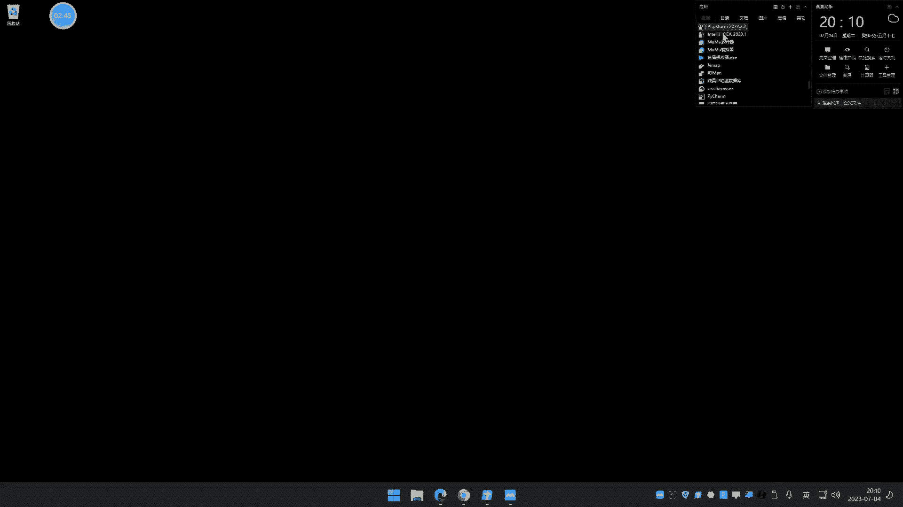

找到这个pp文件啊，好这里呢有个这个PB文件，大家可以看到啊，这个test里面对象里面呢雷姆是等于小D，A级呢等于20Q是吧，然后这个six呢等于ma他去新建一个对象，然后呢用这个序列化呢给他一序列化。

再把它输出啊，这也没什么说的，我们来运行一下啊，看一下他这个差异啊，允许在呢用我的PP来去运行这个脚本，结果呢大家可以看一下这个结果啊，结果这里大家可以看一下啊，欧式test obobject。

四位test33个属性，这个属性name是string类型，思维职位是string类型，六维小地，第二个是string类型，9V等于什么，Test edge，这里呢就不堆了，9V明明这里是三位啊。

A级三位啊，值呢是29嘛，但是为什么这里显示个九呢，然后你看下面这个时候保护的six也是三位，但是这里为什么显示S6等于six，它的值为三位，什么情况呢，就是这样的啊，我们可以呢把这里那个居注释掉啊。

我们可以把它拿出来对比一下啊，那这是这个值，它对应的是这三个属性的一个情况，好那么现在大家看一下啊，我现在把改动一下，把这个改成public，这个下面的也改public，我们再来运行，结果呢就这样子。

我们再来看一下，是他的这个对应的就这个东西，好好还原一下啊，好我们看下这边的一个情况啊，你看看上面那个数据对应的，刚才这个是S9等于test的A级，你看这里呢是S3等于A几，然后这个地方的S6。

这里是S3six啥情况，其实就是说李这里的私有的A级，在这里呢变成了九位，明明是三位，然后这里的就是三位嘛，这里就是三位原因就是因为public原因就是什么呢。

很简单，序列化数据显示的时候，如果是public属性就是正常的去显示，如果是这个的话，它的显示就是0%加上类名，加上0%加乘原名。

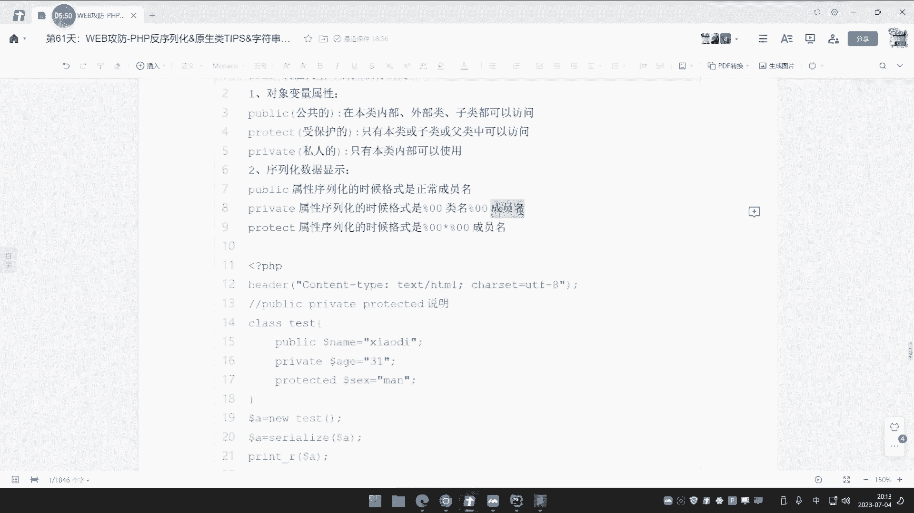

你看PRK这个A级呢是三位三位，你看它这里显示什么，在中间有个空格，这里有个空格是吧。

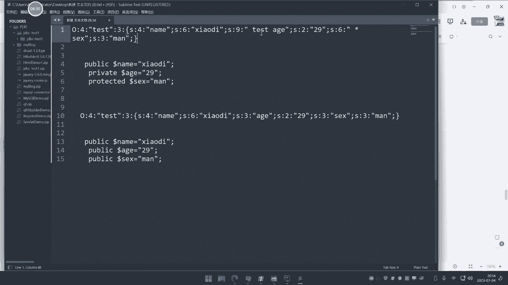

test空格空格加edge是怎么给你写0%，雷鸣加004百米。

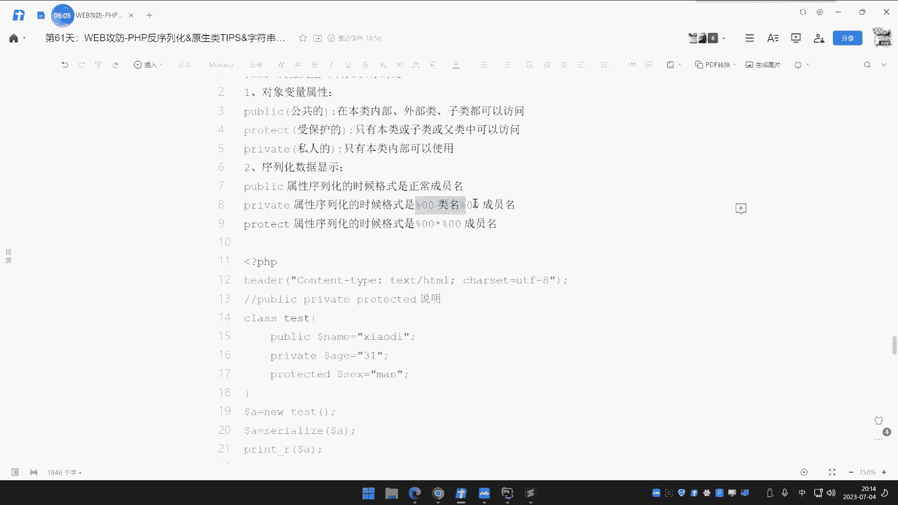

是不是就是这个概念啊，这是百分零零，加了一名test再加0%。

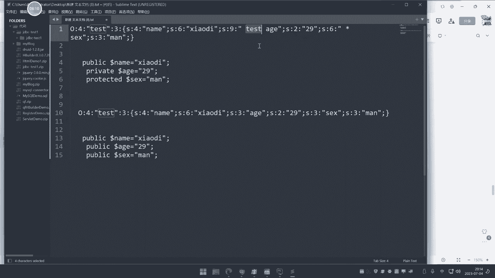

在A级不就是这个写字模式吗，如果是这个受保护属性。

就是0%，新0%成员名，那么你看后面的来保护类型，six就变成了S6V中间0%，零心再00%再six。

所以他这个显示上面有差异。

为什么会有这个差异，很简单，如果说没有这个差异的话。

那你去把它再进行画圆的时候。

不就是他就不知道了吗，你看啊，比如说我现在把这个东西把它还原，非当打赢下，你看那上面是把它虚的话，下面是把它是换原画圆的时候，你看他就知道雷姆呢是这个什么public类型。

A级呢就是什么PRFAT类型值为29，这个类型呢就是PROTCT类型，保护类型为mail，他就知道对不对，他就知道啊，就是因为你的数据里面啊，这个位数和这个显示就是告诉他是什么类型。

不然的话他是不知道这个属性的一个类型的啊，所以说这个呢大家提前先了解一下啊，虽然说在反序列化中呢，我们可以尝试性更改它的属性，但是啊在这个显示的过程中，我们要明白这个原理的啊。

就是你要知道不是说这里有错误啊，这个显示S9不是说它有错误，因为它正常来讲应该显示S3，这个S9代表的是它类型呢不是这个public，而是这个类型是这个意思，这个S6呢也不是它显示错误。

而是说这个six呢是他东西，然后这个和这个呢代表的它是怕保护类型好。

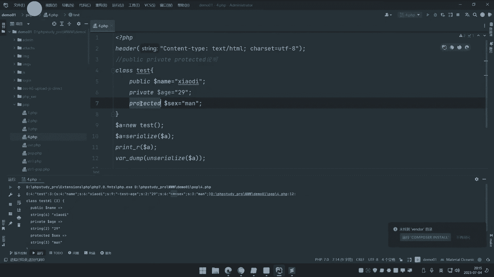

没有什么说的啊，好那么现在呢就是我们说的这个类型啊，这个呢不是很关键，大家了解一下就可以了啊，好我们接下来呢就上比较关键的地方了啊，在这个反序列化漏洞，反序列化的这个利用过程中呢，一个是有个漏洞。

还有一个呢是有个逃逸，这两个呢都属于这个内置的安全问题，第一个先来看这个叫work up的，有点绕过，这个呢是一个pp的，里面那个漏洞就是pp类型漏洞，在PB5大小于5。62和七，小于7。0。10。

这个版本里面存在这个漏洞，在2016年呢包出过这个漏洞，这个漏洞是什么呢，就是说呀如果在这个魔术方法work up里面啊，当这个虚拟化字符串里面，对象属性的个数值，一旦大于真实的个性值的时候。

就会跳过这个wake up的执行，那么在讲这个之前呢，我们先了解一下这个work up，这个魔术方法是怎么触发的呀，可以看一下上节课的一个截图，这三节课截图啊，这个work up呢它是一定会调用的。

为什么说一定调用呢，看下work up的一个解释，他是怎么触发的啊，walk up的一个解释是，当使用这个函数时就会被调用，所以说他为什么说一定不调用呢，因为你本身研究的是反序列化。

那研究反虚化这个函数就永远用到，要用到那这个东西，那就必定会调用它是吧。

那么我们这里呢可以看一下啊，自己呢去写一下这个情况呢，看一下啊呢这是我们上节课的一个案例啊，大家看一下啦，这个角test，然后呢是吧，这是他的一个写法，这个代码是这样的啊，我们来关注一下。

在这里呢去用到这个函数呢，去接受X的值，然后这里有个叫work up，然后这里这个操作是吧，大致想想啊，你看我给他进行进行一个连的一个先把的构造，就说我如何触发它啊，先看一下如何触发它。

我把之前那个案例拿出来，就找到刚才之前演示那个work up那个案例，就这个嘛是吧，就这个案例啊，把他先拿到拿到这边来，注释去掉好，这个呢他去运行的时候，我说我们浏览器访问的时候啊。

我们直接在浏览器访问，这个是POP里面CV一点，P p，打开你看啊，首先呐这里是新建对象，所以会自动调用cos string这个什么会调用这个方法，所以这个语句被输出，然后呢。

这个下面这个东西是怎么被调用的呢，是因为你用到了这个UN的这个什么函数，如果你不用它，那么是不是就不会调用这个wake up呢，对的，那就只会进行这个上面这个调用，调用这个触发这个方法是吧，没问题。

就说你一旦用到了它，那么不好意思了，那就会调用这个work up里面东西好，那么既然研究反虚化，那这个东西肯定是有用的，我们把它当做一个参数，当做一个结束变量去接收这个值，然后大家看一下啊。

我先去调用它，然后呢我再去绕过它，跟大家混，这有什么意义，等下呢我们有实例去给他分析，我先把它简单构造一下，这个构造呢就基本上就不用傻了啊，就简单生成一下就完了，就这样一下就可以了啊。

把生成一个序列化输入串就行了，好就用这个呢去发送给他，根号X等于执行，你看啊我这样直接运行的时候，你看他就调用了这个什么，就用这个生成的啊，用这个生成的生成之后呢。

啊这边呢就自动调用了这个workout里面，那输出这个东西是吧，那我这里那就直接提示啊被调用。

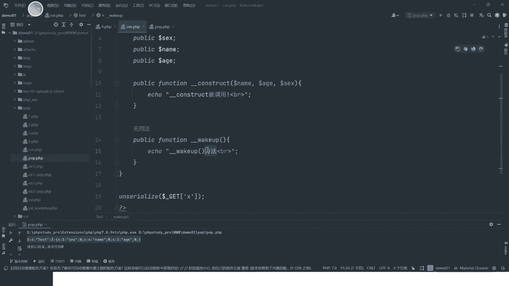

这样子呢会显示更加明白一点啊。

啊被调用调用了这个里面的这个什么work靠五，这代码对不对，好，如何绕过它呀，如何绕过这个work up不让他执行呢，你可能说这有什么意义吗，你先不管这个意义啊。

我们先说这个漏洞是绕过这个wake up，就说这里因为你用到这个函数，就必定怎么样会执行这个WAKUP，所以你在传参的值是什呢，这里呢就必定把它执行了，对不对，那么如何绕过它呢，看下啊，我们都知道。

看看图片，我修改哪里啊，他说得很清楚，当反虚化字符串里面，对象个数的值大于真实个数值时，会跳过执行，哪个是表示对象个数的值啊，截图里面看一下啊。

4INFR这个R是不是该对象的变量个数，也就是刚才说的那个四。

那这里就是哪一个值啊，是不是就是这个三呐，这里啦就是有三个嘛，six name姆和A几啊，好啊，我就把它改成一个私回车，你看没了。

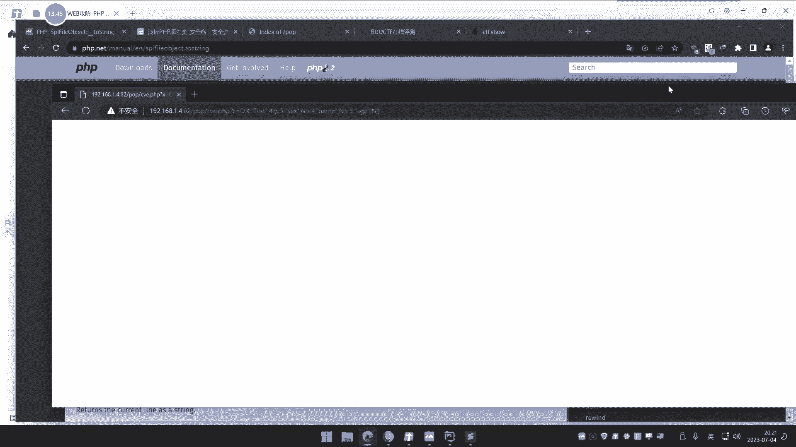

不执行了，代码呢就跳过这里的个输出是吧。

跳过这里输出。

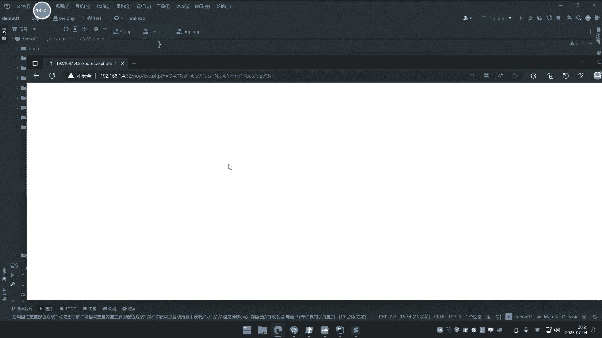

你再观察一下这个版本哎，啊这个版本它是多少版本，是不是在我们这个漏洞版本之内。

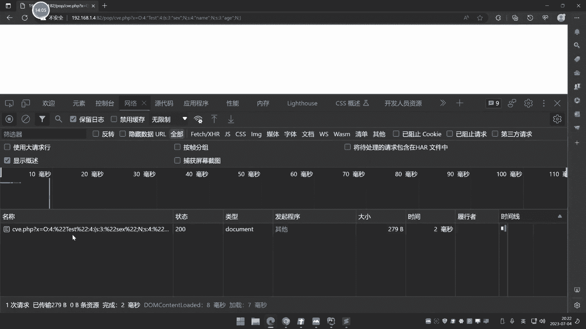

我这个演示版本是一个pp7。0。9对吧。

然后你看一下啊，它这个漏洞影响范围呢是七到7。0。10，刚好是在这个版本区间，所以它存在，你如果换个高版本，或者说换个不摘这个漏洞版本的话，就不能这样操作了啊。

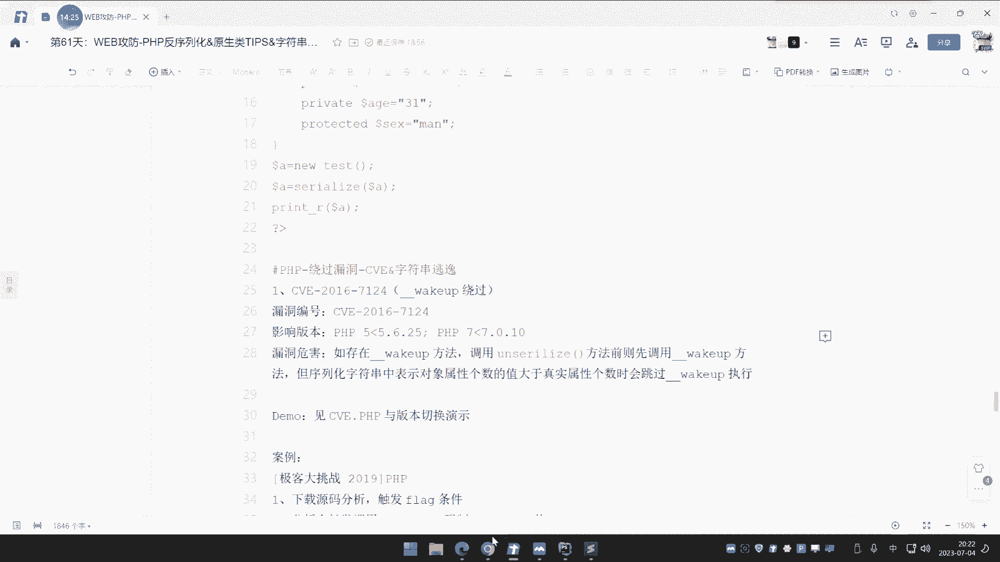

这个是他的一个情况啊。

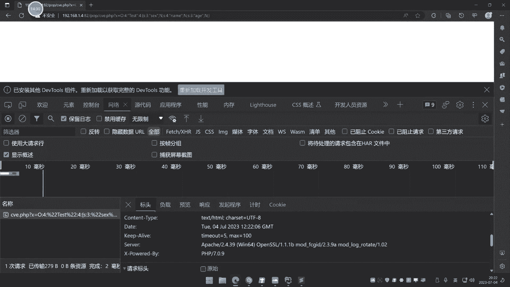

比如说这里呢写个A是吧，写个小于的，大于它给是吧，小于你看小鱼都不行，你看小鱼还是被调用了，你只要大于它才行，就是五啊，四啊都行对吧，因为是三嘛，变成三个那些五呢太不自信了，他就不会执行啊。

不会执行，就像跳过那个work up的一个地方好，你可能会问这有什么意义呢，那么我们看一个题目，这个题目呢就是CTF一个考点在极客大挑战。

2019年的一个题目啊，这个是上期也讲过的，我们把它题目呢给拉出来，我们对这个题目呢给他打一下。

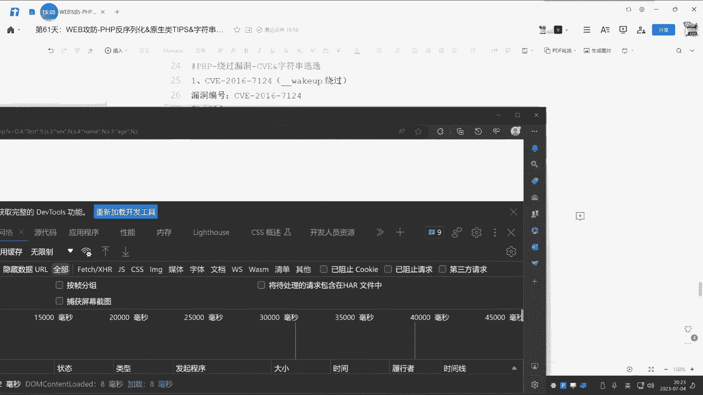

大家知道他考的有这个东西，你如果没有知道这个漏洞的话。

那这个题目就做不出来来，就这个题目自己注册个Buff cctf的号啊，这个免费注册的，不要花钱的啊，要打开里面搜索这个关键字就搜到了，好这里呢他说这个有个良好备份习惯啊，就是说这里呢有个这个备份文件。

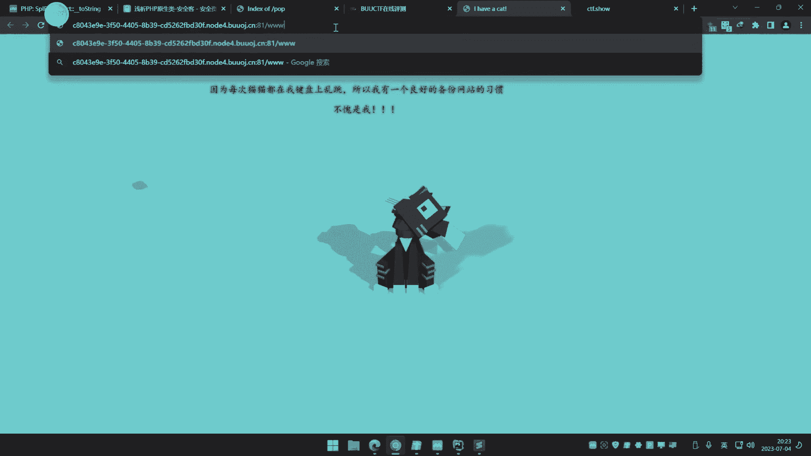

然后把源码给到你去分析源码3W点zip啊，这没什么说的啊。

这不是我们的考点，就是让你去下个备份文件，下载它源码，然后呢把源码呢下去了。

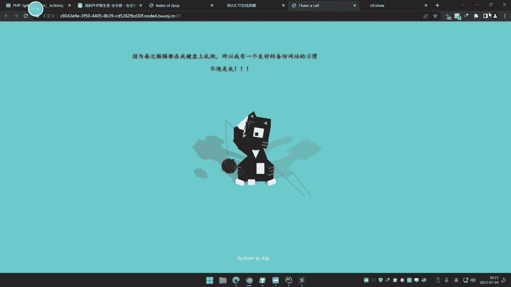

自己代码审计去分析它，把解压出来呢，我们来解压分析一下，然后这里呢我们打开一下这个源码啊，我们就直接在这个vs code里面看吧，难得搞到D里面去了啊，this scode里面打开看诶，打错了。

大家用非s studio看见了fist code。

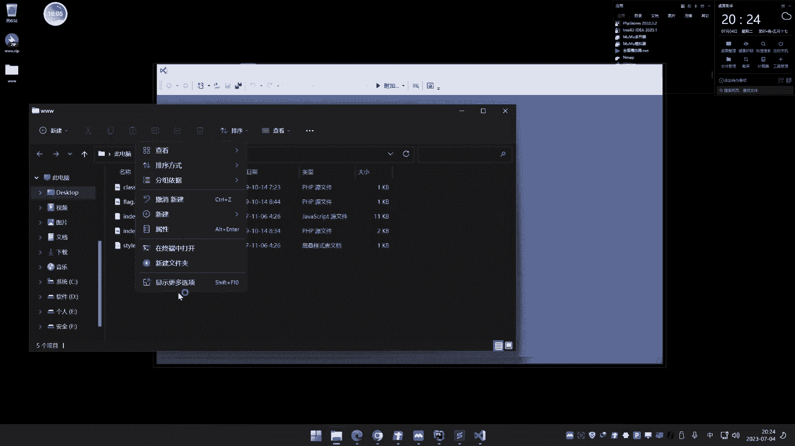

好face scode里面打开看啊。

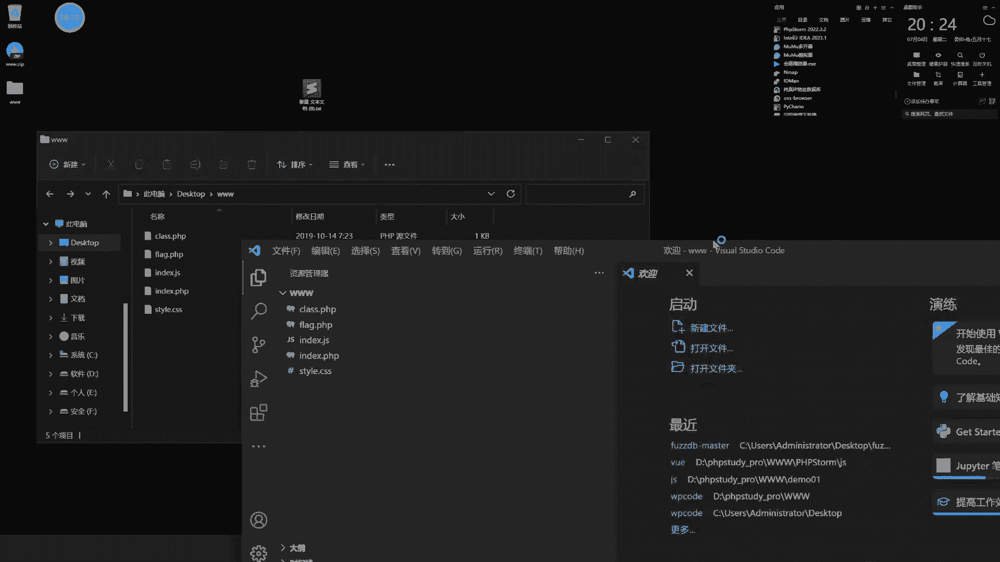

看一下啊，呃来看一下这里的一个大概情况啊，JS和CSS就不看了，因为这两个呢不重要，主要是看PPP代码啊，还是index这个首页文件，在文件里面呢看一下啊，哦这里有个包含包含一个class文件。

接收一个snack，然后用到这个UN这个函数反编译嘛，大家看到这个东西呢，就是要执行他一定会执行work up了，对不对，执行这个变量的snack呃，包含了class，我包打开复杂看一下啊。

这还有个flag，flag是什么，SYC多个多个啊，但是你肯定不可能把这个一输上去，它就成提交进去那里面的，那不是等于送分题吧，不是这样的啊，就是这里呢只是他临时写的，忽悠你的，你不是这个flag。

但包含这个flag class里面，我们看看它，看这个里面那个逻辑啊，那name好，里面有呢有个这个初始化的这个模式方法，有个销毁的，还有个什么work up，对不对，有work up这个类嘛。

name好就完了，哎就是说我们来关注一下如何得到flag呢，看下它逻辑啊，逻辑是在这里可以看到呢，当这个用户名等于等于三个等于判断类型，并且判断值的一个等于，如果等于A的米就输出flag。

也就是说我们如何让这个里面的username，能等于enemy，对不对，这是他的一个情况，然后这个呢是在DEST里面的一个这个显示，那么我们想象一下啊，现在就要思考两个问题，首先是如何去触发这个DST。

这是第一点，第二点呢就是说这个USMO，你怎么让它等于艾德米，这个呢其实问题也不大，就是你在这里呢可以把这个ADD userum等于2米，复制进去不就行了吗是吧，但是呢你要明白一点啊，你可以看到啊。

在这个work up里面呢，他把这个username呢等于一个叫guest，你跟他说这有什么意义吗，要留知道这个执行流啊，这个顺序我们可以在本地呢先起一个，这个本地的这个情况给大家看一下啊。

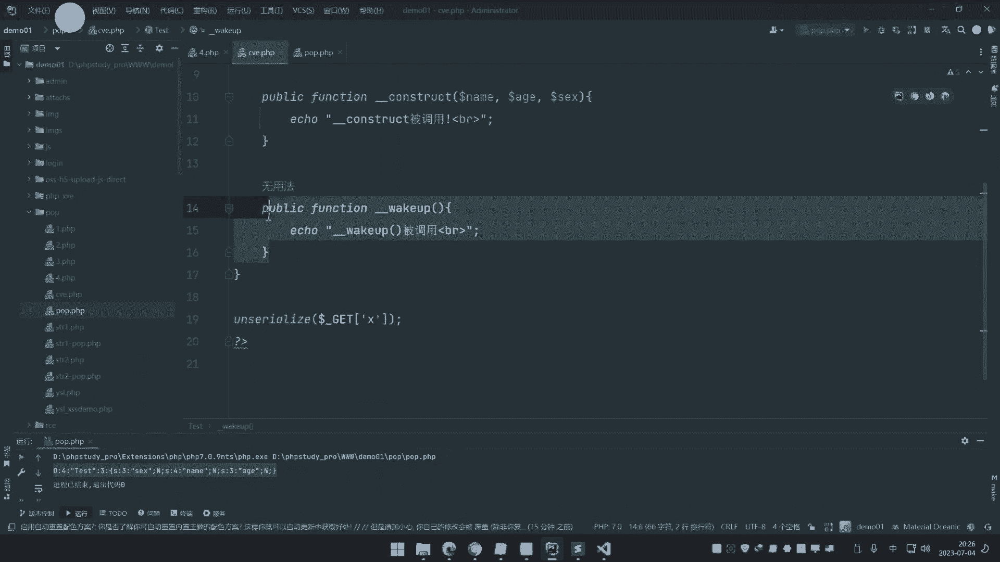

比如说像现在啊，我们呢可以自行的去模拟一下，把他这个源代码呢给他怎么样拿到这里来。

然后在本地呢给他测试一下，那我放到这个代码里面来啊，我们可以这样子操作一下啊，就是我看一下他的执行的一个情况好吧，就说他的一个执行呢是怎么个执行流程，大家先思考一个问题啊，我们可以先这样子啊，先缓。

这里还原一下啊，好大家看一下啊，来我现在呢去创建这个东西，我们去访问一下，就我本地了，加了个这个DST，我们看下它的流程啊，比如说像现在啊，我就把更改成正常那三个一执行，先执行work up。

再执行这个，大家看到逻辑了吧，是先执行work up再执行这个销毁，因为销毁是最后一步，就程序结束之后呢，他就销毁了嘛，就会执行这个这个里面的echo语句，那么大家来关注一下这边的代码。

也就是说他你传入的，如果说给他是enemy啊，不好意思，先用workup跑的时候，把username m呢就复制为guest了，你先给他ADD me，不行，他再给他复制为ADD me。

然后再进入这个循环，那这里的USERUM是不是就不可能等于2米了呀，因为他是现在运行work up的，而不是说运行这个DT，因为我们在本地呢给他看到了个效果，它的执行流程呢是通过这个函数，它的代码里面。

index里面这里不就是执行这个吗，执行这个它包含了class嘛，各种class里面它就会优先先执行这个work up啊，what cup里面强制性装这username等于guest了。

那你知道你这个username如何让它等于A0呢，你在生成反虚化的时候，可以把它得到的密码，但是呢在代码中去运行这个WAP的时候，又把它复制为guest了，所以说你之前把它复制改名了不行。

他还是跟GST的，跟GST的呢，那条件就在这里，那就无法满足，无法满足就会输出，这个叫hello，my friend是吧，Sorry，i can't do give you the flag是吧。

我的好朋友啊是吧，我不能给你这个flag呀，是不是，还有这个呢上面还有一个判断说衣服啊，这个password不等于100啊，不等于100就会进入这个循环，也就是说我让他等于100就行了呗。

让它等于100就会进入下面衣服嘛，否则的话这里就直接进入这个循环，就直接die die，就是挑出了没了，所以说他要满足两个条件，第一个条件是password等于100。

然后呢username等于阿米password，好说是吧，password好说，我先绕过第一个，我再绕过第二个，真是我的猜想，那如何操作它，还是我昨天的道理，先把这个代码给它复制出来，CTRL加V啊。

CTRL加C，CTRL加V，然后呢放到我的POP这个构造这边来是吧，去把它构造一下哈，怎么构造呢，来吧是吧，这是它本身代码，把有用的留下，把没用的给他删掉，哪个有用呢，看一下啊，这里有用。

这里把它收入为2米是吧，然后这里呢为100是不是，然后我们再看啊，这个地方无所谓了吗，这两个地这个地方无所谓了吧，没有没有对它赋值的吗，去掉然后这个地方也不用了吧，因为这里呢你们不需要改它。

它是经他的逻辑啊，啊不需要改它，这把去掉吧，把这个也去掉，把这个有没有用呢，这个没用啊，这个没用啊，去掉，那就只需要改这两个值就行了呗，因为改这两个字的进入它逻辑吗，按照正常来讲就是个事情嘛。

然后呢再怎么样创建个热额，U额N等于new这个对象嘛，new这个类目对象是吧，用这个name对象，然后呢用这个S1呢去把它进行序列化，然后呢把它输出出来，是不是就这么简单哈，没没太大问题。

这是他那个序列化数据，那你看这就设置好了，好这里呢还有这个，你看它类型也要改嘛，你看他这个类型就等于这个值，你看啊这个是不肯定不行，我搞个public吧，把改类型改一下，这样子那就看一下再生成好。

我们把这个东西呢，按照他这个逻辑去发上去是吧，他是代码逻辑呢，是说在首页文件结束这个snack，然后呢假设这个变量对它进行这个操作了嘛，那就说我这里呢罚的逻辑顺序。

应该就是在这里呢啊，开个这个HK8呢去请求吧。

嗯好一些啊，把这个地址呢发复制上去啊，然后问号的SMARKET给到这个地方，给他值，给他全拉勾，哎啥情况，点了之后呢，没有任何反应，没有让反应呢。

是我这里没有编码吗，好吧，编码一下，看试一下是不是没编码的问题啊，都试一下啊，那编码呢要放上去。

是要放到这个snack后面跑，这没反应呢啊这个反应也没有啊。

啊你把那个值呢，那么再按照他那个原本的那个那个那个地方的，那个东西的生成好吧，我们也不改，我们再把两个放那，是不是username admix对吧，100对，我们这样生成好吧，我先这肯定要URL编码。

因为它里面有那个0%，对这编码一下啊，来看这个逻辑啊。

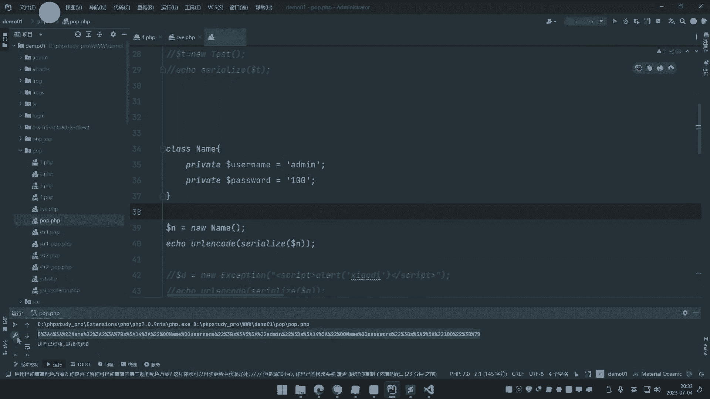

不，好这里也是不行啊，这个可以看一下啊，这边呢不行，但为什么不行呢，我说过了啊。

他这个逻辑啊，就说你这里呢是需要绕过这个什么的，绕过work up的，所以说你该怎么搬他啦，你生成出来之后，把那个位数把它改掉不就好了吗，把那位数改掉啊，能理解吧，就说我把他微数呢把它改掉就行了呗。

因为你可以看一下它符合这个漏洞这个逻辑，就说我们这里呢要突破run那个username呢等于的，你是吧，要等于的米的啊，不是说不说我们不能让相等这个意思哎。

好那这里呢怎么操作啊，大家先看一下这边的符不符合，我们先看一下，观察一下他这个浏览器这边的审查的一个情况，当我请请求的时候，观察一下他的pp的变量是5。33，哼5。33。

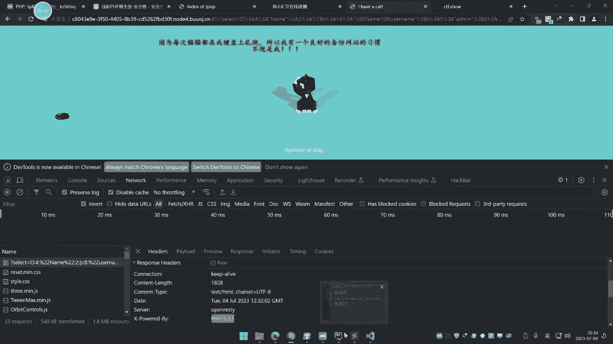

这个老板好老的了，在不在这个CV1这个漏洞区间呢，咋的呀，所以他能绕过这个work up啊。

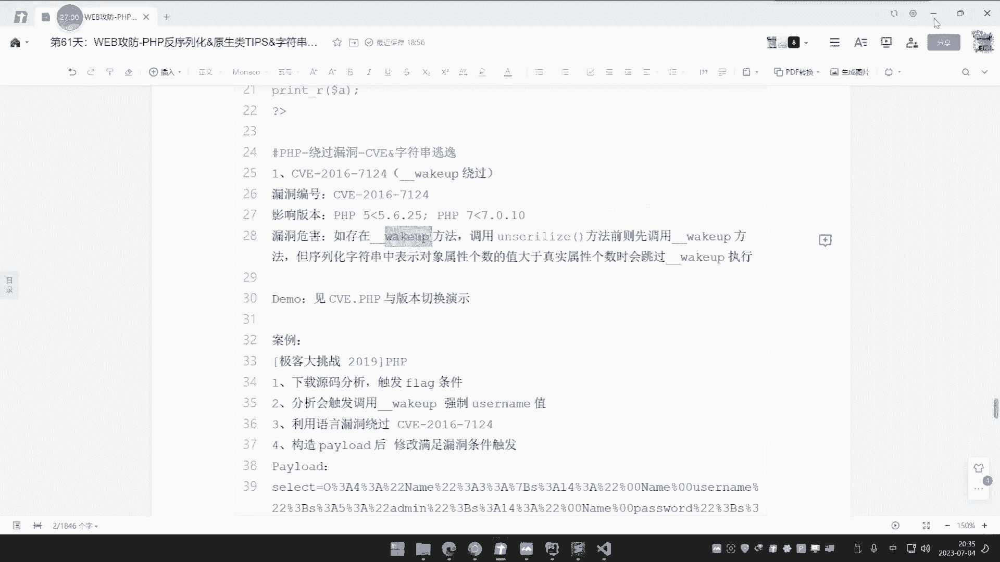

那么也就是说这里的这个强制装，这个USUM等于guest，那就失效了，只是个绕过它，绕过它呢就相当于这里没有执行，没有执行的话，那你这里复制为2米，这里复制password复制为100。

那么这里呢就不会进入这个循环，这呢就会进入这个循环，进入这个循环，echo不就出来了吗。

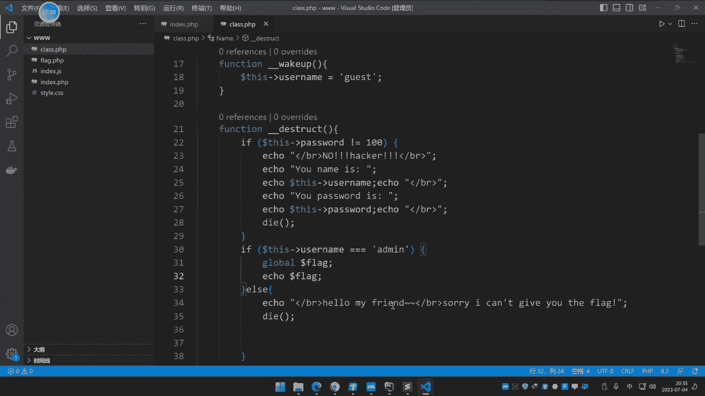

对不对，我这里那就写好了这个payload，这payload呢先给他看一下结果，然后呢我们再说他深圳，然flag就出来了，你看一下啊。

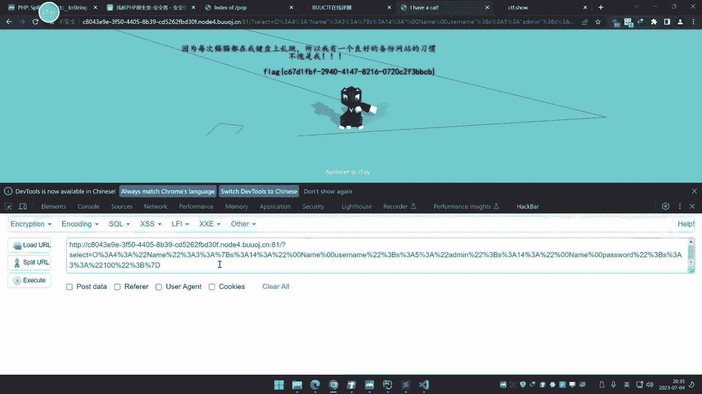

这个生成是怎么生成的，我们来给大家看一下，还是刚才那个情况啊，没什么太多区别，我们只需要保留这两个就可以了，然后这里把它改成二零，这里改成100，把这个序列化字符串呢给他echo一下啊，我们看一下啊。

这是它echo的数据，然后呢我们再把这个echo数据呢给它编码一下，好来我们这里那就把它复杂的来或者来之后呢。

我们替换大家看一下啊，哪一个是哪一个是它的位数啊，我们先看一下里面三位嘛，是这个三吗，不是的，这是300%来代表一个欧思维雷姆，后面紧接着是位数了吗，哪个是位数啊，哪个是位数啊，它有几个呀。

username和password两个3%a这里是有个R呀，你看这就是位数，把它改成一个大于它的数字，423都行啊，二不行，3456都行，改成个四勾，你看flag就出来了呀是吧，flag就出来了呀。

啊不行的话啊，你看我改成二的时候把它搞砸啊，那没有是吧，你只要大于它，跳过那个执行三，那行四，只要搭他就行了，四五都行，你看那个逻辑了啊，你不要说你不知道在哪里改啊，不知道哪里改，看这张图啊。

来欧式info，那后面这个就是呃这个数字就是那个位数嘛，对吧，你看看欧斯类M嘛，四位嘛，那后面这个白马是一个那个编码嘛啊，然后3%a哎，后面这个4445就是那个什么位数了嘛，啊把这个改成了啊。

因为他本来是两个两个参数值嘛的内幕，和这个他是word，不是没有问题啊，这个呢就是那个work up的个logo啊。

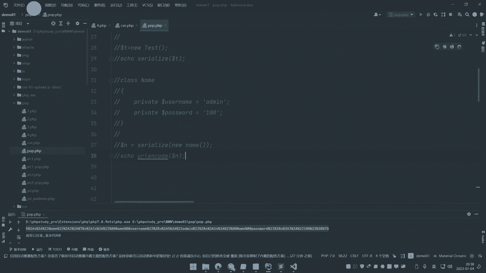

这是一个漏洞啊，反序化这个特有漏洞，PP版本漏洞造成的，这个呢以前用的多，现在比较少了，因为这个漏洞有点久远了啊，不过CDF里面还需考，然后呢在今天讲这个重要支点，就是这个字符串逃逸。

这个呢有一些难理解，这个呢是有一些难理解的，我们需要有不同的案例去给他演示，然后呢去给他讲讲什么叫字符串逃逸，其实呢它是一种CCTF里面啊过滤，然后过滤上面那个问题，你会问这有有什么差异吗。

哎我给大家看一下啊，来我们现在呢先写个正常的一个逻辑代码。

先写个正常逻辑代码，然后呢我们再来思考一下这个东西啊，名字呢我就叫STR，然后这个AABD点pp就是代表增加的意思好，那这里呢写个什么东西呢，来看一下啊，写个克拉斯的名字叫A吧。

然后呢里面去这个把刚才那几个代码，那个就用几分吧，那就那就把这份拿出来吧，也没什么说的啊，把这个东西拿出来啊，就用这个吧，然后呢大家看一下啊，来这里呢是先创建，然后呢再把这个东西呢给他输出出来是吧。

然后呢这里取名叫UV吧，在输出为零是吧，这是他的一个序列化操作，我们注释一下序列化操作数据显示，我们可以看一下啊，它的虚化的操作录制显示呢就是这个结果是吧，然后呢如果说我要还原。

就是反需要还原数据一正一反吗，反区的话缓存单一数据对吧，那如何还原它呢，这是AA嘛，再把AA呢进行一个什么un snack还原微微，反转AA变量AA嗯，还原这个A对不对，还原AA再把它复制为AA。

然后呢在V当去打印一下这个VA，就是看他是不是还原了，看一下执行，我们看一下这下面效果，你看上面这个呢是显示刚才那个序列化数据，下面这个呢你看就把它还原了。

你看就是test对象里面的name等于小迪是吧，然后呢他类型A级是吧，二九这个six呢等于mail，就刚才的数据嘛哈没问题，是不是，那这个就是还原数据，显示这个操作是吧，在下面代码就是显示好。

那么支付上逃一是什么鬼东西呢，好大家试想想啊，如果说现在呢有个过滤，这过滤怎么写的呢，来我们拿个过滤来一个写法，简单来给他写一下啊，就我搞个那个过滤的啊，把它生成一个方形的这个过滤呀。

写了个方形里面那一个叫方形，对艾德米呢把它过滤成黑壳，把它过滤成黑壳，就把艾德米呢过滤成黑壳是吧，有时候检测里面的如果是艾米，我就把过滤成黑壳好，那么现在呢哦简称艾米，那就把过滤成黑客啊。

好那么现在看一下啊，我们把这个序列化数据里面的生成的时候呢，就把这个值那就写成阿米吧，写成阿米，好我们现在先关注一下啊，我现在没有过滤之前，你看数据呢name等于MIA级等，31six等等，好没问题。

正常显示好，一旦用到过滤了啊，看一下我把过滤呢写到哪里啊，写到这个地方来写个字地方来，在它进行反序化的时候，把他的数据进行了过滤，过滤之后，然后我们再把它进行一个显示打印下，那么打印呢大家可以看一下啊。

这个这个还是用这个public吧，都用public啊，避免有些问题重新打印，哦这里把它去掉吧，多加几，我这里呢是从最开始的去给你写啊，你这个一定要，嗯这哪写错了，我最开始呢去给他写啊。

你看这里呢它检测到这里2米哎，这怎么过滤啊，什么鬼呀，用这个ST1吧，哦没没没没没把那溜一下啊，那要用那个溜里面的，把这个拿出来啊，哎我直接看这个st1的吧，给大家看一下啊，直接看这个FP1的。

还有STE的一个代码啊，那姓名写，好这边呢给大家看一下啊，我一行行给大家讲啊，先把这个注释一下，这个是什么呢，先创建对象，然后这个是什么序列化数据和排序化数据显示，这个是序列化显示啊。

下面这个呢是反序化数据显示，来我们可以看一下啊，现序列化显示，看一下他的情况，现在这个对象来里面呢，就是UZ的admin password等于123456，已知非IP呢等于它显示了好。

我再把这个激活出来，反虚化数据把它显示出来，它把还原吗，还原成呢，你看下面就是呢user里面的username的admin password，等于123456，is VIP等于零，好没有问题啊。

这是那个反序列化数据显示正常的一个模型，能够正常的解析是吧，没有过滤的情况，下面啊，注意一下，这是不过滤，无过滤的什么，这个序列化数据的一个显示都是正常的，那么现在啊现在，现在呢我们再看下面这个啊。

加了过滤之后，加了过滤之后啊，加了过滤之后，他是什么情况，把这个还原出来，那加了过滤之后，这个是，有过滤的氯化数据线，有过滤的反虚化数学来用到这个fighter，fighter是干嘛的，你看啊。

对于这个对象里面的enemy过滤成黑客啊，过滤成黑客，那么呢你看啊就是OBG，刚才是那个序列化数据显示吗，你看啊他一过滤，过滤之后，你看啊，这是他之前的数据啊，把换个行吧，显示了换个行。

啊这第一行是刚才这个object，然后你看下面啊，他这里呢在这里一旦过滤之后变成了什么，大家看一下啊，艾德米变成了黑客，你看变成了黑客，然后呢还原这不是V档，去用这个UN去还原它显示吗。

之前用这个呢V当去还原的时候啊，之前用这个V档去还原的时候，它能把还原出来，这个地方是能够把它还原出来的，有过滤之后呢，能不能还原出来，用这个V杠去还原这个OOBG，能不能还原出来，环显示为force。

还原不了了，为什么还原不了啊，因为这里呢你原来是2米5位，这变成黑盒，黑盒多少位了，六位S5，这个能还原出来吗，还原不出来呀，能理解吧，就是说这里呢他还原不出来了，因为你这里的过滤了过滤了是吧。

把他的原本的五维的搞成六维，你如果说你不用这个，你看啊我一步用它，我不用它啊，不用它它就能还原出来，我们来试一下，你看我不用它，对不对，你看它就还原出来了呢，这是它的类型的，还原出来了。

这里呢就是正常的吗，还能还原，没有问题，一旦用它之后呢，他下面去V当区显示的时候，那他就还原不了了，就报错了，来第三行就是不了，这也太还原不了了啊，你可能会问了呃，讲了半天不知道在讲啥玩意啊，听不懂啊。

听不懂哎呀，不知道讲啥啊，其实你不讲这个东西呢，不把这个过程一走，你也不知道我在讲什么问题啊，好那么大家既然看到这儿来了，我就给大家出个题目，从题目呢就知道这个一是怎么讲了啊，好我现在把全部一去掉。

我先让你从这个东西上面去看这个题目好吧，我先把这些东西给去掉了啊，这东西全部注释掉，全部输出掉啊，然后你们看这个题目啊，题目呢只留下面这行这行代码来看一下好了，接收X额，如果X呢这里的OBG啊。

有接受X的值，就用这个反循环呢去解释它，并且呢会触发你们的login方法，然后如果说没有的话，就提示，也就说我要出个东西方法，我们看下上面代码啊，这里login方法里面呢触发之后，他判断is VIP啊。

变量is viip去获取加VP，如果VP为一，则输出flag is牛逼，如果flag不等于一，那很简单，就是等于，就说我的答案，那就是让它等于这个椅子，FP等于一，对不对。

但是你可以看一下is fab在初始化的时候，等零在上面的时候，他也没有值，那有人就会说了，那我就直接这个啊，把这个东西复制哎，把它复制位移能不能绕过他呀，那我们试验一下呗，是吧，我就把这里呢设置为一嘛。

对不对，设为一，那我就留一个user哎，对不对，然后呢取名叫U，然后用这个S1写进去嗯，如打一下echo，对不对，把打印一下运行，那生成出来了，让他一直B等于一了，然后呢我就按照这边的这个逻辑来是吧。

按这个ST1的逻辑来，然后让他去这个触发看行不行，那我勾一下啊，S t。

it一点pp吗啊，它默认是等于的，对不对，等于的，因为你没有传参好X呢，就等于这个值执行的flag is牛逼是吧，出来了答案就这么简单，有人说这讲的啥玩意啊，妈的字符串逃逸咋咋咋个。

情况是这个情况是因为这题是我本地设计的，是我本地设计的，你肯定没听懂我在讲啥玩意啊，那是字母逃逸的什么鬼啊，妈的不是和前面讲的一模一样，啥意思啊，我这里没有进行一个判断，没有进行什么判断呢，我正常来讲。

我还要判断你是不是等于2米啊，是不是等于其他值，这样才对呀，好有没有其他思路去用字符串逃逸的方法去做，这题呢，有有用其他方法能不能做这题，就说你换其他方法能不能把这题做出来，看着啊，教大家怎么做。

现在就是字符串倒一了，真题呢只是我设计上面的问题，就是你用这种方法也能做出来，但是我不希望大家用这种方法做出来，还要换一种方法，换什么方法，就是织物转逃逸的方法去做，如何逃逸，大家先关注一下哈。

我这里呢做了一个来替换艾米，就是说我要设计成一种什么东西啊，你必须输入艾德米，就说你要必须要输入艾米，对不对，你说一遍，我把过滤过滤了，你反正花絮啊，数据就不会是就会失败呀，对对就会失败呀，你失败了。

你还怎么办呢，就说我在这里可以加个过滤，我判断is VIP，我还判断你用户名是不是等于2米，用户名不会爱了，米就不行，但是你一旦传埃德米，我就把它变成黑客，那你告诉我还咋办，那就不符合逻辑嘛。

所以我这里面没有加这个过滤，我把这个过滤加了，那这题你就用刚才的方法就做不出来了，但是我们现在都不管这个事情，我们先讲字幕上逃逸怎么逃逸啊，说了这么多，还是有人没听到是吧，逃逸怎么逃逸啊，看着啊。

现在呢就来构造它，如何构造它这个关键点就来了，把这个文件的代码把它拿出来，然后刚才的pop放到这里来，如何逃逸它啊，首先要准备个过滤的，它的过滤规则里面的东西把它拿出来，就我利用它的过滤来实现这个攻击。

现在再来，啊然后写下再来，然后呢把这个里面东西给拿出来，也放到里面去啊，因为等一下呢要设置这个地方的值，他这里要解释两个U2P嘛，好你看啊，我就设置个U，设置个P，这题非常难理解，讲要讲横翻天。

然后这里插入U和插入P好，这个U等于什么啊，大家看着啊，我如果等于二的米，我等于这个小迪米八等于123456的话，我们先给他生成，给他看一下啊，它就会生成username。

ADD me password等等，12356S5艾米，但这里呢如果对方有检测你这个传入，把他去解析的话，这里解析到有艾米的话，是不是就不行了，我们要突破它该怎么办，他啊换一种解法啊，一定要跟上节奏。

注意集中精神啊，那现在呢我们呢就怎么帮他啊，生成的时候这里呢我们用那个F对吧，它的过滤器把它放到这来给他输出一下，先啊，给他看一下结果勾，你看现在呢这变成S5跟黑客了，你如果传入这个东西给他去的话。

他能不能达到这个flag的一个结果出现呢，回车直接报错了，为什么，因为他去解析这个数据，它解析不了，为什么解析不了，我刚才做过实验单呀，有没有那个印象，为什么这个解析不了啊，刚才也做过这个实验了。

因为你的序列化数据是错的，这个S5等于黑客是牛尾，你这里把它改成new那就可以了，但是这里很显然他是有过滤的呀，那该怎么办呢是吧，讲了半天还没有到终点是吧，看着啊，用到一种方式，我们先思考问题。

enemy过滤成黑壳，玻璃层，黑壳啊，我们把这个值呢也要进行一个对比，马上要做好笔记的啊。

来把记事本拿出来对着看啊，这是考数学的这个占位符的意思。

这是原这是过滤的，正常的是这样的，正常是这样的，过滤成这个变成这个模型了，好你看啊，我们先思考一下怎么操作它啊，先看这里呢，用又为什么要用到这个编辑啊，这边写有个好处，你先看呢，把鼠标放在这里。

拖到最后面，看下面有个叫什么47被选中，有47个字字符被选中，我的意思是啥呢，我显示我写47个艾德米的话，这个是增加叫加一位，有人会说这听不懂了，完全都不知道在讲什么东西吗，不行不听了，睡觉吧。

那睡吧啊，然艾德米过滤成黑壳对吧，五位变成六位，大家想一想啊，我写两个的米会变成什么，会变成Faker a h是不变成这两个东西啊，大家试想一下啊，他这里S等于512345，到这里结了，到这里就结了。

他就会认定这是五位吗，你后面多一位算啥呢，语句有问题啊，所以他不识别，我让它识别该怎么办呢，我写47个的名，那么他就会多四七个，往后面推的这个运算符，是不是这个道理呀，我把它写出来之后生成出来。

我再给他讲这个原理，你先看结果再分析，看下来我写17个，我把它生成出来，先给他看看结果，那结果拿出来，这个结果是什么结果，大家看啊，生成282个，把它选中，二百八十八二个，看这里来，这是多少个。

下面呢R2822被选中，被选中了，那你说他是个整体，没有问题，再进入下面的循环，S8等于password，八位，再六位，123456，在那S5is fap等于一，那后面这个就不用管它了。

因为这个不影响不影响的解析，那就正常解析了，这个是什么一个逻辑呢，其实就是一个占位和退位的，一个是增加，一个是减少，增加该怎么做，它我教大家增加该怎么做啊，增加的意思是说。

它替换的字符比你原来的字符要多，你比如说你原来是艾德米，它替换成黑客了，黑客是new way，这是这个什么，这是这个五位也要说他多了一位，多了一位，就是说你如果说写黑写enemy的话。

那么他就会多占用一位，占用一位的话，它识别只会识别到这里来，后面呢就当做正常识别，但是后面这个R就是错误了，你要让这个语句能够正常执行，肯定这里就不能错不能错，那就怎么办呢，你想想啊。

你先看你增长这个逻辑，这里后头有多少位啊，来后头有47位，那我就写四四十七格的米，我写47格的米，对不对，我写47格的米啊啊不不不，是不是47格米，是写多少个47个啊，就47个艾特米。

那么他就会替换47次艾特米，那么就会多出47个位数，我不就是把这后面的给他怎么样堵上去了吗，能不能理解啊，听不懂的，听得懂的数学就好，听不懂的就是数学成绩差的，你可以自己想想。

这其实就是个占位的一个意思，也没啥，没那么大问题啊，啥意思啊，我生成的时候我怎么生成它呀，我生成的时候是怎么生成的啊，我先你要想一下啊，我写47个的米，那么呢我写47个的米，大家看一下啊。

ADMI是五位，就是47×5，等于是多少值，对不对，这是我这样去写上去，但是他实际上他把过滤整起来，就是实际乘以什么黑客，所以我就就是变成了什么17×6，对不对，就多了一个时期。

我在生成的时候我就要怎么办，让他加上后面这一长串，这有47个字符吧，为什么你47就是看这个长度把它加上去，那么这里就相等了呀，所以它在生成的时候变成黑科，那我这里生成的微数不就是47×6了吗。

这个结果就是等于17×6了，因为后面是17个这个位数啊，我生成的时候我就生成47×6，写上去离过滤，你把它变成了黑客，那就等于47×6啊，所以这个模型就对应上了呀，是不是对应上的呀。

那你47乘牛生成的黑壳，那刚好黑壳一解析就变成到就到这里，刚好结束了呀，就说我生成的时候呢，我写17个2米，再加上这个字符，就相当于是176这么多V，然后呢你再进行把它进行这个艾米啊。

黑壳这个艾米呢把它过滤成黑壳的时候是吧，那么刚好就把这个微书呢给它占用了，占用了，那这个后面这个东西不就给它激活出来了吗，啊，因为它就相当于说这里把那位数占用了，那这后面就出来了呀，这个结果就出来了呀。

就说我的流程是怎么样的呢，第一步啊生成的时候就选择47个，而这里然后外加这个后面的这个字符，那么它的这个微数呢，就是等于47乘以enemy，就是我们说的47，乘以五，然后再加满47个，这个。

这个我们的这个字符字符串对不对，就我们后面这个字符串，那么它就相当于就是最终结果就是微数啊，微数的最终结果微数就最终就等于什么，是不是就是等于47×6的意思啊，就47×6啊，为什么11×5吗。

后面还有个四七，那就14×6啊，就16个47个东西啊，后来的，那么呢我们看啊，如果说它过滤的话啊，它会过滤啊，过滤二德米，能把阿米呢阿德米呢过滤成这个黑客，那么这里是相当多了。

就是一个艾德米呢过滤一次啊，就多一位多一个多一多一多一位是吧，多一位，因为这个黑可比艾的名单多一位啊，一个是牛，一个是五是吧，六位和五位的意思多一位，那不好意思，那刚好吃是七格的米，就多了的嘛。

47个位置刚好呢黑客呢就全部占用，全部占用了，那这个后面这个东西不就被他怎么样啊，上面的这个什么这个东西，就释放出来了呀，因为它原本这个地方是把它当做字符串的呀，然后这个东西就释放出来了。

因为黑客把那个所有位数占用了，所以在解析的时候呢是吧，就解析到这里了，那他是阿阿巴阿阿巴，你看解析的时候就阿巴阿到这里呢就截止了，然后面这个东西就释放出来了，所以正常解析了，能理解吧。

然后这个是怎么判断生，怎么写这个艾德米的个数呢，就是看这个后面的这个长度，就是这个正常的，你看就是呢把这个选中呢往后面拖47个，那就选47个艾特米，就是说这个后面的这个是七个的话啊。

就要看你那个微数呢是它占用几个，比如说这个艾德米呢啊，他这个多了一位，那么将好47除以就四七个，那就写47个的名，如果说是两维的是吧，有人说两位，那17÷2，那不是有个小数点吗，你就再搞个占用。

直接就不行了嘛是吧，你按个占用资金就行了呀，你在后面写个无关紧要的东西，让他那个整乘一个再乘一个整数，这不就行了吗，你自己要去思考的哈，所以说你不要问这种问题啊，所以这个时候大家看一下啊。

你看那我就写了，我就教大写啊，我这里的为了真实有效，我就重新写了，我生成这个逻辑呢，看着啊，把它修改成艾米也一对五六，然后把一在非B改成一嘛，他要确定这个人移才行嘛是吧，这里来一把生死一好。

这个是怎么写的，你看啊，U就等于这个47格的米是吧，我就先写这个十格，先写了这三个四个五个六个七个八个，九个十个十个，那就是来五分，来五分呢再减三就是47个，一分两分，三分四分五分。

再减去三个一个两个三个好17个，然后呢再加上我们这个什么这个原本的字符串，这里的增长数据就是在这里是吧，是七个的吗，把加上去，那么这个位数我相信大家就明白了，这个位数有多少位啊，我看一下啊。

就这样生成啊，然后密码呢就随便写的啦，这个无所谓的啦，随便写啊，好我们这样子去生成，你看这个位数有多少位啊，47加这位数有多少位啊，你可以把它复制出来，在这里观察一下它的位数啊，你看下啊。

它位数是多少位啊，可以看一下啊，诶咋没全部出来，它位数有多少位啊，我们看一下啊，all by这个诶这里有个单引号，单引号不是的啊，去掉待会是我那个标识符呢，282个，282个，对不对，有47个的米。

282个，对不对，然后呢四七格的米被替换成啊，黑客黑可以留为47×6等于多少啊，是不是就是R822，那么R8A替换位数占用了这个，后面不就释放出来了吗，我们来生成一下，确定一下结果了。

好生成出来之后把这一幅字，它过滤了它过滤的黑壳。

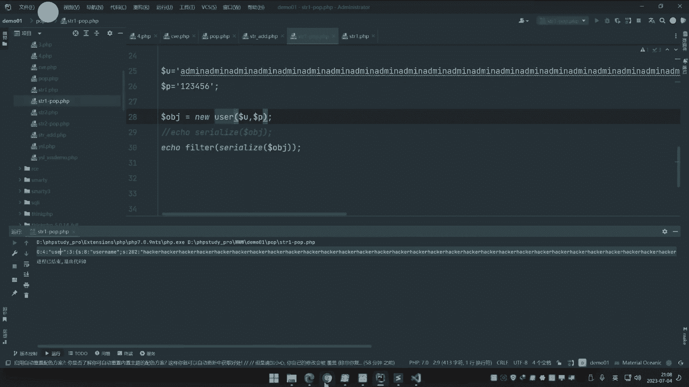

然后我们放到这边，刚才那个题目那里来看下啊。

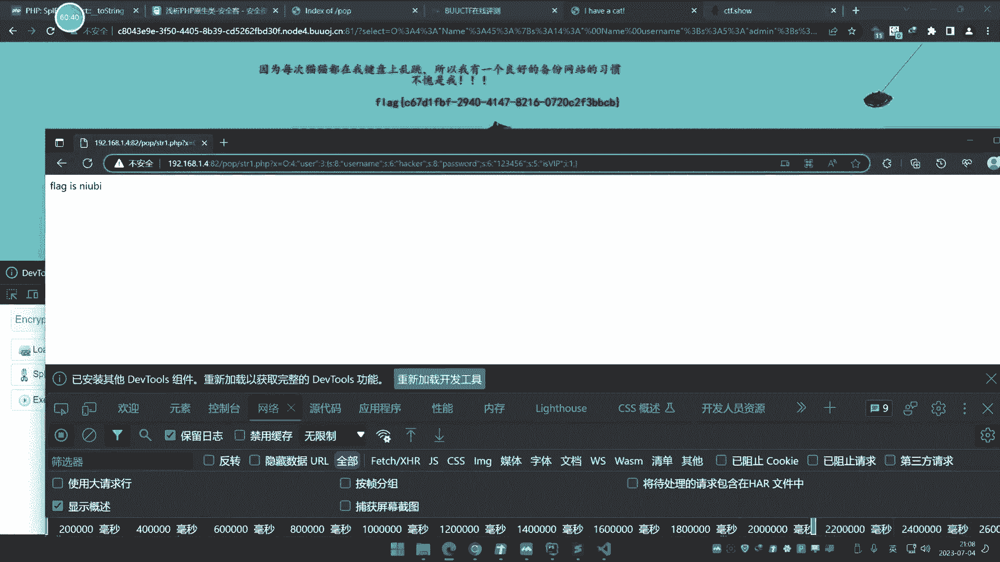

然后放在那试一下。

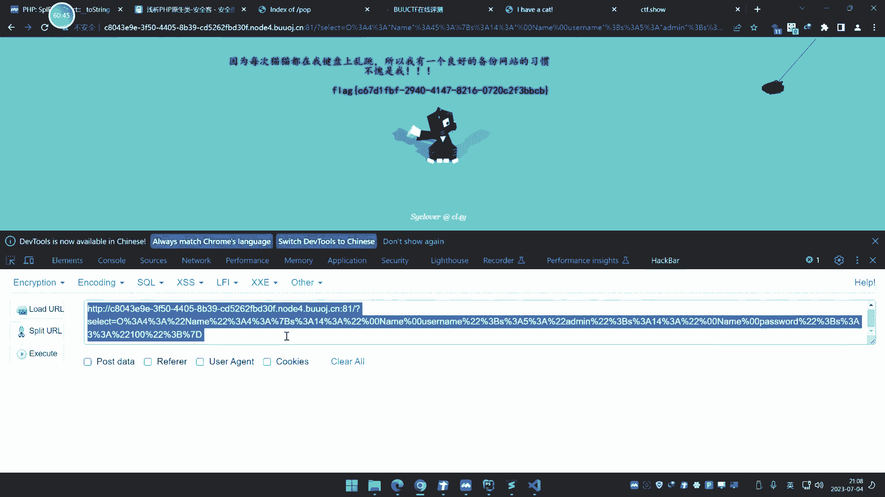

看他能不能执行啊，嗯看下。

X等于一，X等于这个值，看他能不能打印出来个flag来，就这么写的，你看把写上去，flag is牛逼，对不对，识别到一直FP等于一了，对不对，你可能说哎什么时候写，哪里写错了呀。

你只要改动一个地方就不行，你比如说我把这个282改成283，那不好意思，直接报错一点，零平方都不能错，错了就GG，对不对，除了就GG啊，想都不用想的啊。

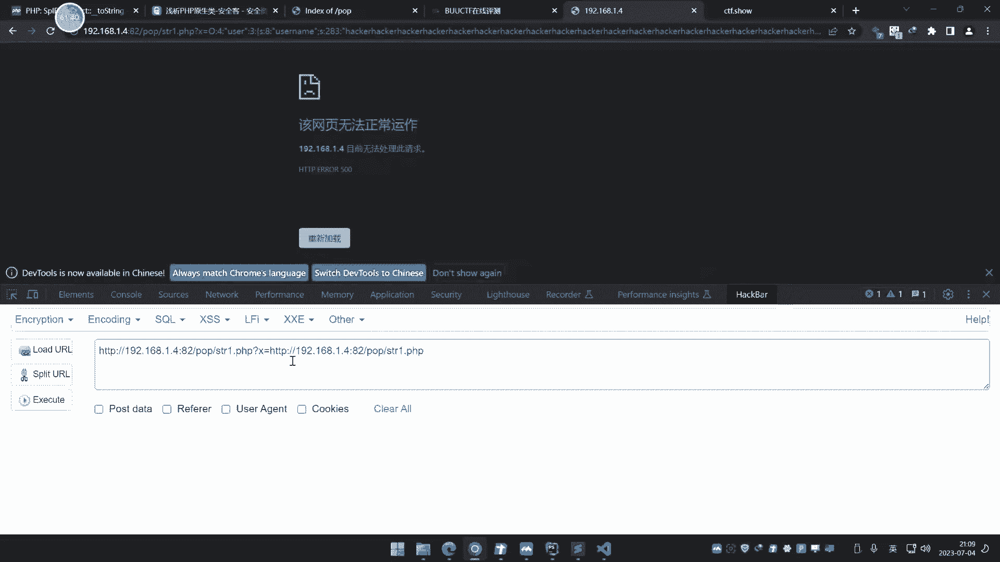

这个就是占位符的一种情况。

然后这个是增加，还有个叫减少，特别难理解呀，说实话呀妈的有时候呢自己都在想，哎他妈的真是烦得很啊，有自己的想这是什么情况啊。

对不对，跟他说一下啊，这个再看支付减少的，支付减少呢就是说过滤的时候啊，哎白的，你那过成一个小V变成黑客是减少了，减少又该怎么玩呢，大家思考一下呢，这蛮考那个数学的那个逻辑思维，这点能够说想的明白的话。

数学成绩一定考，但如果想不明白，还基本数学成绩就很差，不用看的这个学理科的事情啊，你你这个东西不行，你想都想不到，这是讲的啥玩意，那刚才呢是这个这个增加是吧，甚至把它占占用了，那现在减少呢。

你想想减少是什么个逻辑啊，那我先把减少减少是个什么逻辑啊，那我减少题目一模一样，我减少该怎么做它那减少也是判断的，我该怎么做它，而且一模一样的题目啊，就是无非说把这个enemy，那换成这个Faker。

这我减少我该怎么做，来看一下减少这个做法啊，这生成的payload啊，减少是怎么做啊，我们思考一下啊，减少呢，就是相当于是会少很多字符，就是前面的货物往前面推，前面的会往前面推，正常的逻辑我们先看啊。

先看正常的，那这是哎那个正常的往前面翻了，这正常的是吧，那么现在呢生成的话会减少，减少了就变成这样子了，这个黑的就变成这样子了，5V那么这里只有四位，他也会到这来，但语句还是错的呀，对不对。

他这里就变成黑客嘛，刚才是多了一位，增加这个过滤，增加这个过滤减少了，把艾德米换成黑客了，那该怎么办，就是说前面东西会往前面推，那如何能让它增长呢，我们先思考一下，我们能控制的是哪里啊。

是控制这个pass5的值啊，就是在这里嘛，我先关注下这个地方有多少长度是22个，长度是22个这个长度，那么也就是说我搞22次艾德米，那么就像是有22个占用在拼接这个字符，这里是吧，把这里写到里面去。

把它写到里面去，就是让它多22个生成字符串，生成字符串就行了，就是说让他多22个生成字符串，那么逻辑也是一样的，它既然是减少，就是说我们就是把这句话拿出来，是吧，有22个，为什么是22个呢。

就是要根据这里呢把它选中，因为这里123456是我们控制的地方，就说这前面这个中间的是我们不能控制的，它必须在这里这样显示的，因为这是他的那个属性值，属性名和长度，然后后面这个才是我们能控制的，对不对。

比如123456，这是我们能控制它的是吧，所以呢我们就把这里呢，就是说这个中间这里是固定的固定存在的，我们只能控制后面的，它有22个嘛，在那显示22个，22被选中，那说这里要生成22个，写22个N米。

那就相当于22个米，及到会变成变成什么，在第二步的时候，22个的幂等待是22×5的位数是吧，正常的话就是20×5就是多少啊，110，额就是说正常的话，他这里就相当是110，这个长度，对不对。

他是110个长度，然后它会减就A了，就会少一位，那么追踪它追踪的长度，生成出来的长度应该是多少啊，22个纳米最终长度如果说生成出来的话，就会少22个嘛，就是88，对不对，它会生成到88的长度。

那肯定就会有问题呀，谁说你在这里呢，第二步去解析的时候，那就是88的长度，还要加上一个东西才才行呀，他又不是占V了嘛，他又要加上去才才行呢，那加什么东西呢，对不对，哎其实在这里。

那我们就把刚才那个写上去呐，大家看一下啊，结果这是我们写的啊，就在密码这里呢，就让他写这个东西啥意思啊，二十二十克的米把它写上去，那么就有100多个了啊，有110个，我们先生出来给他看一下啊。

先生出来先看结果，我们再反过来解析啊，直直接这样讲，有点逆向思维的不好讲，来看下这里啊，这生出来的结果大家看一下啊，那110个我们看一下啊，它固定是黑客，黑客到这里是88个，看到没，这是88个。

因为他把过滤了嘛，那还和我刚才逻辑样呢，变成88的长度了，就挨了米22个嘛，变成88长度，然后后面你看它几加加哪里加到好，我们再选110个吧，看到到哪里结束啊，好这是110，然后到这里那完了啊。

到这里是110个，然后你再看后面变成了S8password，增长了S6123456，S5也是非IP等于一，也对了呀，这个后面就不用管它，它这逻辑不一样，就说我生成的就让它等于这个值，这个就正确了。

那到这里呢就正确了，我把刚才的艾德米呢去生成的时候，是110个长度，它会过滤，过滤的时候这个东西是怎么来的，这个S8password s60，是不是刚才在生成的时候就会自动往上追加的。

因为在这里呢你看我们生成下一个的时候，生成password的时候，这个值这里是改动的嘛，这个前面这里是不改动的嘛，所以它自带就会有这后面的东西啊，它有多少个啊，是不是就是22个啊。

所以我就让它22个拼接，它减去的88个不就是110个啊，110个吗，所以就拼接正确了啊，拼接正确了，然后后面就是我们的值啊，他在按照我们的提交的第二个字来修改呀，那我就写上去，写上这个后面的这个数据。

这个数据又从怎么来的呢，就是呢从这里呀就直接从这里了，复制过来的，就不会把这个东西复制，把它当做第二个参数生成就可以了，嗯减去它伸出来就行，蛮说实话有点难理解啊，这个东西你要自己去思考啊。

一个是增加一个减少，两个思路是完全不一样的，一个是占位，还个呢是run v软文呢，就是说它会少一位，你就需要它以前不更改那个固定值，让它拼接起来，这固定值有多少位，你就要写多少V啊，就是要处理那个东西。

好难理解的，说实话啊，它是分很多的，你设定那还是1V，这如果是间隔两维呢，那还要除以二，再写他那个重复数字，如果除以那不等于整数，还用一个空，用一个那个另外一个字节，那去把它占用到。

就是写三个莫名的字节来给他占用，到让它成为一个字，说实话啊还是有些复杂的啊，就是说如果这你能听懂我说的那个意思啊，你还是数学成绩是不错的啊，如果听不懂，那我是没办法，因为这个东西呢你再捞还是一滚。

它就是那么个事情，你不滚呢他就难了，所以你看啊，现在呢我们就用这个字符啊，去打那个第二关的时候，你看SSTR打到第二关的时候啊，把写上去，那他还是flag，牛逼是吧，很舒适啊，没有问题。

好那么现在讲这么多，没有实体也是没什么用的，这是我们两个本地多么，但是多么呢好简单呐，也没没什么难度是吧。

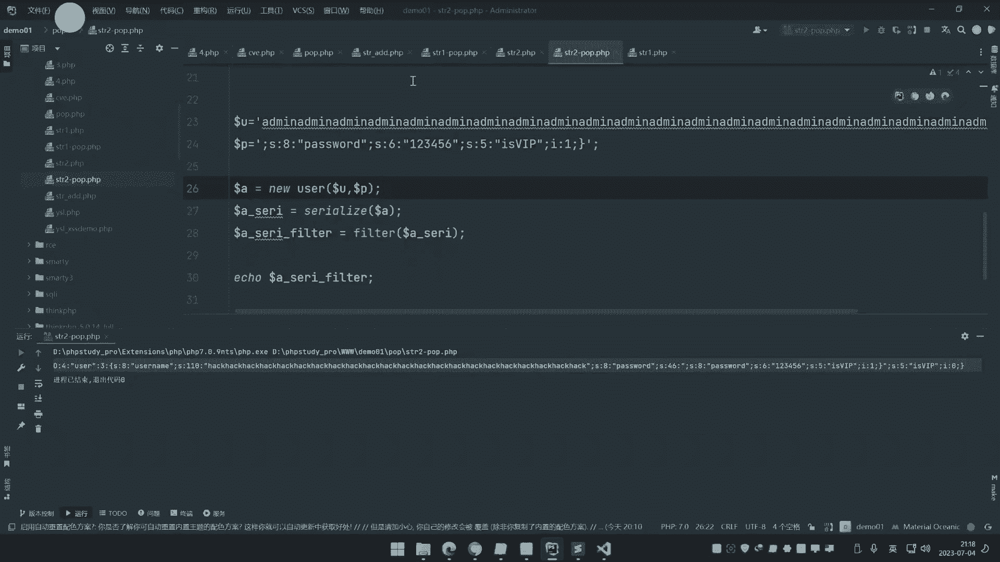

我们来看一个实例啊，实例呢用这个方式呢去给他做出来。

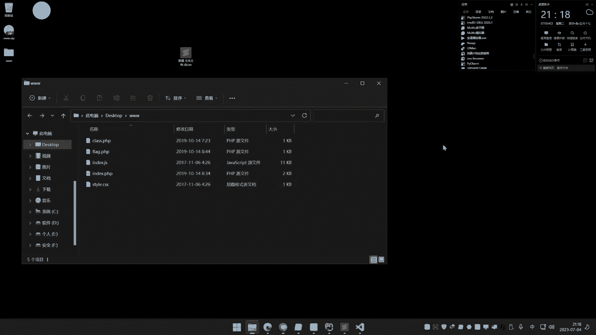

大家就明白了啊，大家就明白了，在CPTF修的有个关卡里面就有这么个题目。

他考的这个，虽然说他有其他题目呢可以把它做出来，但是我们呢用今天讲的去把它做出来，那个增加的好理解线，那个减少的有点难理解啊，大家可以反复的去琢磨一下，所以说为什么说我今天讲这个搞这个备课呢。

背了很长时间，是因为我一直在测试这个东西，他有些难理解的，你这是还好，我是吧，我本身我学习成绩，我也是数学比较好的人，对不对，所以我理财了，我还是能理解的啊，有些这个学文科的当然理解不了。

那没办法啊。

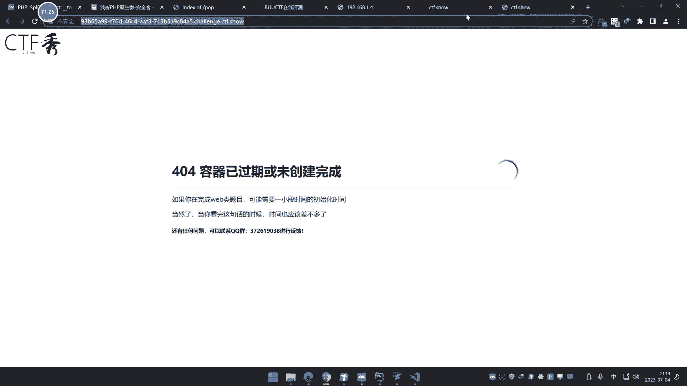

其实我们这搞这个技术方面的。

只要涉及到这种是吧，这方便的，说实话啊，这个东西啧就那个啊，你看看他这个题目呢怎么做的啊，呃看下这个题目啊，这个呢有个过滤为过滤成laugh you，这明显就是增加的意思嘛，把呢增加成多了一位。

我们按照这个逻辑桌，然后这里呢有个叫message的app，我们来访问一下这个MESAPP，只要给的提示文件，Mac app里面呢是看下打开啊，他是怎么做的，你看啊，他说呀。

那这个toy如果等于2米就输出flag，toy呢是怎么来的呢，是从MS级变量，MV级变量是从这里base60解码，解码是从cookie里面解释过来的，就说我cookie里面MSG呢要发给他是编码的。

他要解码再进行反序列化，就说我要给他一个什么序列化，并且生成base64的码给他，并且要结果里面token等于艾米才行，其实这里呢用常规方法做一下子就能做出来。

就直接把这个token设置为enemy就可以了，就是你常规方法那一做就做出来了。

你这是常规方法，我给他做出来啊，这里呢用，我们主要说用这个字符的一个东西做啊，这个常规方法做的不是我们想要的答案，因为怎么说呢，这个常规方法做的话，简单了啊，来给大家演示一下吧，常规方法出来。

把不必要的一删掉，就直接让这个地方呢给他，等于等于这个2米就完了，直接就可以把它做出来，也没什么太大难度，New masage，我先把长方二做出来，然后呢我们说一下那个，呃其他方法啊，那生成出来嗯。

生出来结果就这个嘛哈MST。

然后你看哦常规方法呢一作他基本就出来了，但是没什么意义，我们要做的就挑战这个，今天讲的是主题，他这个考官呢也是做，也是让你做这个题目做，你看呢我这里呢这样一复制为刷新访问就GG了。

来常规方法做就这么简单，不想这样做，你知道吧，我们想怎么做啊，我们想让这里呢用这个 laugh you去捉它，怎么捉它呢。

来看着啊，把拿出来啊，在生成的时候它是增加嘛，我run这个增加的这个地方搞个什么事情呢，我让他搞个什么事情呢，让他搞个什么事情啊，呃他去替换这里和laugh you嘛是吧，我让他生成的时候，怎么生成啊。

我这里呢给它一个值啊，让这个for里面等于一个值，就给他的第一个值，这里这里就叫F等于一个值吧，让它去过滤嘛，它是增加增加呢，我们先思考一下啊，先思考一下他这个地方的一个结果啊，先给他看一下US等级。

先把它打印出来，然后呢这是第一个打印，第二个打印呢我也把它打印出来，两个都打印啊，就要生成一个替换的打印，还要生成一个没有替换的打印，这显示什么鬼东西啊，哎我直接看那个pop连的。

来把这个拿出来给他看吧，来看一下啊，呃这个呢是怎么生成的，你看啊正常生成的是多少位啊，我们看他正常生成的是多少位啊，正常的是到LAUU多了1V，正常生成的是多少V啊。

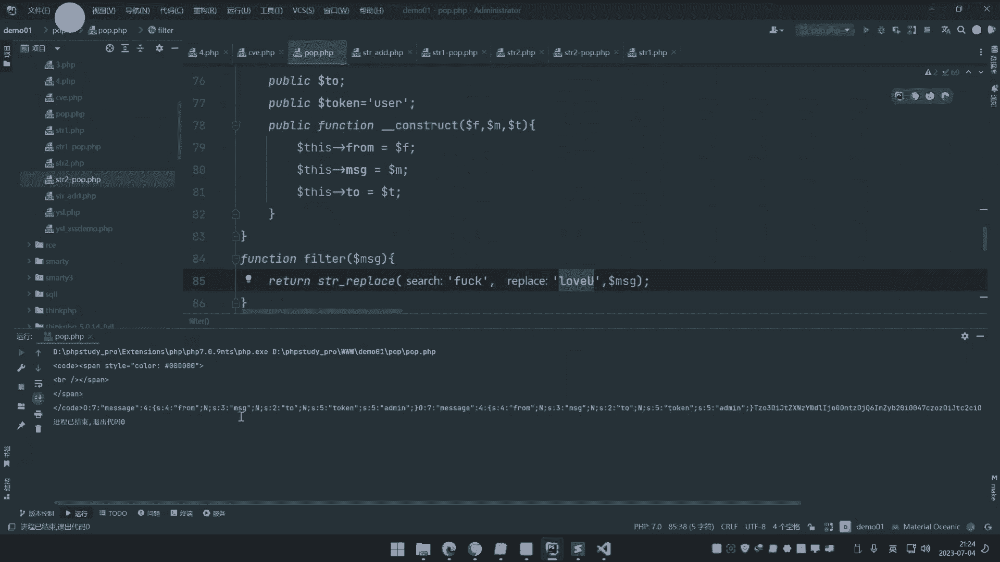

我们把刚才那个解密出来，看一下他正常的一个生成，看正常的一个结果啊，卡了呀，好这是要正常的啊，这要正常的，我们把它拿出来对着啊，反正变在正常的阿里啊啊正常的个结果啊，token的2D里的结果。

然后呢在他正常的一个情况，我们现在呢就说要进行这个操作啊，占位的啊，写多少为合适呢。

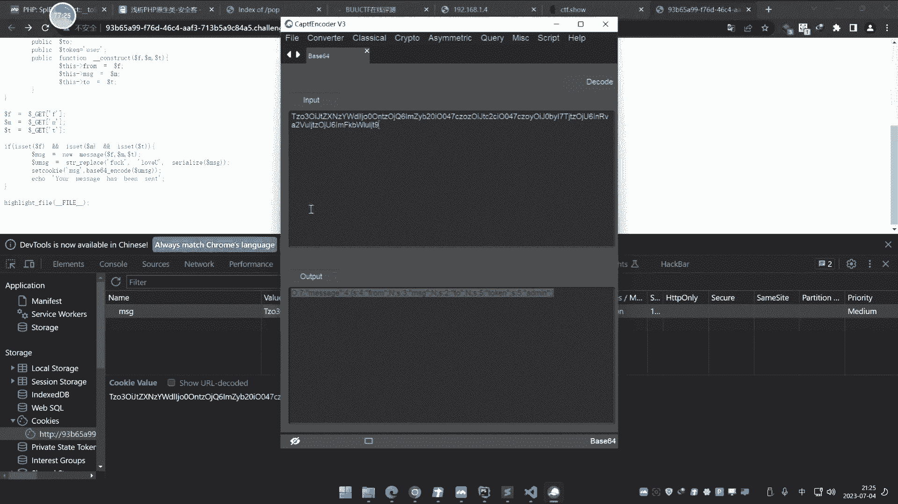

就是我刚才说的呃，我们比如说我要对这个F开头。

F开头呢做文章，我看F开头啊，比如说这个for这里啊，我们看一下啊，for这里呢是他的这个结果啊，我们往后面翻，这是多少位啊，49，49啊，我们就写49个，那把后面的占用掉，占掉了。

他就会用laugh you呢，会占用后面东西，然后呢我用呢，再把这个微数呢给他弥补上去啊，弥补上去这有多少位啊，看一下啊，这是后面的位数吗，多少位啊，62位呃，因为前面我生成的时候，那这显示N呐。

这N呢它是空的呃，正常的话它这里的是数字，你如果是写个乙啊，写那个它的位数就不一样，所以刚才为什么这个是是多少位啊，这个是正啊，因为这后面生成的东西呢不一样啊，你看这里呢。

其实就是这个地方的一个后面的个位数，比如说它生成的时候，那这里位数生成的是一，哦那哦你再用字符串逃逸不就多余了吗，哦那行啊，那我就不讲了好吧，那我就直接讲后面的啊，那这个东西我们就不讲了啊。

你们看这个东西就可以了啊，他说不不用了。

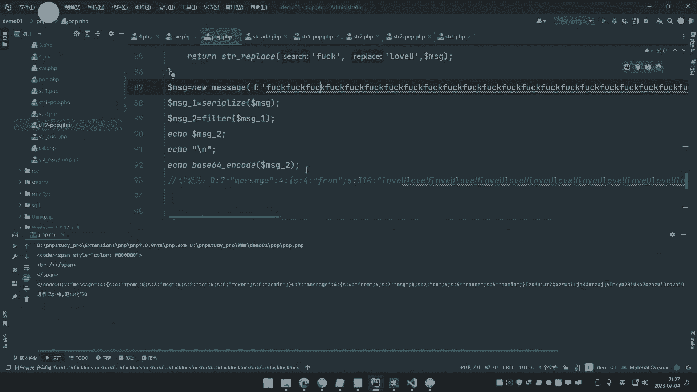

我就不讲了啊。

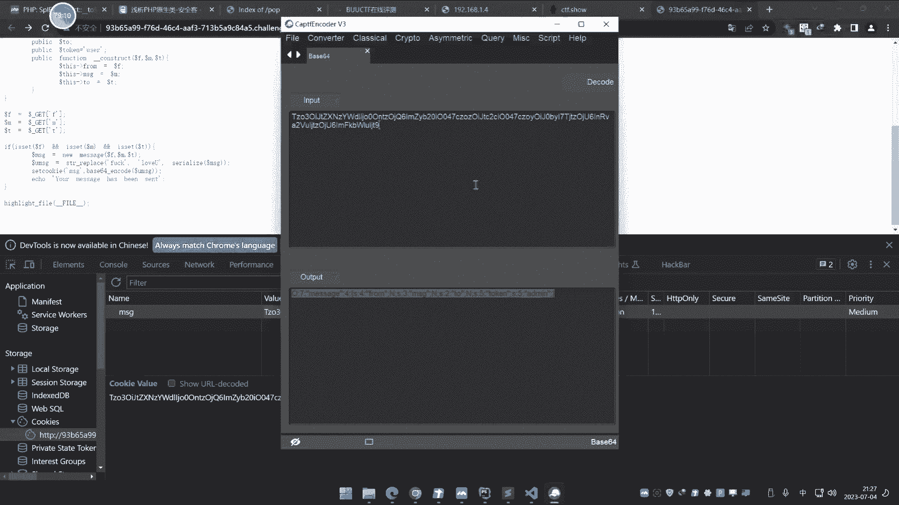

好后面就直接这个讲后面这个东西了啊。

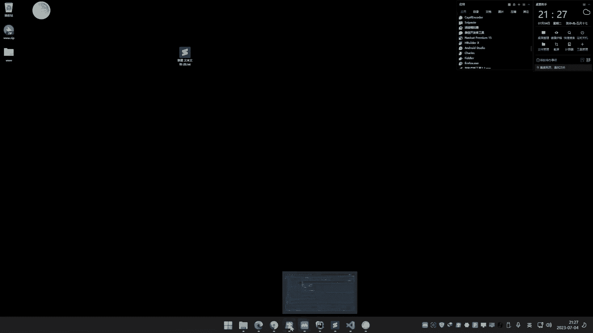

周章逃逸，刚才那两个案例已经分析到了啊，这个他要本来说讲。

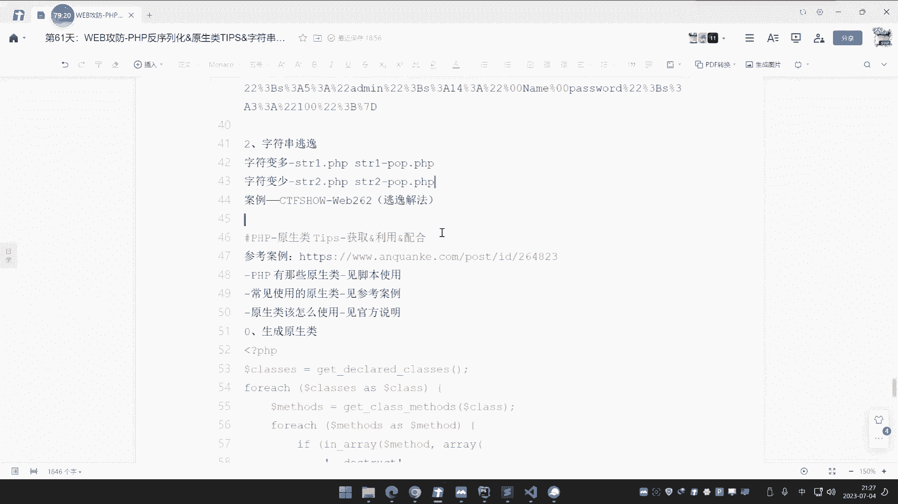

本来就麻烦你，我还不想讲，你说不讲，那就不讲呗，唉你们真是无聊啊啊他妈的，我说讲啊，就说不讲，这里面的，又说要我讲，我还不想捞了，这个捞的他妈的死头皮屑的东西，人都烦死了，这个东西啊。

谁想讲他呀，我也不想讲啊，谁想讲，简直无聊啊，这个东西。

这里需要好多步骤，不是说一个步骤的事情，很麻烦的这个事情啊，就无非就是说你高位数和刚才一样吗，你看我这里把伸出来，我自己给该看到结果了，那伸出来这个结果，你看啊，那这是它生成结果，你先看结果好吧。

来把结果复制出来，这是它生成那个后面那个生成的结果，我们来看一下，来310个laugh you的过滤层，那310个后面就释放出来了吗，是吧，释放出来了嘛，那就正常了，M47等于一啊，A等于two啊。

S等于B啊，S5toy等于阿德米亚就对了呀，啊就识别这个就识别这个结果，对不对，就生成出来是这个情况，那解析的话这个token的取取成密，那没问题，还有它生成的结果对不对，那这个是怎么做的呢。

是不是它是怎么做的呢，其实就是写了这个多少个那个嘛，看写了多少个，对不，那写多少个就归于你这里有多少V呀，它62个，你就写62个，就占62个字节，就是简单来说就是62个加上62个。

这个是另外组合方面的商数据，是不是，那这里就是等于62×5的位数，就等于三百一十二五，对不对，然后呢呢要被过滤成这个laugh you，那么就是62个了，fuck1过滤就变成62个，love不赢。

那么结果呢就是以三百一十三百一十为，是吧，就占用了，所以说后面这一串在解析的时候呢，啊就是前面这个发格勒就变了，那生成的时候这后面那就被集火出来了，就是310个310位数，那就是吧加上这个东西。

那这个东西呢刚好得正确的解析，所以你们就把这个作品呢解析成安妮了，就这个意思，这是那个逻辑，能不能理解啊，就说你要生成有三百一三百一十微嘛，他这里一占用呢，拉回去就不刚好把310V的占用完了。

所以上面这个后面生成的时候，那就是吧被正常的被解析了，就说其实他这个的放上去的原因呢是为了什么，解决后面的什么这个laugh u的310个位数，对不对，他是为解就是后面的那么一个位数。

而后面一旦过滤后呢，哎是吧，315呢被拉夫U，占完了，那导致这个东西呢就被什么四方解析了，这是自助串讨一，对不对。

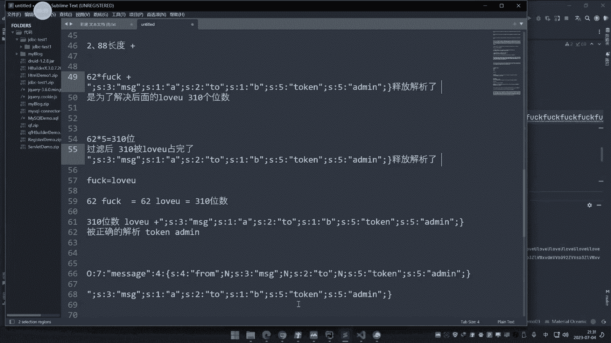

这就是实战，那这个题目就是个CCTF题型了，网上我刚才两个都没都讲这个东西啊，我两个都没，一个是讲的增加和一个讲的减少，这个只是一个增加，不就和刚才那个增加案例一模一样吗。

对不对，你把它生成出来的是这个文件呢。

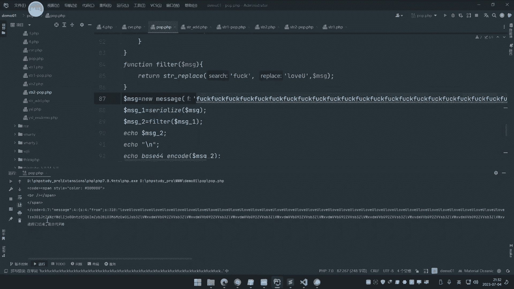

给他一复制。

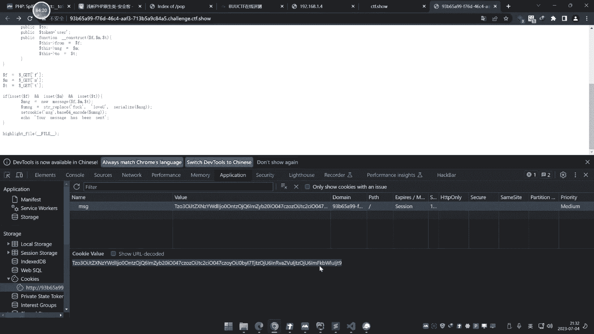

对吧，放这来，猴子他妈的胡子什么鬼东西啊。

一福字啊，哎什么鬼啊，我这里有个空格，勾上去，连服都复制放出来是什么鬼啊，把浮上去了啊，后面呢直接访问结果就出来了啊，嗯这个复制都复制不出来。

哪里写错了呀，唉太麻烦了啊，这个事情我都懒得去整这玩意，妈的真是烦得很，我都不想去思考它了，还是编码一下吧，哎呀烦的是真是要烦死这个东西。

我都嫌太麻烦，来出来出来很麻烦，这个事情很烦啊，能不能污，你们就说能不能懂这个字，乱逃逸是两个支点，一个是，增加一个是修改啊，一个是变多一个变少变多的呢，就是他过滤的就多了一位或多了两位啊。

你自己呢就要看他是吧，就要深层和它符合那个微数。

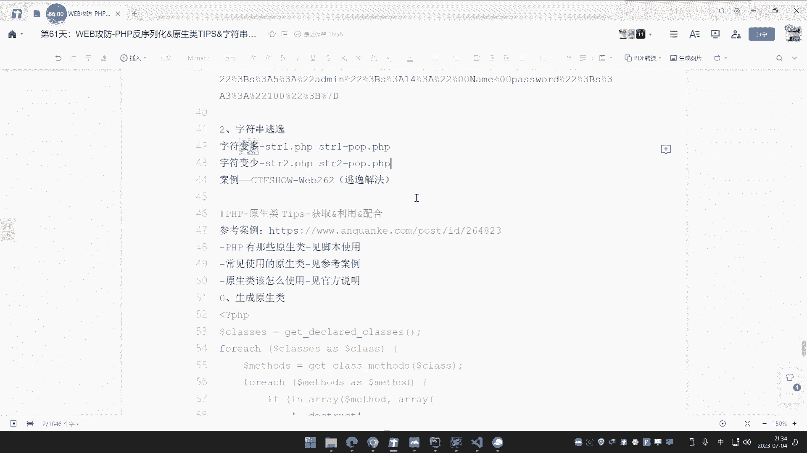

那简单来说啊，就是我那个逻辑嘛，你把逻辑记好就清楚了，增加修改怎么记住它呀，你先要看是吧，你后面还有多少个东西就要让他解析，你看这个位数，如果这个位数是50微，那就重复50次，就是说如果说只加一位的话。

那就重复五次，如果加两位的话，那重复25次能不能理解，你可以说加三次了，8+31乘哎，这没有倍数啊，那咋办呢啊用占位符就多在后面写几个东西嘛，你比如说把这个改成个new，是不是哎这里就写个abs。

那也无所谓，在那看哪个地方不影响啊，是吧，把线上去把这个拼接，那后面呢他就会多了一位把占用，所以三百二十一十四位，那就全部被这个NFU占用了，就把后面这个释放出来了，就这么简单，不然的话过滤就GG了。

那么这个考点在哪里考点呢，你把我那个题型一设计，我把那个题型一改，你包子你只能用这个东西来去做它了，怎么设计它啊，比如说我把这个SP1，这里呢我做个什么体型设计啊，我刚才呢在这里设计的时候是怎么设计的。

你看啊，这里判断呢是不是等于一直非B等于一啊，你就把这里直接改成一生成个反序化啊，突破它了，是这样的，对吧行啊，那很简单，我现在在上上面写个这个东西呢，你看啊，我移植什么呃，这个is uemo，对吧。

然后用same，对不对，我要判断呢，我判断username等不等于ADD me，对吧，你传过来的是不是等于这个艾米，或者说这个是不是等于2米，就说我提交过来的这个值啊，是不是等于米，你提交的是不是阿米。

那你不是啊，那你，那我就写这里了，那我搞这种逻辑，就我必须要让你这个艾德米又是什么的，阿米就说我必须要检测你提交值12米，你不提交阿德米呢就不行，那你提交的名单你就过滤成黑客，啊这个逻辑呢你自己想啊。

我就说这个意思啊，所以他的考点呢就在这里啊，就说如果他要出题的话，就这样出，就他既要让你这个，对吧，既要让你这个你触发他那个过滤规则，比如说这里呢搞个flag是吧，你有flag，我就把你过滤，你咋办呢。

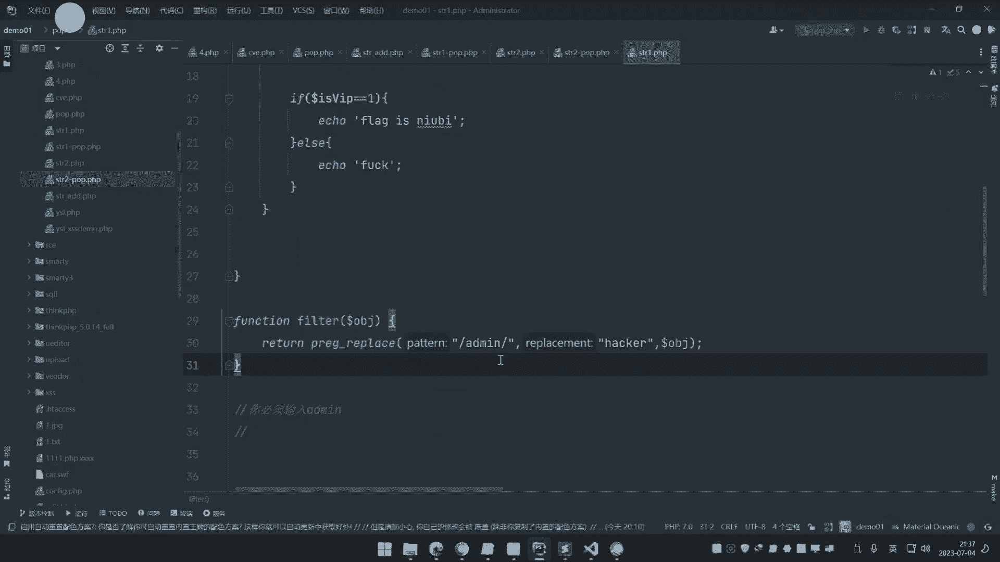

好不说这个了啊，我们接下来看最后一个问题了啊，最后一个叫原始内的，利用这个字幕端逃逸呢。

相信大家应该是明白一些知识点了啊，它的最主要的难点，但是这个变少，这个边少理解还要比这边多的要难一些，叶嫂大也不知道，上了之后你自己反复思考一下啊，这是全部是数学的题目，唉。

说白了你妈的上个安全里面的数学，那些逻辑挂钩了，唉尴尬，真是我们看这个原生类啊，原生内，那这个是什什么意思啊，首先呢我们来看一个题目。

你看这个这个题目啊，那这个题目是干嘛的啊，看一下这个题目，题目呢就是结束个X变量输出X，那我如何让这个代码给他执行这个XSS出来呀，对如何让他执行个差SS，它会进行这个，你看如何让他执行个差SS。

首先这个输出，首先啊原生内的利用是五魔术方法，他的这个原生的利用，是建立在无看到的魔术方法利用的情况下面，使用的应用场景，明白没有，就是你没有看到魔术方法，在这个代码中啥都没有看到。

我们前面的所有题目，包括CCTF的题型。

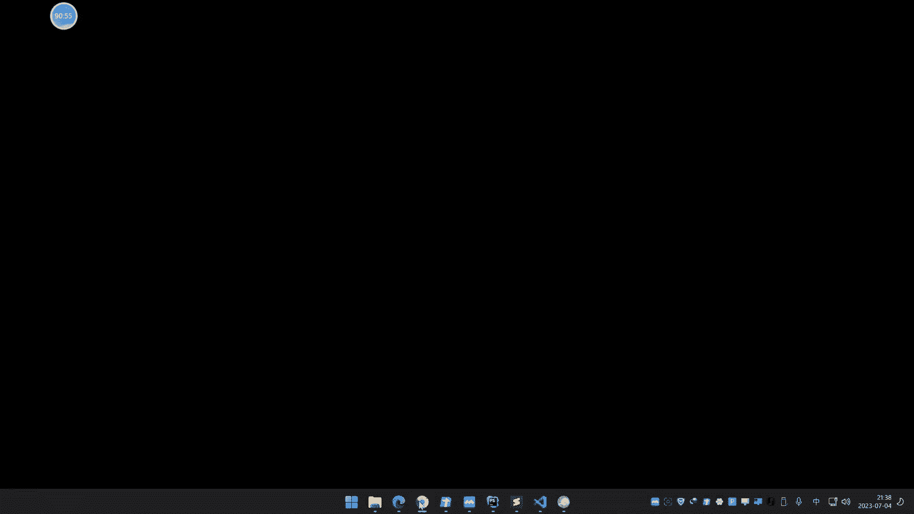

刚才大家也看到了，大家理解啊，这个题目，这个题目呢他还能看到一些这种方法是吧，你要知道了，这里地方还可以玩一下，就是他可能会触发哪个模式方法，有这些东西。

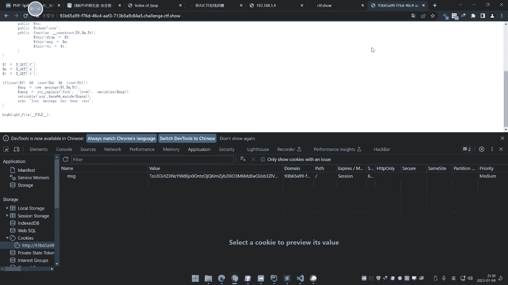

那假如你看不到了呢，没有这种东西，就和这里讲的，不让你出发夸张，你咋办呢，首先呢他的这个流程是什么样的，can会触发哪些某方法，先看哪个情况。

echo会触发什么，问一下大家，echo会触发什么，echo这个函数在模式方里会出出哪个模式方法，truth君记得吧，是不是TRU死君呢，来看一下是不是啊，那当一个对象被当做字符串使用的时候。

这个输出就是当当字符串嘛，触发TRU时菌TRU死菌里面呢该如何操作它呢。

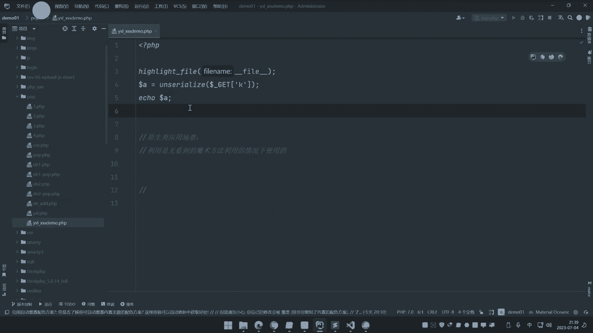

模它的使用方式先我们刚刚看一下啊，他的步骤好。

我把它写一下，写到这个代码中吧，第一步先看能出发的辅助方法，第二步就是啊，因为这里没有魔术方法的具体代码啊，它是没有代码的，你所以说他这没有写没写这个什么魔术方法，写个调用逻辑代码，那我啥都不能触发。

是不是等同于啥都没触发，那就只能什么呀，三啊，使用什么魔术方法的男生内去利用，那么这里如何去利用它呢，就是先要得到第四步啊，获取魔术方法的nice name，怎么获取呢，这里呢我们使用了脚本生成。

脚本生成根据生成的多少啊，这里呢要记住多少，和这个什么当前环境的这个什么啊，这个模块开关有关，所以说你尽量在你本地呢把这个开关开起来，我给大家看一下啊，这个脚本是这样的，那这样的脚本。

这个脚本呢就是呢去用for一起循环的，去循环这里面的几个魔术方法把它打印出来，我们可运行一下，这就是它打印出来的结果，然后你看一下啊，我把这个我运行的是哪个脚本来看一下啊，运行哪个呢，PP7。

0的这个什么ES1，我现在呢找到这个7。0这里啊，我把他的PPII文件呢给他关一些东西之后，你会发现它会少一些东西啊，我找一下那个地方，这个少东西呢，具体就说你尽量你在生成时候的本地生成呢。

你可以把选择开一些东西，因为你在实战中可能对方开不开，也和这个有关系啊，啊7。0的PPMI，你比如说像现在这里呢有个SOAP的，那这里有个人，这个封号呢是代表开启嘛，关就是有封号，就是关闭。

没封号就开启了，开启这个PPSOP，它在生成的时候你也看到啊，收下了SOAP，那你看这里有三个是吧，那有三个对不对，有这三个，如果我把这里呢给他怎么样注释掉，就是不开启它，我再来生成，这要注意啊。

我怕有些人说哎呀，为什么你能生出来，我不能生存出来呀，啊就怕问这样问题，一问就尴尬了是吧，原来就是，因为你的开关和我本地的环境开关不一样，你看我在深圳，你还在搜索SOAP，你看搜不到了没了。

所以你我关了好理解吧，嘶但是这个不重要啊，因为这是你本地的，你实战中的话，你是你是不知道对方的开关的，所以你尽量的在本地中多生成一些啊，你说你有多用的一些机会，至于对方开没开，就说值不值这个原生的利用。

那是他的事情，反正你先测试嘛，对不对，所以你生成的时候尽量生成多一点啊，就是本地生成啊对吧，开关开多一点，这样生成的结果就多一些，对不对好，那可能待会问了。

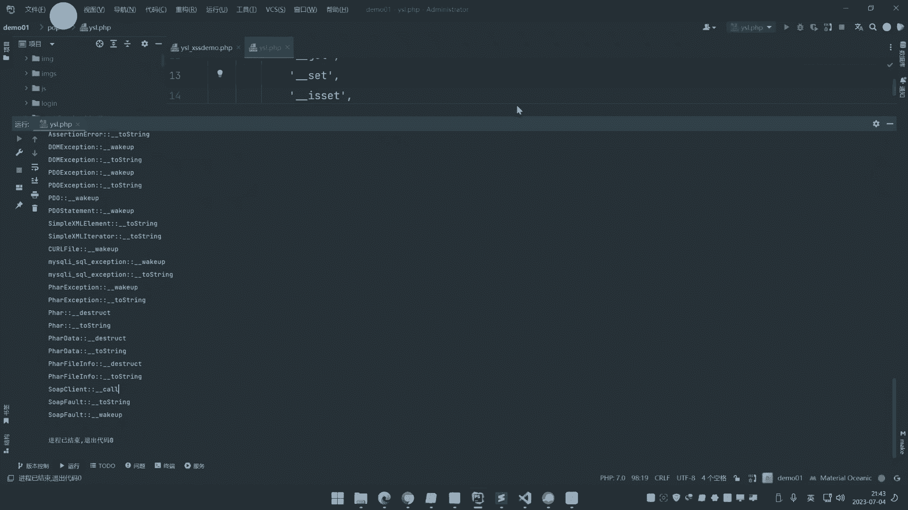

那这个有什么效果呢，有哪些原生内我们用它有这么多，我不可能一个人用啊，我怎么用它。

第一个是查查什么啊，你比如说呢像这里。

那这里有个名字嘛，我就可以把这个名字呢，放到这个pp的官方去查看，他解释，那再找来是吧，找到了秋君的对了，还有秋君的嘛，刚才那个是秋时君的，是找啊，它上面还有个什么concept，就里面的要找到。

然后来进行翻译，对不对，看来是干嘛用的，他说是干嘛用的啊，就是他的解释，然后常规的燃室内就是这么多啊，就是说用的最多的就这几个，大家可以在这个网上看一下呢，读取文件啊，构造XSS的。

你比如说他这个构造XSS的勾叉，它的燃S内有哪些，你看啊，勾叉S的往前翻，I said he pass the，也没写呀，这他妈什么鬼东西啊，他只是介绍一些常见的一些东西啊，就是读取文件的呀。

那个报错里面有个XSS可以造成。

那我们搜一下来trust string里面的啊，看一下啊，two str的，我直接把它收下，当然呢你也可以在这里呢把这个脚本修改掉，就只保留TOSTRING，把这些先注释就只生成TOSTRING。

好这里是所有TOSTR，初始菌里面呢有叫一个一个东西。

一个报错的，我可以关注一下这边的一个解释，来官网去搜看待，利用，啊这这么求时间，将异常对象转为字符串，返回转换的字符串返回返回啥意思啊，就会有结果显示返回字串如何用它呢，它也给你写清楚了。

哎还给你写进了如何用它的使用方法。

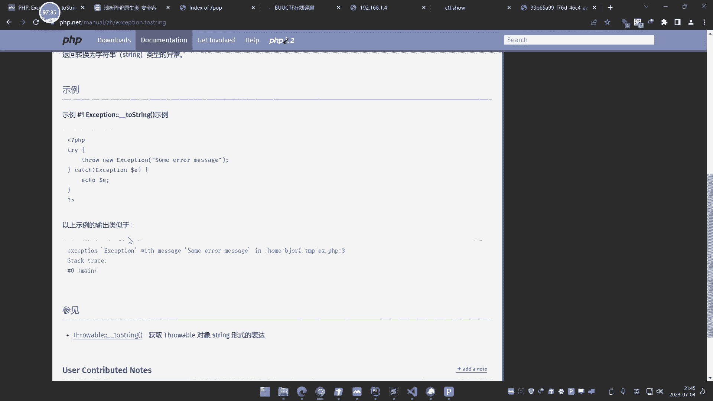

那么现在该怎么办呢，你看着啊，我给他大家写一个这个固定出来啊，pp这里构造一下，看着如何把这个差夸奖给他拿出来，那就这个东西呢new一个这个对象，这个对象呢写上一个什么script。

弹出一个一用这个把它进行编码，就这么简单，就直接呢写个new这个刚才的名字，然后这是他的东西，打了一勾。

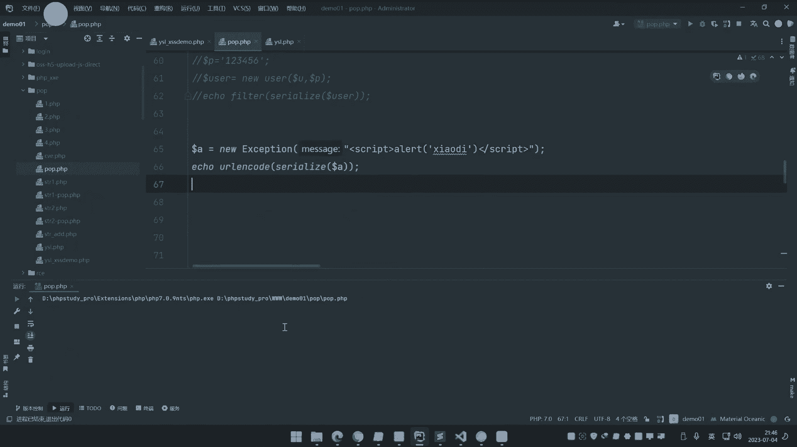

生成一个这个虚拟化输出条件，把这复制粘贴放到刚才那个网站上面去。

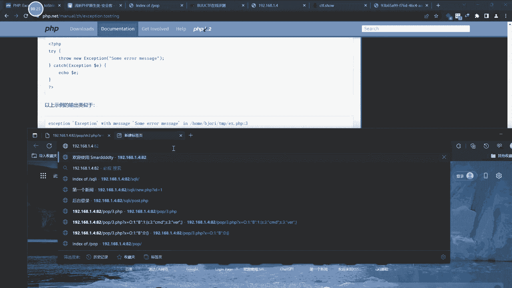

那这是刚才那个吧，看着啊，给他一个参数值，K等于什么，等于这个值回车执行，弹出小迪什么情况，这个代码怎么弹出小迪啊，执行echo这个变量A触发了TRUSTRTRUSTR。

在本身代码中没有任何东西没有参考的，没有参考，我就找他的脚本中的一个报错，用这个包戳生成的序列化，就是执行它内置的方法，其实就是它内值的内值的，然后呢就是说什么意思呢，这个代码的意思就很简单。

那生成的语句里面就很简单，就是解读什么这个包错里面的这个提示，然后它显示什么，让他这个什么显示这后面这个语显示这个代码，那显就说你报出来就让它显示这个东西吗，对不对，就是修改它什么。

就是新建一个什么报错的这个什么内，一草莓一草莓，对不对，然后当他接这个报错的时候，那异常的时候接触个异常的啊，显示这个数据，然后生成一个数列和数据给它，他这里不是输出吗，一输出这数据有异常啊。

异常就触发这个地方啊，就像是重写类的意思嘛，重写个类让他异常显示这个东西吗，哎这个就触发了呀，其实呢就等同于原生的利用，就是说利用这个魔术方法内值的这个类，就是说啊那你就是啊利用这个魔术方法。

里面那个什么类似的这个啊，然后呢这个呃pop呢就是修改这个类之类呀，来形成这个工具对吧，具体什么工具呢，就要看你用的什么类，你如果说刚才我们看到这个文章。

那这是异常的嘞是吧，还有什么读取文件的，你看这两个就可以进行文件读取是吧，可以进行文件读取了，我们呢这里呢是吧，就可以进行文件读取，就是用它的这个进行温度取好，我们在那就给大家看一下个实例啊。

看一下CCTF的案例，这块一打就明白了，259关。

在259关，这是259关啊。

259关在这里有一套题目啊，我们先看一下这个题目，你先打开看一下，题目呢一打开啥都没有，要是对这个什么鬼，get VIP啊进行接收，进行反序列化，然后呢。

用这个get IP的去调用一个什么叫get vii p，这边呢有个提示代码，提示代码是flag里面，flag里面那就是有个什么东西啊，说如果这个token呢等于CTF修。

就会输出这个flag到这个flag，TIT1里面去，哎你说我直接访问flag吧，他行不行呢，你看啊，我直接访问这样正常吗，flag的BP你访问呢，那我直接访问那个文件，然后他说你的IP不是1700。

嘿嘿啥意思呢，所以说你不能直接访问，但必须要一二姓零访问，然后他说呢检测这个白源南万里面，他如果不等于12701啊，就提示失败，并且呢toy呀，还要等于这个什么CTF修，他才能输出这个东西。

那么解题答案解题思路是什么样的，解题思路就是要让这台服务器自己去访问它，就是利用SSRF去访问这个flag点PPY，为什么，因为访问这个flag给pp的话，我们直接访问他不是本地访问。

你可能说这不是叉F头吗，改XF头行不行啊，哦那是另外一回事，我把财富的都改了，改成亚希尼，我还要让这个token能C里被修他才行，他逻辑是怎么样的，首先我们思考一下这题为什么是说用到一反啊。

这个反虚化加原生内呢，难点就在这里，因为在这个本身代码上面用到这个东西，但是没有看到任何魔术方法，是没有看到任何魔术方法，你包括你的flag里面有没有看到啊，flag pp里面有没有看到啊。

这个本身代码也没有看到啊，怎么办呢，原是内吧，然后他说用这个东西再调用一个flag，刚才我本new多么案例呢，是echo echo触发TRUSTRING，那调用这个get flag触发什么。

Get flag，触发什么get的flag在这个本身代码中有吗，没有调用一个不存在的get的flag，会触发哪个方法呀，翻笔记呀，看一下调用一个不存在的访问，不可访问不存在的方法时被调用call。

那大家知道了哦。

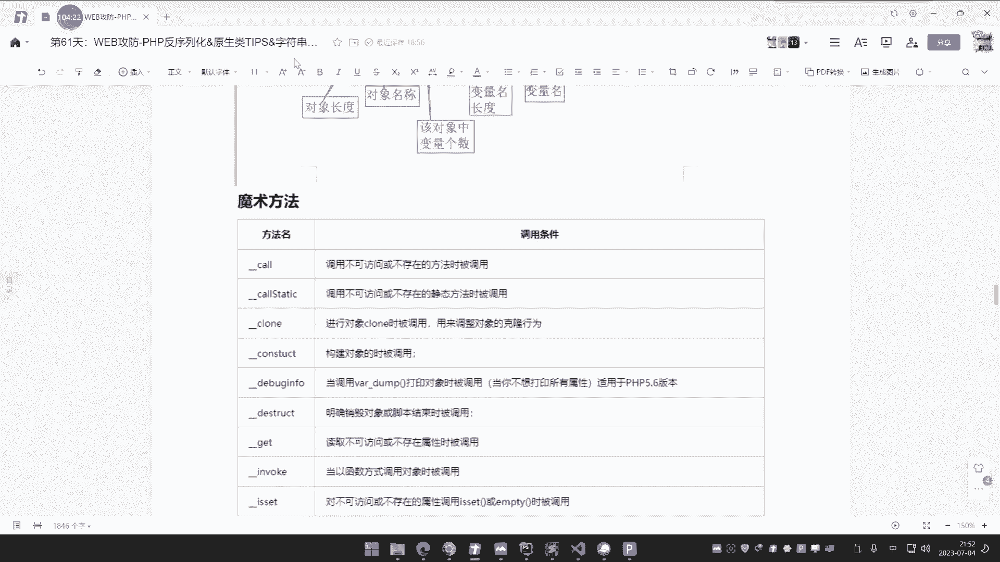

call是吧，那就是，找call的生成，其他的全部注释掉，生成call的原式内扩元式，那里面有个叫soo p client。

Soo p client，那么它是怎么用的呢，来看下这里有没有SOOP的这个东西介绍，看下啊，哎有sop是干嘛用的呀。

我们看一下官方的一个解释，call打开。

那里面的翻译啊，你倒是选个中文里面的半天都没反应，哎呀我直接换这边来看吧，我英文不好啊，翻译一下，翻译一下，他说sop是干嘛的，是这个，按你这你妈的也看不懂啊，这鬼乱七八糟的哎呀，他其实就是说sop呢。

就是类似的一个这个，PP5P七P八支持，然后干嘛的呢，说是，构造堆什么鬼东西，这他妈的看的真实，这还不如不翻译，你也可以去用那个千KGBT啊，哎呀这个实话实说呢，就是呢这里课创建个对象在干嘛的呢。

来个翻译一下，翻译一下，唉精通云，那就是那可以访问一个网址的信息，那可以访问一个网址，说的很清楚嘛，就是这里呢来源原生内，我看一下这里地方那个解释呢，他这个地方也有来这里声明一个地址啊，写这个地址啊。

然后呢用这个什么CONNET啊创建一个地址啊，去访问哈，其实那就是一个访问可以去访问，那借助SSRF这个socket，那就是可以借助sf的，你写了吧，那他是一个可以利用成SSF的一个观念。

就是让服务器的自己去访问它呢，这是他写的这个操作，然后怎么写的呢。

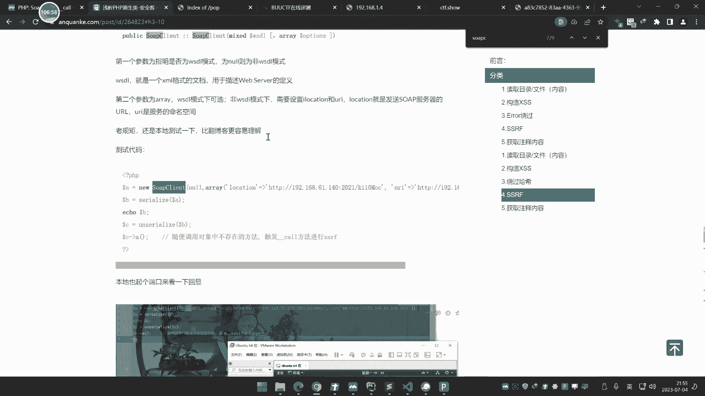

这个是答案啊，这个写的有点小于，需要大家理解啊，你看一下写的这个东西，大家先拿出来给他关注一下，前面是UI头来创建一个这个select访问本地地址，访问FLA，给pp uv头里面改成什么。

他不是有判断吗，差佛头呢要改成127000，这个斜杠R斜杠N呢就是换行的意思，这其实就构造一个访问的一个请求头啊，按照他这个逻辑写的，为什么要前面加这个东西，其实这前面这个UA不用加。

加上去的原因呢是因为他在这个代码这里啊，啊我看下那个代码哪里啊。

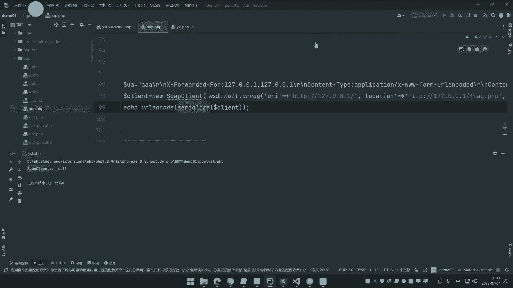

CDF修那个代码，这里有检测的插佛头，就必须要符合这个127000才行。

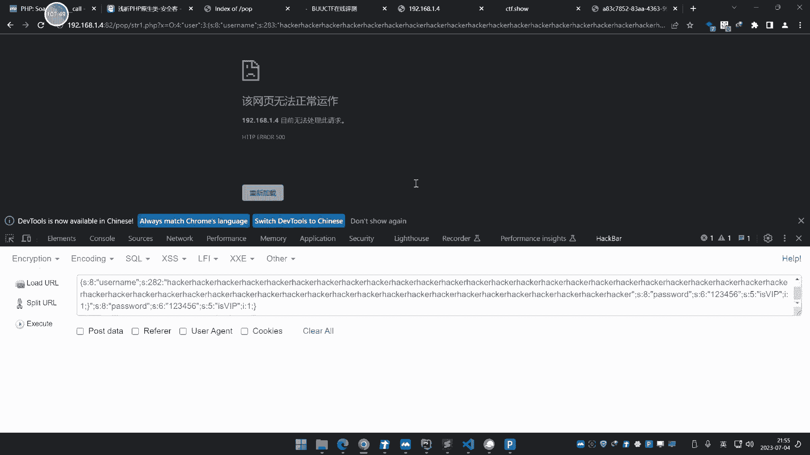

你如果不等1000的话，这个插佛头结束了，这个差FF呢差F是这里判断的呢，IP不等于2701，他就不行，所以呢我需要我的那个里面呢选叉叉个一，然后用到他这个语法，这个语法使用呢就可以参考这里来。

就是把一改改成这个修改成这个东西，那洛克型呢就是访问你的地址，目标地址就是本地的flag的app嘛。

把再生出来，生出来之后如果需要编码一下，这是他flag的一个边啊，就那个PP链的构造就用到这个染色内，这个染色内就是call里面的伸出来，把这个一复制啊，然后呢找到个题目。

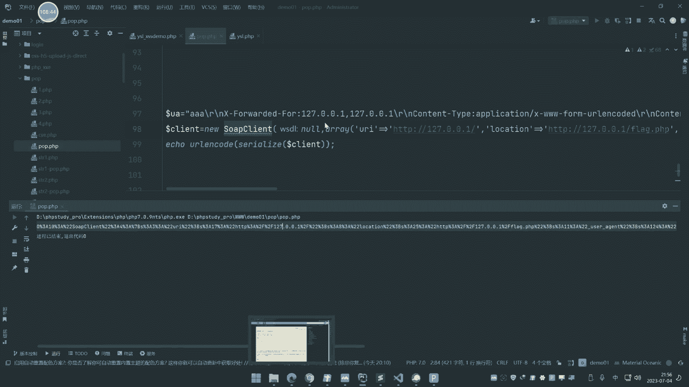

地址写上去给VIP，非IP等于这个值，然后一旦成功之后，后面呢就会生成一个flag的BP。

把flag点TST，现在没有。

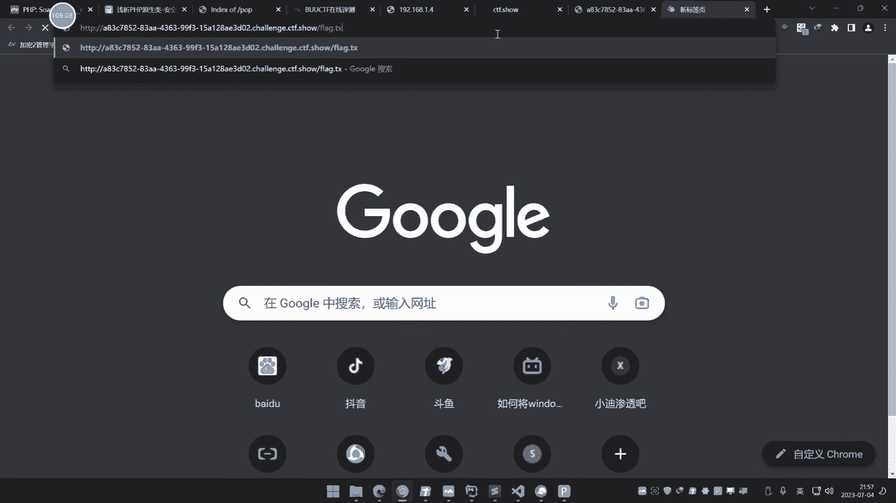

那它一旦成功之后呢，接收toy等CCTF修，并且这个东西就会生成一个flag j t，将变量呢写到这个文件里面去，然后这个token territual怎么实现的，来后面写了啊。

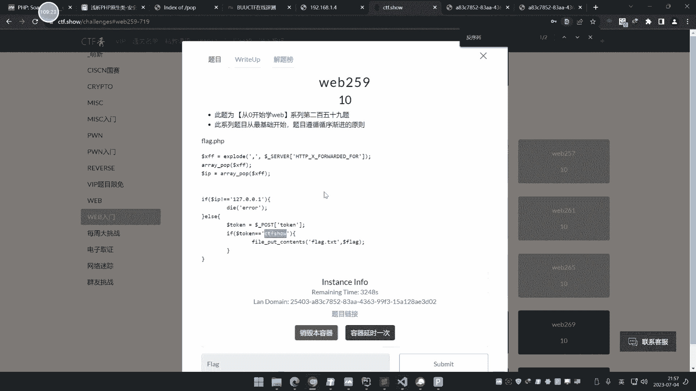

来在这里呢，toy和CV9啊写了进去了，其实这个构造呢就是满足条件的，大家说一下啊，这构造的就是啊满足那个什么，满足叉F5F等于127。0。01，然后呢后面的那个什么coffee等于再有修的意思，是吧。

就这个意思啊，这个地域，然后这个呢就是我们说的这个啊，对于这个调用这个类啊，调用这两个内来生成的方法，好我们来看一下啊，是不是就成功了啊，对原生内的利用。

访问访问了，然后看一下flag p t有没有哪一刷新出来了，游戏结束是吧。

这是这题的一个解答啊。

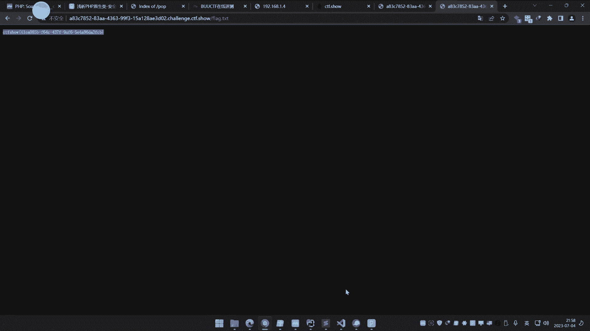

这个难点呢就是抓住几点就可以了，一个是原生内怎么使用它，这个需要自己查看例子，其实一点，那就是我们说的啊，我们先通过它不存在的方法来触发这个扣，然后呢用代码生成cod元素方法找到这个地方。

用这个地方呢使用这个元素呢，那刚好呢可以去访问他本地地址是吧，调用它呢去触发一个SSR啊，符合条件127001和那个token里面带city，不修啊，生成一个序列化数据，给他发送对方的解析之后呢。

满足条件，最终形成这个答案，对吧就是这个意思哈，它的难点，那就是说大家如何知道有哪些原生内，哪些原声内好用，对就是我们说的最常见的啊。

生成的时候呢，注意把一些开关开起来，如果你不开了开关的话，刚才生成的话就可能就没有了，你比如说像刚才我这个生成呢，他有这个sop卡拉特，如果把那开关一关闭，只要把这关闭，那我要关闭，我再重启。

我们在分析空的空的，别人说妈的小弟讲的有问题，我他妈一样的要代码，咋我就空白已经生成出来啦啊那就温起来了，是马起来了啊，所以说啊，有些你自己下去和我这个讲课呢会有差异啊，就是有些我没有讲。

我现在学聪明了啊，我把这有差异地方我给讲出来，免得你下去骂我啊，到时候你骂我的时候呢，我就给你反驳一句，我说的又在挑着看视频是吧。

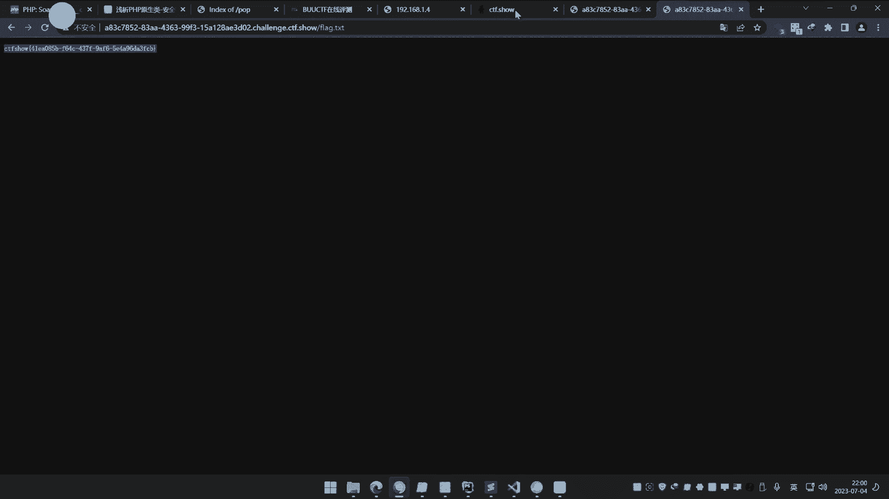

没有人听我讲这个东西，什么东西啊，人在说，对方关闭了还会运行吗，那肯定就不会运行了呀，这个源氏呢这个利用成功率呢，也是要看对方开不开那个东西的，他如果关了，你就不能用了呀，他不是那个拓展的呀。

所以他在提的那个靶场环境，那他是开的，他如果不开的话，那你没得搞也搞不了了，那他为什么要开呢，你说他为什么要开呢，啊你这真是问一些问题，我咋回答啊啊啊，你们说一下他为什么要开啊啊。

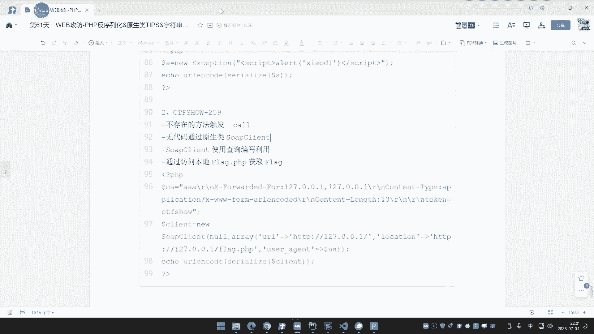

他拉不开则不开，你咋打呀，他本来就肯它，既然是八场。

既然是题目，那就是有解决的题也解决的，他拉不开再不开，你解决个毛啊。

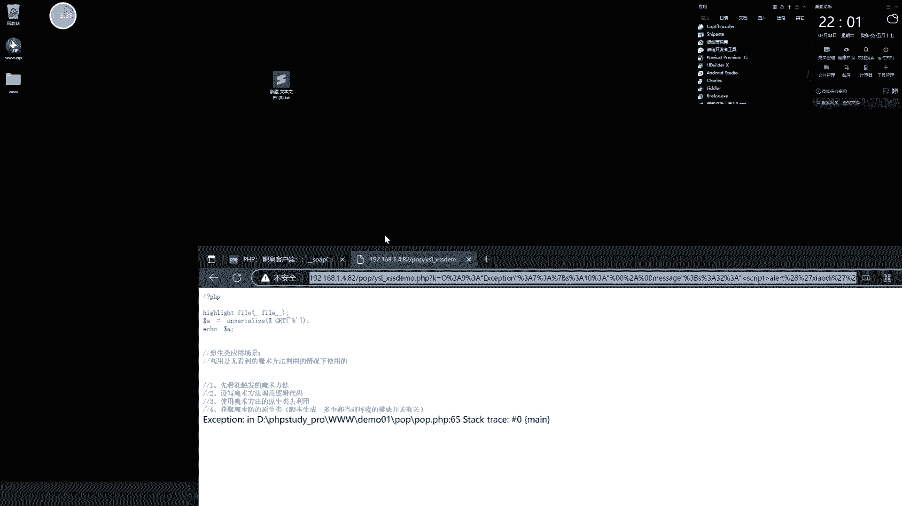

解决都解决不了的，这这谁答呀，对不对，哎呦舒服了哎呀，好我们今天就说这么多了啊，说白了今年知识点呢太多了啊，我这换一节课呢，你可以看到我也讲了10年都已经过了。

还讲的不是很细嗯，没办法吸的字点太多了。

你知道吧，这谁讲这些给你听呢，外面讲这个pp反序的话的，把这个系列讲完，一百一两百块钱呐，就讲这个知识点，网上还有那个课程呢，就是个章节点100块钱。

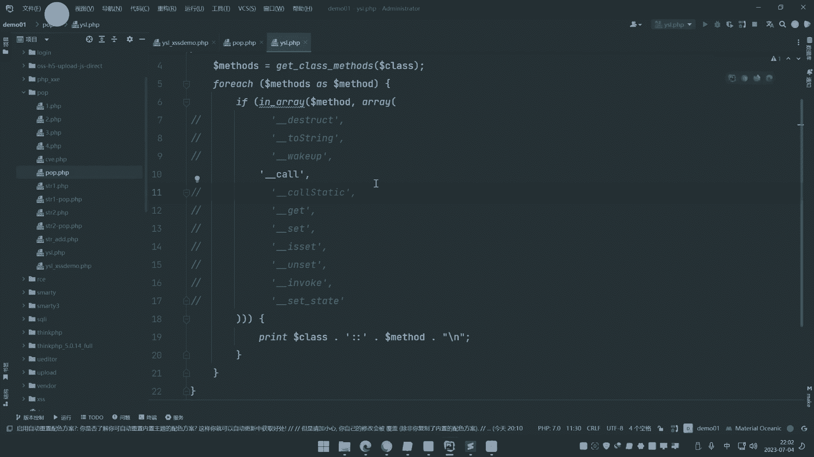

东西不好讲啊，他妈的台北城那个字不算逃逸啊，讲他话气力特别大，但实战中呢也碰不到，主要是这CTF和一些这鬼避面试题，喜欢问这两毛事情，你不讲啊，就滚起来也不会，面试题和那个CDF里面先问这种问题。

搞这种事情在实战中代码升级很少见，不过碰到的人也也也会啊。

好今天就讲这么多了啊，时间关系我们就说了。

你下去，那你自己把这个题目做一下啊，你下节课说实话下节课我都不敢讲了啊，下节课那个那个框架的反序的话，那他妈的说实话太难了啊，不过隔壁讲了一点，隔壁说实话讲了的，隔壁讲了啊，隔壁讲了个框架的反序列化。

我还看过那个课程讲的，反正我都没听懂他讲的啥啊，好。

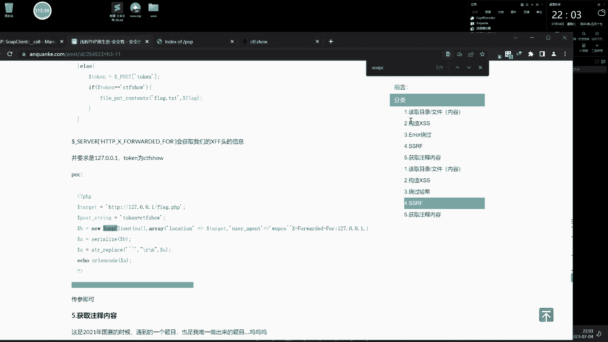

大家看有没有问题啊，有问题问啊，没问题。