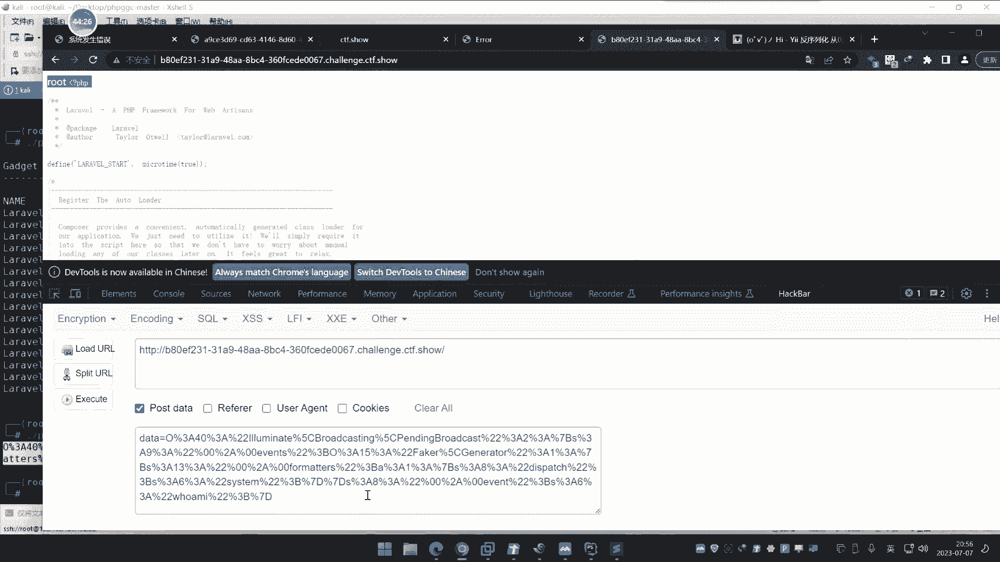
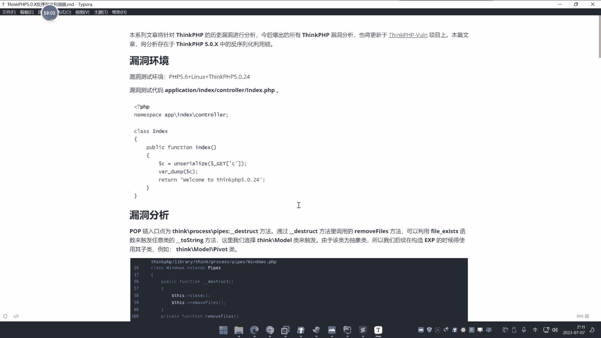
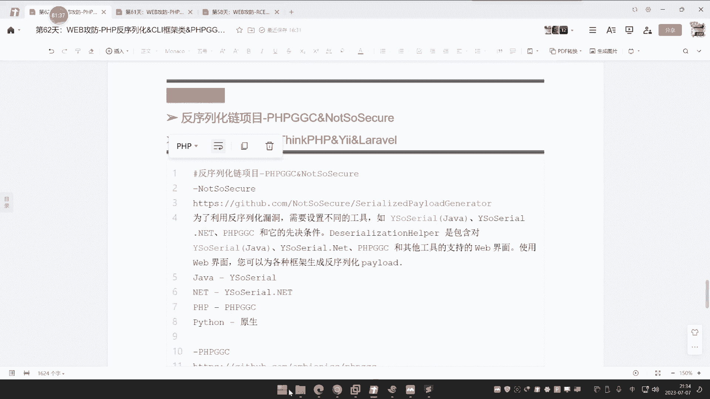
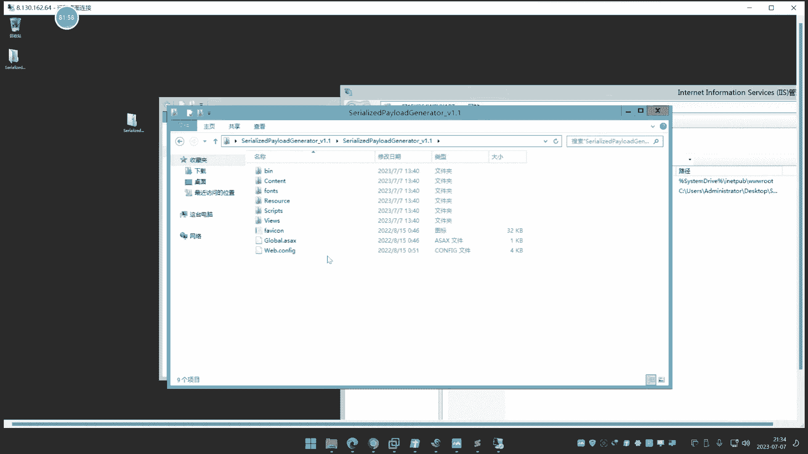

# P61：第62天：PHP反序列化&CLI框架类&PHPGGC生成器&TP&Yii&Laravel等利用 - 逆风微笑的代码狗 - BV1Mx4y1q7Ny

今天呢讲这个pp的反式化的呃，框架类的反虚化的利用啊，这是我们的主要课程，然后关于这个粘的这个POPON的，具体分析呢，在代码审计呢会详细讲到，今天呢我们来入门一下，这个框架的这个反序列化啊。

就是他是如何被发现的，又是如何被利用的，首先呢这个反序漏洞我们前期也说过，像这块漏洞呢基本上都是白盒里面做的事情，黑盒呢是看不出任何问题的啊，就是必须要有一些参考性的代码，你才能去利用。

否则的话是利用不起来的，所以你就不要问了，说什么黑盒怎么发现发现不了啊，是必须要有相关的代码呢进行配合才行的哈，然后呢前期呢我们上了几个反循环两次直播，今天呢就是基于这个框架。

你可能说这个框架有什么不同呢，那在pp里面的框架，主流的国内用的最多的三个框架哪三个呀，这我举的几三个，其实那还有其他的一大堆呀，这个TP这是最经典的YYY这个拉法，对不对，这个三个都是比较知名一些的。

pp呢就是我们说的sink pp，这三个框原来是pp里面搞这个命名空间，里面比较知名的FFC的模型的三个框架，好这个就不说了啊，介绍到这里，那为什么这个框架的反序列号，和我们常规前面讲的那两次直播的。

那个反序的话有一些不同，或者说单独为什么有这么一颗呢，啊因为呀他的这个核心代码，那是框架里面的代码，而不是我们自己写的，就是我们前面商到过的那些反序环，那都是根据自己写的一些魔术方法呀。

自己写的代码那调用的，而这个框架里面呢他都已经封装好了，也就是说它里面有就是有没有就是没有了，一般人不会在上面那去自己在写，就是直接用框架那些东西呢去使用就可以了，前期我们在讲安全开发的时候。

大家应该有印象，比如说在SINGAPP里面，我们要进行一个SL查询，就不需要再自己再去定义语句，去用这个相关的函数去执行了，它只需要用到框架里面的一些是吧，方法函数即可调用，他已经帮你写好了。

那么写好之后呢，在这个反序花这个字典里面也是这个道理，它里面也写好了，所以你要去利用的话，就必须要了解这个这个框架里面的写法，这个了解呢是非常复杂的，如果你能了解的话，就具备有娃这种框架反虚化的能力。

如果不了解的话，那就不具备这个能力，后期的代码审计就是为了训练这个能力，现在这一课呢是先了解它的利用能力，再来说挖掘能力，好我们先来给大家介绍两个项目，这两个项目是有必要学的，因为在后期的反虚化里面。

这两个项目呢是基本上都会用到的，一个叫做note so server，这是一个名字，这个东西是啥啊，给大家看一下这个介绍啊，就是说为了利用这个反序漏洞啊，在java中这个YSOSERA2。

点net中的点net版本，菲律宾的PPGGC版本，还有个Python版本的原生态，它支持四个语言的反虚化的利用，啥意思啊，今天我们讲的是P1P，那么就是pp里面对应的PHPGGC这款工具。

这个工具呢在这个项目里面集成有，我们可以打开看一下这个项目。

那这是这个项目的一个地址，他是干嘛的，是国外写啊，打开界面是这样子，我给大家看一下，我已经搭建好了，等下的我们也会说教大家怎么搭建。

那这是他的一个项目，大家好，我是个web界面，它其实呢就是把四个语言里面的编写好的，四个反虚化的利用项目呢，全部集成到这个web环境上去了，第一个YS的就是java类的反序化的生成。

就是说你要利用的话啊，可以利用这个YS呢去生成在这里的web界面，比如说你要升级生成这个NN的，然后呢生成模式选择base64，显示要执行的命令，比如说我执行个这个why me，直接点勾。

他就帮你自动生成出来，他就自己拿去用这条命令，你把他生出来，你看这是他那个生成在java的，然后这个呢是基于这个点net的，点net里面的这个反序化，点net的反虚化呢不是很常见。

主要就是java和pp，然后呢pp的那这pp的呢有这么多，全部是些框架和一些知名的CMS进的yi word price，think or pp对吧，嗯mm logo level。

那这是Python的基于这两个语言生成的念想，执行什么东西输进去，他把你生成出来，其实呢这个呢就是我们简单来说，它就是个集成化环境，在后面呢我们用得到，今天呢我们就给他介绍一下，搭建下。

今天主要就是利用它其中的一个功能，就是这个菲律宾及其cc这个项目，就是它集成四个在java里面用的最多的，这个反需要生成PLOO的工具，pp的这个PAHGGC，注意啊。

他们这几个工具全部是针对框架和组件内的，不是针对原生态的，就说我们之前呀讲过的这个三节课，像这种啊，那像这两种这样子生成的那个POP链呢，是我们自己写的，因为他们是原始类的，是要根据代码决定的。

但是到了这个框架里面呢，框架里面的东西呢就不一样了，写起来是非常复杂的，我们就可以借助这个项目呢帮我自动生成，它是这个概念，所以你要知道它的解决面啊，它的解决面是针对框架组件内的。

这种自己写出来的反虚化的一些漏洞，代码的话，就不能生成，像CDF的一些题目，大部分都是自己写的，那就只能按照前面两科的那个自己的分析思路，自己构造啊，如果说是成品的源码里面有组件和框架的话。

就可以呢用到今天讲这个项目，那么今天讲的重点项目呢就是个PAPGGC，然后呢我们会从几个概念去给他讲，第一个呢是先讲它的利用，讲完利用再用CTF的题型去给大家演示出来。

最后呢我们再来分析这个连是怎么写的，为什么要用项目，而不是选择自己用手工去写，手工写当然是完全OK的，但是手工写的这个难度是和你挖漏洞，那个难度是相似的，不是一朝一夕的事情啊。

所以那个难度呢是要把代码升级学完之后，加上开发的一些专业知识，再对整个漏洞的理解，现在我们还达不到那个程度，把后面代码审计学完之后呢，还需要大量的时间才行，所以今天呢就是说把这个项目给大家讲好之后。

我们会有一个分析，就分析一个这个sink pp的五版本，还是new版本的一个念，给他看一下这个挖掘过程，那个粘的一个情况，然后呢再用这个项目把它利用出来，对不对，分析一下。

你挖的话肯定是要比分析的更加有难度，因为娃要看大量的东西才决定，分析的话就是说已知漏洞，知道漏洞怎么来，这好办一些，娃的话，那是理想思维，那更难一些哦，娃的话是需要代码审计的思路，加上开发的思路。

在对整个漏洞的理解，三格呢缺一不可，还需要大量的实践分析呢，懂代码，懂漏洞就可以分析，好那现在呢我们就给大家看一下这个PPGC，PPGC呢，它是干嘛的工具啊，注意一下啊，它是针对于PHP语言开发的。

一些CMS和这个框架，反序化漏洞的利用的一个生成工具，那你可能说为什么要有这个工具，很简单啊，以前我们去讲那个漏洞的时候，都是用的是吧，自己去分析漏洞，然后触发那个魔术方法，自己去写那个PVP页面。

但是你会发现实战中的话，如果说他是一个成品网站，不是说我们搞一个代码端给你啊，你去帮我写个PPP脸，不是这样的啊，成品网站里面的话，那就基本都是CMS和这种框架多了。

那这个时候比如说对方是一个sink pp搭建的，sink pp的源码，或者说是一个level的，或者是个YI的这种，那你明知道这个框架它有漏洞，他有反需要漏洞，网上给到这个漏洞的介绍。

或说有这个漏洞分析，但是就不会给POC，就不会给你用代码，即使给你应用代码，你也不知道怎么玩，他会有这种情况发生，这就是他工具的这个解决面，它解决的就是解决这种复杂的啊，好这是大概介绍啊。

目前支持的基本上是PPP的，所有的一些知名的东西都支持，它，也是相对于java里面和这个产物是等同意义的，好那么现在呢我们就给大家看一下例题，看完例题之后，三个例题，一个是SAPP的例题。

一个是YI的例题还是never的例题，从这三个例题里面来熟悉一下这个工具的使用，同时也告诉大家，针对这种框架类的反序号漏洞是怎么产生的，是怎么利用的，然后呢再来看最后一个案例，就是分析这个链，好。

我们先来看这个题目啊，这个题目呢是一个2019年的一个赛题，是一个sink pp的一个反射漏洞的一个cite。

好你看啊，这个赛题呢如果让你访问这个public，你打开，好访问这个public，打开之后呢就一张图片啥都没有啊，同样道理，那既然反序的话，它它就回归源码的啊，没有源码是做不了任何事情的。

这个反序的话必须要原码，没有源码，你想都不用想告诉你有漏洞，都难得难得去做，因为你不知道从哪里出发，它，他这里呢是有一个源码的一个地方，就是让你的扫的这个3W点，这个zip呢把它下载下来，把下下来。

然后呢在源码里面呢去找这个漏洞的。

其实呢就是让你审审这个源码有什么问题，如果是你不懂的话，压根就没有搞过这种事情的话，那肯定是比较困难的啊，来给大家看一下啊，这其实呢就是讲代码升级，无非就是说没有去挖这个反需要漏洞的领地。

讲哪个呢，就是挖漏洞零得了，打开啊，把表麦也打开，前期的SKPP如果有听过，那可能还有点影响，如果没有听过的话，那这个东西说实话啊。

嗯你听不懂，那这个是一个软麦打开，从这个上面看的话，就是一个深刻pp的，因为snk peter几个特有的文件名字和这个东西呢，加上sync，就是SINGAPPET特有的呃。

在这边的还可以看到他那个版本的这个走向，他说SNP的freak就是它核心版本是6。0点，新杠DV的一个版本，也就是说他是个SKPP6的一个版本啊，那目前最新的CPU是8。0，不过现在主流的还是5。

0和6。0居多，这是他的一个版对吧，然后你怎么用它呢啊，可以看一下他的这个content里面的东西，这个我以前讲过是吧，有没有印象，当时学过这个single pb的时候。

这个index呢就是我们的控制器通过访问的，这是首页展示的文件，他这里的输出image s r c t s t g j p e，其实你就是这个所有文件来这个首页访问的，就是这个index app嘛。

指向这个console里面那个index，他这个输出呢就是这个文件嘛，这个文件就是test jpg，那你可以看一下来哎。

怎么3WG不G啊，那可能要改了啊。

这里呢就是那个输出那个图片的显示，然后你看下面呢他说接受PO的配了之后呢，你看下面有个什么UNSERIJIE，这个东西呢，一眼就能看出来，这就是个反序的函数是吧，没了啥都没有，就说按照我们常理来讲的话。

如果说我们不知道是新的BB，只知道这里有个这个东西去，如果要去研究它漏洞，我肯定要知道L这里有个UN，那会触发什么模式方法，哎我就会去找，对不对，好我就给他找一下，就按照正常逻辑呢去找。

我们可以观察一下这个用啊，这个反序列函数会触发什么什么这个魔术方法。

大家还有没有印象啊，就用到这个函数，就会触发哪个排名印象啊，work up啊，是的啊，work up对，那肯定就搜这个东西嘛，是不是这个work up呢，就前期讲过的话的，那这里呢我们就肯定是要找啊。

你可以看到这个里面肯定没有这个东西呀，这个压根都没有是吧，我肯定就要全去搜啊，搜work up，这有没有啊嘞，你不说so work up，在里面搜个work都找不到，嗯这个work都找不到，那咋办呢。

没办法了呀，你可能说这有什么影响吗，那啥啥印象都没有，为什么，因为你按照你常规思路，你就这样去搜，这是压根就没有这个东西，为什么呢，因为他这个里面呢是think pp，不是你自己写的代码。

就不是像我们前面那自己学到的。

你看我们之前学到的哎啊，就自己写写那个东西是吧，里面有这个魔术法，一目了然，他这里面的都封装好了，都是在他和CNPV里面自己写的。

找不到，啊这上面这些东西无关紧要吗，你可能说这上面有没有什么东西无关紧要啊，他这个是过滤这个URL路径，这和他没相关，他结束是配漏的，这是UL路径的些操作，这和他没有关系，过滤payload。

payload里面就这个东西呢，就这个结束判断有没有结束结束，那就反虚化，没有做任何事情，能看到的就是work up的一个出发，但是搜没有是吧，所以说的就要换个情况了啊，这是原生态那个思路去分析。

那肯定啥都没有，这就分析不了，所以由于这里知道是single pp，也不要问说是怎么知道是single pp的那个目录结构。

了解过的都知道他是single pp啊，我们搜啊，Single pp，比如说达芬奇欧的一个反虚化，我们就搜嘛，这个反反序化中有另外一搜，他说这里CN平均流量反需要分析漏洞，分析和复现啊。

他这里有个就往上翻翻翻翻翻翻翻，这写的啥玩意哦，这里呢有个什么get小的一个那个有点要的是，这个小屁不偏你啊，构造一下啊，这里说是构造PP链实现get的秀，然后这里有个代码，好POC好出来了哎这结果。

啊正在写的，这个是这个文章写的，你能不能看懂啊，哎你知道要怎么构造啊，就把这个文章的告诉你，就我假如说就是个漏洞，对不对，来看这个上面的也是呢，这，或者啊你看这里呢还那个搞了什么POC的。

这东西给你，POC给你嗯，这次呢得到flag的一个p o c c time，运行这个东西啊，也是安全杯，那就是我这个题目的他这个分析，那这个给的POC呢，然后前面是分析过程，我不说先怎么分析的。

你看这个分析过程，这就已经很头痛了，我们先不管它是吧，那在分析过程我们不管这个分析过程，就说为什么来到了这一地方的POC生成是吧，那我先给他POC给你试一下，来，他给了POC好，我复制啊。

就我直接用好吧，我在这里，那我新建一个这个POC文件是吧，他先去好把那一打印运行，不要运行好，这是他的这个payload，把他一幅字。

好然后呢，我来到刚才那个网站那里，这网站是吧，然后我们把它放到这边来模拟提交一下啊。

如果说你前期没有学过开发，没有学过新的PB站安全开发。

这里怎么提交，你都不知道，唉所以说你说学不学呢对吧，那这个地方呢是这个payload嘛，结束是吧。

那怎么提交呢，是要请求到这个文件路径呀，怎么请求的，是我们前面讲过pp开发那个路径请求地址啊，首先是它的所有文件，然后是什么控制器名，index是吧，模拟器这个console名。

然后再就是index是吧，这样去请，然后后面问号，但是get型都要配low的，这样去写，再加上这个什么，再加上这个什么路径。

接着来。

看他能不能得到flag，我们来试一下网上的那一执行。

嗯这是不是index的，是index啊。

少写了个影子死了，嗯我直接换一下啊，哎啥情况的。

好那这里呢我执行了啊，执行之后呢，他说stop hacking，这个提示呢就是这里有个过滤，就是解释这个网址地址。

那个就是说可以这个logo呢和这个反序啊，没什么太大意义啊，就简称你那个网址。

这个呢我们不说，就在这里多加两个斜杠就可以了，来执行那flag就出来了，你看答案呢就出来了，这是直接用网上的POC，那直接用网上的POC拿出来的，而且这个POC呢啊。

这个POC呢你可以看一下啊，他这个诶跑哪去了。

他这个POC我们先不关注他怎么写的。

如果没有这个WP这个打POC，那是围绕这是个塞体写出来的，你网上查其他的这个漏洞，那我查其他的支点，还在其他漏洞分析。

有没有这种POC呢，有的地方会有，有的地方会没有，有句话或没有，那你看这个啊，其他的这个文章啊，这不是真的塞提的，他写这个连呢，一句话连接往后面翻，或许p o c get了修呢，这是他的那个写的。

get了修什么东西呢，这是你他这样写的，你就说我的意思就是说网上的资料，如果他不帮你写出来，你是这题是怎么做，你都不知道怎么做，首先英文很简单的道理，他这个文章前面的漏洞分析。

就是围绕这个POC的编写展开的。

这个文章，这个是什么漏洞分析，怎么练的一个构造，我们就不说了，这看的也看得出来是很复杂，我们先不管这个事情，我们今天说这个POC，你碰到了这别人写出来的，如果没有人给你这个东西，你怎么做啊，做个毛啊。

网上那些项目现在把很多东西都删了，找这个漏洞资料，包括漏洞，但不一定就有这个漏洞，利用代码它是没有的，那没有怎么办呢，这个新和pp的这种或者说这种东西没有，那怎么办呢，就要用到我们的项目了，什么项目啊。

PHPGGC它支持呀，来用它来帮你生成sink pp的，连你不要做任何事情，只要知道他是什么版本，然后有没有这个漏洞，是不是在这个版本区间直接测就完了，至于他在网上什么这个POC我知不知道。

无所谓，就是漏洞我可以提前，我不知道它怎么产生的。

但我知道这个版本有这个反需要漏洞，我去利用它，我去利用它，知道怎么用，先知道怎么用，再来说这个漏洞怎么产生，而这个POC不给你，你是不知道怎么用的，我们现在就是说，我不用这个网上给到这种什么文件去玩。

我该怎么办呢，我该怎么去玩它呢，看着啊，直接运行这个POPC来。

这个只有LINUX版本，它没有这个windows版本啊，就你必须要放在这个这个LINUX版本上面，KY里面也可以用啊，那PHPCGTC怎么用，杠L就是获取它所有支持的，你看这里有这么多哎就这么多。

你看是吧，选择你要构造零，我选择谁呀，比如说我要找pp剩个pp的，这他剩个pp的所支持的，对FIW看上去像是废物两个字，其实那就是文件file white，文件写入的就是。

那你用返修化实现文件写入的音响版本，5。0。4到5。0。24，5。00到5。0。03是吧，然后这个RC1的就是由序列化来造成的，Lc1，那这里呢写的这几个东西好，这个呢就是它集成的。

你可能说还有没有其他的呀，我告诉你啊，这就是网上已知包裹的所有漏洞的一个集合，他的这个工具的出现是为解决什么问题呢，就是解决这种框架类的反虚化链太过复杂，我们呢就需要有这个工具来帮我们自动去生成。

就是说刚才这个POC点TT。

就是别人分析到这个反序化漏洞，然后自己写出来的，你呢要实现的话，你要去写这个念字，太麻烦了，这不是你这个能力能写的，你那那只做个脚本小子，用工具帮你生成，怎么用呢，你比如说呢这个是6。0版本。

我就选择什么，那RC3和RC4这两个是吧，哪个能行就用哪个就怎么用啊，来直接把它选中，生成这个连，其实呢就等同于呢就用那RA3啊，三版本的，然后回车他就会教你怎么用呢，第二个参数是function。

第四这个参数只是参数，我就可以怎么样写个叫system，调用system去后面再写个什么单引号，因为这里呢就是有空格嘛，就flag回车对吧，用这个sink pp的RV3。

用c time去读取这个flag，然后我们再关注一下刚才代码里面。

代码里面呢这里有没有进行这个UL编码，或者说有没有进行这个贝斯流斯啊，他这里呢没有，所以我这里呢就简单。

杠杠UR杠UR叫我直接生成，它也会生成出来的这三连的那个写法，帮你生成出来，对不对，如果说你要编码的话，比如说被杠杠base64，就杠杠base64，然后他就帮你自动编码，一定要用它自动编码的啊。

你不要说你把它复制出来，再字一遍，字再字一遍就会有问题的，我试了很多，踩过很多坑，一定要注意，比如说我八个月老，然后呢我就把它生成到UL上面，一复制是吧，一复制好之后呢，我再来这里一测啊，来我们测一下。

来放到这里来看一下啊。

刚才的那个生成的，那就是我自己生成的，我可以对比一下，和刚才那个生成的是不是一样的啊。

来我们对比一下，就刚才是用POC生成的，这个是用工具生成的，我们来看刚才那个POP。

POC生成的那个文件，就网上直接找到的这里面啊，看它生成的有没有一样呐，这明显不一样啊，但是呢你看这个是用的什么这个这个脸呢。

我们看一下试下能不能行啊，先用这个是能行的啊，他这个是刚才POC生出来的，这个是另外一条啊，我用这个来试一下执行，看到没，能不能读到啊，来也能读到啊，哎我再换一个命令，我试一下看行不行呢。

你比如说我执行一个这个LS好吧。

我执行个LSLS，那是显示那个什么显示那个额列表的是吧。

建筑文件目录的，写文件和文件目录的，那我看下来放这里能不能执行啊，你看来执行放这里go看到没，这该多好玩呢，是不是，其实这个呢就等同于你在那个用那个java，那个YS那个去构造那个鸳鸯的。

这个你就可以不用去懂太多的这个什么漏洞，网上的给弄分析，你不用看，因为你看了你才会写这个PVC啊，因为别人不给你POC给漏洞给你说哇，这里有个漏洞来分析过程，看给你了啊，自己写啊，你如果能自己写出来。

那基本这个漏洞你就能挖出来，你写不出来呀，那恨不得有些人连这个东西怎么用，他都不知道，你鞋个毛啊，那就只能用这种东西呀，那这个是single pb是吧，我们再来看其他的，你看CCTF的题型。

只要他是这个框架类的，靠反虚化啊。

那基本就是咔咔两刀是吧，就把他拿下来，我们再看啊，哎。

不要封我啊，好我看看CC67的。

那这个你比如说这个难题啊，这个刚才这个是SKP的，对不对，你看啊，我们再看这个阿巴阿流习惯的，你看我在关卡打到266，打不下去了，很多人都拿我这个题目做嘛，打267他打不下去了，不会打，你说他懒。

我等下一解，我把你解出来，很简单，为什么打不出来呢，因为网上给的东西蛮多都不能实现，你不信我等下给你找，就你知道他是什么漏洞，或者说你知道他考什么漏洞，你在网上搜乱七八糟的一大堆，没有靠谱的。

你看这个啦，他这题是怎么做的啊，他的题呢是考反序列化，既然是反序的话，他这里呢是先登录个账号密码2米的密，然后在这里呢它有一个这个泄露源码那个地方，这个呢说实话他考的有点过分了啊。

你直接考反一句话给圆吗，不就行了吗，搞这些名堂是吧，它就在这里呢有个源码呢，有个源码泄露呢，就这里呢包括这个地址，就写了个源码，那至于这个东西怎么找到的啊，你自己网上看一下，就是看看源码里面有个提示啊。

他说了贝斯缪斯decoder结束这个code这个地方，然后用这个这个什么反需要函数呢，对它进行一个操作，然后你看一下这个源码啊，这个源码里面已经提示了来，这是一个YI的JS，从从你可以在这个场景上面。

也能看到这个环境的一个清晰。

他这里没分析出来是YY啊，但是从这个源码里面哈，那这个加载JS里面呢用的是这个YI的JS文件啊。

这里用了YI介重新打开一看呢，用的是2。0的一个版本的，那YI的这个蜂窝这个框架FYI，然后这里呢给到了一个提示，就是在这里传参数code。

然后呢用base就是解码之后呢，用这个反序号函数来对它进行操作，访问地址呢就是这个BER shell，这个地址就访问back shell地址，然后呢给他传co的参数来进行反序列化。

然后是个YI的这么一个网站，这是它前期的提示，这个前提是不是我们的终点，因为我们主要是讲反虚化，至于这个前提是怎么来的啊，就是我刚才说的啊，他这个题目说实话这样设计不太好，你搞翻修的话。

你搞其他东西搞干嘛呢，直接给源码玩的，搞这些乱七八糟的一些设计，然后怎么操作啊，YY200这信息已经知道了，那你看着啊，我就按照这个思路，我直接在网上，比如说我知道了YI哦，反循环哎都知道诶，我网搜啊。

Y1哎哎是吧，反序列化，把这种知识点来Y连子学习啊，漏洞总结啊，然后打开看啊，那什么链子一链子二链子三呢，连子几啊，这个是什么这个生成的这个参数啊，这是他的一个那个电子，这个链子是干嘛的。

执行一个命令执行的，那是网上给的这个执行的批评引波好，那现在呢我就给他用一下，来，我复制一下啊，我就说我先按照往思路可以讲啊。

啊负责来来运行一下啊，好刚好嘞出来了，也是个贝斯缪斯的生成的，也是把他生成这个贝斯缪斯的嘛，好把它分装出来，我们来试一下啊。

来看看能不能成，就是那个链子的那个地址嗯，他的请求路径那是在这里啊，就是code，然后请求这个路径啊，就这里让他请求这个路径，然后就在网站写前面去，那请求INDEPP啊。

问号后面的那个back shell啊，刚才提示的地方，2code是后面那个反向连，他说执行一个批评服务，执行诶执行了，那这是网上的脸呐，要写好的啊，写好的，然后呢呃再写好的啊，这个还能执行。

还念着念着呢，这是自行批评服务的，也是执行批评服的，唉还有链子三呐，这些东西我们就不一个个测了啊，那一大堆呢有后面还有一些呢链子几啊，这POC的一些案例的，这个是执行system，执行这个L是杠L的。

我们可以试一下这个。

啊你看右下这个啊，放再来看这个行不行。

看下胡子有没有全部，那这个放上去了啊，我没有问题的，但这里那里也看到是吧，失败了，你也不知道是革别人给的这个有条有理，这咋失败的嘞，所以啊这个东西呢不好说啊，有可能会成功，有人失败。

因为第一个是他代码版本，还有各种乱七八糟的一些这种事情，各种情况啊，这还是比较好的，他还给了这个POC给你，那有一些呢就把你这个漏洞给你分析啊。

后面就没了。

那后面就没了，所以你也不知道这个怎么搞的，这个写的乱七八糟，这里说这是咋服之类的，这写的乱七八糟的东西，还得要我们的工具啊，来看一下这个工具生成啊。

PPGC杠LYIY。

那有这几个呃，那肯定选择这两个嘛，2。0这个版本的是吧，因为刚才看的是2。22版本，对不对，那就这个吗，那就是，然后呢选择的地方呢也是呢函数和参数对不对，那执行用EKC或CMM执行，执行个什么。

所以个cp flag把它复制到TT点TXT里面去，你跟他说为什么要这样执行啊，我怕他也不回血的情况，因为怎么说呢，这里呢你也不知道不回血啊，你也可以直接用这个cut cut来我们试一下啊。

看他先能不能回血，大家改一下啊，比如说PAC读取这个flag，读取flag，然后用base news把它进行编码啊，执行这个LEC那12cc好像不会写，要echo啊，我们就用c time吧。

这样我们去执行这个命令好，那这个呢用system m去执行这个TAAC杠flag，这是读取的while i生成的，我们换着来看试一下它能不能行。

先试一下啊，如果能信，那就一目了然了，那就不用什么福字啊，那些粘贴粘贴啊，放这来执行，可以看到啊，这执行之后没有任何反应，空白，你也没有不知道啥情况。

所以说呀，为什么刚才说用这个复制粘这种把flag呢，给他扣平到TIT里面解决这不会显的问题嘛，就是把它复制到一个文件里面，我们怎样的再访问这个TT，点TT看它存不存在嘛。

是不是我看下他这个地方存不存在啊，先看一下他能不能存存存存在。

七点kt，这呀这结果咋这难呢，呐这个访问机器大家看到了啊，这啥都没有呢，访问就是这个东西并没有什么东西看着啊，来把设置出来之后。

我们呢用这个PLOAD来试一下啊，因为他没有回血。

我不知道那个能不能成功重新替换一下，这个payload，这个地方管这个地方啊，执行好，我们再来访问一下，刷新一下这个TTTT。

出来了，是吧。

那就是直接用这个东西，CNF修那个什么，这关就解决了呀。

其实和刚才那个是差不多的。

就是说你只要在代码中呢看到了这个什么，这个用法非常简单，就看到这个东西啊，这是个可控变量，想办法的控制这个地方，然后呢用这个版本去生成，那这个新的pp的，就用新的pp去生成，去发包完了。

然后这个呢是YY。

那就YY对对，还有个呢经典框架lea lea能不能行呢，也行吧，271罐伽马还是267罐，那后面几题呢就是它的过滤是吧，我们再看这个，啊奇异的关卡，如果说你自己去打打这种题目。

你没有结束，不说结不结束新的VP啊，你没有结束这个框架类的这种反序化的话。

网上漏洞，那你也看不明白，那这题是压根就做不了的，以后呢这一题这个支点一讲，对于我们代码升级sk pp和YI的这种题目去分析，有没有法需要漏洞，看版本看他的写法里面有没有有没有触发，就后期就会用了。

就这么简单，打CDL提醒的时候也有帮助，你看这个呢，打开看上面就直接提示你这是个lever了，那么的源码他直接给源码给你看了，因为我们说了没有源码，这个反序化是做不成的。

他必须要给一些或多或少干嘛给你提示，否则的话你连那个链子从哪里给他都不知道，哎level已经看到了啊，然后呢你看啊他也是呢接收post的post发包给他呢，触发这个触发这个什么函数嘛呢，这写的很明白。

就说都是有一个触发的一个函数，然后呢，再就是这框架只说这个没有，我们之前看到的魔术方法，就是利用这个框架的自身的去写这个念，那这里呢就是这个post接收来这个给他，那这里是never a对吧。

那是多少版本呢，这好像我们也不太清楚是多少版本，这版本也没有写，那我们只能按照一个个尝试的呗，在这里也没识别出来，这版本我也不清楚啊，版本也没看到，好那这里呢我们也不管他了，就来看一下level了啊。

NO啊。

这里呢这个还是蛮多的，有这么多了，你看是吧，还是有点多了啊，有16个，这不可能一个尝试吧，这个呢21是5。427，这个是5。4到869，我也不知道是哪个版本是吧，一个师嘛，这个乙版本R版本的一个师。

来看一下啊，啊这个呢就是执行system m或命令令是吧，执行换命命令杠杠UNL，从代码这里可以看一下啊。

他没有对他做任何的base64，所以我生成个BUL就行了，L线模型啊。

来复制一下，在这里呢测试一下啊。

然后这里呢就把这个粘的要写在下面，因为是post提交data解除吗，执行，看到没root，LS看一下行不行。

LS看一下，让S开一下，获取一下当前目录，放下来。

你说后面怎么做呢，这还不好做了，还用讲吗，不用讲了呀。

他把题目涉及到后面，不是难度增加，而是你对这个东西的不理解，你理解了这里面有这么好的这个PPGGC，用它不就直接会玩利用了吗。

好那大家会说了。

那好像和我们说的高端课有点差距，这看上去也不高端，你那边交易工具使用啊，我实话告诉你，如果不讲这课，你哪知道有个PPGGC呢，你无非就知道java里面那个东西，那个反虚化这个pp的，谁知道呢。

你不知道啊，好这是一个问题啊，那么这个东西它有什么作用啊，来我们给大家看一下啊，那我就拿一个很简单的例子来去讲。

我呢去网上啊。

就来这个是CCTF题型，CCTF题型，那这三题都是CCTF题型，我就不讲了，也就是说CDF里面呢你知道他是这个框架。

然后如果说框架包括反出来漏洞。

你就可以用这个工具来去使用它，好这个工具的一个大概情况我们就不说了，这个很明显了啊，就是说有这个框架，而且呢包括法学论文，那么这工具就有用武之地了，这个就不说了，嘶好我们继续来看。

如果说是在真实情况下面的话啊。

好我们来看一下啊，我们现在这种情况，我们再来分析它念啊，我们在网上呢不是有很多源码嘛是吧，这有些源码呢你比如说像pp在今天讲的呃，我们可以看一下啊，我们找个这个SKP代开发的，我搜个关键字啊。

搜关键字有新PV的或YY的，好，这个呢是网上的一套这个SNP的一个，什么工单系统，那用cn app开发的一个工单系统，哎这个啊网上还有很多啊，这不是说那这个也是呢，订单系统也是CNPC开发的。

就是CNP的内核来迎合，从微信小程序也是CNP开发的，是因为五开发的，就你自己呢要知道我们要随便单，再往下个源码啊。

那这里呢我们把它拿出来了。

我们看源码啊，这里呢用这个专业工具会好一些。

哎我滴妈，这还有感染性病毒啊，搞什么飞机啊，不管它啊，我们直接在这里呢给大家看一下啊。

哦这个是那个源码啊，这是源码啊，然后呢我们也看一下他的版本，哎这SINGAPP开发就说的核心呢是用SINGAPP写的，那这里呢我们肯定也是关注到他，这个是拿个CCTV版本，直接在这里全局搜索是吧。

vision的关键字，这个版本我看一下啊，一般其实有固定文件，前期我们讲过，后面代码审计有讲过啊，所以他有个固定那个pp的那个版本，那有个那个地方的一个地方二版本。

你说那个报错报错只是他自己胚子里面报错，他如果不胚子是不可能报那个版本给你看到的，知道吧，学过那个学过那个呃开发的就知道啊，是要把那个配置能上线的一些源码里面，他是不会搞这种事情的。

呵这个版本还不好找啊，他有些地方有找的啊，好这版本来了啊，来版本3。23，这他妈的和我预想有点差了吗，搞个3年三年，这不尴尬了吗，这三点晚上三点晚上在里面。

这不尴尬吗，这是什么时候的，这个是2017年的哦。

难怪下个新新一点吧，搞这个吧，3。23以前用的多啊，后面用的少了。

以前我记得那个时候我是我搞的cn app时，那时候特别火，PVP特别火的时候。

那时候这个CNP3。23特别多，现在大部分都是五和六了。

虽然说现在最新的是八，但是每一个版本呢说实话都差不多，没有太大的一个差异啊。

这是什么情况，这是不是sink pp的原码。

好湿的是湿的啊。

呐这个是多少版本，5。0。24，那他是5。0。24，对不对，那这里是5。0。24，我们来在这里搜那个反序号那个函数，看有没有出现，如果说有，那么这里呢就可以直接搭建本地。

就挖到了这个程序漏洞，能不能理解，那我试一下啊，因为这个我没有做任何准备，我也不知道有没有。

你不要说里面没有是吧，有了你开心了啊，没有，那你就你没把我骂一顿。

这个东西，因为他有这个反序化操作才会有的啊，你不要这里面的是吧，我就是说失误就是刺客的刀，你这百科神经玩这种东西。

告诉5。0024，50024，你在看嘛，你看你看那个杠L啊是吧。

这个sink pp的还有没有5。04，你看这里有个呢，5004这一个FW废物的一个文件写入是吧，还有个RCE也是5002，是在这这直接针对这个版本RCE的看啊，这还不香啊是吧。

那就看看有没有这个反虚化的嘛，因为这两方向连都已经有了直接生成的，你现在找到关键点就可以了，对不对。

除了这个5。024，还有很多其他漏洞啊，不不只说只有这个这个什么百序化，还有其他漏洞也有可能的，我是说从这个返修二娃这个反修化的一个，这个原因去讲啊，讲这么多呢，我们把它收一下。

这个关键字啊。

看有没有，这种东西你看这里，有是有，但是你要搞明白啊，这个文件路径要搞清楚，不是说有就有，你要看这个路径，在有些的是它内置的，这是内置的，我们要找他的这个开发选项。

这里就是这类似这个application里面的，或者是说其他的那个模板里面不要找这种啊，这种就是说收到了，看这种就是说你看看他这个sink model的PP，这是他自己写的核心的都能用那个啊。

你要找其他地方，file里面的这个东西，是吧，那好像在这个application里面，这都是他自带的一些文件啊，sync里面的一些文件，这个application里面好像是没有啊，没有。

就是说他application里面没有利用这个东西操作，嗯对吧，他除非是在这个里面呢，比如说他在这个源码里面啊，在其中的某个地方，比如首页里面，就像刚才那样子，就像我们刚才那个弧线那样子啊。

这个圆盘一样，那他比如说在这里呢，它也用到这些地方，然后这地方是可控的，那么这个程序呢就直接挖到了他的什么反虚化，比如说他在这些文件里面啊，刚才收到那些文件呢是他程序自带的，这个不是的啊，这个不是。

你还说这不有吗，我直接访问这个地方触发他不就行了吗，不这个不是啊，这个自带的本身这个SKPP目录里面就有东西，我们要写到，就是用这个用户开发这个程序的时候呢，他在这个地方写的，能理解了吧。

这是他个挖掘思路啊，就如果说在这里有写的话啊，那就恭喜你把自己就挖到这个这个程序录了，再把那个年代一构造就直接给划这个漏。

用那程序漏洞就挖到了啊。

你想象一下啊，这个这个不行，那还有很多个吧是吧，包括这个YI的LEO的都是这么个，都是这么一个技术，所以说针对这框架的这个挖掘呢，除了本身别人已经帮你挖到这个，反虚化的框架漏洞之外。

你自己呢就在他基础上面去挖，这是第一种情况，还有一种情况就是我说的和他们一样，挖本身框架漏洞，那就是挖SINGAPP的零点，那这个该怎么挖，来我们来给大家带领大家走进一下是吧。

这个挖掘是要比刚才我说的这种，这种呢是借别人已知的框架漏洞，再到用到这个框架的CMS里面去挖，这个呢很好理解，也很好用，我们把今天这个利用给他删了之后是吧。

你比如说用到这个版本诶，那么你就直接给挖了是吧，但是这个漏洞也是有人挖出来的呀，那你没有这个漏洞，你怎么挖到你那个漏洞呢，所以你建立在它的上面呢，那你能不能做到比他高一等级的呢。

就是我做到和别人玩的这么不一样，那我现在呢就给大家看一下啊，挖这漏洞的一个情况，他是怎么挖掘出来的。

就是分析整个SKPT反需要漏洞的一个念，这个课呢在代码升级有详细讲到，本次课呢我们给大家做个入门，隔壁呢就是有这个课是吧，大概讲的new6节课，从sink pp的这个什么搭建立即可是吧。

然后这个使用皆可，再到这个反串漏洞产生一节课，再到他分析两节课，再到连的一个利用一节课，60节课讲这个支点，那我们这一这一个呢虽然说直播对吧，然后这个CAPP的开发使用前面安全开发讲。

今天这个利用呢也讲了，后面代码审计呢是吧，也是分析它整个链的构成也讲，所以说和那六个六节课的是差不多的一个内容，而且呢时间上还讲的更多一些，所以啊不要去那个你只要去想一想。

很多东西我都讲你自己学会总结归类。

这个直播不像是录播，有些课呢好随时的去增加。

去修改，也会有翻车的可能，所以说啊大家要尽量讲的不好的话，那是没办法控制的，你录播嘛，你讲的不好，你可以重新删了再录，你也看不到这个直播呢，没办法的啊，好我们就现在给他看一下啊。

这呢还专门呢给他找了两个项目，这两个项目的目前网上的三的三加，了解很多东西就没了，这是以前专门去学sink pp开发瞎那个东西，就是别人呢挖的一个整个的一个那个，五和六版包的一些漏洞的一些分析文章。

比如六这里的呢两个文章。

然后五这里的呢SQL注入的这个什么代码，执行的反序化的是吧，这几个里面文章文章一打开呢是吧。

就是这个漏洞分析文章，就是呢看一下这个漏洞是别人是怎么挖出来的，到最中间后面这个文章呢，到最后那个生成的EXP呢直接删除了啊，因为当时呢这个安全法一出来，好多人吓傻了，直接把他删了。

包括到现在网上资料都比较少一些了哈，所以说其实安全它不难，难的，就是这个资源呢想学的时候呢，要么讲的不好，要么就是乱七八糟的一大堆，浪费你时间，碰上这种是吧，能讲出东西的人太少了啊，好我们现在来看一下。

对着这个文章呢，我们是根据这个作者的礼仪视角去看一下啊，这个新app刚才介绍的是接组啊。

就比如说他在玩这个第第一层啊，他在玩这个第零层，就是做那个发现新a app漏洞那个人。

然后呢我们再通过他发现这个漏洞呢，再去找这种用SYNAPP开发的源码啊。

从里面再去挖这种漏洞，哈哈这是玩第一层，好我们现在来看这个底第零层这种人。

他是怎么玩的，分析的，孩子成绩是自己挖的，好看一段分析啊，废话不多说了，总之呢就是说把大家告诉大家一个思路，这里挖掘呢有简单的挖掘方法，借助别人的脚步上，还有一种就是做这种最难度最大的这种工作。

那挖到的价值也是最高的，这个难度也是最深的，你看下啊，他怎么玩的啊，我们来跟踪一下啊，我们在那就拿这个本地那个源码给他看一下啊。

就那个SB5的哎，就这个的这个是是这个吧。

是这个啊，就拿这里来讲啊，然后呢这个版本呢是一个5。5。0。24的，也符合这个漏洞版本，我们也不给大家看这个版本了啊，就直接来，首先这个漏洞怎么产生的，就是CNPP这个反序啊。

怎么挖到的啊，是这个人看一下文章啊，他说POP连的入口点啊，这里的额是什么个情况，然后有个什么什么鬼东西，漏洞分析呀，触发哪个内呀，这个东西好。

比如说像现在啊，我就从这个入口啊来，就像现在啊，比如说这里啊有这么一个函数是吧，如何去把挖到的，前提是已知这个5。0024，这个版本有反虚化，直接利用它了，好，现在就说我不知道这个版本有这个反需要漏洞。

在这个反序漏洞，我这里有个反需要函数，我怎么玩它呢，原生态的用了它会触发work work呃，触发这个什么，刚来work work work up，但这里很显然搜了半天啥都没有啊，这里有啊。

你看有来这里有对有这种方法。

然后呢大家也知道啊，这个东西一触发之后呢，如果说内结束之后呢，还会自动调用这个什么DST的这个销毁，就是我们说的呢反虚化这个起点有wake up，就一定会用用那个函数就会用它，然后函数结束完之后呢。

就会用这个嘛这个销毁嘛是吧，那就说除了这个work up。

我们还可以关注到这个DT，然后这篇文章在分析的时候，他关注到的是这个什么DT这个方法。

对不对，你可以说那为什么不关注这个work up啊，我们现在是分析分析就走正确的路。

根据漏洞去往上分，如果你是挖掘work靠虎，你是绝对要看的，你是看不下去了，你再看那个DSD，你告诉我这么多work up，你该看哪一个，你怎么看不下去了，那肯定经过很长时间。

所以说娃这个漏洞人是有很多弯路要走的，把所有东西排除掉才走到最后来，补东西都排除了还不行，那就是挖不到能找到个点，那就挖到了，这个时间和难度就可想而知了，我们还先先先站在分析的角度去看待。

他说啊，他让我去走，看这个方法好，那我们就继续看这个方法是吧，因为我们知道这两个方法会触发，对不对。

好搜，哎来这里呢就有发现了，对吧，又发现了这么多个，这又是个大问题了，就里面这文看到这个东西，是吧，我，这什么鬼情况，这个什么什么刀啊，这么，这面就搜得到，那边就搜不到码，重新把它打开一下。

妈的什么鬼玩意啊，这ID有时候也是搞这种事情，哦搞错了搞错了，妈的打错目录不是这个TP啊，这是桌面，我下的那个源码，我要我本身源码，你妹的差点搞半天，搞错了，搞错了，地方是这个里面的啊。

是我那个放到这里面的CP5这个面，差点搞翻半天，我说怎么搜的结果不一样呢，先说这个work up呢，那就是work up嘛，下面说的work up呢，这有个来，啊到这里完了，然后呢我们说他正确撸了。

是收了个DSD的那个DSD那个销毁是吧，你看这里有这么多个，你哪知道又卡哪一个呢，不懂不是把所有东西都看的差不多了，才选中一个追踪的，那这个其实如果你有熟悉这个single beam开发的话。

你就知道看哪一个，因为你知道每个文件代表什么意思，哪些地方会产生漏洞，但如果说不熟悉的话，你都要看你说搞开发重不重要呢，这肯定重要啊，你搞开发你肯定知道这个文件是干嘛的，它影响大不大。

会不会有里面有有有这个漏洞，出发点你肯定有心中有数，你没有搞开发，你就只能一个汉，那他的分析文章的是让你看这个嘛，看这个啊。

好点进去啊，然后这里呢有个什么叫movie files啊。

从这个字面意义上就是三移动文件那个意思，把点击了CTRL点进去，点进去呢又来到这个地方，这里有个什么叫file那个，然后fly是啥意思啊，这个意思很明确，这个函数呢就是判断这个文件是否存在的。

那这个传递的就是FNAME，这个FNAME呢是什么东西呢，从这个files里面获取过来的，files呢是直接这个里面获取的，然后这个file name呢是什么文件名字，那这里是个字串字符串呢。

哎他刚才那个点呢就是获取这个字符串字符串，那就触发什么求实卷方法。

所以他的文章下面呢就来到什么truth string，继续呢就搜索truth string。

现在都已经来了两次了，先是从那个地方来到了这个WS点，PP里面那个这个方法呢DST啊，来了这个方法，然后触发这个什么remove files，然后呢再从这里呢又触发truth string。

搜索truth string，truth string里面呢他又找到哪里啊，我们再看文章。

Q事件里面呢选择的是singapp model里面的类。

那就来到这里看TOSTR里面，TOSTRING里面的为什么要出初始时呢，就是那个判断函数，因为里面的传参呢是会把当字符串，字符串的触发初始用里面有个truth to jsn。

除SJN里面呢有一个什么to error，再点进去，这是他的流程啊，你可以看一下呢，咱们来这里。

那是to l Q2里面的触发call方法，你可能会call方法是哪里出发的，可以看看笔记啊，call方法呢就是访问不可访问，不存在的方法被调用，为什么它是不存在的。

因为你可以看一下啊，这个to error里面呢有几个东西呢是不存在的，方法哈，复杂方法呢就触发这个什么echo echo呢，就这里啊我们就来看一下，这里再说一下这个方法。

echo里面它又是让你看到的是哪个目录下面的。

think request就是echo。

而不是看这个其他几个。

因为在其他几个他全部帮你排除掉了，没有什么用，让你看的是这个request里面的，那就这里面的看这里面的call，在这里呢看到这个地方呢，这就是它核心点了，因为所有的这个反序化都会达到一个效果。

效果就是触发一些漏洞函数，比如说EFELASSERT，还有什么文件包含的include是吧，触发这个函数，用它们来实现另外一个漏洞，这是我们前期所有的你们都看到一个点地方，点对吧。

包括他现在我们找了这么多，终于找到一个叫什么可UFUNCTIONL，这是干嘛的，这是命令执行的自定义的函数，来搜一下啊，在前期我们在讲的时候讲过。

我们可以看一下那个讲RC1的时候，当时pp里面那个关键函数，先看下笔记，58天的时候啊，不是58天吧，是58天吧，啊58天，看函数有没有写到那个里面去，那你看1fl a s i t。

你看这里呢call user that call user function error，对不对，PP代码执行函数找这个点了，就是说触发来触发区域。

触发到call的时候呢，突然有个关键性东西能够调出来，也就是说他可以控制这个函数里面这个东西，来实现代码执行，那代码执行就是RC1嘛，RC1就是代码执行命令执行都可以用啊，所以说为什么那个反虚化呢。

最终配合的是RC1，原因就是因为这里的啊col出来了，所以他找的这个QUERR，你看在COERROR里面呢。

最终会调用这个地方，他说来啊，Q2里面有个有有这个什么啊，这个这个这个什么，一个提交方法和一个ARJS啊，最后呢他在利用这个类啊，利用这个类，我后面就不就先不看他了啊。

那就是控制就是找这个cos里面这两个值的什么。

在哪里控制它了是吧，后面就找这个东西了啊。

啊后面那你看啊就造好了，造好之后呢，你看他的POC的那个生成代码。

这个文章没有给到PC的生成代码啊，我单独下了份以前被封的。

我们看那个POC的那个pop链，这谁又在写一些关键字。

好看一下啊，这个里面呢有那个POP连的，我们可以关注一下那个POP链的构造，就能知道他这个流程，他这个流程那就是PP0构造，二五版本的这个里面的有啊。

这以前备份的啊，他没有哎，这怎么回事啊，是不是没删除了。

哦是这个里面的，这是别人悲愤的一个五的，但只有反序化的一些东西，来看下这个，又他妈打打开错了啊，在这里了，还剩这两个了。

2万4的钟，这是那个年啊，最后他那个POC给到的，你看他这个是没有删除的，这个字是被别分的，你看啊他这个年呢，你看啊，这是它最后生成得到的一个那个参数，get a t d r呀，什么这个东西后面生成的。

其实他这里的所有，你看啊用到的全部都是那几个勒的那个地方，嗯后面呢去执行啊，太麻烦了啊，这个粘的一个构造，其实就是那个整个流程的一个走向，就是说他先用的windows的这个类啊。

用的windows这个文件，然后呢去在这里触发这个东西好，最后呢来到那个TUS君那里，TRU死菌里面呢触发到那个东西，然后又触发了这个to error，然后里面找到call call。

里面呢又调用这里有跟这两个，再用这两个来控制这两个变量的形成，那个代码执行他这么一个逻辑跟的太多了啊，我无法说一个给他跟下去了，他的流程呢大概就是这么个情况，大家可以看到这是根根完之后呢。

就是那个POC的编写，你告诉我呀，你说这个东西服不复杂呢，那可想而知了吧，这讲的话不懂开发是完全讲不了的啊，所以说你说这六节课什么意思，直播上完去分析这个漏洞呢，就是无非就是了解他怎么去玩它就完了。

你说自己想去挖这个漏洞，这是笑话，这六节课怎么可能讲得到这个点上面去，对吧，直播了也讲不了哎，对不对，我要跟下去呢，我都不知道怎么讲了啊，讲了你们也听不懂，没办法啊，这个东西最后批不批量啊。

我觉得我自己去看这文章的话，我只能跟着他代码来去分析，听得明白，但这后面这个pop连怎么把它写出来的啊，说实话我也看不明白，看不明白啊，因为这东西安全开发能力差了，完全看不明白。

连的挖掘分析过程都能看明白，这屁股P连构造看不明白，如果说能看明白的话，那这个漏洞挖掘应该也没什么问题了，因为烟那就是涉及到了挖挖掘的整个流程，它里面的省去很多，虽然说连里面的去耕种的时候呢。

啊去这个什么东西啊，但是cn app开发，说实话我只能嗯去看懂新NPP的代码，我自己开发不会，它里面一些秘密空间的太浮躁了，所以这个新的pp呢目前教给大家的能力呢，就只能玩一些这个CN比已知的漏洞。

然后在这个cm s上去找有没有这个漏洞是吧，然后怎么把利用出来，就只能挖到这个能力，如果说你要想挖这个框架的本身的漏洞，就挖了个领队的话，就挖框架CPP或ii和lever的这种漏洞能力的话，达不到。

实话告诉大家啊，学了我的课程也达不到，没有这个能力教大家，因为我也没有这个能力啊，玩这种框架本身漏洞，学生之前有一个人挖到了啊，我教的学生有一个人挖到了，因为他为什么挖到呢，他是个职业搞开发的。

他以前学过其搞过78年的pp开发，他挖到了，有个人挖到了啊，他之前跟我讲。

他有那个78年的pp开发。

然后呢学了安全课程啊，后面呢他通过那个思路，自己呢花时间挖到那个，所以说这个东西能不能挖到呢。

还是要看开发的能力啊，因为你没有搞过这个PCAP开发的话，那个p two p里那个写都写不出来。

你看他写的里面实际的秘密空间太复杂了啊，我们能做到的就是我说的啊，这节课讲课的这个解决，解决的原因就是告诉大家解决哪些事情啊，第一个解决就是，这就是CTF里面考这种题目的时候，比如说框架类的反虚化。

你要知道怎么去解决它，这是解决第一类问题，第二类问题就是自己呢去挖这种，网上用到的一些源码，再比如说我刚才从网上下的那些cm s里面，用到的是什么single pp啊。

YY啊这种never他用他开发的源码，然后呢你通过这个框架的版本，再通过网上公开的这个漏洞，再看这个源码里面有没有这个漏洞和这个漏洞，怎么利用出来，然后呢挖到这个程序漏洞就比较简单。

网上呢刚才大家也看到了是吧，我网上找了一个这个源码。

比如说教什么程序，这个源码呢它是用新的app或者YI开发的，对不对，比如说YI来，至于说这呢这个呢就是呢用YI开发的，这个呢也是YI开发的这个什么呢，他说呢他是基于YY1。08的框架。

所开发的一个占权管理系啊，这个呢也是一个YI开发的好，这里是他开发的，你把它下下来，找这个YY的版本，然后呢看一下这个YY版本网上公开漏洞，他即使说版本符合公开漏洞，也存在漏洞。

但并不代表这个漏洞你就能测出来，为什么我刚才说了车，它还要看它符不符合漏洞条件，不是说这个版本有漏洞，这个程序就有漏洞，不是这样的啊，还要找那个出发点，把出发点找到再去利用出来。

那么这个漏洞才算真正的你挖到了，并且他是个零的，这个零的呢就不是针对YI的零的，而是针对这个程序零的，这个程序零的呢，就是基于YI框架的漏洞而衍生出来的，所以说这种能力就是解决这种能力。

你学完这个课程呢是具备这个能力的啊，但是说你要挖成YYI，什么新的PV的那个零的漏洞化拉，这个拒绝不了啊，这个我也讲不了，我也没这个能力，主要没能力，那就是开发能力太低了啊，讲不了。

因为这个呢是无法无论无何都教不出来的，他是需要这个代码能力的啊，所以我就说了啊，为什么网上啊，你不管报名我的课程或报名其他的学，没有什么什么高端不高端的事情，都教不了你这种高端能力。

因为这个高端能力需要大量的时间，和大量的其他的技能辅助，你不是不可能是吧，通过一套课程，花个半年几个月就能实现的，那都是扯淡，不可能死人的啊。

你如果想成为这个能力的话，你是必须要有这个能力，有那个其他基基础辅助的啊，就像我们说的加法，难道说这个什么，我说哎我教java代码审计，哎，你学完之后啊，你就能省java的漏洞吗，能省，但是省一部分。

你要说升到什么，挖那个什么碾子鬼东西，那是扯扯由头，我利用一下呀，分析一下是吧，知道漏洞分析啊，可以啊，自己想成为那个第一人，你连个java环境，连个java的一个环境都搭建都搭建不了，你还去玩。

你这不是瞎想一些事情吗，啊网上说去江南东西能挖到，那也是扯淡，对不对啊，你妹的没你java开发没个几年的那种开发经验，怎么玩呀，所以说啊大家不要去想一些事情了啊，我也是实在人。

只说实在话告诉大家这个行情啊，还是自己按照自己的脚脚步来啊，一点点去操作，这样子呢还靠谱一些啊，你要说异想天开，不要浪费钱啊，好就说这么多啊，今天的内容就讲这么多，这个反循环里面呢还有几个字典。

我没有给他讲啊，是讲代码升级给他讲，伽马升级呢，因为后面呢会玩这个反序化有哪几个呢，大家应该也接触过，一个是那个什么C型的反序列化，这个嘞出现比较多，还有个就是这个PHAR这个利用的文件。

上传类似的排序优化，这个呢现在讲不了，这要是代码审计里面好分析一些啊，现在讲不了啊，在代码审计方法返修的时候，那会利用这两个，到时候知识点那就牵扯上来了，这个把这两个一商的话。

再把单板升级讲那个反虚化的滑稽一伤，基本上反序化的所有东西我都讲了，网上能看到的啊，讲不出来的就讲不出来了，能讲的都讲。

好今天就讲这么多啊，然后还有那个系统的搭建。

我忘记给他说了啊，给他补充一下，就刚才我不介绍个系统吗，就是，这个还差点忘记了。

还好刚才没有画来，这个系统就这个叫local server，这个打建是吧，这个答卷怎么答啊。

给大家看一下啊，自己呢搞一个这个windows，2012以上的及以上的这个服务器，装个i is，他在这个项目中呢也交给你了啊。

如果如果有几个报错的话，来如果有几个报错的话，该怎么解决它嗯。

我呢也给他看一下啊，就直接把这个源码呢给他捞上去啊，捞到个源码里面去，用i is搭建的啊。

就这样直接答就可以了，然后呢，这个答简单，后面也经常会用用到这个项目，它支持四个嘛哈，就把它放上去，然后他这里主要就是应用词啊，这个应用词呢，这里要要保证是4。0以上版本才行啊，那我们就直接打开啊。

然后再把这个要权限设置一下啊，解决方法呢你可以看一下啊，他这个项目里面有个那个错误。

解决方法，就是说如果失败的话，那一个是权限被拒绝，一个是那个报错误的几个失败方法，这么一个图片，你把项目下下来啊，这里呢就看到这里就行了，就是一个设置目录权限，还有一个呢把目录权限设置可限。

基本就解决了，然后访问的地址呢大家看一下，就这个嘛，这个大剪出视频呀，哼哎呀，你们是真的是皮呀，我说句实话啊，能用到这个项目，就说你要用到这个项目的话，你如果说打点不了。

我觉得你呀就压根就不具备学反序列化的能力，你答不答一下是没有任何意义的，这个话是很现实的啊，就算你如果说连这个项目搭建都搭建不了，那这个反虚化这个漏洞，我觉得你是没有必要学的，知道吧，不是说这个意思。

因为这个反序化，他这个漏洞本身应用起来就复杂，然后这个项目呢他的搭建是不是很难的，你又不是说打个java这个i is的对吧，你把答案起来有什么意义呢，对不对，我现在呢就给他开通个服务器，给他搭建起来。

满足你，你再不会搭建，那不关我的事情，那不是我操心的了，你就像以前我之前讲那个信息收集的时候，讲那几个项目搭建，我就怕有些人说不会搭建出一些问题，我还特地呢在线购买服务器给了大减。

从购买到后面的答减都给他搞完了，结果下去还是有人还是搞不了，你说这你有什么办法呢，这没办法呀，那选择2012的64位是吧，这没什么好说的，加到100兆，按贷款收费，按时按量，按那按量付费，对不对。

大概好简单吧，2012的操作系统，对不对，然后这里呢把安全组给他开一下啊，如果前期开过，那就另当别论，来安全组配置下安全组，然后这里的呢允许全部协议端口全部全部，有些人呢怎么添加的，有人怎么添加的。

ISMP全部全部，他就说全部了，你要注意协议全部啊，不要什么ISMP全部，那没用的，那是拼的来保证这个呢开的就可以了啊，哎这个是开的全部全部放行啊，你不要说开歌，你直接传播，你开个游时。

他要是另外一个端口要引用呢，你直接全部避免这个什么，有这个东西引起来的是吧。

全部开了，保持这个端口网络通讯正常啊。

就没有其他问题干扰你，你再上去了装对不对。

这不会影响到你的呀。

然后呢我就给他装一下啊。

嗯怎么还是要登录啊，你妈的真是无聊，咋这个点，好这里呢就有两个了，那刚才开的是哪一个啊，那个嘛是复制，这谁愿意，谁细心跟你搞这种事情安装，说实话，这种程序安装是最烦躁的。

但是这是个基本技能啊，如果说你这个东西都搞不了的话。

这个漏洞是没有必要去研究它。

好啦，这里呢选安装吗，安装i is啊。

那安装它R了，下一步下一步下一步选中按S这个服务，下一步下一步到这里，注意啦，来把这几个地方要选中的啊，呢这几个要应用程序开发勾选装，选择4。5，把它装上去，这个电缆台的装上去装上去啊，其他的不用装了。

下一步抓这几个就可以了啊，go然后等这个安装结束。

这个时候呢安装结束之后呢，再把这个程序源码呀给他粘贴复制一份是吧。

复到这个服务器上面来。

解压之后把权限一设置，就基本就一解析就可以访问到了啊，等一下啊。

等这个复制完，这个差不也安装快完，这个大概就35分钟给他演示一遍啊，这个呢就是一个在线的web的那个几个平台嘛，刚才刚看到的那个结果。

这个在线的去生成，但是呢他那个pp好像有点问题啊，应该是没有装pp的那个情况导致的。

就你电脑上面的要装个pp的才行，就是说这个服务器上面呢装个pp的环境啊，然后设置环境变量才行，没装的话，那个pp功能好像不能实现，那你看这个就是没有装啊，这个就没装了，他这个选不了，叫你选其他的。

他选不了呢，它生成不出来，它生成不出来，比如说我生成个执行个计算器，然后用这个C上去执行，生成个贝斯缪斯的这个结果出来执行，你看他命令写出来了，但是他没有执行成功，这为什么呢，好像是这个程序啊。

这个PPGGC啊，它只能LINUX的，它没有windows版本，所以说这个pp的呢不行，其他的都可以啊，其他这个点net的呀和这java的这个东西呢它都行，他都可以，它一点生成，那就出来了是吧。

然后你生成什么格式的都可以放给Python的，这个也是的，但唯独这个pp的不行啊，带线的不行，因为这个文件它没有windows吧，啊图形花的啊，这个是个图形化的，这个是java的那个反循环利用工具。

这个是点net的反循环利用工具，然后呢里面有各种各样的模板，这个是java的那个连嘛呢，常规的那几个连内，但是这个呢不能在意生成和刚才一样啊，这是Python的，Python的，没有这个一些框架。

就是这两个函数造成的，这个怎么还没有安装成功啊，啊这个要等一下了啊，把线提取出来。

你一说到这个提取啊，我就想起以前些以前一些瓜了，以前一些什么瓜呢，就是有些人在电脑上面不知道怎么在搞啊，我给他网盘里面放的是那个zip的压缩包，他说他打不开，他说你没有环境原因。

就是因为他电脑上面没有装那个压缩软件，那个zip它搞不了，打不开，他一直说我没有发，我说我发了发了，他说打不开，我说怎么打不开呀，是什么鬼东西打不开啊，他给我截图，我说不可能吧。

我说你电脑是不是中毒了呀，我怎么也没有想到他是电脑上面死压缩包，软件都没有装，这电脑识别不了那个zip那些鬼东西，我从来没有想过是吧，我的学生这个基础是这样子的，从那一刻起我就知道了。

这个有些环境装不了。

必须要延迟，必须要吸吸起来了。

必须要当细狗是吧，毕竟是吧。

这个技术太差了，EOK有教学视频吗，B2K使用过啊，教学视频没有，就是简单的学一下，桑切音机里面简单用那个药可分析下，如知你这高级使用没有那么多复杂的，那那剪没有那么细致的啊，你在哔哩哔哩去找一下。

那个耀K的高级使用教程，那就是一个就是类似我们说的一个工具，的一个使用教程，昨天看教程怎么都搭建不起来，那不很正常吗，我搭建那个E2K，刚开始第一次结束的时候也搭建半天，后面学聪明了啊，就把它搭建好了。

反正打一次就返一次啊，很正常的，本来就是这样子，这个当前环境都是这样子的，哪有那么容易搭建，搭建环境是最费时间的，也是最不想教的东西，因为他的错误呢千奇百怪，你也不能保证在直播的时候是吧，你说不出错嘛。

一马平川，那别人打电手更错误，你这个视频等于买没有做，是你让他报错，有时候你答应时，你直播的时候自己错误都不知道怎么解决，直播就翻车，你说咋办呢，那不是尴尬了吗，你说咋搞，那这也是尴尬是吧。

我先把服务器买了了，搭建这个鸟毛事情打建半天他还没安装成功，哎呀，搞快点搞快点啊，我这买了i is也没有了，有了我直接去看一下吧，唉还没有出来，Ese，正常来讲很快的啊，他怎么搞半天还没有出来呀，来。

好这里应该可以了啊，i is的那个选项卡已经出现了，我看那边是不是已经完成了啊，大点的这边，这边这个选项卡是看到了啊，那这个S这个管理器已经出来了，哦这还没不能用，还有还有些东西没搞好，等一下吧。

等那个完成再弄，好完了啊，那安装成功，那现在呢我给大家演示一下那个项目搭建啊，搞完了我们就下了啊，都是为你们说不会搭建搭建，搞这种两毛事情对吧对，添加网站添加，把那个这里要随便呃，就取个名字嘛。

把那个路径给他选中啊，那个桌面那个就这个啊，这个项目呢选对啊，然后名字呢就叫这个吧，是吧，然后IP地址呢给他分端口呢就搞个8000吧，确定，确定好，这里呢我们就直接访问他，来看一下啊。

这个IP地址就是这个IP地址吗。

来访问一下啊，拔线端口。

好他是500错误是吧，怎么办呢。

500说我一般就是这个权限造成的，给这个目录呢全员招生或者那个其他情况造成，两个都设置一下，基本就OK啊，给个2万，不知道就2万，所有用户都给个权限好，再来刷新一下看一下啊，好好像可以了啊。

这里在东莞看还没有什么错误啊，哎看了吗，可以了，来看出来了，你看就打完了呀，就这么简单，如果还有错误的话，那就是哪里有问题呢，就这里呢这应用词这里啊，你看它的应用词，它应用词叫什么名字啊。

你看这里呢应用词就这个名字吗，在一个高级选项这里啊，给它run，它怎么样以这个4。0呢去执行它，尽量选高版本啊，不要选2。0，选2。0就GG了，有多少高本就管多高版本，这里这就生成好了哈，你看是吧。

好这个就是这个东西啊，好今天就说这么多了啊，知识点已经讲完了啊，我们下节课就讲其他漏洞了啊，展需要，那就告一段落了啊，后面在java里面和代码升级里面呢，再续pp的反情话。

那就高一等了啊。

好最后问大家有没有问题啊，没问题就瞎了啊。

