# P62：第63天：JS应用&算法逆向&三重断点调试&调用堆栈&BP插件发包&安全结合 - 逆风微笑的代码狗 - BV1Mx4y1q7Ny

我们今天呢讲63天了啊，这个pp1块的安全问题，web应用的安全问题那就告一段落了，从本节课开始呢，我们就正式来学习一下关于这个JS应用的，在这个java，然后呢再其他就是把每个语言里面，外部环境上面。

那些常见的安全问题和特有的安全问题呢，着重去讲，那今天讲的是这个JS的，也就是我们说的JAVASCRIPT哎，包括它里面的什么框架，什么node js啊，VUE啊啊，和这种人也是差不多的意思哈啊。

本次的JS的课程呢，大概伤的话应该是伤个3~5次直播吧，啊就是关于这个RJS1块了啊，他这个逆向分析呢大概是两三次，也会讲到大家比较关心的，这是SIJN的，就是我们说那个签名的那个东西的绕过。

然后呢再来说一下这个JS的啊，哎你们看呀，这有人老问这问题叫什么，反序还不讲吗，都说了是P几批JS在java都没有到那里，老问这问题干嘛呢，今天讲的是个JS啊，然后我们看一下啊。

讲的字典呢其实就是重点就这几点啊，在讲之前啊，我们这里呢还特地自己的画了个图，然后给他分析看图，我们先来看一下啊，前置知识，首先第一点啊，就是为什么要去学今天这个课。

今天这课呢有的人就是我们网上俗称的这个JS，你想调试的一块的一些资料，在网上那种搞Python爬虫，或者说写一些这种注册期的一些这种搞开发的，一些人们对这个方面的比较了解的，比较专业和深入一些。

嘶这个断点调试啊，逆向分析啊，这个JS呢主要他的一个技术方面，那是主要是解决一些爬虫和反爬虫的，一些技术上面多一点，但是为什么呀，我们这个安全里面又又把它给他拉进去了呢，因为在安全里面呢。

你懂这个JS的简单立项和调试端点的话，是能够帮助你对一些漏洞呢有更多的测试方法，而且呢也能了解这个JS应用的一些安全啊，主要我们看了下写了四个啊，学这个呢针对JS的前端网站的渗透测试呢，是有颁发的。

第二个呢就是我们说的像密码登录的算法的，每一局爆破上面呢也能起到帮助，然后呢再是漏洞提交的时候，这个参数被加密之后呢，我们呢通过这个分析呢，把加密方式给他提出来之后呢。

再通过组合PLODER来进行漏洞测试，这也帮助最后一个呢，就是你了解这个JS1块的立项和调试之后呢，也要对于你去寻找这个JS里面些泄露的，这个又要地址和请求的路径，能够帮你测类似的什么未授权访问。

测这个更多的点，有更多的机会能拿到漏洞，这是这块技术能够给到你的帮助，我说的四个点，不知道大家能不能理解全部或者说理解部分，如果说能够理解的话，那就这个意义，那就在这里了，好第一点就是我刚说的啊。

针对这个前端开发的，你懂这块东西，那肯定更好是吧，然后呢再就是我们说的算法里面的去理想算法，练了算法之后呢，然后呢去对爆破上面一些帮助，还对漏洞测试有帮助，这四点呢你在学完之后反复想一想。

如果这四点你在学完之后呢，能够想得明白，知道是什么意思，那么那就学到了啊，好这是这为什么要学这个东西，要先把它介绍到啊，我们再来看前面三点啊，前面三点呢有三个知识点呢，需要大家了解的。

也是我们这节课的一个内容啊，主要是讲这三块，就逆向里面的三块，这是逆向的第一块，那就叫作用于，什么叫作用域啊，简单来说就是人形后相关的数据值，何为作用域呢，我来给大家先看一下，我打开一个浏览器。

点击检查检查的。

有的地方叫查看元素，有的解法叫审查元素，都可以检查这里，那你可以点一下这个地方有个叫什么来啊，这是英文的啊，你如果说英文不太好的话，你就搞个中文的这个东西呢，他说这个中文的呢点一下呢，把中文换了。

然后这里有个叫源代码，源代码这里要选中它，你看把它做个拖到桌面来看一下好了，他这里有什么线程监视端点，作用域调用堆栈，什么叉hr叉hr的简称呢，就呃全称就是XML a h p request的一个东西。

多么端点，什么全局监听器，那么最主要的就是哪几个地方呢，就是作用于和调用堆栈，再就是采取提取端点，这三个用的最多啊。

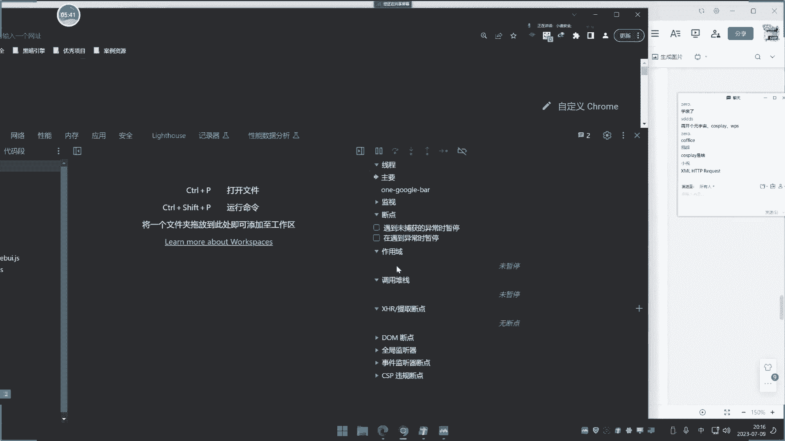

那么作用域就是这里的意思，指的就是说运行后的相关的数据的值，就会显示到这里，调用堆栈，那简单来说它就是代码的执行逻辑顺序，然后这个有逻辑顺序呢，它不像我们理解的是由上到下。

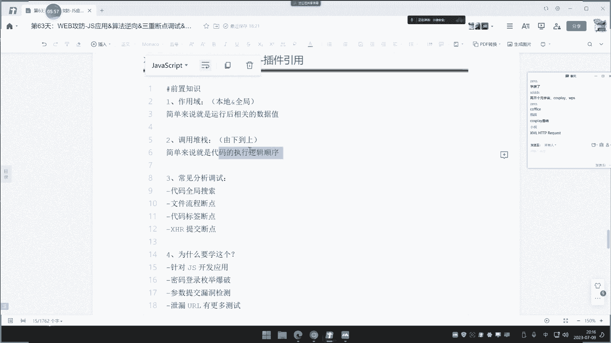

它是由下到上啥意思呢，就是说他这里呢假如说有有一个顺序对吧，按照正常逻辑来讲，我们肯定是由上面往下面看，但是它的顺序的球恰恰恰相反，它是由下往上砍，啥意思呢，就说他的由商往下看。

是上面的结果是他最终的结果，下面结果是他起步结果，所以说如果说你按照代码的执行顺序看的话，就是由下往上砍，你如果你想反溯源去分析的话，就是由上往下看，就说一个是起点，一个是终点，终点呢是最上面。

下面那是最啊，下面最下面的是起点，所以他是由下到上的一个过程分析的话啊，这就是我们说的讲堆栈这个端点呢，啊等下会说啊，这是这两个东西的一个解释啊，这个呢是看代码的执行逻辑顺序。

上面这个呢就是看执行里面的数据相关的值，就可以在里面看值，还有一种呢就是我们说的常见的分析调试，有三种方法，我们网上呢可能还有其他的呢有什么四种五种，但是没必要啊，一般是三种足够啊，帮你去分析了。

我们的称之为叫三重门是吧，三重端点，这是我自己教的啊，网上没有这样教法啊，就喜欢搞这种是吧，专业搞这种，自己取个名字装下逼，对不对，那是哪三种呢，文件流程的这个端点是吧，代码标签端点插hr提交断点。

等下我们会说啊，还有个呢就是我们说的全局全局模式搜索，这个呢不属于端点，它是属于搜索，就是通过像我们代码审计一样，搜索特定的关键字，再去寻找整个代码端里面的关键字呢，来定位到指定地方。

但是这个呢是怎么说呢，就是说入门的时候都是这样玩是吧，一旦有了这个相关技术之后，都会用端点，端点的会专业一些，好这里呢介绍完了啊，那么接下来我们就是围绕这三个知识点来展开，我们就直接开案例开搞，对不对。

然后每一个方法我都会给他讲到，大家就通过这四个方法，选择你自己最熟悉或者说最喜欢用的方法，这四个方法是针对不同的对象选用的，就是哪些对象呢，换哪种方法会好一些，哪些对象他换另外一种方法呢会好一些。

这个是要根据目标的一个实施情况来决定的，好现在呢我们就来给大家看一下，首先呢第一个案例啊，那申通的申通的啊，一个登录的啊，这里呢是一个登录的啊，这个登录我们干嘛呢，我们先来思考一下啊。

如果结合安全来讲的话啊，这里呢我们去去，假设我去爆破一个账号密码一样的话啊，我去爆破它，如果我提前啥都不知道，我就爆破，我怎么爆破他呢啊我就先把他包给他抓一下，抓到之后呢，我们再来啊，就是那在这里哈。

我用的是呃这个是自带的啊，一滴呃EDGE那个浏览器啊，你这里用谷歌浏览器都可以啊，你只要不用IE浏览器就行了，其他什么360啊，谷歌火狐都行啊，都有这功能的啊，所以无关紧要，点一下这个网络这里啊。

网络这里呢要把这个保留日志，这个地方呢把它勾选上哈，这样子呢啊，这样子那就不会这个有一些数据抓不到的情况，那这里呢我们登录一下，比如说我在那随便使用这个账号密码的话，我123456哈。

就这样来12356来，密码是123456，我点击登录打开勾选啊，点登录，点完之后呢，它提示这个密码错误，好好我们来观察一下啊，这是它发送的数据包，我们可以看一下啊，这个数据包这里呢有一个什么叫标头啊。

什么负载啊，预览负载就是他提交的数据数据，这里呢可以点击查看源，也可以点击这个调性呢，username呢发的是这个东西啊，什么mono电话号码的意思，然后这个password那三个字发了，你也看到啊。

username呢被加成这个东西了，密码呢被加成这个东西了，然后这个电话号码呢我也不知道是哪个啊，因为有一般的话用这password，那这个可以，这个呢我们先不管它啊。

那这里有UZM和password这两个值好，大家试想一下啊，这是他一个发包，至于说常见的就是呢登录的那个地址，去提交post去发包，然后呢，最终的结果呢就是提示用户名和密码错误嘛。

这个预览就是返回的响应响应结果，响应结果呢预览呢都是一样的意思啊，预览就是看那个结果的意思，相应的也是那个后面返回结果，返回结果就是刚才提示的用户名和密码错误，了解输正确值的一个情况是吧。

那这个是他的一个情况，正面是提交的数据，这边是他的一个返回结果好，大家看到这个结果之后呢，比如说你现在我们就很简单的道理，我做这个安全的一个测试者去讲的话啊，因为我们是围绕安全讲啊。

不是说要讲这个东西啊，不是要去讲这个技术啊，主要是要结合安全奖，安全奖里面的话，这个登录框我先不说精不行，漏洞测试，我最起码首先想的就是一个这个类似的，大家都熟知的这种枚举爆破的这个概念在里面。

那我枚举爆破的话，我取这样去发包这个账号，这个密码我发包的时候，我的密码和账号肯定都是明文，就说123456啊，这种写法对不对，或许这样罚罚到什么呀，是发到这个地上面去提交去请求啊。

但是这里呢你罚就会有个问题，什么问题呢，就是无论如何，这个密码正确和失败他都会400，啥意思呢，因为我们可以看一下啊。

这个逻辑就和我们这个逻辑一样啊，来客户端用户提交。

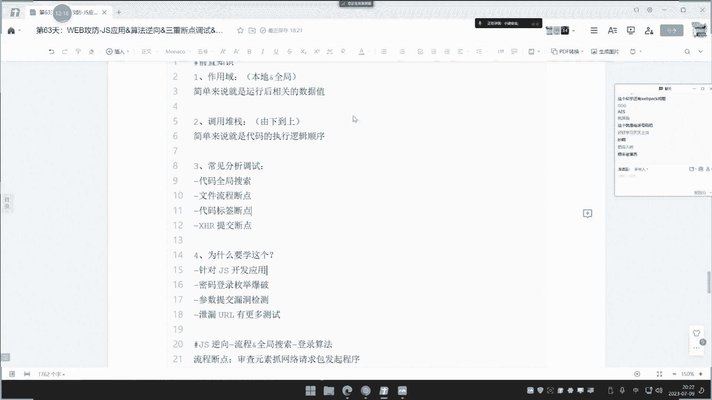

啊客户端用户请求请求。

这里请完之后，他把你提交的数据给他获取到，获取到之后进行加密，再发给服务器，再发给服务器，服务器这边呢接收数据，解密数据代入逻辑里面返回结果，它是这么一个流程，这个这个网站就是这么一个流程，对不对。

就是说他的数据在获取之后啊啊进行了加密，你可能说哎我怎么知道加密啊，刚才那个包装的那么明显，那个账号密码是是这个直接写的吗，不是的呀，加密了呀，所以他这里存在一个加密，那么加密这边呢服务器发到这边之后。

他会先接收，接收之后呢再解密好，你呢按照正常的这个爆破去讲的话，你假如说你输的这个账号密码是吧，是ADD me，密码呢是123456，你就拿着你这样你你你去提交这种值吧，12356去发。

你这里去发过去啊，你这个爆破工具就这样罚，直接罚这个什么，发这个服务器，服务器拿这个去解解，这个123456能解出来吗，首先这是明文呐，明文去减剑铭文啥东西啊，啥都不撕了，所以这个逻辑就有有问题了。

就服务端在面对它会有个解密过程，你就必须要发给对方，是个密文，你才能符合逻辑，才能正常的进入后面的判断和返回，否则的话你逻辑不正确，流程都走不通，就不会存在能不能爆破的题，就是压根就不会存在。

所以说你要实现这个最简单的这个操作，你首先要就要先把这个什么逻辑搞明白，所以我要爆破，我要做的事情就是在爆破的时候，把这个数据给它加密之后，再批量的去发是吧，爆破就是批量的去罚罚到这里来。

然后再进行这样子呢，才能正常的进行这种爆破雷举，否则的话就无法进行。

那么如何加密呢，就是我们这里要找算法。

你也看到他这个账号密码就加密码，你输的是123456，它变成这个东西，他变成这个东西，对不对，那你输入另外一个铭文啊，你怎你怎么知道这个算法，你不知道这是什么算法呀，那你可以说这贝斯缪斯吗。

贝斯缪斯你解密不，如果不是，那就不是了呗，那其他算法怎么搞啊，所以说这里呢需要找它的算法，把算法搞出来之后呢才行好，那么现在呢我们来教大家如何搞算法啊，首先第一种方式就是我们最常规的，最简单的方式。

就在这里搜搜什么关键词，一个是收这个的路径的，因为他请求这个路径嘛，我们就看哪个代码里面，就是Ctrl shift加F搜这个关键字搜，看能不能搜到啊，哎可以看到他这里呢就收到了这个地方，一个代码端。

那这里就收到一个大M端对吧，AJX请求这个什么这个地址，然后发送的date等于login date是吧，这就是我们发送数据啊，登录成功之后就怎么样怎么样怎么样，对不对啊，然后进入这个什么东西。

然后你看这个login data呢是通过搜出来的，这个应该就是那个发送的数据嘛，post提交login data data等于这个发送数据啊，login data呢你就继续看，往上面翻。

你看看login data，username等于哎，这里是不是有个加密的这个算法呢，接收mono，接收password，然后这里呢就是等于呢，那么就等于这个表单里面提取到值。

这个password提取到值啊，这里就是加密的这个东西出来了吧，那我们可以试一下，把这个呢在我这里呢控制台这里来提交，看一下能不能正常的这个加密啊，我们看一下，直接用呢，比如我加密仪啊，30。

随便加密一个账号诶，他说什么这个东西没有被声明好，我们继续往上面看一下，看下追一下这个东西是从哪里来的呢，是从这里来的，我们再往上飞，看一下他有没有这个生命啊，好直接收那关键字啊，直接搜到关键字。

这是猪式代码，哦这里啊应该是这里啊，先调用一下，创建一个对象，好，我们来试一下啊，先创建个对象再来运行，你看是不可以啦，你看我直接把代码呢创建一个对象，这样创建变量，变量呢调用它的。

那么其实就是说你在实战中的话，就这样去发送这个值，然后后面那就是你的铭文，你就把你的密码啊，密码字典账号支点都发放到这里来，不断替换这个地方，那么它就会组把那个加密之后呢，就形成这个值。

我们就按照这个值呢去提交给对方去接受处理，那就进入正常逻辑嘛是吧，所以这没问题啊，很简单是吧，这全局搜索，那还有没有端点呢，好现在就是高端东西了啊，这个搜索呢它只能解决简单的，高端一点的呢都不能搜索了。

都有断点了啊，断点给大家看一下啊，断点有三个方法，我每个方法都给他教一遍，然后呢等下再换个实例再给大家讲，再讲一遍啊。

大家就基本都会了啊，好我们来看一下端点呢分为三种方式，一种呢就是我们说的文件流程端点，什么叫文件流程代理呢。

就是执行的代码加载过哪些文件，这是从哪里看到的，从网络这里啊，从网络这里点一下，刚才这里呢这个数据包你要注意啊，找到对应数据包，这个数据包就是刚才的登录数据包，你也不要问我，所以为什么不死下面这个啊。

你如果这样的话，那我就没办法了啊，你自己呢要根据这个请求的类型和，请求的数据和请求的文件名来判断的啊，你这个明显就是个图片，你就不要问我这样的事情了，然后呢你看一下啊，何为文件逻辑的端点呢。

点一下这个地方啊，这个地方有个叫发起程序，大家看一下发起程序，这里有个叫请求调用对战，啥意思呢，就是说这个请求下载过哪些JS文件，也就是说在这个请求发送的时候，有哪些JS文件参与过这个发包。

我们可以从这个字面上去理解它来I什么，迪斯ten李明LOGAHXC的，那么我们刚才说过，这个调用堆栈的意思就是由上到下的一个流程，就说我们正常来讲看代码都是由由上到下嘛，就是新的AGX login。

但是它的代码执行逻辑就刚好相反，就是说从下面这个往上再执行，啥意思呢，就下面这是第一步，第二步，第三步，第四步，第五步，第六步，而不是说只要是第一步，第二步，第一步，三步，第一步这样子啊，所以你看的话。

你要知道它的逻辑顺序是由下往上面在执行，而不是由上往下啊，不要搞错了啊，所以呢我们现在看的话，大家觉得啊你着重要看哪一步啊，那肯定就是看不要我找了个加密算法，那肯定就看中间这些部分。

因为这个发送应该就是说加密完成了，才会发送啊。

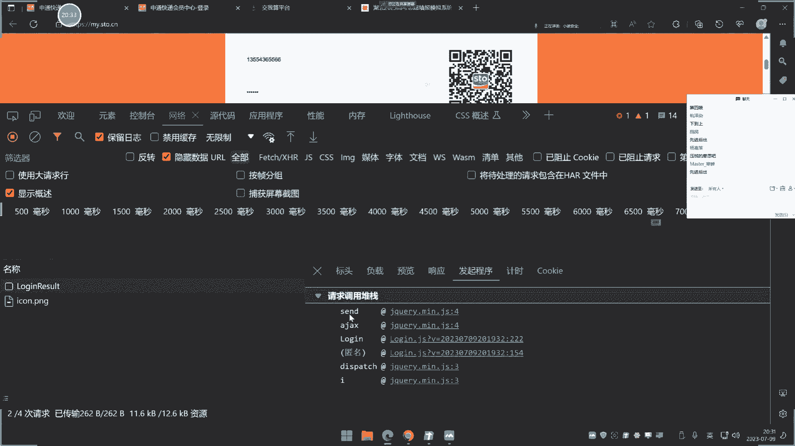

你看这个我们这个逻辑顺序啊对吧，你先是获取数据再加密。

你这里都发松了，那说明这里加密肯定已经完成了呀。

所以说这个加密的过程应该是在这个新特的，在下面这两步，那就是AJX或者是login，从这个字面上面去理解的话，AJX呢一般用来是提交的，login呢是用来登录的，那么他们哪个会更大的可能性呢。

应该就是这个login，所以我们就打开这个login这里看一下啊，呢是吧，打开这里一看，跌到这里之后呢，你会看到它自动跳转到这个地方来了，对我也打开了，自动来这里啊，那自动来这里。

这不是我自己固定到这里来的啊，不固不固定来的啊，啊点到这来了，那就这地方对不对，你看是不是要自动找到，刚才我搜索的那个地方来了呀，来我刚才搜的那个代码，是不是这个东西也把搜到了是吧，他自动早就来了啊。

你可能说那我在网上分析啊，这个没必要，我们下端点啊看一下啊，我就下个端，你就觉得哪个文件这里比较可疑是吧，来点击这个地方呢，如果说大家这个代码看的不明确的话，点一下这个地方呢，这个地方有个叫啊。

如果说你看代码，你觉得不好看的话，你可以换一下呢，他这里有个这个东西呢，注意一下啊，可以换一下，有些地方的显示不是这种显示啊，有些地方是显示的话，就会像我给大家看一下啊，那有地方显示的话。

可能是那种显示不不太友好，你就把点一下这个地方就可以了啊，注意一下啊，我在下个端，就刚才这个地方下个端，下个端之后好，这个时候大家看着啊，这个时候非常关键的过来了，我就重新登录一下。

大家看一下有什么不一样的地方啊，点登录啊，你可以看看浏览器上面就说哎呀，已在调试程序中暂停，那他就端到这来了，端到这里的时候，我们再关注几个地方看一下R呢，你把嘞你把鼠标不用单击。

只要鼠标焦点放到这个login data上面来，你可以看到上面就显示了这个数据对，说明现在这个login data就已经是一个什么，加米好的了，那你上面再思考一下，那既然是加密好的。

那就说明这个加密应该是在这个什么之前，就好了呀，因为这个login data是在端下来之后，他已经现在的日子又往下执行，这个东西都加好了，那肯定加密就是在他之前的，所以你可以怎么样呢。

来把这拉到这边来啊，这边呢那有几步，一个是叫什么单步执行下一个函数调用，向上呢跳出当前函数是吧，还有个这个是什么，单独跳过下一个函数调用，还有这个什么步骤好，这里有个叫什么韧性，就是把它恢复。

我们这里呢都不用管它，我们点一下这个地方啊，看一下现在的作用域是啥意思，终于看下来，你看login data就是你可以在这里看，也可以在多作用域的看，更重要的就是告诉大家，在作用域里面看会好一些作用。

就是把这里面的常见字都给写出来，你看他locking date呢，点开了字都帮你显示了，就刚才那几个字请求字嗯显示了，并且在呢number接收的是123456，那密码是123456。

发送的login data呢变成这几个，说明在这个过程中已经加密了，然后再看调用连战，你看看由下到上对由上到下上身执行诶，这是第一步点的时候，你看他在这里点到这个地方的时候啊，掉链这里点这个地方的时候。

在这里代码在这里执行，你看现在的这个什么，现在这个什么本地的值是这么一个情况，再往上面看啊，本体值是这样情况，再往上面一看，本体值是这样情况，再往上面看到这里的时候，哎立马就加密成功了。

那就说明这个匿名和login这个过程之间，就把数据给他怎么样加密了，能理解，看能不能理解，因为我们刚才说了呗，这个逻顺序是由下往上字形啊，你分析思顺为什么他要这样搞个反逻辑呢，因为他分析是就是说看来源。

就说这个密码是从哪位，就说你正常代码从1~10，你就是从下往上看，如果你想10~1，那就从上往下看啊，你看你这么喜欢哪个逻辑，你就搞哪个逻辑去观察，你看这里呢我看这个本地域的这个值的时候。

你看这个这步到这步时候，哎这个密码呢啊，他在这里结束的是这个值，然后呢到这里就变成了什么，变成这个东西，它变这东西，然后你关注一下嘛，这个login data是吧，log data是怎么来的。

那你也可以看一下吗，lin data是怎么来的，是不是啊，你看看他点呢，这里看到点login，然后他这里是这个匿名，这里的触发LOGI，输完罗密函数，那然后呢那输入CTRL加单击，那把它点一下。

你看就提示用户名和提交失败，也就说这个login就是干嘛的，就是执行的，然后这里就放出去了，刚才把它放出去了啊，就CTRL加C啊，哎这个单机就是这里那个出去了好，我还是来到刚才的地方啊。

嗯还是刚才那一方啊，这个date，然后呢你现在呢就要找这个什么lin date一个情况，然后你选中你看loin date怎么来的，是不是刚才逻辑就出现了，你看从这来的，对不对，来继续往上面看的录音列的。

先声明为列表，然后到加载的地方，然后呢你再选中这个地方呢，把这样选中，对不对，然后还有这个地方在这里选中，你看一下啊，就是这个密码这里呢他还会显示什么，显示他的呢加载的文件，那就是来源于这个文件。

就来源于这个文件，点进去，这个就是加密算法的来源文件，到这里就看到了，它里面调用那个加密算法，就是来源于这个文件点击器，所以呢这个端点呢就是配合这个作用域，和调用堆栈来去分析整个逻辑。

来判断这个加密在哪个和哪个之前进行了，加密完成，那么就追上面的代码，从这里呢就是通过这个什么时候这个密文出现，和哪里还没有出现，那个中间一步就是的，那这里呢找到了之后啊，我们和刚才那个就是一模一样的吗。

就是像刚才那样子操作是吧，有这个流程呢就一模一样了啊，那这种单点呢称之为叫称之为叫什么文件流程。

端点分析，还有一种叫代码标签分析，这个更直接，但是如果说你在网络这边。

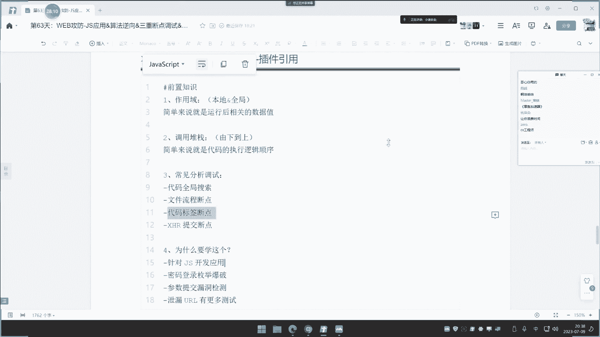

它加载的这个什么发起程序比较少的话，可以使用我们说的在这里去端，还有一种方式是什么方式呢，看下啊，我把断点吧，不用不用不断它了。

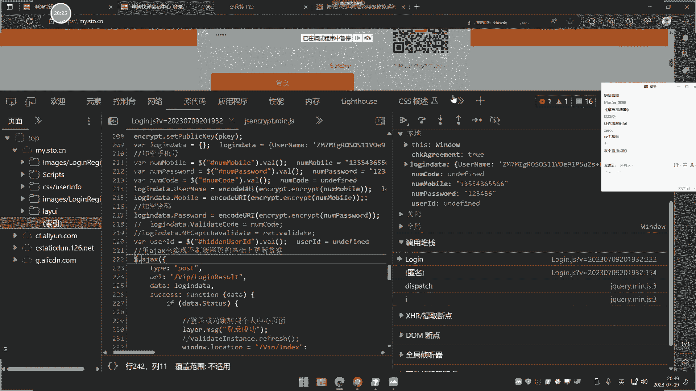

现在我再教大家一个断点方式，什么方式哈，叫标签管理方式，点击登录这里，我要监听这个事件，怎么点呢。

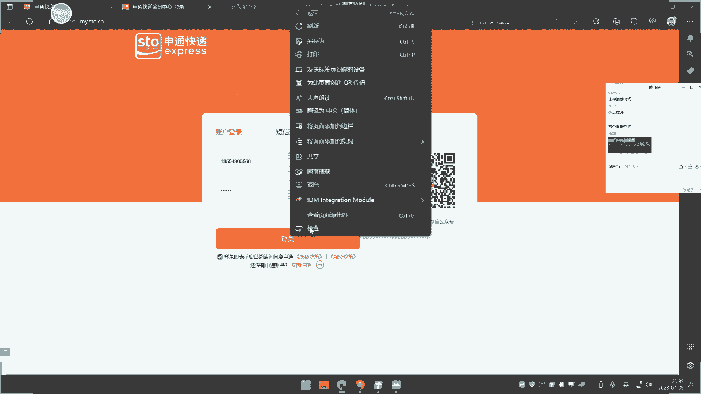

来把这个登录这里选中右键啊，不是选中，就是鼠标放到这里来，点选中检查元素，这地方就是登录事件是吧，然后右键怎么样，这个叫中端于，那在这个叫中断于什么东西啊，你看中短于指数修改属性修改。

那一般就是第二个就是说这里属性被修改了，那修改肯定是点了提交，或者说点了什么东西，是不是就是对方一点登录，我就把它端下来，你就知道这个点登录时候触发哪些东西呀，这个叫标签断点，能不能理解啊。

就说我要抓这个拿个操作的时候啊，我就直接那个刚才那个那是看那个整个走向，而这个呢就是针对单个的，比如说我点忘记密码是吧，那么就会触发哪个东西，尾巴端起来也可以啊，但是我们可以看登录这里，因为他发包嘛。

我选择这里呢，点击什么中断于属性修改，中断于主修改，然后这个时候你看啊，我点一下，哎，这不是尴尬了吗，啊他这里应该是尴尬了啊，他这个这个不能用这个端点啊，看来他不这个这个不能用这个端点。

我换一个车子给大家看一下啊，看这个啊，这个有这个断点呢，这个是个上海交大的那个平台。

也是我们的一流R3RC的一个目标，看这个地方呢点击登录。

我把这里下个端啊，那点这两个呢选这个断点啊，好我们来试一下这个地方的，他有些地方能用，所以说这个好用，但是有些地方太大属性修改它端不下来，你看啊点这个地方来点，你看他就端下来了，来自动端下来。

你看来login这里呢端下来了，就说你这里一点这个login登录了，他就断下来了，就是说后面流程就是登录事件了，就是围绕后面登录事件再看，好我们先说这个啊，先等一下呢我们就演示这个标签代理啊。

就用那个案例演示。

因为这个案例呢他端不下来，但没办法啊，为什么端不下来呢，是什么原因呢。

给大家说一下，就是因为他这个登录点了之后，他没反应，他这里监控的是属性修改，就说你这里点了之后呢，他并没有尝试属性修改，所以断不下来，所以有些这种标签呢它断不下来，就是根据这个上面的标签决定的啊。

什么意思还听不懂啊，这一个什么意思呢，很简单的道理啊，他有些就是说你点登录之后呢，他才发现了属性修改，有些地方就是单纯就是发个数据，没有其他形式修改啊，要根据这个这个TM的个表单决定的啊。

你可以明确的看一下这个地方嘛，那个刚才这个元素这里你看一下啊，他这个地方可以看一下好了，你看他这个地方的啊。

他这地方就明显了，写的这个表单的东西就不一样，你可以看一下啊，像这里的一个属性，你看呢他这里呢class这里还有这个这东西，点了之后呢，他触发的时间不一样啊，这是主要原因，我们还是回到刚才那个讲啊。

这是第二个端点，我待会呢用那个案例去讲这个支点啊。

我们再来看这个XHR端点，什么叫蔡家呢，XHR这俩啊，刚才的全称的叫做什么叫做xm AD b request是吧。

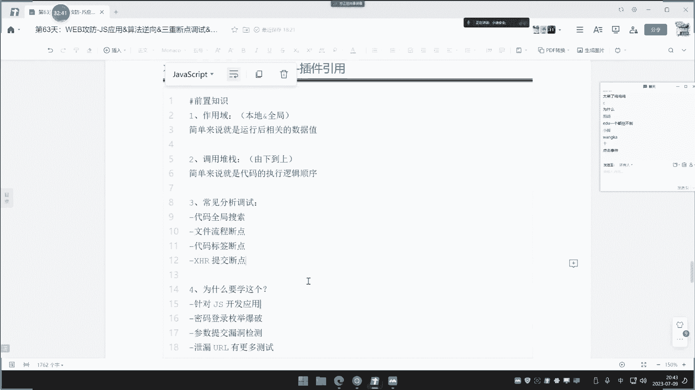

那现在呢我们来看一下啊，这个端点该怎么钻啊。

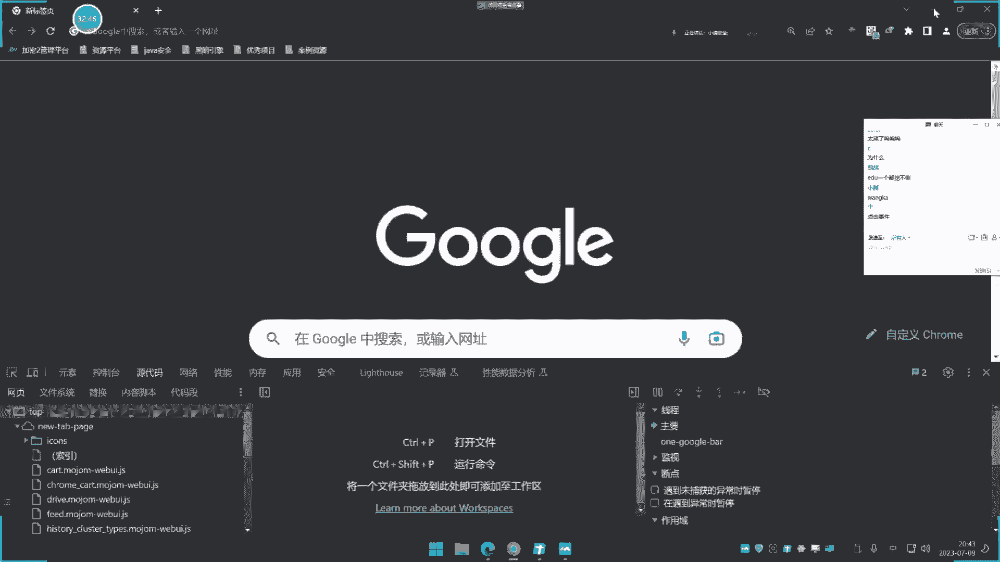

这个按钮该怎么断啊，也是非常简单的。

就是用代码段去断，啥意思，好看着啊，刚才讲的是哪种断点呢，刚才是在这里网络这里是吧，通过这个发包之后啊，点一下确定，然后在这里呢去点击一个文件里面，在这里自己下端是这样断法，对不对。

好现在呢再教大家一个方式，用菜一掐断点啥意思啊，先把这个请求抓到，抓到之后先确定他是x hr的一个请求，carnation叉，hr就是我们说的XML ATP request的一个这个类型。

这样子呢是符合的，打开地址看一下他的这个什么请求的URL，选择其中带具有代表性的地址，你不要选择那种固啊，随机的啊，这种呢就是固定的，就说你即使请求是这个地址，第二请求的还是这个地址。

这固定的它可能后面还可能会有参数，不管它就选取这个固定的特有的啊，把它选中，干个什么事情呢，来到源代码这边，选中这个最上面啊，不要选这里面去了啊，选中最上面这边有个什么叫呢，插hr提取和截止到点打出来。

点击加号，把地址把它写进去，把它勾选，那么现在意思就是说让浏览器去监控，请求到这个地址的时候，断点能理解吗，这个是我们再点登录断下来了，站起来了，然后你看中文语里面是和刚才一样的，好瞎分析。

这是新的发送，再看那上面的数据对应上呢地址里面有信息，好，再看login的时候，哎，数据出现了，那就应该是在AJX，匿名和这个下面这个什么这个地方产生的，那往商分析的话，哎哎等一下啊。

来他是代码是由下往上执行的顺序，刚才AJX的时候，他就去发送了这里，那时候加密完成了，这个是去触发这个登录事件，能理解了吧，那现在一分析的结果。

那我可就OK该写上去了，这个是触发登录事件，这个是在登录时候加密了，这个是发送请求啊，这个就是组合那个发送请求的那个信息，这个就是真实发送，了解清楚了，那么加密在哪里产生的。

就是在这个地方产生的login，这里产生的，因为他代码是向上执行，我们分析的时候一般是向下往上看，这个看你自己的需要啊，就是说流程是往下往上执行的，但是这个显示是先显示终点，再显示起点啊。

由下往上去显示。

能理解吗，通过刚才一分析，这就分析出来了呀，这个就是差hr，这个是他发送的时候呢发送这个请求，你看上面的请求呢已经显示了发送的信息呢，以这种请求头取发送，它上面都有显示，你看加上你的AGX呢。

就勾到前面的请求的什么方式，和请求的路由地址和这个东西，然后请求的数据在这里产生了，对好，后面这个呢就是我刚才说的触发这个请求方法，LOGI前面几个呢就不太重要了啊，前面几个就不重要了。

那肯定就是接收数据那些东西事情对不对，所以逻辑呢就搞清楚，这个呢就是直接瞎插HR断点，下插HR断点，其实这几个端点呢无非都是端点，只是说他端的地方不一样，第一种方法流程断联，那是端你自己想端的地方。

标签端点，那就是抓了一个事件触发的那一刹那，那个端点了，而我们这个hi端点，那就是端请求到那个地址的端点，反正总归来讲就是很简单，比如说我们这个要走五步的话，那么文件流程。

那就是你自己的选择其中的一步去段，然后这个这个还有一个，就是我们说的那个问标签断里就是某个事件，就可能是第二步和第三步，可能第四步是吧，你去选这段，然后呢最后这个H叉hr端点呢就什么呀。

一般就是在第四步，第五步就是发送的时候请求获取那个地址是吧，那么那我们肯定就是往前追溯，能不能理解啊，来我再给他看一下这个毒这个诶。

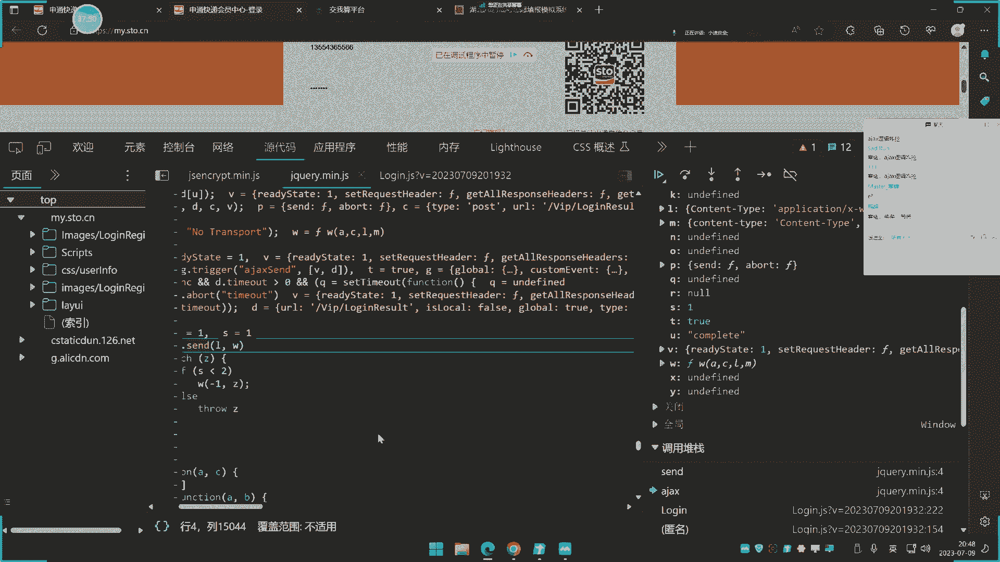

插hr这个单点呢就相当于是端的是哪个地方啊，我因为我猜一下我端的是那个请求地址，请求地址，那就是发送的时候发送的地址都已经产生了，那就说明这个阀送已经发出去了，那应该端的就是这个地方和这个地方的中间。

就是发送这个地方的中间，好不好理解啊，这里就是断的是这个地方，我断的是这个地方，因为我端的那个地址已经出来了，那就是这个两个两个地方的，就是这个点，这是插hr的一个端点，端的是路路径地址。

就是请求的什么又要路径，需要路径吧，对不对，这是差1H，那么标签端点呢，我刚才是怎么端的，我端的是什么，那个登录那里，用户登录这里是那其实应该就是断的，是这两步之间，就我点登录的时候诶。

那下一步应该就是获取数据，或者说啊或获取请加密，那应该就是1~2步之间断的，是这是那个标签断点，因为我们最终的结果是要找这个加密算法，所以呢刚才那是端的四到这里，那么就往上面翻对吧，就往上面翻。

如果是断的是标签的话，那就往下看，对不对，然后还有一种呢自定义端点，自定义端点，那没没什么说的啊，自定端点你可能是啊自定义端点，那就看你自己需要了啊，这是那文件流程断点嘛，你可以断任何地方。

那断任何地方很简单的道理，你断这个地方就往上看，那你到这个地方就往下看，这就这个意思，反正我们最终目标是达到这个加密这个，核心逻辑的代码段。

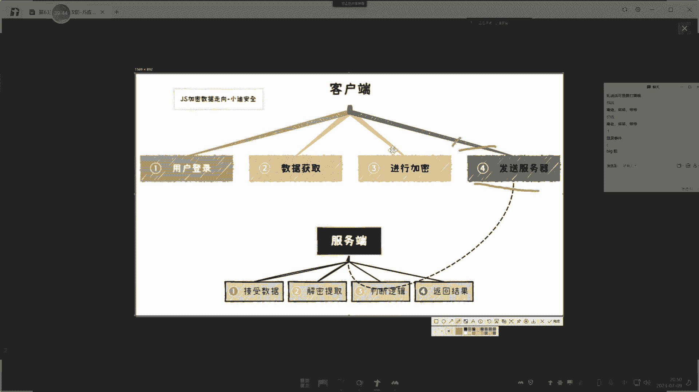

所以这几个端点呢你要根据你自己的实际情况，选择性的使用好，刚才那是那个案例是吧，一个案例呢不喜欢是吧，我们还搞个案例再来看一下，而且把案例讲完之后呢，我们还要结合到安全里面去再给他看，来看一下啊。

这是申通那个啊，我们看这个呢交大的这个登录的一个平台，也是我们那个呃EURSC的是吧，单位那这个呢怎么端呢，几种方法都讲一下，我来先讲，来看一下啊，我先讲这个什么，这个刚才说的那个标签断点。

你刚才标签这里没讲嘛，就那个案例不行吗，那这个案例呢我们用标签断点呢，看下端给大家分析一下，看能不能分析出来选择这个标签，这个登录这里把右键呢中断于属性修改，然后呢加两个好一点，指数修改也行了。

点登录密码呢我就输123456，好网络这里呢也抓一下，点击提交登录好，端下来了，网络这里呢发出去了，我们可以看一下数据，你可以看到那密码正常密码是明文啊，这个账号是铭文，立马就变成这个东西了啊。

密码的贬这个东西，那想都不用选了，密码被加密了呀，我明明数123456，咋变这个东西呢，所以说你要做什么测试，漏洞测试这种情况，你不懂这个加密算法怎么测呀，测个毛啊，逻辑带不进去好了，刚才断下来了是吧。

断到哪里来，是不断在哪了，你看它照到这来了吧，咋这是掉链呢，多不多一大堆要来调调用对战一大堆，我们先想一想啊，这是在登录这里，那应该就是说逻辑应该是什么。

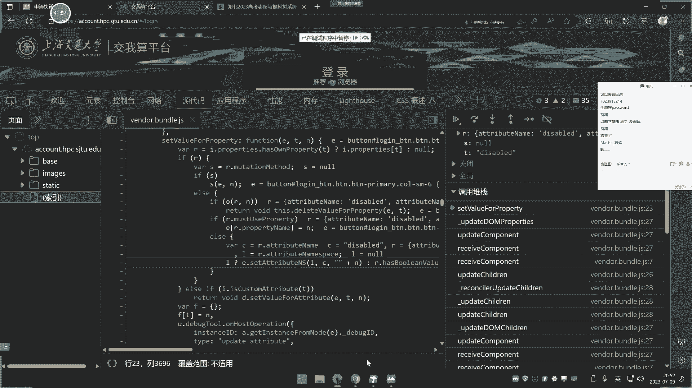

焊加密的话，那应该是在下面，在下面是怎么个流程呢。

这样装好不好呢，你觉得好不好肯定不行啊，所以这个标签断点说实话啊，没有那个XHR断点好，因为你看到啊端到这里来之后呢，你看一下这里面的一些这个常见值，这里肯定是看不到个加密的那个密码，为什么这样讲呢。

因为他的顶级就是来到这个这个数据获取在哪。

后面这个进行加密压根就没有进行，你除非是往下执行是吧。

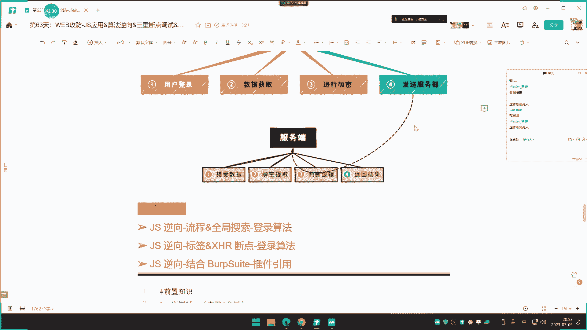

看到下一个函数啊，让他执行，然后呢一直执行，执行到那个加密东西出现的时候，就是往下看的那个加密的数据出现的时候，那就来到那个地方，那这个过程可长可短，就是要看大一码的那个，是吧，凉了啊。

所以这个太太长了啊，嗯所以说建议大家呢用这个端点呢，标签断点一般是抓那个整个事，对那个时间呢用断点好，如果说你要找用加密算法，它有流程的话，最好还是用这种文件断点和菜hr断点会好一些。

我们这里呢就把刚才这个断点给大家去掉，去掉之后呢一定要去掉啊，不去掉的话，等下呢就会有影响，我们呢先来看额，第一种啊，就是文件端点点一下登录，触发这个请求，结果呢就提示这个不存在嘛，发起程序里面看一下。

找个登录点，那哪一个比较香呢是吧，这个call API就是应该是call了，call出去了，那肯定不看这个，第一个也不看，这下面哪个比较香啊，可以随便选择一个这个看一下天气好，这里有个login。

把他下个段重新登录一下，看一下啊，断下来了，看下这个地方来login，这里呢看值来，这是什么字啊，这是什么字，你看见了47165，A等于12345，不是密码吗，I不是我账号吗，S是什么，这是什么东西啊。

这不就是那个铭文吗，这O有什么东西啊，我不管他呀，你先不管它，待我们光看一下呢，这个这个东西呢就出来了，然后你看这个下面呢下面这个调用，这是往上往下，从下往上执行嘛，他开这个上一步的时候。

三字组啥都没有，好到这一步的时候呢出现了，然后你看一下逻辑啊，他这里这个是这个SS是什么，你看一下啊，这个SS等于什么，你看看S等于R点，这个A然后这个R呢等于low什么东西。

那应该就是说这里创建个对象，传了个JS的这个什么以call的一个对象，然后呢O呢是等于CRSA扣的RSA，不是又是一个加密算法的名字吗，r c code o等于正常值。

那这里可不可以理解为这是一个加密的，类似的觅食啊，或是类似的偏移量这种东西啊，因为这里可以看到呢，CAPUBLICK啥意思啊，设置公共的k size为欧欧，不就刚才这个值吗，那这里应该就是加密密实。

那么O等于什么等于这个值，这就是加密密四，然后这个地方是加密密斯之后呢，选取这个AA你看到它的值等于什么，123456可以，这里也看到就是我的密码，他对A进行加密复制给S提交的时候，LOGII是什么。

I看一下呢，I这是等于47256814，login i账号S取得A的加密结果，那就是密码，login账号密码，那不就是等同于登录账号密码的意思吗，那这个S就是密码，密码从哪来，从R点ENKYPYT来。

A是你要加密的东西，那我可以尝试一下，把这个值把选取到控制端这里调试一下，比如说我加加迪直接加密，那说明没有问题，那现在呢就知道了，这个什么加密的一个地方来了，我可以试一下，在本地试一下。

因为我最终呢不是说在这里把它挑出来，这里谁都会调是吧，我主要目的呢就是要说我本地呀也要把它哎，也是酸吗，对不对，也把他找出来呀，那就来到刚才那个代码端这里啊，我可以把本地调出来，怎么调呢。

你要看一下这个J这个地方是来源于哪里呢，这个对象来源这个文件，那我就把这个文件给他，怎么样把保存出来，另存为，桌面，或者说我直接CTRL复制来到网上找个JS在线记录。

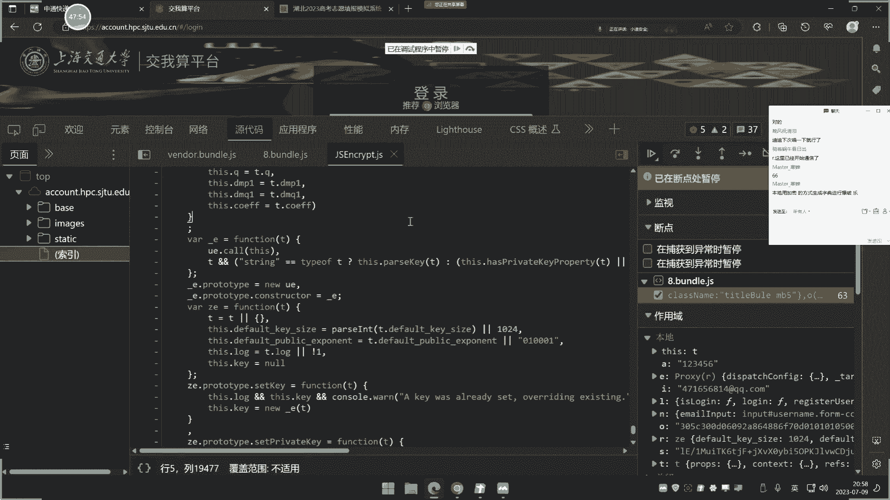

有人说在哪执行，你可以装个node js去调用执行，也可以在网上用这种在线视频，或者说直接在JAVASCRIPT那个那个窗口执行啊，我这里呢为了显示的更加不会影响到是吧。

我就找个这个在线执行的地方好一些吧，先进去就是那个代码啊，这个代码对不对，代码写进去之后呢，我尝试一下刚才那个调用那里是吧。

调到那里啊，然后这是他的那个代码逻辑，把它粘贴复制出来，按照他这个逻辑呢写下来就是刚才那个代码嘛。

那个JS代码嘛，在这引用，我们呢按照这个逻辑来写一下这个代码，看一下能不能本地去实现，好改几个地方，首先呢这个O肯定要改了，O等于C这个值，那么由于这里我们也换算出它那个密次了，所以我直接把显存来。

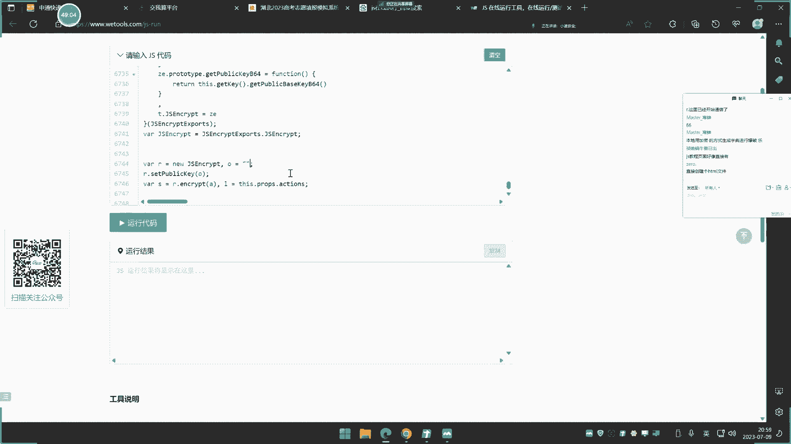

意思就是这个。

对不对，然后这个呢设置好呃，S呢就是我们加密的密码，这个密码呢我就把它怎么样写，直接显示加密也3456，我说小D，那我就直接什么console，哎等一下啊，强子点logo，然后S打一下执行。

看下能不能执行，看到没，能够直接换取出来，没有毛病呀，调试出来了哇，是不是，就是按照他的这个代码引用我创建对象啊，模拟他这个加密的这个代码，自己本地写一个对吧，那我就上来说，我如果要枚举的时候。

我就只需要改这个代码端，在这个地方就可以实现是吧，我的铭文传输进去，让它会自动帮我加密，给我发送加密值来进行枚举，爆破逻辑就正确了，否则的话就GG是不是那个写出来了是吧。

那这个呢是使用的是我们的这个什么。

刚才的这个啥呀，把文件文件流程这个断点，然后这里呢我们再换是吧，这不是还有路径吗，你看这个呢我们再换这个地方来，来用叉hr这个类型给他端，它类型呢好像不知道行不行啊，我来试一下啊。

加这个叉hr端点试一下。

看行不行啊。

好点一下登录看这XR断点行不行，点断下来了，他也断下来了啊，这是差hr的断点，但这个断点你看看如果点到这个地方来，这和刚才逻辑一模一样的，你看看看那个V6在哪里，刚才逻辑也是断在了吧。

他只说呢把这个整个流程呢都出来了是吧。

因为我们说过嘛，它的端点就相当于发送到发送模拟啊，发送服务器和接收数据这里啊，所以你要看这个加面就是往前推啊。

往前推就是往下看呐，因为我们说过他的流程是从下往上执行，那么在前面那肯定就是在它下面的哎，这是他最顶级的那个CTRL去直接CTRL，就是我们做类似的发送出去，那这个找到非流这里的时候呢。

就是我刚才断的那个地方，断那个流程那里，那这里呢如果说你看到这里，不就和刚才一模一样了吗，所以说你用哪种端点是你的事情，你只要搞清楚，你用这个端点是应该往前看还是往后看，你明白这一点就好办了。

能不能理解啊，网上你看别人讲JS，你想他不是这样讲，因为他讲是为了你讲反爬虫，讲什么那个什么鬼，其他的东西他讲的要专业些，但是你听起来你不知道怎么和安全挂钩，我这里是站在安全角度和你给讲，这是很少有的。

但是专不专业就无所谓了啊，反正我是用我自己的理解去给你讲，好这个就是我们说的这个两个案例的讲解，那么把这两个案例讲完之后啊，我们就要思考一个问题，听了这么多好像就看到了，说我把这个铭文把它弄出来了。

也不知道这个实战中这个有什么意义啊，所以我们现在呢要反过来去想一下这个问题啊。

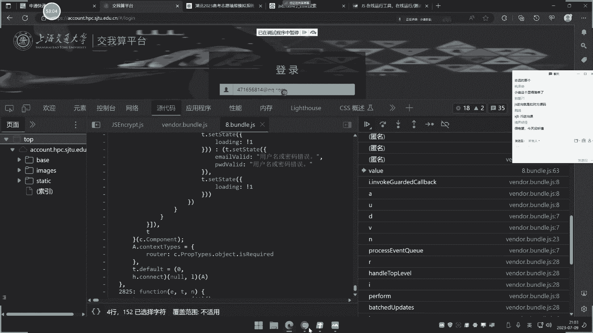

这个意义啊，好我们先来说第一点。

今天能解决的就是这个嘛，密码登录，这枚举破口秧歌网站，都是属于登录数据的时候呢，把密码或者账号都加密了，或者说单个加密了，这个密码呢得加密了，也说你去登录的时候呢，你如果只是发送这个值给它。

它能不能成功呢，他肯定是不能成功的，那么现在我们就给大家看一下啊。

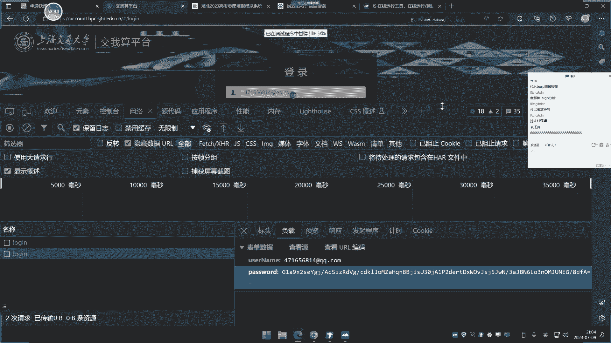

就是说我不去修改它的话，会是什么个逻辑来我们来给他测啊。

现在就要引用到安全里面去了啊，这个端点那就说到这里啊，后下节课呢我们还要讲高端的话，还继续讲高端的高端，就是绕过那个签名的SIGN的。

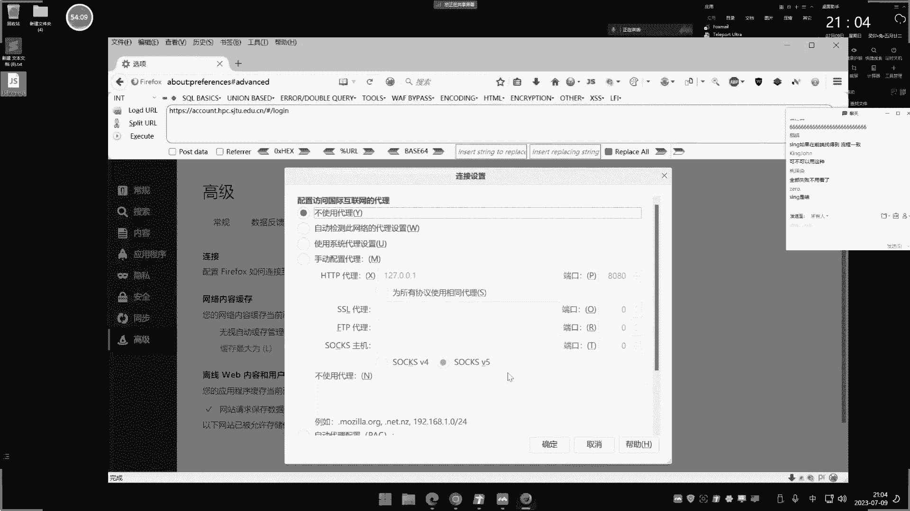

这个科是吧，放在隔壁SRC里面是吧，那都是是吧，这是好磕呀，SRC就十几次直播，七八千块钱，我今天内容呢就能在里面呢算一截。

等一下啊，我把那个抓包拿出来啊。

我和你把安全给他结合上，先来对比一下这个没有学过今天内容的，我们的常规解法，然后呢学过今天内容的啊，它的解法，那这样子呢大家就知道了啊，好我们来到刚才那个地方啊，好这是我们那个网站啊。

比如说我们这里呢尝试下，说比如说要登录和爆破它，我不不管说其他的啊，就是爆破它，那123456，我点进去点击登录好，这里呢就会抓到历史数据包吧，点登录，怎么抓也抓不到啊，你这什么鬼乱七八糟的呀。

这个逼呀我真是服了，他这个有人抓到了，哎呀，行吧，听你们说的啊，用那个IP地址啊，有私的啊，他有时候这个游戏bug啊，他那个bug是什么情况呢，就说啊有时候是那个选项里面没有勾选。

那个忽略那个就就就这方是吧，有的呢是，是其他的哎呀，不死at不走啊，我怀疑是可能有一些是帧数问题，唉这个火良机，的，你看他小尾巴能正常抓他百度他不能抓到，这应该是那个帧数没有装好，你那百度有什。

帧数没装好啊，帧数没装好，换个算了算了，我不搞他吧。

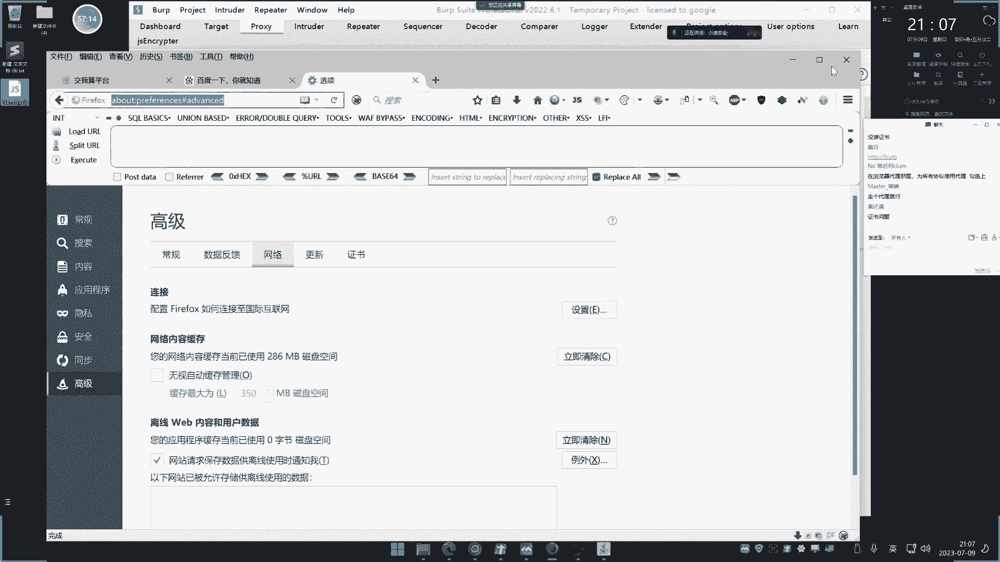

直接用我这个浏览器，这里一样大，嗯登录一下啊。

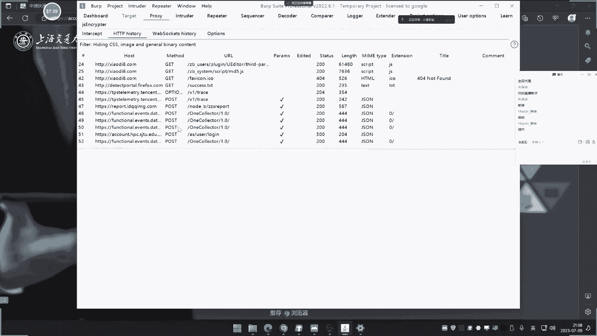

好这里抓到了啊，抓到之后呢，我就把它关闭了，免得影响这个正常上课。

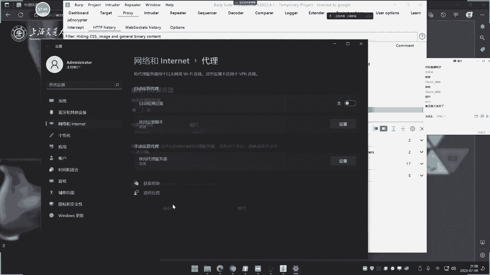

好，抓到了来，这是他登录的一个数据包，我们可以放到这边来测试一下呢，啊请求的这个地址，然后正面是这个密码是吧，那我们按照正常逻辑呢，哎我们就放到这个爆破，比如说我要尝试爆破，我怎么爆破呃。

账号假如我不更改他密码，我把它当做个字典啊，那当字典，然后这里呢就替换那个什么加载那个密码字典，比如说我就选择那个top500的那个字典是吧，长见密码好，让他发包，发包之后呢。

你会发现密码呢全部替换的是这个字，全部贴个明文字啊，你觉得这能爆破吗，爆破个鸟啊，爆破能理解了吧，把这节课的意义，这里就这个小这么一个一说，你能理解了吧，好这是一个点，那么试想一下，这是测试爆破啊。

换句话来说呀，这里是个铭文，我把它弄出来之后拿出来好吧。

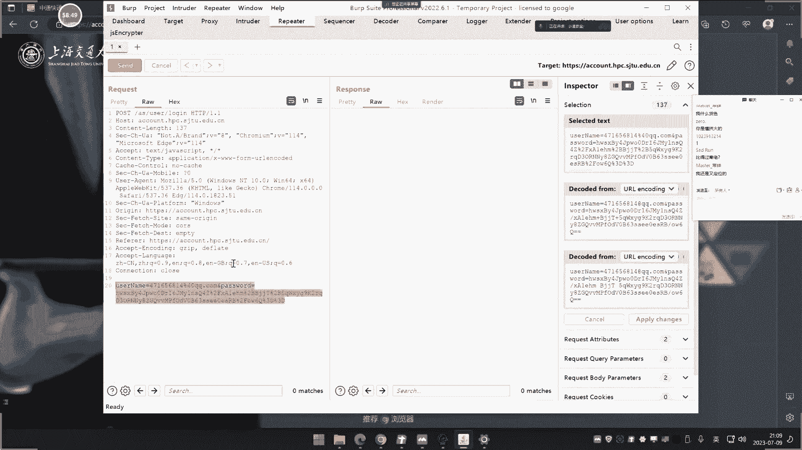

举个例子啊，这是张平文哈，我账号输的是这个47165681420B，看看是吧，这是写了密码，那我输一下3456好，那爆破呢，比如说每局呀，广播不要加密发送是吧，好怎么说呢，这是雷区爆破漏洞检测呢。

又要加密发出吗，想问一下大家，如果说我要进行漏洞检测，需不需要加密发送啊，你可以说这怎么漏洞检测，我们不是讲过吗，你说post登录框住路，那个网前面讲的什么什么，这个贝斯流斯编码注入。

这都不是一样的道理吗，那你这里要进PO的植入，我注入语句，我这样去写什么安的移动仪啊，或者说车子的注入嘛，还有的车是什么鬼叉叉一的呀，呃这个什么鬼呃，XSS啊，是不是都在后面写payload呀。

写这种工具语啊，你这样写有用吗，有个鸟用啊，不是求阳吗，铭文加上铭文啥东西啊，啥都不撕，你需要怎么办啊，你是不是需要，比如说我测试注入，我这样去测，1月1把它加密以后，啥逻辑才正确呀。

你这样写逻辑错误啊，这能猜出漏洞来吗，不可能猜出漏洞来，不可能漏洞，因为他即使有你也猜不出来，原因就很简单，对方是要对你这个整个整体进行解密的，你这里一个铭文，一个铭文咋解密啊，解密不了啊。

所以你这个逻辑不正确，这个漏洞有你都测不出来，你必须要逻辑正确，这个加密你不知道加密算法能这样能做吗，不能做呀，那这节课的意义就在这里呀。

所以我写了枚举漏洞检测。

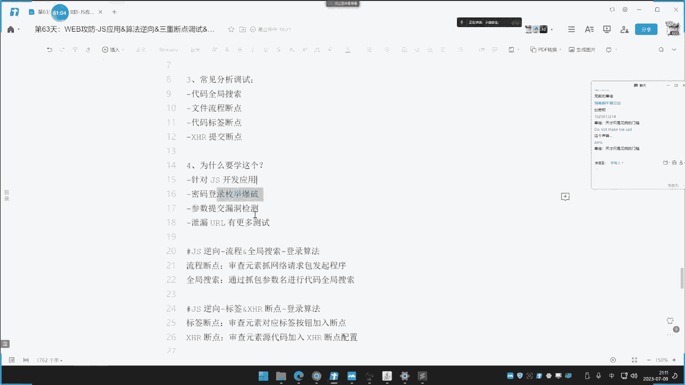

其中参数提交，不管是在这个post的数据上面，比如说URL地址来，我给大家看一下啊。

那这个网站你看一下啊，我打开一个东西，你比如我打开的，你看上面有个值呢，这个值应该就是这个清华大学的一个标识值，你看我点另外一个值是右边的呀，那这个是底四三比一比四，那这个变成3958，你要测注入。

这是个参数啊，这明显这怎么和复旦大学能联系上啊，那这个参数值就是指的复旦大学嗯，人民大学呢又换了，你怎么让这个值和这个学校指顶上啊，你肯定这里有算法在里面的，那不就一样道理吗。

这个是get类型上面的一个参数。

我们现在讲的是post类型，他把这个加密了啊，这个呢就是把这个什么，把这个新闻的某个地方加密。

那就说你要把这个解密出来，按照正常的参数去比较不一样一样帮你吗，把这个上面的这个值把解密出来，解密出来之后啊，然后再提交payload，再组合组合成一个新的整体。

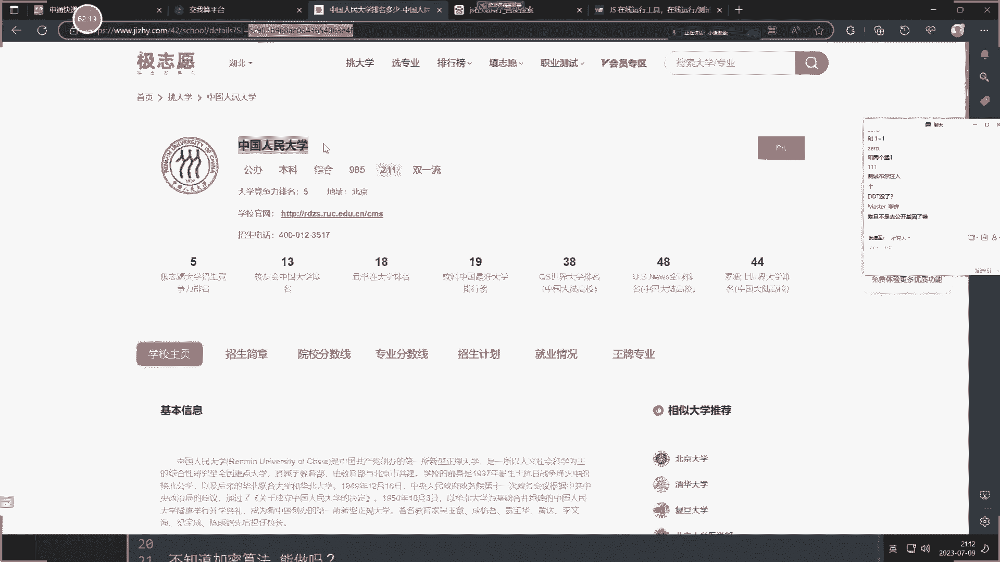

它才能正常进入逻辑啊，所以这里讲的就是解决了什么。

去提交参数值的时候，通过加密算法解出来之后，把我们的payload和铭文组合一起再提交，这才是符合规矩的，漏洞测试不就是解决这两个问题吗，能理解了呀，这就是讲这课的意义呀，不然讲它干嘛呀，神经病呀。

那下面这两个东西呢，在后面课程就会慢慢体现出来，比如这个泄漏鱼，偶我们前期在讲JS发现更多，JS发现JS里面更多育儿不就是和这一样的吗，它也属于JS安全的课程，只是在前期就已经给他删过了。

就是在JS里面去啊，就是又往上爬它的根部JS。

那前面我们还是用过这个项目，你看一项目一打开网站就把网打开。

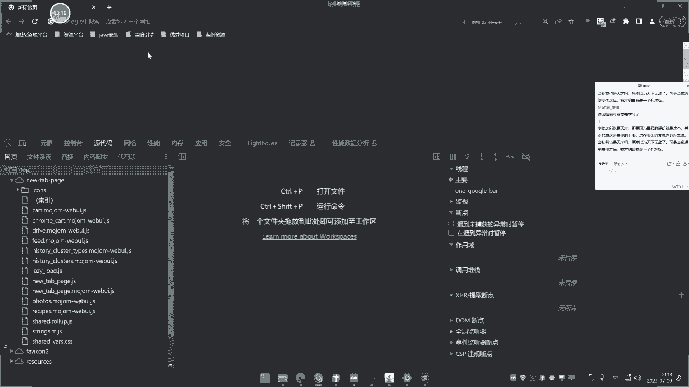

这个项目还给他讲过吗，信息收集的时候呢，获取它里面的这个诶这个怎么没显示出来，来获取里面的很多线路径地址是吧，来对对，这项目讲过新型设计啊，我就不说了啊，好这个我就说把意义给大家讲清楚了啊。

所以你就不要去想做这个东西有没有用，你自己想一想有没有用就知道了啊，你要只要想到这个东西，别人给他发数据的时候是个加密的，你如果会这个东西，你可以把逆向出来，逆向出来之后。

你就可以重新组合payload去测试漏洞了，否则的话你在上面乱的去输，这个什么配偶的，是没有任何鸟用的，就是做了无用功，因为你发的数据对方不认识他，也不会去把他正常接收KO的输进去和没输进去。

没什么鸟样，那漏洞即使有，你也测不出来，就这么简单，还不明白吗，好那把讲在这个时候我们现在想想了啊。

我之前我刚才也给做了个实验是吧，我还呢给大家搞了个什么东西啊。

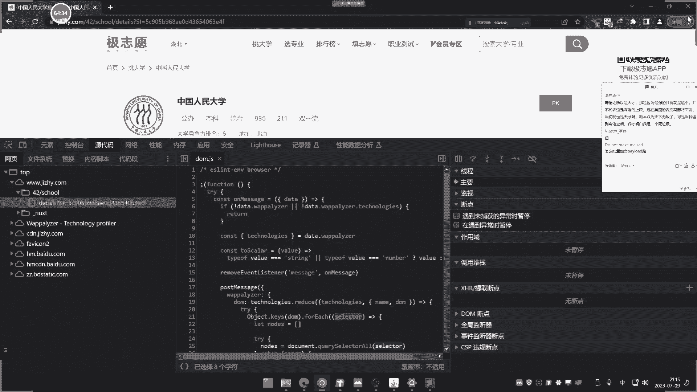

搞了个JS执行，把密文搞出来了，那大家想一想哈，我现在假如说我要事先对它进行这个检测，不管说进行用户的枚举还是用户检测，我该怎么做呢啊大家有没有思考这个问题啊，很简单嘛，我要进行对它进行这个枚举。

用户的枚举是吧，来他这里呢出来了，我这样子呢，我不搞任何事情，他发包成了个什么样啊，大家看到了发报的数据呢，还是铭文还是明文，这样发发也没用啊，账号即使猜对了也是错误，因为对方只接受密问，铭文呢。

他在自己去解，你直接发铭文，他不知道，所以咋办呢，是我要把这个发包的这个密码，这里改成相应的密文发过去，对方再解再判断呢，是这么个逻辑啊，但这个pub suit他哪知道你这个什么站名啊，他受得了啊。

不知道啊，怎么办呢，我们也知道这个算法是固定的，算法不是固定的，就是里面那有密室，有那些东西，那个加密算法，你要是说是个base64啊，那还好简单点是吧，是个base64，你可怎么办呢呢。

我点一下这个地方来点击添加哎，把它按照这个什么哎这个decode啊，1decode的编码唉，选中这个什么贝斯尼斯诶，确定好玩了，发包诶，他这里呢就按照贝斯牛斯把几加密发送了，哎这简单。

但这种是固定的加密呀，对方不用贝斯琉斯，刚才我分析了，他压根就不是贝斯流斯啊，怎么办呢，是不是就必须要按照刚才我理想出来的算法，把这个算法的代码给他，怎么样，给他集成到这个Buff上面来呀。

所以接下来就来讲今天的这个bb shot的插件，加载算法进去自定义的如何操作，首先下载第一个文件，再去下载这个模块都给他打包了，大家也不用下载了，等下去网盘自己下就完了啊，你要去官网去下也行。

然后呢修改一下文件，接下来我就全部给他演示，包括这个下载我就不演示了，不要说你下载的不会，那那这课也听了，没必要啊，我们就直接给他说啊，环境变量给他简单说一下啊。

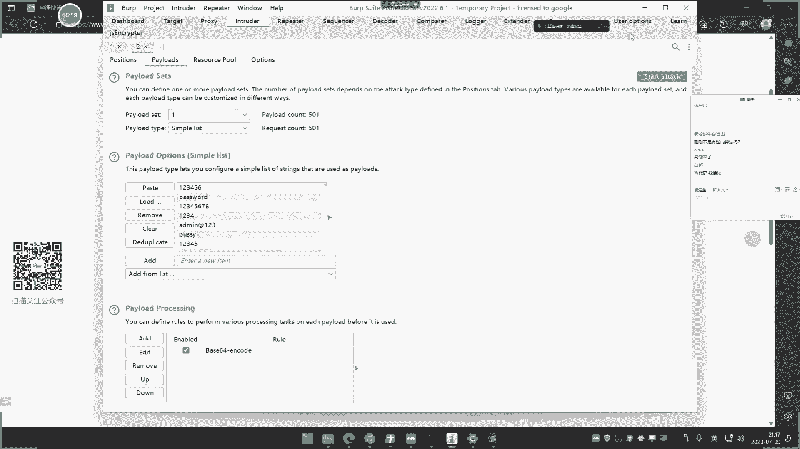

我怕原先的环境面人不会撕，那我是真没办法了啊，来首先准备两个文件啊。

哪两个文件呢，就刚才下载两个文件，那一个是这个下载好的第一个文件，这个文件呢这里有个ES1，这是环境变量，这个文件的存储路径，把它复制到先添加环境变量啊，点击这个控制面板这里，找到系统这里啊。

或者说你一直接右键计算机管理也行，嗯系统呢，然后在这里呢有个什么，有个诶跑哪去了，高级设置，跑哪去了，哎，在这里高设置这里啊，然后这里呢环境变量，然后这里有个ADMIRATE和系统变量啊。

你这里呢就搞系统变量嘛，啊拖到这个喷漆这里啊，点击编辑，然后把刚才那个路径写上去，我这里已经写了，你看他写几个啊，啊刚才那个路径呢给砍下来，就这个路径啊，先确定确定三个，确定完了之后下来了。

就直接的呃这个康呃，就是那个康属旁边，那个那个是把那个windows启动键啊，启动这个SAMD出来啊，然后SAMD敲出来之后，你直接起把这个名字把学进去，如果说现在呢直接选车之后，他提示这个东西好。

那就说明设置成功了，如果不是这个提示啊，那你自己检测你自己哪里实在错了啊。

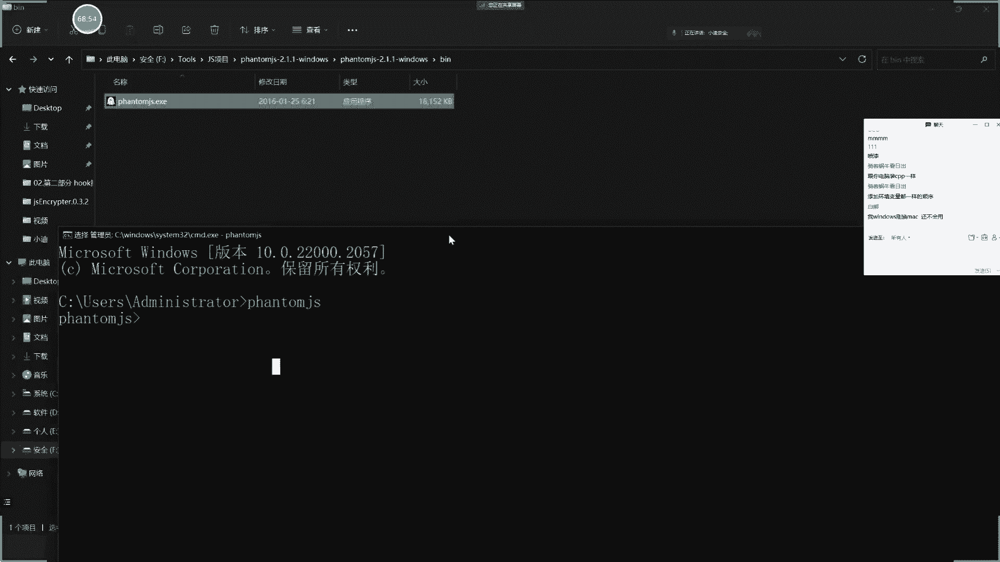

那我不就不是我的事情了，好缺乏这个东西呢，之后啊，那第一步就完成了啊，第二步呢就是安装这个插件，这个插件呢有些人也不会按，哎我也是没办法。

那点击这个这个版本呢，注意一下啊，巴布数的这个版本呢，要搞到那个2022年之后的版本啊，不要搞那个以前老版本，然后版本高版本之后呢，这里有这个这个这个有个这个什么，那这个地方呢有个插件吗，点进来添加。

选中来这个jr啊，这个jr jr呢我都给他打包了，选中它确定好，然后确定选就完了，好选中之后呢，这里面方就有个什么这个呢就这个东西了，你看我这里有写两个啊，我有3亿个吧，上一个这里就出现这个东西了啊。

有这个东西就好了啊，那么这个插件呢也加载完毕，第三步就是要把刚才立项的代码和文件。

代码呢进行修改，那如何修改呢，好首先呢在这个打包的项目里面有两个项目。

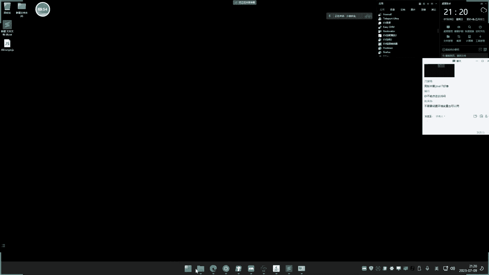

一个是刚才那个这个加载环境里的项目，还有个就是那个模块项目，模块项目呢自带一个这个JS文件，就把这个JS文件呢给它做一些修改好，我先给大家看一下原型啊。

原型代码的那个就这个等下他会给他打爆，这两个项目都在原型，就这两个嘛，写错了啊，这个地方呢就打开这个文件啊。

啥文件干嘛呢，好这里有个叫什么加载实现加密算法的JS脚本。

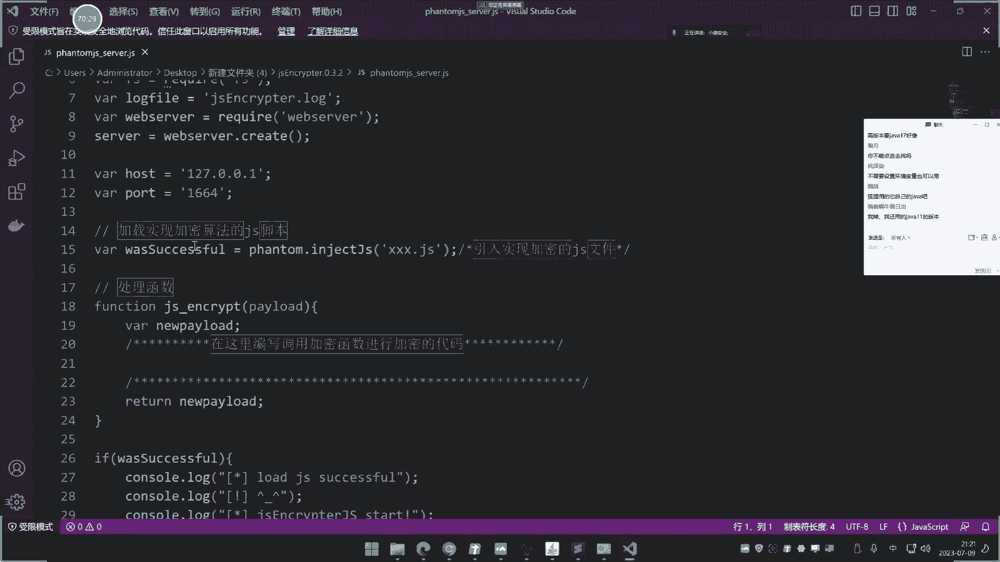

那我刚才呢算法是用的这个嘛。

写的是这个里面的算法是吧。

不知道大家还有没有印象啊，我还是给大家重新来一遍啊，把那个算法文件找到个对应加码到那里，好然后呢，刚才加载的是这个地方嘛，对吧，这个地方，然后呢这里算法调的是这个文件啊，然后把这个文件呢改的怎么样。

右键呢另存为桌面啊，这里已经阴沉了啊，把选中，把这个就这个算法文件这个对象，然后把先把它弄出来，弄出来之后。

或者放到他的统计目录，放到统计目录啊，然后呢来到刚才那个地方呢，把它改成看刚才的名字，加载他修改这个地方，然后怎么办呢，这里有个叫在这里写编写加密代码的情况，那就选择什么。

这就是刚才那个代码端的怎么写呢。

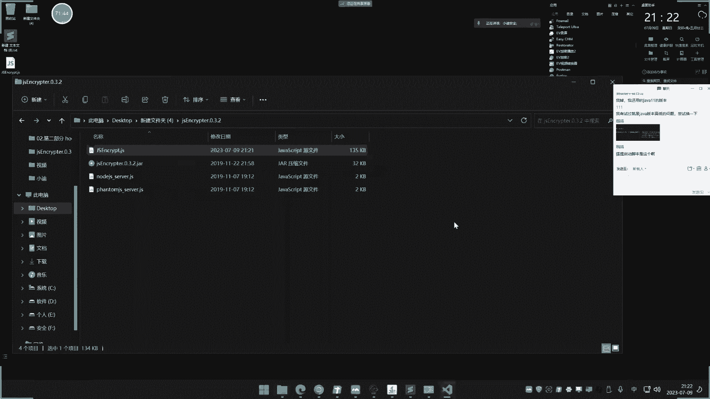

找了个VIO那里实现代码，就这一部分了，就这一部分啊，放到这来，现在来简单修改一下，呃他这里说返回new player，然后这里呢是怎么操作它啊，那么这里呢我们就，把它进行一个呃，可以这样子啊。

可以进行一个调用，嗯就等于这个值，这个地方额就画个，返回这个new pate，然后这里呢也把它放到PYLOAD里面去，这个加密的东西写在哪，在这里来之后，这个值就等于，刚才那个算出来那个语法。

就这个东西，现在来，嗯应该就差不多了吧，这样子就应该可以了啊，其他的倒没有啥了，就和刚才你在这个JS应用上面是一样的。

就只修改了呢，在这里呢先写上去之后呢。

这个地方小DIC就是我的密码嘛，就是他这里的传入进去配load就是传入的密，然后这里呢就声明这个值呢，等于这个东西把它返回就可以了，好我们试一下啊，把它进行一个保存，保存好之后啊。

接下来就在这个目录上面呢进行分析，运行什么呀，F就是，就刚才我们4S环境面那个P那个文件啊。

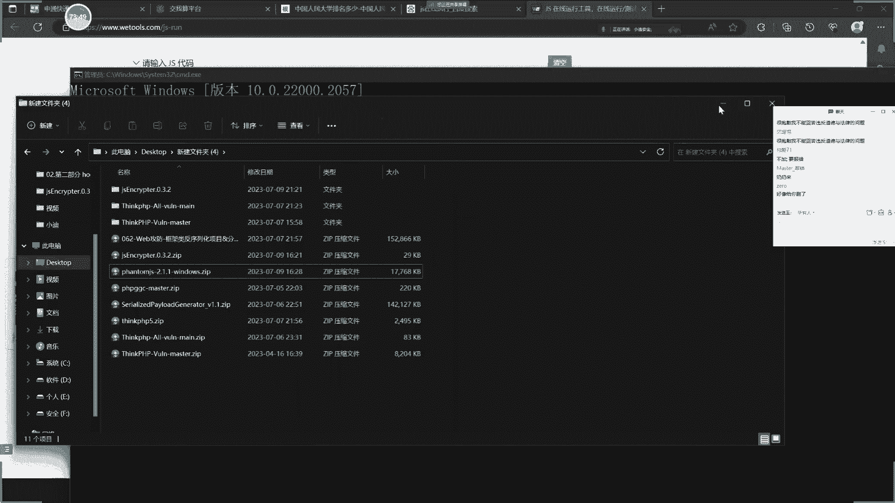

因为你要运行它之后呢。

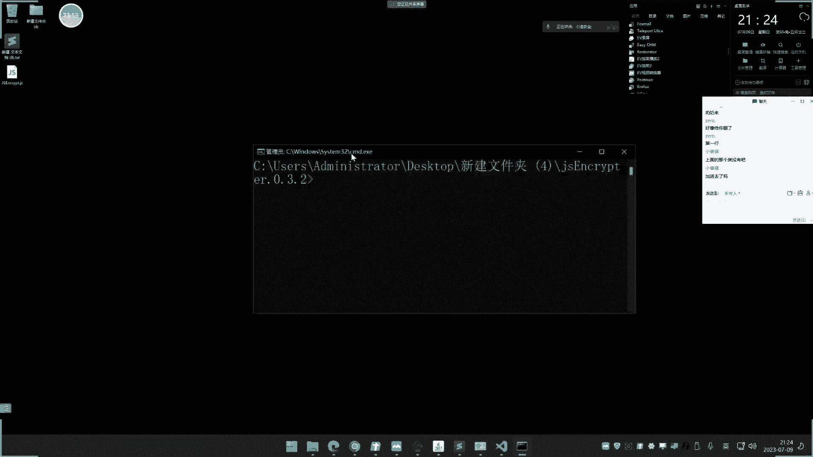

他才会起一个监听，待会会给他说原因的，就是这个刚才设置环境变的这个文件啊，把它运行起来，加入环境变量，所以我直接运行它就可以，然后运行刚才我写好的那个文件，那个文件名就刚才文件名啊，P h，好回车。

那直接运行，运行之后呢，他说载入成功地址为本地1664好，这个时候啊，我们再来到查询这里呢。

看一下啊，来这个叫连接操作，点击连接，他说了吹就说明成功，test是干嘛的，就是测试这些支点点一下。

点了之后没有反应。

哎，有反应了，你看就把对应的对称加密了。

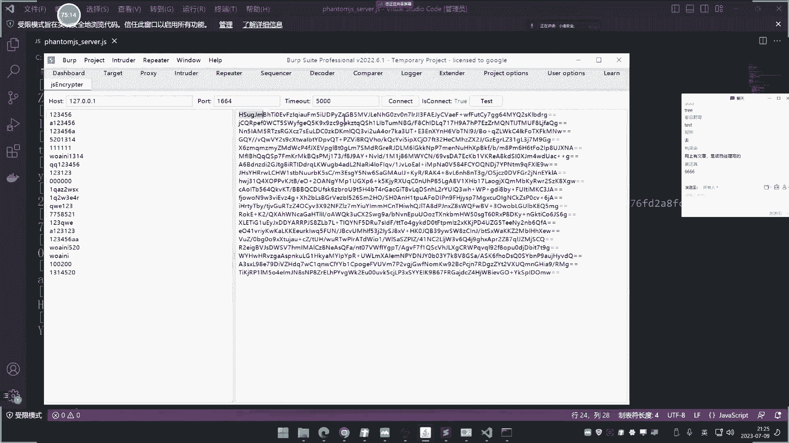

就说明写对了，就是你修改这个地方啊。

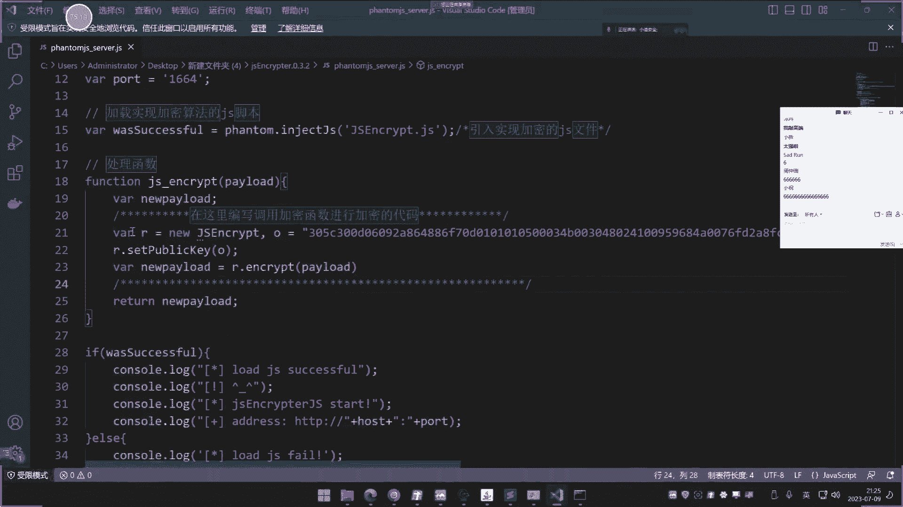

他这个返回PNEWPLOAD就是指的是这个返回。

然后这边就是为实时静态，就说这里，那你就相当于就是说哎呀，比如我在写歌啦。

我写个小迪啊，Test，那等下就出来了，还有这小题呢，仅加密。

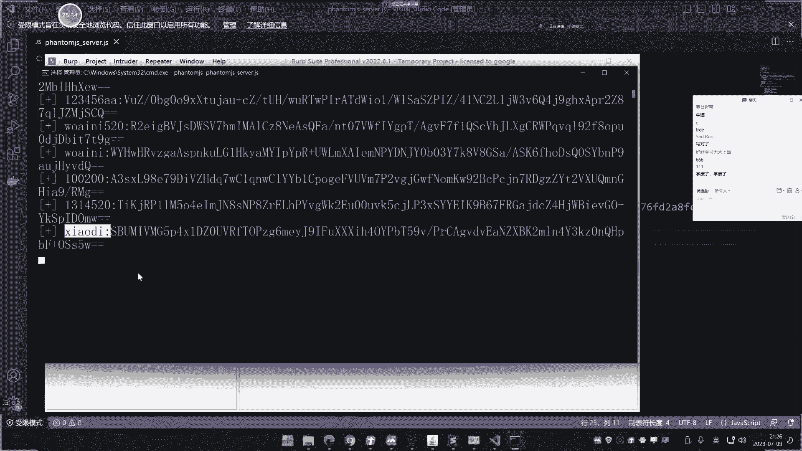

这个加密呢就按照这个逻辑呢，用刚才那个文件运行的吗，加载这个JS，然后呢是密文啊，然后这里是你的payload，payload就是像是在插件这里写的嘛。

啊啊这个加密了啊，你可能说诶那这里怎么和实战中调用呢，好接下来就来实战中调用呢，来到刚才数据包，把它发到encoder模下面去，重新再来把变量一清除，把这个地方呢你选中当做字符串，然后再选中个支点是吧。

选中个支点，比如说我选这个1000个字典的啊，然后怎么办呢，看一下啊，刚才在这里添加，我再选中，那最后一步拓展插件里面的JS尼根poor，这个模块，把它选中，OK直接开始正一看，好你看哎什么情况。

卡不瞎，我在什么情况，哎这个是怎么错误了，这什么鬼啊，妈的。

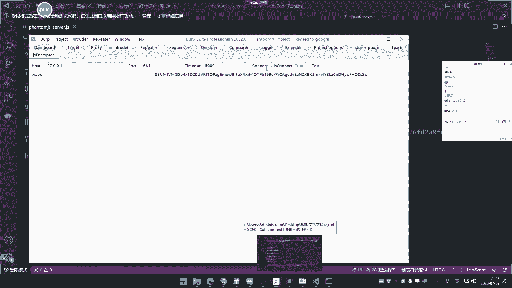

是不是卡住了卡住了卡住了啊，卡住了卡住了，嗯卡住了啊，不好意思不好意思，卡住了，卡住了，重新来一下，哎呀这个真是烦得很，我把他搞个函数调用吧，重新搞个函数吧，我重新把写下搞个函数量。

我就搞个入口函数名字就叫重新定一个函数，啊这写着来重新定义个函数吧，VTS面S等于它，这里就写password，首先声明函数吧，我直接在这里把它去掉，用调用这个函数吧，调用这个了调函数，你这样写吧。

这样写我感觉会好一点啊，就把核心代码写在上面了，我怕老卡死，这样写一下好，再来到刚才那个地方来执行这个JS文件。

刚才那个卡死了啊，这里面的又重新加密这么多次，刚才那个卡死了，嗯真是烦得很，没有了吧，应该那再来看一下，来看到没，正常了啊，那正常了，看到没来，全部就按照我这个逻辑在发包了，是不是。

那你现在呢就是按照这个加密算法呢，再正常发包了，那不就是实现了这个枚举吗，这个逻辑就正确了呀，唉哎呀，你说呀是不是哎呦。

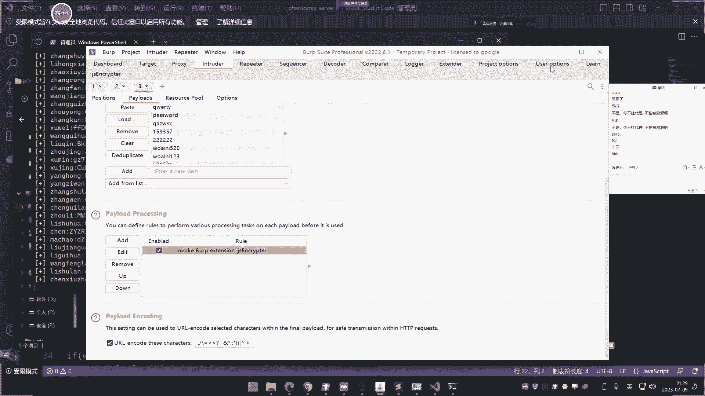

好那今天的内容呢就讲到这么多了是吧。

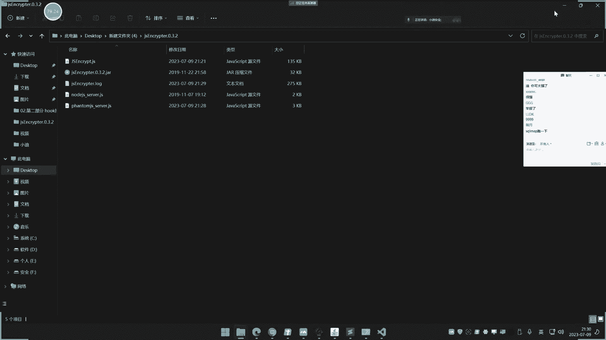

然后讲那么多呢，我们就要引入下面的内容，下节课内容，下课内容是啥呢。

好我们再观察一下这个网站啊，改这个网站既然有这么简单的，就有难度大的，你看这个网站呢它有个什么逻辑啊，观察一下啊，yes s引入大家可以看一下啊，当我们进行抓包的时候，比如我们现在点击这个这个地方啊。

比如我点一下这个大学讲完之后，我们看下数据包里面啊，在这个地方你看有个啥东西，那个呢有个叫SIGN，这是9A第三东西，好，这是干嘛的呢，好现在点的是北京大学，那这是点到北京大学啊。

好我们再反过来重新再连一次，好优点的是北京大学。

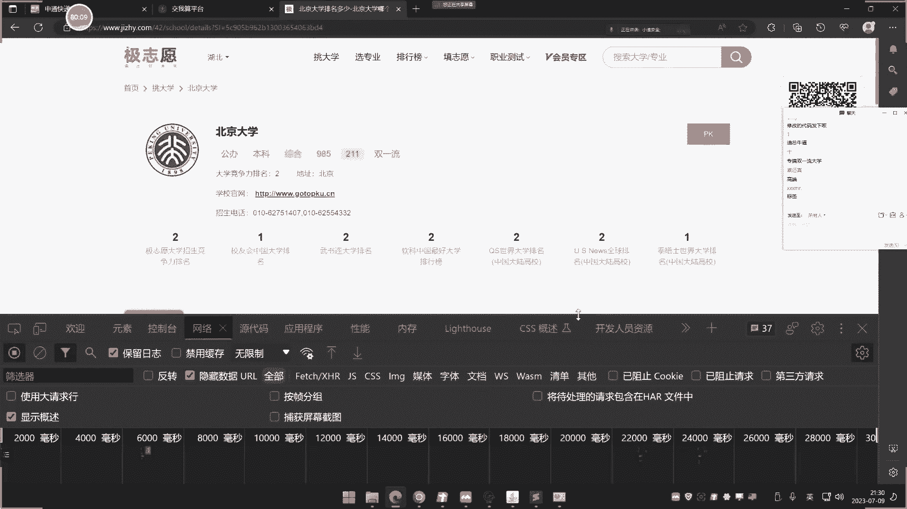

第一次是9A，再往下面翻，这个地方变成了3cc了，一样的，点击这个其他的有没有编呢，你看啊，这个是这个app id和si id看一下啊。

我们可以把它进行一个对比，把它复制出来，1224。1最高。

哎个什么鬼东西，里面的符都不让我复制啊。

好开，第一次点击。

同样的一个东西看第一次点击那个数据包，在这里。

啊，这个对应上啊，这个对应上这个对不对啊，ts这应该是时间戳，这个应该是时间错，就是每次点击的时间，这个不不用管了，这个可以自己写个脚本实现，把那时间戳接上去，app id呢是对应上的啊。

这个SATID呢也对应上的，唯独就是这个SIGN，他在实时改变这啥东西啊，再接N就是类似签名的意思，啥意思呢，我们可以把它理解为是个啥东西啊，理解为他就是类似和那个toy一样，一个一个一码事情。

其实就是说你每一次的这个数据包呢，他得有个固定的这个东西，如果不固定的话，可能就会有异常或者拒绝解释这种可能性，其实呢，他就是为了确保每一个时间节点的数据包，是唯一的啊，可以这样去理解它这个概念。

那这个东西对于我们安全测试有什么影响吗，那影响就可大了呀，你批量发包，你这个对应不上就说明什么，就相当于说对方的服务器可能有个签名，每一次包它要对应这个值，对这个包就正确不对，那就GG你发包的时候。

你批量发包的时候就拿这样子讲。

那像这种呢它没有的，你每次发报他都截。

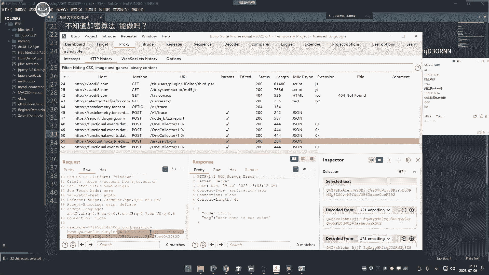

因为他没有这个东西对应的，但是说有这个东西对应你发包的时候，你怎么知道下一次会出现哪个这个东西呢，是不是，所以说你就需要找到这个签名的这个地方，或者说绕过它，或者说它类似这种算法，算出他下意识的出现值。

或者栓出这个对应的算法来计算这个值，然后呢去绕过。

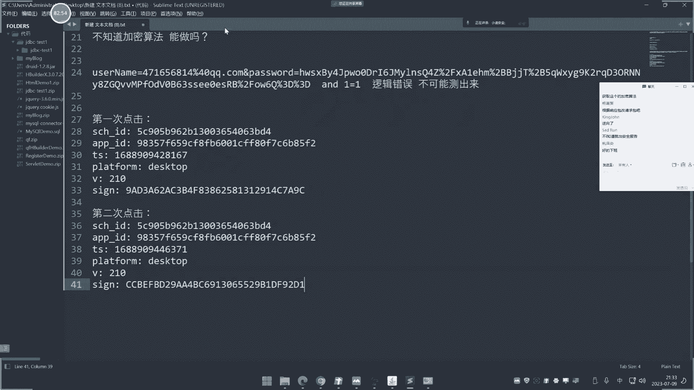

就是保证下一次数据包的正确，啊看一下啊，这是网上现在个啊网上还介绍一下。

还有很多课啊，我看我尽我自己的所能，能给他上多少就上多少啊，不要要求太多了啊，因为这个课呢说实话以前都没有人怎么上，后面呢搞SRC的喜欢听这样的课，因为SRC很多人喜欢在那个JS里面去找，未授权啊。

搞这种事情啊，他需要上这种课，其实这个JS逆向呢，主要在开发里面搞那个Python爬虫啊，搞爬虫那个技术的用的比较多，因为爬虫里面会经常爬数据，或者说要进行批量注册，用户找密码。

他需要有那个算法还原之后。

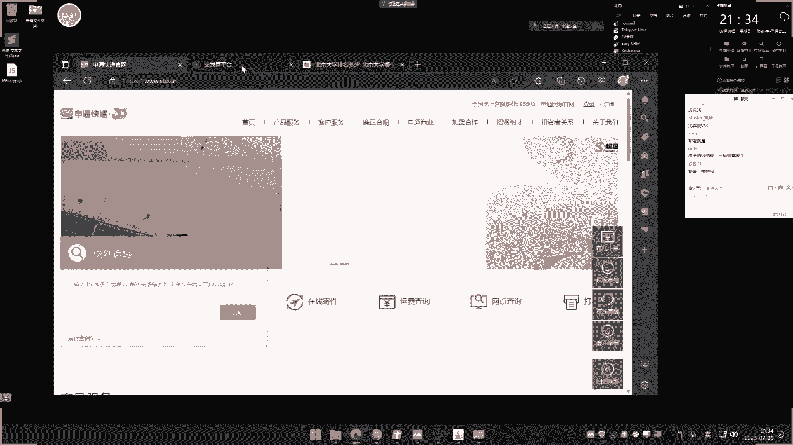

才能去批量注册和和爬虫，反爬虫啊。

那些技术他也会有这个建设意向，但是现在我们这个安全呐，这个无孔不入啊，就是什么行业的一些技术呢是吧，都都要一点啊，因为多多少少都会有帮助，懂得多肯定是有帮助的，那所以说呢这个JS你想的就出来了啊。

以前都没有这个东西的，所以这也是为什么，今天我把这个课标题一标出来啊，今天就有200人上课，平常呢就100来号，人多了，这个五六十人，这就是原因，大家都知道这网上讲的人也少。

讲的少的原因就是因为我刚才说的那个意思嘛，他本来很安全，挂钩不是很多，只是说现在这种技术要求太多了，你懂的方法多了，机会就会大一些吧，SRC呢也比较对，这东西呢也比较重要，所以就惹了很多人呢。

就对这方面的好奇，但是自己又学不会，是吧，我这个东西呢都是自己课后啊，在网上呢翻别的教程啊，我自己学了，其实以前的我都会简单会一点，但是深入的不会，我们那学了一点是吧，给他教一下啊。

尽自己所能给他能教多少是多少啊，也不要指望我说和网上那种搞专门搞这种建设，理想的人教的那一样啊，那教不到那个程度啊，我自己都半斤八两，我怎么教你那么多呀，包括尽量和讲这个东西呢和安全挂钩啊。

望你能明白这个东西对安全的启发和意义啊，这可能就说到位了啊，你学的再专业，你和安全挂不上钩，那也是没用的，就像前两天有个人问我，有个人跟我提建议一样，他还让我上开发课程，说这里面的专业讲开发的课那么多。

你都听不进去，我讲开发你就听得进去了，我只能去开发的角度去讲安全，你才会听呀，我只讲开发，你听个毛啊，听，好就说这么多了啊，看大家有什么问题，有问题就问啊。

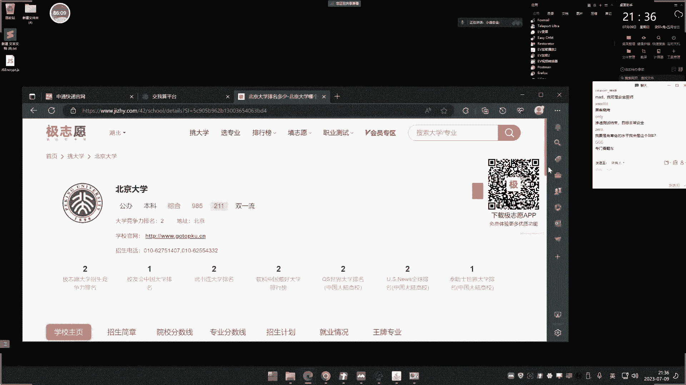

没问题我们就瞎了啊，好多赞都给吃，不管大战小战，只要你能回逆向就行了，什么那个问这个几个平台登录啊，游戏网站登录啊，都可以吃啊，app里面也有，你下app那个小程序。

用node js vv那种开发的是吧，那和这一一秒的事情呀一样，你懂那个JS的一些理想，能够从JS里面翻出一些加密的算法的迷思呀，加密算法的K啊，甚至有时候那能翻到那个什么鬼。

JS配置的人人人的那个人端的那个access token啊，ARXK呀，那些东西都有，会有这方面的，就是类似的安全上面的一些泄露账号密码，你懂这个话啊，像一些小程序啊是吧，他都会有这种安全问题。

来不了那么多实战啊。

你们真是啊，来不了那么多啊，自己下去多练，这个东西是多年的。

他比较难懂的就是JS代码，说白了还是代码的事情，如果说你代码能够能够看懂的话，因为前面两个是P1P代码，今天才变成JS代码，如果说你能看懂JS代码，这个东西其实也比较简单，看流程也好，你看懂代码。

你就知道是个什么逻辑，那想都不用想到端点那些东西不用看，自己都知道，关键还是代码，不是其他的那方法，那些东西呢好教学一下就会，啊对还有什么JS代码混淆那些，对对对，还有那些事情啊，就有时候看那个代码。

那被混淆了，还有就是打包器的那些情况，打包前的窝派克的前期讲过啊，那个都还好说，还有一些是混淆了，就是借代码呢直接是全部加密的，那个时候呢还要先把它进行解密，对啊，那我们下节课看能不能上那个内容啊。

反调试会不会讲，我看过啊，尽自己所能吧，我能讲就讲吧，粉条是就是就是那个JS代码里面有那个，检测用户的什么键盘啊，鼠标啊那些时间，然后呢用那个hole那个什么鬼，无限循环的那种基数呢。

把把败pass掉是吧，是不是那个东西啊，滑块也是的啊，也是那个意思，一灯捡低保，慢慢学吧，不要急啊，你们想要的我都能讲，我滴低保在在努力学着，低保结束能力很强的啊，基本上一些不是很难的东西。

我看个半天我都基本能教了，低保在认真学啊，不要急，不要催你们说的什么PWN那里面的搞不了，搞不了，那不是一天两天的事情啊，那教不了，教不了这个JS你你想的还简单，同时跑两个加密的能操作一下吗，你说你呀。

这又不是JS逆向的知识点，这个东西就是个巴布斯特的使用，你都不会，哎呀我懒得说呀，我真是，啊他说加密两个东西不会搞，你们会不会搞，有些人也不会，有些人肯定会唉，这个就是八步速成那个使用，我说白了啊。

这不是见识理想的字点，我不想讲。

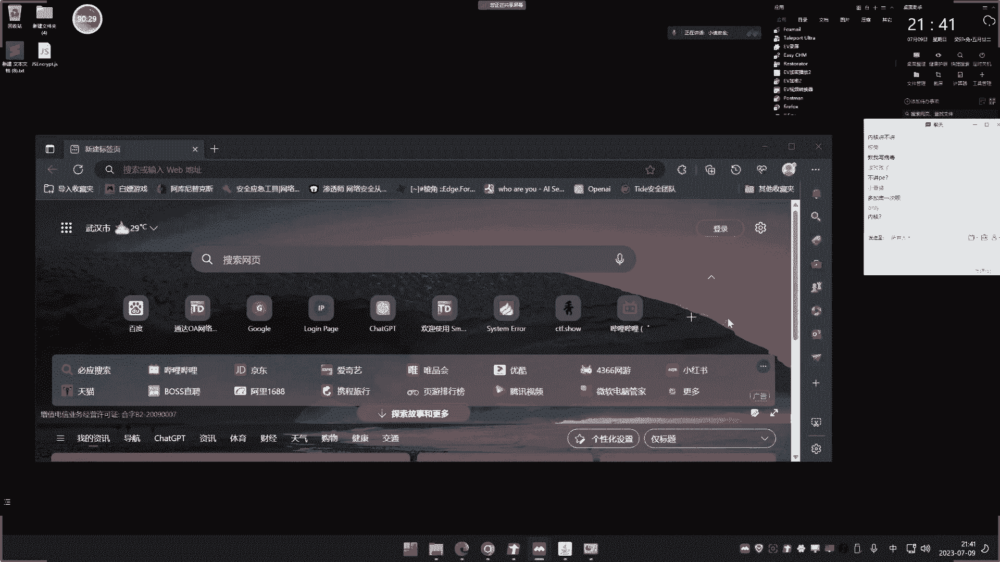

对就是选择那个巴布鼠的那个模块，哎呀真是呦，那把这个也选中，再比如说两个甚至多个都无所谓，把他选这个模块就自定义模块就行了呗，这第一个吗，再选择第二个再叫字典，先搞小一点字典吧，大家支点在这个在于加密。

就就用这个呗是吧，直接开始整，那不就完了呗，这两个加密呢是由于我这里把那个环境关了啊，所以这里卡了啊，知道了吧，那他第一个第二个嘛。

由验证码那是识别验证码插件，那是验证码识别插件，但是一般准确率不高，前期上期就讲过，不要问你问那些东西都讲过，老在想外面课程香香香，其实自家的低保的课程好香的嘞，你也不知道，好我们就说这么多吧。

两种加密算法不同的什么不同啊，这个算法是你自定义那个加密算法，那有啥不同呢，你这不就是再不写写不就得了吗，你说两个前面不一样是吧，那就搞两个插件呢，那两个场景再引用是另外一个加载另外一个呀。

把端口再改呀，不一样一样的事情啊，就你再加一次插件，那个端口监听，另外再换个端口，在监听两个同时开应用的时候，就分别引用，思考一下啊，不能说有些东西没讲到，你就问起来了，想想啊，好就说这么多了吧。

最后问一下啊。

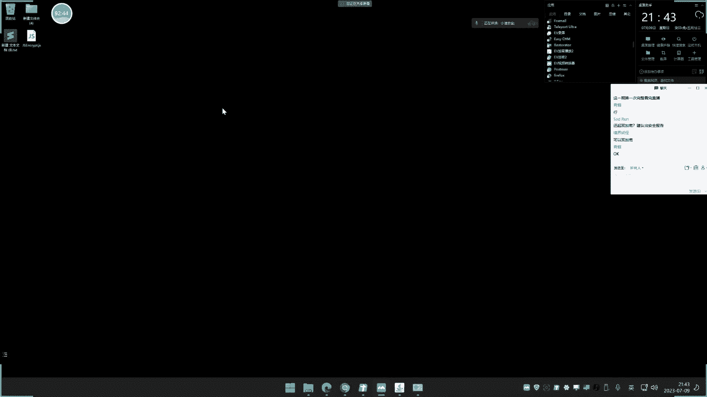

没有问题，我瞎了啊。

好那我们下一个再见了啊。

