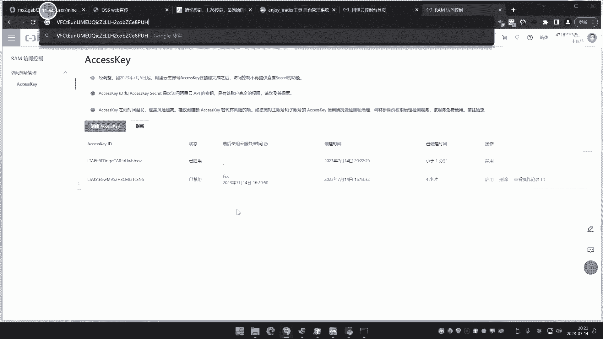
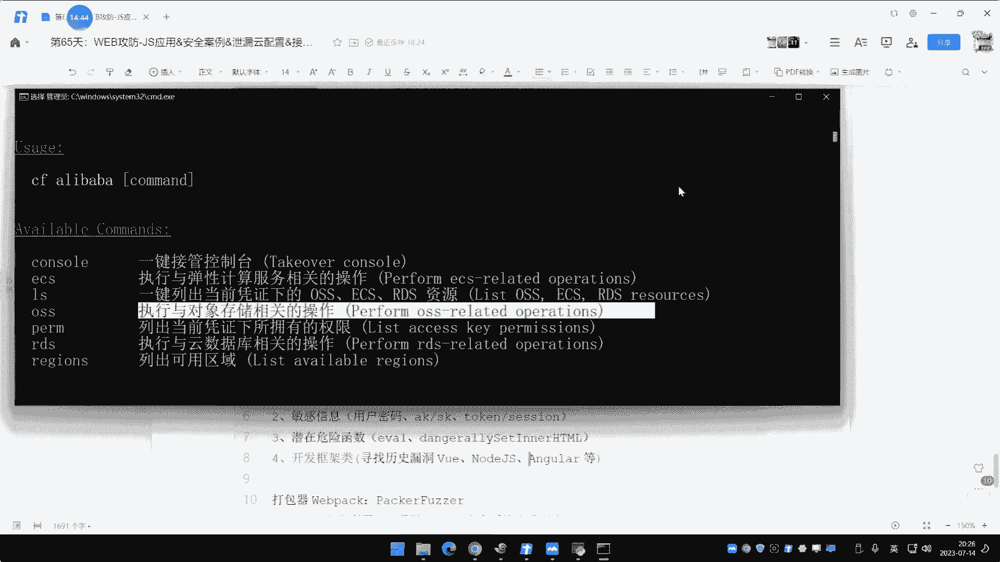

# P64：第65天：JS应用&安全案例&泄漏云配置&接口调试&代码逻辑&框架漏洞自检 - 逆风微笑的代码狗 - BV1Mx4y1q7Ny

看今天的内容啊，今天呢上这个65天啊，用这个JS那去说一下这个JS类型的一些应用啊，他的一些常见的一些安全问题和有几个案例呢，给大家实例的分析一下，也就是说这个JS应用呢它有哪些安全问题呢。

大家要注意呃，大概呢就是有四个啊，有四个，然后呢我们都是有相关案例呢去给他看，这样子呢，大家更好的去分析到这个JS应用的一些，安全性的一些策划和一些东西啊，啊具体有哪些，我们先来给他看一下啊。

首先这个JS的这个东西呀，那在这个JAVASCRIPT中啊，它也是存在这个变量和函数的，那么和这个pp啊，java这种其他语言开发的这个应用呢也差不多，如果说这个里面存在这东西呢，也会存在漏洞。

但是这个JS开发应用呢，它和这个pp和java呢也有一些区别，就这个pp和java的代码呢，它是一个编译新的一个语言，就是说啊你在浏览器端看到的源代码呢，和在服务器的那个真实的网站源代码。

那是不一样的是吧，它编译新的，就是说你看到源代码，那是编译后的一个结果代码，但是JS的不同，它的本身的代码呢是在浏览器里面，也是能够查看到真实的源代码，但是这个是JS开发的。

那么还有一种就是我们后前面在讲的时候，他当时还讲过，那时候我还举个例子，如果说是用什么VUEE啊，load js这类的框架开发的这个应用，因为这个VU1和node js呢也是属于java库的语言。

它是java库里一个开发框架，但是它里面开发的这个网站应用论那个代码呢，在前端呢是看不到真实源码的，就他们呢有点区别，如果不是框架开发的，那是你能够看到真实源代码的，那么看到真实源代码的话。

也就是说他和pp和java这些语言的不同之处呢，就是源码如果说可兼的话，那也就是说它是属于一种白鹤升级，白鹤的一个测试代码呢都是能够看到的，你能简单从这个代码中去分析他的逻辑，代码的一个写法是吧。

所以说呢在这个JS渗透上面，那就会存在四个攻击面，这是我们总结出来的疑点呢，就是增加量工具面，哪些工具面呢从里面提取出来的，越L的一些信息，就是切口内的地址，并且呢能够进行相关的端点调试呢。

分析代码的执行顺序和逻辑关系，这样子呢能够帮助到你对这个网站，它的一个数据的走向都会有帮助，能够帮你去测，这是第一点，第二点就是会泄露敏感信息，哪些敏感信息，比如说用户的账号密码，如果说在里面呢有设置。

包括人安全里面的AK和SK两个，这个AK和SK是什么意思啊，AK就是ACCIK，就是人安全里面的几个配置，后面我们在讲的时候呢，讲人安全的时候呢，这个东西呢啊就是这个很常见的了啊，今天呢也会有小演示啊。

他的一些原理性和攻击棉呢在人安全的时候呢，会单独再讲，它也分为什么公有人的这些东西啊，还有一些私有的些东西咳，然后还像什么toy se型，就是我们都知道啊。

有些数据包里面呢它要产生这个token或C型呢，来实现这个用户的一个判断平局，那么你可以通过这个代码里面呢，看到这个token session是怎么生成的，可以来实现这个是吧，得到，还有就是我们说的。

从DM中分析到有些这个危险函数，然后呢啊去触发这个函数的一个地方，还有就是开发框架，比如说是VUEE开发的，或者说load js，那么在这些开发空间上面呢，也出现过相关漏洞是吧，我们也可以直接利用。

就说JAVASCRIPT的这个开发的网站应用的话，就会面临这四个大方向的问题，这四个那就是几乎就都涵盖了啊，或或或许还有些少的没有讲，但是主要就四个对吧好，那么现在呢我们就给他演示一下啊。

先来演示第一个JS安全里面啊，涉及到的会泄露信息的一种利用，那如何是泄露啊，我们能以自己的个案例去讲完之后呢，也给他看一下网上一个真实的一些情况是吧，是不是有这么一个事情发生，那比如说像仙子啊。

这里有个网站，这个网站呢是一个文件上传的网站，我们呢可以通过这个F12呢把这里打开，对不对，一打开啊，然后呢我们通过这个上传，或者说我加载这个地址的时候来刷新，再说这个商传的这个功能呢。

也是个web应用的一个功能，在这里呢我们点上传，或者说等加载的时候啊，去上传文件啊，这个文件呢就上传到哪里去，我们都知道啊，这个文件上传呢啊在这个融安全里面呢，或者说在这个如果说涉及到人里面。

他可以把这个文件上传呢，文件呢存放到OSS的对象，存储那个应用里面去，那么用NE的呢，可能就会涉及到配置这个接口的，那个KRID啊，那些东西啊，配置好了才能用。

如果说这里呢这个功能采用的是JAVASCRIPT的开发的，就是说文文件上传，你可以用pp写出来，也可以用java写出来，也可以用Python写出来，也可以用JAVASCRIPT写出来。

如果你采用JAVASCRIPT来实现文件上传，那么有可能的话，刚好呢你有涉及到是在文件上传里面，用到一些其他的结构，那比如说像现在文件上传里面，看它加载的文件里面有个叫什么low upload js。

一打开看一下，响应里面，大家可以看到这里呢就配置了一个access的id和K，然后呢我们再用这个access id和K呢，利用起来就能很好的，我真的是一个安妮测试，你比如说像现在啊。

我们这个狐狸那个工具库呢也更新了是吧，这个4。0版本，它上面呢有加了几个新的东西。

其中呢就是包括这个人安全的一些利用，你看这里面有个叫AKSK利用工具，还有个AKSKHOCF利用工具啊，你用哪个都行啊，这个呢去运行呢，去人行车吧，他只是去这个，然后呢这里的也有是吧，他怎么用呢。

我可以看一下啊，那cn cf是吧，然后呢他这里一个叫CONFIG，配置一下，它支持阿里云，腾讯和华润AWS3个官方的这个配置，那么这个泄露的K是哪一个的啊，是哪一个的。

一般呢你可以根据他的一些其他信息组织，你可以看到下面那个叫阿里云cs，那么应该就是阿里云的，如果说你不知道的话啊，你可以用其他平台，比如说用网上的一些那种自动化识别平台，它能帮你自动识别是哪个厂商的。

这个呢在云安全我会讲今天这个不是重点，重点就是说我们从这里得到之后呢，这会造成哪些影响啊，阿里他选中啊，然后这里呢他说输入密斯的备注，就是说你这个miss的简单信息，我们就说啊叫upload吧对吧。

然后呢呃他说了输入id，我们就把刚才那个，我们就把刚才这个是吧，把写程序，是吧，然后呢这是逆时，就这个嘛，把得到里面泄漏东西，那把写上去，好这里那就临时平均toy，这个不用管了，科学啊，直接回车。

那我现在在用这个什么来看下啊，对F运行运行之后呢，他就有个什么阿里巴巴的，增加阿里巴巴的，然后阿里巴巴回车还得教你呢，LS先是下面所谓平局，比如说OSSECSRDS。

这是什么东西啊，我们在2。0里面呢，我会打开给他看一下啊。

在阿里云这个控制面板这里呢，人物图像这里点一下access k啊，继续使用K。

然后他就这里生成的这个东西就是那个东西啊，然后呢他这里说的什么这个什么ECSOSS。

R d s，其实这里那你看ECS什么东西啊，人服务器OSS什么东西啊，对象存储存储文件的，还有什么RDS云数据库。

那么他就可以拿S来获取下面的所有，我们可以看一下啊，进行一个阿里巴巴LX4点回车，他就会在这里查找你这里在哪个地区，有没有服务器，那我这里给大家演示的，这是一个本。

这是我自己呢创建了一个这个JS那个文件上传，所以这个K呢它是一个小号的K啊，这个大号的K呢我没有搞啊，我怕有些人呢我一搞是吧，他立马就记住，哎呀，我上去了，赶紧把我服务器关了或咋地，我怕啊。

所以现在呢它上面那是没有这个东西的啊，是没有这个任何实力的，因为我那个账号的那个东西呢，上面没有任何实力啊，没有任何发现啊，我这里呢为了真实有效啊是吧，我还是说哎呀冒着风险去给他引，是不对。

我这人就是这样是吧，那有风险的，我的还是给他，对不对，用一下的啊，看效果是不是效果呢是很重要的啊，好大家看着啊，我现在就给他重新配置一下，好那这里呢我们就选择element哎，选错了。

选择ALLION好，然后呢首先取个名字叫test好，然后呢这里就是我们这个也叫test备注啊，非数信息这个啊，然后呢输入这个K的这个账号密码，对不对。

等一下啊。

啊这是id，这是我的什么K的那个值，回车好，配置好之后回车回车好，现在来看啊，加个2。0的S，你看下面现在换了个新的了，四条OSS来获取到四条OSS数据，他在扫这个地区哪哪个华中地区啊，什么地区。

你看到的这是我的那几个OS的对象，然后现在的获取我这个主机，我刚好里面的是有OSS里面给他看一下啊。

OSS这个存储在理，我有几个，你看下啊。

我这里的开了四个是吧，ECS服务器那里有几个。

有两台，我看他的这个结果，你看一下那两台服务器十齐的来看没，然后几条四条OSS，你看一条两条，三条四条，对不对。

然后呢你如果说你想操作也是完全OK的，他怎么操作它的，你呢对进行操作操作里面有很多。

我们接下来呢就不讲了啊，因为后面的再讲，我现在赶紧你妹的是吧，赶紧把这个先进入，就是再问的话就顶不住了呀是吧，赶紧禁用啊，这要再不禁用是吧，有人一复制粘贴，那不就GG了吗啊，赶紧把它删除掉。

所以说呢这个如果说这个JAVASCRIPT里面啊，他有这个东西啊，那就完会有这个安全问题，好这个呢是我本的一个演示哈啊有人会问了。

哎呀这个这个是吧，网上有没有呢，你买了你自己搞了个文件，上传之后自己搭建个网站嘛是吧，这搭建的用到这个东西把它泄露诶，网上面有没有这种东西呢。

那有的嘞，但是我是吧，只能说简单看一下，那实验，那不能实验呢，大家看一下啊，来B说的。

你看这个来F10啊，对不对，刷新，来给他搜一下，来，在F12里面是加进机子，你看这里有个什么东西啊，来看到没，那后面我们就不看了吧，后面还有一些其他信息啊，所以说这个东西呢不影响呢，后面呢对不对。

你看阿里文在。

是不是，怎么找你。

这还问怎么怎么找我前期课程呢，你看我这个网站，我打开之后。

我不说在这里搜吧，我那个插件发的什么事，讲过打碟的时候讲过来看没，那，他能帮你去找一些观点的一些地方，然后呢还能帮你提取一些里面涉及到路径地址。

是讲过的项目FASEMI啊，还有前面说的那个什么鬼，见S里面爬，是吧，这个好理解吧，这有什么问题呢，是不是，所以说呢这就是它涉及到第一类问题，就是说他用这个JS开发有些网站应用呢。

它里面配置了这个什么配置这些接口信息，比如说我们不说这个这种人人产品的，这种xx k啊，这些东西，还有些像我们说的那个叫啥呀，还像我们说的那个，嗯叫什么名字呀，对不对，还有像一些这种接口是吧。

比如说比如说我这个网站呢，要发送短信或发短信，网上有些短信那种接口嘛，他还配置些这个短信的id啊，或者说改进的那个接口的那个什么需要的K啊，对不对，需要这些东西，那如果说这些东西的话，那同样道理。

你找的是接口，那么也是泄露对吧，你就可以用这个接口呢啊，取得他的接口权限，是不是，我先把之前的K野外删掉啊，我怕有些人呢在我上面搞，这是我另外一台另外一台的账号啊，另外账号上面那个是没有没有任何产品的。

所以我才敢演示这东西呢实际实战得进去，那刚才的课不停一下，哇咋不能禁用啊，等你得到那个东西之后啊，对你就能得到，我们这边是以这个二啊，这个人产品的种东西来演示啊，如果说是一些接口类的。

那也是一样的道理啊，你看是哪个接口，在网上面查了个接口的一个官方请求文档啊，就没什么太大问题嗯，没有放什么放K的啊，我跟你讲，我这个1010年里面我想给你找多少。

找多少好多这个JS里面放那个什么AK的特别多，这个课程呢他没办法演示，因为都是真实的东西，你咋个演示，那就严氏之阴，严丝一线，这种是吧，不会危及到这个法律风险的，但位置倒是动都不敢动的。

我前一阵子我在那个小程序里面，他也是JS开发的，招了几个里面招了招了只看了十个，你两个都有那个带个东西啊，没有什么搜索语法，你自己去想，这东西不好去讲的，你自己要思考，有些东西不是说讲啊。

讲了有什么用啊，你知道有这个东西自己留个心啊，这个是个敏感信息的啊。

你不要我说这个东西啊，得到之后有什么用啊，我们这演示这个是这个是吧，人安全上面的那个字，典上面那个AKSK那个东西，这个东西呢，其实就是相当于就是登录你的账号一样，你上面的那个锁有什么服务器啊。

或者什么OS存储，这些东西都能操作了，他可以把你服务器的关机啊，重置密码，什么都能做，这个后面的载云外墙我会详细讲啊，那如果说是其他接口。

比如说配置什么短信发送接口啊，或说什么邮件的呀，他也是一样道理，比如说配送这个邮件发送接口是吧，里面就有邮件的那个登录的账号啊，和那个邮件登录的K，你拿到那个之后，不就等同于拿到对方那个邮件那个口了吗。

你就能知道这个他发过哪些邮件呢，也是一种信息泄露啊，这也是高危的呀，哎这个东西呢SK啊，SAK啊，这东西呢啊只是现在大家就是坚持一下是吧，我们后面的人安全的课程呢会详细讲的啊。

呃不是说只有那刚才的工具是吧，很多工具用的还有那种图形化的，看上去呢更直观是吧，那我给你看一下啊，哎你看这个网上的有这个什么唐人管家，这也是个就说他本身呢是一个管家系统，但是有人呢用它去用这个连。

他去用个什么去连接这个，连接个啥联机，这个配置个，找密码吗，这他妈的是登也没登上去啊，那你自己那里也看一下了，就是你在这里呢，你看啊，比如说我这里导入主机呢，我可以进行一个新的账户啊，支持这些人的。

你点一下步呢，他把这个2K1填进去是吧，这里呢就是呢填进去之后呢，他扫到的这个主机管理，你可以在上面主机上面，对不对，想做事情的就做事情，对你，主机的一些情况啊，对不对，我们就不说了，还很多啊。

后面会讲啊，这个后面会说大家也不用去是吧，管他啊，好，这个是它的JS里面的泄露的信息，所造成的一种安全问题是吧，直接泄露也没什么太大问题啊，找你说可能是怎么找呢，找搜关键词查检里面去找这个查检。

我们说这个fire something，这前期讲过的是吧，这个FI思类型它自动帮你去提取一些关键字，比如说password啊，C的K呀，access k呀这种关键字啊，这你看到也是关键字了。

你就直接怎么样呢，往这边加载是吧，F十二一加载网站一刷新一加载，然后呢CTRLF全局搜，就能知道那个具体代码段在哪里，这还不简单吗，而且这里呢他这个也给你提取到更多的一些party，就是请求路径啊。

好这个是这个fire suming，就前期讲过了，新打点的时候说过JS那个信息的收集的时候好，再来说这个什么，我们说第二点啊，他的一些攻击面好，我们接下来看一下啊，纯纯的JS的验证啊，看一下这个了。

对不对，这个登录这里，你看啊，找回密码，对不对，啊忘记密码，输入正确的账号密码来我们输一下，找到密码，这里是吧，我们先F12啊，先F12把这个数据包呢给他先拿拿拿过来啊，来我们的执进行一个执行啊。

哎忘记密码，把这个逻辑搞一下啊，来，0811好，我这验证码呢先获取发送成功，我们来看一下它发送成功的一个数据包来co的，发成功返回的信息里面也写了是吧，对不对，然后呢。

你看这面呢也是这个星球的人数信息里面也有，对不对，好，我们接下来呢再看这里啊，比如说写个1234，对不对，写个验证码，这明显这个验证码就不对嘛，这样去点下部来短信验证码不正确返回它是吧。

R06怎么办呢是吧，你能说这怎么办呢，这这是不是JS应用呢，这里我可以看一下啦，我直接搜个关键字啊，搜什么关键字啊，请求路径啊，你看把路径一搜，我看下在这个里面能不能找到CTRL加F呢。

搜他有这个地址啊，你看5JS里面加载过，打开看一下，看代码逻辑大的，如果200就提示获取成功，验证成功就会进入到user rise mount里面去，加上电号码来拿试一下吧，对对他私下对不对是吧好。

那接下来呢我们就把这个地址呢是吧。

来打到bob suit里面，为什么bob舒坦呢，他那个是通过回线包，我们原理呢，待会会给他说先演示演示看的结果再说原理啊，抓个本地的，吃个把龙头好吧，嗯然后把本地的这个代理开一下，我就不用火狐抓了。

火狐老抓不到，麻烦死，这个啊是个大洞口。

全部去掉保存。

好这里呢看历史包来，直接呢在这里呢看一下啊，把包呢给他开起来，来先来给他下一步，这是发的包，来右键呢request这里呢给他请求返回包，返回到这里来放出去，那刚才那个操作要注意啊。

那R06直接改成200，为什么，因为你看嘛代码这里写的很清楚，200多扣的验证成功，那我试一下是不是会验证成功呢，防好好来，直接呢跳到重置密码这里来好，我重置再试下来，12345656是吧。

好这个时候呢我们再来抓看一下啊，点T0，这又是他的包，对不对，这又是他的包包，之后呢，我继续呢request是吧，把这个设置一下，就是把response就是返回包，那也给他抓下来，就选这个再放出去。

好这个不是的啊，这是我那个腾讯文档的好方方好，你看现在又变成205，如果我让205除去他提什么流程错误，起重视，看到没，我不报给他看下来，流程错误请重试，啥情况呢，来看一下啊，继续往下面来看一下。

这是他的包吗，刚才的包呢流程错误地址是这个吗，请求地址是这个，再把这个数据发二，CTRL加F搜，找到对应代码端上提，这里看这个代码端，200的时候提示密码重置成功，对不对，流程错误成功的呀。

可以在里搜是吧，有没有看下流程，那这里应该不是的啊，流程，啊这个不是的不是的，那就是说流程不在这里啊，但是不管它，我们知道刚才那个逻辑就可以了，来看看刚才的地方哈，还是请求刚才那个地址。

CTRL加F对吧，走在这里。

那200就密码重置重复，那继续嘛是吧，再来，确定把包抓到返回，改成200扣的。

改成200返回提示密码重置成功来了，怂了没了，对不对。

这是他的主线的，又一个问题，这个问题什么问题呢。

我们来看一下这个图片啊，关注一下漏洞，原因就是这张图片能够解释到，这是一个什么问题呢，来看一下啊，走吧，发送数据的时候啊，这个代表是服务器，这面也代表服务器，有种情况就是啊把数据请求回来，提取数据。

判断逻辑返回结果，在这里判断结果的时候判断逻辑，这里一种情况是交由给服务器去判断，还有一种情况是代码本身JS逻辑在判断，就是说牙根这里服务器就啥也没有作啥意思啊。

就是这个判断逻辑呢是纯纯的JS代码在判断，JS称之为前端语言P1P啊，java是这种后端的，什么叫后端，前端呢，就是一个运行在服务器，一个能运行在浏览器本身，判断逻辑是写到JS这里来的。

也就是说以JS当前浏览器访问的结果为准，我们强制性装它，结果等于200，不让它等于200，其他的等于200了，在JS的逻辑里面就是为成功，所以就进行了这个什么绕骨是这个原因。

其实就是前端验证我们只装过的浏览器，自己相信是个200的结果就可以了，对不对，这是第一种情况，就是服务器啥都没有做，接下来说第一种情况会造成这种安全问题的，第一种情况就是服务器本身他啥都没有说。

他啥都没有做啊，能能不能理解啊，就一种情况，那就是第一种情况啊，服务器本身啥都没有做验证，那是产生在JS里面，所有的逻辑都在JS里面产生的结果，除了结果就直接返回浏览器了，并没有做任何事情。

这个判断逻辑和数据，压根就没有发到服务器这边来，那个代码呢是运行在服务器了，服务器架设给提供服务，但是代码就在你浏览器那里就运行了，所有的判断逻辑全部在你的核心那一刻进行了，他没有把这个数据和东西去。

发到服务器上面去验证，这是第一种会产生漏洞的最直接原因，还有一种就是说虽然再把数据呢啊，在判断逻辑的时候，虽然把这个逻辑呢给他发到服务器这边来了，但是服务器做了个什么事情呢，他只做了数据判断。

但是后续的逻辑还是用JS判断，这又是啥意思呢，那我举个简单例子，你刚才在修改密码的时候，修改成功也好，修改失败也好，比如说你呢他是先验证你的手机的验证码好，验证正确，进入下一步重置密码。

这个界面重置密码也正确了，之后就直接是吧，提示重置成功好没了，是这么个逻辑，对不对，好我们就说这个验证那个手机验证码，那个阶段的时候成功就进入重置密码，不成功就提示你，对不对。

那么这一步就相当于说他在做验证的时候，这个数据判断是服务器在判断，就是服务器呢在判断，你这个验证码是不是正确的好，然后正确之后他就告诉返回过去说哦，输的是正确，然后至于后面是吧，正确之后该怎么办。

后面就有JS控制，那么这里也是会存在安全问题的，为什么就相当于说对方给个结果，给个结果，给这个返回到浏览器这边，说成功了，对不对，即使失败了，对不对，返回回来的数据。

我们依旧呢还是表达后续逻辑已经修改了，啥意思呢，因为呢你知道啊，这个时间呢它分为几个等级，一个是把数据结束了，数据呢在进行校验校验之后返回结果，结果呢判断出来之后还进入下一个逻辑。

这个进入下一个逻辑就属于后续的JS判断，就说我知道你验证码输入争取了是吧，然后呢我就给浏览器说争取了没了，服务器就做这个事情，他就不管后面的事情了，至于说正确之后该怎么办，他不管了，那么JS管呢。

它会让你进入重置页面了，进入重置密码页面了，我们直接把这个忽略掉，我让他即使错误，也给我强制性的跳到重置页面不就行了吗，视野也会有安全问题，你可能说那个那怎么样才安全呢，怎么样才安全。

就是以后端代码验证才安全，就整个流程全部以服务器这边的胭脂，才是安全的，如果是以浏览器本身去验证，那么我们都可以通过本地修改，来让这个结果认为用眼为真，所以说他其实就是一个前端和后端验证的一个。

具体区别，就是后端验证，那是你不能控制的，因为对方的验证结果是对方以他的判断为准，而这个JS这个验证呢就是运行在你浏览器这边，它的所有验证都在你浏览器这里完成了，那么由于是你自己的浏览器。

你想怎么让他验证成功就怎么样成功，对不对，强制性的让它为真不就是成功了吗。

他这个安全问题是什么原因呢，你可以看一下刚才这个网站呢，他的这个验证，我们全部可以从这个JS文件里面找到，那它为什么会提示密码显示成功，他判断这个状态码是不是200，我装他这200不就行了吗。

我看看得懂这个逻辑啊，这个也是的，对不对，之前这个也是来200就提示进行总共，然后你看他的验证逻辑怎么样了呢，成功之后大家讲呢提示那把路由地址root嘛。

路由地址呢强制跳转到user result password，就是进入那个重置密码的页面，就说这个代码不应该是在JS里面去写的，因为JS你这样写之后呢，啊别人逻辑就都清楚了。

他就知道哎下部是在哪个页面上面搞都清楚，这个逻辑正常安全的写法，就是说放到服务器那边，用P1P啊，用java代码去写，那你就不知道他下一步干嘛了呀，你不成功就进入了，不进入不了下一步啊，对不对。

对方就相当很简单，他如果是要截止这200状态码的话，对方服务器，他确定知道他接收的数据是200，逻辑执行的结果，代码执行结果是200正确，它才进入下一步，你更改这个200，那只能忽悠你自己的浏览器。

对方呢还是按照正常的判断逻辑进行，这样子才是安全的，所以这个JS他的这个安全问题呢，这就是他第二个安全问题，就是我们说的什么他的代码逻辑，这个大网站的就是JS开发的，你就可以从这里面JS的这个代码中呢。

去分析它整个逻辑是吧，那至于怎么分析呢，就以这个关键字参数名和URL地址去全局搜索，找到对应的代码段，然后呢你还得实现什么基因断点调试，就说如果代码比较多的话，你还可以进行断点调试，那不行的话。

我也可以看一下啊，我可以进行一个断点调试，你看啊，我先找这个找回密码，这里对吧，这是在地址，然后我们随便输入，我们还可以进行断点调试，来看一下整个的一个执行流程，哎这个也这个怎么回事啊。

哦打不输在这里哦，难怪难怪我还以为搞错了，妈的我怎么验证码不显示了。

开关没关，把关闭吧，先，那选错了啊，其实这个验证码都可以把它搞定它，对不对，如果说他以前端验证这个账号，这个验证码输入值进去，你强制状态正确就不行了嘛，你随便输都行，随便输了个印子嘛对吧。

来给他发出去啊，抓个包发了，对不对，这地址，然后呢你再去这个新出这个验证码的话，点下一步好，那验证码不正确，它提示了，那这是他个请求包，那你可以直接来到这里来，我只粘贴了CTRL加F显示里。

这是那个啊地址嘛是吧，你可以在下端啊，当然了，你也可以按照我们前期逻辑一样是吧，看一下他这个启动器，那这里是吧，假设你再找一个下端的地方，这里也是OK的是吧，都说过啊，都讲过，下端前也讲过啊。

不要再问了，对不对，从这里去找下端，也可以直接在在这里看这个路径地址，以这个路径的下端，对不对，或者那你下段地方之下呢，下这来了下这来下哪里来，他这里不是要进行下一步的时候吗，进行这个东西。

那我可以把它进行在这里判断结束之后，下这里来，就看谁在这里呢去请求这个路径是吧，不会下这个来，就是我看一下是吧，下下部跳车来的一个端点，嗯可以下任了，还是下了上上上下下下次嗯，下这里吧，下这里啊。

看到这里啊，看这就是我要确保这里呢嗯他结果已经出现啊，如果说我下上面的话，那就是他请求这里我就断下来了，我就说我要看一下他这个请求结果是吧，就是这个判断这里已经执行过了，我看一下啊，那我点下一步。

点下一步之后呢，你看他没有执行到这里，为什么没有没有下没有端点，为什么会产生呢，因为他压根就没有执行这里，所以就没有断下来，因为你不等于200呀，能理解吧，那我就下这里啊，点下一步，现在端下来了啊。

现在断下来了，端下来之后你看下啊，他现在的这是我这个信息，是不是我的信息啊，来这是那个啊信息啊，这调用的一个水情况啊，你可以往下进行的下啊，他掉帧，那对不对，下来他就继续往下执行。

这是后面那个后续步骤啊，这个我们就就不说了，你看他这里呢，就那让你那重新又返回到哪个地址，你看返回地址又是来到这个什么user exject stop one，我刚才端的那个点呢，就在这里呢。

他还是让你跳转到这个地址值呢，还是等于它，为什么呢，因为你验证码不正确，怎么理解，好你看他验证码正确之后呢，你把这里端点210搞啊。

你你可以在这里呢来把端下来重新抓个包，好你现在呢来看一下啊，我点下一步嗯，或者下一步号，我的下一步啊，好来看一下啊，我下下一步，我现在把这个包呢发送过去啊，现在你那看一下啊，就是崩这里的一勾。

它等于206的是吧，放出去之后他肯定就不会断下来，因为200我隔了200之后。

它肯定断下来啊，断下来了，你看状态了就会200，虽然说提示是验证不正确，不过你因为他判断是这个他装什么，200得向下执行好，它就会执行，我们可以看一下执行流程啊，向下执行执行call好。

你看他是不是会页面，那就好，你看我先把这里把它放掉啊，包放掉，啊后续这个执行流程呢，啊这个我们就看你看他刚才执行在哪里看啊，意思他就往下好，来走再走一步，走一步之后呢，当我们那个路由地址啊。

一旦触发的时候，那个页面呢就会随之改，跳到那个重置页面，好在还没到那里啊，好验证成功，看了验证成功已经提示了，来好，接下来应该就要到那个路由那里挑了，嗯往下进行呢，怎么还没有到哦，应该快到了。

快点快点啊，我应该端到那个路由那里去会好一点啊，就直接可以看到的效果，因为我也不知道他的调用逻辑，我们自己看看，这个，我不看了啊，你就自己要分析，就自己慢慢搞吧，来看没，刚才跳到这来了，一下子动了一下。

然后呢，你看页面就来了是吧，那是执行这个请求，这个路径地址啊，所以你就可以自己去分析啊，包括像现在是吧，你在执行之后，你再下个端啊，再下个端就可以分析到这一步，我怎么在执行，那你就可以分析漏洞了。

这个呢是建立在比较复杂的情况下面。

自己端点分析，断点分析就是说你看不懂代码，你不知道它执行流程，这个时候你就端如果说你知道，那就没有必要了啊，那直接可以用自己的猜测去做实验了，这个呢就不说了哈，大家应该能够理解，这个就是我们说的啊。

这个JS呢开发的应用里面啊，就会有这样安全问题，这安全问题呢其实就是说啊，对不对，他的这个验证交验呢全部都是JS前端验证的，就会出现这样安全问题，或者说呢有一般呢是服务器验证的。

然后呢后续的这个东西它还是有1JS限制，所以我们还是能突破它有几种情况啊，那判断逻辑呢走到服务器上面，服务器呢判断结果之后呢，又给了这个浏览器呢去显示，这要理解啊，好这个呢就是我们说的这个啊代码逻辑。

就是从这里面的去分析到一些代码逻辑呢，去调试他的一些安全问题，发现里面呢是吧，他的验证逻辑呢是JS，所以我们尝试绕过，好还有一种呢就是我们说的啊，会暴露出各种药要地址或者接口地址。

来实现一些未授权的一些测试，好我们现在呢就来看一下这个网站，对不对，看这个网站啊，这个登录的一个什么后台管理系统啊，我通过F12，或者说我不用F12，就用这个插件就足足呢能够测了，因为查检更简单直观。

F12那是为了进一步的去分析，就说你找不到的时候，进一步的再去看代码逻辑啊，现在我们是查件一打开是吧，得到了一些路径地址，当我呢把这个路径一打开之后呢，从这里面获取到什么logo logo点文件。

我们尝试性去访问这个地址，一打开，对不对，诶是吧，哎进来了，是不是啊。

这又是什么鬼呢，其实那也就是他这个里面的F12，加载这个网站数据包的时候，对不对，它里面呢有大量的这个什么网站的一些信息。

是吧，哎什么情况把它关掉。

哎妈的吓我大头都打不开了。

而且你会发现呢，你看啊他这里还涉及到一些新的地址，你看有什么这个新的地址啊，你看这里啊，他这里呢还可检测到那个什么诶，刚都看到了，怎么没看到那里啊，这里什么这个呢新的一些地址呢。

这个接口地址那你都可以搜，对不对啊，新的接口地址呢，那你看app请求路径，那你也可以看到一些这种路径的信息，他为什么能够得到他，其实那就是这个差距，那就是一个什么正则表达式，从里面的去匹配一些关键字符。

比如说password呀，UR啊，来到这种地址啊，从这种各种JS里面去给你给他搂出来，然后你就可以看到是吧，有关键的是东西啊，如果说你要找这个事情的时，password是吧，也可以搜嘛，全局搜索哈。

加载之后搜索pass word。

看他在哪地方出现，对不对是吧，他就可以在这里呢再分析他的这个代码逻辑，那你可能昏了哎，那我怎么知道这个网站是不是JS呢，对不对，那星际设计那不白学了吗，是不是信息收集前面讲过呀，怎么判断是不是JS的。

我跟大家说一下啊，我今天演示这些案例呢全部都是一些坏的，或者说是一些老的，不能去掩饰一些真实或者说有影响的业务资产，这个演示刚才演示这个案例呢。

就是一个死的网站，但是呢他还有安全问题，所以我还是来讲一下，结果发现上去啥都没有，我们现在那个什么人AK啊，SK呢也是我自己的本地DEO是吧，刚才演示那个找回密码呢，那个案例呢是个违法的。

而且他有些东西呢也修复了啊，只是我没有提啊，所以大家下去不要乱吃啊，那真正的说如果说有核心东西的那个也是啊，这个目标，那我不敢演示，那里面演示也是也是GG了，咋办呢，是不是。

网上呢那个SRC上面很多文章都打码了啊，我这个也打不了，这个直播咋打码呢。

所以说你像这种他就属于我们说的这种URL接口，从里面呢用茶解呢，要提取到一些各种用要地址那一访问诶，刚好是吧，知道未授权呢，或者直接可以打开访问刀啊，对不对啊，如果有代码逻辑，它怎么数据接收的。

你可以按地继续发算，假如这里呢找了一个上传地址诶，你不就可以尝试构造个表单去上传嘛，对不对，一样的事情啊，还有一种情况，就是我们说的这个开发框架类的路径，这又是什么情况呢，什么叫开发框架类的漏洞呢。

我给他看一下啊，那我们随便找个网站啊，李生呢我们找下这车，这种人又该怎么找呢，比如说我们说这个中通啊，精通啊。

都可以传一下啊。

打开怎么知道是框架，你看看我们之前查询，这里是不是能分析到这个VUE1的是吧，这里的信息收集的是吧，那这个查询呢都是垃圾，他是个简单信息收集，我们都不用它是吧，来看看这个呢OWCJ的申通一打开呢。

它里面内置有检测版本，也给你搞出来了，WAFCDN的信息也给你检测好，然后这里有个叫C型，你当前C型呢也可以在线修改词SCA是什么，SA就是简单代码审计啊，和这漏洞分析的一个关键写法。

一选中那CV1检测，他帮你检测上面所有插件对应的版本，曾经包括哪些CV1，虽然说这个CV1呢很多东西在都没什么作用，但是至少这是能给给提供一些框架，上面有没有安全的物种的一些情况，非U的2。53。

包括漏洞可以直接点开啊，来到这个漏洞的公告地址，和他的一些版本的一些地方。

是吧，对不对，然后呢，那这实际上呢这个呢这个东西0。0版本，包括高危漏洞，CV12021诶，找到了，在这里呢他也引用过这个JS，那么你就得根据这个CV1看一下，能不能利用出什么东西。

虽然说大部分呢都利用不出啥来，但至少啊，这里呢是能够帮你检测这框架成绩的漏洞，有影响的，还是能够利用，比如说像现在还有你说有个CV202，有个SSRF，具体可以看一下。

你可能说哎呀这中途网站就有这么多漏洞吗，不是的啊，我告诉你啊，像这种JS引用这个框架，或者说加载的JS里面有这个漏洞的话，是很正常的，因为这些漏洞呢，它都需要有一些前提条件才能成功的。

而且他们大部分漏洞都是一些什么SS5差，SS印象不是很高危的啊，不会像什么pp ja里面什么反序列化呀，RCE啊，不会像那种很少，所以知道为什么有漏洞，这很很正常，你看DOA大部分都是叉叉叉SS。

而且大家都知道这个XSS呢，首先利用起来非常麻烦，还有一点就是我们说的很多东西呢，它需要符合代码，符合那个漏洞利用条件，比如说它漏洞里面必须要有什么关键字，或者说他有调用过，他才能去那个。

就说那他即使用了这个3。37版本是吧，他包这个XSS，但前期我们演示过讲安全开发的时候，演示过那个什么JK的，那个什么XSSS是需要那个他引用到那个库，并且用到那个库里面的某些地方的时候，才会触发。

所以你还要看他有没有引用过，他没有应用过，有这个漏洞也也不会触发，所以说他这个积累就是积累老师，但是呢作为一个这个是吧，你后期你在工作上面，或者说在这个企业里面啊，尽量呢就是说能把漏洞搞得更全。

看上去更美观，就是在实战中的话，你肯通过这个漏洞呢，嗯搞不到什么东西，但是在这个企业里面是吧，你把这东西写清楚呢，写多一点的好看一些啊，能够更珍贵一些吧，啊对不对，这几个插件。

然后这个后面一些功能呢我们就不一个说了啊，后面一些什么鬼，发包的自动发包。

这些东西你可都测一下，你看我们那个一样道理，只要说你这里用过的JS框架或者版本啊。

都有都可以测，你像刚才这种情况的四样导里面打开一看，他帮你检查有没有隐性建查件啊，还有些情况，这茶几呢我都给他做过了，你看这个还用的这个web bark，BBC的前期也讲过，用的工具的。

直接帮你去自动拖，他这里还有个WAF，这个他就没有检测出来CV1的漏洞，这个就没有那个框架的一些插件啊，还去检测检测哪里，那就检测这里的应用的JS的框架，再是什么VV啊。

对应的版本检出来看有没有包括完全通透，那有漏洞之后呢，你还可以用这种插件是吧，来实现这个漏洞上面的利用是吧，生成这个这个在线的，这个什么卡特西尔的写法呀，对不对啊啊，本机本地包含的这个PC啊啊。

在这是JS里面的这个夸张代码呀是吧，如果说刚好这个JS也夸张啊，你就可以是吧，用上面这种模板来吃，这里挺多是吧，还有什么SQL注入的这种语法啊啊啊数据编码呀，各种各样一些东西啊，编码啊。

什么各种漏洞平台啊，MSF的啊很多啊，包括反的shell啊，常见的mini啊啊，可以用这个查询的在线文字，好这个呢我们就不说了啊，这个就是我们说的那个事情啊。

就我们说的那个事情也没什么太多东西啊，然后呢，我们可以带着大家呢去看一下。

真正JS的一个深度测试啊，因为这个安利那是没办法给他找的，我找个安妮，那很有曾有节目效果，那种案例呢又有法律风险，我只能说在用这个有限的东西来给大家看一下，这种事的规律啊。

这啊检测JS里面开发引用的框架的漏洞啊，版本漏洞，还有呢，就是从这个JS里面分析到URL地址和接口地址，那进行测试，看有没有什么未授权呐是吧，然后呢懂代码的可以进行分析调试，端点呢来测一下是吧。

对应的接口啊，有没有那种逻辑漏洞啊，敏感信息的就是从JS里面泄露出来的，寻找里面的一些什么配置的接口啊，或者说里面账号密码加密防死啊，进行后期的什么爆破呀是吧，这都是他的一个概念啊。

然后呢还有一种就是我们说的这个web park的，这个前期的也讲过，这y park呢就针对这个web打包漆的，就是有种项目呢这么一个web park前期我们说过啊，用过这个打包器之后呢。

就是有些JS代码就看不到了，分析下就比较麻烦了，是不是啊，你从这个网上呢呃应该也知道啊。

我们前期呢也介绍过这个项目的一个使用啊。

你也不要说哎呀，这个没讲哈，你可以翻一下，这哪还没讲呢，前期我给你搜搜出来是吧，讲那个哪几课的时候，还说啊14还是15节课，我14天，15天的时，14天吧，哎这个14天的时候呢。

我们当时呢像刚才说的这些项目都有用过嘞，那个半自动分析啊，那就讲过了，还有我们用的这个高亮点巴布素材呀是吧，那个介词fire呀，u are fire呀，js for scanner呢。

find something呢，就今天用的那个是吧，都讲过了吧，打而且我不可都演示过，只要讲安全开发里面还讲过，他的这个不同的因素，一环扣一环，老说没讲，哎呀是吧。

你只要踏踏实实把这个课不要自己去挑着去看，哪有那么多原理不能理解的呢，你把这个原理理解了就好，举一反三的呀，那我们就可以看一下，来，在网上你可以看一下呢，我们找个文章给他看啊。

你就得看一下别人这种JS渗透，他是怎么去搞的，那你看网上来什么渗透测试，JS框架图框架，什么提取API接口提取，拿个这他妈的，这不就是我的笔迹吗啊，咦这什么鬼情况啊，他妈鼻子咋出现到这来啦。

唉这个也是笔记又发上去，哎呀妈收去收来就收到自己的东西来，我还说想搜点那个文章给大家看一下这个结果，有这个是不是看一下啊，这个也是的，用的那个link呢提取到这个JS里面一些东西，然后，后面也没啥了。

好看这文章这个文章应该是的啊，这文章呢他用的就是这个也是用个JS，然后找到一个系统的存在，这个JS漏洞，然后在网上呢去搜这个关键字，搜这个关键字，搜这个什么关键字啊，搜这个JS关键字啊。

这里有个引用一些JS嘛，他搜这个关键字，看哪个用过这用调用过文件，就说明这个是同样系统啊，同样系统，那么刚才那个四个组呢解决了这里提交是吧，一个生根非礼路就到手了，像这个文章我们就不看了啊。

因为这个文章呢就是我们讲过的是吧，就是那分析了这个加密算法呢，把算法搞出来，那实现爆破。

在网上再也看不到了啊啊，那登录页面的什么渗透测试。

今天还有人问我这个思路，我说了是吧，什么SQL注入啊，爆破呀，逻辑越权的，用户名居啊，包括逻辑要强，就是JS的一个验证嘛，所导致的那JS扫描扫这个路径，这还是讲过这都很垃圾的一些项目呢。

这js finder对不对，我给你大家提供的都是现在最新最用的，讲了四五个，网上给一个，你还老去网上看一些这种东西，问我讲，没讲啊，人都要气死，啊他说这个逻辑漏洞，不就是我们今天讲的这种情况吗。

那替换我们后期逻辑漏洞会讲的更深入，今天所做，刚好JS里面就有这个事情，后期讲的逻辑漏洞就是围绕这个JS安全啊，这种什么替换这东西，就和那种呃代码这个什么原理是一模一样的，那他说这里一是JS应用的。

你看这个应该就是个JS，那他打开之后呢一个登录框，然后呢在这里呢发现了一个啦路由地址，我们可以设置文章，那也是JL是引用的，可以看一下他这个流程啊，因为我没办法给他找到真实案例。

找到的那招早能给他演示严实了，不能延时的，没办法，这个东西哎呀，还有说这种啊，两篇文章我都可以看一下，来先看这个，找到之后呢，只要他发现这个路由地址，打开这个URL地址一打开呢是这个界面。

这个界面就是spring put，然后呢去访问1spring BO的一个界面，发完之后呢对吧，这里有参数，然后呢就从JS里面一去找找的这个接口，一打开呢就有一些数据数据之后呢，里面造密码。

造密码就解解之后呢，就用这个账密码一登，还登录到后台去了，那就这么个情况，还有这个文章哎。

所有的数据包找了什么cad那个cad呢，然后呢测试啊，找到这个的加密提交的数据是这种结果，然后呢大概tape是六四啊，应该是加密后的贝464，然后呢他就看算法是不前经讲过了，找了这个算法的两个加密。

对应的这个加密算法一解，哎，他解出来了，和我们前期那个一样的道理，解出来之后啊，没了，拆成个五度，然后呢他妈的写了个文章，我你妹的，我还准备讲讲，他把测出来之后说把这个东西一改，改完之后一提交。

那就约权了，简单来说呢，就是对方以这个结果呢为当一个用户，这个用户结果呢要解出来，解出来之后呢，记到算法之后，他就把这个一修改修改成自己的那个东西呢，越权就这个意思，嗯也没有啥。

就这里有个叫ui id嘛，这个UID呢值呢是这个值，这个就是一个用户的身份的一个加密值，解出来之后把算法搞清之后，长期呢把自己的要伪造授权啊，要要要约权的那个用户名呢，给大家再用这个加密算法算出来。

算出来结果再组合到这个数据包上面啊，请求这个UID，然后呢获取对方的信息来实现约权，这也是个JS针头啊，就是说JS呢负责对这个UID的值进行加密，UI地址呢对应一个与用户的身份，比如说它叫什么名字。

用户名，他把加密成一个加密值，如果你不知道这个算法，你就不能伪造其他用户名的加密值，你直接写用户名，对方不识别，所以必须要用其他用户名的加密值，你才能去尝试获取其他用户的这个数据。

所以你就必须要用JS里面呢逆向出这个算法，就是找的算法，重新的对你的要测试用权的用户是吧，进行一个测试，这就是我们前几天讲的参数上面的，这种加密的安全问题和那个爆破是一搁包里。

只是说那一个是拆漏洞，一个是爆破，好这个就是我们今天的内容啊，没有了，下节课呢我们还是JS的安全问题，今天呢就是说把前面两节课呢给大家利用一下，后面的就是最后一讲了啊，讲JS的额比较高端的一些东西啊。

我看好不好准备啊，还有节假啊，今天就讲这么多啊，看大家也没有什么问题啊，内容呢没有太多东西要讲，因为都比较简单，其实难点呢就是说至于怎么分析这个需要基础。

但是怎么分析的话。

都是我们说的啊，都是那么一个流程，要跟。

啊你可以看一下，你像我们说测这种地方前期也演示过是吧，算法也好啊，那些东西呢都给他说过，也没什么其他问题了啊。

好看大家有没有什么问题啊，有问题就问，还有你像刚才说的什么SSIGN的logo，还有WEBPACK的理想上有人提到过，其实我都知道还有什么滑块的那个绕过，说实话啊，哪三个支点的确高端的确有用。

但是对安全上面那没太大作用，他搞爬虫的作用非常大，滑块绕过呀，还有那个什么SIGN的绕过呀，还有我配合你想把培根逆向，稍微和安全挂钩一些，那前面那两个都没什么作用，那华开绕锅就是简单来说。

就是说我们不是有些请求过多之后呢，他就要把那个是吧，给你验证一下，那个滑动鼠标，滑动验证绕过去才会继续下去啊，嘛那个绕过来就是解决那个问题，你说那很安全，咋个挂钩呢，你跟安全大部分都是自己在上面搞的。

你要你要发报干嘛呢，那是搞爬虫的啊，你要讲那个东西，不是讲的都没讲的，复杂要死，我自己还搞不太明白，听也听不明白，那是讲那个爬虫的，就是为解决爬数据，然后大量的请求之后呢，会出现那个验证。

这个时候呢就要绕过它，不然的话你就要手动上去，那去滑了，我肯定不会啊，关键那个讲的没用啊，如果是我开的是爬虫安全班，那必须要讲，网上有啊抓快乐锅，我pk的那个音箱子还有点作用，那个呢说白了啊。

就是研究了WPC打包去把它代码还原的，不过现在的我们已经有了这个帕克FUZZ啊，他能帮我们解决这个事情，J是圆形圆形物料，唉那我这样问，我发现问这问，一般问问问题的人大部分要么就是非常好学。

要么就是从来不选喜欢我，这个原型呢微软在JS开发里面就讲过了啊，我后续我不讲它的原因很清楚很很很明确啊，就那个东西呢在实战中呢压根就发现不了，一般考那个点的都是挖漏洞。

或者说在CCTF中出现有挖洞的能力的时候，那个东西呢你自然就了解了，所以和我们实际用就是那个东西呢，虽然说看上去很牛逼啊，但是实际上很很难的接触到啊，除了CTF里面喜欢搞那种事情，实战中碰不到。

就像我们说的这种框架漏洞一样，这safe也包了一大堆，你就会发现一个都用不上，二进制学的怎么样，自己教我吗，我告诉大家，我学二进制，学那些东西，不是为了交代一下二进制，我是为了在那个面上领域去。

给大家有更多的思路，讲面杀的，真正讲二精子怎么讲得完呢，这个安全课程讲一年半都讲不清楚，你还讲二进制，我准备讲那个东西是为了后面搞面纱的时候呢，把它加到那里面去，以二进制的一些那种知识点来去搞面纱。

要搞棉纱才和我们这个安全的挂钩，比较真实一些，二进制呢那又是一个方便的安全问题，那不是我们这个是吧，你现在挖挖博呀，这种东西都玩不太明白，搞那东西有点搞过了啊，太广了吧不好，现在不论太广。

那个群里面有个人天天在研究那个什么李香啊，三天两头就跟我说一下，对不对，很有成就感的样子啊，我不知道现在学完之后，怎么样了啊，反正天天就跟我在讲，看大家有没有问题啊，有问题就问啊，没问题就瞎了啊。

今天下个早课，LINUX上线cs讲过啊，上期有讲过，功能点抓包有很多包，怎么去分析逻辑啊，这怎么讲呢哈你根据那个具体的地方啊，哪个是你那个功能出发的点，抓他的，从他里面去端点，或者搜它的参数的关键词。

搜他的UL路径，找那个代码的处处分析啊，好就说这么多了啊，下课下课啊，我们后天再见啊。

