# 🛡️ 课程P64：JavaScript应用安全与渗透测试实战


在本节课中，我们将学习JavaScript应用开发中常见的安全问题，并通过实际案例进行分析。我们将探讨JS应用可能面临的四大攻击面，包括敏感信息泄露、代码逻辑漏洞、接口未授权访问以及开发框架漏洞。

---

## 📖 概述：JavaScript应用的安全攻击面

JavaScript开发的Web应用与PHP、Java等后端语言开发的应用存在显著区别。JS代码通常在浏览器端执行，这意味着其源代码可能直接暴露给用户。这种特性带来了独特的攻击面。

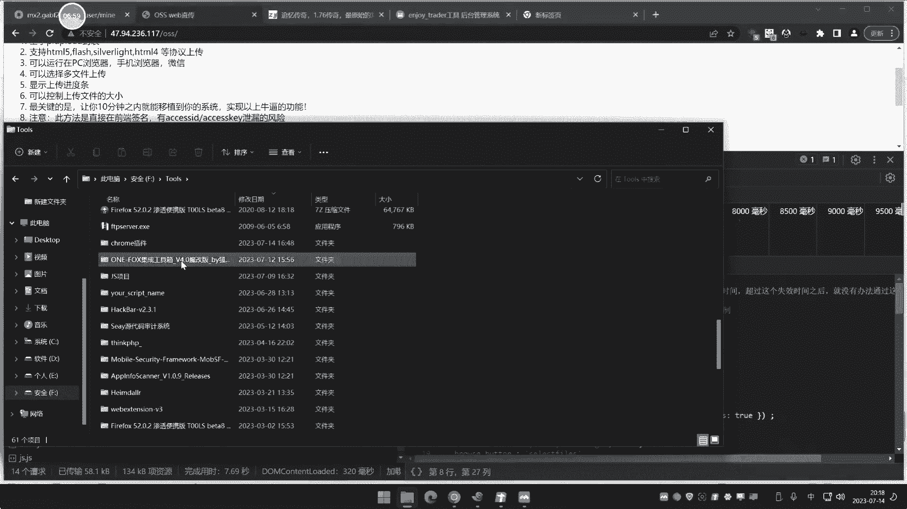

以下是JavaScript应用渗透测试中总结出的四大攻击面：


1.  **敏感信息泄露**：从JS代码中提取接口地址、API密钥、账号密码等敏感信息。
2.  **代码逻辑分析与绕过**：通过分析前端JS代码的执行逻辑，发现并绕过验证机制。
3.  **接口与路径发现**：从JS文件中发现未在页面中直接暴露的API接口或管理后台路径，进行未授权访问测试。
4.  **开发框架漏洞利用**：识别网站使用的JS框架（如Vue.js, React, Node.js等）及其版本，利用已知的框架或组件漏洞。


接下来，我们将通过具体案例逐一分析这些攻击面。

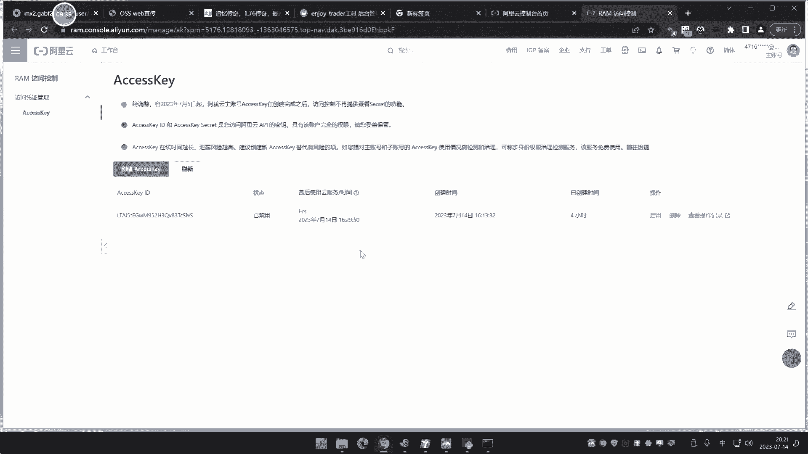

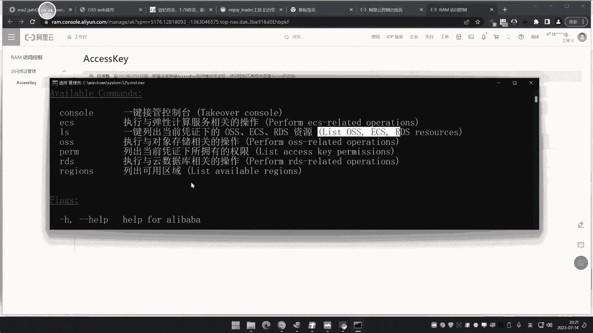


---

## 🔓 案例一：敏感信息泄露 - 云服务AK/SK泄露


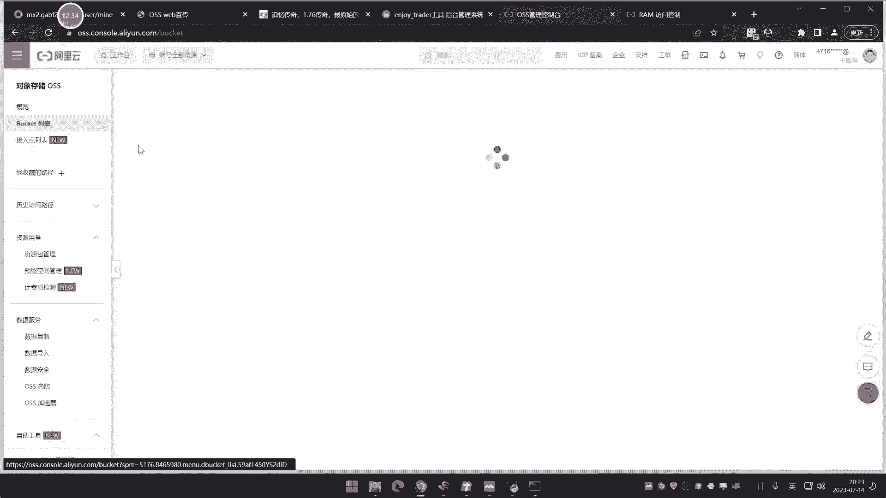

上一节我们介绍了JS应用可能泄露敏感信息。本节中我们来看一个因JS代码泄露云服务访问密钥（Access Key / Secret Key）而导致严重安全风险的案例。


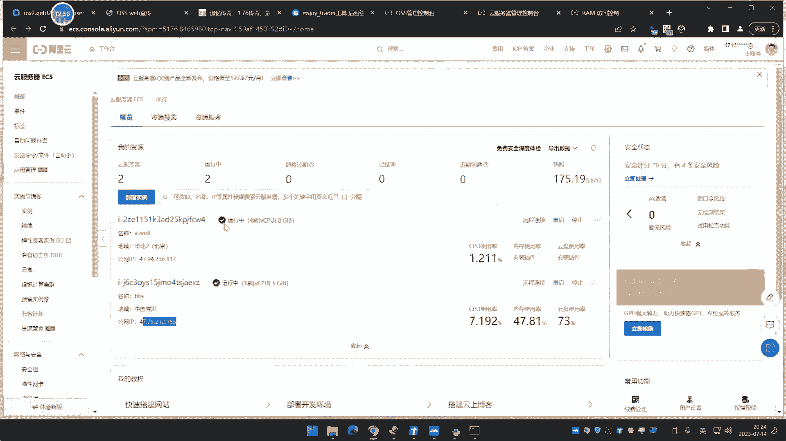


### 漏洞发现过程


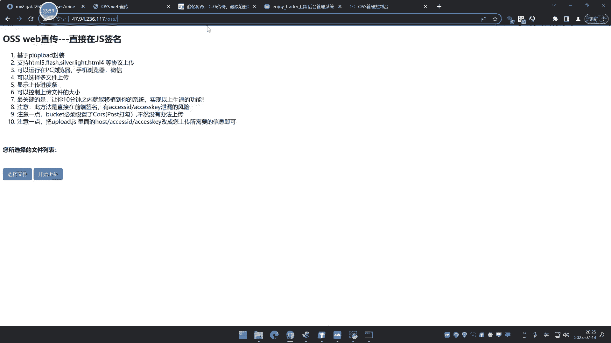

在一个文件上传功能页面中，通过浏览器开发者工具（F12）检查网络请求，发现加载了一个名为 `low_upload.js` 的JS文件。

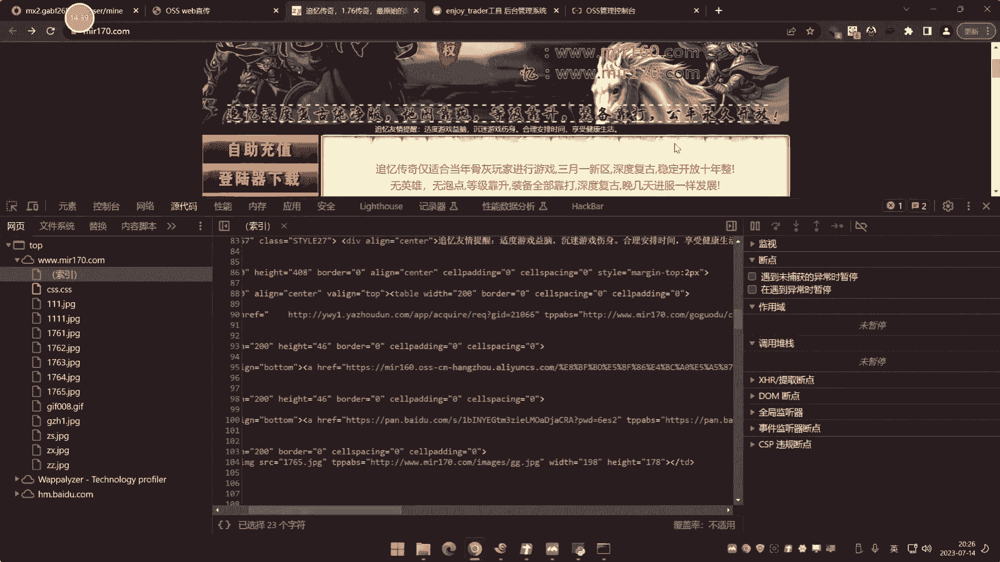


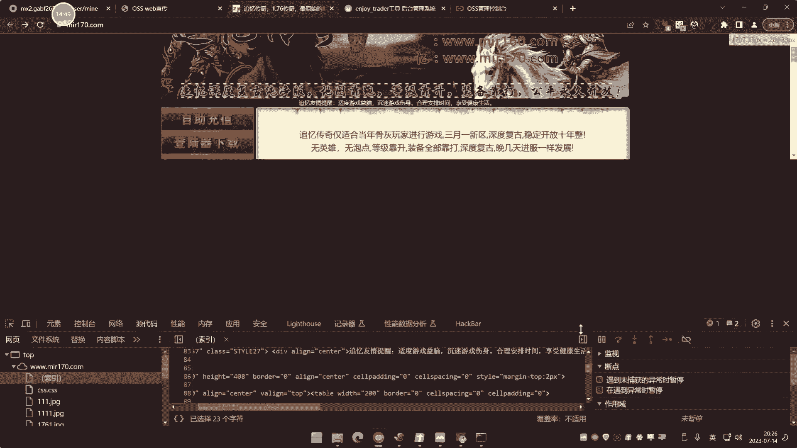


在该JS文件的响应内容中，直接明文配置了云服务的 `access_id` 和 `access_key`。

```javascript
// low_upload.js 示例代码片段
const config = {
  access_id: 'LTAI5txxxxxxxxxxxx',
  access_key: 'W4Y8Bxxxxxxxxxxxxxxxxxxxxxxxx'
};
```

### 漏洞利用与影响

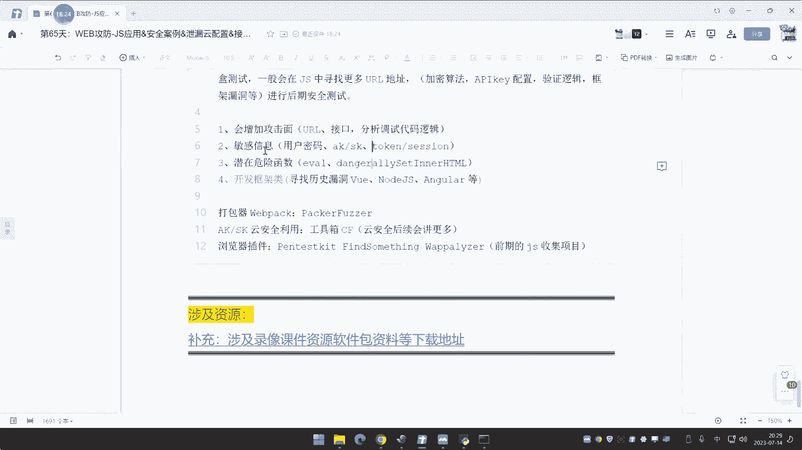

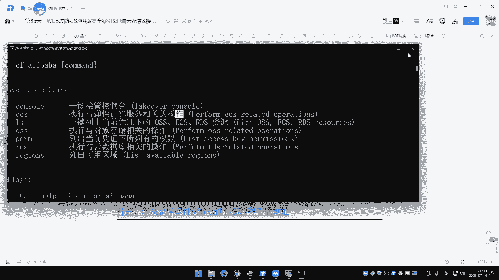

攻击者获取到AK/SK后，可以将其导入专门的云安全利用工具（如一些自动化脚本或图形化客户端）。这些工具能够模拟合法身份调用云服务API。

以下是利用泄露的AK/SK可能进行的操作：

*   **列举云资源**：获取该账户下的所有云服务器（ECS）、对象存储（OSS）桶、数据库（RDS）实例列表。
*   **操作云资源**：对发现的云服务器进行关机、重启、重置密码等操作；对对象存储桶进行文件上传、下载、删除等操作。
*   **权限提升与横向移动**：如果AK/SK权限足够大，可能进一步获取更高权限或访问其他关联服务。

**核心概念**：`AK/SK` 是云服务商提供的身份凭证对，相当于访问云资源的“用户名和密码”。一旦泄露，攻击者便获得了与该凭证关联的所有操作权限。


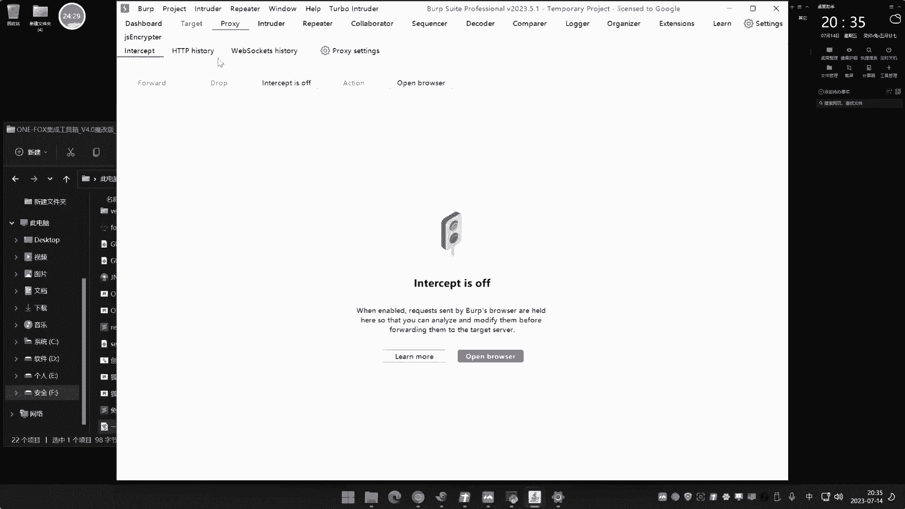

### 真实世界情况

在实际的互联网资产中，此类问题并不少见。通过使用浏览器插件（如 `FindSomething`）或全局搜索关键词（如 `access_key`, `secret`, `password`），可以快速在JS文件中发现此类硬编码的敏感信息。

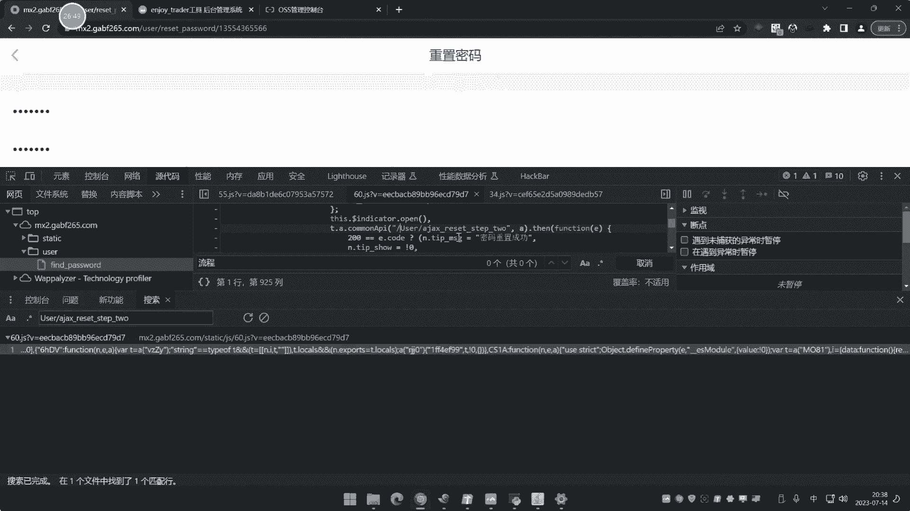


---


## 🧩 案例二：代码逻辑漏洞 - 前端验证绕过

我们了解了信息泄露的危害。现在，我们来看第二类问题：由于业务逻辑完全依赖前端JavaScript验证而导致的安全漏洞。

### 漏洞原理

在Web应用中，验证逻辑可以分为两种：

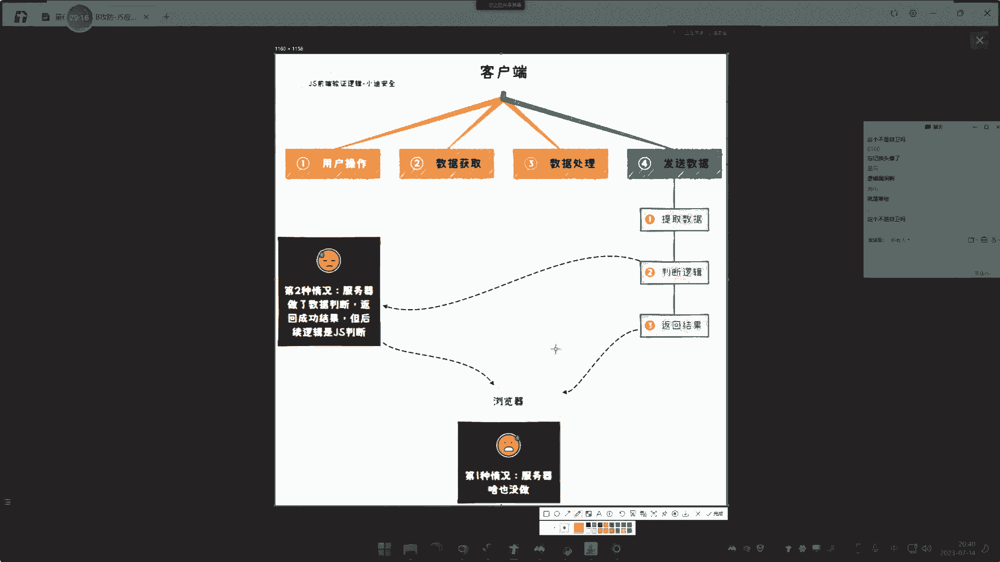

1.  **后端验证**：验证逻辑在服务器端（PHP/Java/Python代码）执行，浏览器仅提交数据和接收结果。这是安全的做法。
2.  **前端验证**：验证逻辑在浏览器端的JavaScript代码中执行。服务器可能完全不参与验证，或仅做简单校验后将控制权交回前端JS。

**漏洞产生的根本原因**：当关键业务逻辑（如密码重置、支付确认）的**最终判断依赖于前端JS代码时**，攻击者可以通过修改浏览器本地执行环境（如使用代理工具篡改服务器返回数据）来欺骗JS代码，使其认为验证已通过。

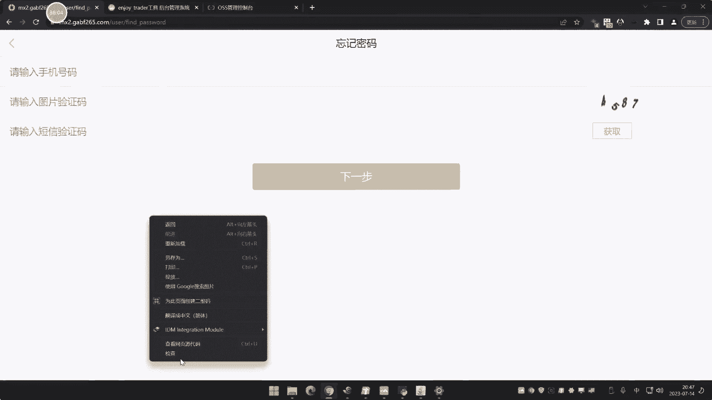

### 实战演示：密码重置绕过

以一个“忘记密码”功能为例：

1.  **正常流程**：用户输入手机号，获取验证码，输入验证码后点击“下一步”。前端JS会向服务器发送请求，验证验证码是否正确。服务器返回状态码（如 `200` 表示成功，`406` 表示错误）。JS根据返回的状态码决定是否跳转到重置密码页面。
2.  **漏洞分析**：通过F12查看JS代码，发现跳转逻辑如下：
    ```javascript
    if (response.code == 200) {
        window.location.href = '/user/reset_password';
    } else {
        alert('验证码错误');
    }
    ```
3.  **漏洞利用**：使用代理工具（如Burp Suite）拦截服务器返回的响应包，将状态码 `406` 修改为 `200`。当这个被篡改的响应到达浏览器时，JS代码会认为验证成功，从而自动跳转到密码重置页面，绕过了验证码校验。


### 安全建议


关键的业务逻辑校验必须放在服务器端进行，并以服务器端的校验结果为最终依据。前端验证仅用于提升用户体验和减轻服务器压力，不能作为安全凭据。

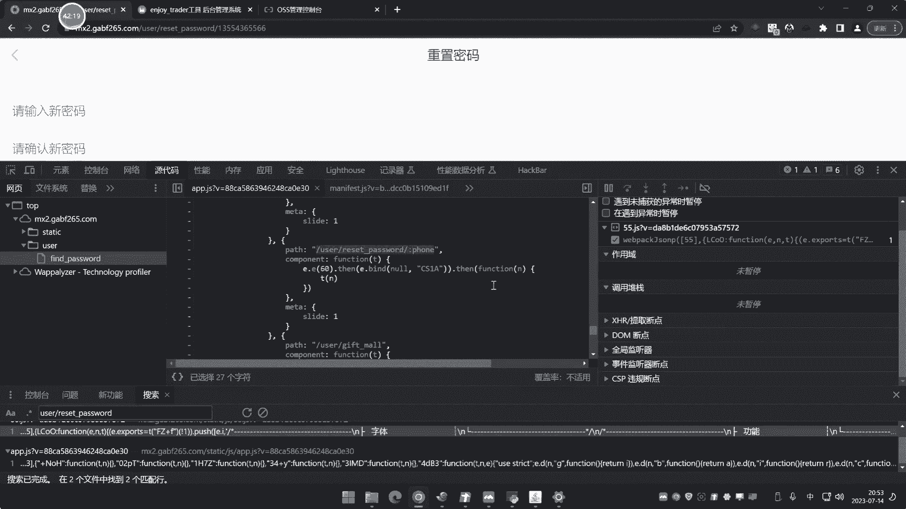

---

## 🗺️ 案例三：接口与路径发现 - 未授权访问

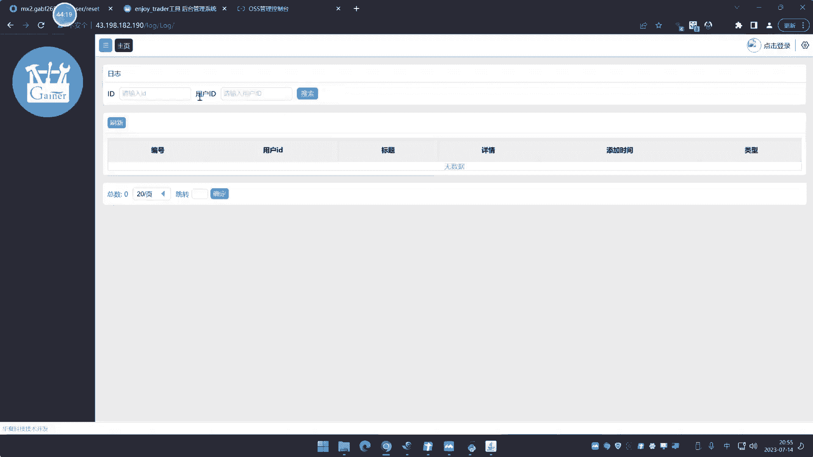

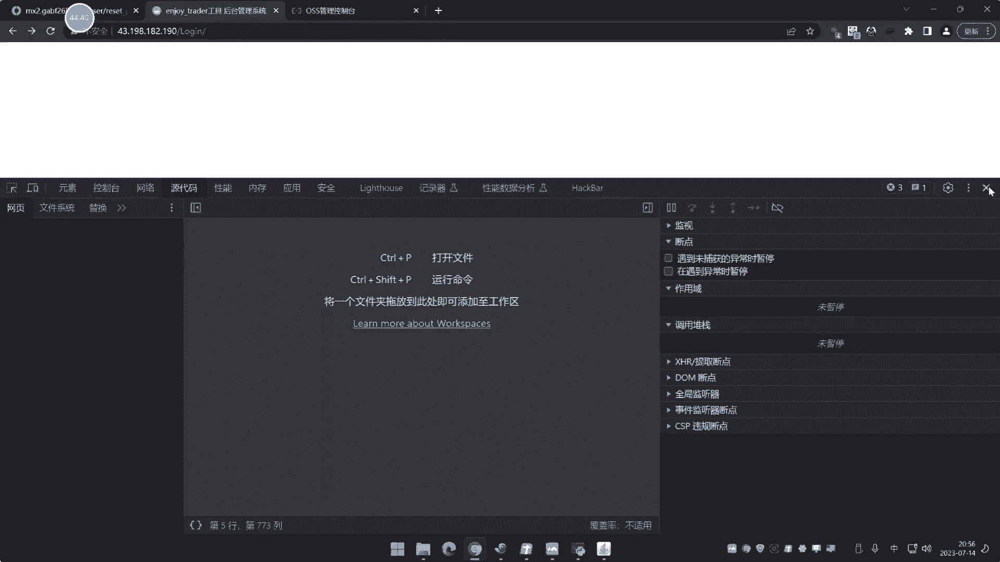


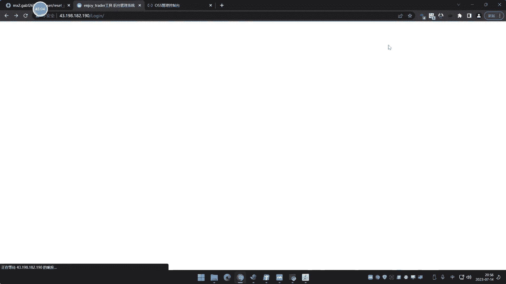

从前端代码中往往能发现许多未在页面中直接链接的后台地址或API接口。本节我们来看看如何发现并测试这些隐藏入口。


### 信息收集方法

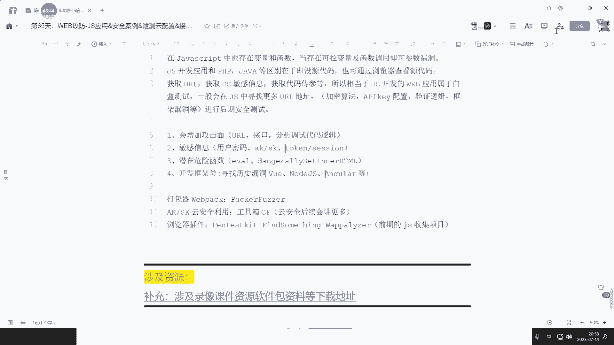

1.  **使用专用插件**：插件如 `FindSomething`、`JSFinder` 能自动从所有加载的JS文件中扫描并提取出可能的URL路径、接口端点、子域名等。
2.  **手动搜索**：在开发者工具的“源代码”或“网络”面板中，使用 `Ctrl+F` 全局搜索关键词，如 `api`, `/admin`, `/upload`, `.php`, `.action` 等。
3.  **分析JS代码**：仔细阅读JS文件，寻找进行网络请求（`fetch`, `axios`, `$.ajax`）的代码段，从中提取请求地址。


### 漏洞利用

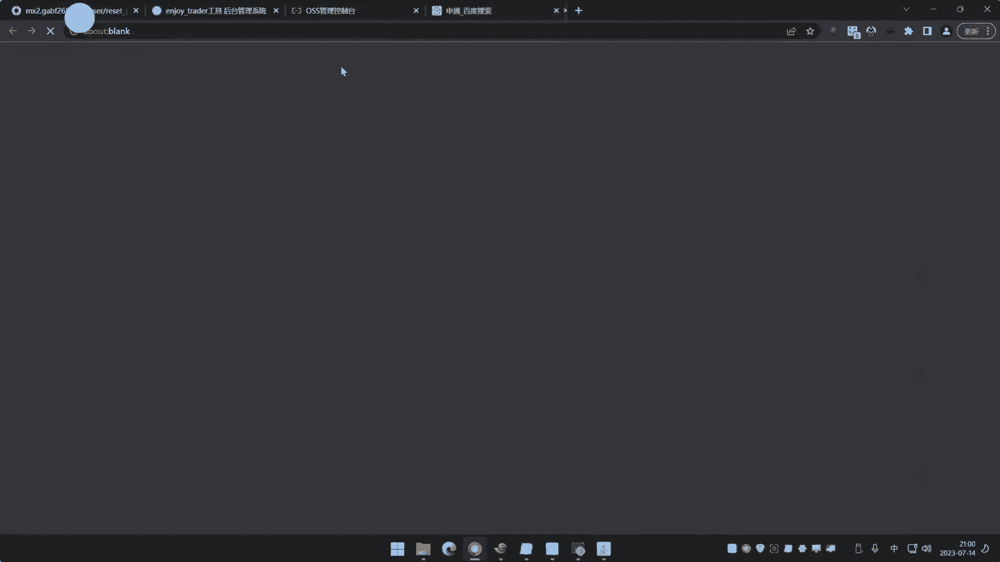

假设通过上述方法发现了一个疑似后台的路径：`https://target.com/admin/login.html`。

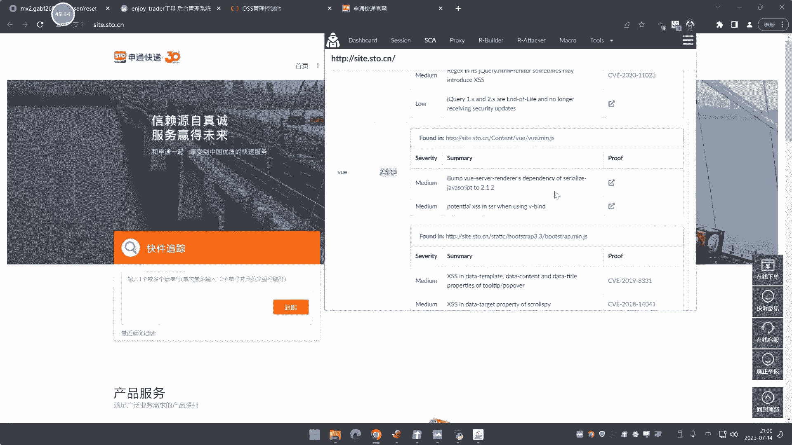

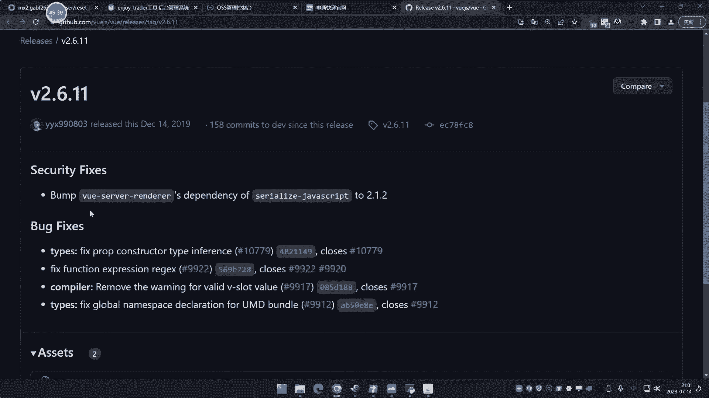

*   直接访问该路径，可能发现一个未做权限校验的后台登录页。
*   进一步测试，可能发现像 `https://target.com/api/user/list` 这样的接口，访问后直接返回所有用户信息，造成数据泄露。
*   发现上传接口 `https://target.com/upload/file`，可尝试构造请求进行未授权文件上传。

**核心思路**：将JS文件视为一份“地图”，其中可能标注了网站未公开的“房间”（功能接口和路径），攻击者可以尝试直接“敲门”进入。

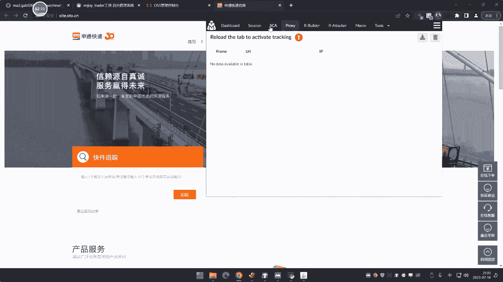


---

## ⚙️ 案例四：开发框架漏洞 - 组件版本漏洞

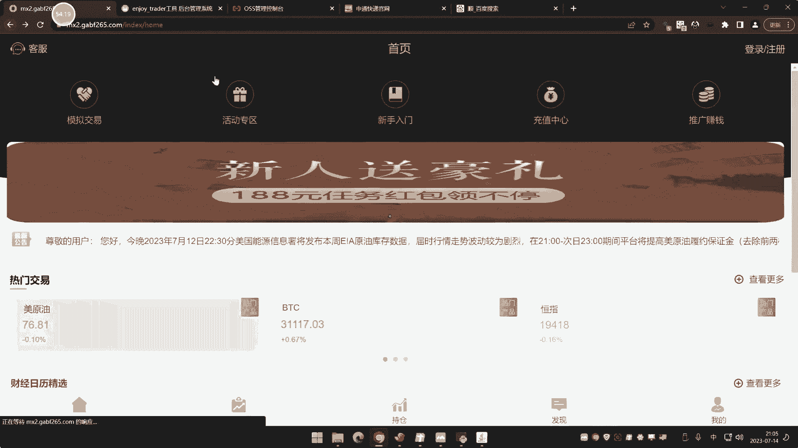

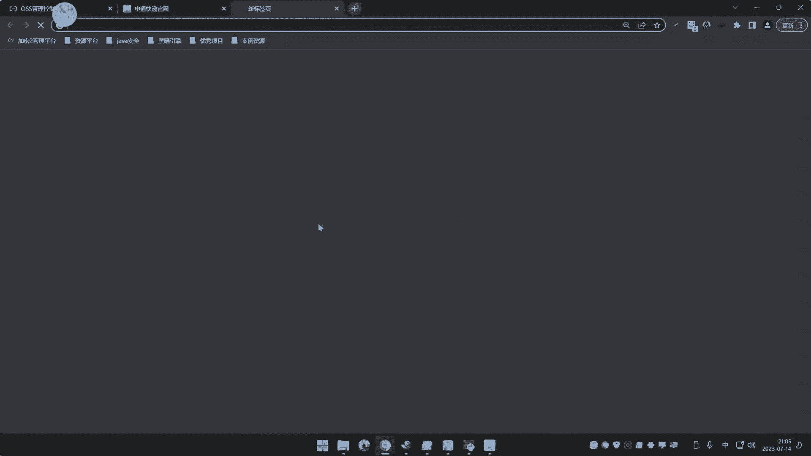

现代Web应用大量使用前端框架和第三方JS库。这些框架和库本身可能存在已知的安全漏洞。


### 识别框架与版本

1.  **查看响应头与源代码**：某些框架会在HTML注释或JS文件名中留下版本信息。
2.  **使用扫描工具/插件**：如 `Wappalyzer`、`WhatWeb` 等工具可以自动识别网站使用的技术栈，包括JS框架及其版本号。
3.  **检查引入的JS库**：查看网页引用的第三方JS库文件（如 `vue.min.js`、`jquery-3.4.1.min.js`），其文件名或文件内容内部常包含版本号。


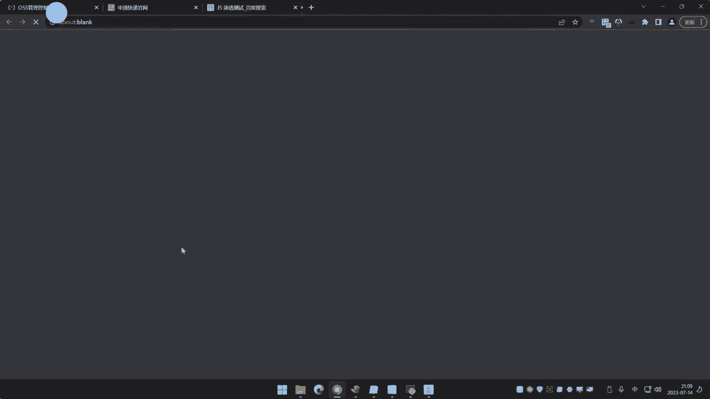

### 漏洞利用流程


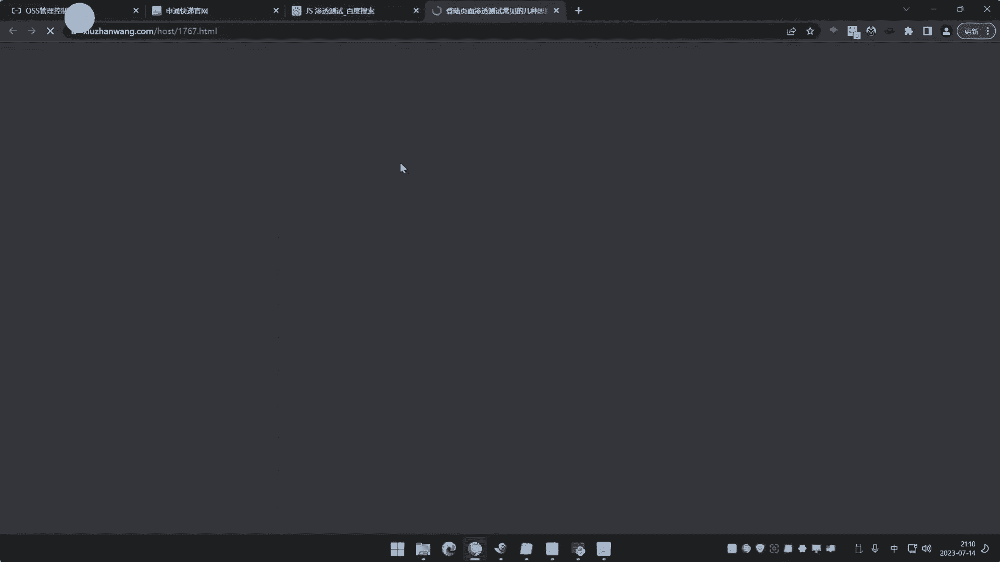

1.  **识别**：确定网站使用了 `Vue.js 2.6.10`。
2.  **检索**：在漏洞库（如CVE、NVD）中搜索该版本Vue.js或相关组件是否存在公开漏洞。
3.  **分析**：阅读漏洞详情，确认漏洞触发条件和影响（例如，可能是一个XSS漏洞，需要特定组件和调用方式）。
4.  **验证**：检查网站代码是否使用了存在漏洞的组件或写法。如果条件满足，则可构造Payload进行验证。

**注意**：并非所有发现的框架漏洞都可利用。很多漏洞需要特定的应用场景或配置才能触发。但将这些信息纳入渗透测试报告，可以体现测试的全面性。

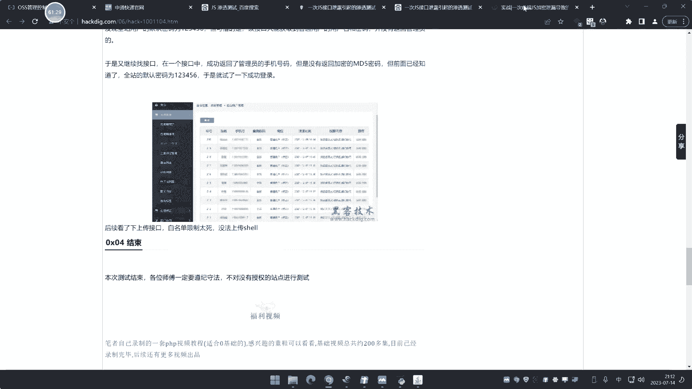

---

## 💎 总结与工具回顾

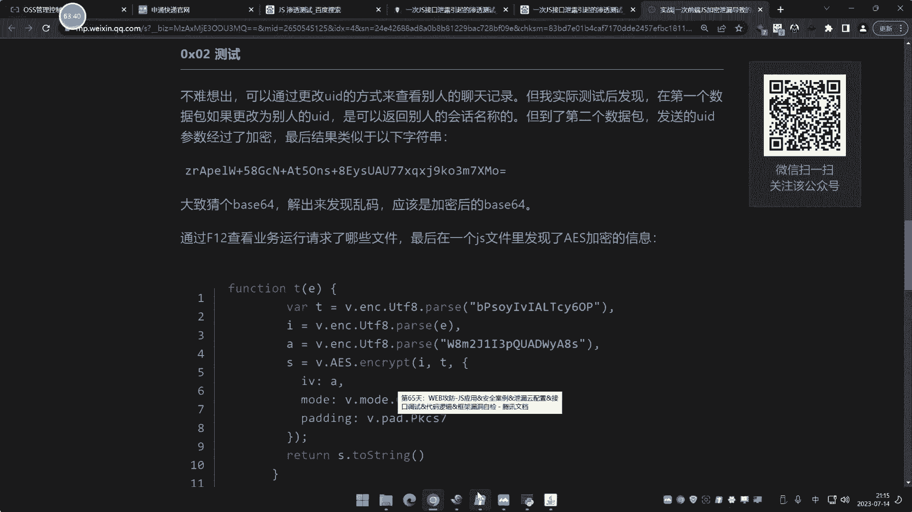


本节课中我们一起学习了JavaScript应用安全的四大核心攻击面：


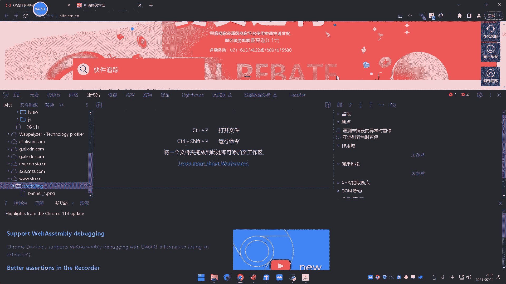

1.  **敏感信息泄露**：警惕JS代码中硬编码的密钥、密码、接口凭证。
2.  **前端逻辑绕过**：切勿将核心业务安全依赖于前端验证，需在后端进行最终校验。
3.  **隐藏接口发现**：JS文件是发现未授权访问入口的重要信息来源。
4.  **框架组件漏洞**：关注所使用的第三方JS库和框架的版本安全。

在实战中，以下工具和技巧非常有用：

*   **信息收集**：`FindSomething` 浏览器插件、`JSFinder`、`Burp Suite` 的爬虫与内容发现功能。
*   **代码分析**：浏览器开发者工具中的“调试器”，用于设置断点、单步执行、分析变量。
*   **漏洞利用**：代理工具（Burp Suite, Fiddler）用于拦截和修改请求/响应。
*   **框架识别**：`Wappalyzer`、`WhatWeb` 等指纹识别工具。

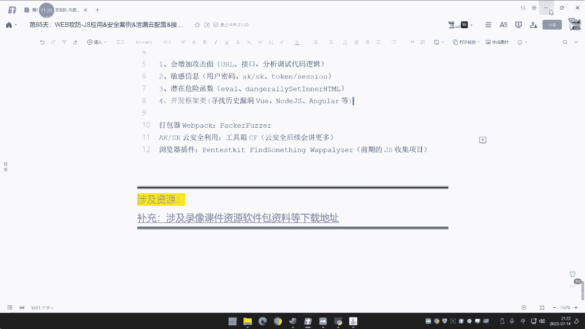

理解这些原理并熟练运用相关工具，将能有效地对JavaScript开发的Web应用进行深入的安全测试。