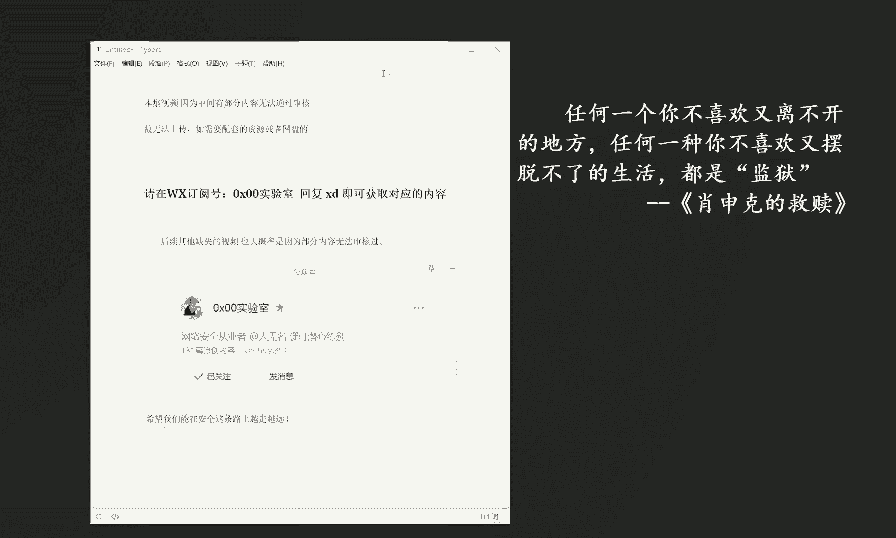
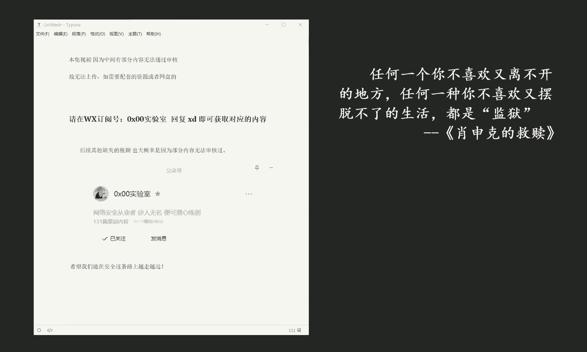

# 课程P7：第7天. 抓包技术&全局协议&封包监听&网卡模式&APP&小程序&PC应用 📡

在本节课中，我们将要学习网络抓包技术的核心概念，包括全局协议、封包监听、网卡模式，以及如何将这些技术应用于分析APP、小程序和PC应用的数据通信。

## 概述

网络抓包是分析应用程序网络行为的关键技术。通过监听设备收发的数据包，我们可以理解应用的通信协议、排查问题或进行安全分析。本节将系统性地介绍抓包的基础原理与实践方法。

上一节我们介绍了网络基础，本节中我们来看看如何实际捕获和分析网络数据包。

## 核心概念：封包监听与网卡模式

封包监听是指捕获流经网络接口的数据包的过程。其核心依赖于网卡的工作模式。

通常，网卡工作在**混杂模式** 下才能捕获所有流经网络的数据包，而不仅仅是发给本机的数据包。这可以通过以下概念公式理解：

**捕获的数据包集合 = 目标为本机的数据包 ∪ 流经网络的所有其他数据包（当网卡处于混杂模式时）**

## 抓包工具与全局协议

要进行抓包，我们需要使用专门的工具。这些工具可以拦截和解析各种**全局协议** 的数据，例如HTTP、HTTPS、TCP、UDP等。

以下是几种常见的抓包工具及其特点：

*   **Wireshark**：功能强大的图形化抓包与分析工具，支持深度协议解析。
*   **Fiddler/Charles**：专注于HTTP/HTTPS协议的代理工具，常用于Web和移动端调试。
*   **tcpdump**：命令行下的网络抓包工具，在Linux/Unix系统中广泛应用。

## 应用场景：APP、小程序与PC应用

抓包技术在不同平台的应用方法略有差异，但核心原理相通。

上一节我们了解了工具，本节中我们来看看如何针对不同平台进行抓包。

以下是针对不同客户端的抓包要点：

*   **PC应用**：相对简单。通常直接在PC上运行抓包工具（如Wireshark），选择正确的网卡进行监听即可。
*   **手机APP**：需要将手机和PC置于同一局域网。在PC上运行抓包工具（如Fiddler），并在手机Wi-Fi设置中手动配置代理服务器地址为PC的IP和抓包工具监听的端口。
*   **微信小程序**：抓包方法与手机APP类似。但由于小程序框架和其自身的网络请求库，可能需要额外注意HTTPS证书的安装与信任，以便工具能解密HTTPS流量。

## 技术实践要点

在实际操作中，有几个关键点需要注意，以确保成功捕获到目标数据包。

以下是成功抓包必须关注的几个步骤：

1.  **选择正确的网络接口**：在抓包工具中选择正在使用的那块网卡（如Wi-Fi适配器或以太网卡）。
2.  **配置过滤规则**：使用工具提供的过滤语法（例如，在Wireshark中使用 `ip.addr == 192.168.1.100`）来聚焦于目标流量，避免被海量数据淹没。
3.  **处理HTTPS加密**：对于HTTPS流量，需要在抓包工具中安装自定义的根证书，并在测试设备上信任该证书，才能解密查看内容。
4.  **理解协议格式**：捕获到数据包后，需要根据相应的协议规范去解析数据部分，才能理解其含义。

## 总结

本节课中我们一起学习了网络抓包的完整流程。我们从**封包监听**的原理和**网卡模式**开始，介绍了常见的抓包工具与**全局协议**，并详细说明了如何将技术应用于**APP、小程序和PC应用**的实战分析。掌握这些技能，是进行网络调试、安全审计和逆向工程的重要基础。记住，合法和道德地使用这些技术至关重要。