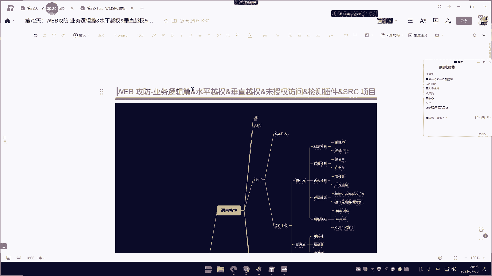

# P71：第72天：业务逻辑篇&水平越权&垂直越权&未授权访问&检测插件&SRC项目 - 逆风微笑的代码狗 - BV1Mx4y1q7Ny

我们今天上一下这个万物工坊的业务逻辑篇，说实话，这也不归类到我们工坊这个web应用上面的，比较多而已，正规真的像什么小程序啊，这个app里面的也可以测，他也属于这个通用的，而且我曾经说过啊。

这个章节的知识点呢，它是不限制于你是哪种应用，就说你是这个网站也好，是app也好，是这个小程序也好，这个不限制，同时呢他也不限制这个应用的这个加勾，也不会说限制你是什么pp的呀，java的呀。

Python的呀，这些东西都不会限制，因为这一块的漏洞呢，主要就是没就是这个开发者或是管理者。

他对于某些地方啊，他没有是吧，考虑到打个很简单的例子啊，就既然我们今天商的这个越权方面的，这是业务逻辑里面一个最常见的一个方面啊，其实商这个业务逻辑呢，有的地方呢是这样去理解它的。

就是根据这个应用的功能来去区分啥功能呢，比如说像登录框找回密码的，还有像这个呃支付购买，就是根据这个环节啊，就是根据业务功能的环节在购买商品啊，支付付款呀，然后呢像这个找回密码呀，密码验证啊。

登录地方啊等等一些地方呢去这样去区分他，去讲解啊，我们呢也可以这样去啊，然后这个月船呢呃，大家都知道这个权权限就是权限的意思啊，那么我和权限挂钩的话，那肯定就是有一个什么拥护。

所以说如果说这个网站有这么个有用户的一个，差异性的话，那这个地方呢就是可以测越权的啊，至于怎么测，怎么把这个这个漏洞呢去归类这个呢，就是我们今天要学学的啊，好那这里呢一般这个月全方面的支点呢。

它主要是分三个点，一个点呢称之为叫水平约传，还有一个呢就是垂直约传，还有一个呢就是我们说的微授权访问三个啊，就是关于这个权限方面的这个支点，但是业务逻辑权限方面的，首先我们来看一下啊。

什么叫这个水平越传，叫同级别的用户之间的权限跨越，垂直越权的叫低权限到高权限的跨越，或者说高权限到低权限，那这里呢其实随机变相，那就是两个不相等级的用户呢权限的跨越，那高权限到低权限到简单是吧。

低权限到高权限，那这个才是水月强的东西啊，你不要说高权限到低调限，那不叫随意越强啊，也叫只是说那我们挖的肯定就是低到高啊，你不可能挖个高到低啊，那么这里呢就是我们说的这个垂直和水平。

那这里有张图是非常好理解的，你看啊垂直圆形呢就是往商水平的，就是网王子弹，就是水平的啊，就同一个起跑线额就很简单啊，用户A额，用户B用户C用户一用户own3，这三个用户呢他是属于这个同级别的。

那这种权限的一个跨越之后呢，这种漏洞呢就称之为叫水平越权，如果是相商的普通用户到普通管理员，或者说到超管，不管说是哪一个啊，是普通到普管还是普管到超管，只要是有权权利啊，就是我们这个级别的跨越的话。

那都称之为垂直有效，所以这个水平越传和垂直越传的就好理解了啊，我们这里那就不说这个概念，还有一个呢就是我们说的微授权访问，那什么叫微授权访问呢，V社要访问呢也非常简单啊。

通过低级别或者说无级别用户能够访问到，要验证的应用就很清楚，举个举个烂例子啊，你普通用户呢，你访问到了后台的管理界面的一些功能，那这个呢也称之为垂直约权，也可以称之为未授权访问。

但是未授权访问一般指的是你没有授权，但是你可以进取，所以他和这个垂直圆条呢有一些相同之处，就比如说啊你是个佣，你是个普通用户，你这里呢访问了这个艾德米的用户，按正常来讲的话，这种呢我们称之为垂直源传。

但这里面也叫微授权方法，也可以称之为微授权方法，专业的讲叫垂直传，但是呢你可以称之为卫生员访问，为什么呢，就是因为这个管你接源呢，他正常来讲的话，他是不让你这个当前权限的能够跨越到的，已经跨级。

所以一般未授权访问呢，是在这个水平越权和垂直优权两者之间，那啊你都可以这样教，然后呢，你如果说你不好去区别它是垂直还是水平，那这里呢就把它称之为归属权，简单来说这里面把这个去掉会更加的直观一些。

微酸访问一般指的就是当前用户没有，就是他不是用户，就你也没有登录，用户啥都没有干，诶是吧，一发问进去了，那这种呢我们就把它归类到未知源访问，一般有用户的话，我们还是把它归类到上面两个啊。

好这个呢就是我们说的今天要讲的三个这个字，333个点啊，把讲红加好之后呢，还有一个就是我说的这个检测项目和这个插件，说实话啊，如果在真实情况下面的话，除了批量的去测的话，可能用到这个插件和项目。

一般点对点的去测一个就是一对一的，比如说你的目标都很少，量很少，一般这个插件和这个项目的用的也比较少，因为插件也要配置，项目呢，还要安装，有这个安装和配置的时间呢，说实话啊你都测完了。

所以一般这种场景和项目呢，都是针对这种比较繁琐，或者说量比较大的一个测试目标还会用到，正常来讲的话，点对点的目标小的话，一般都手工测了，因为他测起来也并不麻烦，基本上就是观察数据包，然后呢修改数据包。

就这两步没有其他情况了，好，那这里呢我们先用一个本地demo呀，给大家看一下啊，这个讲解下这个水平，乐团和其月传的一些简单的吃法，这个本尼德玛呢哎就是一个cm s也比较简单，好理解啊。

他说实话也上不了台面，但是它能帮助我们呢了解这几块漏洞，然后呢把这个搞完之后呢，我们再搞得这个茶几和项目里面呢，去把它投一投啊，搞完之后啊，最后呢我们再来看一下，这个比较真实与填写于我们实际的一些。

那个划确案例啊，就是那个SRC上面关于这款漏洞玩具的，一些包裹给他整出来了，然后呢再给大家说一下啊，这个月传这块的一些东西呢，一般都是测出来的啊，好我们来给大家看一下啊，他也不分什么黑和白合啊。

反正就是那样车，因为白盒呢你也没办法去找什么漏洞啊，呃黑河的车和白河车呢都差不多，他测的不是代码方面的问题啊，而是你这些验证逻辑的问题，好现在我们先把这个网站给他开一下啊，这个本地DOM。

这是我们打野本地的一个网站啊，那这里有个会员中心要测这个月船的话啊，一般都会和用户相关啊，所以说这个用户呢是必须要有的，就说你要测一个目标的话啊，这个目标连这个拥护这个地方都没有。

那就不用测什么水平垂直了，那直接测未授权的，因为没有用户的话，就不会有这个东西，就不会有这个权限的级别划分咳，那么现在看一下我们注册这几个账号密码啊，我这里呢注册这个，小001啊。

啊账号密码的都搞一样啊，这里那就邮箱呢也搞了个小型页啊，QQM注册啊，好操作成功，那这个注册了再注册一个啊，小零额，对不对，好注册完之后呢，我们给大家看一下啊，我们呢会从原理方面。

先从操作方面再来讲原理方面啊，来看一下，打开数据库啊，这个呢是这个网站的数据库，嗯然后呢这是他那个表啊，表里面呢看到刚才创建两个了，小于等于一小于零二，这个是按密码妙之光呢，这个是它邮箱是吧。

这是他的信息啊，好那现在呢我们这里那就，这里呢我们现在就看一下啊，那比如说我现在先登录小于零一哈，登录好之后啊，这个是小点零一登录进去啊，这里呢可以修改密码是吧，对修改密码。

然后呢还可以修改自己的信息啊，大家看一下啊，呃我们现在思考一个问题啊，这个水平编传水月传，小001和小002是属于同级别的用户，都属于会员简单会员没有其他的，那么现在我看一下啊，我修改密码啊。

我用这个数据包呢给他抓一下，基本上啊所有的这个针对这个比较全的呢，都会用到这个什么抓包，然后呢可以去改包，这个是弯股，不会编的，就是如果手工测的话，好这个呢我们直接这里呢开个东西。

前两天还有人给了个茶件，我是吧，这个代理查询对，反正贴上去呢脸都能搞了，有查检单也放到自然保料，自己要要搞啊，网上一大堆这种查寝，那一开是吧，佩萨巴普是巴黎马利，这里呢把忽略本地主机把它去掉啊。

本地主机也抓好了，现在呢我们抓个包哎，好比如说我这里要把它改成123456是吧，123456呃，这个改完之后啊，我们来看一下啊，呃先看看这个数据包，看这里啊，这是他这个密码是吧。

但是现在这个小零一密码是这样的啊，好那现在呢我们把这个并提交啊，点击提交好，提交超成功，我们刷新一下啊，这面这里呢输入这个密码，这个已经被改掉了是吧，来已经变成这个密文了。

那就是123456的密文嘛是吧，改了说明成功了啊，已经改了，那现在呢我再登录就要重新登录了是吧，好那现在啊我们继续来看一下那个水包了啊，好重新再再来啊，重新再改1234567，1234567，好。

我们再点提交啊，把这个数据包给抓到，或者说直接从这个历史包里面啊，看我们先重新抓一个啊，提交好好看一下哪一个是他那个数据包啊，可以看这个域名地址啊，这个是本整那个啊，就是那个修改数据包，这个数据包好。

属于保证年代的观察下，这个叫user id等于小精灵呃，pass1等于1234567，pass2等于1234567，就是说第一次输入和第二次输入，后面的就是相关信息，比如说这个什么邮箱啊。

这个什么鬼公司名呀是吧，这种对应的值就是我们在哪里看到的好，那么现在看一下啊，如果现在呢我发了个把这里的小在user id，对应的是小李零一，我们要知道啊，每个这个参数对应的是什么意义。

你比如说来这个MAO手机号码，email是邮箱，这个pass1是提示密码输入，第二次密码输入是吧，这个uzi id是对象，修改谁的，假如我再把这个小零一的改成小002，对不对，那灰不灰呢。

就尝试修改了小零零啊，把它改成1234567呢，对不对，然后邮箱呢也把它进行修改呢，他以前邮箱是小001点啊，小002点是吧，我把改成什么，如果改成个叉叉，叉叉改成了叉叉的邮箱是吧。

公司名字也改成这个东西，然后呢我把它改成小002密码，让我改成12345678好，我直接看123567吧，好我们先来看一下啊，那这数据库的是小002，小零二，现在是没有任何改动的啊。

你看啊现在是这个new开头的，然后呢邮箱呢是小于零啊，对不对，我把数据包呢给他放出去测一下啊，发发完之后呢，刷一下这个数据库，这边看到没，该中了吧，那这就是水平越权，这就是典型最简单的水平越权。

就是用这个小001的操作数据包呢，去测试小002的，因为他们是同级别的，那这里呢就是呢数据包就改了是吧，然后呢你可以看一下，现在我重新登录小0。02，对不对，然后呢我按照这个密码去登录，他登录不上。

为什么又被改了，密码是123567的，你看现在就正常了，而且信息你看一秒公司名称全部被修改了，刚才注册的时候是小002art嘛，对不对，这个就叫水平的传简单吧，其实你再一看啊。

如果说在实战中怎么去测试这个点呢，也非常简单，就是你在实战中呢，就是要找到这个什么更改对象，就说你自己呢对啊，有个用户是吧，你改了之后呢，你提交你看哪个参数值啊，就是这个参数名对应的是你的对象。

那么你就把这个对象呢改成你要操作的对象，如果能够成功，那这就是越强，同级别的就是水平跨越的就是垂直，就这么简单的事情啊，把它归类好好，那么现在呢我们再来看一下这个，这个什么这个叫来啊，嗯嗯垂直的啊。

那我看你们这些人呢就喜欢问是吧，加米啊，有烟证码的什么鬼，哎呀，那是另外的话，你先把这个最基本的搞完了再说这些事情啊，好我们再看啊，比如说在这里呢它有个艾米是吧，有个艾米呢，这是艾米管理界面是吧。

艾米呢就是我们说的这个管理用户不一样，对不对，这是管理用户，然后这个关联用户这里呢，你看他的主管理用户密码是这个是吧，直接给看到没好，那么现在看一下啊，我把这个地方小于零啊，我直接把它换成什么艾特米。

我尝试去夸艾德米，2米是他管理员吗，把艾德米换，把它改成123567，那行不行呢，我把它改是吧，我这样去发这个数据包，对不对，改成2D米啊，对阿特米进行操作，那如果说能成功就改成1234567了吧。

是不是我们直接看这个当前啊，没有提交之前，这是他的MD5值，拿一点刷新，哎看到没，艾特米变成F，那邮箱也变了是吧，然后我登录刚才那个账号密码是吧，1234567登录哎，进去了，那么针对这一个用户修改了。

我们就称之为叫垂直越权，我们就称之为叫垂直圆圈，能理解吧，这个就称之为叫垂直运转啊，刚才那个是同级别用户修改小002，现在是针对艾德里，但这是跨级别用户，这是管理员垂直越权好。

那还有个未授权范围又是什么情况呢，好我们继续来啊，好看一下啊，哎我们来先做个实验，先来了解一下这个身份验证相关的，把鼠标全部删掉，我们这里呢先推出来啊，哎这个推数字退出啊，退出好啊。

现在让我们来到这边啊，哎这是那个会员中心是吧，我们先登录一下啊，就说我们现在呢可以看一下这个数据包啊，我们可以刷新一下，给大家看一下好了，比如说像现在啊，我们在你那去访问这个修改基本信息，我点一下来。

我没有登录的时候，没有登录的时候啊，这边大家可以看到啊，我点没有登录的时候，我点这个修改信息它是看不到的，然后这个数据包里面，那你也可以看一下啊，哎就是那个没有登录的啊，就是需要你登录是吧。

界面那就是在干嘛，需要你登录他才能看这个地方，好就是这个情况是吧，大家看到了啊好那么现在看一下啊，这是那个数据包，对不对，然后这里有个叫cookie，cookie等于PPC型等于一个值啊。

把它给看一下好，那么现在我们再来看一下啊，我重新把这个，哎等一下啊，重新打开浏览器啊，好重新在这里呢，在管理中心这里啊，重新登录啊，好登录了，我们再看看数据包啊，再看数据包，再点这个地方好，你看啊。

现在这个PBC形态变成了这个是改动了呀，那其实他这里如何判定，你是成功还是没有成功呢，其实就是根据这个cookie，这里面大家都知道啊，这个身份验传呢，这个是cookie验证啊，有的是C型啊。

有的是这个我们说的GDP，那有各种各种类型啊，简单来说呢基本都是在这个数据包里面的，去代入了你这个身份好，那么现在我们看一下啊，这是这个cooking的啊，cookie的没问题啊。

好那么你现在啊你比如说这里呢，这是你的这个个人身份信息，就是这个身份呢啊，你就能是吧，你就能这个操作这个地方啊，你就能看到这个什么，看那个界面啊，那么现在啊我们把那个提交数据包，再来修改一下。

重新再改改，改成123456好吧，改完之后啊，进行提交好，这里提交成功了，我们来把那个数据包呢给他找到，就这个嘛啊，刚才改的那个134565的那个密码，数据包好，我们把它发到这边来啊。

就是用有用户和没用户的测法，啥意思呢，这个是你当前登录过的规划是吧，我们这里呢可以看一下啊，我把它进行一个推出推出了啊，现在是这个绘画已经失效了，就说这是你当前那个绘画已经失效了啊，我再一次的把它删掉。

直接删掉，我也不把它删除，删除了，你可能说这个是不知道啊，我把这个更换了，你不你说可能是那个啊，我直接删掉，就是把这个用户的身份的判断的，这个cookie能把删掉，重新呢是吧，进行操作。

比如说我对艾特米用户进行操作，改了123456，这边呢看一下它的默认，这是它的值是吧，这是现在这个值，把数据包重新提交，再来刷新这里，哎发现这里更改了，那这个就称之为叫未授权访问，为什么。

因为你是没有用户去触发这个数据包，也就是说你不需要登录，直接触发这个数据包，就能够发发生这个修改事件，他和你登不登录没有关系，就先说你没有登录用户，你只要输发这个数据包休息，按照正常来讲。

这个操作是属于登录之后才能看到的，因为那你界面你打开这个修改基本信息，这里他是必须要登录的，但现在就是我假设我没有登录，我没有任何用户身份，我把cookie都删了，我触发这个数据包，它依旧可行。

就说明这里就是唯一授权访问了这三个归类，就是通过这个案例呢去给他讲明白了以后呢，你碰到这种信息，你就知道怎么去归类这个漏洞的交法，有用户的就把它归类到水平和垂直，没用户的就归类到未授权，当然了。

这个威少船呢也和这个锤子啊，水平呢也可以通用，也可以同样叫没什么问题，好啦，这个是这三个概念的演示啊，那么现在呢我们就说这个是我们手工方面的，去剪是吧，有没有这个插件呢是吧。

茶碱呢网上其实在他这个检测项目里面啊，这个应用市场里面，那它有你像这个什么AU啊Z啊，AUZ这都是以前以前的啊，那个官方的，那我们国内呢又根据自己的需要呢又写了几个。

比如说这个叫侠约对这个名字呢也是牛逼啊，就叫侠曰，这关门搞越权的，对不对呃，你看他是个怎么个测法，它的测法呢其实也非常简单，它和我们判断数据包成功与否，那是一样的道理，他这里有三个地方。

一个叫原始数据包，一个叫低权限数据包，还有个叫微数据，原始数据包，啥意思呢啊，他就是对比这三个数据包的返回长度，来确定有没有越全方面的漏洞，然后在这里呢有个叫提交这个信息的。

就是你把用户的这个登录的信息，把它写在就是你登录之后的这个cookie的话写在哪，或者说登录之后的这个这种验证的，把它写了下来，写了这之后呢啊，然后未授权呢会自动把这东西呢，D下次发包的时候。

他就会发三个包，一个是带这个身份的包，一个呢是这个原始数据包，还有个呢就是带身份的包，还有一个呢就是把这个删掉的包，就是说没有身份了，把三个包进行一个长度对比，最终呢给到你有没有这个未授权访问和权限。

跨越的漏洞，这就是这个工具原理，其实很多这种查解或说项目都是这么个原理啊，就是说做三个发包，就是我们说的啊一个用户的数据包，还有一个呢就是没有用户的数据包，然后呢观察他们的这个返回长度。

去请求同一个功能和低点，从一个数据包同时发送，就是一个有用户访问，一个是没有用户访问来确定啊，然后如果说是测这个什么水平，越传垂直越传，那就是用不同用户的这个数据包的去触发，好理解吧。

能不能理解这东西好理解应该不难吧，说白了啊，就是把我们的人工呢把他急死啊，就把这把我们的人工啊把它整理到工具下面去，它帮你自动去剪了，就不是说啊这个东西，所以说我说为什么说大部分的都会手工测，就玩呢。

啊这个茶件呢就是完全是批量的嘶嘶，好演示一下是吧，演示演示呗，那你看一下啊，那我们就测一下啊，你比如说像这里啊，那我们先登录用户啊，好在登录用户啊，我把这个信息这个用户的身份呢给他拿出来啊。

这个是他用户的一个身份是吧，就是这个cookie的这个值啊，我把它放到这来啊，由于他用的是这个验证，所以我们呢这个下面这个呢，就写不写都无所谓啊，当然你把它写上去了也还没关系，反正他也没有是吧。

U的话你就必须写进去了啊，啊这个是他这个身份，对不对，然后这里呢啊这里有个叫加加加白名单，白名单啥意思呢，就是他会有抓包吗，你要在里面把白名单写进去啊，哎就说你针对哪个域名检测。

就说比如我那个网络域名是吧，1。4，他启动完云南，那这里呢就是说只检测这个域名的啊，别避免这个数据包呢，有一些其他的数据包呢写出来了，这里呢再检测的啊，如果多个域名，那你就用逗号隔开，这没什么说的。

上面有提示好，那这里呢就直接点启动插件就可以了，然后注意一下启动插件的同时呢，要把这个代理呢把它要监控到这个Buff上面去啊，那启动插件，然后呢代理呢是这里开着了啊，那是开的，所以说有这个数据包的啊。

然后呢你只要触发一些请求，你比如这里面去触发呢，你看我们点这个地方，然后呢我尝试去访问来这里是吧，放这些地址，然后呢去看一下是吧，他能不能去触发到这个地方，然后你看啊这个数据包的就全部出来了。

注意呢就是观察这里啊，这个低产线位于长征这个长度啊，一般的就是看这两个对勾，有对勾的地方就可以，然后这是什么概念啊，比如说呢啊访问第一个数据包的时候，长度是5328，第二个数据包的时候也是5328。

为什么还是零呢，变成了五，变成了不等于这个无上了吧，那啥意思啊，我们看一下啊，原始数据包这里可以看到结果，结果呢，你看就是我们那个景区那个修改那个页面对吧，低弹性的数据包，你看他在库里面啊。

你看带有它好滴，传也是预报是吧，也是带有界面呢也有是吧，然后你看威慑权威是什么呢，界面呢没有了，看不到界面了，变成个3022的一个调整，然后你看数据包里面，就自动把那个什么cookie给他删掉了。

是不是，其实他就是把你这个用户的，相对来说没有登录的状态去尝试了，就是这里嘛就是你把它配置好之后呢，啊，你把用户信息写进去，再把你等下删除的这个信息，也把这个标识写进去。

那等下他就直接把那个东西把它删掉，就是说你现在是没有用户登录，去请求这个数据包，对不对，你看那这种的话就属于正常的，没有安全问题的，为什么这样说呢，很简单嘛，原始数据包里面正常有用户访问。

就是这么个返回是吧，然后呢未授权的时候是吧，没有这个用户了诶，结果呢就不能看了，那就是正常逻辑呀是吧，你没有登录，我就不让开了，是不是，然后呢你再看这个啊，这两个这三个都是一样的，这几个都是一样。

对不对，这几个都是一样，然后呢你再看这个地方哎，这个地方怎么相等呢，为什么相等呢，它相等都是返回404，那这是个另外情况，其实都错误了，你这个低权限本身也是这个错误，跟微传也是错误，那这种的就不酸了。

这是正常的啊，也是正常的，那你看这个地方那也是正常的是吧，都是访问这个login呢，都是返回这个页面，为什么，反正也是这个页面，所以说这样车呢他就没有问题是吧，那你可能说我明明刚才测这个靶场。

他有这个月全漏洞啊，但怎么回事啊，这个车子好像都没问题啊是吧，都访问都是能正常的这么个逻辑啊，这个车是吧，都正常，这两个对勾对上的，就是主要看这两个对勾对上的啊，对上就是存在。

但是这里呢我说了它是正常的，为什么是正常的，因为你这个页面本身就是返回这个一一模一样，都是返回这个东西，那那没什么区别嘛是吧，要看就是看书单页面返回正常长度的一致，但是啊包或者是有数据的。

而这几个呢都是本身就是有错误，妈的这个404都是四灵石，那咋个咋个有什么区别呢是吧好，那你可能说刚才这个靶场，不是有这个虐泉龙毒吗，因为我那个标签漏洞是属于什么，属于提交修改，但我现在是只是访问地址。

访问地址它是有权限验证的，它是安全的，他只是去触发某些功能的时候造成的传，所以说你要在这个地方哈，重新来这个地方啊，你比如说像现在我去修改一个密码，我重新登录一下啊，我先把这个里面都清空，好我登录进去。

然后呢，你看啊，我在这里啊，我去修改密码，像12345678对吧，我去修改这个密码，然后把人的数据包给他抓起来提交好，我们来观察这里啊，你看这里啊，这个是那个post请求，就是那个修改数据包的那个操作。

你看这里全部相等了，你看啊，现在就对应上了，你看带有用户的判定的时候，是吧，他的返回值呢，是这个东西未授权的时候没有带呃，配这个位数权怎么也呆了呀，妈的真是奇怪，他没有删掉哦。

应该是这个数据包的C型的发生更改啊，删了一个部分，那这里呢他也是正常的，那是吧也是正常的，那说明这里那就存在这个月传嘛，好不好理解，其实这个查询呢就是这么个逻辑啊，就是说对比这个低权限用户包。

原始数据包和这个v search的长度，如果微缩的长度呢和前面两个呢相等的话，那就有可能存在这个漏洞，为什么这样讲，就是因为他们返回结果一样，工具呢是把他的用户身份把他抛离了，抛离之后呢。

他还能结果一样，那就说明有嘛，就像是没有登录状况下去触发这个数据包，说实话啊，把这个插件一用呢，你会发现啊，好像和我们手工自己吃呢，还难理解一些，还男女结线，你说这个茶钱要还是不要呢，是不是。

这个就是这个插件啊，没有可靠的啊，在网上去测这种嗯未授权的啊，这种越全方面的这种插件工具也好啊，都是半斤八两，没什么特好的，以前呢这个中通呢有个那个开源项目，用的最多的就是我这里说的啊。

但是搭建起来bug特别多，我好不容易把答应下来了，又是哪的问题啊，这的问题应该是烦的要死，这个呢好死，但是bug特别多啊，安装呢是怎么个安装啊，大家要下去呢，把那个东西修改一下啊。

好我们现在呢给大家看一下这个地方啊，还有人问第一权限是什么，权限这块你说是什么权限呢，这个看怎么界定呀，你和哪个对比，就是D向键的，一般说D盘键就是普通用户嘛，就是说你能正常看到的这个地方啊，好。

这是之前那个前几天用的比较多的，一个月传测试项目，好，我给大家看一下啊，这个大家搭建的话有问题啊，这个问题呢在这里解决，然后呢我也给大家做了个直接解决的方案，就是我在那个网盘里面呢。

重新把这个修改好的啊，他还修改这个dr。的里面是四个文件，这四个文件我全部把它修改了啊，起了三次行呢，这四个文件我都帮他修改了，所以大家直接用我这个给他提供的包啊。

啊直接docker的安装好DOCUT之后呢，直接那个啊，也是根据这个上面的这个报错的解决方案呢，啊这样去操作的啊，而且他说实话解决完之后呢，还会有一些小问题，烦死了啊，简直是把打进来了，大家呢反正是坑。

我跟他踩了啊，你要参考的就是参参考，这里边说那个采根进度，他要让你修改什么地方，你就修改，你不想踩坑的话，你就用我的，直接用我这个啦把解压啊，然后呢怎么用它呢是吧，CD来到那个地方，然后来到这个地方了。

再来到这个目录，这个AUTH目录，然后在这个下面呢有这个几个文件啊，直接在这里安装好DOTT环境之后呢，直接dot postal，然后up啊，杠B是吧，直接把起就完了好，他就启动了，启动好之后呢。

端口默认是四个八，我就直接访问啊，在他项目里面有索命啊，有所谓四个八二，后面加logo啊，然后账密码呢是这个艾德里密码是阿里比二三，在项目里面有说明啊，你不要说这个不知道在这个上面写写U了，好真的进去。

那这是个检测项目啊，进去啊，这是什么东西的，好我们看一下啊，他只是怎么个测法，怎么玩啊，我给大家演示一下啊，比如说这里有账号是吧，账号我填填个账号小D01，密码呢123456，点击确定。

再添加个用户小于零额，密码是123456，确定好，都把他自己那个写进去了，这个叫流量啊，这里随便创建空间，名字随便取，根据自己需要，我们就测试这个什么没没to，或者说我们这个今天讲的啊课程啊。

小于test test test test72次嗯，随便取个名字好，就是这个名字嘛啊好这里呢点这个编辑干嘛呢，你看啊SSO验证和手工录入这啥意思啊，啊你这里呢可以勾选的这两个号，刚才你添加这两个号。

把网址写进去诶，他就帮你自动去跑这个网站，用这个两号的帮你去跑，但这个呢是要建立对方是SSO验证，啥意思啊，SOS验证啥意思啊，就是那个用户呢是用灯框登录的，我们那个是不是啊，不是的。

不论是表单这个soc验证的，就类似于windows那种验证一样，就是打开网站呢，它什么跳出那个弹窗，让你登录账号密码是吧，就可以用这个默认呢，它就会自动帮你提交这两账号密码登录进去测，但这个它不是。

所以我们要用这个手工录入，怎么录啊，添加个名字啊，随便取就叫用户诶，好这里呢就写上我们那个用户的身份啊，用户的这个用户的身份啊，下用户身份，比如说我们这边要给找个网站给他看一下啊，找我下里巴。

他不能测这个127点，不能测那个1112016，8。1。14的那个网站啊，不能测这个网站，不能说我们本地打理网站，为什么不能测这个网站啊，为什么不能测这个网站，大家知不知道啊，诶怎么变成这个了。

为什么不能设个192。16，8。1。14那个网站，因为我这个搭建是在服务器里面，你这里写1921624，他会找服务器1920S，而不是你本机的，所以说你这个环境装到你本地了，你写一点JS他知道能理解吧。

不要搞错了啊，你这个血上去就是报错了啊，因为服务器呢搭建在这个网站，这个服务上面去的啊，一些艺人士的他去接一人，是在他的这个环境里面去找那个意淫的事，不是在你电脑的啊，不要搞错了啊。

所以我这就只能测我这个外网的一个地址，让他能访问到的，啊这边我就拆下，比如说小地方点com答案，这些用户诶好，那网站呢根据自己需要啊，正则表达式后面信号的代表数位，所以写在那边写八点看嘛，对不对。

然后这里再写上你这个用户的凭据啊，由于我这里呢我先看一下啊，我先访问下这个网站F12是吧，刷一下这个网站，看我现在用户的频率，由于我这里是没有用户用户，所以我这就测两个用户。

一个呢就是我们没有用户的情况，还有就是有用户的情况，反正是没有用户的cookie，把它复制开好，我们来做个记录啊，避免的有的人就说哎呀我听不懂听不懂啊，那这个用户是没有登录情况下。

就是我没有做任何登录啊，没有用户，或者说你找个这个普通用户也行啊，或者普通用户，对不对，那你可能会说了啊，实战中那普通护甲如我没有呢，那怎么办呢，没有就租车呀，你说租车也注册不了啊，那租车都租车不了。

你拆个毛啊，车用户都没有，你还凑热想干嘛呢，有些人他就喜欢这样问，我真的是服了，那你只能测未授权了，就测他一些这个需要登录的地方，那这个水平越权垂直越权就不用测了啊，这个就是这个数据包是吧。

然后呢我们再找找个不同用户的啊，由于我这个网站呢它没有这个普通用户，他就是一个没有用户和管理员，所以我只能用管蓝给来演示，你可能又会问了，实战中我知道管你玩的这个cookie呢，我知道我不会登录进去吗。

我还测个毛啊，啊话是这样，没错啊，但是我这里的时间环境没办法啊，他只有这个管理员和普通用户啊，没有用户，这个两个级别没有什么普通用户和管理员，只有没有用户和管员，所以我只能在这给你演示啊。

就是找两个不同级别的用户来测，实战中的话，那肯定不是测这个管理员了，因为你有这个管理员的话，哪会这样测呢，你如果说要测的话，你就直接测什么呢，哎什么情况，这不是已经登录了吗，哦这个是没有登录的啊。

这个网站是没有登录的，看这个网站的那个地址啊，这个是没有登录的，这个没登录啊，我们直接观察cookie就知道找，随便打开一个地址来看下cookie，这是我那个空影子吧。

好我这里那是我那个管员coking啊，那我们就不看了啊，避免有把截图干净柔弱了啊，来差异有差异啊，我就不看了，刚一截图是吧，赶紧你妹的看到我小八去了啊，我还是比较怕的啊，好那这里呢就是用户V的啊。

那先进去了cookie啊，呃一个是这个的啊，对不对，点进去啊，再加一个嗯，然后这个是用户，就是就叫小迪吧啊小迪用户D吧，好然后这就是shy点com cookie啊，写进去。

然后这个那就是我们这个这个的是吧，然后呢这是这个地方，看好点击这个保存，保存好了，来看一下这里啊，就是呢，他等下他就会用这个用户A和用户B两个cookie，去对这个网站去访问，妈的差点搞错了。

差点翻车了啊，再小点半点com那个键盘里面的老给我自动输入，妈的，键盘垃圾啊，然后给我多搞一个键盘，现在有点混乱了，有时候多敲一个哎，要换键盘了啊，好那这里呢直接点这个开始对吧，点开始之前还不行的。

还要干个什么事情呀，还要做的事情，安装个插件海涵，这个查询一定要按顺序啊，这个查询呢支持两个，一个是八宝插件，一个呢是这个浏览器插件对额，但是写的还有交的啊，有教的，大家自自己写的啊，但他有教的哈。

你看这样啊，这个有两个插件，一个插件就是巴普查询一个那个啊，这个插件在哪里呢，在这个项目这个目录啊，这个是Buff插件，然后呢这个是那个浏览器的那个什么插件，他就是浏览器拓展，这个是8P插件啊。

你这里呢记一下啊，那这个是8P插件啊，8P插件它没有编译的啊，需要你自己把它编译出来，我们这边就不编辑了，直接用这个浏览器，起码是谷歌浏览器的啊，找这里，拓展这里啊管理拓展，然后呢是吧。

解压到那个那个目录，就这个查询这里面啊，这里就是让查询二老八开启这关闭，这里写了服务器地址，就是你这个地址啊，就你搭建那个网站地址，就这个，啊配置好，那做了这个事情之后啊，接下来这个插件一开。

那么也就是说他会针对你这个插件上面访问的，那个目标规则的，就会请求到了这个项目了，然后他去观察它的流量，通过对比两个用户的数据包，来去检测这个月全方面的漏洞啊，是老吧，这不是有两个用户吗。

永辉这永辉也cookie，这是用户B的cookie啊，写上去就是把生成的这个平局吧带上去啊，有些的可能不是cookie，是其他的是吧，那你有其他的，你就把全部写上去啊，好保存好之后呢，接下来就点击开始。

点完开始之后啊，这那你就可以尝试性的去访问网站了啊，啊你比如说啦我这里拉起来，我去访问一个页面是吧，访问这个一个页面，然后呢再去访问一些这种正常页面，发完之后呢，就看这个这边有个流量啊，这里有个呢。

最后面这个这个地方一点流量明细刷新，反正bug特别多啊，bug那真是你妹的烦的反思，你看他就会有这个数据包，产生这个数据包呢叫什么鬼呢，他就会对比两个用户去访问的一个结果，啊就会对比两个访问帮的结果。

哎所以说这东西呢看上去的那个啊，这个是以前他没有更新了啊，这是以前的中通项目，还有一个呢是这个项目啊，这个操作的大概是那个流程，就是对比两个流量的结果，然后通过来差异性对比说，说白了啊。

你和那个巴布树上面看一样的，你也不好说这个东西好还是不好，哎简单来说呀，我懒得说啊，网就这么多，还有个呢就是这个插件，这个是新出来的一个这个工具啊，说的也是牛逼的要死，但实战中呢说实话我测了一下。

我到现在都没有把它搞出来，这空气怎么用，我的测了一下啊，灯光明没用成功唉，你可以下去看一下啊，这个新的没用成功啊，你知道啥情况，写上去还是比较好的啊，要是准备两个账号，然后来进行进行相关对比。

说白了也是手工一样车，就说这个项目这个工具呢，批量车还可以用一下啊，如果手工车，那就没必要了，只带个项目的啊，比较麻烦啊，太麻烦了，这个东西，好这就是他说的的工具项目啊，哎呀我不是说想讲的东西啊。

有些人呢你说了，他就肯定说有没有什么检测工具啊，那些东西其实有些漏洞呢，用工具解的好，但有些呢没必要啊，没必要去捡你，因为你自己那就就本身，手工就能捡的一些事情啊，对吧好，那么现在呢。

我们就把这个SRC的那个三个案例给大家分析，然后呢我就给大家看一下啊，啊我晚上我的网上那水平给大家看一下，就是点一下啊，我们也不做实战分析，先把案例分析完啊，分享完给他一讲，讲了之后呢。

我们追求个实际性的一个操作，因为我们这里用的这个本地这个靶场嘛，肯定就是吧，不是我们这个面对的啊，因为在实战中的话，刚才大家也说了一大堆的疑问，什么带托克呀，什么加米奶呀，对不对。

我当然知道虾米你能不能把它还原它呢，对不对，你能还原不解也能解吗，你可能说那怎么还原呢，那前期那说算法去逆向啊，那不都不是这种课程，那你有那个技术里边还不就行了吗，你没那个技术吗，你说这些问题干嘛呢。

那就不是这方面漏洞问题，那就是那个能不能把那个算法理想出来的问题，而不是这个漏洞你不了解啊，而是你不懂那个算法，好那这里呢我们就看一下三个案例啊，这三个案例全部是真实的啊，呃哪里看的呢，有些人点这里啊。

点这里看啊，点开打开链接哦，就这里啊，我都给他规定好了三个漏洞的玩具案例，然后这里面我只配了图片，没有配索米，说明那是我讲出来的，大家看理不理解啊，好这里呢我来讲一下啊，这个案例呢是一个垂直热传的案例。

是一个高效的一个小程序，上面的我刚才说了这种漏洞，他是不在乎你是网站还是小程序，也不在乎你是app，也不在乎你是java还是pp，都不在乎他，在乎的就是你符合他的逻辑就可以撤。

所以一般这种SRC呢喜欢玩这种漏洞的，原因就在于此，就是因为他不需要说你早日扫描什么，也没有诸多漏洞来扫描这些东西，就是说在漏洞你找不到的情况下面，可以从这个业务器方面的去挖，就这个意思啊。

因为其他的那种漏洞呢是属于代码层面的，它是可以修复的，但这种呢就完全就是靠这个开发者的细心，和逻辑上面的一些处理了，好这里呢我们就废话不多说了啊，直接看，这是第一个啊，垂直越强，这个那是要高效的小程序。

然后呢打开之后啊，扫描扫一扫，找到小程序，这里呢有一个叫登录之后呢，打开之后呢就这么个界面啊，校友登录啊，和访客登录，那我这里那肯定是自己，那也没有这个账号啊，那肯定选择访客登陆是吧。

他肯定选择访客登录，因为这个小友登录里面账号啊，登录之后呢，他是说要审核是吧，啊这里有个叫暂以游客身份进入，那我就肯定是以占游客身份进入嘛，真之后呢啊把网址呢拿出来之后访问呢，他可以电脑登登录。

所以呢我就拿到电脑啊，因为上面这个操作截图呢都手机上面的，反正电脑去看那个网站界面那样，大概就这么个界面，好到这个界面这里的时候啊，就开始了这个正规的测法了，因为前面几步呢全部都是先进入到应用里面去。

现在已经进入了，进去之后呢，在这里有个就组织管理抓了一下数据包，数据包，这里呢我们发现你看他的数据包这个请求，这里啊，这个码都没打好，这上面上面硬唉，尴尬死了，尴尬了啊，那这里呢就是那个呃截图。

然后这里面有个叫你看他的这个数据包，和我们刚才讲的就不同了，你看它cookie那里有个什么叫这个字，然后这里还有个什么C型id和什么product ke，大家要关注到啊，你的英文学的好。

很多东西呢也好理解安全学的好也好，理解和用户身份相关的cookie，还有什么C型这种关键词，还有什么叫什么普罗扎的K，你都说这有什么意义啊，你要明白啊，嘶我们都知道你打开小程序，或者你打开一个app。

他怎么知道你是模拟器打开还是真机打开，或者说他甚至知道你是苹果大苹果，苹果手机打开的还是安卓手机打开的，或者说更深层次的，他甚至还能知道你是哪个型号，哪个品牌，他都知道，为什么呀。

因为大部分的这种app或小程序呢，它都有一个权限，就是你在使用的时候，它都会有一个授权，授权之后呢，他就获取了你的设备信息，那设备信息可能就带有这个数据包里面去了，所以其中可能还有你身份信息。

所以为什么说什么普查的，K也属于一种身份验证呢，因为这是你的用户产品，如果说你把这一栏是删掉的话，那可能他就会认同你是其他产品，比如说蓝波炸的K，或者说这里要写这个什么个APPK。

或者说a p p p id API id就是我们的这个什么，可能是手机设备的这个id编号，如果你把它删掉，你再去访问，可能他就会认为你是其他设备，那么界面可能就不太一样，我们都说过啊。

数据包的任何一个东西它都有意义的，以前那是网站的电脑上的网站，那可能通过UV头来来判定，你是什么操作系统是吧，是电脑端还是手机端，通过UA能判断，那么如果说是这个手机方面呢。

可能就会有各种各样的一些判断，所以你可以看到啊，这里有C型id和这个东西啊，这两个呢就是相当于说是你这个设备的编号啊，或者说产品编号，然后呢和你这个身份的这个id值，就是和你身份相关的，你一定要记住。

就是说挖这个月传漏洞，最重要的就是看他是什么，找到哪个和你身份相关的东西，因为你等一下要去尝试他有没有标签漏洞，就是修改这个地方，就去过这个地方好，我讲到这里的时候，我先给大家说一下这个意思啊。

大家看一下啊，就拿我这个本地的给大家说一下，你看啊，它为什么会存在这样的问题呢，你看啊，那表里面有个东西，有个这样的东西，有个什么东西啊，那这里叫ADD me，OK这个表它等于，然后等一的是二零用户。

下面其他用户呢全部变成什么零，这里我们是不是可以这样去理解他呢，就说这里如果这个用户的变成了乙，那这里他就是管员了，能不能这样去理他呢，其实在网站的开发应用中呢，就是这么个判定方式。

就是你用户的一个标识符，比如说你的id编号，你的类型编号类型一呀可能是关联，all呢是这个是吧，或者是这个超级会员啊，223的普通会员四呢，游客他可能是通过这个标识符呢，来确定这个用户啊。

你这里那就伪车一下吗，你别说大，假如说啊这个特色零一是吧，这里我把它改成一，这边我改成一啊，那么现在你看一下啊，我们再去登录一下我那个网站，他以前肯定是普通用户嘛啊我登录了，他是201用户。

123456登录，我这里没打对勾啊，不好意思，没对勾啊，没声小啊，不好意思，插件里面的翻车了啊，哎什么情况，不是test01吗，是不是三成零啊，啊这还不行啊，那可能还有其他验证啊，还有其他验证。

我意思就是说这个意思啊，不要见怪啊，不要大惊小怪啊，哦这里还有个哎，这里还有个啊，这里还有个，这里还有个那还有个叫user top用户类型，那这个为三，这个为一，可能这里还要修改一下，我看是不是啊。

我只是猜测，因为我没有实际，我想给他讲清楚而已，你这翻不翻车很正常啊，不要大惊小怪，哎你看是不是就行了，对不对，你看他就成了这个什么管理员了，那么大家试想一下，如果这个数据包里面。

他把这个东西给它进行了全参，假设说啊这个数据包里面有这个东西的传参，你把它改成这个三，它数据库发生修改，那你的用户不就是跨越了吗，所以说其实这种漏洞的车法呢，就是抓数据包的那个地方，抓什么地方。

就是抓和你用户身份相关的地方，你进行修改，然后呢去测就是这么个逻辑啊，那么难点就是难在于怎么去判定哪是哪哪是哪，就是修改哪个地方，这个地方为什么不修改，那个地方要修改，这个就是经验了。

就是你对整个这个这个类型的判断，因为就像刚才一样的是吧，我为什么不修改这个地方，只修改这个地方，我怎么要修改成user ta法，因为你判断你这个名词上面都告诉你use tub，use类型。

这个是三这个一，那你说这个三合一代表什么意思呢，你猜一下呀，对不对，你这个在恒河中测试挖这个漏洞，都是靠拆拆车拆车，然后一直找娃的漏洞，所以你再看这个地方啊，你看他要怎么测呢，他找到这里是吧。

他会认定为这个cookie和这个C型id，这里呢是吧，可能是当前用户的一个身份，然后我们记住一下，我当前用户呢是用这个游客登录的，那可能这就是这个游客的一个身份，对不对，然后的身份id好。

接下来他通过这个JS的一个源代码中，找到了一个接口，接口呢是一个WEBSGO的一个match，就是找到这个JS里面找到一些这个URL地址，然后呢去访问这个URL地址，然后呢就用我们这个游客的这个什么。

那你看数据包里面的这个地方呢，就让我们数据包的这个以同样的这个什么，刚才的那个什么游客那个身份的凭据，去尝试去请求刚才这个泄露的UR地址，一旦访问之后，发现数据包里面存在了什么这个敏感信息。

这个敏感信息正常来讲是不让游客看到的，但这里呢通过游客的身份看到的，你告诉我这个漏洞是吧，哎这个漏洞很难吗，不难，这其实就是是多搞了几步，哎就挖到了这个地方，其实呢就是他找了个游客登录进去了，然后呢。

找那个找那个什么管理员才能触发的，这个滤网地址，因为他这个正常来讲，这样他的这个组织管里面啊，这些东西全部为空，就是游客里面那是没有这个功能的，没有这个功能给你看到的，其实就是说这个这个网站的开发者呢。

他只做了一个显示和不现实的一个差异，但是并没有对这个用户权限进行差异，就说查看这个这个信息的时候，就查看这个学校类型啊，这个学生的信息的时候呢，这个页面呢他只是没有显示到游客，登录到那个界面那里。

但是实际上在这个功能点上面，他是没有做限制的，所以呢他就用这个游客的身份呢，去访问这个什么，这个正常来讲是管理员才能看到这个界面，一访问呢发现了这个信息，这就是典型的一个垂直标签。

就是从这个低权限的访问，到了高权限才能看到的数据，这就是这个案例啊，你说这个案例里面有涉及到什么加密吗，没有啊，他涉及到的是什么，就是做了个什么事情呀，游客登录进去之后发，我那个管理员看到眼里。

就这个点没有做任何事情，他没有什么修改这个什么鬼用户id啊，这些东西没有修改，如果说他修改的话是吧，他搞不清楚这个加密那个情况，或者说这个编号那也没意义啊，你看他这个C型id和这个这个K。

这你能知道它什么意义吗，嗯你这个id你可能是一好，那下一个你猜猜你下一个人就是二，你这好猜嘛，那啥这个呢有没有规律给你，三没有规律给三，你哪知道你上一个或者说你下一个你要测的，他这个id是多少呢。

你车你猜不到啊，对不对，你猜猜不到啊，或者说这个K是吧，这个K呢他是一个加密的，你不知道算法，你哪知道这里是什么东西呢，都不知道啊，所以说如果说你要测这两个地方的话，就是要测这两个地方修改它来去测。

访问这个地址的话，对不对，那你就需要弄清楚这个算法和这个的由来才行，所以这个呢就是属于另外一个支点了啊，啊这是这个垂直越权好，我们再看这个水平要强啊，这个水平那看一下啊，也是一个大学的。

这个就是192C的这个报告啊，来大学的那个呃心理健康的那个地方啊，一打开呢这个登录系统是吧啊，就是随便找了个测试账号，你跟他说哎你怎么知道有个测试账号啊，我告诉你啊，我前期讲信息收集的时候说过是吧。

一个是弱口令，还有一个那就是你自己在一些泄露平台上面，那是吧，有些那种身份，但我不知道他还记不记得啊，来看一下啊，那什么GHUB，有时候把一些源码呢给他放到上面去了，然后呢里面附带了一些数据。

我不知道还有没有印象啊，一搜啊搜到了一些这种信息是吧，所以说你不要问说哎，你怎么知道他有个账号密码呀，记得有点深是吧，你可以搜一下来，我就拿这个关键字搜这前期都讲过的是吧，有些人那老子从来磕也不听。

就喜欢问，哎呀这这搜也搜的，麻烦死了，搜到关键字啊，那这里有些关键字啊，这是这种没，关键字呢妈的那天我做演示，我说关键字都忘记了，什么data呀，那些关键字，然后呢加这个参数的去搜哈。

去搜一下那种有人那就是一些开发者，但他不喜欢，经常上传些源码到这个这个上面去嘛，然后呢，因为源码里面就附带一些那种测试数据啊，买东西，然后呢就泄露了啊，你自己看那个当天科吧，我就懒得去给他看了啊。

就翻这种关，有些这种码平台啊，就是前期21天讲过的，然后在这里呢就找这个账号随便登录进去啊，登录进去之后呢啊有些他可能入口令也能登记，登机之后呢，他查看这个个人的一些操作的时候，找了个数据包。

书包这里有个叫来请求接口呢，number o4344995709是吧，这个id这个这个这个数据包，然后呢就发到那个encode模样，对这个来进行编辑，来对这个进行编辑。

然后去请求这个get API mao，这个呢可能就是你个人信息的身份是吧，个人信息的身份，这个id就是一个用户的一个标识，就等同于我们在这里的一个标识是吧，比如说你这里是id1，那我id等于一。

就是查看你这个用户的身份啊，i id啊，就是这个身份是吧，然后呢他就以此呢用爆破对更改后面的那个值，然后他去请求，结果呢看到了哈，这个人的叫欧阳，欧阳可的是吧，这是密码，这是他电话号码。

那请这个发现的这个叫耶耶耶，什么这个乱码了啊，这乱码了，这不是说不显示啊，是乱码了，密码和电号码对不对，看看走好新啊，这是他的密码，这是他电话号码，这个就非常简单了。

就是说找到那个查看用户信息的一个接口，然后这个接口里面带有我们的用户的评，这个id值，通过对这个id值来进行编辑传播，发包便利，然后呢去不断性请求这个接口诶，把一些其他人的身份的。

接口的信息都给他拿到了，这就是水平越传的，因为你这个id对应的都是普通用户啊，他不是干员啊，所以那就查看了其他普通用户的权限啊，都是同级别的水平，源传水平要向造成的信息泄漏，那漏洞标题就这样写对吧。

水平要向造成的信息泄露，好这个就是我们说的水平强啊，那你看这个微受权呢，哪个微受强大更好理解啊，呃登录进去之后呢呢，这个普通用这是个测试用户啊，就是网上找的一个那个demo站点，就比如说那个测试。

就相当于说，我们经常不是有一些那种延迟网站吗，啊给个测试账号啊，一登进去测试账号呢，肯定就不会开放很多功能功能，大家都是为空的，看都看不到，结果呢在JS包里面呢，又找到了这个什么一些特定地址。

然后呢直接访问这个车，你地址诶功能出来了，其实他和那个第一个那个安妮的差不多，然后这里的案例里面呢啊，访问到这个呢后台的一些这个配置，配置里面的有这个什么二本的一些K啊东西，然后呢是吧啊就进行匀渗透了。

哎这个就不是我们说的嘶，简单来说呢就是啊没有点车的时候呢，翻JS文件，把JS文件它能够找到一些愿望呢，全部去访问一遍，去测一遍是吧，然后呢去对数据包里面带有身份的地方呢，去批量去跑啊。

把平台地方呢进行修改了，能尝试对哪个用户呢是否生效，来去测试标权浓度，这是这个案例的给到我们的提示提示里面呢，也涉及到什么JS文件的翻译啊，这也是为什么这一期呢我们去讲JS的原因。

上期都没有没有怎么讲啊，这期呢为什么讲JS呢，大家都感兴趣，其实大家都应该意识到了，就是很多情况下面，有些JS都会暴露出更多的欲要地址，能够帮助我们呢有更多的测试机会啊，就这么简单。

然后那个加解密为什么U大家也比较感兴趣呢，也非常简单，这个案例里面第一个案例就有明显的加密，只是我们他没有用这个，因为他测的简单，不需要那个加密，但是实战中是很多的啊，实战中是很多的加解密的来。

那现在呢我们就实际是吧，打开了几个网站来说一下啊，我们这里车啊，就不是说这个真的车啊，也就是说哎哪里到哪里了，对不对，大家就是吧知道接下来该怎么做啊，测不测出来，那是另外一回事。

我们随便找一下这个接口的啊，其实这里面找这个妈的，找那个找那个小程序会很更好吃一些啊，你可以看到这个玩的时候呢，除了那些老的握柄用的好玩的，大部分现在好多转到那个什么小程序上面去了。

因为小程序上面的安全到现在还没有太普及，很多人呢去开发小程序的自之中把功能写出来，还没有做安全方面的审核，这也是今后的一个趋势啊，就像我们说的一个新技术出来的时候呢，先是普及，后面的再次考虑安全。

这个挖纹呢出来太多了，所以WII1些应用呢都很成熟了哈，安全点的就比较少了，所以很多在挖SRC的时候呢，都转到什么小程序app上面去了，小程序上面那个看的更直观一些，但没办法啊，这个小程序文看不了啊。

我举这个例子啊，哎这里也不好找，哎，我随便找啊，我也没有做任何演示，我搜一下那些啧，这搜一搜他妈的说的什么鬼毛病呢，还不如百度搜了啊，这都是一些登录点啊，你看他这里都有登录是吧啊。

我们不是说啊这里有针短信登录啊，找网登录啊，这地方是吧，这也太那个了，换一个换一个，他妈的怎么都是些这种，搞个垃圾学校行不行，他妈的都搞的985211，这谁顶得住啊，这我不是说这个98521没有漏洞啊。

是太敏感了，照后面几个哈，我们就说他是一个什么逻辑，就是大家要明白，啧这个小程序app还是好多了，这你妈的这鬼掉毛掉毛，事情上面太麻烦了，好搞个这个哎，他这里还可以登录啊，哎这这个车不行啊，这个车不行。

这个为什么是这个还是个PHP呢，这是个批一批的，这这妈的这车还没车，都出了一个什么鬼啊，这什么啊，怎么不讲那个ping谱的嘛呢，我还以为是P1P的频谱写的，我刚刚以为是sink pp啊。

好像是是10pp啊，这个框架应该是ping不大，这个boss页面太那个了啊，哎呀这怎么好呢，还是用那个，微微信小程序测的好一点啊，还是用微信小程序测的好一点，这上面那些东西太那个了啊，我抓个包吧。

现在直接抓个包，微信小程序好好操作一些，它上面都有直接那个啊，因为一般像这种web端，有的话基本上在在很多很多这个，很多什么很多小程序上面或者说app都有，大家应大家在学校应该知道啊。

大部分都有通用的产品，这是一体的，我把这个带你开一下啊，嗯那个看一下啊，我们就说一下呢，你看他这个包里面啊，这是没有登录的时候，这是他cookie，那其实这个没什么太大说法，我们主要找有租车的。

这妈的没没账号密码，这车也不好车呀，这你妈的要找个那个账号游客呀，或者那种地方吃好吃一点，账号密码真的没有，人妈的访客地址还要在JS里去翻，来先翻几个吧，我看这个啊，我找了个有那个的来。

我们从这里看一下啊，这是那个刚才那个JS，这个也不一样了，我来直接从这个JS你去翻一下，好这是那个数据包前期的信息收集呢，这不用说了啊，应该是个work park的，那果然是VUE1的框架。

what park park也没什么太大问题，就是那个JS啊啊然后呢，你在这里呢说白了还是要对这个，还是要对这个JS呢进行逆向啊对吧，来我们把它进行一个简单的分析体系下，里面的URL地址，嗯红军们。

哎跑哪去了，还有那个工具名字叫什么呀，他park不是叫这个名字吗，前进也是啊，对对对，就这个park p AC d e r哦，ER我写了1T去了，妈的你看啊，你们有些人呐就喜欢温。

你看你这一我我这搞实战手机，有些人就我知道就没学好，那有人回答js finder还回答什么，翻三倍形为三分形，我还好想一点回答这个帕克非ZZ的就好了，为什么说这个js finder不行呢。

啧因为这是打包了啊，这个park f c是专门针对这个打包器的，你用那个FU什么是个js finder搞不出来的啊，咳马上就要提取这JS文件呢，把涉及到所有JS文件给他提出来。

然后从里面提一些有加之类什么渔网啊那些，当然了，你也是可以在这个上面去找的啊，但上面找的手工找太麻烦，先有个大概对它进行个了解，看一下它上面那些信息，然后呢我们再着重区分，嗯你接过来我这里说星耀啊。

星耀呢，因为这个地址里面，他从从地址里面提到这个API地址啊，这地址，但是这里呢他说有这个地址，结果呢有点不太准确，那可能是什么情况呢，就是我输的地址，那是这个这个地方嘛，所以我就写个当前目录。

他可能是在这罗根后面在提，啊报了一些错误无关紧要啊，因为你只要想找出漏洞，那不太现实，主要就是看你那些诱饵地址呢，这是他提到的一些结果了，他提到的一些结果，他说V是要访问，但这里呢都是大部分的误包。

就是你请求这个地址呢要不要权限，这个未上权都说没有权限去请求，那这里怎么测它呢，大家觉得怎么测它呢，又要地址都帮你找出来了，这里那还有的，这是一个叫什么，非要s upload，你说这里是干嘛的呀。

这可能就是上传相关的呀，那既然是商权相关的，把这个关键字给大家录一下，是吧，好搂一下，然后这个文件在哪里，他说是在在在这个文件里面去，那就直接访问这个文件吧，看看这个代码怎么写的，然后呢。

这里怎么用它那个F10是吧，让那么一加载，加载好之后呢，找这个这里是吧，那这里呢你看他在这里显示这样子，你点这个地方的数据出来了，对不对，正确安全显示了显示了美观，找到这个地方呢，这个要要路径。

这里把这个关键字一搜是吧，upload这名字叫什么，这，搜索关键词是吧，找个比较关键的地方，不要设置upload啊，overload可能里面太多了，要找到这里了，再造路径吗，你看下面呢就是读懂代码了。

就是看这里是吧，举这个例子发的是什么数据，他说来XT应该是指向路由T里面的upload u r，请求这个service这个路由地址，然后呢，那如果成功，这是大小，这应该是错误，那请求这个data数据。

那这就是一个文件上传嘛，啊后面那就是追踪代码，所以说你就可以尝试着去请求这个地址，去拆个文件上传，啊这还有上传附件，这些信息都找到了是吧，那这里还有PNG呢，看类型呢，就是这几个类型判断看能不能走是吧。

这是看代码了嘛，简单来说就是从代码里面分析了，继续来我们下面我看下面看啊，然后呢这种呢就是说功能点，那么还有一点就比如说是查看他的什么鬼啊，星系的，那比如说像这个呢那么个冰的code，还有往下面看。

还有这个什么鬼，其他的呢比如说呢这个叫A阿里pay，就可能支付的pg，这可能是一些页面相关的，你就可以直接怎么样呢去请求这个什么哎，这是跑哪里去了，这，哦放到下面去了哈，未授权，这个是API清单。

所有的API的地址，这个是相关的啊，这里就是一些信息啊，四里面为什么这里呢就有很多这个地方，那你怎么后面再怎么测呢，哎也不用怎么测了啊，你找的这些地方啊，有的地方是这个啊，就拿这个吧，再来看一下。

再说一个，刚才那个是车上传点，他需要改码动，那么有一些可能就是什么，就是单纯的直接访问的，看到没这里，那就直接呢请求这个地址，请求地址，你直接就说你去请求这个地址，那你可以说这么请求啊。

对对这路由地址吗，他请求，这什么东西啊，但是要返回结果啊啊这个是我那个茶几啊，我把我吓一大跳，我以为真是未授权的，那我要查检查检自动解出来了，那这里变成个什么这个提示信息啊，简单来说啊。

接下来你要做的事情呢就是找个号，找个号进去，找好，进去呢针对这个上面的所有接口呢去访问，有些接口是post的，就post去提交测试，get就直接访问，就这样测，没有其他的了哈，那或者你登录进去之后呢。

会发现更多的地址啊，如果说你现在是游客，你能在游客里面去访问这些地址，直接访问到的话，那恭喜你，直接又挖到了，访问不到，那就是另外的一句话，对不对，除了这个之外，这是我想讲的一个知识点之外。

我们再给大家说一下啊，还有其他的，还有什么其他的呢，就是我们说的加紧密的事情，这个呢在小程序比较多，这个上面没有，唉这很尴尬啊，我看一下这里是不是加紧密了啊，随便登一下，其实就是说你在用户这个啊。

很遗憾，这不是加减密的呃，其实就是说你在用户登录和发包的时候，他那个数据包里面的身份他有加密，我看一下啊，我app上面应该有这种类似的产品，我在app上面给给他找一下，大家看个例子哈，GWP的啊。

包括一些都有啊，app都能找好，1。4。88啊，抓上来，嗯这连个安利都不好找呢，哎哎府里气候吧，老演员，老演员，观察一下啊，呃首先这里呢是我们正常数据包啊，我这里没有登录的啊。

是他正常数据包没登录一下数据包啊，好我们现在呢把小的先删掉啊，我们登录一下，啊登录了啊，现在看啊，是登录了小CD登录了哎，登录的时机到这里啊，我看一下啊，现在是登录状态，登录状态啊。

额我们来看一下登录状态啊，比如说我们现在来看用户的操作，这个人信息点一下好，这是他个人信息的地方好，这是那个麻的，这个数据包里面啥都没有哈，数据包里面这是啥data，成功了，这个里面的drivers。

然后这里有我信息看到没了，这是我那个星系是吧，那这是我的信息，看到没好，那现在呢你看啊，我如果测他怎么测啊，啊这个也说实话也没什么太大意义啊，你看他他这里呢就是没有加密，但是他有token，你看看是吧。

你就可以怎么样测了，你捡到测的话，你现在要不要发包，那你这里放现在呢就是原目录啊，他能看到这个用户的信息，然后你看这里有个id number是吧，对不对，大概是那个身份证是吧。

身份证在这里有这个什么卡号，什么鬼，然后你看啊，这个呢是那个token，然后这里有个C型是吧，那你看我把那个去掉拆一下啊，注意下，你看他还是有token的，我再把它去掉，哎这里就报错了。

所以这个呢就是个简单的车，他这有没有未授权的对吧，未授权的就是用户登录和没有登录，能不能请求到，那肯定一般都是有他那个验证呢，和其他逻辑不太一样，有的时候那他就请求这个信息，然后这里有编号。

但是你会发现在这个数据包里面，他是通过这个身份去再去调用这个信息出来，他并不是通过id编号，他这里没有编号啊，这里有个疑，这个drive已你知道是什么东西啊，我写个啊，他报错了是吧，咦他也报错了。

那就说明这个呢可能不是用户的编号，那么基本上啊这个验证就比较正常，就是安全的啊，这个呢就是比较安全的，就是因为在他数据包里面没有体现出来，哎这个用户可以修改的地方。

因为你能修改的就是这个cookie和这个token的，其他的都正常的，其他都是一些正常水泡，然后他这个身份里面呢没有，比如说大家如果说在这里啊，在这个下面写了个什么鬼，这东西呢比如说写这个东西是吧。

对不对，写这东西，然后呢你把这个地方id编号一改是吧，这这还有这种叫名字的是吧，比如说这个USERUM这个net name，他写这个东西的NENAME等于这个小蛇离，你们说这个身份证号吧。

这不是我身份证号啊，他妈的，这是我身份号玩的，这个呢小森林对不对，你把这改，比如说我改个阿米，对不对，那会不会去检查enemy行星呢，是不是，那很明显他没有，那说明这里改了没用啊，就说没有。

你可以把它加上去，车有的话就直接修改它，车法呢是这么个车法啊，我再看一下其他细报告有没有，呃这个里面不好吃啊，这个里面信息太少了，这啥都没有，那那用户生存信息都没有，这，这不好吃啊，这这这这没什么车的。

因为他没有写一些用户的一些id到里面去，啥都没有，这个测不了，你要测的话，无非就是测其他地方了，测他的那个什么鬼，前端验证，后端验证码就不是在这里修改删除值了啊，嗯我看一下啊，这里搜一下，那个私藏的哪。

把大脸关一下，先，你们说小这个什么鬼，测试小公主，小公主都疯了，怎么测呀，小公主疯了，走不了啦，啊他这个里面搜是搜不到啥东西的啊，基本都是与游戏相关的，我还是想找一下那个东西。

你要测那个还是要在其他接口上面搜，哎往下了，非要往下看有没有，这都是些打打你那些玩笑，需要私自下包裹啊，找个小一点的，来我们注册个，先把这个全部细胞删掉，重新开个代理，1。4是吧，然后这个是四八。

3y6，妈的什么鬼玩意啊，我关一下，我看看是不是这个问题，好发了，收不收得到啊，我看一下我手机啊，这收割了这平台都半次平台都没了，唉收到收到，好那现在呢我们把那个包装一下，太有用户了啊。

注册那个其实当时都要要抓，但是他抓了之后，他发不出去了，可能是有什么检测，来看到没数据包都抓不到，抓不到啊，看到没数据包抓不到啊，这个数据包抓不到，唉这也就上到我们题外花去了，这什么情况。

这应该是有检测啊，这要上到app的课程里面才行啊，这个水包都抓不到，在车都不能不能撤了，水王烧不到啊，你说这尴不尴尬，哎有了有了怎么回事啊，这他妈的什么鬼啊，这意思有意思没有啊，我还以为抓不到嘞。

你又没有啦，他可能是其他了哈，找不到找不到啊，没有又没有了，到时候把app那个抓包的一些什么绕过，讲完之后再看吧，这都是些乱七八糟的啊，这不是那个v app的数据包，找不到啊，他这里找不到。

他这里有检测啊，可能需要绕过一下，没有任何东西，这里，好这也可能是虚拟机问题啊，也可能是上面帧数检测或其他的找不到，啧好，那其实这里呢我们可以通过这个数据包啊，去看一下啊，那其实在很多情况下面呢。

很多小程序啊，或者网上可能会这种数据，你看啊，数据包里面呢就会有一些像什么的，这种id编号的那种加密值，然后呢再就是我们看到的这种类似的东西，你要解密这个数据，有的呢这整个数据都是加密的。

有的那就是针对这个某个这个地方的直径加密，那么你如果要测未授权的话啊，测这种水平有权的话，就需要对这个铭文呢八进行解密，那至于怎么解谜，就是要翻他JS文件，找他的算法，常见的如果你能实力衰。

比如说这里你可以认定它是M65，他如果不是M65，那就不行，如果是M65，那就可以，就是说这里他可能其实他的真容词啊，可能假如说这个案例，假如是123456的话，对吧，加速这里加密是M65。

它的值是1234123，对不对，你把它测出来了，是M65，你改成1234转和12312124，让我们去把加密加密好之后呢，再去发出去，请求根据你修改的地方，所以你刚才你们说的什么加密啊。

那个东西呢说白了啊，还是要在JS里面去找一个算法，把它理想出来，和那个登陆爆破一样的意思，因为其实就是说法送的这个值呢被加密了，发送这个值被加密了，所以你要把算法理想出来，看这个值里面写的究竟是啥。

比如说是用户的id值或者是用户的身份，用户的这个用户名写到里面，那么你就相应的把里面的值改完之后，再重加密再发送，再去测，加密呢就多了一步，就要需要解密，解密之后呢修改再加密再发送。

还有一种就是大家说的还有什么token啊，我告诉你啊，如果有toy的话，那基本就是几种测法，一种就是把TOK删掉，还有个就是把token呢，不管他这两个就是测他脱壳验证是不是安全的。

如果他的token验证是安全的，那你就不用测了，测不了了，因为他数据包就是唯一型了，你把它删掉和不管他，就是确定这个token验证就是能够服用，或者说能够把它去掉的意思。

因为他是一种就像是他token呢，就是一个逻辑上面验证的错误，你那还能测，如果他没有人逻辑上面的错误的话，那么你是做不了这个事情的，没办法的，因为搭了个脱体基础，本身就是房子这样子的测试。

所以你刚才有人问说脱鞋怎么办，就是把它删掉，或者说压根就不管它，就是正常吃了就正常吃，然后有算法的就这个意思啊，所以呢我就把写一下啊，简单基本上在实战中那个车法的话啊，这一组下几类，当然刚才提到的是吧。

一个是这个数据的，不是这个请求的，这个上数据加密，还个呢就是这个请求帮我改了这个脱皮，那托尼就是带这种身份验证的这种信息哈，啊其实就是主要是两个啊，这个呢就是我们说的啊，这个找一下，删号，然后呢。

其实最初啊关键的话关键就是我们说的啊，这是第一步要说的，找到当前和用户相关的这个参数，这是最根本的啊，关键地方，你要找到这个用户相关的参数名，后面的就是参数值，然后参数值里面呢这个X20请求数据加密。

超定向双反呢把原来的算法，然后呢再重新修改，好好保存，这个呢就是我们说的啊，就红点直接服用，不用就是不管他啊，用以前的那个东西，那在测，大概就这么个情况啊，测的话，然后这是那个车是那个未收呃。

这个策约权的啊，测未授权的，说白了啊就是尽可能的找各种各样的地址JS，你去翻那个项目里面说了，搞歌单要低时的去翻，这没什么太大问题，所以就是我们要修改参数的时候，那要这个地方找一个地方的去储蓄发包啊。

交换参数，还有一种呢就是我们说的啊，还可以自行添加，就是可以通过这个添加这个什么返回包里面的，这叫什么参数，去提交，这也是一种没办法的时候，就像我刚才说那个app一样啊，你给自己拉贴上去去发。

看看有没有生效，好这就是我们今天这个内容啊，那下节课呢我们，就说一下这个，下一课呢我们就说下其他的了啊，还有像我们说的这个什么数据并罚呀，支付前100就给我买充值的呀，还有前端验证的一些安全性，对不对。

下节课呢就在讲这些后面知识点啊，这业务逻辑的这个支点呢大概是吧，讲个，按这个情况来说的话，应该是要讲个七八次吧，七八次啊，像什么验证码识别，说是白了啊，这个东西在SRC里面没什么鸟用，也不会收这样的东。

除非是那种啊用户的验证啊，有些就是验证码识别，就是我们那个注册的时候啊，我说在发验证码的时候，那个验证码不是说的，我说的那个验证码的，不是说啊，你去登录的时候绕过那个验证码的验证啊，不是那个意思。

不是绕过验证啊，是验证码的什么识别还是什么滑块的，还有人呢老问这样问题，但这个SC不收这样漏洞，我们还讲一下啊，那几个插件在一些爆破上面和体校上面，批量测试什么有用。

这一期的业务逻辑漏洞呢比上期要多一些啊，多到哪里呢，就是我下去呢，我参考了一下隔壁的那个SRC的培训课程，它里面有呢，我把它加在里面去，也等同于呢是吧，你报了我的培训，想通了这隔壁几千块钱的这个技术。

而且是不是还可以学其他的，有些人不懂呢，他就一直认为是吧，隔壁的想隔壁挖漏洞，就像都是那个那个东西，只是有人把它分享出来而已，好今天就说这么多了啊，大家有问题就问一下啊，没问题，我们就瞎了啊。

像这个继续上业务逻辑的啊，这业务逻辑不好伤，他支点太分散了啊，不好归类，你像今天我们上个月船，你说它是产生在哪个地方的呢，啊用户界面功能的吗，是登录的吗，也是属于登录的啊。

也是属于用户界面登也用户管理界面的是吧，把后面什么购买的那又分类到哪里去呢，不好说，所以还是看代理节自己呢做好笔记。

