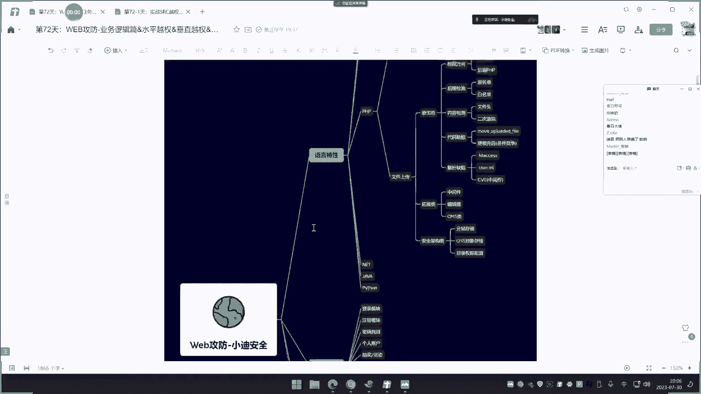
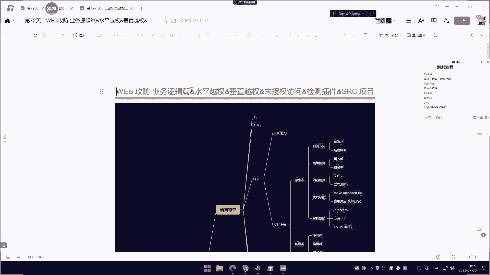

# 课程P71：业务逻辑漏洞之越权与未授权访问 🎯





在本节课中，我们将要学习业务逻辑漏洞中非常核心的一类：权限相关漏洞。这包括水平越权、垂直越权和未授权访问。我们将理解它们的概念、区别，并通过案例和工具学习如何检测这类漏洞。

## 概述

业务逻辑漏洞不局限于特定的应用类型（如网站、APP或小程序），也不受开发语言（如PHP、Java、Python）的限制。这类漏洞的根源通常在于开发者或管理者在功能设计时，对某些环节的权限控制考虑不周。今天，我们将重点学习与用户权限相关的三个核心漏洞点。

## 核心概念解析

上一节我们概述了业务逻辑漏洞的通用性，本节中我们来看看权限漏洞的具体分类。

### 水平越权

**水平越权**指的是**同级别用户之间的权限跨越**。例如，用户A利用自己的权限，非法操作了同属于普通会员的用户B的数据。

### 垂直越权

**垂直越权**指的是**不同级别用户之间的权限跨越**，通常指**低权限用户获取或操作了高权限用户的功能或数据**。例如，一个普通用户访问或操作了管理员的后台功能。

### 未授权访问

**未授权访问**指的是**在无需任何身份认证（即无用户登录状态）的情况下，能够访问到本应需要授权才能访问的功能或数据**。它可能与垂直越权有重叠之处，但更强调“完全无需身份”这一特性。

为了更直观地理解水平与垂直越权的区别，可以参考以下模型：
*   **垂直越权**：权限的纵向跨越，如普通用户 -> 管理员。
*   **水平越权**：权限的横向跨越，如用户A -> 用户B。

## 漏洞原理与手工检测演示

理解了基本概念后，我们通过一个本地靶场来演示这三种漏洞的手工检测方法。检测的核心思路通常是：**抓取数据包 -> 定位与用户身份相关的参数 -> 修改参数值 -> 重放数据包并观察结果**。

以下是检测的关键步骤：

1.  **注册测试账户**：准备至少两个同级别账户（如user001, user002）和一个高权限账户（如admin）。
2.  **登录并触发功能**：使用一个账户（如user001）登录，进行某项敏感操作（如修改个人信息）。
3.  **拦截并分析数据包**：使用代理工具（如Burp Suite）拦截该操作的HTTP请求。
4.  **定位身份参数**：在请求中寻找标识操作目标的参数，常见名称如 `userid`、`id`、`username` 等。
5.  **修改参数并重放**：
    *   **测水平越权**：将身份参数值改为另一个同级别账户（如user002），然后重放请求。若操作成功，则存在水平越权。
    *   **测垂直越权**：将身份参数值改为高权限账户（如admin），然后重放请求。若操作成功，则存在垂直越权。
    *   **测未授权访问**：将数据包中所有身份标识（如Cookie、Token）删除或置空，然后重放请求。若仍能操作成功，则存在未授权访问。

> **核心操作公式**：`漏洞存在 = 修改请求中的身份标识 -> 重放请求 -> 操作生效`

## 自动化检测插件与项目

手工检测适用于目标较少的情况。当需要批量测试时，可以使用自动化工具。它们的原理大同小异：**自动替换请求中的身份凭证，并发起多次请求，通过对比响应内容的差异来判断是否存在漏洞**。

以下是两个常见的检测工具：

*   **“侠约”浏览器插件**：在Burp Suite中配置使用，通过对比“原始包”、“低权限包”和“未授权包”的响应长度来快速筛查。
*   **Authz 检测项目**：一个需要自行搭建的自动化检测系统。它允许你配置多个测试账号的凭证，然后通过代理流量自动对比不同账号访问同一资源的结果。

> **工具核心逻辑（伪代码）**：
> ```
> response1 = send_request(with_userA_cookie)
> response2 = send_request(with_userB_cookie)
> response3 = send_request(without_cookie)
> if response1.body == response2.body:
>     可能存在水平越权
> if response1.body == response3.body:
>     可能存在未授权访问
> ```

## 实战SRC案例剖析

理论结合实践才能融会贯通。下面我们分析三个来自真实SRC的案例，看看这些漏洞在实战中如何被发现。

### 案例一：垂直越权（高校小程序）

**漏洞简述**：攻击者以游客身份登录某高校小程序，通过分析前端JS代码，发现了一个本应只有管理员才能访问的API接口。直接使用游客身份的Cookie访问该接口，成功获取到敏感学生信息。

**关键点**：前端JS可能泄露敏感接口路径，后端接口未对低权限用户做访问控制。

### 案例二：水平越权（心理健康系统）

**漏洞简述**：攻击者通过测试账号登录系统，在查看个人资料时抓包，发现请求中包含代表用户ID的参数（如 `id=1001`）。通过遍历修改该ID值，成功获取到大量其他学生的个人敏感信息，包括手机号和密码。

**关键点**：通过用户ID直接查询信息的接口，未验证当前登录用户是否有权查询目标ID的数据。

### 案例三：未授权访问（演示站点后台）

**漏洞简述**：攻击者在测试站点的JS文件中发现后台管理功能的API路径。无需登录，直接访问这些路径，成功进入后台并获取到云服务密钥等敏感配置信息。

**关键点**：关键功能接口路径暴露，且未做任何身份认证。

## 实战检测思路与难点应对

在真实环境中，检测可能会遇到加密、Token等障碍。以下是应对思路：

1.  **信息收集**：使用工具（如 `packer-fuzzer`）扫描JS文件，提取所有API接口路径，扩大测试面。
2.  **定位参数**：仔细分析数据包，寻找任何可能标识用户或目标的参数，即使它看起来是加密的。
3.  **处理加密**：如果参数被加密，需要逆向前端JS代码，找到加密算法。修改明文后，需先加密再重放请求。
    *   常见加密如MD5，可直接使用工具加密后替换。
4.  **处理Token**：Token通常用于身份验证。测试时尝试两种方法：
    *   直接删除Token，看服务端是否完全依赖它验证。
    *   保留原Token不变，尝试操作其他用户数据，看Token是否与特定用户绑定。
5.  **添加参数**：有时可以尝试在请求中自行添加疑似身份的参数（如 `admin=true`）进行测试。

## 总结

本节课中我们一起学习了业务逻辑漏洞中权限控制相关的三大类型：**水平越权**、**垂直越权**和**未授权访问**。我们掌握了它们的基本概念、手工检测方法（抓包、改包、重放），也了解了自动化工具的原理与使用场景。通过分析真实的SRC案例，我们看到了这些漏洞在实战中的表现形式和挖掘思路。记住，检测的核心在于**找到请求中代表用户身份或操作目标的参数，并尝试修改它**。遇到加密、Token等复杂情况时，则需要结合前端逆向等技术进行深入分析。