# P73：第74天：机制验证篇&重定向发送&响应状态码&跳过步骤&验证码回传&枚举 - 逆风微笑的代码狗 - BV1Mx4y1q7Ny

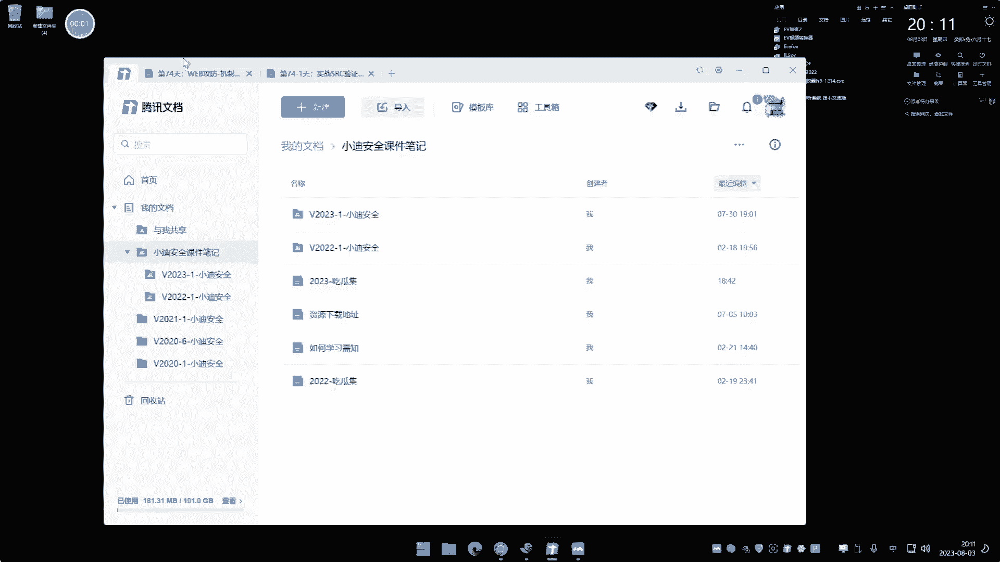

我们今天上这个74天了啊，今天呢说一下这个验证方面的一些逻辑啊，说白了那都是一些什么验证码呀，验证逻辑的一些资料啊，今天课的也不多啊，我们来给大家演示一下啊，具体有三方面啊，针对不同对象的呃。

主要呢是针对这种什么找回密码呀，密码的一些验证啊，这种类似的啊就是修改个人资料的验证，修改密码的验证啊，像这种地方的容易出现这种事情啊，一个呢就是直接针对验证码的突破，那验证码突破呢。

网上一般俗称的就是一种呢就是回显贤思啊，还有一种呢就是规律爆破回形显示，那就是说这个验证码呢在发送的时候，这个数据包里面或者说回形包里面呢，已经啊泄露了这个发送的验证码，导致啊。

你不需要知道目标的验证码是多少，直接的可以用这个数据包里面的来进行对比，这是第一种情况，第二种情况那就是验证码让它有个规律，这规律呢就是我们常见的是吧，思维还是牛尾纯书字，还是有英文字母。

然后我们都知道这个六位或者说四位呢，他都总共呢有一些这个可能性，比如说四位全数字的话，就是1万种，可能就是0000~9999对吧，也是说从1~999的一个可能性吧是吧，1~999就有这个可能性。

就是1万种，1万种的话，如果在你提交验证码的时候，验证码的存活时间，包括提交多次不会出现拦截的情况，下面的话满足这两个条件，就可以采用爆破的手段，就很简单，我给你发送个验证码，验证码是1234。

这个时候呢你就开始从一一直爆破到9999，当爆破到1234的时候，那就对了，在这个爆破过程中，验证码呢没有失效，它没有过期时间，或者说在有限时间已经爆破成功，或者说多次尝试之后，网站里依旧可以再去验证。

不会出现验证码，或者说不会出现新的验证码，或者说不会出现是吧，这个网址错误不让再次提交，没有这个次数限制的情况，下，面是可以尝试性的进行这个报货的，这是第二种啊，这种呢是针对这个验证码的操作。

还有一种就是我们的验证目标，验证目标指的就是重定向用户和重定向发送，我们来了解一下，在一个验证逻辑过程中，就拿我们这个找回密码，或者说重置密码这个功能来讲的话，比如说从召回密码，重置密码的时候。

经常呢在重置密码的时候，我们都知道啊，重置密码肯定是有个对象重置谁的，如果说重置对象在数据包有体现的话，我们试着去尝试把这个重置对象呢把它改成，就很简单啊，比如说我现在重置A的账号。

然后呢我发送验证码验证码，我收到了A账号呢是我自己的，所以验证码的我能自己收到，收到之后呢，我在输入这个验证码的时候，那验证码肯定是正确的，因为我收到的就是验证码，我再把这个验证码呢去尝试去验证。

修改B的那个密码，就很简单，你以前呢是用A去重置A用户的账号密码，然后A用户是你自己的，当你验证过去之后，通过数据包的更改，把它重定向，从从零下修改B的，由于验证码是A的，你搜得到，所以你重置B。

那么那就相当于重置别人，其实那就是换人目标啊，就是因为验证码你突破不了这个手段，你就尝试去突破，换对象，就是那先让验证正确，然后呢再换对象，这是第二种，还有种叫重定向发送，什么意思啊。

刚才是换用户这种的，就是换发送地方，从此那个验证码的地方有可能是你的手机号码，有可能是你的邮箱地址，或者说其他的能不能修改后，让这个重置发送地方发生更改，发送到你指定的地方，这样子你就能收到验证。

因为我们都知道A35绑定的，比如说是一个QQ邮箱，QQ邮箱是别人的，你无法进入，也就无法收到那个验证码，这个时候呢，能不能把那个验证码的地址改成是吧，但是你的地址，那么验证码发到你这来。

那么验证码你都知道，你就可以重置了，这是第二种啊，就是根据对目标入手啊，刚才嘛刚才呢讲的是对验证码入手，现在来说是目标值，还有种就是验证逻辑，验证逻辑是什么呢，就是我们说的最常见的修改响应包，这种情况。

下面是建立对方呢以前端验证为准的，一种安全问题，就是说他如何去判定你验证码输入正确，或者说你这个逻辑是否正确的话啊，比如说你输入这个1234，这个验证码呢是1234，你输对了，它就会返回啊。

浏览器就会结束一个值，这个值呢就是一个正确的值，然后呢浏览器看到这个值之后呢，它就会啊认定你是输入正确，就会进入下一个逻辑，这个时候啊，我就说因为我不知道这个验证码是否正确，我就尝试改一个错误的。

改错误之后呢，正常来讲对方呢会返回一个错误的，然后提示是吧，这一步你没有通过，所以他一直会卡这一步，这个时候呢我强制性的让这个返回包呢，改成正确那个包，让它这个浏览器以正确的模式往下进行，就是说跳过啊。

类似的就是说强制性的让你正确，但是这个能不能行，表面浏览器都是可以支持让你通行的，但是事实上他是要与对方是否认定成功为准的，也就是说以浏览器那边提示你可行了，并不代表真实可行了，真不真实可行。

要具体看对方是什么验证，就是说他只是做了一个浏览器这边的前端验证，就说的验证代码的这个浏览器已经解析了，在上面验证的，那你可以突破到，如果说对方还是进行了服务端验证，就是你前端呢。

只是说你自己修改了一个自威的效果，看上去成功了，实际上对方服务端压根就没有理会，这种情况下，你就是突破不了的，所以说修改下包呢是针对于这个验证，产生在前端的，为什么叫前端呢。

就是说写了一些JS的一些代码中，而不是在后端语言呢去验证的是这种情况，下面这个东西呢，我前期在讲安全开发JS的课程里面着重演示过，就是收到那个返回状态码，或者说收到返回的那个数据包里面有什么特征。

来代表成功和失败来判定是那么一个逻辑，那种能解决安全问题，但是如果说这一种呢，他的验证既采用了前端，也采用后端，那么以后端为准的话，那就不行了啊，就是这种啊，还有一种叫做叫做跳过步骤，Your all。

啥意思啊，我们都知道啊，你在重置密码的时候呢，他分几步，比如说先呢给你这个啊要找谁啊，对谁呢进行修改，完了之后呢，给你这个修改了这个目标呢去发送一个验证码，然后验证码通过之后呢。

就进入这个重置密码这个选项，也说这里呢分为一步两步，三步四步，你可不可以直到第四步的一个URL地址，直接从第一步的时候来访问到第四步去，啥意思啊，因为我们都知道啊，你进入每一步的话都有个余额。

你能不能直接从一步跨到第四步，就是说我省略了中间的那个验证码的一个过程，因为那个东西呢我做不了，所以为了直接来了重置密码这个选项，就是看他有没有对这个整个验证逻辑，有一个清晰的认识，如果他没有腌制的话。

那肯定直接跳过，如果说有腌制的话，那肯定是没有第三步的完成就不会有第四步啊，这样子就是安全的，所以说安不安全具体都是要测的啊，好啦这是我们讲的这个整个情况，那么现在呢我们就以这个啊。

真实的这个演示的案例呢，去给大家去看这几方面的啊，在今天讲的几个方面，先从验证码的这个事情来说啊，好首先呢第一个啊，就是验证码的这个回显显示啊，回形显示呢我在这里呢以前都有目标的，后面呢不然太老了。

我也懒得去演戏啊，一说一级打出来的老演员，老演员老演员找了张图片啊，给大家看一下啊，那就Z张R了，这是一个网站，这里呢我们看一下啊，点到这个发送这里呢，它会发送验证码是吧，尝试着找回这个用户名啊。

发送验证码在这个数据包里面，我看一下啊，放到包里面，那你看这里呢发送验证码已经有回血了，啥意思啊，就说这个验证码呢在抓包的时候啊，对方在触发这个点击验证码发送的时候呢，在数据包里面的回血里面的待遇。

所以说我们能够在这个包里面看到这个验证码，那么也就是说你不需要知道对方手机号码，也不知道，也不需要得到对方手机权限，就可以得到发给对方的名字码，这个也是的，哎是吧，你提交验证码的时候。

那你提交验证码的时候，你提交的提交的是123456，对方验证码呢他提示不正确，然后呢他这里有写了一个什么581668，这个就是正确验证码，所以有时候啊，有些这个开发者呢在做这个设计的时候啊。

他就有这种情况，就是，在验证判断逻辑的时候，可能会把正确验证码了，在这个发送点击发送后说返回的那个响应里面，就是我们说那个返回包里面啊，有那个正确的，但这个呢说实话啊以前比较多，现在还是比较少了。

没找到，所以只能用这个图片来给大家说明一下啊，以后大家也注意有这个事情就可以了啊，然后呢我们再说这个爆破的啊，爆破这个呢是刚好嘞，有啊有这个包破。

所以我给给给他演示一下啊，这个是我们那个app那个老演员啊，拿出来给他看一下，这个能不能对验证码进行爆破的话啊，这个是要看对方验证码输入过多，和这个有没有存活时间这两个东西呢来决定啊。

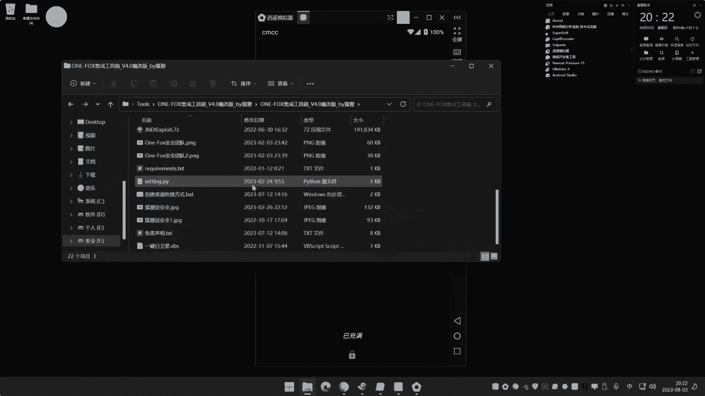

存活时间就是说那个验证码呢可能大家都知道，有些验证码那可能就是一分钟是吧，一分钟不输它就失效了，他会有这么个逻辑，那么你能不能确定啊，你在一分钟之内呀，能不能爆破出来，这个很显然一般是暴露不出来的啊。

用验证码的可能性太多，一分钟你除非是搞那种兵法的是吧啊，可有这种情况，主要还是看他验证的次数有没有限制，就说你一直输入错误的验证码是吧，对方都还是让你这个继续验证，那这种情况呢是吧，就是可以尝试的啊。

如果说不是这种情况的话，那就不行，就是你多次之后，那他就直接不管了，就不会理会你这个包了，那这个时候就不行，好我们在这里呢，我们找到这个福利期货啊，我们看一下啊，他这里有没有这个逻辑啊。

好我们先把这个包的环境呢给大家准备好，然后在这里呢我们点一下啊，比如说这里面有个找回密码是吧，好，我们输入我们自己要找回的，这个对方的账号名字啊，好这输完之后呢，哎他发送验证码是吧，两罚，发送验证码哦。

他是访问成功，我们也看一下啊，这里呢他对发的包呢，刚才说四要是有的，这是发的那个包，这个是触发那个东西的，这个是下节课要讲的啊，就是一些接口方面的一些枚举和调用，也是一些短信轰炸机的实现原理。

好他发了啊，发过来了，发到我手机了，嗯我给他看一下啊，看下手机今年码是多少啊，好，那么他这里呢你可以根据你先自己注册个账号，注册个账号之后测试一下它，验证码的一个规律是六位还是四位啊，越位数越小。

那就可能性越短，那就成功性就越高，位数越多啊，这个数字加英文，那就可能性更多啊，由于这里呢我也看到啊，车的话是一个六位的纯数字，那就是说100万种，100万种可能是吧。

然后呢时间关系啊，我们爆破呢他没有时间限制，因为我这里呢就我发过去都已经过了一分钟了，那这个验证码这里呢已经来按钮已经重新开了，也就是说这里呢按正常来讲，如果说他要失效，现在已经失效了对吧。

所以说我没有发了啊，我直接告诉大家啊，我这个验证码是多少呢，给大家记一下啊。

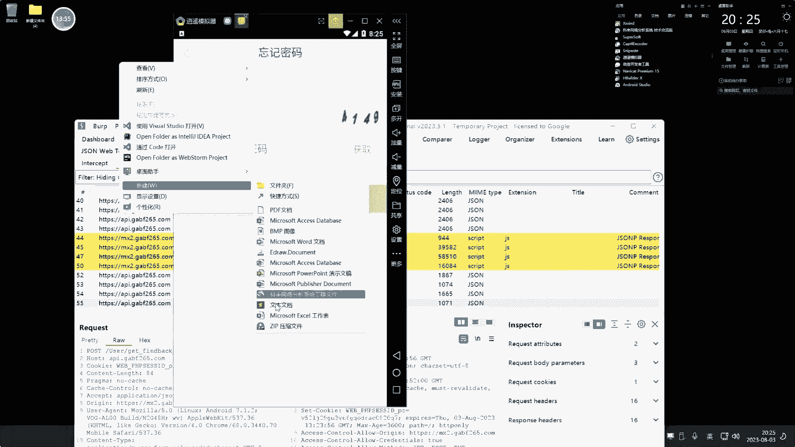

是不是514901，我看下好，51404，这是我那个验证码啊，514056好。

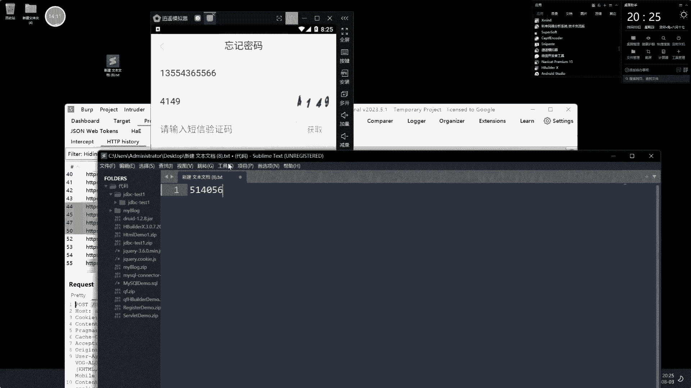

那现在呢我给大家看一下啊，实战中的话更喜欢决定啊，我们点一下啊，那比如说我这里那点个5140200，从这里啊，我输这个啊，把包选中了，点下一步啊，这里呢就是你那个验证码。

这个包是把的code等于514千嘛，啊正常来讲的话，如果真实情况下的话，这里肯定就从六个零到什么，那六个九，对不对，好，我们这里呢把它发到这个include模下面去啊，这是上一次给我发的啊。

我没有再点第二次发送，所以说这个验证码呢如果说有失效时间的话，他肯定就早就失效了，把它这个地方的话选中当字典，然后在这边呢有一是纯数字，没有英文字母，那就是直接到这个什么就九这里嘛是吧。

那么就是多少种可能呢间隔为一啊，100种可能，那我们就测试一下吧，实战中的话肯定就是100万种了啊，就一直跑，等他的时间，那直接快一点啊，然后这个很快就跑完了，跑完之后呢，通过这个长度的一个对比法。

那到514056的时候，提示的返回包长度为1072和1082呢，有差距，看一下具体返回是啥，返回数据包为207折面呢返回是什么，206，那么应该这里就是514056，对不对。

就和我刚才给大家说的那个验证码，就正确了是吧，对上了哈，这个呢就是爆破的一个操作啊，实战中呢就是把这里呢要把改成是吧，改成这种，那么就直接跑，等着他跑啊，这个呢就根据自己的网络和带宽情况的，时间了啊。

一般的话估计也就100万种，可能也就是吧10分钟的时间就可以抛完，00010怎么用啊，就这么用了，他这就是从一开始啊，123456，它也会是零一，你不行的话，你就自己呀，你不会搞。

你就自己呢用脚本生成个支点，再把导进去不也是一码事情吗。

什么难度啊，那这种呢就是爆破这个包坡能不能包坡呢，是要自己先根据规律决定的，一个是他的可能性多不多，可能性只要说在我们能够接受的范围内的话，都是可以的，其实主要就是看他有没有验证次数的限制。

因为我们都知道啊，正常的安全的话，他就会比如说三次或五次，你提交错误次数过多，就不会就直接杀，不让你罚了，就是一分钟后再试啊，或者5分钟撕啊，30分钟之后再试，那这种呢就是安全的，那你这个爆破那就不行。

对不对，虽然说你爆破也可以，你再等30分钟或者10分钟，但是这个效率太低了，这不可能完成的是吧，所以说啊一般的就是没有次数限制，这是第一点，第二点就是说这个验证码呢没有存活时间，从我时间。

这个呢只要说时间比较短的话就不行啊，这个呢要自己根据实际情况决定的啊，这个呢就是针对验证码的这个突破，你跟他说还有没有其他的突破方式啊，你要像这样想啊，你要这样想。

如果说这里还有很好很好用的组合作方式的话，那网上的所有采用这种验证码去验证的，这个逻辑就已经不安全了，现在目前网上大部分你不管说是小程序，app网站也好，或者说我们现在市面上看到的，大部分的大厂也好。

是什么鬼也好，都基本上还是采用了验证码这个验证逻辑，你要找回密码呀，或者说修改密码呀，或者说更改什么逻辑呀，更改你信息啊，怎么样要验证数，还是以验证码为主，这个马如果说能够轻而易举的这个得到的话。

那也没有任何安全可言对吧，所以说啊这就是他唯一的两种方式，所以说做这两方式呢就是投机取巧啊，有些那是能够的，大部分的都不行啊，考虑到次数验证和不回血的话，基本这个验证码那是没办法去把它得到的。

除非是是吧，你听过通过其他手段，比如说像这个什么鬼拦街啊，是吧啊，或者他这个网络权限呢给他拦下来了是吧，收到那个水包了，那是另外的事啊，好我们再来说这个验证目标啊，比如说重定向用户和重定向发送。

那这又是什么逻辑呢，这里我都给他写很清楚了啊，比如说第一个同样用户啊，比如说我们当我们输入正确的账号密码，手机号码和短信验证码之后呢，他就会进入重置密码，最后一步也是我们输入正确的新密码。

当输入新密码之后呢，对方就会把这个新密码呢给他，以这个数据包的形式发送给服务端，服务端呢就以这个新密码呢去更新你的密码，就是你让你重新的把你这个密码呢给他重置了，但是呢你要想到啊。

那么一般网站呢他肯定是啊就是我们都知道啊，我们来看一下啊，他来讲这个例子啊，呃比如说在这个网站上面还是本地，多么啊，我连接找回密码啊，我这里呢随便输个地址，输这个地址呢，我点击发送，然后他会发送成功。

然后看啊，我这边的邮件，那就收到了是吧，验证码已经发到了，是1907哈，然后呢我点进去是吧，然后点进去呢，这里就会输入我的这个新密码，账号是不是就会输入我这个新账号密码，对不对，但是这两个嘶。

那么在这里呢他就只接收你的新密码，但是用户名他也没有接收呢，没有接受，因为他肯定就自呆了，就是他已经认定知道你在改哪个了，但如果说现在呢出现个逻辑，什么逻辑呢，就是我把这个用户呢给他重绑定，重理讲。

啥意思呢，就是我本身呢是修改A的好，我现在呢做这个实验实验来说吧，这讲是模拟不出来个现象。

我们先注册。

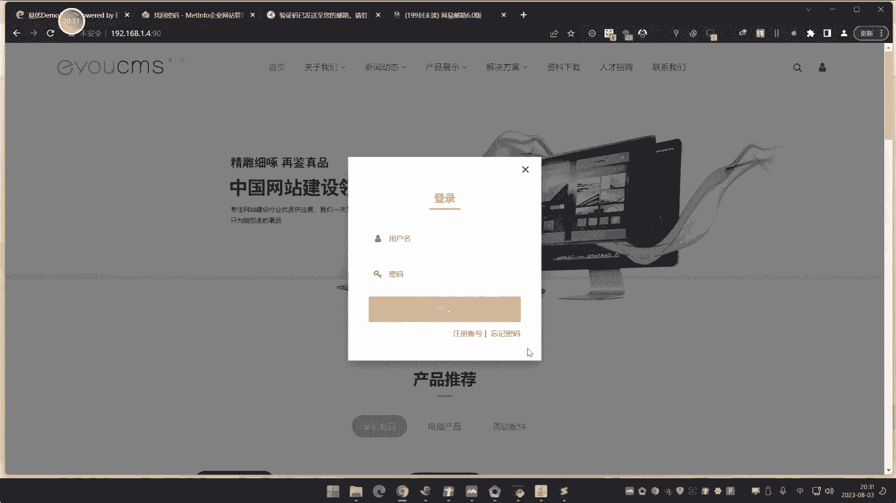

注册啊，这是直接给看一下吧，这是我们注册的账号密码啊。

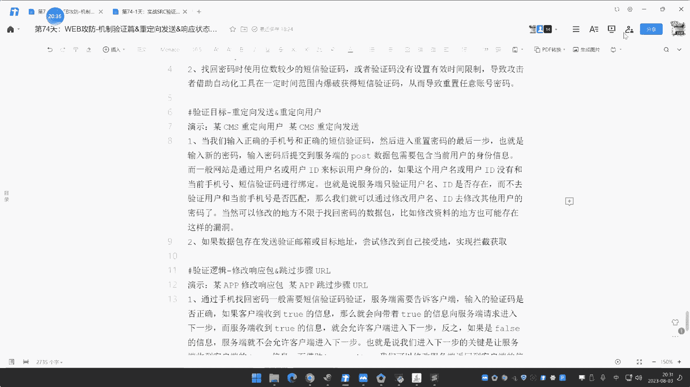

该写到这里，然后他绑定的邮箱是这个邮箱，还注册个账号，这个账号是多少来着，这个，密码呢也是这个，然后绑定邮箱呢是这个1630号码，这是我们注册的信息啊，那个注册我就不给大家方便演示了啊。

因为他注册他要检测邮箱的啊，这个邮箱呢我也没有多的邮箱给他演示了，所以我只能用一个自己的QQ邮箱，和一个163邮箱来给大家做演示啊。

这里头给他确定一下是这两个事情啊，在数据库里面来看一下啊，注册的信息，啊这是我们的注册的账号和密码是吧，账号和账号和两个账号，然后绑你的邮箱给大家看一下了，一个绑定的是这个4725，一个是135对吧。

这是我们的这两个用户啊。

那么现在呢你看一下啊，比如说像现在啊我去找回密码是吧。

点击忘记密码，我找回这个四十六五的，那其实呢现在就是找我这个小李这个密码，对不对，找到小李密码啊，点击发送啊，这个是我配置的短信接口啊，这个网站短信接口的配置呢。

呃呃这个等下在安装包里面呢会给大家说的啊，好这里呢收到了，那他就发给我了是吧，这个验证码就发到我邮箱了，88，对不对，八个18对，那88，然后呢，你把这个正确的验证码呢给他输进去。

然后点下一步他是不是就去修改他的密码了，比如说我修改成123456。

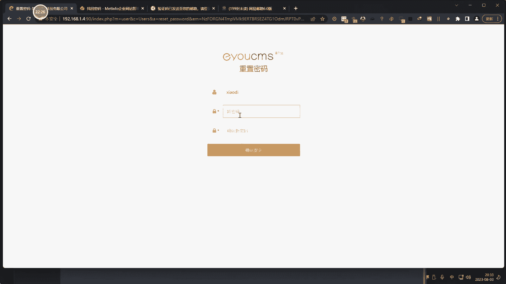

123456，我们在修改之后呢。

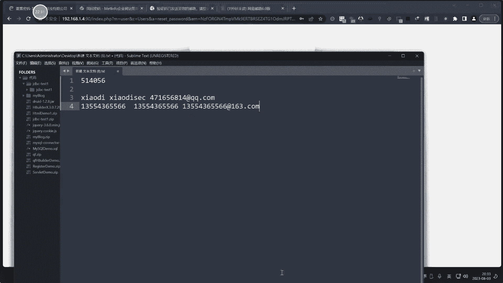

我们先关注一下这个邮箱的这个密码，这里啊，他这里不是MD5啊，是另外一个加密方式，但是这个不重要，我们只看这个有没有更改就完了，点击下步好，重置成功刷新一下这里，那你下这里又发生更改是吧。

来变成这个C开头第几位了，好现在就可以正确登录那个账号密码是吧，比如我刚才登录的，找一是吧，密码123456好，他就进去了是吧，这是我那个那个那个，那个登录的账号密码对不对，好好先把它推出来啊。

好这是一个正常的一个自己修改自己一个逻辑，好，我们来观察啊，在他这个逻辑里面啊，我们关注下啊，首先呢我们把包给他抓起来，测的时候呢每个数据包都要抓的啊，不抓不行，好我们怎么测拉啊，我们把这个选装器啊。

然后凹这里呢点击发送是吧，给他发送啊，然后呢在这里呢我们先把包抓到，把这里的开一下拦截啊，点一下发送发送，这里呢就发送成功了是吧啊，这里呢也没有收到包，发送的时候没有收到包啊。

好这边呢又收到一个验证码啊，这是我们那个验证码，对不对，21713电视剧好，那我们就是刚才那个逻辑了啊，这个呢我们就不说了啊，那么原因漏洞产生在哪里呢，这个漏洞产生在哪里呢，看着啊，把代理开起来。

重新点发送啊，重点发送，我们关注一下这个包好，包接收到了，这是他去这个发包的这一个什么，发过去的一个数据包啊，就是这里那包一发出去，他就会像下面呢去这个邮箱呢，去发送这个东西啊，发送东西好嗯。

那么这里啊，我们呢由于这个比如说现在是这个用户。

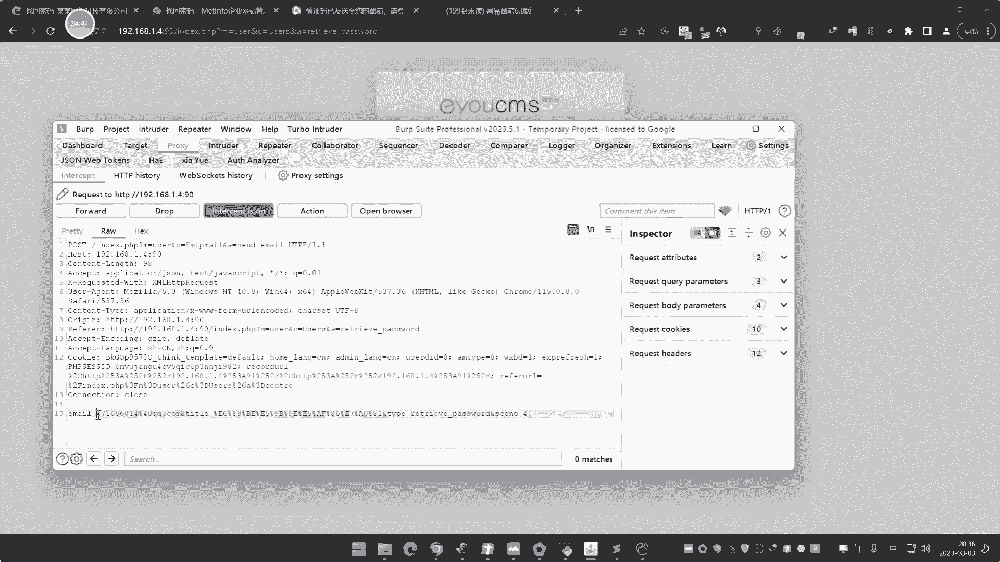

那么这个用户呢就是这个用户嘛是吧。

就这个用户，好我们让它发出去，把它先放出去，好包发了，发了之后，下面收到这个验证好，我们就把它填写进去，填写的时候抓个包看一下啊，点下一步大家可以看到啊，填写的时候一秒就是这个以这个账号信息的。

然后呢717515的，这个时候我把这个地方改成什么，改成对象，换成谁啊，换成135，换成这个邮箱地址，然后变成163点com，啥意思呢，我刚才找回的是47165，4725是我自己的账号。

我现在呢就尝试应用我的验证码，因为这个验证码是我接受的，肯定是对的，我让他去和这个135帮你，这个时候呢再把包给他放出去，那么这里呢他就重置的是135的账号，那我再输入密码1234567。

1234567，那么我们先关注下身边135的这个数据库的，这个密码是这里啊，看一下我更改之后，这个地方是不是会产生修改点，下一步重置成功之后好，我要刷新一下这边的邮箱信息，密码信息，发现没跟发生更改。

说明重置了135，就相当于我用自己的账号4725接收验证码，去修改135的目标的一个密码，他的这个漏洞的逻辑是在哪里产生的呢，看上去表面是没什么问题的，写进去点击发送，发送完之后接收一个新的验证码。

就是你尝试修改自己的，在修改完之后呢，我们在这里写，然后点下一步，在这个过程中数据包里面抓包的时候呢，你看到就是这个邮箱绑定这个验证码，这个时候把目标一改，就是重定向，修改目标改成135。

那么意思就是说绕过你这个逻辑，这个逻辑是怎么绕过的呀，大家能不能听明白了呀，你一说听不明白，其实非常简单，就是他自己在这里设计逻辑出了安全问题，是一个什么设计逻辑出了安全问题呢，是什么逻辑啊。

大家明不明白啊，他这个逻辑出现在哪里啊，应该怎么设计这个验证逻辑啊，他是这样的啊，就是他先发验证码后呢，再去选择性的去修改，应该正常来讲的是一个验证码对应一个用户，就是我发过去的是对应哪个哪个邮箱。

那么是绑定好的，你不能再更改，刚才那就是线很简单，我搞了个正确验证码接收到了，因为我自己账户接收到了，然后呢，我再让这个验证码绑定一个我要修改的用户，那么就是重置了别人的，其实正常逻辑来讲的话对吧。

应该是要绑定在一起的，这个能不能理解啊，这个，能理解吧，逻辑也是应该能够明白吧，这个逻辑不难吧，逻辑不难的啊，就是先让这个重置的那个验证码呢，成功成功的时候呢，立马在那个成功的时候绑定一个也要重置密码。

那么这个漏洞呢就造成了是吧，任意用户重置密码，你就可以重置任意密码了啊，就是你注只注册个账号密码，把验证码发到你账号来，发完之后呢，立马就把验证码的绑定修改其他账号，那前提是有别人用户的密码是吗。

不然还是王源，唉没办法了啊，这个怎么讲也听不明白，这个不好说啊。

好垃圾呃，这个呢就说到这里啊，这个东西说实话哈，这只是逻辑上面的这个思路啊，可以说这类的课程是我们安全体系课程，最简单的啊，如果说这个课程呢你都听不懂的话啊，那是没办法，后面一些谁叫什么代码知识点啊。

这么代码的一些东西，那就更不用说了啊，这完全就是自己对待一些事情的，就是你自己啊，平常你在生活中一些逻辑就是这个事情啊，好我们再看第二个啊，重定向发送的一个情况，这个又是啥意思呢，哈这个又是啥意思。

我们都知道啊，这个有的呢是像你邮箱里面，比如说像现在啊我这个个人邮箱是吧，来有的呢是以这种这个找回密码，这个什么这个这个验证码发给你，那么邮箱呢可能是哪种情况，大家都知道邮箱的可能就是发个链接。

你然后链接一点是吧，哎就修改，比方是有这样的东西，还有啊发个重置密码的链接给你，对不对啊，然后呢你这种验证也好啊，或者那个啊他也搞这种事情，嘶那么大家都知道有这种事情啊，他就发个重置链接。

你然后呢发过来呃，由于这个邮件呢你各种语言在发送邮件的时候，由于这是网站，大家有没有学过网站如何去发送这种邮件的。

这个协议啊。

你比如说我用这个pp或者java去怎么去写，用这个网网web的一些API呢，实现发发发邮件呢，其实加pp里面呢他可以用这个control啊是吧。

利用这个呢来形成一个数据包发送对吧。

用它啊就可以实现一个数据包发送，然后发送这个信息给你，包括验证码或者说一个地址信息给你，对不对，就会有这种东西啊，这什么东西啊，哎好我们这里那就说一下这个第二种情况啊，就是从低印象发送。

什么叫从零印象发送啊，大家关注到啊，你比如说像这个D上面啊，这是他找回密码的一个情况啊，输入你要找回密码，我尝试找回艾特密的用户，点击下一步啊，然后呢大家看一下啊。

D上面呢我写了一个叫m e t host，192。16，8。43。15。

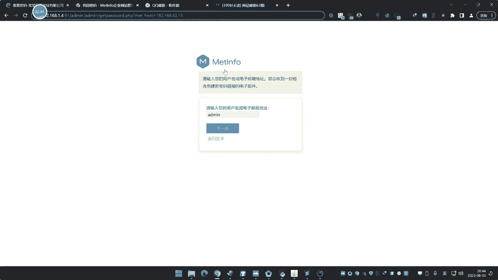

这啥东西啊，我先给大家看一下啊，清空NC杠LCP88号端口。

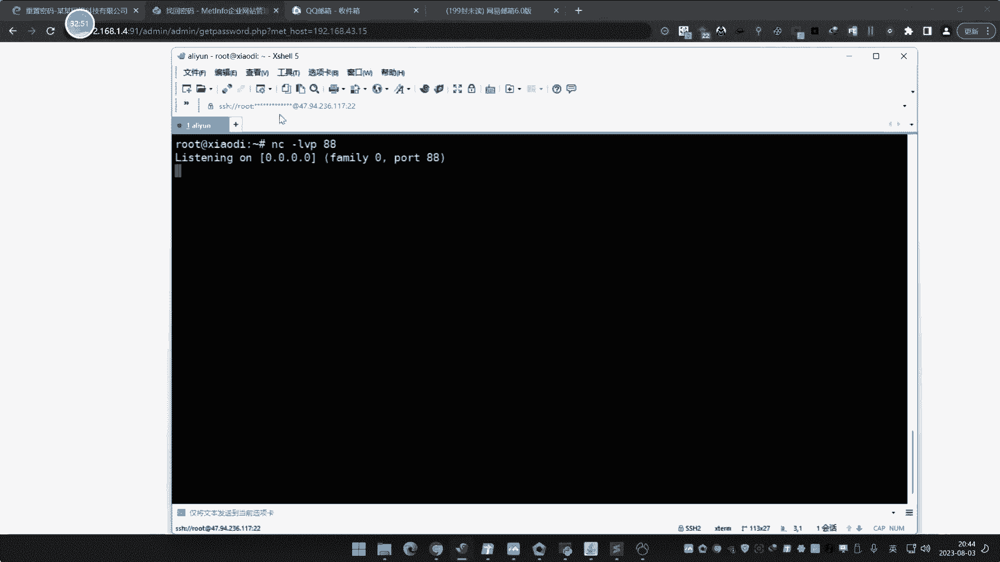

那么访问我的地址的时候，比如说我现在访问这个IP地址。

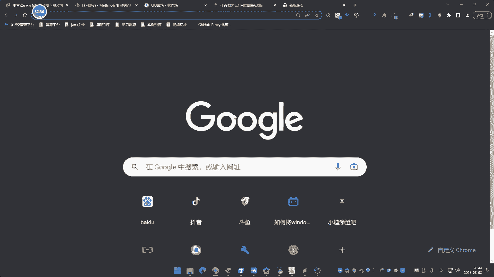

访问那个88，那么就是这里面会接到请求了，有人访问过是吧。

访问88请求呢来源于这个地方好，我重新真听啊，重新更听啊，换个端口，换成这个89好，那我呢地址就是IP地址加89啊。

监听好，现在呢我们点击这个地方啊，把数据包抓一下，哎这里没有点这个地方啊，重新把包装一下，好我们看一下这个数据包，这里啊，这里呢有个这个参数，这个参数是什么东西呢，啊他这个叫meter host。

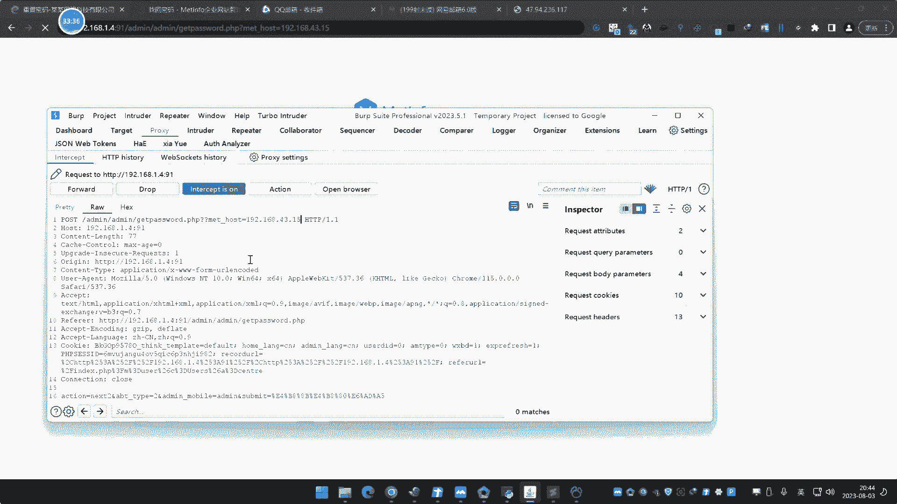

就是目标主机，我把它写成这个地址。

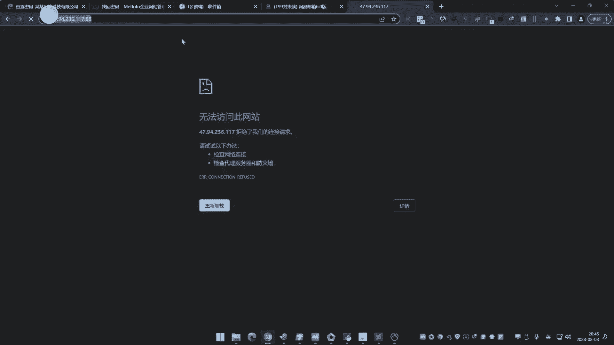

89，这个是你要重置的信息，重置enemy，那这个是啥意思呢，就是说如果数据包里面啊，你点重置之后，它会有这种类似的地址，是啥地址啊，其实就是重置发送地，比如说重置密码，他会发送给谁，发到邮箱。

还是发到一个API接口，就是这里呢有一些这种远程地址的一些信息，尝试性把这个参数值，改成你自己的这个IP地址的信息，然后把包给他放出去。

这个时候我们关注一下这面有没有介绍信息啊，有人访问过哎，啥都没有啊，等一下啊，重新来一下呃，换个九零端口吧，换个九零端口啊。

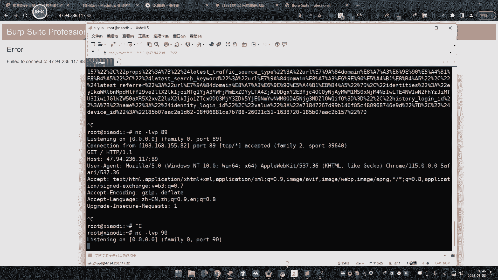

重新来一下啊，刷到这个水报，然后呢就把刚才那个哎哎，水包呢跑哪去了，抓抓抓把这些莫名其妙的一些东西都抓到了，哎那个笛子这个东西跑哪去了呀，鬼东西呀，真是，刚才那个第一值嘞，把其他小。

啊低星期没法写上去啊，这个是那个my host，我们把它写上去吧，别在这写，这个呢是他有这个漏洞啊，实战中的话就是观察这个参数值里面，有没有有没有这种东西啊，就是有没有那种端口信息啊，九零好。

就这个东西啊，就是说我们这里呢是他有这个漏洞，强强加上去的啊，实上的话他本来数据包里没有这个产生，但是呢他是他这里呢我们知道有这个东西啊，你实战中的话，你是不知道有这个参数值的啊。

石家庄就是看这里面有没有这种信息，就是说在找回的时候呢，这个数据包里面有些参数值呢，指向的是外部的一些地址或是外部的一些链接，你尝试性的把这个链接的，改成一个你自己的地址，就是你那比如说我的监听九零的。

就把它改成这个啊，那么时不时他会把这些信息发到这个地方来呢，好我们就给进行一个放出去。

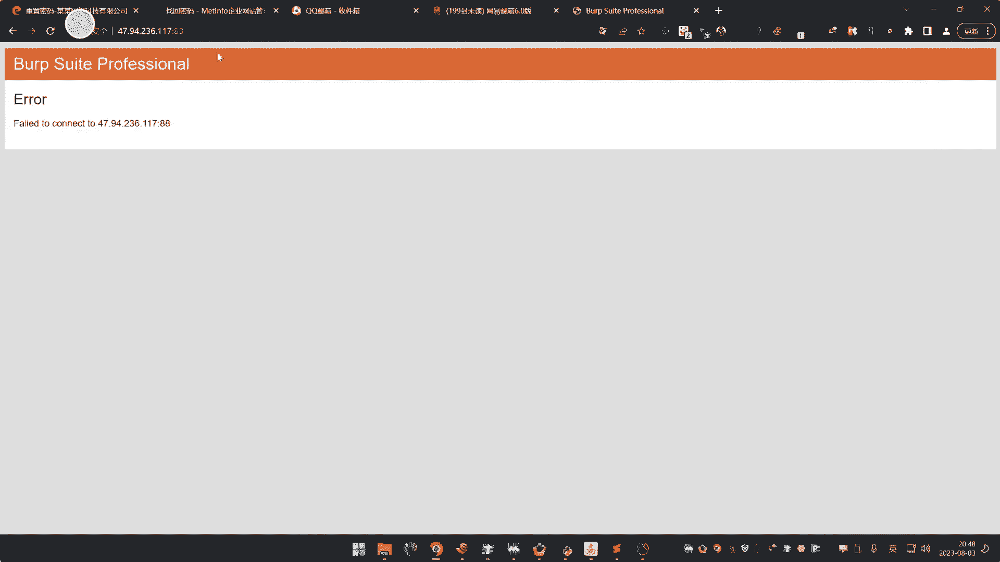

好观察一下这边啊，然后结束一下，看看这边信息整理啊，有没有接收到这个九零端口的一个防火信息，好等他这个结果啊，看这里看没了。

收到这些信息了，这是一个什么，您的网站密码重置请求已经得到验证，请点击下列链接，输入您的新密码，再就是那个类型，那这个东西大家应该都很清楚，这是一个什么东西啊，这其实就是一个。

我们说的那个重置密码的一个链接，大家应该都知道，有时候找一些这个密码的时候，那发给你的时候就是这种重置链接，打开之后呢，再来重置密码，这种也是一种验证，是不是啊，就说其实呀对方这个网站呢。

就是有时候呢在重置之后，他就会向你这个用，就像是你这个用户的绑定的邮箱，或者说绑定的这个什么这个手机也好，它就会向这里面去发送，如果说在抓这个数据包的同时，你发现在数据包里面有那个绑定的那个地址。

那这个时候呢你就把他绑定修改成你的，就是让他把这个重置东西重重定向，和刚才那个是一码事情，一个原理，刚才那个那就是先验证通过，再换成别人的，重置别人的信息，而现在这个呢就是很简单的道理。

先想办法重置别人的，然后呢重置别人的时候呢，他会发送给别人的这个手机或者说邮箱，这个时候呢通过数据包里面的修改，让他重置发到你的地方去，所以说他攻击的对象不一样，但是原理是一样的。

都是属于一种重定向的操作，是不是啊，但是前提条件是对方接受你这个职，并信任你这个值才行，能理解吧，至于他信不信任实验才知道啊，说白了啊，这所有的业务逻辑方面的安全问题，全部都是在数据包里面产生的。

数据包里面的参数值比较多，尝试性的对各种参数进行修改，来达到这个业务逻辑的倒钩，所以说任何用户输入的东西都是不安全的，这句话呢就是这么个来由的是吧，永远都不要相信用户的输入，因为用户的输入呢都可以更改。

一旦更改之后，以他为准的话，那就会形成各样各样的安全问题。

好，这个呢就是我们说的这个重丁香所导致的这个，安全问题啊，好啦紧接着来了，我们再看这个验证逻辑上面的安全问题啊，那这里呢又要请我们的老爷们app真实案例了，好吧，这个一个呢是修改响应包是吧。

来这里呢我们来看一下啊，这个响应包的修改呢实验完之后呢，一定要验证是否成功啊，不是说它上面提示成功就成功了，就一直喊666是吧，以前的那个老袁呢是能够成功的，现在呢被我磕的讲了一次两次三次啊。

不知道是谁啊，还给他给提交了，结果别人把他修复了，搞得我现在讲课都不能，怎么都没没有按理讲了，以前好多案例我在课上讲啊，讲完之后呢都修复了，哎呀不知道啥情况啊，哎这个老演员服务期货以前就有这个漏洞啊。

以前都能修改成功的，后面都修改不成功的，不知道谁提交的好人还是多呀，对不对，好人还是多啊，我们安全什么有责任感，大家都是有责任感的，看不得一点漏洞是吧，有多种我必须得提交我。

我为我中国网络安全是我我发展做贡献呐，我容不得你撒子，我们来找这里呀，来看一下啊，点击这个登录这里啊，比如说找个密码是吧，我这里输入我要找回的这个密码是吧啊，假设我要找这个人的啊，找这个人的。

由于这个人是我自己，我就假装我自己，那不是他是吧，然后呢验证码了，我也不知道给它进行发送，发送完之后啊，我们先自己最好的情况，下面是先自己用自己的账号做测试，用自己的账号做什么测试呢。

做一个完整的逻辑测试，啥意思，因为你要把他整个包都抓到，就是先啊我先模拟自己啊，是自己的账号，然后呢，我把逻辑呢数据包全部做到594108，把鼠标全部抓到啊，点击下确定好，它就会进入验证成功，好。

进入这个重置密码，这里的好，然后呢，我就是吧，输入这个正确的账号密码，对不对，输入要设置到秒点确定，还有什么格式不正确啊，好密码重置成功好，那现在呢就完了啊，这个逻辑就完了好。

那么现在呢我们就来关注一下数据包啊，在在这个正常的逻辑里面啊，我们先把地址一塞，因为有一些乱七八糟的例子啊，好这个就是啊应该是那个验证逻辑啊，你看啊这个应该是那一个叫user ga呃，如果说实战中的话。

你最好是呢不要看历史包，就是直接在这里拦截，看这个是最好的啊，我们直接还是把这个过程走一遍啊，怕有些人不知道，这个每个拿个报告是哪个包是吧，这个有乱七八糟的什么微信的，因为我开了全局代理，所以在这里。

那就很多一些其他的数据包都来了啊，就是比如说我电脑上面正在开的这个文档啊，这个数据包都在里面啊，这些乱七八糟的啊，啊现在呢最好的情况下就是开暖机啊，就是你操作的时候呢，你把蓝开起来，然后呢你在操作。

比如说现在重新点忘记密码啊，这就是那第一个是吧，第一个包就是忘记密码的包是吧，我给他发到这里来记录一下，好把它放出去好，现在呢就来输入扫描号码，好点击获取啊，点击获取啊，然后密张密码了，输了再来了。

然后呢我们把这个包装一下好，这里呢我们来看一下啊，输入验证码，输进去之后啊，我们再抓个包，还是我们提交验证码的啊，我给他发到这里来把它放出去啊，或者说这里大把他这个进行一个提交，放了好，进入到下一步啊。

现在是新密码了啊，那么有这几步呢，我们可以看一下啊，数据包的一个情况啊，呃刚才这个呢是那个找回页面那个验证码，那个包，然后，下面呢来把地址记录一下啊，这是第一个，别放这了啊，第一个。

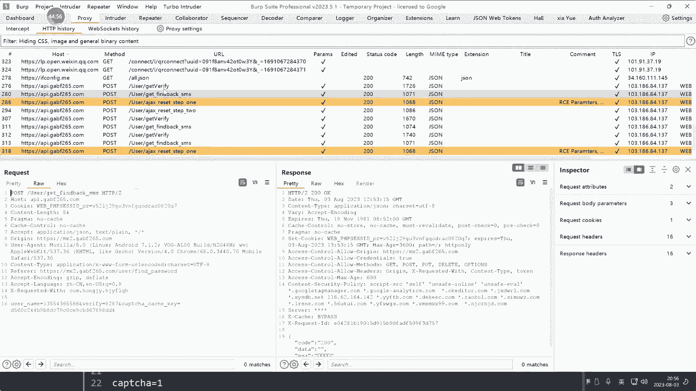

这是发言证码，应该是啊，这个是应该是发言证码。

那就是一个叫fight back sam s m s在外移动嘛，这个是第二个就是每一步的数据包呢，你做好个记录，这个记录呢，就是能够帮助到你对它整个的一个理解啊，怎能理解到这里就完了啊，就是这四步嘛呢。

1234后面的也是这四步啊，嘶那这里呢我就不管他了啊，我们来关注一下这边啊。

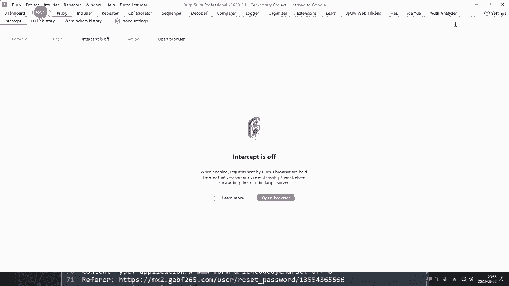

我看这个几个包，我们来做一个简单的说明啊，每一包装好之后呢，都要做实命啊，这个呢就是应用这个找回密码一个首页，这个是拿到第一个数据包，这个呢就是发送验证码包是吧，就是点它之后，那就呢发送你这个目标账号。

然后就是输在验证码，那验证码就对应上啊，发的一个东西好，这个呢就是验证你一步就是验证你码，你这个什么输入的这个验证码是否正确，就是验证，验证码把数字放进去，改一个数据包啊，最后一步呢就是这里啊。

就是把这敲完之后呢，就是你重置密码的数据包，这是重置密码，数据包，就等这个密码输到他有四部啊，呃先呢进入进入，没问题好，那么呢就显写信息，发送验证码，验证码发完之后呢，再看验证码是否正确。

提交的值正确之后呢，就进入到重置密码，然后你再写自己的重置密码啊，他就重置了，对不对，好问下大家啊，从这四个包里面。

大家觉得这里啊，我们可以看一下数据包的回旋的一个情况呢，这是第一个综合逻辑，这个是呢进入页面返回的是状态码200啊，这是它返回的值啊，返回的一定要看啊，返回200好看，这个发送验证码乘发送验证码的时候。

发货的也是200，然后验证验证码征途正确，返回的也是200，第二步防火理解是这样的，所有因为我刚才操作的数据包都在这里，我操作的是一个正规的正确流程的，一整理下来返回都是这样的好。

那么现在呢我们关注到啊，我们如何修改响应包来实现这个效果呢。

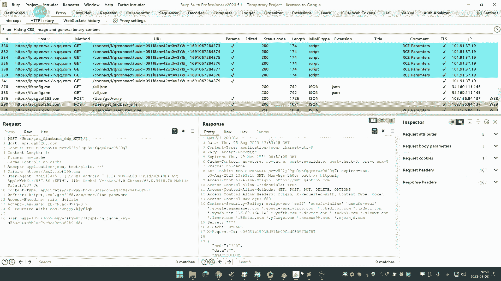

来我们来看操作它啊，比如在这里我们重新来到这个界面。

点这个操作这里，那我现在开始抓包啊，那先把这个包放大啊，1634点击发送好，他发了，然后呢这个发送验证码，假使我不知道这是别人的账号，我要重置别人的这个账号，我不知道验证码是多少，我随便写，咋知道。

明明是六位，我故意写个五位是吧，这明显就是错的，输都不对，那怎么可对呢，好吧，那么现在呢我把包抓到，先提到这里，我点下一步好，这是我要发过去的是吧，验证的那个代码。

然后呢这里有一个选项叫dual export，就是respond to this request，啥意思呢，就是返回包呢，哎返回包来到这个请求这里来，这个呢就是说让这个返回的这个状态返回报。

就是说这个数据包发过去，他只抓请求的就是浏览器啊，模拟器只抓请求，这个时候呢你把这个零件选中，让放回包里，也经过这里反回报，就是我们这里看到的这里啊，那就这边的这种东西叫respond啊。

我这里呢就这里再设置一下，点击这里，然后它返回包呢又走到这来，点击方发出去啊，这个呢不是返回包啊，你不要自己呢，有时候呢出现乱七八糟的暴力，你这个也搞错了啊，这个明显就是我其他的一些程序触发的。

不管它啊，这个也是的，你看这个浏览器遇到地址就知道，这都是一些其他的啊，这个应该是吧，你看他扣的那就变成两百两百零六是吧，然后这个时候怎么办呢，找到刚才我们那个逻辑的，刚才那个逻辑我们看下请求地址。

请求地址是什么，这是那个输验证码的。

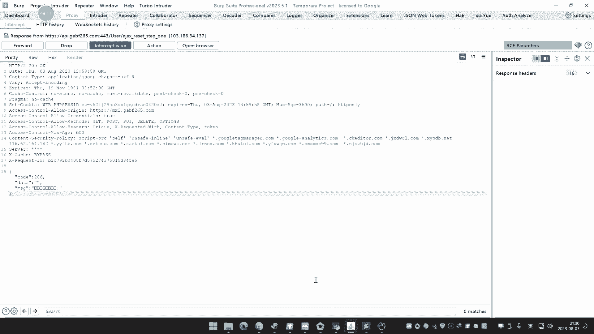

我们看一下刚才那个输验证码，应该是判断验证码是不是正确，是这个包啊啊这个端的这个包对我这里。

那就找到刚才成功的那个地方，弯这里把这个地方的话一改复制，来看到没把它替换掉，甚至说我可以把整个包都替换掉，就这里粘贴图纸，如果说你怕有不行的话，你可以整个NF啊，返回这个了，返回两。

然后再把它点这个啊，点这个叫RESPON，就让它放出去啊，不要点这个抓了啊，抓嘴把你带丢了，点这个啊，我们来关注一下页面，这里啊，这边肯定是错的嘛，哎方那他说验证正确，进入到重置密码，这来了是吧。

就是如果说这里进入到这里来之后，接下来我们再输啊，A123456啊，随便写个招密码好吧，叉小叉123456，因为他是大小写组合的啊，你不要搞错了啊，有时候还要把这个东西再记住，有时候你这个密码是做了啊。

好我再点这个呢，点确定好，我们在这里呢，我先把它放出去，就说我这里呢不管它，我就按正常逻辑啊，我放出去，他说流程错误请重试，看到没，那流程错误请重视，为什么，其实就是刚才我突破了那个什么突破。

那个验证码，他在这里还有检测，就是它其实就是还有检测，你刚才虽然说你强制性装，它进入到这个重置页面上来了，但是他刚才还是有检测的，他还发现你这个流程有点问题，就是他认定你第一个流程没有完。

就进入到重置密码，所以他属于流程错误，那这个时候怎么办呢，继续啊，重新点这个地方，继续把这个response重新返回，再把它放出去，还好我是205好，我们再来到刚才我们成功的地方。

来把它强制性的改成这个，所以说我为什么说要先做一个正确的，因为你要知道正确的是怎么回写，错误的是什么回旋，要把改成正确的逻辑，那个回旋的东西放进来，然后这个时候我们再来观察一下这个界面啊。

你看他之前呢是流程错误，现在我把它放出去，他说密码重置成功，带人来，哎有没有成功，我不知道，我们也不清楚成不成功，你这一撕就知道了，是吧好，这是这个逻辑，这个逻辑呢就是修改响应包来实现突破。

他的安全问题是怎么造成的呢，就是以前端验证为准，也就是说呀他验证你验证码是否正确和验，验证你那个逻辑是否正确，全部是在前端验证验证的这个东西呢，有些人是无论如何都无法理解的。

甚至于他经常在下面能搞一些自威，所以你要告别自卫了解员，你就不得不看我们JS开发的课程，这里呢我就有必要呢给大家看一下，前期我们在讲这个，JS的时候那个支点啊。

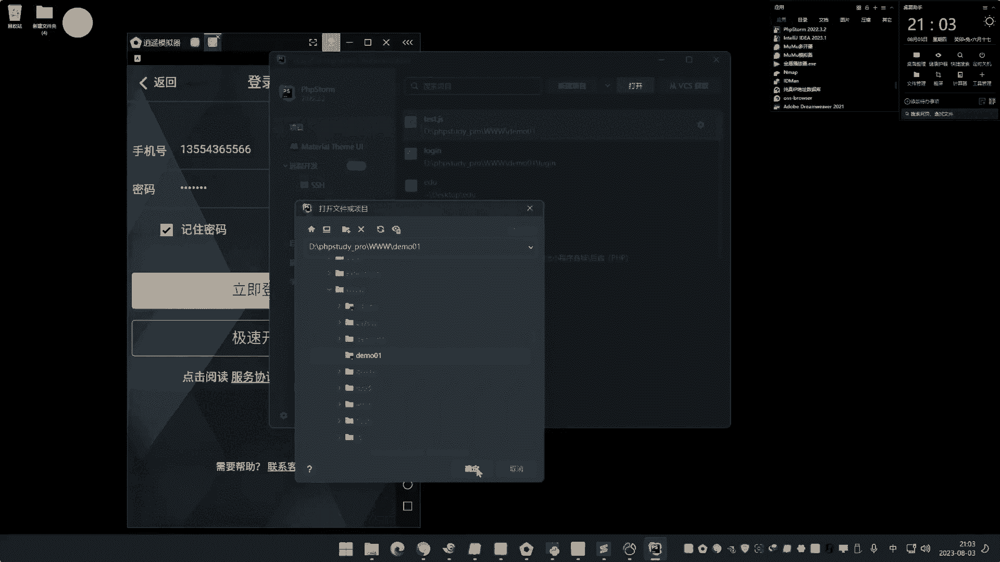

我要把那个东西翻出来了啊，那翻到那一天啊，我们当时讲JS的时候啊，在这里写过诶，是不是在这个地方，我都忘记在哪里啊，写的是哪个目录里面的，前期我在讲这个开放式，好像是在登录那里啊。

index的登录的那个页面，用那个判断的，额这个呢不仅是在我们这个找回机制这里啊，在任何的一些这种验证逻辑这里，都可以测试这个修改的返回呢来实现绕过，但是真实有没有成功呢，这个是不是说浏览器是吧。

稍微显示成功就成功了啊，好这个就是我们当时呢在讲那个JS开发的时候，大家有没有印象，你看啊，当时就是这个讲的的，就是用JS呢来去请求这个地址，然后呢那他结束这个值发送过去，然后你看啊他有个判断的。

他说要成功之后呢，返回一个状态码，状态码呢你看啊如果是等于一的话啊，就提示登录成功，然后呢重定向重定向这个成功的一个地方，也就是说啊，其实啊浏览器它在这里判断成功之后，采用JS验证的，是要让你这个地方。

如果说你在实战中的话，那个漏洞这个修改响应成功就是看这里啊，就是看这个代码，这里就是看对方是不是以这个返回状态，判断成功之后呢，进入成功后的逻辑，而这个逻辑里面还没有判断，如果说没有。

那就恭喜你这个项目修改效应就是有用的，但如果说这个修改成功逻辑里面还有判断，或者说成功逻辑里面会带入后端判断，那这里就不好意思了，就没有了，能理解吗，他那个漏洞产生就是和我们这个代码一模一样。

就是说在接受对方返回嘛，那就判断返回返回里面啊，这个什么状态码呀，这种东西来作为这个判断标准，我们刚才修改的也是那个状态码是吧，就是这个返回状态，然后呢状态对方在浏览器那边解析的时候呢。

由于这是前端语言，所以浏览器那边解析了，他在结束这个200或者说其他值的时候，通过这个值的判断来判断你是否进绕过啊，就是验证过了这个逻辑对吧，我们刚才看了啊，200就是成功的，不成功的就不是这个状态。

那就是206，对不对，他所以就是根据这个判断的啊。

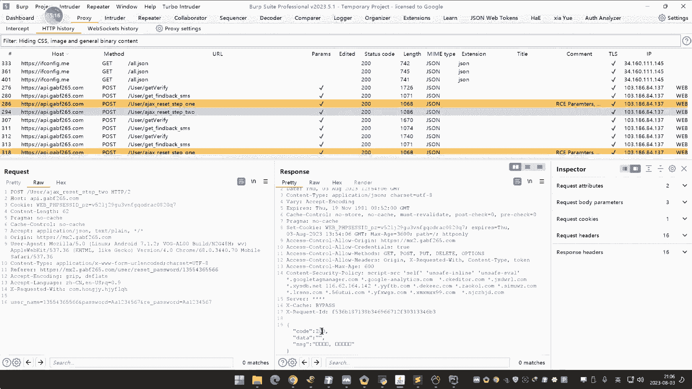

代码呢就是类似于这种代码去写的验证，后续成功验证过去之后，后续的处理操作就是和这个漏洞是不是有的，核心就在这里了哈，就说你修改是没问题的，修改是进进入这个循环，但是他后续有个叫什么。

后续的成功事件的处理逻辑，如果说后面的处理逻辑里面是吧，压根就还没有其他验证，或者说压根就直接这个东西成功之后，就进入了这个下一个逻辑了，那就恭喜你，这就有漏洞，具体有没有漏洞。

就是看这个下面的处理逻辑，我不知道我这样讲，大家能不能理解，如果说不能理解啊，那那没办法能理解，那很好理解那个事情啊，所以我说为什么说这个自微不知危啊，自微呢是什么原因造成的，就很简单。

就是这里啊就是判断这里的题是什么了，但是他的处理逻辑这里啊他还后续还有操作，所以导致你呢代码只到了这里，他只给你提示成功了，但事实上它后面的逻辑里面还有验证，所以导致你后面逻辑没有绕过，那就是自微了啊。

就这个意思啊，所以能不能成功的话。

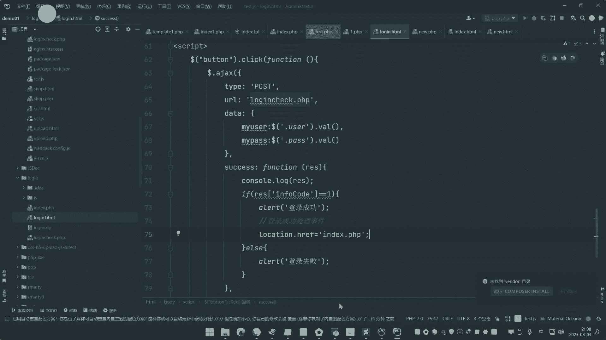

你还要有这个实际效果，就说从事他提示成功了，不是有一定成功的，就很简单的道理，就算我再写个代码啊，接收200状态码啊，是200。

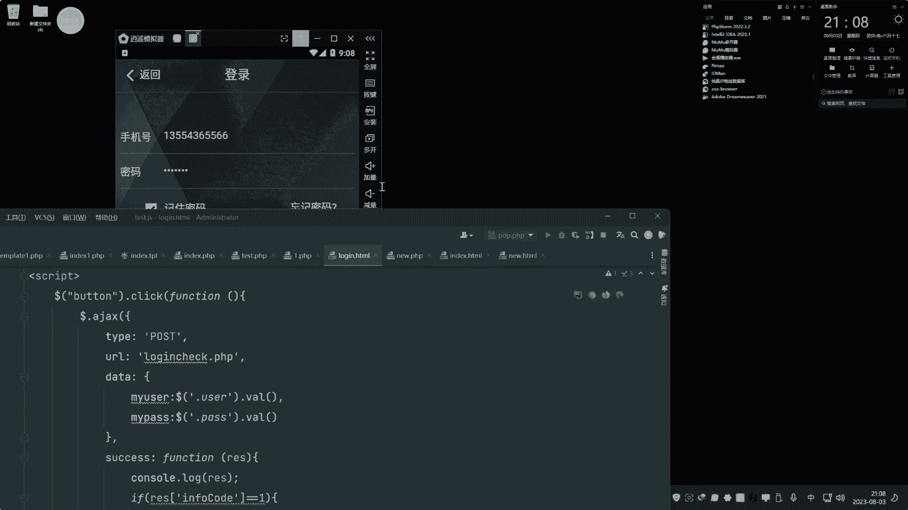

哎我就提示成功了，我提示你成功，和这个代码里面有没有没有把他执行，是一码事吗，他没执行，提示成功，有个鸟用，那我提示你是高富帅，你就是高富帅的吗，还要看后续代码啊。

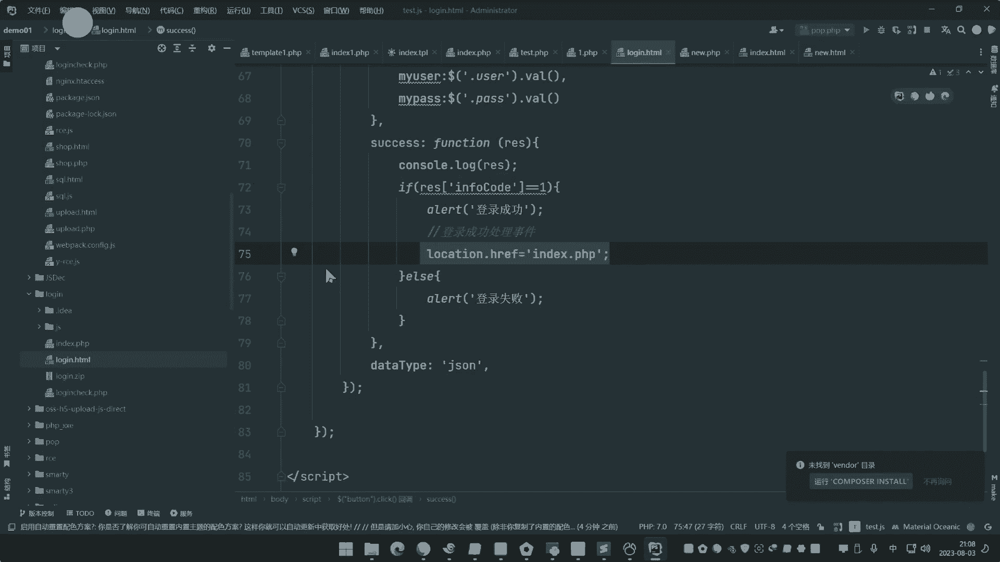

看他自己写了个逻辑，是否后面还有验证没有，那就恭喜你啦，有那就不好意思了，好好我们观察到这个修改这个响应这来了啊。

好那么现在呢我们来说一下啊。

从通过刚才那个响应，大家有没有在这个数据包里面发现含义，没有其他利用的这个例子啊，来这是刚才数据包，如果说前面我刚讲的知识点学的好的话，其实这里他还有其他的攻击案例，有没有发现呢，大家看一下啊。

首先呢这是找回密码，这里好找回密码，这里这是发送验证码是吧，发送验证码好，发送验证码之后啊，验证验证码是否正确啊，是否验证验证码正确，然后你看啊，前面三个好像都比较正规啊，法子英证验证码这里没有参数。

就这个东西嘛啊没没啥作的，这也不知道是啥，发送验证码在你手上，你看啊有这个电话号码啊，然后就是你输入的那个那个，当前那个页面的验证码啊，然后这个是一个叫什么鬼验证码，一个K啊。

这个应该就是绑定这个验证码的，就是说这个东西要和这个验证码对应上，他可能这里有个验证啊，你可能说把这个用户名一改改了有什么用呢，他是发给这个用户验证码，你改了没用，没有用啊。

你改了就相当于是他发到其他地方去了，他发到其他地方去了，能解吧，那发其他地方有什么用呢，你可能说哎呀，刚才你不是说了吗，把这个用户名重定向啊，是不想不回来，所以你改了有没有用呢，为什么这里没用。

哪里有用呢，逻辑逻辑是哪一步，先哪一步后，你要明白这个事情现在是发验证码，不是说现在是判断验证码，你要改也是改到判断验证码那里也去呀，发言之嘛，你改这个电话号码有什么用，你改了没用啊，他发给谁都可以。

好李哥说哎呀好进入验证码了，哎这个验证验验证码这个是否正确，这里啊这里有个数据包是吧，我改这里行不行呀，哎这里呢有这个东西好，这里是可以尝试的，为什么这里可以尝试啊，这个就和我刚才重定向那个东西。

是有点类似了呀，就相当于说我现在截收到验证码了，我把正确验码写进去，然后我把这个用户名改成其他的，会不会就这里啊，他是第一个攻击点，修改这个值，修改这个值是吧，看看啊，能不能，能不能啊。

重置修改就在这个，这个东西能理解了吧，就说验证码接收到了，那验证码是正确的，所以这后面是没有问题的，那么现在用户名改一改，因为你刚才那给网站是你要修改它的，这个时候你赶紧把对象重定向改成另外一个圆。

那么如果说他没有验证，这个验证码是和他绑定在一起的，那么就恭喜你呀，找到了一个漏洞，能理解吗，所以说改在这里改，我讲完这种类似课程之后呢，你一定要思考的呀，对不对，你不要说把刚才可以清了之后，哎。

你跑这里去改了，或者跑哪里去改了，改要改，找个地方把逻辑理清楚啊，你不要在这里改，这改个鸟用都没有的啊，所以改改这里好，这是第一个，这就是重冰箱啊，就是用简单一句话啊，就是用对的这个验证码啊。

就是用我们这个自己是吧，接收到的那个验证码，对的验证码去修改这个in修去去去什么重定向，去绑定一下修改对象是吧，比如说我现在把它改成这个132字，写随便写个吧好吧，我改这个是吧。

那么其实就是说用我们这个自己的这个东西呢，接受对应的嘛，然后重新下修改这个对象，这样一改就是形成这个效果哎，用验证码是正确的对吧，然后你赶紧把这里呢把它改成这个东西，那会不会就是直接修改他人账密码呢。

是不是啊，就这个逻辑哈，好这个是一个攻击点啊，这是重定向对象，好，我看看下一个这个有没有啊，这个有没有改过啊，这个有没有改啊，也可以改呀，你看数据包里面来1355436part多了，这个地方对不对。

你把这里改成这个值，你把这改成这个USM，改这个值，不久要等同于去修改这个密码了吗，所以说刚才呢我第二第三步的时候我不改你，我到第五步的时候重置密码的时候，对他搞吧是吧，我就把你改掉，会把它改掉。

是不是是不是Z也是个终极点啊，我告诉你啊，这个目标那个app的修改状态码能不能成功，我现在不清楚了，我也不知道修没修复，但至少告诉你啊，这两个攻击点他绝壁有安全问题，由于我这里呢没有多的电话号码了。

我就他妈一个电话号码，我做不了实验了，尴尬了哈，他要准备两个啊，做实验的话要准备两个啊，用你的呀，那你电话号码发给我一下呀，你不怕被骚扰，你就罚啊，哪天你发了是发了这个聊天记录了。

请你是吧，有人就给你打电话了啊，就喜欢你这种是吧。

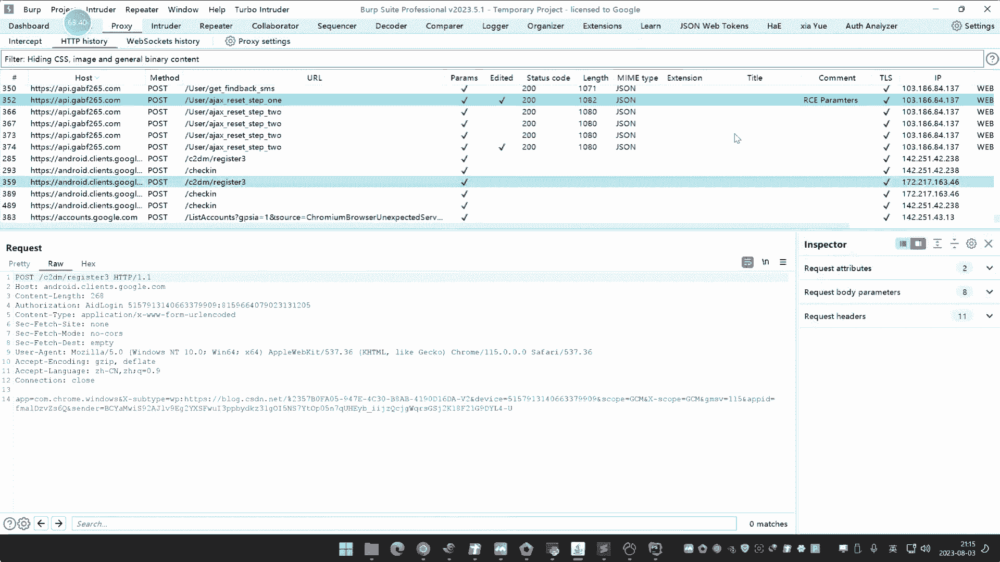

身体健康，这小伙子，你也不怕骚扰啊。

都给我发了，发个屁呀，真是有人给我发了啊啊那我试一下啊，看一下啊，1355436566，的把我给电话号码一直发干嘛呀，你就怕那个gay不知道你真是呀，你这些人，我知道了呀，这是我的电话码呀。

你一直发个毛啊，发，唉这些人呐，你妈的，你发的啥玩意，你发的都是没有租车的，这我咋测试，连租都没租车，我日我是怎么把概率搞这样，租车之后我才能找回你密码，你租都没注册好，都没用，我租我找回，怎么找回。

唉，不要发了不要发了，你没没没朱砂，你下去再实验这个app app，我给他打包了啊。

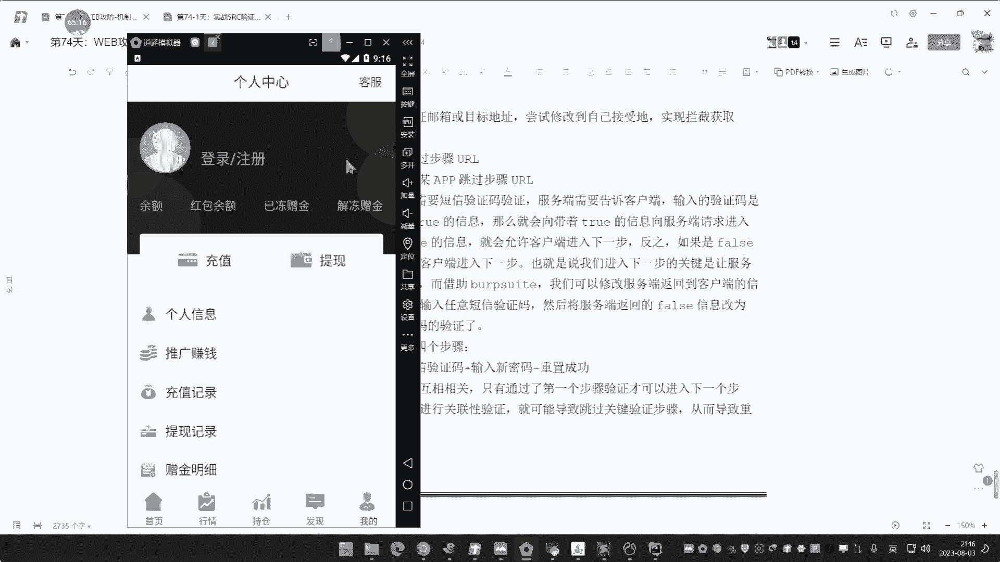

你可以下去实验实验一下啊，赶紧让我是给他讲清楚了啊，那很清楚的一个流程呢，看的很清楚啊，没什么太大问题嗯。

好还有一个呢就是跳过步骤，什么叫跳过步骤呢。

那很简道理，我们刚才得到呢，这是重置密码的那个步骤是吧，然后这里是那个验证码的那个步骤，这个是那个发送验证码步骤怎么办呢，我知道了每一步的余额，我直接你妹的，从第一步我不验证，第二步。

第三步我直接给你发这个重置密码数据包，就这么简单，就这么干脆行不行呢。

试一下呗是吧，试一下呗，那怎么操作啊，很简单嘛，先打开这里，他就直接我先知道你整个那个流程了啊。

就是先用正确的那个啊逻辑呢跟你跑了一遍。

然后呢我把你整个流程摸清楚了，因为地址呢我也知道了，那现在呢我就是吧啊。

这是那个就是那个第一个流程是吧，我就强制性把这个第一个流程的呢把它复制来。

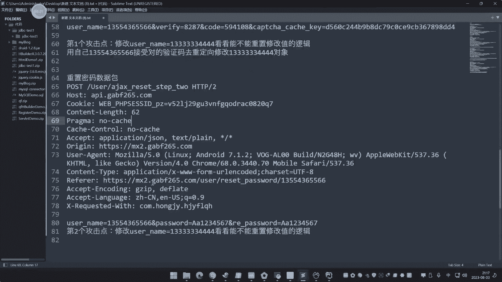

把这里那一改是吧，然后这里的呢这是我的第那个流程的是吧，我直接让你进入这个修改密码这个流程再来，对不对，然后热水施工一去掉，给他放出去，那你看这个app，你看看着啊，我们就把它放出去。

好这里大把他改成200，刚才触发的是这个嘛求嘛求这里的这个量度，哎怎么都是205啊，没有200的吗，这200那个200多，把它放这里，好我关注一下啊，就是我强制性的让他进入到这。

这这个这个后面再重新表里堵，哎这里没有反应啊，为什么没有反应呢，哎我们最好呢是这样子操作斜线啊，先把鼠标抓到嗯，怎么打不开了呀，什么情况哦，好了好了好，我们来先来这里啊，好我们正常来讲呢。

这里呢是这个包呢是这么个逻辑是吧，或者强行的把鼠标抓抓完之后呢，那个数据包是不是，我把那个数据包的强制性的改成到这里来，就是这个验证码是否正确的来啊，或者说我强行来到重置密码这个页面，好吧啊。

强制哪个页面啊，把替换掉好，放出去好，他说流程错误是吧，他说了个流程错误，大家有没有看到刚才那个提示好，再来一下啊，啊我直接把它替换，替换之后呢，我把这个状态码也给他，在这里显示，好好这个状态码是吧。

状态码改成这个正确的，好那验证成功，那是不是到这个页面来，其实这个呢就属于跳过步骤认证，跳过步骤一步骤步骤认认证就其实很简单啊，这个是非常好理解的，这个呢就属于哎验证逻辑呢，就验证用户名啊。

验证账号码啊，验数字信密码重置成功，而四个步骤呢就紧密相连，相辅相关啊，只有通过第一个呢就会进入第二个，但是有时候呢每一个步骤呢都会，如果说没有进行关键性验证，每个步骤之间的没有进行关联性验证的话。

那么就会跳过步骤连证，其实那就会导致任意执行这种操作啊，不说执行招密码就会导致这个安全问题，因为这种东西呢不仅是在这种修改账号密码，这里，在很多一些验证顺序里面，都会有这样的问题是吧。

123445有一才会有二，有二才会有三，有三才会有四，你这里呢就直接从一跨到四，或者说从一跨到三，就这个逻辑，那么他有没有这个安全问题，就是看他有没有对每一步进行操作，就说你这一步没有锅。

那就不会有下一步的意思，下部地址你在访问的时候，他不会接受，就是他接收全部是一个整个的衣服循环，满足一才会进入啊，满足二才会进入三，满足三才会进入四，而不是说啊你直接访问49的成功，就这么一个逻辑。

这样子那才是安全的，他是要循行渐进一步一步，而且不能说啊你满足E就可以进入三，是只能进入哦，满足R之后呢才能进入三，他这么一步啊，每一步都是要上面的成功，才会下面这一步这样才对。

所以说实战中这种篮球你怎么测呢，其实就是我刚才说的啊。

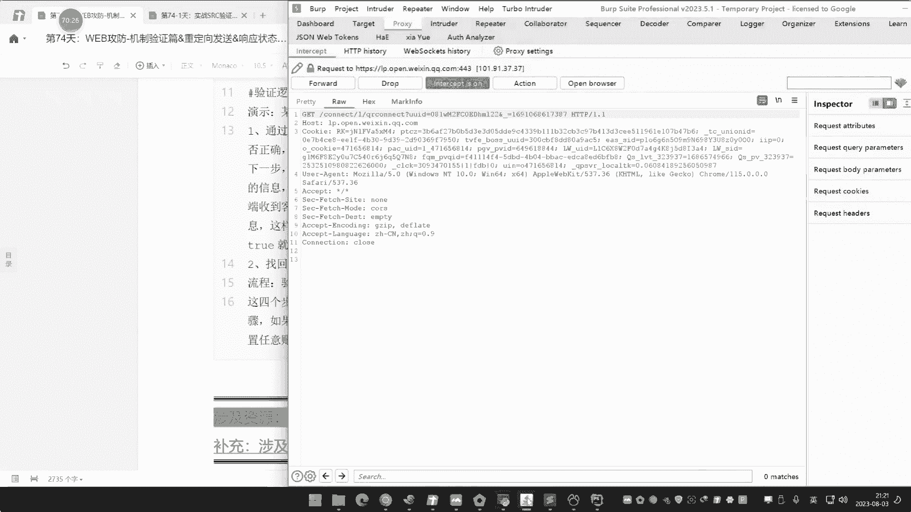

就是你先把他四个这个逻辑啊。

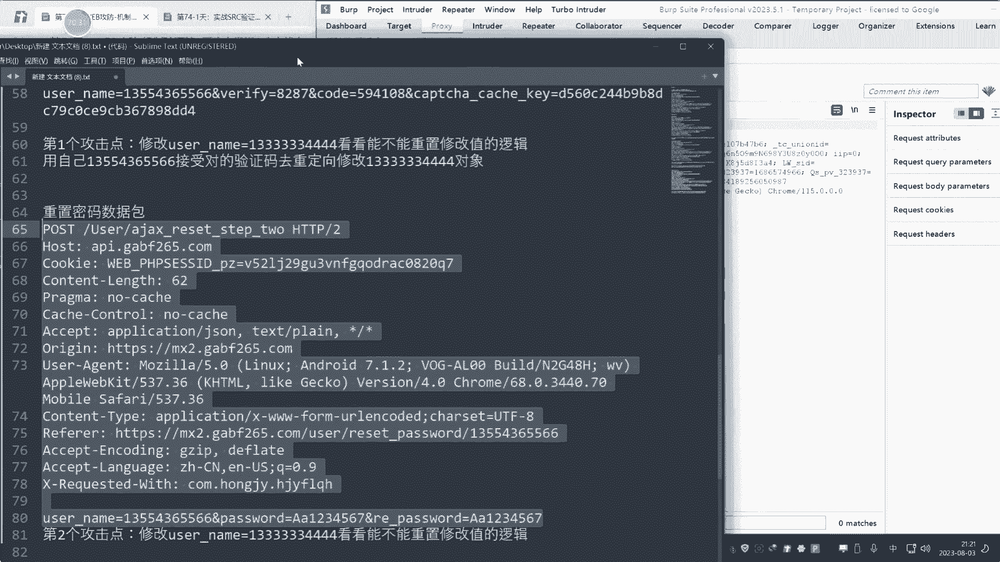

就是流程的每一个数据包抓起来之后啊，直接从第一部的这个界面这里，直接跨到这个重置密码这个选项，那么这种就是属于夸，如果能夸成功，那就是有跨不成功，那就没用。

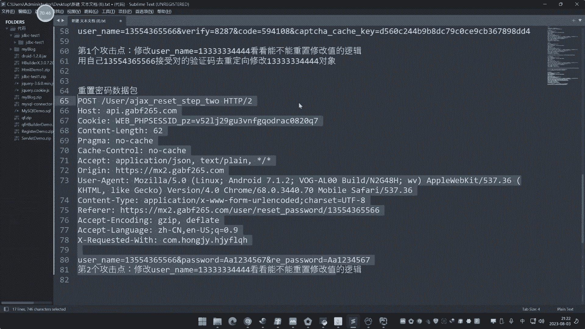

好这个就是我们说的这个呃这几个东西了啊，好啧啧啧哎，什么愿意用户注册，这没什么讲的，简单的要死啊。

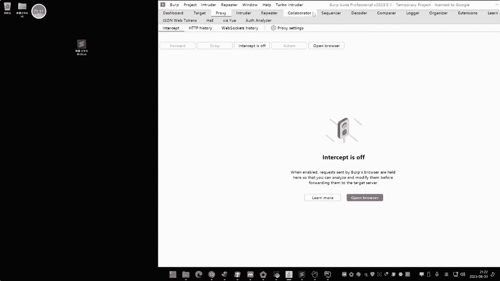

运用户注册，说白了啊，你自己用脑子都能想出来的事情，那批量注册的一些事情嘛，基本上它的难度就是在于用户名和验证码，还有那个，还有什么还用，就是很简单嘛，一般就是用户名呢就随机自己用字典生成。

保证用户名能满足密码也是一样道理，然后验证码就是识别插件是吧，全自动的去识别插件打码，对不对，批量的去请求注册包，然后呢用批量的这个绑定的电话号码，或者邮箱呢来进行那个啊，关键点呢就是你有没有这些资料。

比如说验证码实例啊，大量的邮箱啊是吧，这种东西来进行注册。

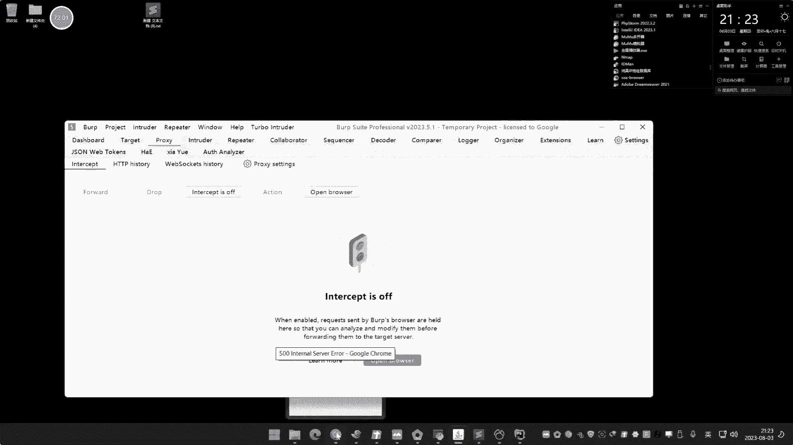

啊有没有这样的漏洞呢，很简单的道理，防护防护的严。

就没有这样漏洞，没有不严，就有这样的漏洞，什么叫不严呢，注册的时候没有验证码，不用输入验证码，随便租用户名呢没有任何限制，想怎么取就怎么取是吧，而且租车的时候，数据包提交过多就怎么样就会拦截。

还是说不管你怎么请求，他都不会拦截，这就是判定有没有用一用户注册的一个情况，勇得奖吧，好难吗。

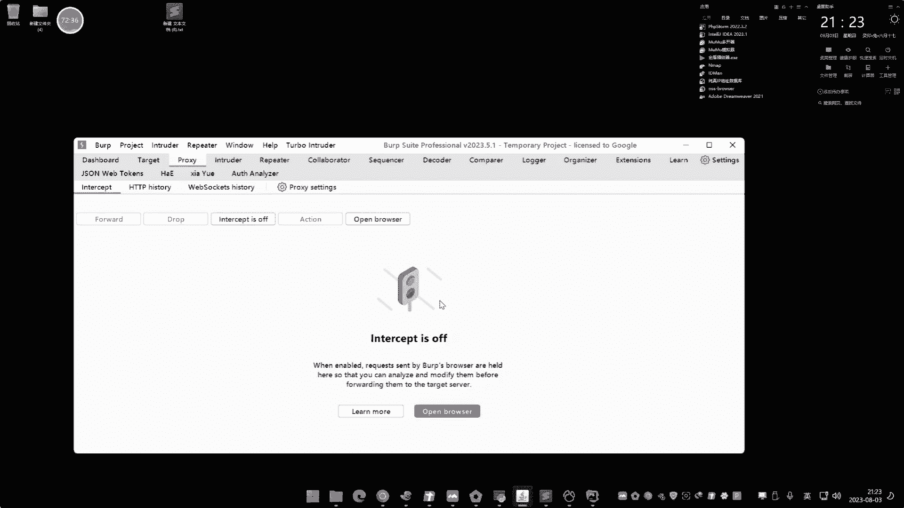

多自己想一想问题啊。

湖南的，你如果说自己呢去写那个运啊运E啊，去批量注册那种注射剂，不是有那种搞那个网上写程序接单的，他写这个什么批量注册机是吧，它可能难度还大一点，因为它也绕过验证码的识别，它也有大量这种邮箱或手机号码。

来接收这个验证码，来激活这个账号，对不对，他可能满点还要写代码的来实现这个功能，批量的还要换代理是吧，可能有些有这个有这个检测一个IP地址的，多个注册，还要换代理，那来实现，对不对，有什么难度。

那你想一下呀，你自己挖这种漏洞，你就看他有没有这个验证就完了呗，没有就是有啊，还有还有这些验证是吧，你能不能绕过呀，绕过的方法复不复杂呀，不复杂，那就有呗，复杂那就没有呗。

一种就是我们说的验证码的识别难不难识别，能不能绕过这个识别，能够达到全自动识别是吧，这第一种如果说没有验证码，那就不用说了呗，第二种他就会检测统一IP地址，是不是注册一个了，会封代理子刀。

他换代理请求一次，请求几次就换代理，换不同地址，有没有多个邮箱或者手机号码作为支撑，会不会检测统一手机号码，统一邮箱注册多个，看这些有没有这机制，怎么判断呢，你自己拿你手机就能判断的啦，不用说了啊。

不要再问这种事情了啊，那么接下来呢我们就来看一下，这个关于我们今天讲的课程呢，在这个阿SRC里面的一些具体的案例分析啊。

好这个是我们SRC的案例分析，看一下啊，这个短信怎么回旋呢，已经跟他说过了，我们继续看下面的啊，修改任意用户对象，在那重置运用户，这是我们讲过的知识点，你看啊，但是他和我们讲的有点不太一样。

我们那是在上面直接写上名字，username等于用户名，他这里是什么，你看数据包这里去重置这个密码的时候，这个数据包这里有个什么，叫那user id等于14942，这个id我们前面说过啊。

用户名呢是指向这个用户id呢也是这个用户，所以这里呢没有用户名，但是它有id，把id值改成14941，你跟他说哎呀为什么不改14943呢，啊我问一下大家啦，这个案例中为什么改成的是14941。

而不是改成14943，那为什么是减一，不是加一啊，是吧，有些人他直连这个都想不通，他都会问你这个有什么法子呢，因为上面这个钥匙90是他自己用户，他改钥匙93的话，一般这个递增的话，就是下一个注册者。

你不能保证你注册完之后就有人注册，所以这个钥匙93这个用户存不存在，没有把握，除非有新注册的，所以他改14941就是上一个他注册的，因为他的有要4942，那上一个肯定有，就这个意思，自己呢要学会想。

不要老问逻辑，要严谨一点啊，说白了啊，你如果是上学的时候，这个数学成绩只要不差的话，像这种东西啊，它都好理解的啊，如果说你本来就是个什么啊，就是学文科的数学就很差，那不能理解啊，那是很正常的。

那没办法啊，好我们再看这个啊，修改响应包哎那个那就是和我们讲的一样嘛，呢这个案例里面呢输入个用户名好输，输这个想验证码输入完进去之后呢，啊这这是它的返回包，返回包里面返回的是false。

返回的是false，就是输入错误，这里提示的验证码错误，然后呢把它赶出，赶出之后呢，提示验证码正确了，亮了就进入到设置密码过去了，对不对，这就是修改响应实现的绕过，你可能说有这么多方法。

我哪知道使用哪一个呀，很清楚，方法不多，就那么五六种，一个个是撕，怎么撕，也是看数据包决定的，数据越多，能试的参数越多，就上面能修改数据越少，修改的少，那就修改响应能理解吧，就是上面的值越多。

比如说用户名的id都有，那么你可以尝试修改是吧，重定向用户啊，重定向id啊，尝试取到过，如果说上面没有这些东西啊，你就修改状态是吧，还有些人呢可能上面有只是他加密了，然后那你也不知道，所以那你还要解谜。

解密之后呢，再把它换算。

还有这个呢就是未验证导致用于用户注册，这个也是意思的，给对方去发送这个验证码的时候，就这个验证密码的一个地址时候。

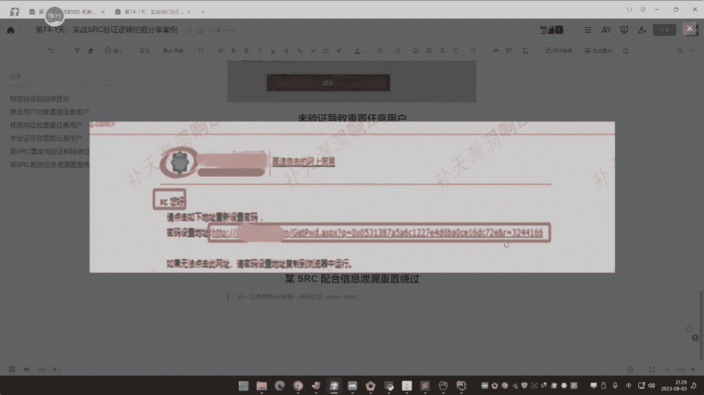

你看他后面有个叫R等于3244166，那么这个R呢代表就是一个id号，把这个值一改，改成这就是其他id的那个账号密码，然后这两个都是这几个都是截图，我们来看一下几个案例，几个案例呢全部是真实案例啊。

就关于这块漏洞点挖的那个思路。

即使SC环节的任意密码重置利用啊，看他怎么挖的，这是一个登录框，找这个忘记密码好，这里尝试去修改，来到这里呢，重置密码，这里呢写这个写这个账号啊，去输验证码，验证码呢账号点确定，点完确定之后呢。

这是发过去的值啊，发过去的值之后，那他是怎么做的啊，好这个是验证码是对的，验证成功啊，就是自己注册的好，自己注册，然后现在呢换一个手机号码，换个手机号码之后呢，去验证的时候就失败了，他就把它改啊。

就是修改状态嘛，把它进行修改啊，不不不是不是不是啊，说错了额，怎么个意思呢，就是他这个呢是我看下啊流程啊，他说这个先注册个账号啊，做账号之后呢填写个人信息，由于这里呢需要验证手机号码啊。

且不能在数据包里面呢去找到返回验证码，所以呢我就用自己手机号，意思就是说呀他想租这个手机，又不想用自己的手啊，又不想注册个用户，又不想用自己手机，但是他想在收数据包里面找验证码。

就想这个发给大家发的验证码，但是找不到，所以他呢只能用自己手机了，好苹果手机啊，他也注册了啊，刚拿到手机注册的时候啊，去验证发送，发现这个这个验证完之后呢，返回了一串id啊，留意一下这个id呢。

为什么要留一呢，这调号码，然后这里有个叫USCODE，还有个叫user id，我们都知道，这个id，就可能就是你的这个什么用户的一个凭据，用户的身份，有时候呢在编辑其他用户的时候。

或者说尝试对其他用户进行操作的时候，可能会用到这个字理解吧，然后呢这里呢是有手机验证码啊，填写确定之后啊，验证码是对的，就验证成功了，好他就回想起在填写账号这里啊，是否能够得到账号，是否已经注册了。

可以随便填一下，就随便填了个账号密码，填一下之后返回的是零，然后呢他就把这个值呢改成一啊就可以了，啥意思呢，就是说他在这里啊进行这个验证的时候，这不是有张真正的账号吗，如果这个账号不存在，返回的是零。

存在的就返回一，所以它可以根据这个提示呢来去猜测，有哪些账号被注册过，就是账号名，那这个时候啊他就用那个支点去跑，结果发现509长度的返回的是零是吧，然后呢返回一的就给他展出来，这就是返回一的。

所以他就拿返回一的这个账号，去尝试找这个账号，所以他的逻辑是怎么样的呢，因为我们都知道啊，你要重置别人的账号，你连对方的账号都不知道，你连他id也不知道，你怎么重置他呢，重置不了啊。

所以他就通过这个找回密码，这个逻辑先去找哪些用户注册过，他先找判断一个没有的用户开发的状态码，发挥的是哪，再用他自己注册账号码返回的是一，所以他就知道这个一代表这个用户名是存在的，那么你就能找这个用户。

因为它不存在怎么找的，租都没租车，是不是，所以他刚才就用字典跑跑了这几个用户名，是吧啊，说到这里的时候，我相信又有人说把字典发我一下，嘿嘿唉我真是花了啊，唉，之前就是啊讲案例说到字典下去。

就说哎把字典罚我一下，我真是拿他没办法，所以他就找到这个用户名啊，随便拿个用户名来做测试啊，他就尝试着对这个用户名呢进行这个什么啊，寻找这个用户，这个这个这个用户的密码，对不对，好发包之后呢，你看啊。

呃因为第二步呢需要验手机号码，然后直接那个啊，然后连接这个手机号码啊，这是对方的手机号码，对不对，对方手机号码，而且这里呢还会起造成信息泄漏，你看他在这里呢还造成信息泄露，他尝试去找这个人的用户密码时。

数据包的回血里面显露出了这个人的电话，所以说你在玩这种密码逻辑的时候呢，还找到了新线路，就说你尝试去找这个用户的时候，他的返回信息呢把这个人的电话号码显出来了，虽然在页面中显示的是这个打打新了，打麻了。

但是放回包里面呢也暴露，然后呢他把这个访问包里面的改成自己的，这是什么一个逻辑啊，这个逻辑是什么逻辑啊，这个逻辑就不是我们讲的哪一个逻辑呀。

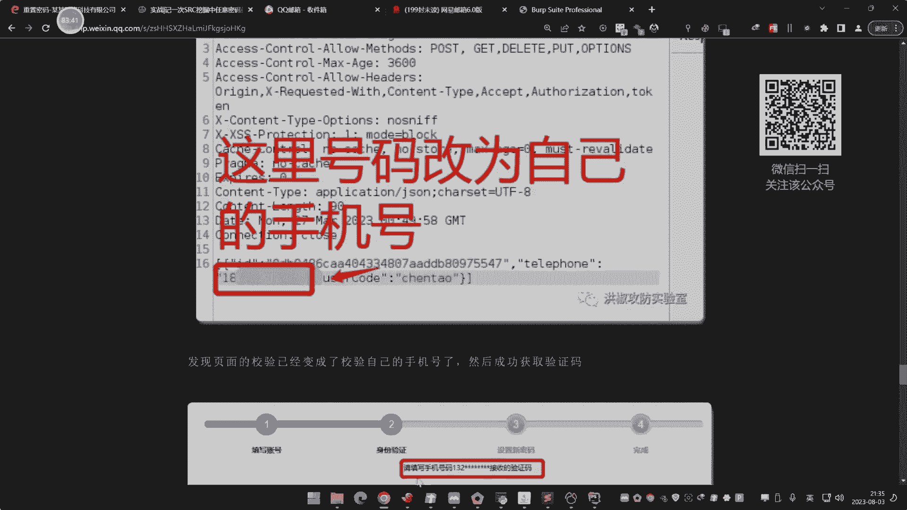

从丁香啊。

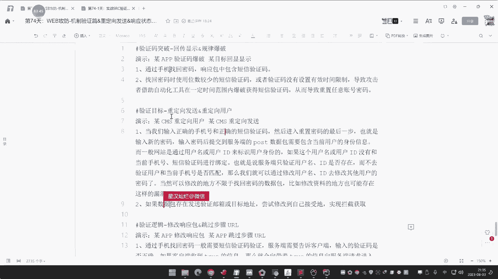

是不是这个逻辑了呀，就是在这里呢他返回包里面呢，有尝试性向对方的这个号码里面的去发言者嘛，然后这个时候呢，就把对象目标的这个电话号码都改成自己的诶，那么就接收到自己验证码了。

然后呢就用自己得到验证码来充值了，甚至就挖到了这个账号的发了密码重置啊，然后一登录能进去哎呀，而且这个用户呢还有一些权限是吧，下了一些资料出来了，这个漏洞就挖到了呀，是不是，这个案例我们看了一下。

和我们今天讲的是我没有讲，还是说是吧，他很高深的，看了之后难不难啊，我把这个案例分析了一遍啊，大家觉得这个案例呀，我等下还给大家看个APP案例好吧，我们先把这个案例讲了啊，讲了啊，你能不能听懂没听懂。

我再给他过一遍，听懂了我就讲下一个那个案例，听没听懂啊，听懂了是吧，他的逻辑是先是吧，弦呢啊这个先自己注册个账号，然后呢在注册的时候呢走了一些逻辑，所以你可以看到挖漏洞的时候，特别像这种逻辑漏洞。

你先自己用自己的账号走一遍，逻辑，走一遍的逻辑，是能够帮助你了解它正常的一个流程的走法，包括里面的返回包，请求包值，这些东西都能便于你后期的进行操作是吧，然后呢他就是吧要尝试性重置别人的密码。

但是重置别人密码呢，他肯定连别人密码的用户名都不知道啊，你重置要给个对象啊，所以他就在想啊，怎么操作的，那么他就在这里呢去做了一个判断是吧，重置对象的时候，如果这个对象不存在，就会返回包呢。

就会返回的是零，就对象没有这个用户名，就是用户名不存在，那么重置就是不存在的，返回一呢就是用户名存在，所以重置才能正常进行，那么通过字典，包括找到了部分用户里面有这个用户名，然是针对这个叫陈涛的这个呃。

这个这个用户名呢作为操作，然后呢通过在请求包的时候啊，发送验证码的时候，这里有个手机号码，把这手机码呢强制性修改成自己的，也就是说修改重定向，然后这个验证把他发到自己手机上面来了。

然后重置了这个成套的这个用户。

登录进去之后提交SRC，这是过程啊，不说了，过了一遍，咱们再看下一个啊，这个呢和那个刚才的也差不多的，大家看一下啊，这个是一个SRC等一个SRZ画家，开局一个登录框嗯，你看今天的课程我们讲了啊。

好像都是在什么找回密码呀，重置密码那里登录框，这里呢思路来了以后，别人问你啊，登录框渗透思路，那今天讲的知识点那就是一个思路，所以说呀有些面试题呀，你学好东西之后呢，你做好总结之后呢。

很多东西都能套上去的，你想过的话，你就是压根这个东西你学了就没有提提升上去，这就属于登陆框的一种另外一种思路嘛，找这里呢有个忘记密码是吧，忘记密码这里有两个非法参数啊，即提交之后呢返回零。

那返回零呢就是说前端没有查到账号信息，他随便写了个账号为一呀，手机号码一返回的是零，他就没有查到这个账号信息是吧，嗯然后呢他将一改成R改成零啊，零改成一之后呢，就来到第二步，第二步呢就是进行安全验证。

就是输入个验证码啊，然后呢，你会发现他的验证码呢在这个前端有显示，那验证码在下一题这里显示，所以他就直接可以填入验证码，进入第三步，修改密码，再来就修改成功了，好这是他的一个测试的一个前期情况。

但是判断成功之后呢，他就尝试修改艾米，修艾米之后呢，提示成功了，但是一直登录时候呢提示失败，什么情况呢，后面他就想了个法子，想了个什么法子啊，就在这里面找到了这个用户名，也就是说。

其实之前他修改艾米那个艾米用户是不存在的，用户名是这种名字，所以他重新呢啊在这个其他接口里面啊，找到这个用户名，然后呢再重置这个用户名，然后后面呢再登录进去的，所以说他在测试的时候呢。

尝试修改艾德米提示成功了，但是艾德米呢登录上去，原因是因为没有enemy这个用户，后面他在app里面的数据里面啊，下到APK用APK呢，用工具扫一下，有人说哎呀，这工具是啥工具啊。

用工具扫一下这工具是啥工具啊，就是我们说的app for sk，你可能会问为什么知道你可以看一下啊，这个文章我在微信上面还看过，微信上面呢直接说了APP铺，那我看app扫描工具链接有吗，这个是什么呀。

那他说工具地址在这里呢，app运符sk app运符实干讲没讲过啊，我们讲没讲过，讲没讲过的，有人说哎呀，把那个工具给我罚一下呀，哎我没讲过吧，不过吧我记得讲过啊，我是讲过的啊，AB运是不是个啊。

我不记得别人哪里不记得哪里有了啊，但是绝对是讲过的，这些讲也讲过啊，那个某某sf都讲过AP什么，你不就不说了啊，谁说啊，你面对不同情况，下面是啊很多知识点的都要把它联动起来的啊，你不可能说掌握一哥啊。

有时呢就能玩了，因为你掌握一哥，那很简单道理，掌握一哥呢有时候碰到一些其他情况，那就不行了啊，这个呢他就用到了这个从app去提取数据，然后呢挖到这个信息里面呢，有这个什么管理员的一些信息，然后呢。

他才要从事这个管理员的这个对应身份啊，重置后面呢才登录进去的啊，那每次一问哎，你看下面也有人问，说a app加固有壳的话，那AP扫描工具就没法用了吧，一问是吧，别人就没有回复他了，好这个就不说了啊。

好我们现在来看一下啊，这是我们看的两个案例，案例呢全部分享完毕，我们呢给自己呢来是吧，打开app看一下啊，我们来看一下真实情况，下面那个情况，好我们来看一下啊。

先把包刷一下，你看啊，我们就拿这个简单的讲解啊。

我们各个的提一下思路有没有漏洞呢，不重要，思路先给他讲，来看一下这里啊，那打开这个叫距离，这个距离是什么呢，是这个擦边球的东西是吧，什么叫擦边球呢是吧，他也不是直接的折射，就是一个是吧，这个gay呀。

蛇蛇呀，这个历史啊，喜欢商的平台，什么叫那个呢，其实就是啊同心异性交友平台，加什么油呢，对不对，那就不知道了啊，好我登录进去之后啊，你看啊，他就是吧，我的名字呢取名叫小迪爱通是吧，还搞了个帅气的头像。

对不对，那你妹的是吧，直接就看个人信息是吧，个人信息，然后这个相册子啊，多点一下啊，还有诶是我星星都没有了好了，最近访客哎呀，这个老色批啊，你妹的，我他妈的刚注册，你就来访我的客，唉，还是个男的。

无语了，然后呢在前面呢是吧，就是一些这种是吧，那我真搞不明白，我这你妹的，我身份是男的，你怎么推荐都是些男的，你什么情况啊，查询一下新人好，这有女的了是吧，你看这个我们点进去是吧。

搞这种图像是不是还什么，你不主动，我们之间怎么有故事，都是gay呀，好我们看下这个数据包，好看数据包啊。

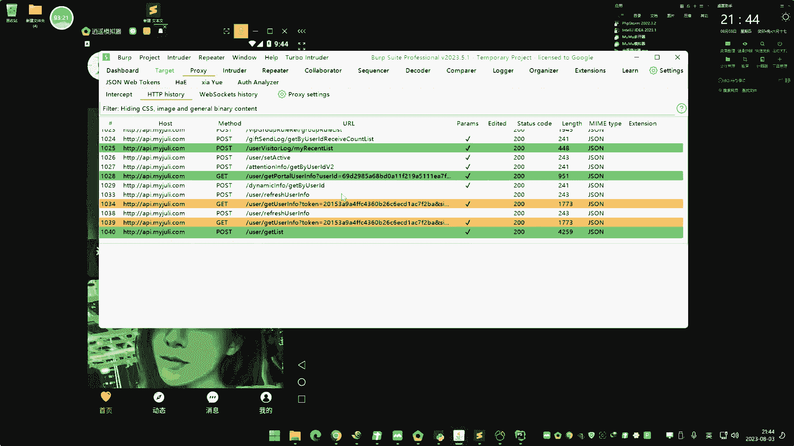

你看啊点了下，你看啊，来这个数据包里面就泄露不少，你看看这里写了个地址JPG，我看是个什么东西。

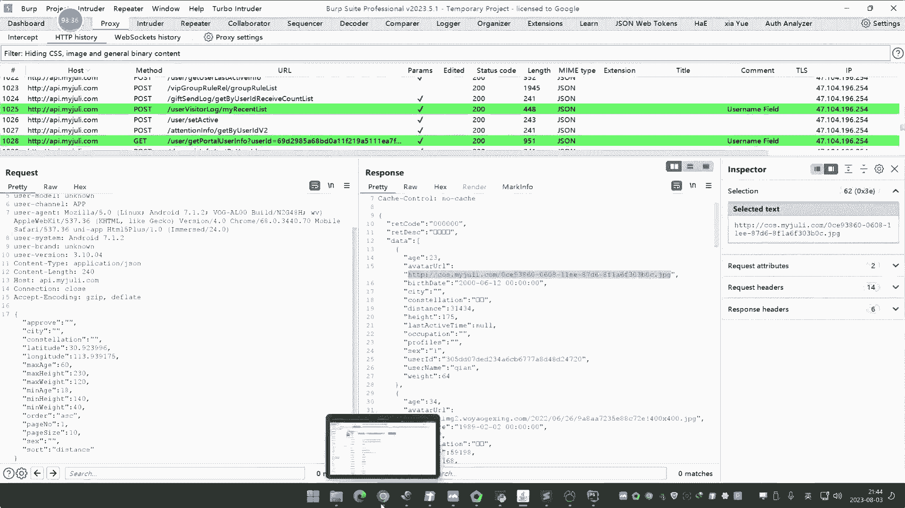

我打开看一下，那就是刚才看到那个人的一个图像。

那歇着了2000年0612，应该是他的出生年日哈，175175啊，高175WITHG64K啊，六十四六十四千克，username m叫浅，这是它的UI力CX为一，哎呀这是个一呀，哎呦恶心啊，真是恶心啊。

受不了啊，那这都是他的星系，对不对，那你看这里这有这么多星系了，你看这里还有user id是吧，那就各种各样的原理，这个叫bob是吧，1839 19公斤，哎呀你这太肥了呀，这顶不住啊，这这谁顶得住啊。

大家读一下啊。

哎呀这受不了受不了，这谁受得了啊，这，然后这里呢有很多这个这个这个那个是吧，你看啊这有很多信息啊，你看这里那就有些接口信息啊，我们看一下啊，再来看啊，你看这里这个我看有没有那个能看这个后面啊。

你看这里好，你看这个这个呢一个信息返回，你看他又返回了19920321是吧，这里有个地址IP，有个一个图片，然后这里呢你看啊，那176135436566，这不就是我那个注册信息吗是吧。

这就是我那个个人账号信息啊，然后这里有我的UCD，那也有了啊，你可能会问这什么情况呢，这有没有什么车法呢，还好我们继续看啊，看数据包里面啊，你看嗯，好我们就拿这个找回密码逻辑，这里测是吧。

来我们翻译一下这里，这里有个这个个人信息，然后这还有这个诶设置好，这里有个叫账号相关啊，换绑手机，比如说我在人家换绑手机是吧，我个人电话码了，是那135的吧，我我我换一下啊。

来换一下130换成其他手机吧，1012号下单好吧，换这个啊，然后我抓个包，哦这是我那个宝马，对不对，好把它进行一个替换啊，先替换包改好改好，这是这也不知道啥情况，放出去吧，放再放。

它提示什么提示这个验证码是吧，验证码好，我朋友随便输，这明显这个既方法都不是我的，我怎么可能有人验证码呢，对不对，所以我就把随便写四个一好，我来记录一下啊，返回这个错误哎。

我就把刚才那个成功的错误把它拿过来嘛，啊刚才那个呢都是零零的零全部零的，应该就是那个正确的哈，就这种呢就是正确的哈，我要替换一下啊，对不替换，看这里哈，诶绑定成功，那就换绑了吧是吧，换绑对不对。

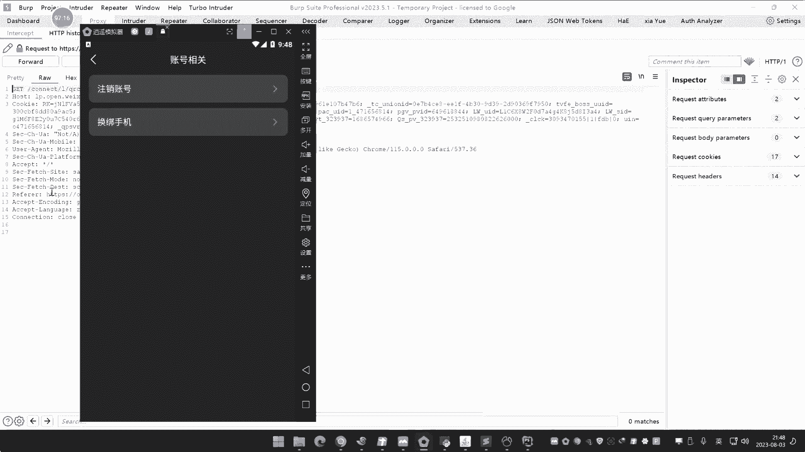

换绑了呀，换成另外一个手机号码呀，是不是，其他的我们就不看了啊，其实说实话他这里呢还有一些这种，还有这种叫什么呀，还有那个新鞋楼啊。

我这边点了一下啊，就是你会发现呢他这里泄露很多信息，然后呢你可以根据这个值啊进修改，你看这里有什么页面是吧，你把它改一下呢，显示十个是吧，东西呢都可以尝试性的把不用改掉的好哎，再返回那个他不弄。

这直接返回啊，这个第二页还不如行呀，第一页还可以返回信息里面，嗯各种各样的一些信息啊，然后这里面有一些不同信息啊，嗯你就自己呢就是看这包啊，然后呢有参数值的，那你就把它进行修改，啊有参与指证九块行修改。

然后呢这里呢泄露一些人的一些id值啊，包括他的user id啊，还有一些信息，有些的话可能会泄露电号码，那你可以在这里翻啊，那我们可以看一下这面的正面那个匹配呢，这是匹配到电话号码的。

然后这是匹配到个人信息的，那我们就不细看了啊，因为这里呢我也不想打码了啊，打码到时候又要把视频重新打码，重新编辑一遍码，麻烦这个涉及到敏感信息的时候啊。

这个要打麻唉算了，我就不搞了啊，你有兴趣你下去自己测吧，我们就不测了啊，我就拿这个案例给他简单说一下，说其实就是说说白了啊，这个业务逻辑的所有东西啊，都是通过数据包的一些操作。

数据包的请求包和反响应报，就是你在上面看啊，宝宝坐下来，另外包里面呢还会有一些各种各样的一些纸啊。

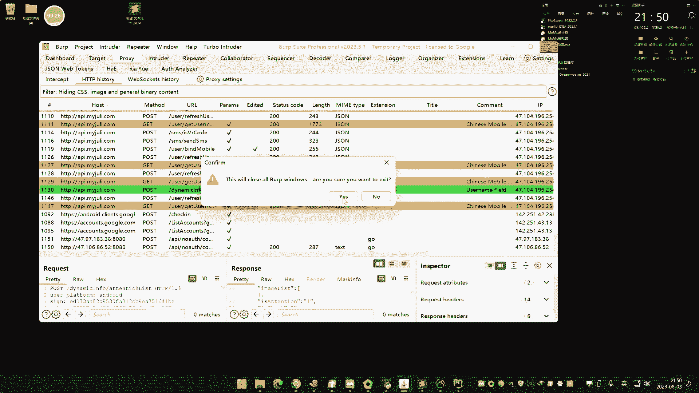

你不要只看那个页面显示东西，因为显示它只会显示一部分，但是有时候呢它的数据呢是要大于数据包的，回忆线里面是要大于这个显示的，因为我们都知道啊，业务实现逻辑，你在你自己写程序的时候啊。

你自己呢去写了个功能功能的返回了很多数据，但是你要显示的话，你可以自己选择性的显示，但数据其实它是有很多数据的，所以有时候呢，他的数据呢会在回信包里面都存在，但是它只显示部分。

像我们经常看到玩一些什么信息泄露啊，都是网上的是吧，浏览器上面看就就就几个。

但实际上呢返回包里面呢泄露一些诶。

他就挖到了嗯好今天就讲这么多了啊。

下节课呢我们就来说一下这个验证的一些，接口的一些事情啊。

啊下节课我们就讲那个东西了啊，这节课呢我们就不说这些了啊。

好就讲这么多啊，大家有问题的话就问，没问题就瞎了啊，app叫什么名字，app叫我都忘记了啊，我都不知道那是从哪里下过下的了，嗯我呢喜欢模拟器，上面有好几个那种app，叫个什么名字啊，我刚才看一下啊。

给大家看一下，看网上能不能下载到，应该网上能下载到啊，我现在打开看一下是叫什么名字。

因为有些这种擦边的这种app网上商店下不到，所以很正常啊。

他要往上看能不能下载项目名字，距离这名字取的还是漂亮啊是吧。

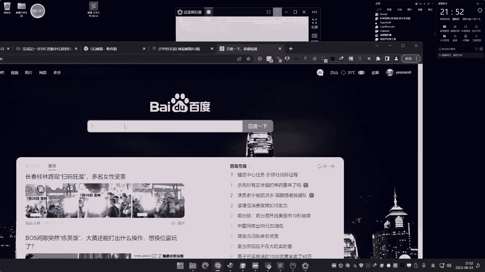

距离，有水平呀。

哦有了距离。

这样子就这个东西嘛呢。

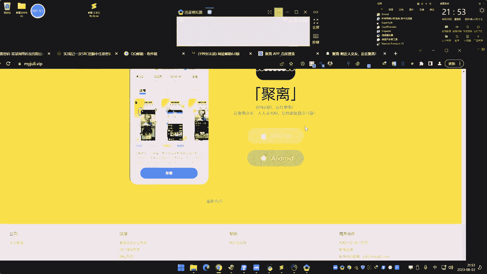

好就说这么多了啊，我们今天就讲这么多了。

