# P74：第75天：验证码安全篇&接口滥用&识别插件&复用绕过&宏命令填入&滑块类 - 逆风微笑的代码狗 - BV1Mx4y1q7Ny

这个说实话呀这也是强加上去的一课，说实话在这个挖漏洞里面呢，有些东西呢还是还是搜这个moon，当然有些人他不受这个漏洞的影响不是很大，但是有些人呢他会喜欢win啊，喜欢win这个它解决的问题呢不是很多。

你比如说像今天我们说的验证码，有人问的最多的就是说什么滑块，验证码那些东西，但实际上那个滑块验证码呢，有部分是能够能够突破它的，但是有部分的他又用不了，如果说你都能突破的话，那这个验证码就可有可无了呀。

是不是验证码的总类呢，大家都知道啊，一般是这个图片型验证码和这个滑块验证码，滑块验证码也分几种，来我给他说一下啊，你就拿我们说的这个验证码，图片验证码就不说了啊，这个滑块验证码大家都知道。

图片验证码就是这张图片，图片里面有有这个字母啊或数字啊，你数字进去就可以了啊，滑块验证码，现在高级的还不忘滑块验证码，都玩那个什么鬼是吧，突发验证码就是让你点点点啊，编几个字啊，或者说回答什么问题啊。

那些鬼东西那更复杂，滑块验证码呢有两种啊，你比如说我们像现在的我们可以打开。

随便打开一个哎你像这种啊。

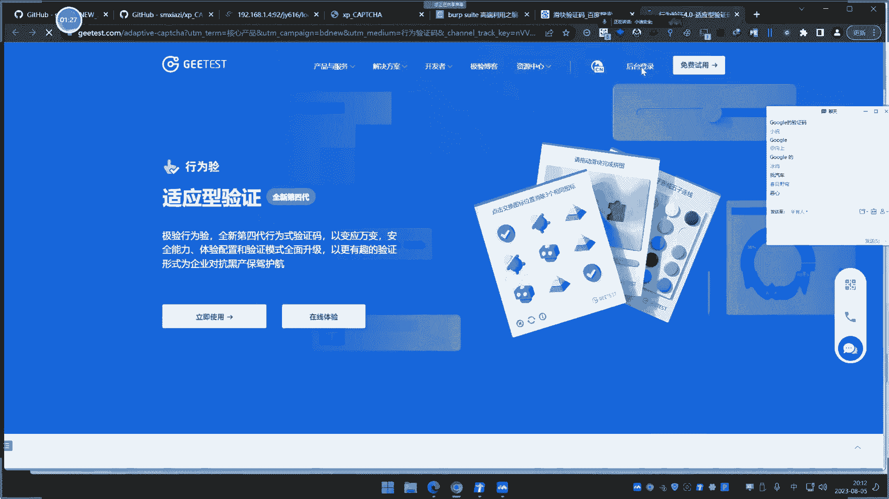

这种呢就是哎，反正我是点的哈，点的滑块的呢。

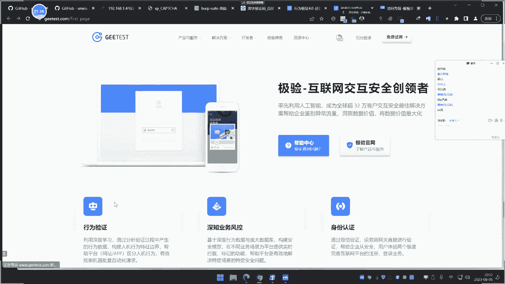

哪里有个滑块的，妈的哎。

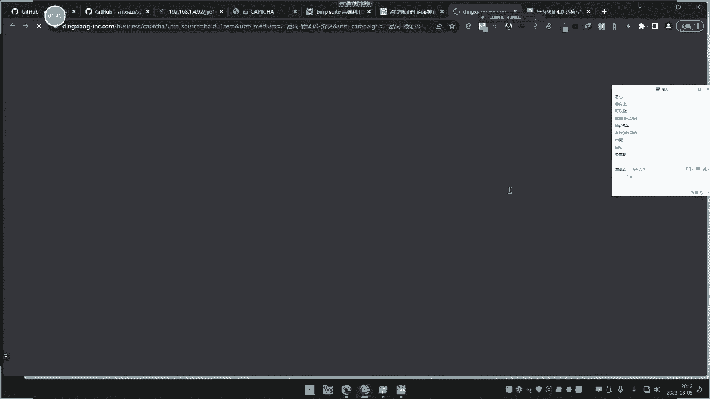

看不到我滑块的，啊就像这种这种是点的啊，滑块就是说有几种啊，一种就是说直接一拉拉过去哎，就成功了，还有一种就是拉到一个指定位置，就是一个符号对应上，大家都知道啊，我是没有案例给他看啊。

大家一说就大概明白啊，就是类似那边的大树的拼图，对不对啊，还有一种滑块就是我们说的拉到指定位置，指定位置和一个拉拉全部直接拉过去对吧，那也是滑块，还有一种呢就是我们说的这种智能式的电子版。

像那个鬼网上说的那个订票的那个订火车票，12316上面，还有那谷歌上面经常有那种验证码，就是他让你回答几个问题，或是让你在图片里面勾选什么自行车呀，什么货车呀，什么鬼东西对吧。

还有的甚至说到点几个字是吧，有那种东西啊，所以说倒是很复杂的啊，如果说你能绕过的话，这东西它就没有存在必要了啊，那我们今天呢讲的是这个简一的滑块，和这个图片滑块深度的也搞不了，深入就说划到指定位置啊。

那个东西搞不了啊，网上有人能搞，但是能搞的好，都要搞离乡去了啊，要分析特别麻烦，要分析那个他那个滑块出现的位置，然后对应上那个坐标，哎呀那你妈的真是麻烦死，好这个验证码呢就是这么个情况介绍啊。

那我们安全里面为什么要学这个验证码呢，来我们想一下这个问题啊，首先呢你看一下啊，在这个口令去登陆爆破的时候呢，啊大家都知道有些这个登录框里面啊，你在请求登录的时候呢，它是有验证码的，验证码如果不输的话。

就爆破不了，这也是大家知道的一个事情，然后接口枚举调用的时候呢，也有这么一个问题，比如说那个手机验证码，你在罚的时候啊，可能第一次的时候呢，他没有输验证码诶，你用了两次或三次之后呢。

他就每一次用的时候都要输，甚至说有些地方他第一次也输，你不输，他就不给你发，不给你发言什么，他怕是机器人，或者说怕他没有验证码，那你一直请求那个接口，他一直给你发，乱用了是吧，就接口乱用了。

所以说它和我们这个安全里面的几个测试手段，或者说几个测试低位漏洞有关系，比如说这个接口枚举调用，就拿个短信接口来说吧，短接口呢一般这个短信发短信的话，都会在网上去自己是吧，比如说在哪个地方呢。

去申请一个在网站那种接口上面去注册个账号，然后自己呢充个几百呀，上千块钱啊，你们那就只是发1000条啊，1万条他就用这个接口呢去调用啊，一旦这个是吧，有触发这个接口呢。

唉他就发个音子了嗯你如果能够乱用的话啊，那就直接这个把那里面的钱消费关了嘛，网上经常大家看到的网上那个什么短信轰炸啊，短信轰炸啊，就是别人呢在网上找了很多借口，找了很多这种接口的那个突破，突破完之后呢。

嗯然后呢调用各种那种发短信，结果呢去搞轰炸，所以说那个都属于接口滥用，就是在网上再找人能够接口端用的这个接口呢，然后把接口集成到他的项目工具里面，就形成一个短短移公站。

对于这个用这个接口人呢就是一种损失啊，所以说在业务逻辑里面的话，这个接口被乱用的话也是一种安全问题，这个安全问题呢额比较低微，所以有一些呢他是不收的，不收这块漏洞啊，噗还有像我们说运营用户注册啊。

也是一样的道理，在你注册过多之后，也会出现这个验证码，验证码识别不过去啊，logo不了的话，也无法做到这种自动化的注册，所以说是这个验证码这个支点呢，在这个安全里面的，主要是涉及到这三类啊。

一般用的最多的就第一类吧，就是搞爆破的时候呢，有这个烟子吗，啊啊用的比较多，像后面什么这个接口枚举啊，人用户注册的一些使用方面的，说实话和安全挂钩的不是很明显，就和网上那些其他的一些什么短信轰炸呀。

还有那个鬼电信轰电电话轰炸呀，一样的道理啊，那不是完全的考虑欢啊或话题啊，只是说你在设计这个业务逻辑的时候呢，这个东西要注意一下就可以好，那现在呢我们就给他说一下啊，首先呢最简单的图片验证码。

这个图时间码呢，我们有两个案例呢去给他说一下啊，一个呢就是用这种在登录的时候，碰到这种图片验证码呢去尝试爆破呢来形成，还有一种呢，就是我们说的是用这个什么接口的时候啊，来去对它进行操作，我来演示一下啊。

嘶他这个图片验证码呢网上呢有识别的工具啊，我们是搞安全的，所以我们用的是一般集成到这个，扒谱上面的插件，网上面有那ESE工具，但那ES工具呢是打开自动识别，你无法把它联动到这个安全里面。

所以我们用到的还是这个BUP插件啊，网上呢还有其他工具的知识，但工具呢它他毕竟他只是做识别，并不是做这个什么，并不是做这个攻击的啊，不是做安全的，所以呢我们还是用Buff插件。

Buff插件呢目前在市面上能有两款，其实有三款啊，一个是这个这个白嫖的，还有个是收费的。

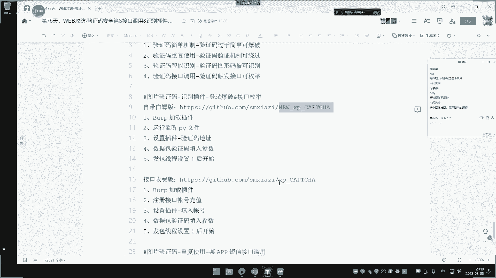

然后呢还有款还有一款的我用了一下啊，说实话啊，那两哪一款呢，真的是。

不行啊，用的时候特别麻烦，事情特别多，就没有讲那款。

我也懒得说了啊，以前介绍过，就那个叫这个。

下面给他看一下啊，用起来蛮麻烦，还有这个啊他也没更新呢啊，用起来蛮麻烦，我就没用了啊，就这个你后面的你想试的话可以试一下，我用的是这两个啊，这两个呢都会给大家简单演示一下，一个是个白嫖版。

这个白嫖版呢就是简单的啊，不是很复杂的，就是那个图片呢，因为有些验证码他都看都可以看到，比如说我们像这里啊，你像这种验证码，这验证码呢你得看一下，这验证码呢是写的很清楚的，一目了然。

他能够看到说把这个验证码的一个是吧，写的这种东西，那还有些验证码的话，我给你看一下啊，随便找个这种就拿着网下系统，这很多有啊租车的地方一般都有这种东西，啊你看这种呢这种呢就稍微模糊一点。

他这个验证完了就模糊一点对吧，就是有时候那你有时候你自己看的话，都会有一些会看错的情况，就是有时候他在那个字母中间加一些东西啊，看上去那就会把一看成七压或那种情况发生，你自己人工看。

你都看看着容易出错的话，那那用插件识别的话，肯定也会有这样的问题是吧，啊像这种呢也是对对，有有有那种这种哎这种呢就稍微模糊一些，像我们说的这种对这种就直接很娘，就看这一看就知道他也没什么干扰东西。

一看就知道是啥东西啊，有些呢就是纯英文啊，这里呢他还是有这个这这个是纯数字，那有些呢就是英文加数字啊，各种都有不对，还以为是英文加数字的，这个就是英文加数字哎，这个也是全英文的哦，有没有数字啊。

我这里有数字啊，这个英文加数字，好我们再给大家举这个例子啊，我们先来看一下啊，这个白嫖版和这个收尾版，那两个我们都给演示一下啊，收费版就是花点钱，它的识别识别率呢要高，然后呢他支持这种复杂的。

就是比如说复杂的就是我们说的啊，就是可能这个图片呢你人工看都容易出错，那这个时候啊，你如果用那个白嫖版的话，那个识别成功率的就可能达不到这个是吧，达不到九成，达不到九成的话就有点低了啊。

一般成功率要达到九成以上，那还能用达到90以上，那就不行，就90%以上了，真正正常来讲的话，这个一般都要达到98%，那就是合格的，达不到的话就不合格，我们再看一下啊，来先给他说一下。

这两个的下载就不说了啊。

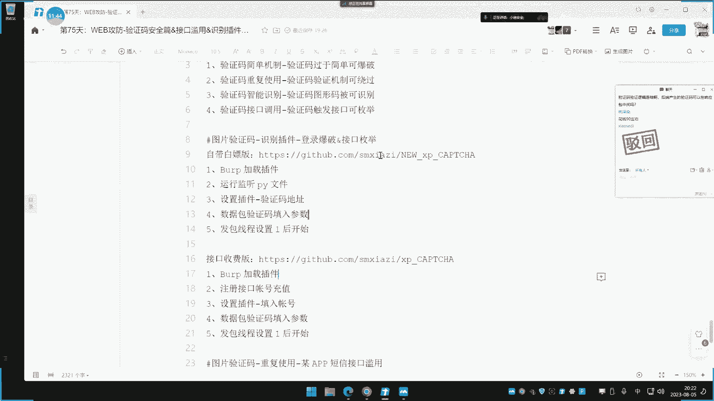

下载自己上面下，我也给他打包了。

但这两个都有个缺陷，缺陷就是说只能搞图片的啊，如果是什么滑块那些东西，那都搞不了啊，搞不了滑块的要另另外的方法啊，滑块的还要分类型，有些类型能行，有些类型它不行，我等下说滑块的啊。

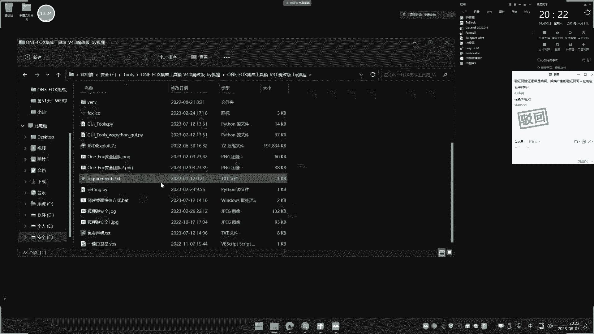

你跟人说还有一种还有那验证码，验证码什么要你自己点图片的啊那种，那就不用说了啊，那搞不了搞不了啊。

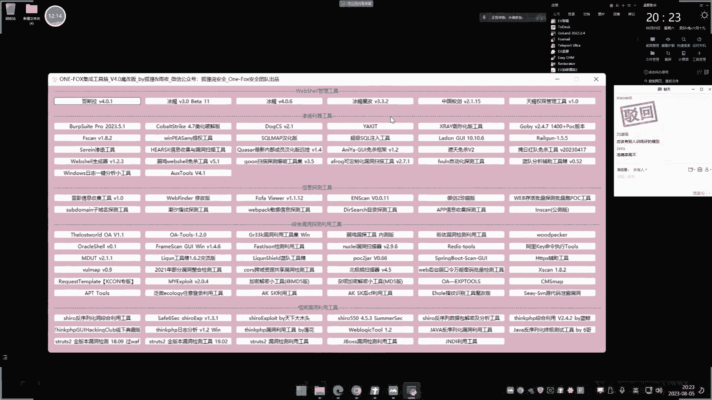

那那如果能搞的话，那这个因子嘛就没必要。

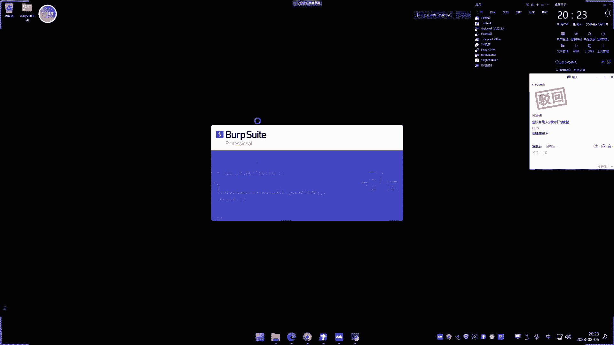

是没必要有这个基数了啊，你看一下啊，这个茶几那个加载用的，这是讲了不下很多次了，这个这里啊来我们给它加载进去啊，这里已经加了啊，等下重新加一下吧，先把它先给大家都是删掉啊，先给他删掉啊。

删掉之后重新给他加一下啊，就这个这个还有个这个呢这三个是吧，先弄个删掉啊，我怕有些人连这个东西的一个是吧，用呃怎么加进去都不知道啊，先加啊，加了选择java了啊，他给的是java包。

找找你那个放的目录啊，然后呢先加载这个啊，这个呢有个JDK8和JDK16的啊，根据你自己的一个当前你电脑的一个环境啊，一般都选JDK8是最好的，兼容性最好的，他选中啊啊下一步如果没有报错的话。

就用这个啊，报错了就用那个GDX死流啊，如果都报错的话啊，那你就在电脑上面装一个这个，GDX8和JT16了啊，好像是选错了啊，然后你看这个界面。

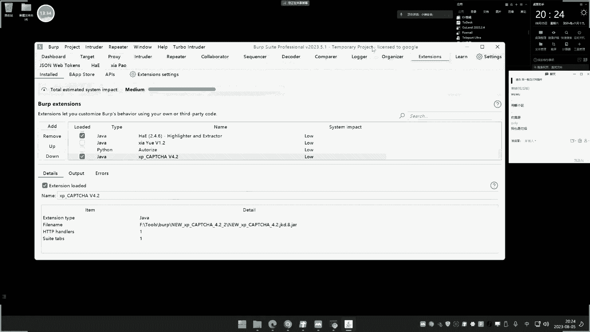

那就有个这个叫这个场景就出来了吧，那这个场景就出来了，然后呢这个搞完之后，第二步要做什么事情。

第二步呢就运行个PY文件啊，这个啊我也考虑到有些人呐他这个基础差。

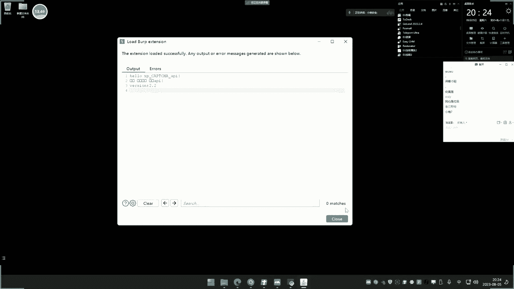

啥也不知道，所以我特点呢在那下了个环境包在里面啊，你直接把那环境包啊啊打开，就是环境帮你下好了啊，你直接这个在这里面呢，这里有个这个来那个python3。6啊，然后这里有个运行。

直接运行这个运行就可以了啊，就不啥都不用下了，你自己把这个包一解了，运行这个运行这个pr文件自动运行了啊。

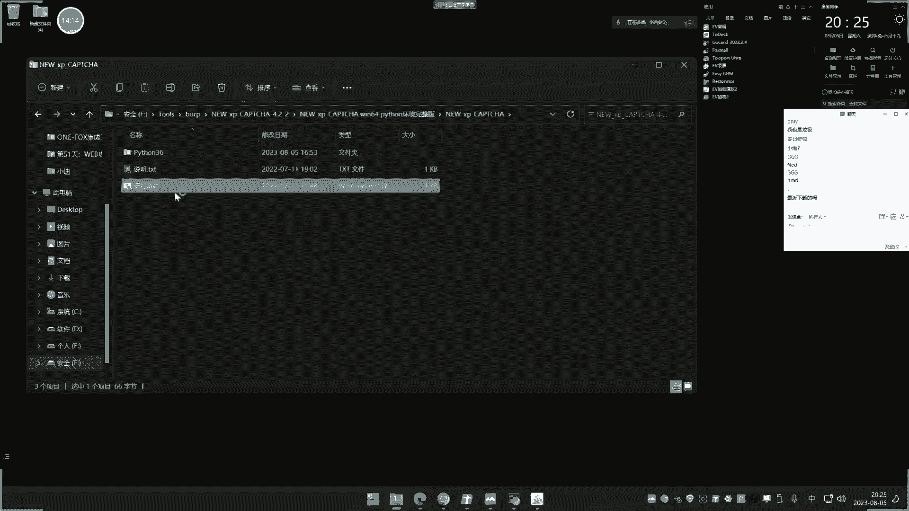

就是用个Python去运行它，因为里面要装哭，有些人可能有装的时候也会有麻烦是吧，装不上啊，所以打开之后呢啊这里就没有报错的话啊，这里一直等待状态，那就OK了啊，那不管他了，然后你看一下上面啊。

上面有这个提示啊，加载完成，请访问这个本地的什么8899端口啊，就可以了，如果说这个端口被占用啊。

你就把这个端口的进程把它结束掉啊，如果说你又不会结束，那怎么办呢，对不对，就打开这里有个文件，这里有个叫SERA点PY文件，把这里面的代码这个8899改成其他端口啊，如果说端口需占用，你把这里改啊。

改成一个其他端口，然后再运行啊，这不用多说了啊，这个都不知道。

那没办法了啊，好那这个鉴定好之后呢。

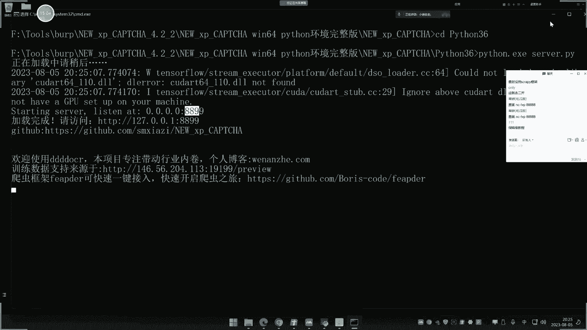

这边挂着不动了啊，不管他了，然后呢你可以看一下啊，在我们这个本地呢就起了一个889端口，这个呢就是他的一个应勤的情况，打开我们看一下啊。

什么情况，打开了啊，这就是那个查询那个界面啊，查询界面没看到啊，现在是啥都没有，那现在呢我们就用它啊，它的用使用方式呢。

就是先啊设置插件的验证码地址啊，这如何用啊，来看一下啊。

我们这里呢比如说像现在啊我们就测试一下啊，比如说这里有个这个验证码。

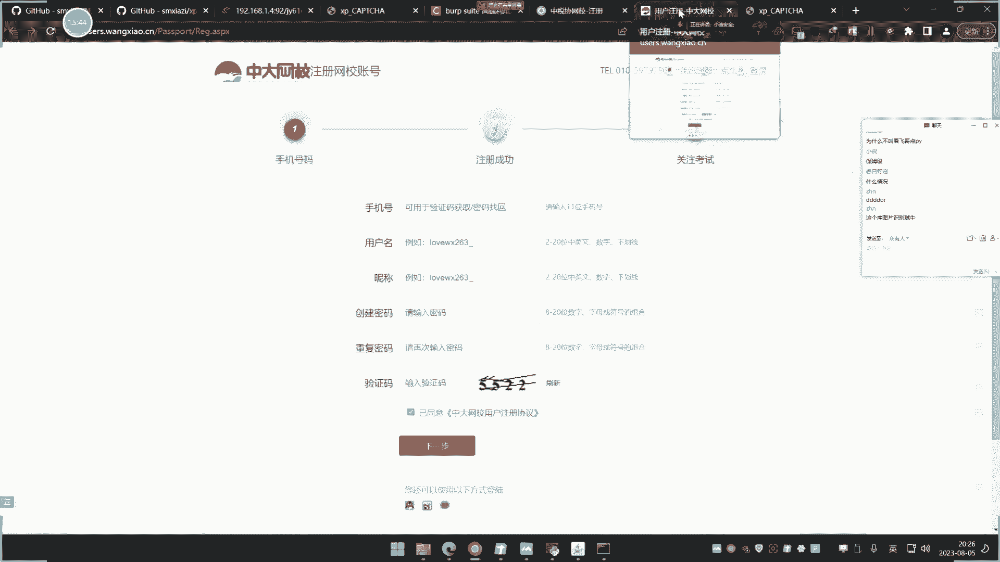

对不对，我怎么帮啊，大家看着啊，我抓个包来，我把这里点啊，点它就会触发这个东西嘛，你看我点它就触发这个东西。

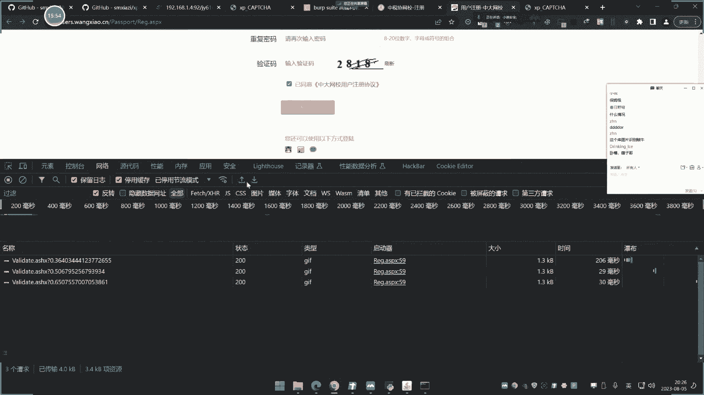

你看这是验证码地址嘛，那你这里呢可以访问一下呢，访问这个地址啊。

你刷新它就会编码，你看啊这个验证码地址啊。

你要知道怎么把这验证码地址拿到啊，拿到的方式就是我刚才讲的啊，点验证码直接抓包啊。

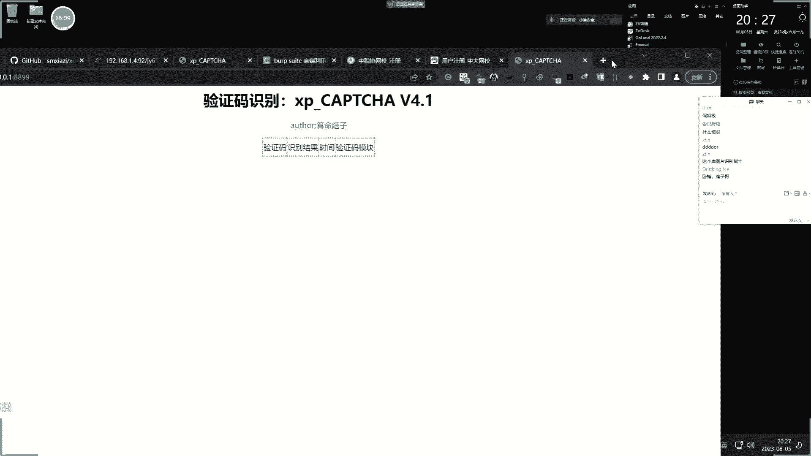

直接抓包，这是最明显的啊，这可以再看一下，你看这个也是一样，道理呢，我在你那找个B点点嗯是吧，就那个验证码地址啊，有的呢是一长长一大堆啊，其实也不要紧啊，呃地址比较长的，你像这个啊。

我点了他地址特别长是吧，你不管它，你就是可以把后面参数把它忽略掉。

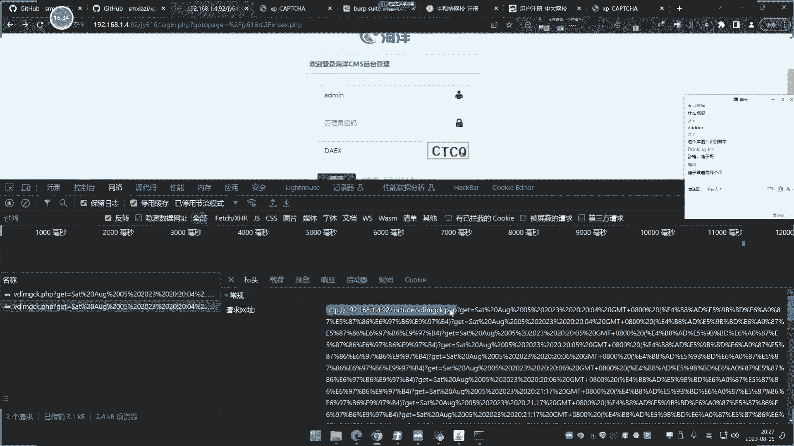

因为有些后面参数不重要，你看看这个是也可以啊，对不对，好，这就是我们说的那个啊验证码地址啊，把找到找到之后啊。

这个呢，就是你刚才那个开放的那个本地的八九端口啊，要注意啊，开放之后呢，你尝试访问一下，访问是这个界面，那就OK了啊，到这里就OK了，然后这里有什么几个接口啊，你这里随便挑个接口。

比如说我这里用验证码仪的接口好。

我就把放进去写进去，前四后啊，接下来该怎么办啊，点一下这个地方啊，这里有个叫什么启动这个inside的监控啊，监控整体啊，你不管它，你就全部勾选就完了啊，点一下保存，设置好证明的就要亮了，红了啊。

这面也红了，就说明已经保存了，你看一下啊，他这里有个说什么使用关键字瞎跑，艾特一这什么东西呢，再等一下，就是把数据包要进行验证码提交的地方，用这个东西来取代，那么这个插件呢就会在那个地方呢去识别好。

这里呢说了这么多，大家也不太清楚，我们还是演示一下啊。

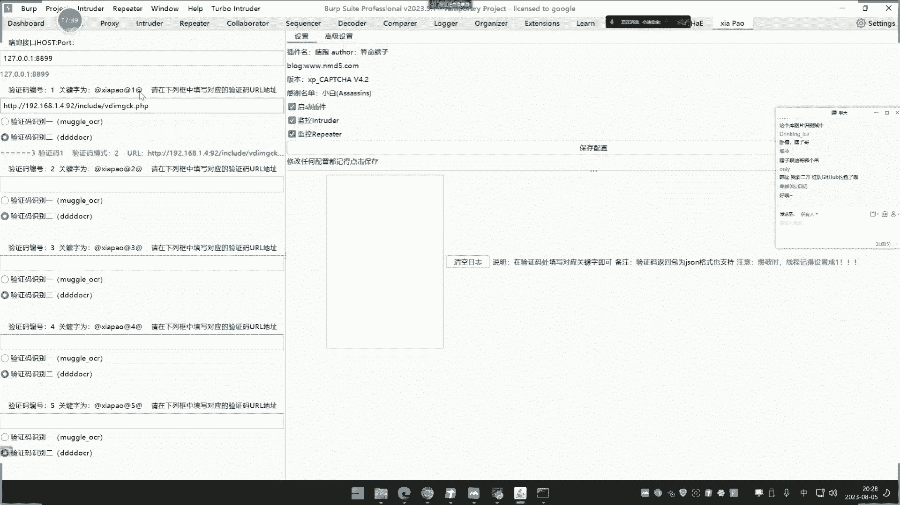

好接下来呢我们来看一下啊，比如就拿这个包括压就很简单。

像现在呀我们这里，比如说我要尝试去包括这个后台，但这个后台的账密码呢，每次登录都要都要输验证码，验证码也不知道瞎是什么是吧，所以说你肯定是要先每次发报的时候，那就要识别一下验证码。

识别之后呢就是账号密码，验证码三个同时发送，每一个是吧，每个都要保证是吧，正确的包才能正常打手，这里呢抓一个包，就把这个数据包给他抓到，随便输个密码啊，然后这里呢就点进去啊，点登录好。

他就说验证码不正确是吧，这里不管他正不正确啊，A e c i，咦那我这里呢把包抓到啊，监听一下，把包呢抓到啊，提交好，对，包抓到了这个数据包抓到了，那么我们来看一下啊，来这个是我们登录的账号。

这个是我们登录的密码，PW等于一刚才输的密码，这个是什么，是不是就是验证码呀，这个是不是验证码啊，对吧啊，你可以说这前面是什么呢，这不管它啊，这自带的就是每次登录的都有这两个东西，不管它。

那这个如何代入验证码去，包括呢，就说你以前没有验证码的话，你就只需要改变这个密码，或者改变这个账号就实现了爆破是吧，但现在有这个验证码，你要改变的就是说一个是密码，还有一个是验证码在改变这两个东西啊。

你看说哎呀，我账号也改，账号改了，那是另外的话，那那不重要哈，因为账号改的话，那你把它发到这个encode模下去啊，这个自定义模块下面去，然后发了这模式加进去呢，你就说呢先把一清除，要改谁。

你就把它加上去啊，比如说我的账号也要改，我密码呢我也要改，对不对，然后在这里设置payload，那第一个参数不是有两个吗，啊账号和密码呀啊把它选中这个模式了是吧，自定义模式啊，第一个啊。

然后就是你的支点支点，那就，载入一个，比如这个top500的是吧，这当做第一个变化的好，再选择第二个，第二个呢也要重新再载入同样字典啊，那就是501×501嗯，25万个可能就是500一个账号。

500一个密码啊，总体大概就是25万个好，也不要问这种私情了啊，就不是会说哎呀我这个账号也要改密码也要改，不知道怎么操作啊，我现在就搞简单一点啊，就账号固定密码不把它当做了一个好。

这个密码呢就把它选中嗯，然后在这边呢就直接把密码字典呢就用这个吧，是吧，满值电解决的，然后呢密码呢是艾米满，密码是艾米啊，我的这个密码是艾米啊，这个字典里面的也不知道有没有AR密。

反正我填个正确的密码到里面去呃，其他的不用管了呃，然后你可说哎呀，那这个验证码怎么办呢，那然后把这个地方改成验证码的，写F叫什么艾特消好at1啊，改成这个东西是啥东西啊，看怎么样啊。

看插件哪里来用到模块一就改成呢小抛at1at，如果是用这个啊，就是你把这个值写到这里的话，就用小抛啊，小号艾特RR3，那就是用这个能理解吧，好不难啊，用这就是你把那个验证码地址写在这里了啊。

你用这个写这里的话，就用这个啊，好就把这个验证码这个地方呢，哎不知道在这个在这里面，在这个里面啊，看把它改成这里好，那么现在改完之后还最重要最重要的一件事情，我这里呢是用的新版的Buff shot。

以前的老版在在这里呢很简单，点击设置在这个地方呢就有一个线程，以前老板是这里有个线程的啊，老版本是有个现成的，但是新版本线程呢它不在这里设置，它在哪里设置啊，他在这里，他这里设置默认线程是十线程。

就实线程就说一次发十次，这个识别插件呢就只能单线程，为什么叫单线程呢，很简单的道理啊，它是每请求一次识别一次，如果你搞十线程的话，那可能就是一次请求十个，他那个烟字嘛就会戳烂，就会戳烂，就说他接受十个。

他不知道现在识别的是哪一个请求的数据包，知道吧，就这个意思啊，所以说这个插件的话，你就必须在这里呢要把它搞成一个线程，新版工具，不是在这个地方，老版的巴布数的，是在这个地方有个那个直接设置的。

非常简单方便，但是新版本的是要在这里设置，然后这个呢又是个又是个这个英文版，所以有些人看都看不懂啊，老板们就是直接在这里啊，有个那个直接有个现成的个lo lo t h r e d s，哎我可以看一下啊。

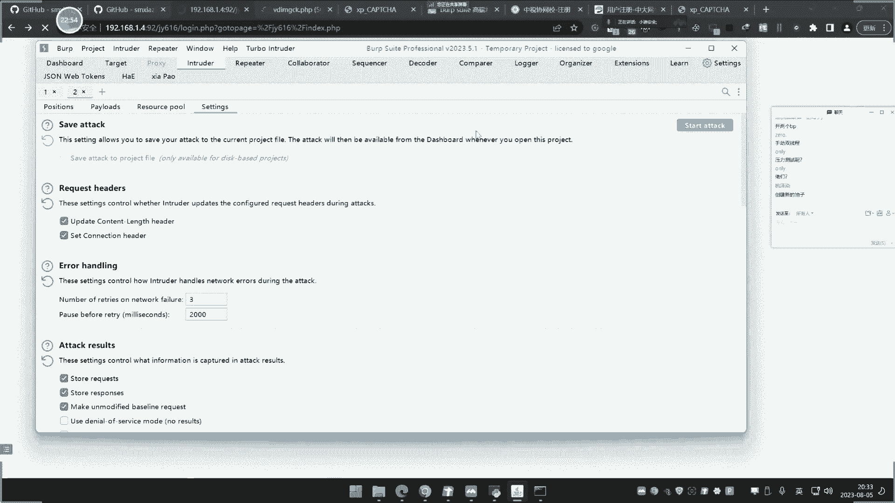

老板们还简单实用一些，不过现在大家都用新版本了吗，那我们就抛弃了吧，是吧，这老版本的啊。

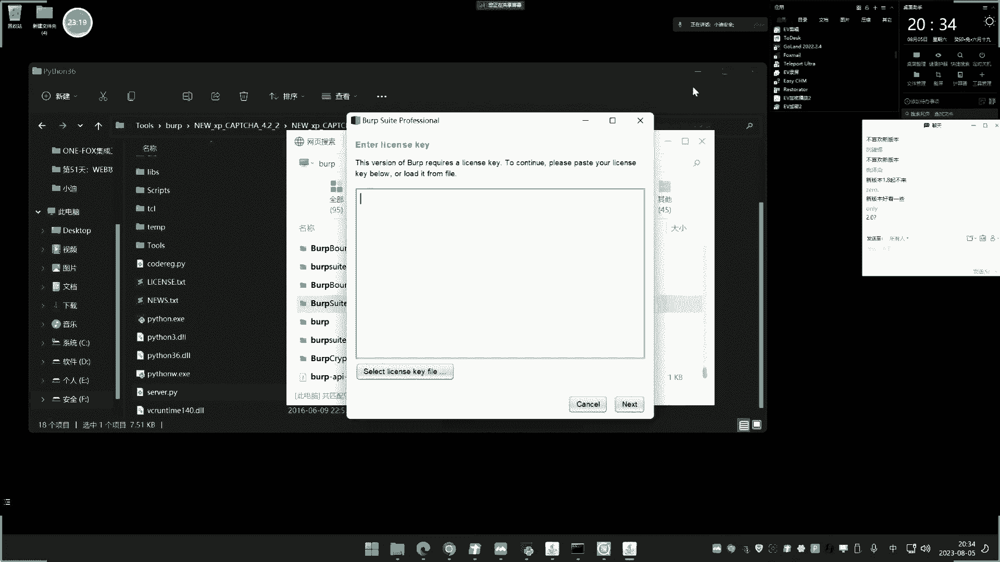

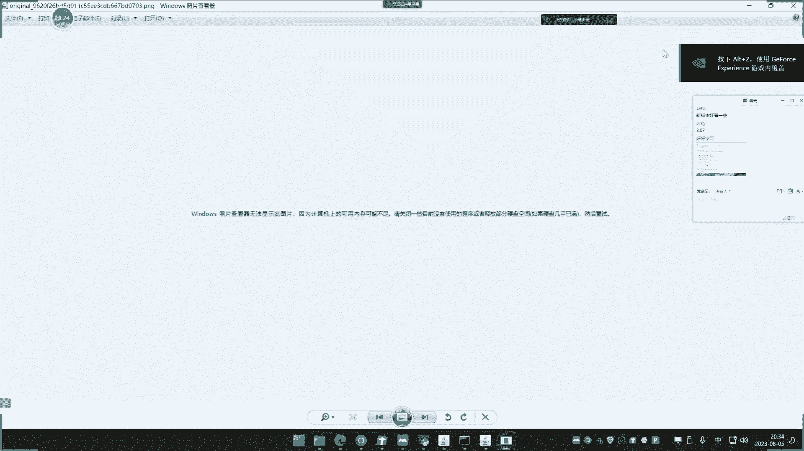

看都看不了了发发，来这是老板们啊，大家看一下啊，来他这个叫number for twice，这里啊就是改成一就可以了啊，如果是老版本，你这改一啊，我这里没有新版本，不是这个界面啊，希望不是见面。

对不对啊，不是说我吸啊，这个我告诉你没办法的，因为有些东西你不把它讲清楚，有些人他你把他讲的很细致，他下去都会忘记，或他压根就快进，听了他他自己遇到问题的时候，他就问你。

你都讲过的，他自己不拘于他就能浮现，就出问题，他就问你啥情况。

没办法了啊，我是说我讲细点，你下去少问，少问我问题了，好了就在这里设置啊，这里怎么设呢，来这里设置，我建议大家呢就说在这里设也行啊，还有一种方式呢就是在这里啊，这个选项这里徐阳这里呢有个这个第一方。

马来就是我们说的那个设置，那个呢test就这里呢request pose在这里呢也可以设，这新版本呢在这里加上去就行啊，那在这里呢也行啊，我们就用这里把它点击great，然后创建个名字好。

我们就叫开始尼吧，好这里呢有个叫master什么client request，这就是最大请求这个次数啊，就类似线程数和这个一样，下面这个就是说请求之后呢延不延迟的意思。

就是说呢延迟请就是两者之间的这个请求，包了个延迟，有三种模式是吧，这种就是fire fighter，然后还有rs rounder，还是随机延迟这么多啊，你自己翻译一下啊，我也不勾选这个了。

就是写这个一就可以了啊，就是是吧一次啊，嗯然后呢把这里选中啊，选中之后啊，现在现在那就可以了啊，这样子那就保证它是这个一次了啊，我们点击start article啊，或者说在这个地方呢点击也行啊。

那么现在呢他就开始跑了是吧，但是大家也可以发现啊，他这个跑的好像来酸奶，嗯大家关注一下啊，看这个跑完之后啊，你看一下这个验证码，这边呢在这识别的结果，这是大家请求这个识别结果啊。

但是大家可以看到这个好像有点问题，什么问题啊，来37秒零六秒钟，一次发了多少个在里面呢，这不是一次吧，有这么多次，所以说，这里呢就跑跑跑跑卡了跑卡了，这啥情况呢，重新再刨一下啊，我看这里设置是你哪里看。

他以这个默认的十个在跑，没有选择下面这个，所以我刚才这里呢要把它勾选上，刚才是点到上面去了，然后勾选上啊，用这个勾选上再来啊，你看现在就是一个个请求了啊，现在就一个请求了，我们等一下啊，他这里有点慢。

刷新一下啊，嗯怎么还是这么快啊，唉这个上面东西也是，有日子我搞这个吧，设置一下看一下，设置点击前一秒钟试下，算了，哦这个有延迟还是看上去好点，嘿，这延迟也延迟太慢了吧，那不用延迟吧，随便取个名字。

这个新版的个鸟毛延迟啊，这个我知道个咋设置设置，他妈的烦死了，很真是十子了，有时候没削啊，这实在是没生效，哎呀，也不知道啥情况来，他一下子在就跑完了，你跑完了你可以看一下啊，看有没有成功。

看究竟是不是速度快了，还是说有没有成功，我们可以看一下啊，开这个长都啊，这是他那个找艾米的时候啊，他有没有成功就完了，你看看这到2米的时候呢，它的提示是什么，验证不正确，那就说明这里没有成功啊。

验证没有成功啊，你看这个enemy是正确的密码，但这里的验证码提示的是验证码没正确，所以说这个验证码没有识别成功，并不是说接口有问题啊，就是你发包过快，其实那个一下子发的太多了，所以他混乱了。

就可能说这是他识别这个666密码，那个验证码的时候能识别到这里来了，可能会有这样问题属实，那个京城啊一定要搞对狗东西，这搞了半天也不知道啥情况，死死都不行啊，哎呀真是无语，三在三四下，那他还是这么快。

新版本的，说实话这个线程我是真用不明白啊，找不不知道是啥情况，这个是延迟啊，改了跟没改一样，把这里改一下就成功失败，这里把它改一下，看看是不是这里问题啊，等下载，用的还是这个。

但是你看看他还是还是这么快啊，我知道那个是毫秒，那个是延迟的，不是那个相关的啊，我是让他先程输调子仪，这个新版本的，不像那个老老版本的，直接在上面调就可以了，但是太快了，这个新版本县城在哪调。

我到现在都没找到个地方啊，你们有没有知道那个线程在哪调的，我希呃我用那个老版本用一下啊，就是这个这个这个不行了，太麻烦了啊，我关一下我用的老版的啊。

老板们直接看就看出来新版本的英文，用的还不习惯。

还没用上头啊，换老板试一下，是那个地方，我没有说错，但是怎么设置的，这个老版本的看一下，这用老版的先试一下啊，先把搞成功再说。

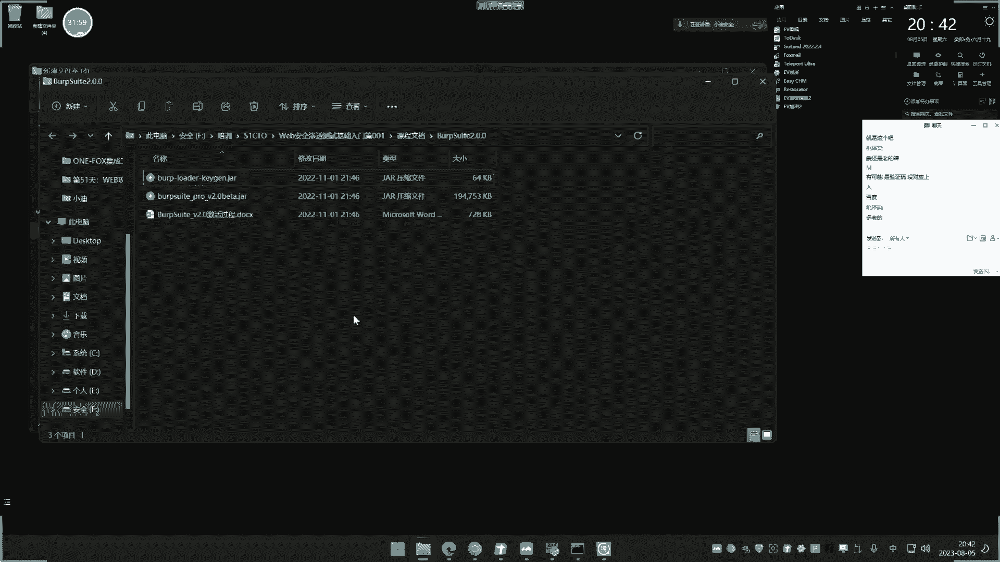

追打并发数是我舌质疑啊，我设置仪没用啊，你刚才看的啊。

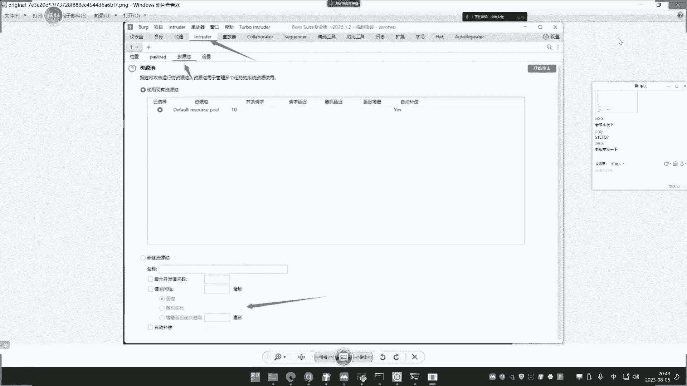

第一个就我知道是个线程数啊，一个设置没用啊，他还是那么发，这个JAAJDK的1。8版的java，没有老板们的啊，那我们先把用成功再说啊，我用也可以，我也不知道，有时候他行，有时候不行。

哎呀蛮不清楚那个新版本的。

新版本就是我那个设置方法，你不用看，没有搞错啊，他为什么会出那个多线程，不清楚，说实话真不清楚他这是啥情况，时好时坏的东西。

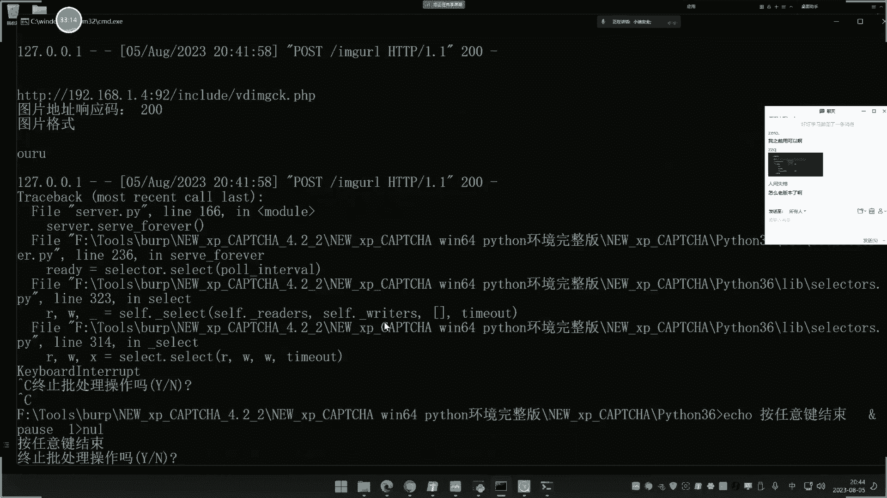

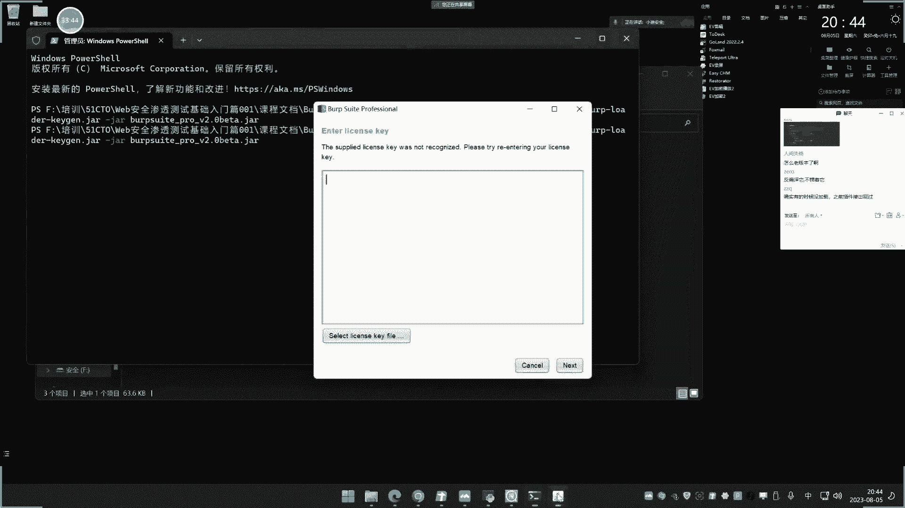

那新版本哎呦，老版本啊，先把老那个事情把这个解决了之后呢，我们再来看这个问题啊。

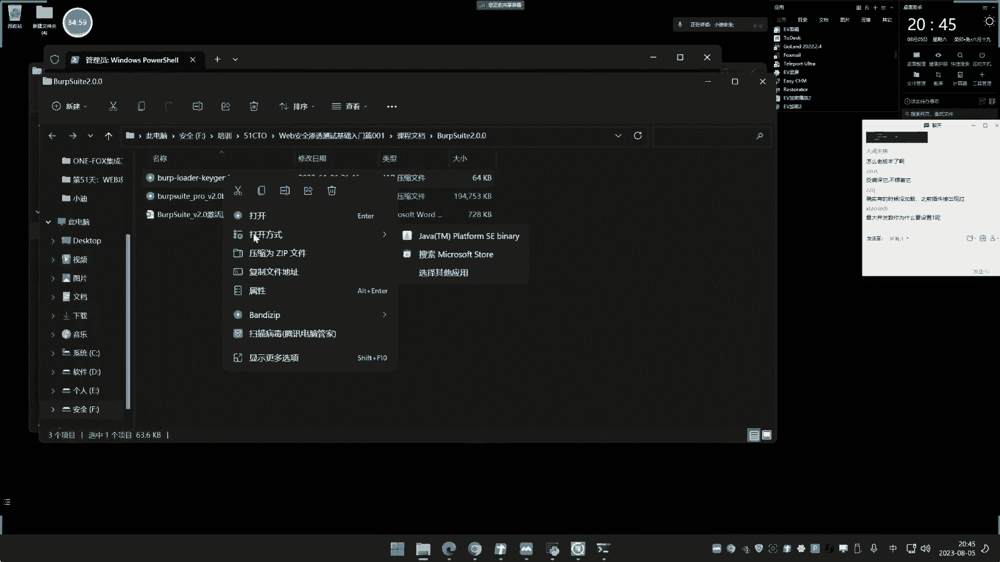

每次搞这个老板们用的时候都要激活一下，唉好我们看一下啊。

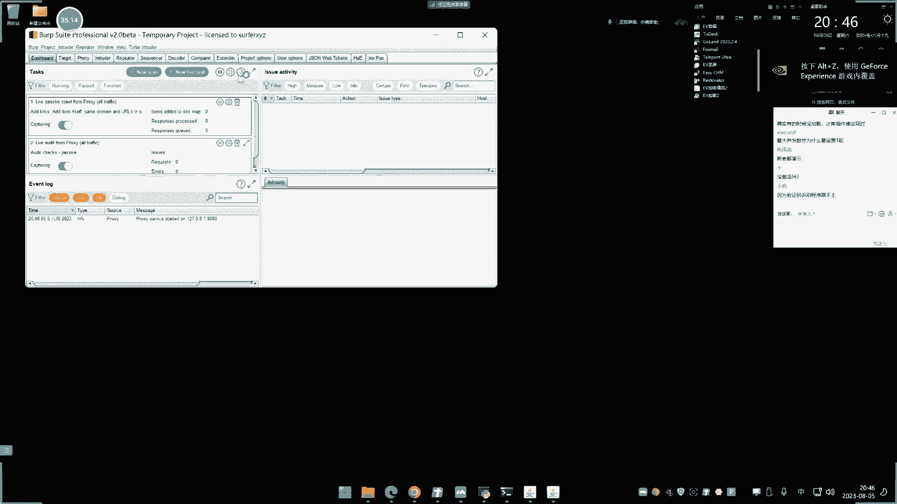

这老板们啊。

然后我们这里也加载进去了啊，还一比一模一样的啊，这没什么说的，那我们把那个地址先搞上去啊。

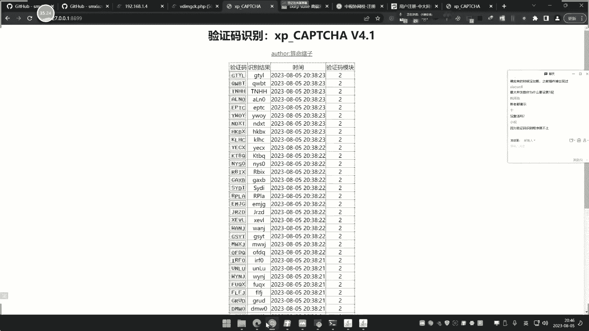

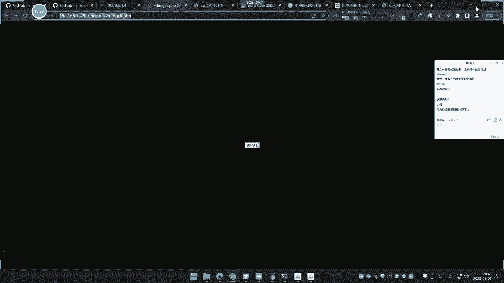

保存好，那这里呢就抓包呃。

然后刚登录的地方找到啊，这里刷个包，登录，好数据包呢抓到了啊，这是那个登录的数据包，在这里我们发到这个INCLU下面去，想不清楚，这里呢就是他那个地方嘛是吧，改成这个alt，然后咦艾特。

然后这里呢就改成那个字典，啊然后随便找个字典啊，就这个top500的吧，找进去加上正确密码那里嗯，在这边呢，你看这线程嘛是吧，直接改成一啊，直接改成一。

然后把这个。

插件那个地方插件那个地方啊，把它开起来，就那个Python文件啊。

刚刚说了，用起来那个监听到把开起来，现在来刷新一下啊，现在是空的啊，啊现在发包了，就这地方也搞好啊，刚才已经重复一遍了，不再啰嗦了，直接来跑啊，你看现在他是不是一个一个跑。

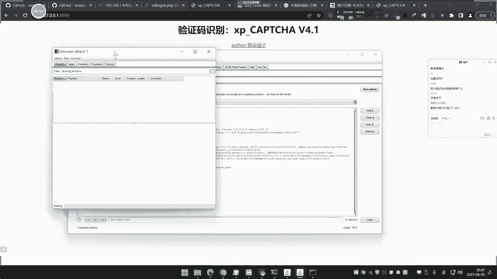

好等一下哦，还是有点慢，侠宝鱼21201仙子，bug比较多吧。

好我们等下跑结果看一下啊，看能不能跑出来，这边识别东西在出现，但是好像还是十秒钟再一次啊，等一下啊，先看结果，把结果看了再说。

唉这尼玛这鬼我直接用。

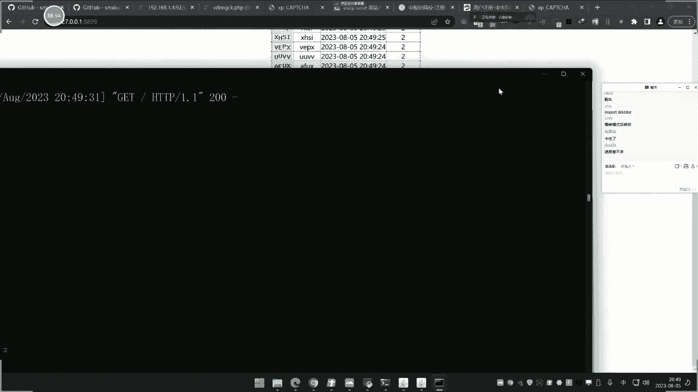

先把收费的那个看了再说吧，用那个收费的啊，还是用新的吧，这个老版本说实话。

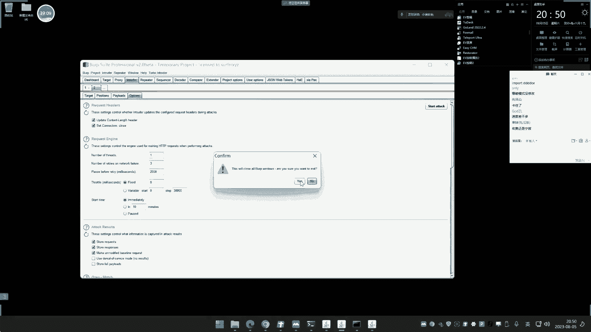

这就那个鸟样，设置简单一样的事情，直接用那个苏菲的啊，他这个集火有冲突，你刚把这个激活，那个就有重新激活好，我们把收费的用一下，我先不用这个白嫖的啊，收费的我看是什么问题，加上收费那个插件。

收费的是用这里啊这个啊这个啊就这个啊，这个叫API的，然后这里呢会在这里去注册个账号啊，这里呢我们就注册上去了啊，来这注册账号我们不讲了啊，这上行号租车就那么回事吧，我充了一块钱，除了快钱啊。

一块钱识别识别的一个细，识别这个东西多少个呢，你可以看一下价格啊，嘞普通的一块钱可以识别500次嗯，我充那块钱一块钱，你们得共享，他妈的值一块钱，出不起啊，然后这里那就填写，填写这个信息啊。

这个账号密码啊，就是你这个这个上面申请的啊，造密码造密码都是一个登录，他提示我了，现在余额还有五毛，五毛钱，还有213次的次数是吧，然后这里那就写了个编号地址和余号地址，对不对，我们就用那个地址嘛。

哈就这里的这个地址对不对啊。

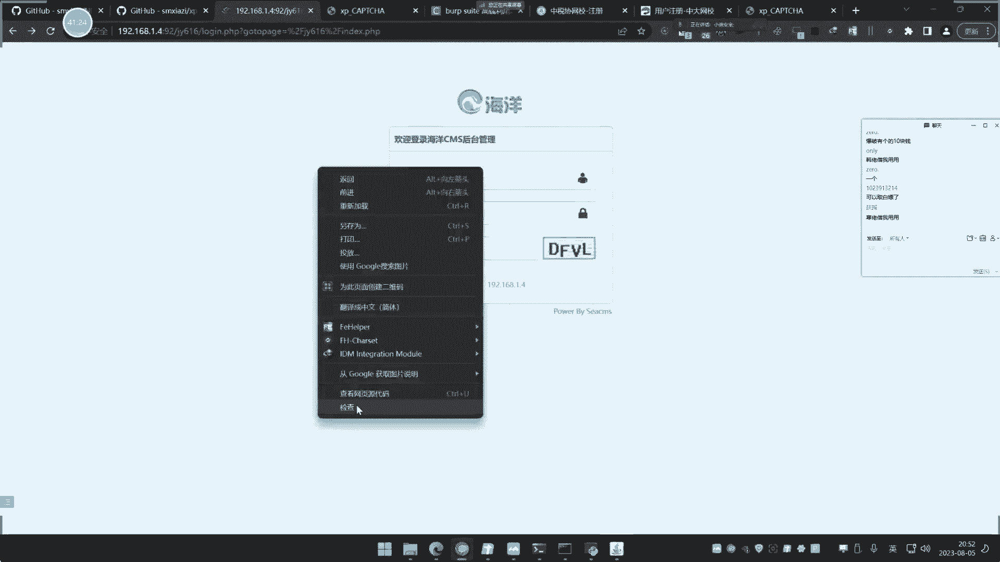

找个包，就这个地址嘛啊。

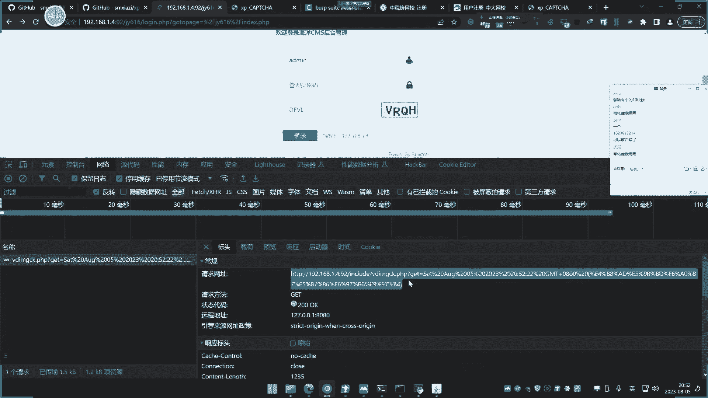

就这个地址啊。

好地址呢放到这个地方来，点击一下保存好地址，设置完了，现在上面的支付呢变成瞎跑，API艾特一哎，一找个登录包。

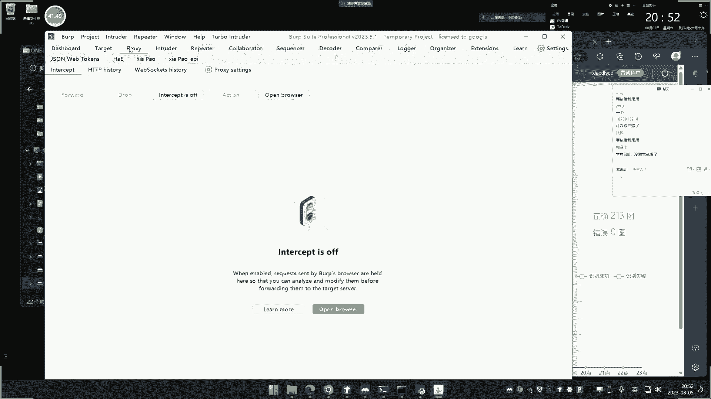

随便输，是吧。

点击登录把抓下来抓到拔到这个膜下面来，然后这里呢是你的改变的地方，这个地方就改成艾特侠跑下划线API alt12T一，这改的地方呢就和这里对应上啊，和这里隔应上，把这个地方对应上，好改好啊。

改好了就设置字典了啊，支点那就是改这个地方了啊，支点我们就，载入一下吧，这里呢我们就先这样子啊，我找了个地方。

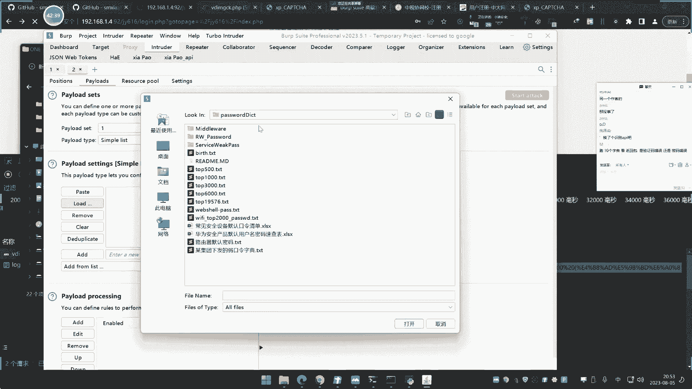

找了个支点那个地方啊，我吧因为只有200多次啊，我那个密码呢它有500多种，所以我怕他这个把次数跑完之后呢，还跑不出正确密码，那就尴尬了，所以我把那个密码呢把它提前，我密码也不提醒啊。

不是说我想吃少一点，我是怕有些人他喜欢温，知道吧，待我密码提到这前面去吧，那个密码写到前面去保存下，因为他那个密码里面没有艾特密啊。

都写了，最后面那500多个了，到500多个，那个没有了，提前那这个争取码了，再在哎哎我真去密码了呀，什么鬼啊，A宝全。

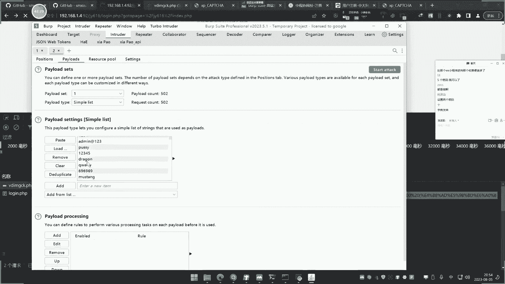

enemy没看到啊，哦在这里面在里面啊，在这里对好，看到了好，这里呢就是还是按照我刚才的逻辑啊，妈的也真不知道这里是为什么情况啊，搞成一好吧，你妈的真是搞不清楚这边的这个失败次数，我不管他了，来勾一下。

来看一下行不行啊，然后我先看一下我这边的一个接口啊，这边其实也可以看到，就是等下的这里有个日志啊，也可以看到他这里有日志，当然你也可以在这个官网上面看到啊，我打开官网看看还是官网啊，然后这里呢你看啊。

现在的一个识别统计这明细啊，那这是那个时间嘛，下午测试的我们先把它开起来搞一下，你看那在东啊，那在是在东看这边来看一下，那他也在东来，就刚才嘛是吧，那再识别啊，我看它跑到20米的时候。

是不是就不一样了呢，这识别的结果嘞，就用他那个插件啊，这这个这个接口实的，在这个有啊好，我们现在来看一下，这里已经是报问题啊，然后看一下这里那个艾德米的时候，是不是不一样啊，数据包我们看下啦。

这是前面的啊，我看下到艾米的时候，这也没成功啊，这报了什么村奖验证码错误，那还是那个线程问题还是线程问题啊，不用跑了不用跑了再跑，你妈输都没了，现在还有100多次了，那说白了啊，黑值全部都没有问题啊。

现在除了问题就是个线程问题啊，除了现在问题，因为识别上呢你也看到啊。

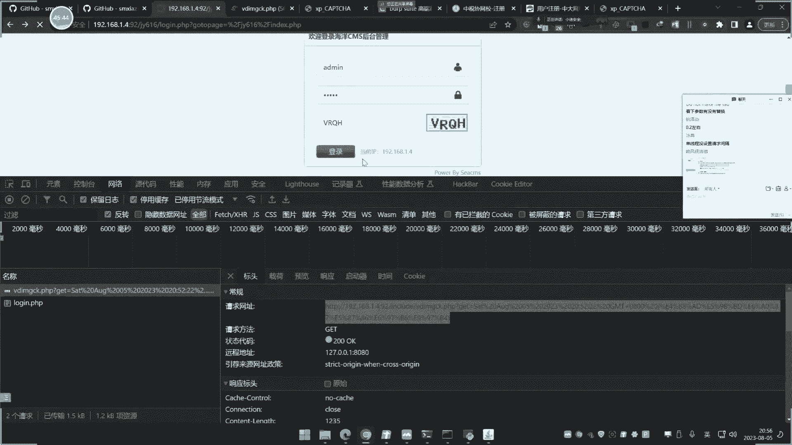

这个识别正面识别正面呢都是正常的，识别呢都额正面你也看到了。

只要识别这个结果里面啊。

识别的结果里面那都很正常，就是现在那就这个线程问题啊，并发还是一，你用延迟解决下这个，延迟解决试一下啊，哎呀这个鸟毛事情啊，完全不知道啥情况，老这样搞这种事情，这个是1000ms，我用一一百毫秒延迟0。

1秒，看一下啊，行不行啊，这接口都不能这样直接再搞了，现在稍微慢了点啊，稍微慢了点，稍微慢了点，好这里我们看下这个识别的这个情况啊，我们先看拉面识别这个情况，来看这里来，呃正常识别的情况呢。

这堆的啊都是堆的啊，这没有什么错误的，看看这个识别的结果，这样出现高了延迟之后就好一些了啊，高了延迟之后就好一些了，就发包的时候能延迟一下，艾米的时候你看啊长度啊，我们看一下，把长度一一勾。

那ADD me的时候，你看长度变成1294，看的返回是什么，返回是成功登录，那就是他嘛，对不对，爆破成功了，这是那个接口的啊，我们就不搞了啊，这个是那个收费的，但这个速度非常慢啊，速度非常慢。

因为搞延迟的，所以说刚才失败的原因也很明显，就是他娘的这个鬼东西啊，他不知道咋回事，啥姨啊，他只偏偏搞个死妈的，我把颜值搞小点搞死吧，不搞100好吧，我再用刚才那个这个插件的好吧，我再换那个网下面去。

我再重新在这里搞那个那个裁剪的，就不搞接口的，我用我那个白嫖的，用白嫖的，用白嫖的吧，告白嫖子，延迟十吧，这是好，真是毫秒啊，100就是0。1秒，选中我们看这面，现在目前这边呢哎接口怎么坏了呀。

结果把关了吗，关了重新把它开一下。

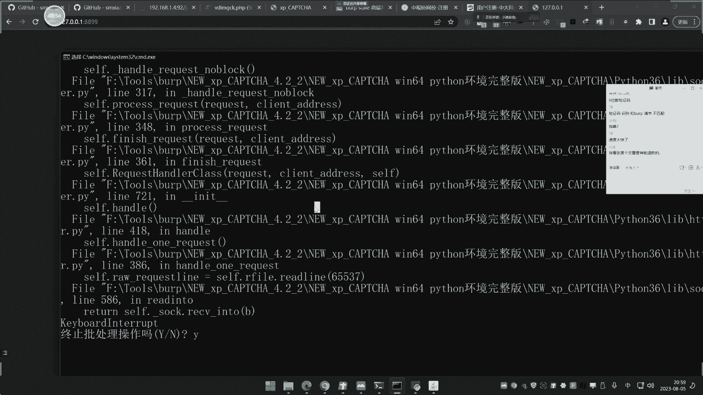

重新把这个接口这个启动文件开一下。

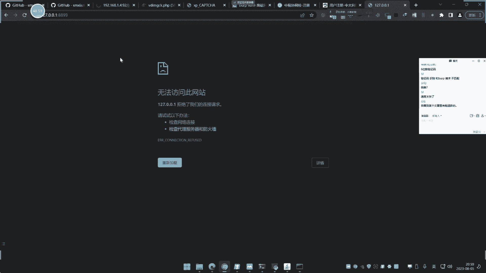

好现在开了，那么来到这边啊，这个这里啊，把那个请求的地址吧配置一下，保存好，结构监听上用的是个瞎跑，艾特一，那就是用这里嘛哈，最近上号呢用的是这个呢瞎跑，不是用那个收费查询，收费查询是那个加API的。

好的点，那就用这个啊来看咆哮啊，赛好，好这里呢又卡了，的，你说这也是啊，这个卡有时候是正常的。

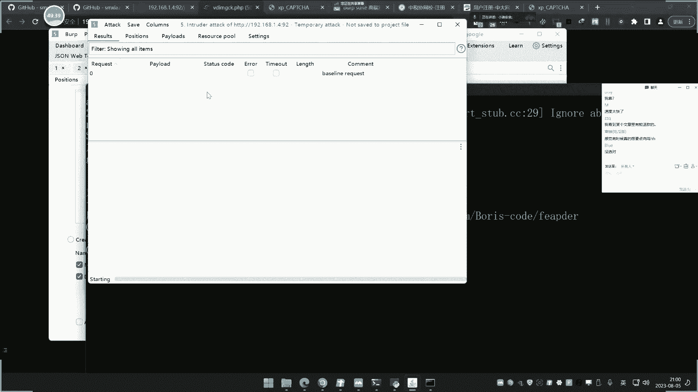

他有时候要停一下，也不知道啥情况，我反正感觉是这个插件问题，还是好像有洞啊，来有，但是很明显大家可以看到啊，这有点快，卡德米的这个结果，那成功了啊，12041294，这里的成功了，来成功了啊。

识别的结果在这里可以看到，这是这个白嫖版的啊，我看这个成功率，你自己可以对比一下，这个对不对，估计成功率应该是在98%以上吧，识别的结果啊，这应该都对的呢，这是他画的这个获得的图片。

然后这边是那个识别结果，好这个就是我们说的这个插件的一个识别啊，利用到爆破的一个选项里面去的一个操作，但这个识别那是仅限于图片的验证码，图片型的我们可以用一下啊，用到接口枚举里面，这个验证码识别。

用到接口枚举里面。

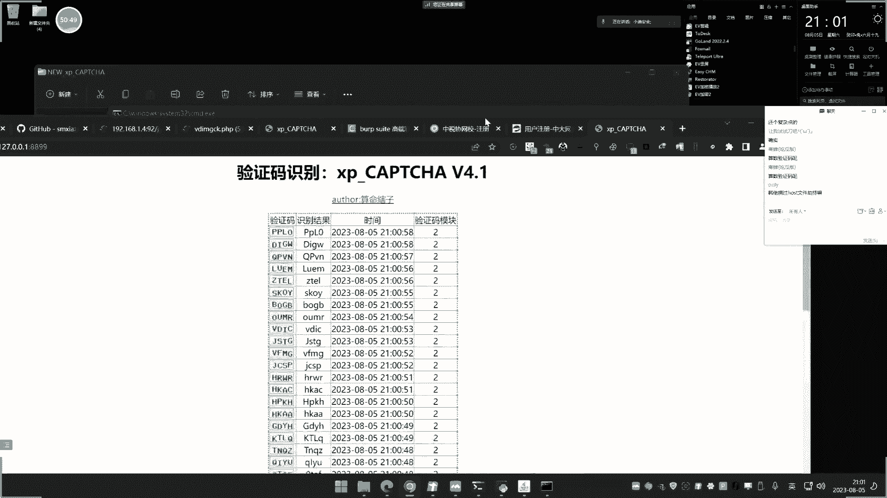

我们来实践一下，比如说像现在呢我们就找个这个是吧。

有结合的地方来测一下啊，看能不能测出来。

就拿这个网销的一个系统啊来测一下。

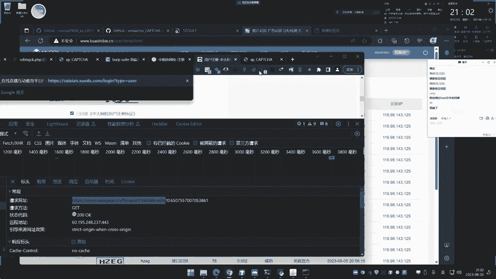

好这里呢有一个登录的地方，手机验证码的输入，输入你的验证码之后，然后点获取验证码啊，比如说输我点号码，我点获取验证码，他需要先输入验证码才能发送短信验证码，对不对，这是个接口啊，这个就是一个短信接口。

刚才的那个是登录事件，就是解决登录事件爆破的验证码的一个识别，应用到这个登录爆破里面啊，这个呢就是测试接口的乱用，因为都知道这个验证码呢，这个东西呢是网上找的那种发送接口啊，配置了就说我要获取验证码。

肯定要输这个图片嘛，输入这个验证码，我验证码堆了，他才会让我获取验证码，是这个意思吧，那我肯定是先要识别到它，然后再去请求这个包，不就是把那个包发了吗，好我们现在来先确定一下啊，把包全部删掉。

好我们这里呢可以看一下啊，我把那个验证码先输对啊，我点一下获取验证码，然后我把包装一下啊，啊不用抓包吧，直接看那个结果就可以了啊，点获取的嘛，好这里已经灰了，按钮灰了啊，然后我们看一下他这个结果。

这是发送验证码的一个结果，结果返回四个九啊，结果返回四个九，这应该就成功了是吧，然后我这个手机上面也同，也是接收到这个验证码了啊，已经结束了，我不信的话，我可以给他登录一下也试试啊，老是接收到验证码。

然后点登录就可以了，对不对，这里我就不测了啊，我现在呢重新来测，我测什么呢，接口枚举，你看啊，我把这个手机号码写上去，我一直要用他这个短信接口形成一个接口枚举，就我一直要调用，你调用你。

我肯定就是要把这个什么验证码数对，我才能触发这个按钮，这个是那个触发的数据包，我们可以关注一下啊，这是触发数据包数据包这里啊，这是你的啊，这个要发给谁的这个验证码，然后这个是你输入的验证码。

好这里有个toy，大家看到没，还有个toy，看到没好，我们先不管这个什么toy不toy啊，这个TOK应该就是说可能数据包还有检验啊，不管他先好，我们重新来抓个包啊，我们可以试验一下啊。

来我把这个包重新发送一次的时候，来我看我重新发送，返回1002，1002，然后这个呢应该是可以解嘛，看一下结果的结果，应该就是一个报错信息，那这个是1000啊，那现在我们知道了啊。

就是你这个啊一直发这个包的话，它就是1000成功的返回，应该就是说验证码发送成功时，回是返回四个九就成功了，因为你看到数据包的结果是完全不同的啊，返回结果，这是成功结果，然后这边呢就是失败结果失败结果。

因为你可以看到失败结果，成功结果里面的都不一样，那么现在呢假如说我要测这个接口，这里啊，那测一下啊，我们看一下啊，重新拿一下啊，这是获取验证码的地址，把抓到了，这是获取验证码的地址啊，注意一下。

我们把它进行一个测试一下，访问一下，看看是不是这个验证码地址，这是是获取验证码地址啊，看一下对不对。

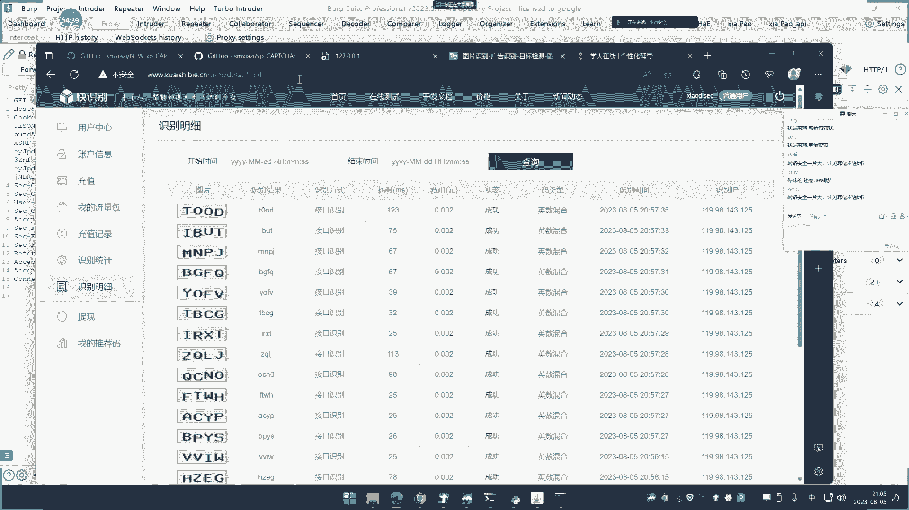

好果然这个就是获取验证码地址呢，他不断改验证码就不断改。

所以我们就可以在这里要配置一下啊，放出来点击保存一下，是保存一下初定这个地址对了，然后呢这个时候啊我们再来抓个包。

点击获取验证码是一个触发按钮的数据包。

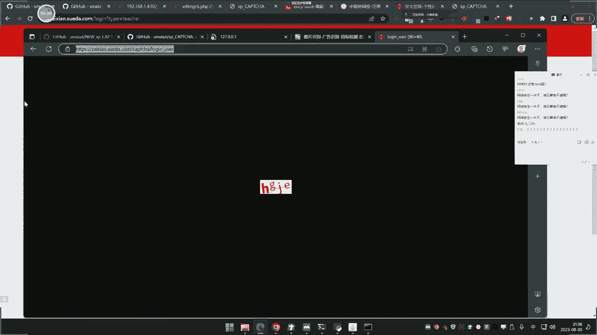

就是获取这个接口嘛，因为你点获取验证码，它才会发送验证码呀，对不对，所以我就把数据包要抓到啊，点获取验证码来诶，这个是小时登录啊，我这里要搞成老式登录啊，搞成老式登陆，搞错了，因为你这里的教室登录。

他要验证账号密码，学生登录的话，这里就可以不用那个地方了，重新再获取一下啊，这个是那个学生那个验证码的地方，刚才那个是教师的啊。

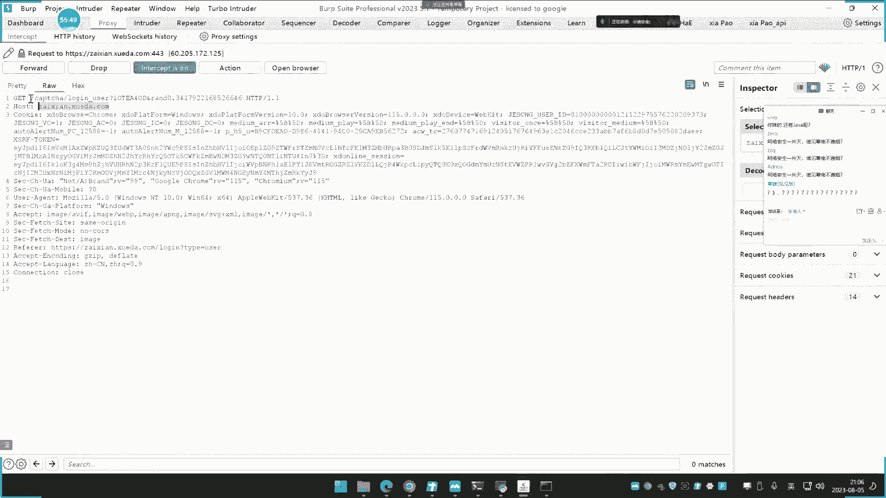

这个是学生验证码，地址不同，不要搞错了啊，这是教师登录。

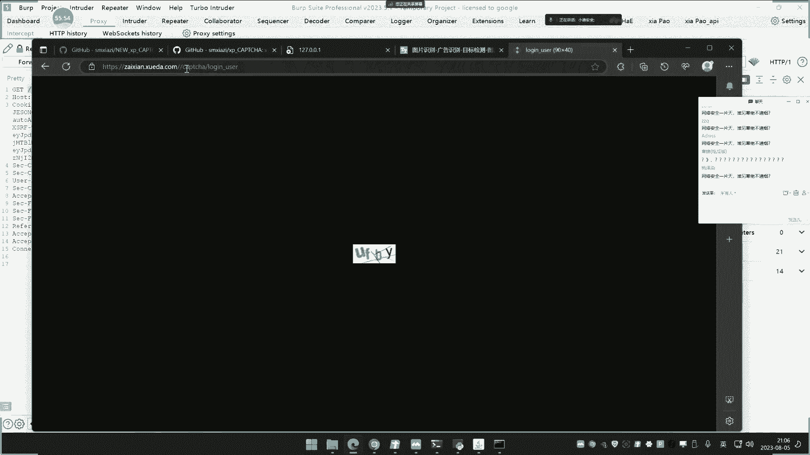

这个是那个学生的哈，学生才能那个地方操作，教师那边呢他不允许注册了，好测试一下，保存一下，好，保存好之后再来到这边把线放出去，在这里呢重新输入，把这个获取验证包，把它抓下来，好抓到了额。

这个就是我们验证码的输入地方是吧，这个时候我们验证码输入的地方，我们可以试一下啊，我现在没有把它放出去的时候，我滑过去看能四个九的状态吗，就是能罚接口，就是能调用一次，再一次勾就变成1002。

然后你不断发包，他只会发一次，我如何让它每一次发送都能触发这个接口呢，是吧，那肯定要识别这个验证码呀，因为验证码下一次触发时候肯定验证码编的呀，所以说我就把它怎么样发到encode模下面去。

用到刚才的技术，把这个地方，小抛小抛一下是吧，我改这个东西啊，改完之后，这里由于我不需要设置密码，我就是要调用这个接口，所以我就无配漏的NO payload，然后再连个接叫继续，这叫永久，就是一直循环。

一直循环的意思就是没有任何东西，就是这个数据包一直提交，因为我这里不需要变换任何东西，我只要是吧这个验证码调了个查询就可以了，薄的还是用到这个吧，就是刚才那个配置好的那个算延迟的那个东西，好就可以了。

那我撕一下啊，咱来进行放，好我们可以看一下我们这边的一个识别插件，这边的一个状态，你看这是它识别的，你看在验证码呢，在识别结果，你看是不是差不多一秒钟一次啊，你看这对了啊，啊一秒钟一次啊，把识别结果。

然后我们看他返回的状态码看什么啊，还是第一个的返回状态码9999，第二个的99999，这个是错了，那这个1002错了，那这个就为什么有个第四个不行啊，我看第四个是不是识别错了呀。

啊果然你看看UFUR它识别出了UF那个，所以这个数据包呢为什么返回的是102，你看这个后面呢就返回999，下面那堆的就扫传进去九九，这代表短信发送成功了，现像现在我的手机就嘎嘎嘎的收短信。

我就赶紧把它关了吧，这样他妈的再搞下去，你不租了，所以说这就是验证码啊，绕过之后所带来的一些安全隐患，接口滥用登陆爆破，这是最两个明显的那个任意用户，注册也是一码事情，因为你在注册多了。

人也会出验证码是吧，你把验证码提交进去之后，那继续注册嘛，当然那只是说验证码的日限制度，所以还有其他限制证，那是另外一句话啊，这个就不多说了啊，就说这个呢就是一个用本地。

还有个用了网上个真实的这个测试的地方，通过刚才我们对比啊，发货999那代表短信发送成功，那个1200的21002，那就错误了，就罚不了了，所以说网上那种短信轰炸机那种东西呢，其实都是在网上找这种借口。

用别人的这种借口呢去发，去批量的发动轰炸的原理，我相信大家都应该都知道，那马上我们等下要讲的知识点呢，啊等一下再一个案例演示完，大家就完全明白了啊，知道个等于轰炸的那种原理，他就是乱用别人接口。

所以说企业里面呢有这种业务问题的话，也要防止这种结构的被乱用，当然这种漏洞呢对方收不收是个问题啊，一般收的话也是低位，因为这个漏洞呢说实话啊。

有钱的是不用管他的，反正有钱啊。

还没不会影响核心业务，主要还是我们在登录报坡的时候呢，用这个东西比较多，你说这东西没用呢，问的还是一大堆哎，什么验证码识别什么用啊。

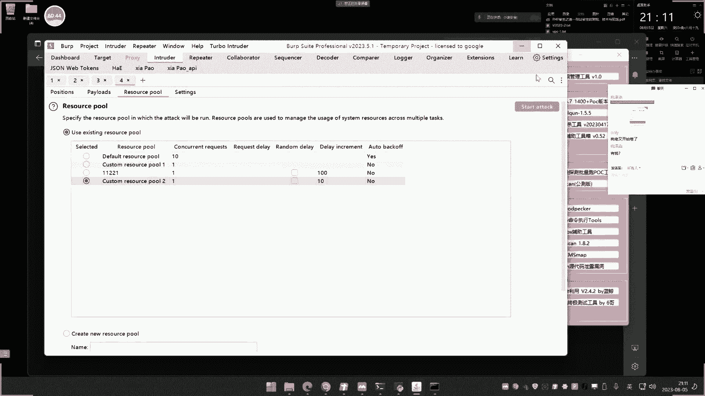

怎么搞啊，说实话用的时候呢还是有用，但不用的时候那发现一点用都没有好，我们现在再来说另外啊。

说另外那个那个啊就是验证码呢，除了被识别出来呢，能够操作它是吧，能够识别的，我写了四个啊，呃对于验证码的简单，包括还有个叫重复使用，还有叫智能识别，智能识别就是我刚才说的啊，这图片型的。

还有那叫重复使用，重复使用是啥意思呢。

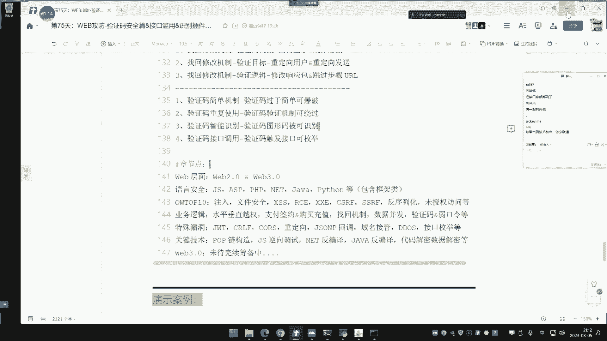

重复使用是啥意思呢，本地安利的我都不好找，我还找了个上节课那个app里面，那个就是个重复使用，什么叫重复使用啊。

就说他就是等同于，就是说设计出来没有什么鸟用，啥意思呢，就是呢我这里输入一个账号之后，我把这个验证码一输是吧，点登录好，这个验证码呢现在可以，我下次发包的，它还可以，这叫附庸。

所以说这个验证码就如同虚设，这是他自己，那你代码或者说是写这个逻辑的时候，写的有问题所造成的，知道吧，能理解吧，这份证下线在了，那我现在来一直切来看到没，他能服用啥情况，就是我闲的，按正常来讲。

我每次请教，应该说这页证码一直在改呀，我不改它了，我就这样一直搞，我，直到我私出这个密码为止，这就是服用了，这你不改，他就把他把椅子发不换页面，他就一直操作他一个逻辑，其实这个服用的最简单出现安全问题。

这个逻辑是什么情况呢，就是这个验证码，要随着数据包的每一次请求而改变，这样才对，就会它自动去改变，我这里为什么不动它，它一直可行，就是我页面没有崩它，我没有刷新页面，我没有动它。

我就是一直在这个页面上面操作，所以这存在服用，我一旦刷新之后，你看验证码就变了，那我刚才那个在请求包就错了，因为验证码也对嘛，所以他的这个原理是产生在这里，就是程序在这个实现的时候呢，他没有是吧。

实现这种数据包，每一次请求呢都要改动验证码那个情况，那这是本地的啊，当然本地所有的案例呢刚才也做了十遍案例了。

那不能再来拿讲，所以我们呢找了个应用，这个应用呢刚好里面呢大家也看到了啊，还有些这个东西。

你看我这个这个福利期货真是好东西是吧，每次都找他，哎香的很啊，唉这他不开这个app，要是死了怎么办呢，我安你都找不到了。

在福利期货你要支撑下去呀，我老要做安利的。

好我们看一下啊，这个打开啊，好他这里有个什么鬼事情呢，你看啊，他这里有个什么事情呢，大家看一下，他这里有个这个发短信的，我等下给真实给他看一下吧，我直接给他这个哎我电脑。

我手机上面装不装那个TOSTR呢，我等下啊，我怕有些人说我做假啊，好吧，我用那个，用那个叫什么呀，用远程软件连接一下啊，我那个手机上面too to disk跑哪去了，Two diss。

手机上面的two disco有啊，我用手机连上来给大家看一下啊，等下我们测的时候应该看，现在现在还不还没有到那里啊，我我先开一下，因为我要接验证码，他看到个效果啊，BILISK啊，等下我们用这个连呢。

这个是我那个IPHONE啊，等下看，他只能用观看模式，IPHONE没越狱，他只能搞这种事情，观看吧，我先看一下啊，我点了关卡没反应呢，没开吗，我这天开一下，军需染城限制手机投屏，是否确认开启毒物品呢。

不开，哎这怎么还有密码呀，我密码有搜一下，好这个是我那个手机的，看一下啊，这是我的手机手机那个结尾的，这是刚才在刚才那个测哪个地方的呢，踩那个接口的，你刚刚给我发的短信，你看我们也没有骗大家啊。

好我们现在在这边挂着啊，我现在呢就这边测这个接口啊，我待会发给他看一下啊，那这里呢比如说我测这个接口的啊，测这个短信验证码接口，那我先输入啊，比如说我要获取点获取是吧，他说要输入图片验证码才能获取。

对不对好，你看着啊。

输了好，我们把包抓一下啊，上包抓的这点获取，这是他发的包包，大家可以看一下啊，来这个是验证码，然后这个是一个什么K大家都知道啊，这个什么K啊，像这种东西都是类似什么toy签名的。

他呢就像我刚才那个数据包一样，它代表的意义是干嘛的呢，那它代表的意义是干嘛的，就是保证这是数据包的唯一性，就说这个东西呢，可能在下一次发送的时候就会失效，对不对，会有这样问题啊。

那这个呢也和他差不多的一个道理，就可能说啊你现在是这个东西啊，等一下你重新打开，比如说像现在啊把关掉，然后呢我们重新再打开一点啊，我再点这个地方啊，我再给他打个包，等打开之后，好我们再来抓个包。

你看现在是又改了啊，变成这个东西了，所以说你在每一次请求这个包的时候呢，这个东西可能会变动，那你怎么预知这个东西下次什么值呢，你比你预知不了啊，预知不了，那会不会说即使你前面两个都对了。

但是后面这个不对，也导致这个短信验证码发不出去呢，所以它的设计是这样设计的，但是呢如果说能够重复利用的话，那就不好意思了，那就是你自己的想到的防范，但是你自己的没有把它应用好啊，还是会造成就是我们说的。

你电脑上面那有啥的软件，你就是玩是吧，你就不把它开，或者说你开个一班，你就是玩，对不对，那就等同于没开啊，就这个道理一样啊，你看现在呢他的验证码按照正常来讲，我要输入正确的验证码，这个短信他才能发过去。

我不输，他肯定就发不过去嘛，对不对，但是事实是这样的吗，就是说服用问题，你看啊，你看着啊，我这里都要把手机打开给他看，哎，妈的怎么又断了呀，哎呀这个一锁屏就自动断，这真是啥，屏幕自动锁了还是断了哎。

完苹果还是安全啊，好大家看一下啊，你看着R呢，这是刚才那个包，我验证码不输，对我这个值不堆，是不是就不会发验证码，那我先把它勾一下来勾法思，看我这个手机的面啊，哎，那是不是收到一条啊，点进去再看呐。

看着啊，再点一次再发一次，又来了一条，我一直点，我点点点点点，嗯什么情况变成201，再点四变成阿离了，看到没，都变成201了是吧，不动了啊，点不了了，啥情况啊，刚才不正常的吗，这么能发送这鬼东西。

这啥鬼呦，又在忽悠我哟，看着啊，附庸是一码事情，妈的什么鬼，怎么又断了呀，不能锁屏，不能锁屏啊，锁屏把它关掉，我先，好这是刚才那个地方呢，我在东东四是东塔啊，这是叫一直这个直接收到两个了啊。

然后你看着啊，我直接你妹的干个什么事情啊，我把这个2万给删掉，行不行啊，我不用这个什么托什么鬼东西，我罚一下200，看这边看着啊，200来懂了再给他发，按正常来讲验证码要输的呀，又200了，又来了。

我点点点点点点点是吧，看着，来啦die啦，还没呀来了，来了，它既是附庸，还总是弃用，所以我这里就写了种方式。

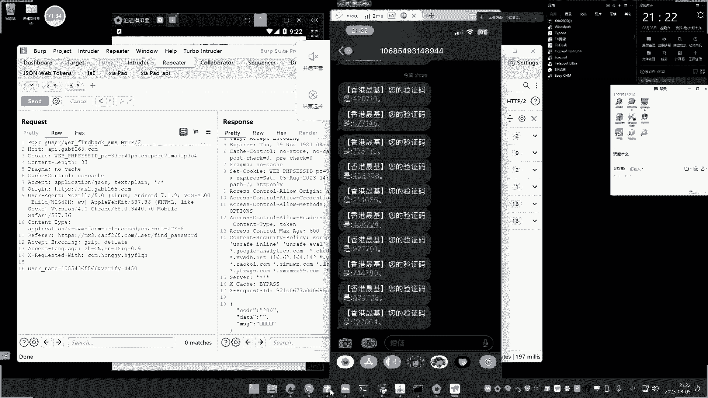

什么方式啊，删除验证码字段进行绕过或者直接使用，你看看我一直咔咔咔来，对不对，那一直在动，因为我刚才点多了呀，来了还在给我发，这不就形成了手机轰炸吗是吧，我一把这个事情一说完是吧，前几天就有人是吧。

昨天讲完了课，他妈的给给给我，又来了波混账，不要搞我是不是我是受不了的，不要搞我不要搞，我就说这个意思，所以说你看他这个就属于这种问题啊，对不对，所以说什么toy啊，seeing啊。

这种这种验证的东西啊，你可以把它删掉，车的并不是说，而且他这里还有两个问题，它是两个问题，这个案例是两个问题，什么两个问题啊，一个是，一个是这里啊，他没有使用好，虽然他的的确确对吧，这个东西一旦是吧。

有了发两个包就不行了，就这东西呢，因为他每次触发它都会变，所以呢你每次要代表这个值要堆，所以他就不能枚举这个结果，但是他想的是这么想的，实际上我把一删没了，123对吧，他就没了。

你可能会为什么删了他就又能绕过呢，简单来说就是逻辑上有问题，什么叫逻辑呢，就很简单啊，比如说你判断零和一的话，一我就认定他是成功的，零我就认定他是吧，一零我能成功或者一只能成功，那么在判定的时候。

如果我为空呢，空是零还是一呀，你刚好家说零成功，空了也是零，我没有给东西，你你也是零，我给的东西，你你也是零，给错了才变成一和这个道理一样，好理解吧，所以为什么说删掉它反而成功。

就是因为他可能就是个零和一这个逻辑，删掉他刚好他不接受，他还认为是真的，你给他给错了，他就是错，他对比那个值错了，你就是错，你不给他，他还跟着威尼斯队，所以我就说，有时候有些东西就和我们做人一样是吧。

你越是这个那个啊就约那个哎什么情况，我手机还在搜啊，唉你们这些人呐，真是啊，这肯定是那个叫什么帅的在跟我搞事情，妈的怎么给我发他妈200条啊，唉这他妈的个神经病啊啊，不管他了啊，随他去随他去。

这你妈的真是无聊啊，这谁呀，大家可以看一下，来这我不知道啥情况呢，一下子给我发，发了他妈一大堆了，我都不知道是哪哪里发给我的，你们自己说这我有个什么法子好不好，呐还在给我发，真是你妈无聊啊，真是。

唉这谁敢说那个事情，有些人他就喜欢这样那样搞，我们讲课只是说专权隐患有点下去，就相当于搞他妈的乱搞，唉你看他还在给我搞，唉算了算了算了，随他去随他去，我都不管他了，啊这个是我们说的那个附庸的问题啊。

简单说你不管是什么鬼，这个字端的呀，验证码呀，也可以尝试服用，还有一个就是我们说的那个什么脱铁，那问你都是有售，是给测试的，就是因为像我们说的这个这种，类似toy这种东西啊，他都是干嘛的呢。

他都是为了做这个啊数据包的唯一性，所以有时候你把它删掉，或者说怎么样把它重复使用，都有可能会绕过，针对这种情况，就这样一个玩法啊，如果说这你是删除了和重复使用不行呢，不行就放弃呗，是吧好。

这个就是我们说的那个情况啊，接口的乱用啊，这些问题啊，好我们再来看这个这个滑块的啊，这个滑块的呢这里是个什么意义，我们先看篇文章，巴布素材的高端应用里面说编写宏规则，那个滑块验证码啥意思啊。

我们先给了解一下，这里有个滑块，我们先看一下这个文章啊，这里有个滑块的值呢等于一传值，这个值呢在这个表单里面有这个东西，然后呢就是说如果你这个发送了包这个滑块，那个值和这个表单值呢刚好对应上了。

那就表示你滑块成功了，啥意思啊，就是你表单里面这不是个滑块吗，滑块里面有个值，在表单里面有个这个这个值，然后如果你划了，你发包的时候，这个包里面就有一个值和这个表单值对应上，那就说明你滑了。

就是你滑快了，验证过去了，对不对，然后呢他是怎么做的呢，他在巴布shot里面呢声明一个宏宏什么东西啊，宏就是相当于我们一系列的一个操作，可以这样去理解它，什么叫宏呢，就比如说啊我电脑上面我先打开浏览器。

我在输入网站，我在我在我在怎么办，我在敲入网址再回车，这么一系列操作，我们有个称之为叫红，这个红就这么一个概念，所以他就添加巴布数的，添加个宏宏，干嘛呢，去获取一个网页，获取一个什么。

你看他写的规则获取在这个开始，在这个之后，然后这个开始之后是什么呢，values从这里呢，从这里截取，冒号后面的一串值，然后在冒号前面和这个字的前面，就是这里的冒号和这里的前面，就是中间的这一串数字。

把它进行一个OK之后，然后呢，在这里运行宏宏运行的逻辑是怎么个逻辑呢，就是在各种的这种数据包里面，大再发包就可以实现自动填充这个参数了，啥意思呢，就是说他这个滑块呢是在这个表单的一个值。

如果你能知道这个值的话，你放到你那个数据包里面，也等同于你就滑了，就这个意思，因为它判定你划没划成功，就是判定你在登录请求这个数据包的时候，这个值和这个表单的值是否对应对应上了，就是划了，就是划成功了。

并且对应不上就是划错了，所以他就做了一个数据包的一个操作，就是在数据包请求的时候，就把那个请求页面的这个值给它获取到，然后自动组合到数据包里面去，就是自动呢在这里啊一直替换你数据包。

这里一直替换数据包这里，然后让这个值呢是吧，等同于这个表单值，就等同于你每次都在画，每次都在划，绕过这个滑块，大家一听好牛逼呀，花海就绕过了哈，但是事实上呢说句实话啊，没什么卵用啊。

为什么说没这么难用啊，因为只有这种滑块才能这样做，其他滑块他做不了，其他滑块，不是这个逻辑，我给大家看一下啊。

我先找个这种其他滑块的啊，那种滑块就是拉到底，就是我说的滑块呢，有拉到底和不落到底的两那种，就是拉到底的滑块是那种其他不是拉到底的。

那就不行了，对他那个说白了啊，他只是多了一个值得一个接收并回血，到数据包里面去做这个事情没有什么神奇的，但是有些滑块这个验证码呢，他是不是那么个逻辑，所以那种另外一种情况，那就不能这样做了。

哎呀这网上这种东西，啊这是点的这点的，你看一下他这个点的这里还有没有什么东西啊，啊这个按理说就有可能可以实现，那这里有个叫什么呢，不在这里啊，他选这个代码的，他是在这个div里面。

这里有个叫什么input input里有个这个这个值，这个值应该就是那个点没点，就是点点没点，这个刚才那个腌制那里啊，点分点验证应该就是这个值，就说我们得试一下啊，给来看一下啊，找个方法看下。

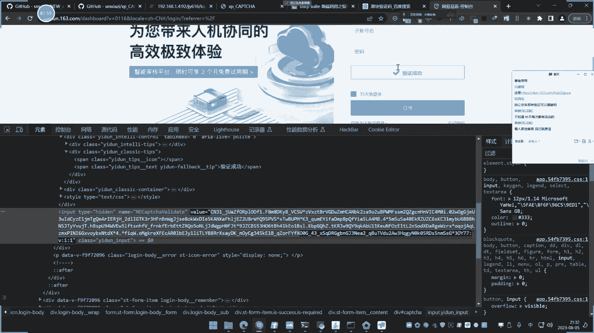

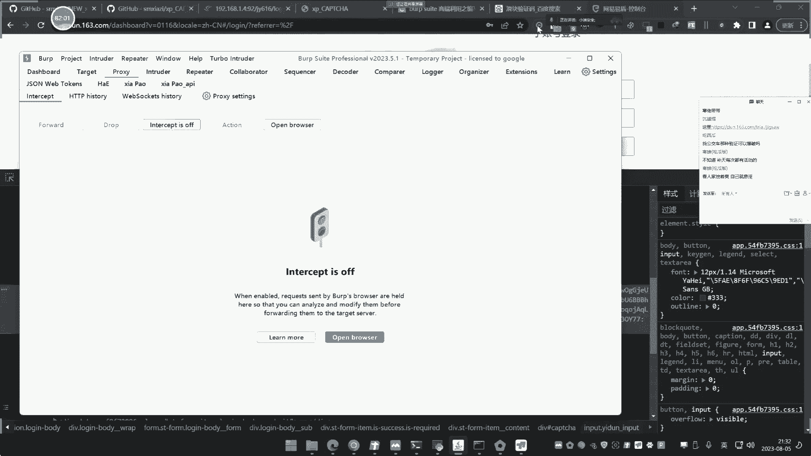

好发个包。

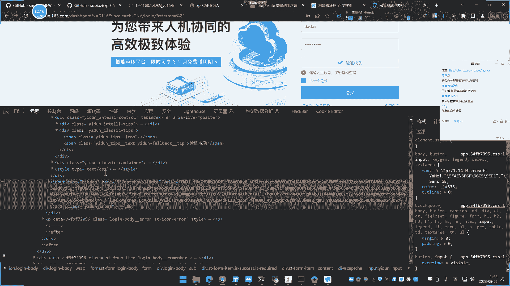

唉他这个难的还难得很啊，电的没反应，点这里面买账号，账号这里还有错了啊。

数据包抓到了，大家看一下来是吧，来这里有个这个值啊，大家看到没，这个值就是那个滑块验证通过的值来验证通过，就是有正常值这个值的信息它从哪来的，它信息从哪来的。

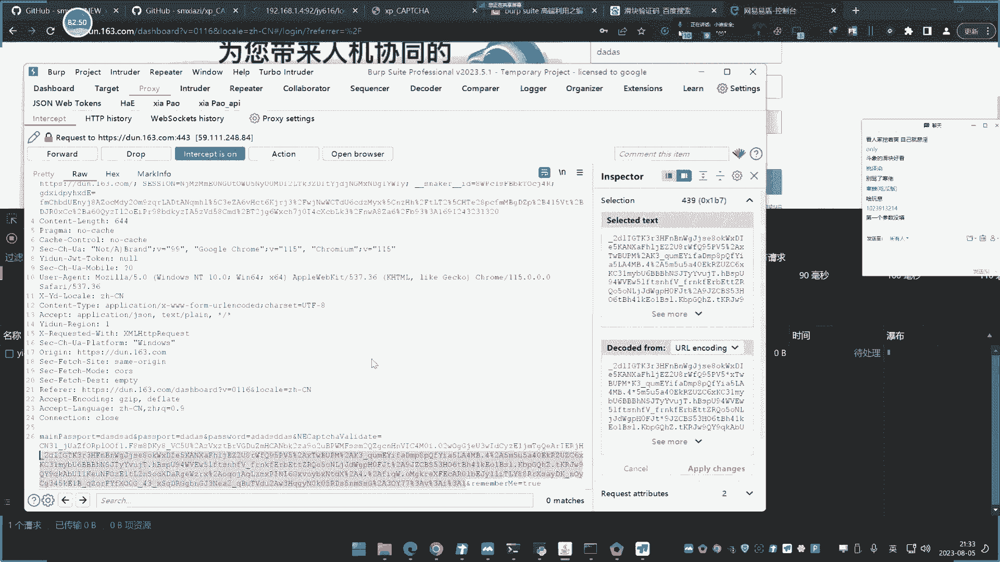

是就这个值啊，所以说你可以做个宏，这个宏呢就是获取这个东西，就等一下呢再填充到这个上面来。

那么就等同于你每次在请求的时候，这个值就提前帮你设计好了，你就只需要改动这个账号密码就行了，能不能理解这个原理，理解这个原理之后呢，我们再说这个操作，这新版的那个网上文章是个中文版的。

我们新版的说实话啊，我不告诉你，都不知道那个宏在哪里，我找了半天，我才找到，能不能理解这个原理，先说这个原理能理解，就我们这好操作啊，操作是操作都是固定死的，是原理才重要。

他其实就是说像是说你在发包的时候呢，不过他有个仙子啊，这个仙子是什么仙子呢，哎我等下给他死啊，来我给看一下啊，我先说那个色子啊，他那个红在哪里啊，来再看一下啊，红的点这个色子这里。

然后这里有个叫PROJECT，就是项目这里项目这里呢有个叫C型，C型项目呢有个叫MACROS，我们可以翻译一下。

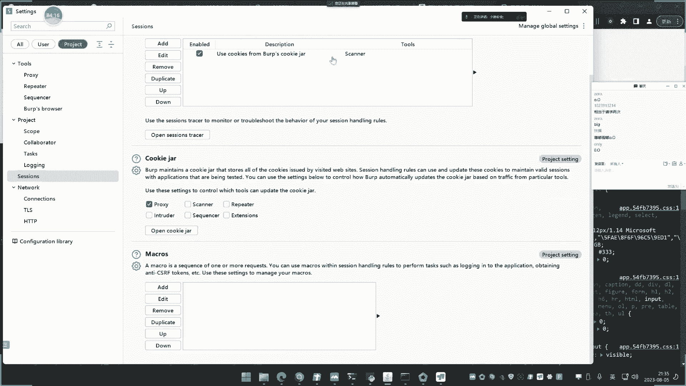

宏指令是不是就是他啊，点添加，添加之后呢，选取你要操作的数据包，我们就找到那个刚才登录那里，是哪个，post的嗯，水包呢，哎水泵跑哪去了，这里应该这里吧，是这个吧，诶是不是这个不不是这个不是个这里。

这里是这个啊，把选中选中，最后点，OK哦，这里呢就是这个数据包，然后这里有个叫配置，配置里呢由于我们要改动的是哪个地方啊，那点添加改动是哪个地方，我们改通的是这个叫做什么。

就这个地方呢就这个对应参数值叫什么，先把OK一下啊，就这里啊，这改动是这个地方，就这后面的参数值吗，改成这个地方是吧，然后你看他配置的时候呢，给添加如何配置他呢，他说返回包里面去找，刷新配置，在这里找。

为什么要在返回包里面找啊，而不是把这个页面里面找啊，我们那个文章是怎么操作的，文章我们刷新一下看一下啊，来他配置，首先点添加好，点项目设置，点这里，然后呢设置名称，然后呢这是返回包嘛。

就是我刚才这个操作界面这里啊，这和这个界面一样的，这个是英文的嘛，这是中文的嘛，就这么一个界面，就是文章的界面了，这里一模一样的，就这两个嘛，返回包里面找这个值把替换到了，但是我返回包里面有没有这个。

有没有这样的值啊，没有，那可能说为什么这个文章有啊，是个什么情况呢，所以说这个操作，这个宏指令是建立在返回包里面，和你请求包里面那个页面呢，差不多的情况下面才行，知道吧，为什么他可以呢。

就是因为他这个网站呢你登录失败，他也会重新再返回这个页面，所以这个页面的源代码呢，和他请和他这个返回的源代码一模一样，就你请求失败了，那他也是返回这个登录页面再给你看，而现在这个网站他就你妹的不行是吧。

他是请求过去之后呢，页面就返回这个，所以我们要操作的话，就需要找到那个请求页面，小请求页面就是找这个呢这个访问请求页面。

所以我重新抓个包啊，重新抓个包，刷新访问一下。

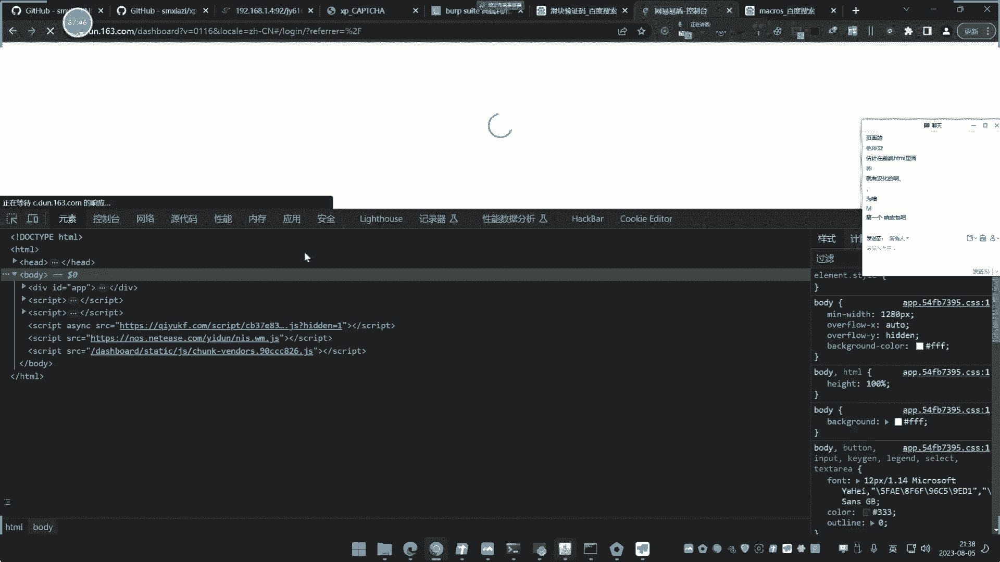

好重新来了个项目，那里，把这个先删掉，添加找到个请求包，请求包的地址是这个地址。

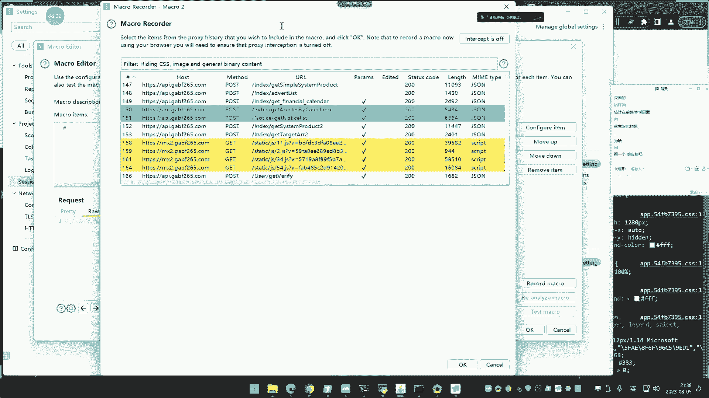

把记录下往下翻，这个等下第一次信息上面，这个都蹲103点com的。

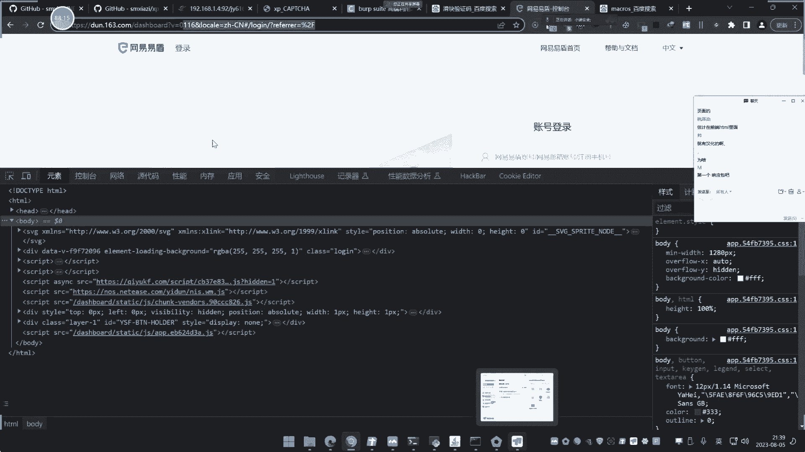

好应该这里吧。

我们在这里搜一下，搜一下刚才那个地方的这个滑块，验证这里，那就这里二呢，你看那个值都还没动，该动的才行。

电脑才行，我搜一下啊，所以说他这个滑块能不能绕过呢，绕过不了啊，绕过不了啊，为什么。

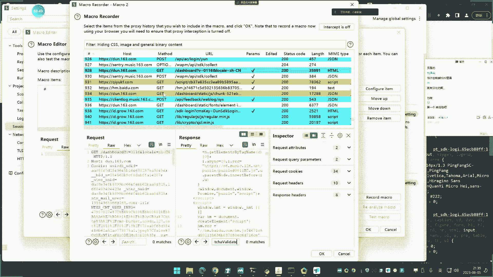

你看啊，我没有去点它的时候，这个值呢是这个东西，我只有把它点了之后，你看它变动了，他才成功的，而我们这个文章这个文章这里呢。

他是点不点的时候就固定死了，就说你只要等于这个值就行了，所以呢他才能有玩这种方式，所以他才能玩这种方式啊，所以他这个东西呢是建立在某些滑块，就是这个滑块它固定好那个值，你只要那个参数值呢。

等于这个就等同于你滑块验证通过了，而现在这个不行，这个点了之后才会产生那个值呢，也没有什么规律可行，能理解吧，所以我说为什么这个东西没什么卵用，就这个意思啊，这滑块只有这个东西还能绕一下啊。

你像这种形式的滑块也搞不了，搞不了，这是给大家提个醒，网上文章说的很高端，但是应用起来太多限制条件了。

所以截止目前的话。

在boss上面查件啊，或者说方法呢，也只能对这个图片验证码做一下操作了啊，滑块类的，还有什么提问类的鼠标，初中类的基本上都是照顾不了，除非是用其他的工具或者说其他的方法，但其他工具和其他方法呢。

那就是吧，那可能就结合安全的话，可能只能自己写写项目了啊，好今天这个内容呢就讲这么多了啊，基本上这个内容呢就主要是讲的验证码，一些识别和情况，他能涉及到安全问题呢也比较简单，就是一些登录爆破啊。

任意注册啊，接口，枚举一些安全的一些业务逻辑的低位漏洞呃，和一些漏洞的一些主要漏洞，那没什么太大关系啊，这都是一些业务逻辑上面的啊，基本上在外面提交漏洞的话，这种东西呢收的话也是低位，有些呢是不收的。

什么是一些大型网站，它会收小网站，他是不管这些事情的啊，所以造成小网站才有这种问题呢，就好好多都有，还有主要还提了点啊，就是关于这个有时我在发包的时候啊，如果碰上toy啊，今天我们虽然讲了因子嘛。

但是可以看到啊，什么托体呀，这个size啊，这么签名的一些信息啊，有时候啊是可以服用的，或者说直接删除可以绕过的，这点呢大家知道啊，你凡是碰到什么toy啊，数据包里面如果这个toy不堆的话。

它数据包不会发送，你这个时候呢不妨把它怎么样删掉试一下，说不定就捣鼓了，有这种情况的啊，那好这就是我们今天讲的这个情况啊，那么下节课呢我们再说这个绕口令的事情，可能说绕口令是什么鬼啊。

绕口令呢也是一个比较关键的一点哈，绕口令呢这个东西要教的啊，因为大部分的我们都是什么表单，我们上次说了，还有这个加密的绕口令的玩法，还有一些呢是这种呃叫什么协议的呀，呃一种是我们表单协议。

for表单协议那种登录表单的包裹，还有像那个命令行模式的，还有像像我们说的那个系统那种弹窗模式的，就是我们说的那就是那个表啊，就那个登录框它有几种那种格式啊，我忘记这个单词了，表单的还有那个提示框的。

还有那个什么命令行的，还有一种啊就是每一种呢它在爆破的时候呢，有些东西是不能支持的，我们可能要换其他方法啊，选择入口令的一些东西呢，我们还要给他讲一下。

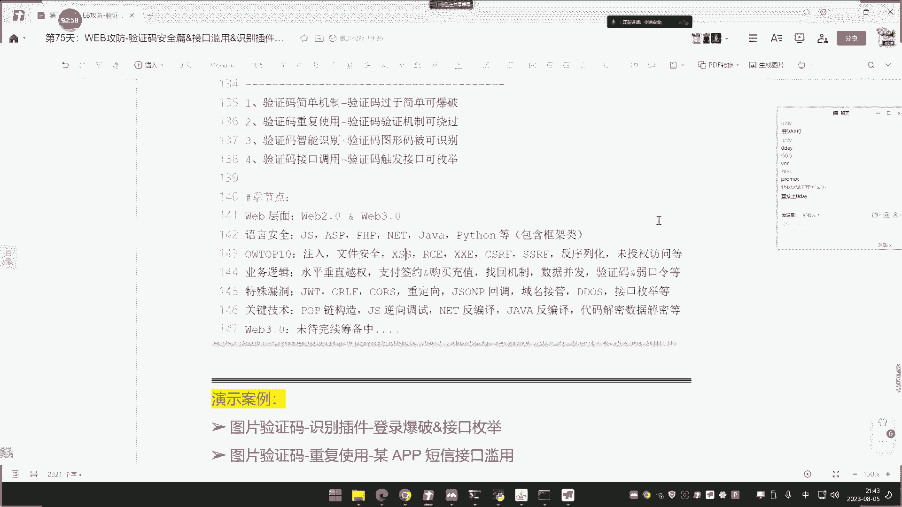

下一个内容就讲那些东西啊，好今天就说这么多了啊。

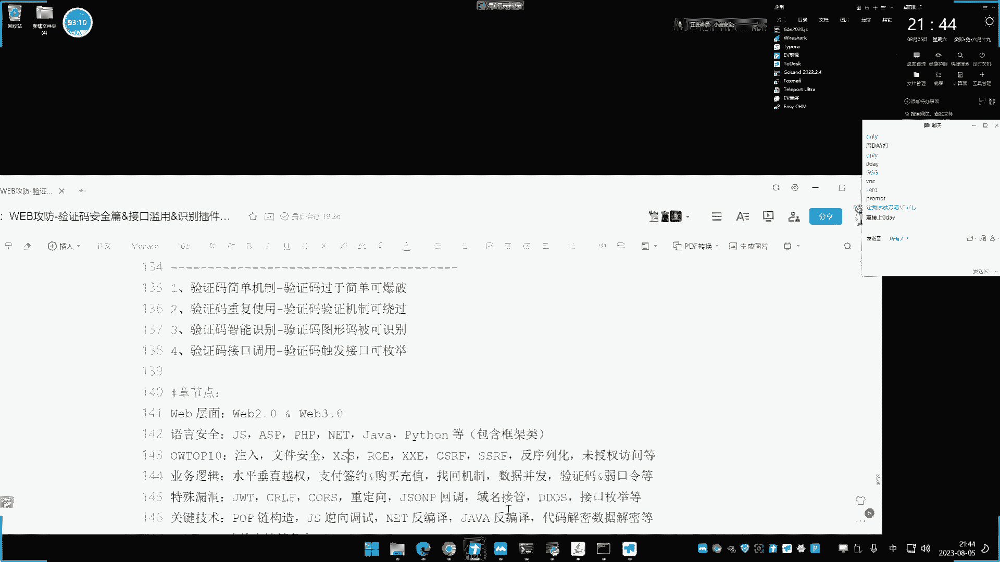

大家看看有没有什么问题啊，有问题问一下。

燕子嘛绕过直接登陆了还是地位吗，你登录了，那是另外回事啊，我们搞燕子嘛，这个东西都是你说的那个绕过也是两种，一种是说绕过，那个是我们上次说的，那个是逻辑方面的那个绕过，还是说今天这种绕过。

一种是这种操作的验证码。

还有一种是我们说的那种啊，新系的验证码，那不一样的啊，不要搞混淆了啊。

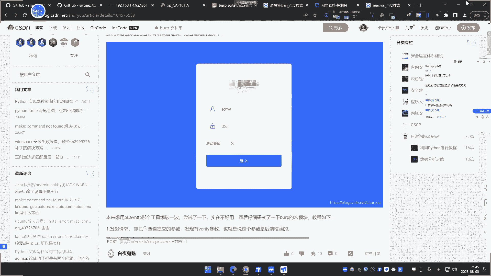

不是这题目说的时候还讲了吗，那个过于简单，很包括这个呢。

就是类似于我们上课讲的讲的，那个发送给你的验证码是吧，纯数字啊，四位数包包破成功了，这是另外一种啊，这是这种验证码，我们今天讲的是这种是吧，就是操作类的验证码都不一样的啊，计算单验证码咋办呢。

没办法没办法啊，不要说想有些东西都有办法没办法啊，现在除了图片型的这种验证码，所显示的成熟一点之外啊，复杂的复杂的用bubble shoot是不可行的，没有这种杂件，网上有些识别的东西。

但是一般都会接大码平台，打码平台的也不一定百分百没什么用啊，在安全里面搞验证码的很少，一般是搞那种批量注册啊，搞这种搞这种搞这种批量注册，要搞转移轰炸，喜欢搞这种B搞这种事情啊，愿意注册的。

搞注册机的那些人喜欢搞这些事情，他们天天研究这些安全里面，我们简单了解下就行，因为主要还是在数据包发包的时候有点用啊，其他方面没什么用。

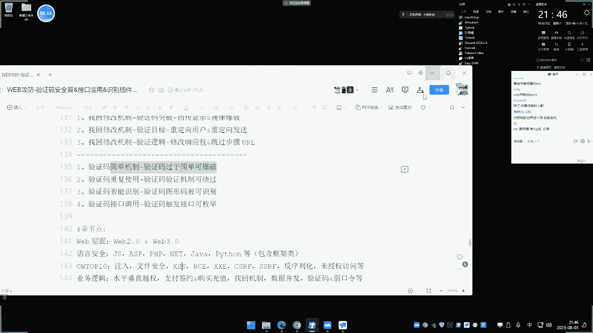

JS加密了怎么联动，什么加加什么密啊，加加加加加密密码吗，什么意思啊，这个是加密什么加密密码吗，还是加密数据啊，你说加密数据怎么在数据包里面提现是吧，啊是不是这个意思啊。

加密了如何以加密的形式去发送，对不对，是这个意思吧。

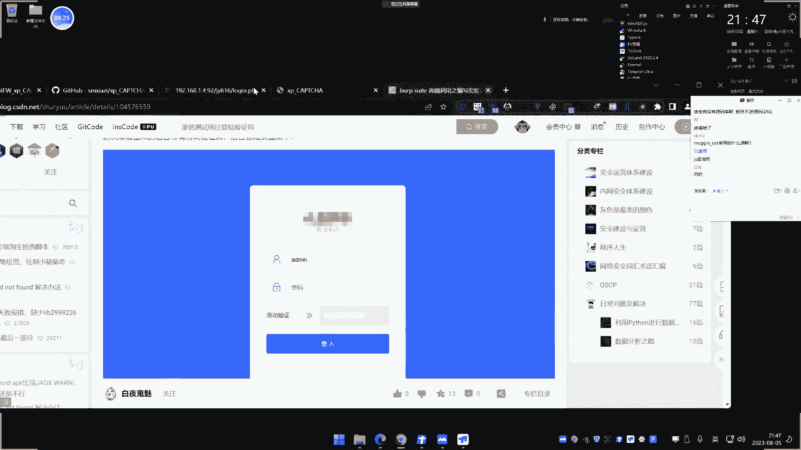

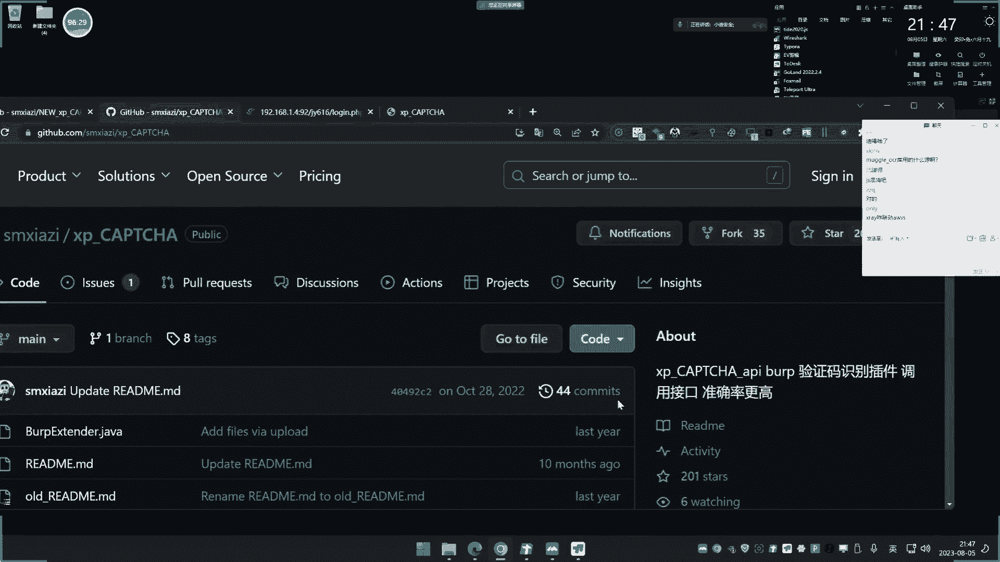

对的是吧，那我问一下你呀，那个加米是是这种常见的MD5啊，还是背身六四，还是那种自定义的呀，就那种什么偏移量的，有偏移量的，什么ax啊，那些加密你说的是哪一种，你RCVS都是一样的啊。

都是高就是高强度加密码，都有什么密室呃，有些是密钥，有些私钥，还有些是偏移量，普通的能识别的什么MD5啊，那些贝斯六斯八部书城里面就有这个模块。

不说白了啊，如果是混淆的，其实我也讲过，因为混淆加密你永远知道一件事情，你如果没有他的关键信息，你是不没有办法去逆向它的，那关键信息从哪里逆向呢，就是我们说的那个JS逆向里面去找。

我怀疑你们都没有怎么听课过啊，问这些问题一点思路都没有，很恼火的啊，问这问题。

给你看一下啊，我就举个例子啊，这其实是下节课的内容。

我都没准备讲的，不过前期我已经讲过这种事情了，按理说不会问这样的问题啊，是下期的用时间给大家讲一下，你就拿我们这种操作呢，我再去讲的，我这种东西呢大家看一下，我抓个包给大家看一下，看着我抓个包抓到了。

那这个密码是加密了呀，如果我要爆破它，我就必须要怎么样哎呀，把这个铭文变成疑文嘛，你说的就是这个事情嘛，是不是这个意思啊，刚才问的就是是不是个东西啊，真没讲过吗啊我没有讲过这个事情吗。

你说验证码也有带燕子麻袋，是燕子马带呀，有验证码，那是验证码，就按照验证码那个逻辑来呀，你这里要改动，那怎么办呢，是不是你罚到这个模式下面来嘛，把它当做个这个字典是吧，这里呢选取你的字典。

那字典发报肯定是发明文啊，那怎么办呢，有这个模块的呀，这个这个模块里面知道什么加密，把它选中e i code，E decode，是不是这个MD5是在哪个里面，在哈奇里面是不是哈前面MD5。

那么选中J是吧，你再发包，这不就都变成MD50去再对了吗，你看是不是你芝麻的算法可理想的对吧，就是这种很明显的，对不对，验证码，那你就就按这个逻辑啊，这不是就还不是改动一个地方吗，非加个模块的情况。

还有人就会说了，哎，混淆的RS个A呢和其他的呢，对不对，那其他算法那怎么办呢，对不对，有没有讲过啊，讲过的全部讲过的，喜欢挑着看壳子呢，我也没办法了呀。

1+10你不知道这个这个算法对不对，你一登录登录好之后呢。

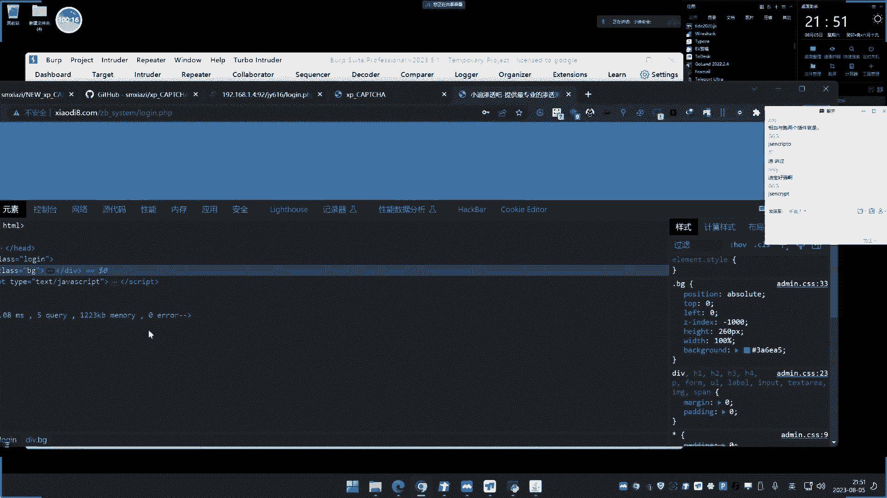

看一下他这个发的包的信息，这里那响应包是前期讲的一些诶，那个包这里是包是吧，讲的一些这种东西呀，白讲了哈，那个端点的地址是个请求地址啊，我们把那个数据包在这里啊，对就那个password是吧。

像米子这里，我们可以直接呢在这里刷新的时候看一下啊，直接给他看刷新，这里都有MD5值，在这里呢这是MD5的那个操作，MD5的，然后呢你可以把它表单在这勾一勾，看这个代码写的发的东西是吧，这里有个东西啊。

那点这个提交这里啊，可以看到他时间你们都看的很清楚，八的时间前期都给他分析过是吧，script的来看一下这里的，看到没了密码，这里怎么做操作的，利用这个MD5呢对它进行加密，MD5又来源于哪里。

来源于哪里加载的数据包，MD5gs s这是他调用那个MD5加个JS那个函数，就是在来源的这里来方形MD5登录这里，那就进行什么是script语句就写出来了，这我还是直接看代码给你看出来的。

前期交的端点不交了吗。

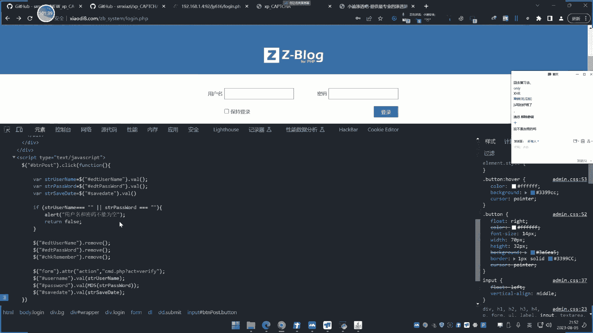

你找了个算法，把算法搞出来了，我们当时还讲过插件联动，它有印象的自然有影响，没有影响的，就说没讲过，我也没办法的啊。

讲过的啊，都是讲过的，你说今年联动那个验证码也是一码事情，就是那里多了个操作而已，对不对。

讲过啊都讲过。

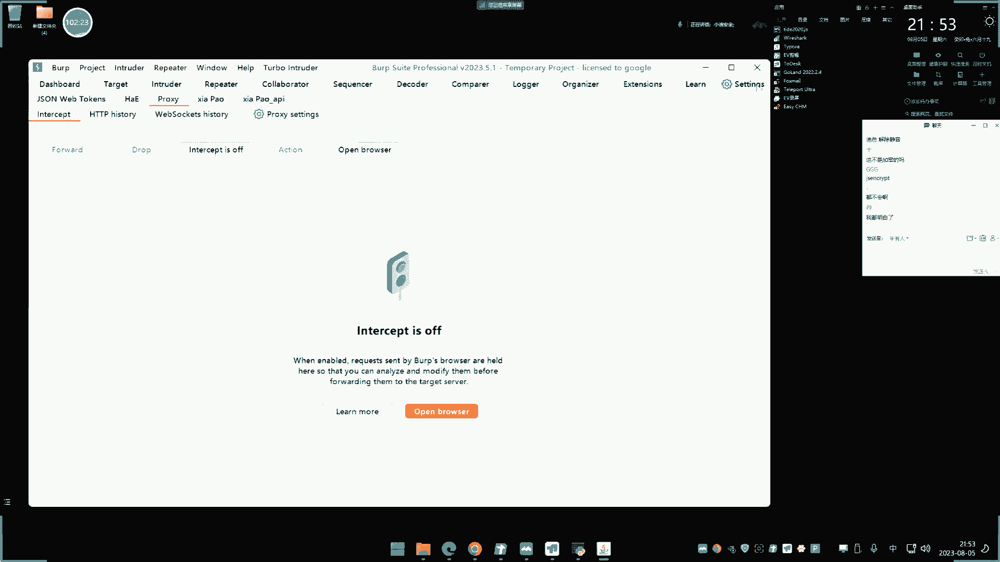

一种是我们说的那种常见的什么base64啊，MD5的这种工具。

上面这个茶几里面就自动有这个什么，有这种模块帮你自动加的，还有现在就是我们说的那种，另外一种情况的是吧，就是其他那种加密的什么DS啊，ASRSA啊，需要什么偏移量啊，miss啊，那些东西哪些东西呢。

就是你自己因为那些东西，那偏移量密室是不固定的，你不知道对方是采用的什么偏移量什么密室，所以你先要把那个JS1箱，找到那个加密的那个地方，把他的密密室啊，偏移的那些东西把它取出来。

取出来之后自己都在用插件，用什么插件啊，讲没讲过啊，啊不要说没有讲啊，笔记都可以帮你翻出来，第多少天讲的啊，给你翻出来给你看，你们自己还做过实验呢，忘记啦，在六十六十四天啊，啊这个啊不是不是就三天。

来看这个案例了，JS逆向结合bob suit插件应用，这是网上做的一个案例，做的什么案例，一个采用vs还是DS加密的进行发包，有没有这个印象，发包后正常饮用插件发报的时候呢。

按照那个加密逻辑进行正常发包，就是那种算法里面有些迷失偏移量的一些算法，就不是什么MD5I配置六四就能直接套用的，因为这个偏移量和密室一旦改变的话，价比就不一样，所以就必须要搞对。

那么才能按照他的逻辑的去发，真正常的加密数据包，尝试包裹，那么正常的解密去解，然后这个查检呢讲过结合报数的，那你这就放这里写着啊，多学点东西吧，哎讲的东西从来不学吗，这个什么法子了。

看来还没有什么问题啊，有问题就问啊，没问题我们就下了啊。

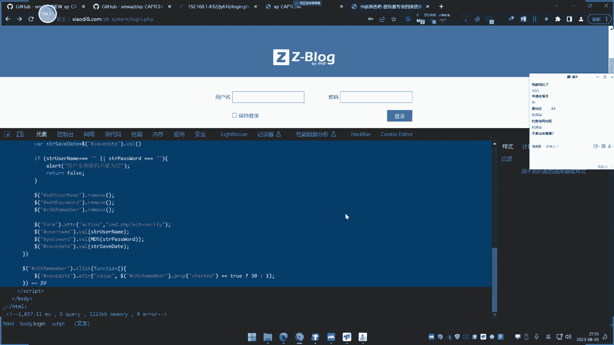

所以我说嘛有些东西你讲的再清楚。

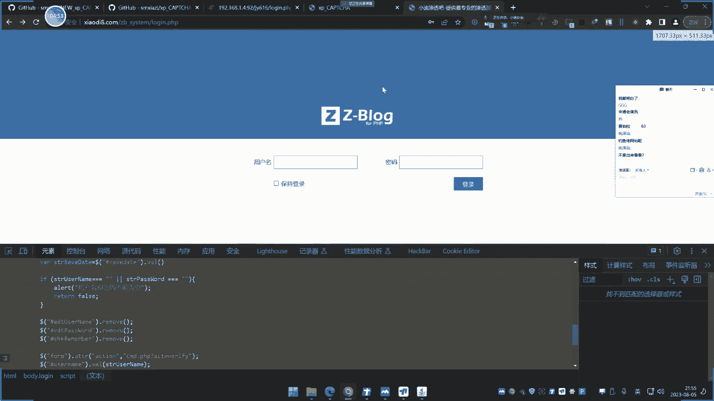

讲的江西也没什么用，但有些人他也不堪没用的。

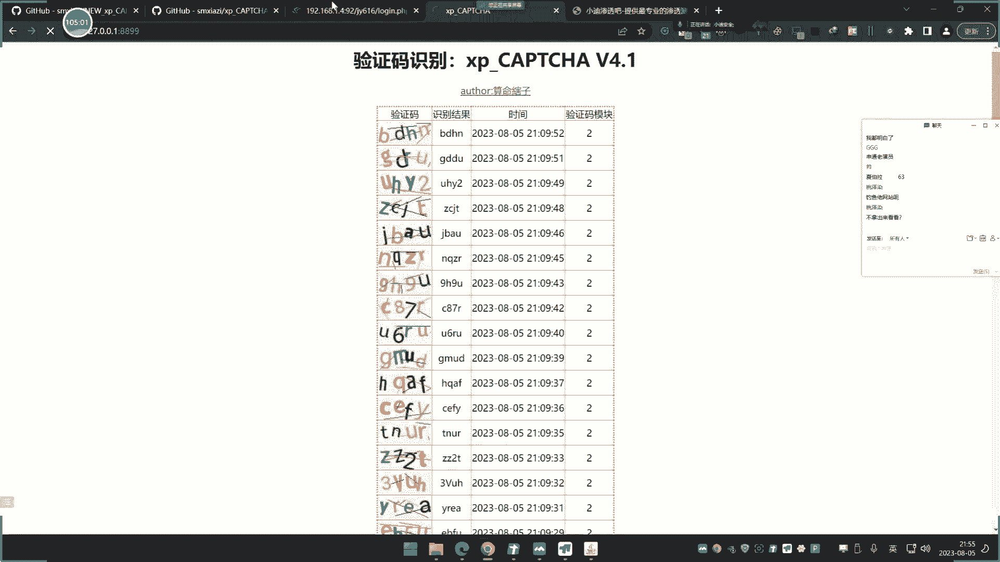

你们老说法哪哪个路上来哪个路上来，唉没办法的啊。

你讲的再细再多也没用，这也是为什么课程中总是一直被关于基础。

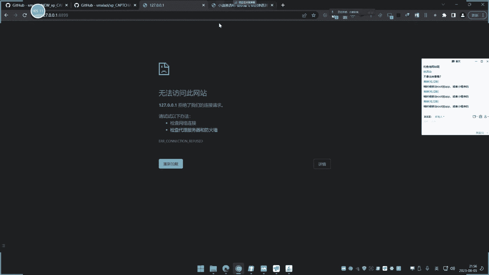

number one的原因，其实你东西呢讲的蛮多，甚至比隔壁都多，没用啊，但是人吸收的少。

他只看了一些东西，他就认为就那么个东西。

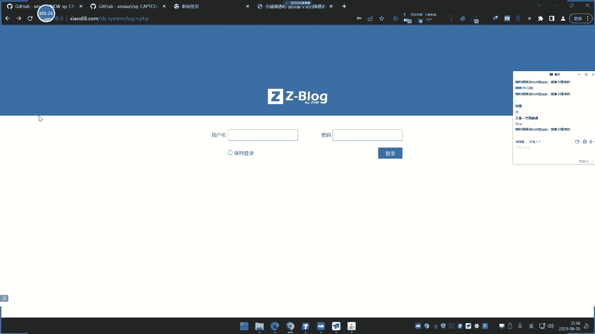

好就说这么多了啊，我们下节课再见啊，什么时候什么移动root玩个app还早啊，web上完了再上这个东西，web还没搞完，国外国还有几节课呀，哎今天是75是吧，那七十五八十五还算呃，十次十次左右吧。

十次啊，他应该没有十次吧，七八次样子吧，有几个冷门漏洞把它一介绍就不讲了啊，几个冷门的东西讲，按逻辑漏洞一讲，能门都一讲就不讲了，我们3。0讲不了，讲不出来啊，太难了，基础的讲了跟没讲一样。

说我们今天就说到这里啊，看大家还没问题啊，最后问一下，说JS小程序那些东西，什么app啊，我们都是用工具当个脚本小子啊，那个叫个小子就用工具把它脱壳呀，或者说把它理想出来，然后翻源码里面去找秘密啊。

然后看一下源码来简单分析一下，你们就等于号地址啊，尝试微收权，一般这这种测法我们都讲是这种车法，你要说搞很复杂的啊，啥也搞不了，我们都用那个当个脚本小子，先把它逆向出来，在源码里面找未授权啊。

找找配置接口啊，去测。

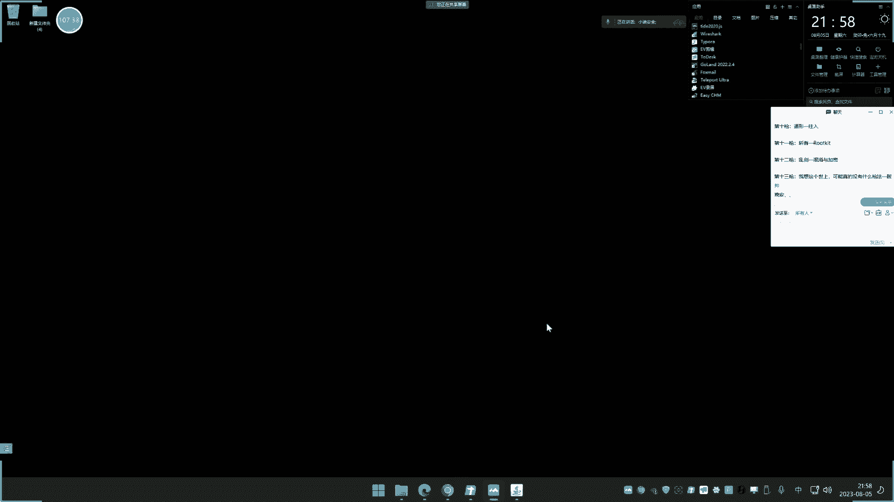