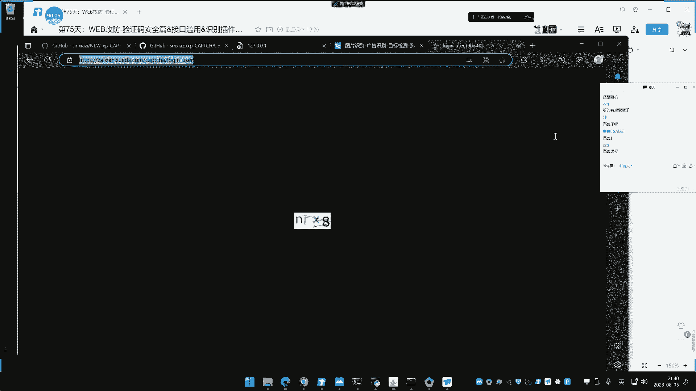
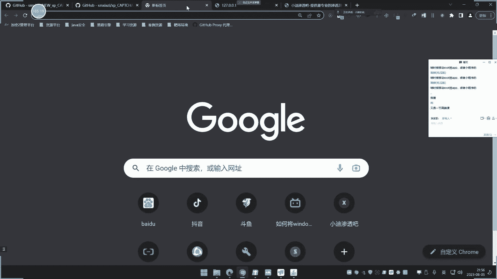

# 课程P74：验证码安全与接口滥用绕过技术 🔐

在本节课中，我们将学习验证码在Web安全测试中的作用，以及如何利用工具和技术绕过图片验证码、识别滑块验证码的逻辑，并探讨接口滥用的安全隐患。课程内容涵盖验证码类型、识别插件使用、宏命令绕过滑块验证码以及相关的安全测试场景。

---

## 概述 📋

验证码是网站用于区分人类用户和自动化程序（机器人）的常见安全机制。在安全测试中，验证码可能成为登录爆破、接口枚举和用户注册等自动化攻击的障碍。本节课将介绍如何应对这些挑战，主要分为以下几个部分：
1.  验证码的类型及其在安全测试中的关联。
2.  使用BurpSuite插件识别图片验证码。
3.  验证码的重复使用与删除绕过。
4.  利用宏命令尝试绕过特定类型的滑块验证码。
5.  接口滥用的安全风险演示。

---

## 验证码类型与安全关联 🔗

验证码主要分为图片型验证码和滑块验证码。图片型验证码要求用户识别图片中的字母或数字；滑块验证码则要求用户完成滑动拼图等操作。此外，还存在更复杂的验证形式，如点选图中物体或回答问题。

在安全测试中，验证码主要关联以下三类场景：
*   **登录爆破**：许多登录框在请求登录时会要求输入验证码，若无法识别则无法进行爆破。
*   **接口枚举调用**：例如短信验证码接口，为防止机器人滥用，通常在多次请求后或首次请求时就要求输入验证码。
*   **用户注册**：防止自动化批量注册，注册过多后也会出现验证码。

其中，登录爆破场景最为常见。接口滥用（如短信轰炸）虽属于业务逻辑安全问题，但通常被认为是低危漏洞。

---

## 图片验证码识别与绕过 🖼️

对于图片型验证码，我们可以使用BurpSuite插件进行自动识别，并将其集成到攻击流程中。市面上主要有免费和收费两款插件，收费插件的识别率通常更高，尤其对于干扰较强的复杂验证码。

以下是使用插件进行爆破的基本步骤：

1.  **启动识别服务**：加载插件对应的JAR包，并运行其提供的Python服务（通常在本地如8899端口）。
2.  **配置插件**：在插件界面设置目标验证码的图片地址。
3.  **抓取登录包**：拦截包含验证码字段的登录请求数据包。
4.  **修改攻击载荷**：在BurpSuite的Intruder模块中，将验证码参数的值替换为插件指定的占位符（如 `@1`）。
5.  **设置Payload和线程**：为账号、密码等字段配置字典。**关键点**：必须将攻击线程设置为 **1**，因为识别服务是单线程处理，多线程会导致验证码匹配混乱。
6.  **执行爆破**：开始攻击，插件会自动为每次请求识别并填充正确的验证码。

**核心配置公式**：
在Intruder的Payload位置，将验证码参数值设置为：`@1` （具体占位符需与插件配置一致）

**注意事项**：新版BurpSuite的线程设置在 `Project options -> Connections -> Resource Pool` 中，需创建最大请求数为1的资源池并应用于攻击。

---

## 接口滥用案例演示 📲

验证码识别技术可直接应用于接口滥用测试，例如绕过短信验证码发送限制。

操作流程如下：
1.  找到需要先输入图片验证码才能触发的短信发送接口。
2.  使用上述方法配置验证码识别插件。
3.  在BurpSuite中抓取发送短信的请求包。
4.  将数据包中的验证码字段替换为插件的占位符。
5.  使用Intruder模块，不设置其他变化Payload，选择“无限”循环发送模式。
6.  开始攻击，插件会持续识别新验证码并提交，从而实现绕过验证码限制、无限调用短信接口的效果，演示了“短信轰炸”的基本原理。

此案例说明了业务逻辑中防止接口滥用的重要性。

---

## 验证码重复使用与删除绕过 🚫

除了智能识别，验证码还可能存在逻辑缺陷，例如**重复使用**和**删除绕过**。

*   **重复使用**：某些系统在同一个会话中，首次获取的验证码可以在后续多次请求中重复使用而不会失效。攻击者无需识别新验证码，即可用同一个验证码进行持续爆破。
*   **删除绕过**：某些请求包中包含用于校验的Token或签名字段（如 `token`、`sign`）。有时，直接**删除**这些字段，服务器可能因校验逻辑不严谨而认为请求合法。这与开发中的判空逻辑缺陷类似。

测试时，如果发现携带Token的请求失败，可以尝试直接删除该字段后重发，观察是否能绕过校验。

---

## 滑块验证码与宏命令绕过 ⚙️

部分简单的滑块验证码可以通过BurpSuite的**宏（Macro）** 功能尝试绕过。其原理是：某些滑块验证码在页面表单中有一个固定值，提交请求时，服务器会检查请求参数中是否包含与此表单一致的值，以此判断滑块是否验证成功。

绕过思路：
1.  配置一个宏，让它先访问登录页面，并从响应中提取出滑块对应的表单值。
2.  在发送登录请求时，利用宏自动将这个提取到的值填充到请求参数中。
3.  这样，无需手动滑动，每次请求都携带了“已验证”的值。

**操作限制**：该方法仅适用于**滑块值固定**在页面中的情况。目前许多滑块验证码（尤其是需要拖拽到指定位置的）会在用户操作后动态生成一个值，该值无法从初始页面获取，因此无法用此方法绕过。网上文章所述的高端技巧实际应用场景有限。

**宏命令配置路径**：`Project options -> Sessions -> Macros`

---

## 总结 📝

本节课我们一起学习了验证码安全相关的核心知识与实战技巧：

1.  **验证码类型**：主要分为图片型和滑块型，与登录爆破、接口枚举等安全测试场景紧密相关。
2.  **图片验证码识别**：通过BurpSuite插件（免费/收费）可实现自动识别，集成到爆破攻击中。关键是配置正确的验证码地址并将攻击线程设为 **1**。
3.  **接口滥用演示**：利用验证码识别技术，可以绕过限制，演示了短信接口被滥用的过程。
4.  **逻辑绕过**：关注验证码的**重复使用**和请求中校验字段的**删除绕过**，这些逻辑缺陷可能带来安全隐患。
5.  **滑块验证码绕过**：对于特定类型（值固定的）滑块验证码，可尝试使用BurpSuite的宏命令自动填充值进行绕过，但该方法适用性较窄。

验证码绕过技术主要用于发现业务逻辑层面的低危漏洞。在实际测试中，需要根据验证码的具体实现方式灵活选用或组合不同的方法。