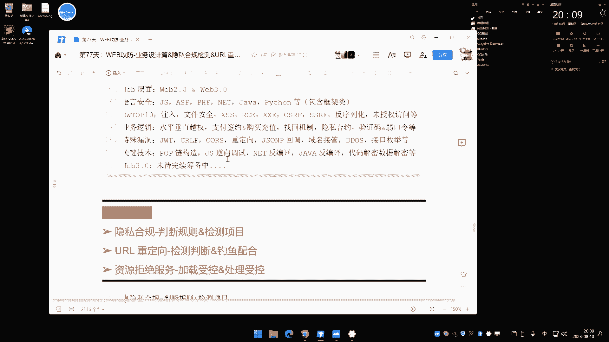
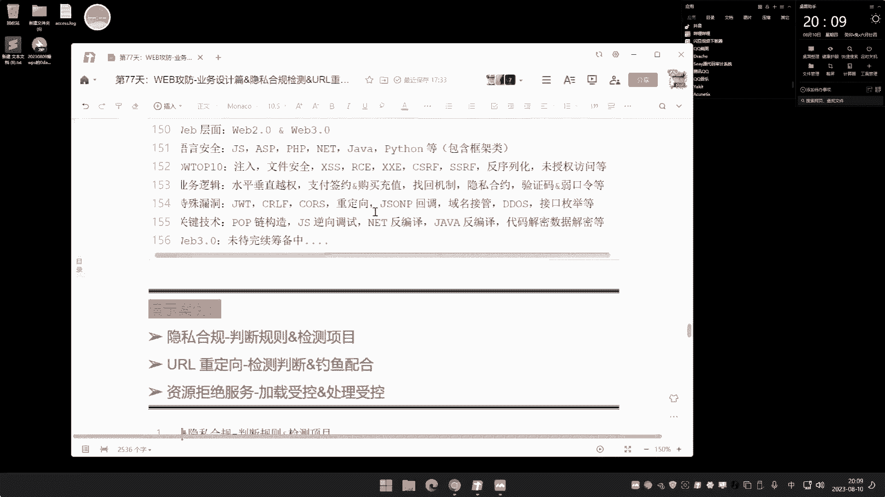
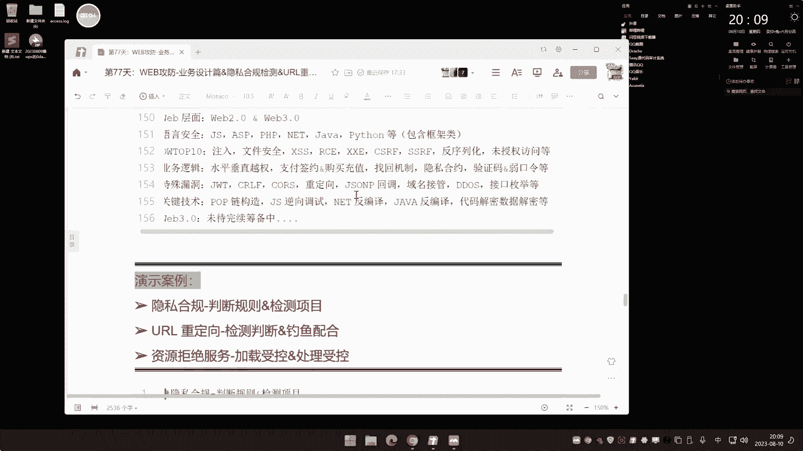
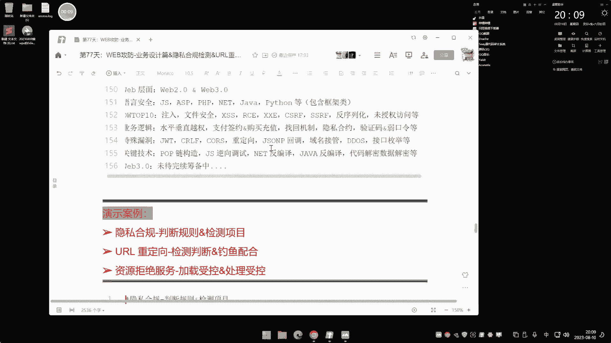
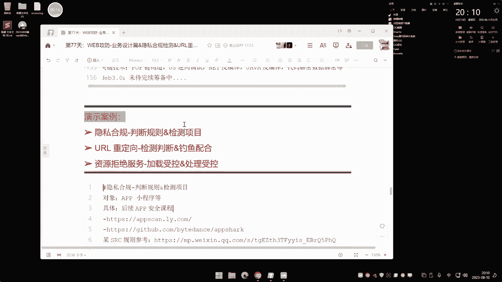
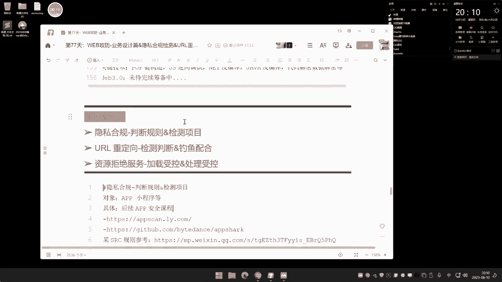
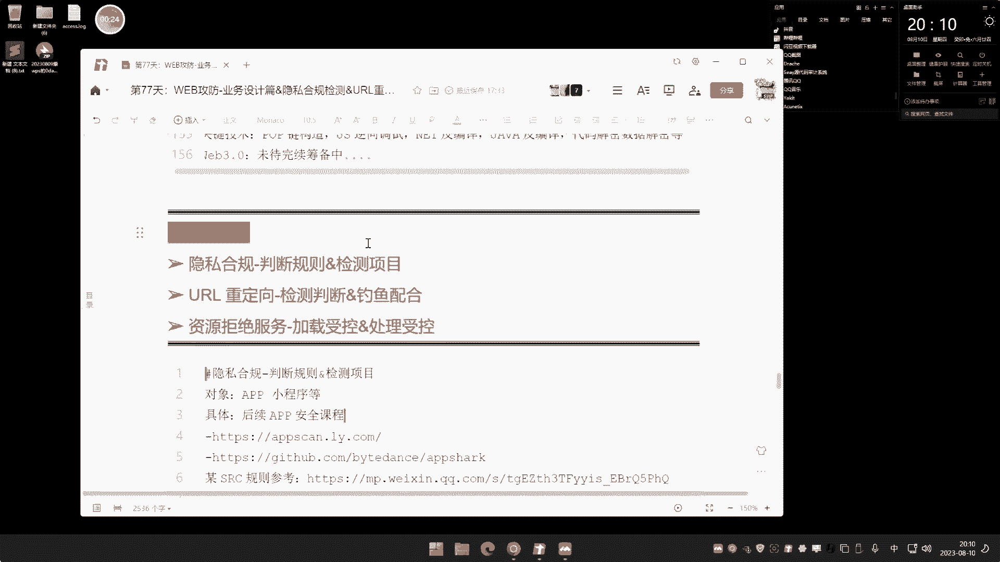
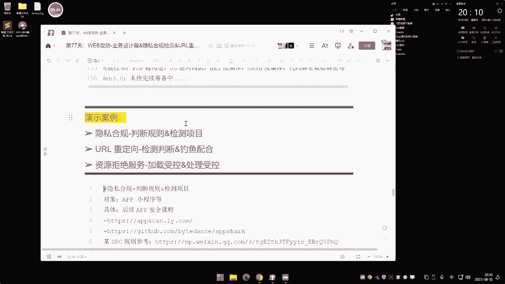

# P76：第77天：业务设计篇&隐私合规检测&URL重定向&资源拒绝服务&配合项目 - 逆风微笑的代码狗 - BV1Mx4y1q7Ny

好我们直接开讲讲今天的内容啊，今天呢说一下这个业务设计线三个安全问题啊。

今天的内容呢说白了啊。

在SRC里面有这个支点啊，然后在实战中呢用不到。

现在说第一个啊，这个隐私合规的啊，这个影视合规呢，主要针对对象是这个app和小程序的。

什么叫隐私合规，网上看了一大堆这种叫法。

也弄不明白这个东西是啥，说白了啊。

这个东西就是一个规定文件啊，我们自己呢有没有，平常自己有时候看新闻或者看这种新系的，应该都看到。

经常这个什么鬼，一些，东西就会有这个叫什么呀，就是这个app商家不合规，就非法收集这个个人的什么隐私啊，或者说非法的这个收集了这个用户的凭据啊，等等，啥意思呢，就大家都知道啊。

现在有些app呢找线连的时候有个app啊，你一打开那啥提示都没有，但是呢你把那个app安装一打开之后呢，他把一个手机的什么设备呀，甚至你电话号码呀，什么短信啊，什么鬼东西都给你监控了。

甚至说把这数据全部回传了，大家应该明白，这是你在不知不使用中出，你这个人信息全部没了，所以呀这个国家呢就除了一些系列的一些规定，就是这个隐私合规的规定，文件指的就是啊这个app的这个商家。

他是要必须符合这个隐私合规的，否则就给你下架，这个我一说大家就应该明白是怎么回事了，这个指的就是隐私合规，这个指的就是隐私合规，但我们今天讲的是这个web是吧，这隐私而归呢是针对的是什么小程序和app。

主要就app，因为这个网站的大部分没有这个事情，app小程序在你使用这种程序区间的时候，经常会有一些提示问你是不是开放一些权限啊，你打开的时候什么未知权限是不是开，是不是允许是允许还是阻止。

都会这样提示，这提示全部都是按照这个隐私合规来的，如果它不提示，在用户不知情的情况下面，他给他偷偷的来，那么就是不符合的，讲这个东西主要是RSRSRC里面，我们可以看一下，这里有篇文章啊。

这个是一个叫这是那个view啊，view大家都知道这是手机品牌嘛是吧，他们呢也有自己的安全响应中心，主要是中车中心啊，旗下的产品呢也是对外的，如果测到漏洞的，提交上去了，也有奖金。

他这里说有个这个隐私合规的评分规则，我们可以看一下啊，这一个表，这是他的一些旗下的一些什么应用是吧，呃然后这里有个啊，把个鬼图片再打开，看盘呢，这个黑窗上看也看不明白，这是他涉及到一些这个检测的东西啊。

每一个这个大厂商呢都有这种啊，让你自己去挖东的这个什么这个目标啊是吧，你说这里这是view是吧，他这里有一些他旗下的一些这个地方，然后呢这个是他这个挖洞的一个评级，你看他是什么东西的评价啊。

他说了严重的是利用方式性，有技术深度是吧，有侵犯用户隐私权益的，给到奖金是3000~5000，然后具体指的是哪一些的呢，给看一下了，这是他指的一些方面呢，未向用户明示，或者未经用户同意。

直接向用户个人信息呢给他直接提供出去了，简单来说呀是哪些东西呀，就是不经过你同意乱搞，你安装这个app或者说这个小程序，你打开之后，明明啊你现在用户是吧，他有偷偷的窃取你什么用户的位置信息。

窃取你用户的当前的这个设备啊，那个什么啊，编号设备的电话号码，甚至呢他把你一些鬼东西给他偷偷的，或者说开你的什么摄像机啊，搞了一些名堂啊，凡是这些事情都属于违规了，那违规之后。

根据这个违规的一个情况来决定评级，所以大家想象一下，那么你在测这个RRC的时候，是不是又多了一个测的点呢，就是测当前目标的app和小程序，是否存在隐私合规，那么具体存不存在，就是根据这个发布的。

在这里有个叫国家发布的工业信息化的，关于这个app侵害用户权益的相关的一些规定，就是不能啊，这个做哪些事情啊，具体你要看啊，简单来说你也不用看这个文件啊，如何判定它呢，这是第一点。

先看这个目标是不是有这些功能，就比如说啊他是不是偷偷的这个是吧，在运行的时候偷偷在监听，你是不是开了什么录音，是不是有这个访问你摄像机的权限，是不是有访问你手机号码权限。

获取你手机设备信息的权限等等等等，你就看他做没做这事情，做完之后你再打开车的时候发现，如果说他在做这个事情的时候，他先提示了，你说他这个app要使用你的位置信息，要使用什么什么东西。

如果他有这样类似提示，那还是合规的，如果没有，那就有就这么简单啊，那么具体怎么测啊，这里有两个项目，这是用的最多的，其实我们前期讲的那个叫mono s f，那个东西呢也可以测。

但是那一个呢是个综合类的车，就是说它是一个综合的app的检验，检验那个东西啊，就我们前面不讲过这个产品吗，这个number sf啊，这前讲过了啊，这是他比较综合的车啊，就是能测一说表种信息。

但是他不是专业的，那如果专业测这个隐私合规的，目前网上呢有两个，一个是这个啊，一个这个还有个是这个这个东西，来个看一下app stick啊，两个都开源产品，那针对这个安卓的啊。

这个自动化隐私违规的一个检测，然后呢还有一个啊，这个使用起来说实话啊，我觉得你用这个更好，但这个呢本来就是说今天给大家做演示的，真他娘的呀，设备刷成砖头了啊，这个叫APP死干。

那个web漏洞扫描器里面也有个叫app死干的，是那个IBM公司的，那个时候搞过web漏洞扫描啊，然后还有一个名字也叫a p scan，是另外一个啊，不要不要搞混淆了啊。

还有个名web扫描器的也叫AP4杆啊，这个呢也叫AP4干，这个呢是一个东西啊，针对这个app违法收集个人信息的违规认定方法，然后呢，这是在界面，这个为什么说要用它呢，很简单，来我这里电脑都装上去了啊。

给他看一下，哎跑哪去了，在这里吧，哎怎么装上去了，大概就这么个东西，就大家可以直接安装这个安装包，哎这上面加安装包，就这里呢它比其他的那个项目呢要好些，它好的地方就说是这个有windows版本的。

有Mac版本，你直接放电脑上面安装运行就完了，哎不用额外准备什么安那些乱七八糟的，所以说也是个UI的，看上去也简单，但是这引检测隐私合规的啊，不管是这个项目还是那个项目啊，这个是个静态的。

那你可以看一下啊，这这个项目是个静态的，它的一个网上介绍呢，他说啊，这刚才看到跑哪去了，关了啊，我把它打开看下，就这个什么叫静态动态，大家应该也知道这个叫法，他说一个静态分析啊，呃静态分析是什么意思啊。

就是说你直接把这个他这个是个自动安卓的嘛，那你把VPK文件都给他给他之后呢，他就帮你在里面在搞完了，这就是静态静态分析，就是说他没有冬的情况下，面东台呢就是说他有在任性效应，这个呢就是动态分析的呃。

你觉得静态分析还是动态分析，哪个更为更更为精准，这个呢大家可以想一下，你觉得是动态还是静态还更精准，动态的意思就是说把它运行起来啊，静态的就是说你只给个文件给他，他更分啊。

然后这个动态呢就是说就直接人行起来，通过人形的这个监控啊来去判断，然后这两个项目啊，静态的呢就不需要这个什么安装这个啊，就不需要这个真机了，不需要真机了，什么叫真机啊，你不是说不有只干州模拟器吗。

万模拟不行吗，啊不好意思啊，安州模器不行，为什么呀，大家应该也知道啊，这个安卓模拟器啊，他有些APK啊，他是搞不上虚的，他是装不上虚的，一个是它的内核版本不一样，还有一个呢就是有些这个程序app呢。

他是检测设备的啊，他如果你发现是模拟器的，它是无自身人形，所以说必须要增肌，增肌，要了之后呢，而且他有个条件，大家看一下啊，安卓手机必须root，打开a dB调试，今天我把家里面一个手机拿出来了啊。

以前的安卓机一个view，我把它root啊，root了半天没录成功，搞成砖头啊，唉本来说要做这个实验的啊，做不了了，这只能说到后面那个app的安全课程的时候呢，再把它讲一下吧，啥是砖头啊，这很正常啊。

你经常有些这个品牌的一些机器啊，那个要得到root权限，有些搞不了，甚至有些人搞事故就成砖头，我那个就搞成砖头，还好是一个以前老机器啊，到时候只能再买个二手手机啊，然后做这个实验呃。

然后这个实验有什么意义啊，简单来说呢，来我们举个例子啊，这个，这个隐私和规里面呢是吧，哎怎么都是隔壁的这个培训泄露了呀，这个隐私合规的呢，你在网上找这个找这个目标之后啊，自己再准备一个这个手机啊。

然后呢把那个目标app给装上去，装上去的时候呢，把这个工具打开啊，他帮你自动调试，我们可以关注一下这个网上项目啊，这是大概大概情况，你看啊，额这里呢分为打标展示啊，关注行为啊，如果说你手机。

你现在这个设备里面有个root的手机，你等一下就可以操作这个操作，说实话就是个演示，没有什么太大问题，你直接把你这个SRC的目标信息里面，涉及到app产品销，它只是app啊，小程序呢需要离箱。

小程序我们后面会讲啊，他也有小程序上面的这个隐私合规检测也有啊，消停也有，但是大部分都指的app啊，把你的目标的app给它拿出来，放到你手机上面去安装，安装好之后呢，用这个调试器连接上去之后啊。

你打开看啊，他这里呢有个叫关注列表和网络行为，还有个达标列表，达标列表就是说你要对哪些目标进行车，然后之后呢如果说存在安全问题，他会在这里的结果展示着，你们可以看懂啊，你看下有什么信息啊。

嘞这app是否在列举业务功能的时候，提醒用户不提供个人信息，可能带来影响，ab业务功能为收集个人信息，是否对应好这个呢，答案由于我这里那没办法给他展示啊，这个没有设备啊。

所以我就只能用那个mono sf给他看一下啊，猪如此类这些东西是大概是什么模样啊，给他看一下啊，我们这里呢嗯嗯把那个慢慢F启动下哈，那个也支持，但是那个呢不是专门剪的，它只能检出大部分。

但说有没有这个安全问题，有没有这个违反这个隐私合规这种东西啊，呃他是能够它这个专门工具呢，它是能够判断出来的，但是member f呢只能展示有这个操作，但是具体他也没有违规呢。

这个就要看你自己的去判断了，需要自己测试，我先把这个MMFS打开啊，然后这个章节的挖掘漏洞呢是属于app章节的啊，它不属于挖，就是网上的都可以看到，关于这个SRSV挖掘呢啊。

现在很多都提就提这个隐私合规，因为他是检测起来也比较简单，然后呢挖的漏洞的奖金也高，大部分的都会忽略，一旦挖出来之后，那提交过去呢是吧，对方整个都会给一定奖金的啊，几百到几千不等。

来我们这里呢给他看一下啊，我打环境打开看看一下，我们可以随便在网上去下一个啊，下个这个APK市场是吧，我们可以随便瞎啊，这他妈的，我还脑没用安卓了，妈的吓得地方黄豆壳上不上，UI下载啊，你可以随便找啊。

就是凡是有这个目标里面他有这个app的啊，都可以测，这个没什么说的啊，搞什么呀，我要下APK文件是WINDO夹吧，瞎一下啊，哪个市场里面的看啊，我们随便找一个好吧，随便找找，也不要那种太大的。

也不用搞太小的好吧，嗯太大的那种肯定就没有了啊，那如果说有的话，那早就下架了啊，找个那个人不是很多呀，但是呢又有点是吧，还有点名气的那种啊，你经常你自己找的话，网上那他有目标的啊，有些这种产品就。

随便找一个啊，下载一个来把它放上去，一车就完了，好我们就拿个什么百度输入法，这鬼东西拿这个测一下啊，把下下来，那这个呢他是百度旗下的，然后你如果说要找到他的隐私合规，你就可以直接提提交到什么看一下啊。

提交到这个百度RSSC上面啊，在这呢这都属于的，你这就说如果你是找那种其他产品，那你直接给提交给他啊，那个肯定要给奖金的，但是这个肯定就不是靠运气了啊，所以说为什么说你要收集这种APP产品，小程序产品。

它有什么新开发出来的，什么APP你都要测，因为这种老的像这种人，百度书法，这是出了好多时间了，说了好多时间了，那肯定就不用说了嘛，那都被人扯了一个边了，那有额安全问题早就提交了。

所以说你要持续的监控和监控啊，监听有没有一些洗下的新的应用，让你找到更多，我们要上传一下啊，让他这个检测下，这边有信息啊，我们要再等一下啊，这个member sf呢有些人一直都搭建不起来啊。

反正我也不知道啥情况，你不要问我啊，妈的我搭建的也蛮正常，有人实时搭建不起来，也不知道啥情况，是蛮麻烦，烦的很，我们就等等一下了吧，等下看那个结果啊，我们现在就不管他了啊，很多这种目标里面啊。

你通过信息收集呢，收集到些app产品和销售产品之后呢，都可以做这个隐私合规的检测，如果说找到这种这个规的话，就可以直接提交，它比其他漏洞要好找多了，所以说网上，那你再看到什么隐私合规的。

SRC的那种玩具是吧，很高端的样子，其实那就这么回事，根据他官方那个规则啊，你就像我们之前这里看到的啊，在规则里面啊，有他这个未授权的这种情况，有可提交还是这种啊，就获取的时候啊。

你即使不懂代码也不用看，那比如说等下我们把这结果拿出来看之后啊，你就会发现他能刊登出你这个app里面啊，有尝试做过哪些事情，然后你想象下，比如说V字信息，那肯定就是涉及到这个个人定位。

有使用到你的个人位置的时候，你觉得这个app在哪里会使用到它，你就直接可以在上面测，你在使用的时候，它没有提示，你没有允许它，它突然一下子是吧，就里面的你的信息他就知道了，那这就不合规啊，他没有告知你。

好这个需要点时间啊，我们要稍事等待了，来我们看一下啊，大家知道什么情况就可以了，他还在反编译着，不管他了啊，嗯先说下面这个安全问题，然后这个隐私合规呢，后面会有真机演示啊，这个现在环境没有啊。

所以关于什么这个app s干这个扫描啊，来大家可以下去之后啊，有root安卓机就可以直接撤了，没有的话，那是没办法，因为他是个动态调试动态的，你没有针剂，它调不起来，必须要登记啊，那个模拟器是不行。

而且必须要root啊，好我们这里呢等下再看这个结果啊，这个结果需要点时间，那么现在呢我们就，给他上下下面漏洞啊，这下面漏洞呢在SRC里面呢，呃这个国内的话搜的比较少，有些人喜欢文字的都懂。

因为它的危害呢说白了啊还是要配合钓鱼，而且钓鱼能不能成功也是个问题，这楼子呢在国外比较吃香，国内呢比较少，而且不是说不是不是说少啊，就是搜的少，网上面也关于这个SRC玩具里面的讲。

这个UDI储冰箱也比较简单啊，嗯他一般呢就是说有些功能，你比如说我网站什么用户分享功能，还有你在登录之后呢，他重新的给重置到另外一个页面，像这些地方都有业务需求的时候，那就会用到重定向。

你分享的时候呢很简单，你比如说把网站分享到微信，那么分享过去的时候呢，他就是微信的那个URL地址，URL地址呢包含这个什么，你那个分享地址对不对，是这么个情况嘛，那么这里呢一旦打开之后呢。

他又不是微信地址，又是你的分享地址，啥意思呢，好我们举个例子啊，你就想着这个信息是在哪写的啊，你这微信的地址啊，微信点QQ点com，然后分享的话人地址这样写的是吧，就等于分享的小于八点com啊。

你给别人发送的时候，那是大脑这么个情况，那看上去呢也是个微信的地址，也是微信的这个官方地址，后面呢这是你分享的网站啊，发过去呢打开之后呢变成了小零八点com，主要在前面的应该是微信地址。

微信的官方打开了变成小白的com是吧，看上去呢啊官方的地址，但是打开的是小莉帮点com，所以他呢就配合这个钓鱼呢用的多钓鱼，什么意思啊，你比如说我打开这个地址的时候啊，我重新音箱挖到这个漏洞是吧。

我把这个地址一改，改成小里面看，然后这个小迪八点com呢我再做一分子吧啊，打开呢和这个什么微信点Q点com呢一模一样，所以打开一模一样的话，实际上你现在是仿我的小八点com，打开一模一样，小日本。

看我是你自己，他自己创建的钓鱼网站，那么对方呢就以为是在微信Q点com上面，在操作上面的一举一动，你就能监控到就是这个概念啊，所以这个月要从丁香的一个围海呢，就是由于啊他重新交另外一个网站去了。

导致这个网站我们可以篡改，这个网站的显示内容，保证和目标网站一致，从而迷惑目标者在上面操作，实现这个类似钓鱼，那么现在呢我给大家看个案例啊，啊比如说像这里有个网站啊，来这是一个网站。

那这个网站呢就是一个有个重庆安东，这是一个学校的，就清华大学那个图书馆那个什么学术自然，然后这里面还有个登录是吧，那个要用微信登录啊，我们现在要做个什么事情呢，就是利用这个重定一下漏洞啊。

给他重定向这个登录界面一模一样的，给网站上去，反正他不知不觉中呢是吧，以为是在这个上面，在这里在操作，实际上呢是在我们调用的操作，对这些用户的信息来进行窃取一个钓鱼啊，然后我们看一下重庆箱在哪里啊。

重庆箱该怎么挖，我们先看一下啊，从黑盒的角度上看，卖画一般就是看这几个功能，一般这几个功能呢就会出现重定向的功能啊，就像这个什么登录之后呢进行跳转，然后用户的分享的地方啊，里面有些参数。

然后呢像这个什么导航类的都有啊，那黑盒中呢就是看这个参数值有这种类似参数，比如说这里有个什么重定向的参，参数名ULL等于一个地址，将谱跳转到哪地址，目标地址多少，Q到哪里，link连接到哪里。

都某域名指向哪里，你想这里啊，他这个漏洞地址呢就有这个类似参数啊，我来查一下，来这个load地址，然后后面那就是个URL参数，你问我这个怎么找到的，爬出来的啊，爬出来的对吧，我给他写个这个地址吧。

我现在呢写个什么百度点com，那我这个地址呢写上去地址啊，看上去呢是这个网站域名，实际上那一访问呢打开了百度，这就是个典型又要重定向呃，你这里第一次一改是吧，你一改小的话，你看那打开就小的吧，你看。

对吧，打开就是这么个地方，然后呢我们现在做个什么事情呢，就是啊重定向的找法也比较简单啊，百合里面呢就是看这个代码的代码，就是弄的代码啊，就是从把这个网站呢重定向到，打哪个目标上面去呢。

pp的写法点net写法，jungle的写法呀，java的写法呀都写了，挖代码神经里面去挖，重定向的也比较简单，搜这种关键性代码，那也能搜到黑盒里面的，就是看这个地址参数和这个功能啊。

是不是是不是符合一个重名下的一个产生，那么利用起来的话啊，这找到之后呢，就要利用应用呢，一般他是为什么这个漏洞有些会收，有些不会收呢，就是看你这个钓鱼的能不能配合起来好，我们加娜娜。

比如说我要配合这个目标这个信息啊，目标这个信息那如何操作啊，大家关注一下，那刚才那个漏洞那个点啊，来这漏洞点在这个地方好，然后呢我在这里有一个登录是吧，模拟这个登录这个界面啊。

这是在网站的一个登录的一个界面是吧，我模拟这个界面把它弄弄出来啊，首先呢把这个页面呢给他做一个钓鱼页面出来，如何做呢，是啊我看一下啊，来个粘贴复制，然后呢用这个正在下载工具。

或者说直接浏览器上面导出也行，正在下载工具呢会好一些，就是这种类似爬虫的啊，创建个东西呢啊新建项目啊，在硬盘中创建一个可流览的网站副本，打开这个网站，就让他们去对这个目标网站进行一个爬取，对不对。

然后呢我把它进行盘啊，就默认吧进行盘，然后把那个桌面吧，项目名字放桌面，然后爬开始点开始啊，他就帮我们去把这个ATM显出来的页面给爬啊，常规的JS文件的页面啊，它爬出来这个爬完了，爬完之后呢。

我们可以看一下啊，在这个目录里面看一下啊，这里应该就是有那个分类型展示吧，当然了你也可以在页面中去这样操作啊，这里有了三个页面，index页面打开一看啊，就是这个刚才那个网站那个界面。

logo界面应该是那个登录界面啊，就是那个登录界面是吧，好我们这个登录界面的，好像有一些和那个网站有一些小差异啊，什么差异呢，我们再看一下啊，这里有用户名啊，密码这里还没写，这什么原因造成的。

把我给简单的修改一下啊，比如我们检查这个代码这里啊，他这个代码是这样写的，在这里啊拿来复制粘贴一下，然后呢找到这个代码文件啊，自己呢简单的编辑一下，就是更改成和它差不多的样子啊，就制作个调页面啊。

那其实就是调用页面的制作本地的修改一下好，哦找到刚才那个地方啊，找username就是输入关键词，该搜到啊，就是这里了，把修改成一致好，我刷新一下这个页面，看一下是不是就，看看到没，这里有有用户名是吧。

底下这个是什么密码，对底下这个是密码，再用这个来把它粘贴复制修改一下啊，还有这个代码端，这个应该是密码，这里是吧，修改好再来保存，再刷新，这里看它是不是自带的，哎，有了好。

那这个前端那个界面呢就做出来了啊，那现在雕雕好了，哎那我们整理一下该如何操作它啊，这我那个网站一个界面啊，然后这个制作好之后哎，呃然后呢，我们再比如说我要劫持他的这个账号密码啊，我怎么操作呢。

我打开看一下做这个钓鱼嘛，这毕竟要要掉东西的呀，呃账号呢是这个叫username，参数值是username，密码呢是这个password，那我就结束这两个值吧，怎么结束啊，在前面的写一个这个代码。

然后把文件后缀改一下，改成login，点pp用pp呢来做这个操作啊，你用什么语言熟悉就用什么语言啊，打开看好我们来写个pp代码啊，一个pp的一个结束数据代码啊，这个也比较简单啊，诶怎么脑子这个东西。

然后这里呢写个P啊，U等于接受door和post提交过来的，这个是user link p呢就等于这个提交过来的，什么卡死我了，然后这里做个文件读取和写入操作是吧，打开一个文件名字就叫pass gt啊。

以W加的模式打开，就是读写模式打开，然后呢在写这个for write，去写在这个里面去写个数据写U，然后再点连接服，加个这个中间符，分割一下，先密码再写写账号，写完密码，写完密码，那换个行，写完之后呢。

for close关闭一下，这是简单的pp的文件打开操作啊，这个很简单的啊，你不要说这也不懂啊，网上一查就查出来啊，文件打开操作啊，做这个事情之后啊，就保存好了，然后呢我们来到刚才那个代码段那里哈。

呃把那个请求地址吧改一下，找到那个username那个输入地方找一下啊，好这应该是刚才那个username修改地方的，这个是那个UNAME那个代码段啊，这里就是那个账号密码，然后呢。

在这个头部这里呢可以写个这个什么附表单，他提前目标直接写个东西，那么数据应该就可以了啊，for表单要不改成X把提交给当前文件，把提交方式改成这个post，大小写都行，把这个写好之后呢。

看一下这个上面那个索引到了这里，看下这个索引是哪个，不是你，那就是在这个这个下面写个for的一个结束，咦这个怎么回事啊，信号啊，这个for的结束，那就这个for的结束啊，写错了吧，F o r，好啊。

这里写好之后哎现在呢啊怎么操作啊，大家看着啊，我们来操作给他看一下，把这个目录文件啊，比如说我找个我的这个域名，我用真实的找个我的有域名的IP地址，那也行，因为他调转的URL地址，那你能收空啊。

我那放到这个什这个，这个我的这个什么各种网站上面去啊，修改好了，放到他们出去，我自己有博客网站啊，你根据自己需要啊，放到那个网站目录下面去，然后呢我们尝试性去访问一下，看一下啊，三刀面小迪八点com。

然后STU这个目录是SJTU，然后呢我这个文件是log点pp嘛，啊如果说你想直接首页的话，那就改成index pp也行，打印logo，你pp打开看一下啊，你看这个页面是不是就是我们做出来的，调用页面啊。

来看到没，这个网站就是我自己做出来的嘛，然后你再看一下这个目标，这里啊和他相不相似啊，来一户就是一模一样的嘛，啊这这这是不是一模一样的，是目标的呢，目标是这样个情况吧，啊目标是这个网站啊。

然后这是我们做自己自己做出来，是这里啊，来自自己做哎，看到网格了，开始啊，这个我自己做菜了啊，对这目标了啊，防守有目标啊，改完之后啊，那现在找到那个又要重定向那个地方，来把这个诶笛子呢。

啊这个地址呢把它替换成这个地址，对不对，替换这个地址好，那么现在呢就假设啊，我们先看一下啊，现在这个文件是吧，我们来看一下这谁啊，怎么pass贴贴就产生的呀，来看下，不管他啊，来一打开是吧。

这又要重定向给对方发这个地址，对方呢以为这是个16。4N的网站，打开，这个这个是PS啊，这个网站又要地址问题啊，这不这不是我们这个网站问题啊，这个他这自动加1DS，妈的死逼逼，这个hp s去掉。

怎么老访问要访问PS啊，这浏览器找不知道什么情况，看来你看一打开是吧，变成了网站骑士小于八点，看我们来到这里，那比如说我输哎，这里小题一输啊，点击下登录是吧，它提示空了，也不知道啥情况哎，登录一打开。

啥情况怎么没有解释到啊，大家重新来一下，我看一下啊，我看他发不发包出去还得，哎这个啥情况，没写对呀，代码你写的有问题啊，那个风险不是的，那是我那个浏览器他访问加了个a abs导致的啊。

它本身不是有abs啊，你给P它就没有提示了，我看哪里改改写错了呀，看一下啊，Use name password，这username p w d写好了，这个for这里难不成那我写到这上面来看。

这里应该不会吧，嗯action post，这啥情况啊，这莫名其妙啊，呃会不是在这里写，还是不是在这里写啊，这里有个这个表登录的那个触发按钮啊，再看一下吧，来我们把这个写好的拿开看下啊，还是写错第一方。

不不不，这里呃，在哪个页面，我写丢哪去了，放这个不放这个上面去了，这个，哎呀，嗯这我是应该是哪里写错了啊，我把修改一下鬼东西，这不可能的，这这个是那个在这里写的for啊，我看写for是写哪里写错了啊。

for表单那个地方，我用这个工具把它打开吧，他没有成功成功的把他勒个下来啊，成功的把把他提交上来，那个数据没有接收到啊，页面是掉，页面是做出来了，但现在呢是要把账密码给截收到，我们在这里修改啊。

这个地方修改，嗯找到刚才那里啊，那个for那个表在那里，在这里在刚才写的那个位置，在这里啊，我们写的位置在这里，狗东西，这写哪里去，写错了吧，就这零一个二对应上，啊这个表单在这里我们写在前面去看一下啊。

最前面去，然后再在结束的地方，结束的地方，这里再截个for了，结束，好这样子我再看，对不对啊，我先看一下啊，请求一下这个信息，你在搞什么鬼，名堂在，不要乱搞啊，你这搞的他妈的我都不知道是啥情况呢。

成没成功，真是你妈无聊啊，你这样对我啊，我的我看改哪个地方啊，那个因为他有那个把那个数据，要把那个发送过去啊，嗯那应该是对啦，邮轮都发过去了没对，有人发过去了，我他妈的写哪个地方去了，我之前写好的啊。

写正确的，好这是写好的啊，我这看写好的啊，这是写好的还是写好的啊，一模一样的啊，没什么太大差异，我看我刚才写的符表达式在哪，这个是写好的，我这把写好的替换一下吧，我懒得看了啊，就是哪里一个问题啊。

嘶我找了个佛啊，高高端是在哪里写，哪里去看一下，是在这里啊，要写到这个下面啊，这还是在这里啊，这里给他一个LOGX啊，这里能改一下，其他的没有啊，还是一样的，那应该就是这个地方啊，我们找到这里啊。

找到这里我修改一下啊，啊他就是刚才那是在代码是在这里呢，来在这个下面写的，在这里写的，那就是这里，就这里啊这些这个呢就不要了，然后这个下面的这个里面一个four啊，应该对了啊，看一下现在行不行。

好我们试一下啊，看看这里是不是有文件产生了，那果然你不要这么乱改呀，我真是服了，写进去了啊，应该是写进去了，我把那模式一改就可以了啊，这个模式是一个W加模式，W模式是那个是一个那个。

我们重复覆盖的模式啊，你pp里面有个那个，for open的那个A加模式是个追加模式，还有几个那个模式的啊，来我们W加模式，那是如果清空内容啊，如果说你不清空的话，就是A加模式，就是这种是吧。

文件模式打开，我们A加模式打开就会记录你在搞维加模式吧，维加模式好吧，这个搞成A加模式就可以了，保存好，那现在呢我们先把这个文件删掉啊，再来一下，黑gem好吧，来刷新一下啊。

现在来放提交看下这里这记录进去了呀，记入进去了吧对吧，没问题啊，这个写的时候呢，这里都换这个符号吧，都换成符号啊，然后写个换行符，这里呢我们就不写换符了啊，直接看先删掉好，我们就重复正常来一遍啊。

呃首先这里呢通过这个漏洞是吧，这个漏洞呢去一个又要调感访问之后呢，跳到这个默认页面，对方不知道，然后随便写了个账密码，艾特密点3456来进行提交，表示孔呢，这边呢我们看收到了来是吧。

然后给再试一下标题123456随便写啊，再打开，这个就是我们说的这个那个又重定向，配合钓鱼的一个情况啊，他就是这么一个危害，这个危害可大可小，说实话啊也是比较低微的一个漏洞，重逆向漏洞呢很多啊。

我们可以网上随便给他找一下，来，大家教大家怎么找啊，我们这个找下就知道，我们可以看一下，来，我上课带你啊，用这个GOGO语法呢都能找出一堆来，但这个漏洞一般好多地方也不搜不搜的原因呢。

就是他需要这种配合钓鱼，这配合钓鱼那是个很复杂的事情，加个小代理啊，google上面搜一下，比如说是搜这个关键字是吧，比如说一流有点SN的，这个地址里面的带什么要熬的是吧，收这种心喜，那你可以看到啊。

找这个URL里面待这个信息的加个UR，当然了你可以用它搜索引擎里面也可以搜到啊，就又要信息里面的带这种参数是吧，这怎么你买的都，没有啊，哦这并搜索，我说怎么回事呢，要google搜索啊。

B搜索它不支持这个语法了，只有现在只有google语法能支持，直接谷歌语法啊，你可以看一下来，我们可以看一下这个药的一个参数，来确定里面是不是有修改的，然后呢这多种的就这样走，然后看一下啊，这个又好。

这个呢比如像这个网站就是这样找出来的，后搜下给看下，他这个网站呢就那这个网站就是了啊，你看看这个地址拿出来给他看一下，这个链接地址，我们给拿出来分析，要收到语法里面，你看这个有个UR参数呢。

UL等于一传地址品输点，这个地址我把这个后面地址给改掉，改成3W点是吧，改的上，现在改，看挑不挑，百度点康姆，把福字打开看一下，如果打开百零号，恭喜你，哎你看是不是还有0号吗，那这个就是啊对这个就是啊。

优酷点com，优酷这个就是要凹的一个那个重定向啊，这个重定向，那其实那就是我们说的啊，比这个黑盒里面呢，看这个功能点呢去在分析那个又要地址，又要地址呢，这个参数呢比较重要，什么URL啊，等于多少啊。

什么这个参数值能多少啊，值相应修改之后呢啊，能不能挑着，就是判定这个又要有没有这个重新加入，然后再至至于你再要模拟什么钓鱼，那一般都是模拟那个页面的一个情况啊，模拟那个页面当前页面的一些那情况。

来配合钓鱼，啊这个是那个情况啊，然后有些用要地址，比如说呢可以用这种绕过，就有些人可能他固定这个地址，哪里可尝试呢绕过，比如说写个问号，后面再加上个地址，那么呢会以问号后面的尾准。

比如说它固定到这个地址，那么你可以在后面加工后再写个地址，他可能就跳成这个地址，这是些关于YL的绕过，由于这个漏洞呢不是很重要啊，呃大家碰到了可以挖一下，至于这个娃呢提交之后就不用接不接收啊。

这个就不好说了，所以针对这种绕过的话，你简单看一下就可以了啊，有需要的可以用一下啊，好我们来看一下刚才那个隐私合规的啊，应该结果出来了吧，这是这么长时间了，出没出来呀，好出来了啊，出来之后呢。

我们看一下啊，这是那个mono综合扫描器啊，那我们如果说找银色合规的话，这工具呢把翻译成中文，好先把它翻译成中文啊，这个好看一些，不过你不翻译也行啊，这里有个叫这个的PREMISSIISN。

这我们说的权限的意思嘛，哎怎么卡了什么鬼啊，他妈的好了好了，翻译翻译功能也不，那也不行啊，我说鬼东西把代理推出来，是不答应你问题，哎怎么我要翻译了，唉这有时候一些鬼浏览器，谷歌浏览器翻译也不行。

还懒得翻翻，翻个锤子翻，啊这鬼东西真是卡住了，还，来这看这个权限是零啊，你看啊，他这里的权限，你看这里哎呀，这不翻译，这也是尴尬，是看也看不明白，是，妈的鬼东西啊，这这其实在大之前检测过啊。

这就是一些权限啊，有来来来啊，读取修改外部存储内容，在后台返回值，据网络位置查看网络状态，查看无线网络状态，创建蓝牙连接，怎么拍摄照片和视频是吧，然后这个卡了啊，你继续往下面看啊，这卡了。

这个应该加载一个问题，什么各种各样的啊啊，就是说这个APK里面呢有这些行为，这个危险行为就一般指的，就是一些我们规定的一些行为，要进行对应的提示，就很简单，他这里说要读取联系人数据，他有这个操作。

在APK里面有个操作，如果说他在你不知情的情况下面搞这个事情，没有提示给你，没有让你说允许还是不允许，那就恭喜你啊，这就是一个典型的一致和归纳，就找到了，那你可能说，那我怎么知道他有没有这个提示我嘞。

手工测试，那是最简单的，你觉得他这个为什么会用到年线数据，我想象下啊，这连线数据，那无非就是肯定就是像你号登录上去之后啊，唉分享给你的好友啊，或者说把这个这是干嘛的输入法，那输入法呃。

把结果分享给别人呢，或者说看你的好友有没有这个使用过他呀，他肯定就会读取这种类似数据吗，就看在这些操作的时候，他有没有提示你呀，你在那个APK上面去自己去测呀，打开之后自己测呀，对不对。

当然呢这种测法就是模糊车，因为你不能实际标准，真正的测法是怎么测呢，就是把它动态运行起来，把它运行起来，通过运行的结果和它对应的实现功能去掉，其实就是我们说的app里面的hook，就是看他的钩子嗯。

就看那个钩子，这个钩子在哪里呢，其实啊就是要把那个把它搞起来，搞起来之后看到钩子里面掉的那个情况，就是你那个操作，比如说我点了一下那个分享这个操作呢，他就调用了这个app哪个地方去了这个地方呢。

就是有尝试这个操作，有没有相应给予提示，然后确定这个漏洞是真正的，如果说是测的话，规矩测就这么个测法，但现在我们这个没有蒸汽设备啊，测不起来，以下那两个工具呢就这么呃，那个工具呢就是这么个测法啊。

在网上那你可以翻译一下文章啊，有这种类似东西，那这个呢就是我们说的app安全里面的啊，那个玩AP安全呢，这个隐私合规呢就是其中一个最大项，对了像啊还有像什么APK里，什么不加密算法一大堆啊，当然了。

那个漏洞内有些人也会搜，所以说针对web上面的挖洞呢，就说是吧，然后app的这种挖洞呢就是这些东西啊，什么隐私合规啊，再是那个APK里啊，app文件的一些里面一些配置展示，app里面涉及到深度设施啊。

很多相的嗯，讲到app那个车手时的，再用真迹给大家演示一下，这个隐私合规的挖掘啊，今天呢就是给大家先介绍一下啊，那没有真迹啊，演示不了，这个都是用静态的去先啊，就说你要玩的话，你没有证据的话。

你可以先静态的去看他做的这些事情，做这些事情的啊，自己呢再找那个上面的去运行，它运行之后啊，啊你再通过你运行的那个逻辑，看他做这个功能的时候，有没有给予你相应的这个警示或提示啊，没有的话。

那就有可能存在一次合规了啊，因为隐私合格的那个核心逻辑啊，就是要给用户提示啊，就是你做了这个事情，你要让用户知道，并且让用户允许和防和组织之后呢，就是相应的这个情况啊，如果说用户你就提示了。

你妈的也没有说允许不允许你就搞了这个事情，那里面的还是有问题啊，好这个就是我们说的这个事情啊，这个m m sf是个综合类的，如果说大家专门要测这个隐私合规，那还是用这工具app实干会好一点啊。

但这个呢说了啊，你没有这个root的安卓机呢，做不了啊，做不了这个事情的啊，那个上面有个坎，拿刚才的文档里面的教你连接上去之后呢，你初次上手了，他准备的条件就是呢Mac电脑或windows电脑。

然后一个安卓手机连上你的这个USB接口，然后连到你电脑上面去，连好之后呢，把你手机root了啊，这个权限允许之后，那么打开之后呢，它就会监控到你当前手机上面安装的APK好，然后这个时候你就点开始检测。

他就会开始检测关这里面的，就会检测它上面的这个网络行为的关注列表，有风险的，就会在结果之后呢，在这个地方出现提示，啊就是他帮你测了啊，就取代你手工了嗯，静态测试呢就需要你自行判断。

这个动态测试呢就比较精准一些，测这个隐私合规，所以像挖隐私而归呢，说白了啊，你这个项目造的好就很简单，很快就能挖到网上，还有些项目啊，那些项目的那环境，那配置的那样把你配死了啊，就知道大家用的话啊。

就用这个项目就够了，好这个是我们说的那个情况啊，大家如果非要玩影视合规的话，买手机的时候，拿安卓机的时候呢也一定要注意啊，而某些品牌的这个root呢是特别难root的。

甚至有一些的那种不要买那个新设备的啊，新设备的大部分有些固者不支持，都还没有那个没有那个没有那个文章出来，都买一些个老一点的，买老一点的机器啊，而且网上已经有很多，公开的那种自动自动化的工具。

那种的就比较好，你直接下VD店，或者说他叫你怎么也拿一下这一下啊，就把它root了，那最好啊，你不要搞那种新机器，或者搞那种难搞root的那种品牌机，那搞得那那就麻烦了啊，那搞不好就直接把机器都刷死了。

搞成砖头了啊，我今天用了，之前我买了个那个view啊，就搞成砖头了啊，我因为我平常也没搞过事，今天搞错了，说错了一个步骤，搞不起来了，妈的烦死了，这个有风险的啊，你稍微搞错了，手机就要么就直接砖头了。

要么就直接那个里面数据全没了，哈哈不能乱搞的，所以说你买个那个二手手机啊，买个差1。2S手机好约的啊，就是好root的，好这个呢就是我们说的那个呃两个啊，然后呢再来说一下这个最后一个啊。

今天讲的这几个都是些冷门漏洞，前期的什么cf啊，那些什么COS的那些，说实话啊讲的是吃力的很，按实战中那是一个都碰不到哎，这个自愿拒绝服务呢他是一个什么东西，其实上期上期的也讲过，想象一下啊。

就是我们这个脚本呢，在处理这个网站应用的时候，他要接受你用户的数据，然后把用户数据呢来作为这个处理的这个逻辑，那么这里呢就会存在资源拒绝服务，我给你演示一下啊，大家先看一下，我这里有个网站源码。

我放到我小麦看，我用我那个真实的服务器搭建的，也不说用本地搭建有这种作假嫌疑，这里有个假IP点pp，我看代码啊，这个代码先看这一部分，这大部分那是非常简单的啊，这是任何语言都存在一种安全问题。

不是说只有PB，他这里说有个图片显示，图片显示，你看他干嘛啊呢，在这里显示个疑点PNG，然后呢咱们就随便找个图片吧是吧，找一点偏移机，随便找个图片，就拿个吃瓜的图片找一下好吧，好就拿我们这个吃瓜图片。

对不对，找一下啊，我们就把这个哎图片跑哪去了，好在这里，我就把这个图片呢放到服务器上面去啊，放到这个统计目录，然后这里呢就显示只是显示个参与天机，但是这里你可以看到啊，这里是那个代码。

这个是一个什么长度和宽度，这个长度宽度呢是个变量变量，那由你来接受控制好吗，这里你想象下啊，如果我不给他啊，我不给他做任何操作，那我就做这个事情呢，我发那个网站下一个点com。

然后那个zip点pp访问这个网页好，我先把下面代码给他，给他给他弄一下啊，先把这个文件删掉，避免等下把他搞死了，先把这个钓鱼页面删掉，先把这个也名字也改一下，怕搞死了，这个呢我先返回一下啊，看一下好了。

一访问它就显示了这个页面嘛是吧，显示这个页面，这是我们那个图片好，然后你看啊，我通过传参，aw一个是长度，一个是宽度啊，我写一百一百，那么这里呢他就按照你这个逻辑去显示，这个图片的这个什么固定的次数。

就是这两个值能够控制这个网站啊，控制这个脚本对这个图片的一个处理，大家想象一下，我把这个宽度和长度我调了一个很大的数字，那么程序是不是要按照我这个逻辑去，对这个图片做处理啊。

那这就是一种对web资源的一个调用，当它处理不过来的时候，是不是就会累积，或者说CPU拉满，就其说就说这个网站呢它是运行在服务器的，那么有一些资源他在处理的时候，如果说你能控制这个资源处理逻辑。

就像控制它图片处理，控制它文件下载处理，你让他处理，处理不过来，他就会占用资源，资源占用过多就会CPU拉满，拉满就会累积，累积就重启，这就是一种我们说的网站的拒绝服务啊。

当然我这里呢我把它调成一个很大的数字，他这个呢会一直加载它是吧，一直加载它，但是它累不累积，这就不一定了，你看我现在那个CPU的情况是打个CPU行，我们把访问一下，访问之后啊，哎页面呢它显示不了。

那你看我这个页面的呢拉拉拉拉半天哎，但他写的无穷大，看到没无穷大了，但是现在网站呢CPU没有任何反应，就是因为呢他这个web语言呢，对这个图片处理还是相当快的，你这里招成不了累积，但这是一种逻辑啊。

有些是能够造成的啊，就是如果说他使用一些什么图片引擎，去加载这个图片，那可能那会涉及到逻辑就会更多，就是他看具体他能不能影响这个资源，就是看他是一个什么逻辑，就很简单，就像电脑一样。

你电脑上面你打开这个word文档，阿里克呢是用的WPS或者用的这个什么鬼，office是吧，你不同应用打开对这个对象进行打开，进行处理的逻辑不同，打开的方式不同，打开的这个应用不同。

那么它的这个运行逻辑也不同，有些应用它打开就卡，大家都知道的游戏应用，它打开就卡，他本来加载就慢，你还搞这么大个任务给他不是跑半天，那不就自愿调用了吗，那现在你看一个啊，有个叫压缩包的，那这里有个功能。

这功能的代码呢就是个压缩包的一个解压，有时候一些网站你在上传一些文件的时候，你假如我上传个压缩包，他对这个压缩包呢进行压进行接收之后呢，他把压缩包进行解压好，下面那就是对压缩包进行解压，对不对。

比如说我们现在那就换个正常的压缩包，给大家看一下啊，比如说我压缩一下这个，这个是这个123。2V2啊，这是个R2，我对这个123。22来进行一个解压，我们来看一下啊。

我就把这个目标的改成123zip或RL啊，解压到这个当前的up普洛斯目录，然后呢我们现在来访问一下那个网站，好这里呢他说根式解压花费0。05秒啊，然后我们看一下啊，他就把这个123呢给他解了啊。

花费了0。0几秒，对不对，他说upload是哦，这个没有解压到这个目录，创建这个目录就能解压出来啊，这是个模拟一个解压功能的啊，把目录先创建创建应该就可以，JS到这里来了，我重新再访问一下啊。

好他说JS我看一下啊，诶没有加进去好，现在呢我把网站页面给它关掉，诶，好我们把换成一个叫压缩单压缩包炸弹，什么叫压缩包炸弹啊，那这里有个四二点zip，这是什么文件啊，这个文件啊。

这文件是用恶意代码写出来的一个压缩包，啥意思呢，就是循环的打开压缩包里面又是压缩包，压缩包再打开优势压缩包就是移植的，移植的循环，我们不在这上面打开吧，我们在我们这个本子上面来看一下啊。

就是说他有个压缩包的一个那个功能啊，有个压缩包解压功能，那么我们就利用这个功能呢上传压缩包，这个压缩包是压是一个无线的一个压缩包，就是你接了之后呢，还有一件就是一直会让这个web程序，一直在做这个事情。

从啊造成这个什么拒绝服务，你看的这是我们的压缩包，那打开一个呢，那您这里又一个EFG再打开了，又有个就是你怎么解怎么解，它就一直有啊，看到没到最终呢就是一个里面的有很多啊，到这里那就变成个调啊，对不对。

就是他有他俩的这种东西啊，一直装，你这样去搞，他一直打开啊，还给搞，那这个压缩包炸弹，这也是一种经典的一个后啊病毒啊，当然这个呢是配合具体功能，就是他这个网站功能，假如有这个事情的话。

你就可以用这个牙多撒了，你可能说哎有没有其他功能呢，其他功能也有，你主要你就把核心点放在哪里，就要想啊，这个web程序它对你这个文件，或者说对你这个提交的信息有做处理的话。

你就想到如何让它循环一直做这个处理，占用他的资源，形成就业服务，你只要看好这点，他有压缩包解压，所以我就搞个无线压缩，让他一直压，我给他放个压缩包上去，由于这个压缩包里面还有压缩包。

压缩包打开再有压缩包一直持续下去，那么它的网站程序那就一直在解压解压，大家都知道你电脑上面你一直在解压文件，是不是就一直卡卡卡卡，最终卡的动都动不了，那这个就是压缩包炸弹，这就是典型的无线压缩包嘛。

这网上还有介绍的压缩包炸弹，我这个12点pp呢，折批就从这网上下载的，它的大小只有什么42KB，解压出来有他妈4。3个G，就他一直解解解，解到最后全部全部解完，4。3个一，好我们现在看下效果啊，你看啊。

我怕我这个搞了半天网子，都他把这个东西自己电脑都搞卡了，我估计我在解压，我这个浏览器都搜不了，不是这个服务器啊，我本机的估计收不了，你看啊，现在呢就对这个四二点zip呢进行解压，对不对。

代码呢是对它进解压，如果说这个四二点pp是你控制的，就是这里四二点pp那是接收什么，接受这个接收用户提交过来的数据包啊，接收用户上传的文件，假如是4200币，是用户上传的是吧。

一个文件上传这里接收一个zip jip，这里呢有个什么解压的操作，那么你就可以是吧，造成拒绝服务，你看啊，我们刷新一下啊，把它修改完之后啊，刷新一下，看这个CPU这个情况啊，大家可以看一下啊。

然后就看页面啊，页面会一直在这里持续，它一直在解压，然后我们具体的打开这个app load，关注到法庭临时解压呢拉满了，你看他现在都还在解压，那CPU直接拉满了，做的事情就一直在解压页面。

单单一直在循环，对吧，那页面它一直在循环，动不了，因为它永远都在循环，永远都在解压，如果一旦它关闭，你看它就下来了好了，那你给他的时候心就拉起了，这个漏洞呢SRC也是收的。

但是你测试的时候一定要小心再小心，搞不好就搞崩了，这是安全问题，这冷门漏洞啊，冷门漏洞就是一些web的程序呢，在处理这个资源的时候啊，给了这个用户呢可乘之机，用户呢让他循环再处理这个任务。

就一直给我处理，那把你资源耗尽了，也就服务器呢就崩了啊，因为他用这个web语言呢去写一些这种处理逻辑，比如说解析图片，然后呢，我就把这个图片搞成个芝麻大的图片是吧，让你解析，那你就一日只只做这个事情。

那别人用户就访问不了了是吧，你如果是解压，我就给你一个无限解压的包给你，具体呢这种漏洞的话就是要关注到网站本身，他做的是哪些资源处理，然后那你就搞一个无限循环的资源给他去做，这就是你挖这个漏洞的核心。

比如说像刚才在显示图片解析的时候是吧，我就给他一个宽度，一个无限大的长度，无限大的给他处理啊，如果他处理不过来就崩了，马他要进行文件解压，我就给他个无线的压缩包，让他一直解。

这个呢就是要根据网站功能决定啊，好今天的这个几个漏洞，那我们就讲完了啊，也没有什么其他知识点啊，这节课讲完之后呢，这个web那就没有了啊，我上面写的什么CCRLF啊，什么是CORS啊。

还是什么JS回调运接管啊，如果说大家有意想学一下的话啊，可以参考上期的课程，上期呢是讲了这几个支点的，这期呢我们就不再讲了，因为为什么不讲呢，有点说实话，我上的话怕有点怕，你说水磕啊，水科呃。

主要是这几个漏洞呢，说实在话啊，讲的时候是他妈的日记吧，复杂实战中的是一个都碰不到，或者说没什么卵用，没办法啊，这几个啊这个什么cf加的时候，那还不难理解，那实战中的一个都摸不到，学了跟没学一样。

网站挖到这漏洞的SC也不会解释这种漏洞啊，你提交这多种，他都是偷偷修复，他不会给你奖金，偷偷修复，你有兴趣的话可以看一下上期啊，上期54讲还是55天的课程啊，讲过这个这几个漏洞啊，来这个web课程。

那就说这么多了啊，我没有讲，原因，就是因为你像我们说的这个什么签隐私合约，影视合约是吧，这其实属于app的章节的，对吧啊，这些东西呢我们就在下半部分啊去给他述说，因为还有app的章节内容啊。

还有一些API接口和章节内容啊是吧，这些内容呢还会有一些设计，它不属于web方面，我们就web方面的就讲这么多了啊，基本上托普斯都都都讲过了，那么下节课开始呢，我们就讲讲下个章节内容啊。

不能再讲web了，再讲web讲，讲不了了啊，没时间讲它，好我们今天就说这么多了啊，看大家也没什么问题啊，有问题就问，没有问题我就瞎了啊，后天呢我们就到下一章节了啊，讲服务工防了，讲复工法了啊。

下一章节内容，差点忘记了啊，我不应该把这个文件删掉，这他妈不删，等下内鬼直接访问，把服务器搞死了，好看大家有没有问题啊，讲讲这次弧网互网太无聊怎么办，Web3。0，web3。0上不了啊。

现在没有条件上这个知识点啊，我刚学这个东西讲的话也讲不了，讲不明白它里面那个S语言还要教教那个之后，他才能学明白，他有那个一个S开头那个语言要学一下啊，他也基于那个东西的，对就这个啊就这个对。

你说护网是吧，这护网呢说白了啊，这几年的每一次互网这个要求都越来越高了，这个红队要求高啊，蓝队的倒还没什么，蓝队的就是那些事情啊，一去年差不多啊，今年也差不多没太大区别。

蓝队就是自己在琢磨一些这种繁殖的技巧，这主要是这方面有些更新，大体的没有什么太大改动，但是红队上面改动太大了，这也是这个护网的一个初衷吧，就是提高这个攻击能力，因为防御能力呢。

他大部分的一些东西都可以通用，但攻击能力都千奇百怪啊，你今天学的这攻击能力学完之后啊，被别人知道之后，那别人就知道怎么防御了，就很难下次再攻击了，所以说你可以看到现在这个红队的话啊，要么就坐牢是吧。

要么就是用林德打，再就是一些运气好的是吧，搞了几个是吧，能够搞的一些小目标，大概就是这个情况，现在就是这个情况，那么大家针对这个东西呢要怎么加强呢，那个领的那方便吗，那肯定就是自己平常自己挖的啊。

挖的话也玩不了一些这种应用对象的漏洞，因为你对象呢像什么产品这种，像我今天前两天包出来什么WPS是吧，WPS这种漏洞啊，达子漏洞呢，大部分都是这个黑盒或者FUZZ测出来的。

黑和FUZZ和那个二进制的方向测出来的，所以说比娃的话，这是我说的那些方向，然后呢再像这个web上面的也包了是吧，这个昨天的，今天包了一些这种OA系统的一些漏洞，这是web方面的。

web方面呢就是web语言的吧，PPP啊，java这种代码神机挖到的，然后那护网的时候他就把我拿出来了，所以说这个发展方向说白了啊，你玩web的，就是加强这个web能力的一些代码审计能力。

这是主口点的是吧，然后二进制呢就是二进制，那我们也不是很懂，也没有学过二进制的方向，也可以滑动，把加强这方面能力，这是入口方便的啊，就是你进了入口，那后面的话那就和以往都一样，就是提权呐。

搞内网那些事情，提权搞内网的就主要是呃免杀呀是吧，再就是那个流量方面的陶艺啊，这个绕过一些什么EDR呀，那个还有产品，那那个就是开放能力，很多人红队的一些高级的就自己写了一些软控，他不用这个什么cs。

这个cs都不用了，cs特征太多了，改都改不完，还不如自己写一个，或者说用网上一些开源的，开源的一些这种员工，然后呢自己呢把它修改一下啊，自己一几个人用那个设备呢，也捕获不到这种特征码，因为用的太少了。

那cs呢特征太多了，所以说开发能力，代码能力说白了啊走来走去要深入下去，就是加强这两方面能力啊，这是红队的蓝队呢，那就不说了，蓝队说白了啊，这个蓝队也我也也也也也也不深入。

蓝队的高级呢就是自己自己去写这个平台，你看那些平台平台，什么监控平台呀，什么防火墙啊，那些鬼东西，那都是别人写出来的呀，对不对，你那个深入难度深入就是你自己写，你写不了平台，你写规则。

你会用那个规则文件，那也是一种开发吧，所以说去说来呀，就是加强漏洞的这个理解和实战性，然后取而代之的加强这方面之后呢，就是加强自己的开发能力，你把这两个能力加强之后啊，那你红蓝队那都是通杀的。

那往高处走，都是这两方能这两方面能力的体现，那挖洞也好，那些东西都是看待嘛，那也没什么说的，前置知识就是漏洞方面的知识啊，攻击点的知识，攻击方法的知识，后面那就是代码能力，这也是近几年的一个变化啊。

也不说变化啊，只是往这方向在发展，要成为这个中高级都是往这方面去走，什么立马缺钱去包黑马加，我不是这个事情，你想错了，你们这一说学到开发就什么鬼，什么这个去学，你搞错了啊，我说的这个开发。

和你这种你说的开发不是一个事情，不是说通用的那语言也分那么多种啊，而且你那个培训机构是吧，一些教开发的，他是面向写一些这种企业化的一些东西，有些知识你学了是没用的，你知不知道啊，你很简单。

你在网上你看一套java课程，他教你用那个什么SPING铺的去写web，写一些东西，写一些东西，那些东西你呀根就碰不到啊，你那个东西里面就碰不到，你把那个看了，你去看这个什么java反序的话。

你还不是看不懂，那你可能说那怎么学呢，没有学的，因为教开发的，他不交流安全，交流安全，他不叫你开发，你只能先学安全再学开发，通过你对安全的理解，再去针对性的去学开发技能，这才是正确的。

就是你自己的义务安全，你觉得你要学哪些开发，对你的安全有帮助，你就去学，不是说啊你咔咔咔的就在外面看开发，你看那些开发，他和你这安全有没有挂钩，这是不是一方面知识，你都不知道你在java里面那么多方言。

什么java11JAVS1java那些，对不对，一大堆，游戏用都用不着，你学着干嘛不浪费时间，那好多一些搞这种开发的对吧，学过什么PPPS加瓦，他搞这个安全，他也搞不明白呀，为什么呀。

就因为他学的那些开发用不着啊，他发现和他观点不搭呀，太多方向了啊，你要选对，所以这也是个疑问啊，说白了啊还是要先学安全，学好安全之后呢，自己对安全的理解之后啊，你再去针对性学开放啊，这样子的才对啊。

因为你学完安全之后呢，你就知道哪些东西是吧，就像我们今天我们讲这个楼层一样的呃，我们拿个很简单的例子去讲的话，你想比如说那个额java那个反虚化是吧，它里面的提到最多的就是那个什么JNDI呀。

啊j m j cm什么虚拟机那些东西，那你说你去学java的时候，有人给你教开发的时候，他有人讲这个东西吗，大部分不会讲，是不是啊，所以说你学完之后呢，你再去查这个资料，再去补啊，一点点像累积累积。

然后实践实践啊，把你的这个开发技能加强，安全技能加强啊，慢慢的随着时间推移，那就是吧就会了，是这么个情况啊，你自己单独在直接去学java的话，嗯第一个浪费时间，第二个你不知道你学的东西能不能用上。

你会很迷茫，一旦时间迷茫之后，你感觉没有任何提升，你就不想学了，你就不会不想学了啊，见而见之就没了啊，好今天我们就说这么多啊，好我们下节课呢就上下章节内容啊，屋顶啊这个知识图是吧，知识图是下这个桑达啊。

额后面全部搞完了上，因为他是个体系这个挖保护和服务的，有体系的，还早啊，我们会到时候给大家弄个总图，下期下一章节讲什么服务工房或者是API工房，然后这两个扫完之后有app工坊，AP工坊。

讲完之后带其他的啊，你可以看那个图啊，不休息两天，后天呢后天啊，12号12号再讲啊，12号明天休息啊。

