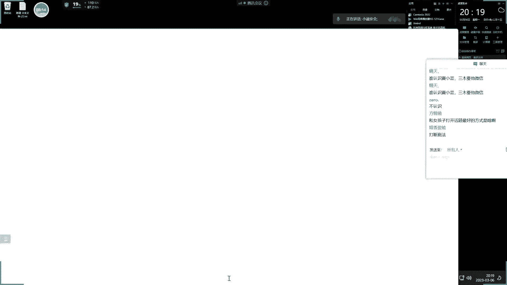
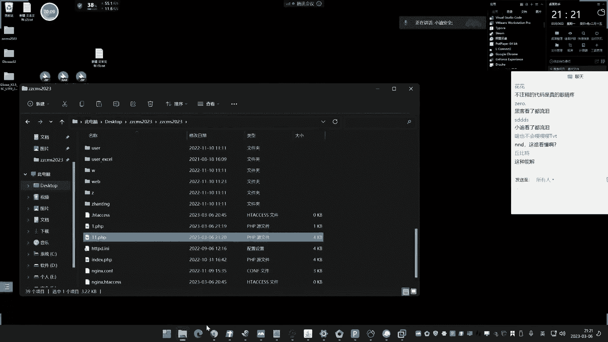
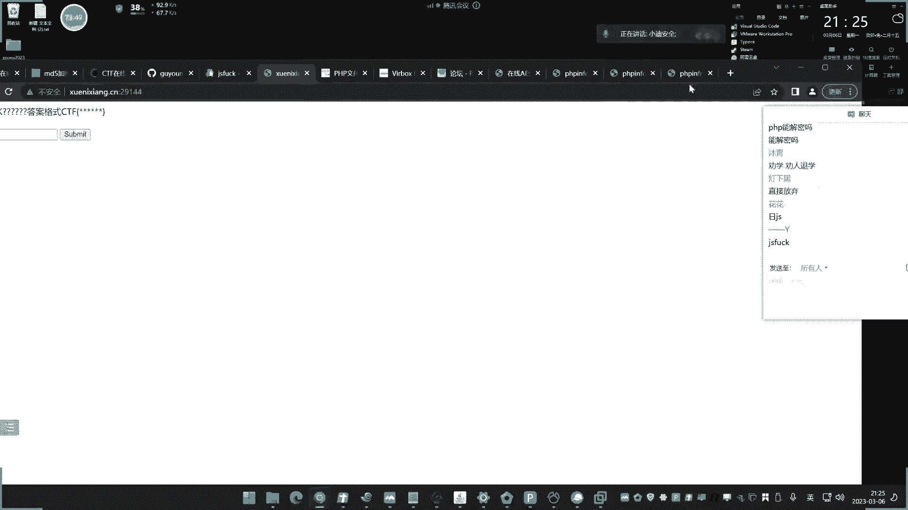

# 课程P8：第8天：算法分析&传输加密&数据格式&密文存储&代码混淆&逆向保护 🔐


在本节课中，我们将要学习安全测试中至关重要的一个环节：如何处理经过加密、编码或格式转换的数据。无论是进行漏洞探测、密码破解还是代码审计，理解数据的“真实面目”都是成功的关键。我们将从传输数据、数据格式、密码存储和源代码保护四个方向展开，并通过实例帮助初学者理解其核心概念和影响。


## 概述 📋

前面七天我们已经学习了部分基础知识，今天我们将聚焦于数据传输和加密相关的内容。这个系列会进行两到三次直播，因为一次直播无法涵盖所有知识点。


本节课主要学习以下四块内容：
1.  **加密与编码**：了解数据在传输和存储时如何被转换。
2.  **传输格式**：认识数据提交的不同结构。
3.  **密码存储**：探索密码在数据库中的保存方式。
4.  **源代码问题**：了解代码如何被混淆或加密以进行保护。




掌握这些知识点，对于后期进行漏洞分析、漏洞探测和安全测试是必不可少的。你必须具备这些知识，才能在漏洞发现过程中做得更好。


## 一、传输数据中的加密与编码 🔒

上一节我们介绍了课程的整体框架，本节中我们来看看传输数据时可能遇到的加密与编码情况。首先，我们通过一个实例来理解为什么要学习它。


### 为什么要学习传输数据的加密/编码？


我们通过一个网站URL的例子来说明。假设一个正常的URL参数可能是 `id=1`。但在某些网站中，你看到的可能是 `id=MQ==`。


*   `MQ==` 是什么？我们使用Base64解码工具对其进行解码，结果是 `1`。
*   编码过程则是：明文 `1` -> Base64编码 -> `MQ==`。


**核心问题**：如果网站接收的是编码后的值（如 `MQ==`），而你在测试漏洞时，直接提交原始的Payload（如 `id=1'` 或 `id=1 AND 1=1`），那么请求将会失败。因为服务器期望接收编码后的数据，并在后端进行解码。你提交的原始Payload不符合服务器的预期格式。


**正确的做法**：在测试时，你需要将自己的攻击载荷（Payload）按照目标相同的算法（如Base64）进行编码，然后再提交。这样，服务器才能正确解码并处理你的输入，你的测试才能进入正常的业务逻辑。


**核心概念公式**：
```
服务器处理流程：接收密文 -> 解码 -> 得到明文 -> 执行业务逻辑
测试正确流程：构造Payload明文 -> 按相同算法编码 -> 发送密文 -> 服务器解码 -> 执行业务逻辑（包含我们的Payload）
```

### 实例分析：登录请求中的加密


让我们看一个更常见的例子：网站登录。假设你输入用户名 `admin` 和密码 `123456` 进行登录。


抓取数据包后，你可能会发现提交的数据是这样的：
```
username=admin&password=e10adc3949ba59abbe56e057f20f883e
```
很明显，密码 `123456` 被转换成了一长串字符。这通常是MD5哈希值。


*   `e10adc3949ba59abbe56e057f20f883e` 正是 `123456` 的MD5值。
*   服务器在验证时，会对你提交的“密文”进行校验（或再次哈希后比对），而不是直接比对明文。


**影响**：如果你要对这个登录接口进行密码爆破，你的密码字典不能直接包含 `123456` 这样的明文，而必须包含 `123456` 对应的MD5值（即 `e10adc3949ba59abbe56e057f20f883e`）。你必须按照目标相同的加密格式提交数据，否则服务器无法识别，测试无效。


**总结**：无论是编码（如Base64）还是加密（如MD5），在测试时都必须先识别出目标使用的算法，然后将你的测试Payload进行相同的处理，才能让请求被服务器正确接收和处理，从而测试潜在的漏洞。


## 二、数据传输格式 📦


上一节我们介绍了数据本身的加密编码，本节中我们来看看数据的包装格式。数据格式指的是数据在传输时所采用的结构和组织形式。


### 常见的数据传输格式


数据可以通过多种格式发送，而不仅仅是常见的 `key1=value1&key2=value2`。


以下是几种常见格式：


1.  **常规格式 (URL-Encoded)**：
    ```
    username=admin&password=123456
    ```


2.  **JSON格式**：
    ```json
    {
        "username": "admin",
        "password": "123456"
    }
    ```
    或者以表单形式提交的JSON字符串。


3.  **XML格式**：
    ```xml
    <request>
        <username>admin</username>
        <password>123456</password>
    </request>
    ```


4.  **其他格式**：如 `multipart/form-data`（用于文件上传）等。


### 格式对安全测试的影响


**发送方格式影响漏洞探针**：在测试时，你必须按照目标接口要求的格式去构造和修改数据。如果你在JSON格式的 `username` 字段里测试SQL注入，却错误地按照URL-Encoded格式去拼接参数，请求将无法被正确解析，测试自然失败。


**返回方格式影响数据分析**：服务器返回的数据也可能是各种格式（JSON、XML、HTML等）。识别返回数据的格式，有助于你快速定位关键信息（如错误消息、状态标识、敏感数据）。如果返回数据是加密或编码过的，你还需要先对其进行解密/解码，才能理解其含义，判断测试是否成功。


**工具提示**：像Burp Suite这样的安全工具，会在Proxy历史记录中标识出请求和响应的 `Content-Type`（如 `application/json`, `text/html`, `application/xml`），这有助于我们快速判断数据格式。


**核心概念**：在测试中，**发送数据**时需要关注格式和加密，以确保Payload能“进入”系统逻辑；**接收数据**时需要关注格式和加密，以准确“分析”系统反馈。


## 三、密码存储与密文分析 🗃️


上一节我们讨论了传输过程中的格式，本节我们关注数据（尤其是密码）在存储时的状态。了解密码如何被存储，对于后续的渗透测试（如获取数据库后登录后台）至关重要。


### 不同系统的密码存储方式


我们通过搭建不同的网站程序来观察其密码存储的差异。


1.  **案例一：ZZCMS (使用MD5)**
    *   安装后，在数据库用户表中找到密码字段，其值为 `e10adc3949ba59abbe56e057f20f883e`。
    *   使用MD5解密工具（实际上是哈希碰撞查询）可以还原出明文 `123456`。
    *   **算法**：`存储值 = MD5(用户明文密码)`

2.  **案例二：Discuz 3.2 (使用MD5加盐)**
    *   在数据库中找到的密码字段值可能类似 `a57f......`，直接查询无法解密。
    *   观察数据库，发现还有一个 `salt`（盐值）字段，例如 `abcd1234`。
    *   **算法**：`存储值 = MD5( MD5(用户明文密码) + salt )`
    *   解密时需要同时提供密文和盐值。


3.  **案例三：Discuz 3.5 (使用更复杂的加密)**
    *   新版本的密码存储值可能形如 `$2y$10$...`，这是一种强度更高的哈希算法（如bcrypt）。
    *   或者使用了 `AES`、`DES` 等对称加密算法。这类算法解密需要 **密钥(Key)** 和 **初始化向量(IV)** 等参数。
    *   **核心概念**：`密文 = AES_Encrypt(明文, Key, IV)`。没有Key和IV，几乎无法解密。


4.  **操作系统密码**：
    *   **Windows**：通常使用 `NTLM` 哈希。可以通过工具提取，并在特定平台上进行碰撞破解（如果密码不够复杂）。
    *   **Linux**：密码哈希存储在 `/etc/shadow` 文件中，通常使用 `sha512crypt` 等算法，同样依赖碰撞破解。


### 解密方式与局限性





*   **哈希算法（如MD5、SHA1、NTLM）**：本质是单向函数，无法逆向计算。所谓的“解密”网站，实际上是庞大的“明文-密文”对照表（彩虹表）的查询匹配。密码越复杂、越随机，被碰撞出的几率越低。
*   **对称加密（如AES、DES）**：理论上可逆，但必须拥有正确的 **密钥(Key)** 和 **算法模式**（如CBC）、**填充方式** 等所有参数。这些参数通常写在源代码中。
*   **加盐(Salt)**：通过在密码前后添加随机字符串（盐）再哈希，极大地增加了彩虹表攻击的难度，因为攻击者需要为每个盐值单独建立彩虹表。


**对安全测试的影响**：在渗透测试中，当你获取到数据库的密码哈希后，能否破解取决于：
1.  算法的强度。
2.  是否加盐。
3.  密码本身的复杂度。
4.  你能否获取到加盐值或加密密钥（通常需要源码泄露或服务器文件读取漏洞）。


## 四、源代码混淆与逆向保护 💻





上一节我们探讨了数据存储，本节我们关注保护逻辑的另一个层面：源代码本身。开发者会对代码进行混淆或加密，以防止被轻易分析和逆向工程。

### 源代码混淆与加密示例


1.  **PHP代码加密**：
    *   一段简单的PHP代码 `<?php echo “Hello”; ?>`，经过加密后可能变成一堆乱码或经过编码的字符串，但PHP引擎仍能执行。
    *   **影响**：在做白盒审计（代码审计）时，如果源码被加密，你将无法直接阅读和分析代码逻辑，必须首先尝试解密。


2.  **JavaScript代码混淆**：
    *   常见的如 `JSFuck`，它仅用 `[]()!+` 六个字符就能编写任何JavaScript代码。例如 `alert(1)` 可能被混淆成 `(+[]+...)[...]` 等令人费解的形式。
    *   **影响**：在分析前端JS逻辑、寻找API接口或敏感信息时，混淆会增加巨大的分析难度。需要利用反混淆工具或技巧来还原。


3.  **二进制程序保护（加壳、混淆）**：
    *   对于可执行文件（`.exe`）、安卓应用（`.apk`）、Java程序（`.jar`）等，开发者会使用加壳工具（如VMProtect、UPX）或混淆器进行保护。
    *   **影响**：这增加了逆向分析的难度，防止他人破解软件、分析算法逻辑或提取敏感资源。对于安全研究人员，这也增加了分析漏洞成因的难度。


### 核心影响总结


*   **传输数据加密/编码**：影响**黑盒测试**的漏洞探测。不处理则Payload无法进入测试流程。
*   **密码存储加密**：影响**后渗透阶段**。获取数据库后，能否破解密码决定能否横向移动或登录后台。
*   **源代码混淆/加密**：影响**白盒测试（代码审计）** 和**二进制逆向分析**。不还原则无法分析核心逻辑。


这三者共同构成了安全测试中需要克服的“数据理解”障碍。掌握识别和处理这些情况的能力，能显著提升你发现安全漏洞的广度和深度。


## 总结 🎯

本节课中我们一起学习了安全测试中关于数据表示和保护的四个核心方面：


1.  **传输加密与编码**：理解了Base64、MD5等在数据传输中的应用，并认识到测试时必须“入乡随俗”，将Payload进行相同处理。
2.  **数据传输格式**：了解了JSON、XML等不同数据格式，明确了发送方格式影响测试可行性，返回方格式影响结果分析。
3.  **密码存储与密文分析**：通过实例对比了MD5、MD5加盐、强哈希（如bcrypt）、对称加密（如AES）等存储方式，并理解了其解密原理与局限性。
4.  **源代码混淆与逆向保护**：认识了代码层级的保护措施（PHP加密、JS混淆、二进制加壳）及其对代码审计和逆向分析的影响。


这些知识是连接基础技能与实战漏洞挖掘的桥梁。它们解释了为什么直接套用简单的Payload常常会失败，并为你提供了解决问题的正确思路：**分析 -> 识别 -> 模拟 -> 测试**。在后续的课程中，我们将深入每个方向，学习具体的识别技巧、工具使用和实战方法。