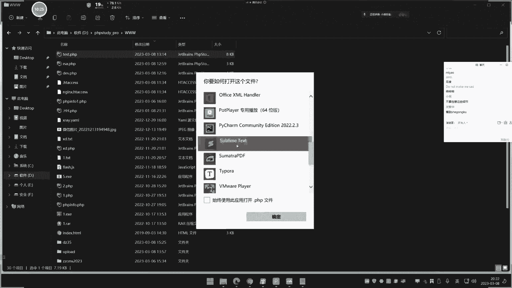

# 🧠 算法逆向与加密解密基础教程（第9天）

在本节课中，我们将学习算法逆向、加密解密的基本概念、常见加密算法的分类与识别，以及如何在实际场景中分析和处理加密数据。课程内容涵盖单向散列加密、对称加密、非对称加密，并通过实例演示如何分析前端和后端的加密逻辑。


---


## 📚 概述：加密算法概念与分类


上节课我们简单介绍了加密编码的基本概念及其在安全测试中的影响。本节课我们将深入剖析几种重要的加密算法，这些算法在后续的学习和实践中会经常遇到。




加密算法主要分为三大类：**单向散列加密**、**对称加密**和**非对称加密**。下面我们逐一介绍。


---


## 🔐 单向散列加密


单向散列加密的代表算法包括 **MD5**、**SHA**、**MAC**、**CRC** 等。这类算法的特点是加密过程不可逆，即无法从密文直接还原出明文。


### 特点
- **加密速度快**，对性能影响小。
- **存储方便**，适合存储密码等敏感信息。
- **存在暴力破解的可能性**，可以通过“加盐”方式提高安全性。


### 解密原理
单向散列加密的解密依赖于“碰撞”原理。攻击者会预先计算常见明文的哈希值，形成彩虹表，然后通过比对密文来推测明文。如果明文足够复杂，未被收录在彩虹表中，则无法破解。


例如，明文 `123456` 的 MD5 哈希值是固定的。攻击者通过比对哈希值库，如果找到匹配项，即可反推出明文。


**公式示例：**
```
MD5("123456") = "e10adc3949ba59abbe56e057f20f883e"
```

如果明文是 `123456`，且哈希值匹配，则可确认明文。


---


## 🔑 对称加密


对称加密的代表算法包括 **DES**、**AES**、**RC4** 等。这类算法的特点是加密和解密使用相同的密钥。


### 特点
- **算法公开**，加密速度快，效率高。
- **必须双方保存好密钥**才能进行加解密。
- **解密成功率接近100%**，但需要满足特定条件。


### 解密条件
对称加密的解密需要以下条件：
1. **密文**
2. **加密模式**（如 ECB、CBC）
3. **加密密钥**
4. **加密偏移量**（某些模式需要）

如果缺少任一条件，解密将失败。

**代码示例（AES 加密）：**
```python
from Crypto.Cipher import AES
import base64


key = b'1234567890123456'
iv = b'1234567890123456'
cipher = AES.new(key, AES.MODE_CBC, iv)
plaintext = b'xiaodiSEC'
ciphertext = cipher.encrypt(plaintext)
print(base64.b64encode(ciphertext))
```

---


## 🔄 非对称加密


非对称加密的代表算法是 **RSA**。这类算法使用公钥和私钥进行加解密，安全性更高，但速度较慢，适合加密少量数据。


### 特点
- **使用公钥加密，私钥解密**（或反之）。
- **安全性高**，但加解密速度慢。
- **适合对少量数据加密**。

### 解密条件
非对称加密的解密需要以下条件之一：
1. **密文 + 公钥**（如果使用私钥加密）
2. **密文 + 私钥**（如果使用公钥加密）


**代码示例（RSA 加密）：**
```python
from Crypto.PublicKey import RSA
from Crypto.Cipher import PKCS1_OAEP


key = RSA.generate(2048)
public_key = key.publickey()
cipher = PKCS1_OAEP.new(public_key)
plaintext = b'xiaodiSEC'
ciphertext = cipher.encrypt(plaintext)
print(ciphertext)
```


---


## 🔍 加密算法识别


在实际场景中，我们需要通过密文的特征来识别加密算法。以下是常见算法的识别方法：


### MD5
- **固定长度**：16位或32位。
- **字符范围**：仅包含数字 `0-9` 和字母 `a-f`（小写）。


### Base64
- **常见特征**：末尾可能有一个或两个等号（`=`）。
- **字符范围**：包含大小写字母、数字和 `+`、`/` 符号。


### AES/DES
- **特征**：密文中可能包含斜杠（`/`）和加号（`+`）。
- **长度可变**：明文越长，密文越长。


### RSA
- **特征**：密文长度固定，通常较长。
- **字符范围**：包含特殊字符，且每次加密结果不同。

---


## 🛠️ 实战分析：加密算法逆向


在实际安全测试中，我们经常需要分析加密数据。以下是常见的分析思路：


### 1. 查看密文特征
通过密文的长度、字符范围等特征，初步判断加密算法类型。

### 2. 查找源码
如果无法通过特征判断，可以尝试查找网站源码（前端或后端），分析加密逻辑。

### 3. 前端 JS 分析
如果加密逻辑在前端，可以通过浏览器开发者工具查看 JS 文件，找到加密函数。


### 4. 后端源码分析
如果加密逻辑在后端，需要获取网站源码，分析加密函数的实现。


### 5. 解密尝试
根据分析结果，使用相应工具或脚本尝试解密。


---


## 📝 总结


本节课我们一起学习了加密算法的基本概念、分类与识别方法，并通过实例演示了如何分析和处理加密数据。主要内容包括：

1. **单向散列加密**：如 MD5，依赖碰撞原理，不可逆。
2. **对称加密**：如 AES，需要密钥和偏移量才能解密。
3. **非对称加密**：如 RSA，使用公钥和私钥进行加解密。
4. **加密算法识别**：通过密文特征判断算法类型。
5. **实战分析**：通过源码或前端 JS 分析加密逻辑。


掌握这些知识，可以帮助我们在安全测试中更好地处理加密数据，提高测试效率。


---


希望通过本节课的学习，你能对加密算法有更深入的理解，并能在实际场景中灵活运用这些知识。如果有任何问题，欢迎随时提问！