# 【小迪安全】V2024版 全栈网络安全 ｜ 攻防渗透工程师 （持续更新） - P10：第10天：HTTP数据包&Postman构造&请求方法&请求头修改&状态码判断 - 逆风微笑的代码狗 - BV1Mx4y1q7Ny

上这个第十天啊。

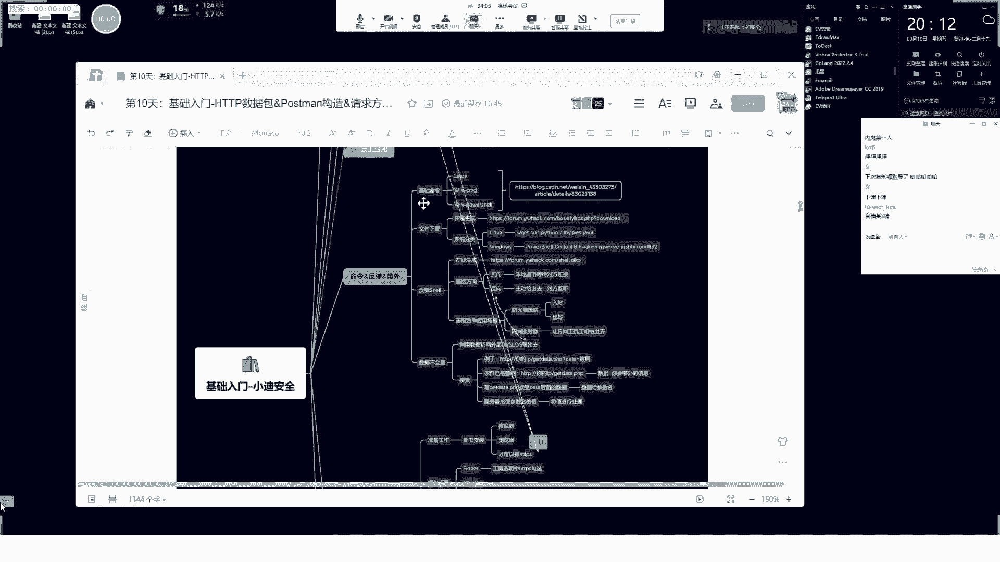

这点内容比较简单，其实前面几天应该就伤的啊，不过也不要紧，第一时间上也行啊，什么内容呢，就主要根据这个TP包的一些解释啊，还有一些小的案例呢来给它丰富一下，那这个呢也要学习一些简单一些工具的使用啊。

嗯这个hp和hp s的一些数据包的请求，返回这些东西呢，我们要学习一下，首先呢这是一个最简单的一个请求过程，通过浏览器呢去request去请求到服务器，服务器呢再通过这个什么response返回包呢。

给到浏览器，这是一个正常的浏览器去访问网站呢，通过对方网站那个回旋的返回回来的一个结果，request代表请求就是发送方，response就代表返回方，那么如果加上代理的话，那就是这么个流程啊，清秋。

然后由代理呢在转发进去返回来，再返回给代理，代理再返回给浏览器，所以我们前面呢抓包的话，就是其中的在这里加了个代理，就是说在请求的时候呢，先发给这个代理，代理呢就来到了我们的抓捕工具上面对吧。

找工具呢在选择性中的发送和丢弃，最后呢他返回来，也会经过这个我们的这个什么代理代理，就是我们那个抓包的东西啊，抓包的一般就是在这里的拦截这个代理，让他走这个代理。

那么现在呢我们就来看一下这个数据包的一些，简单的一些情况啊，然后呢包的结果大概分为几步，一种呢叫请求方式，再次请求的URL和这个头部和正文，get请求是一种请求方式，叫get请求，然后呢他是没有中文的。

他是没有正文的啊，这个post的方式呢他有正文，就是他有提交的数据，称之为正文。

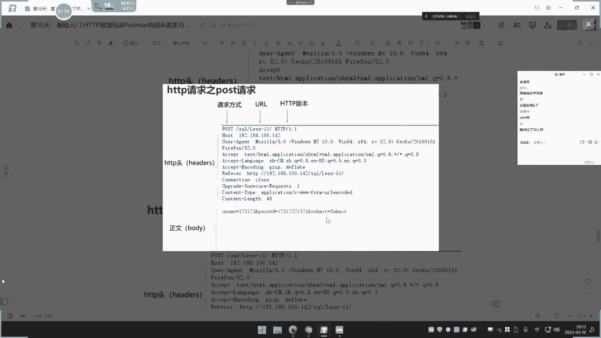

所以它一般分为几个方式，就是什么请求方式，然后请求什么东西啊，然后数据包包括体叫什么数据，这么几点啊，我们用这几个东西呢给大家演示一下啊，比如说我们常规请求的话。

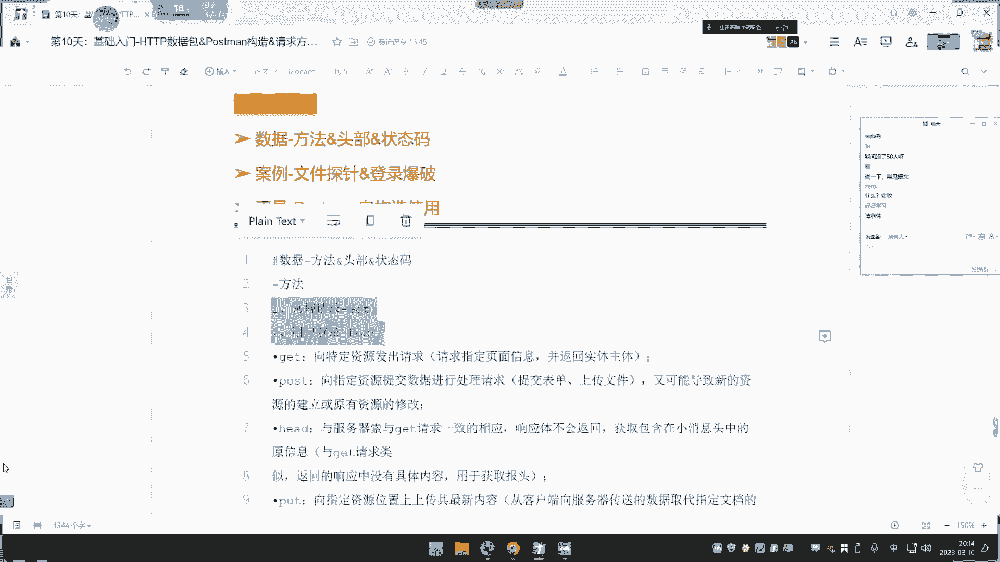

它就是个get请求来，怎么去判断它呢，给大家看一下啊。

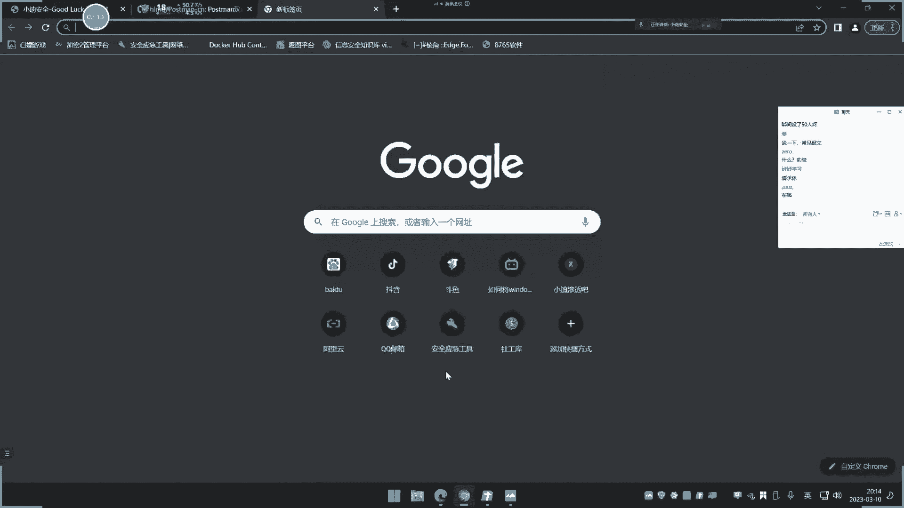

呃抓包工具呢如果大家想简单明了，看的更清楚的话，可以使用这个bug shoot。

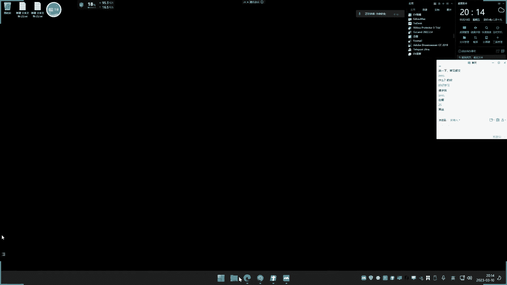

如果说你比较专业的话啊，你是没必要再用max的，用一下这个浏览器的审查元素呢，监听一下这个网络的一个数据呢，也能看到这个数据包的一个情况啊，我们这边两个都给他试一下啊，这样子呢让大家看的更清楚一点。

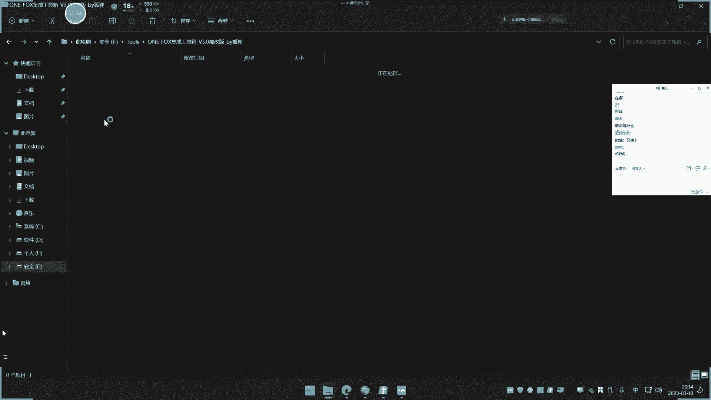

然后我们把数据包呢通过这个bot拦截下来，然后看一下这个这个包的一个大概情况啊。

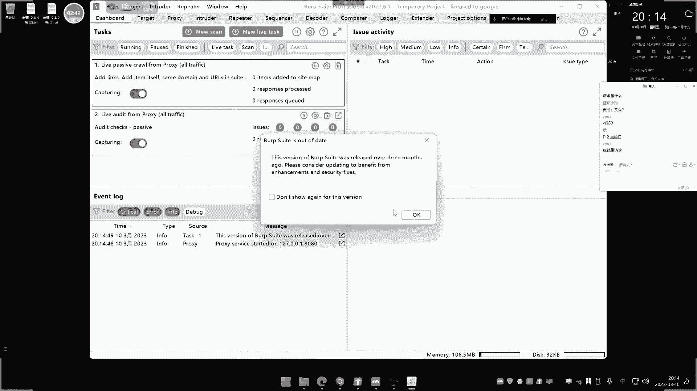

比如说像现在我们访问一个网站啊。

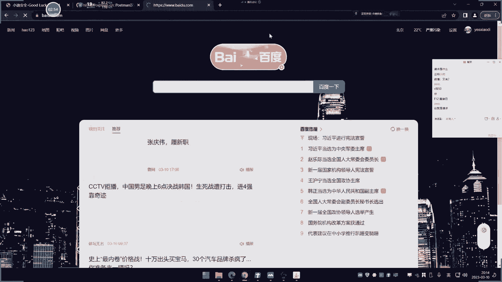

啊你可以通过这个浏览器的审查元素，那监听网络包呢刷新一下这个地址的时候呢，他会请求这里是吧，然后找到访问的是这个地方吗，下面这些是什么东西呢，下面一些就是它加载资源。

就是说它可能会有一些图片或者一些音频，视频等等一些文件，那下面就是另外加载的一些图片地址啊，就比如说上面的有些图片嘛啊，加载的我们主要看这个啊，就是在请求这个地址。

然后在这里那里可以看到这个叫response，就是hers，就是返回头，这里可以点击查看源代码。

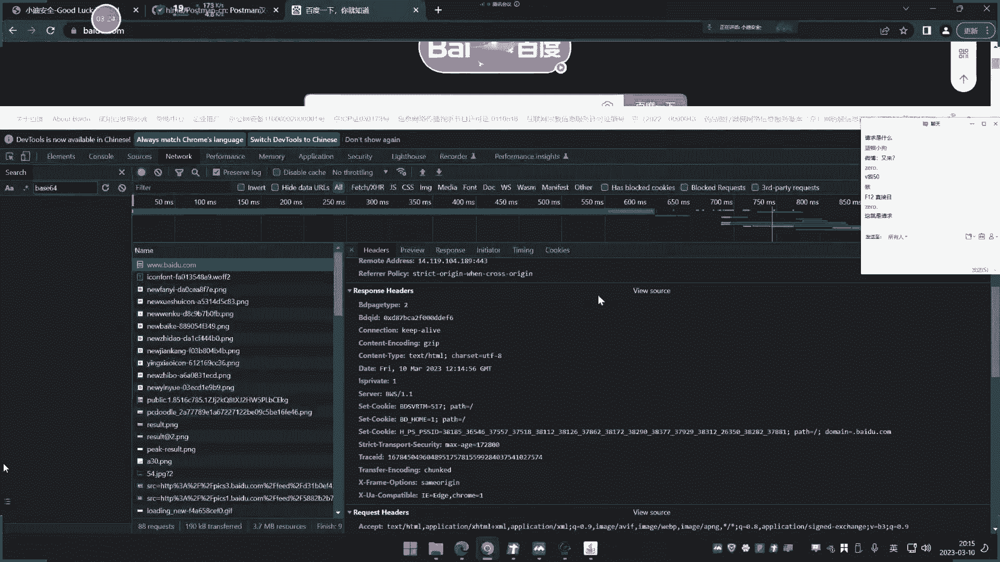

就看它的格式就这么一个格式，然后呢这边是叫request HT，就是我们说的这个请求头请求，那么一个是返回回来的，一个是请求出去的那个请求出啊，这是啥情况啊，然后你看前面是不是有个叫get啊。

这前面是有get呀，你也可以看到这边呢它的类型是一个document，然后呢这是他的请求地址啊，这里可以看到嗯，然后这边是在延迟时间等等一些这个大小等等，我们这里呢可以通过抓包呢。

在数据包里面看到的更清楚啊。

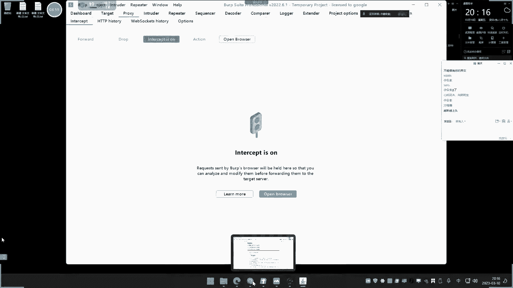

来我们抓个包来给大家看一下啊，在这里展示的话会更清楚一些，把代理开一下，换个包。

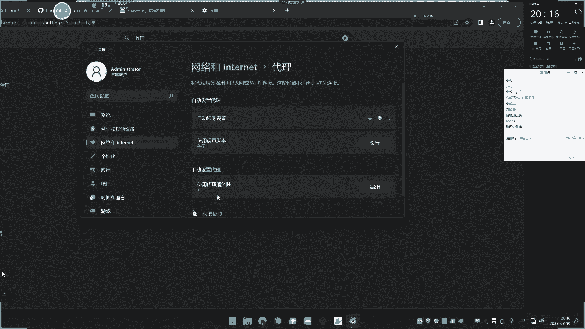

好我们来刷新一下这个地址啊，我们看到啊。

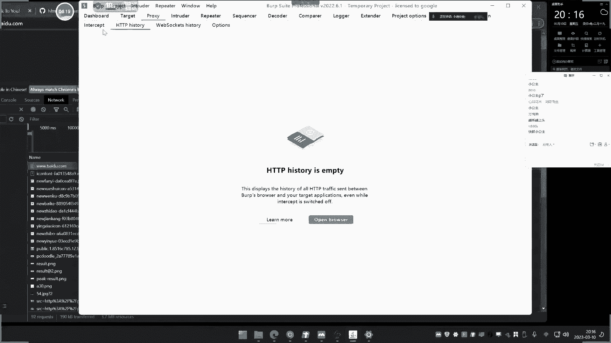

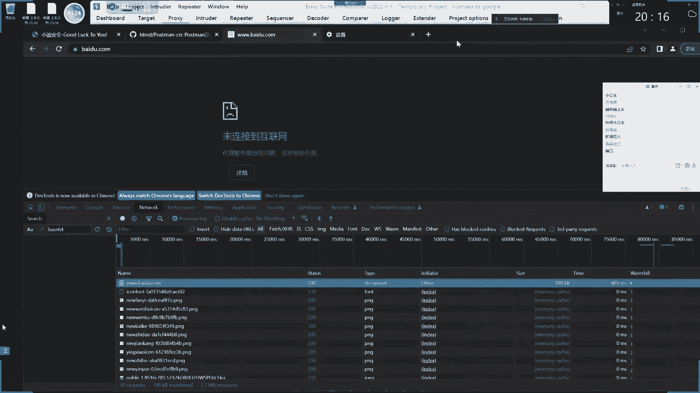

张口搞错了吗，好看下来这个数据包呢就在这里大家看一下啦，但这个不是我们的数据包的host，就是我们说的网站地址，这是一个地址，这啥地址啊，这可能是我电脑的一些其他应用里面。

可能会有一些数据呢给它拦截下来，所以我要把它放出去，这个是放出去啊，把它放出去，然后你看这个就是我刚才我那放网址的包，你看那个了，点这里就有什么get host，是主机地址，还有什么cooking等等。

还有一些各种各样的一些这种写法，不同的一些东西，然后还有什么UA头，就是我们浏览器的信息版本等等，这些你看是有这些东西啊，那么你把它放出去，它就会访问百度啊，那这里就可以看到百度就正常展示出来了。

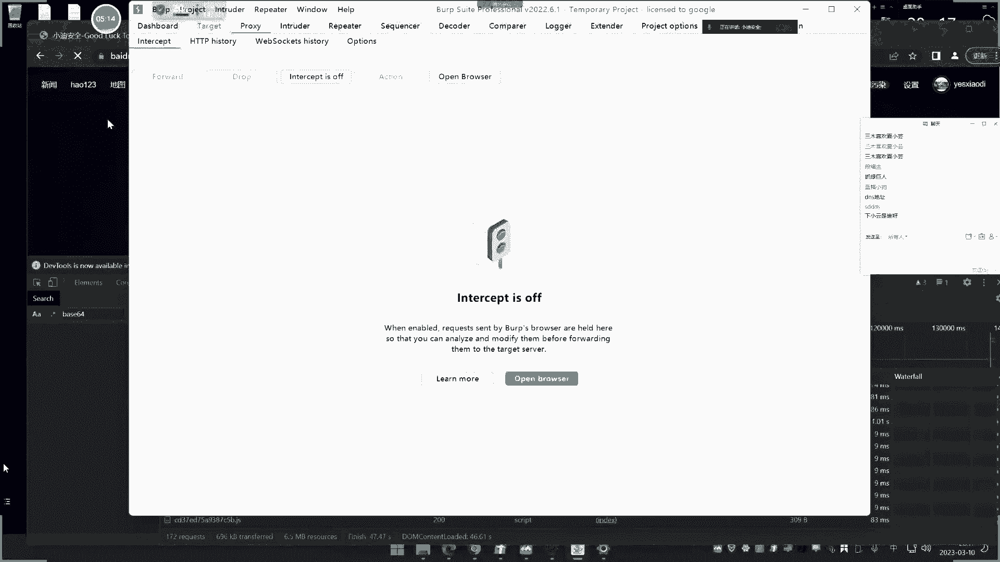

那个就是一个普通的get请求。

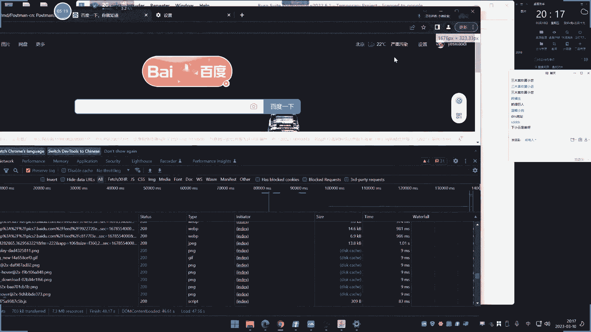

如果说现在呢我换一种方式啊，比如说我这里呢常识呢去写一个，那提交个数据点，自己百度一下的时候呢，我们再抓个包啊。

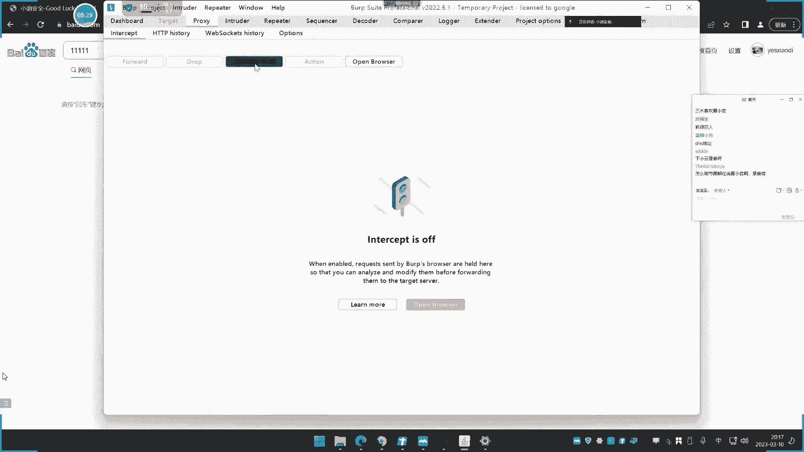

可以看到这里呢还是这个get请求，对不对，还是get请求啊，好然后呢我把这个用户吧推出一下啊。

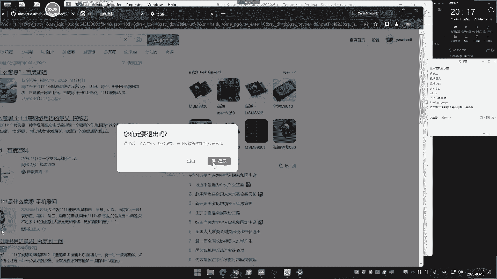

我登录下用户看一下啊，我先把它推出来。

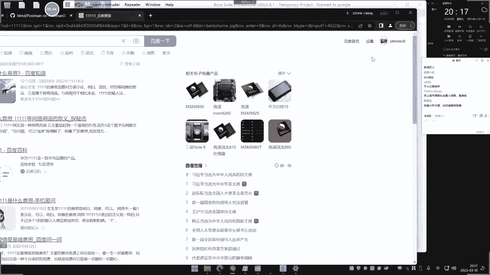

好我重新登录一下用户啊，抓一下这个登录包啊，我再点一下啊，看一下啊，点击登录刷数据包来可以看到啊，这里有个这个也是个这个好诶，刚才有个pose就重新来一下啊。

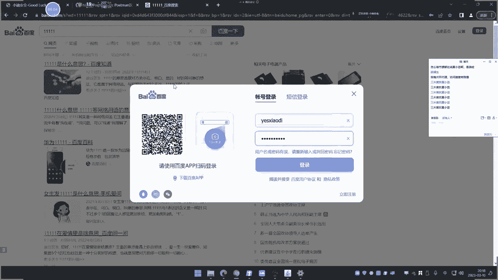

重新来一下，大家看一下啊，关注一下get请求啊，那这里是有个请求，你看post那前面发生了更改，就前面这个代表是他的请求方法，这个请求方法有什么讲究呢，给大家说一下啊，就是你可以看下面啊。

这是目前hp的一些这个请求方法，get呢向特定自然去发送请求，pose呢像指定资源的提交数据，如提交表单，就是我们说的一些登录框，登录账号，上传文件等等，都是post请求，还有其他的什么hand啊。

put这个delete open connect一般最多的就是get和post，那么也就是说你不同的这个业务的一个，操作的话，可能就是不同的这个请求方法，就是可能你放网站正常访问呢。

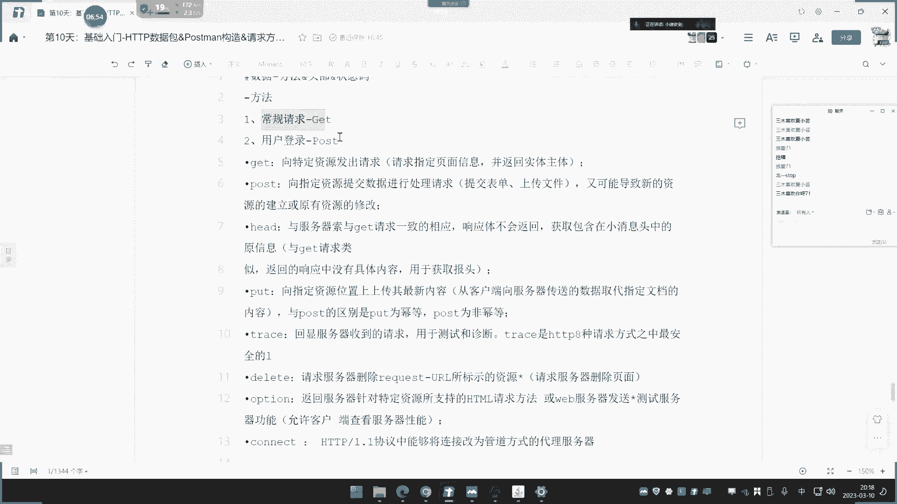

你是个get，当你这里呢尝试过登录或者说有上传文件的话。

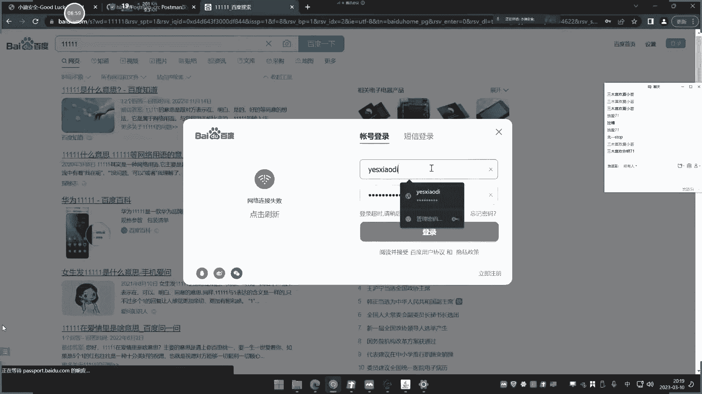

那么这里呢可能就是post，大部分post和get的最主要区别，就是它可能会有提交的数据，你看啊post提交数据的时候，它下面是有一个叫曾文呐，这就是我们刚才那个图里面看到的那post型时，下面有正文。

这个真文，那极有可能就是提交数据，比如比如说我刚才登录的账号。

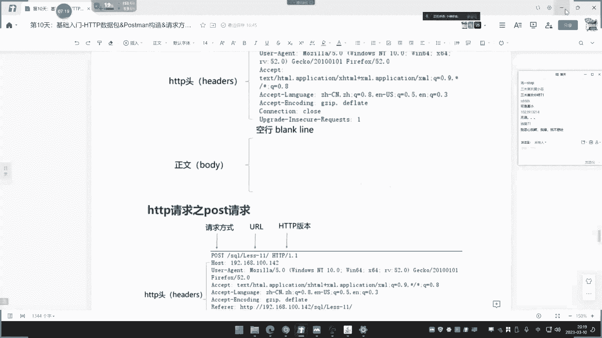

密码可能就在这里面写着，你看这里有什么，username等于的E小d password等于这长传，看到这个应该就是我们的什么，刚才输的密码的一个加密值，如果学过刚才上节课我们锁骨那个加密的解法。

那么观察这个密文尝试去解密，对不对，你看刚才我输的密码密码，那把加密发送对不对，就在这里也是输的刚才登录的一刹那，那其实就是发送的post，包括去登提交你的这个登录的账号和密码，然后其他的是自带的。

那这个就是一个post的一个数据包，就是说在我们这个浏览器里面呢。

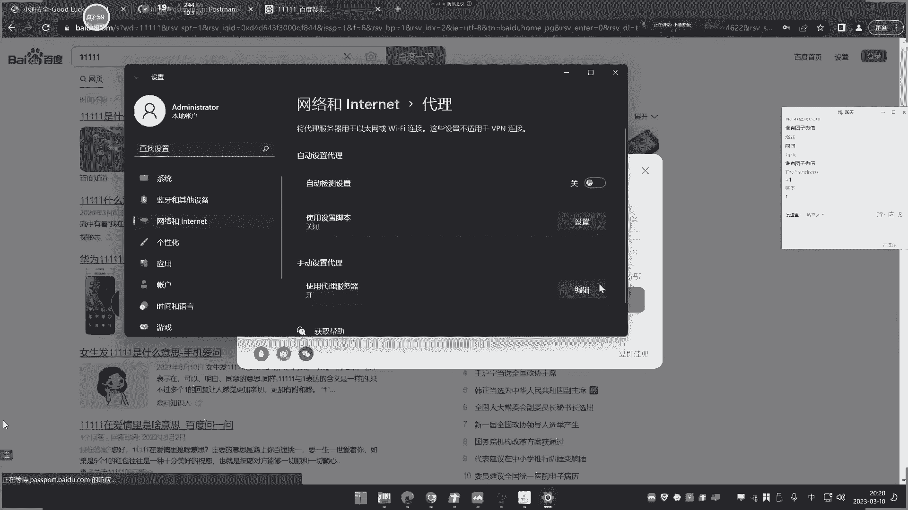

它是区分有这个请求方法的，这个请求方法的不同呢，是根据你这个使用的功能操作，就比如说你正常的去访问网站一些特定地址啊，我们去访问一个特定地址，对不对，我也看一下啊，来抓个包。

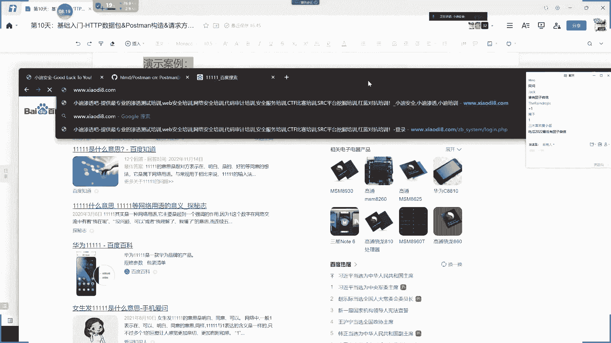

我发我的特定地址的时候呢。

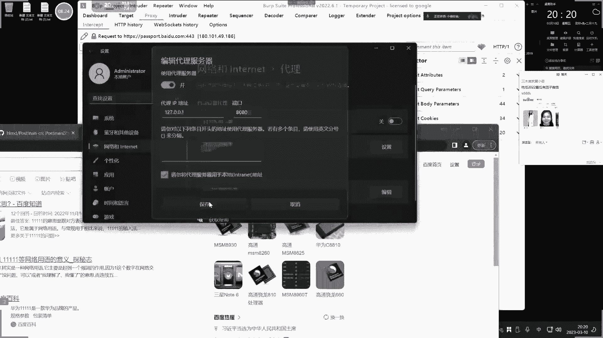

好他抓到的是什么呢，那他咋看啊，我重新刷新一下看看啊，好这里呢就是那get请求对不对，那get请求这个网站地址，对不对，好，那放出去好，然后呢你这里看一下啊，我在这里呢去那写个路径地址，我们看下啊。

写个路径返回上面就会请求路径，看到网站地址加上路径，也就是说如果你把这里改成什么，我把这里改成个什么东西呢，改成比如说叫问号，ID等于三等于一或等于三等于四，好，我们就放回再进这个地址，然后放出去。

你看啊，现在你看这个地址，他地址那就变成什么，变成这个路径，这个是啥东西啊，这个就是ID等死的路径，只是它地址上面没有显示，你看就等于这个页面的内容，对不对，所以说通过刚才那个操作，那就知道了啊。

某些是get方法，有些呢是post方法，那么哪些是post方法，比如说现在呢这是个登录框，这个登录账号密码的地方，对不对，等下，现在我抓这个数据包，我们来看一下，点击登录，这不是我们的正常数据包。

我先把它放掉，这是可能是我电脑的其他的一些协议在登录，现在抓到，你看这个路径，你看是不是post的呀，然后提交的这个是不是账号啊，提到这个是密码呀，所以它是根据你这个这个这个叫啥呀。

根据你这个数据的一个提交的数据啊，根据这个应用功能来决定是什么方法，但是这个不是百分百的啊，不是说所有登录就是post，不是说所有登录所有都都都是POS，只是说他会用到POS的居多。

除非说它也可以用get去传递数据，能理解吧，他也会用get去传递数据也可以，但是一般说这种数据较多，或者说数据量大的话，它会采用post去提交，所以这是我们说的请求方法啊。

这个呢是根据这个网站的一个什么数据的。

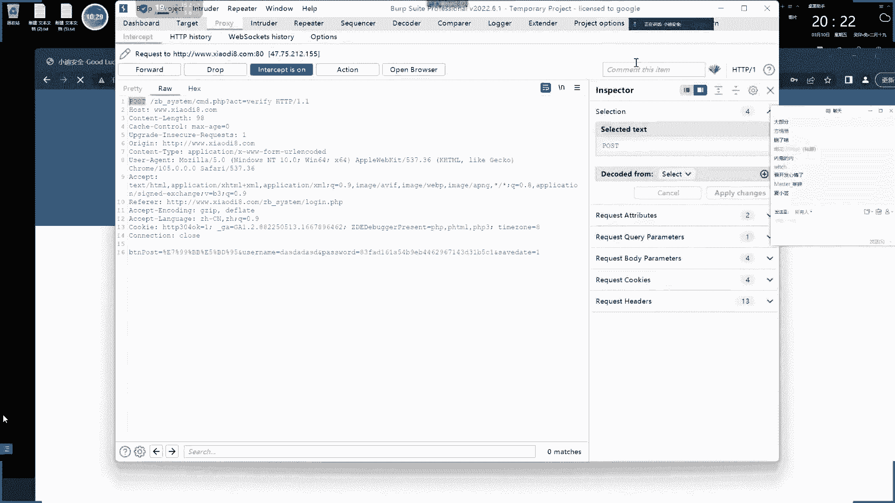

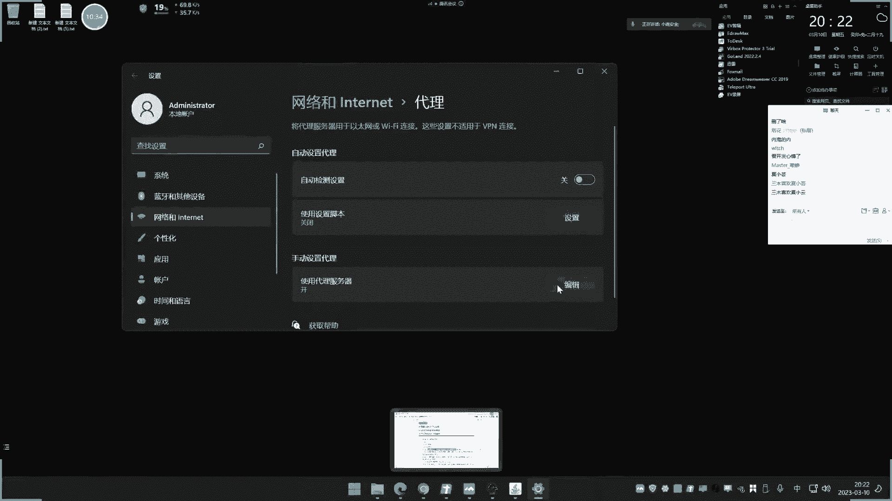

一个流向和应用来决定是什么方法，那下面还有其他方法有这么多，我们先熟悉一下他的这个方法，然后呢我们再来说一下头部，什么叫头部呢，就是这个数据包里面把这个方法去掉之后，下面的都叫头部，下面都下头部。

就是说呢我们打开地址还是刚才的数据包一样，就像刚才那个数据包啊，就是这个包里面我们可以看一下啊，就除了这个上面的POS之后啊，这是他请求的地址和路径，然后呢下面这个就是叫头部。

那这个头部里面的每一个是有一些差异的，有哪些差异，我这里写了一些部分，这里有几张图片呢，上面这个是request的一些常见的，比如说叫ACCEPT的，就是指定客户端能够接受的内容类型。

还有什么这个cookie发送保存云端的cookie值，请求内容的长度，请求发送日期和时间，还有等等的host指定目标的域名或者端口号，请求的这个什么用户名的email等等，他这里面有很多。

就我们数据包不是有很多，前面那个你看有host，有这个是吧，长度了，还有这个还有这种这种呢有这么多，对不对，你看UA头就是我们说浏览器版本，他就呼呼呼了这些星系，那么这些星系有什么作用呢，对不对。

它有什么作用，那我们为什么要去了解它呢，好我们来简单的来给大家看一下简单的例子啊。

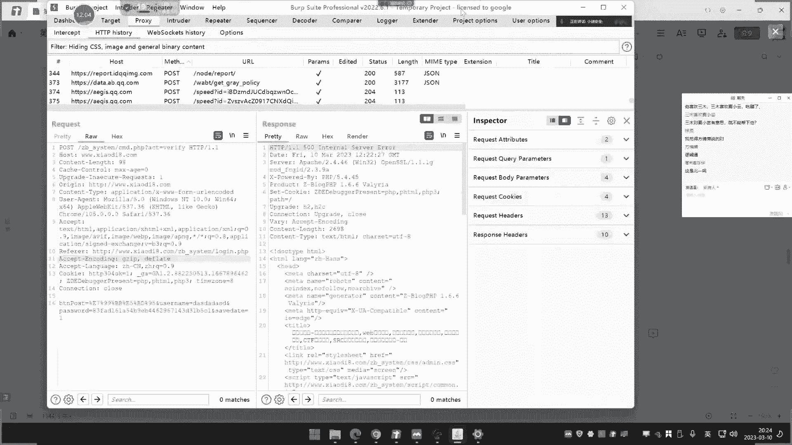

我们先来看一下最简单的啊，我先用这个浏览器呢给大家看一下啊，我们看一下啊，这个它会有什么样的不一样的区别，一个小例子呢加上一个简单的一个案例。

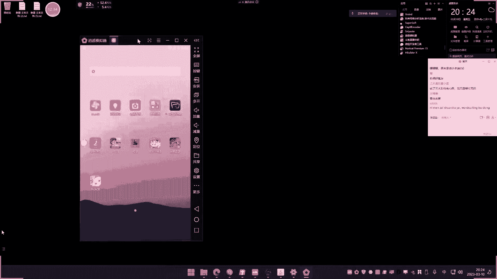

大家先关注一下啊，我先给大家看一下一个百里汤姆，把这个百度汤姆那个包装一下。

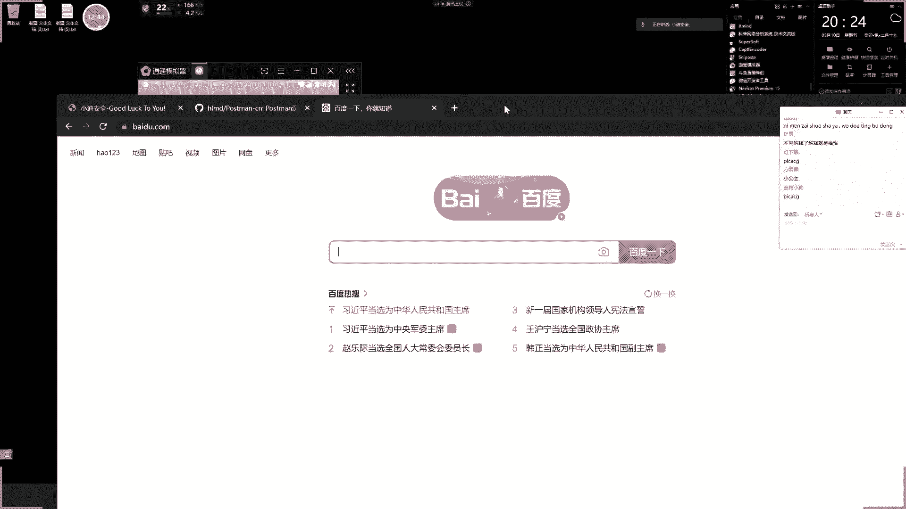

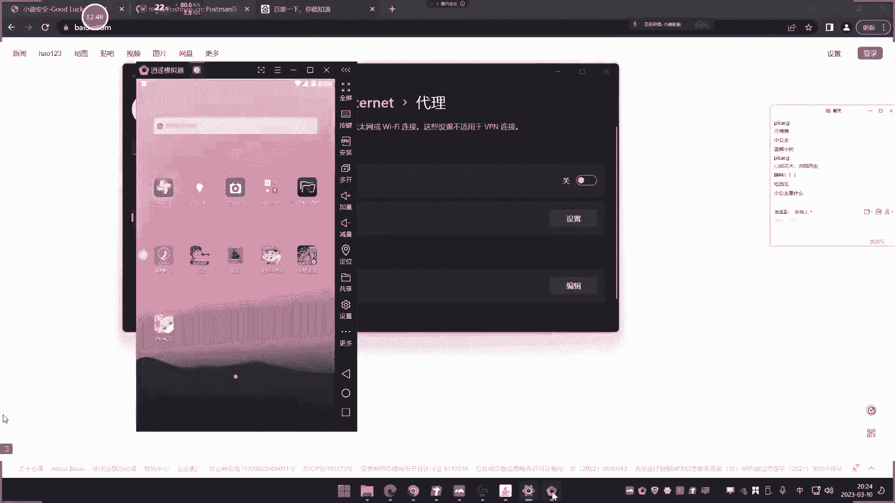

我先用电脑的去访问百度点com啊，我们来关注一下有什么差异，刷新一下好，这是八点com的电脑数据包，保存一份。

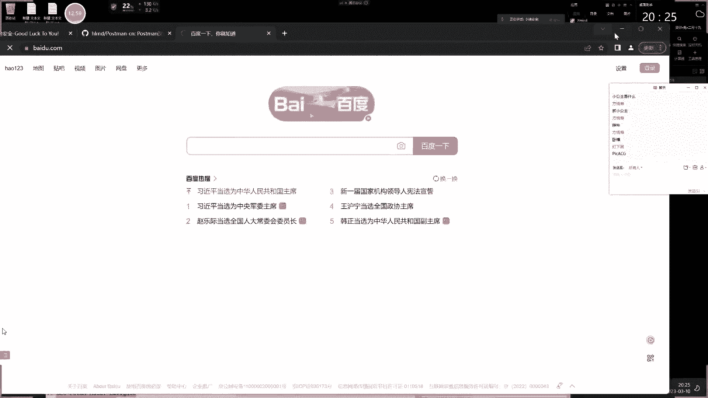

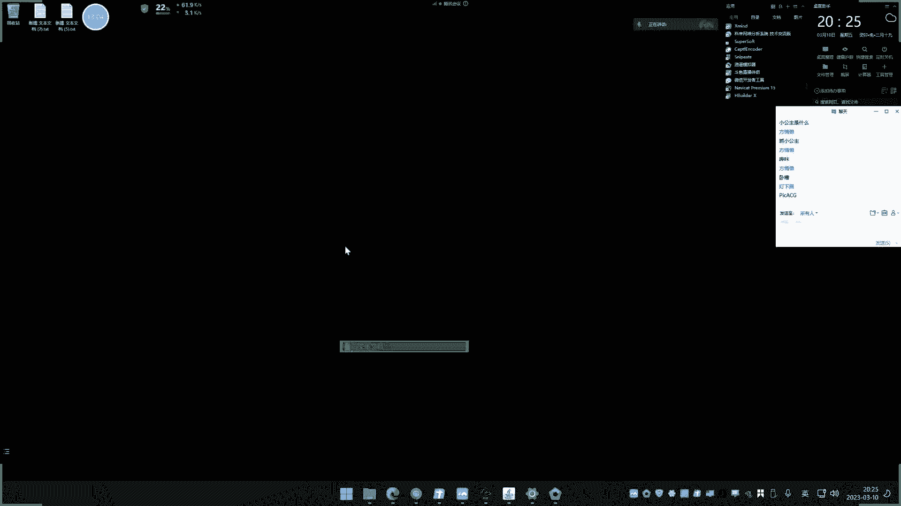

这是我们的电脑数据包啊，然后呢我把它进行一个。

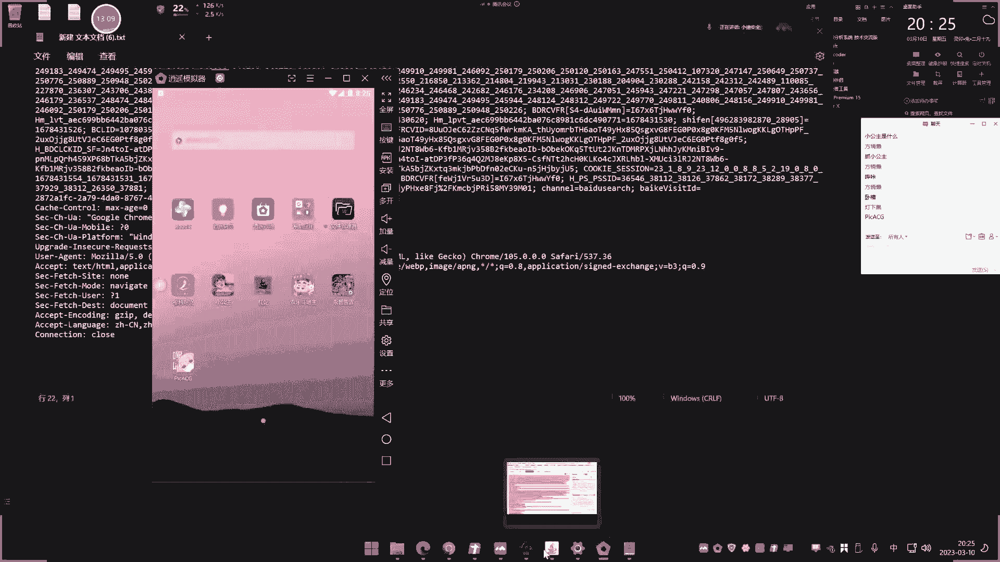

那现在它卡在了，一直在刷新，因为我没有把它包装给他放出去，放出去之后呢，这边呢就正常了是吧，这是它的页面啊，这是我电脑端去访问这个百度com。

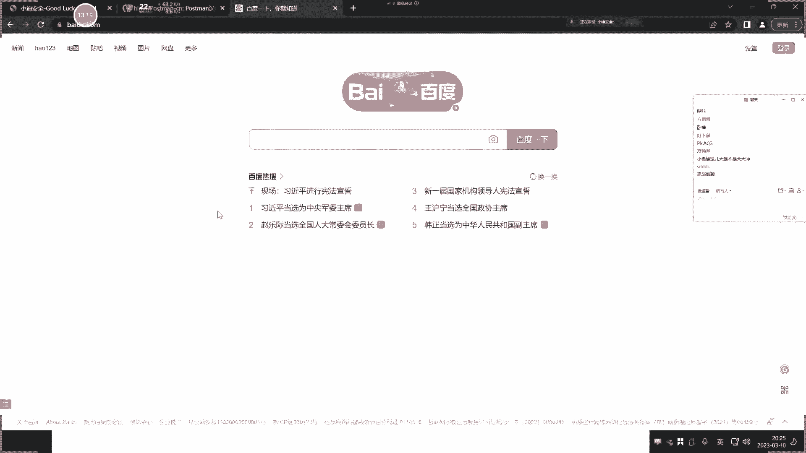

然后模拟器就相当于是我们的安卓手机嘛，安卓模拟器，对不对，好，我这里呢把模拟器呢实在是个DINI，把这个包能模拟器的包呢给他放百度包呢，给他这个鉴定一下啊。

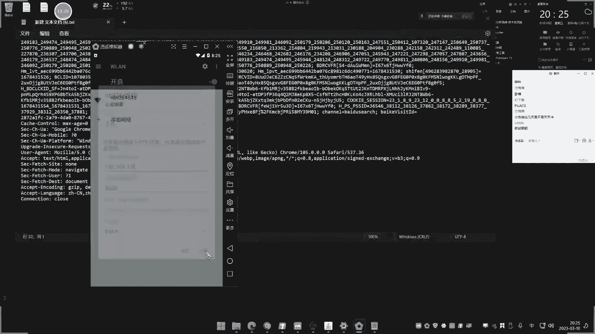

把包也抓下，好我们现在呢抓一下模拟器的这个包装，下模拟器的包，好这是BO点com啊。

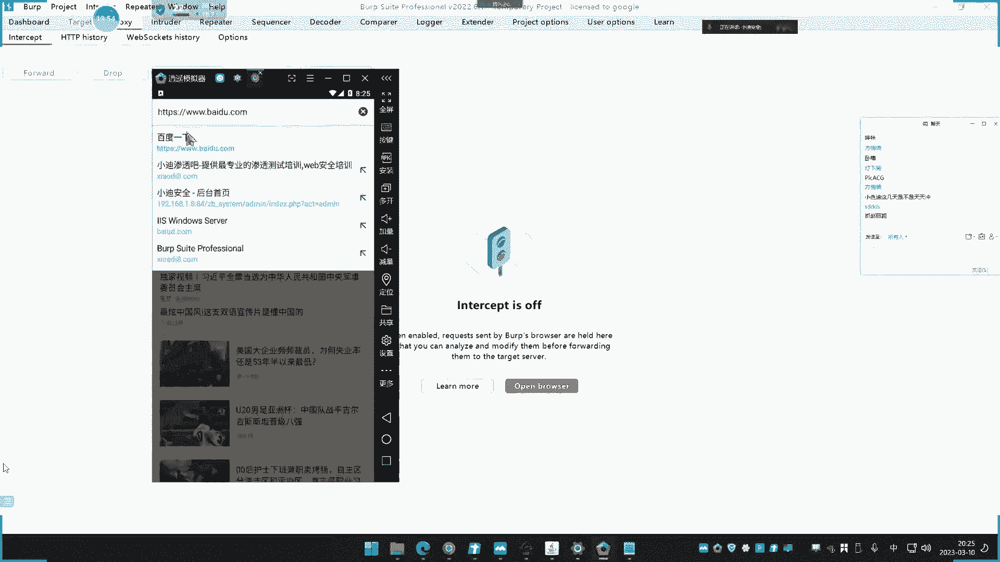

我们来看一下啊，刷新一下访问啊，这是我们这个模拟器的这个数据包。

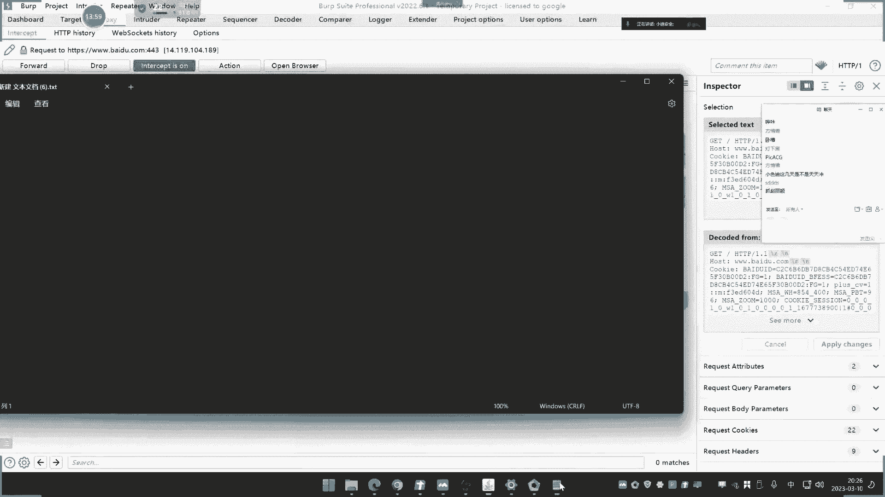

然后这个数据包呢，我可以用这个工具来给你对比一下啊。

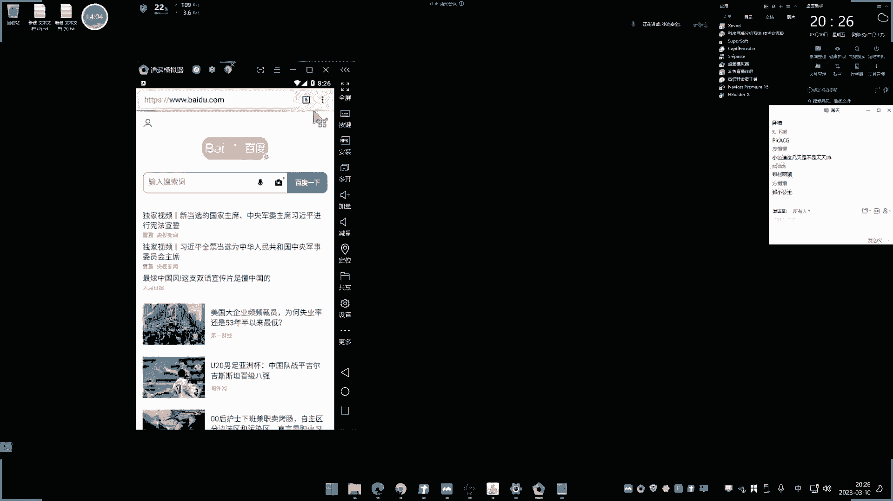

这里打开这个看一下这个，上面这个呢是我们刚才的电脑访问的包，下面这个呢是我的模拟器的这个包，然后这两个有什么差异呢，大家可以关注一下呢，我用过模拟器去访问这个百度点com的时候。

这个结果大家可以看到它的显示界面，是和我们这个电脑的一个端的一个显示界面，那是不同的呀，我们经常都知道啊，就是一些这个应用呢，它会根据你的访问设备呢来选择合适的，这个界面来给你进行这个提供服务。

但是他们虽然说都是同一个网站啊，因为他们呢其实就是判断你是什么设备呢，来给予什么这个页面显示，对不对，那么我们试想一下，如果说现在呢，我测试的是APP里面的某个东西的话，然后呢我操作的使用电脑。

我用电脑去访问这个app的页面呢，他可能看到的就不一样，或者说有可能有些可能就访问不了，原因就是因为你的数据包不同，假如说我们现在要实现什么目的，就是我要用我这个电脑啊去访问到这个手机。

这个界面该怎么操作呢，对不对，其实呢就是将我们电脑访问百度的包，改成一个手机访问百度吧，对不对，好，我们来改一下，看一下是不是啊，那我电脑端访问百度是这个界面，对不对，把包抓起来刷新一下，抓好。

这是我们电脑的仿包，对不对，然后呢我再把我手机的这个包给他替换，来，把这下面替换，上面两个就不替换了啊，那只替换这个下面两个，这里就是刚才我抓到的这个有模拟器的包好，我把它放出去。

这个时候呢我们关注下我们的网站啊，看到没，我手机界面就变成这个界面了，来他是就和类似于我们这个这个界面，你可能会说诶下面怎么没有新闻呢，因为我刚才把它丢弃了一些东西去了啊。

你看就和我们这里访问一模一样呢，当你再次刷新，你看它又恢复正常了，因为呢它就是根据什么东西决定的，其实呀这个根据我们先不管它，就这个安妮呢就给他说明一个道理，就是说如果你要在app里面测试一些数据的话。

你一定要切记，如果你在另外一个终端平台的，去测试这个数据包的话，一定要保证数据包适合，那个同类型平台的数据包保持一致，如果你保证不一致的话，可能这个网站都打不开，知道吧。

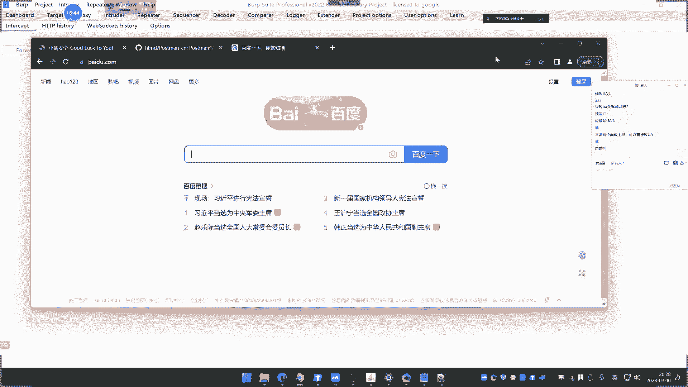

那我再给大家举个例子来看下啊，我现在换一个啊，那我抓一下这个福利期或者包。

我抓一下这个包，然后呢你看一下啊，我们打开这个发型，这里这不是触发一下地址链接吗，然后这里有个get请求吗，好我们来看一下这个地址啊。

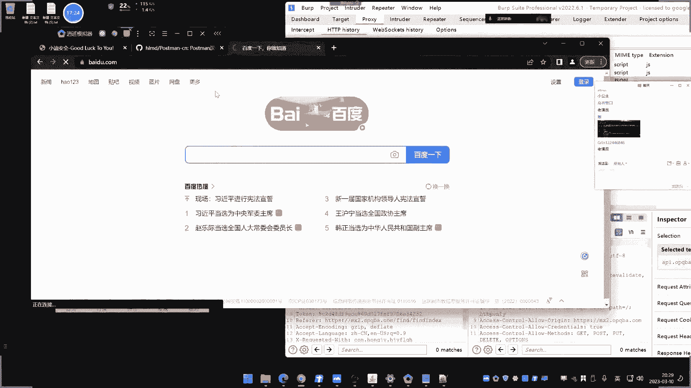

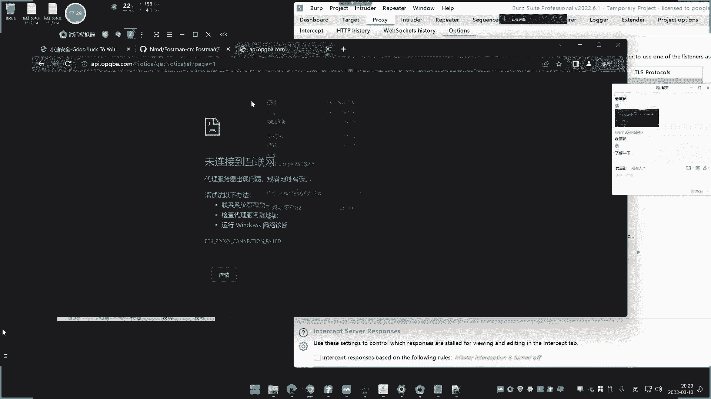

它能访问到，那你看这个pose啊，你看访问这个地址呢，这是那个抓到这个包的，显示这个内容，这个内容就是这里我们看到的这种内容，数据结果对不对，他是这个结果呢，他是这个结果是这个结果吗。

反问这个地址是这个结果，你可以看一下他这个数据包里面啊，这里有个post请求的，还有一个，啊我访问一下这个地址啊，你看一下啊，那我请你这个例子，他也是这个结果，那说明他这里没有检测这个浏览器啊。

我的意思就是说，可能呢你在这个地方呢，去访问这个页面的时候啊，他正常来讲是要返回这个数据的，就是在浏览器模拟器里面呢，你用app打开它是访问这个数据的，但是当你用这个电脑去访问它的时候呢。

它不它页面的就不正常了，这是什么原因造成的，就是因为你用模拟器访问的话，他数据包是这样的，而你用电脑访问的话，他数据包就不一样不一样，所以造成的这个数据的一个差异性，有可能会出来，有可能不出来。

因为如果说对方这个网站的限制，某些设备访问的话，就说他只允许手机设备访问，你不是手机设备就访问不了，那你就必须要把你那个数据包改成，他认为是手机访问的那个数据包才行。

所以为什么你放by com手机页面是吧，就是因为在数据包里面可能某一个地方呢，就是代表你是手机设备，我们来观察一下，是不是啊，你看这是我发by com，其中的UA头，就是最好能代表设备的一个类型的啊。

我电脑就是电脑包发问的时候，UV头呢这里有个叫windows nt4。0，Windows x60，这是我们的电脑的一个版本的，windows的一个NT4。0版本，有思维的，然后呢你看模拟器访问的时候。

那就变成一个什么LINUX安卓7。12，对不对，它就变成这个东西在里面，信息有这个，那是不是这个东西造成的这个原因呢，这个我需要测试。

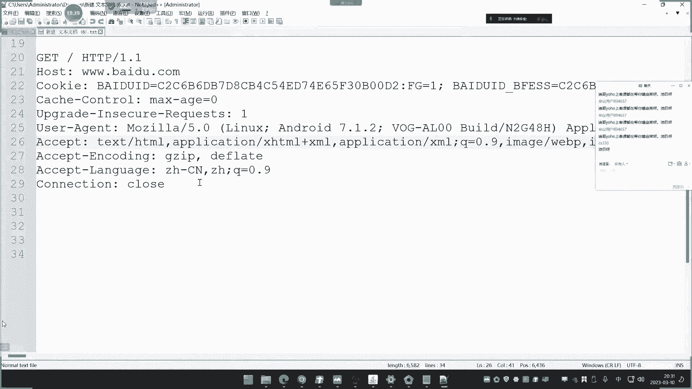

我才知道，对不对，我们来试验一下是不是啊，比如说现在啊我访问一下这个白领啊。

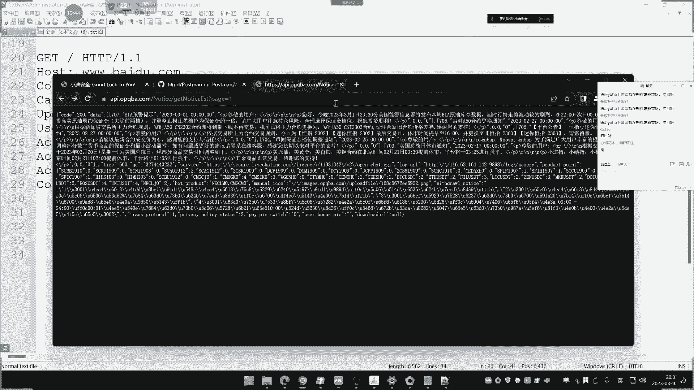

重新发包。

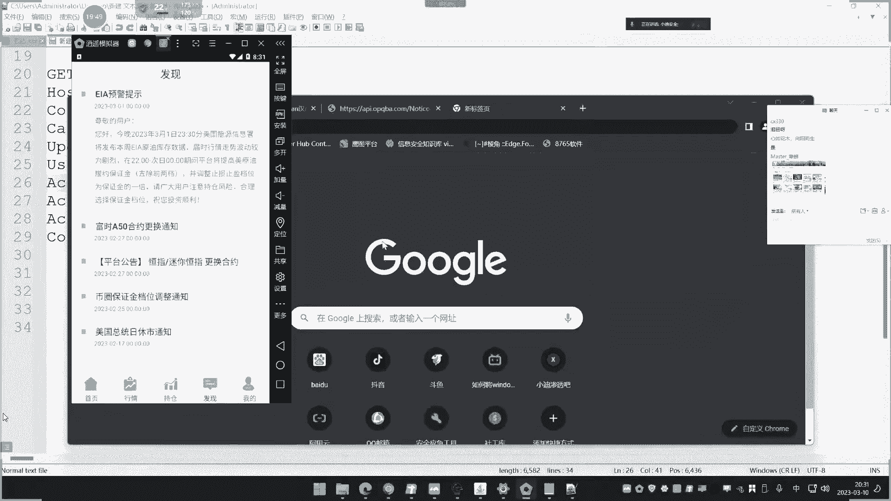

所以加个包啊，那，好这是我们的访问百度的数据包，然后呢我再到这边的这个浏览器信息是吧，我把这个浏览器改成改成这个那个安卓的呢，我把UI改成它，这里好，我改成这个这个模拟器的那个那个那个优惠头。

然后我把它放出去看一下啊，会不会有反应啊，开开网站，是不是那个手机界面变成了，好像改了没反应来说不单纯是用这个来验证的，改了之后呢，你看没改了之后，你看界面是不是大家看没看到界面呢。

我把那个数据包装了之后改了，然后再把它放出去，这里就变成手机的一个百度了，所以说他就是通过这个UA头来去判断，你是什么设备的，那么我们讲这个app头部的，其实呢就是说要理解这些头部的一些数据。

一位头的一些大概含义。

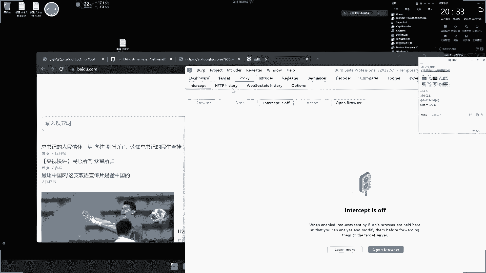

那哪个是什么含义，哪些是什么含义，这些你需要了解，那就像我说的这个数据包里面，这是请求方法，这是在请求的路径，这是你请求的网站，cooking又是什么是吧，然后这个下面UV头有什么。

还有下面的各种各种这种呢，我们可以在这个上面找到一些，如果没有找到，可以网上查查一下资料，那比如说像cookie对不对，cooking又代表什么意思呢。

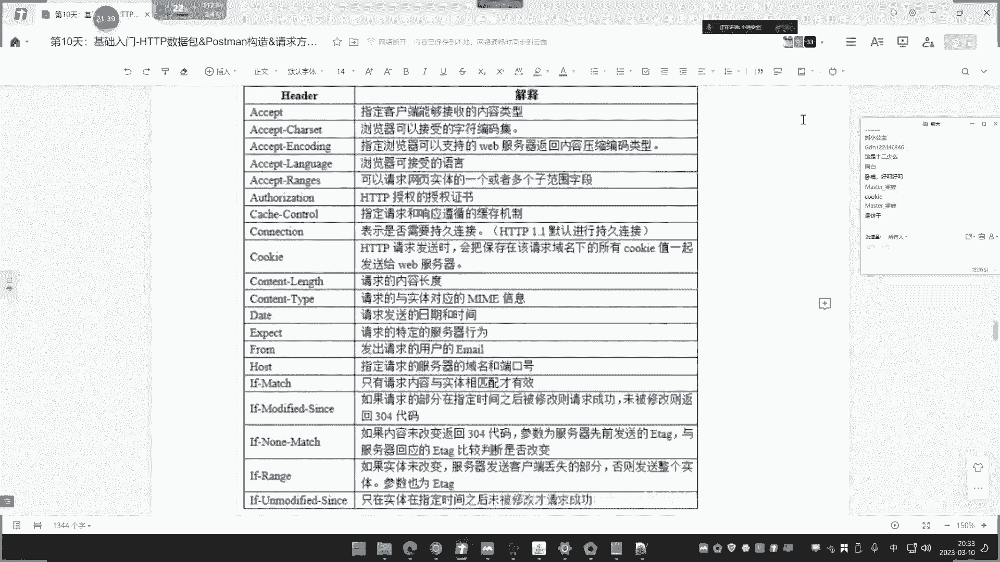

我们来给大家做个演示，cookie呢是我们说的在头部里面，一个用户的身份的一个判断，我们来试一下。

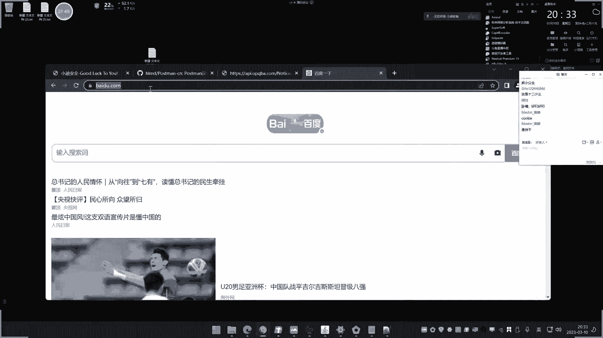

看是不是这个意思，比如说像现在啊，我们这里呢找到网站的后台地址啊，这个是后台的一个页面地址啊，我现在可以看一下，我现在是没有登录后台的好，我们现在抓个包，我没有登录后台啊。

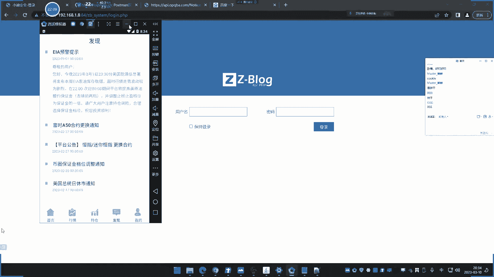

我现在抓个包啊。

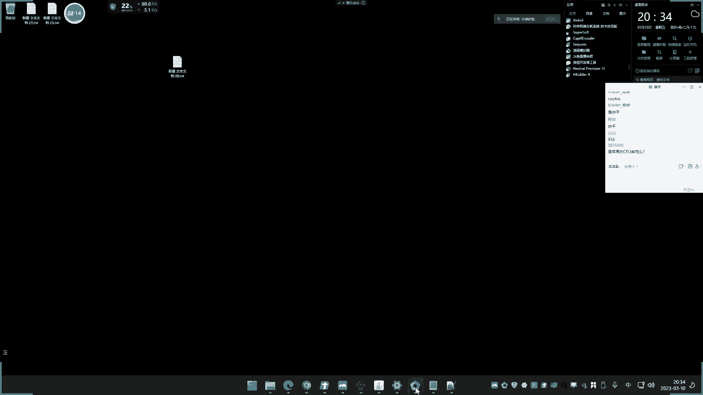

我尝试呢去访问一下这个页面。


就访问一下这个地址啊，这个是登录之后的一个页面，就这个页面啊，放开这个页面，这个页面呢是我们登录之后的页面，就是说可以看到后台的，但是我没有登录，所以他说没有权限，就需要登录之后才能看到。

我先抓一下这个访问包刷新，可以看到这是我们访问的这个数据包在这里啊，你不要搞错了啊，刚才那个是腾讯文档的包，你一定要这里判断一下这个地址和路径，对应上这个数据包，你不要选错了啊，不是数据包。

你把把这个点点一下，这个把它放弃掉啊，把它看下面，这个是那个。


这个是那个没有登录的啊，好我们再来看一下啊，这是没有登录，返回它的地址，好现在呢我尝试登录之后啊，看一下我现在登录一个东西，我登录他登录之后呢，这个时候呢我再访问这个地址啊，我再把它抓一下。

再放这个地址啊，这个是他登录之后的数据包，我们来观察一下，好这里呢你可以看一下有哪些不同啊，我们可以单纯的在这个cookie这里，可以看到那cookie这里啊，我们可以往后面翻，看到没。

这边呢是明显这里多了一个什么，你看在coin这里多了个什么，在这里呢他截止，然后你后面多了一些东西呢，做什么，从这里开始呢，username等于my toy，等于什么什么一长串。

那就多了这个东西就是数据包里面唯一不同，就这个地方其他都是一样的，其他都是一样的，自己对比啊，我们就不一一对比了，其他都一样，那么这个东西有了之后呢，其实就是他登录的数据，就是他这个用户的登录数据，好。

我们来试一下是不是这个cookie能够登录呢，对不对，为了确保期间，由于我现在浏览器呢，我浏览器已经登录状态了，我这边去访问这个地址的话，它也会自动登录上去，因为那他已经登录了。

所以我浏览器访问这个地址的时候，它默认就会进入后台，你看啊我要去访问这个地址，和它默认就已经进入后台，那他不需要我登录，你看这里面解释啊，他进入后台这边也是一个道理，然后刷新它呢，它也是这个后台地址。

我有模拟器呢，你看啊我有模拟器啊，模拟器有模拟器，这边是没有登录的，我访问这个地址，它是需要登录啊，他需要登录，对不对，好现在呢我做个实验，把模拟器包给他抓到，刷新一下啊，把模型包抓到。

啊这个是模拟器的那个数据包，对不对，然后呢我把刚才你好，我先把它放出去，它还是需要登录，对不对，重新抓好，抓到了。


然后这个时候呢，我把刚才这个登录的那个cooking把它加上去。


就我其他都不改。


我就加这个东西的，我在数据包里面加个这东西。


再把它放出去，我们来观察一下啊，在这里随便加，在哪里加都行啊，在这里加呀，在哪里加都行，加上去好，我把这个东西加上去之后，我把它放出去，大家看一下啊，看到没进入后台模拟器，这边的进入后台，这是啥情况呢。

这个呢其实就是我们说的啊，这个数据包里面，它每一个这个东西呢，都代表一些有一些特殊的功能，就是刚才我说的像这个cookie呢，它其实就是和这个用户的一些这个身份相关的，就说你如果没有登录和登录之后。

这个cookie会有一些不同，它是一种这个判断身份的一种数据包，里面的一个coin东西，官方的这个cooking解释呢是这样说的，他说是什么cookie，他也没有解释啊，是什么东西。

这其实就是一个用户的身份的一个平局，这是其中一种，后面呢我们还会学习到，还有一些其他的一些这种东西，比如说什么JWT的呀，C型啊等等啊，还有这些东西，那不同的这个方式呢采用不同的方案，我这样一操作呢。

大家知道而进入后台是吧，那这里呢其实就非常简单，我们再给大家简单的拓展一下，假使说现在啊这个后台里面呢有个漏洞，有个什么漏洞，对不对，你需要对这个漏洞进行测试，你怎么测试它的，对不对。

你直接去请求这个后台的某一个问题，比如说这里面有个这个漏洞呢，在这个哪个地方是吧，有个这个来点一下这个路径，它自动跳出来，你看我点击这个路径之后，我请求这个路径，假设我要查看这个路径下面有个漏洞。

然后呢我去请求他，但是你们会发现啊，你直接去请求他，他在里面呢没有登录，对不对，没有登录，那么请求的话永远会弹出，让你先登录的一个操作，你如何进行把它进行下去测试呢，就在数据包里面啊。

强制性的状态保存登录状态，就是我刚才把那个cookie的把它写进去是吧，写进去写进去再把它放出去，那这个时候呢哎是吧，他可能就进入那个页面，我的意思就是说，有一些这个应用要测试一些安全漏洞的时候。

可能有些安全漏洞，那个测试地方呢，它需要你满足一些条件做论才能测试，如果你单纯的直接去测试的话，调节木板珠他就测试不了，所以说这也是我们为什么要学习，数据包的一种鲜香啊，刚才有人说为什么没有金啊。

没有金的原因，那你觉得是什么原因呢，是我这里写错了还是什么情况啊，那你看到没，我刚才把这个包也没有修改，它很小还没动呢，他卡在了，我如果把这个包再放出去，它又会弹出来，因为这里还有一个呢。

还有一个页面的UI验证，我继续改，哎你看是不是进去了，你看文件管理，对不对，你不改他就进不了，你改了他就进得了，我不是叫你怎么去攻击，我，就是说每个app数据包里面啊，它的每一个这个头部里面。

这种东西都是有含义的，你要知道哪些对应哪些含义，就我举了两个例子，一个例子呢就是这个UV头，因为头呢它可以区分你是什么操作系统，或者说你是什么浏览器，是谷歌还是火狐还是谷歌哪个版本。

因为它上面会显示这个浏览器的一些，什么版本啊，包括你操作系统的一些这个信息，能够帮助这个服务器的认定，这是什么浏览器访问的，对不对，它的内核呀，这是系统信息啊，然后呢除了这个外。

我刚才又说了一个cookie，那是一个登录的一个身份的，一个平局的一个存储地方，如果你更改那个地方，可能就会造成一些这种身份上的差异，对不对，我们也不管那个东西怎么来的啊，先不管它这两个东西呢。

就给他说明这个道理啊，啊这个意思啊，然后再做这个实验室，给大家分析一个什么意思呢，就是说你后期如果你要进行一些安全漏洞，测试的时候，有些网站或者说有些地址上面他有漏洞，但是你要必须要知道。

你必须要以他符合的这种符合的数据包，去访问才行。


就我们很简单的道理啊，那我举个例子，我就在这写一段话，你就能理解啊，比如说某个app里面有个这个漏洞是吧，然后呢，你是在电脑上面那去读写测试这个东西诶，它就会出现啊，可能就会出现什么问题呢。

就是你在浮现这个漏洞的时候啊，这个UR就是个网站呢还是数据包呢，那访问的时候呢会出现这个异常啊，那么异常的原因是什么情况造成的，可能就是数据包不一致造成的，也就是说啊电脑访问这个特定的这个地址。

特定地址啊，和你这个app里面访问的数据包不同啊，所以说有可能是吧，对方这个地址呢无法显示，或者说无法处理等结果，那么你这个测就测不了，就像我刚才说的啊，你用app访问它能访问到这个网站诶。

你用电脑访问就访问不了，因为他可能那个地址上面那有限制访问，或者说你必须要按照他指定的格式，那个漏洞，他必须要在那个app里面能测出来，所以你就必须要在你电脑包，电脑上面去测试的时候。

把那个数据包改成和app的数据包同样，你才能去测，否则的话那个漏洞就测不了，就是不关乎漏洞有没有的问题，就干脆就说你能不能和他正常的进入，那个业务功能一样，所以为什么要去学习这个数据包的。

原因就是这个意思啊，为什么要抓包也是这个情况，因为我们刚才看到数据化不一样，显示界面有些应用呢它就暂时不一样，那个百度就看到了，对不对，而且我刚才也演示那个cooking的那个修改是吧。

如果说他的漏洞在后台里面，你在你的数据包测试漏洞的时候，你没有闲到，Cooking，你压根就没有登录，怎么可能会撤到后台里面去呢，你现在登录它成它才能去触发那个后台功能呢，它漏洞是产生在后台里面。

你都没有登录，你怎么测那个漏洞呢，所以你要告诉你那个车子的那个地方的时候，让他先登录是吧，让他满足才能车那个路。


所以就是告诉大家这个意思啊，大家要理解，这是我们上上他的原因好，除此之外还有我们要说的啊。


这是我们请求包的上面的知识点，请求发射的比较少。


就是请求方法，然后呢，再次请求这个头部里面代表的一些值的，一些医师是吧，cooping什么意思啊，U什么意思啊，还有这种啊，其他不相干的啊，其他不相干的，我们就没有讲像什么长度啊，什么编码这些不重要啊。

对不对好，那这个搞清楚之后呢，再就是返回包，返回包里面呢，经常我们提及最多的就是一个叫这个状态码，什么叫状态码呢，状态码有哪些对应的地方，我们要学习的状态码就是我说的啊，它有几种，一叉叉叉叉，三叉。

四叉叉，五叉叉啊，比较常见的是200 3013024，40140340445百503，这是我们几几个经常会碰到一些状态吧，最多的就是两百四百404403，这个最多，然后具体代表含义呢。

我就给大家演示一下啊，那我们来先看一下啊，什么是200的一个状态嘛，我们去访问一个地址啊，比如说这里有个这个地址，我们去访问一下，这里有个pp文件啊，我把书包装一下啊，看一下，那请求好，这是个地址是吧。

然后这个地址呢我可以把发送到这边来发送，可以叫R1，这个是提交模式，就是测试这个包的一个地方，点击发送，这边就是返回了一个request，一个re response。


把发一下，然后这边你会看到这个包里面，前面有个什么200K是吧，有个200K就代表是返回的是200状态嘛，如果从浏览器这里也能看到，这里也能看到啊，比如说我现在去访问这个地址啊，啊访问之后呢。

我关注一下这边的一个这个诶。

这边先把这个关掉。


那是大的，装台呢，200看到没，那这个是304，这个是200，你看其他都是200。


200代表什么意思呢，就是正确处理，正确解释的意思，一般呢它就表示数据被成功接收，并且呢背地理解就说数据的正常发送正常那个，那这种呢我们可以把它理解为数据正常结束，就是正常的。

你知道这个数据包呢没有什么太大问题，好现在呢我换一个地址啊，你比如说我把这个index这个文件是吧，改成这个东西，那么很明显请求这个路径，由于网站下面是没有这个文件的，所以他返回会返回什么。

那勾一下看一下，那变成个404鲁方的，啥意思啊，没有发现的意思，404代表什么意思啊，服务器收到请求请求资源的不存在，例如输错了UR，对不对，就是呢四叉叉错误，就是客户端错误。

请求呢由于法错误或者说请求无法实现的意思，那么这个404呢就代表文件不存在，可以这样去理解下，就是你访问东西是错误的，这个路径不存在，那就随便写路径，它就是4米4是吧，如果你存在的话。

那就是刚才你存在的这个路径，所以他就是200，对不对，然后还有一种就是说文件夹的，你比如说这里有个艾米，我把这个去掉是吧，enemy这个文件夹是存在的，因为刚才这个index存在也在enemy下面。

对不对，它是200，然后呢我访问这个enemy的话，勾一下，他也拉又变成200，那它变成200，然后呢我再往前面推一下啊，看一下啊，哎他就变成403，啥情况，能不能理解为什么，我先问一下大家啊。

我返回这个enemy的路径的时候，它返回的是200，哎我这里去掉之后，他返回四比三路径都存在，因为如果说不存在的话，那index那就不可能这啥情况，我告诉大家是个什么情况造成的啊。

这个403是通常是判断文件夹是存在，我简单写一下啊，200就是文件存在，404文件不存在，403文件夹存在，这是简单一个判断文件的东西啊，以文件去判断，的一个逻辑关系。

然后还有一个是我们这500就是可能存在，可能存在或不存在，还有一个就是我们的三三叉叉，也是可能存在和不存在，好我先不说下面这个500和三叉，我们先看这个啊，这是为什么，我给大家解释一下啊。

我把这里说一下。


这个呢它返回200是吧，然后这个呢返回什么也是返回200，然后呢我发过这个呢变成4米3，不应该这是个文件夹吗，这是文件夹吗，文件夹不应该，这个文件夹不应该是403吗，它存在吗，这是403嘛。

这个文件夹吧，这个这个是文件，对不对，文件是200，那么这也是文件夹，所以它403啊，这个为什么它是文件夹这个存在，它是不是403是200呢，是因为这里有个叫止盈，啥意思啊。

因为它下面默认有个index p p，也其实就是说这个index pp你这样去访问，就是我们刚才说的，放网站不是有个默认收益吗，你放个3W点小零八点com，和你访问3W点小零八点in depp。

这不是一码事的意思吗，你不加他，他也是访问这个地方，你加他也是个地方嘛，然后发我给你看一下，打错了。


来我帮我这个地址，它显示页面我加上index p p，他就多了个索引所造成的原因来加引DEXPP，因为它就是它是一个首页索引，就说你不加这个路径太深了。


但还是面，所以他就和这个意思差不多，能理解吧，就因为你访问enemy呢，它也会实现这个index index的，所以你访问它的时候，它就相当于访问什么，应该是pp就相当于访问这个意思啊，你不相信的话。

我可以给你测一下，它相当于就是访问这个路径，就访问这个东西，等于访问它，它是多了个子又指引。


你看下啊，不信的话，我现在找到了个网站源码，我给你把那个引子谁删，你看他是不是就返回403了，和你们说的什么权限那个没关系啊，那个不用理解他什么权限，那些就说你知道这是判断文件夹的一种存在方。

式就可以了，不用管什么权限，不权限的意思，皮皮study好，我把刚才那个文件的路径找到哈，在这里你找到了西米是吧，刚才只有index吧，你看啊，我把index给删掉啊，把你俩删掉删了啊。


你再来看一下啊，这个数据包我们再来看这里的返回啊，你看一下啊，之前是发过200吧，你看现在变成什么四比三了，看到没看没有索引了。


你不行，我再把它恢复出来，我再把它删除了，恢复出来，保安你再来看。


变成200，因为你有足够多的知识，你才知道这个原因啊。


能理解吧，这个止盈关系啊，这也不是我们给他讲的，我怕有些人老温，还有一种情况，那就是我们说什么五叉叉或者三叉叉。


这又是啥意思呢，五叉叉代表的是服务器错误，服务器错误，就是对方的这个网站的这个搭建服务器有问题，它无法显示它，所以你就不知道，就用这个文件和文件夹究竟是个什么情况，你不清楚，而三叉叉那是重丁香。

重丁香呢它有几种解法。


为什么它也是可能存在和不存在呢，很简单，它可以写个代码代码就是你访问我这个网站，我就自动让你重新下，或者他在网站中做一个全局设置，就是访问一个错误的东西，他就给你定向，那你告诉我啊。

对比三叉叉的一个东西是吧，判断这个文件是否存在，他得有这种东西的一个这个这个判断方式，一种呢是有这种设置的，就是说啊容错处理的方式叫啥意思呢，就是网站访问错误就自动什么跳转某个页面，这是一种方式。

第二种方式呢，就是我们说的就是发问某个文件诶，它就自动触发这个跳转，对不对，那你告诉我这是在访问某个关键，它是存在的，而这个是你访问错误，它不存在，所以它是一个什么可能存在和不存在的原因。

就网站它根据程序员开发者的需求，可能他做了容错处理，就是你访问一些网站的时候呢，只要你访问错误，他就跳首页或调到一个地方，那就可能这个文件呢它不存在，只是一个容错处理，而如果说你发一个特定文件之后。

它自动跳转，那你也不知道这个文件究竟存不存在，它可能就是这个文件不存在，他这种跳转也可能是这个文件存在它的代码，让它跳转的，所以他是可能存在和不存在，500都是服务器错误，就服务器那个无法展示。

可能就是这个文件的访问本身就有错误，可能是服务器的访问那个资源端访问不了，解析不了，也会造成这个原因，所以他也是可能存在和不存在的原因。


知道吧，然后这是针对这个文件是否存在的判断，数据正常结束的就是判断是200啊，就是数据正常结束就是200，如果不能解释，就是其他错误啊，跳转就是我们的三叉叉的错误，而服务器提供错误就是五叉叉错误啊。

这是大概一个意思啊，然后还有什么403401，就是一些未授权，就比如说他添置了一些验证，就什么意思呢，就我们前几天不是打起了i is吗，它里面有一些狮子就设置好了，就说你发网站需要验证什么账号。

需要密码，我才能让你发网站，那就是40401和403的错误审删除。


我们网上来给找一下啊，有些网站就是这样的。


这个找我没有找你下面自己测试啊，我们前期后面会讲的啊，所以说这是我们说的状态码，那么我们可以看一下啊，除了这状态码呢，我们就可以看一下，有些工具呢就针对这种原理呢设计些工具，我们可以看一下啊。

一工具的就是这个原理，我们找起来有那种信息探测工具，就扫文件目录的，就扫它下面有什么目录啊，结构啊是吧，然后你看一下啊，它在里面呢就会有这种东西，那你看这里这里有个什么探针，2200403探针三叉叉。

意思，这是一个扫后台目录的一个工具，这个界面上面就，这个界面上面就是有这个什么两叉叉，默认只勾选两叉，200403没有勾选，三叉没勾选，因为他知道这个三叉叉可能是存在的，不存在。

你勾选他可能会有一些误报，就是压根就没有是吧，3733，你缺点有对啊，这个工具就是通过这个状态码判断什么，是不是存在这个文件目录的，就放到这个网站去扫描这个路径，那么如何去探针去扫描呢，等下会做实验。

这个工具的原理，其实就是一个我们数据包的一个返回，状态码的一个判断，所以你知道这个返回状态完了去判断文件，那这工具原理就这么就这么简单了是吧，你可以写个脚本去跑一下支点，然后去判断下结束的判断是否存在。

因为就等同于你在这发包嘛，比如说我获取它的后台路径是吧，请求这个路径违法诶，4032存在好，我就在访问加上一个什么logo点PP，这是获得路径一访问诶，200 302自动跳转诶。

那这个文件可能存在和不存在是吧，如果说访问一个不存在路径，那404那里说这个文件不存在，对不对，他要通过这种人一直改这个路径呢，来确定你是不是找到一些文件和路径，来判断是不是一些敏感的地方。

这工具就是这么个原理，其实就是在数据上不断修改前面的东西，所以这个状态码呢，除了本身我们要理解它，可以进行文件的一些这个判断，也可以判断这个数据增长是不是正常，接收数据是不是进行了跳转啊。

是不是服务器错误，就通过这些码来来判断啊，码来判断就是我们看到的这个返回包里，返回数据包里面的这个什么，在后面这个代表东西啊是多少，来判断这个数据和文件等等一些信息，能通过这个水包的状态码来判断。

好那么现在呢把这个东西搞完之后呢，我们就来看一下这个安妮啊，就比如说我们用这个数据包呢去测试一下，比如说我要进行一个这个文件探针呢是吧，这种操作是一个什么情况呢。


然后可以用这个Buff速腾来进行一个，这个功能的实现，那我们来看一下啊。


首先假设一下啊，我们来探讨一下这个网站目录。


我们用这个80人呢来实现一下啊，那么这里就简单的使用下巴部署的一些功能，看一下啊，我首先抓一下这个网站，我再来用一下我小的巴掌来作为一个演示，去看一下我下面的路径结构啊，大家看一下啊，那我请求一个路径。

我们先把它抓包，好这是我这个包的这么一个地址好，然后呢我发送到这个include，这是什么模式呢，就是在这里呢去更改，然后先点击这个叫清除，那这个是干嘛用的啊，我已经用数据包呢来做文章，做什么文章。

就是一个目录扫描，就扫一下下面有什么路径，把这个地方随便加个，随便加个什么东西，把这里选中，加上一个东西，这啥意思呢，就是告诉这个数据包，我这个地方也要随时变动变动的规则，怎么设置呢，点击PLOAD。

然后加一个支点，比如说我这里呢就水分加几个东西啊，比如我加一些这种存在路径，ZB下划线system加上去是吧，还有这个什么mobp index TP，还有这一笔下画的system，最好加上这个反斜杠啊。

然后这笔下划线u er哦，所以呢写一些其他的，好我们就写这几个东西啊，写完之后呢，我们把这里点击这个这他妈的有话题，来我们点击这个重新来重新来啊。


画笔画笔。


电脑不知道什么情况，不知道java原因还是这个显卡原因，然后这样搞节奏解决不了，也还不知道是不是那个java的版本的原因，都不清楚，好重新发一下啊，来先把这个原有的清除掉，把这个随便加一下，什么东西啊。

哎呀我真是服了，就不能把这个带输入法输入法输入上去就崩了，做的好事呀，不要搞啊，这谁顶得住啊，这，我自己把那个字体码载一下吧。


我就不写进去了，一写把这些东西写坏了啊，我就用这个工具那个字典简单把它修改一下。


看这个工具字典呢，工具是收集工具，在这里，那个是，打个工具，哦这里有一些字典啊，那pp的就是PP字典对吧，这里是PP字典，好大呀，这个搞小一点啊。


这个字典呢就搞这个吧。


这是常规的这个路径支点啊，来看一下啊，这是常规的一些路径支点来访问的路径字典，然后呢我加一些这种它可能存在的下回C盘，让我看看能不能判断出来是吧，还有这笔这个下法叫user，对不对。


我加这几个东西啊，然后呢我们看一下啊，来访问一下刚才不能探测到啊，把这个东西呢把它载入进去了。


点击就不不直接一个个自己写了，然后这个是刚才的那个pp的字体，他栽进去了哈，然后在里面设置一下线程，搞五线程吧，可以看一下ALAN进行这个呢，点击这个start tick，他就发包了。

你看它就会在后面路径下面加上这个东西，你看没打开之后加这个东西，你看然后你看这里是不是有状态码的，大点的状态码403的，你看403就是不存在是吧，然后我们看一下啊，有没有爆出其他的状态出来好。

你看默认的线还是403，看下有没有其他的，他在编了在编2%f自动转麻了，应该是这个错误，要不让这里变成那个码，应该就进去了，他这个字典里面，它就自动把那个斜杠把它转麻了，有点尴尬，所以他没有正确啊。

他只能把这个斜杠转麻了，转码这里我设置一下，看能不能把那个转码自动去掉，Unicode，看行不行，还是转妈的，把路径换一下吧，换本地网是吧，这个有点卡，因为我那个网站本身就卡，发包也发的慢。

反正打不开了，放这个吧，还是用这个测一下，你这个车，本地车那个太卡了，清楚，然后在这个路径加上一个地方，把它进行一个调整，这个路径在哪。


随便写几个这个路径地址啊，我就粘贴复制吧，我就不把他这个手写上去啊，那你做个实验SM，然后debuted，然后这笔下面的user还有罗宾点PV，然后这些路径和文件夹嘛啊啊index pp，123456。

然后随便写一下这个链接地址啊。


那我就随便写这几个测试下，看他是不是对上了诶。


你可以随便测一下啊，看看这个是不是对应上好发个包来看一下，大家看一下啊，先试个200啦，这里写的是200，你看文件是这个存在的，然后下面这个全部403404不存在，那index是存在的。

为什么这个不存在的，这个路径不是存在的吗，你看它自动在这里加了个2%f，它把它编码了啊，这里他怎么把这种编码，这是什么鬼啊，这不让编码在哪里设置啊。


这种编码这什么情况，我之前用的版本不是这种编码的。


在哪里哦这里哈，这里不包编码，新版本我那么老没用过，你看现在正常100了，这里存在b c a m login正确，C403正确，你看其他的就不正确，我们来看一下路径。


路径来看一下，然后我找了个网站目录。


这个网站目录嘛呢，你看对应这里来看一下这个结果了，index存在了200jb sm login，就刚才登录的，那这里有这个文件跳或者是302，可能存在和不存在，因为它是跳转。

你也不知道这比赛目录存在是吧，403，然后你看呢这个方为这个jb user，他是这边下方user，所以不对，然后呢这边user又不对，因为他抄了个S对不对，login根目录下面没有LOGTA。

也没有12345目录也没有，所以正确结果是吧，就是我们的正确结果嘛，所以就可以根据这个码的一个状态，马上能判定这个文件和文件夹是否存在，这个东西呢就出来了，那这个东西呢就和我们刚才看到那个什么。

这个用这种扫描工具是一样的，用这个扫描工具是一样的，但是要扫描工具呢一样的啊，他这个状态勾选进行扫描，它和它差不多也是用支点的是吧，就这个意思啊，所以这个呢就是我们说的那个书包的一个情况。

它是有些应用方面的，那除了这个之外呢。


还有哪些应用呢，那比如说像我们登录后台呀也是一样，那我今天学会数据包，我登录后台也给测试这个爆破了，那我这里有个登录是吧，我先把包抓下来，抓了之后呢，我根据这个包和前期的加解密之势。

来进行一个爆破的一个这个BB的一个操作，用薄的把它截取下来，然后包括看一下啊，先推出来啊。


先推出这个这个文章，先把它推出来，烧这种和扫描目录有区别吗，如果是你说的那种字典上面目录是一样的，因为我刚才里面有目录，有文件呀，你说的还有一种上面目录是那种爬目录的。

但是利用网站上面的地址去爬那种就不一样了，这是这是这个用支点扫不一样的啊，你看是哪种意思啊，嗯然后呢这里呢我们再看这个登录啊，你看这个登录的，我们这里写上这个AI，然后输入密码去尝试登录，点击登录。

然后呢，我们来抓包，来把它给用这个数据包来替换一下呢，这是一个登录数据包，好我们来分析一下，这是我随便输了个密码，对不对，随便输了个密码，输了个密码勾，它的结果是一个500，对不对，是个520。

我先把这个忘了再重启一下吧，这是500呢，我们说是服务器错误，我也不知道这是什么情况，是不管他啊，我先登录，重新登录下，好来加个，好这是登录的这个数据包，然后这里面有个这个叫AMY和密码。

123456是吧，还有个USWORD这个词，那这里呢一个是写的铭文，一个是英文，那哪个为准呢，我相信两个都要改啊，这个是密码呢，这个明文账号，那你是不是改这个就行了呢，那能不能判断呢，很简单啊。

我们来看一下啊，我输入正确密码的时候，那这里是真的错误，好我们看一下正确密码的时候，我先扔你啊，我是真没法说，我抓个包，你看啊，这是我人群密码，然后密码这里也改了，刚才那个你看一下啊，刚才那个登录包。

刚才是这个登录包，刚才是这个登录包，是这个密码，我看我这个之前登录的，我把这里改成正确密码，有画笔哎，那还是500错误啊。


就说你不改后面的这个密码呢，它也是不行的，两个都要改是吧，两个都要改。


不能打英文字母。


打英文字母，一代书法他就崩了，闲的死啊，真的是烦的很。


鬼东西真烦，那我就知道这是一个什么流程呢，就说你前面的密码要改，后面的也要改才行，不改就不行，对不对，那么通过刚才的一个测试，我们大概知道了呢，这个密码要改，这个后面的铭文要改，就两个要都正确才行。

它才能登录进去，改革不行，而且他如果真穿进去之后呢，我们可以观察一下，他的那个返回状态码错误是500，返回正确的应该就不是500了，所以我以这个思考了，我尝试性的去登录它来尝试一下，看有没有码的不同。

然后呢成功登录进去了，然后怎么办呢，我这里呢就发送到这个模式下面来是吧，全部先清空，要改的地方，就是我们说的密码，这里和这个密码这里因为我刚才测试了，改这个地方，即使对了也进不去，必须要这个也对是吧。

然后这个是铭文，所以我把这里添加为第一个字典啊，这个是V文，这是我们的第二个支点，就是我们要替换这两个地方，所以这两个地方加上这个变量，就是让这两个地方在变化，其他的我不用管它了。

然后呢第一个地方我们来看一下，在选择的payload1设置第一个地方的啊，这个第二个地方的，然后呢这里呢一般只能设置一个，你需要选择一个模式，叫自定义模式，这地方就有两个了。

看到第一个地方就是我们说的铭文这里，所以我就把我的字典载入进去。


然后呢我就随便写一些这个字典里去啊，比如说我这里面就写一些正确的大密码，123456，1234567，A 123a123456，A1234567，这是我其中正确表就在里面啊，A的123456好。

正确表是这个，报到桌面啊，叫user，pass好。


这是第一个把载进去，好第二个第二个字典也把载入到这里来，好那么在行不行呢，我们来看一下，来勾一下来，全部跑来，配套等于一的123456，PO等于二的123456，配套等于1234567的。

这个密码等于123456呢，一直编，因为它有两种变化可能吗，一个地方就是这里边后面不不断变，还有就是前面编后面的编，但这里的全部防护500没有一个正确的，为什么，因为后面这个需要用到什么加密的。

怎么操作呢，发不出的呢，有这个功能啊，有这个功能大量，点击这个地方呢，这个叫polo policy，点击添加选择，什么叫HACH，把它自动添加为MD5格式，因为我们前期学过怎么判断那个加密格式。

通过那个刚才数据包的英文的一个特征，判断为F658，确定上，对不对，好，我们再来发包看一下，你看后面这个pr就变了，对不对，前面的E3主流啊，然后呢后面就变成这个文，看到没，你是编程自动帮你自动加密了。

你自动帮你把这个多少加成这个铭文，你看好，我们看一下状态码，这里有3。2，3。2是在哪里，正确的这个payload为5690DDF这个东西，然后我们再来看一下5690，这个对应的密码是多少呢。

跳转的3D网密码是A13567953密码。


然后前面这里为任意的东西，他都能正确，也就是说其实这个后面对的就行了，前面这个是多少都不要紧，后面这个对的就行了，你看全部跳转3。2，我们看一下它的返回，返回就是跳转，然后其他是500。

那这里就说等于这个密码就正确了，对不对，好我们就可以尝试一下，是不是这个道理啊，把这个记录下来。


把它记录下来啊，就把这个地方给记录下来，等于这个字的是不是就正确了。


我抓个包啊，抓个包来试一下，这个是是不是跳转会进去，那重新到八，好我先抓个登录包，就前面那个等于多少不重要啊，我随便写，随便写个密码，点击登录抓包，刚才测试是这个会跳闸，所以我把这个地方改成什么。

刚才我们测试的那个地方英文写进去，然后前面这个呢我随便写的密码啊，这随便写的啊，这不可能是这个密码的啊，来看一下啊，把密码写上去，我们高一下来放放出去放放放放他们进去了。

所以刚才那个爆破的成功就在这里对吧，所以这个数据包的应用呢它是在多个方面的，你只要把这个数据包完好之后呢，你就知道哪些东西是哪些东西，哪些是哪些东西，很多后续的一些操作呢都这个情况。

那这个呢是用我们这个AD8BSUT，去完成了这么一个数据包的抓取和修改，然后在线的去测试它这几个功能，这也是后面经常会用到的，我们只是做了个演示啊，这个八步数的具体使用呢，如果说你不太熟悉的话。

你可以网上简单看一下，其实也没必要说特意去学，你只要自己呢根据我们一些案例呢，自己下去呢多时间啊，用着用着它就灰了，网上的还有中文版。


用中文版的更好好，这是我们说的这个这个地点啊。


然后呢除此之外呢，我们还要讲一下，除了这个之外，我们要介绍一个叫postman，什么叫postman呢，这款工具呢是为我后期的一些课程呢在做准备，这个postman呢就是说可以呢自己去写包。

它是一个灾星API的一个测试工具，也是我们发包的一个工具，解析POS工具的使用。


那它是干嘛的呢，那我们装好了啊，卡特里给他打包了一个中文版本，他有些人英文不好。


用postman啊，那这个是干嘛的啊。


他其实就是一个发包工具，可以理解为专门在测试一些接口的一些工具，就说很简单，我们刚才那个数据包呢，呃车子都是抓了，然后修改是吧，他这里就可以从0~5，就说你数据包完全由你来自己制定，你自己去测。

那我这里呢可以随便简单测试一下啊，来我们试验一下啊，好我们这里呢来点击一下，新建一个这个提交请求，然后呢我请求个地址，比如说我就请求这个路径路径，我请求路径先请求他返回这个地址啊。

然后你这里就可以直接点发送，然后这边就是你选择请求方法是吧，我刚才讲的呢，这就是常见的方法，然后这个ha就是我们说的头部，那头部可以隐藏起来，也可以把它展出来，你看就是我们自带的呢。

就是我们刚才访问它自带的一些头部，你看他的浏览器头呢自动变成post m，那如果说你要修改的话，就要修改它啊。


好然后这里有body，就是我们说的提交的内容，就是我们不说post提交下面的数据吗，对就是有些post注入行为的，有数据嘛，先把这个代理关一下，好我们可以删一下阿南。


我直接去请求他，我什么都不修改，然后点击发送，然后下面就是他的这个返回包啊，这个返回点击预览，就是页面是没有权限的，为什么没有权限，因为没有登录，对不对，然后呢，如果说你要测试它的话。

你可以怎么样点击一下添加个值，为什么兼职为cooking，然后只是把什么，刚才我说的那个灯火的那个酷刑把它拿出来。


就比如说页面中是吧，我刷新一下，然后我刷一下这个页面，把固定资格拿出来，显示页面的，对了这里不是有cookie请求这个源代码。


我把库拿出来看，我就说我带cooking和不带coin，我就可以测试它两个的不同之处，对不对，是不是他的影响下载来了对吧，然后我再来怎么样点击发送，你看是不是进入后台。

你看下面那个是在后台里面预览里面的，这个原代码，只是美化代码，这个是预览代码，看到没，所以我就知道了，哎这是cookie的作用导致我进入后台诶，他就是通过这种不断的测试呢，来让你明白是哪个。

这个包里面的东西起了作用和没起作用，对不对，除了这个之外呢，它还有哪些不一样的地方呢，还有哪些不一样啊，你看啊，就在这里啊，我可以写两个页面，一个叫登录的操作，一个叫访问后台操作就可以，我写两个请求。

一个是登录页面访问，这先访问这个页面，幸好我这页面我们发送一下诶，它的一个返回是结果呢，就是我们看到这个登录界面是吧，然后呢在一个什么访问后台来访问后台，第一次一个界面再去把发送诶。

他就是一个这个后台地址的界面，对不对，所以我可以怎么样，那就相当于就是说我可以写个先访问后台，在登录后台，在访问后台的某个页面写了一个文件夹里面，我可以发什么文件夹，选中点击什么运行，让他批量测试运行。

两个都测试了，其实他就是写这种纯真的HTP请求的一款工具，你根据自己的需要把他请求进写进去，然后去测试测试他的一些点，这是我们后期在那个API的那些安全测试上面，经常会用的管工具啊。

然后这是我们简单的一个使用啊，他还有一些其他的细微的一些这种啊功能呢，我们都没有给大家说啊，然后你看现在他这里是有很多这个什么，还授权操作呢，加入一些其他的一些，就是我们说的一些那种身份。

那除了cookie还有什么其他的什么其他的东西啊，啊这里呢可以修改这个头部也是一样。


你比如说像刚才啊，我们访问百度的那两个数据包，对方我摆弄了两个数据包。


啊这是百度两个数据包是吧，那这个数据包去访问百度的时候，他是一个什么界面，我们来看一下啊，就可以用工具来帮你测，重新新建一个访问了3W点，百度点com好，我先勾一下啊，好可预览就是我们的界面好。

那现在我就在头部里面加上一个UV头。


那这样默认UA对不对，我把UA的去掉，重新加个UA。


就像刚才那个模拟器的UA，就这个马哈不进去。


然后呢加上这个什么这个UV。


加上去之后，然后点访问好看下界面，嗯界面怎么这个鬼箱子啊，界面呢其实就已经显示出来了啊，你看这个M点白的就应该知道了，这应该是个手机界面，只显示有点小问题啊。

显示器小问题看它显示就是这个M点com m点co，就我的手机界面那个地址，他其实就是属于地址了啊，只是显示上面有点小问题，显示不出来，对不对，所以说这款工具呢就是一个简单的发包工具。

就是你可以在它上面的请求任意网站固定你好。


任意的这个什么这个头部内容。


然后呢愿意的去发包去看这个东西，它是一个API接口测试工具，也是常常我们用于去提交这个app数据包，的一款工具，在后期的这个API渗透测试里面，包括一些正常的P发包的一些测试里面啊，除bug之外。

我们可以用这个工具来帮你去测试，为什么说他这个要讲他呢，因为巴斯虽然说能够进行这个发包测试，但是他有些东西呢它不像他这么智能，就像说你天天给授权的是吧，巴不收腿的需要你自己写，也不知道是什么。

它这里呢给自己加上去，能理解吧，你给自己加一些这种东西啊，去测，唉这是我们一款工具啊，专业搞这种测试接口和测试数据包的，这个头部的话，一般都会用到这个postman呃，巴布速腾呢是方便于我们安全测试。

就是抓包和修改包的集成一体啊，然后呢在上面的去看那个页面的不同啊，两个工具刀都有各自的优势和各自优势啊，要选择性的使用这个工具的使用，那除此之外呢，这个数据包里面呢今天讲的知识点呢也不多。

因为网络上也基本上就是多，像一些上面这个里面，还有一些像这个像那个什么，这个这里面有解释呢，你看很多东西呢我们都有些可能结束不到，还有数据包呢会有很大的差异。


你看现在让我去访问的，后面还有一些有些不认识的这一大堆的，这里的都需要后面的一些不同点，之后呢，有一些头部东西呢我们都还要讲的，简单来说，这节课就是让你明白这个数据包的构成结构。

然后呢请求包包怎么看是什么意思，其实呢就是有几个案例来给大家理解。


最主要的就是告诉大家一个思路，就是这个数据包不同的话，会造成一些不同的现象。


就比如说很多网站你直接访问电脑，访问呢打不开，要必须满足一些特定的数据包才能打开，就像我们后期要讲到SQL注入一样啊。


这我给他举了个例子啊，我们这个四个组里面的，你去请求个地址，然后再加上一个参数，我们SMAP是怎么写的呀，就是说settle map当于车主漏洞是吧，一个U2，第一次，比如我写了个小八点com对吧。

然后后面一个组的参数写成一个什么，这个id等于R，假设这是个漏洞，这个支点我们去用这个工具去租它的时候啊，然后你这样注入呢，他明明是有租的，但是它不能在，然后呢我们怎么办呢，就把这个访问这个包。

就是哪个地方知道这个有驻点呢，把它包呢给它导出来，然后呢再把SMAP换成这种形式是吧，杠二请求这个什么数据包的这个文件去注入，那么就存在漏洞了，这是什么原因造成的呢，就是因为你直接去请求这个地址。

他会摸人呢，采用这个super map的这个，访问，头进行输入，而你这样子再去搞的话，就是会怎么样采用你提交的这个数据包去访问，所以啊有很多细节他都会和这个东西有关系，我只是举几个例子。

所以大家为什么去学习它的原因，就是有些会测出来，测不出来是吧，有些网站为什么这个能访问，那个不访问，就是可能就和这个数据包呢有关系，所以你在测漏洞的时候，一定要搞清楚这些逻辑关系。

否则的话你就不知道出现什么意外了，你设置访问文件图，你只能设置部分了，他如果是说这个数据包里面，就像这个数据包很简单啊，比如像这个书包，你少了这四个，他就防不了，你说怎么办呢，你哪知道。

那你设置你设置其他头部也没用啊，他可能就是某些东西，必须要有它才能增长的东西，你也不清楚啊，对不对。


他虽然能设置，但是并不代表他所有东西都能搞啊，最好的就是以他原由判断那个漏洞的数据包，发送去测，那是最好的，抓包访问某个网站跳转百度，怎么解决，不抓包可以访问，那说明有带有那个检测呀，有抓包检测呀。

捞过他呀。


这是我们今天讲这个课的主要原因啊。


然后呢我把思维导图呢给大家理一下，大家有问题就可以。


等我把思维导图做做完之后，那个音效啊。


问完之后呢，我们接着可就完了啊，我四个雷一下，在主下架呢三个点。


那其实呢还有很多点呢，我们都没有去给大家说过啊啊，然后呢用工具的都是讲了两个工具。


状态码那就是分为这几个地方嘛，你叉叉啊。


叉叉这个地方把它复制上去吧，这是我们说的实现的一个检测方向啊。


这个对应还有一个就是我们说的这个测试点，就像。


对象那就是针对这几个可以测啊，像什么服务器错误啊。


码的支点八请求方法呢，我们讲了几个啊，一个啊，boost pose里面呢就是我们说的一般是用什么例子啊，文件登录啊，这就上去了，这个用户的这种地方会出现，然后呢就是我们说的常规访问，还有一些其他的啊。

其他的就别去了，汽油弹烧死呢有很多我们举了两个啊，一个鱼尾头，还有我说的cooking，其他的还有一些什么，其他的也是建文件笔记了啊，cookie里面呢，我们说的是一个身份的认证的一个东西。

平均U头呢说的是这个可以判断出几个东西，一个是超系统，我说的这个U系列和，主要讲这个东西的应用场景呢，主要这里写一下啊，这个四个点的点，他的四点呢就是很简单啊，一个就是说啊这个，像什么这个数据包的。

唯一性这个是我们说的啊，唯一性这是数据包的这个可修可修改性啊，唯一性，那就其实就是说啊在安全测试中啊，部分测试需要数据包一支才行，这是关键，所以有些网站不能访问和你测不出漏洞，它明明有漏洞。

可能有可能是数据包的问题，可修改性就是我们在做测试的时候呢，通过这个水包呢修改和修改加增加，等下去测试这个安全问题对吧，这是他主要的一个点，我们要学习他的感应。


这两点它的影响方其他的基本没啥了啊。


这个是respond r e r e s p o NC，这个是request，我把它写一下，怕有些人还不知道，好今天就支点的就这么多啊，嗯这个是怎么回事。


好在我们四张图啊好看，大家有没有问题啊，有问题就问没问题，那我们就说其他的啊。


基础入门讲没讲完呢。


没有讲完啊，讲完还有还有一两次直播没了，讲基础啊，都说讲的时间长，不讲基础啊，这是基础太差了。


唉不知道咋办了，很多像那个抓包的时候这种帧数问题啊，说实话我要讲啊，我可还讲一节课，我怕讲的有时候讲的没用，你看这些人都会有这种问题，他都不知道啥情况，其实这种情况呢有两种情况造成的。

一种呢是你帧数没装好，还有一种是你浏览器的策略导致的，能理解吧，就是有些网站呢他会教验你的增速，就因为你安装的是一些BUBU的证书，它不是和那个网站对应的证书，它是一个双重校验证书。

就有些大网真的是双重校验，就必须增速呢都是一致的，它才能正常访问，而你用那个八步数的抓包的话，用抓不住的抓包那个帧数呢去和他进行比对，它会失效，他就会提示这个东西，所以有可能是增速问题。

还有呢就是浏览器的车辆，就有浏览器里面有些设置会导致啊，在每次放黄鳝的时候，他就会检测本地的增速是否正常，有可能你关闭了那个策略呢，它就正常了，有可能是你那个网站的增速双重交易的问题。

所以我不我不说这些，但有些人就不懂。


但我不能讲啊，讲的吗，讲的听不懂，有时候讲的没用啊，哎呀乱七八糟的一大堆问题。


你看现在就有人提出这样的问题，都不知道啥情况，他这情况就是刚才我说了两个原因，其中的某一个原因造成的，一个是你自己的那个抓包工具的证书没安装好，造成的，还有一个就是你那个浏览器的那个。

原来七里面的策略造成的。


还有就是网站自身的问题，你换个那个网站，它可能就正常了，就是有些网站他可能椒盐增速，有些人不椒盐，上次我讲的时候呢，还有这个前面还有人私下问我，让我去讲了个什么鬼东西啊。

什么装个那个高仿服务器来测试一下，那个什么CDNDUS1些东西，讲那个东西，我他妈的真是服了啊，你妈高仿服务器，没有实用的，没有基石的那个东西，你买的话就得几万块钱，我讲一节课几万块钱。

我干脆你妹的给你们英语，给别人听课的，每人发100红包不香吗，讲那个鸟毛事情干嘛呀。


那个证书要安装到那个，一个是那个可行。


就这俩啊，我跟他说一下，有些安装时没注意啊，我那天也没有把它讲详细。


就是这个安装帧数的时候，那你把安装两个地方啊，一个是安装这个中间人颁发证处理，还有一个是收信任，这两个都安装装，还是你把那个什么80材来抓工具啊，都安装这两个两个都安装啊，两个都安装，你可以看一下。

我那个一个是那个P开头，那个是boss嘛，就这个是bubble的那个证书的名称啊，这个中间安装了收新人，这里呢他也安装了，都安装了啊，这两个都安装了，你看，有可能是你这个没有安装两个的反应造成的啊。

刚才那个结束，专业两个思想啊，看大家还没问题啊，有问题啊，没问题，那我只能等下节课再上了，下节课上什么内容呢，下节课看一下啊，我们看一下还没有其他东西啊，那能不能讲一下啊，讲的是原产品。

前几天还刚刚在阿里云上面，申请了一个原产品的使用，还有的产品还有企业才能用，我还特别申请了一下。


你们问这个基础还有几节课，是想多听基础还是说少听基础。


我都不明白什么意思啊，你看有人说少听，有人说多听，这他妈的咋办呢，服了啊，讲完基础讲什么，讲吃瓜，讲完基础讲吃瓜，讲完就结束了啊，我们这期就结束了哈，知道吧，讲完基础我们就结束了，还有两次直播。

