# 【小迪安全】V2024版 全栈网络安全 ｜ 攻防渗透工程师 （持续更新） - P12：第12天：【信息打点】-Web应用&企业产权&指纹识别&域名资产&网络空间&威胁情报 - 逆风微笑的代码狗 - BV1Mx4y1q7Ny

12天的课啊，上节课上了基础入门的，最后一讲那个千科GPD，上完之后呢，有很多人下去，那租车都注册不了啊，我是真没办法，还有人在上节课，本来是昨天上的，然后昨天呢有点小意外，没商城啊，结果是吧。

还有人直接说要去这个法院传票传票，我说我涉嫌这个跑路，唉，我真是呀，没办法啊，所以今天这是无论无何都要给他上的，今天上这个第二个章节了，这个，信息哪里啊，我昨天就开个玩笑。

我说这个这个上网技术部门就完结了是吧，开个玩笑，结果有人当真了，所以要去法院把我传过来，唉真是没办法看今天的内容啊，今天呢主要是上这个基础，我们玩了上个星期打零收集的呃，第二个章节。

然后这个章节呢内容还是有点小多了，很多零散的知识点需要大家自己下去呢，做好这个知识的这个整理，主要讲的就是章节点呢是讲下面这一部分，然后我们今天涉及到知识点，都是讲上面这个部分要一个三四点啊。

简单来说呢。

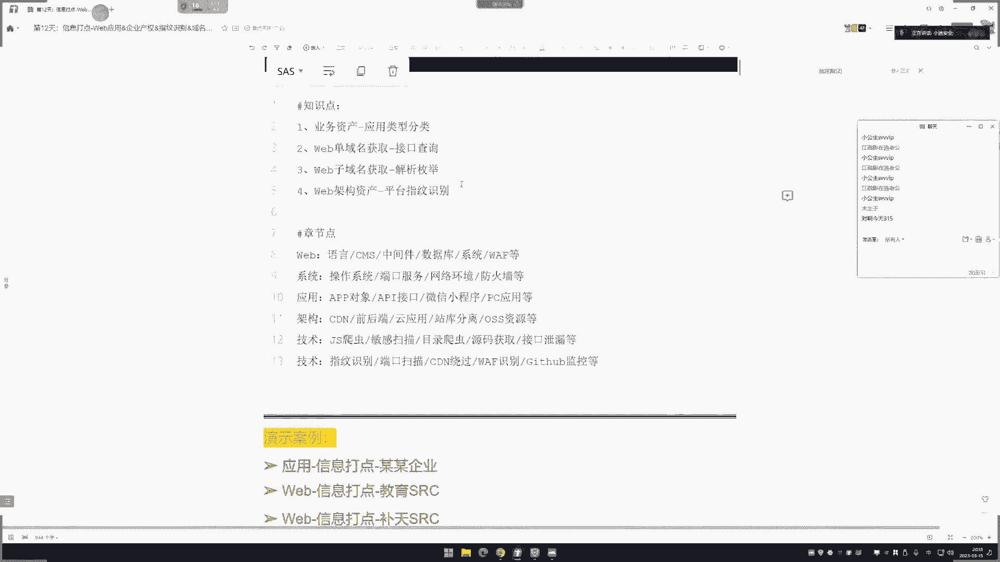

其实就是针对各种应用应用的手机，web网站的app应用的这个小程序啊，呃一些接口啊，包括一些这个PC端的应用，然后呢还包括在一起新增的什么微信，公众号的一些呃，其他的一些这个应用方面的这个信息收集啊。

这个信息收集呢，我的加强呢，主要是在能够给到你在挖漏洞的时候，能够起到一些不一样的作用啊，上期的课程信息收集呢没有，这些信息收集呢要细和全，这也是综合了这个SRC里面的一些技巧呢。

从而重新编排的一个章节的内容，所以要比上届上汽的这个新设计的要更细，包括今天内容看就知道啊，然后我们看一下这个大概的一个情况啊。

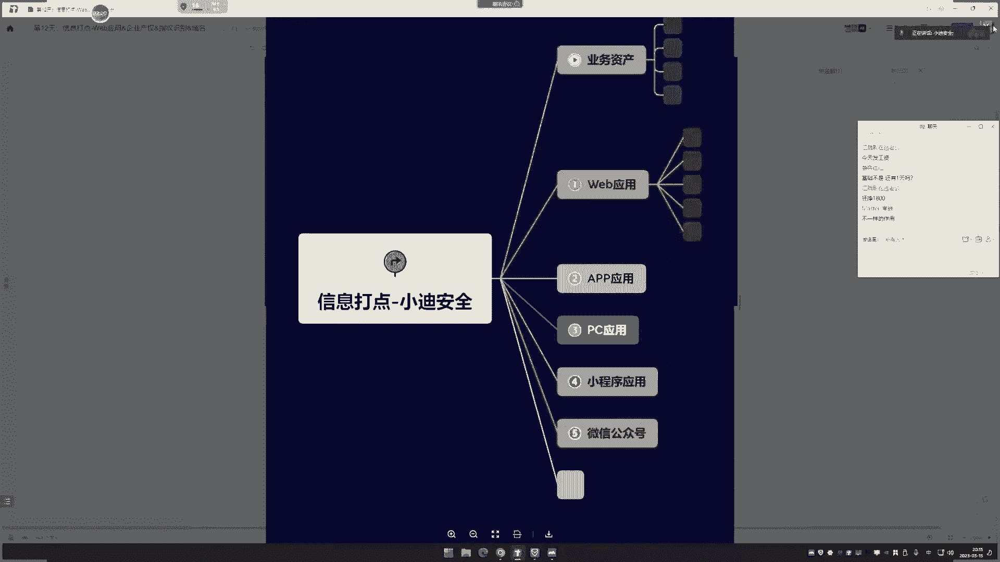

然后给他说一下啊，首先呢我们这里呢是针对的是。

就说我们这个字典呢，是要把几个应用对象的全部讲完，就像网站的app的小程序的，PC的呃，这些东西呢都要讲，但今天只讲的是web，然后讲了还只是讲了一部分还没有讲完啊，还需要一次或两次直播。

才把这个web的知识点全部搞完，因为他是知识知识点最多的。

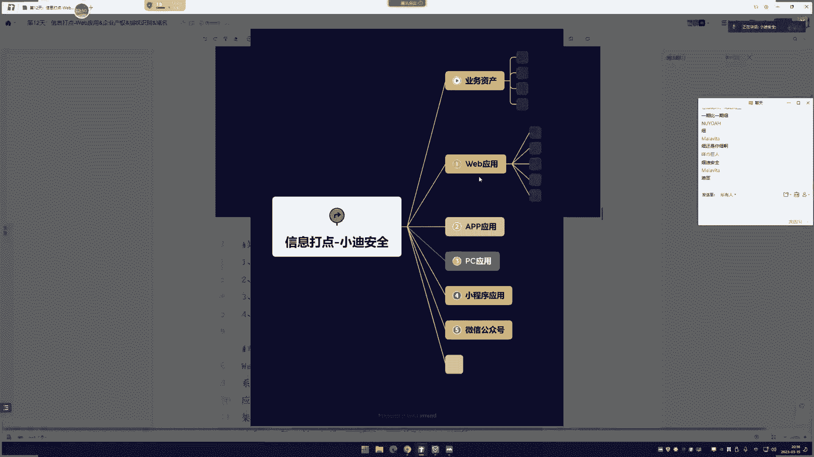

好然后这是下面内容啊，这是我们整个章节要讲的，这里可能写的有一些没有写全啊，只会比这多，不会比这少啊，然后我们看一下啊，这里呢我特地在下区呢花了一个小时的时间，给大家整理好了一些常见的查询的网址。

包括它的平台，每个东西都给他整理好了啊，虽然说这里是从网上copy过来的一些，但是我把它编排了，让大家看上去更明确，以后你用的就直接点链接就可以用了，这是给大家整理了一些啊，那么具体来说。

现在看一下业务资产，什么叫业务资产呢，我们现在想象一下啊，如果说你要做信息收集的话，它其实是有一个目标需求的，什么叫目标需求呢，就比如说对方是给到你的是一个IP地址，还是说一个公司名，还是说一个网址。

这些都是有可能的，对不对，就是你做信息收集，你的目标，它是一个给到你的是一个网址还是一个IP地址，还是一个什么公司名，或者说企业名或者单位名，学校名等等，那么一般的话啊。

我们是最好的是要给一个目标的名字，比如说啊某某企业，某某学校，那么这种呢就是一个大型的一个目标，如果说他单给你一个IP地址和一个网址呢，那就针对这个单格再进行新收集，所以一般啊如果说给的是七的话。

我们这边可以利用到像这个小蓝本和埃及查，去查网上呢，还有什么天眼查企查查启星宝，包括国外这些企业可以用这个结果查，这里都给他写上去了，一些常见地址，那么这里呢有这几个，我们用的是用的这个I7杀和小蓝本。

为什么用这两个，因为他们一个是免费的，一个是收费的，而且这个收费呢相对其他的这个平台呢要便宜，我这里用的爱奇茶，给大家看一下这个爱奇茶的一个这个地址。

这个是我们那个埃及啥的啊。

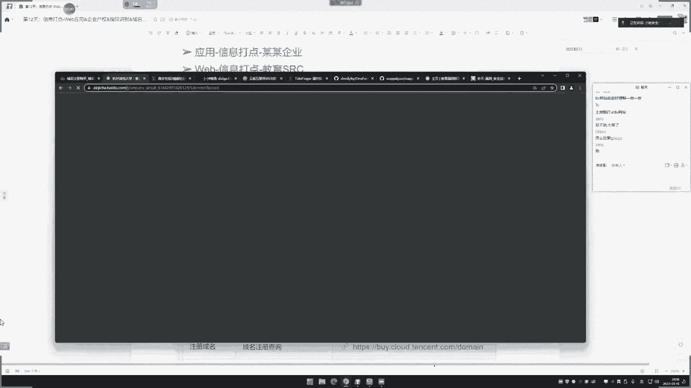

是百度旗下的一家一个平台，然后呢我这里呢是超级会员，3月21号到期，有人还问我说我要这个会员的共享号啊，大家不用邀，拼多多上面直接一块钱可以享受起电啊，就是你用的时候你充一块钱，用的时候充一块钱就完了。

一块钱你就不要早接了，接不动啊，然后在这边可以直接查，我们看一下这个茶有什么用意呢，这个是爱奇查啊。

必须要超级会员啊，其他的普通的话他查不到一些具体信息，比如说像我们这里呢，像这个挖漏洞上面的啊，他这里呢不是有一些这个项目大厅吗，这里是有一些常见的这个企业，这种这种这种名字啊，还有一些这个工艺啊。

企业的专利，我们可以随便的找一些公司那个城市啊，比如说我们这单随便找找这个塔塔出行啊，或者说一家公司名啊，我们可以查一下啊，一家公司名啊，这个可以随便找一下了，就是那个来试一下了。

直接在这里搜这个名字啊。

杀企业了，拼多多上面啊，直接搜这个爱奇啥超级会员，一块钱一块钱可能可以享受七天超级会员，然后呢你用完了再再再再约换，所以基本上不用花什么钱啊，因为你平常用它的机会也不多，这个是他的公司。

然后呢你可以看一下，打开一看这里有哪些信息，我们只关注的，他虽然是查一个企业的这个运营信息，我们主要看的就是它的这个知识产权，这里知识产权这里，那你看一下啊，他有什么，那他这里呢有几个地方呢。

微信公众号app，然后这里还是有网站啊，这里有更多网址，点一下，这个就是它关乎到他这个公式的一些官网地址，和一些他的这个域名，你看还有一些常见的什么邮箱地址啊，电话号码，电话号码都无所谓。

邮箱地址和域名呢是不是我们比较关注的，第二这里是有一些常见的这个什么玉米，除了，然后呢，除此之外啊，这是王子，但他的这个知识产权上面，那还有这个微信公众号和app，那么你可能会问这两个有什么用啊。

首先APP，你看这里它涉及到有两个app，三个微信公众号，那首先想一下啊，我们先说这个app，app里面，那就是我们说的app，那么既然是app的话，那么也就是说这个app里面可能又会有新的。

这个服务应用在里面，APP这里呢和网站它可能是单独分开的，就比如说他的网址信息是在官网宣传，APP才是它的核心的业务需求的一些东西，对不对，那么有可能呢，在app上面会出现一些新的服务和应用。

我们是可以尝试的，所以你就多了一条这个测试的取景，测试的这个渠道，那么同样道理，如果说app上面有安全问题的话，也是能够是吧，和这个公司的安全问题挂钩的，然后微信公众号也是一样，道理大家都知道。

如果搞个微信公众号运营的话，应该都知道有些这个运营上面，那可能需要外接一些网址和一些服务，就是我们说的接口，就比如说如何把你自己的网站的一些应用服务，提交到这个app啊，这个微信公众号面去对接。

就比如说有些这个王子或者说有些应用是吧，需要你这个扫一扫就可以登录某个应用账号，或者说需要你在这个微信公众号上面去绑定，你的这个人的这个用户数据等等，那么这些呢，都其实是由他对这个微信公众号上面的。

有一些这个相应的接口和对外的，如果你通过微信号上面的测试呢，也是能够从微信公众号上面的，得到一些和这个公司相关的这个应用信息的，就包括上面如果说有网址，有IP地址等等，那么同样道理也是有资产的投机的。

所以说这个埃及查呢，不仅是查这个公司相关的信息，同时呢，我们着重的就是要看它里面涉及到的什么app啊，或者说微信公众号，他这个查询呢其实就是我们说的，我们可以把它分支为五类，就是说企业资产已经分五类。

就说里面还有没有网站的应用，有没有app应用，有没有PC端的应用，有没有小程序应用，有没有微信公众号应用，有没有其他产品，这是我们比较关注的优点，因为这六个方向都会有一些这个网站和接口。

等等一些数据来提供，可能都不一样，这个网址是宣传的，app是业务功能的，PC端的优势是它里面的一些产品或者小程序呢，又和什么相关，对不对，那我们今天讲的就是说从烟雾里面提出，提取出这个web应用。

再把web应用中细分，web应用细分完之后，接下来再讲APP细分和PC端细分，小程序细分一点点，把这六个方向的信息收集的全部细分完毕，这就是我们整个信息设计的课程，所以先要从这个目标的。

他的这个应用方向有哪些，把它找出来之后再细分这个一个方向的是吧，一个方向是怎么炒，我们今天讲的是web的，所以这个AB型的微信公众号，该如何再对它进行信息收集，这是我们后面要讲的啊。

包括如何去寻找到更多的app和微信公众号，小程序等等，其实这也比较简单，你像微信小程序，大家一搜是吧，微信那个搜索框里面搜搜这个相关的名字啊，或者什么，你看他有可能就出现，那就是的嘛，对不对。

所以那个那都很简单啊，但是有些接口的这个用户和平台的，能够帮助你查，然后这个演示呢是我们的那个演示的，是这个爱奇茶，像这个奇茶茶呀，什么七星宝啊，天查这都差不多的，都是收费的，然后小蓝本呢这个是免费的。

就说大家如果说想白嫖的话，可以用这个小蓝本，也可以插点击这个企业查询接口，把刚才这个公司呢服务到这里，他也能查啊，那这里是他的码啊，点进去啊，这个是他的信息，我们看一下呢，APP3个呢新媒体。

那是他微信的一些公众号，视频号网站是一个，你看是吧，他这里有了它商标信息，还有他的一些什么其他的，来这次也能查到他的一些这个公式的，一些相应的app产品啊，新媒体啊，这些东西。

新媒体的话应该就是什么视频公众号啊，或者说抖音号啊，这种能理解吧，你看这抖音号啊，虽然说这种东西呢，可能对我们来讲没有什么太大作用啊，因为像这个新媒体呢，我们不是很关注，因为这个是官方的。

比如说抖音号这些东西啊，他无非这里怎么测测不出来的啊，抖音号对接官方在那不好吃啊，除非是他抖音号上面还有一些提到过的，一些新的一些应用啊等等啊，所以说这个呢是小蓝本，它是免费的啊。

就是说如果说你这个爱奇艺爱奇查了啊，如果说你没有登录会员的话，他这个新鲜的是只展示一部分后面的酒，你看不了了，所以说这个还是收费的啊，小南门那就是免费的，那大家可能说那我直接用小蓝本不就完了吗。

是这样的啊，小蓝本呢他虽然说是免费的，但是它有一些这个数据呢，他查的是没有II7查的跟全面，就是有些可能还查不到，因为这个怎么说呢，用啊这个收费的呢毕竟是有一些强项，就是它的资源库和它的信息的更新。

都是要比这个免费的要强一些啊，所以有时候那你可能两个人联合起来用一下啊，两个都要联合，为什么说我在里面写了这么多，其实就是说可能平台不同的话，他查的这个信息渠道有些不同。

这个星系的这个数量呢也会有一些小差异，不过大体上是能够都差不多的啊，这里是我用的爱奇杂和小蓝本的一个，大概介绍啊，然后这个查呢主要是查的是什么信息呢，主要查两方面信息。

第一个就是他的业务方伟就说有什么app啊，有什么新媒体啊，有网址啊，有些信息是吧，这是第一方面，第二方面呢其实它还有一个查询方向，我刚才没给他讲，就是哪个查询方向呢，大家刚才我在搜这个名字的时候。

大家有没有关注到一个问题，大家来看一下它这里呢下面还出现这几个呢，他的这个叫隆基啊，然后这个是它的图标，然后下面有一个叫隆基啊，在这里又有什么西安隆基，但这里和他有没有关系呢，大家觉得有没有关系啊。

那肯定有关系，连图标都一样，你说有没有关系呢，他这里呢可能就是它类似的这个分公司，或者说它的企业家公司这种类似的，那么你可能会问他这东西，如果他是目标，车，是目标的话，我挖他这个旗下的有没有影响呢。

这个要看具体挖洞的那个挖洞的那个需求了啊，如果说他有明确表示旗下不受影响的话，只能挖这个中部的话，那就不受影响，如果说他没有做这个需求的话，那么也说你像这个他也是属于他旗下的公司。

那么它下面的这些信息呢也同样道理，也是可以进行尝试的，那也是后来尝试的，因为他们都属于同一家公司，只是一个上下关系的问题，能理解吧，所以说这个用企业查信息的主要目的是，第一个呢是拓展这个企业相关的。

其他企业和它相关的也能纳入这个测试目标，这是第一点，第二点呢，就是我们说的能够搞清楚这个公式的大概规模，包括他这个公司里面涉及到的一些什么网址，一些信息，对不对，或者说他有哪些业务，就是说有没有网站啊。

有没有app啊，有没有微信公众号啊，有没有这些东西，这是我们比较用爱用这个企业查的目的啊，他查的目的大家记清楚了啊，主要是看这几方面，其他的像什么一些什么这个任意上哪些东西，不是很关心的啊。

好这个是我们说的这个底点啊，就是去查这个目标的一个东西好，那么查出来之后，我们把它归类成了这个什么网站应用，APP应用，还有什么PC端应用，小程序，用这些各种应用，对不对，那么现在呢。

我们就开始对这个下面的每一个应用呢，开始分类进行查询了，因为他们每一个下面都会有一些相应的知识点，你比如说我们现在讲的这个web应用，那么web应用里面我们首先关注的就是哪一点呢，就是域名点，域名点。

什么叫域名，就是网站的这个地址大家都知道啊，就像我们说的呢，爱奇塔点bt com，这个是域名，那么这个域名上面又讲什么呢，又分两种，一个叫单域名，叫支子域名，单域名是啥意思呢。

好我先说从备案信息获取单域名啥意思啊，我们这里呢有一个平台，我这里呢也把它给它整到上面来了啊，这里有备案信息呢，我们可以点击进去来看一下啊，大家看一下备案信息查询，这个是国家的一个备案信息的总查询。

这个是查更全面的啊，就是他的一些这个各种各样的一些信息，这个呢是一些接口，我这里用接口给他查一下，那我直接可以查一下这个公司名，或者说我可以查一下网址都可以啦，可以输入单位名称或者域名或者备案号。

或者直接网址都行，我可以输名称，也可以输入网址信息，查输入网址信息，他就查这个东西，你看他是帮我也查出三个网站，你看然后呢我刚才用这边查的话，你看这个是哪些网站的GRPSI，看这里插的是。

来GRPEN他这有没有1N这边啊，这个SI的，那这里呢没有呢，这没有，这里有一个还有一些他这里能看到，那么这里呢就是这个查备案的是啥意思呢，就是说他有个备案号嘛，对不对，你可以直接通过这个备案号呢去查。

就是说他是同一家公司注册的，那么他都被按到这个公司，那么也就是说只要是这个备案的，就和这个企业和你的目标测试有关，所以这是一种查的一种方式，虽然说这个爱奇茶上面那也查到这个地址，对不对。

但是呢有可能就是说查到的，会和这个地方有差异，为什么说有差异呢，因为他们的数据来源不一样，这个来源是来源于这个官方的这个备案的，这个管理部门呢去查的，而这个I体查呢。

应该是也是通过一些其他的一些渠道查的，而且一个是专门做这个备案查询的，一个呢是做另外一个方向的，所以他查的这个数据可能会有差异，所以大家要记住啊，备案查询就通过这个备案号去查，备案就是网站运营备案的。

你比如说像我们这种没有备案的，他就是没有信息的，你比如说我下了八点com，对不对，为什么会会说谁是跑路呢，因为我不安都没有被你查证，后来没有背啊对吧，不管你个人备案还是企业备案，没有备案信息都没有啊。

这个就是没有变啊，那么这种那就是获取单域名渠道，就是说直接通过这个新兴的去查啊，这是第一种方式啊，第一种方式单域名，那么再来说第二种方式，第二种方式就是利用这个叫嗯是吧，企业的产权。

企业的产权去查查产权呢，其实就是我刚才说的这个上面这个这个东西，就是我刚才说的这个东西啊，就这里了，这是我产权嘛，知识产权就我刚才讲的这里啊，这没什么说的啊，这是查他另外一种web上面有没有哪些网站。

第三种就是叫租车，查这个呢主要是结合没有找到，实在没办法的时候，选方案叫租车玉米。

啥意思呢，来给大家演示一下啊，那我们找一下腾讯云的域名注册这个地方，腾讯的域名注册，我关注到这个这个这个什么，刚才这个域名叫隆基对吧，我试着去对这个域名呢进行一个什么输入，进去点击查询。

那么大家可以看到这个域名被注册过，点CN也被注册过，点net也被注册过，然后呢下面有些可能是没有注册的，那下面就在你那换显示这个金额的，就是没有被注册的那点cloud，点CC点VIP点CO都被注册过。

点XYZ点这个V那是啥意思啊，也就是说这个网址打开，很有可能就是和这个公司相关的，为什么这样说呢，你看打开了叫容积极点，那这个应该不是和他公司相关的，这个是另外一家公司，因为他们两个行业都不一样。

但是这个是一个思路，也就是说他可能注册这个域名，也可能注册另外一个域名是吧，也可能注册另外一个域名，那这个就是官网公司呢，农机农机点net。

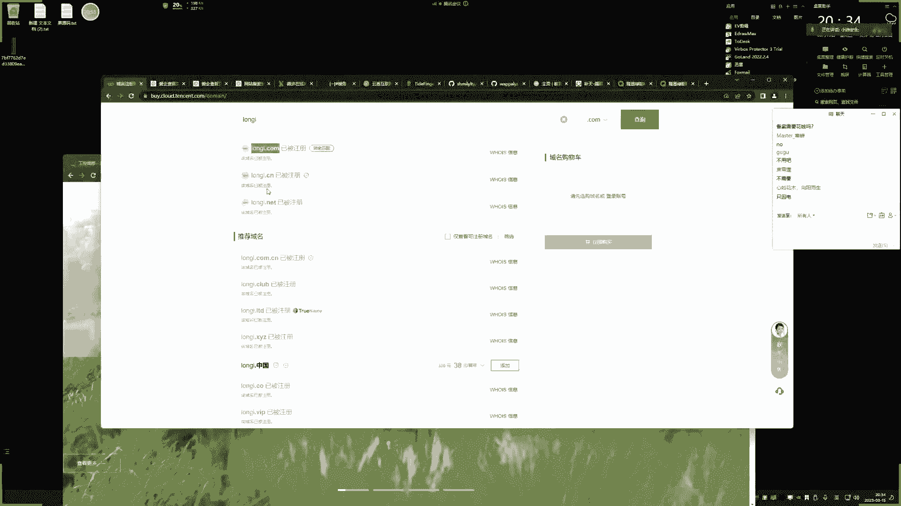

你可以从这方面去入手，就是说你可以查到他可能在上面没有查询，比如说没有投入使用，没有备案的域名，这也可能是他已经注册了，但是呢他没有投入使用，只是在上面呢搞了一些其他的，或者说和他公司相关的。

这些都可以考虑在内，能理解什么意思，没有啊，你只要像我自己注册的话，我可能注册个小六八点com，有可能租了个小零八点CN对吧。

都是我的，但是呢我只用小喇叭点com，不用小标点CN。

那这个时候呢会不会就有些不一样的呢，对不对。

这个就是说从他这个域名租车里面。

可以看一下他这个相关域名有哪些地方被注册，那很有可能就和这个公司相关，只是他没有投入使用，但如果说上面有烟雾的话，那么也是可以测试一个点，所以像下面这些信息呢也是可以进行查询的。

就像这种呢嗯农机GRAP这些呢也可以查对吧。

说不定在这里查的时候呢，就发现了啊，这个上面没有找到了一些玉米对吧，比如说这里是点com，它可能死在这个点CN。

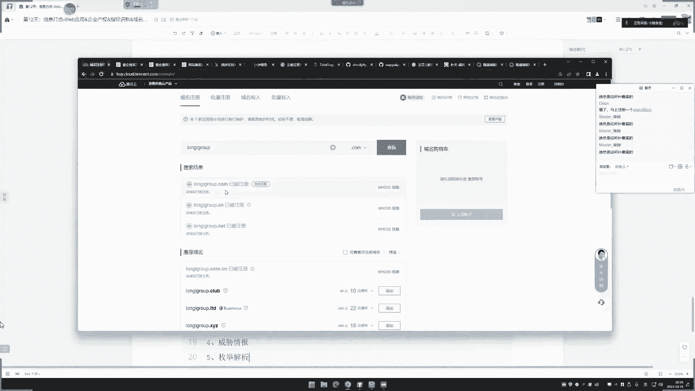

你看这里有个点CN，打开一看的话，如果和他网络相关，那不是又发现了个新大陆吗，又发现了个新新域名的吗，是不是这个正在出售。

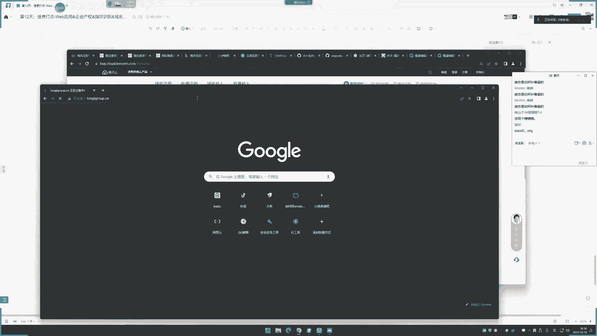

没有点net啊。

这个就是看人气了啊，这个打不开好。

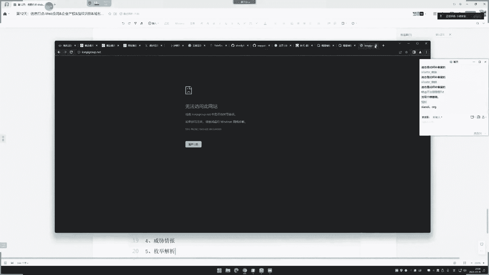

这是我们说的这个第三点啊，注册域名，还有一种就是通过IP地址呢去反差解析，啥意思呢，IP地址反差解析那个简单的例子，就是说如果对方给你一个IP地址，那小D8点com，那就像我这里啊。

我这里有个IP地址是吧，这个IP地址给到IP地址，IP地址的访问呢打开它看上去也像是一个网站，打开也是这个东西，但是呢这IP地址上面呢你可以怎么样反查一下，看看有没有域名，就看看有没有网站，有没有域名。

IP地址访问的也可能是一个网站，也可能访问不了，但是不代表上面没有网站，我们就看一下有没有域名解析到这IP上面，所以那就利用什么反差级数，就是IP反查基数这个接口信息呢。

我也给他给到了那IP反查域名的两个接口，一个呢是可以利用这个微博在线，还有一个呢是像这种都可以用，那输入IP地址反差，那他就查到你看小八点，看不懂，你看到没，然后呢。

你可以用这个东西也可以查到这个微博在线，直接输入IP到这来搜索，然后这里有个叫什么解析域名，来在下面解析过的域名，在2018年解析过一个叫张雷杰点博客，他笑了半年的解析过，对不对。

你可能会为什么有这么多信息啊，这个为什么有这么多信息呢，是因为我在前面实在是个新号，就是任意的支付我都解析到这个IP，所以他自己有这么多信息啊，如果说没有设置的话，那可能就只解决一个小PO。

你看看通过IP地址呢去反弹一下啊，IP地址上面有没有解决过玉米，那么同样道理，我当我去打开这个域名的时候，一打开打开这个域名的时候，诶是吧，大家就看到我的博客了，那这个博客和IP地址是不是都是在一起了。

死在一起啊，而且这里是另外一个新的网站了，这不就是相当于就是出现两个目标了吗，这个是另外一个，这个呢是我新的，但这两个都是一个目标啊，对不对，所以说呢这种IP反查呢也是这么一个情况啊，也是那个情况。

这个呢就是其实就是说可以通过IP的反差，解析出域名来，也可以通过这个注册域名呢，看有没有新的公司相关和它相关的这个域名呢，去有没有新的注册的出现，版权信息备案信息里面都可以查，这是针对单域名的。

那么针对多余多多域名呢也是有的，什么叫多余名啊，就是我们说的子域名啊，至于名的话，一般都是通过五种，我这里讲的是五种原理去给他查，因为域名越多就可能是另外一个网站嘛，一种是DNS数据。

一种增速查询一个网络空间，用微信情报一个枚举解析，这是五种不同的原理去查资源的方法，我一一给大家介绍DNS数据就是什么意思呢，第二数据就是说我曾经找这个域名，然后我曾经设置过这个域名的解析的时候。

它会有个记录，就说比如说你曾经把小零八，解析到哪个IP上面去了，这个设置呢他曾经在互联网生效过，就会有这个历史记录，他这个点数据就是通过查询历史记录来看，你这个域名曾经用过来就域名解析过。

这是第一种方式，第二种用证书查询是啥意思啊，我们都知道这个HTTPS的话，就是我们说的有证书，那APS的网站是吧，这个是这第二方法是仅限于有hp的才行啊，如果我打开百度，你看这下面是有帧数啊。

你看它有这个网站的这个这里有个锁，这是它的一个官方的一个帧数，对不对，那增速有效啊，这是他自己的增速，那么有时候如果说有一些hp的网站的话，他这个增速呢是可以通过网上查询，这个证书用到哪些域名上面。

就很简单，我是百度点com下面旗下的这个公司，然后呢我创建个网站，那么我的网站可能就来源于官方搬运，开幕给我的就很简单，什么意思呢，我们说的子域名就是指的是白金汉姆，打开之后再打开贴吧就变成铁08：

30对com是吧，这种就相当于就是至于民是吧，子域名就前面多了一级，就是二级子域名是吧，还有三级子名，就是在前面继续加比前面加上个差点塔，比那三级域名好，我们先不说三级名，先说这个二级域名子域。

那么在这里呢他有这个东西了是吧，那么你会发现它在里面，视野这个域名是另外一个这个域名的，前面是百里和那个铁800米，然后这里是也这个P啊，你看这个是有这个锁好啊，就是有帧数嘛。

那比如说这个地图也是map demgm，用这个东西来增速诶，打错了，那这对不对呢，你看他的信息来源于百零二，来源于这个组织，对不对，然后我打开我的百度看看一下它的人数，你看他整数是和刚才一模一样啊。

你看这两个是一模一样的啊，那这个是百度地图的百map点百度com，这个是直接百度com，两个帧数是一模一样的，看到没是吧，那么他这个证书查询，其实就是说通过你的目标的一个增速来匹配。

其他哪些网站用过这个人数，那么其中就有子有病，这是第二种方式，第三种方式就是利用网络空间，网络空间就是我们现在经常给他使用的方宏图，夸克，撒旦这种对吧，还有后面几家，后面除了有几家，那具体有哪一些呢。

这我给他都给他整理上去了，使用最多的目前就是三个全球音，就是我们说的音读foo和夸克，这是用的最多的，然后国外的是吧，有哪些呢，撒旦对吧，然后国内的钟馗之眼，零陵兴安，那这都是这个国内外比较。

就是这个呢我们用的不是很多，但是也有使用的这个情况是吧，对不对，要用情况来这几个了，对不对，我们一般用的最多就是三个啊，这个360的夸克奇安信的全球音，这个否否，然后呢，在日照少女了。

这个钟馗之眼一般用这三个最多，我们这号封口号呢也是卖的，被大家卖的几百次了，对不对，卖我号都卖了几几几百块，上千块钱的，对不对，大家都知道的丰富，好那么这里呢就是用网络空间，那这个网络空间是啥呢。

其实就是别人搞的一个，专门来去爬数据的一个平台，那么它有什么作用呢，就是你可以通过它上面的这个查询呢，能获取到目标的一些信息，我们等一下就给他演示啊，这是利用网络空间，然后还有一种就是利用这个威胁情报。

威胁情报就是我刚才的，像刚才我提到过的啊，用的最多的也给大家介绍三个微步，在先秦安心和360的都是这几个公司产品，全球应该起源性的三菱qua30，然后三零的威胁中心的起源，性的威胁中心是微博在线。

对不对，所用的最多的，那这个东西呢就是别人提交过一些数据，他做了一个整理，然后呢你在上面查了查到一些信息，你也可以查到，只有，好这是第四种，用威胁情报来获取，还有就是枚举解析，少加枚举解析呢。

每局解析其实就是属于一种叫暴力破解，就啥意思啊，那我就拿一个拼命名去给大家讲一下，那我拼300分的小白点com是吧，我拼好它怎么拼通好，我再拼一个其他的，比如data诶，他也能解析。

那么就说明这个域名呢他有尝试过能够解析，那就说明域名是存在的，所以它其实就是利用了字典去批量去替换，前面这个东西来去看能不能正常解析，来确定这个域名存不存在，来去查找这域名，你比如说像我这里呢找一个来。

我换一个域名啊，因为我这个域名前面是在这个信号，就所有都能解决啊，这个是另外一款，有些人就不是这样子啊，就白领了，那我解析这里的解析啊，我换个名字啊，你看啊叉叉，那你看它就提示找不到主机了，对不对。

这个就能找到，这个就不能找到，然后呢我再搞一个正常的，比如说这个map，就刚才那个反基图它又能找到对，所以他就是通过类似这种技术呢啊，去用知识点去批量替换这个什么，前面这个东西来去尝试去解析它。

看它能不能正常解析来确定这个域名存不存在，最终的来去查找这名，这是说的五种方法，那一般用的最多的就是第五种，就是这种爆破的，这是最最有啊，最有消化是最常见的，当然其他四种呢也是可以的。

现在呢我就给大家演示一下，其他四种和第五种的一个使用，而且第五组呢会有这个，相应的工具也给大家介绍一下啊，呃这个工具呢呃是单个针对子域名的，其他的功能就没有了，那我先给大家看一下这个这五种的。

每一种的使用方式，第一种呢用这个DNS数据查询，给大家推荐的平台是这个，然后其实网上都还有其他的平台，但是其他平台我试验过啊，要么就是这个国外的网站访问的不确定性，不稳定性，要么就是一些英文看不懂。

或者说一些网站的直接没有了，所以只找了一个推荐。

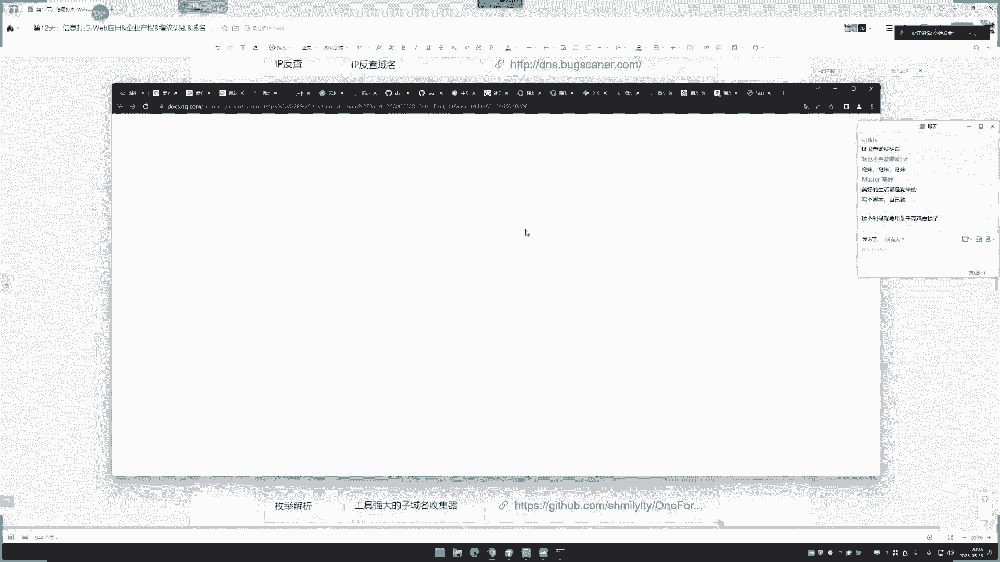

大家看一下，我看一下他能帮查信息，比如我查小李八等，我先查一下啊，我查一个号码。

我查一下就查一下，这个我就不查这个大的啊，我就查这种啊。

像这种是吧，这种SRC上面的目标是吧，查一下，先取下来查一下，那个查呢是有点慢的啊，因为他是要从它的历史的DNS解析记录，里面去找到，最后再形成一个列表和一个这个图片，所以这里呢稍等待一下啊。

好这就出来了啊，大家可以看一下，这是他查到的一些相应的，你看这里有什么VIP10点com阿里DNS，这是DNS地址，然后下面还有这几个地址，你看MDN这个类似的，这应该是啄他的一个什么。

这里估计是那个邮箱的SMTP的，邮箱的那个什么鬼，这个域名相关的，那这邮箱的那个类似的信息来看，应该是它内部的企业内部的邮箱服务器，然后这里有张图片，大家看一下啊，还是张图片的A记录。

上面有这个VIP4解析IP地址，然后有DNS解析记录，来用这个它阿里的一个DNS解析记录去解的，还有个M记录，就是类似邮箱的解析记录，在这里看到没，他就把他几个记录呃，如果你学过DNS那个解析设置。

大家都知道，部分呢都是用A记录，M记录，就是我们说的什么邮箱解析记录，就说你部署邮箱服务器的用户ms这邮箱相关的，然后这个是DNS，就是他自己内部的DNS服务器，啥意思呢。

就是说他用到了这个单独的IP地址呢，服务在解析，那么这个设置是为了干嘛呀，其实呢就是说如果你不设置的话，他就用官方的解析，那么官方解析呢可能会出现熟读慢，或者说官方如果DNS服务呢有问题的话。

那么你网站解析的也会有不正常，那么它是单独，可能是自己购买了这个DNS解析服务啊，单独用这个检验服务器解析的，就以前呀曾经有一个这个黑客俗语，就是说顶该是劫持的这么一个技术。

就是其实那就是还有第二次全输与漏洞，这是后面那会给他讲的，就是说其实那就是域名解析的时候，是有一台D服务器来负责解析IP，就是说通过域名的把解析到IP上面去，但这个DNS服务器呢一般会采用这个公用的。

就是我们这个大家都用的那种DNS服务器去解，那么这是第一种，还有一种呢就是有条件的是用自己的D，比如说像一些大公司，他都会用自己的，用自己的好处，就是风险的资担，能避免这种公共的安全问题。

就以前呢这个百度曾经被黑过，不是说他被黑客入侵了，而是负责解析百度的服务器呢，被人这个东北机了，还是变成黑了，导致白中又打不开了，服务提供不了了，为什么呢，就是因为他用到了官方这个公用的，这个电视服务。

所以导致有些地区他访问不了。

曾经的有把我这个新闻我给大家谈一下啊，正好在二零这个2012年的时候，我还记得那时候是我刚开始学这个安全的时候，我记得，那就是2010年实现了200啊，那时我还没有学啊，我听过这个新闻，当时就方便点。

20年的时候，中国最大黑眼睛遭遇黑公鸡，长期无法问，在这个某些地区呢，这个被那个啊，然后他的这个被黑的反应呢，不是他这个官方的被入侵了，是这个，你看他这个说明是在这个什么四川那房间啊。

江苏啊等等一些地区有访问，出现这个图片的意思，其实就是这些地区在放百度的时候，那个DNS服务器呢不能正常解析，它给它解析到另外一个地方去了，就是他的DNA呢被几度被篡改，其实就是说他这里查到这个信息。

就是说放那个图片的，图片跑哪去了啊，真是太多了，这是搞了一下图片都找不到了。

什么鬼啊，把它关了，好就这个那这个DNS记录是吧。

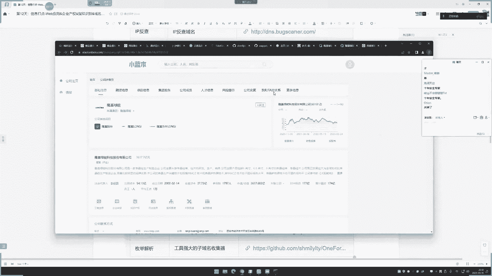

那么他这里用的是一个VIP3200点com，这里购买了一个单独解析是吧，其实呢就是说可能这样子呢就解析的更快，或者说提供服务呢这个速度的响应更快，也有可能呢就是单独购买一台服务器的，来帮助他解析。

就这服务器啥都不干，就是专门去解析的，所以说这个呢要知道啊，我们只是给他提一句啊，那么大家就知道了，他这个每个技能都对应不同含义，一般的主要是A记录，最多就是直接写个域名的解析，IP地址完了。

然后像什么M呢，就是单独的一些服务，比如说邮件服务，那就用ms，因为ms呢就是我们说的对应的邮件服务，邮件服务它那个解析是有不一样的啊。

因为邮件呢它传输协议的问题，所以说这个是我们说的这个第一种方式啊，利用DNS记录去查，就说曾经的你对这个域名做过哪些解析。

都会有记录可以查了，我们这里呢也可以查一下这个相关的啊，你比如说像我小礼拜我曾经查过哪些，或者说我用到哪些DNS服务器，他都可以帮我查的，我也看一下啊，查一下查三个吧，查查看我的博客。

查一下这个SSRC的目标，查一下这个比较大的公司，看一下是不是都会有一些不一样的地方，刚才查的那是一个属于比较大的公司，然后呢再查一个互联网公司，你看这是我小了八的，他查的我们可以看一下记录呢。

这是我查的呢，我用DNS呢，我翻过来DNS，hi china点com，JFDADS9h i china点com，这是啥意思啊，只要其实这两个是免费的啊。

我可以登录我的里面给大家看一下，你要看前面的前缀啊，等一下，大家看一下啊，我这个域名这里啊，那这是我那个域名对吧，你看下点击管理，他这里有个叫DNS修改，你看你看我现在用的是修改DNS服务器。

用的是电压是九，拆下来近十，那修改的话呢，这个是修改，然后呢第二它是可以购买的啊，就是购买DNS服务器，那具体怎么购买呢，你可以在这里搜啊，我就不给他说了，你看就这个地方他查的就这个地方呢。

然后你看这个是我的一个技能的巅峰期，然后他的一个查询的信息呢，我们也看到了D29还有点死。

然后你看M记录有个什么曾经解析过了，MQ点com指向过这里啊，这是干嘛，这是我当时给大家作为那个邮件钓鱼服务，上期课程和上上期讲过这个邮件啊，钓鱼邮件服务器系统搭建的时候给大家用过，所以这里有我的记录。

而且你会发现看一下现在有没有哈。

我解析这里，你看，那吃饭呢看到没，现在还有，你看看，这是我来做那个邮件服务器的时候，做搭建邮件服务器，用那个QQ邮箱中转。

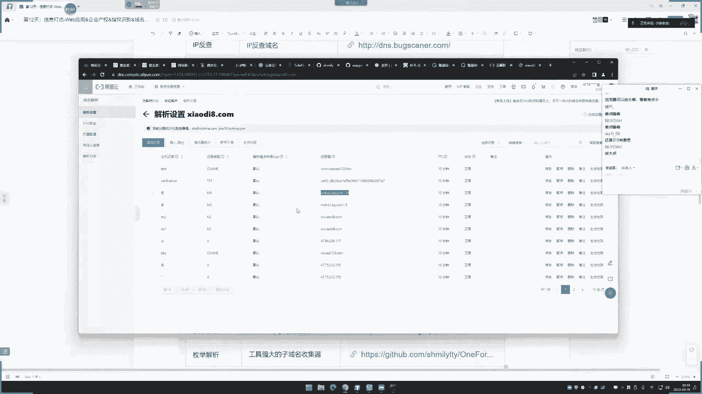

解析过嗯。

信息它有些你看这里是不是对应上，你看这个BDSCM记录cs的，那有些呢二级路下面放在下面呢，下面就没有了，那你可能会问这几个跑哪去了呀。

这明明有这个什么DHC，这是啥情况就没有了，我说的是历史，因为我把这几个删掉了，我曾经是想做一个data和黑客，黑客是我的巴掌社工库呢，就是我给大家查询信息的呢，就是我一个数据的胶卷。

就是一些什么常见软件啊，东西放在上面，我是准备做这个域名的，就是想搞给大家搞一个，这个是吧，博科加上一些业务应用的，但是后面发现这几个都涉及到违法，不敢开了，不过删了。

所以这是我曾经测试过解析准备搞的啊，然后呢把删了，不过他在给我记录了，所以我们查他这个电视记录呢，是能够翻翻开他曾经解析过哪些域名，所以这一点好处，那就是说即使它删了，它还存在。

所以说有时候你在访问的时候。

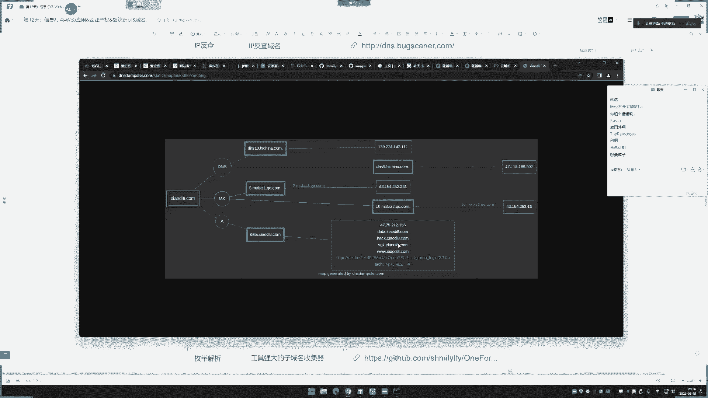

如果说他没有删的话，就能看到这是一种情况啊，而且这种D记录呢对于查找CDN也有帮助，就比如说曾经的他没有开CDN的时候。

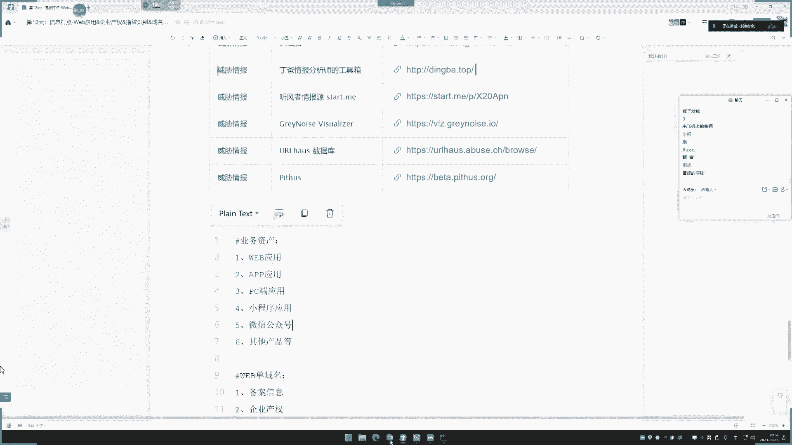

他解决了IP地址，如果他开的CDN是吧，他的软IP还是IP，但是他曾经的IP呢记录了，你查到了，那么很有可能他新的东西呢还在这里面。

所以他是有这个帮助的啊，这是另外一题优化啊，这种就是利用的点数据查询，还有一种叫整数查询，查询呢就给大家演示一下，那真数查询就这个网址啊，这一个是啥的，你看啊，我先查一下我自己博客里看能不能查。

那low fund，为啥大家告诉我这里为什么没有信息啊，因为我的网站它是个没有帧数的，他是没有帧数的，所以查不到，不是没有备案啊，不是没有备案，是没有珍珠，有没有帧数，就是看是不是TPS，我是ATP的。

他有啥证书的，啥都没有，那王者是AP的提示都不安全，这哪有帧数，有个P啊，王者里面没有帧数啊，好我们就找这个百度，他们和这个什么这个上面他应该是这个大公司，应该都是用abs，这一般都是tbs呢。

其实也是很正常的啊，啊这是我们的，那他是有数的，你看他是有数的，你看连接安全的，然后呢这是他，对不对，好，我们查一下他有没有啊，看下，不要打前面3W点啊，就这样子啊，直接输这个，他根据名查好。

你看是不是查到了，但是他的真实信息里面只有这几个词语，你看有几个信息对吧，你看这是它上面都涉及到一些新域名呢，对不对，虽然说有些打不开了，但是有些能打开的，我们还是能看到，你看到没。

是不是来到了来到另外一个应用上面去了，你看这里你如果说啊，我就在很简单，你看他这里查到一个新域名，这个域名大家看一下啊，你如果去信息数据和每一句的话，你的字典里面会有这个东西吗。

你能找到这个你的字典里面会有什么隆基斜杠，EXEHI这些东西吗，没有吧，是没有这个东西啊，这肯定没有的呀，但是你看这里他找到了，就是通过他的这个帧数应用的地方，找到了一个与同样道理啊。

我们看一下这个8号，我们这个百吨航母，你看那只白头鹰航母，你看百度互联网公司，那就不说了，这么多了，就说这些其他的域名呢，他都是用的这个帧数，看得我靠浏览器死了好了太多了啊，都要死了一下，你看看到没。

这全部都是相当于说这个下面的鱼呢，全部都是用的这个白鹭，那个其实这里的水就是其实很简单啊，就下面那些都是他旗下的玉米，就这么简单，因为他都是用的他一个那个帧数对，所以这里面就有很多子云。

你看这个UCC点com是吧，还有一些人打开了也不能打开，打不开并不代表就是他没有用了，而是可能他的业务呢上面不需要网站。

只是他这个用户居民的来记录。

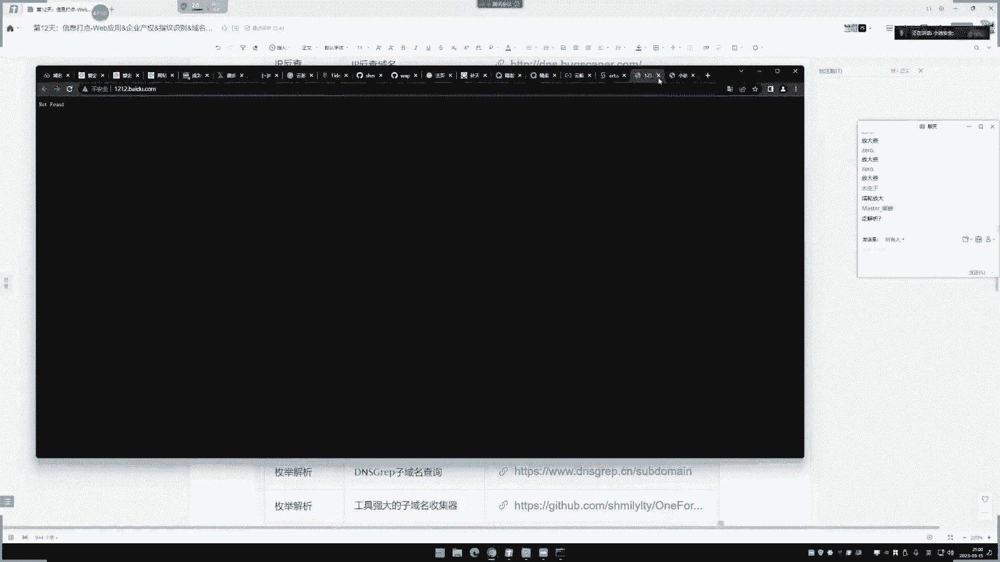

对不对。

啊这这是相关的啊，这个百度的一些这个与这肯定是在一些接口呢，你这种就是接口的一些信息，这可能是一些API接口的。

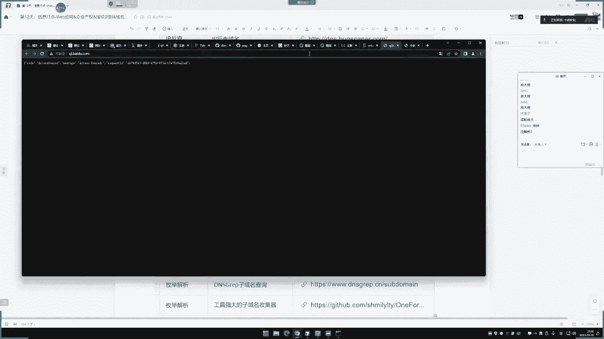

那我们可以随便打开看一下啊，能打开的就打开看一下，不能打开的话，有些是借款，有些是这个数据，有些是就没用了，都有可能，这是I翻翻看百度取下一张公式叫I翻翻，什么叫I翻翻，这个名字有点可疑啊。

好这就是我们说的这个利用这个什么，利用这个帧数查询，但是他们有个缺点，刚才大家也看到了，他只针对ADS的，不过话说回来啊，ATP的都是些小个人或者说小型的用，就说一些不相干的，可能放在P上面。

那么这个增速查询呢，也基本上是适用于我们的应用方向，因为如果说你要挖东的这个目标，和你这个挖洞的这个群体的话，他大部分都会选择APS，因为ADP呢都是像我们这种个人或者说懒。

或者说这个随便搞一下也无关紧要的，不是会把一些很重要的数据都放在上面，他就会选择ATP，所以这种不重要的话，他也不可能成为你的目标，因为你成为你的目标的话，肯定是这个东西呢是有一些价值的，有价值的话。

他大部分都会选择APS，所以这个真实查询呢它是能够对应上的啊，再说网络空间，这个网络空间呢，我们就三个平台都给大家看一下，一个是我们给大家用的最多的foo，还有一个是我们说的这个全球音300啊。

否否打开，还有这个全球音，还是我们这个300quark。

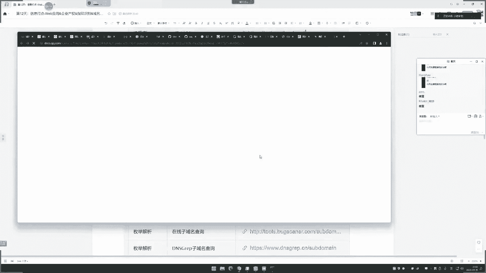

然后这里你可以看一下啊，比如说我搜他有什么搜索语法的，你可以查询一下呢，比如说招致的他这里有提示吗，那多码点Q点com就是查询的Q点com的，这关乎的Q点com这些域名。

你看现在这里都是QQ空间的域名啊，你看我们再找个小的八代看下来，小八的或者找刚才那个隆基了是吧，可以找找小丽巴的，看有没有，那这小力巴的呢，四个八端口，3306端口，你跟他说这是啥东西啊。

这可能是他误包的，但是他后面写的端口号啊，这是几个东西，找到了一些对吧，然后像刚才隆基大的。

直接说你是不是打错了玉米。

龙龙说龙急了，不要急，你看这不是啥的，是不是收到一些指名了，e n remote remote了，是不是各种各样的一些呢，新鲜的标准端口的，这还是个网关，这边是个网关地址是吧，然后这个我就不多说了。

你看这章，还有他的一些这个管理的平台地址是吧，你都可以去尝试着去看一下的。

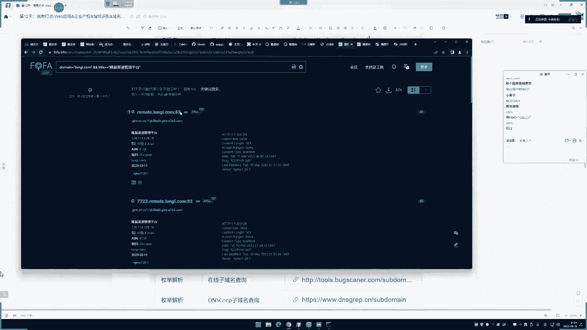

这可能就是他一些其他的公司的一些业务，的一些地址嘛是吧。

现在打不开，但是这里可以看到啊，他这个名称就叫农机渠道管理平台，有点慢啊。

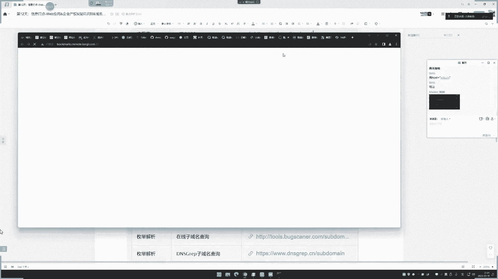

那隆基氢能智能制造管理系统，你看这就是他的公司一个产品，你看这是它子鱼啊，所以这种呢就是网络空间网络空间，然后这个是foo，然后我再给他看夸克quark，夸克怎么搜呢，也是一样，找一下语法语法就这样。

然后依旧是收我们刚才的，比如说小于八点，看我们的先，你妹的啥情况啊，这非要我登录才给我用啊，不登录行不行，说都不让说，我登录个毛啊，我真是服了，这点都点不了，是啥情况啊，这，哦要点这个才能点，你没了。

给我发个验证码啊，这下好了，这手机号又被新人知道了，这又是一顿骚扰了啊，哎呀，之前手机号泄露之后，被一个湖南的给打电话来打电话过来骚扰，这什么情况，名字都画好，给大家用用的，把我头像也改成隔壁的图像了。

名字也改成什么小香蕉吃小弟，这他妈的，这真是，小弟培训只能按月培训了，现在哎登录的设备数量已超限制，亲自个人中心进行设置，有多少个设备啊啊，重庆的登陆过，广东的登陆过，就在刚才八点钟就登录过。

又被埋了吧，不是我不想给大家共享啊，我这实在是没办法呀，这天天在被被麦子谁顶得住啊，你看这个是瘦小的包的是吧，然后我说那个龙I点com，就刚才那个啊那个SRC的那个目标的，你是不是也有啊。

你看那这值域名是吧，来啊包括他的一些其他信息，这个大家都可以看到了，上面还有图标，这个是用quark360的，还有英图图，再给他弄一下，因土这个还好哎还好这个音图呢他学聪明了啊。

他这个呢因土这个呢是一个叫啥呢，它是一个积分制的，就是没有会员，其他两种的都有灰原，就是要开会员是吧，这这两个这个硬度那就不需要开会啊，你日你租车都行，然后呢啊，那你要用导出数据，他就要冲积分。

它是以这个赚钱，对不对，有的人就和我要薅是吧，然后我说这个不是会员制，我给你薅，我也是个普通会员，你也是普通会员，你都能查，只是说导出数据呢要花钱，对不对，他这个充值中心。

比如说你充100块钱就能导出3万条数据，就这个意思，3万积分吧，对不对，你看现在呢我之前就充了这个十块钱是吧，还有1000多条没倒，然后呢有人就说把你号借给我，我借给你没用啊，我上面有没有积分。

他说那你给我充，我要用你的，你帮我冲，这他妈的，我在想，我即使给你冲1万，我从1万上面去有300万条给你，可以到，我相信300万条不出一个的刀都给我，刀得明明白白，这我都不用想的，我哪敢给呀。

你是不知道上一个夸克平台，每月给我赠送的积分到底怎么用了。

那他没人给我赠送几分，啊每月都给我赠送多少几分，我都忘记了啊，就是每月好像有个那个3万积分吧，就能打3万条，结果啊，每个人的3月1号啊，一号2号就用用完了，你看原图是用积分零，唉就你玩一天。

你上去你都不行，都给你用完了，咔咔咔的用，不是我不想充，不是我说我不想充钱啊，是因为啊这个东西呀你充多少都没用，你只能说无限制就好，充多少都没用啊，你充多少，他都是这个一下子给你用完了。

因为不仅是他要用，他的朋友也要用，就像前两天有个人跟我说的，是吧号给我用一下，我就和我朋友也一起用，我就问他一句，你朋友他也有朋友，朋友的朋友他都有，好我们回归真题啊，你看这个呢也是能查的啊。

你看看他也能查子域名呢，大家可以看一下啊，这个大家看到哪来的，这都是子域名的，是查了一下，你看嗯这个是用硬土起源性的三个平台，是目前在网络空间上面去查这个信息，用的最多的三个平台。

它的使用方式也非常简单，不会的，就看他官方的这个语法，按照你的要求自己去构造，也不要说怎么教你怎么用，这他妈的怎么教啊，我难道一个个给你讲一个个的演示吗，啊所以说啊像这种东西呢，我们只能说给介绍到了。

然后呢你自己多用几次就好了啊，这种呢就是我们说的利用网络空间查，还有就是说用这个威胁情报查是吧，就像我说的这几个微信平台，那个什么我不在线了是吧，也是能查的啊，你看我打开链接了，直接查属于名。

出域名抓IP域名解析在里面看是不是能查到了，还有户籍制信息，就是曾经我修改过一些这个注册信息等等，知云你看这个值好，我们查我刚才那个龙蜥，鸭子晕了，看到没，你可以说这信号是啥情况信号，你说啥情况呢。

啊你说啥情况大家都懂的吧，等级低了啊，所以其实啊这些平台啊都是要花钱的呀，这拦都拦不住的呀，唉，那这个也能查，是不是，还能查到这相关信息，这种就是利用这个威胁情报，然后还有什么其他几个平台呢。

像个鬼秦安心的呀，360的啊，这些呢也是一样的道理呀，都能查，但是由现在就有会员，高级制度或者积分制度等等一些东西了。

那就不好说了啊。

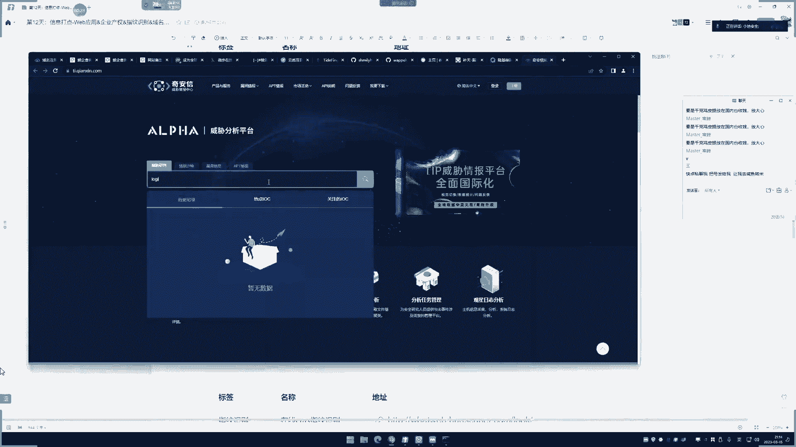

有些可能是免费的，有些人就说不定就要钱了啊，啊这个在查了，这个是用喜欢形，那个微信公报也是一样的，这里有个域名解析和观念域名，这东西就是那个意思啊，哎这个登录解锁更多知识，算了算了，我就不登录了啊。

因为看到效果呢和那个东西一样啊，你无非就是自己注册个号，登录进去就完了，这也没什么多的东西了啊，因为都是一个洗衣店，主要讲的就是我们说的第五种了啊，每一句解析，每句解析呢就是我们说的利用这个字典去跑。

然后呢去测试这个域名，有没有被信息过来查域名，我们这里呢给大家推荐了两款，两个平台和一个工具，先来说两个平台的啊，那这个那输这个这里面的同样来个二维码，我以为要给他发红包了，来给大家查一下啊。

这是一种啊，但这两种的说实话我都不是很推荐的啊，哎怎么打不开啊，这两个说实话不是很推荐的啊，哎啥情况啊，不用你了，真是垃圾，下面这个，来查一下啊，那我搜一下来给大家看一下，都是一些接口啊，那是人查到。

你看曾经注册过的一些这个纸鱼的一些东西，他其实用的是DNS查询的那个记录没，对不对，那啥那个他其实就是说这东西呢，有还有一些接口差，像刚才那个应该是结构差，妈的不知道咋回事，官方出问题了，你这是农机的。

你看，还有一种呢就是我们用工具去查的这个情况啊。

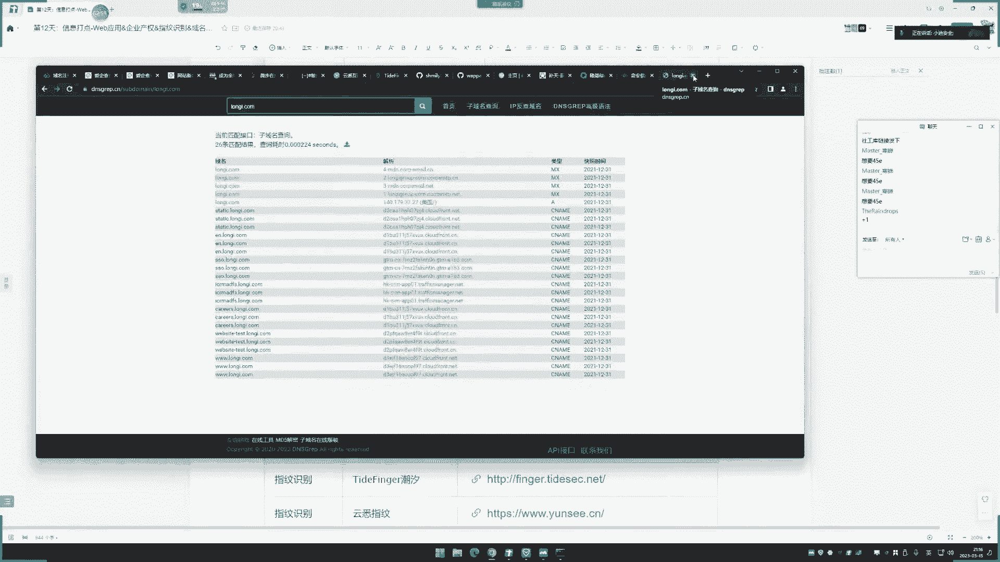

然后还有一些啊，我这个信息来源于哪里呢。

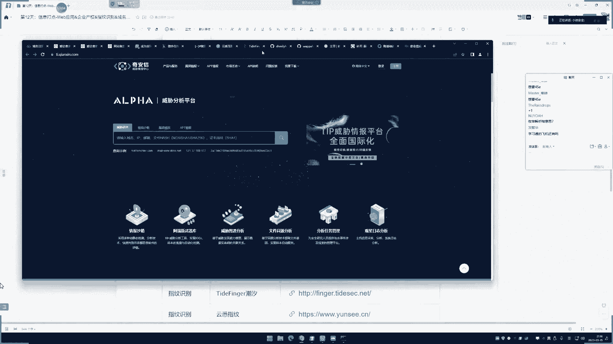

其实就是来源于我前面给大家推荐的这个，领角色去啊，在在线工具这里来，这里有很多，你看我们可以看一下，有一些我塞了啊，就你不要完全相信的自行查询单，这下面还有一段，还有一些这种平台，那这上面都能看到的。

企业IP子域名反查网盘点20域名，web指纹识别，危险什么的，但是怎么说呢，他有些没有更新了，就有些可能你访问的话，他就会有些问题啊，就打不开了，这平台死了呀，这会有什么还没有更新了。

我在给他推荐的时候说现在还能用的，你看这种呢，就是利用这个网页版的去爆破这个域名前缀，然后再去解析，我这里重新开始一下，我又搞了40模式吧，就40卡的效果，点四模式，你看在他查到的呢。

这是域名解析的IP地址，在正在查，他查的精度呢，就是基于他的支点在查，哎，这啥，对不对，他查到了，这是你用网上接口直接查，就不需要你自己的任何东西，直接放网上就能用。

但是还有一款工具也是我们不得不给他介绍的。

就是今天的这一款工具，叫做也是上期呢都给讲过了。

这个one for all，这个呢是用的最多的，在安全圈里面用的最多的一款子域名查询工具，这个工具呢相比其他工具呢，它的优势是有一方面的，它的优势主要集中到他。

把我们说到的这几种方法呢做了一个结合，做了个结合，啥意思呢，就是说我们用的五种方法，都是来源于不同的原理，有了基于证书呢去查的就是基于历史记录，有的基于这个网络空间的这个数据，有基于微信情报，哎。

还有最后一种呢，就是基于那种用字典呢去前面添加之后呢，去解析来判定子域名存的存在，就是说这五种方式呢，都是基于自己的原理和技术实现的差值之运营，而且他们只云呢会有一定的冲突是吧。

然后呢会有一定的这个不足，就是比如说D记录，如果新的他可能查不到，对不对啊，这广告空间如果他没爬到的，也查不到帧数呢，不不不是ATPS呢，他也查不到是吧，物业情报的也是一样的道理。

那这个每一局呢就是支点没有，那他也查不到，各有各的优点，各有各的缺点。

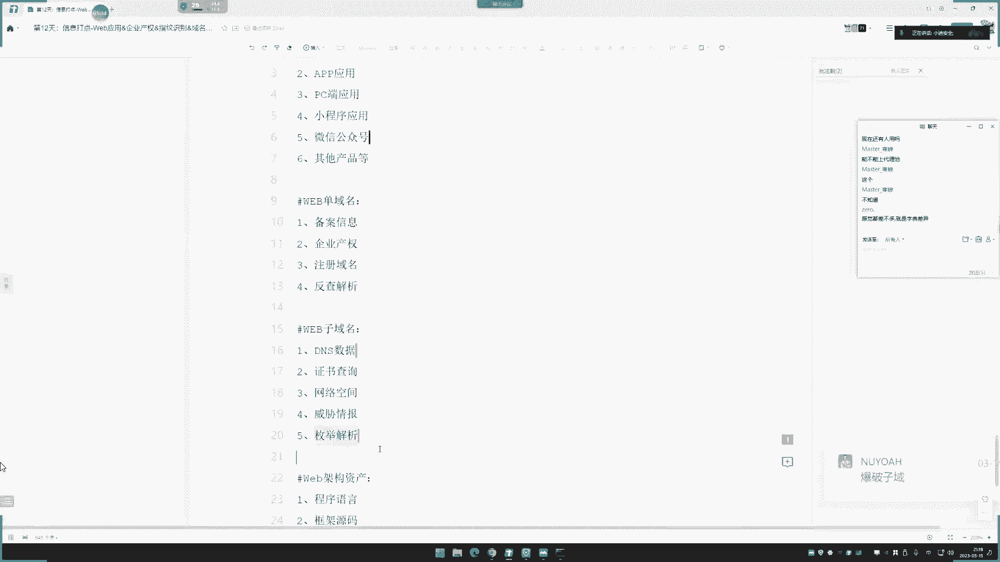

那么基于此呢，这款工具就应运而生，它被称之为叫功能强大，使用设计工具，我们自行设计工具呢，网上有很多什么SUBDMO，SUBFI啊，这种类似其他智能工具一大堆。

但是用着用着用的最多的还是用这个one for one，因为他就是把这几个功能的集合了，就你可以用这个工具来实现，以上那几种工具的一个总结。

但是啊他的总机呢没有总结，这个网络空间和微信号，就这两个没有总结啊，它利用到的是枚举，加上帧数查询和DNS记录，查到三种技术的一个总和，因为这个网络空间和威胁情报呢。

这个呢他没有能力再去拿到这个接口数据，所以他没有写到里面去啊，这是我大概对这个工具的描述，当然我也不清楚他这个是不是这个原理，我估计是这个情况啊，其他的几个工具呢就单单的只有这么枚举，没有前面两种啊。

所以说为什么这个工具的原因是这里啊，他也使用比较多，然后这个工具呢是一个Python版本，下面呢也可以使用这个dr。来去安装，直接使用，也可以使用这个Python去安装，基于大家的基础不好。

我又怕像前面一样，什么我把那个什么鬼抓包环境呢给大家演示了，诶，下去之后呢也抓不到，说什么鬼这个环境问题呀，还有像这个什么bob shoot激活了也不会搞，反正就是说你没有延迟到的地方就会出问题。

然后呢你又说淹死了，他也说你我真的是真没办法是吧。

所以呢我就干脆这个只能给大家从安装到使用。

就给他讲一下，因为我知道啊，我不讲这个安装的下去是绝逼是有问题的，所以我特地呢还在备课之前，我没有把这个工具把它装好，我搞了个乞丐的是吧，零开始的就只把工具下了项目下下来了。

然后他什么库安装那些东西我都没有做，就是准备说上课呢就给大家去把它安装应用，安装好了之后再给用，给大家打包了，这个Python的es1版本，就是这个3。8的，我用的也是这个版本。

然后呢再把这个压缩包呢也给那个打包了，所以现在呢我就把压缩包呢解压出来，然后呢对着给你安装，安装完之后用啊，如果说你还出问题，那我是真没办法了啊。

好来看一下啊，下载就不说了啊，你们刚说怎么下载，不好意思下载，我把你放到百度网盘了啊，没有说你从那上面下载，那他第一步呢是这里说说你安装这个库是吧，我们就对着敲好不，那我直接先敲这个命令。

这个命令就完了啊，这个叫PIP，如果没有设置环境变量的话，你就先看一下啊，你把Python安装好，照着你Python安装目录，那我这里用3。8版本啊，因为他这个这个程序要3。6以上版本才行啊。

我这里选用3。8，在这里没有设置环境变量，你就老老实实的在这里找到script，然后这里有个叫PIP的文件，PIPESE对不对，然后来到这个目录啊，在当前目录敲3D目录PIP就输上去啊。

就直接前面加上PIP啊，你也不要加上这种PIP3了，他那个PP3呢，是告诉你用这三版本的PIP啊，我们这边有个程序叫P，我就输P回车，然后这里一提是吧，有人就问了问题，哎就出了问题啊。

这个问题有截图给我不能安装啊，啥情况，因为它这里呢有个调用的文件，叫这个TTTT在哪里呢，是在这个程序目录下面啊，你有两种方式，第一种方式呢，就把这个TXT放到你刚才执行的PPT的目录，放到这里。

或者说怎么办呢，那我就放在下面吧，或者说就直接在这个路径上面，把这个路径写全也行，我直接放到下面了，放这个同步录啊，那就不用钱，你看现在就正常了啊，他就开始给我安装哭了，好已经安装完成，我们测试一下。

用一下Python open y看能不能用啊，然后现在打啥都用，不能用，咋办呢，来个这个目录啊，因为它程序在这个目录下面不要搞错了啊，这个是在P2P的程序目录，哎，怎么回事，卡了行。

运行个Python one four one，你看现在就正常了吧，能用了呗，能用就行啊，能用我们就看一下了，直接一条命令就完了，不用看其他的来看它使用的一个说明，加上目标域名加上装。

然后这个T呢就是TT应该是就是你的批量的，就TIT里面写上域名，然后这个是针对单个TIT呢，就是把域名写到TIT里面，对这个TIT里面所有域名进行这个收集，我们只是运行一个嘛，就我这里用这个啊。

然后怎么用呢是吧，那我先看一下我的Python版本啊，我是3。8的啊，如果没有添加环境变量，就写完整路径，Python路径啊，先退出来好，那么现在就和3D马开始，要确定你刚才的PIP，我刚才的PIP呢。

是在我的这个3。8目录下面，我是用这个3。8，我现在执行的Python呢是3。8，这个一定要对应上啊，我这个说的对应是啥关系呢，你看我现在是用3。8是吧，那这里呢也是在3。8下面用P装的。

就说我装的哭是和这个版本对应上的，有些人呢就是自己上面多装了几个版本，然后呢他用Python的时候是一个版本，pip呢又是另外一个版本，装到另外一个版本上面去了，所以呢会导致安装库成功了，但是运行不了。

你要学会检查，有些人就是什么都不知道，就是你妹的什么问题，就问你说我咋给你分析了，对不对，好我们加上去啊，然后这里再写上我的目标地址啊，来看一下叫做龙I点com，来收集一下子给我看一下啊。

勾那么现在呢他就开始了他的工作了啊，接下来我们就只需等待即可，这里报错星星的你不用管它，因为它里面会涉及到用一些接口查，而且接口呢可能是由于国外的这些网站的，不可描述性仿不了。

但是它肯定有它有很多接口啊，不代表说那个接口访问不了，其他的就不能用了啊。

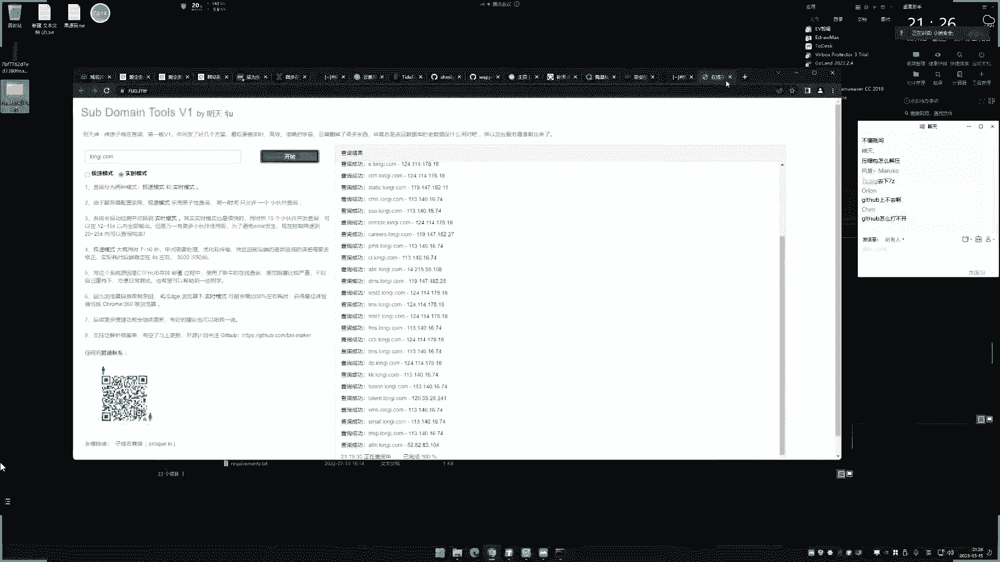

它的追踪的一个扫描结果呢，会在这个地方显示啊，会在这个地方显示，然后呢我们只需要等待即可，这里包了几个大厨啊，哎这个新版本，也不知道啥情况，就喜欢报错，这里有没有东，我也不知道啊，这里面有点尴尬。

啥情况啊，重新来一次，重新来一下，框是怎么来的。

那个。

都会演示的都会演示的啊，不要急，他现在一些东西呀，好你说扫这个吧，我行啊，我这个是学校的啊。

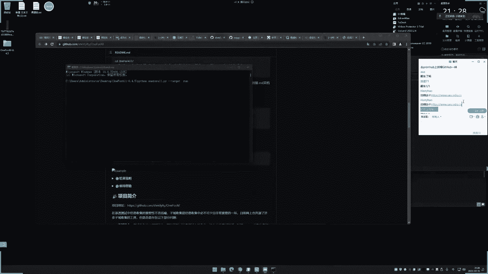

那我们就拿个1。5的升上来，这一点升的那一对三，这里。

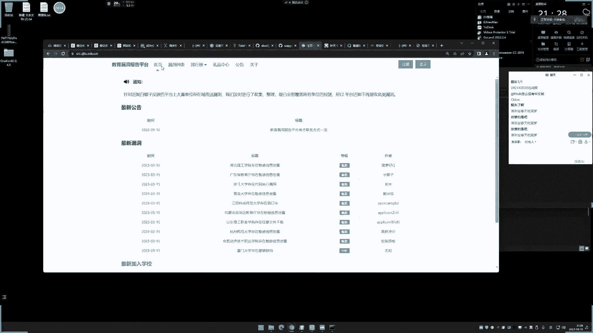

那我们就搜个学校的啊。

然后也可以在这个I7查上面查，他也能查到。

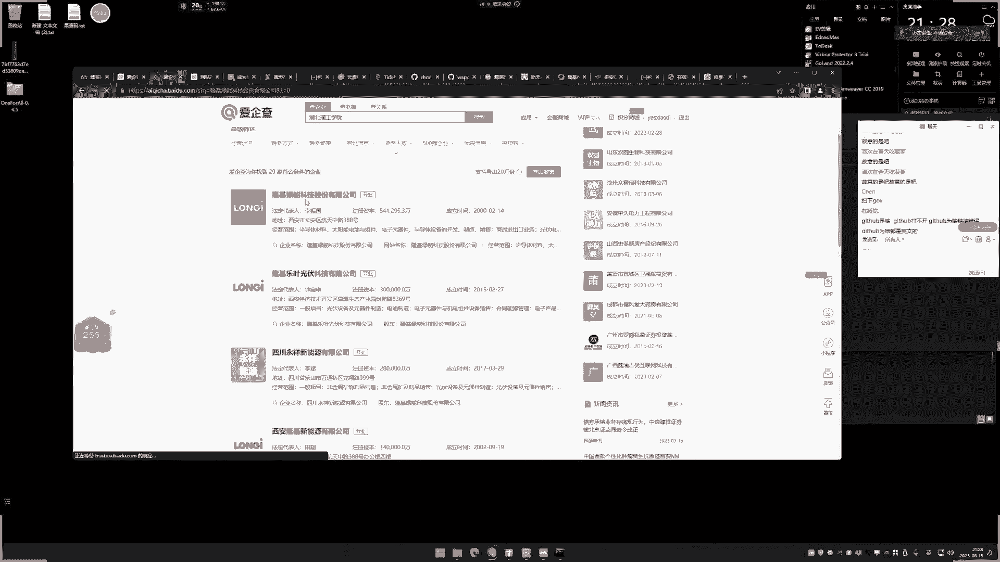

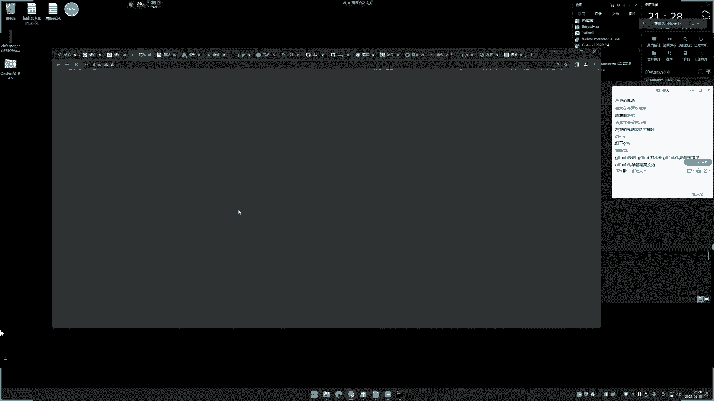

网站这个查不到，真是奇怪。

只有这个那啥。

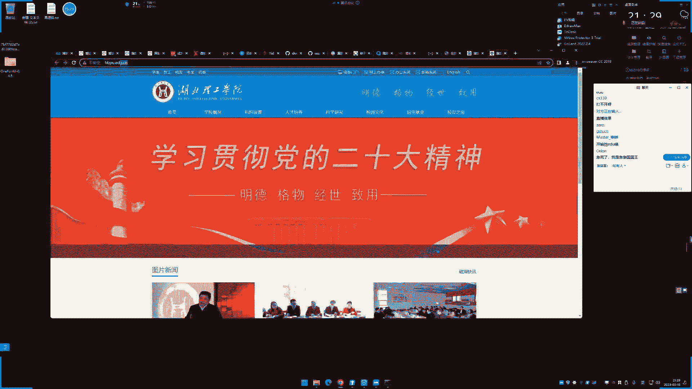

这个它有点有点慢的啊，因为它的工具，它很多游戏因其国外接口，对网络的一些不可描述性，它都会有这些现象，我因为他以前老版本，新版本他的毛病是有点多，来自老爆粗，真是，这老电脑上面装的WF多好用的啊。

这个上面老包出什么red。

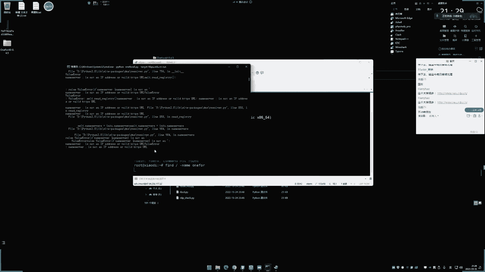

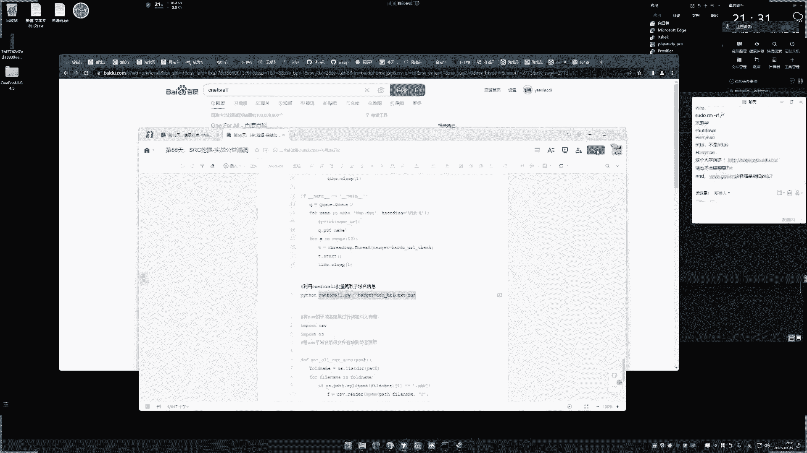

哎再来一下啊，把小TT里面看一下。

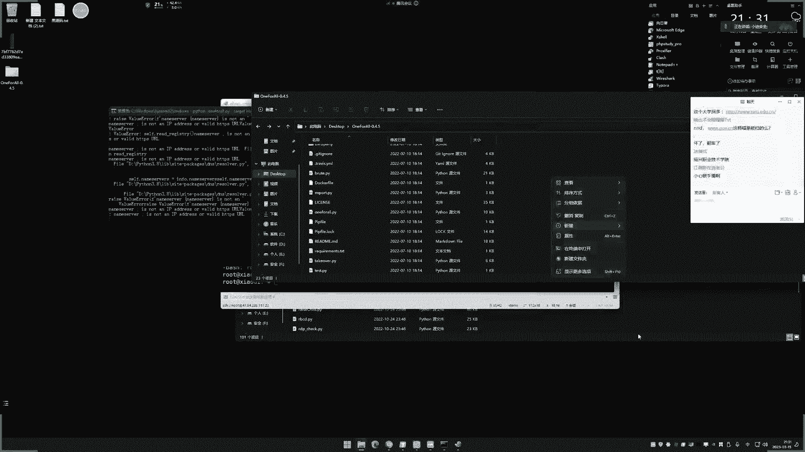

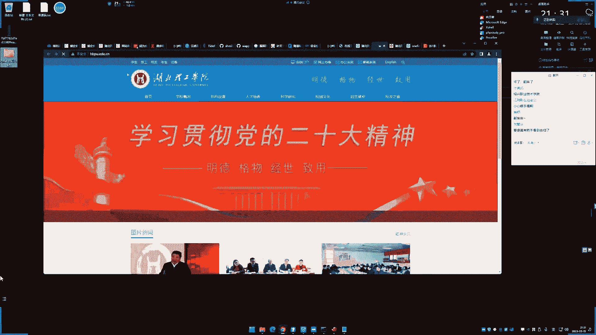

我怀疑是不是这个呃，哦我大概知道了，他这里好像还有个时间，这里要等待一下啊，他在给他更新了，我说难怪了啊，他这个还在更新，这里面的是尴尬了，还有个那个好像是它里面一些东西要更新一下，你这个31%等等。

等一下吧，等到百分百我们再用它，啊这个是我们的这个工具的一个介绍啊。

我们等下再给大家去演示啊，现在因为他这个新稍等一下啊，接下来呢我们再看这个web的一个架构，这个架构呢就是我们说的指纹识别，就是我把域名搞清楚了，那域名肯定打开就要访问了，打开访问呢。

我们就肯定是要对这个网站的信息进行尝试了，因为网站搭建呢我之前学过是吧，技术入门的时候给他教过什么网站，有数据库啊，有程序源码呀，有什么鬼，这个中间件搭建平台呀是吧，有这些信息。

那这些信息我们都要收集了是吧，要知道这是什么东西搭建的，那么这里呢就给他演示，最简单的直接用指纹识别，但他的这个识别只能识别部分的，有些呢它是识别不到，识别不到的原因。

就是因为它的识别技术呢也是针对一些常见的，有些这个冷门的，或者说是比较少见的小中的，那么它识别不到，我们现在看这个识别的情况，然后识别呢有哪几个呢，就识别这个什么程序语言，什么语言是吧，程序源码啊。

他用什么源码，中间件是什么数据库类型，什么操作系统啊，一般我们会采用这几个啊，那有这几个用的最多的就是潮汐壬戌，这两个用的最多，我们直接用这两个啊，其他我就不先不用了，然后还有一个工具插件。

我们等会给他演示一下，现在这个潮汐的泰勒sec团队的这个产品，看完指纹，那我输一下，比如说我搜我的一个，我都让他到十点下好登录一下，那撕裂下啊，那识别网的表里，那中间间阿帕奇2。4。6是吧。

这个信息呢能看到3MS信息为z blog，我就是用ZBLOG搭建的，ZBLOG是一套程序是吧，给点击看一下，这是关于z blog的一个信息，然后在这里查一下z blog有没有包括一些漏洞，哎。

结果这里发现了z blog程序曾经出现过哪些漏洞，那么大家应该就知道了，这个这个这个什么意思啊。

然后这里面有提示要等待什么VIP啊，大家就知道了呗。

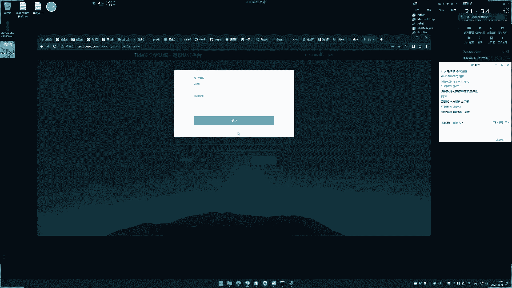

那刚才点到这里，大家刚才已经看了一下了，一查是吧，来这什么东西啊，这就是说我这个程序曾经包过漏洞，那么大家会问这个信息收集有没有必要了呀，还有没有必要，大家觉得有必要了呀，在批量的直接看一下那个程序。

包括包括哪些漏洞，用这个漏洞测试不就完了吗，对不对，然后这里是会涉及到的，有没有CDN他也帮你判断出来了，IP地址，包括我的操作系统，windows对pp的了都有了呀，交本pp程序员码。

z blog中间件阿帕奇windows操作系统，包括上面的域名信息的一些信息，端口开发和开放的端口，知居民也帮我查了，你可能说我直接用这个知名查不好吗，你会发现他查的知名和我刚才查的是不一样的。

你看所以都有格子的这个基数需求，并不代表那个就就好啊，诶这个不是根线，这个是什么鬼啊，这还没出来啊，唉这工具啊真的是让我有点无语啊，他这个显示问题，哎我说我把它安装好嘛，讲啊，又怕你不会安装在里面的。

我安装好了话，这使用不了了，这里面真是尴尬，真是尴尬呀，我就等他吧，我就等他好吧，我等我课讲完之后，他出来就出来了，出不来，那我也没办法了，我也现在不清楚这个什么情况。

是没更新好还是工具肯定是打开就打开了啊，他有一首诗曼，因为我查过他用这个平台私麦啊，等他们先来说这个那个是能查这些信息，但他指云可以看一下他的指纹，查的话就和我们查的就完全不一样了。

所以你只要他这个上面指云，那你就做个参考吧，不要以为准对吧，主要是看到指纹信息能查到吧，对不对，好像刚才的呢，比如说我查这个龙I点com18能查的，打中介是这个INUX操作系统，那这查的呢。

这是他查到的一些类似的一些信息，D y c m s，打开看一下包包和漏洞，他用的这个框架YY这是一个框架啊，就那个那个那个地方的，那就要提速开会啊啊然后你看啊，有人一讲到这个是吧。

我只要一讲到这个马上是吧，就有人要去扯死了，扯什么呢，百度你看我我搞上去了，哎呀你没了，学到了学到了，我举一反三，哎呀自萌开心呀，打开哎呀，百度卡姆出现过漏洞啊，牛逼啊高啊，结果发现这是个误报。

因为你可以看到啊，他这个呢收集的呀不一定百分百正确啊，他有些是无包的，我告诉你啊，他这个识别的是一方面，然后啊比较关键的一个地方是什么意思呢，就有些会有五保，你要自己，那要注意。

真别我那个我博哥是正确的查那个SR，甚至他也正确的查这个百度上有五包，是啥情况呢，因为它的判断呢不具有唯一性，就有可能有些装到了，他就说你是这东西，它是一个简单来说，就是说宁可包括也不包少的一个理念。

设计这个平台，那么这个人吸呢就相对的就会好一些，但是他呢就是宁可报少也不报错，这两个的设计上面不一样，你看这就用这个云溪呢去查，允许指纹呢，它也不能帮你查哦，豁磁王站禁止被查询，那不好意思。

那你想查也查不到了，我就怕有些人跑上去是吧，要查不要查，他这个查这个信息呢，就是查的说你查一下这什么中间帧啊，查这个系统啊，这些还好查，对不对，查这个旺仔的人嘛，就是我们说的这种呢。

就说他用的是什么源码搭建的，这个源码搭建你自己都可以去想，你自己都可以用你正常的思路去想，你是个人网站，你是愿意花钱搭建一个网站，还是愿意免费搭建个网站的，你肯定愿意免费啊，免费有免费的源码是吧。

网上有免费的源码，这源码不需要花钱，就很简单，对不对，用免费的东西用啊，你何必要花钱呢，对不对，所以你就直接在网上去找一些现成的东西，去答好，那么这是你的想法，那么换成了这种大公司，大企业。

就像我们说的什么百度啊，腾讯这种，他会用这个网上的东西去打自己的业务应用吗，第一个不安全，第二个用的掉链子呀，用到这个丢面子啊，你自己去互联网公司利用别人开发的产品，我先抛开其他的不说，对不对。

这是第二点，第三点，利用别人的产品能不能满足你的业务需求了，肯定不能满足啊，别人写的是一些常规人用的一些简单功能，你要在上面搞支付，要搞提供业务逻辑，要搞什么游戏啊，搞了一大堆，他哪有这么好。

那别那个免费的帮你去开发这种东西吗，现实吗，不现实，所以只能自己设计，那么自己设计他自己的产品，自己的源码，他告诉你这个源码在哪里下，网上有吗，没有啊，没有这些平台，他哪里知道有这些东西啊。

它怎么可能识别出来呢，识别不了啊，你还在上面偏偏要上去测试啊，那我有什么办法呢，这是和技术相关的吗，这是用自己的思路去想都想得明白的呀，所以说为什么说它安全，第一个是它的研发成本高，技术能力高。

第二个是它的产品本身，你在网上找不到任何东西参考，你哪里知道他是什么鬼东西，在搭建，什么东西在在在搞呢，你怎么对对方一无所知，咋个搞，所以就不好搞啊，对不对，所以你就不要傻乎乎的跑上去，这样车扫出来了。

或者说扫不出来，你就问我对不对，不能再犯这样的错误了啊，你记住你是一个搞安全的人，你要有自己的思考能力，不要犯这种低级错误，你明天还要去找工作的，你还要走向高端的，所以说这种技术呢。

它是使用一些这个网上的一些，这个也不是说小的，他中的也有，就像你们如果说在互网中碰到一些目标，也是有的，因为我们经常打过网，应该知道有些这种什么鬼，经常用那些什么南宁OA的呀，什么ZEOA的系统啊是吧。

这些都是比较常见的一些大型的OA系统呢，还是有人用的啊，就是它的功能还是可以的，但是那种很高大上的了，那就不会用了啊，只是说有这个业务需要，他可能会用，那么哪些功能呢，它都可以帮你识别出来。

那个网站的源码的一个体系啊，大部分都可以，80%都可以啊，但是还有20%，就是由于小众和这种内部高端的已经没有对外，所以啊也识别不出来，还有20%就是我说的啊，消肿的，或者说他压根就不是这个网上瞎的。

或者说不是在网上能看到的，就是他自己设计的产品，或者说是他们团队设计产品内部的，或者说压根他这里那就不是一个成就，是一个前端的这个这个这个写的代码等等啊，这些都有可能会识别出来，原因很多。

不仅是说只有大小的，也有可能就是一些小网站是吧，你比如说你自己毕业设计，你设计一个写的这个博客，你放上去抓了十遍，鬼知道你这你这就你一个人用，谁知道你这是什么东西设计的呀，叫什么名字。

你都没有发布自己写的自己的成品。

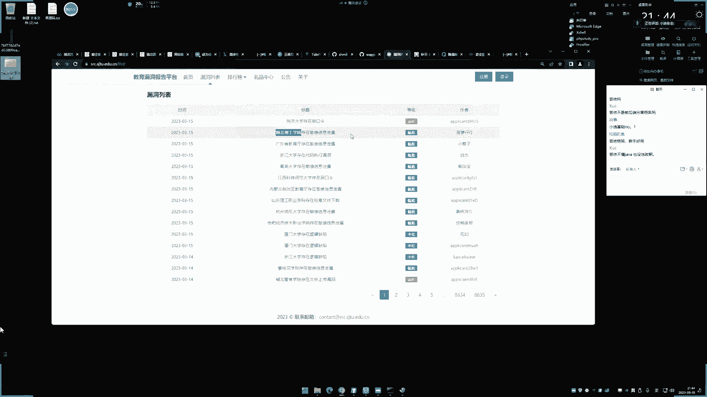

那谁知道呢，都不知道，所以说有各种原因啊。

要知道这个平台它的运行的原理啊，所以你就知道哪些目标再上去呢，会有用，哪些目标上去呢就没有用，这要做到心中有数啊，好这是我们说的这一点啊，然后呢它上面还有一个工具啊，这个呢就不说了。

这个最简单平台给到你了，你自己注册个账号，然后呢你在上面用，有人刚才说了，没有什么人吸的啊，你没有联系，你用这个这个也行啊，这个免费注册的都差不多的，没有太大的差异，这个也可以啊，还有就是我们说的这个。

工具这个工具是个插件啊，我为了让大家又能明白，我又特地的是吧，搞了一个这个下载下来，给大家重新从零开始去把这个插件给它安装上，我现在是真怕了啊，因为我思考过，如果说我把它安装好了，直接给你演示。

有人出了问题，还是问到你这浪费的，还是你自己实现，对不对，虽然我知道啊，我这样搞了之后下去还是会有人问的，但是至少会少一些好，这个插件怎么安装啊，这谷歌啊自己说先让谷歌浏览器。

谷歌浏览器如果说不会安装啊，那那就没办法了，来点击这个更多工具的一个拓展程序。

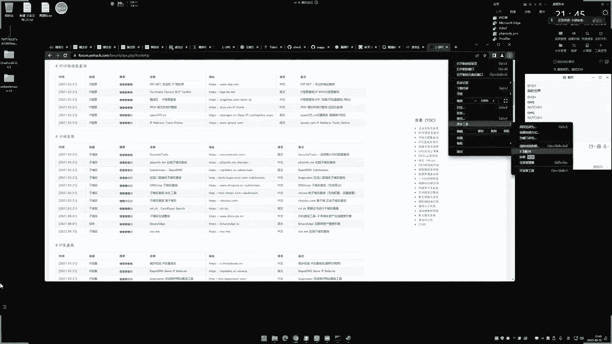

然后这边呢有个开发者模式把它点开了，开发者模式点开，记住点击了加载一节的拓展目录，把刚才这个程序目录给解压出来啊，不要直接你妹的把那个压缩包给他上传，那选择这个目录点呢选择这个目录。

选择了选目录呢是添加了呀，这添加了，看到这个呢开了啊，开了这个开关好，开了之后呢就是个插件，这个插件有什么用呢，就是你放网站的时候，它自动帮你识别，但它这个识别和刚才那两个平台拥有绝区别啊。

我们这边给大家看一下啊。

现在我打开网站试一下，然后放下半年刊物，然后呢把这个插件给他露出来了，把它把它置顶到这里来看一下，这里这是我那个检测信息，但是你会翻到他这里，检测信息都是一些其他信息，并不是P的呀，阿帕奇的呀是吧。

有这些信息，你看，但是呢但是他这个程序源码它没有识别出来，对不对，所以说呢他这个呢就是查一些什么，一些其他的吧，windows server的服务操作系统也识别了呃，查一下其他的吧。

嗯这个上面的还查cm，所以说有些不一样的啊，虽然说他也支持上牌的产品，但是这是个国外产品，我们国内的这种这种程序源码呢，可能他就知识的不多了，它主要是针对一些国外的，像word price啊。

那种国内外都在用的一些这种通用的，它可能知识能够识别出来，像国内的什么z blog啊，就国人在用，那么这种国外的工具呢，这种小插件，那就睡不着了哈，所以这种东西呢，就说大家要知道它的优点和缺点啊。

你想如果说我用国内程序的话，那这种插件呢只能说查识别一下其他信息，那这个程序用的是什么源码呢，他是不知道的嗯这就是这个插件啊。

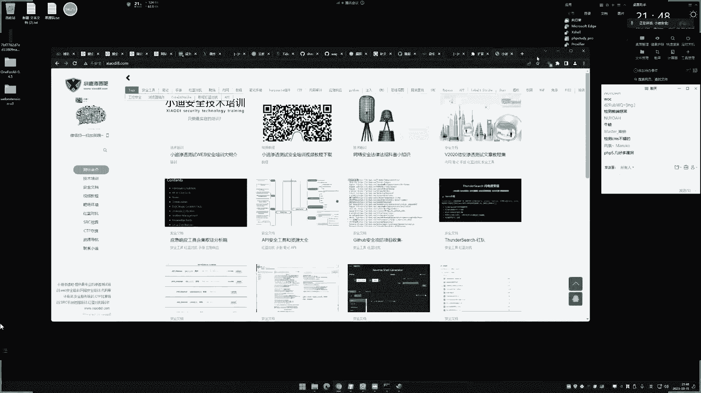

仅供参考，具体还是要用平台去分析，然后呢还有这几个工具，像什么water wap，还有什么关系，平台我都用过啊，都跟不上这两个人系和草系啊，这两个稍微好用一点啊，这个呢它其实也可以识别，我没跟他讲。

你可以看一下，但是我感觉这个没有那个好啊，你可以看一下，那他也能死掉了，cz blog对不对，他也能掉，但是这种的都是识别一些简单的一些程序名啊，并不能代表识别很多有些这个新型的新出来的。

或者老的他不支持，具体还是要看它官方的这个知识的东西啊，你看看一下啊，他这个支持的是500多种cm啊，这是它这个接口，那么其他的接口支持多少呢，这个要看平台的更新读了啊，识别不出来的话。

我们后面再给他讲，怎么解决不识别不了的一些情况，后面的细节再给他讲，那么今天的内容就基本讲完了啊，这主要就是一些平台介绍，没有讲到很多基础技术方面呢，就是后面会涉及到一些什么JS爬虫的这个东西。

目录扫描名的信息提取啊等等，二维码提取啊，会涉及到一些专业的技术啊，今天主要说的是这个基本的认知啊，就web的一个最前世开始的什么域名啊，架构的简单分析，而且分析的也是入门的呃，稍微深入一点的。

像说有这个不识别的源码是吧，不是源码怎么又搞，然后呢还有一些这个大平台的设计不出来，还有一些其他类型，各种各样的一些细微的小节呢，还是没有给他摘西花的啊，这只能交给后面课程的慢慢给他讲，就把它讲出明显。

今天只是做了个大概啊，因为下节课开始，我们就出一种这个架构上面再细分，后面呢，下节课开始就是讲这个架构上面的细分啊，因为它上面只讲了个大概，就是先用这个平台给他分析，先先先先给大家分析一下。

然后呢他还会有一些意外情况，比如说识别不到，比如说什么个人码识别错误，能不能用其他方法获取另外一些东西，而且它会有目标上面的差异，比如说像这个源码对不对，他这个支持的这个源码的。

都是我们国内外的一些开源的一些程序，那么还有一些像什么更像像是说百度的呀，大公司的我失业不了怎么办，对不对，还有像我们说的一些黑产类的黑色领域的网站，因为黑森林的网站的话，它也是有一个独立性。

像什么这个赌博的呀，这种色情的呀，因为他们这个业务功能，有些源码它是无法满足的，所以他都是找到了一些专门帮的开发，对不对，那么这个专门开发的有专门的渠道，对不对，就是说根据你网站的一个应用功能和业务点。

你就会选择什么方法去搭建你的应用，那就像我说的这种黑色领域的网站为法雷的，它上面的业务功能会和我们正常，我们这种个人使用博客呀，自己搭建的网站会不一样，因为他的业务功能会需要有什么在线直播呀，是吧。

在线直播涉水呀，什么鬼，涉及到一些支付啊，或者什么一些各种乱七八糟的，那么这就需要有专人呢去写这个公共代码，按照他的需求去写，然后呢他们就是有相当有自己的圈子，有自己的这个活动范围。

所以那个源码是在上面。

但是像这种平台对不对，它的收集都是针对于我们说国内的一些珍贵的，使用面比较多的一些是吧，他会收集，那像他的那些他怎么可能收集呢，他收集不了啊，收集不了，所以我们就按照对应的方法去找，对不对。

所以我就说你要把这个字典，要按照对象去把它区分起来，针对哪一样对象，用什么方法，针对哪一样对象，用另外一种方法，因为它的特性和它的应用方位，决定了他的方法是不一样的。

好这就是我们今天这个课程的一个情况啊，然后呢给大家也掌握了一下下面课程上的内容，今天已经烧完了啊，这个工具呢由于他这个报错了，就没办法给他看到效果了，只能下节课的时候我把调试好了，给他用了啊。

我怀疑这个工具版本问题，我下个老版本应该可以，下面等下节课我把它调好了，下节课开始的时候再把它看一下效果啊，如果大家下去呢也可以自己试验一下，看行不行，应该可以的啊。

好今天就上这么多了啊，然后这个时间关系，这个思维导图呢我就留给下节课再做了吧。

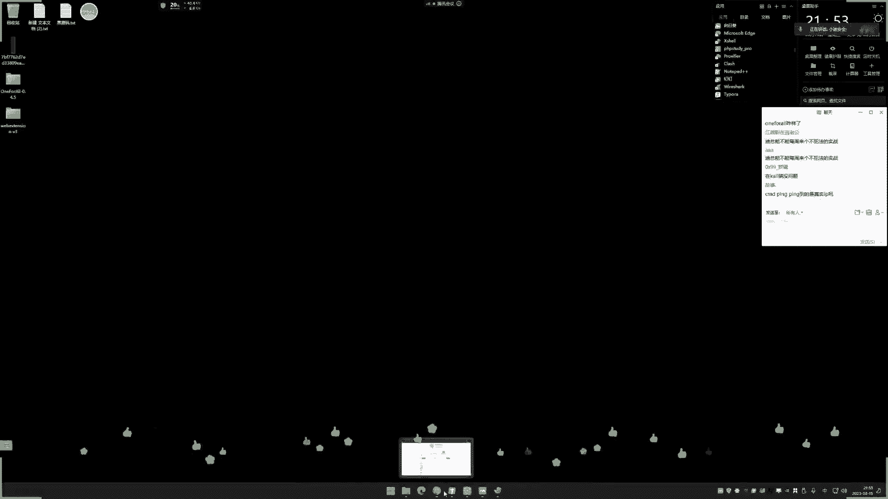

因为今天做的话也做不完了啊。

就这两个思维导图，下节课把它整理到这里面去，因为下节课还是讲这个外部应用，不是讲上面P了，还讲这个牛啊。

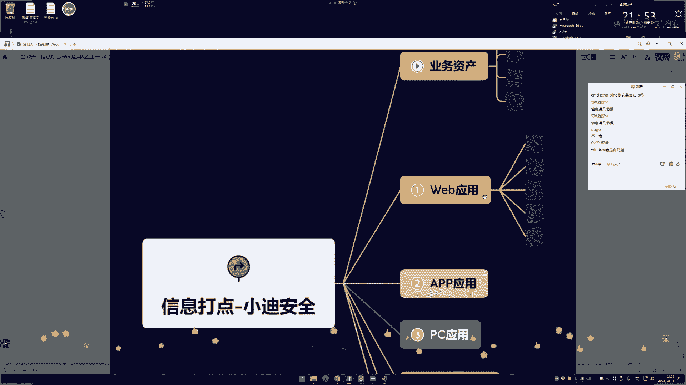

这还停留在这两个上面，下节课再给他做吧，好大家看有没有什么问题啊，马上十点了，但有问题就问。

没问题，我就关注一下了啊，好纯内网站点该如何识别cm s这个问题可以啊，内网站点就是这个站点呢他没有网络。

所以无法用这个接口，对不对，无法用这个接口，可以用工具，可以用工具工具，我只是说了这几个。

你看这上面还有其他工具啊，啊大家看一下啊。

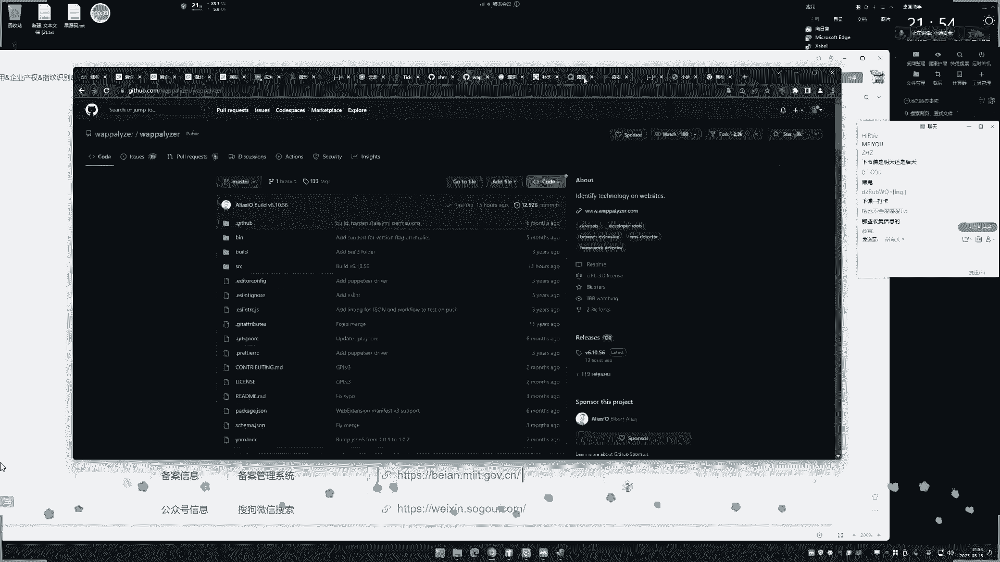

这个cm识别它不是还介绍交换工具吗，我前期也讲过这些工具啊，用工具啊，工具因为就可以对应的啊，哎这里的这个word wap网工具，还有啊，还有那个什么鬼，cm的一个工具叫map狂。

来给你介绍一下cm smap是一款漏洞检测工具，算个SMAP是一款，好像还在这个叫what wb wb，那不怎么好用，有几个那个工具啊，前期介绍过油化工具比较好进工具。

这是老的什么特色零食啊，工具有没有记得的赛马是一款，好像还有一款还可以，我都忘记那个名字了，因为用的不是很常见啊，有几个呢，还有个叫大保健，大保健啊，TF的，不过这个也不咋地，这个也不咋地。

SMAPSMAP用的比较多啊，对这个上面是一颗啊，就这就这对CD1K和SMAP两个用的最多，嗯这个用的有点多，那样就能解决内网的问题了啊，因为内网的那个网站访问不了。

所以这个结果呢他他压根就触发不了那个网站，他也不知道，所以你是用工具模具的去触发，这个有没有啊，这个应该是支持的啊，你看一下那个官方地址，我给的那个GATUB地址啊，火狐版的这个WAMP应该也有。

你要看他官方地址有没有那个，下节课什么时候下节课，后天呢，后天啊，明天休息一天，17号17号下节课也是晚上八点。

还会不会跑路，我都跟你讲了。