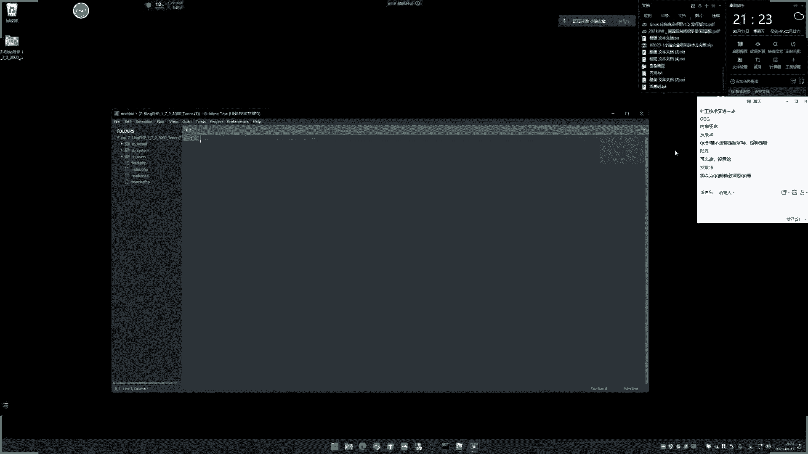

# 【小迪安全】V2024版 全栈网络安全 ｜ 攻防渗透工程师 （持续更新） - P13：第13天-Web应用&源码泄漏&开源闭源&指纹识别&GIT&SVN&DS&备份 - 逆风微笑的代码狗 - BV1Mx4y1q7Ny

来看看今天的内容啊，你说这次瓜蛮好笑的啊，13天讲这个web的这个应用的啊，上节课讲了一小节，加的是这个域名上面的单域名，子域名的一些问题，然后呢说了一下关于这个web架构呢，用些这个平台指纹少。

指纹识别之后的一个情况，这是我们上节课大概内容啊，主要就是说从玉米上面能找到更多的域名，然后呢域名找到之后，再通过这个域名的访问呢，针对这个网站本身的一个架构，就最常见的什么程序啊，或者说这个源码类型。

语言类型，它的搭建平台啊，数据库类型，操作系统啊，会使这些信息呢做了一个简单的一个介绍，然后呢列举了这个很多查询的平台，像什么这个企查查呀，爱奇茶呀对吧，上节课都讲过，那么这节课我们是讲什么内容呢。

我们就基于上节课给到我们这个思路，继续往下进行，就是继续细化，那细化的是哪一部分呢，就细化的是第四个架构里面的一个源码，因为它里面会判断出源码的类型，或者说这个数据库的类型等等。

那么其实我们现在就来细化这个源码，因为这个源码呢在这个安全测试中呢，它是一个很重要的一个东西，源码就相当于就是说这个程序源码，也是我们后面说的，我们后面不是有个特别的讲的一个专项技术吗。

就是这个代码升级，也称之为从代码中去挖掘漏洞，这么一个意思，对不对，那么它的一个挖掘过程呢是前提条件，是有代码才能做的，否则没有代码的话，我们就称之为叫黑盒，有代码的就是白河，也称之为大海马升级。

那么也就是说你没有源码，你就只能做黑盒，有源码，那就是黑白盒都可做，那么可做的成功几率上面来看的话，有源码是能够帮助到你，有很多的这个思路，一一种呢不仅是从源码中的去找漏洞，还有一种呢。

就是你可以根据这个源码的一个架构体系呢，对你的黑盒测试呢也是有很大的帮助的，所以说源码的获取是能够加大，或者说能够增加我们这个安全测试的一个，成功挖洞的可能性，那么这节课呢。

就是围绕这个源码的一个东西的去讲，而且今天讲的仅仅是获取源码，是获取的是后端源码，还有前端源码的获取，还是另外一个知识点，前端源码就是我们说的像JS的，还有VUE这种框架的源码又该怎么获取。

还有包括我们说的啊，像这个移动程序的app啊，那些啊，那个是在单独的章节在讲好，我们现在讲的就是只针对这个web上面的，这个前端语言，JS的和这个后端言什么pp啊，JJAVA之类的啊。

他的一些源码的一些获取方式，今天呢就是讲这个后端语言的啊，前端语言就是从这个JS里面能够找到更多的JS，能够提取出更多的JS呢来分析，在JS里面去找一些点来进行安全测试，好那么现在呢我们就来看一下啊。

大概情况那就分为几点呃，每一点都有对应的含义，它都是一个思路的提升，首先我们现在讲啊，我们这里提到过一个什么开源和闭源，这两个意思呢，我给大家解释一下啊，开玩呢就是说从网上能够直接下载到。

或者网上已经公开的一些程序的源码，我们称之为叫开源，那么B站呢就是说从网上呢啊不容易找到的，可可能是说这个源码的确在网上有，但是呢他不在各大的一些这种源码商店啊，源码的一些下载地址上面的存在。

因为丽香这些网上呢不是有一些经常的一些，源码下载再点吗，再看一下啊，这些站点对吧，然后呢它上面呢是会选择性的发布一些，各种语言上面的一些这个源码是吧啊，这个cup java p p啊，这种是吧。

那么你在这里可以看到，他发布的一些这种源码呢，都是比较知名，使用量比较多的一些源码的一些程序，对不对，那么有一些呢可能就是说他虽然在网上呢，他有这种源码，但是呢他不会在在这种站上面的去发布。

就是类似于就是我们说的啊，一些什么应用商店的，不会在那里，商家就是因为它的使用的一个场景呢，或者说他那个应用的一个方文的，不像其他源码比较广，或者说他是一个比较小型冷门的，还没有被注意到一些源码。

那这种情况呢我们称之为必然，还有一种呢必然就是说完全找不到，只是在很少的地方，某些人里面啊，一个人用或几个人用的，也称之为，简单来说，就是不像我们在网上能够直接搜索这个名字，就能找到的最简单的方式。

那么这种呢就称之为开源，那么不容易找到的，我们就可以把理解为叫必然，我们等下会给大家说清楚的啊，那么这是一种理解，还有理解的就是完全找不到，就是完全找不到，就网上他没有出现过，网上没有出现过。

他只是个人一些内部在用，那这种也可以称之为必然，这是我们对这个关键词的讲解啊，这是我自己这样去教他啊，网上都可能有其他的教法啊，你注意注意这个理解就行了，然后呢我们就说一下这两个概念之后呢。

接下来我们就来看一下啊，首先呢我们理一下思路啊，一个呢我们前期不是讲过指纹识别之后吗，那么接下来的话我们肯定要获取源码，就像我这个给大家举个例子啊，我们用到这个以上节课讲到的这种指纹识别，这种平台是吧。

去识别一个目标网站，比如说我像我自己识别我的博客一样，我去识别它之后呢，他给到了一个SM信息，主要是看这个地方啊，给到一个叫z blog对吧，那上面是z blog。

然后z blog呢你可以直接利用这个百度，或者说其他地方去搜。

你可以看到这个z blog是一个官网的，我们点进去可以看到啊。

他这里有个z blog p p，然后呢我根据他的提示，他的一个这个提示呢，也刚好是这个啊pp的一个中间件的一个打井啊，这个阿帕奇组合的啊，pp的这个圆是吧，那我就可以理解为这是不是在这里还有SP。

SP就不少啊，打这个P是不是就这个呢，然后呢我点程序下载啊，真下载了，这里呢就有这个程序的下载地址源码对吧，这样的，然后呢我可以把它下下来，下下来之后呢，我可以对比一下网站的访问情况，来确定是不是这样。

对不对，这里是他的一个几个目录，我们可以尝试一下啊，发问下我的网站。

然后这个网站是吧，我尝试一下，比如说访问他一些，他这个里面有目录吗，这一笔下划线user或者system回车执行访问一下呢，看他是个什么内容，它返回的是一个什么403的一个错误，我们也看一下啊。

那返回403403，我们前期在app状态码讲过，这是一个文件夹存在的一个返回状态嘛，所以说这个文件夹是存在的，那么这和源码上面的对应上了，所以我这里就可以确定，这个源码应该就是这套程序的代码。

那么这个时候你就知道目标这套程序员嘛，是大概这么个情况，这个时候呢你后面要做的事情信息收集好之后，就把这个源码呢给大家进行自己的，这个漏洞挖掘，或者说根据源码上面可能存在的安全问题呢，对着去访问去操作。

所以说这个源码，那后期的作用我们就不再细说了啊。

就说这里呢就是获取源码的一种方式，这是最直接的，就是通过像这种直播平台识别出直截了，当它就是这个程序，然后呢你到网上那直接去找他的官网，如果没有官网的，就是在其他地方的去搜啊，它就会有一个下载地址。

然后呢下下来再对比一下，确定一下，如果是源码，那么就恭喜你找到源码了，那么招了源码，后面的事情呢就不是我们现在要讲的了啊，好这是我们说的第一种，那么还有一些就是什么情况呢，就还有一些是必然的，啥意思呢。

我们就简简单的简单例子啊，我们就随便呢，比如说我这里有这么一个网站是吧，我把这个网站呢把它复制过来啊，把它复制过来，然后呢我这里呢让它进行一个识别。

我们看一下啊，这边一个识别的结果啊，这边的结果三个叫low founder，没有发现对吧，他没有识别出来，这个没有识别出来是很正常的啊，你不要说所有识别出来，这是很正常的，识别出来好，那么也就是说。

我现在是不知道这个这个这个程序了，我就不知道是什么东西了，我不清楚对不对，那这个时候像这种情况又该怎么办呢，这个时候呢我们一般就考虑这几个地方啊，哪几个地方呢我就给他慢慢的讲啊。

其实后面这点呢就是围绕这五点在讲哪一点呢，一般的源码泄漏呢都会有一些问题，哪些问题呢，这里写了这么多，但这么多呢说实话啊，其中只有30个呢比较常见，其他的呢说实话有些过时了，有些人就很少用了。

哪些常见呢，首先一个GIT阿马西洛，一个SFN，还有什么茫然备份，那这些是什么含义呢，那我们可以参考一下这个文章啊，他其实都是一些这个管理员的一些，这种开发习惯，或者说配置不当，一些问题呢所造成的泄露。

就是源码的被泄露，我们先说最好理解的第一种就是网站备份文件。

啥意思呢，就很简单，我们自己搭建网了之后呢，就像我们自己搭建数据一样，我是喜欢把它进行一个备份的，备份的操作是什么操作啊，是把源码的目录选中，然后右键点击什么添加压缩包，然后呢我基于这个名字。

或者说我基于一个什么3W点，然后点击这个确定，然后这个时候呢，它就会生成一个WWRAR这种文件，然后这个时候如果说你用到了啊。

我就随便找个工具啊。

要用到像这种工具，像我们这里呢经常会使用的信息收集的工具，就像扫他的敏感目录，对不对，就像我们说的什么这个以前老牌的什么于谦啊，这种事情啊，这是很多哈，诶你这里呢我们就找一个这个。

这好像只有御剑是什么鬼情况，其他工具都没有啊，我不想用御剑来，你就可以直接在这里搜是吧，没呃你比如说我在里面搜搜这种东西，那我点一下确定啊。

我先确定一下，我把那个文件打包一下啊，我又不打包，真实了啊，我就随便打包一个，确定他有这么简单，比如说我就相当于这里的备份那个源码，名字叫3WR2。

然后呢他这里去扫，一般像这种工具里面，你看他是能扫到呢，看到没扫之后呢，你打开不就下载了吗，能理解吧。

所以这是最简单容易最能理解的，第一个地方，就是由于管理员的习惯啊，它将它备份的这个原档嘛呢进行了压缩，然后再放到了网站的目录，然后名字呢就是我们常见的什么WW啊是吧，3w root啊。

或者说基于这个域名名字的呀去扫诶，你这个手呢发现了啊，他有这个压缩包下下来的就是他的打包的源码，是不是打包源码里面，源码就会有这个打包源码里面的数据库，配置文件等等，一些各种各样的配置信息都被泄露。

不仅是源码被泄露，所以这是最好理解的一种啊，就是我们说的，那他就是一个管理员的一个习惯所造成的，习惯不好，如果说他要打包的话，他可以放到其他地方去是吧，不放到这个网站目录，这样子我们就不能少了它。

放到网上目录呢就容易烧到，他也肯定不会想到这个问题，是不是好，这是第一种啊，还有一种呢就像我们马上要讲的，像这个GAT源码泄露，这是什么东西呢，GAT是是是干嘛的，就是我们说的GITHUB这种类似的。

我们用过这种GATHUB的，那像这上面的。

这上面呢是这里，那就那你比如说这个地址呢叫呃目录的，加上这个点JT，它就是能够对这个地方的项目进行下载是吧。

那么在开发的时候呢，如果说啊他在这个做开发源码的时候啊，它自动的会在当前目录的创建一个电子，IT的一个记录，用来记录代码的变更记录，而如果说把代码发布之后，他没有把这个目录删除的话。

那么它就会直接在服务器上面显示，我们呢可以利用这个相关的工具呢，把这个GIT的这个目录里面的，代表了什么代码的记录啊，这些东西呢给它还原出来来分析。

那么这是一个什么含义呢，这里我说大家可能不是很理解啊，我们现在就给大家做个实验，你比如说有些开发工具不是你要写代码吗，网站开发人员他要写代码，对不对，好我们先来看一下啊，我们就拿像这种IDEA。

这个呢是一个可以打开java项目的一个这个，你可以看到啊，在这里呢他用这个用这个。

那你看他用这种好，这里要激活了，哎呀这有点尴尬了啊，之前激活过的，你看这个地方啊，这我不点了一点，它就退出了，然后你看这边这个项目目录下面有个叫IDA的，这啥东西啊，就是说你用这个公用这个IDA呢。

对这个东西来进行开发的时候，它会自动的去创建这么一个文件夹，那么这个文件夹啊，其实就是用来给这个IDEA呢啊，自己去分析的，那么他就知道啊，比如说你现在操作这个文件啊，当你打开的时候，它会自动调高点。

你看现在呢我打开这个项目，它自动帮我把这个前面我操作过的，这种地方都展示出来了，就是因为他根据这个IDA来决定的，所以也就是说你类似用到我们说的这种相关的，开发工具去开发源代码的话。

就比如说开发网站源代码的话，那么它就会有这种类似的这种IDE的，一个特定的一个文件。

那么这个GIT呢就和那个类似啊，GIT就和那个类似。

所以啊这里就会有残留目录，而你又把这个发布好之后呢，你没有把那个gt目录删掉，所以保留了那个什么类似编辑器的那种系统，里面的一些这个一些这个配置信息，然后呢你通过它可以恢复一些东西。

那么现在呢我就给他看一下啊，然后如何判定他有没有这个源码线路，其实非常简单，就是直接在网站目录下面再加上点击IT，如果有，那就是有没有就是没有。

然后呢我们看一下啊，这里呢也是给大家找到了这个相关的这个，安妮的许个演示啊，我们先看这个例子啊，那这是个网站，我点JP才行啊，大家看看我访问这个目录的时候呢，你看是一个403的错误啊，说明这个目录存在。

如果说我访问一个不存在目录，你看就是404对吧，说明点击听到它存在，那么也就是说在他的这个源码体系下面呢，它是没有什么没有做这个，把这个什么把这个gt删掉的，这可能是个人开发的呢。

所以我就可以利用这个阶梯的这个利用的工具，来对它进行一个分析，我们来看一下啊，不是想找老爷们啊，这个没办法在网上找，这种案例呢也不好找好，先将这个燃料目录删掉看一下啊，就直接用这个用的方法呢。

你可以看一下这个项目的说明，看，然后直接加上目标地址就可以了啊。

这里面把目标就显示去。

你看他就帮我去拖，他拖到哪些东西啊，我们来看一下，这里有个目录，这就是他在上面拖到的，拖到一些东西啊，这里呢有它的结构，你看他拖到东西呢，所以说这个拖到的东西呢可能不是我们全部，它有可能不是全部。

而是部分，但是至少啊至少拖了一部分出来了，这个就是他有那个gt去对这些项目，多种操作的地方，他把全部拖拉，也就是说如果说他其他的一些这个代码，是在另外一些地方写的，就不会拖出来。

就说只要是用JIT那个东西开发的，那么就是这些东西还拖出来在家拖着，然后呢，你看一下这里面是不是会有一些这种敏感的，一些什么配置信息啊，或者说接口信息等等啊，这是，我就不一个看的啊，这个呢有不一样的啊。

你自己下去就慢慢分析啊，你要把他的这个网址，这个阶梯的一个地址都泄露了，这个应该是他这个作者的一个gt的一个，那个地址，我们可以直接上去了，可以看到的，这应该就是他的一个gt的作者的地址。

唉所以这种呢就是我们说的啊。

这种程序员呢在开发这个源码的时候。

然后呢在上线这个源码的时候呢，没有将它开发用到的这种自带的一些，解析的目录都给他删掉，所以导致用这些用它开发的一些程序呢，就会泄露啊，这是我们说的第二点。

那么还有像这个还有一个什么SVN，那这也是比较常见的，它也是一个开源的软件系统，就说它和gt的原理是一致的，只是名字叫法不一样，那么他也是这么个情况，然后呢你看啊，我们看这里怎么判断呢，也是非常简单。

那找到这个网站，然后我们在后面输点SVN，如果有，就是有没有就没有，点了之后呢，你看这里是不是有啊，然后这个文件呢就是它的一个利用文件，这个文件叫定义文件。

它有这个目录啊，然后呢我直接把它给复制好。

利用利用上我们这个工具。

利用上我们这个工具，然后呢，我先把这个原来删掉，怎么用呢，也是一样啊，好这里报了个错误啊，很多人就会有疑问，就是用不了的话，告诉大家啊，我这里呢是提前把它环境都装了，他这个报错误是什么情况呢。

就是因为啊他这个脚本呢是别人写好的，一个3R版本开发的，我这里是用三的直接运行的，所以我这里要怎么办呢，我要用Python的一个程序来运行它，如果你还是运行不了，那就是要装它里面的。

那我找到Python r的那把放进去，用Python r的这个ES1去，人行程序，你看现在就正常了，然后怎么用呢，加上杠什么U就是目标第一次，然后呢写上这个什么目标，这个地方就利用的这个文件啊，回车诶。

他就会展示一些，你看展示了一些文件，然后这个时候呢你可以加上一个参数叫杠杠，Load，看你用工具啊，刚刚loader，那就是下载这些文件，我们还可以直接下载，下之后呢我们可以关注一下那个利用程序目录。

就这里啊，你看他就经常在下载啊，我们就可以看着目录就在动，你看是不是就有一些这个文件出来了呀，是吧，那就下载完了啊，然后呢你可以确定是不是他，我们打开这个图标来看一下，这是从上面下载的这个图标。

是这么一个图标，看到没有，然后我看一下网站的来看没，网站是不是就这个图片，你看。

然后呢你可以对着去访问一下，是不是这个结构目录，我们来看一下啊，这里有个叫AF的这个路径是吧，我直接访问了一下。

点PP看四比三啊，看到没，是不是有他，你看如果说没有的话，那肯定就不显示啊，你看如果没有就肯定不显示啊，FF没有的，要访问什么鬼，你这什么鬼情况，你FFER，他应该是在报错处理啊，这里面认尴尬了啊。

我还没想到是这个情况，没想到。

不好意思，这是什么鬼，这文件有啊，你看这个其他的吧，我看其他的，我看目录吗，我看目录好吧，SQL目录看一下啊，那就是Q目录好，我写个不存在的看一下，那这个结果有点不太一样，你看见了。

啊不是说你一定要访问这个文件，它就会触发，这有原因，就是说我们如果你学过这种java的路由的一些，这种关系的话，就不一定说啊，他的这个本地文件在这里的话，就一定会是这个文件啊，好看这个吧。

TO这个TT应该不会有路由，我们看一下，这真是尴尬了啊，然后你看一下啊，这是他的一个大概源码，我们可以打开简单看一下啊，他把这个源码还加密了吗，哦我把源码都加密了，把源码都加密了啊。

他这个源码都都被加密了，你看这是我们前面说到的那个加减名，里面不仅是对传入的字符串加密，它的代码加密，你看，对不对，你看这里呢，这个文件，对，呃一般pp的加密呢，要么就是看它里面有没有注释。

代表是什么格式加密，比较常见的pp加密呢会采用这个叫金的加密，这个是比较常见的啊，金的加密，啊这个pp的加密的一个情况，进的加密，你可以尝试用这个新的加密解密它啊，我估计是新的加密，我就不演示了啊。

所以这是我们说的这个SVN的一个这个。

这个情况啊，然后呢除了这个之外还有哪些呢，还有啊还有像这个DDNS这个的有几个呢，这个不是很常见，不是说我不想把它全部讲完，有些是安妮找不到，还有一些呢是这个过时了，讲和不讲理，不理解他也遇不到了。

你像这个什么鬼，这个这个BJ啊，这很少遇到，还有像这个下面的下面这个，S w p，这很少遇到了，那么还有一个呢就是我们说的DS多，这个点多呢，它是Mark系统下面的一个展示数据的文件。

就是说你用Mac操作系统的话，那么在很多文件夹下面都会有一个叫DS多的，它是干嘛用的呢，它就是针对这个层目录结构和文件的，一些东西呢，做一个存储，做一个存储，那么也就是说。

如果这个开发者这个开发这个源码的作者呀，他用的是Mac电脑，然后呢他在他开发源码的时候呢，把源码开发完之后，他上传到这个服务器上面去，用的时候，他没有把它自身这个MARO的一个特性。

这个D多呢给它删掉的话，那么我们可以针对这个D是多呢，进行对它的源码的一个结构的一个复线啊，这是它的一个含义，那么其实就是说这我们刚才讲的什么SVN，那底S是多呀，还有这个GAT啊。

他们其实都是这个开发作者，在采用什么开发工具，或者说开发系统里面的一些特性，然后这个特性里面呢就会有遗留至，这个对于这个项目源码的一些描述啊，或者说结构啊，架构这种信息。

我们通过它呢在恢复这个点多呢，也是这个道理啊，你看现在呢我们就找个D多的啊。

这个D多找个。

dd是哪一个。

这个啊大家看一下，那同样道理啊。

你放完这个地址的时候，你看啊他这里有个这个信息，你看啊这里有一些D多的一些东西嘛，那我可以问一下这个路径点，这其实也是一个网站啊，来看一下，它可以下载下来对吧，那他可以下载下来，但是我不需要下载它。

我不需要下载它。

我把路线记下来，然后利用这个点多领工具，就是直接的去那个啊，呃这几种方式呢，我们等下会说它这个具体的优缺点的啊，我们会说它的具体优缺点，优缺点呢刚才有人提到过了啊，我等下会把它去锁一下。

嗯然后呢我们现在对它进行一个检测啊，开始比S多多来刀，你呢加上目标第一次回车啊，他这里有个这个错误连接，就是因为这个网站是hp的啊，这个代码可能要修改一下，所以我这里要换一个换一个这个站点。

这个a abs的啊，就是这个程序吗，他好像不知道abs，换一个放在这个网站的这个网上有，你看还这个地址，看这个也是abs啊，一个是IP地址P1个域名的IP，这里打错了，然后加上这个路径，执行。

然后他就开始恢复。

然后这边是结构，我们来看一下啊，呃但是这种大家可以观察到一个情况，就是他这里呢恢复的好像都是一些，里面就是一个目录，然后里面啥都没有，然后就是在这个D多文件。

然后呢这是一串东西，这个就是Mac系统上面那个给系统看的。

所以说像这种的，他并不是能直接得到源码，他得到的是啥东西呢，他得到的是目录架构，其他的一些文件呢，如果说他用到了它就会有得到。

没有用到的话，他就没有，包括前面说的那几种也是一样，啥意思呢，就像啊我们说的用这个开发工具啊，我用这个开发工具是吧。

我去开发程序的时候诶，我用开发程序的时候啊，现在呢我假如说像现在啊，我这上面都有这几个文件，然后呢我后面呢我又加了几个文件，但是我后面加的这几个文件呢，我并没有在这个ID上面，并没有在这个系统上面。

并没有在这个IDE或者什么GITSVN，上面的做任何操作，那么也就是说另外文件是我单独再加进去的，那么这个项目IDA或者说GIT呢。

它就不会记录那些文件呢，你在利用这个这东西去拖他的话。

那么他就不会拖出非他的这个开发的东西。

能理解吧，这个点多呢也是一样道理啊，他这个不是和源码直接挂钩的，他说的很清楚，它是一个这个展示文件和文件夹的数据文件，所以它只会展示有些呢不是他的，他也脱不下来，转发也投不下来。

这个是要根据当时这个开发者，它是采用什么形式不去开发这套源码，是全部都是由这个东西来开发的，还是说他搞了一部分，然后后面呢他用其他工具打开了，或者用其他东西是在开发的，这个呢都会取决于大。

都会决定这个人马最后的一个情况啊，所以这个呢大家要理解啊，不过像这种源码压缩的这种情况，那基本上就是八九不离十了，那就是所有东西都在里面。

所有东西都在明好，那这个呢就是我说的这几种常见的这种事情。

其他的我就没有讲，那么接下来就是我们今天比较重点的，一个店的啊，因为这前面这几个呢无非就是说访问扫描，有就有没有就没有，就很简单，不管说是判定他有没有这个问题是吧，直接访问那个目录啊。

或者说去看有没有什么这个压缩包，就这种情况他没有什么太多理解，包括这个第一方面啊，我们直接识别出这个对方的程序，源码类型之后呢，就可以直接去这个网上去搜这个官网，然后进行下载，这个呢也非常好理解。

那么比较关键所在的就是我们说的，现在的第三个要演示的这个地方了，哪个第三个呢就是我们说的啊，有两个点要讲，第一个点呢就是我们说的主要解决三个问题，就是三个点，一种是叫识别出大致信息，却无法下载资源。

这是啥意思呢，啊我给大家说一下啊，这是啥意思啊，意思就是说我们都知道有些程序源码呢，官方在更新，它有自己的网站好，那么你可以从官方去下载，那么如果说这个程序员嘛，官方不搞了，跑路了，官网也关了。

网上呢也没有很多人去用，它，也没有人去分享过这个源码，那这个时候是吧，就是你知道它叫什么名字的程序，但是你下载不到，能理解吗，这是说的第一类问题，就是这个程序员嘛，那官方不提供下载了。

然后网上用的人也少，唉你也找不到有人谁分享过好，这是第一类问题是吧，会有这种原因出现的啊，不是说你找到对方是什么程序程序了，然后你就必定会下载它，这不是一样的啊，就像我们网上说的，我知道你是什么程序。

但我下载不了，要么就是对方是收费的，要么就是网上没有这种提供下载的接口，我不知道了，对不对，这是第一种情况，第二种情况呢就是我们说的啊，我识别不出来它是什么东西，那我刚才说了啊。

我刚才讲的这个呢是先识别出来了，然后呢我直接下载啊，还有官网，然后下面这个呢就是说我使用不出来了，然后呢，我利用这种啊管理员的什么不好的习惯啊，被封了啊，他不好的，这个意思，就是我们说这个没有把那个啊。

开发用的一些这种配置性文件删掉，导致呢可以恢复，对不对，这是我说的啊，针对这两种情况的呃，这个解决是吧，这个必然的好，那么现在还有一种解决方式，就是说也识别不到，但是我们可以使用马云资源去获取。

什么叫马资源呢，这是和我们这个行业相关的啊，就是说你做程序的应该都知道，你像这里呢有我们有几个网站，这也是大家经常以后我都会结束的，只要做程序开发的这几个网站都不陌生，第二期和国内的假期一。

还有这个os china，呃国外的向国际的，用的最多的就是个GITHUB，然后国内这个有点用户量的，G i g i t e t t e，然后还有一些这个城市比较喜欢交流的社区，开展中国。

因为他们都是我们程序员爱的是吧，程序员在上面活跃的很大部分，都会把自己的一些这种程序的源码呀，交流啊，个人空间呐都会在上面租车那去做啊，他是一个这个专门搞，这就是基本上很多都是程序是吧。

所以说很多搞这方面的，不管是网站开发者还是什么鬼呀，他都会在这个上面的，这把是教率高的，比较专业，都会在上面呢有一些自己的个人网页，个人的博客，包括个人的一些空间，那么有时候呢他可能在写的时候。

为了保证交流，或者说为了这个啊这个得分也好，或者怎么滴，反正就各种各样的目的，导致他会把一些自己写过的源码，传到这个他的这个个人空间，个人博客上面，那这个时候呢，我们就可以相当于是说找这类人的出口。

他喜欢上这些网站嘛是吧，都是我们爱好的程序员，对不对，我就在这个网站呢去搜一些关键字，看能不能找到这个人，就找到开发桌子，如果在开发桌子下面，他找到了这个什么我们的目标源码的话，那么就恭喜你，对不对。

我这里只是举了几个比较常见的，程序员哀伤的站点，包括你们说的什么CSDN啊，什么C跟布洛格呀那些，那就不是很专业了，因为那些呢就是各行各业都有，但这几个那就是大部分都是程序员，大部分都是程序。

不像是个什么os china，里面都是交流程序的是吧，所以我们在说这个马文自然就是这意思，就是找这种国内外程序员搞开发的一些人员，他喜欢桑德站，然后在这里面呢看能不能找到关于你的目标。

这个开发作者的信息，或者说他开发的源码信息，这是第二点，就是我不知道对方使用什么程序，但是我可以根据一些东西来搜一下呢，我会演示，第三个呢，就是解决其他行业开发的对口资源站获取，这是啥意思呢。

我们都知道啊，除了我们常规的一些正规的这种应用，对啊，就是说啊我们珍贵的什么啊，论坛啊，个人博客呀，这什么东西，那么还有一些就是我们说的一些违法类的，一些搞黑产类的，因为搞黑产类的。

它就像和我们搞什么这个珍贵的，这个大型的网站一样，它有自己的需求，黑产类的是吧，他有自己的需求，网上的常规源码，那是面向于我们普通群众要去使用的，因为我们只需要一个网站展示一下。

玩了不用做其他的什么功能开发，所以相对的简单单一，但是呢你搞这种黑产的，他需要满足他的黑产的这个业务需求，所以有些网上的源码呢就不足以去满足他，那么他就会找一些专门去开发，属于他自己的功能的源码。

那么像这类群体，我们就称之为在另外一个群体，所以照这类目标的一个源码体系的话，就不能按照常规思路去找，因为你常规思路都是一些正常源嘛，他不会用，他用的都是一些别人单独开发的，或者说二次开发的。

那么就已经把这个源码的改变了，所以你用那种常规的去识别它也识别不到，一个是受众面小，而且这个源码但也不会说大为流传，他找人开发的，难道把这个源码在公开出去吗，所以那显然不现实，都是收费的。

谁愿意把自己收费的产品卖出去，共享出去呢，是不是，所以由于这种行业的特殊性，导致了针对这类行业的一些源码的获取方式呢，他是和传统的这种我们说的这种传统的什么扫，这个什么鬼质问识别呢就是毫无关系的。

因为你扫也扫不到，因为他就不是那种常规网上能下载到这干嘛，而且使用面的也仅仅是他们搞黑产，那帮人不会是说在网上，一个正常人会用那个这个意思，我相信我这样一解释大家能够明白的啊，我通过这些解释呢。

就是告诉你为什么要这样做的原因啊，然后呢现在呢就是说啊当这种对口资源站呢，其实以前用的最多的就是互联网，以前呢他就是个大大头头啊，专门那个后面那个故障是什么什么情况吧，后面把他这个应该是官方的。

有人估计那个啊他现在下架了很多很多，但是呢还是有一些其他网站在做这个事情啊，争论了啊，啊以前这里你只要打开它这个源码市场啊，你点这个什么游戏啊，正规来说我们说的也是游戏的。

你点开一下他就是一些什么正常的游戏是吧，诶你看他现在都还有呢手游这种棋牌类的，那像这种的都是有点擦边球的是吧，你正常的游戏呢虽然说也有气派，但是别人都是这种正规的啊，这个不涉及到这个金币交易啊。

这种金钱的，但是呢搞这种东西，你别说你花这个花六七千块钱，你去买一个珍贵的去搭建，你给谁玩的，你怎么赢啊，你肯定要赚钱的，对不对，你看现在呢他就好了，很多很多东西都把它删掉了，包括金融这里。

我点金融这里，那你看这里的波长什么，这个货币就是区块链的一些，各种各样的一些东西，你明确知道搞这个东西就有两种情况，一种是正规的是吧，一打官方的什么这个货币网啊是吧，OK啊这个OSER呀。

这种东西对不对啊，珍贵的，还有一种就是我们说的传销，搞传销币的就是假的是吧，搞到事情，然后呢那这样搞事情人呢是吧，他就会用这种东西去搭建，你看他现在都有烧油，还有什么股票配置啊，这种东西啊。

这也是有些都会有一些涉及到一些，灰色行业的啊，因为珍贵来讲的话啊，别人这种大型的这个股票，结果呢是不需要说，我自己花个两三千块钱去买一套去打钱，别人不差这个钱啊，别人都是专门的专人维护，压根就不用说啊。

我跑上去买一套，这不现实，所以说啊大家就可以看到啊，这里呢还有一些，你看现在还有很多，你看这个什么鬼，这个什么支付啊，首付的那一说到这个支付首付，现在打击那个什么鬼跑分的呀，那些东西难太多了啊。

所以有时候，他这其实很多东西都有一些挂钩的啊，并不是说那么珍贵，他现在是好太多了，以前呀那你打开就是编的都湿了，现在都少了很多了啊，我相信啊少了很多，只是换了个地方而已，他依旧呢还是在搞这些东西。

你可以自己看一下，这里这里有任务大厅呢，这个任务大厅里面，你看别人这个交代任务，这都是一些正常任务吗，啊对，好多都是做一些这个灰色产业的一些，这种事情啊，所以你从这个上面能看到的话，它本身就，不正常啊。

但现在呢它上面少了啊，嗯这个曲线是少了很多了啊，但是不代表它上面没有，你还是有时候可以在上面找一下，你看这个交友的也是他交友一说就正常的那家，有的你看这些游戏这种是啊。

就是我们张三经常在这个抖音上面是吧，耍着耍着是吧，同城交友的搞个什么鬼，阿姨，对不对啊，你也在玩这个app啊，不用充分呀，我经常刷到什么鬼东西啊，真是。

对不对，我一说大家就明白，是不是都是这些东西搞出来的，你看啊，在那就是我随便找了一些。

这个找一些呢是我以前找的，你这里都可以网上看到很多这些东西要靠自己。

平常手机你要单独研究这个领域啊，不是说我给到你了就一定能干嘛，你自己呢可以搜，你比如说我常见搜一下这种如起来的哈。

也早啊，这网你不要在百度上面搜，百度搜不到的啊，你要在这谷歌和这种国外的这种搜索引擎，上面去搜这种关键字，你会发现它这个上面呢很多网站，那这些网站呢它能提供，就说明它是和这些网站的相关的对吧。

你看这里的呢，这个是亚马上线，那游戏源码呢在棋牌的，然后呢还王者呢，什么交易所啊，tb的呀，这都是些这个擦边的行业，只要你动了，你这个不是个正规节日，那就是违法的，哎这都是写的，对不对。

这我随便搜了一个啊，你包括你，你可以在下面继续看啊，这不是说一个网站搞事情，你看看这是，咱这是棋牌的啊，赌博的，那这也是那个搞区块链的一些什么鬼，很多很多我就不一个给他看了。

然后呢还有10S内的4S类的也多，但是呢我又不方便说给大家看画面已经很多啊，你搜可以搜出来的，你自己下去搜来，我懒得说给你看一下啊，就是说这些源码地址呢很多都要靠自己收集，因为他们也知道这个违法性。

所以他很多东西都是啊做一段时间的，关一段时间啊什么的，他因为他是全部都是鬼东西，他不像是护照啊，还以为是搞一些正规的，你也不好怎么搞，但这些就完全都是一些违法类的一些源码，你看啊我们就搜这个关键词。

远远远远远嘛，有没有啊，不能说那个啊压缩约约会，约会交易员吗，这要是国外的一些东西，这个是原创源码，这个是什么，这个就是远远的，我就说给他看一下啊，我并不是那个我想大家理解这个事情，这也是套源码啊。

你要自己找啊，这个有些呢他有些是搞了一些正常的，有些就不正常了，你平常收集，你看这个这个上面应该也有约会的，这个上面不知道找不找的，反正你搞这种东西啊，不是蛇的，就是毒的。

再就是在全校内的那些东西都是这样嘛，私信你说谁，所以你们也得花这么多钱去买一套源码去搭建，搞这种事情，这钱都不知道怎么先挣回来，那肯定是搞一些这个灰色产业的事情对吧，他才能回本，他才能挣钱呀。

难道难不难不成你告诉我是吧，进去之后啥都是免费的，那不正常啊。

好这是我们说的这个这个这个黑色引力的啊，我现在没有去演示啊，现在呢我就以这个相关的案例给大家演示一下，你说完之后，那大家就明白了。

还有一个东西我没把它复制过来啊，我把那个东西复制过来，还有个什么东西没说出来啊，嗯在这里。

好我给大家看一下，我们也是第一个识别出大致信息，却无法下载之下，第一组给大家讲一下，啊啊现在我小的八博客上上完之后呢，我们再看两个真实案例，那就像我们小礼拜啊，你看啊，我怎么去，就像很简单。

我现在不用什么时文识别，我也不需要知道它是什么程序，假如说我现在不造假嘛，我可以通过这些加载文件。

加载文件呢去寻找，大家看一下啊，我怎么搞啊，我在这里看一下加载的一些文件，然后我选取一些比较有特别代表性的文件，这个选取的非常重要，一般选取的文件呢会是一些什么脚本文件，或是JS文件。

你看这个图片文件我就不选，为什么不选这个图片文件，因为图片是可以后期上传的，它不是固定存在的，就比如说这个图片是我自己的天价新闻之后呢，他上传图片，所以它有个东西，但程序本身它是没有这个图片的。

还有一种呢就是我们说的像这种JS文件，这个就比较关键，JS文件和这个类似的一些类似的这个脚本文件，就是它可能固定存在的，你比如说像现在啊，我们找了一个为什么选择不选这个。

选这个就叫z blog p p呢，因为你看到这个J块2。2。4，这个是什么东西呢，如果你有了解过JS开发的话，一般像这种文件的话，一般都是这种程序自带的，就是很多源码里面都有，因为它是一些JS的框架编。

直接把框架写好之后呢，用一些JS去开发，而像这种命名的话，可能就是这个系统程序源码自带的，就是它固定存在的，其他地方是没有的，你比如说像我们现在给你搜这个名字，我给你搜，你看我搜一大堆。

我在哪里搜呢，就像我刚才就在是吧，JTHB上面搜，当然你可以在我刚才说的什么o s china或者gt1，上面去搜，我搜我给你搜一下，你看它有结果多多，你看这个结果呢有这么多。

你看那代码里面设计的有17K多少啊，1。7万了，啊这里先是以1万2的R吧，很多地方都有这个关键字，你看这时候你你要排除到何年马月呀，然后95个这个镜像，这个这个可以对应解释的啊，这个你可以翻译一下啊。

这个是轻音响，就是说在他这个名字上面带有这种关键字的，在那说明上面，然后这个是从他的项目里面的代码里面的，还有这个呢就是我们说的这种提交问题里面，自带的，就是在他的项目里面不是有一些那种说明吗。

那种问题的一些东西他提到了，所以一般我们主要看的就是前面两个居多啊，前面两个居多，而一个代码里面你还是太多了，我无法判定我是要找哪一个，所以这种就是说他的这个东西太多了，我们要找这种冷门的。

那我们就直接找这个，比如说我搜这个名字，或者我可以设完整路径也行，我也给大家搜一下啊，你看我能不能搜到这个源码的下载地址，就说我不去官网找他，我在上面找我，看有没有随你留过，我去搜。

哎好也收到了这个1K是吧，也收到1K，这里还有两个蛛丝呢，这边有两个注释的，你看这里有个加注释呢，我们可以点一下，大家，然后我来了个项目看一下啊。

大家看一下这个项目，这是什么项目啊，这个pp看到没，这个PP这个CN这是什么。

其实我们可以到官网看一下。

这是它官网地址，官网地址点下载的时候，这里有个叫什么在下msi z blog哦。

这里还没有提供那个gt啊，这里有托管的，点击托管，我从官网上面跳了个地址来到的就是这个CN。

我刚才从这里寻找的时候，也是寻找的那个没，刚才是不是要寻找的是这个外接，收到这里是我直接找到官方的地址来了，一种是我假装不知道啊，我刚才用分辨率是那个姓分辨率调高点啊，150吧，你看我刚才是不知道哎。

搜到个关键词，我是不知道他是什么程序的，我怎么搜过来的呀，来呀我搜一它一个特有文件，然后呢从这个特效文件里面找到了，由于这个东西呢有和他相关的啊，我点进去了，点进去之后呢，这里就有他的四源码的下载地址。

我就可以从这上面呢去点击把它下载下来，这就是源码嘛，对不对，然后呢我为了验证我的猜想。

我从官方呢去看一下啊，点一下老官方的也是这个地址。

那就说明我找对了嘛，对不对，就是说他即使官方没这个地址，我也可以确定呀，包括啊我可以找其他的，你看我其他的是不是也一样啊，那我找上面这种来找这个的好吧，我找这个的，我把它点开，我看这个是什么鬼。

找这个人的好吧，我把它点开，那你看哦这个就这个就是一个主题，这个主题啊，这个目录结构不对，排除这个结果，你可以发网站路径对应上的关系来判断，好我们继续往下面看啊，你最好是呢就是看到那个路径啊。

和那个相关的啊，这样这样判断，这个不是源码，它这就是一个JS文件里面没有的，这是那个什么JBC和zb user，其实呢他就已经很接近了，只是说他没有把完整的写出来，因为完整目录下面还有几个文件。

你看这很接近了啊，他只是没有提供完整的，那么你多翻几个，我相信呀，基本上啊他这个结果就出现了，来我们看下这个，这里也是有啊，这个也不是很完整对就是我不找那两个，我找其他的也终归呢能把它找出来。

然后你如果实在不行，你就怎么样搜完整路径，搜完整路径啊，把那个完整路径也说清楚，很多信息都可以给你提供啊，就是说即使你找不到，你可以看清这个名字呢叫什么名字叫z blog。

TM就是z blog的一个TM，很多方式啊。

这是我们说的这个我自己博客的，用这个方式去找，那么现在呢我就给你看个真实的案例，免得说是吧，我这个博客慢慢没什么技术含量。

那我给你看一下真实案例啊，啊这是个真实案例，你看啊，这个真实案例，它其实是一个方微新一代协同OA平台，是一个方位的OA平台啊，粘连呢也是一个学校占领，假使说我现在我不知道他是犯规的。

他把这个图片给他隐藏了啊，他把这个图标隐藏了，我不知道，也就其实就是说我们其实大家在看网站的时候，也能也要关注一下，像我们说的这个图标信息，像我们说的这种明确的这种程序的介绍和名字。

这些都能都要关注到啊，因为这些星星呢都会给你有提示，但是呢这个东西不定不一定是固定的，因为这个网站的开发人员或者增长呢，他可能会把这些名字呢给他修改，或者图标给他更换，这都正常。

那么更换之后你就不知道了啊，但是呢这也是一种方式啊，但这种方式呢显而易见，大家都知道，所以我没有把它刻意的去讲，那么现在来讲就说我假设这个图标我没有看到，我也不知道它是什么程序平台，对不对。

我利用我刚才说的这种方式，我去寻找一下，我能不能找到这个程序员嘛，对不对，来我搜一下啊，你看啊，用我们这种常见方式，而且这里最重要的一点是什么点呢，就像我刚才我去搜这个文件的时候，我搜到这个地方。

对不对，那假如说你前面这个搜没有搜到，那咋办呢，没有搜到，还有方法呀，你可以再来到他其他目录，比如我再点一个目录，我再看一下，还有其他文件，你看这是又多了几个文件，你就慢慢的一点点去搜嘛，对不对。

总有一些关键文件都被直播到，你搜就搜到了嘛。

所以这都是点啊。

都是细节啊，你不要说我们没涨，你都没想到，你看现在我们打开之后，我们看啊，我这里选取哪些文件，还是一句话，选取文件是有讲究的，讲究什么呢，不要选取什么图片文件，那些不重要。

因为图片文件那可能是后期它添加上去的，它不固定，可有可无的东西，主要选择就是脚本文件，JS文件再加上一些特有特征的，就是这个特征非常明显的，不会说是一些常见的命名的一些文件，那这些才是我们的关键。

因为你常见的命名，比如说我选这个logo，logo到处都有，你搜一大堆，你咋判断呢，你说这些东西我不给你讲清楚是吧，你就说听不懂，也不知道怎么塞，讲清楚了，就那么回事啊，你自己要思考啊。

因为我可能这样的话，有些细节呢可能没有照顾到位啊，但是你自己呢要学会是吧，根据这个思路那条自己是吧，有自己一个新的，你像现在啊我们找你看啊，我假如说我告诉你找的话，你觉得你要找哪些，我们就拿个横向离子。

你想啊这个JS文件在哪几个JS文件比较特殊啊，你可以看一下我们JS文件啊，然后像下面啊，我先看这个了，比如说这个文件啊，这个路径你觉得我能不能找到呢，API什么internet get u n这个地方。

你觉得这个东西能不能找，我先问一下大家，假如我现在找的话，像这个get后面这个鬼东西啊，我能不能找他，大家觉得我能不能找他，可以啊，看有没有说不可以的，不能找不了，是这样的情况啊，我给他解释一下。

像这种地方的话，最好不要找，为什么说最好不要找呢，因为你可以看到它后面没有加任何后缀，说明这个地方它有可能不是一个文件，它只是一个参数，如果说说可以找的，是，因为他不理解为什么这个不是个文件。

我告诉大家啊，就像我之前在讲基础入门的时候，我跟他说过啊，有些网站目录和你访问的URL呢，它不会对应，就是说你命啊，这个下面目录下面是个E目录，然后你放一他访问不了，是因为有些程序像java的特别多。

他有一些炉油在里面，就是你必须按照特定路由的去触发文件，不是按照那个逻辑关系啊，一目录下面有个R啊，那我就啊一斜杠RR我就放回到了，不是这样的啊，不是这样的，他可能要换一种方式才能防火刀啊。

所以就像这种意思一样，你这样去访问的，你按你正常逻辑啊。

这个目录下面P目录下面有这个地方，这个地方下面只有一个，这不是这不是这么的呀，不是不会是什么情况啊，所以你搜他呢，了不起，就收到参数里，但是你不会和这个文件名挂钩。

我们可以自己搜一下给看一下啊，比如我搜他啊，这个也不是说百分百的啊。

搜也可以搜，但是最好不要这样搜，你说的有代表性的，你看我搜全部零的，全部零没有了，啥都没有。

好那是什么东西呢，你看下面就没有了啊，我给大家看一下啊，我就找到这个后缀的，看有没有后缀的，比如说有什么结构后缀的，你看这个呢就是有个even model CSS，这也可以作为一个特征收。

我们最好找那种，就说脚本文件的特征，那是最好的，因为脚本文件呢呃他不不一定，很多文件都是比cs的文件比较多是吧，但是你这种脚本文件呢，它有分别语言类型，同时呢还把命名的也给带走了，我可以看一下啊。

我们再次找一下，看有没有一些脚本文件，这个都不是啊，这个后面都没有加后缀啊，我要看有没有后缀的，嗯没有后缀吗，然后在搜的时候也要注意啊，有些他这个第一只要看清楚啊，你要搞清楚啊。

比如说这里呢是他的域名是这样的对吧，你的域名要对应上啊，你不要搞成什么这里加载另外一个网站的域名，你跑去搜这个地方。

那搜错了啊，因为有些网站呢，举个简单例子吧，你看啊，我就拿我这个，我这个版本好像也加载过其他的一些地址啊。

并不是说所有这个信息都在上面，他有时候会加载一些其他地方的一些，你看了，你看我的网站加载过这个的这个地方的一个，这个地址，那是什么，其实就是我网站可能调用了第三方的接口，你跑去搜这个第三方结构文件。

那是另外一个网站，所以你不要搞那个，你要看清楚，好这里有个JSP，你看这个呢就是有个JSP，你看这JB文件名呢还比较特殊呢，叫什么a update message jsp，你看第一个它固定了文件名。

就说明这个文件呢是的的确存在的，第二个文件名呢也比较有点特殊性，不像什么log啊这种常见的好吧，搜一下看一下。

看我现在搜一下看一下行不行。

怎么卡了呀，搜都不让搜了，什么鬼，收到了哎，这里有个空的，里面有两项，前面都是两项。

你看啊，这就好分辨了嘛，这两项就开就看完了啊，这里有个两个都是一个项目的，都是这个名字，只是在两个不同文件出现好，我点开看一下，看是不是，好点开看一下，这是它的一个架构。

好我们自己呢来确定一下是不是这套源码呢，对不对，我现在也不确定呢，我也发一下，首先它是JSP的，那和符合那个JSP的结构目录，然后呢我们现在来看一下啊。

这个网站是这里忘了是这里啊。

我们来把这个网址拿出来，单独放这个目录啊，我蹲一下啊，我访问的是这个logo下面的这个UPDJSP，我找一下，找我看一下，访问他其他文件是不是有啊，或者说我等下访问其他目录啊。

但是其他目录不一定说访问不了，就没有访问了，就有啊，这个不一定因为它有些文件呢，他压根就不会在网络上面能够自发问，但是因为这个logo呢，它就是触发了，所以我触发这个路径是有原因的。

你看下面那有这些文件名发，你看然后我刚才指的就是这个码呢，刚才说的就是这个吧，他也是文件名的好，我现在就把比如说下面有个这个名字的，我我就把这个什么把这个文件名尝试访问一下，看一下有没有来。

我先加个错误的啊。

我先看一下啊，我加个错误的，直接访问访问斯密斯。

访问斯密斯，看到了啊，发我4米4。

这是错误的吗，我把它搞，看到没，这是有正确结果回血啊，不不不行，再试一个，再看这个，再看这个，搞这个呢，这个换个名字叫SP啊没有，然后再把E去掉，看看这个有没有，这应该是有的啊，你看有18。

说明这个文件有，对不对，是两个都正常，都是符合我们的逻辑，那说明这个源码和这个源码是相关的，对不对，我下载下来就和这个我目标测试的相关的，对不对，你看，那并不就是说这个人开发这个程序。

有可能说这个程序呢已经有人流传出来了，只是这个人呢他也用到这个程序，并不是说就是这个作者开发的啊，这个要搞清楚，这个收呢也是要讲究的，不是说乱收啊，就我刚才说的筛选文件名这些东西啊。

对我刚才还忘记讲一个呃，这个刚才第二部分的，还有一个点忘记讲啊，就我们讲了这个GITSVN，还有这个碟子多，我还忘记讲课，讲的是这个这CORYJS，这啥意思呢。

这个文件你可以搜一下。

刚才是想到这个网站，还没讲这个呢是一个干嘛的。

你可以看一下啊，他和其实和那个什么JIT啊。

那些东西是一模一样的，就是类似的这种什么东西呢，安装这个东西，安装下载好之后呢，来去这个编译，然后呢你项目安装啊，做什么这个开发的这种安装依赖包子的，也就是说其实它就是一种开发的一个自带文件。

然后呢你可以利用这个JASON呢去做一些这种呢，他是干嘛的，你可以介绍JS一下啊，对就是便于开发的，然后呢同样对方在开发完之后呢，没把这个文件删掉。

也会造成一些泄漏，你比如说像这个网站的这个目标网站。

我们来给大家看一下这个目标网站，对不对，这是一个目标的国外网站。

然后呢当你去访问这个地方地址的时候，你可以看到这里就出现了一些信息，你看这信息是什么呢，呃地址，然后这里还得到了一个这个什么信息，包含了一些这个接口信息，这是他的地址信息，你看叫SYTHF打开嗯。

不就这样圆满了吗。

对不对，这其实就是他一个版权文件的介绍，就说其实就是一个版权文件吧，类似这种介绍，里面会标注这个程序的一些信息呀，然后调用那些这种版本啊对吧，就是一些程序的一些预定义的一些配置信息，这个忘记讲啊。

但这个呢针对pp的啊，就是如果说不是PP网站这个东西就不会存在，因为它是P的开发的东西。

啊这刚才忘记讲的啊，我突然想起来了，然后还有一个就是我们说的这个搜索语法。

就刚才我在搜的时候呢，我是直接搜的关键字。

你可以细分，不仅是关键字，还有很多我们都可以尝试啊。

啥意思呢，你看我这里有写了一些语法来记，Q邮箱邮箱啥意思啊，这啥意思呢，大家看一下啊，什么邮箱啊，这个，株式星系啊，各种各样的都有，就是我们都知道在一些程序源码的时候，我给大家看一下。

我就不下载一套源码之后嘛，我给大家找一下啊。

刚才我不是加了两码吗。

这里啊。

我先把密码解出来啊。

你有时候呢在对网站的时候，就像什么巴不舒坦啊，什么打不FS，这我还没有讲啊，但是后面会遇到这里刚好提及了呃，然后我给他看一下，我在这里要去，这个鬼东西呀，打开那个，我先把这个目录关掉啊。

不不不不不不删掉它，我把它关掉，那打开这个目录，把目录找到啊，我在里面搜一个关键字好，这个目录出来了啊。

我是什么关系呢，比如说我现在呢我在那里找一找啊，我找一下搜一下QQ点com，和这种过的关系啊，你看啊，这里有个叫在这个文件名里的，这个XML文件名里面啊，有个叫陈冰湖水，然后这里写了个QQ点。

这啥形象啊，这其实都是来这里还有什么QQ39是什么鬼，但这都是一些程序员在开发的时候，如果他有应用到别人写的文件，有些作者他会引用自己的联系方式啊，他的桌子的信息等等，那么你通过网站扫描的时候。

比如说我把网站爬行一点，你想什么，Bob shot aw fs，他们在爬这种网站的时候，他会把一些这种带有个人心智，什么邮箱啊，这些东西会爬到，你就可以把这个东西呢当做一种搜索，在这里搜。

就说不仅是文件名，包括这个上面的一些作者信息，你可以搜啊，我搜你看。

现在我搜你看40个里面有这个带有这个名字，然后你再打开看看这个是不是就是z blog p p啊，你看我刚才刚刚研究的也是z blog，你看是不是有这个现象，你看后面都是一些z blog的相关的。

那就说源码找对了嘛，能理解吧，其实就是说基于源码特性里面的一些关键字，关键文件进行搜索，那么关键文件是刚才我用抓包抓出来的，那么关键字又从哪里来的呢，大家说一下啊。

关键字是你可以通过后期我们要讲到的一些，安全工具对网站目录进行扫描的时候，他会从扫完之后呢，他会给到一些文件里，写了过什么一些邮箱那些东西，你有哪个东西呢可以造。

知道吧啊你们说是可以改对的啊，是可以改。

但是谁会没事做，把这源码乱改呢，是不是，所以一般都会采模呢，你看我自己我都默认你会改吗，你又不是个搞开发的。

然后除了这个QQ邮箱，是不是还有很多邮箱都可以尝试。

对不对，所以啊你就说这种，你在目标上面发现的一些特征文件也好，特征的命名也好，特别特征的这种字符串也好，这都是可以成为一个搜索条件，因为这些搜索条件呢就是你这个源码的特征，那么我们在GHUB。

在GHTTE上面去搜，因为这两个网站是我们国内外使用最广的，程序员喜欢上的站点，他有时候或者说其他人员有这套源码，他有商船研究过，那么你就可以搜到好，那这种呢就是我们说的第二种，解决一些不知道的cm。

但是呢你可以通过它的一些特征去搜，找到这种SAM，找到这种源码的一些是吧，路径和结构或者信息呢啊进一步取得源码。

还有一种就是我们说的其他行业，那么现在呢我们就来给大家看一下，这个其他行业的嗯，我这里呢比较简单啊，因为我也找不到实在蛮好的案例了，所以我就随便搞了个简单，你给大家看一下啊，演示的是一个app。

虽然这个是app，但实际上它是个网站啊，这个我前也说过啊，因为很多app也是网站封装的，所以还是讲网站啊，只是说换那个换那个应用啊，但是还是app，你看一个叫距离的这个app好，我们打开一下啊。

诶这什么鬼，这里还有我登录，又要把自己电话号码泄露一遍，也顶不住，嗯是我把代理开着，代理关一下，3309，谁给我打电话呀，你妹的刚有个人给我打电话啊，你看啊，这个是一个这个唉也是一个妈的。

有点真是有点不正经的app，不过这个app没有半点吸引人的地方，哎这也太丑了吧，我顶不住啊，我不要你们要你们拿去啊，名字呢我就随便租这个账号是吧，小弟挨冲，然后呢，这是一个app。

你可能说这个这其实是一个网站啊，这其实是一个网站，你说这怎么找的，找找这个程序员码呢，我可以从这个APK的这个反编译去找，这是一种途径，但是呢这个是APP的方向，网站方向怎么找呢对吧。

网站方向我怎么找呢，啊我也来看一下啊。

网站方向呢呃这里呢它涉及到黑产行业啊，我们呢就找刚才那几个互相的，这是个交友的，我就在这里找一下啊。

比较简单啊，就是说我们只提供思路啊，要找的话，你要翻很多的啊，他不一定就有交友的，拿酱油的啊，你看哪个比较像这个约会的，这个有点像，打开一看，诶这个是不是啊，大家觉得是不是啊，这个和刚才那个像不像。

像不像，来，这不就一个东西吗，对不对嗯，是不是，我只是其实我就是提前准备啊，我不是说我随便在网上找了一个老黄的，给你演示，因为呢我如果说随便在网上找一个演示的话，因为我也不确定他能不能找到源码。

卧槽就是我随便拉一个目标，我也不确定我能不能找到点，所以我没办法给他保证，这个科呢不可能说啊，我给你随便找一个，我给你解释怎么找啊，哎到最后翻车找不到了尴尬，所以我只能找个对吧，已经有这源码了。

我就推荐给他下了一个给大家看一下，这种类似的一个流程，你找不到的话，就是我们刚才说的，你就用其他方法啊，扫他的目录，罚他的文，特意文件去搜，然后找这种看他是什么行业是吧，他是这种带擦边球的行业。

你就在擦边球的网站上面去找，看这种发布过哪些源码，然后呢和你这个行业对应，看能不能找到和这个东西相关的，就这个意思啊，但是实话实说啊，这种呢主要是针对一些小中型的黑色产业，啥意思呢。

他也是和我们这种传统行业一样啊，小中型呢没钱，但是呢他要想搞这种延误，他也没有技术，所以呢他就在网上买这种啊，几千块钱是吧，几百块钱啊，然后呢让别人打好，让别人写好诶，用一样啊，这是小中型的。

那么那种大型的，他挣到钱了，他知道网上用这种电搭建的，搞不好就被别人留了后门，搞不好就被别人干了，安全性无法保证，他有钱了，那不好意思，专门团队搞过去单独研发，那么单独研发的。

你觉得他会把这个源码给流传出去吗，那么是不是可想而知，那就和我们那种传统什么啊，百度的呀，QQ的呀，那就是一个概念了，所以说啊你不要指望说哎呀，我今天讲了哦，我下去我就去干哎呀。

你妹的我要干什么鬼，国外的那个什么那个多大的，什么鬼，几个博彩的对吧，哪个哪个我要干他，唉有些干的时候，那你要自己反复思考一下啊，我们讲的是思路，你要觉得我这个思路和他对不对，得，上堆都堆不上吗。

你搁上面干嘛呀，你，好在我们今天讲的所有内容了啊，然后时间关系呢我就给思维导图来给大家总。

中了之后呢，对不对，就差不多了啊，先把塑料都可以组。

把上节课的先先把这节课一写，写了之后呢，我们再说这个东西啊，然后今天讲的主要是这个码这一块的啊，上节课讲的东西呢，我也给大家简单写一下啊，然后大家有问题可问，One for all，对对对啊。

那我差点忘记了，那我先把这个演示一下吧，one four one是什么情况呢，上下一个之后呢，是那个版本的问题，我又重新给大家去挖了个板，应该是这个吧，挖了个版本演示一下啊。

我重新换了个版本啊。

等一下啊，先把这个设法简单写一下，上节课的内容也只能写下。

然后呢web应用这里呢啊业务资产这个查询的，这是他几个平台，我们把它分类，查询平台。

查了一般用的就是这两个啊。

一般我们演示的是这个I7查I7茶，I7茶，还有我们这个小蓝本，其他的像什么鬼，奇叉叉呀，还有七星宝啊，那些啊，我没用过啊，我也是就写这两个吧，这个是免费的，收费的。

收费的可以花一块钱体验七天的免费版拼多，上面有约会吗，有讲过，嗯加上这个movid tag，农基点com是不是这个玉米的。

我上节课演示的，看下啊，是这个arm点com，然后点装，嗯啊不是python3python，哎，什么情况，不是告诉我这个版本就可以了吗，哎呀我真是啊，上一次有人说用这个版本就行了，我也没有撕，哎呀。

我真是尴尬，他说是多好的提示是什么，其实是这个IP地址，不是app，是这个意思吧，哎呀好烦呐，这个，我等一下吧，等一下再看啊，刚UL诶，我没写育儿吗，他说不是一个IP地址或者APS网址，换一个玉米看下。

换个玉米看下还小的八行不行，这也是一个道理啊，诶这是不是可以了，哎还是不行，这什么情况，这要加余额吗，应该不是JT啊，我看那个例子上面没有写，稍等一下啊。

他这边都正常了，我这边还不正常，你说我这啥情况啊，一样的版本呢，哎呀懒得去那个打底下去自己掰吧，这样子，是不是一样的吧，还是还没出结果啊，装了装了啊，我们等一下啊，等一下再看啊，他这个还是百分百。

等下再看。

等混回来，我先把这个设导出一整呃，这三节课上的，然后这边是还有查他的子域名的资产啊，就是一个是web的单域名，就是域名的一个信息，我要先写一下域名信息上面的一个情况，然后呢分为单玉米和这个多余的实名。

好这里呢我们再加上这个这里面的三个星期。

单域名的三种方式，多域名的这种查询方式啊，下面呢它有个平台也要给大家介绍，这里是查询平台的一个方式啊，平台，好有哪几种呢，首先单域名这里啊，我把它写到后面来，这个呢是和这个企查查相关的。

然后企业产权也是和这个相关的注册域名，这里是用阿里的一个反差，反差的是IP解析，玩了几个平台写清楚啊，还是把它换到这个平台吧。

平台有哪些呢，我们当时在这里介绍的啊，我把它弄出来这几个。

这是查那个玉米的平台IP反差的。

这两个这里也有。

然后我之前演示过了啊，这个这个我就不写了，写了几个演示过了，因为也不需要查那么多，嗯这平台然后再查了个子域名的一个信息。

除之外呢我们再有讲到了这个东西。

然后这个是每一句查询，这后面的也都写清楚了啊，对应上了，然后呢我们再来说这个，还有一个就是我们说的这个加工啊，价格呢我就直接写个架构的一个信息，然后架构里面写到最前面吧，因为它是往下面区分的啊。

这有几个东西，现在五个啊，涉及到基数呢，就是说，那这就涉及到这个实机数，两个下面的分类就是九分类，基数呢就是我们说的主识别，用到的平台呢来上学下。

用到讲过两个啊。

这个在线的也只推荐这两个三个，后面再想其他的我没有推荐，没有推荐啊，嗯这个怎么识别，然后呢像刚才大家还提出了问题，就是如果说是内网的啊，我们当时介绍几个什么CMLEK，CMS map总工具，当时说的啊。

这是我们上节课讲的内容，然后这节课就是针对这个分类里面的，这个什么源码分类源码的，我们大做文章，就源码的获取，源码方向就是我们的源码获取知识点，就是把这里的连接一下，点到这个台。

这个地方然后再给它分为几种，针对两个方向的，一种呢是我们说的把字体放大一点吧，有些人是看不到200来，然后呢我们针对两个方向，也就是说是开源的啊，还有那是必然的，必然呢又分为几种情况。

我们还能把它区分了一个行业是吧，有些黑色行业哈，他这个要用特殊航线举例子，那我们就说这个可以插的行业啊，然后呢他这个要是用专门的什么嗯，嗯类似的互联网，啊这种类似网站呢去对接的啊，它上面的对接端口。

因为他们这些源码的，不会放到我们这种常规源码下面设置啊。

必然的呢就是三个问题的一个方案，你刚才写的。

一种呢就是我们说的用这种泄露方案，切的方案，那么检测哪几种啊，gt的，还有这个SVN的BS多的，备份的，压缩备份，还有我们这个什么最后一个讲的common。

啊这个这个名字啊。

再加上这五个泄漏方案导致的，然后呢除此之外呢，我们还说了，还说了，利用这个JTHB文件搜索，那么搜索的分为一个是从平台上面搜索，搜索的方式呢就是关键字搜索，搜索关键字啊，那么一般指的就是特征关键字。

关键文件啊，战争关键文件，那么一般就是指的加我们说的啊JS文件呀，文件名是吧，搜索文件名，还有一种呢就是我们说的这种阿胶本混球迷啊，这是搜索的相关的，搜哪几个东西呢，一般会针对这三个平台，搜老平台的。

我就写这个商品吧，这个叫平台，我就平台写这面吧，平台这里啊文件搜索，英文文件搜索，还有一个是我们说的这个，说了个人搜索，而且像这种信息搜索，那么指的是哪些信息呢，你把它写一下啊，这个QQ邮箱啊，好玩。

还有这个什么作者名呀，对不对，还有各种邮箱，就是各类邮箱啊，这不只是写QQ邮箱，就是你看第一次什么口号啊，这种对应的一些这种作者名啊，还有一些什么这个高中的一些，这种都市里面的一些关键东西啊，去搜啊。

从新搜索文件搜索也是一样，那搜索的平台呢，一般我们也提供了HABGATE是吧，等于是我们说的这个os china，其实呢就有点类似于我们说的那个施工类的啊，他会在这种平台上面搜。

然后呢我把它归类到一起吧，真的真的就是说这个必然程序的啊，一个是泄露方案的，还有就是说你这个信息收集搜索的啊，放到平台弄到这里来吧，妈的就是这个，就是我们说的一些代码的，一些资源的站点上面去搜啊。

很容易搜到这些东西，好这就是我们说的这些其他的啊，然后这边呢就是格雷的一些战力啊，这里呢就是需要你自己在这个引擎上面去，寻找了啊，这个不固定，这是我们今天的一个支点，开看程序，这里没写开发程序的。

就是我们说啊，直接这里呢就是利用这个指纹识别，找到了这个cs啊，然后呢直接什么官网去下载，这个呢就是其实呢就和我们前面讲的，这个指纹识别的是一样的道理，我们把它拆下，嗯就这。

好这是我们在一个大概的过程啊，它保存一下。

然后打出。

好现在让我们把这个东西给他，我改一下。

那个工具源码的一个那个提示啊，这我下次再演示吧，我怀疑我这个上面有点问题啊，老这个报错，我怀疑是我QQ这个这个什么鬼，应该是版Python版本问题，或者是这个程序版问题啊，没改过来。

还其他原因我不太清楚，这里就不给他搞了，浪费大家时间了，下次我搞好了。

下次再演示，后面的反正也要用的啊，今天就讲这么多啊。

看大家有没有问题啊，有问题就问，没问题，我们就瞎了啊，然后下节课讲什么呢，下节课就一直向下啊，今天是讲的是后端的啊，这个是后端的，然后呢我们还前端的像什么JS这些源码，那东西，我们还下节课要讲对对。

和下节课的JS的源码也要讲清楚，然后再讲嘛呢也不够一节课，所以还会有一些其他知识点，那什么其他知识点呢，就是包括我们说的，还有什么这个中间介绍数据库的一些新手机，都在上面。

大家看看有没有问题啊，有问题就没问题，我们就瞎了。

录像呢你等一下自己下去是吧，过个半个小时之后再去看1V2，看红尘万里。

因为要加米，要加米亚还是真理，源码里面找漏洞，这不是现在操心的事情啊，那么找漏洞，这个是要看个人的代码能力和审计水平的，这个不是那个的啊，这不是一招，不是说说的清楚的，思维导图原文件能发布。

这肯定不发的呀，这东西我随便写，你都觉得香啊，你要自己写。

你写的比我好太多，我真是服了啊，不要偷懒，你自己下去整，我也懒，我就随便写一下，你自己写会更好啊，你真是呀，不要懒，你这样难拿。

