# 【小迪安全】V2024版 全栈网络安全 ｜ 攻防渗透工程师 （持续更新） - P14：第14天-JS架构&框架识别&泄漏提取&API接口枚举&FUZZ爬虫&插件项目 - 逆风微笑的代码狗 - BV1Mx4y1q7Ny

现在是讲这个也是讲大点了啊，一上了两次直播了，今天呢就是着重讲第三课，关于这个前端JS的这个大点，这个课呢可以说是啊对于你挖SRC挖漏洞呢，它是相当有帮助的，相当有帮助的啊。

他在SRC里面呢可以说是非常常见的一种，所以这节课学好了啊，能够帮助你SRC上面有很大的一个帮助啊，这个我们给大家简单介绍一下啊，这个伤的是什么啊，我这里呢特地把这个我们上的一个篇幅啊。

把它做了一个分类，做了哪些分类呢，那你看啊当cm有这类型前端技术，有这类型开发语言，web服务器，应用服务器，数据库类型，操作系统，应用服务，CDN信息，WAF服务，密关信息和其他组件。

我们可以对着来分类一下啊，比如说cm里面的什么discuss，Word，Price，Ec shop，残肢等等一些这种知名的SAMS前端技术，Tml 5jacky，这个什么VUE这些啊。

这个前端技术指的就是我们JAVASCRIPT啊，这个语言开发的，然后里面一些框架嘛，哈开发语言里面的后端语言p a p p Python，Ruby，Python java，然后cup js呃。

然后呢服务器啊，我们现在上的是什么呢，就前面呢我们说到了CMS的识别，和他的提取方式，针对的是后端的技术，在上这个上的，然后再接个商单，就是针对这个前端技术开发的web应用，它的一些渗透测试。

那么像后面的什么开发语言，web服务器，应用服务器，数据库类型啊，这些信息收集呢我们就后面慢慢讲，就是由此往下进行啊，把它进行得差不多了，这个web呢就讲完了啊，然后有一些呢可能像什么这个CDN的是吧。

一些厂商，然后像这个WAF的这个识别是吧，微观的判定和识别也要讲呃，简单来说呢，你看啊这个微观的时点呢也要讲是吧，指纹识别呢也讲讲了啊，已经讲了，像什么这个WAF识别的CDN的识别。

然后呢没有讲后面的这些东西都要讲，对不对啊，今天呢我们就说这个JS了啊，这个JS呢可以说啊，我已经把网上的比较流行的工具项目，都给他拖出来了啊，而且都会演示四个东西去讲，那么在讲课之前呢。

我们先把这个概念给他关注一下，关注好之后呢，你听课就能听得明白，就说什么是这个JS啊，为什么呢，我们要去学习这个打铃啊，这JS打样的啊，呃我们常见的有些网站呢它是采用像pp啊，java呀。

c sap呢就是我们说DNET啊开发的这个源代码，开发到这个源程序，那么像这种的我们称之为叫后端源码，但这种源码的话，它有个特性，就是说你前面访问的话，他是看不到源代码的。

就是我们在浏览器这里是看不到对方的源代码，他都是在后端的那个语言运行的时候呢，展示出来的就是元旦嘛，那是咱的服务器哪里，然后我们上节课讲的就是针对识别出差的cm，识别出它的源码泄露，把这源码得到。

那么今天这个JS呢它和这个东西呢有点区域，它的底点一个区一个最大的缺点区分，那就是几点啊，JS开发的这个网站呢，你在浏览器里面看到的，和他服务器里面存储的是一模一样的啊，然后这是他的底点最大区别。

然后有了这个区别之后，我们今天讲的就是，从这类网站中去寻找一些这个类似的东西，像什么东西呢，比如说寻找到更多的JS文件，寻找到JS代码中的一个逻辑，由于我刚才说了啊，这里来玩写一下啊。

就像这个后端的一些语言是吧，那个pp啊，什么java Python开发出来的web应用，对不对，哎这个点net开发的啊，我们说c sap啊，他这个人代码呢就是这个是在服务端的啊。

这是我们这个浏览器端的啊，看不到真实的这个，然后像我们这前端这个语音啊，这是我们做的这个JS，JAVASCRIPT也称JS啊，也称JS，那么也称JS，然后呢他这里呢就JS，然后呢除了这个。

还有一些开发框架和开发框架，他这里呢就是我们说的啊，这个浏览器呢般呢它是能够看到，这个真是源代码的，在他们那个最显著的啊，这个比较重要，你要记一下啊，好那这个是大区别，那么这里呢由于我们可以看到源代码。

也就是说我们不需要考虑这个代码能不能得到，就是我直接可以看到啊，那么我们一般就会从这个JS呢，去寻找更多的UL地址，那么什么叫UL地址呢，就是更多的一些网站访问地址，同时呢再来说一下，从JS里面的U能。

分析到这个一些什么加密算法呀，包括它里面的一些这个呃，这个什么接口的配置啊，还有他的这个代码的验证逻辑啊，我们把这些东西呢看清楚之后呢，我们就可以进行后期的测试，就是说我们直接对着源代码去测试。

这样子就是相当于就是说我们是有源代码，那个补足的，能够知道啊，这个逻辑是怎么样的，然后这个网站是怎么运行的，数据是怎么传输的，这个都清楚，因为由于他这个东西的一个特性，也就是说网站呢就很简单啊。

我们把它剪切啊，就这个web应用可以采用这个，后端或前端语言开发，这个呢就是我们说的啊，然后这个后端语言开发就是我们上节课讲的啊，像这些啊，然后呢我们把cm识别出来之后，就就下源码嘛，就上节课的啊。

那么今天讲的就是前端里面，我们如何从前端里面呢得到更多的信息，能够对于我们这个车身呢有帮助，这是我们说的他的这个为什么要去大点啊，他的情况，那么接下来呢，我们就是围绕这个JS呢进行这个测试。

那么首先要明白两点啊，这里呢就是一个常见的它的流行框架，这里呢我举了四个例子，然后还有一个就是比较重要的，就是说如何去判定，这个是不是一个JS的一个应用，就说他有没有应用这个JS的开发技术。

一般都会通过这个插件去看，还有呢就是说如果我真的有源代码，我就看源代码一般主要是根据查询就能得到啊，来我给大家看一下啊，来我随便找一个这个这个来，你看我自己网站，我这个网站呢是一个pp的一个开发的。

就是它属于后端开发的是吧，然后我看啊，我在这里用这个插件，这个插件已经给他介绍安装过啊，你看他这里呢他这个JS呢有没有呢，它没有显示啊，它显示是一个JS库，那这个呢不是的啊，你看编程语言是pp。

这里虽然说显示JS库，那这个哭是啥意思呢，就是说它的核心啊，你看我这个网站就是它的核心呢是用pp，只是说有某些地方用到JS库，就是它主要还是以PP为主，所以它是个后端。

那么现在我给你找一个这个网上的这种，用这个用这个什么，用这个JS开发的啊，你可以看一下，我给你找一个，我们在这里搜一个，这个VO点JS啊，这是一个JS的开发框架，我们可以看一下你这里的。

我打开一个网站给你看啊，你看这个网站啊，这是一个网站，你看我打开了啊，你看我们现在来看这个识别，你看JS框架，你看它有了用那个VUEGS，然后呢其实就说这两个呃，我的博客和这个网站它有什么区别呢。

很简单啊，它的区别就是在于我数据传输的时候，我的博客是采用pp语言啊，我这个就是个例子啊，例子啊，就是我的一个这个z blog开发的一个个人博客啊，还有一个是一个V1点进S开发的一个网站。

那么你看啊他的一个虚拟案例，那就是它那就是核心功能啊，采用这个pp的这个什么点呢，去传输结束啊，然后，然后他这个呢就是我们说的它的核心功能呢，就是采用这个框架语法，也是我们这个我们说的这个核心的。

就是JS代码来进行这个函数解锁，那这两个就是很明显有这个区别啊，你看他这里的识别出来是V1，那么也就是说，如果说我们这里呢去测试我这个博客的话，那么也就是说我看不到的真实原代码。

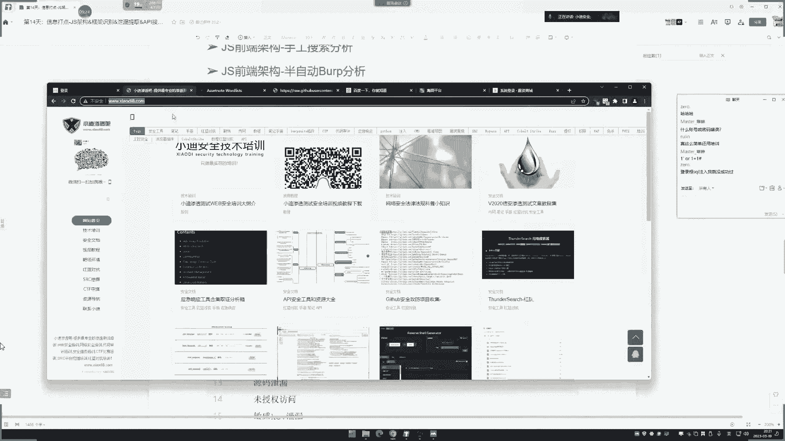

我只能通过一些抓包技术的分析，看到他能看到的，然后这边呢可能你在测试的时候呢，它就会有很多类似的JS文件，你可以看到，就是说我们这里可以看到啊，它有很多这个JS文件，你看这里有个叫AME点JS文件。

你看出现了啊，然后呢，你可以打开这里面的一些这个它的一个结果，你看这里就说你看这里有很多这个信息，这个信息呢应该就是我们说的一些登录的，一些操作按钮，你看这里还有个log点ES呃。

你看看登录验证码的刷新，还有这个什么后台加密登录处理，你看它的功能呢，就是直接在这个JS文件里面就能什么看到，他就直接可以在这个JS的这个文件里面，可以去去看到。

对不对，那么如果像我们这种PVP的话，比如说我现在打开我这个后台登录地址啊，我们可以看一下，简单对比一下啊，啊我现在打开他的。

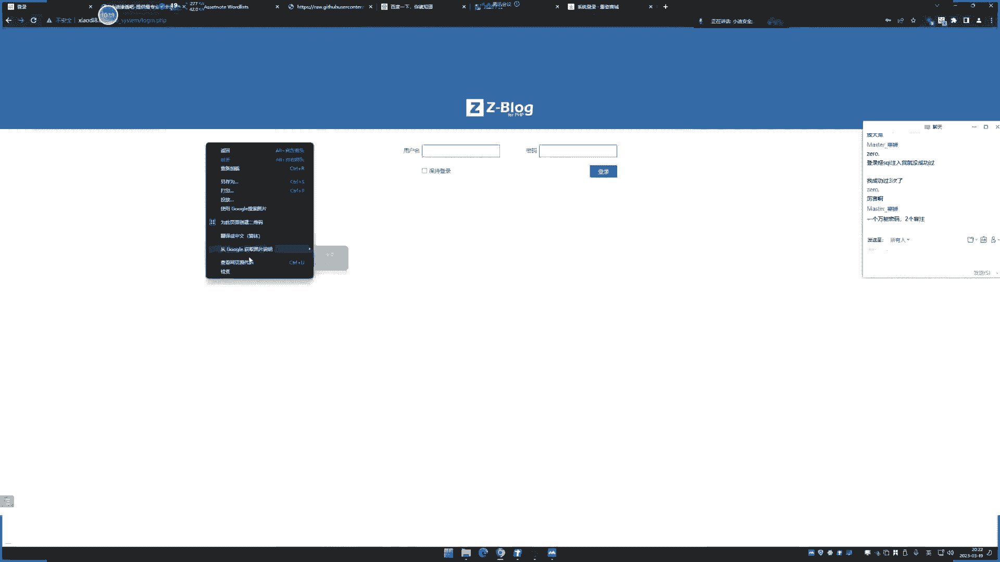

你看啊，我看这个他这里呢虽然也有JS文件，但是你可以看到啊，他这个JS文件里面呢一个是叫ZOEJS，那我也不知道这个是干嘛的，还有这个MD5是一个算法，然后呢他如果说去登录这个账号密码的话。

包括它上面的一些功能，他可能全部是用JPAP呢，去把它进行这个处理的，然后这边呢他就是用JS代码去处理的。

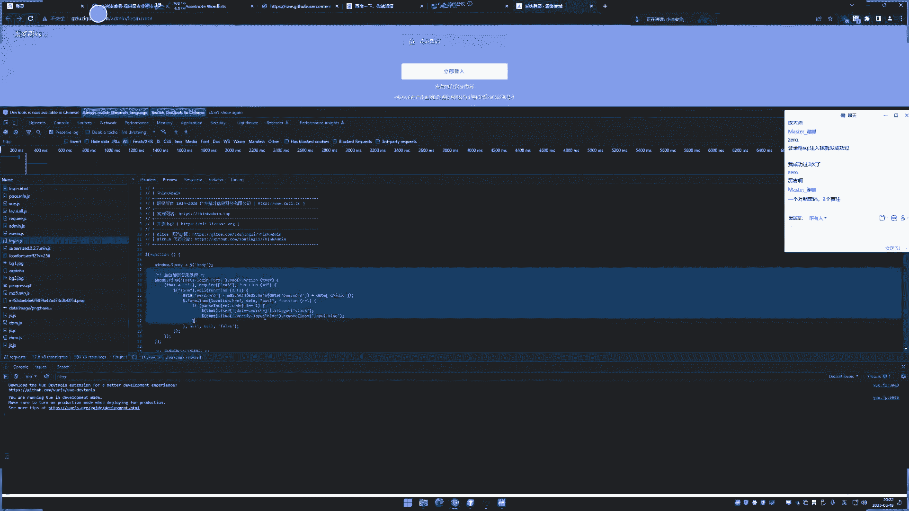

也就是说他大部分都会用到JS，那么这两个一个差异对比的话，就让我们明白一个道理，由于这个JS代码呢我们能够看到，然后还有一点核心功能是用JS。

那就说很多东西我还是都能看到的，我能知道他这个数据是怎么去接收，你看啊，他说后台加密处理啊，解锁什么值，然后把这个password进行MD5进行加密，然后去这个怎么去接收啊，后面呢在做什么事情。

包括验证码的刷新也是用这个JS代码去做的，你包括这里不是说有验证码什么情况，对不对，还有一些其他的，按你像这里还有很多啊，对包括他这里上面写了很多东西啊，这个插件的MD5加这个地方。

然后这个JSN调这个地方等等，很多地方都有呃，其实我这里说的这些这些东西呢，就是为了告诉你一个道理，就是说后端语言开发的核心代码，但是在它本身原单里面你是看不到的，你只能去测。

然后这个JS的这类开发的网站呢，你是能看到这个代码的，那么看到这个代码，那是不是意味着就会更简单，对这个网站安全，它是不会就更不安全呢，也不是的啊，只是说你用JS和这个后端语言开发呢。

为什么会采用这两种语言，不同的方式去开发web应用呢，其实是根据这个网站的功能和这个速度兼容性，决定的，并不是说哪个更安全，哪个更很危险啊，不是这样的，只是说有这种两种模型啊。

我们都要去学习去了解，没有什么什么蓝大码泄露就不安全啊，这个JS能用这个VU开发的话啊，你只要控制的好是很安全的，因为它本身这个代码，那就不像pp里面有很多的一些危险的，一些函数等等，什么东西啊。

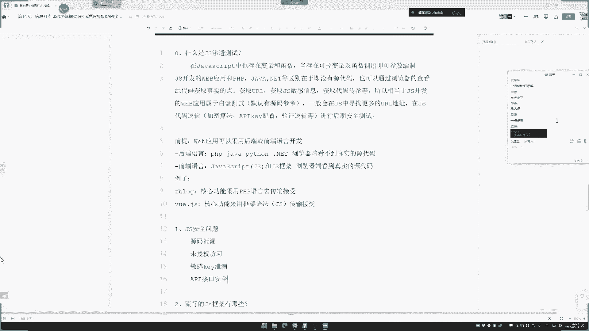

字体太小了呀，字体太小了是吧。

这个字体这个我不知道怎么加大啊，这个这个里面能加大吗。

可以是吧，调，他只有加这个里面的东西，好可以加大，好行啊，自己加大了再好一点的吧，来，找好一点的吧，这里面再看不清楚，我就没办法了啊。

好这个呢就是我们说的这个情况对比啊，然后呢我们比较关注的就是刚才说的啊。

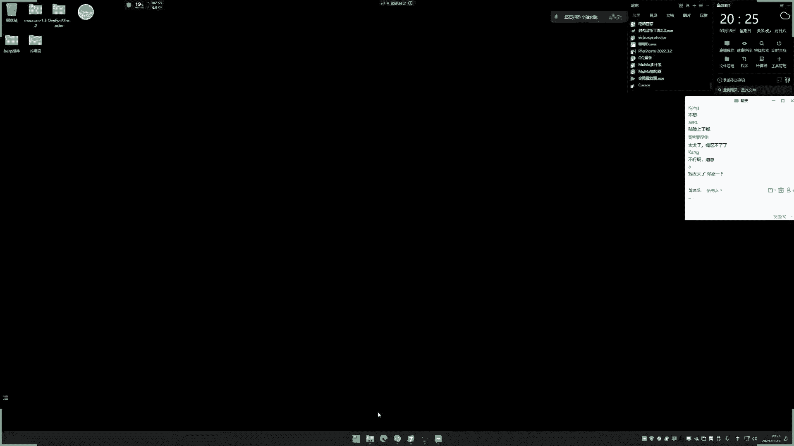

呃你可以判定他的一个情况啊，就是你看他有没有加载这些框架啊，一般的话如果加载了大部分都是JS，然后还有点啊，现在呢就是我知道这个差异之书呢，我们就来理解为什么要进行大点，大点是打什么东西。

其实大一点的主要是打以下东西，打什么东西啊，从JS里面去得到更多的URL地址，就是接口地址，从JS里面去分析代码里面的泄露信息，包括结果地址，我给测试他有没有这个微生源访问。

那这些后面的JS的一个安全措施呢，是在后面课程里面会讲，今天主要就是说从里面的，去剖析出更多东西来好，那么现在啊，我们就来给大家呢去这个烟丝集中啊，然后呢我会演示三种模式的一个分析。

一种呢就是我们说的手工模式，一种呢就是半自动模式，还有可能是全自动模式，每个模式都有各自的优点和缺点，简单来说手工模式呢就是时间长，分析起来麻烦，但是他比较精准。

然后半自动模式呢就是刚好啊两边都轻一点啊，两边呢就揪一点对吧，都有格子的，这个时间稍短，然后呢分析呢也不是很精准，然后传自动模式呢就是不需要我们干嘛啊，就分析完了，但是他的这个精准程度和这个准确程度。

那就不好说了啊，所谓的隔一格的优势啊，我们的三种模式都给简单的讲解一下啊，首先呢我们看啊，第一种手工分析模式，我们可以随便打开来。

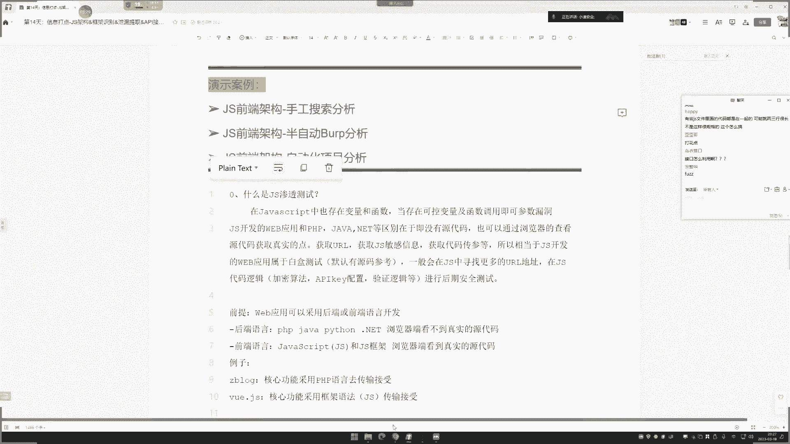

就像刚才我们这里找到这个网站一样啊，这个网站我们可以手工模式呢抓个包刷新，然后这里不是加载了很多这种JS文件吗，首先你这里还是一样，先判断它出是这个什么这种JS的一个什么应用，也就是说他这个后台应用呢。

可能就是这个什么JS，那么我们在这里呢继续在分析什么呢，啊我们分析什么啊，一般呢会它的一个主要分析的就是茶和咖，看什么，看这个加载的JS的文件名，看这个加载的JS的文件名啊，我把它这个换一个显示方式。

诶那个黄一个写字方式在哪里。

在这里。

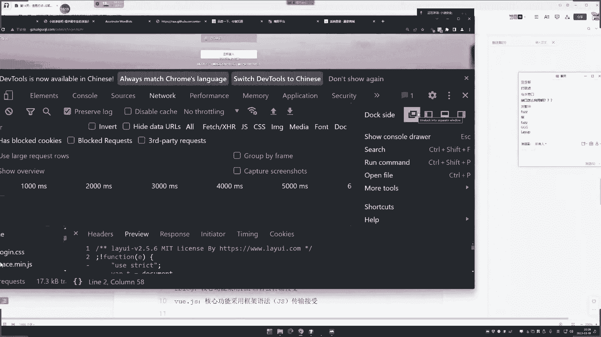

直接看这个啊，我把它单独放了个窗口出来了，单独放个窗口出来啊，这样子呢免得大家说这个又看不清楚嘛，放这边吧。

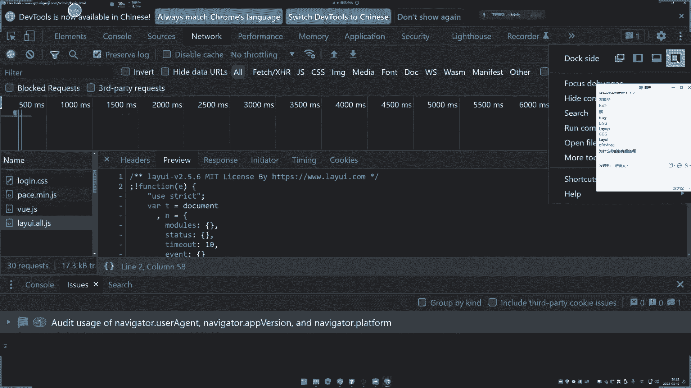

这样看啊，哎呀算了。

还是那样子看吧，这样子看一下啊，就把单独拿出来了啊，这样子大家就能看明白了吧，嗯那个就这个浏览器呢我们就看它，首先呢我们要关注几个地方啊，哪几个地方呢，就是这个先把这个项目接一个。

就是这边啊加载的文件名啊，然后呢我们把它一塞啊，这个JS呢这里一塞呢只看JS的点这个塞啊，来好，这是传播JS，然后呢呃我们看啊这个名字是有讲究的哈，那你看这个什么enemy logmu啊，这个MUU啊。

你你这个英文好，你就应该大概知道这是干嘛的对吧，登录啊，菜单啊，管理MD5，那么对应我们可以这样去理解它登录的菜单的，管理的M6M65加密的是吧，那你觉得这几个里面，包括我们现在看到的网站应用。

这是在网站界面，你说这是个登录框，你会优先看谁，肯定就是看艾米和logo都不用想的，因为他们两个和那个功能的对应上，那么你这里看到清楚之后啊，你可以看到啊，这个代码中呢就出现一个什么。

你看啊是不是有一个泄露了什么原代码，可能就是这个网站用的是这套程序叫什么，对吧，然后呢继续啊，你再看这个，你可能说诶这个泄露新的GP，我不是可以直接拔了源码下载八元吧，下来不分分析就完了嘛，对不对。

假如说这里没有这个东西，你怎么办呢，这样的啊，这个CNPP呢它可能是个CMS，但是你可能说了。

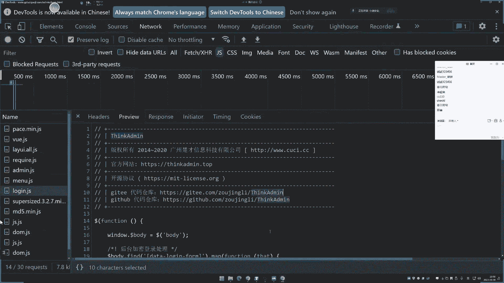

cm是不是这种类似呃，用这个后端语言开发的吗，是这样的啊，这两个后端语言和JS语呢它可以混合开，就说它可以呢用PP呢去写这个界面，然后用JS去传递数据，也可以，那用JS写界面，那P1P去选数据。

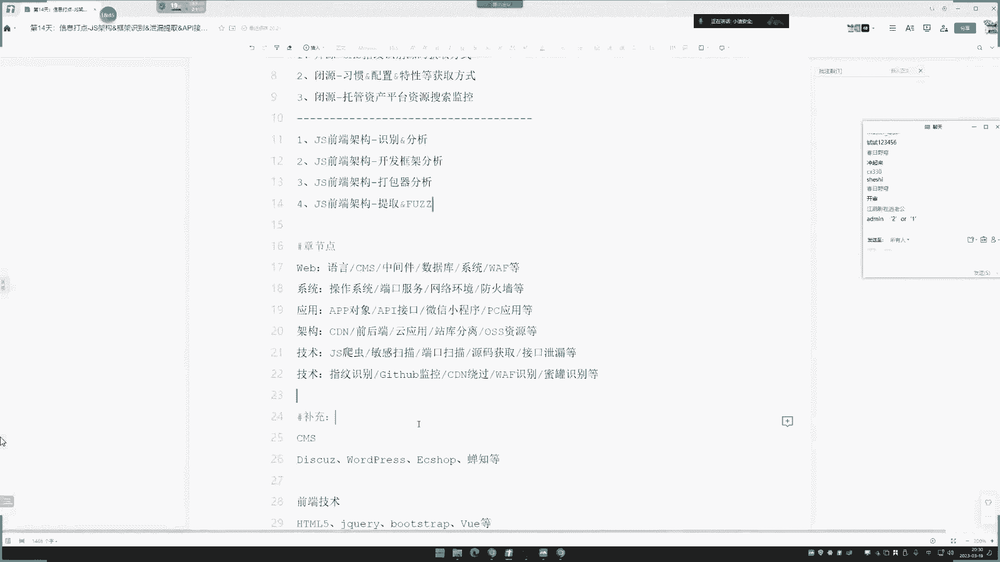

所以你要搞清楚啊，不是说这个是cm就不是JS啊，两个是可以混用的，那么也就是说他这里呢就这么个情况啊，我们现在看到他啊，然后我们在这里主要是看什么呢，就是一个啊看文件名，哪个文件名比较关键。

我们打开看看它，究竟这个代码里面在做什么东西，看不懂代码先不要紧，后面呢我们会简单介绍一下JS开发的啊，然后这是第一点，看文件名，还有一点，那就是我们搜文件名搜。

然后CTRL加shift加F全局搜索搜什么呢。

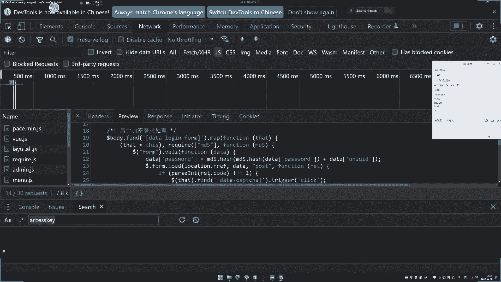

一般就可以搜这几个关键字，搜哪些关键字啊，这写了啊，这几个关键字SC等于乘七，等于most get等于什么hp get，这是啥东西啊，这是JS代码中的一些常见的标签或者是函数。

这些对应的意思是什么意思呢，比如说SRC就是我们的链接地址，就是a tam里面的什么SRC，和我们加上个链接地址，喷漆就是路径，还有这个呢请求方法get，那么这些的一些搜索全部都是为了找一个东西。

找什么连接地址和路径，我找这个东西有什么用呢，就很简单，我在这里呢去放网站，假设说你看他底是这样的啊，我从这个JS里面如果翻到enemy下面有个什么，比如说叫什么这个音啊。

这个叫TOP点什么这一个地方啊，我翻了一个路径地址，那如果说我翻了个路径地址，我一访问诶，后台都没有登录，显示出一些东西来了，未授权访问挖到了，所以我翻这些路径，翻这些地址都是翻他的一些调用地址。

就是能得到他这个路径上面那些其他访问地址，我就可以尝试去访问这些地址呢，来看上面是什么东西，有没有对我这个有帮助的，所以他这些语法翻的全部是加上了一些路径。

所以我就可以在这里呢是吧，人工分析的时候呢，就在这里搜这种关键词，比如说SC是等于在这里搜看哪些JS代码里面，就涉及到这个什么什么东西啊，那就放到一个来看这里呢，你看啊收到一个SC的地址。

我们看一下后面有没有，那它有个路径，但这个路径地址不是我们想要的啊，但是没啥，所以我们继续往后面看啊，你看这有个SC点标签地址哦，加上一个这个地址，但这里没有写这个后面路由地址啊，啥都没有是吧。

你看这里还有呢SC等于方形，那这里就需要你换算，他没有直接写地址，他只是给到了一个什么一个，那后面那些语法和函数加载的，后面再继续啊，好这里呢都没有啥啊，那么那么你看啊。

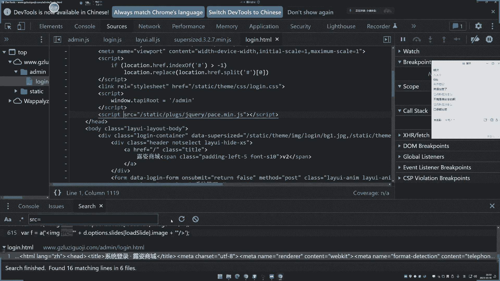

这里都没啥啊，我们继续来看下面的啊，来搜这个呢看一下啊，我们都搜一下看一下啊，啊这没有这个环境呢。

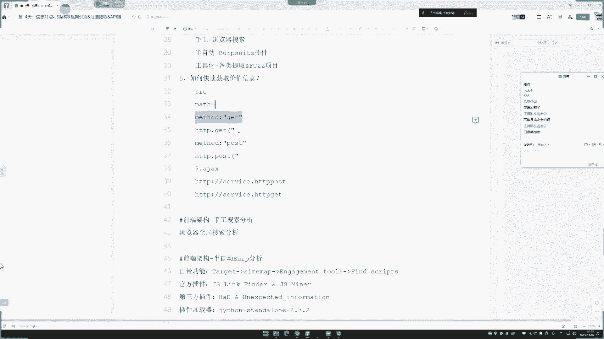

是我没有准备的啊，就说我不是说我截，我这随便刚才随便搜了一个网站，所以你搜不搜到这个是不是说一点了，你看这里有一个，这是你的请求方法，Get，这都没有一些信息啊，都没有路径地址都没有啊。

都是一些正常的一些JS啊，也啥都没有看到啊，我换一个吧，换一个搜下，找那种比较明显的。

我们找起来那个泄露比较多的啊。

好看这个。

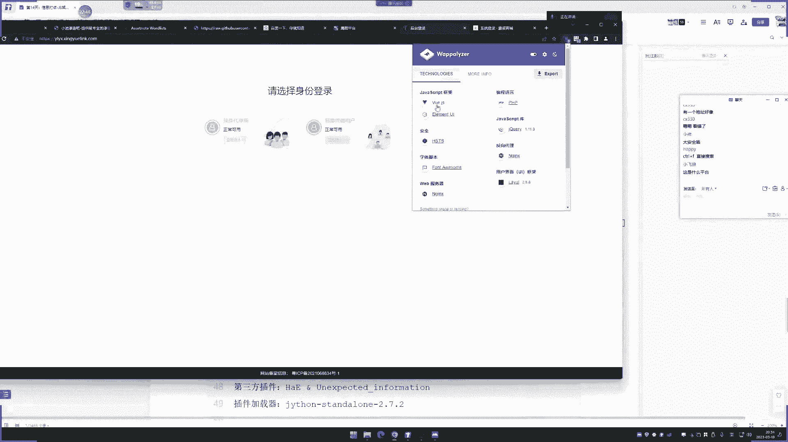

V1哦，看他的啊，先刷新一下，把这个东西先抓到，好这边抓到了，这好像也没有啥东西，搜一下看看，你看啊你看这个就收到了一些不一样的，你看这点路径地址是不是写了一个名，收到一个了，这是就泄露一个路径。

基础刷了好，我们继续往下看，这个来这个也是一样的啊。

我就收了两个，这个收了两个，我们再看做其他的开销啊。

这个就是靠搜啊，你就是常见的一些东西去搜啊，它有就是有没有就是没有。

九收了一个，那也没啥啊。

就这样一个index里面再去请求，你可以看一下啊，这里应该就是那个负责登录的地方嗯，去请求这个地址，然后发送什么数据负责登录的一个操作，也没有泄露任何东西对吧，很少很少啊，好我们再看一下其他的啊。

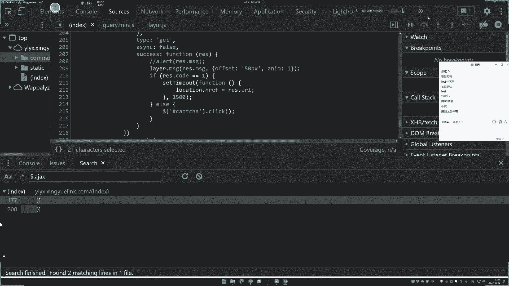

所以这个人工分析呢就完全就好。

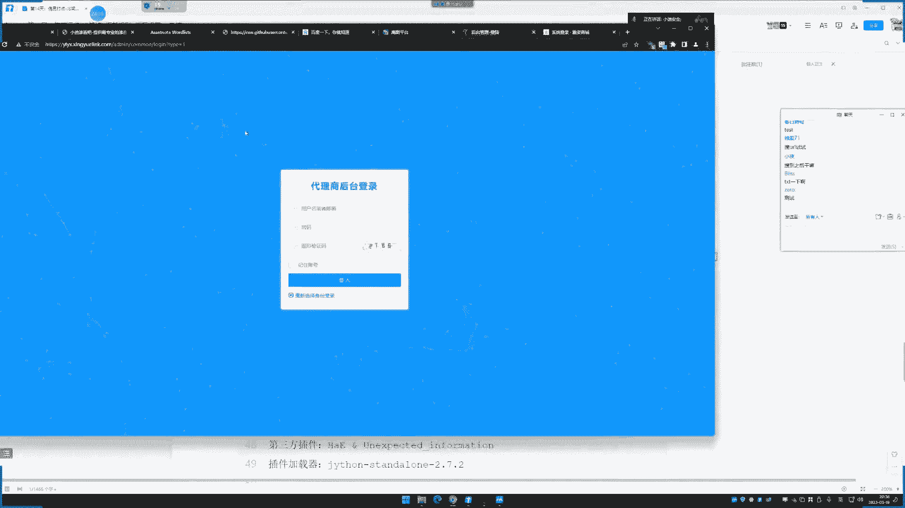

这里有个这个地址啊，然后我在这个地方来看一下，在这个地方去看一下哈。

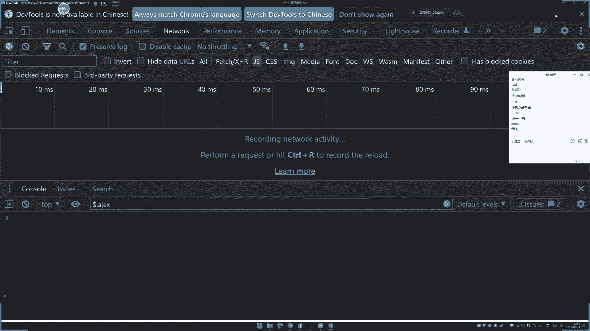

刚才应该没有点啊，点这个地方的刷新啊。

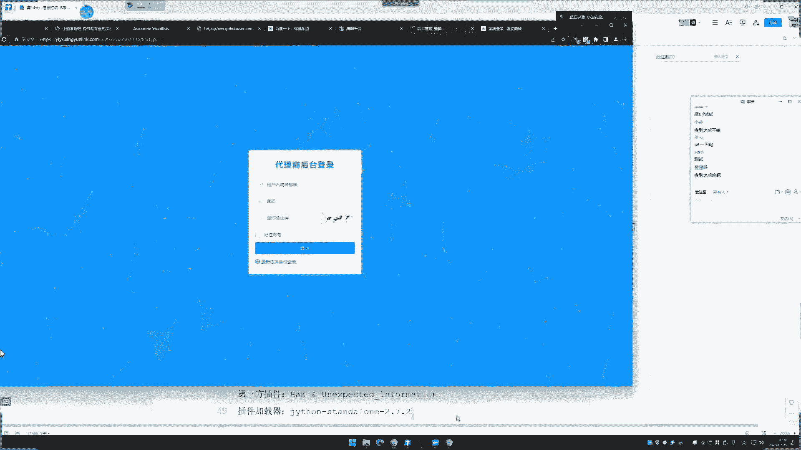

好搜一下。

哦还是那个啊，这他妈什么鬼啊，用夸克塞一个，我们找那种呃类似的一些登录的，那个会更加的明显一些。

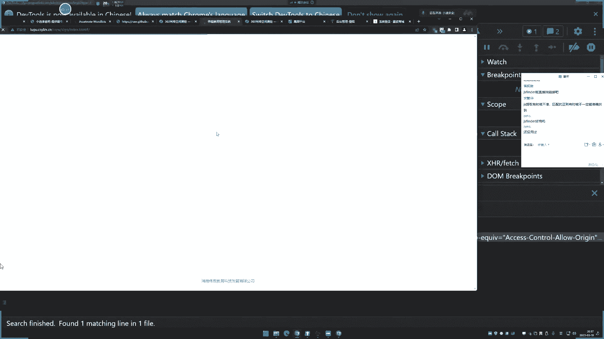

我这里不是说车啊，我不是说说什么东西啊，这个大家自己都要搞清楚，你看这个应该比较多了，这个JS文件这么多的好，我看一下啊，这个从这个上面判断都已经判断了，我就不看了，判断了啊。

我们现在来看一下这个JS先收，这个没有，我们来搜下面的一些东西，还是能收到一些这个物理地址。

这说的什么玩意。

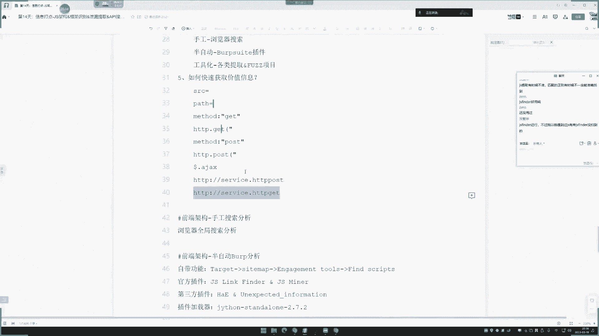

这。

嗯带一下啊，我这边再搜一下，先确定一下啊，这边的一个V1啊，那确定，如今你是非要get p w s t y路径地址，他写了，只是说你要换算出来。

好看一下啊，这里有没有这个信息啊，我搜。

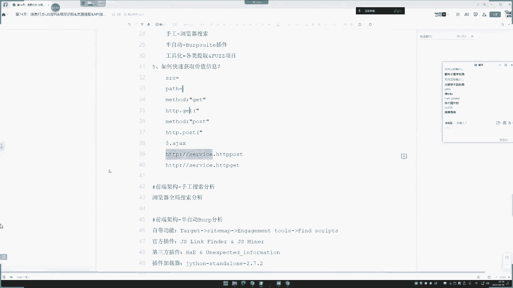

呃其实这里呢已经得到了一些路径地址啊，呃你可以看到啊，他这个地方呢呃说的这个需要你换算啊，这个一字啊就是应该对应哪些关系呢，server点前应该就是他一个路径，这个需要你自己换算啊，就是要跟踪他的代码。

看那个例子呢是呢看没看是不是路径出了些，你看着这个就出来了，你看翻到一个了，你看AJX加上这个绝对路径，你看这里你自己扫，你怎么可能少这东西，你自己可以看一下，我们复制一下，这里我们看看啊。

呃这里路径要么你这里要好路径啊，是在PWD嗯，所以说你这里呢就要判断啊，他这里就是路径，它其实已经写了，只是说他代码里面那张函数自己在换算，然后写到后面去了啊，这里面很多提到路径的，这个是登录的。

这个是获取这个什么验证码的，那个是修改密码的，从这个字面意义上可以理解啊，所以这个人工分析呢，它是需要有一定的代码的，一个知识点和时间的啊，你是需要整个跟下来，然后呢去换算。

有时候有些代码呢自己要学会分析跟踪，才能把那个地址把它缓存出来，然后呢除了这个搜索之外，还有哪些方式，这是我们说的人工的一种方式啊。

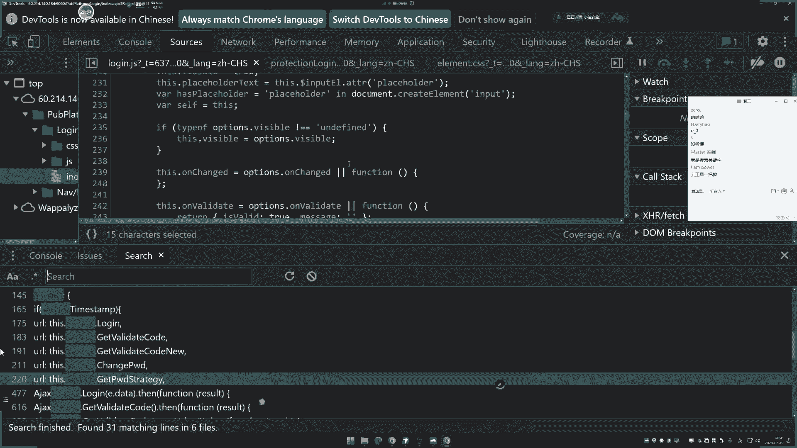

还有一种像我们说的啊，会用工具或者说用bob suit来，我们来演示一下bob suit啊，我们演示一下bob shoot就是单自动运模式啊，单自动的，bob suter呢有插件会给他介绍用。

还有呢就是我们说它自带的功能，自动关自带功能，先把代理开一下，我把代理开一下啊，好开了。

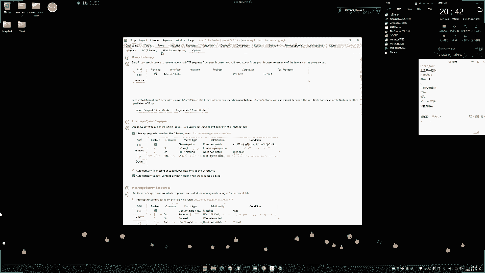

大家可以关注一下这里啊，然后呢我们打开这个网站啊，刷新一下，好这不加了一些嘛对吧。

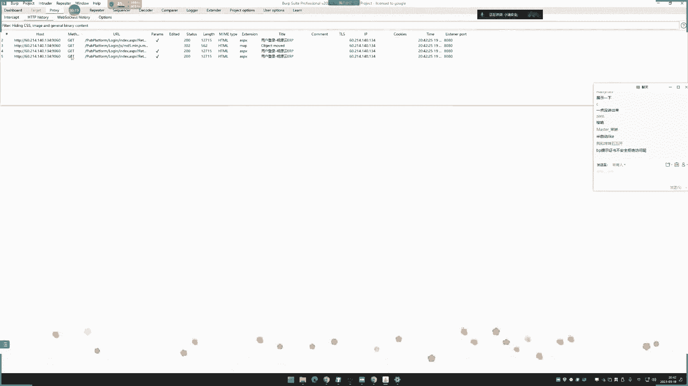

然后怎么去分析它呢，啊他这个地方呢会自动一个叫tiger，就是我们的目标，然后目标这里可以右键呢有个功能怎么说呢，叫fighter rappers，Fidescripts，就是发现脚本，点击下。

然后这个功能就是它自带的功能，它可以呢去帮助你，就说你这个放网站的时候啊，触发哪些东西。

然后下面是什么一个路径，他会帮你写出来，然后这是他的第一种功能，这第一种功能还有一种功能是什么功能呢，那还有一个功能是什么功能呢，就是说我们用插件用插件啊，什么插件呢，什么插件呢。

我们再重新再找个网站啊，避免不要用同一个网站啊，这样子呢更真实一些，再找一个，先把代理关一下，找一个有我这是随便找的啊，我没有说这个提前准备的，你们说自己这个东西哪好找呢，哎，凭证明和我抢走了，下一个。

让我先用一下好吧，哎我有这个音土也行啊，因土这个也不是说不可以多找，我后面要多翻几页啊。

嗯怎么回事啊，刚才有什么声音啊，找一个啊，我这随便找的啊，啊这里有一个这个应该还行，这个应该还好，试一下这个啊，然后刚才是这个吧，我重新再装一下啊，先把它去掉删掉，再点开一下啊，刷新一下啊，刷到好。

这里抓了一些哈，然后这里呢我们点这个这里啊，这是他的这个刚才那个网站嘛哈然后把油捡到，你看啊分析一下，看看能不能分析到一些东西啊，加自带功能只有两个啊，啥都没有，所以它的功能呢可有可无。

我们主要介绍的这这是他的其他的啊，一个是它自带的功能，就是刚才的操作，还有那是官方插件js nike fire和JS两个啊，然后这两个你可以根据在这里啊去安装，来这里啊，一个这个还有这个呢。

这两个怎么安装的呢，点一下安装，这应该都会的啊，再不要说你妹的不会啊，对点安装两个都安娜，然后等他这个按钮呢成为一个这个安装完成，这一个已经安装出现R1就是卸载的意思，所以这个就是安装完成。

这个已经安装完成了，我们看下面这个，这是他官方的两个商店，然后呢我们还给他推荐了两个，一个叫hr1，一个就是这个又来，然后这两个场景分别介绍一下啊，所以这个它下载地址，用来标记请求包的一些敏感信息。

如JS接口和一些特殊信息，然后这个hr1呢主要就是便于我们分析它，它可以把一些相关的数据呢给筛选出来，然后呢颜色进行这个提示，能够让我们快速的看到一些关键的一个数据包，这两个数据包呢。

全部都是帮助我们对数据包的一些筛选，还有这两个就是官方推荐的JS的一些操作啊，我们可以试着去给大家演示一下，好这个安装完成，这个怎么还在安装，什么太慢了啊，把重新打开一下，困了可以不去听啊。

没必要强求的啊，好我把那两个呢也给它安装上来，然后看一下效果啊，那两个是第三方的，他不在这里呢，我们怎么按呢，点这里啊，然后点击添加选择那个目录啊，我这里已经给他造好了啊，给大家安装一下。

那一个是H1选中，点击下一步完成，然后再点添加，再按另一个就是U1的两个JL，我选中啊，我都给他打包了好，两个都选中，勾选之后，你看这边就出现个A加一，然后这里有个这个东西呢，你们初始安装的话。

他是没有这个东西的啊，没有这个东西的，这是从哪里来的，这是它的一个官方规则，这是干嘛的，你可以看到啊，就是筛选什么email还是什么马克地址，还有这里还有其他什么这个什么JS字串啊。

RCE的一些这个关键字啊，还有像这里呢一些什么这个亚马逊的，什么OS的一些关键字啊，各种各样的，你自己可以看看呢，不是说只有一个常见的一些什么这个东西，其实这里筛选的是啥呢。

筛选的就是我们的一些常见需要关注到的，什么一些邮箱地址啊，还有像什么RC的漏洞关键字啊，啊上传漏洞的一些这个数据包啊，还有像我们说的这个各种各样的一些，什么密码的一些关键参数和名字呀等等啊。

你刚开始呢你安装好像是没有这个的，这个是怎么搞的呢，这里面配置这个配置啊，把它进行一个更新啊，点击确定重新载入，然后这个地方呢你就来了这个目录下。

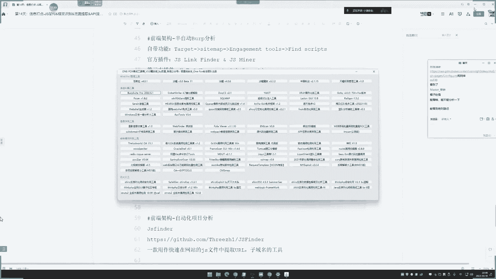

来了这个目录啊，然后这个CONFIGYM我们把我给他打包好的啊，那这个打不好的放进去替换一下。

然后呢这个时候呢你再重新载入就可以了啊，这边你就能看到规则了，这个规则呢就是说按照你要匹配，哪些是什么颜色呢，这里呢那黄颜色yellow orange是吧，各种各样颜色啊，自己把它自己的设置。

我们一般我们默认就可以啊，然后这个规则是从哪里来的呢，规则呢是从这里下载的啊，你可以从这里下载。

好这里呢把这些准备好之后啊，我们来看一下啊，这是这个第一个插件，我们看一下有什么差异啊，重新来抓包，你看现在你可以看到啊，我加上去了，大家可以看到啊。

那很多数据包呢就会自动上色，上色的规则就是和你这里的规则一致，那这里的规则一直，就这些规则啊，什么颜色对应的触发什么规则，他就按照热点颜色去匹配好，我们先把之前的去掉。

来重新刷新一下啊，看这里等你看这里呢触发的数据包，它是自动帮你把这两个上蛇呀，为什么上蛇呢，你看啊后面匹配到什么一个叫呢，创建脚本立刻username fied触发了一个username的东西。

这个是js pro的一个返回值，触发了，Username，那发现这东西，其实就是说让你去分析这个代码的作用，就是说你可以根据这个用bug数字呢，去抓到一些JS文件之后。

然后不用这个工具呢去把一些关键的一些点，把它标识，让你去跟编接着去找一些数据，就是它自动帮你塞了啊，哪些文件里面存在哪些关键字，会触发什么样的安全问题，就是hr1的这个情况啊，然后刚才也安装了其他两个。

重新把它打开，八个画屏，这些工具呢都不好使，其实啊但是你用用着灰，你会发现它比其他工具都好使，你不灰的话，它就是不好用，它主要的还是要有这个基本的一，个基数在里面啊。

然后呢我把那个插件呢也给大家去做一个分析，把也安装一下，唉算了，那个不用安装了吧，安装也是个垃圾啊，不安装了不安装了，随他去，刷新一下刷新一下，我多打开几个啊，因为我不确定哪一个，那可以我们多打开几个。

好来开在这里。

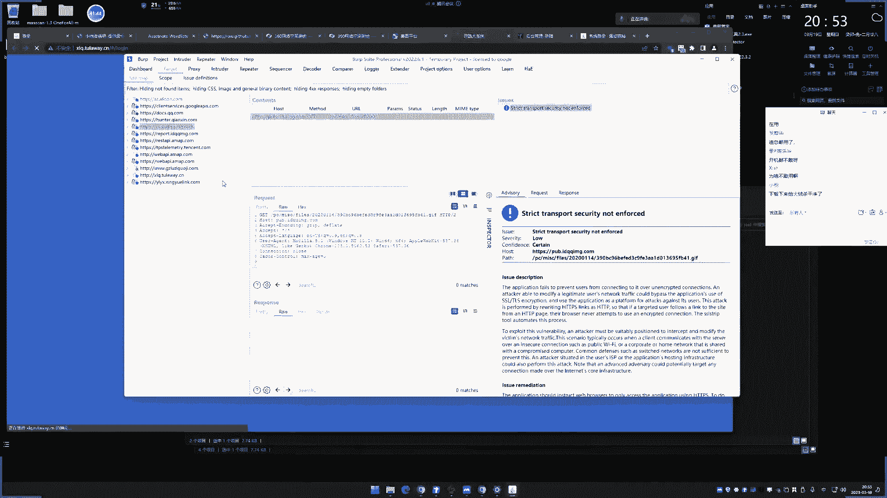

那可以看到啊，在这个上面的数据包，这里呢大家也看到啊，后面那就是出发的这个规则，我根据这个触发规则呢，这里发现一秒，这个呢触发email立刻从这里发现了email，你可以在这里面去搜索啊，对不对。

这样呢可以自己搜索，他在这里发现email地址呃，就是在这里呢这里发现电话号码，发现电话号码，你可以自己看一下啊，是不是有电话号码，啊这太多了，我不敢收啊，因为我这个电脑呢一旦打了这个英文字符。

它容易花屏，所以我这里没有搜啊，他这里应该是有电话号码啊，你自己可以看一下这个标签，这个是发现一秒，这个发现电话号码，你可能会问这有什么作用啊，我举个很简单的例子啊，我们都知道这个信息泄露。

当你去访问一些网站的时候，它加载的JS文件里面，如果说存在一些个人用户信息，比如说你像一些学生学生的管理系统是吧，你在这里呢用这个hr1诶，你在访问的时候，你自己不知道你在访问一些JS文件。

它里面就有那些个人用户身份信息在里面，诶，这个插件来帮助你找到里面存在什么，电话号码或邮箱地址啊，个人信息啊，对不对，你找哪里，那就是一个新线路，恭喜你，就挖到了一个低位的，能理解吗。

他就是通过这个标识啊，我这卡了，通过这个标识呢，来让你更清晰的看到哪些关键的东西啊，涉及到哪些信息，包括你看这里呢提到过了第八个login，看的啥意思啊，就是用户登录的参数在这里发现了。

那么也就是说这个地方，很有可能就是一些用户的一个操作登录，你看对不对，这是我们那个腾讯文档的啊，先把它关一下，对不对，它很多东西你都可以在这上面去看看，这里发现了windows的file路径。

泄露了windows的泄露路径，这里面涉及到一些电脑路径等等啊，其实呢它就是便于你自己分析这个代码啊，你这里自己搜，我就不搜了，这肯定是有的啊，就是你自己因为维持这个容易花屏，那很多东西啊。

就从你这个数据包里面啊，你自己去寻求网站之后呢，可以自己呢着重去操作啊，所以这种呢我们就称之为半自动，因为半自动，意思就是说利用这个插件呢得到一些信息，但这个信息呢需要你自己去确定，他有没有一些风险呢。

有没有安全隐患啊等等啊，是吧，这个就是半自动好，我们现在再来看全自动啊，首先呢我就直接啊，有些人说听着睡着了，那行啊，我就放一个这个好用的东西啊。

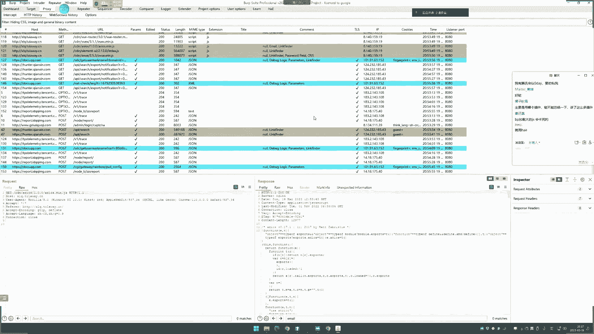

什么好用的，另外一个插件插件安装要不要重新安装一下，要不要重新安装啊。

重新安装一下啊，我怕有些人这个太差了，咋按都不按，不会按，发现移除吧，怎么看，打开这个拓展模式啊，点击这个开发模式，开发者模式把勾选，点击这个加载，选中这个目录哪个哪个项目呢。

就是我们说的这个叫find something，这个把目录选中，选择文件夹出现了呢，Find something，然后呢再把这个项目呢给大家置顶一下。

置顶这里就可以看到了啊，然后这个是干嘛的呢，我给大家看一下啊，那我访问这个网站，我先用这个东西呢把识别出来了，然后呢我就刷新一下，刷新之后再点这个地方，你看它有什么东西，你看它自动帮你判断。

这个JS里面涉及到了什么域名，宁愿会加载哪些域名，那从里面提取到手就好了，你看你问我这个手机号怎么提取的，我也不知道，因为他JS里面写的这些例子，拿算法password啥意思呢。

就是说从这里面找到了一些，JS里面找到一些东西啊，还有呢这是他的一个路径，路径啊涉及到一些路径，就是我们说的那个从里面翻到路径在这里，但是有些可能是这个物包啊，然后这是他的一个路径啊。

然后我们现在可以看一下是不是这个情况啊，那比如说这里谁叫什么password，等于什么123456啊，这些关键字啊，我们可以看一下，来抓个包。

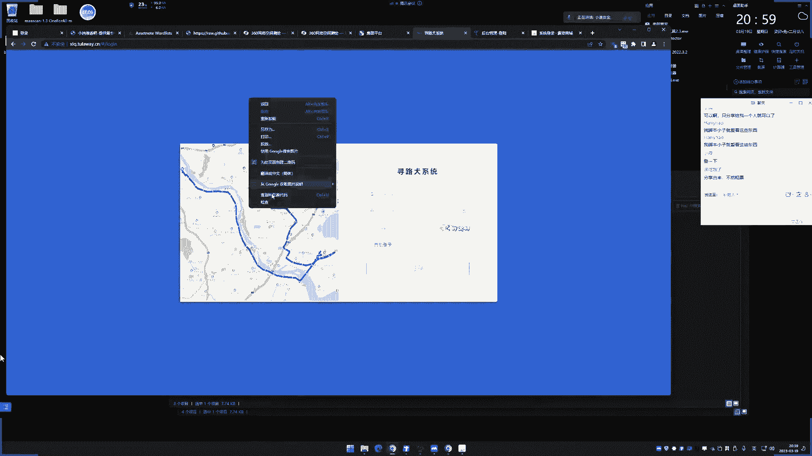

从这里呢再去分析代码啊，先刷个包，那我在这边全局搜索，嗯这都是password1些路径啊，这是注册的，应该是世界注册的，对不对，那user login是登录的，然后这里不是还查到了这几个什么东西啊。

诶是不是这边有两个，再把这个关掉，先，来看看这个啊。

来点一下，在这里还插了一些关键字呢，我们可以搜一下，这就说一些常见的关键字啊，username什么的。

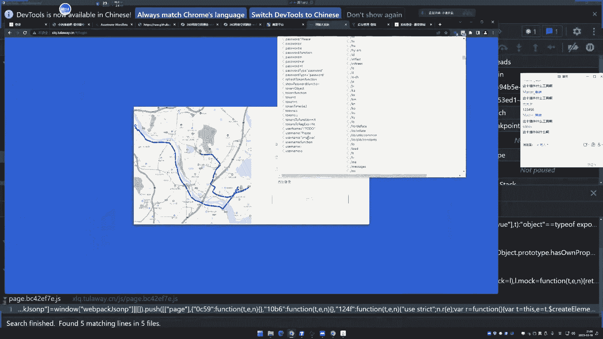

somewhere看一下有没有啊，找到了，啊这里他在JS里面还没有翻到啊，这个JS里面还没有翻到。

他在里面编辑到了，那也就是说这里呢你可以尝试一下呢，这个u name等于3瓦，那也说这里可不可以，这个用户名默认就是三网了。

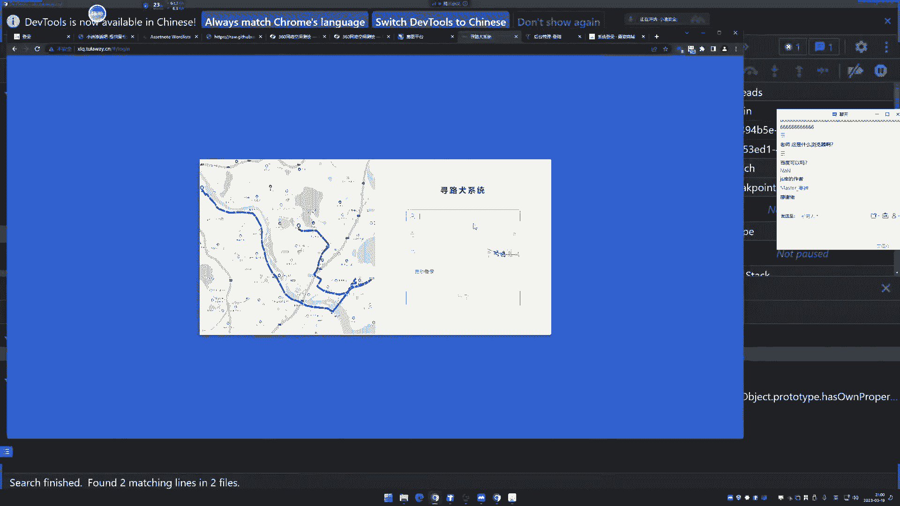

因为我从这里搜的话，他一个这个写的人呢名字又命名成这个东西，对不对。

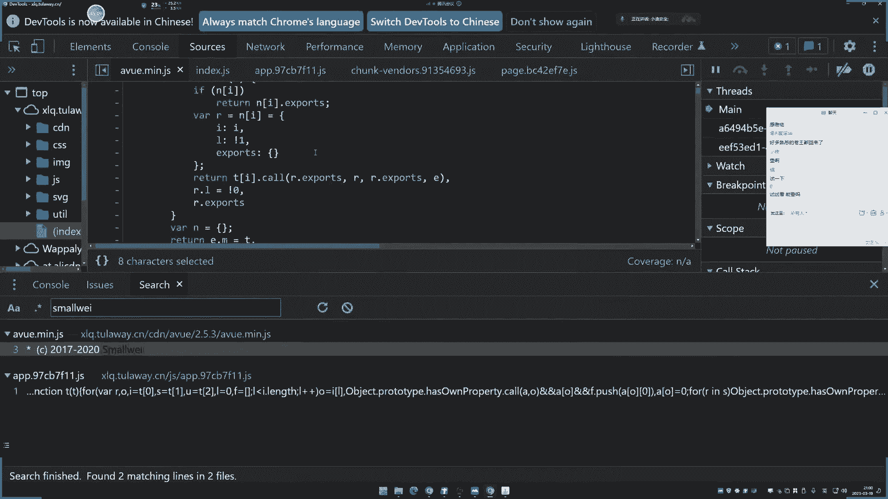

那我也不知道啊，因为这个我也没有准备，我不清楚啊，我就说这只是个猜测啊，你包括这个也是一样，那我们用这个来尝试一下，你看用这个来试一下啊，那个插件来看一下访问它。

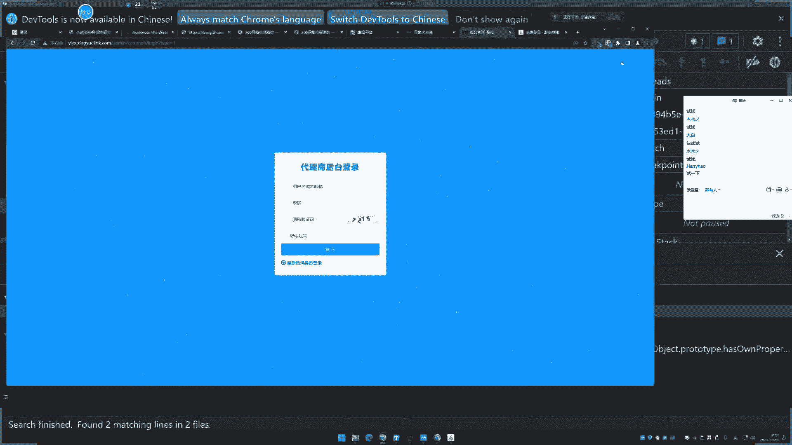

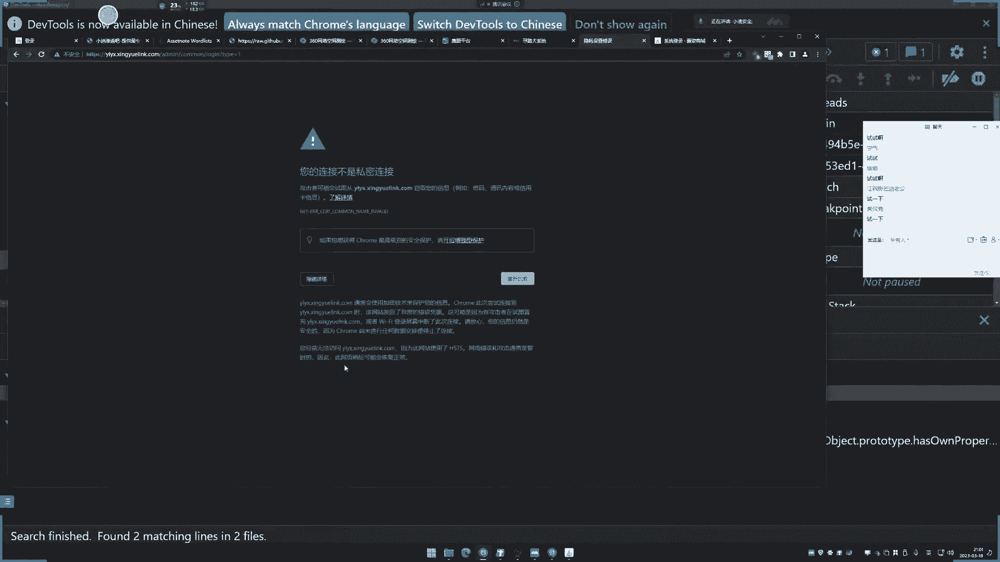

诶，这个呢看一下啊，来点这个地方，你看他这里呢也是帮我识别一些东西的，那这是一些路径地址，那接口的一些地址，然后呢这里拉四啊，你看，Password，一些东西都是它里面一些JS代码。

及到MD5的一些算法，然后是加载了一些路径和JS文件的一个路径，这个是一个插件啊，然后呢我们这里呢给大家看一下，除了这个插件之外，还有哪些东西，JZFIED老牌的用的最多的，但是呢功能是最差的，不讲呢。

有些人就说为什么别人讲这个东西，你不讲啊是吧，就会有这样的问题啊。

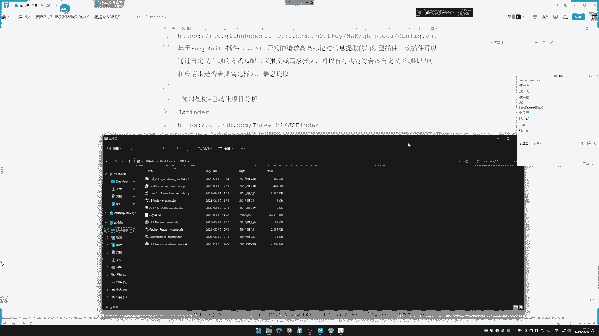

加了之后会发现其他东西比它好用多了。

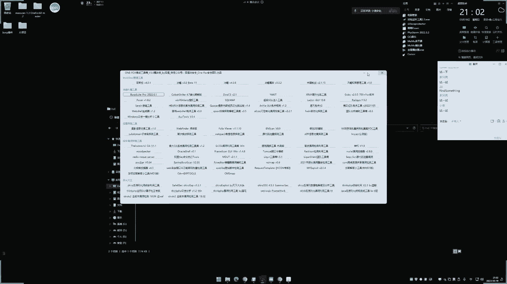

网上你看的项目呢，别人也是讲他就没了，来一个一个一个用啊，大家可以关注一下哪个好用，这是用工具啊自动画框的地区，然后后面我们会有一个真实真实的东西，给它一个啊，给大家去演示，演示完之后呢。

大家就会惊呼哦，原来是这样子啊，好怎么使用它呢，直接加上cu，我把这个浏览框呢给他放大一点，怕有些人看不到，好放孩子放袋里吧。

28应该可以吧，那这样看清楚了吧，加上这个路径地址啊。

你看它有什么作用啊，我们便找一个就把这个复制一下啊，这是老牌，这个项目也是使用最多的，你看他干嘛的啊，他帮你自动去提取里面的，涉及到一些路径，那帮你提出来了，其实就是像我们人工分析一样。

发出它下面一些路径结构，我们可以加个杠D参数，杠铃参数呢他这里就是说好的，更深入呢，那算了不加吧，那出来了，那就是它涉及到发现了一个域名，在它本身域名，然后你看啊，这里是涉及到很多路径地址啊。

那么大家试想一下，如果我现在要尝试去访问这个路径。

当我去访问的时候，他进去了，那会不会就是一个微缩权访问呢，因为你自己去扫，你不知道，你看我访问他的时候，大家可以看到一插，那让他自己又出来了啊。

啊刚才看那个页面的时候呢，哎好像要进入了是吧，又出来了，那这些呢你就去针对这些地址呢自己去测试啊。

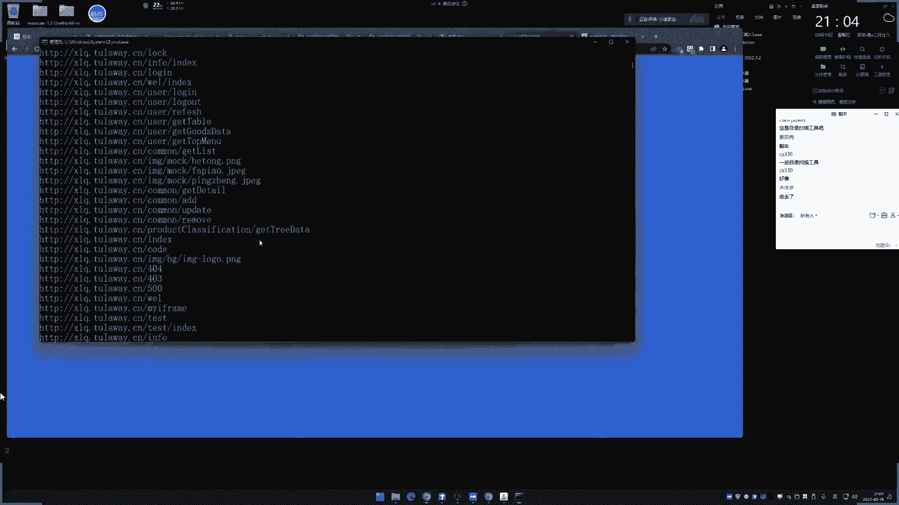

说不定的话在这个下面就已经进去了，或者说没有登录。

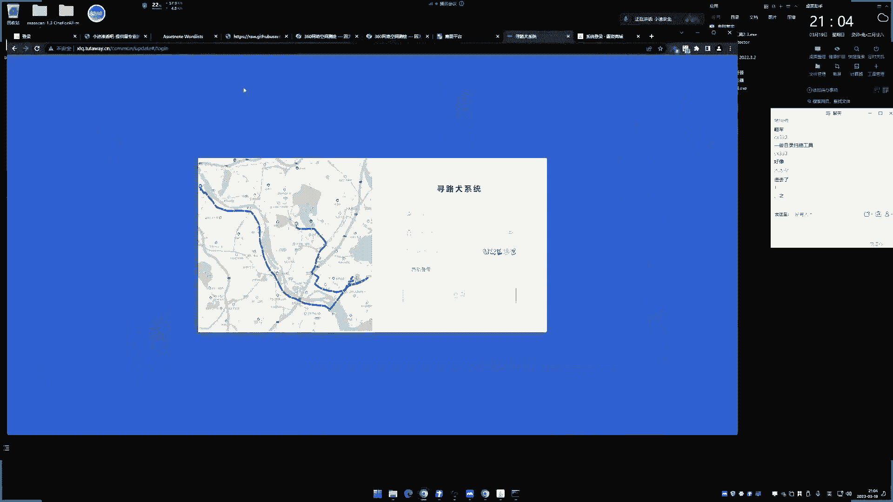

那不就是一个典型的微信方面啊，这个呢因为我没有做这个车是啊，我们主要说打点，那你看这边又发现了一些这个不一样的地方，来这里再从它上面去发现这些地方啊，然后这个呢你可以测试一下眼，嗯你可以试试这个。

那他也是发现了一些呢路径地址，那这些路径地址呢都是我们前期自己没找到，你这里发现个upload action。

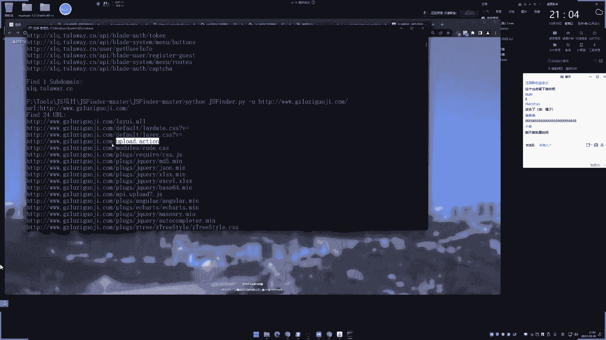

这个很有可能就是上传的一个地方是吧，你看空置期不存在。

如果说这里是后台路径访问禁区。

这是后台的一个路径地址，你可以多找几个事啊，不是说你这样一搞就能挖这个洞啊，只是说你找到更多星星呢，你那个就不远了，我们怎样呢会有一个案例呢，一次性的让大家能够理解，那留个最后讲啊。

再找一个这个地址给他看。

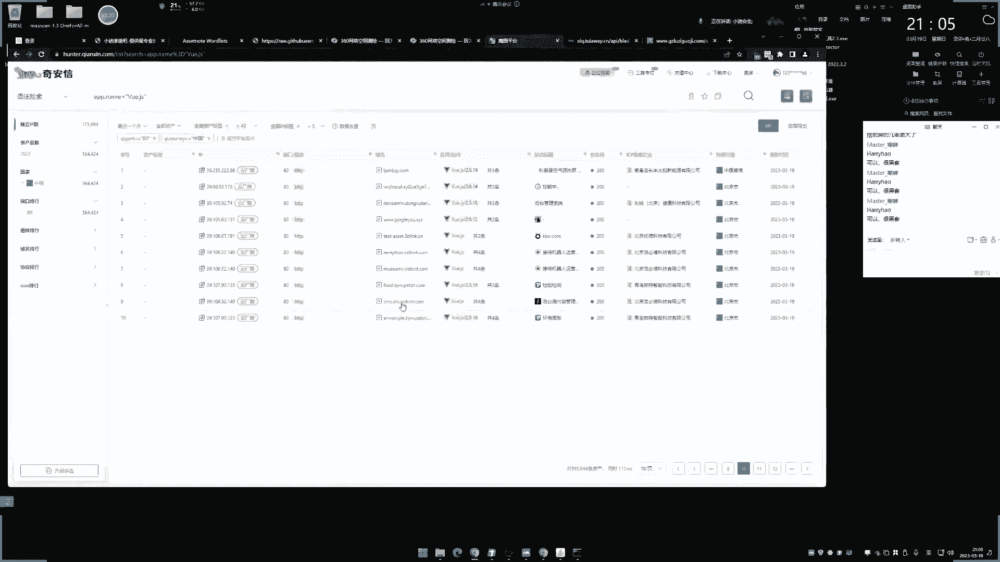

多找几个这个再试一下，每个工具呢多试几个地址啊，这样子就更好的路径，这里有个还有这个item s u s都可以看一下啊，他需要登录，那说这里他还是做了权限的控制的啊，这是这个工具啊。

发现了一些各种各样的一些信息。

然后呢你可以从这里也可以看到呢，这个浏览器插件也是可以看到这个东西呢，所以说这个工具呢都是等同的，你看这里面会有很多的一些关键字，你都需要自己去细分，你看这里有个关键字，这里面可能有些密室泄露一些。

包括一些各种各样乱七八糟的啊，大家都喜欢看真实的，但是真实的那不好搞啊，再来找一个。

啊这是个学校的啊，再测一下啊，这是这款工具，我们可以试验一下，好他也只看到这几个地方。

你看他就告诉你下面这些路径，你看挖到这些路径，如果说你这里来访问这个路径是吧，进去的，你看你之前访问这个网站，它是这个东西，你现在访问这个路径呢，就变成什么高校就业服务登录是多了一些呢。

这个是在拆这个啊。

这个是什么，用户登录这里不知道题是什么东西，离开下面的呢，这个是提前。

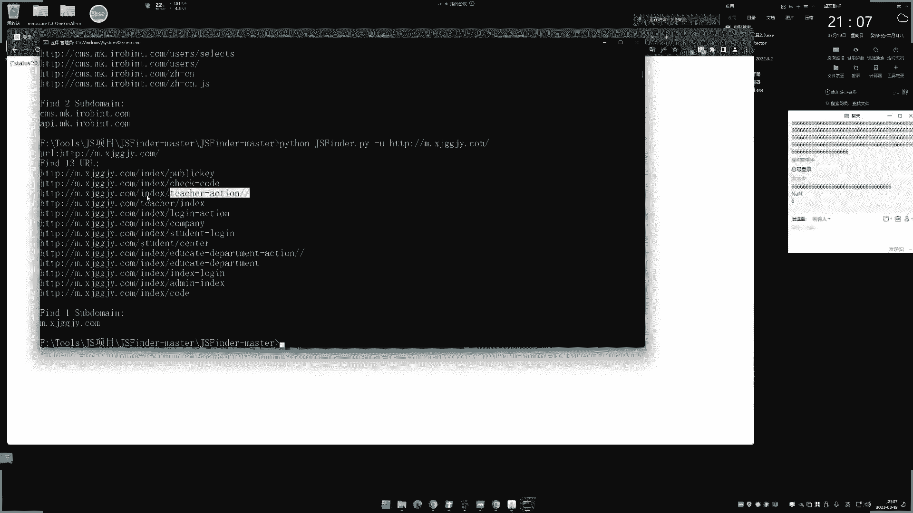

又是这个灯的情况，那不管我们再看下面这个是system用户，少打了个H啊。

这是刚才那个别的，还有这个AMY。

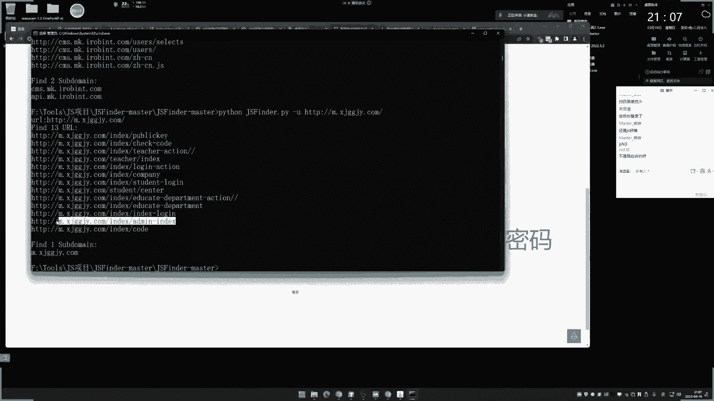

那个应该是管理员的，还是那个中号登录，你可以自己呢，我们不是一个事啊，我就说这个意思，你看这里呢，你看房屋这个地方泄露一长串，你说这是干嘛的呢，那我也不知道啊，这是在干嘛的，你我也不知道啊。

这不可能是一个什么K啊，或者什么东西，你说有没有用的这个东西，那好说的呢，是不是，好我们再再找两个来看一下它的一个演示啊，这个要看一下。

其实这个东西呢说实话啊，他也这个工具呢用几个就测试几个嘛。

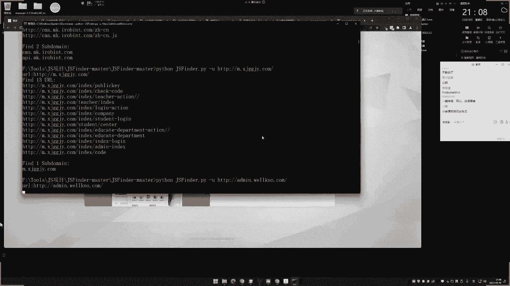

这个那就不看了，他一次拆两个。

我们就不看了啊，好现在就介绍下一款它的升级版，我不是推荐大家用js fighter，它的升级版推荐给大家用，叫URURL的一个final升级版，windows版本也不需要大家装什么Python环境。

直接用直接用这个最简单，直接用放上去就能直接用啊，直接用，然后呢他的一个官方地址打开一下啊。

简单学习使用一下，有没有码，我不知道啊，我也从他往下的啊，我没有捆绑目标地址。

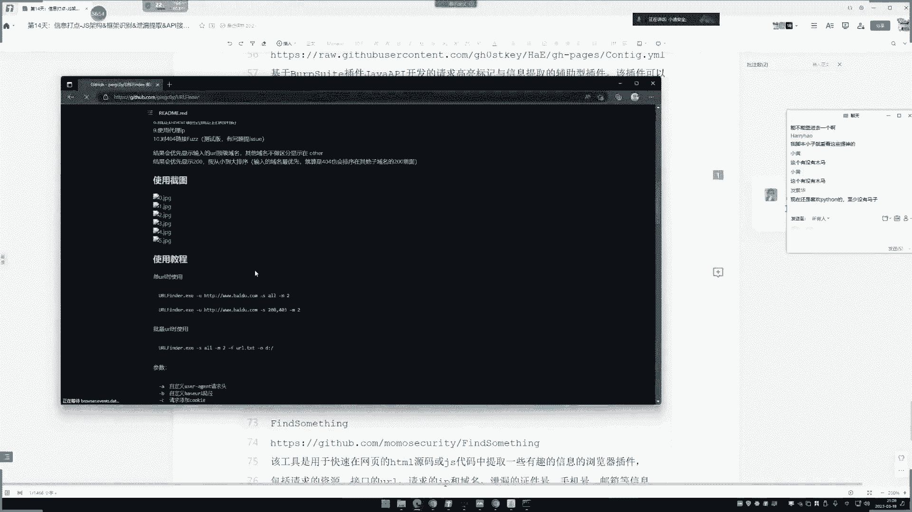

加上这个东西就可以了，来我们来用一下。

Don't you，目标地址后面的是这个东西。

我们来测一下，看他能分析什么东西出来，还是用刚才那几个点奶吃。

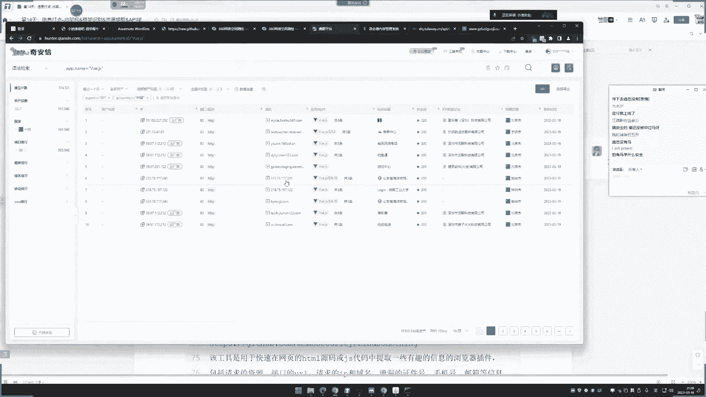

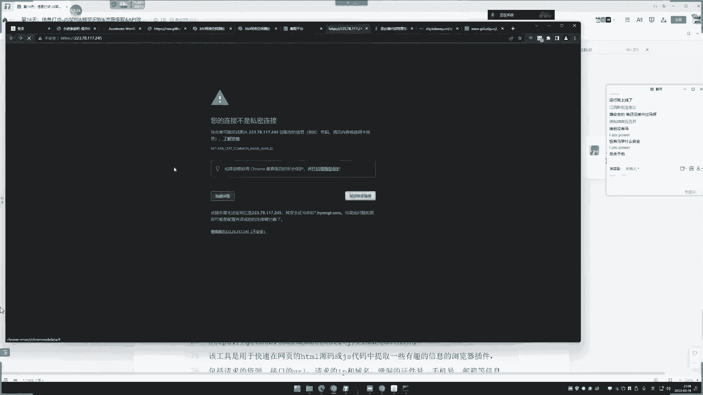

我们这里说一下啊，不要大家去下去乱搞啊，这个东西呢只是说作为一个工具的测评啊，你看看这个是他爬了很多啊。

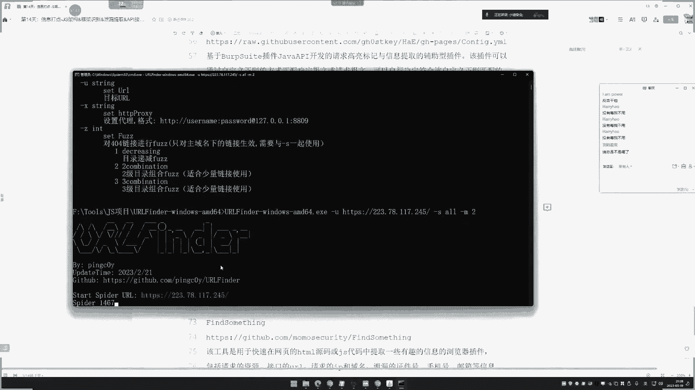

这个就带颜色和那个用插件一样，这好多啊，这个信息太多了，这个好多啊，再换一个吧，换一个少一点。

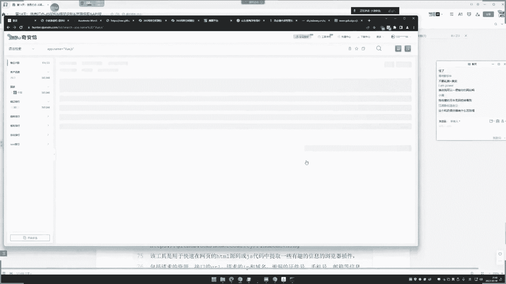

这个太多了，这个太多了太多了，换个小一点的，路径太多了，那等半天分析半天，他这个深度比较深，你不会也多吧，搞早点搞早点啊。

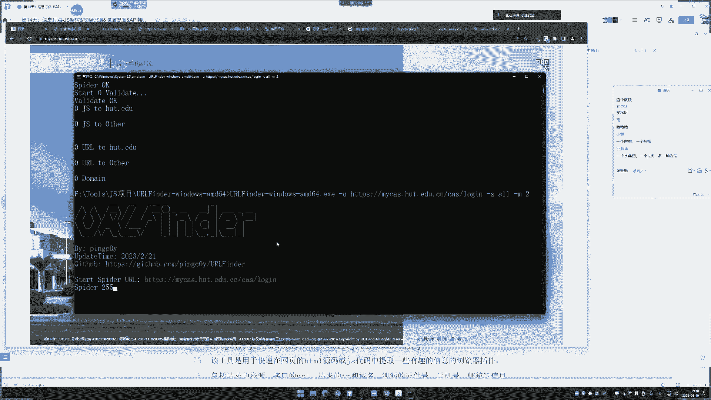

数据太多了。

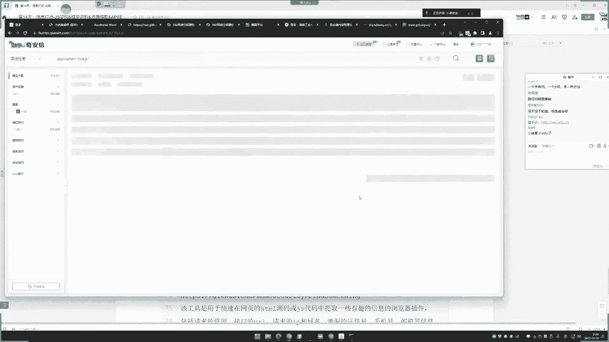

还要处理半天时间，等不了，这个应该差不多了，这个快一点至400多个信息，这些工具呢都是通过他去分析JS里面的一些，就是说我们刚才是人工分析嘛。

他这个呢就是采用工具帮你自动分，分什么东西呢，就是分的那个JS里面涉及到什么敏感信息啊，接口地址呀。

包括泄露的路径，你看这帮你分析，你看他发现这里呢里面分析到一个email地址，那第二个号码没有分析到域名，涉及到五个几个域名，然后呢你看啊11个外部域名，这可能就是它加载的什么一些外部的一些接口。

对不对，然后你看啊这里涉及到各种各样的啊，我们可以往上面继续看，然后这里呢你看啊有这些路径啊，谁知道这些各种各样录进来，这里有excel，但我不敢去访问，那搞不好要爆出这个用户数据咋办呢。

还好啊，没有让我登录进去，登录进去，这里搞不好这个录进去看看excel，我怀疑这会包出什么这个excel的一些东西啊，你可以看到它的状态嘛，你可根据状态码去显示它，提取出这个JS里面的一些接口地址。

你看得下了很多，那你告诉你帮你分析的这么多，就是从这个结合里面，提到了这个各种各样的地址，而且他帮你自动访问的，也让你知道哪些是存在的，这是他提出的JS文件这么多，从这里提取到的，怎么提的呢。

其实非常简单，就是我们人工的，那你看这里呢，这个路径应该就是那个，忘记密码的一个应用对吧，那很多啊应该根据这个上面的这个回旋状态嘛，哪些人能够访问，你看这里面还有这个地方是吧。

你可以根据那这个返回的标题是安全中心，如果有一个不一样的，那应该就表示安全中心，就是我们说的登录那个地方对吧，如果有一个不一样的，那就恭喜你挖到一个未授权的，你说这简不简单呢，为什么这样去理解它。

因为你看啊他的这个页面是个安全中心，你去触发这个从JS里面提取出来，又要路径，你去访问他，如果不是安全中心，那就说明你绕过这个登录吗，能理解吧，是吧，这个安全都是安全中心，我们就不一定看了啊。

我就说这个意思啊，大家理解可以，因为我这是随便找的啊。

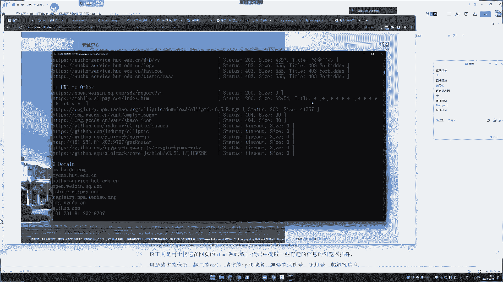

我也不知道是个什么情况，对不对，随便找的啊，随便抽的，也不是说我们奔着这个挖洞去的啊，本身就是说测试下这个，这个工具的一个情况是吧，我们再来换一个这个测一下啊，我找这个国外的吧，我不搞这个。

唉有些目标太敏感了，我们不能乱搞，我显示多一点吧，100页，这只是用的VV的一个测试，其实还有很多很多项目都可以搜，不是说只有这个VI，VI的框架开发的那个测试的列表，这什么鬼东西啊。

他妈的看一下是不是S啊，哎呀，唉这也往后面放着什么鬼东西啊，都是些，哎我们不撤了不撤了啊，反正都，你用这个东西也给查啊，这都是可以自己分析的啊，这个，我们也不好说怎么去继续演示啊，哎这里面的这都不好搞。

都是些。

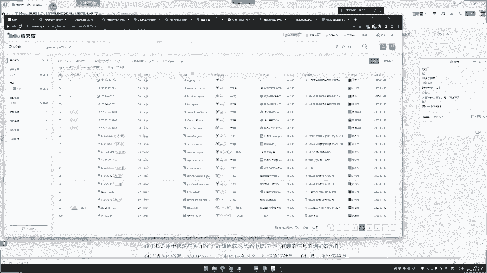

这个我们看一下看到的一个小的情况，那不是叫你往东，你自己下去看就知道。

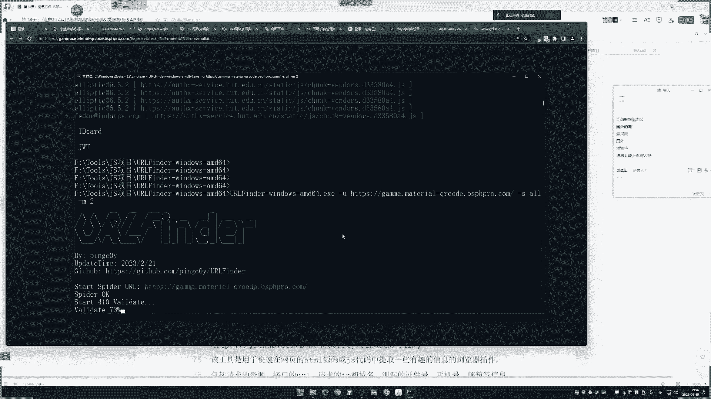

然后这是这个项目，然后呢还有我们这JS干这个，你用和他差不多功能，这个是我刚才说的浏览器插件，已经给他安装了测试了，还有一个就是我们今天主要介绍两款，FFUF和park f u z z，FUF是干嘛的。

它是一个专门强大的FUZZ测试模型。

啥意思啊，我们给他演示一下，这个测出来了啊，你看啊这个是它的一个结果，大家可以看一下啊，来嗯他也是一样，从里面去剖析出这个标准压的一些地址，和他的一个路径结构，大家可以看到哈。

对这个我们就不一个访问了啊，你可以看到上太多了啊。

好我们现在呢就给大家看一下啊，这个FUZZFUF这是干嘛用的，然后这里呢给他提供一个单点，这个单点呢大家经常会用到的一个支点，下的单点，经常有人问一些支点怎么下，你看啊，他这里有很多根据不同的地方啊。

比如说我们下载的啊，我先把它翻译，会英文啊，那我们找一下啊，这里呢找一下这个，DR的一个扫描字典，ATM的字典好，我们可以翻一下，还有什么JSP的，看到没是有JS的，2月去年12月28号最后一个更新。

45。1兆的一个站点进行下载，啥字典呢，就是一些常见的文件名，那很多啊，这里都可以下载到，还有一些这个什么其他的一些，各种各样乱七八糟字典啊，都有你自己上面都去找到啊，那还有一些什么各种各样的话。

你自己下去找吧，我这边就下我要JS的一个字典呢，下个最新的我已经下载好了啊。

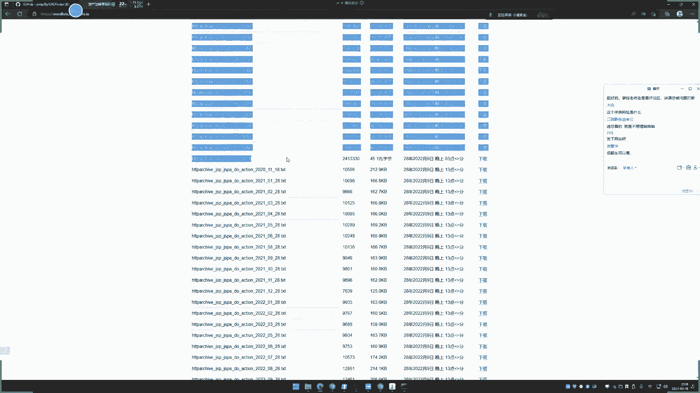

网址多少，笔记里面有啊，来看一下这个下面FUZZ他是干嘛的啊，来这是我的字典啊，我下好了，我给大家看一下是什么东西。

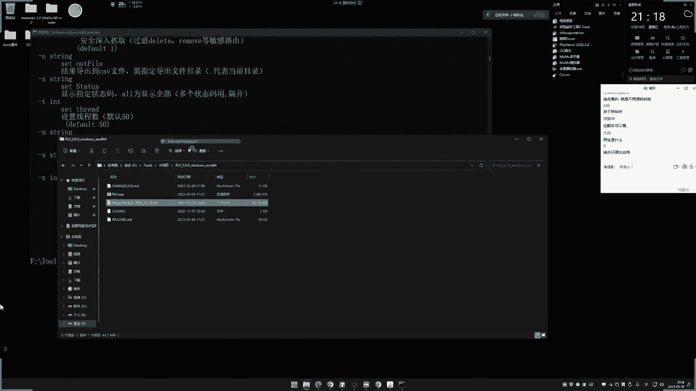

那是不是各种各样的JS文件命名的，你可能会问这个东西有啥用啊。

我们加载的这些JS文件的时候啊。

我们在加载这些JSJS文件的时候，大家应该都知道它加载出来之后，我们是从这里去翻一些关键资料啊，就包括我们后面有些工具，它都是基于这个暴露在JS里面，从JS代码里面去分析一些关键字。

分析一些这个路径地址，然后把它编辑出来的。

对不对，也就是说一句话，这个JS文件越多。

我们分析的信息就越多，但是有一些JS文件是我们看得到的。

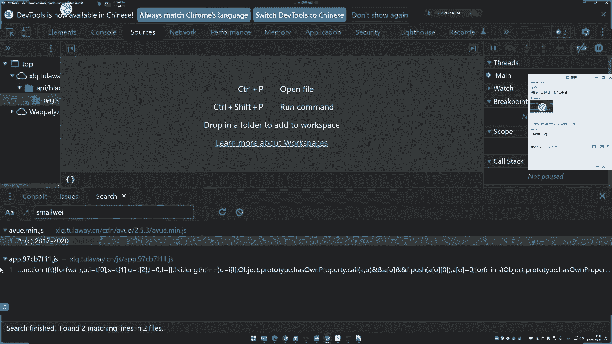

有些是我们看不到的，啥意思呢。

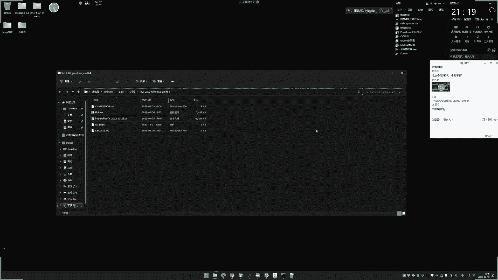

这个能不能理解，我打个很简单的例子，就很简单，我现在没有登录它，它加载的就是我登录前的一些JS要加载的，但是如果说我登录后，他是登录后还会加载一些另外的一些JS。

就是不同页面和不同功能就会加载不同的JS，但是有些JS呢我不知道他路径，因为我没有登录他，我哪知道呢，所以我们就采用爆破方式，就说强制性当中它能够编出更多的JS，就是我们这里看到的很简单啊。

比如说下下下载啊，我来看下这个路径，我不用这个。

我们拍用这个试一下啊，这是哪个地址来巡逻船的啊。

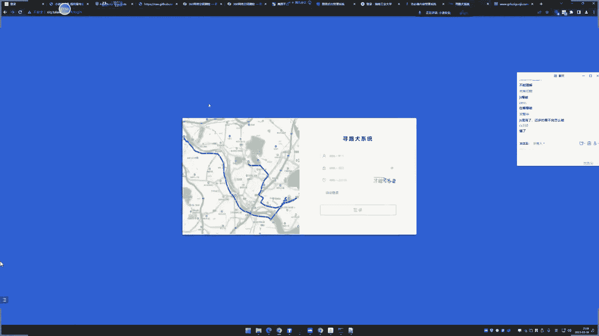

你这个测试啊，你比如说像现在啊，我在这里我看一下啊，它加载哪些我们可以做个对比啊，这是它加载的JS文件，你看啊，就是只有这么多，你不会出其他的了，他只有这么多，没有其他的了，然后然后这个多么呢。

是我查询自带的，这不是他自带的啊，这插件自带的，然后这里是他一些东西，有些还是一个访问失败的状态，还有一个304，看到没，而且有些人你看啊，他是另外一个网站的，你看这个网站域名是哪个域名。

它这个是我把pi就加载外部的一些建设文件，然后这个是内部的那个，对不对，在内部的地址录音，那么意思就是说这是他默认我们访问这个地址。

它加载JS，我们用这个思路的意思就是说让它能够加载，测试出更多JS，这样子就能分析出更多的接口。

能理解吗，就是扫到更多的JS，然后呢我们就能从更多的JS里面再找找，看有没有更多的信息，然后怎么操作他啊。

给他演示一下，好，这边呢有它的一个使用索命全英文的，外国的项目，这个项目达到了8K的关注量是非常高的。

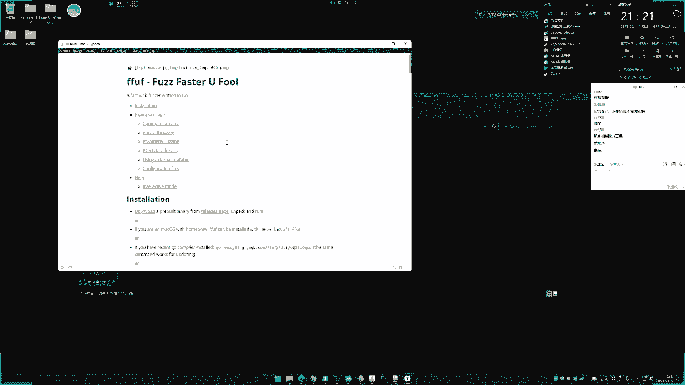

关注量，一般项目的话过1000K都比较致命了，那加杠W，他这个上面有显示的这个语法的一个大概介绍，然后再加上路径地址，看到没，那我们写那个路径，这是我字典吗，把字典的写到这里来，再上杠U嘛。

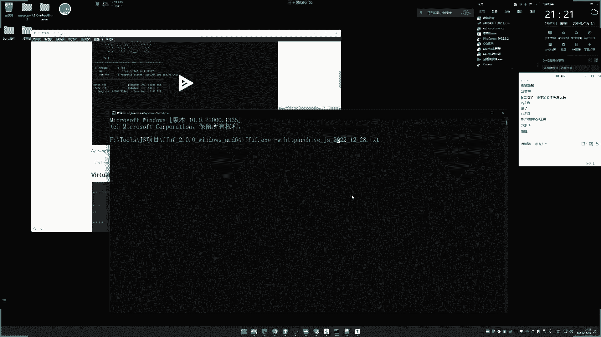

我的这个目标地址和更多参数，那我就不一一个给他说了啊。

后面再写上个FUZZ，大写字母表示说从这里开始进行FUZZ，然后呢杠M200就是线程吧，应该是回撤，打错了，打错了，我看看例子吧啊你是这样写的哦，这里还加这个杠MC哦，杠MC这个是这样写的哦。

对着写一下啊，把这后面的去这样去写，看一下是什么东西，等一下，重新看一下啊，刚，M 2c200，我看一下这个是不是，你看他就基于这个爆破了啊，然后我这里的200就是说存在的，你看有这个字典书呢。

有241万。

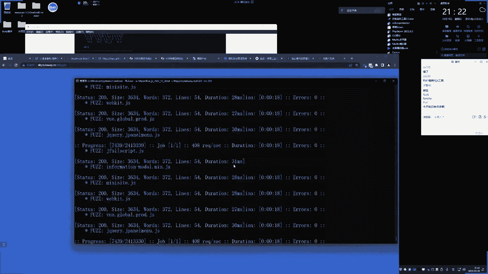

我们可以再继续的测试一下另外的几个东西。

好拿这个车一下，看这个了啊。

先把他的JS呢拖一下，看看他JS的一个下载路径，那这是他路径地址上面的一个JS路径。

可以测一下这个地方。

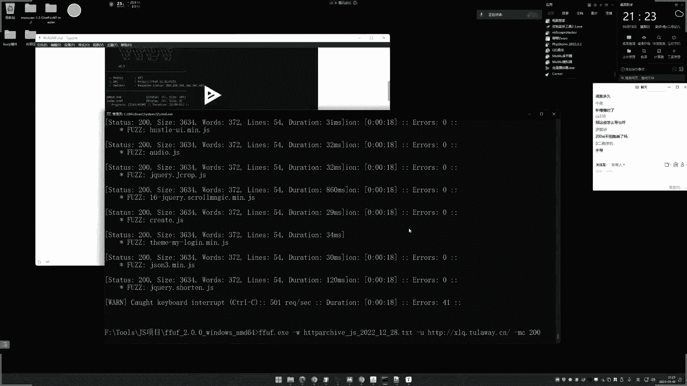

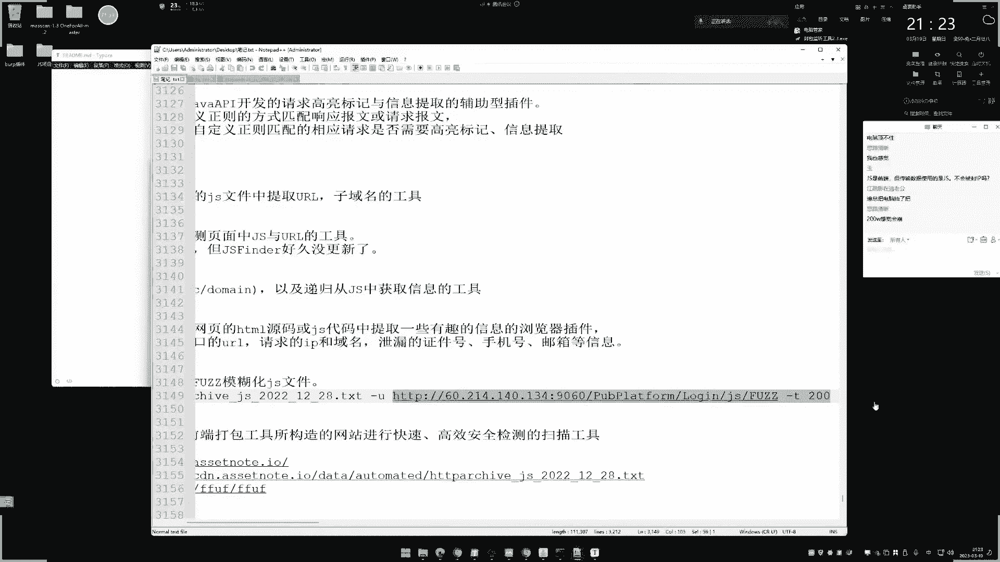

刚提哦，刚踢死那个县城，我一直搞错了，FUCC杠T200，呀开车了，看见没诶，放最下面的，那他也帮我骑车了啊，现在开车了，有的就会显示出来，没有的就是没有来。

我这里有个案例，大家看一下。

我这个来测一下啊，嗯你看这个就测出来了，有这个路径呢，测出来这个路径的JS呢，飞鱼的MD5的就算有这个路径，你等下可以自己去访问你，他用这支点，那帮你去跑，人家尝试了一些路径地址，有200多万条的，测。

干杯。

你看一下这个地址啊，来这加的一个访问，就我刚才那个测试一个网站啊。

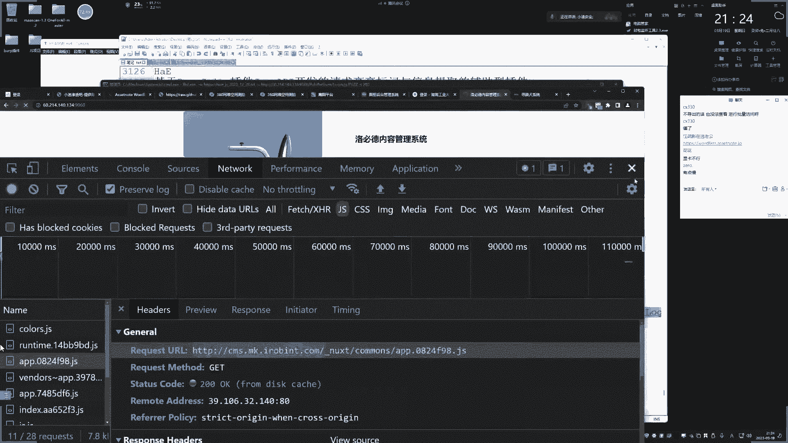

嗯就刚才吃的那个网站，就这个地方吧，你看他车道的路径，我们可以尝试访问，是不是有啊，你看啊。

logo点JS看，车辆是根目根路径嘛，反问啊，扫尾啊。

打错了吗，他那个logo应该是他那个路径下面的，我们来看一下，在这里呢路径应该是加上这个路径啊，在这下面他在这里测的。

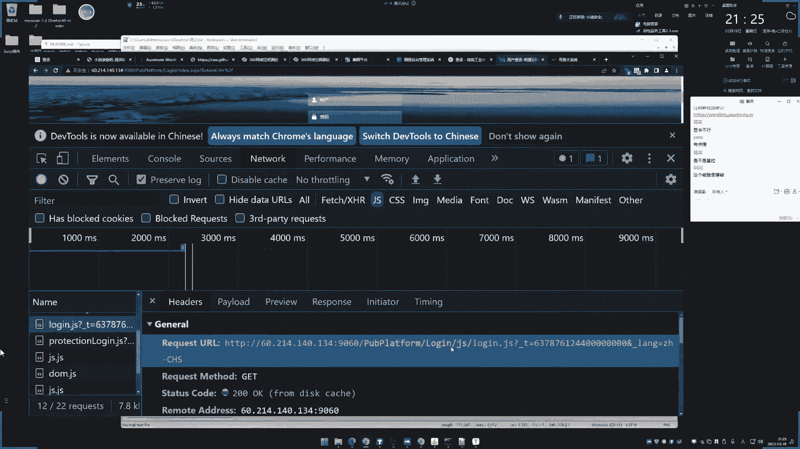

然后你看他这个上面加载的呢只会有这么几个，你看它加载几个，一个两个三个四个五个六个七个，然后这个JS和logo是那个插件的呢，是我们那个电谷歌查询的，所以他不算那1234567完了，但是他现在你看啊。

那他把P1P都帮你加载出来，来这里加了一个one js也加载了，那各种各样的这种的都是忘加出来，范围200的3。2的，也就是说就是一种包括JS的一种手段，因为你页面中展示的JS只有那么几个。

他就强行用这个工具来帮你去爆破，看有没有一些你没有找到JS的路径和文件名，找到之后呢，你可以针对这个JS去访问，那么从这个JS访问的东西再去提取。

而我们在工具里面是能够分析的，就我们讲的这几款工具里面可以直接加上JS，让它去分析JS文件，所以我就可以利用这个工具来做个什么事情呢。

就是把存在的JS把它保存到列表里面。

就是说存在JS路径全部保存出来，然后呢再利用这个工具去帮我自动化分析，这个JS里面存在的什么，存在的一些路径和一些东西，比如说之前呢是利用这个网站展示出来的JS呢。

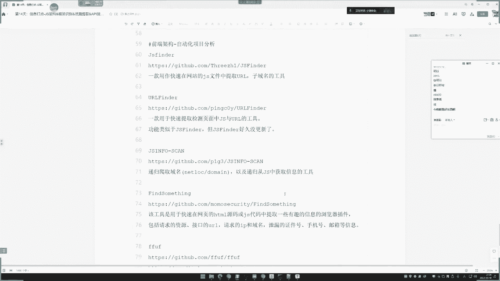

去分析结果，现在呢就是说除了这个之外，我另外再用这个FUZ跑，跑出更多的JS文件，然后再把更多的JS文件给他，怎么样，给他再用工具再从里面去分析，就是未知的，也把它拿出来分，就是这个意思啊。

所以这是这款工具。

就是我们说的直接爆破这个JS路径结构的，因为你包括出更多JS，那么意味着里面泄露的路径和更多东西，那就更多是吧，还有一个那就是我们演示的第三个，最后一个public fire。

这个呢是一个web p AC k的一个打包器，是啥意思呢，这个不是针对JS的啊，它是由于啊这个web p a k d呢，给大家简单解释一下啊，它是一种基数，它是用于这个用JS写的一些代码。

然后一个打包工具，就是说有些网站有有些网站没有，就说别人把代码写好了，他会用这个打包，而你如果用这个打包的话，他可以用这个工具呢把里面的东西进行分析，那我给大家演示一下啊。

比如说我们这里找一个符合这个目标的，一个测试啊，找一个web t，诶这个找不出来呀，直接在搜，还找不出来，直接搜这个名字吧，他应该不是app的一个选项啊，这应该有一些了。

用浮粉色还好一点，否否呢，还自动帮你去把那个语法帮你固定出来，他这个有时候你语法书不对，他还不给你出来，来识别一下啊，如果有的话，会在这里显示，在这里显示一个杂项，这个是没有看一下其他的。

看这里杂项这里看到没有个叫WEBPACK。

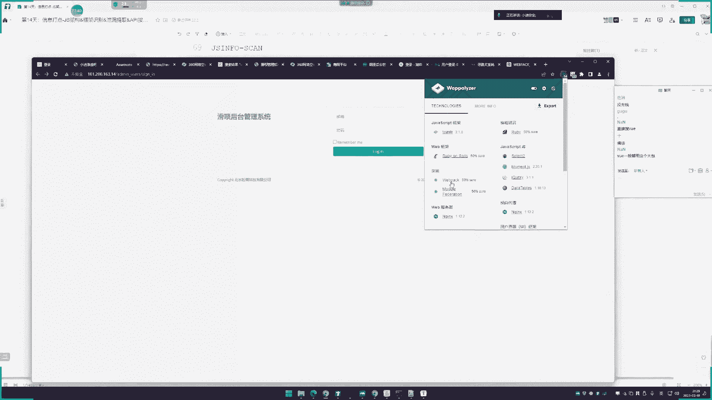

看到没，这个就是打杂项里面找一下。

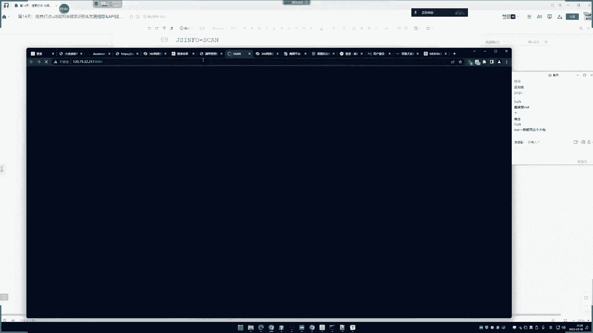

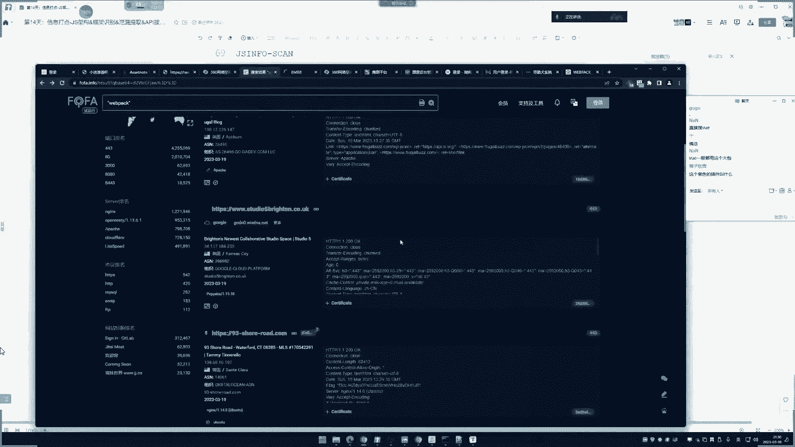

哎呀这里面吃吃这卡呀。

这些网站都。

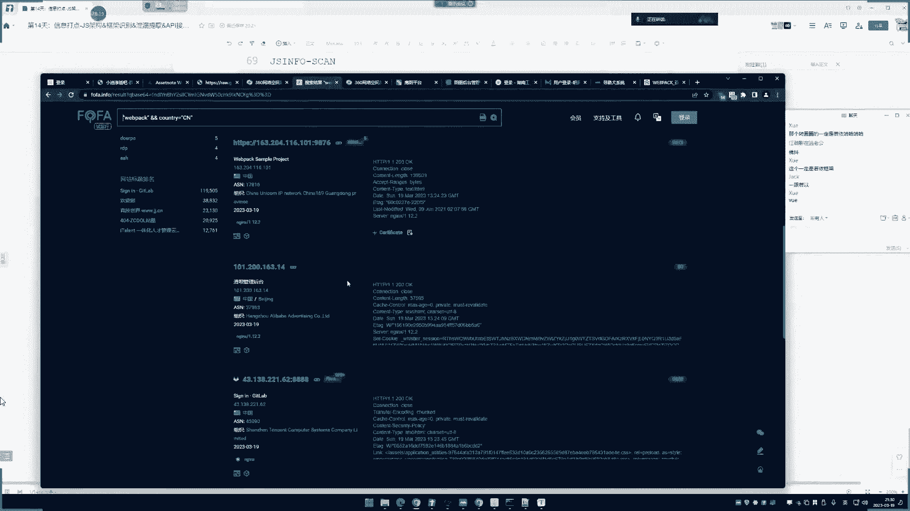

查下里面有这个技术是吧，然后你看它有什么作用呢，来给大家演示一下啊，这个是针对打包期的，它不是针对JS的啊，就是说你JS项目很多会用到这个打包期，是这个意思，因为你可以看到啊。

这个地方它用到的是JS项目，对不对，然后这里看是不是有人用这个打包器啊，是这个意思啊，也就是说用这个项目呢，是刚好是JS里面喜欢用这个打包机，但是说如果他没有用这个喇叭器，那这个就是没有用的啊。

你不要搞错了啊，它是一个跨一些针对这个打包器的一个检测啊，演示一下，嗯park使用方式呢也非常简单，杠U加上目标地址回车，它就会自动帮你去分析，它会自动将这个打包器里面提取一些JS。

然后从JS里面去分析里面有没有一些安全问题，同时生成一个报告给你，就针对这个打包器的测试，打包器呢是我们JS里面的一个测试，你看他测试到发现一个高危啊，领个高位，一个中位正在生成报告。

报告呢就会在这里产生，我随便找了一个测试站点啊，你看这里呢我们看一下啊，呃刚才测的是哪个啊。

打开看一下啊，这是它提取出来的一些场景JS，然后呢他说到这里有个敏感信息泄露，从这个JS里面发现一个敏感信息，这个是啥敏感信息我也不太清楚独立。

那你可以多吃几个啊，多吃几个，只要说用web pc打包起来就给吃，看这个，那他也帮你自动提取JS，然后从里面去塞。

而且会筛选一些场景，微收权信息泄露啊等等啊。

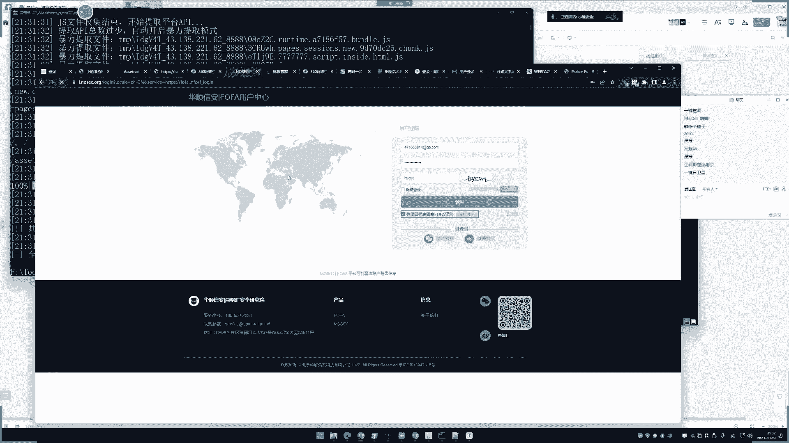

啊这个用的打包器我们可以在这里看一下，用它来测试一下，在这里打包器的啊，前面几个是针对原生JS的一些东西，这个是针对打包机的不一样的啊，不要搞混淆了。

有些太卡了，这个，然后呢我们大家看一下啊，我现在呢也是发现个中位，我也不知道这个中位是啥，再等一下吧，等出来。

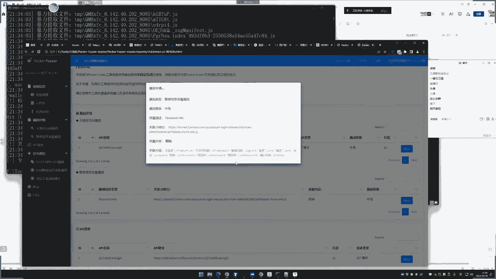

嗯结果出来了。

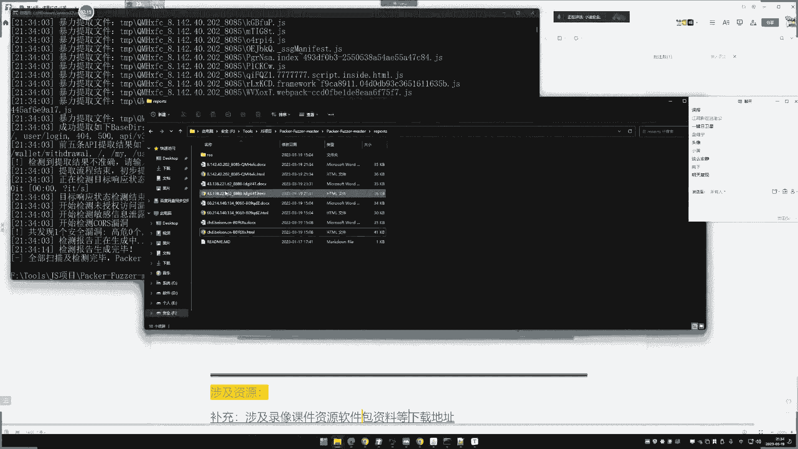

JS里面谁知道阿卡斯K啥东西啊，从里面提出来一个AIAGASKE，大家看了没，我不知道了啊，我们不看这下面的东西好了，我们再给大家看一下啊，今天就来到最后一个点了工具。

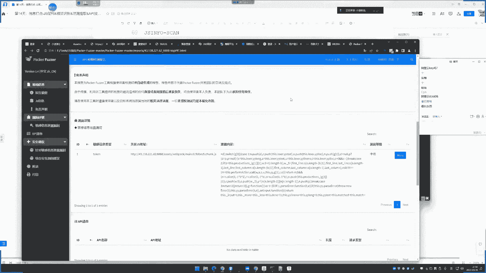

我都给他演示完了是吧，现在我们就给他看一下啊，免得这个说伤了，也不知道上的是啥，究竟是有啥用。

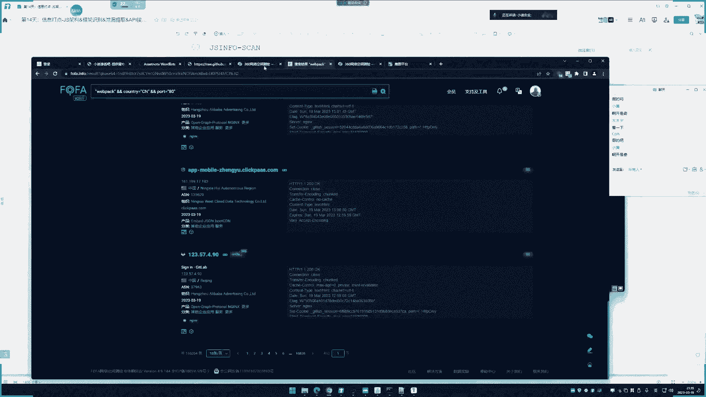

其实我跟你讲啊，你后面学到一定程度后，这个结构是非常有用的，有些人是听不懂，思路太窄了，还不知道这东西有啥用，你看一下，我给你看一个赞，我们打开之后呢，然后我们就用我刚才说的。

不管是用什么unified啊，还是什么鬼东西，人工分析啊等等啊，你看能找到什么东西，从JS里面我们为什么要进行打点，用这个工具也好，消灭也好。

东西也好啊，一个实际案例就能帮助你了解通透啊。

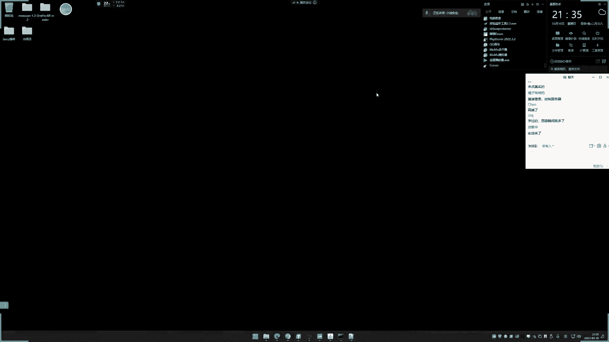

大家看一下这个章啊，那就这个章，大家看着啊，我刷新一下，我现在识别下来，确定它的一个基数是什么，唯一要有这个框架是吧，是我们说的这个类似JS的好。

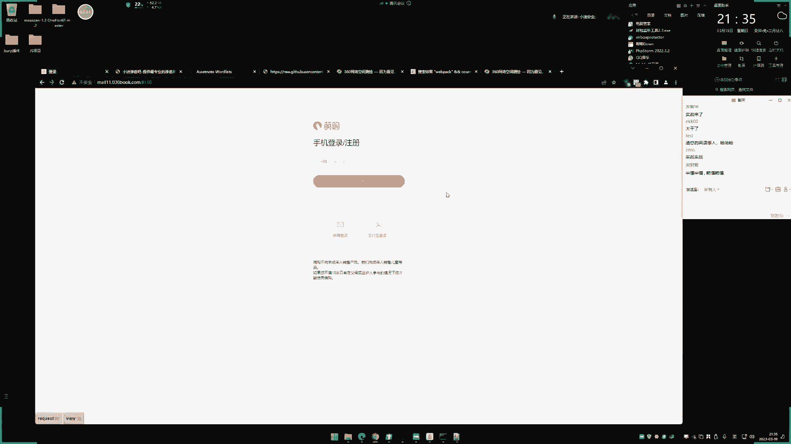

大家看一下啊，我首先人工分析。

看一下啊。

诶我搜一些关键词，比如说我搜什么，获取一些敏感信息的一些关键词，或者说获取一些接口信息关键词，比如说像我刚刚说的3K，大家看到没什么东西啊，Tcloud key。

还有后面的阿里access key啥东西啊。

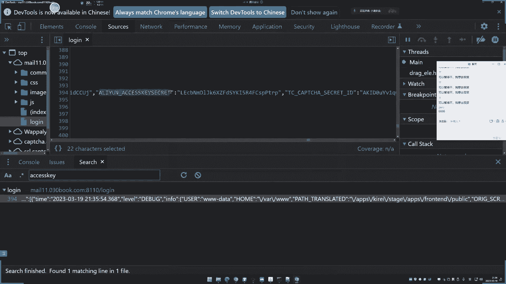

这啥东西啊，再来看这个插件，看插件啊，插件帮我检测到是什么东西啊，谁造的邮箱，这个什么鬼啊，一些个人邮箱还在谁，身份证才检测到，好看往下继续翻啊，翻翻翻看了阿里云K指向一个地方呢。

阿里云k os boot tc什么东西，taka coder来腾讯的，阿里云的dB database，host password的啥东西啊，这是啥东西啊，不知道啊，对不对。

所以说这个讲课这些东西其实都是为这些事情，我把这节课把这个东西说了，一个是说未授权访问微商访问是什么意思呢，就是从里面去爬取，对不对，JS里面去分析到更多的一些URL来访问，确定一些这个接口啊。

问接口路径访问是吧，去确定，然后这个你看K那就是JS文件中，可能这个配置了什么一些这个接口信息是吧，你比如说像我们说的人应用的什么短信，应用的是吧，还有一些这个发邮件的数据库的灯，对吧。

接口安全又是啥意思呢，啊接口安全就是我们说的啊，像什么代码中的什么这个加密提交参数，传递更多的欲望，如今，说去说来，这个JS的大点都是为了干嘛事情呢，就是为了干嘛事情，就是从JS文件里去提取有用的路径。

JS文件里面有写，有没有泄露一些这种常见的我们说的配置信息，账号密码呀是吧，登录K呀，配置K呀，还有就是我们说的把代码理清楚，能够知道它是怎么登录的，登录地址是提交的哪里，出发地址是哪里，其实这里呢。

就是如果说你有代码基础和开发经验的话，应该你就知道这个东西意味着什么事情，我们后期呢这是个大点，后期呢就是关于这个JS这个渗透测试呢，我们也是有相关案例呢去给他演示的，就是如你把这个接口找到之后呢。

把路径搞清楚是吧，根据代码呢去测试，包括我们讲那个开发，用JS去开发一个简单的小案例，就是让大家都能够明白这个道理啊，你就明白为什么要去打点拿这些东西，为什么要这样做，你因为你从开发的角度去讲的话啊。

你就能完全明白了啊，你只要把这个上面我们的核心这一句话写清楚，就是这个上面一句话很重要是吧，从里面去提取敏感信息，得到更多的这个育儿低脂，还有这个发现了更多的JS，就说它是很多角度工具的几个方面。

都是这么个情况啊，你看呢这个工具是从里面去提取这个什么药炉，进行子域名，哎这个工具这也是提取的信息，然后呢它比它功能更加强大是吧，然后呢你也是这个是个浏览器插件，更方便了。

然后用这个呢是我们FUZZ它是干嘛的，就是说前面几款工具呢，都是用来去从JS里去分析，而这个就不一样了，这个就说他不分析，他就直接跑，就是你下面还有没有其他JS，我全部帮你弄出来，那么有更多的JS。

我们就能更多的去分析到更多的接口，简单的说这个工具就是啊遭到更多的JS文件啊，分析更多的信息，就这只是它的作用，然后这个呢是针对的什么这个JS框架开发的，这个真的接着开发了打包期。

WEBPACK的这个什么检测，他就说不是单独检测它，然后前面这几个啊，这几个都是干嘛用的呢，这四个都是干嘛的，都是从这个什么JS中去提取什么URL啊，或者一些这个敏感数据，对不对。

他们这几个基本都是做这个事情啊，都做这个事情，没有其他意外，然后下面这两个就不一样啊，一个人对打发起一个呢就是自己呢找更多的啊，利用这个FUZZ就是我们批量的爆破啊，类似的啊，用支点上去跑。

是不是还有其他SAZ，因为前面这几个全部是从页面加载的JS去提，它是从他表现出来的，就这几句话，从表现中的JS去提的啊，你不要搞错了啊，原理不一样，然后我们这个前面讲的这些什么茶几。

也都是说从他表情中端再去分析，从他表演中去分析什么插件安装的高亮显示呀，颜色区分都做这个事情，总的来说，这节课呢就是解决几个问题，解决什么问题呢，我们把它具体写一下啊，就是让你明白一个问题啊。

解决什么问题，我把它写到这上面来吧，如何第一个是几点，从这个标这个标签中的这个JS去提取价值信息，这几点，第二点啊，如何从这个，如果从这个地址中啊，FUZZ提取未知的这什么JS文件，第三点。

如何从这个JS开发框架WEBPACK，进这个测试，对不对，然后啊，为什么要提取价值信息，提取哪些价值信息呢，我刚才也讲了，配置信息，用路径来测试微生相，访问各种各样的。

这个呢就是提取更多的这个什么未知的JS问题，就是你不知道的，用它爆破出来，有了更多的JS，就有更多的价值信息会出现，一个就是扩大战果，一个就是从已知战果上面去获取。

因为椅子上你就说已知已知的JS文件没有的话，你就想方设法的去及更多的JS再去获取，能理解吧，好今天就说这么多了啊，这个东西就整理到这里，其实你把它一总结，你就知道我在伤啥什么内容了。

如果我不把它总结的话，你就不知道我在讲啥啊，然后也清楚啊，这个是针对JS的这个网站应用，那如何判定是JS的网站应用呢，就是我刚才说的从这个上面几点啊，用那个谷歌插件去判断，然后呢。

也是可以根据这个下面几步而去判断是吧，你我也举了个例子啊，我的博客和我那个其他路径它不一样的啊，对不对，然后人工分析就是自己从代码中去编辑，这些关键字，来去提取更多的一些东西啊。

好我们这里的课就讲完了啊。

没什么内容，玩火我不想搞了啊，我没有搞，今天一定要知道这个东西的一个差异啊，我把那个把那个四打图吧来理一下吧，这个老师理想啊，免得下一个月要做。

好我们把这个JS的呢，web应用的是吧，然后这个是JS框架，JS前端架构的一个信息，把它整到这来，然后这里有几点啊，一点呢把放大一点。

JS前端框架的几点，我们讲了几个啊。

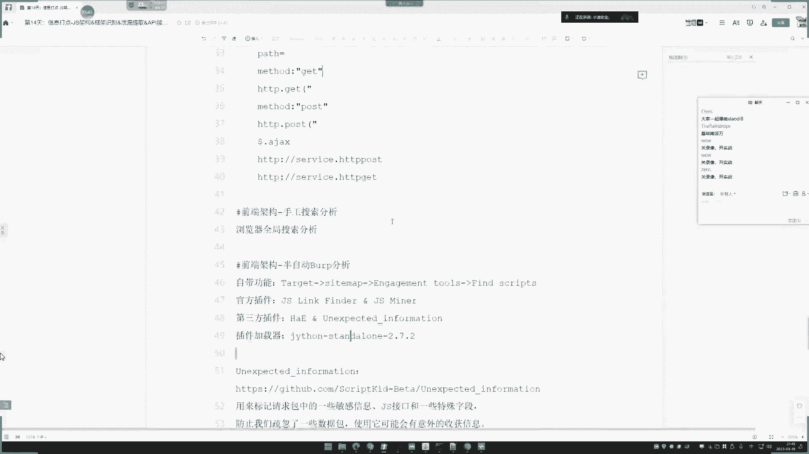

一个是说测试里，一个是我们讲的，第二个是测试方法，又加了三种，人工哎，还有一个是我们说的这个，巴普的一个半自动，然后还是我们做这个公益项目，人工呢就是我们说啊很清楚，就是全局的去搜索这个关键字啊。

一个呢第一步是先啊这个筛选文件啊，固定文件，然后全局搜索关键字，关键字搜哪些东西呢，其实就是我们这些常见的东西啊，对吧，具体怎么说呢，你就想方设法，关键词浏览器里面四大元素里面的去塞。

然后呢这个bb shot呢我们介绍了几个啊，一种是自带功能，自带功能的，还有这几个选项，去这几个插件。

自带功能的官方插件和这几个插件。

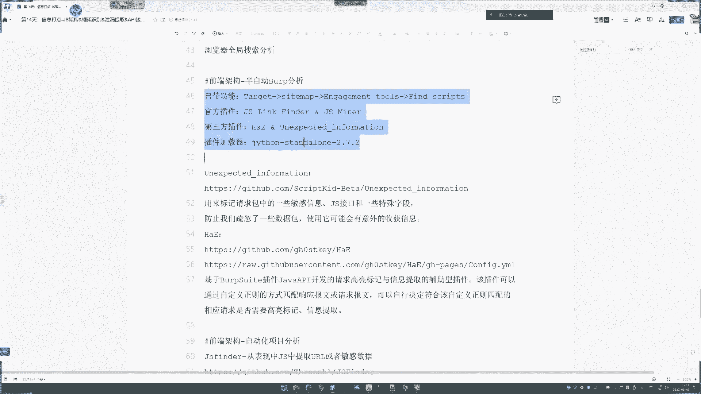

然后这两个呢是把它简单写一下，他们就是一个高亮显示，你自己下去测吧。

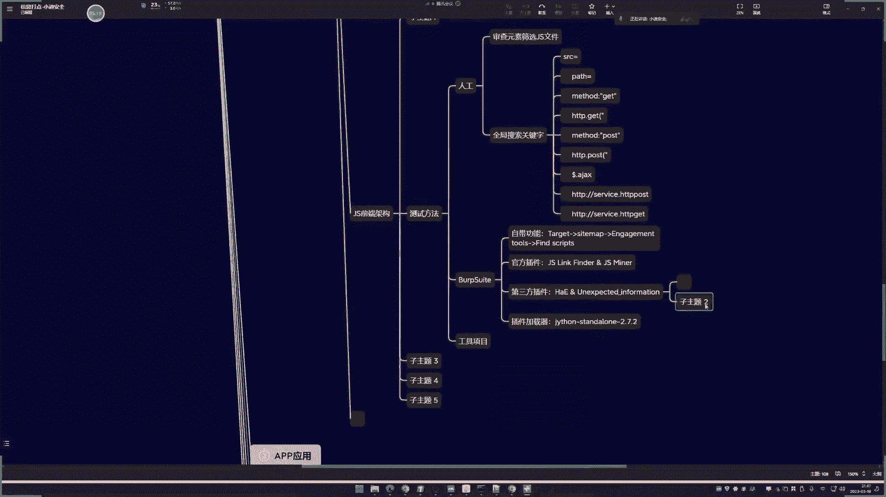

这个也不是不重要，然后工具项目里面有讲这几个啊。

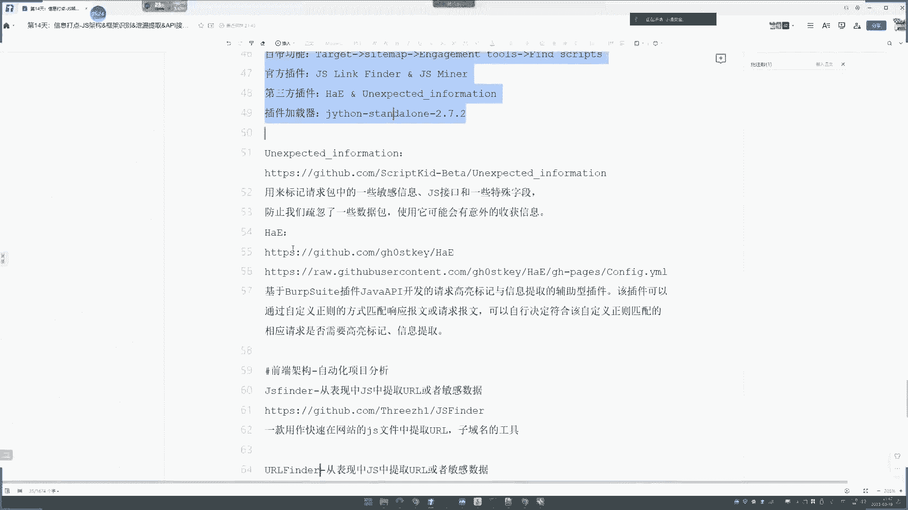

官方裁剪，第三方裁剪。

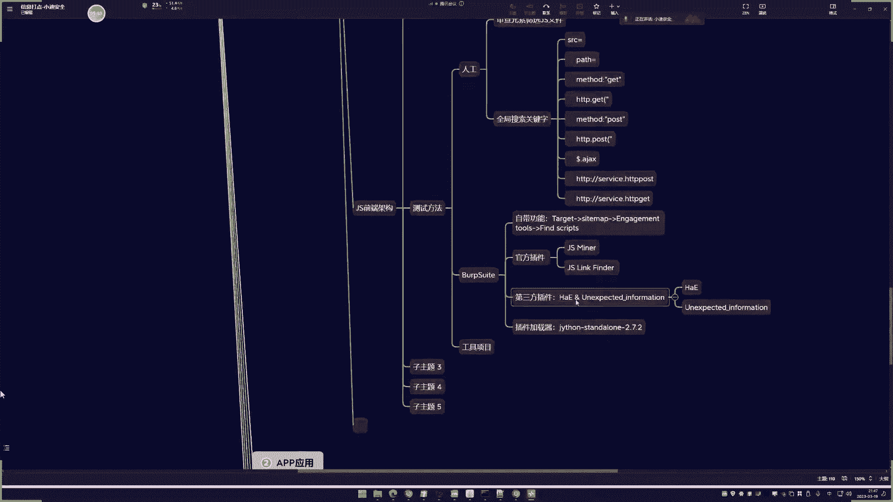

然后工具项目里面讲了这个更推荐大家使用的。

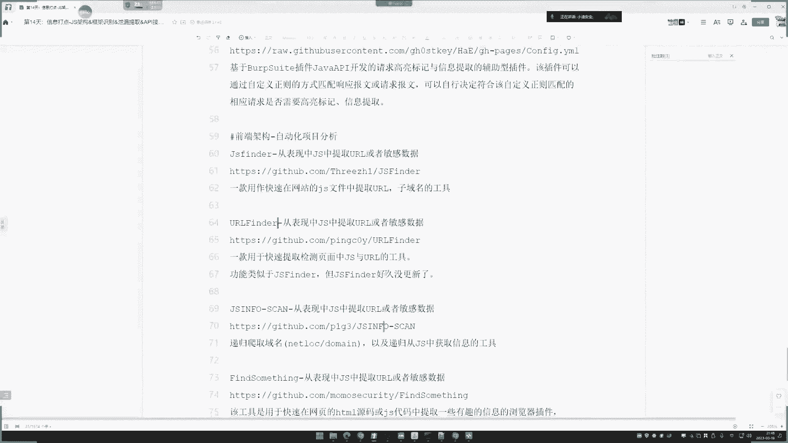

应该都知道啊，两种功能的啊，一种是这个标签，就是我说的标签JS中提取信息，进入这个信息的几个项目，还有一个就是我说的啊，这个，FUZZ包括跟踪JS，还有一个就是我们说的啊。

这个JS打包器WEBPACK的一个测试的项目。

两人住的几个啊，四个。

这个我没用啊，你得下去问一下，和那个上面第二个功能差不多，更推荐大家的，就是使用这个DUZI和这个浏览器。

这个这个是这个项目，然后这个是pk。

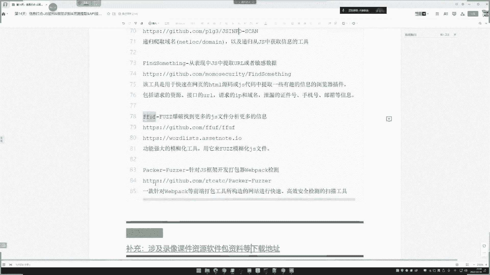

然后这个呢有个注意的地方，就是说他要加载一个支点，我给了个字典，加个触点字典呢，减笔记下载啊，好这是这个测试方法的这个人工啊。

bob工具项目的三种方式，然后呢这是我们说的第一点比较关键的所在。

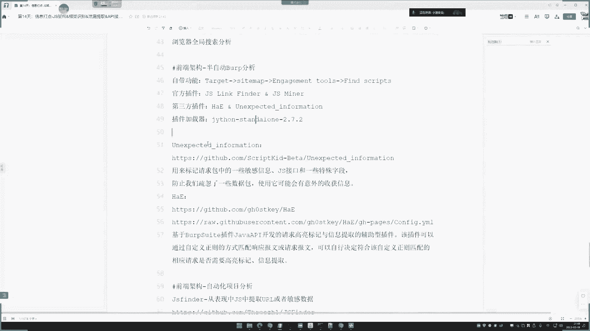

就是JS的一个概念啊，他的知识点送过几部啊，有大概这几步嘛，哈安全问题，还有它的识别对吧，先说识别安全问题。

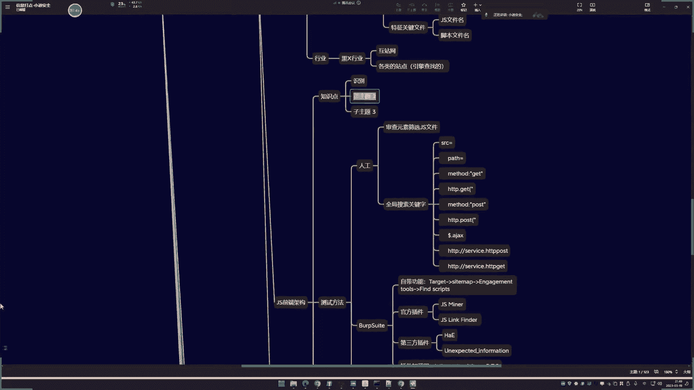

安全漏洞他们说的这个什么这个分类框架。

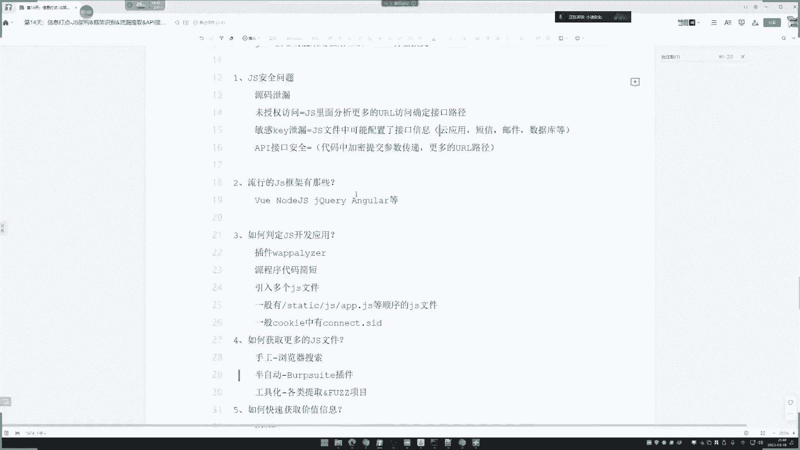

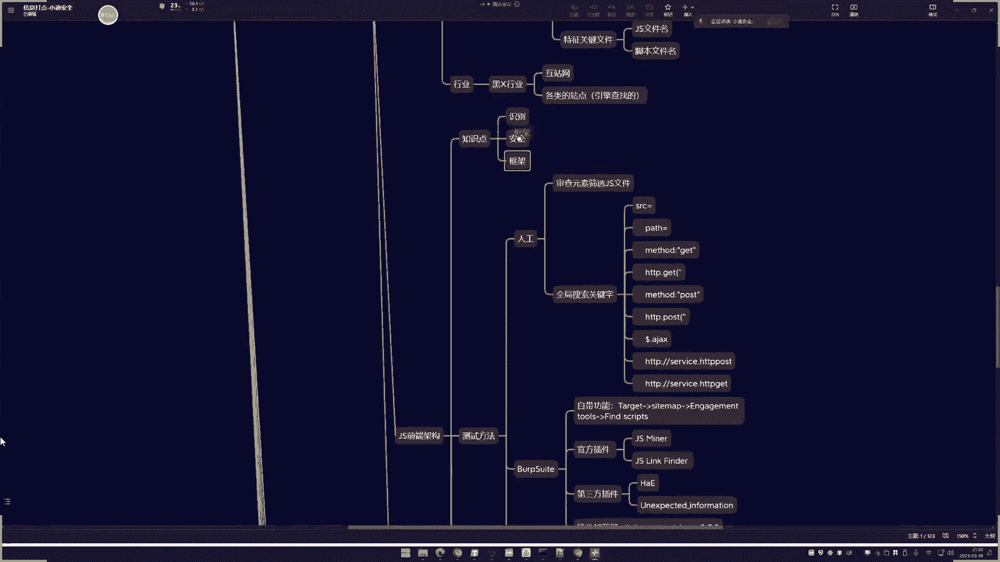

如何判断对吧，识别就判断快速，这讲了，放到后面去了，别的就是我们说的啊，用这个插件，然后再把极短引多个JS文件，这种方式，框架的写了这几个，安全问题。

那就是我常说的这几个啊，源码泄漏呢其实就是我们说的前一个后果啊，然后还有个差异和后端的一个差异。

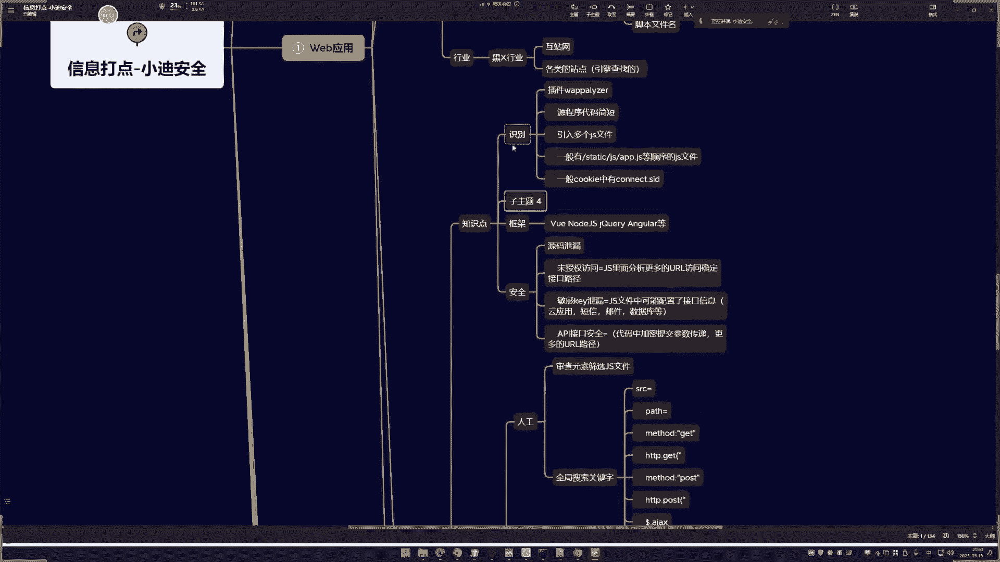

差异，那就是我刚才写的这句话。

对不对。

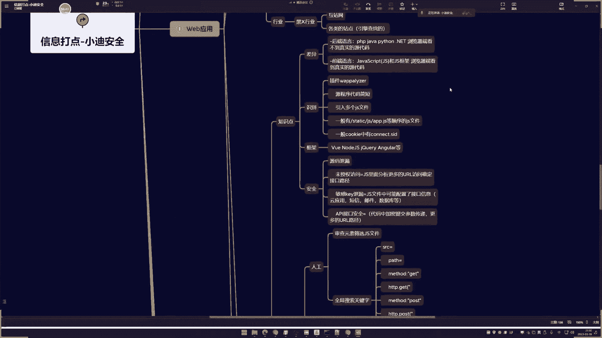

其他的没有了啊。

基本上支点就是这个支点，就是这个这个就不把它放上去，这个是那个前端JS的一个测试的一个固定好，保存一下啊，把它导出一下。

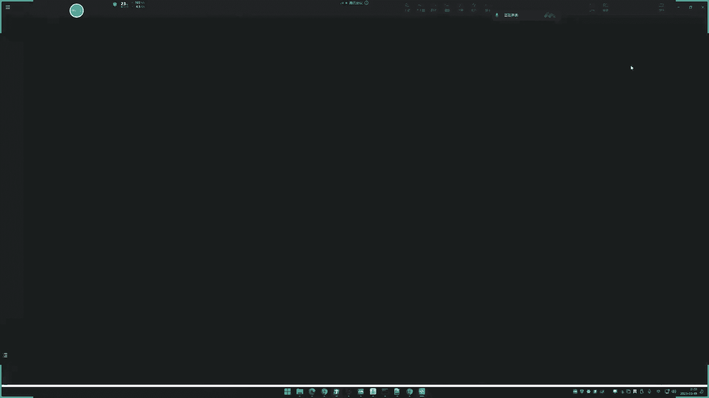

好看大家有没有问题啊，有问题问啊。

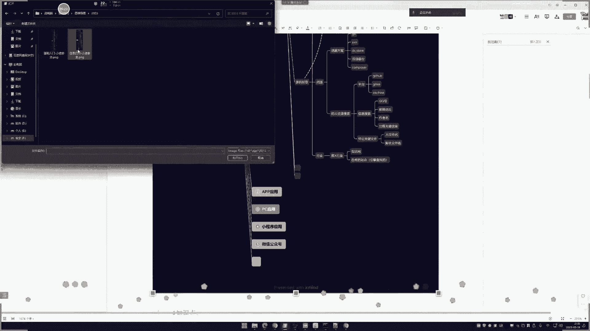

我不好再讲讲，有啥讲的，自己识别web好用，那东西用就完了。

就是个打包机的测试项目啊，就是针对JS打包器的测试项目。

没有撒打包器是什么意思啊，和你做开发，我们昨天讲的什么SVN，那个GIT那个差不多，你那个用java语言去写一个APK，他是会把那个代码封装成APK打包器。

就是那个意思，他有些项目呢，那我举个很简单的例子啊，你想我刚才用这个谷歌去装插件的时候，他怎么装的呀，他是不是要加载一个节目录啊，他其实就是那个打包器呢，就是把这个整个项目的封装到一个地方去了。

然后呢这个就行了，一个工具我们讲的都可以用啊。

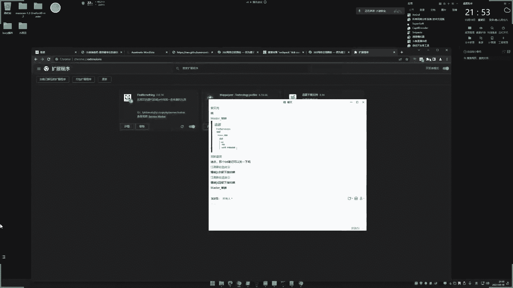

这都是说还能用的，没有用的，我没有放上去。

我也说了哪几个好用，你自己我都用了啊，你自己也看到哪个好用，你自己看得出来的啊，那个浏览器插件肯定方便啊，不管说功能强不强的那么方便，你发问就能看，也不用把东西拿出来看，对不对。

还有那个js fighter和那个u r fighter，那两个一对比，你也知道哪个好，因为我们后期会遇到啊，你比如说像我刚才说为什么对SRC有帮助呢，因为有很多现在一些这个测试的网站呢。

它都是用这个JS呢去传递数据啊，你传统的一些数据呢，你看不到，你可以通过这个JS呢去分析它传输的过程，如果说它里面有一些这个什么密码的加密方式，被泄露啊，或者说里面可能提到一些什么测试。

用户密码泄露里面啊等等啊，还包括源代码啊，JS代码中会泄露这个整套程序的源代码地址呀，啊各种各样的一些杂乱的啊，包括就像我们前期讲过的RC课程里面讲过的，你可能爬到更多JS文件之后呢。

从里面会看到有一些用户数据在里面，是不小心把一些用户数据写到这里面去，那就造成个人信泄漏，也是一种低位漏洞，也可以提交或者相关东西的啊，好今天课就讲这么多了啊，我们，下节课再见。

那今天录像呢可能稍微要晚一点才会给大家，这个发出来，为什么呢，因为有一些这个站点呢，它也是一些真实网站啊，我们把它打下码，打下码呢制作好了之后再给他发布啊，所以录像可能晚一点啊，吃瓜的话，我们先上去。

我的打码不是打过程，我是打了个底子，把那个路径地址给他打上去，你不然的话有些人下去是吧，他也跑上去乱吃啊，这都是有风险的啊，我们上期都没有注意，这一期开始我们要注意这种事情。

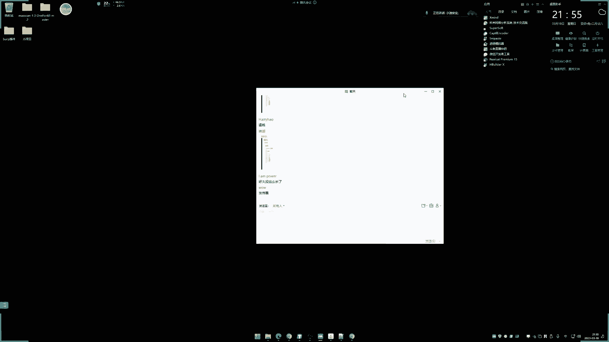

不然的话哪一天是吧。