# 【小迪安全】V2024版 全栈网络安全 ｜ 攻防渗透工程师 （持续更新） - P15：第15天-主机架构&蜜罐识别&WAF识别&端口扫描&协议识别&服务安全 - 逆风微笑的代码狗 - BV1Mx4y1q7Ny

关于这个主机架构的分析有三个技术，这个端口识别呀，蜜罐识别呀，WAF识别啊，这个相关知识点，简单来说呢就是围绕这个补充方面，上节课呢我们讲到这里是吧，你看下面还有什么这个web服务器啊，应用服务器啊。

数据库类型啊，操作系统啊，什么各种服务，FTP啊，S7啊，这种各种各样的服务是吧，还有像这个什么WAF信息啊，微观信息啊是吧，就是我们今天要上的啊，就是基本上啊，我们就是围绕这个下面这个整个东西。

上上哪一部分呢，我给他说一下，今天上就是呢我现在呢框的这一部分啊，这个部分删了，然后再把这两个部分一上，那还有什么CD和那个组件信息，那就是下一个上啊，就是上这些信息的一些识别啊，简单来说。

那么现在呢我们就来看一下啊，这个大概的一个支点会上啥线啊，首先呢我们先说这个web服务器，这个服务器呢我们在上面举例的是什么东西呢，就是这个阿帕奇啊，链子IS啊，这些东西啊，然后呢这个是啥呢啊。

我们来看一下啊，就这个识别呢它是比较简单的。

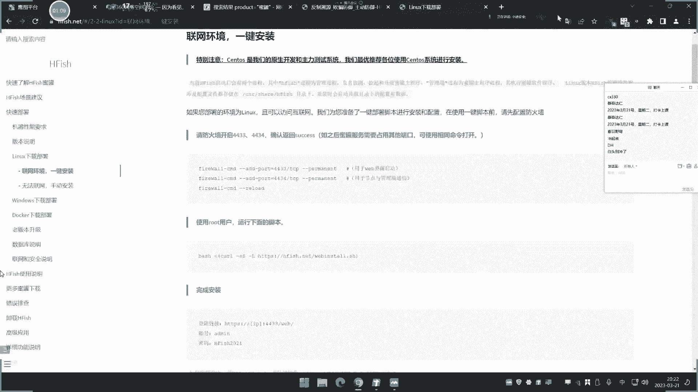

你比如说像我们这个访问一个网站的话，访问完之后呢，我们可以看一下，在这个，这他妈的怎么这么大呀，这个东西调了一下，字体太大了吧，也，我先把它调小一点啊。

要把这个调小一点。

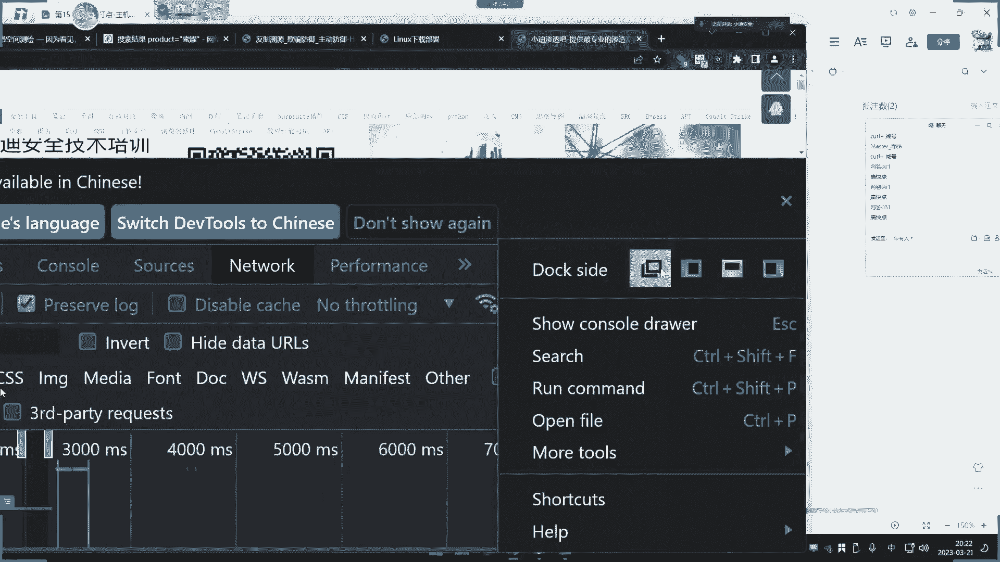

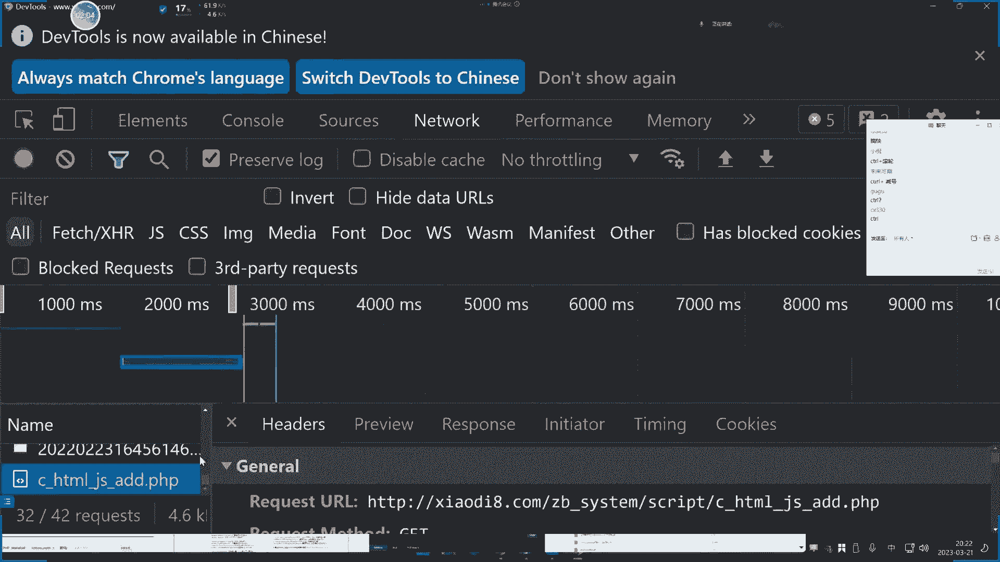

好大家看一下啊，现在我去访问它，然后你看一下他这边是一个回旋的一个码，你看你回旋的信息里面，这个server你可以看到这是阿帕奇对吧，那这个呢就是我们说可以从这个请求返回包，里面看这个server信息。

来判定它是什么一个这个web服务器。

然后这个web服务器呢是一方面啊，这是写了一部分，还得叫应用服务器，这啥东西呢，其实这两个都可以通通称为叫中间间，但是有些这个中间还有一个车型，像什么TM卡特呀，什么j boss blocc呀。

这几个这几个常见的会和java的应用相关，那这个呢我们称之为叫应用服务器是啥意思啊，就是说除了这个web服务器，他们都可以控制中间间，但是由什么称之为web服务器，应用服务器呢。

其实应用服务器呢它有个显著的特点，就是特点是什么呢，就有端口服务的开放，端口服务的开放啥意思呢，就是你安装阿帕奇的话，它的默认是解析八零端口是吧，然后就是他这个网站协议，这个这个这个这个端口。

然后这个应用服务器呢它不一样，就说如果你安装了这个tomcat jboss的话，我为了C的话，它默认这个服务啊，就是这个东西安装好之后，它会自动启动一个端口，就是代表的是这个意思，啥意思呢。

我就举个例子啊，你比如说你按照这个web来C的话，它默认的就会开放一个701当中，但是如果你安装阿帕奇的话对吧，他有可能就是发力，然后其他的也是八零，而现在除了它本身的这个软件端口之外呢。

如果说上面网站的话，可能就是另外一个端口，其实这个东西把它分类的原因是什么意思呢，就是因为他们这个支持任性的业务不一样，就比如说像一些java的，那么你用这个上面什么IS呢，这些东西呢它就很麻烦是吧。

你用这个VOC，那就很简单给他们看的啊，这很简单，简单来说它就是针对不同应用的，就是由于这个语言开发出来的，程序的一些特性决定的，所以导致了它这个东西呢就不一样，然后你像这些东西呢。

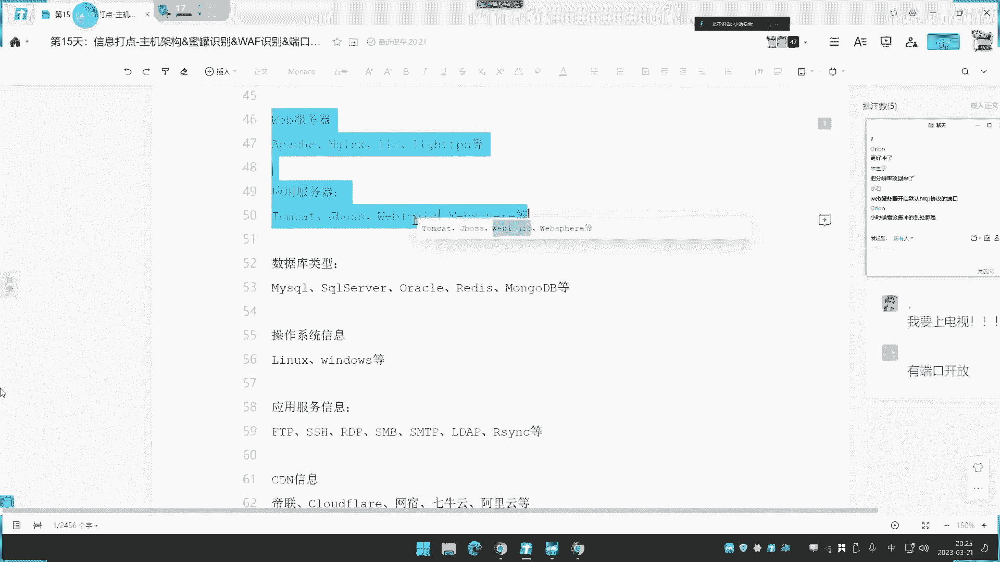

就不能说看这个像应用服务器，就不能看这个地方，他看不了，他没有。

所以像这个应用服务器的一个判定呢，它就需要用到什么呢，用到端口扫描，因为他这个应用服务器的话，就像我刚才说的，它的特性会开放一个特定端口，你像tomcat默认就是8080，然后端口具体区分呢。

我也给它上面写了，你看一下啊，在这个下面这个列表里面，你看啊，我们找一下来看啊，这里有这个那701java反序列化，就是关于这个java的，然后701是那个洛克C，你看看对服。

还有呢还有80808080是J博士，这里还有8009对吧，这是应用服务器的一些情况啊，就是关于这些事情的一个窗口的一个编号，那么如果说你识别这种应用服务器的话，就不能说在这个浏览器刚才我们看到了啊。

像这个访问一个网站数据包之后呢，在这后面看到啊。

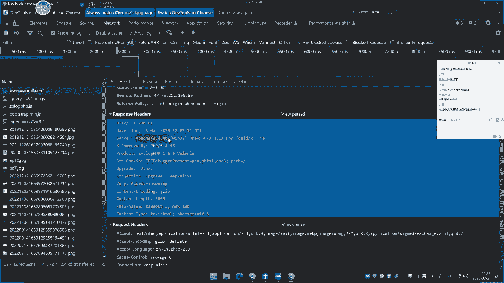

这东西就没有啊，它有些就不显示了，就需要我们用端口来识别，就是我们去扫描一下这个端口是否开放，来确定这个东西存不存在，好现在呢我们就给大家演示一下啊，那么端口扫描呢，我们一般目前用的最多的就是三个东西。

一个呢就是我们用这个网络空间呢，去分析这个端口，还有就是我们用这个N8P用的最多的，老牌的一个安全工具了，再后面呢近几年用的最多的map sca嗯，三个工具呢格子更有各的优点啊，你像这个M3的扫描过快。

它扫描速度快，网络空间呢也不需要扫描，直接直接看，然后玩空间属于被动收集，然后前面两个都是主动收集，这个被动收集和主动收集，在很多信息收集里面都有讲过，这种类似激素，简单来说就是什么个意思呢，啊。

主动设计呢，就是从你自己那去通过一些工具或者流量呢，去发送给对方，通过对方的回应再去判断这个信息的这个情况，那这种行为我们称之为叫主动分析，主动扫描，然后还有一种叫被动的，就可能就是说你没有做任何事情。

你通过网上的一些这种借口，网站的一些网上的一些什么工具，和网上的一些这种平台网站去查对方的信息，就说你不是从你本身自己的平台，自己的电脑上面去发送数据的，给对方再去判断，而是通过网上的其他的一些。

第三方的东西呢去查，就是由别人来帮助你，这种人我们称之为叫北路啊，这个呢也不需要客观理解啊，我就希望大家有时候在网上看到，这种专业名词的时候呢，知道是什么意思，因为这个主动和被动呢。

在有些这种挖漏洞的这些规则里面，他有些解释，就有些时候挖漏洞呢，它会明确显示不能主动干嘛干嘛，意思就是说你不能在你电脑上面啊，用个什么东西去搞啊，你可能需要用到网上一些其他平台去找。

然后网络空间啊我们来演示一下这个端口啊，那么现在呢我们就给大家看一下啊。

那么先来看一下这个N马普啊，这个N马普呢这个是已经可以说是老牌的啊，我这边用的是windows版本，然后呢用的是图形化，这个也怎么说呢，非常简单方便啊，我们这里呢就给大家看一下。

我们呢随便自己再找几个这个安妮的，给大家看一下啊，你看我们的拿我们这个目标去测啊。

你看这个啊，我们先看这个网站的。

那我们现在追一个扫描，然后这里呢有几种模式，我要简单说一下啊，常规模式就这个啊，然后呢还有一种模式呢，你看这里有什么OTATCPPOS，就所有端口都少，还有什么这个扫描呢，不带拼的，还有这个是拼扫描。

就是说它采用不同协议，有时候TCP的又是什么这个SMP去扫，然后呢，还有一种就是我们这quick sc就是快速的扫描，quest3plus呢，就是加一些参数可能少的信息更加全一点，比如说版本的东西。

一般我们用的最多的就是用这quack can plus，如果说你想保证信息比较全面的话，就可以使用这个auto TCP pos就烧所有，然后这个呢就是少一个大概部分，然后我们可以用这个吧。

然后呢就是它的默认加上参数，这个参数就可以网上查，我在这里也给到了他的一些简单的使用窗口，你可以看一下啊，好我们再用这个呢去扫，对不对，然后这个他这个map扫描的时间呢。

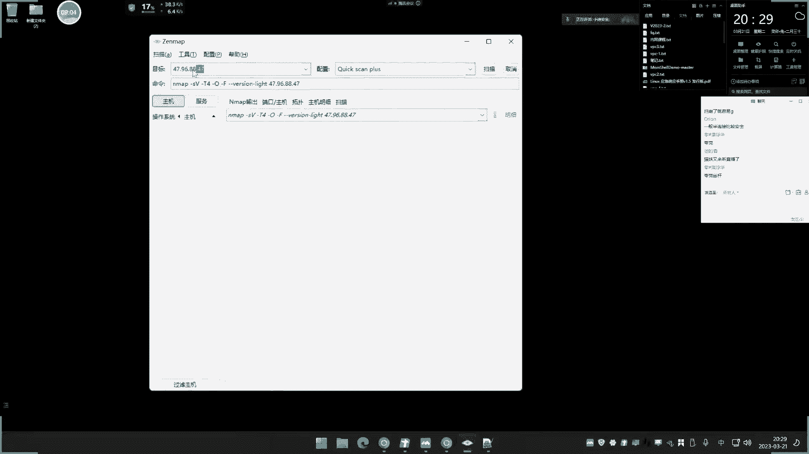

它是有点小长的啊，然后这个是这个z map，就是我们说的n map，然后呢我这里也给大家看一下这个map。

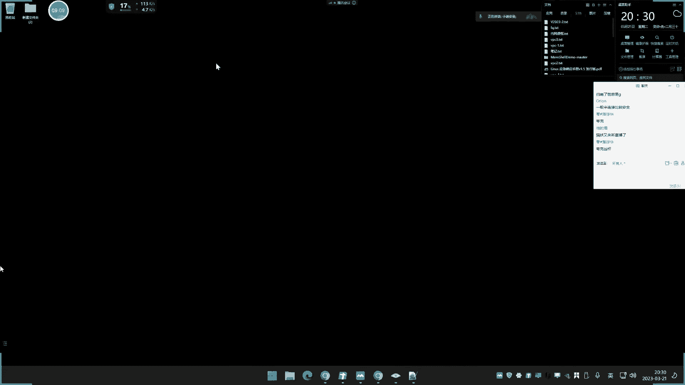

can map scan呢官方的这个现在呢给到源码里面呢，它没有编译，就你可能把源码下下来，要编译这个编译呢，具体怎么编译，就把编译成可执行程序，这里写了一个参考例子。

需要用到我们这个vs studio去编译，啊啊给大家看一下，如果说你不会的话，我这里也给他打爆了个好，已经编好的东西啊，已经给他打爆了，编好东西，编译呢也给他给他看的那个文档。

你自己可以看那个笔记上面那个参考文档，这是在项目啊。

我们这边自己的电脑安装了vs studio，2019，我用这个编译的，他网上给的是一套源码，但是他没有编译出来，编译的话要修改几个东西啊。

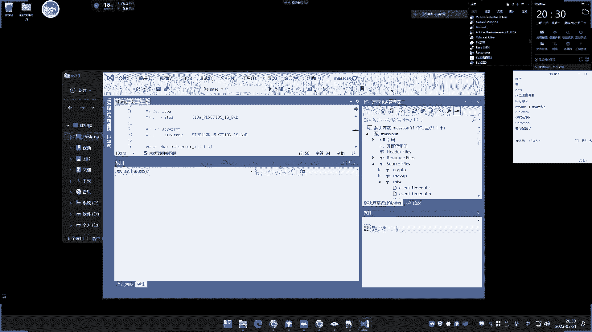

修改完就可以编译了，那就修改这个叫这个地方啊，主要修改成你的版本就可以了，就你那个vs的一个版本，然后直接点击这个release模式，不插电式的东西，点击生成解决方案好，这里就可以生成一个E1出来。

他是用C语言写的一个这个程序。

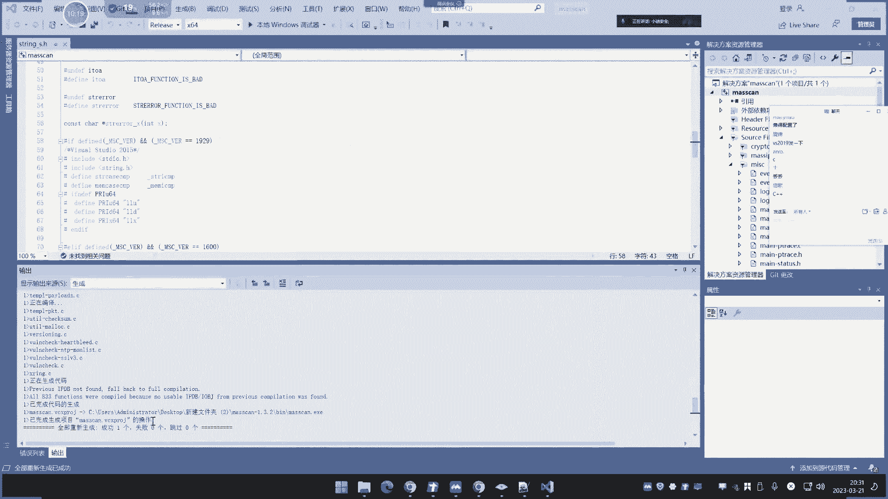

编译出来的文件放这里的，这个是生成的啊。

这个文件就是单独编译出来，就可以直接运行用了啊，看起来也是他大概一个使用索命，我们可以直接拿去扫一下，刚才在哪里看到的IP地址啊，看一下，比如我扫他的信息啊，直接运行就可以。

然后呢这里有个大概的一个使用的方式，你看哈他有使用的几种东西是吧，你可以怎么去扫呢，我给大家看一下啊，你比如说扫这个目标，然后刚批是吧，呃就少一个端口号码是吧，扫什么端口。

比如说我扫什么秦岭一行看得开是吧，直接回车，他就帮你确定那个端口开没开啊，那后面呢你可以加上其他的啊，加上这个默认端口，还可以直接指定一个端口，或者是说至少部分灯塔都可以。

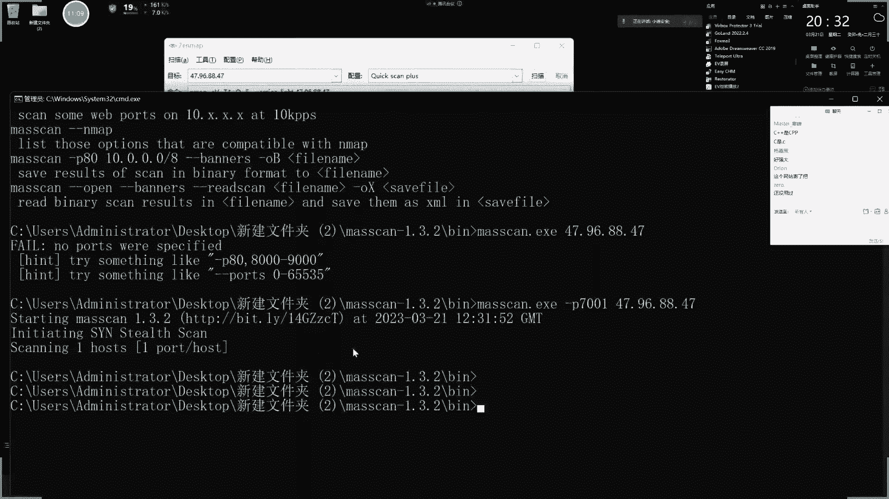

你现在在扫描之后呢，他没有弄反应啊，我们先不管它，我们先看看n map的结果，NOMAP这边已经你看他已经扫描完了啊，看一下这个端口号，这是开放的，开放的，这个是33306和八里马力，然后你看啊。

三个理由呢，就是我们说的扫出来有个买SQL，那上面就开放买SQL。

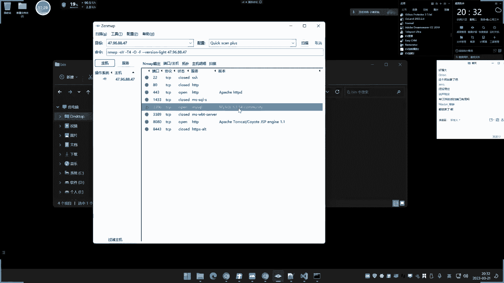

所以说这个端口扫描，那不仅是判断这个应用防火墙的，而应用中间件的，它还判断这个数据库类型，因为这个数据类型呢它也会开放端口。

也会开放端口，就说很多服务都会开放端口，然后你看巴里巴里呢是TP协议的，然后呢是阿帕奇，Tomcat，就是tomcat的一个东西，你看是吧，立方8080啊。

我们看一下了，他808开头我们就可以去访问8080AP的。

那就打开了，打开之后你看啊，他们虽然说显示空白，我们可以看一下这边的一个结果。

刷新一下，刷新一下，看看这个数据包，大家看一下啊，看它返回，你看它的返回里面就返回是这个阿帕奇杠，什么一点一，他有没有说是tomcat，没有吧，但是你看端口扫描这里呢。

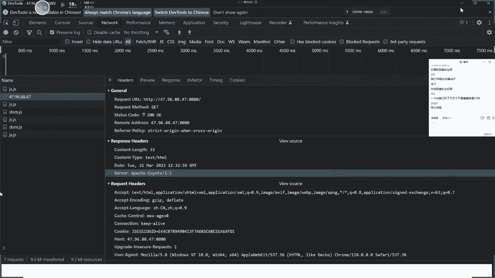

把你把你指向的什么tomcat，因为tomcat也可以写成同啊，也就是阿帕奇下面一个产品嘛，阿帕奇tomcat，你看tsp的好，下面还有买SL的一个数据库，就是他会帮你把这些版本呢给它也显示出来。

有些都能扫到具体版本，而且他也帮你搞出来了是吧。

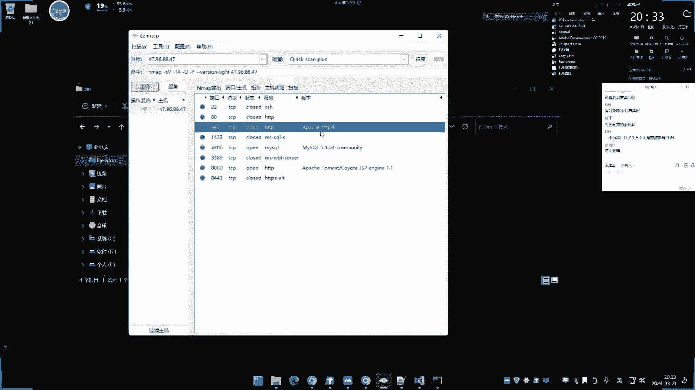

JD的，然后这里呢你如果要扫的话也是一样道理啊，比如说我这里少个8080或者八零，少一些常见端口是吧，让他帮我去判断执行，他就帮你扫对吧。

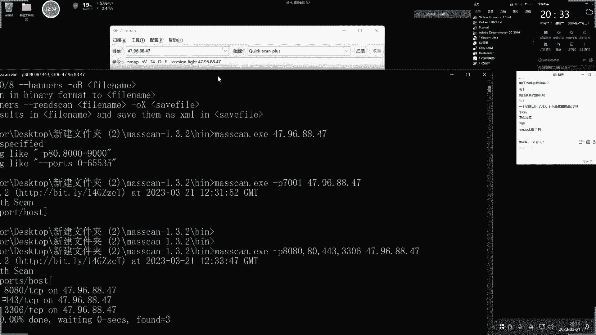

他就发现了端口在这里啊，然后呢但是他这个扫描呢就非常快，就说比刚才map的很快啊，这就是开放端口呢，你刚才给的这个端口。

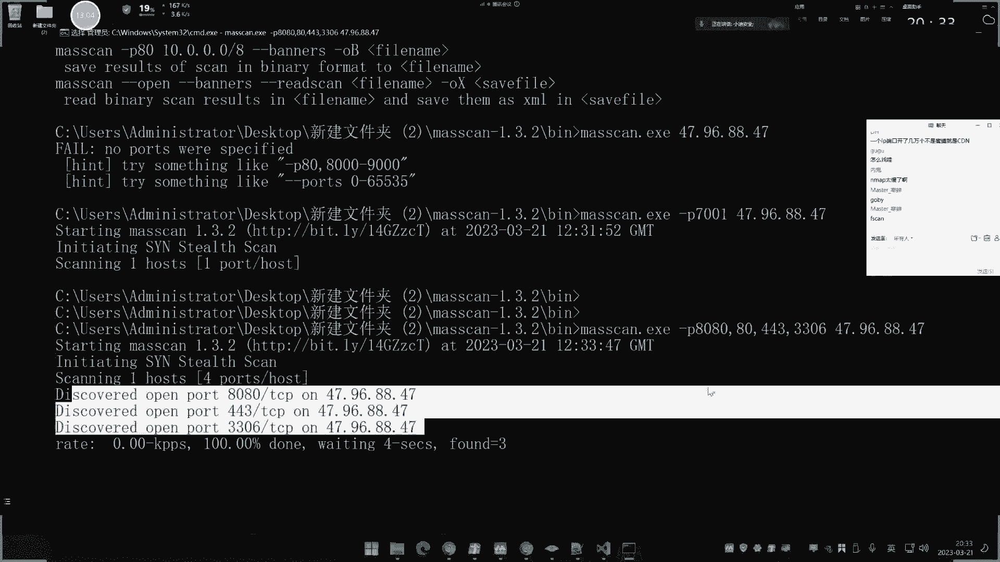

它的开放的情况呢，就是呢84333068080。

你看我这就是四三检测到了八零，马力检测到3406减到了八零。

没有检测到对吧，八零呢它这里是一个close，就是关闭状态，关闭状态，然后他有几个状态要给他说一下啊，一个是这个clothes，还有个open，还有一个是F开头的，F开头是一个叫过滤的意思。

但这里没有看到啊，等一下我们扫其他的时候，你可以看到一个状态啊，一般是有三个状态，close open就是关闭和打开一次，还有个叫这个F开头的啊，我记得那个单词怎么写的啊对吧，然后呢你看这里就能扫。

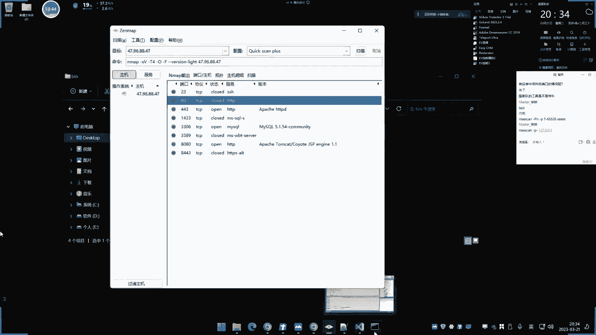

对不对，如果你要全部扫描的话，那你就可以怎么样呢，你看我就可以怎么样加上这个杠P是吧，然后从这个1~6535，就是所有端口号全部画面，我们所有端口就是1~6535所有端口，但这个扫的就非常慢了啊。

他就是所有端口都往扫，你看现在只进行了0%点几对吧，那就慢慢的就从水端口都帮你跑一遍啊。

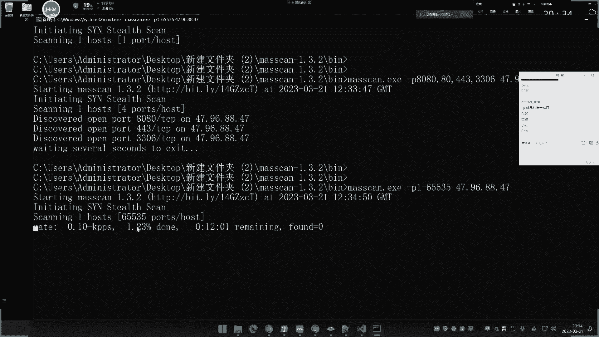

当然当理嗯，所以端口呢你可以在这里选择呢，也可选择这样的，也把它勾选上，它也可以进行扫描，也是这个参数的N8P杠P加上这个参数，然后呢这样去扫啊，它也可以第23秒，你给不了啥情况。

重新打开一下，你们不用去了解那个参数啊，有些人的脑回归那个参数是什么意思啊，啊不用理解，我现在都都记不住那些一些参数代表什么意思。

你用的时候你查一下资料，翻一下这个文档就会了，其实这个也不是很重要的东西，对吧，少数有洞的话，你看他默认开始扫了，那这里就需要等待了啊，我们等他先扫啊，就放着它不动，就放着不动啊，尽量少这边也在扫。

然后除此之外呢。

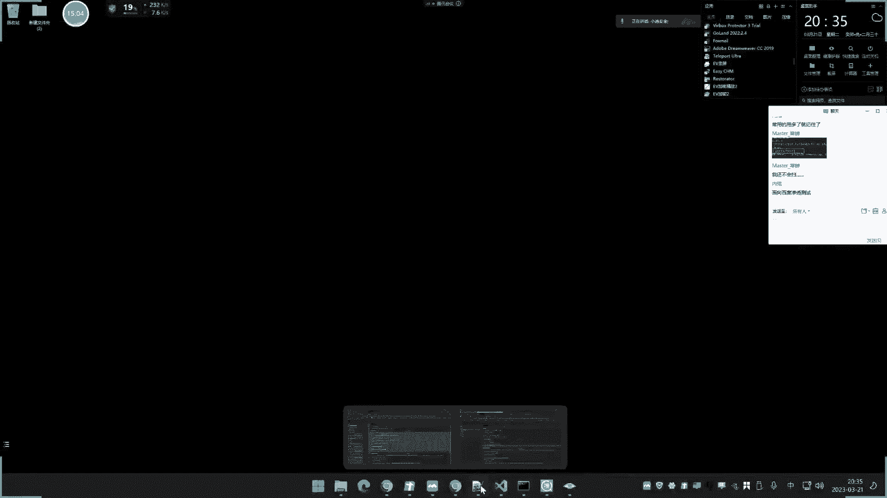

你看啊还有像这几个IP地址，你看这个呢我们放到这个网络空间里面去。

帮我们去看，放到网络空间里面去找看一下，他也能帮我们去分析到一些东西呢对吧。

放foo里面的发夸克里面都行啊，那直接搜IP就玩啊。

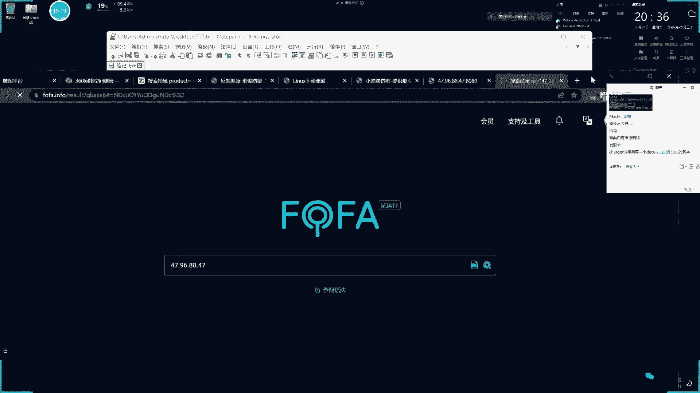

直接搜IP，你看呢我这里直接搜IP就可以了啊，点进去点到IP里面去，这里它所有信息啊，然后这里有个叫IP聚合，那就关于这个IP的一个大概情况，你看它开放端口，80804330908033。

891521啊，协议在那开放的，你看啊啊这它开放端口，你可能当时我刚才为什么扫的时候，没有扫到其他动口呢，是这样的啊。

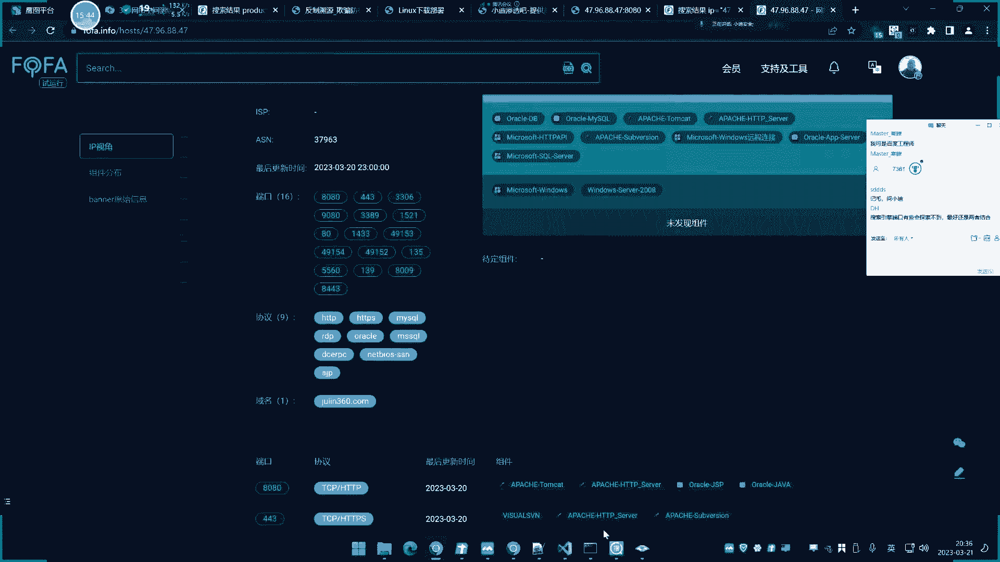

你不加这个传播端口的话，不不不写这个东西的话，它默认就会少一些常见的，但是有些它就扫不到了，所以你要加这个全部的意思，就是说所有端口都少，全部端口都帮我找一遍，我就等一下，等一下我们看下这个正面的结果。

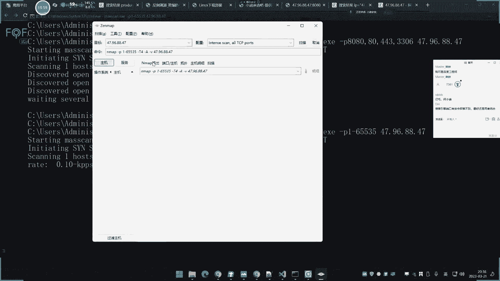

他还在扫状态，还在运行中，你看这边呢是用FO呢直接帮你去搜的，但是否否搜啊，用这个网络空间这种否否搜啊，或者说夸克搜呢，它有一些缺陷，缺陷之处，好处呢就是大家一目了然是吧。

能够看到也不用我们自己的下去做什么事情了，他已经把你收集的好，但是有个缺点就是什么呢，就是可能你如果搜一些其他IP的话，他可能没有，他这个手机呢是他自己在网上爬出来的，就是他这个数据是不断慢慢在更新。

有可能你把你的目标放进去之后，那啥信息都没有，就是因为他没有对这个目标的做过这个东西的，一个爬，所以呢他没有信息，所以网络空间呢它是针对一部分能够行的，也就是说为什么我们不直接用网络空间。

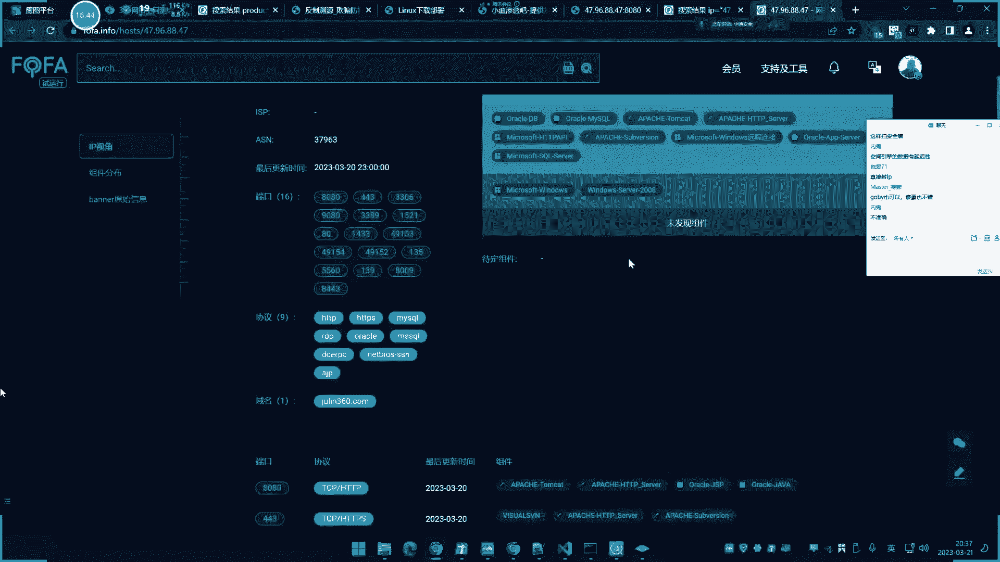

因为它最简单直接了，当也不需要我们等待。

这只是一搜就完了，所以他有这个不同区域啊，然后这个大家可以看一下这个端口号呢，它是都会有一个典型的一个这个代表啊，你看啊它会有一个端口，然后还有一个叫什么协议，ATPAPS啊。

mysql r DP oracle SQL呀，还有这个什么NBSSSNAJP啊，你看这有这些端口号，对不对，有这种对应的协议。

那我这个协议是什么意思呢，其实就是我们常说的啊，呃除了网站应用电脑呢，服务器呢还会装一些其他的，就那我们自己呢打建网站，我们呢在上面呢可能有这个web服务器，然后呢或者这个由于这个网站的一些特殊性。

我们会用到应用服务器是吧，比如说是java的一些这种应用是吧，他需要运行，那可能就需要用到什么tomcat jboss这种东西了，好就说你带网站好，这是网站应用，那么网站应用就是除了应用服务器的端口外。

再就是网站自己端口，网站自己端口一般常见，就是八零端口和43端口，就一个ATP协议的八零和TPS的43，这是最常见的两端口号是吧，除了这个之外，如果说这个网站要用到数据库，对不对。

像什么MYSQL数据库是个server，Oracle，release mandb啊，这种数据库的话，那么这个数据库呢它也会开放端口，那么具体端口号是什么东西呢，就是我们看到列表这里啊。

那常见呢你看啊我们找了1433，就是那sex server，1521就是oracle，对不对，3306呢就是我们这个MYSQL是吧，还有6379，就是我们的这个什么REDIS，6379reduce。

还有MDD，MDB好像是6万多吧，然后R7017是吧，还有呢还有这个大数据数据库，150070，对不对，就是呢也就是说你可以通过端口扫描呢。

不仅是判断网站的一些这个中间件，应用服务器的端口号，还可以通过端口扫描来判断出，上面有没有安装过一些数据库。

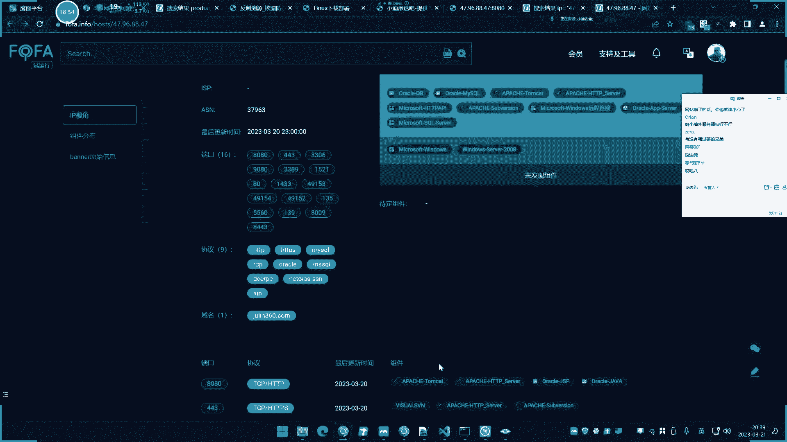

是把数据库的一些场景都好啊，你这里都可以对这个表呢去查，然后与此同时，除了这个数据库，还会不会有其他人呢，还有还有什么其他的，还有什么其他的，大家试想一下嘛，数据库有了，你比如说它上面还要装什么。

你想啊，伊朗服务器它要远程连接的话，就有个SH协议，我们windows要远程连接的话。

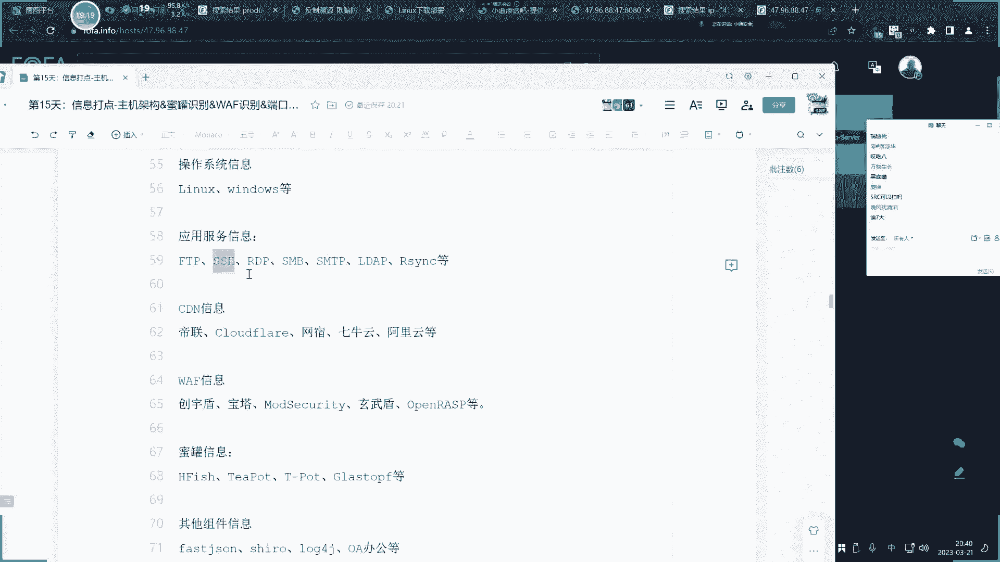

就有个RDP啥意思呢，就是我们远程连接服务器，大家都知道，像windows就是这个MSTIC调用这个远程桌面，然后去连接对方服务器，那么连接服务器呢这个端口号是一个开放的，默认就是3389。

就是我这里加389来看啊，我加389，它也可以连接是吧，它可以连接上，大家可以连上，我不加他呢，我重新来，我不加他呢，我不加他呢，他也肯定上，因为它默认就是连接389，对不对。

你加他的话就是无非就是让他指定端口诶，这是windows的RDP，就是我们说的这个远程桌面连接协议啊。

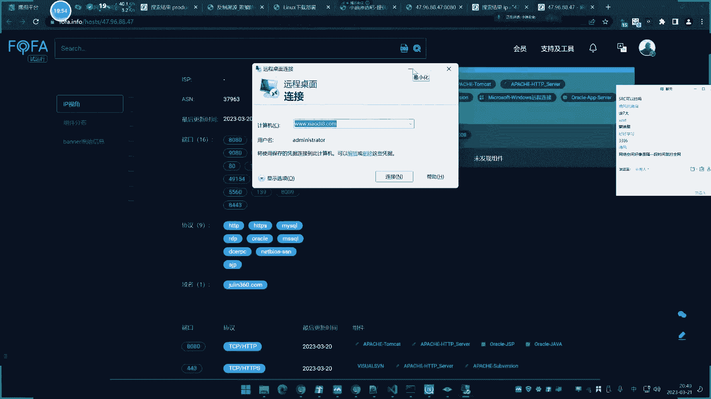

除了这个之外呢，还有什么，还有LINUX是什么SHH是吧，用LINUX呢去连接LINUX服务器，所以这个呢还有大家经常在学校里面，或者工作里面用到的什么FTP是吧，文件传输协议，搭建个FTP服务器呢。

来去下载文件，是不是还有什么邮件服务，如果说这个服务下面安装过邮件的系统是吧，可能有SMTP协议啊，各种各样的一大堆协议，就说除了网站的本身应用，它可能在服务器上面呢会选装一些其他的应用。

因为它的功能不一样嘛，是吧，有的呢是扮演是网站，有的呢可能就是邮件系统，可能有一些呢就是文件服务器等等各种各样的，所以我们这个端口扫描呢，就是简单来说就是判断我们的目标啊，除了网站之外。

还没有其他的一些这个服务，因为有了其他服务的话，就符合于我们后期的一些服务的，一些方面的安全措施，那么这里有一张表，这个表呢，除了端口号和对应协议的这个写法之外，后面还给了一个叫深度用途的一个意思。

啥意思呢，就是说如果对方开放200端口的话，FTP那么FTP上面有些哪些安全问题呢，就比如说像上面的啊，允许匿名的商船下载，可以存在爆破口令修摊，包括这个一些FTP软件的后门和体育团漏洞是吧。

然后呢像下面还有其他的一些常见，我们举例子啊，你比如说像这个MYSQL是吧，我们的主漏洞SQL注入MYSQL提权给，包括他就在后面写了些什么呢，就写了一些常见，我们针对这个端口的一些安全问题。

有的是基于漏洞，有的基于他的弱口令，有的基于他这个呃软件搭建的一些漏洞啊，各种各样的都有，所以说我们收集它的端口呢，第一个呢是要知道这个端口开放之后，代表他开放什么东西，与此同时呢也是给我们说一下。

有这个东西的话，就会存在一些安全问题，对就是我们说的，除了网站上面的这个安全渗透测试之外，还要应对于这个服务上面安装的，其他协议和服务上面的渗透，就是说安装FTP FTP上的渗透。

安装了这个SMTP是吧，邮件系统的渗透，安装了这个什么SH啊，各种各样的一大堆是吧，都会有一些常见的一些不同的安全问题，只是说哪个安全问题的容易容易搞一些，和哪些安全性的人容易少一些的问题所在了。

所以这个端口扫描的意义呢就在这里，就是其实那就是给你归类了啊，除了本身的web上面的安全攻防之外，还会有一些其他服务协议上面的安全攻防，能理解吧，而且呢也是告诉你，这个服务器它的一个扮演角色。

让你更加的了解你面对的目标，他在上面在干嘛是吧，搭建网站，搭建邮箱系统，还是这个作文件，FTP服务还是这个存储数据等等等等一大堆，就是你把信息的足够了解的更多的话，那么你的这个方法和思路就会开阔。

因为里面的就更多嘛对吧，所以这个端口扫描的意义就在这里啊，它的意义就在这里。

那这里除了这个E之外啊，这个应该也靠这里扫完出来了，你看只要扫出来的结果，你看看只要全部都能扫描的结果，你看，然后你看这里上面应该就是和他差不多的吧，然后有部分没有，然后呢。

他这里呢也不是说这个东西写上去就全部开放，你看它有些呢是这个close，还有一些是open。

那还少了一些这个9080也烧开了那个，那你看这边呢这边还快了啊，你不是说map4G快吗，map4杠是针对部分快啊，有些使用语法快，但是有些人他还是慢，你看他也在扫，等下再看这个结果都快完了。

你看，然后这里还会有一个大概的一个主机列表呢，它会判断出对方的一个操作系统呢，他说这个操作系统是个问题，相似度91%，所以目标注意是win7系统啊，这个就不好说准不准确了啊，这个不好说准不准确。

大部分是准确的，但是呢也不好说，这个一定啊，它是判断性判断标准，九成是这个问题，但这里也无关紧要的，他win7也好，win8也好，无所谓的啦，因为本身你对这个操作系统，你就把他搞那么清楚，干嘛呢。

对不对，你都没有进去，他问七问八和你有什么关系呢，你只要知道温老师就行，所以这个东西呢指数给你是吧，看上去更明显一些啊，这个拓展拓展就是说他是怎么扫的啊，经过哪些地方，但是从我本机本机的路由是吧。

然后呢经过我本地的Y网，Y网站传输到目标这里扫的，然后呢你还看一下啊，还有这几个IP，我们都可以试一下，我们都扫一下，妈的这个map有点有点毛病，每次都扫完之后，不能重新再扫。

不知道啥情况，那么扫一下，然后这边呢你可以用这个网络空间的去搜一下，这个目标的这个目标，你看这个目标，你看啊，搜的话，这里面也不收的是啥玩意，这是什么鬼东西啊，对不对，点进去看一下，点一下VIP聚合。

看下来，这再看看端口也是呢，开放8033064个八对应的组件，你可以看一下开放的MYSQL数据库，然后这个三十八九，那windows的三十八九，这个阿帕奇的hp的一个中间件服务层，变成桌面连接开放了。

然后这里还开了个open s h r sr，这个阿帕奇的homeless，各种各样的呢，这是他的一个情况呢，这个下面多个号对应的组件的，大家可以看一下下面对应的关系啊，啊这个有几个没有写的呢。

就什么情况呢，有几个没写是什么情况，比如说我们这里呢他把把灯开了啊。

我就反问一下，拔拔正确控制表，八八是什么，这个是宝塔的，有东西啊，他用宝塔搭建的八八是个宝塔的端口。

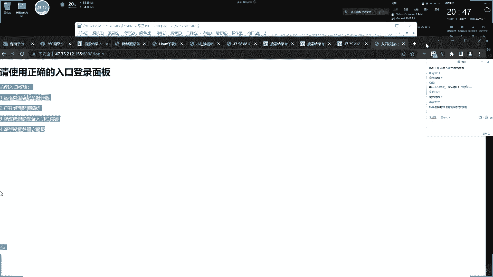

如果你用宝塔，你应该知道宝塔真是个宝塔，宝塔这个软件，所以说这个上面应该是用宝塔搭建网站，对不对，然后你要注意一下啊，你看啊这里开放3406，它指的是TCP买SL，然后这两个是TP。

你看啊HP80和TP你再注意一下啊，你看AP吧，你就可以用这个IP去访问的八零，它就可以访问是吧，然后用八八也可以访问啊，你这样访问呢，它也可以打开的这个TOMA的那个默认页面。

但是呢他这里写的MYSQL，你是36，你能不能把这个改成这个猫和3406。

这样去搞的不行啊，你这样搞的话，他肯定就不正常了，网页无法侦测，为什么。

因为这个是一个TCPMYSQL的，这个端口是个买SL的协议，我们网站下的可用浏览器直接访问，加上后面再去访问到，但如果说你这个是这个其他东西了，不是AP，那就不行了啊，那你就不能不能加上去了。

你加上去肯定是不行的，所以说你要确定他这个端口下面是不是，尤其是一个网站，你先要确定这是TCPTP协议才行啊，你不要这样说，开放3406是吧，你也在后面这里面也得加上个冒号。

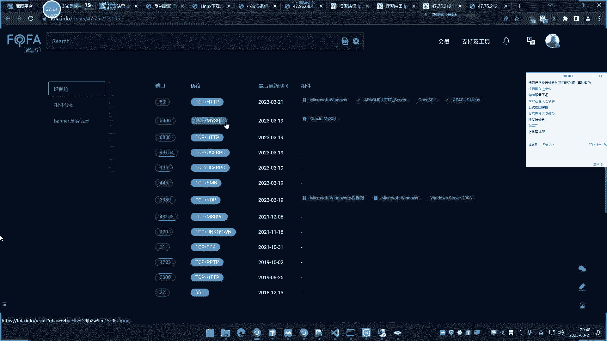

306去访问，那肯定防不了了啊，因为协议都不一样啊。

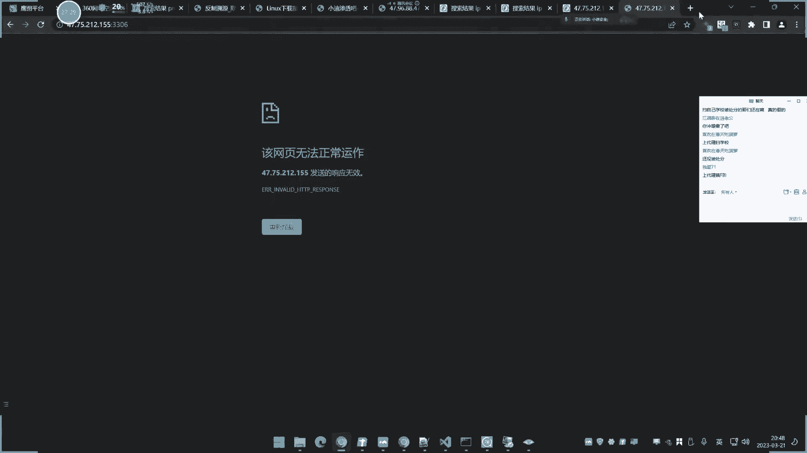

浏览器访问的是要针对这个后面是P的啊，他明确告诉你谁P的这个恶map呢，他也他也会告诉你，对不对，你看恶魔和后面是不是有对应服务端AB，那这样子你就你就能正常访问，对不对，但如果协议不一样。

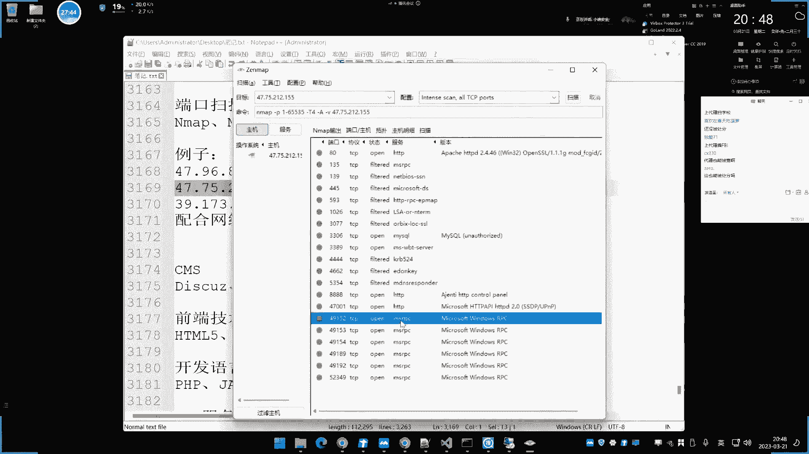

不是AP的，你就不能访问啊，你看这个是app，你看十七七你们就可以这样去访问他了。

我们就可以再给大家看一下，再访问IP地址，7001看一下。

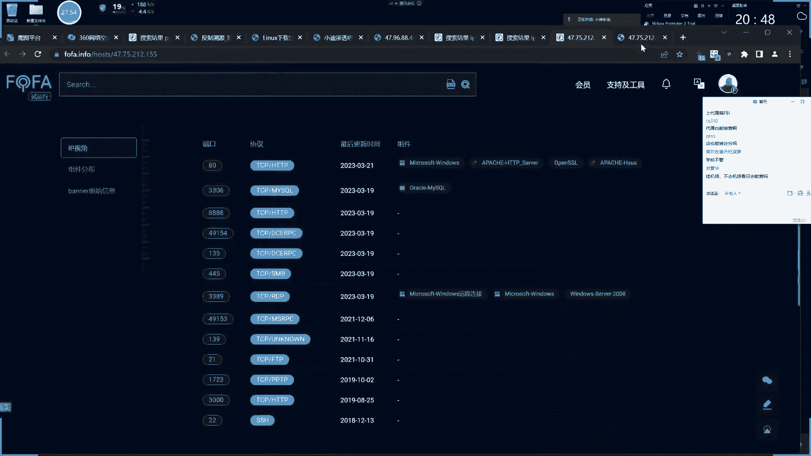

你看是不是能访问，所以说它不显示内容，但是至少我是能够得到回应的，不像刚才啥都看不到，对不对，然后你看啊，现在就出现了一个新的状态，叫什么FITERED，你看open刚才那个是close。

这个它变成什么FI，那么这个东西是啥意思呢，就是我刚才说的啊，这n map里面有三种状态，这个是其中一种状态，F开头的是啥意思啊，大家应该如果说英文比较好的话，应该知道这是个啥意思啊。

再来看一下叫过滤啥意思呢，一般这个F开头代表啥意思呢，或者说这里红颜是标识的啊，是这么个情况啊，我给大家说一下啊，如果这里写close的话，就表示它关闭了，就说压根就没有开，是这个意思。

如果这是F开头的话，过滤的话，就表示说这里是有可能开和有可能不开的意思，造成这种原因的，最普遍的就是可能有些防护，就类似于防火墙这种应用导致的，你可能会说防火墙不是我直接访问，他就给我拦截了吗。

为什么他拦截我都通讯不了，那不就是关闭了吗，为什么给个F开头的呢，是这样的啊，防火墙在设置的时候，你开启了之后，不代表就是说所有东西都不能通讯，它是有部分程序呢能够通讯，就是我们说的防火墙里面的白名单。

为什么你经常用电脑去开一些应用程序的时候，它会有个提示是吧，点击什么允许和阻止的意思是吧，就那什么防火墙那种页面，意思就是告诉你，你是不是允许这个程序的通过防火墙去运行，如果电允许了。

那么他就把它加入加入白名单了，就是说你这个程序就不会受到防火墙的干扰，能理解吧，所以为什么有些它能扫到，有些不能少的原因，就是因为这些地方就是方形的，而有些扫不到的原因，就是它有些地方呢他没有放心。

但是没有方形，不代表它没有启动，就比如说我在下面呢，我开放了个135端口，知道我是开放的，但是呢我防火墙来阻止这部分协议的一，些流量驶入，但是他是在本地是开放的，你去烧它的时候呢，哎他这里显示F开头。

所以一般这种F开头的话，大部分都是开的，但是你通讯不了，所以说你看了也等于没看，只是告诉你他开了，但是他收到了防火墙的保护，收到还有这个组织，所以你和同学呢还是不行，能理解吧，如果是close的话。

关闭状态的话，就是告诉你这个东西就是压根就没有开，你就不用想了，如果是F开头的话，但说他开了，但是会受到一些保护，就这个意思啊，虽然说对于我们来讲没什么区别，反正我也通讯不了，但是你要理解他的这个情况。

好这就是F开头和close开头的几个概念啊，然后我把它写在笔记里面，我怕有些人呢把它忘记了啊，这个是吧是吧，就是这个开放状态哈，Close，open这个。

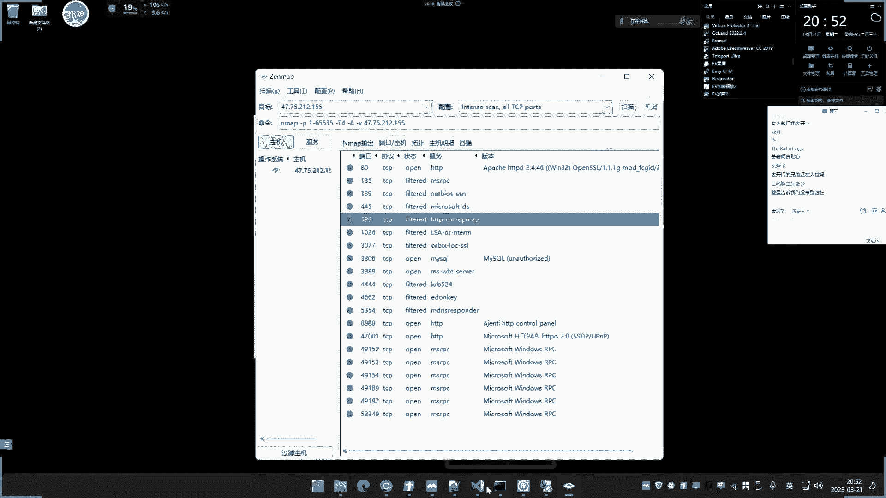

对吧，这个状态啊，记住一下。

这个是有可能开的，有可能不开啊，好这个是我们说的这个档扫描的文章啊，那么这里呢除了这个之外，我们还有个东西要给你讲，端口扫描工具也用了，空间也给他看了是吧，大家都能看到这个效果，然后呢也给他说了。

端口扫描的意义是吧。

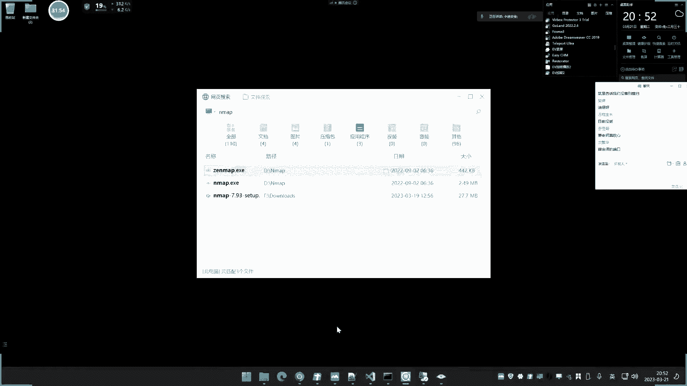

除了扫网站自身的中间件，还可以少一些数据库，应用和一些其他协议的都能找到，就比如说像FTP啊，这些东西的话都能扫到，就是端口扫描能解决的事情，就是解决，通过端口扫描来判定这个端口是否开放。

来确定你这个服务上面安装过哪些应用网站，应用数据库，应用文件传输，应用邮件，应用等等，各种各样的一些业务系统，和一些这种各种各样的一些服务，对不对，这是我们端口上面的意义。

就是让你了解这个服务器上的开放的东西，然后呢让你的思路更宽阔，针对网站呢就用网站安全漏洞进行测试，针对这个各种各样的是吧，FTP的就用FTP的一些独特的这种手法啊，然后具体手法呢。

我们在上面列表呢给大家具体写了一下是吧，就是说这个服务可能会存在哪些安全问题，写了一下啊，这是我们说的端口扫描一，那么除了这个外呢，我们还要考虑一个事情叫什么事情呢，就是我们说的这个，考虑两方面啊。

一个呢就是我刚才说的防火墙的问题，还有就是我们说的这个内网问题，啥意思啊，那防火墙问题刚才讲了啊。

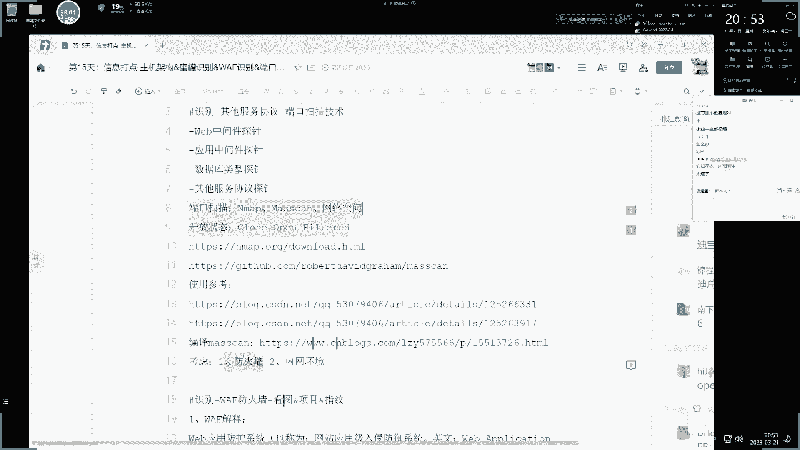

防火墙它就会组织一些判断，就会造成我们在上班的时候呢，明明这个端口是开的，但是呢防火墙把它阻止了刀子，你还是不能和他通讯，对不对，还是和他还是不能和他通讯，对不对，这是我们说的第一种情况啊。

就实际上呢就是说受到防火墙的保护，这是第一种情况，第二个情况就是内网环境。

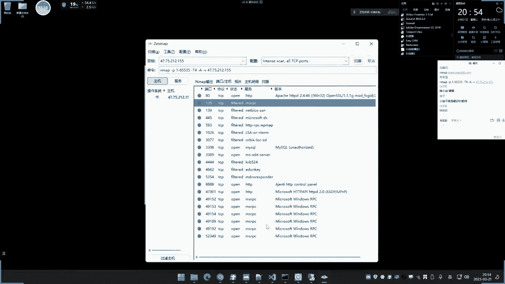

内网环境是啥意思呢，内网环境是个啥意思呢，我们前期在信息收集的时候呢，我们可以看一下前面笔记啊，嗯好像是在哪一天我们讲过，我看一下啊，在哪一天讲过，在那个地，讲防火墙那边的哦。

讲这里应该是第五天的时候讲过啊，第五天除了还有个反向返乡的一个利拉克斯，那个代理也讲过，我把两个鼻子找一下，反向带，你能跑哪去，第四天吧，不过第四天，第三天，第三天，那当时呢讲过一个反向代理啊。

呃在哪里呢，我不知道大家还有没有音响啊，嗯我这里呢就给大家简单说一下。

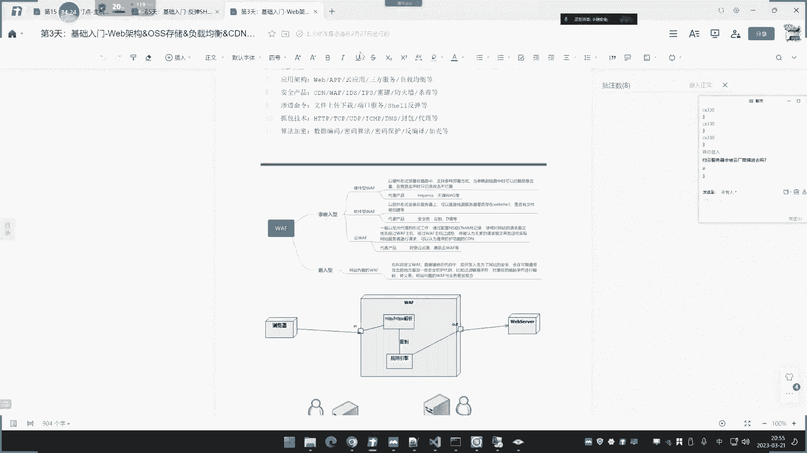

防火墙的那个呢就和这个相关，啥意思呢。

我举个例子啊，我这里呢其实我应该实验一下，看一下能不能实验一下啊，我当时好像实验过啊，那个反向代理刚好给他实验过，啥意思呢，我给大家说一下啊，我画个图吧，我这里不实验了，我就先画个图啊。

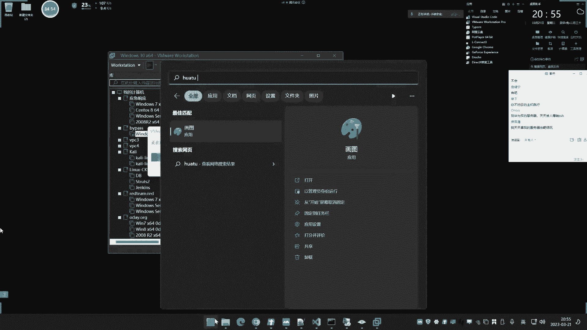

这个实验呢就和他反应代理是一样的啊，你可以参考第三天课程啊，那这里有一台主机，然后这是个互联网啊，然后这里是个路由器，下面有几个主机还是面啊，然后呢嗯这个我简单说一下啊，这个是个内网啊，他是个内网。

然后内网呢它上面有个web，他通过这个方向代理呢，把这个网站解析到外网的一个IP上面，就是一个外网啊，这是个外网好，那么现在呢我这里是我个人电脑，就是攻击者，假设是攻击者。

攻击者在攻击者呢去尝试呢去扫描这个网站，那么他访问网站的时候是访问网站IP的网站，还是访问这个Y网的IP网站，如果我扫的话，也是扫yip，但是这个网站放在内网，那么就说你的目标其实是他。

你的目标是这个web，但是你扫都扫到外网上面去了，因为他是把这个web流量再转到这里来了，所以你扫错地方扫到外网，那你可能会说我怎么扫这个内网呢，这里是扫不到的，因为你还通讯不了。

就是我刚刚之前说的那个真相，反向一个意思，你在外网，他在内网，你们两个都不在一个网络，他的这个网络出口的是出给他了，所以你烧的就是烧到外网这里来，但实际上呢这个它的真实应用是放在这里。

所以他就会造成一个什么假象呢，会造成什么假象呢，把写一下啊，那你别说内环境内环境内环境里面也有啊，呃这个网站呢在在内网服务器是吧，在一个内网的服务器服务器下面，然后呢哎还会有个那种环境啊。

可能造成一个假象，可能一个人怎么可能出现这种情况，这什么情况呢，就是啊这个明明啊，这个web是吧，是这个八零和8080端口开的，然后网站的也能怎么正常打开，但是呢你对这个这个目标呢进行这个扫描。

登录扫描，发现了这个端口没有开放，或者说是这个排除这个防火墙的问题啊，不说不说八零吧，就是三个web的八零这个上面啊，明明这个上面呢啊，这个这个服务器的开放330牛啊，开放数据库端口，是的。

但你的目标进行扫描的时候，发现这个数据库没有开发，这个排除防火墙问题啊，就说不是防火墙影响的，那么内情况就会出现任何意外，就很简单，我内网里面他这里还有数据库是吧。

比如说有个什么3306的这个什么MYSQL数据库，是MYSQL数据库，它里面有这个数据库，按正常来讲啊，他是个PP加什么MYSQL打钱呢，按照你讲你是能扫到他的，这里是排除了这个防火墙的问题啊。

就是不受防火墙的干扰啊，就说正常人扫能扫到的，比如说内网一台主机，他和他同一内网，它扫它啊，它能扫到这个端口，但是呢换成你这个攻击方，你去扫，因为他妈带歪了，所以你扫的是这个外网。

也就是说外网他开306，你就能扫到，他不开你就扫不到，他不开你就扫不到，刚才我为什么不说web呢，因为web可能是这样的事情，就说他是开放百里洞口，但是呢他把他把你LOL流量转不到它的官网，八零端口。

所以你扫到他八零后还是开放的是吧，所以呢你就说哎呀对了，但实际上MYSQL是放在他本地的，他的网站呢和他本地通讯，三理论是能够正常通讯的，但是你现在直接去扫这个外网的3。0，它是没有开放的。

因为它上面没有装MYSQL，而他MYSQL是装的这个内网，这个网网的服务器和他网站的同在一起，哎你这个时候你去找外网，那肯定找不到啊，但是他实际上他这个目标是有306的，能理解吧，是因为这种内网环境。

把一些web或者一些应用呢给出去了一部分，但是其他端口呢还是在这个本机上面开放的，它是在本地端口呢，它能在本地正常调用运行，所以它就不需要带入进去，他只需要把一个对Y的东西把它发出去就完了。

所以你烧的话只能扫到个对Y的，它里面的东西你就烧不到了，你可能问我这种情况怎么解决，没办法解决，只是告诉你有这种现象，所以意思就是说你少一个目标的时候哈，如果说目标真实存在这个端口是吧，但是你找不到。

可能就是内网环境，或者也就是告诉你一个道理，你扫一下端口的时候，可能他少东西和你真实的这个情况会有差异，因为他是个内网，你烧不到十个原因造成的，怎么解决，没办法解决，只能告诉你有这么个事情出现。

你就不要意外了，你要扫的话，就必须能和内网的台主机通讯，你才能扫，不可能通不了就少不了，好这个就是我们说的这个这个这个两个事情啊，这两个端口扫描的一些支点啊，我们就上完了啊。

然后你可以看一下这个正面的结果啊，这个结果也扫不了。

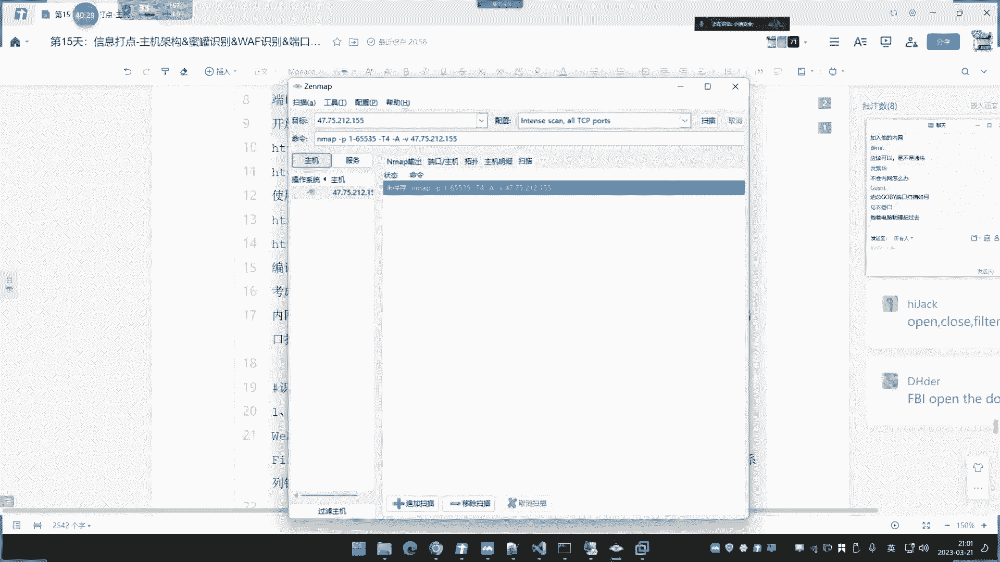

然后这个马克思也扫完了，你看我就不一个开打啊，你自己下去想用就用吧。

你觉得哪个简单就用哪个啊，网络空间也好啊，这个什么马啊，马斯卡用哪个哪个就用哪个啊，用的最多的就是这个map和mp3啊，我喜欢用NMAP1些，因为N8P呢它功能要强大一些啊，虽然他速度慢。

但是我们也不追求速度啊，无所谓的了啊，这个map干它主要用来做批量的扫描多一点，但是这个map的单个的话会精准和准确啊，你看你这个英雄价值了啊，批量少就用马克干这个单个扫就有个map。

网络空间呢也是一种可选方案，他那个端口的一个情况，网上还有各种各样的接口，包括你们刚才有人说的什么勾比啊，都是一些工具，无非就是说你用哪个网上工具一大堆，我只是说了几种核心用得最多的啊。

王晨一大堆工具啊，你没必要说哎呀，这个好那个好，没必要啊，你自己想用哪个球，你就拿一个，你用的时间长了，你就会知道哪些好哪些不好了，好，这是我们说的那个DOM扫描的一些知识点。

同时呢还给他说了两个意外情况，就是防火墙的一个意外是吧，导致有些端口呢它是一个过滤状态，你也不知道他开没开，能不能通讯，然后还有一个就是我们内网环境，就是会造成一些少的时候一些信息的丢失。

而且防火墙如果开的比较严格的话，可能还不能扫描，就是他如果说防火墙全部阻止了，可能你和他通讯通讯不了，扫不到啊，这信息啥信息都没有，有这种情况的，就是他屏蔽了啊，还比较严格，就是把很多东西都屏蔽了。

通讯不了，所以他信息无法返回，你不知道开没开，还有情况就是我们说的这个内环内环境，主要原因不是说不能通讯，主要原因，就是说你扫的信息和他真实信息的不一样，他明明开了，但是那你就扫不到，那就是这个意思。

因为他只把部分的端口带到那个外网，那个主机上面给你提供服务了，所以你扫的是那个外网主机和那个内网，那台真实目标呢，他不不在一起啊，不是他，这个内网那我就再给大家解释一遍啊。

就我说个最简单好理解的一个例子，就很简单是吧，你想找我来学习是吧，你直接找我本人啊，就是属于我们常规情况，这个时候呢对不对，然后呢我找了个代理是吧，找了一个小手，他帮我去推广。

然后这个时候你找到了个DI，找了个销售，你问他一些知识点，他肯定不清楚，他哪有，我清楚我这个上课老师我肯定清楚啊，对不对，你找他去问一些情况，大家只能把它理解的东西告诉你。

但是实际上呢很多东西都是可能是有不全啊，或者各种各样的情况，就这个意思啊，那个内网就和这种类似一样，你就找到了个销售了啊，因为你找我就可能找不到，不找我联系方式，好。

这个是我们说的那个DOO扫描的那个情况啊，好现在呢我们就来说这个电压快啊，这个WAF识别，说实话啊，这个WAF识别呢简单来说呢，就是给大家一个一个提示吧，他对我们这个安全措施呢没有太大意义。

但是我们不得不学他，因为他其实就是告诉我们一个事情，搞出个什么事情呢，他有没有WAF，然后呢告诉我们会面临什么事情，现在就这个情况啊，他不会给予我们这个后面的思路，像这个档位扫描了，还给思路是吧。

开放哪些端口啊，我的思路会怎么样，什么情况啊，它会存在哪些安全问题，它都会从这个端口的开放情况呢，能给到我们些提示，但这个WAF呢它不是一样的，WAF前面那是属于从上面收集思路。

下面呢这个呢就是从思路上面去选择放弃，知道吧，因为这个WAF呢我们是一个网站应用防火墙，也称之为网站应用系统，叫web application firework，就是简称WF，就是网站应用防火墙嘛啊。

那么它的一个作用，那我也不用多说，就是保护web应用，防止攻击实现，简单来说就这两句话，简单来说就是类似于我们电脑的杀毒软件，一样啊，包围你这个主机的安全问题，那么它既然称之为叫waf web应用。

那就是专门保护web的，那么你可能会问他保不保护我们主机的什么，这个呃主机渗透手段呢，啊哈比如说我上面有数据库存的手段呢，它会不会保护呢，这个一般不会保护，除非他这个上面有集成这个功能。

所以它的保护是针对网站应用的啊，你其他的一些应用工具呢不会受影响，那么我们为什么要介绍他呢，其实很简单啊，你如果碰上了这个有WAF的情况，下面的话啊，大部分的一些常规攻击手段会受到阻止，如果能绕过。

那就绕过，如果不能绕过，那就放弃，即使他有漏洞也没办法，所以一般我们收集它的原因就是明确告诉自己，我能不能行，不过话说回来了啊，截止目前当前这个时代来讲的话，我们大部分的肉啊。

大部分的WAF呢都是绕过不了的，然后呢能绕过的都是些小部分的，而且能绕过的都是比较鸡肋的，或者说不重要的，为什么这样讲呢，本身这个WAF他就是来保护web应用的，你哪绕啊，这绕啊哪绕这绕。

别人这个产品还有什么意义呢，啊干脆结算算了，是不是，所以有时候那你自己要去思考这样的问题，本身它就是你们的保护产品，你那也绕这也绕，那你妹的还搞毛啊，然后外服呢它有几个目前网上的一个产品分类，人WAF。

阴间WAF软件，WAF和代码机WAF，最多的就是前面三个其实都多啊，来人外服呢，就是指的是我们一些国内和国外的一些，安全厂商，哪些呢，腾讯云，阿里云，华为云摆渡人是吧。

这种打工式的就是那上面的人产品是吧，你在上面注册账号购买服务器都属于，对不对，还有像国外的什么亚马逊云，对不对，各种各样的，还有一些安全公司出品的一些对方，什么长亭的是吧，雷池啊，还有呢就是阴间挖坟。

就是我们常见的一些安全公司，什么生性不和的绿蒙啊啊，用心制成的这个世道创意这种安全公司呢，他自己研发的产品，然后卖给一些这个企业和一些单位，就在他的机房上去部署这个硬件来防护，这是阴间WAP人。

WAF呢就是在这些厂商购买了一些服务器，然后呢它上面呢他自己场上有单，专门针对这个服务器的一个保护包，你在那个服务器上面啊，你就你就说你看不到，实际上呢，它其实就是在他自己产品里面加了一些东西啊。

你不看不到，然后呢他偷偷摸摸的帮你保护着，对不对，然后呢有免费版，有收费版啊对吧，那么那种是人工服务，就是你自己在网上购买了一些服务器啊，一些人公司的一些服务器，腾讯那里上面，然后呢他会问你是吧。

要不要这个购买他的这个WAF的一个保护，然后价格多少，对不对，还有就是我们说的硬件安全公司里面啊，自己研发的产品啊，跑到你手机上来帮你部署的啊，这种是阴阴间，还有就是我们软件是吧，就说我啥都不需要。

我在网上下个软件，安装到我那个服务上面去啊，提供保护，这种呢是什么低能啊，安全狗啊，宝塔啦，就这种事情嘛，对不对，他就有这个东西，还有个代码机WF就是啥意思呢，代码机WAF就是什么意思呢。

就是他这个WAF呢是在代码中帮你写了，就是其实就是说一个代码的过滤规则吧，它也不叫WAF，就是别人在网上有一些写好的一些，这种针对代码上面的一些这种防护啊，然后呢，你把它部署到你那个代码里面去。

修改几个东西啊，保证你这个网站的一些程序源代码的情况啊，然后保护这种呢说实话啊，有部分的一些网站，一些开源产品里面有这个东西啊，不过最常见的就是前面三种啊，这三种，那么可以简单来说啊。

我给大家说一下这三种呢一般是什么情况呢，我就给他检查一下啊，软件WAF是一些个人小中型企业喜欢用的，或者个人的网站，小中型企业喜欢用这种软件WIF，然后还有一些就是一些非法没有实力。

没有这个经济能力的一些黑色领域的，也会喜欢这个远近万富，啊小软件外服为什么说没有经济实力呢，有经济实力他就搞外服去了啊，然后呢紧接着原精华府用了之后，就是云外府人画符呢加个相对于原地往后要贵。

原计划福袋有些是免费的，像安全免费的是吧，第一轮也是免费的，包括他的是收费的，但是他钱不多，一年就几百块钱不多，那人物分类就相当贵了，他就根据你开开着这个产品的这个等级。

和这个开这个产品的这个保护的对象的个数和，应用对象的情况来决定，收费从几千到上万数10万不等，所以它是需要有点经济实力的，那么它一般针对的就是中大型企业，和一些有实力的黑色领域，或者说一些擦边球的网站。

这是它的主要用户对象，那么阴间WAF，那么一般是哪些呢，就是我们常碰到的中大型企业和一些政要，官方的一些单位，学校政府军工各种地方，因为像这些单位呢，他们都是外包啊，包括他的网站都是找人搭建的。

都是这些安全公司呢专门找销售，天天跑别人的市场是吧，搞的事情，然后呢部署他们每个厂商的产品，基本上在场上呢，也基本上大部分的收入也是来源于这些，而且他们的这个价格也很贵是吧，几10万上百万都有。

其实说实话哪值那么多钱呢，就是因为专业不对等嘛，刚好这个单位呢他有钱，国家给钱，哎呀随便你搞吧，是不是，那真正来说这几种WAF他的这个难度等级，最强悍的还是云WAF啊，因为他的技术是最先进的。

这个阴间挖坟呢虽然说也很强啊，但是怎么说呢，他这个可拓展性不强，你想想硬件是什么鬼东西啊，就是一个设备，他那个设备包到你机房里面去，然后如果要升级的话，有些公司可能设计的好的话，还远程可以升级。

有些设计不好的，还要把设备再换掉，对不对，然后这个人物分类就不一样了，那就是别人用先进的概念升级，简单时刻升级，而且会有一个实时通讯，实时保障那个信息，就像我们买了一些云产品之后是吧。

云产品呢一旦有什么这个别人登录过的账号，登录的服务器，他就给你发个短信啊，给你个提示是吧，所以说呢这种等级的，大家能够体现出来哪个更强啊，我说这现在其实也是废话，我只是想告诉你，你识别出来。

你就把它分开来，要知道你面对的是啥，有没有这个能力去绕过他，没有能力你就放弃，不要去看了，就是这么简单，但是我实话实说，我们目前能够绕过的，也基本上就是软件一块的东西东西了啊，你像什么阴间的。

还有人的啊，虽然说网上有一些这个有人绕过，但是实话实说，他绕过那些东西微乎其微，就是没什么鸟用，因为我们知道，如果说我们在渗透测试中，安全测试中的话，碰上一个东西挖火拦截了，它是分很多种类型的。

比如说是漏洞利用被拦截了呢，还是说我的后门被拦截，还是说其他的方式被拦截，那它是分很多情况的，每个拦截有不同的绕过思路，而网上说我绕过它只是指的其中的一个片面，而且这个片面还要根据环境和版本。

各种因素决定，所以看了那个文章等于没有看，你就不要去相信网上那些什么绕过绕过你，除了这个软件上面绕过，还有点技术可以研究之外，像什么人产品的硬件上面那些挖坟呢，第一个是我们测试的这个经常看不到。

是因为这个目标也不让我车，我也不知道能不能绕过，第二个就是说他这个强度本来就强，唉简单来说啊，你看见WAF啊，98%的就要就直接跑路算了啊，就不用想其他的了，除非是像什么安全狗啊，这个什么保胎呀是吧。

还可以试着去尝试一下啊，你看着其他的产品啦，什么安全公司的硬件产品呢，人外服是不是啊，基本上就跑路就完了，不用想了啊，因为你即使能绕过他的岩石一些常规手段，比如说我扫描漏洞绕过呀，是不是啊。

但是但是你上不了漏洞，你你有漏洞啊，你有漏洞怎么绕过来，绕过不了，还不是急急，孩子拿不了什么东西啊，所以说能绕过的只是一些很浅显的一些技术，就是不会影响一些关键业务的一些测试技术，那能绕过。

但是那个绕过呢只能说给你下一步信息，但是你实际上要做到这个关键点的时候，还是绕过不了，也是等于零，然后呢下面就说一下如何识别啊，如何识别呢，通过拦截页面识别，然后呢再通过两个项目识别。

这两个项目的也不是百分百能识别出来，它有一定的准确几率啊，反正两种思路吧，人人人工识别，就是说自己看页面，看南京页面，还有就是项目识别，那我可以给大家看一下啊，这这这几个的这个这个这个这个东西啊。

来我给你看一下呢。

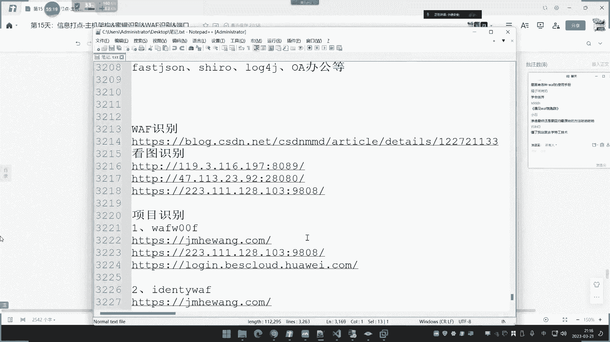

你看我在网上给他搜一下，那我就搜这个夸克的吧。

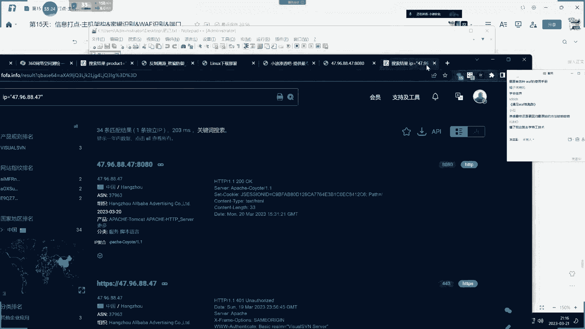

每个平台我都用一下，一杠二了，我设置这个WAF给他看一下。

哎这个好这个这不能这样子，就算我用音图的吧。

音头上面可以有一些那个那个啊，那你看他这个AWS亚马逊的，华为云的，还有什么一勋的申邦亡于新人，这都是一些安全厂商的嘛，安徽王敦大都是一些厂商的啊，比如说这个亚马逊就是点开一下啊，这都是收到保护的。

你可以自己打开看一下。

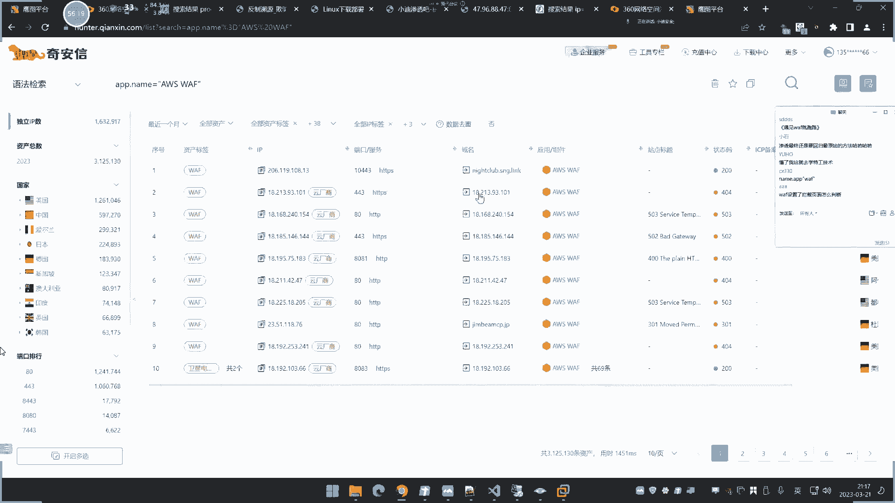

我打开一看一下。

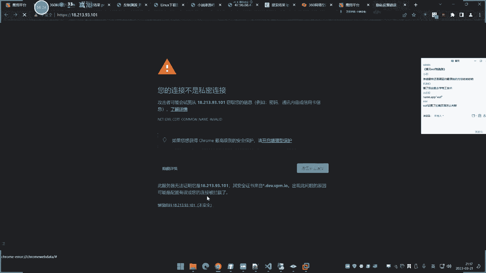

啊这里啥都看不到，但实际上呢当你一旦攻击的时候，哎这就会咔咔咔的给你来几下是吧。

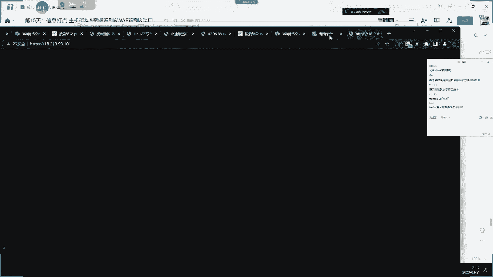

给你拦截掉，对不对，这都是一些这个，亚马逊的啊，其实就是说别人呢在这个亚马逊上购买了，云产品，云服务器，然后呢可能用到它免费或者收费的这个Buff，然后这个东西呢就受到保护，对不对。

那你看这外服我们又放弃了嗯，然后呢我这边可以给看几个案例啊。

你看一下啊，你看这几个还有个看图识别呢，我给大家看一下啊，看图识别呢是在这个项目里面有啊。

就看哪些图片啊，我给大家看下来。

在这个WAF项目识别项目里面，有这样有种那叫CAMA，这里有大概八十四张图。

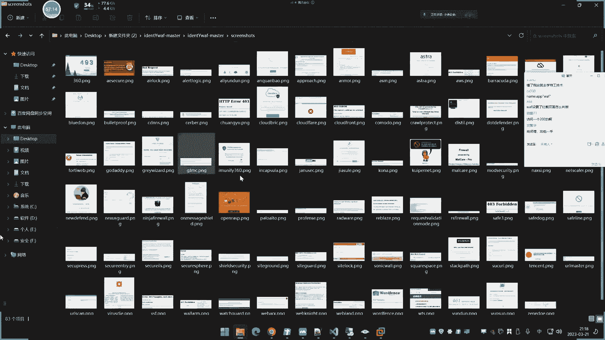

都是我们国内常见的网红呢，看一下360安于web应用防护系统啊，这是图片啊，这个这个是什么系统呢，这都是通达wolf的一些场景页面，看，我给大家简单过一下，国内外的各种WAF产品和人产品的。

一些WAP的一些这种界面啊，大家自己扛啊，我就不一个开打，你下去你自己观察，有些人会直接表示他是哪家公司或者图标，有些呢就没有，没有的话，你就可以通过这个项目来帮你去看。

这都是一些常见的一些WAF的界面啊，那安全狗的，这是安全狗的界面，国内外的啊，这里呢它整合了国内外的八十四种Buff。

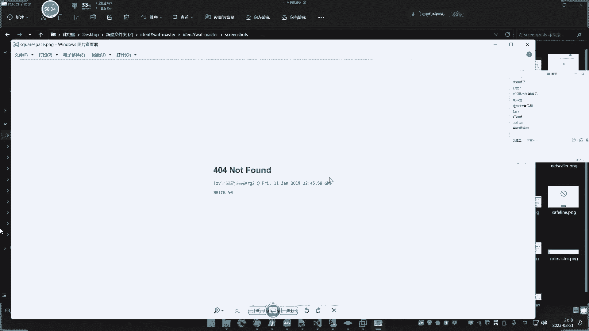

有软件的。

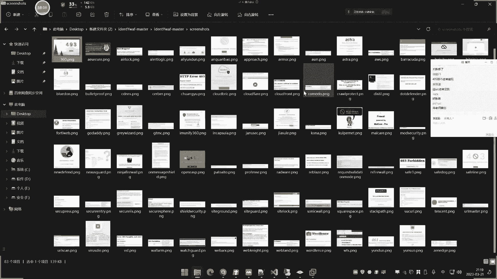

有硬件的轮廓和都有，然后呢如何识别啊，来给大家看一下啊，比如说像现在的我们看一下这个网站，这是采用软件搭建的安全狗，国内随便一家公司的啊，这用不到安全狗啊，那你说我现在进行注入，那是不提示呢。

网站防火墙看到没，我对他进行攻击，提示网站方向，那这个页面一看都知道安全呢，你看一下啊。

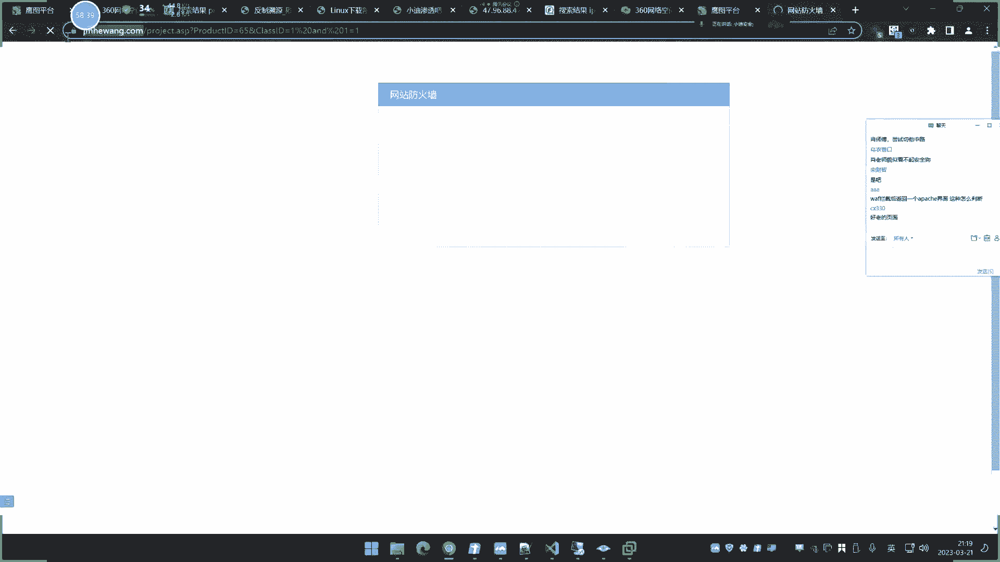

我识别一下是安全的，就说你懂页面识别，你就看页面，不懂页面视频就有项目来，我们用这个识别一下，给大家看一下啊。

那两个工具啊。

一个是这个WF00F的工具，一个是另外一个项目都可以哈，打错了，先买了这个web目录，它的安装呢我就不说了啊，安装项目里面有个安装，就是直接用这个。

安装那就是直接用这个了，安装在哪里，pip Python运行pr点一多就会自动安装。

安装好之后呢，这里有个目录啊，连接到这个目录里面，然后这个目录里面啊，直接用这个目录SAMA进入进去。

然后Python去执行这个MAPY，那就是WAP的使用，然后呢使用方式呢后面加上目标地址就可以了，我们把目标就填进去啊，然后他就开始一遍，你看识别出来一直C位dog wa安全狗。

然后他支持哪些的一个识别呢，我们可以看一下它这个列表，就是他支持对象杠L对，这是他支持的一些对象的一个列表，我们可以简单看一下啊，然后后面是公司名，外国名字和公司名思科的一个公司啊，然后你看到阿里巴巴。

阿里巴巴的阿里云顿对吧，那安全包安全包安于安于，那就是后面的是公司名字，那亚马逊的还有各种各样的cod的，包括我们一些其他的一大堆呢，华为的国内外的一些了，加速了KSYF。

这都是国内外比较常见的那十个多个嗯，很多啊，你这里那那腾讯loud腾讯云的，一个自己看啊，那WT护卫还有什么护卫神啊，W护卫神那叫云敦云锁，不过这是后面的云端，这个云锁那是用的很少了，玄武盾。

玄武盾全部灯好像是暗红的吧，还是这个绿龙的，我不知道，好像是暗红的吧，很多啊，这是在知识的这个东西后面和一些厂商名字。

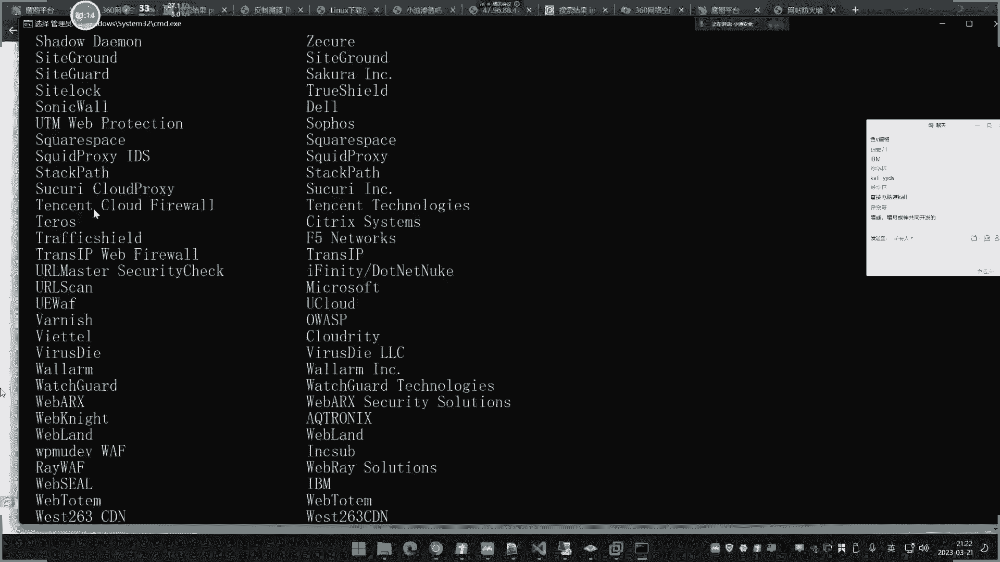

你看他识别出来是不是。

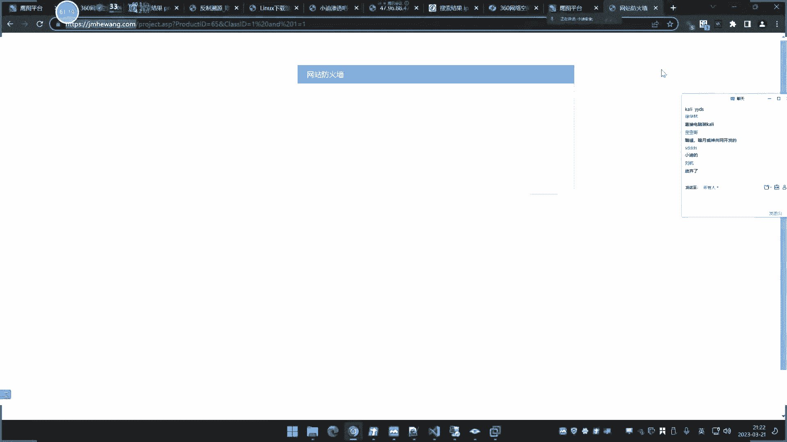

然后你看啊这个识别表情往复，那这里呢我们继续来看一下啊。

孩子。

除了这个工具的识别，其实网络空间它也网络空间它也能识别。

所以说网络空间是个非常重要的一个知识点，要用到这个网络空间去查资料。

他也能识别，我们都会说，然后我再再举个例子呢，你看这个啊，我打开给他看一下啊，啊这个报错页面了，你也能看到这个页面把你IP记录下来了，然后呢这是你的LVID啊，后面啥都没有，你也不知道这啥情况。

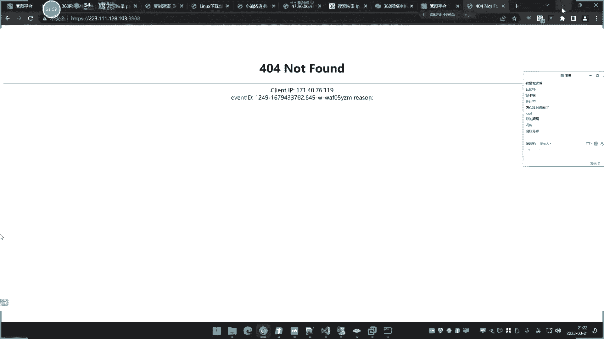

这个页面就不正常嘛，对不对，拿回记录这些信息呢，其实呢你就碰上WF了，那你看下是不是识别下来，识别呢也是360网站宝，360公司的sunny网站榜。

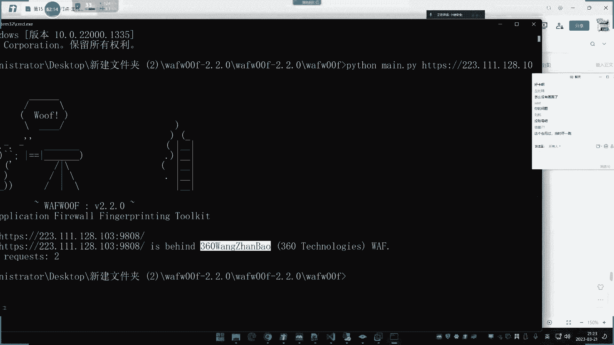

对不对啊，你看下面的还有啊对这个是用的呢华为的域名。

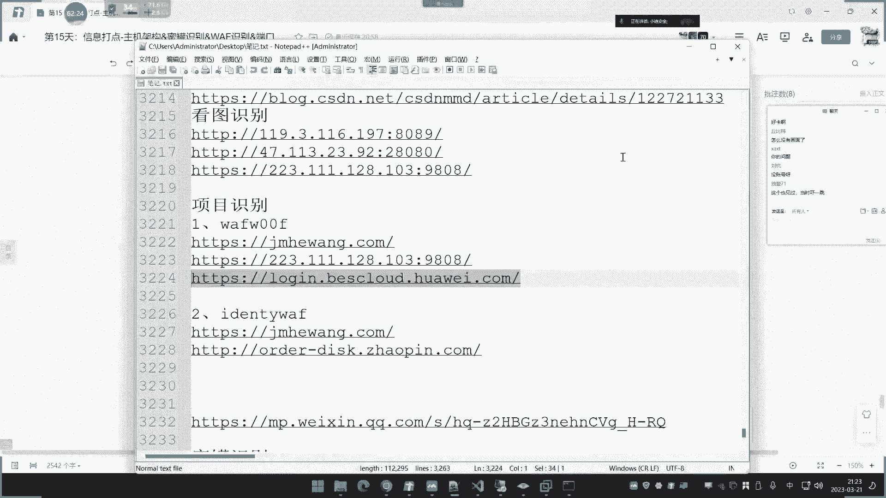

那你说是华为，那是什么保护的，这个域名都是华为的，那我找到个网站，华为的呢，login close呢，华为点com，华为的差，TORWAY呢，一华为loud firever，华为华为云的Buff。

因为他自己公司他肯定用他自己公司产品。

这还用说啊，对不对，你里面还会用阿里的产品好，这就是这个产品啊，这是这个产品，然后呢还有一个产品，就这个产品啊。

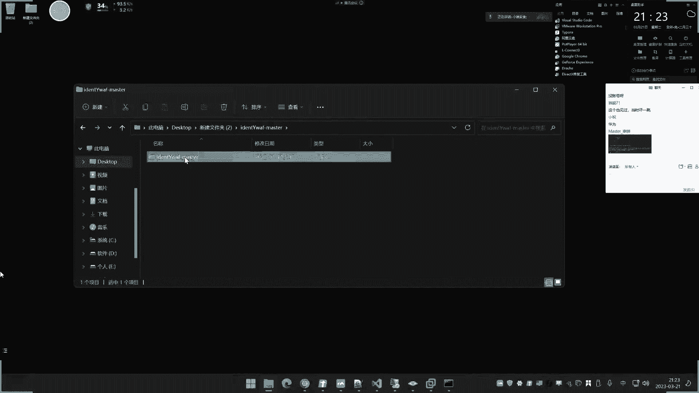

这也是个识别啊，那两个都可以联合使用啊，也没有说哪个就好。

哪个就差，我们就是简单介绍一下，因为这也不重要啊。

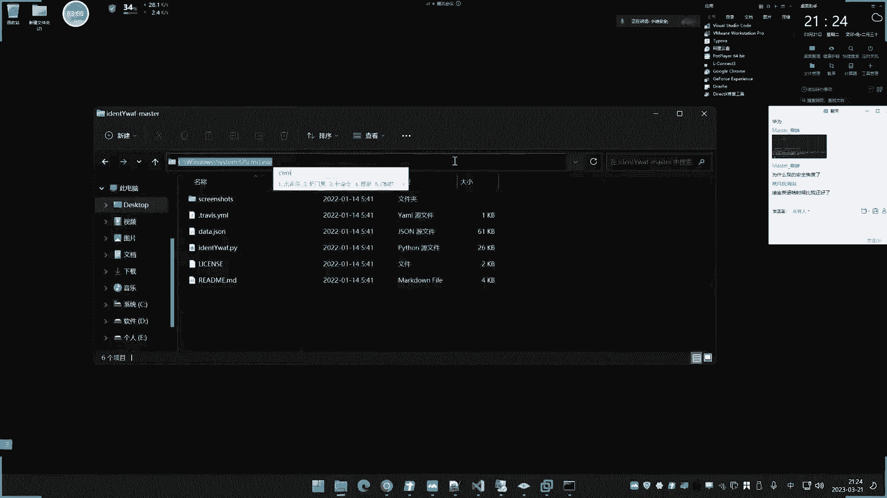

你识不识别也无所谓的啦，你碰上的你大部分也会放弃识别，那就是告诉你让你更死心一点啊，你碰上的是什么东西了，我刚才说了啊，你可以从他这个产品的是人rap呢，还是什么鬼啊，你可以找点自信对吧，是安吉万福。

什么安全过了，你还可以是吧，还下嘴啊，你碰到人外服的嘴都不能还是吧。

不过也不是说嘴都不能还啊，有些还是能还的，具体看什么事情啊，只是说我们能还嘴的都是一些小小方向啊。

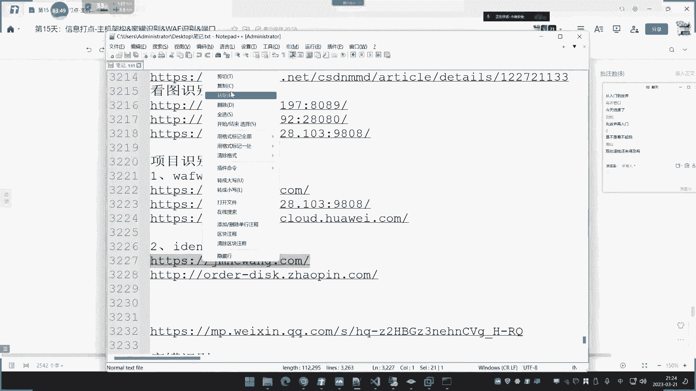

不是说所有东西都能还嘴，你这个呢也是呢帮我检测判断出来呢，So dog，然后呢他一个payload测试，这个payload测试，那就是说他检测它的一个具体是不是，这个收到的一个测试45个。

那判断出来百分百是server dog，那他最后一个结果，然后还有像这个呢看这个招聘点com，这也是国内一个大招聘网站，早点看看他这个判断，判断出来了有几个缺陷呢。

87%是这个百分之多少，这个就是说给个判断方式，然后除了这个之外啊，两个项目能够判断之外，还有哪些能判断呢。

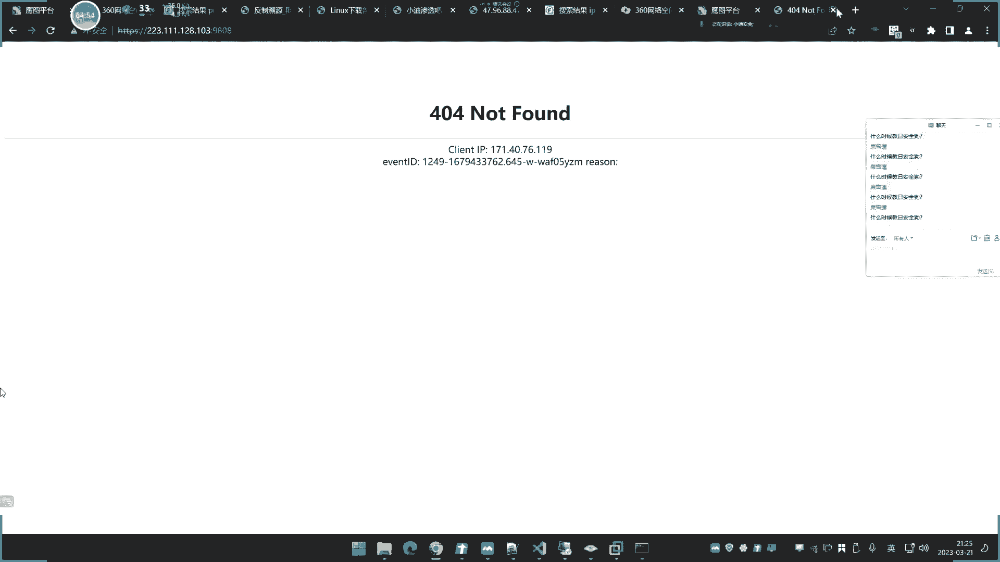

那很简单嘛，对不对，直接用这个黑暗引擎搜啊，搜这个目标信息啊，对吧，然后你可以根据这个里面点进去看看，那上面这个服务产品会不会有显示。

对不对，就说其实呢就是说除了这个产项目之外呢，你还可以用空网络空间呢，帮你去分析它的一个情况啊，看一下它这里面的针对这个上面的一个情况哈，他这里做的是阿里巴巴的，虽然说你是阿里云的服务器。

但不代表你就有阿里云，阿里云的那个保护啊，因为我说了啊，他有些产品呢是免费邀请你开通，让你用的，有些那就可能就是收费的，所以说不是说你购买阿里云服务器就受到保护。

不是这样的啊，不要搞错了啊，那里面的如果都是阿里云，那我打进阿里买个阿里服务器。

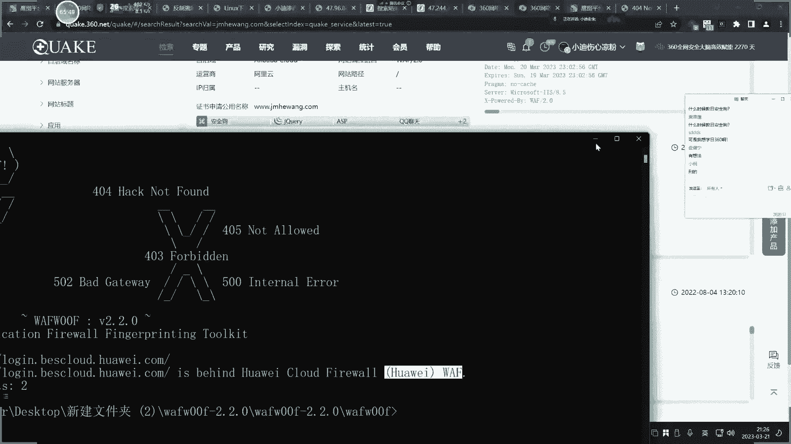

搭建网站都安全了，那就不正常了啊，他要花钱的，你看这里那里看啊，从那个上面那里可以看到的是显示WAF，2。0的，你看2200呢，你可以自己查一下这是什么东西，往上一查就知道这是安全口的东西。

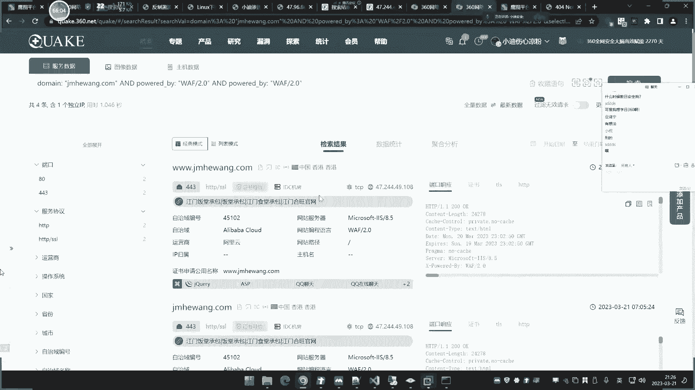

所以说从这个引擎上面呢，也能看到他这个大概的一个情况啊，对不对，从这个空间里面呢，你看他标识了，你看安全狗看到没。

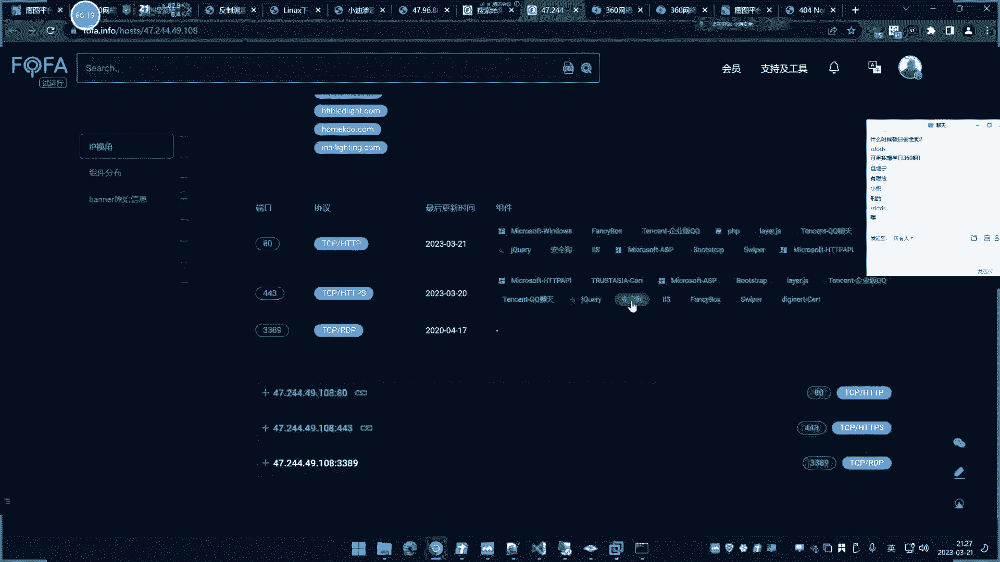

刚刚是密码安全过来，它也能帮你有这个信息收集，包括你可以再看这个地址是吧。

然后点一下那个那个数据的统计是吧，聚合分析，还有这个什么鬼聚合分析啊，没标识呢，360网站卫视是吧，他也帮你。

这边看这边有没有呢，也是判断出来一个叫CWAP杠YF呢，对不对，他的判断其实也从这个server里面看到，没，有，waf server的中间件都看不出来他是扁这个东西了，但是这只是部分有效。

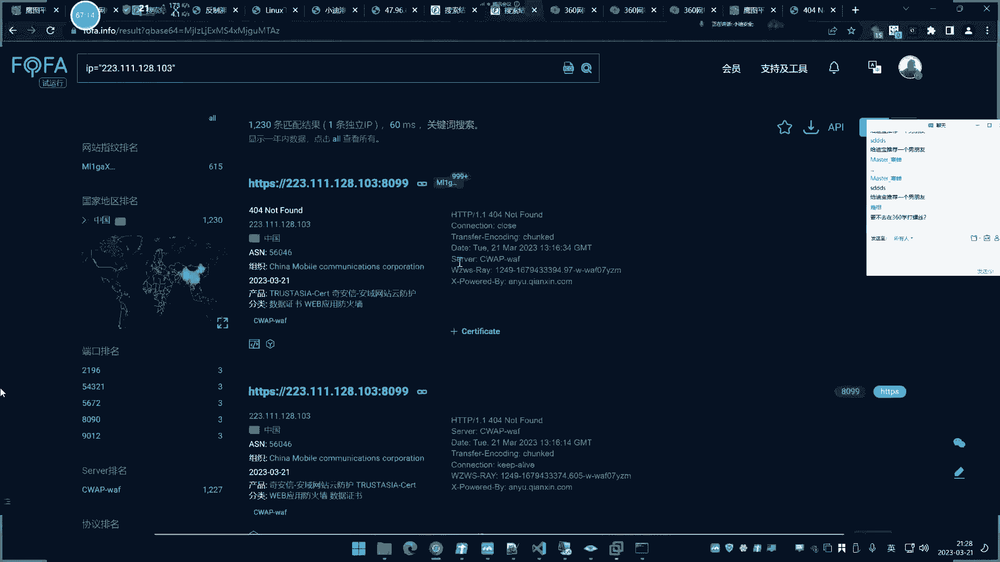

还是显示，所以说啊你可以从这个网络空间上面去判断，也可以判断WAF的情况有没有的，这也是一种方式啊，好这个就是WAF识别啊，它的识别呢，对于我们后期的一个测试思路有影响，因为你如果说识别出WAP来了。

那其实就是告诉你啊，在web上面那些安全措施呢，90%多的机会就没有了，就是基本上就要宣告结束了，那你就只能找一些不一样的地方进行测试了，如果说你实在是没办法，那你就只能咬着头皮呢。

去看他是不是有些没有包，没有一些没有部署啊，或者说部署的这个是个垃圾的WAF呀，只能找这种这种情况出现了啊，就像什么他可能有些开关没有开呀啊，导致有些东西没有保护到啊，找这种缺陷了啊，如果碰到了。

如果你还是要在外面去下文字的话，那就只能找这种空格，否则的话我们基本上就要换思路了，就是不要去弄了，以前呢还有人说啊，这个怎么着啊，怎么着，经常还有人经常这个发消息给我吧，怎么着啊。

我们讲的只是告诉你一个研究技术，当你真正碰上的时候，你要根据他的产品类型决定能不能绕的，就是我说的那句话，能绕的话，这个产品它还有什么必要出现的，直接解散了算了是吧，你一个普普通通安全研究者。

还就学了几天的安全，你就把别人安全研发多少年的经历的人员，掉在地上打，你觉得合适吗，显然是不合适的，别人几10万几万块钱买的东西，你说搞就搞，所以说有些东西啊你自己呢有谁要想一下啊，这可不可行啊。

我们说绕过是研究，就是我们学习那个绕过技术，在实战中的话是有一些局限性的，就是因为他的绕过只是猫如果某一方面，但是不代表这个绕过就能干嘛干嘛，这是第一方面，第二方面就是研究这个技术，为我们是吧。

做这种产品研究和绕过来提供文章，因为很简单的道理，就像网上挖漏洞一样是吧，比如说你挖了个漏洞，这里面一个网站泄露了个人用户数据，对不对，好，如果是你的话，你说这个用户泄露用户数据和你拿不拿。

拿不拿得到这个网站权限，这是两码事情，你泄露用户数据，你就一定能拿到网站权限吗，这不一定的呀，而且还有很多路要走啊，但是呢你把这个泄露数据提高提交给漏洞平台，他就认定是吧，你挖到漏洞，你说这怎么说呢。

对不对，不一样的呀，就和我们这个地段和这个玩法一样啊，你能够绕过他某些功能，对不对，这对产品来说就是一种安全隐患，诶他就觉得你搞得对，我就给你奖金是吧，所以说我们讲的是应用到这一块，而不是说讲完之后。

实战中碰到个网站，我就是，干到你拿到全新为止，对不对，不现实呀，好这个就是我们说的这个WAF啊，然后呢再来说这个咪关啊，这个咪关呢就是非常有必要了啊，WAF咪关为什么讲这两个，其实这两个说白了啊。

我之前的都没有很刻意的去讲这两个东西，上一期我都没有讲闭关，但是我意识到不行了，这个现在要跟着死了，潮流就像我们打红蓝对抗的时候，这个蜜罐那是太多了，你如果不懂他的，怎么识别他是个很丑的事情啊。

你我们只是讲了男队上面部署蜜罐，就从男队的角度上面，那些部署蜜罐，防守方去部署蜜罐是吧，那忽悠红队去搞，而作为红队的，你要懂得如何识别闭关，反正就是你自己取决于你是红还是很难，就这两个事情啊。

蓝队呢就玩蜜罐部署红队，他就识别蜜罐，那绕过它就这么简单，那蜜罐是个什么东西呢，蜜瓜是一种安全威胁检测技术，其的本质就是引诱和欺骗攻击者，就欺骗红队人员啊，告诉他我这里有个是吧，有漏洞东西，你来搞我呀。

对不对，当然红队去攻击他的时候呢，他就会把红队的攻击手段和一些手法记录下来，然后呢浪费他的时间，从而呢记住它的攻击手法，还原他的这个攻击手法，然后呢刻画他的形象，同时也浪费他的时间。

最主要的就是他攻击完之后呢，发现啥都没有，很气愤是吧，很烦，像百度，那就达到这个效果，所以说啊这个蜜罐呢在蓝队那边，是部署在红队这边的，我们就要学会识别，不然的话你识别不了是吧，你觉得呀我找到笼子。

我找到一个点了，好像可以，对不对，结果呢发现就是别人故意给你留了一个陷阱啊，你还在上面搞，搞了半天啥都没有，这个我说大家理解了吧，这个解释能不能理解，先理解再讲，因为我这个密码是第一次提出来啊。

这是基础课程啊，不是讲到后面了，后面我都不会说这个意思了，好能理解是吧，好密瓜呢分为几种类型，有哪些类型呢，三类低交互中交互和高交互，怎么理解这个低江湖中江湖和高江湖了，其实很好理解。

就是交互程度的一个等级，什么叫交互程度啊，简单来说就是你这个密码设计出来，别人是和你建立意识连接，玩一下就玩了，玩了呢还说和你在玩一玩，还说和你很深入的玩呢，对不对，就和你交朋友一样，对不对。

你是挨了一个星期还是挨了一个月，还是挨了一年，是吧，这个低中高就是这个意思啊，其实他就是取决于这个迷官的一个情况，就是说需要这个攻击者在里面玩了一季，还有一季继续做是吧，就是把他的玄心尖尖是简单玩一下。

他浪费一下就完了，还是说一直玩，他一直给他设置陷阱，刚进来这个再给他放另外一个是吧，就一直忽悠他，那么一直忽悠我们称之为高级是吧，忽悠的差不多了，我们就称为中级，简单忽悠一下就称为低级，就这么个意思啊。

所以有这个低中高了之后呢，就会有不同的产品，因为我们知道有些东西就能只能低级忽悠，有些人就能中级忽悠，有些高级忽悠一下呢，数据工程机关对吧，网站蜜罐，武林王，米关公空蜜罐，由于这个应用对象的一个不同。

所以它的等级都会差异，你像web密码，你说web密码怎么忽悠他呢，无非就是网站给他好，他去找找找玩玩，玩没了呀，对不对，如果说你搞个其他的这种什么物联网工控，他进去之后呢，还有下一个要玩的啊。

下一个呢还有下一个玩的，所以这个低中高呢，其实就是取决于你这个蜜罐的对象，你是搞个网站，他玩的还是搞个数据库，他玩的还是搞个什么东西，他玩由他决定的，所以呢你如果要对目标进行分类的话，就有这些啊。

好那么蜜罐产品有哪些呢，啊就是难得的一些产品，我这里也给他搞了一张图片哈，你这是从360夸克上面露出来的，来一些闭关的一些产品啊什么，那这些产品的名字啊，这都是男队经常部署的一些产品名字密码产品。

那什么SHFTP是个cl啥意思啊，你说SH关我播出个SH关会导致什么事情呢，就是一个目标服务器是个SH多口令，比如说登录账号root密码123456，哎你扫呀，扫到了，开心的不得了。

登录进去发现啥都没有，对不对，好那就是这个东西是吧，那我这里讲到这里呢，我们就有必要呢去给他看一下，这个这个这个这个闭关的识别原理啊，这个识别原理呢，大家可以可以简单下去看一下这个文章。

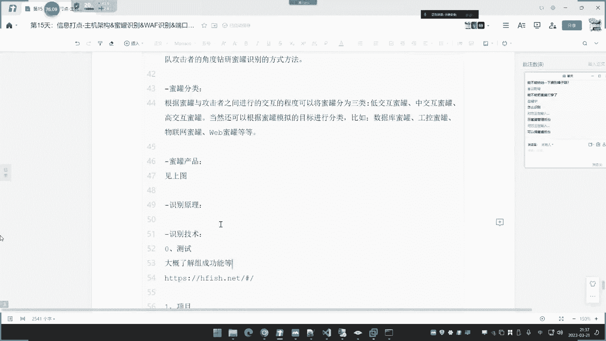

我们就简单过一下啊，因为这个词语原理不是我们可以理解的。

我们只要知道怎么用就怎么识别就完了啊，这个识别原理就是很细节，就是说为什么这样识别啊，什么情况，那有什么基于这个指纹识别的，就是由于呢这个蜜罐的平台，有一些软件平台是吧，然后软件平台呢它会有一个特性。

就是它这个设计是吧，是怎么设计的，然后里面有固定的东西，就比如说你访问他网站，然后他返回是个固定的东西啊，你就判定这个密码对不对，这是一种指纹，就说这个基于这个产品软件的一个固定特性，识别的孩子呢。

就是基于这个什么说源方式，就是蜜罐医馆里面有个什么东西呢，就有个叫方式，我等下会讲啊。

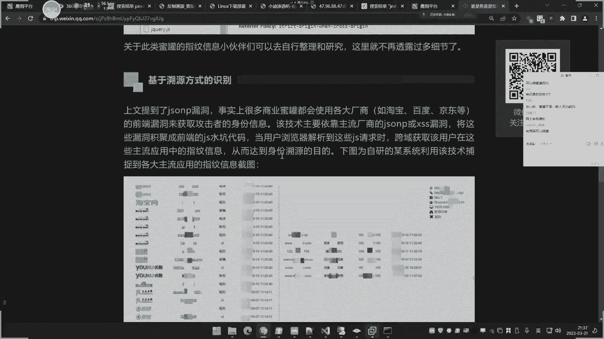

我现在先不说，现在呢我就先给他补出一个简单密管，看一下这个蜜罐大概功能，然后呢从这个功能上面，我们就能大概了解如何识别它，好，先从难度角度，就是我先补一个闭关啊，然后补个蜜瓜呢。

这里呢为了确保大家能够下去浮现，我也是在服务上面，我啥都没有装，我给他演示免单单，我给他装好了是吧，下去自己又不会装。

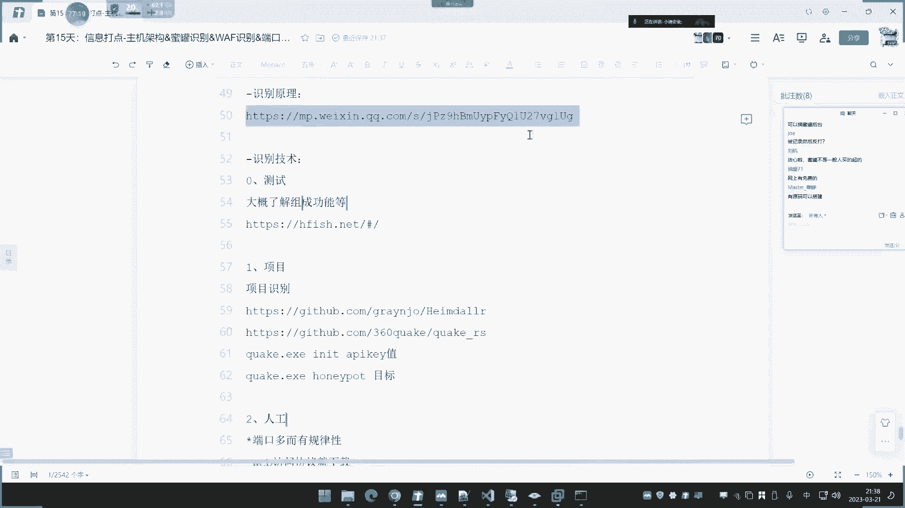

优妈对不对，又要找我，烦得很啊，所以我只能说这里没的是吧，从头给你装，因为装也比较简单，如果装的难的话。

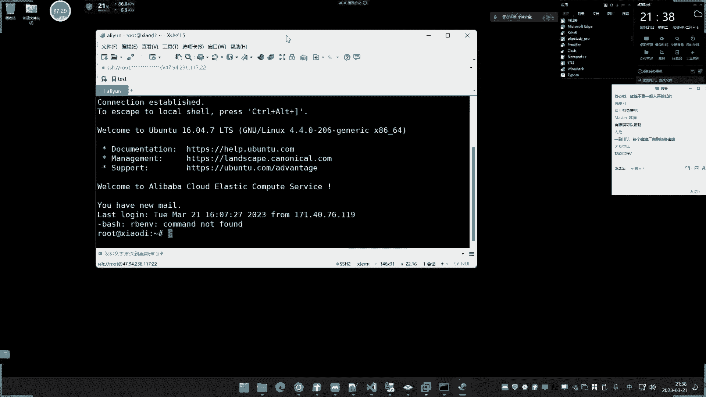

那我没办法给你复习，好，这里用的是这个这个这个H。

发起这个最简单的一键安装，那就直接把这三条命令一敲，如果敲不了，就不管它。

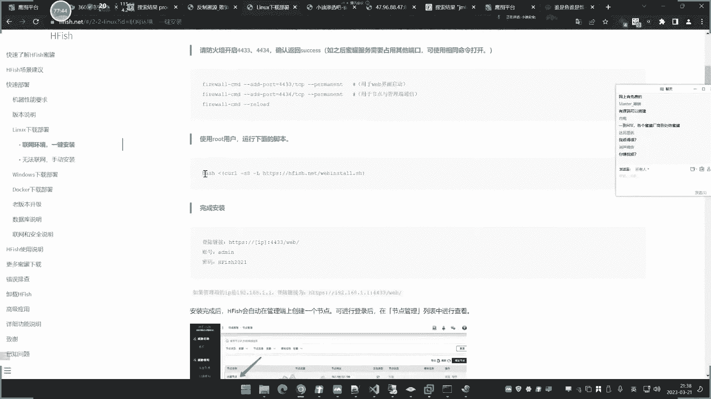

敲了就敲敲不了，那就一条命令啊，就这么简单，那我给他装下，来一安装运行，就直接用个LINUX服务器啊，最好的是在外网去高台即时服务器，那自己测试，或者说你没有钱的话是吧，不想开不想花钱。

你本地的高台丽娜是服务器，古玩图啊，CENTOS都行，他自己帮你下载，下载好之后自动运行。

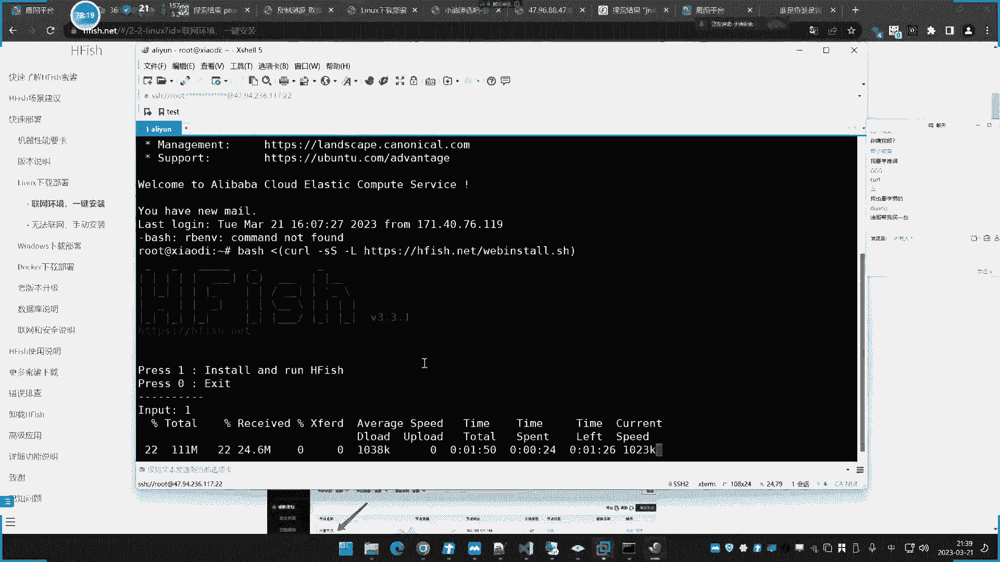

打开，然后呢打开之后呢就会默认开放一个IP地址，是三端口的端口，其实这也是那个特性啊，这也是个特性，啥意思呢，就比如说你像这个产品，它会默认开放43端口，你扫一下对方4433有没有开放。

有开放你访问这个地址，有诶，的在服务器上部署，这个不是闭关，被我知道了，对不对，你说所以说呢其实它的识别是有很多方式的啊。

对不对，就像我刚才就说了，我这个服务器上面不是个密码，那现在呢我知道这个复习。

我扫端口发现一个4433诶，我玩过这个43端口的密码。

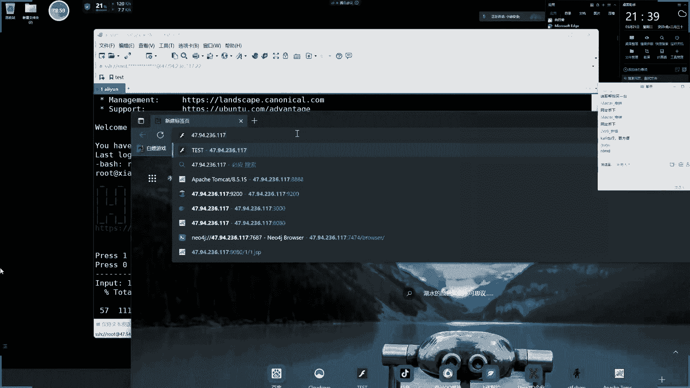

对不对，唯一少的我在一访问你妹的就是个蜜罐的后台，我不就知道了吗，所以这种呢就是我说的他的指纹就是它克星，知道吧，但是不是说每个产品都是这个特性，所以呢这东西就靠你自己平常收集了啊，自己分析自己研究了。

这只是一个很很诚实的一个东西啊，我等他先搞好，然后我们简单玩一下啊，把这个密码部署好之后，简单玩一下，看它是什么功能，然后呢从这个功能点上面我们去想一下，如果要识别它的话的一个常规情况啊。

都是有大量的迷管的，就是蓝队准备好了。

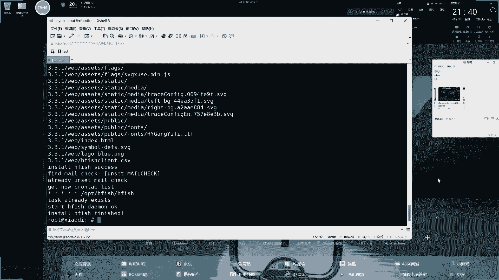

随时让你，是不是这个地址是hp的吧，还是HS的哦，果然是ATPS的啊。

不要搞错了啊，你看abs的啊，你的防火时不要像我一样对吧。

默认密码写进去。

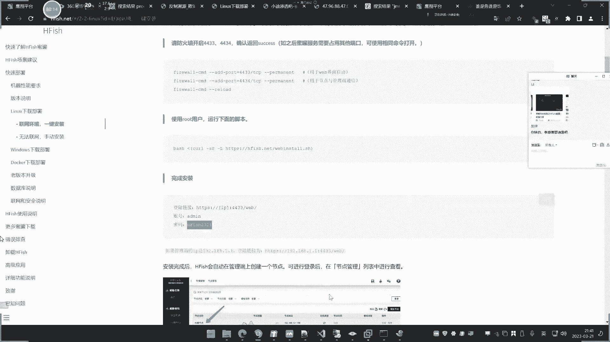

就这么简单，你说这哪难呢，对不对。

就打就好了呀，然后呢选择哪个呢是吧，我们就选择这个吧，内网环境和简单PC就用这个吧，先用这个简单的吧，确定了好。

然后呢，我这里呢，为了防止这里面的有人喜欢搞事情是吧，我赶紧先把密码改一下，我这个已经被搞怕了啊。

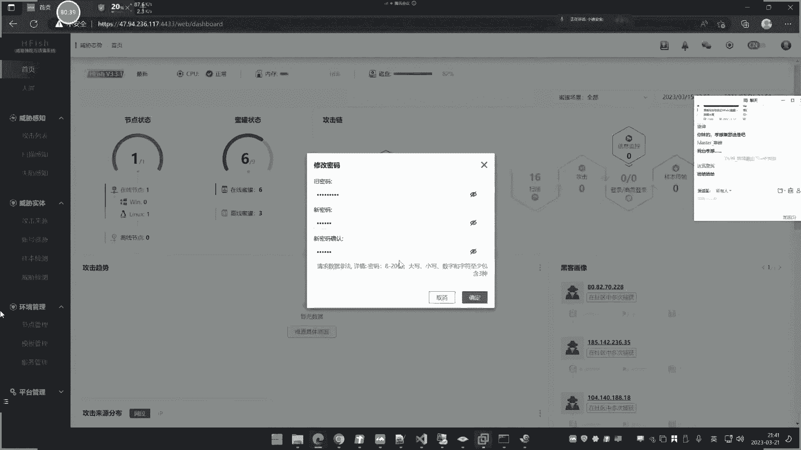

免得到时候里面的我刚一用完是吧，立马就把密码一改啊，我的妈真是醉了，我现在学聪明了啊。

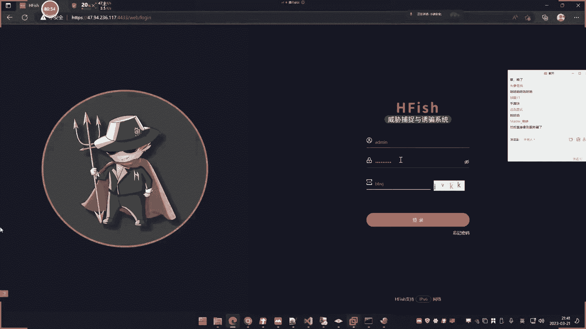

我都是被搞怕的，肖老师现在学聪明了啊，就像吃瓜一样，天天他妈的早上给我打电话找我，今天打，看见我没结，他问我是不是静音了，的不是说废话，我又不是傻子，大家看一下啊，来这个里面部署下来。

我们看一下这个节点管理，你看这里有个节点啊，这个节点是什么鬼呢，那他自己帮你开放的呢，帮你开放920080端口，9000，你自己的结构，根据这里呢把它选择开放和不开放，然后330话。

那就是我默认已经有这个东西开放了，所以他这里的开放不了，因为我这个端口都占用了啊，如果你换个端口就可以了，等下来它默认搞了几个，几个的钓鱼的这个东西呢，比如说这里面有个8080，你看现在我访问这个网站。

它就会有一个8080的一个什么哎，打错了，一个把AP的。

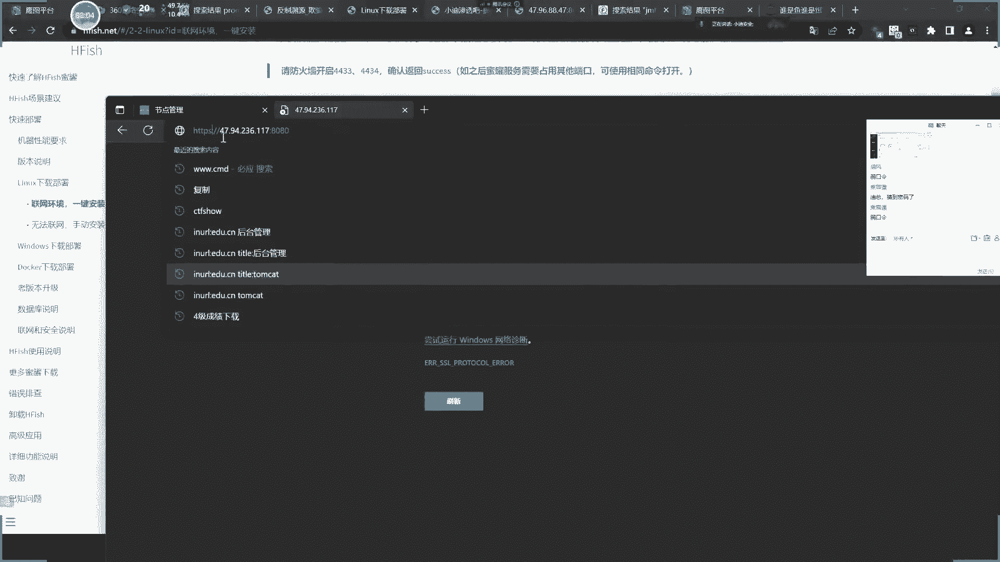

他就会把你骂你，你还默认搞了个东西，对不对，当你对他进行攻击的时候，你看我随便输了，输一些攻击的东西呢，艾特米的米，我输了，他提示密码错误，对不对，然后你看这边的攻击列表，你看是不是检测到了。

你看就这个IP呢尝试过访问，那还登录过，然后你看这里有个支点工具，来源支点呢刚才试过了艾米艾米访问，你看我刚才自己这个估计是别人呢，就是你们那哪个人搞的呢是吧，他就会记录这种信息，而且就会记录IP。

对不对，那就是访问者，然后呢还有像这个大屏是吧，大屏展示任务模式是吧，谁在访问你是谁在干你，对不对，嗯大大屏也是啊，你看啊大概功能就这么多啊，简单说就这么多对吧，扫描也好啊。

这些呢它就会在这个上面呢自己模拟一下，这种存在安全问题的一些东西，你可能会拿这个究竟存不存在不存在，其实就是他模拟一个可以被攻击的一个点给你，然后呢你你那个红队那就在上面咔嚓乱搞。

搞到最后就发现啥也不是，啥都没有，搞不成功，搞成功都都那都那个鸟样，所以这就浪费你的时间，而且呢还捕获到你的攻击手段是吧，谁在搞，对不对，他就很清楚，因为这边会记录IP和攻击时间和包括一些信息。

你看这个还在搞扫描，还在连接我3389啊，这些鬼东西，你只要一开啊，有时莫名其妙就有很多攻击互联网，各种工具都有好。

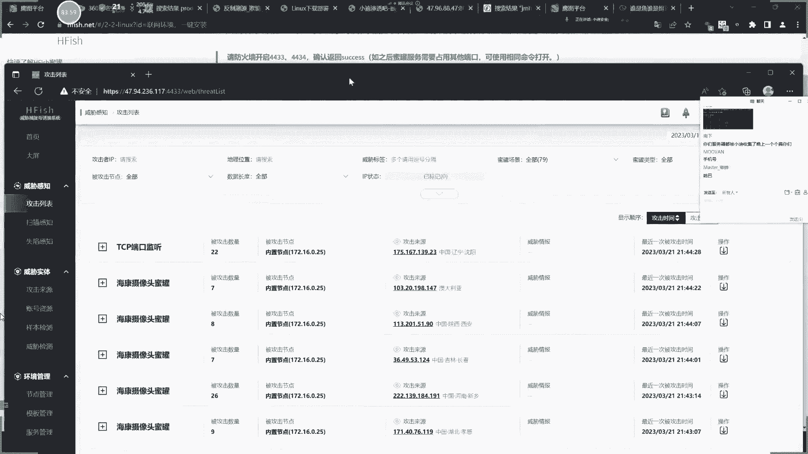

这就是我说那个蜜罐的一个大概情况，我们也不会详细讲的。

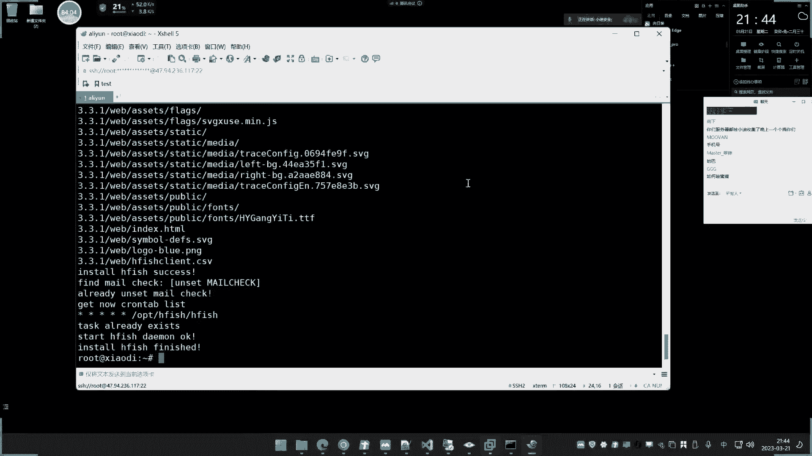

因为这不是我们要讲的东西，我就说做红堆啊，我们现在是先讲红堆知识点吧，好那现在就说是要识别它，识别它是怎么识别呢，有几种方式，一种是用项目识别浏览器插件，浏览器插件能识别的。

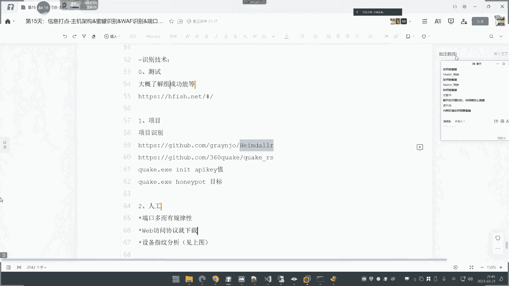

怎么识别啊，浏览器插件安装这里面的已经讲了无数白痴了。

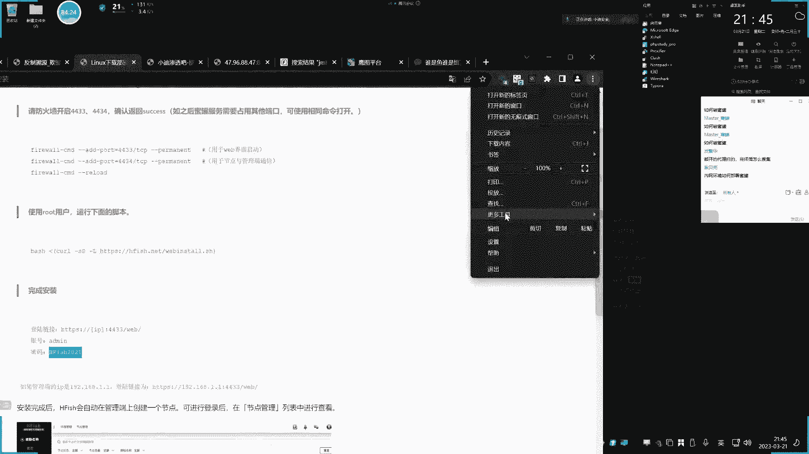

这我不需要安装的吧，那点击开开发者模式，点击加载是吧，选择这个项目我应该打包好了，就这个H开头的，那就这个啦，点击勾选呢，那就拿下我们的这个拿指纹识别反密管特征。

这是一个项目的识别，它怎么识别呢，我们来看一下啊，我打开我刚才识别了啊，把这里把启用起来来点击启用，启用起来之后呢，他就会有个提示呢，开始调试器，我们来刷新一下，你看他这个一一旦嗅探结果为敏感信息响应。

存在手机号码，如果你看到这个指纹和高级这里啊，如果有提示的话，那基本上判定为可能是你管他，可能是B管，好我们再打开这个，你看这个呢我打开它就没有任何提示，你看因为这个八零端口是我一个正常端口。

它的密码是开放的8080，这个对不对，所以这是浏览器的识别啊，但是他说实话他也不准他有一些误报啊，这只是一种方式啊，就是说他的信息越多。

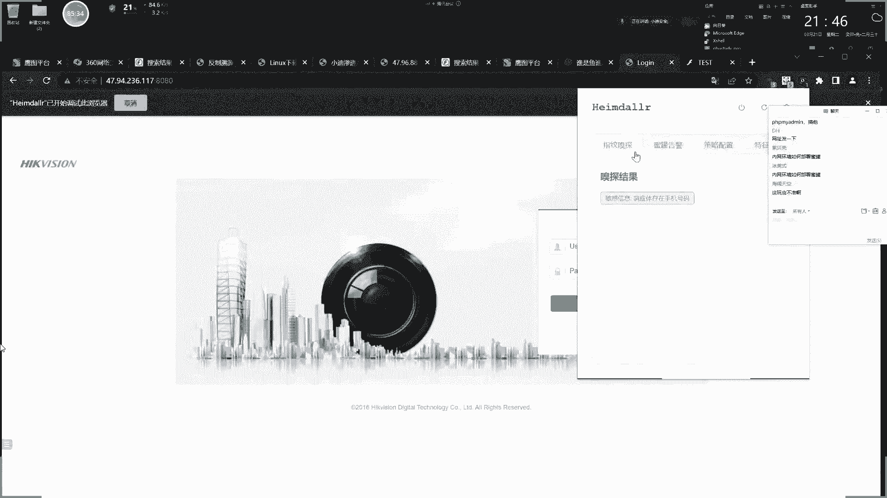

因为很简单，你看我用这个浏览器打开这个，他也可能会提示你看这个提示，你看，所以说这是微信的公众号文章，所以他这个怎么说呢，有些误报率，误报率还有点高，就是这个浏览器插件，简单来说他这个这个东西啊。

啊只是方便准确率呢，那还是有待考察的啊，你就是简单装一下吧，有手呢，比较专业的就是这个工具，就是这个360夸克官方的工具，它利用的是它官方的结果差啊，如何查的，给他用一下啊。

你看啊，为了掩饰这个项目，我今天又花了80块钱，你问我80块钱花到哪里去了，我等下告诉你，因为这个这个这个这个夸克太用的话啊。

你看一下啊，直接运行这个一七，还有还有几个版本啊。

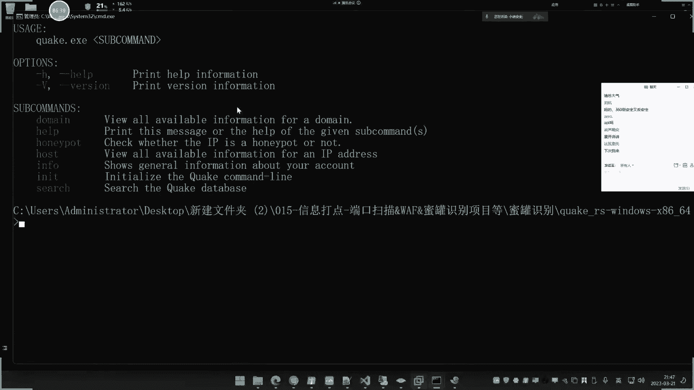

我给了个下载地址呢，这下面都给下地址啊，有DS版本的Mac版本都有。

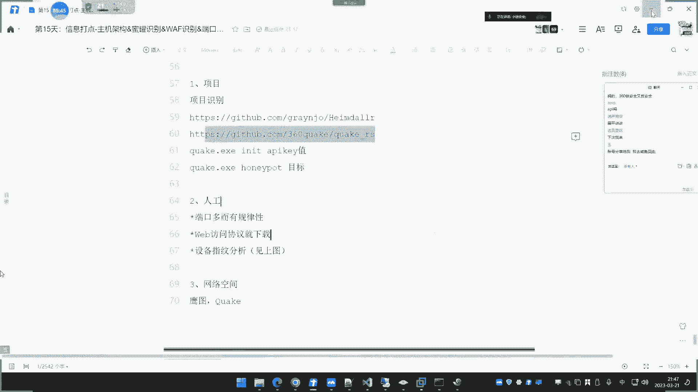

我这里用windows版，我下了个码，我打我也给他打包了，也是windows版本，如果其他操作系统，你自己在那逛下，这个电机就用如何用它就很简单了，Holly holly y p t。

然后加上目标地址是吧。

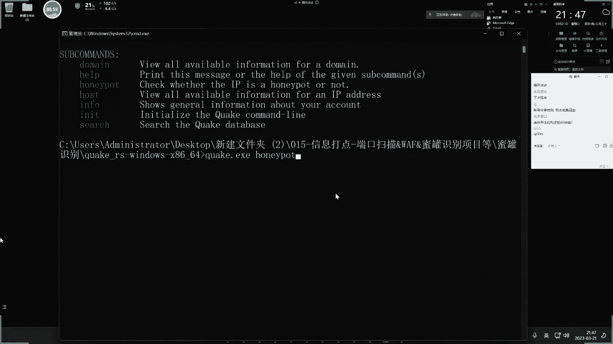

来识别，那我们来识别下来。

来我来实践下来go啊，他说查询语法有误，应该只写IP地址，直接写查一下，looks like a蜜罐系统呢，看到没判定他是个闭关好，你看啊，我搞个不是蜜罐的，我看一下行不行啊，看他是不准确。

我先拼一下我的那个博客域名，我那个博客不是密码吗，如果他看这个啊，看博客那个玉米线这个IP地址来，我来检测一下，检查下我博客的博客那个不是你管啊，卡拉检测结果呢。

LUIS那个reading step来了，看起来它像一个真实系统，对不对啊，刚才那个呢，刚才那个呢看起来他就是一个闭关系统，对不对，结果显然而知了呀，对不对。

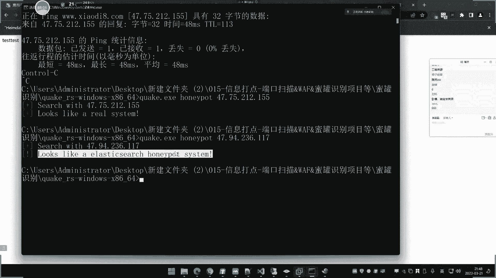

然后他要使用是怎么使用呢，它要使用是怎么使用呢，你直接使用不行的啊，我只是配置好了，你可能问我怎么配置，需要先用夸克加上INIT。

就是说你初次使用无人直接用的啊，要夸克加上IIT初始化一下。

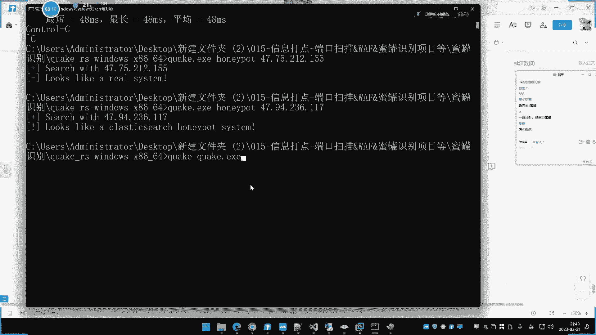

配置一下东西，配置什么东西呢。

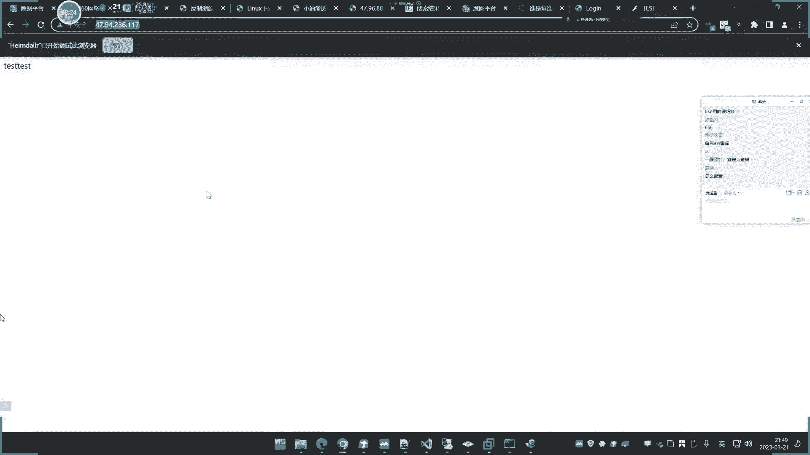

配置这个夸克的这个平台的这个什么K。

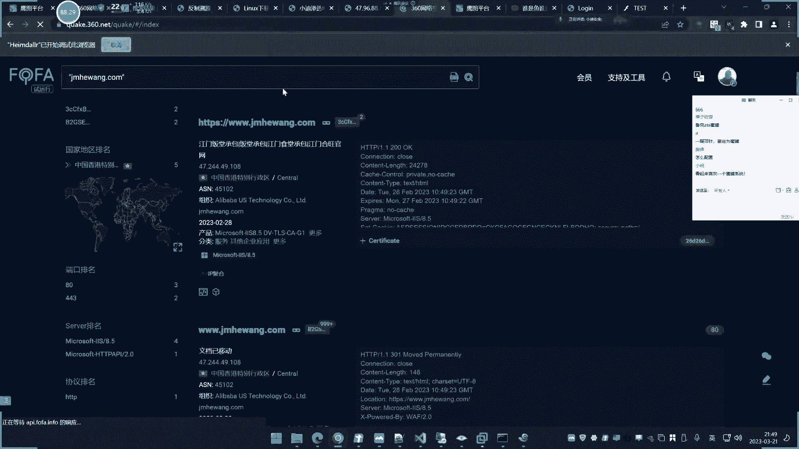

我那个K的积分不够，我今天充了，充了钱，他才能我用，来看我几分，我这他妈的真是你妈的服了，你看啊，这是我今天自己花钱呢，3月20，你看实验，我3月21号，今天12。44。37分。

我花了80块钱，我充了1万积分，因为这个工具呢需要初始化几分。

他没有积分，他不能用，我这个是会员，他每个月要给我送送多少积分啊，那你看这个会员这里啊啊我买了这个夹子呢，我买1万买一碗，就是哎，先不要登，等我先登好不好，不要冲突，先等我用一下。

用完之后你们再用来点这个了，几份呢，80块钱，1万积分，1万积分，就是说如果说你用他那个平台去导数据，导1万条就是1万积分嘛，然后积分不是用完了吗，他这个呢需要初始化，初始化呢就是要把你这个人的信息。

这里有个K嘛，那APIK把它一复制是吧，然后呢就放到这里是吧，就可以了啊，然后我是会员嘛是吧，会员呢我是这个这个体系的会员高级会员，然后呢他每个月送我送我3万条，是不是啊。

然后3万条每到源头就已经被刷完了，具体刷什么东西呢啊具体刷什么东西啊，这些人具体刷什么东西啊，不要抢灯呀，我在上课，你们这听着名字要和我盯着搞，干嘛呢啊，你硬是要我把这个密码全部改掉，一个不给你们用。

就心里舒服吗，啊我真他妈的搞不明白呀，你看看这消费记录，我今天刚充的8000条，1万条数据，到了下午03：46分就给我刀了了，全部倒完了，现在一分都不剩了，还有人叫我去开那个音图会员。

因图会员也是积分制的，他没有那个就是你开了之后，你要导数据就充几分，还有人说你开了，你就搞个印度，互相给我，我冲积分进去，我来用，我他妈的充多少就能用多少，你知不知道啊，你充一充100，充1000。

充1万，他都能给你用完，你自己不相信，你看今天我才刚冲的1900，里面的两点，冲的3年就不知道被谁又倒了，倒完了就不能有积分啊，这些人技术差，他就只会用这种官方的去导，他都不知道写个脚本去爬。

你写个夸克爬虫脚本不能爬吗。

还不是能爬出数据来，他偏偏就要用刀刀就用积分，我是为了演示这个课程，我把它用了，你没有那个积分啊。

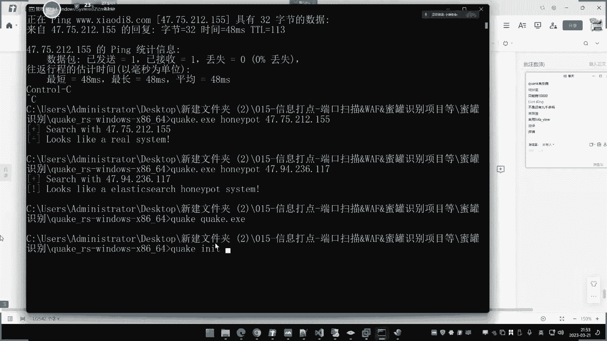

你像现在我即使把这个号给你，你也用不了，因为你没有积分的，用积分用不了，也不知道谁倒的，哎呀我这是没办法的啊，反正没吃到，源头系统只赠送我的这个这个积分啊，那是一分都不剩啊，你们可以到4月1号。

4月2号啊，就打一两天，咔咔咔的没有没有了啊，嗯那是真没办法啊，今天刚充的又没了80块钱。

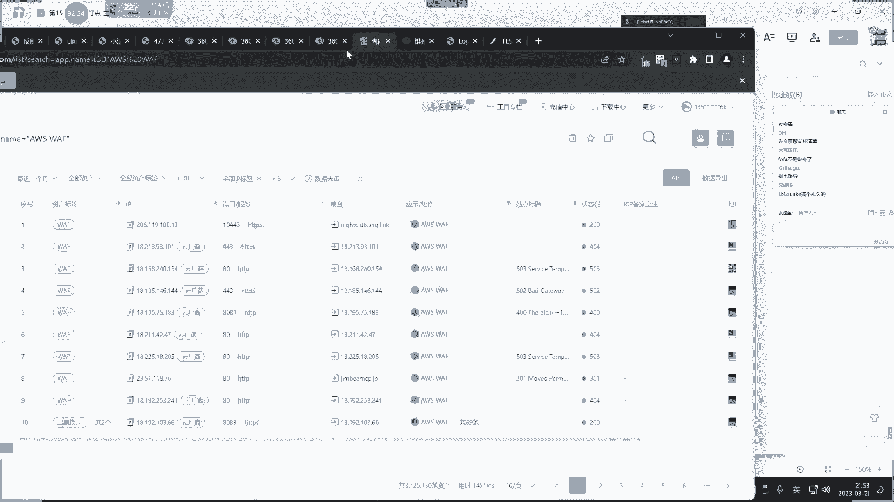

我就用了一个积分没了，唉这样还叫我去搞银土会充几份给他用。

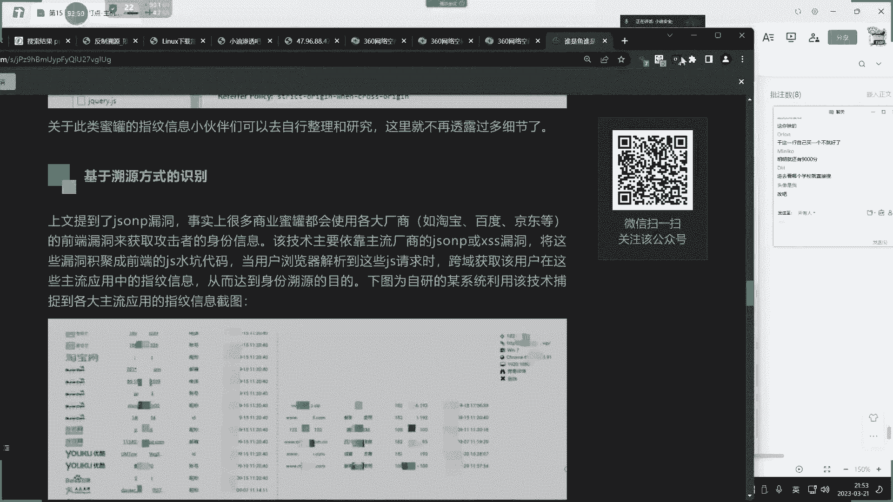

我充1万又能怎么滴呢。

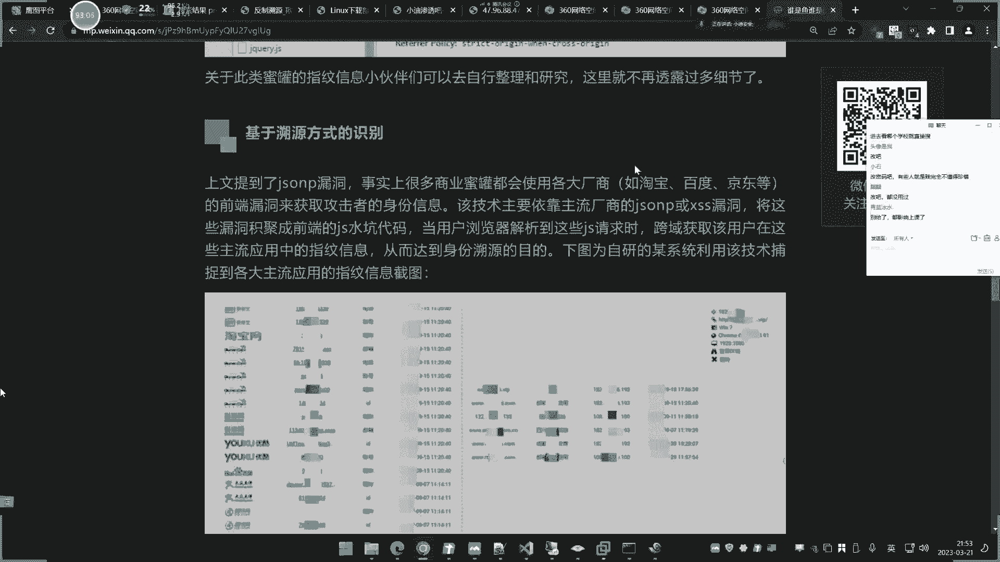

还不是给你咔咔用掉，本来这个号就已经是在鞋柜上面上架了。

还好这个夸克呢他有个检测啊，你上一个号的就会自动让他去提一个耗下去。

这还好一点，底下那其他几个平台是吧。

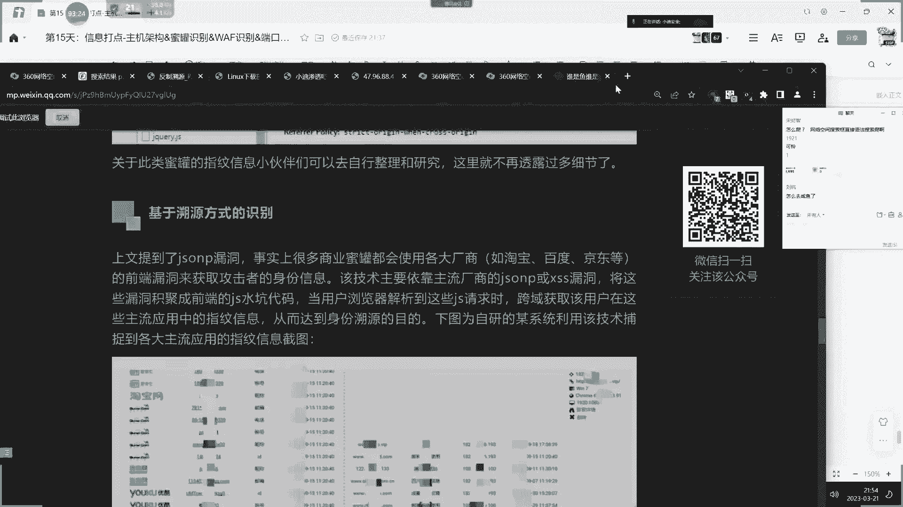

那就更不用说了，我懒得说了啊。

不说这个事情了，所以这个东西呢就这么用啊，你用的时候一定要记住啊。

先要初始化这个API值，如果你账号上面没有这个这个积分的话不行，我是因为前面那我设置过还有点积分。

所以到现在还能用啊，意大利这个积分没有的话。

那就不能用了，好这个是用这个项目识别啊，这个下面这个夸克项目呢是我们推荐的啊，这个浏览器呢就是简单玩一下而已啊，这个是那个夸克项目能够直接识别这个东西的，他的接触的理念呢，其实就是借助夸克这个网络空间。

然后还有人工的啊，人工呢是怎么识别呢，来我给大家举个例子啊。

从我们去分析搭建微观的一个特点来看的话。

我们可以看一下，我刚才这个蜜罐的一个系统的情况，看他什么特性啊，你看一下啊，它的节点里面开的话就会开一些端口到端口呢，这是我们只开了部分，它还有一些模板模板就是说它允许的呢，就这里啦，它有三页。

就是可以模拟各种各样的线，你看看我网内网的密码，还有这种的，只是他这里展示了部分，如果说你要开的话，你还可以在这里呢点进来添加密码服务，来选取你要开放的这个对应的是吧，比如说我开放个新pp给他。

我开放个宝塔给他让他玩，对不对，那他可以选取的啊，所以他每开一个呢就会开一个端口，那么就意味着它的端口多。

对不对，而且呢有规律性，啥意思呢，啥意思啊。

规律性，这个好讲吧，比如说901902903，一直往下面排，这叫有规律性，就是按顺序的，你看一下嘛，对不对，端口呢就是那么常见那么多嘛，他不可能说把一些正常应用端口把它占用掉，不行的啊。

所以他就会一直的就像什么90180级啊，然后一直往后面推推推推就会这种排列模式，所以它的一个特性就是端口多，还有规律性，第二个网络访问就下载，啥意思啊，网访问协议就下载，这是啥意思啊。

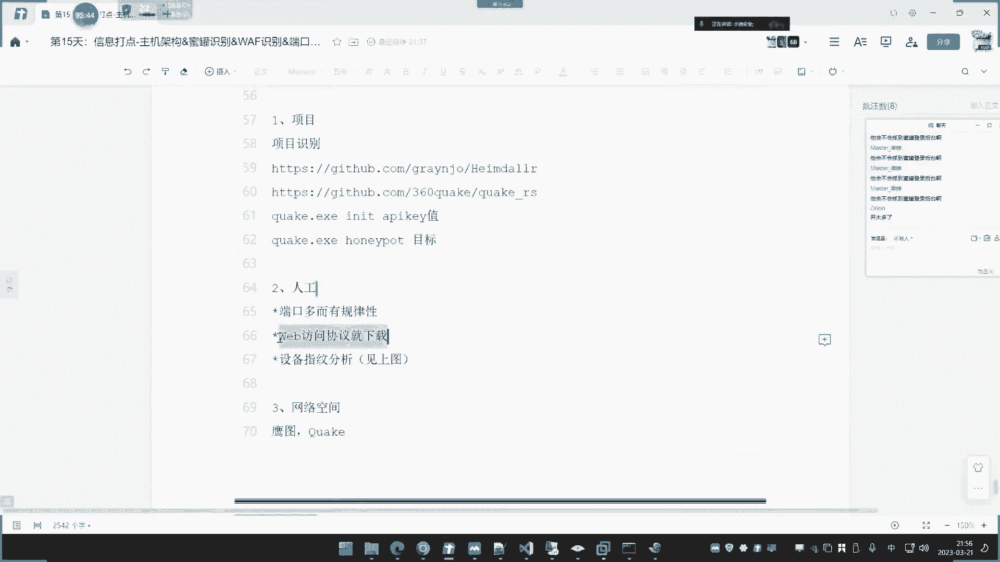

啊这这是个什么意思呢。

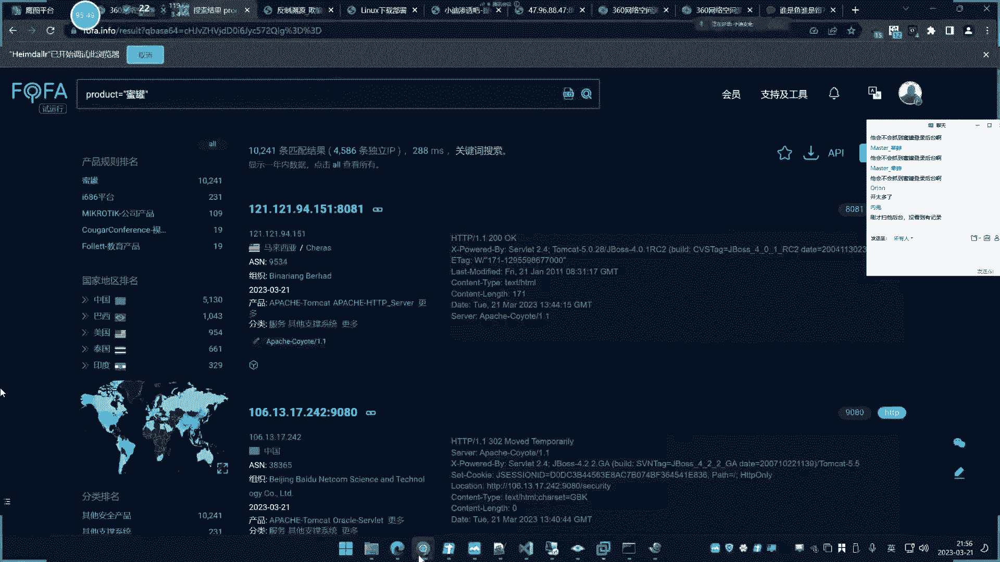

我们想想啊，正常网站我们去访问。

那就像这个这个不是密码吗，那我们之前测试一个扫描的系统是吧，那他打开这个网站对不对，然后呢，我不说它上面开放端口吗，你看他端口开放什么3406，这是MYSQL。

对不对，好，我访问SQL300访问是错误啊，为什么，因为你要以这个这个什么这个app去访问一个MYSQL，这显然不现实，对不对，所以他访问不了，但是一关他会怎么样呢，你访问的时候啊，这只是一个特性啊。

并不是说所有微观产品啊，它只是一个判断的标准，就是如果出现这种情况，就是蜜罐，如果不出现，也不代表它不是蜜罐，因为这是根据产品的设计理念。

有关什么设计理念的，我来解释一下啊，首先我们来思考一个问题。

那我们看一下啊，我们把简单写一下。

这个识别技术有必要了解了啊，难得啊会经常问这个东西。

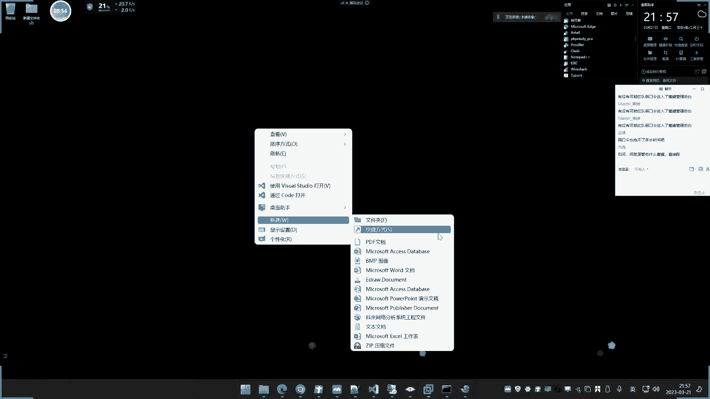

红队也会问，这是红蓝相关的一个面试经常会问到的。

比如说你做安全开发也会问到这些问题什么的，你看啊V8里面，比如说我设计一个SH和这个my SQL，这种这种这个应用的MIA对吧，就是在这里搞一个什么类似的嗯，可以这个尝试。

就是给你尝试这个爆破的这么一个地方，对不对，好，你要爆破的话，它包括了这个蜜罐呢，会记录这个攻击者的这个账号密码，那么这个账号密码呢，它会采用这个web js文配去传输，当你这个区用这个web app。

去访问这个端口的时候，它就会下载，就是瞎子说采用了这个什么协议去下载文件，就这样讲啊。

你之前呢去这个东西不好怎么去讲，原因的话。

你能理解就蛮好理解，不理解我都不知道怎么去表达的事情呢，你直接去访问他，这这这这是真实的访问它就访问不了，为什么呢，因为你用hp协议请求MYSQL协议，他请求不了，但是由于是机关闭关，它这里面有个功能。

或者说记录账号密码，进入账号密码，它其实就是有类似于我们说的这种，叫转发和这个跳转的一个东西，所以你去访问的时候呢，他就会默认用web先去请求这个东西，而他真实不存在这个东西，就不是模拟my SQL。

它还是一个web，简单说就是它还是用一个web的功能来实现的，实现这个密码的，所以呢你去访问的时候，他还是用web，那么web请求web，那就正常去下载和那个类似了。

就说其实就是因为蜜罐的设计的这个功能啊，它和传统真实系统那是不一样的，那两个的协议是不一样的，但是你管那个设计理念，导致它模拟的什么SSH呀和这个web啦，它要传输这个账号密码。

所以他还是用到一些web协议，但是你去请求的时候呢，这个下载。

然后呢我给他看一个例子啊，你看下找一个看这个啊，我来看一下，我打开给他看一下这个网站。

这是一个密码，先看这个这几个产品啊。

你打开看，诶这还找不到啦，好啦行。

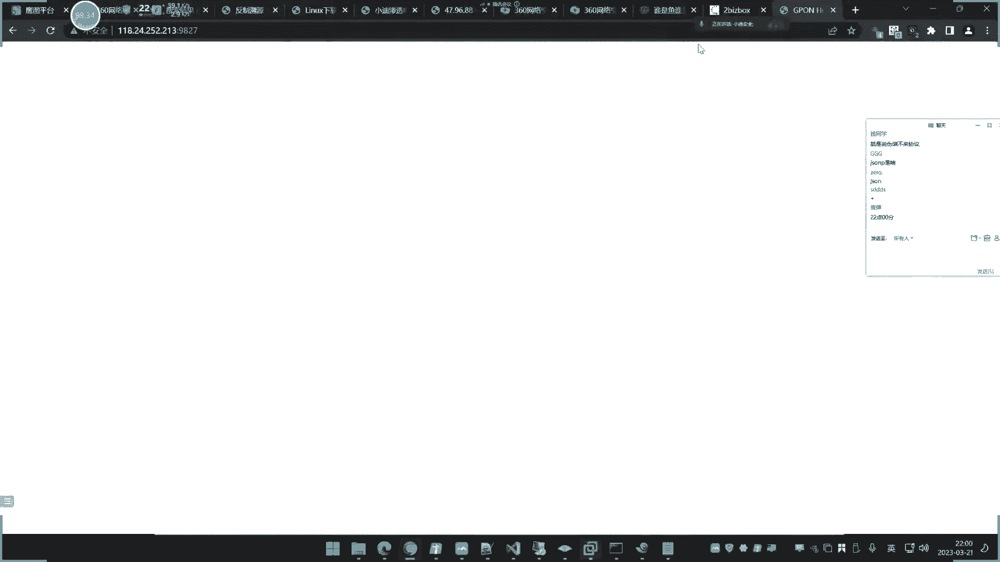

我在这里翻一个。

我先把这个关掉。

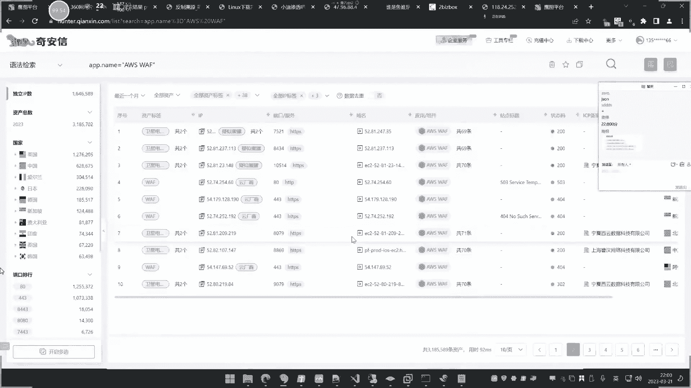

可以给看一下啊，看看这个地址啊，你看一下。

我打开它了，拔三拔十拔十拔十端口，我打开它会发生什么情况，把离合器调小点啊。

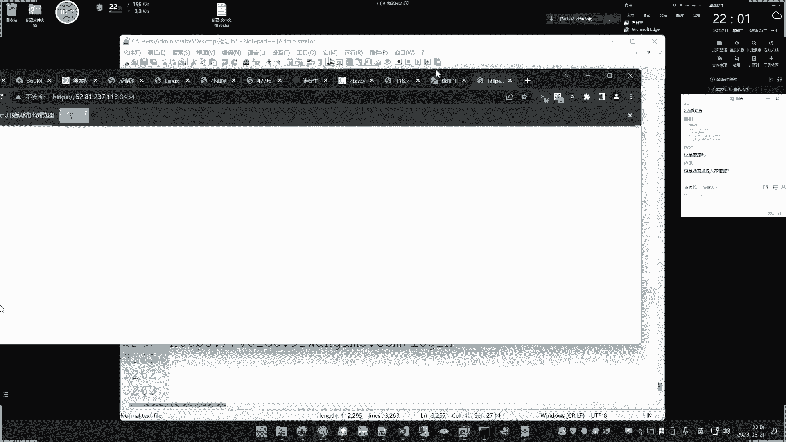

那看来你看这个IP地址啊，我访问这个IP地址，9838端口访问，波形较大啊。

怎么变成这个样子了，我把这个东西给它关闭一下，这都是到南极了。

关闭关闭关闭。

好你看他是下载，你看它下载的东西为什么会下载，你看它为什么会下载这个地址，我把IP打开给它开下来，三九点东西啊。

把IP地址放这里查一下，给大家看一下，你看这个9838端口是什么东西啊，我先给他查一下，9838，诶这个怎么没有9838什么鬼啊，这个原理其实很好理解啊，其实就是说太密罐的设计理念的。

导致它真实应用的出现了解析的一些，上面的一些这个凌乱问题，导致啊，正常来讲它是不能去解析的，但是呢他用web鞋去解析，导致这个网址被下载了，哎什么情况，这，卡了啊啊因土老是这样子搞哎呀，麻烦死了。

这个呢就是这个意思啊，就说明明呢你用web协议去访问他其他端口，协议的话，它就会出现下载，这是啥意思造成的，就正常的一个真实系统，它不会出现这种情况，它不会出现这种情况啊。

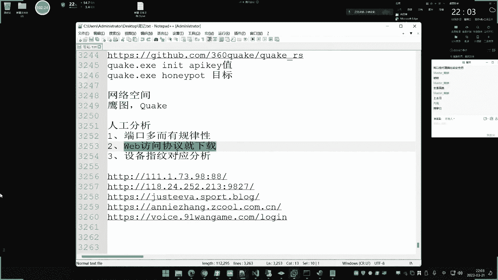

因为你像我刚才刚真实的我，我去访问他呢，他就访问不到嘛，但是你呢哎这个时候呢，你去访问另外一个端口是吧，比如说一关的话，你访问这个端口，它就会下载，为什么呢，就是因为它这个模拟出来这个密关呢。

他有那种类似我们说传输账号密码呀，那个什么JSN就GSMP的技术。

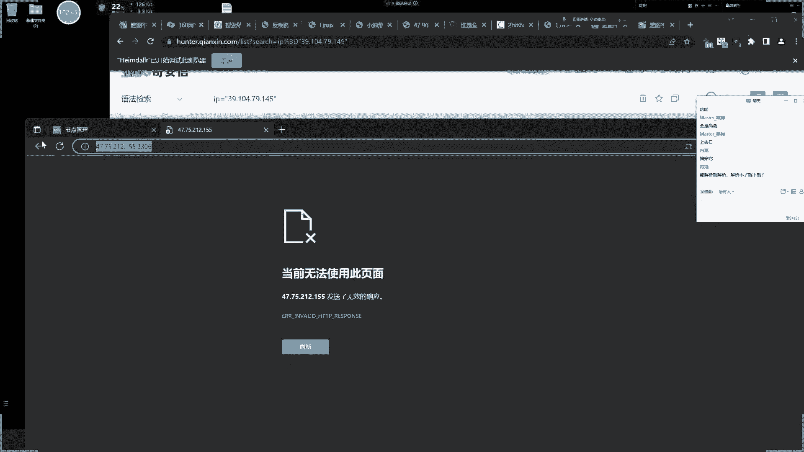

JSMP技术就是类似那种敲转啊，重金香啊那种类似事情，他要传输那个数据，我们蜜罐产品的你应该也看到了啊，他会记录这个什么什么你登录的账号密码，这种事情，对不对，所以它有这个功能。

它其实就是把那个数据再做一个什么中转，然后呢就相当于在上面做了个什么。

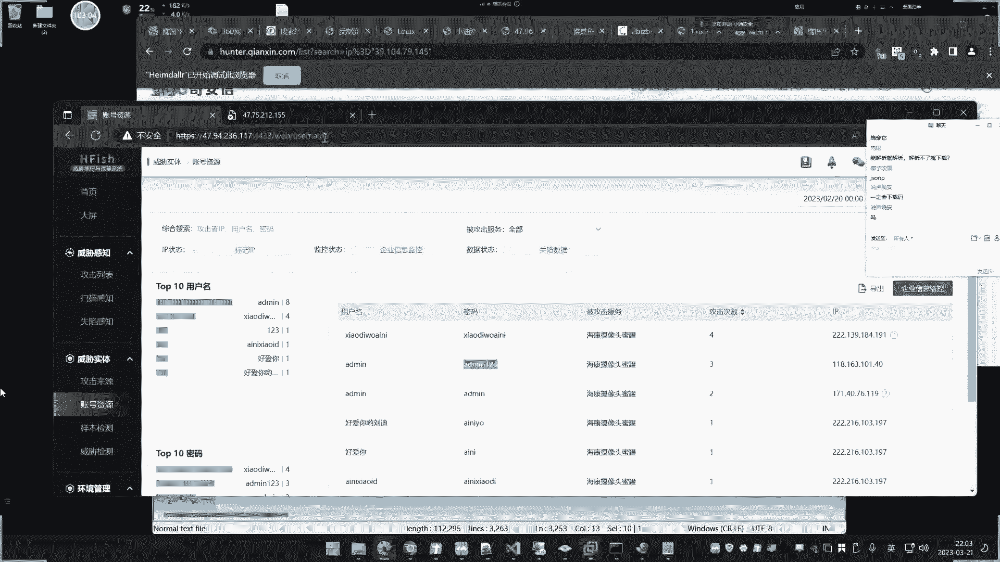

那我就给大家看一下，比如说这个IP地址，他要记录你登录的账号密码。

来传输到这个系统上面来观看这个攻击者是吧，所以说你输入了账号密码呢，他就会用JSONPG输了，把这个账号传到这个蜜罐系统在哪，所以他就会用到这个技术，所以这也是十元B蜜罐技术。

总会用到什么JSNP那个技术，而你这个时候再去访问这个网站的话啊，如果他是模拟什么其他的一些系统的，当你访问的它会下载，就是因为他在他那个设计里面，就会把你那些记录账号，密码呢用到这个技术呢去去实现。

所以导致的下载是这个原因啊，就是它的设计理念导致的，所以这是一种判断标准，还有一种就是设备指纹。

设备指纹就是我刚才说的，就像这张图片来，这是一些部分的蜜罐产品，然后呢他每个产品里面，比如说他开放的SHEBY哎，它就会是这么一个返回值，就是它的一些刺激产品，其实就是根据各种产品里面的一些什么。

他的这个部署密关，比如说部署这个FTP密管，它会是这么一个返回值，根据这个东西来判定是不是，这也是一种方式啊，但这东西呢就需要你针对每一个产品的，去分析和总结和整理了。

而前面两个呢就是根据它的特性区域识别的，就像我们这样说的啊，端口多少找规矩形，你看啊，我现在就找过来看这个了，他也是这个，你看这个端口多多，我来给大家看一下啊，用个foo搜一下。

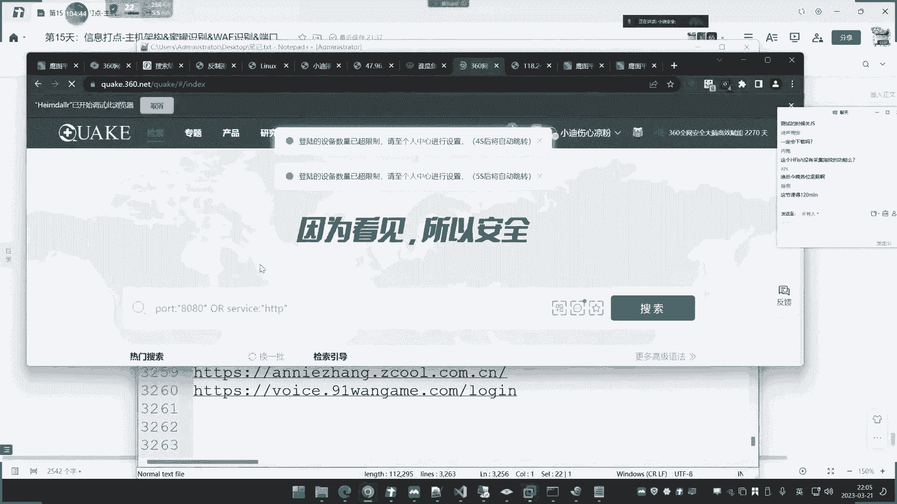

不用。

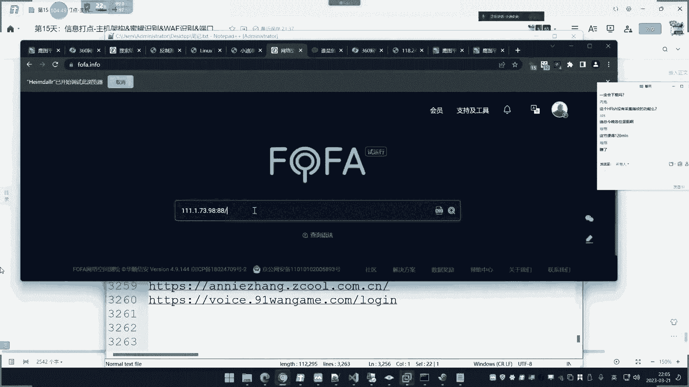

秒针代替，我们点击一下IP聚合。

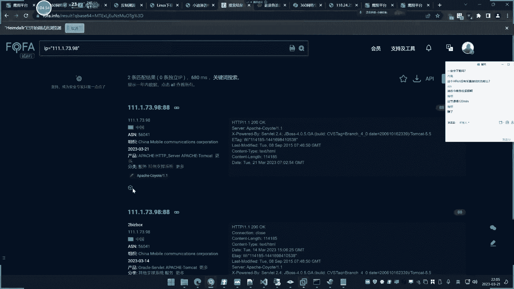

你看它的端口啊，我们再来看一下。

怎么这么多人登啊，这个是瞎的，瞎不了，先下一个好吧，那我先用一下啊，哇你们在用啊，我都要说好话，现在真是，来点一下这个详情。

端口列表，我们等下可以看一下啊，然后这边呢也查了，他这个查的里面都是查的什么玩意儿，所以说这个网络空间呢你看这个呢。

否否这里查查里面查的各个端口是啥玩意，你妹的不开大，哎这里面咋这卡呀，这个不要抢着来呀，让我用一下先好不好，把这个鸟毛给它关闭，它一直给我提示提示，你们也不下去，太卡了，这，大家看一下这个出来。

你看他端口多少，把八张口来往下翻的，啊这怎么都是一样的，好看这个看这个吧，你这个看logo，那这还判断出来位置密码了，你看看这里叫它的一个相信，看大家看一下啦，9948818198989893的，妈的。

这除了你妹的1万多条，你真敢相信啊，1万多条，所以说啊这个东西那就不说了啊，你看看每个端口都代表着一个外服务，你打开了打开就是一个东西，打开就是一个东西，这他妈的这还用说啊，这，就是我说的这种事情多啊。

有规律性，就相当于一直往后排了，980980往下查，而且都是app，你说这里面哪有这么多网站给的高啊，所以说啊除了这之外，还因图夸克的也是能识别出是不是密关的，就像我刚才那我把这个IP呢输上去。

或者说玉米输上去，他下面呢给我个标签提示，你也看到了，那微之迷管对不对，未知密关了没，那包括下面这都是一个蜜罐的，这都是一个蜜罐，你打开看上去就是一个正常网站。

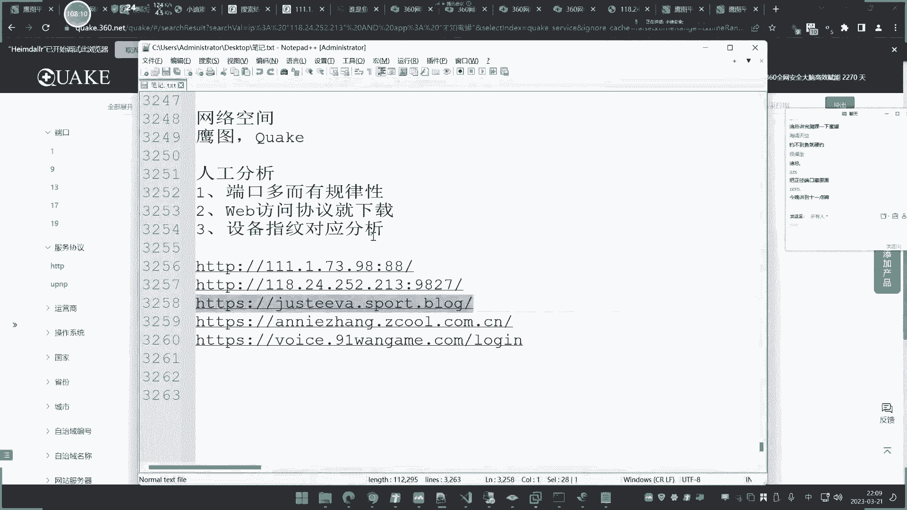

你打开就是一个正常网站，你哪知道是不是闭关呢，那打开了这个是个正常网站。

其实就是个密闭管，包括这个也是呢，这都是你们的蜜瓜啊，我这几个都是蜜罐的，这里说的看你不知道你什么东西。

你你还在上面玩，玩的不亦乐乎了，那这也是蜜罐来模拟一个登录给你弄，那这也是这个也是个蜜罐，是蜜罐，那你不信的话，我给你开一下啦，你试一下看是不是来我们搜一下，给他看一下，你用这个引擎也能搜出来。

你用那个画那个工具也能搜，你搜一下给他看下来，微米管判断出未知迷管，看到没，印度这边也是一样的道理，啊这个他他他他他没有没有收集啊，这个没有收集选这个的，那一丝蜜罐，他一丝密关没一丝关。

那个我就不看了啊，那平台也可以帮你判断啊，平台也可以帮你判断，但是我们呢不仅要用平台，要工具，还要人工，因为有一些呢他可能是判断不出来的，就像我刚才来了，就我这个的啊，我用这个来打开，我刚刚开了。

我看看他现在能不能帮我拍了，你看他现在在没有判断出来，你看他没有拍出来，这个是这个音土起源性的这个音图，它没有拍出来画的这里呢，那也没有判断下面没有显示的，你看那没有显示哦，这里显示出来了。

这个盘子是有密码的，这个IP端口是9200是假的，那他有些能判定，有些不能判定，对不对，他有些能判定，有些不能判定，所以说你不能说你看这个音符的判定不了，他只是告诉你这是什么鬼东西啊。

你这个网络三相设备，是我故意搞了个网络实验设备，海威的那个蜜罐，他没有判断出来，因为这个网络空间这个东西呢，是它是有一定时效性的，就是说不是说你当时不输出密码，他就马上帮你识别出来，是不现实啊。

除非他有那种激素呢在如何啊，那夸克呢他判断了对不对，你也不能说这个夸克就比印度好啊，这个格式各样各样的这个强大之处吧，有些他可能比印度好，有些人可能没有印度强，就是我们为什么选这几个产品可以优势啊。

所以说呢你要人工分析，加上网络平台和工具三方面的一个确定啊，如果说三个都说他是那里面，那不用说，那就是了啊，一哥说那是确定你能确定啊，如果说你不确定的话，就是按照我刚才说的人工分析啊，看它的端口多不多。

看他一些端口开放的，然后你去访问会不会存在下载，然后呢再看一下它这个端口上面，对应协议和我们那个指纹相不相似，就是一些常规平台的这个指纹是吧啊，是返回指纹，是不是相应返回它的时候是不是返回这个东西。

然后呢再配合网络空间和工具去查，基本上三方面去判断的话，基本上大部分98%的，99的密码都能识别出来，那识别出来之后呢。

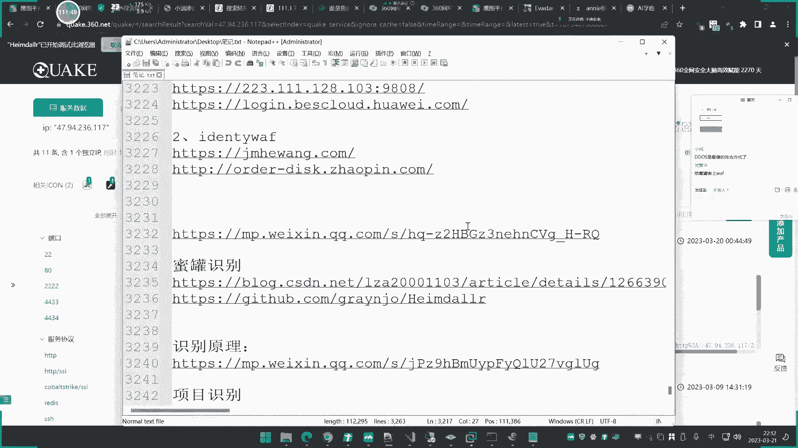

你就不要再玩了，因为你玩的也是在别人那虚拟的东西里面。

在玩也玩不到啥啊，就不要浪费你时间了啊。

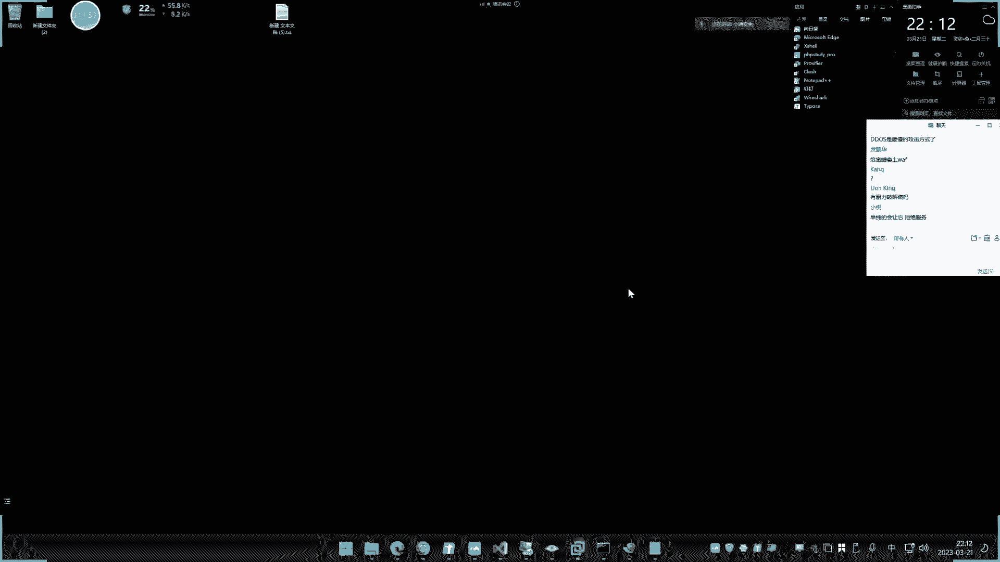

换目标，好这就是我们今天讲的这个支点啊，我们已经讲完了啊。

这个时间关系啊，这个已经到了12。10几分了。

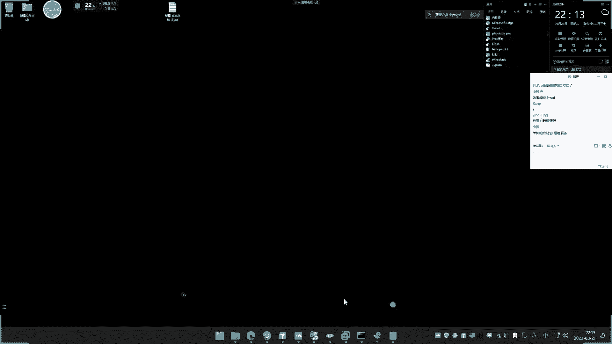

我们就这个思维导图，那我就不给大家补了啊，这下去你自己啊，下节课我们再补上去吧，那下节课上什么内容呢，下节课那我也不用多说，大家也知道，那这个WAF搞完了，蜜罐搞完了。

那就是CDN和这个什么其他组件的识别了吧，对不对，老虎这两把这两个讲web就讲完了，就讲其他的下一个内容，就是说的这个没有讲的，这个web CD a和这个组件的一些事情啊，什么操作系统。

这个讲不讲都无所谓，因为他也不重要啊，像以前的我还讲，但是我现在不想讲，因为不重要，骂不能演了十遍，你十遍出来是1windows无所谓的啊，一个大小写就能识别，还有什么这个语言呢，这也是指纹识别。

就帮你自带了很多平台的工具，都都把它识别出来了，所以我没有说可以把它拿出来给他讲，因为一些工具平台的自动都有这个功能，用的时候就发现了，好这就是我们这个第15天内容讲完了，今天大家还有没有问题啊。

有问题赶紧问，没问题。

我们就瞎了啊，瞎了之后再给大家传达一妃独享啊，预计明天的话应该就都能正常观看了啊，现在能观看，我今天录像也会实时，马上就给他发上去，但是上一期的录像还有20多次课没有上完。

名字还没有改，上完之后呢就给他改，应该说明天是吧，明天12点就明天吧。

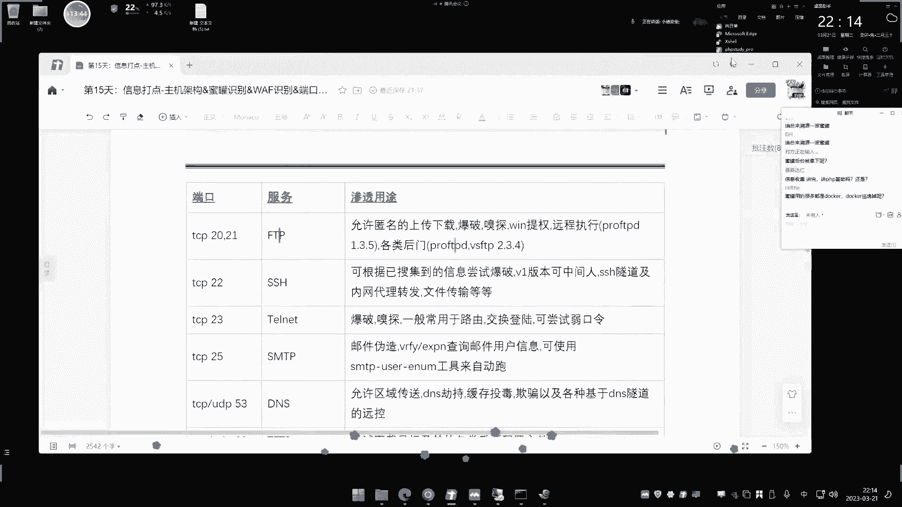

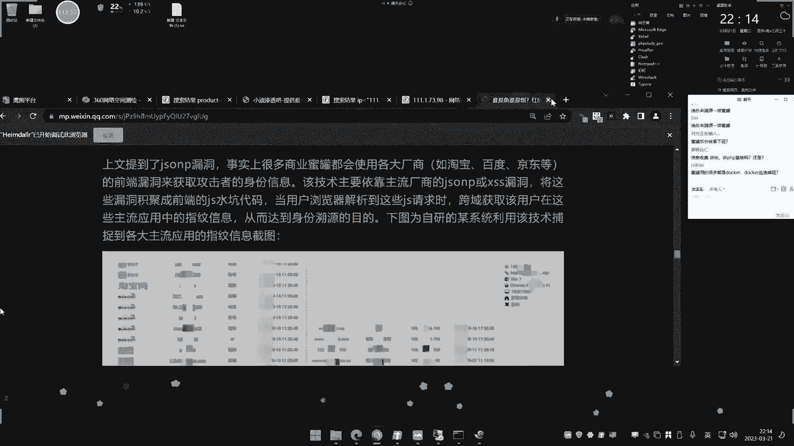