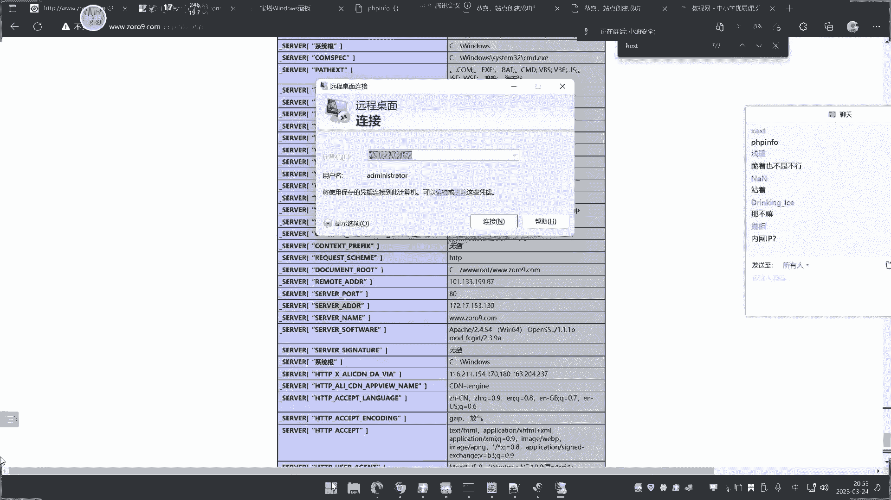
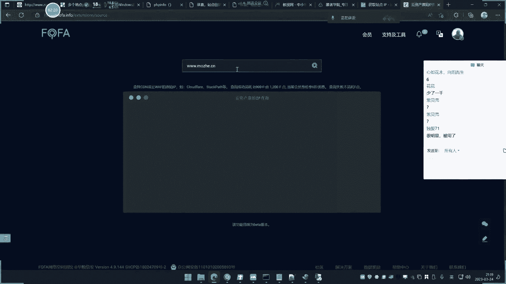
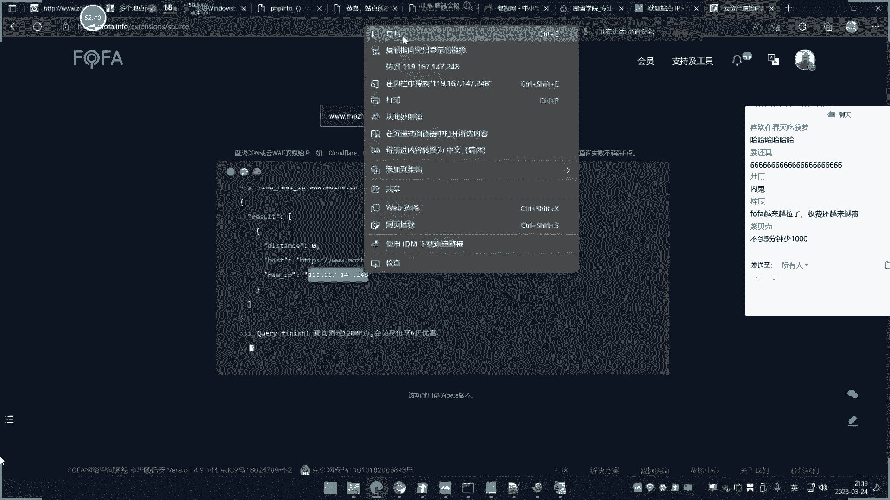
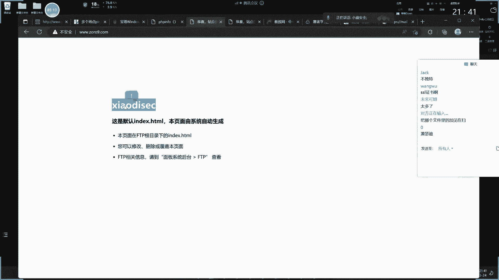

# 【小迪安全】V2024版 全栈网络安全 ｜ 攻防渗透工程师 （持续更新） - P16：第16天-CDN绕过&业务部署&漏洞回链&接口探针&全网扫描&反向邮件 - 逆风微笑的代码狗 - BV1Mx4y1q7Ny

好我们今天上这个新大一点的啊，这个已经上了3533十日播了，嗯今天讲这个绕过片，其实呢今天讲的内容呢就是我们这里呢看到啊，我们可以往上翻，那CMS的识别源码的下载。

前端技术的一些识别和前端技术的这个收集，包括这个什么开发语言啊，web服务器啊，端口扫描啊，什么数据库类型的一个对应关系啊，操作系统识别啊，还有这个单位扫描里面的应用服务，其他对应。

然后呢这个WAF的识别和微观的识别呢，这里上节课也讲了，那紧接着就说还有两个，一个是CDN的呢，还有一个是我们这个其他组件的这些东西，那主角呢就是类似我们说的一些这个开发框架，像pp里面什么星和pp啊。

YII呀，lever呀，然后java里面的这个菲菲JS文呐，阿帕奇修啊，还有什么Z洛克斯杰呀对吧，这些都是我们比较关注的这个点，那么今天呢就是讲这个上面这一点啊，就是关于这个CDN的。

因为它的知识点相对较多，说实话啊，其实我们不讲这个CDN呢也是能够过的，但是前期我们有给大家讲过，这个CDN的这么一个印象，他的影响不是很大，但是有一些影响它的主要影响。

那就是说呃这个CDN的一个存在之后呢，会对我们这个真实目标的一个地址呢，存在一个差异，然后我们对真实目标地址上面的端口，包括它的一些其他信息就会有差异，它的主要影响是这里啊。

但是不会说影响到一些这个漏洞上面的利用，就是你如果说有漏洞的话，还是可以做的，只是说前期在没有利用漏洞和发现漏洞之前，做信息设计的话，针对这个IP地址和这个主机上面的这个信息，收集的会有一些影响。

就比如说他这个CDN，那你去判断的话，它是一个假IP，假IP呢，你对这个假IP进行这个端口扫描完了，这些都是没有任何意义的，因为它和真实的这个应用呢它是没有关系的。

它就是一个缓存的一个提供服务的IP地址，不是我们真实IP，这是我们前面在讲CDN的时候，说过的一个影响，而且呢当时呢是给大家做过简单的实验的，就是我们前期基础课程啊。

那么今天呢就是说如何去识别识度CDN，再就是关于这个CDN如何去寻找，他的真实IP的一个简单的课程，现在提前说一下啊，不是说所有CDN都能找到，这个呢是要根据CDN的一个部署的范围。

和部署的这个程度来决定，就说CDN他如果说花的气力更大的话，那寻找其他的氢能也更大啊，好这是我们说的这个CDN的啊，然后前期呢这个前置知识点呢我们已经讲过，那么CDN那这里呢分为三种情况。

一种是加WAF的，CDNXN是没加WAF的，简单来说啊，传统访问没有CDN的之前呢，就是网站呢用户的去访问网站，域名，域名呢会解析到一个对应的服务器IP，来提供服务，然后呢我们就可以直接去放我这个字啊。

应用了，那么这个解析的IP地址呢，就是我们说的域名对应IP，这是一个传统正常的一个没有CDN的一个情况，就像我们现在呢我去访问博客，我的博客呢是没有做任何CDN服务的。

我去拼他或者去访问这个域名的时候呢，他就会解析这个域名对应的IP地址来提供服务，那就是说这个四系列75212。15，这个IP的服务器呢来给我们提供服务啊对吧，那么这是传统的，那如果说有CDN的话。

那么在这里解析IP的时候呢，就前面会有一部节点，那么意思就是说就不会给一个这个IP给的服务，就是另外一个IP给你服务，那么我们看到另外IP就是个虚拟的，假的一个节点类似，就说是一个不存在的一个真实。

就说这里呢假如说解决了这IP，那该批的是个节点的话，那么就和这个真实IP呢它是不一样的，然后我们如果去对它进行设计的话，那全部的信息收集就来到这个节点上面，就不再是搜索这个收集这个真实的IP的信息了。

比如说我们这个新设计呢就会失效，但这个新手期呢是针对于主机的一个新设计，就是说我们这个IP地址的一个资产，而不是说其他资产也会受影响啊，这是主要的CDN的一个差异啊。

然后这里简单介绍一下国内CDN的一个厂商，这里介绍这个厂商是有点小作用的啊，它也便于我们后期对CDN的一个识别，上面会有一些小作用，国内的CD厂商呢，就是阿里云的白渡人的齐六人啊。

腾讯人360的网速科技啊，包括预扣的国外的就是这些啊，呃这个简单的自己看一下啊，记一下就可以啊，没有必要再去把它背下来，然后呢这个是CDN的一个国内外的一个厂商，就说你如果说要用这个服务的话。

那么就是可以在这个厂上面去开通啊去用，然后CD呢，我们在那来熟悉一下它的一个简单配置啊，从这个简单配置上面呢就和我们寻找它的一个。

服务啊就寻找他的真实IP。

会有一些相关的，那我再来给大家看一下啊，我们就拿这个阿里云的CDN的配置，来给大家看一下啊。

呃给他看一下啊，大家看一下这个CDN这里啊传承加速DC d n，大家看一下它的一个设置，这里我们可以关注一下啊，呃首先呢是加速玉米啊，加速玉米，这个意思就是说你要对那个渔民进行加速。

跟我们说开通这个服务好，第二步就是业务类型全站加速嘛，还有个加速区域，仅中国内地和全球和全球，不包括中国内地三种选项啊，对有些厂商可能会更稀啊，这个三个意思呢，就是说针对这个哪些访问群体进行加速。

那假如说你这个目标的域名呢，你针对的是大陆用户，就是国内用户的话，那你就可以选择仅内地啊，这个CDN的，因为他这个东西的一个存在的必要性，其实就是为了提高访问速度啊，啊效率就是你加速之后呢。

就和我们刚才说的啊，这个它的一个存在意义呢，前期我们讲过啊，我们再再再再再再再给大家口述一遍啊，他是一个家属服务，意思就是说假如我的网站服务器呢，我部署到我的这个地方是吧，我在武汉，我部署到武汉。

那么也就是说在周边城市和这个同事，真的这个访问的一个请求去访我这个网站的话，这个服务提供的速度和效率是相对较高的，因为那服务器就在这个身边，我们都知道啊，如果说你自己呢在国内。

然后呢你去访问一个境外的站点，比如说访问到美国日本，那这些地方的站点可能网速就会有些卡顿，那么为了解决这样的需求，那就有这个CDN的一个加速服务是吧，他就回答让这个访问群体。

那究竟去访问一个靠它相近的一个地址呢，来给他修复，就类似于我们那个什么迅雷呀，那下载的那种p p two p的那个技术一样，就是有之前人呢如果说访问过这个自然的话。

那么他就会让用那个技术的来实现究竟访问，提高这个网站访问速度和效率，那CPU呢有点类似于那个事情啊，所以他是做这个事情的，那么也就是说这里呢你这个加速区域呢，其实就是说针对哪些群体。

如果说你选择中国内地的话，那么说如果是内地访问你这个域名的话，它就会采用加速服务，那如果说不是的话，不是内地的话，那么就说他就是按照真实的这个IP地址呢，去区分下面那几个叫原单信息，这个原则信息就啥呢。

就说你真实的这个提供服务的地址，就在这里添加它，在这里添加能理解吧，所以说他这里面有三个选项，我们大概看一下啊，一个是加速域名，你要加速哪个域名，第二个呢就是我们说的加速区域。

你要选择启用的加速地区是大陆地区还是全球，还是说全球非大陆地区啊，三种选项，这是阿里云的上面那个选项啊，好那三个呢就对应的有三种方法呢，去寻找它的真实IP，我们先来说第一种啊。

在CDN的这个识别它的真实IP地址的一个匝道，他真实IP的一个情况的一个基数里面呢。

有三个技术，这是体积最多的，也是根据这个三个业务功能的所引起来的。

我们来想一想啊，首先呢它这里不是有三个功能吗。

我们来想一想啊，来加入域名，所以呢就有一种叫子域名，至于那获取这个真实IP这一种技术，还有呢就是我们说的第二种，这个国外访问获取这id，第三种，好先说主要前面两个啊，为什么说值域名访问这个真实IP呢。

你加速域名这里我们给他加个选项啊，他这里写可以写成一个新代表一个域名，那就是说前面的任一后面就是它的域名地址，那如果他这里写个什么3W点，比如说叫小迪八点com写什么东西。

那么他就是说小迪八点com加速啊，我家是这样配置好下属，那么假设说现在呢有一个站点啊，有个新的这个域名站点，比如说我叫个这个BBS，点小到你看对吧，我这样搞的话，那就是说他这里没有SP嘛，那就是不加速。

那么由于我们知道啊值域名和这个玉米呢，它有可能是在同一IP，和什么同一网段对吧，那么我们可以通过查询这个这个域名的IP地址，来推这个IP地址是不是和他一样，或者说在同一网段。

那这样子就能缩小范围寻找到ZIP。

所以说这个加速域名上面的一个设置呢，就会影响到我们这个方法的可信度，那如果说他这里写个这个星号，那么就说所有下面的子鱼都进行加速。

那么你这样子的子女就会怎么样失效，这里呢是和这个加速的一个配置有关的啊，对不对，他和他是有关系的，就说你怎么配置。

那么这个方法就能不能行的，就取决于你这个配置，你假如你只加速一个名啊，只想这个了，只加速它，那么就说其他子女就不会受影响，他就是正常的逻辑，就不会说有这个加速服务，导致有些假IP啊，缓存节点出现。

就这个意思啊，然后呢，下面这个呢，这个国加速地区也是非常好理解的啊。

就像他选择中国内地，那么就说我换一个国外的啊，节点的去对他进行访问，那就不加速了嘛，不加速就是真实IP嘛，所以说国外访问呢去获取真实IP呢，这是基于他在选择这个加速区域的时候啊，没有勾选全球。

导致了我们可以找一些冷门，或者说一些国外的这个这个服务器，在对他进行这个访问，来测试它是否有C0服务来，从而找到真CP是吧，这个好理解吧，这两个我通过这个功能呢就给大家说一下。

这个CDN里面不是有很多种方法吗，其中的两种就是和这个他那个配置呢有关的啊，就是你用哪个配置啊，那可能就会有一些些寻找的方法啊，这是我们说的这个东西啊，好，那这里呢。

我们就来简单把这个配置了解清楚之后呢，就来比较关心到这个真实的一个情况了啊，那么现在呢我们就来看一下啊，这里面有篇文章，这个文章呢是总结的比较深入，和比较全新和比较全面的一个文章。

就是关乎这个CDN的一个整个的一个技术呢，生产过程中全最全的CDN绕过总结，这里提到了十余种方法，其实呢使用方法里面有，大概一般的方法都用不着，或者说啊效果不好，我们讲的都是比较效果好的几种方法啊。

你可以下去呢。

如果说啊可以去看一下啊，好我们呢大概来说一下啊，这个首先呢先抵一点啊，如何去判定是不是有CDN，如何去判定他，就是我们现在判定才能有这个事情啊，所以到这里可以使用两个这个平台来去判定，这两个平台呢。

就是一个类似的一个全球服务器的一个访问啊，不是全球吧，就不分啊，一个是这个1317C1和一个拼地址。

我们来看一下。

这里都是一个网络测速的一个小平台，那我们来看一下，点一下这个地方，比如说我们针对小八点com进行一个检测，放这来它就会采用这个全国各地，或者说一些海外地区，然后进行对比。

这个网址呢进行一个简单的访问和解析，IP的一个对应，我们可以看一下，那么他就会抽出国内的什么安徽啊，海口啊，海南啊，上海啊，北京啊，青海啊，河北啊啊各种省份的一些地区的。

对你这个域名的进行一个访问和解析，你看他解析的IP地址就是都是这个看到没啊，如果说全部一致的话，那就表示说你这里那就是没有开通CD服务，也就是说这个IP那就是你的真实IP。

就是说你的服务器就是这个东西啊，没有开通CDN，就是这么个现象，就是我们说的啊，那这种啊没有开通CDN的话，他直接访问域名，域名的解析IP，然后呢这是你真实IP，没有其他东西在阻碍你。

也就是说任何地方去访问他，他都会用这个IP来提供服务，所以这个IP他是香港里面，那也就是说可能离香港比较远的地区，放我这个网站就会相当的卡，就是我们说的这个访问时间和提供服务时间，因为地区软了。

网络的会有些中间有些丢失是吧，所以说这种没有开CDN，那它就会出现这个效率不高卡，因为你都是用一个IP来支撑服务，就是一个固定的地方在服务，那么离它近的就快，离他远的那就慢，这是毋庸置疑的好。

这个呢就是我们说的这个地方，然后呢除了这个之外呢，还有这个这个地方也可以进行一个检测，我们来看一下它也是，然后呢他这个检测是针对这个以上的电信啊，多线啊，联通啊，移动的这种厂商去检测了，他也是一样。

也能判断出来，这是你的想IP啊，这种情况呢就是说全部返回一致，我们这种呢就判定它为没有使用CD啊，这就是没有使用了CDN，那如果说使用了CDN的话，那么就会出现多个IP啊，他如果说使用CDN的话。

就会出现多个IP，那么现在呢我在我上面呢给大家自己配置一个，大家看一下啊，啊，我这里要配这个叫ZORO9点com的一个运营，配个CDN的一个配置状态，已配置状态正常运行，那这个配置呢大家可以下去的。

自行配置，很简单的啊，添加域名呢把你这个选要加速的域名写上去，然后选择区域，再点击新建源站，然后呢再按照他的需求的配置，那个点那个地方就可以了，那我给大家看一下，啊这是三余米的一个解析地方。

你看这是我那个配置啊，嘞就这样配置就可以了啊，再来解析设置，就你配置完之后呢，它会让你添加一个那个一个C的值，然后这个新增原装啊，你看这里啊，这个原则就是你真实IP，就是说这个服务器都给你提供的啊。

这个服务器给他提供的，就是这个服务器是真实IP地址，就这个域名对应的真实IP。

我们可以登录给大家看一下。

来给他确定一下啊，这是那面板，我们可以看一下网站网站这里是绑定域名，域名对应域名就是那个他的真实IP啊，就是他真实的真实IP给他服务的帮你域名，所以你访问这个网站呢，他就会请求这个内容是吧。

这是我们那个宝塔上面内置的啊，我没有在上面放过任何源码，所以他请求的就是这个页面啊，就这个页面我们就只是打结一下啊，这个源码我没有放上去啊，无所谓，因为这个不是说重要点啊，所以说呢真实IP的是。

这个IP是4761210。150啊，就我们这里看到的啊，这个地方，那么这里呢你可以看一下啊，他在这里再找找IP，想去就是你在配置这里的时候的，他这里写个软件嘛，你就把IP写上去就完了就完了。

然后如果是PS的，勾选43那个app就把你弄完了，好这个是他配置啊，然后呢这里我就是说自己打起来一个，然后你看这个是启动的CD，我们来拼一下这个域名，看一下，拼一下这个域名，看看是不是就会不一样。

那我们来到刚才CORO90号P，然后呢在两边都可以测试一下，无所谓，用哪个都行，关键看这面广东呢拼的时候呢，找到广东东莞，福建呢，找到福建泉州，南甘肃呢，找到贵阳，安徽的，找到安徽。

广东呢又找了广东青海的，找到甘肃，他其实这里可以看到像IP全部发生了更改，然后你可以自己看一下啊，我批评这个IP的时候会出现什么现象，大家看一下，3W点点CR5902，他请求一个116。211。15。

4。140170，我们看看这个IP地址是多少啊，你看啊，我从我自己这个地区访问这个域名，解析IP是解析到湖北渤海，那这个网站部署到湖北武汉的吗，不是的，是因为我本身我自己呢在湖北地区。

所以他搞了个旧金的IP呢给我提供服务，所以放网站相当快，但是它真实IP大家可以看到是在这个地方的，在这个时期上面对吧，那么也就是说和刚才之前说的一样道理，我解析错了出IP。

那么也就是说我这里的我不知道CDN东西的话，我就会对这个IP进行收集，那其实这个IP的是个假的，因为它上面压根就没有这个网站，它只是给你提供一个服务的，在上面啥都没有，网站不在上面。

所以你这个IP的做融合，新手机都是没有用户卵用的，因为你找错了地方，这也是说为什么我要把真实IP找了之后，再进行新设计，就是这个意思，每个地区你们去请求我那个域名的话，都会不一样IP啊，你看啊。

这是德国地区请求他他都会在，比如说浙江，他就会搞个浙江附近的，当然这里也不是绝对性啊，你比如说这个啊，这个人南昆明是吧，他也是把他搞到浙江去了，这个是要看那个那个地区有没有节点啊，如果说有他就搞啊。

没有的话，他就还是搞个旧金神子，是这么个意思啊，啊这个呢不不纠结啊，我们不管它，也就是说其实他就是换了很多节点，这个域名呢一解析大家可以看到啊，这个是返回了很多IP啊，这个大概有多少个呢。

有23个IP给停服对吧，哪一个是真的呢，这肯定找不到啊，不知道啊，不可能一个师啊，要是100个怎么办呢是吧，然后呢我们大家思考一个事情啊，我配置的时候大家看一下我这个配置啊，我看下配置上面有没有问题啊。

所以我这里在配置的时候，你看一下我这里啊这个地方，那我配置的解析域名呢，域名解析的三岛链之1OO9点com啊，我解析的是这个3W点这个域名去加速的。

那么是不是这里就有空子可钻了，只加速这个，那我其他域名进行一个检测，我查找他的子域名进行检测，会不会有真实IP呢，来看一下，那我拼3W点COR点90M，他帮我用这个116给服务。

那么我刚才这个配置上面配置只加速，主在就3W，如果我不加三分点，或者说我写个其他域名，五加这个30点回车执行，你看他解析到17。1210050去了，是真实IP就爆出来了，这是那个子域名吗。

这是由什么原因造成的，刚才说清楚了，它只加速主宰命名，没有加其他域名，所以我换一个子域名的东西出来，这就把他一些没有加速的就拿出来了，对不对，这个好理解吧，不理解，其实就是说它只加速了一部分。

然后还有一部分没有加速，但是这种呢只是一种判定方式，具体是不是该批呢，这个不能说判定就是他为什么这样讲呢，因为他有可能说子域名和这个主张的不在一起，这也是有可能的，只是说我们通过子域名呢去这样查的话。

是有一定的可信度的，但不代表就是这种情况，任何CDN的绕过这个查找，真实IP都不是绝对性的啊，都不是绝对性的，都要自己下去再验证测试，知道吧，所以那就找到这个是真实P啊，你们自己搞混淆了。

说什么干一下百度啊，搞一个那个违法三点，这个东西只是说查找他的真实IP，真实IP查找到会有哪些影响呢，就是你对目标的信息呢会收集的更全面，而且真实IP泄露出来会收到这个风险，很简单道理。

我把这个真实IP伪造起来之后的话，你如果说要进行对我这个进行流量攻击的话，那么你不知道我真实IP的话，你打半天全部都达到流量上去了，打到这个假的应用上去，就达到我伪装的目标上面去了对吧。

所以他会有这些这些保护啊，就是一个它提供这个流量的转移保护，还有就是我们说的啊，这个你不知道真实IP的话，你收集到这个信息很多都会有一些问题，特别是基于这个IP地址收集到。

因为它就不是人死了啊，所以说呢这个大家就知道这个原因啊，怎么我讲了半天，你们还有哪些不明白啊，什么影子IP，这鬼东西是啥意思啊，那要你们自己网上去看一些文章，那算是废了啊，刚才我那个演示能不能理解。

就说我拿我自己配置好之后呢，看到了他的这个判定上面，判定方面呢就是可以采用各地去拼，如果出现多个IP及启用的C0服务对吧，如果说你找到之后，你就可以绑定他访问了，啥意思呢。

像我刚才一样啊，我那个配置存在差异，所以我换了个域名解析呢，解析到这个IP了，这个时候就可以利用，嗯我拼这个3W点ZORO就点com对吧，我拼它它解析到这上面去了，对不对，你看R级到这上面去。

然后这个时候呢我修改本地host，这个本地host是在哪个路径下面，在windows system3r d driver11tc host下面，我在这里写个什么榜一榜一什么，他请求这个IP吗。

我请求这个时候我怀疑这个是正式IP，我就把这IP呢把它复制绑定3W点，CORO9点com啊。

这样子再点击保存之后呢，嗯然后我再拼一下这个IP，你看它就会自动指向的IP，它就不会变动了，其实就是强制性的让你的这个访问请求的。

会绑定IP，我们再访问这个网站，你看他还是正常的是吧，还是正常的是吧，如果说我搞个错的试一下啊，高速的复制，那我们再拼一下，你看现在就解析zip，然后再拼不通了，那我们再打开网站看一下，嗯排你看啊。

现在就出现一个问题，打不开了，为什么你看打不开了啊，为什么打不开了，一直在加载，为什么，因为你把这个域名呢强制解析这个IP，但这个IP呢可能没有站点，或者说他压根就不是他真实IP。

就出现了这个打不开的情况嗯。

是吧，但我一旦把它恢复正常，再来刷新，就把指向这个对的啊，现在就正常了是吧，这个不是说不是真实IP就打不开，这只是一种判定方式，它不是百分百的啊，这个是具体还是要看业务功能的，你可以这样去理解他啊。

这是常规类的呃，然后呢就是我们说的这个第一种啊，好这是我们演示的这个本地，就说自己去申请一个域名，然后给大家去配置这个CD呢，然后呢去寻找它的技术，从这个它的配置上差异的来去寻找。

用子域名查找真实IP的一个案例。

那么在实例中有没有这样的现象发生呢，好我们来看一下。

看一下这个例子，这个例子就是真实应用，我们来测试一下哈，首先呢我用这个网站的去对它进行一个检测，比如说这个三岛链是P910点com，这也是老演员了啊，我们来进行一个检测，打错了SP。

那你看啊这个就不用多说了吧，这CD根嘛呢，每个地区性请求的地址就发生更改对吧，那这不用说了啊，这已经是启用CDN，那知道CDN之后呢，然后你看啊，我依旧呢也是按照老渔民呢把山里面去掉，就换个这种子弹。

因为这种需和访问网站都是一样的，你看我直接访问这个网站，它也是这样子。

我3W点SP90，它也是这个样子，我直接S他有这样，这都是指向它，所以他们两个域名呢就可以理解为C7，然后呢你针对这个3W点进这个解析的时候呢，它解析到这这边呢是有多个IP启用了CDN是吧。

但是我把三个文件再去掉之后呢，执行你看全部请求到一个IP上面去，说明3W加速了，其他的没有加速，是和我们刚才我那个自己的环境，是一模一样的呀，真实应用，那，对不对呢，照到这里吧，那这个就是的。

然后我们可以自己再通过其他信息来佐证，这个猜想，什么叫佐证呢，我观察一下这个网站它的备案号，因为一般都是备案的，备案号呢是哪里的，约越是哪里啊，广东啊，这里判定他的一个CDN的一个站点，是来自广东深圳。

所以说这IP呢八九十有八九是真实的，是他自己的，这个好理解吧，就说你判断一个IP是不是他真实的，能不能说下决定，判断这个呢是有很很多渠道去那个了，我们就说判断出来之后呢，都只是一种可能性，不能说百分百。

因为你也不清楚，就说我这个子域名，他有可能就是说很简单的道理，这个域名指向一个IP，然后呢搞个服务载均衡，就说这里还有一台主机给他服务，你也不知道是哪台是哪台，所以它会有一些异常在这里啊啊就会有很多。

可能我们只能说把它当做一种，先把它当做真CP去这样去操作，然后呢慢慢的随着这个信息越来越多，追踪的来确定，不可能说啊，你这样搞爱，这就是真实的啊，这都是一种分析和猜测啊，没有那说用个什么东西一猜啊。

这就是必须是百分百没有这个东西啊，因为它的配置多样性会导致一些意外情况，或者说可能性。

好这个呢就是我们说的这个这个东西，你看它是可以这样找他呀，对不对，好这是我们说的这个子域名和对应一个站点。

那么还有一些哪些方式呢，还有一种叫什么诸多漏洞和遗留文件，什么叫主动漏洞呢，主动漏洞就是主动性的漏洞，比如说我们现在还没有学到漏洞啊，我们就来拿一个最简单的SSF漏洞，SR漏洞。

但是对这个CDN的寻找的它是有帮助的，啥意思啊，我们来给大家看一下啊，我们先把这个演示完之后呢，再给大家看一下这个效果，就说可以基于漏洞的去寻找真实IP，比如说当前网站有个I有个漏洞。

就是我们说的SS的漏洞，这个漏洞是干嘛的呢，就是你提交的地址呢，他会用这个服务器去访问这个地址，加载这个字，就像我们网上经常会这个去添加一张图片，一样的，就可以拿去完成图片的显，示到这个什么编辑框啊。

这种地方来，就是有些网站功能有这样的对吧，就是说你写一个会员注册文章，发表文章的时候，可以把这个文章里面那些图片来自互联网，然后你输入这个网址，它就会从这个服务器呢去加载那个网站地址，就说类似这种功能。

都可以成为CDN的一个判断的地方，有些网站不是有会员注册吗，我会员注册进去之后，他会根据修改你的什么个人图像啊，或者说你这里可以发表文章啊，什么写言论，那么里面可能会说有可以上传图片啊，这种地方对吧。

然后上图片呢有的地方都会有这个啊，图片呢一个是他自己提供的，还有一个呢就是说你自己上传的，或者说还有一种情况，就是说你提交个网址，它会自动加载那个图像地址，那如果说有这个功能的话，你可以这么做啊。

用这个功能呢给一个远程地址给他，让他去加载这个软件地址，那么也就是说他去加载版本的地址，也就是说对方服务器会主动去请求，这个地址去下载，因为它要加载，它就必须请求请求过程中，他就是主动出击。

就是我说的主动漏洞，就是他主动出来，我们去访问网站，是我们主动找过去的对吧，但是呢如果说像这种功能这种漏洞的话，他就主动漏洞啊，具体有哪些漏洞，那我们后面伤到了，你再去理解他啊。

我就说这种漏洞是可以帮助我们找CN的，你看现在啊我这个网站是有CDN的，对不对，然后我如何判定呢，这里有个主动漏洞。

在这里，我利用这个主动洞去去拿这在地怎么办，我可以用自己的服务器啊，用自己的服务器去搭建一个小单点，利用这个Python去啊去起一个这个web端，然后呢，他就会在我这个IP上面去构造一个。

拔线端口的IP端。

然后这个时候呢我就模拟是吧，让他去远程加载这个自然啊，就现在这里呢写一个图片地址，那这里呢四个图片地址都无所谓了。

只要他访问过这个IP地址，那么这边呢我起了个web端，它就会有这个访问的请求，就会在这里看到，当我们的絮状态请求之后，可以看到的17。122。10。150，请求过这IP就不来了吗，这就是真实IP啊。

这是个什么原理啊。

这是个什么原理，大家怎么理解，就是一个主动被动的关系，其实就是说你被CDN的一个服务，是因为你主动请求他由他来郊游啊，就是由他来，就是这个厂商呢他去判定由谁给你服务，然后呢给你个IP地址。

这个是节点IP，但是现在不一样，我们利用这种漏洞，或者说这种有主动功能的这个地方啊，让他去加载一个软件地址，也就是说对方呢就是自己服务器主动跳出来，去找你这个地址，然后他主动跳出来。

那就是用真实的服务器来主动跳出来了，所有的IP地址我们就接触到了，就是说这种呢就是利用主动漏洞呢去寻找人，I p，这个呢就是利用的是，你这个网站有没有这种主动行为，就像我刚才说的，有这种类似的漏洞。

像什么S和漏洞是吧，还有一种呢就像我们说的，像什么什么图片完成加载是吧，你就给一个远程地址，那么呢这个服务器不是要加载这个远程图片吗，那么它的服务器就会访问这个远程图片地址啊。

那个服务器只要是你构造的呀，你就监听下来呀，看一下谁访问过你呀，那么就是对方的来源嘛，就是在哪里，那个就是他真的夫妻，就是让他主动出来找你，简单来说就是这么一句话，有啥好不好理解的呢。

是不是他有CDN是因为你主动找他，由他来分配哪个节点给你服务，所以你看到的是虚假的，但是现在不一样了，让他来主动找你了，就和我们谈朋友是吧，一样的道理，你老去找别人，你就是舔狗，你说他找你。

那就不一样了呀，对不对，条件就用你提呀，对不对，你说躺着就躺着。

对不对，啊这种是我们说的这个漏洞啊，主动漏洞，还有一种就是我们说的这个遗留文件，啥叫遗留文件呢，遗留文件其实就是一些配置新的文件啊，配置性的文件，哪些叫配置性的文件呢。

就是有一些这种像这个pp里面pp for，就游戏那种代码里面，他会写一个那个类似索命文件压，你像PP里面有这种批评符啊，你给他看一下啊。

就我在我这个真实的服务器上面，都给他这样写下来，这是我的真服务器啊，这里有个批评，你看啊，这里有个P的代码。

对不对，然后呢当我去访问这个地址的时候，你看一下啊，这其实就是一个pp这个介绍信息，就说别人那是通过这个代码的，来看一下你P的配置信息，而这个配置信息里面呢，它会记录当前服务器的IP地址。

然后你看一下啊，这里是IP地址，我们搜一下，啊你看这里有IP地址呢，哎这里还有下面没有了吗，要找那个上面的，你看这个上面呢，这里啊这是远程IP，然后这里有个叫1720，17。1530130。

是什么东西啊，服务器IP地址，这啥东西啊，我们来看一下，我先连接到那个主机上面去。

来我看一下VIPCONFIG，1720171530130，看到没，这是我真实IP地址吗。

这显示了172017153030，然后这个是你访问的IP啊，就是我自己IP的，我这个访问的他就会把这个网卡的人，你IP显示上去，但这里面没有显示出，没有显示真实IP地址，因为这是他的内网网卡。

所以这个是有点机遇的啊，他只是随机显示一个网卡地址，如果说他没有内网的话，它就会显示他真实IP，如果说有内网的话，它就会显示内网IP，所以这个呢是看几率的啊，如果说没有内网的话，它就会生产力。

但这个也是一样的，道理也是主动的，这个主动的含义是什么呢，就是因为你这些源代码中啊，如果说源代码中有类似这种文件的话，这种文件那是干嘛的呢，有些人不理解，这种文件其实就是我们说的一些调试信息。

就你写程序不是经常要调试，你这个啊，比如说你是什么程序版本啊，你程序配置是哪些，开了哪些关了呀，那么它就会有这种代码来去这样搞，那么如果说对方有这种遗留文件，就是他在做开发的时候。

有这种调试文件没有删除的话，你找到这个文件的话啊，你可以看到这个文件里面有的会记录，当前获取这个服务器的IP地址这种信息，那么他就能获取这种也是一种主动性的，就是由代码本身呢自己去获取。

自己服务器的这个信息，然后展示出来，我们就根据他遗留的这种没有删除的，这种调试文件，说明文件这种类似的东西呢来查找真CP，但这个呢说实话啊，这个就是看运气了，他有就有是吧。

就是你在扫描这个网站目录的时候，少了一些莫名文件，打开的是什么东西啊，这里面获取到，所以这个东西呢是靠运气的啊，还有没有就是有没有啊，如果说没有，那就没有嘛，对不对，因为他也是主动式的。

那么除了这个主动之外，还有没有这个其他的呢也有的啊，比如说邮件系统，邮件系统是找CDN的一种非常好用的方法，啥意思啊，邮件系统大家都知道，邮件系统呢他就是自己的邮件服务器啊，然后再去这个发。

他们能用邮件系统去寻找真实IP的一种原理，是什么情况呢，原理有两种，一种情况就是邮件系统他做不了CDN，啥意思啊，就是邮件系统，那他做不了CD，是因为邮件系统如果你有搭建过的话。

他这个解析上面是不一样的，就说这个记录上面，他是会选择这个叫MXMX和这个和那个SRFRSI，MX和一个什么鬼，是不是个SR，我不太清楚了，就是M主要的他会走这个记录类型。

那这个技术类型呢大家不能设置CD根，所以这是他第一种，第二种成因呢，他就是他也是个主动类型的，什么叫主动类型，我想想啊，你给对方发邮件和对方给你发邮件对吧，这是两种，我们先说对方给你发邮件。

我们想象一下网站都有一个功能功能叫什么，比如说找回密码，那我就写了一些了，RSS订阅就是京乐网站的一些动态邮箱，租车激活出你注册个用户绑定邮箱，他要发送你个验证邮件密码，找回密码的出发。

找回密码给你邮箱发送验证码对吧，包括你订阅了一些邮件通知，他定期的给你推送一些工资，对不对，各种各样的地方啊，这里写刘总哈，其实呢主要就是说围绕一个东西在进行，就是对方给你发邮件这个事情。

那么哪个功能能实现这个给你发邮件就行了，其他的就不用管了，好我们先思考啊，我们最常见的就是说什么找回密码，用户注册这里对不对，那为什么这个功能就能实现这个啊，找到他真实IP呢，首先刚才我说了。

邮件服务器呢CDN呢一般都没有，就他不会把邮件服务器呢做CDN的服务，因为M邮件服务他这个在搭建的时候呢，他会用这个记录，这个记录呢，在有些厂商是不支持这个记录做C服务的。

它一般知识记录就是c name记录和A记录啊，因为你你用这个东西加速的时候，你应该知道他需要配置什么，CDM记录和那个记录，你看这个C类目看到没，他不是那个M记录，它不支持有线，那么就造成这个邮件系统。

那它不支持CD功能，所以邮件系统它就没有CD，这是第一方面原因，第二方原因就是我们说的啊，是对方给你发邮件，那么和我们刚才那个主动当中，是有异曲同工之妙，就是对方主动发给你的。

有时候是从他邮件服务器那边过来的，而不是你发给别人，你发给别人，就是你你主动去找别人，让别人看到了，别人选择回和不回你，但是如果说是对方主动发给你的，那就是对方已经把他的信息带过来了，知道吧。

所以它也是一种主动类型的，这也是造成他为什么说，通过邮件系统能寻找真实IP，那个基础的原理所在就是刚才说了两点，一点就是不会做CD上的服务，第二点就是他是主动发给你的好。

就是让他主动发给你，那么现在我们来演示演示的站点，就是也是脑炎了是吧，大家知道的，摸着还会延伸到鹏程万里加密一起。

现在我们现在看一下摸着的啊，摸着这边呢，我们先来去检测一下摸着的这个域名，看看有没有这个，大家可以看到摸着他是做了CD呢，这里呢返回了7788的一大堆的IP地址，这里不用看了，除了CD2好。

那么现在我们来关注我们打开mod，然后打开我们的邮箱，如果说你真是要测试的话，一定要注意啊，那这是我的首选地方啊，那我找到这里，我点击这个登录，然后这里点击忘记密码是吧，假装我忘记了。

然后他给我发送一个验证邮件，或者说验证码邮件对吧，我run，我现在我忘记密码，他就会说哎呀，嗯什么情况好，看到没收到了啊，那摸着学员给我发送过来的，摸回找回密码的地方，我们点击进去啊，然后大家看一下来。

然后你看一下啊，点击这个地方的邮件。

这里来点击这个下面一个按钮，那这个叫先是邮件原文，看一下他的那个叫什么，Receive，接收来自3W摸着点CN42。1934。22，IP地址出来了，对吧，就是通过这个邮件协议，那让这个域名给你找。

这里一定要注意啊，如何判定这个邮箱的邮件，它是没有IP的邮箱呢就会有问题，如何判定这个邮件系统，能不能是不是能够寻找zip，要看两点，你看这个是摸着给我发的，来源是他的域名和IP地址。

所以呢这里就就说我们找到了，这是第一种方式啊。

然后呢有些就不行，哪些不行呢，我给大家看个案例啊，你看我们现在呢再打开，你看这个是这个FOFA，就是我们的foo给我们发的，你看foo这里给我发的，按理说否否呢，他也有CD嘛。

那我是不是也可以把他的真实IP找到呢，好理论是这样说的，但我们打开之后啊，我们观察一下啊，首先我们要从几个地方来判定，这个邮件系统能不能成为存到CDN的方法，要看2。1点呢就是看内容里面有IP。

最主要的还是看什么地方，看法检人，法姐们这里写的是什么。

your26点com啊，这边他的发起人是谁啊。

看一下刚才摸着给我发的是谁啊。

没摸这里CN的域名的邮箱，那这边呢是一。

啊这边呢foo给我发的是什么126的，啥意思啊，因为邮件这个东西是可以做任何事情的，就是说你可以申请一个163QQ啊，新浪啊既没有啊，雅虎电没有啊是吧，用这种油煎蛋来作为转发。

就说你可以不拥有自己域名的这个邮件系统，然后呢自己在网上随便注册一个辩论的，而让他们来去帮你做这个邮件服务中转啊，或者说用它来做这个转发，就说自己呢没有自己的这个研邮件系统，那么如果是这种情况的话。

那我们这种邮件系统去寻找这是IP就是不行的，为什么说不行呢，大家能不能理解，因为就是说这个邮件系统呢，和它本身也没有关系，它是用的别人的，能理解吗，他不是搭建在他这个域名上面的。

不是以他域名为主的邮件系统，而是用别人的，比如说用什么QQ2163，那么发过来的和他网站有啥关系呢，他只是注册这个账号，用到别人的系统，那么发过来就是别人的IP地址和他没有关系，怎么中转待发。

那都是一码事都不行，所以我们呢能不能用邮件系统来去寻找，真实IP的这个情况，条件就是我们说的两点，就是不是一个是他我这边写一下啊，他这个就是判断有个条件啊，一个呢就是我们说的这个。

其实主要就是这个就是发新闻发件邮件啊，邮箱是这个当前域名，用户名啊，啊要注意啊，这个不满足的话就不用看了，你像这个呢要二六的这个foo foo，你这个126是什么鬼，这不是用别人的场景吗。

那这里看的IP地址也不是的，你看我们现在看IP地址，你看看看看是什么鬼啊，可以看一下。

来，TP是什么，你看来这个什么lock host，还有什么11750来，你看上面的呢，经过这个秒162。16216126。

是哪哪哪个厂商的号是网易的吧，是不是网易的100com是哪里的啊，网易的吧，他用的网易的那里面的是网易给我发的。

怎么和他有关呢，他只是注册个账号，和他演我有没有关系的。

你看丰富这样搞，那就找不到啊，对不对，好，这是我们说的这个这个游戏系统的一个条件啊，不是说他都发了，就看到IP就是他了，这个不一定的好，我们再来看鹏程万里啊，我们在红色万里。

红色万里呢先检测一下。

那这蓬松啊连P地址啊，我们来扫一下来，先确定一下，那彭斯管理是不是也出现了几个IP地址，你看看，说白了也是有CDN同时管理好，有一样道理啊，然后同时怀你给我发过具体状态怎么发，我相信大家都知道的对吧。

那是彭斯万，你给我发的邮件啊，这全部是几个卷王在看邮件的时候啊，这个收钱码大家也看到了，但是无所谓，因为别人都绑定了，然后那个彭城怀里的给我发发的什么东西呢，他是防三路的，就是说如果有个人呢。

看彭城管里一直看看看看看看看，一直看鹏程万里，对不对，他看彭斯方面看的时间过长，别人就会有翻录行为，他就会提示我，所以他给我发邮件好，现在我看一下彭斯怀里呢，谁要看玉米。

同时one0点com是他官方的邮件系统，你看他说这个人呢看了连续超过四个小时，这都是卷王啊，都是卷王，你们老说别人不爱学习，不爱学习，偷偷在转，你还在天天哦，全票全票小弟又不上课哟是吧，又开始割韭菜油。

比杀了我都难受哦，卷王偷偷在卷，你还在那里。

天天在群里面啊，小弟是给友，在看呢IP地址呢找起了那来自这个IP地址呢，17。57。236。84，对不对，是不是找到了。

来我们看一下，那个店是哪里的，香港阿里云同时往里放到香港去了啊，这是他真实IP，应该是。

对不对，那彭斯万你给我发的呢，也找到了来源于鹏万里的流线系统。

至于字母装的发好，然后呢这个是让他这个是什么，这是李庄，他主动给发，其实还有一个情况就是什么，你主动给他发，你主动给他发啥意思啊，这也是个思路，这个思路有点骚，但是这个思路骚归骚，其实没有主动让他发好。

为什么呢，因为他会有些意外，什么叫立祖母给他发呢，我们想象下啊，这里不是给你发这个邮件，邮件呢，这不是有邮件吗，你想我给他给我发了个邮件吧，邮件在摸妙，然后前面有个名字哈，这是他主动给你发，他主动出来。

你不能给他发呢，能呀，你给他的是你总给他呀，我刚才不是说了吗，你总给他，他会写什么啊，找不到啊，呃你不知道这个IP地址啊，你发发出去，对方才收到啊，对方能看你的来源，但是你不能看他的回复啊。

他回复你才能看呀，对不对，他不给你回复，咋办呢咋办，我给他发一个不存在的邮箱地址，由于该用户不存在，所以就会发挥失败，发挥失败不就返回一个发挥失败的邮件服务器，我吗，对方拒绝我呀。

那我就知道他真CP了呀，但是这种方法需要邮件服务器，不能是第三方，啥意思啊，就是说你要自己搭建邮件系统才行，为什么呀，如果你用QQ的话，会存在什么问题啊，发不出去，他退回过来，但是他退到哪里。

退到QQ官方那里去了，然后给你看到的就是QQ官方给你退回信，你就只能看到QQ官方那里，就是中间有个QQ来给你当了，他只能让你看到大的信息，不让你看到对方的信息，所以你就必须要自己的。

用自己的邮件服务器去发，我们可以试验一下啊，看一下啊，所以这种方式呢你主动给别人发，去发一个莫名的地址，就是不存在的是吧，然后他会给回，你看现在啊我们就发一个这个，随便发一个。

你发个那个刚才不是收到了吗，那彭志华你试一下啦，你比如说这个，这要是在原来的这个邮件地址是吧，邮件地址我怎么样点个写信，我写个什么，我写个不存在的是吧，这下知识我随便写是吧。

这肯定没有这个这个有没有这个用户名是吧，随便写的，再看发送状态哎已投递成功啊，那就说明他有策略嘛，他不给我回，就是这里这肯定是不存在的，就是他什么都接受，那说明他设置那这种不行啊。

换一个换一个模子的好吧，换摸着的，摸着刚才摸着买新的，所以这个是摸着啊，不要什么都是翻车，这算什么翻车啊，这个车是问题，这翻什么车啊，那投递失败了，退了给我了，来退回来了啊，你看呢点一下退回的那点一下。

那邮件系统被退回来了，邮件无法可达，这是返回该IP啊，对不对，但是现在呢这个返回IP是谁的，Ip，是他妈的QQ的，就是这面都给我推回来了，是为什么这个原因呢，如果是你的邮件系统。

就是你的邮件系统和对方直接沟通回过来，你的邮件就回过来了，但现在因为我用到QQ的，也就是说我先给QQQQ在选择性的发给对方，而对方在推后有QQQQ的再推给我，所以我这里只能看到QQ给我推的。

所以这是QQ的IP，那就不是对方IP了，所以说你用这种方式，只能用自己的搭建邮件服务器，哎我之前是说想把它试验下，给他演示一下的，但是我一说自己打有的服务器呢又扯淡了，本来就是现在还在上基础课程。

你发个邮件服务器搭建都整出来了，那里面的那不是又搞大的吗，后面呢大家学到那个什么，自己搭建邮件服务器的时候，就可以用这个方式试制造原理就可以了，我是不是不会呀，你觉得我会不会的，你可以看一下上期课程啊。

对吧，那有人都帮我拿出来了，上期课程就已经讲过了啊，发钓鱼邮件的时候，我都已经讲过了，自己搭建的，我是怕把东西搞太多了，你吸收不了，有人还说这个事情，我就想起有些人是吧，群里面呢有人说我不不知。

所以你要想到，有些人连把课上内容吸收都很费劲，甚至吸收50%都是非金是吧，你还教一些东西搞进去，那怎么学呀，没办法的啊，所以有时候有些东西超过提纲的话，提纲的内容的时候，那我们是不好讲的啊。

讲太多不行好，然后呢还有一种方式就是我们说的全网扫，这个全网啥呢，要给大家来解释一下了啊，除了这个之外呢，还有两个接口也给大家去演示，一个是国外的请求接口，get cat IP这啥东西啊。

是专门来去寻找CDN的一个查询接口，专门选择CD的，比如说我们之前查找的代替，我可以让他帮我试一下，或者说查找我那个自己部署的ZORO，09：30去查找，你看他查出来47012010150。

是不是就是我那个IP地址。

我那个部署CDN的，就是这个真实IP，那那真实的两个P是吧。

你看他找到了吗，查到了是吧，比如说我找那个SP910点com，他的招到203。1040的com，因为我们当时判定这个P910的，那然后呢其自于名判断的确定是个大病的。

21301 13是来一模一样，对不对，检查任何网站的IP和位置，就是选了zip的，这是国外的一个场景接口，至于他用了什么技术查找真实IP，这个不得而知，可能是一个综合性的是吧。

就是他呢会借助他自己的一个逻辑的，去帮你判断，不需要你这个额外去做，但是实话实说，他这种判断的只是说针对这个能够直接看到的，就是你没办法，你不想思考，你就用这个接口查，那除了这个接口之外。

还有没有其他人呢，有啊，还有而且他查的话也会有一些不一样的地方。

所以你有时候要综合你的方法，和这个接口的一个结果判定，如果两个都一致，那就是个真实IP的，基本上八九不离十了，但是但是如果不一致，那你就自己要判定，你看他查莫子，他查的正态D是什么，你看下它查莫诶。

他查猫子嗯，他的模子是一个113呢，他还在编呢，你看，查的是什么鹤岗，你说这是对的还是错的呢，鹤岗是哪里呀，我刚才查的是从邮件里面翻的，他就查到鹤岗去了，这你妹的，你说的对还是错呢，你这哪好清楚。

说的对对错了，所以说啊这种东西呢你只能说它作为一种参考，但他又在变这里面变三次了，还是说要锤子，那肯定就不正常了。

这是一种啊，还有一种就是我们说的用FO，FO里面有这个功能可以查。

方法里面有这个功能可以查啊，我来演示一下啊，他妈的什么鬼，就说我们介绍这种接口呢。

它也能查，但是接口呢只做参考，因为他是用他自己的技术去帮你查的，具体能不能行，这个不一定，大家看一下，后面有个增值服务呢，一个人资产原始IP查询，针对的是叫cloud file和这个pitch。

这是国外的这个CDN厂商，所以说他这种查找的。

一般就是用国外的东西能多，但这个需要这个F点啊，我特地充了个充了30块钱的1万点是吧，然后不知道被谁又用了几千年了，这他妈真是无聊，还好今天还有用的，而且他查的价格大概是三块钱一次，针对这两个厂商。

你看我查我查这个ZORO，就你看不知道他帮我查看，他不能查出来啊。

查询结果没有结果会消耗零点，没有查出来再查看SP9100杠。

他查出来才扣费。

查不出来不扣，又没有结果，来摸着试一下。

嗯墨子怎么卡了呀。

什么鬼，嗯什么情况，嗯怎么打不了了呀。

诶我刚才里面的400多点怎么变3000多点了，又。

哎呀他查找到了，他查的是个119的啊，我们刚才我们用邮箱里面翻出来的，和这个不一样。

所以说你觉得哪个中药，那他查的是哪个IP啊，山东青岛，我们刚才从邮箱邮件翻出来的时候，你好像是个四开头的，来看看一下啊，来正从这里翻出来的，这我们从我们用我的方法查出来是哪个。

是这个吗，42。193。4。22。

这个是哪里地区的，我们看下他包，他说的是山东青岛联通，你看我们这是哪里，四川成都腾讯员，然后他报了IP，是这个联通好，我们自己来判断一下。

你觉得哪个像真的来，我看看摸子的网站。

它的悲哀是哪里的，BIOS与重庆的，你觉得他会选择这个成都的，还是选择青岛的，最主要的就是我们说的一个是联通，也就是说这个IP呢有可能不是一个服务器，啥意思啊，因为他后面表示是联通。

就说可能是一个人的宽带，或者说是一个小机房，这个呢是腾讯云的产品，那么你觉得按照你的思路来讲，你觉得他会选用程序员，还是选用一个刚才那个呢从地区上面分层的话，那应该这个可信度会更高一些。

那么也就是说默认是他的，可能是个错的错的，他就扣了一点，而且有些还查不到。

你说它是垃圾吗，他也不垃圾，那为什么还要扣几点呢，是这样的啊，其实摸着呢他补啊这个这个foo呢，他不垃圾，他他为什么要这样做呢，法律风险，你可以从他这个上面的这个产品的设计上面。

就能看到他对查询的是什么。

国外的C厂商上面，那针对的是什么，你看一下cloud sky，这是国外CD厂商，国内什么腾讯，阿里云的厂商，他不支持不支持，那如果说你是国内的这个C点厂商的话，那就很多都查不到，或者说查到也是错误的。

是为什么呢，因为他不愿意承担这个风险，你如果直接查国内的话啊，这个CDN查到真实IP是有点风险的啊，因为你查到对方CDN的话啊，把真实IP找到话，又能对这个CD跟那个真实IP，在进行一个D6S的话。

就会直接崩溃的啊，C罗他也是能保护这个房顶流啊，是一种手段，很多防低6S的手段，启动车CDN那就是首选的，因为它能转移这个流量，就是把游轮打到了这个节点上面，节点打死了，还有另外一个节点。

所以它就会一直继续下去，但是正式爆出来，真实IP提供服务的真实IP爆出来之后，把那个真实IP1旦流量打死，那就崩了。

好，那么这样子呢就是我们说的这两个查询平台啊，这两个查询平台呢一个是foo的啊，真的国外的用的比较好，然后这个接口呢也还行啊，就是说用哪一种参考的，就是你查完之后，你可以用它也帮你查一下。

确定一下你的思路是吧，是不对的啊，但是呢你不能说以哪个为准，要相信你自己的判断啊，你不能说接口呢，他查询出来和你自己判断的不一样啊，你就相信结果，这个不不不要这样搞啊，你还针对这个什么备案号啊。

和这个那个IP地址的一个备注信息来判断什么，有腾讯阿里面的优先是吧，什么没有，后面显示哪个厂商的，那就先放弃，因为一般这种用CDN的话都会放置在一些大产品，就是我们干部为什么要介绍这种东西吗是吧。

因为IP地址后面显示是阿里云的服务器，是我这个腾讯的服务器，那么这样可信度就会更高，因为呢他这个上面有CDN的产品是吧，你这个个人的记上面呢就会可能是个人主机，就是个人的宽带都有可能，或者说小机房。

好这个就是我们说的这个两个接口啊，那么接下来呢再来看最后一种方式，就是全网扫描，传上扫描呢，这是解决以上方法不行的时候，可以用这个思路，但这个事呢说实话啊，他的成功几率就是看你自己跑到这个程度了。

这是没办法的办法，他和那个移量打量是一个道理，一量打量是什么意思呢，CDN它是收费的，你用的越多，花的开销就越大，因为我们在这里可以看到啊，他这个加速的加个有不同，其实就是加速的那个速度就很简单。

你的网站比如说访问一次有100KB，那么发布实施就是一招，那么这个这个流量呢是和价格相关的，就是说多少一斤多少钱一辆，大量获取真实IP的方式是什么意思呢，就是把你的这个可用的CDN的所有流量给它耗完。

耗完之后就没有节点了，那么就出现真实IP，这叫以量大量全网扫描呢是花的意外思路，它是基于真实站点的这个特殊的这个标志符，和啊标识符和一些特点，来去寻找全网里面和它相似的这个IP站点，啥意思啊。

我们可以给大家看一下安妮，它的流程是大概这样子的，提高成功几率主要就是要用到IP库，首先我们先来判断加速厂商，为什么要判断加速厂商，就是说为什么先我们看一下我们的这个域名，它是国内的，国外的。

国内的肯定优先于用国内的这个加速厂商，国外的用国外的，这是毋庸置疑的，那么但是这里是我们的理论，我们也要判断如何判断呢，可以用这个地方去判断，我们在这里呢先登录账号，登账号才能判断啊，不登录他不行。

他不让你判断，那首先这里让我们输入一个站点啊，比如说我们刚才自己配置的这个语音站点，随便找个这个地区的去访问一下啊，这个无所谓啊，这个找个湖北啊，哪里都行访问，放完之后大家可以看到这里有个叫CNM值。

检测到后面两个服务厂商为阿里云，那么这里呢就知道了，这个玉米是用的阿里云的CDN厂商，能理解吧，那我们可以看一下其他的啊，比如说我这里找个另外一个站点，你看这个站点的查百度智能人，就是百度人的。

你查这个，嗯他也是200的，对不对，他就用这种方式来去查这个加速的厂商是谁，在提供服务啊，可能有现在我一说到这里吧，有人就会哎呀，百度先搞上去啊，百度是百度智能人QQ了，QQ是什么，QQ是什么，腾讯人。

淘宝呢淘宝是什么啊，京东是吧，京东你们说是什么，京东人哈哈哈哈哎呀，我就不吃屎啊，我还要把我那个去演示啊，其实就是自己选择自己家有自己的产品，那肯定用自己加的是吧，那他的厂商支持的厂商这么多是吧。

就是国内外的水了，美团美团人只是说比较牛逼的，就是我们说的那几个做的比较大的是阿里云啊，腾讯啊，这几个地方啊，尤其是小公司外包的，嗯嗯那下面就是场上的金山人呐，什么鬼，南敦南市啊，腾讯啊，联通人哪。

美团云的网速科技啊，知道创宇的都有，好我们这里就查到了他是阿里云，那么沙里人呢，这里有个什么方式呢，第二步判断出是什么人之后。

第二步啊利用我们的这个什么IP库。

IP库现在目前很多都是收费的，所以我们只能用到一些社区版本，社区版本的可能就信息不全了，所以这个是一个影响关键，但是没办法啊，这个只能说免费做这种事情，那就只能用免费版本嘛。

比较知名的就是IP库的一个资料是哪个。

大家都知道啊，代币库的自然用的最多的就是纯真数据库，这里面有他自己收费的纯正社区版IP库，他是一个做IP库收集的，什么叫IP库呢，它可以根据IP查找出对应地区，你不是说网上都能查吗，但是他可以收录。

你可以通过地区再去寻找IP端，就移植的是你IP查地区，还有一种是地区查IP地，查B就比较少见了吧，那么这个纯真自然他也收费的，收费有商业版吗，IP实验室啊，收费版啊，信息更多，但我们在那没有钱。

只能用这个社区版免费的，然后呢，我已经安装了啊，产品把安装包也给他搞到了，我们用它干嘛啊，给大家看一下，可以升级一下，目前更新时间3月22号，就前几天更新了，总共IP条属于53万条，干嘛的。

我们点一下地址到IP端搜索一下什么800，我收这个东西是干嘛的，我不是刚才我这个厂商是阿里云吗，那不是说他肯定是用阿里云的IP，去搭建的网站啊，我是阿里是干嘛的，就是把阿里云这里的一些常规IP给拿出来。

那我就去对这个IP来进行传单扫，扫什么呢，就基于我那个域名上面的站点的特殊字符去扫，就是说很简单，假如我筛选这个地方，那我就少这IP端里面谁搭建过网站，网站打开有没有我的关键字符。

来确定这个IP里面有没有和网上相关的，这是全网上面的思路分为三种。

第一种先判断厂商，再利用厂商去寻找它的IP端，再把IP端作为条件去找全网少。

我给大家演示一下啊，先来演示结果。

再来分析过程，双河啥呢，有三个项目用的最多的，我用的是FCDN，还有什么by pass CD n和WPCDN，还有什么真麻烦，但他现在说实话，那用起来非常麻烦，他还需要一些条件，这是别人已经写好的成品。

这个是ESE版本。

也不需要大家安装什么东西，它的配置怎么配置呢，首先点这个配置，SDII怎么配置啊，这里写啥端口，如果ATPS就写43，ATP就写八零好，然后这是我的什么网站地址，就你要针对的目标打开。

然后在目标里面去选择一个关键字，这个关键字选取的有点讲究，一般会选择标题，标题里面比较有特点的，比如说这个要叫恭喜。

所以我选择恭喜，在关键词放出来，如果要多个字的话，可以加上一个逗号，就说再筛选一个叫，如果这里面还有一个叫创建，那也该写进去接地保存对吧，那么这个意思就是先配置配置什么呢，你配置要测试的站点。

配置它的端口，app s写43，TP写480，然后这个是线程数，默认我选择的是五个线程啊，然后这里呢是筛选关键词，从这里面去选择有没有恭喜和创建，那么它的原理是什么呢，就是把它配置好之后，第二个不配置。

就是配置IP，这个IPTIP打开这个就是你要少的IP端。

然后呢，我从我刚才那个存在IP里面跑出来的阿里云。

跑哪去了，那然后呢这是他的一个IP地址是吧，然后你这里可以再进行这个地区的筛选，就比如说我这个网站我的备案是在哪里，我可以筛选一个地区的，因为他肯定有可能是在这里会比较接近是吧。

然后你看我的IP段是在哪里呀，看他找的对不对啊，我真实IP是在哪里呀。

真实IP是这个你跑哪去了。

是17。12。10。150，我看他在不在里面啊，找私企网站，私企1R网站，那这里是有个来4712，2121~4717啊。

网段是不是在这里啊，然后这里我是47122。

那就在这个网站嘛呢，你可能说这个网站多不多呢，其实也不多啊，看上去IP这么多，但是他不多，就是这些都是归阿里云的服务器厂商，你看比如说124的到幺四的八八，那在这里就255台，因为这个拔拔的前面固定了。

你看这个有多少有点弱，就是R5乘以几次方是吧，这大概就是几万台吧，那少的话也很快，所以如果说你自己信息收集的不准确的话，你就全部怎么样把它塞进去算出来，当然你也可以基于国内的筛选。

就说你确定他肯定是在国内，不会放在香港这些地方，那么就把国内的全部筛出来，知道吧，但我这里是坐车时，我不可能说把全部拉上去扫拉扫到河里马月，所以这个全网扫描的如果真实情况下面的话，你是要做好信息收集。

尽可能的少写B段，那节约你的时间，如果你搞多了话，那肯定就那个嘛，我就按照我刚才的思路，是我筛选这个地段啊是吧。

就说我模拟嘛，你可能说哎我怎么扫扫这个杭州的，我怎么搞这个，因为我如果说我不确定的话，我肯定会搞，但是由于我确定我是在我人设IP，是在这个IP端里面，对不对，所以我直接给他演示啊，我要快速出结果。

不可能说你妹的搞半天是吧，结果都不出来，那你没看到什么时候，如果你自己真实情况下的话，你用这个思路的话，那就准备好半天几天的时间看一下有没有结果，那么他就会从这个IP端里面去判断，八零端口开放的机器。

那么它的流程大概是什么样子呢。

我给大家简单写一下啊，他这个工具流程大概是怎么样的呢，就是先从这个id端里面去扫描开放的端口，就是符合开放端口，扫描符合开放端口，就是我们说的那个八零呢或者13啊，好找了之后呢，再从这个IP上面去访问。

看看这个关键词，就是我们说的查找关键字啊，然后呢将这个什么符合的这个什么结果呢，进行这个保存，那么这里呢就是我们可能存在的真实目标，这是他的个流程啊，他先从你的IP端里面去少符合开放端口。

就拿个端口开放的条件，满足了好，再看这个IP上面访问起来是不是有这个关键词，如果有，那我就再叫他进高速好。

我们刚才已经配置好了啊，接下来的话我们就运行运行这个叫FCCDN，行起来，这就点start输入，需要输入一个IP和端口，那么我们先拼一下，拼一下我们这个IP地址的一个解析，就是我当前主机的啊，9。

5它的解析是112。2，11。170写上去，下去八零端口下去回车好，那么现在呢你看啊，如果出现这个提示，叫的config will work，就是说配置那是正确的就可以了啊。

因为你可以看到这里有恭喜和创建，两个关键字嘛，我刚才就是从配置文件里面，就是恭喜创建的关注，点击OK好，那么他就开始扫了啊，他现在就开始扫了，他扫的话就会少了个IP段，里面开放八零端口的。

你看这是所有开放版端口的，然后如果成功之后呢，它就会显示出，但是它结果现在说这些目标符合，符合这个八零端口开放，这是进行的第一步，先看谁八零端口开放，然后呢紧接着把所有八零端口开放，搞到之后。

再从八零端口访问里面去筛选关键字，最终它会产生一个叫result IP那个文件，那个就是真实IP，就是他判定真实IP，但现在还没有，此时没有出来，因为呢他现在还在扫IP，因为我给的IP端呢有点大了啊。

这里大概就是6×2，5×25的一个可能性是吧，就是121~127嘛，就是这边是六，然后这边是R5R5，那你说有多少个IP呢，你自己可以算一下。

省225×25的可能性有多少。

可能性39万，所以说我为什么说不要把它全部扫，因为你自己做实验，你就说你真实的情况下，你肯定不知道是吧，真性观念肯定不知道，那他现在投资少了1万多条，你说30几万条要多长时间呢。

唉算了算了，我把筛选把它搞小一点啊。

我要出结果，我晒了几万条，我扫半天里面的科技结束还没扫出来呢。

他现在还是跑了1万多，IP搞短一点啊。

我的IP是哪里啊，我看一下啊，IP是122的好。

我就从这里的122开始，1R2到这个2225，就是搞R525条好吧。

这应该差不多吧，这没多少了吧，应该R525少了六。

那就是大概多少6万条吧，但还是有点多，那这里这里再把它塞一些吧，这个是一零是吧，搞个20吧，20乘以R5，这不没多少了啊，这就35万条，有没有三五条，我算一下二十二十乘R五五千条来。

这快得很，来看一下啊，哎打错了一批，妈的差点翻车了，如果真实情况下，你需要服务器跑啊哥人机器，什么情况，如果出现这个情况就报错了啊，这个怎么报错了呀。

稍等一下，稍等一下，我莫名其妙刚才的正确怎么又突然报错了呀，你的我。

你们不要什么东西都怎么翻车翻车，你们自己下去做实验的时候，有时候按错了不也叫翻车吗。

这里面哪算翻车呀，有些工具都会有bug，那何况人呢，那不就正确了吗，看一下啊，这样很快的啊，啊这现在还没有出那个真实IP的TT文件，现在还还在扫哪些开放，扫完之后他就开始确定啊，先是扫那些开放。

因为有5000多个IP嘛，就是20乘以R五五千五六千个，现在还跑了3000多个啊，基本上都跑完了吧，好现在开始呢他就判定了啊，看到没，这里产生了一个文件呢，02：40分result IP已经出现了。

就是说这个IP符合我们打开一看，惊喜的发现会是谁呢，打开啊，什么情况，怎么这么多。

啧哎其实我们这IP是找到了，17。12。10。150。

那是在这里啊，但是怎么有这么多，你妹的，这不是尴尬了吗，那我怎么确定哪个是真的呢，那就只能再加条件呢，那就只能再加条件了是吧。

再把这个什么关键词再多加一个呀，加东西还不行啊，还要加里面再加个创建，其实我这样子是不对的啊，我应该不要这样搞，因为这个恭喜个窗帘。

这个关键是台太那个了，叫啥意思呢。

他是我这个宝塔默认打印站点，就说别人不答应暂停，他也会和我一样，这个有可能性出现几率比较高。

如果是真的情况下，我把这个首页改一下。

就改一个那个嘶改个正常的吧，就改个小年cc好吧，给我改个标题行吗，就是有一个有特点的东西好吧。

我改一下，改一下之后我再来刷新啊，来这边小联系。

我取到小联系，这样就有特点了啊，那叉子就不会有问题。

因为你是个按默认搭建的，有些默认搭建那些网站，它也是默认打印，它没有感应，你老说了，所以这里的要注意这个地方啊，我跟个小联系一下吧，我把网站改这个啊，我在找，我要现在结果啊，先把这个结果我删掉。

这怎么又报错了。

我真是里面的服了啊，他意思好意思。

那个刚好的又错，哎，我不管他，我先等跑，他有时候包出来也可以，也能找，啊出来了呢，有个你SP打开谁啊，17。12。10150，没有其他结果了。

是不是。

我告诉你刚才为什么有那么多这个IP出现呢，它的原因是什么呀。

它的原因是什么呀，是因为我这个站点默认才默认首页，就说我没有放任何源码，你想想你真是网站会是这个样子吗，不是的呀，因为如果说你刚打你这个宝塔，别人有这个宝塔，他也会这个样子啊，知道吧。

所以这个为什么会查到结果，当你一旦改了个特殊，我们选择的关键字要全球特殊性，就是一些页面可能没有的特特特殊关键字，所以呢你看我画了个小联系，那别人不可能叫肖老师啊，不可能是萧瑟你呀，对不对。

所以呢只有我呀，他找到了呀，但是这种方法呢，它也有一定的这个受限的一个程度啊，他有点受限程度，他这个是基于IP访问的。

你说如果对方IP访问的不支持的话。

这个思路就不行，所以说网上除了这个这个这个项目之外啊。

它有还有个项目叫这个by pass by pass，点CDN，那这个项目就弥补了这个FCDN这两个项目，不同原理啊，这个是以IP访问关键词来筛选by pass CD呢，你可以打开看一下啊。

他这个是用这个叫dm pg，就是用子域名，他就是用域名访问呢，再去筛选，或者两个人有点不一样，不一样不一样的原理，都是一种全国商标手段，但是两个不一样啊。

有些呢IP能访问的话是可以用FCLA，如果说T不支持访问的话，就说你IP访问的对方没有结果，那这种发C就不行，那就用by pass CD跟这个项目了，但这个by pass CD这个项目呢。

我在网上看到文章给他看一下。

但是我下去多了，我发现这个这个这个这个这个项目有点问题啊，那就是那个白发的一款工具，你看网上的介绍呢，咋是这样介绍的，直接输入域名啊，有CN呢，他就开始帮你扫，他就先用那个域名帮你扫扫数组名。

从主域名去晒了自己，这样去帮你判断全智能的非常快，但是我好像没有成功。

没有成功，我到现在我都不清楚这个项目是不是有问题，我给看一下啊，我本来是想演示他的，但我用用半天都用用不出来，不知道啥情况，来，我给你演示一下，他一直报个错误，莫名其妙啊，他是叫你写个密码啊。

我写上去给它看起来TT3WZORO，就点到我下去，你看他就会报错，报什么错呢，就报个什么目录一个错误，然后一直报这个错误，他说什么没有这个文件，就在这个里面没有看到这个文件。

我就以为那是不是要先用这个包括玉米。

所以呢我就在这里头写上包括玉米试一下，后面才发现是我错了，我不是这个情况，还是说直接它自动化。

但是我一直没搞清楚这个东西啊。

你新建一个就可以了呀，好我试一下啊。

新建的是吧，好那行，我试一下啊。

我看了原单嘛。

我刚开始是以为先要把那个域名指运用，那个用这个目录里面去把它搞出来再做，刚以为是这样子的，后面呢发现不是我想的那样子好，我现在按你说的那个思路啊，就是这个项目在网上，所以推荐，但我是用的一直有问题。

我现在行不行，哎的确是可以的，但是现在大家可以看一下，找到可能IP地址110和172唉，这什么鬼玩意哦，这就是一个项目吗，这招的是什么鬼东西啊啊，SP920来看一下SP920。

在这里又要创建个SP920，他这个你把它创建好之后呢，不行，你把创建好了之后呢，他也不行的啊，因为这里是空的，我估计他就是从那个TT里面跑的，那个TIT是什么东西，就是那个紫玉米那个子域名呢。

是像你自己把它搞进去的。

你看他找了只找了一个，为什么呢，因为它子域名只有我是留空的，他只听这个他要把直营列表写进去，写进去，直营是用这个项目跑的，但这个项目呢我跑了他也会有问题。

你自己下去吃吧，这工具我没有具体测啊，应该来说还是有点作用的，它是基于这个域名的，去用子域名技术去跑真实的。

你自己下去看一下，你说改这个地方是吧，懒得改代码了啊，你下面看一下那个j tb上面那个错误提交好。

我们今天就说这么多了啊，我看这个思维导图，刚才有人问到过，说那个C端是什么啊，我给大家解释一下啊，那个C端呢怎么少C端，C端不会少吗，C端就是扫这个这个网段嘛，这网上都有这种工具少啊。

而且这种n map都支持啊，啊人马不白学了吗，所以说有些东西你不提啊。

有些人你不知道啊，你比如说像我这个IP段呢，我刚才少的吧，我用我这个IP给他演示一下了，这是VIP版哈，少C端的意思，一般C端那就是指的这个幺零是吧，然后呢就是150是吧，那他就是说从1~25。

因为它只有这么多嘛，那是一杠二四嘛，二零达拉斯，那就扫这个IP端嘛，对不对，选择快速扫描，那么现在呢他就少了个C段，就是10。1到二五，这个这个分级啊，这个R4啊，什么幺六啊，你可以网上查一下。

这是我们网络工程的意思啊，这个是网络工程的意思，如果你是专业是学网工程，你应该知道这个东西啊，就是我们说的A类地址，B类地址啊，这种分隔呀是吧，代表就是代表的是这个1010。1到二五。

所以你看下面的就太少了嘛，那他就从这个呢现在上的是10。410。78，这个是10。76，是不是对自网掩码啊，专业名字叫自源码157158，你看太强不少了，再少C端的C端就是这个网段的。

就扫他的整个IP端里面的一些开放端口，然后呢如果说有八零端口开放的，就是有网站啊，有网站那里就可以解析这个了，就扫出来了，对啊有网站的，你会把这个网站，比如说这个这个有网站的看法，把你这个IP地址多少。

我看下，那这个42。10呢绑定这个八零端口。

然后你再把这个10。85是吧，这可以利用到什么IP反查域名。

讲过的吧，讲不讲过讲过的呀，你不要说你忘记了呀，对不对，他不看盘里端口吗，把端口有个web服务啊，还可以反查域名，可以查一下，看看这里面有没有解析过域名啊，如果有解析，那就说明他们有网络在那没有解析。

就说个IP3点了，防拆下没有没有，就是没有域名，如果说有域名，它就会有一个域名解决了，对应的是个叫好多人的网站，对不对，像我们这里那是IP地址是多少啊，我这个玉米是1000，有些反差接口可能有问题。

所以你可能要换一些反插接口，那你随便杀我这个，那他也没查到，其实我上面有个玉米，对不对，就是接口呢也要换啊，网上一些接口来查也换啊。

这是说的C端的一些东西啊，这C端呢主要是说同网端，同网段下面那去查一些查一下这个域名，在以前啊，我那个时候学网络安全的时候，有一个C端和旁租的这么一个两个概念，但现在很少人提到了。

因为这两个东西呢说实话现在用不着了啊。

以前是可以通过旁驻站点去拿权限，那是因为当时的那个网络环境呢，没有像现在什么有什么鬼，CDCDN很少啊，还没有什么WAF啊是吧，当时是什么情况，而且都是当时用一些这种啊，什么虚拟空间那种简单的系统。

但现在不一样了啊，现在都是一些这种云产品啊，导致一些旁租那种思路，那就基本上没什么卵用了，以前我学网络安全的时候，有一个叫胖猪的一种渗透手段，还有C端的，甚至现在很少了啊。

是因为现在这个网络架构和以前大大不同了，所以导致那种东西呢就没有人讲了啊，是这样的情况，不是说我不会啊，因为我是从哪里学过来的，我太清楚这个这个发展的一个情况了。

现在已经不适用了，所以我这个什么主C端这个概念我都没讲啊，在内网里面还有一些C端的概念可以讲一下，那基本就没了。

我只是说啊，我讲东西呢只是为了让你觉得哎呀，好像学到新内容，好牛逼是吧，你学完之后下去做啥玩意啊，这里面的东西都不一样，有的没有作用，哎呀小姐姐，基础那么完了。

所以后面我就干脆不讲了啊，免得这里面的讲多了还被骂。

我干脆不讲了，我学聪明了，现在有时候你讲多了还还被骂啊。

这真是吃力不讨好，好今天的内容就讲这么多了啊，然后我看一下。

这个比起我上节课是做到这个哪里呀，这他妈的好好有两节课都没做这个四导图了吧。

15天上的是，那个什么15天我们上的是什么呃，这个逼关我F4点对吧，然后呢这个笔记内容呢。

上节课是把这个识别的讲了，这节课不是这个是前端啊，主机那个东西也没有没有做啊，上节课的内容没有做，这节课也时间关系也没有做啊，只能下节课再来做了，因为这个挖宝的也还有接口啊，我们把这个框架和一些组件。

把它讲完清楚之后呢，那个这个web就告一段落了啊，web就没有了啊，就要讲什么app啊，小程序的一些信息收集了啊，所以这个东西，我们就等下节课把它全部完结之后，再把它web的全部把它扔上去啊。

那web就完了嗯，就来到下面这些地方了啊，好那下一个再说了啊，下一个是外部的最后一次最后一次直播，就是其他应用对象的好。

这个就说这么多啊，看大家有没有什么问题啊，有问题可以问一下啊，天天就是警告警告。

