# 【小迪安全】V2024版 全栈网络安全 ｜ 攻防渗透工程师 （持续更新） - P18：第18天-APP资产&知识产权&应用监控&静态提取&动态抓包&动态调试 - 逆风微笑的代码狗 - BV1Mx4y1q7Ny

现在是讲这个18天啊，讲这个app的这些东西啊，这个app这个东西呢今天只是讲信息打理，那后面呢有个专栏呢，是专门讲这个APP的一些安全的问题啊，所以说呢大家不要说哎我又伤了，哎没啦，不是这样的啊。

那具体讲哪些内容呢，其实呢就是第一点啊。

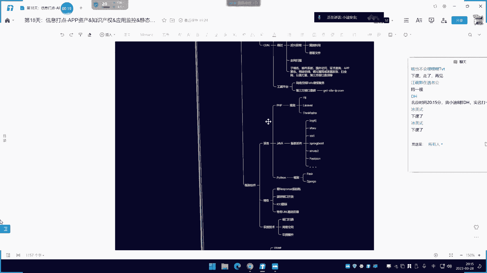

就是从我们这个对象中去找到app资产，这是我们新建的第一个支点，就如何获取到目标的app信息，然后呢就是获取到之后，如何从APP里面去提取信息，就是两部分，就是说你要得到APP。

然后呢再从app里面去得到信息啊，就是先得到后再从里面摘得到，就是我们今天解决了两个问题啊，那么首先呢这个解决第一个问题啊，如何从目标中找到AP信息，那么目标呢是分为几种类型啊，目标是分为几种类型。

哪几种类型呢，给到你的是网址，还是给到你的是名称还是给到你的是一个app，这个呢就是说给到你的是什么目标，你从这个目标里面去拓展信息，网子信心很好理解，就是给你个网站。

那么你就找到和这个网站相干的app信息，就是我们说从web中去找到app资产信息，那么还有一种呢就是我们这个给到的是什么，给到的是这个比如说名称，就说啊让你去测试某个单位啊，某个学校是吧，然后呢。

你从这些单位学校里面去剖析出关于他的app，这信息，对不对，所以我们现在呢就来给大家说一下，这几种方式的一个技巧啊，首先呢我们先讲第一种，就是从名称里面去获取到app信息。

那么获取方式呢有四个平台可以支持，爱奇扎克知识产权里面的小蓝本的，起码和点点查询数据，我们来演示一下啊，比如说我们就拿这个呃补贴上面的这种案例呢，去给大家说一下啊，就我们这里呢去找一下啊。

比如说我们现在呢，那就像我们前面演示的这个目标是吧，这个名字我们去找，关于这个目标上面的APP信息，就说我们测试它的APP资产信息怎么测呢，这是名字测的方式一种呢。

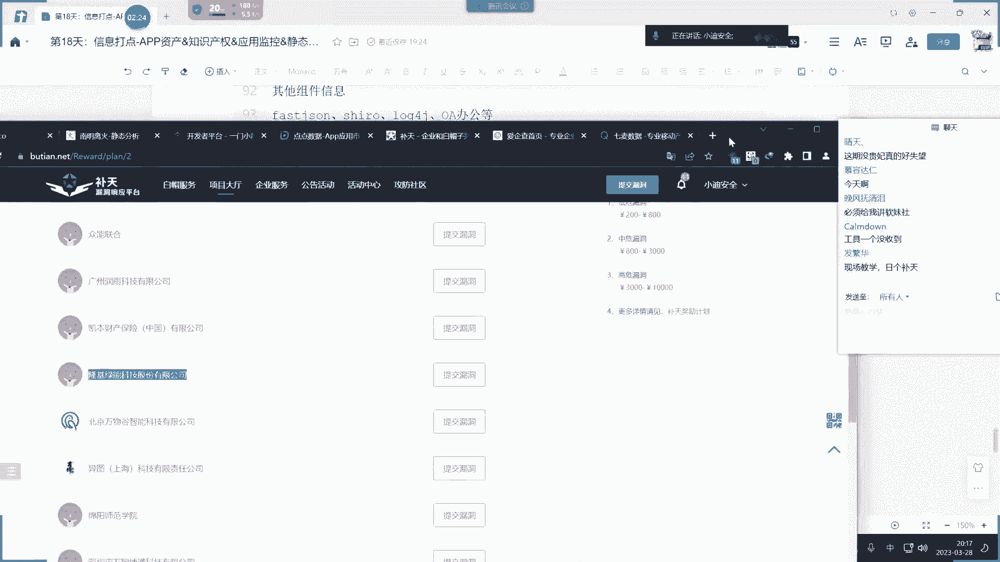

就是说从埃及查里面去查吧，查一下，这他妈什么鬼啊，这还哎这什么东西啊，要搞真吗。

对吧，你可以看一下啊，来比如说我们这个啦，在这种目标对不对，查一下这个信息，然后呢看一下资产权，这里啊，你看这是他的网址，对啊，这个网址啊，这里有个网址，然后这里呢你看啊这里有的又要游回湾上app。

那这里啊你看了还有个游回湾村app，游回湾在银行app是吧，这里有三个可以看到，这里有三个这个app的信息啊，你这里到底可以在这里标注一下，对对有三个这个类似的啊啊这里查到了，然后呢这是从这里查。

那小蓝本呢也可以查一下啊，小蓝本免费啊，那个爱奇茶呢，你可以在拼多多上花一块钱买个七天的试用的，超级会员，一块钱就能买，因为你平常也不会怎么晕倒啊，那你看看这里是能查到他有个P。

他也查到了一个app的优惠，万家银行这个app的信息可以看到，那这两个茶呢说实话不是我大家推荐的啊，跟大家推荐的，就是我们说的，用这个什么点点查询和奇奇麦数据查，你直接在这里可以输入这个名字，在这里搜。

然后在这里也可以点点，这里也可以搜，但是你可以看到啊，这里搜这里是没有信息的，然后这里有个太一个是说IS，一个是安卓对吧，然后这里有个商城呢，什么应用宝啊，这个什么鬼，360啊，就是各种下载的市场。

他从这里面去搜，关于这个产品，这边没有收到，我们看这边看这边的一点点数据信息，诶怎么卡了，搜搜你没搜，半天没反应了，你看他这边收到收到一些什么，你看啊这个是广告，这个不管它是广告呢，游客玩家增长。

那这都是一些关于他的一些企业家的一些app，产品到没，那针对是IOS的，然后呢你可以在这里选择中啊，这个市场的一个提供，包括还有这个app的一些其他信息，但其他信息的这个无所谓的啊。

你可以自己选择性的啊，什么ab store google啊，国内安卓的呀，那几个系统的市场啊对吧，那这里就可以看到了他的一个app的信息，对吧，这里搜的话，你是可以通过这个东西搜，那这里呢你看到这个。

我们这里可以换一个测试目标，比如像刚才我说的这个，我也可以在这里呢去搜，从这里呢他发现几个，我看这边的小蓝本的一个信息，显示的信息有三个呢，一个两个三个，然后呢我们再到这个在你去搜这个地方搜诶。

他这里呢是也发现了啊，你看看一个这个一个叫什么宏基向日葵，还有一个ATM，然后你看上面他说的就不一样了，有个什么宏基渠道商，然后呢没有那个什么ATM对吧，然后这两个是重复的，所以它只有两个啊。

这个是重复的啊，只有两个，然后这边收到的是有三个，其中呢他没有那一个，所以说你要多种平台去搜了，这个地方的不一样啊，收到两个对不对，然后你那你可以点进去看一下啊，它就会有这个app的大概信息。

包括它的产品id和这些的界面，还有他的这个评分啊，包括这个开发商的一些信息啊等等等等啊，你可以看到他那版本的一些情况，那你可以猜他老版本啊，这种情况都可以去尝试的去操作，这个下面的那些什么。

这个信息我们就不太关注了啊，像什么下载量啊，还有什么这个其他的星星的，这个是主要是做那种应用推广的啊，这不是和我们相关的啊，你可以点击一下这个关注应用，包括这里的app的一些联系方式等等，都可以获取到。

不过有些操作呢可能需要这个平台的会员，这个平台会员太他妈贵了啊，我还准备说开个云一下的这个平台，会员一个月350块钱，这里面的真是贵。

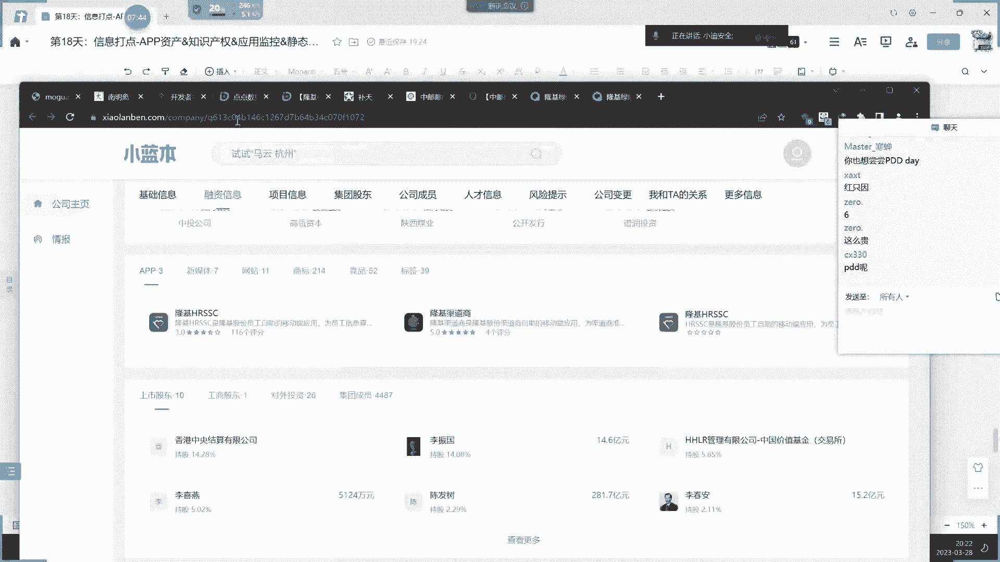

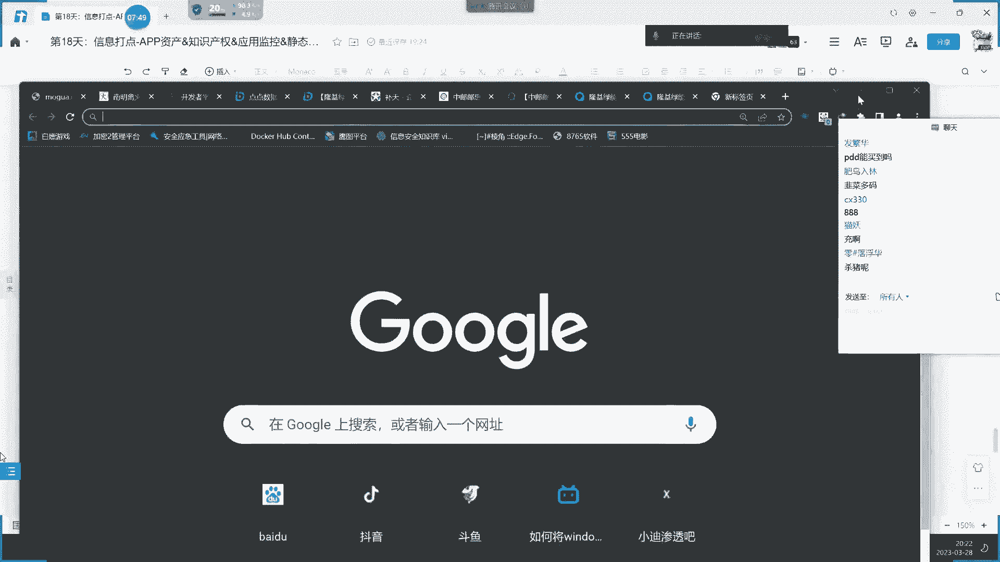

还有这个奇买啊，你也可以在这个上面那去查。

那么刚才我演示到的这个操作呢。

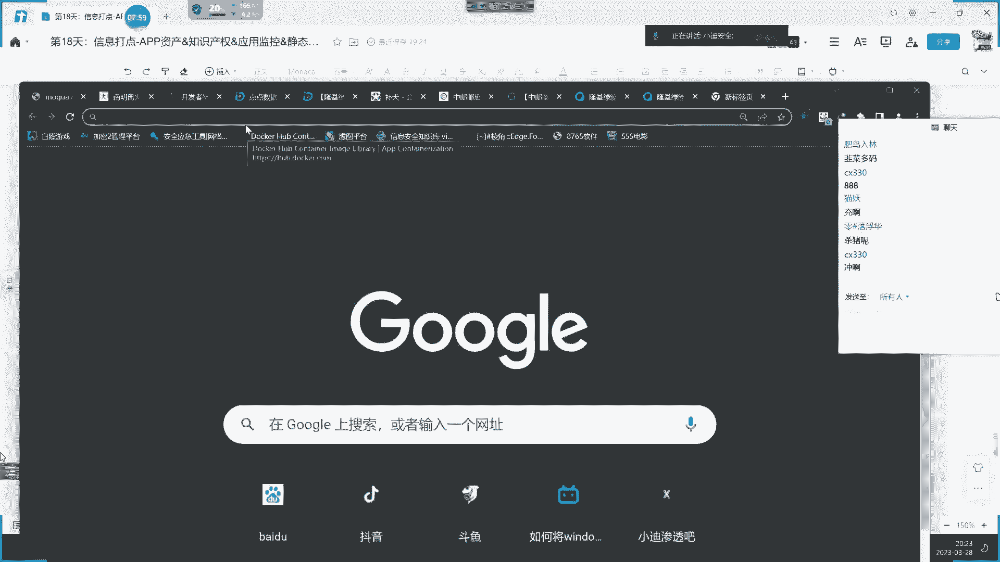

刚才我演示的这个操作呢，它是基于是什么呀，就是通过这个对象的单位的名称，或者是这个目标的单位的薪资啊，去搜了得到的这个关于这个目标的一个信息啊，对吧，那这个呢收到一个华为上面有个资料。

啊这个没有应用宝里面这些不相干的，按着的IOS，啊这个起码比不上刚才那个点点，那个点点数据还是相对较多啊，这个起码凑合着用吧，那这边呢就说到这些嘛，对不对，所以说这种呢。

就是我们说通过这个目标的这种名称，通过爱奇X小蓝本，起码和点点这四个平台呢，能够查到目标上面可能开发出来的app产品，这是第一点，然后大家应该还有注意到啊，就像你如果说苹果手机或者说这个手机。

你再点开那个app的那个地方的时候呢，他有个比较关注的消息，就什么，就这里啊，比如说我点一个P啊，假设你现在知道一个app了，一个电视的app，它不是有个开发的一个厂商吗，就开发者一个点进去。

可以看到他呢又开发过哪些产品，所以说这也是一种查询的一个途径啊，只是说有些人知道啊，这也是很基础的东西，我就没有说啊，然后呢，还有一种，就是说我们从这个预告的信息上面去查app，就是说我给了一个网站啊。

你如何去找到app呢，一般是有三种方式，第一种呢就是这个网站自身上面，网站就已经有这个P的这个下载的参考，就很多网站不是你访问他是吧。

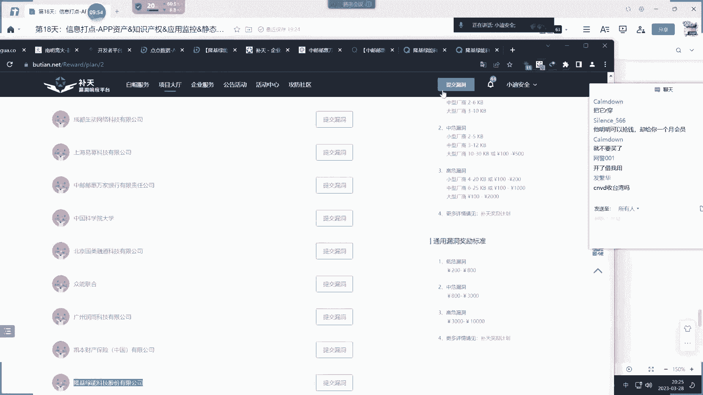

像这个各种网站，对不对，一访问他就有这个东西。

对不对，他直接告诉你像这个BBBBB啊，这个这个东西啊对吧，你打开呢他这个上面就有了，比如说这里有个下载客户端，哎，你看到的这不是有他的app的下载地址吗，对不对，这就有这种事情，我们说直接有的。

那么还有一种就是说他没有的，你不知道对不对，我们一般都可以通过余额信息里面，去查它的备案信息，那我可以举个例子啊，我就找一个来给大家演示一下啊，那我就拿这个网站来测啊，这是他的官网对吧，这是官网。

这是不是在官网，应该是的吧，官网地址我看一下啊，应该是官网啊，这是那个那个目标的啊，这是一个网站，对不对，这个网站上面那你可以看一下，他没有说有什么app的这个东西给到，你看不到啊，这没有啊。

然后呢我们怎么查呢，可以把这个网址呢复制一下啊，然后呢查一下备案信息，如果说没有备案，没有备案的话，你想想吧，等下再说这事情，你可以查一下那个备案信息对吧，你查一下这个备案信息之后呢。

看一下它是属于哪个哪个名，哪个哪个公司人呢，他其实呢是中游这个东西，然后呢你再把这个备案信息再搜，不就和刚才那个通过名称去搜app一样的道理吗，是吧，就是说你通过查URL的备案信息来查app。

你可能说没有备案，那咋办呢，你首先要想象一下，没有备案的目标会是哪些目标，他如果连安都没有被，那么它的app信息的话，因为我们知道啊，APP要商家到商市场的话，他是必须要有资质的，它需要审核的。

你连安都没有背，那无非就是两种情况，一种就是这种网站，它本身就是个是个草皮网站，怎么说叫扫描网站，啥都没有，本来就是好玩的，他干嘛还自己设计个APP呢，所以他没有PP的可能性是有的，这是第一种情况。

还有种情况就是这种违法的对吧，那违法的话，他既然是做违法，那么APP大部分都会在网站上面给你提示，在哪里可以下载到，能理解吧，所以说没有备案的话，无非就是2000块，他没有app，再说说那种违法的。

但是违法的一般都会告诉你，在哪里可以下载到app，就是它是用第三方的，这种就伤不了这个市场的一些app啊，单独给你个下载地址去安装，像安啊，像苹果的可能还要安装一些增速，要新人才能运用。

我相信呢有人肯定是有这个经历对吧，就像某些那种cs app呀，你在那个屏幕上面想用，还有点信任，对不对，你不要问我说我怎么知道我哪里知道呢，对不对，还有一种呢就是你知道这个东西了，直接在这个上面搜。

就你可以根据这个这个目标的这个地址呀，哎对吧，他是不是下面有这个什么哪个公司啊，或者你来这上面都有了，你看他没有写的话是吧，你直接搜这种东西，他也能搜到，在市场里面去搜，像什么安啊。

苹果的那个app是多市场啊，安卓的什么应用宝啊啊豌豆荚呀是吧，这种市场去搜也是能搜到一些的啊，所以说呢啊我们这前面这两个内容呢，主要讲的就是说如何从目标中去找到，关于这个目标相关的他的app应用。

那么找一篇用呢，接下来就是比较关键的地方了，前面两个呢只是说是吧，收到这些目标的应用信息，对不对，然后接下来就是从这个应用app，应用信息里面去再去找资产信息，那么一般呢是分为三种方法啊。

一般呢就是从抓包上面去提取，还有呢就是从啊这个反编译的角度的去做提取，还有一种呢就是从反编译的字符串里面去搜索，关键东西来提取，主要来说就是两个思路啊。

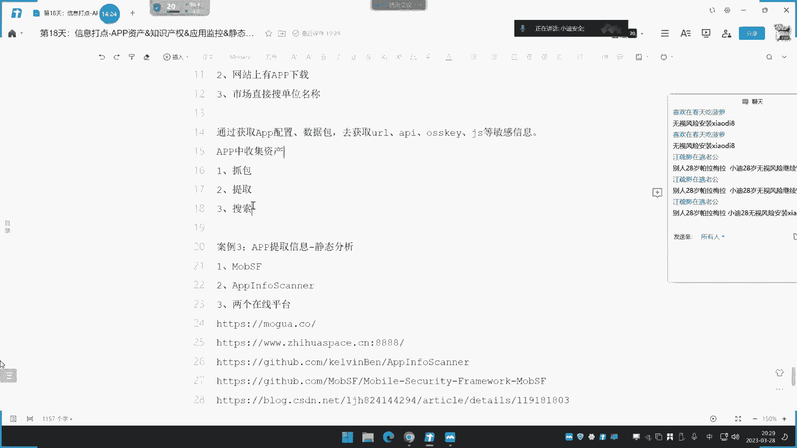

我给大家简单写一下啊，我们可以这样去理解了啊。

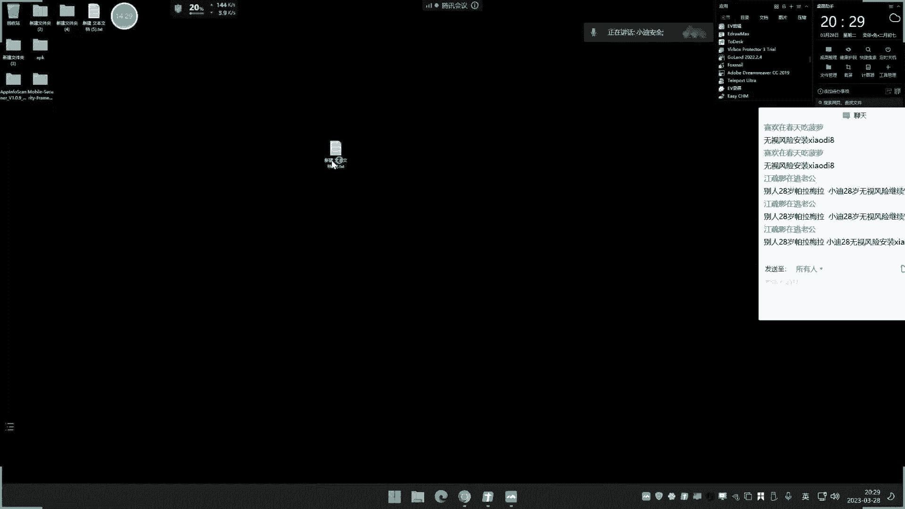

从这个app里面的取poi数据啊。

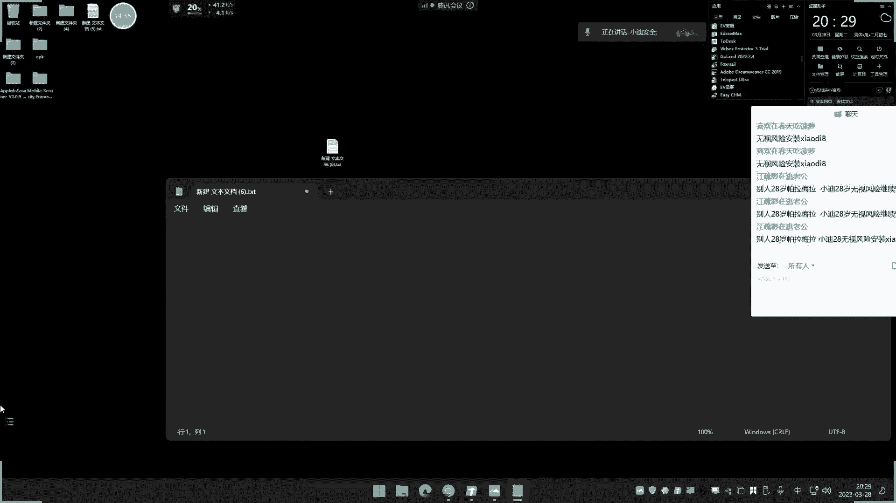

那我在这里写不来抓包了，就是动态表现，然后呢这个提取呢一个叫静态表现，还有动态表现，啊这个是啥意思啊，这个搜索呢，就是其实呢也是静态表现一种方式啊，这这有啥不一样的地方啊，我给大家简单理解一下啊。

我们从这个app里面去收取资产信息，一般的话就会收哪些信息，那看一下APP的配置，然后数据包是通过数据抓包得到的，还有就是从里面去获取有没有什么URL信息，API的接口信息，包括配置的什么。

这个像一些接口的一些K啊，密码呀，密室的信息，包括里面的一些什么JS的一些信息，这就是我们常规在APP里面去提取这些信息，因为提这些信息是干嘛的，这是和我们安全测试有关的，你测试的话。

主要就是测试这个app里面的这个涉及到的网站，涉及到的网站接口，涉及到这个第三方接口，和里面泄露了什么这个配置的这个账号，密码等等，对不对，所以说为什么要提取这些信息啊。

他是和我们后期这个做的一些这种安全测试的，一些漏洞啊，啊手段相关的，那么提取他的思路就是刚刚说的三种方式，那么这里呢又分为动态和静态两种模式，何为青苔，何为东台，简单来说啊，我们先说第一种金台。

意思就是说APP给到你，然后呢你去对这个app呢去收集信息，静态的意思就是说app没有任何动静，他从理想的角度去把这个app给他反编译，那么得到这个app的这个源码，最后呢再从这个源码中去。

按照特定的方法去在里面去搜，去提取里面涉及到什么网站API这种信息，这种呢我们称之为叫静态静态表现，还有一种就像我们说的抓包，抓包是一个什么情况，是不是把APP给它任性起来。

然后呢你通过你的鼠标在APP上面去操作，操作之后呢去抓包，那么这种我们称之为下动态表现，这两种有什么不同之处呢，大家可以想象一下，大家可以想象一下，这其实和开发的那个原理有点类似，啥意思呢。

静态表现是静态表现，动态表现是动态表现，会不会就是说这两个结果是一样的呢，它不一样，就很简单，我们举个例子，一个功能实现，我在我代码中去写一串功能，这功能我写的代码中了，但是我只是把它写了。

我不做任何事情，就很简单，我写一个变量是X等于写了之后，我对这个变量不做任何操作，好你得到我的源码，你找到这个X等于一，但是我不对他进行任何操作，他有没有作用，它就没有作用，它就是简单就是说我只写了。

我不动他而已，那么这种情况在精彩表现中就可能有这种意外，就很简单，在它的源码中，他假如说里面有个网站，但这个网站他不做任何事情，他就只是说网站信息在里面啥都不干，但是动态就不一样了，动态就是啥呀。

他已经表现出来的东西，就你打开这个app，一打开抓得好包，那就说明他是表现出来的了，那就是固定他就有这个东西，不然的话他怎么触发那些东西呢，对不对，所以说啊，你从金坛里面去提取的信息。

和动态里面去提取的信息是不一样的，静态里面提取的信息可能说很多，但是可能有些没有什么作用，因为你只是提出来了，并不代表他这个东西就在运行，就在用，能理解吧，这个意思就能理解吧。

先了不了解这个东京台的区别啊，而且这两个那提取的这个原理它是不一样的，一个呢就是说我打开app抓包分析到的，还有一种就是通过这个逆向技术，把APP源码得到，从源码中去提取信息。

所以他们两个的这个提取的这个方法呢。

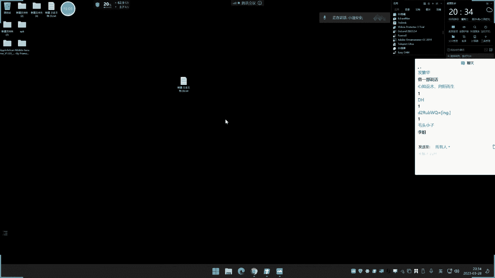

它是不一样的啊，所以我们现在就是现在一讲啊，就是从这个什么抓包去抓表现出来的数据，那么它的优点呢，OK谢谢啊，这李总还得用呢，就说你这个反编译，然后呢从源码中去提取这个什么数据。

对吧，只是说这两种好，那么让我们把简单写一下吧，呃这个呢它的优点呢很明显啊，优点很明显啊，没有什么误报是吧，提出来就恭喜，有缺点就有缺点，什么缺点，无法做到丸子，为什么说无法做到完整呢。

你抓包的那么抓包大家会有一个意见，你不去触发的东西你能抓到吗，就我打开我啥都不干的，那你抓啥就抓那个打开就筛查了，没有了，你要操作才有这个后续的操作，才有数据包产生呀，要交互才有啊。

所以他是没办法做到完整的，你不可能说我每一个都点点点，那有你这个有些app点几下可能就完了，有些里面的多了，那你不可能一直在上面点来点去，而且你电也会有遗忘的呀，啊稍微有一个地方遗忘。

那他可能就少了一个东西出来，是不是，那么这种呢优点呢，就是说那这个就刚好和他相反是吧，他优点那就是说数据呢较为完整是吧，然后缺点呢哼五包就说这个不是说五包啊，就是这个，有很多是吧无用的啊，有很多无用的。

就可能他没有用的，都把它拿出来了，好这是我们说的这两点的一个思路啊，然后呢我们可以通过这个案例给大家比较一下，大家就知道会有什么差异了啊，我们那这里呢呃如果说我来个简单的app呢。

你也不好说这个事情的话，我们就来一个这个呃，从那个SRC那个目标里面提提到了APP啊，就是就是刚才不是SR就这个嘛，那这个P啊。

不是说那个我们就来做一个简单的一个新手机，看一下啊。

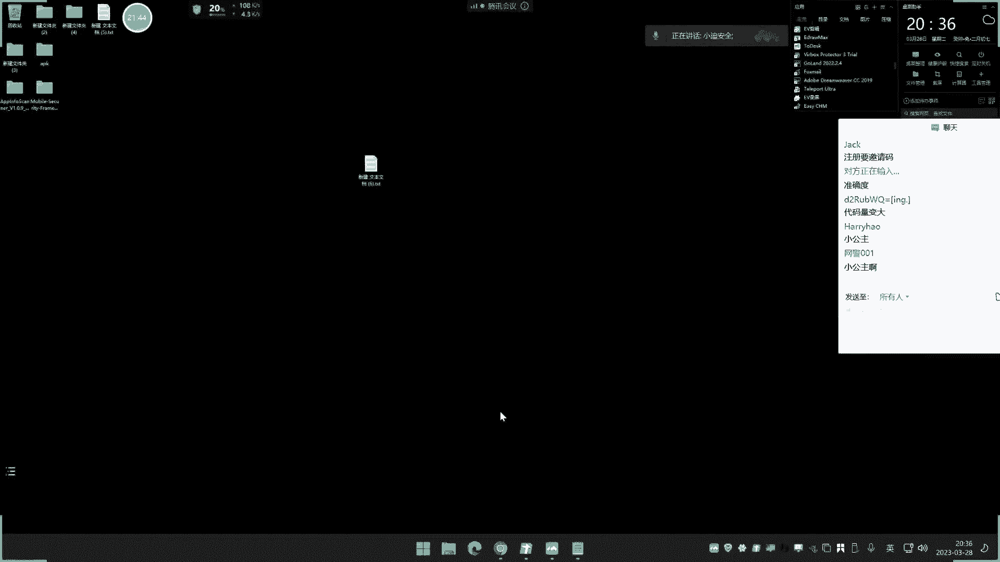

好了，现在呢就来第一种啊，就是说静态静态的一种情况，那静态的情况啊，这个如何操作呢，这里有几个项目都支持啊，那四个平台可以打开看一下啊，来四个平台，然后呢有两个平台的，还有这个自己的这个项目啊。

这两个就是自己的项目，这两个是平台，这个平台打不开了，不管它这里有个什么叫南明互灵活，还可以点击一下，就这里直接上传这个app呢，他就帮你分析啊，这是别人上传的一大堆了，各种闪闪的什么月月月啊。

什么鬼，好他这种呢有呢分为静态和动态，然后呢他的动态呢就要花钱，所以说你呢用这个平台，我教你用这个平台，是用它的静态，不是说让你动态，你如果想用动态，我就给你搞个免费的，因为它这个平台的功能呢。

是基于一款工具开发的，所以他这个无非就是把工具呢，做了一个二次开发。

加入了收费功能，所以说你就想到啊，为什么，这个其实很多网上一些产品都是这样做的啊，就是有钱人写好工具，他就把它编啊。

你不知道吗，哎变成收费的，它的功能呢我们用等下用款工具就能实现啊，现在说这个静态的啊，然后呢我这里呢就是下载这个了，这个是那个从那往下的啊，这个是那个下载下来的嗯啊这个不是的啊，诶那个。

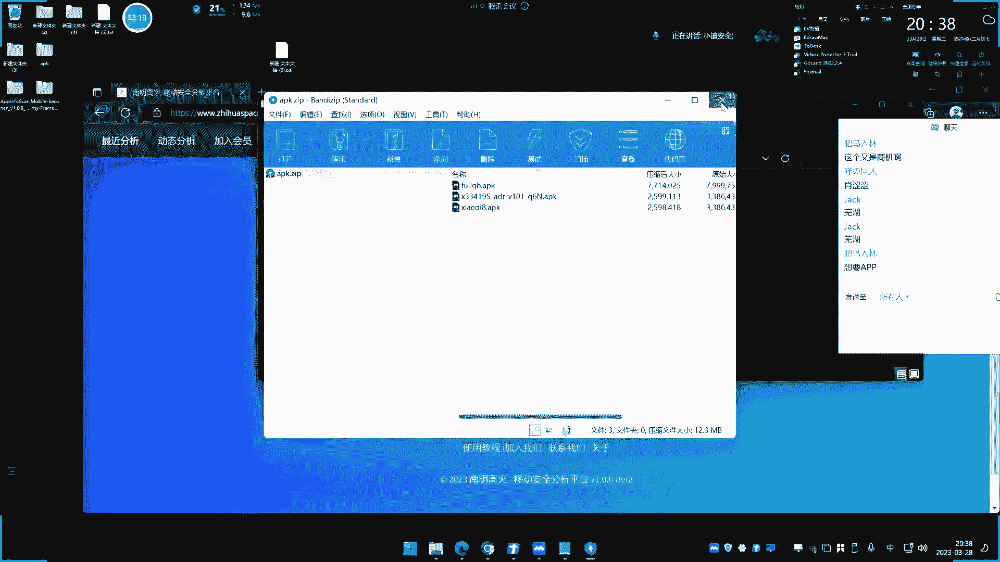

那我下个重新下一个吧，重新下一个吧，重新下个。

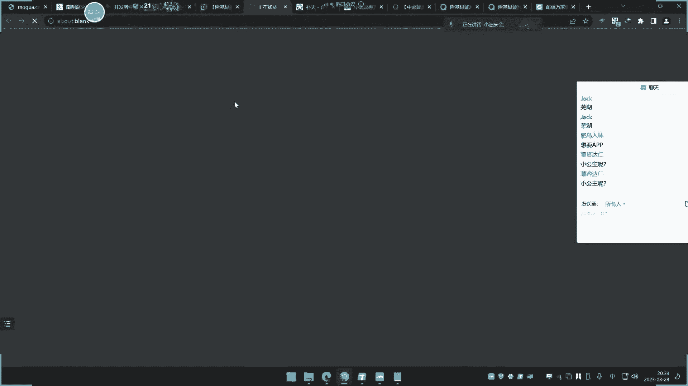

哎呀搞个安卓的，搞个安卓的，这里面那个苹果的，我还没有那个苹果的，我还没有，哎呀，哎。

我这里我记得我瞎了的呀，怎么没有啊，这个真是奇怪。

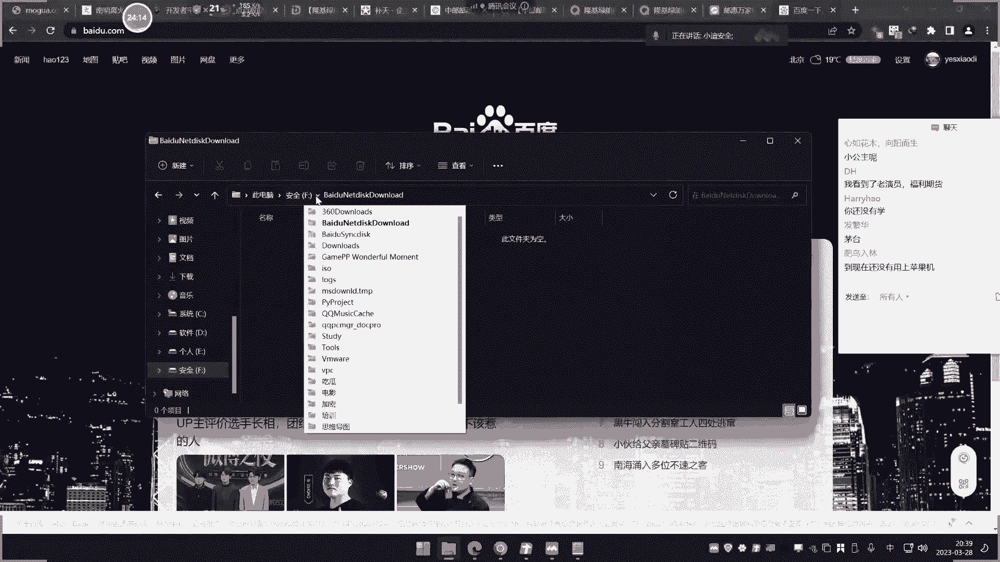

豌豆荚上面应该有那个这个名字的，搜一下，应该有，这个关键字，嗯这里有干没了啊，点普通下载，不要点这个勾选的，勾选了下豌豆荚的。

你下这个不要把豌豆夹下下来了啊，你不点那个东西，下豌豆荚app app的。

我们在用的是这个，用的是这个啥呀，用用用的是这个app的啊，这个app的啊，如果苹果没有模拟器啊，那只能用真机测好，这里呢我们就把这个app都给他放到桌面啊。

然后呢嗯不用这个平台来测吗，我要用一下，看一下这个平台怎么好啊，简单使用一下吧，这种呢就是说他会用这个平台的自动的去分析，这个app里面的一些信息啊，我们可以看一下他这个能提到什么信息，好看一下啊。

然后这里呢有这个信息，大家可以看一下啊，我们看一下这个什么安全分析，应用权限增速信息，包括一些其他的啊，然后呢你看一下下面的情报线索，这里有涉及到什么鬼，域名线索呢，就从这里面提取到的域名呢。

这里有些域名，然后你可以看到大部分域名的，就是第三方的接口，域名也没有什么东西呢，你看这都是一些接口命名，没有什么东西，你看这个提到的信息，我们可以等下再来回不来，然后这是网址，那有些个网址。

但这个网址怎么说呢，都是一些这种借口，就是说一些这种第三方接口项目地图的呀，阿玛普啊，这都是一些接口，这不是说和网这个app相关的资产，就是APP呢，他只是用到网上一些接口，比如说他要调用地图啊。

或者调用一下这个第三方的一些什么，这个地方来看都不是一相关的，你看这是啥东西啊，你可以打开看一下AA马普，这是什么网站呢，你看一下啊，这是尼玛高德地图，对不对，所以说这这怎么收到这些鸟毛信息啥的。

电话号码电话号码没有网址，网址也是些乱七八糟的，邮箱数据有三个邮箱，这也没啥鸟用，其他的基本都没有没有没有啥了啊，其他的都是一些关于这个app里面，一些什么权限啊，一大堆啊，啥都没有提不到，对不对。

是不是这里就信息，他这里提到的就没有啥呀。

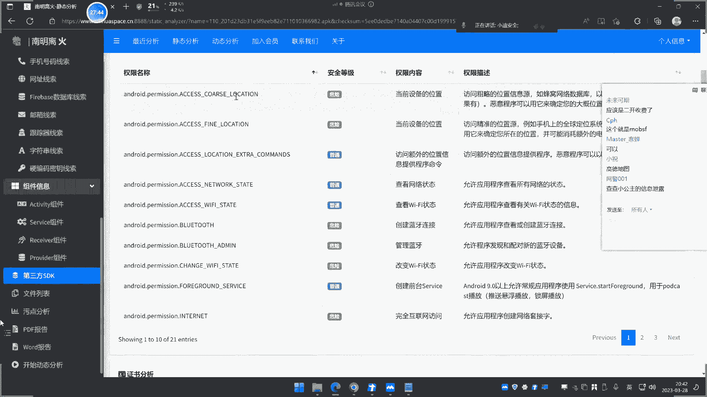

对静态了啊，然后呢，你把这个，你把这个app的用起来，这个装到这个Buff shot里面去抓个包。

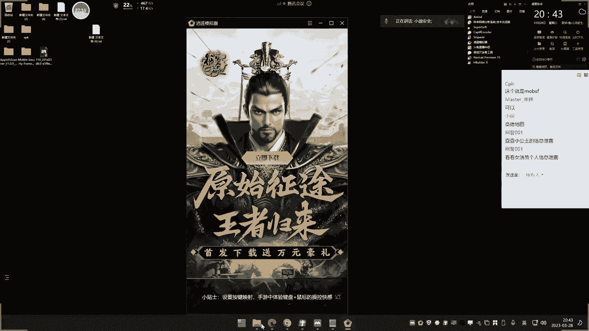

我们看抓包里面能不能抓到一些这种数据对吧，然后这个目标呢是这个目标的啊，我们刚刚查这个信息的时候呢，他这里有网址的吗，呐这是他的官方域名，那就说查到和这些相关的，那可能就是他的信息了。

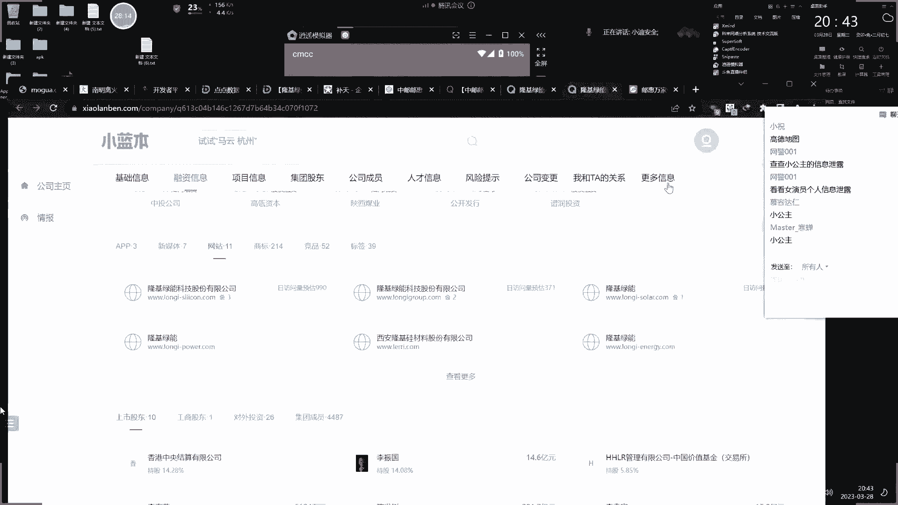

但现在呢那个用那个项目它没有是吧，然后呢我们现在装一下这个app啊，好装好了，我们打开看一下啊。

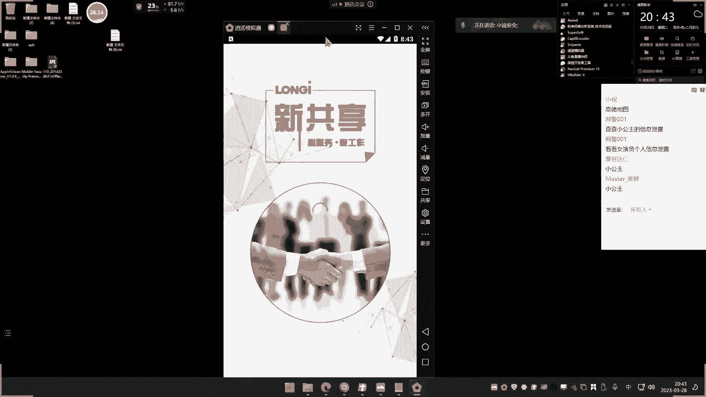

这是他的这个app的接口啊，然后呢我们现在呢抓个包来看一下啊，那么现在就说我用到动态了啊，已经用到动态了，就是说从抓包里面去看一下。

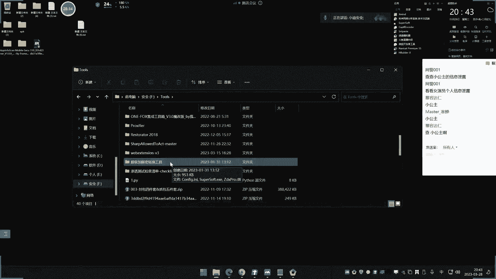

有没有这个网站相关的事情啊，刚才那是通过那个平台的，自动从反编译之后呢，从源码中可提取，然后现在呢就是说我去抓包来测试一下哈，来试一下啊，好监听一下这个奇袭端口在这边的抓包，其实前期已经演示啊。

像这个配置我就不说过多介绍了哈，大家都前期讲过了啊，这就直接抓了啊，点击保存好，重新开一下啊，来看一下啊，呐看到没是抓到一个，你看EHR6。8209端口，你看，那是刚才说的这个账号和密码呀，密码加密了。

是有这个信息提交了呀对吧，能，你说浏览器看一下，浏览器看一下看一下呗，那就这个地方对不对，就这里啊啊他抓到了啊啊。

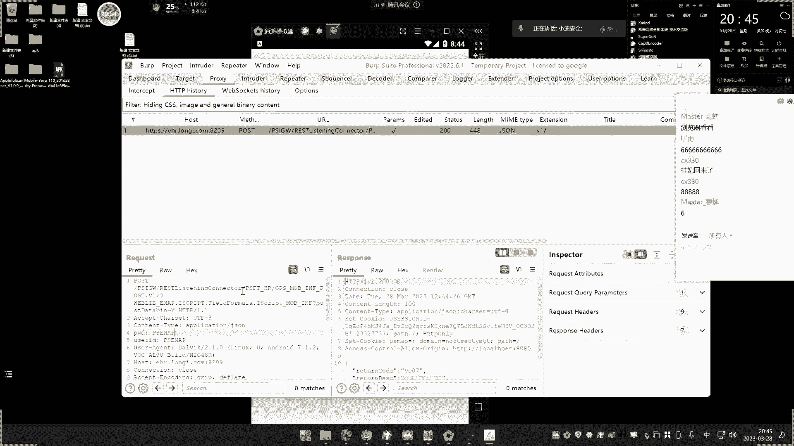

你刚才从这个地方他提不到，从中抓包的，提到了这什么原因造成的。

什么原因造成的，是这样的啊。

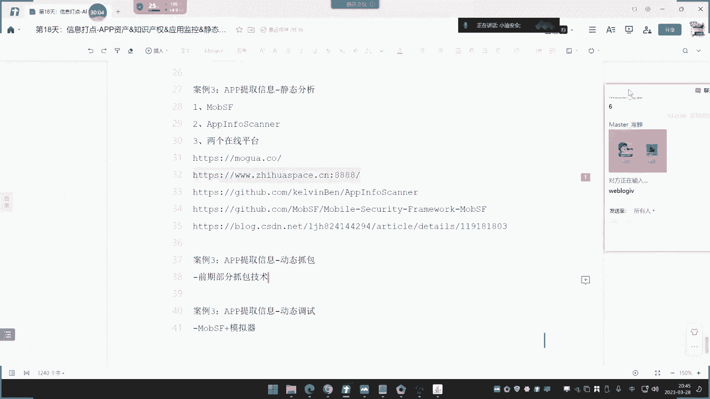

我可以给大家讲个案例，这个案例是非常有原理性的，这个标识什么原理性的标识呢。

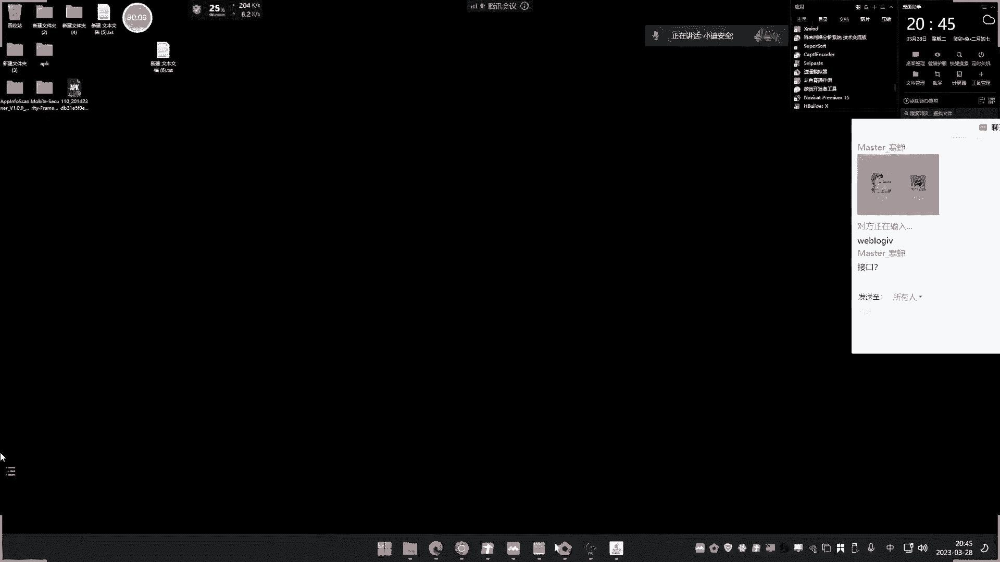

大家可以关注一下啊，大家看着啊，我先把这个删掉，你看我打开app，先打开，打开了这个界面已经载入了，但是这里他没有任何反应，没有任何数据包，我点登录它才有数据包，那么大家想一下啊，这个界面。

为什么打开没有反应，数据包抓不到。

点登录有反应，是这样的啊，这是一个app的设计逻辑关系，啥意思啊。

我们把这里写下了，这里不是安妮吗，比如说这个安妮这个某app打开无数据包，登录有数据包，然后呢前期是这个什么这个反编译后未找到，越熬的一些这个这个目标的资产，诶咋抓包呢，抓到了，其实原因是什么原因。

大家知不知道是什么原因啊，就是啊那个登录界面是app打包的资源，并没有什么，对外发送数据啥意思啊。

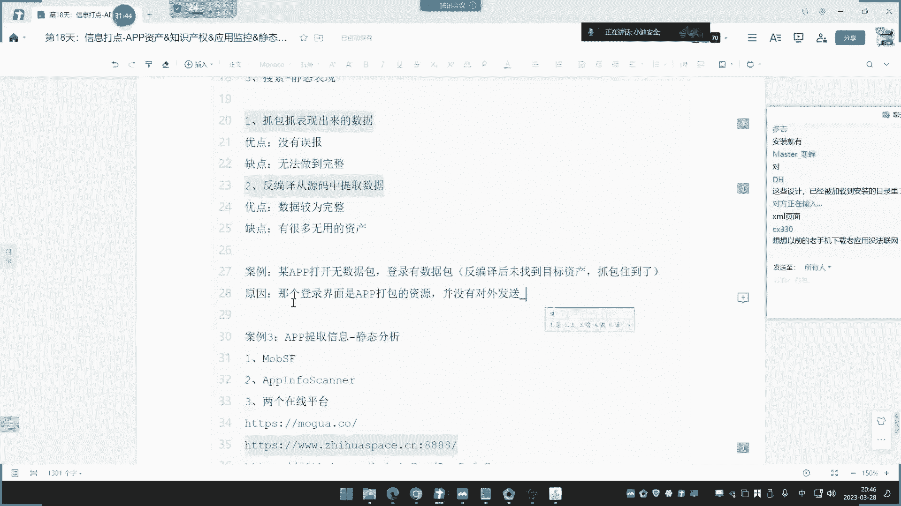

大家想一想呢，我打开它，它加载本地资源，把这个页面帮我显示出来，我点登录他才发送数据，所以这就是为什么我打开他页面显示出来，没有数据包，登录才有数据包的原因好，那么既然是这么个情况。

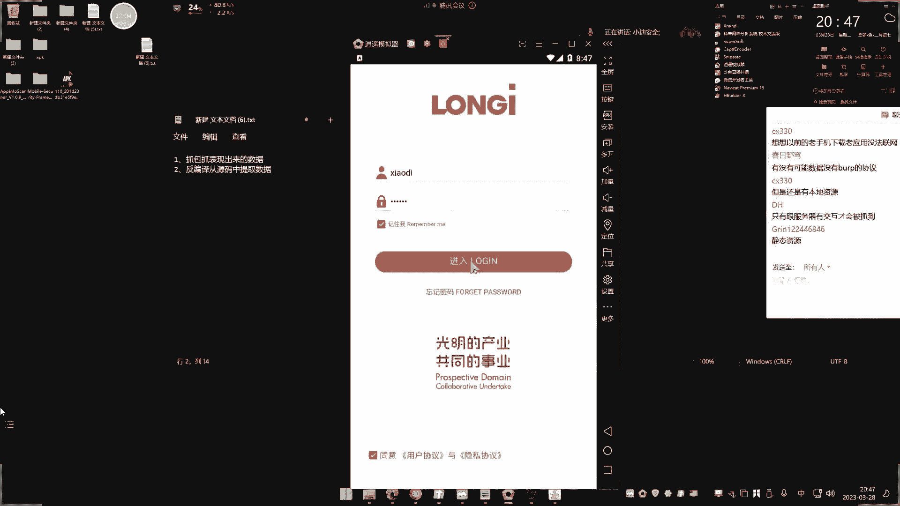

就能很好的解释了，为什么从这个接口上面，反面里面去用这种官方平台，在官方平台是一个什么原因呢，就是把它进行反编译，反编译之后呢，自动反编译之后呢，把它这个里面的去搜这种网站信息，但是他没有发现。

刚才我抓包这个网址，为什么呀，因为他是金牌，他登录了吗，他没有登录，能不能理解了呀，这是东京的一个差异，那么如果说换个思路来讲，如果说他现在打开就有这个什么，打开就有这个这个啊，打开就有数据包。

那会不会这边分析的时候，就会有那个网址信息呢，也不一定，为什么呀，这是要根据你的这个代码决定的，很多东西你做过代码开发，你就能理解这个原理，理解这个架构，你没有做过，它是千奇百怪，你就会有很多疑问。

我刚才举这个例子写到这里，抓包的时候点登录了，有交互数据发出去了，所以我抓到了反编译呢，他没有做任何事情，就是从源码里面去搜信息，他所以他没有收到那个抓包的那个地址信息，这个很好理解是吧，大家都能理解。

但是我又说了一句话，我说现在假设说我打开的时候，它就会有数据包，但是这个反编译会不会就能抓到这个网站呢，也不一定，为什么说也不一定呢，因为他可以这么操作啊，代码中可以这样操作，他把王子给他。

用一些这种加密函数，用一些这种加密算法，通过解密再把网址还原出来再打开，但是你这种反编译里面，你去搜王子的这种参数，他不知道那是个王子，他一看是加密的，他搜索的规则可能是匹配HTTPTPS。

匹配什么点3W点这种东西来匹配来得到的，所以他一搜你是个加密东西，那加密东西是串网址，他要解密再打开它，这样一设计，你还收个鬼啊，搜不到啊，是不是，所以说你能不能搜到，是取决于工具的那个正则。

去在里面去搜那个关键字去提，因为像这种平台它都是这种原理，它就是把那个源码给它弄出来之后，你就像这里，那我们可以看一下上面网址信息呢，那他这里是从哪里提到这个提到这个IP的，你可以看到的。

比如说这里这个这个IP地址件，它是从这个A点java里面提到的，那就从这个A点java面，这是源码嘛，他是从这里面提到的，然后提取到里面有个那个那个什么IP地址，对不对。

你看这里有些人有些IP地址有这个域名，它是从这里提到的，但是他如果说把这个东西不这样写，他搞个加密的，或者说把它拆分组合，你哪知道那是个什么东西呀，所以他提呢是按照他官方的工具规则去提的。

你无除非他必须这个写的很清楚，出题刚好符合的规则里，从代码中把它提出来了，否则的话你也可能提不到，所以这个静态分析是最简单的分析，稍微上点档次的就是要抓包，用动态调试。

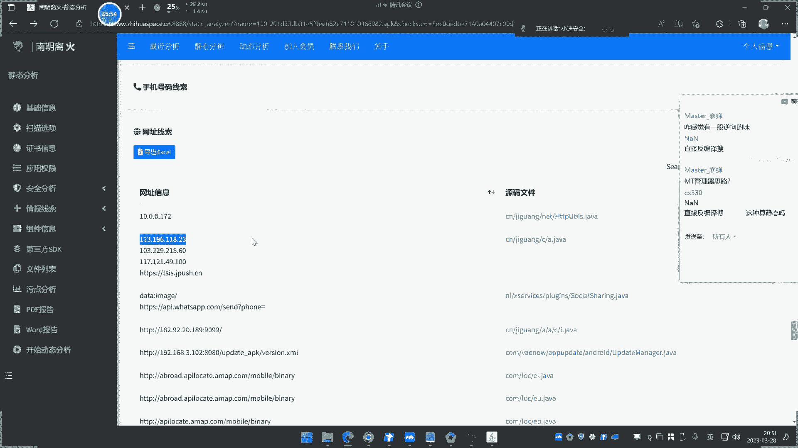

好那么现在我们再来看一下另外一款工具啊。

这是这个平台的，还有一款工具叫a p p enforce g，这工具呢是国产的一款工具。

它的工具呢是我们大呼网的某个作者。

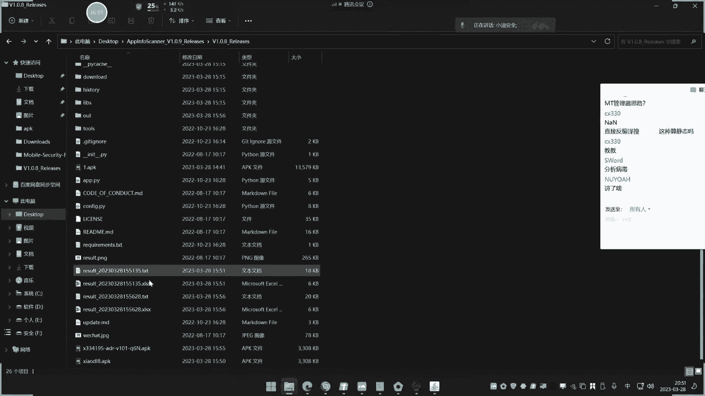

写出来的一款工具，他是干嘛的呢，那个位置是干嘛的呢，我们可以改一下啊，他说是以互网行动啊，针对安卓IOS静态网站的信息扫描工具，能够从这个移动公差中去收集资产，把一些这种涉及到的网址粘连的给它弄出来。

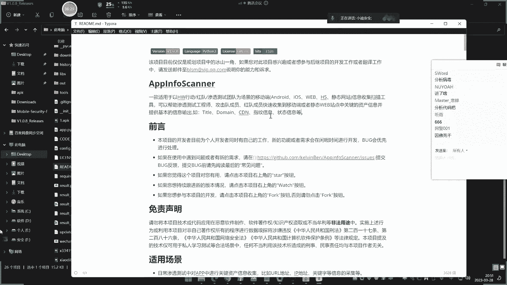

其实也是一种提权工提取工具，它能提出来，我们来看一下啊。

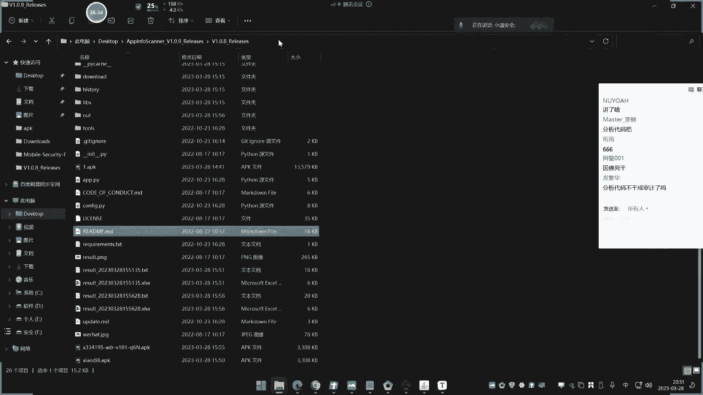

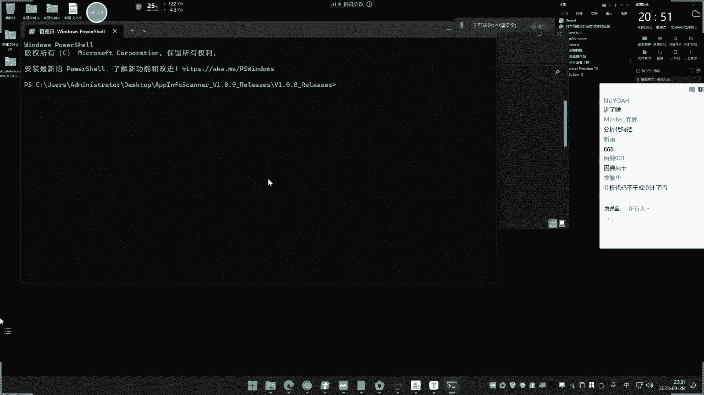

然后它的使用方式呢呃他是支持苹果，安卓都自杀了，扫描安卓系统加载，然后加上这个U呃。

直接这样写是吧，然后加上这个目标的APK的这个地址的路径，把它弄上去，哦那行吧，那拉不上去，我就放他下路径下面去吧，110，你看他就从这个app里面去app里面去提数据，你看他提啊，看他提。

那他开始扫描规则前面，那是对它进行反编译好，你看他提到几个信息，你看你看这四个信息有信息出来了。

我们来看一下提到U2信息的做个记录有没有，刚才我抓包的信息。

那e h r logo是不是刚才抓到的信息。

你看是不是这个啊，还提到一个什么，你看前面这几个我们用看前面这两个不用看，因为这是VUE的那个JS框架的官网地址，那肯定是用到的，他的这个网站中用到这个框架，所以这个不用看啊，这是关框架的光光粒子。

然后你看这个有个叫M云学堂点com。

这是个什么鬼啊，那我可以点看一下啊，如果和这个网站也无相关。

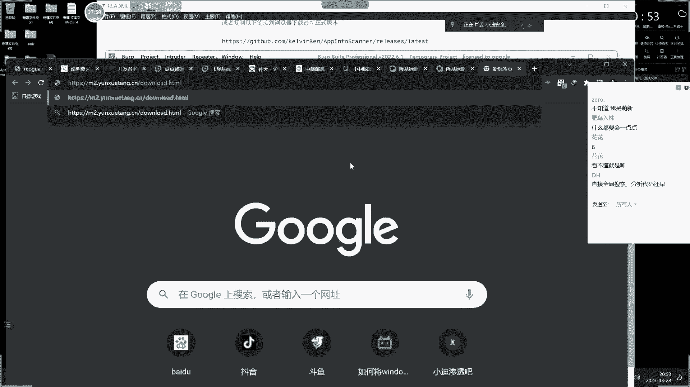

那就是云学堂，这个不知道是啥啊。

可能和人相关，人球场，然后这里面有个人一个SSO，这里应该和玉米相关的嘛，那这个就很重要了嘛，是不是下面这个又是乱七八糟的，不用看，你看这题啊，这是他这个他这个网站地址，这是从app里面提出来的呢。

提到两个是吧，其他的他还在分析，我们就不管它了，现目前提到两个。

一个是这个上面表达的是这两个提到了，那你可能会问为什么他能提到呢，他也是个静态分析工具了，它也不是动态的啦，你看一下那个上面呢。

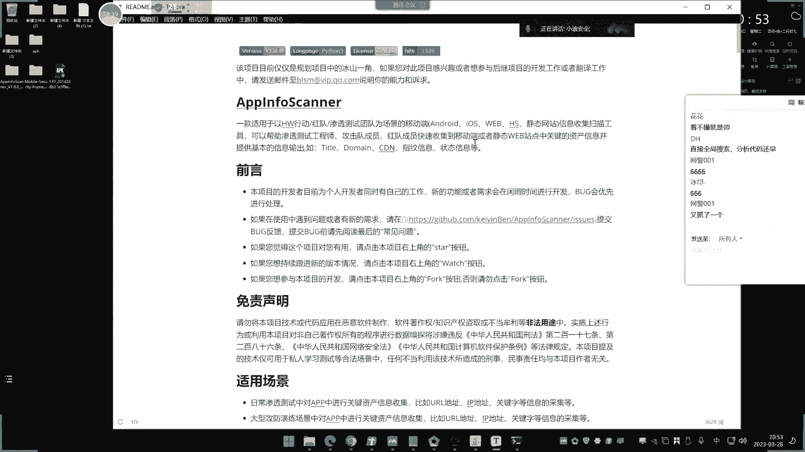

它也是从这个金台中去提到的，但为什么这个提到那个提不到，这就是和这个工具的那个提取规则不一样啊，对不对，那个平台呢他用他自己的规则提的提不到哎，这个呢是用他自己的工具规则提的。

他提到了，其实就是说源码中它是有这个东西的，只是说呀你没有找到而已。

你没有找到而已，你可以呢在这个上面去看一下他这个。

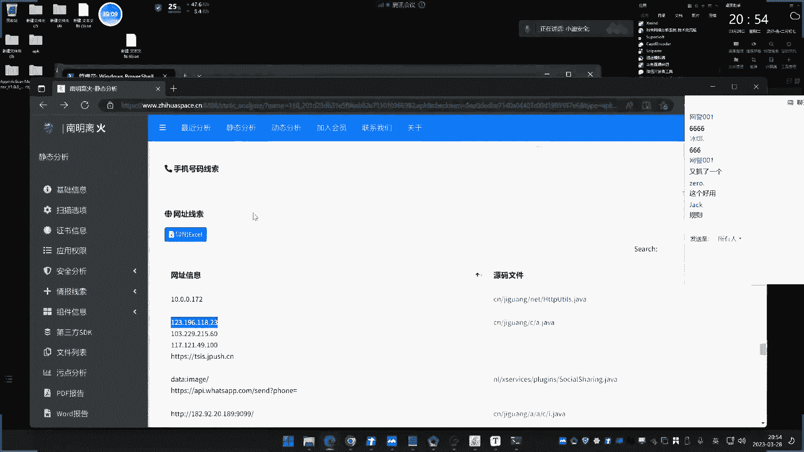

你可以从这个他这个里面去找一下那个源码啊，那反编译源码你从这里都可以看一下java源代码，可以查看来这三的整个java的源码，那么你可以在这里搜一些关键词app，啊这有些AP的，这个他是名称关键词。

你还要在这里搜，是吧，就是都是用这种方式去搜的，底下在这里找了个app。

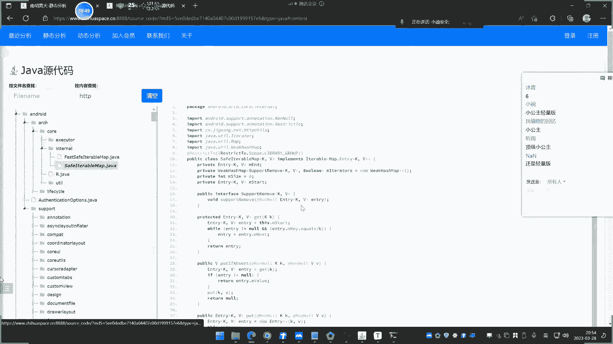

我直接可以搜这个这个官方的呢。

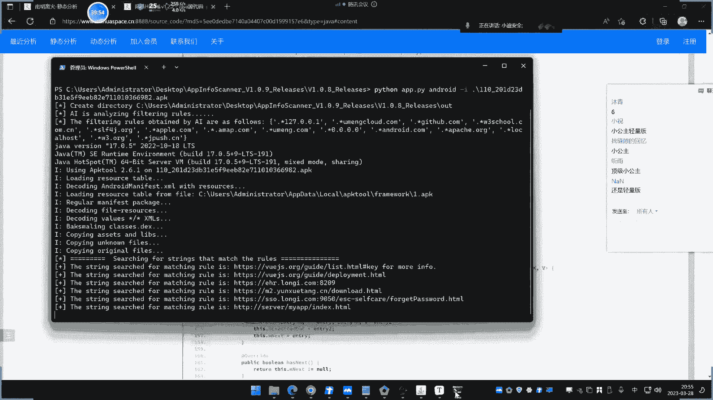

说这个域名我搜一下啊，就从那里他是用这个东西吧，反变了嘛，你再搜，收不到收不到收不到收不到，你说他是从哪里找到呢，对不对，他有些是经过了这个加密解密啊，有些编码你看他这里他说这里有，但是这里并没有显示。

其实是有的啊，只是他把这东西呢编码了，所以来进行转换啊，那他说这些地方有过这几方呢标红的，就是说有这个关键字出现，这个是后面我们要去再讲这个知识点的时候，那我去讲啊，所以说你从哪从哪里提出来的啊。

这个呢就是从这个源码中这样提的啊，他具体的就是按照自己的规则收的。

所以说啊这是这个项目啊，那抓包呢我也给他演示了，抓包了也给他演示了，对不对，找到了一个也是啊，那么现在呢我们再来介绍另外一款叫mob sf，这个工具是强烈推荐给大家用的，因为这个呢就是这几个。

两个在线平台的一个衍生版。

刚才有人说和这个mobile是一样的啊，这个mob它的安装呢，我大家如果说真的要做新设计的话，安装在本地啊，不要安装到自己服务器。

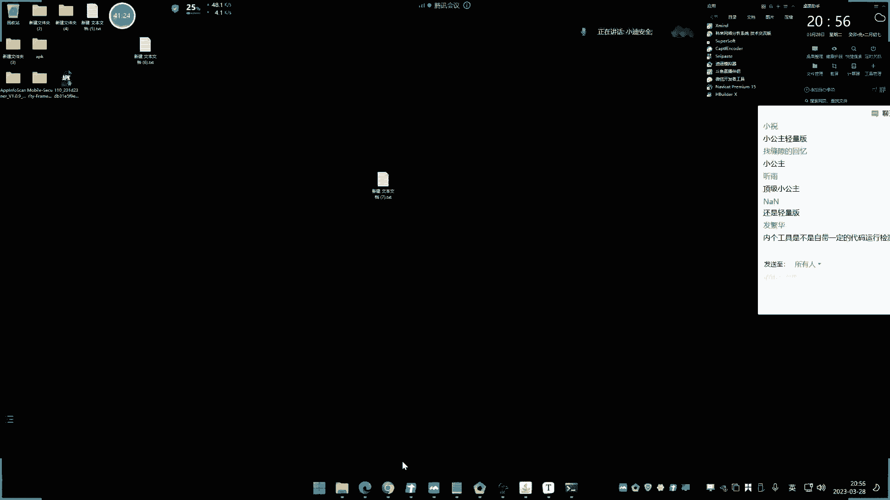

安装服务器的话就做不了动态调试，你要做动态还是很麻烦，安装过程呢这里有篇文章，有篇文章大家可以看一下啊，就是如何在本地windows上去把这个打印起来。

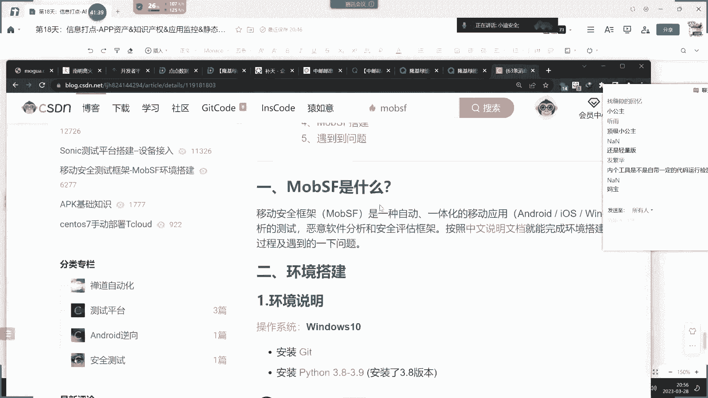

还有这文章要下这几个东西，下完之后要把这个东西安好，你按照步骤下载器把它安好，然后环境变量就按就可以了。

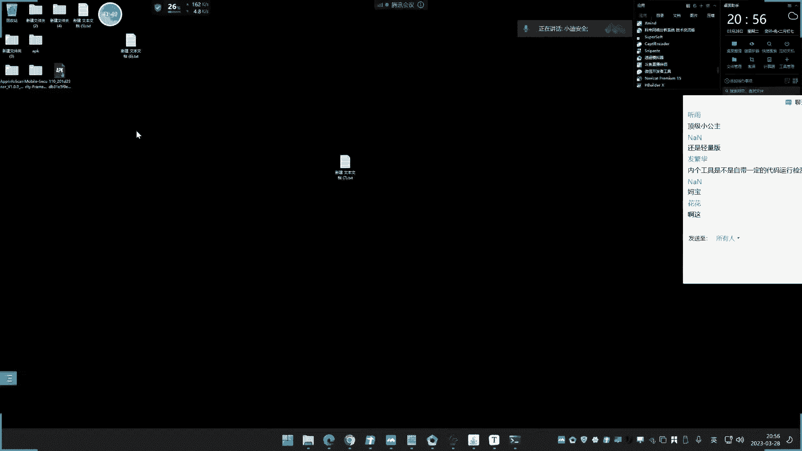

我给大家演示一下啊，它安装非常简单啊。

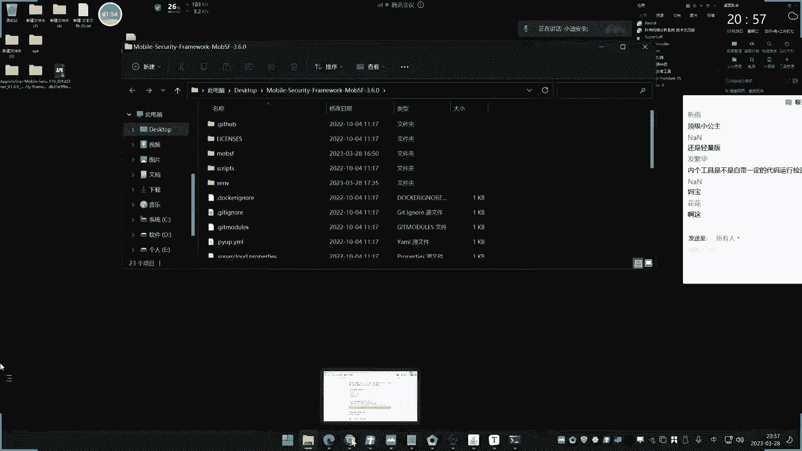

可以参考这个这个文章啊，去安就是把这几个东西给他下好，下好之后呢，嗯然后呢就直接运行一个东西就可以安装了啊，这个搭建直接这里了，去运行这个run，先安装，先先先运行这个叫step bt。

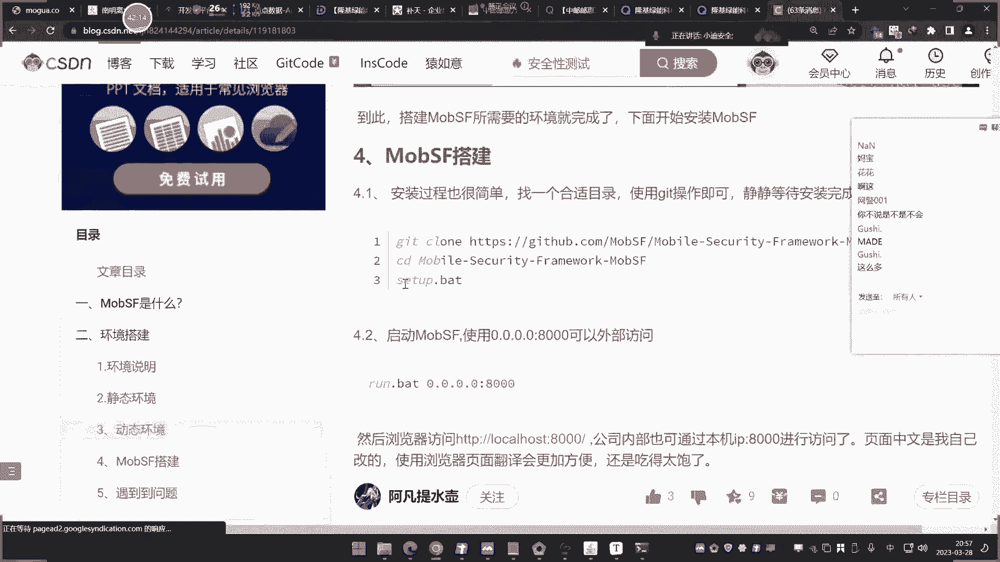

他就把环境自动下好，下好之后呢，你就运行这个run，它就可以启动了。

它也会自动的绑定，把啊绑定当前的8000端口，如果说你端口被占用的话。

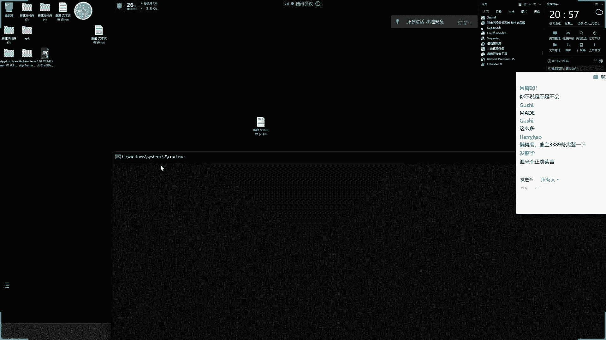

我还是可以演示一下吧。

那如果我要重新装的话啊，这个很慢，不是说我不想给大家去装，因为我装这环境装了一个小时，他要去把那几个环境装好之后呢，再去这个下了个一来一个小时花费了，我如果说我现在给你从头再来的话，我这个课是讲不了了。

所以没办法啊，我只能说给你个参考地址啊，地址在上面来，很简单啊，他大部分时间就是说你等就可以了，一个小时就是等待时间，不是说我要在上面一直在敲东西啊，他就把那几个环境装好装置运行这个叫steep。

点点点BT啊，他就直接把你在按一带安好了之后呢，你运行这个run d t，然后呢加上0。0。0，然后加上你自己要设定端口，比如说我是8000，他就绑定你所有网卡拔线。

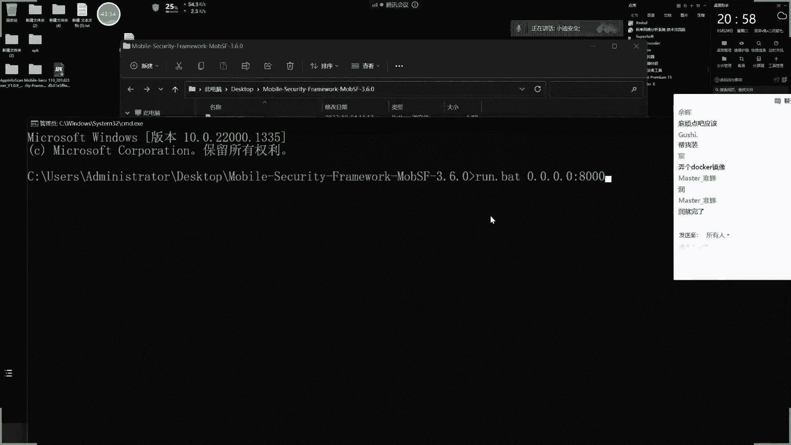

然后呢他就启动了，启动之后就可以等你干嘛呢。

本地的访问了本地的地址是吧，1700把电端口就可以用了，那它就启动了，你看这是我们本地搭建的，你看我本地搭建的，是不是和刚才这个平台的一模一样啊，所以说呀这平台其实就是一个MBF3F五F。

然后呢你看他这里有动态的，他要不要收费呢，他收费个鬼啊，他不收费，他免费的呀，对不对，所以说网上这种产品的都是你买的啊，用的一些别人的产品啊，或者搞一些东西就收费了。

对吧，然后呢他有什么好处呢，你看啊我用它来分析一下啊，就和刚才一样的啊。

分析这个来试一下来，我用它分析一下，所以刚才那个位呢他也在分析，然后这边就会有日志，你看它就会有日志，对不对，这是运行下来之后运行日志嘛。

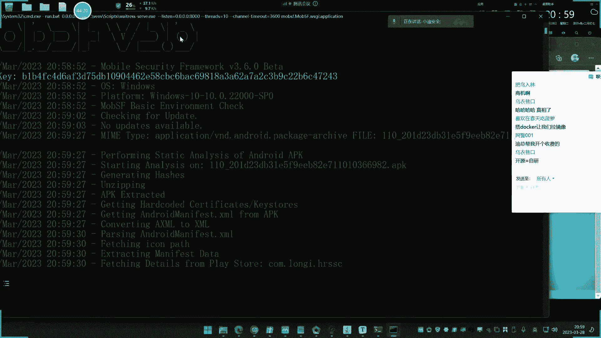

然后你就等待即可，他就是分析和刚才一样啊，你可能说我讲他有什么意义呢，很清楚啊，因为你用了刚发的那个平台，你用动态分析他要钱呀，他要充会员了啊，现在你自己打印这个东西就不用充会员了，用它的动态分析啊。

那个动态分析就是我们说的动态调试，他刚才我说的动态抓包是不一样的，他把动态杂包集合在一起了，我们等下会给他演示啊，等下给他演示，我先把这个金牌给他看一下啊。

然后这个抓包呢其实我前期已经删过了啊，所以我没有说可以去给他讲。

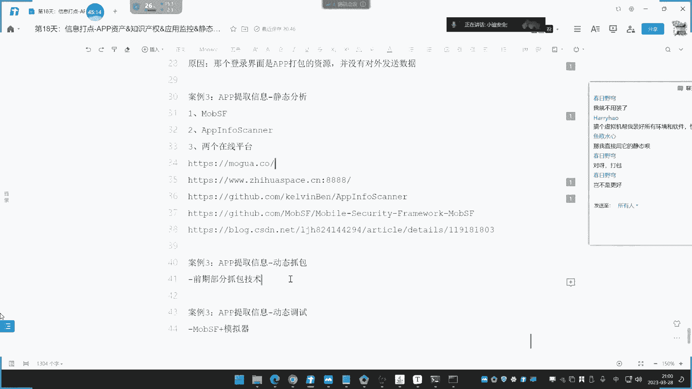

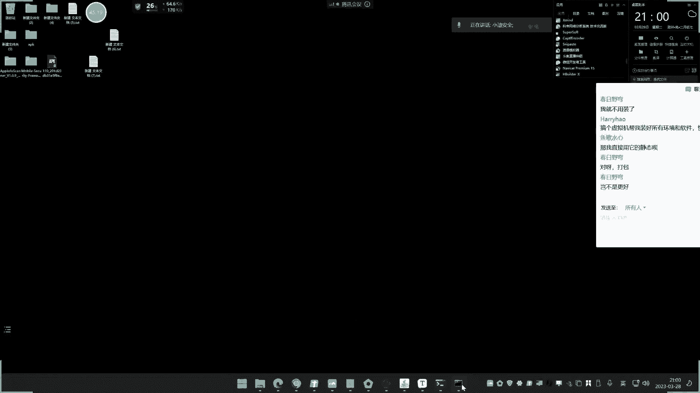

然后呢，我们会着重对比它的动态抓包和动态调试，两个差异，我们说了三个基数啊，说了三个基数，你不要搞错了啊，一个是动态抓包，一个是我们的静态分析，我现在已经演示了，静态分析就是用这两个项目。

这个是刚才马上要看到的，然后这个是刚才给他用的，还有这个平台的对吧，这两个平台的对不对，这是我刚才已经讲了静态分析，动态抓包我也给他演示了，就是是用这个bup shoot抓，这前期的课程也讲过了啊。

那个抓包技术是给他讲过的哈，抓住那个app数据包已经讲过了啊，所以现在呢就马讲的就是这个动态调试，那这个动态调试和动态抓包有什么差异呢，对不对，动态调试就不一样了啊，抓包是抓包。

动态调试呢就是及时的抓包功能。

还有其他功能，我等下会给大家演示啊，现在先把这个这个环境装好之后呢。

看一下结果好，结果已经出来了，大家可以看一下了，这是分析的，那是和刚才那个差不多啊，然后你看他的这个这个网址分析是不是也是啊，他这里用到了一些这种，还有很多这个信息啊。

这个平台呢他他不是说专门为我们做安全测试，就说我们是搞渗透测试的一帮人，他这个呢是更偏向于搞理想，搞这种app的内置代码的检测安全的这个程序啊，他不是说我们只要提取它的什么育儿信息。

资产信息来做二次的这个安全测试，但是它呢它这个产品的这个用途呢，主要是给那种做破解，逆向反编译和这种东西开的项目啊，所以它和我们想象不一样，你看这里就是它的APP里面一些安全的问题。

就是代码中的去看他有没有一些安全问题，就比如说什么加密的信息泄露啊等等啊，你这有这个我翻译了啊，这里还可能会导致SQL注入，你看那你可以看一下，我们打开看一下，还有个代码，你看他现在不把它翻译。

先不翻译，里面是有这种SQL语句，你看从代码中发现了一个SQL语句，对不对，他所以他说这里可能会成了SQL注入，还有这里面用到了这个MD5的，这种加米亚等等啊，我们就不看了吧，这个是代码中的简历啊。

我们主要看的是说从这里的提取出来的，余额信息，就是一些信息啊，哎怎么翻到下面没了呀，应该是，活动信息没有，代码里面分析有这个是二进制的一些信息，好这是哪查到的，这个里面涉及到的U地址。

你看是不是还是和刚才那个平台用的余地址，差不多，你看提到两页打开也和刚才一样。

基本上一样，没有提到没有，也是没有提取到这个这两个信息嘛，这两个比较关键的，用那个app是多少出来的，p for扫出来的，就这两个，这几个我们可以把它补卡啊，就是刚才用那个东西扫出来的。

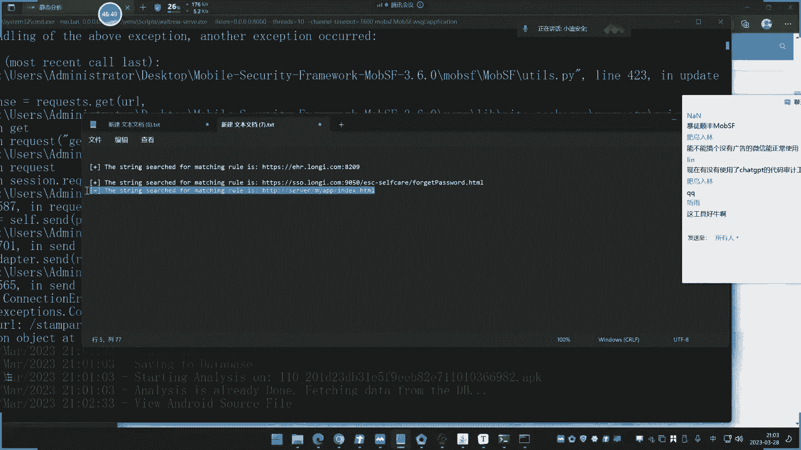

这两个他没有在这里也没有提出来是吧，所以说我们要用到动态调试，用到动态调试，什么叫动态调试呢。

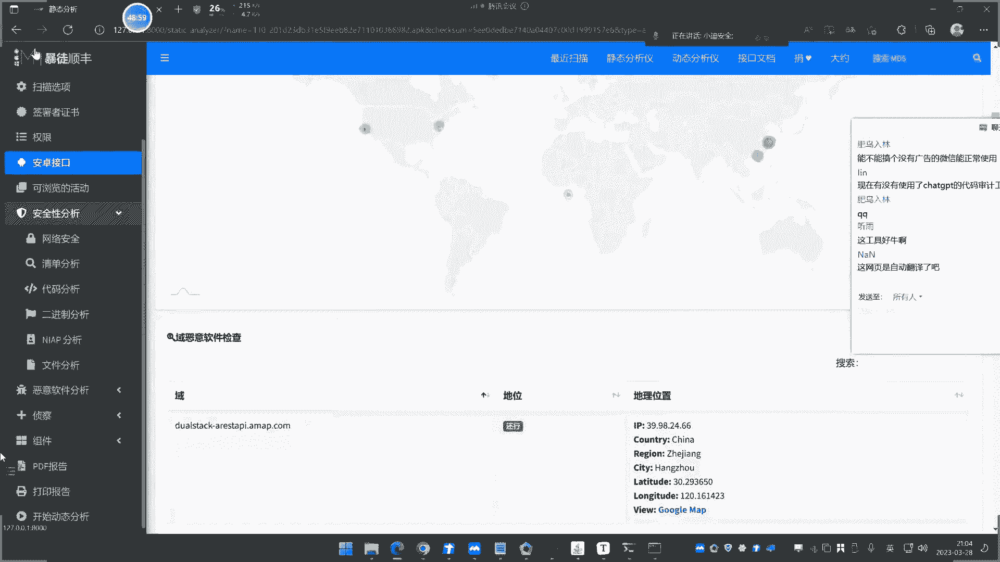

要动态调试，要准备环境，一个是把这个平台装好，第二个是准备一个消遥模拟器，那我给大家演示一下啊。

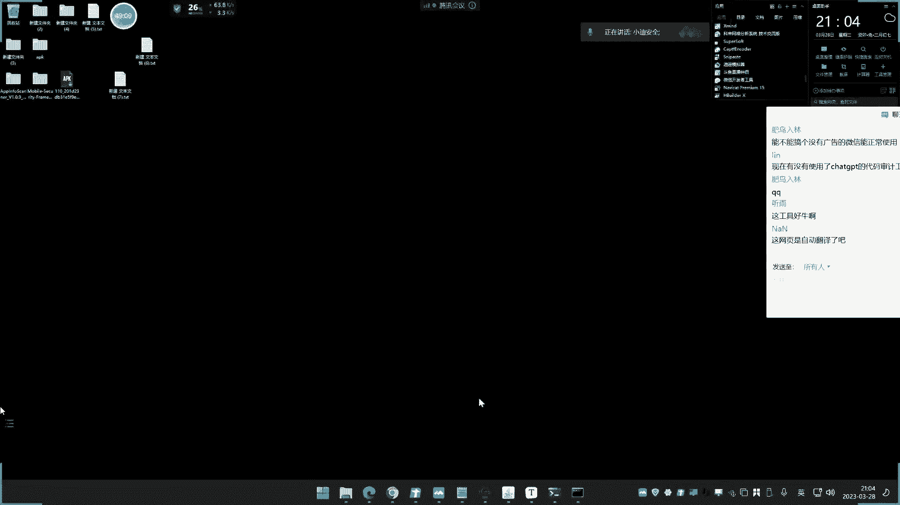

现在就来讲动态调试了，我们看一下动态调试，能不能调出刚才的那两个地址来。

大家看一下啊。

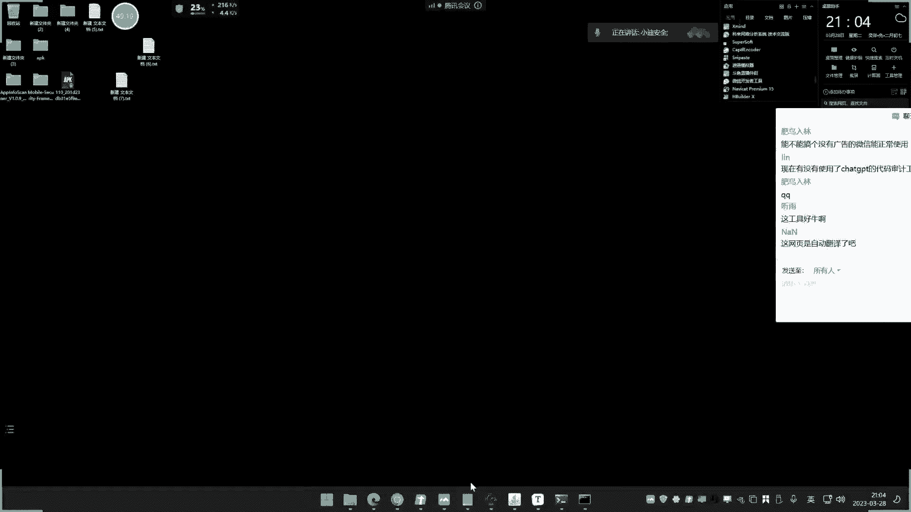

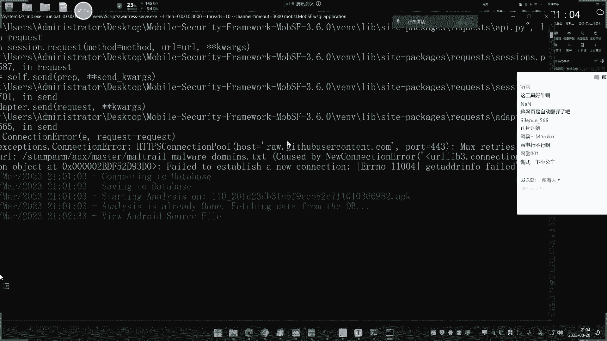

环境启动了啊，然后这边呢点一下啊，点一下那个平台那边的东西啊。

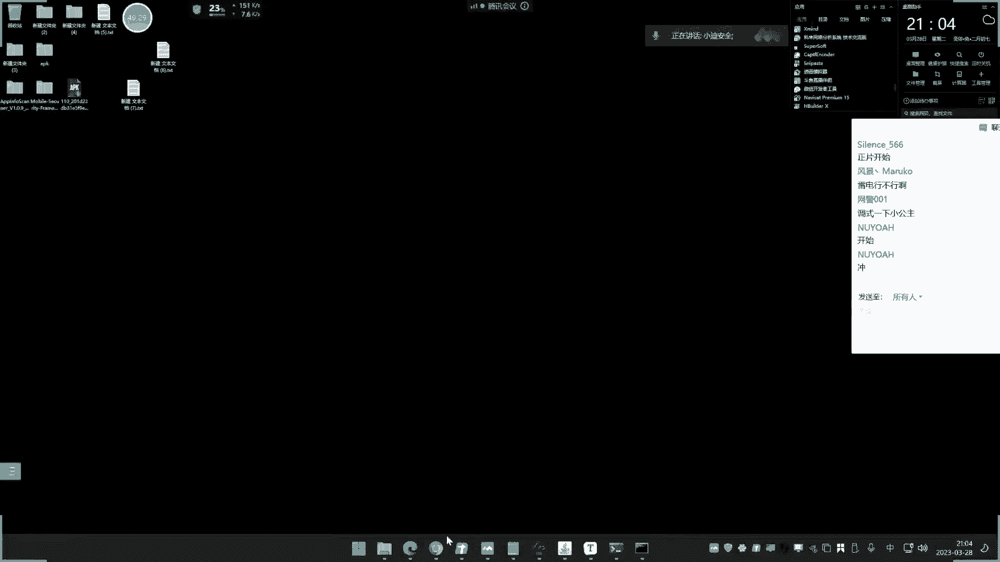

点击动态分析仪，然后这里呢就是刚才我们测试这个地方，就是刚才点的是吧，然后这里有个叫啊开始动态分析这个按钮，还有一个启动动态分析，无需重新安装，这两个呢按哪一个都可以啊。

这个就是说你上面装了这个APK了，就装了这个应用了，就点这个无所谓，你点哪个都行啊，然后呢就是刚才分析的话，我点这点不了，为什么你看上面有个提示，说未找到安卓运行时是啥意思啊。

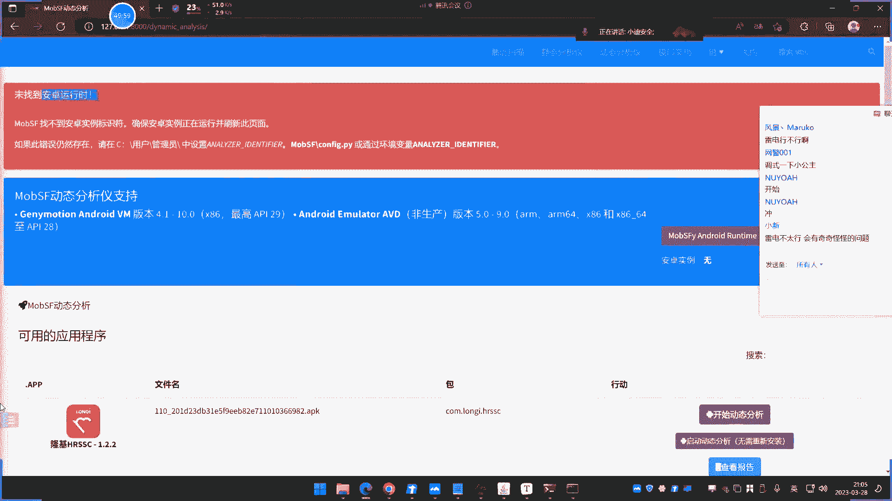

你要用它的话，要开一个模拟器，我这边用的是逍遥模拟器。

把它开起来，开起来之后重新刷新页面，它会自动检测你当前的这一个东西，所以我说为什么要大家学会安装，你如果说你安装到服务器上面去了，他需要修改这个配置文件，去找那个模拟器的那个IP地址。

但你模拟器一般装的内网，在只装在你电脑上面，就是个内网，他连不上去啊，所以啊，你就自己把模拟器和这个环境都安装在本机，就是都在一个G上面，它就能正常通讯，否则的话你还修改这个配置文件。

它修改里面的IP地址才能正常连接，那就比较麻烦了，所以我说为什么要装到本地的原因，那我启动了，你看现在我刷新一下页面，那你看就没有那个错误了是吧，你看这里就亮了，能够开始动态分析了。

是不是虚拟机可以装模型吧，可以，但是你也修改那个也修改那个配置文件，具体怎么修改呢，我给大家说一下啊，就是安装好之后呢，他会在这个，在这里啊，就是在你这个用户目录下面有个字叫MUSF。

就是如果说你不安装同一个机器，就是模拟器装到另外一台主机，然后环境装到另外主机，但这两个环境都能够正常通讯，在情况下面啊，如果说你要让他监听到的话，你需要改这个文件。

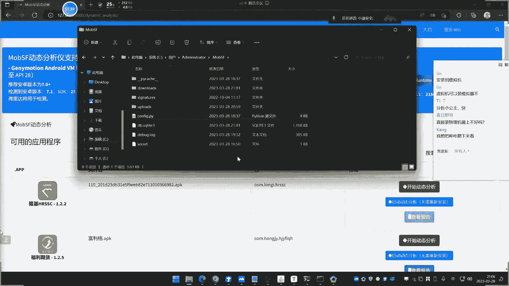

啊改这个文件，然后这里有个写地址的地方。

就这里呢你要修改这个地方，他告诉你了，你要报错的时候。

他会告诉你是要修改这个路径，你把这个写上那个模拟器的那个IP地址，和模拟器那个端口，这个端口就是你那个模拟器，开起来会自动开放的端口，这个有点麻烦啊，有些人不懂，现在我不是说主要说这个。

因为这个东西在后面我们要讲app专栏的时候。

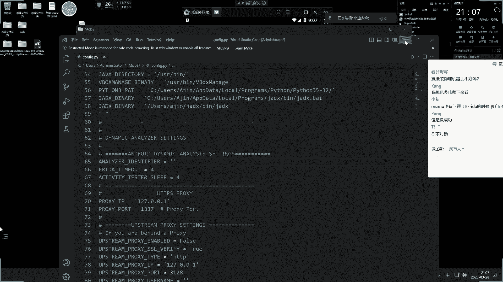

会单独会讲的啊，所以你最好现在的你要做的话。

就直接都装在一起，你不要搞那些其他的一些你喜欢乱搞是吧，举一反三，你举不出来，你就不要乱搞。

那现在呢我们就来到这边是吧，那这是他已经没有问题了。

然后那个按钮呢也开了是吧，我们就点开始动态分析好点啊。

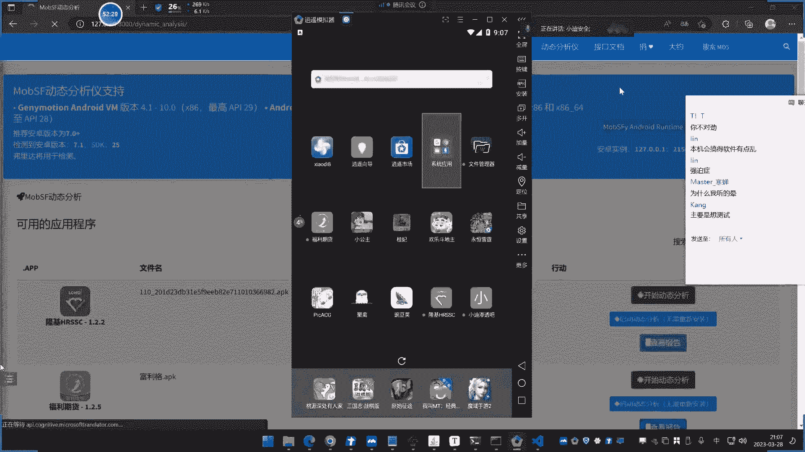

因为他和这个模拟器呢已经联动上了，就这个平台它自动检测当前这个安卓进程，他已经联动上了啊，好我们就等待一下啊，他就会这个和这个模型的建立连接。

我们可以看一下这个日子，那他就尝试去连接啊。

然后呢测试这个东西准备成功，还有这个提示呢，连上了，连上就是这个界面，然后你看下面有一些方式，你比如说我现在看一下来看着啊，我点一下启动活动，看看会有什么反应，点一下。

嗯咋啥反应都没有这么搞笑啊。

你这他妈的。

又翻译了呀，刚才是这边，我我看到这边他卡了，你看了又翻译了啊。

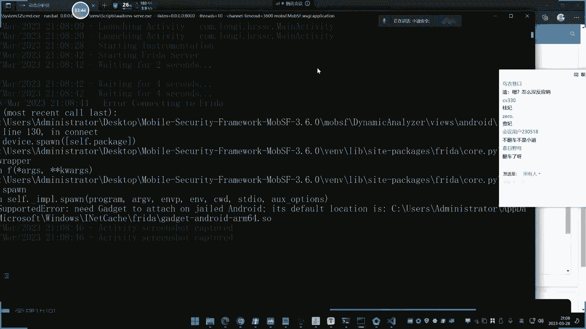

这不叫翻车，你们不要逮住一下就翻车翻车。

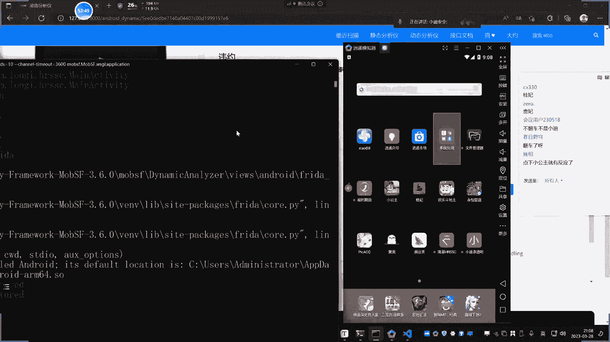

这叫什么翻车呀，这程序它都会有这样，有时候有些延迟啊，或者怎么的，这里面的叫翻车，那那真是啥都翻了，再看咋来点一下启动启动啊，你看咋启动活动，那我有没有动这个模拟器没有动啊，自动打开了，在看着啊。

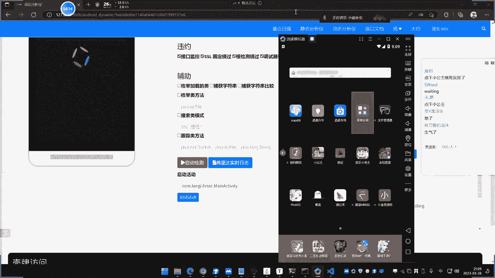

来我搞这个界面给他看的，看着啊，电启动活动，咋又没反应了，没点上去吧，点到错的地方去了，点启动活动来动了，我点错了，没有翻车，我刚点到这边这个东西去了，哎呀我真是他妈的服了，这也翻车，那也翻车。

喜欢说这个字，真是。

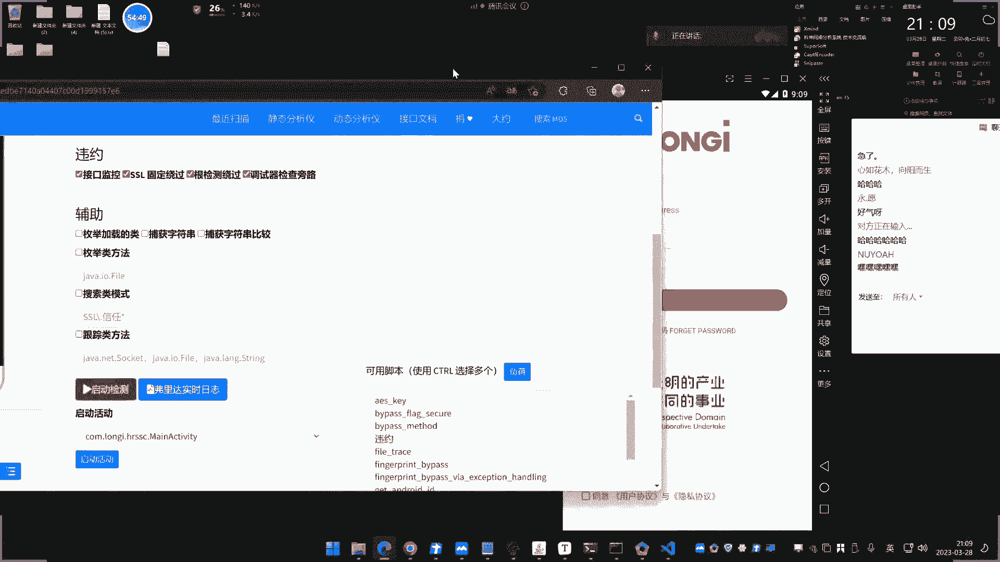

然后啊我们看一下它有什么功能，那这个叫截取屏幕，截屏幕截图，我把截一下，点一下那个记录，然后呢你看这里有啥东西啊，你看啊这个叫什么TIS安全测试仪，这啥东西啊，你可以把它翻译一下，他说是什么东西啊。

我告诉大家这个是什么东西，这就是测试这个app有没有证书校验，什么叫增速校验呢，我后面单独要讲到这个抓包的高端技术的时候，就是有些app它抓不了数据包，或者说抓的时候就会有错误，被app打不开。

就是因为它里面有帧数校验，有什么防代理呀，防帧数他中心就是检测的，而且他能够直接把这个帧数给他删掉，让你抓到包，这里有个叫什么删除根CA就是删除这个证书，把这些功能呢把它删掉，然后呢让你抓爆了进行。

这是我们后面要讲的啊，我只是说这个功能提到了，我给你提一句，然后这里呢有个什么叫安全测试仪，它就是测试他有没有增速校验的，它有个上面一个索米嘛，说啊这个什么鬼，绕过证书。

公钥固定证书透明度其实就是它上面的自带了，因为这个项目呢你可以点一下这个地方呢，这个角启动测试，它就会提示一个叫什么FIDA，这个是专门来搞这个安卓这一块的，一些这种绕过的一些模块啊，FIDA的框架。

那他已经起成功，哎你这里呢还有一些功能我们就不一个看了啊，你看这有个什么日志，就是你那个操作调试日志，还有什么这个app测试，我们可以点一下，他就点击这几个地方啊，他的一些铭文流量会不会抓到。

包括这个证书能不能绕过他的画上对勾，就说能够绕过。

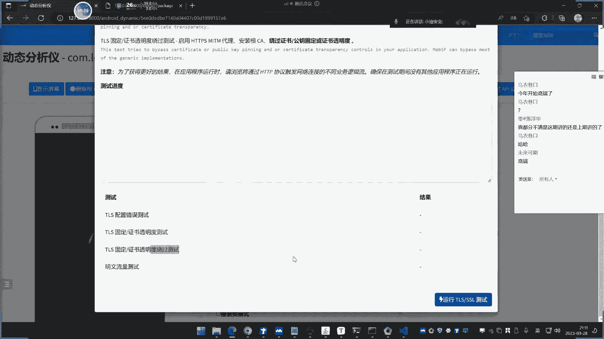

那我们可以点击测试，这个时间有点长啊，这个时间大概他说需要75秒钟，这上面写的具体多长时间呢，我也不是很清楚啊，一般就是12分钟吧，他就会车车是这些东西啊，这个呢不是我们现在担心的。

就是我只是说讲到这里再给你提一句啊，这个不是我们想关注的地方，不是我们想关心的啊，这是后面要上的内容，就是关于这个一些这种复杂的APP。

他有这种椒盐啊，我们先要撤撤了之后再去针对性的绕过抓包，还有像什么个什么活动仪啊，什么获取依赖箱啊，这些都可以按一下啊，然后还一边呢就是这里啊，Q脚本，这啥东西啊，这啥东西。

A e s k by pass，什么什么什么东西，然后呢你给这里给大家看一下，比如说我点这个点这个负载，这个是啥呢，这就是规则，这意思就是搜索规则，他这里是类似搜索规则。

就是说你可以执行的，在这边去添加一些java的代码写法，可以从代码中去分析，有没有一些东西按照规则那里可以全选，全选负载，然后呢再进行这个运行调试，还有这里有功能的辅助什么，这个捕获字符串。

就是从这里面去调试的时候，看有没有一些字符串出现啊，这个呢都是高级玩法，这个不是我们现在要学的啊，我们是先学会调再来去在上面去用这个什么鬼，这些操作啊，钱来的不是我们关心的。

让我们看一下这边搞不搞完了搞完了，你看车子说了，你绕过车是成功，结果能够成功，透明度测试失败，那他有对勾，然后你看啊，还有像我们这个是什么活动仪这些了对吧，你看现在啊我在上面随便操作一下。

来比如说我操作一下，点一下呢，点登录都可以吃一下是吧，来比如说这个什么忘记密码点一下哈，这都都可以测试啊，对不对，它就会有记录，还有什么屏幕截图，日留这里都可以看到，如果这里有它的接口。

他这里也能看到接口信息，然后你把这些东西呢按了一个边，你又可以怎么样，你就可以点生成报告了，好我们就把报告生成出来啊，就是刚刚才你测试的报告，就是你对这个app的调试报告就会生成出来。

刚才呢我操作了一些东西，让我们看一下报告会有哪些信息出现，啊这个报告呢还在生成。

我们就稍事片刻，等待这个报告的结果出现。

也可以从这边呢看到这个报告的一个信息，好报告已经出来了，我看下哈，从这个包包里面我们能看到的信息往下看，这是刚才的屏幕截图，看到了服务器的信息，出现了几个地址的好。

但是呢域名看到没查到了一个域名叫SSO，看到没调试到了一个域名叫SO，那下面网址信息，这也是刚才为什么，打开这个app的时候，他没有数据包，你看访问本地的JS资源，其实就是APP里面自带的。

一些JS文件和一些资源，打开界面它就访问这个东西，它的操作的一些流程啊，都在这里写字好，还没什么信息呢，继续往上面看信息。

这里表盘简单，有日志猫星系，我们看日志猫星系是什么鬼。

就是你整个调试的信息，这些信息呢如果你是做安全测试的话，可能不太懂，但是如果说你是做理想的话，那这信息是非常关键的一些信息，就是说整个运行流程，你在调的时候，运行流程里面会记录一些各种各样的一些呢。

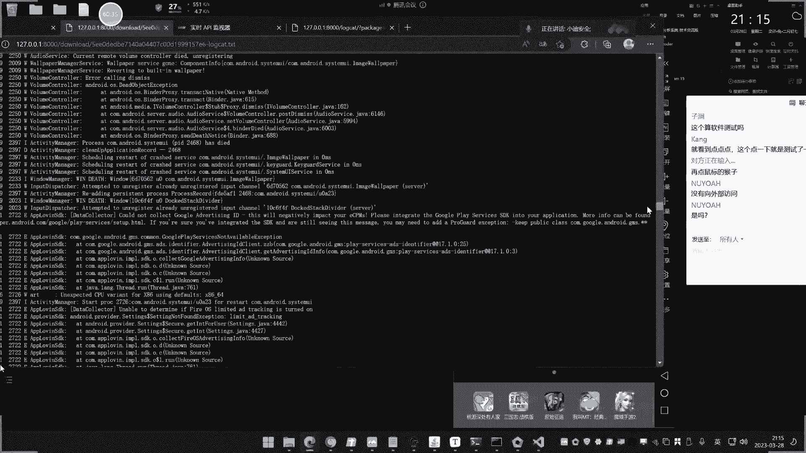

加载的模块等等等等，然后呢还有这个什么存储日志信息。

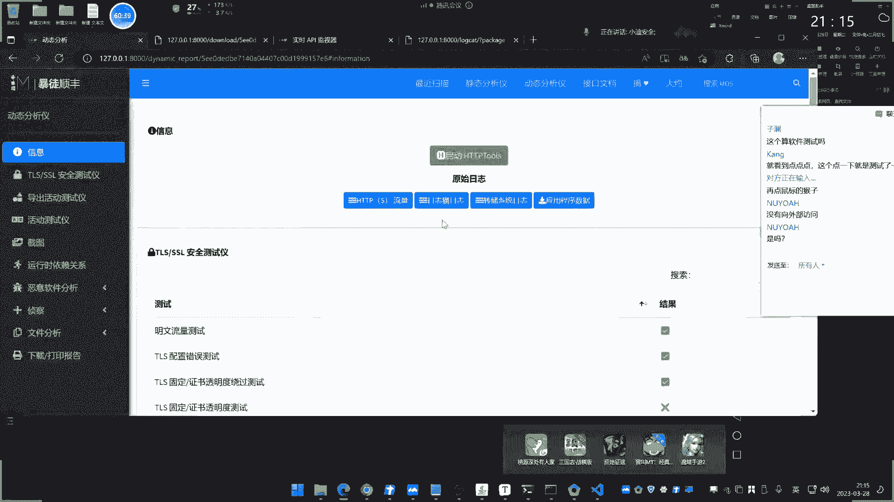

就是他教的这个系统的哪些东西呀等等等等，这也是做逆向里面比较关注的点，但是我们做安全测试，我们就是简单看一下，因为这和我们关系不大，我们就是要提取信息而已。

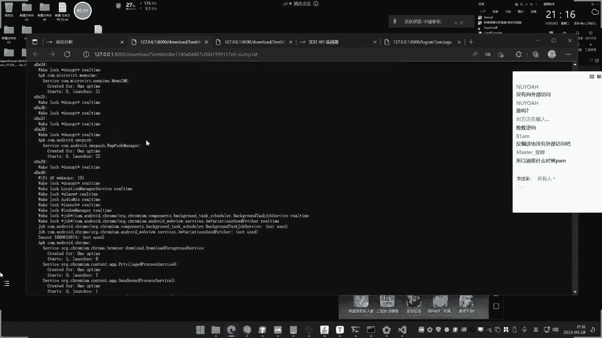

这些东西不是我们相关性的，再点啊，A7ATPS星系，这啥信息呢。

打开不了一个T2T，大家点一下启动ATP图了，打开一看，我看一下这啥信息啊，把这个打开看一下。

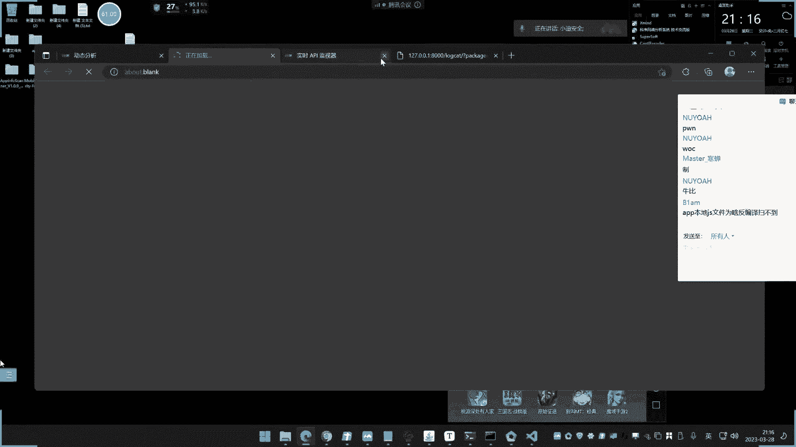

看到没这啥形象，你看，是不是刚才我登录的那个信息来输的，这个移移和PWD，刚才提示用户用户不存在和过禁用，是我刚才在调试的时候操作的信息，这是得到了，所以说这个动态调试呢，它其实就是集合来抓包工的。

他把抓包功能抓到的信息给你抓到了，同时你在上面操作任何操作，他都可以给你记录，包括他的人性逻辑，那都会记录，然后就是这个app，你看这里的所有东西，就是这个app在运行的时候。

你操作的一些数据它都会有可以看到啊。

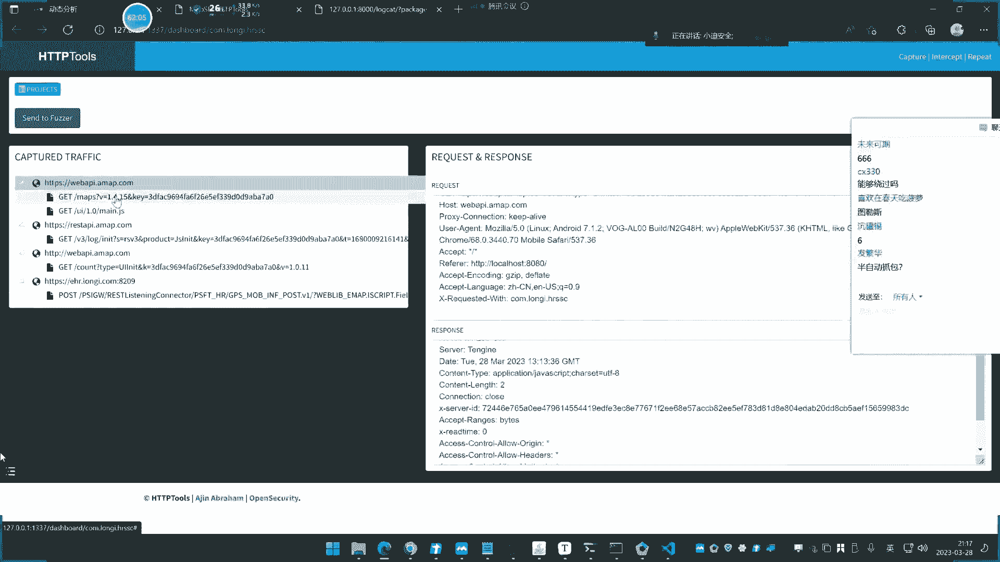

然后呢我们可以再来测试一个app。

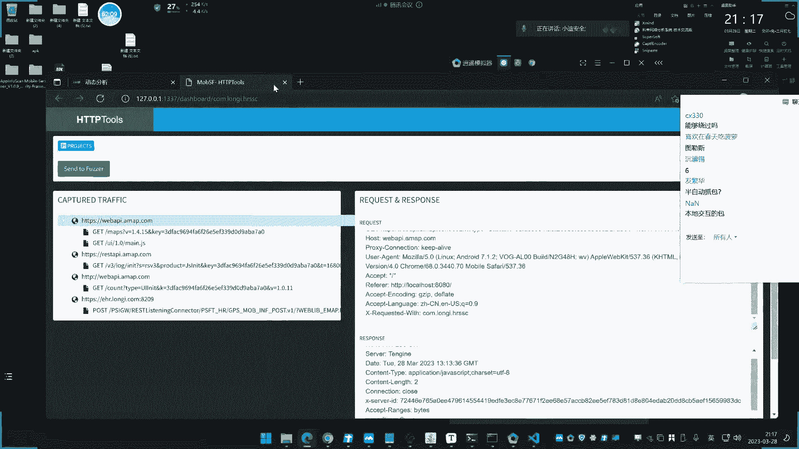

来给大家测试一下，我们可以看一下啊，那比如说像这个app我们给他演示一下呢。

我们现在要讲述它的区别和差异，你才能知道哪个东西更实用，你看这个小白点APK啊，我看小080P，这是我们前面用那个小泥巴封装的APK，这是很简单的啊，我先用它做一个测试，等它先安装起来。

好这里安装可能有点慢，因为这个平台开了啊。

先把平台关一下，因为平台如果说不关的话。

他有一些那个冲突，导致抓包抓不到他，因为那个平台运行中。

它就会把那个模拟器再进行一个控制，所以它安装的时候会受到那个平台的影响，所以把平台先关闭，重新开一下模拟器啊，你看打开，这就是我们前面那个给他封装的那个小泥巴的，那个什么APK，大家应该还有印象是吧。

就前面讲的PP架构的时候给他讲过，就是第三天第四天讲的课，对不对，好，这里呢就是有小的八点com，对不对好，我对这个APK进行分析。

刚才那个app死多，不是能扫出那个APK的信息吗，我看这个app10多，能不能扫出这个小零八点com的是吗，网站看一下啊。

然后呢我们再用动态调试看一下它的差异之处。

好看一下差异次数。

好在这里啊，运行一下，再加上小于八点APK开始扫一下哎。

什么鬼啊，删掉删掉，应该是之前搞过，所以换个名字叫乙乙。

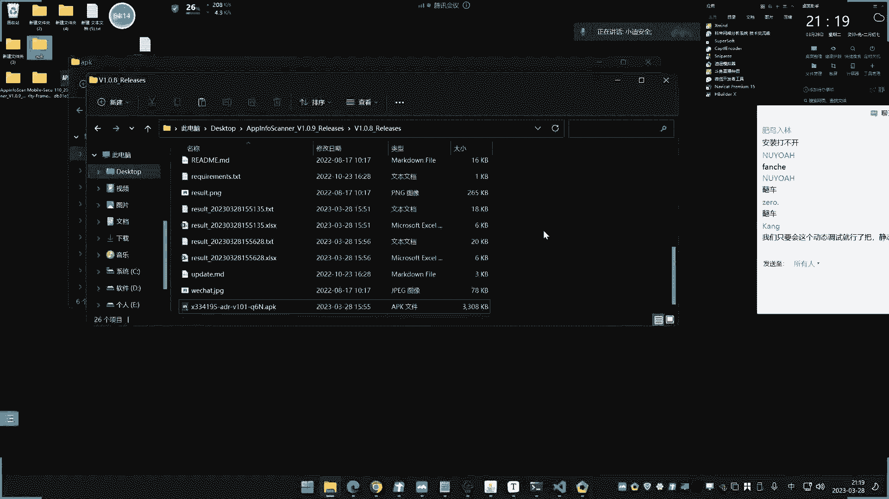

倒在了，疑点111111点，A t k，说的是什么关系啊。

还直接报错了，应该是这里有他的一个同类信息，感觉像我先把它删掉，哎呀这个。

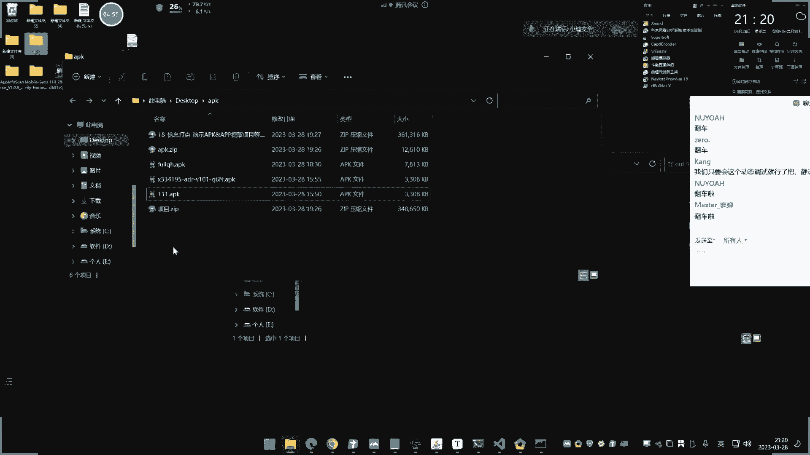

哎呀我先把这个运行起来吧，我这边没结束，你妈的，我说怎么回事呢，那边京城没结束，重新来一下，一点，B点PK可以了，你看刚才那边的进程没结束，重新开了个，你看他提。

好看还是提了，提了个啥东西啊，啥都没提出来，网站没有，我明明里面夹杂了小白点，看不那么明显，抓包一抓就抓到，你咋提不出来的，你为什么提不出来，因为它是静态的呀。

源码中他不提及到小100点com，你就抓不出来啊，很明显你用抓包工具是吧。

用抓包工具来我们试一下来，我们看一下抓包工具的小八点com来打开，那小白点com就出来了，你看因为他这个打开就访问小六八点com，这里面的还找不到吗，你看这不抓到了小白点com的信息吗，都抓得到啊。

对不对对，他为什么那个提不出来金牌啊，金牌里面他不他不表现小列巴点com。

没有小的八点com，关键字你哪知道那值不高啊，所以说这就是说静态动态，动抓包和动态调试各种区别好，我们现在用动态调试来给大家看一下，现在我用动态调试啊，我是三个app，我就说是我们这个以前封装好的。

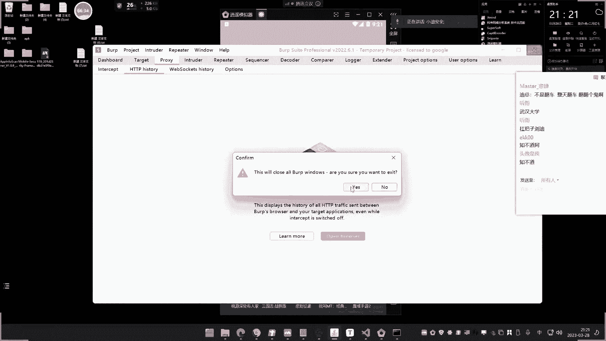

是我们刚才SRC的目标，我们等下再试，另外一个目标都测试。

这都测试一下啊，好我们现在是这个。

这个啊这样我就把这边的抓包这个信息先把它。

代理先关闭，重新把这个模型准备开一下啊，先把这个app给它起动起来。

运行这个run点BT0。0。0端口。

好我们来访问一下。

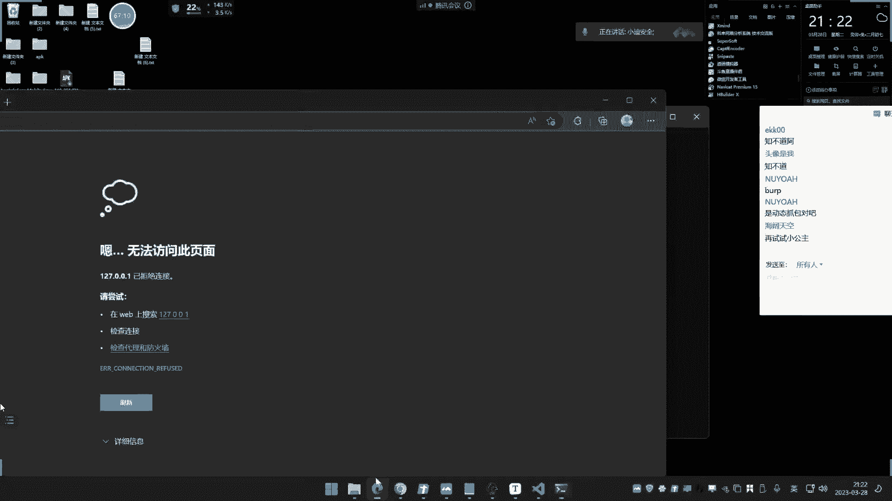

好上传我们刚才要测试的那个小Y点com。

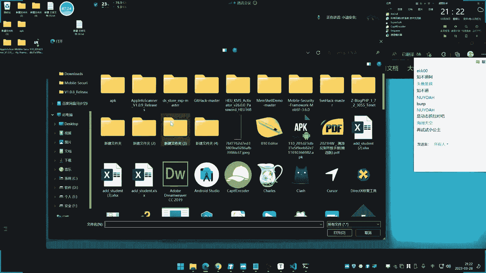

让他分析就是一好。

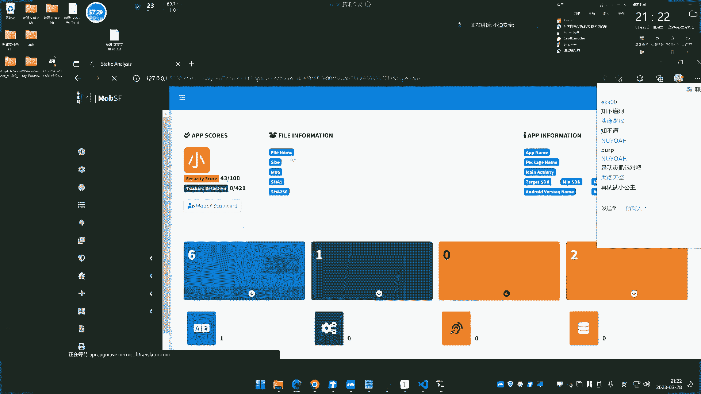

这里分析出来了，我们看一下它的结果啊，从这里呢静态分析里面肯定也是一样道理，他也是没有做12级到这个域名也没找到的，你可以看一下，那恶意域名里面只找到一个网站，这里面是安卓官方的网站。

用到一些接口下面的这些东西也啥都没有，没有找到小米八点com的任何信息是吧，没有啊，所以说他查找里面的什么域名的IP地址都没有，都没有相关的，所以我要动态调试，找到动态调试，现在又报错。

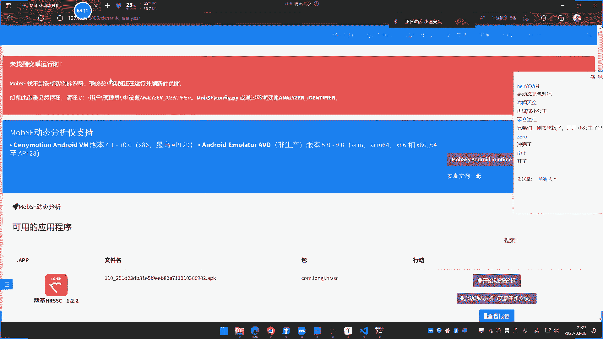

报错就报错嘛，开模拟器。

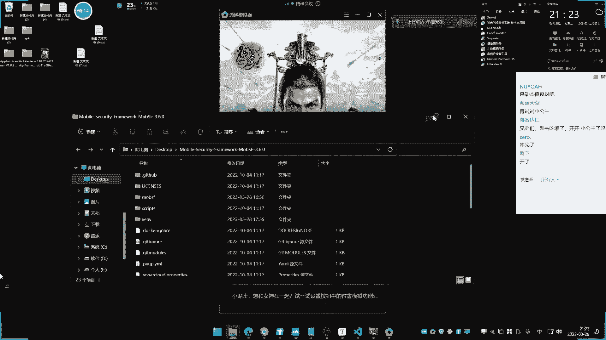

开了之后再刷新对吧，现在的孩子在报错。

等模拟器启动成功，它就会好了。

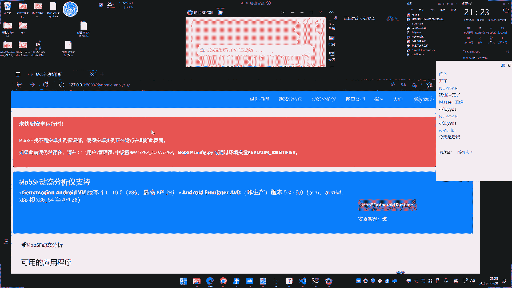

刷新，啊看到没红色就没有了，好能够正常的调试了，你看点这个，诶刚才分析的案例怎么没看到啊，哦是这个前面这个阿三小哥，你看我是这个是吧，然后呢我们点一下它动态分析，前面因为我分析过啊。

所以他这里有记录就没有再产生新的。

点一下这个动态分析好。

那我们也是按照刚才那个操作啊，做个会点鼠标的猴子。

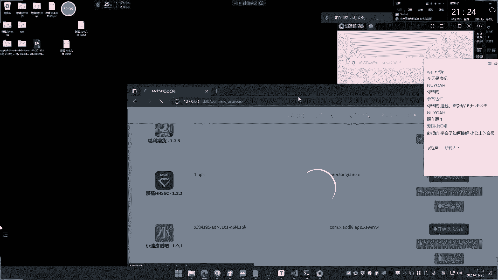

对不对，具体哪些操作有什么含义，我们会单独来说的好，你看已经连上去了，那现在简单的让它启动起来吧，启动活动启动了，对不对，没有做任何操作啊，好启动了，对不对，然后呢启动之后是吧，你这里想干嘛是吧。

比如说这个检查的PS啊，或者怎么个不用测试是吧，来个T我就不检测了啊，像这个什么呃活动测试仪啊，点一下呀，然后什么屏幕截图点一下呀是吧，然后呢你可试着去点一下其他的检测检测呀，然后呢他就会尝试去检测。

包括上面的你去访问一下网站啊，刷新一下是吧，在上面随便操作两下呀，对不对，因为你点这个无人机的，它会记录你这里就可以看红鲫鱼，它会通过这个app的一些权限信息啊等等啊，你打开一个网站都可以测试。

嗯对不对，都可以看到啊，好了，那基本上差不多就是我们就随便调试一下嘛，是吧，也不说搞多的啊。

其他的我不关心日猫数据啊，这些信息呢我们也难得看的啊，这些都是搞反编译那些东西比较关注的，怎么获取依赖项，点一下。

完了之后呢，我们就把它包括生成一下啊，看一下报告。

我看一下那个结果，嗯看这里面啊，和刚才那个静态分析有什么不一样的啊，那我们等下再来测一下，这个其他的一些app的信息啊，其实归根到底啊就是从这个app里面呢，不管你动态呀，静态呀，各种方法。

都是从这个app里面去剖析出一些IP或者域名啊，一些相干的啊，然后呢便于我们后期测试，好我们看一下啊，那刚才截图服务器地址，你看域名呢收到一些了，你看z blog的域名。

百度点com的CDN信息gt游戏信息，还有没有其他信息，下播了小100点com也查到了，app里面提示出来，然后这些信息应该就是上面做了一些其他事情。

然后你看信息，这里我们看一下托勒斯信息里面，看他的访问的请求，刚才我们随便操作一下的。

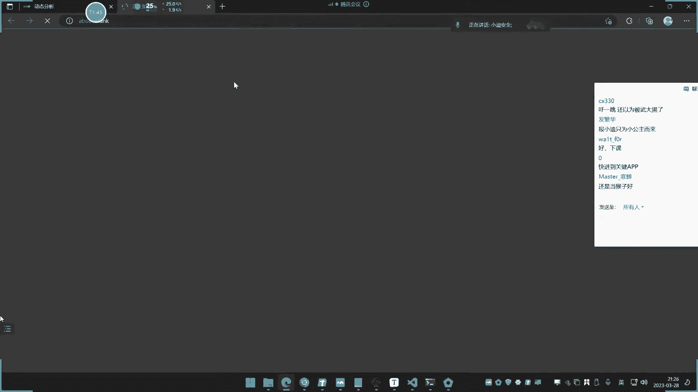

那发我下八点看的一些操作，点点一下发过的一些信息呢，这是我刚才操作的，你可能说能不能做事情呢，很简单呢，点一下数据包吗，点击可以再发送到FUZZD了，干嘛的，是不是和那个八倍速一样啊。

可以摘星的改包当发送，那是刚才操作的app里面，去操作的一些数据包是吧，都记录了。

对不对，你可能说这个app呢太简单了，是不是好，那我换一个吧，换个成品的好吧，这个是我们自己编译的一个小的，8。1APK文件，那行啊，那我换一个是吧，那么换一个之前呢我们看一下啊，就拿这个测试。

这个福利期货。

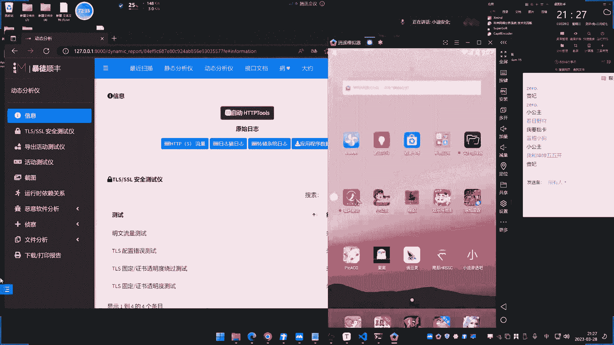

我们来动态调试一下它，重新启动一下模拟器。

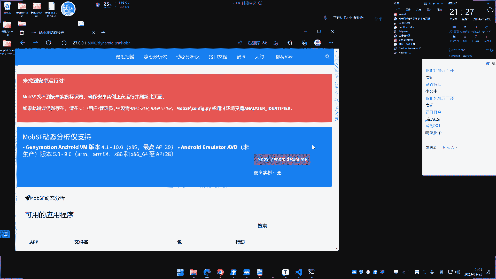

把这个也重新启动一下，避免有问题啊。

都重新启动一下。

因为你有时候不重启的话，可能会有一些这个连接上面的差异啊，福利期货不能倒闭，倒闭了，我都没演员了，哪能倒闭呢，我本来是准备吃几个蛇蛇的，妈的没吃吃，实在是那个画面太感人了，不敢吃，因为那画面一出来。

如果说有人举报我，我要封子直播间是吧，录屏里面有一些女孩子看这个注意影响，昨天还有人叫我去把那个直播里面，涉及到一些色色画面给他打码了，我都还觉得又打了一次，现在要规矩，要我们要按照正规流程走。

要这个符合这个行规是吧，不能乱搞啊，你看我们找这个处理器过来动态分析点一下，而且连接服务器连到模拟上面之后呢，你可以看到啊，他会展示你这个模拟上面所有进程，你可以看一下这边的。

它会展示这所有的所有的模拟器，你看这都是我们那个模拟器上面的所有app啊，就是你可以直接用这个模型上面安，装在模型上面，直接开始分析啊，就下面嘛在下面啊，在上面呢是你在这里上传过他的精彩分析。

如果是你模拟器里面拿个东西要分析的话。

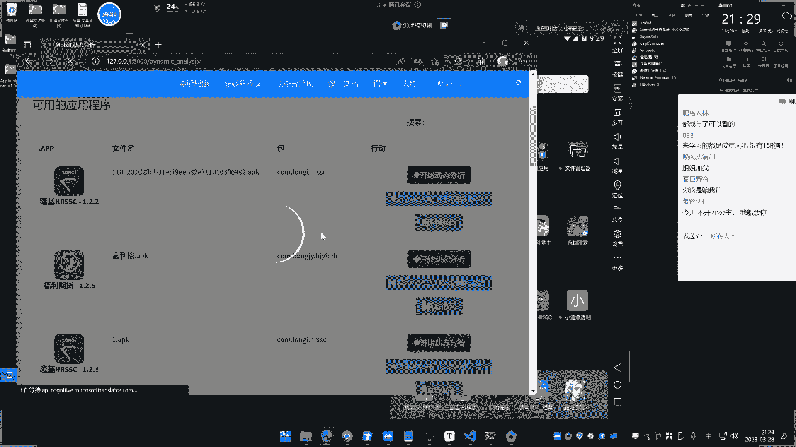

你可以拖到下面，小头在下面啊。

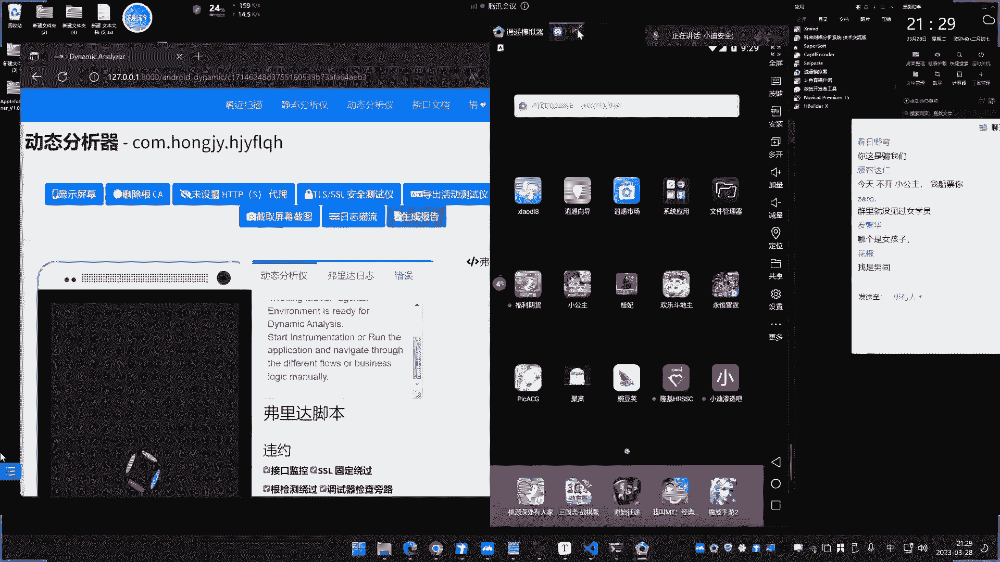

下面有，因为连接到模型，你看啊，我们来尝试一下啊。

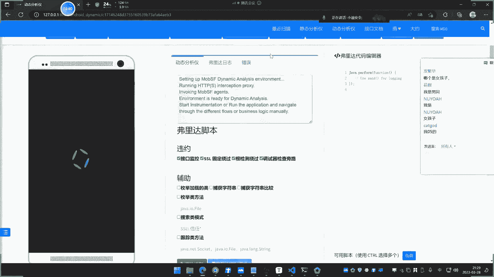

来先给它先进行检测呀，是启动起来呀。

福利器或自动启动了，对不对，是吧，然后呢像这个上面一些功能我就不做了啊，我就随便在上面随便操作一下，什么东西就可以了，我操作一下看新闻啊，或者咋滴啊，对不对，然后像上面那个登录一下网站啊，随便操作一下。

对不对，你可能会问这有什么作用，和那个抓包是不是有一样的事情吗，是不一样的啊，他这个是用他的动态的调试，所以很多抓包抓不到的，可以用这个动态讲师抓到数据能理解吧，因为你抓包呢是要考验帧数的。

而你用这种动态调试呢，它是不一样的出发点，所以它有很多东西呢，它是不需要说考虑那些东西的，你只需要在上面去操作，它，就能把你这些操作的一些，这个创建的一些东西呢给它进行显示，它不一样的啊。

那我随便操作一下，随便再做个会点鼠标的猴子是吧，点几个东西截个图啊，对不对，然后就给这个，生成报告了，对不对，一点生成报告，它自动关闭了，因为调试结束了，APP就是让你自动模式自动关闭那个app的。

所以我们这等报告一出来，我们就可以看。

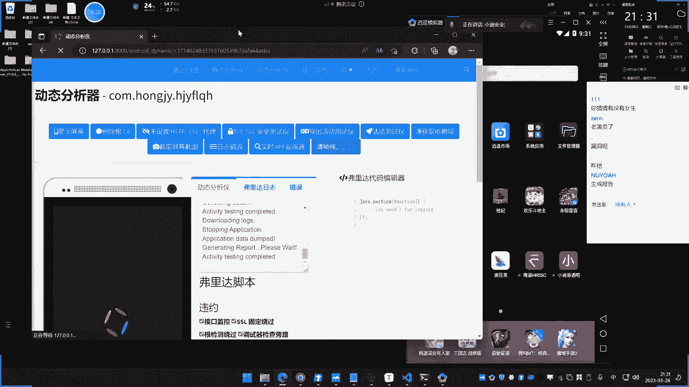

结果出来了。

那我们直接看这个上面数据吧，看这个关键的其他我也懒得看了啊，所以看这个AP的一些提交数据。

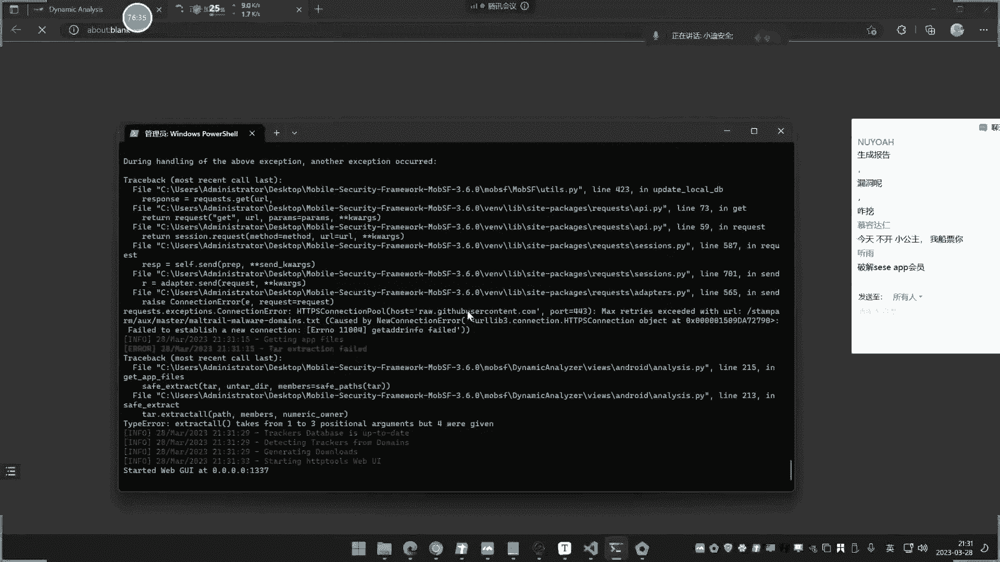

看一下啦，那刚才操作的基本都在这里，你看，嗯看到没，我在上面所有操作的，它的返回请求和返回都在这里来，是哪个app里面写下，你都帮你记录好了，就是整个app从运行到最后所有的这个情况。

可能大家说这和你抓包好像是差不多的吧，的确是差不多，但是你要知道有些app的话，你不用动态调试，抓包是抓不到数据的，而且你一旦带你开，他就怎么样了，崩了打不开了，我相信有人有这样的体验。

只是说现在我没有讲到那个点，因为这个点是我们APP单独篇章要讲的，现在只是说从信息收集里面，去收集一些信息而已，并没有说遇到这种复杂情况的情况，你想一下我这个抓的这个数据包，我有设置代理吗。

我这个代理还特地把关了呀，就是为了告诉你这点，他不是用代理抓包，你代理抓包要考虑帧数问题，有些APP1旦增速不交验，直接崩了，打不开了，你设了代理他也打不开，就是有反增速，反代理检测，就是一些比较是吧。

搞的一些APP他就不能做，你只能用这种动态调试，动态调试其实就是说控制了这个模拟器，让模拟器呢和这个平台做了一个通讯，然后呢他通过这个通讯录来抓这个app的流量，他是这样的原理，所以他这种原理呢。

就能告别一些抓包上面的问题就抓不到啊，或者有些检测的问题，你看现在我就啥都能抓到，啥都能看到上面所有的操作证明了，我都给他记录，然后呢对于我们的理想人员来讲，他还能看到整个流程，怎么流程呢。

先把它翻译一下啊，就相当于嗯怎么读起来了，还。

来什么日志的日子，它会记录这种操作。

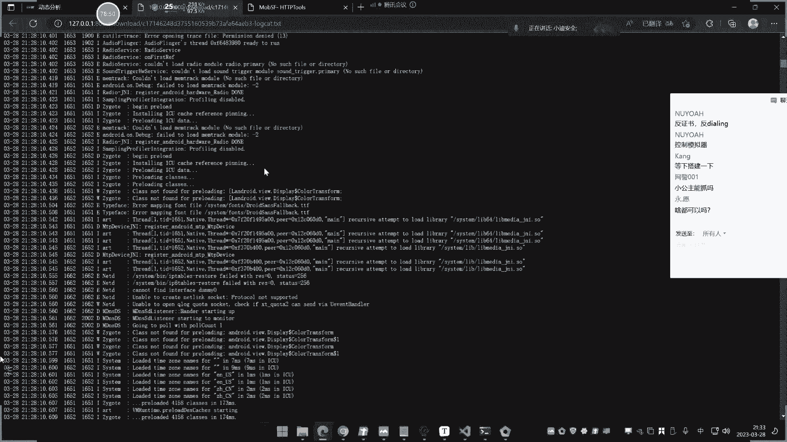

就是说从哪里跳到哪里，它动了什么东西，掉了什么东西，在这里都有，这都是对于这个理想。

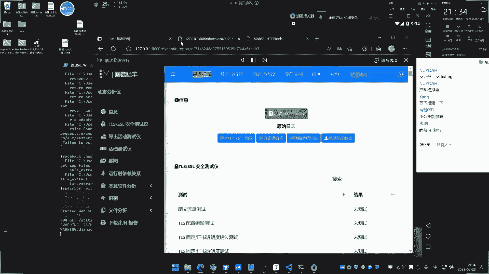

仍然和安全测试人员都是很大的帮助啊，看一些这种条件的数据啊，流程啊，包括这里也会有这个app的数据，他这里也能看到，这里也能看到，那就是他的请求的那个流程，你看整个T的数据。

然后呢那个整个东西就是在那个上面，你看就你还在这，说是这一批数据包都在这里有显示，你看这都有一批数据包满了，清楚哪个网站做了什么事情。

你可以把这个日子打开，就是你在操作的时候可以实时观察到，可以实时观察到啊，只是刚才没有演示啊，呃还有其他信息我们就不再过多累赘了啊，你看看其他的一些什么鬼东西啊，IP地址上面那鬼东西。

这都是和他相关的嘛，这个网站剖出来的，就是APP里剖析的一些资产的信息嘛，其中有几个就是我找到的嘛，你像这个的，这是其中一个网站，就是给pp里面抓到的嘛，你用抓包也抓到，然后下面就是一些数据是吧。

发送的一些关键数据，对不对，涉及到email啊等等啊，我们在这里后面就自己下去再看吧，因为这些其他信息呢，现在是我们不想关注的截图信息啊，等陕西的一些，对不对，这个就是动态调试啊。

啊你不要看着我说我使用的起来这么简单，这么啊就是做个会点鼠标盒子，就把信息收集到了，但实际上这个环境安装和你去操作的时候，你就会发现会有很多小问题，只是说我把这个问题呢全部在课程上去演示，我不想翻车。

哎呀我告诉你啊，我讲课翻车是好事情，你们自己不觉得而已，我翻了车就说明你会碰到，我翻了车我就会把它解决，你就知道怎么解决了，我不翻车，你碰到了，我课程没有碰到过，你不知道哪个解决了。

有些人还还一拿我翻车还去做文章，说哎呀小的垃圾，天天你妹的上课翻车，好就说这么多吧，内容呢今天知识点大概就是这么多啊，我们可以把它进行一个简单的总结一下啊，就是说呀他这里头我们讲了三个方法。

一个呢就是说静态里面去分析，用这个项目，那其实这就是反编译的角度去分析是吧，还有就是抓包，还有我说第三种就是说的动态调试，从这个表现中去提取数据，它的优点呢就很明显了，数据就是什么没有误包。

缺点呢基本上没有缺点，还有一点就没有误报，还是解决一些什么，解决一下我们说的这种不能抓包啊，或者什么这个不能代理呀，这种情况对吧，然后呢还有优点就是什么呢，他优点一大堆对吧。

搞这种理想破解好理想的人是吧，能看到实时的一个什么VPP的标准烟，懂了对不对，缺点呢其实他也有缺点，他的缺点就是也是一样啊，也是这个可能有些数据都提不到，因为他也要操作，他也操作抓包有点类似啊。

缺点那就是无法做到完整，比如说你需要操作才行，不操作它也是一样，那么操作的也是你在上面点来点去，总之他的优点是大于缺点的，这三种方法呢你把它活学活用是吧，才能做到这个信息收集的最大化，说白了啊。

简单来说我们做的新一周呢，不从理想角度来讲的话，就是收集这些app里面涉及到的网站，域名，IP地址等等一些东西，呃简单来说呢就是说哪些信息呢，第一点啊生产信息，第二点泄露信息，第三点啊代码信息收集。

这三类知道信息就是IP域名，网站web相关的线路信息，就是我说的啊这个什么配置配置K啊啊，还有一些这个资源，就是一些泄露的些什么源码资源，就是源码资源，文件代码信息呢就是我刚才说的啊。

就是涉及到这个什么java的一些代码安全问题，主要就是新收集收集这三方面，然后呢这三位也收集到有什么作用呢，你比如说像IP域名，是不是就可以转到什么对应的这个测试方法呀。

web网站就是专用到对应的什么web安全测试，或者接口，这是是吧，这种类似的一些情况，那这个呢也是一样，那有这些K就可以利用这个K呢，啊这个利用对吧，像什么这个OS可以利用啊，嗯很方便是吧，利用等。

啊可以可以可以可以信息，还有像什么数据库的这个配置信息，或者说一些接口的什么这个邮件的配置啊，等等啊，对不对，代码安全呢其实就是我们说的这个类似的这个，app的这个什么加密不不归完整啊，或者什么鬼嗯。

能破解是吧，能防变异呀等等啊，这是和理想相关的啊，这个是和一些理想相关的一些问题，主要就是在私信啊，还有像我们说这个服务渗透是吧，服务测试，因为这里涉及到IP，IP里面就会有一些端口。

域名呢就会是web是吧，还有一些网站网站的有些是接口，就和我们上的web安全啊，接口安全啊，包括上面开发了什么端口啊，什么服务啊，啊后来相关的其实就是我们说的一些，后期要上到一些各种各样的程序的漏洞。

然后在上面去利用，其实就是从app里面，把它转到我们一些常规渗透上面来，啊没有其他的了啊，啊这是我们今天这个讲的知识点啊。

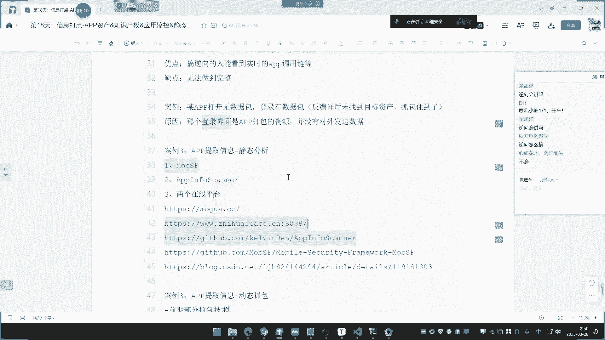

然后我把这个思维导图呢给大家写一下啊。

就完了啊，大概有问题就可以问一下啊，问题现在不要，因为现在我在搞思维导图。

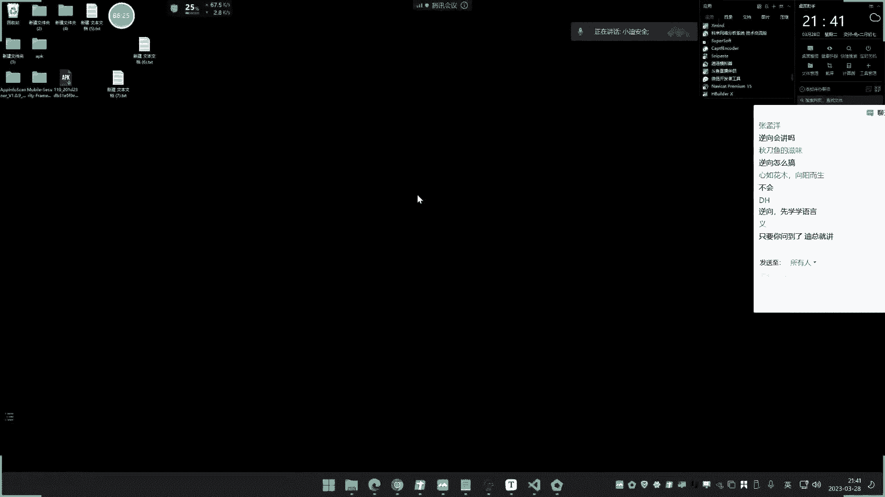

我写完之后你再问。

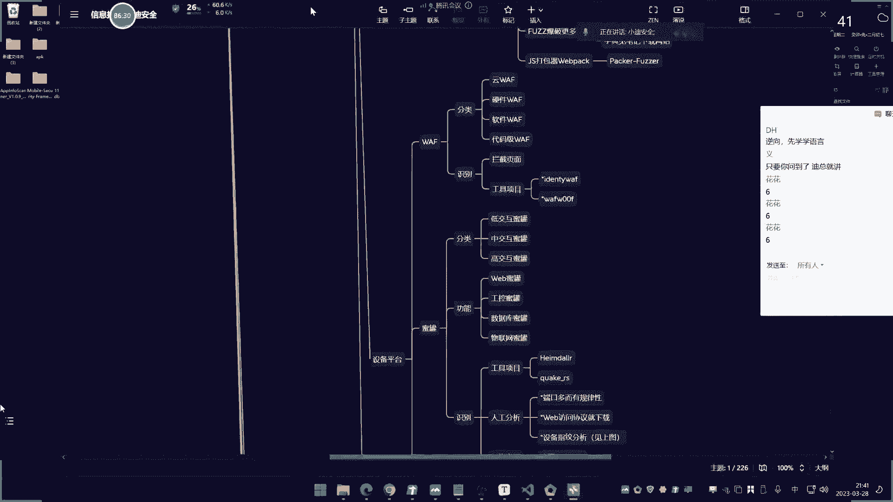

这个app应用啊，然后呢我们今天说的这几点，一个呢就是我们比较着重关注点，就是收集点，收集哪些东西，然后呢这是我们说的收集基数还是奇数分类，然后呢会用到的这个第三点工具平台，项目平台哈。

其实分类呢我们说了三种，这个理想的这个精彩提取，还有就是我们说的这个东台的是吧，抓包动态表情，抓包，他们做的动态调试，然后静态条是提取呢，这里又加了两个平台，真的不写上去吧，这两个垃圾啊。

妈写了之后就没用，就是P服，和那个mobile那两个平台我懒得写了，他妈的还收费啊，用那两个，然后这两个信息分类是哪些信息呢，其实就是收的三类信息。

一般我们刚才写了三类吧。

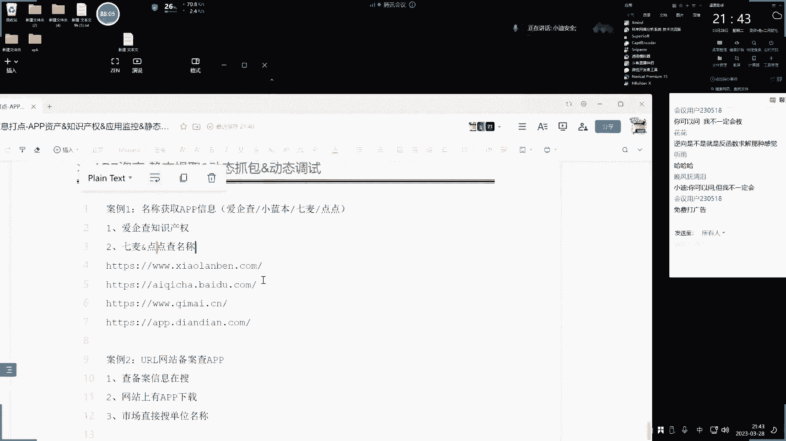

第二是资产信息涉及到的，然后就是我们说的这个线路信息，应该泄露，还有我们说的这个代码，机器自爱信息里面的主要有这几个IP，居民还有像我们说的这个接口是吧。

就是上面的有些接口地址接口的调试。

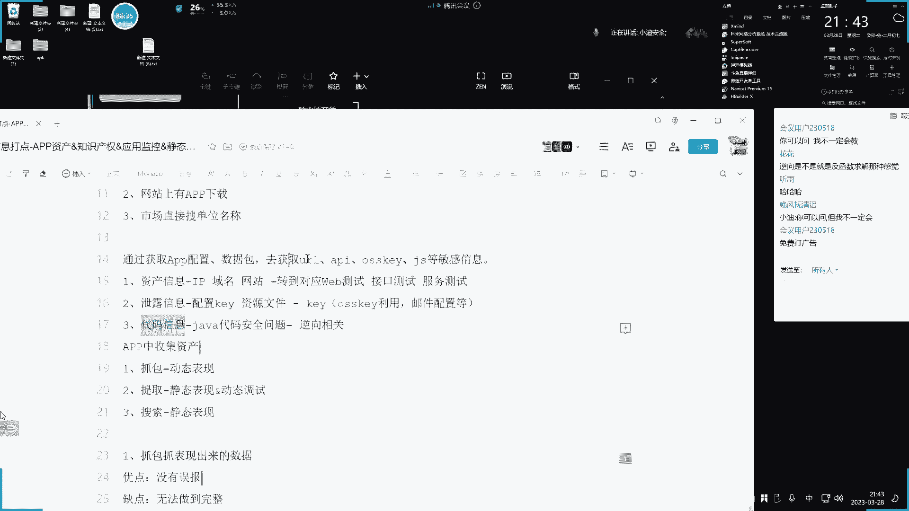

然后呢还有像我们说的这个网站啊，这些域名那就是网站，对不对，那么像IP里面呢我们可以做个区分，那不是IP上面是不是可以少端口啊，是不是可以转到端口服务啊，对不对，上面是进行安全测试啊。

那域名其实就是我们说的web安全吗，对外安全的也是一大区的，结果呢就是我们ATI安全接口测试，后面也说了，ATI的安全测试，啊泄露信息呢就一般会泄露，其实就是一些配置信息啊，配置信息哎，这个什么鬼。

像什么邮件邮箱配置啊，他们说这OS配置啊，还有我们现在各种一些这种接口配置啊，各种各样一大堆转到什么上面，一大堆，代码信息呢，其实就是我们说的代码的安全问题啊，就像我说的这种不安全的加密呀。

还有像这个泄露指软的，还有先分类写上去吧，其实你看那个上面那个东西也能看出来啊，哪些呢，你具体可以看到那个上面我们的一些事情。

我们看一下5号关了吗。

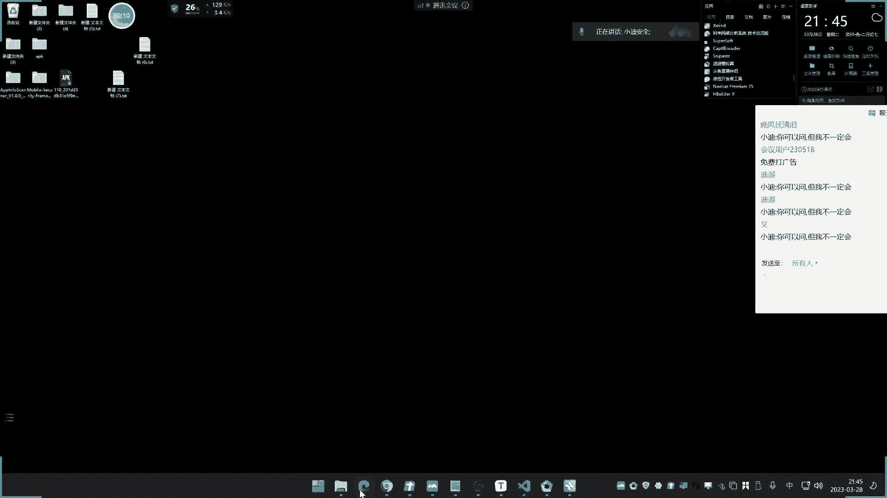

没关你看这个静态分析，这里还有五个关了。

重新打开一下。

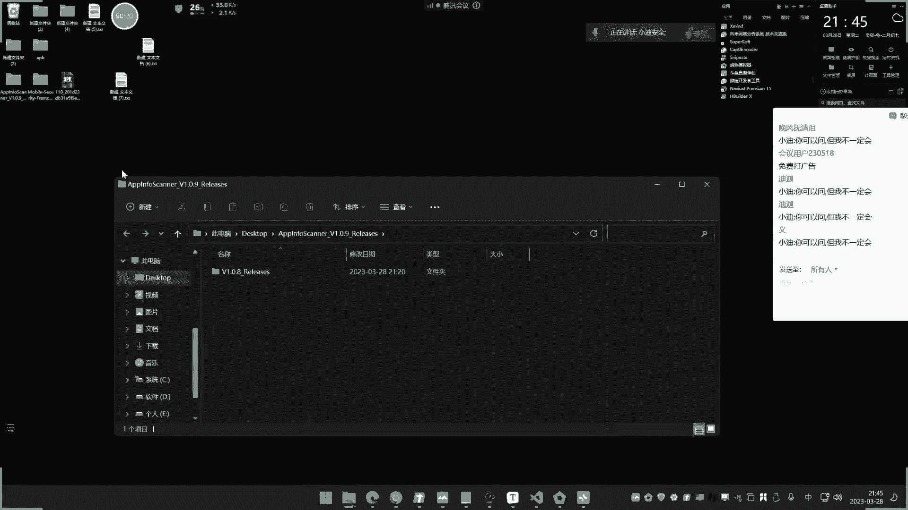

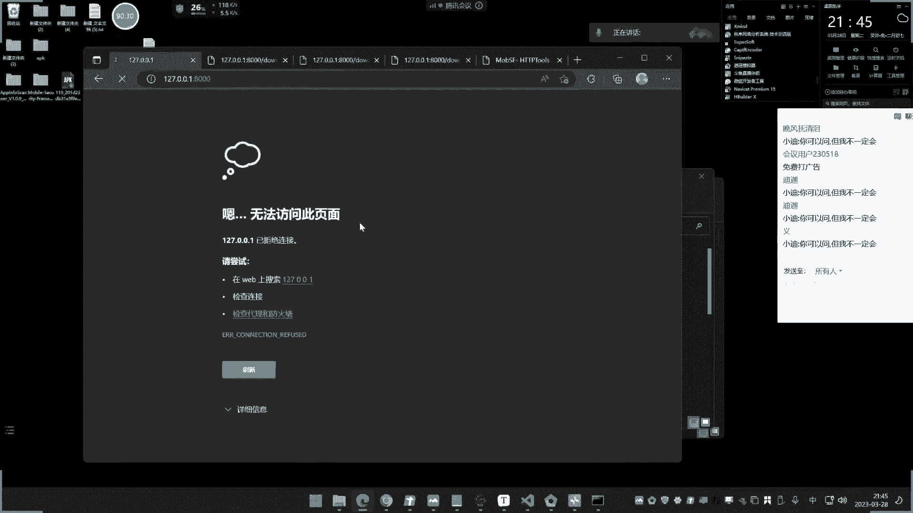

来你开一下这里啊，他的静态分析这个情况。

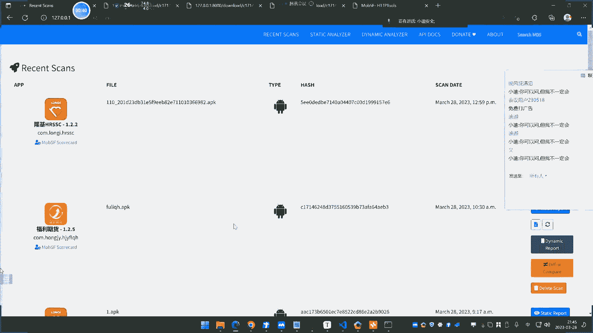

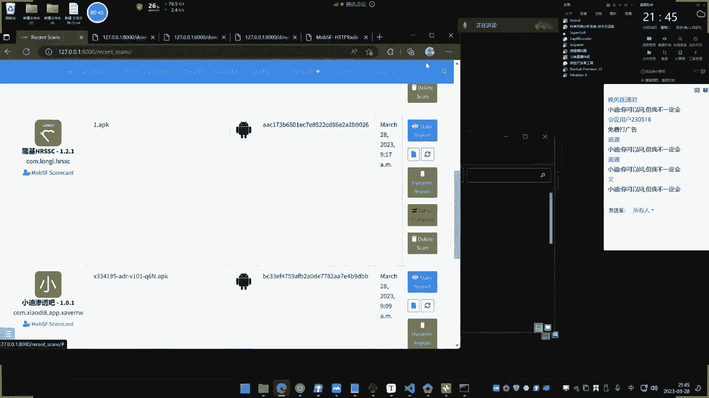

像这些这个什么，这种安全隐患就是哪里来的，有执行什么鬼东西啊，加载服务包括下一些安全操作了，像什么记录敏感信息啊，什么查找到日志里面会泄露一些什么鬼东西啊，一大堆啊，不加密的算法呀，哎啊猜错了。

这个你就可以参考一下啊，我们就不写那个数导数上去了。

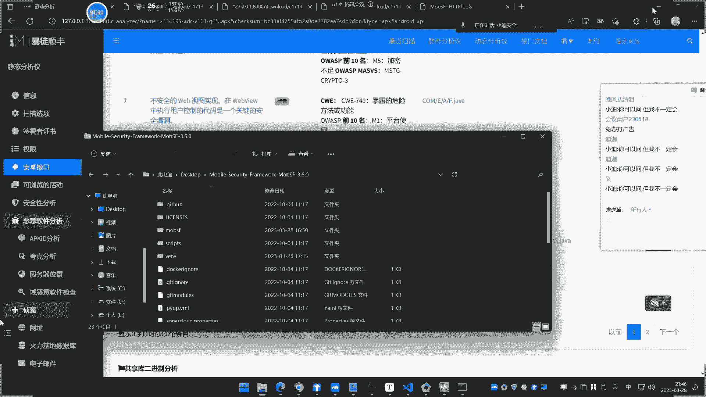

对吧，然后，这个里面的一些东西，然后这是我们的信息分类，前期呢我们还有一个支点没有，光给他写上去，什么支点呢，目标提取app就是如何获取啊，获取app我说了两种思路，这个是从URL获取app是吧。

还有一种是从这个名称获取app。

那么这个呢介绍四个平台，具体四个呢把写上去。

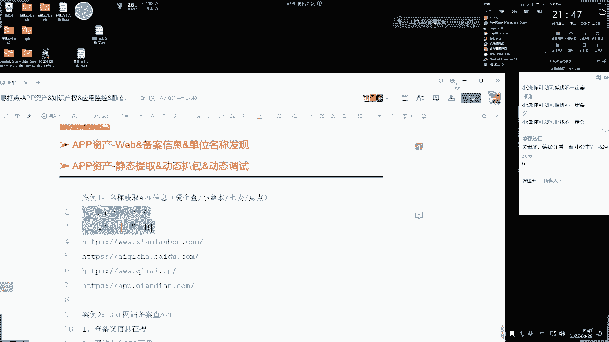

一个呢就是查企业名称。

对吧，然后呢从余额的就是三个星系里面获取。

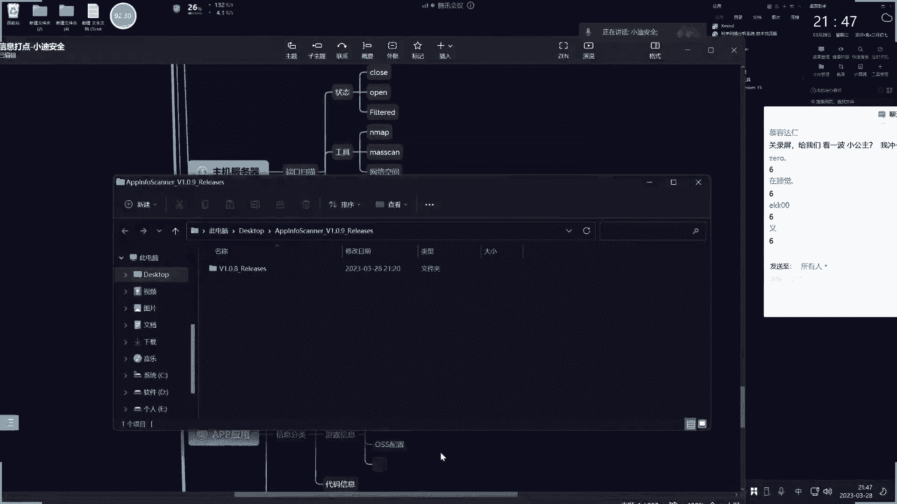

一个呢就是官方就有下载地址。

直接告诉你，还是备案信息里面在查。

还有就是市场直接搜这个相关的名字，相关的这个网站名字啊。

标题啊等等，对不对啊，先获取，获取之后再从里面去提啊，好这是我们今天讲的这几个支点啊，把保存一下，具体下节课讲什么内容呢，下节课不用说了吧，继续往下进行呀，对不对，啊不要老说什么我跑路了跑路了。

哎呀我你妈的跑都没跑，你们老说跑路了。

有时候你准备课件准备的很辛苦，群里还一直催。

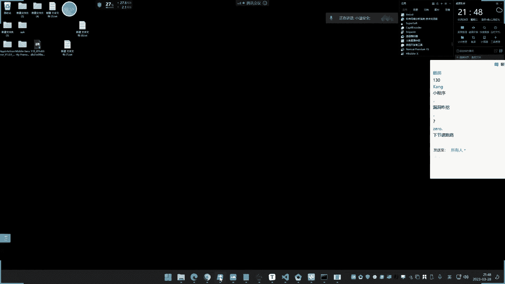

一直催，说什么跑路啊，什么船票啊，那些鬼东西你都不知道，这个负责任的好老师看到看到后是很伤心的，你知道吧，我都自己都没有说我要跑路，你都跟我说跑路了，还在群里面是吧，群里面有一个之前有一个刚报名的。

刚报名的，别人刚刚今天报名，准备说今天上课，群里面说不会上的呀，已经跑路了呀，退钱了呀，别人不知，所以跑来问我，对不对，别人都差点要退钱了，好我们今天就说这么多啊，好看大家有没有什么问题啊。

刚才的问题我在做东西，我没有看到啊，你们有问题可以再问一下啊，我给app漏洞咋玩，我还在讲这个信息手机，你问这些问题就不是这个扯淡吗，真是他妈的，还刚上一个月的课程。

你问的这个和这个课程相干的好不好啊，你问的太远了，这不是我们现在操心的问题，中泰雅是能不能抓到非hp和hp的，抓不到，抓不到能抓到，但是这个项目里面没有这个，这个就是动态调试基数是可以抓到的，能实现。

但是这个项目里面没有集成，抓到数据包是不是浏览器里面构造UA，不是的啊，要看他如果不能访问，你在原始数据包访问能够直接看，你就看吧，这个要看情况，有些网站有这个检测，有些网站没有这个检测，在哪里。

留在本地打开和模拟器打开都一样，数据包可不可以和八部的联动，这就是啊你学东西没有学好的原因，就会问这样的问题，肯定能够联动啊。

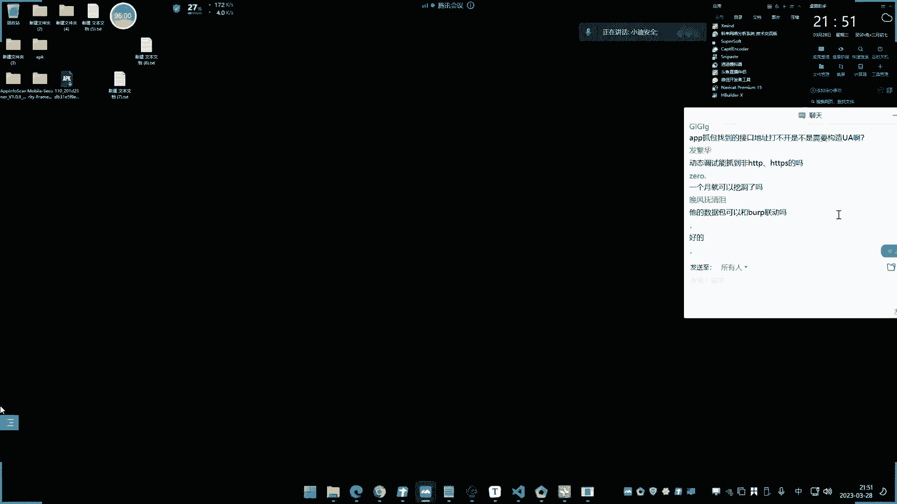

怎么不能联动啊，虽然说我们这里看到的数据是不是在那个上面，在这做呀。

数据包完整体系都给你操作了，对不对。

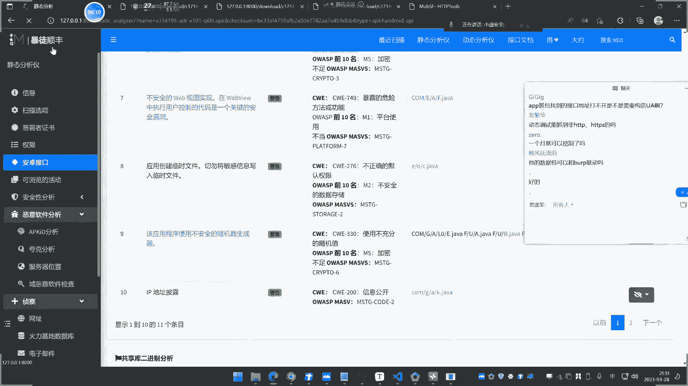

这怎么不能联动呢，你就按他那个数据包在本地发包，抓到你那个P上面不就行了吗，数据包完整性都给你出来了，又不是说只给你个网站，你肯定就能直接访问那个地址，只要放到本地不就行了吗是吧，能烧到，你想会不会讲。

不用想了啊，讲呢你说不讲吧也不行，讲的怎么讲呢，讲点基础啊是吧，只能讲点基础啊，简单的理想基础啊，那你说那种深入的技术深度理想，那怎么讲呢，那就是一门课，我们本来就不是专业搞那个东西的。

那把那个课程上了，我其他课程就上不了了，本来就240直播，那个课程就就能讲100次直播，你说咋办，那只能少点基础啊，其实也不是说只能上点技术，是我的能力，只能给你上点技术好吧，我摊牌了，我不装了。

我永远是技术，Number one，开热点他能不能检测到，这个没有试过啊。

