# 【小迪安全】V2024版 全栈网络安全 ｜ 攻防渗透工程师 （持续更新） - P21：第21天-公众号服务&Github监控&供应链&网盘泄漏&证书图标邮箱资产 - 逆风微笑的代码狗 - BV1Mx4y1q7Ny

这是讲这个第21天，也是我们信息打点的最后一讲了啊，这是一个知识点的一些额外补充，有些零散的支点，不过还是有些作用的呃，具体讲哪些呢，主要是针对了四个方向啊，关于这个网络空间上面的一些更进阶的一些。

这个使用的一些方式的一些讲解，然后呢，再就是这个JTUV上面的监控的项目的介绍，还有一个就是像网盘啊，微信公众号啊，上面那些这个信息收集，主要呢大家给讲每个知识点的时候啊，后面呢我们会分享四个实例。

真实的案例，只是说这个四个实例，那现在浮现不了，无法给他浮现，但是啊这四个实例都是互网中的真实实力，其中呢有一两个呢是我的真实力，我后整理出来了，给大家倒是以这个截图的方式给大家讲解，就是护网中的啊。

所以说今天讲的这个知识点呢，在打护网的时候，那是一个比较注重的一个信息收集一个点，因为我们常规的一些信息收集呢，是针对一些直接攻击的，它这个上面那是打一些什么供应链呐，打一些这个不一样的思路啊。

偏向于这种社工类的一些这种玩法，就施工，加上这个漏洞方面的一些联合联动啊，我们等下的这先给他看吧，先就给他分享这四个案例，分享完之后，我们再从这四个案例涉及到知识点呢去给他讲。

先看这四个案例啊，来。

四个案例整理到这个doc里面了啊，大家自己在网盘里面去下载啊，我给他打包到网盘里面去了，就那个呃自然网盘里面大家看一下啊，看这个四个案例是个什么情况啊。

来首先一啊招标平台上面的R级条，在互联网中的某个央企项目中啊，一个采购网上面呢通过收集到一个邮箱啊，然后通过这个邮箱又做了什么呢，在网上的这种库里面啊，有人可能问这库怎么查呀是吧。

这个呢现在我们还没有涉及到啊，不过现在很多库都封了啊，还有些小小中的还可以用库里面去查这个邮箱，其中能找到一些这个以前的密码，然后呢，成功的用这个密码来登录到他邮箱里去了。

从邮箱里面呢找的这个这个这个邮箱是什么呢，一个采购网的，就是从这个项目里面呢找到一个这个供应链，那就说是和这个项目相关的一个人的信息，登录到他的邮箱里面，这个邮箱是怎么登录的。

就是从这个库泄露的库里面查到他的历史密码，通过历史密码来碰撞碰撞到这个邮箱里去了，完了之后呢，登录邮箱里面呢，从邮箱的一些邮件内容里面翻到了一些附件，就是关于这个内部资产的一些这种信息。

从这个app里面呢去反编译得到地址后呢，用漏洞达到了这个WB修，这是第一个案例，这个案例呢其实他的这个点呢，就是说他有很多内部的一些资产信息，但是他没有向外部开放，你是不知道的，收集不到。

它是通过这个项目里面的某一个人的泄露信息，然后拿到这个人的历史密码，碰撞历史密码得到邮箱，从邮箱里面翻到了一些关于这个项目的，一些其他资产，再去打的好，这第一个啊，再看第二个。

这里呢就是某个货项目找到一个目标是个OA，然后呢用EXPZ打了半天呢，打不到，最后呢他想了个什么法子呢，就查了下公司的主要人物，就在这个爱奇茶里面查，不是有几个这个历史的什么啊，董事长啊。

什么这个副董事长啊，董事啊，法人呐，这些信息是吧，招到其中一个人啊，然后呢撕了一下他的一些这个他不是OA系统吗，就通过这个人的名字加上lo口令啊，去湿啊，其中呢就进入到这个系统里面去了啊。

后面呢就没有了对吧，进到系统学了，他这个呢其实就是借助一些OA呢，借助一些这个OA系统呢，它通常都是一些这种，企业的一些这种全名是吧，就是名字是用户名，密码呢就是这种简单密码或者说历史密码啊。

这第二个案例，第三个案例啊，第三个案例是个什么案例呢，邮箱爆破到内网啥意思啊，通过这个信息收集收集到了一些这个邮箱，然后呢整理一些这种邮箱，把密码呢一生成就是邮箱加上这个弱口令，那批量生成就是字典生成。

用这些账号密码呢去尝试登录一些地址啊，后面呢得到一些东西，这个呢没有没什么说的，和上面类似啊，主要是这个第四个，这个第四个呢没有靠系统漏洞呢，直接从外网那得到了一个预控权限，看他怎么得到的啊。

服务商的攻防项目提供了IP地址，不准钓鱼，然后呢通过这个信息收集在GATUV上面呢，发现了收获，在UJT上面呢发现了一个泄露的这个邮箱，找密码登录之后啊，然后做什么事情登录到邮箱里面去。

然后从邮箱里面呢去这个去玩一些IP端，然后呢登录系统，系统里面呢又翻到一些账号密码，账号密码呢里面有一些非PN的例子，就是他的一些企业办公的非文地址，连到他非PN里面去，进入到内网。

在雷网中呢抓包分析了一些其他情况，后面呢就是内网的一些渗透手段啊，然后呢通过这个非BN呐，一些服务器呢拿到一些电网权限啊，后面就是这些东西了，我们就不说了，因为后面都是些漏洞利用啊，那么这些技巧。

我们等下知识点呢会有一些大概演示好，我们来先来看一下知识点啊。

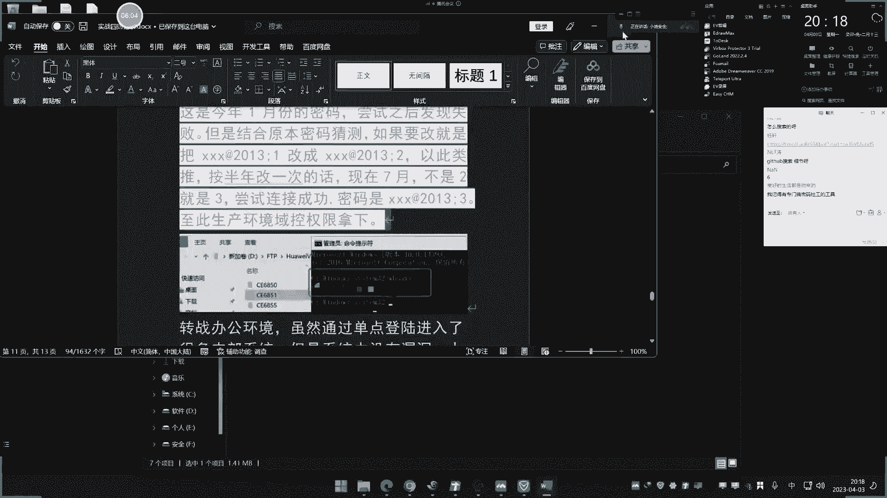

首先呢我们来先看第一个微信公众号的，一个手机。

微信公众号呢主要分两步，第一个呢是获取微信公众号途径呃，在这种爱奇茶里面呢。

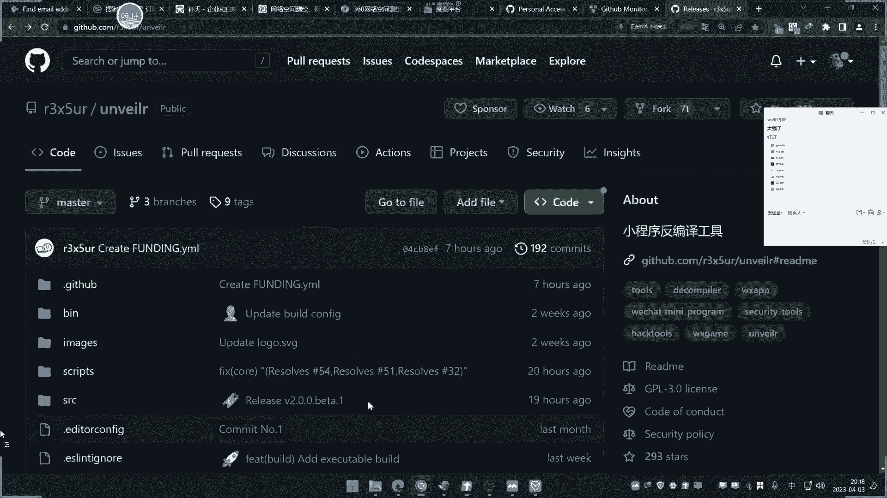

像这种地方呢，它有些是有这个东西的啊，我们可以随便在这个补贴上面啊，去找这种，额公司的这种东西吧，比如说我们搜他也知产权里面呢他是有这个哎。

有些呢是资产权里面的泄露，这个有这个什么微信公众号这些东西啊，啊他这里又来了app微信问他，他这里说没有啊，没有，那并不代表真没有，那这里是显示微信号为零，所以这是一种收益手段啊。

还有一种呢就是说直接在这里搜啊，来我们可以看一下啦，呃由于这个搜狗呢它已经这个是吧，来直接搜了，你搜的搜这个名字啊，来搜微信公众号，你看看是能收到一些这种相关信息，你看但这几个是不是这就不确定了哈。

是不是就不确定了，你看可以通过这个地方搜，当然了，你也可以直接在你微信那个里面搜也行啊，这个呢是借助搜搜的啊，去搜嗯啊包括这里呢我们再来搜这种啊，都是可以尝试的啊，这个地方收，嗯这里也没看到是吧。

然后我看这边搜啊，哎好这里没有，你看没有就没有啊，然后那里给去掉几个这个关键字，对吧，有时候那你就自己呢去分析一下，有些关键字能碰撞上就是一样的，你看我这个小弟安全的这些东西吧，都给收到。

啊除了搜这个字外之后呢，你看这我的啊，然后呢还搜文章，搜文章你可以看到啊，来他发吴国来，它有些呢就和我们相关的交互还分享了是吧，尝试过了，发过一些这个和你相关的，就说这几个微信公呢和你是有联系的啊对吧。

还能搜到啊，这种呢就是说去找有没有这个相关目标的，这个微信公众号，那么找到之后呢，要分情况的微信公众号有没有第三方服务，是什么意思啊，这点呢大家理解我无法来给大家演示，是个什么意思呢。

大家都知道微信公众号呢他有一些是个人的，还有一些是这个企业的或是一些机构，那么有没有第三方服务是什么意思呢，就是说它的上面的所有功能都是用的，腾讯的接口，还是说它上面有自己的网站，就有一些。

比如说微信公众号是吧，你一些延误，你点上去，它会跳到他的自己设定好的网站上面去，那么这一点那跳转那个网站，就是你说的要收集的资产，对不对，就是从微信公众号里面，找到一些提供服务的网站啊。

这个网站呢不是腾讯官方的，也不是微信官方给他提供的自带的服务，那这些就是我们说从微信公众上面，分离出来的资产，如果说微信公众号上面啥都没有，全部都是腾讯的那个API接口给他提供服务的。

那就没有资产能理解了吧，所以微镜工作好呢，就是这么个支点，他没有其他的，就是要看微信公众上面有没有第三方的网站，就是不是非腾讯官方的，因为信官方呢是这个腾讯的嘛，它可以通过腾讯那些API接口来提供服务。

比如说像我们说这个微信公众号面是吧，绑定自己的账号，那么这个操作是不是要和他这个，自己的这个网站联系，他就会是吧，配置啊，所以这个比较简单啊，就说主要是那你收集到微信公众号。

看他微信公众上面的那个提供服务的那个功能，那些服务是用的是他自己的网站，还是用的是管房的，如果是用自己的话，那么你就可以收集到自己的一些网站，或者一些其他信息，那么直接上去就能看到点。

上去就挑出一些网址啊，或挑出一些什么东西，你就把那个地址记下来就可以了，啊，咳好，这个是我们说的微信公众号这个事情啊，那么接下来呢，我们再看这个JTUB的这个监控，那这个东西是干嘛的呢。

它主要是针对人员域名和邮箱等等的一些筛选，前期我们有讲过，我们当时讲这个阶梯上面去筛是找源码，但是现在我告诉你，他还有很多用途，比如说技术人员基于域名记录邮箱，啥意思啊，我给你看一个案例。

就知道它有什么作用了，我们先打开这个呃j u up ui啊。

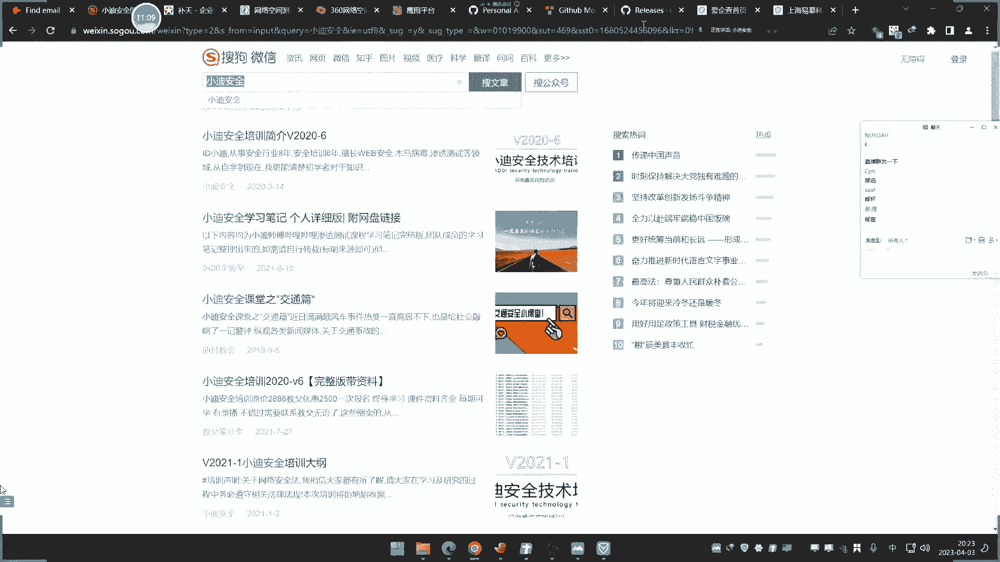

啊我们可以在这里呢给他收一个这个相关值啊。

我这里开个小代理吧，不开代理，他这个实在是里面的老是卡卡的。

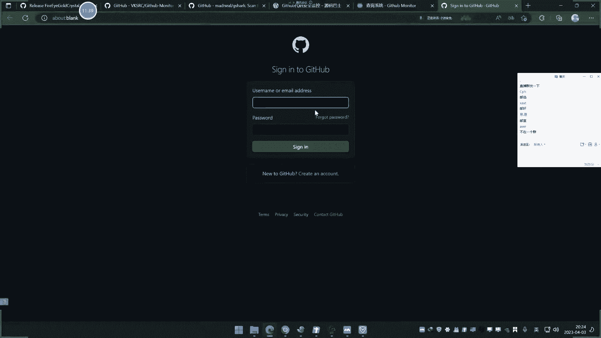

那我们在这里搜啊，你看他能搜到什么东西，我给他搜一下啊，比如说我随便先给他找个地方啊。

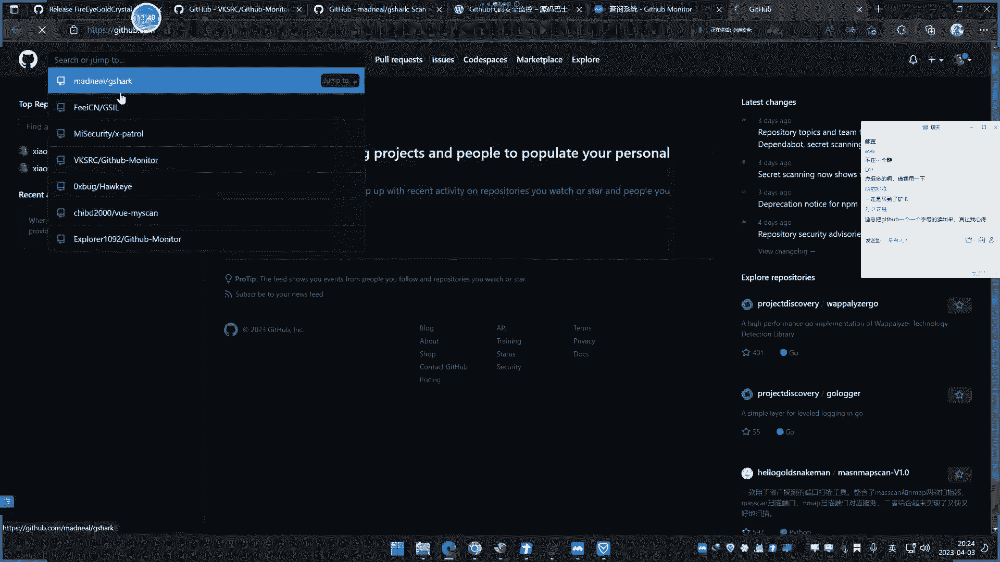

搜一下这个东西啊。

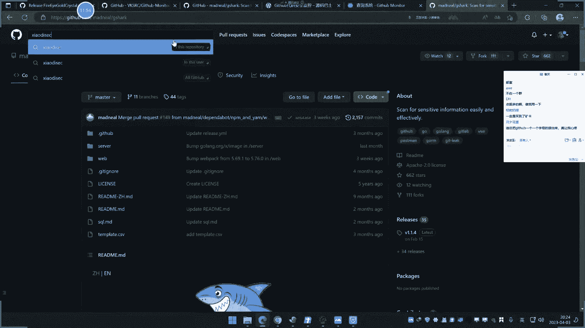

好这个收呢搜索语法我们来给大家看一下啊，你看我能搜什么啊，我随便拿几个这个测试的啊，呃你像这个我们可以，嗯找哪个了，看下这个这个随便找了啊，能不能搜到，我不清楚啊，找那种直接能搜索网站的啊，什么鬼情况。

他妈的这网站的直接搜不出来，那你看这个呃。

他不是这里有域名吗，把域名搜了复制下哎。

那我先针对这种域名结构的啊，你看啊，我在这里网络空间啊。

不不不是网络空间这里啊，我搜这个名字，然后搜一个password，搜一下，看有没有信息，好，在这里呢有24个注释，这里有个好，但这里呢并没有发现什么信息啊，这里没有啊。

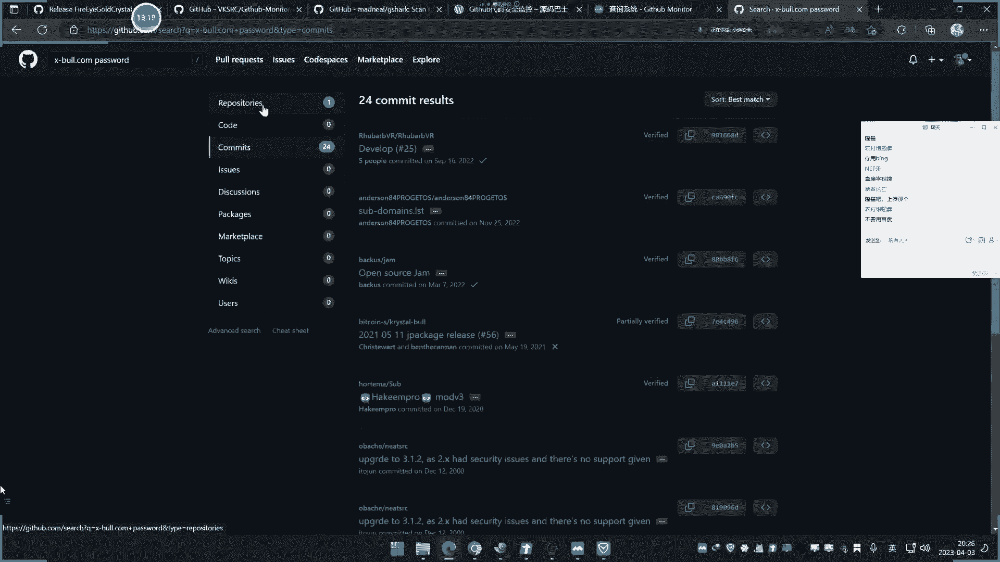

这没用，这信息不行啊，好再换一个目标测试一下啊，啊就拿这个那国内的一些这种，公式四叶草啊，那这是四叶草的一个公司的域名对吧，成都的一家公司啊。

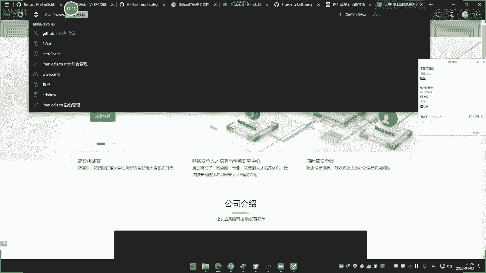

啊你看这里的我们搜的基于他域名搜一个password，这是干嘛好搜看一下能搜什么东西，来这里25个，我们看一下啊，啊这里有个项目限制社区啊，有这个相关域名好，我们项目名后看啊，好有些这个相关域名好。

这里看一下，收到一个呢，这里有个12701好，还有带password的啊，这里没什么重要信息，我们继续往下面看看有没有啊，哎大家看没了，这里有个人，W s socket label。

四叶草9000端口有个什么use name和password，呃，你这里呢我可以随便再搜几个给你看一下啊。

比如说我去找这种一流R316点，他打C上面啊，我打这种目标是吧。

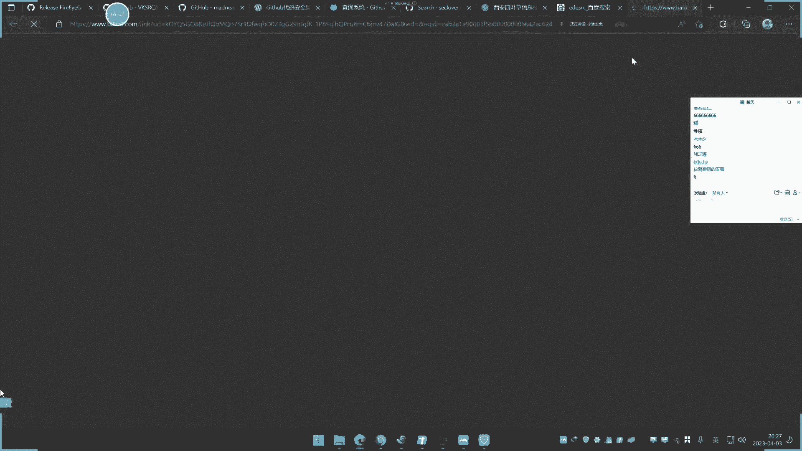

直接和这个漏洞相关的，哎这是提要漏洞啊，好我们看一下，哎呀两毛还天天刷屏呢，那小弟不是gay是吧，我们找一下是吧，找一下我们群里成员提交的地址，这个不是我提交的啊，那小李是gay加的。

不是给较低的掉毛呐，这里有一题要好，就拿这个血压来测一下了，这是他的一个域名，好我们等下会说这个具体原理啊。

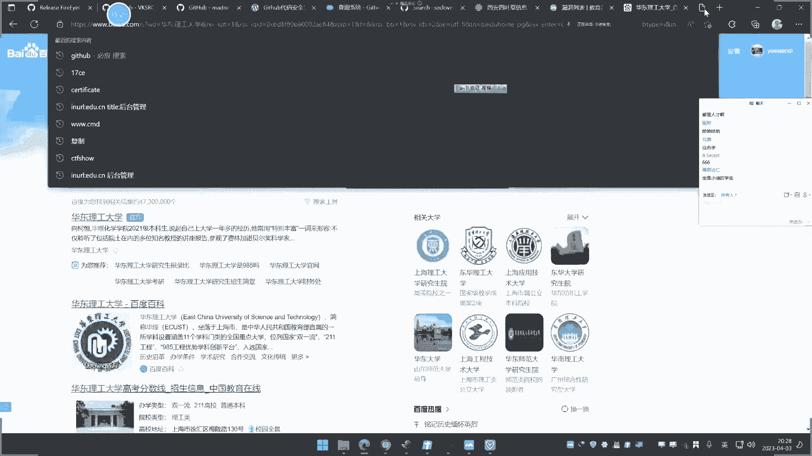

这个域名，然后我们搜一下来看一下啊，搜索关键字啊，具体怎么搜，你可以看一下啊，嗯呐这是相关的信息，但没有发现password好，下面继续慢慢看啊，好这一些路径泄露地址，然后你看这里啊，这有个打SL文件。

SQL文件是什么来lab一个图，是在一个CIL文件里面包入了一个什么嘞东西，好，我们看一下这啥东西啊。

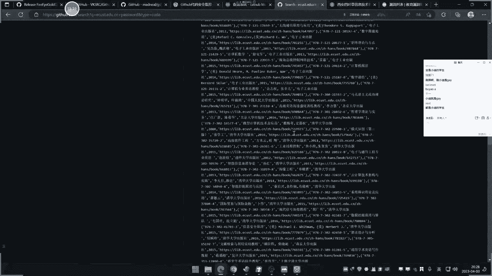

我们先打开看一下这个地址啊，看一下这是那个华东理工图书馆。

这里有个SQL文件，那我可不可以理解为这个SQL文件，可能就是这个图书馆的数据库文件，你可能会这是什么个情况呢，这还有个博客，艾米那密码这里没有写，但是那个ADMIUSIM，这是他第一个情况来。

我们可以打开这里看一下，名字叫波克MESSIMACTIC，这两年前2022年的一个更新项目。

是个java写的，那我可不可以理解为，这个项目很可能和这个源码相关的。

其中这个数据库配置，应该也是和这个相关的东西啊，能不能这样去理解它呢，是不是，因为你可以看到在这里呢它有很多信息，你看那LIL的一个信息。

我们打开看一下这个地址信息，那刚好嘞刚好你看这个地址是真实的，它对应的说是最优化的方法。

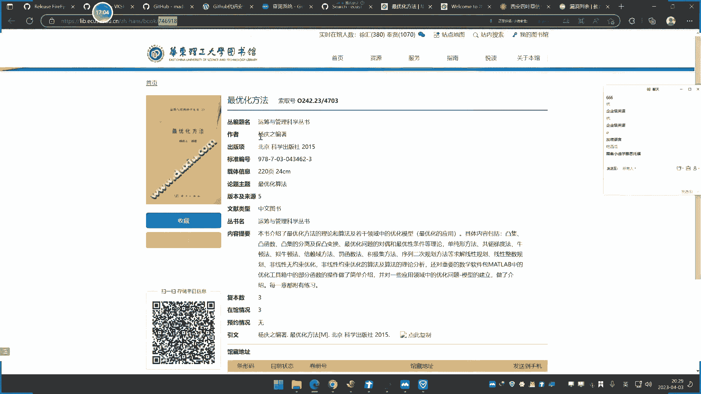

什么扬起名编制这个信息，我看下这里能不能找到啊，啊最优化方法。

杨青之科学出版社，对的嘛，是不对了呀。

你看数据库的信息和他对着上了网站一模一样，那说明这个SQL文件应该就是这个源码的那个，只是看他传不传而已，你可能会问，那这种是什么原理呢，告诉大家很简单，因为这个GHUB呢。

它是我们全球最大的一个开源平台。

包括我们国内的这三个平台，我前期都说过国内的GICE1，这还有什么国内的互战网，但一般用的最多的国内用这个有点多是吧。

用借鉴的更多，全球都在用这个，它是一个程序或源码的一个共享开源平台。

也就是说很多搞这块程序开发的，他都会去用这个平台上传自己的一些项目，上传这些源码，那么有可能其中你的目标的开发人员，或者说管理人员，他在不小心的时候把一些项目同步到上面去了，或者说发布到上面去了。

但是他没有注意到，比如说一些项目发布上去啊，一些一套源码，但是他可能在打包上传的时候呢，不小心把一些比较敏感的配置信息没有改啊，从那上传上去了，就是这个原理，简单来说就是开发者或说管理人员搞这块技术。

仍然把一些源码上传上去，其中就包括你的目标和它息息相关的，对不对，你继续往下面看呢，还有大家可以看一下啦，还有看还没有信息，我们看一下好了，这还有人写的这个PY文件，但这里没有信息，那你看这里呢看没了。

邮过来，level c u19点cn password，来一个邮箱，这是那个，这是不是那个学校那个邮箱来，所以说这个密码他应该是加密的，但是这个呢如果他是个明文，那不就直接明文告诉你吗，来。

这还有很多啊嘞，还有很多呢，下面还有很多很多相关信息，那各种泄露的邮箱，还有现在各种登录的地址，还有人去写本科迎新系统系统，破解PY文件很多啊，你可以自己呢像那个啊，有些是别人自己写的这些登录项目。

有些呢就是一大堆啊，这里呢还有个呢要和这个血压应该相关的呢，是谁作的呢，一个人点，那作者是这个的，自己这个学校的一个叫任洪涛做的，然后再定义一个密码，然后你可以打开这个项目追一下。

看这个密码有没有被泄露，这可能就是他们这个自己内部人呐，去搞的一些事情的吧啦都会关注到，那也是说，其实就是说在这里再找一些，这种和这个网站相关的一些开发人员，泄露信息的这很多呢，又是周洪涛。

那这个人可以理解为啊，这个人应该就是这个学校企业的一些呃，这个学校里面的一些工作人员或是啥情况啊，很多啊，这个我们就不一一翻了啊，呃你可以自己呢，这是学校的那个SRC啊。

我可以随便再找啊，这很多的啊，这不是说我随便找，我随便翻那个吗，哈我再找啊，都是来这个好吧，咋搞啊，来找个这个试一下再试一下啊，这我随便找的啊，我没有做任何事情，我们看看有没有啊，那这基于这个东西的啊。

我们来看一下，然后呢在这里搜一下。

我这里还只是说搜password，如果说你要搜其他的也是可以OK的呀，也是可以这个搜的啊。

啊我这里呢为了筛选一下语法，我这里呢交个INFIRE，就是在文件中password。

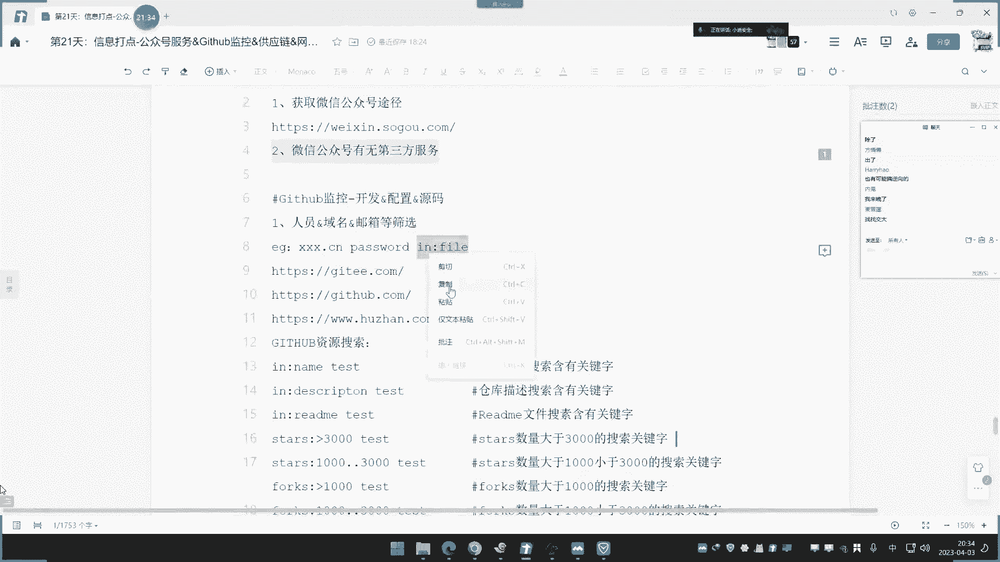

在这个代码中这样搜一下，这样可以筛一下啊，把一些这个模糊查询的筛出来，你看这里又收到一些，那和这个相关的一些源码信息，来看一下有没有password信息的，这里是一个UR的登录系统，这边应该写了。

你看这里呢还没呢，泄露一个学一个特色user的一个信息来，186什么，这有点假，应该是个例子，很多啊，这有些各种各样的源码呀，还有泄露的啊，这个都要你自己追一个分析啊，你实在没办法就这样去找。

啊都是和血液相关的，因为这些代码里面的全部含有这个关键字啊，除了这个之外，你看这里还有这个源码呢，这是一个卖源码，这里不是一样的嘛，呢又是一个这个password的，前前零星给大家看一下呢。

前前深还读不到这个名字，这是他设置的呢，里面说泄露了他的邮箱地址，你可以自己呢去刨一下呢，这里应该是呢它的这个465端口，username password等于mail点password。

那你可以追一下，看这个它定义到哪里，你可以翻一下配置文件呢，邮箱的一些这种连接账号啊，信息啊，我们可以翻译一下这里啊，看能不能追到里面的一些配置文件的一些信息，设置文件，你可以把这个项目下载下来来。

我们把它下下来啊，就不说我拿这个来测试一下，把项目给他下下来，把下下来啊，因为他有一些学校的一些人呐，那这是他的一个源码哈。

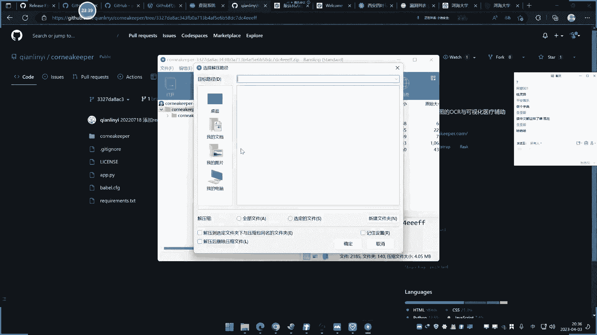

我们来可以看一下啊，来我们把它载入一下。

其中在这里呢翻到了一个邮箱的一个信息，我们把它啊打开啊。

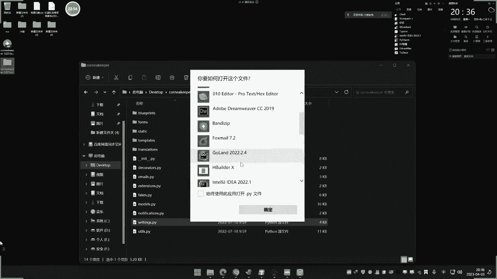

嗯然后呢他这个刚才的密码呢，我直接在这搜，打开这个文件夹，选中这个桌面的。

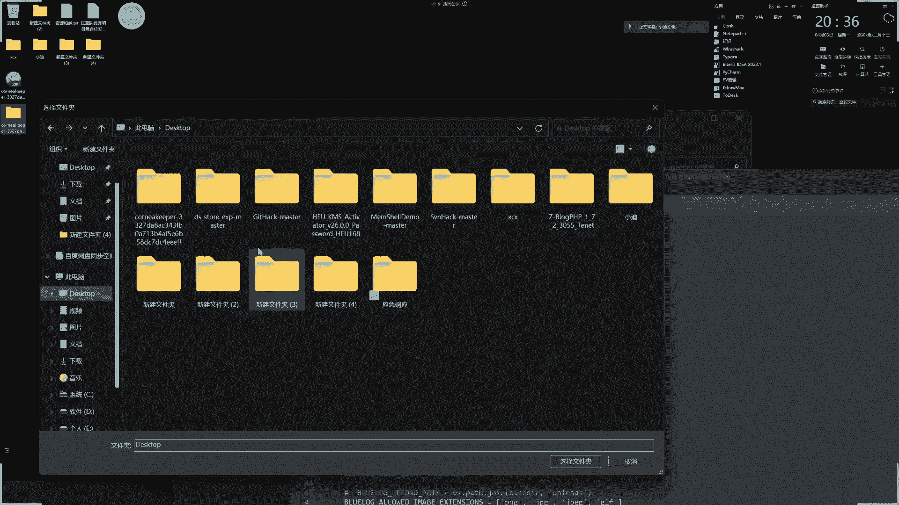

这个码好以他呢为基准搜啊，在这全局搜索关键是password。

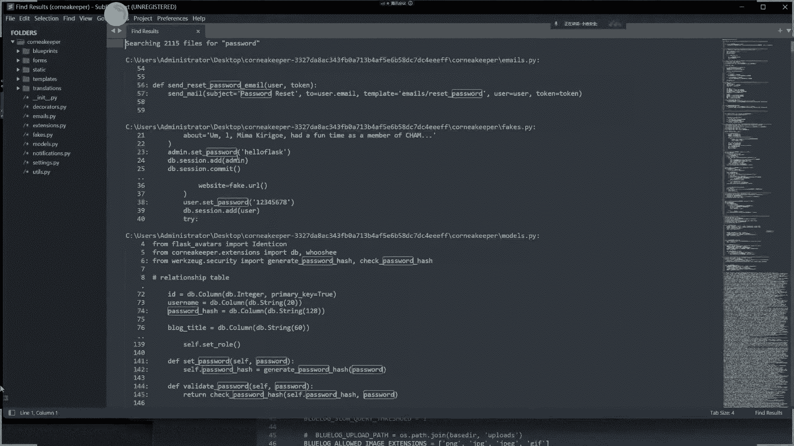

啊然后刚才搜的那个是什么值啊，邮箱的一个这个定义值叫mail，搜这个关键词，看能不能搜到，哦还是在这里啊，那也不知道从这里从哪来的，啊就是你要追啊，你要读这个程序，他这里定义了从os get到一分N。

从那个环境变量中得到了一个，这个是还有这个字，你都可以在这个项目中去搜，我这就不一个个仓了啊，一个看了啊，呃他有可能就是配置到哪里去了，你自己呢找那个定义的地方，那他就会泄露这种信息，就说这里呢。

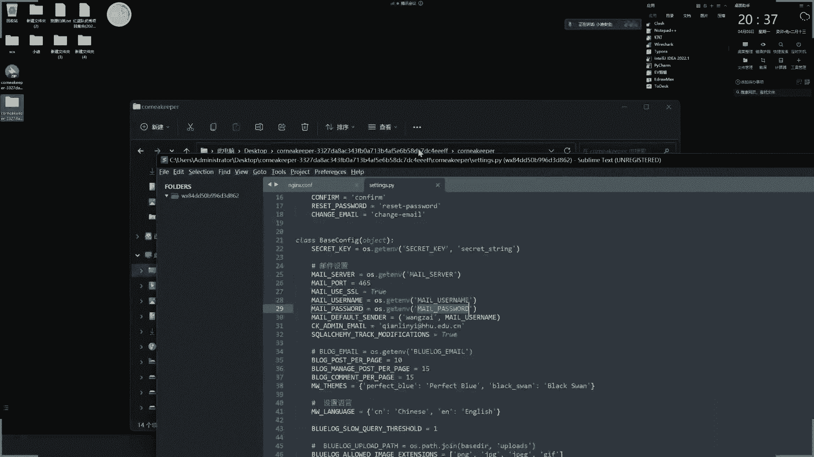

所以说我们看那几个实战案例呀，它都是和这种东西相关的啊。

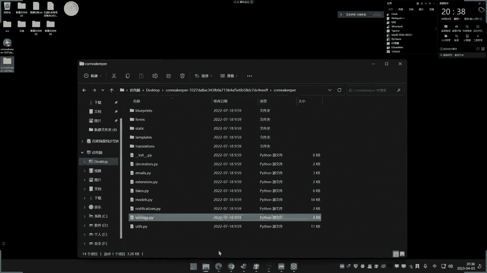

他从这里翻到一些自然信息，然后呢自己下去了，去得到一些这种不一样的情况啊，对不对，还有很多啊，这个都是就说他这没显示出来的一些地方，那你可都可以下去看，嗯这里也定义了密码，这也是个作者。

这个密码呢你可以追踪一下是吧，在java里面定义的，就是看他在哪里存存储了啊，你有跟项目啊那种去查找方式啊，哎我们就不一个哈，你看这个呢就是大家看到没，那邮箱呢来这个是密码了，这个是密码，看到没出来了。

密码了，2201121年的那21年的那邮箱密码。

是不是可以尝试了呀，那这个不是啊，那这里也有你看，还有一个地址密码呢，这个密码留下呢，看到没，我不想登录，也不知道这个真不真实，我只是说这个思路，你看来这不是又是一个吗，你找到邮箱登录的。

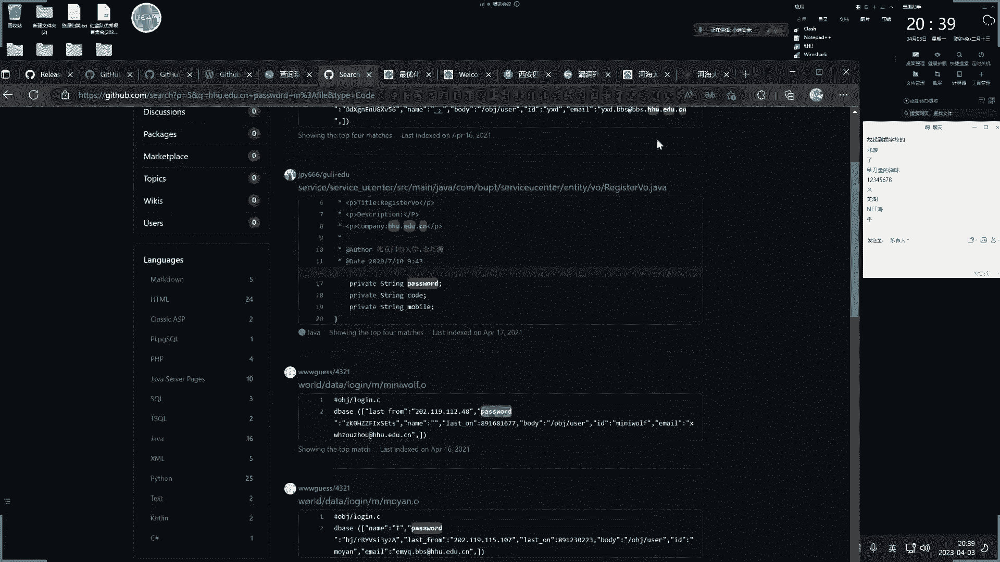

那肯定就是他一些什么一些OA系统啊，或者说学校那些学生管理系统那些地方去登嘛，对吧，你就自己去找了呀，你找一下来这个什么哪地方的门户啊，那种邮箱，这有邮箱来，看到没，来有邮箱来，是不尝试一下。

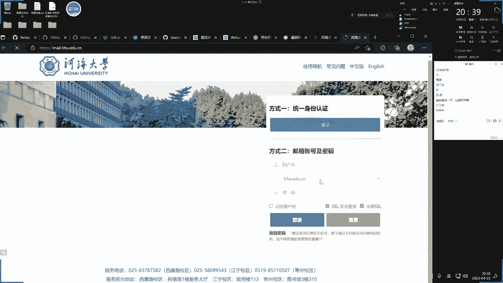

对不对，那我不搞这种事情呀，对不对，你要下去，你藏你就藏嘛，对吧啊，不不过我还是想尝试一下看一下啊，哎我是说这个意思就是说要告诉你这个情况哈，用户名密码，我也不知道对不对啊，这要是真对。

说实话这又要打麻了。

哎不想测试好，密码错误，还好密码错误啊，这要是密码对了，我都不知道咋办，这可能我登录方式有问题，他说不定前面用户名要写了个邮箱名都说不准，唉不好说啊，我不登了，我怕登进去里面还要打码。

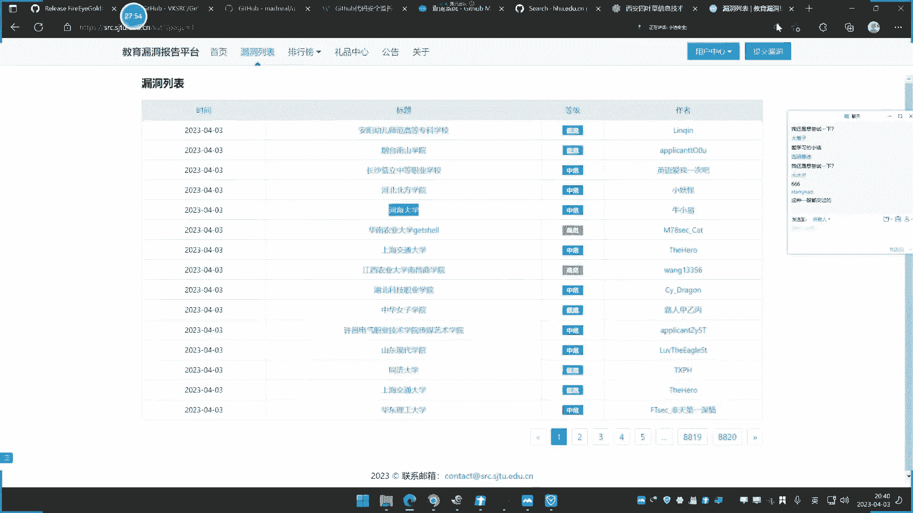

不搞了，不搞这事，所说这意思啊。

好这说这个意思啊，然后这个补贴上面我们就不测了啊，这很多这种信息的，这不说只有一哥啊，呃这种什么，哎那个EN的那个平台呢很多啊，我们就不给测了啊，补丁上面的很多，然后这是第一种啊。

还有一种呢就是说我们腿通过人员邮箱去搜，啥意思啊。

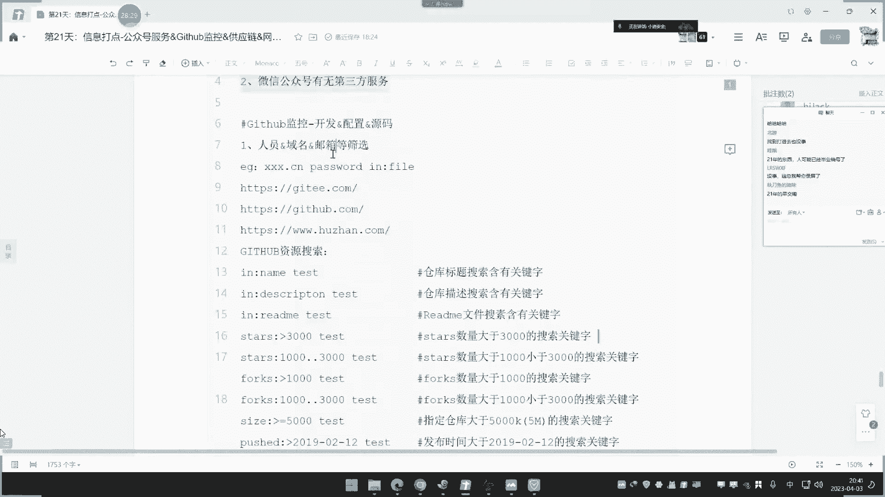

就说我们刚才呢是基于这个域名为条件去搜的，是吧，基于域名条件去搜的，但是还有一种情况，就是说以这个人员的信息，或者说他的邮箱信息去搜，那这种呢就是一般去找什么呢。

就比如说你可以看到一些上面留有一些这种，邮箱地址，或者他的一些这个个人的一些信息，那么你就会搜这个个人的一些信息，就是什么这个啊学校的名字啊。

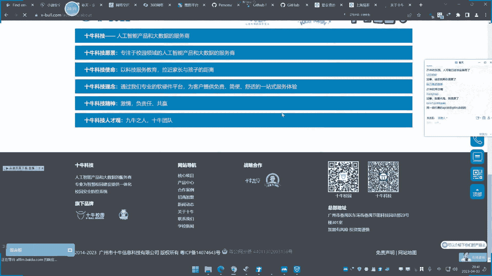

或者说邮箱的那种邮箱是吧，然后你呢你在刚才这个地方呢去OK试一下啊。

这个找他邮箱也不好找，来这里要有邮箱，你看看我记得这个邮箱啊。

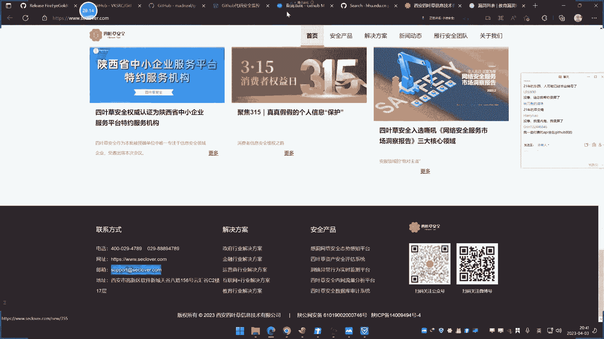

也可以搜，就是和我相关的嘛，就是除了这个据域名去搜，就是这里面带域名的，你要基于这个什么邮箱去搜，就是邮箱里面带这个东西的啊，直接搜啊，这里没搜到啊，这没搜到对不对，但如果是有了是吧，你搜这个邮箱。

我看有没有，只是邮箱不是带password。

邮箱也没收到，就说邮箱这种不一样的邮箱地址，或者开发者的一些信息都可以去搜，其实呢就是说各种信息可以说啊基于渔民去塞，基于这个邮箱去塞，基于这个用户名字去塞。

就我们上面写的一些案例呢，是吧，什么这里带有邮箱地址的啊，这种域名的都可以搜，你像刚才也是一样的道理。

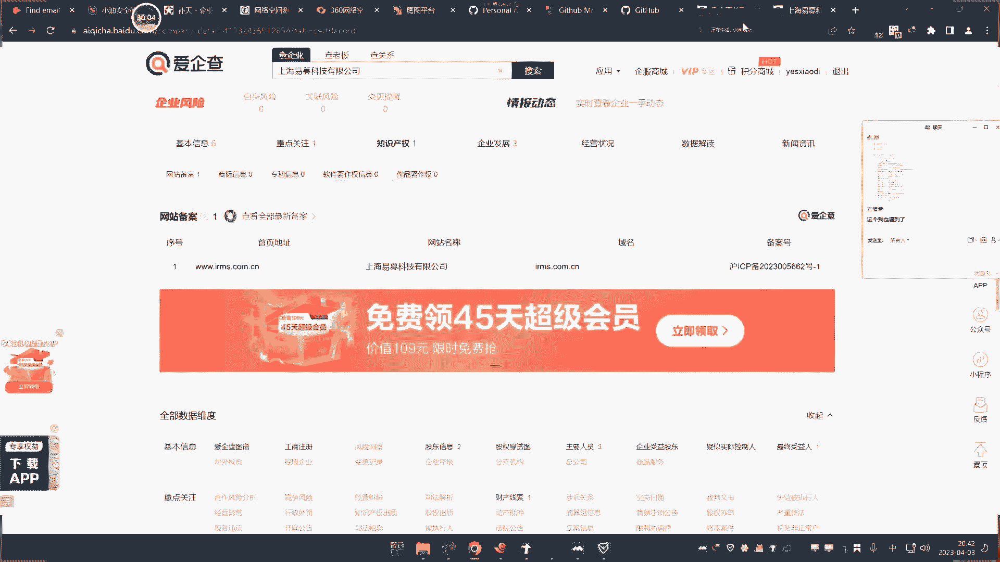

你刚才我们那个EEDUCN的找谁打，我们找一下。

那我们随便找个学校打，那这是他的这个邮箱的话，我们就随便找个了，搜他，那肯定就有这个名字嘛是吧，来搜一下，看哪里呆了，那你看这里又翻到一个了，1982来，这优势里面的一些像是一些数据信息，有个列表包了。

这搞不好是爬下来的，应该是爬下来的信息，你看湖北应该是爬下来的信息，这应该是从哪里爬虫的，那这里，有些人呆了也应该是爬虫的，这个是爬虫的，这不相关呃，然后呢你可以再搜一下这种关键字，邮箱里面带密码的。

那这里就翻到了一个，那这又是一个相关时代，全国大学数据点SQL，这应该没有，这是大学数据啊，这个不不要紧啊，总之来说啊，大家自己发挥自己的想象，因为这个网站呢它是一个全球的都用的。

就说那个网站的开发桌子，或者说它的开发人员或者管理员，他有不小心的话，就会把这个东西呢给他放上去，除此之外呢，这是我们前期当前搜的。

就是你当前搜不到呢，不要紧，他还有方法就是语法固定，长期后续监控信泄露，啥意思呢，就是说你现在搜是截止目前的一个信息，但是如果说这个是你长期要作为一个，测试目标的话，要长期防护他的安全问题。

就是要避免这样的泄漏，你可以装一个GHUB的一个监控，这个监控呢不仅用来我们做信息收集，它还有用在其他方面，我们只能给他写了三个项目，其中我们演示两个，还有一个项目呢没有延时，但没有演示项目是最重要的。

只怪我那个停电没有把它装好，哼嘶抓好两个啊，这个是干嘛的。

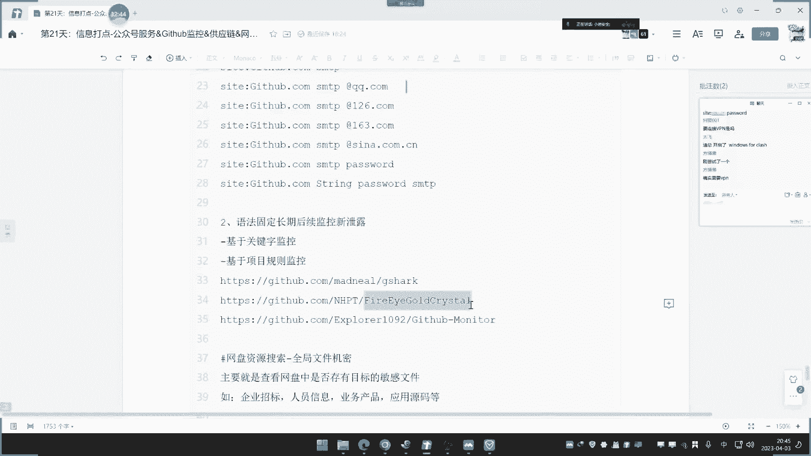

我们先讲这个啊，大家看一下这个是监控的监控是干嘛呢，就说你当前你搜不到你，但是你可以把它放着，一直监控，直到有信息来的时候，就咔咔的给你提示，那你就知道啊，可能有些新数据来了呃。

这里呢我们给大家看一下啊，这个这个项目他是干嘛的啊，这是vs rc VK src，是那个平台搞的这个团队的一个阶梯的，它用来呢取监控源代码，企业内部的一些代码泄露，由代码泄露刀成的一系列安全问题。

其实就是我们讲的嘛，一个是泄露源码，还有一个呢是源码里面一些数据的配置信息，比如说什么数据库配置信息啊。

账号密码呀，对不对，这都可以啊，你可能这里都没有看到。

我可以给大家看个演示啊，你看这里啊，我们准备好的这个地方啊。

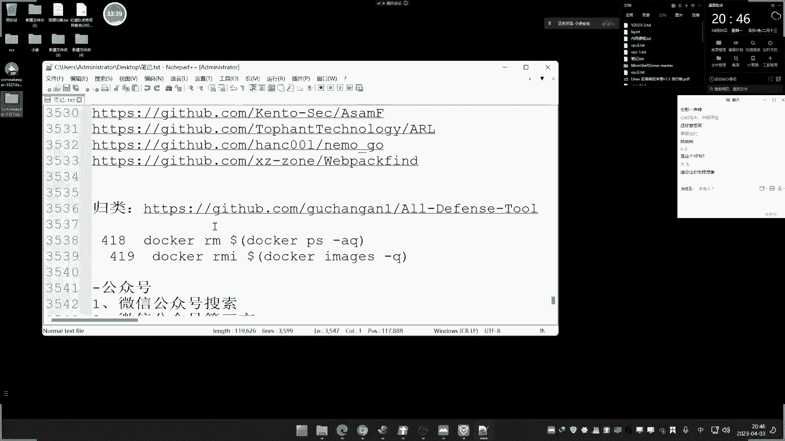

你看啊，这个呢是哪个网站呢，给大家看一下啊，这是那个补贴上面的一个叫，一路补贴咱们一个项目，那好像是哪个，来哎是不是这个他的名字啊。

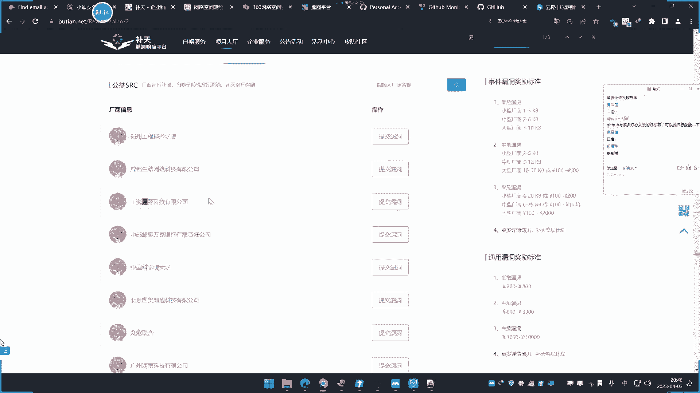

公司名字叫什么，上海一路软件。

一路软件，哎这是怎么都没有啊，是它里面的啊，我记得我是从这上面找到的嘛，那一路软件看到没是吧，就这个公式啊啊然后你看好了。

我们把域名复制啊，嗯比如说像刚才那个监控一样的呢。

在搜一下，In file infi，意思就是说在文件中显示的password这筛选语句啊，看一下啦，大家看到没了，U a t login system password，123456来，这游戏泄露啊。

所以说他这个地方呢是。

至于他这个密码有没有维护的。

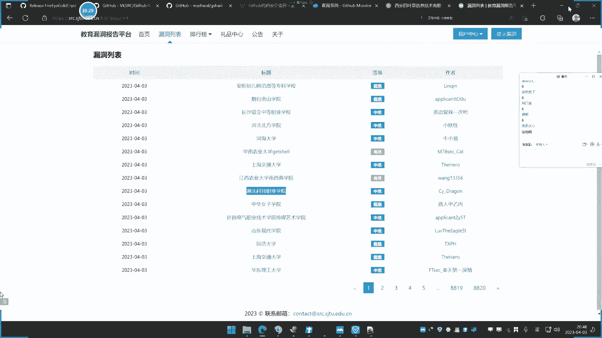

这不是重要的，就说有些人可能你这骑这些这种信息呢。

有人上传源码，然后这些配置信息他没有改，所以导致这个监控呢，一个就是说用在监控后期他有没有出现，你还要就是现在没有出现，不代表以后不会出现，因为以后呢说不定有个人上传了哎，就把信息泄露了是吧。

有这样的情况发生，所以呢我把新鲜的给打印下来，然后这是那个打井的啊。

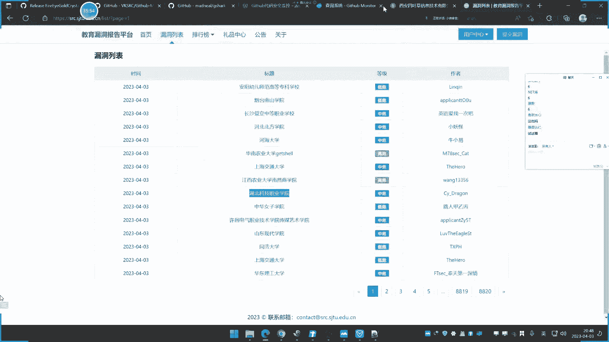

我们等下再给他说这个怎么打建，这个打印呢非常也简单，这里的项目呢。

他也给大家说了个搭建的一个情况啊，来安装怎么安装是吧。

这里也写了，对不对，这个上面也写了，然后我一个搭建好了啊，给他看一下这个效果线。

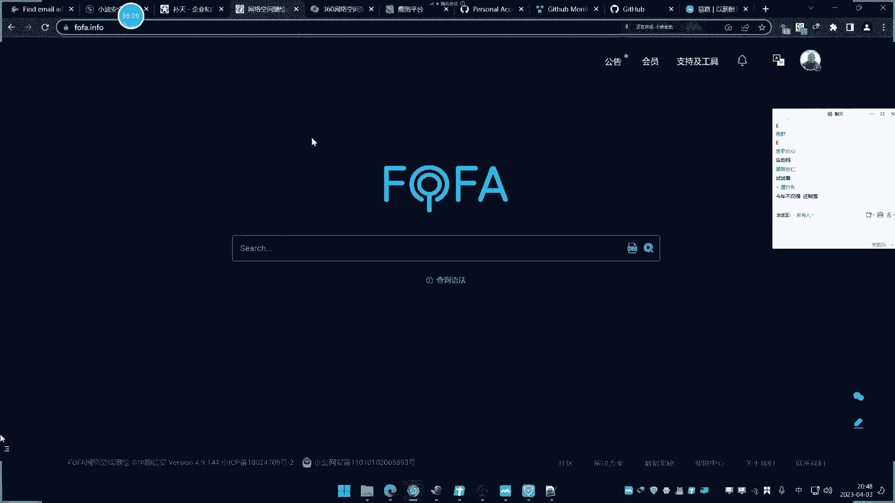

他怎么监控呢，你看下啊。

嘶哎那个项目跑哪去了，在这里嗯，这是它安装过程，下面在这边呐，我们连下任务管理呐，比如说我们随便取个名字，就是那个五天的什么，SRC的那个一撸。

对啊，名字呢这个筛选语句呢我就按刚才那个筛。

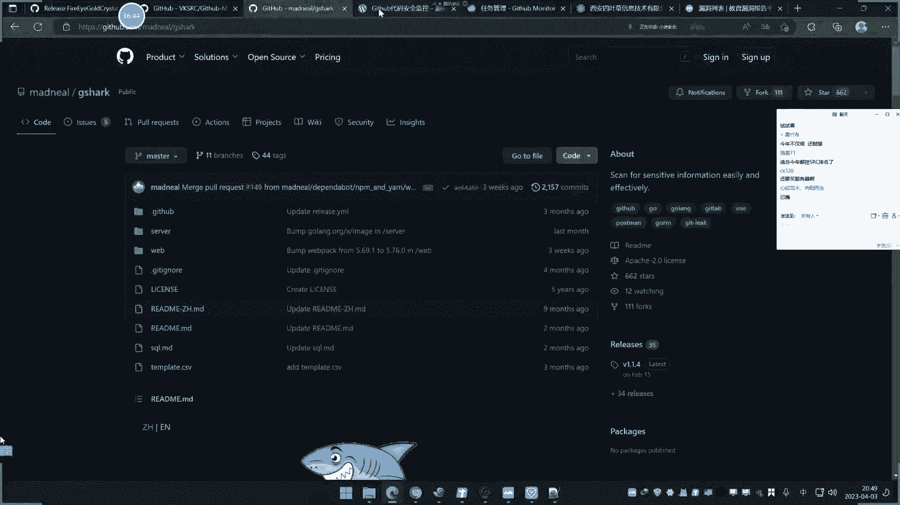

那就这个塞嘛哈，就这个塞法把写上去，这个语句关键字匹配模式呢叫搞模糊匹配，然后这里有个设置呢，爬取页数五页和间隔时间60分钟，就是每隔一个小时，他帮我爬一行，每隔一小时就用排一次。

意思就是说我只要我这个服务开启，那么它每一个小时就帮我检查一次，有没有新数据，能理解吧，好我们点一下，确定好，好他就说完成了，我们来看下这里查询系统，啊这应该是之前监控的一些信息啊，妈的应该把他删掉的。

这搞到现在我都不知道他爬的跑哪去了，尴尬啊，直接点这个哎这个咋没有啊，啥情况，重新来一下，是不是这个词不对啊，好看一下这里，哎呵，怎么没有啊。

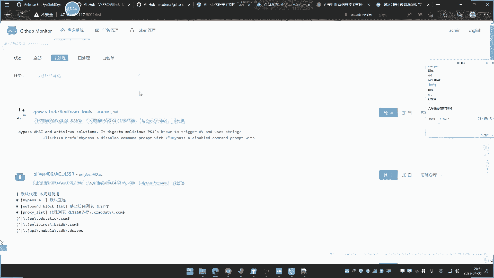

等一下啊，我把系统重新启动一下看嗯，把登一下重启动一下，重新编译一下啊，Bet，嗯杠杠T。

好啊，关注一下之后刷重新刷新一下好，重新登录账号密码，那个账密码呢是账密码。

他这个项目上面已经写了吧，应该是账密码是多少来着，好在这里呢。

这到账密码对吧，那初始化账密码，这好像没有虫子啊，怎么还有啊，操他娘的，这咋咋个情况的，重新来看一下，再来看一下啊，哎呀，呃他有几种情况，大概你关一下看，之前我这里面都有数据的，那有有了有了啊。

那有一下来看，那这数据来了来，大伟来，是吧，这是他帮你漏出来的数据，来把你监控到的，把数据的和它相关的一些信息把它拿出来了，对吧，就是和这个网站和你搜索关键词相关的，这非常多啊，因为他爬了五页嘛。

那爬五页，那现在他也是完成状态，那么它就会爬取60分钟，间隔一次，也就是说过一个小时之后呢，他就会再帮你爬，一直爬，你系统开到什么时候，它就爬了什么，其实就是说我们呢就是能确保说能够移植监控。

这个上面呢有没有泄露一些这种信息，这第一个呢是保证安全程度，一个那个同时呢，它不仅用于我们说这种信息收集的，这个上面操作，它还可以操作啥啥啥东西呢，你比如说我们可以进行这个CV1的监控是吧。

我说免杀项目的一些监控是吧，那搜索免杀项目的是吧，这十个免费项目关键词来点击一下确定，对吧我们就会看一下啊，有谁就根据这个关键字呢去搜的一些信息啊，我们就会看到那点一下这个乙的。

你看全部都是关于一些免杀项目，把收集到呢也这边呢提交的啊，过三轮银的一些东西，各种资源嘛是吧，就是其实说除了这个之外呢，我们还可以捕获一些这种东西，然后像最新的这种CV1漏洞，比如说今年的CV1是吧。

刚好20132013是吧，后面呢我们就不知道是什么了是吧，这编号CV1的监控，他只要有新的东西，CV1的补丁出来或是漏洞啊，有能发布到这个上面进行一个监控，对不对，我看一下CV1的，哎咋没有啊。

啧意思好意思坏啊，他妈的搞都搞不明白啊，他可能是那种搜索词语的问题啊，这首词的时候，多个关键字的一些情况，感觉应该是这个受词的问题，还是系统的bug不受磁，CV12034是正常的呀。

你看这个之外呢，还有一些这种项目，就我们这里呢搜这种关键字的呢，这里有个这个项目呢直接用啊，它这里面呢自带了一些词，自带了一些词啊，你也可以指定词，你把这些修改它指定词的一些搜索，那你看他搜索是哪些。

那这个免杀啊，计算机取证啊，说软啊，信息数据啊，主机安全是搜这种相关的。

还搜这个CV1的，你把运行Python。

F。

然后怎么去运行收集呢，这个是搜那个其他信息的啊，就搜一些工具项目的啊，当然了他也可以收集一些关键字，就是你指定了它有三种方式呢，一种是默认关键字内置的，还有指点关键字指定关注。

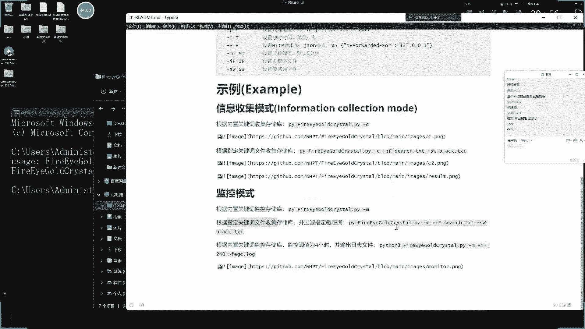

这就写到这个文件里面去，我们就可以把我们目标的关键词的写进去呢，比如我搜这个目标的，把它写进去，是先驱呢。

它也可以收集，就指定关键字去搜集也可以啦。

用这个默认的，就我们先看默认的啊。

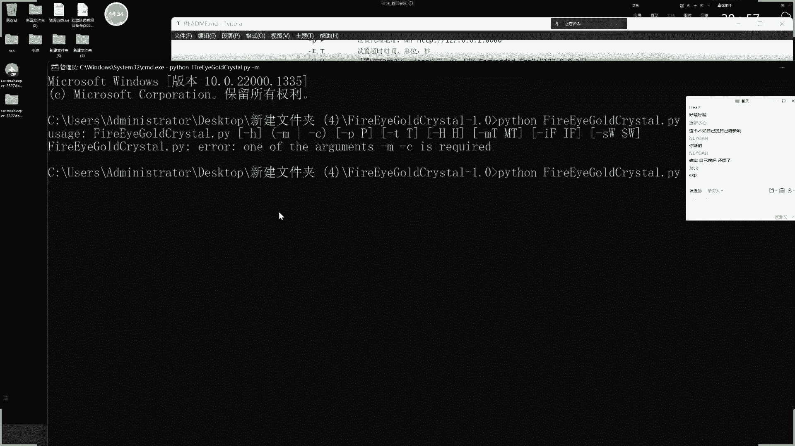

然后与此同时呢他收集好之后呢，在他这里呢也提供有这个接口。

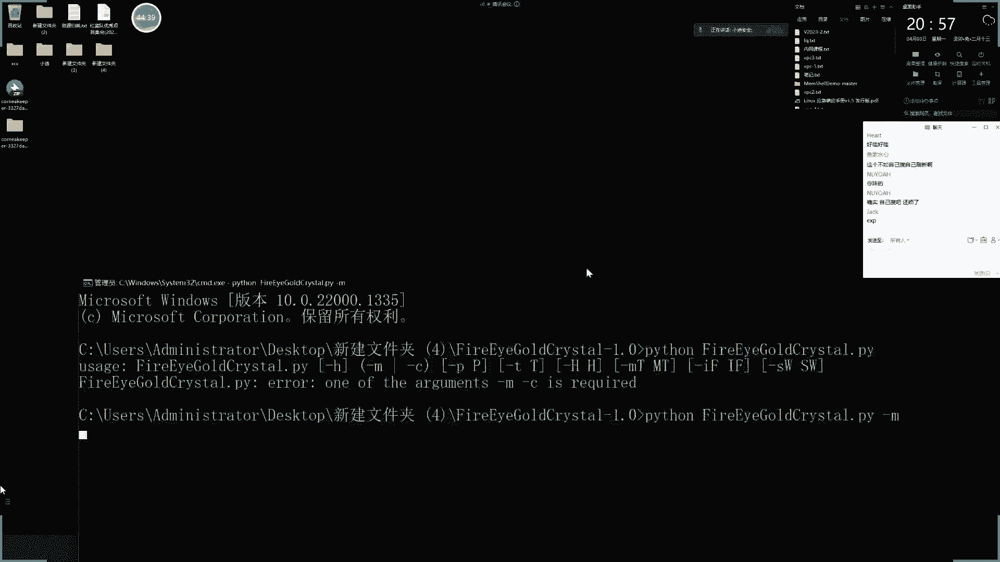

啥接口啊，我们这里呢还没有配置。

你看代码中啊，代码中呢是提供了这个什么推送给你的，这个推特微信钉钉啊，他有这种设置，就是你把那个K呢写到这个源码中，它可以实时给你去发送信息啊。

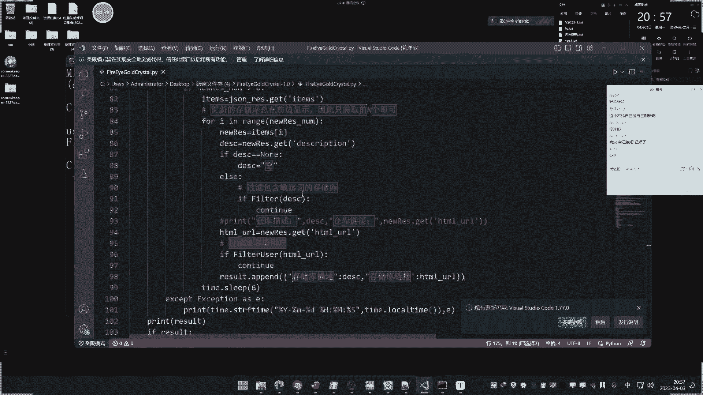

钉钉哎对不。

还有像这个地方也是一样，这个平台呢也是一样的道理啊，他这里不要配置邮箱嘛呢你给写个邮箱，一旦有新的信息。

他就推送给你，那邮箱呢就推送什么微信公众号啊，什么的都可以啊，那个server姜呢我前期给大家，后期上期课讲过。

后面的我这里也会用到，所以这个都不要紧啊，他收集好之后呢。

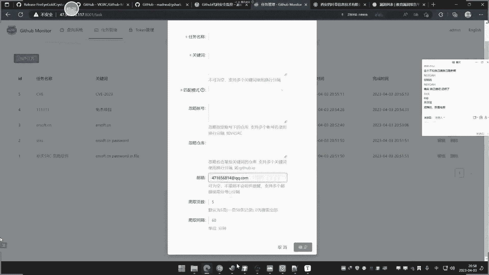

他会在这里生成一个文本啊，就是这是这个项目的啊。

这个项目的我们看一下啊，呐这收了CV1的编号和后面的第子信息，那这是CV202023年的，今年刚爆出来的一些漏洞呢，对吧，前面是描述信息啊，这个题外话啊，就是我们丰富自己的武器库。

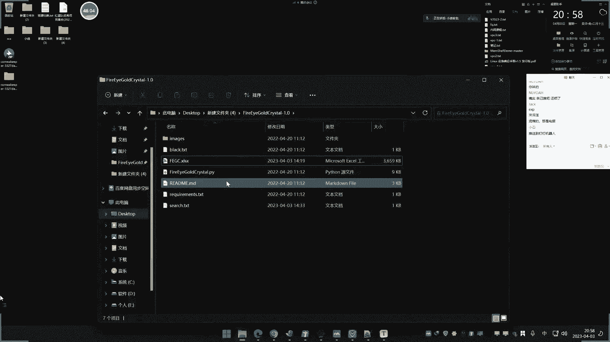

这个没没没啥啊，主要就是说啊刚才这个项目这个情况啊，这个监控啊，对不对，实时呢去监控那个东西啊，啊我不知道这怎么回事啊，他妈的搜的咋个情况就没有了，妈的我换个词试一下，真是奇怪了，他也也也也是有啊。

有没有，我搞不清楚是个啥情况，还在运行中，等到运行一下，看一下有没有啊，那名字叫什么，名字叫五个一，那有了看到没了，四串又有了，你说这里面的搞不清楚啊，我可怀疑应该是那个啧，我怀疑应该是那个。

应该是什么情况，应该是那个服务器和那个JTUB的网络，连接问题，因为这个JTB在国内有些网络，它访问的时候会中断，那会这种情况，所以大家如果说要把项目部署到自己的服务，上面的话啊。

一定要确定这个网络是能够和那个GB呢，能够正确的连接的，它有些这个服务器和那JTUB的官网，那个连接上面有时候经常会中断，所以他速度都会受到影响，你看这个人有监控到了是吧，那在里面的一些信息对不对。

但关于这个相关的是吧，同样道理，那你也是可以把，像刚才我说的这几个学校的是吧，这种信息呢也可以作为一个这个测试好，我们来看一下啊，一个天照里面去，作为一个监控，对不对，写个password进行一个监控。

运营中我们可以看一下，来看到没，是不是收集到来，嗯他实时板监控啊，然后呢你就可以呢，你看呢啊这个是写Python案例啊，这些地址，主要涉及到一些这个项目里面可能有问题的，然后呢他就会呃半个小时帮你啊。

一个小时呢帮你去跑一遍，就是避免呢从你当前时间以后的情况下面呢，都能把你监控到，并且呢发送推送给你。

其实那就是实时掌握啊，然后呢这里有个项目啊，那这个项目我们要打印成功，大家可以关注一下，这个呢是非常好的一个项目，没有打印成功，不是说打井难啊，是后面停电了，没准备好。

他的打井呢在他的B站上面呢有这种答疑视频，这是国人做的系统呢，你可以直接上面根去搭建，它有什么作用呢，他这个作用你可以看一下他文章，他是个404，一个计划里面那个项目还是比较优秀的，他没有演示啊。

简单来说的话，它是一个干嘛的呀，他是要干嘛的呢，它可以针对一个项目进行监控和多个项目监控，啥意思呢，这项目不是都有这个地址吧，有这个路径地址吧，它可以针对这个项目来保持长期监控，你只要一变动他就报警咳。

而且它里面呢有这个规则，就是一旦发现一些关键字啊，比如说有password，一旦发现这种关键字在代码中的话，它就会给你提示，是不是这个password后面写上了铭文。

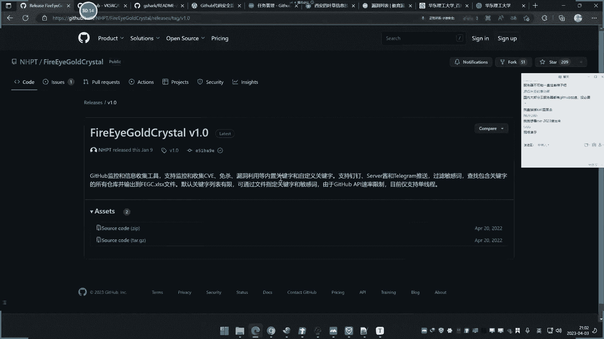

或说一些密码信息泄露到这个平台上面去了，你可以看一下啊，这里有几个项目，其中呢就是我刚才推荐那个项目啊，这几个项目呢基于这个上面监控这个代码端，及时发现燃工或者托管公司，这个代码上传到上面去。

并且呢预警，同时呢将代码中的这个规则进行检测。

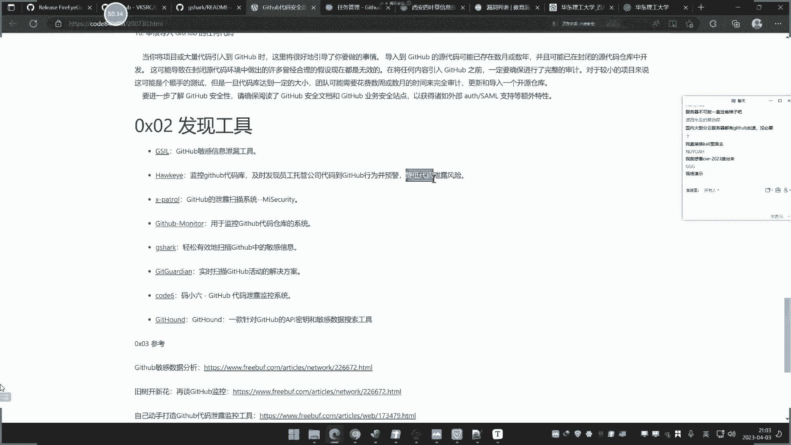

这个项目就有这公论，那很遗憾啊，我这个没有答应成功，不怎么一大一成功啊，就是里面的停电了啊，你看一下啊。

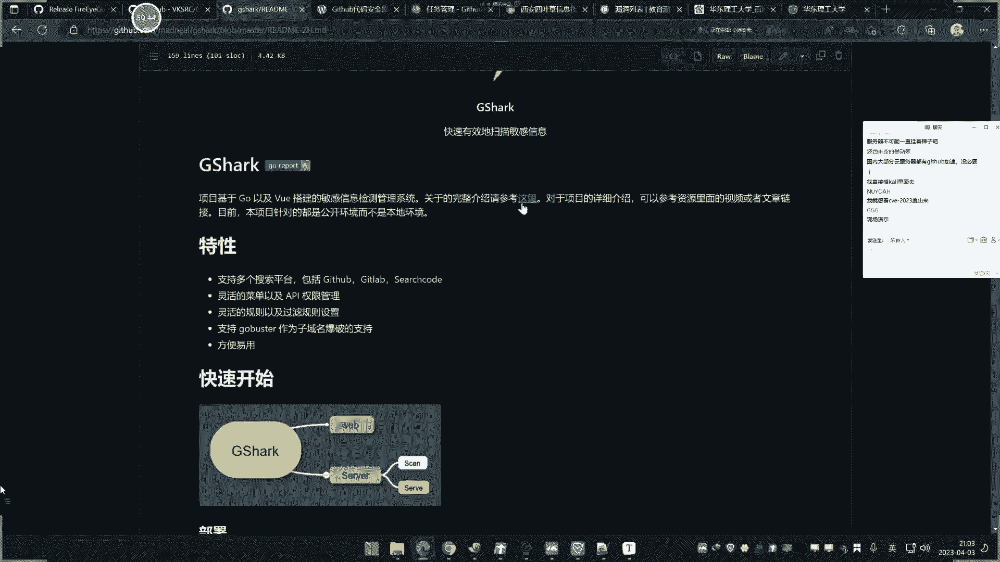

搭建非常简单，其实呃这是他这个项目那个介绍啊，如果大家有兴趣可以下面做一下，这个呢在我们做安全，它主要应用在蓝队上面多一点啊，就是这个防护上面多一点啊，对于我们这种红队员来讲的话，其实也用那个项目。

就够了，因为他这个呢主要是把规则写好了。

写好之后呢，就是监控某个或者多个，比如说这个是我们要监控的这个地址，就一旦这个地址上面这个源码发生更改，或者说有一些关键的东西出现了，它就高级，就这个意思就防止呢，你可能会把一些源码里面。

那些配置信息的一些密码呀啊，泄露到这个平台上面去了，他主要是主要这个作用的啊，就是管理这个公司的一些这种员工，或者说一些人的一些这种上面的。

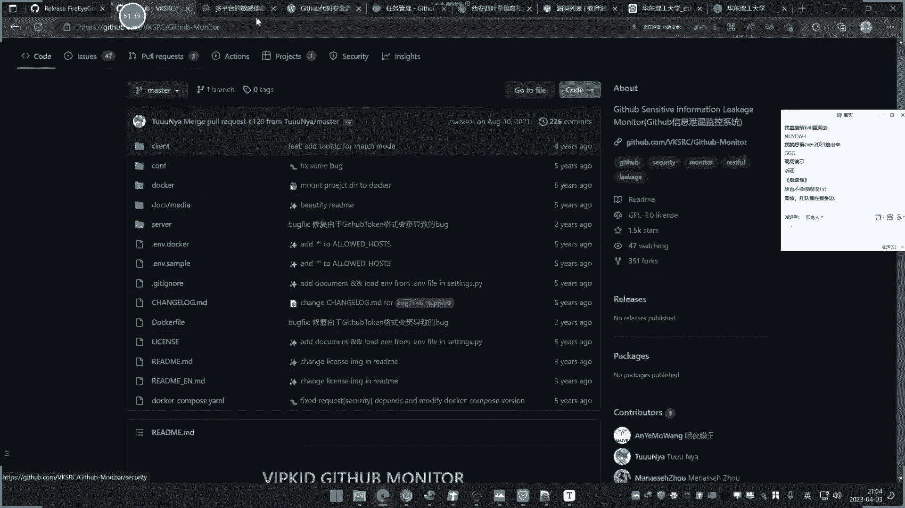

这个有信息泄露的情况啊，主要是做这个事情的，他一般在蓝队中和开发语言上面，那些事情比较多啊，对于我们这个红队的意义不是很明显啊，这个给他锁一下嘶好，这个呢就是我们说的那个JATUB。

上面的一些两个事情啊，简单来说呢，其实就是它的意义在于哪里呢，他的意义就是针对这个开发人员，或者说一些人员啊，和这个目标呢相近的一些信息，而这个人员呢在不知情的情况下面，可能上传了一些敏感信息。

比如说像源码中源码的这个泄露，包括源码中的一些这种数据库配置是吧，这是我们说的啊，一句话啊，就是目标中这个开发人员，或者那个什么托管公司，上传的项目存在源码泄露或者文，配置信息就是我们说的哪些信息啊。

这种密码啊都要等啊，然后还有像我们说的人员数据库等清晰，啊进一步呢了解这个什么目标的一个脆弱点，他主要是做这个事情用的啊，就通过这个技术呢，一般是检测这些可以记入人员的这个名字，或他人员的邮箱啊。

基于目标的域名去筛，从里面那去找到一些信息啊，其实就是搜信息，就是看你这个目标呢，有没有在这种平台上面遗留一些源码啊，或者是配置的一些账号密码等等，非常简单好理解啊，然后我们再说网盘啊。

这个网盘呢说实话啊这个是干嘛的啊，它主要就是企业招标人员信息业务，产品和业务员嘛，啥意思呢，我们都知道网盘，这个呢是我们说的经常会上传一些源代码，源码项目文件，而网盘呢就不固定了，网盘又可以是网站源码。

也可以是这个什么公司的一些人员的，一些这个什么excel表格啊，或企业的什么招标信息啊，或者说一些企业的介绍啊等等等等，对不对，那一旦上传网盘的话，如果你共享过啊，有这种不不安全的操作过。

那么就会从网盘中呢去寻找目标敏感文件，那网盘那个搜索呢网上有很多接口。

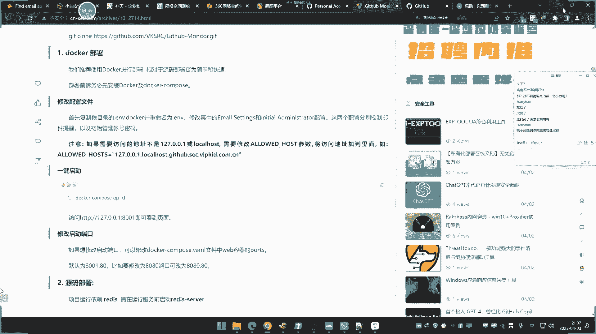

我这里再找了两个稍微好用一点的，一个是这个模拟器的一个APK文件啊。

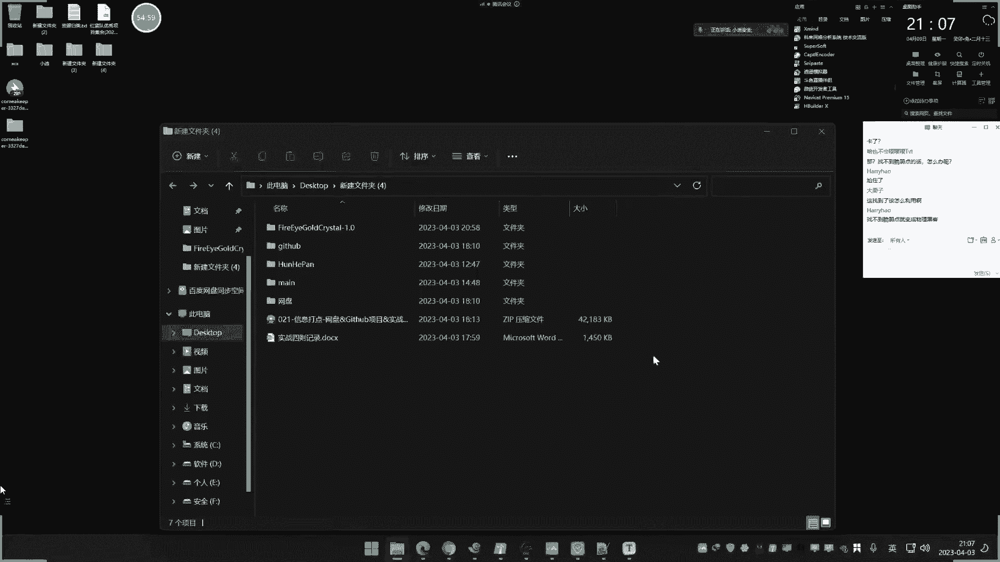

还有一个是一个E1的文件，这个搜索呢不仅用来这啊，不仅用来这个红队的一个信息打连，同样呢也可以运用到各种方向，你向哪些方向呢，我相信大家应该都知道啊，哪些方向30方向啊，对不对，设资源呀，对不对。

你看那王牌搜索七。

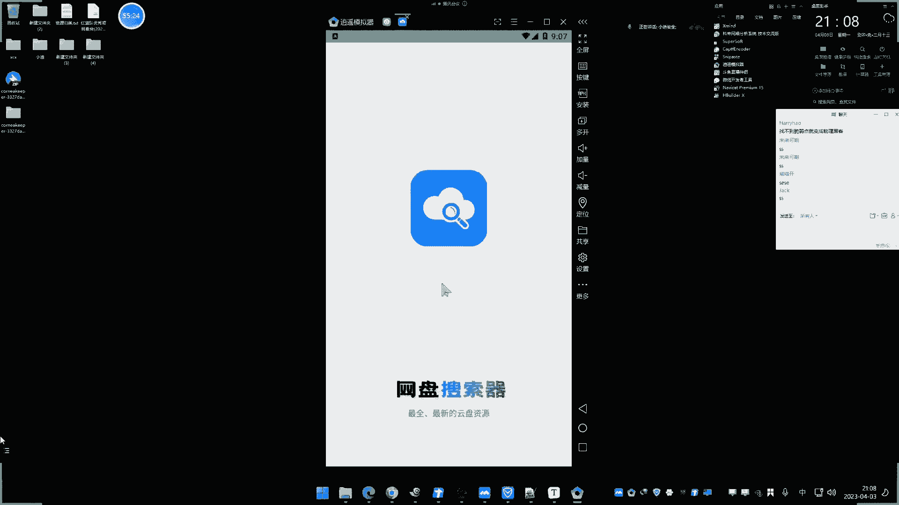

那我搜一个名字啊，比如说我在那随便找个公司名字，那你看看搜啊搜这个关键名字，名字就是搞模糊吧，来搜你看呢兄弟盘的搜索搜索了轮盘的一搜，那各种结果他都呆了，对吧，哪个好用就哪个来有可保的，这有保一批。

这也不知道是不是他的信息是吧，就是你搜一个公司的名字呢，他有可能他就会泄露一些这种，比如说一些人员他上传过自己的网盘了吧啊那，还有些这种企业的一些什么，可能说有些人呢把企业自己。

企业的一些什么内部的招标文件啊，或者说网络架构啊等等啊，啊在这里呢有过上传过网盘，对不对，但这种呢说实话收的话，那集团报表你也不知道，这里是不是那个公司的吧，可以打开看，来，一个什么NC产品的一个报表。

那你可能问这啥东西啊，如果说这这的确是这公司的这两个东西的话，那很有可能就是他们企业内部的某个业务的，一个是文啊，就是一个业务系统的一个使用手册或等等，对，对不对。

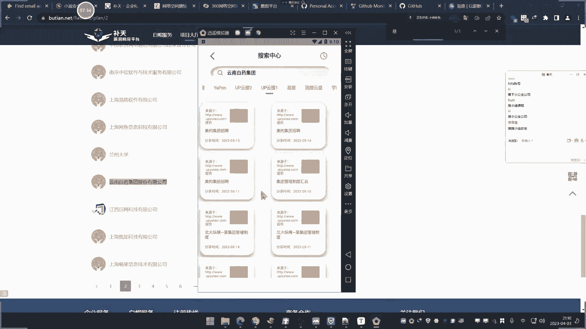

其实就是说从这个网盘里面的去搜，就是收这些信息啊。

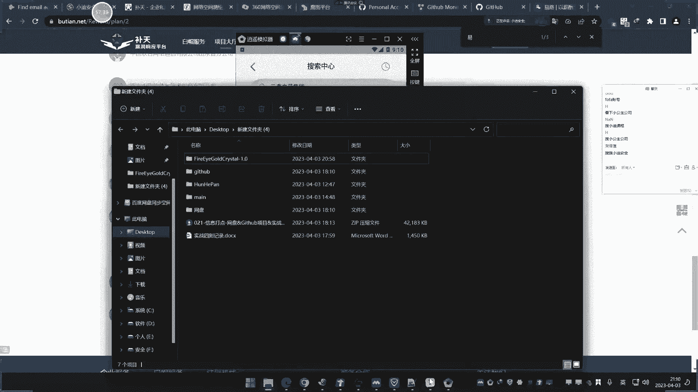

就说目标公司里面，可能有些人呢，上传过这个目标公司的一些什么啊，系统的源码呀或怎么滴，但这个呢说实话啊，我反正我看了一下，我也没收到具体消息唉，简单来说是没办法的时候啊，乱乱搞啊。

一般的网上搜也搜不到啥，因为即使别人上传了网盘，他如果说不分享，你也搜不到，对不对，就是他自己放到网盘里面，不懂你也不知道啊，对不对，所以他这个接口呢无非就是一些共享里面搜的，而且即使他共享了。

也可能搜不到，因为他这个接口呢不是官方接口，官方接口呢没有这个没有这个接口，给你搜这个东西，所以说啊这个东西呢，只能说作为一种常识性问题吧，一般实战中的用的不多，好这是说的这一点啊。

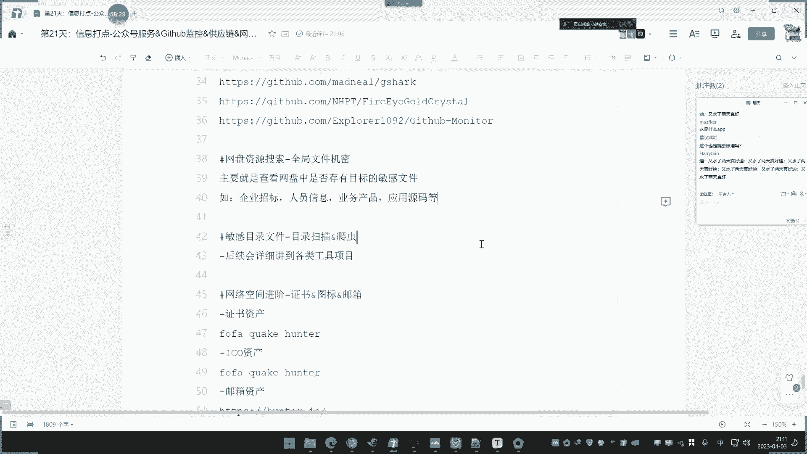

这个网盘的一些东西啊，然后这个是LINUX的一个字，然后呢我也给他打包了一个页页一的，这个是一样的，在这种几种盘不去搜了，也是一样的啦，比如说搜这个管子啊，那还在收呢，不过这收的都是乱七八糟的了。

那么收到都不好说了，一大堆啊，你自己下去想搞个门啊，想干嘛干嘛，我们这不说了。

好然后这个是网盘的啊，还有就是我们说这个网络空间的啊，这个网络空间这里呢，也可以作为一个信息收集的一个精接，什么叫精接呢啊我们前面没讲的啊。

基于增速的收集，他可以分析掉一些资产啊，比如说我们在那随便找一个这个地址呢。

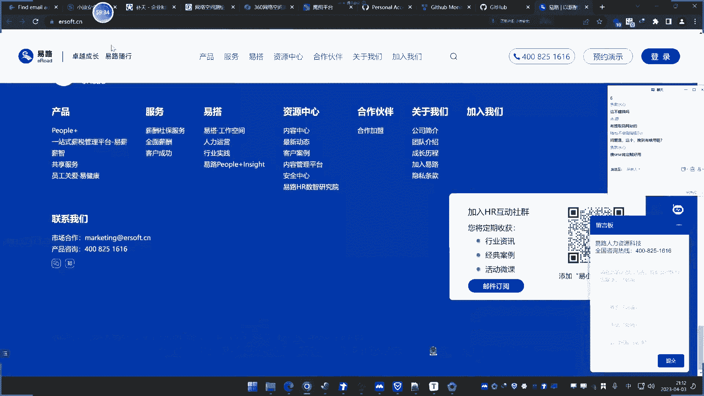

你看这个啊，我们随便找一个啊。

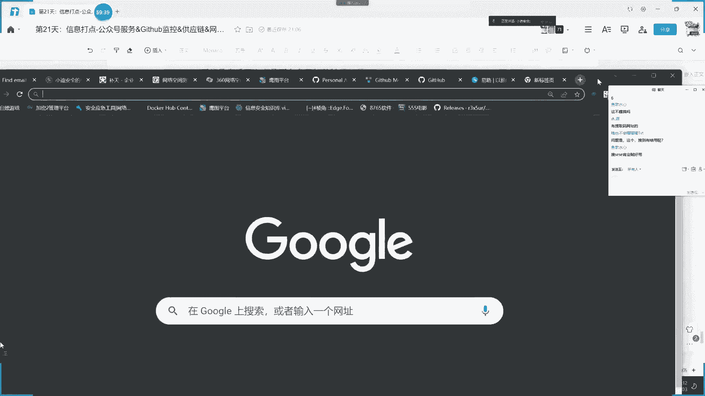

找个学校来试一下，那。

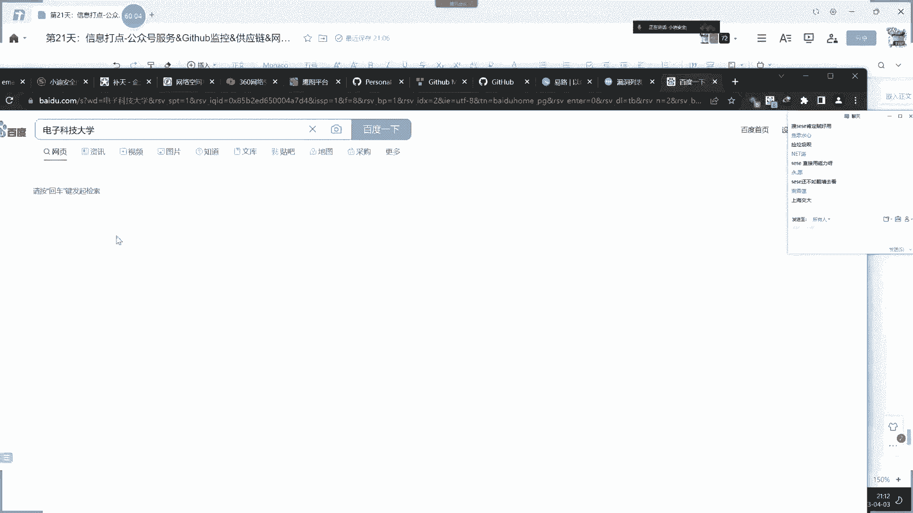

首先我也看一下啊，啊他有个增速，你APS了啊，那帧数这里有安全性，可连增速有效，这里有个什么增速的这个域名地址啊，这个帧数地址啊，我们把选中，然后呢他都支持这个帧数这个搜索语法，这语法呢就这样写嗯。

就直接这里呢用stack啊，真书语法。

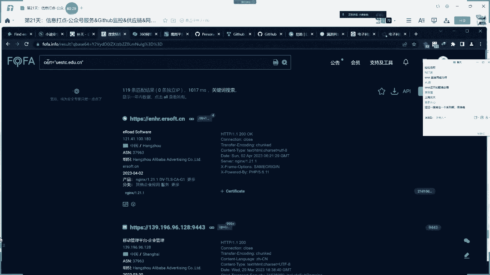

这是用foo收的一个情况啊，夸克呢也支持，那夸克呢也支持啊，你都可以看一下，呃语句的就CERT吧，那CRT啊，真书语法是什么鬼啊，这语法呢，真书的是证书的话，是这个语法吧，C e r t。

他就通过谁用到了同一个增速，把这些东西的筛出来呢，这都是一些其他的一些资产嘛，所以这是网络空间的精接原法啊，就基于这个增速的去寻找他的一些其他资产，目标信息好，然后还有一种就是我说的图标信息。

图标信息IICO信息啥意思啊，就是有些这种公式呢。

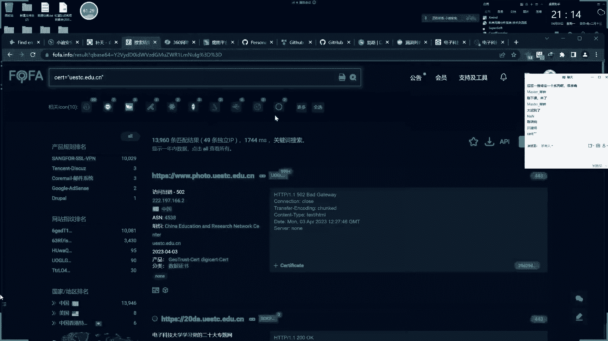

它都有单独的图标，你看啊我们打开这个电子科技大学这个图标呢，上面呢我们看这个浏览器是最上面的，这是一个小图标，这上面学校的一个什么类似的一个版权图标。

你看这个1U也是一样的，它是有个图标啊。

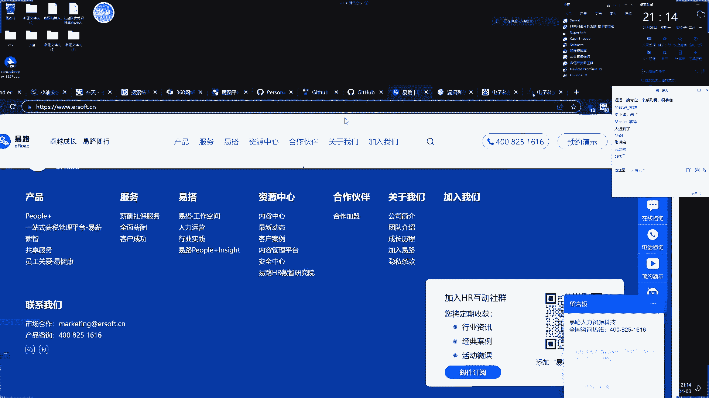

你就把这个图标怎么样给他拿下来，如果怎么知道这个图标低值呢，一般就是直接看源码里面把那个IICO，一般是ISO文件啊，把它拿出来就完了啊，这个很简单，你看这个一路的。

我们给它电源的码，那这个ISO代码呢就这里，那这个就叫图标地址嘛，把下下来就完了呗，是不是，图标另存为，放到桌面，呃你包括这里也是一样的道理啊，这个圆的我怎么看不了啊，好应该是这里把它关了就可以看了。

看，源代码中，在这个SEO搜一下，那这个就是S码的这个路径，那这图标是吧，把下下来。

然后怎么办呢，你看啊，通过这个图标呢，去在这个FOFO里面去搜来看一下。

来这边有个呢图标搜索，把选中本地上传。

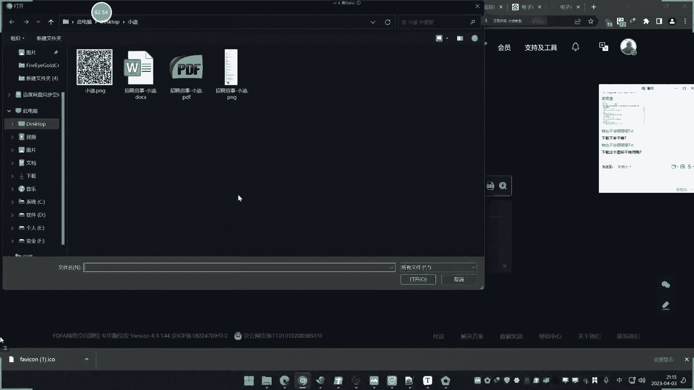

啊这第一个图标呢选中上去啊，它自动会有个哈几次，你看那么这些新，现在就是这个都用过这个什么这个，图标的信息来啊，这个是在学校里面的资产嘛，就和他用了同一个同一个图标的。

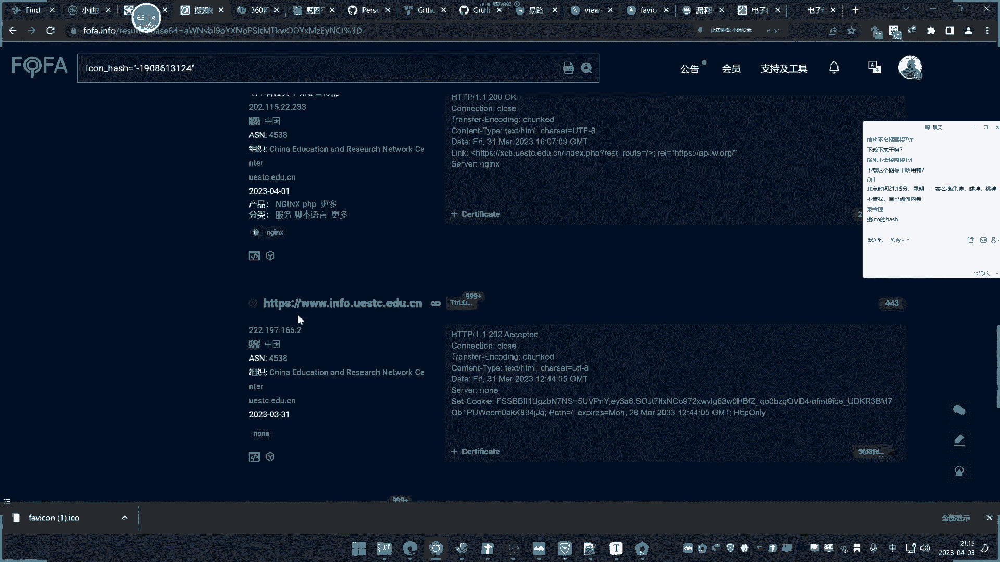

同样道理呢，这里也是一样，夸可呀，这些地方都支持啊来用图标上传，那画这个是吧。

都可以啊。

这个这个音图也是一样道理啊，图标搜索直接上传，点击确定，因为这个图标呢就是他一些身份嘛，通过图标呢去找资产，全部和他相关的这自然信息吧。

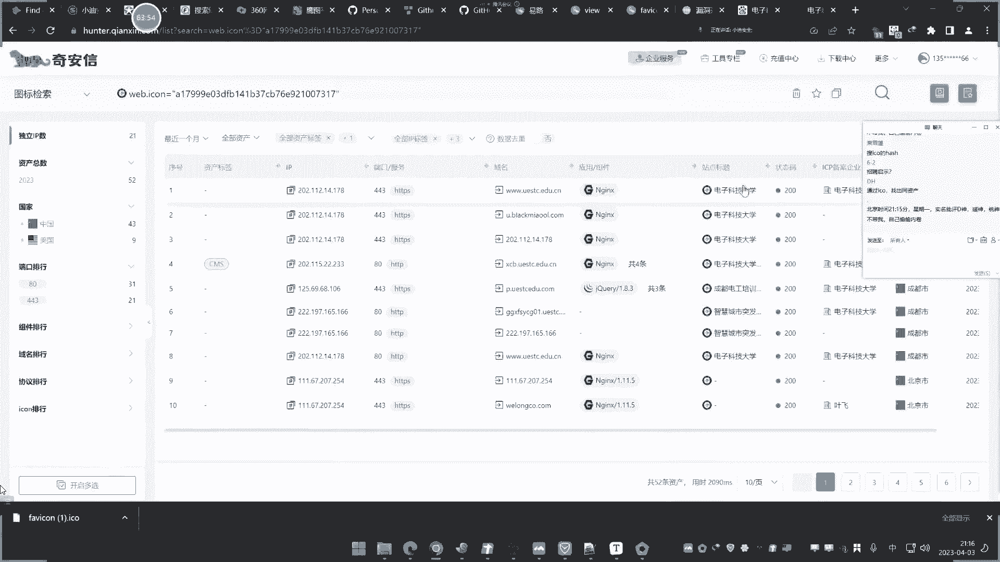

还有一种就是通过邮箱。

什么邮箱呢啊，我给大家看一下啊。

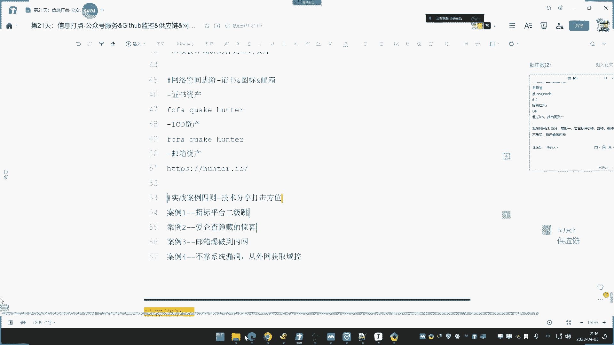

比如说一个邮箱也可以找啊。

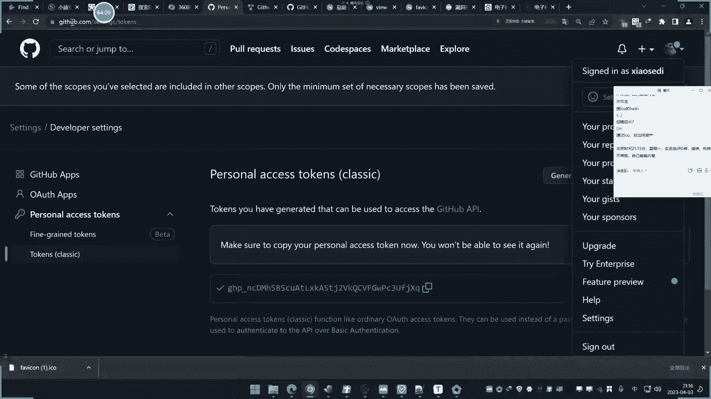

那我们搜索一个这个邮箱看一下，随便写一下啊，比如ARME，不说这个，我只说名字行不行，需要我登录账户啊，妈的我咋还没登录啊，来这里是有信息达的，它没显示出来的，需要登账户呢，还把他隐藏了，有877个。

看到没，那下面有网站，他这个网站是干嘛的呢，这网站是干嘛的呢，就是通过域名或通过邮箱呢发现这个信息，邮箱上面又能做什么事情，邮箱是可以尝试爆破去登录的呀，洛口令来一些情况，对不对。

他可以呢从这个域名上面呢去筛选出有效信息，然后呢再通过有效信息呢啊对应些网站呢，记者泄露的一些信息的爬到的，那也是一样道理的，在这些地方呢出现过这个邮箱，他只是把隐藏了隐藏了，就是叫叫登账户啊。

你注册个账户就可以看到了，这有什么作用啊，我们前期要拆油箱的话，可以通过这里呢去搜集到他的邮箱地址，有问地址，知道之后呢，可以尝试着去登录他这个邮箱是吧，启用一些这种弱口令，或者是一些常见的这种啊人员。

加上一些入口令的组合的密码字典去碰。

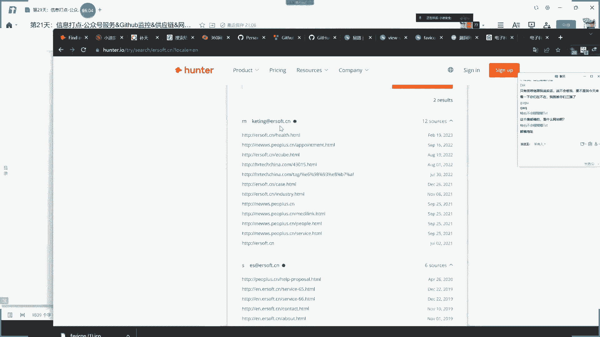

我们那个案例中不就是有这些案例吗，就有这个例子啊是吧。

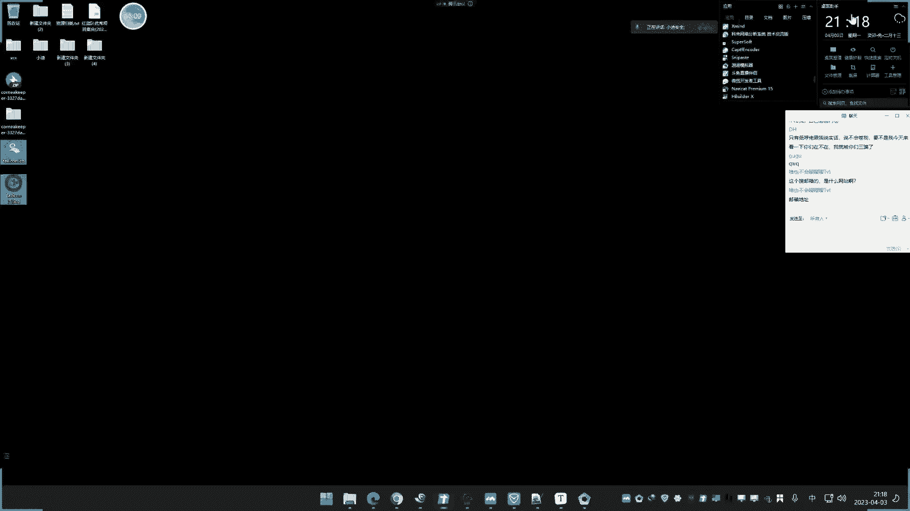

从里面塞到邮箱的这个信息之后呢，做的这些事情嘛是吧。

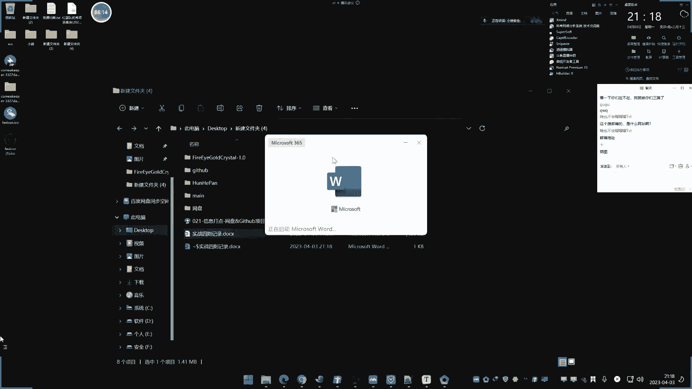

这里那这个案例里面不是有写的吗，哈来通过邮箱啊，这里是利用网上泄露密码啊，下面这个呢就是用的是什么，下面这个呢就是用的是这个，从上面的SIH查里面查到关键人呐，然后勾到这个邮箱呢。

然后后面那去用诺口令那去碰出来的。

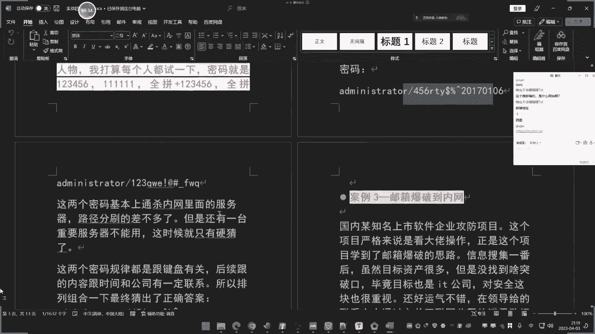

因为真实的这个呼网里面，或者说真实的这个场景里面，很多网站他都注意到了网站本身的源码，或者说代码的一些安全漏洞，所以你一旦很难在上面去找到漏洞，他直接通过漏洞把他打进去，很多没有办法的情况。

下面都是通过这些人上面那些漏洞，就比如说仍然上面那些漏洞，还有入口连红，怎样登录到一些重要的业务系统里面，然后再一步步的去搞的，所以说像现在很多这种流行。

这种什么晶圆工具啊，或者像我们说的这种钓鱼啊或施工类的。

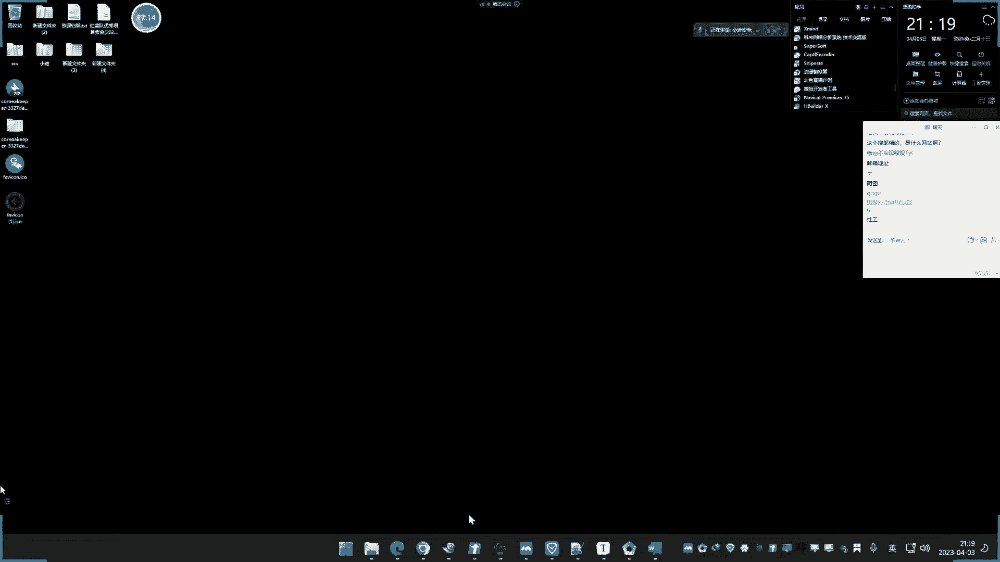

就是因为很多网站层面的漏洞。

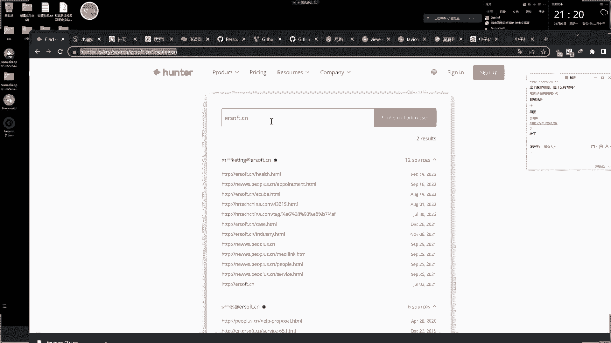

直接漏洞的很少了，因为都知道他很容易修复，修复你就没办法了啊，所以就为什么要收集这些其他信息啊，就是因为呢没有办法了啊，他就从各种渠道呢想方设法的去搞，因为像这些漏洞。

那就不是说漏洞能不是说这个漏洞能修复的，那就是人家上面这种安全的问题了啊，像不好的良好不不好的习惯呀是吧，开发人员的这个不注意呀，啊还有一些人员上面这个，呃安全意识呀等等各方面呢的一些安全问题啊。

就不单纯是说网站安不安全了，你网站再安全，你这个人不安全有啥用呢，对不对，你就像我说的，我的博客没有任何漏洞对吧，但是我这人傻，被别人掏了一下是吧，我截了别人一个木马啊，不好意思，那完了呀，旺仔遭殃啊。

所以说呀这个东西呢就是围绕这些事情在做。

他收集那些人员信息啊，企业信息啊，还有些什么这个各种邮箱信息啊，包括这个什么借地上面去监控啊，都是为了更能了解他的一些各种信息呢，从各种点去想方设法的去搞啊，就不光是说找漏洞。

漏洞是直接面临目标去找漏洞。

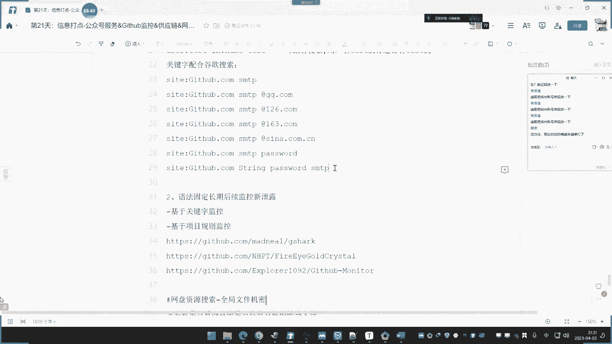

他没有漏洞，你怎么办呢，那就只能通过这些方式啊，我刚才给大家分享的这四个案例呀。

全部是在互网中真实的，只是说有些东西他写的这个写的比较隐晦，或者写的不够详细，但是过程是这样的，这全部是互网中的四个真实案例，其中有一两个呢是我的案例，就是我当时啊，在前几年我参加打的时候搞的事情。

其中还有两个呢，是我从网上和别人手上要过来的，就是有些情况下面没办法啊，这个漏洞没有，你说咋办是吧，只能从这种信息渠道的入口令啊，那种各种没办法的时候撕啊。

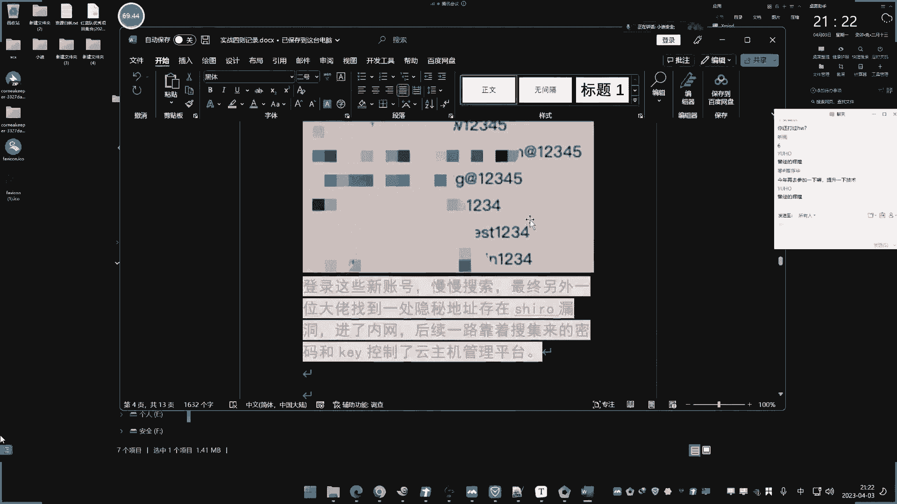

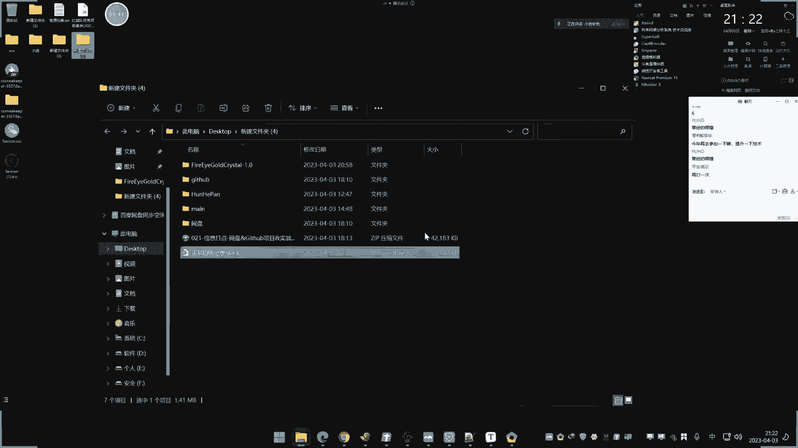

好这个是我们说的那个支点啊。

然后还有个不说这个还是我目录扫描啊，这个目录扫描呢说白了啊，这个在那个什么，前期我们讲那几个项目里面都有这个工具，这是什么东西呢，就这个东西啊，那就是我们给大家说的这些工具包里面的，像这种目录扫描是。

什么迪亚阿斯can啊啊，这些类似工具就去扫他的一个呃一些字典是吧，看看下面有没有一些目录可以敏感文件。

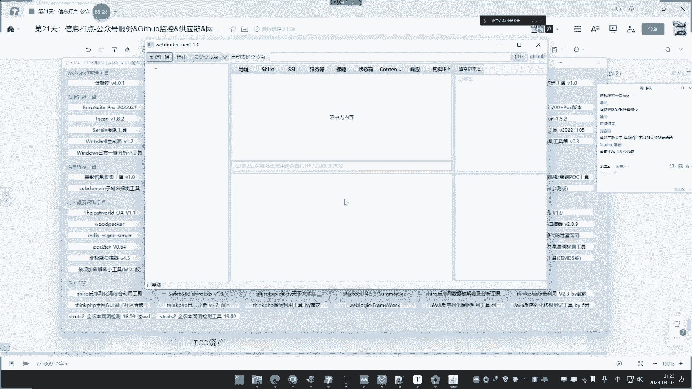

这个呢后面也会讲啊，所以我今天没有说可以去讲这些东西啊。

因为觉得不是很重要，因为你扫的话能扫出来的大，大家都能扫，就像这种的直接发网上放上去是吧，哎一扫看看下面有没有这种对应的路径啊，或者一些地方哈，通过字典少啊，这个工具很多啊，这种类似工具很多。

昨天呢也给他说了一大批，这个项目里面的很多啊。

一扫哎呀，就看下面那些是有没有这种地址呢啊，有这地址吧，打开一看哎什么地址，对不对啊，就扫这种东西呢，一打哎，这里有个索明地址啊，这三源码啊，就扫这种信息啊。

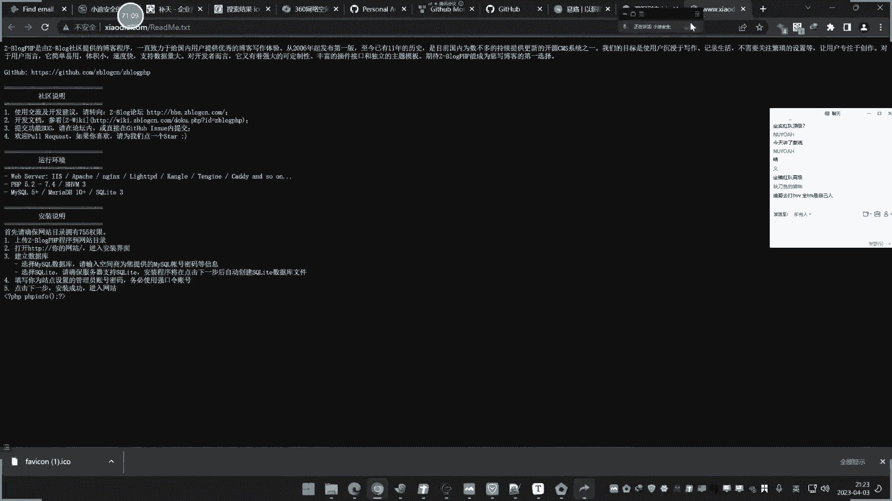

但这个信息呢说白了啊，有些网站它不实用，他这个实用呢是一些这种路由，没有路由的，就是网站源码目录是怎么样的，访问就怎么样访问它，有现在就是有路由关系，你烧的话就不一样，而且有些还没有后缀。

有些网站还没有后缀了，你像这种网站那个打开一看，但他是个TM是我就静态的，他撸他往后面都没有目录。

单纯就是一些可能就这样写来写这个路径，一访问就是个网站。

它没有什么点pp啊，怎么这样写，那这种就不适应了呀，所以他这个扫描这东西呢它是有点局限性的。

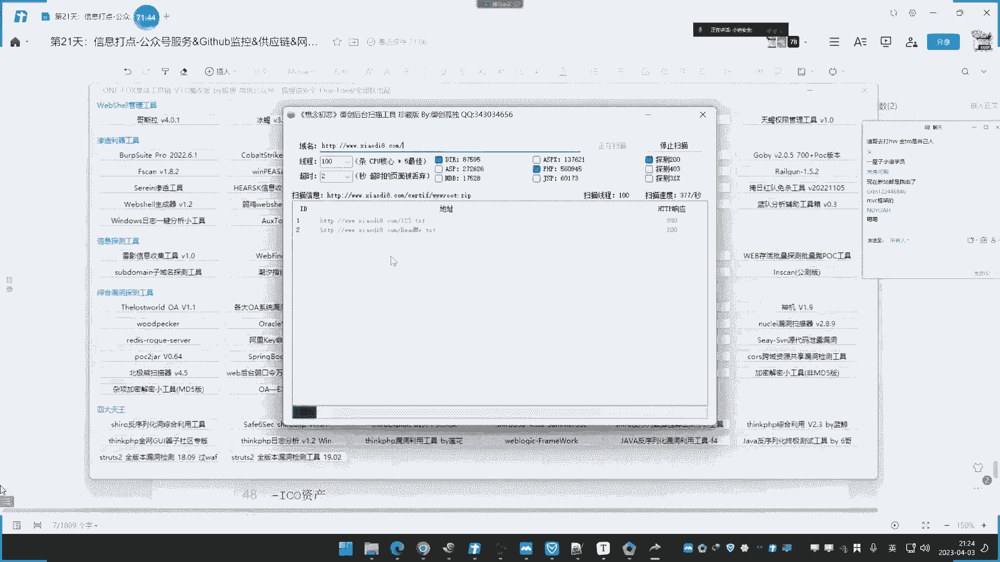

而且这也是很老的一种新收集手段了啊，讲他的说实话啊都有点落伍了，这是都知道的一种方式，他很多目标呢都不实用了，不实用的原因就是我刚才说的，他是扫这个文件存不存在，但是有些网站东西呢。

他可能这样一访问就没了是吧，或者有些他这样去写啊，有路径呢，他和这个目录源码对不上，就是我们说的有些那种FFC的一些网站架构啊，他是有独特的路由，就和你的源码结构它不一样。

访问的URL地址和你看到的源码目录结构不一样，比如说目录叫一，你应该后面加上个E就能访问，但是那种源码呢可能你要写很窄，传一长串才能访问一目录，但是扫描器他不知道啊，他会有那种意外情况。

那种情况就就就用这种方式呢就不适用了，但这个呢我们也给大家提一下啊，你可能说讲不讲呢。

讲啊后面也会讲啊，后面会讲，像这爬虫也是一个道理一个道理啊，用一些这种漏洞扫描工具，目录扫描和爬虫都进行了，它也会爬，然也会扫，前期一些工具呢它里面都有自自带功能，所以呢啊没必要说可以去讲了啊。

你像个AAR灯塔里面和那个上节课，我们上到过的那几个项目，他就有这个自带功能，你把你勾选，他就帮你扫了，所以说只是单独给他提一下啊，嗯好这就是我们今天这个大个支点啊，这个信息收集的所有补充的。

我要给补充完毕了啊，所有补充都补充完毕了，就是我们这节课呢就是最灰解甲，因为他有一些知识点，那是你比较零散的啊，字典也不多，所以我们简单的把它写一下，把它全部归类到一节课里面，把它讲完啊。

今天终点呢主要就是哪个终点呢，就是这个GHUB的一个这个支点，是个比较重点啊，然后再是网络空间这个境界，这几个呢说白了啊呃就是补充一下呃，实战中能不能用到，再看目标，那有线有时候那有有信息。

有些那就没信息，这个JTUB呢，这个上面一个监控呢还是比较好使的，他能给到你一些这种目标，上面可能容易找到一些脆弱点，比如说泄露一些数据库账号密码呀，泄露一些个人的邮箱账号密码呀。

或泄露一些网站的源码呀，这些都能帮助你有一些实际作用，都能帮助你有些实际作用啊，所以他比较关键，包括像这种什么监控这些后续的一些东西啊，你也可以自己搭建一个这种系统，然后呢去监控一些这种新出来的漏洞啊。

包括目标的一些项目的随时改动，这几个项目呢都可以装一下啊，最好的是把这个JS装上，然后把这个也装上啊，这两个好用一点，这个我没有装上啊，不过我后面再讲那个蓝队项目的时候呢，会再去演示这个项目的。

虽然说今年没演示啊，但蓝队项目中会演示，因为这个项目呢偏向于蓝队，它是针对一些项目和代码审计的时候了，针对单个项目呢做一个时间实时的监控。

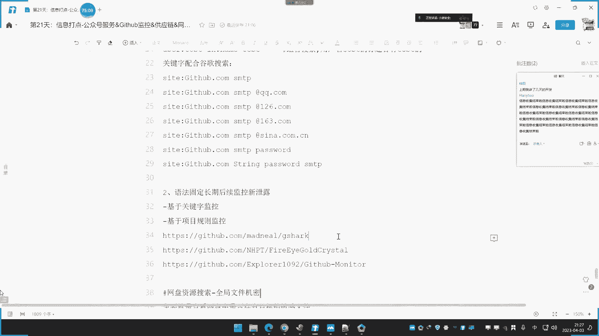

呃这个意思是啥呢，我给大家简单说一下啊，比如说像这个代码审计中的一个应用方位。

我们在这里可以搜一下啊。

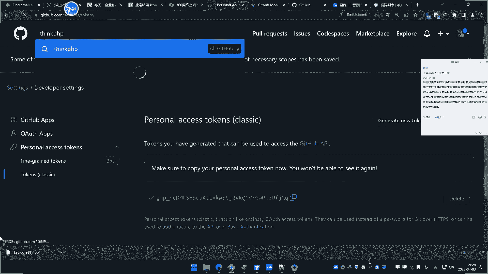

带你先开一下妈的，每一次卡卡的。

你比如说我们针对一个项目一个源码，我们要长期的对这个源码来做安全测试，也像这个新的pp他经常会更新，你看这里有更新时间，哎这个他还会有更新时间，对不对，他会有更新时间啊，那么他只要更新，你看这个啊。

那五天前更新过，更新到这里就会记录它在哪里更改了代码是吧，在这个项目中哪里修复了什么东西，那么一旦更新的话。

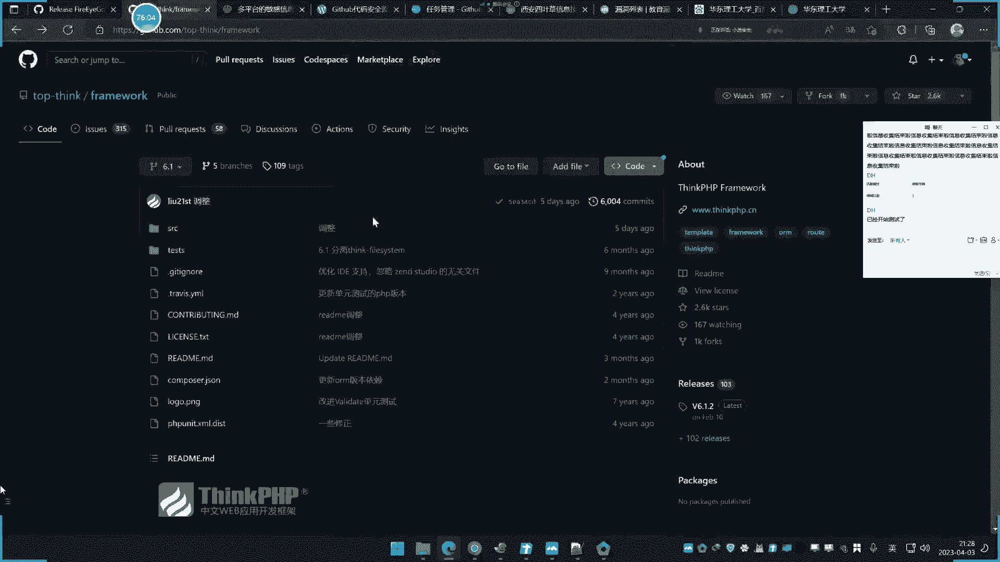

你要实时掌握的话，你就可以用那个刚才我说的那个基石干啊。

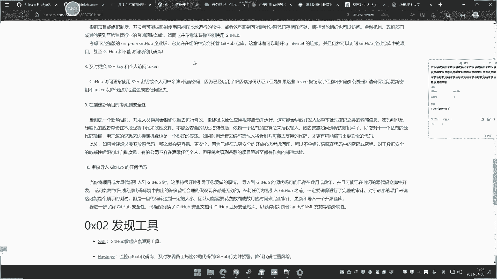

即使杆呢把这个项目直接导进去，然后呢通过微信邮箱或者钉钉机器人，配置一下K给你实时通讯，告诉你它更改哪些东西啊。

包括这个项目也是一样道理。

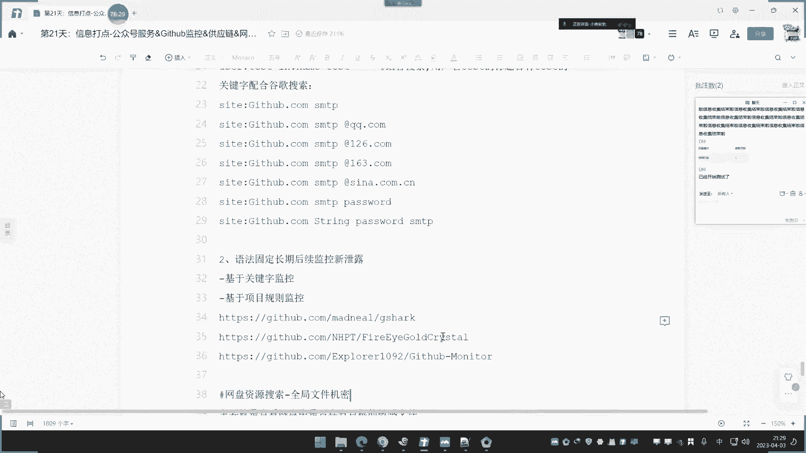

那这个项目呢我刚才给大家用了一下，可能是网络问题啊，他一直没有动。

大家有没有听到这个窗外的声音呀，我这边又下大雨了，对不对，妈的你妈啪啪响。

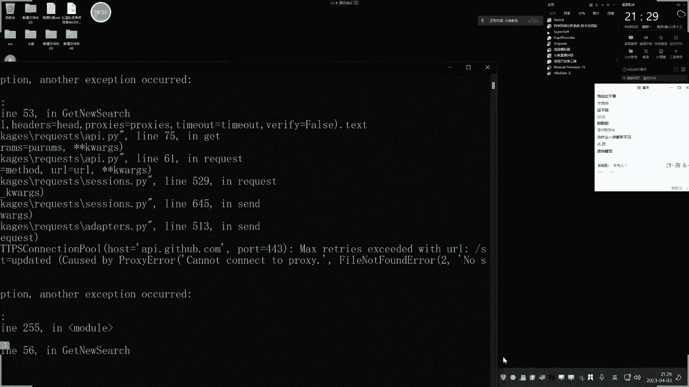

这个加坡你可以看一下啊，我这里网络问题，但没有通讯出来，也是一样的神兵利器，翻分享一个什么鬼，借梯突勒死，那把专家写进去啊，近期的天天给你监控，天天给你爬爬信息。

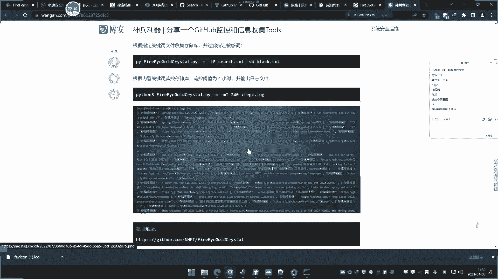

哎呀还有像什么CNCD的漏洞信息监控。

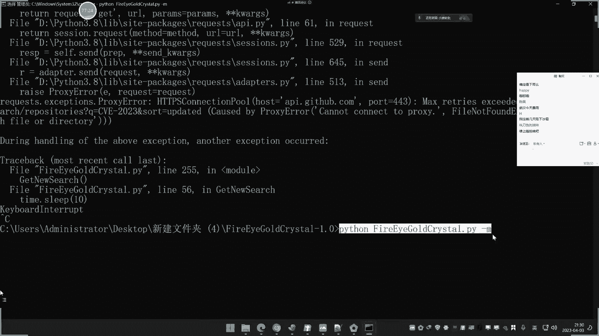

各种各样的啊一大堆，这个后面会讲啊，因为这个呢不，它主要是丰富你后期的一个渗透的一些资源，和一些漏洞情况，它不属于我们目标的一个打点，所以我没有把它讲到今天这个课程来，后面像什么漏洞发现啊。

他如何去发现漏洞，这些字典呢可能会用到这个项目，像什么监控CNVD啊，监控什么监控CN飞碟啊，监控GTHUB啊，还见过一些这个国内的一些几个漏洞公开平台，那么就实时掌握一些常见系统的一些漏洞是吧。

实时给你提示，就比如说你有哪些目标是这个系统，那么一旦出现新漏洞，你就第一时间知道，还有新的这个POCE叉P利用出来，对不对，就实时推送给你，它主要是用这方面比较多一些啊，我们今天讲的这个资源监控呢。

就是主要是针对一些特定目标，比如说这个目标是你长期要进行测试的目标。

然后呢，你要实时的对他的一些变动和新出来的东西，是吧，要知道这样子呢，你能只掌控有没有新的这个泄露啊，新的新的这个支点啊，好这就是我们今天讲的所有知识点了啊，也给他提外补了一下，这个知识点比较凌乱。

没办法啊，那不是一个完整体系，是格式格的，隔一格的这个不一样的这个讲法啊。

我们就把它整理到这个思维导图去吧，好那从下节课开始呢，我们就要讲讲新的章节了啊。

新的章节是什么呢，就是我们那个课程的下一部分就是讲到开发了，额这个获取和这个资产啊，资产那就是很简单的道理啊，资产就是主要看这个微信公众号业务功能啊，是否有这个什么，第三方的一些网站，和这个服务服务。

在我们说微信公众号啊，还有几个点啊，我们把总到这个其他项目里面去，其他的一些东西，今天讲的啊，网盘的g hub的，还有一些这个敏感目录文件的，还有我们说的这个啥啊。

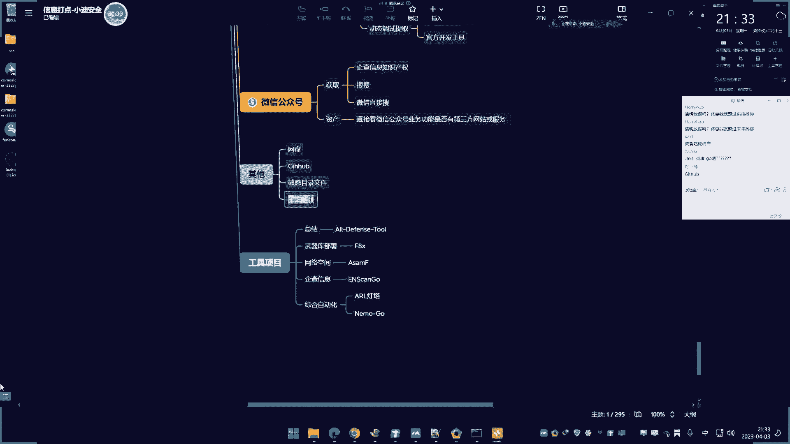

还有个吧，这个网络空间进阶啊，三点，证书资产，图标资产邮箱资产。

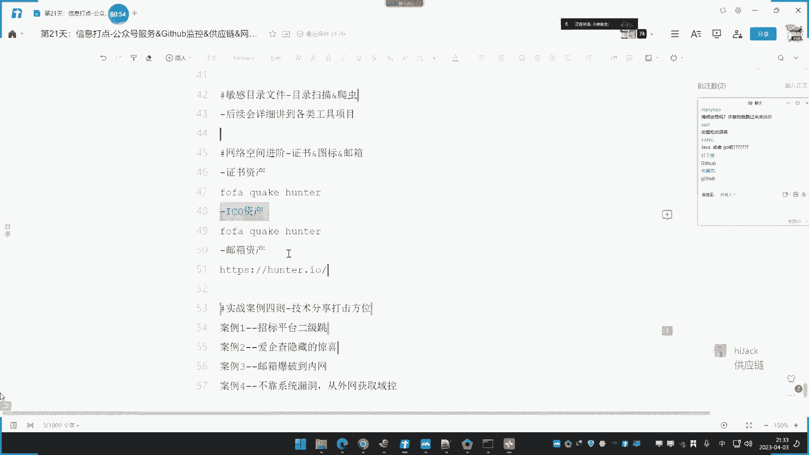

啊，通过这里面呢可以收集到目标的一些其他信息，然后这个呢啊，这个就是利用这个目录字典扫描啊，就这个爬虫了，啊有些工具呢我们后面会讲，这个呢就说两点啊，一点的就是，它的一个基于筛选的堆箱。

还是我们后面后续的一个监控，长期监控对象呢一般针对三种啊，云源信息，云元的这种社交账号或者说邮箱，然后呢就是域名或直接写这种什么名称，就是我们说的这个目标名称啊，去筛选目标筛选啊，对一下筛选。

后期监控呢介绍三个项目。

这里呢可以去参考啊，不止这三个项目啊，网上还有其他项目。

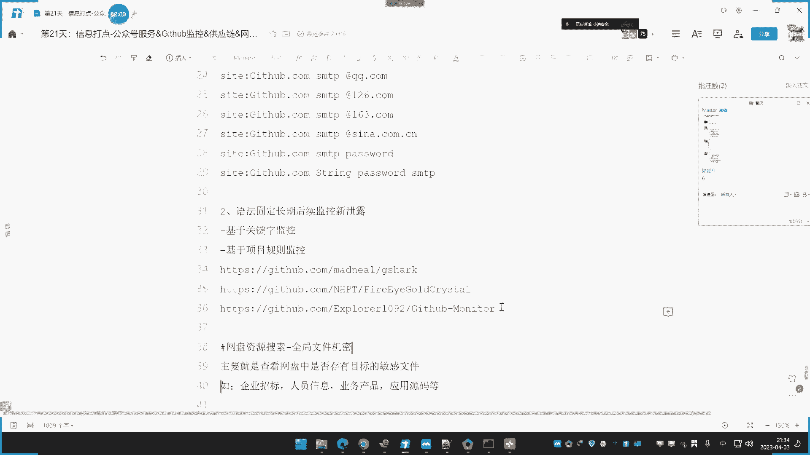

网盘呢唉这说实话这个网盘呢。

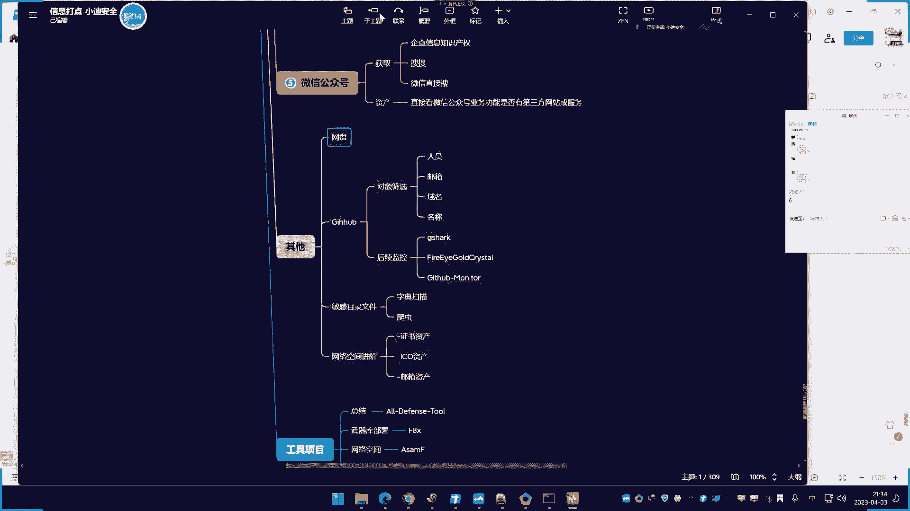

就是主要是搞这些信息吧。

也没有什么其他信息了啊，搜这些直接用这个平台去搜啊，直接搜啊，搜这些目标名字啊，啊获取这些，东西啊，有没有随身信息，但也没啥东西，都是些其他的一些方面啊，工具也不写上去了，就给他打包了。

那工具的也是零零散散，网上乱找的，他也没有个正经的一些接口，所以这就是这个情况啊，主要是这个JTUB啊，和这个网络空间经济啊，这两个呢有作用，这两个来说的话也是有有作用，不是很明显，好。

这个是我们的这个，整个信息收集的一个情况了啊，21天已经讲完，基本上就是十天一个系列是吧，技术入门和这个新设计都是70天的课程，多出来一节课呢，其实是那个讲那个ChatGPT的，那个ChatGPT呢。

在我们这个开发里面呢也会给大家讲到啊，开发里面呢也会给讲到，还会讲用chat GB t呢，对这个开发的非常有帮助，我们在讲开发的时候呢，是吧，把chat GB灯也代入进去，这样子呢大家开发的时候啊。

那就会更简单，因为有一些不懂的，像什么代码哪里错了呀，或者怎么样，你自己查查半天，问一下这个chat GB啊，就用的很快，或者说你有些这个不一样的想法，让他帮你写一下，参考一下，也能帮助到你。

我们会在讲开发的时候呢，与这个chat GB呢同时联动啊。

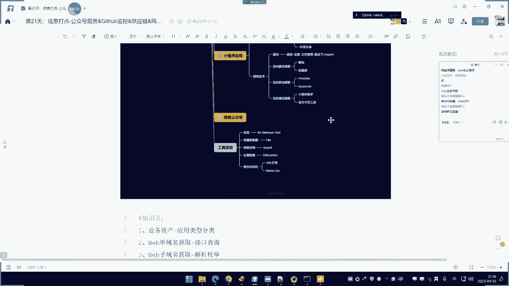

哎什么情况，这他妈的这个图像怎么没换掉啊。

我说没换掉了。

倒到桌面去了。

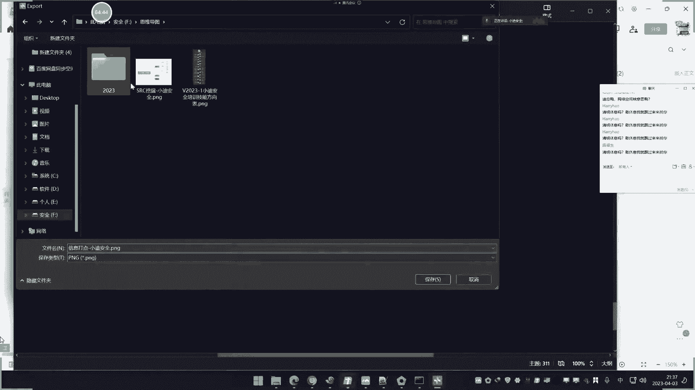

下次上课呢就要到4月6号了啊，我们每一章节上一个系列，上完之后就会多休息一天，要准备这个整个课件的一个整体架构，多休一天啊，就正常来讲是4月5号上，那我们4月6号上，因为你要整理一下这个章节的质量。

要讲哪些东西，要把节写上去，就像我们这里看到的这个东西的。

有个章节点。

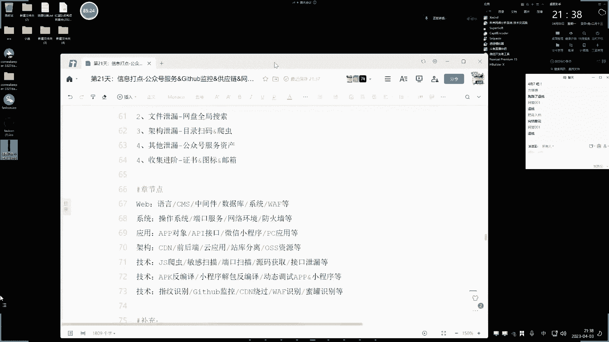

16号啊，这个开发呢可能时间会稍微长一点啊，可能十节课是讲不完的，因为它里面呢是有几个语言啊，一个是pp的，一个是这个JS的，还有一个是那个java的三个语言，另外呢还会有一些其他的像什么数据库。

MYSQL的一些一些简单的一些东西呢也要讲解嗯。

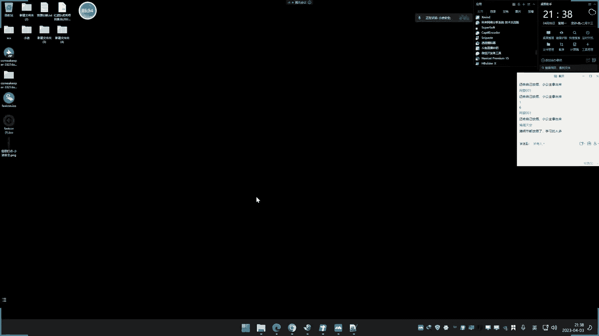

数据库的一些东西也讲讲解啊，所以他课时呢会稍微长一点啊，可能时间课是讲不完的，估计要讲个20节嗯，我们讲的话。

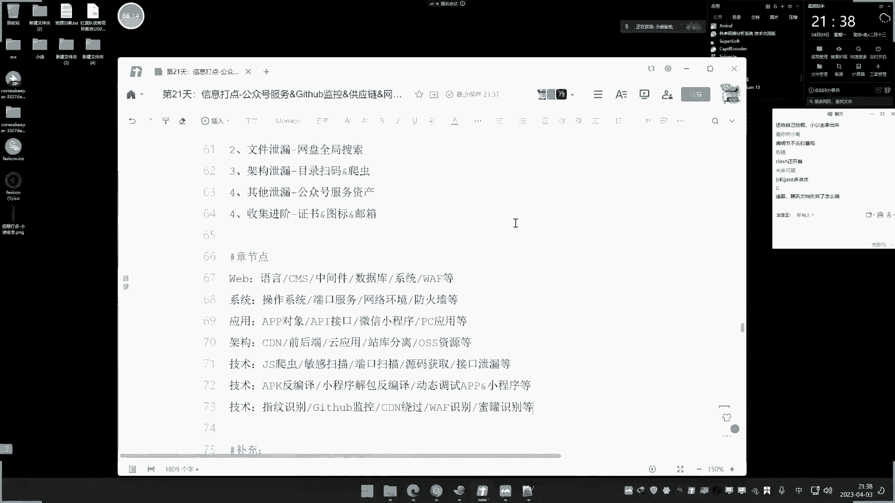

说实话肯定是不如网上这种专业去讲。

