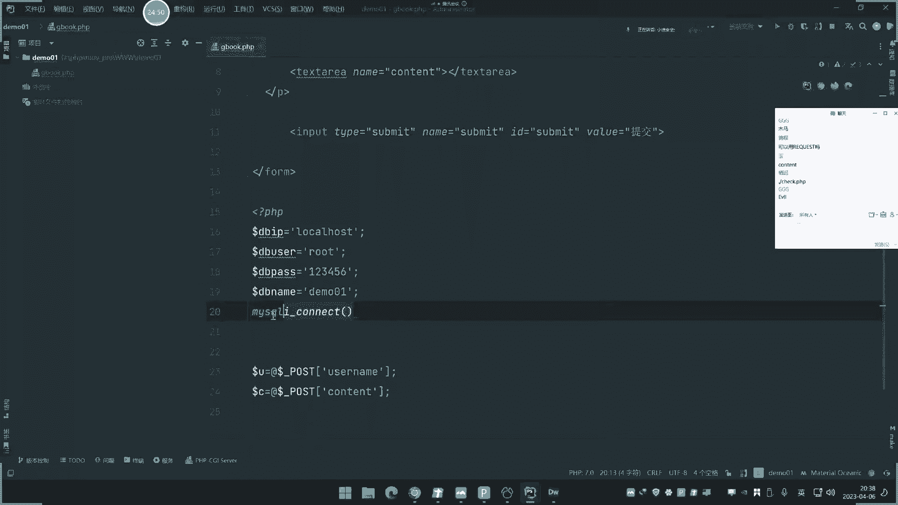
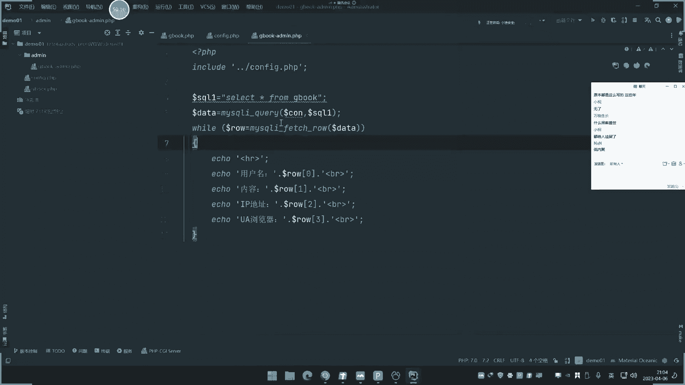
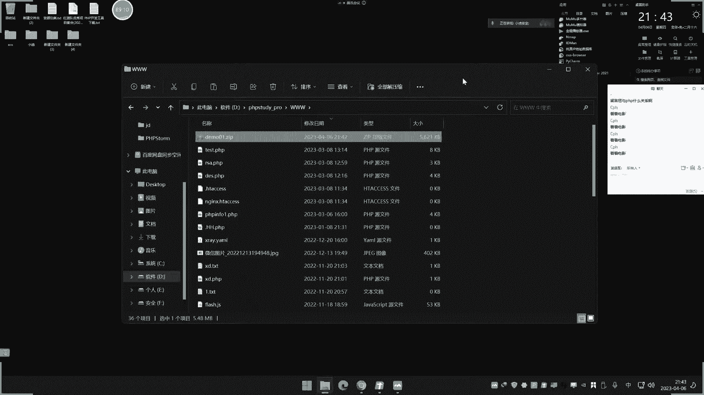

# 【小迪安全】V2024版 全栈网络安全 ｜ 攻防渗透工程师 （持续更新） - P22：第22天：【安全开发】-PHP应用&留言板功能&超全局变量&数据库操作&第三方插件引用 - 逆风微笑的代码狗 - BV1Mx4y1q7Ny

又来到了新的篇章。

讲的是这个dnice web开发，我把web开发写上去的名字不够吸引，非要搞个安全开发，对不对，安全开发呢本来是四个语言啊，P h p js，java和Python，但是那个Python呢是写的脚本。

不是写的web，所以他开始那个安全开发呢，是有一些安全基础和安全技能之后呢，在上面去歇脚的，我们那也是教教的一些前卫的，他这个是在讲后面的一些课程的时候，都在讲这个Python的啊。

那么前期这个主要是讲的web开发，就是web程序上面的应用java ee和这个JS啊，pp的这个开发，然后呢我们是由易到难，就是先讲PPP的最简单的，再讲中微难度的JS，最后讲高危难度的java1啊。

PP的课程呢，大概这个价格我们已经起就出来了，这是他大概要讲的东西，我们会实现这个网站上面的常用功能，通过这个功能呢把它用代码呢给它写出来，写出来之后呢，后面呢我们再去上上相关漏洞的时候。

可以对着这个程序来思考啊，就是你自己开发过的程序，你就知道他这个流程，而且开发里面呢我们这里也写了两个。

一种呢是基于原生类的开发，还有一种叫框架类开发，所以呢还是有一些这个知识点的上升的啊，原生呢，那就是完全用本身这个语言里面的代码呢，去开发的框架呢就是引用框架，学会使用框架呢里面自带的东西去开。

所以它是有两个点啊，不过框架开发的我讲的不是很深入，我了不起，那就是讲一两次直播呢，对不对。

给大家演示一下它的一些某一个单一功能，你要是说像前面这些功能我都是用什么TP，那会说什么框架把它开发出来啊，现在的我还没有这个能力啊，不是这个专业搞这个这个程序员的啊，如果是这个专业搞的话。

我三个那上个五六十次直播，上个百来次是不是没问题，好那这个呢是我们前期交易的背景啊，那个pp的大概已经给他说了，然后这个JS呢，java这一块呢现在还在筹备的内容啊，就是还在构造是上什么内容给大家。

所以呢后面呢在上到一部分的pp手段，这两个课表就会出来，然后今天呢主要是实现一个用PPP的原生态的，这个代码，最简单的就是从它的最基本的代码呢，去实现一个功能，加的是这个留言板的这个功能。

那么也就是说我们后面的课程呢，就是围绕着其他功能去讲啊，把每个功能写清楚，那刻的就绝了，这个是PP的，那留言板这个功能呢我们可以参照这个图片呢，先给他看一下啊，这个浏览器浏览器去访问这个服务器。

服务器这边呢去，就是你把浏览器那去输入自己想要的这个东西，留言板，那就是类似于评论区也是一样道理啊，就是评论区留言板都差不多啊，这个个人呢输入自己的昵称，和你要提交的内容啊，去写到里面去点提交。

然后这个内容呢，通过这个服务器就会把这个内容接收到。

接收到之后呢，去写到这个数据库里面啊，对不对啊，就是这里的先啊浏览器去输入昵称啊，提交这边呢就会接收数据，并且将数据写到数据库，数据库呢将写到的数据的结果是否写入，再通知这个服务器。

服务器端接收到有没有写入成功，再给到这个浏览器，那么先成功就是显示数据没有成功，就给他提示没有成功，所以他大概就是四步嘛，对不对，第一步呢把数据给服务器，服务器将数据呢写到数据库，数据库呢。

将写入成功的结果和失败的结果给到服务器，服务器呢在这样的结果呢返回给浏览器，那么发浏览器的同时呢，也会判定这个结果是写了还是没写，从而呢在页面中呢做出相应的这个显示，或者提示，就是这个大概流程。

这个大流程我不说，大家应该也能想到，只是说呢我把这个流程写清楚之后，那么大家就知道我们在做开发的时候是吧，就会有哪些东西是需要我做的，首先他的第一步要做的事情就是什么呢。

准备工作第一步先将数据库的表设计好，啥意思呢，就是说你不管是要做什么，这个数据库里面是要有这个数据的，因为它的专门来存放这个数据的，对不对，所以我们第一步就是要把这个数据库的这个。

什么数据呢给大家搞清楚，这是第一步要做的，先把数据呢给它导入进去，就数据里面就包括它的结构和数据的格式对吧，这个数据呢要把它搞进去，这个数据不是说我导数据进去，是要把这个数据的存储啊，就是说存储啊。

这个存储呢存储这个东西的，要把它搞进去，存储的一个样式导进去好，然后呢再来写这边的浏览器的这个什么浏览器，输入这个昵称和内容的这个模块，对不对，好写好之后呢，再去罚怎么去罚，然后这边呢罚了之后。

这边是要接收啊，然后第三步是吧，他也要接收，第二步呢是写这个发送的地方，这边呢就是发送它接收，接收之后呢，第四步就是把它插入到数据库中，这是第四步，把数据写进去，第五步好，他就来结束这个返回结果。

并将这个果呢给到浏览器，所以这是第六步，第五步，对不对，细分下来就这么个情况啊，所以第一步要做的事情就是先构造好数据，数据库，负责存储数据服务器呢用来处理这个脚本，按浏览器用来访问好。

第一步呢我们就先来这个东西啊，然后这个开发环境呢我们采用的是DW加pp store，加pp study，加雷克cut pro，然后呢这个四个东西呢代表什么意思，基于PP7版本的开发呃。

目前这个pp最新版本是8。0，但是8。0现在用的很少啊，大部分都采用的是pp的7。0版本，其实版本那相差的话，无非就是有些函数或者写法有点不太一样，大部分都是一样的啊，有人会说这个PP淘不淘汰啊。

截止目前呢，这个PP呢市场份额在每年在下针啊，前几年的是二零，15年和2013年到2018年的时候，就是pp最火的那个时候，那是市场最大的，在2019年之后呢，就开始走下坡路呃，在现在这个情况呢。

他还是有点疯了的，你可以看一下网上那个编程语言的热度情况，来去哪个啊，所以说你也不要过于纠结这个事情的这么个，这是现在的一个排行，第一名，Python c，java c加加c up vs code。

Javascript circle，第九名是pp下降勾元，第十个是吧，嗯然后呢我们来看一下啊，这个DW主要做这个A跳毛的一些央视设计啊，其实我们这开发的，基本上不不会不会讲这个央视啊。

因为这个央视呢就是我们说的那种什么颜色呀，图片的插入啊，啊框那个框架的那个什么排版啊，就是那种看到的美观效果啊，这个呢和我们安全呢不是很相关，因为它只是为了让这个页面显示上面，前端上面更好看。

所以这个东西呢你不是专业搞这个设计啊，或者搞这个开发的话，没必要学啊，我们学的就是一些代码中的核心点，就是说处理业务逻辑的这种，什么线上面的美观程度呢，就是不是我们追求的啊，其实呢我也不灰。

主要是啊这个cs里面的什么调颜色呀，什么拿个什么鬼东西啊，网上那搞搞，搞个代码，把copy就完了，主要是所有所学到来啊，不会我可以学，我为了你，我可以去学习，对不对。

但是主要是他这个东西实在是呀没什么鸟用，因为那你搞安全，你不管说你搞分析代码还是审计，都不会看这个鸟毛，然后呢这个pp多是专门搞pp的代码开发的，然后pp study是我们这个支持P环境的韧性。

就是里面的自带了这个中间件，阿帕奇和利拉斯，包括这个百SL黄金啊，这个LCPDD是一个数据库的全能管理工具，就是你只要说用到数据库，可以用它进行连接呢，去对数据进行操作。

所以这个就是开发环境啊，然后呢这个开发环境呢我也给大家啊，这里的打包的那个东西，打我后面还没有打包经验资源啊，因为我上完之后再把代码一起打包。

发到网盘里面去，好这是这个情况，那么现在呢我们就来做第一步事情啊，先设计这个表，就是现在要用来去存储这个留言数据嘛。

我就先设计表表呢，我先连上去啊，先把你那个环境启动，先自己把ppp study1装装好之后再启动这个，启动启动启动之后呢，MYSQL启动了，那么现在呢我们就用这个来cut去连接这个。

连接这个什么当前的数据库，然后在里面创建表，创建连接，连接完之后呢，呃这里呢我们就重新创建一个名字哈，比如说重新创建一个这个数据库，名字呢就随便取个名字哈，我就叫这个，Dom 01dm01。

然后呢这里呢学它的编码集一般都是UTF8，然后这里呢就选择这个这个就可以了，确定好设计好，这里就有那个了，在这里表默认是空的是吧，这是他的数据库啊，名字是这个名字，然后呢这里呢再点击新建表。

随便取个名字啊，表的这个里面的列名字，那我们就选这几个啊，就比如说我记录他的这个用户名USLAM是吧，好的A型非卡，然后这边不能为空啊，选中好继续添加好，这是用户名。

然后呢content它的这个输入内容啊，然后呢还有什么还可以加什么呢，对吧，还可以加什么呢，就比如说什么IP地址啊，或者是其他的呀，对不对，比如说他的记录，他的IP地址对不对，写个ABADDR对吧。

然后呢这里是长度vita，就是说长度2。5啊，然后呢再写IP地址，然后还有什么浏览器类型或者等等等等，一大堆啊，这里根据自己需要UV头啊，UZGETUAGP是吧，UA头嗯，好就搞这四个吧。

好点击一下这个保存呀，然后呢输入个表明这个呢是它里面的东西，然后输入表明名字就叫吉博留言板的一个表，确定好设计好之后呢，呃这里呢就是它的一个这个四个，现在目前数据都没有啊。

就是用来存储我们提交的这个用户名，老师的内容和这个什么对方的IP地址，和他的这个浏览器类型啊，为什么要讲这四个啊，它可能结束其他数据，主要是让大家能够明白他的一些其他可能啊。

好这里呢搞清楚设计好之后呢，呃这里呢是它的数据库名叫DM01，表的是叫GBK，然后里面有联名联名的，有uzi m connect IP addr，You get，呃那这里呢它的价格呢就搞清楚了。

里面就有数据库名，数据库表明和数据库联名，同时数据库数据里面呢，在设置的时候能有格式类型和长度，包括兼职，就是有些排序的一些这个设置啊，他这里都可以在这里都可以看到好，那这里呢把表的经设计好之后。

接下来呢我们就用pp来进行操作了啊，pp呢要进行对数据库的操作，首先要进行这个怎么啊这个函数的操作啊，就是说我要去用P代码的去接受数据，并把数据呢写到这个数库里面去，那么就会用到MYSQI这个函数。

那么具体呢大家可以看一下这个相关文章，这是所有app里面，基于MYSQL数据库操作的一些常见函数啊，这里有这么多，我们呢就找了几个最常见的，比如说mysql i content的，以前是没有这个I的。

这是在PP5。3还是5。4后版本之后，就用这个PPI了啊，所以我这里使用的是这个哪个版本的，大家可以看一下啊，我这里用的这个pp版本使用的这个起点零，这个版本我开发环境7。0，这个版本就是7。0啊。

啊没有用五版的啊，所以这里我用的是PMYSQLI啊，这个是连接，就是用PP上去连接这个MYSQL连接，然后呢这个是啊选中数据库，还有这个呢就是执行SQL语句，这个呢是从执行的结果里面去取数据。

后面那就是关闭这个数据库连接，就是先连连完之后呢，操作完之后再关闭，防止呢这个一直打开状态啊，占用这个资源，然后呢这个是这个连接操作，连接完之后呢，我们要执行SQL语句，执行的时候呢。

又有增删改和查四个选项，常见的就是说我们要查数据就可以用这个语句，然后呢帧数据是INSISDELETE啊，概述就是update查数据就是select，对不对，查表明。

然后条件是列名等于什么东西都要把它查出来，增加数据就是增加到哪个表里面啊，第二名是谁啊，然后他的数据又是谁插进去，那么删除呢就是直接删这个表表，三表里面什么东西呢，3D页面等于什么什么值的是吧。

更新呢也是一样，更新表里面的拿个拿个数据，然后联名等于什么数据啊，联名等于什么数据是吧，那这里呢先我给大家做个大概的一个流程啊，把它拨一下，那么现在呢我们就可以给他去演示了哈。

那么在这里呢我们就肯定是先要做好一个准备。

就做好什么准备呢，就是要先把前端页面呢给他弄出来啊，嗯好这里呢就打开两个工具，如果是设计HTM的话，你就可以用这个DW，如果是这个pp的这个开发的话，单纯pp代码写进去的话啊，当然了你如果熟练的话。

用一个id就够了，我们这边打开这个pp多啊。

好这里呢我们要准备这个重新新建一个环境啊，这我前期自己昨天那个讲那个搞那个代码，自己写的，我先把它删掉啊，我都是一点点手写出来的啊，不是说这个你把代码给你弄出来，给你一个奖啊，这次我觉得。

然后就新建一个这个P事多啊，然后这里呢这个位置那就搞个搞得那个p p study，那个下面目录吧，名字我们就叫0101，好写进去啊，确定确定好，打开这个新窗口，这个是我们这个代码的模型啊。

好那这里呢就是先要创建一个这个代码，创建一个文件。

PPP文件叫GB吧对吧，GB点PP确定好。

那这里呢要设计它的这个界面，我们可以在这里呢点击这个地方，可以看到这个实际效果呢，这是微信浏览器微信的结果，你看现在目前呢它是一个什么五零啊，啊没有配置这个PP解析器，这里提示我点击一下配置啊。

给他来一个PP7。0，然后呢用的是7。0的这个操作了，预言冷静，7。0调用这个cl，这里是没有的话，你就自己来找到你自己p p study7。0这里啊，而配置下点击这个应用确定。

那么这边呢我们再来刷新一下，这里面的一个情况，这里就可以看到他这个返回结果，比如说现在呢我们就可以利用批评的写代码，是一个三，这里就可以看到对面的对应结果是吧，你也可以用浏览器打开它。

它也帮你自动的去那个是吧，比较方便啊。

然后这里呢就把它关一下啊，我们那就写代码，那这里呢就要把页面设计出来，就是一个留言，把那个简单的一个设计，这个设计呢就TM的一个样式设计啊。

如果说你实在是不会设计的话，你可以很简单的道理啊，你用这个DW的帮你自动生成代码，如果说你比较熟练所写ATM代码的话。

那这个就不用不熟练，就用这个DW是吧，不用你不熟练就用这个DW啊，然后呢你可以看一下，我们打开这个这个本地那个那个路径啊，打开那个路径啊，DWDW了，在这里啊，把这个打开，然后怎么办呢，这是代码是吧。

然后你在这里呢，你可怎么办呢啊在这呢它上面有很多操作啊。

就在页面呢，这上面是显示页面，我们点击一个插入了，这里有表单，写个表单写进去对啊，然后呢你比如说我这里要插入按钮，再点插入，点输入框，输入文本，那他就帮你写个文本出来，继续我再插入个什么文本。

就是你不会写，就这样搞啊，你会写的话，就直接把代码写，这个代码呢也比较简单，比如说我们区域是吧，就是我们要输入这个这个什么，那可以来换行是吧，换行那他也帮你自动写下来换行设计啊。

啊前面这个呢就是用户名嘛，这我就在这前面写个什么用户名啊，这树用了，对吧，然后下面就是我们说要这个内容是吧，对啊就出来了吧，然后呢为了显示更完美的话，你把内容选择回测下，写到下面来，哎这咋显示内容。

对不对，就主要来上面有显示啊，啊搞完之后呢，下面是还有个叫什么提交按钮啊，还有个提交按钮，对不对，要放下来给个提交按钮，点击一个这个表单里面再来按钮是吧，提交按钮呢点击确定，哎这写错了啊，不是在这里。

嗯这个按钮已经出来了，但是没显示提交而已啊，这个项目，然后这里呢你看这个就好了吧。

好我保存一下，保存下来，我可以在这边看一下这个代码的同步，看下这边同步，你看是不是出来了，你看因为都是打开这个文件夹同步抓的，点提交哎，哎数据就好了哦，这页面呢已经设计完毕。

那接下来呢我们就要做什么事情呢，就是在这个代码写了啊，然后这里有几个东西要注意的啊，要还要改一下，改什么东西呢，它这里的for表单里面有一个叫action值，这个是MAPORTER，是post类型提交。

这里有几个支点啊，一个是action自相水，我留空就是指向自己，如果说我写个一点PP，它就会发送一点PP，那去接受我写空就是自己就发送给自己，然后呢在下面再写pp代码，PPP代码，那是以这个开端。

TM是前面的这个东西是吧，然后呢这里呢就写好了，写好之后呢，我们就再来解说啊，解说数据，解什么数据呢，就是这个用户名嘛哈接着用户名，用户名呢这里呢写好了，然后给一个雷姆值。

那么只能等于这个叫user name对吧，写上去类型是test，他name值为username，这就是它的全称值，它就会以这个use name去传递这个用户名，就说如果数123，就U等于123去传递啊。

这边内容啊，内容这里呢它也是有这个全称值，就比如说西格雷姆等于什么cat对吧，也有个全参值写到这里去好，然后呢我们来试着去尝试一下，比如说我接受这个词，这是post类型啊，接受我们高兴告诉大家怎么操作。

这里是请求啊。

这里有几个东西，我要给大家说一下这里面两个东西啊。

这个是post提交数据，这个是发送给谁，有空就是发给自己，然后呢表单括起来，这个是用户名的数据，以这个z u name发送，所以我这里给大家说U等于什么，DOLF下回post解搜UT，啥意思呢。

就这里呢我写这个值的话，就代表说我接受这个表单，这里值如果这里等于差，那么这就改成差，能理解吗，他和这个一等值的挂钩好，我可以看一下，那么现在呢再来结束内内容，内容就是杠C结束什么，那这个该怎么写啊。

Dolf post，这里post和这里对应啊，如果这get那就DOLF下回get，这是用来全局变量，就是PP里面结束数据中的这两个东西，那这边是post是吧啊啊这个post那就是post。

然后呢你看我解释的内容好，我问一下大家，这里是要改成什么，是要改成什么东西啊，探探的吧，来name是感叹的，写进去好，我们试一下，把这个值给它输出一下杠U输出代码杠U是吧，然后再输出一下杠C，打错了。

好那么现在呢我们来模拟去访问一下这个网站，试一下，来看一下啊，好来输入一下呢，用户名，我输入一下你内容输入小题123，点击提交，你看是不是结束了，小题和小题123是不是结束了，这两个数据就接收到了吧。

pp接收到你输入的数据了，然后这里不是访问，还有这个错误吗，页面打开是有错误啊，这个怎么错啊，错误是因为它检测到这个什么UC和content没有值。

是因为你这里没有输入，没提交，所以呢你可以在这里加个艾特符号。

容错肤，让他不搓提丝，然后我们再来看一下啊，没有提出问题是吧。

好两个数据能正常结束之后，我接下来是不是要做什么做数据库通讯了呀，我把两个数据写到数据库里面去啊，对不对，那数据库通讯呢怎么操作呢，这里呢就来写数据库的通讯。

你比如说MYSQLICTRL去写数据库的同学，连接什么地址啊，我就把它固定好，比如说IPDDIP等于是吧，log host连接等级的数据库或12700都行好。

然后连接的账号密码dB user等于什么root啊，连接的数据库密码pass等于什么变量啊，等于23456好，然后呢还有什么连接的这个数据库名字，dB内蒙等什么，等于这个叫DM101，是不是好。

全部写好之后呢，然后呢用这个mysql content去连接，如果这个不会写。

可以直接从网上copy代码都是完全OK的啊，都是完全OK的，你看这里他会写这个例子的啊，就是在这里你可以看一下他这个有这个例子，看到没，他直接教你了没啊，第一个就是连接的IP地址所在。

第一个参数就是什么DOTDPIP，第二个参数是什么，Dolf db user，连接账号在什么dolf dB pass对吧，然后呢再次选择了数据库名字dd li，对不对嗯，写清楚。

嗯什么脑子舒服了，写进去了，然后呢还有一个判断是不是连接成功，对这个进行判断的，也和他一样的。

写个变量CN根据他然后进行判断，如果是的，诶，这网上有，那你砸来判断一下这个CN，如果是那个就提示这个错误是吧，如果正常就不提示，对不对，这是结尾语句啊，嗯我们也看一下，大家尝试去运行一下。

看看能不能连成功啊，如果没有这个提示是吧，我就给个else，对不对，提示一下阿里内成功啊，什么情况，这，这个怎么划不下来呀，嗯是我把那个书法那个那去了1side，把它翻一下，对输入模式你输入一下来。

OK我们试一下啊，来看一下短信这个页面打开看一下啊，那提示OK连接上了哈，没有报错好，那就知道了啊，知道这个情况就可以了，好连接成功之后呢，接下来的话啊，连接好之后呢，是不是要执行SQL语句啊。

要执行SQL语句的嘛，对不对，怎么这个语呢先定义这个语句啊。

对不对，这个是我刚才不是写了一些例子吗，把笔记拿出来了，首先我这里是用的哪一个是语句啊，我是写留言是查还是真还是删还是改呀，是不增加呀。

增加的话就是这个语句嘛，把语句的对应修改一下，双冒号啊，双双引号为什么要双引号呢，是因为啊双引号呢是可以在里面呢用到变量的，如果是单引号的话，里面变量的不识别啊，是这个原因。

那excel标明DOO01是吧，那你可以直接写成DBD来写进去，对不对，这里呢我还是写这个DM01吧，然后列米联名是什么，就是这几个列子名字就数据库里的USNET，那我就写username。

和这个什么勘探的，那你可能会IP地址呢，IP地址和这个UA呢。

你要想象下，我这里这个IP地址和UA是我偷偷的接收的，并不是说要拥护自己输入的，你写个评论区，还自己写IP地址，写你的UV是什么信息吗，不是吧，所以这两个星星呢是我单独自己在获取。

等下我们告诉大家怎么获取好，这里是写这两个数据是吧，然后呢是不是还要写这里，这几个还要写什么UIP地址和UV信息，Ip a d d r。

然后是什么，you get对，就这个嘛。

对，然后呢值就是刚好有四个，那就写四个，写哪四个呀，写了四个呃，第一个变量USLAM结束的是什么，Dolf u，对不对，先进去啊，单引号把它括起来，为什么，因为你接受的值可能是非质数字型。

就是支付型的话要单引号括进去，否则的话这里直接写这个字母的话，单引号括起来的话，他就会认为这个不一样的啊，这个是那个设计语句的重要性啊，就是数字的话，你可以不用单向包括起来。

但是如果说你这个U解释到数据是字符串的话，那就用单元号，所以为了确保万一我们都用单向阀括起来好，就这个等于这个东西啊，把选去好，然后呢直二就是这个dolf content，三是吧。

然后呢还IP地址就写个DOLFI对吧，但是我这现在还没有写是吧，没有定义它，还有这个U就是我们说UV头写个U，后面再把鱼结束写上去，好这两个变量我们有生命，那么I是怎么解释呢是吧。

解锁IP地址我就给大家说一下，解锁IP地址呢要学到PP里面的全局变量。

全局变量呢有几个啊，给大家讲一下，在pp的权限变量有这几个，Dot post，就是用来收集一般表单里面，提交这个post表单数据，就刚才我那个提交就是这个是吧，get数据呢就是UR里面去发送的数据。

就是用get提交啊，用get接收，用这个权利变量，然后你看啊服务器的一些数据啊，全局变量什么包头啊，请求信息啊，路径啊，脚本位置就可以用这个DOVER来获取。

还有一些叫door cooking session files做文件上传的，这几个我们都会讲啊，比如说dolf session，Df cooking df files。

Get post request server，这都会讲啊，就这个是文件上传的时候讲过要讲啊，这个是登录用户登录的这个地方，我会讲这个东西啊，所以这几个东西都会讲，现在今天说的是这个post。

然后IP地址就是stoca server呢，大家可以参考这几个文章呢，可以看一下df server里面那些常见的东西啊，这里有些例子呢到server里面你看啊，就可以用这个东西来获取脚本文件名。

你看这里有个叫什么，当设ADDR就可以获取服务器的IP地址，还有人看啊，获取report d达放回当前页面，用户来地址是可以用它来获取复制下。

所以我现在呢就可以用这个内置东西来获取，浓缩服，获取他的IP地址，对不对好，那么还要获取什么浏览器信息。

就是U等于UI信息是哪个啊，你看上面有啊UV头嘛，就是浏览器那个版本啊，那些东西可以看一下是哪个，嗯没看到啊，没写上去啊，有些他写的不全啊，放UV头呃，他这里没写啊。

我再查一下他这个写不全。

嗯叫什么呀，咱俩是死了，那这里的获取浏览器信息。

你看这里的是吧，这个复制一下，然后这两个U是吧，那就求一个吧，这个小U为变量冲突了，那就为那这里呢就解决了吗，是不是，但是呢代码执行顺序呢，你要先获取再去做操作，所以你看现在这个变量的是先在上面。

所以这不行啊，我们是要把这个代码带放到上面来，就是在这个pp执行的时候呢，在这边啊，我们就数据库连接上了之后呢，做这个事情啊，来啊，免得这个接收啊，这你看就不会报错了是吧，就是先来接收，在这个去把拼接。

不然的话这个代码在下面的话，这个上面以前他都没有是吧，还没有执行到下面还没结束到那个啊，好四个鱼定义好之后呢，是不是要用mysql i require去执行这个东西呀，那么执行呢是怎么用的呢。

这里要是先要写个新闻，啥意思啊，然后呢再执行SQL要这样写，为什么这样写，你执行一条语句，如果你不告诉他是哪个连接的，他就不知道，很简单，如果说这里我连有两个数据库连接，我执行一个SQL语句。

他执行哪个连接的，这个鱼是执行连接哪一条这个鱼，所以我要告诉他是CONCON变量，这条就是这里的连接，所以它是连接这个啊，连接上去之后执行它里面进去，避免呢有多个数据库连接操作在里面啊。

所以这里写上告诉他是这个连接的，执行这个语句变量，把它执行完之后，接下来是要把数据进行一个执行完之后呢，我们先来确定一下功能能不能实现啊。

现在看一下能不能插入数据好，保存好，我们来刷新一下，打开这个东西啊，看看能不能查到数据好，我们随便写一下啊，比如说这里呢我写个用户名，叫效率IC65。9是吧，给多少好点，取消看一下啊。

还有我们的对应数据啊，有没有了啊，刷新一下，现在目前是悟空是吧，点一下提交好，刷新一下，哎没有数据。

啥情况，哪里写错了呀，哎啥情况啊，没有数据化，你要检查，有些人呢每一次碰到这个问题就不会检查，怎么检查呢，你先要看一下这个SQL语句结束的，对不对，你输出一下SQL语句。

看一下SQL语句结束，对不对，好，我们来刷新一下，然后你看这个SQL语这边结束，对不对。

我告诉哪家阿里开设语句表明这是啥。

表明不对是吧，就这里把它改成这是数据库名，刚才写的数据库名，是不是这个表里没写，记不来，再来试一下。

重新刷新了，你看这个语句写对了，你正常解释，你看那浏览器的信息。

这也解释就过来了，刷新一下提交，看下这边数据库对面刷新。

看到没是有数据了呀，那可能说为什么有那些空白数据，是因为我刚才在刷新刷新它没有提现数据，来看一下啊，我再来随便写一下啊，提交来看一下这里是不是有了，你看，你看为什么有这两个空白数据呢，因为你不提交。

他也会接受是吧，所以我要进行一个判断，防止刷新就有数据，所以我可以进行判断。

因为它检测到你这里IP地址是一直在接收，UV信息，一直在接收，但用户名不输入不行是吧，所以我觉得可以做一个简单判断，就是衣服，is set就判断下他叫什么来判断这个杠U，如果他有设置。

就说它里面有值的话，就这个意思啊，它里面有值的话，我们就进行这一步操作，对不对，他没有值我就不做了，能理解吧，那我先要判断你输入用户名，有数据结束过来了，判断这个设置了对吧。

这样子呢就避免啊他那个出问题啊，这问题我把索引改一下好了。

现在我们再来试一下啊，再看一下对不对，是不是就不会有这个垃圾数据了，提交反映在脸上看一下，大家看没就正常了啊，你看啊，现在就我刷新它就不会有那个空白数据了，因为刚才空白数据呢就是因为你不输入。

他也会接着IPIP写进去了，所以他有一个新的数据刷新提交，你现在就是老老实实只有条好，那这个呢就搞清楚了，那么接下来是要显示数据啊。

就说我虽然把这个数据写进去了，他也不给我任何提示对吧，所以说我这里还是要给他提示呀，结果我执行完查了之后，我也给提示啊，给他什么提示呢，输出一条语句嘛是吧，输出语句呢就怎么写呢，谁给他提示提示怎么写呢。

我难道输出一页面中吗，我给一个弹窗行不行呢，弹窗呢可以用JS语句写，JS怎么写，是不是就是script arctic弹窗弹出什么有研成功啊，对不对，告诉他留言成功啊，对不对，但这个语句是JS语句。

在pp代码不行，所以我就把它输出到页面中，输出em中，其实就是把JS写到em中去执行，这样子就可以了，理解吧，就是我把这个script代码呢，我把它输入到页面中，我输出到页面中。

就是弹窗呢把它输入到页面中，这里呢不要搞这个符号的混淆啊，你看这里呢里面是用单引号，我这里的画面就用双引号，避免到这里呢这个出现这些符号的一些干扰，而且不要带输入法的。

这些人都有讲究啊，好写好了，来我们细数下来，看下来，那下面留言成功提交了，然后重新写起来啊，点位成功，这边但我看下是数据里面有了，你看是不是有了，对不对好，那这里呢数据都有了。

留言成功了，如果说这个这里的留言成功，如果说这个失败的话，那就是说在这里就失败了，我们就不管它了，这里也可以再判断是吧，就判断这个结果，判断结果就是可以进行判断，如果是吧，他这里的返回值是正确的。

那就提示他，否则的话就else，对不对，就提示这个有也是白马，好来看一下，刷新一下，打开页面来写一下啊，那留言成功对不对啊，否则的话就会提示就会失败。

好数据呢基本上我们都看到了啊，好那现在就是要显示留言数据了是吧。

要显示留言数据该怎么操作呢，对我提高成功了，我看到数据啊，数据都没看到咋办，是不是在留言成功，这里再做下一步事情，在做什么事情，查留言呐。

查留言数据啊，留言数据怎么搞啊，查吧查就是这个什么是不是就是这个select呀。

查数据啊，怎么查呀，对不对，那么这里呢就定义好SQL语句，SQL1等于刚才SQL等什么snake新查他所有数据，sing for什么JB是吧，直接查这个GB那里的数据，就是把里面所有数据查出来。

新的的所有我查他是里面所有，就查这个里面有这个数据，好查好查，定语定好之后呢，是要SL执行SQLY，对不对，指引他执行这个SQL，执行呢执行呢是有结果的，执行呢是有结果的，结果呢我们就用个变量来存储。

比如加好了，结果里面是什么，这个存储哈，好把结果呢放回来，然后结果呢我要进行一个操作。

怎么操作呢，就是一个MYSQL，我们来看一下这个函数名啊，这里有几个地方啊，叫查数据啊，我看一下啊，这里有个叫MYSQL这个OS就是从结果中取得一行，就这个变量它使用方式呢大家可以看一下嗯。

这里呢就是取他的一个值，取到值里面。

把这个值给它拿出来，我们可以看一下啊，来演示一下，从这个data里面去取数据，把执行完了，结果把它取取完数据，那我们把它复制一个叫X，然后呢我们把这个X进行了输出，由于它的类型是返回的是数组。

所以我要用飞刀去把它输出，哎那个A可乐就不行了啊，我先来测试一下啊。

就是这里呢去执行这个语句，把结果取出来，然后呢再把结果编辑出来，我们这里来看一下啊，正面的这个情况啊，来刷新一下这个页面啊，重新再打开来看一下啊，随便写个数据里面成功返回long。

你输出是输出的狼，啥情况啊。

先把它关闭掉，然后这里呢是执行这个select。

然后把这个data这里用这个例子看一下吧，这里啊你看啊执行完之后呢，就把这个一执行执行完之后呢，用这个东西来接收吧，用他的收对，这是他执行完之后接收，用这个东西来接收，然后呢进行一个打印。

我们可以直接用这个语句呢一下来获取，用RON，用他这个例子呢去试一下啊。

OK的啊，来看一下啊，进行这个结果就是data data data啊，把这个结果呢给他执行完之后，这个执行的时候也是一样，所以呢CON刚才改掉了，那把这个结果呢编辑出来，RW我们可以看一下。

输出一下这个RWERWE是什么东西啊。

按他这个例子来弹一下，先来试一下啊，我们就知道了，你看数据呢已经出来了，看到没对，他输出的是零和一，零和一就是use name值和content，加的是IP地址和UA就是零和R，这是数组的索引啊。

这些呢需要大家有点基础啊，有些这个学过的零和一嘛，对不对，那么对应关系应该就是没错，我就给他ZS输入会好一些，echo输出什么，输出这个用户名等于什么，点连接符RW0，然后echo输出内容，对吧。

然后呢我就依次把刷新几个写啊，四个嘛不要输出了内容，然后呢IP，浏览器UA浏览器对吧，然后这里是分别代表123。

从零开始，就是往后面进行，第一这是你第一个第一个，第二个第三个好，我们来试一下，然后呢你看是不是输出了，但是这里显示不太好，怎么办呢。

给他换个行是吧，换个行就是用ATM代码，ATMHR一个分隔输出的风格，然后呢输出一行再加上个点连接什么一个BR，就是我们这的换行TM的BR把它写出来，来试一下，看一下现在的一个效果。

刷新看到没呢，出来了对吧。

显示的还不是特别好啊啊这个就用hr hr吧。

用这个hr刚开始把它加深了，对这个显示好了，你看没加了分隔符来写入数据好，我们可以试一下，我重新把这个删除掉，数据全部删掉，删掉之后我重新把它怎么样，我这里呢就重新重新这个数据啊，看一下啊。

是不是就会显示小迪D是吧，勾也会成功提交，你看实现是吧，来我再试一下，重新再换一个，有成功，你看下一条垂直，对不对，这个两个都显示啊，对不对啊，显示清楚了，是不是是不是都显示了呀。

数据呢就是正常那个呃显示的是吧，那。

那这几个代码为什么这样写呢，很清楚啊，就说编辑数据把它显示出来啊，下面就是查询数据，对不对好，那这里呢我们是不是要还搞个类似后台啊，来管理这个游戏板呢，是吧啊，写个后台吧，对不对，我写后台我就写个什么。

创建一个目录，目录叫什么AME，在下面呢再创建一个文件叫GB向刚点P对吧。

专门用来管理流言的一个文件啊，关留言的文件呢是我先要知道有哪些留言，然后呢我在选择性的删除啊，所以我可以直接用上这个代码，把这个干嘛呢，把它录下来是吧，然后你看一下啊，这样写是不是就很麻烦很麻烦了。

因为你每个代码都要写词，把留言获取了是吧，而且这个数据库配置文件呢还是要写，所以我们就想个法子，想个什么法子呢，就是把这个数据库配置连接的这个操作呀，把它单独写个文件里面去，就说我用到包含。

所以我这里就可以定义一个什么全局配置文件，叫CONFIG，点pp把代码写进去，让他去连接，对吧啊，这里就连接连接完之后呢，后续操作就交给我就完了，所以呢我就不用写这个东西了，我就直接在这呢包含谁啊。

包含这个商机目录，因为他现在CONFIER在AI目录嘛，这包含商机目录的CONFIGBP啊，只要这样写，对不对，包含这个config pp，然后呢后面这里呢就能正常运行了，对不对，你看这些正常运行的。

就是我不用去，前面呢再把这个数据库在这定义一点，包括这里也是一样，定义好之后，直接implode包含包含一个文件，代代表那个文件呢被你享用代码，那就是共享的，知道吧，就这个意思包含的就是当前目录的。

因为他和他统计目录就是config pp把包含进去，对不对，好我们先试一下行不行呢，先让它显示啊。

好我们来看一下啊，先访问这个文件看一下，你看是他显示三条数据啊，没问题啊，包含成功了呀，不用写数据配信息，它也能查到数据来，对不对，还有这个gbk pp来访问一下，也是一样道理的，因为成功。

然后显示数据对不对。

嗯也是阳啊，是不是都都可以啦，是不是包含了呀，哎这就相当于说你要改数据库，你就单独在这里改，就不用说每次你妹的我都要改是吧，你改都要改，所以这个包含的意义就很清楚了，这都是说走向这个成熟开发的一个路径。

就是单独的一个数据配置文件，不然的话你想象一下啊，你如果数据库密码改了哎，你是不是要每个文件里面都把它改一下，每个数据库，每个文件都在连接数据库啊，那怎么办呢，不可能每个文件都改一下。

所以呢你就把单独定义到另一个地方，只要改就直接改这个地方，那么全局生效，你看这个就写了。

然后我要对他进行删除啊，那怎么办呢，我就在下面写个删除按钮不就完了吗是吧，再用delete删除不就行了吗，是不是。

所以我在后台里面呢就写个什么，这是它的页面，对不对，在下面呢再输出个什么，再给他输出一条删除按钮，删除按钮是怎么写的，A标签就是ATM的A标签，AEF连接个什么地址，然后在后面再写个A标签的结尾。

这是ATM的一些基础知识啊，我没有讲，这没办法啊，这个太基础了，我不可能讲的啊，删除是吧，删除按钮，把显示删除按钮呢给到一个参数，就是他当前文件名是吧，GBK点当enemy点pp。

然后呢给他一个参数叫DEL删除谁删除谁呢，对吧，给个值啊，啥意思呢，就是说我点删除，意思就是说会访问这个地址，点删除就会访问这个地址，然后我就通过这个地址来解除变量来删除水。

所以我这里可以写个什么呢啊我给写个什么，我可以写个字，比如说我以用户名为条件删除用户名这个内容，或者说以IP地址为条件，或者说内容为条件，所以我以用户名用户名是等值，对八线区把它写进去啊。

然后这里呢是双引号好一点，因为呢这里面有变量，用双引号括起来，如果用单引号的话，可能会不识别变量正面，那就用单引号，这边就用单引号好，然后这里呢就给他写上一个这个DL，然后呢我在这里呢嗯写在这里啊。

就连接这个值，这个值就是这个路径呢触发这个地，触发这个第二问下，第二把我这个路径触发删除，那我们来试一下看一下啊，先看有没有这个按钮出来。

先访问一下这个路径啊，先访一下，看了三处好。

你看是不是有删除了，我点删除就会删除嘛啊，点删除就会触发这个路径，然后呢我这里就要结束了，结束什么解释这个值嘛，就是刚什么呢，干什么删除这个地址嘛，解释这个delete值吧。

由于这是URL的访问，URL的访问接收不是pose结束了，post是接收表单的上面已经有写过，那这个pose是表的吗，那么get呢是UR，所以这里用get接收，知道吧，所以这里就是写dollar。

get这个词就叫这个就交个子嘛，就是这个删除DL嘛，DLSTRTR接受删除的字串，然后呢get结束解说什么，这个参数名为DL的那些人去是吧，解释过来，结合完之后呢，是不是要重新再组合SQL语句删除嘛。

对不对，接组合是个余，那么就是LR等于。

什么东西啊，delete的语句露出来。

好删除，那条件是delete表明DMO01好不吉波，那个是联名啊，那个联名等于什么，是我这里是结束的，是这个用户名啊，那就是用户名是us等于水啊，dollar服这个词啊，就这样子啊，对的吧。

这里为什么要分号呢，因为SQL语句结尾是分号P1P的结尾也很好，所以那只有两个分号啊，你不要再搞错了啊，是SL语句里面这里是一个分号，然后这个结尾是PP的，那个后面结尾分号二选一好，然后呢。

是不是就下次就是要运行这个语句来运行一下，对不对啊，运气好好执行这个思考，对不对，然后呢进行一个判断是吧，进行一个判断的衣服，判断一下它的一个返回结果，对吧，如果说返回结果正常。

那就提示apple删除成功，对不对，也是用script提示是吧，pt h m的一个混编混编混起来啊，提示一个，删除成功，哦这里啊slim，好那这里呢我们就把它，卸了卸了，对应上了好。

我们来试一下啊，来看一下啊，能不能行啊。

来看一下啊，这DL呢有个报错，这里面加个这个A的符号。

看一下，截下来上岸成功，上岸成功有没有呢，我们看一下这个数据里面是不是有介绍，先不开这个页面的提示，现在三个啊，看一下啊，我再点下面的，哎再重工，再看下面的诶，是不是就没了，再点一个了，没了。

那你可能会为什么下面还有显示一个，因为上面他执行的问题是这样的，所以我们是个什么情况呢，先试完之后还把它调用执行，这里的最好是一种方式，那最好一种方式是什么方式呢，是什么方式呢，它定义成函数。

把它定义成函数嗯，就是说你有这个触发这个值的时候，那就把它删除，这个DL结束到只是在删除，因为你没有结束的话，你点这个删除它触发这个地方是吧啊，把进判断就是第二只有值的时候再把断的是吧，这个东西。

所以这个衣服也是一样，excel如果他设置这个值，这个变量有值，我们就把它这个操作啊，否则的话呢我就不管它啊，这里呢就可以把这个创定义这个函数，什么叫函数呢，就是显示数据和操作数据。

都把用函数表示直接调用，这个该怎么办啊，可以把演示一下，比如说这个呢是显示数据和这个啊，先先数据和这个什么东西的啊，这个是这个插入数据，我就给他定一下B，定义什么，这个是，一个是插入数据。

就是ADD debug是吧，就是先加入油烟的，怎么操作呢，对不对，然后这里呢可以把这个东西呢，给他直接复制过来，直接复制过来，这是先生留言的哈，对留言成功的提示把复制过来，嗯写进去。

然后这里有个B的CON，把你这个东西全删CN好，这里呢就调用一下，嗯这个怎么来这里，这个地方下面呢先把这个注释一下啊，先不注释，这里呢就是这个天柳岩的啊，现在有人了，然后呢再定一个什么。

先把这个下面代码注释一下啊，防止这个老师索引有点问题，先把注释一下，再注释一下，这个是天然柳岩的哈，然后呢再拼一个方形，还是少了一个啊，这个地方少了一个索引，这个是这个地方的索引，这里还有个封号。

少了几个去了啊，这个上面还有个分号，我说你妹的怎么回事呢，然后呢，呃这是这个呢，这个封号和他这个分号和这个对应，这个大大的这个上面还有个大的呢，大的和这个对应，然后呢是吧，然后这个呢就是这个嘛。

就是那个添加留言的哈哈，我们在再写个什么显示留言的，对不对，先是留言的，就是这个叫，英文不好啊，显示IP啊，不好意思啊，英文不好啊，见谅啊，对修啊，说的非常好，我就想不起来，我看到我认识。

我想不起来了啊，好再把这个下面代码呢，哎把它复制出来，这下面代码复制出来啊，接下来，对不对嗯，那这个是那个显示留言的啊，然后呢这个SQL这个1data，然后数据的一个输入，包括这个前面的啊。

这个是那个先是留言的数据的啊，先是留言数据的，然后呢这边也是一样道理，嗯然后这里呢有一个这个东西，这是留言数据，留言失败啊，这个查录啊执行啊，应该没问题吧，这里好像少了个衣服，这个衣服跑哪去了。

衣服是在这上面的啊，这个不用管它，那这个留言失败就不写了吧，因为你们总问我在写什么，这里就直接显示数据了啊，好然后这里加入一个参数，就CN把它写进去嗯，看一下啊，来我们来执行一下ADD gbk cn。

在什么修tb soon，看一下能不能行啊，看一下啊。

这是写数据和操作数据的访问，来改一下啊。

现在数据是为空啊。

现在数据是为空，对不对，好，执行留言成功。

那数据显示了，对不对，好，我重新再访问，这样子其实有点不对。

为什么说不对呢，大家看一下啊，逻辑上面有点小问题，发问啊，正常了啊。

说明它显示了啥意思呢，就是说应该来正常来讲的话，是先显示先在这里面显示，对不对，好吧，也可以啊，先添加显示也行啊，因为你没有添加就会显示这个逻辑是对的啊，好这里就对了是吧，这个方形的调用好了，对不对。

所以呢你就再继续简化代码，这是调用了显示数据的吗是吧，调用显示数据的修嘛，我们就可以怎么样把这些复制跑到这边来，再把它一层化，这显示数据不就不就可以把它删掉了吗，再包含谁啊，L，报警啊，点点斜杠。

GBK点pp，对不对，我包含这个GB，然后这里呢再给一个返回值，不是把数据把它写出来吗，那你行吗，意思是说我可以把这个省略的写到这里来，那么呢我就包含了，我把这个数据呢把它调用一下不就行了吗。

是不是画质调用吗，来我把它写到这里来，那写这来，我再把这个去掉，你看去掉对吧，我们去掉了，我就写这个单词，你看他会不会显示啊。

G的文件，你看它依旧显示。

由于呢他这个文件上面还有这些东西呢，还有这个代码，所以他这个代码也把它显示了，所以这上面有这个东西啊，你可以把它进行一个判断是吧，如果是ATM代码，那就上面就不自信，那也可以，是不是我写的还是写数据。

对不对，所以说啊你就可以直接把它执行之后显示数据，再到下面写上这个东西不就行了吗，是不是，那这不有删除一些按钮了吗，在他这里面呢，把这个东西写到那个调用的函数里面去。

所以呢这个东西呢你可以根据自己需要啊，你这里这里不是有个删除按钮吗，你给它进行一个选择性的激活是吧，这里可以设个模式是吧，比如这里显示这个数据的时候啊，我这里写个这个判断。

就写个这个如果说要不要带删除的，比如说我在写个参数，写个什么参数啊，写个这个叫删除那个参数叫DL对不对，写个调，然后怎么办呢，刚才不是有这个代码，有这个东西吗是吧，有这个东西是不是又进一个怎么判断呢。

继续在下面写个判断了，一变量DL等于一个值的时候，等于DL的话，等于等于D2的话是吧，就这么办，输出这个值啊不就可以了吗，所以呢你就给它调用这个DL的时候对吧，给它附个其他值就可以了。

比如说写成现在这个显示这个内容的时候，我给他付这个错误值，它就不显示这个删除，比如我随便写个X是吧，给他复制个X，那有Z的判断不等于X，所以他就不会输出三除，那这里呢我要它有三种，我就怎么办呢。

无球状态这里等于什么DL，对不对，好。

我们来试一下看一下啊，那你看啊，我们现在呢打开正常的，他的这个显示前端显示页面，就这个文件的，他没有删除按钮，对不对，但是当我打开这个g box的时候，我看一下你三次按钮，有了。

这才有了，这怎么有两条数据。

啥情况，不知道啥情况啊，对不对。

这三个案例自动久了呀，好这个呢就大概就完成了，然后呢我们还要讲一个，比如说我们要写的话，我们评论区不可能输入的内容，我要图片的输入，其他人呢怎么办呢，我应用第三方查询啥意思啊。

就是说评论区里面是不是还有一些，可以上传图片啊，啊上传音频啊，或者怎么的，我给他引用个插件，插件就是有个编辑器啥编辑呢。

u edit用鞭刑，那它载入进去如何使用它呢。

这就会涉及到一些PHP加JS的一些过程，就是说对象引用该怎么使用啊。

首先呢我们准备好把UID拿出来，unit啊，这是unit，这个unit我好像没把它，在这里啊又一条的目录有条目录啊。

把它复制到我们的这个这个里面呢。

然后呢创建一个名字叫u edit。

就是第三方插件，你看啊我们在做个什么事情，就是刚才我说了啊，评论区里面可能要上传图片，或者说要对样本的什么要做那个事情，就是我评论区的经验丰富，我怎么办呢，上传个插件进去，让它丰富。

就说我可以自己写功能，也可以用插件来操作，所以这里面介绍到用插件UI来实现USA，怎么实现啊，比如说这里啊，评论区这里，这是后台的，后台是GBK，这里呢它不显示数据的时候吗，给它调用一下，调用一个插件。

什么插件啊，然后如何使用它，首先呢这里呢要用到两个东西，给大家打开看一下啊，就是呢直接在这里呢用这个东西呢，加载两个插件script，这是TM的两个script啊，加上去就是调用这个root。

这个你可以网上查这个UIT的，使用这个不难的，那TM弹幕上面调用这个UI的这两个JS文件，调用之后呢，就引入文件之后，最后该怎么办呢，在这边内容这里我就把它取代它，在这里把它取代它，他不出这个字吗。

我就让他怎么样呢，调用那个编辑，然后就是怎么调用呢，我等下会说原因的啊，先给大学学一下使用，那就这个东西呢利用这里，好看一下哈，这有什么效果啊。

我们来访问一下这个地方看一下啊。

咋没写对了，把这个什么P都给他去掉，他妈了个批，烦死了，不去掉，看一下，嗯这个root还没写出来，哪里写的有问题，印度，呃这里是引入这个引入两个东西哦，我下面还有个代码没写，还要把它调一下。

就引入那个编辑啊，这里面有这个script taxi应用实例化编辑器，还有这个东西没写进去，就这里那是内容啊，来实例化编辑好，现在我们刷新一下页面。

看下来看没编辑都展出来了啊。

显示不完整是因为什么呢，你可以这样去访问它就可以了，你不要这样访问啊，你这样访问它，你用这个浏览器访问它，Local host，19016801。7，然后我们这里创建一个网站，然后问他啊。

问12700170，12701是哪个目录。

多么领域，啊这里要绑定玉米放了。

不要再拉上访问来创建一个文件名字，那就把路径指向下了，这个访问路径，指向是多么灵异。

确定好再来放了，192。168。1。7 g bp p，是不是显示正常了，你看那你按这个编辑都写进去了，调用出来了，然后你在这里呢编辑里面呢是怎么操作的，这编辑里面的接收值D等于CONFIG。

那它发送的也是CONFIG，那么也会上传图片了，那么你在这里呢就可以显示这个数据了，你就直接说content就行了。

它一样也可以显数据，你看了我写进去啊，那我写个图片。

把图片上传上去，它也能显示图片，比如说我上传个图片是吧。

对不对，你看写出来了，简单提交，有人成功，你看里面是不是多了一条，你看图片帮我显示了，是不是，你看正常了吧，那第三方组件也写上去了，对根系也加进去了，像什么这个页面的设计我就不设计了。

你可以把它设计一下，那个流言板就设计的非常好了，比如说这个这个什么样式啊是吧，搞个颜色，搞个背景，或者地把设计啊这个长度宽度啊，一拉。

我们这里就不说这个事情了啊，就是这个设计我们就管了功能，让我们已经实现了好，那我这里呢功能实现之后啊，我们看一下这个是这个JS是什么原理呢，那它调用两个JS，然后下面做了个什么事情，你看啊。

you eat什么content，这个是什么鬼呢，那你看这里两个JS文件，JS文件里面呢就是代码，也就是说他这里呢是用JS写出来的这个模型，然后呢它调用这个JS里面的函数u i get，来把这个实例化。

就是说这个功能这个地方呢他在JS里面的生命，这个东西用这个东西在调用就可以了，你比如说我这可以是吧，再调用一下。

你看它是不是会有两个刷新，哎这还只有一个呀，他其实有两个啊。

诶诶哦不是不是不是是不是啊，再再写一个，你知道我在下面再写个。

在下面再写个啊，我这不撤了吧，意思就是说那个东西就掉编辑一样出了。

然后然后呢下面呢去发送这个数据是吧，去发送这个的content的数据，content呢是在这个内容里面的，然后我刚好下面也结束，他也结束了，在这里对不对，在结束对不对。

其实有很多细节点呢我们都没有讲的很深入，比如说像这里等于post，如果它等于其他的get，对我先get的先get，那么这里就换成什么get，知道吧，这些东西我都没说啊。

你要知道，如果说浏览器直接访问的话，那就是莫名都是get，这个就是插入这个编辑啊，你可以看一下啊，大字典，那就这么多，然后呢对象引用啊，还有一个比较重要的是什么呢，那么简单学习了超级全局变量里面的。

这个DOTSERVER里面的一些用法，和DGET和dot post的一个大概过程啊，表单里面post就是post get就get，如果是浏览器里面直接发数据，后面请求问号的话，那就get不。

其他的我们后面再慢慢的会讲啊，像其他这几个地方啊，我慢慢讲这几个操作的权利变量就是最值的啊，专门来解释数据的，然后呢这个混编呢刚才也说了是吧，比如说PP里面代码你要书写ATM代码。

就是把它输入到页面中就完了，就是把它直接输入到页面中，那么这个页面中遇上这个JS代码的话，就会弹窗嘛，对不对，它把它当成字符串的输出到页面中，但是页面中就相当于是会把这个执行嘛，对不对。

而且呢最重要的一个关系，大家可以看到啊，我访问这个pp的时候，右键源代码来看一下它显示的是什么内容啊。

你看它显示的是不是在我这里写的这个代码。

你看来显示是不是个代码呀，那它显示是这里了，一直到这里显示的那原代码是显示，这个后面这个呢PP代码它是没有显示，P代码没有显示，显示是P代码执行的结果，就像下面，所以这也明确告诉你为什么它叫前端语言。

那个叫后端语言，是这个原因，就前端语言，JS和TM代码在浏览器里面就能看到，它直接执行的，所以这也为什么，导致我为什么说这里输出这个JS代码。

它会执行的原因，就是因为你把这个代码输入到页面中显示的话，其实浏览器碰到它就把它当做JS执行，就这个意思啊，pp代码不行啊，P代码如果用单引号括起来之后就是字符串了。

就不是它本身的作用了。

对不对，否则的话你右键源代码能看到所有代码，那还有什么源码源码源码泄漏而言的，对不对，好，我通过这个案例，我再给他展望一下，来把我们后面要上到的web安全漏洞做一个冲击，大家就瞬间就会开朗很多。

就知道为什么要上这种系列课程。

它有什么作用，来我们来分析一下，今天这个留言板的一个简单架构，首先大家可以关注一下，我先拿刚才我最常见的这个这个这个诶，我怎么关了呀，在这里呢，那这里有个这个GBC点PP对不对，好。

我这里呢用这个内容提交的时候，我用的是这个什么，用的是这个编辑器提交的数据好，那么这里就可以有个点什么点呢，也就是说这里上传的图片啊，写的内容，这个内容和图片是谁负责的呀，是不是这个编辑负责的。

而这个编辑又是哪里来的，网上下的，他是你的吗，不是你的，那么我想问一下，这里有个商船的话，如果说你要检查这里的商船安全问题，是谁的问题啊，是编曲的问题，编辑有上限问题就有没有就没有能理解吧。

因为这个上传功能不是你写的，是你用别人的东西搞的，他的安全逻辑由他控制，不是你写的好，明白了是吧，这也是为什么说有什么第三方组件安全，第三方框架安全就是这个意思，就是引用了别人的东西。

它的核心逻辑不是你搞的，你你它上面的安全问题不是你能控制的，他安不安全是和他自己的设计有关，和你没关系，你用到它是吧，他安全就安全，他不安全就不安全，好这一点明白了，我们再来说第二点来好。

那其他代码该是你写的吧，对不对，就像这个显示啊，什么这个数据插入啊，这东西是你显示的吧，是的没问题，好，来这里受你的控制好，那这里我写了一个这个GBC点PP，还写了个AMY下面的JB格。

那这个呢就是说我扮演角色是后台管理。

对不对，但是呢大家也看到了，我这里呢访期播客呢它显示这个内容对吧，我访问这个enemy下面的激波，可能诶什么鬼啊，这里是下划线，搞错了，他也是显示这个内容对吧，然后多了一个什么删除按钮，这些东西对不对。

有这个删除按钮这个东西啊。

对不对，他就是有这个删除按钮，就是后台，但是我能直接访问到，为什么呢，因为你的代码中只做了数据的查询操作，并没有做什么，用户判定啊，没有做一个后台登录啊，是不是。

这就是和未授权相关的，为什么你发微信界面对不对，直接进去看到内容啊，不需要登录啊。

因为你这里没有验证的东西啊，或者说验证的逻辑不严谨啊。

倒过来，所以我接下来的话我要讲课程，是不是在这在这个项目的基础上面，加上后台模块呀，后台模块里面要判断权限呀，判断权限是不是要验证一些什么cooking，C型这些东西啊，对不对。

那cookie session验证好之后，写的不安全也会绕过呀，后台模块登录的一些安全问题对吧，留言板写了啊，与此同时很简单的道理，留言这里写了，对不对，那我做个简单XS一个案例演示，也是没问题的呀。

你看一下啊，我把这个数据删掉，在刚才数据嘛哈，正常量，好我前端进行留言对吧，我前端进行留言，那随便写写，写个JS语，写个语句不arctic啊，弹出个，XS就写这么一个东西，是写在用户名这点爱。

好把它写进去啊，随便写了点提交，嗯嗯这个啥情况，S r i p t a r t e，诶这个怎么没有数据进去了，哎啥情况，怎么都变成依赖，这这出现什么问题啊，莫名其妙的哎，怎么一下子程序使坏了呀。

我看一下啊。

我查询一下这个数据库里面那截都截不出来，哎呀这他妈的真实，你妹的刚刚都正常了，怎么突然一下子就不正常了呀，你妹的，哎我你妹的怎么又正常了呀，你这什么鬼呀，没刷新吧，哎又不正常了。

莫名其妙的应该是那个编曲的问题，应该是引用这个东西，用这个东西之后呢，他的一个那个操作问题，但是这个数据应该用户名我是正常接受，这里是test lch。

他是鹅的情况，这应该不是这个情况啊，留言成功了，正常留言是没问题啊，写了个rap的鱼就不行了啊，我就说这个一四就说你把这个写进去，然后呢他这个用户名字会显示，那显示呢其实就是把这个用户也会进行执行。

我怀疑是那个数据库里面那个有那个检测，他把这个过滤了，导致写不进去的原因应该是这个情况，有人成功，你看这里写了，写了之后，你看这显示了是吧，这边也显示了，显示之后呢，你看这里是不是过滤了。

你看这你看这个打法中呢，他在这里的一个显示你自动过滤了。

那个时候没有看，对不对，对不对，那这里就和那个差S相关，你可能会为什么没有了，我没有进行任何过滤，但是为什么没有了，因为数据库里他虽然有，但是你在显示时，为什么这里这个没有呢，你开这个代码这里啊。

那用户名这里看它自动没有了，这啥情况，我们后续会讲啊，你看，下密码过滤了啊，这我们现在是讲开发。

不是讲漏洞，我就说你用这个开发知识来联想漏洞，你就知道了，也就是说我们讲开发呢，就是围绕这个网站的常见功能去讲，讲完之后呢，在和漏洞一对应是吧，你就知道这个漏洞的这个应用场景。

和他在哪些地方容易出现漏洞，又是什么东西，漏洞是怎么产生的，你既然把这个开发都开出来了，你还不了解他的逻辑吗。

是不是就我刚才说的，我把这个东西讲，我后面再把后台一加上去，再验证后台用户登录，是不是再沿着后台登录，还要登录，我才能让你去删除留言啊，不登录就不能删除，是不是就这些东西再把它加进去。

那这个文件夹的不断扩大，把这个什么这个会员中心也搞上去是吧。

文件下载也搞上去，上权限下载器，后台功能也搞上去，模板引UZI搞上去是吧，再结合点TP开发，基本上啊，这个pp的这个大概操作，和那些中高级的技巧是吧，中初级技巧就是原生态。

中级技巧是MCTP框架开发基本就差不多了，他也没什么太多其他知识点，其他的呢就是一些更深入，更好的开发技能和一些其他关键使用，那专业程序员做的，啊今天课就讲这么多了啊，没有什么字典了啊。

其实这个课程设计呢就是围绕这个框架，web的一些组成，通通过我们自己的开发技能把它开发一遍，熟悉这个整个的一个流程走向和数据走向啊，便于你对后期的漏洞呢有更深的理解，和你在挖洞的时候呢有更好的思路啊。

所以说滑动这些东西呀，或者说代码分析这些东西呢，代码审计啊，挖洞啊啊，不管各种各样的漏洞理解呀，面试呀都是息息相关的，你把这个东西学好之后呢，那就漏洞全部搞清楚，那挖洞啊啊分析漏洞啊。

那都是有很大的帮助的。

好今天就讲这么多啊，我等下就把这个代码呢给大家给大家打包啊，打包了发给大家发到网盘里面去，然后看大家有没有什么问题啊，有问题就问吧，没问题呃，就没了啊。

下节课再讲，后面的就是围绕那几个公认下。

还在说为什么你刮不动，拆了拆了拆了拆了不用说，这个代码把它打包一下，有些人他又不听课，又说还是我说今天讲pp，还有人艾特，我不应该讲java吗。

低端了，有人说高端的，有人说低端唉，啥都不知道，就喜欢喷，真的是他妈的无语了啊，我不讲了，我硬是要跑路啊，打开上下的网盘，哎呀查个屁呀，这有什么好查的呀。

哎。

数据库中有数据显示不了数据，你说是什么原因呢，不我们讲的开发，你老偏要我讲安全，我讲安全的时候，你要我讲开发，你这是混着来呀，我真是真是。

