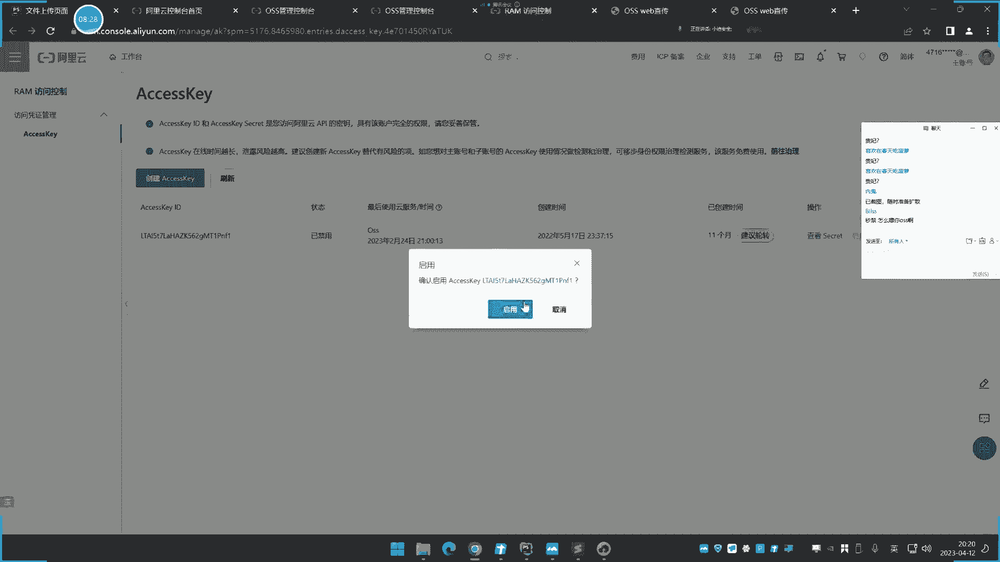
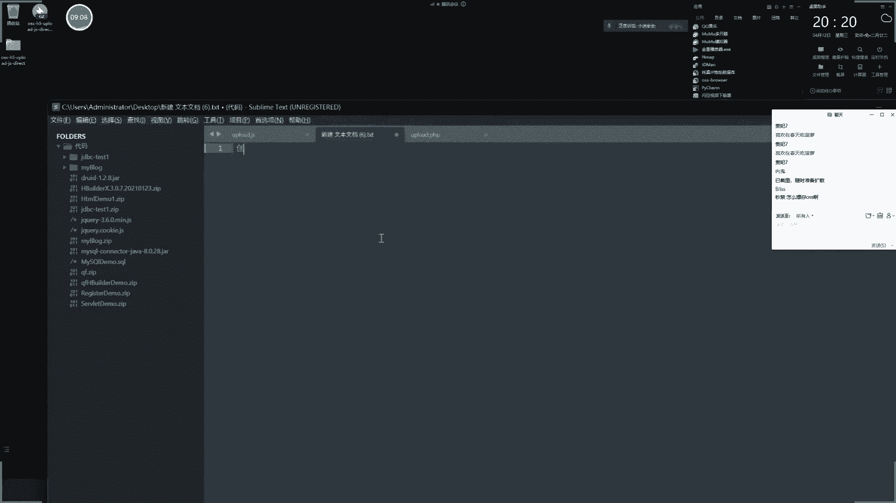
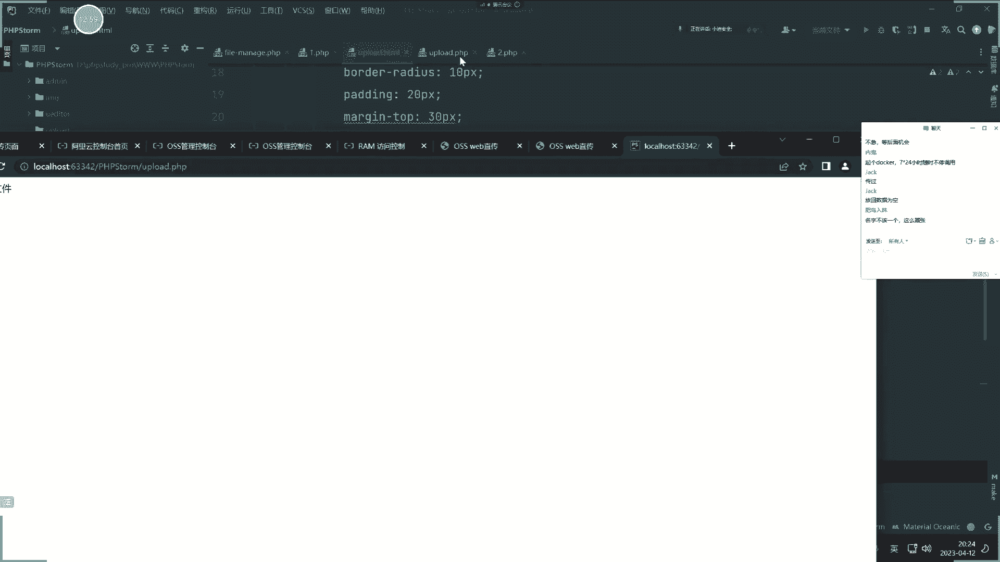
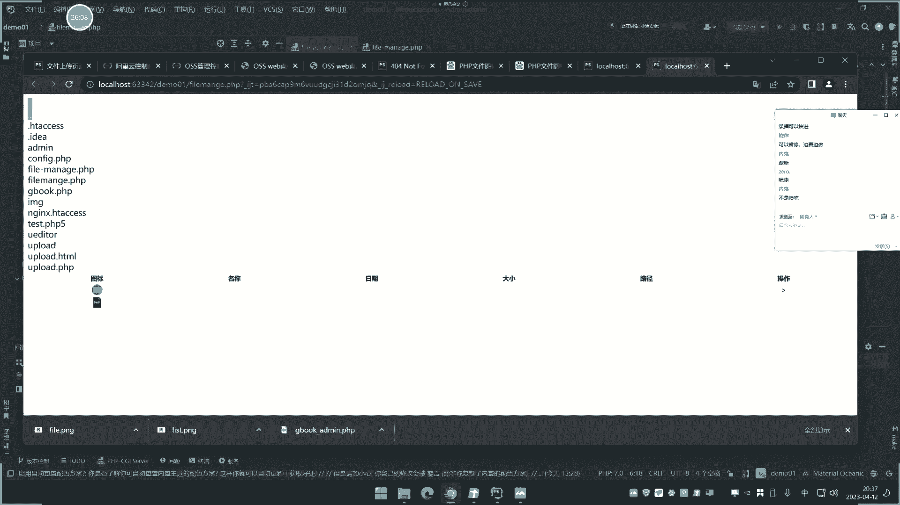
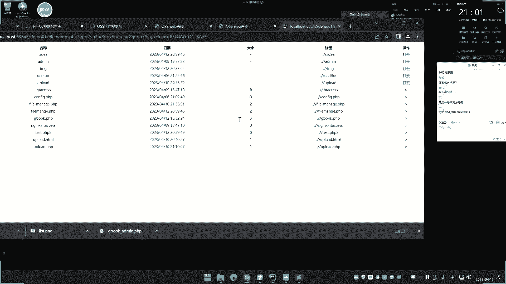
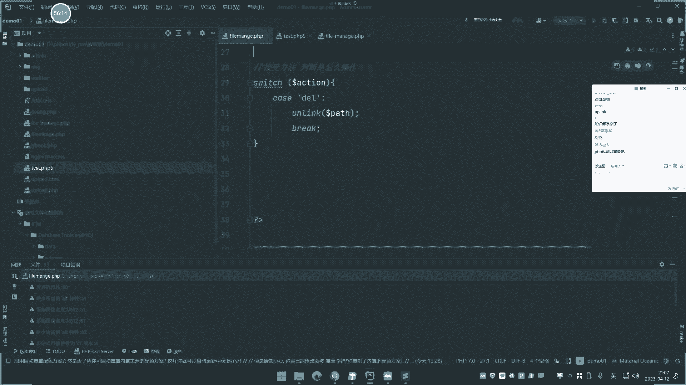

# 【小迪安全】V2024版 全栈网络安全 ｜ 攻防渗透工程师 （持续更新） - P25：第25天-PHP应用&文件管理&包含&写入&删除&下载&上传&遍历&安全 - 逆风微笑的代码狗 - BV1Mx4y1q7Ny

今天呢讲这个pp。

关于这个文件管理模块的那三节课呢，我们讲了这个上传和这个便利的事情啊，包括这个什么包含哪什么写入啊，删除啊，下载啊是吧，这些的一些安全问题呢，包括它的一些功能编写呢。

就是我们今天要讲的这个呢是我们一张截图，这个截图呢就是我提前给他做好的，大家可以看一下啊，这个就是我们那个写好的，就可以实现这个当前目录的一个便利，然后呢你可以打开里面看也是正常的是吧。

那每个里面的文件呀，里面文件夹里面的文件啊都是正常显示，是外面，然后呢包括它的这个编辑呢，还有这个下载的删除呢都能实现啊，这是我们的一个东西啊，目录呢我们就尝试打开啊，文件都进行这个编辑下载。

删除一些功能，包括这里还有商权啊，这个商权呢是单独写的，是桑杰克写的啊，呃这是最方便，在讲这个之前呢，我们给大家看一下，除了这个商船呢，我们上节课讲的是什么呀，我们上节课讲的是上传到这个本地的。

那么这里呢还有一个页面是商传什么OSS的，你就说这个东西呢是上去OS还是啥意思呢，就我们前期给他说过，就说有些文件呢它是存储到这个网上的，这种什么，网上那种OS资源前期给大家介绍过吧哈。

然后呢你就可以说一种呢，就是用你自己的服务器的这个存储空间呢，去存储这个商传后的文件，还有一种啊，就是说利用这个什么网上这种OS的这个，存储模块应用来存储这个，来存储啊，我们再来给大家看一下这个OS啊。

你开通之后呢，它这里就会给一个这个地址啊，你就可以用这个东西呢来存储各种文件，那么这里存储的话，就说它仅仅是存储了这个文件上传上去，那就不会有任何的一个用处了对吧，这是我们前期呢给大家讲过。

这个OS一个和常规这种文件存储的一个特性啊，对不对，那么文件上传呢，可以上传到这个什么这个上面来，那也可以呢上传到这个服务器本身啊。

对不对，那就是说这个商船呢，它是可以选择性的商圈刀服务器的本身，然后呢还有一种情况就是我们这里说的啊，可以通过这个OS它去存储，这是当时写的这个文件上传的这个脚本啊，我们把现找的啊，你这个pp写了啊。

哎这里来看一下啊。

是吧，这个就是我们把它存储到这个本地的，存储到这个移动到本地的upload，这是当时我们讲的，那么现在呢这个呢这个上传呢。

它是把它存储到这个OSS里面。

然后他是用的什么东西来存储，那我先给大家看一下这个源码啊。

那这是他的商城页面，它不是用pp开发的，它是用JS开发的，也是可以用pp开发啊，这是用JS开发的，他用这个upload js呢，就我们马上就说pp讲完之后呢，要讲这个JS。

那么我们到时候就会讲这个东西啊，用JS呢我们只是说提到上传的时候，那你看这两个还有这个配置什么，阿里阿里阿克萨斯K是吧，还有你这个存储的地址啊，对把它写上去，那就是说我们可以呢在我们的OS资源这里啊。

自己呢点一下这个他那个授权的那个东西啊，包括这里有个地址嘛哈就这里最大存储，这里不是有个，这个地方嘛是吧，然后这里是他的一个路径啊。

我可以把这个路径呢给大家看一下啊，就这里会有一个路径详情啊。

这是他的完整路径啊，然后我们可以把地址那一替换，写到这个什么这个代码中。

巴格里拉写上去，就我上传上传到这里啊，哎，来个红颜色的好来写上去。

然后这个access k呢和这个东西呢，就是我们说的这个应用的那个东西嘛是吧，啊就是你要调用它的话，它这个地方是有这个操作的，那你就生成一个那个阿斯克斯K啊，这是我们前期给他生成过，在深圳过。

嗯那个生存的地方在哪里生成的，都搞忘记了啊，在哪里是在，这个X对象，右下角啊，我忘记在哪去了啊，我记得是在那个是在对象这个地方啊，都忘记在哪里啊，好久没搞了，还在这里看这里看到了啊。

他这里呢有这个东西是吧，你先把它启用啊，启动之后呢，嗯这地方是不是有K啊，好这里呢就把KD到ETY啊，这里有个这个K把K拿下来，那么他就说可以利用这东西来操作，你的这个对象，存储这个地方啊。

就是可以向里面查数据的。

那就是那个K我们把这个K那就把粘贴复制啊。

完了那么就是说启用状态，那现在呢你在搞完之后呢，我们就可以测试一下哈，必须上传文件的时候呢，比如谁上传的文件啊，哎他就上传了是吧啊，这个后面报错呢，这不是我们关心的啊，这个报错是因为这边的OSS存储。

那你要把它开放个权限，那就是这个这个开放的权限，他有个那个公共读啊，公共写的那个权限在这里啊，在哪个地方开的，哎呀忘记在哪里读写权限这里，那公共公共读写有的啊，这意思是代码的问题啊。

呃这个操作呢就是我们演示这个东西呢。

就是告诉大家碰到这种情况。

那他也是使用这种情况的，我们当时也是给大家说过，但如果说你用这种情况的话，用这种东西去操作的话，就会有一个问题，这个问题呢也给他说过，你可以看一下啊，当前我们去访问这个网站。

如果说进行基于文件上传的话啊。

你可以看一下，在我们这个如果说进行文件上传的时候，刷新一下，它会加载这个load js文件，JS文件在这个源代码中可以看到呢，泄露这个什么3K和这个id。

那如果我拿到这个东西，是不是就可以怎么操作呢，就可以用这个OS的浏览器。

用这个八吧，是吧，用这个来粘上去。

然后呢加上刚才那个防空字。

嗯这里用这个浏览器打到的。

那连接是不是就可以登录到这里，看到所有东西来。

对不对，这个在官方自带的工具啊，所以说你可以看到啊，这种文件上传稍有不深的话，控制不好的话，如果你用这个OS的话，就会带来这方面的安全问题，这种文件上传呢。

它和我们传统文件上传是两码事情啊，我们简单解释一下啊。

就是上节课上文件上传我忘记讲这个东西啊，啊第一个啊，传统的我把写了这个写到这个地方吧。

就文件上讲这个操作里啊，一种就是说有两种实现的这个架构，一种呢就是，商船，商船是这个服务器本身的这个存储，音磁盘里面啊，对吧哦还有呢就是这几种嗯，还有一种呢，就是我们说这里的可以采用这个什么。

借助这个人产品的那个吗，OSS存储对象去这个存储这个文件是吧，那么这种呢就是文件呢它会被正常解析，但是你如果传到这个上面去的话，那么文件就不能正常解析了，因为它就是个存储文件，这个文件访问和不访问呢。

它只能被访问到，不能被解析，也就是说那个后面如果说传到这个OS上面去，之后呢，也不能正常连接，就你后面即使传上去了，也不能连接，那么这个上传这种等于没有，这是我们前期在讲基础课程呢给大家演示过的。

大家不知道还有没有印象啊，来我们当时呢找一下这个OS的质量，那第三天的时候讲过的，当时呢给大家说过这个存储的一个影响是吧，但是大家还没有影响你在这里了对吧，影响着了，影响了上传文件和解析。

文件无法解析单独存储，所以呢就修复了上传安全是吧，当时讲过哈，是不是，那如果说你用这种东西的话更加安全了，但是它也会导致我们说的这个泄露安全问题啊，泄露导致的安全问题对不对，所以说啊。

你用什么东西就会带来哪一样的安全问题，那么就会对应哪些安全问题能得到解决，不一样的啊，这是文件上传，上节课上忘记给大家补充的那个支点啊，今天就给大家补充一下，好补充完之后呢。

我们接下来啊还是这个正常的做这个啊，PP的一些其他开发啊，比如说今天要讲的这个加工这个文件管理模块，就上节课呢只是做了一些显示和这个删除，那么这节课呢我们就是说如何下载呢，如何删除呢。

如何写入文件呢是吧，这些东西呢也要给大家操作，首先呢现在说第一个包含，这个包含是一个什么概念啊，我们先把这个代码打开啊。

呃这个包含是一个什么概念呢，啊很简单的道理啊，包含了在pp中有四个函数啊。

Nasa enclose include include uencoder，然后呢requests，然后enclose once request on，嗯他们有些简单的差异，差异呢，就是说第一个呢。

就是如果在包含的时候发生错误，脚本呢还会计算就行，用这个函数就是发生错误之后停止就行，那么加个弯时呢，就是说如果这个文件已经包含在不执行，就这么一个差异，就是这两个函数呢有个差异，就是一个是错误的运行。

还有一个错误呢不运行，然后加VX的话，就是在原本的基础上面呢多了一个包含，就不允许不包含，就人性就会多了，人民东西，其他的没啥，所以这四个函数的一些差异都写上去了哈，主要他们都是包含文件的。

那么包含文件是一个什么概念啊。

我给大家简单说一下啊，就很简单，我们上节课写了这个呃，写了个upload a tm，就是你那就是一个文件上传的页面是吧。

然后这个页面去上传文件的时候呢，啊这里是上传文件。

上传文件的时候呢，对不对，上面文件的时候它会提交给这个upload pp。

那他的提交在，就是说他的这个商船的这个upload a tml呢，只是一个页面，它没有具体的功能，就是显示页面，就是给你看到这个上传的这个页面功能，就是把这个文件来进行商传。

怎么判断呢，它是给提交给这个upload pp的，所以给了人命。

这个文件主要是上节课讲的，那么这个文件呢，就是对这个文件来进行接收和处理，就是他怎么去上传了，怎么去移动啊，有没有过滤啊，都在这个pp代码去写，就是前端的把文件传过去，后端的进行验证和处理。

就这么一个流程啊，那么这个包含的话就很简单。

你意思就是说你要访问这个upload tml是吧，访问它才能上传文件，那如果说你访问这个upload p1P呢，他的访问就是这个东西。

就没有那个商品页面，那这个时候如果说我要把这个TML的文件呢，该怎么样包含了，这TM就是一个文件的，来两个文件来形成的文件上功能，我现在用upload一个文件呢，把功能全部写在一起。

我就可以怎么样进行一个include，知道吗，include include什么的，upload点一下嘛是吧，我把这个文件把它包含进去，包含进去之后呢。

我重新再访问它，你看它是不是就把那个TM执行了呀，把这个TM执行了，所以我就相当于说只访问这个文件就可以了，这个文件呢就是我不访问也能进行文件上传，对不对，所以这就是文件包含的意义。

那么这个文件包含的意义在这里，它会带来哪些安全问题呢，就是如果啊他如果是写这种写法，他这种写法呢，比如说这里呢这个东西呢进行一个传参，就是这里面有参数，就是有控制的东西。

比如说写个这个叫N7写这么一个东西，那这个东西写上去之后会造成什么现象呢，啊就就就把这个写上去，那么他选择回去的话，上面这个虚假线，那么你在访问的时候就很简单。

一方法不漏的，他还是这个错误，是吧，然后你加上这个参数NG等于这个upload，让它包含这个什么upload点，Tml，你这样去写诶，诶他就能正常了是吧，所以说你想包含谁就包谁。

你比如说我包含个index，对不对，太可以了，应该是PP哎，它就显示P的验证代码，包含谁就显示谁就执行谁，但这样子就会造成一个危害，包含的文件就能指定。

那么我们就可以随便呢在这个网站上面是吧，创建一个什么任何的一些脚本，比如说我这里呢在这里创建一个文件文件呢，就叫这个一点TT一点TT里面呢，我是写个东西，写个PP的这个什么代码，比如P服务，那么同理。

如果这里是个home代码的话，也是一样的道理是吧，我写个拼命运动写什么东西上去，这是个TT的一个文件啊，当然你去访问的时候啊啊，你去访问这个TT的时候到一点TT，那它也是这个样面对吧。

但是你如果用包含包含这个节点接近那里，是不是要执行这个代码。

那么这个ETT如果是后面这个地址，不就是一个地址吗，所以说这个文件包含了，就和我们后期要上到这个文件包含多种，那是相似的，就是由这些函数在用它的时候，后面这个包含的文件搜我们的空子，导致的文件包含漏洞。

那么为什么要进行文件包含，我刚才也给他演示了，因为它包含了，就意味着可以把其他文件调用过来运行，这样子呢是方便于我们的这个开发的，就相当于说你可以一个文件当几个文件时，而且很简单。

道理这样子呢编于你这个代码的情况就很简单，如果说你要把公屏显示，你直接粘贴在所有代码复制到这里才行，那你直接一行代码包含不就行了吗，但是你如果做做这个包含操作的时候，你有包含文件。

让这个用户的自由选择包含水，那这里呢这就会造成文件包含漏洞，所以我们为什么说要讲这开发，其实呢就是从开发的角度上面去研究这个漏洞，就说这个漏洞为什么会出现啊，为什么会出现，你把这个开放的走一遍。

你就知道这个漏洞是怎么产生的，所以说漏洞的产生呢无外乎就是两点情况，讲到这里，我就可以把把这句话给他说了，两种情况，什么情况，什么函数造成了什么漏洞，两个核心的一个漏洞条件就是可以控制的值。

然后使用的什么函数去执行的这个值控制的，这就是我们用户提交的恶意数据，什么函数，那就是什么漏洞，用这个包含漏洞的函数，用包含文件包含文件的函数，就是文件包含漏，用文件上传的这个函数就是文件上传漏洞。

用其他函数就是什么其他漏洞，所以漏洞的诚意呢，就是程序员在开发代码中使用的函数，决定加上一个可以控制的变量导致的，所以说漏洞的原因呢就这么造成的，那么具体什么漏洞就和这个函数相关，那么这个是文件包含啊。

他为什么要进行文件包含，刚才也说了啊，就不要问我为什么要进行这个事情啊，因为就是提高开发效率。

那么在使用不当，操作不当的时候，就会造成安全漏洞。

那这个文件包含就不说了啊，那么接下来我们就来写一下，这个开发的这个代码，这个呢是文件上传页面，我们上节课的只是写了文件上传和显示，那么现在呢，我们就来说这个页面是怎么设计出来的啊，首先设计呢它是分几步。

我们就对这个页面呢把这个流程再走一遍，首先呢我们观察一下这边呢是有这个什么信息。

那这信息是哪个啊，这信息呢就是用TM设计出来的这个设计，那我就不讲了，因为这是前端的一些这个央视设计啊，就像我们说的啊，这个前端的一些这种样式设计，那不是我们学习内容啊，这个东西呢就是你做网站开发。

自己要学的安全里面就不会看这个东西。

因为这个显示方面的什么美观呢，这个和安全不不相干啊，没有任何联系，所以我们这边就直接把那个页面呢，给大家看一下啊，这把页面呢在网上随便找的啊，来看一下，我这边先创建一个文件。

文件名字就叫做这个up不就叫file。

MANAG一点PD好，那这个文件的设置好，我们首先呢把这个tab页面给他写上去。

这个页面呢就是一个类似的表格。

是一个类似表格，我也给他直接粘贴复制啊。

就在下面啊，就这个东西呢，就这里。

那就这个东西啊，来看一下，把粘贴过来，这里呢先前是没有这些东西的，我先把这个去掉，先把这些东西都去掉，就先把它这个页面的设计出来，就是那个央视的那个情况，先把它搞出来哈，好大家看一下啊。

来看一下这个页面的一个结果，那现在就出来了呢。

图标名称啊，这个日期大小是吧，就出现这个东西了，我们这就意意思就实现功能了啊。

实现什么功能，第一步呢这个图标呢就是一张图片，这个图片那就是路径地址，我现在找了一个什么image list png，还在网上随便找了一张图片啊，这个图片那就放到这个目录，我们创建一下吧。

image目录，然后这个是list就代表的是文件夹的图标。

我们就在网上随便找个图片，啊随便找个图标啊。

就是文件夹的这个图标。

随便找个啊啊，就随便找个吧，这个吧，另存为啊，左边就叫list png。

好把这个图片保存下来。

复制粘贴到这个项目里面。

三个你来好，那这里呢我们就大小控制下来。

二十二十，我们再来看一下，这里刷新一下，看这里啊，诶那个页面呢，所以你看就显示这个文件夹图标，对不对，在文件夹图标，然后这边的file就是文件的图标。

就是文件的图标，我再找个文件图标，我这里就不找了吧，我就直接把那个图标随便找一个就完了啊，代表文件的图标。

用GP文件图标吧，随便找个。

要不找个了，就这个吧，我这个是吧。

去掉点P分析。

把这个图标呢给它粘贴到项目中。

再用五进去好。

那这个呢就是显示文件文件的那个。

呃东西的图标啊，好那页面呢就写完了，我可以看一下，那现在是这里啊，那这个是文件夹。

这个是这个，PP的那个文件名称，这里如何获取这个东西呢，首先我们还是一样道理啊，现在写代码获取这个央视列表。

就获取所有文件夹和文件内容，上节课也讲过这个显示操作啊，呃具体操作呢我给大家给大家试一下啊，首先呢呃它是获取这个就是open dr是吧，打取这个目录，对不对，然后呢我们再来设计个变量啊，Dollar。

喷子啊，就是路径等于大幅下滑，get传递过来的这个喷子值，最后如果你传递啊，如果他没有传递的话，我就把你攻有路径呢就是这个东西是吧，那就是说如果有权力值的话，我们就以权力值能为路径，如果没有权力值的话。

我们就是当前目录把加上去读取，读取完之后呢，在上节课已经上过了啊，上节课已经讲过了对吧，这些东西呢我们就可以把它简单的复制，粘贴一下就完了哈，重新改名一个名字啊，然后呢再用这个wide dr。

来例子DR来读取这个什么目录对吧，这个上节课讲过了，我直接可以把它粘贴过来啊，读取这里面的路径啊，判断这个D呢如果是吧，一直有的话，就进行循环循环操作呢就判断这个文件，那么这里呢我要改一下。

我改成什么呢，啊我这里改什么，就改这个上面的啊，来，呃或许过来之后那进行一个判断，为什么这样判断一下啊，我先给大家看一下啊，就是说如果你不判断的话，我可以直接输出输出这个什么dota file。

然后大家可以看一下，先看看效果，它就会显示呢把所有东西写出来，然后显示让他换行的话，我们来换行啊，DR对吧，换行一下，然后这个页面显示文件文件内容的，把画一下啊，你看这个结果了。

这就显示了有点和谐两点了，这个就是默认的啊，我们先把区域掉下，就给加个衣服进去啊，如果这个什么dog file是吧。

等于等于什么东西的时候就不显示这两个，就把这两个呢不显示呢，就判断它不等于点不懂一点点的时候，就那两个二八删掉就不让显示那两个啊，对不对啊，写进去panda glam flam，就这里啊。

file叫film，对他这个film不等于这两个的话，那么接下来再来的话啊，我们是不是要进行文件和文件夹的显示啊，就说这里呢是已经得到了，它可不等于这两个之后你就输出这个，来看一下啊。

那他现在呢就不再显示那两个点了是吧，放行一下看一下，那他就不写上两个点了是吧，两个和那个一个点和两个点就不显示了。

我就只显示正常内容，就把那两个去掉了，一次就错好，那么现在呢就是要对这个东西来进行判断。

因为这里是有文件和文件夹的，我如何把文件呢归类到这个图片里面去。

文件呢就归类到这个图片里面去，是不是要进行一个判断判断的，上节课讲的是1DR，那么现在呢我们可以用两种东西。

用这个角fail top，fail top来判断，叫他们来判断，那我这呢先给大家看一个简单的这个演示代码，比如说啊，我用fit up去判断这个当前目录下面的这个角，upload的话，他在讲话啊。

这是他们是upload啊，upload iPod这个东西，把结果输出一下，它的结果是什么，看一下STR目录，如果让我判断是upload点T的文件，他就file，所以这个是他判断啊。

判断文件类型的file，那就是文件返回，所以我现在就可以用这个东西来判断，是不是怎么写了个例子啊，所以我就可以用这个算好了tap了，要判断这个什么gm值，他这个PHILM值对不对。

这个判断它判断它是什么，是目录还是文件，对不对，那么如果说是文件的话，就显示到还没写完啊，就先到这个图标里面去对吧，如果不是的话，就做一下操作，那么这边呢那翻盘棋就是加上路径。

这个路径那就是那个TCH路径，就是完整路径啊，这个都可以把它写上去啊，这个是判断它的一个值，打两个大把，那3000到正来，这完整的东西啊，这个就是它变量吗，变量这里传过来的啊。

好然后这里呢就是把它的这个类型呢搞出来了，我们可以自己输出一下当前类型的一个特点，给大家看一下啊。

你看啊我输入一下，打开这里，你看是不是就是FILDR，Fil dr，就是先看的是文件目录目录文件文件路径好，那么现在呢我们是要显示显示这个界面呢。

就说这里这个图标。

这里为这个图标，就显示文件夹的，那么这个图标就显示什么显示这个啊文件的。

那如何把文件和文件夹归类呢，我这里用那个数组，用那个数组什么数组呢，就是把这个接收到的文件名呀，把它复制到一个数组里面去啊，怎么操作啊，来看一下呃，操作在这里呢直接代码呢也提醒好了。

那声明一个列表列表里面的呢，把文件类型写进去，就是这里呢这个值就是我们说的DR和file值，然后呢加入一个列表列表，再叫film的索引为film，film ping路径为它的路径。

塞子呢就是通过我的这个换算是吧，把大小算出来，它是这个字节流嘛，除以1024，就是它的KB大小，然后fat time就是他修改时间，就按时间呢，这样子呢用这个time呢去读取它的修改时间啊。

用这个东西的文件的这个修改时间的，来去读取这个文件，把它复制到列表中，就是把文件和目录的封装成四组，所以在这里呢我们就看一下啊，就可以这样写了，beast对吧，然后呢加个索引索引里面就写上类型。

这个类型刚才打印了啊，就是对应的就是我们看到了什么DR，DR那些东西就等于什么呢，A r a y，然后呢在它下面的去写这个什么，写这个数字，对不对，就按照这个来了啊，来先去封装进去。

那么封装的这个流程呢也非常简单，也不难啊，就在这里呢封装好啊，这里呢就封装这个里面的几个索引，这个数组大家不知道有没有学过啊，没有学过，可能有点难理解，好学过的就是很简单，简单来说就是这么一个结果啊。

给大家说一下啊，比如说这个数组list，他这里有个东西是吧，比如说这里写了个东西比较X，然后呢它对应的值是小于一，就可以这样写的，内蒙等于小题，然后下面继续提出，这里叫，A级就是年级是吧，30哎。

然后这个时候呢你就这样去用它来list是吧，name对不对，它的一个结果那就是小B，然后呢你如果说list a级是吧，他就是30就这么一个概念啊，由于很多人没有学过，我就简单说一下啊，这个实在不懂。

那我也没办法，因为这个东西是开发的，首先要说的一些东西啊，这个是二维数组是吧，还有三位数，这有多数组，还有这种情况是吧，继续加一个东西，就比如说呢他这里再写个A级，等于这个，然后呢他把它括起来是吧。

里面还有一种就是这里呢就就像我这种啊，那还有多了这个还多了一个另外控制，就这里写几个，比如说历史是吧是吧，然后里面呢写个name，然后呢name里面呢又加上一个值，比如name里面是有小迪。

有这个什么这个小DSBC是吧，然后呢他就这样就有list了，啊name是吧，从里面去筛选啊，比如这里的小题叫它也叫小题S1，它就可以这样调用啊，再加个小D，然后呢他就等于什么小DCC就是它下面的。

有些人说这里是他一个等级，下面有一个对应的这个值和结名啊，他会这么我们这种的就是这种情况的声明，一个，生命的这个地方嗯，说明这个那个，然后呢在它下面有留空，留空之后呢，就给他展示的东西。

那么具体展示我就要粘贴复制过来看一下，在这里呢就是list，那么这个词就相当于是一个什么模型呢，这个只是个模型呢，大家看一下啊，啊这个值对应的模型就是这样子的啊。

由于这个当初pl呢就是我们说的就是等于DR，或者什么等于file，就是一个判断是文件夹还是文件，那么如果这里是DR的话，那么它相当于就是list里面的什么这个DR。

然后呢下面有值值里面就是对应的四个对吧，那这个呢就等于冒号对吧，它的值就等于这个变量，对不对，然后变量是多少就是多少，哎就这个理解啊，然后一次都好啊，这次这个是吧，然后它的值是吧，又是这个变量。

他有这个东西就把它封装成这里啊，就这样啊，一直往下进行，他有这个情况，对不对，所以呢它把它封装到这个历史了之后，我们接下来的话就可以显示了啊，显示什么啊，那我们就用这个代码呢，这里呢是显示图标的。

显示文件夹的，我就可以在前面加上一个什么，加个PP语句，写个什么TP for each for e是什么呢，就是从列表从数组中去循环，从数组去循环循环什么呀，就是把这里面的这个值把取出来。

把这里面的值取出来，八字里面是失去了啊，呐放一起，那for一起从这里面去取这个dr as a，非就是把里面的所有只能复制给这个DOLF，非非里面再调用这个flame，那么就等于什么呢。

非得就是来到这一级调里面的FM，就是取出一个变量值，嗯能不能理解，不知道能不能解啊，就是用for一起去循环里的值，因为它的所有值都写到这个列表里去了，你在这里那就显示把它写上去啊，那写上去写好之后呢。

啊这个呃file list，那就是等于这里的list啊啊先先这样把取代下来，list是吧，先去，然后呢你看啊我们的第一个是图标，我们第二个字是什么页面的，第二个是什么，因为第二个是是这个名称。

那就是等于什么，apple输出C里面的什么，获取的是个flame，在这个获取的名称，取这个值，那我们来刷新看一下，那那那我这里呢写完之后要有一个结束语句啊，还有这个结束语句，HD结束粘贴过来，要看呗。

是不是写出来，你看文件夹，这里呢就只显示文件夹，你看对不对，直线是文件夹了，就是把数组里面把循环出来。

然后在这里加上的是名称，第二行是什么日期，我们就一次从这里取出日期，现在的日期是什么日期，我这里获取的是这个fat time，对不对，列表说一次FTIME，所以改成fat time啊。

意思看下日期出来了，大小是FACSIZE，由于文件夹没有这个大小，文件夹没有大小啊，所以我这里写个这个斜杠，斜杠路径就是它的路径，就是这个什么获取过来的单盘棋嘛。

单排挤这里获取的路径是路径，等于这个词它的完整路径，然后这个类型就获取这个，第四个就是什么录音。

就是弹起取出在里面所引的这个词，看下路径就出来了，哎你可能说路径会不会有这两个啊，因为它自动加了个点斜杠啊，这个不用管它，我等后面可以把它删掉啊，写出来了，然后这个是文件呢，文件再怎么写的。

文件就是在这个图标下面的是吧。

继续写的文件一样道理嘛，D把这个拉拉下面来，如果是等于这里是文件的话，下去，那这里就说这里是文件的话，因为这里是登DR，所以说写file啊，能不能理解呢，刚才这里呢是获取这个文件类型嘛是吧。

获取文件类型，那么第二就像说你这样子一去获取的话，它就有两种情况，一种就是等DR的，那么这是DR的，还有呢就是等于什么等于FIED，对file也是一次有个数组，然后这里就是判断嘛是吧。

这里呢就是判断的从file里面去编辑，刚才那就是编辑书目录的，让它显示这个图标，那么如果是这个对于文件的，就让它显示这个文件图标是吧，以此呢再把这几个呢是吧，把T换下就完了，对不对，需要在哪里，对吧。

想上去我们再看一下观察这里诶，哪里写错了。

我扫了个少了个TD吗。

TD哦少了个TD，先把这个T区域吧。

嗯对哪些错了。

Slog，这是显示文件哦，这里又少了这个，这个我想起结束啊，它是一个结束，一把选举那出来了。

你看文件呢就显出来了，你看变出来了，但文件这里有大小啊。

所以我这里大小是要改掉啊，是要显示这个哎大小是file size嘛，他写上去看FC存储的file size，这结束的cs就等于获取文件路径，文件路径就是文件的是吧，要求要量是日期。

就是这个日期换出来的是吧，就是把前面这个获取到文件呢，从这里面提取信息呢，文件名字就存储到这个列名建筑里面，我觉得简单写一下，这样写的就大概能明白啊，就是呢这个文件名存储是吧，这个兼职，就存到这里。

对不对，那么这个呢就是存储的嘛，这就是存储路径的是吧，路径，就存储在这个键值里面，诶，同样道理啊，那这个呢就是，文件时间，文件时间呢，这个文件时间呢是通过换算的文件文件啊，换算的。

那么用这个file c换算出来的除以1024是吧，然后呢换算出来这个值呢全输进去，就是文件大小，然后这个呢就是获取什么文件的修改时间，换算文件编号获取的这个获取文件，直接把硬硬的并存储到什么这里面去。

对不对，那这个呢就是相当于这里呢就肯定啊，就是这个file pi呢刚才也说过，在FPX呢它就等于DR什么file，那么你现在说file存储到file里面，那所以它的结构那应该是什么。

Doubtful list，一种情况就是，这种叫DR的模式是吧，和他这个列表就是有两个，一是这种，对对对，因为当时呢我们去获取这个文件类型的时候呢，啊一个就等于第，二个就等于file，所以呢。

这里呢在服把它只写到这个数组里面的时候呢，所以它有两个啊，DR的存储，一套FID存储，一套都存到里面，然后呢一直在这个显示显示什么，显示文件目录的就把它取出来啊，显示文件的就把它取出来。

意思呢显示到这个图标下面，所以呢最终结果我们就看到了是吧。

那我看到之后，我们是不是一直在这个上面点操作呀，比如说这里呢打开操作目录呢，我们就使用打开就进入到下一级目录，那么文件呢我们就提示有编辑，下载和删除几种功能，对不对，那么如何先把第一功能文件夹。

这里来实现这个什么使用这个打开对吧。

那么如何实现打开呢，就是相当于要下面一级嘛，那么现在呢我们就来实现打开，打开这里呢就是要在他这个后面这一栏，就是这个操作这一栏写这个东西嘛是吧，写什么写给一个操作按钮，A标签AREF打开。

打开了打开先把这个页面把它写的是吧哈杠A，然后呢写个打开啊，可以看一下，那是不是就打开了。

打开之后要传参全参数呢，就是要对这个文件夹呢进进进这个目录遍历，那么这里如何进行目录遍历呢，我们是相当于就是把这个东西再重新。

把它用一下就完了呀，是把这个东西把代码重新调一下就完了呀，所以我这里就可以写个函数，是不是就可以写个函数啊，写个什么调用函数，比如把它全部归类到一个函数里面去，叫bs get list。

da list是吧，然后写进去对不对，把这个封装进去，然后他直接调用这个函数，然后呢传他传，他是跟他组，对不对，就随意调用这个get list，调用这个get list，然后再传一个pi啊。

pi呢我就从这里取值嘛对吧，我们就直接访问这个文件后面加上pi值，然后传到这里，然后调用它，所以我这里就可以写了个什么get list，下载单机，把调用一下这个路径，对啊，这个路径是可以通过传参过来的。

也可以通过补全参，就等于默认，所以说我直接访问的时候，它就等于这个当前目录，如果我在这里呢选择打开，就是我要换另外一个目录读取了，我这里就等它跳转了是吧，给个地址喷漆等于什么，等于一个值。

这个值等于什么呢，这个真是什么，是不是就是一个PP获取过来的，这个叫翻盘起的这个路径，对不对，就是这个词嘛，所以就这样打开echo一下，输出到这个电动输出显示到这里。

接下来说这里的路径呢就是获取这个文件路径，来我们看一下，诶啊写错了弹起路径，那就等于，看一下R是哪里写路径，安吉路径里面就写了个这个，这个是这个是不是文件路径，我先把这个去掉下。

哦这个em上面正常显示了这出现哪些情况，嗯等于喷子，喷子没有节奏的人，他提高这咋不对呀。

哎这炮哪有输，有什么鬼，杂七杂八的问题啊。

刚才是正确的，加了个函数，不行呢。

看大家有没有看到问题的。

36行有错误啊。

等一下，哦这里哦这里哎呀，我说怎么回事啊，这里要获取他这个目录的时候，这里要给个值啊，就我刚才是调那个list嘛，啊我这里要复制个值，就这里要写个东西，忘记了，到你这个读完之后呢。

我先关闭一下这个close jr，关闭一下可乐DRDHH，然后呢HD然后呢再就是这个把它返回一下，返回一个列表值，就这个了，然后这个列表值啊，刚才忘记了，就把这个列表返回，返回之后呢，你不要调用函数吗。

对调用这个函数，所以我这里要加个变量，倒数历史等于几中心是吧，好看现在东西好正确了啊，你看就这里那不是要那个嘛，我调用函数要把它返回它，就是这里复制的水中也把它返回。

然后我调用的时候把它用这个例子来结束好，下面呢就这个东西在调用啊，就这个意思啊，刚才那有这个操作好了。

看这里又打开了，我们来看一下，打开一下，看能不能进行这个调用法。

你看打开之后呢，那这里呢就会以此打开时候呢就把这个路径，那就等于这个嘛哈来试一下看行不行啊，这里面都没写分号，对PP都没写分号，算了不写他不写，没没没有没有说有毛病，那我就不写了，正常来讲。

这个语结束要写分号啊，我先看一下。

来看一下，打开打开这个目录诶，你看是不是显示了，你看是不是调用了，你看打开，你看上面就传参嘛了，传一个参数IDA就获取这些了。

就通过它把它输出的这个D这张路径打开了。

正常了，那么一次啊，我们点一下其他的检验，这个upload里面的，upload里面的来打个upload，upload里面是空的，本来就是空的啊，这个里面的，这个不来打开。

你看它里面的文件夹也是正常显示是吧，然后你再打开里面再打文件夹，你看诶他也正常显示，你看是吧，哎再来啊，是不是都知道显示那上面全参那个路径嘛，对不对好。

那这里就是说这个上面的这个功能，都都实现了是吧，那通过这个比去这个把这个路径呢给大家想去，那么传参传参呢它就会传到这个奶妈是吧，一旦有有值赋值了，然后呢他就调用这个函数是吧，然后这个值就会发生更改。

就让你直接访问的时候。

你直接访问的时候呢，它就是获取当前目录，当你呢有操作其他目录的方式后。

那它有参数，所以呢有参数的话，那么这个喷气就会随之更改，所以说刚才为什么呢，我要把路径再加上去，因为完整路径嘛来写上去是吧，就等于这个东西，那它调用这个函数，调用函数就像是重新执行一遍吧。

把这个函数就重新获取一遍，就显示到你的难不好啊，逻辑就正确了哈，那么现在呢就说这个东西搞清楚了啊。

打开是正常了，那么现在就来设计这个什么这个，文件的事情了啊，文件的这个什么编辑啊，这个呃删除啊，这个还有这个编辑功能商，全编辑功能和这个删除功能和下载功能好，我们现在搞最简单的这个删除功能。

那么在这里呢我们就写删除功能啊，这个功能就在这里面啊，那么首先一样道理啊，就写了几个这个截图录音依旧和上面一样，把这个A标签写进去，AARFEF要是调用这个相关的东西啊，等于一个路径，然后呢这个是杠A。

然后是比说是第一个是这个编辑是吧，有编辑那么一次啊，写了几个啊，这个是删除下载啊，这个是删除，然后看一下这里页面，那你不是有这几个了，然后再写核心功能，比如说编辑下载删除，我们先说下载删除的最简单的啊。

那么删除呢嗯删除是什么呢。

对不对。

删除删除呢，我们就是相当于说啊，可以使用一个这个结束值啊，它为DL的就进行删除，然后呢如果为当作为下载编辑的就1D，所以我这里可以传入一个参数，就是这里呢写个什么，放过这个呢，删除的我就给他写个路径。

问号DL等于什么，等于一个值，这个值呢就是获取的是路径值，删除这个路径值，获取这个路径了，就删除这个文件了，把它写进去，那么这里呢就相当于说DL，后面就全参这个路径值，把它写进去，对吧，嗯在哪些问题啊。

问号第二批评和路径，对的呀，问号目录这里少写了个这个符号，好好，你看这个是删除删除，那就是问号DL加上这个路径，就是说告诉他有删除，那这里写个DL对不对，几个D啊。

我们这里就可以用一个东西来结束这个调子，对不对，我们可以写一些东西啊，写个什么，写个这个叫XXXX等于等于什么呢，大家看一下啊，嗯嘴巴谁也搞过来了，那直接用这个X等于这个判断值啊。

这多了一个判断1SDR呃，这个叫dl get接收IA的值，A的值如果有设置，那么就结束它的值，如果没有设置空的话，就等于为空复制GRACTION，那你可能会说我接这个action干嘛，复制是A字啊。

那么这里就是A等于DR，我就给大家写上去啊，哎那你呢删除，这样就等于这个DL呢传递的是这个后面这个值，然后呢这是删除文件的路径，还有可能就是给他传递，我是要删除的操作，所以我就给他传递一个A等于D号。

然后呢再给他传递一个阶段，不等于这个文件名就告诉他我要删除A方法，等于DL连接file传递文件名，传递我们这里获取的文件名就触发这个链接，这个时候呢我们就可以写一个叫switch判断。

然后呢参数是XX呢，就是这里他不是结束这个A参数吗，有的话就等于A的值，没有的话就能空，所以我们就判断action的一个值叫case，case如果这里为DL，就是进行文件删除。

写写那个p Python代码，写多了喜欢用猫号，其实这里是郭浩的K4等于DL，那我们进行删除，删除的这个操作非常简单，就是UPLIDOTFILE。

然后传递这个dollar file abc就是删除删除文件，这个文件就是这里传过来的，什么传过来这个fan party嘛，所以我这里还要接受file的值是吧，这个file值get权利吗。

所以我是不是要继续要设置一个结束，这个文件名啊，就一个结束到你的方法啊，我就是解释方法的啊，这个是解释方法的解锁方法，判断是怎么操作，对不对，解决方法，那这个是解锁方法的，还是不要结束这个。

这个什么这个files啊啊这里就结束files，我解释这个喷几次也行，就传递这个路径也行啊，好我们就解释个喷体制吧，等下把那个后面改起来，接着喷几次，把它拿出来，结合喷几次啊，那结束喷几次get。

那我就把这下面改一下啊，有个解锁files文件就喷几次吧，就是后面改成蹲起也行，接着喷几次，那么这里呢就是传递过来，这里就是删除这个喷漆吧哈，如果它等于它就删除它，然后再进行一个break就挑出来。

好好我们试验一下啊，进行一个文件删除，看一下，现在行不行啊，来访问一下，那这里有个叫test。

我们点一下删除，点了之后，那你看看路径呢，就是呢A等于DLPY等于test5，然后后面他这里写错了，你看这里有个A呢没有冒号加上去呢，文件都写错了。

所以我这里呢应该是没有加问号，把问号加上去，就是告诉他的当前文件夹。

那重新再来一下，点一下这个test5点删除，你看这里就是哎怎么还是没有那个。

都几年你没了。

传递是传递了来路径传递了，然后A范围全力了，后面这个问号怎么还不传递的。

这个路径我还要把它写上去啊，你妹的写吧，获取当前这个菲尔，如今就是这个这个文件，当前文件执行路径就这个文件名啊，可以用这个叫dollar s，算了算了，不用这样搞，这样搞太麻烦了啊。

他这个怎么没有没显示。

估计看一下，点一下删除，点了删除之后再没反应，我们可以看下这个点删除的路径，复制一下路径对了，现在对了，你看翻盘起来A等于多少，但是在这里一个报错。

那为什么报错呢，就少了一些什么东西，我来看一下啊，就是除了这个要判断它的操作之外呢，这里还要进行一个判断这个路径的一个东西，就说如果是他的这个文件名再加这个东西啊，你不要问我为什么加东西。

这是为了检测的，那或许它的文件名路径把这个加上去就行了，他也不会搞错了啊，接下去。

好我们来看一下，那我们点一下那删除，这里点下删除好，他没有任何反应，我们刷新一下页面，嗯没有还是没有啥情况，还是有这个test5，所以没有删除成功，没有删除成功，我们看看这里啊。

啊action呢是结束这个A过来的值好，那EG值呢我们给他输出一下，看我节奏对不对啊，八个输出一下，写到这个下面吧，看下这里结束对不对，先出一下这个问题，看看节奏对不对，对吧。

这里面写xx，那我看一下，我点删除这输出那个等于DL，那说明是对的，那么说明这里A型是等于DL嘛。

DR呢K4等于DR，就执行这个删除这个路径没问题啊，但这里呢我看我代码里面啊，应该是全局是file，获取的是文件名，所以这不应该是do啊，写file来，我们再来试一下。

好来看一下啊，顺便刷新一下，那我删除特色5。1下删除好，我们再刷新一下页面，你看test5没有了，那文件自动消失了，那我可以创建一个文件试一下。

比如说我叫一点PP保存一下。

刷一下1P也有点下删除。

再刷新一下页面，你也没有了。

那文件自动消失，说明这个删除成功了，那么依次进行，删除成功之后，接下来就是K等于什么，等于这个下载的就叫邦就进行下载呃，这个下载呢就是要进行这个操作的时候，那这个销售时我们继续把链接，把它复制粘贴一下。

以此一次的老黑就传递什么当参数是吧，告诉他我要进行当就要进行下载，下载哪个文件呢，就下载这个文件嘛，对不对，告诉他，那么下载如何操作呢，下载呢就采用这个方式呢。

可以设置文件头部来进行下载，就直接把你的文件头部呢改成这个东西，就是我们为什么说有些文件访问起来的时候，是访问邮件来进行下载，其实就是把文件数据包里面这个东西得改，改成了，就是这样子啊。

然后用这个RADR去读取，它就会自动加载，这个呢不好说原理啊。

这个东西你不需要理解原理，你知道这样操作就可以了，就设置一下你这个稳定头部在网上找的啊，然后这个操作呢嗯就是有点麻烦，我把代码直接复制过来，你知道就可以了，这东西，这个文件头部就是让这个你的访问数据包。

你的文件app数据包里面再给它固定，它的头部，就为这个狭窄的一个操作去读取，它就可以下载了，那我们试验一下，这个是往下的啊。

这个没什么原理可讲啊，这个是一些这种下载协议。

就是一些浏览器认定为是下载，它就是这么一个情况，那你点一下点下载了看一下。

比如说config app点下载，你看是不是下了，你看下载了，你看但是它传递的参数问号A等等。

然后PCH路径，然后我看一下啊，这个地方打开代码是吧，它的下载下载就成功了，是不是下载搞清楚之后呢，继续就是最后一步编辑，因为编辑是最麻烦的，所以呢我们留给最后再讲1K等于CYBLAX，E d i t。

那么就进行下面代码自定，那么编辑呢，就相当于说我要对这个整个文本进行编辑是吧。

我点编辑之后呢，他就编辑是吧，首先呢我肯定是在这里呢传递一个参数。

编辑这里呢依旧也给他传传什么参数呢，也是一样的道理，这里就换成什么edit，也是要编告诉他我要编辑这个文件，那么告诉这个编辑文件的话，编辑文件是要有一个文件，对象和文件内容的显示啊。

所以我下面是不是显示一个文件内容啊，就是我要给一个页面，他去这个显示了你要编辑的文件的内容，它的原内容是什么样的，你要编辑是怎么样，再点确定就编辑了嘛，是有几个过程的，那我们思考一下，我点进去之后呢。

是啊，首先呢要有一个这个什么，有一个这个有一个这个输入输入框，显示这个的吗，这个原本的什么文件内容，是不是你首先要有这个东西啊，所以这里就有几部啊，我们这边可以用到这个参数来叫FIGMCAS。

读取文件内容，我就直接用这个参数先用一下给大家看一下了。

watch读取文件内容，读取谁呢，就读取这个变量表，就是我们传递过来的读这个文件，另外传的是file，就读这个文件的内容，内容呢我可以进行一个叫content，content就叫content对吧。

然后呢我可以把这些输出给你看一下啊，先给他看一下来，我先实现这个功能。

我就是先把它解释一下，你看我这里的提交这个这个CONFIG的哈，我们点一下编辑，你看他是输出了啊，这个是他输出的那个那个结果。

我们可以看一下源代码，源代码是不是就有那个的CONFIG的那个那个内容，你看就在这里嘛，你看有的吧哈所以它能实现啊。

但是呢我需要用一个输入框来存储它，所以我就可以怎么样呢，写个TM代码页面先啊，先搞个页面出来，先搞个那个呃显示的那个页面出来，那么这个呢也是前端的知识啊。

也是前端知识，我这里呢也提前给大家看一下啊。

也是个前端知识啊，那就这么一个页面给大家看一下啊，效果这前前端知识啊，就是搞个那个表单来结束这个字啊。

我先给大家创建一个文。

创建的这个叫editor，也一条毛。

啊这是那个内容更改了啊。

这文件名文件内容，那给他一个输入框，这个输入框就显示内容，然后点提交是吧。

就一个ATM代码，文件名就是一个值文件内容就显示这个代码，然后我怎么办呢，我觉得这个内容显示到这个里面，是显示这个内容里面，是不是，然后怎么操作的呢，首先把这个内容这代码写清楚了，这是ATM代码对吧。

这TM代码TM代码啊，然后怎么办呢，我把内容写到这里来，我怎么办啊，这个是内容获取的内容，这是TM代码，我把TM先给他搞上去，写这个代码里面来好，这是HM代码，然后呢name值，对吧啊。

然后还有一个这个哎就是先搞个输入框吧，我先给他看个输入框呢，比如说我这里，那就写个那个输入框的参数呢，这是个输入框的，先来看一下效果啊，先看效果，我们再说这个后面细细化过程。

那这个数框就把内存改为test，然后呢，这个V6值呢就等于刚才那个变量叫CNT，NT是吧，然后呢这TM代码嘛，我就把这个TM代码呢给他输出一下是吧，叔叔再来写了，就没去，就把TM的输出到这里面来。

然后这个非流值就是我们那个表单里面默认值，就把它加到变量名，就把变量设置它非流值八进行一个显示，对不对，八起这里用单引号啊，因为前面是双引号，这里就用单引号，双引号呢是用这个变量的能够识别出来，对不对。

哎我就这样写啊，能把这个，先去你看，现在我们看一下啊，我点编辑，大家看一下啊。

会有个什么效果，点编辑，哎妈的什么鬼啊，点这个伊利CONFIG，你看是不是他有个输入框啊，你看有输入框的显示内容，但是这里面显示不好啊，这是书，单纯的我要搞个那个大界面的呀。

所以这个呢就要换成我们刚才说的这个，这个模式嘛，要换这种模式嘛，啊换这种模式呢，它就显示的完整一些，来换这种模式，主要显示到这来，显示到这来来，我意识的把它一改，然后把这理论加上去，居然显示到这边来。

现在这里面啊，然后呢这里是内蒙呢，就把它就叫，太多了啊，我还是先这样子吧，我搞个TF代码，就让它在这里显示，先让它在这里给他看到效果就可以，就相当于说我要让它显示到这个编辑框里面，编辑框里面。

但是刚才那个编辑框太小了，它占用不了，而且显示也不太友好，所以我就搞了个这种列表框，就是TM的列表框，就用这个东西来写，但是这里呢说实话，这实在是太他妈的麻烦了啊，我要一个一个改这里面那些东西，唉。

算了吧改吧，行书，这个是行书，然后为什么要单引号，因为里面有变量啊，这里面有单引号，外面变量那里再用双引号，内蒙值就是给他一个叫就叫这个坎单的，也叫content，然后这是值好给大家看一下，前面的是。

单引号那里是单引号，后面呢就是这个斜杠双引号，结束语句，这样子呢应该差不多了，再选用双引号，先给他看一下这个界面效果啊，那算好加进去，我们来输出一下。

他就点一下，编辑之后呢，这边就有个竖框了嘛，这个数框里看到数框没内容啊，是数字化名哪一种啊。

所以我就需要有个内容写进去，内容呢我就可以在这里的赋值了，就在他这里面写了个什么VIVO，我直接用那个值行不行，看一下啊，内蒙只是他的全体的那个参数值V6，是不是要写的看一下啊。

就等于这个BP里面echo一下dota tennis，我这零命啊，看下，就是说他这个表单里面的默认值。

就等于我们解释过来的，读取过来的，你看有了有了之后。

他写在哪里又有错误，好麻烦的，那个代码没复制好吧，哎呀我直接用我那之前写好的啊，这个这个和天模拟器界面搞得真是麻烦，就是混编里面很多东西要改，啊这我爹写好的呢，就是用这个表单把输出呢。

这个是显示那个内容的，再给他看一下这个效果吧，那我把这个拿出来，我们就说那个设计上的一些差异啊，这个花点时间就行了，这不是什么太大的技术点，要看一下这个设计好的，这个它里面的code code是非洲啊。

非洲这是content as，就把DNA都写到这里来，你看现在我们看一下，我打开这个CONFIGPP。

你看它就显示这个列表框里面，你看显示了吧是吧，读取的时候就显示了，你看我再打一个啊，显示了吧，对吧，就像你在这里构造一个数框上显示那个内容。

然后呢依次按照这个思路来把那个界面写好，就这里了，文件名就显示这个文件名啊，有个for表单，它显示了呢for表单，因为你这里呢要把它数据等下要接收的，你要修改数据嘛，所以这里要把for表达括起来。

等下点确认提交的时候，这里还有一个确定按钮嘛，所以呢就这样一写啊，给大家看一下，把这个删掉，那这里有个for表单，到上述写出文件名，文件内容，文件内容呢他的文件内容是content，就写到这来，对不对。

然后我看一下界面。

那我修改这个咖啡和PPP，你看他也会输出当前文件名是拷贝pp，然后这个文件内容是大文件内容，下面还可以提交按钮，看到没，然后你修改之后点提交，是不是这个操作吧。

EDIT呢是刚才这里输出的这个情况，我把那个输出把它去掉，他这个输出嘛嗯输出跑哪去，哎那个EDIT是哪里输出的，输出这个T把这个先去掉一，那这里呢写好了啊，表单已经写好了，表格写好之后呢，内容是全集的。

是用code传递的，然后我这里呢就来进行一个判断是吧，post的权利嘛，表单写好进去，如果你修改之后，你要提交，我就可以判断，如果对吧，如果判断一下，如果EXCE设置什么DOLF。

提交的什么这个code是吧，有code提交又怎么样呢，就像有人提交在这个表单里面修改，提交就进行什么，for open打开文件，打开哪个文件，打开你这里传递的这个file文件，打开你这里有权利范围。

也就你修改的文件是吧，还写进去，就是这个喷子，所以这样路径绝对路径啊，这里不能写写单个文件，因为它有些可能跨目录传递的，就只有那个文件名，一直加目录V把它文件呢写清楚点啊，斜杠到处采样。

就是目录加上斜杠加上文件名就是完整路径，用这个open打开，然后螺丝W加模式，就是我们做的追加模式写入是吧，然后如何写的，就是for white写入数据，写入什么数据啊。

这个EDIT的这个content的数据，就是这个code结束过来的是吧，这个数据写入哪个数据，然后这里是F接收打开的模式呢，HL这个打开下面的写什么内容呢，文件写入操作哈，就写入这个内容，对不对。

然后呢写完之后呢，就for close，关闭这个BB是吧，打开了这个进程，关闭它，这样操作一下，就是你这里呢如果说你有这个提交这个code值，这code值就是那个文件内容值是吧，你有点提交提交之后呢。

他就会以这个表单上去post发送数据，F型的为空，就发动自己自己呢这里有检测到code，有数据发送，那么进行文件的打开，打开这个什么文件路径，然后把这个新内容介绍的新内容写到这里来，然后再关闭。

是不是这个就是，是检测这个什么这个编辑都提交的那个事件，进行这个文件的重新编入，对不对啊，这个呢就是说编辑之后显示的页面，来显示这个文件名和文件内容，然后一旦有提交事件的话。

就是点提交它就会发这个表单嘛，表单你post提交提交这个参数值，文件内容就是能扣的吧，就是我们修改的代码，然后这里再检测到来，我们试验一下看行不行啊，首先让我们尝试一下。

打开这个，比如说这个嗯code点pp，打开你看这个内容是吧，我写一下啊，123123456好，我现在可以打开这里看一下啊，打个code啊，这是他代码是吧，默认了他现在读到代码，我点一下提交第二题。

压之后看那边改不改，你看这进去了呀，同样的道理，但这里没显示啊，因为它没有刷新，如果说你要显得更完整的话，你要重新剪编辑在这里，那我再写一个提交是吧。

这是我们出来了，是不是要实现这个文件的写入和这个操作了，我就写入编辑就实现了呀，啊只是说我们显示那上面都没有进行刷新是吧。

不能实时的同同步啊，那这个是没办法啊，这个是没办法，这个需要自己再细化代码，那基本上啊，呃这个文件的这个显示文件夹的打开，包括这个文件的这个编辑功能，下载功能，删除功能基本上就理论上是实现了是吧。

你看历史上都是这样实现的，对不对。

功能那就基本上实现了啊，那么现在呢把这些实现之后呢，我们接下来就要思考问题了啊，那我们上这个课程教大家去写东西，既写的不美观也不漂亮，但是为什么要持续去写这个东西呢，是吧。

大家有没有发现就这里在写的时候呢，会有很多类似的安全问题，就拿我们之前说的这个路径。

安全问题就已经造成了，这是当前目录，我这里呢取消这个目录，打开之后它显示任务那样道理，就是我们常说的我两年斜杠诶，他跳上机，我在两年斜杠，他说无效的目录参数，这是我这里的时候那个控制。

你看如果检测到这个路径呢。

不是一个地方的话，就提这个嘛，但是如果说我把这个东西删掉，注释一下，好我注释一下。

打开这个还不能出事啊。

出事直接死在这习惯。

别卡呀，等一下啊，等一下，完了完了，呃票什么是劳动司机突然一下就死了。

点开是点点斜杠啊。

它可以半目录就可以跳跃到三级目录，对不对，那跳上级目录就像说会造成这种目标的，就是我们这里要给再接个盘符，是C盘的这种情况是吧，但是这里呢他有这个限制，这个先知呢就我昨天讲过的。

就说你可以通过这个PPII里面的一个参数，来进行限制是吧，那这种删除限制也可以用这种东西限制，给我加点东西啊，你看啊，代码说我加这个东西就把它固定死，只能看这个目录，就可以在前面加上这个东西的。

那写东西固定open base dr只能是当前目录。

所以这个时候啊，你看啊我在两年斜杠诶，他怎么还是可以啊，诶我写错了地方，妈的我写这个脚本里面去了，关掉这个里面，那现在来你看一下刷新。

那开不了了，你看刚才还能看到，就固定死了，就说我只让你在这个目录下面操作，你只能看这个目录下面的结构翻跳不上去。

是我用这个参数呢就固定了，也可以通过PPII的这个open BCR，这上节课讲过了是吧。

PPIN的这个控制目录也可以控制它，也可以在代码中的实现控制，这个代码中呢就i i set。

其实就等同于你在里面去设置一样的道理，就你这样的设置，那就等于在那个PPIN，你设置一样要控制这个目录好。

这样子呢是一个房子问题，当然同样道理，还有一些房子问题就很简单的道理，像这个下载漏洞下漏洞是吧。

哦我点这个下载呢可以看一下路径。

它路径就是这样子的，你看叫file apr，如果我把这个文件名换是吧，换成一个这个假说目录能够跨越的话，我下个什么C盘的，windows下面的一个文件是不是也可以啊，就把这个目录化，就说我下载其他目录。

就是我现在只看到这个文件，但我可以下载其他文件夹，把文件名改是吧，把这个录音改不是也是下行问题，因为他以这种传参嘛，对不对，好在下载，那同样道理删除也是一样，本身呢，它这个设计是。

只能你去对这个当前目录的文件进行删除啊，我先把这几个都开放它啊。

我先把这几个都开放它，那你想这个删除，我点删除他的文件路径也是这个了。

D i t，那我如果能快目录是不是也是一样道理啊，我给放到商机，然后去删除这个前面的目录目录结构，比如说你只能对这个目录删除的，但这个时候呢我让你删个C盘内容啊，或者三个什么东西。

会把整个源码的所有东西都给删掉，那不就直接东西都全部删了吗。

那这个编辑也是一样道理是吧，其实是他们这里都存在这种控制不当导致的，你原本的时装，他只是对这个文件夹下面的东西来做操作，但这个时候呢他把所有东西都操作了是吧，把你其他盘符。

把你其他磁盘的东西都抄都能操作，那这就造成了什么编辑漏洞，任意文件读取，任意文件删除等等一系列问题，包括这里啊，你看这里是文件删除删除的，除除除去，用这个函数，我们还可以用什么函数啊。

我还能用什么方式删除，我不用函数，我可以用命令删除啊，什么意思啊，你现在是运行在windows服务器，我是可以用命令删除啊，用命令删除文件的CMD命令是怎么删除的。

比如我们这里CMD看一下当前目录啊，我来到C盘改C盘，来大家看一下啊，比如这里有个这个文件，你看啊，我SAMD我DL去删除这个正方向录音，这里这个DC DC d lox嘛，我点DL来删除它。

然后我再DL你看这个文件就没有了是吧，空了这件删了对不对，就是用命令删除。

我这里可以用CMD的调用CMD，怎么调用CMD的pp，里面可以用这个函数system来调用系统命令，怎么调用DL删除什么dollar for file，对不对，来我试一下我这个东西能不能删除它。

你看我这就先创建一个文件来模拟这个删除，比如说我创建一个这个啊，一个一好，我们看一下。

那他有移了是吧，等下我把它点一下删除了，好我们再刷新一下这个页面，111就没了啊，一一没了是也可以删除啊。

这个命令也可以删除啊，但是很简单的道理，你现在用的是system去删除，那么就会造成什么命令执行滥用，那我也重新再搞个再刷新一下。

丢了是吧，好我抓一下这个删除的这个地址是这样写的啊，是这样写的，对不对，然后我把这个一一呢该写上去，然后再加上你们加上我这来B数。

很简单的道理，我们前期不是学过这种命令的执行的地方吗。

我先来到这里啊，给大家演示一下，重新在这里给大家看一下效果啊，我这里写个一点T是吧，TT里面写123啊，然后我现在删除它啊，你看啊DL一点TT，然后呢我再加上一个这个双斜杠，p 1+7=0001。

呀这不是拼啊，这那个你是怎么写的，你看它就会删除文件，并且来执行这个拼命令是吧，然后让我重新再创建一个啊，就是两个命令都可以同时执行是吧，两个命令可以重执行，你看好执行文件也删了，并且命令也执行了。

我是可以这样操作，在它后面显示这个东西。

执行命令的，是执行一个命令呢，对不对，然后呢我可以检测一下，如果他没有回血是吧，我就可以用这个网上这个叫js log来结束了。

没有回旋。

就说你不知道这个命令有没有执行，就是他看不到效果啊，对不对，看看效果，你就可以让他先去带歪一下，就说看下有没有数据能够回血呢，先得到这个玉米粒子，我可怎么操作它，我是这里的话，他删除这个一点PP。

同时呢在进行个拼这个命名地址啊，那如果说他执行了这个删除命令，同时呢又拼了一下这个域名地址，那这边是有回血的，肯定这边就有数据回写吧，那说明这个命令被执行了嘛，对不对，就是说他不会告诉你执行不执行成功。

你不知道他执行执行成功，但是呢你可以通过这个让他主动出来，有数据就是说明他执行了没有数据没有执行，所以你就知道这个情况了是吧，我可运行下来和执行好，这里刷新一下，哎没有就说明没有执行。

没有执行的原因是什么呢，并不是说这个命令没有啊，而是因为它有检测无效的文件路径参数。

是因为这里呢我写了检测啊啊有这个提示，如果说我不这样子判断这个路径呢，我判断这个传奇的喷子呢，是不是目录我有检测啊。

就说你这里不是这个文件名，后面还写了这种东西，所以它不是个目录了，导致他有这个提示能理解吧。

那如果说我不写这个过滤的话啊，我不写这个过滤不判断，或者说我直接判断之后呢，我啥都不干是吧，我就随便就就给个体一次，我就写个字吧，我我只会吃西瓜，对不对，我就不搞这种过滤了，我就直接就说你不是。

那我就提示一下，我啥都不干，我就吃点西瓜。

对不对，那这个时候呢你把那个命令，再看一下啊，我们来刷新一下这个单线目录有，然后呢，我在，怎么又卡了，好这里啊，删除文件，把这个点击一下这个路径地址，路径地址呢后面呢加上刚才那个拼对啊。

我就只提示一个那个我只吃西瓜，只会吃西瓜，我啥都不干就行。

嗯哼哼，删除是不是改错了第一方了，又删除绑一下啊，啊那个MV，我看看是哪里有问题啊。

那我只会71卦，其实我只会吃西瓜啊，我重新刷新一下这个路径，看它显示什么东西，哎这是我自己呢把自己写死了啊，到时候你们的执行成功，但实际上呢这里呢就是这么个思路啊。

就是说你在使用这种不同的操作流程的时候呢，他就会有这样的问题。

对吧，你只要这个操作上来的话。

它会有这样的问题，我怀疑这个百分号的一些问题啊，我给他输出一下，先看看角色是什么值，这太卡了，这里面有什么毛，是这样卡，哎你看有了啊，有了，刚才不知道啥情况，刚才一直有没有溜了，看到没。

echo输出胡安米当然也行。

对吧对吧，一样道理啊，这个不行的啊，你这个敲这样的东西不行的，windows cmd命令没有这个东西在那上面才有，它只会输出，执行的结果呢，这个windows不支持LINUX才有这个斜杠，才是命令啊。

这个不管它是前面讲过的啊，这个后面再讲的时候再说啊是吧。

所以说呀这个东西呢就大家要明白啊。

要明白这个操作流程，也就是说你用到不同的东西，就会造成不一样的东西，你如果说这个命令删除的时候，你用的命令用我们的系统命令去删除，你控制不好就会造成命令执行漏洞，对不对，所以也就是说说了这么多呢。

都好理解了，你只要记住我们说的几句话是吧，这个漏洞呢它是由这两个东西决定的，一个呢就是我们说的这个使用的函数，决定什么漏洞性质，使用的这个变量的控制不好的，导致呢可以随便控制这个执行流程。

就像这里啊file正常来讲只是个文件名啊，你这里呢换了一些其他东西，那就会造成一些不一样的事情发生，而你用的unique呢只是造成了文件删除，那你用system来进行文件命令删删除的话。

那可能就不单单是文件删除了呗，还可以执行任意命令，拿自己的命令呢，就像我们诸儒的，让他上前跟后门呢，让他反弹个笑啊，对不对，这都不在话下了啊，所以那就是关于漏洞的方面的利用，那不是我们现在讲的。

现在呢就是从开发的角度呢去看待，这些容易出现安全问题，那么截止目前呢，这个PP的开发已经上了四次直播了。

我们上了几个模块呢，给大家看一下关于验证身份的一个问题，叫什么cookie session的这个安全问题，后台的模块留言板造成的，什么夸张的那种问题是吧，自愿下载，就是你讲的是文件的这个包含哪下载呀。

啊文件的这个上传呀是吧，都是一些安全理由，我们后面不是要上什么文件上传漏洞啊，什么下载漏洞啊，啊包含漏洞啊，这都是这个开发里面刚才给大家看到过了。

是吧啊，我也包含这十几P里面四个函数是吧。

那文件商传他这种架构体系造成的不同，安全问题，过滤机制造成安全问题，要说的话，要归结起来的话还是比较麻烦的，事情就很简单的，你像这个他有这四种过滤，那我想问一下，如果我用云产品。

我如果用人产品去开发这个文件上去，这个过滤有没有必要写啊，问一下大家，我看大家学的好不好啊，那我们把这个文件管理那个东西整一下，那我现在呢就说我用这个OS去存储文件上传，我写这个过滤和写不写有没有影响。

所以我写了他就会过滤吗，还是说我写不写他都过滤还是什么意思，对啊大家说的非常好，都说这个不需要写，因为写和不写都没有任何卵用，为什么你这个血是针对于，因为第一种情况就是。

因为你自己的服务器呢是解析这个文件的。

什么叫解析呢，就为什么我的pp文件我放在我这里运行，它能运行出来。

我把这个pp文件呢我放到我那个OS里面去，它能运行吗，他啥都不是，那不行，我给你试一下呢，我这里的商圈的文件上去是吧。

啊我就不删了，懒得搞了啊，就说你这里呢你把上下这里去的话。

你这个地址呢你去访问，它只是一个存储，那打开就下载，打开就是里面的就是下载啥都没有。

如果是文本打开就显示，那你pp文件或是什么其他后面文件也是一样，道理啊，打开就下载啊。

那这个文件直都不自信，后面就没有任何卵用，所以说你过不过滤有什么意义呢，你过滤又怎么样呢，他不就让他上上去，上上去也没用，上上去也啥都不能干，再说退1万步，他即使能解析和理解没关系啊。

为什么能解析你的网站呢，你的网站叫3W小于八点com，而他这里上传上去的路径是什么，是这个OS的路径，这个商家这OSS的这个网站，和你有什么关系呢，就像说你的文件和你的网站源码，是两个单独的存在。

文件上传文件都放到这个域名上面，网址源码那是另外一个域名，他这个目的呢我就拿一推万步来讲，他解析了，那么他也是看到这个文物矿炸弹，和你有什么关系的，没关系啊，就很简单的道理是。

还有一种情况就是我们说的第三种情况诶，他把这个稳着呢上传到其他域上面，就很简单，你的网格是三刀点小点八点com，对不对，我举个例子啊，如来，这三大问题小的八点com对不对。

哎他一上传了里面的网站路径变成了r load，也下了八点钟上传到这个上面去了，那这个呢广州呢啥都不干，就是存储文件的，你上去之后就是一些文件啥都没有网，没有网站源码，也没有网站源码的一些信息文件。

他也可以这样设计啊，对不对，所以说这个商场安全问题呢，它有三种架构啊，一种架构就是说云产品上面，还有人就说上面其他域名，那其他域名呢就是也和这个OS差不多的，只是说它解析而已对吧。

可能解析你上传个PP的访问，它能解析，但是你解析又怎么样呢，上传上去那里面就是文件啥都没有，就是上传一些乱七八糟的什么图片啊，格式啊，啥都没有了，其他文件敏感文件他都不放上去，数据库也不在上面。

就是别的商圈那些文件啊没没了，除非是第一种是吧，他自己上传到自己服务器的，这个什么磁盘上去了，就是和源码呢，就是像素和源码都在一起了啊，让他在一起的缝隙，对不对，那这就有对不对。

所以说你们把这些东西都搞清楚，就知道你要维护他，或者要变得更安全，其实是非常好做的，用最好的技术，用最好的，这个架构理念就能把一些安全漏洞的封杀掉，就是说有没有安全的东西，你都没没私心了。

你让他上上了也得不到啥东西，啥都没有，脚本上上去又怎么样呢，不让他执行脚本也是个死的，还有很多啊，还要从什么目录权限里面去锁，然后他上很多我们思想很多种方案啊，就是从这个防护角度来讲的话。

同样道理呢这个防火墙都让我们明白之后呢，也是可以从工具上面去分析，哪些工具有效，哪些工具没效啊，这里呢就是说如何判定，是不是上传这个资源上面去呢，如果判定是不是其他域名呢，很简单啊。

一般在上传文件上传完之后，他可以他会给你一个路径，那个路径呢你可以直接通过那个路径呢，又要地址来去判断的，如果是上下在一起，那网站呢就和那个路径的域名是一模一样的，如果出现这种情况。

是你网站的是3W点哎，跑了变成一个什么logo，一个地址出来了，那不好意思，恭喜你啊，上传到其他地方去了，那这个其他地方就和你现在测试这个网站，可能关系不大了啊，它只是一个存储的，如果是像这个OS域名。

就像我们这里看到这种，那么这个阿里云的啊，或者是腾讯人的是吧，这种有的域名，那也恭喜你啊，上到别人的OS里面去了，那你就只能是找这个OS的这种泄露K呢，来尝试方式啊，同样道理啊，像这个什么文件下载呀。

啊其他的一些东西呢我们就不再累赘了啊，我们只是说从这个开发里面呢给大家来说一下，避免是吧，有些人呢就扔地，我要你上安全课程，你这里面的讲开发讲的呢听还听不懂，有什么意义啊，意义可大了啊。

就像我们每次课讲的时候都要重复的一句话，你只有把这个开发的一个理念呢学好之后呢，你就能站在这个程序员的角度，看待这个漏洞问题，这个漏洞是为什么产生的，其实呢说白了就是这个程序员呢，他自己的技术造成的啊。

就是他的不是说技术啊，程序员呢，因为即使它会开发技术很好，也不一定代表他开发的就安全，主要就是和这个程序员他自身的安全，这个意思就是他如果懂安全，那么就安全，他不懂安全，他乱写，他不管，那不好意思。

那里没人安全，一大堆安全漏洞就一大堆了，对啊这是从漏洞程序来讲啊，好今天的内容就讲这么多，那么下节课呢，我们就讲这个PP的这个新闻列表和模块，应用两个啊，这个呢就会涉及到RCE的代码执行漏洞等等。

就RCE的一些什么代码执行漏洞，就和这些模板相关，我们把这个案案例演示，就是从这个网站的正常功能上面来，把这个漏洞要体现出来，大家就知道了啊，为什么漏洞呢，有些网站有哪些漏洞，有些网站没有漏洞。

就是因为你用到哪些功能，就会有哪些安全隐患，你不用就不会有这个安全隐患，简单单一漏洞就少，那复杂完美就会有漏洞，就是很简单，一个程序越复杂，它漏洞出现的可能性就越大，就因为他用了大量的东西。

那么只要有一个地方控制不了，那就有了啊，简单的话就一格是吧，单纯的功能，那漏洞出现的几率就小，这都是一个很好理解的一句话啊，你功能越多，你涉及的比较多，那总会有一些遗漏的地方，就会出现安全问题。

控制不好就容易出现，控制的好，那就不出现，好我们从这些app开发里面的，什么我后台的什么认证啊，留言板啊，什么文件下载上传呀，都是和一些漏洞相关的一些功能值吧，包括这个新闻管理啊，什么模块引用优惠。

有一两个漏洞呢会和它相关是吧啊，框架开发的就是语言本身的漏洞，漏洞呢产生在开发者的这个函数，使用和过滤不严啊，也会和这个语言的这种是吧，选择性和第三方组件也有关系，方方面面的。

你只要把这个思路呢记在自己的脑海中，把课程呢把它吸收掉，那么整个的一些漏洞的产生和条件，都会在你脑海中那样子呢，你对漏洞有个大致的了解，你也知道这个碰上不同的目标是吧，会有哪些不一样的思路。

哪些东西呢该放弃，哪些东西呢就可以深入啊，从开发呢去认识漏洞，这就是我们这个安全开发的意义啊，为什么讲的原因啊，不是让大家去学开发啊，而是通过这个开发呢，去思考这个漏洞的产生的方方面面。

这才是我们的核心，所以这个漏洞这个开发里面有很多，我没有讲好的，或者说有哪些这个你不懂的，这个关系也不大啊，你可以慢慢补，主要就是了解啊，包括这个后面呢我马上要这个pp讲完之后，还有什么JS的是吧。

还有这个什么java的，你看今天我们不演示这个呢这个页面的JS呢。

这个源代码是吧，他用JS写的上传诶，他写的不好，导致这个上传的时候呢泄露这个什么K是吧，那泄露这个K诶，你不就可以利用了吗，所以说啊很多型的都这样的啊。

那么后续呢再讲的时候啊，这个代码写的不明白啊，界面不美观，那不是我们担心的啊，这个能力在这里啊，我也不是个专业讲开发的，大家见谅见谅啊，大概功能实现就行啊，啊今天就讲这么多了啊，大家有问题就问。

没问题，我们就瞎了啊。

后天再上pp的pp，还有两开放，还有两次直播，讲完之后呢，就讲JS了，源码呢，等下给大家罚吧，这个源码我今天还没有打到，原来一个月还没找到工资怎么办，哎呀，你真是想太多了。

