# 【小迪安全】V2024版 全栈网络安全 ｜ 攻防渗透工程师 （持续更新） - P26：第26天-PHP应用&模版引用&Smarty渲染&MVC模型&数据联动&RCE安全 - 逆风微笑的代码狗 - BV1Mx4y1q7Ny

试下这个安全开发pp这个应用的啊，第五次直播了吧。

啊这一课讲完之后呢，还有接PPP都没有了啊，啊最后倒数第二节啊，今天讲的是这个模板应用和新闻列表的一个混，混合调用啊，其实新闻列表呢是一个简单的一个数据库查询，那显示新闻的一个非常简单操作。

这个在前期什么留言板项目里面，如果做出来之后，这这个东西，那就是无非就是啊一模一样的东西啊，所以比较简单，那么这个模板应用那就是个全新的概念，这个概念呢会给我们后期这个漏洞的利用和。

漏洞的产生呢有很大的提示啊，有很大的这个警示，所以说还是值得听一下的，呃，那么现在呢我们来简单说一下，今天要讲的知识点啊，就是讲一个这个新闻列表和模板，那么讲讲之前呢，我们先把这个新闻列表呢给它弄出来。

弄出来之后我们再来说这个模板啊，这个模板呢，我们从它的一个应用方面的一个意义，再从它的应用方面的一个案例，再从应用方面的一个安全问题三个方面的去讲，它就是先要知道为什么要用模板，再呢再怎么用模板。

最后呢再就是这个模板会带来哪些安全问题，这就是我们的核心终点啊，首先呢我们来先来设计一下，这个新闻列表的一个功能，实现新闻列表呢就是说很简单的道理，就是我们打开一个网站呢，它会有个这个可以看新闻呐。

看这些文章的是吧，这么一个操作，那么这个操作是怎么实现的，也是非常简单的，它的步骤呢其实和那个留言板项目呢比较相似，首先在数据库里面呢，去创建这个新闻的数据存储，然后呢在从代码中呢去选择连接数据库。

把新闻呢给他读出来，读出来之后呢，页面呢进行这个显示，我们先完成这个项目，再然后呢再去写这个模板啊。

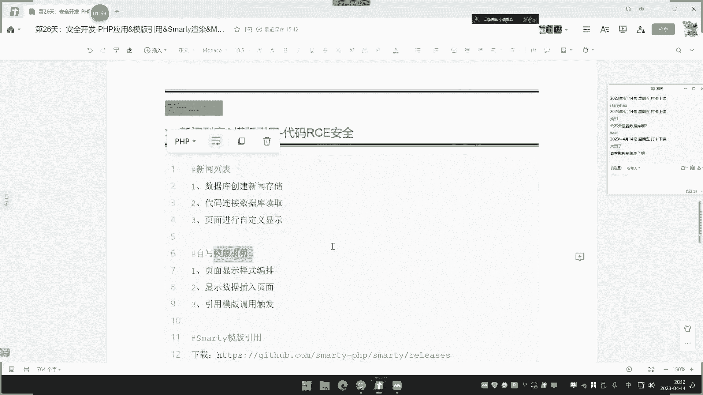

好，那么现在呢我们就把这个新闻，这个东西呢给弄出来。

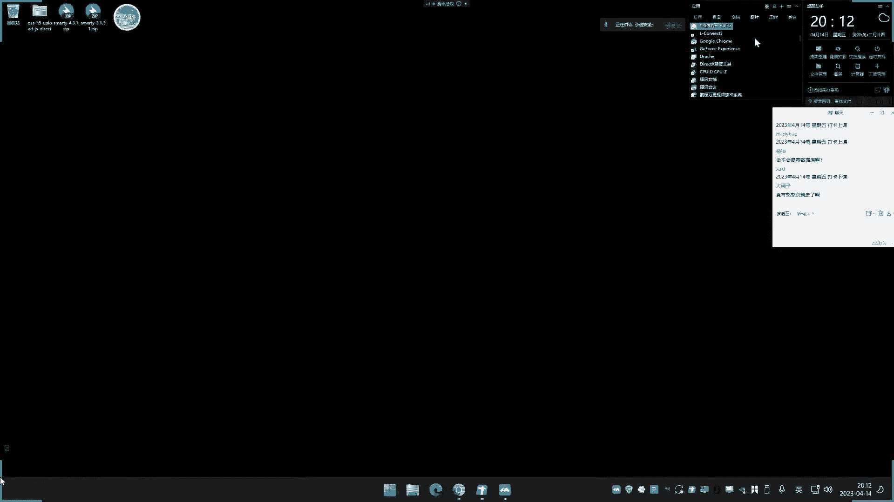

嘶好打开那个，多梦领域好，在这里呢我们创建一个文件名字，那就叫new点pp好，那这里呢在写代码之前。

先把我们的这个数据库啊给他搂起来。

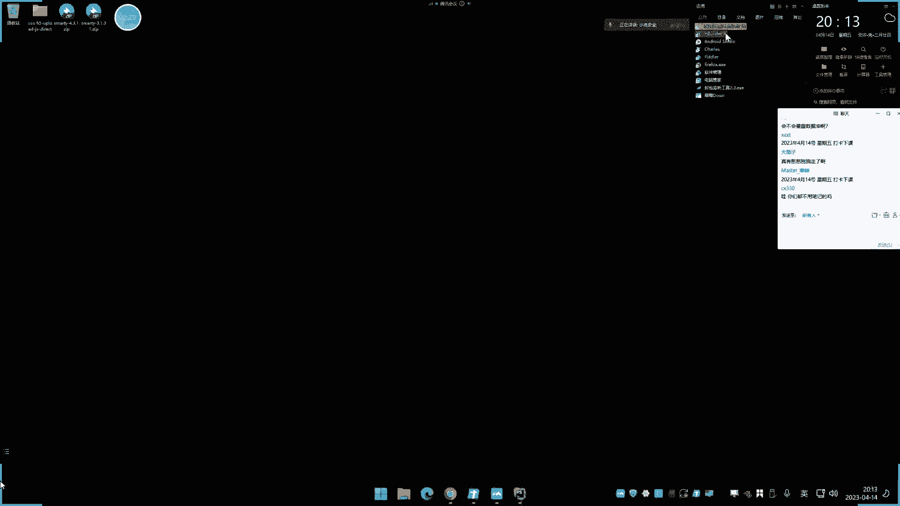

然后呢创建点新闻进去啊。

好我们打开这个库啊，然后这里呢有一个这个几个东西是吧，然后在这创建一个这个表表呢，好第一个呢我就模拟这个的一个设置呢，来给大家创建啊，就这里起个名字吧，啊首先第一个啊我们就取名叫这个艾迪是吧。

就它编号长度呢搞个十位就够了啊，然后不能为，当然后这里为一个减值，为他为这个E然后这里调自动递增，把这个选上，就是说呃你写一行一，那么下面就是自动为R就这个意思啊，好再加第二个。

第二个呢我们就搞一个这个标题，TRTLE是吧，标题好，非char类型不能为空好，只需再就是这个content内容啊，这个类型呢我们就搞成这个特殊类型，这个一因为只有255个是一个珠串类型。

我们要搞成一个这个test类型，搞成个test类型啊，那么这个长度了就不限制了啊，好再来了，继续往下，那么再来搞个图片image是吧，图片好，这样子搞完之后呢，就是说这里头有新闻标题，新闻的这个内容来。

然后呢图片好，当然了，你这里还可以写个桌子是吧，我们可以写个桌子AUTHOR啊，也可以写个桌子啊，我们可以往那这个呢，把这里呢取代一下标题，这里去掉，然后这里是位置移动一下啊，位置移动一下。

好来点击一下保存，再来取个名字，名字那就叫new啊，新闻的意思六好，那这里呢就是表创建好了，然后我们在这里呢可以自己呢先写个数进去，比如说id为一的标题为这个小迪安全培训是吧，桌子呢小迪。

内容呢我们就随便呢是吧。

写短内容录取啊。

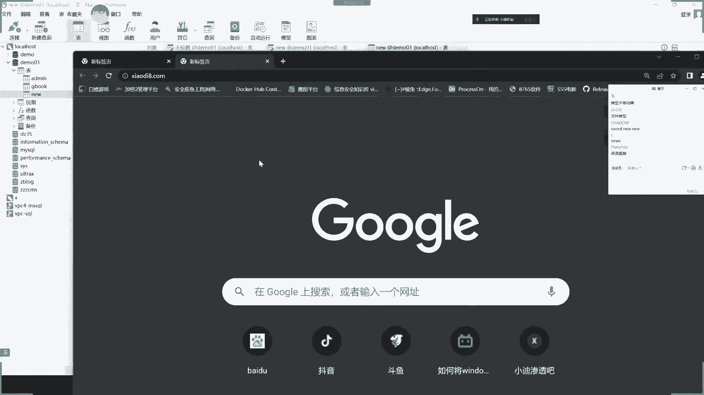

是吧，这个数据下来，是吧，就放到这里边啊，然后imagine那就搞个图片，就是当前目录叫image，就叫这个image，我们之前写了一个路径嘛，这个项目里面是有个路径啊，那个image下面啊。

这就这个下面要给一个图片吧。

就给个这个培训的图片啊，把它保存一份到桌面。

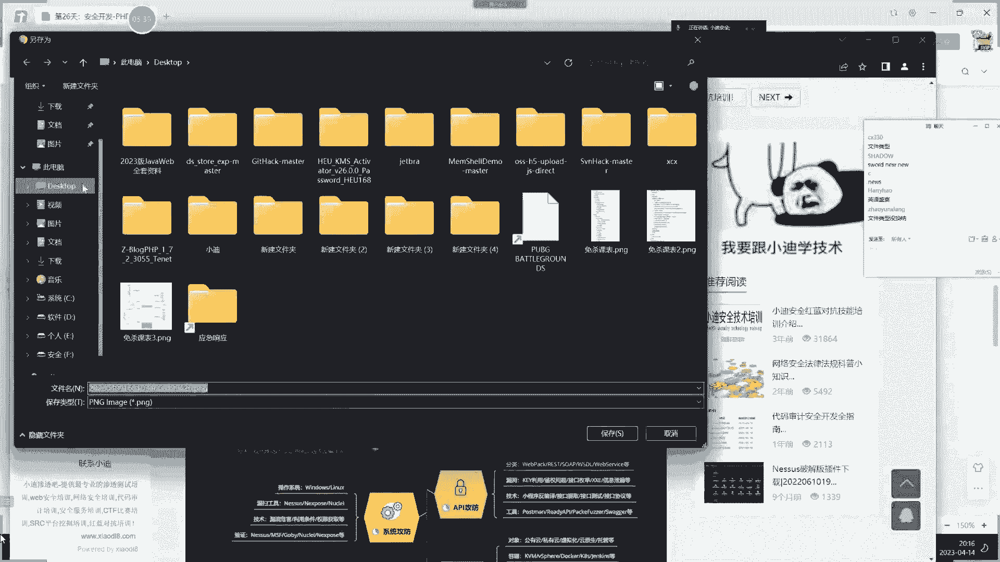

然后呢就叫这个小区的PN机吧，好然后呢在这里呢就把这个这里写上一个image。

刚小李点提升机是吧，写上这个内容啊，就加里面写一个数据啊。

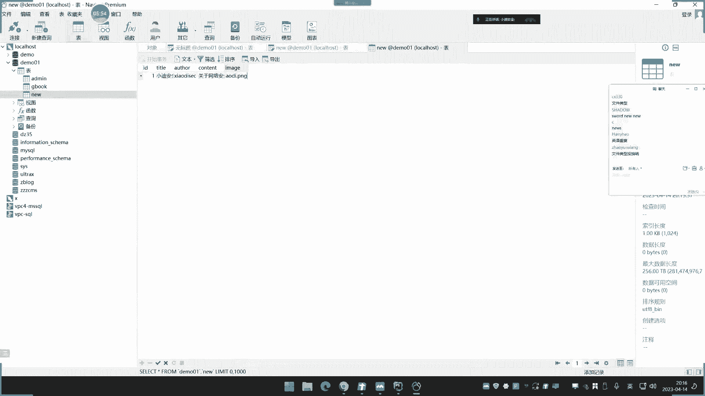

就是写个数据进去，然后呢在image这里呢把那个图片呢给他拉进来，拉到这来好吸纳，那么现在呢就是来读取这个新闻呃，首先呢我们数据库的配置呢，已经给大家写好了啊，就是enclose啊。

包含这个CONFIG啊，啊写好之后呢，这里呢就调用SQL语句来去把它执行一下哈，SQL语句，那就snack for嗯，然后new，然后while条件是while id等于变量id。

那么这个变量id该怎么去写它呢，对不对，我们可以在这里呢就写上一些，这个叫什么变量id呢，就等于dolf get，传递过来的那个什么参数值为ID是吧，也叫参数名，然后呢后面写上嗡嗡是吧，如果他没有传参。

我们就默认为他为移这么个设置方式，设置好之后呢，就用这个之前写好的这个mysql acquire，来去执行这个co n下面的这个链接啊，CN呢就是我们那个包含文件里面那个点击，然后来执行这个SQL语句。

将语句呢进行一个执行赋值为data，再用之前留言版的那个什么查询是吧，这个前面讲的内，当中用这个东西取出他的数据是吧，这个相信大家都知道了啊，用这个东西取出来的数据，取中的取取出一个数据。

然后呢取出的数据呢我们来给看一下，比如说输出一个这个RW第一行。

那么他这里取出数据的话，零行就是这个id为一的，那我再取出标题为一。

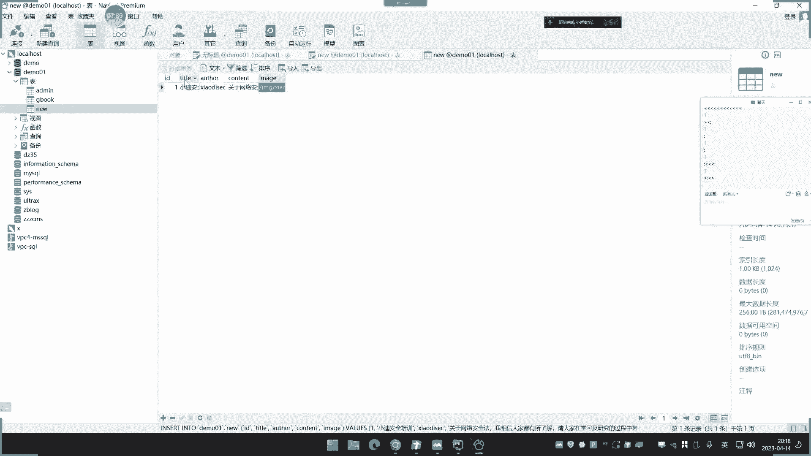

对不对，标题为一，再输出这个为order是吧。

这个桌子。

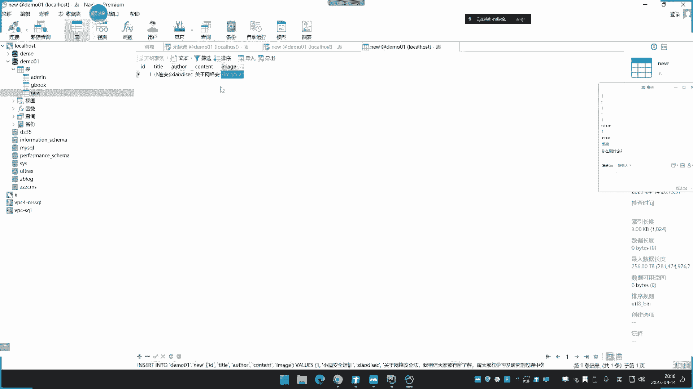

那么依此啊，我们来看一下是不是这个信息啊，三和四，一直输出这几个数据，然后在输出的时候呢加上个点啊，让他换个行看一下啊，这样子来避免这个显示不好，对不对，我们来写上去啊，好那么试着一下啊。

这样子呢我们就写好了。

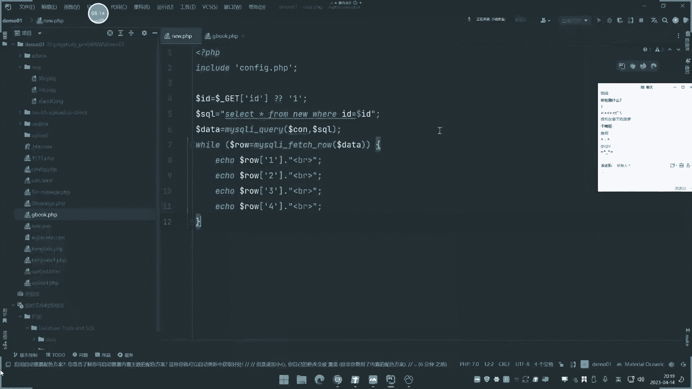

简单来说就是这里查数据，我们来可以看一下这里的一个结果，那你看是不是小力SERC，小力SEC是吧，作者这个是标题，这个是作者，然后这个呢是我们的内容，这个是图片类型，然后在这里呢。

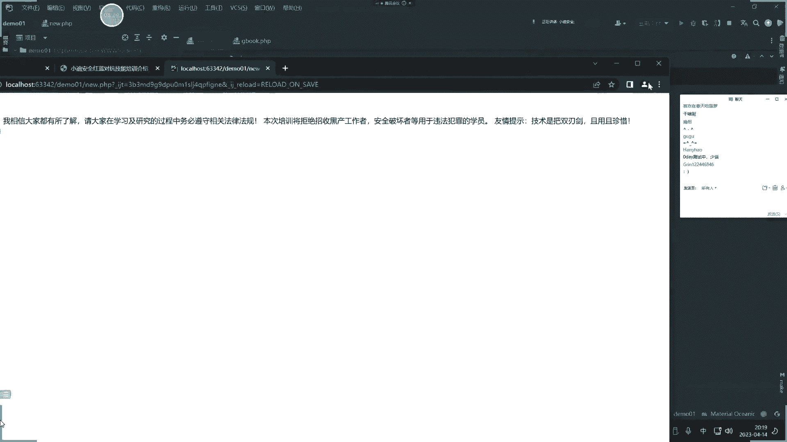

是不是我们要把它显示的更加美好，比如说我们这里呢标题我就可以把它怎么样呢，这样去写是吧，这样去写怎么写呢，看一下啊，可以啦，用这个标签是吧，Title，然后呢点连接这个什么这个标题，然后再连接什么。

你这个杠就是在页面中呢，让他去执行这个ATM代码是吧。

好这样写呢，你看啊他的标题呢就编了，编成了这个什么。

你看啊源代码，你看标题里面就有这个什么这个东西了是吧。

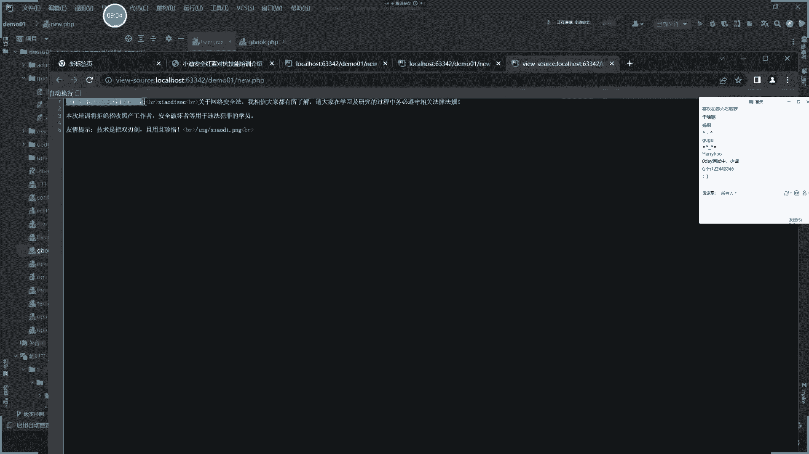

写进去了，然后呢依此啊，这里图片的话我们就用个image图标了，给它显示，写上个ATM代码输出的时候就把ATM代码执行是吧，SRC等于什么，这个变量值把写进去就等于这个变量值，对不对。

然后呢连上去之后啊，再来再来一起结束对吧，结束它好，我们来看一下这里的一个结果啊，image等于这个值，嗯那这里呢就是把这个值呢给大家写上去。

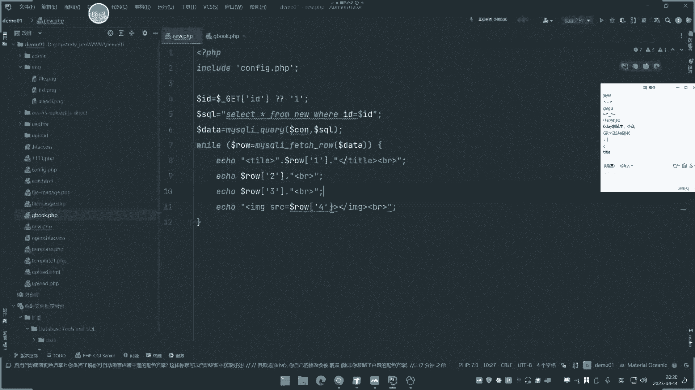

好我们来刷新一下。

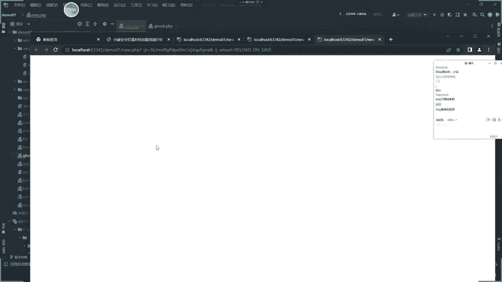

哎这里报错了，哪一行有问题啊，看一下为，SRC地址嗯，这里不用写这个东西应该也可以啊，唉这写不写都无所谓的啦，你们说是个单引号问题，哎呀也怎么说呢，啧啧，哎我写这个吧，好这样子吧，应该可以了，那是吧。

图片就显示了，你看就是这张图片呢是在这个ATM代码里面，那我能把它显示出来，呃如果你想加的话，你还可以加上这个什么长度，比如说等于1000是吧，啊宽度这个东西能设你3000啊，对对那你看现在就正常。

你看怎么显示是吧，但这里呢大家一看就说，这是能够读取新闻的是吧，有新闻的哎，但是这里呢很清楚啊，呃你在里面欧号加上id是吧，那写就算你不加它也会默认人一加id呢。

它也等于这个id1你看这是我们说的这个标题，还有这个什么桌子老的新闻，他的文章内容。

但是里面涉及到的图片是这么一个流程是吧，因功能已经实现了，但是这里呢是缺点意思的，缺什么意思呢，就说我如果对这个每一个这个东西。

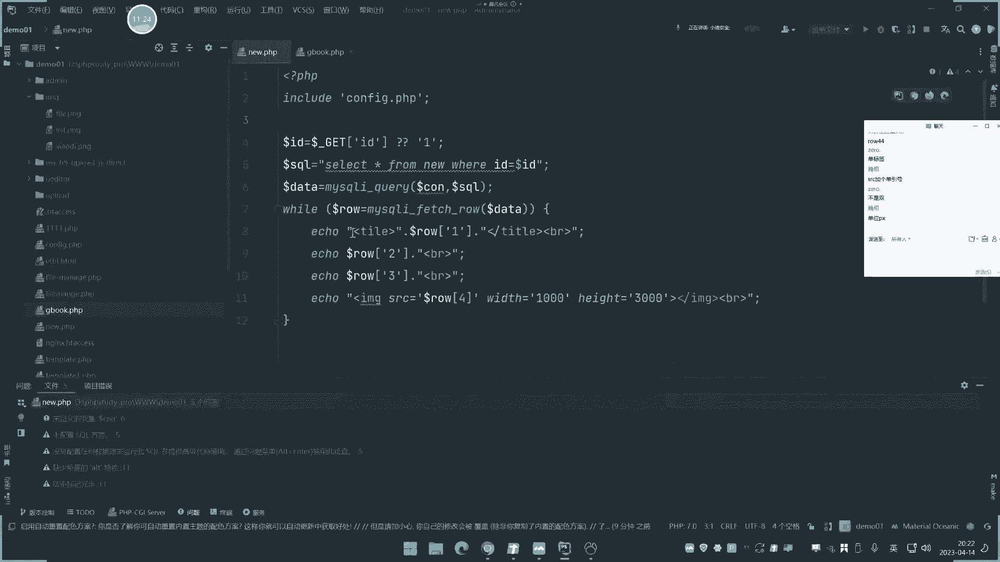

就说很简单啊，别人看新闻就是拿个正常网站，你看我的网站，那这是它的标题唉，然后呢是吧啊，有桌子，然后呢里面呢显示的也是这么美好，就说不像是我这种哎就这个光秃秃的是吧，你也不知道哪个是什么标题。

哪个是作者，哪一个是文章，哪个是图片，看上去呢就不太美观，所以为了解决这个美观性问题呢。

那你就要在这个什么输出的时候呢，加上这种HM东西，让他解析执行就很简单，比如我这里啊，我就告诉他是吧，这是这个标题，对不对，告诉他这是标题，然后呢你在显示的时候呢，他要做标题。

但这样子的显示呢依旧还是差，所以说就会引用很多的一些ATM代码呢，对这个显示页面来进行这个美化和样式的设计，那么这个模板技术就由此诞生，什么叫模板技术呢，来现在呢我们就给大家看个例子啊。

首先我们先创建一个文件，文件叫做什么名字呢，就叫一个选择一个HTML文件名字就叫new点ATM，选择这个ATM呢之后啊，比如说这里有个标题是吧，我就可以把这里呢把它括起来，比如说这里把括起来。

然后你看啊，我这里写好之后，接下来我怎么办呢，我用这里呢去写一串代码，去写什么代码，写什么代码啊，比如说我叫dollar f t e m p l a t e变量，就叫模板的一个意思。

然后file get tas得读到一个文件，读到什么文件，读了一个叫new，就读这个文件的内容，这个上节课讲过这个变量啊，读这个内容把它复制给他，然后呢怎么操作呢，啊大家看一下。

这里呢他在输出这个标题的时候是吧，标题的时候是等于这个RWE的啊，然后我们现在呢就做个什么事情呢，把这个阿拉丁取出来之后啊，做个什么事情啊，就做个这个事情啊，你看啊就是把这个2W呢给它进行一个切。

等于s t r reprice，就是个替换，替换什么呢，第一个值搜索什么东西，搜索dollar for title，然后把它替换成什么呢，替换成变量，这里呢我给它赋值，就这个值啊，把取出来啊。

变换Z替换成这个，然后呢替换对象就是这个TMT，然后再用这个EFEL了来执行刚才的这个东西，把它进行执行好，我们现在来观察一下访问。

唉还是还是这样子啊，然后呢，你这个好像是没有执行啊。

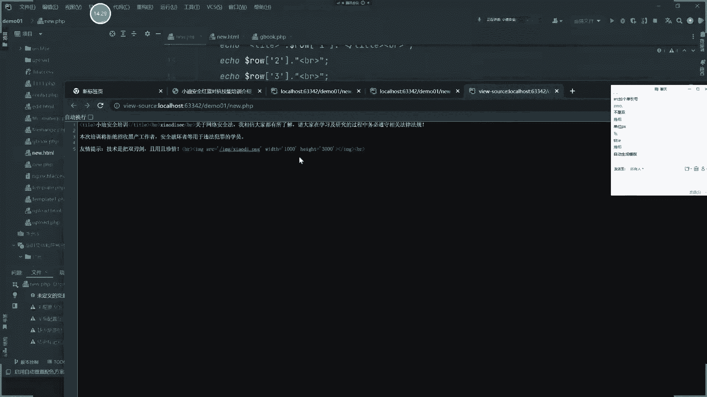

这里要写个这东西，把这个项目打开一下，大概看一下啊，那你看之前的是这个名字的，你看上面的名称是这个东西，然后上面变成个title，你看这个title变了是吧，我刚才那换的时候呢。

这个大写应该是有一个大写的原因造成的，现在呢你看代码里面呢，代码里面就自动编了，你看这里有个叫小迪安全培训，就写到这个title里面去了。

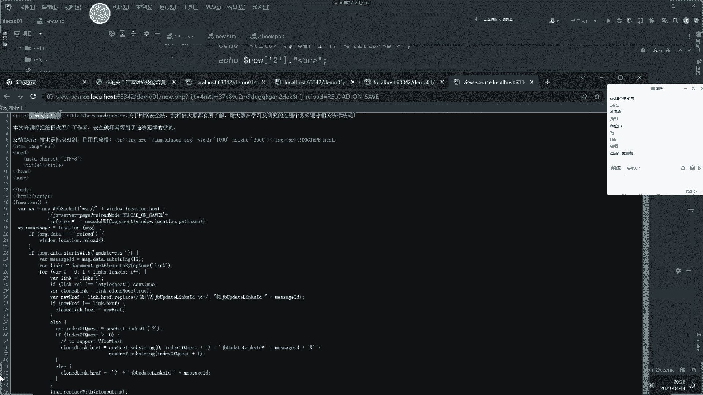

那效率的安全培训就写到菜里去，那其实呢就是说我写一个这种显示美好的界面，在这里我去替换里面的值，然后这个值呢就会随着这里去更改，能理解吗，就会随着这里去更改，它就说我这里。

那就是相当于说这里呢会随着这个变量，这里啊就很简单啊，这里他不是要显示标题吗，我就让他去解析这个什么NEOS，解析这个6S对不对，那么呢他去把它进行解析之后呢，把已经替换替换成这个变量。

那么也就是这个这个地方呢就相当于变成什么，就变成那个这个变量值了，所以啊我设计好的这个美好的页面，就写到这个news里面，然后呢啊去解析它的时候呢，去访问的时候呢，就让这个美好的页面呢去依次去替换。

我对应的变量的地方，就比如说标题这里我要写什么啊，然后呢界面写这里啊，你可能说啊这讲跟没讲一样啊，那么我们可以给大家看一下一个成品啊，给大家看一下个成品，首先呢这个页面我们这里呢准备好了啊。

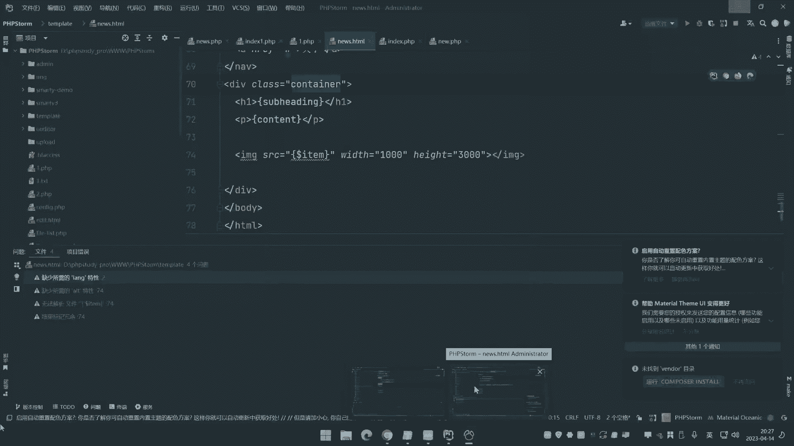

来把它复制出来，这个页面的一个美观程度呢，我先给大家看一下，这个页面呢不不是我教大家写的啊，是网上随便找的。

这个页面呢就是前端页面，我们给它搞出来来，比如说我把页面这里删，看着啊，这个页面是个什么样子，先给大家看一下界面，这是我们在网上找的一个界面呢。

这是框架啊，这里呢有首先这里呢上面这人是标题，这里是文章标题，这是文章的一个说明，作者啊，内内容和他图片这三个地方啊，现在分别显示是teng title和handy。

什么这个东西啊，你看一下啊，那就是这个记这个代码的显示啊，这是他设计出来的啊，这是标题，然后呢这里有这个他的这个主标题，然后呢几个这个索引是吧，首页新闻什么留言，然后这里呢再有这个什么啊。

真文在是这个什么图片的地方，我们就一次去替换这几个值，我们就依次去替换这几个值，怎么替换它呢，大家看着啊，首先标题这里替换成东西，然后替换哪里呢，就替换这个代码中的60点TM的第一个。

这里的先替换在标题为这里，把替换它寻找这个值，把替换成这个值对吧好，然后呢以此啊去替换几个地方，再来寻找第二个地方，把这个ATM代码里面的这个handy，大喜欢把替换成我们的。

这里不是有这个一个是title吗，编程然后这个是桌子，然后是内容是吧。

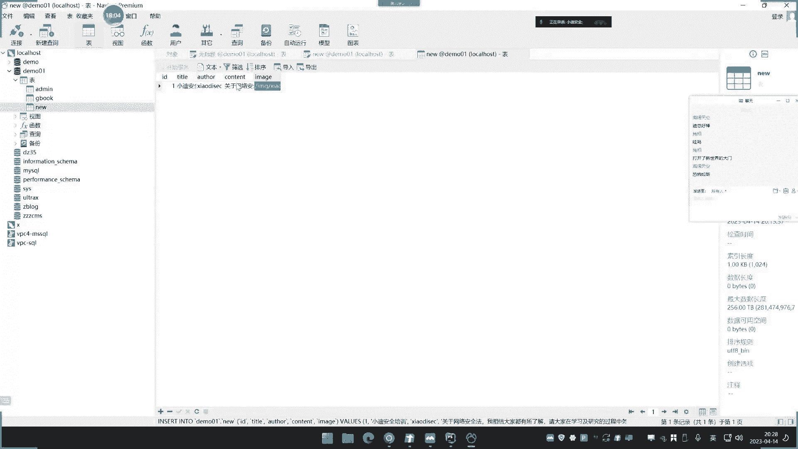

嘶哎这有点不对应啊，他这里有五个替换的，一个是这个，另一个是这个，然后这个这个这个有五个啊，那我就用这个数据库的吧。

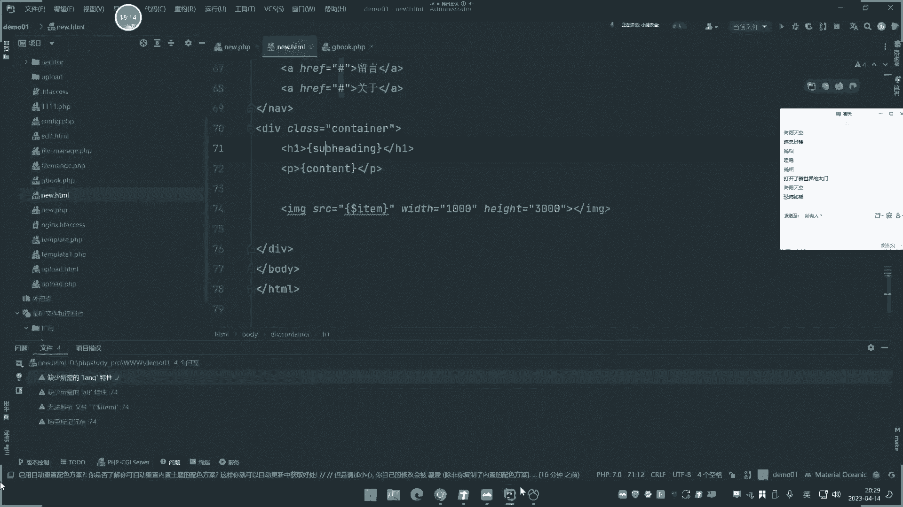

用这个DOMO的来用这个DOM数据库的啊，啊这里有五个来看，这有五个啊，这里有五个，你看对应上了啊，就多加一个这这个东西啊，因为他有五个替换的查询五个这个变量啊，有四个啊。

然后你看啊有五个来image的，还有个这个content的死的，那有五个我们依次替换，这里呢这是标题为第一个新闻，第二个呢是handle手头为效力培训开课了，然后第三个呢就是这个小题的这个主标题啊。

这个是主标题，这个内副标题，然后这个呢是内容，这是一张图片啊，是这么一个啊格式啊，就说你等一下呢你设计表的时候。

那就这样去设计它也行啊，然后这是多么数据库，所以我这里要把这个connection呢改一下，改成个demo数据库就可以了。

或者那我就重新设置一下个表啊，我重新设置也行啊，重新设置一个啊，这个是60，我重新在这里重新设置一个吧，我就不改了啊，重新塞这个，把这个删掉，重新塞这个啊，他的有些人呐，我绕着绕着他又不懂了。

我就重新从从这里重新塞一个和他对应上啊，id的我就搞快一点了啊。

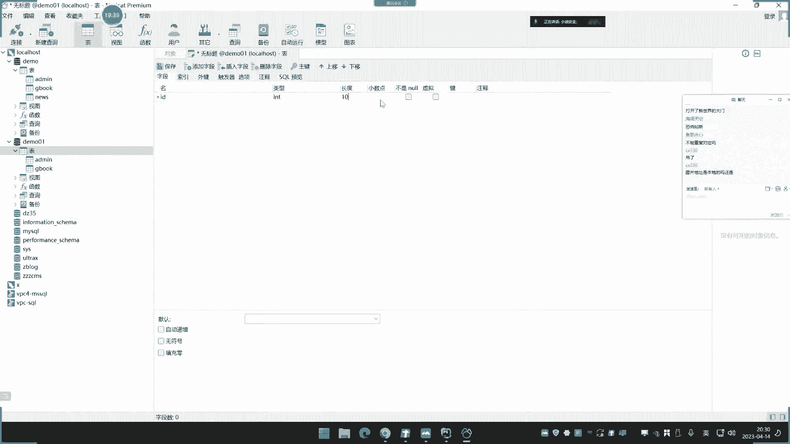

然后第二个字那就去，取这个，取这里面的几个啊，就搞一样的名字吧，第一个这个，好，然后第二个是，第二个变量呢和他的名字再搞一样的话。

好记一点啊，你也可以不搞一样，这个无所谓的啊，这个无所谓的。

啊这个呢在搞。

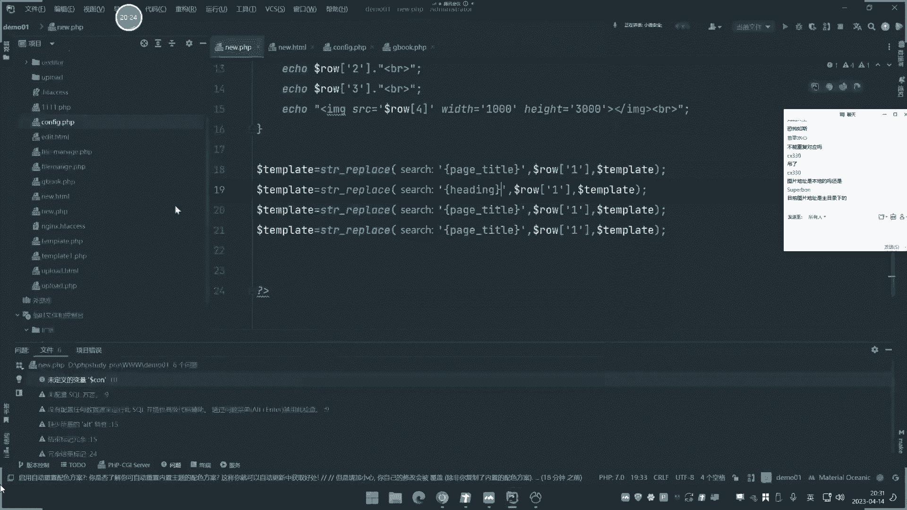

嗯然后呢继续，这是看他的思。

对吧，卡特斯中文，然后再就是这个对应的image。

中文在那搞test类型啊，test类型，这个就不限长度，然后image，好保存一下，名字就叫LUIS，好然后呢打开六四在里面呢去写一个新闻，i id以标题为这标题啊，这个标题为小李安全博客啊，主标题。

我们这个小题培训开课了是吧，好这个呢就是我们说的是这个信息，然后就是内容，内容呢，我们就还是按照这个刚才来，随便的选取一部分好图片，地址呢也是那个图片地址吧，Image，然后是这个小节点。

TNG这个内容呢就干2023杠一开了，好保存一下好。

那么现在呢我们就把这里呢给大家看一下，效果了啊，呃来到这个JS代码这里啊，然后这里呢就60嘛，就改成60，刚才是60嘛哈然后呢输出的时候呢，第一个啊，这个地方呢就替换这里的第一个变量值。

第二个地方呢就切换第二个变量值，第三个地方就是我们这里说的第三个，这个吧，嗯一个两个四个就可以了啊，然后这个是和这个四个就可以了，然后是content的，对吧，把它写进去，写进去之后呢，还有个吧。

还有个是那个image，对不对，还有个image image呢也要替换，然后就是这里的显示的哎，怎么关了呀，640来，还有就是这里呢这里不是有个这个这个标签吗，把替换成那个什么我们的图片那个地址啊。

把替换成这个这个第三个，这是第四个，这是第五个，把意思替换，替换完之后呢，啊把它一执行执行，就是用那个EFEL变量呢把它进行执行啊，就这里写一下就可以了，那我们来试验一下啊，看结果啊，现在看一下啊。

看下界面啊，额会有什么不一样的，然后把这里的尾巴全部去掉了，这里不用了啊，这里不用了，因为这个输出呢是等同于没有的。

就是把它取出来，这个值就可以了，勾好大家呢，现在呢这边是显示的是一个空白页面。

额，啥都没有是吧，这出了什么问题呢，这出什么问题呢，我们先把这几个地方呢给大家复制一下啊，先复制一下，首先这个第一个变量，把它复制一下吧，我们先确定一下是哪里的问题啊，然后用这个变量取代它，第三个。

第四个，先把这个东西都写好，这第三个第二个，第四个，第五个好，取出来之后呢，我们先输出一下。

看看能不能输出，看看是不是我数据库连接的问题，连接一下看下啊，输出能输出小李博客。

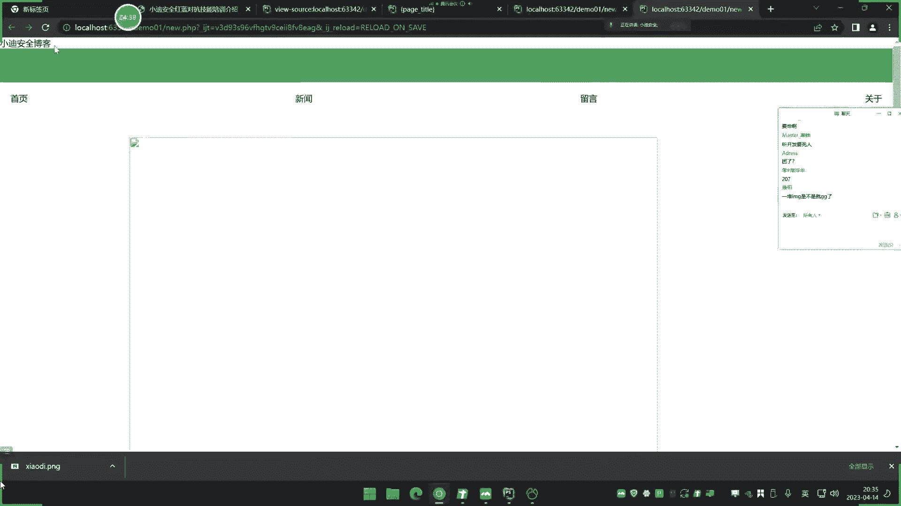

那就没问题啊，那么这里呢他就是对应商，那这是他第一个小的安全博客，他能输出就说明数据查询没问题，那我们检测一下，先是不下没问题啊，然后依次把这个地方法替换一下，因为它上面赋值，好诶，第三个是这个。

这个是看他是第四部分，这个是这个image，好那是哪里有问题呢，啊我们看看那输出你看正常了吧，你看现在正常了吧，刚才那个不行啊，你看现在正常了吧。

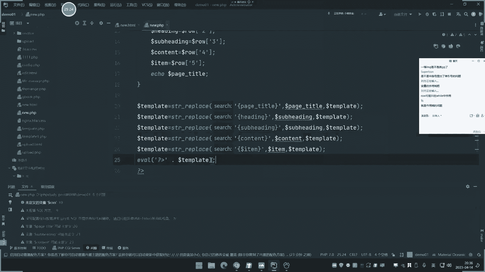

你看你看这个页面模板，我们打开看一下来是吧，他就按照这个模型，你看你看标题呢就变成小李安全博客上面，你看这个标题呢，我鼠标呢变成小量安全博客自动替换。

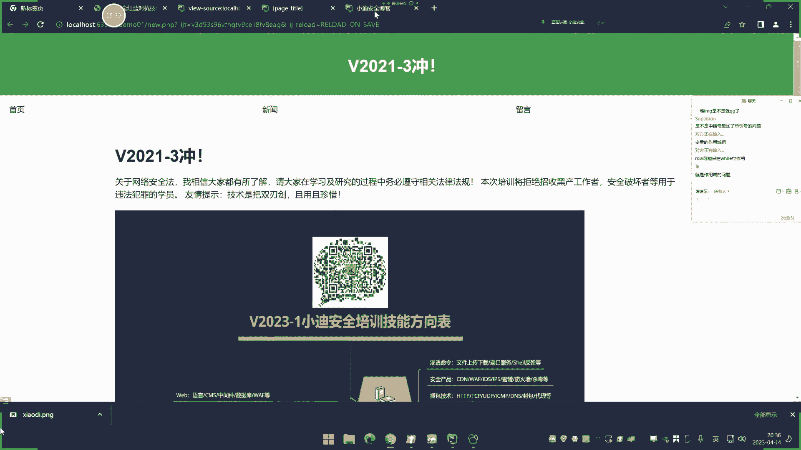

用那个模板呃，你这里呢就打开这个页面的时候啊，打开这个页面的时候。

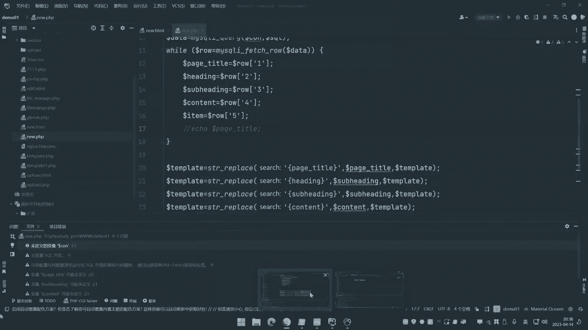

这个ATM代码的时候，你打开这个页面，那它就这样子，然后呢你打开这个PB代码，你看它自动替换了，那是吧，就是呢这里呢就显示主标题和副标题，包括你的征文啊，图片显示，对不对，从数据库里面查到数据。

再显示这个为什么要这样做，是什么情况呢，我们举个很简单的例子来，比如说就拿我们自己博客来想，你想象下啊，我点击一个新闻，是吧，里面这里有私信息，然后呢我换一个新闻再点哎。

他这个显示呢和刚才这个东西呢是一模一样的，一个框架，上面是标题，下面是内容，对不对，都是这么个显示模式啊，然后下面是这个什么发评论，那你想想你每写一个页面，你都要把这个ATM的这个模板把它重写一遍吗。

就不是我们之前原版的时候，在这里去把它输出的时候，我难道对每一个页面显示东西，我加上东西吗，就是我提前呢先把这个模板呢把它构造好，比如说这里面有哪几个地方要进行替换的，我就把取得值意思去替换这里。

然后这个叫60是负责新闻的，然后我再取个名字，比如我叫个什么呢，加个invest对吧，那么这个就是负责显示首页的，然后这个呢负责显示新闻的，就是很简单的道理。

看新闻的就是一个大概的模板，然后呢你看不同的地方就很简单，比如说我在那点框架的啊，它就是这么个图片显示模型，然后呢你看新闻的点进去，那这是看我们框架的这个什么列表是吧，新闻的这个呃导航的。

然后呢你点新闻进去呢，哎它就是这么一个ATM页面。

其实就是说他就是把这个东西呢作为分工了，这就是符合我们后面马上框架开发要讲到的。

一个叫标题里面写的FMFC模型，FMC模型啥意思呢。

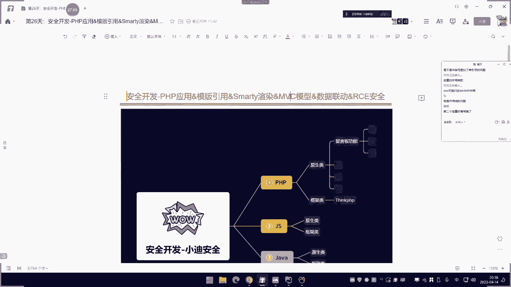

就是这个非呢代表value视图，我们这个ATM文件呢它就是专门做视图的，就是显示操作的显示的样式，然后里面要改变的值就类似于这种把它写好，然后呢你在pp代码中呢去把它进行是吧替换。

那么意思就是说在解析这个index文件的时候，去把它进行解析的时候呢，他就会按照这个逻辑，就像这里的页面，那就被替换掉了，然后呢你在显示这个页面的时候呢，哎就和我们的显示一样。

其实它就是一个ATM呢和pp的混编，只是我们传统混编呢就是在pp代码这里是吧，比如说我这里呢很简单的道理，我输出个echo是吧，输出个这个这个什么BR就换行是吧，我这样的输出呢我就这样写很麻烦。

然后呢我提前把这个页面写好，那么一次呢，在这里啊，比如说这里输出个变量啊，写个变量是吧，写个变量叫这个东西，对不对。

我正常来讲我要是这样去写，然后呢你显显示页面的时候，哎他就这样去写对吧。

你看他这样这样去写，对不对，然后呢你之前呢是这么个思路去这样写。

那么现在有这个东西之后呢，那你看它就显示这两个的话。

你看只显示两个啊，你不可能每次呢你要保证是吧，每对对每个东西的显示呢都用ATM来呢，再再把它重复搞一遍，所以提前准备好，那这个呢就是news，那么index呢就负责显示首页的那个模板。

所以这个网站的美观性呢就加大了很多，这个我这样一说，大家就知道这个模板的应用价值了是吧，我们先搞清楚为什么要用模板，先要知道它这个东西的由来，不是说你妹的是我凭空乱造出来一个东西，就是网站开发呢。

是为了保证这个界面的美观度和这个效率，它就会使用这个模板，把这个模板呢准备好之后啊，依次呢去对这个模板里面的这些东西呢，进行这个操作，于是呢就是相当于说啊在操作的时候呢，只需要对这几个地方呢进行替换。

那么页面呢就是按照你这个写好的样式呢，去显示是这么一个东西啊，所以这就是为什么要使用模板，保证效率和开发的简易程度，然后呢，这个程度那就符合于MFC的那个开发模型，就是我们开发角度一个思路啊。

这里让我也看一下啊，这个是一个z blog的博客，你看我们可以看一下啊，这个是一个z blog的博客，就是我们前期在网上下载好的成品源码，我们也看一下这个pp开发的源码里面，他有没有使用到模板技术呢。

你可以看一下啊，你比如说呢像他这里呢。

我们可以打开这个网站给大家先看一下，那这是我们妲己那个贼blog的原本网站是吧，那他原本还没有换任何东西呢，这三个结构是吧，来这里是它的结构显示写出来的一个结构好，你看下它的源码里面啊。

你比如说呢我点这个呢，点这个值，它就有这个页面显示啊。

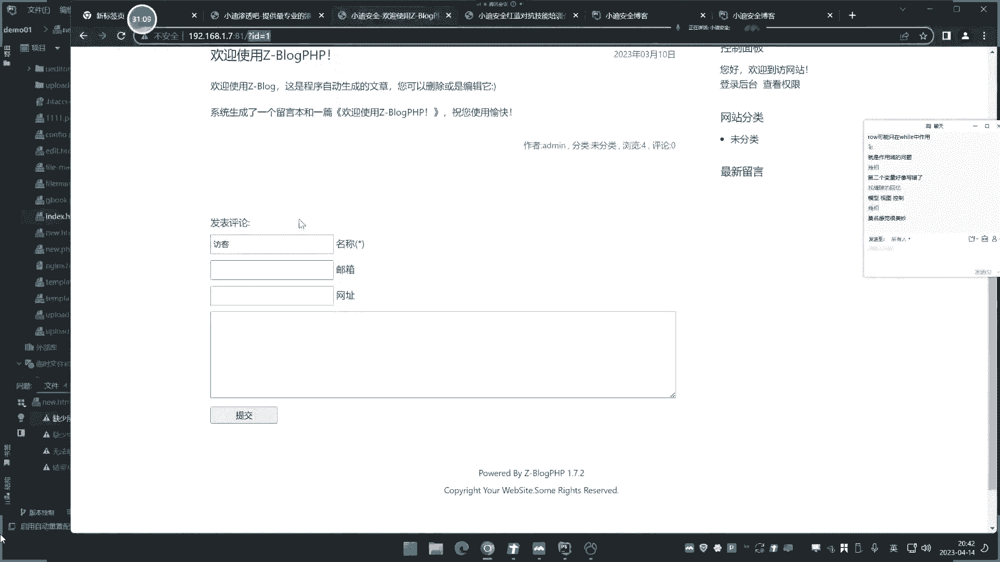

那这个东西是来自于哪里呢，你看一下啊，看他加狗，你看这里一般找这种模板，一般就是哪种名字呢，你不知道架构，你就找名字，那你看这里有个默认的，我们打开看呢，这里呢有个模板，然后这里有个什么。

你看啊有几个pp文件，你给pp文件也可以加A加文件，你看呢首页的handle的头部，finder的尾部，打开finder，你看里面是不是有这么难。

你看pm by z blog p p a tml common screen。

那你看这个尾部呢是这两个东西啊。

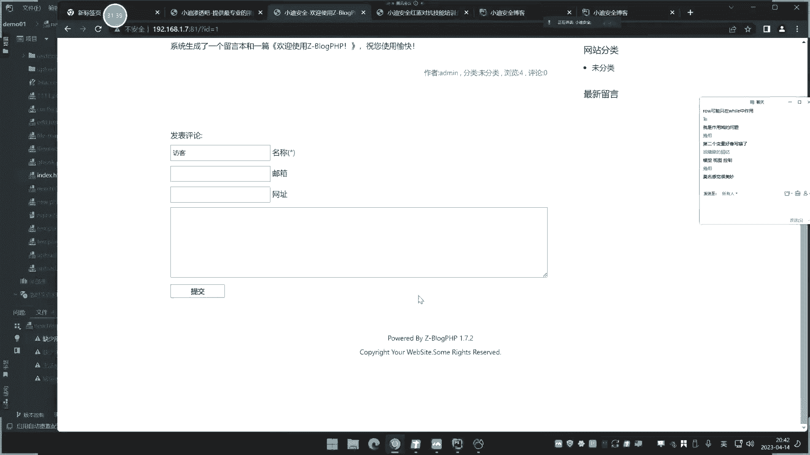

你看你看啊，一旦我把这里一改，你看我改成个X。

我刷新一下页面，嗯你怎么不动啊，哎你不要让我难看呀。

不要搞我啊，呃这个改了之后没反应，告诉大家是什么情况啊。

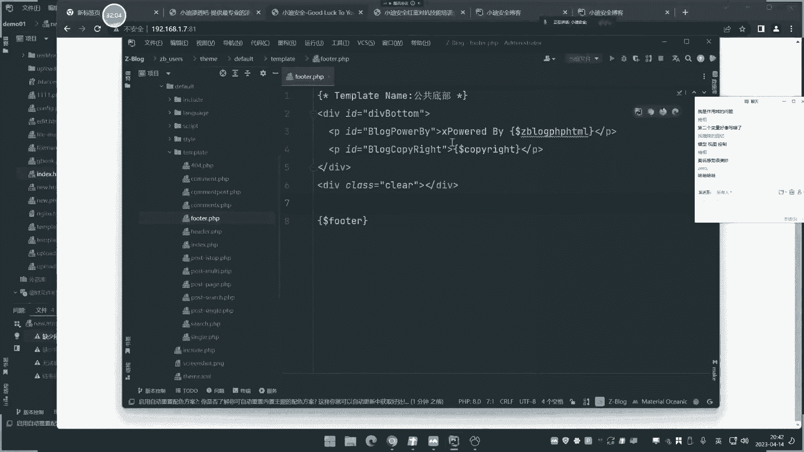

是什么情况呢，大家觉得是什么情况，你肯定觉得我又翻车了。

我告诉你很多东西翻车不是我的，主要的不是这个情况，它可能这里你看有几个目录，大家可以关注一下啊，来它有几个目录来叫d f o s TP u r e writer，Peng zi t。

可能就是说他这里呢就换了东西，就可能用到是这个zi it的模板，这个是你是说不准的，你不信的话，我给给看一下啊，我全局搜索这个文件，然后我把这里面的每一个东西，我都把它改一下啊，都把它改一下。

因为我不确定是哪一个知道吧，这不是叫翻车，不要什么东西，我一出错就是翻车，有些东西是因为你不还，你没有去确定它，你不知道他是哪一个地方，它里面有很多模板。

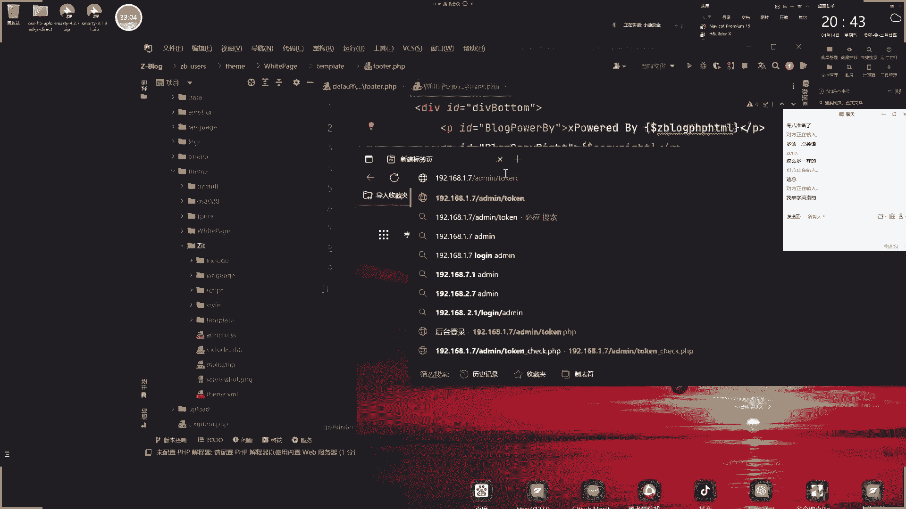

就是你登录后台之后呢，你就能看到他用的是哪个模板，就是哪个文件夹，它里面有多个，你知道吧。

呃我可以了，把这个地方呢显示一下，这个是by，还有这个地方的啊，这几个地方都改一下啊，Foot hunter，还有首页的啊，你看首页的啊，这个是首页的，我不改这个我改首页总行了吧，你看啊。

首页里面不是有一些这种名字吗，对吧，我加个乙好吧，你看啊，这个是改这个TP的，我加个乙，我再改，这个默认的，应该是在这个默认里面加个首页的这个模板，这个首页的模板我加个一好吧，那我写个东西来保存一下啊。

我把这个网站重启一下，先把停止，然后再把它重启。

好我们来刷新一下这个网站啊，额有可能是没有刷新的问题。

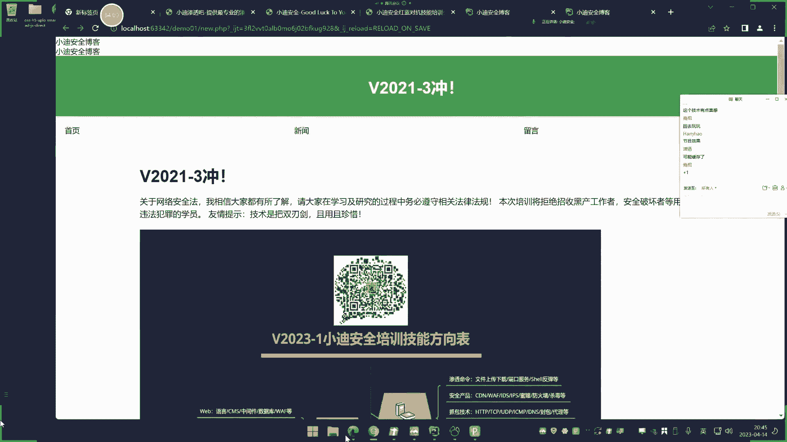

我们来看一下，重新刷新，我是额外呢要多给你去讲这东西，嘿嘿我翻车。

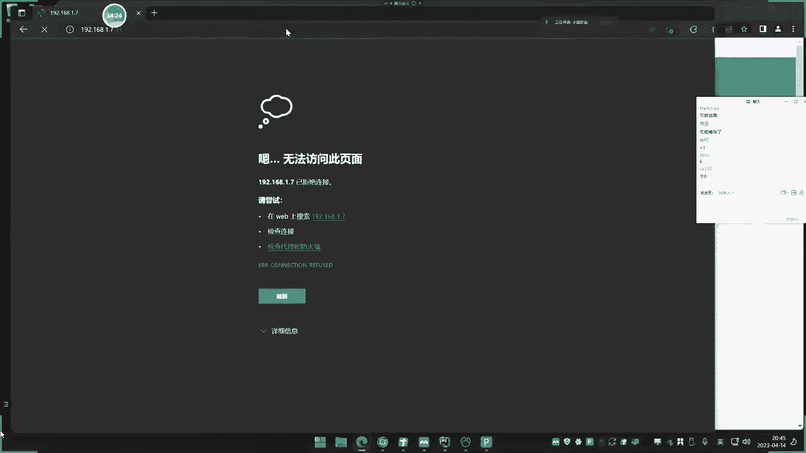

我都是有病，对不对，看一下啊，这里的源码里面看一下。

嗯这看来是我小看他了啊，这个上面没有看到这个移移的一个显示。

看来不是在这个里面。

我把那个模板给他登录一下后台。

来把模板里面都修改吧，我也不知道是哪个了啊，也不知道是个DEF的还是哪个，都修改了吧，妈的，是Z是哪个是AJ啊，你们说，哎是哪个是这个吗，把这个试一下，这个也不香啊，这个这个不香啊。

这个OS里面东西都还没生成呢，应该是这个吗，这个也改了呀，white zi t的，好都打都备注下啊，再来看一下。

还是没有改啊，那只能说我找子错了地方，呃我把那个地方全去搜索一下吧，我不搞出来。

我不行啊，不能被大家小看，老说我翻车翻车，我直接全局搜索，我把所有能看到的都改，我看确定是哪一个，一个地方这个地方没改，强制改了，估计是这个应该是这个地方的啊，这个叫TMP的，我看是哪一个啊。

这就说他肯定是一个模板啊，就是说你在哪里那个的问题，他有可能是这个缓存啊，一些JS文件调用都有可能，这其实就是做二次开发的一个事情。

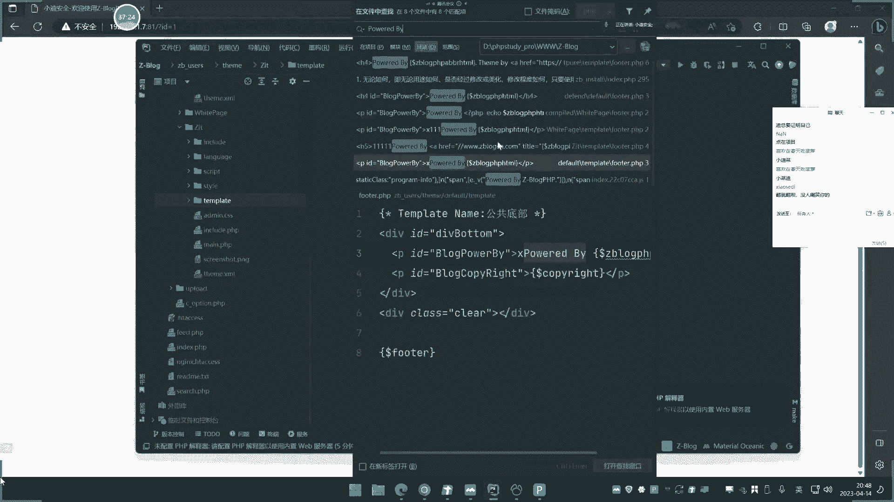

那看见没改了呀，四个叉你看出现了吧。

出现了四个叉，我看哪个改的是四个叉，前面，来哪个改的是四个菜，搜一下吧，啧哎呀，怎么搜不到了四个叉的啊，这个是四个叉，那就这个嘛，这个文件在哪里啊，write看到没，是这里啊，呐是这俩right啊。

我说我改错了目录吗，白黑的，我刚才改的是默认里面的，就是它其实自带几套模板，只是说你用到那个模板，那模板那可在后台首页就是设置，这哪要翻车呢，这无非就是找错目录而已，我因为我不知道用的是哪哪哪个目录啊。

我只是以为是这个默认改了，默认不会翻车，怎么会翻车呀，翻个锤子翻，这不叫翻车，这只是说你自己信息没有整理沟，检查完又能把这个问题检查出来，就没问题，你看这个就是它的一个模板，就这个它调用的是是哪个模板。

就这里面呢用的是这个write这个bridge就是白黑。

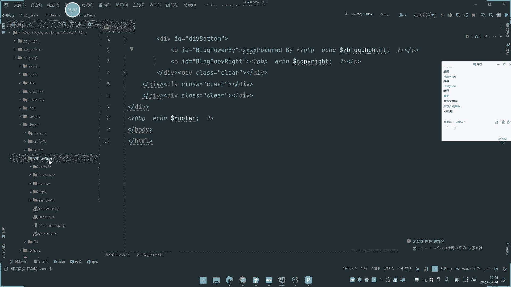

那刚好这个网站打开了也是个白黑的那个界面，所以符合他来个白黑界面。

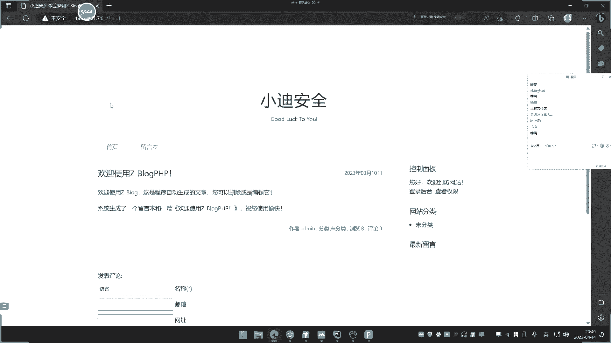

他用的是个白黑的模板，那就这里改，你看他就是这么一个地方的显示这个地方。

然后你看后面那个叫变量z blog p p ATM，那应该就是对应的是什么值啊，是不是就是这个z blog7。1R呀，对不对，你不信的话，你可以打来到他数据库里面去看对吧，他数据库里面你看啊。

那肯定就是其中一个内容里面的东西嘛，是不是啊，是表格呀，或者是这种东西的一个对应值，是吧，就是它里面对应的那个那个值啊，就是放肯定是放在哪里在啊，查找一个类命值，就那个后面那个对应的东西。

那变量的话可能是数据库里面存储，有可能是他自自自自定义设置的。

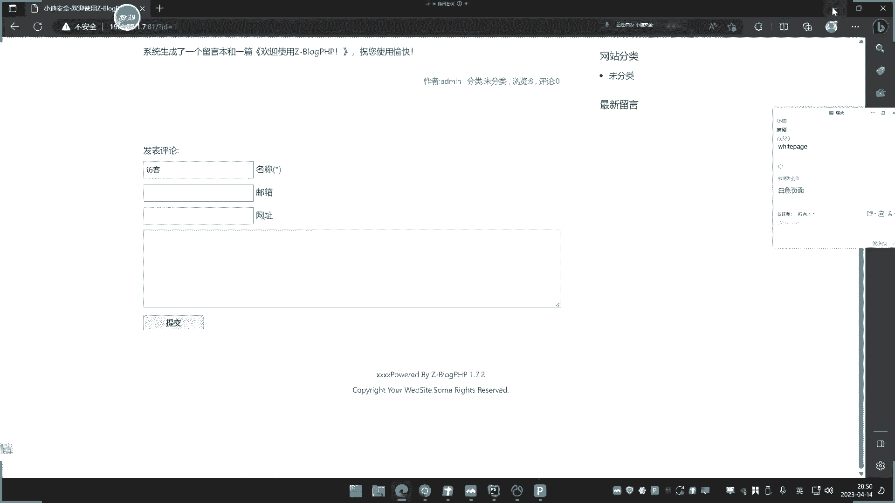

就这个地方对吧，那就是说呃我们看到这个页面上呢。

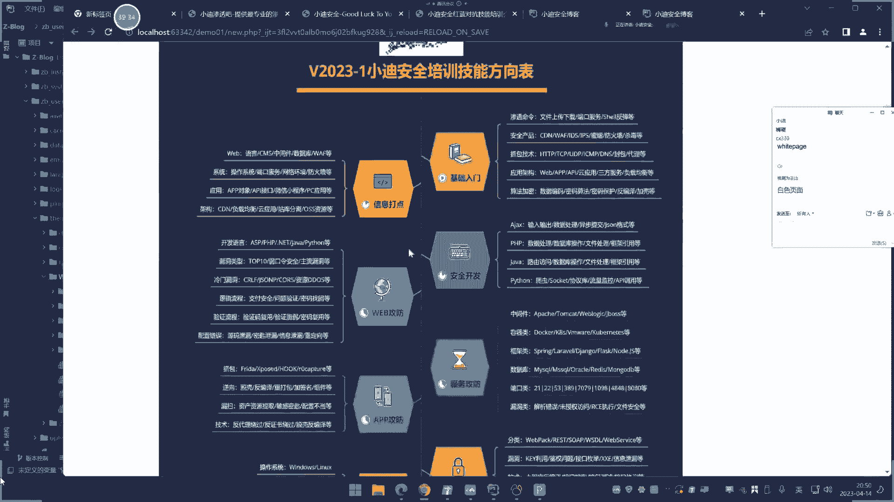

包括这个下面这个值和这个什么z blog，七点夜宵有可能是数据库里面储存，有可能是这个变量里面存储，你可以跟踪一下这个变量，对不对。

你可以看下来，我们搜一下，是吧啧那么其实这里那就很清楚了，也就是说你运行的这个页面，这个尾部文件FO特点，pp在下面显示的这个内容这个地方是吧。

其实在这就是模板，那么也其实很简单，我们这里呢可以自己呢再写个页面，看是不会受到影响呢。

来笔记很简单，我们只能写一些其他东西，你比如说啊这样子啊，我写个东西，那我写个PPPL口，或者说我换个行好吧，我把这里换个行，你看啊，我这里加上这个代码，然后换行一下BR对不对，保存一下。

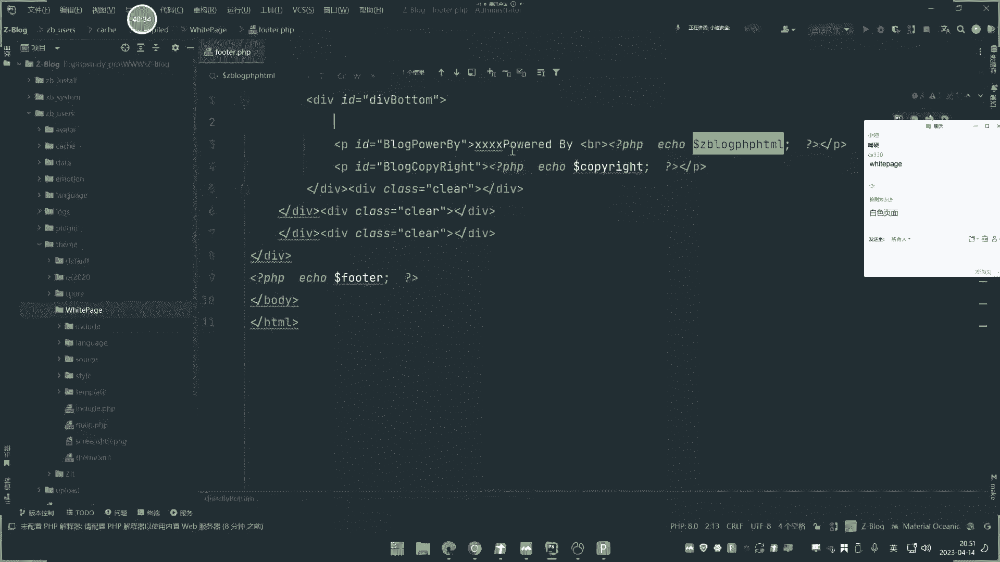

刷新一下来看到没，是换行了，下面的页面都不正常，你看那换行了吧。

是这个模板呢没问题啊，就是你访问这个页面。

那它调用这个负点pp访问的时候，哎，这个下面的处理pp就是下面这个做这个事情的。

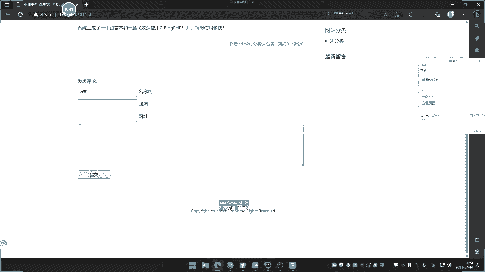

然后它每一个那就是头部呢是方的，首页呢就是index，那么就在这里改啊，这是它显示样式的地方，意思就是说放我首页，它就按照这个ATM代码的模型去显示，然后呢再到所有文件去调用，来替换这几个地方。

所以这个呢就是负责央视的好，那么大家就知道这个模板的应用了，我还举了一个这个网上的开源程序成品，给大家演示，那么大家就应该知道了，我给他一讲，大家就明白了这个源码的体系架构，明白体系架构。

你就知道以后你在做代码审计的时候，哪些是重要文件，哪些不是重要文件，所以我们讲这个不是说是吧，和安全不相关的是很相关的，好啦这个东西搞明白之后，他有什么安全问题呢，好大家可以看一下啊。

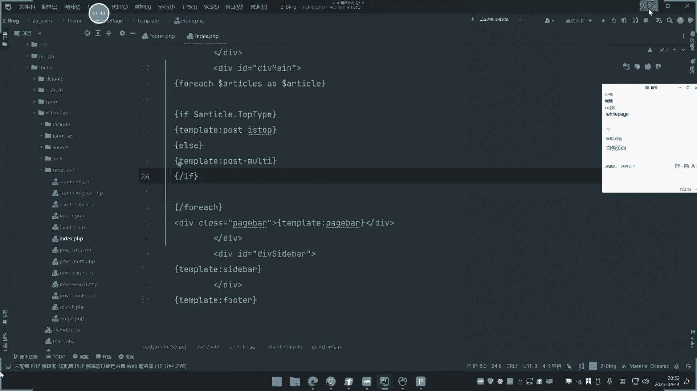

有什么安全问题呢，我们来到我们的例子这边来啊，先不看这个z blog了，z blog呢搞清楚之后啊。

我们这里呢就看一下这边我们的代码啊，你看有什么有什么不一样的地方呢，大家看一下啊，那么它就会出现什么安全问题啊。

比如说啊你现在啊我们看一下啊，我们来到我刚才那个这个地方，他用的是ZM01嘛，这是他的新闻对吧，你看啊，我把这个地方假如我添加新闻的时候，这个新闻添加应该是后台添加啊，比如我添加新闻的时候。

我把这数据里面插入一个东西，大家可以看一下啊，我插入什么东西啊，我在这个标题或者在任何地方啊，只要这里的任何地方都行啊，比如我在这个地方啊，爬到这个pp代码里面去，假设咱pp引波我查了这个问题啊。

好我查了之后啊。

就是标题里面突然多了一个这东西，好当我们去打开这个页面的时候。

我们看一下啊，打开这个页面的时候会出现什么情况呢，来看一下啊。

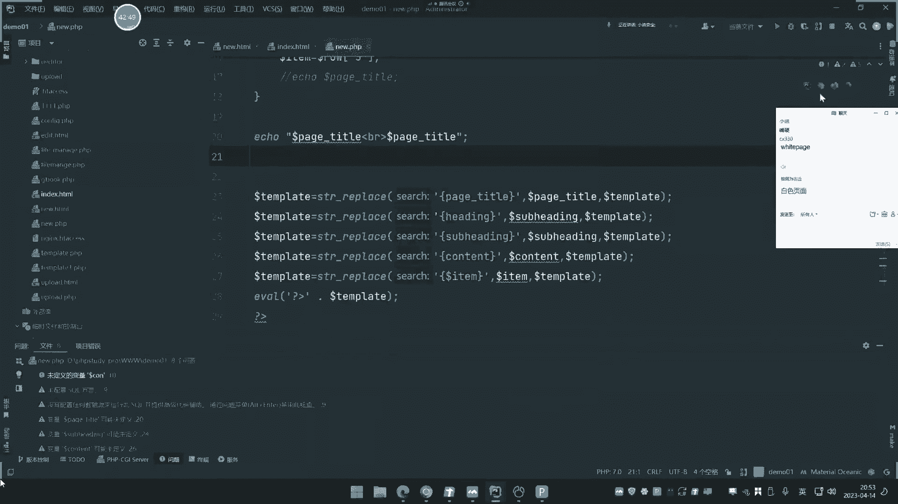

看到没，这是什么东西啊，是把批评音符执行来一个哎，为什么会造成这个原因呢，其实就是因为你在页面去渲染这个模板的时候，运行了一些代码执行。

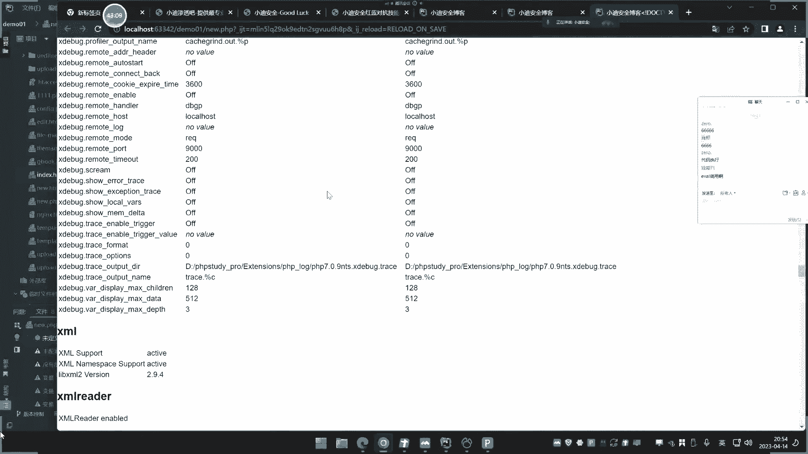

所以导致你明征文中数据中再取出来，执行的时候也把这个pp服了。

给他执行了，所以这就是代码执行漏洞，最容易产生的第一个地方就是我们的模板，这里因为模板要被调用运行，那么一旦模板中有这种代码就会被执行，或者说很简单的道理，这个地方改了会造成我们把三条线删掉之后。

我们重新刷新，它没有了是吧，它没有了没有这个东西了。

然后呢，但是你的模板中，如果说你的模板中这个模板就中是吧，你把它修改一个东西就很简单啊，你比如说在这里啊，我写成这个东西，你看啊，我写这个PB代码，它也是一样的道理，那他取这是ATM代码。

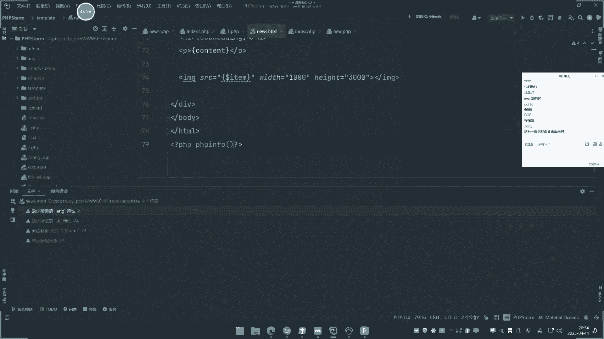

我们直接访问它，它是没有任何反应的，没有这个pp用符。

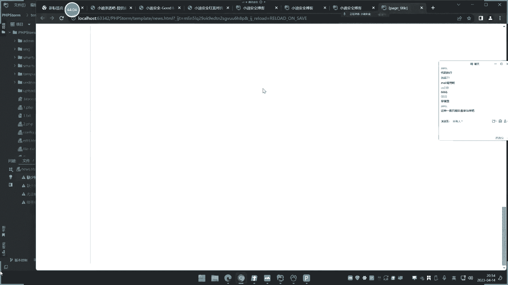

因为它执行不了这个PP代码，对不对，但是呢你去访问这个页面诶，搞错了，修改错第一方这个地方，那是哪个项目的。

那你打开它，它现在呢就是呢显示呢就不会显示这个东西，你看下面就没有是吧，然后呢当你去访问news点pp，去调用这个模板的时候，我们下翻，那看到没pp以后就被执行出来了。

对吧，访问的是news点pp触发了这个new点ATM的代码，为什么，因为这个六点pp在渲染这个60点ATM代码，它把它进行什么执行，因为他要用它里面的样式，所以导致pp这里面的PB代码也被调用执行。

所以这两个实验其实就是告诉大家，很简单的道理，这就是在后台中经常出现的代码，执行当中的一个难性，就是你在后台中，你要执行PB代码，可以在模板中去查入这个代码内容，他执行来让这个地址呢来解析你的pp代码。

来形成一个后门，这是第一点，第二点，代码升级中关乎模板上面的，如果说你通过代码里面能操作模板的话，那极有可能就会引发代码执行漏洞，因为这个模板能修改，那么如果你把这个代码写进去，就会造成这样的问题。

是不是好，那这一种呢是我们自己写的模板，而并不是说我用到了别人的模板，啥意思呢，我刚才做的这个演示，这个模板是我在网上的水面找了个ATM代码，然后再修改一下自己写的模板，那自己写模板漏洞百出。

因为你不懂得怎么控制这个安全问题，你知道显示，所以说呢，网上呢就有人又开发出的第三方的模板，那么在pp开发中用的最多的第三个模板。

叫做SMARTY，这个是pp的内资，而不是内置模板，就是第三方模板，就是别人呢给你写的，你看pp的开发模板引擎，它是干嘛的呢，就是专门来渲染页面用的，让你的页面呢更加美观，又能确保安全性。

就会有这个叫这个东西，就是别人给你写好的模板，就不需要你自己呢是吧，就像刚才一样，这个TM来表白了啊。

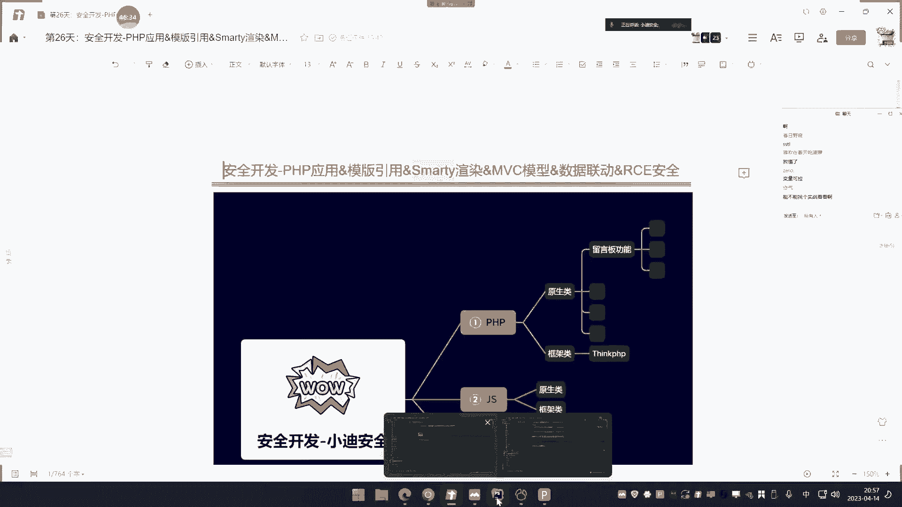

这个ATTEM代码呢就是我们写的是吧啊，这是我们写的好，对不对，那么现在呢我们就给大家演示一下，如果用第三方模板的话，我们刚才的这种思路是不是就不行了呢，好接下来我们就来演示第三方模板的使用。

刚才的是我们自己写的这个TM代码是吧，这是我们自己写的，是这样写的，对不对，然后在页面呢是我们在自己设计的是吧。

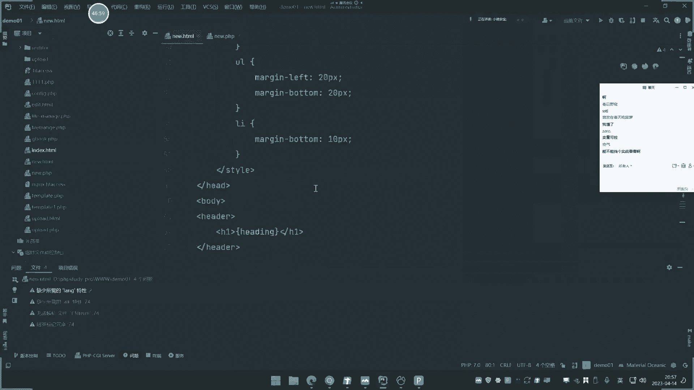

总我刚才自己写的，你看自己写的这个东西好。

那这是我们自己写的，我们现在呢再来看一下，如果我用第三方模板的话，会是怎么一个情况，那么接下来啊用第三个模板看着啊，现在呢我们再往下了一个第三个模板，这是它的文件，他如何使用它呢，不会使用。

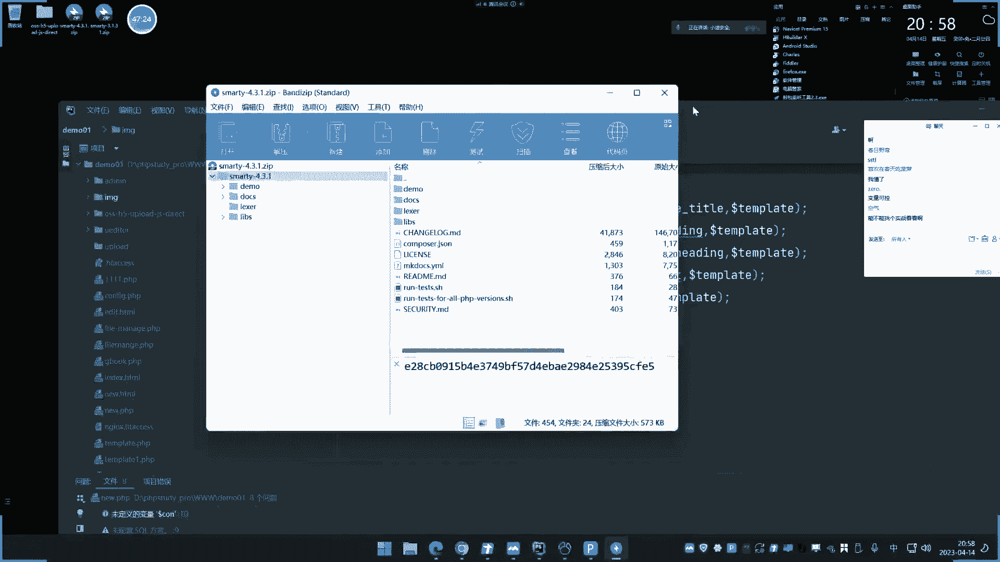

可以简单的去学习一下这个模板的使用，啊他说怎么使用啊，这里网上有是吧。

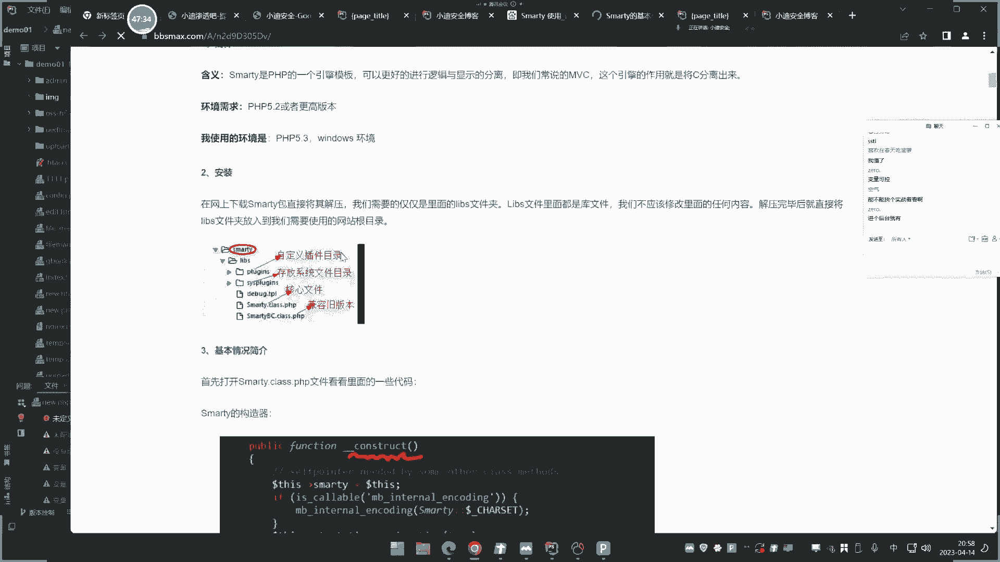

哎大不大概过程呢，我给他说一下，就是第一步该怎么做。

第二步该怎么做，第三步该怎么做，首先呢他的第一步就是啊创建一个文件夹，或者说你直接把这个文件夹命名，命名好之后，把这个版本的给他解压进去，把模板文件解压到文件目录去，然后呢随便创建一个文件文件里面。

就用这种代码来去调用模板，然后呢我给大家演示一下啊。

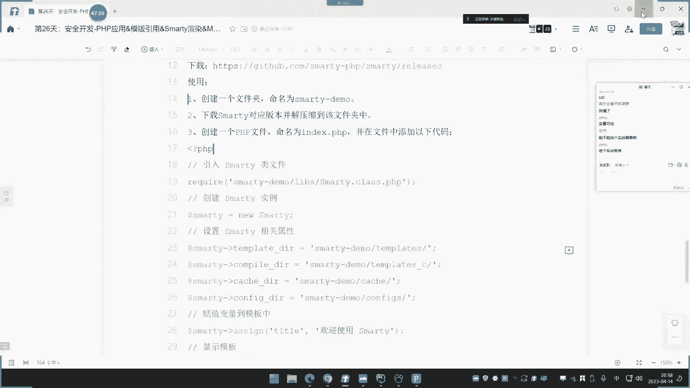

给大家演示一下，所以在这里呢我们就给怎么样呢，先把这个我把它给它解压一下，写完之后呢，把名字改一下名字，那就叫smart杠demo是吧，然后把这个文件夹呢给他放置到我们的项目中。

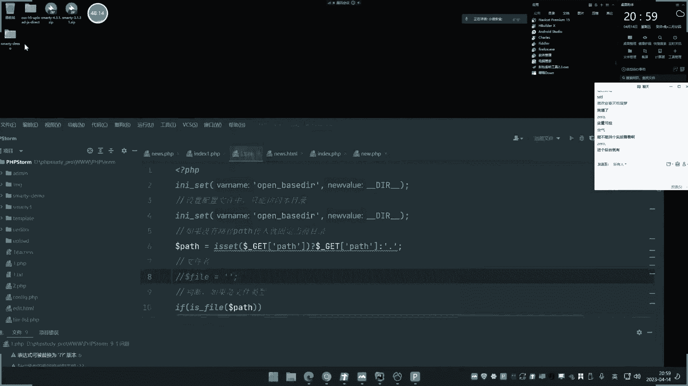

放在我们项目中啊。

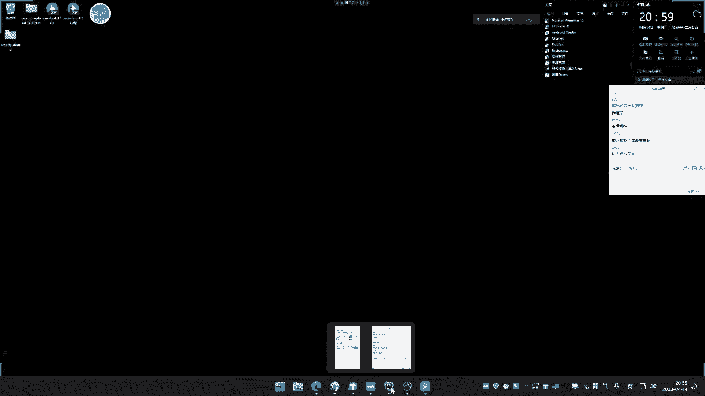

来放在项目中粘贴，复制到根目录好，你看这个模板就导入进去了是吧。

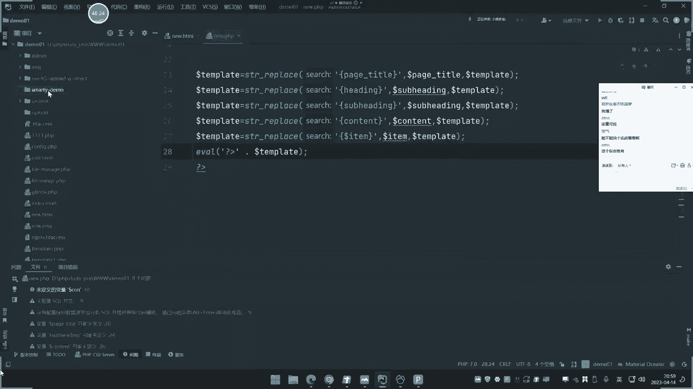

哎这里级别有点问题啊，我把这里删掉一下。

他是在这个路径下面，我们把它取个根目录吧，把这个名字重新改一下。

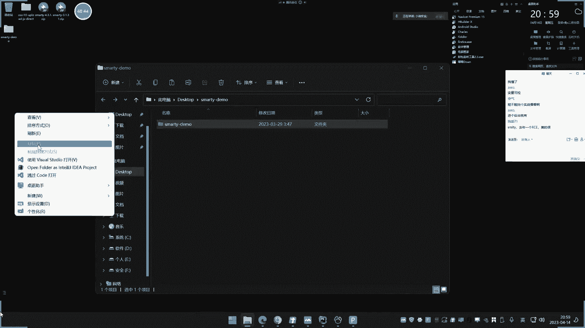

好这样对了，重新来复制一下啊，先把这个删掉，好重新来导入到这里啊，复制一下CTRL加C好拉开这个就算模型啊，好如何使用它呢，大家看一下啊，我们找到首页文件。

我们随便创一个啊，比如说我随便创建一个这个文件名，可以随机的啊，不是说必须要的。

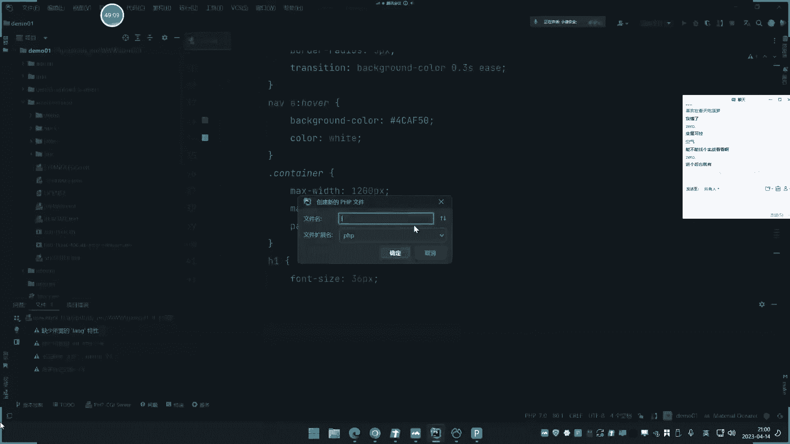

也是这叫INDEOR吧，Industor，然后怎么办呢，这个是要调用代码啊，来我们把单用代码来拿出来，这个代码呢就是一一体的。

来一体的，然后这里要改什么呢，首先第一步改路径呐，这是包含的这个模板目录，刚才导入进去的模板目录，这个路径对应上呢smart dmo labels，然后对应的这个什么smart class。

这个是配置文件导进去之后创建实例，然后这里有个叫模板的这个引擎，这里呢也把它目录这个地方改成这个目录，比如说现在呢我把名字改一下啊，我让大家明白一点，就这里呢不采用默认的，我一改一个这个目录。

几个地方都要改，我先把它改一下，让大家明白啊，主要是等下怕这个目录你改名了之后，你不会用，简单用一下就可以了啊，好啦是这个嘛是吧，把名字改一下啊，我名字呢就叫这个smart，就叫这个名字。

改了之后把名字改了，然后这个地方的意思呢，把这个地方全部改就完了啊，就这个目录对应章的就把改一下就行了啊，其他就不用动了，好然后呢改完之后下面呢你看啊，他说呢配置模板标题就把替换成欢迎使用smart。

然后这是模板的地址叫index TP l，它的模板呢是TPL的格式，然后这个时候啊你就找到你的模板目录，找到一个叫名字叫做什么，你要和这个名字应呢，这是模板的目录，那么他的目录是TAS。

那么你就取名一个叫这个名字的。

在这里面新建目录。

然后在这里呢放置index tpl，那这里创建一个什么index TP l这个文件，你在pm上写什么东西呢，就是HTM代码就完了，然后HM代码呢我们可以随便生成一个，或者说我用到刚才的这个user。

把它放在也可以，然后呢你看啊它会更改什么呢，就把标题更改成欢迎使用smart就完了，好我们试一下啊。

这是我们的模板，我们打开index app。

哎不对呀，那我还是用他官方的这个模板吧，那就这个吧，就把改一下就可以了啊，哦我知道了，他这个title呢不是这个我们要改这个地方，改这个地方来搞错了，这还没改啊，欢迎使用，我打开，唉，还有不对，妈的。

他不用不自这语法啊，他不制这个语法，不能用这个，用这个，然是个变量啊，他是个变量，那就用这个变量呢，然后在他去显示这个title，就他的语法呢，就是你这里呢要换上这个倒数变量，它就知道来换上去。

然后呢你看一下啊，现在我们来访问页面，你看访问这个首页就自动变成了欢迎使用，然后这里你改改什么，它这地方就改什么，看到没，他就用了这个这个模板呢，用这个模板呢对应上了。

如果说你用刚才我那个模板也是一样道理，那用我刚才那个模板60的，那我只需要改个地方来把60的写进去，比如说我改这个标题，这里是吧，标题这里我就加上TT，就和他一样的写法啊，一样的写法好。

这次的我们再来访问，怎么不对呀，不能这样写吗，莫名其妙还只能这样写啊，哦这里还有个好，那这里呢就是可以看到啊，这个第三方的模板呢，我们就把写呃这个smart模板，那就把它搞清楚了，你看就把它搞清楚了啊。

这个就使用这个模板呢访问index app的时候。

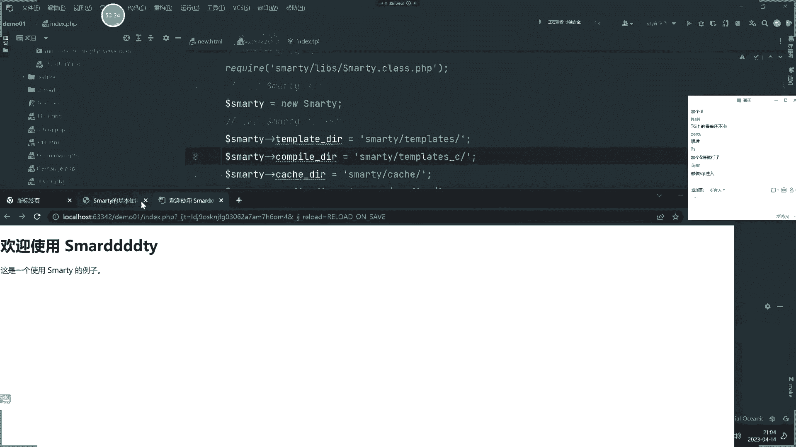

index pp没有做任何事情，它加载的是这个index TP l的模板，然后这边index pr模板里面显示的是这个内容，你访问是访问不了这个index hell不是个文件啊，你访问不了。

里面是TM代码，然后这呢会替换这个t ta值，把替换成呢欢迎使用，那么同样道理，如果这里让你进入数据库查询的话，那么就以此把数据库的查询的值呢替换，这里就完了啊，就不说那个事情了，那个相信大家都会了。

就我这做了个例子是吧，去解析它好，那么现在你看啊，我们用到的第三方模板之后，我按照我刚才的思路来讲，如果说这个地方有这个pp代码的话，他能不能去解析这个什么，解析这个p p m for代码呢。

是会会造成这个变量值啊，代码执行漏洞，那你看啊我写到这里，刚才那个呢是改了这个模板文件之后呢，就能成功的就在index这里啊，但这个60我们自己写的模板，这两个是我们自己写的模板，在ATM代码呢。

这里呢写上这个什么PB代码，的时候，当我们去用这个index pp文件，去解析这个ATM的模板的时候，访问的时候呢，它就会执行这个批评服务是吧，好那么现在我这个呢换到第三方模板。

现在用的是smart这个第三方模板，然后在index p p l这里呢写上这个东西。

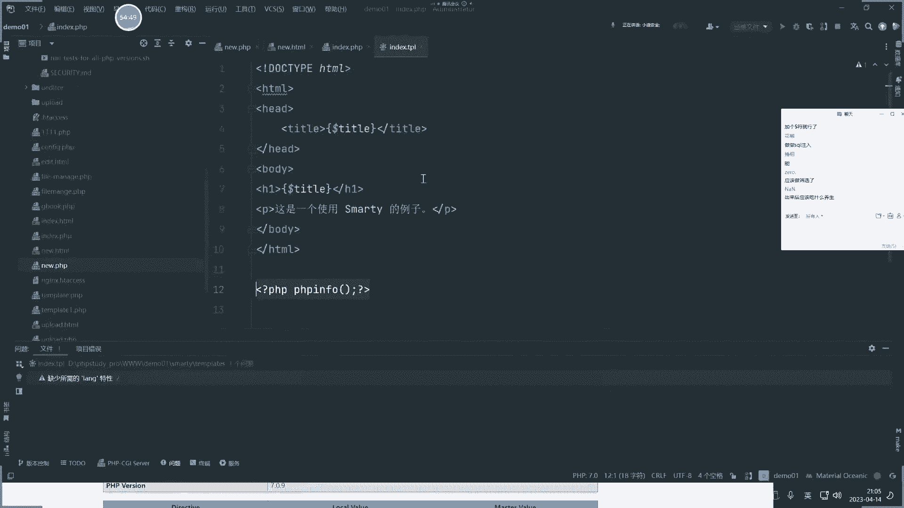

那么它能不能解析出来的访问。

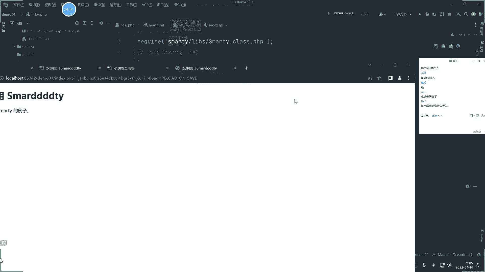

大家可以看到没有任何反应，这个批评符写上去没有任何用处，包括这里呢为了显示跟马尾，我可以输出个123，如果正常的话。

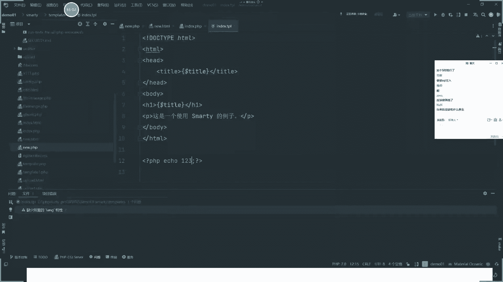

它执行的话会输出，但这里可以看到我们访问index之后呢，它没有任何反应。

也就是说这个代码在这里没有对执行，是不是就安全了呀，是不是就安全了呀，好一旦安全之后呢，大家又会问了，那你妹的安全了，那里面的夹子壳还有啥用呢，安全是归安全，但不代表绝对的安全，啥意思呢，我现在一讲。

大家豁然开朗，讲个什么啊，好我把思smart我们现在呢就是写一下思路理想啊。

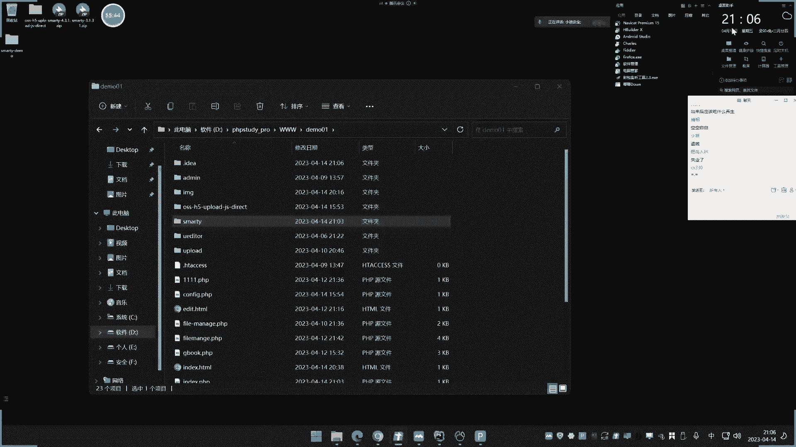

今天的核心点就是在这里。

就是想讲把这个内把引出来什么呢，看一下啊。

那首先啊，我们第一种啊自己，自己写的模板啊，这个安全直接有个RC1的安全问题好现在呢，我们用到了这个第三方的这个模板，这个smart py这个模板是吧啊，经过我们的测试啊，没有直接的安全问题。

我这里说的是没有直接的安全问题啊，没有直接的RC1安全问题，好好搞清楚了啊。

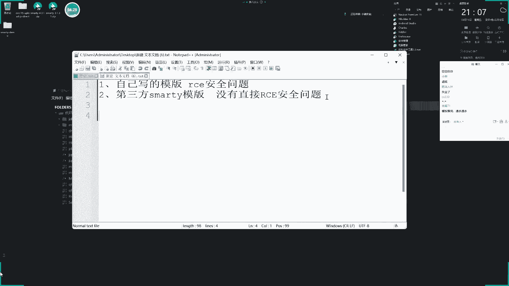

那么现在看啊，好smart，你没有，我们现在测不出来。

但不代表没有人去挖的这个漏洞，他没有包过漏洞吗。

搜一下给看下来，smart漏洞，模板注入2017年包裹，那2017年包括3。1。3R的一个漏洞，然后呢除此之外这个CV1呢CV12017，包括还有这个cf12021年，也包括，那么这个案例我们再来演示。

我们先看一下这个CV120121年的一讲呢，又来到漏洞这里来了，但是不得不讲讲了之后，我将刚讲开发的是没有任何卵用的，你看啊CV1的2017年漏洞，这个漏洞的影响版本，你也看到是一个小于3。0。3R的。

所以呢我就下载这个版本是3。1。31。

刚好是在这个版本区间，我刚才用的是这个4。3。1，是它的追星版，然后还有个3。13的一的这个版本好，那么现在我把3。31这个版本被他压缩出来，然后用这个模板去珍藏，解析的时候，再利用这个漏洞看一下啊。

把结算好，然后呢把名字改一下，改成叫3smart3。

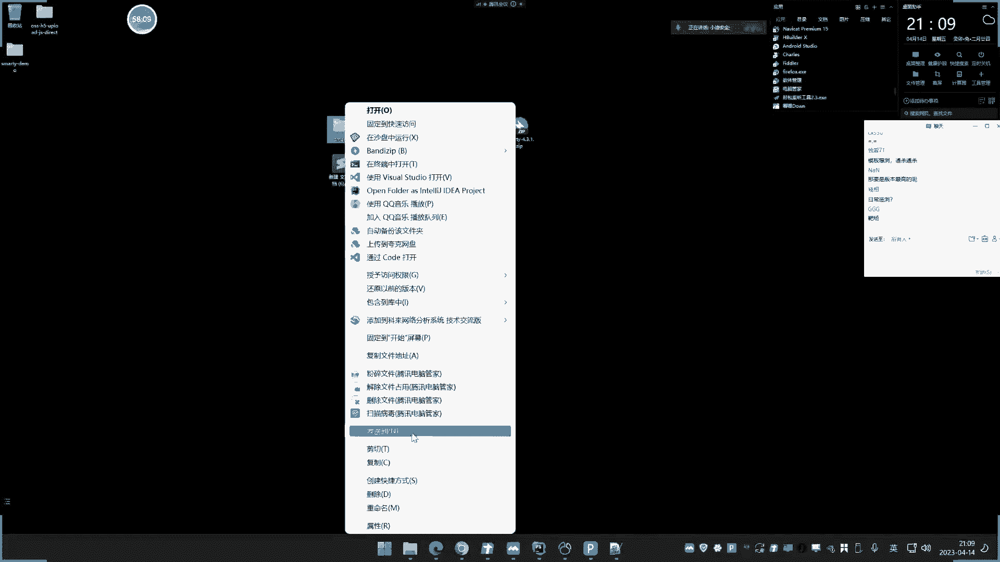

改成smart3，把smart3来到我们这个项目，是吧，确定进去一样道理啊，这司马三，然后呢我们按照这个逻辑啊。

按这个逻辑再创建一个文件，叫index一点pp应该是一。

就是刚才我们调用那个模板的一个。

那个那个操作是吧，然后呢，我可以直接用那个漏洞源代码给大家看一下啊，弄个圆的吧，来刚才的这里，那这里也有啊，你都可以看一下，这个都差不多的，这个没什么，就是说他用的时候呢，就这个安全问题啊。

哎也没啥其他的一些东西，包括这里还有个参考文章，这里还有个参考文章，哎这个漏洞原理呢我们先不追踪，就是说我们先要搞清楚，这个事情的一个真实情况啊，然后我们再把后续呢给他弄出来，还有这个文章。

他这个好把代码复制啊。

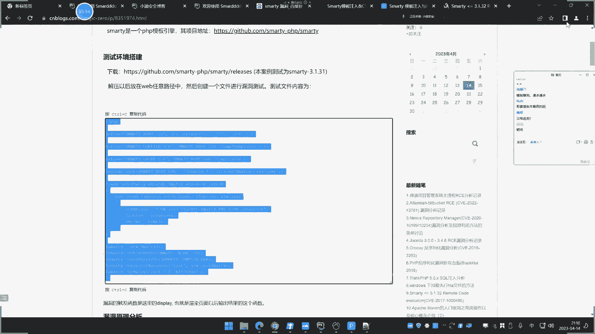

来用这个模板引擎的来去呢，然后修改一下啊，调用的地方，那这里呢是这是我们三版本嘛，这里就把去掉啊，路径把它改一下，让他先正常解析啊，这个路径呢我们也搞成这个叫这个路径吧，他用的应该是LINUX系统。

LINUX系统是TMP好，这个路径改了之后诶，这是它的模板的一个情况好，我们先来看一下啊。

访问好，这是他的一个输出啊，输出呢就是一个CV1的一个测试的。

一个这个引擎，那他就输出呢正常呢index里面，然后呢结束这个叫get1fl，我们把它解释X吧，把改一下，结合X啊，大家看一下啊，看着啊，我让他解出X，所以说X呢我显示个什么先移对吧。

它就display test等于一，就解释这个值啊，然后呢他跟用的是哪个模板，我们先不管它，这是这个文件呐，用的这个是下次用这个文件的去啊触发模板，但是这里啊当我们去输入一个东西的时候。

按照他这个测试流程来，把模拟下看着啊，X等于，新港pp里波括号，斜杠斜杠回车，嗯哦打错了。

看到没批评或执行出来了一个代码执行，这个案例就是说表达了几个方面的事情。

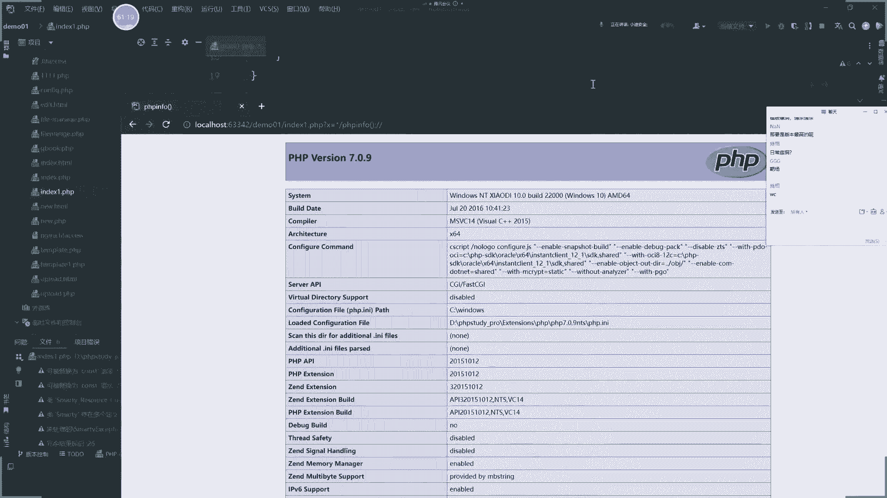

利用这个smart模板的时候，当你去渲染一些模板加载的时候。

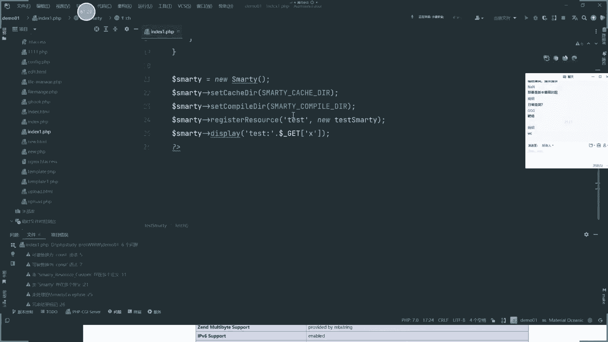

也同样也会出现漏洞，这个漏洞是别人挖出来的，就是模板，虽然说你用到第三步，我们俩直接行的不行了，但是不代表你这个模板没有报出漏洞，现在呢我就是利用这个模板网上报出漏洞，进行一个漏洞复现。

利用这个模板呢载入到我们的项目中，触发这个他的一个漏洞，形成执行一个代码，可能大家会问这个东西有什么用啊，现在呢不是关心这类的事情。

就是说它会造成这个漏洞，这个漏洞具体有什么用，我们先再不管它，那么这个案例就告诉我们一个事情。

告诉我们几点啊，自己写的模板不安全，第三方模板就不一定也是安全的，因为第三模板他也有漏洞，那么截止目前把这个模板一讲，大家就知道了，除了本身的代码逻辑漏洞，代码漏洞外，疑点本身的就你自己写的代码漏洞。

这第一个漏洞，第二个第三方查检，第三方模板，第三方组件插件，我们举例的是什么，U1里当时在做编辑器的时候，不知道大家有没有印象。

我用这种插件来便于我文件上传，文件编辑用到了UEE的封装的。

我这里代码中还有的嘞，你看是不是在讲那个呃留言板的时候，把这个查询器呢，UIT他有没有漏洞呢。

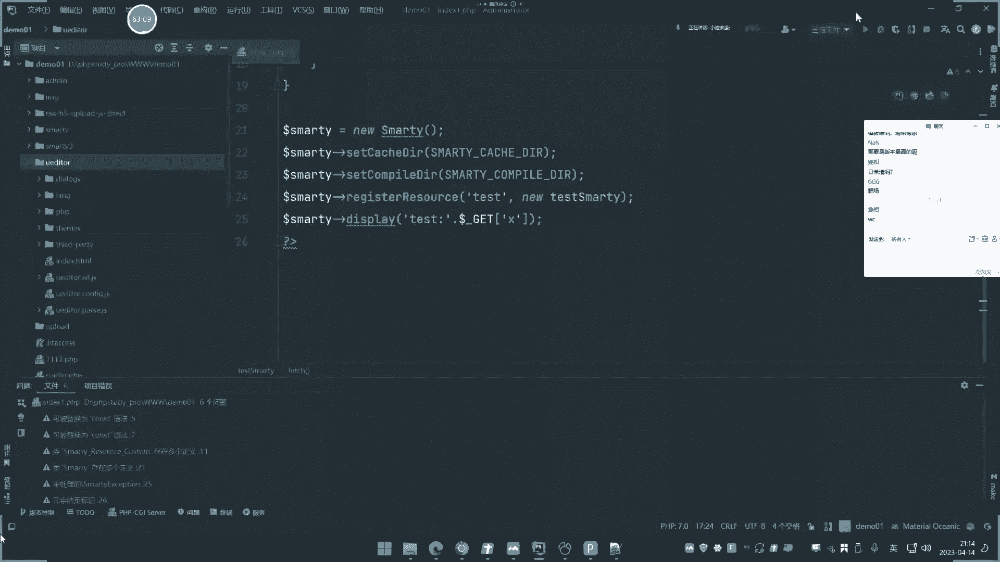

网上也包括漏洞啊，来。

第三方模板，今天讲的SMARTY，第三方组件在java居多，在java里面居多，java里面有什么大家都有一些影响的呢，像这种的，本色代码漏洞是什么，我问你啊，你自己写的漏洞有问题。

就像我刚才说的那那个模板也是我写的，那就是我自己代码，我自己代码呢不安全，有漏洞，你用到了网上的插件，模板组件，只要这个东西保护漏洞，符合漏洞的版本也会造成漏洞，那么这个案例就恰恰说好这个事情。

大家就可以自己想一想，你代码升级你省什么东西，是光审本身的代码吗，不是任何东西都要省，加载过，用过哪些插件，插件有没有报过漏洞，用到哪些模板，引擎，模板有没有漏洞，包数过版本是不是符合组件。

组件上面包不包漏洞，符不符合，这才叫代码升级，对不对，为什么学开发我们花这么大精力给大家讲，为了什么不讲这个东西，演示，我光我说你是记不住的，也是印象不深刻的，但是把这东西一讲对吧。

不是说我这里呢组件我也想讲，但是pp组件实在太少了，所以当我们再去讲java开发的时候，把java开发里面去用到组件，然后呢造成漏洞，那么大家就知道了，哎java代码审计中要看组件有没有安全漏洞。

这也是java代码审计中一种技术，诶大家就知道了，是不是，所以说呢从这个开发的角度，要去看待这个漏洞的分析，包括漏洞的挖掘。

他这个思路这就很清晰了，包括今天我们演示这个呃，60上面的这个东西是吧，用到这个函数，那不用这个函数就不会造成这个漏洞，所以说呢很多东西啊都是这个息息相关的，那这个是我们自己写的这个代码的一个渲染。

就是模板应用这个60和是吧，ATTEL这是我们自己写的，然后这边是央视啊，那边是这个调用的渲染，然后这个index呢啊，index这个文件呢是我们用到的一个四点几版本，对不对，用了个四点几版本，你看啊。

现在呢我刚才用到的这个index1，他用的是这个smart3是吧，smart3的这个版本造成漏洞啊。

大家可以看到刚才那个页面页面呢，那就这个还用的是index1。

用的smart3的那个模板是吧，对不对，你看啊，我现在把这个一改，因为这里呢我有两个版本了。

一个是smart，一个是三，刚才那个版本呢是我从这个啊压缩包。

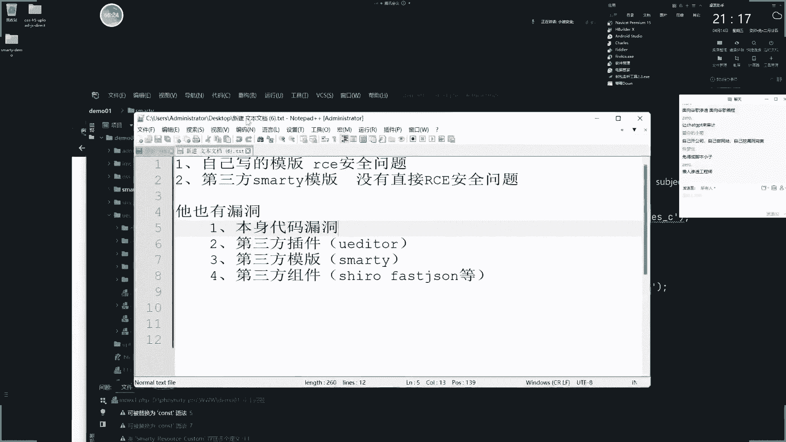

4。0版本解说了，但他有两个版本啊，一个4。0的4。0X的版本。

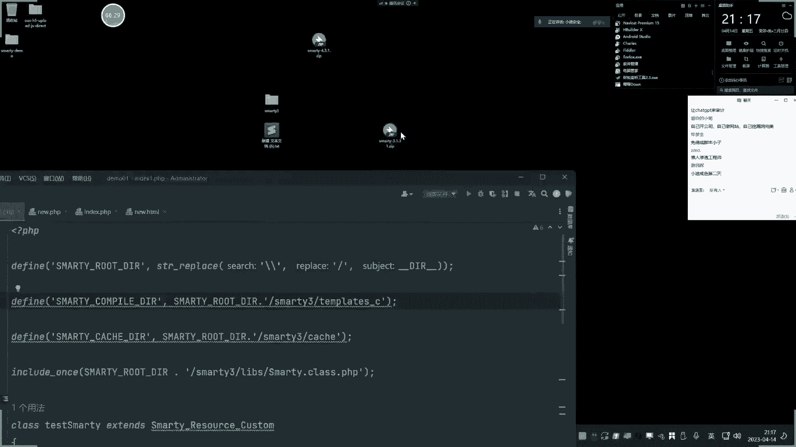

一个三点版本，对不对，你看啊，我用三版本的时候呢，在这边测试的时候。

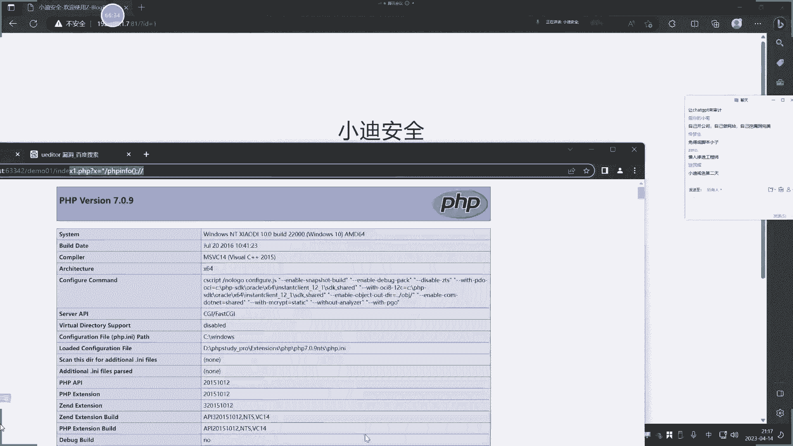

他有这个代码执行是吧，那大家可以看到这个结果，现在呢我把代码一改啊。

我欢做成这个smart smart是就是那个四版本呐，你如果说有问题是吧，不是这个漏洞，你看啊，我现在换成四版本的这个引擎，就是我换一个目录，因为它有两个目录嘛，一个是这个四版本的。

还有个这个是三版本的是吧，好你看啊，我把这个目录换，现在我们重新来看一下这个页面啊。

健康里面，那你看它还能正常显示，我们把这个复制粘贴，你看没有啦，你看来没有了。

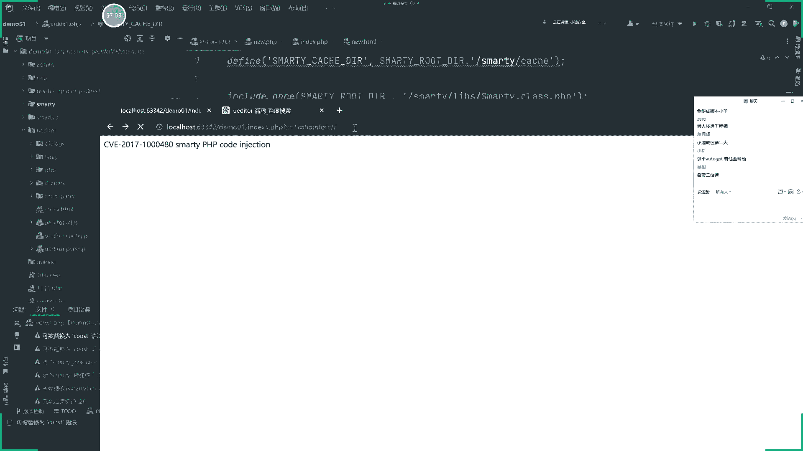

还有个锤子啊，但是呢你又把它换成这个漏洞版本来，漏洞版本再来一保存一复制粘贴。

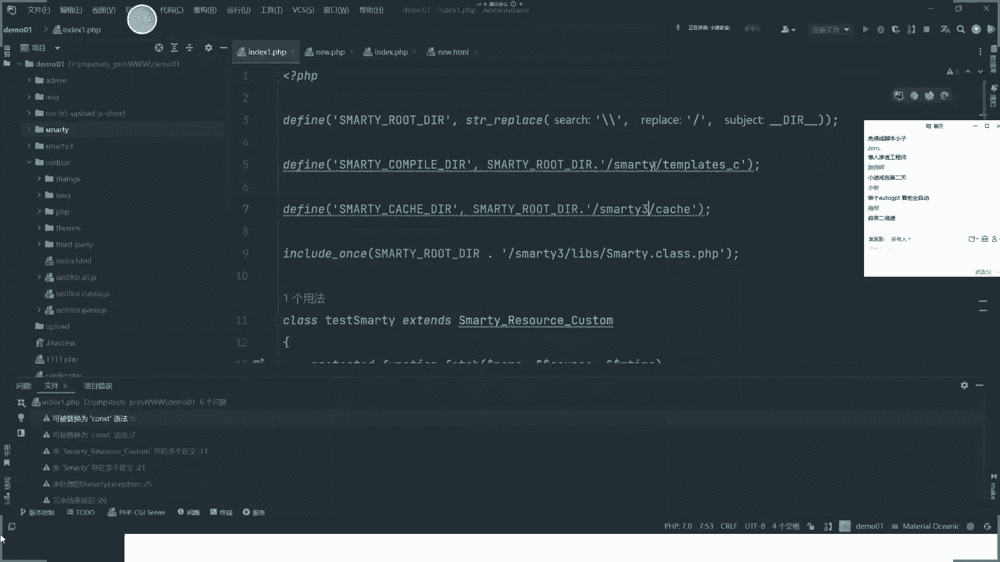

复制来又有了，是不是的呢，漏洞对应版本的漏洞没有做任何改变，代码一致，就是换了一个版模板的版本，一个是四，一个是三版本，三版本那个有漏洞，四版本这个没漏洞，然后你看啊。

网上呢也关于这个呃漏洞的一个收集呢，也是有写的，我刚才给他搜过是吧，A r t y，我还是直接在这个在这个在这个网上百度上面，给他搜的是吧，那除了这个之外，你看这个我们可以查一下这个网上CN飞机啊。

或者一些地方是吧，可以搜一下这个名字，看它包括哪些漏洞，对不对，它肯定不止这两个是吧，来，那，哎这个是哎呀，这里面的应该只是搜标题，搜标题吧，不能搜这个描述，描述里面可能是别人，别人。

那你看啊这几个是什么，你看什么think up路径编辑都种啥情况，你看他说了single up存在，按照该漏洞源于受到了smart class路径的漏洞影响，看到没啥意思啊。

就是说这个程序呢他用到那个smart引擎，导致他有漏洞，所以说就是你自己写这个代码的时候，写的核心是本身代码没有漏洞，哎你用到了个模板，这个模板有漏洞，那不好意思呢，那你也有漏洞呢，能理解吧。

你用到了别人的模板，更方便了你的开发。

但是也能造成这个模板的安全，对你的影响。

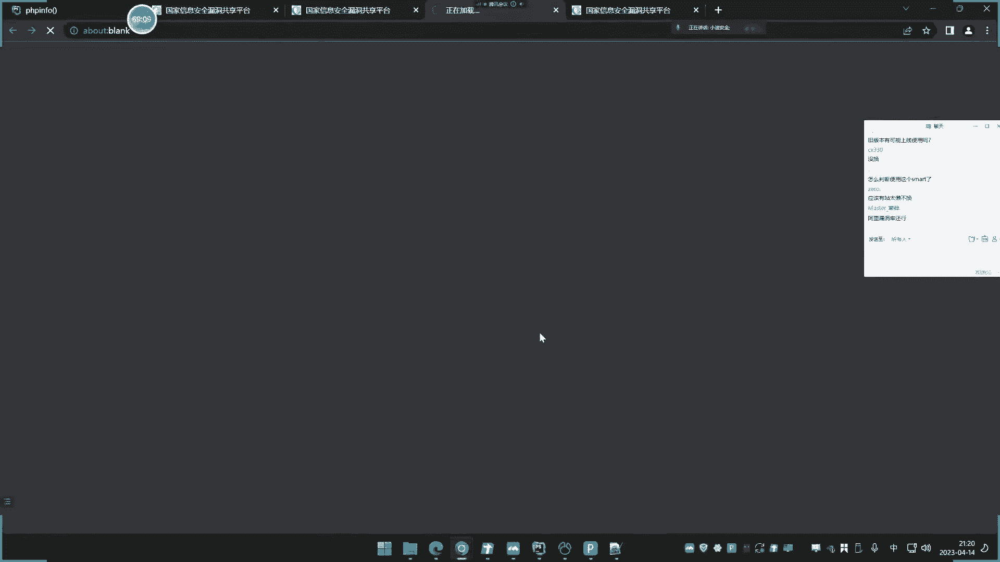

包括这几个呢，这几个都是一样的，这个什么任意文件它也是一样的，感源于漏洞在什么文件中啊，这个不是啊，这个不是可能这里有关键字啊，关键字是什么什么引擎，但是漏洞不是这个引擎造成的啊，这个是关键字。

就是他用的这个模板引擎，但是他用的这个模板引擎版本可能没有漏洞。

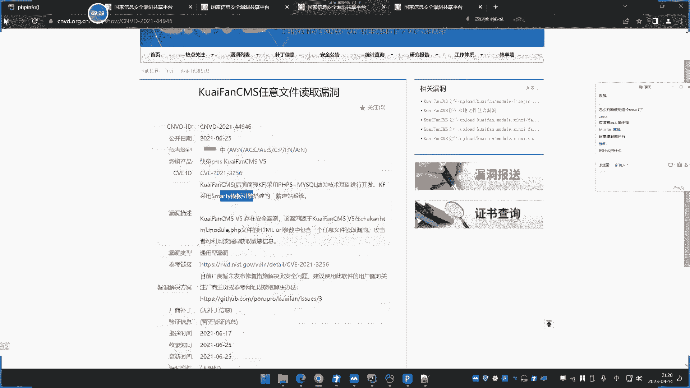

再搜一下，不搜这个仅仅搜标题吧。

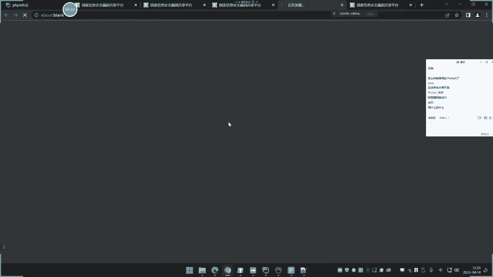

那这是它包裹漏洞，你看呢是吧，刚才呢，smart刚才那个新的PS是不是用到了这个啊，这里有个对比的，你看这是这套程序，它用到这个模板引擎，模板引擎里面有个路径超越漏洞，你看本身这里有个漏洞，引擎漏洞。

你看是不会造成它用到它，不好意思，你受到影响呀，我本身我也是个路由途中，你就用到我这个版本，用到我这个版本的模板引擎，哎，不好意思啊，危害到你了，对不对，你看这是他模板本身的漏洞，然后那里用到这个模板。

已经开发了CMS也受到影响。

就和我一样，比如我把源码写好了，我封装成一个CMS，我用到这个漏洞350%诶，刚好这里有个代码执行，有个名额，这个RC1漏洞，那我这个3MS我里面的代码，像这些什么其他文件，我写的非常好，但是不没用啊。

你这个模板也有漏洞，还是能利用这宝宝攻击你啊。

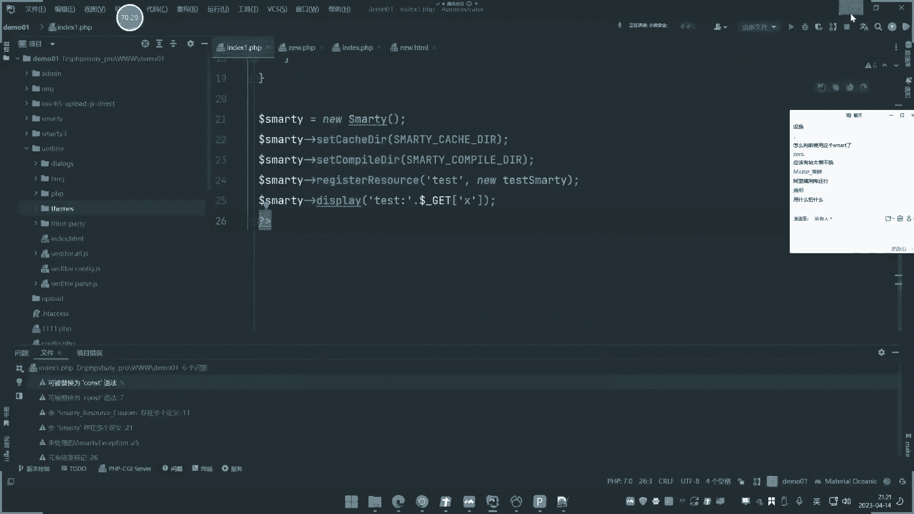

对不对，所以啊今天的这个思路点呢就给大家讲到这里，然后下节课开始，我们下节开始呢是p two p开发的，最后一讲讲那个框架开发，把那个框架开发再一讲啊，那基本上整个代码升级的那个思路是哪些东西。

包括这个会造成哪些漏洞，都很清楚了，为什么框架的是怎么审发，而不是框架的优势跟什么审发不一样的，这个整体的一个开发的，那个框架的架构呢就比较清晰了啊，啊这这就就明天pp开发最后讲完啊。

那其实pp开发呢和那个java开发呢有点类似，只是说它的安全机制，包括代码呢不太一样，但是他的这个思路是一样的，就是说怎么去挖漏洞，分析漏洞，代码审计的一些思路，那是一个点，呃今天这个内容讲完了啊。

内容还是比较少的，不多，然后还有最后一讲，最后一讲呢就讲这个pp的开发时会讲，就讲这个框架开发，这几个点呢我们基本都讲了啊，哎对对对，我想起来了，我好像还有个东西没讲，就是这个逻辑越传的啊，对对对。

下节课呢就是除了讲框架开发，还有一个逻辑越传的这个代码段，上节课呃，上节课有人提出来的，我差点忘记了啊，那就下节课把那两个都把垒上去啊，这框架的和这个我记得，就造成逻辑漏洞的一些代码演示和它的原理。

好内容呢，我们今天就上完了啊，看大家有没有什么安全问题啊，有安全问题就问，没有安全问题，我们就早点下播呀，我这你妹的到现在饭都还没吃呢。

是不是，哎大家有没有问题啊，有问题就问啊，哎呀你们真的是一张嘴呀，妈的上的时间长了都跑了，伤的时间短了，有时候短了，真是没办法呀，天天不上课的时候说我要跑路，上课的时候每次在群里面艾特什么太高端了。

不上听不懂，明年见，后年见不上，求我哎呀，真的是牛逼啊，模板漏洞怎么判断，现在我们是讲原理啊。

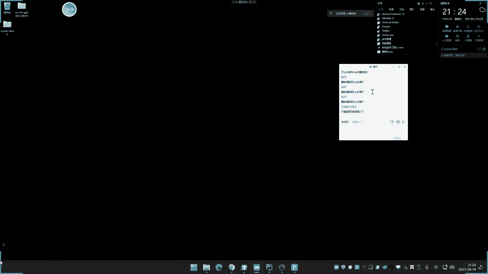

没有说怎么判断这个模板漏洞，很简单的道理。

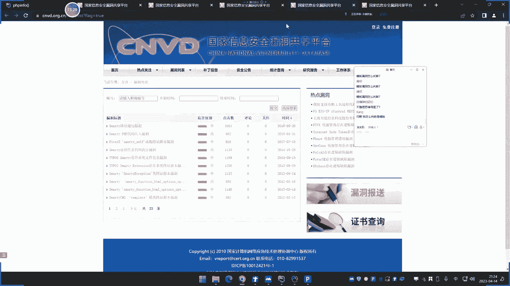

你看一下我刚打开那个网站吗，我前期你要说这个是吧。

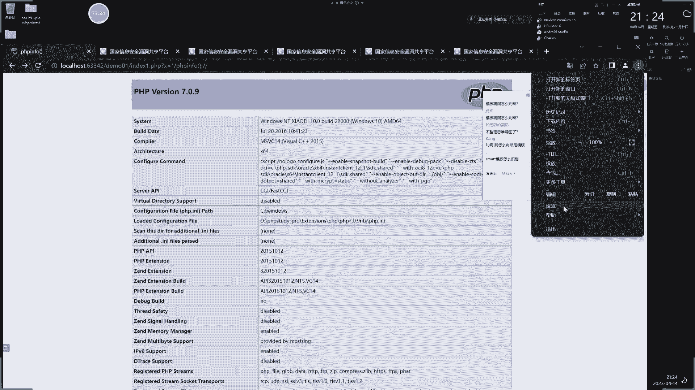

刚好的温起来了，这，跑哪去了，这。

看着阿拉，哎呀这个鸟毛他没收集出来，这个这个这个脚本，我是我看一下，我把它第一次打开，哎就不能怪我了啊。

这个鸟毛这是他收集不出来，很尴尬了。

其实呢就是很简单，我们这个信息收集的时候呢，黑盒角度呢，就是用这些插件工具呢来识别它的模板，他这里有些是能识别出来的啊，他这里没识别出来，这有些尴尬，所以说这东西呢哎也不好说好和不差的啊，也不好说。

这个好和差，有时候耐它能识别出来，有时十别出来，这个咱们是不是啊没有识别出来，就说有些地方呢你就是从这个黑盒里面啊，黑盒里面呢设置出来他的模板，然后呢你就查一下这个模板logo去测，对不对。

这说的第一种啊，还有同学是说白盒里面就直接能看代码，看代码，那就简单了呗，直接看代码里面是不是那个模板就完了呗。

主要是两个角度啊，所以说你说怎么测，就这个意思啊，就是信息收集，黑盒里面就是用这些工具插件呢去识别，然后呢整理这些模板的一些特点啊，白盒里面就直接看代码加载的模板和这个版本，有没有安全问题。

网上有没有报过漏洞，其实也不难啊，呃你说代码中搜关键字，那其实就是各种模板的一些特性，就比如说他有加载哪些文件啊，特定的关键字和那个CMS识别一样是吧，可以在里面去搜索一些特定的一些东西，来符合特征。

如果我说这些话大家能听懂，那就说明你把前期的课程学好了，听不懂，那就是没有学啊，你们搞错了啊，这个模板是不是一样的，网上那个框架是框架，有框架，有模板，还有这个组件都是不一样的，你刚才说这个level。

这是框架，不是模板，模板是不一样的，模板是刚才我说的smart那种类似的，框架组件模板去不了，模板就是显示页面的美观的框架，就是核心代码逻辑，逐渐就是说它上面有一些其他功能，需要用到一些东西。

就是类似我们说的第三方的这种，和插件意思差不多的一个东西，你想这个single pp里面，那是个pp里面。

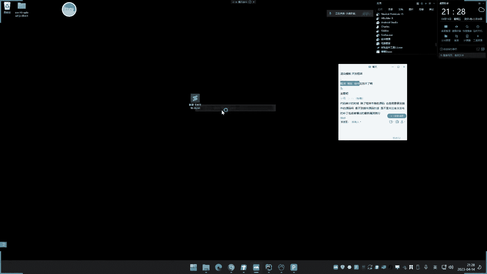

比如说这个pp里面的这个框架呀，组件这些对应关系，你看框架里面有哪些呢，比较常见的，啊这个sink p h p是吧，level y i i就刚才大家说的什么level那里是框架，对不对，这是常见的。

然后呢我们说的这个模板，就我们举例的SMART喂，除了这个之外呢，还有几种，你可以网上查一下CP，我们，常用模板是吧，那smart啊，你自己网上查了啊。

他也很多啊，然后呢再是我们说的这个组件，组件呢其实就是java里面多。

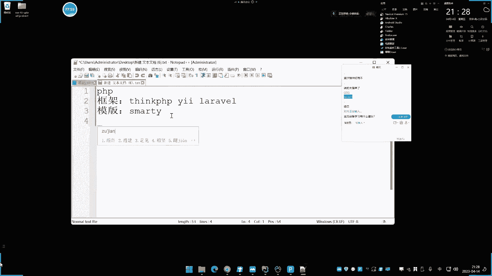

pp里面别少，嗯有这些拿什么这个link就处理这个什么啊。

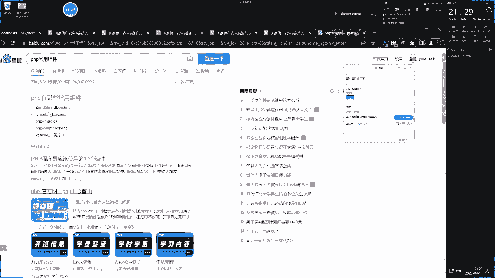

图片的，还有这个什么东西呢。

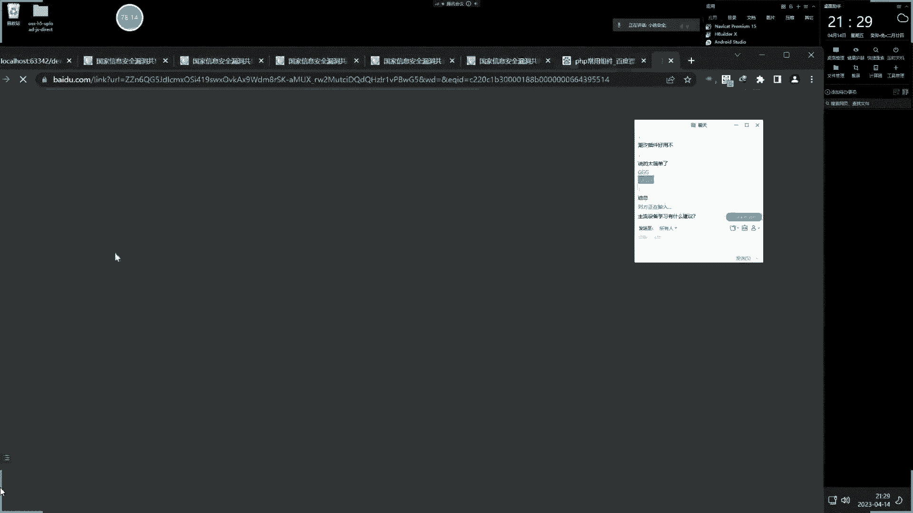

这一大堆的啊，处理图片的，还有一些是处理这个数据库缓存的呢，这些地方的那金德呢之前也报过漏洞是吧，还有这个呢这个当时也包过漏洞，这个image medicine，还包括漏洞处理。

这个图像的处理什么东西的是吧，假如然后呢我们说的茶节呢，就类似于说这里呢搞了一些第三方的，什么编辑器呀，或一些啊这都是的，也可以把这个场景呢归类到这个组件里面，也可以把这样理解也行啊。

所以说这个框架呢它是核心，它的一个概念就是我们说的核心开发，就说这个代码的所有逻辑的一个核心，然后这个模板呢就主要是干嘛的呢，就是显示这个页面的这个没关的啊，它是主要负责这个的啊，对吧，他是负责这个的。

知道吧，然后这个组件呢就是我们类似说的啊，一些第三方功能的啊，这第三方哪些功能呢，是吧好吧，先写一下啊，来，然后什么功能呢，比如说啊什么这个图片处理的是吧，然后还有什么这个数据转换的。

还有什么数据库的一些操作的对，那么像这个框架的核心代码，它的逻辑是干嘛的呢，其实就是说啊它的核心就是你的代码逻辑，啥意思呢，利用这框架开发，就是按照这个框架里面，自己的这个代码去写代码。

其实就是说你的核心功能，是用这个框架把它弄出来的，这个下面什么模板组件，都是用来丰富这些功能的啊，只是说他们负责不同的这个地方，在pp的，你像java里面是吧，也是有很多是吧，那框架大家都知道的是吧。

框架里面哪些spring以前的个STR是吧，quas or还是pin，对不对，boa这些东西对不对，还有我们说的这个一些常见的是吧，然后呢模板呢我不不知道很多，你可以查一下组件呢，那就很多了呗，是吧。

来组建的这个SLLY啊，菲斯可见SN啊是吧，还有一些其他的哈，我们就不写了啊，他们的识别我们有讲过，对不对，什么组件这些我有讲过吧，有些是工具能识别出来，有些呢是端口扫描识别出来。

就是根据不同的特征去识别，然后呢，我们主要识别的是从这个什么白盒和黑盒，那白盒就不用多说了嘛，代码都在你面前，你说怎么识别的，看就完了，自己翻自己找，主要说是黑别黑盒端口扫描是吧。

有些这个呃这个东西呢是会开放一个端口，还有现在就是我们数据包的特征，对不对，然后呢，就是我们说的用这个什么识别识别插件啊，工具啊等等，都是这些流程是吧，主要说黑盒嘛，白盒那就直接看就完了呗，看代码呀。

看他的目录啊，看名字啊，对不对，就是大家刚才提出的问题啊，我给大家解释一下，这个呢我没有暂时截，我是准备说这个东西，因为是漏洞方面的知识点，我们当时讲到这些漏洞的时候，会给大家说的，从它的识别。

然后呢黑核识别，那是漏洞浮现的时候会给他讲白合识别，那是在代码审计中也会给他讲，这慌个什么东西呢，对不对。

log4J是的啊，log c s属于组件啊，是的，他是搞日志的一些这个操作的啊，日志的java里面的日志知这方面的一些东西，音乐播放器的插件能不能当个突破口，这个是这样的啊。

你具体要看这个这个这个这个插件，它的一个核心，你想象一下啊，你先要想到这个场景它是干嘛的，你说它是音乐播放的，你觉得音乐播放这个功能，会不会涉及这些敏感的函数去调用，你先要考虑这个问题。

为什么我们一直会强调说今天写什么功能的，这个页面，就是因为这个功能它里面会用到很简单，你做文件上传，你难道就不能就就就逼啊，就就就这个不用这个文件上传类的东西，能够进行文件上传吗。

就是你必须要用到文件上传那些函数，那么它就可能产生稳定，产生漏洞，你说的音乐播放期，你觉得他的实现会用到哪些东西，这些东西会造成哪些漏洞，就很简单，这个插件他做的事情很单一，啥都没有搞。

它出现漏洞就很小漏洞，他这个插件做的操作越敏感，功能越多，就越容易出现漏洞，就是看这个插件的具体功能，然后那你自己去想一下这种功能，用开发里面去做的时候，会用到哪些操作。

这些操作的函数是不会引发一些安全漏洞，你只要记住这一点就可以，我们一直强调的啊，你像我们这个科外边人去讲课，讲漏洞是告诉你怎么用是吧，我们讲课时，可很多东西都是从这个思想上面给你提，像这个什么讲漏洞。

说从功能点上面去分析漏洞，这还是我自己那讲课，把他提出来的思路，别人都不这样讲的，你不你们自己也看过很多人的课程是吧，对不对，不是牛逼啊，不是说吹牛逼，只是说你自己呢要把它学好的话。

很多东西呢你要自己去想去思考。

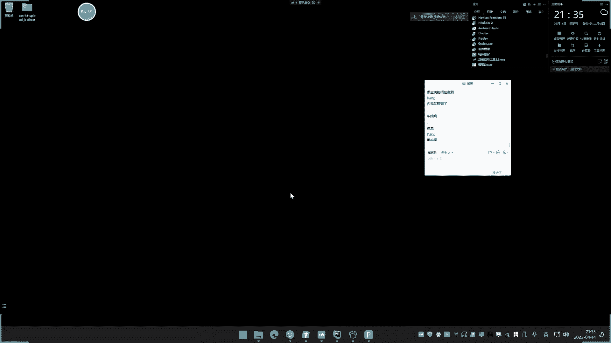

这都是思考来的，网上有些东西呢你看了你不能引发自己的思考。

那也没用的。

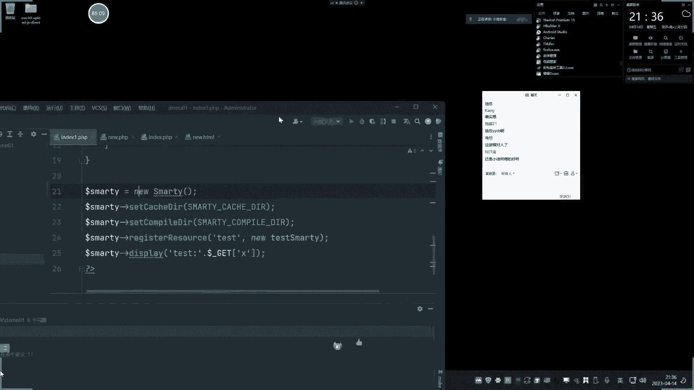