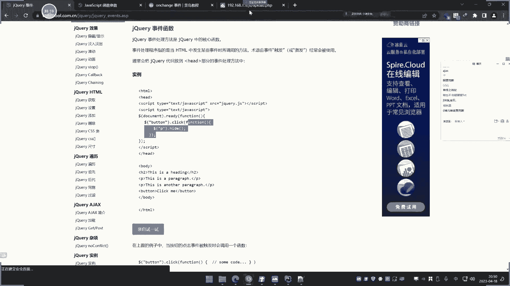

# 【小迪安全】V2024版 全栈网络安全 ｜ 攻防渗透工程师 （持续更新） - P28：第28天：JS应用&原生开发&JQuery库&Ajax技术&前端后端&安全验证处理 - 逆风微笑的代码狗 - BV1Mx4y1q7Ny

嗯这个讲28天讲这个JAVASCRIPT的JS的应用啊，啊这个章节呢大概四次直播4~5次啊，具体内容章节呢会讲这个原生开发和框架开发，然后会涉及到这个开发里面的一些常见的操作，文件类操作啊。

数据库操作啊是吧，包括cookie session的一些操作，和那个pp的一些场景操作有点类似，不过了，之前是采用这个pp这么的呢，就采用JS呢来实现呃，这是大概的一个我们要讲的章节点啊。

4~5次直播讲完，那么今天呢是讲一部分，讲一下这个原生开发和这个库的一个开发库，开发呢用的是个J块库啊，嗯AJX的一个基数啊，然后呢我们从这三个方向里面呢啊，去做这个演示分析之后呢。

就来看一下这个JS开发和pp开发出来的，这个应用啊，会有哪些不同之处啊，然后呢我们现在看一下啊，这个原生JS的教程呢，大家可以参考这个W34school，这里呢有很多关于这个JS的一些。

简单的一些使用啊，还有一个呢就是我们说的这个J块库，jack库的使用和这个JS的库的使用啊两个，那么现在说原生开发，利用这个原生开发呢，开发一个文件上传的一个操作。

那么采用的是这个JS呢加pp的一个联动啊，PATM和JSPP3个语言呃，实现一个文件上传，然后在这个上传过程中呢，采用的是这个前端JS的验证，后端TP的一个文件处理操作，啥意思呢。

就是说用JS来进行过滤，用pp呢来作为文件的上传，也说它的核心部分，我们主主要关心的肯定就是这个过滤，因为我们做安全的主要是分析过滤啊，后面你这个上传到哪里，这不是我们关心的，对不对，那么这里呢。

我们来看一下这个开发的一个流程啊，大概分四步，第一步呢是写好前端页面，一个文件上传的页面，第二步呢就是用JS来获取这个提交的文件，上传的数据，通过对这些数据呢进行上传格式的一个判断。

最后呢判断成功之后呢，进入后端呢对上传数据呢进行处理嘶，所以这个项目呢我们可以把简单写一下啊，就是这个前端JS啊啊，进行这个文件格式后缀啊过滤，然后呢后端啊pp了进行这个文件处理。

这是他的一个大概情况啊，那么现在呢，我们就来把这个代码来给他写出来啊。

如何用JS呢来做一个原生态的一个啊开发啊，这是原生态，原生态叫什么意思呢，就是说我不借助任何框架，也不借助任何东西，就纯用JS的这个什么代码来去把这个写出来，和我们pp一样啊。

后面呢我们引用了什么框架呀，那些东西之后呢，嗯在使用的时候就会简单很多是吧，就像那个上一节课，我们讲那个什么pp里面的single pp的框架是吧，在JS里面也有这个框架，就像我们的什么VUE啊。

NODEJS啊，对不对，那现在呢我们先创建一个目录啊，这个目录名呢我们就叫做这个JS目录，来存储这个JS项目的这些东西，哎这个JS目录存在呀，那我就换到这个目录上面去，多么零一，这里好。

在这里呢我们创建一个目录目录叫JS，在JS里面呢准备两个文件，第一个文件呢就是我们的这个前端页面，创建ATM叫upload点。

TM这个呢就是扮演的是这个是吗，扮演的是这个文件上传的这个代码，然后文件上传呢前期我们也写过是吧，呃曾写过这种页面，所以我直接可以用这个这个吧，把页面再复制过来，来来复制过来，然后呢。

这里是我们文件上传那个那个页面码是吧对啊，这我之前写的啊这个表单，那么这里呢我们就改几个地方，改哪几个地方呢，这个上面不用改了，这文件上传，然后然后怎么办呢，啊呃现在呢就是要做一个事情。

什么事情呢就是JS的啊。

这个第一个步骤已完成了，前端页面文件上传的页面已经完成了，第二步呢就是用JS呢来获取提交数据。

这个如何获取呢，好我们这边可以给大家演示一下啊，呃首先呢这里呢用一个JAVASCRIPT的一个这个语法，Cript，然后呢在CRIPT就代表这个语句，JS语句的一个中间。

这是它的一个使用这个简单的一些基础课程呢，大家可以看一下呢，这个上面有啊，哎他的一个课程呢它的简洁和他的一个使用，那使用就是位于这个中间是吧呢。

JAVASCRIPT代码必须位于script和script标签之间。

那就这里面哈，然后呢，接下来呢就是对这个文件呢进行一个解收啊，呃这个文件解收呢，首先肯定是要接收他的这个文件名对吧，文件名和他的一些后缀，呃这里怎么写呀，来我们给大家看一下啊。

他这个写法呢它声明变量呢是用VR命令啊，VR命令VR命令来声明一个这个EXTS，然后呢写一个列表，啥意思呢，就是我们这边规定啊只能上传的格式，比如说P分之1GF啊，就第一步啊，先规定啊，规定这个。

白名单上传格式，上下后缀啊，这说这是我们的先规定好啊，额就说只允许上传这个三个类型JPGPNGGF，然后呢分号代表与结束，现在呢就是规定好之后呢，接下来就是要对这个数据进行接收是吧。

就嗯接收这个上传的这个数据后缀，上传的文件后缀，啧好，然后呢在这里呢我们先来取一下啊，这个怎么写呢，给大家看一下啊，首先这里呢有一个这个值啊，这个是F是吧，F传递过来的，这个是选择那个文件的那个表单嘛。

然后呢我们这里要写一个东西啊，写个什么东西啊，写个事件，HTM事件叫UNCHINITY，On chenity，是啥意思啊，On chunity，我们强和解的意思就是被改变，啥意思呢。

这是一个ATM标签事件啊。

标签事件啥意思呢，就是当用户框改变这个输入框的内容时，执行一个JAVS代码，那他写了的，我签个几，My function，啥意思呢，就是你这里呢有改变的话，那么它就会执行一个JS代码。

我这里呢就是像是说如果这里我们选择中文件。

就是大概率的嘛，因为这个东西呢就对应的就是我们这里呢啊。

对应什么地方呢，啧就对应这里呢，这不是有个这个选择文件吗，就这个地方吗，我如果这里要选择文件，这里就会改变，改变了就会触发触发什么东西呢，就触发一个函数函数名，然后呢EXXT，然后呢写个括号。

然后呢再写个一字F6，啥意思啊，这个是，就是获取这个值给到这个函数千个非SD，然后我们等到求生命个函数啊，生命一个函数，声明一个函数啊，function定义一个函数，名字呢就叫这个名字，就叫这个名字啊。

定义这个函数，然后呢代入内容名字就叫FLIM，就传过来的四个flies好，这个东西怎么写呢，定义这个函数R呢定义这个函数，把这个东西再写进去，就用ZA，因为函数呢就相当说这里改变之后呢。

就会执行这个函数，这函数呢就是我们刚才说的啊，第一步呢，就是先规定好底下上传的这个什么文件后缀，然后呢再来怎么办呢，去判断这个什么接收文件的一个上传的后缀名，那怎么接收呢。

我就声明一个叫invest等于FINAME，就是传递过来的参数，由于这里呢它传递的是一直VALDE，所以INFINU就是选择这个文件的名字嘛，值那就fire点，这个是啥意思呢，那这个是啥意思呢。

last indeo f是啥意思啊。

我们可以看一下JS的一个原声语句中，这个呢是对字符串的一个处理啊，字符串的一个处理函数，那这个东西呢我们可以看一下这个函数啊。

搜也搜不到，我直接在这网上搜吧。

对于这个文件的一个字符串的一个处理啊，那是扫码的呃，它的一个作用呢，就是其实呢就是去查找一个值啊，啊对字符串的一个处理，返回此字符串最后一次出现的索引，啥意思呢。

呃我们这里呢写上一个点进去，这个是判断是是啥意思啊，这个意思就是说截取文件名的最后一个点，啥意思呢，就很简单，就说如果你传递的文件名是一点pp或疑点pp，点JPG是吧，他就截取最后一个点就是next。

最后一个点后面的值就是个JP1和PP1，这个意思啊，能理解吧，就截取这个值啊，把这个值呢复制为这个叫INDUST，对不对，那这样写行不行呢不行，还有个地方啥意思呢，就是我刚才说的啊。

还有个地方我改了代码，原来咱们看一下啊，还要写一个，还有个写个什么呢，这个了SPUTE，我们来给大家看一下这个是啥意思啊，嗯s u b s t r index加一是啥意思啊，为什么要进一个甲乙啊。

嗯你可以把它输出一下啊，等一下呢你可以把输出一下调试一下啊，把这个写上去之后，接下来呢就进行这个检测了啊，来，进行检测，后缀检测如何检测呢，大家看着啊，用个for循环for i先等于零，然后呢看一下啊。

I小于这个EXT点LENCH长度，然后呢I加加这个如果说你有学过这个for呃，这个I加这种循环应该都知道，就是先等于零，然后呢他一直I加加，就是他第二回就等于一，一直判断这个ET里面去编辑它的长度。

它的长度都是三位，也就说他这里那就是012是吧，就是这个值对不对，那么这里呢就进行一个判断，if判断什么呢，就判断这个EXT等，不等于EXTS里面的这个索引值，那大家看一下啥意思呢。

区域里面循环这里I呢就是等于一的时候啊，等于零的时候呢，零就取出这个P跟G1等于一的时候呢，就取出GF等于二的时候，那就去JPG，然后呢如果说等于四的时候，由于这里那已经没有了，这里判断条件呢不成立。

这里呢I加加就停了，所以这个I呢就在这里，那就是零一啊，分别就是索引零代表这个PNG1代表JF，二代表JPG，对不对，然后呢这里判断是不是等于这个EST，EST呢就是我们接收过来的这个后缀啊。

劫持过来的后缀，就是把这个后缀呢给他接收是吧，所以这两句代码那就是接收传递的这个，后缀啊，连接后缀名啊，对不对，然后得到了之后呢，判断它是不是等于，如果它等于的话，就是说符合这个里面的一个值的话啊。

不管是这里哪一个值，是PNG还是GF还是j pg的话，循环嘛就是从01R呢，因为它会一直会012，因为这里的长度为三嘛，所以这里呢就算是012，所以这里呢就是012，把这里面所有字八遍历出来，编制出来。

判断这个EST是和他对不对，以上如果对应上就说明能够上传，对不对，就是能够上传我们呢就可以做个什么事情呢，额这里呢我们就可以提示弹出一个窗是吧，弹窗的语句article啊，弹出一个是吧。

好文件后缀正确是吧，然后呢接下来呢就是一个break跳出，对不对，就让他呢那个啊，否则的话就是就不自行，然后呢后面呢再给进行判断，这个判断是什么，判断呢，就判断一个状态的，这里呢给定一个状态。

这个状态呢我来给大家说一下啊，这个是什么东西啊，等下大家就明白了，我先把它写出来，这里呢有个叫弗利克，然后这里呢可以把声明一下，弗雷克等于出，这个是一个干嘛的啊，这个是个干嘛的，给大家说一下。

这个是个状态嗯，就声明一个一个默认刚开始呢它是等于false，然后一旦这个有文件上传的话啊，就是有文件上传检测到这里呢符合文件类型，那就把它设置为粗，否则的话它不等于出的话，就是这里那不会出的话。

就弹出什么呢，文件后缀错误好，然后呢再进行一个重新载入一个过程，就重新载入一个东西，就刷新页面那个代码，这个代码呢简单看一下啊，就这个东西就完了啊，location就重新定一下，重新定一下。

重新载入一下，重新载入这个页面，就重新刷新的意思啊，这个是一个什么过程呢，就说先呢把这个装台的设置为false，如果你进入了这个循环之后啊，啊他的条件是成立的，就把它设置为出。

然后提示这个文件后缀正确啊，挑出这里呢，如果是你这里呢没有进入它的话，所以他这个flak呢是默认是人force，所以这里为force的话，我们就提示文件后缀错误，并且呢重新刷新页面，啥意思呢。

就是说如果这里force for可能没有被设置为出的话，那么它就是这里的条件就是info条件成立是吧，就弹出这个后缀错误，就是像我这里的这里的衣服，那就条件不成立嘛，所以这里那就不是为TRU。

它就还是等于这个false，就提示这个文件或错误，那这个呢只是做了一个文件上传的一个验证，并没有呢对文件进行这个上传的保存，就说这里呢只是对商传做了验证，我们这里呢给给大家试一下，是不是就可以操作了啊。

你看啊我们来把页面打开保存一下啊。

打开页面，当我们去选择文件的时候，大家看一下啊，选择文件，那比如说选这个XS这个文件是吧，随便选什么文件啊。

这个无所谓，这JPG的选这种呢，文件后缀错误，为什么，因为你在这里那里也看到我们选择TIT呢，文件后缀错误，它的后缀名那就不是当你选择这个图片的时候，那JPG图片那文件后缀正确。

然后你看这个选择文件这里是不是有内容了。

你看是不是就有内容了，你看来当你错误的时候，这里是没有内容的啊。

来随便选这个来，那他是没有内容的，你选择其他格式文件。

它是没有内容的，这个就是后面的这个判断呢，重新把载入一次，这个就进行了一个文件叫什么，上传格式的一个判断，对不对，三个格式判断啊，对不对，那上传格式判断就是在你上传的一刹那。

如果你有改变文件这个表单值的话，就是我们有尝试呢选择文件就会触发这个函数，函数里面呢传递这个list value值，这个value值呢就是我们接收到的文件名八，这里接收到之后，文件名字去取出最后一个点。

将它的后缀把它取出来之后，进行一个for循环，来判断这个后缀是否在这个白名单里面，如果在就设置为出，并且呢提示正确，然后挑出是吧，直接挑出，否则的话那就是for flag，它默认是这个什么false。

所以呢就会进入这个文件后缀错误的意思，然后呢重新刷新页面，那么这个文件验证呢，前端验证就验证到这里，那么继续就是下面的这个什么文件的一个保存，这个文件保存的就是pp代码来做了，这个PB代码呢。

嗯我相信呀这个大家就会了啊，这个也很简单的嘛是吧，由于这里呢他是提交给一个文件处理，提交给upload的pp，所以我这里呢就在这个当前目录了，创建一个upload pp啊。

来来接收这个上传的这个什么文件，然后如何接受呢，相信这里呢大家就应该都会了啊，就是把我们之前那个pp的文件上传，那个操作呢拿出来一下就完了呗，是不是来把拿出来下来结束这个文件名。

然后呢进行这个文件的保存不就行了吗，是不是，对吧，就把它进行移动啊，啊直接用这个代码就可以了啊，我也不检查那个错误来了，这个直接进行这个上传，那结束过来之后呢。

把这个文件呢给它保存到这个upload里面，upload呢就在这个这个地方，我给创建一个upload目录，来用来接收保存的路径是吧，然后这个就写好了啊，就是相当说这里呢提交之后呢。

会提交给这个upload pp来处理，pp呢就结束这个F过来的这个接受名是吧，把这个值啊，队形啊大小啊是吧，然后呢嗯这个有上传的话，这里呢就结束这个值，把这个值呢保存到这里。

对不对，我们来试一下啊，刷新下页面，然后呢重新使用这个文件啊。

那比如说我选择这个一个正确文件，先试一下啊，上传个文件呢，文件上传后缀正确，提交好，他也返回空白。

不要紧，你看这里是不是上传了呀，只是说在反复空白，是我们自己呢没有做这个演示的啊，就这里给加个衣服是吧，判断一下，如果说他正确的话，是不是都提示一下嘛，哈如果是错误的话，就是吧，给提示一下啊。

可提示个JS语句static，它还注意一下是吧，告诉他啊，这个，创建成功，对吧。

那我可以试一下，重新来提交。

就是你自己呢啊就这样设就完了啊。

也没什么其他的哦，这里少写了个script的语句，我说怎么不提示呢，没有写这个无锡嗯。

这个要就到这里啊，那上次成功提示了是吧，嗯然后呢他就上传到那个目录里面去了。

嗯咋不load呢，这是上传的啊，啊上传这里来了，你看这上传的文件名啊，咳就上里面去了哈，啊这个就是利用这个JS文件上传呢来进行验证，就是用JS的这个原生态的这个什么代码呢。

来进行文件的一个上传的一个判断，那么这种判断呢，和我们pp那种判断有什么异常呢是吧，为什么要单独把它拿出来讲呢，这个JS和pp有什么异常呢。

很简单的道理啊，他这个判断和我们之前的判断是有很大关系的。

这个判断呢如果前端判断的话，是可以绕过它的，啥意思啊，我来给大家看一下，首先呢我们来看一下之前的那个这个页面，就是之前我们写好的这个地方啊，之前我们用pp写的那个文件的那个验证判断，对不对。

在之前写的啊，来这里这之前写的我们可以来访问一下。

然后我们可以看一下这里的源代码，大家可以看一下啊。

检查一下源代码，我们点击这上传的时候，可以看一下这个地方的一个源代码啊，可以看一下啊，嗯下面那是啥都没有啊，啥都没有，那点击提交之后呢，他给PP处理啊，给这个pp处理啊，然后呢我们上传的时候呢对吧。

他有说非法后缀名吗，他有这里有检测他up load，那是在这里它是怎么检测的呢，是判断这个类型啊，哎哦不不不是这个项目搞错了，我说怎么回事呢，这里那他是判断这个MIM类型。

所以呢不检测他就提示非法后缀文件嘛，这是之前用PP呢去来做这个检测的，这么个东西，就是核心代码在pp里面，这个检测代码我们这里能不能看到啊，在浏览器这里能不能看到这个检测代码，是看不到啊，你看不到的啊。

这全部是他前端的页面，那个pp代码是看不到的，检测机制我们是看不到的，对不对好，那么现在呢你再关注一下啊，呃这边我们自己写的这个什么，自己写的这个文件啊，自己写的文件就是用JS来判断的啊。

你看JS判断的啊，我们把JS判断拿出来打开。

这个是JS的这个写的这个上传页面。

我们看一下啊，下面呢我们来看一下这生产元素，他这里面可以看到呢，是不是就是刚才我们写的代码呢，OMBSC呢提交这个函数，对不对，然后你看这下面的这个是不是函数啊，这是我刚才写的过滤代码。

在这里JS代码是不是在这里啊，浏览器是不是直接能看到啊，所以说为什么这个是前端语言，那个是后端语言，是是是有这么一个很很大的差距的啊，有很大的差异在这里，这是第一点，那么能够看到的话。

其实就是对于我们来讲，那是可以对着这个过滤机制呢，来去分析它的这个怎么绕过它是吧，呃绕过思路呢一般可以把它禁用，很简单的，他不这里有检测吗，我把这里把这诶搞错了，重新刷新一下啊，他们这里有简称吗。

我怎么样，我把这个代码呢改的怎么样，看着啊，编辑一下，我把这个SPUTE呢把它去掉，看到没，我把把那个函数那个地方去掉了，去掉之后呢，其实就是告诉我这个页面，我不再调用那个on chat那个事件了。

我把它去掉了，然后我们再选择，你看他会不会提示我了啊，你看啊，刚才选择TIT它是提示的，那你看他还有提示，为什么还要提示啊，因为他这里还有，编辑一下去掉，好重新再载入页面，再来选择，那还有提示。

为什么你去掉之后呢，这个页面呐它没有去掉，对不对，一般像这种情况可以自己呢创建表单页面，也可以用这个控制端这里把它禁用掉，就是用JS语句把这个地方给均匀掉，把这个函数给均匀掉，这是两种思路啊。

现在我们还没有讲这个控制端，这个是用来调试JS的，我们现在可能是讲开发，还没有开始学这个调试JS，这个调试JS呢是非常重要的一个章节，他也是搞这种什么啊，这个网站理想。

还有这个分析数据的时候经常会用到的，现在呢还没有用到哈，还没有讲他，因为他是属于这个JS这个安全课程，里面的高端内容，你这里那就有两种思路啊，很多方法都可行，我们就随便演示一种呢。

那最简单的就是把源代码也复制下来了是吧。

然后呢本地创建页面，因为它上面你修改之后没有什么卵用对吧。

我们就本地的创建页面把它写进去，然后呢找到刚才这个过滤代码，这里把这个地方呢给它去掉。

先把它保存一下，把文件保存一下呃，名字呢就也叫这个up点TM嘛是吧，打开它。

然后呢把这个地方呢给他怎么样去掉它。

你就说你去掉这个这个时间呢也可以，也可以把下面函数删掉也都行啊。

那去掉它去掉之后呢，那这里呢我们再打开用浏览器打开它是吧。

浏览器打开它拖进去，好好打你妹的。

呐这是那个页面吧。

然后呢这里那就选择文件，你看现在他提不他提不起啊，提示个鬼啦。

随便你怎么选，他都不提示了，这个随便怎么学都不提示啊，为什么，因为它函数被我删了，它还提示个鬼啊。

所以在提交就完了呗，但一提交了他还是错的。

为什么，因为地址呢发生错误，所以怎么办呢，再怎么办。

是把这个路径把它加完整就完了呀。

路径加完了就行了呗，来把那个路径写上去，然后请求这个远程这个JS下面的upload。

PB不就行了吗，再打开嘶。

是吧，老了水平，再上传个文件是吧。

一个logo文件提交嗯。

啥情况，来看一下啊，嗯这里呢就是相当于这里呢，他提交的地址呢就被我们修改了啊。

提交就是哎怎么没改掉啊，啥情况没保存呐。

卧槽怎么保存到这来了，并没我说怎么回事呢。

来重重新再上传文件，就是锅里那个JS那个验证，然后呢随便再选取一个文件是吧。

呃再学个TT提交，哦他这里呢除了一个404。

为什么404啊，这个是什么情况来，为什么是4米4啊，这个文件不存在吗，存在的呀，为什么这是史密斯呢，是这样的啊，你这个地址是我们调试器，你写这个完整地址就可以了，写这个完整地址就行了啊。

就是你自己那个网站那个调试器，最好是方便是方便，但是你最好不要那样去操作。

那样操作呢会有很多问题，最好是用这个我浏览器的完整地址去访问啊，这样子，好这样子那就对了，那就给是吧，就把刚才那个地方呢改成这个，写个完整的例子啊，就把这个action呢改成完整的子嗯。

就可以了啊，哎，很多种方式啊，我们就不一个个给大家测了啊，然后呢你就随便上传个文件，对不对啊，非BC乙提交上成功是吧。

然后这里呢就有了吧。

嗯还是这个文件看看这里。

那非BC乙是不是在里面去了。

没问题啊，嗯三个都在里面去，所以这是我们说的这个这个方式啊。

他这样写呢。

其实就是说这兼职呢，就是在浏览器里面执行前端语言，就是说在对方浏览器当中就适应你。

如果浏览器把它禁用掉，把它删除掉，那么那个验证就失效了。

所以这是我这是为什么说前端验证，后端验证，后端验证就是在服务器里面验证，服务器验证你怎么改呢，你改个毛啊，对方怎么怎么验证，就怎么验证，前端验证，就是说这个验证代码是运行在你的客户端的。

你是可以把它删掉，或者把它禁用掉，不让它执行的，所以这个验证呢就相当于你把它删掉了，它就没有验证了，没有验证，上传啥都可以了。

就是这个意思哈，明白没有，明白了吧，然后很多方法都可以做。

我们呢就演示刚才那一种啊，其他方法呢这也不是我们的终点，我们后面呢还有很多方式，比如说像什么抓包啊，用浏览器把那个禁用掉啊，等等啊，都可以，无所谓的啦，好这个就是我们关于这个原生态去写这个文件。

上传的一个格式后缀验证的一个过程。

那么接下来呢我们再来看啊，第二点就是我们今天要讲的啊，这个登录验证好，再来看登录验证啊，登录验证看这个登录验证啊，这个就比较关键了，这个就碰上比较多了，刚才这个颜值呢它的安全隐患呢。

我们可以把它简单写一下啊，呃他的安全隐患就安全问题有哪些，就这种实现模式，那就会有安全问题，哪有安全呢，第一个就是这种过滤代码呢能够看到是吧，所以呢别人就有这个分析，第二步呢，就是我们说的。

给禁用这个JS或删除这个过滤代码加包谷，对不对，可以看到分析照顾对不对，就这个意思啊，这是我们说的用这种写法的，可能出现的安全问题，用JS去过滤的话，然后再看第二个啊，这个登录验证。

登录验证呢就是我们写一个后台，用这个JS计数呢来接收数据呢，并验证它的这个采用方案呢也是啊，前端呢实现的思路啊，这个验证呢也是前端JS呢进行这个数据，进行这个就是后端P1P呢来进行这个什么，账号，判断。

然后前端的JS啊啊进行这个，逻辑处理就是登录处理，这是我们这个设计的这个一个模型啊，就换了，反过来了，刚才的是这个pp来处理是吧，这个呢是pp来处理，而现在呢就是用JS来处理啊，pp呢来进行判断好。

那么现在呢我们来看一下这个登录的一个地方。

首先呢布置前端页面好，再来创建一个文件啊，布置在前端页面就是一个登录的这个地方啊。

在这里要创建一个文件名字就叫login点ATM，再来创建一个login点pp文件叫login check，检测点pd文件好。

现在看这个HTML的这个文件，那么这里呢就写个登录框，登录框呢，我们就引用之前我们pp里面，那个前端的灯框是吧，把它拿出来，这我们之前写的啊，把它拿出来了，那个美好漂亮的界面是吧，来放到这里好。

我们来看一下界面，这是我们来登录的地方。

对不对，好，接下来了，就是用这个JS呢来进行这个什么JS呢。

来进行这个登录处理，然后这边呢是进行判断，对不对，然后如何呢，我们在呢把这个数据呢，以JS呢去发送给pp来处理，然后这边JS如何去发数据，首先是获取登录事件。

这是那个登录的表单是吧，我这里那就不需要用表单了，为什么我以JS呢去发送数据，这个for表单呢会提交给这个action去处理，所以这个for表单如果你写上去，它就会以这个action值的为准。

所以我把for表单把它去掉，我们就自己固一固定，用JS来固定提交给谁，然后这里呢把这个登录呢换成这个built啊，按这个时间换成这个这个表情标签，换成个登录的这个built，大概看一下页面线。

那还是这样，只是这里呢多写了个这个东西，哎就这个东西登录啊。

好那这里呢验很小之后，接下来呢就是进行这个操作，如何操作啊，看着啊，首先呢去写script，把这个开端写好，第一步获取这个什么登录事件，如何获取登录事件啊，我们这里呢要学习到一个接口技术。

为什么要学接口技术呢，等下先看一下接口技术。

杰克呢是JAVASCRIPT的一个库，其实就是我们写编程一样，写开发一样，它里面呢就是有一些模块，我们可以导入这个模块，导入这个库呢，就可以使用这个库里面的些函数，因为我们使用原生态去开发的话。

就要从零到有去写，就比如说我们去用函数的话，就一个函数代表什么意思，比如说编码，那么就直接用个函数编码就可以了，但是如果说你原生来开发的话，就要怎么编码，数据怎么接收，是什么逻辑全部要写清楚。

所以比较麻烦啊，这里呢就拥有这个JQU库，这个是JS里面的个十大库，里面那个最最常见用的还有一些其他库，我们再用这个库啊，它这个库怎么用呢啊它怎么用啊，他这里呢是有简介。

那它的一个库呢有这些特性能够包住你是吧，对元素进行选取，元素进行操作，JAVASCRIPT的特效和动画，包括DOM的操作，对AJXAGX是干嘛的呢，是一个专门来提交数据用的一个东西。

然后这里的这个库呢需要下载和安装啊，怎么安装呢，这里头有下载地址啊，我这里呢就提前呢。

先把这个库呢给大家放到里面去，这是网下的啊，随便找一个就可以了，一个JS文件，简单来说就是个JS文件，也没有啥东西啊，就是别人呢把那些函数封装到JS文件去了，然后呢。

你用这个JS文件就可以享用里面的这个函数啊，你就直接可以往下啊，当然呢我这里也打包了嗯，就这个东西啊，那这里有一些文件是吧，我们就可以拿去用这个了，298KB的这个大的，这个是干嘛的啊。

我给他打开看一下啊，就是别人写好的这种东西呢，把它封装好了，然后呢你就直接调用这里面的函数，就可以使用它了，就这个接口库啊，现在用的版本是1。124，这个版本的已经很老了啊，现在3%版本无所谓了啊。

只要能用就行，把它复制啊，复制到我们这个项目里面来，哎复杂我们的项目里来，好复制到这里来了啊，然后呢这里呢最好是取创建一个目录，把存储到这里，那就是吧，把它搞这个，规矩一点是吧。

发过来嗯。

嘶好放进去啊，这里有了啊，然后把这个文件删掉吧，好来来到刚才那个页面这里啊，来这个页面这里，然后怎么办呢，先引用它啊，先引用它，引用它什么呢，引用这个来JS下面的目录。

下面的什么这个JS文件应用它这里是引用啊，引用它之后就可以应用它的代码了，知道吧，应用它就可以应用它代码了。

然后他是怎么玩的呢，网上有他的教程来我们看一下啊，他的第一个教程就是获取事件，他怎么获取的，大家看一下来，dollar for builder事件点click function，这啥意思啊。

就是获取这个表单提交事件，这click就是被单机了，就是说这个这个按钮被单击了，那么他就会触发这个函数，那我们这里呢第二步是做什么，获取登录事件，啥意思呢，就是这里页面原始页面这里呀。

我们点击的时候，点击的时候呢是要点登录。

点登录之后呢，他就开始传数据嘛，就传入这个用户名和账号嘛。

所以这里那就是第一步获取这个什么事件。

然后呢，就可以直接把刚才那个东西呢把它复制过来，这个无所谓的啊，这个你可以自己随便写都行啊。

来这个built就是这个built嘛，来获取这个登录事件那个表单，那触发这个函数，然后触发这个函数呢再写好写好了，这里写好了之后啊，这个该干嘛呢啊这里也就创建这个东西嘛，对不对，写好了啊，已经写好了嗯。

这里呢获取这个登录时间。

这里创建一个这个函数嗯，打码呢。

来然后呢创建这个函数去执行啊，就是获取登录时间。

有登录之后呢，我们就开始发送数据，如何发数据呢，这个接口里面有这个AGX，那这里有他的方法，我们选择了这里是以post发送，就是我们post发送码发送这个账号密码，可以看一下这里的例子。

他就帮你写好了啊，但这里有些例子来，这是他的AGX的一个发送数据发送类型，post url路径发送的数据发送成功和发送的类型。

把它复制过来，贴到这来。

就说你有这个登录了，点了登录，我就开始发数据，是这么一个流程嘛。

对不对，那写进去post提交他这里，因为也是post啊，也是post提交的数据，然后呢又要第一次，这就给谁啊，是不是叫login chk，点pp这个文件是给这个文件，这个文件处理逻辑吗。

pp文件给他处理data数据是什么数据啊，获取登录的这个账号和密码，这里呢它的一个值的取值呢是要取这个class值，是取这个表单的克拉斯值啊。

而不是取这个类目值，name值呢是参数名，这里有点有点不一样的地方，我们呢可以看下这个JK里面的，这个取值的一个操作，看看这里啊，他这里有来获取，他怎么获取的，你看这是他的一个取值的一个操作。

那TT和ATM和非ULVL呢，是设置返回表单的子端值来有啊。

如何获取呢，它是获取表单的class的这个值啊，比如说这里叫class class等于user，它是获取这个东西啊，不要搞错了啊，不是获取这个name name里面就是username。

所以你结束的时候，那就是用户呢是pass，用户呢是user，密码呢是pass，怎么获取呢，写个列表，列表里面呢就是我们创建一个名字叫my user，就是我们的参数名，问号冒号等于什么。

等于dollar符，点什么呢，user然后点VUL，就这样写，你可能会为什么这样写啊，这是什么东西啊，data里面数据为一个列表，列表里面是my user等于dollar服点user。

点VO啥意思啊，那这个点VR呢是获取表单的值，获取表单的值，它是取哪个表单值呢。

取表单里面等于点user，就这里呢class等于user了，这个点呢就代表class的user，这里面不能写username了啊，写username他获取不到的。

他是获取这个阿克拉斯的，你这里大家可以看一下这个操作啊，这里是有这个类似操作的啊，啊这里写井号呢，就是获取呢获取这个选择的元素。

的一个类文本内容啊，那这里写进去，这里是获取点user的，然后呢再来写个my pass，我的密码在获取这个点past对吧，这个呢就是获取这个什么这个password的值。

啊就是这里呢获取这个class啊，class的值，那啊past值啊，past值获取到之后，然后呢这个类型就是你的数据类型，我们这里呢是个列I表，所以我就把它搞成一个JSON格式吧，改成个JSN格式啊。

然后这个seconds这个是什么东西呢。

这个要注意了啊，这个要注意了，这个就是成功后的一个回调灰雕啊，来给大家看一下这个文章啊，没办法给大家讲很基础的啊，所以有些东西呢你不懂呢，就是听跟着来啊，知道什么意思下去浮现一下。

这个主要是为后期的一些东西呢分析做准备啊，那是坑死的一个这个使用的一个情况呢，嗯他的这个使用呢就是说回调啊，这个上面没有这个没有这个文章啊，写的还不是很多，啊就是你这个呢执行完之后呢。

如果说成功就是这个数据呢，他成功之后呢，他有这么一个操作的，这是他的定义，然后这个啦请求成功时返回的回调函数，就是说如果说你发送成功之后呢，他这里呢就可以定义一个场函数呢，来处理这个可选的啊。

然后呢请求成功，就说你数据正常接收，发送了之后呢，这边就会成功，成功之后呢就是来处理这个返回逻辑，这个我们先不慌张的去写它啊，这个呢先不慌着去写它，这个都还不要紧啊，现在都不管他，先，嗯这个成功之后呢。

我们先不管他啊，然后这里呢我们先发松了，尝试发送了，我现在测试下这边能不能发送，因为他的逻辑是先发送成功之后呢，才会触发这个circus里面的东西，我们现在呢就是先来判断它能不能发送是吧。

我们来写个这个结束的，用pp来结束这个值，看一下他能不能行啊，来我先解释一下啊，比如说这里user等于do尔夫瞎或者post提交过来的，这个什么my user吧，因为他发送是买user这个东西是吧。

然后这里呢是在结束这个my pass，对不对，然后这个时候呢我们可以判断一下好，我给他输出一下啊，先输出一下，我判我能不能正常接收，先看我能不能接受。

就说我这个代码现写的有没有问题啊，看一下啊，我们来现在随便写好了，输张名，点击登录，点进帧之后呢，大家看到没没有反应了，你看啥情况呢，点了没反应，你看没反应是什么情况。

没反应情是什么情况啊，为什么没反应啊，嗯代码哪里写错了呗，没反应呀，你说这个没反应的原因，一个是这个登录这个表单，这里是吧，这个登录表单这里呢按正常来讲，点登录之后呢，就是触发这个事件嘛。

它是代码是相加执行的，刚才那个那是怎么操作啊，刚才那个HTML代码呢，它是这样操作，我们可以看下刚才的，刚才是在这个表单里面呢去调用这个函数，而现在就是没有搞这种事情，就是呢搞了个这个登录。

然后呢在这里呢，如果他记录到这个登录被触发是吧啊，就执行下面的东西，这是我们现在一个这个逻辑，对不对，但是可以看到啊，他这里呢点了没反应，有个错误是吧，其实哈少了个括号，哪里。

这个哦这里这里这里少了个括号，妈的你妹的，这个是这个括号，然后这个是上面在这个括号嗯，好。

再来试一下啊，那还是没反应啊。

你看来点了之后还没反应，我们自己呢给刷新一下啊，用这个浏览器，因为这个浏览器这边呢，它也能自动帮你检测这个JS有没有问题，你看啊它加载这个JS那是没问题的，没有报错，EI源的显示呢也是个200OK的。

但是呢你在这里点击这个登录和提交的时候呢，它没反应呢，他压根就没有发送，没有罚松的话，其实呢就是这里呢可能哪个地方有问题，就是这里呢很难有点问题，他没有记录这个事件啊。

如果说这个事件呢是必须要引用这个库，才能用的，就是因为这个库里面的才能用到这个东西，这是啥原因呢，我把我的这个代码呢给大家看一下啊，这已经写好了，额基本上是差不多的，没有太大问题啊，那只是他的一个过程。

我这里呢这个JS目录呢也是对的，你用这个JS目录呢也没有问题啊，他是无法解析啊，咱不能这样做，无法解析，那还只能这个JS路径啊，这个呢是可以，他说会设置这个变量类型，但是不是这个原因呢。

哦我先把这个东西呢给他设置一下，所以我这里呢要设置的话，就必须要讲这个东西了啊，就必要去讲这个东西了，就这里呢要设置它的这个东西了啊，就必须要这里要设置了，这个是什么呢啊这个我给他说一下啊。

我就来这边呢给他演示一下，这里呢是需要这个pp给返回的啊，pp给返回的，它怎么返回啊，现在进行一个判断啊，这个判断那我就直接在这里判断招聘密码了啊，如果是真实情况下面的话。

你这里呢是需要从数据库里面去啊，那我写一下啊，啊真实情况的话吗，需要在数据库里面去获取账号密码看的，我在那我简单，我就不写这个操作了，我就直接用这个if来判断是吧。

dollar for user等不等于这个什么小迪，对不对，然后呢，并且啊这个dotf pass等，不等于这个什么123456，如果它等于都等于的话，我就我就这个什么去创建一个变量。

名字就叫这个SENCE吧，它里面的这个值呢就等于比如说info code哎，那个code啊，就是清晰代码等于位移啊，可以之前呢把这个东西呢设置一下，嗯比如说MSG，先给他私密个列表嘛是吧。

ALAY声明一个列表，然后呢在这里呢给它赋值啊，在这里面再加上一行就info，可能一默认就是MSG呢等于这个地方啊，就把先升为一个数组，然后在这呢再插入一个值到里面去，把它设置为这个东西好。

如果错误的话，就把这个circles in for code要设置为零好，最后呢再输出一下，为什么要输出这个非常重要啊，输出就是那个回血值输出这个接口，然后呢用这个JSON呢code了啊。

1code那个编码一下，把它编成这个JS文格式，为什么要变成JS文格式呢，是因为啊在这边呢它的格式类型就是GSN，这啥意思呢，就是正面登录处理，判断是不是等于小迪和123456，如果是的话。

就把这个变量中的这个info code呢为一，如果不是就把它复制为零，然后它默认是一个MSJ，就等于OK就说明数据提交成功的意思啊，那这个小离合1350呢可以从数据库中取，但我这边为了省略这个真实代码。

所以我这边就把它这个是吧，就把他这个不写上去了啊，那这里那就呃搞清楚之后呢，这边呢这个SPTENSE呢就是干嘛的呢，就是FOUCH，然后呢死在这个变量在这里好，他是怎么操作呢，就是一个判断，怎么判断呢。

如果RES等于什么东西啊，IS就是获取这个RES里面的值，叫什么东西呢，info code等于等于乙就搞什么呢，就能用来弹窗，比如说弹出就告诉我们是吧，登录成功啊，并且做一个事情。

location定义XRV把重定向到index点pp里面，就默认这个index pp我就随便创建一个文件来模拟，这是一个后台的首页是吧，模拟一下啊，这里随便模拟一下啊，这个就不说了，echo好，欢迎。

登录，后台，这模拟一下啊，这个只是模拟的啊，这个PON不写了，那就是说登录成功之后，他就会自动的跳转这个页面啊，如果说是by else，就是ACTIC是吧，Click，然后呢登录失败是吧。

然后这个就不需跳转了，那这个写好这啥意思呢，就是说如果你发送数据成功之后，他用这个方形的来解这个RES，IES是随便取的名字啊，这个数据从哪里来呢，是回调，啥意思呢，就是你发给这个logo。

你的pp他这里呢就是把这个值呢给他输出，就是回调的结果，所以他的结果呢就是这个CIUSSEGONS里面呢，去取里面的info code来判断是不是等于一，如果等于一，就是刚才这个逻辑嘛。

就是等于小的123456的，就让它呢进行提示成功，并且呢跳转首页，如果失败就提示登录失败是吧，好我们来试一下。

现在看一下啊，好点了之后，你看是不是提示登录失败啊，大家看到没来等于失败，因为错误密码，当我们去输入正确的密码的时候，小李加3456提交前次登录成功，并且你看首页开始跳，那跳到首页，欢迎登录后台首页。

这个逻辑要理清楚了，对不对，那这个是一个什么观点呢，你可以这里呢可以给他看一下啊，我们可以点击console点logo提示一下一个值，提示一个什么值呢，RES写这个代码就是如果登录成功之后啊。

这个在登录判断的时候，我先把它提示出来看着啊，那我提示个MSES，就是在这个浏览器这里调试框里面啊，这个console点logo。

那就是调试框，就这里我们可以看一下啊，重新来到刚才那个地方，那刷新一下页面啊。

看一下这里啊，这console这里就是看这里啊，刚才那个代码就是让它显示到显示到这里，它显示个RES数据，我们可以看啊，我先登录失败的，随便输账号密码，点读成功，登录失败，提示了，还没刷新吗，回来。

那看到没登录失败，它的提示就是MSJ等于ok in for code，零是不是就PP代码给到结果，是不是那个pp代码给到结果嘞，就这里面了，来就是原来呢这个里面有个M1发送，OK提示他。

然后呢这里如果失败，就是这里的引扣得零，所以它返回的JSN数据就是N的include等于零，MCE等于OK是吧，如果登录成功，你看啊艾德米啊，账号密码，账号是小黎，密码呢是123456，好点录登录。

你看就变成了，这是不变成一啦，并且提示登录成功了呀，对不对，他其实那就是通过这个用AGX来，来把这个表单的值给他，提交给login签个点，pp以这个数据类型的，以JSON发送，发之后呢。

取这个表单里面的user和password啊，pass的值取出来之后复制给这个参数名叫my username，my username啊，my you name和my u pass。

然后呢发送给这个login check pb这边呢，这边呢就来结束这个my user和my pass是吧，就这里了，结合这两个值结合之后呢啊进行一个判断，判断成功之后呢，就复制这个东西。

然后这里呢是要八必须要打印的啊，如果不打印就不行，你可以试一下啊，如果不打印，这个就有错误，你不信可以给他试一下啊，你看我把这个代码给注释一下，我重新来到刚才那个地方。

多给你点一下嘛，你要先找啊，我点输入，然后呢我点上行函数来分析控制台，这里看一下AL了，点登录，那没有发音，为什么。

就这个没有输出的，没有输出导致的啊，怎么老是按这两个给关掉啊，就这里没输出导致的，因为你不输出，他应该回调不了这个RES呢，就是你输出这个值啊，你必须要把输出啊，他这个回调为什么称为回调呢。

就是返回你的返回值，这里呢就返回指责你让它显示到RES，从艾斯那里面去取这个info code，就是判断逻辑一直是登录成功，R920就是登录失败，所以这个地方必须要有啊，哎这个地方必须要有。

你看现在我们有了之后重新刷新，要是有数据了，并且正常了是吧，然后登录成功之后呢，啊这个是返回一的嘛是吧，对不对，那这个呢就是我们说的这个用AJX呢，去发送数据，并且呢用这个pp呢来作为一个验证啊。

但是他的处理过程就是登录成功和登录失败呢，是由这个JS判断的好，那这个写上去之后，为什么要引用这个JS文件，这也是非常重要的啊，如果你不引用JS文件，我把这行去掉，大家看着啊，我把这行去掉之后。

打开页面你看是报错了呀。

报错了，报错个什么错误啊，你看dollar夫is low default，为什么没有生命在他的60行三行呢。

报这个错误就是因为呢没有引用它，所以说这种写法是不是原生态的写法，是我们刚才参考这个JQU的。

他这个写法是看这个教程的，JQU这个写法写的不是原生写法，原生写法是这个页面的，它的原生写法，你如果要发送数据，你看他怎么写啊，可以看一下，如果是原生写法的话，你看啊它又是这种写法嘞，看到没是这种的。

慢慢写啊，去发送数据啊，这种东西就非常麻烦了，非常麻烦的哈，这AJX你看他怎么写，他要这样写，原生写法呢就很大一堆代码啊，那就很复杂很复杂，就说请求了啊，用这个呢xd p open打开啊。

打开什么文件啊，发送是这种写法了，就是原生态是这么写的。

但是呢别人把它封装好了，封装接口了，我们就只用这个接口来写法，所以你在使用的时候呢，先要把这个文件给它引入进去，明白了吧，因为下面这些东西呢是用它来造成的啊，是用他那个这个库里面的东西。

然后这个是库，我们后期要讲到的这个什么框架，VUE1no js呢。

那U跟不一样了是吧，那根不一样了，那就完又是一种写法了啊，其实就和我们那个TP框架一样的啊，就是每个东西呢有不同写法，规定好了，这个就是这可以哭嗯，好这个写好之后，那这个东西有没有安全问题呢。

大家觉得有没有安全问题啊，有安全问题，如果说他把这个登录。

如果说它仅仅啊我这里可以做个简单理解啊，来到刚才鼻子这里，来他这个是这么判断啊，你看一下啊，我们给大家看一下，来。

如果说他把这个验证逻辑，就这里不是有个这个登录成功和跳转，这个操作是吧，如果说有这个这个跳转操作，就是我们就说这是我们说的啊，就是登录成功的一个处理事件，他如果写到这里就是不安全的。

写到这里就是不安全的，如果写到P1P里面就是安全的，为什么这样讲呢，因为这个处理操作写在JS里面，就像说你这里如果run这个值等于一了，不就可以直接跳转这个页面，就像是登录成功的这个逻辑了呀，对不对。

就说你写到这里的话，就是说他登录成功了啊，他就是后面处理这个登录成功的事件写到这里，所以我只需要让这个info code等于一，我就是登录成功的，我就可以执行下面代码。

如果把这个逻辑写到pp里面就安全了，为什么这样说呢，因为上面的就只是判断他登录成功，他并没有做任何事情，他并没有做任何事情，能理解吗，就说我把这个跳转页面如果写到pp里面，就说登录成功之后就写到这里了。

比如说我写到这里是吧，登录成功之后呢，我就是把啊让他去调整页面，写到这里呢，它就没问题了，我给他做个实验啊，我先做第一个实验，就是不安全的写法，写到这里好，我们来试验一下如何去绕过它啊。

大家看着啊。

这里的需要用到抓捕工具了啊，我告诉大家，我把这个讲完之后，还有一个真实的这个案例给大家看一下，大家就能更加的清晰认识到了。

而且呢这个东西呢你测试它。

包括这个分析，都是可以在这个前端这里呢看到的。

就是在这个网站代码呢，是可以看到他整个逻辑的，你看这个代码都可以看到，对不对，有些人呢看不到，是，因为他可能把这个代码呢，给他封装到另外一个JS是吧，就是你可以看这个加载的JS。

或者这个本身的代码都可以看到，所以说安全问题呢还是很多的啊，并不是说JS写的不安全，要看他怎么在处理这个逻辑上面的，这个代码的逻辑顺序，才是它安全不安全的问题啊。

他代码遗漏和泄露出来，并不代表它就完全因为他写的好。

你即使给你代码，你也分析不出来漏洞。

来我们来给大家看一下啊，来现在看着啊，我怎么操作它啊，先刷新一下，大家看着啊，抓个包先不抓包，登录的时候再包包，那我先输入个错误密码，我先观察一下一个错误的啊，登录好，登录了啊，放出去提示登录失败，好。

正常好，你看啊，我在输入这个密码，再输入这个账号，我让他登录成功，并且跳转看怎么操作啊，点击唉乱七八糟，包包太多了，点击登录好，这是登录的包，然后怎么办呢。

浏览器这里有个叫do intentire IP respond to list requests，啥意思啊，然后返回的也显示到这里，要点这个选项的啊，那如果你直接点发出去，那个返回包不会在浏览器里面。

他把返回的也抓出来，那respond把这个旋转来，Respond to the least request，然后返回回来也是也在这里，然后再把它放出去，唉你看反火炮就来了。

那mj encoder等于零是吧，我尝试把它改成一，大家看着啊，把它改一，再把它放出去，再看页面，登录成功跳转首页，对不对，什么情况，就是因为他以返回的那个值为准，来进行逻辑的个判断。

这就是它的安全漏洞产生的原因。

所以说那个处理逻辑如果斜到这个地方的话，就有问题，如果不写到这里就没问题，就很简单，我把这个代码注释掉，我写到这个地方，我写到这个地方是吧，写到这个地方，那么它就没有问题了，它就没有问题了啊。

写到这个地方之后，写到这里呢它就没问题了，写到这里就是判断成功之后的才才进行跳转，就是在P1P里面去判断，就是把PP呢来作为主题判断，而不是说JS这里JS这里判断只是做个什么提示，就是那接收到一好。

我写到这里之后呢，大家看着啊就会有个什么效果，我们先来重新来抓包来测试。

好同样道理，先输个错误密码，刚才的操作来一遍，点击登录，你看有没有任何反应呢，没有任何反应，你看我登录的时候嘞，呃搞错了没抓到啊。

这是那个调试器抓不到，要用这个点浏览器这里访问抓来抓一下啊，好你看啊，同样道理，按照这里来response放出去，返回包这里改成一好，大家看一下啊，我点击放出去，提示成功了，提示成功有什么用呢。

哎还是跳转呢，啥情况，因为我没有刷新，不好意思啊，没有刷新啊，我先确定一下他刷没刷新。

好这里把登录这个操作给他弄了啊。

把这个地方呢啊确定啊，都确定好，这里呢是代码呢确定好啊，刚才那个有没有刷新。

没刷新，还是按照逻辑确定一下啊，这个代码这里呢你看一下啊，代码这里呢啊判断完之后呢，只会提交这个登录成功，并不会执行这个跳转页面啊，好那我试一下啊，这个逻辑相信大家很清楚了，搞快一点啊。

这是一些其他包啊，这是我电脑上面其他的浏览器数据包，不管它放出去放出去看这里啊，登录成功没反应，跳不跳了，其实就是个字微明白吗，他只是给你个提示，他不代入后面的逻辑，这种写就是安全的。

这种写就是个安全的，能理解吗。

这两个例子就恰恰说明了，为什么我们在讲的时候，要给他说这个架构是什么逻辑，是哪个在判断，哪个在处理，明白没有。

那你看这样写，就它就没有隐患呢，因为它以这个值为准，就是以这个账号密码为准，你正确了，它才会执行这个东西，你不正确，你把它改成一有什么用呢，改成一无非就是让它这里来执行这个下面东西，但它执行个啥呢。

那就弹个窗，它也不执行，下面去，我把猪释交了，就其实只是告诉你成功了，你知道而已，但是没有实际作用，就是偏一下知己或成了，但是呢后面东西他不执行了，好这个呢就是我们的这个登录。

那么接下来我们再看商品购买，就和我们后面说的业务逻辑相关的一些知识点。

那么第三个啊就写一个逻辑购买的，也是用到这个技术，这个技术呢我已经讲过一次了，所以这个呢就非常好简单了啊。

我们就把它设计一下，首先呢布置前端页面，就说我应用到不同类型，这个是登录的啊，再来看这种商品购买的这种地方，我们呢也是一样，创建一个shop，点1tam文件，然后呢呃就这个名字就叫商品购买。

啊然后呢在这里呢搞一个这个图片，出来一个商品的图片啊，我们就随便取个商品啊，把这个素材呢先搞清楚，搞个小图片呢充当一下商品，在我们前期做的那个东西啊，我把商品拿出来，这个IPHONE点JB1是吧。

放这里来。

然后呢写的11个这个，显示个商品啊，image src等于IPHONE点JB1来固定一下大小，white等于300，宽度300LT为空，好，来看一下啊，看下这个商品的一个值。

那这是我们的商品IPHONE，然后呢写一个再加个额，固定为四三个八啊，然后数量数量那就写个这个表单嘛是吧，来来来来接受你数一下，加个了我就把固定死啊，如果真实情况。

下面这个价格应该是从数据库里取出来的啊，但是我这里呢就不搞那个数据库操作了，我就直接把它固定死啊，节约时间test，然后呢name那就等于需要表达名呢就为test啊，这个这个这个number。

然后呢这个class呢也等于number，嗯对吧，写好，然后呢把它进行一个换行，好看一下啊，那然后呢给一个按钮built，啊这个购买，filter记号来刷新一下。

好这里是我们这个大概情况是吧，购买多少数量好。

我现在呢就再创建个文件，传个什么文件呢。

pp文件啊，来用来这个shop点pp。

然后在那我固定我的个人金额为1000，我固定我个人金额为1000啊，就比如说我现在的啊，这个从金钱，是吧，我固定是为弯啊，固定为弯就只能买一个嘛，买其他的就不行了，就得有个固定为Y的单价，这个加个啊。

上面加个数为八分多好，那现在我购买。

比如说我输移，我点购买，然后呢那边就这个提示这个购买嘛哈，然后这里呢也是用JS语句呢，来请求发送这个数据是吧，也把它写一下，一样的道理啊，把这个JS文件来给他引用到。

那么基本上我把刚才那个代码呢给他copy一下，就OK了，刚才那个login j代码呢把它copy一下，然后呢简单的修改一下就可以了，修改哪几个地方，首先呢这里的built时间都是这个built。

不用改A类型poster也行，路径提交地址就改成这个shop点PB，然后取值就取这个什么数量值就可以了吧，取数量值的number，对不对，那么这里就叫the m a a m，然后取这个NB值。

这个其他字我就不取了啊，就只取一个字就行了，就取这个数量，因为这价格和这个金钱固定的，然后呢取完之后呢，这里呢也接收，这里也是info看吧，对不对，然后再提示购买成功和购买失败的一个情况。

好这边呢shop点pp，这里呢也是按照这个逻辑把它复制粘贴，只接收一个什么，只接收一个价格，这个数量啊，数量叫LAMBO，然后来解释跟，求这个NM是吧，发送这个em结果他复制给这个变量。

然后呢进行一个判断，判断个什么东西呢，就盘涨啊，价格什么价格呢，就是888乘以这个number变量number是不是小于1万，啥意思啊，就判断你购买的数量乘以这个四个八，是不是小于1万，如果小于1万。

那就复制为一是吧，复制位移啊，对不对，如果呢大于1万就复制为零，然后这边呢就对这个一和零操作嘛是吧，购买成功和购买失败的一个判断就这么简单嘛，对不对，没有了，就这么简单啊，是不是好，那现在可以测试下来。

比如说我购买个一点购买诶。

没反应，哪里写错了诶，哪里写错了呀，shop点PP接收NUM，大于等于它一千一万，把这个为一个整体吗，那是不是个整体啊，哎为一个整体，这个四个八音乐M嗯，哦这里没闭合，你妹的，我还检查其他问题，下了。

真是杠杠。

好想刷新，看看这里代码的一个检测逻辑有没有问题。

没有这个报错啊，这边没有报错，一般他这个键是有报错的话。

这个有提示的啊，大家看一下啊，啊购买一购买成功提示，这里呢数框这里呢是吧，in for code为一对购买两个提示400购买400，没有钱返回零，对不对，那么是不是就是我们按照刚才那个逻辑。

也是一样的道理呀，搞成shop点，然后呢比如说我购买数量我一个怎么办呢，想要去发发个包，来购买数量这么多，返回，那默认是一是吧，我强制性把它改成一，放出去，哎呀这他妈的画屏，刚才啊重新拿一下。

来改成一提示购买成功，我买1110个也购买成功了，然后这个呢大家可能还不是很明确，这和我们的业务逻辑有什么意义呢，大家试想一想啊。

我这里那是全低的，是这个什么一个数量，那真正的实际情况下面的话，这个金钱和商品价格，还有这个数量全部都是在你的数据库里面的，它都会可能都会以参数去发送，都会以参数去发送，对不对。

保证你这个数量我是可以把更改的，更改成一个一，那一这里去判断这个价格不是有问题的吗，那一那里面的肯定小于完了，那付一算买成功还是不买成功呢，或搞个0。0几，那是算一间还是算几间呢，很多这种问题啊。

对不对，我就说用这个JS呢应该判断就是这么个逻辑，也和那个灯和刚才那个登录是一样的道理，对不对，其实呢就是说很多一些这种业务逻辑，如果是写到JS里面去验证判断的话，就会有问题，如果是以后端为准。

那就不会有问题，因为很简单的道理啊，它这个地方是以判断为宜，然后来进入购买成功的流程，就下面那就是购买成功的流程是吧，下面就是购买成功流程，就是我们说的啊购买成功流程，这个流程呢，他怎么去处理。

那是他的事情，但是你写到这里就是不安全的，为什么，因为你是从这个返回值里面来判断的，这个E是可以通过前端伪造的，就是我可以让你浏览器接收到唯一，虽然它返回零，但是我可以强制新装浏览器呢。

让他等于一等于一之后，那就进入你的购买成功的流程，那你把购买成功的流程写到下面就是不安全的，所以真正安全的这个逻辑，就说浏览器只是说告诉用户你购买成功了，但是在购买成功之后的流程。

我们还是要到这个后端里面去处理它，这才是正确的，否则这就会有安全问题，那么说了这么多，我们讲这节课的意义在哪里呢，其实就是熟悉JS如何去判定这个JS的这个逻辑。

其实呢也非常简单。

就是呢你通过访问这个数据包可以看一下，那这是它加载的JS文件，同样道理，在你去触发这些表单的时候，你也看一下呢他的时间啊，那这里有这个JS的处理逻辑，直接这里可以看到这个这个发送请求。

我们就会看到他是怎么一个判断，看那个sex是返回成功的一个界面是吧，返回的这个结果是什么逻辑，对不对，如果这里只只看到了他这个结束，这个值提示一下，那这里没有什么安全问题，看不出来。

如果说你也看到他处理成功之后的逻辑呢，在下面写了一条条框，写了很多，那么这里就极有可能有安全问题了，所以我们一定要搞清楚，他这个成功和失败的逻辑是写到了后端，还是写到前端，写到前端就是有安全隐患的。

写到后端只能说是吧，暂时的安全，因为后端那个逻辑呢可能写的不好，也会有安全问题，我只是说暂时的安全啊，接到前端那大部分都有安全问题。

那么现在给大家看一下，一个很简单的一个这个案例对吧。

一个app的，你看啊，我们现在在上这个网站应用，但是车的目标呢他又是个app，为什么呢，你要说哎呀，我学这个web，我要学app，Web app，有些东西它是通用的，就像我们前面说的。

那app里面也是一些网站组成的，它也一些网站组成，那还不是网站，所以你不要去纠结这些事情，你自己呢学好之后就不会问这种傻瓜问题是吧，怎么app怎么和网站相关起来了，本身他们就有关系，除非他不用V。

不用web的一个app是吧，用其他协议的，而庸呢，他就也属于网站，老演员他来了是吧。

我们来看一下啊，这个老演员他终于来了。

大家看着啊，呃首先呢把代理开起来，这个这个代理呢我就不说了啊，来先叫我1。9，1。9的是你自己的这个IP地址嘛。

啊嘞iv confier，1。9是吧。

监听8080，然后呢，这个bob sut呢啊启动了1。98080，啊这个本地就不鉴定了就可以了啊，啊把历史数据包呢先删掉这个东西呢，说这个抓包这个牌子呢，我说了你们的每一次讲每次用每次讲每次用。

还是有些人他死都不会啊，我真不知道咋学的，真是没办法呀，来看一下啊，这边这个操作大家看着啊，这里有个账号密码啊，大家看着啊，我找回密码的机制看一下，所以这里呢8659。

我先用我的正确的这个密码呢去测试一下啊，然后呢点击这个获取验证码，把他抓包好，那这是他发送给我的这个数据包，我要放出去好，他就向我这个手机呢去发送验证码，然后呢我把我正确的验证码写进去。

好关键地方注意了啊，点击确定，然后这里呢把包返回，包把它截取到，这是我输入正确的验证码的，截取到这是正确的验证码的结果，我可以把它记录一下，那这正确验证码结果放出去，好来来到重置密码了是吧。

这是正常逻辑啊，好那我先载啊，再来开始，点击这个登录这里忘记密码啊，重新再输一个，我输不输这个验证码，我把它输出，随便写呢，这都是错误的验证码，这个我都不点获取，随便写，我写这么东西，这想都不用想。

这是个错误的，对不对，这肯定错啊，这个也错了，拉也错了，都错了，但不管他把它截取到返回，你看啊，这是他返回错误的代码，code等于R60data数据和MESG，我把它改成刚才的这个验证逻辑。

那改成刚才的验证逻辑，放出去，看着面验证成功，重置密码来了，啥情况呢，这啥情况对不对，这其实就是我们一个很单纯的这种前端的一个，返回的一个判断，也就是说他这个地方就有我刚才说的那个问题。

就是以你这个返回的结果为准，他不是说真正的去检测你那个那个什么验证码，那东西他压根就不是它检测了，就是它检测成功之后呢，给你返回这串代码，这是成功的啊，失spider，那就是刚才那个失败的。

这是成功的是吧，然后呢进入这个什么成功之后呢，他就会进入这个重置密码，页面对不对，这是成功的，然后呢刚才是这里啊，刚才我把那个包拿出来，嗯刚才有包呢，妈的刚才包不知道跑哪去了啊，刚才那个没记录啊。

刚才那个错误的包就是失败后的，就是失败后我们就不说了嘛，失败后就是返回的就是这个东西吧，返回的是一个R06是吧，然后date这里那也是一个空数据，这个MG不知道是啥东西，这失败后的啊，你不信的话。

你可以开一下来，我重新可以试一下来，那你看一下啊，我们先搞个那个四掰的啊，搞个400的5063，你看啊，验证码是正确的，你看啊，我搞个四败的，这肯定400的六个一，怎么可能呢，对不对，你看下啊。

点击失败，你看它的返回返回有这东西，你看这失败的一个返回，然后失败后呢就会怎么样，重新验证是吧，就是刷新页面重新输入验证，对不对，你看啊，失败后呢，我我不管它，我不修改，我要放出去，提示错误。

它不不进入刚才重置页面，为什么，因为它逻辑是这样的，失败后就刷新页面，重新让你输入成功后呢，就进入重置密码页面，这不就和我刚才讲的那个两个JS，那个鸟毛私信那个登录不一样的道理吗。

所以他也是和我刚才那个不安全写法一致啊，就是在这里呢接收到这个正确的之后呢，就让你直接进入这个重置密码的页面，就这里的问题对不对，就和我们这个原理是一模一样的，你说这东西学了有没有用呢，把这个东西一看。

原理分析的透透彻彻，还有什么不能理解的呢，那什么延误逻辑啊，那些什么鬼东西啊，那不都和这个差不多吗，你学好这个之后，就不用去想怎么利用了，自己都很清楚原理了，你还你自己只要花点时间思考下。

就知道怎么用完了呗，漏洞都不这么个情况。

对不对，好这就是我们今天讲的这个课程内容啊。

内容呢已经讲完了，大家有问题的话可以问一下啊，然后这个呢主要是讲的是原生态的开发的，这个文件上传，然后呢，再利用这个结尾库呢，来实现的，这个AGX技术的数据发送和处理流程，这是我们今天主要内容啊。

从开发角度来讲呢，就是讲了一些简单的原生开发的东西，在用到了这个库奇数和库奇数里面的，AJX的这个基数，好，这是我们今天内容，那么后面要讲的呢就是关于这个什么原生态的，多么书和这个框架类的一些开发。

然后呢实现这些也是实现什么文件操作啊，包括数据库操作啊等等啊，来对比一下，框架开发和原生开发有哪些不一样的地方，而且框架开发里面呢是VUE1和load js，这个load js呢相信大家也不陌生了。

它就是我们那个小程序的一个常见语言，Node js，所以说你把这个low js学完之后，他不仅对常见的web应用，包括这个小程序也有更新的认识，啊不过是你在调试小程序是吧，可能有些问题就能自己解决了。

这个low js呢就是个小程序的设计语言，小程序很多都是用这个low js写的，还是个飞机，也是大家比较熟知的一个JS的框架，用的这两个是在国内用的最多的两个框架啊，一个node js，还有个飞鱼一啊。

说实话啊，这个飞鱼和肉JS呢我也不是很熟，我就只能看下代码，写代码的都还是要边看边写，所以讲的不是很深入啊，就像这个JS里面有些这种什么安全问题呢，一些类似的什么JS的内置漏洞啊，可能分析不了。

但是他的一些这种使用呢还是能够看到啊，好今天内容就讲这么多啊。

大家看有什么问题啊，就可以提问，我把那个，等下待会再给他打包啊。

今天就说这么多啊，大家看有没有问题啊，没问题，我们就瞎了啊，夸克打折赶紧冲啊，90几块钱还不冲，这还不冲冲啊啊，这比你那个在闲鱼上面买都便宜，那还不错，永久的99，今天活动。

赶紧从官网上面就有，夸克，哎活动呢。

有活动的啊，那个活动页面在哪里啊，我都忘记了啊，我等下下去发，发到群里面，你们要冲自己冲，不是永久啊，不是永久，那还充个毛啊，那不冲啊，那我不充，他一哥呢之前也就两三百，200块钱，300块钱。

现在99便宜一半，哎呀算了算了。

