# 【小迪安全】V2024版 全栈网络安全 ｜ 攻防渗透工程师 （持续更新） - P32：第32天：JavaEE应用&Servlet路由技术&JDBC&Mybatis数据库&生命周期 - 逆风微笑的代码狗 - BV1Mx4y1q7Ny

这一个安全开发的java部分呐，这个java这个开发部分呢是上的java11啊，啊基础的java s1，那就不上了，这个JA11呢是专门做这个企业级web开发的，一个叫法啊。

那么这个东西呢我们大概要讲的话，要讲个七八次直播呀，一两次呢还讲不了，今天是第一次直播，简单学习一下这个东西啊，然后这里呢我在网上的这些开发的一些文章，里面截到一个屏啊。

这个屏呢是一个java开发的一个，大概的一个发展嗯，HTML呢到AGX呢，那JQUATEMYSQL什么这个j DB c stl pace是吧。

J s p e l j s t l cooking session，Finder my base spin spin m f c，SPININ的boot f f c这东东这啥东西呢。

那其实就是一些这个java开发的，一些这个基数的一些发展方向，那个画上这一个叉叉啊，画上这个横线的，那就是说这个技术呢有点过时，没有花的，那就是说现在还在那用的较多的一些激素，那我们讲的话要讲七八次。

今天讲的呢是关于这个技术方面的，关于hp的，然后呢关于这个java里面如何去调用数据库的，有两种情况，一个是用这个原始的这个JDBC呢去调用，还有一个呢是用这个买贝斯啊这个东西呀。

去调用这个数据库的一个应用啊，呃像后面呢我们还会学学到这个关于他的一些，我们常说的这个库的一些漏洞啊，这些框架漏洞啊，库漏洞，然FISKJS文，那logo死结呀是吧，来像这些对不对。

然后呢还有一些这个内置的什么过滤器啊，监听器啊，啊包括这一个JWP的一些身份认证呐对吧，这些都是我们后续要讲的啊，那今天呢就是讲一部分啊，讲这个，这个app的上面那个抓，然后呢。

还有这个数据库的JDBC和MYBASE这几个东西啊，那my base呢估计讲不到啊，下节课才会讲这个东西啊，哎呀这哎什么鬼啊，哎完了完了啥情况恢复一下啊，怎么撤回，撤回到哪里去了。

嗯那这个呢我们来给大家来先来看一下啊，这个是啥啊，我们先简单了解一下，sweet是吧，好那这个呢是java里面一个什么东西呢，他其实呢我们这里有解释啊，这里呢我也给了一个参考文章，他这个是什么东西啊。

他说是运行在web服务器中啊，你可以当做处理这个ATP协议的一个一一个东西，然后呢他用来验证这个用户的输入，并且呢去呈现这个数据，然后呢是在java1中的一个开发终点，那么简单来说他是干嘛的呢。

就是专门来做这个WB的一些这个传递，然后现在我们就来学习一下这个东西啊，呃他有几个东西要学，第一个呢就是它的使用和创建，第二个呢就是它的生命周期，主要就是使用和创建和新生命周期，然后呢在它的基础上面呢。

去相应的去接受和数据和数据的回写，来我们给大家看一下啊。

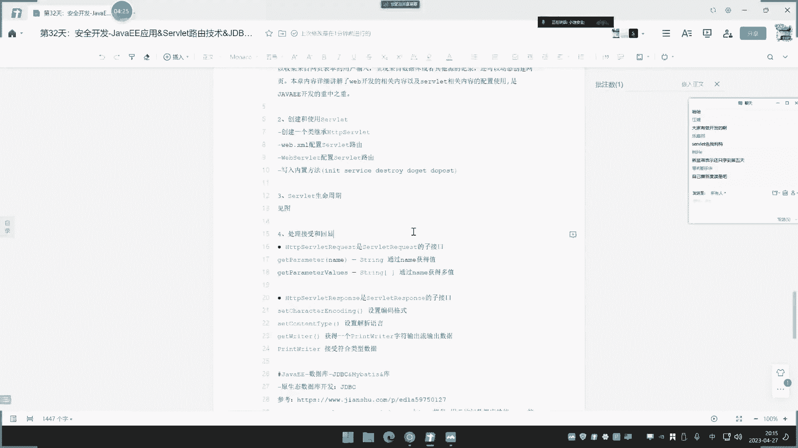

我们呢这里呢用这个IDA了去做开发。

那是20023年那个版本，然后在这里呢我们打开这个界面之后啊，这个安装破解，那我们就不说了啊，在我们等下给的网盘地址里呢，有这个安装的一个大概地址啊，大家去参考啊，首先呢是个新建项目啊。

这个项目呢选择哪里呢，呃这个是2023版本啊，有些版本不同的话，这个界面有点不同，但是基本都差不多啊，有的地方的是叫JVA1，有的地方的是叫这个啊，这个新版本呢是叫这个，我们就选这个啊。

下面还有其他的啊，他也支持这个像我们说的JS那种VE这种开发，这么AHKM2我们选这个这个之后呢，这边呢呃有几个地方我们要说一下啊，首先这个模板呢我们就选择web应用程序的模板。

然后呢在这里呢选择这个应用服务器，选择tom cut，这个tom cut如果没有的话，就可以自己呢去新建这个新建的话，那你就自己呢去安装一个这个tom cut啊，tm cut就我们这打包的啊。

我用的是一个9。0的版本，把解压出来呢，选择这个目录啊，把它搞上去，然后这边的语言呢我们就选择java语言啊，构建系统呢选择这个MVER，然后这是他的一个那个报名，这个包名呢包括那个弓箭名啊。

然后这里呢主要地方就是一个是这个模板，web程序，还有一个呢是这个应用程序，这里啊选择tm cut，接下来呢就是在这里可以指向版本啊，呃我这里呢是根据自己需要啊，你可以呢去在本地的去添加。

就说你本地安装之后呢，他这里有个识别啊，你也可以自己呢再去点击下载，就是说如果没有安装的话，你可以在这里呢啊，他这里呢是有这个相应的版本安装的啊，那比如说这个版本的，你比如说想要哪个版本啊。

啊稳定版本呢是个1。8啊，1。8的用的最多，那这里那就可以选择啊，自己如果说没有的话，他可以帮你去下载，我这里有一有啊，有有我就直接勾选到了啊对吧，然后点下一步，下一步之后呢，这个地方呢是什么东西呢。

这个地方呢现在我们目前的用不到，他这里会有一些这个相应的一些这个库啊，包括一些东西啊，你像这个呢hr ba n a T1，这个呢也是一个做数据库的一个那个库啊，我们可以这里来寻它，这里的我们不用选择它。

因为我们用不到啊。

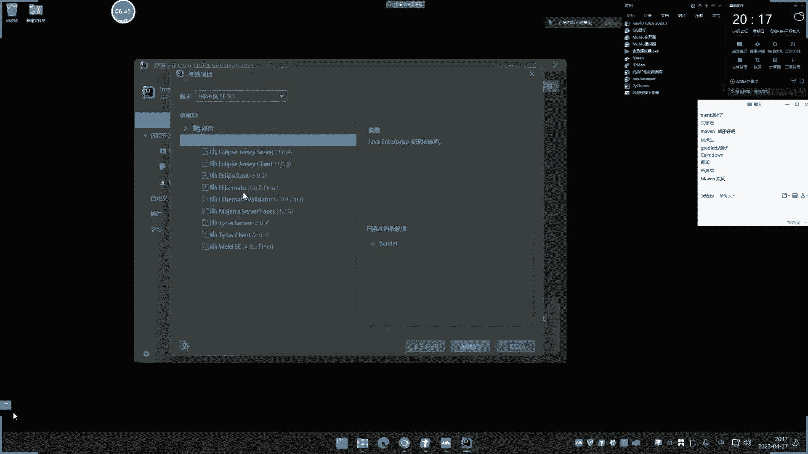

我们这样来用的话，库的话有这个JDBC自带的，还有这个my base，那这里呢像这个呢也是这个做数据库的，由于我们今天不讲这个东西啊，所以也不用勾选啊，直接点创建就可以了啊，他这提示说9。

1呢至少需要java11支持，那我这里那就选择八版本吧，好创建好这个java的一个web开发项目呢，就创建好了啊，创建好之后呢，我们再来呢，就要给大家讲一下这个开发的一个东西了啊。

那首先呢我们来认识一下这几个目录啊，这个IDA这个A目录呢这个是自带的，这是这个模拟啊，这个编辑器的这个ID1的自带的目录，这个呢不是项目目录啊，就是这像这个目录呢，就是你这个打开这个项目的时候。

他的那个保存的那个状态啊，就这个东西啊，这个不用管它不用删啊，然后呢像这几个呢，这个都是它自带的啊，主要呢我们就了解一下SRC里面有两个一个mail，还有个这个test，那这个mail里面有个java。

还有个这个什么，还有这个web app，那么一般的话是这样的，以java的主程序呢是放在这个里面的，然后这里有个叫com export domo，这个是怎么来的，这是在刚才你在创建这个项目的时候啊。

我们不知道还有没有印象啊，你在刚才拆成项目的时候，就不这里选择这个名字吗，就这个东西有的啊，好就打开这里，然后这里呢就有一个java的一个class类的一个文件，打开啊，然后这里呢有它默认帮你自。

动创建的一个文件啊，这个是默认帮你自动创建的，然后呢这个时候呢在这边呢是它的运行服务器，这个是tom cut，这个tm cut呢其实就是我们本地的啊，就这里就是你在配置的时候呢。

不是当时呢在这里呢有选择这个项目的时候，这里有个tom cut吗，这里是你自己之前的创建好的啊，它会默认指向到这里啊，来那么一般网站的程序呢，它就会放在这个web app s，这里呢是运行它啊。

我们可以呢试着呢尝试呢不去修改它，来把它点击运行，运行之后呢，这边呢就会启动这个TM卡人的。

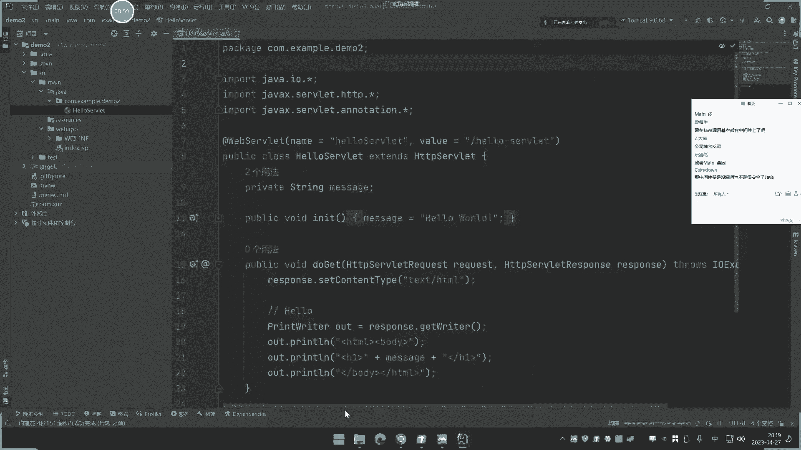

来去加载我们这个项目，那么也会在这边呢会有个文件呢对应产生。

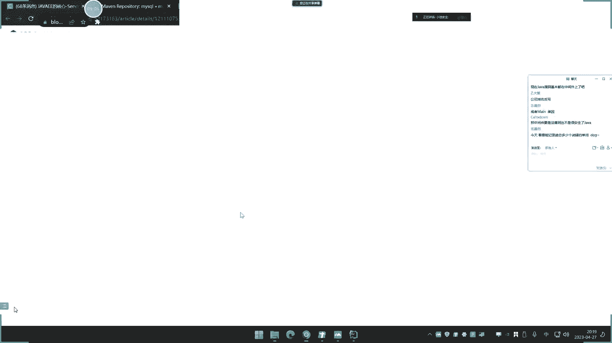

你看现在那就出现了一个项目，项目名字叫DOMR杠WER，这个A股的一个地址对吧，然后这里呢有个这个地址一连接，这里输入hello world好，这里还有一个叫hello sct。

点击下那访问hello strict，然后呢输出又输出hello world，这个代码是在哪里呢。

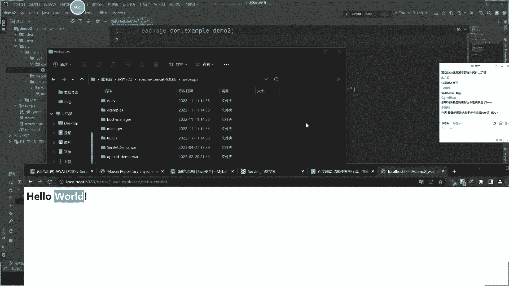

可以看一下啊，在这个hello所有的java文件中呢，这里有个路径啊，想我们这个地址呢触发它好，现在呢这是他默认自带的啊，我们下面呢就是这个java的一个，TM卡的任性日志啊，这个下面我们先把暂停掉。

我们接下来呢就来学着去写一下啊，我们就不用这个文件了啊，我就自己呢在这里呢重新创建一个啊，创建一个java类文件，然后名字我就取名叫index，然后呢取名叫这个skate，点啊，取名之类的文件。

那这个文件取名之后。

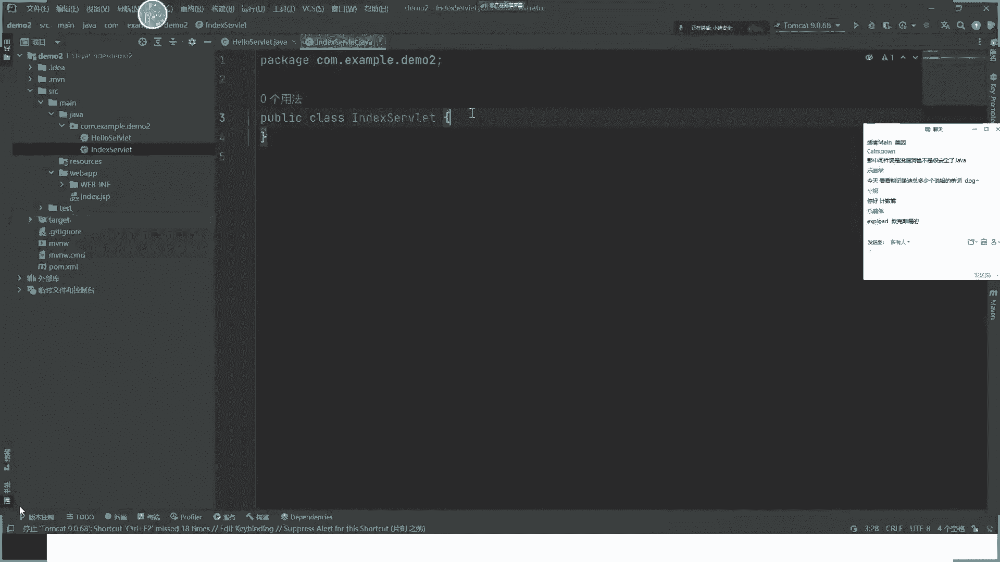

我们来先来学习一下这个script的一个使用啊。

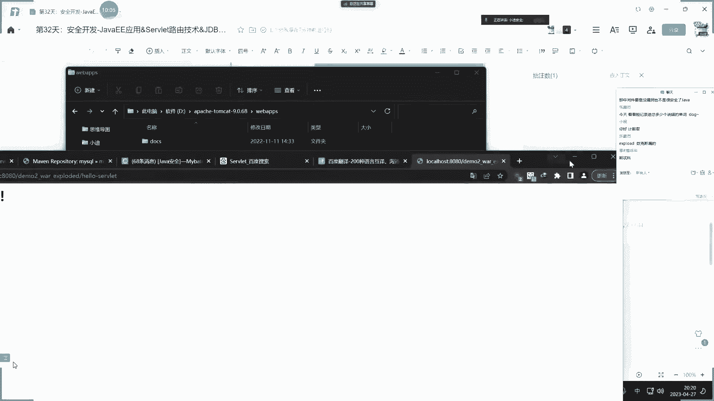

然后如何使用它，如何来去使用它啊，首先他在这里呢。

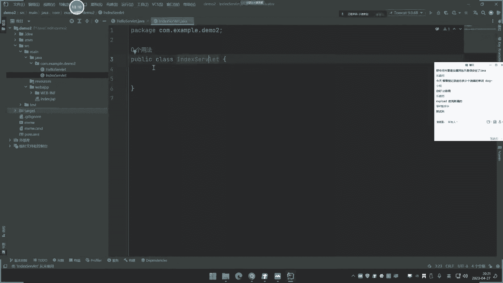

第一步需要做的是什么呢。

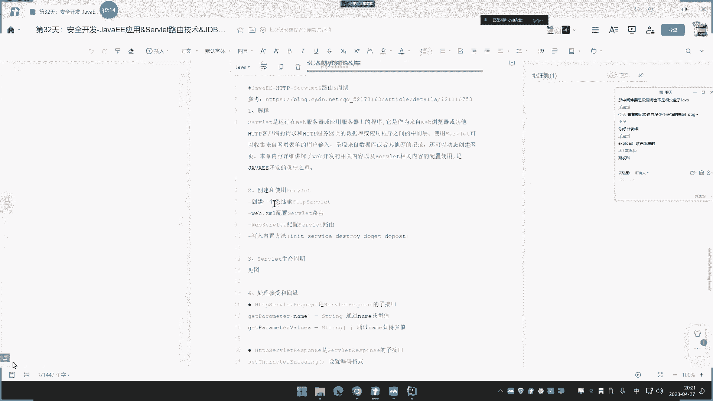

创建一个类来继承这个it appetrick，但这个东西呢是从哪里来的啊，来继承一下，啊这个东西从哪里来的呢，来继承它，那继承它之后。

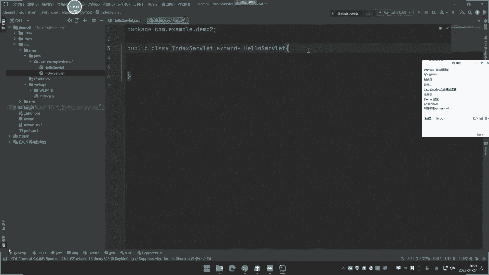

它里面呢是有几个内置方法的，像IINIT方法，SEERVF法，DESCRIPT方法，DE勾的方法，DEPOST方法专门上呢有一张图片，我们来说一下啊。

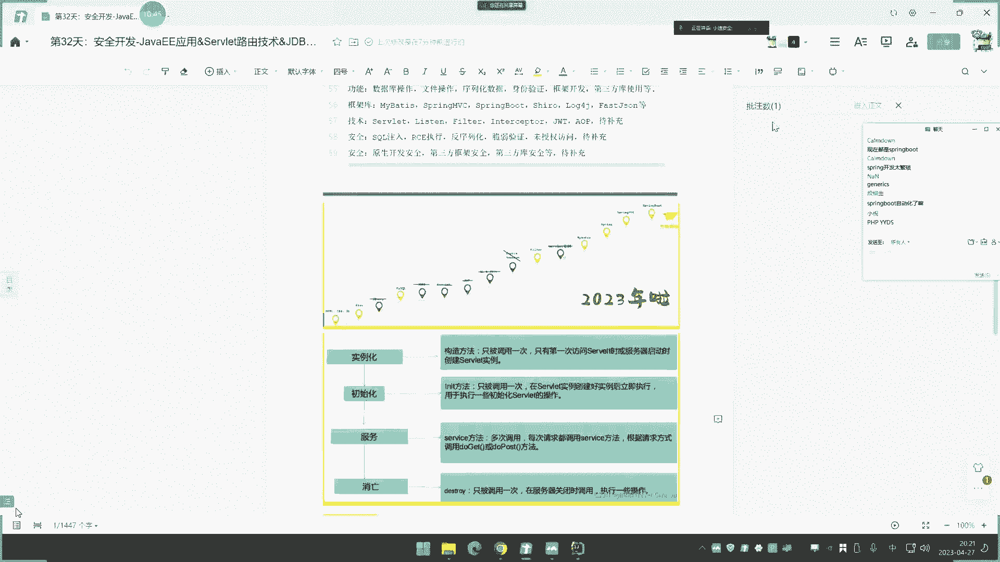

我们来先讲最简单的一个do get方法来写上来，直接在这里来输入点，Do get，哎这个是干嘛用的呢，这个是干嘛用的呢，就是有检测到访问，用get模式去访问的话，就会执行这里面的东西。

然后呢我们这里呢可以看一下啊，我们这里那就把这个先注释掉，输出一个东西来确定一下是不是这个道理啊，输出一个东西来确定一下是不是这个道理，那输出一个，do get好，我们在这里呢就写上这个东西。

那么这里写上之后，如何去触发这个地方呢，它这里呢就会在WOBBALL这个里面加web xm，里面去配置这个STRU啊，STRU个英文单词老读不到啊，就这个刷题，这个这个这个地方的一个路由无关系啊。

怎么办呢，在这里配置啊，如何配置，我给大家说一下，大家看着啊，那首先第一个啊，这是它的配置，然后有个名字，还有一个呢就是它的，class d方，好这里名字随便可以取个名字，我们就叫INDUST。

就叫index，然后呢触发的class文件指向指向哪里啊，就指向这个地方呢，把这个地方复制，右键复制，选中，复制它的引用，它的完整路径就是这个包下面的index是吧，这个地方呢复制它。

然后呢再到下面去写一个STRUST，叫路由，这个是路由啊，好在路由里面呢又会两个东西，一个是雷姆，还有个是什么，x your喷录音，好那这个是又是啥啊，我们来一一对应给大家看一下啊。

等一会给他对应看一下啊，这个呢就是你要加载的这个名字叫index，然后呢引用的class文件路径是在这个下面，这边呢就是对应的哪个名字对应的访问URL路径，比如说我这里呢就选取为index。

就告诉他是这个的触发者里面的这个地方，然后呢访问路由我们就选上index，如果当你去请求斜杠index的时候，就会触发着你的东西好，那么这样子呢写完之后啊，我们来保存一下，这里呢哎哪里有错误啊。

好没有错误了啊，刚才包了个红，是那个多了一个那个斜杠的问题，好在这写好之后啊，我们来重新运行啊，重新运行，我们先来看一下啊，你也是个tomcat，除以运行这个TOMCR8重新启动，在启动的时候呢。

我们有必要先讲一下这个地方啊，那他这个配置是这样配置的，这是你的这个URL路径，然后这是你指向的方法，有个部署部署，这里呢还可以在这里再添加呢，还然后呢这个地方是他的一个访问路由地址。

那叫DMOWER啊，这个呢是叫这个名字，我们就换名，都叫多么多么二好吧，这叫多么二，把全部修改，点击确定，确定，先把这个删掉好吧，我先删掉给大家先看一下啊，呃然后这边呢是他的访问的这个路径地址啊。

来点击下修复修复，那就随便选出一个了，修复点确定这个是访问路由地址啊，这他那个项目的访问地址确定确定啊，这个地方就是说如果说这里没有的话，你点一下刚才那个修复，它就会自动有啊，来修复一下好。

这边呢我们重新再把启动一下啊，重新再启动一下，启动完之后我们试着去看一下啊，这个一个情况的一个产生啊，启动了大家看一下啊，那默认访问这个DOMOWAR，那么就是刚才这个路由地址。

那这个地方的设置值地址对吧，那设置地址就这里嘛，就他请求路径这个项目的路径。

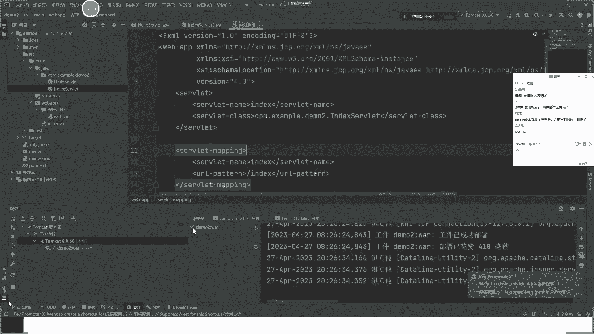

然后呢你同时呢你也可以看一下啊，在我们的这个阿普利呃。

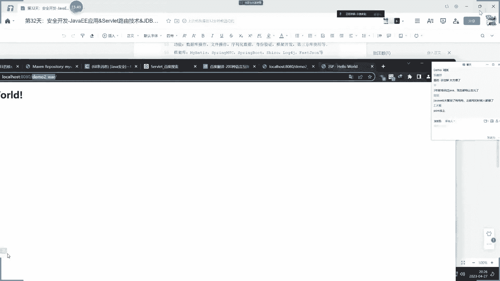

阿帕奇的目录下面呢，你看啊是不是就有一个叫DOMORWAR，这个地方是刚才创建的，这就是那个项目啊，它会自动的帮你去配置好之后的。

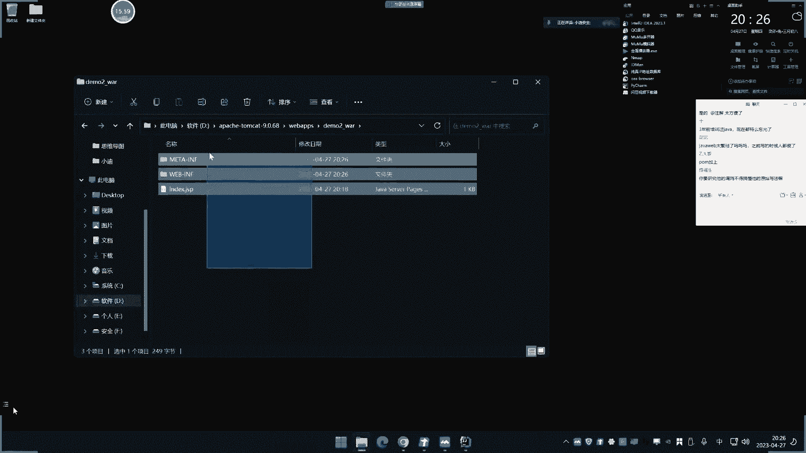

部署到这个阿帕奇这个下面去，知道吧，好启动好之后呢，我们看一下访问这个路径，默认它访问的是这个叫hello world以及是吧，然后呢你可以看一下，我这边呢又重新创建一个文件叫index。

然后这里会输出一个叫do get，但这里没有输出，如何访问到它呢，这个名字叫index，我刚才呢在这里声明了啊，请求这个index的时候呢，触发这个名字为INDUSTOR。

然后呢调用的是这个comment下面的index，所以呢你看啊，那就是现在执行到这来了，这个时候呢我们看一下路径，后面加上index之后，执行好为空，但是这里你可以看到呢，是不是输出了就get呀。

当我们去刷新再访问，那又是do get来看到没看到没，那这是一个什么情况呢，其实呢这个就是专门做do get的，就get的啊，就是说你这里呢去请求这个地址呢，会触发这个do get方法。

就默认请求这个地址呢就会触发这个方法，然后呢如果你让数据要回显的话，要接收的话又可以怎么做啊，来我给你看一下啊，比如说现在我再来改一下，我先把暂停，我让这个接收数据，比如说我这里呢就可以怎么样。

声明一个这个string啊，名字就叫这个名字，雷姆等于什么呢，这里不是上面写了个do get呢，引用这个结束方法吗，request来request点接收参数名为name。

然后呢再把这个雷姆呢给它显示到页面中，显示页面，这个呢是显示在调试器里面就可以写到这里的，然后显示到页面中，就用这个RESPON来去显示，response显示是怎么显示的呢，啊他是用的一个流去显示。

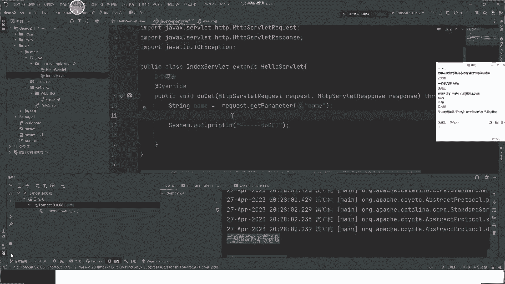

这里呢我们要简单说一下啊，这个简单过一下就可以，就这里呢可以啊，去用这个东西来去接收它的一个显示输出数据。

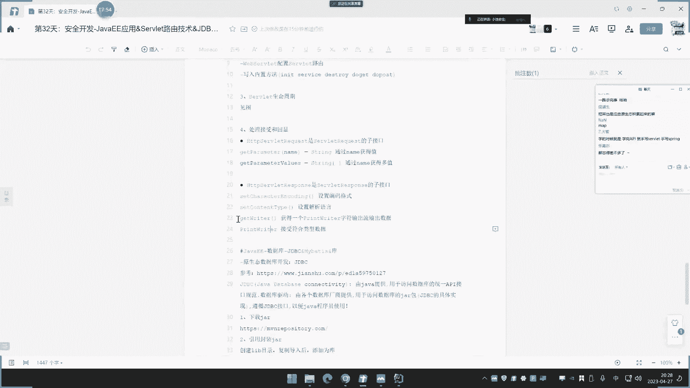

用这个值啊来声明一个这个东西啊，名字叫OUT等于RESPON，点get right来结束这个显示数据，然后把显示数据呢进行显示，就是OUT点print打印，比如说我们可以自己呢去打印它啊。

就显示这个呃name等于变量name，就在页面中去显示这个内容啊，就是那我也接收你输入这个类目值，同时呢接收完之后啊，我还尝试呢去把它进行打印在页面中，然后呢。

并且在我们这个调试这里呢去输出这个to get，表示说是吧，结束到这个就get，对不对，嗯好那现在哎那么现在呢我们现在来了啊，我们把先重新再启动一下，好他这里又包了个这个错误案，来来报了个错误。

刚才有人也说到了啊啊说这个导包，其实这个在java和那个啧这个Python啊，或者说其他语言里面，它都有这种东西，就是像我们之前讲那个呃JS的时候也是一样，就是有些函数啊或者一些东西呢。

他需要导包之后呢，他才能用，你看这个标红的呢，就是这个意思啊，呃有时候呢你自己没有写的时候，他也会自动帮你把一些东西写上去，但是有时候呢你需要手动搞，你知道吧，你需要手动搞啊，我们先把这个来注释掉。

我们先看一下这边能不能接受啊，我们先看看能不能接受，把运气来，还有一些像这个id上面装的插件，我都没有。

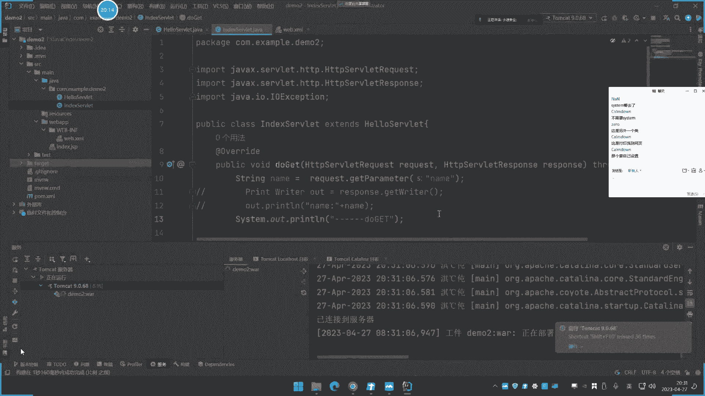

都没有去给大家介绍，就是我在上面还装了一些插件。

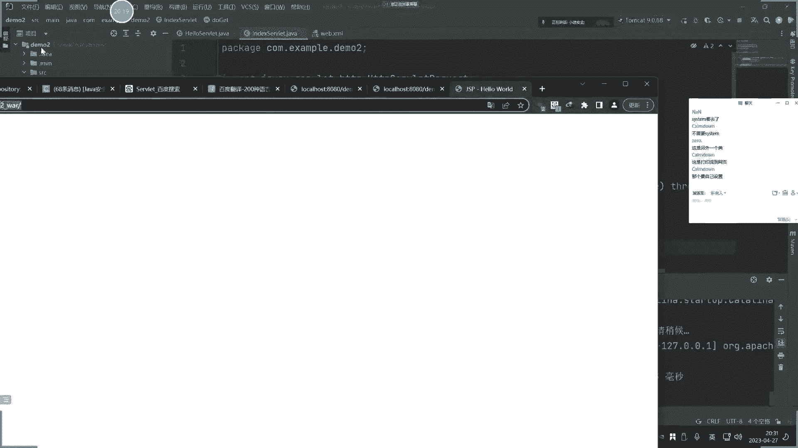

这个插件呢因为怎么说呢，这有些东西太基础了啊，我这个没办法去说给他去那个晕染啊，你看这个有些那种网上上，你都可以看到这个一些推荐的，一些地方的一些场景啊，那像这边呢像这个呢只安装几个这个网上的。

可以看一下这个我安装几个啊，网上是有这种推荐这个编辑的，这个这个裁剪的一些东西啊，我都没有去说给大家去写的啊，好我们先看一下这边能解能不能接受啊，你看啊，那index是吧，index呢输入这个了。

id等于一，那它没有问题啊，输入了是可以，但这里呢我没有显示，我把这个先在这里再调试一下啊，我就先不输出到页面中来把它调试一下，你看输出这个，看一下啊，能不能接收到这个类目啊。

来重新访问一下刚才那个地址啊，index是吧，Index，然后呢name等于一执行，你看是不是接受了这个雷姆一啦，当你这里改之后，那两个改小迪是不是小迪了呀，对不对，然后这个呢是在这里啊。

刚才我说这个呢是在那个，是在那个什么页面回旋中，就说这个呢是在这里显示啊，然后我们刚才说的页面回旋呢是用的，他这个类似的方法叫RESPON，这里名字是可以改的啊，比如说我这里呢把它改成这个REQ。

那么同样道理，把这里改成RESP，那么这里呢就变成了IQ了就可以了啊，这个可以改的啊，然后这里是do get，你看他下面的还有几种啊，比如说do post来哎，那它还有这个do post。

那这个do post我就不说，大家应该知道这个DEPOST是干嘛的，来这个DEPOST是干嘛的，就是结束post数据的，能不能理解，还有就是什么，你看就heart就delete就open鞋to put。

那还有这几个，那这几个就不用多说了，就是请求的方法，new post就是接收post数据，我们呢可以自己呢来尝试一下啊，来我们可以把这个代码呢，复制到这里来试一下啊，也是一样的道理哈。

我写上去呢结束这个值，然后呢是输出这个new post对吧，把写上去之后重新运行啊，好我们把它运行起来啊，那么你看现在啊，我们去访问一下这个地址嗯，你可以看一下这个due post，然后呢一样道理啊。

请求DELIST，他这里输出就get，然后为空，这里为空嘛，因为这个name没传参值，这个就post没有执行，这里呢也没有输出，然后我们怎么办呢，比如说我们在用到那种插件工具。

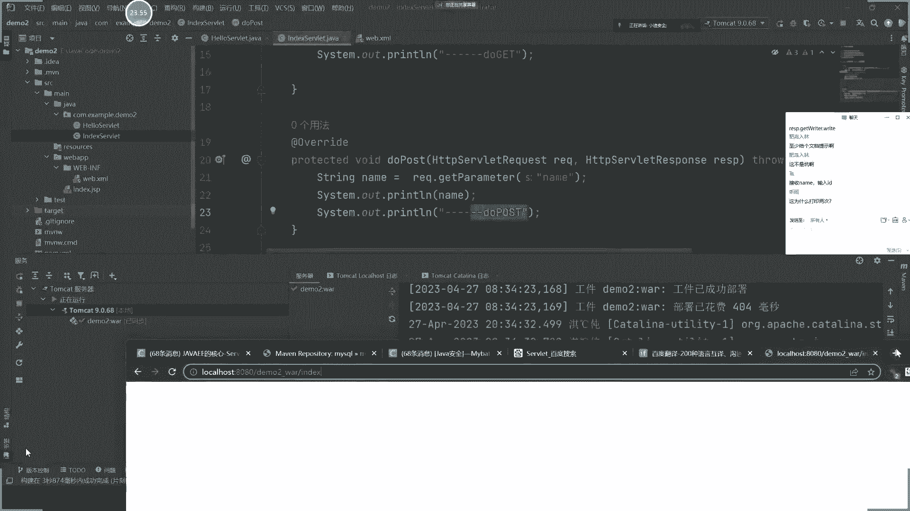

用post去请求这个路径的时候啊，试一下是吧，找那个黑客八呀，或者那种post man啊，那种工具。

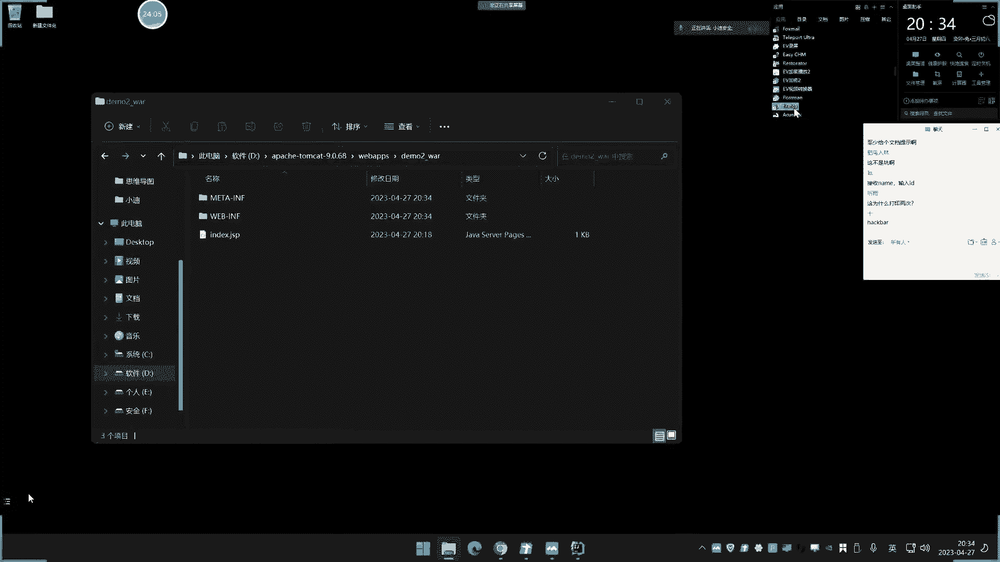

那去罚一下，罚一下那个post包去尝试一下是吧，那这里呢我们就请求雷姆呢等于一呀。

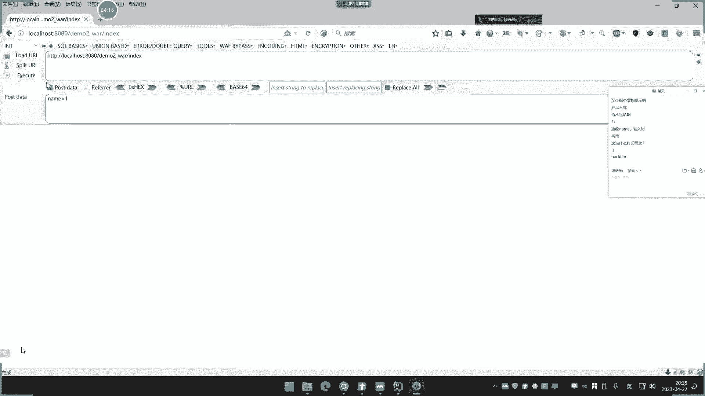

执行访问，你看这里是不是结束了，来do post呀，你看对不对，来换一下数据，是吧，然后呢这个是丢post，像我们还说的这个下面还有它内置的呢，丢hand duly or delete。

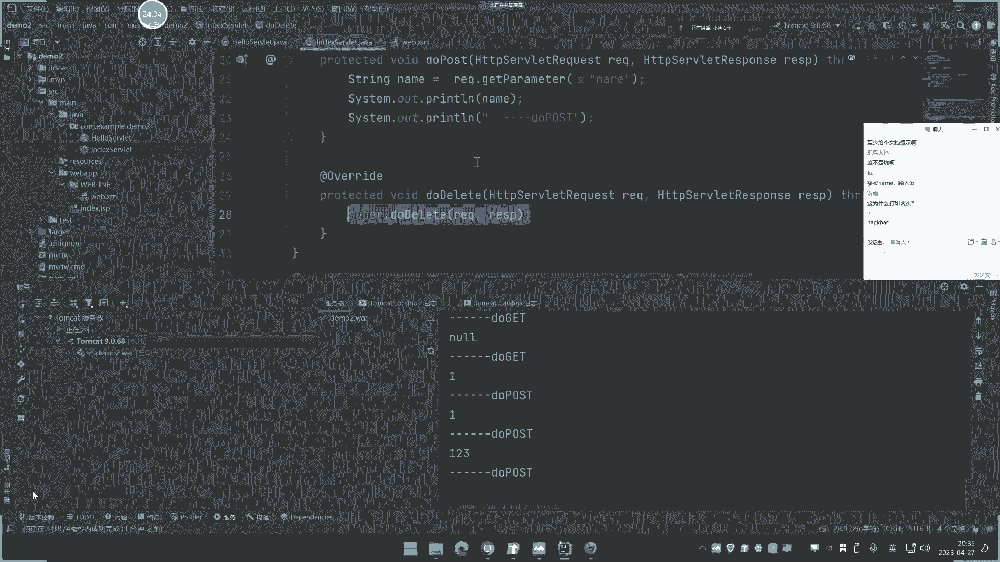

这东西呢我们就不说了啊，就是关乎到你在请求的时候，这个什么提交的方法，这个呢我们在前期呢有给他讲过，就是这个方法是吧。

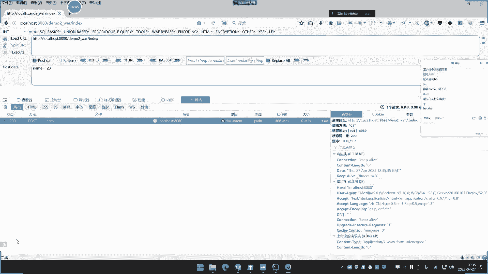

好这个就不说了啊，然后这一种呢是一种路由的设置模式，除了这个之外呢，它还有个内置模式，我们来给大家讲一下啊，接下来我们用一种另外在这里呢创建一个文件，我们再创建一个文件啊，用一种内置模式来看一下。

同时呢再换一个叫new，前面大写啊，后面小写，有些命名呢是有讲究的啊，不能乱写命名，我们加个new的啊，呃在new这里呢，我一样道理啊，先继承这个ADD的这个东西啊，我刚才为什么那个地方有问题。

是这样的啊，刚才这个继承的时候呢，他这个有点小问题，对刚才继承了要写这个啊，那刚才我是写了这个，对不对，hello这个地方的东西，所以导致输出两次啊，刚才问题啊。

应该选择这个呢java sweet a app里面的继承这里啊，他这个呢选这个就是继承这个in is uh，uh expin dom r里面的hello这个地方，所以这个然后你看下面还有几个啊。

这几个呢都是有讲究的，你不能说乱写的啊，好写上去之后呢，你看啊这个呢也是一样啊，我先搞个do get啊，好然后呢，在这里让我们输出一下，好随便就输出一个这个名字，那就叫这个溜呃，就叫这个名字。

new下面的do get把输出这个东西啊，便于区分好，那这写好之后，我们是不是按照刚才的道理来讲，是不是在这里呢又要重新这样子去操作它呀，是要重新写一个啊，然后这里指向这个地方就是什么。

这个指向地方就是要换成这个路径呀，是不如果按照刚才那个写法，是不是要这样去写啊，然后名字换一下名字就要溜，然后下面呢就叫new请求路径呢，你自己想怎么改就怎么改是吧，改new也可以，后面加星号啊。

星号就代表任意知道吧，比如说我这加个星号，我代表任一，对不对，就后面的new后面任一啊，就这个意思哈，把写好对不对，然后呢我们运行啊，所以这是我们之前讲的啊，我们先把它测试一下啊。

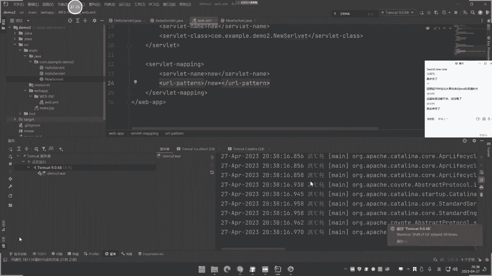

然后呢你看啊我们访问new。

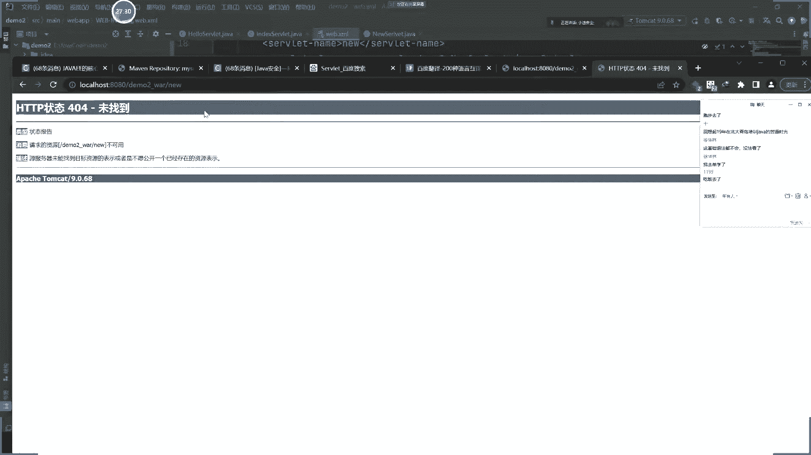

你看后面要加，随便加个了，哎没反应，这啥情况。

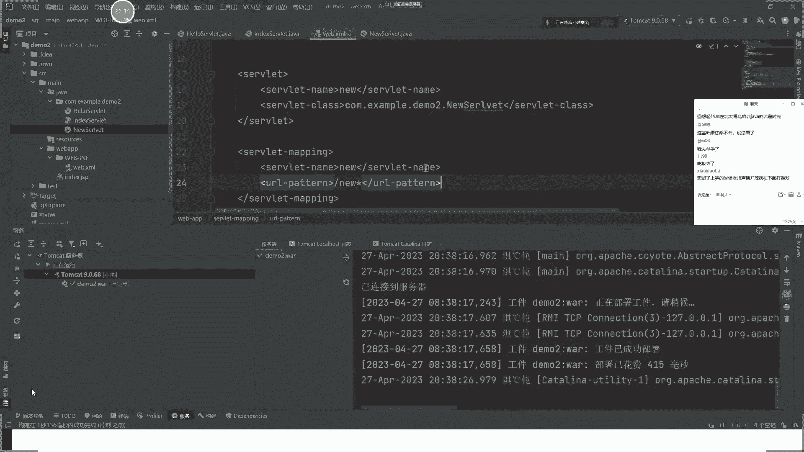

大家看看。

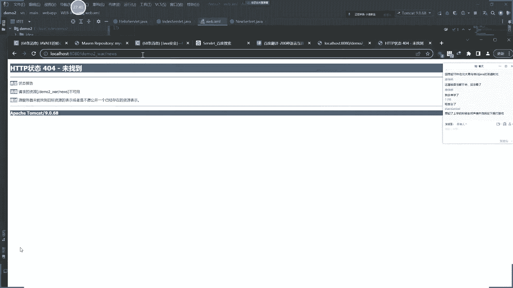

请求这个东西不存在，好我先不说它还原啊。

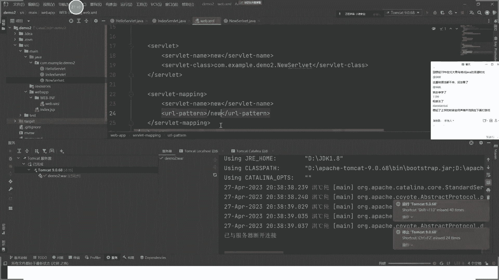

我都忘记那个通配符是怎么写的。

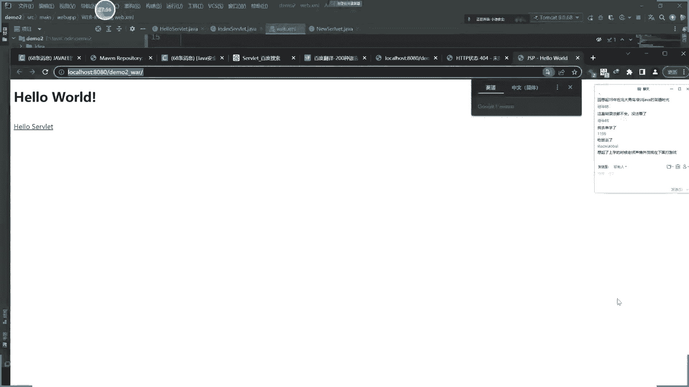

来溜好，你看这里输出来是不是输出了，那么现在你看啊，这是一种写法，我先把它注释掉，注释掉之后呢，好我们再来启动啊，就这个没有了啊，没有之后呢。

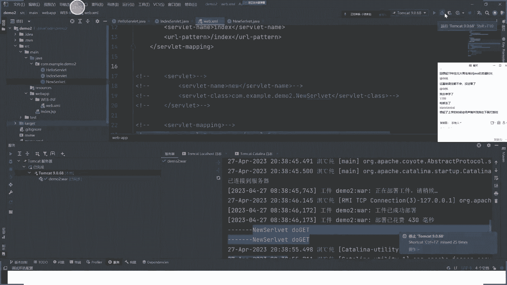

你再访问肯定就没了啊。

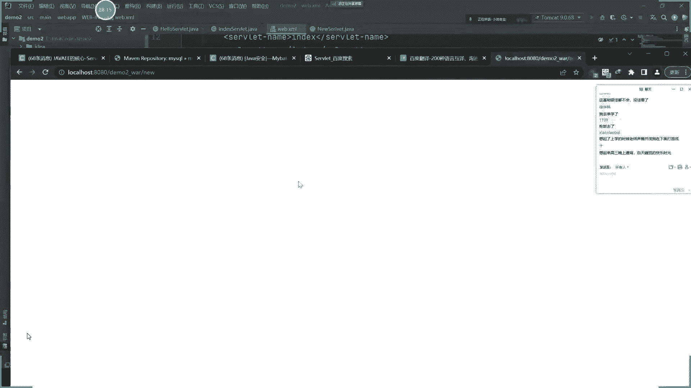

好现在让我们看这个访问呢，访问404这边呢也不输出了是吧，因为你这个东西呢没有了，还有一种方式呢，就是在这里呢最简单的在这里加个东西，路由这里加at water check，然后呢里面写路径杠U。

呃你这种写呢它也是可以的啊。

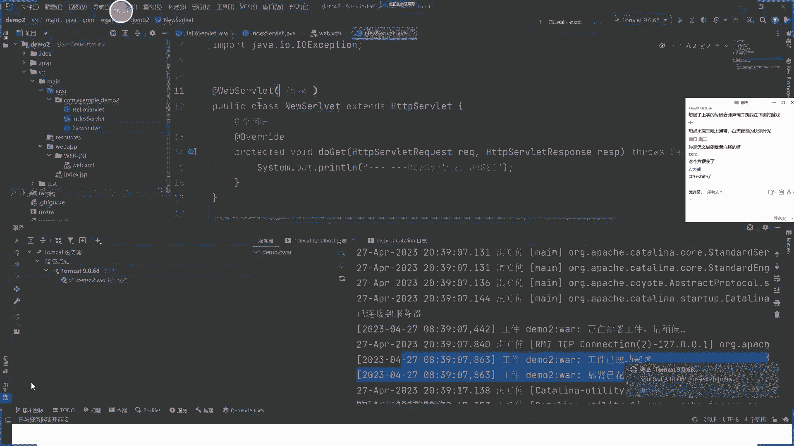

你这里呢我们可以给他看一下啊，来。

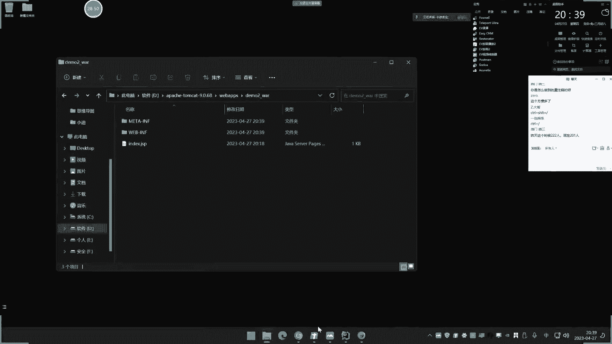

他这边呢是有讲到的啊，这个是那个呃一个那个索命嘛是吧，这个有些我们没有给他讲的，就是关于这个什么目录的呀，然后这个呃这个东西的一个作用啊，包括他怎么去声明呀，那这个上面都有写。

只是我们讲呢就没必要讲的很细很细了啊，这个真的是那这个地方的一些说明是吧，刚才我配置那些东西呢，包括这个请求路径上面还有各种写法，另外呢，还有我们这里还没有写那个哪种方式的，一个访问啊。

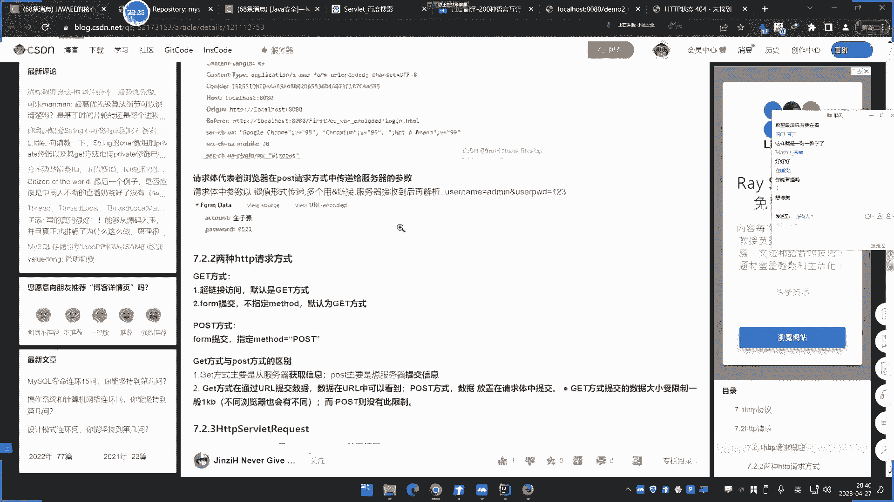

然后像下面这个返回的一个内容啊，包括这个显示啊，他都没有去写，都没有写啊，我给大家看一下这个项目的，你看这个呢就是我们哎不不不，这个，这个是哎我那个写的跑哪里去了，好在这里。

你看那这个就是我们之前给大家写的啊，对不对啊，然后呢这个是我之前写的，你在这里加这个东西呢也是OK的啊，也是OK的呃，丢get这是我们自行写好的，然后呢按照我们刚才一个逻辑来，这里是回写那个数据的。

这里还有个60啊，这个60呢是我们做那个数据库库连接的啊，这个没有没有讲那INDE，这是我们之前写好的一个代码的一个情况，然后在我们刚才回到我们刚才这个写的项目，这来啊，就说你除了在这个地方设置它。

一个访问路由之外，还可以呢在这里再加上这个东西也能设置，它也能设置的啊，他是也能设置的，两者呢是有这个相应的区别的啊，但是他们实现的道理呢是一样的，所以说你也没必要了去计较啊，用哪个方式实现。

就说你在做代码分析的时候啊，你一定要知道啊，这些路由地址在哪里看都比较重要的啊，不是说这个自己的随便写呀，是不是不这样的啊，然后除了这个之外呢，还有几个东西我们要给他说清楚啊，就像这里啊。

除了这个do post do get，还有几个啊，来我们把都写一下，一个INIT哎，还有一个啊都写上去i it的和server方法，设法方法有两个啊，我们来看一下啊，他一个那是一个是这个还有个啊。

我们把它写一下，还有个这个下面的server的有两个的啊，你看一下啊，两个继承不一样，这个是来源于这个地方的，这个是来自于HP的，我们来看一下这个东西是从哪来的，APQUS到哪来的啊。

它其实就是你在创建的时候呢，这个库里面自动加载的，那就在这里呢，你看他路径JWT，然后呢下面ADP是吧，然后呢你看啊你刚才这个app的，它来源这个app的这个地方是用它来封装的。

就是说有一个单独的JAR呢去处理的，他的那个解析的基层呢就是来源于这个库，这里啊就来源这个库这里，然后其中像我们这里呢，其中我们这个地方的这个来源。

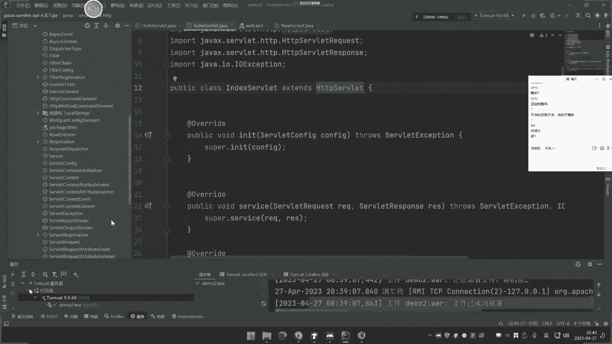

那就来源这里看他那个方式说明呢，我们来给看一下这张图片啊，拾梨花是这个IINIT初始化，INIT实例化，然后还有服务方法和消化方法，这是个什么逻辑啊。

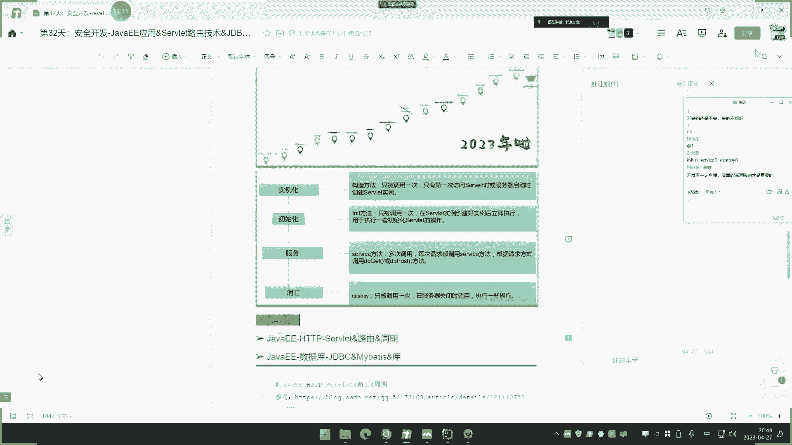

这是什么逻辑好，现在呢我们把它写清楚啊，给大家看一下这个逻辑啊，要看它的执行顺序，其实就是一个对象里面，我们经常说的里面呢就有类似的方法，它会有一个初始化，调用和销毁等等一些东西。

就会你在程序运行的时候，这个程序进入之前，它就会执行一个东西啊，就这个it啊，我们可以把相应的打印下来，把它调试一下啊，给大家看一下，就我们来看一下顺序啊，要了解一下，因为这里呢有知道它的执行逻辑的。

那个生命周期之后呢，我们后期再做这个演示的时候呢，就知道他是一个什么情况了哈，把打一下，还有一个就是我们说的销毁啊，销毁写在最后面的，哎，加火写到最后面，输出一个销毁好。

我们现在呢把这个地方先把它注释一下啊，我们这里呢就把它运行起来，我们看一下啊，他这个输出的一个结果是一个什么逻辑啊，好先运行啊，好运行起来之后，我们再给它自动访问了一个路径，对不对，好。

我们来去请求这个路径啊，他这个index呢是从这个index去出发的，对不对，好，我们看一下啊，访问index出发之后，我们看这里输出，首先他输出了INIT，然后输出了这个诶，这个两个没改吗。

这他妈的真是尴尬了，这个是i i it，第一个是i i it啊，I i it，然后这个名字没改诶，它还是显示呢这个一个是这个sera late server，然后呢这里也是server late。

然后这个app是没有执行的啊，两个服务是没有执行的，一个是继承这个app的，一个是这个server，就是这里我们说的两个啊，就这里呢一个是这个的，一个是这个的啊，记住这个的，还有一个呢是这里的这个地方。

然后这两个有什么作用呢，这两个什么作用呢，这个server就这个SERA啊，他继承啊，这个SERA他继承的是，request请求的，而这个是app的，啥意思呢，就是说我访问这个路径之后啊。

他触发了这个上面这个地方，但是关于这个app上面的request呢，它没有触发，为什么这个其实就是很简单的道理，这个呢我们把理解为他是干嘛的，接收参数触发的地方，当我们这里呢输入参数之后。

name目你看啊，输等于一的时候啊，我们回车，你看诶啥情况，那我要写错了呀，这和我们那个逻辑不太一样啊，我哪写错了吧，Do u get a，兴许，等一下啊。

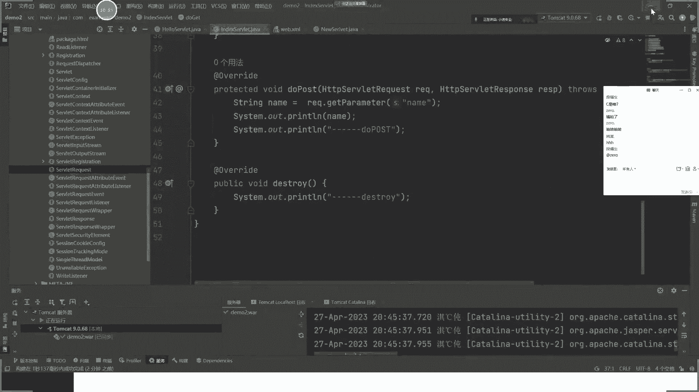

我用这个项目跑，我不知道哪里应该是哪里继承，写错了。

先不解决它，我们先看这个结果啊，是多么这个好用，这个来刨一下啊，这个是i i it看一下啊，改这边的这个呢也是和刚才那个一样啊，来，这个index啊请求这个路径的index方法呢。

请求这个index路径，那触发这个地方啊，这个是一样的，然后呢是来到正面的语法，我们先把这几个关掉来看一下啊，然后呢你看啊这里有个do get方法，来这个do post方法，in init方法。

先把这个注释掉，然后呢像这个销毁方法，还有这个server方法，那两个啊，来一个app的，一个是这个server net的，好啊，把跑一下啊，反正面的。

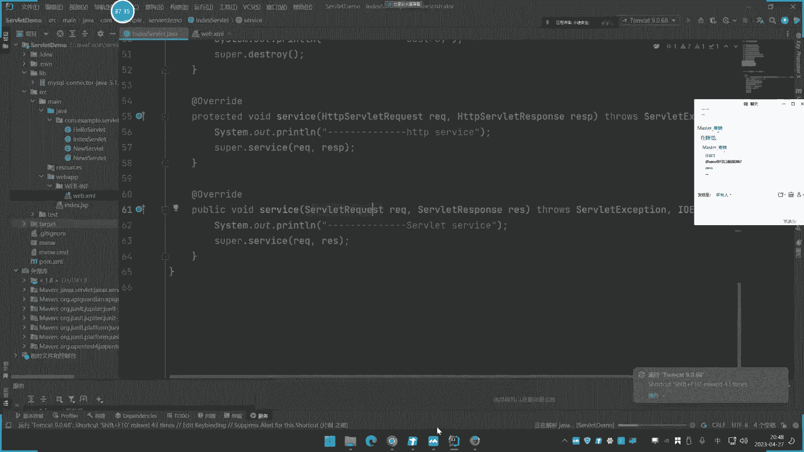

我们看下那个执行逻辑啊，跑不跑起来。

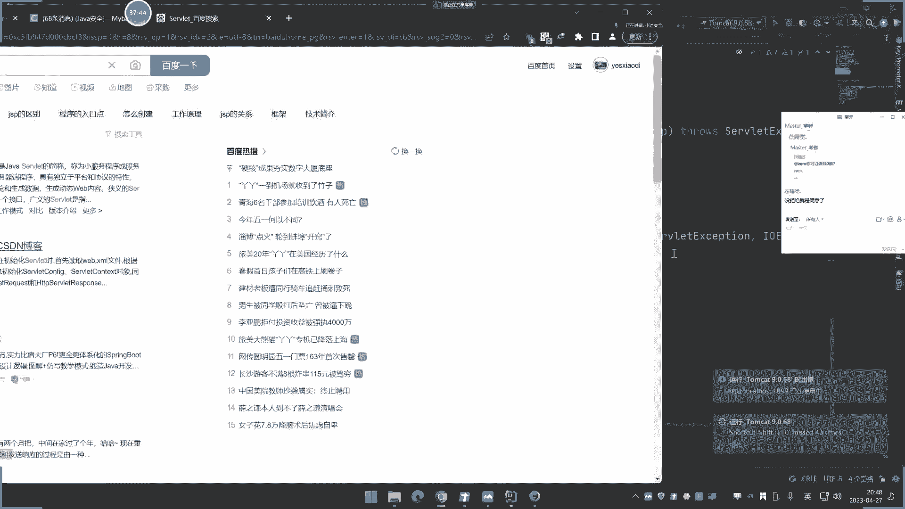

哎呀这个地方有那个暂停呀，先把这个暂停掉啊，那两个占用了啊，占用那个TM卡的造成的，刚才没启动成功，好启动了，我们看一下啊，来请求这个index，你看他的显示啊，来执行INIT。

执行server server，执行HTP，有什么这个app啊，这个东西啊，这个不用管它，你看啊，呃我们把参数写上去，它接收的参数是哪一个，看看源码啊，接收参数了，是这个id，我们输入这个id啊。

id等于你看这里就显示id1，那这就是刚才我说的那个仙法嘛呢，用这个解锁id值之后呢，用这个东西呢来请求这个路径把它输出呢，id是吧，刚才写的那个输出嘛，然后页面写的输出，然后你看这个结果啊。

结果里面呢就是呢他第一次进入的时候，会执行一个i it，下面呢就一次执行SERASERA和TP server，对不对，然后你发送参数之后呢，也是这个执行流程，我们会把清空重新来一次啊。

当我们去刷一单访问执行，看他执行哪些东西呢，然后呢这个INIT初始化方法它只调用一次，就很简单。

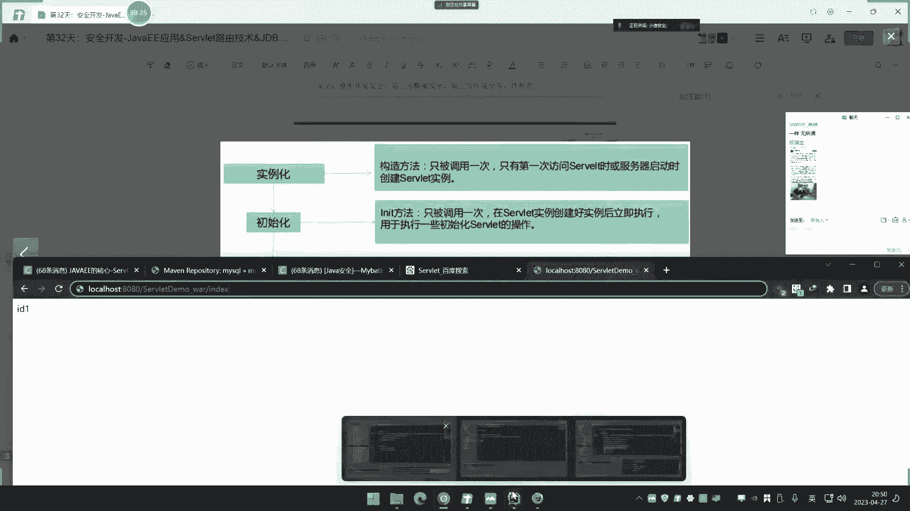

你看我们现在啊去访问这个路径之后，他这边的输出啊，你看他就没有那个i i it的输出了。

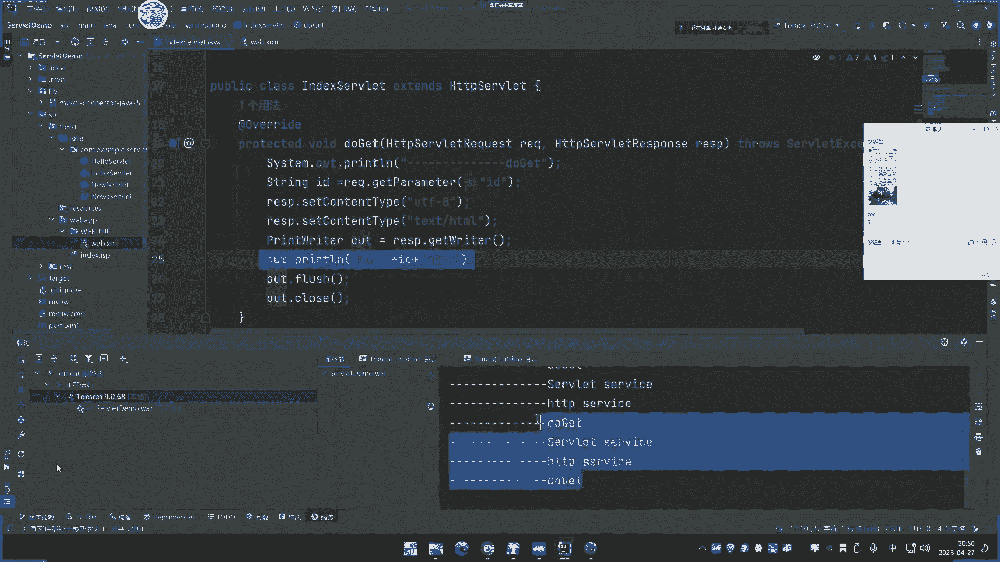

他只执行一次，然后这个销毁呢是指被调用次。

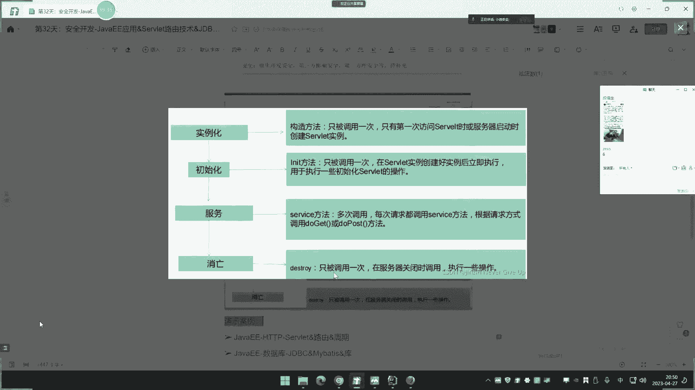

就是服务器被关闭的时候，他会执行，就这里那不是还有个销毁方法吗，但是他一直没有输出，看一下啊，我们把这个东西给他暂停之后。

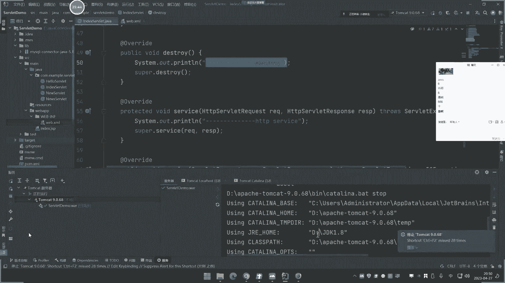

结束之后，你看他就出发了，所以这两个呢比较有特点啊，这个是服务器销毁之后出发的地方，而这个呢是你进入之后，它触发地方，这两个呢都调用一次就完了，然后这个里面呢就会多次调用，就是只要你数据传递。

它就会调用，其实他这个东西呢，就是用来去判断你是请求什么方法。

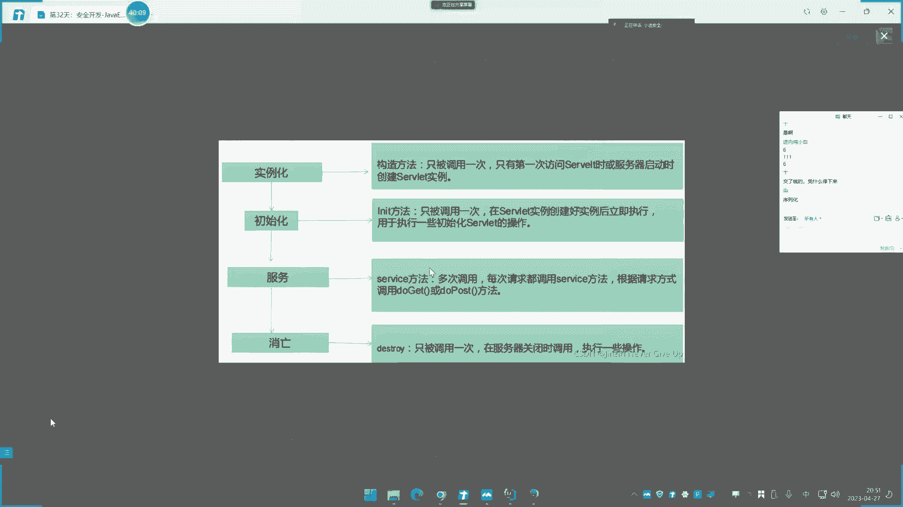

有没有数据就会一直调用它，包括我们这个do get和do post呢全部是在它之下，包括我们现在啊再给大家演示一下啊，就是先有这个sell方法之后呢，才会有这个do get或者是do post。

因为用它呢去来判断的啊，来运行，你看啊，第一次运行的时候，看它会执行什么啊，好运行起来，你看啊，默认执行。

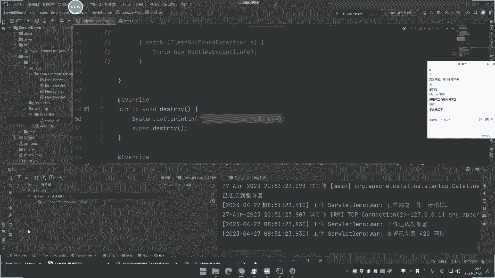

当我们去访问这个路径的时候啊，看一下这边的一个显示哈。

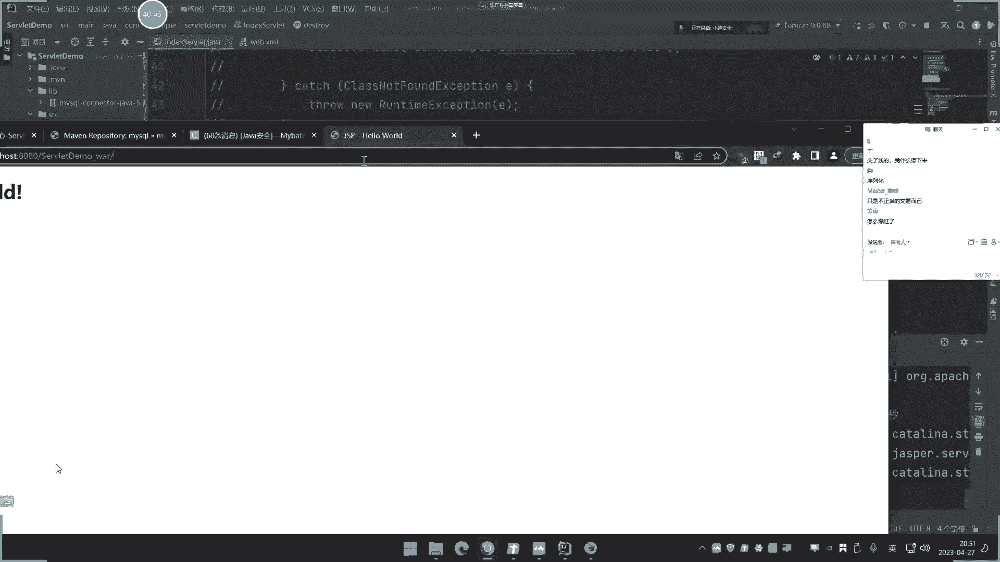

index好看一下啊，回车执行init server server的app的，然后一个do get，对不对，好，我们来看一下id选项区域，哎呀这个逻辑刚才到这里啦，结束啦。

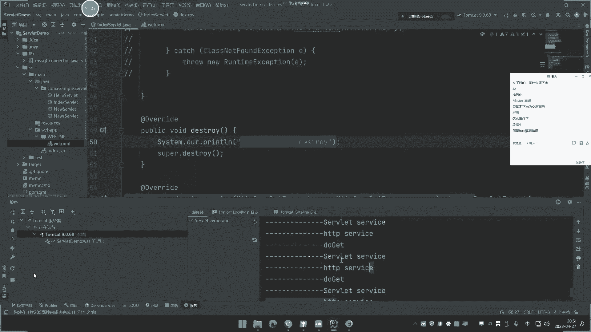

然后又是do get do so啊对吧，这个逻辑关系，所以说这里呢有几个类似的这个方法啊。

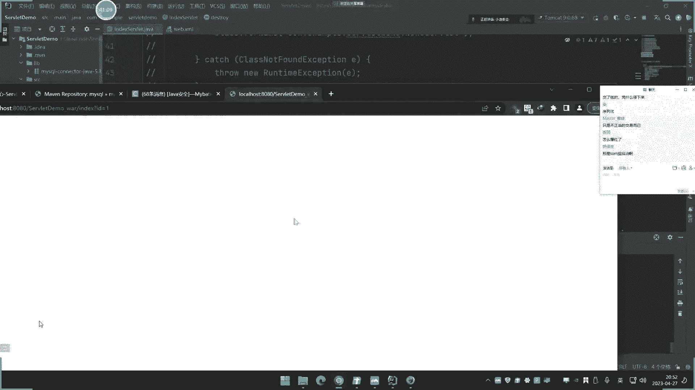

IINIT的和这个销毁的两个呢是只执行一次，一个呢是进入之前执行，一个呢是服务器终止之后结束，这个server里面呢有两个，一个是这个app的，一个是server的。

是先执行server的这个select的，然后呢再执行AHP的，一个呢是负责接收方式的一个处理，一个呢是接收数据的一个处理，简单来说就是这两种情况啊，你在有时候呢在分析代码的时候呢。

这个逻辑是要搞清楚的，不然的话你是不知道是哪个先哪个后，为什么要这样讲，是有原因的啊，好这个数据这个东西呢我们就说到这里啊，然后这个是那个写数据，这个呢就相对简单对吧，首先呢设置它的这个显示数据的编码。

那就像这里啊，这个是do post去输入这个数据，我们呢也给他输出这个结果，比如说我们在输出的时候呢，也可以继续的写上去是吧，比如说呢直接告诉他这是get请求的数据，对不对，给他写上去好。

然后呢如果说是post的话，我们也可以写上去，这把post来接收数据，那么如何操作呢，也是一样的道理，REQ点get a prom接收数据，接收post数据，比如说我们就接受name是吧。

就name值声明一个这个东西呢来去接收它，等于这个解释过来雷姆值，然后呢再将这个类目呢进行一个显示，那么就是和刚才一样啊，先用这个呃解释过来之后呢，用这个东西呢，把它这个编码和解析语言这两个设置啊。

因为有时候呢你在输入时候，有考虑到一个编码值和解析语言的B点的话，会不识别啊，会有些乱码，把两个写上去，就这个名词嘛哈，然后呢再来写这个输出的结果是吧，就是我刚才说的那个答案嘛，写上去。

再把这个alter呢进行一个输出是吧，再告诉这个啊，这是post提交的数据，然后呢依此啊来输出这个数据值嗯，对不对，输出这个数据值，然后呢再把它进行一个刷新，那最后呢再关闭，好这个是我们的那个post。

当你呢去请求的时候，我们来看一下现在是不是这个情况了，这个是页面的回血啊，下面是页面的回血，就是呢用来接收请求数据和页面的回信。

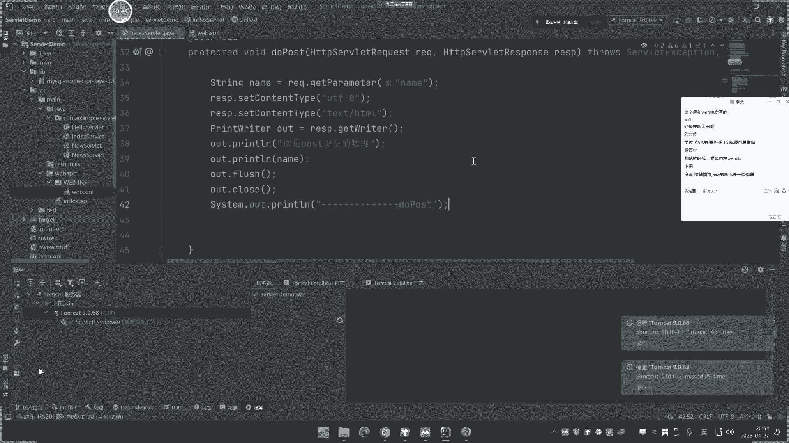

好我们来去请求这个路径，Indust，对不对，index之后呢，来这里是输入id呐，你看这里就报错了，你看是不是报错了，来这个其实就是我们的页面源码导致的，你看我设UTF，它它在这里不解析了。

这包了一些乱七八糟的东西，你看我访问来，其实这就是说这是get请求数据，只要咱是显示不行，他可能是要你把他变成这个gt啊，Gbk，因为我可能是这个项目在创建的时候是JBK，所以他这个显示呢也要那个啊。

那你换成这个嘶编码，这个呢你是给代码中去生命啊，这个倒不是很重要啊，要结下就可以了，编码的问题啊。

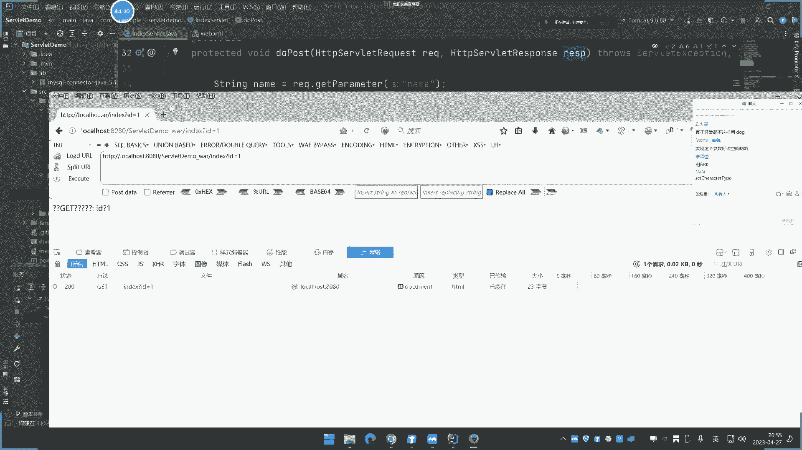

不管他哎，你可以在这个上面呢去把它编码一下啊，所以换成GBK啊。

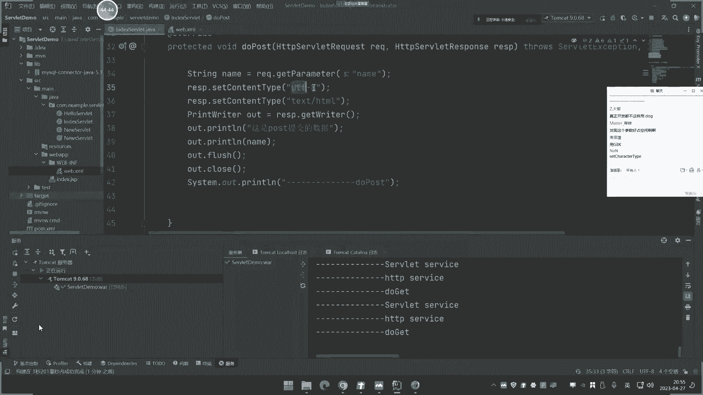

然后呢这是post，然后呢我们改post啊，你看下面让我改成post name数一三。

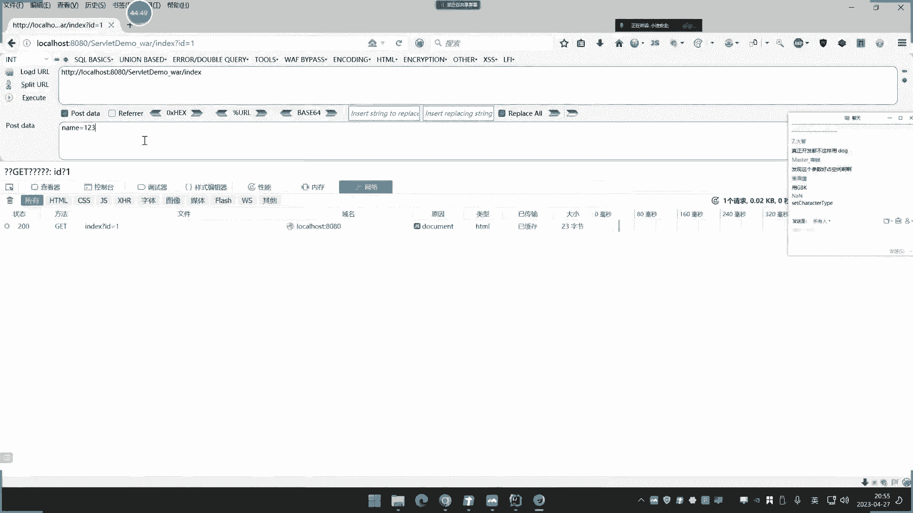

那他就是post数据，然后呢输出123，对不对，这里呢就是在这里呢，去把他是数据的一个那个值改一下啊，编码的问题，这个也是post，对不对，好刚才那是在这一边呢去声明他的请求路径。

那么接下来呢我们是把这里给它注释掉，按照我刚才的逻辑，是在这里写上一个这个we get呀，去写这个路径啊，然后呢去请求这个路径，把它改成A对不对，改成A来重新来访问一下。

这也是一种设置的流逻逻辑路路由地址啊，刚才是在这里设置它的那个逻辑出发是吧，名字包括它的触发的这个class对象的地址，包括这个请求路径，刚才是在这里设置。

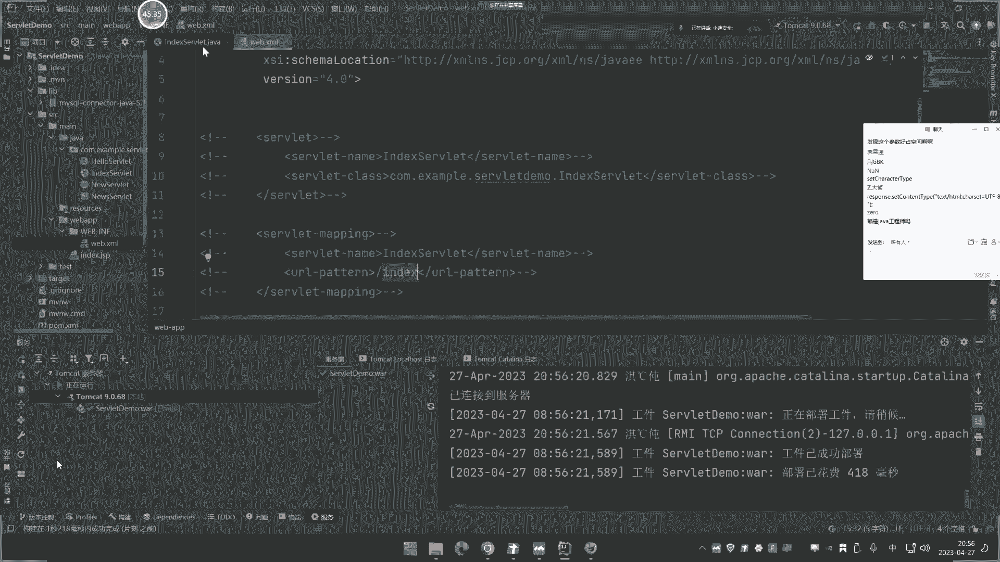

我把注释掉了，注掉之后呢，我在这里到前面是不是这个东西，杠A呢再去触发，那么现在我们看下请求index呢就会报错，当我请求A的时候呢，就正确了，你看是吧，然后呢到我复制给i id等于一。

那么就结束到ID等于一了是吧啊，同样道理，那这里呢再去请求类目的话，那么也是一样道理，对不对，请求name目如果不给值呢，就是为空是吧，不给字就是为空id的为空，对不对。

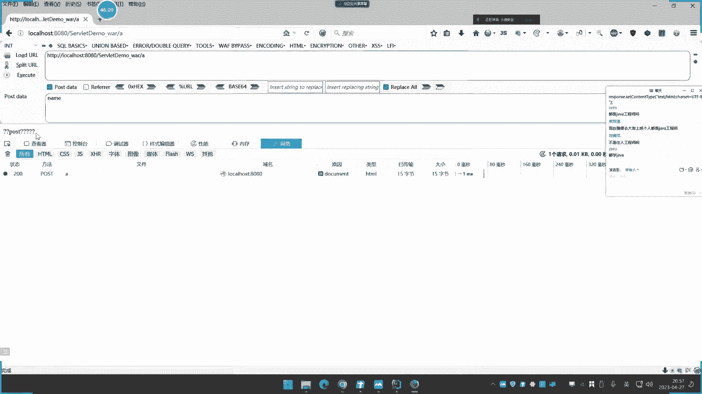

所以说啊这个呢相信大家就知道了啊，两种方式，一种呢是在x stress呢，还有种呢就是在这个前面直接写两种都可以啊，两种实现的原理的都差不多，你用哪种写法呢都行，对不对，哪种写法的都可以啊。

啊这是我们说的这个地方啊，主要支点呢就是了解他的一个创建啊。

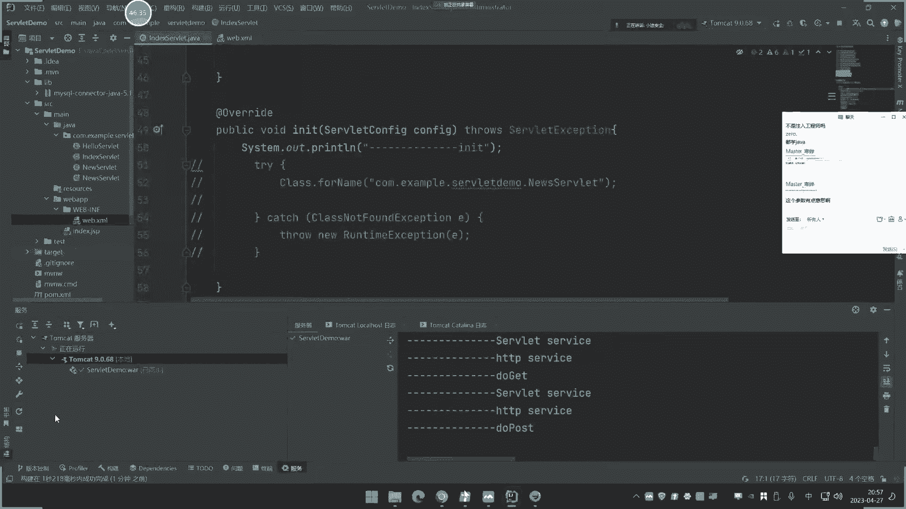

了解它的一个创建啊，了解它一个创建，同时呢在这里呢去修改配置也可以呢，在这里呢去直接写上这个配置是吧。

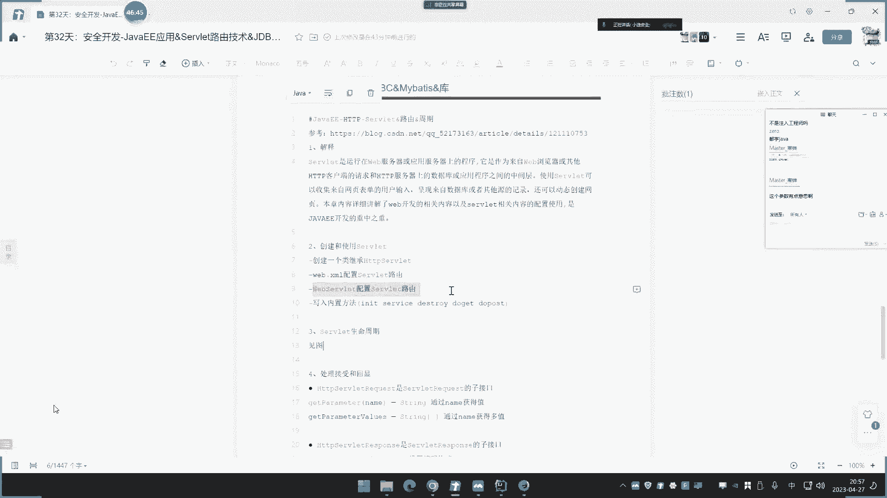

也可以直接在人家写成这个配置都可以啊。

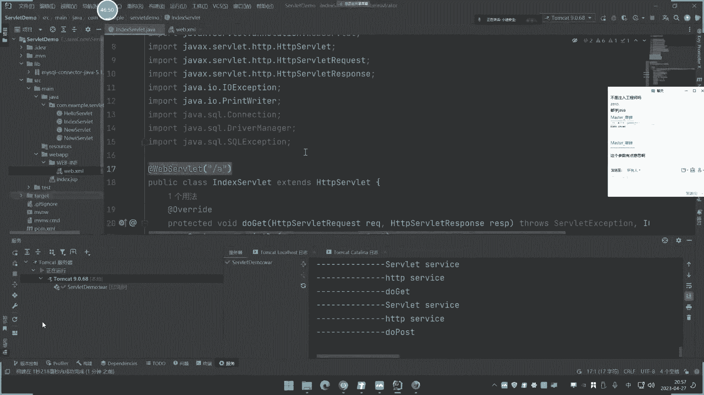

也可以在这里直接写上，然后呢生命周期就是我们刚才说的这几个雷，值的是吧，INIT初始化进入之前啊，进入的时候呢就会调用默认就会调用它，然后呢，这个地方是你服务器终止呢调用的这两个地方。

只调用一次里面的这个server方法和do get，do post就是相应的事件，你访问get那就会触发do get啊，当然这个sell方法呢它也会被触发。

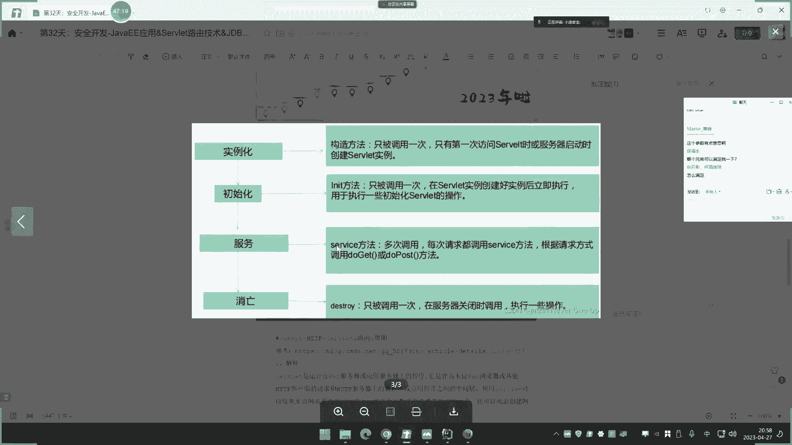

大家也可以看到，在我们刚才做实验的时候，他也输出了这个什么奢望里面的东西，就像这两个呢也输出这两个地方，是不是，就是你就是说你在这个程序里面调用的时候，有些类似方法它是默认会调用的。

他就和我们来讲讲那个什么pp，java的反序列化一样，里面有些内置的魔术方法，你触发到的时候，它就会自动调用，而这个do get和do post呢，它不是自动调用的，它是你访问get方法的时候。

初调用post呢是传分post。

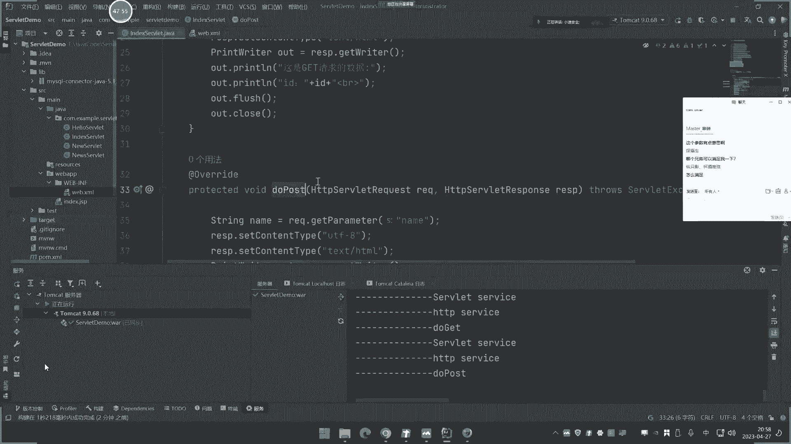

提交数据包的请求方法的调用，而刚才讲的这三个INIT和server，还有这个DEST这几个呢是自动调用的。

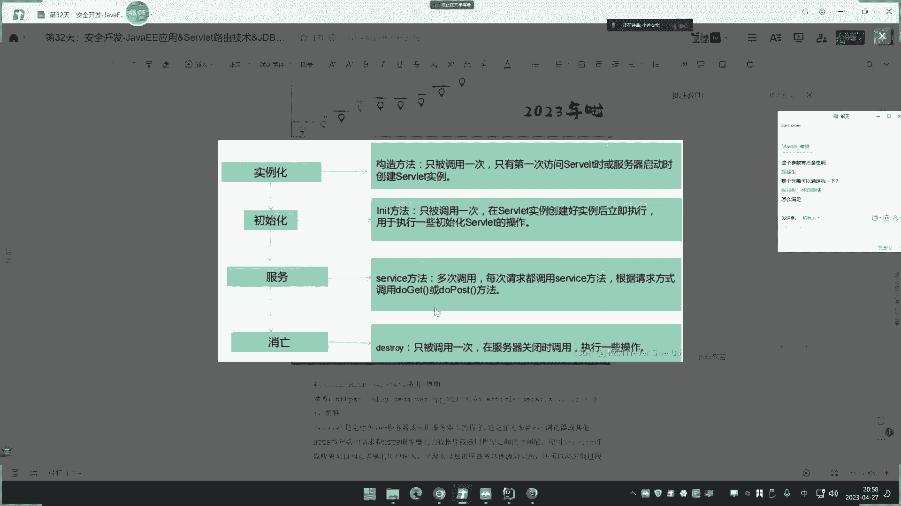

就是你只要访问那个地方的话啊，触发那个地方它就会自动调用，刚才那已经做过实验了，那这个下面还有输出的结果，你看它也会自动调用，I do post，do get呢是在请求到这个方法的时候才会调用。

这就是我们说的这个它的一个使用啊，那么把这个使用之后呢，我们接下来就来看一下，如何和我们的实际应用相关，就来讲一下这个java里面，如何去和数据库呢进行联通，并且呢将数据取出来。

默认呢网上呢是有三种方式，一种呢就是我们说的用他的原生态的JDBC，然后呢用到第三方的库my BIOS，还有一个就是我刚才说的在创建项目的时候。

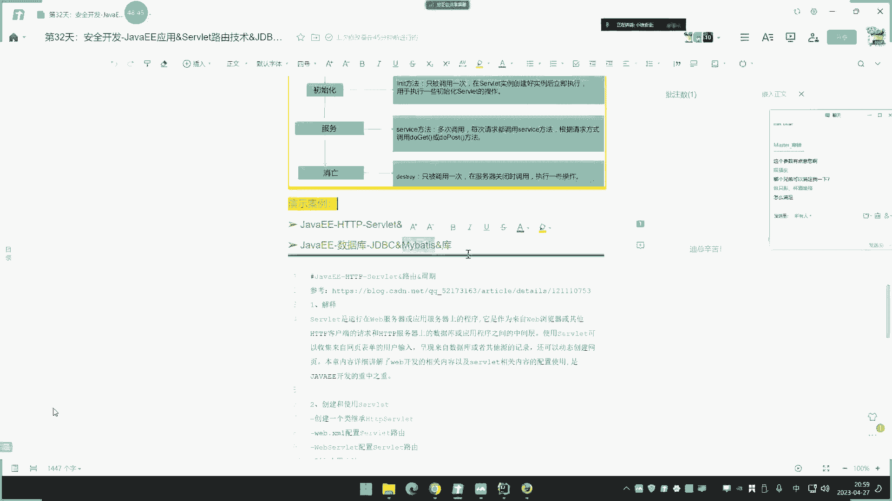

还有个那个名字啊，就这个呐这个HIBABERNTNATE。

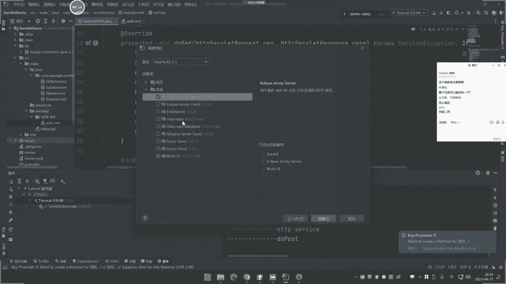

这几个啊，这三个都是用来取java里面用来和数据库通讯的，那有这三个JDBC。

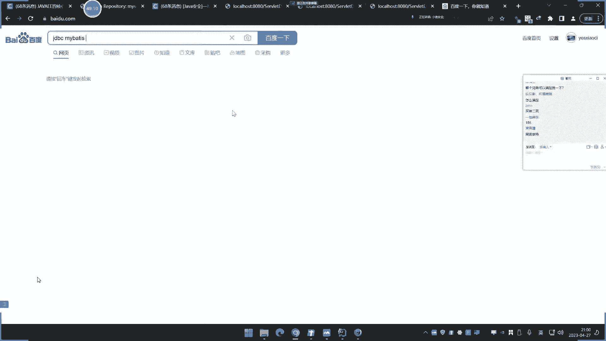

这几个啊。

H i b e r n a t e，那它都是这个java中的这个数据库的这三个东西，然后他们有什么区别呢，我给他说一下啊，这个网上呢也说了一些区别，他说了JDBC使用性能高，编写效率为低啊。

这个呢适用性能为低，但是它的这个编写效率为高，而这个呢是中两个都是中啊，其实就是说呢你看你考虑哪一方面啊，但是实话实说，目前在网上市面用的较多的是这个my BIOS，其次是HIJDBC用的最少。

原因就是因为初级程序员用JDBC，后面呢大部分都用这个买呗，这个东西，那我为什么要把这三个东西呢，去给大家讲解清楚呢，为什么要把它提出来呢，是这样的啊，我们在那可以看篇文章。

这个文章呢是写了一个叫MBETH注入。

啥意思呢，就是说呀，你如果用JDBC去开发数据库应用的话。

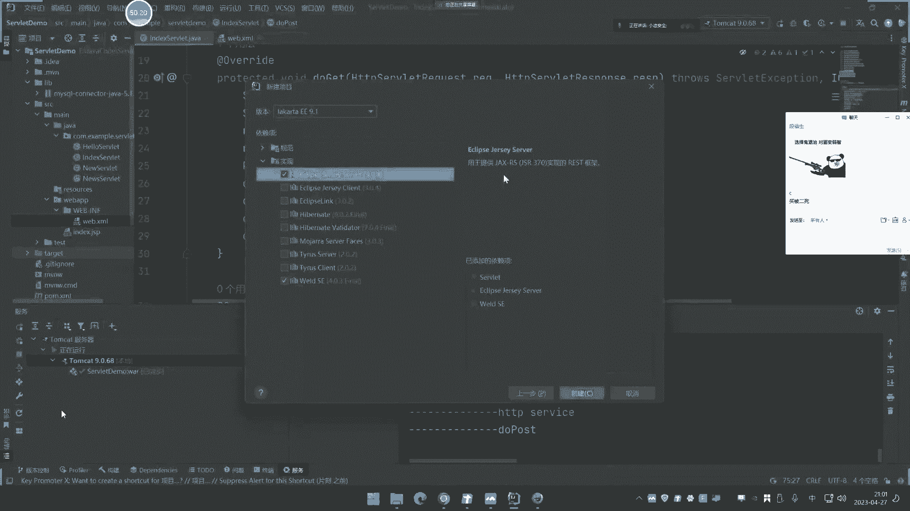

那么和这个买BIOS去开发应用，包括刚才的这个hi这个了啊，OK再搜一下呗，那他说这个框架中的hi查询注入意意思是啥，意思呢，就是说你用哪种方式去实现这个SQL注入啊，实现这个数据库操作。

就会就会有哪一些不一样的安全问题啊，就会有哪些安全不一样的问题，如果说你用它来实现，那么它里面有安全隐患，就有安全隐患，如果他没有安全隐患，就没有安全隐患，同样道理啊，这两个都是一样的。

那后面我们用的最多的肯定就是这个啊，那用的最多的呃，JDBC呢是原生态的，就是java官方提供的一个数据库接口API，然后这两个呢是属于第三方库，这两个是属于第三方库啊。

需要单独去把它加载进去才能使用的，知道吧，这个呢是我们下节课要给他讲的啊，讲一下这个my BIOS，因为呢我们第一个呢要交原生态的这个JDBC，还要教一下这个第三方的，这个呢我们就不讲了啊。

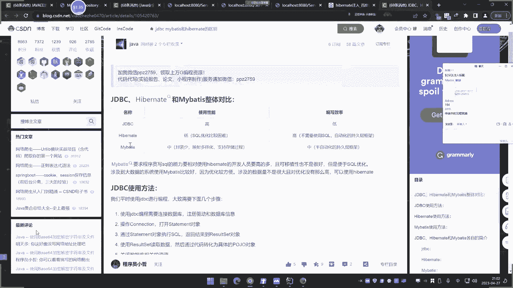

嗯好，那么现在呢我们来说一下这个数据库的操作啊，这个数据库操作，那么如何去使用数据库呢，啊我们来到刚才这个项目这里啊，呃我们在这里呢重新创建一个名字，就叫，My select，好吧，My ect。

穿上它，然后呢他怎么做啊，声明一个面函数。

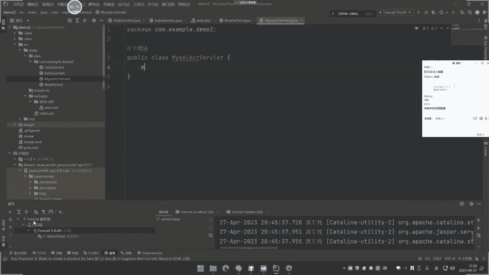

然后他怎么做呢，首先数据库的操作是分几步的啊，它是分几步的，第一个呢我们这里使用的是JDBC原生开发啊，这里呢可以参考这个文章啊，它是分几部的，我们来把每一步来讲清楚啊，第一步，他说JDBC啊。

JDBC是系统java里面语言自带的API，所以他不需要额外东西，但是呢他需要一个叫数据库驱动的东西，这个数据库驱动是啥东西啊，他的第一步先来看一下啊，去下载JDR，这个是什么东西呢。

就是下载数据库驱动，那么在哪里下载呢。

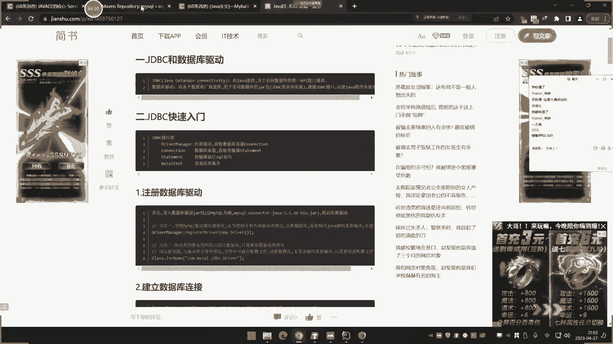

在这个网站上面写上M非N，其实就是我们后面要讲的，像这里呢经常会拉取一些项目的时候。

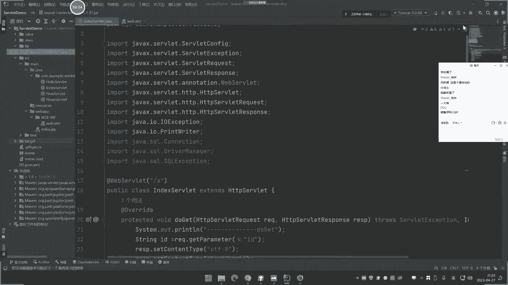

那就会用这个了，MV啊，他就其实就是在这里下载，然后在这里搜索啊，那你要操作MYSQL，那么他就要去下载一个MYSQL的这么一个操作jr。

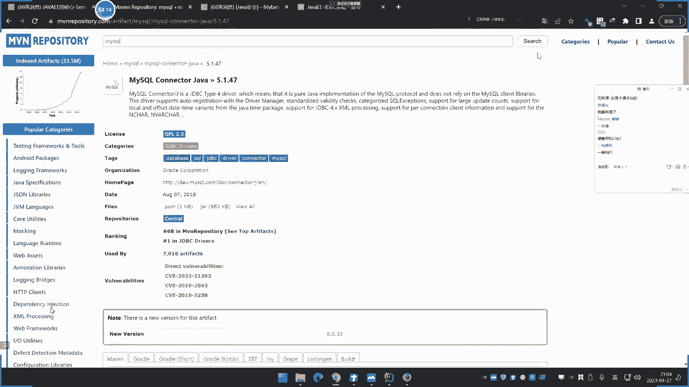

那么包括我们现在去引用去使用它，后面大家就知道了啊。

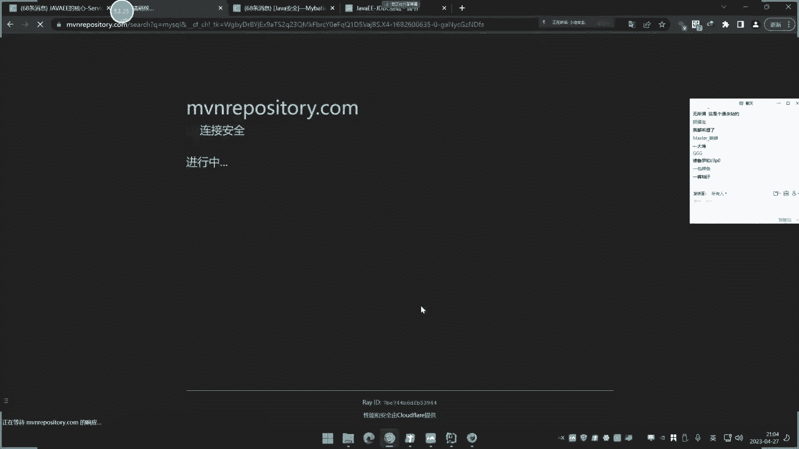

如果说我要引用，像刚才我给大家讲到的这个什么，这个笑洛克斯基fast jackson啊，Fafak fast fast jason，那像这种呢也是一样的道理，也是要在上面去下下好之后呢去引用，知道吧。

然后他每个都有不同作用，你像这个呢身份验证的这个是日日相关的啊，这个是数据的那个转换的，对不对，当你用到这些功能的时候呢，你会下载这个东西呢去帮助你去开展代码，然后呢这个东西呢有漏洞，所以造成这个漏洞。

同样道理啊，我们也是一样，这个意思啊，输入MYSQL，然后呢选择这个，然后这里有很多版本啊，这个版本的你看它上面还写了什么叫EVERS，啥意思啊，出现过漏洞，就说你用这个版本呢就会受到一些漏洞的侵害。

比如说这个5。1。41就是五，关于这个MYSQL5版本使用最多的啊，我们把它选中，他说报了什么CV12022，Cv1209，Cv208，其实就是说这个解压包里面是有漏洞的，你在使用不当会有一些安全问题。

类似肯定就是一些SQL注入，你可以翻一下嘛，来搜一下的编号，那MYSQL输入验证错误漏洞，就是你在这个java里面开发这个东西的时候呢，把这个漏洞补丁没有漏出来啊，没有搞出来，但是这个包裹这个漏洞好。

我们先下载一个啊，那这个下载呢我就不说了，就直接点下载就完事了呗，啊直接点这个了，那这样吧，点一下就瞎了啊。

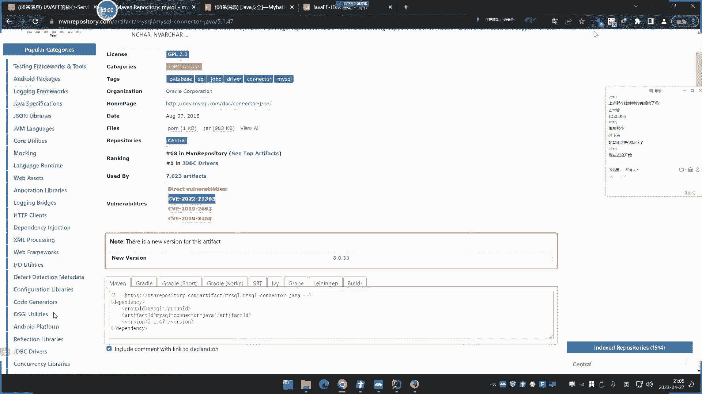

好我们把它引入一下啊，然后在这里呢好我们就创建一个目录啊，叫level就专门来存放这个目录的一个目录叫level，然后把这个目录呢啊给他放进去。

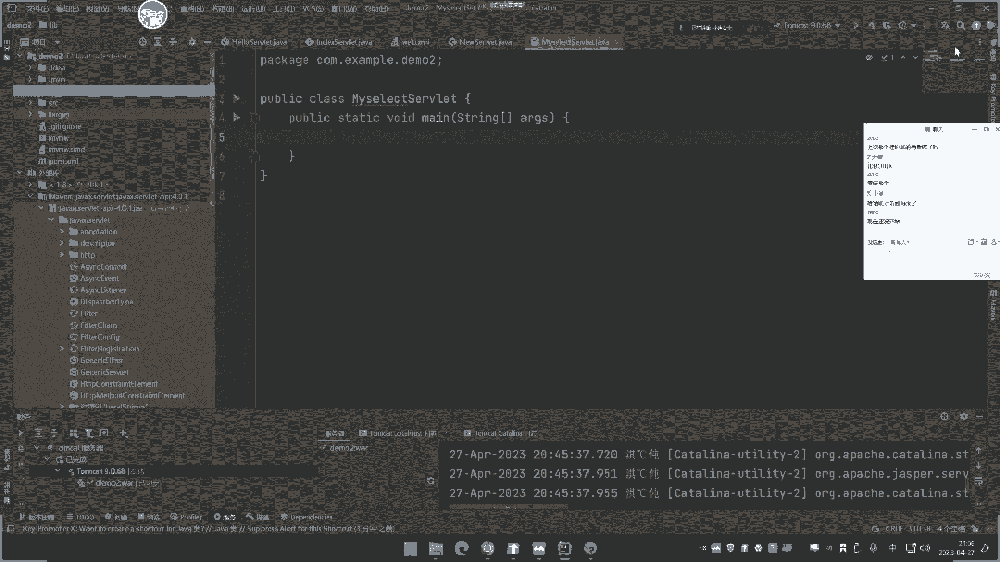

就下载了个JL文件的，把它放进去，那这个是JI文件，把放进去。

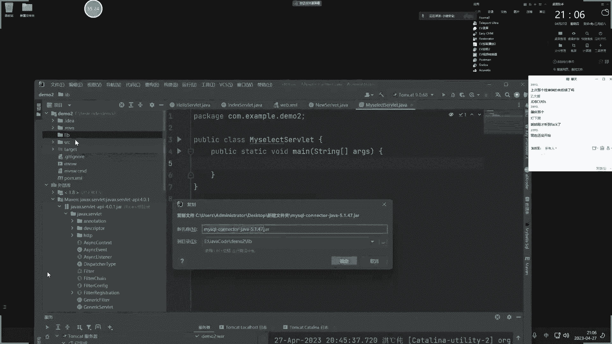

放进去之后呢还不行，还要去引用它，如何引用呢，把选中，点击右键添加为库，其实就是说把它添加到项目里面的意思，就项目里面你直接放进去了，但这个代码呢没有被激活，就说你这个想代码呢没有在这项目中去激活。

点击添加维固把它激活掉，好来先这么去先添加到这个模块里面去，就让这个项目模块里面呢有它了。

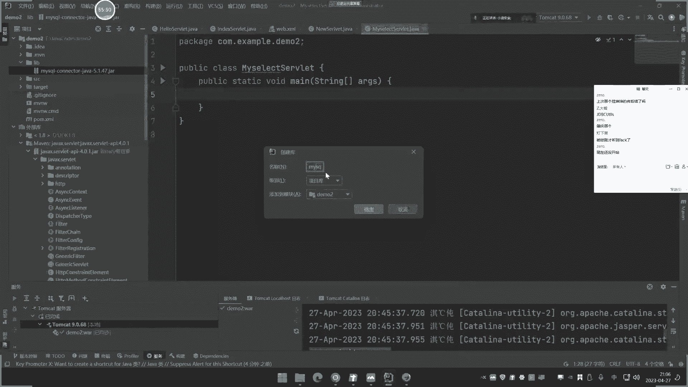

好有它之后呢，接下来我们才能正常使用了啊，那么接下来就是看这个流程啊，这个MYSQL的一个操作流程，那么包括其他的库应用也是这么个道理啊。

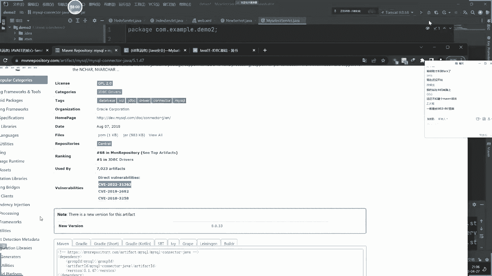

啊首先呢他说第一步是先注册数据驱动，注册数据驱动，那么我们这里呢就直接写了啊，来。

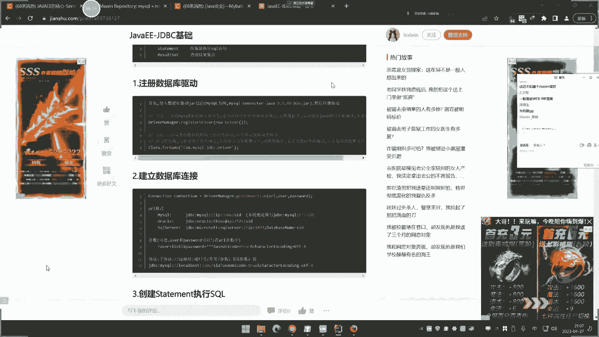

来到这个盗贼，这哪里啊，哪三个，这个是这个来来这里啊，然后这里呢怎么办呢，第一步来class啊，去调用这个什么，调用这个地方，然后呢看一下啊路径com点它的整个路径名呢，com点MYSQL。

MYSQL点点他的一个注册数据中JDBC的点driver好，就对应写啊，这个呢是固定的啊。

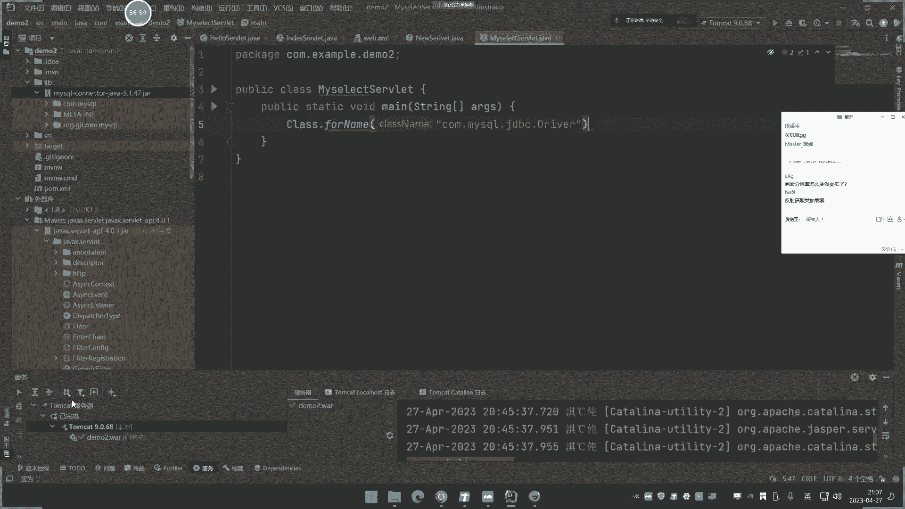

这没什么讲的，就是在数据库驱动先注册一个，注册完之后，第二步建立数据库连接，建立数据库连接该怎么建立格式呢，有URL格式啊，呃MYSQL连接就用这个oracle连接，有这一个sl server。

就用这个，那我们可以自己呢来给他看一下，然后呢我们就声明一个变量啊。

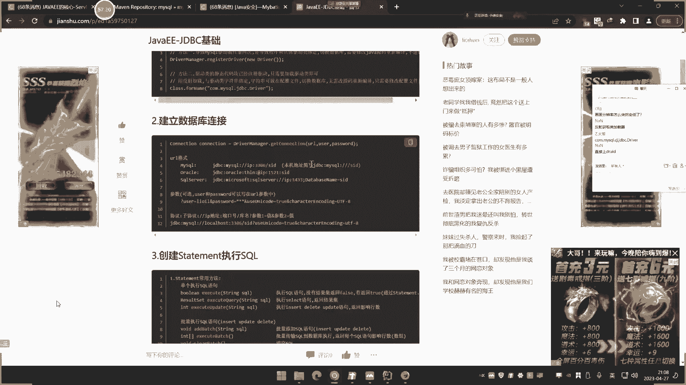

声明一个变量，然后这里有个报错啊，这个包戳呢就可以让他尝试一个异常解决，就点击这个呢添加为异常啊，它自动解决了，那就不报错了，三零就是他和那个Python语法有点类似啊，就是那如果有些东西呢。

他可能觉得在执行的时候都会有一些异常，那么你就把它异常写到上面去啊，就不会属于这个程序在出现异常之后，停止执行的意思呃，然后呢我们去定义一个SQL语句啊，这么一个这个stray的一个类型。

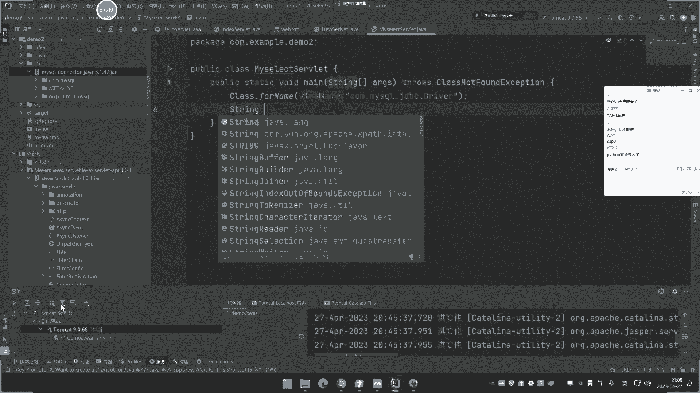

circle等于呢就是加上这个它的格式嘛。

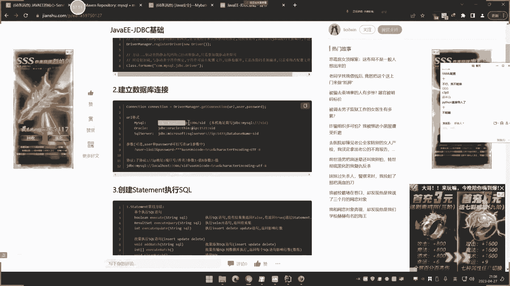

格式呢怎么写啊，再看一下就是JDBC啊，原生态的JDBCIP地址呢就是我们的本地是吧，LOCALHOST或者lo170，这是你的连接的IP连接端口，SID呢就是数据库名字叫DMO0，一。

就是我们经常使用的啊，我们来连接一下，这里啊我们可以看一下pp study呢。

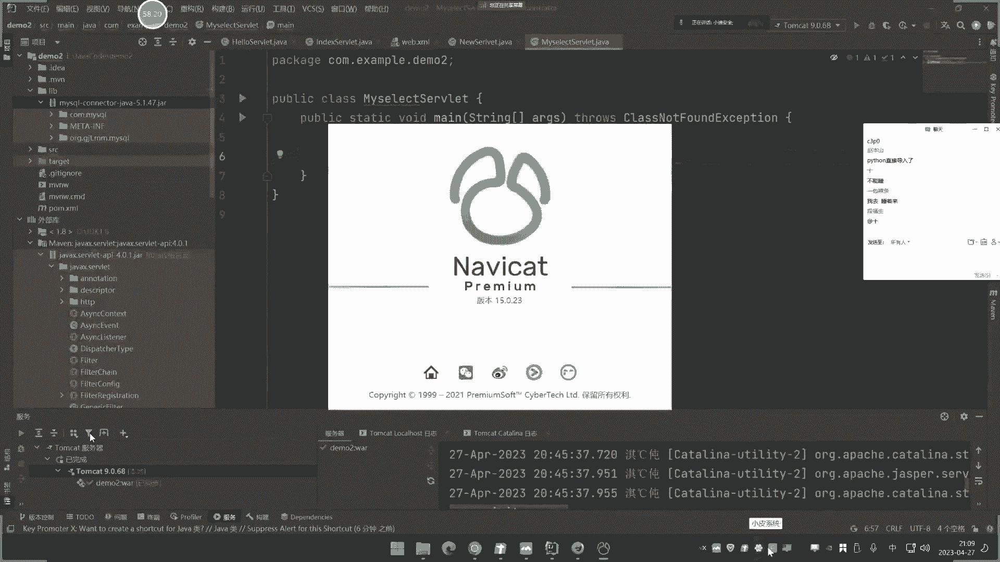

我是开了啊，这个PV的MYSQL的都是开的，没问题啊，所以我们连接一下本机。

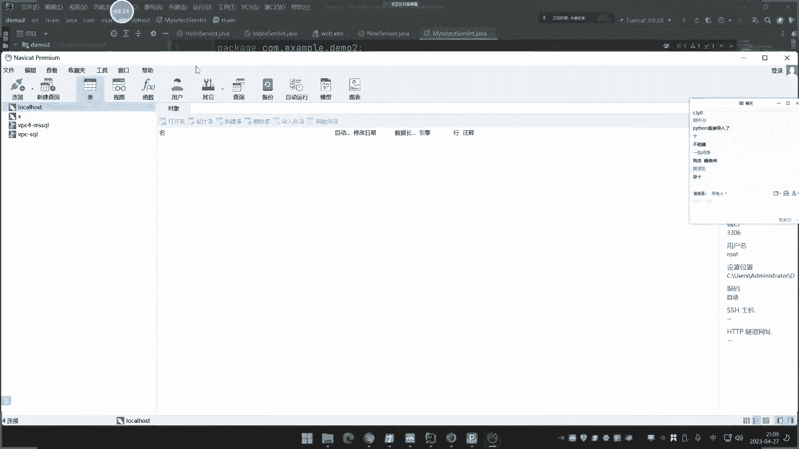

确定估来连接这个MYSQL，然后呢这个DMM01，那么对应上写上去是不是接下来啊，你看它就会创建连接，这个呢就直接模拟过来就可以了，然后呢这里简单修改一下几个离箱啊，修改哪个地方呢。

一个是这个UR就把它改名叫UR嘛，然后username user呢就是写上我们的连接账号密码，这里呢给可以，其实在上面那也固定，也可以，在这里写上，就是连账密码，root这里那就是密码是吧，对吧。

然后这里呢你看到啊，他为什么报红呢，爆红我相信大家都知道吧，就是没引用那个什么东西嘛，哎给大家看一下哈，嘶，来把这个引用一下就可以了啊，好可以了啊，java里面SQL的新注意啊，来这里不包红了，对不对。

那这里呢就把写上去了啊，这个root里面的单引号不行啊，你双引号看下啊，讲单引号双引号的问题啊，哎呀我真是服了啊，咱要讲单引号方向问题，这个java里面的双引号还要注意啊，大家不要搞错了啊。

哎呀真是麻烦，写的时候真是麻烦啊，好这里呢就把这个东西把它写好了，然后这里，他有一个这个异常是吧，异常也是一样道理啊，刚刚那刚才的思路了，把勾位上自动帮你这个代码补齐呢，添加异常啊，再添加上面去好。

这里就没有波异常了吧，好这个注册完驱动之后呢，我们再看他下一步啊，建立数据库连接好建立了建立之后呢，我们来试着去看一下，它能不能有没有数据库连接，我们先把打印一下，调试一下，看是不是能够通讯啊。

system点POKEP，先看一下到底有没有啊，就打印这个连接请求软件请求这个嘛字吗，打印一下啊，我们先来尝试一下，看一下他是不是能够啊，来点一下这个地方运行这个代码来运行，看他能不能啊，大家看啊。

它就有一条信息了啊，你看是不是有一条信息了，如果说异常的话，我们看一下，改改个错误密码，那root把它改成root s，我们运行，你看他就会报异常，运行啊，那你看是不是报错了呀，对不对。

所以说呢就刚才表示说已经连接上去了。

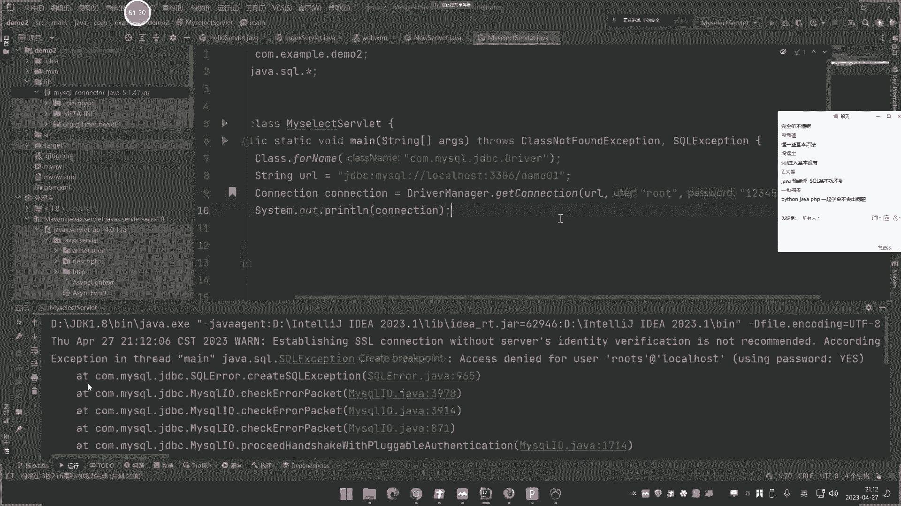

连接上去之后，接下来是不是就是好，我们来执行呀，创建这个SQL语句，然后再去执行这个这个执行SQL语句啊，对不对啊，大概流程就这么一个情况吧是吧，那这是他的执行SQL语句的那个写法了。

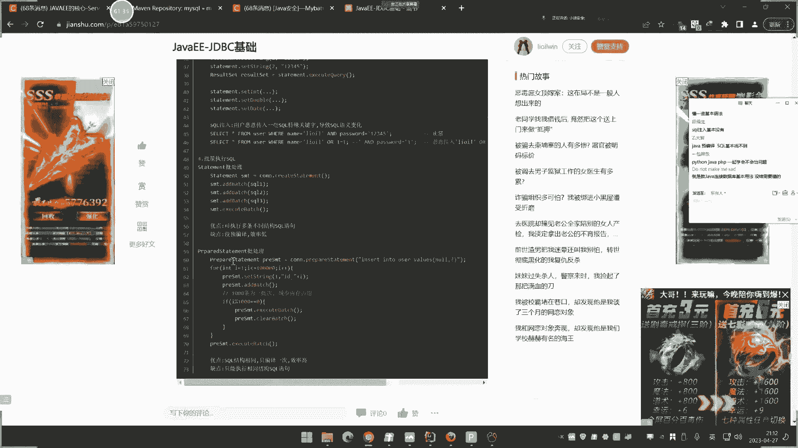

咱也不用写这么多啊，你记住就可以，其实也蛮简单的，就是你自己呢自命好，一个是个语，然后把执行就完了好我们定一下吧，也是声明一个STRUST啊，对STRATION，然后呢circle呃，声明一个语句。

比如说snack的sing for news是吧，这是我们刚才那个语句，对不对，来是60查询这个60的内容，就查这个几个地方，然后呢再怎么办呢，就是要把这个语句的执行，它的执行呢和MYSQL那些呃。

和pp那些不一样，它是需要先怎么办呢，啊就是说这里的注册完之后啊，建立数据库连接，然后执行语句的时候呢，他是先要创建这东西的来执行，他有这个讲究啊，而且如果说采用预编译。

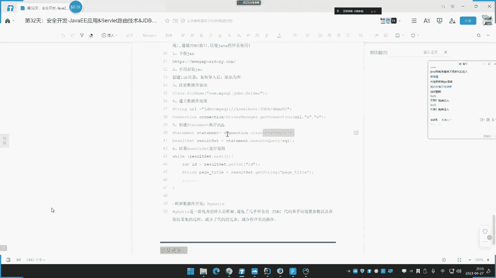

还会有另外讲究不一样啊，来创建这个东西去执行SQL语句，来我把这3号呢，那当条执行语句把它复制过来，简单把写到这个地方来，那这个地方呢我们就用这个东西呢把它解收吧，取名叫rs。

呃这个语句呢他是执行exe update，这里还不一样啊，呃很多东西都不一样，来这个地方呢要改成QLY的啊，它与执行语句不一样，还不一样啊，JS1QYY要这样子啊，update是执行update语句。

这里是snack的语句还不一样，刚才那个写法是执行update语句，如果你不懂还不知道啊，哎他这个是执行update语句的，用这个EXE这个才正确啊，update这个不对。

那这个呢就把写上去2S就是我们结果记录，我们呢可以调试把它输出一下，这个结果呢把它输出一下啊，然后呢我们试着去运行一下，看一下，现在啊首先是数据库连接，把它输出，看能不能正常连接连接删了，然后你看啊。

后面有个输出结果也是这个结果2S，但这个结果呢我们把它取出来。

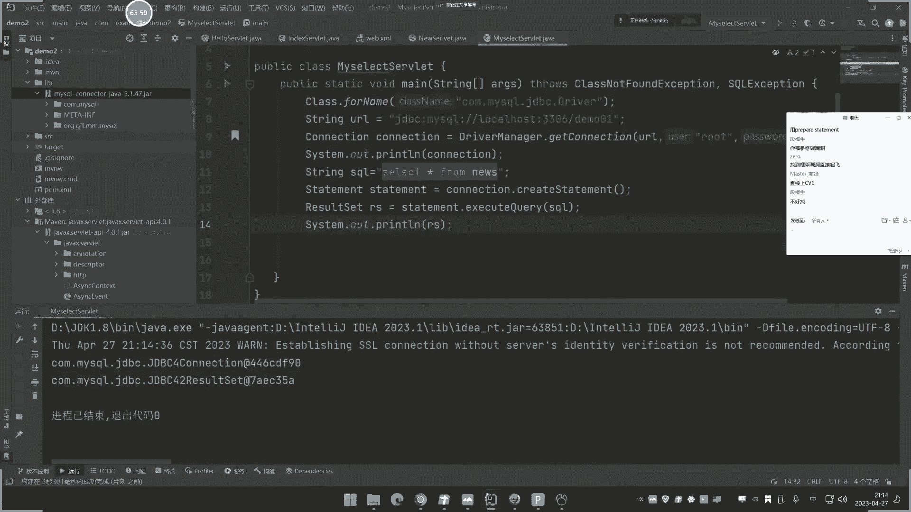

它的取结果是用什么语法呢，下面说了啊。

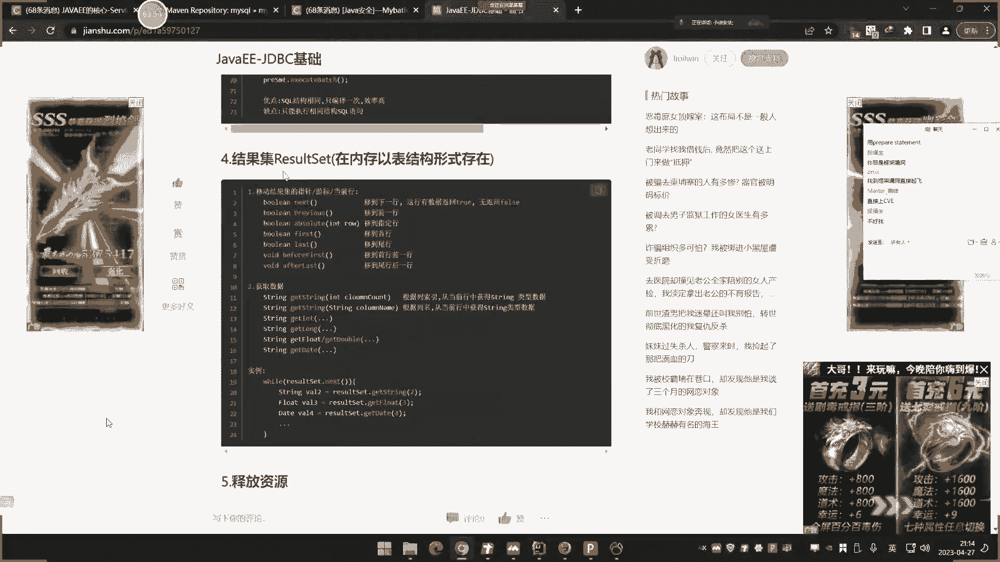

就把这个东西呢用RST结果，其实在这个内存表里面，就这个来解说的内存表rs。

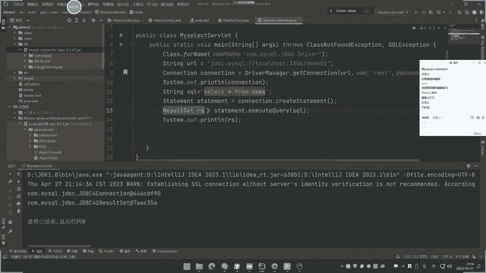

然后呢用这个while条件去把它进行便利。

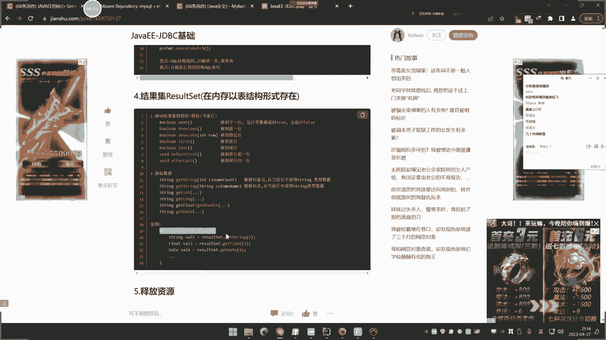

然后如何写呢，给大家显示一下，这是一个为真的写法，然后rs点nest就是读取下一条数据，然后如何在里面读呢，get读取读取，get i n t读取里面的第一个值，第一个页面的值。

比如说我们读取看下数据库的结构啊，前面是id就写了id，然后呢由于它是int类型，我们就声明为int id等于这个值。

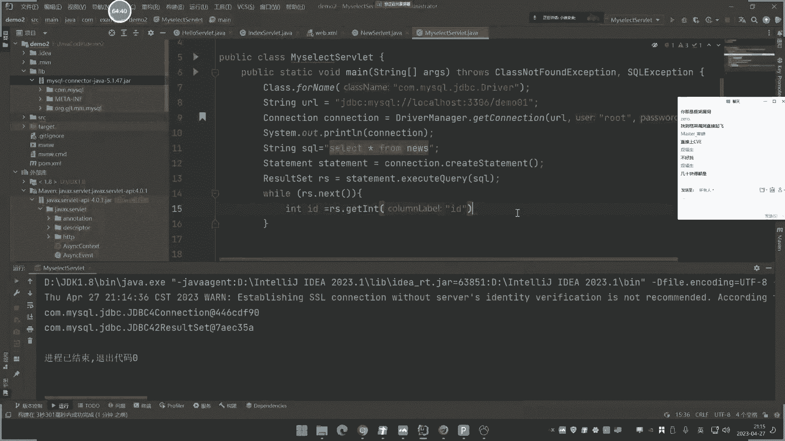

同样道理，再声明一个string类型，第二个TITLEPNG是吧。

这个可以随便写的啊，这个可以随便写，就叫T2T21吧，等于2S点get string得到里面的值是吧，就得到里面的字符串值，得到联名为PNP1把写上去PH1，接着来PAP1哎哈。

啊这个PHE下面的TITLE这个联名值啊，两个对应上就取里面这个东西好，然后后面还有几个啊，我们就依次复制一下啊，然后呢去替换一下就可以了，呃第二个呢就叫HEER把命名这个名字吧。

也叫第三个呢叫s u b header，我们就加个s he特，第三个呢是这个computer computer，第四五个来自image对吧。

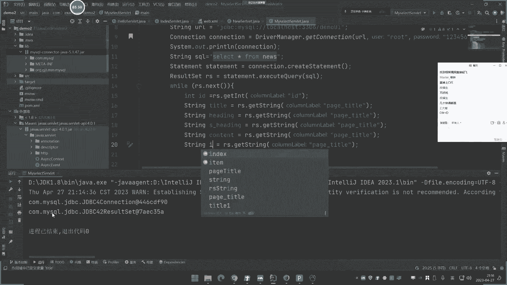

取这里面的所有东西嘛，然后这个呢就是把写进去，然后联名的这个是SUBHEER，这个是SUBHTER对吧。

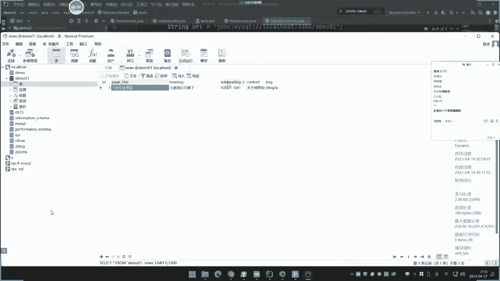

然后这个是content，啊这个是image，对不对，好这样子呢就写好了，以此呢在提交结果之后呢，我们再把它怎么样输出一下，输出一下这几个地方的id输出一下，然后呢加上嗯嗯然后中间画个这个分隔符是吧。

然后呢后面就是title，对不对，后面才是这个HT，再是这个hunter content，然后在中间呢我们就想这个东西嘛，对不对好，我们来就是content content。

后面再加上一个这个image，把都输出一下，结果对不对，这样写好了就可以了啊，我们试着去运行一下，看一下啊，是不是能够得到结果运行你看是不是得到了，以为id值小于安全博客，第二个值，第三个字是销量。

培训开课了，小学培训开课了。

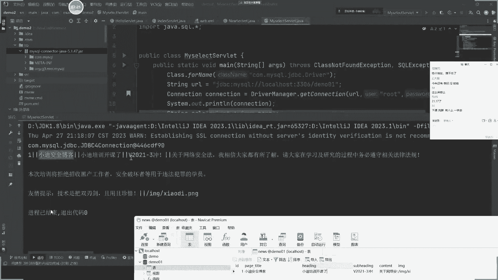

第三个非2021杠三冲，然后还content content值呢有点多，所以是关于安全这一大堆，后面呢就是image来获取到image的这个值了。

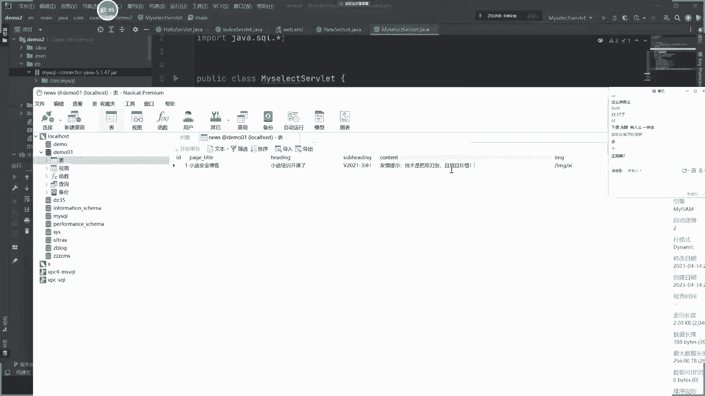

对不对，这个就是一个用JDBC去操作啊，java里面用JDBC呢去操作MYSQL数据库的一个例子，那么大家试想一下，如果这里呢SQL语句，这里我这样子呢去再操作的话，比如说我得写个条件。

well id等于，然后呢再加上我们一个变量id，而这个变量IP呢，我又从刚才这种方式里面去，用这个浏览器输入的这个id值来决定的话，那么就重新组合这个什么，是不是就重新组合这个SQL语句啊，对不对。

那这里就会不会造成一个社合租呢是吧，就会造成社会注入啊，那么造成这个注入啊，java中呢又不容易产生这个注入，有什么原因呢，它这里面呢又会有一个叫预编译机制的，一个安全问题，我们这里呢可以看一下这个。

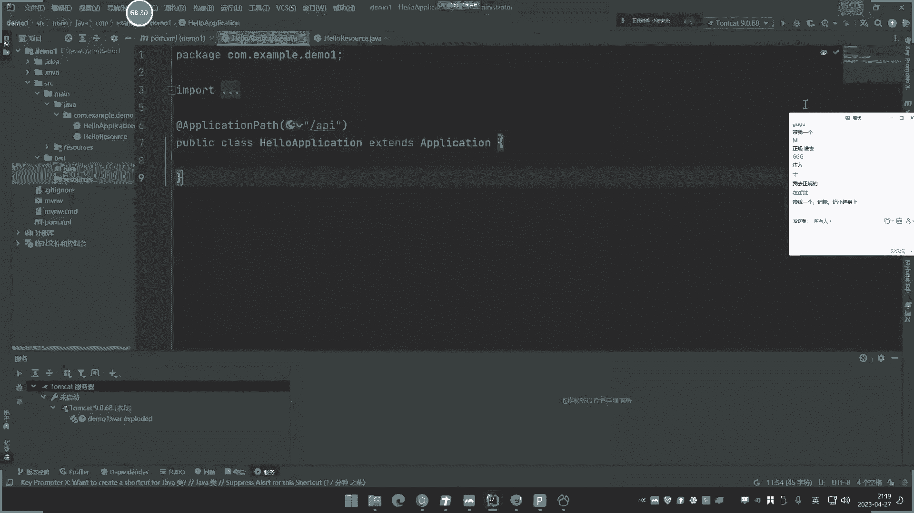

额这个什么安全的一个开发指南，你可以看到啊，java的一个开发指南，这里有没有写这商机和打包的啊。

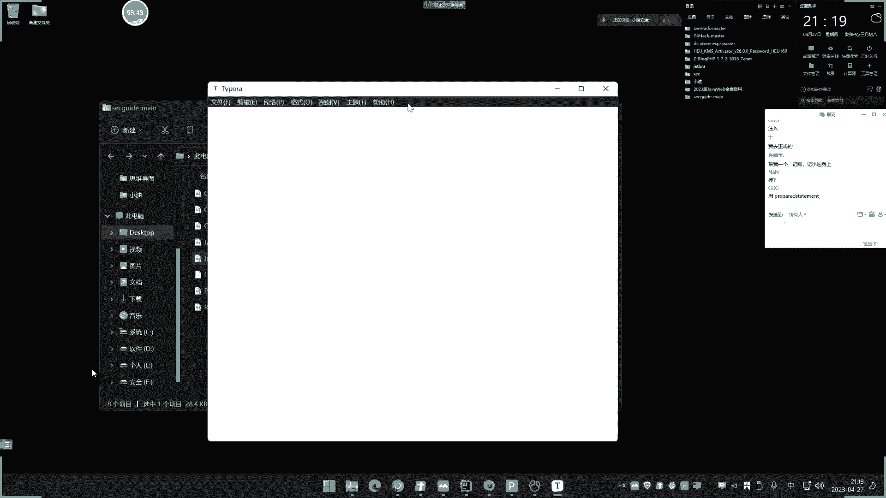

啊这里没写啊，因为他这个是java开发指南。

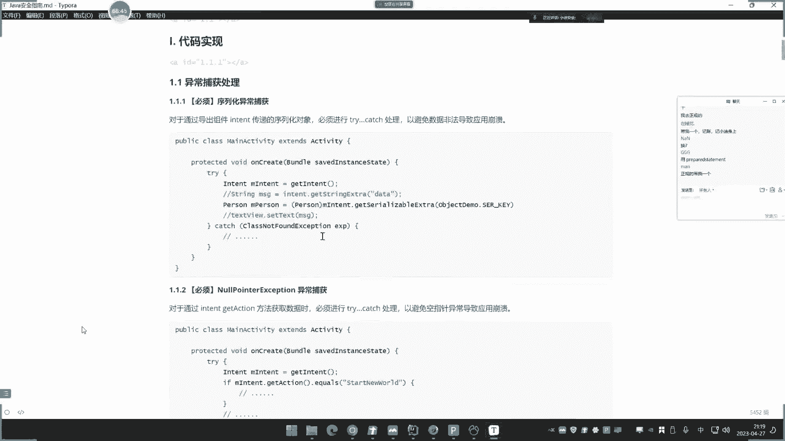

并不是这个JAA1的啊，没有写，但是网上呢你可以看到啊。

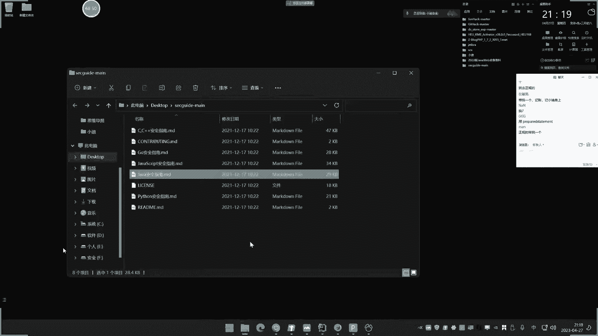

呃它有一个东西就是这个预编译啊，这个呢我们现在暂时不讲啊，下节课再讲my base的时候呢，顺便把这个东西讲一下，那么什么叫预变异，上节课呢大家有问过这个问题，现在呢我没有办法不给他先实验啊。

我先给大家说一下这个呢是什么东西啊，预编译是一个什么东西，其实呢很好理解，预编译就是提前编译啥意思啊。

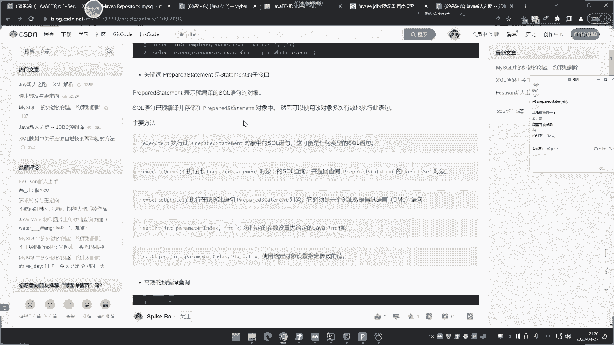

我们先把这个预言解释清楚，为什么说java中容易产不容易产生SQL注入。

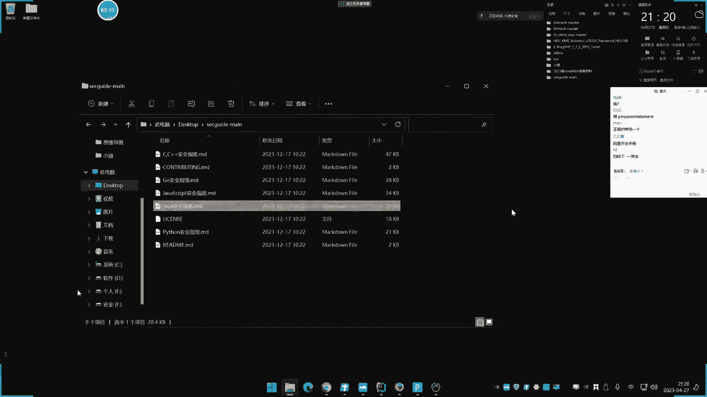

就是因为他写预编译的非常简单，就在这里呢我们是这种写法哈，写好就说如果说是这里呢，就像我刚才说的那个意思啊，他这里呢写成一个id呢，加上一个变量对吧，这种拼接写法写成个变量呢，加上后面去这样去写。

而这个id呢，我们又从这个什么可以在这里去顺打个ING，这个id等于什么啊，等于这个像我们刚才说的，用这个封装好的这个什么啊，封装好的这个嗯app的这个东西呢，来去接收这个REQ啊，这个东西是吧。

就是说我们用刚才A这个STRUSS那个方法呢，来结束这个浏览器数值啊，我们先不这样写啊，像这里呢就是假如说这里有个id值这样拼接啊。

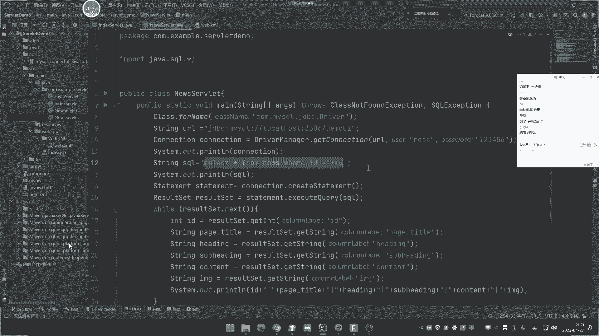

那预编译它是一个什么概念呢，我们来给他说一下。

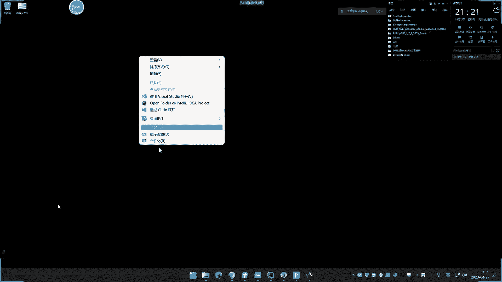

接着来啊，这个JDBC里面的这个语编译啊，其实很多这个下面的都有啊，他是一个什么逻辑呢，就是不改变执行它的原理呢，就是，提前呢编译好这个执行逻辑啊，你你租的这个语句呢不会改变原有逻辑。

这句话你如果你不理解。

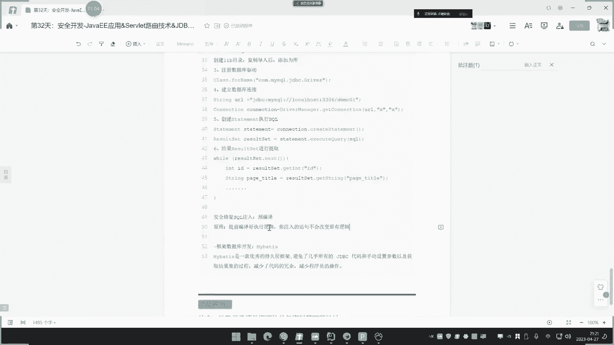

是非常难理解的，啥意思，我们来写个简单例子啊。

他的这个交易变异就是提前变异，比如说像我们之前这个snack for60，while i id等于写个东西是吧，就是说写个id等于乙好，那么呢他在这里面写个问号预编译写法，然后呢你在输的时候。

你比如说id呢，我传参id等于是吧，一然后呢我再传个id等于一，然后后面写成an的移动移呀，或者是什么问号id，等一下什么un snack呀是吧，这种注入语句，就说我们写这种注入语句。

那下面两条都是注入攻击的语句，为什么预编译能够阻止它呢，其实就很简单，他把这个呢提前预判了啊，逻辑啥意思呢，你不是说你预判逻辑，这里也是要拼接上去，你输按照这一他也会代入进去。

但是啊你这里输了就相当于是逻辑改变了，啥意思呢，就很简单，它固定死的语法已经固定死了，你如果后面加上了安等一等于一，这个代码呢就相当于执行了两条语句，自信点来几句，虽然说这个后头后面的and的移动移呢。

嗯对这个原本身呢它没有影响。

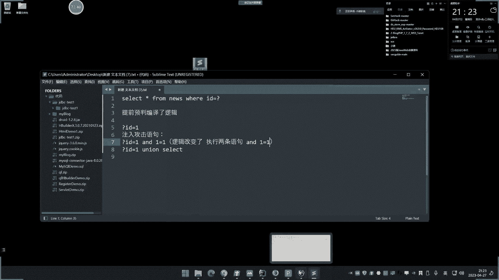

就像我们现在呢去执行这个鱼呀对吧，比如说啊while i d等于一是吧，我这样去写呢，它也是这个结果，我写个N的一问一这样去写，那它也是这个结果，结果呢都一样，但是这两个呢可以理解为逻辑不一样的。

为什么，因为你加了一个，就相当于说有两个东西，一个是这个，一个是and的，同样道理啊，你在后面写任何东西都，其实就是已经和它原始的那一条语句的发生。

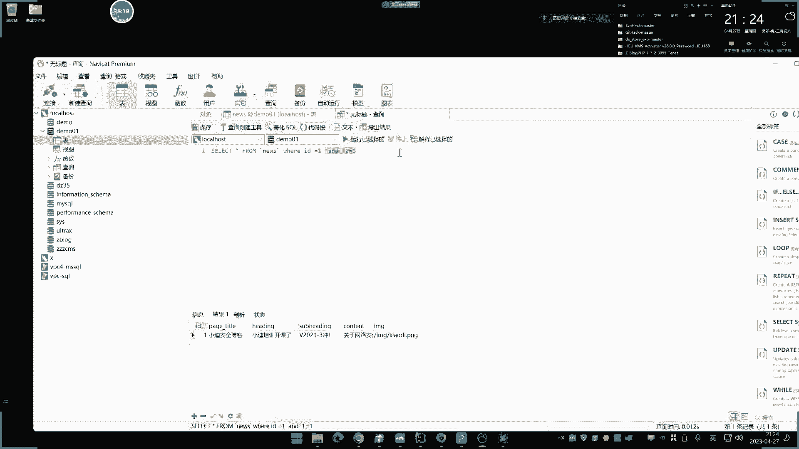

更改预变，其实就是提前把这个语法固定死了，你在后面有什么and的UIN全部不行了，就是他不会相信后面东西了，所以他只会代入前面逻辑的。

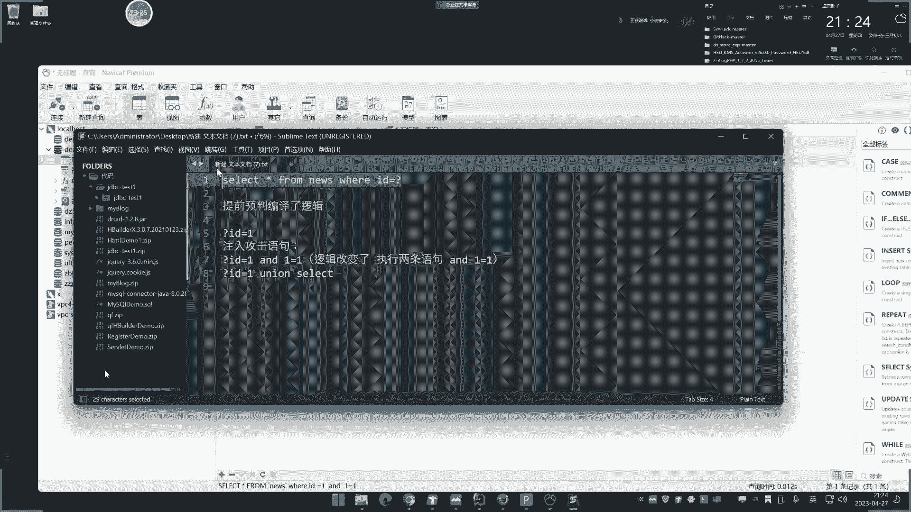

能理解吗，其实就是相当于在过滤中把后面东西全部删了，提前已经编译好了，然后执行的结果就执行了，你后面说什么东西都没有了，这是那个预编译房子蛇口租的那个原理啊。

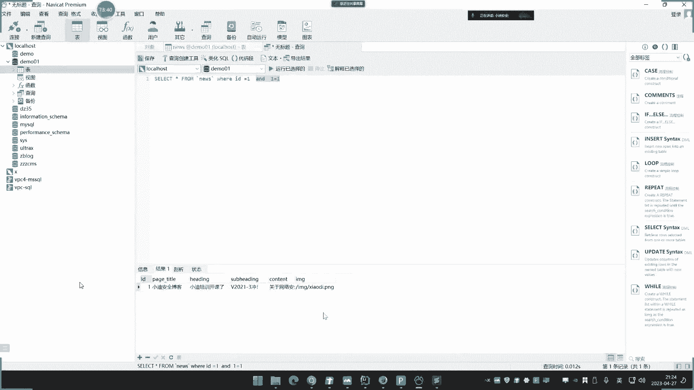

我不知道大家能不能理解啊，就上节课有人问到了啊，然后这个他是怎么实现预编译的呢，对吧，怎么阻止这个是个组呢，啊你只要理解的话，这句话其实之前我在学这个鱼变的时候，那我老听别人说鱼变鱼变，我一直不理解。

我说他妈的我输这个东西你也代入进去，你也要代入啊，但是这个语代入执行就是SQL注入啊，怎么就什么语病语病语病什么功能性，其实就是说呀他就固定死了这个语句，你在后面输什么东西。

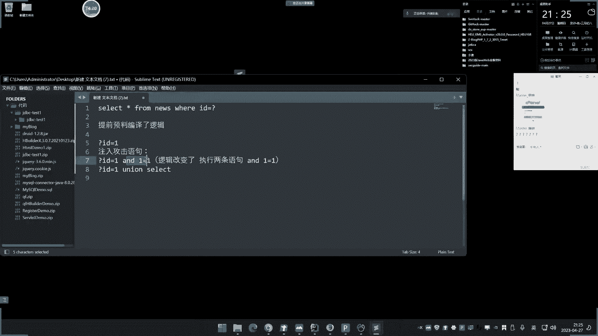

都已经改变这个语句逻辑了，就像我刚才说的，你这里写201的结果，虽然说已知是吧，还有个指引呃，执行结果呢都是它也没什么毛病，但是呢你也看到这就相当于变成两条语句，这and的后面就像是另外一东西了。

同样道理啊，你说啊也是一个道理，就是和他本身的执行逻辑不一样了，就像你后面多了一个条件了，多了个安的条件了，他不一样了啊，我不知道大家能大家能不能理解啊，你不能说是过滤它，不是过滤他。

就是体现好把这个逻辑给他固定死了，你后面输什么东西都不行，就很简单，你你只要输and under什么ORUNIN，它能识别的这种SQL语句的这种内置函数就不行，但是你输这个东西回不回呢。

比如说我输个乱七八糟的，输这个东西，它会影响呢，就不会影响了，因为你这个是字符串，他就会认为这是一体的，而你只要输安德的时候，哎你说这样的东西它就会认为是一体的，这个id值就是一体的。

但是你如果说安的诶，安的是circle语句中的一个函数，就是在固定的一个东西，他就会问到and的哦，and的是一个SL与中连接东西，哎他就改变逻辑，你能不能理解啊，就说你这样去输，他没去输这些不认识的。

他没有毛病，它是一个逻辑，他会认为这是一个条件，但是你说and的就改变它的逻辑条件，就会认为这里的and的呢，就是数据库里面的一个是吧，连接操作连接这个判断操作，那这里呢逻辑就改了。

就他就不会认为这个安德呢是条件了，所以鱼变硬了，就会对这个东西的起止，所以这个东西向来不会生效，你这样理解呢是不对的，虽然说他的结果说说，不管你输什么东西，他都会这个呃，只要i id值是这样的啊。

但实质上更深层次的理解其实就是逻辑关系，其实就是说它不会改变它原有这个执行，执行模型，你在后面输东西的时候，你如果说and的，它就会改变它的模型了啊，就像说这是两条语句了，或者说这是有个价格判断了。

有这个东西代入进去啊，它不会改变它的燃油的逻辑和它的模型，所以导致呢你输这种乱七八糟的字符，他不认识的，他会代入进去，但是你输安的那不好意思，安的是SQL语句里面那个逻辑东西，逻辑函数，那它就不代入。

就这么简单，这样说大家就能理解了吧，那么他是如何操作呢，VV其实网上有讲啊，不过今天呢呃我们就不讲了啊，哎你可以给他看一下啊，这个写法呢就是一个PR1的一个东西啊，那网上也有这种东西啊。

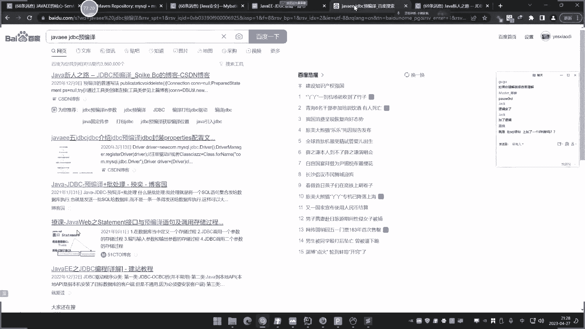

下节课呢我们会讲啊，然后呢。

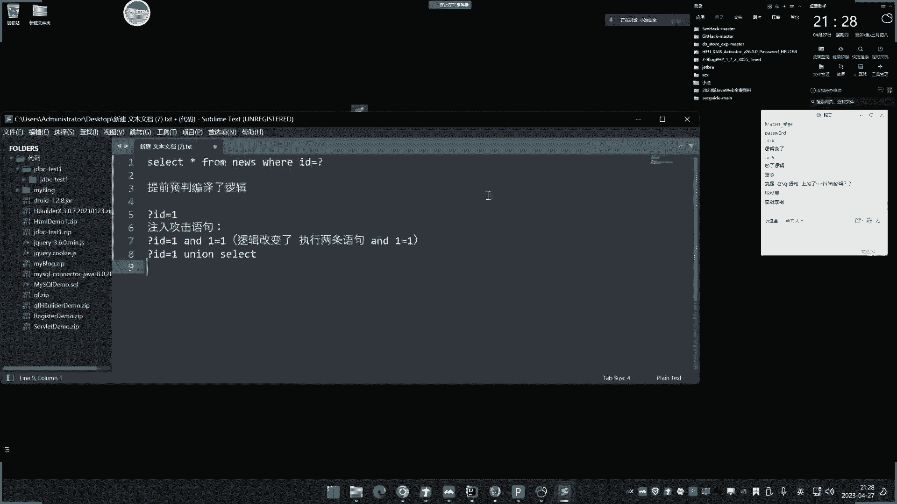

我们来思考一下刚才这个代码中的一个情况啊，你像刚才那我们说了啊，这里呢我没有加参数，我就要先固定死的啊，就现在啊这个地方我们写两条吧，免得这个把代码搞错了，啊这是我们第一条固定死好的这个语句。

还有一种呢就是我们说的有这种参数传递的，While1 i id，这个等于这个后面的一个是吧，加上一个这个id值嘛，对不对，这个id值呢，就是我们说的这个自己创建好的一个变量，对不对。

那这前面呢就是我们定义好这个语，然后面呢是加上我们这个变量，是这么一个在这么一个四个语句是吧，定义的啊，啊这里面就换成一个VRSQL对吧，就这样写的，然后呢你想预编译它是怎么个写法呢，他是这样写的啊。

编译就是我们写个server server啊，他就这样写，写个问号，然后呢这是哎这是那个，这个是我们说预编一些吧，把它注释一下啊，呃上面这个呢，这个是危险性警接线。

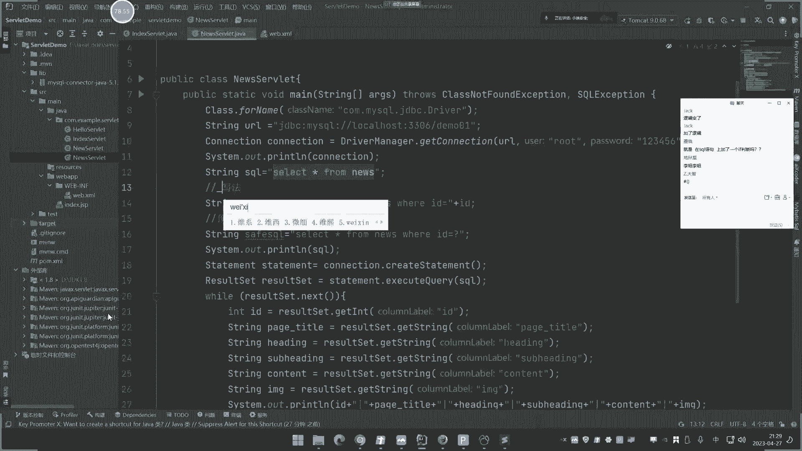

然后这个是我们的这个JDBC的写法，然后大家可以看一下啊，我刚才说了，如果我们这个时候如果说用到my bias，这个这个库呢来执行SQL操作的话，你看他是有怎么写的，你可简单先过一下啊，你看。

啊他说他这里也注入他的注入其实也非常简单，其实那就和他的写法有关系，但我们和那个PPTP写法一样，就是你按照它安全写法，那它就可以啊，不安全引发它它它它也能是能注入是吧。

这如果说你用这个MYBS呢去操作数据库啊。

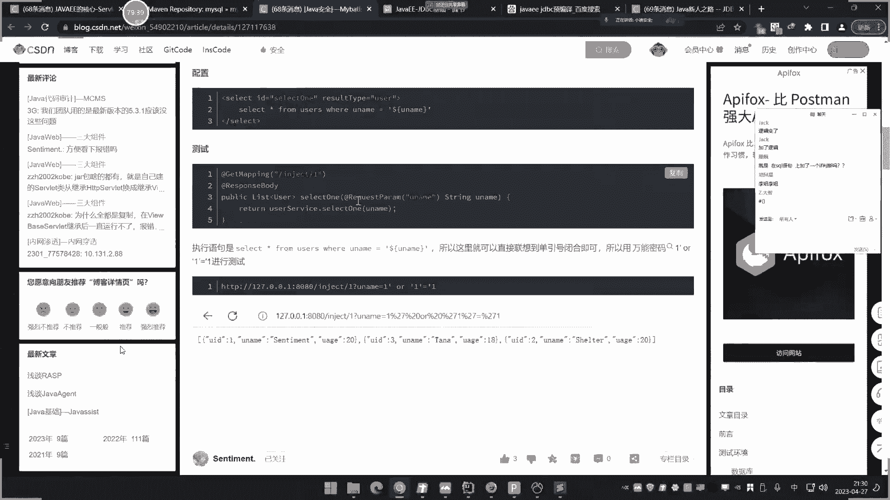

他怎么操作的，这上面有些代码啊，他下面是讲的怎么注入啊，没有写它的具体代码，我们下节课来说这个买BIOS啊，和那个预编译那个操作啊，这这这这是体验写法啊。

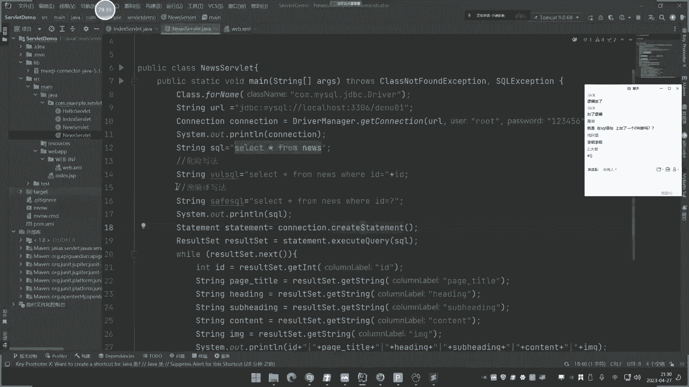

那具体怎么操作呢，于编译呢其实就是两串代码的事情啊，那网上呢这里也有啊，那啊这里还有这个案例吗，你看，那这样没，就这样一写就完了啊，就多了一条这个东西就完了，等于编译，那还写了两个问号啊。

多了个这个的p r stars啊，去引V就多了一个，相当于多了一个代码，完了啊就完了，就能阻止这个注入了，你说所以说为什么说java里面很难听到，说有SQL注入的原理，其实就很简单呃。

他为什么SQL注入少，第一个是我刚才说了啊，他的数据库操作呢有三种模式实现。

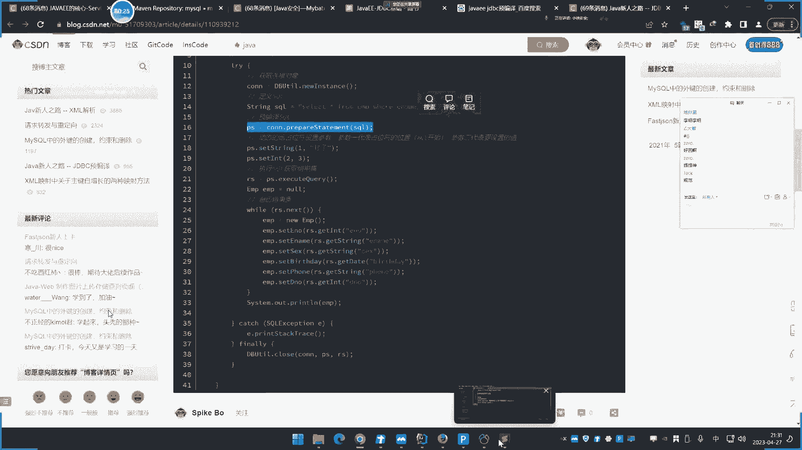

一个呢是我们讲的这个JDBC，还有个是下列课要讲的这个买BISS，同样的，还有我刚才说的那个HIBER那个那个库，那三个呢都能实现这个这个，sl circle的一个操作，但是为什么SL组少呢。

就是因为他三个方面里面都有一些内置的过滤。

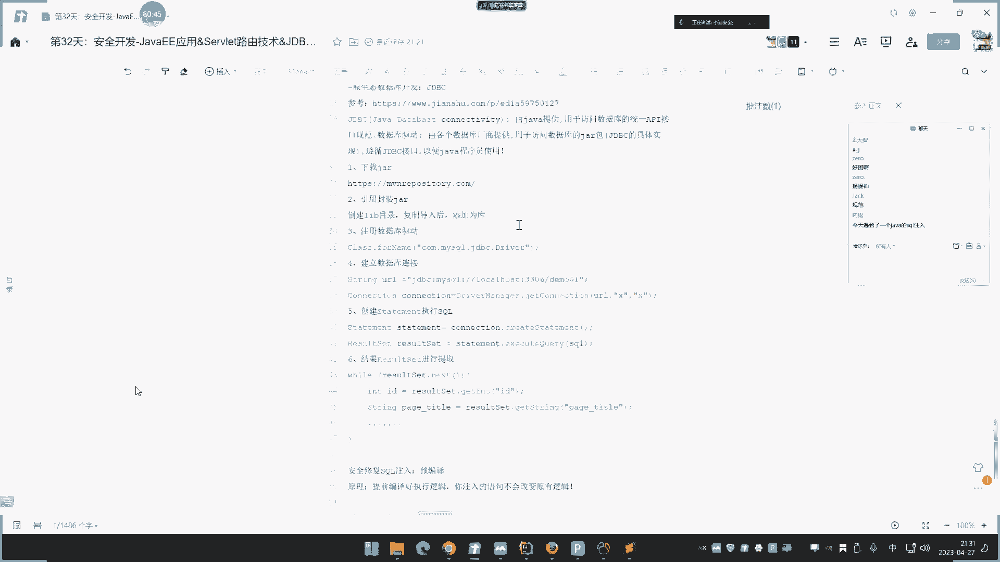

那你只要稍微使用一下，那么就是安全的，只是怕你自己呢就和我刚才说的TP框架一样，还有些内置过滤啊，就怕你傻不拉几的，你偏要不怎么不安全，你就怎么不安全的写，那就难不住了哈，你只要稍微注意一点。

或者你在学开发的时候有一些安全知识点，那么基本上你写出代码就不会有这些安全问题，包括啊我们把那个买bios1讲，你就会发现为什么SQL注入不存在，或者说很少的原因，除了它本身这个内置过滤之外呢。

还有很多因素决定，像我们后期要给他讲过的什么过滤器，还有他的那个什么都成，就是刀层，现在我们还都是现在还没学那个东西啊，他还有个那个控制层啊，什么刀层，它的层面不一样，那里面逻辑也不一样，很复杂啊。

这个要自己学哦，学到哪里讲到哪里，了解它的区别之后呢，你才知道说为什么这个语言不一样，它漏洞这个主题不一样，就是漏洞容易产生，难以漏洞，不容易猜到洞，其实是和他语言的一个特性相关的。

就是语言的其实就是语言的这个根本啊。

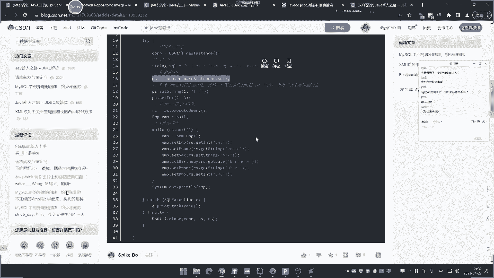

这是我们为什么要学它的原因啊，你像现在啊我们把这个写出来之后，这里按正常来讲，我们这里呢是在这里直接执行的是吧，是这里直接执行的，那么如果正常来讲的话，嗯这就报哪个问题啊，哦这里啊把注释一下吧。

按照我们这个执行来讲的话，我们是在这里直接执行这个这个地方，对不对，但是实际情况的话，这里应该是要结束我们这个参数吧，还是接受这个什么，就像刚才一样，我们就是用浏览器去访问，然后呢去传参。

这里呢来控制这个SQL语句呢，来来来来来来操作这个SQL的一个啊，显示这个数据的一个操作是吧，好那么现在呢大家觉得这个代码该怎么实现呢，啊那我刚才不是讲的这个呢，这是上面搞的那个诶。

那上面搞的那个操作吗，那跑哪去了，两个代码不一样啊，对不对，这里不是要解释i id值为一吗，这个一应该是由浏览器传传传入的，那么我刚才讲的时候呢，呃在这个文件里面呢给大家演示过是吧，可以在。

可以在这个里面呢去操作是吧，在这里呢我们演示过来啊，结束这个值嘛，这样去结束，但是由于啊他这个Z呢它是继承这个方法，而我们这个文件里面的这个my my sect，这个个人呢里面没有继承类是吧。

那我在这里呢直接什么这个REQ呢，它都不识别，都没有这个东西咋办呢啊难道说在这里继承吗，啊大家问一下，是不是这个情况来继承这个东西吗是吧，继承他，哎写错了，是不是这样写啊，你看是不是这样写啊，你看。

是这样写吗，大家觉得这样对不对，这样对了之后呢，你说这样的IQ还是没有，那还没有，为什么，因为这个IQ呢是在那个嘶呃哪个里面，刚才写的这个哪个里面，那住在这个类似的这个这个里面啊，在这里面有啊。

还有包括这个do get里面也有啊，那我是不是要声明这个do get呀啊生命do get，那这里是在main函数里面又该怎么办呢，所以这些问题呢都是大家要学的，它没有那么简单，你不要说哎呀我是学了这个。

其实这个东西哎呀好像还比较容易接触的啊，他这个下去开发呢和你听懂是两码事情，你会发现还有很多问题，就你这样继承之后呢，还很多，包括这个main函数，这是什么鬼呢，它其实就和那个INIT也差不多。

也是属于一种主导函数，就像我们那个Python里面写个秒一样，他也是说执行到这里调用这个东西的时候，它会自动执行这个秒，对不对，但是你这样一继承，你看啊，我给他运行，它会报错，它会报错啊。

你看会有什么情况啊，你看我我这样，这就是我下面还没有写这个IQ，没有说用这个a app这个standard呢，去接收这个网站提交的数据，我没有在写，我把它运行起来，他都会报错啊，啊这这个运行不会报错。

但是我这样去运行的话啊，你看啊用TM开始运行，它应该会报错，你看一下啊，是不是，诶哦这这边有个，这边有个托马卡的那个，我先把这个关一下啊，这个游戏。

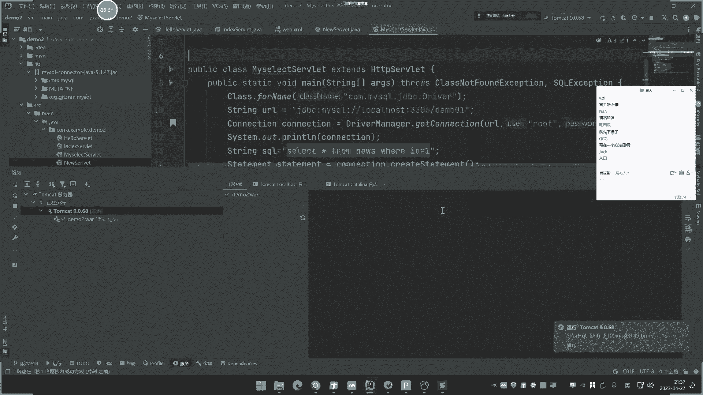

好他没有报错是吧。

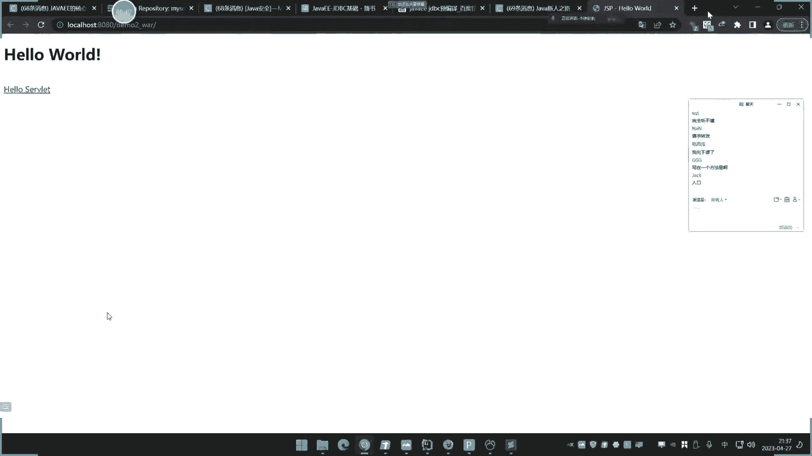

他没有报错，好没有报错，不是说这里没有问题，我们你看一下，我运行这里看一下，给大家看一下啊，那他说找不到和无法加载主类，为什么来，我把这去掉，去掉它哎呀，那去掉它就好了，我一加上去就报错了，为什么嗯。

很多问题啊，这都是要我们一一个解决的，入口好，你说这里是吧，就这俩，很多问题啊，这都是我们要学的，有些像这种东西呢，说实话他是这个java11开发里面的，一个基本东西，就是你如果学过java s1的话。

这个东西呢就知道怎么解决，但是我里面的没有教啊，java s1呢就是我们说的，我java1呢是面向这个web开发的一个技术，那JAVS1呢就是就是java的一个基础技术，就像我刚才说的啊。

不用去写这种WEBB的一些请求是吧，就像我们运行代码就直接运行啊，打包啊，什么封装界啊呀，什么写它加减，写它加法算法等等啊，那种很基础的，其实这就是理清楚这个java逻辑，但是你没有学过呀。

我这里面的讲这个S1的时候，遇到这个问题，说我想解这个问题，你没有学过，这他妈的，你说咋办呢，所以说啊这个硕士加java11对不对，而且都是较简单的基础，但是这个S1呢你没有讲过，没学过呢。

我只能说呀没办法撑着头皮上，我们只能说给你解决方案，你能理解你就理解，理解不了也没办法，你要说把那个叫什么java se1再给你讲一下，时间上不行呀，这个本身在这个意义上面，那些基础的这都讲不明白。

你还搞了个什么java s1，虽然说是先学java s1呢，再学java1，但是啊我们这没办法啊，这是要挑着学，所以那个基础没有，那真是没办法，我们只能说教你怎么解决啊，你只能说知道。

但是他为什么这样解决呢，讲不了，好这就是我们今天这个内容啊，那么从这今天内容那就是个开胃菜，不能浇太多，浇太多就就就完了啊，教材多就完了，本来这个东西呢就难理解，没有任何这个java经验没有学过的。

连这个目录放在哪里，哪里放哪里，他都不知道，你说怎么教太多呢，只能说对着牛去模仿，你先模仿再去实现这个功能，慢慢慢慢在碰到一些问题时候呢去解决啊，就明白了他这些目录的意思啊，包括这个什么鬼。

这个jr是什么鬼东西呀，为什么要放这个level里面啊，啊才能慢慢理解，因为像这些前期智能。

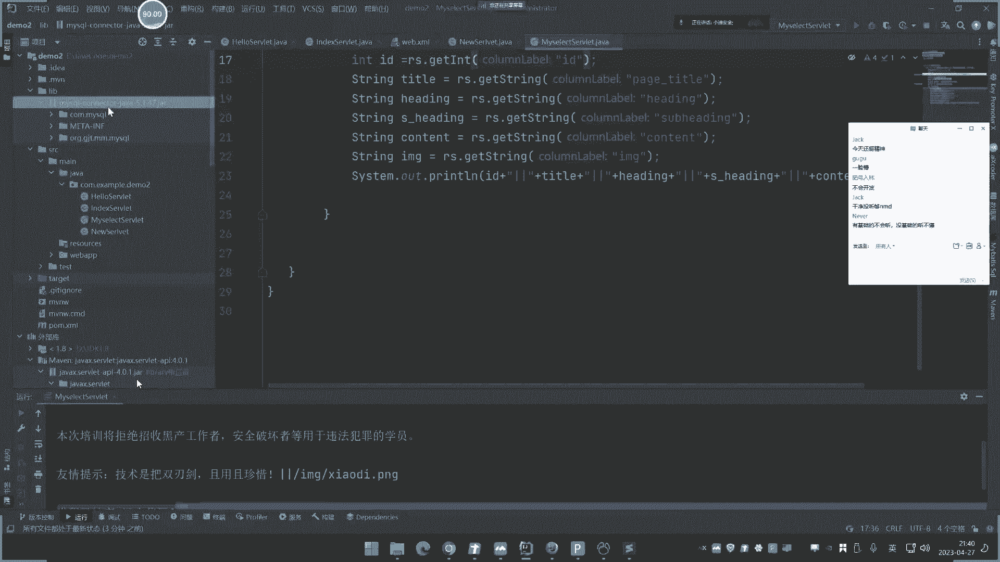

这是java s1学的，我们讲不了啊，然后你像下节课我们说的啊，像这个预编译的东西要讲，包括这个MYBS的使用也要讲，他这种下节课要讲的，对不对，因为你讲了JDBC，那你不讲这个MYBS，那等于没讲。

现在很多网站源码里面，那都是用my BIOS来实现数据库操作对吧，你讲个JDBC那不行，那些老程序采用这个JDBC啊，新程序都用买BIOS，不然的话都看都看不懂，那个数据库的一些操作啊。

也不知道有没有说有人注入的一些可能性，所以说东西还是蛮多的啊，不是说我们说为什么要讲个七八道子，七八次直播吧，你说讲java这个东西呢，你不提反虚的话，那也不行啊。

你反虚的话一讲呢啊反序环那个函数操作是吧，你讲的也太难哎，蛮麻烦的啊，开发还是要先讲漏洞呢，不能先讲，我们到时候呢讲这个东西操作的时候呢，安全问题给大家提一下，具体怎么利用呢，我们后面再说。

像什么还过滤器，这东西呢也要讲哎。

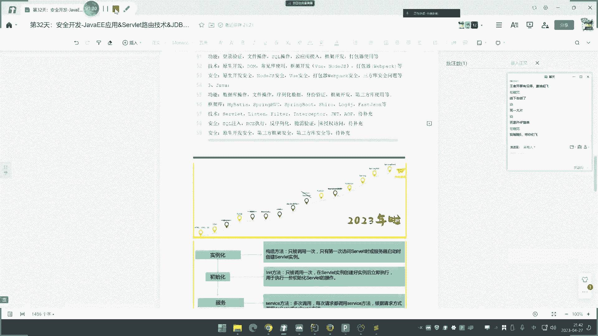