# 【小迪安全】V2024版 全栈网络安全 ｜ 攻防渗透工程师 （持续更新） - P34：第34天：JavaEE应用&反射机制&攻击链&类对象&成员变量方法&构造方法 - 逆风微笑的代码狗 - BV1Mx4y1q7Ny

讲的都是和这个安全相关的，你今天讲的是这个java的反射的东西啊，这个反射的东西呢，为什么要讲他啊，说实话啊，这个东西呢，你要把那个反序列化的一些东西，和那个反虚化的利用呢，学完之后呢。

对这个反射就比较标记了，不过我们实在是先要把这个反射搞清楚，是怎么一个情况啊，他的一些代码实现，然后呢我们在配合这个反虚的话，那再去分析这个反射，可以说在这个java里面的这个安全的方面。

那这个反射的是很重要的一点啊，来这是他的几个截图，关于java的反射类的四个东西，我们待会会用这个相关的，它里面内置的一些函数啊，那些东西再去给他讲啊，然后呢这是网上找了一些文章啊，关于这个什么鬼。

java安全代码反射到命令执行，还有什么鬼。

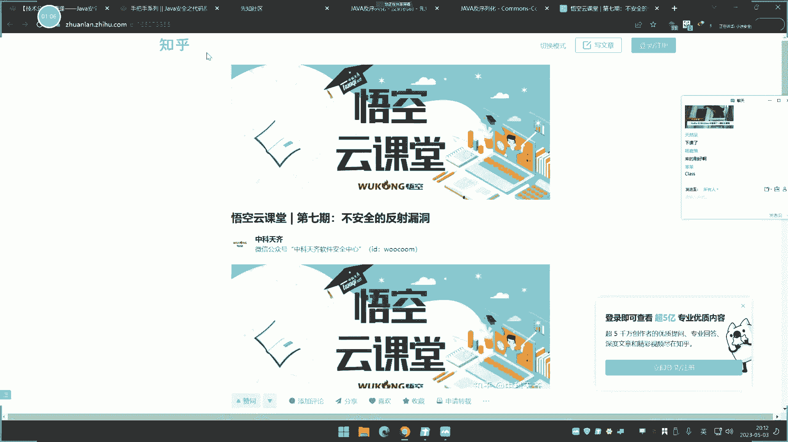

这个java安全之反射，这都是关于这块知识点，也就是说他其实很重要，这网上说的是什么，反射是java程序的特征之一，它允许在java程序中对自身的进行检查或者自审，程序运行中呢，对任何一个类呢。

能知道这个类的所有属性和方法啊，对于这个对象呢能够调用它任何的方法和属性，然后这种方式呢我们称之为叫反射机制，其实简单的一句话来讲呢。

就说这个java反射呢就是官方的一个反射API啊，这里面呢有这个这个这个类库呢来组成的，然后里面包含有这个field m e t h o d和CONSOS，这几个Z，然后呢。

他对这个成员变量和成员方法和构造方法呢，信息进行编程的操作呢，我们就理解为叫反射机制，这是它的一个官方术语，也就是说我们知道什么是反射，是干嘛用的啊，就是对这些对象里面的变量和方法。

包括这个构造方法呢对它进行这个提取和操作，这个方式呢我们就称之为叫反射，那为什么用反射呢，写这句话是非常难理解的，但是你仔细想想啊，他有点绕，这个有点low啊，呃这里呢有一篇这个文章啊。

嗯这个文章的可以看一下啊，他说这个反射机制它的一个差异，一个叫静态编译，一个叫动态编译，java呢原生本身呢是一个静态编译，但是有那个反射之后呢，它变成了动态编译，这啥意思啊，这啥意思了。

来我们看一下啊，他说了，如果说在官方定义中能找到存在价值，然后呢动态的去创建和修改，调用或者获取其属性的话，而不需要事先知道任性的对象是谁，画重点在任性时，而不是变异时，不改变原有代码逻辑。

自行运行的时候，动态创建和编译即可，这是属于为什么要用到反射的一个概念，这句话的意思说大家听都听不懂，不知道是啥意思啊，完全不知道没学过的是完全不清楚是啥意思啊，好我们现在呢就给大家去说一下。

一个什么意思啊，其实呢它就是个动态的一个事情啊。

你比如说我们这里呢呃，在网上呢给大家看一下啊，来网上找个代码。

网上那是有这个图片的啊，然后我反思，我看那篇原文文章借不到，啊这也没有啊，啊这都是讲的是他的操作啊，并没有讲这个java的安全呃，这个方便的为什么要进行反射的一个操作，上面都没有。

这都是一些乱七八糟的一些操作啊，啊都没有讲这个为什么反射，其实他为什么反射的原因呢，就是刚才说的东台金台的这个差异，我看看能不能找到个类似的文章啊，都找不到。

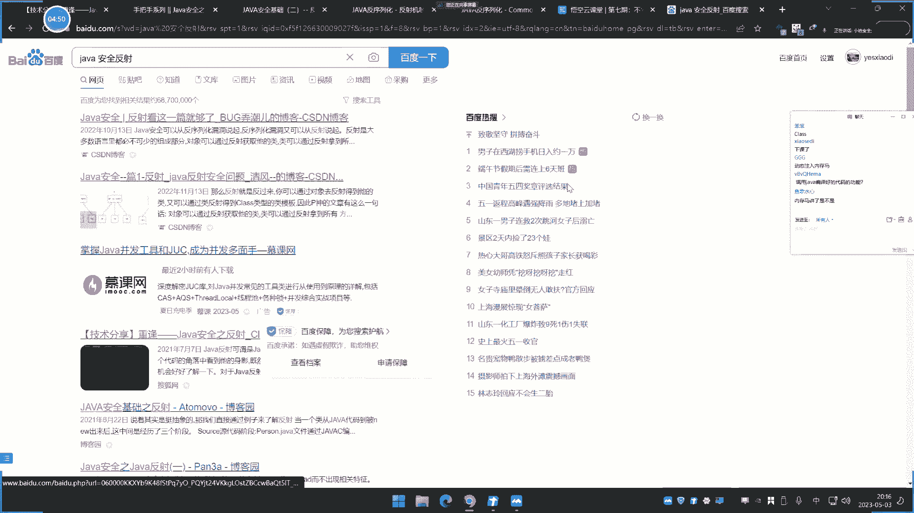

你们在说哪里啊，什么内存嘛，怎么扯下来了呀。

我们讲的开发啥是跑内存嘛，那那边去了呀，搞错了啊，你搞错了地方啊，没说那什么啊，我们是说上节课那两个两个的那个叫什么呀，呃一个是那个监听器，还有个那个过滤器呀，那两个呢涉及到内存码的一些知识点啊。

老和他提了一嘴，但不是说我要讲内存嘛，你想啥呢啊，那个内存嘛又不是我们现在讲的事情，把这个和网站这操作都没搞清楚，咋讲的意思嘛，去了，是吧，我不是这个不是这个这个是我发上去的额，这句话怎么理解它啊。

这个为什么要进行这个反思啊，他是情况是什么意思呢，就是说你在这里呢，原本的话这个java呢你需要把它先编译，他的人形呢是先编译，这里有张图片啊，来大家可以看一下这个图片啊，先便秘一出来之后呢。

它成为一个class文件，就是它原本的代码文件呢是点java，就是我们这个IDE里面写代码都是点java，然后在上线到项目的时候呢，把编译成这个点class，也就是说你写好的。

像这里面不是还有一些变量吗，你看这里有这个string name是吧。

有些变量，还有些这个前面的这个是私有还是公有是吧，还是保护三种类型，然后呢他会把这些东西呢封装到这个class里面去，是吧啊，然后上线。

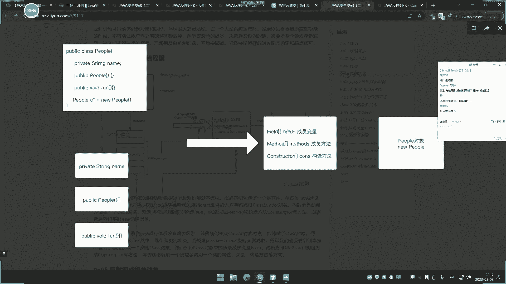

然后这个反射的会做出个什么事情呢，啊那有反射之后呢，他就能尝试性的在任性的时候呢。

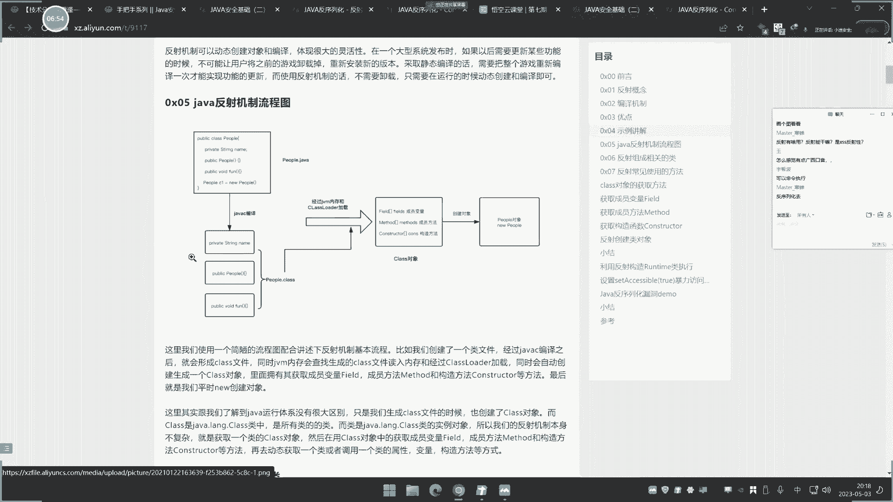

把这些值呢给它改变，这就是那反射的存在意义啊，其实就是说在不修改原本代码的情况下，面对这里面的东西呢进行操作，这个就是反射就很简单，如果说我们邮传代码写到里面去之后。

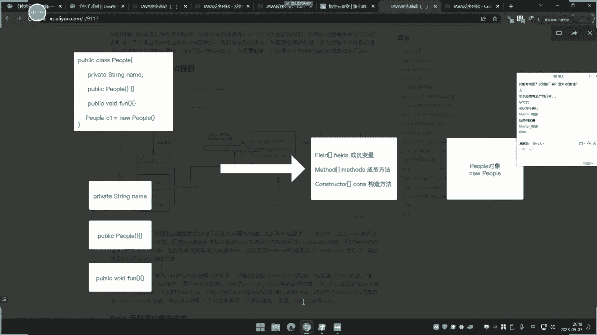

我要对里面的这个变量的值和方法进行修改，改名字也好，或者说对值的内容进行修改也好，那么都需要到这个里面去改，而现在呢有这个反射之后呢，他就可以通过代码的这个在运行之后呢，对它实行更改。

而不需要说我就在你这个本身的源代码修改，然后你再上线就是个编译过程，所以这个反思呢就是不改变原有的代码逻辑啊，自行的去运行，然后呢他这个操作呢是在任性时，而不是在编译时，因为你如果在源代码中修改的话。

那么就是编译时啊，那么在另外一个文件里去调用的话，那么就是在运行的时候，那那个文件被调用呢，那表面代码那才会被修改，这句话完全有些人是完全不能理解的啊，我也不知道怎么讲这个东西，你才能理解嗯。

这是他的一个场景啊，为什么要学他场景，你只要记住把这个东西学会，在后面的时候呢，学会利用它就可以了，至于说这个东西为什么要这样去用啊，你不管他啊，这不是我们操心的事情，他的这个有两个场景。

开发场景呢我们就不写了，这是网上随便抄的资料，主要是这个安全场景，为什么要去讲这个反射，因为在这个反序列化里面，包括后面去利用这个漏洞，那个payload p o c的一些写的一些问题。

上面全部是和这个反射有关啊，全部是跟反射有关，那反射是干嘛的呢，就是对啊，原有类里面的变量方法和构造方法进行编程，就对里面的进行赋值或者是调用或者是查询，这所有的操作都属于叫反射，那么学习他的意思就是。

能够对其他类里面的东西来进行操作，从而那我就可以获取其他类的一些东西，来为我所用，他的一个利用呢啊这是他情况啊，我们这里那就直接开始讲了啊，直接开始讲了啊，然后我们在讲的同时呢就来看啊。

首先呢我们来把id打开啊。

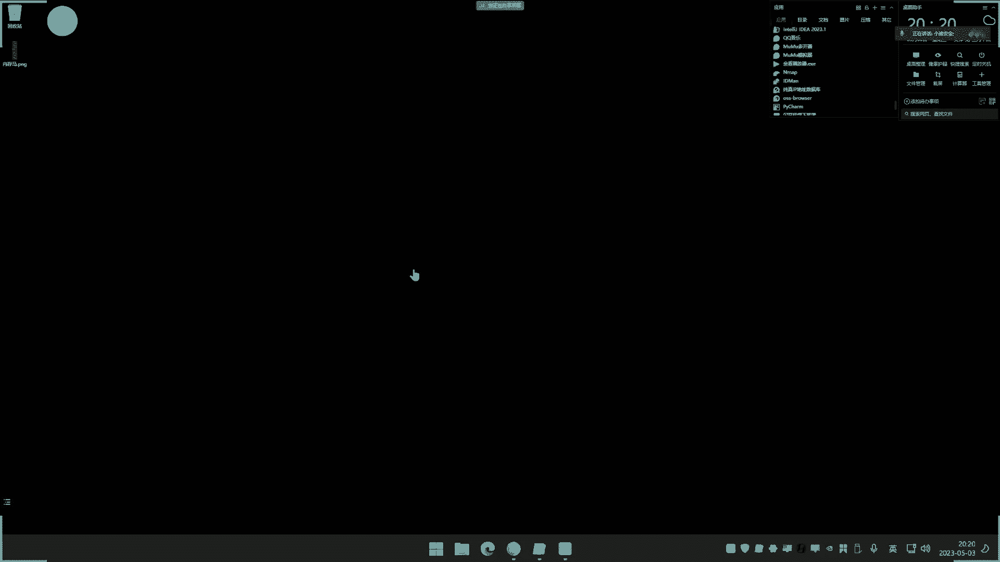

卡的很，嗯这个咋回事啊。

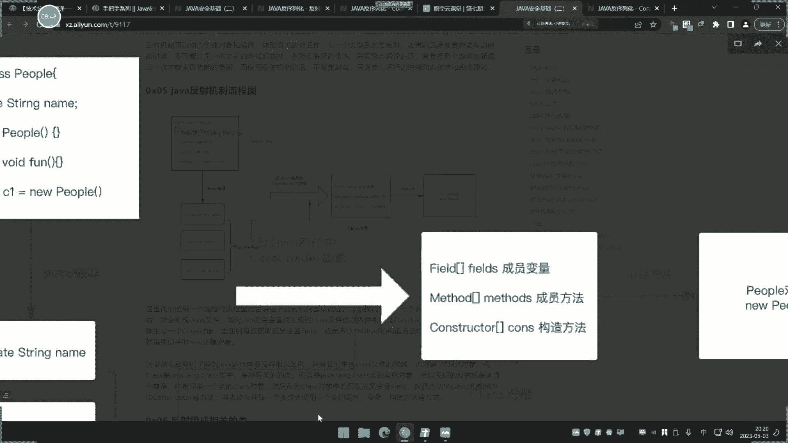

这里怎么打不开呢。

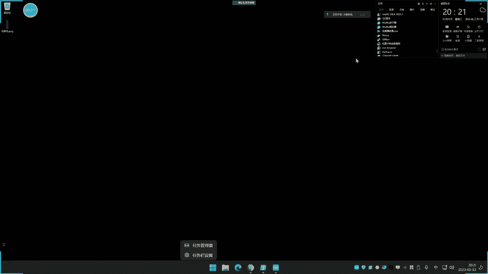

结束一下。

先把代码搞清楚啊，后面呢再思考那些游资为业了，你没有做过开发，有东西那是没办法理解的啊，那是真没办法的。

我们新建个项目啊，名字呢我就叫这个叫R1，R1F1L对吧，这个呢就是我们说的那个房车那个那个名字嘛，是吧啊，然后呢这个那我随便选了这个，因为这个是纯教的啊，要不要他有这个呃这个啥这个这个这个代码呢。

web代码呢也无所谓，因为我们也用不着用，用不着它啊，用不着这个东西，要不要这个web的代码呢都行啊，好把这几个东西都给删掉，这什么MOVN的，这是那个MOVEN的那个仓库的东西，这个不重要。

我们把它删掉吧，大把他搞简洁一些，然后这个SRC里面的这个主程序这里啊是吧，这里有个这个hello，我尾巴删掉，因为要不要他的无所谓，我们主要是在这里操作啊，然后呢创建一个类啊。

这个类呢我们名字就叫做这个user，然后在这个里面呢我们定义一些常见的东西，就是这里是个类，这里面呢有很多数据和方法和构造方法啊，什么是成员变量，什么是成员方法和构造方法呢，我给他说一下啊。

首先呢我们先来说第一个啊，这个啊变量啊，你看这里有public是吧，变量string类型的，而name呢我们就把它是吧，写个叫小迪吧，对不对好，然后呢再搞这个变量是吧。

然后呢搞int类型的也是搞个public的啊，int类型的这个A级啊，呃年龄是吧，搞个31岁，对不对，然后呢，我们这里说一下啊，他这里面呢有几个这个有几个这个属性，大家要知道的啊。

这个public呢代表是公有属性，公公共属性，然后还有几个像这个什么PRN啊，这个是私有属性啊，我比如我这里呢再搞个是吧，GND啊，性别是吧，性别呢也是个string类型的，我大小写注意一下啊对吧。

string类型的，然后呢他等于什么呢是吧，有人肯定说他等于gay，他是个gay啊，那肯定呀他不是gay，他是个man是吧啊，这个男人对不对，你看啊这个地方呢我们写了三个属性，那有这个public。

有这个这个属性，对不对，你这里那还可以搞个属性，比如说我搞个保护属性，保护是保护属性的，对不对，也搞个string类型的啊，再搞个什么呢，性别年龄名字还有个什么鬼啊，还有个职业职业就搞个脚步吧。

工作好吧，就是这个SEC嘛是吧，10S好吧，这个ACC安全哎我的英文也不好啊，见谅啊，好然后呢这是他几个这个东西呢，我们就称之为这四个东西呢，我们就称之为叫成员是吧，成员这个变量啊。

还有一种呢就是成员方法啊，我们在生命中的public是不是public，比如说这个叫user info啊，嗯然后返回值选优质音符啊，历史啊，历史啊，这个脚步等于这里面的参数值，然后把这几个都写进去啊。

这个内蒙等于内蒙啊，等于内蒙，然后这个历史点GN那就等于这个GN了，都把写一下啊，把四个都写进去啊，这个代码呢其实就是说我们先把它模拟写一写，就这里搞一些成员在里面，然后这里传几个参数是吧。

有群内的参数仪，还有这个INT对吧，NT1的参数的嗯，A级还有string，真的这个，DN是吧，还有第四个参数分类型的嗯，这个就不把把都把它写上去啊，然后呢这个点那就无所谓的啦。

就等于这个值嘛是吧嗯这个值，还有一个啊，还有一个是这个年级意思点A几啊，等于A级好，这是一个公有的啊，公公有的好，我们这里呢再搞一个这个另外一个啊，这个是个那个啊，然后呢你看啊，我们还可以搞一个呢。

这个东西呢就自己去随机弄了啊，这个东西就无所谓的啦，啊这个就无所谓了啊，没意思，随便写了啊，也可以直接输啊，这个就搞个无参数的，就直接输出吧，你猜，好再搞一个啊，这个名字呢就叫和这个前面的这个名字呢。

是一对应上的啊，这个搞有参数的DOLM进去，然后呢这里呢就输出这个内幕输出name，啊这个呢就是有参数的，好老的，这里呢我们再写一个啊，还搞两个参数的一个string name，一个是年级INT的A级。

那么这里呢我们就输出一下name，并且呢再输出一下这个点几A几啊，好这个呢我就一个是搞成这个public，一个呢就搞成这个类型啊，pr这个啊有这几个东西之后呢，基本上啊我们就可以这个进行操作了啊。

我们就可以操作了，然后这里有个报错，哪里有个问题啊，少了个return噢，这里有个这个string类型啊，那这个不写它吧，不让他这个返回，CORD1档，嗯可以好，这个呢就写好了啊。

我们来给自己呢看一下啊，这个呢就是相当于是在一个类里面呢，啊这个类里面定义了一些这个什么名字呀，年级呀，性别呀，工作呀这些事情呀，然后里面有一些方法啊，刚才说了这个是成员变量，然后这个呢是什么呢。

这两个这三个呢这个名字同样的呢，我们称之为叫什么叫构造方法，还有一个呢像下面这种自己命名的这种东西呢，我们就称之为叫成员方法，就是你自定义的这种东西啊，还有一种呢就是我们说的这个构造的啊。

还有各种各样的一些东西，那这个呢我们也可以再声明一个组了，这个呢换成这个PR1号楼的，然后呢这里呢换成个叫user，要加个user in啊，就这name嘛，就叫个UZS，然后呢这里呢就少写两个啊。

就搞个类目和新币就可以了啊，有点这个差异就可以啊，啊这个呢我们就是成员方法，上面这个呢是构造方法，然后呢这个是成员变量，好把这个搞清楚之后呢，接下来啊我们来主要来开始学这个反射了啊。

这个反射第一个拥堵啊，就是说的一个叫反射Z获取Z的一个值。

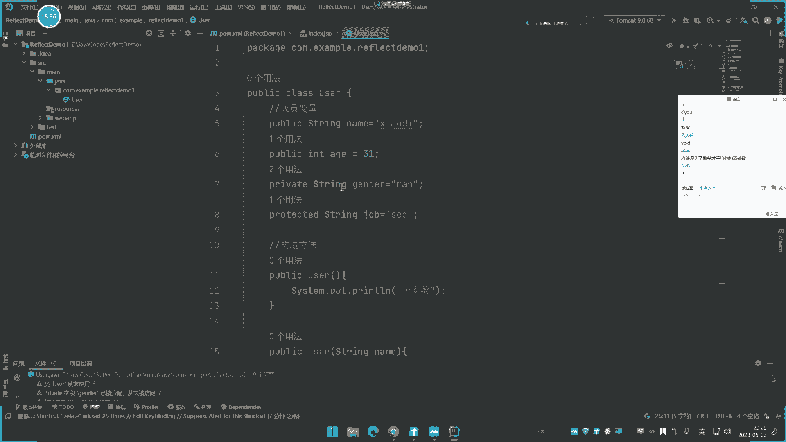

这个什么是Z呢，它有四种方式获取一种呢是这种方式，那这个是啥意思呢，就是说如果我现在要对这个对象，这个users这个对象里面的值呢来得到的话。

我先第一步要得到的就是，第一步要得到的就是这个类，就这个user类如何得到它，就是有四种方式得到它，我们来说啊就说啊很简单，现在呢我们按照这个事来呐，现在我们这里写了这个Z是吧，这个user l对不对。

然后它里面是有这类信息呢，有这个有这个信息，然后呢有这个方法是吧，有这种东西我们要得到这里面的东西，那么首先是先要来到这个地方来是吧，先来到这个地方来，然后呢一步步往下面进行嘛。

哈那来到这个地方来到这一步呢，我们是先第一步啊，就是说得到Z啊，先得到这个Z，后面那才是这个类下面的这个什么，这种成员变量的组合勒，再也是我们说的这个构造方法的组合类，再是我们说的下面的。

还有一个那个成他成员成员方法的类，这种是方法啊，这个呢是这个变量是这个意思啊，那么现在得到第一步就是这地方啊，如果得到呢，我们先创建一个文件啊，名字就叫get class，就要get class。

然后如何得到它啊，写个主函数，然后这里呢呃如果得到它呢，它有四种方式，第一种方式就这种啊，来给他写一下啊，就是叫大写class点for name，这个呢大家应该有时常相信。

这个呢就是一个获取class的名字的来源，然后呢选择这个呢user啊，选择它复制路径来引用下载了，然后呢这里有个报错，把它进行一个容错处理，写上去自动填上去，然后呢这里有个叫什么。

添加个局部变量来得到它的值，这个呢可以去掉好，这个就是a class，这就是呢获取他的Z啊，获取他la，然后呢我可以打印一下给大家看一下啊，a class好，我们看一下这两个运行下啊。

那他就获取这个名字呢，就是这个类呢class，然后呢com excel呢user然获取了这个类，这第一种方式啊，这第一种方式，一种方式，那就是我们做的这种比喻方式，直接，这种啊搞错了。

我们先讲这种根据这个权限内米啊，直接得到这第一种方式好。

我们再来看第二种，第二种呢就是用这种方式啊。

直接根据类名呢来获取，第二种，根据类名类名加class，然后如何是类名呢，这个地方就是很简单的道理啊，就直接写这个名字，那他这里的名字叫user，我们就直接写就可以了对吧，别user了。

点get class，得写好，我这里呢写个这个结束值嘛，好名字就叫这个user class，然后呢我们可以把这个user class呢进行一个输出，看一下看一下啊，它是不是等于这个。

是不是等于这个来你看第二步也获取到了是吧，这第二种方式啊，这第二种方式还有呢，第三种方式获取这个类的这个第三方式啊，一个是用这种方式啊，获取这个类，把这个类获取到，他要先获取了，后面才能操作它。

你不要说我直接知道他是这个地方嘛，我还获取他干掉啊，是的啊，他这个地方是先把它获取过来，就得到这个有个这个类返回回来之后，你才能操作这个类，知道吧，因为这个返回这个东西呢，我们这样还操作它。

你先把得到你才能操作，不是说哎呀我知道这个名字就可以了啊，不是这样的啊，是要从这里得到他的Z，然后呢你再对这个类的这个东西呢进行操作。

是这个情况啊，你不要搞错了啊，好第三种方式啊。

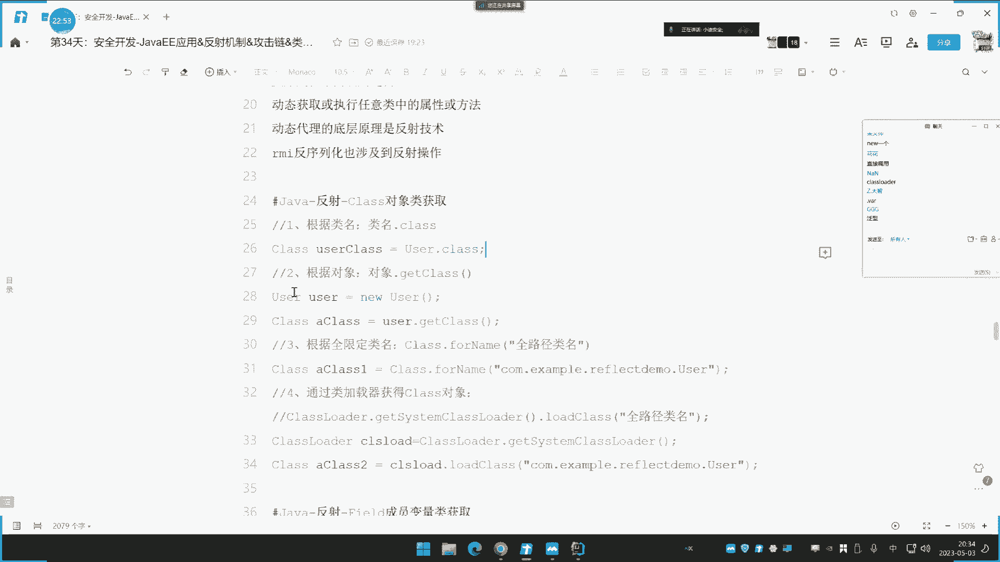

根据对象来那个，然后这个呢就是多了一串代码，就是说先呢啊创建一个这个这user的，一个就是这个啦。

先创建这个new啊，谁创建个new，那交这个user了。

然后呢一个new对象把你对象new出来换对象，然后呢他再用这个对象的名字user点class，这小小的这class呢获取这个对象，这里呢再接收个局部变量啊，那直接局并非要接受，那这里名字可以取掉。

也这个叫a class1，然后呢我们再输入下a class1看下啊，嗯我们看一下来执行，你看第三个啊，他是也能获取到，哎这怎么还有个获取个无参数出来嘞，哦哦这个无参数是我们这个地方写的。

在哪写了个东西在这里对吧，他把那个user给他打印了啊，来这里，就这里在创建的时候那个情况啊，嗯把这个去掉下吧，这无参数我不无参数，就是不应该打印，就没啥都没有啊，这里好。

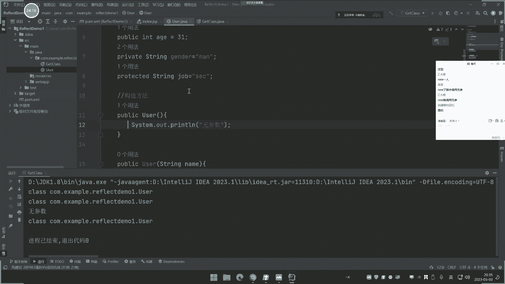

这是第三种方式啊，然后呢呃这个第四种方式啊，这个类加载器的这个地方式，这个方式呢稍微有点小复杂，哎我们直接给他看一下吧。

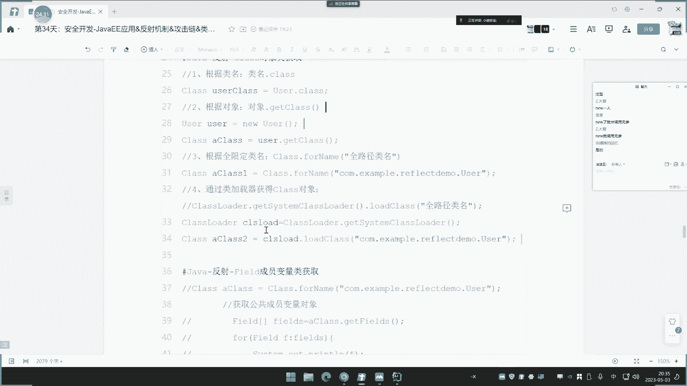

这个代码啊这个呢用的最少啊，一般用的最多的就是第一种啊，这种是最多的啊，下面两种呢用的也不多啊，这种呢就是说直接通过这个东西去获取的啊。

这种第四种方式看他的写法呢也比较简单的。

那直接得到，先用这个东西呢直接写得到之后呢，把这个全路径加上去，加上去呢得到这个值就可以了，呃也没啥啊，找多一场代码的事情嗯，反正那个这种呢一般用的比较少，用的最多的就是前面几种，前面一一种用许多嗯。

这报错了，报了个什么错误啊，哦这个名字错了啊，这个路径写错了，路径是这个路传出去，好这样可以了，好了四个都能获取啊，好这个就是第一种啊，获取Z，那么也就是说我们现在呢就获取到这个累了。

又来到这个地方来了啊，那么接下来的话，我们就要对它下面的东西来做事情了啊，那么先做哪个事情呢，我们先讲对它的成员变量来做事情，那么成员变量做事情呢。

我们先了解一下获取成员变量的几个方式。

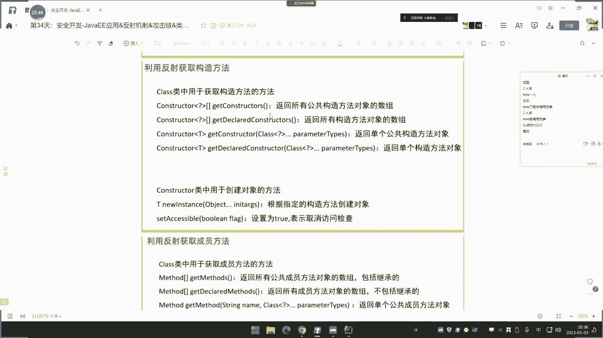

什么叫成员变量呢，刚才说了，这个就属于成员变量，就像这里的定义的这个这个这个名字啊的，比如说lemon a g g e n d e r job，这个就属于成员变量，这属于成员变量，就是里面的成员变量。

然后成员变量里面有子嘛，有这个public的公公公的，还有这个什么私有的，然后还是por protect，就是保护的啊，三种啊，这种三种方式对象都有三种啊格式，那这个东西呢大家自己可能下去要查一下了啊。

这不是我们要讲的啊，这是基本的一些对象的三个属性的东西啊。

然后呢额这里呢就是我们说的那个三个东西啊。

那么接下来我们是如何通过这个反思呢，获取这三个值的啊，要获取这个成员变量的一些东西的啊，那么接下来啊我们继续去写一个啊，叫做get啊，取个名字叫FIED是吧，好然后呢用这个文件来继续写啊。

首先第一步啊我们来看一下啊，先来获取这个第一种啊。

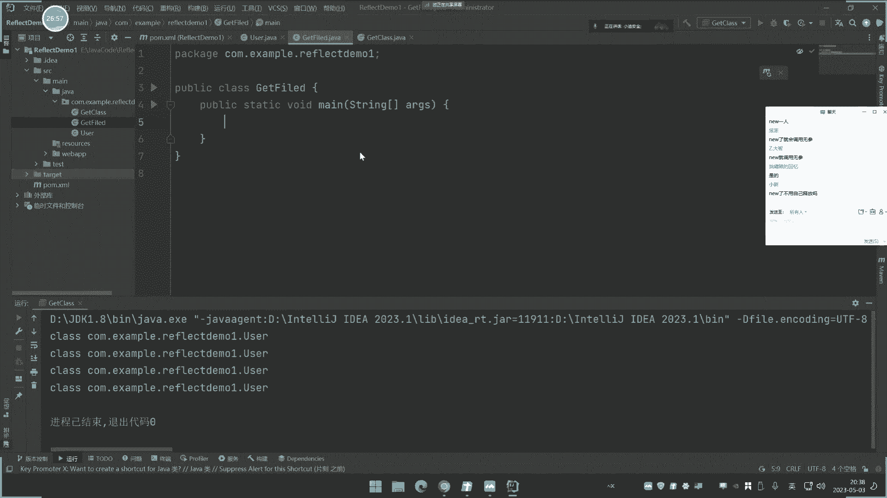

叫获取所有成公共成员的变量对象的数组，啥意思呢，好可以写一下啊，这个先呢用这个class for啊。

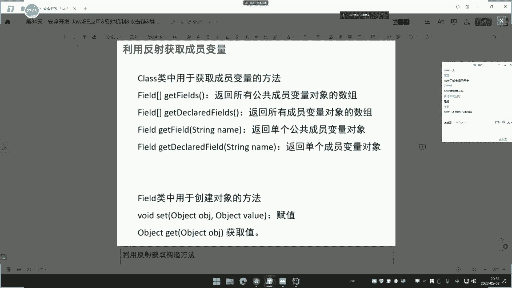

就先把这东西拿出来，他不是先先要获取这个东西吗，先把拿出来来，先用这个东西把它拿出来，先要得到啊，把它得到这里填个报错，先获取这个地方的啊，得到个a class，然后呢再对A点class。

A class，点什么get，你看source第一个啊。

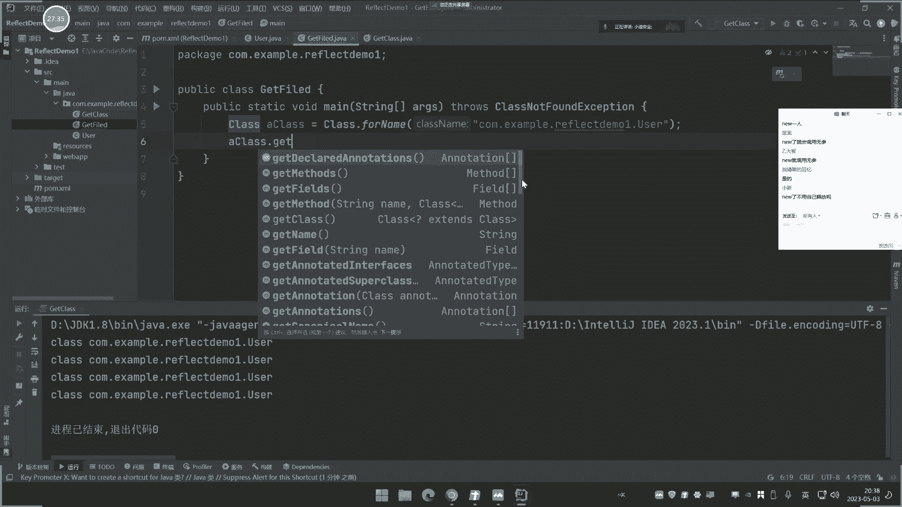

第一个是获取所有公共成员变量的对象，数组好，这是啥意思啊。

我们把它写上去，写上去之后呢，给一个这个赋值的地方，引用局部变量等于这个值啊，是一个数组啊，返回的数组叫files，然后呢我用for循环把它把它写出了for，然后salt啊，名字就叫FD啊。

冒号FIDS，就是把这个FIDS里面的值依次给到FD，然后呢再依次打赢下FD就可以了，看下B好，我们现在来看一下啊，运行一下，看什么东西啊，看一下啊，大家看到没。

public public int a级类目啥情况，public lion和起来，我看这边我的两个成员是不是就是public的string name，public的英特尔的A级啊，你看int类型。

java类的string类型呐，这是前面的这个包的名字吗，包的指向，然后后面是一个级，这个是name是获取到两个public呀，为什么获取public啊，名字是返回所有公共的。

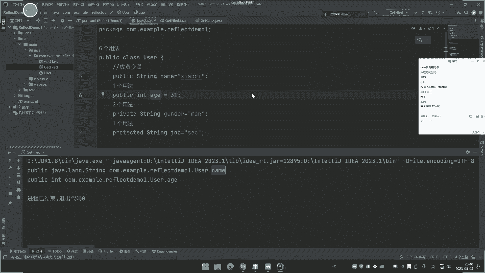

公共代表的是public的公共public，它的成员变量的对象数组，然后从里面编辑出来，是不是就是这两个啊。

这不就是这个name和A级啊，是这个情况吗，你看好，那么接下来呢我们再来看这个呃，他的这个什么另外一种方式。

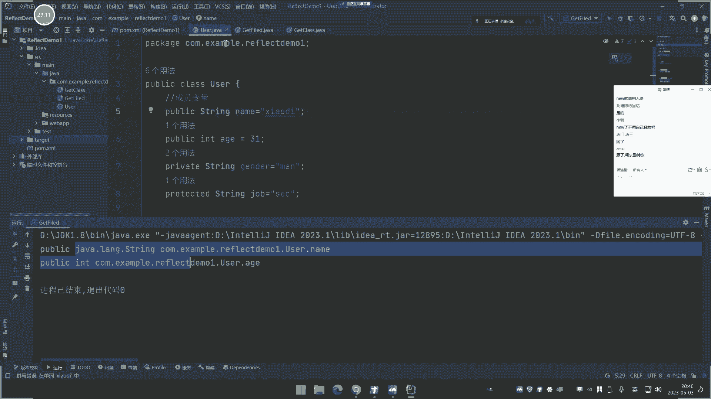

那这个呢白进行一个注释。

他是一个什么情况，哎大写一下啊，这个是获取什么，这个是获取什么，获取公共的，对不对，这个是获取公共的层变量，还有一种就是我们说的啊，获取所有的变量，那么获取所有变量，那就用这个了，叫get d开头的。

返回所有成员的对象数组，啥意思呢，来把这个代码呢直接剪贴粘贴，copy copy一下，改一下一个函数就可以了啊，把这个地方改成什么，Get default，第一个改成这个，改这个之后呢。

再把它进行一个遍历，我们来运行一下，看一下，现在，那看出四个啦，poker p r o t e c t和PRVVICT，那里面的GEI和JP是不是获取到了呀，那是不是这两个这两个一个是私有，一个是保护。

是不是也获取到的，也就是说呃这两个一个一个这个get f开头的呢，指的就是什么获取公共的啊。

注意一下啊，来在获取成像变量的啊，这个呢是获取公共的，这个是获取所有的啊，然后两个值的不同之处呢就是多了这个东西啊，注意注意看一下啊，懂吧能理解吧，好这个就是说获得了他两个这个相关的东西啊。

好那么接下来呢我们再看啊，他还有吗，还有两个呢，一个是获取单个的，获取单个的和获取单个成员的变量啊，这个是获取单个公共的，那个是获取单个成员的啊，也是不一样，啥意思啊，你看一下啊。

那个注释一下，接下来就是说这个获取单个的公共，那嗯这个成变量，那这里呢额如何写呢，来看一下啊，这个就是单个了，他不是数组了，他的返回呢也看这个代码中也是的啊。

前面这个是呢数组的返回的啊，然后这个呢是返回的，不是数组，所以这里呢我们就直接这样写。

直接先把这个代码写出来，就是get face，然后get什么呢，直接获取呢，这个直接给就可以了啊。

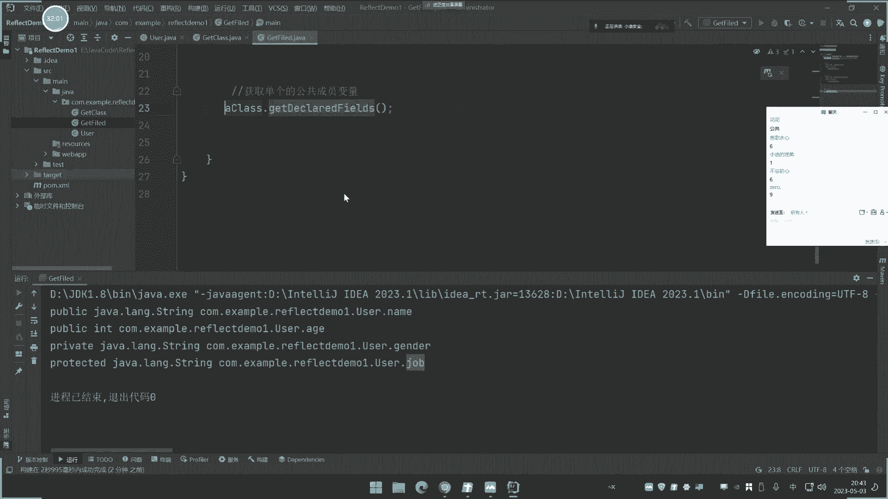

你看前面这个有S的是返回数组，这个没有带S呢，后面加上一个类，这个类目值呢是什么，你看他写的是很清楚啊。

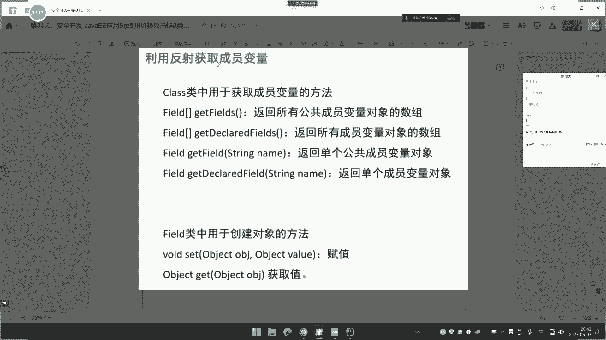

是一个string name，是啥东西呢，啥是啥东西啊，在哪位呀，这个东西咋弄呀，我们先把它写一个啊，呃这个name写啥呢，String name，这个是写啥呢，比如说我现在写个比如说我写个GNER。

G n d2，写个GNDR啊，然后呢这里呢用个东西把它写进去，等于GNN比二，然后呢我们打印下来打一下基因点量，这是他那个对象的那个参数值啊，那看这里有个这个报错是吧，报错那我们把它看一下啊。

好来看一下能不能行啊啊，先获取下那个GNDR，他报错了啥情况呢，这个报错是什么情况，然后你再换一下啊，换个name看一下，换这个name看一下，嗯好name目出来了。

来public那user name name，然后类型是那他获取单个嘛，获取内容的这个类目是啥，其实就是获取这个了，有这个东西啊，它会有这个东西，为什么刚才GN不行啊，为什么，因为这个是获取公共的。

我这里的GNDR是什么私有的，你获取不到，所以啊这个是获取公共的，如果你要获取私有的，这也把单个的成员变量换成这个，私有的啊或者私有的，你看这里我换成什么这个GNDR，那么这里呢就要写成什么函数啊。

前面加上个D选这个函数，那你吗，那就这两个函数的加D的，就是里面都有没有加D的，就只搞公共的能理解吧，来我们依次把它打一下，看一下是不是对的啊，一个是获取公有的，公共的一个呢是获取这个私有的基因。

那这个获取到了啊，没问题，那public一个public一个PRAFT私有的好，这个就是我们说的第一种啊。

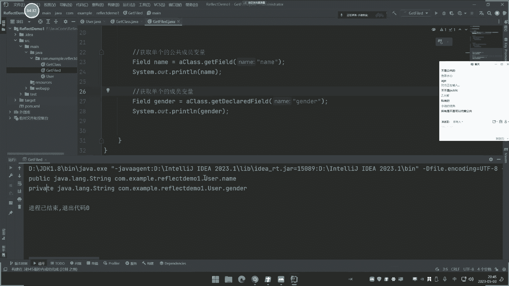

然后呢这只是获取它几个值，后面还有一个呢它还可以怎么样对值进行复制，对值进行复制，获取获取值都可以，然后呢他是如何去复制和这个获取值的呢，对不对，你看啊，他说这个狮子这个值是吧，那我这里有个对象啊。

什么鬼对象的值是吧，就是说你获取到这个成员变量了，你还可以对它的值呢进行修改，可以得到它的值，也可以修改它的值，就是我们说的一个是获取值，一个是复值，这其实我们获取的最终原因，其实就是为了做这一步事情。

就是你获取到肯定就是，无非就是要么得到你们的数据，要么就是这个把它值呢给大家重新再搞一下，就好简单，我们现在呢他这边的这个里面的值呢。

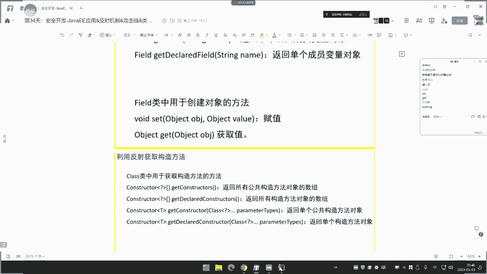

一个是小迪啊，30几啊，什么man啊，SEC是吧，我是不是能够把这个只能给它进行一个获取，或者说尝试把他这个更改呢是吧，现在呢怎么说这个事情啊，嗯这个代码呢其实我都写到这个里面去。

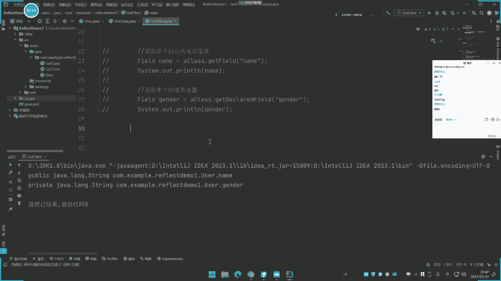

大家都可以看一下，来就是复制和这个操作啊。

来，大家看一下啊，首先声明一个类，然后呢这里的呢get failed得到这个A级，然后seat啊，属于设置这个呦，然后呢这边呢是一个是get，这个是设置一个呢是得到值，我们呢以此来给大家去讲一下啊。

好我们先把这个去掉，大家看一下啊，我们先看一下这边的啊，那这个代码呢就是先创建一个对象啊，然后呢用这个get fighter，这个呢是获取这个A级，这个A级是公共的，再用这个公共的呢怎么办啊。

get了啊，公共的啊。

来看下那个图片呢，get啊，直接加上对象，获取它的值，获取谁啊，获取这个U的，然后呢复制给这个对象A。

然后呢再把A呢把它输入出来是吧，这个倒是获取啊，获取获取的是这个公共的，后面变量，A级的这个值啊，那我们运行一下开始好不好，那已经出来了啊，哎31是吧了，大家看到没答案，一三十一呢是31得到了。

怎么获取的，那先创建一个这个对象，然后呢，从这个前面的a class里面那去得到这个A级，这个前面得到了嘛，这个是获取单个的A级的东西嘛，然后呢对A级里面这个U呢进行获取对吧，然后如果说赋值的话。

赋值这该怎么赋值呢，啊也简单，那set然后对象加上你要值。

那你看啊我们怎么做啊，我们怎么做啊，来直接用这个啊，讲file，点S，然后呢设置它的值对象是U，把它设置为34号对吧，然后呢返回的是VOND。

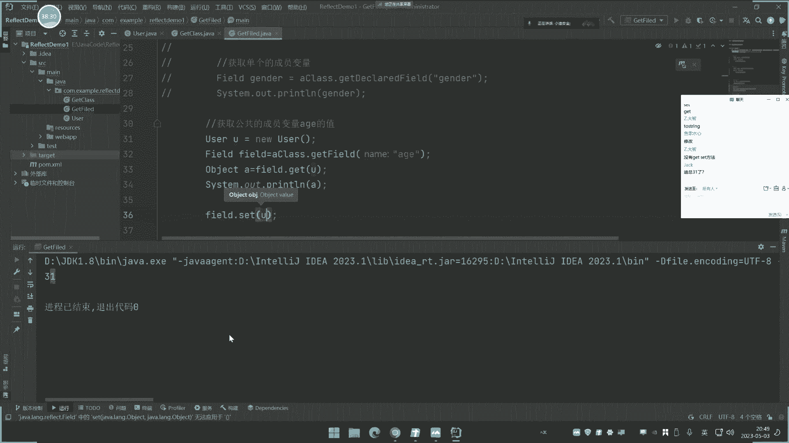

我们可以进行一个接收。

电动机啊叫AA，他好像不是这个，他这个是有N个第一啊，对象获取值。

也是可以用这个东西啊，他应该直接设置了之后。

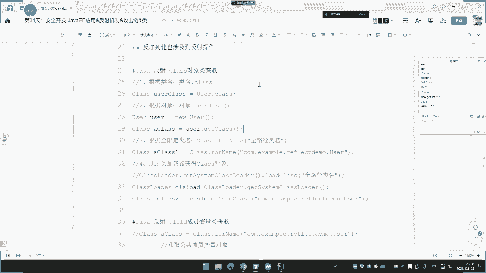

那边就有显示，不用返回，啊这直接设置为30了啊，你看啊我先在这边呢输出这个值之后呢，我们等一下呢再从这里呢再输出一下看一下啊，就说一个是设置词，一个呢是一个是负值得了值，一个是这个值啊。

然后这边呢我们再获取次看一下啊，你看我这里的设置好之后啊，再获取一次，这个是设置啊，前面这个呢get是获取它的值，然后这个呢是设置这次和这个，不过还是等于这个值啊，它等于这个A的啊，这不行。

我们可以调一个方法来把它进行一个查看啊，这个是要在这里面去把得到一下，从重新获取式啊，这要重新获取式，因为这里设置值之后呢，我们要又要重新获取式，再获取是叫AA，来打一下AA，放在。

啊一个呢就是获取一个呢就是我们说的这个，那你看现编的啊，你看呃下面这个呢就是我们说的啊夫子，然后上面这个呢是获取值，这个很简单啊，那复制之后呢，把那个对象里面的，或者把它设置为32啊。

当他再去获取这里面的值的时候呢，就变成32了，这个A级呢就变成32了，因为它都是从这里面读的嘛，上面这两个呢就是有的啊，那这个呢是取它的值，椅子，啊取这个A级里面的啊公共的，那么如果说不是公共的话。

那就把这个改一下就可以了，就这里改一下就可以了啊，好这个呢就是关于这个啊成员变量的操作啊，成员变量里面的获取，包括对值的操作，那我们就讲到这里好。

接下来让我们再看第二个啊，第二个就是关于这个它又不是有三种嘛，呢刚刚讲的是failed class也讲了啊，class就获取到所有FIED得到也获取到了，然后呢还有这个第三个。

这个就是我们说的构造方法啊，就这个获取构造方法，什么是构造方法啊，来取个名字啊。

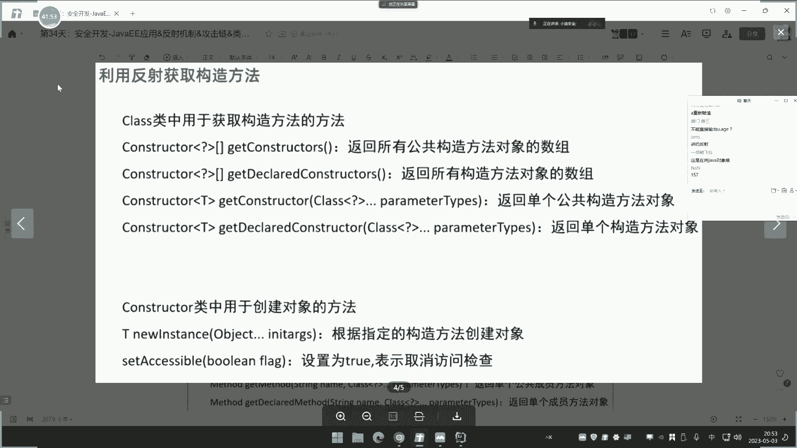

叫get把构造方法的这个名字呢给写上去。

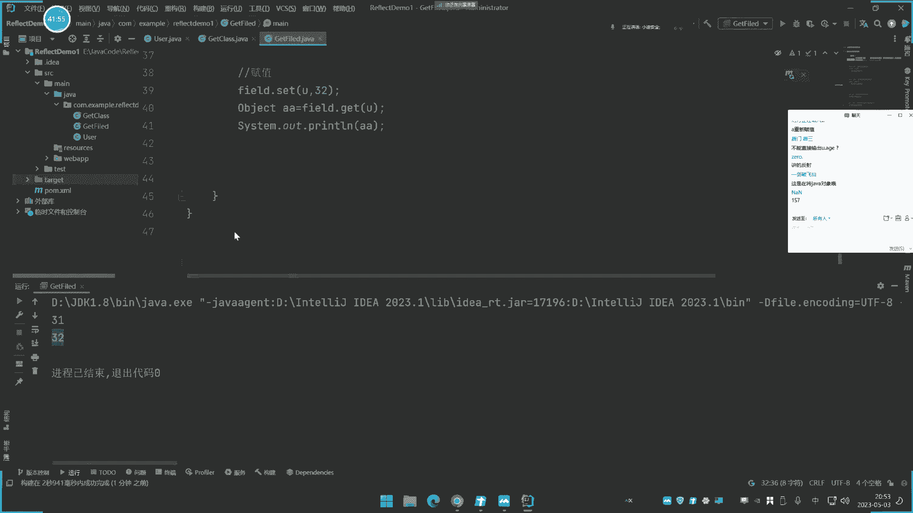

Constant，Are u c t r。

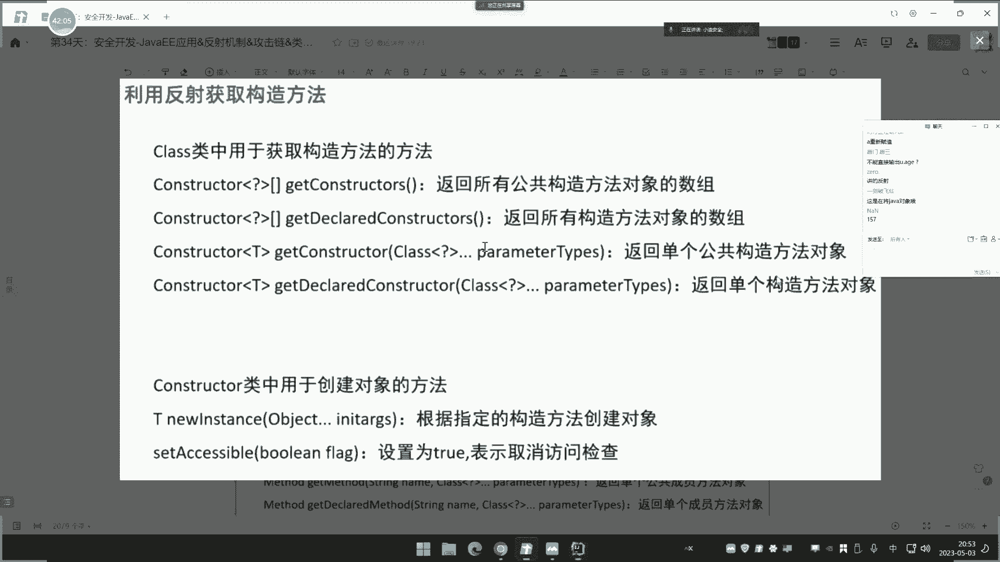

下去，然后呢一次一样道理啊，也是按照刚才那个套路来，基本上就是大同小异了，无非就是函数名不一样了，首先呢先把这个东西写上去啊，我们从高程序先获取类，好获取类之后啊，接下来看一下啊。

我们第一步啊用这个东西呢，它获取属于公共的，那么就是这里面写啊，A class a class，然后点get小的，然后呢选这个，然后呢这里呢就直接用这个东西呢来接收啊，也是一样的道理。

这都几乎都是一致的，没有什么太大差异，然后呢对这个东西要进行一个for循环，获取他的，Z o n，刚才里面的CCO了，然后冒号cn fast对这个co的进行打印对吧，然后这个呢是witch什么呢。

我们先把它运行起来看一下啊，那public里面获取到user java long string和一个也叫user的，然后你看这里啊，我们这个类里面是不是有两个构造方法呀，一个是user，一个是这个。

那么还有一个是PRIVE，他会后没获取到啊，没有获取到，那么你可能会问这下面还有一个public啊，那咋不行啊，这个user咋不行啊，因为这属于成员方法，它获取的是构造方法，构造方法是什么呢。

就是构造你一个对象里面的东西的，它和它相等的，而这个呢是属于它的成员啊，不一样的，所以这个呢获取到的就是什么，获取到的就是公共的，各位打call，对不对，然后下面再看啊。

再把那代码一复制1CTRL加A方，黑加V，这个地方一改，改成个D开头的，那大家想都不用想了，这个是啥啊，你们说是啥，获取的是啥，对，对不对，就包括公共的来把这个14加个D的函数，那就和刚才几乎差不多。

因为原本的这个东西呢大家都理解了，我所有的，那你看是不是现在就出现了三个了，这个PRV是不是也出来了呀，这格式呢里面的呢一个第一个参数，string类型和个int类型的，那我是不是这里的。

这个看是不是这个那name和背景，是不是这个三个都获取了，是是是三个，对不对，然后你可能说这个user info和这个user啊，怎么没有啊，因为这个不属于构造方法，这是成员方法啊。

它使用方法不是用它来获取的啊，那我这个呢就是获取的所有构造方法好。

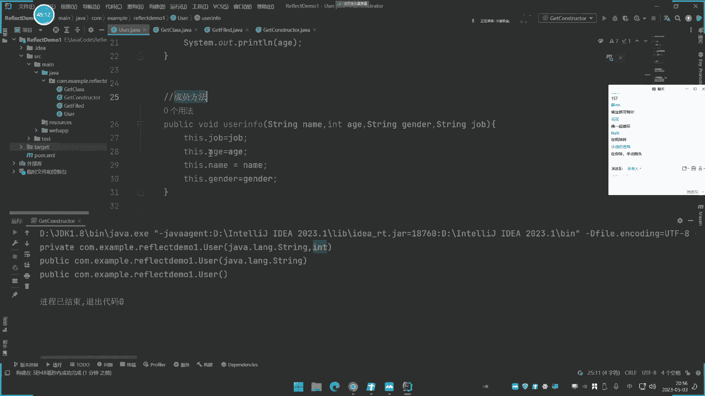

还有什么是获取单个构造方法的呀。

那这个就简单了。

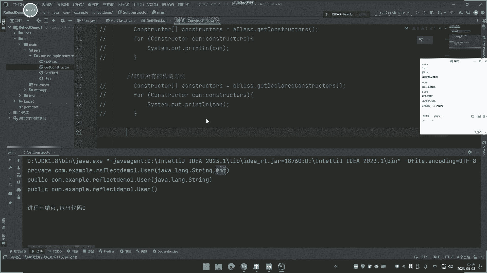

对不对，那这个就简单啊，来来一些r a class点嗯。

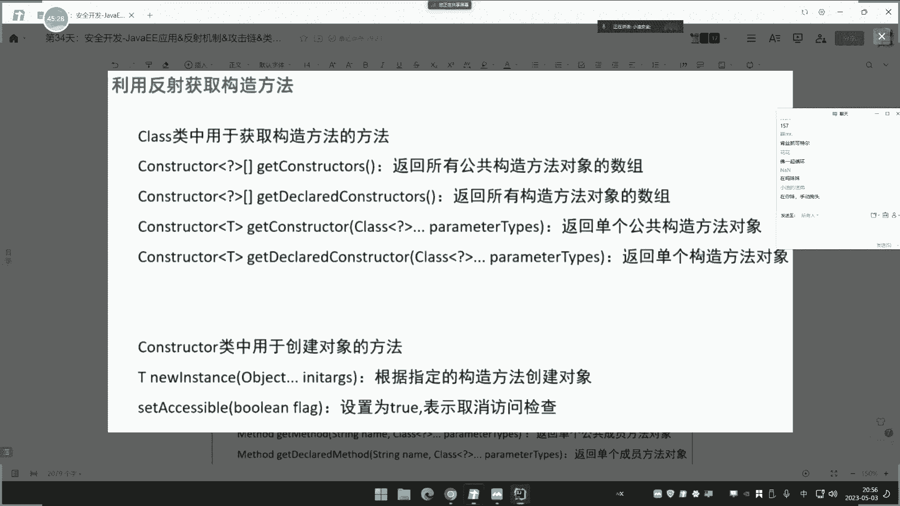

嗯获取到单个的，那就不用加S的，就是的吧，就这个吧，对不对，然后这里有个说一个类型啥意思呢，这是什么意思啊，是这样的啊，你比如说我写个STR点class好，我点个string class。

然后呢把它复制一下啊，引入局部变量哎，来引入这个局部变量，然后呢打印一下constant，来大家看一下啊，我用这个，用这个来异常，把接下去获取个string class，这啥东西啊。

后面加上类型是啥意思啊，你看啊，这个呢是获取单个的这个类型是啥意思呢。

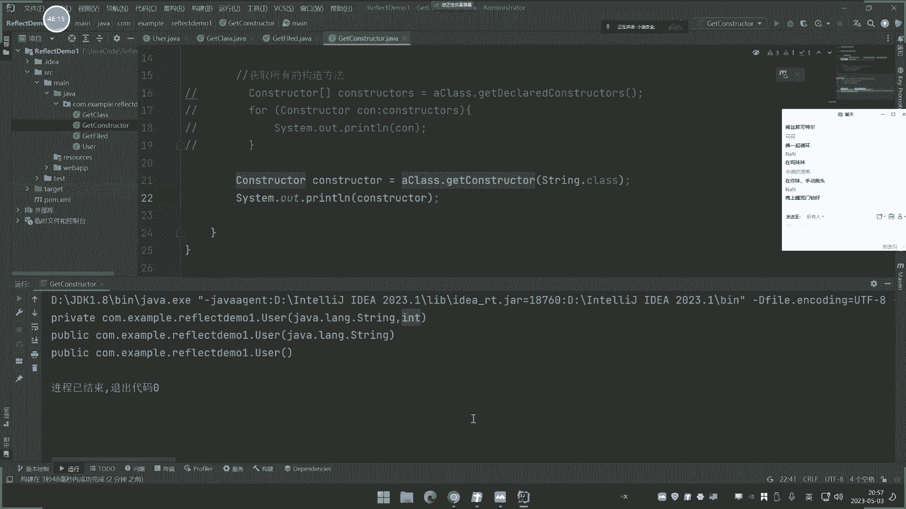

其实就是看里面正里面的。

哪个是符合这个类型的，你看哪个是啊，是不是这个来string name的，这个因为它只有一个类型，这个有两个类型参数里面一个name和一个级啊，这个呢啥都没有，对不对，所以他这个呢就是获取的是这个的。

来我们试一下，看是不是这个意思，那就是获取这个了user选类型，而同理啊，如果你这里写两个来写上，还有个后面什么int点class，对不对，然后名字改一下，叫CON100CN一，那么也是一样道理啊。

要获取两个参数的，哎这里也报了个错，报错他说什么，这为什么报错啊，大家知不知道为什么报错啊，来这为什么报错啊，来获取这个string class和int class的，为什么报错啊，因为它是私有。

那么私油该如何解决它呢，是不是用到这个D开头的一部围了呗，是吧，用这个呀理解了吧，那用这个再来看一下是不是就得到了嘞，那出来了吧是吧，哎这个是不是获取到了，所以这种方式呢就是我们说的啊获取单个的。

然后这个呢是获取，单个的这个公共，然后这个呢是获取这个，单个的构成方法啊，就不分这个公共的啊，这个是公共的，这个就不分了，好这个就是我们说的这个他的第二种，然后后面呢还有一个说是这个什么鬼。

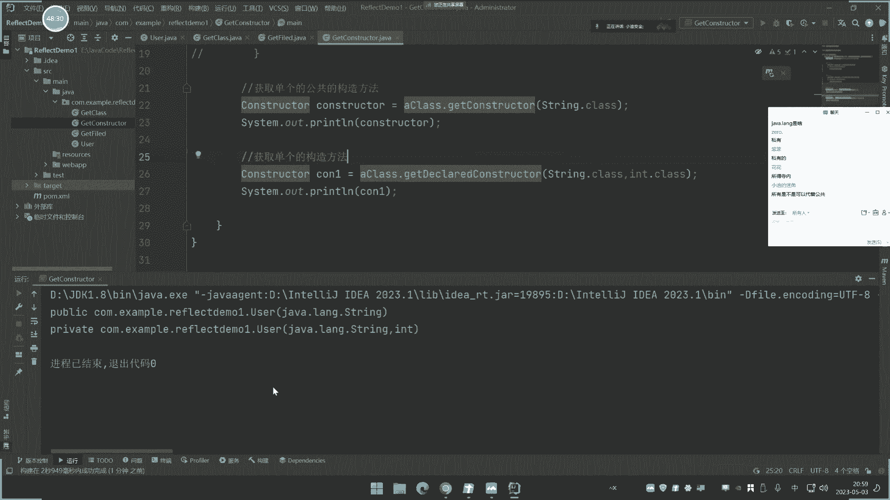

用于创建对象的方法来，是什么意思呢，这个是啥意思呢，其实就是说我们可以呢操作这个构造方法呢，给自己呢再创建一个，知道吧，就说我们可以让自己装一个，刚才那个是对成员变量赋值和得到值啊，这个呢是中间的。

然后呢嗯这个创建呢说实话呀嗯怎么说呢，嗯可以给他看一下啦。

这里呢还有一个东西也给他说一下，这个是对那个私有的东西呢进行操作啊，我们这边写上去吧，然后这个是对私有的啊，我们对他进行这个操作一下啊，看着啊，这个就是那个写的那个东西啊，也没有啥。

就是在这里呢用这个叫6S装啊，对它进行一个简单操作啊，然后里面赋两个值，一个是叫小迪，一个叫三石，对吧啊，对那个UU呢进行打印，也没有啥啊，这边呢就是我们说的那个叫对他的那个对象呢，进行操作啊。

然后这个是string class和英特尔对象class啊，这个呢是获取了私有的，那获取的呢再用这个东西是干嘛的，好，我先不写它，看一下，对这个代码也需要大家理解一下啊，因为我们刚才是获取值。

但现在是要操作值了，这不一样的，然后这里有个好，这里写错了啊，重新来一下，这个还容错，还没写，好来晕一下啊，他报错了，你看他还报了个什么错误啊，跑啥意思啊，私有的为什么呀，现在这个呢操作是对什么。

这个操作是干嘛呀，是对构造方法，进行一个盘朝左啊，他的构造方形朝左，就是我们说的这个地方。

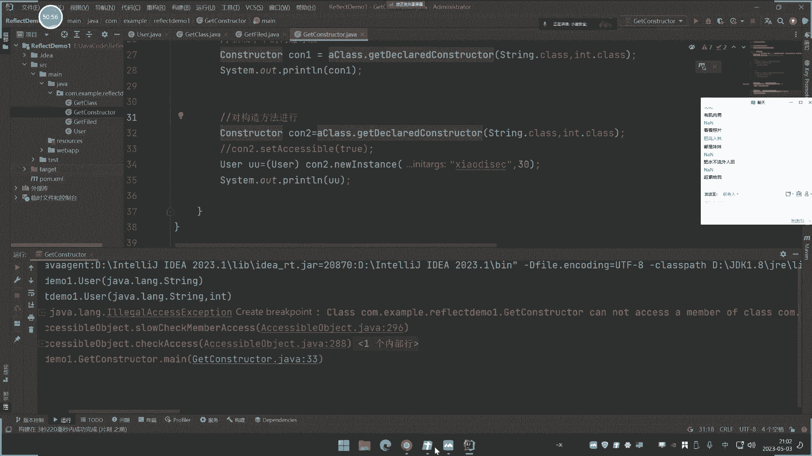

看这个图片，对这个构造方法呢去创建啊，然后下面这句话是什么，因为我们现在获取的是string class和inter class，是属于这个里面的。

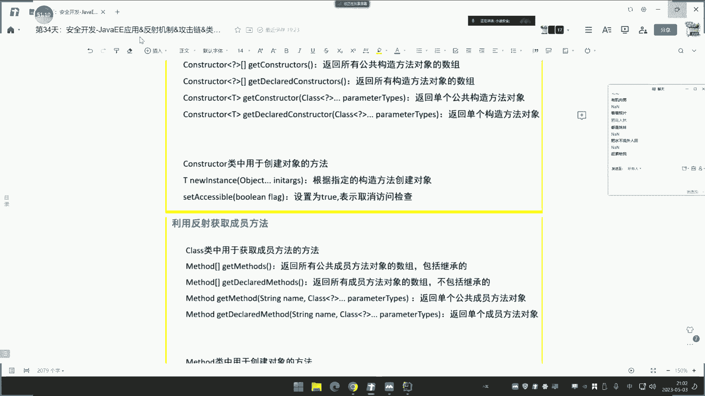

它是属于私有方法，我需要强制性加上这个语句，这语句是干嘛的，这里是干嘛的，让他临时的开启访问，八的设置出，然后呢，你在里面的去给他搞一个小的S1，SRC和30号，然后呢，我们在这边呢。

可以尝试性的把这边修改一下是吧，就这个嘛把它输出，对不对哦，我们来试一下啊，来运行一下，这里，你看啊他的一个输出结果呢，就变成了小DSEC和30，看到没，是不是我就对你们值进行更改了。

我操作的就是这个地方的呢，它里面是要输出内蒙和A级呀，然后它本身的内蒙A级是等于什么，是等于小迪和31呀，我在这里把改成什么小迪SZ和30，比如说我把改成什么小DGG是吧，改下的GG。

然后呢明年年给他改40，对不对，40岁成为gala，还怕输出YU呃，那在里面操作的，你看啊，这两个是上面这两个，我先把这两个把注释掉，避免产生影响好吧，你看啊他是一个什么情况来把它运行起来。

你看他就输出小李给K40啥情况，这句话可以把它补输出来，我把这个地方把它这样去操作啊，对他的这个对象进行操作，你里面东西都改了，把它里面复制两个值啊，是吧，因为他要输出这个，这不是他东西吗。

他要输出这个name和A级嘛对吧，私有的，我要教这个东西，是不是这里用反射调用了呀，调用这个对对应的方法了呀，它的构造方法怎么调用的，大家应该看到了吧，刚才，是吧嗯然后呢。

如果说我现在呢要调用另外一个该怎么写呢，那我刚才调的是这个是吧，假如我现在调用这个了，调这个啊，这个是输出名字的指数名字，我调用它，我调这个干什么调用啊，大家想一想啊，我现在调用的是这个。

那我调用这个该怎么写啊，也简单吗，来给他调用一下啊，啊这个是调用的是两个参数的啊，这是一个两个参数的，就是一个string，一个int的这两个好，那么现在呢我们再对它进行调用。

再比如说这里面一个是一个参数的，就一个STR的，好那这个呢就是另外一个了，那该怎么写呢，也是一样道理呢，写一个出来，好这里就不用写这个DA开头了，直接写这个就可以了，因为那个是公有的是吧。

string class就完了，对不对，然后这里的意思改掉，这里呢就直接写他就完事啦，什么都不用写，这里赋值都不用付了，直接用它这个东西呢，COUNTRINSIDE把它这样写就可以了。

这个写不写都无所谓，因为这是对象啊，写不写都可以来两个参数，一个参数嘛就把改成小的gay，对不对，那你看一下是不是啊，那就调用这个嘛啊我OK那为了确保起见，我这里要多打一个好吧，我的名字。

那避免呢有人说不是他对不对，我写个我的名字，对不对的，是这个吧，public的啊，我调用它啊，看是不是调用它，现在用这两个东西，那还是调用它，对不对，看一下啊，他是不是答应我的名字。

那是不是我的名字对不出来呀，那说明是不是调用它呀，为什么，因为只有一个must去内蒙又写错了，对不对，那这个就明白了呗，就是对这个构造方法的获取，包括数据的操作就清楚了呀啊好，这个就是我们说的这个没。

这是我们说的这个这个什么嗯，第四第二个啊，对这个构造方法。

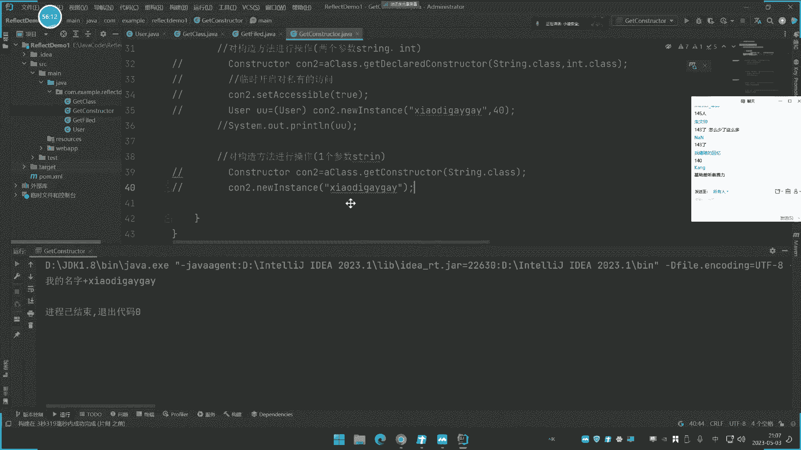

那还有成员方法吗，啊最后一个采用方法啊，都要讲完，讲完之后呢，我们再来思考安全重点啊，哎呀我说这个蛮麻烦的，你做这个讲东西呢，不讲也不行啊，我就这么难听，也听不懂讲了。

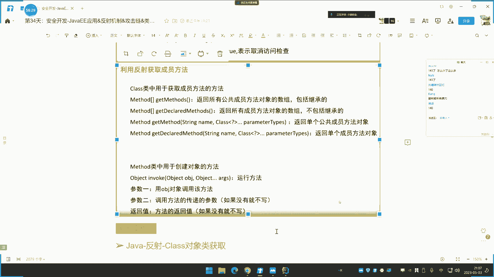

那也不知道是讲啥玩意，讲了有什么作用，唉真是尴尬呀，这个开发就是这样子再创建个啊好了，学完之后呢再思考这个问题啊，现在不操心这个事情，好is啊，这个是获取成员方法的，然后呢我们再来搞个获取这个。

怎么这个，成员方法啊，刚才获取这个细啊，构造方法，然后呢实现在在获取这个成员方法的，成员方法呢，就是获取这里有什么这个有什么user info，user对吧，一个是public，一个是保护的，拿两个哈。

嘶然后呢我对它获取如何获取呢，也是一样道理啊，cos点什么get啊啊，第一个是这个get mom s，就是获取公共的啊啊赋值嗯，前面呢加上个九倍量，对不对啊，依此呢用这个for循环啊，简单是吧，都简单。

哎呀说实话呀，我是真不想讲了，没办法呀是吧，呐这个就是我们说的啊，七八运一起来看一下啊，呐大家看到没，这又是新的东西了，来这啥情况，出了一大堆3000块，你看啊他获取成员方法呃。

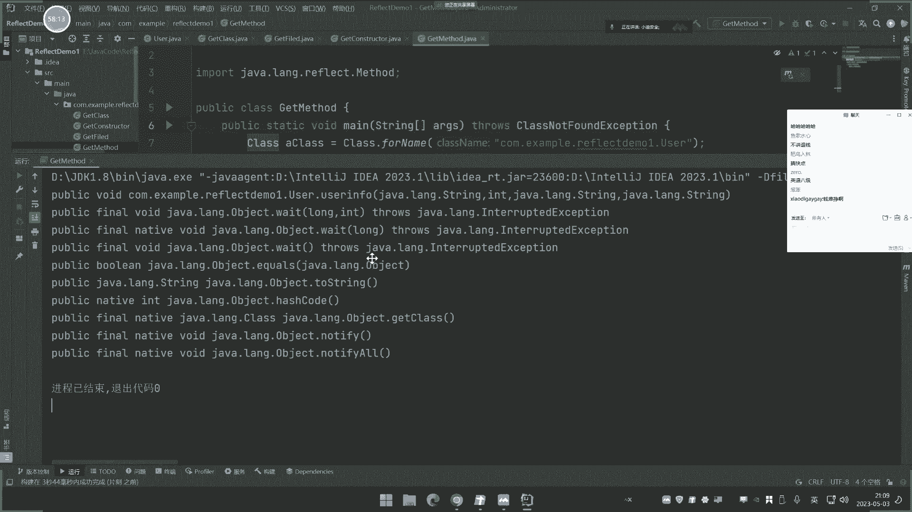

成员方法的这里要注意的啊，获取所有随的方法，包括继承的啥意思呢，就是内值的。

它也有内置的，也有，你看除了我们本身自己写的，我们自己写的哪一个啊，是不是user info啊，这是我们自己写的这个第一个是我们自己写的，后面的什么这个white呀，什么write呀。

还有什么EQLS啊，什么truth string啊，哈奇code，这不是我们的，压根就没有这啥东西啊，这个是他那边的啊，就是内置的啊，其实就是内置的一些方法，就好比当我们在这里写这个东西的时候是吧。

你可以看一下啊，怎么勾引上点一下呢，alt excite是吧，这里有呢有一些常见的是吧，这是常见的，你看对吧，它类值的啊，是这个意思啊，所以他连这些东西呢他也获取到了哈，然后就到了。

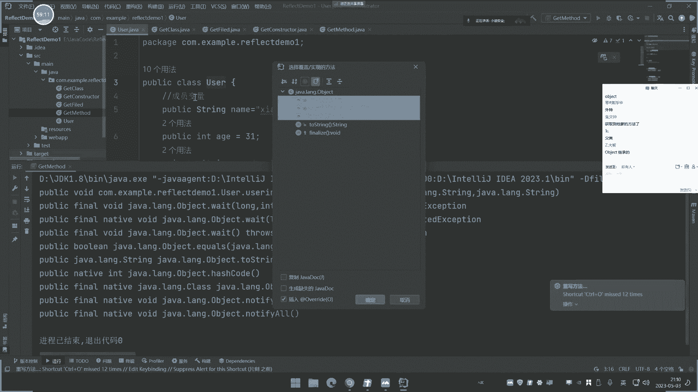

所以这个呢就是它和刚才有的不一样，刚才获取系啊，构造方法呢没有这些，但获取成员方法的时候呢，这个第一个函数那能获取包括基层的水成分法。

如果你不想太基层的，你就直接写这个啊，得加S的，我这就说一下啊，这个他的一个概念，这个是，获取包括医生的，这个公公，这个是这个低一点啊，啊再来写下面一个啊，哎下面这个呢就直接粘贴复制啊。

这个改一下名字啊，这个B开头的就这个啊，然后把打印打印啊，还有这个啊运行，哎他就获取两个，一个是我们的user info，一个就是UZS，包括这里UZS的PO的这个属性的保护类型的，它也能够获取到。

public的也能获取到，这就是我们原本自身的这两个呀，来首选方法，一个是这个这个user input，一个是这个users，对不对，是不是都能获取到来，对不对，这个就是我们说的啊，或许不包括继承的啊。

不包括继承的作业，请播放，嗯这个就是我们的第二种好，我们来看第三种。

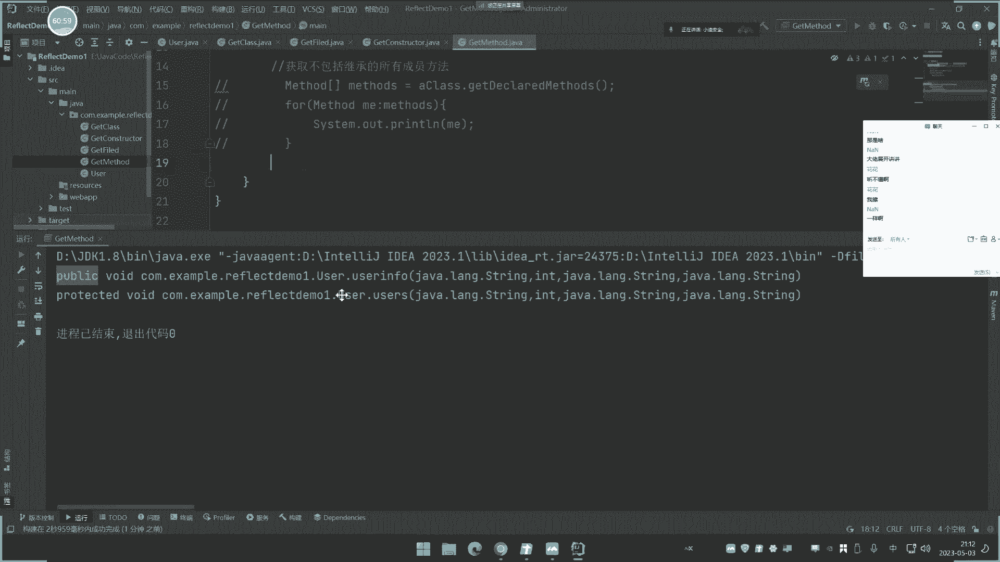

第三种呢就是获取单个的哈哈，那单个的也简单的把单个的A克拉斯是吧。

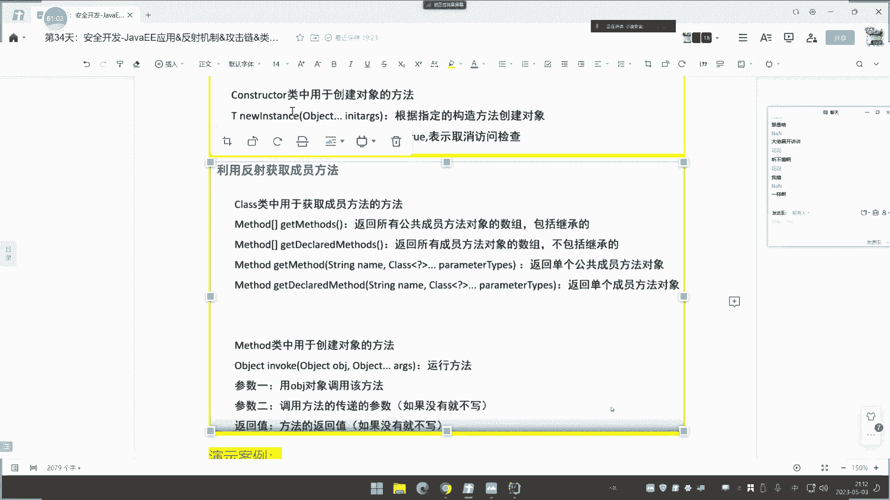

点get不加S的。

就是的吧，是单个单个呢后面呢要写这个类型和名字，啥意思啊。

就比如说啊我们这里呢要告诉他user info或UZS，比如说或者UZS就想去还要写两个参数啊，刚才的只写一个参数，写个名字就可以了，但这个不一样啊，写个user，然后呢后面还要写成什么。

还有后面类型是什么string类型的点，class要这样写才行，然后再给个局部变量，这时候选单个，嗯就这样写好了啊，这就是获取单个啊，嗯再打一下，这个获取这个UZS，这个是获取单个的写法。

我们把单个搞完之后呢，嗯你就自己下去再操作吧，那报错了，表达是非法访问，哎呀这也是一大堆各种各样的一些问题啊，为什么非要让我玩，大家应该知道啊，这个是为什么，啊有人可能说哎呀他是私有的私有的。

我就知道有人这样说，那我帮人下呀，对不对，我把你加下来，我写个D开头的，那这次这可以了吧，来运行一下，要优势，The sfm，我，唉所以我们就说呀你有些东西啊，你不能老这样想啊。

这个是那个获取那个users来给看一下啊，这样就获取对了，而且你看可获取试用时呢，这里又报了个错误，说这个什么鬼，user是string类型不对，啥情况啊，他是有十圈，还有A级，还有这几个呀都有啊嘞。

这里有几个雷姆和GNN都有啊，我们呢只写了两写了一个呃，这个地方呢有两个是吧，谁说了，这后面还要加上个string class呀，这样才对呀，这样就能获取到了啊，这地方要注意一下哈，那下面就获取到了哈。

那哪个就不说了呗，这个就是获取这个，单个的啊，那就不说了啊，你如果说要获取这个的话，那也是一样的道理，那获取这个user info的话，那后面就得多写几个是吧，一个string class。

一个inter class，一个string class，一个string class写进去，把名字写上去就完了啊，这个呢就改成那个就行可了啊。

好这个呢就是它，然后这个呢有个比较重要的一个点啊，它有个叫object的一个创建对象的一个方法，能够用这个INVOK1来干嘛呢，执行任性方法啥意思啊，就是说你可以用它来进行任形方法，那该如何操作呢。

任性方法就说把它进行一个调用韧性，第一个参数呢是object调用该方法的一个值，那我们呢给大家说一下，第二个呢是参数的，全是没有就不写，没有就不写啊，来我们给他运行一下啊。

先在这边呢我先打印一下这两个字。

比如说我要调用它，调用个user啊，我打字进行打印，先打印一下啊，打印一下这个类目，打一下这个GN对吧，这user啊，然后呢现在呢我要对它进行一个操作，如何操作呢啊首先呢和刚才这个GN差不多啊。

先对它进行一个，诶跑哪去了，这A跑哪去了，那，这里需要对它进行一个对象的一个声明啊，啊声明好之后呢，然后对它进行操作啊，It's the，这个代码没写错呀，来看一下啊，在这里啊，先对对象呢把它弄出来。

来写一下啊，然后这里就不一样了啊，那一个是这个，然后呢现在呢就是a class，电怎么了，他这里呢是用把对象。

然后呢加上这个东西是执行这个地方，然后后面是他的参数名是吧。

这个是INVO，先取出他的对象名啊，这是返回值OBJ怎么写的。

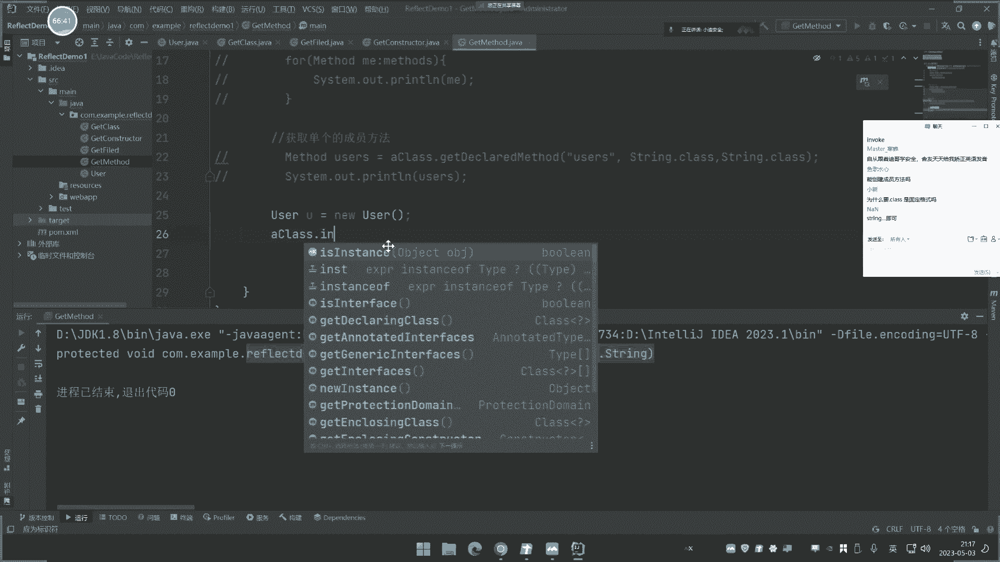

这个我还忘记了啊，意思这要先把它取出来。

取出来之后从这里获取，先把它取出来啊，先把它取出来，那用这个先取出来，取出来之后呢有点点，那这个有了，然后呢对象是U然后呢是参数，参数呢，我就给他复制第一个值，给它复制什么呀，就是这不获取这个吗。

内蒙和GN啊，我就是名字呢就叫第一个名字，那就是内蒙啊，叫姚迪吧，A啊，第二个参数那就是性别是吧，那就是给零吧是吧，只能当零了啊，到一吧也行吧，当一回当一回，好这样子把它搞了之后呢，我们来看一下啊。

是不是可以把这个测量方法给运行起来，看一下啊，好你看是不是输出了小的gay和gay1呀，那这小的根1G是哪里呢，是这里输出呢，那我们确保它11下，就说是现在的是这个user成员方法运行的。

把它写进去是吧啊，这个呢也是一样，对吧，避免说哎不是它运行的，不是调用它，对不对，好写上去啊，我们运行啊，来运行下来，你看是不是调用它，你看就调用那个user里面的东西一样呢，把调用出来呀。

小于是给啊给一对不对，是他呀，没问题，那就写出来了吧，所以这个呢不是我说的啊，就是对这个请愿的方法呢，你这个执行压，对，不对进行执行的啊，这个是执行，不是说单纯的赋值了，赋值是赋值，赋值只用参数。

那是赋值，这个参数一换就是赋值了，是执行，因为很简单，这个东西它没有被执行，它是里面那个方法，你没有调用，它怎么执行呢，他就用这东西把它调用了，调用了你才能执行下面这个输出啊，所以他是执行啊。

你不要搞错了啊，不是说赋值赋值是赋值啊，执行这个执行啊，包括刚才这个也是一样，这个也是类似它执行啊，进行这个执行，也属于类似说创建也是那个意思啊，啊这个就是我们说的这个几个东西的全部，介绍了啊，好。

那么这个就是网上说的反射的所有知识点了啊。

基本上就是80%我都讲，所以说网上你再看到反射的时候啊，你阅读相关的文章的时候，这个明白之后呢，阅读相关的这个安全类文章，关于反射的啦就能够清楚一些了啊，也不至于说完全听不懂了。

你比如说这个学了有什么用吗，我不说从开发角度讲，我就说从安全的分析角度讲，那么碰上反射的相关知点呢，至少能够看个大致非懂的能够理解了啊，那么现在呢我们用这个反射的来实现个什么实，实现个命令执行。

那是什么命令执行呢，我们先来看一下啊，我们来分析一下，从这个实验里面我们就能和安全进行挂钩了啊，来首先呢我看一下啊，比如说我们现在啊写一个代码名字叫做get。

然后run啊就叫get run啊，AXEC是吧，就叫这个名字，get around a acc啊，那他是干嘛的呢，来看一下啊，我们怎么操作它啊，你看啊，我写个wrong time。

点get wrong time，点EDC执行一个什么CEO啊，C是吧，这样好好，我们来看一下，这里呢再把它进行个，好我现在来分析一下啊，还有个报错，他说什么鬼必须得到捕获异常，什么鬼东西好。

把异常给他搞上去，好来运行啊，CLAC是我们计算器，然后你看我把这个运哎计算机都弹出来了，这该简单吧，这啥情况，这其实运行的就是自带的，这是我们这个java内自带的run time。

里面那个EREC呢执行命令的一个操作，这种呢我们称之为叫，原声的一个调用啊，对不对，很简单，就说我直接写调你这个对象调用里面的函数，调里面的方法，然后呢把里面的这个LCNF值哎我调用了对吧。

就写这个东西，那就直接调用了啊，好大家试想一下啊，这是这种调用，那么换个角度呢，那么如果啊，是第三方的这个JRR包呢，对不对，如果是第三方的解压包呢，啥意思呢，就是这个wrong time。

Get wrong time，那是在哪里呢，你可以把它点进去呢，它是在这个地方呢，我们看的我直接把点上去了啊，来点上去就可以拿它水呢，安卓的CTRL它是来源于java long里面的。

就是我们这个JDK自带的点进去，它不是来源于哪里，它是来源于这个这里面自带的java long里面东西啊，你直接来到这里呢，你看他路径啊，我们上面都有啊，那来这个wrong time。

这里看来你可以看一下，上面我把它勾选上的时候，你这属性中单他是哪位的java long呢，这里的java long这个包里面的这个包是哪里的，这包哪里的包是在的啊，是在个java1。

8里面的RT j r里面，那RT j r里面看到没来，你看了RT j啊，就是说你按照这个JDK呢，它就自带有了哎，然后你们这边找java long，然后呢来到了这个什么，刚才这个是long time嘛。

哎get rrtime，嗯来到这里，那是不是这俩啊，Long time，那就这俩啊，那就这个地方啊，然后呢里面那里你运行的get around time，那就在下面嘛，get r呢就在这里嘛，对不对。

然后返回这个什么CAMERRTIME对，这是他的逻辑，就是说其实呀你用这个执行命令呢，是怎么执行的，是他的什么JDK自带的这个什么东西呢，调用执行的对不对，自带的这个R7点jr里面的这个东西东西。

对不对，那如果说是第三方打包的呢，是不是就是我们今天要讲到的，用到这个什么class点four。

或者是刚才我们说的这几个诶，跑哪去了，来，就是对象的那个几个操作吗，先要得到对象的，就这几个吧。

对不对，如果这是第三方呢，你是要写完整路径的呀，那我刚才我自己创建的这个什么，这个文件不就是用这个东西来操作吗，只写了个user，不就是获取它，就把它全的东西写上去吗，就把它当做一个类似的东西啊。

所以说呀如果第三方的话，就要这样写，你看我们之前写的那个，用那个JDBC去连接那个dd bc，我们往下的那个MYSQL那个那个链接，是也是用这个东西把把引用的呀，对不对，所以说大家我把这里一讲。

大家自己在脑海里想一想，就觉得这个东西大概知道哎，我们为什么要选它了，其实呢学它的原因就是，方便于你后期去构造这个类似的攻击，payload做准备的，就是你一旦要引用一些，这个里面那些东西的时候啊。

你就需要找到这个地方啊，去提取里面的东西来调用它的方法，或者修改它的那个成员变量，或修改它的这个成员方法，或者是它的构造方法来实现你的目的，所以学这课的原因就是为了做这个事情。

那么这个事情刚好和哪个安全漏洞挂钩呢，就是大名鼎鼎的java里面的最常见，也是考点最多，也是重难点，重重难点，java里面不得不提的反虚化漏洞，所以这个反射呢可以说是反序列化的基础。

而且反虚化的利用呢也是离不开这个反射，包括我们在里面呢要说到过的呢。

RMI什么JDBC，以前呢你只听到过什么JDBCRMI是吧，这些东西它其实都是这个类似的反思的，一些知识点，只是说你们这些不同的协议是吧，有的是访问文件目录的，有的是这个远程协议等等。

来触发这个相关的东西，那么如果说你不学这个反射，这东西呢你就完全不懂好。

那么现在呢，我们能不能就说我不用原生态的去写，执行个计算器来出来了，很简单的道理，就说我原生态写，我写个弹出个计算器，很简单是吧，这大家都明白，就里面的用一下它自带的，这个像是自带函数一样。

哎我把它这一弹就这么简单，那假设说，我现在让你去用这种反射机制，让你把它引用出来，该怎么引用啊，来该怎么引用啊，首先是不是要找到这个java的这个路径啊，这不就是java下面的点NN。

下面的点run time，下面的，是不是来到这里呀，先得到这个路径，就是我先把它当做是一个外部的，因为他明明是内部的，大家可以直接用啊，我把它当做外部的好吧，然后呢我用这个反射型的这个什么这种方式呢。

去把它调用出来，然后呢我现在要调用它里面的什么，是不是这个get wrong time里面的这个EXC呀，要调用这两个东西的，把执行出来呃首先大家思考一下，那这个该怎么调的呢，跟long time。

我们从它的字面上，我们现在给他点进去看下啊，我点进去看看这个long time是哪里啊，这什么方法，public的是吧，public方法，然后名字是也叫long time，那就是取它的什么勾造方法呀。

构造方法是取哪个。

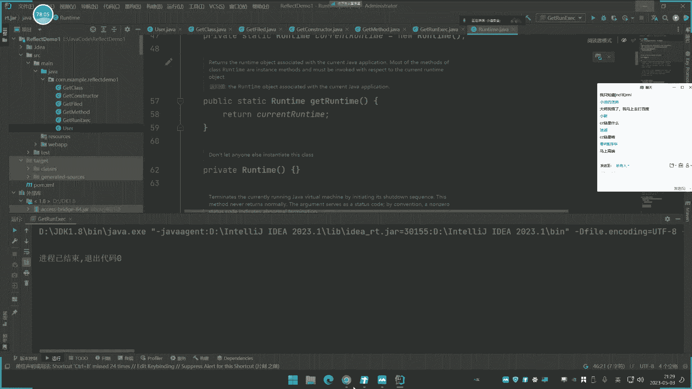

看一下上面的啊，构造方法是哪个，是不是这个对不对，把它取出来来。

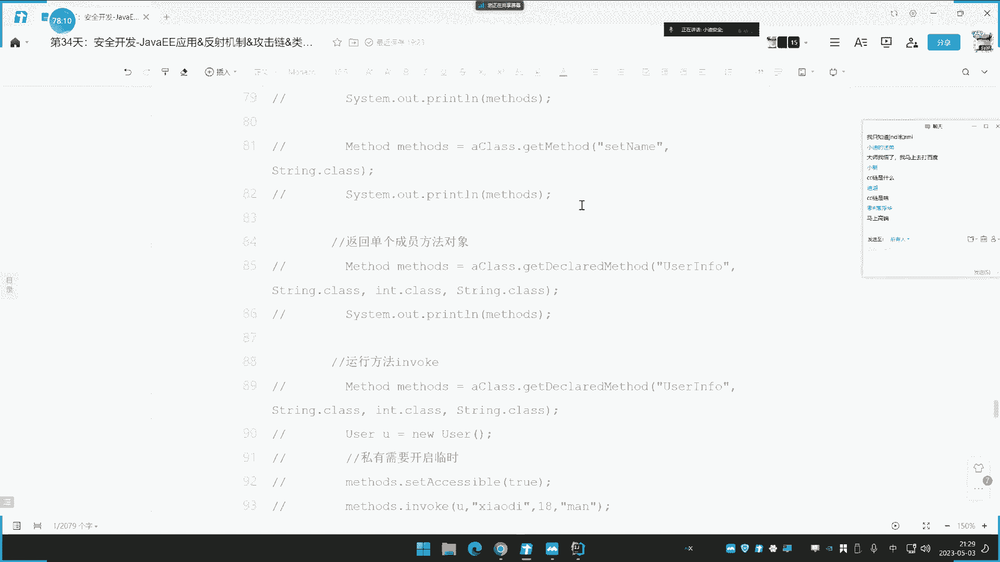

我们获取一下啊，来试一下啊，是不是这个意思啊，嗯嗯跑哪去这里，A点class a class，点get c开头的加S获取里面的所有东西，来我们试一下，看能不能获取到啊。

然后呢在这里呢给它进行一个求变量赋值，然后呢再取这个名字啊，那佛一下看一下是不是这个道理啊，CON的，然后我取个名字叫CTRLCN吧，然后CN编辑一下，打一下啊，看一下啊，看一下啊，来运行一下啊。

这个呢就先把它注释掉，那先获取一下它内值的，那获取下内值的哎，怎么啥都没有啊，我哪写错啦，Good，肯，嗯嗯你妹，我取这个吧，我取这个，你们，或许我待，或许这个试一下啊，那会这个，不可能啊。

我怀疑哎这个出来了，你看啊，这获取到了有很多呀，那R谈的呀一大堆是吧，public的呢，包括我们刚才看到那个这个get around time呢，是不是也能获取到啊。

那get wrtime是不是在里面帮他搜一下，来get long time，还是，那在这里吗，你看是不是这里呢跟状态也获取到了呀，他调用的是就是这个get wrong time，然后点EDC，对不对。

他获取到了，那我这里知道了之后，我是就可以直接用这种方式，直接获取到单个就完了呗，或者单个它是无参数的，它是无参数的吗，你不知或单个就可以了，那怎么获取呢，或单个还不简单，我用这个这里不讲过了吗。

来看下图片，那个跑哪去了，这个获取单个对不对。

然后类型long time，他的类型无参的，那就直接一个就可以了嘛，来写一写啊，点get那不加S的，有这个名字是谁呀，Get，wrong time是吧，然后呢它里面有没有参数值呢，没有有空啊，截个异常。

再写个结束值，对不对，名叫get long time，然后呢我们把打印下来看是不是他啊，是不是它打印下来看一下啊，看是不是得到这个这个地方还是不是这个东西，哎，哎果然是它来得到它了，得到它之后。

这里呢是不是就可以调用它里面的一些东西呀，那还有一个就是我们说的还有个是EEC嘛，那先把这个拿出来啊，先把这个拿出来，因为呢我现在还得到这个EREC的啊，EREC的是不是也在里面。

而且还有个EREC的嘛，来我们搜一下EXEC，那这里有很多了EEC的呢。

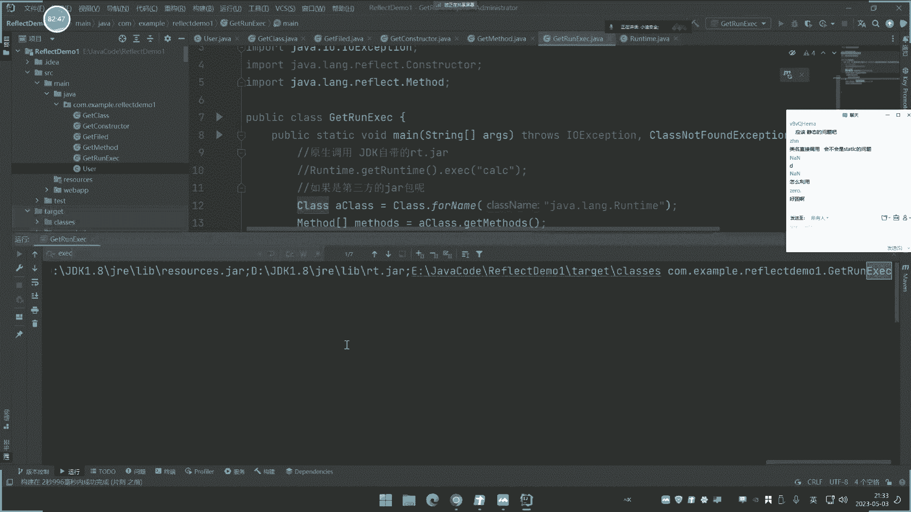

EEC里面的这个，那其实这里呢也不卖关子了啊，直接给他看一下了，有几种写法啊，来这个是我们第一种写法的，额，用这个这种方式写出来的，还有一种呢就是用这种方式写出来的，来我们直接看这种了，那刚才写的啊。

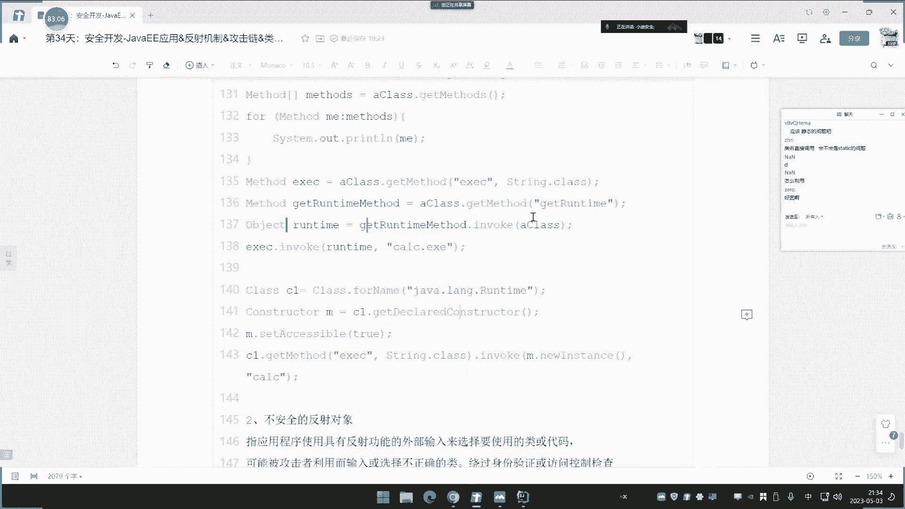

他是从上面先得到，得到之后呢，下面呢再写这个这些啊，那就和我们一样的，这个是获取EREC的，然后string class，然后这个呢是获取那个long time。

get wrong time的那个地方的啊，long time的，因为EC里面有个string类型嘛，来这个是get on time的，下面呢就是用这个东西呢调用这个class，就和刚才那个调用一样。

来执行一个CLEC就可以了，所以说这个东西呢大家就明白了啊，也不是什么大问题呢，和刚才一样吗，这个是获取他所有的，获取所有之后呢，从里面塞嘛，一个是三大东西啊，来我把自己写一下。

这个呢就是获取所有公共的是吧，包括这个继承的，乘法，然后呢这个呢就获取之后呢就帮助我们的去塞，然后这两个呢就是一个获取这个，EXCEC的什么，对不对，然后这个呢就是获取这个get long time。

啊最后呢就把这两个呢进行一个什么啊执行啊，那么这个run time呢就得到这个class嘛，用这个东西的呢，那后面呢再进行一个执行，后面呢我们来分析一下，看一下是不是能够用这个东西呢，来刚才是用这个。

把这个写下来吧，啊这刚才那是用这个什么原生态的去执行，现在呢我们就是用反射的机制来去运行了，这个里面东西，那看到没计算器呢就弹出来了，对不对，这样机就弹出来了，所以这个和刚才用原生态的就不一样了啊。

原生态的就是你直接引用完了啊，这个呢是类似于说我们从找它的根本，再从根本上面再投理出它有哪些东西，再把这些东西呢进行相应的操作，再去学习，啥意思呢，因为这个是大家知道的，就是我要运行命令，我要执行命令。

我就直接用它自带的东西去运行啊，如果很简单，这个自带的没有呢，或者说他没有，或者说他被封堵了，或者说你不能用它呢，你是不是就只能用其他的这个啊地方的呀，所以呢我们就用到其他的这个地方的，对不对。

来实现这个目的，那么大家就知道了，这个反射其实就是我们装我们他的这个，我们学它的原因就是让我们掌握一门技能，掌握什么技能呢，就可以从其他的加包里面，其他的类里面去拥其他的类，就这么简单。

那你为什么要掌握这个技能呢，就是我说的，如果你在这个安全测试中啊。

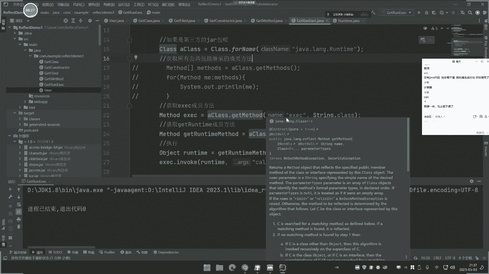

有一个类不安全引用，那么现在呢我们就来看一下啊，你比如说像现在啊这里有几篇文章，我们来看一下他的这个安全价值，所以这里有个那叫java反序的话，什么COM什么组件啊。

他说啊这是学习这个java法修法第一篇文章，哎然后说这个踩了这个坑啊，他说什么难归难哦，然后呢他写了一些，这个是不是这里面谁发给我的，不要看这个啊，先看这个，他说啦，java1篇文章，咦怎么一样啊。

啊你看这里啊，呃他这里呢去写这个漏洞链的时候呢，哎呀这里面也好写了，也不搞清楚啊，这还麻个麻的锤子，啊他说这个真正的反虚化漏洞利用呢，是需要了解java的反射原理的。

因为java的反虚化的payload的，大多数与反射机制密切相关，为什么说密切相关呢，就是说你要把这个反序的话，把它利用出来的话，你就必须让它去调用，反射到其他类里面来，把这个类呢给它实现出来。

他后面举的这些例子，都是属于他限制了一些类的利用，所以他只能从它本身的里面去找这种类，从类里面呢去执行出相应的命令啊，你可以看一下这个文章啊，我们现在都没有讲反序列化，所以说呀这不好讲的啊。

嗯你包括这里呢他利用这个这里有几个啊，还有这个最简单的这个最简单的基础啊，这个没写，但我里面写了篇文章的，就是那个叫URDS的那个操作，网上有些类似的课程讲过啊，我们下节课也会个分析啊，就说有个工具。

那个YS那个反序化利用工具里面，那提供了很多那个利用的payload，那个payload是怎么写出来的，就是反射写出来的，所以你分析那个YS那个工具呢，就是等同于分析这个反射的一个机制。

它是根据里面有哪些库，那我们可以看一下，给他介绍一下啊，就是，那个名字叫java的那个房区的话，I s1，我那个英文单词也是不好啊，那工具名字呢S1，这个名字，Java label。

我电脑咱们应该有啊嗯。

那就这个啊来就这个名字的啊，给大家看一下，那这个是那个运行的一个那个情况。

大家可以看一下啦，我运行打开之后呢，哎他是这么一个东西，这个是一个那个反循环利用工具啊，它是个反循环利用工具，你看这里呢有一些这种东西，啥东西呢，你看啊他前面有个名字，后面呢有个这个什么鬼。

叫什么cn beautiful，1。4啊，什么这个3。1啊，什么4。40是啥情况啊，嘶其实呢这都是一些java里面的一些架包，啥意思呢，就是说你有这个反向漏洞之后呢，他利用的是什么。

就是让你去看一下你有没有这个价包，比如说你有这个这个co2MS的，1。92的这个包的话，那么他就可以利用这个包里面的某些类，来实现一些命令执行或者一些方法，啥意思呢，就很简单的道理。

就是说现在的假设有个反需要漏洞，这个反向漏洞，那有了我们下按到他命令执行，我就可以尝试让他去调用什么，调用刚才反射的用到这个什么，这个jajava long time就可以用它啊。

知道吧，就是这个意思，那么这个工具的也是这个意思，它里面有很多这个价包，那么就是说你项目里面啊有这个架包的话，那么他在反向环利用的时候呢，就可以利用这个架包，就利用这个架包里面的一些这个库呢。

来实现一些供给啊，他就是这个意思啊，这个原理，那么现在呢我们是没有讲这个，没有讲这个这个反虚化的，所以说这个东西呢我们也不能继续说了啊，我们要把那个反句话讲了之后呢，啊再结合去分析它的话啊。

那就很好理解了啊，对不对，然后他这个分析里面的还有很多协议，包括刚才我提到过的什么RMIJNDI啊，那都是java的高端的一些安全的课程。

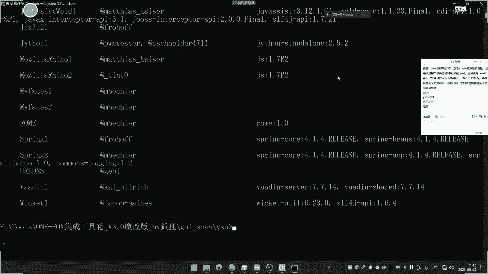

如果说要分析的话，其实我们后面也讲，但是不是这个安全开放里面讲啊，是在后面那个web漏洞，就是我们这个章节讲完之后呢，讲了web漏洞时候啊，单独讲这个java安全的时候呢，我们会有即可的去分析啊。

包括在那个一菲的那个视频里面呢，我也给大家去上传过一些这种，java的这种安全的课程啊，对不对，如果说你有感兴趣的话，觉得讲的不多的话，你可以看那个课程，那是网上的收集到来的啊，第三讲的比较多了。

我后面呢也会讲啊，现在呢还是以安全为主，先把这个讲了之后呢，我们下节课呢再说反虚化的一些操作啊，就是反虚化怎么造成的，反虚化的一些的这些代码的，都某良心呢给大家讲解一下，讲了之后呢，你再来思考啊。

这个反需要和这个反射是不是有关联性，不过呢你要讲到利用的时候，那就有关联性的啊，没讲利用，你是看不到关联性的，一旦一讲到利用的时候，就知道这个关联系统，因为像这个反虚化里面的一些PO的。

那个粘的一个构造呢，就和这个反射的是息息相关的，他为什么有那些什么各种各种协议，还有一些粘的构造，是因为呢它本身里面是有过滤的，如果你不去那样操作的话，它是绕不了的，它是有些过滤的啊，里面有些那种版本。

每个版本的在更新之后呢，它会有些过滤，很复杂的啊，说实话很复杂的，你把它研究到之后呢，这个东西呢是java的一个那个安全问题嘛，很复杂，我们把这个java的课程上完之后呢，说实话啊。

虽然说我也不知道会伤的是个什么深度或程度，但至少呢是吧还是比较这个算比较是吧，比较可以的啊，这网上东西也不好讲，这太难讲了，妈的说实话。

今天的这个安全开发呢就讲到这里了啊，我们下节课把这个反虚化的一些原生态和，和一些什么JSN啊，插美奥的一些那种反序列化的一个东西呢，给他讲了之后啊，啊然后大家再去看一下啊，那个反虚化如果说利用的话。

是不是和这个反射有关，你把两颗呢一加上去一看啊，很多东西呢就能明白了啊，好这个是我们今天这个内容了啊，关于这个java的反射机制的一些介绍，我们也是不劳辛苦啊，这个代码呢也是一个个来敲的，哎。

你也不要说听不懂啊，或者不知道这有什么价值啊，这个东西你用到的时候就知道价值了，你不用去讲这些东西，为什么要讲这价值，一时半会不懂啊，因为我们都是没有去讲，这个java的最深的一个基础，没有讲过。

你暂时不懂这个反射镜是会干嘛，这个是很正常的，你只要到时候那很安全，能够挂上钩就OK了啊，不要去想其他的，我们是结合安全，不是要结合开放，好今天就讲这么多，下节课的内容呢也给大家说了啊。

就是关于这个java的一些反序列化的，一些周某的代码段，就是它反序化是怎么产生的，它有什么意义啊，这些东西都会讲，讲了之后呢，我们再结合一下，好今天呢就讲这么多啊。

这个my BIOS呢是在sting put里面再说啊，唉这个东西买BIOS的讲不讲都其实关系不大，他这个漏洞比较少，重点就是反虚化呀，反思呀，包括这个，嗯几个组件的一些安全，这个是比较重要的。

因为这几个漏洞比较常见啊，好我们这里呢就说这么多了啊，下节课的内容也说了啊，看大家有没有问题。

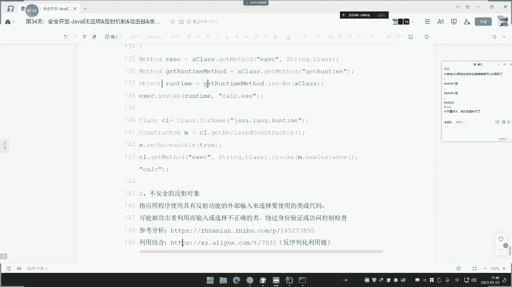

有问你问一下啊，没问题瞎了啊，其实java你学起来你只要开始学好之后呢。

蛮有趣的啊。

还是蛮有趣的，难他是确实比其他语言要难一些。

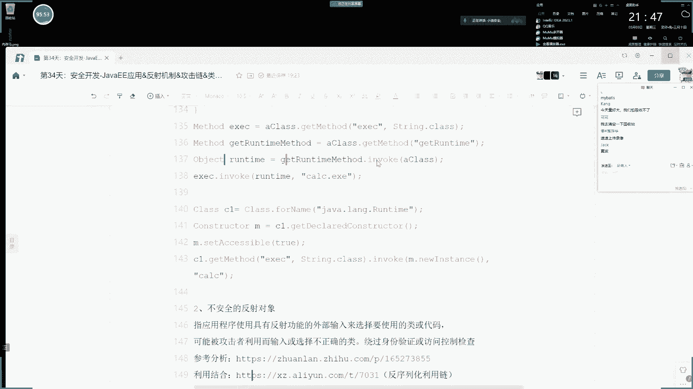

输出上传录像，唉早卷一点啦，录像上传完都要骂，哎呀。

我现在真是啊，没办法，我还是对他们对。

对有些人太仁慈了啊。

隔壁的隔壁的有些人不满足隔壁的培训，他都不敢当别人骂，当着我的面骂，对不对，还叫我不要跟别人说，妈的骂起我来拿死你妹的，不管不行，不不闻不问呐，退钱，那全票啊，你妹的一顿骂呀，我真是你妹的。

是不知道啥情况，我只记得啊，之前有个人报名，他说隔壁的把他坑了是吧，花了什么大几千上万，啥都没学到，然后呢，他把别人骂了一顿，说很垃圾啊，什么鬼，还要我不要跟别人说，还不要我当吃瓜材料。

我还没有给他当丝瓜材料，好过了里面的半个人，对不对，他老子刚才在说我的好，过了半个月，他的本性也暴露了啊，直接当着我的面哎，学不懂啊，退钱啊，全飘啊，你这他妈的别人割了你1万的韭菜，你连当着别人骂。

说不好听的话，你都不敢说，我你妹的收了你2000多块钱，天天这么认真教你，你还骂我，我说了呀。

