# 【小迪安全】V2024版 全栈网络安全 ｜ 攻防渗透工程师 （持续更新） - P35：第35天：JavaEE应用&原生反序列化&重写方法&链条分析&触发类&类加载 - 逆风微笑的代码狗 - BV1Mx4y1q7Ny

java开发的第四次直播了，上一次直播呢我们讲了java的反射机制，那这一课呢我们就来讲和反射机制细细挂钩的，这个序列化的一些操作，其实这一课呢开发的点呢不多，主要呢说一下这个序列化。

因为它是java安全中的一个核心部分，好多漏洞呢都是这个反序列化的漏洞，那反序列化呢在pp也好，或者说在java里好呢，都会有一些少许的差异，在java中呢是重难点对吧，中难点又是终点，那又是难点啊。

P1P里面呢还稍微会轻一些啊，因为GPP会好理解些，那个虚拟化的这个开发里面呢东西是差不多的，但是它的安全呢就是截然相反，那java里面的反序列化呢是一个很庞大的支点。

这也是我们后面课程呢要会给讲的，这里有张图片，网上找的啊，来这里有什么鬼，前期的什么反虚化序列化啊，啊后面呢有这个什么技术，然后呢什么叫反射，叫代理内加载集合，包括一些利用念啊的一些分析。

这是后面我们要商的时候，那就给讲啊这个安全漏洞一块的啊。

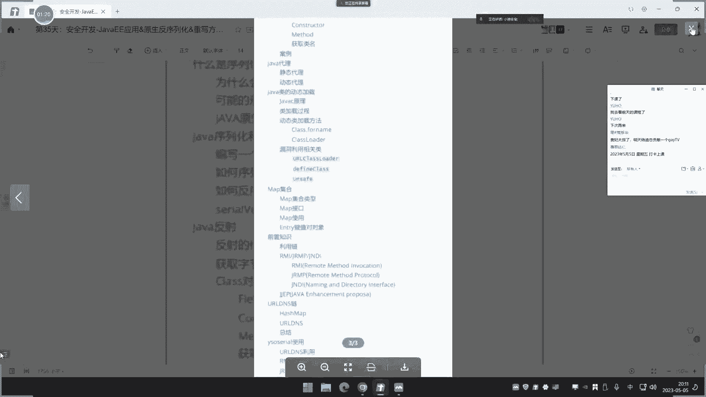

想开发呢就先把这个反虚化的入门呢搞清楚好，那今天呢就入门了，什么是这个序列，反序列化啊，他有两个啊，一个呢是说这个，一个是我们说的这个，呃序列化还有个呢是反虚化，这个是什么东西呢，我们来解释一下啊。

序列化就是将内存中的对象压缩成字节流，而反序的话呢是相反，将字节流呢转化为内存中的对象啊，这个字节流这个东西呢是在java中这样教，如果是在pp里面的话，pp就是个字符串，那pp是字符串啊。

java里面呢是这个字节流P1P的，反序列话呢是直串，这里呢有有有一些差异啊，我们到时候呢在讲这个反虚化漏洞的时候呢，就是这个开发讲完讲漏洞的时候呢，在精讲这个漏洞的时候呢，会对比一下这个差异的啊。

那么具体呢有张图片大家可以看一下啊，就是这里呢是一个java的对象啊，它把它转化为资金流，这个资金流呢可以存储到文件中，可以存储到数据库中，也可以在这个我们的窗口呢模式下面呢，去显示啊。

所以说什么是这个序列化和反序列化呢，它是一种基数，这个基数呢就是实现对对象呢转化为资金流，资金流的转换对象，那为什么会有这个虚拟化技术呢，其实呢也非常好理解，他们的这个设计呢本身就是用来传输数据的。

你可能会说传数据，这个和这个技术有什么关系呢，很简单的道理啊，你传输数据的话啊，你我们就拿个代码来讲的话。

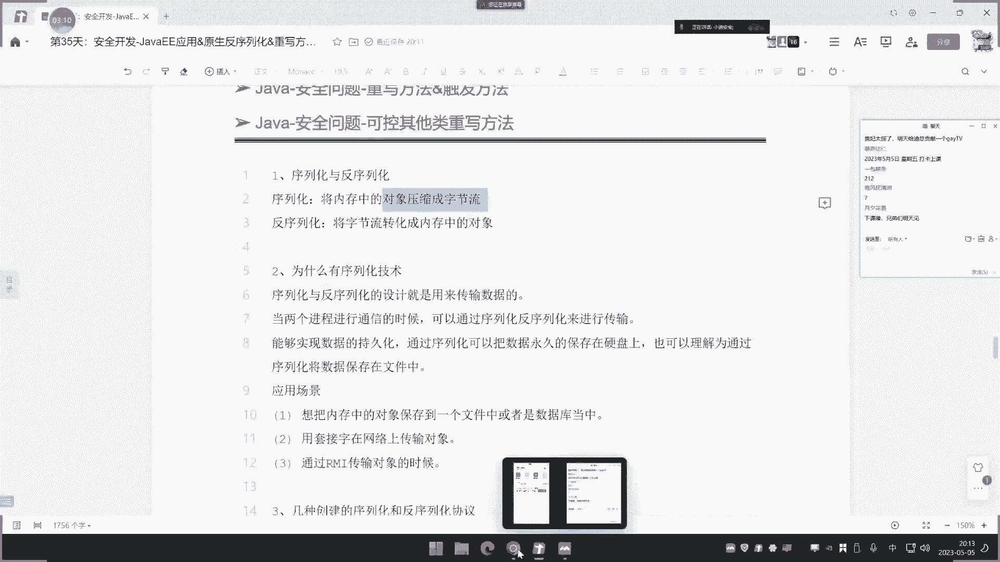

我们可以随便的先打开这个代码，给大家看一下啊。

嗯这个代码艾迪先暂暂停一下。

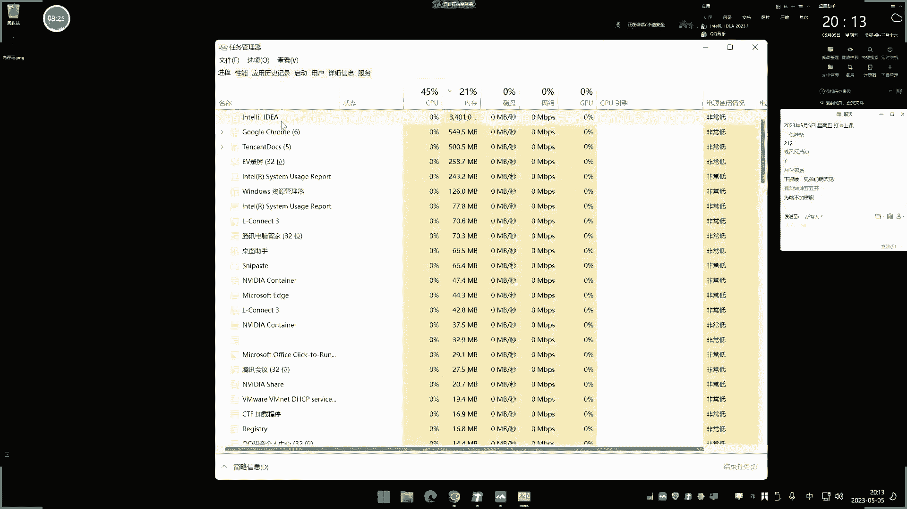

然后这里呢有一些这个代码，比如说这里呢有我们一个users的，一个这个这个DM端是吧，这里呢有一个对象啊，这里呢有一些里面的成员存量，成员变量和这个成员方法啊，还有一些呃构造方法是吧，这种啊。

那像这种呢是吧，这个对象，他为什么要进行这个，序列化和反序列化的操作呢，很简单道理啊，假如我要发送一串数据，发什么数据啊，就发这个整个代码端，那你怎么发，你把它CTRL加ACTRL加飞车，这样发吗。

这写完不好，为什么，因为这里呢它里面有很多空格，或者说有一些乱七八糟的字符立罚的话，你如果说像正常罚，我们就这样去写是吧，但是你这里面有这么多空格，还有像这种锁紧复制各种东西。

他怎么去模拟它，那模拟不了，所以说呢他就会用到这个虚拟化技术呢，把这个整个代码端呢是吧，把这个怎么代码端呢给他呀。

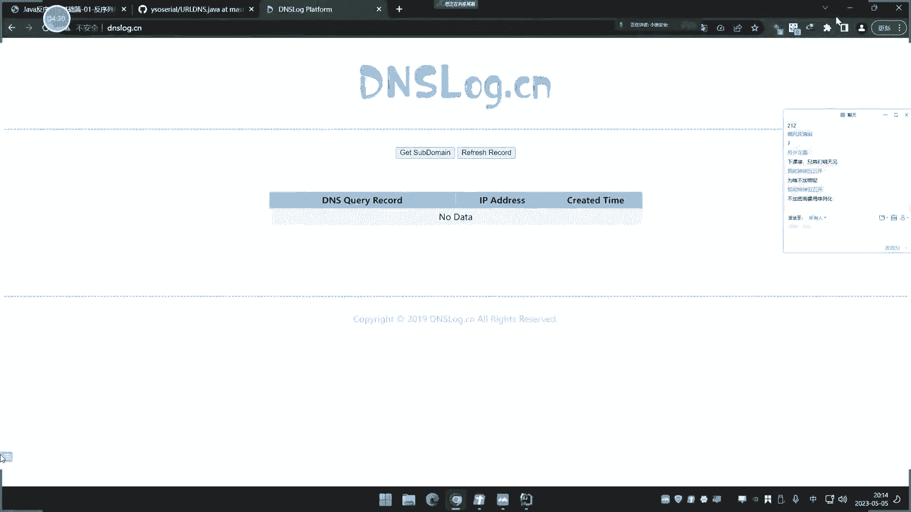

封装起来，封装成一个虚拟化人尸的这个什么数据格式啊。

就是我们说的资金流，然后呢去传输，并且很简单啊，如果他把它保存到，把它传输成了这个文件的话，保存到文件中，那么这个文件呢就会储存这个东西，其实就是很简单，我们一句话去理解它啊，它就是一种什么技术呢。

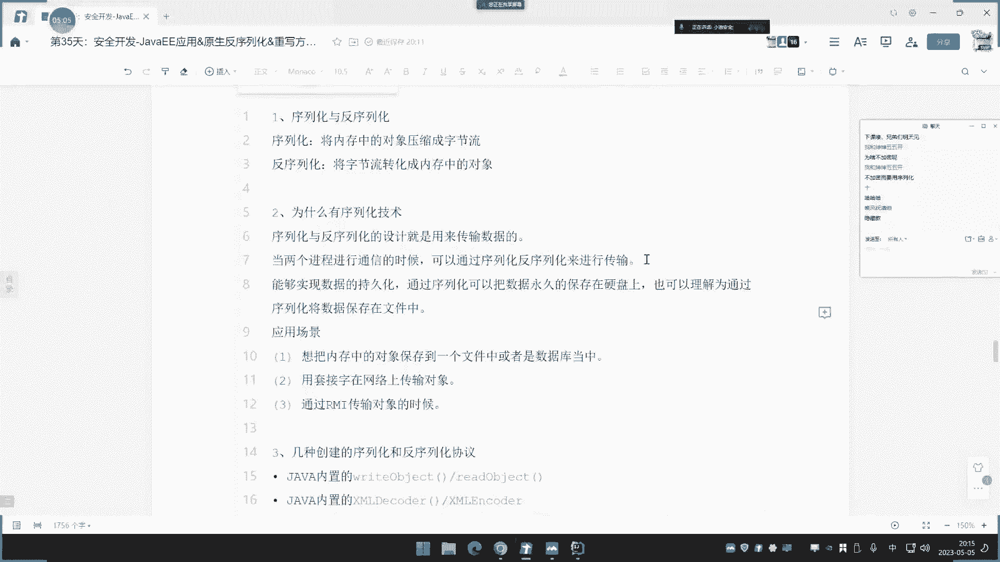

就是把一个代码呢把它封装成一个文件，或者是一个东西，然后这个文件呢再通过某些这个反序化操作，再把它还原出来，就说简单的一句话，就是数据呢你在传输的时候呢不易传输，不易传输呢，就是因为它这里面。

比如说一传这个代码里面有很多东西，这个东西呢里面有很多这个符号，有很多乱七八糟的，你不可能的，就是把它全选粘贴复制啊，放到这个什么值后文那种，他全输过去，因为它不会识别一些什么空格呀。

或者一些杂杂杂七杂八的，那么他就可以用到这个虚拟化技术呢，把他们呢当做一个整体封装成一个文件，那么呢再以这个文件呢去让对方的去解析，能不能理解这个意思，所以这就是它存在的意义啊。

就是因为那数据在发送的时候呢，有一些数据呢它是不一去发送的，所以他需要把它先封装成一个整体，然后封润成阵地之后呢，对方呢再采用相应的技术把它解析出来，那么一个就是封印的封装的过程。

这个过程呢我们称之为叫序列化过程，对方去把这个过程把它还原出来的，那么就称之为叫反序列化，就是一正一反，就类似于和我们那个加解密一样，就是有传数据的，你先把它封装，便于传输，封装成一个文件。

对方呢再把这个文件呢给他再还原出来，那么在封装的过程中。

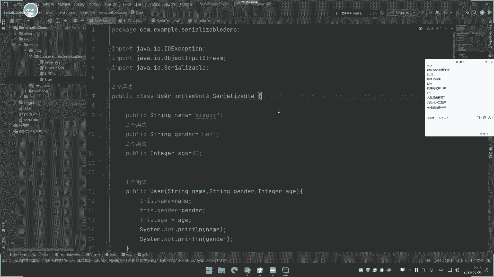

那个前步骤称之为序列化，就是我们说的把这个对象压缩成资金流，对方呢再把这个自己能把他再还原成这个对象，所以一个称之为虚拟化，一个称之为反序列化，好这一点呢请问大家能不能理解啊，你之后呢，我们就来开始呢。

去讲一下如何进行反序列化操作哈，那么在这个java中呢如何进行虚化操作呢，它是由这几个东西的啊，有它内置的一些API函数，然后呢有一些这个第三方的，像这个菲斯克JSNJKSON，这个是祖先的嘛哈。

它里面呢也内置有这个序列化的这个函数操作，我们初始杰出反序的话呢，是先用原生态的，后面再讲到这个反序化的漏洞，核心部分的时候啊，就是在后面漏洞篇章里面呢，啊我们呢再来看一下这个基于其他的啊。

他的一些反序化操作，那么现在呢我们来看一下，这是他的这个协议，然后呢为什么会出现这个安全问题。

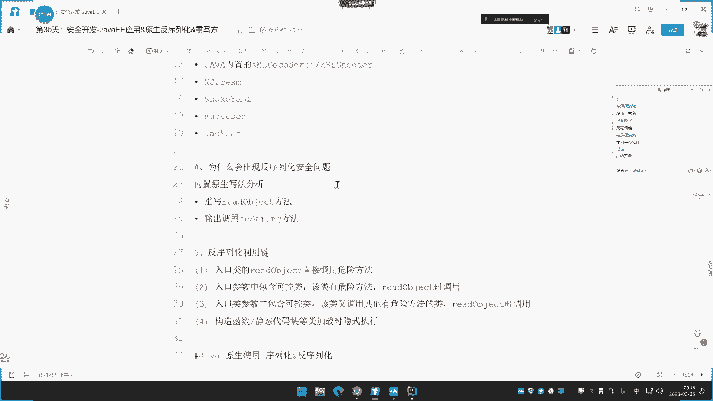

这个呢我们先给大家看一下效果啊，好我们现在写一个代码啊来实现，就说我们先呢去实现一下，一个反序列化的这个操作和序列化的操作，然后呢我们再来去分析它的安全问题啊，两步啊，安全问题呢有分很多组。

这个虚化这个东西呢说白了啊，他这个是来点麻烦的一个东西啊，好我们创建个Sol test dom端，然后呢嗯这里的就直接下一步了啊，就加补20个创建，那就直接创啊。

然后这里呢把这个MVN的这几个东西都给删掉，因为这东西呢不重要啊，然后这个项目呢更简洁些，把这个首页文件hello，亏不得人也给他删掉啊，要不要他都无所谓啊，删掉哎好，然后呢，我们先不删吧。

就来这里写啊，先写一个这个类啊，写个这个user，Dmally，嗯这个user dmi，然后这里呢写什么东西呢，啊就写一些这个常见的，我们说的这个它的一个成员变量值啊，这些东西啊先写一部分啊，写一写啊。

STR搞一些这种他的一些东西啊，内蒙那叫做小李啊，然后呢啊谢谢的习惯，这个呢就叫GN集啊，嗯性别呢闷啊，然后呢A级啊，这个A级那就搞个int类型吧，int类型的啊，数字型的，然后呢搞个30是吧。

选30岁，然后呢可以写一下这个呃，他的一个一只刀毛的一根构造函数是吧，构造函数里面呢写个空的呀，或者说写几个值啊，都是OK的啊，这个也是无所谓的啦，把我给传一下呢，也可以写空的，也能写写几个吧。

还是一个参数，String name ing，还给了string galaf，对嗯，然后呢你思嗯name呢等于这个啊，这个是随便写的啊，就是说就是说有这个东西呢，那说明就可以了啊，这个是可以随便写的啊。

这个无所谓的啊，然后这个是个他的虚构函数啊，构造函数，然后呢我们再来写一个这个呃，比如说我们再写个这个，他的一个user import的一个分数，对不对啊，这个呢就是把三个变量都传进去啊。

三个变量都全进去，啊也好呢，然后呢我们依次啊用到这几个啊，等一下把他对，这里呢也搞个CAD吧，好啊这里呢我们就写了这几个东西啊，好那这里呢写了这几个东西之后啊，这里还可以搞个return吧。

返回一下也是搞个这个东西吧，哎我我这里面用这个代替吧，搞return的返回，把它括起来吧，搞return返回吧，Return，返回user对象里面的，几个值啊，然后我把那个代码呢。

这个东西呢就用那个东西来取代一下吧，还是，就把那个copy过来啊，懒得写了，来就这个啊，我们把它copy过来啊，啧有个秋时string啊，来看一下啊，有个求死菌的一个方法，这个类值的啊。

这个是类值的方法，这个求死绝呢是个类值方法啊，这个不是说我们自己生命的啊，这个user dmo呢是我们自己生命的啊，因demo是我们自己自己声明的是虚构函数，然后这个呢是它自带的，你可以看一下啊。

他这里呢你选择中啊，在选择中按这个excite，再看一下他这个地方东西，然后呢，这里呢继承一下那个虚化的操作那个块啊，模块啊继承，你观察一下他这里有重写方法呢，重写方法里面就有这个几个东西。

其中就有那个set的那些东西啊，来TOSTRING呢，这里有啊自带的啊，嗯没写了啊，好这个写了之后呢，呃我们这里呢就写好了啊，然后我们继续来了，来写文件啊，来首先这里呢我们就创建一个叫SER。

这个呢就是代表的是我们说去把它序列化的，操作的那个名字啊，就搞个这个名字吧，创建这个文件啊，来模拟，模拟它的这个虚化操作啊，然后呢这个怎么操作啊，大家这里的就观察了啊，先写个main函数。

然后这里呢我们再创建一个函数啊，这个呢就是我们说的如何的进行序列化操作了。

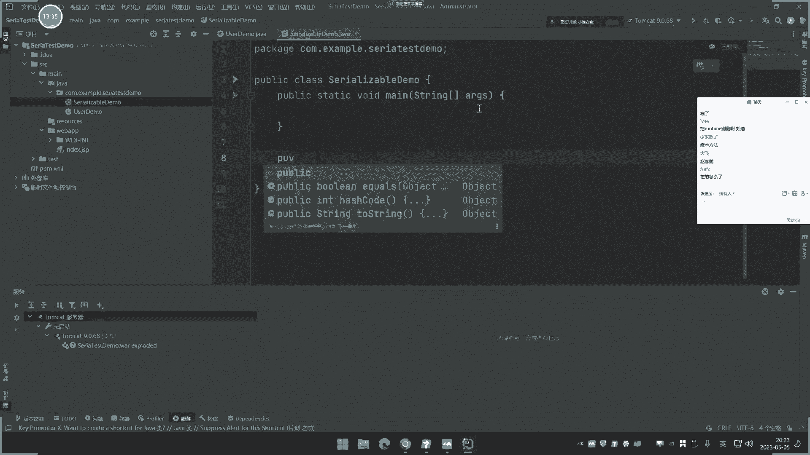

我们先写序列化操作，序列化操作了就是让用到这个object，就是我们说的大概有几种方式呢，我们用到的是这种呢，第一种啊，内置的这种方式来进行虚拟化操作，它可以用以下这几种啊。

这里只写了常规的一些场景使用，还有很多啊，就是说不是仅这这几个啊，还有就看你自己啊，内置的就是这两个啊，一个是这个XML的一个抵扣的那个序列化，还是个web，我们杰西。

然后呢一个是写入一个叫reader，写入的话，那就是序列化，为什么叫序列化呢，因为他是要把这个对象呢把它压缩成资金流，它一般都是写入操作，而读入操作就是把资金流堵路，然后再转换。

所以这个white or object，这个这个呢就是一般是序列化的操作啊，然后如果写啊来给大家看一下啊，自己呢先声明一个这个这个对象啊。

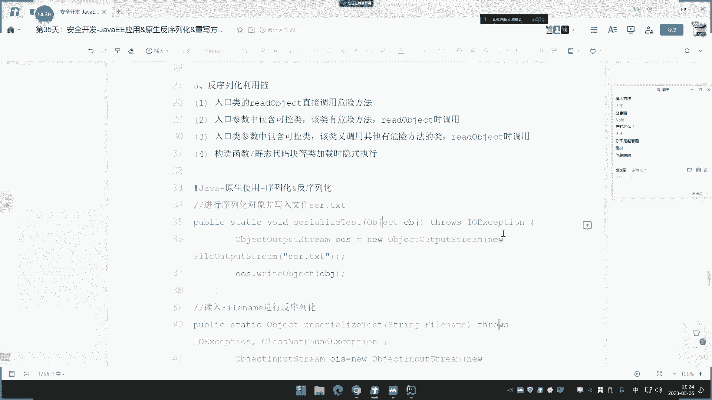

把声明一下啊，来我们先声明一下，嗯然后是这个名字，那我们就取名叫，叫这个test嗯，test啊对吧，然后嘞取名一下啊，怎么写啊，首先呢这个是object啊，然后呢他是这个写入解入啊。

然后创建一个这个对象啊，名字就叫OOS叫OOS，它的一个传前面的是写的啊，这个名字可以自己写的啊，呢前面一个大写字母OS啊，这有形的我们就叫output吧，就output也行啊，OS也行，好等于什么呢。

就等于这个对象呢，然后呢这个是点啊，这个对象啊，接下来呢就是怎么办啊，我们把这个代码把它写完之后呢，再给他说啊，再给他说new一个对象，这个啊这个是啥呢，叫fire output sman。

这个是他这里呢有一个叫file open，我们把它解释一下啊，啊有些人不理解啊，这个呢是，输出文件啊，输出文件的一个东西，我们来输出文件，在这里呢可以自己呢写个名字好，可以写一下啊，名字就叫S1啊。

点TST把写上去，然后这里面有个这个报错，报错呢能托夫呢给它自动补齐是吧，还有报错再来看一下是哪里报错好，这里又有报错，他说插入new这个object什么东西啊，是吧啊，插入个丢，哎你开上去了之后呢。

这里呢又会报错，添加异常再添加，哎这里不包了好不包了之后哎，我们进来啊，然后把这个OSS呢点什么呢，大家你看这个点之后呢，嗯那这里是不是有个叫欧包这个东西啊，能有这个函数啦，写入文件写什么东西啊。

这里要有写入文件写什么东西呢，他这里呢就是我们先做个什么事情啊，我先把这个函数写好，我再调用它啊，你先看一下啊，他写什么东西，我给他传个参数，给他传个什么参数呢，传个对象，传个对象，参数传个什么对象啊。

叫O比基，让他写O比基进去好，然后这个OBJ从哪来啊，我们再来给看一下，我们在这里呢写一个东西叫什么UUSERDUMO，然后呢创建一个叫U等于u use dumm，就是呢我们自己呢写这个东西。

然后呢在里面写参数，啥意思呢，就是我们现在呢调用隔壁的这什么use dumo，然后在这里呢做个什么事情呢啊去写名字，那比如说我叫小迪SEC，再另外35gay是吧，然后呢第三个参数30比啊。

就这里呢我们去这样去写这个是啥意思呢，啊就是相当于我这里呢给它赋值一样，那我这里呢有这里只有两个值啊，我给他三个值吧，这边搞个英特尔的类型的那个A几把写进去吧，也是吧，免得等一下呢这个东西呀没有。

是不是它是刚才是两个嘛，给他搞了搞几个，那这里就对了是吧，31哎，加了一水，把选去之后呢，这不是有个对象的吗，这是创建这个什么，这个值就是啊创建一个这个对象是吧。

然后呢引用这个隔壁的是什么new demo呀对吧，脑子里面写词，然后呢你可以自己呢先给他看一下啊，cc u t e把它打印下，这个U你看一下是什么鬼情况，我们先打印下，给他看一下啊，他先先创建一个对象。

创建个user dom对象，然后打印嗯，这里有个11行，有个报错呀，我这里多了一个什么斜杠，妈的啥情况打印，你看他就输出来了，UZ小DC啊，什么小DJ啊，这个东西呢这啥情况呐，这里是输出这个两个值啊。

你看啊我们这里呢确保一下啊，把它输出的时候加个东西，对不对，加个东西，确保是这里在输出，那比如说我就在这里加一下USDMO，再输出，告诉他是吧，确保我们是在执行这里哈，把这个搞清楚对这是A级。

然后呢我们再来运行一下，你看一下啊，现在，是吧，来use dma里面的这个小di c use dma里面的gay，Use dm31，就是我刚才呢在这里呢创建个东西是吧。

创建了use dm就执行这个地方嘛，对不对，把这三个参数传进去，然后这里的输出三个参数就是执行这里嘛，对不对，所以呢这里就有个对象U了嘛是吧，U了有U了，是不是，然后这个时候呢我们怎么办啊，你看一下啊。

我在引用这个函数，那引用这个函数干嘛呢，把U加进去，啥意思啊，U不是个对象吗，这是个对象嘛，创建对象，那把U加就是open ject的对象，对应上呢让它呢去怎么样把它传进去，把它进行object。

把写入写入之前是怎么办呢，其实之前啊这个OS呢它在写入的时候呢，会把它生成到SERTIT里面去好，那么现在呢这里有个报错容错，我们看一下是什么情况，他说把它设置为静态好，设置一下好，这里自动变静态了。

在进来之后呢，这里又有个报错报错，什么情况，添加异常好，添加异常好，先驱好，那现在我看我执行一下，是不是会产生一个SER点TIT文件好，我们看一下啊，这是啥意思呢，给大家解释一下啊。

这个就是创建一个对象，然后呢下一步呢就是什么调用这个方法呀，去运行啊，这样方法是吧，这个方法呢就是下面这个这个下面这个呢，可发底就会什么呢，就是二简单一句话指什么呢，将对象OBG啊。

序列化到文件SER给贴地名，这样就代码的意思就是啊，将对象OBG的这个序列化的数据呢，输出到文件SERDTIT里面去，然后这边呢是调用它吧，那用这个main函数主导函数。

这个主导函数呢就是说这个项目执行的时候，他会运优先运行变函数啊，它会自动运行，运行的时候调用这个函数函数方法啊，老数函数说习惯了啊，这个方法方法呢在下面哎是吧啊，方法里面的方法里面的一个参数。

OB1OBG呢，我们传入UU呢是我们刚才创建的嗯，对来说会对这个use dom呢，这个对象呢进行一个序列化操作，简单来说就是过程完成这个啊，来我们运行一下，看是不是会呃产生这个文件哈来运行。

那你看是不是产生了S12点TT这个文件啊，看到没，然后呢我们可以把SRTIT的打开，看一下是什么鬼情况，打开诶，变成这个东西，这啥东西啊，哎里面莫名其妙，可以看到有些java的一些什么代码来是吧。

有些java代码里面还可以看到一些，但是呢大部分都是啊出现了一些乱码呀，一些东西，那这个东西是啥呢，那现在就是说的是啊这个SETRT嗯，就是啊这个U，我把它写上面吧，执行完之后啊。

这个SER点TT呢就是这个对象U，序列化的数据，能理解了吧，那这个就是他序列化后的数据了，对不对，能理解了吧啊，他就把它序列化了，所以这个就是序列化了啊，好那么这个是序列化。

我们第一次来再完成一个反序化，看下反序化能不能还原出来啊，我们看一下这个反虚化能不能反映出来好，你看它序列化成这个SETIT了，那么现在呢我们再创建一个java类名字。

就叫UNSERILEZADL1normal，就是一个反过来的语文的是吧，这demo的一个文件创建好，创建好之后呢，也是一样道理啊，先这个mail一个主导函数，然后这个的主导函数干嘛的呢。

是不是按照刚才的思意思想，我们先这个DUMBLE一下呀对吧，先DUMA一下，然后呢我们再写一个函数，写个呢什么函数呢，就是我们说的刚才那个反过来的是吧，名字就叫test嘛，对不对，写个反过来的。

那这里呢就是要反过来了，反过来呢他的东西就不一样了，刚才是all over这个令alter stream就是输出，我们相当于要接收，就是换成了什么import，读入流，独流名字就叫oi is吧。

简称OS，刚是OS，那OS等于什么呢，然后等于这个六欧包这个东西是吧，然后呢里面呢再来写个例如什么呢，读入的是吧，读入的file input是吧，读入什么文件呢，这个先空着它好读入什么文件是吧。

创建好这个地方呢，读什么文件呢，我给他加个参数，读入一个叫string类型的文件，Phu，然后呢读入一个FLA，给他传个参数啊，带个参数，这样更加的这个规矩一点，然后把这个异常的给大搞上去啊。

嗯异常搞上去啊，这面还有个异常再搞上去，Ok，好没有异常了，然后呢再对这个OS呢点什么REVGA就完成了，好这样子呢就完了啊，那这个就调好了，然后呢现在呢我们来看一下啊。

那就用这个呢去给他怎么样进行一个U的操作，好的这个报错啊，他说插入return什么鬼东西，这啥情况啊啊应该是这里呢没有返回值啊，因为是要返回一下，返回，返回一个对象吧，应该是要你取不了，返回一个对象。

应该是这样子，返回个对象，返回一个对象哦，O呢，这里呢要加上，在这里写上一个这个这里这里应该也要加个，这里是写OVERJECT就可以了嗯，可看好可以了，把这个呃这个返回呢搞成个对象，把它返回一下啊。

应该可以了，看下这里，好这里呢就不要加U了啊，这里就不用加U了，这里我就直接把它去掉，因为这个不用对象了啊，这个是不用对象了，刚才是封装，我们这里呢直接给U给写个什么。

就写个名字叫什么SER点TT完了是不是，看这个还报什么意思啊，我看一下啊，完了还有什么好可以了，两个异常都解决了啊，一个是解决这里的这个静态的，一个呢是这里的这个东西，那这个呢就是把SERTRT呢啊。

把他这个什么传入到这里来，对不对啊，这是传入这个东西啊，嗯就直接调用下面的那个什么方法啊，这个方法那传入这个SEDITE了啊，就是这个进行什么反序化啊，解析还原虚化，对不对。

然后这个呢就是我们说的要什么，就是很简单，它的意思呢就非常简单了啊，就是读入，这个文件读入这个file name啊，读入final name呢，进行这个反序列化，当然啊对不对啊，他也读出这个FLAM。

那FM呢我该全称的是SITIT，就刚才序列化的，你看啊，我把SITI呢再把它用这个来执行，你看他能不能还原出来啊，现在执行它看着啊，执行它看结果，你看没有啥情况，怎么没有啊，因为啥情况，你们要输出啊。

你不输出就有了呀，对不对，把输出一下就有了呀，这个你能解吧，因为我这没有没有把输出啊，所以这里呢啊搞个输出嗯，以及额等于结束它的值吧，然后我们输出一下，看一下执行一下OUTSI。

你看是不是就有了这个就等于一个什么user name呢，小点S1C给31，是不是好，大家看着啊，一边是虚的话，一边是反虚化，你看着啊，我们现在就是先把这个值一改，你看啊，我先把虚的话，我先给他复制。

为什么这个先把这边把这个地方把它注释掉，好我先给他复制一个叫小DSEC，然后呢给E啊，然后呢30岁搞个这个东西啊，我先把它呢给它序列化一下，让它重新生成这个SERTTT，我先来到这个项目这里啊。

我先把那个S1给他删掉，就这里嘛哈那这是那个刚才的文件是吧，我删掉啊，然后重新生成，那现在没有了，对不对，然后重新生成一个啊，然生成了一个你看文件有了，那这个文件有了啊。

那这个呢就是刚才重新复制的小ASA，然后你看这边啊，这边呢没有做任何事情，就把全入进去，看能不能还原出来，看一下啊，执行，把它还原出来，是这个结果，这个啥啥情况呢，就是因为啊就是他序列化是序列化。

这个TOSTRING啊，我再用这个重新来一下啊，把把猪死了，那你看这是刚才那个虚拟化的结果，然后呢我们这边的再把它还原，那这是不是出来了，小DC呢，G134是吧，出来了啊，嘶好这个呢就是一个正和反好。

那么现在呢我们就来观察一下，这是一个第一步操作，就是使用原声，原声使用呢进行这个序列化和反序化的操作。

大家应该看懂了，其实呢就是把数据呢把它封装成了一个文件。

然后呢文件这边呢就再把它还原返回回来。

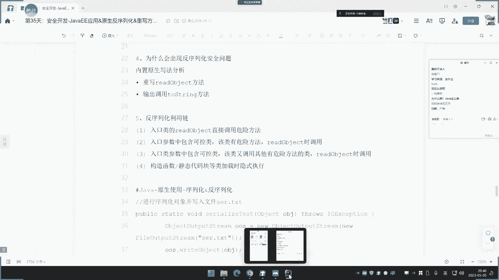

也没有什么其他的一些乱七八糟的一些操作。

是不是啊，没有啊，就基本呢就是按照这个逻辑来就足够了是吧。

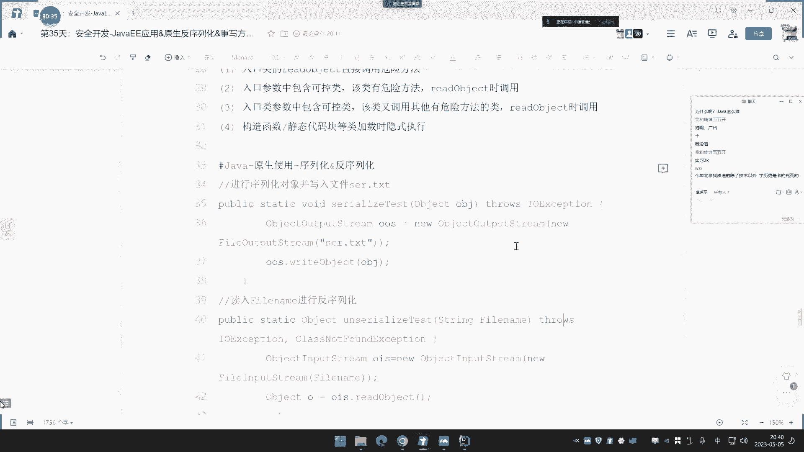

就是一个是把它封装成了这个文件是吧，看到这个文件，那么就是说这里呢这个是SETIT呢，就是数据的一个结果，然后这边反循环了，再把它还原出来，就这么一个正反的一个操作好，那么这个安全问题是怎么造成的呢。

好我们来先看第一种啊，它的安全问题呢有四个方向去分析哪四个啊。

第一种说入口类的read object直接调用危险方法，这个呢是最常见啊，不这个呢是最好理解的一点。

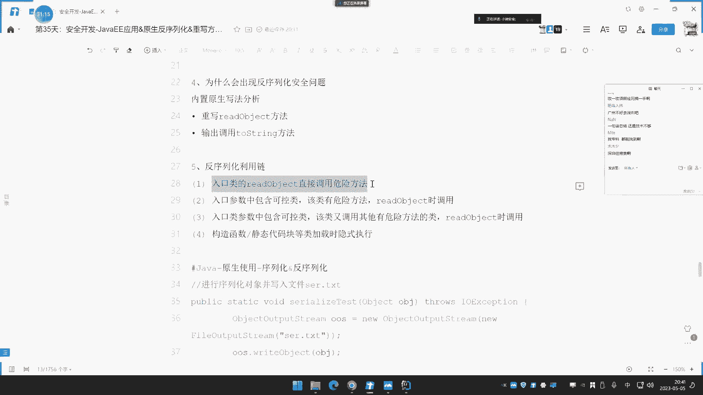

但是这个呢实际中的很少有是一个什么意思啊，大家看一下啊，它这个OBERJT呢是在反序化的函数里面，就是在读入文件的时候是吧，就是说呢你不是你创建一个对象吗，啊，这个对象呢去读入这个传入的这个SERT。

I t，然后呢，他会用这个对象呢在里面去运行这个reader，objecting是吧，运行这个东西，那么这个read objecting呢是在哪里呢啊，你们可以点击确定一下啦。

这个函数呢它是在objecting input extream点java文件，这个文件它在哪里呢，大家可以看一下，它是在JDK的SR这个JA包里面就是自带的，它是在这里面的一个方法，对不对，然后呢。

也就是说你现在的引用的就是一个自带的，一个是我们这个JDK自带的，就是在我们说的啊，就我们这个家包里面的是吧，在这里面的一个东西是吧，这个SRC的这个里面东西啊，然后呢他在这里面对不对。

是这里面那个object import stream，这地方好。

我们来先记录一下啊，这里一定要搞明白啊，这个java反序的话，很多人学了往上加呢，都很多人都学不明白，一点小课程学好之后呢，就说哎呀讲的太透彻了呀，真好啊，很多人都学不明白。

我们看一下啊，现在记录一下啊，那这个第一个啊就是现在的序列化的啊。

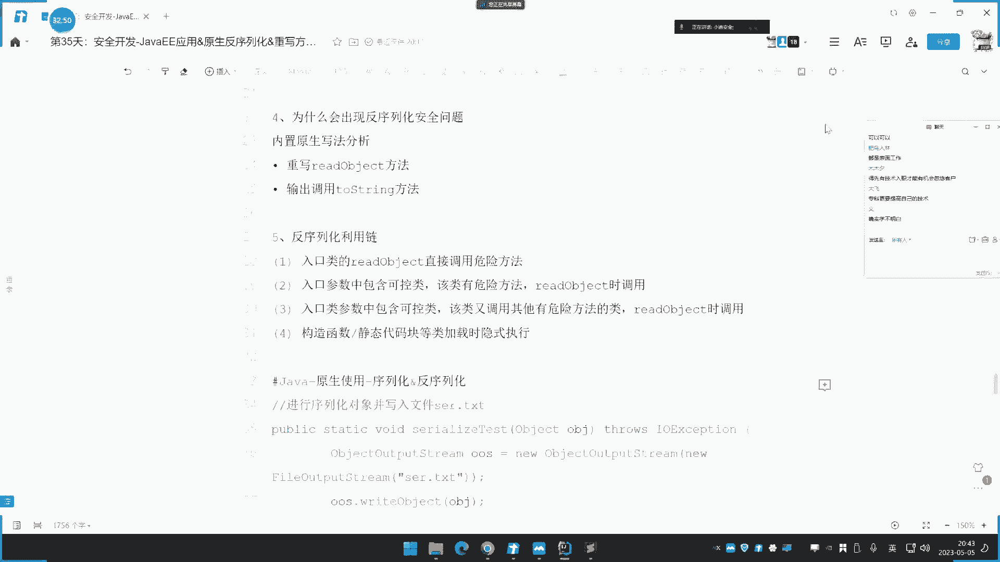

我看一下这里啊，他的安全问题是怎么造成的啊，我们从这个待会分析来，就这个地方，嗯这什么鬼啊，先把去掉，那这里啊在这里啊，来这是他这个反序化的操作的时候啊，这个代码在这里面看着啊，把他保保把拉出来。

做个记录啊，然后这个REDEMON呢它是，他是在这个JDK1。8里面的一个包，里面的是吧，然后呢自带的是在这个方法里面，在这个文件里面啊，哎大家可以看一下呢，在再来我勾选这个路径呢，大家也可以看到啊。

那他是在这个路径啊，能看到没，那在这里面啊，好我们这里呢是在这里面，我们就写一下啊，好那么现在看一下啊，第一种反而序列化造成漏洞的原因最简单的，但是是最不常见的一种什么情况啊，大家看一下啊。

比如说他刚才不是对这个user demo，这里面的这个类进行了这个虚拟化操作吗，如果他在序列化操作的时候，你在这个里面有这么一个东西，好，我们写一个啊，看着啊，搞个私有的。

因为他这个属性要和那个对应上啊，搞私有的，看一下啊，我们在这里写个c or AC是吧，最简单的这是一个执行命令的，这是上节课我们讲过的啊，执行命令的一个这个东西啊，额那我写这个东西想要去嗯，对不对。

这个是啥情况呢是吧，我我这里呢把它写到这个地方来了啊，把写到这来了，写好之后啊，我们先用这个序号把它封装一下啊，来看一下，我们去重新把那个封装封装好之后啊，然后呢这个时候啊。

这个反序化这里呢再把它进运行，然后没有反应，啥情况，是因为呢他这个写的时候呢，要和这个他的一些东西呢保持一致啊，你稍微写错了一个地方，那就不行，哎哎这个是在，空格。

哎我直接把那个粘贴复制过来吧。

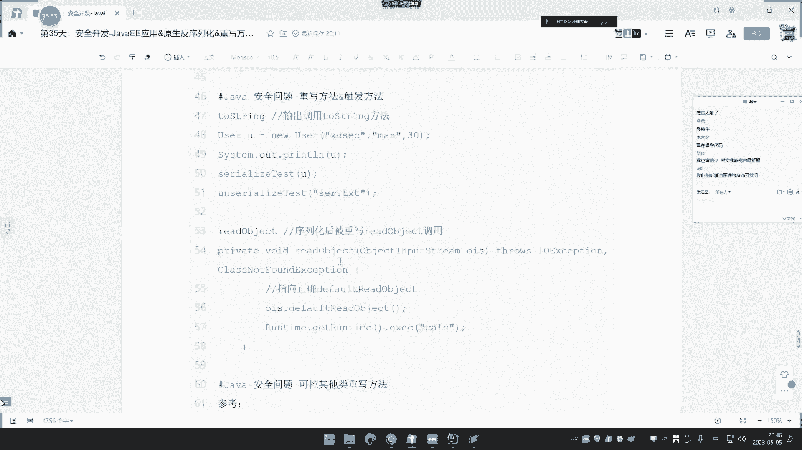

它要传入的东西，唉这里还搞个这个东西吧，这个东西马上要讲的啊。

把写进去啊。

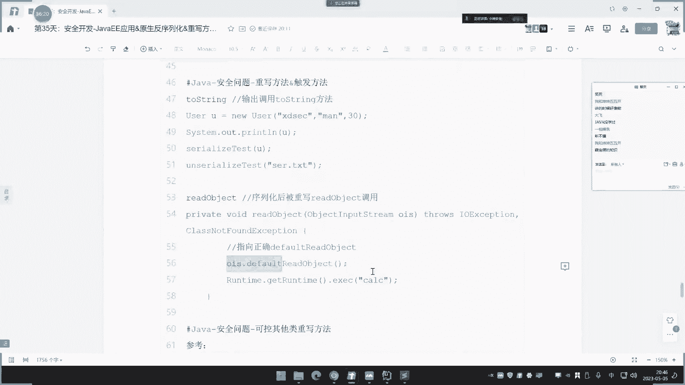

好那这里呢我们再写一个这个东西啊，这个叫OS这个东西在写不写都无所谓，其实，哎这个怎么有点不一样啊，等一下啊，我看一下啊，在哪里写的有点问题，I o u s e 7m long time，没有问题啊。

OB机电，诶这哪里写字写的有问题啊，重新来一下，先把那个去掉一下，把那个名字搞过来啊，就刚才他序列化的这个名字，Long time，点get long time，点1ABC，把粘贴复制过来吧。

来我们看看这边啊，好大家看一下啊，我这里呢先把这行注释掉啊，这行呢先不管它，先给大家解释一下意义啊，那么解说刚才在这边呢啊，我们把它序列化一下啊，这里哦这里是USDA，当你改一下。

好这里就是S12点TAT，好我们来这里呢来试验一下啊，执行先来进行一个这个虚化操作，啧嗯，改你妹的改的都死掉了，重新把删减一下，包名都搞错了，好了现在正常了，来我们这里呢执行啊，执行一下。

先把他这个地方呢，那他已经输出两个啊，你看现在啊，这是它把它进行了这个虚化，然后呢你再看这边啊，这边呢我在下面写了个re reader object是吧，然后这边反虚化的时候啊，大家看一下啊。

我们把它反虚化时候反虚化，他会对这个SERTIT呢做文章，然后呢我们再运行诶，这里突然计算器弹出来了，这是什么原因啊，其实非常好理解，我给大家端个点，大家就知道了，这是为什么造成的。

就是因为呢他在序列化的时候，不是序列化这个什么user demo吗，而user dmo里面是不是有个叫read objection，重写的这个方法，也是说是重写方法，而且你发现值呢是等于NG了。

啥意思啊，来我们来关注几个问题啊，升级一个在刚才那个是这里啊，然后那个反序化操作之后呢，反虚化里面有一个什么有这个东西，而是反虚化代码呃，他刚才那就是在这个什么简单易花，那就是重写的这个方法。

这方法里面呢去执行了这个计算器导致的，能你能不能理解这个啊，就是在序列化的时候呢，你序列化这个USDM，而USDM里面有一个叫real objection，然后呢你在反虚化的时候呢，你调用这个什么对象。

运行这个objection的时候读入的这个文件，这个文件是哪里来的，这个FLAM是不是这个SER点TXT里面来的，然后呢你在读它的时候，这个ITIN，就是从user demo里面给它序列化出来的。

所以user s e RT里面呢就有这个自带的，是什么read objection啊，啊这个read object，然后呢所以他就执行这个地方，所以啊这个造成它的原因就是什么。

原来就相当于这里呢执行的这个什么，序列化里面的，里面的这个方法，而不是是吧本身的，这个方法能不能理解它造成这个原因，就是这个意思啊，这是最最直接的他的一个安全隐患，但这个呢在实战中呢它是没有的。

因为很少人在职业搞这种事情，对不对，这是我们说解释下它的原理是吧，这个是这个他的一个解释，我们可以有端个点给大家看一下啊，是不是这个情况，大家看着啊，我在这里呢端个点大家就知道了啊。

你看啊我在这个object里面端个点，然后呢我运行它的时候调试一下，大家看着R呢点击调试，哎，看着啊，你看现在R的FLAM传入的值是不是SER点，Ttt，看着R呢，它的值是不是等于SR点TT，对的啊。

没问题好，我们往下进行呢，不如好，你看布的时候就弹出了这个计算器，好我们再步入下一步，那，那完了好这个呢好像大家没看到啥啥情况是吧，好现在呢我把这个代码把它开起来啊，先点这个代码给他看一下。

好我们家在这里在这里装个点啊，大家在端点重新来看一下啊，看他的流程啊，呃直接执行这里啊，端这里啊，端这里看端这里看好一点啊，哎搞错了点运行去了啊，好看一下啊，断点啊，重新来调试调试啊，好现在看这里啊。

那现在我全参啊，点击下一步了，不如好，你看PHILLIM等于SERTIT，看来我怎么执行啊，再不如好来到这个这个地方来了啊，你看再往下面进行好，这里呢由于他自己自己挑的啊，他现在执行这个函数的时候。

执行这个ober input string，然后来到这个自己对象里面，这个什么自带对象里面这个地方了，我们就把它补除啊，因为这个都不需要看的啊，不除好好往它再往下进行，好，来到这里了啊，大家看这里啊。

这个比较关键的啊，你看现在再往下进行，哎大家发现没，他来到哪里啊，来到user demo里面的什么这个地方来了，看来到这来了什么情况，刚才这个object这个东西。

按理来说的话是应该这个reader他应该是在哪里啊，应该是在这里啊，你看程序都是在这里的，我写这个代码呢，我把它CTRL单击进去，它应该是来到这个object input stream里面。

这个reader objection这个方法，但是当在调试的时候，他跑到哪去啊，他跑到这个user domo这个文件去，是因为这里重写的方法，导致它运行的是这里的方法，而不是这里的方法。

其实就是在我们序列化的时候，就已经把这个方法写到这个SER。

TIT里面去，然后TIT呢，大家可以呢去用这个010GIT呢去分析。

用这个工具啊。

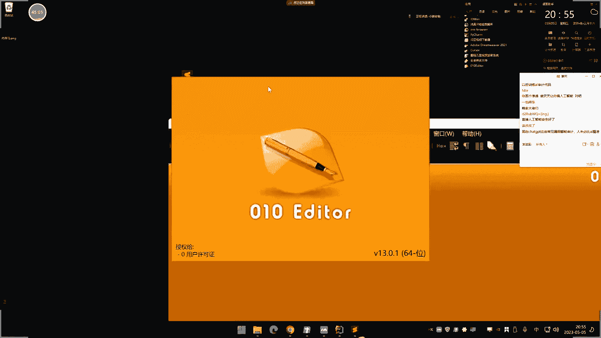

ETT去分析会好一点啊，我给大家分析一下啊，嘶啊拖进去。

你看这里呢，就是它把它进行序列化的一个数据的一个情况，你这是那个序列化的数据，对不对，然后呢里面有些知识啊，这个分析那个TIT好看一些啊，但是这个也无所谓啊，你用的其他分析也是OK的啊。

能不能理解这个这个好理解了啊，我一个这个呃多少个点呢，大家都知道了，你看，然后你看啊，我们这里端下来之后呢，继续呢往下，然后他就执行这个long time呢，然后把计算机弹出来是吧，好老的，你看啊。

下一步下一步好，江西马上要出来了，好就完了嘛是吧，他这个过程呢就结束了啊，其实这个一断链条呢，大家就应该明白这个原理了啊，好那既然明白这个原理之后，这个反序的话难道就这么简单吗，那当然不是，你首先想到。

如果对方这里没有这个东西呢。

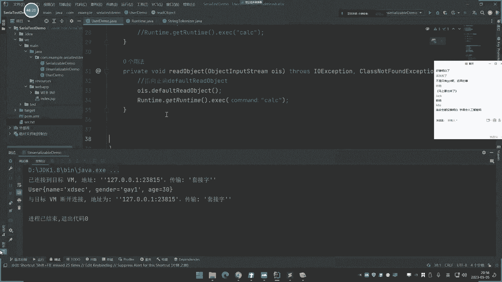

是不是，那没有这个东西，还有哪些反虚化的触发操作呢，我们这里讲的就是它的触发操作试点，我们今天只讲两点，讲两点啊，讲三点吧，还有个像这个就是比较关键的这个被讲讲，这个呢叫什么勾造函数。

析构函数啥意思啊，大家看着啊，还有个就是这个指向是啥意思啊，这个指向是啥意思啊，就是说我加上去之后，我们把运下啊，你看下啊，这东西要数一下的啊，来我先把反虚化大家看一下啊，就我加上去之后。

你看我运行它之后呢，它会弹出向七，然后呢值呢并且呢小于SEC呢，get到一呢写进去了是吧，这里有值是这里面写了个os default region，啥意思啊，就是说让它指向。

这是让它指向正确的这个读取这个地方，然后呢我再让他执行命令，知道吧，就是说已经来到这个object里呢，我为了保证它数据能够正确的解析，所以我先让他返回正确的，然后再执行命令，你可能说这不是多此一举嘛。

是这样的啊，就说如果说你把这个代码把它去掉之后，你再去运行这个反序列化的时候啊，对这个数据的进行反序列化时候呢，他虽然也弹出计算器，但是数据你看全部为空，为什么。

因为他引用的就是这OBOJECTION引用这个函数，而这个函数你怎么去把这个数据把它反过来呀，因为你不是那个原生态，那个哦，不a reader objection，所以呢我就说让他调用这里的时候呢。

我先不让它重新，怎么样把指向正确的地方，就让他搞到一个默认的这个地方去啊，这个地方呢你点进去是吧，你看他就是来到这个object里面，它就会自动根据这个需求呢，来到那个正确的这个V这句话的解释。

让它指向正确的什么，To do，这句话的意思就是他是吧，对不对，好理解吧，所以他也能既能正确的这个把反序列化数据呢，把它还原出来，又能呢保证命令执行啊，这句话意思是这个啊这个不是很重要啊。

给他说一下好，那么现在呢我们再来说，除了这个直接调用的危险方法还有哪些呢。

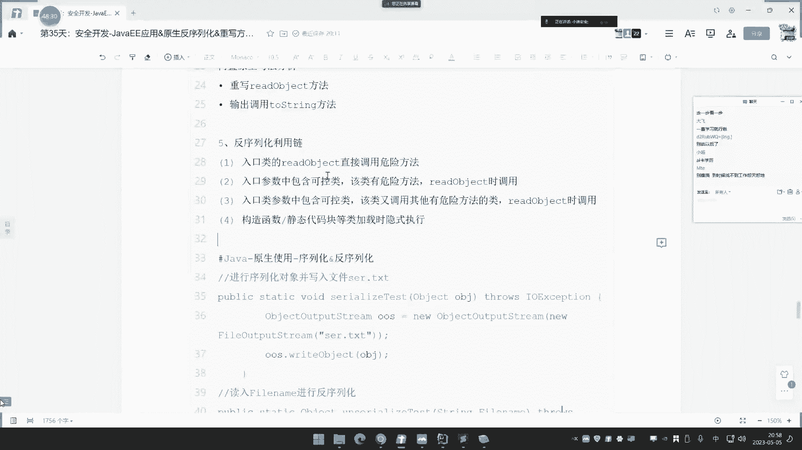

现在来看啊，还有一种方式，什么方式啊，大家看着啊，还有一个就是初始君，这个有点类似于pp里面那个什么鬼，析构函数那些东西了啊，在java里面呢我们就称之为方法，这个又是啥意思呢，大家看着啊。

额这里不是输出输出这个值吗，对不对，输出这个值啊，你看着啊，我先输出它，我把这里写上这个东西，把加上一个什么应用局部变量，这里再来看一下还有没有报错啊，嗯没有报错，好诶，诶这里还是有报错。

报错在哪里报错，诶报错都不给我显示了，没有报错了呀，哎这个颜色都变了，啧什么鬼东西啊，把它写到前面去吧，写前面去好吧，我写在里面啊，写个try嗯，写个try的一个容错的一个语句，好像没报错了啊。

这个容错的语句啊，这是try啊，执行一个计算器这个TRUSTRING里面的啊，然后你看你看这个是TOSTRING，然后这边呢我不做任何事情操作啊，我我先把这个地方呢给大家怎么样把它注释掉。

避免那等下说是他起的原因是吧，然后我我把这个read option里面注释掉是吧，然后呢我现在把这个也注释掉，先不让都不起原因，我先看一下，我自行，那现在肯定不会包计算器，只会进行一个正确的反虚化操作。

你看正确的反虚化作计算机也不谈了，好，那么现在呢你看我把这个代码给它取出来，然后我看一下，现在啊我们在运行，再进行反序化操作，哎计算器弹了，这又是什么情况，我刚才搞的这个reader object。

你弹了，我把猪死掉了，你不弹了呀，我换到这个trust string里面，你咋又弹了呀，啥情况，ch死君是个啥东西啊，进行一个是string方法的一个改变，那他是个什么情况造成的呢。

他是因为你在做这个反虚化的时候啊，如果这里啊对这个对象进行的这个，输出就会默认调用原始的这个什么，去这个对象里面的TOSTRING，方法那你看着啊，我把这行给它去掉，看着啊，我把这行去掉，我再运行。

你看他弹不弹，我去掉它弹个毛啊，没有弹吧，那我先把它关掉，免得你说你没有弹的，我玩这个呢，关呐弹不弹不弹，看着啊，他一出来，谈了为什么呀，就是你在序列化之后，这个对象如果有进行输出，为什么输出什么呢。

输出就是相当于把它当做字符串输出啊，你显示入串呢就会默认触发这个TOSTRING。

所以这就是我们说的反循环利用连的，第四种就是类似的这些他的一些析构函数方法，在用到一些东西的时候，默认触发，有点类似于P1P的反虚化的一些那种操作，pp里面是也有啊，就是什么对象被创建，对象被销毁。

对象被什么鬼转换，就会触发一些类似的一些魔术方法。

那这个java里面也有这种东西，但是它不像PPT那么多。

这是他的用，第二好，我讲到这里呢。

我不妨让大家思考一个问题，什么问题呢，我讲这个是为了干嘛，其实呢就是为了面试，为了后期你在对这种java的反序化呢，知道他的一个流向，就是我们说的java安全里面的什么cc0分析。

这是属于java里面的高端部分，这个课呢说实话网上呢是吧，也没有多少人讲，有人讲，但讲的也不是很多，他也是在java里面面试java安全的时候，温度最多的问题也是，不管是CTF还是这个瓦工里面。

那个高机器人非常困难的一个地方啊，因为大家也看到了，如果我们现在呢没有去讲这个java开发的话，那这个java反序的话，那我无非就是告诉你是个什么东西啊，你这个利用呢那就不用说了。

那个利用的也是网上分析出来的一些PC啊，什么那东西，那现在不一样了，但你学了之后呢，你就知道他是一个什么情况了对吧，所以说呀这个大家就知道了啊。

那这两种啊已经讲了两种，一种呢就是我们说的重写方法是吧，就说我直接呢重写了啊。

就是把那个在序列化的时候呢，啊过程呢就是刚才也说了嘛，就在序列化的时候啊，他不是要把它进行一个对这个对象呢，进行一个呃进行一个复制给读一下嘛，然后进行这个调用这个方法来去序列化嘛，哈对吧。

小正方把它进行进行这个序列化，而进行的时候呢，由于这个user dom对象的本身，文件里面的自带有这个什么read object，所以呢在它里面呢就有这个东西，那么你在反序列化的时候呢。

刚好反序化里面用到的这个什么这个方法呢，刚好又有个叫return object，所以呢他就相当会触发这里面的return，然后触发好，这是第一种啊，第二种呢就是我们说的啊。

这里有个叫truth string，一个类值的啊，它的一个构造方法，然后呢在这里呢诶有它这个例子的诶，你不小心呢啊在序列化的时候啊，哎你这个反虚化时候呢，你做了一个输出是吧。

把这个结果呢把它进行一个输出，就是这个序列化的一个这个对象，把进行输出，那就会默认触发里面的这个TOSTRING，所以TOSTRING里面的代码就会被执行，那么这里的wrong time呢就会被执行。

所以说这就告诉我们两点，这个反序化的利用和构造的话，不仅要看这个函数能不能啊，就是这方法能不能重写，还要看一些内置的这种初始菌啊，还有一些其他的是吧，是什么情况下面会自动触发它。

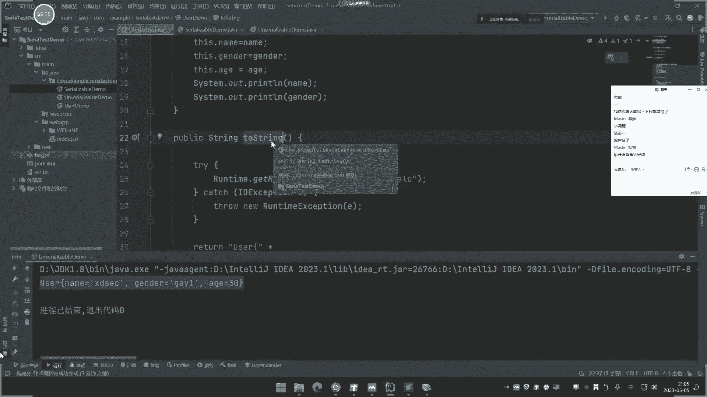

那么咱要看里面东西好，这是第二类，还有一类就是我们说的最关键的，也是最难的一类，今天呢我们就给大家分析一个这个案例啊，这节课说实话啊，这个知识点是非常难的，但是我们不得不讲他这是走向高端。

那个内容就是什么呢，就是我们说的啊，这个包含里面可控类的一些知识点，这又是啥意思啊。

那么我们来回想过来看一下啊，那么既然这里呢重写re build a re read object方法啊，即使计算器，那么我们思想一想啊，来，现在我换一个啊，那如果换一个name呢。

换一个类里面自带有这个read obli，有自带有领，会不会出发了，对不对，这样换一种啊，我们注意下啊，来我们在这里呢是用的是我讲完之后呢，我再给大家总结啊，我们先把这个实验实验了，换个类啥意思啊。

你刚才呢是对我们这个user，当某这个类呢做的这个封装和序列化操作，我现在换一个，我不用这个user demo了，好我们再创建一个啊，叫URDS，好这个呢还一个R继承一下，说实话我说实说实在话。

我不想讲这么东西啊，我真不想讲这些知识点呢，确实离我们这个现在上课内容呢已经过高了啊，这大家能听懂多少就听懂多少，这主要是为后面讲这个反虚化再做准备，我怕到时候我讲这个反虚化呢，没有这前期的开始呀。

你后面听都听不懂，或者说我伤都伤的很困难，所以我这是没逼，没办法逼着说要给大家先灌输这个思想，那后面再听的时候，那就不会说有很大的问题了啊，好啦这里呢就是什么意思呢，大家看一下啊。

就是这里呢我们就写两个东西，我把这个反虚化这两个操作呢都给他搂过来，大家看一下啊，都到这来，这是这个这个是序列化的，然后呢我把反虚化函数呢也漏过来，落在里面，又要点个S里面去，两个都写进去啊。

然后名字换一下，这个缓存叫UR点TXT好吧，DNSS点TT杠好，写进去好，写进去之后，这里呢去搞个什么事情啊，大家看着啊，我用一个叫哈希map，这是什么东西啊，这个是自带的一个类啊，自带的一个类。

这个类呢是专门做一些浏览器访问和DNS，S类解析的一些事情，他是主要做这些事情的啊，然后我们搞个什么事情呢，找个哈奇等于创建个这个对象的啊，导入类哎，等一下导入错了，这个还导入嘞，好这个小之后呢。

我们先给大家看一下啊，这个写好之后，这里有个new对象嘛，有哈奇是吧，然后你看啊我就随便搞个哈欠put啊，先我们来把原理啊，先把结果给他实现，实现之后呢，我们再分析原理啊，你看我写个什么东西啊。

加put，然后呢这个，U r l，再乘个U等于U，R等于U等于个值吧。

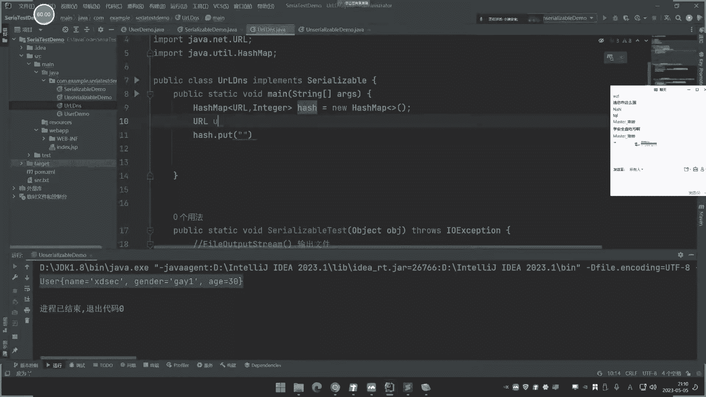

写个这个迪斯logo字啊。

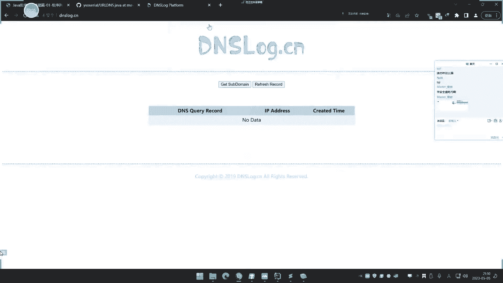

等会这个字，哦这里搞错了啊，不是不是不是不是这样写，我里面的还搞搞搞错了，Hot pot，Are you，Gary，哦应该是这样的吧，嗯这个UR这个路径不对啊，这个里面的不要搞错了。

这个呢是在我们之前的一些东西里面有好，可以了啊，然后呢现在呢我们这里创建一个流，然后呢呃我们先把它进行一个序列化来看看啊，我先序列化，我虚的话谁啊，我虚化这个哈奇啊，顺着哈奇，然后呢。

需要哈起好序列化哈奇之后把异常性添加，我们先看下是不会生成一个DNSS点TIT，其实他就是向量很简单，就这里呢有两个啊，一个是哈奇对象，一个是这个URL对象，然后呢就用这个哈奇点put呢。

来去这个UL对象里面的这个地方，然后一个一个值啊，我们先不管这个是干嘛的啊，好我们来把它序列化，序列化之后呢，它会生成一个角DNSS点TT的这个值，好我们先把运行下看一下啊。

先运行看他是不会生成一个这个DSTIT好，果然生成了，生成之后呢，你可以打开看一下，来这里呢我们可以用这个工具呢打开，给大家观察一下，呐这里是有哈奇map的，有这个java ur的。

那这里是有刚才这个值啊，你看刚写了个值在里面啊，序列化的数据他也把序列化了啊，那么现在再来观察一下，用这个UN，反循化来去引入，我们要对这个DNS点TIT，进行个反序化操作，天天记它好。

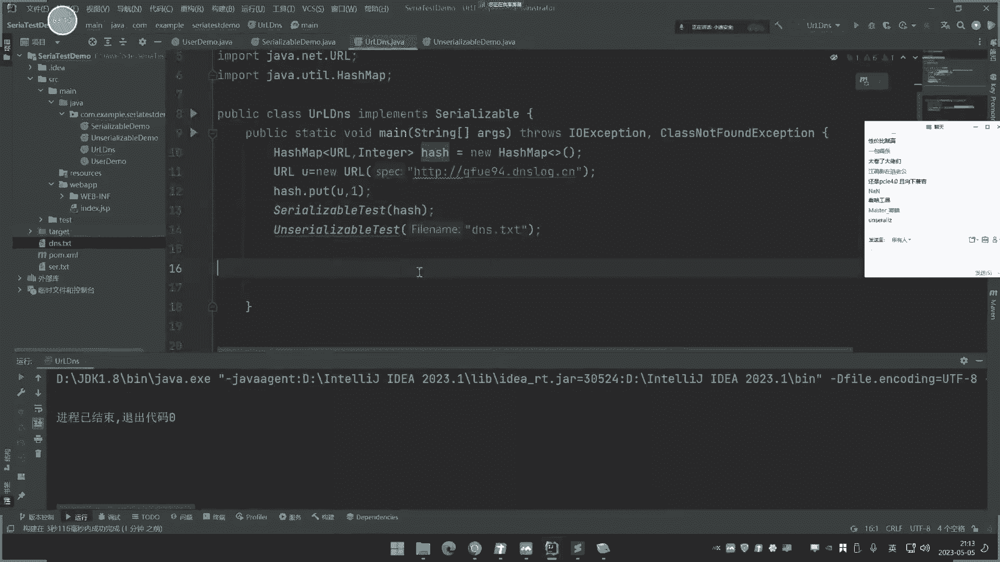

那么现在我们先来看一下这里啊，有没有数据。

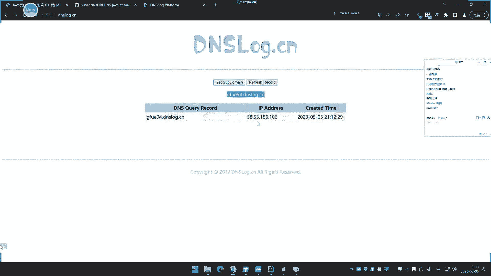

这是谁呀，不要这样搞啊，随便换一个地址，好来看着啊，两步啊，幸运起来，一圆形先反序化。

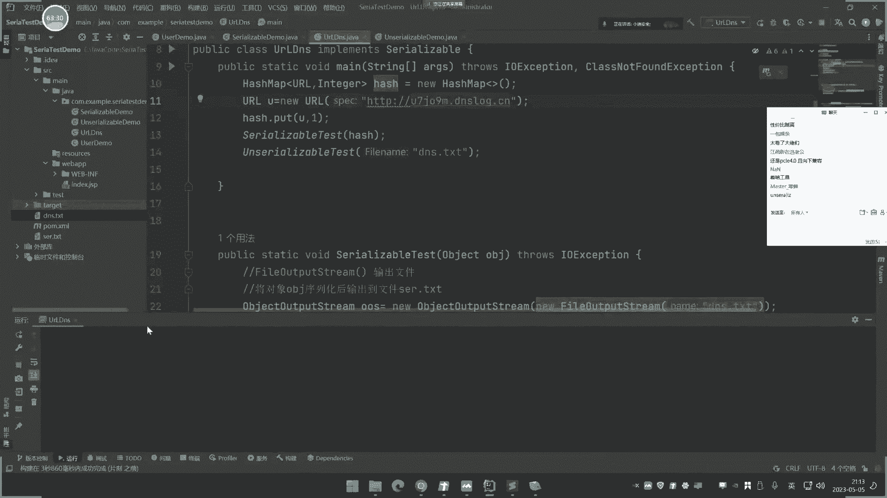

然后再那先序列化，再反序列化完之后再看结果，你看有结果了哈，这个我不知道是谁在访问啊，这个你看IP地址啊，如果是武汉的，就是我自己的啊，不是武汉，就不是看这个是哪里的，湖北武汉的，然后这个呢。

也是湖北武汉的好。

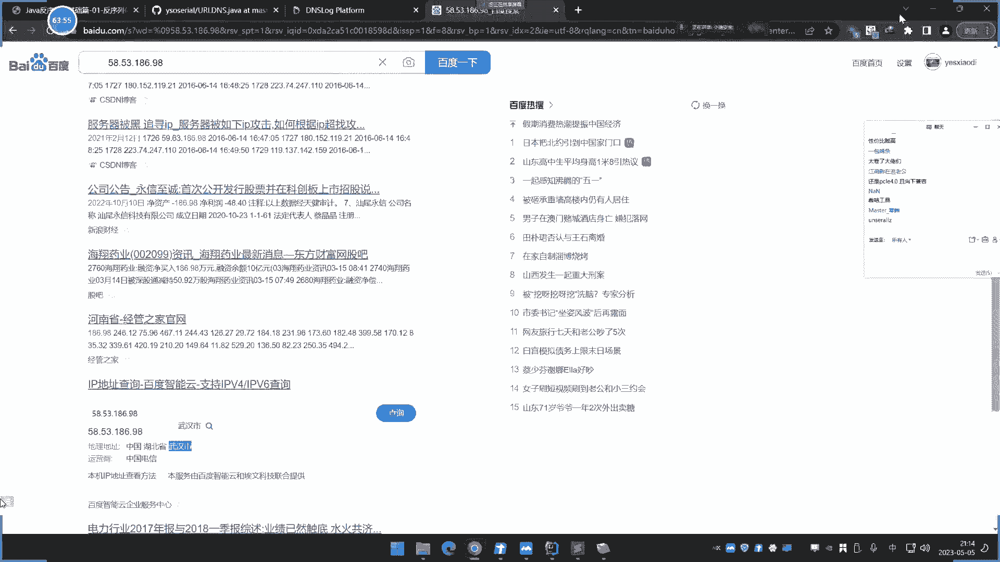

你看啊这个呢就啥情况造成的呢，我给大家说一下啊。

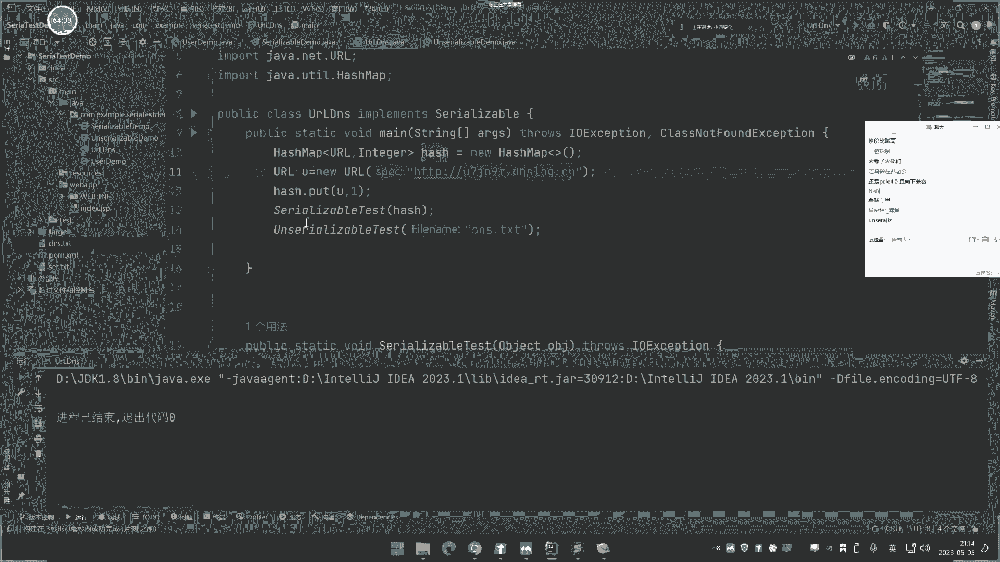

如果说你不写这个序的话，你不写这个序的话啊，他是不可能有这个事情的。

我们再分析个例子，大家不要去访问，不要捞眼子，知道吧，你看我这里呢这样不写反序化啊，我让FILIP的，他是接收不到数据的。

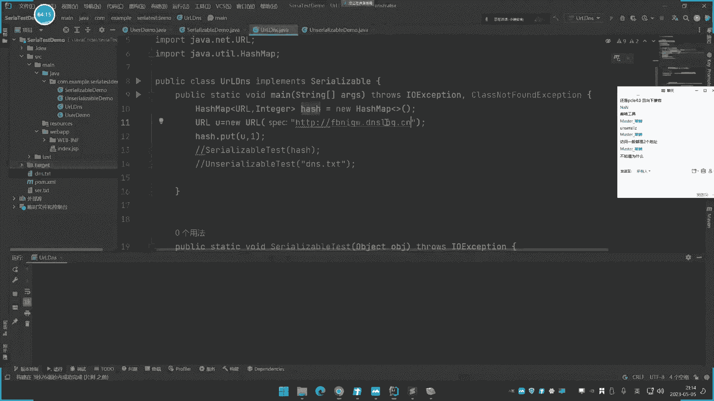

啧哎，我真没办法，你这个你要这样搞吗，我他妈刷新个地址，你访问一次，你发新地址，你访问一次是这个，我也不知道是我这个代码执行出来结果了，也不知道是你方的结果了，先判断自己本地地址，你搞错了啊。

这是DNS解析，不是不是说你本地地址能看到的，这是底应该是协议，知道吧，底应该协议啊，这底应该是减一，不是其他的，那这样现没有啊，再来看一下。

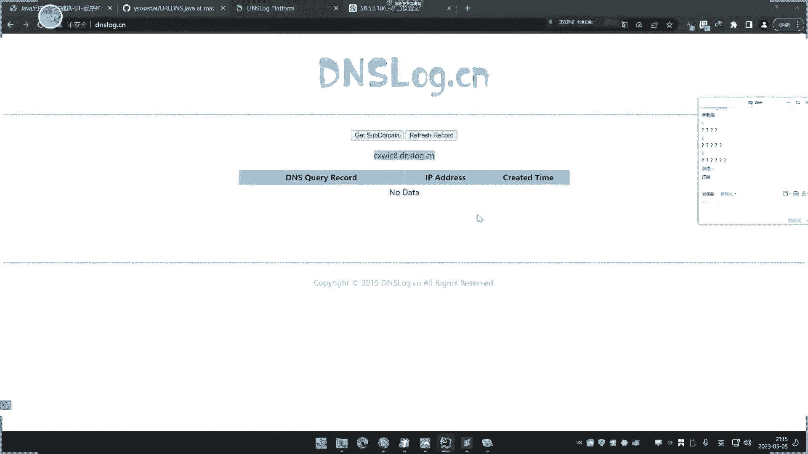

我先执行之前我先看一下啊，我再等一下，你好像没有R的。

没有执行，唉我是真没办法呀，哎呀真的是好玩啊，好好好玩啊。

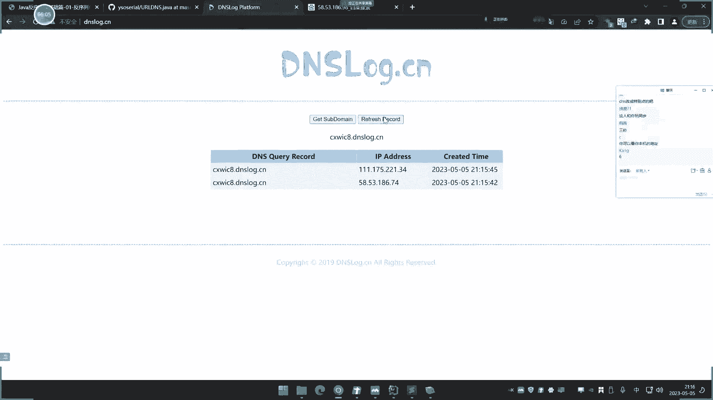

用本地地址很难去那个，用那个茶几还可以那个裁剪，他这个应该是协议啊，和那个传统访问那不一样啊，不是说你创建个网站，那个看那个接受访问请求，就是的那不一样的啊。

按DS协议解析不一样啊，我知道用那个bob shot里面那个东西可以啊，这个无所谓的啊。

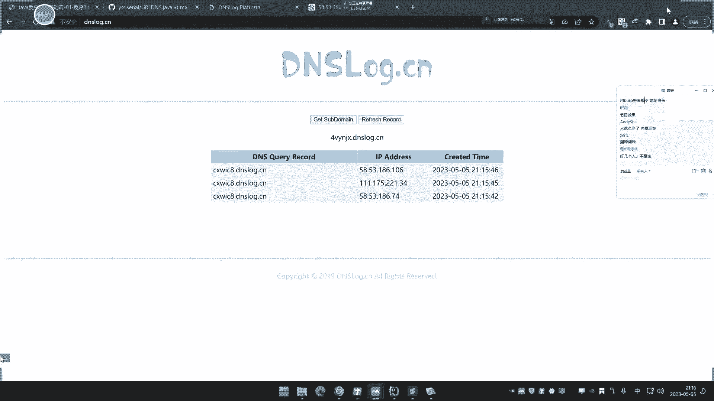

大家看效果行了，他不让我讲效果，那就不讲呗，反正吃亏的也不是我。

那我真没办法，他要这样搞嘛是吧，随他去啊，我不就不做这实验了，我就直接跟你说是为什么原因就可以了啊，也不管了，我们看一下啊，这个地方呢，额，按理说这里呢他是不可能出现这个。

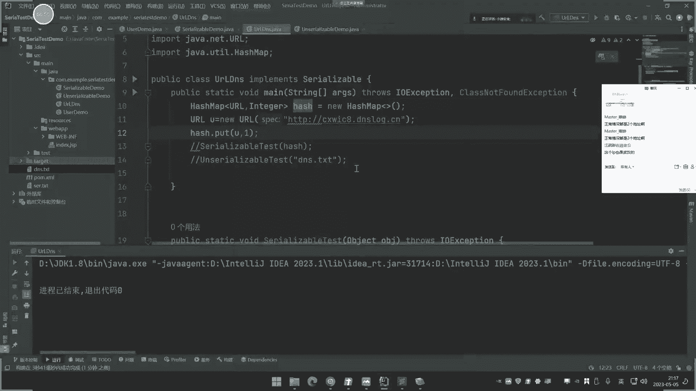

DNS请求的地址的啊，这里为什么出现这个情况呢，很简单道理。

但是有人在访问吧，是不是你正常访问，你这里不会有的啊。

那我看我执行完之后呢，这里呢它是不会有的啊，又有了，这就尴尬了啊，啊他要这样做呢。

我们没办法啊，他顶着这样搞那个啥办法呢，随他去啊，我不管他了，我越给他说，他就越得意，我就干脆不管他了，随他去，直接给他说原因啊，我看一下这个是什么原因呢，按照我们刚才的思路来讲。

那他重写这个read open的方法啊，他是执行计算器，就是其实就是说这里呢有一个叫HASHMAP，有哈希map，他在里面创建一个对象，那么我们呢对这里呢是进行了什么，看一下啊。

序列化的序列化的对象是这个什么哈奇，那么哈希呢是来源于什么，来源于这个自带的这个什么V哈，希map类里面就在这里面的，它是在这里面的，它是这个我们自带的类自带类，就是java这里可以自带的哎。

那个java环境里面自带的还有用在这里，对不对，然后这个自带类不是我们这个user demo，我们之前做的是user demo，是我们自己写的这个类，而现在呢就是说他是自带的类里面的是吧，自带类里面的。

而自带那里面呢，他去对它进行这个虚化操作好，后面呢再把它进行反序化是吧，那这里为什么会造成这个DNSS的一个解析呢。

啊我给他说一下原因啊，网上呢在我们虚化利用工具里面。

来这个YSOSER这个工具里面呢，啊他有个过程，那大家可以看一下过程啊，来HASHMAP点read object，然后再来到这个put VR，再hash hash code，啥意思呢。

就是说为什么造成就是这四个地方啊。

四个地方就首先呢你在反虚化时候呢，是会触发这个read objection呀，而WEGOJECTION呢在这个里面它也有，在这个里面它也有啥意思啊。

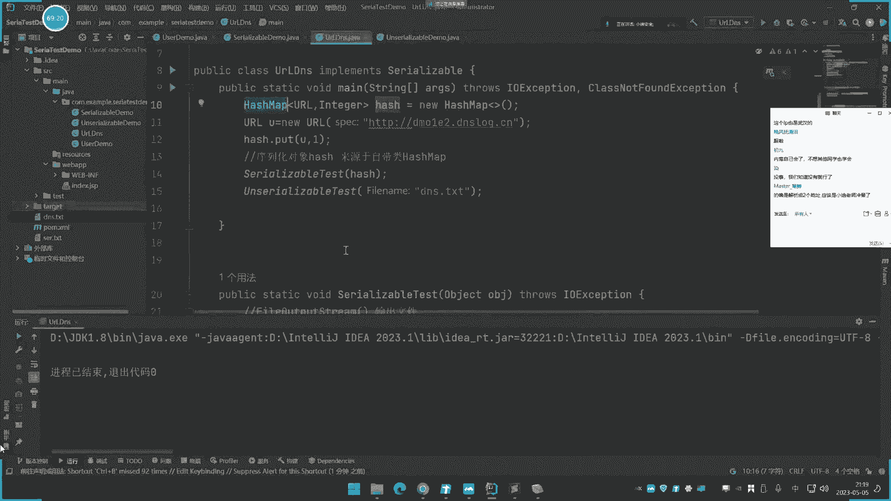

它的过程我发现晓得来这是链条啊。

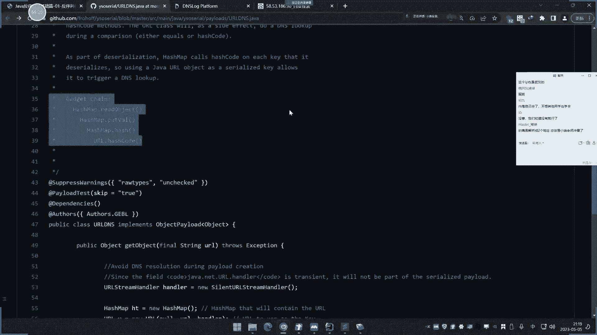

连，那这三连啊，啊这上捏这个捏是个什么情况呢。

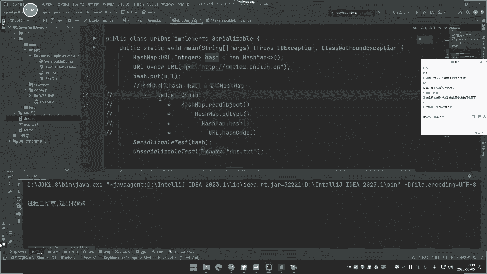

啊，这个工具是一款反应循环利用工具啊，这个用LDSS的，然后呢这个是就是用的这个哈七呢map，就是呢它这里有个实验结果啊，我们严格不看，那这创建呢这是和我们刚才差不多的，那这个it put呢。

然后呢他利用这个反射的去执行啊。

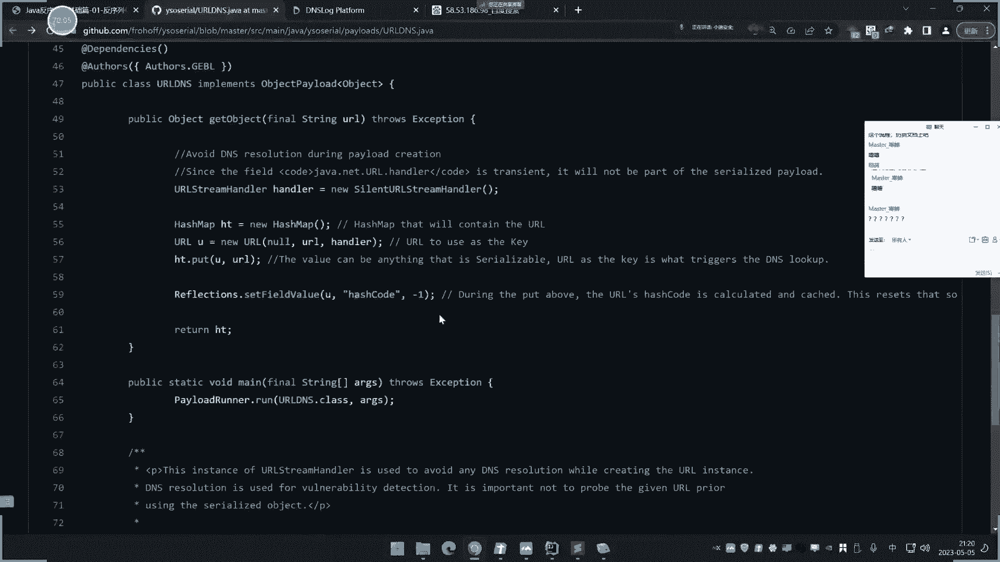

然后呢进行这个序列化操作时的执行它粘链条，这个链条呢我们先不管它，因为现在我们不是分析说哎，为什么是这么个情况，我们分析是说他为什么造成了反虚化这个漏洞，为什么它能解析DNSS，这是我们分析的。

至于说为什么代码这样写，我们先不管它，这是不是我们现在操心的就是个粘的构造，那不是我们现在能接触到的，我们先知道这个反循环当中的一个情况，和安全问题，他的一个那个利用价值，你看一下啊。

HASHMAP里面我们刚才呢是用的是user dumo，user dumo里面呢调用了这个韦德，那么然后呢我们在这里写了一个这个函数，然后呢应用这个函数的执行命令，那么同样道理。

现在呢就是它新建对象是HASHMAP，HASHMAP里面我们看一下啊，来点进去，在这里搜wait，Or project，你看是不是有这个东西啊，是有它呀，那么也就是说当你进行反虚化的时候。

就会执行这里的read objection，然后资金里面就会有一些类似的一些解析，其中就有我们刚才看到的他的一个解析流呢，put ja点进去，然后这里呢又有什么有一些哈气，有一些哈气，那他有这个东西。

它就哈气，对不对，还有一些东西啊，啊包括这里呢来点进去搜wave in party，然后这里有这个东西是吧，溶解之后呢，这里有put put8呢，这里哈奇呢点进去呢，这是哈奇哈奇名叫哈奇code呢。

再点进去就是他一步步的跟踪过程呢，就在这里了，到put VR，再到哈希哈希到hash code，然后最终呢它这个函数，最终结果hash code是干嘛的呢，就是一个DNSS的一个访问。

所以其实就是很简单，它这个链条是什么情况呢。

就是正常代码中啊，正常代码中呢啊去用到了这个哈希map，创建一个对象啊，我们把背景交代一下啊，把背景写大家就知道了啊，就是啊正常代码中啊，这个使用的这个什么创建这个对象啊，哈奇map。

然后呢这个时候怎么办呢，啊领导了这个，原生态的这个什么reader obo jection啊，方法去反虚化数据是吧，对不对，反虚化它，然后呢就是他肯定是有个写满，有个反虚化嘛，反向这个数据。

然后呢这个方法呢也是一样，导零呀，作为啊原生的是在在这个obo sexting setting in BO，刚才我们跟踪过啊，是在这里面啊，在这里面的啊，就本来在这里是吧，不要在这里。

然后呢由于啊这个哈希map里面呢它也有，所以他也有这个东西啊，也有这个什么，方法，对不对，也有这个方法，然后呢所以说呢就是我们说的第二三步了，那么反序化操作的时候啊，调用这个东西的方法时候呢。

这调用的是谁呀，调的是哈奇mono里面的什么，这个对不对，他调的是tag了，而这个里面呢它的链条就是执行流程啊，执行顺序，执行连。

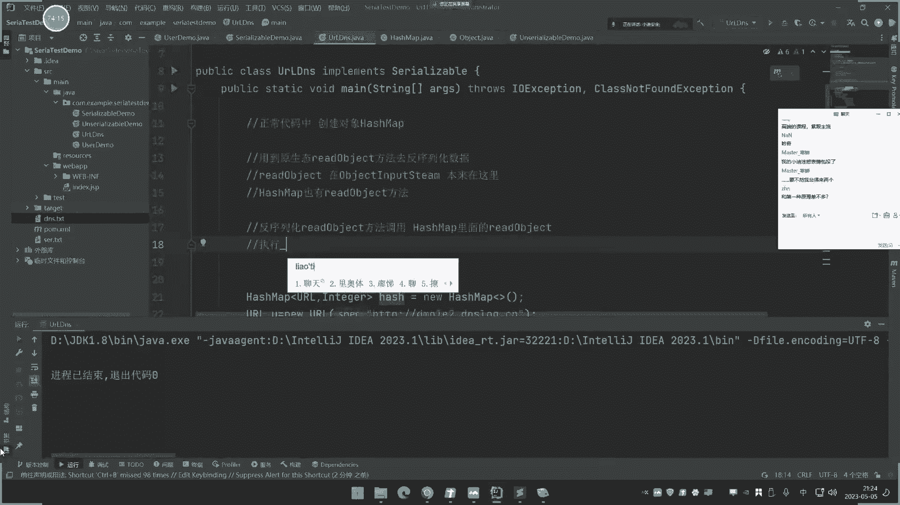

是一个什么过程呢，就是我们这里啊分析到的这里呢怎么分析。

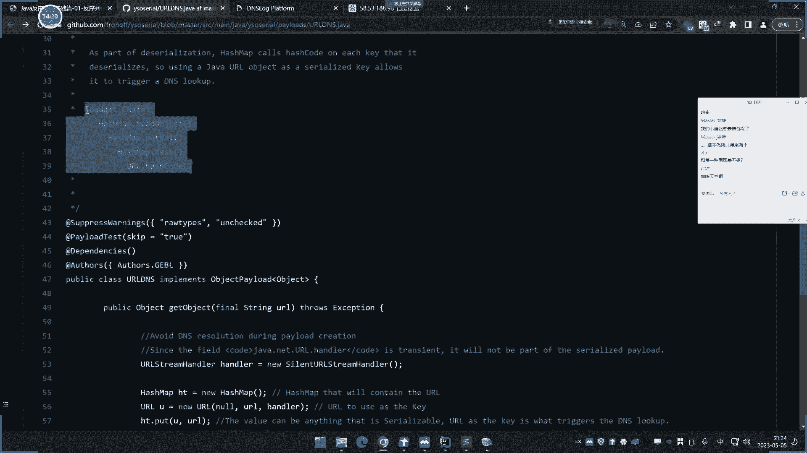

我们先不管它，后期我们会说的啊，这不是我们现在担心的啊，这个执行链条，下载来啊啊这个最终的结果啊，这个最终的结果啊，他的一个执行结果呢就是一个触发访问JS请求，那么同理，如果这里是执行命令的话，那么。

就是一个什么RC1，能理解了吗，再把这里写上去，大家就应该知道他是个什么概念了啊。

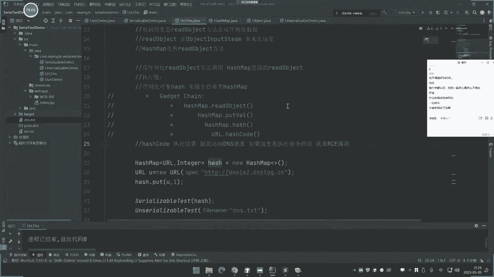

所以这种呢就是利用我们说的第二种方式，就是里面呢有一些可控的类，这个类里面呢有这个东西，知道了吧，好那么大家问一下啊，如果现在呀我换一种方式啥意思呢，我这个反虚化实现的方式呢。

不是有这个叫write object和这个reader obb惊喜吗，那还一个我要是换成了这个什么。

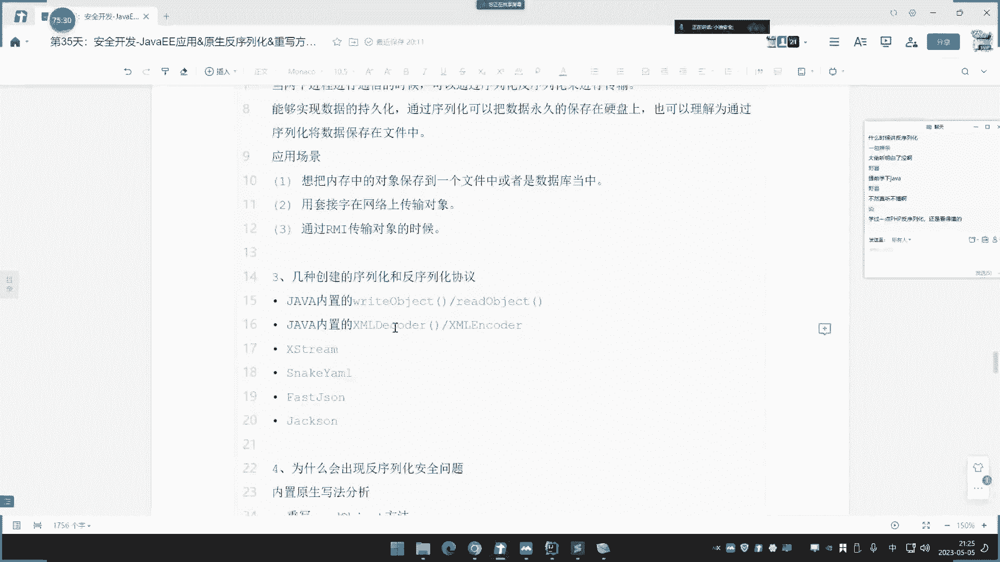

下面这种插件里面进行反序化序列化，那么今天这个东西，我们讲的这个东西能不能触发出来了，大学能不能触发出来，是不是就不冷呀，为什么说不冷呀，因为你能的原理是。

因为这个read objection他是重写导字的，除了重写导致我还讲了个那个初始菌，导致就是字串的这个数据给他导致。

对不对，但是现在呢你用到了个这个，另外的这种茶几里面是吧，就是我们说组件里面的一些那种反虚化的方法，那么写法就不是这个东西了是吧。

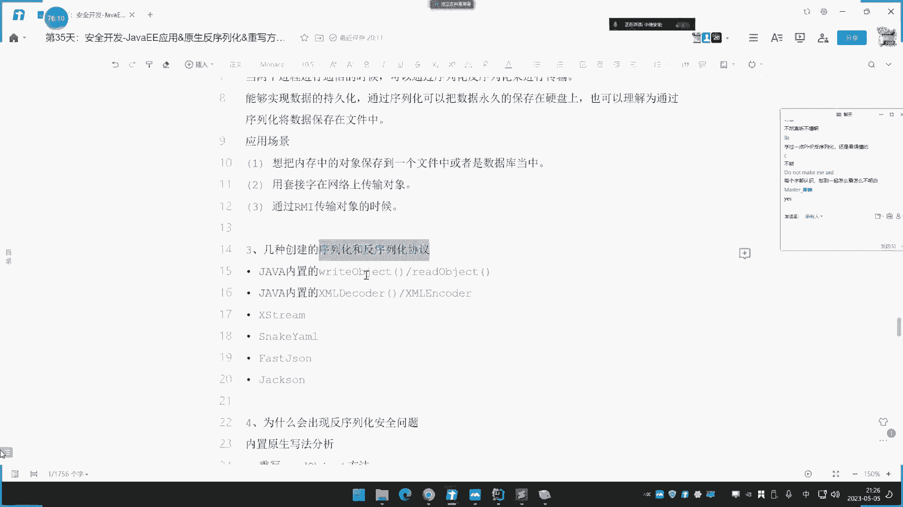

包括下面这个是吧，写法就不是这个东西啦，那写法不是这个东西，那你这里的这个比如说这个啊，用的这个哈希对不对，那么这个rate objection有用吗，没用啊是吧，他函数都不一样了，方法都不一样了。

还有屁用啊，那就不是那个触发流了啊，所以啊大家要明白啊。

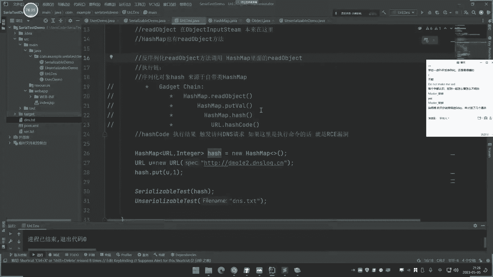

他这个链条呢是要取决于对方的这个什么。

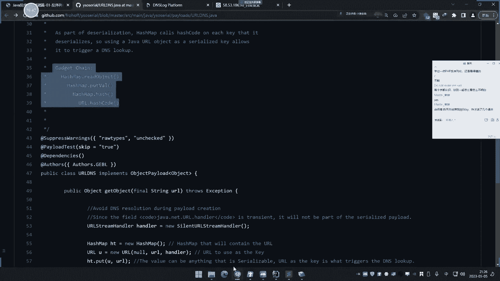

序列化和反序列化用的是哪些方式，同时呢还要关注对不对，序列化的对象是自己写的还是网他自带的，然后对象里面有没有类似的一些这种方法的，同同同类方法的东西，包括还要考察这个什么构造函数，里面有没有被触发到。

像什么求string是吧，输出的时候包子，所以他的课程量，大家可以想象一下是多么的庞大，这个反循环的课程，你要把讲就要讲什么呢，你想都想得到，那像以上的这是六个是吧，不至于我只写六个啊。

不是说只有这六个啊，不是只有这六个，这是我写的常见六个六个里面那个反需要操作，然后呢还要去看哪些这个类里面，哪些组件里面有这种东西，这个量啊，这个想一想就是六乘多少乘四，我就说6×4就是24种。

可能都已经写上去了，这还只是说分析他有没有安全问题，和这个粘的一个过程，还没有说怎么去写那个POC，所以说啊你要说完全搞清楚这个反序化，从分析到写的话，这呀不用多说啊，我们也讲不那么那么深，对不对。

我们尽力而为，在后面的反学二课程中呢尽力而为多讲一些啊，把这四种可能性呢，都给大家以实际案例呢去分析啊，也是按这个图片来讲的是吧，分析这个反射工具的实现原理啊，分析它的链条啊。

这也是我们并且呢在链条的实现过程中，还有像什么RMIG，RMPZNDI3种协议分别是什么，这也要讲哎呀这个课程量啊是非常大的呀，啧不过我们现在叫开发，叫开发了，只是讲是什么东西啊，至于后面的一个利用。

这其实很简单的道理啊，除了分析开发呢，就是这个漏洞的产生的根本，然后呢再就是漏洞产生的原因，再就是漏洞的验证，验证的就包括验证的POC，那这个验证poo c呢就是非常关键的，像这个什么鬼啊。

MIJDJNDI呀，就是那个利用的那个协议是吧，就是属于在腌制的时候，会用到POC的那些东西，很复杂很复杂啊，不是一科两科的事情啊，如果说你压根就没有学过java的话，没有这些开发经验的话。

是完全听都听不懂，不知道是啥玩意的啊，你这里呢大家如果说实在听不懂的话，也可以直接这个躺平啊，不用去学也是OK的啊，只是说呢你为了成长为一个红队的一个是吧，中高级的选手，这个也是不得已啊，去学的啊。

不强求啊，我们讲了这么多呢，也是不强求的，基础不一样啊。

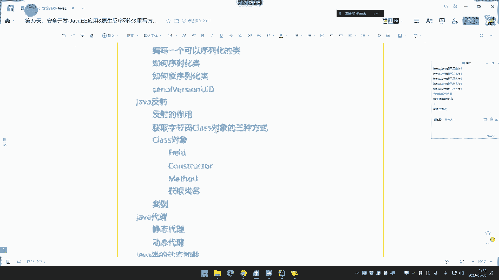

好今天的内容呢就这么多了啊，我们下节课要讲什么呢。

也不用多说了，下节课要讲的内容呢就是关乎这个，啊组件内的一些安全问题啊，然后还要讲啊，后面呢还要讲这个什么RM啊，什么JDJNDI是干嘛的，要把它进行一个普及，普及完了之后呢。

大家就知道这以后碰上这种什么鬼，什么IM啊，什么J跟DI这什么鬼啊，大家至少呢也知道了啊，我们也达不到说把他交完之后呢，大家就能什么就能这个干什么事情，但至少啊大家以后碰上这种漏洞的时候呢。

你能够看得懂，能够分析上来啊，也不至于是吧，漏洞给到你，你都不知道怎么玩，那就没办法了是吧，哎网上有时候有时候呢经常包一些漏洞出来，那漏洞呢给了一些这种东西，有些人玩都不会玩，这很正常啊。

这java类的都没学过，玩都不会玩那种给到你的都不会玩，我们呢就不能做这种事情是吧，至少学完之后呢会晚两招是吧啊，至于说能不能挖到漏洞啊，这不强求啊，这个太难了啊，这个知识点太多了。

你这个java开发能学好，这已经很不错了啊，你搞那个什么安全分析去玩咯，那不现实，好我们今天就说这么多了啊，这个是反虚化的第一次讲课啊，不是有很多人老在问，就我上次开发的时候。

那有人就问说哎后面讲不讲什么这个内存码呀，什么这个反虚化我都说的很清楚了，我讲的是开发，我不是说我今天就像我今天讲的这个反虚化，我讲哪是告诉你在java中这个东西是个重要点，这个反序化是怎么操作的是吧。

告诉你的漏洞的一个成因，告诉你的，我并没有讲他该怎么用，他还有哪些便衣，还有哪些品种，还有哪些分类都没有说，但不是说不讲，因为你有这个入门点了啊，你有这个点了就知道这个东西了，我后面才好下手。

开始在这上面去开花，结果呀，你这前面都没有听说过，我当时如果就很简单，我们去讲漏洞的时候是吧，讲漏洞的时候，我直接说哎呀，今天讲java反虚化，我就把代码往这边一填，填了之后，我就说哎呀该怎么利用是吧。

哎什么情况，你说咋个搞嘞，对不对，还是要从代码上面是吧，这是什么情况导致这个too string是什么情况，这个什么read open惊喜啊，前面学过那代码呢至少看得明白也不会，至于是吧。

代码我把你贴上去，把例浮现啊，没有任何意义啊，那你永远碰上了换那个东西，你就不知道咋办了，所以说还是要懂点代码的啊，没办法，这个漏洞的核心呢说实话都是这个代码造成的。

而懂代码呢对于漏洞理解呢会大大大大提高啊，你会发现在后面我们学漏洞的时候呢，你把前面代码呢能够学明白，学了个大概之后啊，你再去看后面漏洞的时候，你会发现很多东西呢都好理解了，就不至于没有思路了啊。

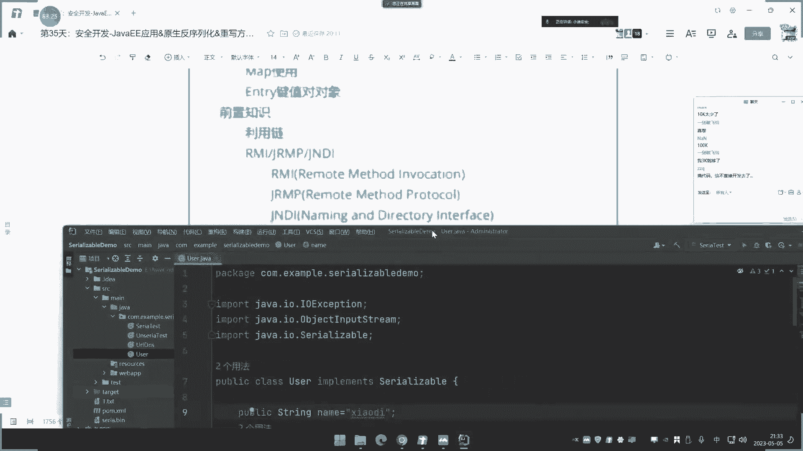

这就是我们的核心的点啊，今天就讲这么多啊，下节课呢我们就讲这个JWT和那个，框架嗯，就身份验证的这个东西啊，身份验证的就是JWT的原生技术和那个组件，会同时提到这个JWP的安全问题和，组件的安全问题。

下节课会讲这个东西啊，有些听都没听说过啊，啊课程越来越高端了啊，现在我本来不想这样去讲的，没办法，现实生活送所逼啊。

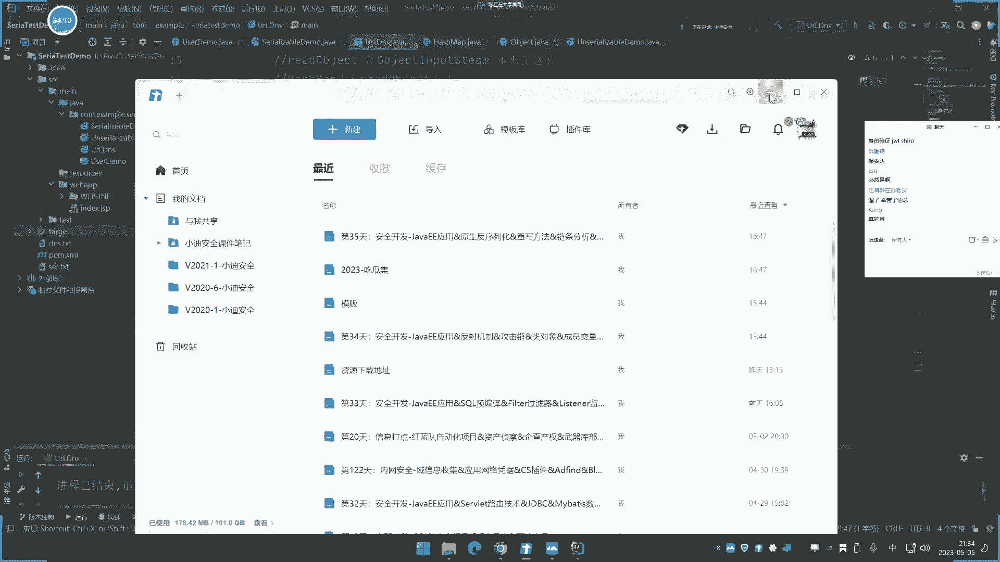

这一期的课程呢是提前上了难度啊，提前都已经给大家把难度上来了啊，希望大家呢先一后后一啊，先打后一把这个难度先难的先啃一下，后面的就会轻松了啊，当然了，后面不是一致的，轻松上到java那里。

那中国都还是要困难的，那是没办法的。

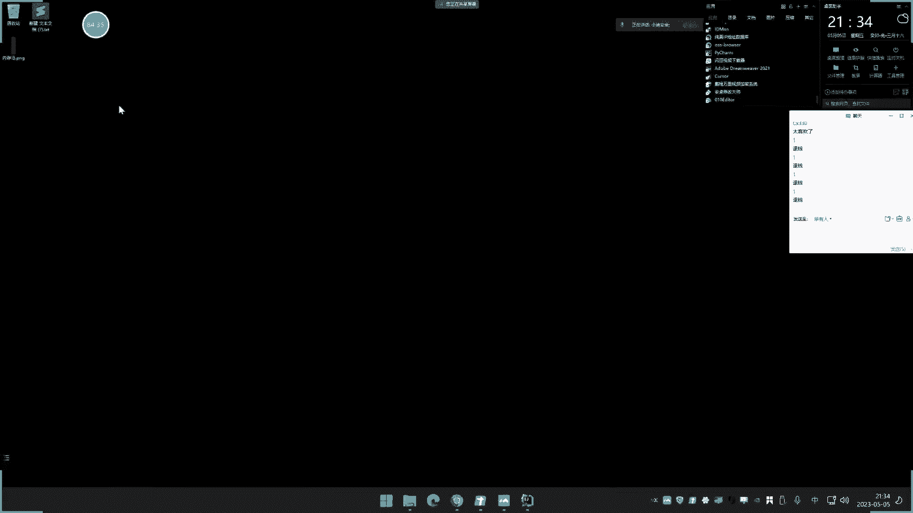

短时间是不可能把那个搞明白的，都是给大家做一个简单的讲解和入门，然后呢后面呢大家根据自己的java的技能啊，花时间去累去练，总有一天是吧，你就能豁然开朗，到时候不管是面试也好。

或者是分析漏洞的好。

