# 【小迪安全】V2024版 全栈网络安全 ｜ 攻防渗透工程师 （持续更新） - P36：第36天：JavaEE应用&第三方组件&Log4j日志&FastJson序列化&JNDI注入 - 逆风微笑的代码狗 - BV1Mx4y1q7Ny

呃今天呢是在java的第几次直播了呀，第五次还是第四啊，第五次了吧对吧，还有四次啊。

嗯讲一下什么呢，讲一下这个java的第三方组件的一些安全问题，像最近几年比较火的几个组件的安全啊，logo世界啊啊fast JSON呀对吧，对这几个漏洞哈，那主要呢就是学习这个漏洞，那从怎么得到的啊。

其实我们从这个开发的角度呢，啊学习使用一下这两个组件，然后呢观察一下像这种漏洞呢，主要是看哪些方便啊，然后呢这个漏洞又是怎么形成的，呃至于这个漏洞的分析啊，我们留着后面再去讲啊。

就漏洞的那个细节呢留后面去讲，我们主要是聊清楚啊，这个科呢就是第一个呢，就知道这个漏洞是怎么产生的，这是个什么东西是吧，开发中为什么要用到它，要了解这几方面就可以了啊，我们来先说第一个啊。

这个叫做local4J，那local4J是一个什么鬼东西呢，我给大家先解释一下啊，logo世界呢它是一个开源项目啊，他是在这个java e1里面呢，呃可java这个程序里面呢用来的用来干嘛的呢。

简单来说就是日志的一些相关的处理，对就是对方呢可以利用这个logo时间呢来实现啊，对这些日志啊，包括这个服务器日志啊，还有一些这种各种各样的日志呢，来做一些这个处理啊，简单来说啊。

他就是一个这个java项目中的一个，第三方的一个组件，一个项目，用来呢帮助我们在java程序运行的时候，的一些常见日志呢进行一些处理啊，控制这个日志的一些信息收集，就是说凡是呢有用到过这个java啊。

并且有日志需求的话，就可能会用到这个组件，那么实现这个功能，那么用到这个组件之后，由于这个组件呢有安全问题，所以呢就会出现安全漏洞，学完这个安全开发，利用log4J呢来实现这个漏洞复现的话。

也是能够帮助我们到后期呢，白合审机负责这个第三方组件的安全的检测，包括漏洞复现，logo世界的这个漏洞呢都会有帮助啊，这是我们讲他的一个重点啊，那么现在呢我们就来给大家演示一下啊。

在java11中呢来在实现这个logo世界的引入。

包括这个漏洞的一个介绍啊，开发角度来去讲，加之前啊，这里有一些环境呢大家要自己搭建一下啊。

就是包括这个MV1N的，因为这里呢涉及到这个第三方的仓库组件了，所以大部分的都会用这个啊，没啊ma法，那这些个东西呢来实现这个仓库的整理，然后这个呢啊如果说你不设置的话啊，他可能会有一些问题。

什么问题呢就是有点man啊。

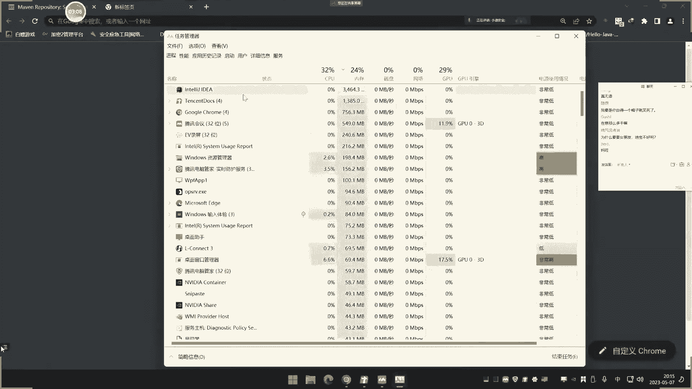

因为这个仓库呢是从外网去下载的啊，一般呢会通过这个IDE1呢配置一下。

这个拉法上面的一个这个这个配置呢，来实现速度更快啊，那么这个相关的配置呢，我这里呢给了一个文章哈，大家都可以下去呢配置一下啊。

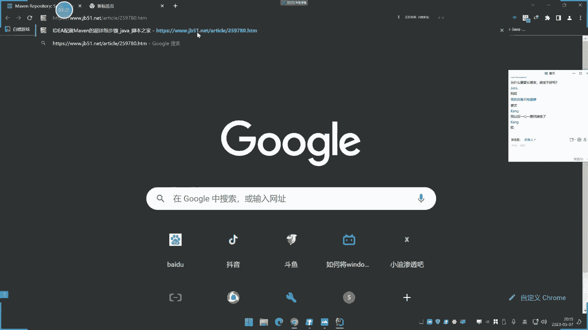

就是从这个id音呢，如何烹配置这个MAA的一个长消响一步骤啊，去下载，然后呢去解压，最后呢再添加环境变量，最后呢再设置一下配置一下，在这里再加上这个本地仓库和更新的，这个默认源啊。

这里的指向的是阿里云的这个圆啊，然后去下载，不然的话他从官网去这个下载的话，拖这个解压包呢速度有点慢啊，把这几步都自己做好啊，我这里已经给他做好了啊。

我就直接来演示一下吧，这个呢是一个仓库啊，这个是一个，那个就是你要在网上引用一些第三方组件的，一些解压包的时候呢，他需要从网上去下载，然后呢你如果不配置的话，网上从其他地方下载外网去下载。

那它的速度非常慢，因为都是国外的一些这种仓库物站啊，啊配置阿里文那就会快一些啊，我们先来说这个logo世界的啊，那引用下LOCC的这个DUM啊，学习使用log4J，然后呢顺便把他的安全问题呢介绍一下啊。

名字叫log c dumo，然后这里呢选择一个版本啊，选择版本之后呢，这里那选择新建项目的这里啊，当然了你也可以在这里呢选这个地方，然后呢点击这个地方也行啊，来选中这段java代码。

那选择这个构建系统的为麻烦，然后呢，这里呢这些地方呢可以自己的去选择性的，这个写和不写这个无所谓的啊，然后点击确定啊。

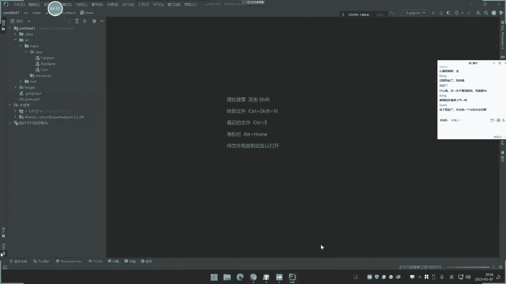

创建好，这里呢就创建好了啊，创建好之后呢。

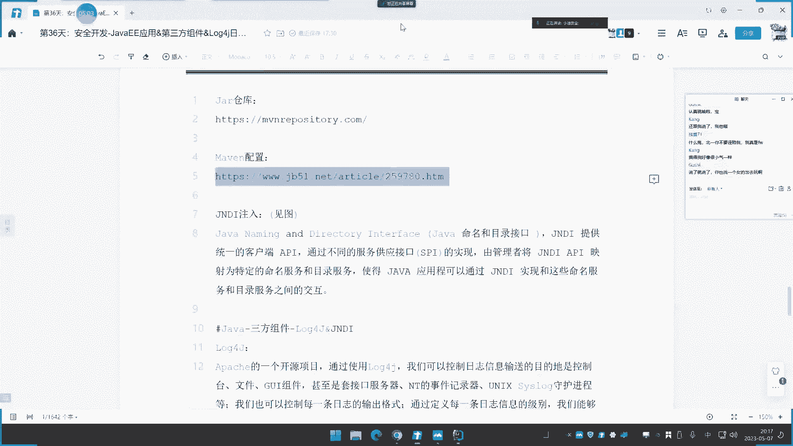

我们要给他锁一下啊，呃创建好之后呢，这里有个叫外部库，这个外部库呢就是我们说的引用的架包，也可以看到，现在目前引用的是这个我D盘的一个JDK，1。80的一个这个架包啊，这个自带的啊。

就JDK里面呢有一些自带的，就是我们常见的一些这种是吧，里面一些内资的这个函数啊，这些东西呃，但是这里呢没有logo时间啊，那么如何把logo时间引用进去呢，这个也是非常简单的啊。

首先呢我们来到这个前面。

给大家给到过这个仓库的这个官方章，在这里搜索是吧，locals j啊。

搜索LOCJ，把引用进去啊，1。8和16有什么区别，哎呃区别没什么太大区别啊。

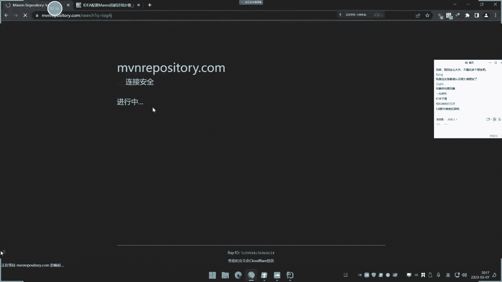

就是1。8呢用的比较多而已，那就这条啊点进去啊，大家可以看一下啊，呃这里呢就有很多这个类似的这个版本，大家可以看到啊，来包括这里呢也有是吧，来这里那有很多这个类似的版本啊，嗯然后你看到啊。

这个版本时间和还有什么，这个上面还有这个什么鬼，这个用到的这个人数啊，包括还有些漏洞呢，这是出现过的漏洞，那个这个logo时间呢，这是在前面几年呢出现过这个漏洞的啊，这个螺丝钉漏洞一大堆样呢很多啊。

在前面几年呢，当时报了一个这个CV2021年的一个漏洞啊，当时那是相当火的啊，那个漏洞，然后呢，我们这里那就找一个这个那个世界的这个，作为一个演示吧，对不对啊，我们就选取一个年份的啊，用哪个版本呢。

用个这个吧，2。4。14的啊，20年发布的，那就用这个版本，2。411也行啊，点进去啊，那在那下面呢就有这种哪几种这种这种东西，这啥呢，这全部是那个构建仓库，那现在用的最流行的就是这个MAA。

这里呢直接复制啊，把它复制一下啊。

把这个代码复制一下，然后怎么办呢，啊看一下啊，在IDE1这边呢，来到这个poo m XML，这是干嘛的，这个就是那个MAO的一个配置文件，然后在这里写上一下啊，先要加上这个啊DIQ。

然后呢再把这个代码复制进去，那这个意思呢就是说配置这个XM文件，这个文件配置好之后呢，那个ma呢，它就会自动呢根据这里面的需求呢去下载索引，你看啊，默认现在是没有的，只有这个是吧。

我们这个螺丝C的这个这个仓库的一个架包，2。4。1版本的，然后呢把它进行一个保存，对不对，保存之后呢，你会发现呢这里呢并没有出现这一个这个架包，该怎么办呢，然后这边呢呢id这边有个这个呢。

这个呢叫加载MARVA的一个更改啊，把它一刷新，那它就会从网上去下载了啊，我这边由于配置了这个阿里云元，所以他很会从阿里云的那个镜像站，那那这个速度非常快啊，如果说你没有配置的话。

那么可能从网上下来有有点时间啊，我们来点一下来点一下，你看你看这里呢自动呢外部库这里发现没，就自动就亮了，你看看两个架包之中出来了，你看呢看没看一个API的和一个CRE的，两个人呢2。4141版本啊。

包括现在一样啊，你看啊，我现在把它改成audience140啊，我把它选中，你看现在没有是吧，我再刷新，你看那你看是先变成20140了，这个版本它自动帮你从网上呢把他拉下来，好在自己仓库啊，2。

140啊和2。41那都可以啊，这个无所谓的啊，我们还是用新一点版本啊，好选中诶，一样的啊，这个马宝呢就把他拉下来了啊，拉下来之后呢，我们就可以利用这个东西呢来做这个开发了啊，好我们现在来看一下啊。

这个logo时间的一个代码的一个浮现啊，然后呢我们在这个java文件里面的去创建一下哈，那比如说我创建一个这个叫logo4J是吧，test的一个这个文件哈，好先进去，然后现在呢我们怎么搞呢是吧。

我们看一下啊，它造成漏洞的原因呢其实非常简单，我来先把一个main函数写进去啊，首先呢呃他先定义一下啊，然后一个logo这里要注意啊，这里写的时候要注意在哪选中呢，我们这里有一家logo是吧。

这里呢有JDK自带的logo，还有这个ORG阿帕奇logo4J的，这个我们要选择这个啊，就你不要搞错了，你不要说这里写了这个，那写这个呢你引用的是这个系统的啦，这是这个系统的啊，你不要搞错了啊。

我们这里呢要应用这个什么，引用这个来挂机了对吧，就这个啊，你用它来里面的，然后呢随便再取个名字就叫logo吧，然后等于什么呢，就是引用它来啊，也是这个呢这个里面呢这里有两个了，我们选用这个了对吧。

选他是吧，然后这里说导入库，那把库导进去，Ok，哎这里还报错了，是什么情况，哎呀怎么又报错了哟，上来就给我翻车呀，这是哪里啊，哪里出问题，我看一下啊，提示是什么形式，logo从未使用哦。

这个把使用一下就可以了，好可以了啊，Y1个名字似的啊，无私于请求开启实时专线，什么情况，内鬼在录我的这个东西吗，哎这哪里写错来着，他引用不这样，你看把我导错了呀，哦这里啊，这导错了，妈的个锤子。

我说怎么回事呢，我还叫你们不要导错包，我自己还导错了，报你妹的，好大家看一下啊，那你这里呢我们就随便输出个这个错误的，123啊，或这东西啊，来个先看一下，来我们运行一下，大家看一下啊，那个呢。

就是利用这个java代码来去调用这个logo时间，然后呢来实现呢，它输出呢如果说这里的有错误的话，就会输出一个123码，就直接输出这个坐着一个三，你看error这个LC的一个日志呢，输出一个三，对不对。

好，你看一下啊，然后呢，他的一个网上那个代码漏洞利用，是个什么情况呢，大家试想一下啊，大家知道这个情况之后啊，你看一下啊，我现在可以随便取个变量啊，你看他的一个漏洞，原因我不介绍了。

我这主要说下第一应用，就现在这个代码呢啊把它写一下啊，使用这个log4J的实现这个日志的这个输出啊，然后呢你看啊我们这边一个这个code啊，等于什么啊，大家看一下啊，这样写呢没有问题啊。

当你如果这样写的话，你看一下啊，我们随便写一下啊，变量是吧，java os或非M，然后这里呢再去写啊，Code，好你看一下啊，现在这样去写，你看会发生什么情况，来看一下啊，那输出个win十十。0。

这啥情况，这个java os是啥情况，前面加个这个符号是什么鬼东西啊，你比如说现在的话还可以输什么VM对吧，都可以哈，它其实呢就是说，如果你这样去写这个代码的话啊，它就会输出这个里面的这个东西。

这个东西呢被执行之后呢，是以java代码去执行java代码，执行这个东西呢就是java点VM，就是它的虚拟器OS，那就是它当前运行的操作系统，他就把它进行输出吧，这个扣的嘛。

然后你看就输出了这个我的超系统版本是吧，Win 10amd，我是win11呀，但是速度不准确啊，但无所谓的啦，你看这里那就出来了是吧好，那么你试想一下啊，这个呢就能直接执行这个里面东西。

那么那么利用点就来了呀对吧，如果这个地方这个coder呢在输出的时候啊，我们就可以简单的去写一下这个成因了吗，那如果啊，这个code变量呢，是吧，是可空的，那么这里呢就相当于可以执行命令嘛，对不对好。

那么我们现在想一想啊，前期在这个logo4J这个漏洞爆出来的时候，网上给到的相关漏洞。

我们可以看一下啊，这个螺丝给的一些利用的一些这个测试东西，我看是什么鬼。

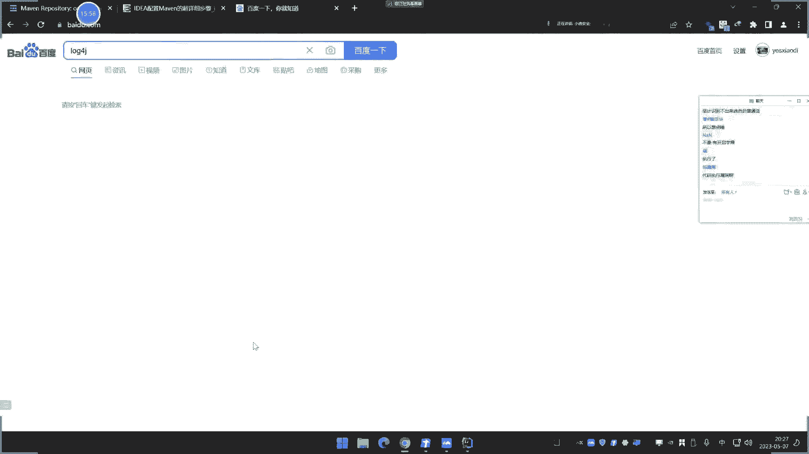

网上是有很多的啊，哎他说一些浮现的一些东西呃。

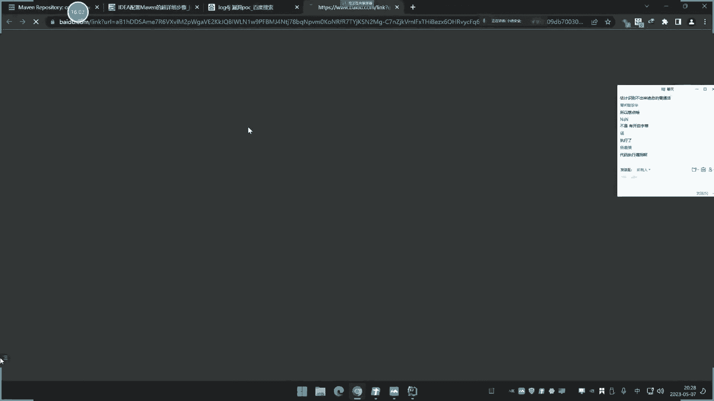

他是怎么浮现的呢，哎我不知道大家还记不记得啊，网上那还是有很多的啊，这个是他分析，然后那这是一些常规的一些这个利用的，什么plod呢，这很多呢也像这样写，对不对，那像这样写啊，这什么情况呢。

然后当时报这个漏洞的时候呢，利用点呢就是什么地方能查的，就往里面查就完事了，有没有这个漏洞呢。

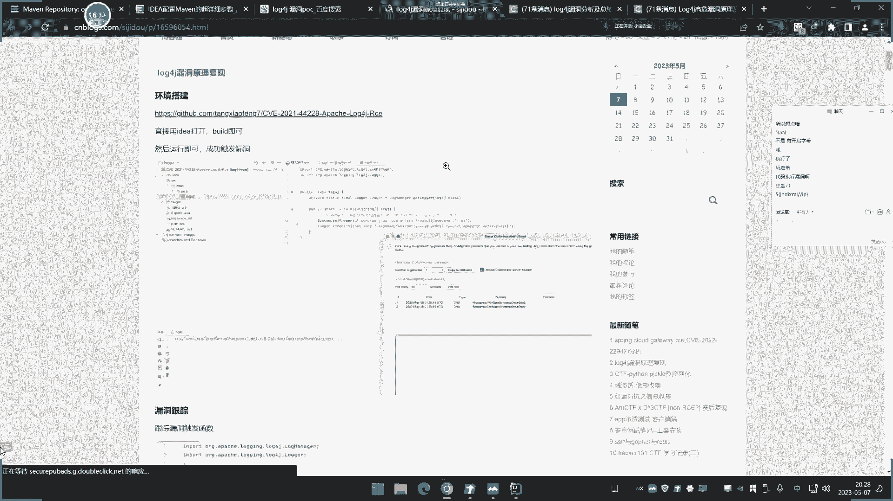

我不管就是往这边的能查什么东西呢，就查什么东西，查什么东西呢，就是查刚才是像这种东西啊，就这东西，那这个是什么东西了啊，那么现在呢，我们就模拟用一个网站来去测试一下啊，用个网站来测试一下。

就是我接受任何变量，比如说我这里呢一个登录的，然后登录里面呢去结束这个什么鬼，登录的账号密码，然后账号密码一旦错误了，我就用这个把输出一下，把日志呢调试一下是吧，就用LOL时间量来实现这个登录操作啊。

来我们来搞个网站起来，这样呢更加的符合实际啊，叫一是吧，web服务啊，然后这里取个名字啊，就叫这个local severb，周末是吧，然后呢取它上去啊，然后web程序对下一步，下一步创建啊。

就在这个窗口上面，然后现在怎么办呢，按照我们前期写了个原理来讲的话，也非常简单的那样是吧，在这里呢创建一个这个，logo4J的那个测试的地址嘛哈，外包script，就传个所咳创建个啊。

然后呢这里呢继承一下，就和之前我们讲那个前面还有没有印象，讲这个script达那个地方的啊，写一下啊，然后呢do get方法呢去提交的时候呢，然后呢结束一下这个值吗是吧，参数值。

然后呢我们就接受叫code吧，先只是个code啊，这个时候呢再到这边呢用个变量来结束循code啊，对吧，结合这个string code，然后在这里呢也是把刚才那个代码呢，给它输出一下点。

现在呢用那个操作啊，把这里呢先把那个库也把导进去，还是按照刚才那个操作一样，先把那个包呢，你看现在包呢是没有那个啊，没有那个ORG那个LUCD的先包导进去，放上来保存，刷新一下。

看这边那看到没多了两个是吧，对，有了之后呢，我们再来引用这个库嘛，是不是引用这个库啊，那我把这个改一下logo，还是按照刚刚那个思路来是吧，然后选取这个对应的啊，这个地方的，然后名字就叫logo嘛。

这个地方的是吧，get然后取名这个地方的点class好OK啊，这个把它写好啊，写好之后呃，这边呢我们就引用它嗯，引用一下logo解释过来之后呢，进行一个什么输出啊，点ARROLL是吧，输出什么东西啊。

就是刚才那个利用代码把code来进行输出，好，大家看一下啊，这是一个网站，然后呢这里呢要给他一个访问地址嘛是吧，按照前期讲的web scale，可放梨子这里访问叫log4J吗，测试点就叫log c。

他给了个访问例子，然后启动这个tm cut啊，那么现在呢就是利用这个东西呢来去访问它啊，访谈呢接受这个访参数扣的。

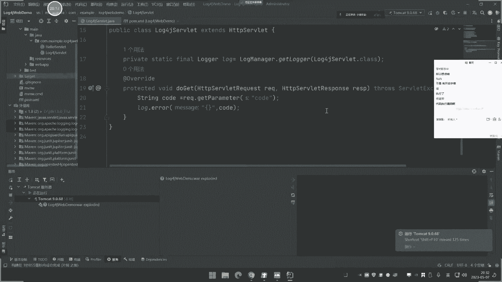

然后呢用这个LOCC呢去执行它好，我们来先看一下啊。

比如说像现在啊logo是J访问，logo是J地址是吧，后面再加上我们的参数，code等于，比如说我就给他传递刚才的参数，java杠5S执行，执行，然后你看看它输出的结果里面，是不是有这个值啊。

你看有这个值吧，为什么输出两条或者浏览器的问题啊，我把它放到这个浏览器上面来，就是输出一条了，你就输出一条了啊，好能够输出，那么如何来执行计算器呢，如何能执行命令执行呢是吧，就是很简单的道理啊。

这里呢就是很简单啊，就是利用这个什么勾，找这个ATP网站web服务啊，然后呢这里呢去，使用这个带漏洞版本，带漏洞的这个什么log4J组件，对不对，要实现这个功能啊，嗯好那现在呢这里也能访问是吧。

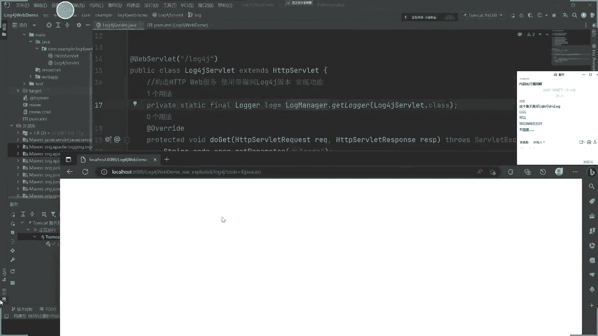

如何去利用呢，我们看一下网上啊，网上呢针对这个漏洞是怎么利用呢，就是写这种东西啊，写这个这种东西，这个什么JNDILDAP这啥东西呢，好我先给他解释一下啊，这个是什么东西呢，呐结合点癌。

一般称之为金根底压注入，它是java里面的一个自带的一个客户端API。

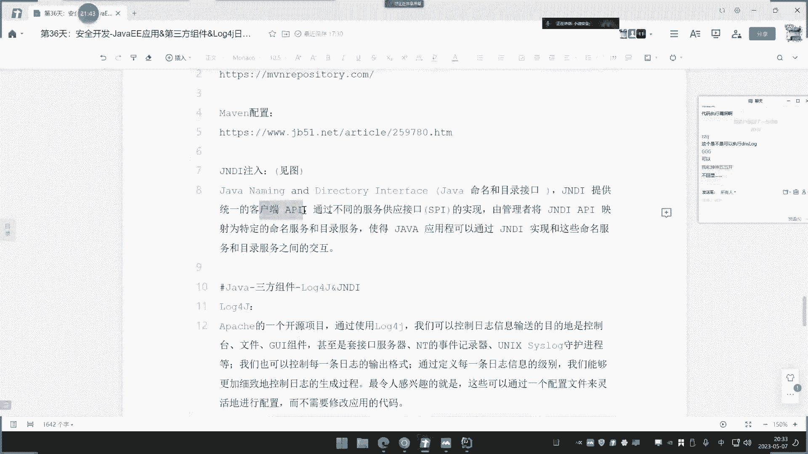

是干嘛用的呢，这里有一张图片是啥用的呢，就是它是java里面一个API，它干嘛呢，它里面有这个LARLDAP方法，还有这个IMI这两个最常见的。

那这两个是干嘛的啊，网上说大概介绍是干嘛的啊，这个有大概的一个说法哈，其实呢就是这个java里面自带的一个东西，他利用这个JDNI里面的这个ORADP，你可以往下面看啊，这个网站是有没有这个解释啊。

这个也是我们下节课要讲的，现在呢就是说先用它啊，就是一个带带接口来去触发，简单来说呢就是可以搜一下这个啧，他的一个大概介绍啊，连网上有写了，哎他的实验服务，然后呢简单来说呢，他是一个干嘛用的啊。

可往下翻，好了，这个都没写太清楚，啊他这里面呢有一些这个东西，然后呢你看啊，他说呢这个arm呢是一个远程方法调用，它实现什么东西啊，他说这个可以干嘛呢，就是可以呢通过网络去请求远程的一个服务。

也就是说他其实就是可以进行一个，远程调用是吧，远程方法调用，就是说你在远程的构造一个方法啊，他可以远程调用，这是IMI，然后还有一个就是我们说的这个奥迪P，奥迪AP是吧，他说是一个什么鬼。

这个服务处理工厂啊，这个呢就这个也是可以调用，远程的一个2D服务，这个呢我们先不用去理解啊，我们后面就会讲他的啊，好我们来利用一下啊，他为什么这样利用来。

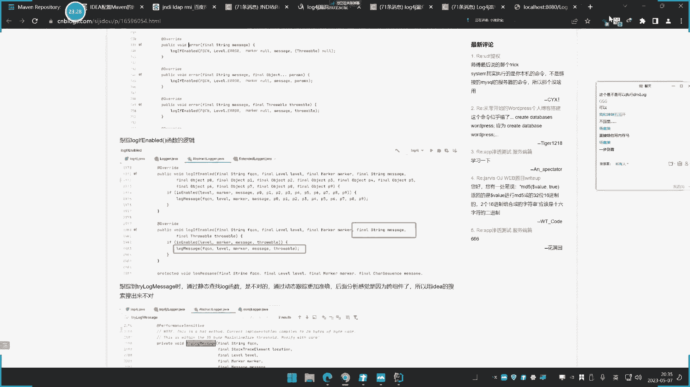

你看着啊，我现在怎么做啊，大家看着啊，既然他这里呢这样取code，它能执行是吧，看他能这样执行。

如果说这个可空，我们来搞一个事情啊，你看啊，我用个工具，这工具的后面也用到。

叫做ZNDI的一个解压包文件，就这个文件啊给他打包的，这是最原始的一种，利用J根底来组来实现这个东西的啊，来这里有个叫JNDI的一个point。

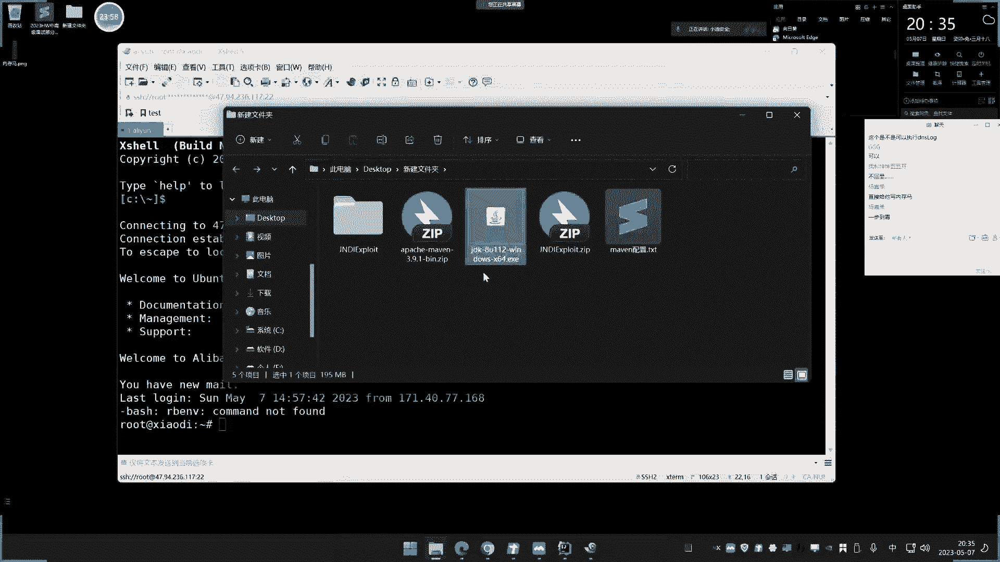

然后这个呢解压包，然后你看一下啊，如何用它啊，看这，那用它它干嘛呢，它会生成一些这种payload啊，然后你看啊我生成一个杠C执行一个CRAC，然后来杠A绑定一个IP地址，这个解压包是干嘛的。

是网上面写好的，一个，专门用来啊做这个DJDNDI这个组，这个解压包啊，你看啊它就会生成几个东西，有一个地址呢，这个地址呢就是根据GP地址，就我们这个对Y的一个IP地址里面呢，有个JDK1。7，Gk1。

8，还有个其他版本的，然后呢我们这里是JDK1。8，我可以选这个呢有RM协议的，有这个RDAP协议的，你把这个东西呢把它选中，那我怎么办呢。

那我看一下刚才的payload啊，我在这里呢，我code啊，给他接收的时候呢，如果是这样接收，是吧，这时候他就输出了这个什么值啊，是不是输出这后面这个东西啊，执行了，对不对，如果说我给它这样结束的话。

coder嗯不写这个感叹号，写个什么。

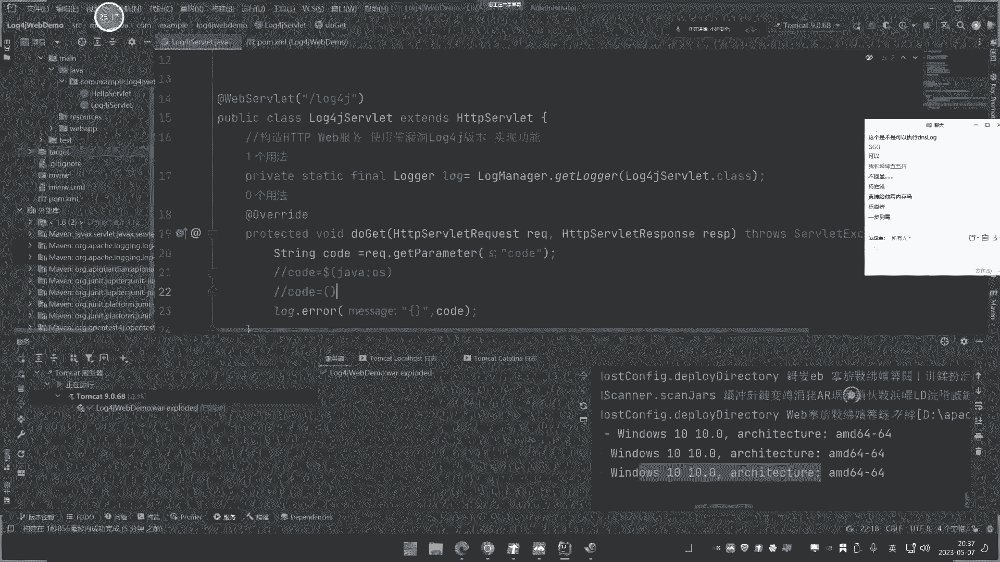

这个东西很明显啊，我这样去写给31-2呢。

把这个去掉，去掉之后呢，你看它的输出呢就是呢原封不动的，没有输出个执行结果是吧，要执行这个java os，就会执行那个win10的操作系统的对应版本，但是那明显不行啊，所以说必须要加它，那么同样道理。

我们构造这个什么，然后呢我们，我们可以构造一下，刚才呢我在这里创建一个什么这个命令啊，然后这是个地址，对不对，我可以构造个什么，该怎么写啊，是不是就这样写了呀，那把括起来，然后这里是ZNDI下面的。

对不对，前面再加上个什么符号，不要这样写了呀，是不是测试化了，你看刚才输这个时候呢啊，结果出来如果没加这个东西，那就不行，那么现在呢我就写JNDILDP，因为这个LDAP呢。

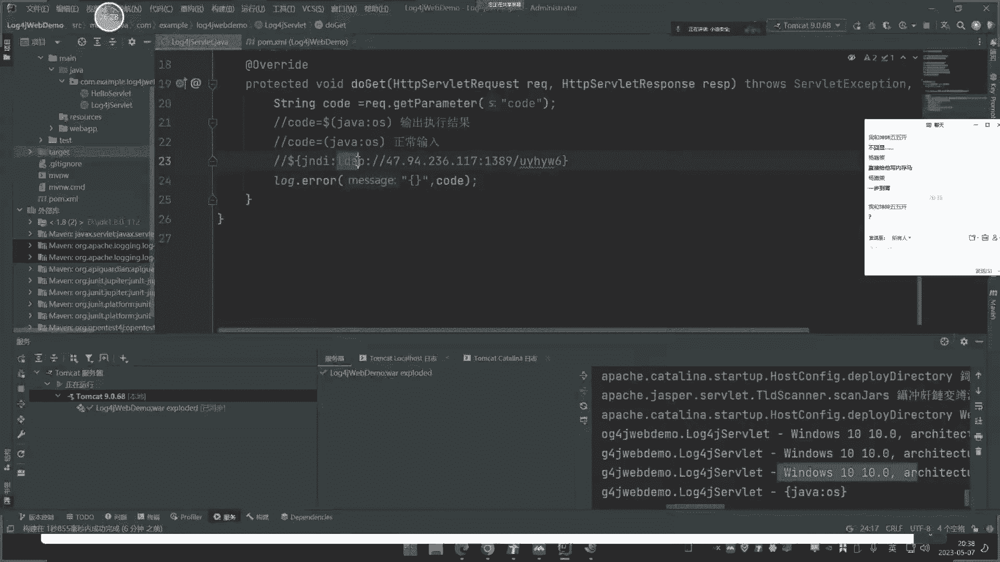

我们可以通过网上的资料可以看一下啊，简单的先看一下它呢是这是这这图片一样啊。

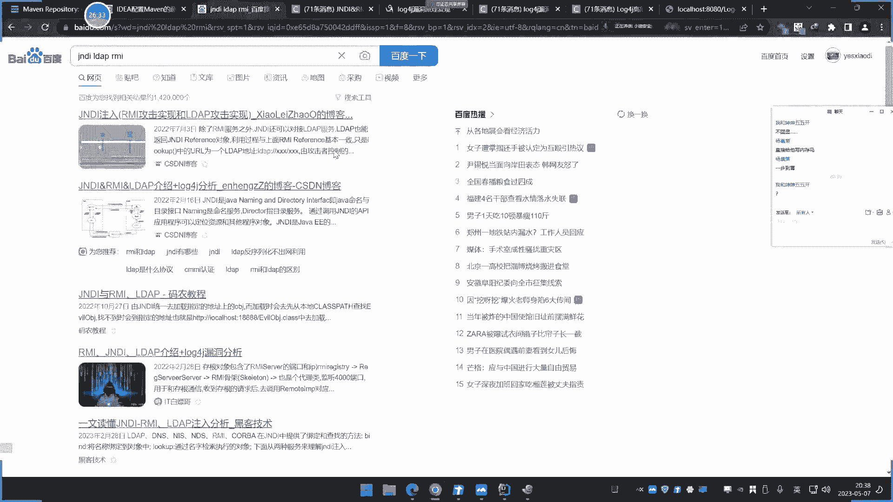

他呢是属于这个尖底I的，它下面的这个LDAP呢是属于这个级别的。

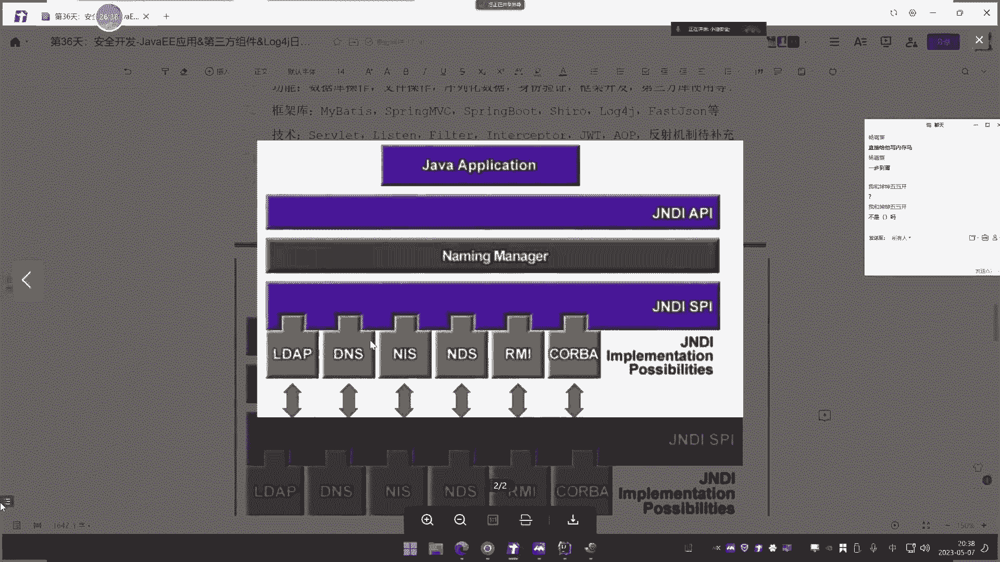

所以我前面要加上这个J跟DI把写上去。

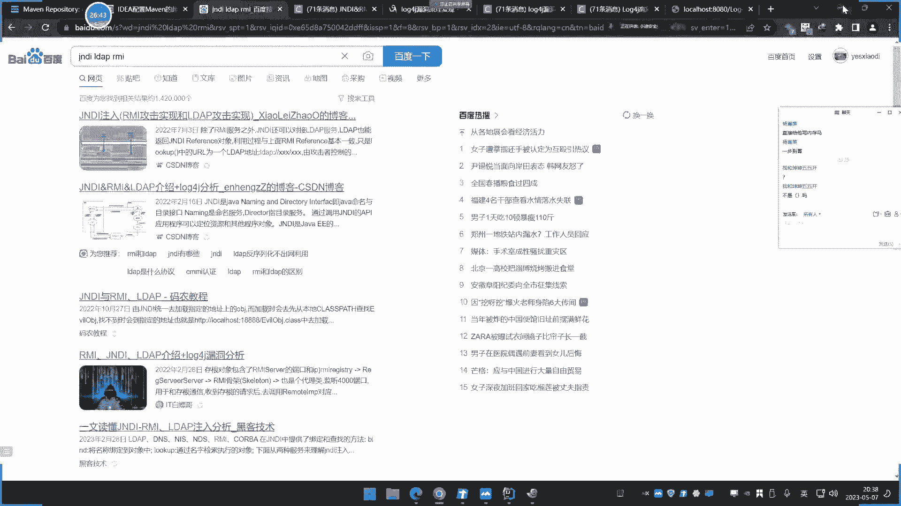

然后呢再写LDAHP，请求这个远程地址的一个这个地址，这啥东西呢，这个东西是我们用网上一个注入工具啊，去执行一个cl AC命令的啊，绑定这个IP地址的一个东西，然后呢它会生成一个地址。

也就是说我生成这个东西代表什么意思呢，我给大家解释一下啊，那么这里呢有这么一个东西，这个是啥呢，这个词呢就是生成的一个远程可访问的，一个什么调用方法啊，调用的方法内容是什么东西呢。

啊这里呢什么方法呢是吧，什么方法呢，就是我们这里呢用这个杠A生成的命令是吧，去运行的叫C2ac对不对，那么其实就是执行计算器的一个什么功能，方法能理解吧，这是我刚才用那个东西生成出来的啊。

是用这个什么一个ZNDI工具，这个猪工具生存，对不对，这个生成的这个地址好，然后呢我们现在看一下啊。

我把这个东西呢给大家直接写到后面去，你看一下啊，写到后面去。

要写到后面去，对不对，然后这个时候啊我们可以关注一下这边的这个。

嘶你跑哪去了。

这边的一个触发结果啊，你看一下啊，这边呢默认的这里是监听状态是吧，你看下现在啊我们直接访问啊，看一下这里啊，嗯哎搞错了，里面的这是啥啥情况，回车，哎那接收到访问计算器弹出来了，电脑弹的啊。

真正的接触到访问计算机谈的同样道理，我可以把它推出来一下，我重新再生成一个，比如说记事本not part load part的是我们基础的嘛，就好比我们电脑上面那运行的load pad是吧。

一打开就是个记事本就被打开了是吧，好我重新来生成个命令绑，重新绑定，你看它就会有生成的一个，这个这个什么东西是吧。

有两种协议，我们就用这个RDADAP协议是吧，复制同样道理，再放到这后面，把它替换一下，好那么在执行之前我们关注一下这面啊。

默认这里是没有反应的，回车好触发哎，记事本突然弹出来了，来接收到。

然后呢你可以看到这个日志里面的，他说这个logo呢去请求了这个什么，一个叫exscore top jdk8的class，啥意思呢，其实这个工具呢就是啊自己呢去用这个工具呢，你把名你输出之后呢。

它就会创建一个class文件，就是一个实体化的一个java的一个编译文件，然后呢当你去请求他的时候，他就会执行这个class文件，这个class文件干嘛的。

是干嘛用的呢，其实就是调用一个记事本出来，所以啊这就是一个典型的logo。

4J的一个漏洞复现，然后从开发的角度上去给他讲。

那么大家从这个点上面学到哪些事情呢，啊学到哪些事情呢，学到了第一个这个漏洞，那个大概复现情况，第二个啊认识到了个JNDI和LDP，他大概是个干嘛用的，还有一点，那就是说如果你有用到这个logo。

是J这个组件的话，并且啊就说你包里面的引用过那个logo，世界的组件版本呢是出现过漏洞的，然后呢你调用过这个logo时间的一个日志输出，那么就会造成这个安全问题，所以说他就告诉我们一点啊，这个什么离啊。

这个开发源码中，啊应用了这个什么漏洞组件啊，就是我们说的如这个什么logo4J，包括这个漏洞的是吧，然后呢第二步呢就是啊应用不行，还有什么开发中啊，使用了这个组件的这个代码啊。

然后呢就是我们说的触发漏洞代码，后面呢就是我们说的啊，这个可空的这个变量呢去传递这个payload了，就是我们攻击的这个什么弄代码啊，PLOADER呢来实现这个重启啊，大概就是三部的一个情况。

手拿布都不行啊，用到这个组件，然后那个楼顶那有这个漏洞啊，漏洞在网上呢用到过，所以说在开码代码升级中，或者说在这个网站的实战中呢，都是有帮助的，对不对，然后具体是说啊如何发现这个漏洞呢。

这个漏洞又该如何继续再去玩下去呢，这不是我们现在操心的问题，我们操心的问题呢就是在开发中呢，我把这个漏洞呢给他服下来，就是介绍一下logo时间的一个简单使用和引入。

然后呢在使用过程中去利用这个漏洞的时候呢，又学到两个东西，就是关于这个节NDI这个事情啊，简单来说它就是系统自带的一个API，这个API下面呢有几种方法，这个RDAP和RMI。

是我们最常见的两种使用方法，具体呢就是可以进行远程的一个调用，那么也就是说，你可以在软子呢去用一些相应工具或自己写的，一些东西啊，去生成一个什么啊，生成一个这个可执行的class文件。

然后呢让这个相关对应的版本呢，去触发这个调用这个远程这个东西，然后实现这个什么调用，那么项目中它就会加载这个什么远程的这个，class文件来实现命令执行，这个说了这么多，不知道大家能不能理解啊。

代码是没有多少，但是呢你在实现的时候，你会发现有很多问题啊，如果说你没有开发基础的话，如果有开发基础，那就非常简单的了，能不能理解啊，这个其实这个案例呢就告诉我们啊，从开发的角度去代码。

升级的时候可以看版本，应用组件，这个版本是否安全，同样呢也是能够看到这个漏洞是怎么产生的啊，你们会有很多疑惑，有的疑惑就是说，那么你讲了，这是代码中我们能看到，那如果说我看不到呢，网站我啥都不清楚。

我怎么知道这个有没有logo时间呀，那这不是我们现在要操心的问题，就像我们前面说过的信息收集里面的，像一些这种组件的收集呢是有技巧的，对不对，有的是基于端口，有的是基于他的指纹，有的基于数据包。

各种情况，其实就是说你在黑盒中呢，你是如何判定他有没有这个logo世界，对不对，这是第一点啊，信息收集的重要性，那么如果说你有源码，有源码的话，你是可以完全看到他这里的有没有。

这里包里面的有没有引用过这个log4J啊，应用过滤开版本版本呢，你可以对照这边它的这个仓库的官方网站。

可以看到他们在这里呢，他自己啊现在都很优化了啊，你看呐在2。717。1这个版本之后啊，他这里呢是没有这个VR，就是我们说的漏洞信息的，也就是说目前当截止当前在2017，移到后面的2020最新版本。

2020这里啊，目前网上没有公开漏洞，那么也就是说如果在这个版本之下，你可以看到啊，他是有这些漏洞的，包括我们今天演示的这个2。14。1啊，它包括四个漏洞，你可以看一下呢，四个漏洞编号都有的。

Cv12021，Cv12022，那这种版本对吧，哎这还包括漏洞的一些常规版，然后呢你再根据这个漏洞的详情呢，去往寻找他的大概的一个利用，所以说从白盒黑盒我都给讲到了啊，黑盒就是盲猜。

因为你不知道会出现哪个漏洞，就是网上的所有那个EE叉P都打一遍，那么百合里面呢，就是分析这个版本呢有没有漏洞。

然后呢去看一下在哪里是调用过这个东西，就是它触发方法嘛，就很简单，我们刚才呢是应用它，然后呢这里呢是有它了之后呢才会触发漏洞，就是有这个东西，就是他触发这个代码端嘛，你就具体搜一下这个地方在哪个代码。

在哪个文件出现过，然后呢你去尝试请求那个文件呢，去触发这个东西是吧，这很好理解吧，哪有那么那么难理解呢，所以我这个讲开发的原因呢，就是第一个让你知道有哪些东西呢有安全问题。

第二个呢就是让你知道这个百合的一个，大概的思路啊，同时呢也是浮现下几个漏洞啊，毕呃了解一下这个java的一些架构，它利用的时候呢，有这个JNDI和LDADP啊，呃这个东西是非常复杂的啊。

他是个非常大的一个学问啊。

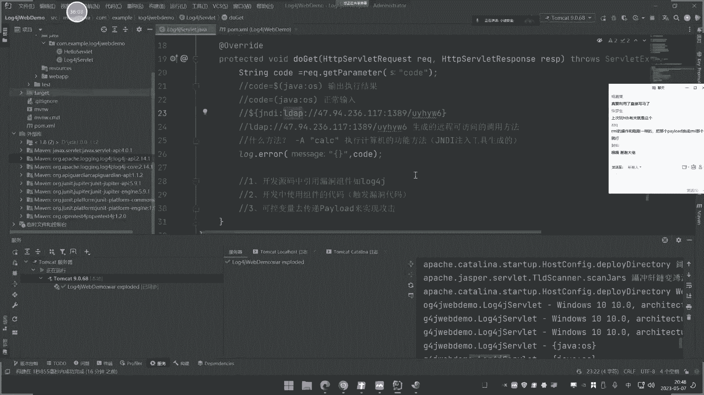

那这个呢就是我们的local4J啊，Logo4 j，那么还有一个呢，就是我们可以说用的也是非常多的一个，第三方组件，第三方组件呢你也看一下，我们前期给大家用到的这个什么工具包。

大家应该还有印象啊，你看一下啊。

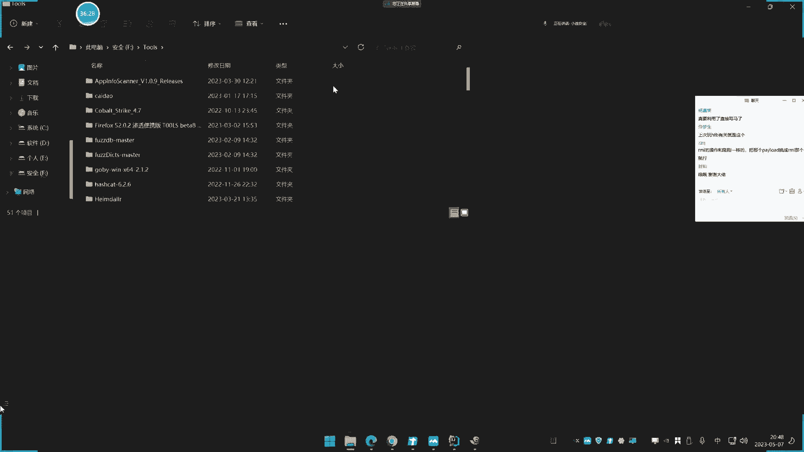

这个工具包，它下面呢是有很多一些这种利用工具的，大家可以看到呢有这个叫吧，笑是吧，这个丝肉是肉，然后还有这个什么鬼，沃波罗凯斯啊，这个什么双12呀，这个什么什么一大堆呀是吧。

这其实这几个呢都是属于这个几个那个java的，一些那个资源，你看包括这里有还有个什么faster，JSN的简称理工具，你看这里还有个啦是吧。

有个的fast JSON的，都是针对一些java的上面那几个组件特有的。

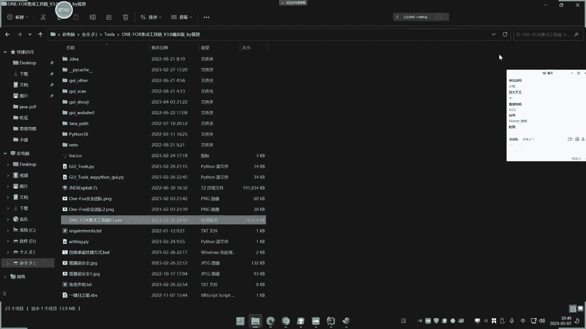

这也是最近几年比较火的几个啊，这个logo世界啊，SHO啊，然后这个fast js文呢是吧，这几个呢都是几个利用的点啊，然后我们这里呢先讲log事件，然后呢再讲一下这个fast st js n啊。

那你可能说诶那个SHO我怎么不讲啊，希尔那你后面讲啊，希尔是一个生成验证的，我们到时候呢还会联合那个JWT，还给他讲一下，好，那么现在呢我们看一下这个fast JSON文档啊，你们说有没有实战。

这要什么鬼东西啊，你看一下啊，在本地怎么复现了，网上那种实战都是，直接都可以用的啊，我们到时候浮现的时候会用到那几个东西啊，你包括这里很简单的道理。

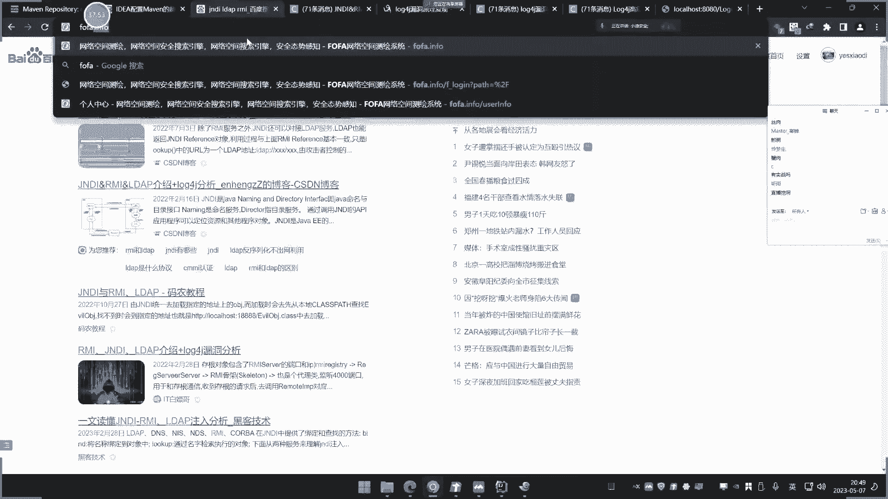

你看FOFO里面去搜这个东西怎么搜到啊，你如果这个东西logo世界的这个，你说他怎么判断是洛克实验呢，这几个全部是用到了这个洛克世界的，那像这几个地方都用到洛克斯一的。

那么刚才说的EXP全部可以往上面打。

他打的怎么打呢，网上是怎么利用那个漏洞呢，随便查，什么叫随便查，就是凡是有数据传递的，你就往那里面查就完了，就刚才那个螺丝结，网上利用实战中是那样查，为什么呀，因为他是在实战中。

他是不确定哪个值接受过去，他会输出，所以网上利用那个漏洞是怎么利用的呢，那时间就随便插，就是哪里有东西，你就往哪里插，就把那个PO就往哪里插，然后一般查取检测就是触网检测。

就是判断那个DNS is logo的一个解析检测，啥意思呢，还肯定说大家又不明白了啊，其实我不想说，那是漏洞利用，我现在讲安全开发，我不讲了。

你又会一直问问问的，烦死人，真的是啊。

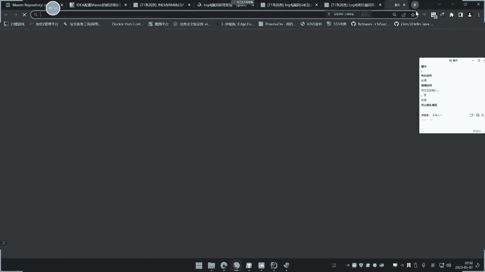

对不对，有人不明白是吧，这个实战中这个讲这个实战中是什么情况，我说实战中随便查查什么呢。

就是把这个后面利用代码来把这个地址一改，改成什么，改成底应该是多个地址，就是我查一个什么东西呢，就比如说啊我查个这个东西呢，然后这里呢写个地址，写个那个DSLOG地址，随便写一下啊。

VLOG我就把这个东西呢随便查查，你问我插哪里，任何地方，啥叫任何地方，就是参数上面浏览框里面就是查了点确定，查了点确定，因为你不确定在代码中他是接受哪个值输出，造成那个漏洞，比如说我现在是抠的。

你知道哎，他结实是抠的，但实战中你哪知道呢，不知道啊，就随便查啊，一旦查了之后，你就观察这个dn log有没有回血，如果有回线，就说明存在就遭到点了，是这个意思，知道吧。

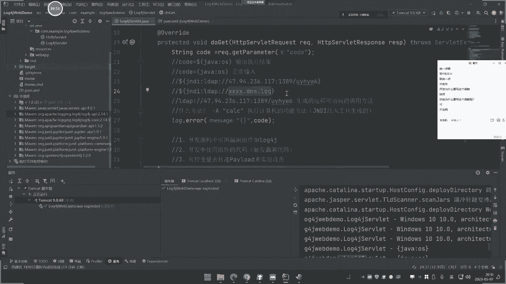

你自己要去想啊，这些东西呢不是我要讲的，其实我们讲的主要是讲他这个白合分析的思路，至于说实战怎么搞，你是根据漏洞情况决定的，有些是随便查，有些是特定地方查。

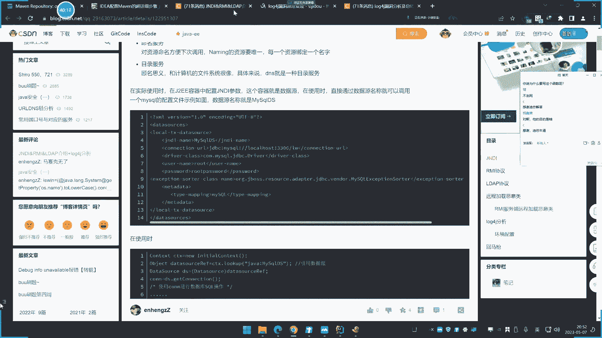

是不一样的啊，对呀，他们的目的是啥呀，你说目的是啥呢，啊，屋里好玩嘞，哎呀。

你首先要明白我们讲课讲这个logo世界，那我都还把你介绍一下，我不介绍，我直接告诉你，logo世界浮现，你连logo世界是干嘛的，不知道都说了，logo世界它是一个java的一个组件，就是第三方组件。

就系统java语言没有的没有的，别人为什么要用它，是因为别人用它呢，来做一些日式的这种输入输出和真理，他是一个专门搞日子的，你可能说哎日子有什么作用，那我就不好讲了是吧，就好比你的电脑上面对不对。

你要去处理的office，你要不要下个office呢，对不对，那你下载office office这个本身软件出现漏洞，那你会不会遭殃呢，那我没有下载就不照样啊，我下载了就照样了。

那那你总为什么要用office呢，你说为什么呢，他有这个业务需求啊，那么用到这个东西你就用到它，你就是吧，受到他的这个漏洞影响啊，他有漏洞你就遭殃啊，他没有漏洞，你肯定安全呀，好我们再来说这个。

fast j s n啊，那这个就更好理解了啊，这个呢他说的很清楚啊，在数据传递的时候呢，经常会用到这个字符串呐，与这种JJSONXML的格式来进行相互转换去解析，那么这个东西呢它是阿里巴巴的一个开源库。

就是阿里巴巴自己的写的一个这个第三方组件，Fast json，然后呢用来JS格式的一些数据，进行解析和打包的一个作用，这个作用啊，然后它其实呢是可以官方应用于在序列化。

数据和协议相互web输出的各种应用场景中，好那这个fax j格式呢介绍这里啊，我问一下大家，你觉得他是干嘛的呀，其实很好理解，就是用来一些数据的相互转换的，那么转换里面呢就是相互转格式。

那你可能诱惑问了，那为什么要转格式呢，是吧，那就没办法了，是不是，啊可以看到啊，这是他的一个大概介绍啊，就是个fast JSON文的这个东西啊，网上那你可以看一下他官方的一个介绍啊。

来还是跟大家说清楚一点啊，这背景交代清楚点，不然的话有些人老是问他究竟是干嘛的啊，你刚才说为什么要用到它，就是说其实java的原生的这个开发的API里面，就是它原生自带的一些函数啊。

方法他是能够进行这个JSN的解析和操作的，但是呢网上会有第三方的组件也支持，所以呢你用的第三方组件，你可能说不，为什么不用原生的原生的使用器，太麻烦，复杂效率低，知道吧，就好比呢你去买个电脑是吧。

买个电脑呢，原装电脑上面配置不行啊，你就在网上买一些相应的什么一些拓展是吧，歪舌来丰富它，那么这个歪蛇呢就相当于这个组件的意思，能使你的功能更强大，更方便，这样说大家好，理解了吧。

然后这个外设有不同不同的作用是吧，鼠标呢就是干嘛的，键盘就是干嘛的，那我刚才讲的这个logo时间呢就是搞日的，然后这个fast介绍呢就是搞数据的处理的，就是数据的格式处理。

网上那不是很有很多这种数据格式处理吗，是不是，对不对，就比如说这个JS文的这种转换呐，这种各种各样的平台是吧嗯对不对，有什呢各种数据转换对吧，那么其中呢这个JS文格式呢，是大家比较熟知的一种格式了。

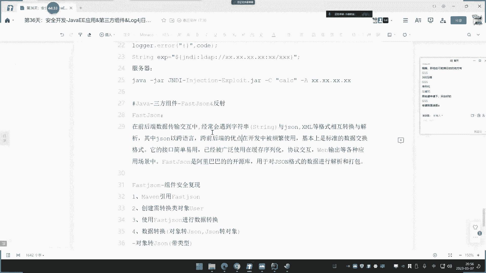

好那么他该如何使用呢，按照刚才那个思路来讲话啊，我们来创建一个这个文件哈，先搞个空项目吧，好理解一下啊，名字呢就叫这个fast，JSON啊，DOM啊，总结一下啊，那么它的使用呢我相信大家应该也好说了吧。

来讲解啊，同样道理，刚才用的是log4J是吧，我这里开发时，那我在用什么fast接收呢，啊你看这里头有个什么有一个这个版本的，还有个这个什么face or他还新啊，新新开了一个版本，我们用这个。

然后这里有很多这个版本对吧，嗯在1。2。83之后的版本之后，那就没有漏洞了，1。2。80啊，这个东西是吧，那就有漏洞啊，我可那随便找一个这个这个，这个这个点是吧，你看这里有很多这个相关的这个。

不同的版本的吗，来看很多啊，对吧，我们可以用一个这个拉CV12017年的，184349的一个东西，这网吧low，你就可以搜一下吧，比如说用这个网没那个漏NEO呢，弄个弧线呢，他教你怎么复线啊，往死写呢。

往上就让你写啊，这弧线你复线完能成功有什么用呢，对不对，你从源码上面不知道它是怎么产生的呀。

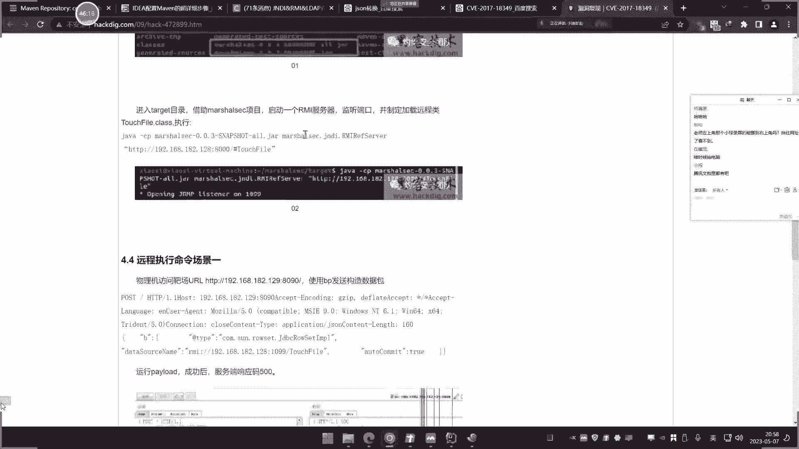

好来我再看一下啊。

首先呢我们也是用一下啊，他有两个东，Cv，12022和CV1207的这个版本当中是吧，其他版本的也行啊，你自己用哪个版本呢，根据自己需要啊，你想用浮线哪个漏洞啊，或者说测试哪个版本的都行啊。

我们就用这个老的一个版本吧，啊点进去啊，然后呢在这里呢把这个一选中。

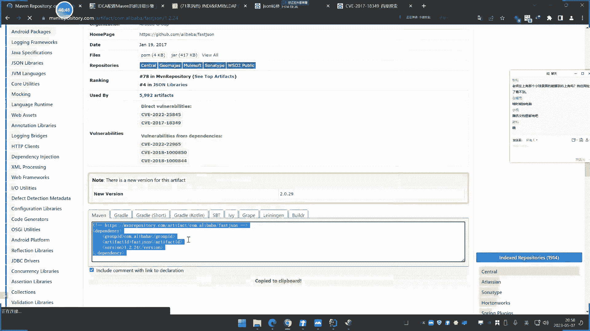

按照刚才思路来讲是吧，也是一样道理啊，啊是吧，先看下这，这只有这个1。8的JDK，自带的只有这个1。8，其他都没有，因为我搞了个空项目嘛，新建项目里面都没有做任何事情。

web的一些东西我都没有把它搞进去，是啥都没有，点一下这里啊，刷新一下，那不就出来了嘛呢，阿里巴巴FISK1。24啊，一个版本要出来了，有这个包了之后呢，我们就搞开发的呀，大家注意下开发。

呃创建一个这个fast这个什么测试的，一个这个这个这个这个demo文件哈，那就叫这个名字吧，懒得搞其他的啊，好先不创建啊，他这里呢，由于他是专门来处理这个建温室数据的，所以我在这里呢先搞一个，啊。

还是搞这种啧搞这种东西好一点啊，来创建个包吧，这样看上去更正规一点啊，想com点小DJ啊，就搞了个苞米，然后呢在这里搞啊，看成正正正规一些啊，com下底，然后在下面再创建这个。

呃user user这个类，然后呢我在这写一些数据啊，啊比如说我写哪些数据呢，呃写一下这个比如说名字STRA写的数据啊，这个是写的是干嘛的啊，我给简单解释一下啊，这个写着呢是用来这个长是吧。

来给这个什么fox faster js文呢，把这个数据转换测试用的啊，就是说这个文件是干这个事情的啊，不要等下说为什么要搞这个事情啊，因为有些数据嘛就有些这种呃用户数据。

然后呢用户数据里面呢你也要进行转换，比如说什么名字啊，人机啊，这东西是吧，里边的这个写好啦啦名字啊，这个int类型的学科A级是吧，那就写两个吧，名字和年级就可以了，其他的我们要位都无所谓了。

然后呢写几个这个方法是吧，是一个方法啊，这里有几个自带的啊，get a级啊，什么鬼自带的啊，这些自沙子这个构造方法，这两个是干嘛的呢，一个设置这样啊，把这个先拿出来，Public，String。

然后呢这个是get name，两个其实都自带的啊，这个没什么好说的，你直接搜get，那么也可以，我这也可以自己写的，各种看自动默写，这干嘛的呢，这两个两个自带的啊，这都是自带的，就是我没有固定的。

简单说它里面这个自带的帮你写好了，来自带的一些的这个构造方法，来得到得到这个什么额A级，然后呢这个是得到雷姆，那就这个东西它返回A级啊，返回类目，然后还有些像这种呢也是有些自带的。

那还有个sat sat a级，还有一个是我们说的这个sea name啊，然后你可以把它进行一个输出吧，输出一起呃，输出这个in好，把写好啊，写好之后啊，啊接下来呢保存一下啊。

就我们写这个几个数据写进去啊，就是一个类啊，这等下让我们把它用来当做这个fake jackson，来测试的好，我们这里再来看一下啊，现在呢就选择一个这个叫，JSN的一个这个这个测试啊。

好那么这里呢这个文件那就干嘛用的呢，就是啊这个使用这个fast接收呢，去这个处理这个什么user类文件，是吧，就处理个隔壁的这个user name啊，如如何处理的哎先写个mail函数啊，啊去处理它啊。

如何去处理它啊，大家看一下啊，首先呢我们定义一下user u等于一个new是吧，创建一个对象，然后呢我可以在这个优点里面呢叫sea是吧，A级我设置下连级30优点C的雷姆呢，这名字叫小迪，好。

设置好之后呢，我可以看一下啊，设置好之后啊，你可以怎么样呢，进行个什么输出一下这个U对不对，你看一下啊，我运行一下，看一下是不是啊，来运行，就我对user呢，你看他就输出了啊，三十三十是吧，都输出了。

你看小D30，你看也把输出了，是不是把这个数据给输出了吧，嗯30小于一好，那么大家可以看一下这个数据格式，目前他是一个什么格式啊，呦格式是什么处对象啊，那么其他的像这个A级呀，还包括雷姆呢。

都是指定的什么，一个是int类型的，对不对，就和这种类型一样子呢，然后呢name呢是string类型，然后呢他们都是什么呀，这个是吧，是不传数据，这个呢是个OBGDCD的一个对象是吧。

生成对象嘛哈那这个呢全部是字符串数据，然后如何我要把这个字符串数据好简单啊，比如说像现在啊，我们想嗯把这个数据啊转换成JSN数据，格式数据，所以呢啊我不想用，对不对，自带的这个API太麻烦了是吧。

你有就是太麻烦了，所以这个时候呢我就选择了什么，我就选择了，我就是完全站在这个开发者，为什么要这样写，把它写出来，因为有些人他喜欢win，但是为什么要用，为什么用，哎呀，真是麻烦死了，我就选择了是吧。

第三方组件，JSON是吧，来去做这个功能啊，知道了吧，好，那么现在就正式来到了这个，用发射键是N来去实现这个数据的转换，那么它的数据转换是怎么做的呢是吧，这个呢大家看一下了啊，首先呢我们就怎么办呢。

不就是这个了ZSON啊。

这里的我就给他写了啊，来它的转换类型呢。

这个是对象转这个JSN数据直接写啊，那再看一下JSON，那这里有个叫JSO，那object ction呢第一个啦来源于com阿里巴巴菲斯JSON，刚才这个把他库引用过去了吧，就这个地方吗。

那用这个啊是吧。

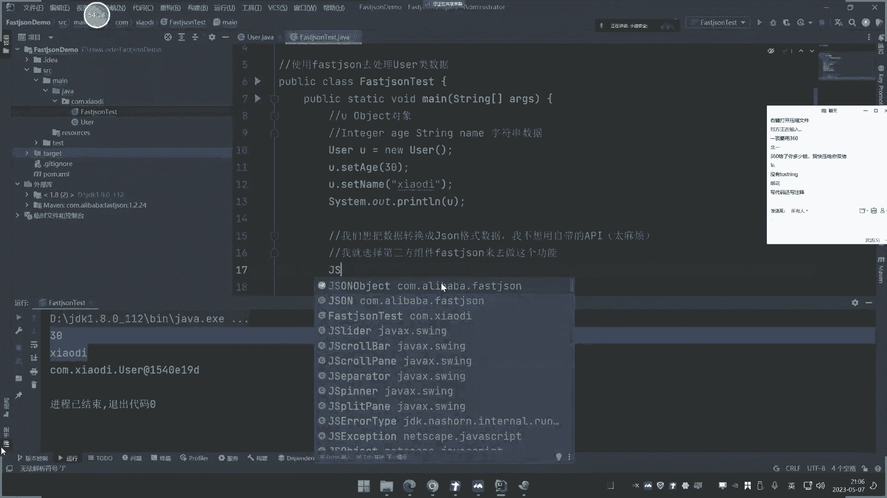

点咋这不是有的吗，来这里有的two js on string。

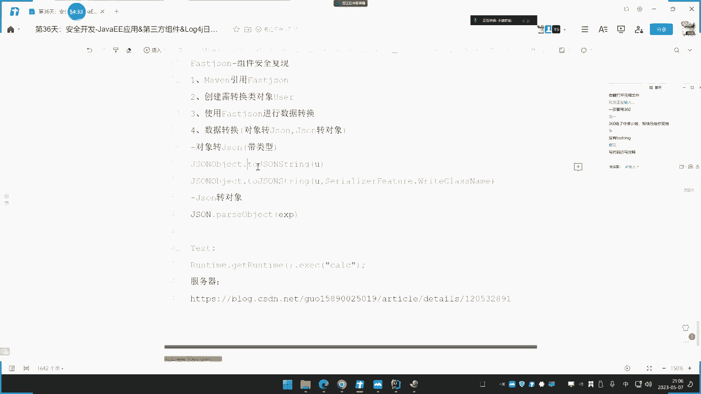

从这个方法名上面大家就知道了呀，这是干嘛的啊，q j s n train啥意思啊，Q来刀to目的地to j sn，数据就是JSN的数据，对不对。

JSON object为什么就是JSN的对象点来到JSN的数据，这就好理解了吧，这是对什么，这个函数是简单来说它是干嘛的用的呢，这个意思就是什么将计而损，对象是吧，转换成什么JSON数据好。

我们在那就把它写上去，比如刚才这个什么这个U吧，把它写上去啊，U，对不对，把它转过去，然后这里呢看下啊，可以搞个局部变量是吧，那我把输出一下，这个这个其实你输不输出都还行，那我们可以来把把写一下吧。

还是搞个九位量呢，输一下来看下二局变量呢，寻人建设是群里能不能帮我输出一下，好看一下啊，我们看一下啊，这个结果啊，然后这个上面输出呢我就把它注释一下啊，看一下啊，执行啊，看现在啊。

你看刚才这个呢是30啊，小迪我们现在输出呢，你看这不就是一个JSN的格式数据了吗，好理解了吧，所以说这里的啊避免有些人不懂是吧，再就是JSN还是把它进行个调节，所以啊这个东西大家已经明白了啊。

这个干嘛用的呢，把数据出来了，嗯好这个呢是转换，然后呢你看啊他的漏洞成因是怎么造成的啊，我们呢给大家简单讲一下，但是他的具体漏洞分析和利用呢，这个我们先不说，就说他的漏洞是怎么造成的啊。

就是在转换数据的时候呢造成的，然后呢具体为什么情况啊，给大家看一下啊，包括后面的漏洞利用都可以对比上来，你看啊它有一个另外一个地方来，我们先把来看一下啊，就在这里啊，它有个这个东西。

如果说他用到这个东西的话啊，不不这个不是啊，这个不是不是说用到这个东西，就是说你可以看一下啊，这是打印更多的信息，就这个函数啊，这个是干嘛的啊，我把他名字也改一下，这个叫一吧。

我们在那可以进行一个测试啊，分析这个你安全漏洞利用的一个这个过程啊，分析一下罗尼用的一个打印输出好，我们看一下啊，把这个这个东西要输出一下啊，好吧，打一下啊，先看一下，你看这个打印呢有个什么东西啊。

你看啊，我用到了加了个这个东西，这个东西就是让它显示这个什么write class name，啥意思啊，输出转换，数据的类型就是top类型，这里面就有他什么哪有他这他这个类，你好。

这里是不是有了有个叫at tap c，我们小d user啥意思啊，然后A级30内姆，小D在这个下面这个输出的嘛是吧，就是相当于说你加上这个函数之后呢，加上后面这个东西之后呢。

他就把这个叫alt name，其实那就是多输出了是吧，多输出一个东西，那么就是因为有这东西的提示，你试想想，如果对方对这一串数据去进行反向的话，啥意思呢，什么叫反向呢，那我们想象下啊。

你这个呢前面两个呢是做的这个什么对象，对象数据把它转换成这个JSON是吧，就是里面对象呢把它转成JSON这个式啦，那么同理，是不是还有JSN，把它转换成对象的一个东西啊，就相互转化的事情啊，是不是啊。

刚才那就是说前面两步都做这个事情啊，然后这里呢我们就分析告诉大家呢，其实它前面有个自带的啊，这个不是说我们做的事情，就是告诉大家告诉大家啊，告诉大家什么呢啊其实啊前面还有一个什么。

其实前面啊有一个什么这个at tap这个东西，它是自带的，只是说我不加入那些，你看不到它其实自带有这个东西，这个呢就是我们说的啊，就是我们说的这个转换的那个对象内啊，对对就是这个com嘞。

内向内内包啊对吧，对象包内包啊，那我这里呢就是说你如果用健身转换对象，那该怎么卷呢，大家看一下啊，我该怎么卷啊，我可以呢，那把这个一复制啊，我可以把这个复制或那个复制都行啊，我把这个也复制啊，来复制。

那我写个变量啊，你看啊，String，然后名字叫E叉P先写个test吧，等于什么等于这个东西来这个斧子自带啊，它自动帮你加了这个斜杠，就是防止这个因为你是双引号嘛，你这里也双引号。

防止这个双引号和双引号这个啊对齐，所以他装这个双引号呢，就不再干扰这个前面双引号啊，是这个意思，这个是id自带的啊，这个没什么那个i id复制写到编里面去，他会帮你自动这个搞这种事情啊，好把显去啊。

然后呢你看啊有个叫GSN，点什么PAR，object这个是干嘛的，好，这个接时候呢导入类导进去JSN点pr解析对象，是不是就是，在商书那下面，那JSN把它搞成对象呢，解析对象，解析谁对象。

把个test搞进去好，先进去之后啊，大家看一下啊，呃然后呢你给应该绝不流量啊，但但这个输出呢他是看不到结果的，因为呢这个是一个对象的，是个救生对象的，你这个输出呢他是看不到东西的啊。

就这个东西呢你看不到它是一个空的，就是我对这个东西呢进行一个把它还原成对象，你看是不是还原的呀，来看到没还原那边好，我这里呢可以给把前面注释掉啊，先把这个前面注释掉，怕有些人呢这个看不懂这个是哪里来。

这是我给他传递的一个JSN是吧，然后让运行，他是不是还原了，你看是还原了呀，还原成这个了，三菱小迪了呀，哎三菱小迪了，这是前面输的3D小题啊，这是前面输的这个前面一个，最下面这两个呢是这里输的对吧。

然后呢不还然的，对不对，不还原的啊，首先说我画圆了啊，那么大家试想下，如果现在啊好，我做个什么事情啊，看着啊，这个地方com里面改成一个什么东西啊，这不是一个com user，就这个地方吗。

如果你看一下啊，我在下面呢再写个什么叫这个，run run点Z是吧，然后这里写个什么东西呢，大家看一下啊，就写个这个，Long time，点EXC执行的CLVC的这个东西，写到一个方法里面去。

名字也叫run，好那写进去，这是个执行命令的吧，来这是一个这是一个另外一个run里面的，然后我这里把一改，你看啊，我在传递这个art的时候呢，我把它改改成什么消低一点什么run，然后我改成个run啊。

来看我改成小地run，看一下啊，什么效果啊，就其实就是说我告诉他，我现在要处理这个什么这个这个对象嘛，那之前呢就是说你如果你如果就说，你之前是这样写是吧，他告诉你是user这个处理它user对象。

然后呢你现在呢我让他写个这个处理run对象，run对象是什么鬼啊，这里面执行的命令啊，好我看下阿拉V型啊，看下，呐弹出计算器就是搞错对象啊，我把对象一换，他就处理run对象去了。

run对象你没的就直接命令啊，对不对，然后呢网上你再看一下网上EXP他怎么用的呀。

你可以看一下嘛，看一下你就知道了呀，不然的话别人叫你怎么用，你有什么用吗啊，你看网上是什么什么怎么用呢，那他说了小于1。2。4版本，这个payload是这样写的，你看看这是他的一个漏洞的。

一个这个这个这个这个什么鬼异差评呢，在漏洞细节你看啊，来把类型改成GSN，那在这输什么，TF等于CON的一个方法，然后后面的一个是RMI东西，啥意思啊。

其实这里非常好理解了，通过我们这个学习他这个漏洞利用，我们就能把它解释出来，啥情况来，我们来对应着给他说一下来，首先呢这个地方为什么要改这个格式啊，改啥改啥，很简单嘛，我们这里那就是很简单的一个意思。

他这里就是啊固定号数据格式，为什么，因为fast JSON时将什么JASSON转换对象嘛，这个漏洞是产生在哪里啊，刚才漏洞的一个产生是在哪里，产生在JSONN转什么对象这里对不对。

然后固定好这个格式对不对，所以呢你就是健身数据好，这是为什么要这里改，再看这下面呐，这下面呢有这个的叫tap，这个tap是干嘛的，艾特hub，是不是我们要转换，刚才我测试那个点。

是不是我们要这个进行这个操作的对象的包啊，这我操作哪个包，对不对，它来个包，那就是这个包好，那下面这个就是它的值嘛，这值啊，他为什么写个RMI呢，arm i我们前前面看到过，它是个什么软件调用方法。

然后调用这个叫class文件，那么为什么要操作这个对象包呢，你再去查一下啊。

这个对象包是一个什么东西啊，好我们先把它把它保存一下，在我们操作这放到上面那个支点啊，然后这里有个苞米嘛，你可以网上搜一下啊，这个苞米呢其实很好理解了啊，他就是那个RM的那个东西，那你给说一下啊。

哎也不用看了啊，他其实就是这个报名，显然就和那个RM方法的调用地方是一样的，因为你要叫mi的话，他那个包呢把它引入进去呢，省掉后面那就是这些事情了啊，网上那些很包显示器，后面那就是你这个操作的东西。

就其实就是参数嘛类似的参数，因为这个里面呢就这个东西嘛。

同样道理啊，我刚才呢呃这个地方我是怎么写的，我这能改成run，对不对，而且你可以看到我run里面呢，还应用到这个java自带的这个东西啊，去执行它，是不是，如果我这里呢不用不用这个包呢，不用第三方的包。

我可以写个什么反射性去调用这个这个一叉一，也是可以的啊，其实就很简单啊。

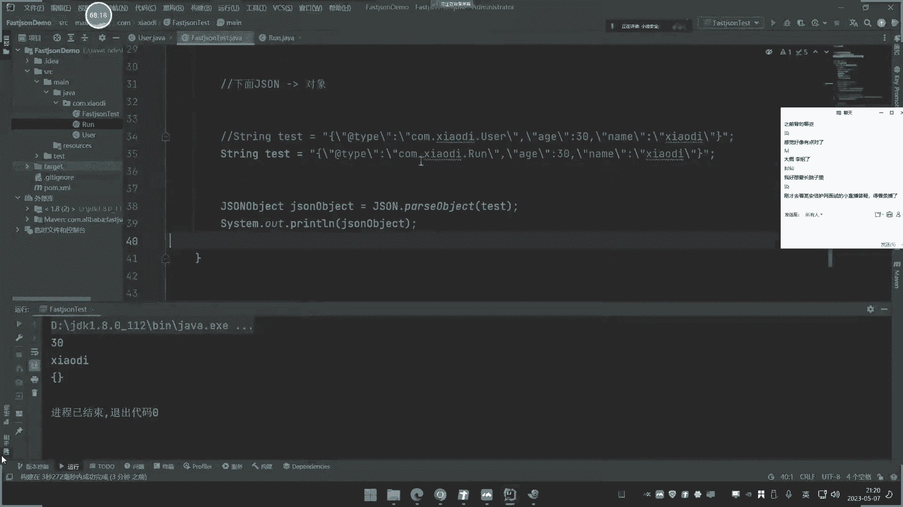

就把这里改改成那个top里面，那就是我们那个啊利用的那个地方嘛，那网上这个利用过程呢，哎你看了就知道了嘛是吧，对这个这个class文件呢就是它自己生成的，它你看一下利用过程嘛是吧。

他这个地方呢就是呢去创建一个文件，然后把这个文件呢把编译一下，编译成一个这个class文件，然后利用这个工具的呢去生成一个这个地址，这个地址那就是远程调用地址是吧，就是你访问这个地址。

那就会触发触发这个代码啊，这个代码呢就是创建一个目录，所以呢他就发送这个东西给他，让他去转化，转化之后那就触发了，可能你会问，那我怎么知道在哪里发送啊，他其实呢也是在乱测。

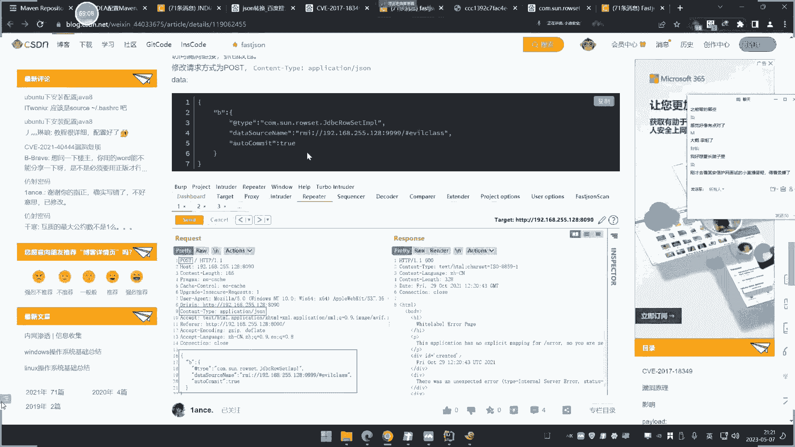

因为在如果黑盒中的话，你是不知道哪个值呢会被转换，所以呢一般就是到处插，到处车，到处测，和那个那个时间差不多，就是你要看哪里地方呢有这个转换，你就在哪里测那个数据，主要漏洞，原因呢。

就是啊用到这个fix杰克森的这个漏洞版本，然后呢在某些地方呢，对这个健身呢进行这个转换的时候啊。

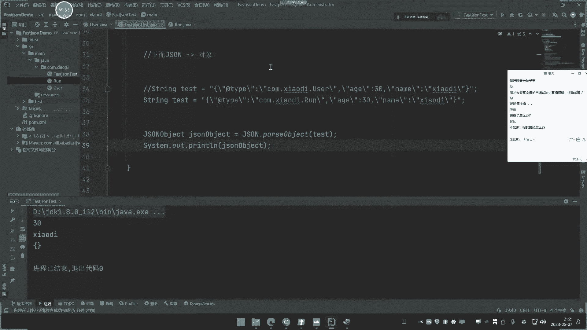

然后呢啊对方呢啊，攻击者呢就是让它指向一个这个什么这个包啊，然后呢，去让他再调用一个远程方法来执行代码执行，所以它的漏洞的名字叫做反虚化。

造成域名执行，你可能说诶这怎么有反序列化呀，是这样的啊，在这里呢它用到这个什么JSNPRA对象的话，这个过程就是反序列化，所以这个就是反序化，我们说的是数据转换，是让你更加能理解，但是专业的讲。

这里是传反是序列化的操作，前面那个是前面是那个是虚拟化，这个是反序列化，就是我们前面讲的反虚化和虚拟化的嘛，一个呢就是说把这个数据呢啊对象呢转换成额，转换成那个文件啊，那种东西序列化。

还是呢就是把文件呢再还原出对象，这种呢我们就称之为叫反虚化，那这个呢就是刚好就把数据呢是吧，换成这个对象对不对。

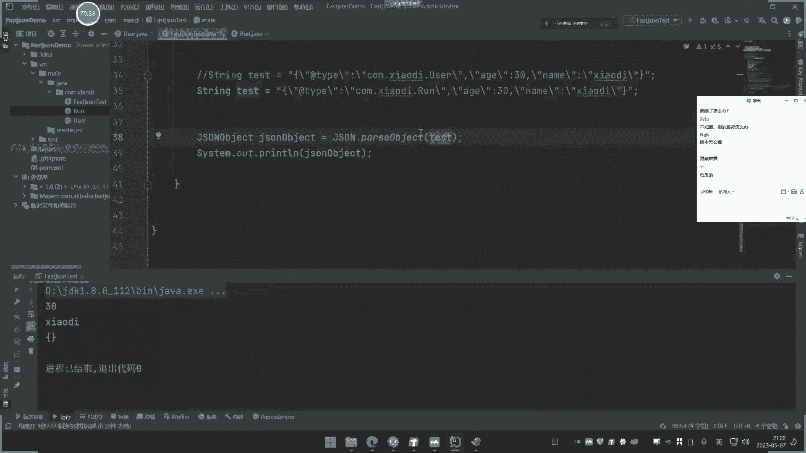

所以他这个是反虚化对不对，所以他称作反虚化，导致人于命令执行啊。

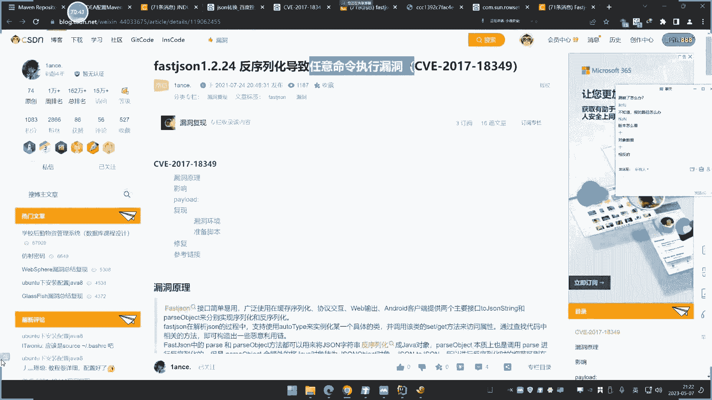

就是利用的什么东西啊，后期的利用的就是我们说的这个。

利用这个JNDI，注入这个LDP和这个什么RM来实现，所以说关键点，这个利用点就在于这个什么mi和这个什么这个。

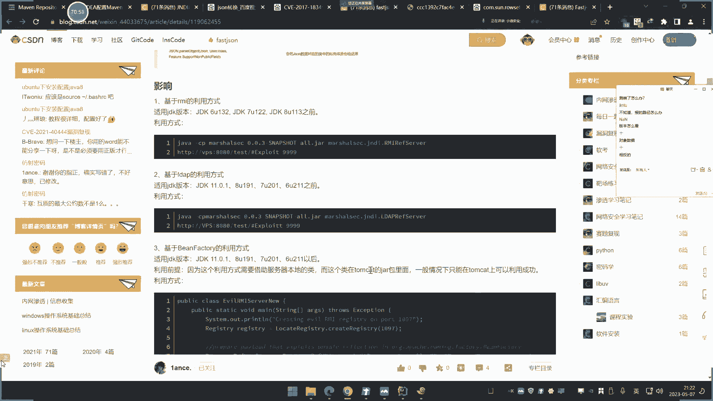

奥迪AP，因为大家可以看到啊。

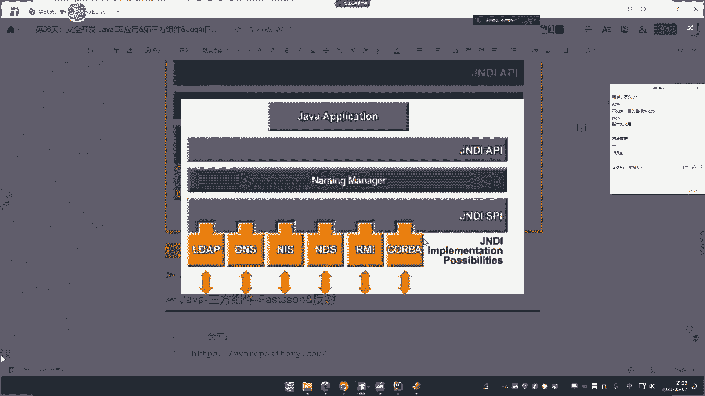

我这个利用呢我是在这里写了个文件，但这个文件呢你可以想象一下，这是我写的，他能调用，我如果说要go这里的话，这个地址的对不对，我只能写什么，我都可以思考一下呀，因为如果说我自己去用的话啊。

实战中的这些情况，做我去用到这个东西，对不对，这个东西我们不知道啊是吧，我们是不知道的，所以呢他就是一般是固定的啊，搞一些这个固定的调用，然后再用这个什么IMI和ROADP呢，IIIADAP啦去触发。

远程的这个什么class，然后呢来执行这个相关的这个代码，就是类似我们代码的，一般就是命令执行RC1这种东西嘛，这么个事情，因为这个实战中我们是没有这个东西的，是我自己在勾搭下装是说啊用这个类。

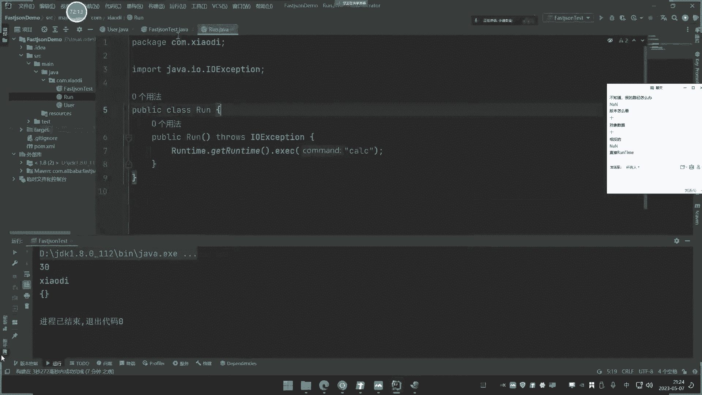

但实际上你不知道，所以不知道呢，一般就固定他固定的就是这个东西嘛，是吧，我刚才也说了啊，固定这是这个东西跑哪去了，网上都利用这个过程来固定就这个东西，那你可以搜很多啊，搜很多都是这个都是固定这个东西啊。

你可以往下翻呐，那这里还固定这个呢，你看看固定个java letter letter d s这个是什么东西，也是java自带的，java自带一个什么d slog地址，主要他访问一个DSLOG。

这个是不是自行命令，就是单纯就是让他访问一个DSLOG地址，来判断漏洞存在，你看这也是固定的，这种java自带的一些这种啊类啊，这个包的地址啊，对不对，因为有些他不知道的，你只能搞一些固定的啊。

后面呢他在利用到这个东西的时候，你看他就固定了，你看对吧，这个地方呢这就是都是固定的啊，这是摘的，然后呢用他这个RMA的方法呢去触发啊，这个后面这个漏洞浮现我就不浮现了啊，因为我们的终点呢。

不是说去教大家怎么去浮现这个漏洞，我们后面讲上期课程我们也用过这个漏洞复现，就说我去浮现过这个fast JSON的一个漏洞复现。

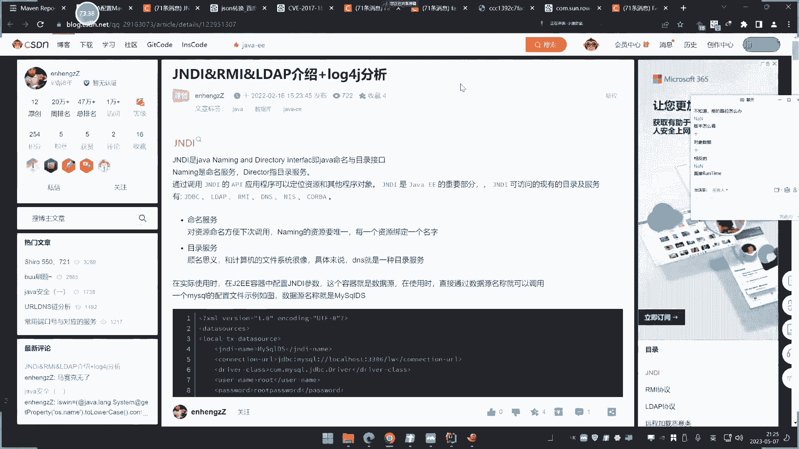

我也复浮现过，但是浮现的时候呢，我并没有去说这个logo是怎么产生的是吧，从代码的角度上去给大家分析，所以呢大家就只知道怎么复现。

至于为什么这里呢是这个payload是这样写的，你只有说了解过学过java的。

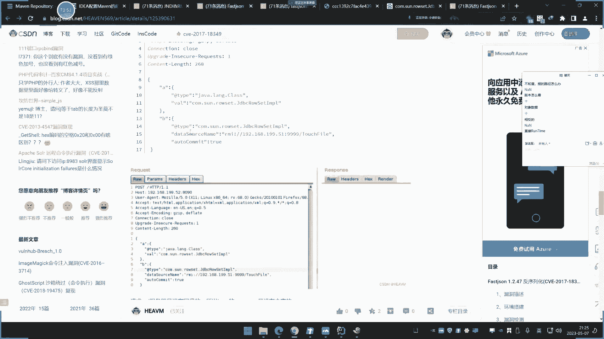

已知道诶，这是个什么含义，为什么这样写，是刚才就知道了呢。

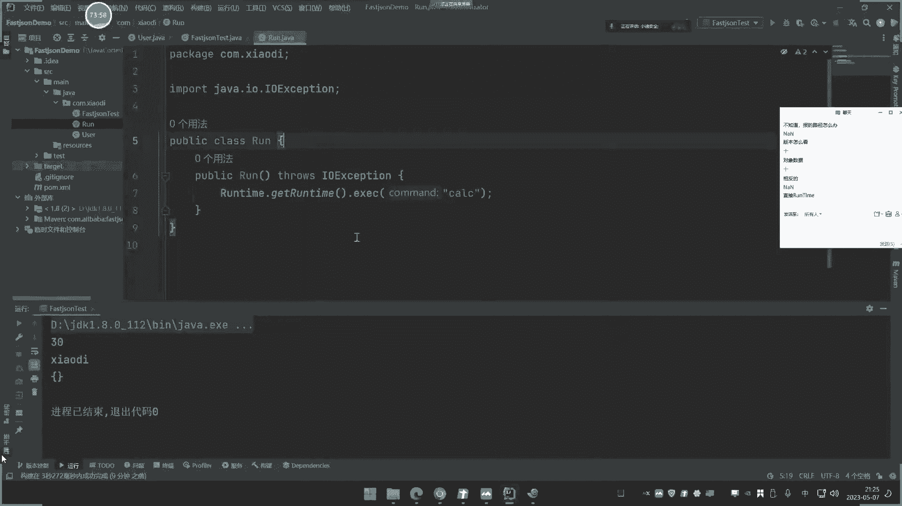

是吧，就是改成这个地方吗，那为什么他要改这个东西呢。

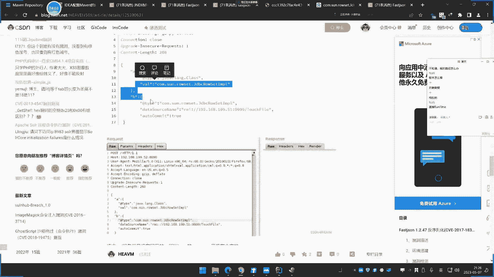

啊就是我刚说的嘛，因为实战中呢，你像这个这个run是我自己写的。

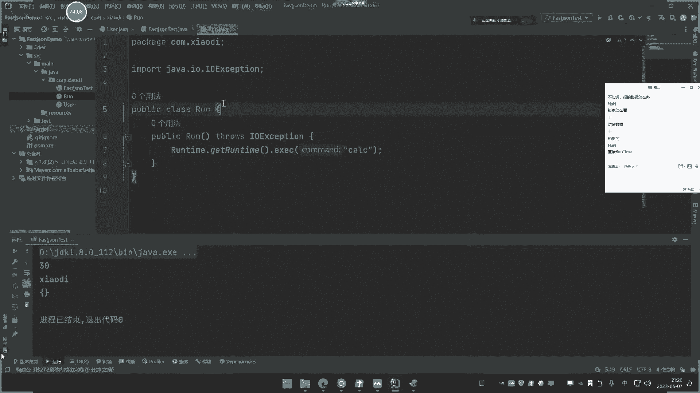

那别人代码中你怎么能写代码写不了啊，写不了，那就只能用它自带的呀，就包括了用他自带的这个java里面自带的，这个什么，刚才那个java的呃，呃let这个这个东西让他去访问个地址，来看一下能不能成功。

是吧，后面再用这个执行命令，用这个什么java自带的这个APIRI，这里这里这里JNDI的注入，来实现这个远程调用方法，然后远程调用方法呢是你自己写的代码，是不是把它编译成这个class实现的。

这么一说，大家就明白为什么这样利用了这一讲，就明白了利用的那个过程是什么情况是吧，它代表什么意思，白河中呢也给你提高了提示，你后期呢碰上一些java的人卖了，你也可以看一下这个java源码。

用没用过这些漏洞的这个组件，这也是分析的一个点是吧，呃漏洞利用弧线的时候也知道关键所在了，对于这个java的这个什么鬼，几个组件logo世界呀，SHO啊啊，fast的JSN呐是吧。

你再把它浮现去吃别人面试题问你的时候。

你就知道了呀是吧，那比如说呢2023年互网中高级这个面试题。

给他看一下，呐大家看一下好了，效反虚化不错啊，怎么利用这个啊，我还没说啊，这是那个漏洞浮现的情况啊，然后你看下面那JNDI注原力是吧，还有这个咋还没有，现在像反序化的一个情况啊。

非则有哪些利用链那个什么鬼东西呢，这都是那几个啊啊pp和什么反虚化区别啊，什么鬼，是吧，这是有和我们相关的呀，你没学哪，哪知道的这个间谍注入原理是什么鬼是吧。

这个图片那答答的上答上来几个呀是吧，还DP的这个mi的。

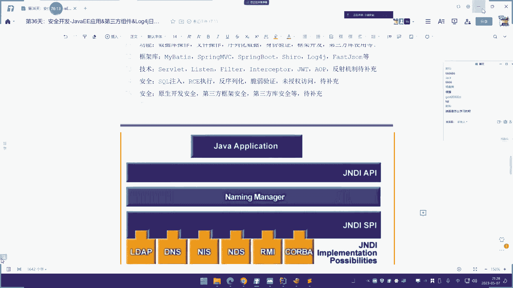

看怎么个情况，就是他自带的，你可以怎么回答呢，啊自带的这个API，它主原理呢，就是利用它里面的那个什么自带的API是吧，里面的那个好DAP和r mi啊，谐音呢去远程调用那个class文件来实现的是吧。

原程装这个调用的方法呢，那个class文件是我们自己编写的，来实现一些相应的操作，代码是由你写的，你说实现啥呢，是不是这个题就能回答上来呀，那不然的话你没有学过，回答个毛啊。

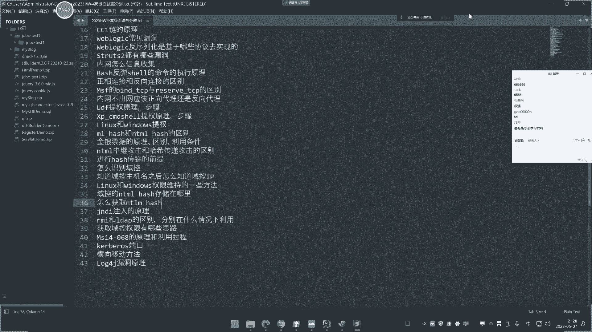

久而久之把字典一级多，这个中高级的一面杀是吧，经验有就把你搞成一个高级，既然没有，又搞成了中期，那也不错了呀。

唉好今天就内容就说这么多了啊，那么下节课讲什么东西呢，哎这也不说，大家也知道了啊，下节课我们就讲解ZNJNDI，这个下面的东西啊，就DNDI注入全部都是干货。

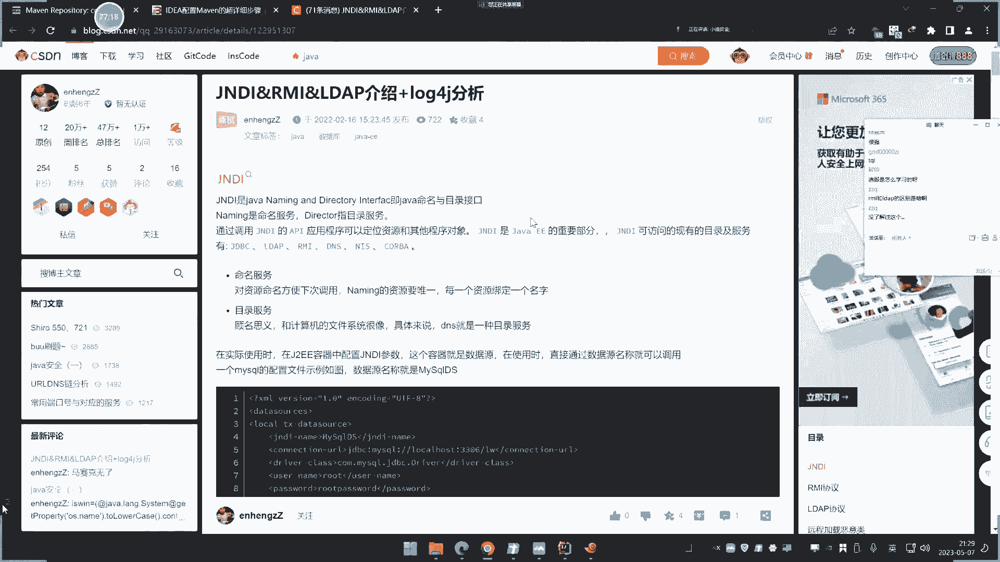

全部都是这个高端课程对吧，下节课讲这个啊。

了解一下这个下面的那个RMI和，RDP的一些知识点啊。

好大家看看有没有什么问题啊，有问题就问，没问题我们就瞎了啊。

今天内容还不是很多啊。

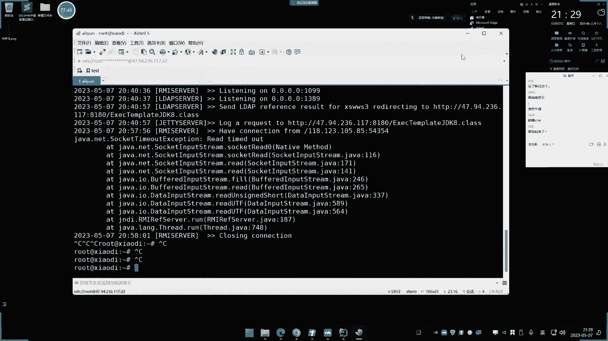

听不懂就是正常的，听得懂就不正常，可以看看生成的class文件吗，这个class文件。

这个你可以看一下漏洞服务先这里嘛，这个漏洞浮现这里呀，他有这个东西啊，那个，他是用那个JJ呃，java c呢去把它编译成那个哎叫谁呢，把别人省的那个东西啊，来自自己写的。

啊就这个啦啊这个java c呢运行这个这个文件，就是字写的，就是你的利用代码啊，把自己写用这个JAVC，那编译成这个你写的是java文件嘛，它变成这个class文件了，class文件之后呢。

他就把这个的class文件呢放到这个网址上面，那然后你这个去调用访问嘛，是吧对吧，然后去这个调用访问后面的代码，能去触发这个路径地址嘛，是这个意思啊，所以那个利用文件那就用java写的。

然后呢把它编译成这个class，因为你学过java s1的。

应该知道啊，它在指引的源代码是这个java文件啊，然后呢执行之后呢，就变成这个呢我们说的这个class文件了，对就是我们这个那这个卡死问题了，只是说我现在要把它反编译了，所以他原慢的能够看到。

如果不反编译的话，那这个呢你看他就是点class，所以说为什么java里面有反编译这个说法，其实呢就是把这个class文件的话，反编译成这个java文件，对不对，因为它源码的是java。

执行之后呢就变成class了。

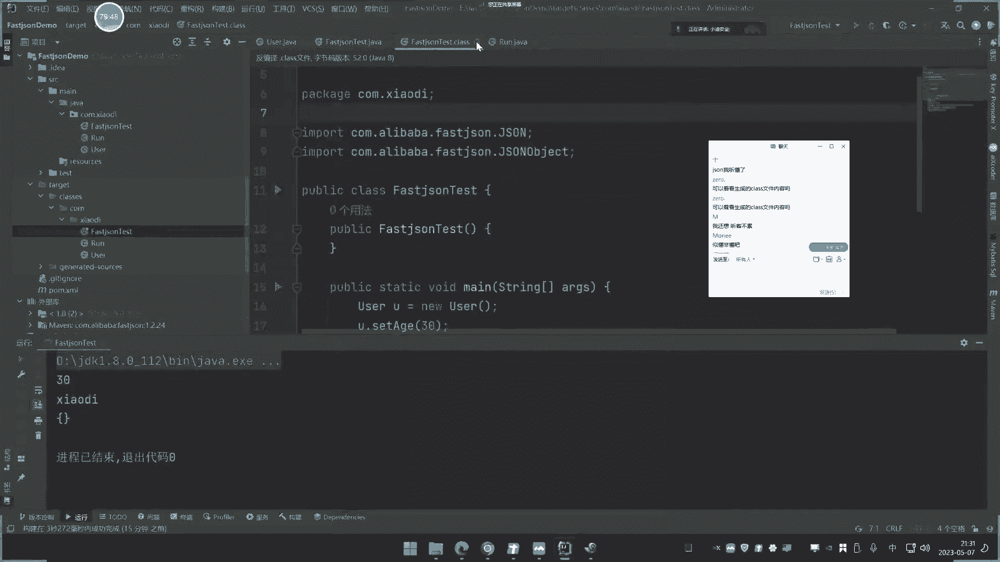

哎呀还是很多东西啊，你们有些没有学过的，都很难说搞清楚这个java为什么难，就是因为你没有学过java语言，你都不知道他的一些格式啊，各方面的一些东西，我只能说带着你去摸鼻子，一样是摸着一样。

摸一个就就明白一个，那么渐渐的摸摸，摸多了之后的接触多了就会相应的明白，话说啥时候讲的JNDI没有讲啊，没有讲没有讲，这是我们下面要讲的，后面课程要讲的，现在没有讲，这节课比前面有意思多了，哪节课都好。

只是说这节课呢和你这个碰上的这个是吧，可能你经常碰到，你对他比较熟悉，就觉得好，写的加我代码可以发一下吗，好歹码秘密试一试，每节课都发到网盘去了呀，怎么没发呀，等下上网课自己过个二三十分钟。

自己看网盘啊，歇斯肉，讲不讲是吧，CERO讲不讲讲啊，后面讲啊，这个东西是那个身份验证的，就是专门来做身份验证的，这个有点麻烦，他有个专门那个视频ING的视spring安全那个框架，那个有点麻烦啊。

我那个有点不太懂，那个框架不会搞，所以我准备说这几个讲他的，但是你妈的搞了半天没搞成功，我就只能讲这两个线，我看那个到时候和那个GW讲一下，这SHAO，他和那个spring boot结合多。

spring boot太麻烦了，不容易，那属于这个java里面的高端编程的，这两个有什么区别，操马上就要讲，不是今天的内容啊，到时候会讲的，啊对是这个这个service啊，是这个，唉你当然简单。

你天天卷我，你妹还要备课，你天天都在卷，你们自己看着了啊，卷王说简单。

