# 【小迪安全】V2024版 全栈网络安全 ｜ 攻防渗透工程师 （持续更新） - P37：第37天：JavaEE应用&JNDI注入&RMI服务&LDAP服务&JDK绕过&调用链类 - 逆风微笑的代码狗 - BV1Mx4y1q7Ny

今天呢是讲这个37天的那个java的课程呢，已经上了六次直播了啊，这个还有三次啊，呃今天讲这个JDJN啊，JJNDDI的一个注入啊，其实这个呢啊，我们主要讲的是健康DI里面那个东西啊，就是讲几方便。

就什么是这个接近底I，然后接底I里面的这个MI，和这个奥迪AP这个服务的一些相关知识点，然后呢他的一些利用的讲解啊，就是说把一些漏洞利用的，为什么那样利用，为什么那样玩啊，为什么是那样个配load。

把这些东西呢讲实清楚啊，开发的一些代码呢不是很多啊，就这几个啊，我们讲的主要这几个，那为什么讲它啊，呃其实很简单，就是在java里面呢，很多情况下在利用一些反需要漏洞的时候呢，都会有这个什么IM呀。

奥迪AP的一些协议的这个使用，如果说大家不了解的话，那你可能就只能对着搞了，如果说了解的话，你就大概知道啊是个什么情况，在面试题里面，或者说在这个深入java的安全里面呢，这个东西是不得不学的，好啦。

说了这么多了，我们就直接给他看一下啊，首先呢我们思考几个问题啊，什么是这个JNDI啊，这个猪又是个啥东西，猪呢是我们自己呢把它写上去的，就是其实就是什么是JNDI注入呢，就是我们常见安全攻击的。

把它称之为叫J根底底尖跟抵押猪入啊，然后这个为什么会有这个东西呢是吧，然后呢他有什么安全问题啊，最后呢就是说啊你要使用它的话，它有些条件啊需要满足，那这里呢有个参考的网址给大家看一下啊。

先来简单的了解一下，来这个呢说说何为经典安呢，他说全称为叫java，那什么Levi and decoy是吧，就是一个java的一个命名和目录接口啊，他是一个干嘛的呢，他说里面有哪些服务呢。

就是什么这个arm2啊啊DAP呀，CCROBA啊，DNSS啊是吧，这些都是它的一些服务，那么这个东西是干嘛的呢，简单来说啊，它就是一个内置的接口，这个接口呢可以来实现对象和服务的一些调用。

然后这张是张图片，JNDI是一个接口，统称为JNDI，其中在下面呢有LDAP和，这个今天要学的LDADAP和这个RMI，还有这几个，这几个呢不是很重要，出现的不多，主要是这两个IMI和LADP。

那么这个全称叫什么名字啊，我们呢可以看一下这个一个介绍。

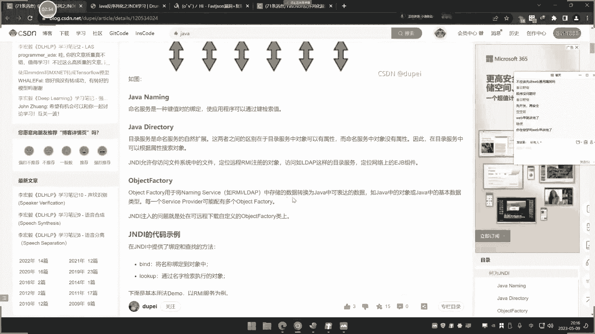

这个介绍呢会直白一些啊，他说的是这个一个东西啊，然后呢你可以看一下啊，他说的是什么意思呢，他说呀比如说我们上面那有个打印机服务，就我们电脑上面有个打印机服务，它就可以通过这个java的这个ZNDI。

这个接口呢来实现去远程，或者说本地去调用这个打印机服务，能理解了吗，其实也就是说它其实就是一个接口服务，来实现了一些服务的调用，比如说像类似的什么电脑上面安装打印服务，他都可以调用，除此之外呢。

我们最主要用它来去调用的，就是远程的一个代码，对象就是类对象，啥意思呢，就我可以利用这个GNDI技术来实现，远程调用一个文件，那么其实就是远程区执行这个文件，这个文件是谁呢，就是java的代码文件。

就是我们常说的java的这个执行文件，class class文件，它可以在远程去执行一个class文件，而这个class文件呢是可以由你来去写的，那么class里面的代码是什么东西，就是会执行什么东西。

就是我们安全的，主要就是用它做这个事情，就是一个远程调用。

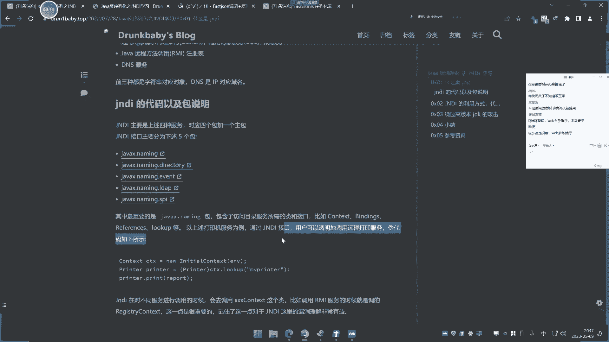

那么其中呢名次交法啊，这个mi呢称之为叫远程方法调用注册表，而DP呢叫轻量级目录访问协议，就是一个呢是对目录的一个访问，还有一个呢是对远程的注册表操作，那咋个情况之后。

联系到了调用远程的一个java文件呢，啊，这个呢是根据他自身的这个协议里面支撑关的，就说他的其实呢它的作用本身设计，它一个是调用注册表的，还个呢是调用一个目录的，但是在它的功能里面呢。

能够实现调用一个文件代码好，这是他的一个解释啊，那么在解释之前呢，我们来先来看一下一个简单的介绍啊，在java的这个类之中呢，有个这个类叫做java level。

然后intel contest look up这个方法是干嘛的呢，这个方法就是专门来去实现这个JDNL额，ZNDL的一个组的，我们呢可以用一个代码呢给大家去看一下。

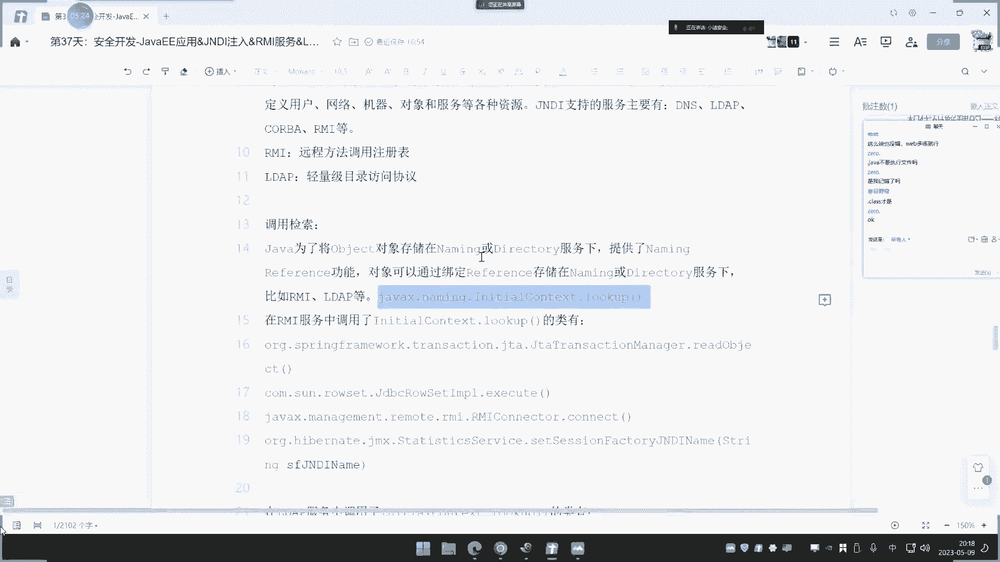

好在这里呢我们就新建一个代码端哈，名字呢就叫这个ZNDI杠demo啊，我我这里那就搞一个web服务的吧，哈这个其实你不搞web服务的也是OK的啊，搞个这个叫jdi injection inject。

然后demo是吧好，然后呢这里呢我们就选取这个类型啊，然后下一步1。8版本的是吧啊，新新窗口，此窗口啊啊创建好了啊。

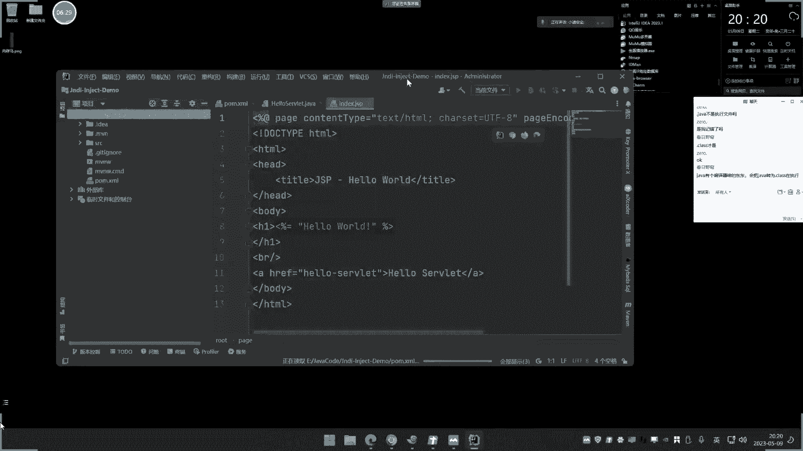

这是一个这是一个东西，然后呢我们在这个下面呢去写一些代码啊，我们在这里呢就写一个这个文件啊，名字就叫做这个CNDIN吗，好那写好之后呢，我们来看一下第一个啊，就这个东西啊，啥东西呢，来看一下。

就这个啊这个是啥呢，来看一下啊，然后呢这里有个INI点look up一个地址啊，来大家看一下啊，这里呢有这个代码啊，我们先不写这里啊，这是这个文件啊，然后这里呢是一个什么这个东西是啥啊。

就这个new AI const，然后这里有一个解释啊，这个代码呢是干嘛的呢，它是在这个类里面，它是干嘛的，就说java呢如果说要调用一个对象的话，那么它就可以使用这个类里面的这个look up方法。

来实现调用，好我们来给大家看一下啊，实现调用，然后它的调用呢是支持IMI和LD，AP这个协议的，也就是说调用的话不是说按照我们这样写。

就说我写个class文件是吧，就假如我写个什么test点class，然后呢还去调用这个class test class，不是这样的啊，这里呢要写的就是我们说的啊，这个就是前面一二。

创建一个什么这个r mi和DAP等服务，调用好，这个呢就是创建，然后这个呢就是我们说的啊啊调用这个，然后呢这个就写进去，但这里呢要记住啊，是要以这个服务服务来写啊，然后这里呢怎么写呢，大家看一下啊。

我们来给大家写一下啊，首先呢我们这里在写这个地方啊，漏洞呢也是产生在这个地方，就是这个JDR呢，我们先了解它是怎么个调用方式啊，我们一起搞一个mi和LDAP的啊。

你看啊，我们这里呢就可先用工具呢。

来给大家测试一下啊，来看着啊，我们在这个远程啊。

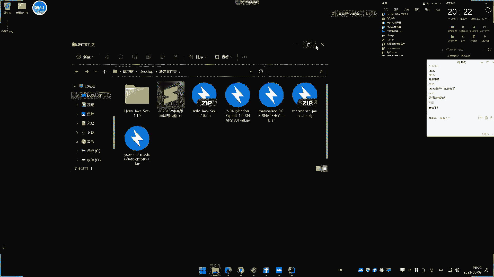

避免那不要不要等地啊，我们就搞个远程的。

这样子呢就更加的方便啊，这是啥情况，哎呀你这他妈的什么鬼啊。

真是。

花屏了啊，我你妈的真是服了，稍等一下啊，我把这个分辨率调一下。

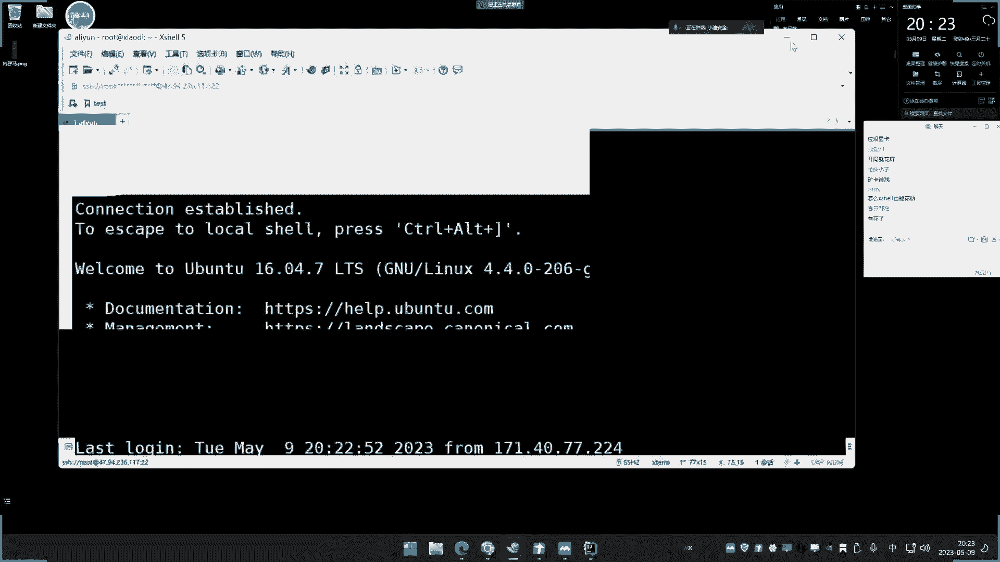

分辨率调一下它就好了，先把它调回来，调回来之后呢，再把它运行，好那现在再把它还原啊。

好可以了啊，他老要这样搞一下，也真的是服了，屏幕分享一下啊，避免有些问题，大家看到了啊，然后啊大家看一下啊，嘶我们先来用这个上期讲过的这个东西呢，你看啊我生成一个啦杠C执行一个这个冰冰。

比如说我就搞个像七的是吧，最简单的啊这个咖位绑定一个IP地址的啊，就这个0。000也行啊，啊搞个这个IP地吧，还是这两层的IP地址啊，搞个啊，然后呢把它搞上去执行啊，嗯他这里呢就生成了这个举个例子啊。

然后呢这个是接近1。8的啊，这个什么几点七的，我们就选择这个1。8的，那里有这个mi协议的是吧，还有这个奥迪AP的，那我这里呢就把这个东西呢给它写进去，对不对。

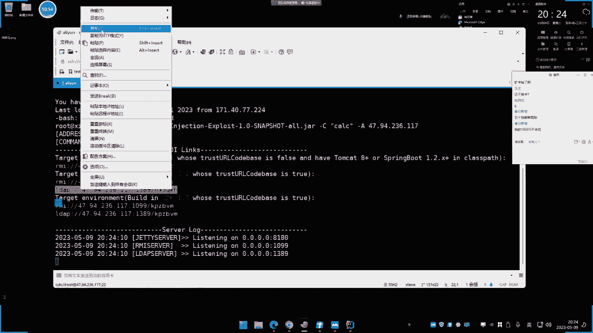

把它放到这里面来啊，看一下啊，是不是能够调用呢，那些来啊，就让它怎么样，这个就是让他去远程调用吗，哈远程的标准这个服务吧。

调用这个文件好看一下啊，先运行起来看一下啊。

是不是啊。

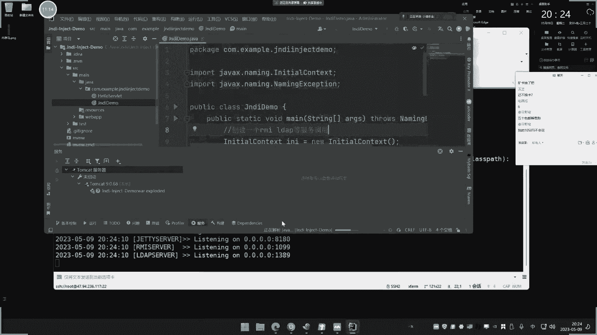

好你看啊，这边呢也收到了啦，看到没收到了，logo request来一个请求，然后呢他这个访问的是这个地址的是吧，然后呢，你可以看到他这里有个什么一个什么class文件，然后在那计算器弹的。

就说明现在呢很简单的道理，代码的远程去调用这个地址的一个文件，那这个文件呢就相当于是一个什么。

这个呢就相当于是一个class文件啊，它就等于什么这个远程那个什么IP上面的这个，90公西啊，所以说这个有看到了啊，刚才这样去谈的啊。

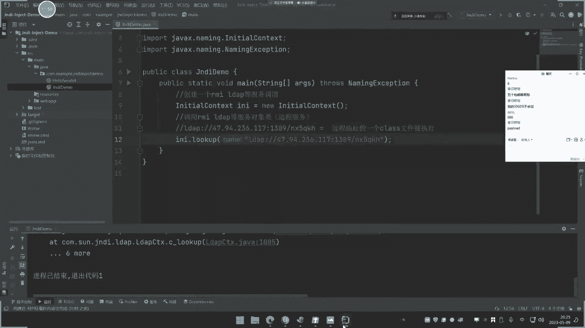

然后这个是使用的是刚才的LDAP，我们看一下啊，我用这个IMI的是不是也可以呢。

嗯继续来啊，哥，搞个阿麦的，把这个注释一下，对不对，再来运行看一下啊。

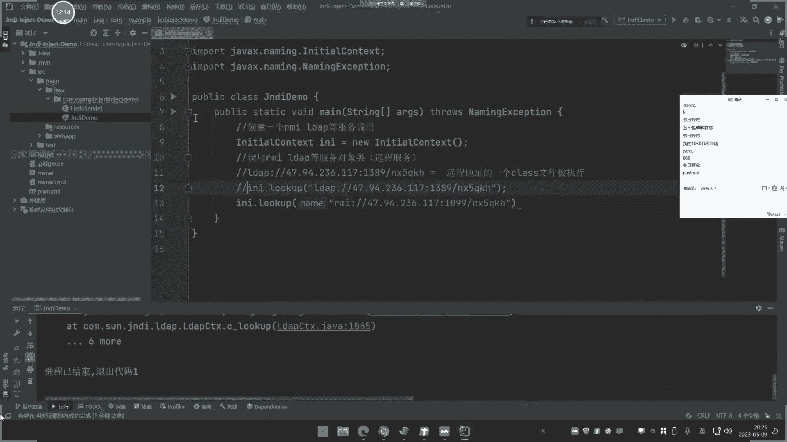

运之后呢观察一下这边下面。

嗯报了个错误哦，后面没写个封号。

哎计算机也弹了，然后你看是不是也出现了个访问情况啊，你看而且这个呢情况更加的这个多，B哥看一下啦，他说啦这个哈字有个链接啊，然后呢什么一直IMI的look up。

请求他啊去发送一个远程的class login啊，到目标，然后呢关闭链接，哎这是他执行的过程，对不对，过程的都写得一清二楚，刚才那是这个嘛。

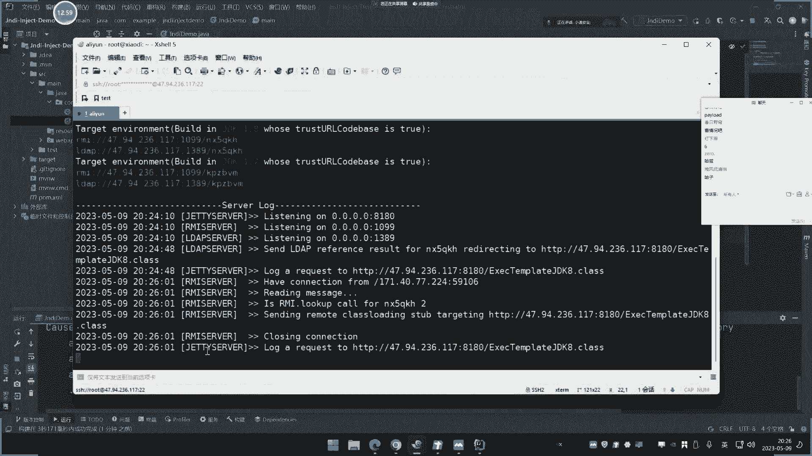

这个那就下面这几个，那ARMI和ROARDAP都可以好，那这个搞完之后呢。

这是一个很简单的一个什么，一个调用的一个情况，那么产生的安全问题呢。

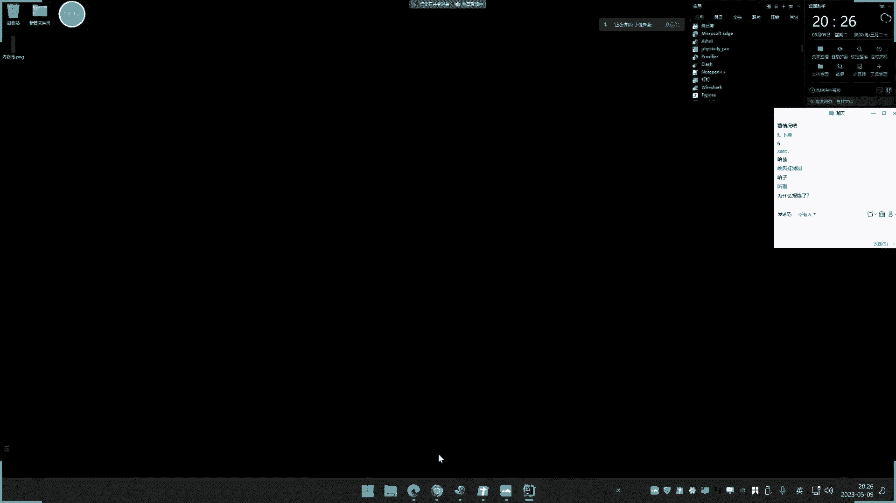

是这个东西的实例化之后呢，把它实例化了一个这个什么调用对象啊，对不对，然后呢去远程去请求这两个东西，是不是去请请求这两个东西啊。

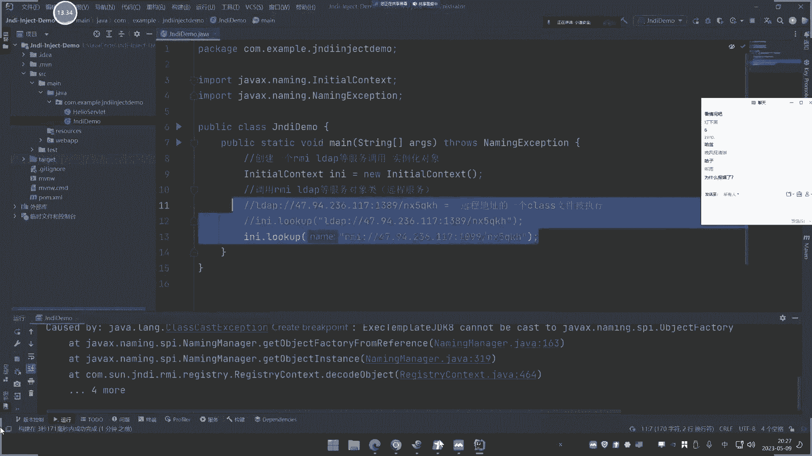

好我把暂停出来，那这里呢我们再做个实验，换一款工具。

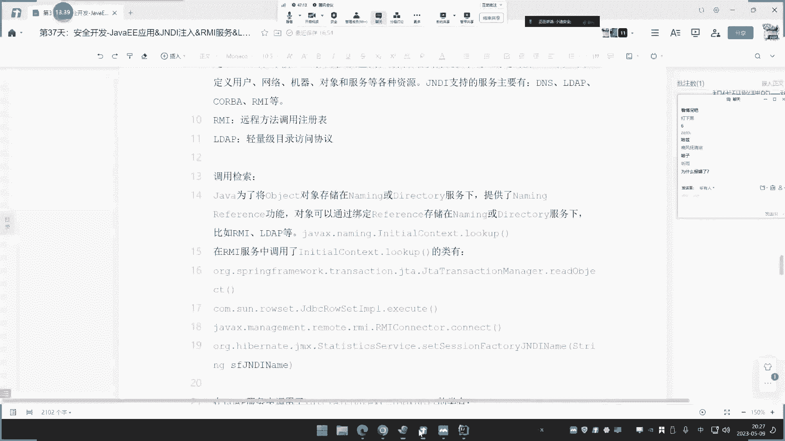

换个什么工具，大家看着啊，这样工具会更加的好理解。

好把它整个过程分析的更细好，大家看一下啊，我们再换个什么东西。

我再换一缓工具，刚才是用ZNDI这个脚本，这个脚本做了个什么事情，其实呢他做的事情我们等下再来分析啊，先把这东西解说完，这个啊，然后呢他这里呢有个参数。

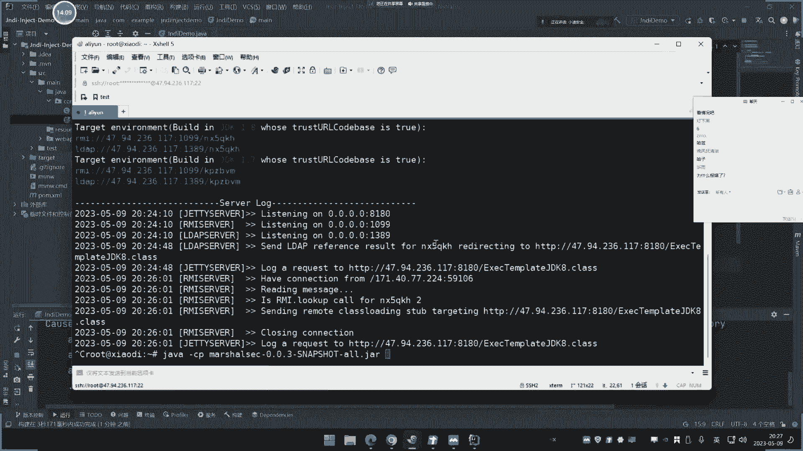

那就是运行这个地方之后呢，它有个参数，有个什么参数呢，看一下啊，有个这个叫DI。

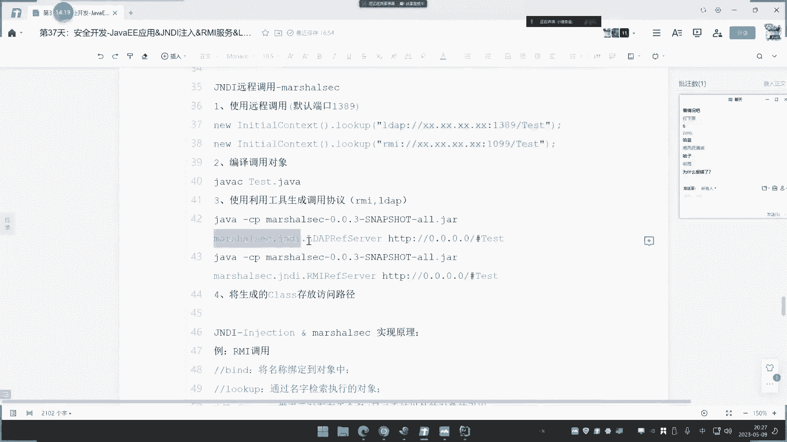

一个叫LDP的啊，有个参数，然后后面呢再加上一个IP地址，就是我们0。0就是所有网卡啊，当然了你也可以写了，IP地址也是OK的，后面一个叫西井号test好。

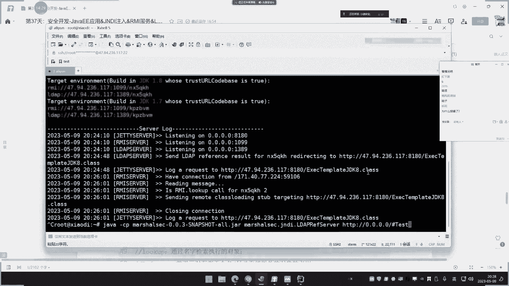

我们在这里呢我先再创建个文件啊，文件的名字叫在这个test z n d i点class，然后我这里写个啥东西啊，大家看着啊，呃我们就写一个这个也是个他是这个。

嗯如route点get long time neec哈，写个这个执行命令的执行，这个cl c啊，也是个加七吧哈，嗯这里那就把它进行一个一层添加上去好，那这个呢大家都知道啊，这个test呃。

j n d i java呢就是这个代码，这个代码呢就是执行一条命令呢去啊，弹出计算器啊，然后呢我们这里呢来到他这个终端这里啊，点击终端啊，把它进行一个编译，java c编译这个文件啊。

然后呢先来到这个目录啊，Cd，嗯好吃，加个目录，然后呢在这个SRC目录下面的这个mail下面的java，点com这个目录下面，INPORT下面的这个ZNDI这个下面，然后呢是在这个目录。

在这个目录呢有一个这个test接点java文件哈，然后呢把它进行一个编译，java c啊，test ja啊，编出来之后呢，你可以看一下啊，它下面就是一个java的class文件了。

JAA点它就一个class文件，这个class文件就就这样子嘛，他要反编译才能看出源码的啊，就是一个我们说的执行文件，因为你一旦执行之后呢，这个文件出来了啊，然后呢我把这个test直接用DI呢。

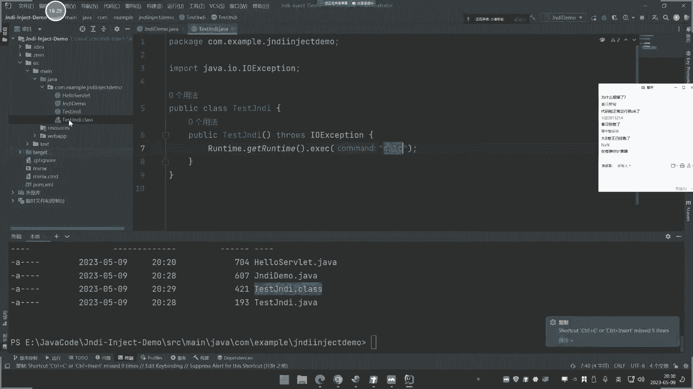

怎么样放到这个网站目录下面去。

放到一个网站目录下面去啊，看我要做什么事情啊，大家看一下，我来到这个目录下面去啊，放到这个下面啊，名字呢，那这个叫test jdi点class文件是吧，有这个啊，我们试着呢去尝试访问一下啊。

看一下能不能访问到啊。

test z n d i点class可以看到啊，能访问到这里呢，自动下载了啊，对不对，没问题啊，好啦，这个地址呢知道之后啊。

我们在这里呢写上一个这个叫test z n d i，来写这个地址，这个地址0。0是我所有接口，我写个这个井号就代表后面那个这个东西了啊，不用写了啊啊这样写好之后呢，有访问地址，并且在这里生成一个。

然后你看啊它会默认有个什么11389端口，这个1389端口是啥呢，就是默认这个LDAP的这个默认端口，如果是IMI就是1099，这个是默认端口，这个端口是可以改的，那么这个1389是干嘛的呢。

就是它默认开放一个1389，然后指向这个地址的这个地方好，我把这个东西呢给他对应看一下，然然后呢我们再来分析一下啊，先把结果搞出来点。

看现在啊我们在这里呢换到这边啊，然后这个文件编译出来了啊，为了不让它起到任何这个冲突啊，你看这里啊。

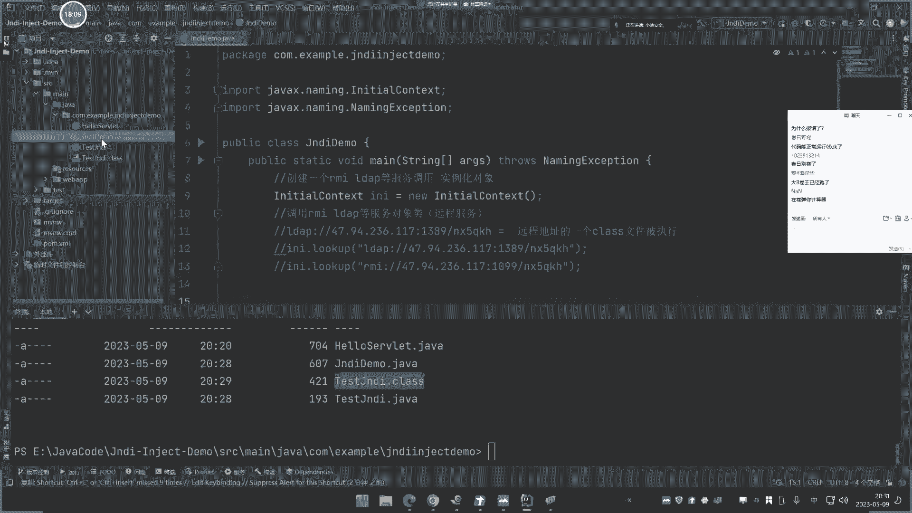

我打到这里，我把这个地址一改，改成一个什么，刚才这个调用的是呃。

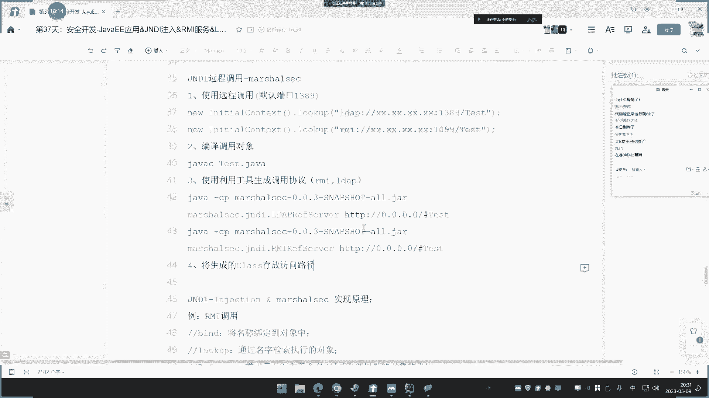

这边是呃哪个写呀，A l a l d a p，所以这里改成啊LDAP是吧，奥迪AP，然后呢加上远离子，这里要改成什么1389，然后呢后面写上一个什么，直接用点这个大小写要注意啊，来写这个例子啊。

好我把这个例子写上去，大家看一下啊，这个呢是我们放到这个网站上面去的，放网上面是八零端口，然后呢这里是访问的LDAP好，我们先来看一下啊，然后这个test j n d i呢文件是什么。

是一个执行计算器的，我们看他能不能执行啊。

并且看这边有没有数据回写，那他请求那个呢0。0。0的class文件。

请求个0。0，对不对。

但这里呢并没有执行成功，啥意情况，是不是我这个0。0写错了呀，嗯那test j n d i class，对的二哎啥情况。

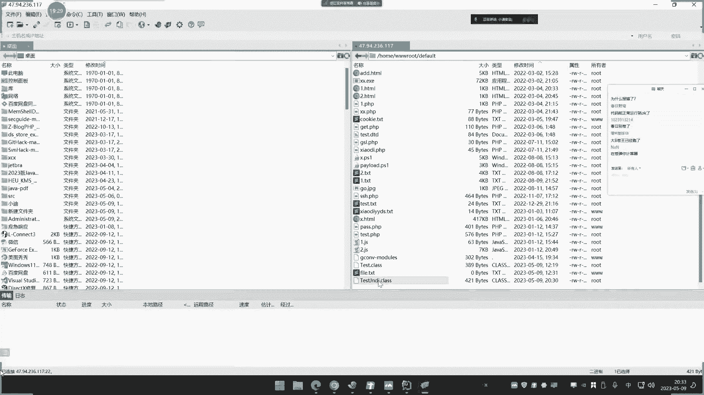

那换一个，把IP地址换一下，把这个地址看一下好，再来试一下两边形，嗯报错了，诶这哪里个小问题啊，哦我知道了啊，稍等一下，看一下啊，刚才应该是对的，这个咋咋不行啊，这。

看一下啊，看哪里搞错了，Cn4000。

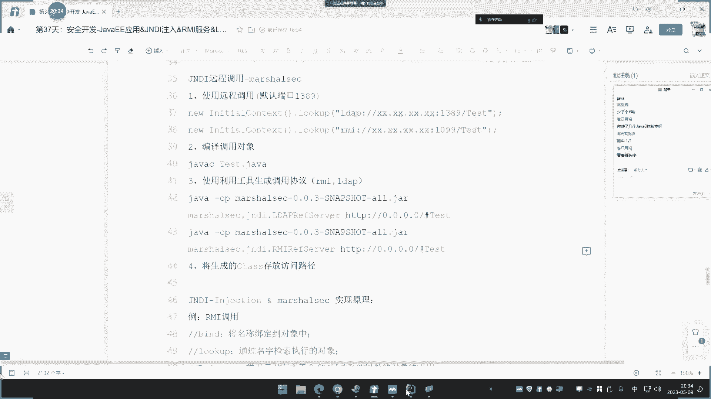

我搞个test试一下啊，然后下面有个test的，这面呢重新生成一下啊，他这里呢已经发送这个请求，换一下啊，我先搞个test啊，test下面也有这个文件，test试一下。

哎这是哪里出了小问题啊，这，1099test，我试一下这个先试下这个协议的啊。

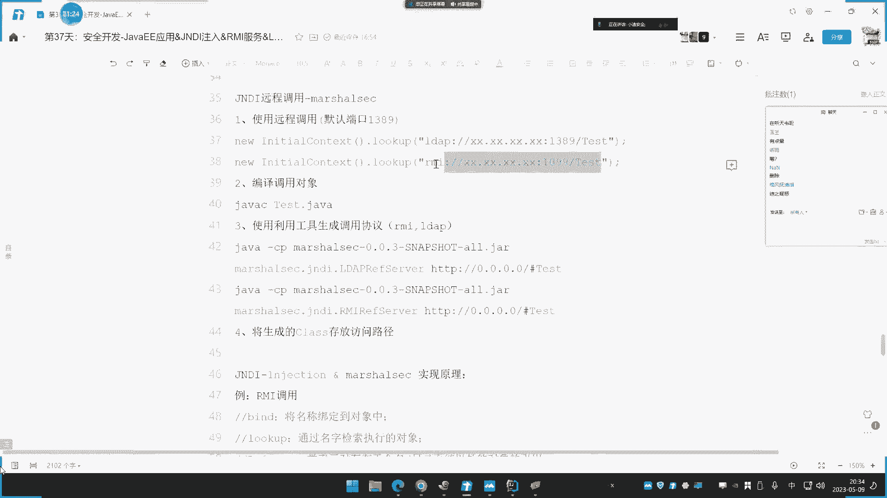

现在这个arm协议的，看是不是协议问题，把这里改成，改成这个，二没看这个啊，先。

是我放错了。

第一方这class文件在这里啊，好这边一直没有反应啊，等一下稍等一下啊，我重新重新再运行一下。

接收到了发送东西过去，啊这个是有接收信息的啊。

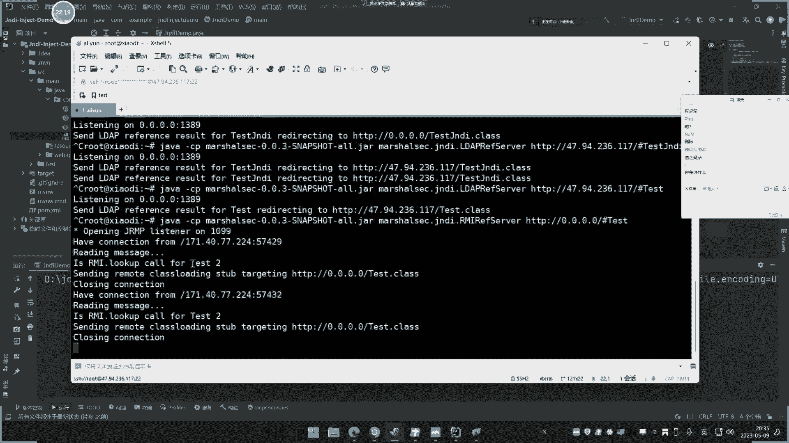

1099，这个哎这怎么一直没反应呢，要加端口啊，等一下啊，我看一下是哪里的。

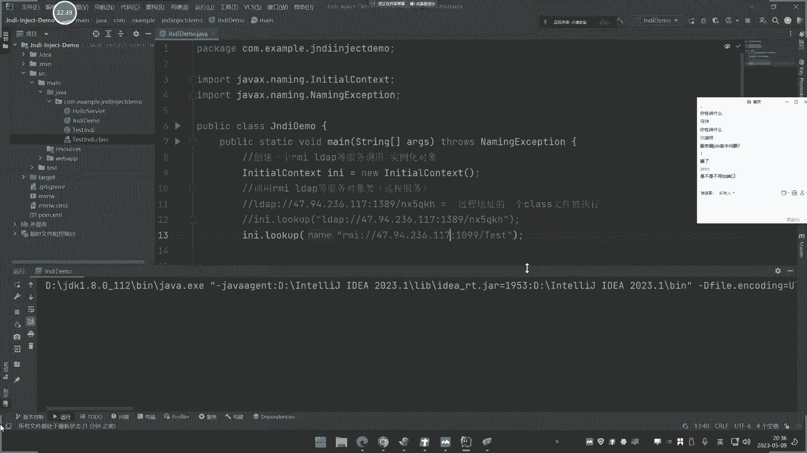

有没有反应，我看是不是这个两个文件问题啊，我把这个东西还一下啊。

move对文件换下，好这个呢是运行一个load part的，我用这个生成吧，那这个是运行一个load part啊，等下刚才用计算器嘛，我换一个啊，我再生成一个啊，我怀疑是不是生存的问题，重新身份证啊。

C然后test，随身这个test啊，好把这个test给拿出来。

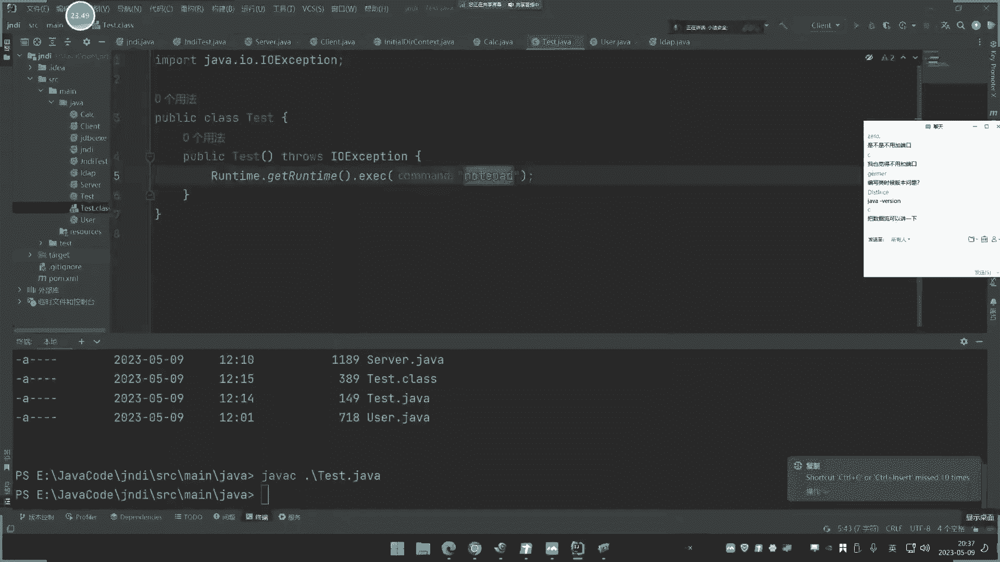

放下来啊，我玩那个test试一下好。

这个test呢有这个地址之后呢，这种放上去了啊，这个呢就是有个两层地址可以下载到了。

我们来试一下线，确定它能够访问到好。

能够下载啊，没有问题，那么现在呢我们重新再生成一下啊，用mi协议请求这个test生成一个1099端口，RMI协议的好。

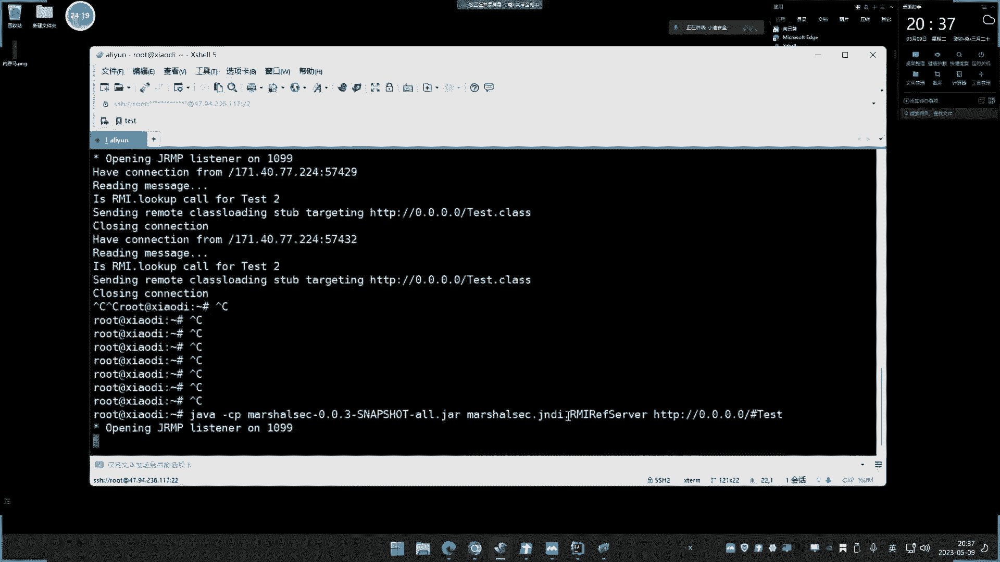

那现在呢再来调用一下，好把这个地址啊，这刚才那个代码一致的啊，和他一模一样的啊，没什么区别，On my right，然后这个地址写上去。

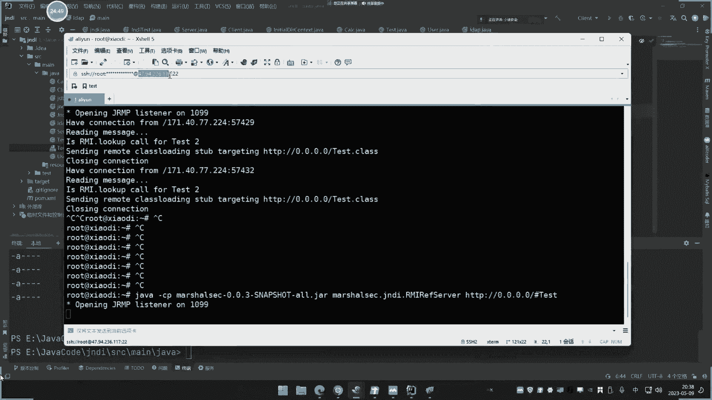

然后是他的1099端口是吧，1099，然后呢是这个test好，我看一下啊，这里面新一下。

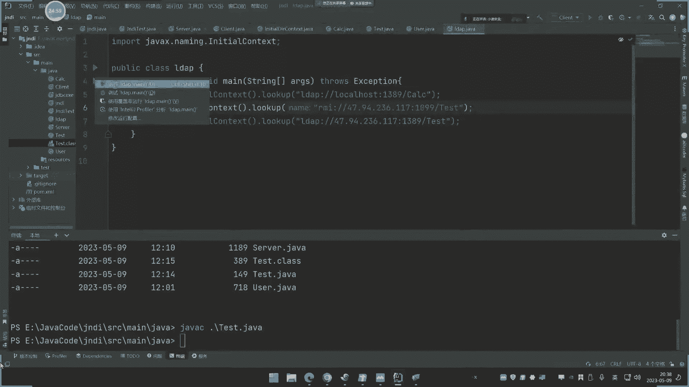

看那边的回血有没有。

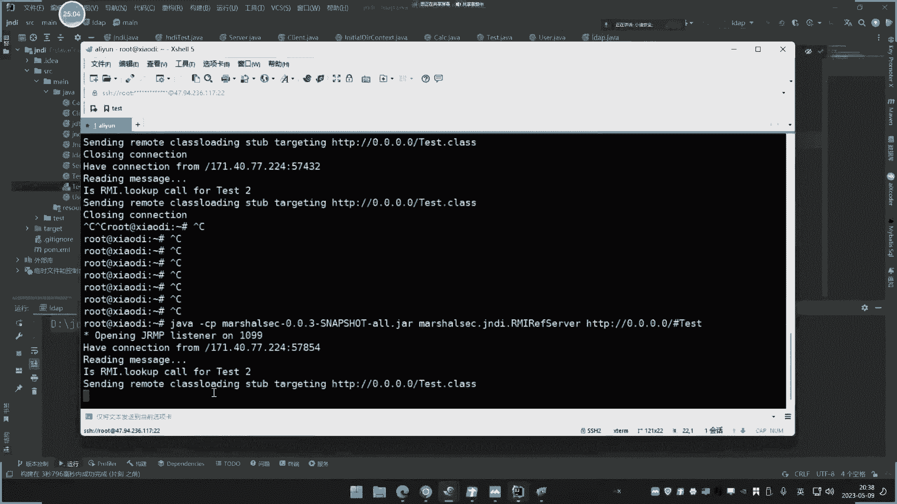

看到没记事本弹出来了啊，这个刚才为什么出问题，这个我把它放那边再试一下啊，来，在我的刚才代码嘛，我要再放这来试一下啊，啊这一模一样的啊，代码基本是一模一样，我再来用一下看一下啊，运行。

啧你说这样这个有些尴尬了啊，啧感觉卡着不动了。

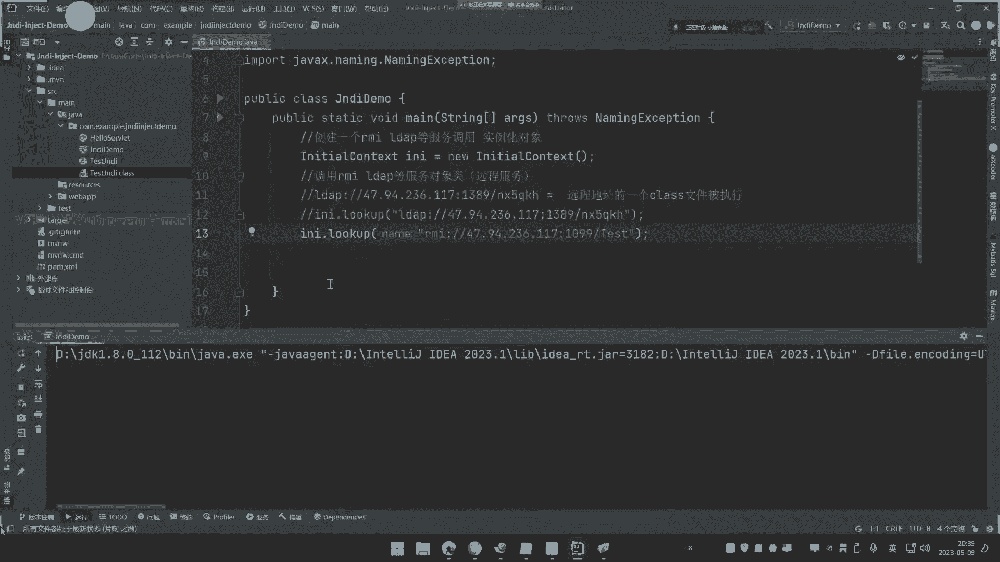

又。

这是啥情况，这他那边卡着不动了啊，我怀疑是IDE1的问题，我重新把它开打开一下吧，好吧，重新打开一下。

应该是那个京城有些冲突啊。

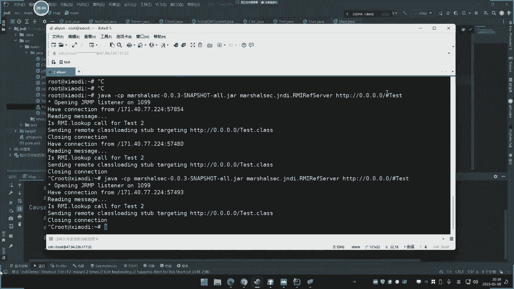

重把打开一下啊。

i id1的问题应该是。

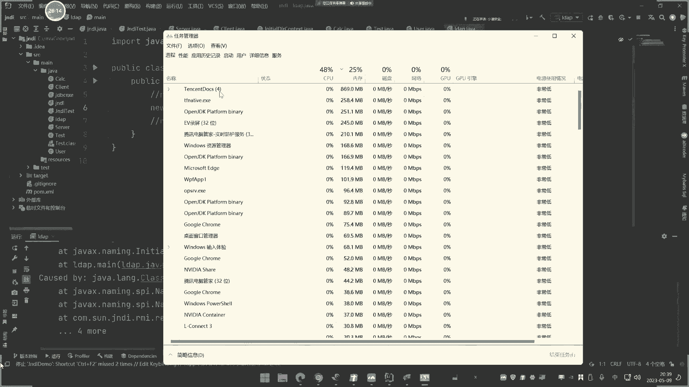

重新关一下，打开一下。

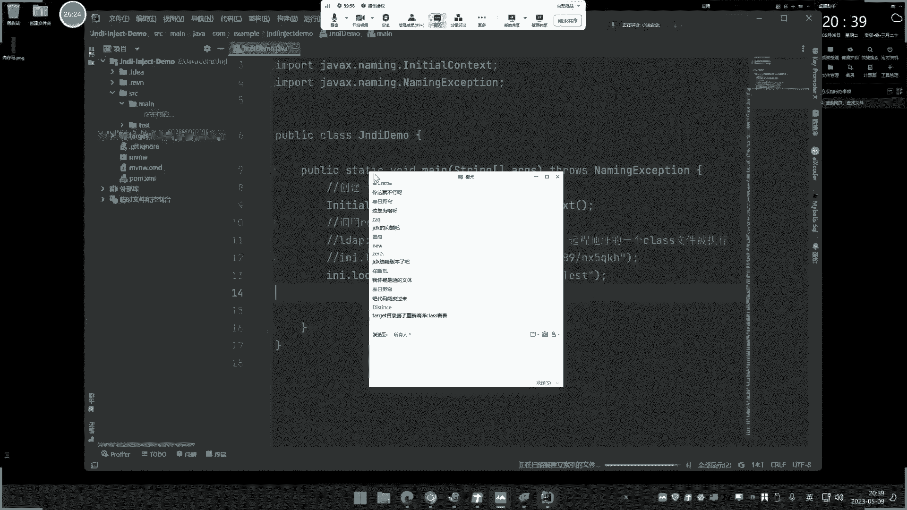

好来重新来这个代码再分析一下啊，那先启动起来啊，1099的啊，这个是按钮，是r mi协议是吧，运行起来啊，重新运行，啧这不是很尴尬吗，这这他妈的就不动，你说这样他一直卡着你呢，这没反应，他也没结束啊。

也没啥，我把这个把这个呢按照那个原生代码用一下吧，哎呀这真是尴尬了，写个变量说好理解一下呀，他这个就不行，看偏要这样搞，哎呀，啊他这里一直卡着不动啊，这次有点真尴尬啊，完全不清楚，来卡这里不动啊。

这不知道啥情况啊，代码一模一样的，那我还是我画到这边来试一下啊，来重新来试一下啊，DOM随便搞个名字吧，就叫这名字的啊，我把它画到这个上面，无法不放到包里面去了，不放这个上面好吧，代码一模一样啊。

不原封不动的把它弄下来行吗，唉这他妈的真是奇怪了，原封不动的啊，来在这里扔好吧，呃这个就不行了，刚才测这个就好，这个就不行，那这还是有些尴尬的啊，那我只能把那个拿出来那个代码端讲了啊。

呃现在不清楚是什么情况，我怀疑是那个里面一些冲突啊，或者是这个包的问题，重新再创一个项目吧，重新再下个项目啊，先把这个粘贴复制一下，我先不搞web项目好吧，先不搞web项目叫空项目啊，server嗯。

就叫这个名字吧，好来重新搞个项目啊，创建个文件，好那这里写上去啊，重新搞了个嗯，看这里啊还没问题。

看这个。

还是不行啊，这真不知道是什么情况呢，一直卡在这里，卡着不动啊，必须要按我那个搞，必须要按我那个搞啊，那我是真没办法了啊，那就只能看这个了啊，那从这里开始看吧，把这个代码呢这一模一样的啊，没有什么差异来。

那只能用这个搞了吧，大家看着啊，刚才那是这个M的，对不对，然后呢我这不是上传个特斯class嘛，特斯克拉斯是执行这个呃load party加加的arm的。

然后呢我这里呢可以把它砍一下啊，我来换一下呢，这arm的再会换成什么啊，DP的对不对。

找1389，然后点AP，然后这里改成什么，然后DAP1389的，对不对，把改成这个协议就可以了啊，端口换一下默认端口1389，这个端口呢是可以更改的啊，端口是可以加参数更改的，那test啊。

去这里请求啊，两个嘛，一个是这个RDP，一个是这个RRM的啊，这个刚才RDP的，所以呢这个东西，然后这个呢是哪来的，他的1099，然后看下这个执行啊，看下能不能执行出记记事本在这个id的啊。

那你看他就出来了，对不对，那这个就出来了，你看来出来了吧，那这个是一个什么原理呢，远程调用这个class它的过程我们可以分析一下啊。

你看一下啊，刚才呢是用这个JNDI这个工具呢，来实现调用，它呢是利用工具来生成调用地址对吧，然后呢直接执行命令，然后这个节点呢有几步，直接先编译你要调用的对象，把它变成class文件。

把它上传到网站的目录，然后呢，再用这个工具来生成一个呢，这个网站目录的下载地址的一个那个路径，这个一定要上传到网站目录啊，然后呢这里是hp的是吧，访问那个地址，访问那0。

0就是默认的所有端口访问这个test，这里加井号test啊，不是test点class啊，加井号test它会识别，识别之后呢，再把这个放到路径里面，其实就是说这个ZNDI呢。

他就省略了这个第二步和第四步就是编译，就是应该编译为什么呢，这个工具呢其实就省略第二步，就是说你这里要执行cl c，它就会自动呢啊自动生成一个什么e class文件。

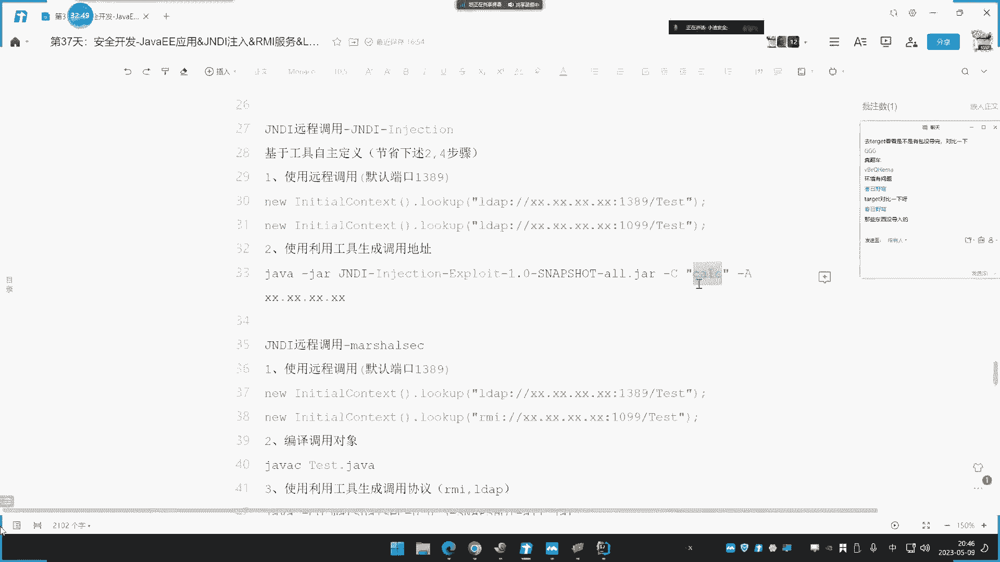

就好比的我们刚才用它的时候呢，大家也看到呢啊用这个JNDI的时候，当你去远程访问这个地址路径的时候呢，它自动有个什么叫EIEC什么这个啊，模板的一个JDK8的class。

这个呢其实就是呢利用命令杠CCLAC呢。

它自动的取命去生成一个class文件，这个class文件就是干嘛的，就是执行这个shell AC的，然后绑你这来个地址，对不对，就是这个意思啊，所以呢它其实呢就是比这个这个解压包了。

这也是个利用工具嘛啊，省略了这个第二步的思路，就是不用你自己去写，而这个呢就是你自己写一个，你要执行的java文件里面的执行一个命令，对不对，把编程class上传到网站包里面，让他去。

那个他呢就是可以根据协议呢生成一个RMI的，和LDP的，所以说没有太大区别，主要就是说一个工具多做了一件事情，一个工具呢少做的事情，那我们了解它有什么意义，大家看到了啊，这那就能够理解了。

这个JDI是它的全称，里面有两个服务，叫做IMRIMI和这个奥迪AP两个服务，然后两个呢有个默认端口，一个是1389，一个是1099，这个端口呢是可以自行更改的啊，默认是这个端口。

那么那就可以利用这两个工具呢，来实现一个接收对吧，就可以远程的去运行的工具，让对方呢去调用这个远程地址，但是这个协议一定要加上去，好这个就是我们说的这个它的底点好，那么现在呢给大家看一下一个情况。

什么情况啊，大家看着啊，现在我运行的这个脚本呢是一个java1。8的，1。8的是吧，好你看着啊，现在呢我把这个执行环境，构造环境呢给他改一下，我改成这个什么11或者改成17。

java的这个什么JDK这个版本啊，改成11或者17好。

我们就来一个来司马显示17，去运行这个软子的LDP这个服务，刚才那是能够弹窗的啊，就我现在它还在运行过程中嘛是吧。

刚才是能够弹的好的，那我运行它能不能弹呢，运行，哎没保存吗，保存的呀，还弹了啊，那17版本弹呐，我把两个都试一下，试一下这个RI协议。

再试一下这个mi协议，把它先退出来，换成这个RI协议。

对不对，好，来1099了啊，再运行，看前面的运行这个啊，这里的47好，运行之后，这边没有了，弹不了了啊，IMI弹不了了，那，17版本，好这是这个是arm的，好再来换一下，这里换成二比AP。

好换成LDP啊。

看下这面上别人在启动下啊，做一下再来做一个实验。

好来看一下这边啊，再执行啊，保存一下代码，哎弹了，你看这啥情况啊，你看呐哎这个，同样都是JDK这个时期的呢，这个什么无法调用它，但实际这个呢调用什么奥迪AP是可以是吧，对不对，好，这十齐了啊。

接下来继续测啊，继续测测什么JDK死移的，这个是我自己上班的，有这些版本，所以我就这样测一下啊，你说没有的话，那这个也无所谓的啦，啊不不用改这个东西了啊，这11版本的啊，这个我就直接在这里呢。

呃呃不不用不用不用加下面了啊。

我直接在上面改吧，现在是阿M阿维的，然后呢换到上面呢，那RY的这个server啊，不要搞错了啊，两个要同时改变。

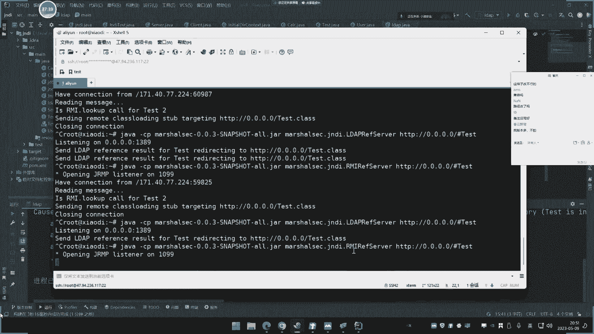

重新启动一下1099的，这边呢就把这个编辑器这里呀，把它改成啥十十一版本对吧，改11版本啊，点确定提交，然后呢我们再运行，先确定一下啊，运行，那这是11版本的那java11的那个路径的啊。

运行了之后没反应，11也是什么无法调用。

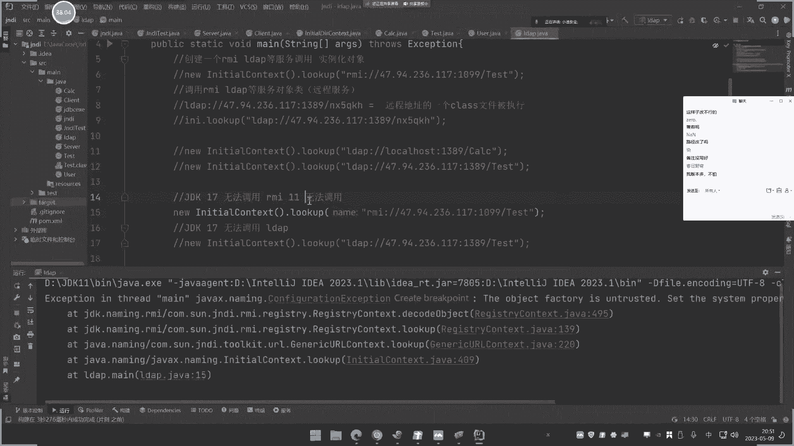

对不对，RMI啊，好再来看11的这个什么C1的奥迪迪，对不对，看11版本啊，能不能调用。

换成LJAP的，注意不要搞错了啊，再运行，哎又可以，你看C版本的这个也可以是吧，好，那么接下来啊我们再来看这个呃，这个1。8版本的是1。8呢，这有两个啊，一个叫1。80362，一个叫1。8011啊。

两个啊，来这两个就是他后面那个那就这个词，大家就是这可爱，先搞个这个1。8的362的啊，就是八版本的，来把把的先运行一下，这个，要3UWORD执行，可以是吧，8U3U啊，可以好，再来看，一测完啊。

再看这个是吧，112的，再看112的啊，看路径前面的执行那个JDK文件，你看又可以执行成功，那112的WU11也可以啊，都可以啊，就我所有版本都行啊，好把注释掉。

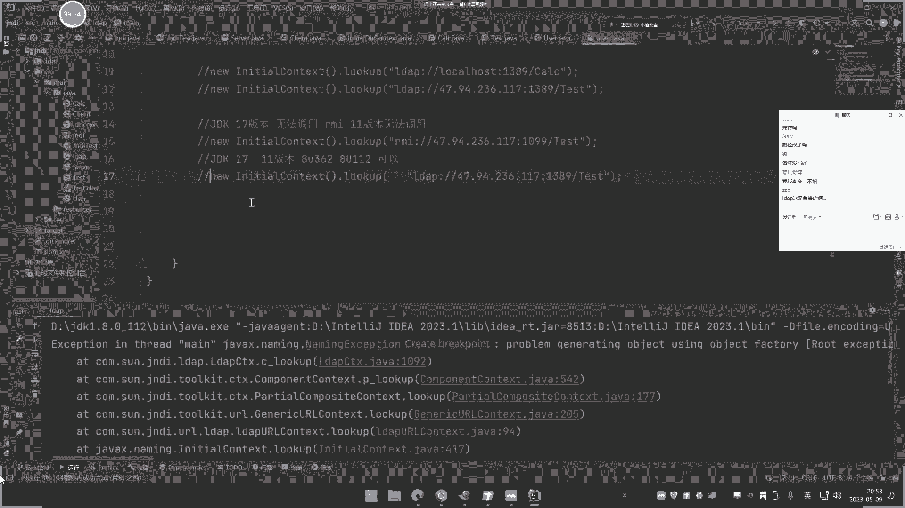

来到这里啊，测一下这里啊，换到这个R买协议的来扯他的啊。

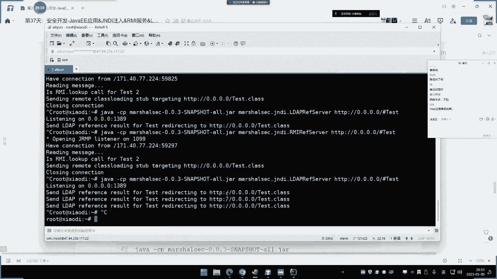

现在是哪个版本啊，先看下现在执行环境是哪个版本啊，注意一下，80112执行成功，8012执行成功，arm的啊，都可以是吧，好来看这里啊，8U112可以，我把它换个行吧，免得这个这个这个这个不知道啊。

嘶好，那这里呢8月2号可以啊，我们再看这个8038362的啊，我们先做，做完之后呢，我们再说啊，再看这个版本的，改成这个啦，36号的版本确定确定再来执行，那这个编的啊，那执行不成功不可以好。

那这里呢已经给大家做完了这个对比是吧，做完对比。

那为什么会造成这个原因呢，来看一下啊，再有一张图片。

嗯呐这个r my和这个LDAP在租的时候呢，他有个版本限制在高版本上面，如果这个r mi你看r mi呢，他到这里就结了，你看那8U113，这就截了。

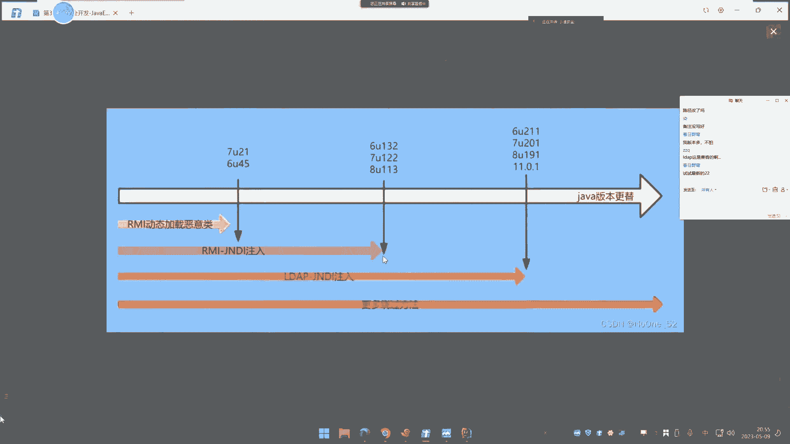

这个箭头都到这里截止了，我们这个版本是什么8U112是不可以啊，啊812可以，上面全部不行。

因为362大于了这个什么8U123。

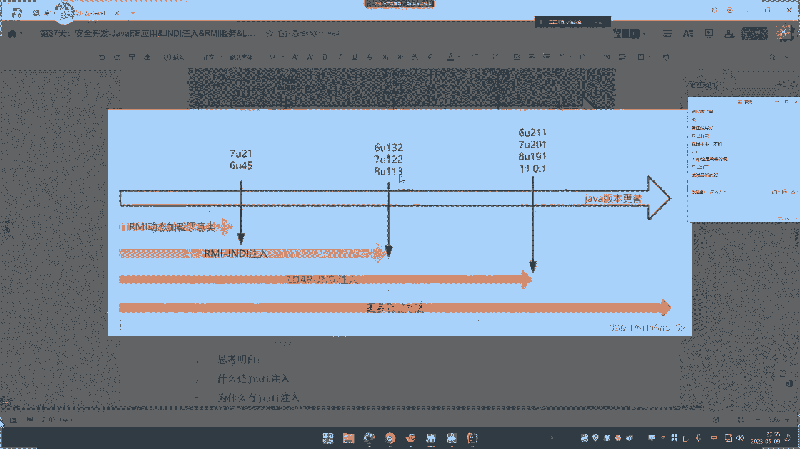

然后这个六奇就是JDK6和奇的意思，那你可能说是吧。

这个就没了，然后你看这个奥迪APADP到哪里啊，到了什么11。0。1这里，所以说那还有个8U191诶，那有的不同啊，我这个8U361也可以啊，11也可以啊，17也行啊，你这里不是8U191，11。0。

1，我就算11，我40100101好吧。

也执行，然后这个8月191这个362是大于他的，咋也行嘞。

啥星光呢是吧，好这是这个工具的啊。

那么现在呢我换一下，我换到之前那个JDJNI的，那换这个啊，换这个让他注入，那这是JDK1。8的啊，1。8的，你看啊，我用这个1。8的，或者说我用这个1。7的，还有这个嘛，两几个都有是吧。

之前都是能够运行成功的是吧。

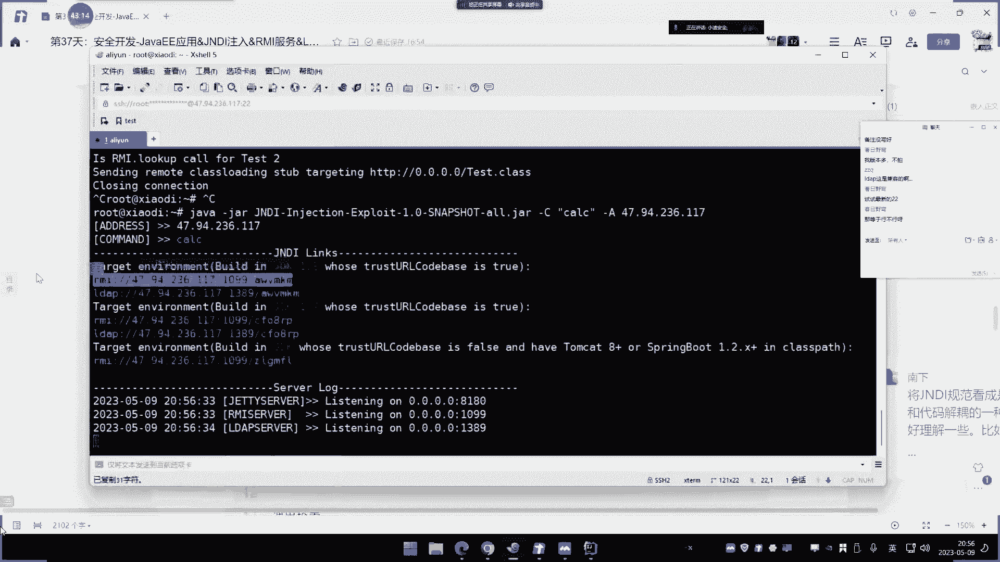

我先用它来试一下啊，换这个项目的，来看一下啊，呃这个是这个就不。

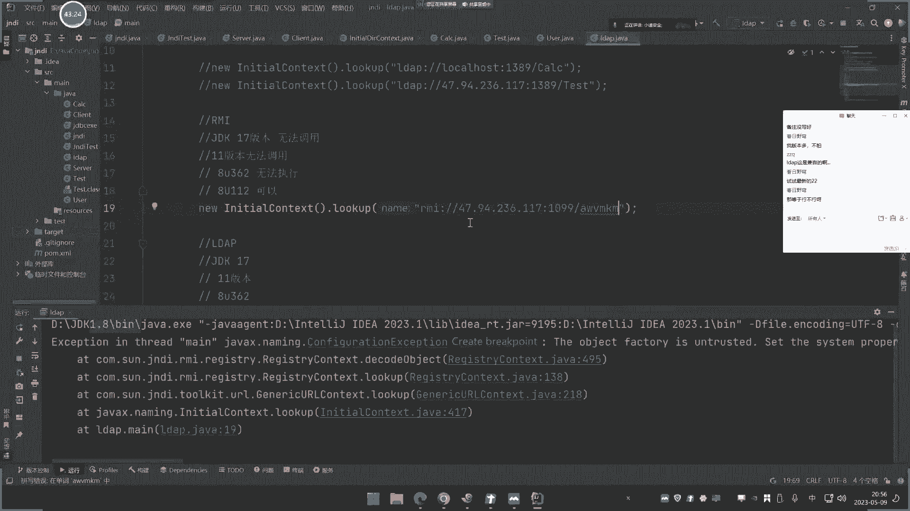

我就是这个他只是那个阿麦写R麦的啊。

那些是阿麦的，还LDADB的，不是阿瞒的，把注释下啊，来把这个启用，换这个例子啊，大家看着啊，之前这个是可以的是吧，然后现在这个版本的编了板，编之后呢，我们运行这个版本的，这个是1。8的。

然后就是八版本的自己没有反应。

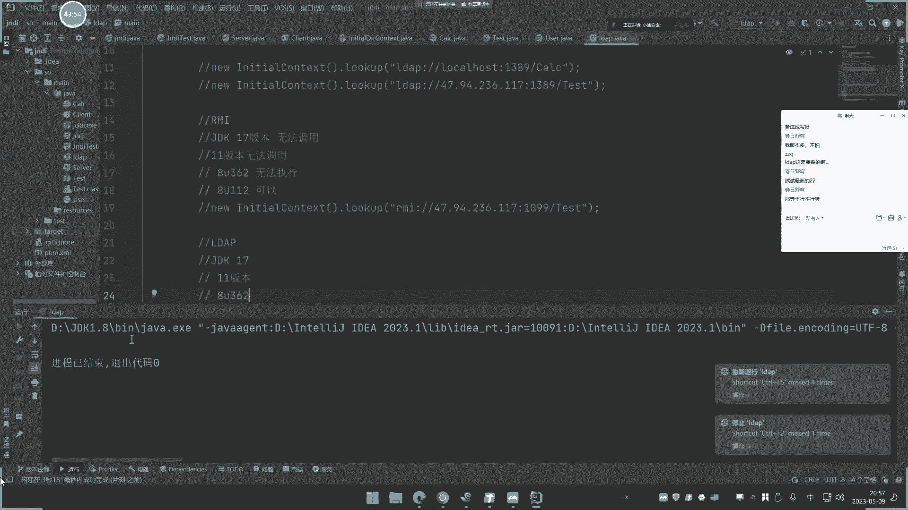

看到没没有反应啥情况，这边呢也结束到了，你看但是没有反应。

为什么，看着啊，这个版本是哪个362的，换成112的，再试一下，换成112的再试一下，再运行，那计算器弹出来了，来812的，这个是不是符合了呀，是符合，然后你再换，你看啊，我再换到11版本或17版本。

换11版本再运行，没反应，死七版本，没反应啥情况，这个呐这是用的。

那个是。

呃跑哪去了，JDI的这个injection的这个什么工具测试的。

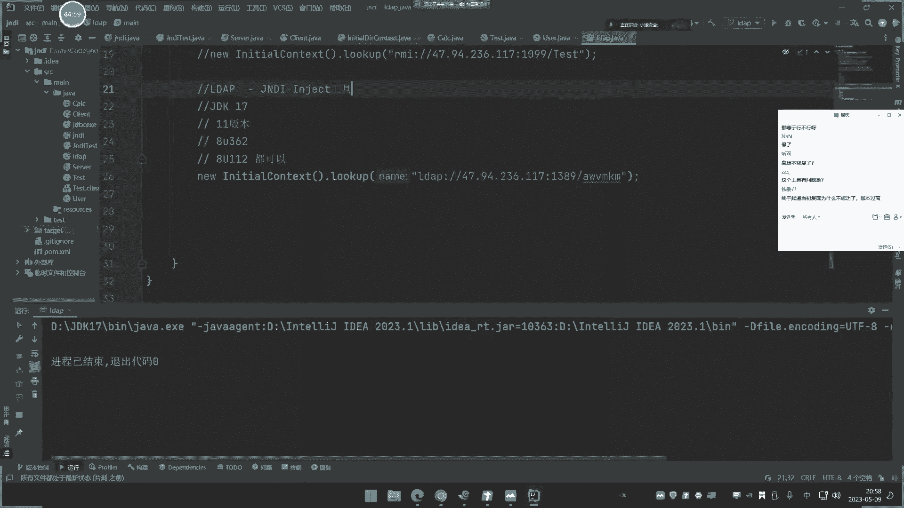

哎呦哇这个搞错了啊，这个是用这个。

测的啊，这个是用它测的对吧，结果这结果啊，然后呢我们现在换了个结果，测换了个什么JNDI的杠N结型的这个工序，测测出来的结果和这个一样，和这个一样，唯独用它的时候呢，它有差异，那我就不测这个r mi了。

那r mi也也是一样的结果啊，这arm也是一样，结果我们都不用测了啊，这不用测了，因为这个重复操作呢就不给他测了啊，那重复操作我就不给测了啊，这个测mi的来这个JDIN呢，为什么和这个有差异呢。

其实就是说这两个项目里面呢，有内置的一些绕过思路在里面，就是这个呢它已经内置到股的。

其实就是说本身胎的时候啊。

他是不行的，正过来讲这个真恩底癌呢，你这个8月191呢在此之前倒是可以是吧，但是这个八版本之后的就不行啊，这个呢是11版本的，0。1之前的版本都可以，但是0。2之后的版本也不行啊。

直接用这个LDAP呢会受到这个限制，用这个RM呢就会受到这个限制，对不对。

当绕过的话，你看啊这个用这个JNDI的这个解压包呢，去生成那个攻击工具呢，啊他就直接和这个图片对应上。

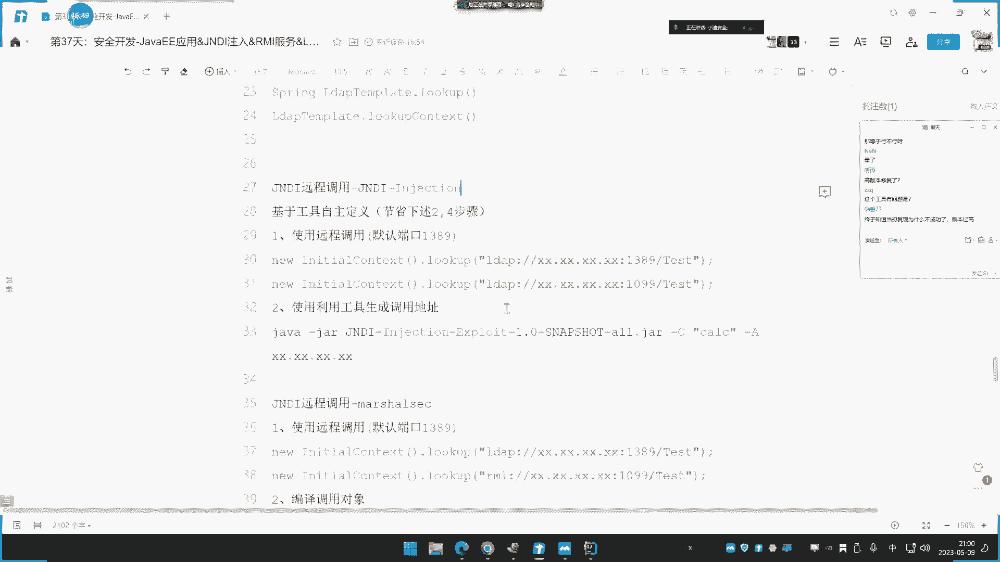

然后用这个master呢，他还能捞，大家也刚才看到了啊，我用这个master去搞这个RDAP的时候呢，都可以，看到了吧，你可以呢自己呢也可以把两工具呢分析一下，这个倒不是我们主要的。

我主要就是告诉你一个意思，什么意思呢。

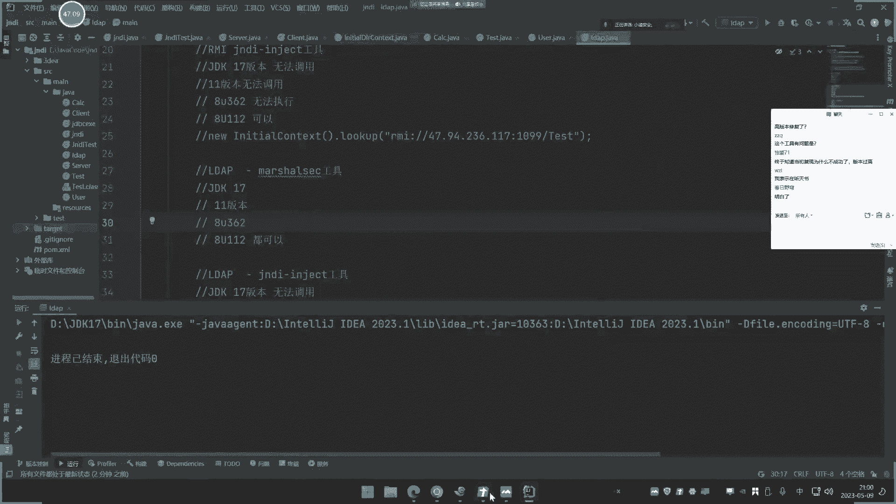

就是说呀这个ZNDI诸如它是有条件的。

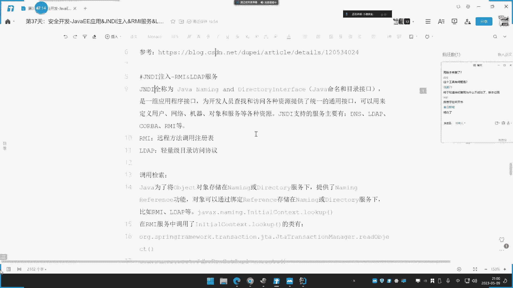

什么条件呢，就是这张图的条件，你用RRMI在这个版本之前，就是这个版本呢把版本小于它啊，大于这个靶板门，那就没有了，然后用RDAP呢会多一些是吧，他版本多一些，但是也到一一版本之后呢，也不行了是吧。

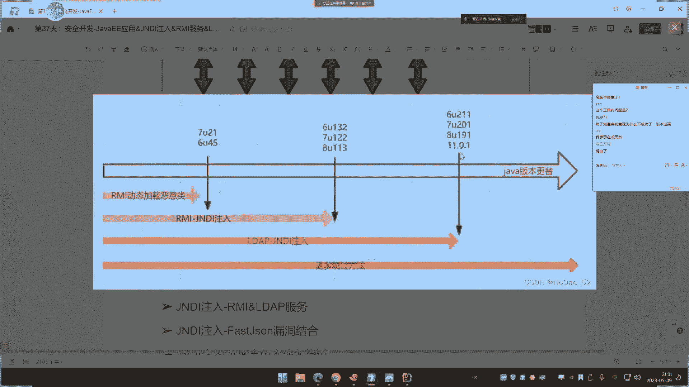

也不行啊，那具体为什么不行，我给大家看一下啊，这里有个简单的介绍，他说了啊，在哪个版本之后呢，就生成了一个什么鬼东西，禁用了这个什么鬼协议，也就是说啊在这个版本之后呢。

然后呢这里有两个文章是关于这个高版文，绕过文章，然后这个高版文文章那一部分的知识点呢，就整合到了这个什么这个项目里面去，就是个arm a r3SEC这个项目里面去，能理解了吧，所以说为什么。

我为什么要把这两个项目都给你讲一下，其实他们两个是有差异的，虽然说他们实现的功能是一致，都差不多，打这个呢，对不对，弓他有一些不一样的地方。

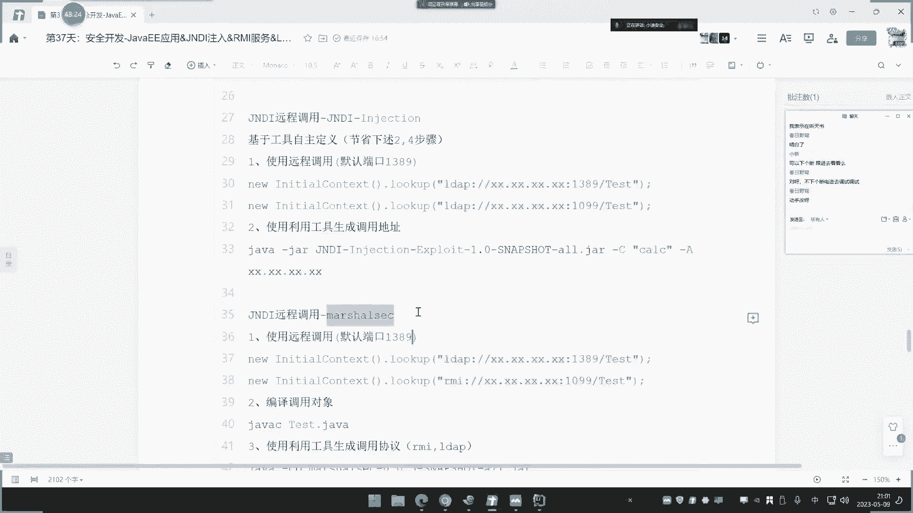

能够绕过这版本，但是他也是捞不了这个r mi，他捞的是这个奥迪AP服务的好，那么具体为什么这个他能行，那个不行，这个呢是我们后续再分析的啊，现在不需要懂，现在不太懂啊。

所以说截止到目前我们就学习到哪些东西呢。

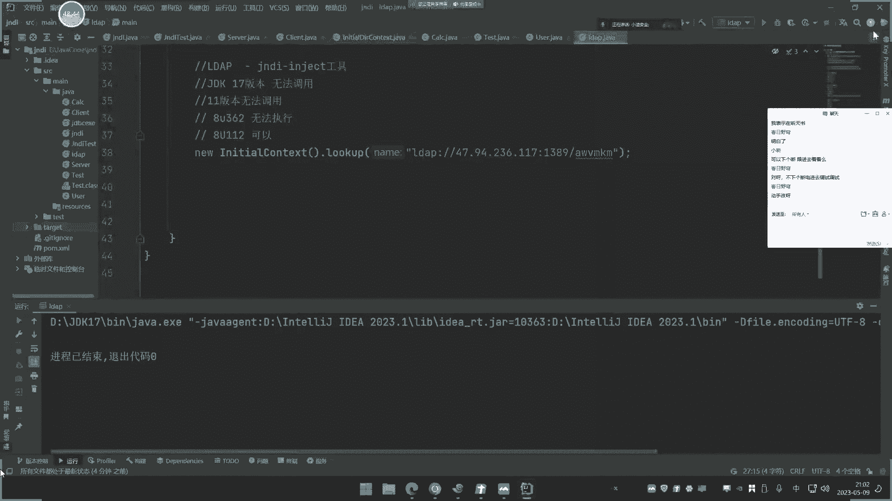

啊这里可以把简单写一下啊。

低点啊，这是我们目前学习的东西，第一点啊，就是我们说的这个JNDI，里面有类似的ARMI和奥迪AP服务啊，然后第二点这个r mi和奥迪AP呢，一个呢是这个简单来说啊，都可以呢进行这个远程调用对象。

就是那可以执行这个什么，java代码嗯，对不对，然后呢一般在攻击方面啊，在这个，恭喜你用中啊，就用到了这个什么一个GNDI的inject型，这个什么项目和这个什么master这个项目啊。

其中呢利用过程中啊，啊发泄啊什么啊，这个JDK版本会影响什么，这个r mi和RDAP的U对不对，这个版本呢会影响这个东西啊，会有修复，那么其中这个master呢，针对这个什么，还有DAAP，有绕过。

对不对，这是我们刚才讲的一个总结点，好学到这里呢，大家还是很疑惑，讲了半天呐，这怎么和实际结合呢是吧，好像和实际没什么关系啊，这里面的讲了半天，我都是就听了一个是什么东西啊，这么代码我都不知道。

我咋知道这个怎么用的是吧，实际有什么关系呢，好大家了，我们就来看一下啊，我们上节课不是讲过一个Faker啊，fast js文的那个足尖吗，组件里面绘制建设是有个漏洞诶，之前包的是吧，好那么我们看一下啊。

这个漏洞会和今天这个什么RMILDAP，这个这个服务啊，它有没有什么关系好。

我们来现在给大家背景交代一下啊，交完了之后，我们把项目代码意思搞出来，然后再给他讲，大家看一下啊，首先我们交代一下背景啊，来背景java11中啊，啊涉及到一个网站，这个网站呢对用户提交的JSON数据呢。

要进行一个转换啊，然后呢他用到的是FISKJSN，这个组件呢做的转换好，那么刚好呢在fix jo4里面呢啊有这个漏洞，漏洞呢有个原因呢，就是啊这个对结束的对象来进行转换的时候呢，产生了反虚化漏洞。

好现在呢我们就来利用它，对不对，就来设计一下这个东西。

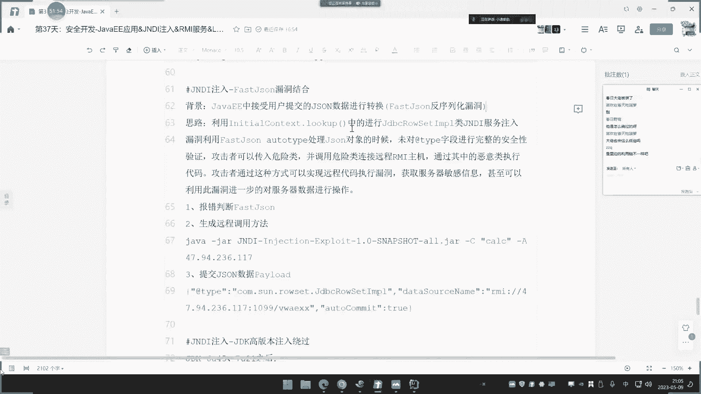

好，来我们把上节课的那个项目呢重新做一个设，计个java11的，就是设计个网站，这个网站呢就是用来，就是说我要实现几个功能啊，功能呢给大家简单先写一下，先写出来。

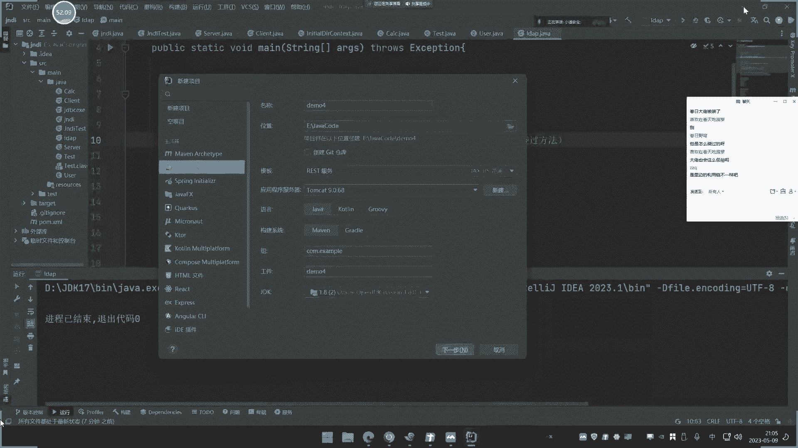

我们再把项目移开开除啊。

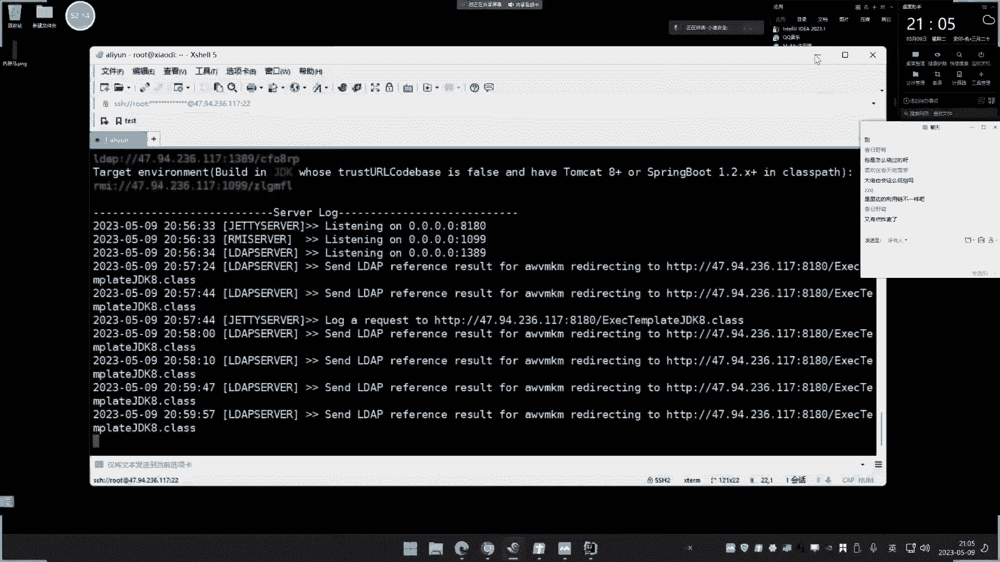

来看一下这里啊。

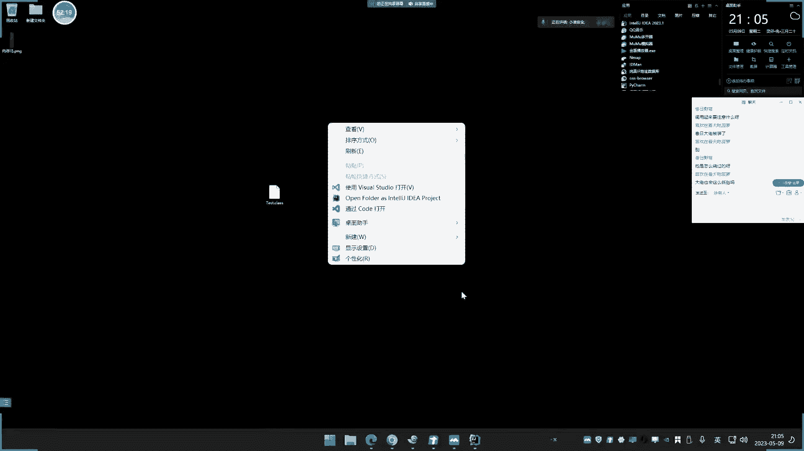

来看一下啊，就说我要怎呢，就用java呢，什么情况啊，咋埋呀，我麦克风不洗了吗，那你妹的什么鬼情况啊，我说里面的，我前一阵子我花了花了两三百买的麦克风，就用了一两个月，咋回事啊，开发一个这个是吧。

这个JSON转换的一个这个功能是吧啊，这个功能，然后呢这个呢是利用的是这个FISK杰森的这个，组间段是吧，来实现它，用它来实现的啊，好那么现在呢我们就来来写一下啊，这个叫1web的R是一个web应用。

好我们先把这个功能实现啊，我们再到它上面那些去呢，和今天的这个什么GNDI注入，嘶看联通啊，连关一起啊，好我们现在先把这个项目呢给他先创建一个啊，加一的啊，名字就叫这个fax j s o n。

然后一个叫，叫什么名字呢，就叫这个，JNDI是吧，这个web就这个项目名吧，好然后这里呢就取名应用程序嗯，下一步，好创建R，好按照上节课的事来讲的话啊。

把上节课的笔记呢给大家拿出来一下啊，萨里克不是有个那个包的那个东西吗，是吧，那个包的地址。

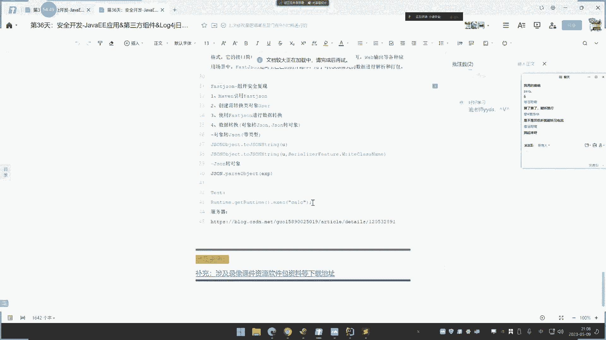

上一个那个薄的底子嗯，就是先引用包嘛，先把那个菲斯克救生那个包呢给他搞进去啊，搞进去啊，有点麻烦啊，在那个保底上，然后再要重新写一个这个文件嘛，起个名字叫做，fast杰森吧。

哎我直接把之前那个东西把它抄一下吧，那妈懒得在里面搜搜，搜半天了。

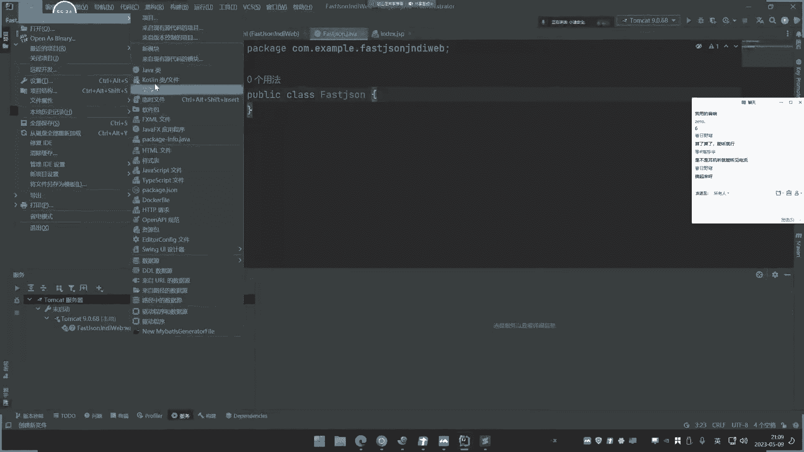

就那个包的那个东西，哎呀写下吧，写反了，怕有些人又说你没的是吧，又懒得看上节课那个东西哦，就还是用三杰克那个板吧，啊这个1。2。24的粘贴复制一下。

把包拉下来啊，更新一下，哎什么情况，哎，搞错了搞错了，多写了一个妈的，写哪去了，多写个啊，因为这里有这个这个标了啊，我写字来了，难得快说的，先把去掉再写下面去，他有一个这个倒带啊，写下来写最下面吧。

嗯好保存了，好看一下这里啊，其实这个我说实话，这个东西我们前期有这个给他讲过啊，啊我都不应该做这个事情的，说白了后面呢，不讲了也不行，唉也是尴尬，把那个东西，哎这哪里写错了，又，哎这改的妈的改改坏了。

唉这真是烦啊，这个重新重新重新创建一个，重新创一个，他改坏了啊，就叫随便取个名字吧，去他妈的，改坏了，不想搞这个啊，我还是说要尽量给大家搞个那个，从无到有的过程呢会好一些是吧，所以呢写了下更新一下。

有了啊，来先进去了啊，刚才不知道啥情况啊，我估计是刚才那个回车回车回车，搞那些乱七八糟字符进去了，懒得管他了啊，重新搞了个好，那就先进去啊，这个包有了有了之后呢，我们来做啊，来做这个实验啊。

那首先这里呢就按照，按照刚才昨天那个事来讲啊，我其实呢就可以把上节课那个笔记拿出来了吗，呃上节课呢就是在这里呢。

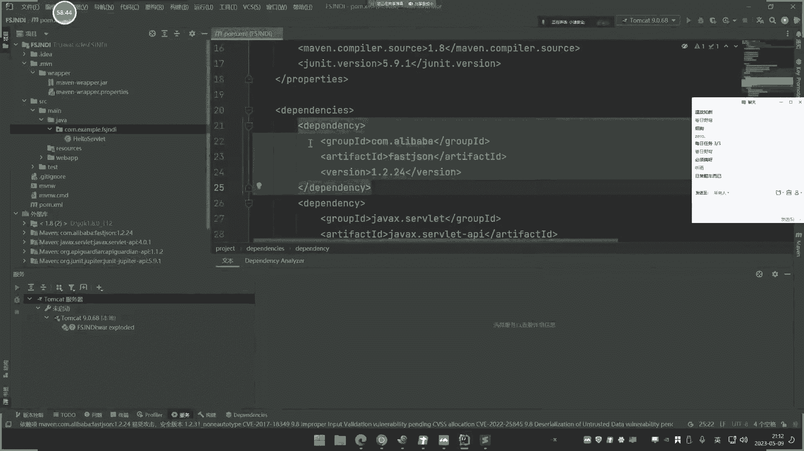

做这两个事情的时候呢，做了这个安全漏洞嘛，是吧，那就用这个JSP的时候呢。

转化一个对象的时候呢，就有个东西哈，创建个文件啊，要继承一下，好，那这里呢我们就写个丢，get方法或DEPOST方法都行吧，这个就就就就post吧，更加符合一些啊，这里呢有这个东西把库导入一下啊。

EXP呢我们就叫名字吧，就叫个string9生数据嘛，data等于REQ点get解释过来的这个值名字，那就叫FTR吧是吧，然后这里呢去把它进行一个运行啊，然后呢这里呢可以搞一个这个全局变量，把结束一下。

然后再打印一下，输出一下啊，好这是上节课调漏洞一个地方，然后这里呢给他一个出进，第一次啊，访问触发第一次，这个叫做杠杠JS文吧，好然后呢这是他的出发地址啊，pose呢去结束这个值值之后呢。

把它进行一个转换转换的这个操作，然后在我们那个web页面中呢，我就写个RTL代码的页面嘛，就这里写吧是吧，写个什么呢，写个这个可TM代码页面吗，播表单的嗯，然后AXY指向路径地址是当前目录的JC。

然后呢提交方法是post，对不对，给个这个put的标签，在写前端页面嘛，给个前端页面啊，就是给他一个这个转换工具是吧，名字就叫这个类型test嗯，这个name呢就等于tr和它对应上啊，得来个提示是吧。

这里就输入please啊，输入请输入是吧，这个j sn data啊，数据给他号控制好啊，写个这个也要分先，然后下面就是一个提交按钮了，搞个提交按钮啊，input的提交按钮，好这样可以了啊。

来我们来运行一下啊，来把java运行起来啊，看一下。

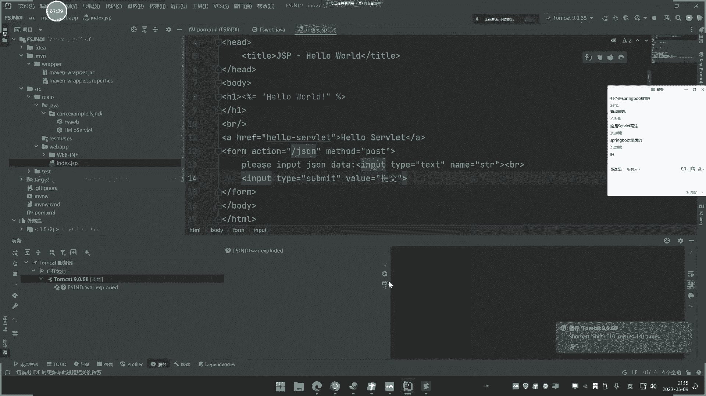

你们说是ping铺的那个太高端了啊，我的写都写不好啊，那这是那个地址啊，我们点一一来提交。

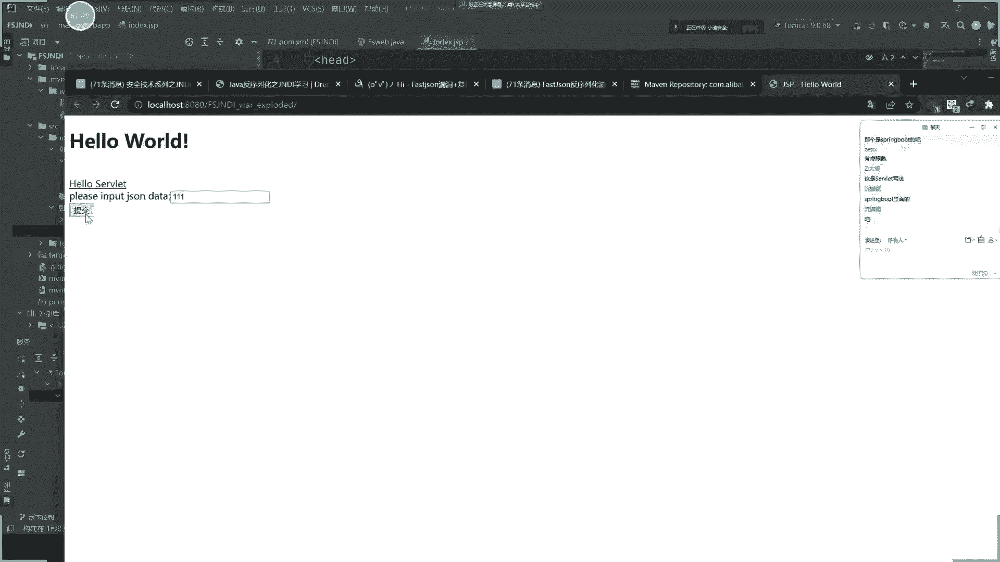

那他就会请求这个JSN嘛是吧，然后地址呢我们来搞上面去吧，免得等下又出问题啦，那就请求这个JSN地址嘛，JSN地址呢接收到这个SSTR提交过来的数据，给这个变量，然后呢我为了确保起见呢。

我先把这个变量给他输出一下，确保它是没问题的啊，重新来一下，就说我其实呢现在就是在模拟这个漏洞，复现整个漏洞啊。

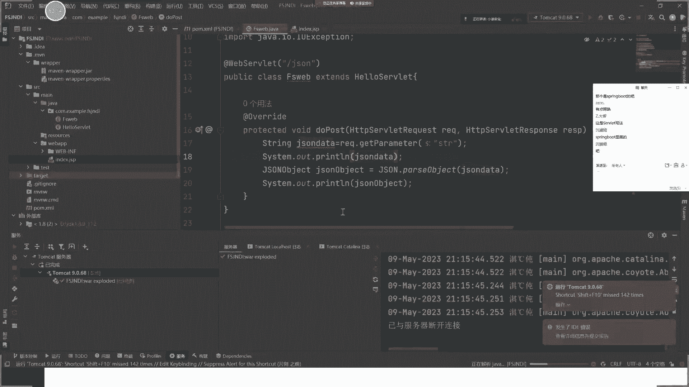

就涉及这个JSN的一个漏洞的网站，然后呢实现的功能呢一个这操作是吧。

来这里有，然后呢再解药哎。

什么鬼，怎么提交之后还是这个两毛四星呀，访问一下啊，用花歌浏览器访问一下，不用这个鸟毛谷歌浏览器了啊，改一下啊，来我看一下这里改没改啊。

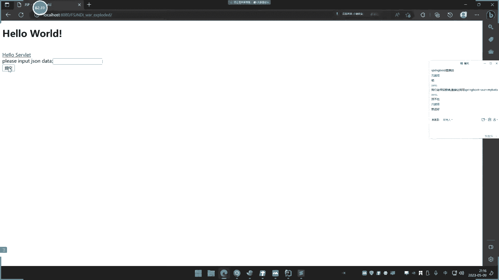

提交地址呢改成这个路径地址啊，注意已提交了，这的确是改了，改了之后呢，还是提交错了地址。

妈的真是尴尬，还不能这样写。

直接把路径写实吧。

这把路径写实吧，免得又出问题。

这把路径写死，选这个JSN路径，那JS路径呢来到这边提交呢，以post提交嘛，它方法呢也是post提交的方法嘛，是不是叠方法了，我也改了吗，重新运行一下啊。

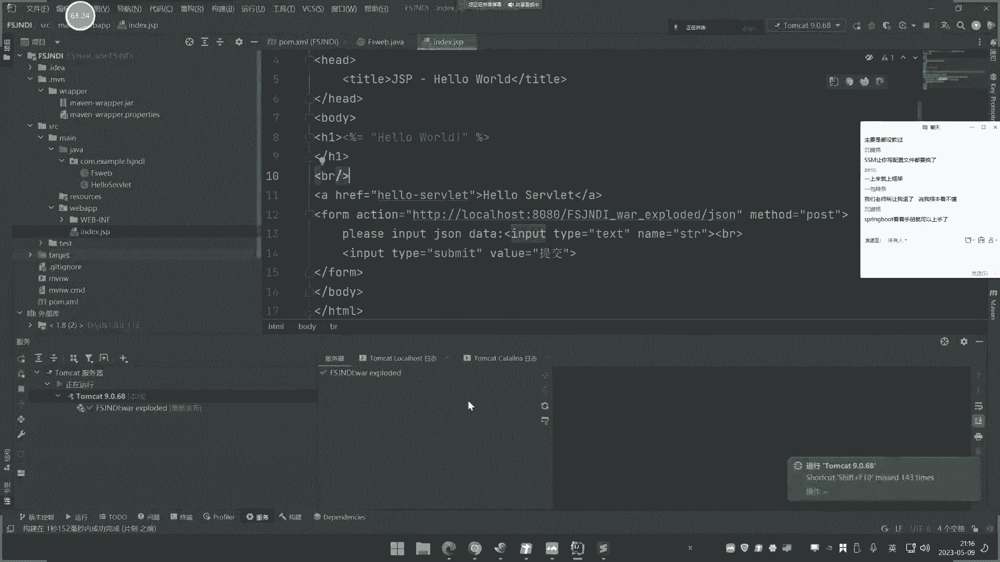

这个都懂的懂，你们还得说那个其他的东西一旦提交。

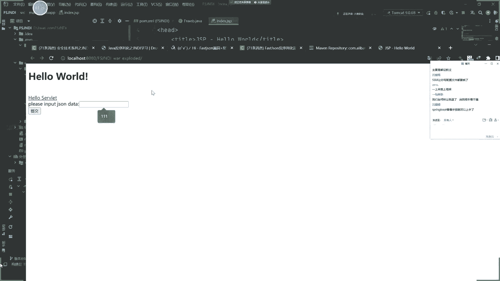

那的确提交了啊，我们来确定一下是不是post提交啊，看这边有没有数据回显呢，截止到一了，的确是有截止到一是不是好，我们来看下啊，现在就开始要真实的说了，那他截止到路径一了。

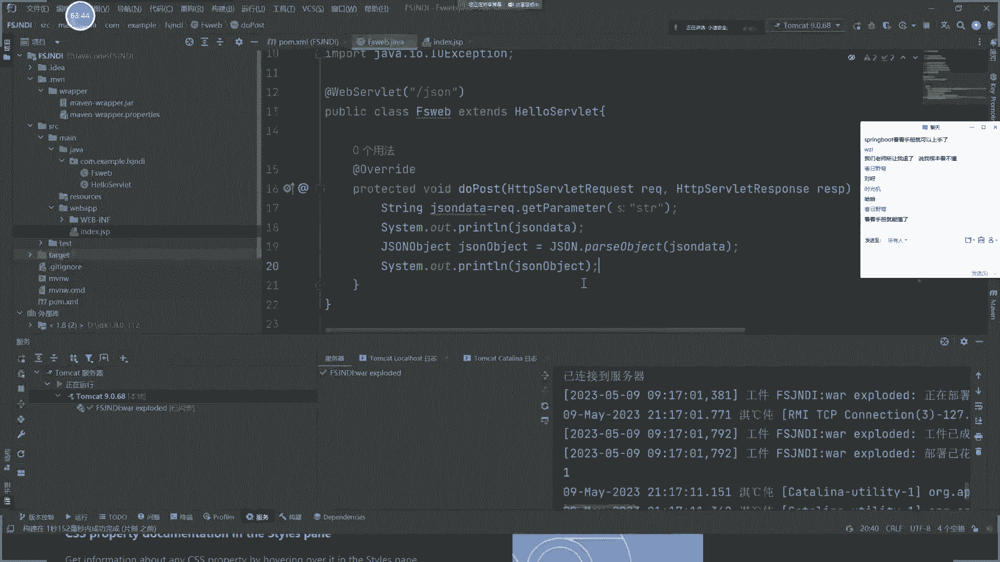

对不对，按照我们上节课那个攻击思路来讲，我们当时是怎么攻击的呀，包括我们的漏洞原因啊。

我看漏洞原因啊，这是网上一个浮现漏洞，它是怎么浮现呢，它是这样加的，这样去加，对不对，这样去加这个路径是不是好，我们试想一下啊，我们按照他这个思路来讲，我们来先看一下啊，这是他一个提交路径地址是吧。

好把他拉拉下来。

这是他的攻击漏洞啊，我们先把它浮现出来，然后呢我们再讲原因。

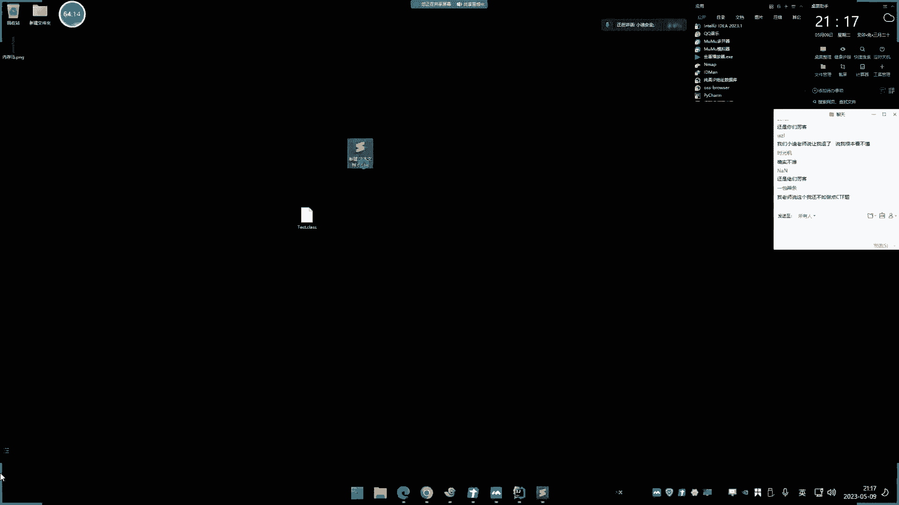

他为什么是这么个东西，这是他提交的这个工序漏洞啊，我们来看一下啊，把这个写好，好这里是一个东西，好这里有个DMI路径地址啊。

好我们注意了，我们在这边生成一个，就就拿这个来先测试一下吧，就把这个试一下哈，来把这个地址改一下，改成I呀。

那个这个东西都行啊，我先改这个吧，先改一下DP的，把改这个是吧。

好我要复制上去啊，看一下啊，放出来重新来提交一下哈。

看一下啊，就说我尝试呢让他去转换这个JSN数据啊，我输入这个东西之后啊，输入这个东西之后，我点提交，看看出现什么情况，哎没反应。

这面呢接收到数据的也没反应。

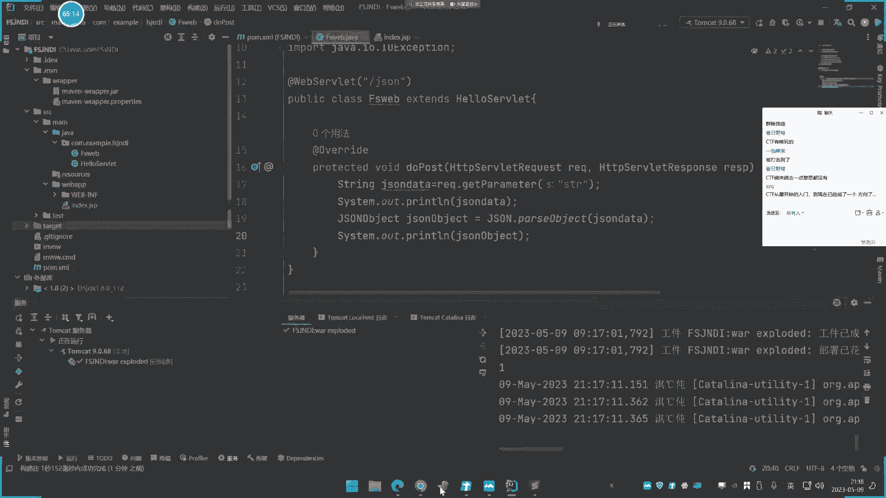

五月九号20。58分，正面呢哎呀重写一下吧。

那他也没反应啊，数据这里我们来看一下，重新来这边啊，把数据重新加热，再来这里追好车的话。

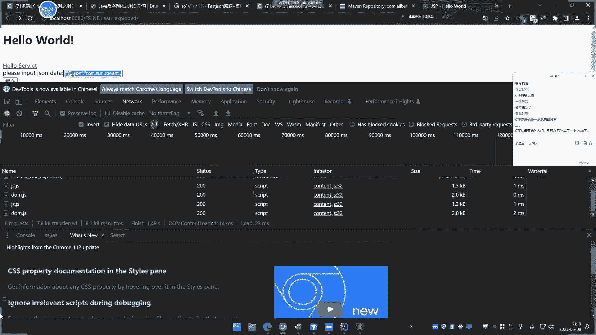

还是要用那个用那个叫啥呀。

用我们那个哎怎么回事啊。

哎呀我真是服了，这怎么改半天，怎么还是这个鸟毛思想，我把这个去掉，妈的这鬼鸟毛，私心把它去掉，嗯哦NAI没改，哎呀这呀真是烦死呀。

现在不会错了吧。

再说我就那你没了啊，现在正常了啊，这里面数据也接收到了，好，我把那个刚才那个payload数据呢写过来看一下啊，提交好。

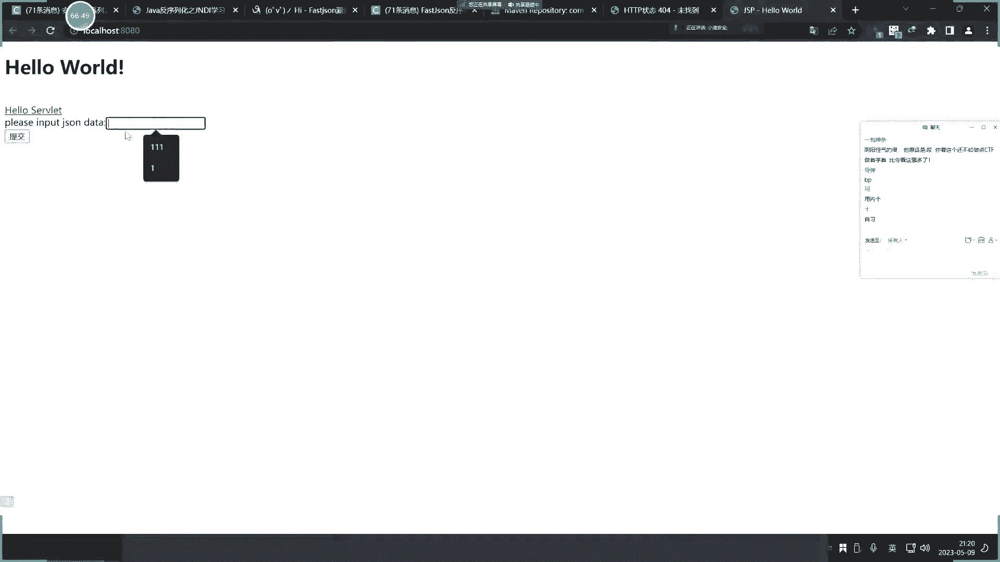

那这边呢他也确实啊来这是他提交的数据，这边是地址，对不对。

也确实呢接收到了，你看我们这里呢是有输出的啊，是有输出的。

但为什么没成功呢，因为这个地址换了啊，我再重新把那个地址换一下，换RMI啊。

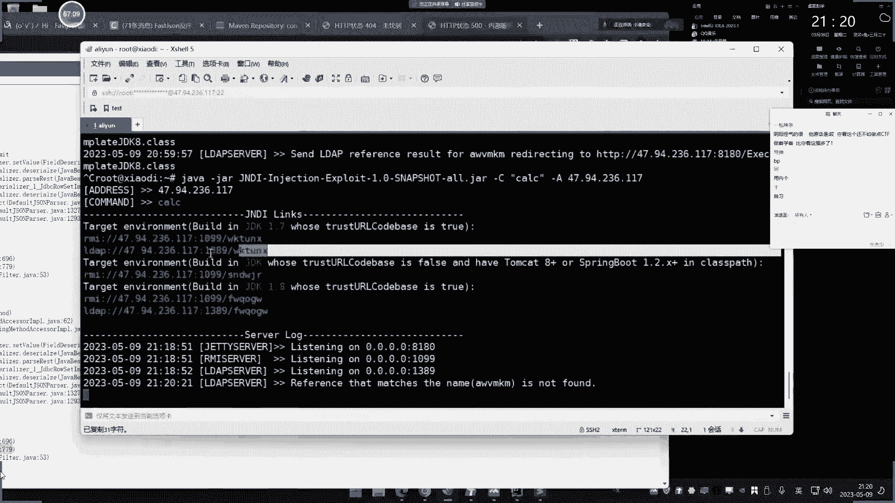

IDP都行啊，这个看你自己需要换这个地址啊，刚才没有把他及时换过来。

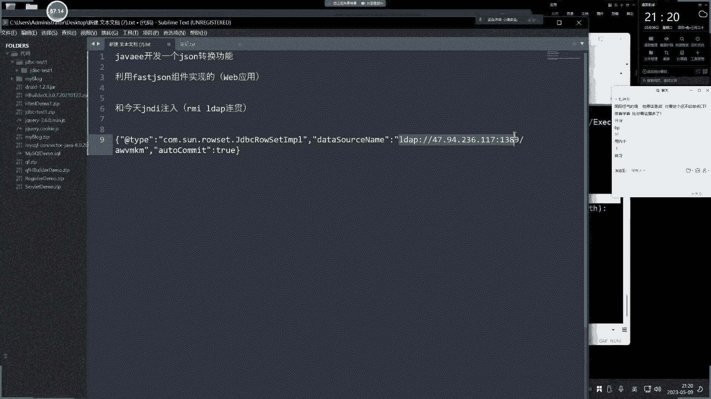

好再来啊，再来把这个payload呢去在这边输一下啊。

来返回来啊，看一下啊，这个是执行一个命令的，点击执行来计算器弹了，看到没这样弹了啊。

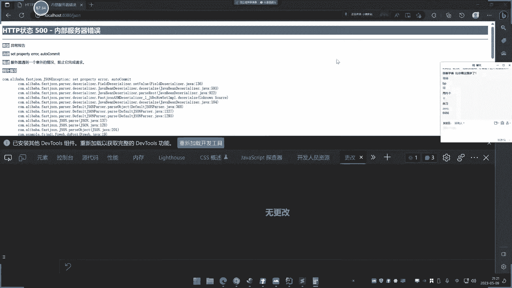

然后呢再看这边把这个换成这个R埋的啊，R埋的对不对，或者R埋的，那再试一下啊，还行不行啊。

好再来刷新一下提交，报错了也谈了好也谈了啊，好那么现在呢这个实验已复现，漏洞已经复现完成，我们来思考几个问题啊。

我来做几个实验，首先第一点我做个实验，做个什么实验呢。

看着啊，这已经成功了啊，首先第一点啊，如从黑盒角度来说，黑盒你怎么知道是FISKJSN，这第一点好，白盒里面分析，因为你知道是建什么，所以你才利用那个什么，利用那个漏洞，那个是POC嘛是吧。

好好现在就说我白盒，我知道是这个face fisk健身是吧，那为什么呢，为什么把这个PLC为什么那样写好，这是我们先说第一点啊，怎么知道菲斯根是在几时也简单啊，报错页面啊。

那些东西已经显出来，你这一报错他就提示你了，你看那com阿里巴巴FACEBOOKJSON，这里面的不告诉你有个face用吗，就说这功能用到face jn，你在想face book是干嘛的啊。

它这个功能是让你输这个数据，然后把它转换JSN数据，那实战中呢你看这个这个利用过程，别人都说的很清楚了。

这个代码利用过程，你看别人怎么利用的这网站呢，这里设计个登录，哎，他在提交的时候呢，那发送的数据就是这个什么JSON数据，然后呢他就发出了错误的啊，这里就包了一个fake结构层出来，然后呢。

他就想到配变成分成一个那个什么黑盒的，一个测试的配漏的漏洞，这个东西来去测。

这个好理解了吧，黑盒的角度我应该讲清楚了啊，我其实不该讲这个黑客角度，因为这压根就不是我们现在也该讲的事情，但是有些人他就会老去这样想，他就会问你知道吧，所以说我必须要讲外条件。

那时候搞一个网站出来，让你明白下，这是那个实际应用，实际应用其实就是说对方网站是java开发的，然后呢用到数据转换的时候，用到这个fake JSON，那么有一些数据在用这个JSN传递的时候。

如果你知道他是用fake js n呢，来做这个数据处理，你就可以在黑河中测试这个漏洞，好这是黑色角度，已经讲完了啊，等一下不要再问了啊，我怕等下又有人问啊。

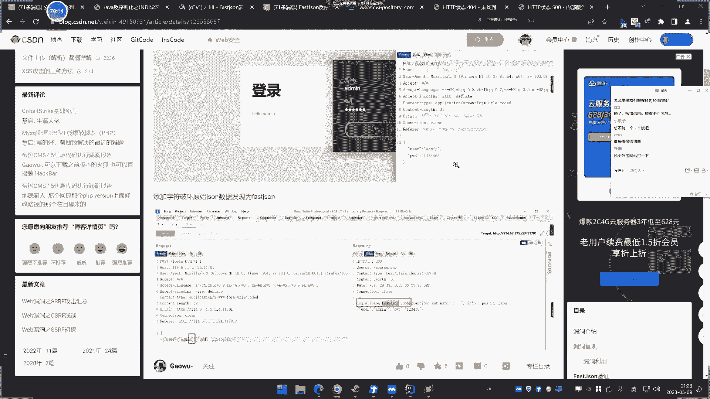

那么现在我们再来看啊，那么白和我们知道是被接收的，但是这个PLOAD他为什么要这样去写呢，是吧，我们前期我们来到上一课，我们做的那个笔记来看上节课我们讲的时候，我当时没有讲他这个东西是吧。

我们来上节课那个demo呐，这是我们上节课的那个讲的那个东西，然后呢大家可以关注一下，来，我把代码呢给大家复制一下啊，这上节课讲的那个笔记啊，就上节课讲那个fake jn，不知道大家有没有印象呢。

就是我们说它的漏洞原因呢，就是在这里这个top里面呢来指定对象嘛是吧，就是如果这里让你改成这个user，那么它就是基于这个包下面的user，就对这个东西呢进行这个下面的数据转换，那么如果是这个run。

那么它就会运行这个run，而run里面呢刚好是执行命令，所以导致命令执行，这是当时我们这样去写的是吧，好我一运行呢他就执行命令嘛，是不是一运行呢他就把这个run方法来运行啊，他就转换。

那个时候那人刚好的把long8法运起来，就弹出计算器嘛，是不是先问一下大家啊，这个上节课有没有积起来的啊，积起来的就问下来呀，我怕把他有些人不记下来，不记下来，我不好讲的啊，哎这三节课讲的啊。

就说之前上节课讲的啊，那这里呢你改成user，那么他就会对user呢，下面呢这个这个什么改成user呢，它就会转换这个user的嘛，你看就这个就这个包里面的吧，那在com小李下面。

user嘛就对它进行转换，所以呢他就原生态，它本来就是转换user的，只是说呢我们把这个地方改成run之后呢，他就会调用R的，那你看改user，那就正常user那个事情是吧啊，已改装呢。

他就是调用这个run这个class文件那个地方是吧，好那么现在很简单的道理啊，这是上节课讲的嗯，我们把那个东西拿出来啊，我们这个地方呢，这其实就是一个什么这个执行命令的一个类，而这个类呢是我们自己写的。

比实战中，那不可能是你写的，你写吧，不可能你能写吧，自己写不了啊，在实战中你不能写，就是说你不能写，对不对，实际上这里不能写，那你怎么执行命令呢，对不对，你怎么执行命令呢，所以他就把调用对象这个地方啊。

指向了什么，指向这个地方哎，那指向这个地方，我们今天呢学习的是这个什么LDAP和r mi，那怎么就和这个东西联系上了呢，对不对，你看一下啊，那我要搞的话，也是搞这个这个dpi。

我们实现的代码是怎么实现的啊，我们看下上我们那个这个内容代码呢跑哪去了，哎呦还要开搞啊，在我们当时实现那个代码段呢，就是用这个东西嘛是吧，用这个东西，而这个东西呢是来源这个类，对不对。

我把它全部写出来啊，对吧，我们实验的时候呢，去去调用这个什么LDAP和这个arm的时候，那是用的这个类里面的都look，up方法是吧，来实现这个什么调用，对不对，那我不应该这样去写吗，那是我要这样写啊。

是我要要要要要要要要这样这样写，应该才对呀，就我把它换成这个对象啊，它才能调用这个RMI呀，是按这个意思，就是我们是要这样写，大家能不能理解啊啊那为什么要这样写啊，写写的com，这是什么鬼啊。

那不应该是这样写吗，我写这个地方是吧，把这个写上去，那我才能用这个mi这个东西啊，不然的话你怎么用呢是吧，因为我们用的时候是用它来实现的嘛。

来现在再来看一下啊，笔记里面啊，嗯我这伤几个笔记，翻了半天来看一下这里啊，那，在arm服务调用中有一个方法呢叫做什么com sum，那就在今天这个地方呢，也就是说呀这几个类啊，这几个类。

那spring的框架类里面，还有我们那个HIBIA那个框组件类里面，还有我们原生自带的这个什么，这两个里面都有刁用这个东西，所以他就用到了这个东西来去调用它，其实就是说这个地方呢。

你用它它也能实现这个方法，能理解了吗，这就是原因，知不知道这我只写了部分，这是网查的，还有很多啊，这需要你分析代码才能搜到的啊，这不好搞的，这网上查到的，所以为什么他是用这个东西。

其实就是因为呢简单来说啊。

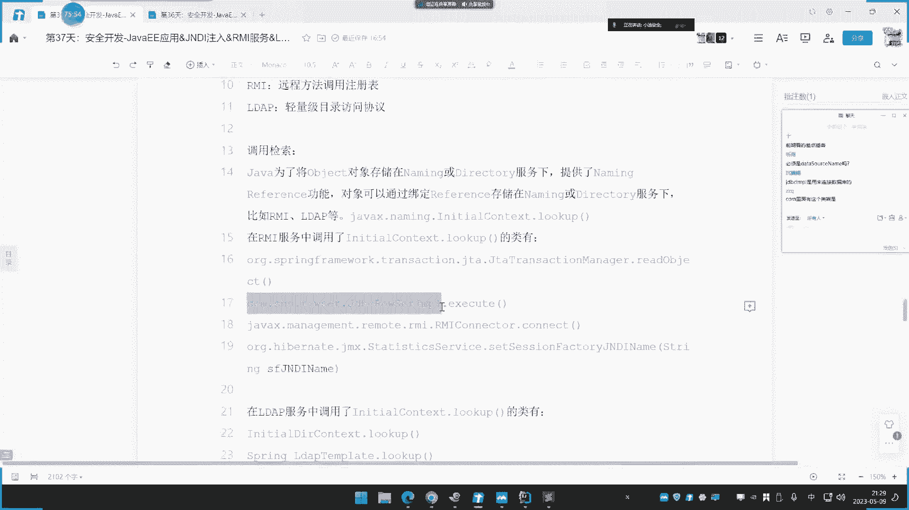

就是因为这个方法呀，也在这个什么这个类里面呢，用到，所以呢也就是说你用这个类呢啊，就可以实现这个方法，那就可以调用这个RMI，那你起来吧，好这是理解这个原因，那么现在再来看一下，我把版本再换一下。

看着啊，现在是17，哎，这个现在是19多少版本，咦哈呃这个是17，我在华南边那个那个那个这个地方，你看现在我运行的这个JDK环境，就我这个启动这个项目的web环境的，是用的是，用的是这个啦，1。

80112，是不是我用它啊，看着啊，把那一换换成1。8362，换这个高版本的确定应用，重启一下，看着啊，现在换了版本啊，把项目里面的这个版本的换了，那现在用到这个1。8362了，刚才用的是这个嘛。

要好的，不换完它换了之后，我们再打再看一下能不能成功，好来看一下啊，再把刚才配load呢放进去，这还是刚才那个啊没有任何改变，哪个能成功，那这个也成功。

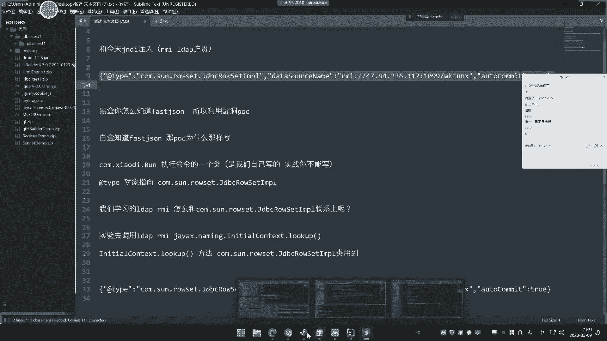

我这边的也没有动它，来提交没反应了啊，计算器不弹呢，你看然后呢。

你看这里应该还会有报错信息，那有提示，但是没有成功，啥情况，版本高了呀，对不对，所以答不出来了哇，这个arm被收鲜美啊，是不是，那你换个LDP也是一样的道理啊。

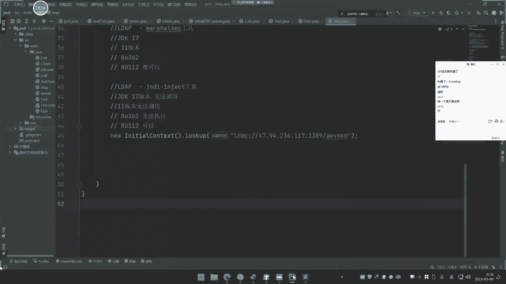

也也会受限，那你告诉我这个该怎么办呢。

啊如果你要答的话，你这个时候你该怎么办呢，是不是欢呐，换哪一个，换那个RMA的那个东西的。

来了的，那是换这个呀是吧，换这个啊。

这个对不对，1099的啊，来把payload再写一下，test是吧，对不对，就改这个地方就行了呗，其他的不用改了啊。

来试一下看行不行，先刷新一下啊，哎，哎啥情况。

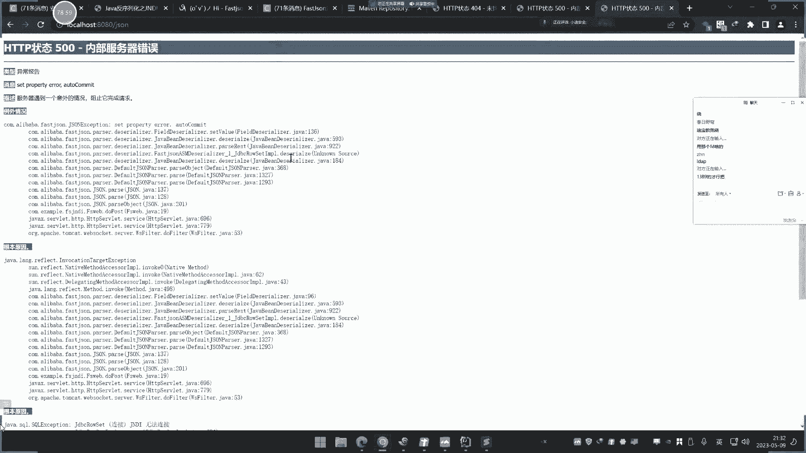

这也不行啊，啊啥情况。

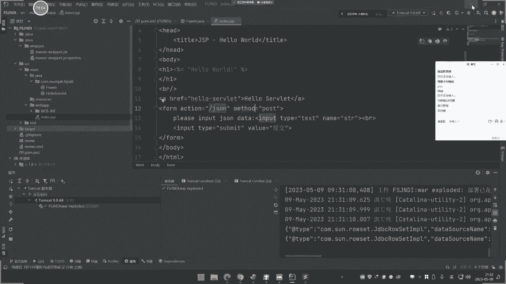

啥情况。

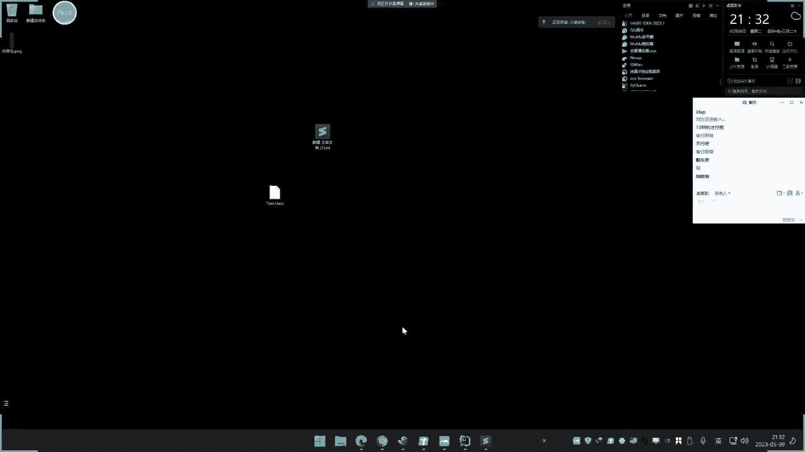

怎么咋也还不下，好再换个协议，好买2D皮，刚才只要DP嘛，那个DP的。

1389，换一下。

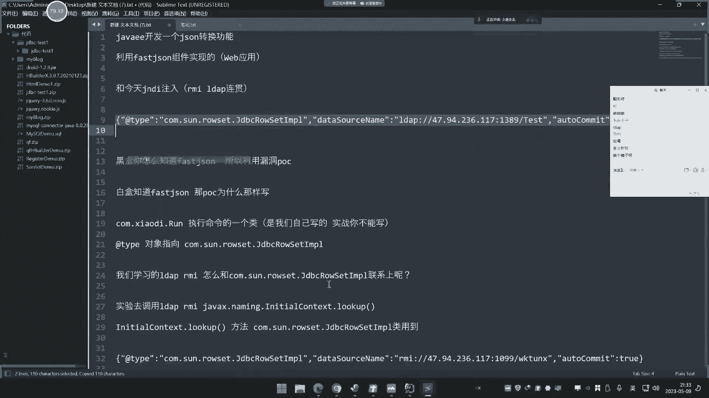

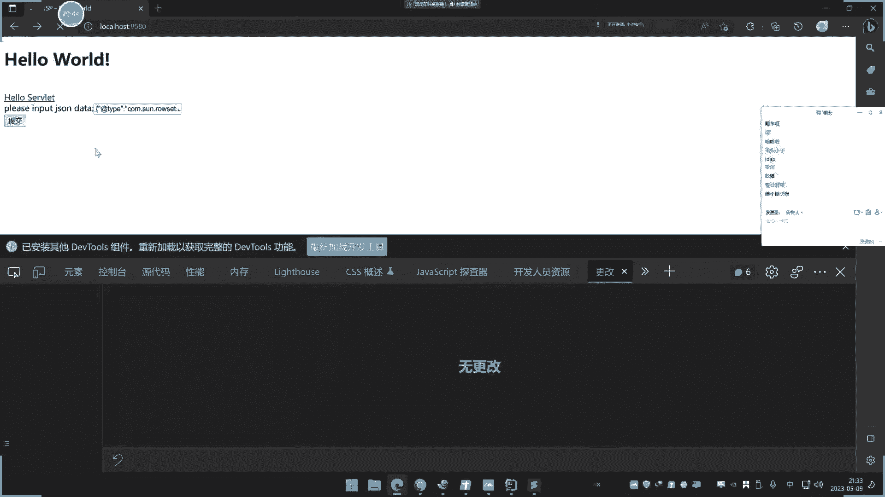

哎也不行，看到没结束这里，那他没问题，那结束这里，那你看看这是输的是吧，这都没有写错的啊，这是没有错误问题的啊，用钢丝能行。

这个不行，那这里就不行了，那他也收到了，但是他就不行，这又是什么情况。

刚才为什么那个可以，其实也非常简单呐，好理解了，因为这个漏洞它是法式的解释，我们刚才测的是它原生态的那两个写法，他捞的是原生态的，你发这个杰克森里面的油不一样，你说这个东西复不复杂啊，刚才测的时候能弄。

但为什么这画的这个小米信号又不能呢，漏洞不一样啊。

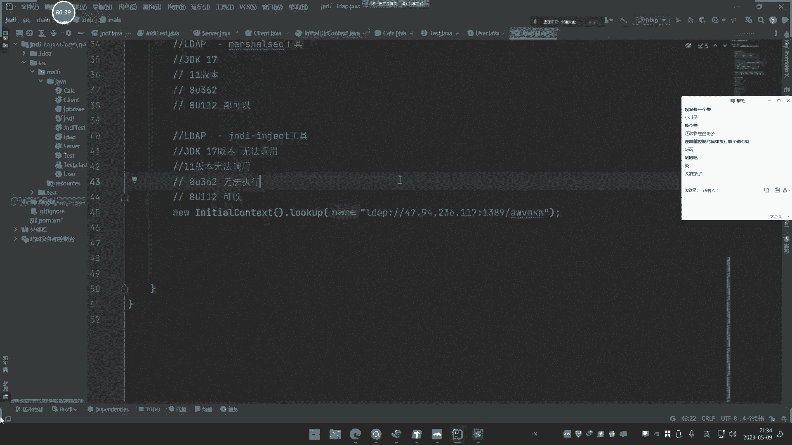

服不复杂呢，这里还有这个关于绕过的文章啊。

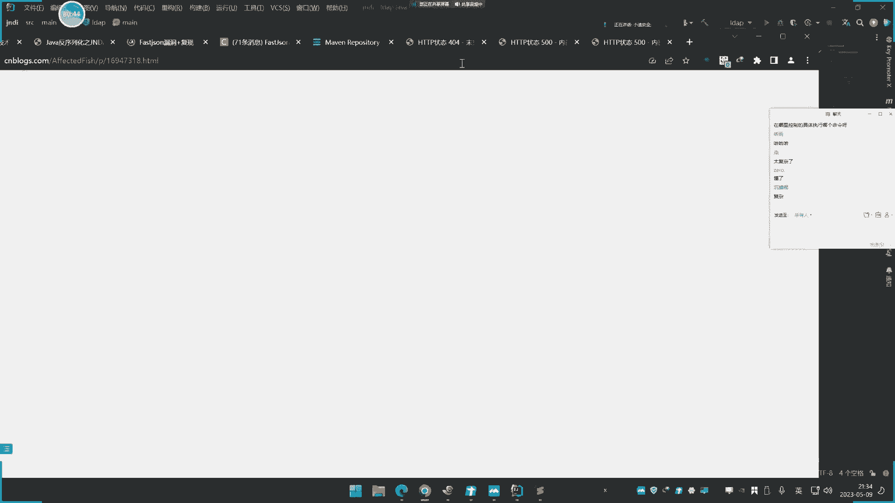

我都没给他看啊，我怕看了之后呢影响你们，那这里有绕过文章呢啊8月之前的绕过手段呐，怎么8月之后的绕过手段呐，然后呢他能绕过手的，那是针对一部分，就是说有些是原生态的，还有一些是logo的，那就很多呢。

啧这太复杂了啊，你这个后面分析呢太多了太多了啊，说白了你这个能读懂它这个利用原理和，为什么那样利用那个代码，我POC都来写，其实都已经很好了，你要说是吧，把他为什么那样搞，为什么搞。

那说实话你这个家伙不学好啊，不学清楚呢，像这个分析你看看都投入是个大的啊，不过我们后期呢，后面课程在讲到那个web安漏洞的时候呢，讲那个java安全的时候呢，会有一次直播呢给大家简单的分析一下的啊。

但是我们分析的是分析一个案例啊，不可能说很多这个绕过这个JDN东西，我们都要分析，因为每个logo你看我用这个原生态的这个东西呢，去这里NN组的时候呢，他能绕是吧，用到这个什么鬼。

fast JSON里面的，因为fast jackson那就不是用原生态这个动作是吧，他就不行了，所以说啊这个80JSN呢，那个楼里应该也是有一些限制，就关于这个JDK的啧，很复杂啊。

我只是给大家说一下这个醒啊，大家知道就可以了啊，好吧，这几个内容呢我又讲完了啊，讲完了，简单来说呢，就是说给大家讲了那几个比较重要的点啊，就是代码中我们写的那几个点啊，在这一个啊这个东西。

然后呢还写到第四点，我把这个东西呢给他写上去，很多话都是要自己说的啊，就是这个还有一点就是我们说的啊，这个利用时候啊，要知道这个其他类也能调用，这个ZNDI注入方法，那么这里呢我们举个例子啊。

也要知道其他类能调用，就是我们刚才这里呢写的那些东西。

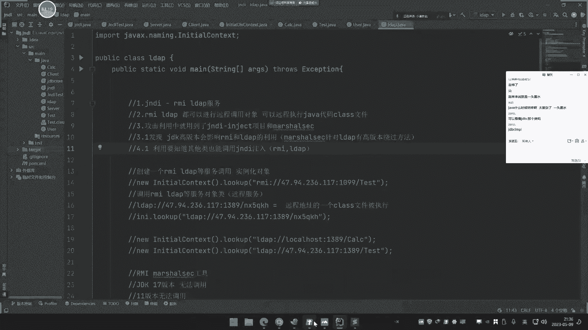

那就写的这几个了，这是常规的啊，spring框架里面的和这个数据库，这个HIBIL的这个地方有啊，还有一些这个在渲染一些什么页面的都有，还有这个会用到这个方法啊，他的内。

所以呢你就可以在这里面呢实现这个r pi，也就是说对方如果引用这个类呢，用这些方法的话，那么呢其实等同于在这里啊。

如果参数可空的话，那么你就可以把RML写进去，啊这里呢和实际上面，那还是有些东西都没有讲清楚，但是我们在后期在讲java那个漏洞的时候啊，就专门讲漏洞，不在讲代码的时候呢，啊那个时候在庸庸的时候呢。

那就会豁然开朗，现在那就是先只要搞清楚今天讲的啊，这四点什么是JNJI它是干嘛用的，然后这个IM和RDB它有什么作用，它是内置的服务，然后呢他们是干嘛的呢，可以远程调用对象。

其次呢就是远程的去执行java代码，那么呢在这个过程中呢，对不对，哎就是一个涉及到方法呢，能够实现实际和他使用，就是我们说的这个了这个方法啊，不能直接用到这个r mi，支持RMI和这个RDP的这个东西。

然后呢JDK的版本也会有影响啊，JDK版本高的话，就是这个项目它是用JDK版本编译的高版本，那么就会有一些影响啊，它就会有一些东西呢注入不了啊，低板门就可以随便租，对不对，然后呢其实我们也知道了啊。

FA克斯JS文里面的反序R漏洞，为什么会用到这个LDI和r mi，就很简单吧，这个项目里面是吧是吧，fast给积分，明明这里呢没有用到那个漏洞，是因为这个fast积分呢有这个漏洞。

然后呢我们在利用这个漏洞的时候呢，刚好啊去提交这个东西的时候呢是吧，他能去调用这个这个类里面的东西是吧，而这个类里面呢就能支持这个LDA，P和r mi协议，所以呢我们在这个payload里面呢。

就让它呢去对这个对象呢进行序列化操作，然后呢去远程触发这个什么地址的这个java代码，然后实现这个命令执行和代码执行，这就是那个漏洞的情况，所以说这个奥DP和RM，经常在反虚化漏洞中出现的原因。

就是因为啊就是让这个反旋化漏洞呢，引申出来这个JDIZZNDI和RMI，还有这个奥迪AP这个服务下面的这个调用，那么就是执行任意的这个什么代码文件，那么这个代码文件是你指定的，那么就是你想执行代码。

想执行命令就由你来制定，就这个意思只是说在利用的上面的时候呢，就会收到这个JDK的版本限制，那么不同漏洞还不一样，所以说这是个非常复杂的一个问题啊，一说大家如果说那个思路理清楚就能知道。

我们还只是讲了一些这个前进的东西，那像后面什么分析啊，那就不用说了啊，其实如果说你后期能分析的话，对不对，那你也可以尝试去挖这个java代码审计漏洞了，哎好，我们这里呢今天就说到这里了啊。

看看大家有没有什么问题，有问题就问啊，没问题就瞎啊。

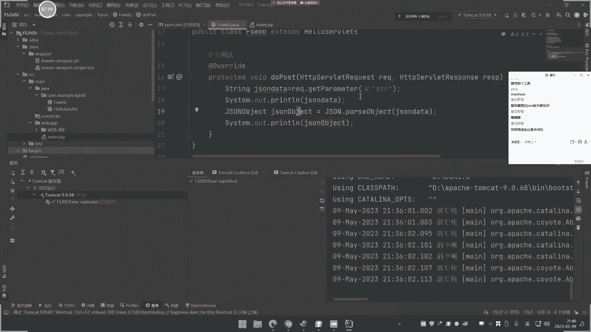

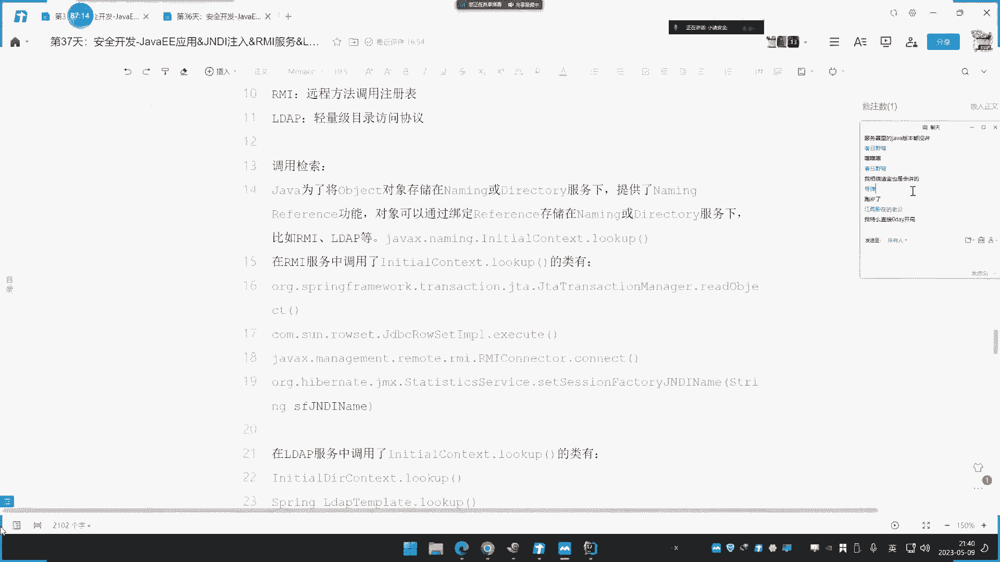

你相信我还是会讲的，我这其实不想讲。

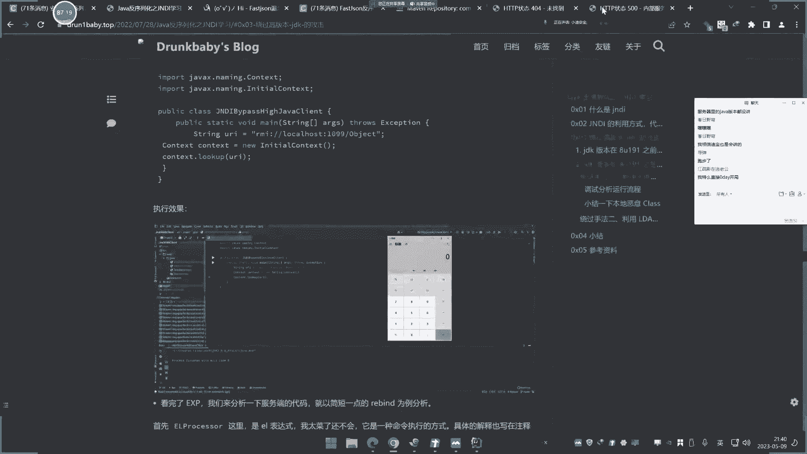

太难了，说实话我这里没得讲，哎，不知道怎么讲的，很基础的东西，你不能讲讲呢，那里面的话太多，时间不基础不讲，那也完全怕听不懂，我自己都一窍不通，一窍不通是吧，有些东西呢我自己都不是很清楚。

你这咋跟你讲啊，妈的真是神经病啊。

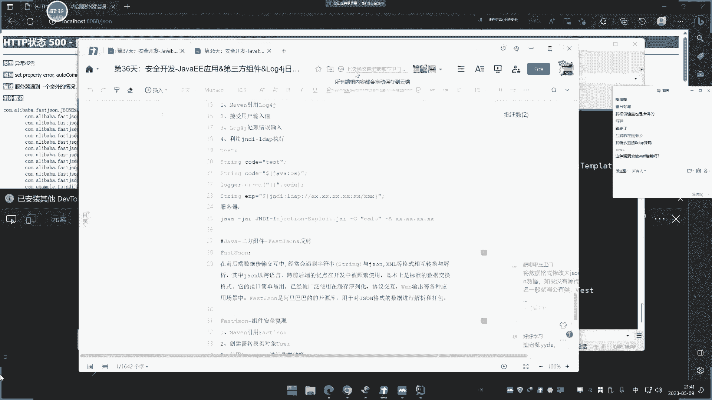

要讲这个东西，网上加java安全的呢，他就只天天搞java安全，我这里面的又要转java呀，又要转什么鬼什么鬼，这个内网的什么面纱的呀，还有一些红队方面那些东西，哎啧太难了啊。

这是真是逼自己成为一个全能选手。

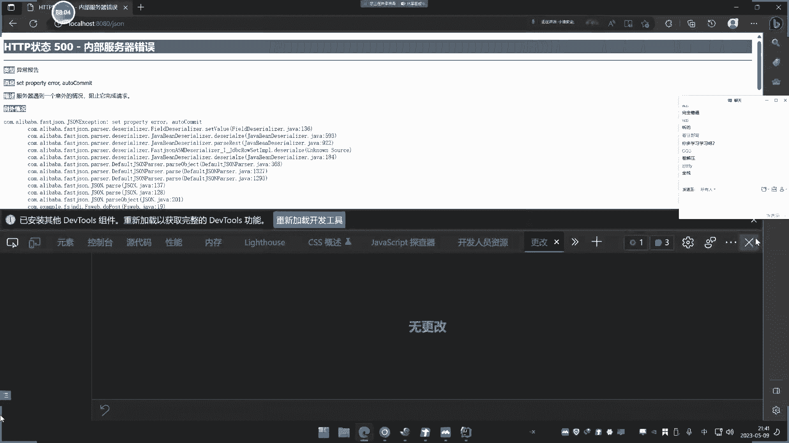

是吧，所以为什么网上老去评价说，为什么这个课程呀啊这个多，但是不深，我也知道啊，那怎么深入都深入不了啊，这他妈的天天研究那个研究这个，深交只能自己做，我们就说给大家开个头，能讲多深。

就是靠靠我自己能讲多深啊，这个我没办法保证知道吧，其实我教这个东西呢，主要大家就是以后呢大家去分析漏洞，对java有点了解，然后呢java去利用的时候能知道个嘴巴，同样呢。

后期大家如果有想往这个java安全深入的话，起个这个开头，也是为大家以后在面试你的时候，别人问到的东西，至少你那呢还能回答几个，上别的说里面的java啥都不懂，蛮尴尬，我主要是为了这个事情，你知道吧。

看一下test class是啥看的就这个代码就这个东西啊，执行个命令的，这有啥看的，没看到啊，在java特斯java。

你做class class是啥都没有，class打不开的啊，class是个乱码文件，编译文件啊，要反编译才能开的嗯，这class你打开啥都不是啊，来。

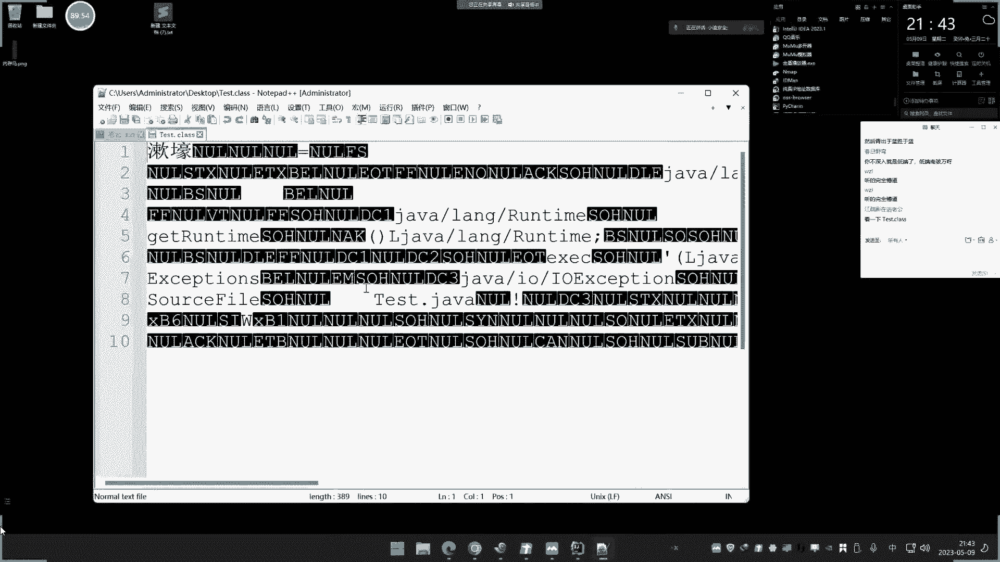

我们ID是自带反编译。

所以打开能看到真实代码。

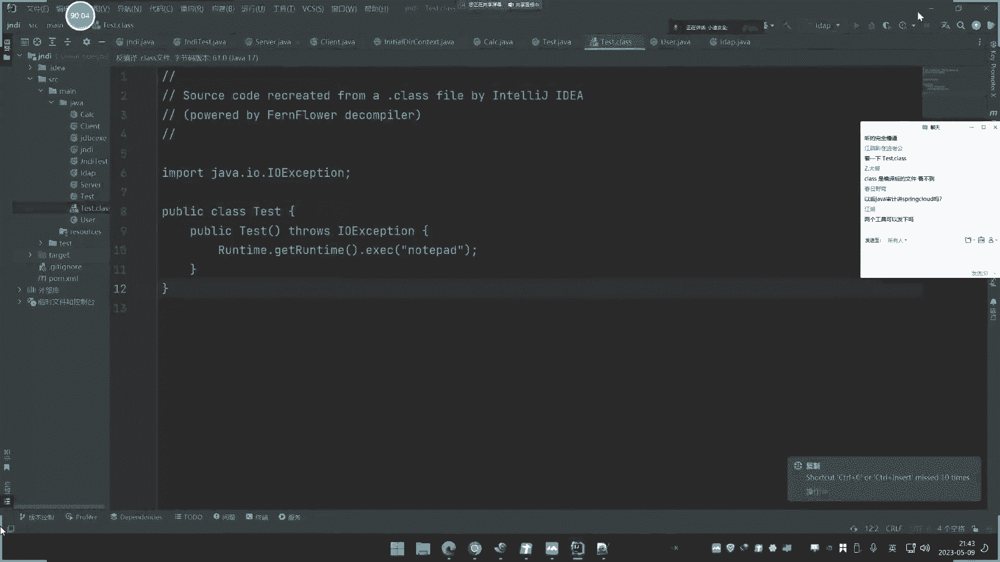

哎呀不讲了不讲了啊，java审计讲这个spring的code，现在网上没有一家讲java代神机，还讲你说的这个视频扣的我可以讲，但是你要跟我保证我讲了，你出去你就说我是高端number one。

行不行行，我就讲行，我你妹的，我花时间学，我也要跟你讲。

人都要笑死。

我们不能违背初心，对不对，今天还有个人说说现在的课越讲越听不懂了呀，弟总违背了初心呀，唉不再是基础number one啦，说的我这他妈的都不知道咋回答了。

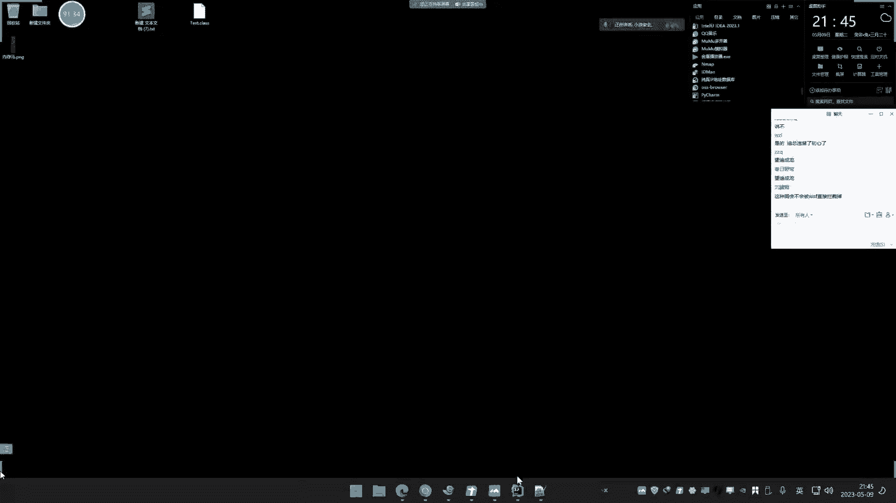

好不扯淡了啊，大家看有没有问题啊，有问题就问啊，刚才有人问说什么鬼。

两个工具打不打包，唉说实在话啊，我每节课都在打包，你问这话就是老没听课的人，我就不说这个听没听课了，你如果学这个东西，你网上也能找到那两个文件，那两个文件不是什么神器，网上都能下载到，对不对。

我即使不打爆，你也能找到，唉你问这个问题就说明一点，说明什么呢，你学这个东西会很吃力的，所以你才会问这个问题啊，懂得都懂啊，我只是开个玩笑话啊，就我意思就是很我的反面意思就是说啊，能学懂的，不会要东西。

学不懂的他就会咬东西，所以说你要不要东西不是，关键是你能不能学懂。

