# 【小迪安全】V2024版 全栈网络安全 ｜ 攻防渗透工程师 （持续更新） - P38：第38天：avaEE应用&SpringBoot框架&MyBatis注入&Thymeleaf模版注入 - 逆风微笑的代码狗 - BV1Mx4y1q7Ny

今天呢讲这个java的这个框架啊，也是现在主流的一个框架是拼的boot，这个呢其实我们今天要讲两次直播啊，就这一次讲完之后呢，还有下次啊，就主要研究下这个框架上面，那些常见的安全问题和他的一些简单使用。

这是我们一个这两科的一个主要点啊，嘶嗯然后呢今天主要是讲他的一个数据库应用，这个买BIOS买别买B啊，my bmy babies啊，然后这个还有个这个模板的一个东西啊，里面呢有两个安全问题。

同时呢也给大家顺便入门一下，这个spring boot的一些简单使用，这是我们今天这个点啊，那么现在呢我们也不多废话了啊，先给大家说一下这个spring boot是一个什么东西啊。

这个spring boot呢它是一个java的web开发框架，那为什么要学习它呢，很简单啊，它是目前为止啊，在java这个web开发中呢使用最多的啊，不是使用最多，就使用最简洁的。

也是目前的一个主流框架，就是现在目前的大部分用java开发的这web应用呢，稍微这个写的好一点的，都是采用这个spring booder呢开发的原因，就是因为它开发起来更加的智能，更加的快捷。

更加的效率，然后呢也符合当前的一个技术潮流，像前期网上还有些什么这个视ping啊，spring f AC呀，那个呢在早几年呢还比较流行，现在呢逐渐的被这个视频布的呢取代了。

所以呢我们就来这个目前主流的spring boot学习spring boot，那目前也分为这个R版本和三版本，但是也无所谓的啦，你二版本三版本呢目前都是主流啊。

我们呢这里呢就给他锁一下这个spring boot啊，这是他一个接受啊，呃我们等一下呢用它来去写这个代码的时候，大家就会发现它比我们前面讲解的，用那个是script呀。

就是那个就那个原生态的那个web开发的，要简洁很多，而且要更加的智能，很多东西呢就按照他的需求来做就非常快了啊，所以说这也是它流行的原因啊，更加的好了啊，嘶那么现在呢我们就来给大家演示一下啊。

那么这节课讲这两个啊，下节课我们继续讲啊，还有他的一节课讲完之后呢，我们把这项目呢发布到网上给大家看一下，用java搭建出来，这个就我们自己写的这个东西呢发到网上去，把它答案起来，看来这个搭建之后啊。

会和常规的什么pp呀，这个JS呢那种项目搭建起来，在网上运行，包括它的架构和显示会有哪些差异啊，把那个最后结合的就讲这个啊，讲完之后呢，我们就开发就讲完了啊，就还有两次直播嘛，是不是好。

那么现在呢我们就来看一下这个spring boot啊，它的一个使用呢我们先给大家看一下啊。

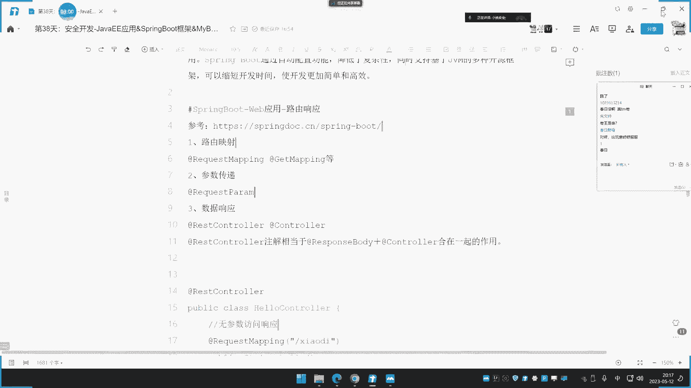

来直接撸啊，直接开始打开我们的IDE1啊。

嘶每一次打开都要把先。

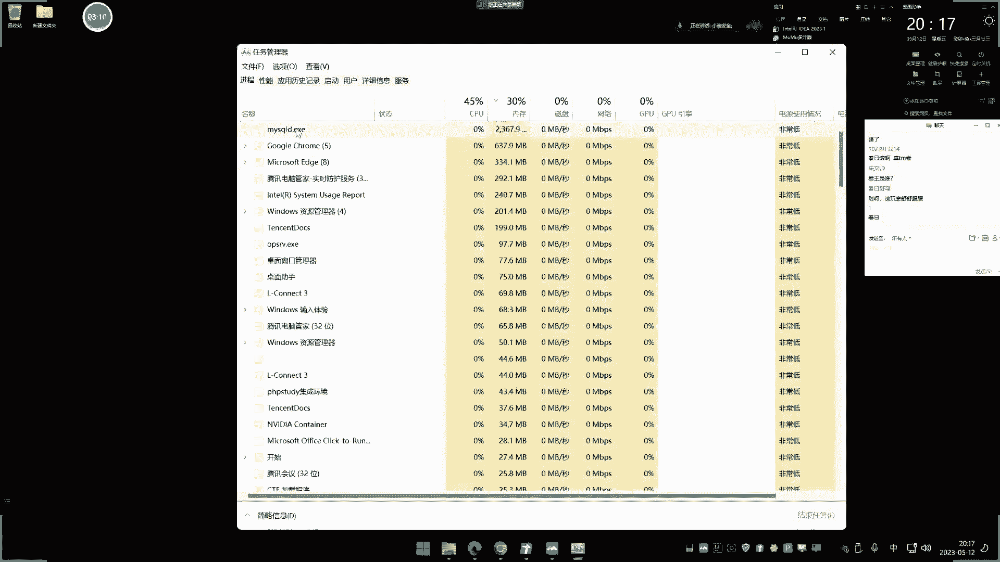

哎。

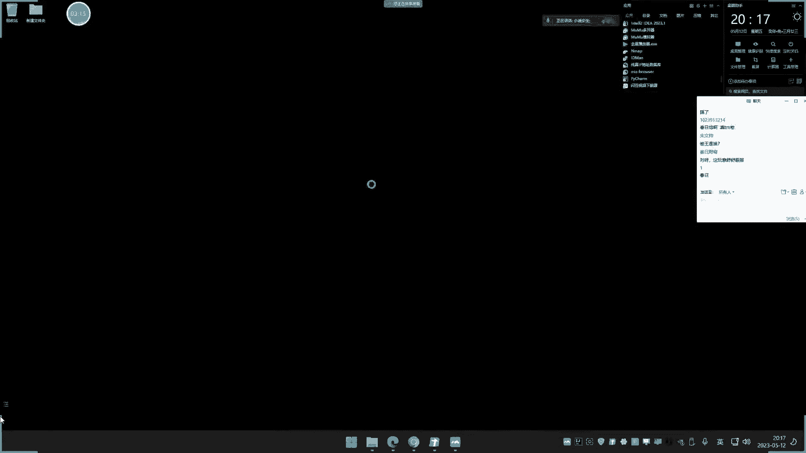

好这里呢我们就创建一个demo啊，创建一个项目啊，这里呢也注意啊，来额采用这个之前呢是在这里是吧，选择这个web服务，在之前的，那么现在呢用这个SPINDER，那就用这个了啊，然后这里呢有个服务器地址。

这个服务地址呢默认的是这个叫start，start spin点IO，这个是官方的一个地址，这个是什么呢，这个其实就是他从这个软件上面呢，去获取这个加固啊，你也可以把它。

如果说你这里获取不了这网络差的话啊，你可以把它改成阿里云的国内的啊，这两个都可以啊，改成这个start spring点IO，或者start这个阿里零点com也行啊，都可以啊，这个问题要答案。

我们就用这个原生态的吧，就不改吧，然后呢在这里呢就有几个东西是吧，我们就选择java，然后类型呢就搞成这个参股MAFEN的啊，这个使用最多呃，版本的JDK1。8，这个java呢也选择八版打包类型的J2。

然后再取个名字啊，名字呢就叫spin bot，然后呢test对吧，这名字取这个名字啊，然后呢这个组呢改一下，就叫这个CN点小迪SECA吧，是吧好，我们再点一下下一步，这边呢就是它的版本号啊。

这个目前最新版本的是个3。0的对，但是呢你这个也无所谓的啦，你也可以选择这个其他版本啊，你比如说这里呢我们把这里的地址一改，你看阿里云这边啊，阿里云点com的这个架构确定，然后再点下一步，你看他这个2。

0的，默认呢让你是截取的是2。6。13，其实就是说在阿里云这边的一个仓库呢，他认为这几个版本的比较稳定啊，这个都无所谓的啊，我们学的2。613，然后这里呢有一些这个常见的一些服务啊，这就是他支持的。

你比如说我做web开发，我就选择web的啊，对当然呢你看这里呢还有很多啊，对像下面一些高端的什么这个人啊，coo的一些服务啊，还有这种其他的你还可以写其他的啊，很多东西都能写。

我们这里呢呃像现在呢我们用到的最多的是吧，这个circle里面呢也有呢很多呢勾选了JDBC的，还有这个今天马上要讲的这个my BIOS，买b my babies啊，这个东西啊，这个里面都有是吧。

来对不对，就说你可以选择这几个东西啊，然后呢进行这个操作啊，他在里面很多东西都有啊，然后你像这个server里面的一些服务是吧，那包括安全的一些东西啊，还有这个很多东西啊，都可以自己呢。

根据自己的需要呢去把它写上去哈，你比如这个买BISS，买babies吧，然后那还买SQL啊，我这里就不选了啊，我先做第一个啊，这WEBB的就只是选择web来把它选中了，就选择这个就可以了啊。

其他的呢我们暂时用不到，好吧，下一步啊创建啊，然后这边呢会有一个时间啊，这里呢你看一下啊，他就会下载一些这个常见包到这个里面去啊，你看下这么多啊，这里面全部在外部库，你看它就自动集成了什么JSJS文达。

JKSN的，还有像什么那个log4J的，那也有里面自带的，还有我们这个什么鬼拼布达的很多啊，就这些常用的啊，他都帮你把它积累进去，其实就是说他的框架里面呢，把我们些常见那些要用的。

一些常见组件的都加进去，而且他这里呢不需要你再配置什么tom cut，那些服务器，它自带有啊，嘶好这里搞好之后呢，呃我们来点击这里地方啊，看一下啊，等它啊，一般我初次启动呢需要个12分钟啊。

我们这里呢由于我之前拉取过，所以这个仓库金香呢都在啊，GL包的都在这个里面啊，这是我们那个情况啊，然后呢我们把这个不要的这个多么，我把它把它删掉吧，因为这个无所谓，要不要他啊删掉。

就是这个呢有个这个叫spring boot test application。

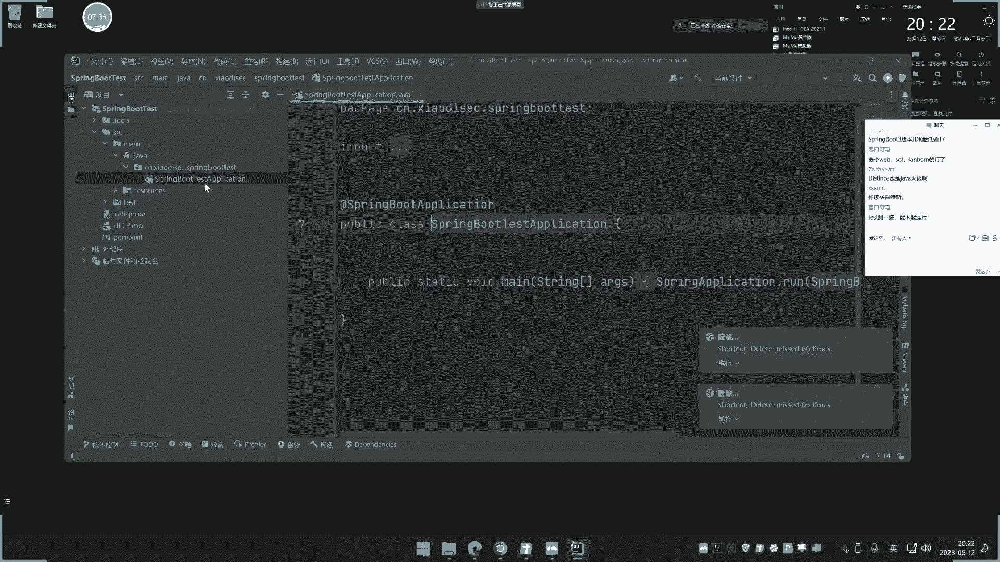

这个就是他入门的这个系统的这个地方好，然后这里呢我们就给大家看一下啊，他的几个常见的东西。

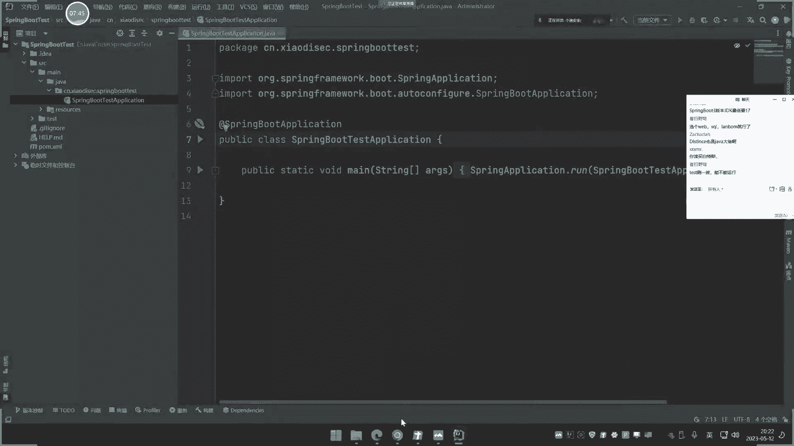

就是他初次使用的一些路由映射啊，窗口传递啊，数据响应该怎么写，前期我们用那个script的那个ADP呃，呃是不是就school的那个东西啊。

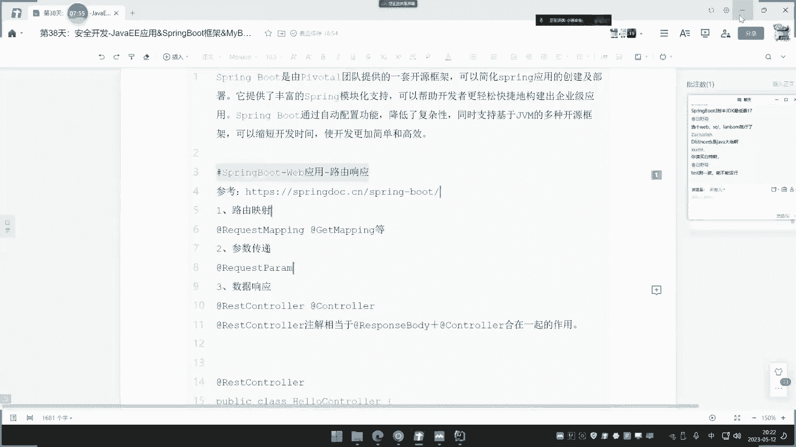

写的话，那有些那个写法，那现在呢我们就在这里写一个吧，我们就创建一个console啊，console对象的啊，就创建console，嗯名字那就叫这个，Industy，好守吧。

好这里呢就自动上那个这个console这个包，然后呢这里呢index console在这里面啊，写好之后呢，哎这个时候啊他该怎么去操作啊，它是非常简单的，首先第一步呢在这里写一个这个它的一个。

把它当做一个控制器啊，写个console前期，然后啊大家看着啊，他怎么去接下来写他的一些其他东西啊，你看啊，我们给自己的创建一个创建个这个变量啊，创建个这个方法，我们就默认把它当成手游。

把index的一个方法啊，好这里呢return返回返回一个东西是吧，比如说返回这个小迪是吧，那返回这个小黎，然后这个时候怎么办呢，以前呢我们之前是怎么写这个呢，就把它带到空气。

然后这里呢路由是怎么写的呢，是这样写啊，request comply啊，这样写啊，然后后面呢是写他的这个路径好来，比如说我这里可以随便写个路径啊，比如说写个这个访问这个小离路径来触发。

这个地方大把写上去保存了，然后这里呢我们直接运行它，你看啊运行运行这个finder application这个地方啊，不是运行这里啊，并在里之后呢，它就会自动启动一个这个服务。

你看啊它会自动启动tomcat，就说我这里压根就没有配置啊，压根就没有配置，它默认启动8080，然后如果说你这个bin monk被占用的话，你在哪里修改呢，可以在这个地方呢。

它有个这个配置文件叫application这个文件，然后这里你看有个叫8080是吧，你把它改，那么端口就会自动改啊，如果说端口占用的话，可以在这里改啊，它就会自动在这里配置。

就是基于这里啊啊启动好之后呢。

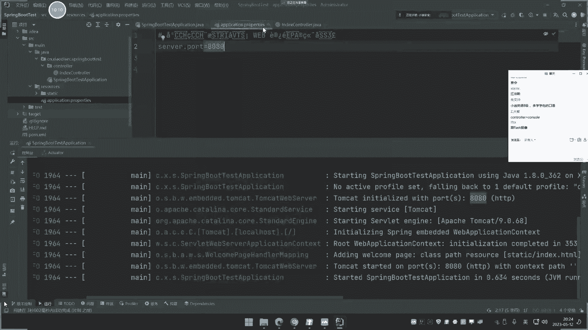

我们来访问一下啊，这个8080啊，看一下啊，哎打错了，那访问呢看一下啊，我触发这个当小迪，你看啊，那就是不是小题就显示出来了，Return，那返回这个小题就出来了，对不对，那么同样道理啊。

除了这种写法之外，它还可以写什么呢，你比如说啊他可以指定我把写写啊，tag指定方法来request点get，这个是什么意思啊，再写一下嗯，指定这个什么get请求方法，访问路由来绑你这个地方。

然后这里呢把它浓缩一下，哎打错了，W啊，来就是get方法呢去请求这个地方，对不对，然后你看啊，我们把它再重启一下，对，那其实和这个一样啊，和这个一样，你直接访问也是一样好，这里包了个错啊。

这个错了就这样写，这次访问路径啊写上去，然后呢我们再访问，好可以了啊，显示了呃，然后这里呢这是get是吧，然后你看啊，如果说我是post的话，该怎么写啊，把这改成什么点post就完了呀，对不对。

好名字再改一下是吧，这个叫get post的一个值参数名，改一下，这个叫get invest get test，对不对，我改一下这个名字都可以改，随便改的啊，你看啊。

这里就返回这个post test显示是吧，再改成这个get test，好重启一下哈，好这个要改一下啊，对对对，差点忘记了呃，然后你看啊，他这边呢还可以直接通过这个插件啊，就是我们这里不是插件啊。

叫的功能呢应该选择这个地方呢有个叫什么呢，显示这个模块的属于端点，你看这里就可以看到了，我写两个了，一个post提交小迪，一个这个地方，小黎对不对，我这个呢就写个小d post。

然后这个呢就写成小迪get访问这个地址嘛，你这里可以看到啊，体型像，好现在启动之后呢，你看啊我方问小迪拿错误页面没有东西，这是默认的那个spring boot的错误页面啊。

你学过就知道这实际是默认错误页面，然后呢我们看一下啊，访问这个get之后，那显示get test，然后我再访问这个效率，post哎又错误了，为什么呀，因为这是post提交。

所以你这个时候呢就要把这个地址信息呢。

以post去提交，那我这里还可以使用这个postman in呐。

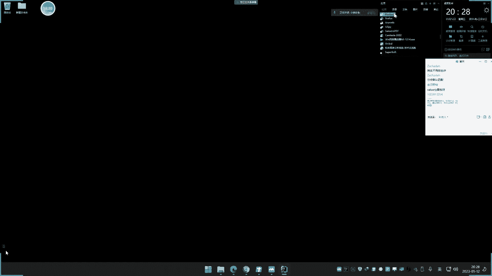

后期我们经常可能在API安全里面呢，经常会用到这个postman这个接口提交工具啊。

去在这里来构造一个什么post请求啊，把这个写下来，写这个呢以post去提交啊，勾一下来发送，那它就显示post test对吧。

对不对，这个呢就是我们的这个啊两个提交，那么这种呢是无参数的是吧，这种呢就是无参数的，没有参数，就说我只访问呢没有参数，那么其实这个呢它也可以写成这种模式，还有一种模式叫什么，看到啊。

叫get manner，这种写的也是可以的啊，这种写也是可以的哈，这种写法也是可以的啊，这种写法它也可以能理解吗，来这里有个叫get my name，也是属于get，那么同样道理啊。

他这里呢还有这个什么post mein，那么呢也是和他一四同理的啊，就是说你这样写也是可以的啊，能不能理解啊，能不能理解，这个我不说，应该都都都知道吧，就说这两个写法呢都是支持的，都是属于这种写法。

能理解吧，但post怎么和这个地方这样写，也是的，这个就直接告诉他是get访问行为，而这个呢就是POS行为啊，你用这样写，那就直接在后面写，告诉他行为，两个都行啊，那这里呢写好之后呢啊这是五参数的是吧。

那么还有一种呢就是说有参数的，有参数该怎么操作呢，那我复制一份啊，那这里呢再写上一个这个有参数的，加个杠P访问路径的加个杠皮，加法线皮，然后在这里怎么写啊，然后在这个地方呢，比如我再写个什么艾特。

显示参数，嗯这个是港批的，我。

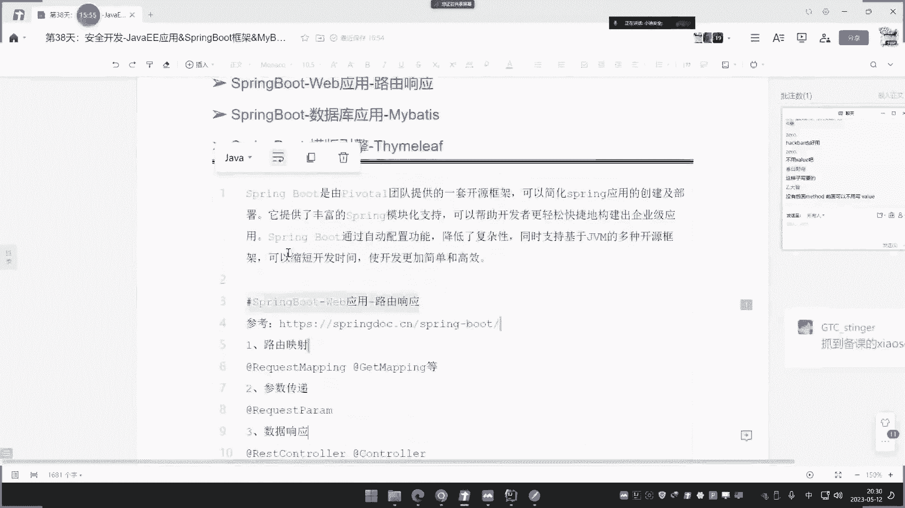

来写个这个名字啊，就结束这个雷姆啊，打印的时候呢就加个雷姆，这有参数的啊，这是get的行为，搞个G吧，都写个G的名字啊，G代表get，这个是有参数行为，然后呢我们再写一个啊，这个是点poster。

然后这里那就小d ghost下这个get，嗯嗯这里呢就显示十吹也是这个值啊，也不打印下名字就叫杠P的这个方法比啊，这里也不冲突啊，那么大家看一下啊，就这样写好之后呢，一个以post提交。

一个以这个东西提交啊，那写上去啊，结束这个类目，把类目打印好，我们来运行一下啊，嗯这两个呢就是，get请求，然后呢访问路由，那by这个参数命名啊，这个呢就是我们说的这个post请求，带参数名呢。

Name，好我们这里呢来访问一下，试一下啊，来访问这个地址，首先呢我们访问这个地址啊，来请求这个地方，后面加上参数名，name等于123呐，看到没get test123是不是这里啊。

然后post呢也是一样道理，这里发包请求get什么也是杠机。

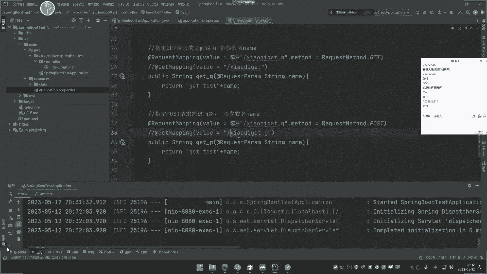

也是请求这个杠机路径地址，然后呢以post去发送，直这里写上命令显示值123456。

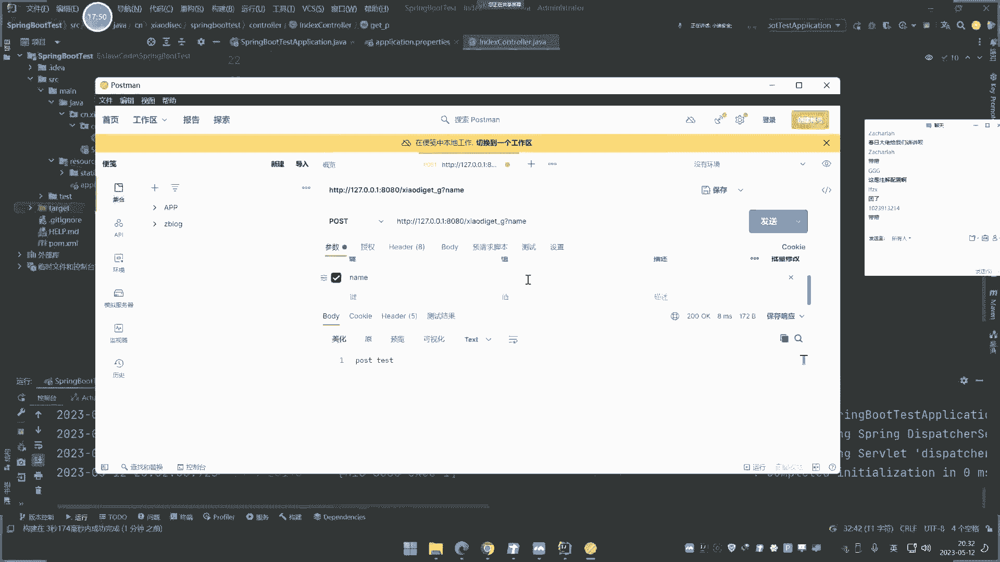

行不行，勾，那get test12356改一下啊，叫post test，对不对嗯，那大家看了这个过程应该就知道，这个是spring BO的呢，要比我们之前上过的那个东西要简单很多了吧，是吧。

就是说直接在上面定义这个访问路由，和定义请求方法，然后呢后面呢这个输入接收值是不是都可以啊，没问题吧。

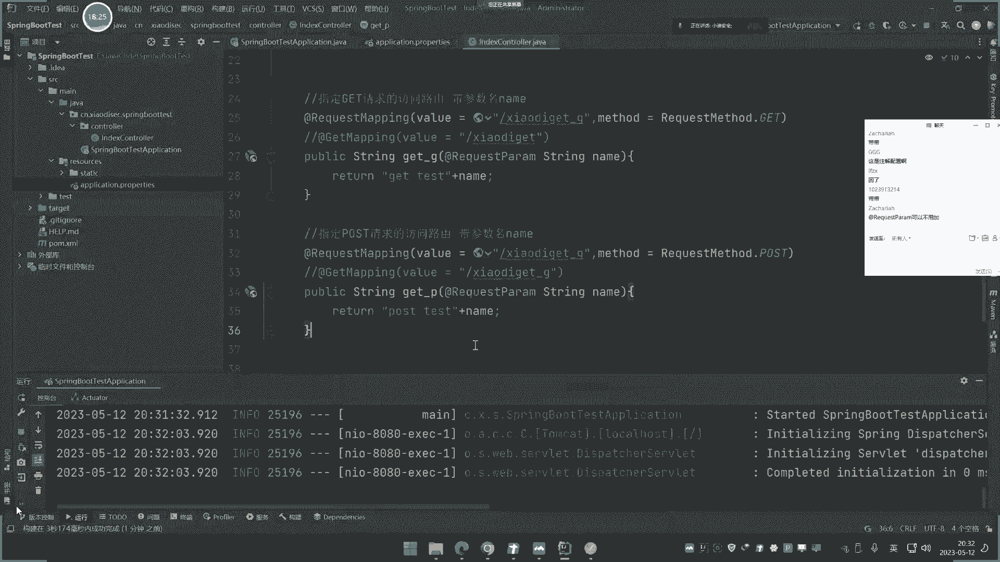

这个就是它的一个最基本的一个操作啊。

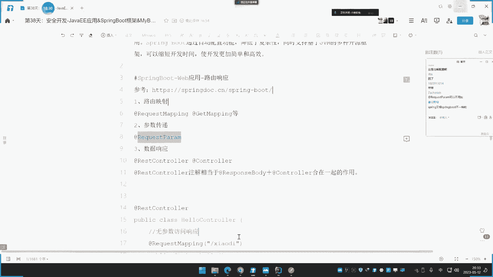

然后呢有个东西，这里呢有的地方呢会显示这个叫response，Console，有的地方呢会这样写啊，这个其实不该我强啊，但是呢我看有的人呢会问，在其专业开发里面讲过，那这里呢有两个啊。

就一个叫叫这个LREST的，还有个叫这个CONSOL两个啊，这是一个有哪些区别呢。

在这两个啊，这两个都可以，就是你写这个呢也行，写个它们的一个区别，那就是很简单，就是如果说你用这个的话，它就相当于呢啊加了这个返回里面啥意思啊。

就是我们在这里呢不是这里是属于接收吗，那这里接收参数值吗，对不对，那么如果说你要返回的话，他一般都会在这里面写上个response bully，写这个东西进去，然后呢后面再去把那个页面再进行返回。

就是我们那个前端看到页面返回呀，会这样写，然后呢你如果说使用这个这个东西的话，那就不用写了，所以说我为什么说写这个的原因啊。

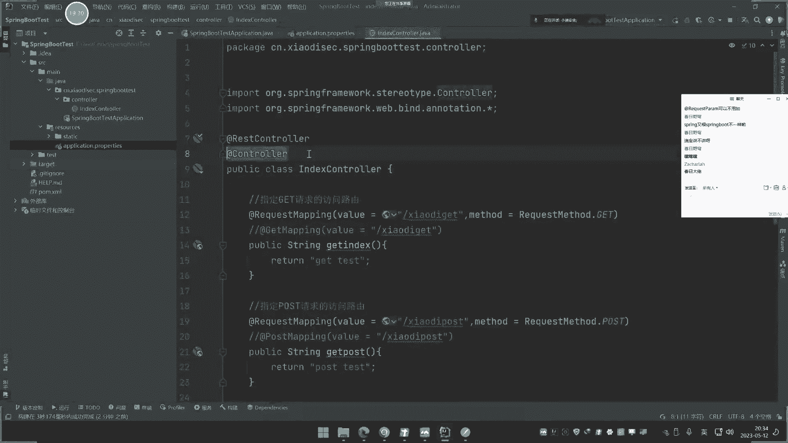

就是他比较多一个这个东西啊，没有什么太大区别啊。

一般呢用这个好一点啊，当然你可以用这个也无所谓的啦，用哪个呢就多写个这个东西嘛，写个respond boy就可以了。

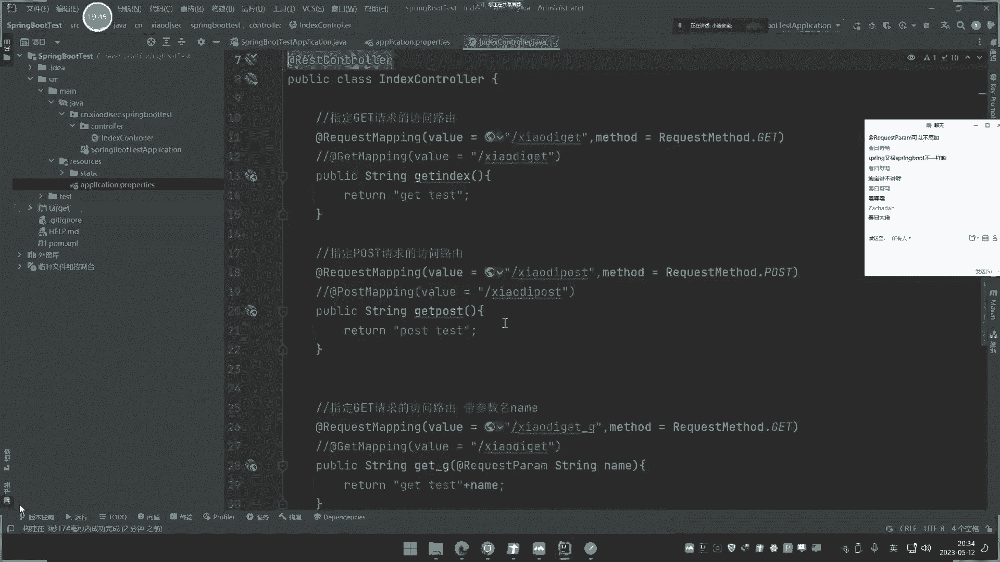

好这个就是我们说的第一个啊，它的一个基本的web应用的一个路由响应啊，就说怎么看他的请求路由地址，然后呢它的响应内容包括这其他的事情啊，对不对嗯，看困了是吧，看困了去休息呀。

好这个是我们说的这几个地方啊，那么接下来呢，我们就看一下这个他的一个应用啊，应用这个spring booder呢联动一下这个数据库应用，my babies啊，啊呸比斯啊，然后呢这个啊BS呢。

网上呢你可以先来看一下这几个数据应用啊，不是说我们讲的，都是按照这个现在主流的东西讲啊，base啊，JDBC啊，还有这个HI什么BT什么鬼单词的啊，有只要这三个是用的比较多的。

这三个呢都是在java这个web中呢，做这个数据库的一个操作的，那么原生态的JDBC啊，还有我们这里呢说这个买BBS，还有这个啊都有各自的优点，但是用的最多的呢就是个my babies，四。

就是为什么要讲他啊，我给大家说个例子啊，首先啊如果说在java中去分析SQL注入的话啊，这个注入呢你采用的是什么东西，去查询的数据库或是什么东西呢，去这个数据驱动，数据库驱动呢去查询的数据。

那么呢就像我刚才说的有什么JDBC啊，还有这个my babs啊，还有刚才那个hi的那个东西对，有三个，那么他们在使用的时候呢，方法不同，同时呢里面的这个安全问题呢也不同。

那么我们就拿这个使用最多的这个MYBABB式的，来去讲，那个JDBC呢在前期课程已经讲过了哈，那么现在我们说这个MYBATIS啊，然后他是怎么用的啊，它的过程有点小复杂，但是我们公能实现啊。

至于为什么要这样做啊，你可以专业的看一下专业的开发课程啊，他有一些各种的讲究，就是说哪些文件放在什么实体层，放在什么dollar层，放在什么控制层啊，各种都有讲究的，这些呢我们不关心。

我们只关心呢看懂代码，知道怎么分析，那就足够了啊，嘶啧你看啊，这个他的一个过程呢是第一步呢，先数据库创建数据，这个呢很简单，前期呢我们有演示数据已经给他创建了，讲PPP应用的时候就已经创建了一些数据。

还是用到MYSQL，你家这个sting boot呢还可以联动什么release啊，各种各样的乱七八糟的数据有一大堆，但是呢都差不多，那数据库不同而已啊，啊第二步呢就是这个创建的时候呢。

添加这个my babs和数据库驱动啊，当然了你也可以不添加，不添加的话，就直接在他的这个pom xm的配置文件里面，再去添加它的这个架包啊，然后呢第三步呢就是我们说的啊，这个配置它的数据库连接信息。

就说我们直接的把数据分析，写到这个配置文件里面去，写好之后呢，它就会自动调用，就不用你呢啊去修改了，对不对，不用你自自己呢，就相当于这个数据配置文件可以写到这里面去，很多文件都可以写到这个文件里去啊。

第四第三步呢就是啊自己呢创建一个这个类，这个类呢是干嘛的呢，就用来操作这个数据库的，因为数据库取到数据之后呢，要把数据都存放到一些这个变量里面去嘛，所以呢就创建这个类了来存储这个数据啊。

之后呢就用这个呃，这个EMERSON这个东西是干嘛的呢，就它叫动态结构代理，它是干嘛的啊，其实呢它就是一个写好的一个类似的一个，我们可以把理解为一个代理啊，理解为一个这个路由，就说他把这个东西写好了。

固定好这个SQL语句，然后呢他就按照这个方式去执行，也就是说定义好了一些常见的模型啊，你就直接执行啊，最后面呢就是用这个控制器呢，来实现这个访问啊，并且呢解锁这个用户数据，并把数据呢进行数据库查询。

并且呢代入到这个显示页面中，就是一个用，就和pp一样是吧，先这个建立数据库连接啊，然后怎么接收用户提交的数据，然后呢去执行SQL语句啊，最终把SQL语句执行的结果呢给它显示到页面中，是这么一个过程是吧。

java的也是这么个过程，只是他这个过程呢和批评的有点不同，就是他写文件，包括一些这个架构呢都不一样，这个spring boot啊，那么现在呢我们就来做这个事情啊，来实现这个事情啊。

那么大家呢就把刚才我说的这几部呢给砍一下，然后我们现在呢就开始给大家去这个。

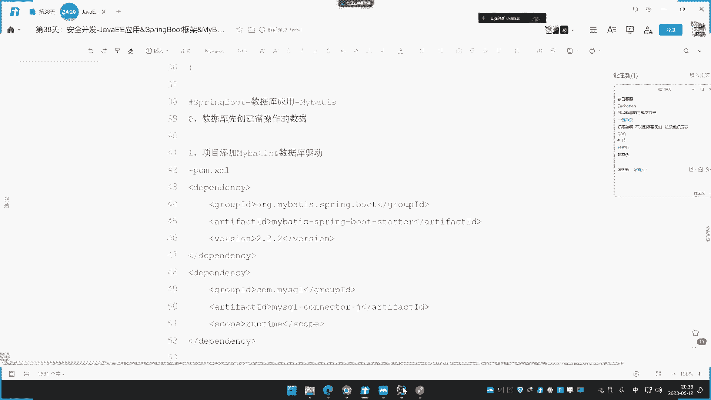

用这个sting bot联动一下这个my bias呢，babies呢，来实现一个这个数据的一个查询和显示操作啊，好那么现在呢我们就重新创建一个项目了啊，也是一样啊，名字呢就叫这个spin。

啊讲到这里的时候呢，之前还有一些有疑问，就说你现在呢是在这个IDE里面呢去去写代码，并且web服务呢也是从这个IDT里面呢，去启动的，那么如果是真实情况，下面是个什么情况呢，对不对。

不可能说你用id去打开源代码启动网站吧是吧，这个大家都知道，所以说我们呢在这个java开发的最后一讲呢，就是把这个前期小的一些项目呢把它封装出来，封门收到之后呢，商先到这个县商区呃。

上线呢第一个是了解这个过程，第二步呢就是让大家能够明白，这个java类型的应用网站，他那个源码体系架构，和我们常规的这个什么PPRJS呢有多大区别，看到这个区别之后，你就知道某一些的这个安全渗透手段。

和这个java的就没有没有关系，就像我们说的，像类似什么源码获取，它可能针对一些java应用，那就不再有效果，原因就是因为java它这个语言特性，他那个在网上启动之后的那个文件，那个class属性。

包括一些其他的属性呢，造成了他的源码呢也拿不到啊，会有些这种情况啊，所以说呢为什么要把它拿出来，第一个呢是把解答大家疑问，也同时呢给大家说一下，这个java和其他语言，这种网站应用的一些不同之处啊。

所以有些安全渗透手的呢都会失效啊，它是不一样的啊，这也是我们为什么呢，一直辛苦的给大家去讲这个讲这个讲。

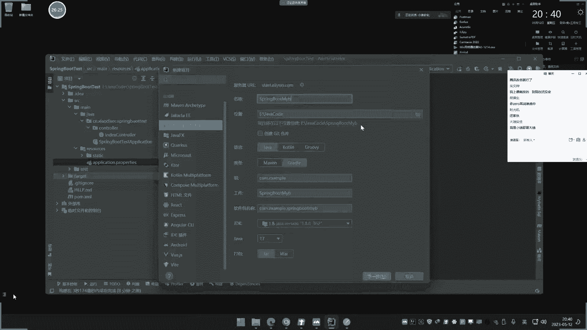

就说为什么一直辛苦的去给他讲这个软音。

因为啊这个东西你不讲，我光说没有用，你毕竟要看到了诶，你就知道这个他的一些不同支出啊，印象就会深刻一些啊，那这里呢同样道理啊，我们呢先勾选这个web应用的now spring boot。

然后呢由于现在呢要做这个数据库操作的，MYBABY死了，然后呢我们选这个啊，SQL里面呢选择这个啦，My babies，然后for work好了，我们现在呢要用它的框架呢来实现和MYSQL。

数据库的通讯，所以我们就选择了MYSQL，如果说你选择oracle，就oracle选择sexy，有sexy呢，这里很多数据库啊都可以自己选的啊，那你看很多啊，那就选择这个什么mysql drive。

就是MYSQL的驱动，三个啊嘞web的，然后my babis框架，这个框架呢是专门做这个数据库驱动啊，数据库连接操作的，然后这个mysql driven呢就是来连接啊，管理的，点击创建好，建。

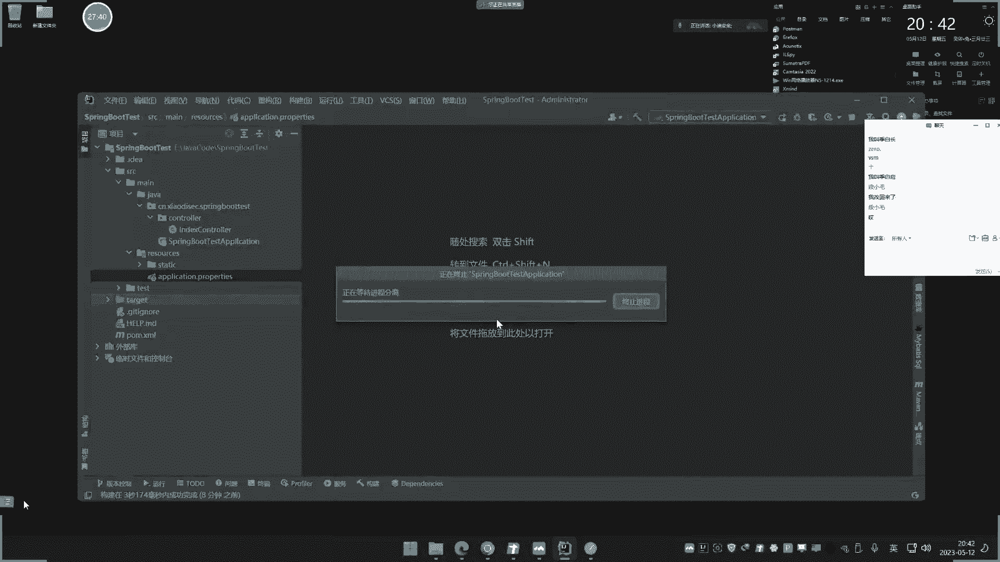

嗯好这里呢就把这个东西呢给大家搞上来了啊，然后呢我们这里呢由于要用到MYSQL。

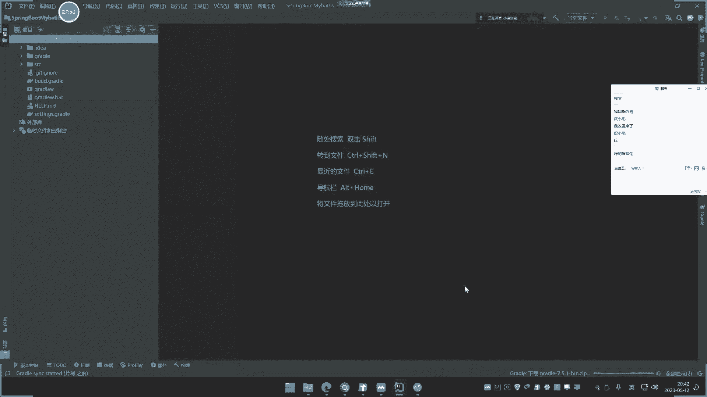

所以我先要把这个MYSQL的数据和数据库呢，启动起来，并且准备好，那这里呢我们用这个是个pp study，内置的这个pp这个MYSQL啊，这个版本的来去给他演示，当然了，你如果说没有装的话。

你自己装个MYSQL呢，在里面导入导点数据进去也是OK的，但我启动了啊，我确保一下啊，用这个前期我们用这个东西讲过的嘛哈。

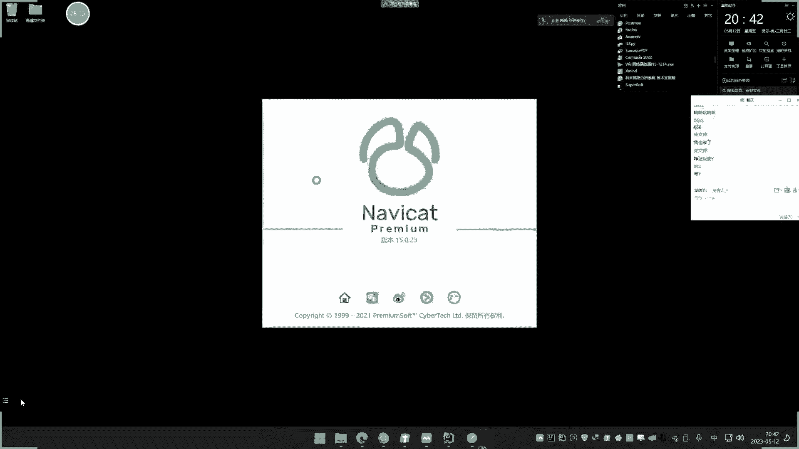

用这个数据连接工具呢啊连一下啊，看一下是不是有并且能够连接上啊，那选择这个多么零一啊，然后呢等下再去查一下这个表啊。

就可以了啊，好这个准备好了啊，这东西都是正常的，数据库呢也通讯了，就是完成了第一步。

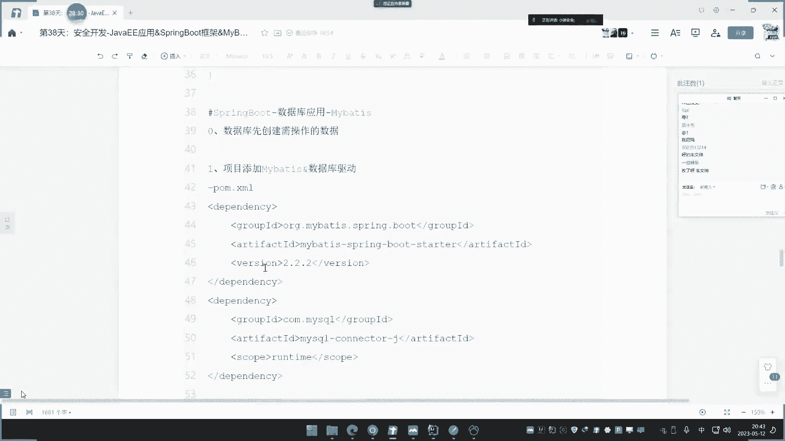

那么第二步呢就是用项目呢去添加这个东西，那这个东西呢由于我在这里项目创建了，所以在这个包里面呢，哎妈的选错了，的选的这个仓库了，删掉删掉，选择错了仓库，重新创建个，那选这个在仓库选的这个东西，选。

打确定一下啊，当然又搞错了，三个选中嗯，好那这里呢我们看一下啊，那他在导向这个东西呢，他从网上去下啊，这些全部下好了啊，我这么快是因为我前期搞过啊，瞎过你第一次呢他有点慢，可能需要12分钟打开这里呢。

你看啊他这个地方呢就自动帮你导航了，你看挖挖机my baby，那SPINPUT的，那这里那就我帮你写好了啊，MYSQL的那也跟你搞好了是吧，就你不用，那自己呢在在上面配了啊。

他直接帮你自动的把这个里面管理上去了。

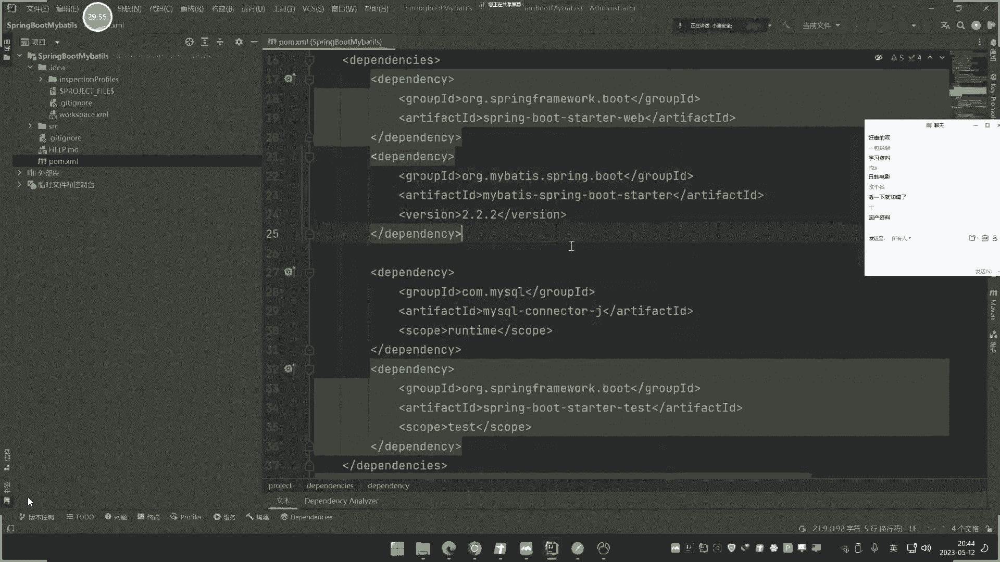

你就不用管了啊，不用管了，所以这个东西呢不用管了啊，这是其实就是第二步，如果说你在其他项目里面啊没有选中的话，那么你要开发的话，就把那个选上去就完了呗。

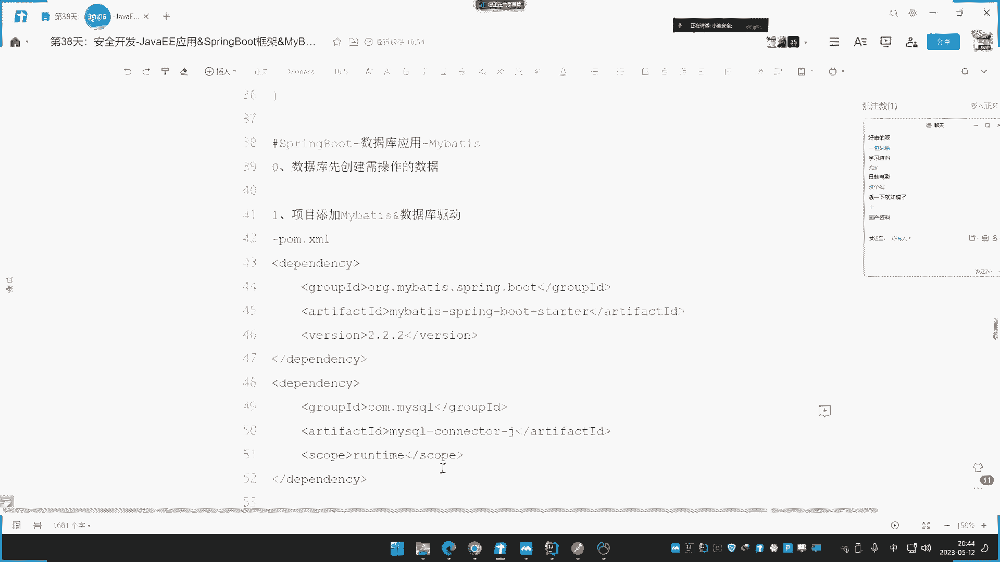

是不是这个也大家都知道了啊，就前期我们也是给他添加过，从那个MOVMVN它那个网站上面去呢是吧。

去自己呢去在上面找，然后来添加就完了啊，之前讲过啊，这不说了，那么现在第第三步啊，那创建这个数据库连接信息，其实这个呢就等同于在PPT里面呢。

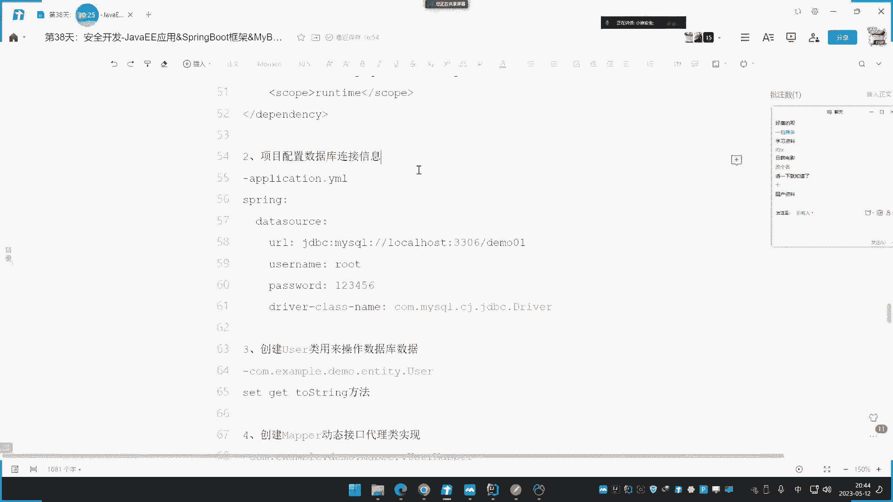

去创建一个数据库配置文件一样，那么就是在这里创建了，那就这里，然后这个呢默认的是这个PROPRTSES，就这个配置的加我的啊，如果说你用这个配置的话，那么它的配置呢是这样写的，My babies。

然后嘞，然后啊点哎，然后呢他下面的有这么多是吧，那有这么多，啊这个是这个语法，我们呢这里呢用的是另外一种。

用这是一种就换成这个YML，这个东西呢不需要大家理解啊，就是它有三种，一个是YAML，一个是YMYM。

还有一个是这个，这个是默认的，默认的写的话是这么个写法，我现在给他换一下名字啊，I名字换个这名字啊，用这种写法，因为在专业开发中呢一般用YM多的一点啊，因为它写法会更加的直观一些。

当然了你可以用这种写法，现在写法呢它它的配置呢有点不太一样，聪明明压啊，改成这个Y阳，那写好之后呢。

把这个配置好之后呢，打开它，然后呢把这个写进去，那这个是怎么写的。

其实我可以把自己的给他看一下啊，那你直接写上去之后啊，来自动取出来啊，把乱码也去掉，然后你看啊data它自动帮你补的啊，就是你这里呢就直接这样写是吧，现在写个SPING，然后呢这个马BB死了。

那so的哈，还有这几个东西，那余out的他都可以啊，来啊写了的，还有这个什么鬼UR路径呀，username啊呢啊，password呀，是吧，一般的配置几码账号密码，还有我们说的这个数据库名名字。

还有这个class文件录像。

那就这几个嘛呢，JDBC啊，连接本地的3306的DOM01代表数据库名。

是把它写上去啊，然后账密码root密码呢也是root。

还有一个呢就是我们说的这个driver class name。

就是我们说的class name名啊。

直接把整体复制吧。

然后呢是我们那个呃，就是我们那个包的那个地址是吧。

就是包里呢com mysql cg g BBC就这东西啊，那你这里的写它也是能够帮你把它弄上去的啊。

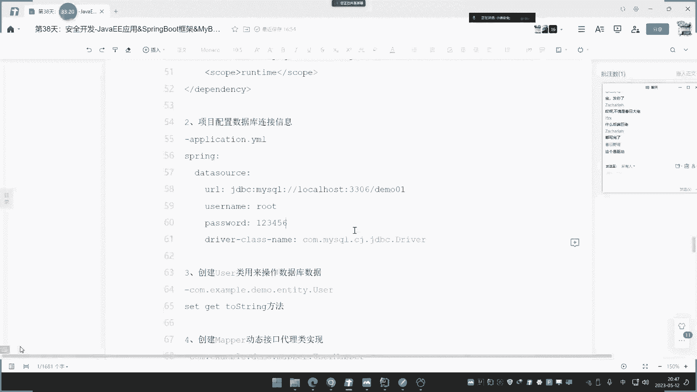

我直接粘贴复制吧，好配置好，这是我们那个账号密码，PC和这个路径地址包的这个路径，那我驱动加好了，配置好了啊，就是你的数据库的这个账密码，包括你要操作的数据库的名字多么零一，配置好之后。

第三步呢就是来创建这个数据的存储，数据库的用户数据。

所以我们在这里来这里啊，把这个燃油的吧删掉，避免它有些冲突，然后这里呢可以创建一个目录，创建一个class名字，名字就叫ENTITY哈，为什么取这个名字呢，就是我们往说的什么实体化层。

就是一些实体化的一些东西啊，你可以不写，但是呢专业性的就这样写是吧，想上去点user，就是呢把一些这种数据存放的就放到这个目录，还有什么刀层是吧，持久层啊，各种各样一大大堆的东西。

那个呢就是专业开发里面，就是各种文件来处理各种的业务逻辑啊，如果是搞专业开发呢，你就按照这个逻辑写，我这里写呢，无非就是告诉你有这么个东西以后呢，你再碰上一些专业的源码分析的时候。

那你就知道哎这个目录下面可能是哪些文件，哪些文件会在这个目录下面就有这种意思啊，不是说我要教你搞专业，而是因为你以后要要看专业代码，你不可能说自己天天写个demo升级是吧。

你肯定是要面对这个成品的源码的，那成品源码的话大部分都是很专业的。

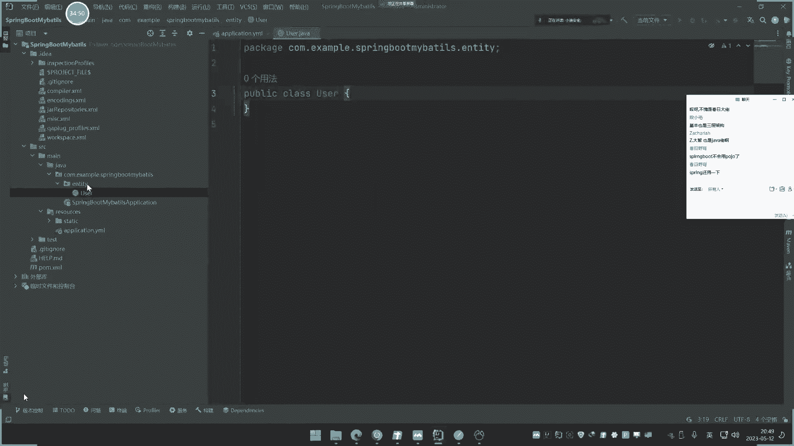

都是放到那种单独目录是吧，表示它是什么哪个层面的文件。

那么写进去啊，写进去之后呢，我们这就创建哈，来创建几个东西呢，嗯嗯string类型的啊，先写个int类型的，就存储那个id嘛是吧，id的名字有id，然后呢这个还有string类型的是吧。

存储这个USAM的，因为我查这个马上要查哪个表啊，啧哎这里呢你可以在这里配置啊，这里有个这个数据库的东西呢，你可以直接点击添加了数据库源，选择MYSQL啊，一开始这里呢配置啊能连接它。

这里呢也可以直接连接数据库操作啊，我这里呢不增加大家的这个难度了啊，我就不搞了啊，你是专业搞开发的话，就要搞这个东西在里面呢去看啊。

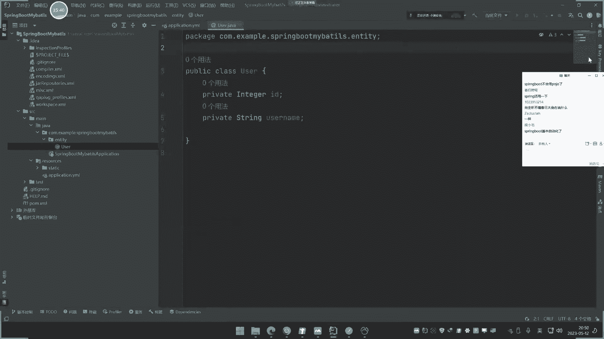

更加明显，那么这个demo01呢我们就操作UNAME哈。

sword嘛三个，那就写三个东西呢，来结束这个三个值嘛哈写上去，想知之后呢，把这个get和C的方法呢把它搂上去啊，就是我们的这个alter加inside安新区，由这个叫get和set全部选中。

网上呢还用到那个什么鬼local啊，那个am l a m l k那个那个架包呢来实现，就是前面写个ADD，那就能把这个东西写进去啊，当然了，我不加重大家的这个开发任务，我就讲这个老本方法啊，填进去。

再把这个TOSTRING呢也写进去，是吧好写好了账号了，那大家可能会为什么要写这个东西呢，因为呢等一下不是这里有什么得到id是吧，返回id还有什么，如果说你要设置值，那这个值呢会更改。

是不是就写个东西啊，好写好之后呢。

这个就完成了，这个呢就是用来干嘛的呢，呀我们这可以写写啊，它就是用来这个存储数据的啊，我们的数据库取出数据之后呢，肯定是有一些变量接收啊，啊568封装到这个类里面啊，对不对，好。

第四步呢就是创建这个妈妈，对于同样对于零的来实现啊，那这里面就创建一个吧。

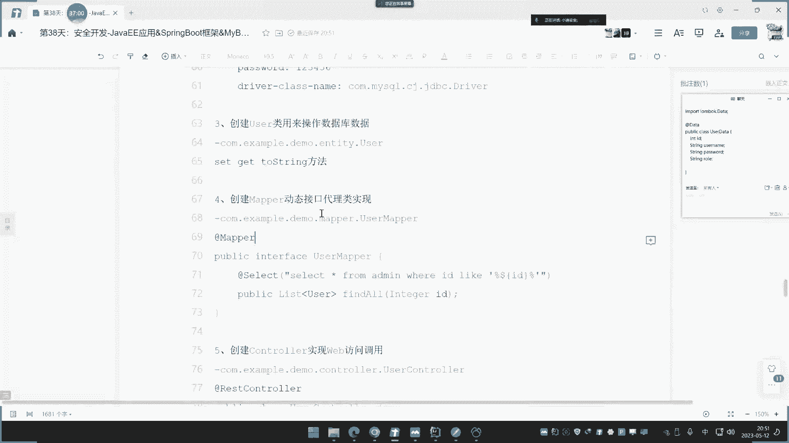

对不对，一样道理啊，也是显得专业一些，说这个包一直叫MPP啊，然后呢这里取名叫什么叫user，那么。

放到这里来，那这里呢是它是干嘛的呢，它这个地方呢就是动态接口啊，你可能会问这干嘛的啊，我们把它写出来就可以了啊，其实呢我们不需要特别了解他的干嘛的呢，其实就是它固定好的一些动态接口好。

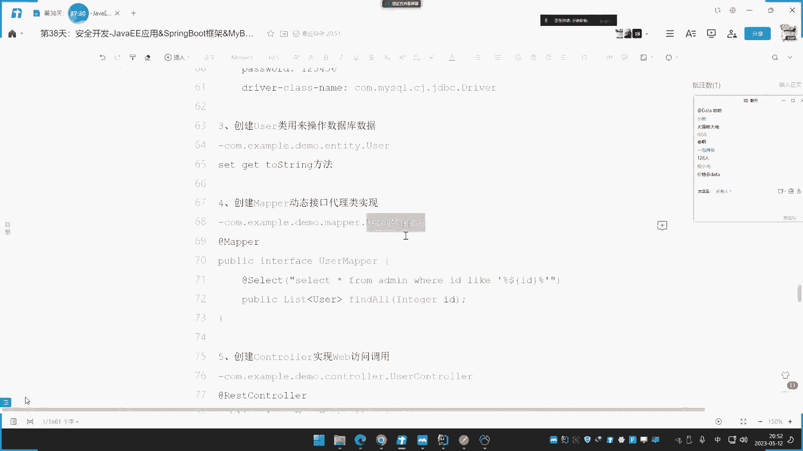

这里呢创建错了啊，他是个接口，我们刚才创建的是内删掉，那他这里呢创建的时候呢是一个接口啊，选择接口。

好来到这里显示区啊，这是接口了哪个接口，然后呢。

现在怎么办呢，固定好这个地方，它和那个sting boot一样啊，前面那个web可以用一样，消耗嗯，然后呢在那就来了，他是来源于这个地方的啊，买BBS的一个路由啊，然后呢我们来写了snack。

snack那个代表什么意思啊，这个什么意思呢，大写的啊，这个代表什么意思啊，这个代表snack语句，你看下面还有啊，那excite来看到没，excite还有什么，就是说你用哪个语句就用哪个东西去写。

那么它就表示这是执行STINSIGHT，那还有delete，那很多啊，我就不说了啊，我就写个select查询一下就完了，把语句写进去，把snack的simple ADD me是吧，查询ADD me。

然后下面呢就写什么东西呢。

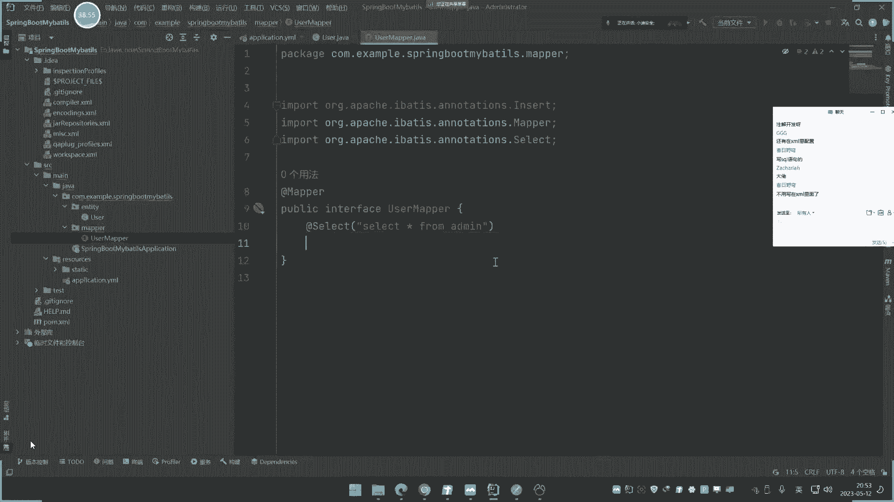

就写一个东西来接受它，来写个这个东西来接受它，是不是写个东西来结束它。

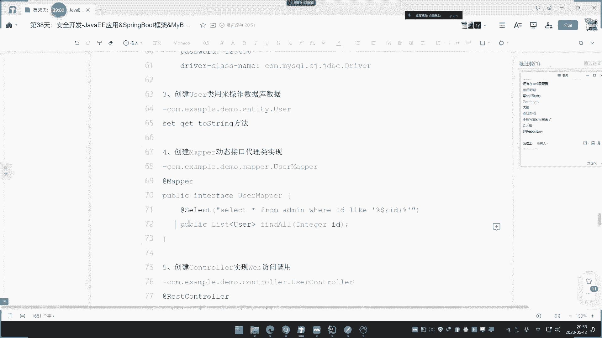

嗯就是我们说要用这个方法呢，去把它进行一个这个操作哈，哎那就写进去啊，其实我粘贴复制呢也可以。

直接粘贴复制吧，我先把它查询一下，给大家看一下啊，好这里呢就有一个这个勒啊勒呢，我们就导入刚才的那个地方，那就这个了，刚创建的就这里嘛，第一个，发现去啊，那这是命好，然后创建一个方法啊，这个是干嘛的啊。

就是list就是一个列表，user user就是刚才，那然后呢这里呃不写参数吧，直接写这里就是FIF了啊，用这个方法呢去查询调用这个select好，那么现在呢我们再来创建一个这个文件。

名字呢就是console，就是刚才啊和刚才一样了，嗯然后点这个叫INDUST吧，也名字，那就叫user，get啊算了就去get get ADD me，点CTRL，创建一个东西。

然后呢刚才的那个方法就可以用下了啊，来，是吧，写这个几东西，名字叫get addin data数据，然后把它搞进去了，这里呢就怎么用它呢，就是我们先把路由地址写上去啊，比如说我这里访问嗯。

就get访问吧，就写个这个东西啊，我们刚才没用，就用它一下吧是吧，就用它一下访问这个对比，get data抓放，get at me去得到它，得到这个例子啊，然后呢这里那就怎么去用它呢是吧。

这里呢就是访问这个地址呢。

去触发这个里面东西嘛哈好，那我这里呢怎么用它呢，是不是刚才我写了个满宝吗，在下面的就用这个东西呢看一下啊，直接用这个什么，把这个东西呢给它进行个调用。

直接调用啊，下面呢就写上那个东西，然后呢是刚才那个名字没批PR啊。

然后取个名字啊，赋值把显示区啊。

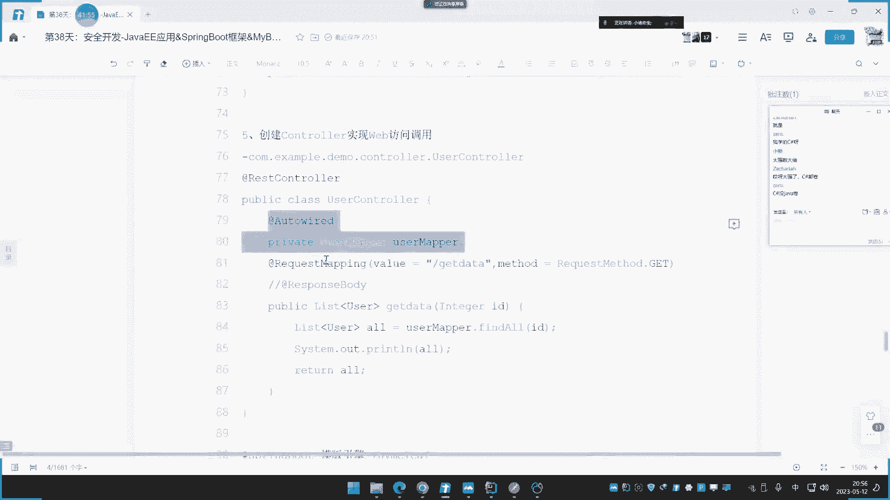

刚才呢是这个user里面的东西，名字呢是这个，所以呢名字呢就是user啊，那么重器写进去，然后名字呢我就也叫这个名字吧，先进去，然后这里那就调用这个冒泡啊，调用它点什么fighter out的方法是吧。

把取到取到之后呢，我们不是要接受它的值吗，还要接受它值嘛，对不对，接收值这里呢可以看一下啊，荧幕局部电压来结束这个词哦，然后呢，把这个东西呢给它返回到页面中看一下啊。

return返回一下这个else取名它类型是list类型吗，把选择区他这里说报错报错什么，报错的原因是什么，因为这里是string类型。

他这里不对应上啊，他这不对应上，你要把它改成什么类型呢。

就是把它数据呢改成这个什么，和它的类型一样啊，就OK了，你看就对了是吧，因为他访问实物类型，它的类型是list类型啊，这改成这个类型的一致是吧，因为这个list user类型呢，user是个类嘛。

Z9Z里面的类型嘛，对不对，好在写好之后呢，我们来看一下啊，是不是又实现了一个艾德米的一个查询操作，然后调用这个fire out的方法，这个呢就是这里的啊定义的。

然后就是和这个script a snect呢挂钩的，那么很简单的道理啊，我这里呢也可以给他再写一个啊，那好我再写个早用ab，然后呢条件是while呢i id等于是ID1，然后这里呢名字改一下。

叫finder，id改个方法把它写进去是吧，等于它，然后呢再id，我们这里呢也可以把它进行一个查询是吧，重新呢再创建个信息出来，比如说这个呢就叫get id啊，然后这边名字呢啊。

名字就叫get admin i id1数据好，这里的数据呢调用方法就是get iid1，好两个都写了啊，就一个是查艾米，一个是啊，后面加了个条件，Where vb，然后这里呢就把这个什么启动器呢。

给他启动起来啊，启动起来看一下啊，现在啊嘶嗯。

好启动了，这里怎么还在下东西啊，好他在检查啊，我们等一下，避免它会有些问题，好好了，来谈一下啊，来访问一下啊，来看着啊，这是那个地址是吧，访问的地址啊对了，然后呢我们现在呢你看啊，我要获得到两个数据。

这里写了两个码呢，一个是这个查询艾米，一个查艾米有关id，然后呢我们可以看一下啊，如果查询在这里，让我们先在这里的默认查询下呢，查询他就返回两条，如果是y i id呢，I等于一的话哈，那就返回第一条嘛。

好好两人数据，我看他对不对上哈，访问地址呢是在这个地方，访问地址是get enemy，我们来访问get enemy，看一下啊。

你看是不是就返回信息，你看id等于username，I等幂password，123456。

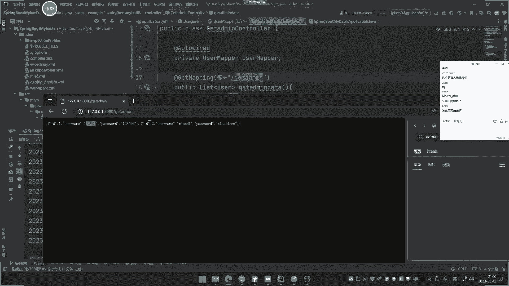

i id2username小题，password小于IC是不是就查到了，你看就这里面两条数据嘛。

是不是就用my BIOS来查询到来呀，好同样道理啊，这访问get adme啊，访问get id，看下他是不是就查询一个id的执行，你看只显示id等于一的，这不就出来了，而且你会发现它返回的数据呢。

是一个什么类型呢，你看这个数据包里面啊，你看一下。

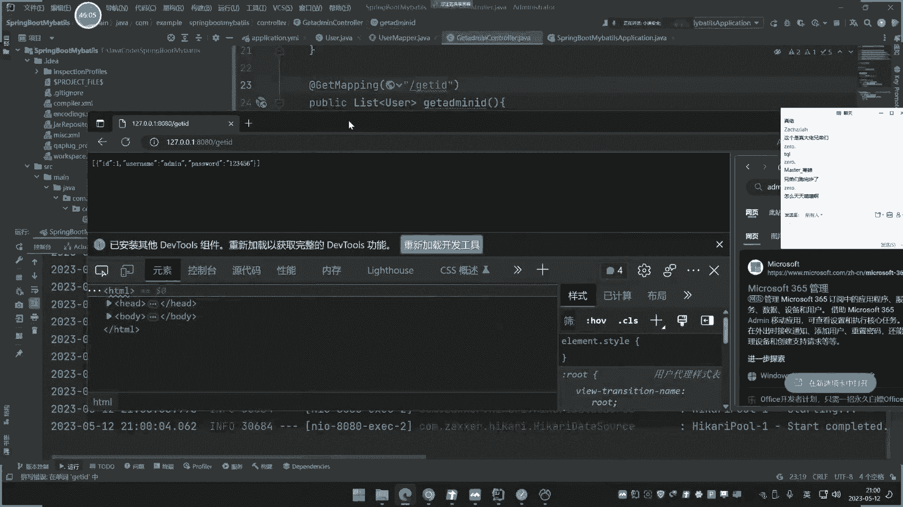

看网络包里面啊，刷新一下，它的返回数据是什么格式啊，来全部是JSN格式，全部是JS文格式，这是一个比较规范或说用的最多的一种格式，兼明对兼职他不就是不像我们是吧，就是那种那个你看这个数据呢。

格式显示我们没有做任何处理，它自动处理的原因，就是因为这个spring put里面呢自带有什么，JASONJACKSON这个组件，那么这个东西呢会自动处理，把它转换为JS文格式。

就不需要你呢对这个数据呢做什么格式的转换，非常方便，这也是为什么它流行的原因之一，这很多东西呢都为你想到了，所以你要取这个值呢也非常简单，从这个结果里面呢，取这个什么界名就能取到键值，对不对。

很很清晰了，然了啊，就是把一些常见我们一些解压工作啊。

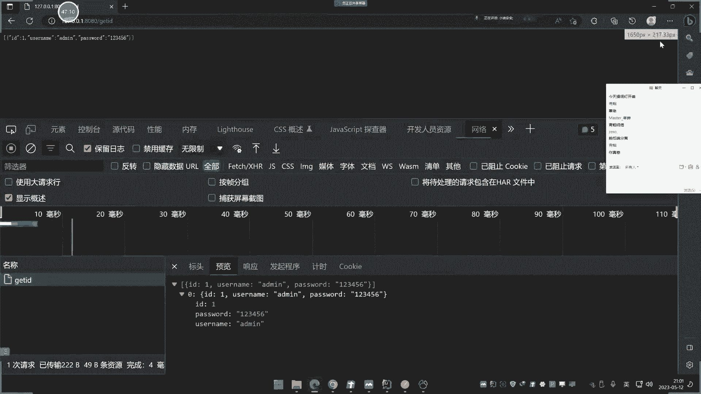

把数据呢提出来，还要对数据的格式呢进行一些整理啊，转换呐是吧，存储到一些规定数据就很多种麻烦事情，但是sting补的呢自带有这个东西，你不用去写了，都帮你搞好了好啦，这个东西讲完之后啊。

可能大家说我听你讲开发干嘛，妈的你讲的也不专业，我不想听是吧，我要听其他的和安全挂钩的，那么安全挂钩的就来了，那么既然是my babies，他的是数据库的一个通讯，我们讲它的原因就是为引出它的安全问题。

那么既然它是数据库通讯，它的安全问题，首要考虑的就是我们的蛇口注入漏洞哦，你可能就说了，你不说java里面的SQL注入漏洞很少吗，怎么里面的有讲四个注入的是这样的啊，他很少的原因呢。

就是大部分程序员只要稍微注意点，就能就能什么考虑到这四个数，但是有些人呢他不注意，或者是写写多了就忘记了，他也可能就是几率较小，我们不说几率小就不学呀，还是要学啊，我们看一下这个mybb is呢。

它的一个SL注入是怎么产生的，那么既然要产生我们刚才写的这个地图，这个里面的里面东西呢是不是要有参数啊，因为你固定死了之后，语句肯定不行啊，它有参数嘞，把这个东西呢我可以参考一下，给大家看一下啊。

有个文章，没没没把文字搞上去啊啊没搞上去再看一下吧，搜一下，他其实呢只有三个，就是其实他的注漏洞呢只有三种方式，就说你在这三种方式的情况下才能产生注入，否则的话就没有注入啊，他就没有注入。

他也是很尴尬的事情啊，快点下这个哎哎这个咋子事情的，找一个好理解的文章都找不到啊，哎呀这写的也是很少，这个还行啊，我看一下吧啦，这个my baby，这个猪呢他说的很清楚。

他说容易产生四个注入的写法有三种，一种是模糊查询，那就这种呢snack的news well tter like一个地址啊，这里是个井号啊，这个井号和一个美元符号呢有两种区别，他说呢井号呢是使用预编译啊。

啊景这个这个东西呢是使用拼接，那你说是井号安全还是美元符号安全呢，对不对，它只有三种方式，一种是模糊查询的时候，还有一种是in里面的东西，还有一种呢就是这个order by里面，就说你只要用到这三种了。

才会产生四个组，你用其他的不行啊，就这个语句呢必须是这种类型的才行，并且呢是这种写法才行，那你告诉我这个四个组产生的可能性高不高呢，就不高了嘛，如果是说你在实战中的话，你没有源码。

你哪知道哪里会使用这种写法呢，你只能盲猜啊，这种几率就很小了呀，那么有源码的话几率就会高一些，因为你能看到他有没有这种写法，就能直接定位到，对不对，而且呢你可以看到啊，他在讲完这个知识点之后呢。

他还来了一个这个真实案例啊，他教你呢，他说怎么去找呢，他是在网上找了套源码是吧，在里面呢哎加载完成之后呢，在这里面全局搜索，搜索这个美元符号，来去寻找这个MYBIS的这个SQL语句，在这里面找这个类型。

是不是他这边还给了个这个代码，是升级了个案例，对不对，但是这里那不是我们关心的啊，因为这个安妮呢是在后面后面再讲单独的代码，审计的时候呢，我会有这个相关的这个真实源码案例呢，去给他去讲。

哎把这个过程呢给他丰富，那么前期的明骚的知识点呢，就需要我们这个前期的课呢去给他讲了哈，嘶那么现在看到这里啊，我们来看一下啊，我们就按照他这种说的这种思路呢，去这么操作一下啊，看是不是有这个安全问题。

对不对，是不是有这个安全问题啊，首先呢我先按照他这种写法去写，那我直接用这个写了，他说井号是预编译嘛，我就用这个写法去写啊，我把刚才那个语句呢，把这个定义语句的写着来啊。

来看啊，就把它改一下啊，那这就是查询ADD me where条件NIKE是吧，一个模糊查询，然后呢百分号代表任意嘛，因为百分号那就是我们说运字符，前面有和没有都行，后面的也是有和没有。

id呢就是我们这个参数id写进去，i id可能问id参数在哪里呀，写到这里了，告诉他的查询这个触发这个方法的时候，触发这个函数的时候，触发函数忘了，就写个id进去嘛，对不对。

类型的规定下integer id，然后他说有个相关问题，这个是我们后面在调用的时候呢，没有引用，先不管它了，先看这里啊，这就写进去了，那么就表示说用到这个fight all的方法的时候呢。

里面的参数id就会取代这里来id，老人家是这样写的，对不对，好，那么现在呢我们就来了个问题所在，问题就是这里嘛，它调用这个F的方法是没有传参是吧，传参该怎么传，是不是在这里呢写上什么，这个什么是啊。

请2D名字GRE参数传进去，就是我们在网站访问的时候呢，是不写去啊，然后这里在调用它的时候，结束的时候就放这个了，那调用函数的YYID传进去啊，出发吧，好写好之后呢，来勾一下啊。

就是按照这种不安全的写法呢，我们来实践一下是不是有这个作用呢，对不对，好打开啊，FS改改的M12的机子，看下啊，放盖拉B啊，他是报错，为什么报错啊，因为呢他这里呢是需要你传参的，问号id等于一。

好等201，你看的确传进去了是吧，ADR就是那显示R2的数据，I等于一，就显示ID1的数据，对不对，那么现在呢我们就怎么样呢，写上一个什么租语，比如说OR等于一的一，那大家可以看一下啊，来我这里租了语。

如果说我这个宇租了对吧，那他不是这个while条件吗，这还没讲这个注入啊，先理解一下吧，啊就是这个条件order就是显示这个数据，如果说有输入的话，就说明这个语句被执行嘛，那加个order1。

1order的语句，那就是全部显示对全部显示了，如果说有注入就会执行显示两个数据，那我看一下O等于零，看一下，哎你看。

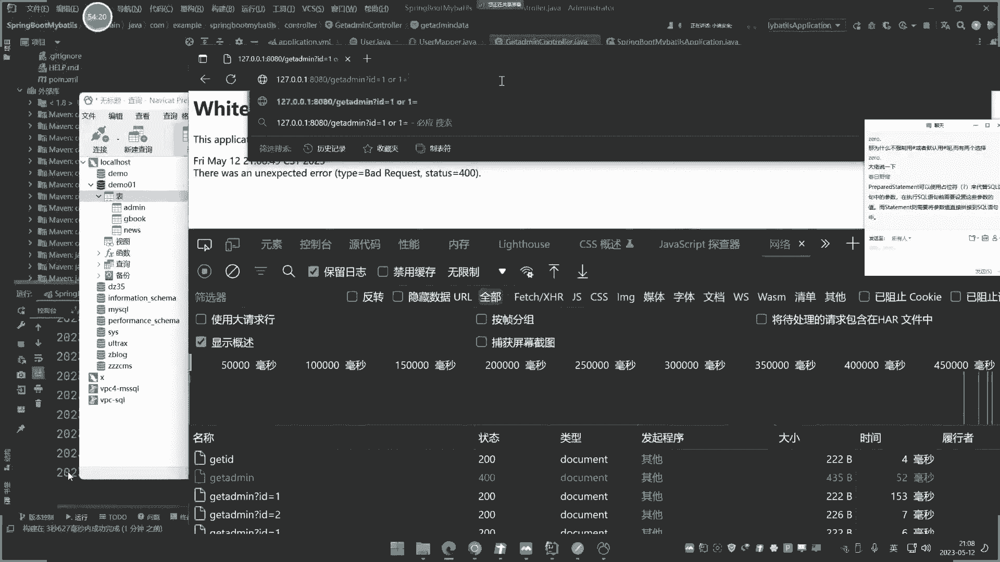

没反应呀，啥情况，翻车啦。

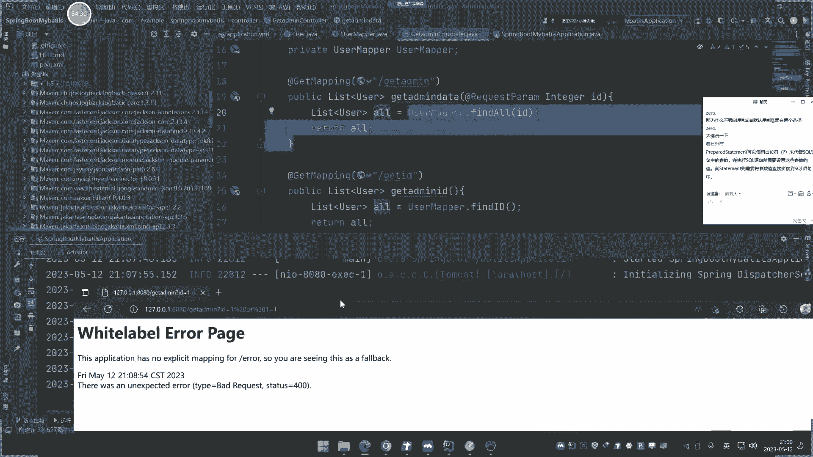

嗯没反应啊。

咋没反应啥情况，是这样的啊，你为什么会造成这个四个猪呢，还有部分刚才有人说到了啊，这个有些前因后果呢，我都没有给他交代，你如果说多翻几篇文章呢，你就知道了啊，我想找那篇文章，我知道是看这个电视文章。

没人都找不到了啊，嘶到哪个鸟毛文章里面写的还比较好一些的，哎呀算了算了，懒得看哪啊，我找一下看能不能找到啊，唉这也不是的，马上午看那文章没找到。

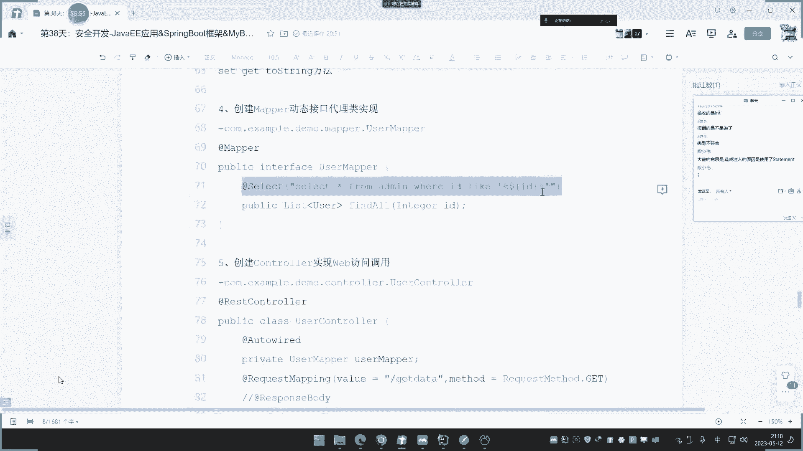

对的啊，刚才有人说到了这个类型的问题，刚才那个翻车的原因就是那个类型问题啊，有人意识到了，因为我把规定成了什么int类型，改成string类型，大家看到没order1跟一呢，没有报错，那没有报错。

但是为什么又错我呢，那我显示一它为什么又错我呢，哎写这个东西为什么又错我嘞，拿空的，是吧，这啥情况，这个其实问题也不大啊，我来看一下啊，你得到之后呢，他这个显示那个数据的一些情况啊。

然后这里有各的方式啊，对的都对的啊，哎呀数据重新来启动一下啊，很简单啊，有些人没有上SQL注入，很难说明白，其实就是我写错的原因，我故意的啊，我就是希望大家能够理解，你看我没写错呢，你看这个语句啊。

是耐克百分号啊，你要把这个写进去啊，屏蔽前面的符号啊，那他语句是这样写的呀，对不对，语句是这样写的呀，你租的时候呢，这个仪式写到这儿来啦，你做鱼要怎么办呢，这已写到这里面来了吗，你怎么办啊。

是不是要加上这个东西之后，再加上OR一个一后面的井号平底，这个后面还不是个单引号单引吗，要这样写啊，对不对，要这样写啊，拼接上去，因为他前面能写的这个东西了，你要屏蔽后面的这个东西。

前面东西呢再把它组合上去是吧，这样写嘶，哎啥情况咋不对啊，多了个百分号，哎咋还不对啊，你妹的尴尬了。

是不是写错了，我，符号写错了呀，哦是这个符号哎，搞错了搞错了，是百分号哎，四对的呀，四这符号是百分号单引号啊，没写错啊。

哦这后面怎么没写井号，我等下等下我换个浏览器啊，重新打开一下啊，我来看一下啊，这个单引号百分号我在这里写O1等一型号。

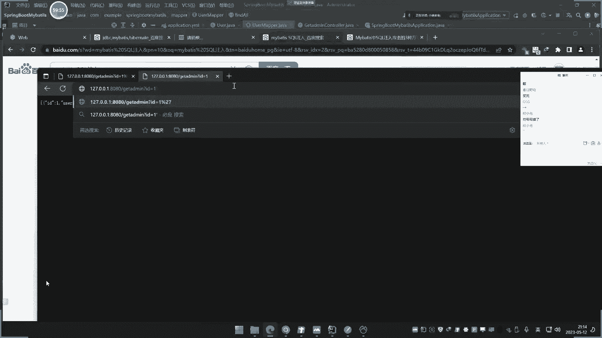

这怎么自动有个百分号在这里来了，哦错了错了，是百分号，单引号一等一，哎这也不对啊，哦我已经是搞混了啊，这我蛇口注入我这里面的都不会了呀，这不是尴尬了吗，啊，尴不尴尬，四个猪都不会了，哎呀。

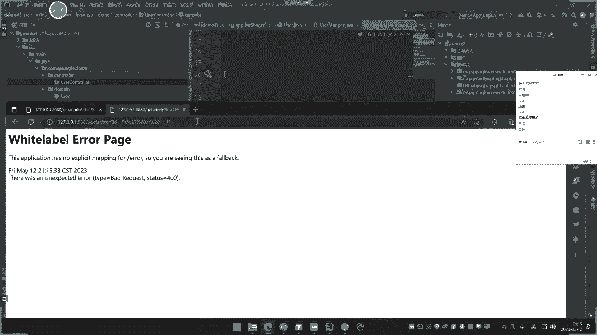

等一下啊，我把这个项目启动一下，我看我是看他是这边哪个问题啊，把这个项目启动一下和暂停一下，我看是我哪个写错了啊，这SQL语句问题还是我这个真没问题，这个是访问data data加id值，好这个可以啊。

那这个可以进行注入，你看输入安的一阵一之后呢就可以了，那哪里有问题呢，这真是奇葩了啊，我完全不知道哪里出的问题，里面的东西啊，里面有东西啊，写法一样啊，这把一模一样啊，我看是哪里写了个小问题啊。

一模一样，好那个是可以租的啊，这个写法是一模一样的啊，我们先不过于纠结这个问题了啊，我的现在都不不不犯什么情况啊，莫名其妙的，以后啊这个不让这个转弯来来学习了啊，我说实话真的是他妈的蛮气愤的。

有时候你在上课呢，妈的伤着伤着下面就翻车呀，笑起来了，你有什么可笑的呀，啊你认认真上课，帮他准备课程，天天就换来嘲笑。

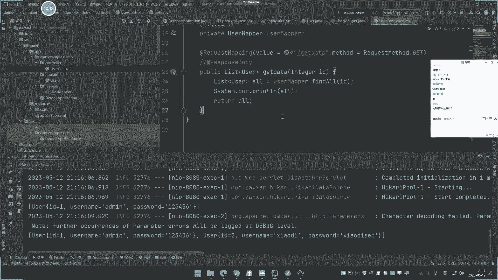

真不想上，说实话，嗯那个我说一声。

那个隔壁的隔壁的是那个是什么，是那个录播，他为什么翻车少啊，他录像自己实验做好了，你才看到成品失败的，你能看到个啥，不要老说翻车翻车，我又不是录像录像，我翻车，我就不给你上传了，全部是成功的。

有时候有些东西错了，这不很正常吗。

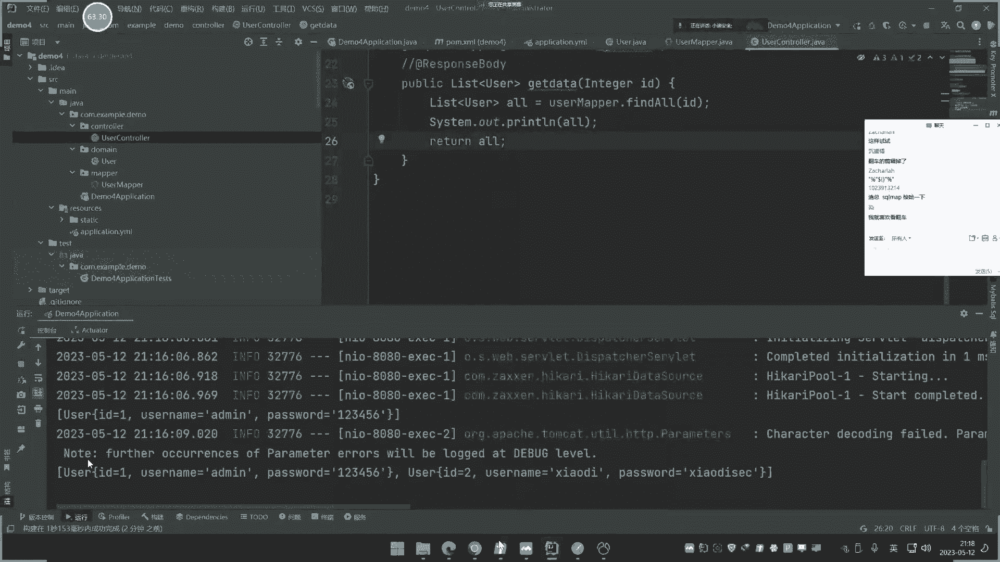

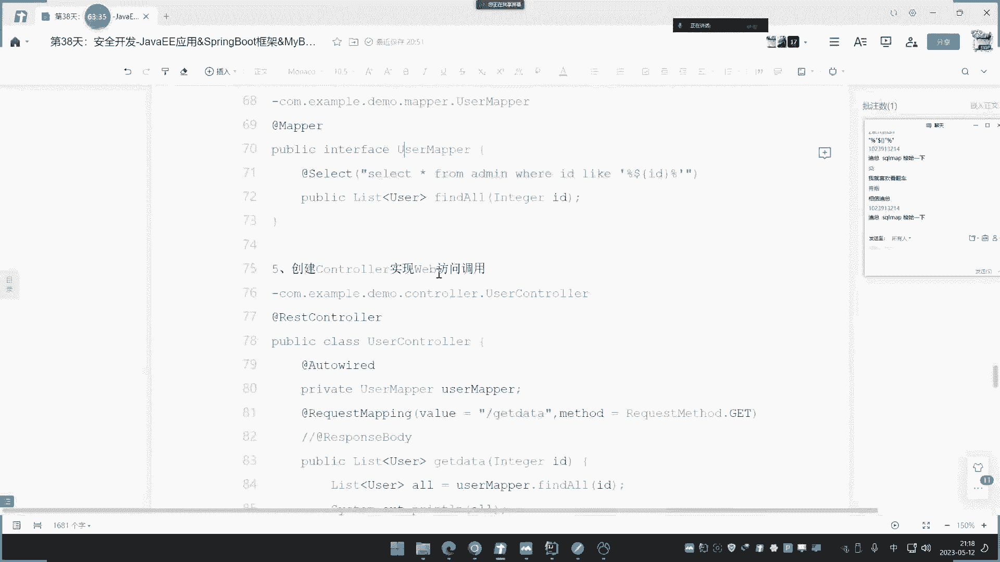

好我们再来说一下这个这个买贝斯呢，就说到这里啊，我们这里呢只讲了他这个一哥演示。

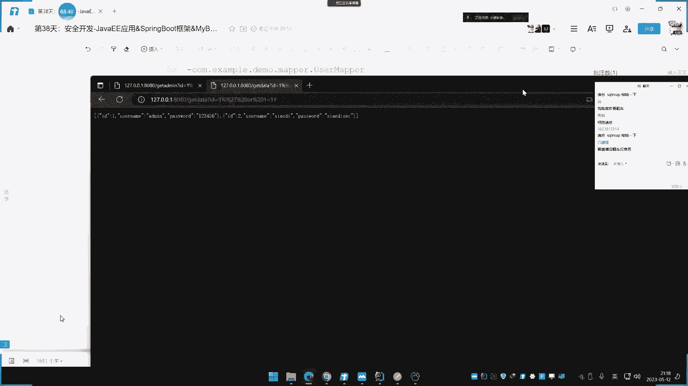

刚才大家看到的啊，这个my babies，对吧，你看啊他这个就说你自己记住啊，我做的也是只只做了一种三种这个注入，我只做了一种啊，只做了一种啊，就说我们呢刚才用这个是吧，那那还有什么这个IN的。

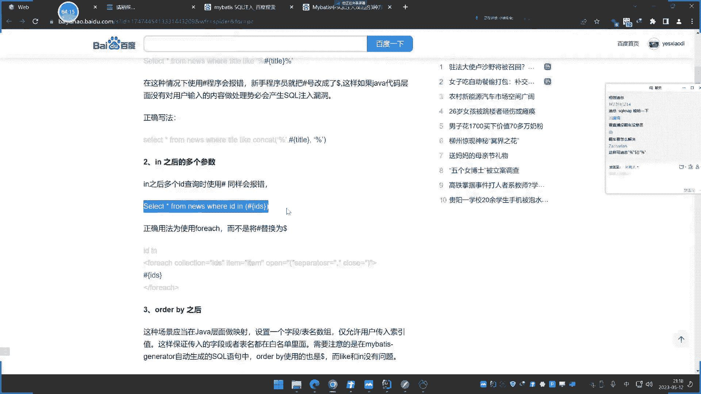

还有这个什么order by的对吧，他下面呢有这个案例，那往这个文章不写不多啊。

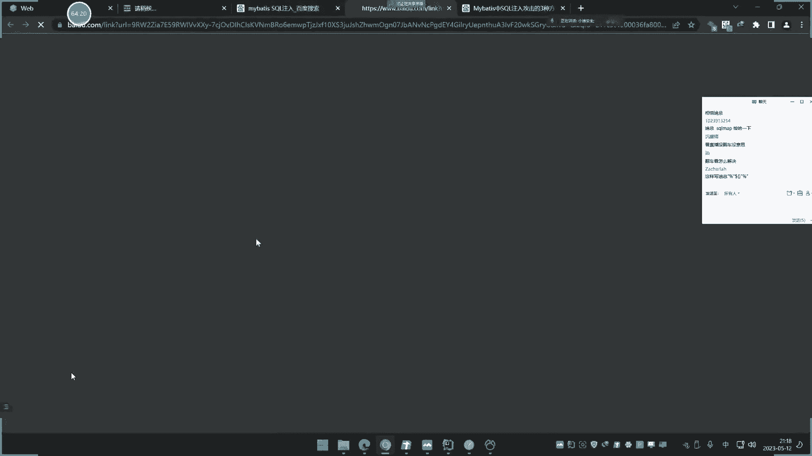

这个有几个啊，这个还搞了一个啊，这里有几个啊，你可以看一下啦，嗯就说你要知道啊，他这种写法呢哪种是安全的，哪种不安全的，他知道呢，他说井号井号呢预编译这个my base4个字路，容易产生三情况。

你可能会问了，那我直接写安全就不就不就得了吗，是这样的啊，他有时候呢在用这个SQL语句，用这个my bias呢，babies s呢，这个时候呢它必须要用到这个井号，有时候那就必须要用到这个美元符号。

就是你不用它会报错呀，所以有时候那逼不得已用用的时候呢不注意，那就出现SX主是这个意思啊，不是说对方的不想安全，如果他懂安全呢，他又写出不安全代码呢，可能是这个延误，有时候呢他必须要用到免符号或型号。

那具体为什么哪些情况用什么美元符号，哪些用型号呢，你可以看一下，在专业开发课程里面啊，你多用的多你就知道了，我们这里呢不再累赘，就告诉他有这个实情啊，所以你不要说为什么啊，就不能一直安全啊。

因为有些业务逻辑呢导致他逼不得以前那样啊，逼不得已呢那样去写好啦，这个呢是我们说的这个啊BBS的，然后这个呢我们再来看一下这个模板注入，就是java里面的STI注入，这个呢没有上过这个漏洞。

现在呢还大家还不是很了解，不过在pp那个开发里面呢，我们有初次学过，其实就是我们说的前端的一些渲染页面，由于这个模板呢在java里面。

你在创建项目的时候呢，我们来给它创建一个啊，来创建一个啊，名字就叫这个TMETHYREVAS是吧，Dom，选取这个那个名字，那就叫CN小BISC啊，面板，然后呢打法顺序号啊，来下一步好。

这里呢选择个web，然后呢这里呢还有很多嘛是吧，安全里面就是那个登录相关的权限渗透控制，刚才呢选择的是个SQL里面的MYBS，但现在不讲了啊，我们就换一个讲了，换了个模板的啊。

就说模板技术模板是干嘛的呢。

啊我给他说一下啊，这个模板就是美好的界面，美好的页面，就是有些网站的前端页面的非常漂亮，那就是用模板搞出来的。

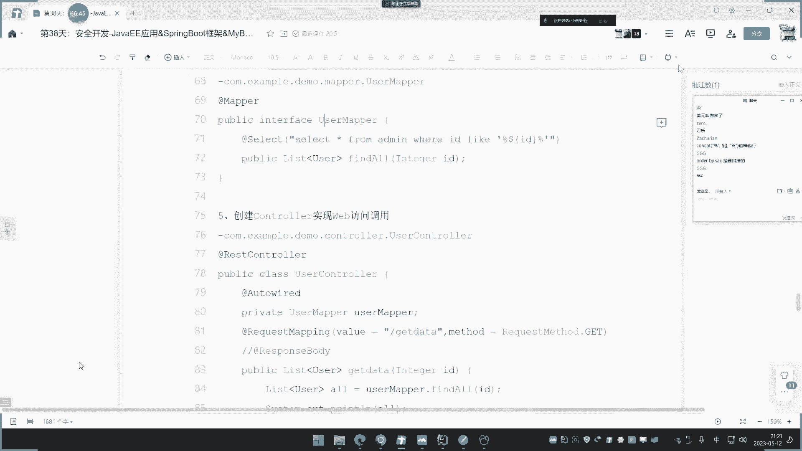

而且那模板呢能实现动态的数据的一个传递，就说我们给他演示一下，大家就知道了啊，好在这选择呢，你看这里有什么来TM就是模板引擎，那有四个对吧，那么第一个就是我们今天讲的这个呢，包发过漏洞，把选中啊。

点确定，然后点总终止这个服务，来看下这个啊，那么现在就来说模板这个事情了啊，那模板是什么东西，我们来看一下啊，同样道理啊，这个是这个东西啊，然后呢，先把这个删掉啊，他只带了个东西给删掉。

test是那个测试内啊，那个不用管，那就写这里面，然后再有个资料，这里面有这个东西啊，然后呢你这个配置文件，配置文件里面有个这个东西啊，这个叫什么TM路径对吧，有这个目录好，这个时候就专门放这个什么。

放这个前端页面和一些资源文件的，就放到这个目录下面去，他就是前端的什么TM文件呐，JS文件呐，图片呐他就放到这个里面去啊，然后java的一些核心的java类文件呢，就放到这里面去。

然后我们先来做一个前端的一个操作，就是说很简单的一个事情啊，啊在这里写一个啊，叫就叫INDE吧，好就就就这个名字吧，T h y，加OLER写进去，然后在这里呢按照刚才的四个数来讲啊。

来respond的那个地方啊，写进去，还有呢这个路径地址，Request，这个路由地址写上去对吧，路由那我们就写这个叫index路径，下面来出发吧，同样道理呢，好，然后在这里呢。

我们把刚才那个东西呢把它删去啊，啊直接get方式吧，懒得整那么多东西，这get的方式呢更加简洁一些，你觉得这个index那去触发这个路由，然后返回一下这个值哈，然后在这里呢比如说现在啊返回啊。

你看我写个什么，写个index，我写好之后啊，大家看着啊，我在这里呢写这个东西啊，它返回index啊，然后我们把运起来啊，嗯我们访问一下index啊，这是前期都讲过的啊，来看一下这里访问一下。

看是什么页面啊，然后他就返回一个index，对不对，是这么个情况，大家都知道了，返回页面，那么如果说我要访问这个index的时候，是一个比较美观漂亮的页面，那么它就会有个对应关系。

什么对应关系呢，啊他就可以实现一个什么操作了。

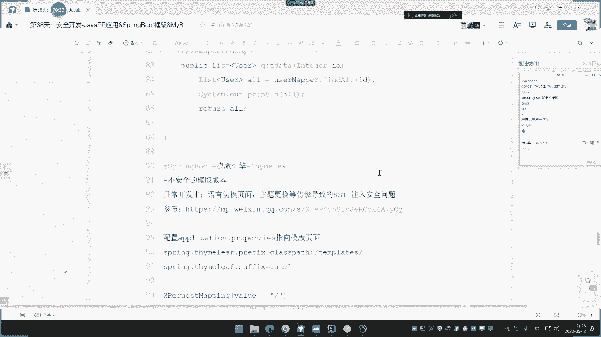

还有个是一个什么操作啊，大家可以关注一下啊。

这里呢我们就让它加载这个啊路径地址。

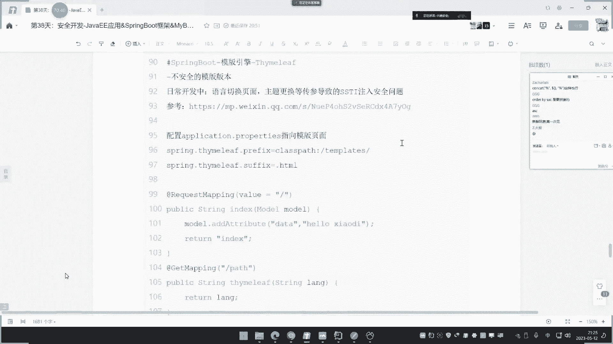

加了个路径地址，什么录音地址啊，大家看着啊，这个index这里呢，如果说用到了这个shin页面的话啊，那这个刚才那就是说没有这个模板的时候，他是返回这个字符串INDUST，那么一旦有这个模板之后啊。

那么有这个，模板应用的话哈，它就会返回index点v tel，那么这个INASATM文件呢，它又在哪里啊，它又在哪里啊，它在定义的目录下，然后名词的命名命名同，啥意思啊，你看啊他这个定义哪来。

这里有个定义在这个什么这个路径呢，TM路径下面，然后呢是这个东西，这定义好的啊，哎刚才我配置它就自动配置啊，然后这里我没有这个目录啊，怎么办呢，创建一个，创建一个字目录，然后创建之后呢。

我们在这里创建一个文件是吧，这个文件呢可就就就就可以怎么样就引入了。

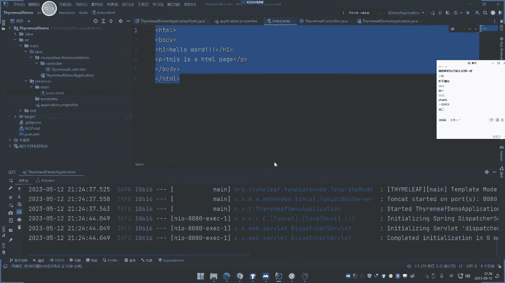

随便找个文件呢，给他用小哎。

这里没有这个页面啊，我早之前写好的页面搞个出来，看一下啊，那这是那个页面啊，我就用这个了，页面呢给大家弄一下啊，看着啊哎这是刚才的项目，先关掉，好就这里让我把它去掉啊，这个在这里创建一个文件名字。

就是这个index index等于TM把页面写进去啊，好这里面呢等下有事情做的啊，你看这里我还写了个语法，这个语法为什么这样用。

这里呢大家可以参考这个模板的文章，网上有啊，就为这就是我们说那个这里的代入变量的意思。

这个网上查这个模板的具体使用呢，不是我们关心的，我们主要关心就是说他为什么要用到模板，然后这个模板会产生哪些安全问题，这是我们关心的啊，这个模板至于怎么用，就是这个变量和那个java类的文件。

那些变量都怎么传递啊，这不管它把它写进去啊，写好之后呢，你看一下啊，我们现在呢再来重启一下页面，这就是这个目前下面有个index条码，哎在哪在哪还写错了呀，这里，Uh requests，没写这个东西啊。

难道是把model也写上去，model呢是窗对那个值呢进行替换好，我们把它用一下吧，往这里啊，哦先驱啊，那这个意思是什么呢，就从这个model model代表就是呢来源于什么。

那个model来源于这个UI的一个界面，model呢就是对于这个里面这个index，里面的这个什么data啊，它不是后面写个data吗，把替换成hello小梨，它页面中如果说打开这个index文件呢。

就是会显示这个值嘛，那我看一下这里呢，就会不会把这个date呢给它取代取代，这是个变量嘛，在这里重启一下啊，来访问一下，嗯这个又是什么情况，他没有把它渲染进去啊，四从哪里，看一下是不是内引用错了。

好少了个东西get，哎扫好像少了个东西，缓存的事情吗，你们说是，是缓存吗，没有把那个没把那个配置文件里面加缓存是吧，也有可能啊，我试一下你们说的这个删掉，它有时候它有些页面缓存，也有可能，先防一下。

嗯还是这样的啊，那就不是这个原因，这妈的这又是什么问题啊，这代码一模一样。

浏览器，没有没有啊，不是这个事情，不是这个事情，是环节少了一些什么东西啊。

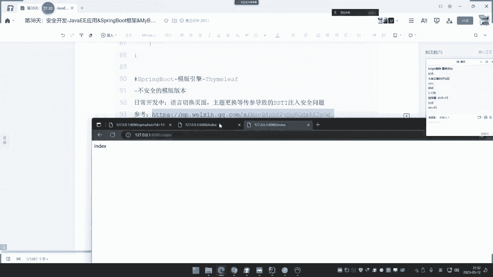

这个三个参考知道看一下。

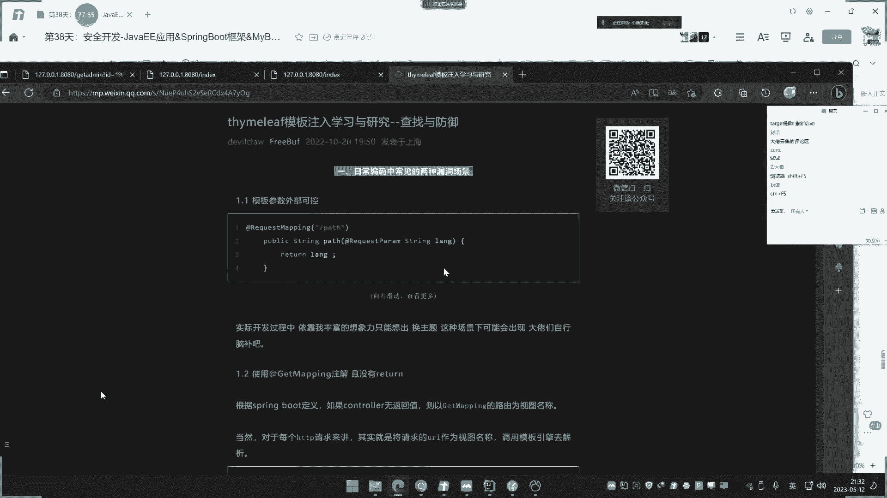

我把这个前面代码来复制一下，来看一下啊，这个是不是这个情况，我还是不拿，少了个拿个勒，少了一点东西，好请求，这个是请求这个路径啊，我就，这刚才那个源码啊，我看下这边的事情，1万代码，好打开。

好感觉现在是可以了，现在是正常了啊，他妈的不知道哪里出了小问题啊，是这个难道是这个console哦，我知道了，就是这console的问题啊，刚才是用的这个rise。

这个console应该就是CONSOL问题啊，这个地方的console问题，刚才我还往才是材里给他说的，他这个console呢就是他不是自带有这个叫什么。

这个地方，那这个这个东西。

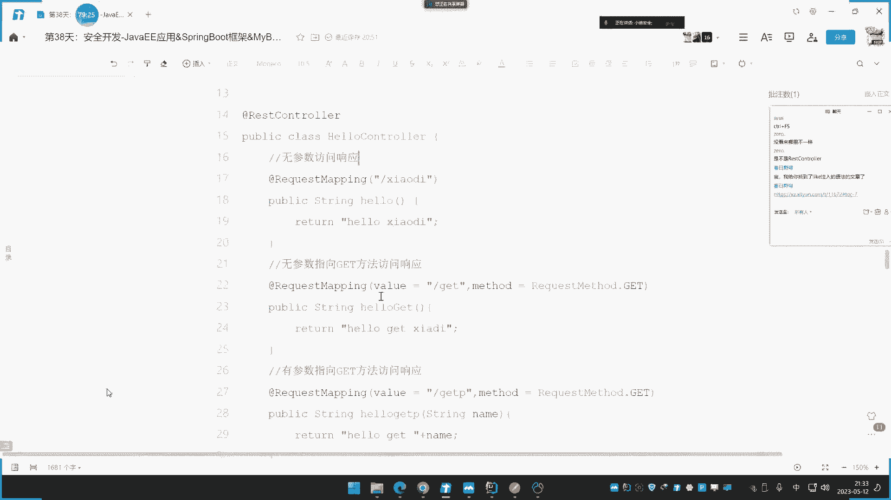

他有这个response body的一个东西啊，你看我还用这个cons，用这个respond console的，i r e s d console的时候，我们看一下是不是就不行。

因为他这个呢就返回就是字符串的，用那个console呢，他就返回这个页面的地址，那我看是不是啊，那果然是的，就这个东西啊，这个注意了啊，这个再三强调了啊，这个地方啊，因为是什么意思呢。

就是说如果你这里呢用这个console的话，它就相当于自带的这个叫什么RESIBILITY在里面，所以呢他就会把这个index呢，当做什么字串显示操作了，而如果说你用这个console的话。

他要是没有这个东西啊，它没有这个，没有这个什么RESPON玻璃，那么呢这个index呢就是当做什么页面零啊，去这个显操作，去这个什么资料文件里面，是去寻找，然后大家可以看一下啊。

这里呢就是去渲染这个index，那你不信的话，我可以再给大家看一下啊，我可以把这个删掉，因为它是渲染的是哪个路径，下面的是这个路径，下面的这个是从这个配置文件中可以看到的啊，来是吧，然后呢你看啊。

我这里不再要创建一个文件名啊，比如说我叫这个test点1TM，然后呢我这里取名标题是小迪，那内容呢就是小迪S1C好，就显示这个内容是吧，然后我就只需要选它，我不不做其他事情是吧。

我就不不不去对这个data更改数据，是吧，我就重新创建一个这个方式，然后这里呢就改成这个叫test啊，去宣传test这个路径的地方，这里面就不用它去掉，然后这个地方呢把它改成cos，并又错了啊。

来启动一下，你看啊他是不是就访问这个test呢，就会渲染这个test这个ATM文件来看一下，访问这个地方，那是hello小迪，那触发这个地方。

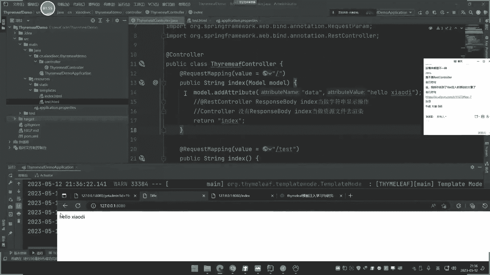

把这个date呢换成什么，hello小林，就是我刚才看到的源代码，index源代码中的，你看下源代码了，源码中不是有个阿斯spin的hello和小迪吗，那就这里了，是把这替换掉了是吧好。

然后呢，你看啊这是这个请求的根路径，我们请求什么test。

你看就是返回了小DIC页面代码来看一下，看看源代码是不是那个TM代码。

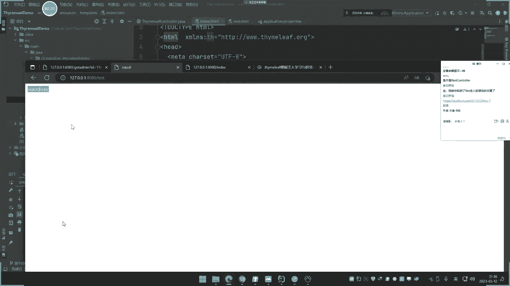

来是不是就这个问题啊，嗯是吧，所以这个就知道了啊，就是要用这个console啊，渲染的时候用console，不渲染的时候呢，选注他那就用那个这个啊，不要搞错了啊，这里面的踩的坑太多了啊。

不是搞专业搞开发的。

太容易出问题了，好那么安全问题又是什么造成的呢，那我们想象下哈安全问题是什么情况造成的呢，好我们来看一下啊，看下面日常开发中呢，经常会用一些语言切换页面，或者说主题更换啥啥意思啊。

有时候大家都知道有些网站呢，它会有什么英文页面呐，中文页面，大家有没有注意到有些地址是这样写的，那我改开看一下啊，什么long等于UN哎，一访问这个路径呢，它就是一个这个什么呃。

这个录音地址我可以在网上给找一下这种案例，给他看一下嗯，这里面的没有吗，一个NCN的路径地址，就是有些网站呢他有这个路径呢，你一访问后面加上这个东西。

他也会有些英文单词，你看这个就是的，那下面有个问号仍等于ZHCN，就代表说你是中文，那你把改成什么英文啊，或者什么鬼，他就变成英文了，你看是不是变成英文了呀，这什么一个基数呢，就是通过啊。

你自己点了什么中文英文之后呢，他就根据这个值呢来改变是吧，那很简单的道理，那我们这里呢就很稀有，假如说我在给他就搞一个什么，搞个这个呢就搞成这个index，就是我们的中文啊。

然后呢我再换加上一个什么文件名，叫做，NN点天嘛，那我就写这个东西，它写进去，那么如果说我这里，那就再写一个是吧，写个参数值啊，写个什么解释，这个也是解释这个斜杠路径，然后呢加参数加什么参数呢。

Request，然后呢是这个类型，string类型啊，叫long啊，long对吧，然后return是吧，请求这个什么路径，就是INDUST加上什么这个浪是这样写啊，因为它接收long long。

如果说是这个EN，那么就是杠EN，那就加上杠EN，那就接收的是这个就相当于是等于什么long，如果说等于1N，那么这个返回就是index杠1N嘛是吧，这个值就是这样的情况，就请求这个页面嘛。

这代表的英文页面，对不对，这个是中文，那这是一个很简单的一个事情是吧，这里呢有这个参数值去传递，那么啊就是这么一个操作导致了你敢权问题。

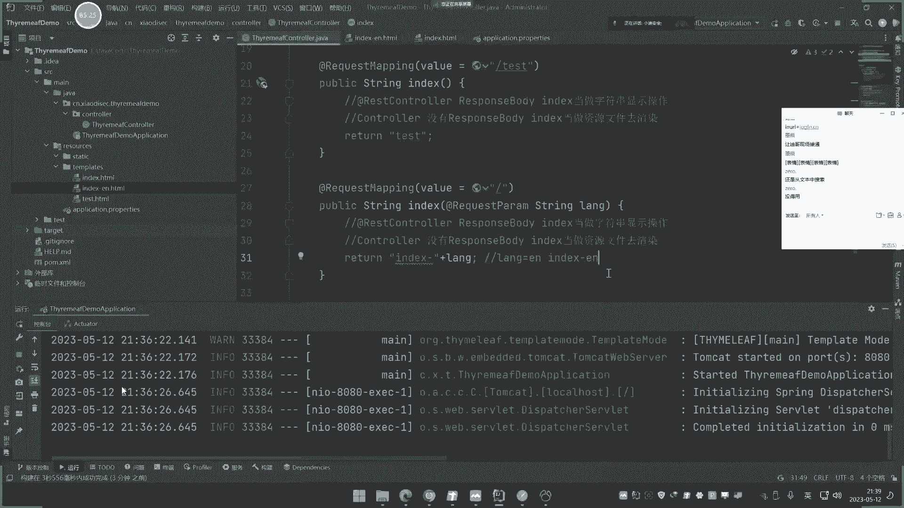

什么安全问题啊，来我们看一下啊，呃但是这个安全问题呢在这个环境下面，它浮现不出来，它浮现不出来，哼为什么浮现不出来呢，很尴尬啊，为什么读经封印不传呢。

就是这个漏洞呢，我们可以搜一下啊，它是有一个版本的一个限制，就说不是说啊你用的版本哪个版本都行啊。

不是说用哪个版本都行，那我给搜一下，那java安全之TOMC的模板注入啊，这里有个类似的这个东西，你看如果一里面这里一个或的系统里面呢，就有这个那模板引擎漏洞，唉，这个罗伊呢。

就已经是我们互网里面老打的一个系统对吧，你说把这些讲的是不是和他联系上了呀，是不是感觉离互旺又近了一步啊，对不对，额这个你可以看一下答案，看一下来，他说这个，啊这是在使用啊，使用我没有看了。

你看下面的啊，啊交易怎么整合啊，他说了3。0到3。11版本存在这个东西。

3。0。1R了以后就没有了，呃当然了，你也可以在这个MVN上面来看一下，它这个版本啊，它目前最新版本是多少，当然在2020级版本呢，它也有是吧，但是现在呢他没有啊，我就给他演示一下。

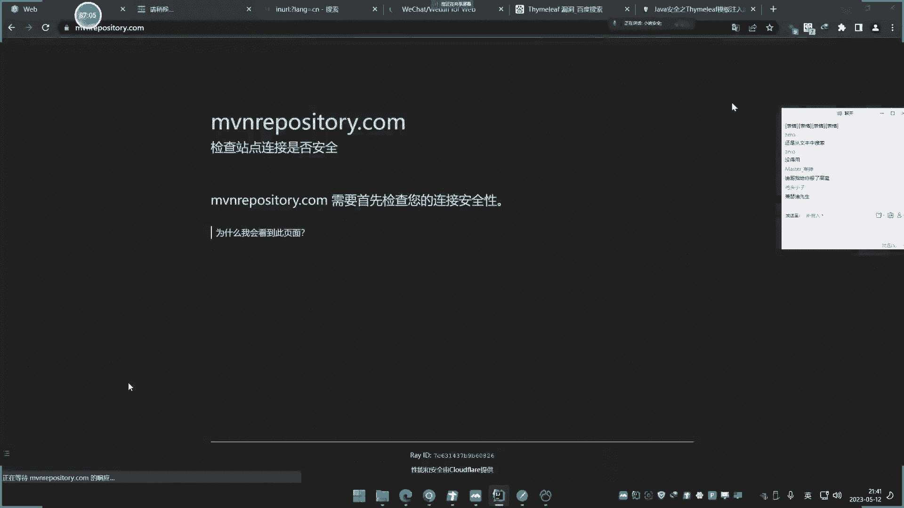

为什么没有啊，来我们下面演示一下，来这个test啊，然后他的payload了，payload了是怎么操作呢，啊你看下啊。

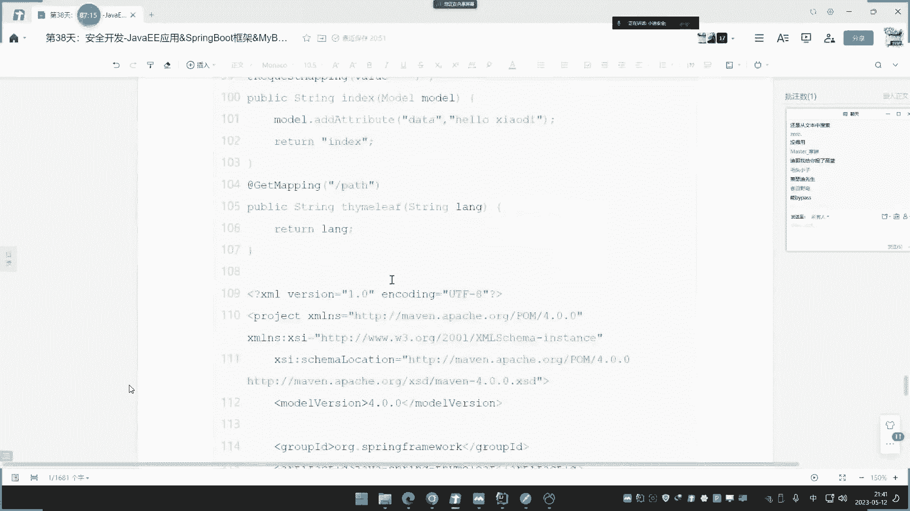

网上有这个文章吗，啊这是他的payload了，就这文章的，去渲染页面的时候呢呢，返回这个页面，然后呢这是他配落后的了，写上这个值，像这个值呢就会执行一个东西，啥意思呢，其实他就是把后面的long值改了。

改成一个java代码，就是说java代码呢要去渲染的时候呢，哎为什么持续这么多种原因，他要渲染这个页面的时候，那会渲染找这个文件，而这个文件呢没找到好执行这个漏洞，这里呢你要跟踪一下啊。

来这个long是吧，我们就直接写这个浪吧，哎呀我懒得搞这个加上不加了，就直接写个浪也是OK的啊，就让他自己把这个拉拉绑定这个index1N就行了，来重启一下，这是我们现在这个版本啊，我们来试一下。

用那个payload去打打这个测试点啊，它没有漏洞，是什么原因，我们嗯哪里报错了哦，哎这哪里报错了，我这个路径重复了，把这个先注释一下，好可以了，那么现在呢我们来到这边啊，我正在请求这个根路径。

然后加上这个问号long是吧，告诉他哎我要加载这个index e n点这个文件是吧，告诉他来一加，一加是吧，那么呢它这里呢就显示这个了1N的，就是个1N的啊，他压在这个页面了嘛呢，就这个页面代码嘛对吧。

他加入这个页面了，啊对不对好，那么现在呢你看啊，如果把这个index1改改成这个了，Payload，Payload，那这里有个什么执行CRACGI7的好，我们来日行访问诶，他不弹，报错了，但是没有弹。

为什么，因为这个版本它没有漏洞，这个版本用的是什么，我是直接从这个网上直接把它。

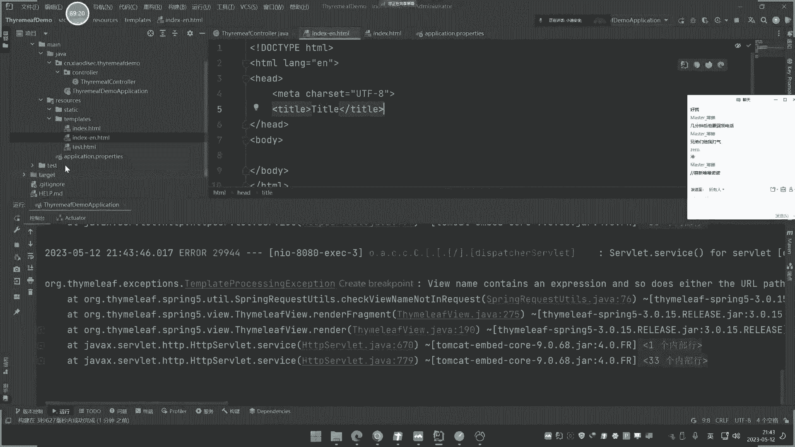

POPMXM里面呢去把它拖的，知道吧，这个版本呢他用的是哪个版本呢，我们观察一下啊，从这个里面找一下来，包括在这个web库里面的，找一下，你看哈呃他用的这个价包呢找一下啊。

来他的名字叫做那这个呢SPINPUT的start的模板，那么找一下是哪里啊，看一下好，在这里你看到没，他的版本是默认是用的是2。6。13的，这个2。63的，其实就是刚才那个spring BO的版本。

它自带的就把它把它漏进去了，为什么要用阿里云，就是因为用阿里云写出代码都是很多架包呢，它都经过过滤，就是有些安全没有的时候没有漏洞，那他才推荐，刚才我在开发的时候，大家有没有注意到啊。

就我在新建项目的时候呢，我在学阿里云是吧，我下播的时候呢，你看他这几个版本是吧，然后官方的时候呢，我把它改成官方那个例子的，是吧，然后呢，你下播的时候，你看这里就有这呢，这是一版本，对不对。

他为什么阿里面会推荐，还反而推荐九五版本呢，是因为呀它这些版本稳定，或者说有些安全问题呢得到了修复，它是用它自身的一些价包能理解吧，所以说我为什么没复现出来，如果说你用的是这个里面的那版本呢。

是在那个漏洞返回路内，那就会有安全问题能理解吧，很多细节啊，这都是说你在开发里面你就要开发，虽然说别人讲专业开发是要比我好很多，对不对，但是呢他不是站在安全的角度，你不知道是哪里出了问题。

但是我们是专门搞安全的，我们讲呢就偏向安全，所以你看呐，他这2。603的是阿里云上面的2。0的，经过反复的推敲，他认为这个版本呢比较安全稳定，那么在你用这个版本的时候呢，即使这里写到了这个漏洞的出发点。

他依旧呢没有把这个漏洞给他触发出来，但是现在你看啊，当我这个时候我把这个pom文件给它一换是吧。

但这是刚才的啊，记住啊，大家现在看到啊，这刚才的呢2。6。13好，我们现在呢把poo m把它一替换，让他重新加载新的这个仓库包，然后你再先看现在啊，现在我们来把它刷新一下，好我们现在看一下它的版本好。

现在这个版本真的是2。20release版本了是吧，就说我重新呢让它换了个呢2020的read版，继承类的是这个包拿全部变成2020，那么现在我们再来重新把这个服务启动，好启动之后。

我们现在再来观察一下刚才的代码啊，当我回车一下，大家看一下啊。

时不时会弹出计算器。

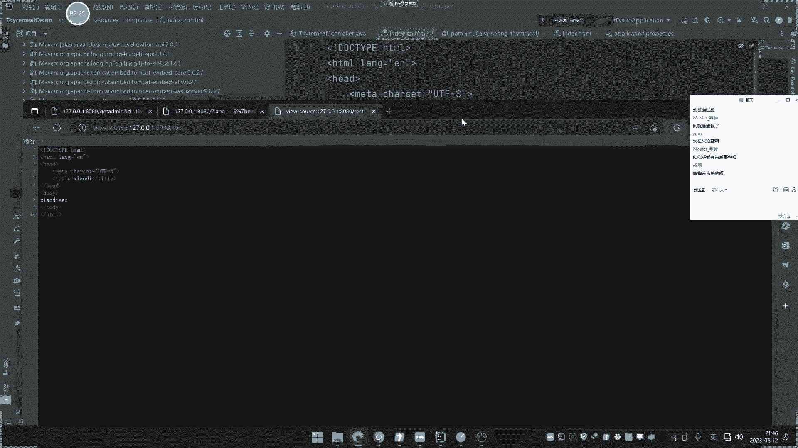

弹出来了，对不对，这就是一个模板的一个情况，就是说如果你用java开发中，你用到这个模板来渲染页面，而刚好这个版本的有漏洞，那么只要这里呢存在一个控制变量啊，就在这里呢从这个控制变量啊。

空可以把变量一改改成一个payload的执行值，那这个payload呢也很好理解，就是一个来利用java呢这个run time来执行一个e cc，这前期已经敲过很多次的代码了是吧。

就可以让对方的这个服务器呢执行一条命令，那这条命令呢就可以改成我们想执行的，反弹命令，或者是下载后门命令怎么样的啊，后续那就不是我说的是不是，那这个就出来了是吧，嘶那么刚才这个上面呢还有很多这种案例。

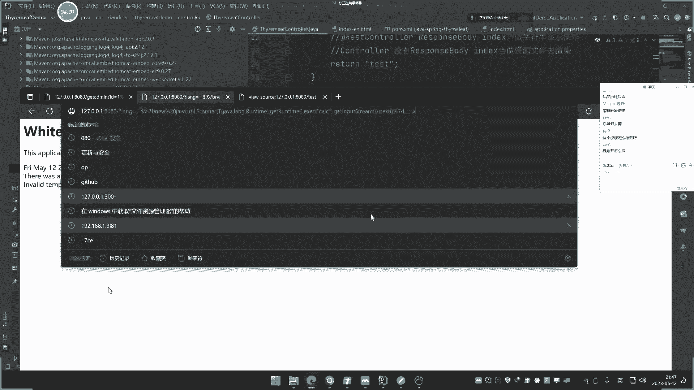

就是其实就说为什么要用到这个东西。

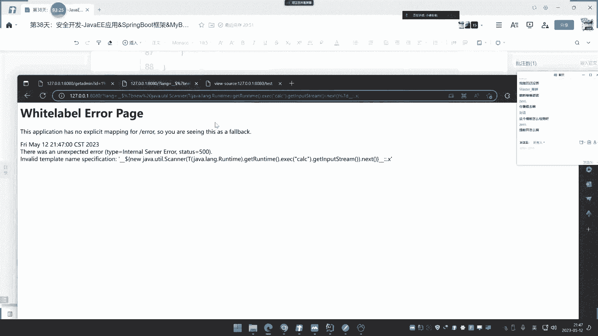

我刚说了，实际应用中，像什么这个什么这个模板引擎参数可控，为什么要用到它呢是吧，什么换主题的时候会提交什么参数值是吧。

一换主题，就刚才说的什么语言的那个东西是吧，他就会有那种唱词，那就像这种是吧，访问这个，地址的时候呢，它是中文，然后加上那个鬼东西之后呢。

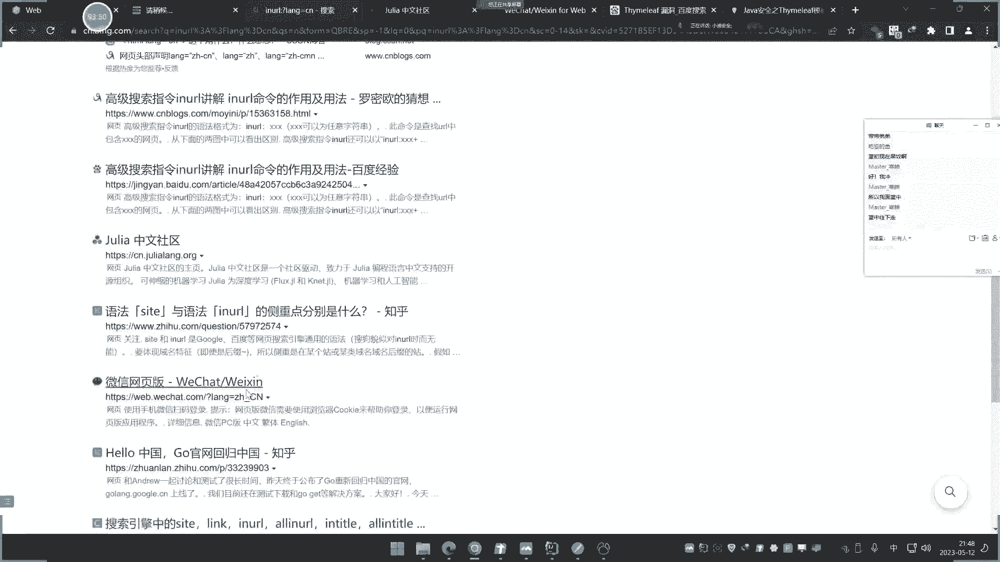

就变成英文，对不对，那么如果说他刚好也是用来渲染对吧，那是中文改成英文，那变成中文对吧，有时候那这个值呢就可能是一个文件，对应一个文件，就一个英文文件，英文的页面和一个中文页面。

那么它的初衷呢是让你换页面来，去加载这个页面，但是实际上呢这个有漏洞之后呢，就搭进去了。

好这个就是我们今天的这个所有内容啊，已经讲完了。

那么今天讲的这个spring铺的上面的，my babies斯和这个这个框架的啊，这个模板的这个东西，这个模板啊英文单词不好啊，叫try me laugh laf版，对不对，啊不叫川ING啊。

try in是THY啊，TATATA哎，传名是TRY，我有个THY，不知道怎么读啊，不管他了，那这个是那个模板的，那么还有哪些spring做。

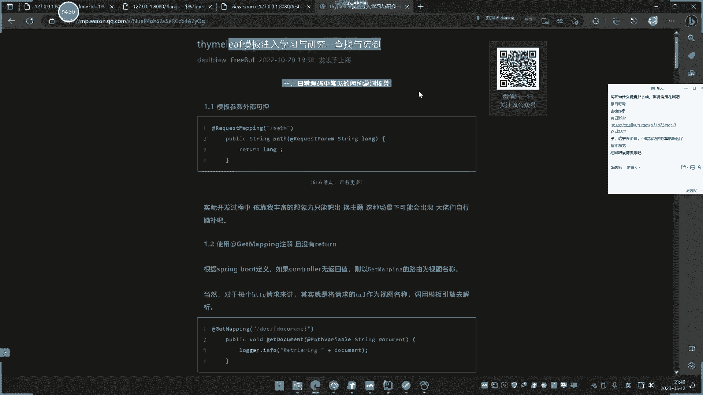

我下节课要讲什么好，下节课呢，我们就说这个视频里面的这个，一个是那个内存泄密的那个，日志监控的一个东西，一个组件那个也是经常出现，还有一个就是我们那个接口类的那个双口啊，哎这个单词读不好啊。

这里面只有给他打出来，斯威格是吧，甚至都斯威格唉，乱读啊，不好意思啊，大家见笑了啊，那就这个这个是下节课讲这个接口的东西，也是经常要测的，也会讲，还有个就是我们说的这个这个spring boot。

里面的这个东西对吧，这是关于那个，关于那个内存方面的日志监控的，这个是那个搞日志监控的啊，监控自燃的那个东西啊，我们也我讲一下这两个啊，因为这两个呢在安全里面也经常常见啊，经常总结。

包括我上一期的那个第71，讲那个实战那个什么拿蛇蛇的那套，那个71讲那个拿拿cs什么吧，台服务器那个那个讲课的东西，就是通过这个视频谱的这个东西拿下的，所以说他是有实战意义的啊。

就是有时候呢你用它那配置不好，就导致它这个东西呢泄露一些内存泄露，然后从内存中去提取到这个java的一些配置信息，是这个意思啊，我们下节课就会讲啊，还有那个刚才说的那个接口啊。

接口呢也是和spring boot呢经常联动的一个东西，但经常是一些遗留的一些接口，我们可以从上面的去提取到一些这个web应用啊，一些应用的一些接口来提示调试数据呢，来得到更多敏感信息。

那也是我们下节课要讲的啊，好我们今天呢就说这么多了啊，下节课内容也给大家讲了啊，我们后天再见了啊，啊大家不要问说夏天这个后天上不上课，那肯定上啊，现在不能不上课了，我不上课要被骂死，知道吧。

我不敢真的是不敢，右手是顶不住了是吧。

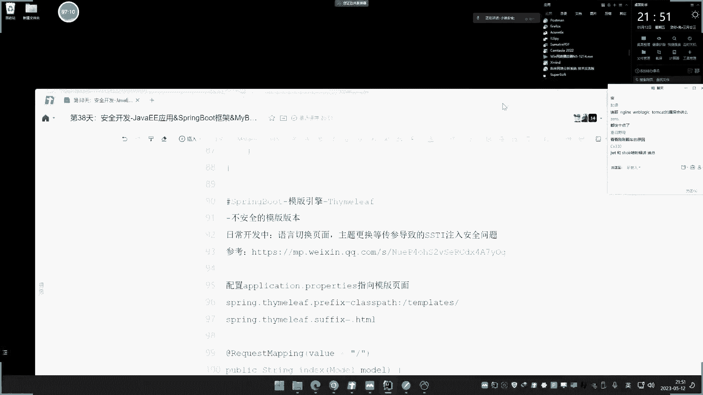

才不上，顶得住还是伤的啊。

今天就说这么多了啊，看一下大家有没有问题啊，有问题没问题。

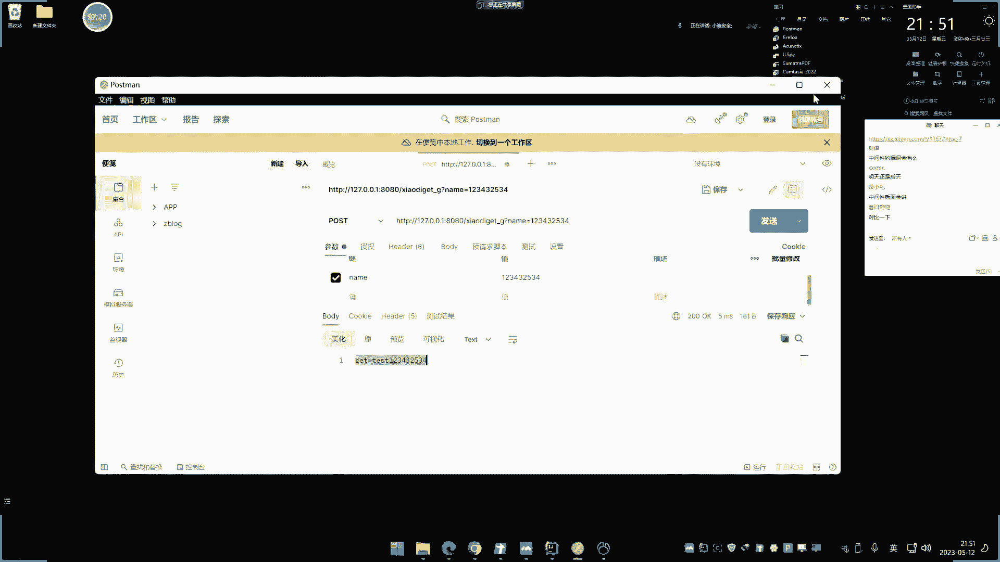