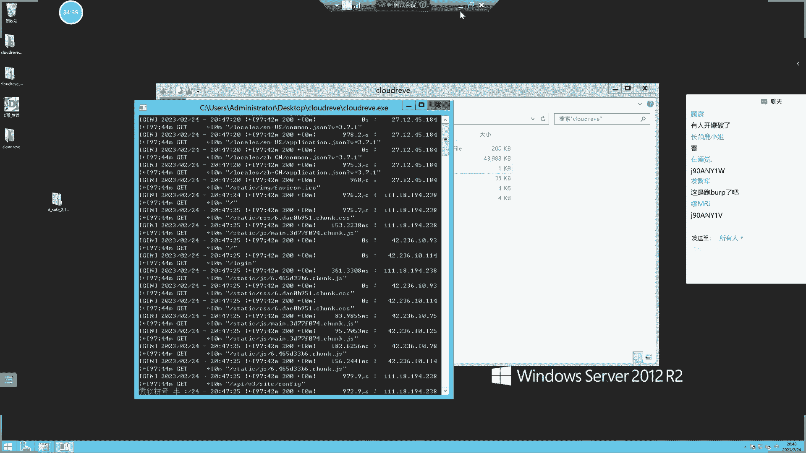
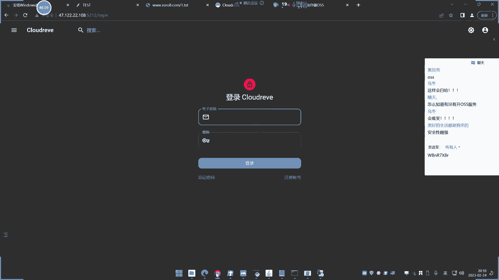
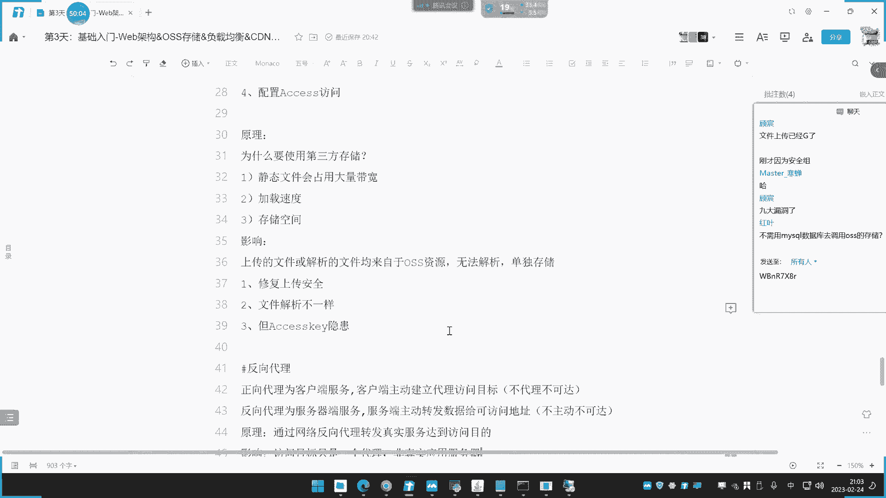
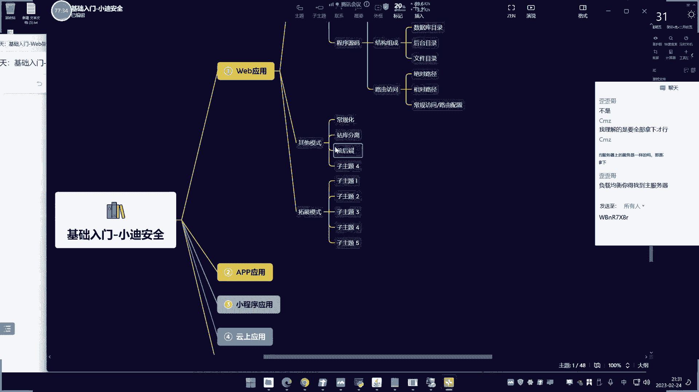

# 【小迪安全】V2024版 全栈网络安全 ｜ 攻防渗透工程师 （持续更新） - P3：第3天.Web架构&OSS存储&负载均衡&CDN加速&反向代理&WAF防护 - 逆风微笑的代码狗 - BV1Mx4y1q7Ny

好我看看今天的内容啊，今天呢是讲这个第三天，讲这个web的一个架构占了五种啊，哪五种呢，就是这个，WAFOSS存储反向代理，正向代理，负载均衡这五个啊，这五个呢其实就是在网站的架构中。

可能会出现这五种情况，我们具体的看一下这五种情况出现之后，对于我们这个安全措施会有哪些的一些影响，包括后期在做安全测试的一些这个不同之处啊，我们来看一下啊，首先呢我们来看一下这个第一种。

就是我们说的这个WAF，这个WAF呢它的一个全称叫做web，然后是什么样，Application file one，网站应用防火墙称之为WF，他的这个东西呢，就是只在提供我们的这个防护和保护。

它的一个影响呢，其实从他的这个产品的一个出身来去看的话，就是一个什么防止这个挖不攻击的一个产品，后期呢我们会接触到一些啊，我们主要是演示一下，它的一个简单的防护就可以了，大家认识一下。

包括这个WAF里面有分类，有很多种类的一些阴间，那我们看一下这个图片啊，目前的这个挖坟呢主要集中在四方向，硬件型的软件型的人WAF，还有网站内置WAF呃，一般主要是前面三个比较常见。

公司产品呢大部分以硬件为主，商业产品，个人使用的呢以软件为主，还有像我们这个人物法呢，就是类似像我们的一些厂商，二零厂商，还有像这个腾讯厂商呢，他们也有提供相关的WAF产品，对不对。

简单来说我们主要了解一下分类，后面我会详细再说这个事情的啊，先了解它，主要了解他对我们这个网站做安全测试之后的，一个大概影响，然后呢，我们这边给大家演示一下这里的演示环境。

windows20121个S配上一个低端的WAF，然后呢这一定是一个免费的防护软件，所以我们直接可以用啊，目前在网上的免费的不是很多了啊，大部分都是收费的，然后企业里面也用的是一些安全公司的。

一些商业产品。

我们来看一下啊，这是我们已经把这个环境呢给大家安装好了。

就是买了个服务器，然后在这里搭建了一个2S是吧，首先这里呢我们来先看一下啊，这个有个这个防护，这里啊我现在这里呢把他的防护呢给他关闭掉，移除地段的一个保护啊，就是先把他这个防护呢给它关掉啊，关掉之后呢。

嗯我们先来关注一下啊，这个网站下面呢有一个疑点，SP这个是一个网站的后门啊，我们可以看一下，这个是网的后门啊，我们现在去访问一下这个网址看一下，先就是说没有WAF的情况下面对比一个情况。

IP地址多少来着，17。1。

大家可以看一下啊，这个是在网站，然后呢一点SB，那是我们的后门。

我现在访问这个后门呢可以看到啊，它是能够访问到的，也没有任何一个异常。

这个时候呢，我们采用我们之前的这个后面连接工具呢。

去连接，尝试一下是否能够连接正常哈。

傻SSIS是中间间啊，后面会说的信息设计会讲的啊，现在简单的看一下就可以，我们连接一下，可以连接成功，点击添加，可以连接上去，可以看到呢是能够正常通讯的好，这是目前没有WAP的情况下。

当我们把这个软件的一个防护开启之后，看一下啊，点击这个安装低能防护，点击确定，好这里呢他正在安装过程中，我们稍等一下好，他说防灯防护已经安装成功。

现在有防护了啊，来我们这里呢再来去尝试访问一下这个文件，这里提示禁止脚本的访问，如有疑问请回关联联系，第一个难题提示，后面这里呢再次连接进入提示初始化失败，连不上了。

这就是一个典型的WAF在有和没有的一个防护，也就是说这个WAF的一个东西呢，就是我们可以在网站上面去部署的一个，安全防护产品，就类似于我们电脑的杀毒软件一样，安装好之后呢，针对网站的一个保护呢就开启。

然后具体有哪些保护。

你可以根据WAF的产品决定，比如说它这里呢是有很多防护的，那这里呢你可以通过它的界面可以看到啊，有很多外国产品，那这里呢我们就不一个一个一个看的啊，大家知道就可以，就是常规的一些web的攻击手段呢。

他都大部分都是有蓝键，所以呢这个呢就很简单啊，其实就是说常规的web的一些攻击手法，包括后门都会受到拦截，那么其实呢它是一种防护产品，所以啊大家在以后碰上一些网站的时候呢，是有可能的。

碰到这个网站呢是有类似这种WAF产品的，那么一旦有这个WAF产品呢，可能某些攻击之后，某些这个攻击手法或者手段就会受到这个拦截，所以在这个课程的一个介绍中呢，我们这个网上都会有一些专题的技术。

讲的就是关于这个WAF绕过，但是说实话啊，这个waf logo呢，其实本身也是一种钻空子的一种说法，什么叫钻空子呢，就是不一定能够保证绕过，而且大部分都绕过不了，它能绕过的都是一小部分。

而且也要看是什么产品的waffle，就说分产品是吧，有不敢说的话，有很多种类的WAF是吧，有一些WAF好绕，有些他不好招，这个也要看人气的，而且很简单的道理啊，他这个产品本身就是防护攻击的，你说绕过。

那它还存在有什么意义呢，如果说那么简单就能绕过，你说绕过就绕过，那这个产品还有什么价值啊，那不是等同于没有他吗，那还设计它干嘛呢，所以说呢你从正面上去理解的话。

其实这个logo呢也针对的就是一些防护能力较差，或者说这个外部产品比较垃圾的一些情况，可以，而且他的招股呢，你就说的有网上一些什么商业产品是吧，比如说安恒的呀，绿盟的呀。

各种各样公司里面都会有这种类似产品，那这产品呢你可能碰得到，打什么这个网的时候啊，打这个真实对抗的时候啊是吧，能够碰到能不能绕呢，其实我告诉你啊，基本上都绕不了，能招的都是些很很就是很没有啊。

就是一些怎么说呢，没有什么作用的一些绕过，但是那些没有做到过的，对于你来讲，和你去取得这个网站权限，那没有关系，所以你绕用那个东西绕过呢，和你想到过的东西呢，它不一样，没有任何意义。

好这个呢就是我们说的WAF，他的一个测试呢也比较简单，就是你自己的随便搭建个网站，然后下载一个web产品，把它安装好就完了啊，这前期呢我们i is的安装呢大家都会。

所以直接准备一台服务器的安装i is就可以了，上节课我们也演示了怎么买服务器啊，怎么装LS演示过，所以这个就没有给大家去演示了啊，这个web产品直接安装就完了，这个图形画的这不用教吧是吧。

下载这个工具把它安装一下。

然后把这个开关一开就行了，好这个是我们说的第一个挖土的一个情况，就是说网站部署这个东西之后呢，对于你呢后面做安全测试的一些攻击手法呢，都是会有拦截的啊，好再来说这个CDN，那么CDN呢它的名字叫CDN。

家属主要是用来加速的，它的原理呢叫做内容分发系统，内容分发服务，它的一个存在意义呢，是只在提高网站的访问速度啊，这个呢给大家讲一下啊，呃CPU是什么东西啊，它的全称叫做内容分发服务。

简单来说呢就很简单一个道理，比如说我的网站呢，我部署到我的这个自己的所在的这个地区，就比如说我现在在湖北是吧，我把它部署到湖北的某个地方，然后呢，湖北的这边的人呢去访问我的这个网站的话。

肯定速度就会很快，因为都在同一个地区对吧，这个网络上也有地区的一个划分的是吧，就是网络和这个网络这个距离呢啊，取决于这个网速对吧，那么如果说现在呢有一个这个在其他国家的，在美国的。

那我呢想尝试放我的网站，由于我的网站的部署到我们中国境内的，湖北是吧，那么他访问的话相对就会慢，因为它是从美国那边的一个通讯过来的是吧，那么现在呢CDN的出现之后呢，就是解决这个问题的。

那么它的解决的就是怎么解决呢，就是开放这个CDN服务之后呢，他会在你选择的区域，就比如说你选择全中国还是在全世界，还是选择部分地区，然后如果你选择传球的话，那么就是说他会在全球分布各种各样的节点。

那用来提高访问速度，很简单，我如果我开通了个CDN，那么我的真实地方呢是在湖北，如果是北京用户访问，他就会结晶在北京附近的一个地区，或者说在附近的一个周边地区呢来有个节点，然后给他提供服务。

那样子呢就能保证用户的访问速度，就很简单，像百度这种大网站是吧，他们就有这种东西，那么那你在国外去访百度和你现在在国内访问，而且你在湖北访问，或者在湖南访问，在北京访问，上海访问，各个地方去访问。

他的书中都相差没有太多，就是因为他有这个节点技术，他会纠结的找一个节点呢为你提供服务，那么具体的实时图呢，大家可以看一下这张图片，就是说真实网站呢它是在这里，在这个网站，在这个服务器上面。

然后呢用户呢去访问，比如说移动用户哎，他就给个移动的C0节点给他，那么其实就是说啊，就是这个离他最近的速度最快的一个东西呢，给他提供就不会有这个速度的一个限制是吧，就这个意思。

但是由于他这个东西呢是提供家属给了方便，提高了速度，但是啊他也给我们带来一些干扰，哪些干扰呢，就是他把他的真实的这个IP地址呢隐藏掉了，啥意思呢，就说以前我没有开CDN的时候，我去拼一个网站。

或者说我去找这个网站，他就会找找到他的真实站点，但是你开了CD服务，它会以节点来为他服务，所以他看到的就是那个节点，他看到那个节点的话，其实就是一个非真实目标，就是网站压根就和那个节点没有关系。

他只是一个提供服务的地方，对不对，那么这个呢我给他口述，大家都能理解，但是呢没有看到效果，所以我今天得理呢，昨天早晨你们要了一个备案域名给大家看一下，开了这个CDN和没有开CDN的一个区别啊。

大家可以看一下，然后从这个区别上面呢再来对比一下，如果我针对这种开了CDN的，这种web应用做安全测试的话，它会有哪些区别，那我们来做个实验。

现在呢我们就准备好一个这个备案域名啊。

这个备案域名呢，呃可能大家要需要自己购买域名之后呢，通过这个上面有个叫域名的备案的一个，操作设置来实现备案的啊，这个域名是已经提前好，已经备案了，它上面那个体验备案备案备案好之后呢。

就可以解析到国内的任何服务器了啊，没有备案的话，就只能解析境外的，就像香港其他国家的啊，好这里呢已经准备好之后啊，大家可以看一下啊，我们把这个备案的一个操作呢呃就不演示了啊。

这个备案呢这里有个叫SMP备案，就按照他那个流程来啊，提交你的个人信息，个人备案还是企业备案，提交你个人的一些身份信息呢，啊等待半个月或者一个月的时间就下来了，然后这里呢我们来看一下这个备案好之后啊。

我们这里呢如何开通CDN，所以呢我在这里搜索这个CDN的这个家属，这个地方啊，然后在这里再点击这个域名管理，添加域名，这里头有一个叫业务类型，叫图片小文件，大文件下载什么鬼，音频点播，还有个全程加速。

这个是什么意思呢，这个业务类型，就是取决于你要加速的是什么东西，我们一般会选择全占全占，就是说所有的官网在上面，所有的如果你学这个图片的话，那就是说网站上面的图片呢会加速，其他的就不会受影响。

但是我们学的船长的话就是所有点，所以之后呢，它会提示你要开通全站加速的控制台，我就直接确定我们使用全站加速啊，点击应用管理，然后这个是我昨天已经配置好的，我现在呢就把它进行一个删除，我把它进行删除啊。

这里的房子我们重新再给它添加一下啊，而且这里面会有一定的这个时间的一个呃，这个差异就会有个时间的差异啊，因为他删除之后呢，他这个生肖呢和取代了都需要一点时间，现在已经删除了，我们现在给他确定一下啊。

确定一下他的一个域名的解析情况，先确定他已经删除了，我们先拼一下，玉米是JORO8点com，现在拼不通，再拼个3W点，你看3W呢，现在是拼不通的，因为我3W这个域名压根就没有设置啊。

你看他解析这里的设置是一个叫百度，这个是我另外网站不管它，那应该这里呢我如果3W点，我这里写3W点是吧，在解析这个IP这里设置之后呢，它才能拼通，但这个由于没有设置，它现在是找不到的对吧。

因为他没有配置解析IP，所以你拼这个域名都找不到好，我现在呢现在那就做个什么事情，大家看着啊，我现在做个什么事情，我在这里呢就设置一下传承家族，点击添加域名，然后这里写上单个域名，就写上3W点。

ZORO8点com，选择仅中国内地全球，然后全球不含中国内地，这啥意思呢，就是说你要提供的是哪些用户群体，是针对中国内地的用户群体，还是全球的用户群体是吧，你说如果说你的访问方是在这个国内内地的话。

那么他就开始选择加速，那么如果说选择传球的话来说，所有的发动者都会受到这个加速服务，我们家就选择国内的啊，好学生完之后呢，点击新增原站，原站是啥意思呢，就是说这个域名的真实对应的地址，是指向在哪里啊。

就是他真实的这个服务器地址指向哪里，我这就绑定一个，这个17。72125的一个IP地址，然后呢这里呢是我们那个，好这就是我们那个控制面板啊，这我包它上面搞了一个网站，大家看一下这个网站呢。

这我刚创建的二呢，大家看一下啊，这我们的那个解析记录啊，啊这里的绑定网站，为了这个真实有效的话哈，我这里呢把它删除一下，重新再给他配置，避免有些人又说不懂不懂，哎我真是难为他了啊，我把这两段删掉。

重新给它添加，这个是百度的啊，这个这个是另外一个域名字，不管它啊，这个域名我添加的是那个三导点的，3W点的八点com对吧，然后这里点确定，嗯好添加好之后，我这个呢绑定的是3W点9R8。35，对不对。

然后我的IP地址这里对不对啊，现在还是听不通的，因为DNS那边没有做任何设置啊，好那么也就是说正常的我这里做个小记录。

怕有些人等下搞着搞着就不知道我在干嘛了啊。

现在做了什么事情呀，我们来记录一下啊，我首先在这里，那就配置了这个宝塔的一个这个域名绑定，就绑定了什么呢，就绑定这个IP地址和域名，对应上了3W点COR5800，然后这里要说一下前提的啊。

做这个CDN的一个家族啊，准备好这个备案域名才能做到啊，没有这个备案运营不用做啊，国内的CD跟厂商一般都要备案，不备案不支持好，那么这里呢绑定好之后，那么现在呢第二步我们就开启下这里。

他绑定好了，但是我们现在访问这个IP地址呢，它是解析不到的，因为没有做DX那个绑定解析，只是在上面做了个绑定，然后我先写个假IP地址，写了IP，把你窗口好点击确定好，然后点下一步就可以了啊。

这就开要开通这个CD了，这是开通，然后他说加速移民配天成功返回页面列表，然后这边有个叫等待配置和一个这个状态，这里呢需要等待三到5分钟时间，它就会生效，目前呢这边还是没有正常通讯的啊。

因为他在这个DN这边呢是没有这个记录的，3W点这个主机进度呢现在是没有的，大家可以看一下啊，只有这个是我之前的另外一个up，不管它他这个礼包是没有的，你看上周的记录是没有的，所以他这里解决不了。

原因是这里一直解析不到啊，好这里呢需要等待这边的一个配置配置结束啊，这还要等待一下，等待什么呢，就等待这个状态为增长之后，接下来我再配个CNM的记录，就能使它生效了，我们就等待，在需要等待35分钟啊。

你这里可以点击问号啊，可以看一下，这边有个查询，目前还是不正常，还没有生效，等待这个啊，这个状态正常之后呢，就可以就差不多了，他这个时间呢你可以看一下，他的生效时间大概是五到10分钟，还在配置中。

你说这个配置呢，今天还有个人问我，说那个人服务器开了那个计时之后啊，怎么让它不使用之后，怎么让它这个不收费，我说把他释放掉，释放掉，他问下次怎么连四都释放了，还怎么连呢，好慢哦，这个有点慢啊。

哎呀等一下咯，这没办法的啊，这个你要说演示全过程，那我只能等呀，我之前都配都配好了。

好我们另外再来看一下这个表里啊。

这还没有还没正常，我还是说在这里啊。

这个第二步呢就是我们说的这个配置，这个CDN的加速选项啊，配置好啊，配置好，那就是这个添加这个D1个CM记录，那我在这里等待即可，大概是在过程啊。

还在配置。

好现在选的是正常人性看到没状态为正常运行。

但这里有个叫SAM状态的，还不是正常的，为什么，因为这个呢需要配置如何配置呢，点开这里有个配置相导，他会教你在DNS这里的修改域名为3W。

然后主机记录为这个词怎么配置呢，就来到这个域名的DNS这里，点击添加记录，选择C内记录，然后主机记录就是刚才的3W点，因为你解析的就是3W点进行加速是吧，直接去这个3W主机都指向这个域名。

就刚才的点击确定配置一下好。

配置好之后呢，CM记录记录好了啊，来到这边，我们来刷新一下。

看一下是不是已经生效了，这边是不是已经亮了，诶，好已经生效，完成刷新，你这他妈的这么的显示生效了，还没有生效，好这里呢我们来刷新一下好，已配置成功了，那么现在呢我们来看一下IP地址啊。

我这边呢我这边还没有呢，你们可以看一下，我这边呢我这个地区的还没有有这个解析图。

你们有些人都已经有解析度了，来这是比拼的。

就是有些地区已经生效了，我这边还没生效，你看我这边还没生效啊，什么翻车，我翻个锤子，只是你们的DNS解析时间不同而已。

你们不要你妹的，一开始大惊小怪，翻车了，翻车了。

地区的这个时间不一样而已。

来看一下那个，拼一下3W点CORO8点com，我这边还没有生效啊。

哎我这个地区农村啊，农村就是跟不上城市网络，城市网络就快，然后呢大家如果说没有，剩下的话，你可以用这个网上的这种平台，超级批量来对它进行一个多地区的检测。

来看一下这个多丽屏呢，就是各个地区对他访问了一个平请求，得到IP可以看到在广东佛山这里的解析，它的IP为这个IP解析的是广东东莞的，福建福州的解析都为福建泉州的，它其实呢就是很简单。

就我刚才说的究竟规则，你是广东佛山呢，他就找个和你相近的城市的一个节点给你服务，那是不是福建传说呢，就福建福州那叫传宗是吧，那就这种类似的，你可以看到这里出现多个IP是啥意思呢，这个超级拼呢。

就是利用全国的一些公用服务器来帮你去解析，你的目标地址的一个IP地址，你们可以看一下，那么其实就是说现在这个IP地址呢，已经介入了CNN服务，那么结束之后其实就是我刚才看的。

你看我现在已经生效了，我这里解析的是这个116的，然后里面有些人解析是什么，你看这个是幺幺的。

都不一样是吧，都不一样啊，这个结果大家已经看到了，它其实就是一个究极规则，比如说像我现在我也就是拿个IP地址，我解释器是一个叫湖北武汉的，你看它就会离我最近的一个节点给我服务。

你们的IP就可能是你们那个省份的一个地方，对吧，或者说一个周边省份，那么这里呢大家可以看到这个效果了啊，每个地方的IP地址不一样好，那么这个结果呢我相信大家都知道了好，你可以看一下。

我们现在访问这个3W点这个网站，打开界面看一下啊，他打开节点就是这样子的，对不对，然后呢我为了确保是我这台17。122。2，2。195，这个网站呢在支撑这个网站的服务。

我可以把它怎么样在他的网站目录下面呢，去创建一个文件来试一下，看一下是不是他决定的，比如说我写个一点TT对吧，然后我让我去访问一下零点TXT，你看空白，然后呢，我在3D节点T里面去写上一个内容保存。

然后刷新一下页面。

你看的确是我们这个IP地址在控制这个网站，而你们现在看到的是这个IP在给提供服务。

所以如果说你现在针对这个域名。

进行信息收集的话，我们都知道域名会必有个绑定IP，那么你对这个IP地址进行设计的话，不就是错误了吗。

因为他真实的IP在哪里呀，是不是在我的IP上不去。

而你访问的是一个就像刚才大家看到的，根据你那个地区决定的IP。

那么你就是测试错了，第一方如果你要对这个IP地址进行端口扫描，你扫错了，它的网站就不在那个上面，它只是一个节点，所以这就是CDN节点，对我们这个后续的安全测试的一个影响。

所以为什么他后面课程有一个课程去讲，关于这个CDN去绕过去，如何寻找到真实IP的这么一个，张杰去讲这个知识点，其实呢就是需要你找到真实的原IP，那么是吧，针对这个mp的这个信息收集。

才是对这个网站的信息收集，否则的话那全部都是节点节点，那就是虚拟的，不是真实的，不和和他没关系，他只是提供一个加速服务，啥都不干，能理解了吧，那么我想问一下，刚才我演示这个CDN的这个服务。

对网站的一个测试安全事务的影响，大家是不是能够接受呢对吧，能够听懂就知道听懂，听不懂是吧，刚才用的什么文档，说什么这个绕过呀，怎么找这个币，这不是我们现在担心的事情啊，这不是我们现在担心的事情。

我们后面会有单独的这个课程去讲这个事情啊，会讲这个东西，我们只是先要了解它的架构，会对你有哪些影响就可以了啊，其他的不用管，后面他会单独说，包括现在为什么要认识到什么CDN，那什么这个这个什么WAF。

这都是后面有些课程要设计的，就是说因为有了这些东西干扰到我们的，我们该如何去绕过它来做一些事情，这是后面课程的，你不先把这个讲清楚，你都不知道这是什么东西，为什么要去学习它，后面听着也没意义啊。

好再来说这个OSSOS是什么东西呢，OS我们称之为叫对象存储应用，他是干嘛的呢，为什么有这个东西出现了，他的这个名字叫做内容分发服务。

哎这写错了啊，妈的谁给写到这个地方去了。

不好意思啊，贝壳被失误了，呃这里，那你就用网上的这个对象，存储服务的一个解释啊，是一种可靠的，这个人存储户也是提供这个存储的啊，存储能否只是提高这个也是提高访问速度的啊，这写没毛病，放速度肯定也是有的。

它主要是提供人存储的，人存储是啥意思呢，就是存储数据的啊，它存储数据的，然后他有什么影响，那这里也搞错了啊，好我们等搞完之后再来写这个影响啊，我们这里用一套源码来给大家做测试。

用一套源码给大家做测试，这样子呢，大家就能跟七夕了然的了解他的一个情况。

好这里换一套源码。

欢迎他这个欢迎的服务器呢，也是他好。

这里呢是我已经给大家去搭建，这个这个源码的一个地方，诶，这个源码上面怎么还是刚才的服务器。

好那这里呢我们先把这些东西怎么关闭一下，把这个网站给暂停一下，这个暂不暂停也无所谓，这个源码呢非常简单，直接用这个ES1，它就能这个运行起来，所以大家呢也不用说担心要搭建这种环境的，环境都不用搭建。

连S都不用安装，他这个源码呢直接运行这个ESE就可以了，然后它有多种客户端的，这是个比较高端的一个这个报名用啊，启动好之后呢，完了我好像把那个密码搞忘记了，启动好之后呢，他会开放一个这个512端口。

它会开放一个512端口呃，这里好像是我，我重新把解一下，重新给他配置一下吧，避免有些人就是不会啊，我重新把这个东西给它全部删掉，重新给大家用一点啊，另外一个，重新给大家重新配置一下。

运行起来运行起来之后呢，他会给一个账号密码，这个账号密码就是这个程序的管理员，账号密码随机产生的好，然后呢会开放一个5212端口，这个5L端口都可以通过这个配置文件的更改。

所以我们现在来访问下这个应用啊。

这是个网站应用，这网站应用是E1的。

非常简单啊，直接运行就可以用的，不用你搭建任何环境，他这个E就自带了，好，我们现在来访问一下这个IPD，17。122。22。108，然后512，这是他网站。

嗯怎么访问不了啊。

啥情况，是不是我那个i is的一个干扰问题，我把S关一下，看一下。

嗯稍等一下啊，我把重新打开一下。

好启动成功了啊。

大家可以看到了，启动成功了。

但是这个密码我又忘记了，又要重新开的尴尬，刚才我忘记那个密码了啊，不好意思了，重新再再再来一个啊，忘记那个密码了，第一次出现密码之后呢，我没把它记住了，这是密码了，好先开了啊，把密码的密码的记一下，诶。

诶你们不要访问的是谁在访问的。

好可以访问了是吧，然后这里呢我们可以试一下啊，呃我们先把它配置一下，老教大家啊，就说这个不是要你怎么去打这个源码，但是我要把它打出来之后，你才能看到效果。

知道吧，所以呢我我现在就这是谁呀，不要一直访问我，你妹的胡子个逼嘛，都不让我复制的诶，蛮好玩的，是不是，密码调的没有了，哎，哎呀这把人都要整死的呀。

好我们来登录一下啊。

哎我不知道这些人有什么意思，你这你这不打扰大家学习吗，这搞搞这些东西干嘛呀，哎呀你理解哎。

我真不想说啥哎，说两个鬼呀，说完他干嘛呀，随他去，真的是无语了，搞得，我把那个打开一下啊，我等下把它搞一下啊。

为了防止这个再搞破坏啊，我把那个防火墙那个东西把它开一下，是这个IP地址的吧，我多余搞些事情啊，安全组开一下啊，金子金子这个五，这个是全部端口嘛哈so我们添加一个，这个是端口，是全部不自定义五五端口。

我要登录，然后原IP地址呢我绑定我自己的。

我不想搞这事情呢，这不是浪费时间吗，这和那个课程不相干的东西。

没办法呀，我怕我等一下我这个稿子稿子的时候，他突然把优宝密码改了，那里面调子大了，点击保存，那就是说允许这个端口出入，然后这个目标的这个东西，那就直接把它删掉，先把这个删掉，先把它点击这个编辑一下啊。

点击不能连续剧啊，现在只能删掉吧，等下我又要把它填回来，烦得很，不要搞这种事情，哎呀。

好那现在可以了啊。

重新再返回一下。

好我们运行一下，啊这账号密码你看现在多清多清爽啊，没人访问了。

怎么我也打不开了，怎么回事啊，我为什么打不开了。

好我打开了打开了打开了啊啊，你登一下咋都进去了啊，内鬼你给我干了你妈的，好我们来看一下啊，比如说我现在呢他这个源码是干嘛的，这是一个网盘源码，就是说提供这个网盘的，然后你看一下，我如果说我上传个图片啊。

大家可以看一下，我上传个图片啊，我先不做任何配置，我上传个图片呢。

我把它拖上去，你看图片就上传了，然后上传图片呢。

按照我们常规数来讲，它会上传到哪里，他不是上传了这个来，你看是不是上传了这个来，你看来就我刚才上传的图片嘛，对不对。

他不是上传车来了吗，你就说这是个网盘程序，它是一个提供上传的，你比如说我再上传个文本，把拖进去诶。

他就上传到文本里面去了，你看我们这边就这样，有刚才我提交的，然后你看服务器这边那就多了个文本，是不是好，就说他是干干这个用的。

那么现在你看一下啊，我把这里配置一个东西，就我让这个源码的支持OS之后，看它有什么现象啊，点击这个。

快点管理面板。

然后这里有个什么存储策略，有个存储策略啊，然后怎么办呢，点击添加存储策略，选择你选择的这个OS厂商，你要用哪一个，我们这里呢用的是阿里云的啊，这个网上有很多厂商都支持OSSR，来我们学个阿里云的确定。

然后再给他选择这个叫什么boss里面，这这这这咋办呢，给他简单配置一下啊，打开我们这个地方，点击你这个对象OS，然后你随便创建一个名字，我这里创建个字叫贵妃，这点创建就完了啊，这没什么说的。

贵妃名字叫贵妃，贵妃相距好，这里呢就按照自己需要啊，无所谓，这个蛇玩一下，然后这里中间有个什么外网节点，你选择哪个呢，点进去啊，选择哪一个呢，点这个来，这里有个节点呢，就这个了。

选择这个外网访问这个地址，把它复制过去，你可以看那个提示的啊，他教你什么配置呢，在哪里哪个地方下去，后面那就不用了，然后这里有个叫阿里斯克，这个啥东西呢，就是一个K，这个K呢就是说有这个K之后。

就能访问这个质量，这里的他会教你呢在这个地方有，我就直接点到这个地方来，然后这里有个K是吧，我先把这个账号的复制到这里来，然后这个K呢我就把它，这可是我自己的2。0的一个访问的东西。

还要因为这个东西才行，我这边那个配置下，神九思，拍照之后复制，复制后点击启用。

这里不能显示了啊，再显示你们的被内鬼截到了，他赶紧要上我的这个OSS了，我顶不住的。

然后写进去点下一步，好然后这里呢有个上传路径保存，这里就不用管它，直接下一步下一步就完了啊，直接下一步下一步就完了，其他的基本按照默认配置就好了，然后再点让我配置好，配置好之后，接下来该怎么办啊。

大家看一下啊，他这里还有个配置，这个是教大家等下复习啊，这个不重要不重要啊，主要是我们了解他的一个差异就可以了，然后这里有个组是吧，比如说我现在是管理员登录的，管登录到这里有个叫什么存储策略。

我就选这个，刚才配置这个移移的是吧，用它存储的OSS点保存好。

那我现在关注一下，比如说现在我来到刚才那个网盘页面好，现在让我重新再上传一个图片，大家关注一下啊，我重新再上传个图片，我随便上传个什么东西，比如说这个内网课程拖进去好。

然后你看内外课程上升去了，按照常规来讲，他刚才是要上传到这里来，但这里没有了。

看到没，他这没有了，然后呢，你再翻一下我的OS字段，我找到我的OS资源，这里，你看贵妃这里打开有个upload，点开20123。02点开，R3点开，是出现了一个文本的，看时间20。53分。

大家有没有看到啊，那么这个呃什么意义呢，有什么含义呢，很清楚啊，上传到这边来了呀，他上传到这边来了呀，那你可能会问，那算什么呢，对网站测试有什么影响没有啊，那我重新再上传一个给他看一下啊。

比如说我上传个后门木马一样的，刚才不是有后门木马吗。

这里有个SB的后木马的吗，我来把那个后面木马找了来。

我不管他能不能上去好吧。

我就先试试去，我不知道这个支不支持格式上传啊。

就说我即使他支持好吧，我现在不知道能不能上上去啊。

先上去吧，好能够上去吧，应该上不上去啊，还不支持啊，这有点尴尬啊，啊我就是说啥意思呢。

就是说你这个文件后面即使上传上去了，他也上传到哪里去了，这个OS资源在哪了，那这会带来什么现象呢。

然后这里有个详细地址，这是他的访问地址，这是它完整访问地址，这是网上的地址，但是这个地址呢你访问你看。

你访问呢他会造成的损失什么现象呢，这个是昨天的这个时间点了，刚才为什么没有30公司，我配置有问题啊，我看我是刚才那个配置哪里写错了呀，还没上成功啊，至少14号啊，昨天那个配置在上传的文件。

我搞忘记了，我说这个文件怎么对应不上呢。

诶那个网站配置在这里，这个是挂圆吧，放在面板里面，1126乘除哪个地方搞错了吧，贵妃私有啊，花点没问题啊，我估计还是那个应该是那个什么问题啊，应该是那个刚才，我那个把那个拿个东西给他删除的问题。

导致的应该是那个就我刚才那个阿里云这里，这个感觉是这个东西的一个影响，我把它先开一下吧，他可能是有一些其他服务，要用到这个触网的一些东西，把它关的时候呢，他不能那个了啊，信息提交不到这个OS上面去了。

可能是万元，啊刷新一下。

不过你知道这个原因就可以了。

这个能不能成功呢，这个无所谓，你看到能够上传上去，那就哦这个有个什么文件命名存储的一个差异，好重新命名一下，一点点好，他已上传根目录好。

我们来看一下这边的贵妃OS，这边自然有没有啦，看先看这里有没有。

现在这个地方有没有啊。

没没有，上传这里来，那就应该是到哪里看这个地方。

小心24，看到没，上传到来了啊，来刚才那个10T呢是我写的内容，你看这有个地址。

你打开返回呢。

他就这个东西啥都啥都不是，后面地址发上去了，也啥都不是，这个OS呢，它就是专门来存储音频图像，央视视频点播资源，其实它就是一个资源存储，但是唯独啊你也可以存储脚本文件。

但是脚本文件存储程序啥用都没有放问题，那它不会解析，它就是不是一个解析的东西，就你是只是用来存储的，能理解吗，所以那个后门上传上去呢也没有任何卵用。

那么你想象下这个东西会给你的这个安全测试。

安全带来哪些影响，可想而知，我赶紧把我这个先把它禁用掉，防止有人用我这个东西呢进入我的资源，赶紧禁用掉，吓死我了，那么这里的影响是什么影响呢，那写到后面去了，由于你上传的文件也好。

或者说你这个东西文件是存储到OSI资源的，对象库里面的，他没办法解析它是单独存储的，他只是为了存储数据的，别人用它是干嘛的呢，就是把网站的图片资源，视频资源，比如说一些网校王骁。

他把视频都放在他自己网站上面去嘛，一个加载吗，他直接搞个单独的OS资源来给他提供，把视频加载放到上面去，网站的视频资源全部放到那个上面去，然后网站去放视频的时候，就走这个专线，速度就更快。

而且单独存储便于管理，这是它存在的意义，但是由于这个产品的出现，导致我们可能有些上传的文件，图片或者说资源等等，都会提交到这个OS资源上去，那就是说网站上传的文件跑到另外一个地方。

而不是你当前网站目录下面。

那么这样子大家觉得你上传的后门还有用吗，没有用了，所以这个东西呢就修复了商船安全问题，同时解析也解析不了了，你即使能上后门也没有用，解析不了，方问其难，就是等同于下载啥都没有，他不执行你的代码能理解吗。

更加安全了，直接堵住了上传漏洞，就这么简单，上传漏洞在这个东西的影响下就没有了，你上传任何文件，他都把你提交到哪个地方去了，那个地方呢只用于存储，你访问他和不访问他都是那个东西。

但是由于它的出现又带来一个安全隐患，什么安全隐患就是access隐患，啥意思啊，刚才我在配置那个新系统，大家都知道他配置一个叫ax s k，这个ax s k是什么东西呢。

其实就是阿里云的一个资源的访问的，密室和账号的一个意义，就是你有那个东西之后呢，你可以用那个东西在登录到管理到那个OS，这样也就是说你可以通过那个东西控制，当前这个阿里云账户的下面的开放的服务器。

或者是开放的任何应用，所以他有这个隐患了，有所以他有编辑了一些安全的一些啊，编辑了这个网站，但是呢他又带来一些新的这个安全问题，这个安全问题就是我们要说的人安全，人安全就是人产品上面安全。

这个呢就是属于产品中的安全，如果那个K被泄露，刚才我为什么说是吧，你得把它隐藏掉，而且我一眼四望我就把它关掉呢，就是如果大家有那个K，也是可以进入到我那个阿里云里面去的，所以为什么把它关掉了哈。

就这个原因，那么大家想象一下，我把这个东西一讲，我说我课程里面讲人安全，不是就一下就连接过去了吗，后面我再说这个东西，大家都知道这是什么东西啊，听都听得明白了呀，是不是我不讲它后面直接融安全。

我说是自愿，你连他这个东西的应用在哪里都不知道，咋听得懂的，是不是，所以我通过这个案例就告诉你几点，它既有保证一些传统漏洞的修复了，保证它的安全了，但是呢他又带来了新的安全问题，所以说都是有利有弊的啊。

但是话又说回来了啊，虽然他也没有逼，但是怎么说呢，你如果把这个东西把它管好了，那么他只有利没有弊了啊，但是你管不好就有币了，好，这就是我们说的这个OS是吧，对于我们这个网站安全的隐患。

其实它的一个最大的影响就是我们说的，文件上传漏洞，就是和文件这个上传，和我们这个相关的东西有很大影响，和其他的倒没有什么影响啊，主要是和文件上传这种后门解析，这个东西呢有很大影响。

除此之外呢也没有太多影响，好那么现在呢我们再来看第四个点，就是反向代理，这发言代理的这个点有点有些绕口，讲解下来有些人听不懂，我还是尽我的能力给大家讲一下啊，啊有网上说正向代理和反向代理。

那么在网站搭建应用中的反向代理和正向代理，是什么意思呢，正向代理呢指的是客户端的服务，然后反向代理的指的是服务端的服务，这个怎么好，你怎么去说它好清楚一些呢，就说我们看一下这个模型啊。

这个是OS的资源模型，它这个网站的资源都是单独存储到这里的，所以客户端去访问的时候，上传任何东西都跑到OS里面，这是GAOS的一个图形，所以它不会影响这个网站上面的程序，他上传的文件全部都不在网站上面。

在word里面去了，大家看这个正向服务啊，这个正线服务是这个图，啥意思呢，它是针对的是客户端的这个东西，很简单，意思啊，我就拿我们大家富强这个东西来讲，这就属于一个真相服务。

真相代理就说你想访问国外的一些站点是吧，想翻墙看一下，看一下，看一下外面的世界，但是呢由于我们这个这个国内的这个金子啊，大家就会走带你呢翻出去看，那么这种行为我们就称之为叫真相代理行为。

就是说针对你自己，你自己那是客户端，你访问目标的目标是服务器，你想看对方不服务器，你看不了，你就找了个代理帮你帮你那去带出去认识真相，就是从你自己到别人，你自己主动找别人，就像这张图片一样。

客户端的找了个代理，早点代理服务器，代理服务器呢把你带出去了，然后再再再看是吧，这种称之为真相，还有一种叫反向是啥意思呢，反向意思就是说服务器自己呀，把流量呢给到了一个服务器上面。

然后呢你是可以访问到这个服务器的，你那你就反问你这个能访问他的服务器，而这个服务器呢又从这个不能访问这个服务器，这里就来到流量，其实呢就是说这台服务器里原来是访问不到的。

这台服务器就主动把流量给到另外一台服务器，而另外一台服务器呢你能访问到他，所以呢你就通过访问它啊，间接的访问它，其实就是说一个是你自己建立代理去访问别人，还有一个是别人把流量都给到另外一个地方。

你再访问另一个地方，就达到了公司，这就是真相，反向的意思，理解了吧，那么这里呢我也给他写了，然后有人说我笔记做的不不这个不详细，我不想做详细，我懒，再就是呢我希望大家自己能通过我的讲解。

自己按照自己的这个礼节的去写，这几段话，我写的肯定就比较官方了，你写的话就是你自己这个好理解就怎么写是吧，好那么现在看一下啊，我搭建网站的话，我搞个反向代理，大家看一下会有什么效果啊，大家看一下啊。

我在boss上面给他打进一个给他看一下。

我先把这个这个给他删掉啊，不删它吧，我重新搞个玉米，名字呢就叫做这个代理，那就叫这个加迪吧，点CO点com创建这个网站，创建这个网站，然后呢我到我那个i is解析那边，作为第一个加载是吧。

加一个什么加一个小的这个解析记录是吧，把它解析到这个IP，对不对，得确定好，那么现在小迪点加O点com之后呢，访问他，你看看啊，12题点JO放他哎，你看啊他就能访问到了是吧，还能访问到。

我可以看一下IP地址，这个没有开CD，那开CD是那个3W点，你看这个地址解析是不是就是那个IP地址了啊，啊是不是就SP咋对了啊，就是他的，因为这个没有开CD啊，这个玉米没有开，我开的是那个三到点。

所以P3到点是这个是是这个地址吧，听这个呢就变了啊，这是真实的好，现在就说能访问的啊。

你看啊我做个什么事情啊，我点击这个设置这里啊，这里有个叫反向代理，在任何中间有些都支持伊拉克，只是其他的一些知识点，反向代理添加反向代理，看我做什么事情啊，有个这个路径，这里有高级功能。

高级功能里面可以设置代理路径，等下先说我先说一下啊，百度点com3道类的概率好，点击确定，我设置一个3。0by com。

大家看一下啊，我重新访问一下我那个网站。

cos啊，小D点coo点com，看到没，我访问小D8点com，抛去了百度，大概没，然后我在百度上面做任何事情，他也是百度上面地址上变成百度了，好那做这个事情的话，大家可以想一下，我把这个事情做了。

我现在告诉你，我要你这个车是这个小地点，ZROO8点com，我让你去测试这个网络安全性，你测的是谁呀，你不测的百度吗，和他自身源的网站有没关系，没关系，对不对，是这个意思吧，那我这样一搞，不就你车的话。

就是你只打开看是百度加速，我不搞个百度，我要珍藏网站，这把百度你看你知道是百度。

我搞个正常网站好吧，比如说我这个这个搞个知识网站是吧，搞个其他侦探网站给你，你打开你就在上面咔咔乱测。

测的是谁啊，测的是他，他带你给你那个地址，那你和这个网络有任何关系吗，比如说我这里在加来，我要加路径高级功能，你比如说你访问这个访问一个目录，访问的时候是吧，我就给你忽悠一下。

我就随便找个网站后台好不好，那这个学校的网站后台对不对，这个学校的网站后台啊，来访问这个路径，给你跳到这来，以路径里面带AMY好，现在我们看一下。

啥情况没设置好啊，尴尬了，没设置好看，哪里设置没设置好，尴尬了尴尬了，后面路径他没有带上去，这也尴尬，应该是把那个路径那个地方改一下啊，他这个路径我改错了，应该这里呢把这个目标地址改一下。

然后有个内容地址把它改一下，这个我不知道怎么试了，简单说就是说这个呢就是下路径的啊，你就可以搞一个那个路径，然后呢他去访问，对不对，这个配置路径的，把它删掉吧，那么刚才这个配置呢。

大家知道是什么情况了啊对吧，你这里在想这个怎么办就怎么办。

对不对，哔哩哔哩也是可以的啊，这个加上去是吧。

让他请求这个哔哩哔哩加个地址呢，如果说访问B地址，让他点击确定，当他这个去访问这个地址的时候。

调低点GRO8点com，现在访问主站根目录是放白鹿，加个B目录，加个B目录，看没调到哔哩哔哩，对不对，你想怎么设置，就根据你自己的怎么设置去搞啊，嗯这个就是反向代理，其实就是很简单的道理啊。

它可以实现呢，将它真实的网站指向任何一个地方，你访问其他的就是点那个东西了，对不对，你访问起来就是变东西了，但是这里呢有一些东西要讲啊，那么其实就是说你在做测试的时候呢，他这个影响大家就不用说了。

访问目标呢其实就是一个代理的网站，非真实的应用服务器，因为你访问的那个界面，那压根就不是那个网站的界面，虽然说这个正向代理和反向代理，那都是解决不可达的问题，但是由于反向代理中多出一个。

可以重定向解析的功能操作，导致这样操作之后，粘连的指向另外一个和他毫无关系的站点，那么，就是你的这个安全措施呢，就是测试到一个毫无地方的，毫无关系的一个站点上去了，不是他真实的，我在讲这个时候呢。

为什么要写这句话，是因为我看到我被逼急的时候，有个人问了一个问题，他问了什么问题啊，哎嘴巴删了呀，刚才之前我背笔记的时候，有个跑车还搞了个杯子，问了个问题，他问的这个真相有没有影响，真相没有影响。

为什么是真相，没有影响，大家想一下真相是在哪个上面在操作，在客户端的操作，在你这个地方在操作，不是在服务器上面，他说服务器上啥都没干，是因为你访问不了对方，你在你客户端搞了个代理，访问别人。

别人服务器上面啥都没有单，所以你说你有没有影响的，没有影响，能理解吗，好这个呢是我们的反代理反向代理一个测试啊，然后现在的大家知道这个情况，对我们的影响就可以了啊，后面我们再说针对这种反向代理。

它会有哪些不同之处，对于有什么深刻的印象，或是如何判定，这是后面讲的，三代理和跳转流量有什么区别，有区别的啊，呃我们说的网上，内网里面呢称之为真相连接和反向连接，这个称之为反向代理和真相代理。

然后流量呢也称为转什么转发流量，什么鬼东西，有些区别的啊，这个是一个比较大的一个支点，你要把它分三类去讲，然后提到真相反向，有些人就搞混了，就和我们那个内网课程有真相连接，反应就会搞混。

但是由于我们现在是基础课程啊，我没有必要去把它讲的很深入，让你把每一个点都分得很清楚，我们只有讲到那个课程点的时候，把这个知识点带入出来之后，后面呢你再把它一种啊。

因为现在说的话就会扯到什么内外网的一些，这种东西出来，你才能听的全部能搞清楚，然后我们再看负载均衡，负载均衡又是个啥东西呢，它的原理是将分摊到多个操作单元上面，来进行执行，共同完成任务，啥意思呢。

我给大家举个例子啊，用CDN这个图片就很好讲，我们想象一下啊，负载均衡呢也是提高访问速度，提高效率，同时它有一个最重要的核心功能点，就是什么预备啊，叫这个预防灾难，预防灾难，什么叫灾难呢。

就是我们说的天灾人祸就很简单，一台服务器的部署到四川，诶，且我们汶川大地震的时候，如果说你服务器在那个地方不没了吗，所以就不是不不没了吗，拉的数据怎么办呢，所以说负载均衡呢，它一般有的东西。

就是我们说的和这个龙仔差不多的类似性，他就会准备几台服务器，就是你这台没了，我还下一台能理解吧，就是说多个服务器来支撑这个服务，防止有些意外，哪些服务器突然崩了，累积了，导致这个服务不能正常了，对不对。

我们今天演示的是一个比较简单的一个负，载均衡，是一个网站上面的负载均衡，如果真实情况下面还有一些各种各样的应用，像网站应用啊，这个数据库应用啊等等都会有应用到，而且不同软件这个没办法都是讲的啊。

我们只能从网址上面来给你，把这个啊东西呢讲明白，然后其他的应用上面，那我相信通过这个东西一讲啊，你也能明白，只是说使用的软件，我说这个东西都不一样而已，原理是一致的，那么现在让我们看一下负载均衡啊。

他就是为解决这个灾难，然后呢也是提供一个备份啊，报备的这种状态，但是由于呢它有多个服务器，所以说我们想的也很清楚，就是有多个服务器的话很简单，我搞一个网站，我们正常来讲一个网站就是一个服务器是吧。

就这个理解哎，这个时候他搞了三台或者四台，五台再给你提供服务，你说你高的话是五台拿下都才算呢，还是一台拿下就算了，对不对，因为它每一台都不一样啊，好那现在呢我们就来看一下啊。

所以说它的影响是很显然就是我们说的啊，可能和你想象的不太一样，我们来看一下啊，我做一下负载均衡如何做呢，点开这个做LINUX的负载均衡小八下载，点这个域名，这里是吧，点击这个设置里啊。

这里有个叫配置文件，我在这配置一下，我配置几个东西就能达到选配置的时候呢，我先把这个代理的关下啊，这个代理呢先把它关下，关一下之后呢，我再看一下这个网站是不是先正常的啊，好，下T9co好，现在正常了。

现在指向这个这个这个公路金是吧，现在指向这个正常的网站路径了，就没有在像刚才跳到百度啊，跳到哔哩哔哩是吧，这个就没用了，因为我把那个配置文件改了，所以他这里就没有那个反向代理的配置。

好好那现在呢我就来做这个反向代理，怎么设置呢，首先在这里下面定义一个返回路径和策略，这个是ADIDAS的负载均衡配置啊，其他的我就不说了，因为其他的我不是搞认为的啊，我也不清楚。

这里呢就来到这个下面写这个东西，这啥意思呢，给大家解释一下啊，呃这个呢就是房屋路径，然后这个是触发的规则，触发这个叫负载均衡均衡这个关键字，然后这个时候再来到上面声明这个东西，生命啊，来到上面。

生命什么东西呢，负载均衡，然后这里有个路径，路径呢一个IP地址绑定端口，另外一个IP地址绑定端口，然后我分别的去访问一下，这两个IP地址绑定端口，给大家看一下效果。

但是这个网站BLOGO显示test test，然后这个IP地址的八零端口访问一下，看看是什么东西，显示是web开心，你看两个网站访问的页面是不一样的，然后我们等来的网站也是访问。

也是访问这个东西是不一样的，当这个时候呢我把它一配置好之后，也就是这个意思，就是说用这两个网站，用这两个网站来给他提供服务，然后这里呢就是访问这个根路径的时候，来启动这个负载均衡。

主要访问这个根部的时候来启动副作用，指向这个负载均衡，老师你那背出来这名字要一对应上的啊，要对应上的，下面改了之后，上面也要改，点击保存，点击保存啊，好保证保存成功，然后刷新一下，看到没，大家看没了。

网站点了看到没意思，点哪个又是点这个就是两个网站同时为他服务，看到吗，来test编那点它了，如果你想哪个偏向跟全中一些，可加上这个关键词，加什么关键词啊，加上这个呢关键词加上去，这个是权重。

比如说我把它搞成十，把它搞成一，那么也就是说这个权重为十，这个唯一，那么它会优先的以他为准保存，那么现在呢保存好之后刷新一下，刷新一下没有，那我要多次刷新之后，它才会跳到那个另外一个那个网站页面。

你看他意思是这个是吧，多次传输之后再调一个权重不一样的啊，就以那个为准，那为夫的意思全中，那就是那个以为主，哪个为辅，你看看出来了吧，那么你添加多台也是多台，添加几台就是几台。

其实就是说你可以把你的这个和他相同的站点，部署到另外一个IP上面，部署到另外一个P上面，然后呢就是三台服务器都部署这个应用，然后哪一台坏了都不要紧，这网站还能进行更新，因为他有其他的，对不对。

那么这样子的一个负载均衡之后，我们做安全测试的影响，我相信大家能理解了，其实就是说这个网站有多台服务器，而且每一台服务器都和你相关，都和零一都和你一致，你说你是哪一台还是拿多台呢，对不对。

好今天的这个知识点呢就讲完了啊，呃这就是关于我们这个常见，关于这个网站搭建上面，不同人和管理选择的一些搭建方案，比较常见的几种，也是大家以后可能会经常碰到的，这种搭建架构呢会对我们这个做安全车时呢。

会有一些这个不一样的地方，就是可能会多一些防护啊，或者说哪些东西就不能做了呀，哪些漏洞就等同于就没有了呀是吧，像今天我说的OS等同于就是不用考虑上传了，没有这个东西了是吧，那我像这个反向代理也是一样的。

你如果不知道这是反向代理，那你摘了往上面测测半天也是自己在是吧，自己在好玩也没有什么卵用，因为压根他带你出去的是个假网站，不是他真实的，他就是做了一个转发，啥都没做对，他把他搞到百度，咔咔咔。

你在百度上面搞渗透，搞个毛啊，喝了都不相干，所以说呀，我们要这个要把这个东西呢送到自己的脑海中，那么把这个一讲啊，其实我们这个技术部门还没有讲完，因为还有其他的产品，比如说我们的APP产品是吧。

web产品讲完了，还有app啊，还有人应用的一些各种各样的产品呢，对不对，每一个产品都有每个方案的一些搭建，和不同之处，我们针对不同的应用呢把这个架构学清楚，后面呢再去讲信息收集。

你就知道为什么收集这些信息了，对不对，以至于呢你在收信息的时候，你把这字典记住，你就可能会去收集信息啊，不用我说，你要收集哪些信息，我把这个架构讲清楚了，你就知道哪些信息收集有用，哪些信息收集没用了。

对不对，很简单，我讲了这个之后，如果说你在做这个测试的时候，你连对方这个OS是不是存储这个上传文件，是不是存储到OS都不知道，你在上面去咔咔乱扯上传漏洞有什么意义呢，文件都存储到OS里面去了。

你还扯什么上传漏洞啊，都不没有必要测了啊，所以所有的种种都是为了后面做信息收集和，后面的思路呢扫清障碍，为什么说有些人是吧，学完之后他老说他没思路，什么什么一大堆的一些各种各样的问题啊。

哪里是什么鬼东西呢，压根就没有学好，真的没有用的哎，而且说实话我这个还没有讲的很全面，没有加的很全面啊，像真正如果说全面一点的话啊，他还有很多架构我还是没有讲，因为有些东西我也不会了啊。

这蛮多这种搭建东西，你不把它搭建出来，我给你演示，你有没有影响我高考讲，你也听，你也听听了，就等于听到我必须要演示你才有印象，但是有些东西呢我演示也演示不了，因为他有些都是一些什么鬼。

大家认为方面的哎呀也是烦死人，不好搞，我尽可能的就是能搞演示的，我都演示了啊。

如果大家有什么问题啊。

有问题的话，就可以问一下今天的内容就讲完了，然后呢我简单的思维导图来给大家总结一下，上节课都忘记给它肿了啊，唉其实我不想总唉。

太麻烦了，不种也不行。

这是其他模式的啊，其他模式上节课的，今天是拓展模式的，拓展模式的啊。

嗯三节课都还没做，上节课讲的讲忘记了啊，上节课讲的这几个常规化的账户分离呀。

S前后端分离。

还有这个dog的宝塔软件集成多个的和简单。

建站平台的还说这个静态纯静态，这几把啊，然后今天讲的是一个是我们说的，WAF的一个干扰，Waf o s s c d n，这几个啊在我们这两节课讲的啊，然后具体有哪些区别呢。

WAF呢就是这个直接影响到音响，来你的，应用防火墙哈，防护防护，你讲的就是，安全测试输入法输入法呢收到拦截，CDN那是我们说的原理节点啊，内容分发服务提高访问速度，影响的就是这个隐藏了真实IP。

导致这个信息收集目标错误或S，那就是我们说的这个人存储服务，提高资源文件加载速度，影响的就是这个，将这个文件呢进行了一个单独存储，导致文件商船安全不存，修复这个上传文件，这是第一个方面，还有几个方面。

几点呢，同时啊也也会有这个，K的一个泄漏安全，看到一条，然后然后呢这个文件解析的不复存在啊，呃反向代理呢就是我们说的是一个。

把他直接复制过来吧，懒得写了，其实这个东西呢我希望你自己下去，把他这个总结的啊，你这个总结的会比我总结的好，我这个都是说想到什么写什么啊，你自己呢可以通过你自己的心的体会呀，写进去啊，写得更好一点。

技根治需要啊，然后怎么培植啊，那些东西呢，看课程吧，这个上节课的常规化。

这东西也是一把写一下，哎呀这真的是。

直接你妹的把它copy一下。

好在我们那个两天的一个三天的内容啊，好啦这个把他一剪啊，但大家也没什么问题啊，有问题没问题，我们就，再说一点啊，下一个上市的内容呢也不用多说了，其他资产小app这方面的一些问题了啊。

网站呢我们就告一段落了啊。

大家有问题赶紧问啊，你这个内容上完了，我看大家也没什么问题啊，高低情商，我懒高情商，你们总觉得好，哎你们老是这样说哎，我情商不高的啊，我要是情商高，说实话我这个培训还可以做的更好。

有时候我就是低情商了啊，把这个想报名的人给他骂了一顿，骂的别人都不找我来了，还背后还废物，你其实看一个人低情商，高情商，你只要看两点啊，吃这个有没有黑子，黑子越多说明这个人的情商越低。

不过他的这个喜欢他的人越多，也说明这个人的情商也还可以。

像我就是黑子特别多啊，妈的不是那个搞我就这样搞我，不过说实话有时候和我的情商没有半点关系，有些鸟毛啊，经常跑到其他群里面去是吧，报名小迪的课程，小迪的课程价格便宜，讲得又好，对不对，快去加小弟。

我给我发消息跟我这样说，我说我这是表扬你呢，还是怎么说呢，妈的现在同行都饥渴的要死呀，你这倒是给我树立敌人，那我也不好说什么呀，你也是个好心，我哪敢说什么呢，我男的叫你不要给我介绍吗。

我只能默默地承下了所有啊，到最后同行他妈的有事没事就说两句，我有什么办法呢，啊都是兄弟呀，有苦一起扛啊，到最后还是选择了我自己呀，所以为什么啊，我的博客服务器经常打不开，为什么慢。

而且为什么有些人喜欢说三道四，有的是我自己想的，有些人呢，还有一些是这个学员帮忙搞的一些事情，唉，不说了啊，我看大家有没有什么问题啊，有问题我看一下啊，看一下啊，你们聊天速度太快了。

看都没看都没看到就下去了，这个不一定的啊，这个不一定的，纯金的就是没有数据交互啊，对的静态其实就是这个数据还是动态的，只是说暂时不一样而已，没有什么太大区别，和正常的动态是一模一样的。

OS所有房子都能用，还是程序加载功能才能用，肯定是这个这个要加上这个功能呀，你不加这个功能，它没有那个对接的接口啊，要加的啊，就是说有些程序它有这个结果，有些程序没有接口啊，具体要看你自己会开发。

你可以加上去，上次他报警，他跟我说，他手底下学生最小的坑了才报给学生的。

哎不提啊，这个录像里面就不提这个东西。