# 【小迪安全】V2024版 全栈网络安全 ｜ 攻防渗透工程师 （持续更新） - P44：第44天：PHP应用&SQL盲注&布尔回显&延时判断&报错处理&增删改查方式 - 逆风微笑的代码狗 - BV1Mx4y1q7Ny

今天讲这个第14天啊，讲什么呢，讲这个租屋嘛，忙猪啊，额这个忙中呢给讲一下诶，有两个点，那今天主要讲两个点，一个满足的方式，一个呢是这个几个查询方式东西，首先呢在讲课之前呢，我们先了解一下啊。

这个SQL注入SQL操作中有四种方式，一种叫增加修改，删除查询四个，那么相应对应网站的功能呢，就是像一些数据查询这些东西好，那这里呢讲这么这样讲呢，很多人都不明白。

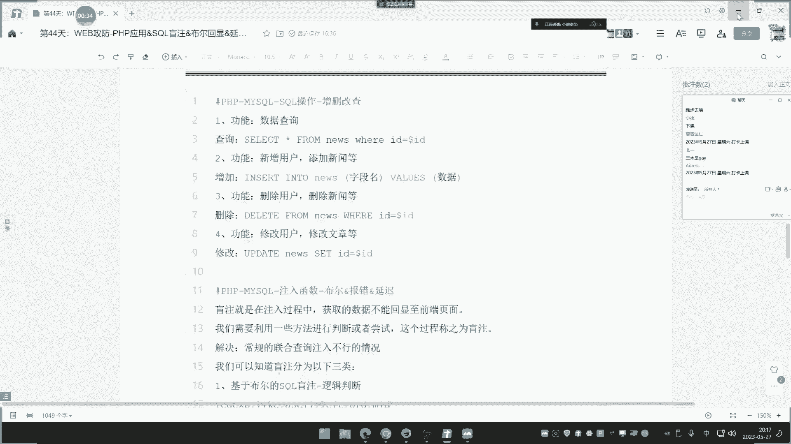

我就给大家用个案例来去讲解啊，看着啊大家都知道一个网站中呢。

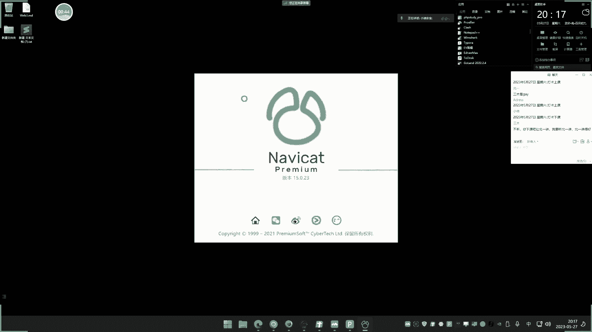

如果说要对数据进行操作的话，那么呢就会用到数据库的操作中西，然后呢对数据库自行操作东西呢，又会有几种模式啊，我们来具体说，首先第一种啊。

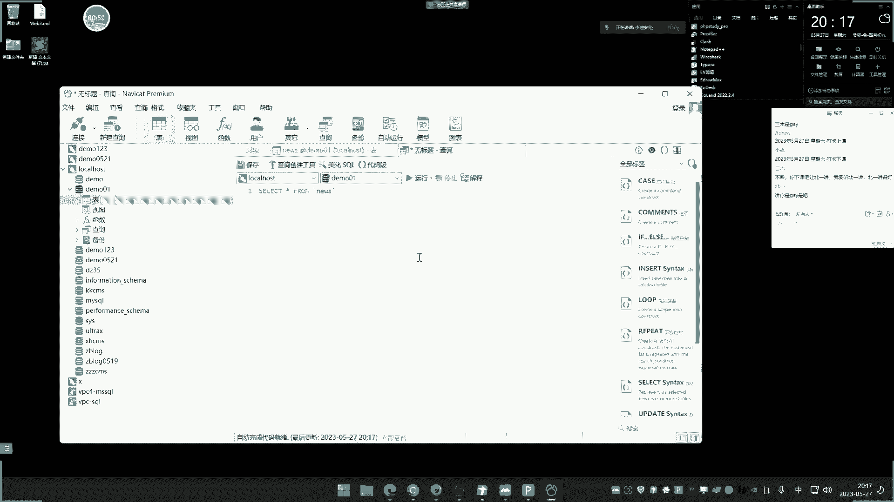

这种叫做查询模式，类似于呢把星星的给它取出来，那啥意思呢，我们来看一下啊，比如说像现在我们进行一个SQL语句select查询，那么呢它就取出这个表里面的数据，我们从中呢去取出我们想要的数据呢。

在页面中去显示对吧，这是一个很正常的snack的的一个查询，那么它会应用在网站哪些方面呢，就是网站的需要对用户呢进行这个查询，这个很好理解啊，前期我们大部分都是看到的，这都是这个stack。

那除此之外呢还没有呢，比如说想新增新增是啥意思呢，啊新增是啥意思呢，来给大家演示一下，比如说像现在啊我们找一个这个表啊，像艾米表里面对不对，我们呢尝试在这里呢去操作，比如说像这里啊写成一个什么比赛。

And you，然后呢加上这个名字叫艾特米fiddle，这里呢写上什么呢，字段名啊，这里呢就是括号，它的字段名，字段名是什么呢，就这几个东西嘛哈那第一个他的这个id。

第二个它的什么username on，第三个还是word，注意啊，这个符号呢是这个符号，你不要写错了啊，不是那个单引号啊，因为单引号就代表的是那个那个啥呀，呃珠串的嗯，还有个是我们的id对吧。

然后后面写上faux，写啥东西啊，就ZIS3就好了，比如说id搞个三，然后呢账号呢写成小点SZ，就写个小迪下滑牙cc啊，然后密码呢在这个X123456IP地址呢，随便写个127。0001好。

进行一个执行，好哪里写错了好多来多来一个符号go好，他说执行成功，然后我们再刷新一下这个地方诶，出现了个新的数据写进去了是吧，没有问题啊，好这个呢是一个插入，那么大家想一想插入是什么操作啊。

在网站的功能中就是什么新增用户添加新闻，啥意思啊，在网站的web功能中，就是网站的用户功能中，比如说你注册用户，新增用户，注册用户和新增用户都是一码事情，都是添加用户的意思嘛。

然后呢你在后台里面去添加新闻，在前台里面的会员里面的，去更改你的一些东西是吧，修改就上传一些东西，那这种的都属于新增，那么它就会用到excite功能，snack的这个语句呢。

就代表查询excite就是要向你们去添加数据，那除了添加数据，是不是就有删除数据，Delete delete，然后for删除谁，删除二的米里面条件是id等于三的，刚才这里呢IDN3的时候，刚才添上去的。

我现在把它删掉，来进行勾执行刷新啊没了，那么删除就很好理解了，删除用户删除文章，删除新闻，删除信息都属于删除，那么同样道理，除了删除之外还是有修改呀，就比如说像现在这里呢，用户名是小李。

密码是password，我想修改这个信息该怎么办呢，update是吧，Update news，然后呢，还有这ADD me里面的是吧，条件是这个id啊，好不就不用讲条件了。

set it设置一下这个密码密码为小迪，那这里呢我就把这个艾德米的密码呢，修改成小迪啊，那么怎么修改呢，条件式username m呢，等于这个什么admit来进行一个执行，在了刷新这里看到没。

是不是改成小题呀，好这个四个操作那就是简单的理解，就是我们这个SQL语句中的常见四种，增删改查查询修改删除增加，为什么讲它大家思考一下，它就和网站的功能对应上的，你可以通过网站的某些功能测试来去猜测。

当前可能在代码中的执行的SQL语句，能不能理解这句话啊，那么讲完这些之后，我们再思考一个问题，什么问题啊，增删改查，我们可以想一想啊，查询你要不要对数据进行操作。

大家觉得如果说你选择的是snack的查询，那么这个查询出来的数据，你觉得你会把这个数据要操作吗，就是在代码中的话，假如你用到了查询，你要不要对这个数据进行操作操作呢，就包括比如说我把它转移到哪里啊。

显示到哪里啊，或者是怎么样怎么样，这个操作都属于叫操作，你觉得你用查询的话，你会不会对这个数据进行操作，还有人说不要是吧哈哈，那不要你查他干嘛呀，大部分都是要的吧。

是不是大部分都是要对这个数据进行操作啊，你不邀他，你查他出来干嘛，因为你查询就是为了把这个数据取出来得到嘛，那你得到你肯定是要对它进行操作呀，不然你取它干嘛呢，好。

那么新增用户的新增用户他需要对这个操作啊，就是他新增之后，他需要说对这个什么新增东西要什么操作，什么东西吗，你想象下啊，这其实就是一码事情，就是很简单，就像我们人质去交往的时候一样的道理是吧。

你去怨女孩子，或者说你去想约别人，女孩子，你肯定是就先去问别人有没有时间，对不对，不没有，因为时间那才有这个瞎文对吧，那像这个增加呢，增加是啥意思啊，就比如说你给别人一个东西一样是吧。

你给过去了就不关你的事情了，你管他有没有给成功呢，给成功了，就是说给成功了，没给成功就没成功，有没有对这个数据进行操作的，没有吧，他就是要一个要的是一个结果，就是成没成的，结果完了。

但是你这个查询就不一样，他是要对这个数据来进行操作的，而像这个什么增加呀，修改呀，删除他看的是结果，就是成没成功的，结果就是我修改成了没有，我删除成的没有，我增加成的没有啊，并不是说对这个数据感兴趣。

因为对数据感兴趣，就是查询把数据取出来，而这后面三种增加修改删除呢，就对数据不感兴趣，他只对操作的结果感兴趣，那么这就是一个很明显的一个区别，既就是这个区别才衍生出这个盲族的概念，那芒族是什么东西呢。

我们先来看这句话啊，盲租那就是在注入过程中，某些数据不能回血，我们需要对这个方法来进行判断，然后去使用这种方式去注入出来的操作方法呢，我们称之为叫盲注，盲，就是没有点。

就是不知道前后的一个逻辑的就是什么，就是乱搞的一种注入，好那你到了这里之后呢，我们就先给大家看一下啊，有三种满足，一种叫基于波尔的盲足，就是逻辑上面的判断去注入，还有基于时间上的盲注。

也称之为叫延时或者延迟注入，还有一种呢是叫包错的四个房租，就叫包错注入三种方式，那么对应的在MYSQL中就是这几个函数，在其他数据库中啊，大同小异，都是一些简写或者说稍微复杂一点的东西啊。

都是可以进行这个相应的对应的，那么接下来呢我们就来做个实验，让你明白这个盲足存在的意义，大家看一下啊，首先我们还是来来到我们上节课呢。

上过那个研案例啊，我们在这里简单修改一下。

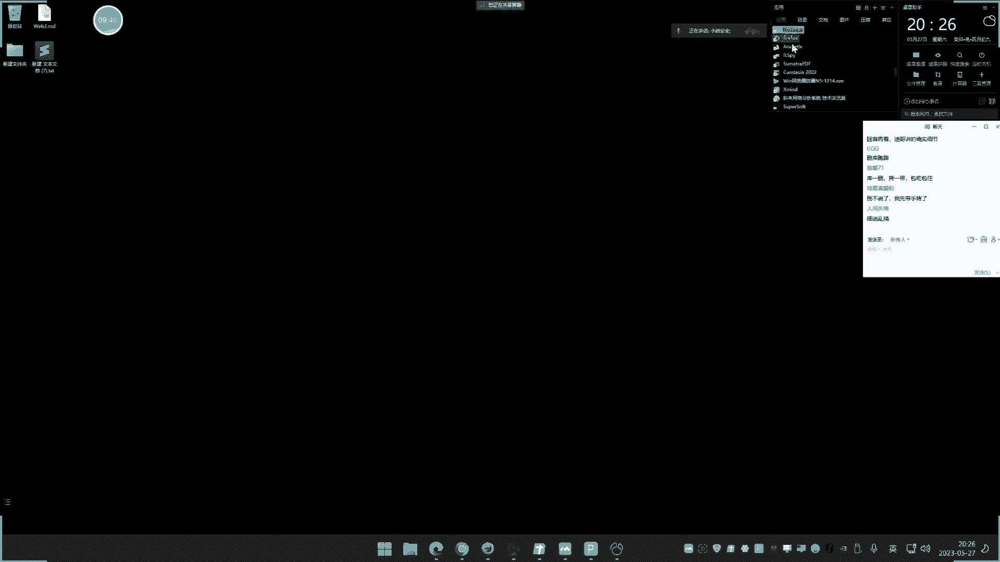

让大家明白这个盲族的这个概念，好这是我们上节课写的那个代码是吧，好大家可以看一下啊，首先呢这里那就是我们正常的这个注入好，首先这里呢这个while循环是取出里面的数据，并且把数据呢进行这个显示嘛。

是吧呢，还是把数据呢进行显示，这个下面就是显示数据嘛，那把呢数据取出来之后呢，就等于这个变量，变量呢后面就把进行这个显示嘛，哈这是我们上节课的那个操作是吧，我们来可以看一下这个地址代码啊。

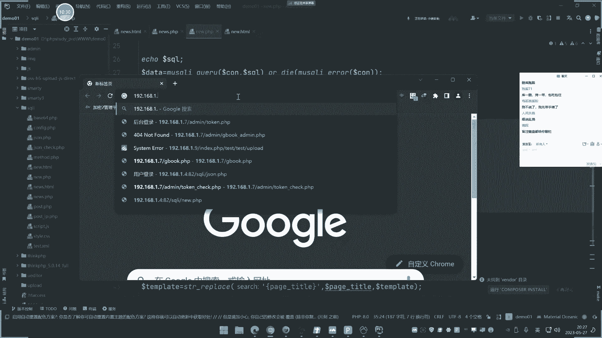

大家看一下啊，这是他现在显示的那比i id0，那显示的数据ID2是吧，i id3啊，这三都没有数据的，比方这里的IDL有两个数据嘛，就是这里的看到这个两个数据嘛，啊这两个新闻哈嗯好。

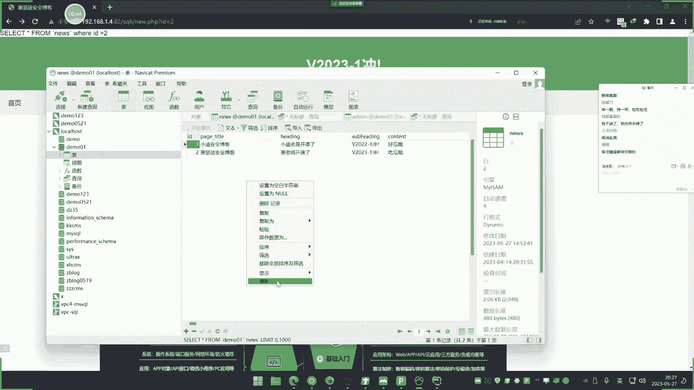

那么现在我去注入哈啊这是之前那个注入，我先把这个回血把它去掉，啥意思啊，就是我这里那就是干了个什么事情呢，就是只执行的这是个语，我并没有对这个执行执行SQL语句的结果。

这个date那是那个取出来个结果嘛哈，就执行完这个语句不是有结果吗，我并没有对这个结果呢进行操作。

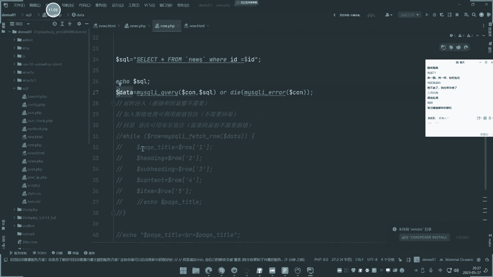

就是把这个注释掉，代码没有了没有，之后我再访问这个网站，大家可以看到啊，我再访问这个一二有没有数据，有没有呢，你看这个数据全部为空了，全部报错了，因为呢你这个数据呢相当这里是吧，有了它就会显示。

我把它注释掉，它就不显示数据了，因为他就是相当于执行了啥都没干呢。

数据呢我也不不管不问了，那么像这种事情，我们再按照之前那个操作的注入方式，来去讲的话，那看一下啊，我按照我之前的方式去注入，是否还能注入呢，对不对，执行啊，然后呢就像刚才之前那个猪一样啊，我们写个这个。

是吧，写那种主语句是吧，什么这个微信啊，那我去执行，执行之后啊，我们来你看一下，我先把它还原出来啊，先看看之前的啊，确保之前是正常的保存刷新，那之前呢能够注入显示它版本，对不对，好。

一旦把这个回形把它去掉，刷新呐，看到没没有了，之前那个猪语失效了，为什么之前那个猪语需要数据回显才能输，那么对方假如不回血怎么办呢，是不是这个租入方式就没有用了呀，没有了吧。

所以这就衍生出来这个盲注了，那么盲组里面有三种方式啊，我们来一一给他演示，首先呢第一种叫讲这些简单的叫逻辑判断，逻辑判断啥是逻辑判断呢，好我先给大家演示一下啊，先演示一下，把这个概念搞清楚之后呢。

我们再到这个案例中去，给他演示什么叫逻辑判断啊，来，我们就拿这个代码来给演示啊，这是他正常语啊，你看一下啊，好这是那个正常语句啊，逻辑判断，首先第一种啊，逻辑判断里面呢有几种方式。

那这是逻辑判断的这几个语法啊，我来看一下，首先呢你看这个啊，这叫enter lift database旗子，啥意思啊，这句话啥意思啊，长度database是数据库名等于其，就是说获取长度是不是等于其。

那我看一下下面的这个这个参考了，这下面写了好嘞，这个嘞limit，那life获取它的长度，这后面写的这个注释啊，那获取长度是不能齐我运行，然后呢这里返回个空，然后我看一下我的数据库名叫demo01。

我的长度是六位，这里是写的七位错误，然后这个回旋的数据呢没有空的，当我把它改成U之后呢，我们观察一下，看到没数据正常回旋说明正确的，这是判断它的数据长度，还有呢就像我继续讲的啊，除了这个之外。

还有他什么这种数据库的这个，前面的第一位就是limit特lift，就是呢获取database的第一位这种东西啊，来运行一下，那比如说呢D位执行是不是等于P，不等于改成它的真实的第一个叫D运行。

数据正常会写啊，你改其他的都不行，都会错是吧，然后呢你再把这个一呢改成二，就是获取它的第二位置1demo吧，一数据，哦哦这搞错了吧，这是获取他的截取A长度的这个AB啊，就A长度的低前低位。

好这里呢什么鬼情况，我写错了哟，我哦这是两位啊，他是不不是说第二位他要写两位，写个D啊，D那对了是吧，你写D其他的就错了，Tell me，然后呢三比三位，那是DEM就是正确答案嘛，英文是多么零一嘛。

数据库名你看对了，然后你写其他的呢，那写其他的就错是吧，写其他就错，那大家就知道了，他其实呢这种的也是判断数据回旋的，他有个条件。

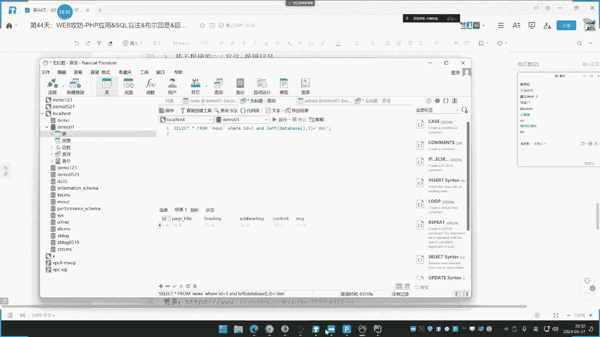

那就是说如果我进猪的话啊，呃我先把这个先把它开起来啊，开起来来看啊，我按照我之前那个思路来去注入，之前是用这种语法输入的嘛，现在让我换一种方式，看到r and的，接上刚才这个语句呢放到后面去。

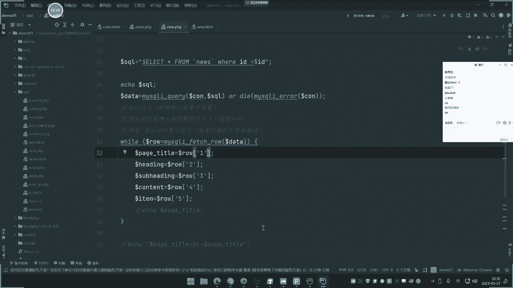

先我判断它的长度是吧，我先判断它的长度，写到这来判吧，把网址放这来好看一些啊，那先判断它的长度啊，那额长度是刚才是六位的一个判断，我已经知道了是吧，那个LILIFT那个操作啊，先看看啊，执行。

嗯哦这里有代理，先把代理关一下，诶什么情况。

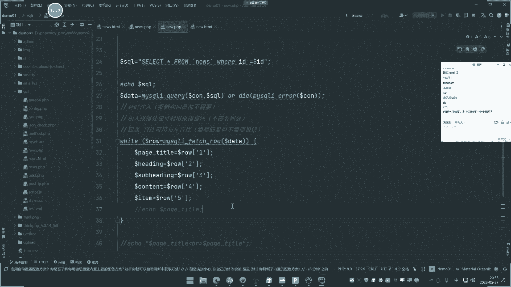

等一下啊，呃这哪写错了，我去看一下，这DSS啊报错的，然后你看啊DM你看页面是不是增长了呀，然后以此呢猜第四位，当你猜到多某的时候，对不对，哎也正常了是吧，然后你看拆其他的来拆其他的是不是错了呀。

对不对，所以呢继续拆第五位，那就是依次的去改变这里的值啊，零哎它就对了是吧，你改成其他的呢就错了是吧，以死呢就把这个数据库名呢给他猜到了，然后呢以此往下猜，这种呢就是我们说的第一种叫叫什么布尔盲注。

但这个布尔盲足的有个差异，有个方有有有个要求，什么要求呢，就是必须要回写。

必须要回写，就我这写给大家了啊，就是这个布尔芒族呢。

它需要有回血，如果没有回血，我把这里去掉。

把这去掉，你看他这里行不行啊，这四位嘛刚才是正确的嘛，你看他还是不行，对不对，他也不行，对不对，那这一种呢就是我们说的第一种，那大家可能会玩，你刚不说这个不回血，有那个不行，那这个蛮族这个也不行。

那咋办呢咋办呢，是不是还有其他两种方式啊，比如说这个延迟，那么接下来就给大家看一下这个延迟啊，延迟有什么概念啊，大家先来看一下什么叫延迟，延迟里面呢先要介绍第一个叫做if语句，if语句。

什么是if语句呢，大家看一下啊，嗯写上个if啊，然后里面呢有三个条件，就是这里呢条件一是一个参数，五和零是两二参数和三个参数条件成立，返回五，反之返回零，啥意思啊，比如说啊一等于一好，后面写个五。

写个零，写个零好，我们运行一下看一下啊，执行完之后呢，哎，执行完之后呢，你看啊他也没啥关系，也不知道是零呢还是五也不清楚是吧，但是你可以加上一个什么呢，加上一个呢叫sleep，就是延迟。

就是延迟睡眠时间，休息时间的意思，写成这个无人来好，大家思想一想啊，这句话就变成什么呢，条件一等于一，如果成立就是执行，第二个就是斯利普，如果不成立，就是sleep什么零，那么这个10。0啥意思啊。

我们先让它不成立，看一下那一小于乙，那这个肯定是不成立的条件，甲那就返回第三个条件，就是呢成立就返回第三个啊，成立返回第二个不成立，就是返回零，就是返回第三个条件，我们运行执行呢。

哎这里呢发现执行的时间呐呐这是执行的时间，0。01秒好，那现在我们把它改成等于一之后，成立之后再去执行，你看卡了卡了啦，查询时间开始增加，增加增加增加增加到五的时候，哎桥结果出来了，那不行的话。

我再加十秒来进行执行，那增加增加增加是吧，一直会卡十秒，对不对，你看567是吧，到十之后呢，这个数据啊，结果才出来好，那大家知道了，这是延迟，那这个延迟好像就说这里面的就是延迟一下呀。

这和那个猪肉有什么关系呢，简单了呀，看着啊，我把这个条件改成一个什么东西，大家看着啊，比如说我改成一个snack，查询database是不是等于角逗M的E，这不就成了个条件吗。

你可以获取数据库的长度进行条件判断，可以获取数据库的名字进行条件判断，来通过这个延迟的时间，来判断你前面的这个逻辑是不是正确的呀，你比如说像现在查询snack的demo。

加大力base他的数据库名是不是等于多么零一，如果说他成立是返回斯利普斯啊，不成立就返回斯里普林呀，我们就会通过这个执行的时间来判断，我写的前面这个第一个条件是不是真的，是不是写写对了好。

我现在呢大家可以看一下好，我问一下大家，我这样写，你觉得他是不延迟还是延迟十秒，问一下大家，延迟还零十秒一是什么鬼啊，延迟还是不延迟是十还是一二十还是零，零是吧，看着啊，直引。

这个结果呢说的是这个什么呃，零秒为什么，因为语句写错了，语句写错了啊，不要大惊小怪哈，不是说其实他真的来讲，你回答死是对的，对不对，我语句写错了啊，你觉得这个咋语句写错了嘞啊，啊或者说我换个语句。

我先把这个长度搞进来好吧，我不搞这个好不好，我只问大家来我写这个啊，来我写这个好吧，来left ft的database齐好，这个是零还是一啊，还是十还是零啊，这个好，我写这个来，这个是十了，又变成十了。

这个又是零了，来执行一下啊，结果是零，结果是零啊，好我这里改成六了，你可能会打死了吧，这还是十还是零啊，自信十了吧，有人刚好说反了啊，我不知道你咋理解的，我想问你说你说死啊，你要说你说零的时候。

你要说实，我真是拿你没办法，三星官，因为我的数据库名字的长度就是六位啊，多么096位啊，所以他就返回条件阿斯利普十啊，所以这是十啊，知道了吧，或者说我再把这个条件那整理上来来，或者把这个呢搞上来嗯。

这个这个获取它第一位长度的好，我问一下大家来，我把这个写这个了，这个是十还是零啊，执行零呐好，这里改成D了，把P改成D了，不行是不是死了呀，为什么，因为他底位结果是D啊，刚才P不对呀。

所以返回实力不宁啊，对了就返回实力不里十啦，这不用说了啊，不用讲了啊，所以这个就是延迟好，那么刚才我在这里把它注释掉之后，我用刚才这个语句进行这个呃，布尔的一个盲足的时候是吧，这逻辑判断的时候。

那他是不行是吧，那我用延迟你行不行呢，来我把这个主语写上去是吧，写上去呢看着啊，然后延迟我就搞小一点吧，零是不延迟嘛，我就搞个三秒好吧，有延迟大家就知道来写成零，这个第一位是真低啊，来看下执行。

看它呢正在连接正在连接，正在连接正在连接哦，出来了好，你说哎呀，这巧合网站卡了，那我看一下啊，我搞个错误的，那X你看那执行秒出来了，看到没秒出来，看到没来秒出的啊，来，哎，嗯这秒秒出来的。

秒出来的R能秒出来的结果看到没，当你一旦把改进去了，第一执行，那，这他妈的真是啊，那正在连接正在连接，正在连接正在连接啊，三秒哦，出来了，对不对，没问题吧。

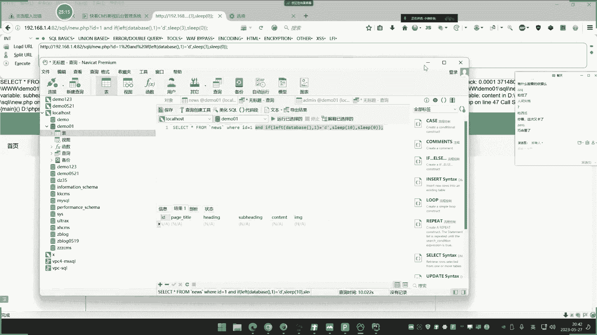

那么大家看这个延迟注入需要有这个回旋吗，不需要啊，对不对。

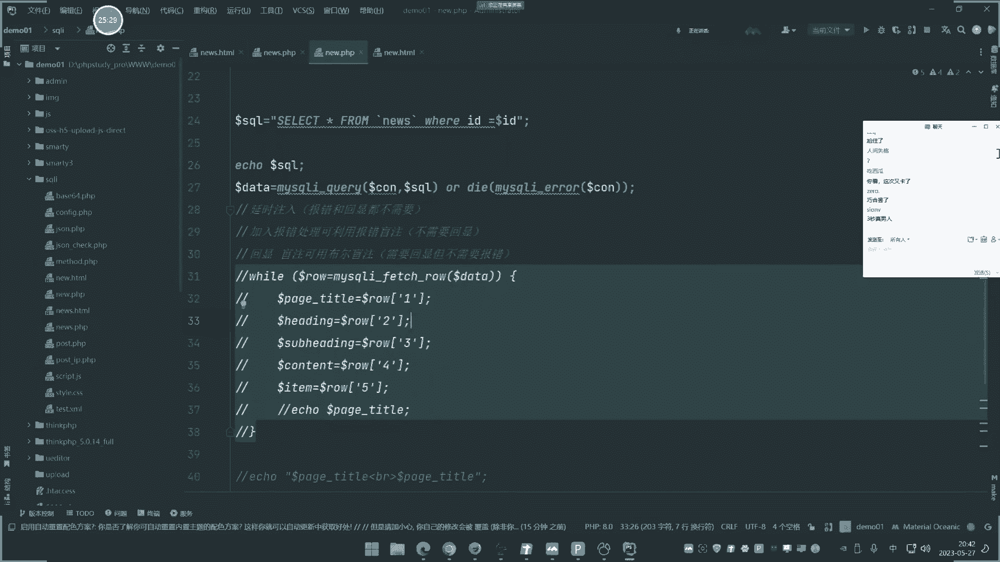

所以这个延迟入呢，他不需要还有种那叫包错盲组。

什么叫包错盲足呢，那这里加上这么一个代码呢，O d r i d e mysql error，啥意思啊，就是说来我不是执行这个SQL语句吗，如果执行的时候，这个数据没有或者有一些其他错误，就报这个错误嘛。

其实就是我们这里看到这个错误这个提示嘛，对不对，就是它包出来的，能理解吧，就是包出来的啊，对不对，现在报出来的，避免大家影响。

我可以把这个主讲这个是包是写了SL语句的，对不对，来我执行，那就是你错了，语句执行有问题，他就会包出这个结果嘞，错误里面呢有结果是吧，这个是包错的，然后呢我就不用这个东西了。

我再用说包数组，什么叫包数珠呢，就是说你的代码中做了容错处理，就是报错，做了回旋，有数据的操作，把它显示就叫回旋，两个都没有，就是啥都没有好我们先把这个解释清楚，我们先来说包错，什么是包错啊。

包错呢有很多玩法，基于每一个数据库，都有每一个不同数据库，比如说MYSQL里面只是一些保水的玩法，那有十多种，但是举主要常见的就是前面我们讲的这两种。

给大家演示一下啊。

那我执行给大家看一下，就这语句执行了强制性在用这个性质，让它报错执行，你看它会显示什么查询这个什么叫V型的执行，你看这里是诶什么情况，呃哦再再把去掉下，大家看到没写错了啊，语句他妈的写了个这个东西。

这个不是那个啊，写这个一般的，那这个非in查询一呢是不是显示了一个错误啦，叫5。7。26，把这个VI改改成什么，数据库名字啊，然后你看我这个前面这俩符号是什么，前面两个符号就是个零差零起一代表了啊。

你把这个去掉的，他只是为了让他这个钱值得更加美好对吧，你看这个就没有了是吧，他装它会显示更加美好，知道吧，这个零差七一就是说让它间隔，就是有时候能用一些工具去写那种，爬那个结果的时候呢。

他就会用这个东西呢来进行，从这里塞这个中间值来更好的去分析，所以他有个零差其一哎这个不写，那你写其他符号也是完全OK的啊，这个零差其实就是这个这个符号的一个那个啊，16进制的一个编码。

不不不是说这个东西啊，你可以改其他的，改其他的也行啊，这符号呢主要是做一些这种安全开发的时候，那写这种脚本去提取那个值的时候更加方便啊，也没什么其他意义啊，嘶好这个就是我们说的这个包出租这几种。

还有一种呢就是我们这里看到的，采这种也常见啊，这种也是一种方式，那你给大家看一下啊，那这里呢查询个什么，查询这个C特table，就是查询这里面的tables的第一条数据。

你看他查询一个叫CHRESSTNS，就查这个来information的这个这个数据是吧，那就查这里面的这个tables的第一条四句，来看一下，那他查的就是这个，你看啊等于什么limit1。

然后查询这个table name啊，看TIM那是不是就这第一张字呢，不就这个值啊，来结果，嗯是吧，然后再改成二就查到第二个嘛，哎好这次查询零和二，对对，然后呢，如果说查其他数据。

这里就相应把这个表了一改是吧，比如说查这个PY交叉版本，那不把没出来吗，那这个斜杠呢就是这个的零差5C的意思啊，就你改成刚才那个零差七七十嘛。

T1那就是那个那个华啊波浪号嗯。

对对唉，所以说没没什么太多能起来，那这显示那我占领，那大家就知道这个包出书了啊，像大家还有疑问，就说我这里查的什么表明啊，他的列名啊，我怎么查数据呢，其实呢后面你可以参考一下文章，你看他后面的写写了。

那查到这个呢包出租呢就像包出租查的那样，如何包用户呢，然后包库呢就是和前面一样呢，就查这个东西呢，继续呢就是还和我们之前查一样，报库啊，报表啊，报字段啊，然后再查，就他的操作呢要比之前的要复杂很多。

所以说我们呢没必要去讲，因为这个后续的这种很操作很复杂的东西呢，大家用工具或者说网查下资料就可以，后续呢就是如果说你要查具体数据的话，很麻烦，就每一步都要走，先查他们的名字啊。

那个东西大奖都是一个包出租资，能讲一节课，啊然后呢这个讲了啊，好这个呢我们就这个把稿子进去了啊，这个是那个两组，然后你看上面那还有这几个呢，你看还有很多啊嘞这几种各种不同的啊，是吧都有啊。

啊但是那不是说每个都比较等用，不是说每个都有用，他这个呢其他的这种报错呢，是基于这个数据库版本来决定的，有些数据库版本呢可能不再支持，某些的报错入了，但是大部分的都支持这两个。

这个第二个第三个是用的最多的，第一个呢也是的，后面这几个呢就是看情况了啊，有些是不支持的，具体看数据库那个版本里面的功能决定，然后刚才还有问说那个网址，你要知道我只要涉及到网址，我都会给这个链接啊。

懂得都懂好了，这个报错又是什么概念呢。

它在什么机会下运行呢，大家可以看一下啊，首先这里的可以看到我回显已经把它注释掉了。

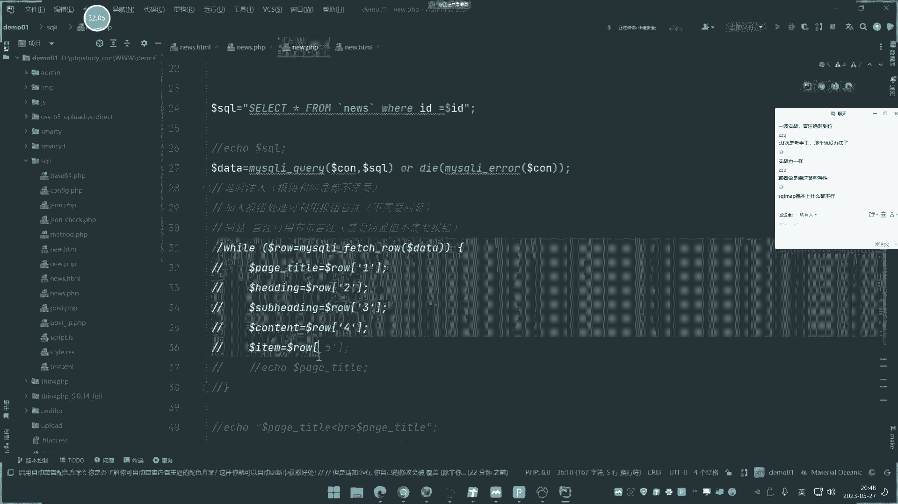

所以说这里呢它是没有回旋的是吧，我刚才用这个盲蛛的这个延迟注入，它可以用那个布尔型，它不可以，因为波尔型需要回线盲租呢，他不需要是吧，这是刚才那个操作嘛，这是刚才那个操作，大家看到了啊。

那地址我在这里啊，那我写这里，刚才这个操作呢它就延迟了三秒，就说明这个第一个只能等于D好，OK的，这是刚才那个盲注没有回血能成功，那么现在我们再来看一下，用我们这个报错是否能够成功呢。

直接把这个语句写上去啊，来看一下啊，来执行，看到没，哎这他妈的真实啊，这鬼东西啊多么灵异，飞行少写了根，有人在这里呢注视了一下，所以大家复制的时候呢也要注意啊，把删掉吧，我知道了啊，不用你写了。

还有注释，这下符的时候呢，有一些特殊符号，大家注意一下啊，来看到没，那是不是报错了呀，那我访问他直接保存呢，把这个改了改啥，对不对呢是吧，能够写出来啊，哈没问题啊。

你包括这个下面这条语句也是一样的道理是吧，来了停下是吧，写出来，然后呢，你如果说要查信息的话，那把这个去掉，是吧也出来了哈。

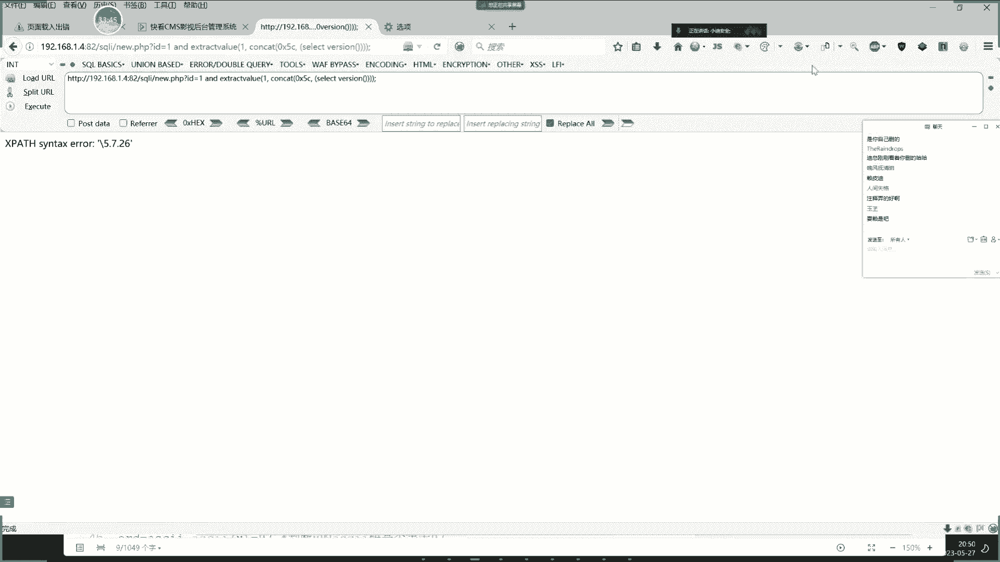

所以这个呢就是包出注入，那包注入是什么条件呢，就这里啊，就这个代码啊，如果说你看啊，我现在把这个代码给去掉，他去掉了啊，啊先不去掉，我先把这个代码写上，把这行把它注释掉，就是不要有这个后面这个东西了。

就是以这行为主，那么现在我们再观察一下这个执行，看到没又失败了，那么这个失败了有啥办法呢，那就继续往上面翻翻翻翻翻嗯，好再用这个试一下，可不可以，这个呢延迟延迟延迟延迟延迟延迟OK延迟了。

那么现在结论已经出现了，结论就是什么呢，三种忙中都有各自的条件，基于延迟的盲蛛，啥都不需要，你报错没有，你这个回血没有都可以，我都能进行，他是一个万能的叫延迟布尔类型的，需要数据库的输出。

就是数据的回血才能用布尔包戳，是需要对方做了容错处理，那么可以用包戳，能理解了吧，然后哪种类型是什么情况呢，延迟就是基于时间上面的判断，他时间最慢，结果操作最麻烦，波尔呢稍微简单一些。

但是需要输出报错呢，需要它做容错处理条件写上去了啊，那不需要条件，需要数据库输出判断条件，报错呢需要数据库呢啊进行这个包出处理，这是容错处理啊，好那么把这个讲完之后，大家再来思考一下。

刚才我讲到的增加修改，删除和查询四个操作，大家思考一下和这个上面有没有关系呀，那就有很大的关系了呀，大家想一想，你增加用户，你删除用户，你更改用户需要对数据把它取出来进行回写吗，不需要啊，那你想象一下。

如果是insight，如果是delete，如果是update这种类型的猪，你能不能用我们常规的什么这个那个UNIN，SNEC的那种东西去租呢，不能为什么他对数据都不处理，没有回血，你用那个东西用麻呀。

没有用处啊，我将这四种方式增加修改删除和查询，第一个是告诉你它和盲族的关系就是引出盲注，第二个呢就是指导告诉你，这个驻点呢不仅是在产生在这个啊，我们常常用这个数据呢写上参数之后呢。

然后看到数据回写不仅是在这个方面，还会产生在很多方面，就是我刚才说的这些方面，都会产生出这个什么新增用户啊，删除用户啊，那个呃承接用户，你像还有没有，大家还记不记得我上节课说过一句话。

还上节课一直有个人追着问，说那个文件上传怎么导致的叉SS出入，我说了文件上传，把文件上传的文件名呢保存到了这个数据库中，很简单的道理，比如说这个表呢，这里不是有个这个文件那个路径吗。

假如说你上传的文件的路径呢，它要保存到这个表格，就是这个表的新闻，我添加了新闻，新闻里面呢我写了张图片，这个图片呢就保存到这里，那么我上传的图片文件名单，如果说写到这来。

那不就是典型的一个inside吗，插入啊就怎么添加呀，那么不就是inside注入吗，是不是啊，那么大家可以看一下这个inside的输入如何抓，就很简单，那个语句呢，哎我们就给社区呢去看一下那个语句。

那雨应该在这里，那我们讲啊还没有啊，把删掉了，在这里还有刚才写了个excel哦，在这里你看啊，就这里呢嗯他不写这个插入这个数据吗，那这个ADD me里面呢就拿这个来讲吧，是的他不查点执行之后呢。

这里就有个数据进去了嘛对吧，那如果说呀像现在是吧，这是它保存的地方，假如这代表那个文件名一样的道理是吧，我把它写了，写了之后呢，对我后面再加上这种对不对，主语句，比如说这个刚才的布尔类型啊。

或怎么地类型的一些这种注意语句，比如说延迟啊，好吧，那下去延迟一秒钟来执行啊，勾，好当然这里呢他不能执行成功，为什么，因为这个语句不能这样写，他这个excite注入呢，他不能加，这样直接加啊。

等下我们会说啊，就说你这里固定呢能修改这个地方，那么后面都是inside的输入，这就是说针对这个查询方式的注入，大概看一下文章，这是下节课要讲的啊，因为下节课要用到这种东西呢。

来引出那个二二次注入的事情，这个价还价，嗯你看这个，这其实就是我之前上课的一个笔记哈，再租了类似的那种操作啊，然后他的租鱼呢就稍微麻烦一些啊，就是啊就类似这种啊，啊引出这个报错的一种途径呢与操作。

它也不行，他还是要写到这里面来，对就是类似于就是说你把这个地方改一下啊，啊执行啊，你看第三个字有个错误，翻译好，这里有个问题，网传一些东西呀，还是要吸吸脂，你看不出汗了，这个一晒的植物是不是出汗。

你看现在是多么灵验，网上这个单引号都写错了啊，所以网上粘贴复制的时候要注意一下啊，来那么很简单的道理，我把这个文件名改成这个名字来，这是我注于我把文件名改成这个语句，这不就注入了吗，上传文件嘛。

他把文件的名字保存到数据库中，我把文件名字改成这个注入语句的名字，当然如果说你说哎呀，他把文件名进行随机命名了，那就是另外一回事嘛，那就不是和我们这个相关的嘛，就是不要讲那些条件啊，我就说一下它原理好。

后面下节课要讲，因为这个东西呢还要引入二次注入，二次注入也是我们下节课的内容，我先说这几个事情啊，呃这个刚才讲的这几个东西啊，好，那么像现在呢，我们把刚才那几个东西讲完之后呢，大家来思考一下啊。

除了这个之外，这个每一个猪的方法都会有一些显微的差异，啥意思啊，你比如说像现在我给他写了这个页面啊，大家看着啊，写了另外一个页面啊，就是用网上这个JH呃，CHKGP啊，这个智能工具啊。

机器人呢放我们生命的一个这个工具啊，生命的这个写了一个这个东西。

哎哎写了个界面啊，就是我在这win了一下是吧呢。

用它来去写一下那个一个界面的一个代码啊，诶怎么还不出来，什么鬼啊。

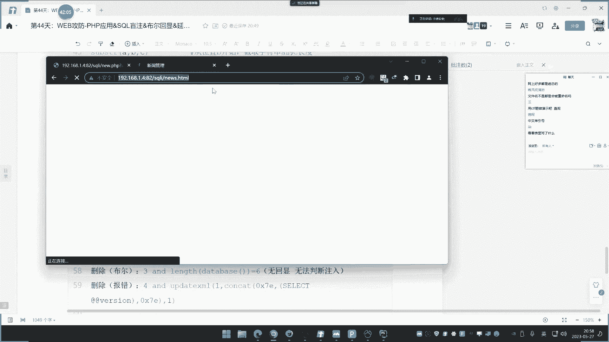

怎么卡还卡起来了。

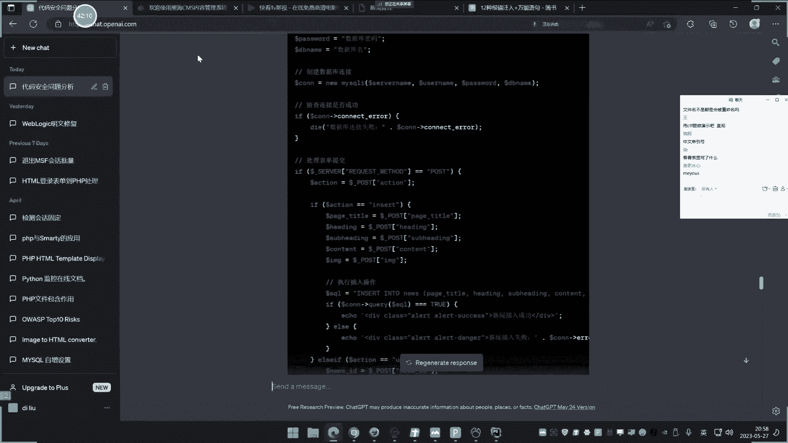

啊就这个就是一个这个新闻管理，然后这里呢有插入新闻啊，更新新闻啊，这个删除新闻和查询新闻，你比如说我这里要点一查询，你看他就帮我查到了啊，小尼老师改改了夏利安全博格副标题内容，好瓜呀，然后他ID1的。

然后你就写A啊，他就把这二个数据呢也消除了，消除你，然后三次新闻啊，咦你比如说写一啊，我们这里呢就会怎么样呢，查询新闻吧，它是指新闻操作呢先刷新啊，我重新添加个啊做测试，我避免把那个删掉了。

随便写个什么东西啊，都无所谓的好，这是第三条这个信息嘛，哈第三条信息我们看一下啊，我点击三点击呢勾删除成功刷新这执行的呀。

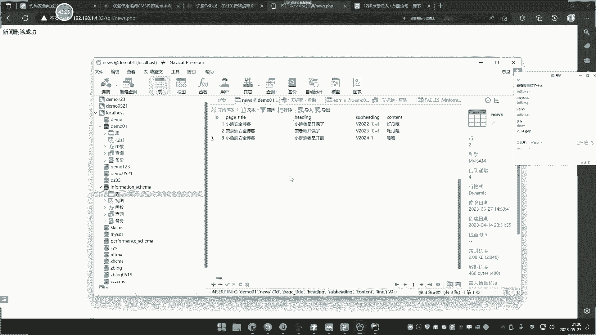

这是我给他写的啊，你也不用问我怎么写的代码给他看一下啊，这前端页面这个我是直接从这个app上面问，他帮我写了一份啊，啊就自己写的比较麻烦吧，我就问他帮我写了份啊，没没写其他的啊，后面的代码呢就这里嘛。

对你看啊，呃他就结束这个几个值呢，定义好数据库的名字，然后呢嗯这里那就如果呢结束了呢，是inside，那就是插入就在这里插入数据，如果接收到是update，那就是删除数据，如果让接收到是这个snack。

就是查询数据啊，就是我代码已经全部写好了，如果是update就更新数据，就我们这个前置页面呢就拿来操作啊。

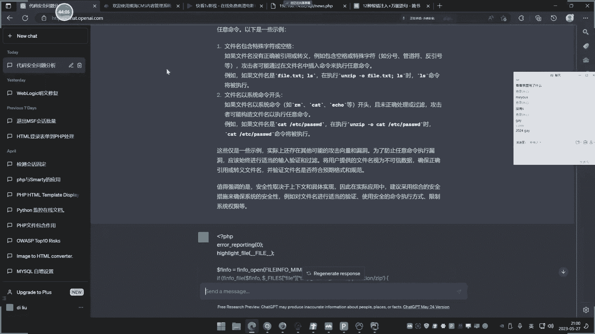

那么试试看一下啊，如果说是删除操作的话，就像我们一样，我们假如选择删除以及新闻，那么它就会删除一同样道理啊，那么这样子呢我能租它呢，那比如说删除这里，我租他该怎么办，大家看一下啊。

删除这里你可以看下代码，看有没有回血，我们看一下啊，来到这个代码段，delete执行删除操作，删除一个接收过来的id值啊，接收过来的id值，然后i id值呢为多少就删除。

如果说删除的时候执行语句条件为真，那么就删除成功，否则就删除失败是吧。

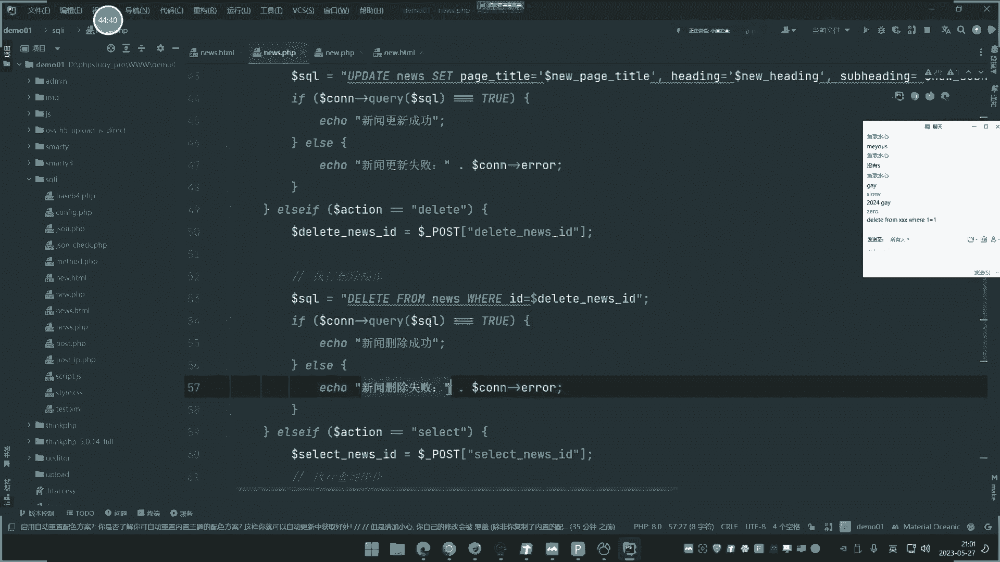

这是他的一个逻辑，那那这里呢我写三对不对，执行三成功啊，他语句能执行，执行没问题是吧，删成功好，那么先看下，我可以看代码中。

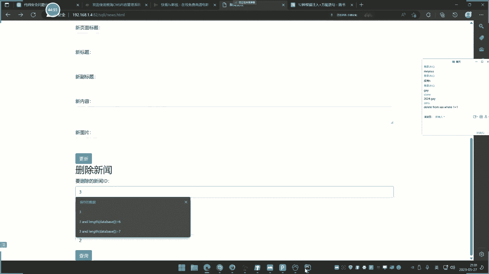

他把语句执行之后，他有没有把这个数据给它取出来呀，没有取数据吧，取数据是这个DOTF变量circle的吧，好吧啊，取数据是什么，是不是执行的，用EQ为执行这个SQL语句对对。

取出来他只做了一个什么执行语句的一个判断，为不为真，就说这个语句有没有执行成功，执行成功，提示删除成功，没有成功就提示删除失败，并把这个错误显示他在这里呢是没有进行什么。

没有进行这个数据的什么回形操作的啊，对数据进行操作一些这种操作的只有什么呀，报错处理。

那么没有回血，只有报错，我们就能选择两种方案，一种是延迟方案，一种是我们的什么包出处理方案，比如说我用包出处理方案是不是能够租它，我们来试一下，在三这里写上报错语句，写到后面去进行一个删除，确定一看。

读了，对不对，那么同样道理，如果形成延迟，是不是就可以直接的进行延迟啊，嗯安德一人1sleep50对吧，如果一等一就执行延迟五秒，否则就是返回零就啥都不干，对不对，来看一下能不能执行成功，执行删除哎。

先是删除成功，并没有延迟，难道是这个条件不成立吗，不应该是访问sleep5吗，怎么是这样子呀，是这个情况啊，有时候在这个用这个东西安的时候，要注意这个and的呢是一个逻辑的，且条件OR是一个什么或条件。

有时候呢要改动一下那个and的啥意思呢，因为呀你可以看一下他这个新闻中呢，已经没有删这个id的新闻了，你说他三除这个三本身，前面语句呢就啥都没有了，你后面还写个and的，就是戳加上另外一个东西。

所以那你写个豁，就代表说不管前面是个什么情况，后面我都执行，就这个意思就是就很简单，就和你说话一样，你要连切的肯定的语气，并且的去说一些话，那么那个东西呢就很小的可能了。

你把那个花呢说或者怎么样或怎么样，那就有很多可能了，对不对，那很多东西都不能命中的意思啊，和这个社会语也是这个道理，所以他写个豁再运行，你看延了延了，它延了延了五秒，然后咔嚓一下再出数据呐，五秒二呢。

那时间有点长啊，因为有可能延迟的时候呢，它会延迟十秒，那它才提示出来，这不是没就就这个道理，是不是，那延迟也行，那么我再用这个包这个布尔行不行呢，那布尔呢看一下啊，用布尔行不行呢，你看啊。

那3database是等六吧，它的名字是new的吧，数据库名字是六吧，多么零一吗，点删除哎，啥情况哎，你说这换成OR呢，但他就提示这个你也不知道这成没成功，你写齐呢，他也是个两毛四心的。

写齐也是个两毛事情，所以说这个就无法判断，为什么无法判断他没有回弦呢，你怎么就布尔呢，布尔的前提条已经讲过了呀，他需要数据回线，所以这个delete呢在这里就只能用延迟和报错，原因就是因为在代码中呢。

他做了包错处理和这个什么啊啊，延迟就啥都不用了啊，那报数你先就报数可以用，延迟也可以用，但是呢没有对数据进行操作，是不是，但是你看下面下面这个snack的那对了，数进行操作，我就不再演示了。

因为刚才那个都之前讲的那个这个东西呢，我们就已经给大家演示过了，这东西啊，对不对，然后这是delete是不是啊，好你再看这个这个其他的像这个什么删除啊，呃这个这个插入啊和这个这个update啊。

这个呢我们就暂时不看了啊，因为马上的案例就会和这两个相干好，那么上到这里啊，这是我们一个简单的实验，对于这个查询方式四种的了解，同样呢也引出了这个蛮族的三个分类部啊，报错和延迟。

同时呢给到了这个延迟不啊，和包错三个房租使用的时候的一个条件，延迟什么条件都不需要，布尔呢需要回血，那么这个报错呢需要做容错处理，这是他的条件，同时呢也告诉你了这四种查询方式，增加修改删除查询。

除了查询可能会对数据呢进行操作，数据回现代化，其他三种大概率是不会对数据进行回写的，那么也就是宣告说，用我们常规的什么u n i n n snack的查询的，诸如和这个布尔型的猪就没用了。

那么大部分就会选择后面两种，就采用时间忙租和这个报错，那么我把这话一说出来，大家是不是能够理解，如果说听了这话和前面呼应不上的话，那前面就听错了啊，如果能听印上，那就和前面知识点都对应上了。

那把这个东西搞清楚之后，下面那我们就用两个案例呢去给他，把这东西呢再稳固一下，再和这个真实的一些应用呢结合一下啊。

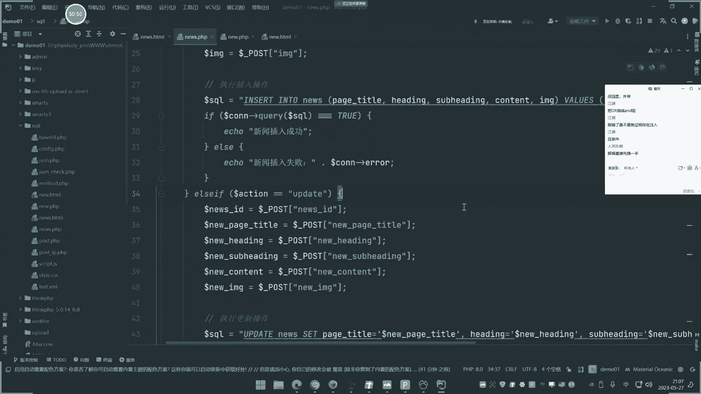

能不能搞清楚啊，刚才说的那个一个简单的总结，讲过的支点和那个分离和情况，好讲清楚啊，啊讲清楚之后呢，这个我们就来看一下这个呃最后一个了啊，就是这个类似的这个，那你两个CMS就是呢为什么搞两个cm s呢。

很简单的道理啊。

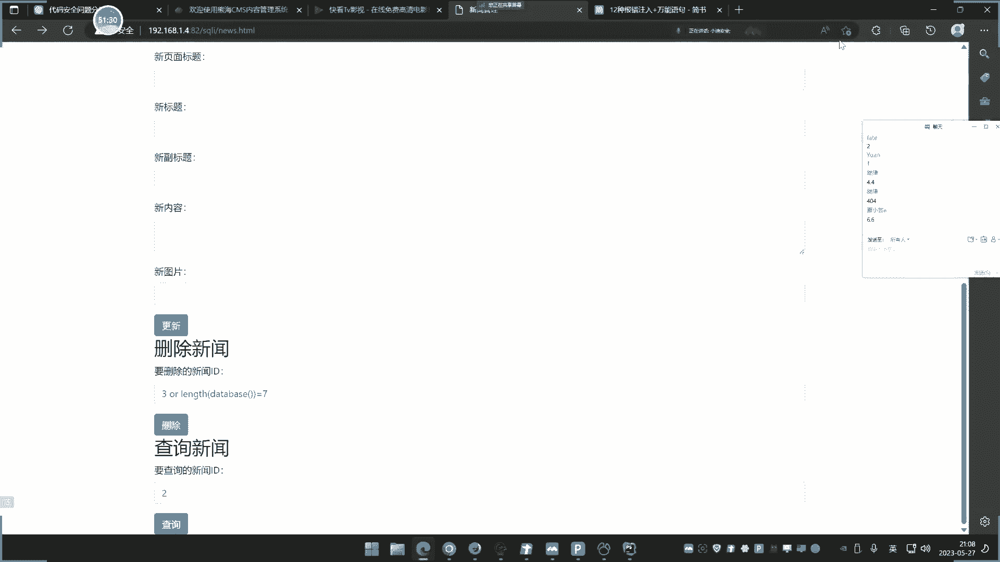

因为我们正常面对，那不可能是我们这种这种零散的是吧，写个这个代码大大帮你分析，大部分都是一个完整的网站源码啊，我就用这个网站源码里面的去讲这个东西，分析漏洞呢，我们具体过程就不讲了，就主要说它的利用。

就是我们今天讲的啊，它的利用，因为大家知道啊，你假设你去这个源码中去挖漏洞的话，它是有几个过程的，首先呢是挖到漏洞，然后呢再对这个漏洞进行验证和利用，那么现在我们讲的就是说。

比如说我们想发展一个四个图图，那我去利用这个漏洞，就是刚好能和金钱资源能吻合上去的啊，就这个意思啊，那么前面这个为什么怎么挖的这个漏洞，这是不是我们操心的，现在还不需要为表里这些啊。

但是后面那个讲到这个代码分析的时候，那审计的时候，那那些东西我们再说的啊，我们就说要知道这个过程啊，知道这个过程啊，他过程是连贯性的啊，你这个前面这个漏洞的，就是你挖到漏洞，那还灰你。

你把漏洞浮现出来才行呀，不然的话你你只造漏洞也不行啊，那么利用漏洞就是我今天讲的啊。

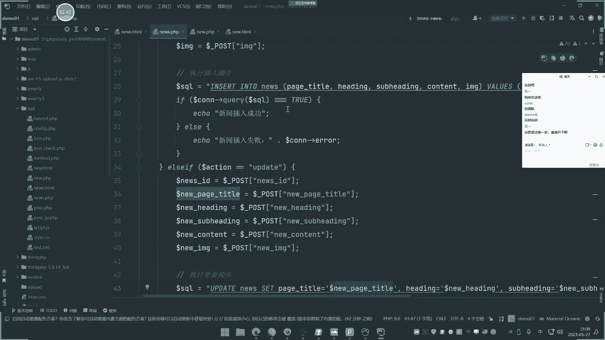

就比如设个组，这个利用是吧，把复印出来好，这里呢搭建两个网站啊，一个是这个网站，一个是这个网站来，这都是网上的一个cm s是吧。

啊这两个网站那个cm s r搭建的，那么其中呢在这个两个里面。

那就有今天讲的这几个漏洞啊，先来说这个第一个啊，把他的原码啊，啊这个安装呢唉还是给大家讲一下吧。

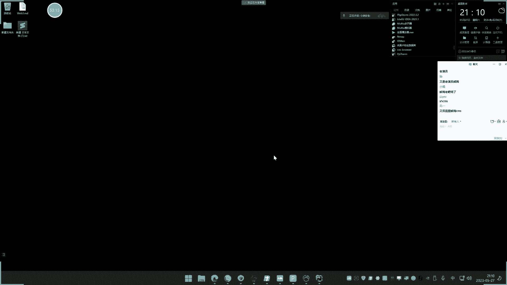

我说实话啊，我怕我不讲下去呢，优势很多人问这个这不搭建的答，建不起来呀，唉说实话你如果说真打你不下来，我觉得你浮现的必要也没有了哈，唉但是呢我们还是把它搭建一下吧，把那表一个删掉啊。

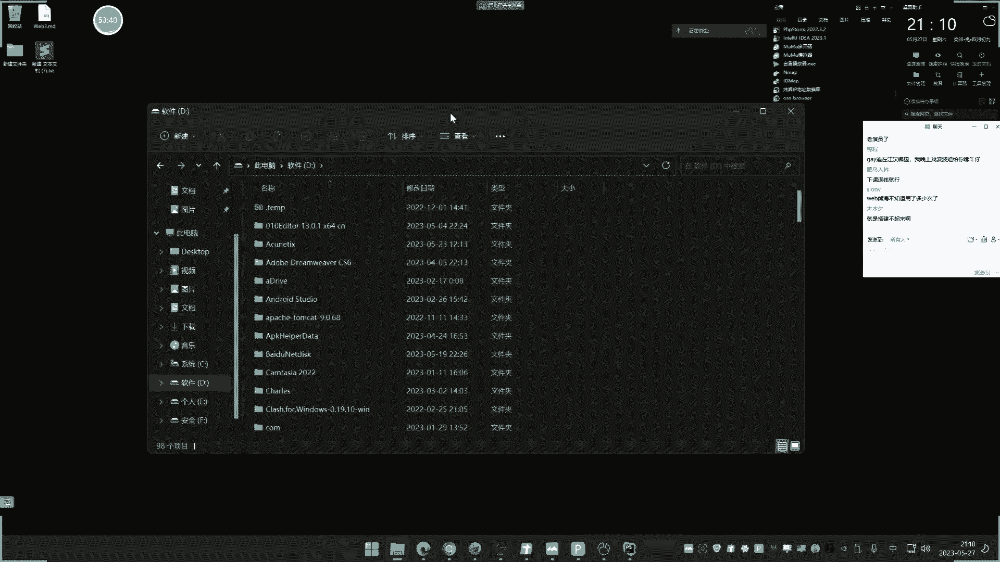

基础太差了啊，其实这个东西我没有必要讲的，因为如果说你连他的答卷答卷不了。

你学这个东西是没有必要的，我把源码先删掉啊，然后呢就把这个两个源码给解压出来，那我一个个给大家看一下啊，我怕等下下去之后呢，有些人不会答，你说这咋办，是不是啊，真是没办法，先把这个解压检测出来啊。

有些人他积积数差，他还不细心，是真的很没办法的，你知道吧，他有些人他是本来技术就差。

他很不细心，我里面的技术比他好，我都比他细心，你说你怎么可能去把那东西浮现出来，你像刚才那我解压的时候，你看我把这个压缩包解压是吧，它里面呢还有记目录，有些人那就可能直接把那个目录复制进去。

发现那到时候一访问唉不行不行，其次呢就是个目录多了一层而已，喷都会碰到情况哈，那先把你IP地址写上去，这个IP地址怎么写呢是吧。

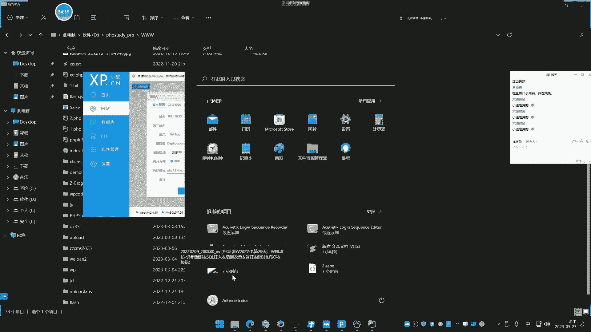

自己一查是吧，我这个是哎这个东西啊，当然你也可以写域名，它也绑定这个同步host啊，你可以写域名哦。

写域名吧，来看着啊，写域名也行啊，比如说叫熊海cs点com啊，这里有个叫同步host的一个操作，就是说把你host修改，那么就是说你访问这个系统还是MS，那就会指向这个网站，然后呢找到这个目录。

那这个目录啊把它选中啊，这个端口呢就叫800或者其他端口也行啊，那选择版本是5。4的版本，因为这个程序有点老了啊，5。4的好，点击确定好，那么现在呢我们就来访问一下3W点，琼海3MS端口被占应用。

尝试关闭啊，不关闭，把端口改一下，改成83号端口好，3W熊海cm s点com83号端口，声音，好这里的出现了一种情况，哎打不开了，哎这里面的翻车了啊。

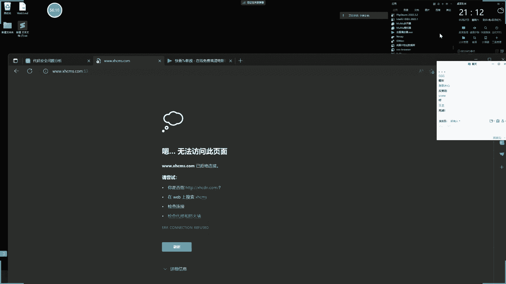

终于翻车了，横叉了啊，开心的要死，对不对，因为什么呢，他说呢这个绑定是这样绑定的。

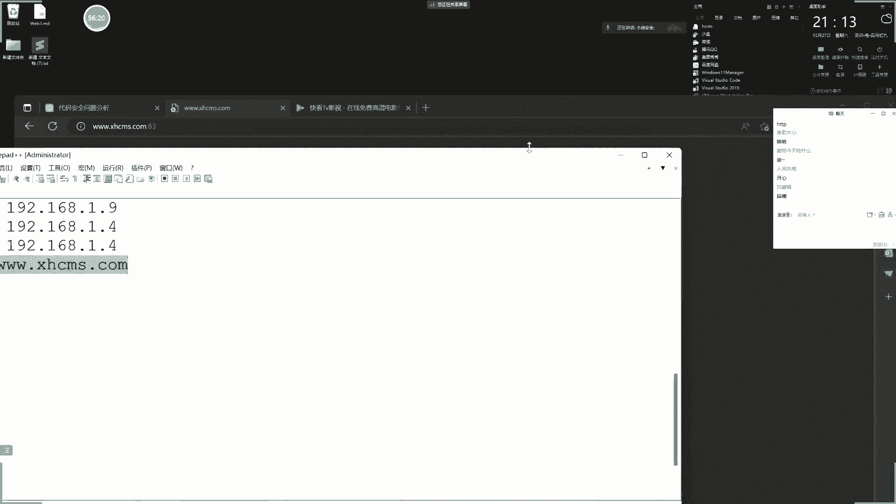

这说实话，所以不推荐用大家用域名，就是这个意思，因为他有时候呢你必须还是要写那个IP词，那真是尴尬是吧，写个这个东西吧。

还是写这个吧，21。4香啊，哎啥情况。

哎又说哎呀翻车了又翻车了。

哎呀翻车了，我翻车，我能找到解决方案，你们觉得是什么方案，是什么问题啊，多大IP错了哎。

1。4，这你妈什么情况，啥情况。

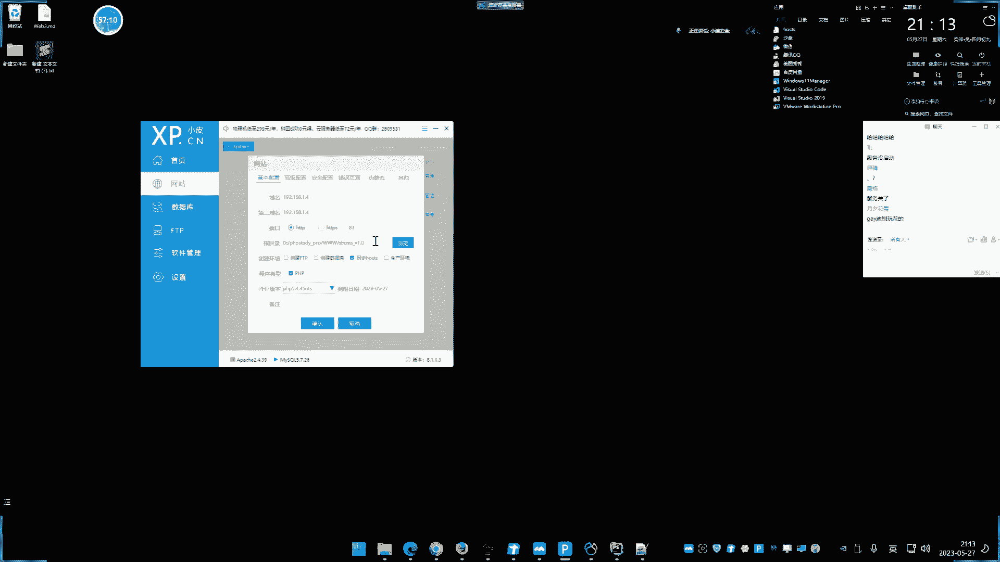

查询瓜把这个货色给去掉，妈的鬼鬼鸟吗，活死不去掉。

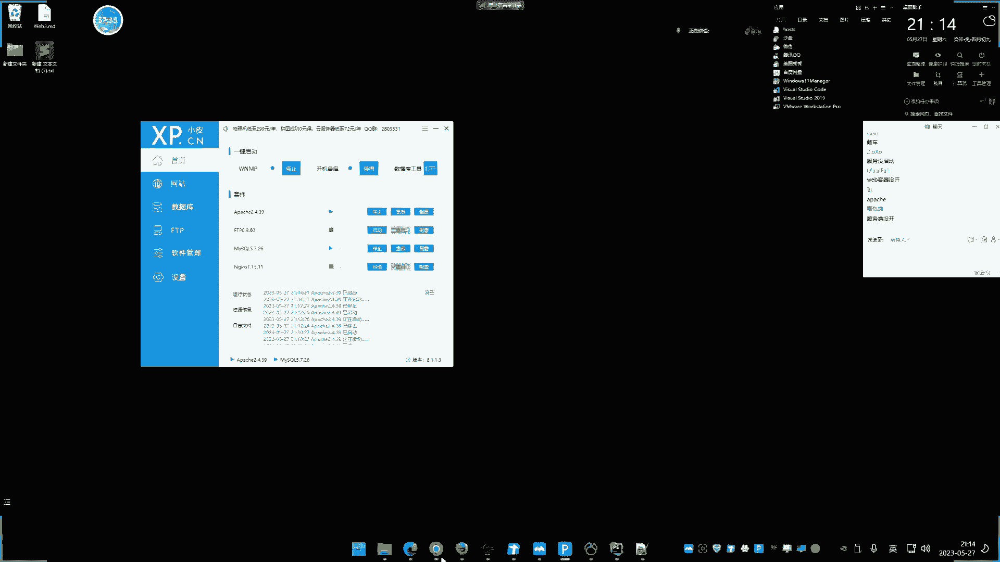

啊出来了吧，好密码，那就有纳米亚，输入名字呢就叫熊孩斯莱斯，然后用户呢叫root，点root啊，名名字那就叫就叫熊海森S叉吧，还一点这里哎呦，是你们错了啥情况，密码写错了，123456，再点哎呦。

错了哦，没有数据库名，啥情况，他没有，你就给他创建一个呗，点击新建呀，新建了再刷新，这不有了吗，安装好了呀。

好像是这个啊，哎这个呢是吧。

这个还要安装啊，来再来添加网站1。4，八十四号。

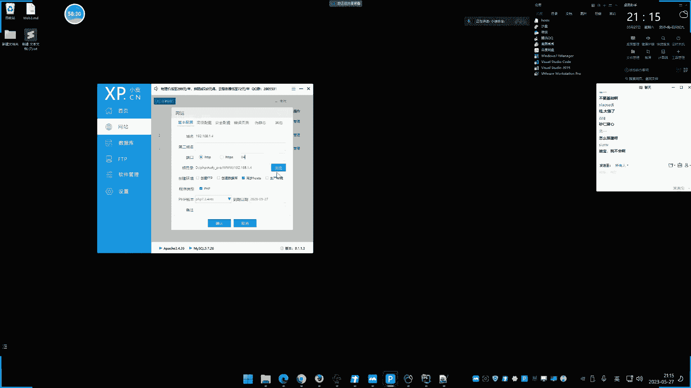

然后找到那个路径KK的嗯，KK跑哪去了，AK还在这里，还没有加搞进去，注意us是当前目录，不要选错了目录AK放进去好。

选中KK保存额版本，那就搞5。6的或者7。0的也行啊，5。6的吧啊如果没有这个版本，自己在这个软件管理这里下载啊，这就不要叫了啊，这要叫那就顶不住了。

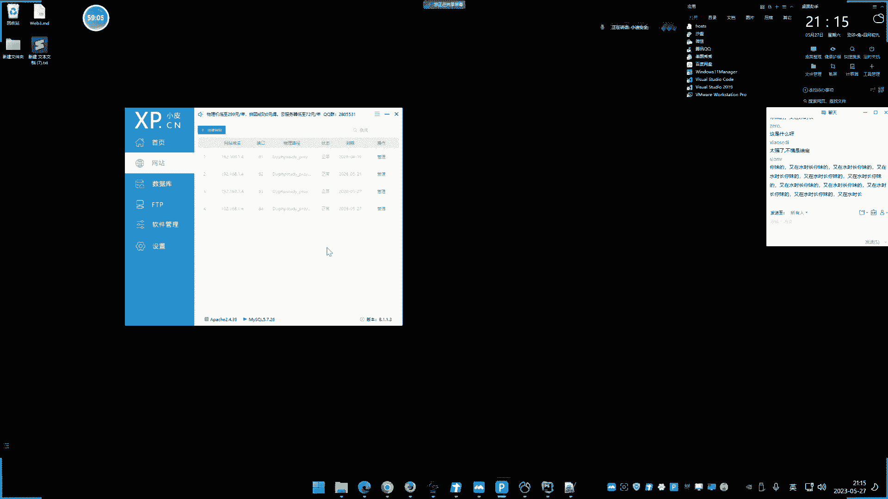

80，好来刷新音。

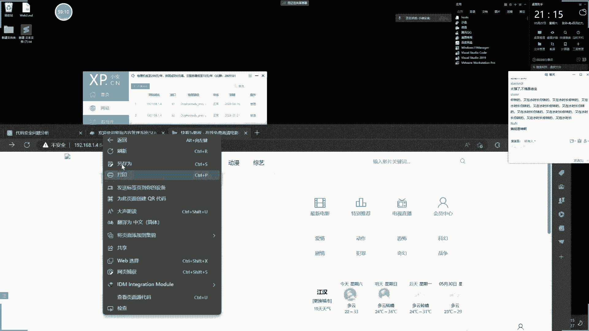

需要安装允许安装数据库名，就叫KKCMS叉数据库名，名字密码，两3456，点击开始安装哦，恭喜两者成功哦。

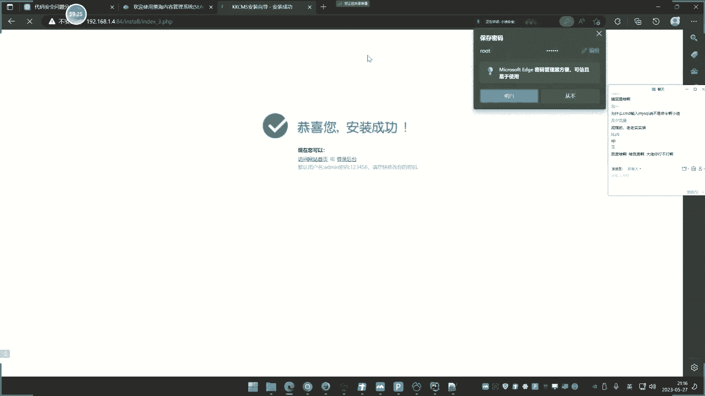

OK没了好，那这里就完了啊，两个都安装成功了啊。

那么接下来我们就来分析两个程序源码的，一个安全漏洞，首先呢我们用这个id1呢打开熊还是MS。

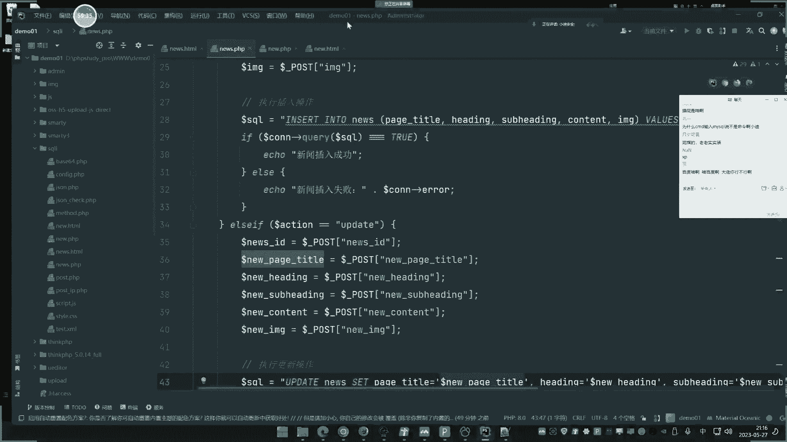

打开它的程序目录。

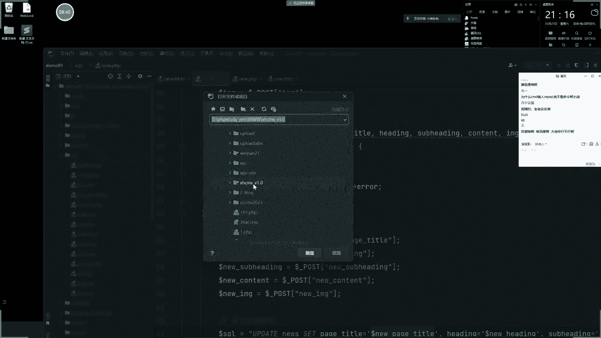

找这里确定窗口，在这里呢我们首先分析漏洞，肯定要找到它对应的代码端，那么这里呢我们先来分析它的第一个漏洞，就是我们说的包出租屋的第一种叫insight，包租搜索inside关键字查询。

这里的insight的关键字Ctrl shift加F全局搜索，搜之后呢，再看一下啊，因为我造注入肯定是数数字。

关键词是吧把，所以关子呢哎啥鬼。

那么在这里呢，你看啊他有这么多来第一个选进去，那这里有个inside，查询这个什么INTRACTION，这个路径路径地址是SPILT，点pp下面呢有个什么呢，执行这个SQL语句。

L有个什么DIEMYSQL，这不就是妥妥的报错处理吗，包处处理，那就可以采用包错盲注和这个什么延迟输入啊，那肯定优先选包出盲租啊，有这个条件的，是不是inside插入，那这个代码呢是叫哪个文件名啊。

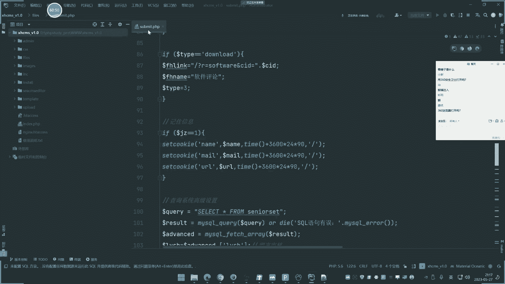

这个我看一下它路径啊，复制下路径地址在哪里，我看一下啊，复制路径应用，它是在循环上面是files下面的SPUTER，点PBFSSP。

点pp拿我正常来讲，我是不是就怎么样呢，访问这个例子对吧，然后呢，怎么样访问这个FS群这个SPT点P11访问，发现这里啥情况。

怎么一个报错呀，这是啥鬼啊，是这样的啊，他这个访问呢有点不一样啊，他这个访问呢是一个什么访问形式呢，这个我就不讲了啊，他是在这里大家看一下啊，就是你通过这个访问之后呢，后面加上一个问号。

这个R参数呢来指向包含这个files下面的。

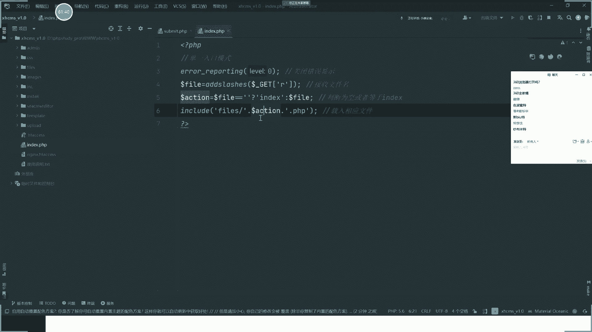

那就是说R后面等于SPUTE，那就包含这个files student pp，所以它的路径呢应该是这样放的一个方式，是引号应该是pp或者不加它也行。

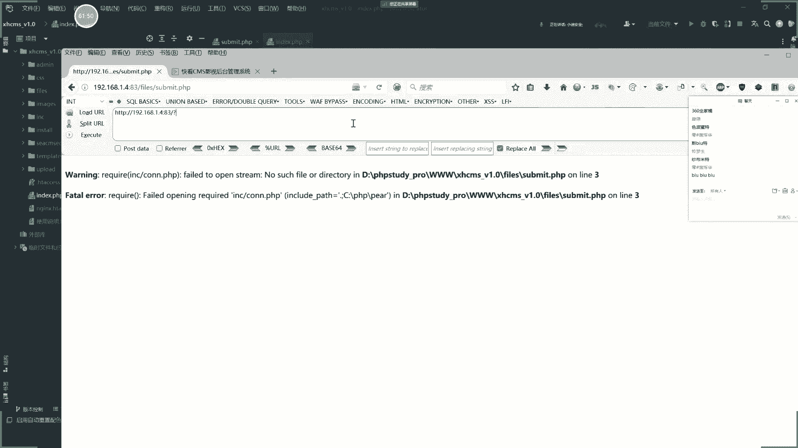

问号R等于16访问这个R等于SPUTER之后呢。

这里就结束到这个file file，那就结束，这样就这那SPUTE嘛。

X等于SPUTE嘛，所以这里那就是触发刚才那个地址对吧，这个是刚出那错地址啊，这触发的不要紧，这里还要有这个什么数据的，这个提交和数据处理，那么就是这里嘛哈是吧，这个SPUTE。

那么谁给这个SPUT点pp处理呢，我们搜一下嘛是吧，谁给他处理啊，XY等于我说直接点SSPT点PHP哎没有SPT，问号attention spt有没有呢，哎有了一看有个路径。

content里面有个路径来看到没，content里面有个路径，app呢提交给这个问号，ardent spt就是触发我这个代码文件，因为我的那个EXCE的代码呢是在这里面啊，其实我没必要给他讲这么多。

都是代码升级那种，我不会讲，我就直接给他演就完了啊，我就说他有这个介绍。

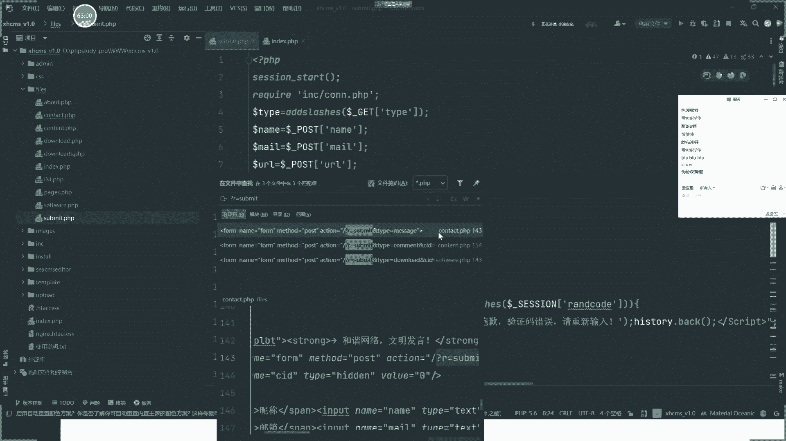

我知道告诉你是这个原因，那比如说来到computer里面，C t。

好吧，就这里就说哎他的这个文件名字叫content的，所以问号R的tan呢就访问这个文件文件，这里呢在代码端这里啊，这里有个叫什么文明发言和发表留言，这里那会啊在提交数据之后。

他会把请求到AUDISPUTE，那就会请求给这个文件，然后这个文件的接收数据呢啊。

执行后面的excite，我们看哪里文明发言，难道看都不用看了，就在这里嘛是吧。

你看那就是评论区嘛是吧，那评论区我就知道了，刚才这个insight呢应该就是解锁评论的那个地方，那叫这个表明我们给对应这个表面看一下，适不合我们猜想的，能够呼应上啊，找到这个熊孩，下面是查。

然后呢使这个excite打开一看哦，岁月岁月卖碟，这里地址看一下这里的评论区的几个新闻。

岁月岁月卖碟，哎呦对应上了啊，没问题，四个情况啊，那就是这刚好这个数据呢，就是和这个东西呢对应上的额，对应上了之后啊，那么我们写的这个几个数据。

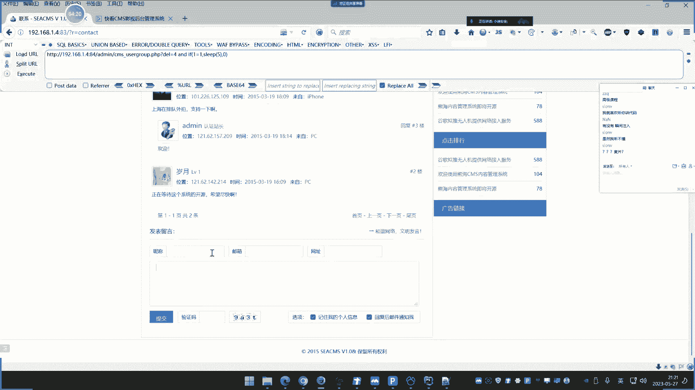

他想里面查入数据，查的这个什么类型啊。

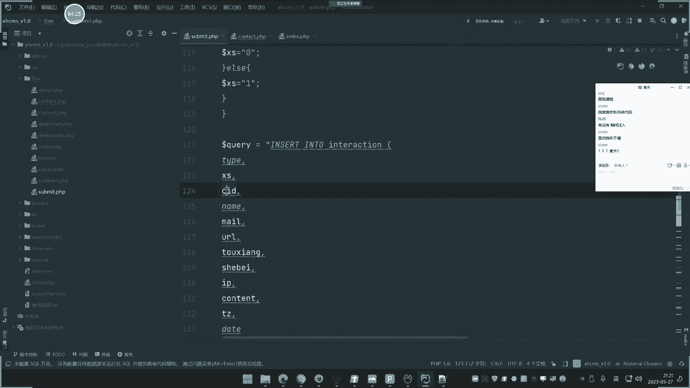

销售啊，什么CD类，那其实就是这个留言者信息，我们就可以怎么样进行注入，那这里是盲蛛，盲蛛该怎么玩呢，啊有个报错，那你说该怎么玩呢，好简单哦，对不对，看下，然后把这个拿出来写到这来。

待会问你不是之前用这个吗，咋就这个前面这个什么鬼，这是写了这多了个什么东西啊。

多了个单引号，为什么多个单引号，你看这里没他数据写进去的时候，变量是全部用代号括起来啦，你的数据可能就是其中的某一个这个变量嘛，比如说我昵称这里可能就是其中的这个内，这有变量啊。

我需要把这前后变量给他给消灭掉啊，对不对，把闭合掉啊，不然我都写到这个单引号里面去了，那不就成了这个什么这个字不穿的吗。

上节课还有人问这个问题啊，那肯定要闭合掉啊，前面把单号闭合掉，后面再用and的，一定把后面单也闭合掉，这个就是圆形那个报错语句嘛，没什么区别吧，写到这个里程这里啊，你可以说我写在其他地方行不行呢。

也可以啊，写到邮箱这里啊，网址都行啊，就是看他自己验不验证，这个邮箱和网址的那个写法了，你正在写着呢，邮箱那就随便写个啊，嗯呃王子3WM小于标点com啊，啊这里呢就随便写啊，然后呢9A3T。

提交看看有什么反应啊，查询的是个什么这个版本提交哎，验证码错误啊，什么鬼啊，四九进四，看到没，直接报错，5。7。26，不是租的吗，对不对，那你不信的话再试一下，那把FASION改成个database啊。

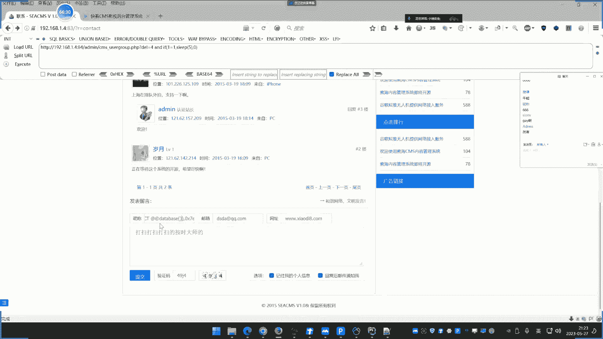

哎我这里呢是吧，我还可以给下个端对吧。

给分析一下，但这这这现在没有必要啊，那点击下，哦这里可能是数据新增错误啊。

他新增一条数据进去了，因为这个数据呢重复了。

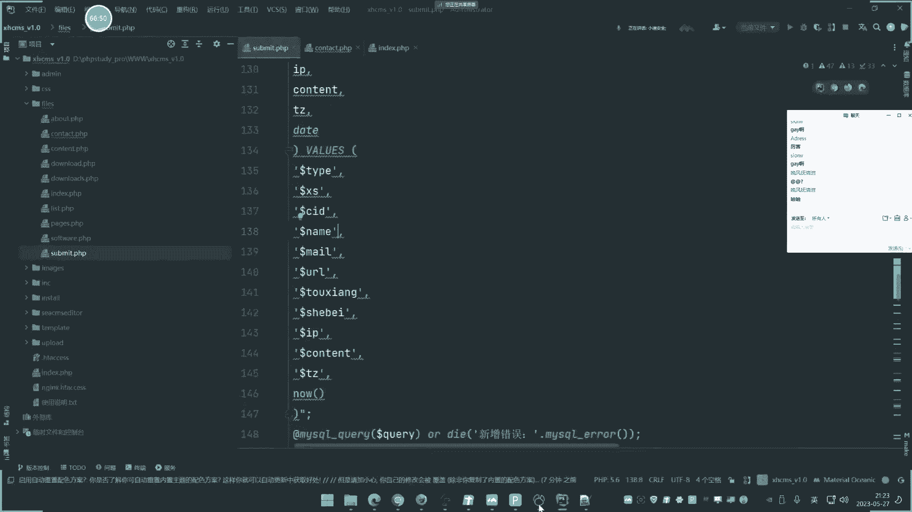

你看这个数据是不是刚才那个哎没有重复啊，那换一个数据，到这写错了，我说怎么回事，就多了两个东西，你妹的来看没循环，上面是叉，是不是啊，典型的那个爆出出路，那有人会问了，那能不能用盲租啊。

那你说能不能用盲租嘞。

然后这个就是那个熊海森S的一个那个操作，对不对，这不就找到了，那至于这个漏洞为什么找到会怎么分析出来的，这不是我们现在担心的问题，我们就担心告诉大家了，找到这个地方了。

那大家看一下这是不是和我们关系对应上了呀。

来首先看功能点呃，发表留言，这里我们填写这个注入语句写进去了，然后呢提交这个注入，把注入搞定了，发表留言属于什么留言，是新增的还是修改的，还是实时查询的是什么，发表新增语句对应的是insight。

你面对的是insight注入好，你可能会问，那我黑盒这种我怎么测呀，黑盒中午你能测的话，我问你个，就像我和你面试一样，我想问你来，这是个发表留言的地方呃，你注入你采用什么方式注入好。

你回答盲注盲族采用这个报错岩石和布网，你选用哪种啊，我问一下对不对，你回答怎么样，你可能说哎呀，迪老师讲过哎呀，这个回答这个延迟和啊回答这个什么东西啊，回答不上了，正确的答案，你就这样回答。

报错和延迟都可以用，但是这个报错呢有可能会失败，原因就是因为呢它需要有报错的这个代码端，由于这里呢我是黑盒测试，我无法预知它有没有报错的这个容错处理，所以我只能尝试，但是延迟呢大部分都可以。

但是可不可以，那还要看一个条件，就是我们说的什么符号问题。

假如说他这里呢不是单引号的，是一个括号加上去的是吧，又麻烦的呀，能不能闭合呀是吧。

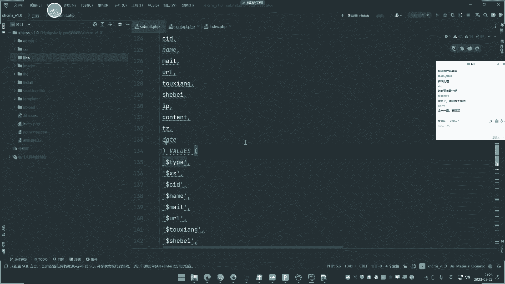

你都要测呀，这是取决这里了，你这个答案你给别人，别人就知道你学得通，你什么都知道优秀，对不对，不愧是小迪教出来的基础，Number one，啊你要回答哎呀我用布啊，那就完了对吧。

那你没那个查入这个地方呢，本身就不会对数据处理回答个不啊，哎，你就说是隔壁家的，对不对，他就把隔壁骂一顿，就不会找我的麻烦了，好这个是我们的熊还是MS的一个情况啊。

那么接下来我们再来看这个这个delete的啊。

我们再看这个这个这个这个网站的啊，好看这个网站打开这个网站源码。

这个叫做KKCMS。

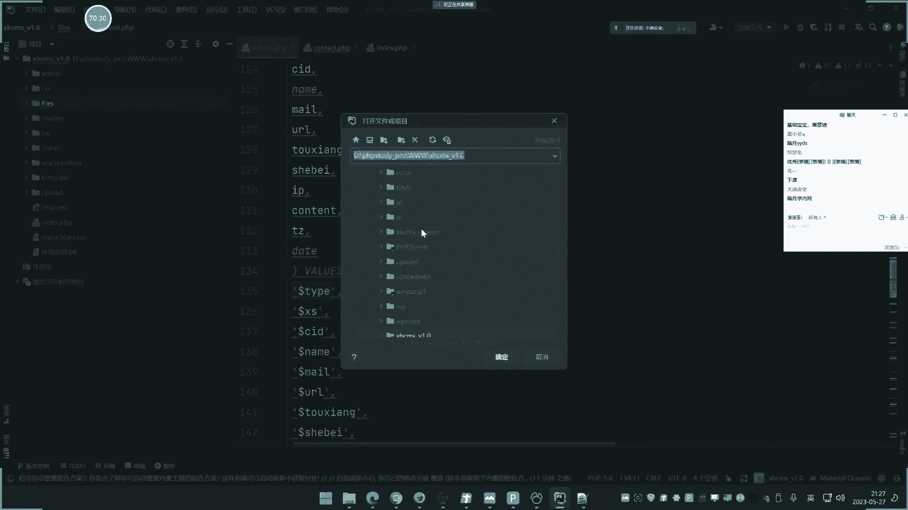

好那这里呢找的是delete注入，哎这里呢刚好有个delete好，我们看一下啊，那接收这个delete啊变量，然后执行个SQL语句，执行完之后呢，提示一个删除成功和删除失败的一个情况。

好大家看一下这个代码我先不说啊，你觉得现在有哪个三组忙组里面，延迟报错和这个不用哪个三个能用，还是用一个还是能用两个回答一下，你觉得你能用哪嗯，哪哪哪几个是一个还是两个，三个都能用，还是怎么听啊。

你就我家这个代码给到你了，你就说现在啊能用哪个都写出来，对不对，你用哪个啦，布尔延时这个报错，你们这三个能用能用哪些，看到没，你们自己说，在你们自己说啊，来，这就是你这个课你讲的再好总结，说了半天。

依旧还是有人回答错误是吧，哎，说都不可以说什么联合查询，说延迟和不啊，延迟延迟不啊，还有人在说不啊，你回答这个报错我都好想一点呀，你回答个不啊，我真是没想到啊，真是，不要说故意欺我。

如果每节课我问到问题都能99%的堆，就不可能那么多人说挖不到漏洞了呀，我找不到工作了呀，你永远记住是吧，这个失败者只会抱怨成功的，只会埋头嫌弃你少，不要老说我玩不到漏洞，我这个什么鬼，找不到工作。

你学你的技术，你不要想那些其他的，你好好踏踏实实搞几个月，你再说这话，不是鸡汤好喝，这是个真实的，你们不要老认为这是鸡汤鸡汤，有些鸡汤是要喝，喝了好喝的香，这个呢没有报错，也没有这个这个什么数据显示。

他把这个语执行了，下面就啥都没有了，这个什么弹出，这是个提示，这个数据你看他执行之后连个变量都没给他敷，我们前面还好歹假装一下样子执行这个鱼，还复制个变量，接收一下这个执行的结果。

他这个连个变量都没有付，只判断他这个自媒自行是不是真条件，然后就提示这个东西完了数据首先没有回血，不尔就首先排除，然后这里有没有包出出，你那没有这哪一个错误处理呢，你可能说这衣服else这不是吗。

这不是的，我说那个容错处理是针对这个SQL语句的执行的，结果助理，但结果的这个呃这是否有错误，就是我们说的那个什么MYSQL，那个执行错误那些东西，所以这里呢用的是延迟啊，我们等下可以试一下。

用那个那个那个唉包错看行不行啊，行先知说，首先布尔是排除的那些回答布尔的啊，我是真拿你没办法，你回答个这个报错，我还好想一点，好那这个代码呢是叫，哎大佬叫什么鬼啊，我用这个吧，这个也行啊。

这两个单位一样的，那这两个咱们一样的啊，额这两个都可以测啊，都是一个删除，这都可以测的，这边有一个啊，这个叫user grap，然后这个叫AD，一点pp都可以测啊，这两个都可以吃嗯。

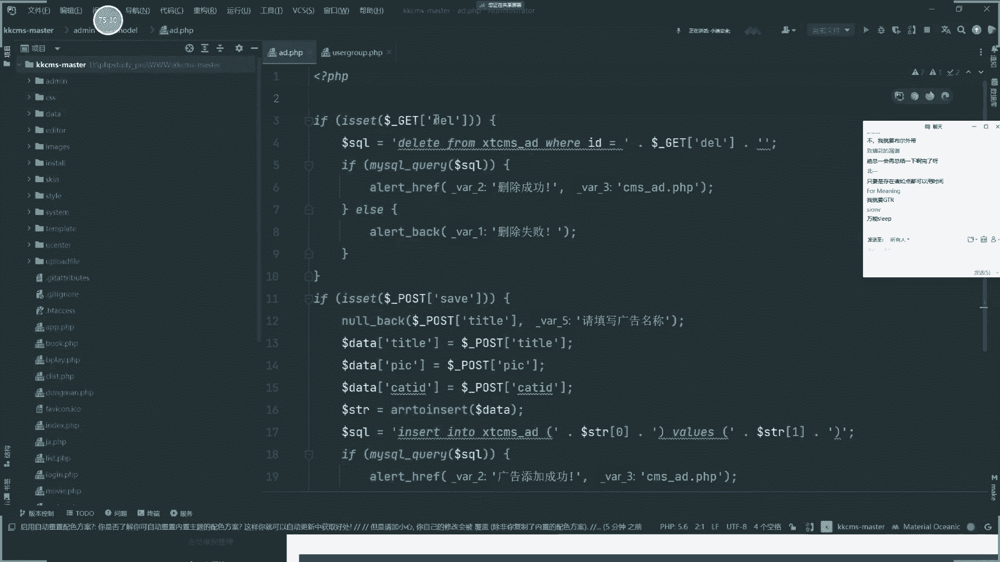

然后接受这个DR嘛，然后路径地址，我看它路径啊，复制管路径路径是在ADD me下面的model。

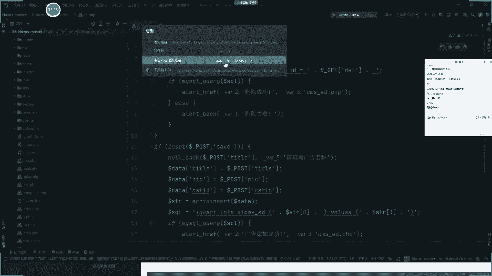

点AD的pp访问一下，a AD model点AD点PT则按路径啊执行访问。

那没反应，但啥都没有。

然后呢还个这个是路径地是啥呀。

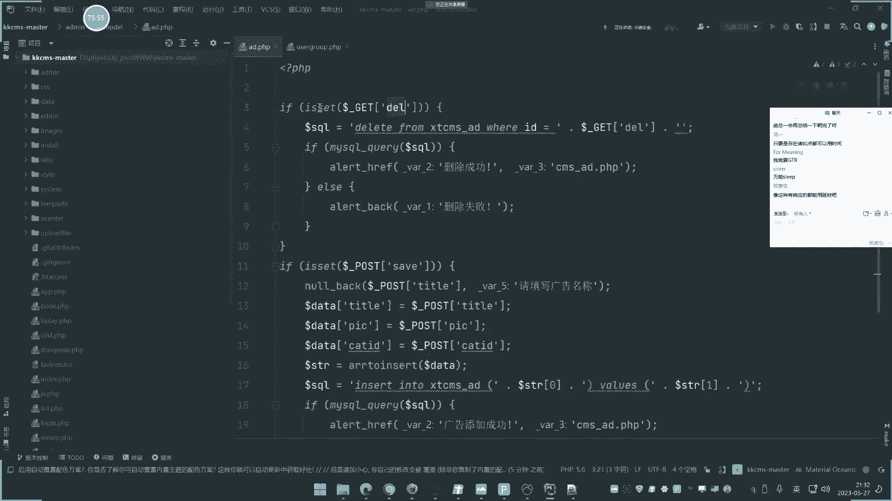

X这个路径。

放我的空白，嘿嘿是啥情况。

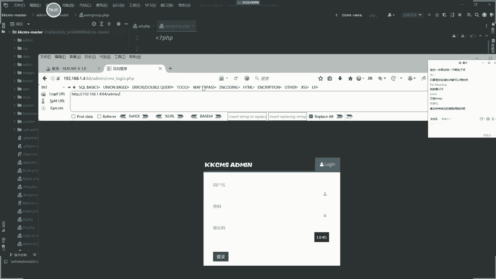

是这样的啊，他需要登录，这是个后台的驻点，你可能说哎呀，你妹的后台驻点有个难用啊，这个账号密码默认是123456啊。

密码是12356，默认的，嗯你说后台有什么用啊。

我们挖的是漏洞，不在乎它在哪里，这个漏洞你挖到了不影响他有漏洞。

只是说它的漏洞呢比较鸡肋，是个后台的漏洞，好这里呢找这里啊，访问刚才这个model，然后，他是C哎，刚刚是G哎，a AD点PB对吧，这个这个刚才那个东西装完空白，然后呢还有个优质呃，就这个路径嘛。

反正都是空白，啥情况也看到他们这个网站代码。

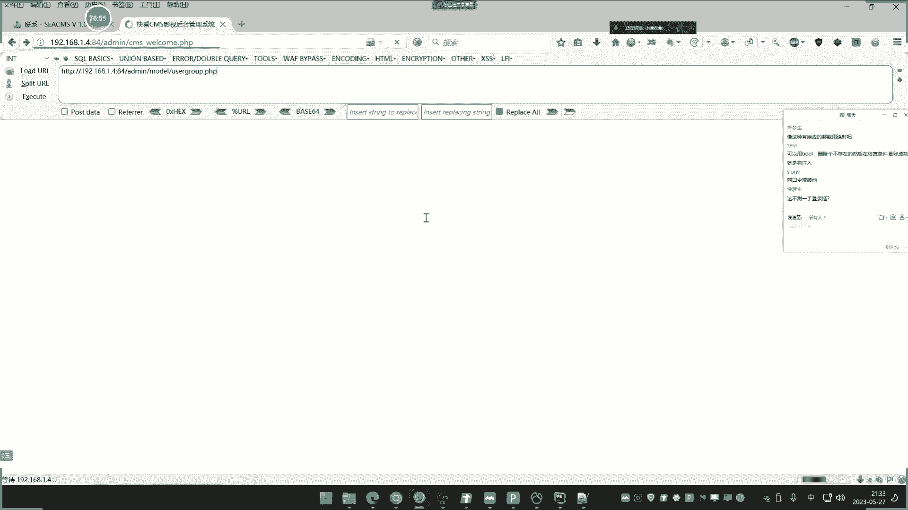

那全部是PB代码，它没有任何前端代码，全部是接收数据，你说咋访问有东西呢，因为它本身就是个PB代码，就结束数据处理完了，他哪一个显示什么数据呢，所以它前端有个页面，你可能说哎这你们不懂了。

不懂就学安全开发，安全开发里面不是讲过吗，有什么前端页面，一个后端页面分别处理模板，就和这个东西相关的M非C的模型一样，model failu和council讲过TP框架和那个东西。

包括在java里面也提到过什么什么spring put，那些和这个概念全部相关，就有前端页面，如果你不知道，那我们可以搜一下看一下啊，嘶啊这个不，这是那个代码的分析逻辑和代码开发啊，我这里呢播一下吧。

讲的太多了，说实话啊不利于现在的一个学习，不需要了解现在这么多，后面呢一样的，那这里有个包含的包含这个user model，那就是一个什么cm s user group。

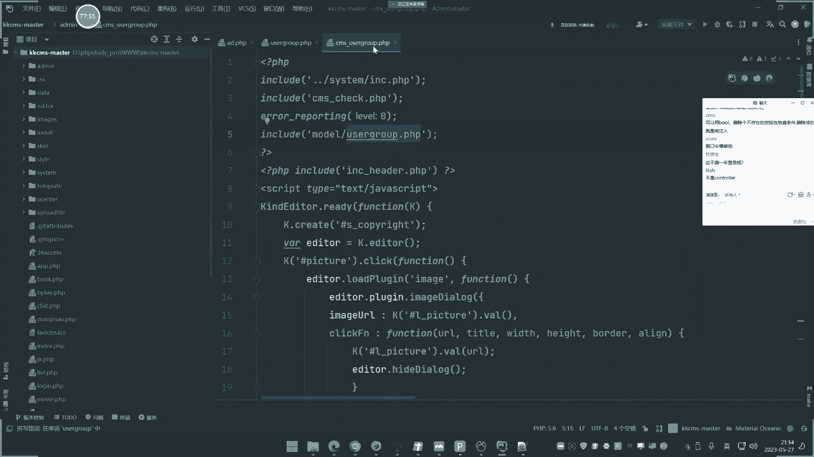

点PP，你看下面就有这个ATM代码，那这里就可能是前端页面。

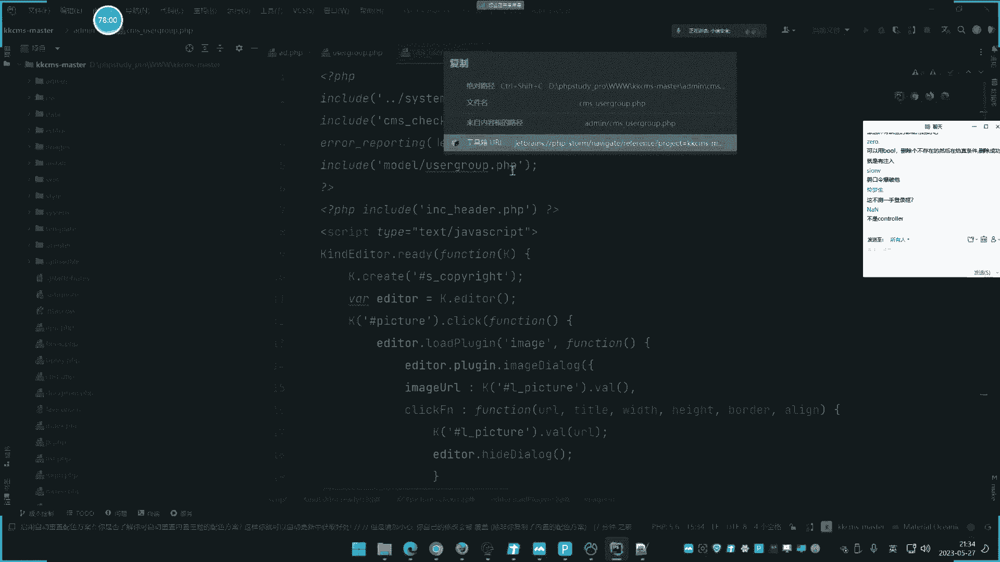

那复制一下路径引用好啊，访问一下这个路径，是不是啊，诶这里有了。

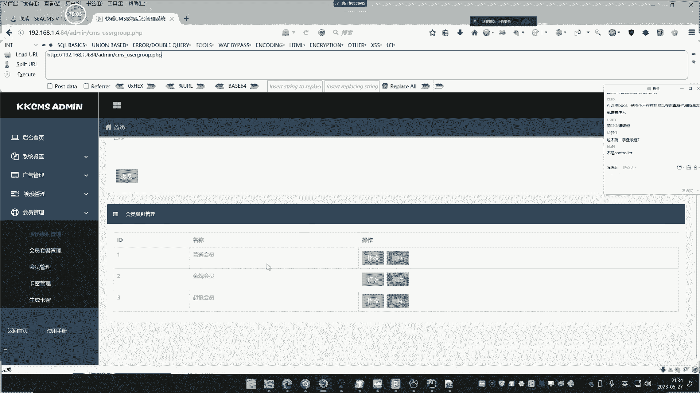

他说在删除有三种操作，那应该就是这里的这个删除user go up，user up就是用户的等级，那这个应该就是这个删除，应该就是那个触发地方，那当然我可以在这里呢来执行也是OK的啊，那我可以看一下啊。

D e l，然后呢去这个执行好。

那我们试一下啊，来访问一下DEL，然后呢他操作的是在哪个表里面，X t group，我们找一下它对应的这个表，party grp就这里嘛好啊，三个啊，93个嘛是吧，普通会员基本会员，超级会员就三个。

就是只能看到三个，你在上面操作呢，你看路径呢我复制一下给你看一下，先选择这个删除按钮的时候，路径呢是不是就D2等于一啊。

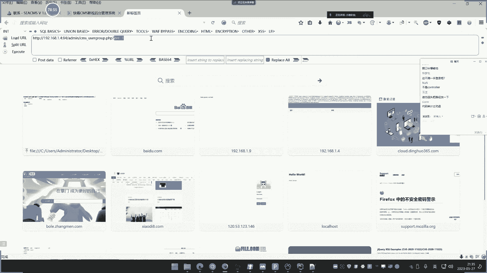

是不是就删除那个一的，对不对，给他传一，然后呢这个代码呢就真的接收到一了嘛。

这一呢就在g u id能移的就把删除掉。

那它g u id嘛呢u g id哦，对好吧，这里呢我车子我就怎么操作它的呢。

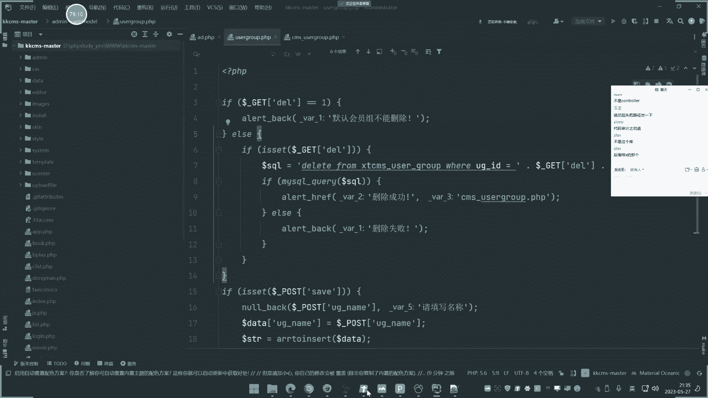

我就不测试它本来数据了啊，我就不删了，因为它本来数据库我就不删了啊。

我就写个私，因为私这里不存在嘛，删除一个不存在的。

然后呢再用这个o or语句呢来进行记录，怎么注入呢，删除没有报错，延迟一下嘛，and的哦，sleep if判断一下，首先呢一等于一看他是不是能够延迟，是不是有诸如sleep，条件是吧，显示延迟一秒。

然后呢如果说不延迟，就是选这里呢，好这里呢最好是用这个bb suit来来分析，这样子更加规矩一些，因为你用人工判断的话，没有工具呢，那么智能啊，因为这个延迟呢考核到这个时间。

有些页面呢它是不会显示时间的，只能靠你自己人工的去判断嘶，所以这里大家可以用这个工具来分析，那个危险事件啊，给大家演示一下啊，啊如果用脚本呢自己写脚本，那更好了啊，好我们来看一下啊，好这是那个语句。

首先呢我把这个语句呢给他删掉，那保存它正常的一个运行状态，先等于四，看它的返回状态，在那可以看到啊，是斯密特斯，他这是转换的啊，思密达，然后呢，你看啊，我把刚才这个东西写上去，延迟一秒的时候，我勾啊。

卡啦卡啦卡啦卡啦卡啦卡啦，咚30434，延迟了呗，而我可以延迟时间更长一些，看对不对，来改成R卡了，卡了卡了太卡了，对不对，卡了，比如说两秒这么长，你看变成6024，刚才是3024，现在变成6024。

再换成个三，是不是成倍增加，变成9024呢，卡了卡了卡了卡了，就哎95020差不多，你可能会哎呀，这怎么回事，明明三秒，这好像好像是五秒六秒，七秒八秒的样子，啥情况啊。

是这样的啊，他这个呢会和这个数据的这个条数有关系。

啥意思啊，就是说你现在呢这里有三条，如果说你写个延迟三的话。

它如果不存在这个数据的话，它可能会乘三，就说你写了一可能就是三秒。

写了三就可能是九秒，能理解吗，你可以下去执行一下啊，但是这个不重要，因为重要的是说不是说你写三台延迟三秒才对，它只要延迟了就对了，就和正常的之前没有延迟有差异，就行了，你不用管管它延迟多少秒。

延迟多少秒，是取决于它那个呃，前面条件和那个他的那个数据库里面的，那个多少数据，你可能问那要是有100条数据，那怎么办呢，那你没100×30年是300个，我等6分钟吗，还不是那样子啊，他有些会存。

有些不会成啊，这个具体好像是那个数据库里面，某些东西决定的啊，我也不是很清楚，好像是和他前面这个丝如果不存在，就那个啊就会这样搞，你只存在他就不会那样，不不会那样搞好，那既然延迟了，那我现在在注入。

你看啊，那怎么注入呢，想要什么，这些什么呐，select啊啊，这历史先谈谈长度，miss这个database，等于起好下课就判断它的数据库长度等于七啊，勾哎不延迟，那秒出不等于七，那等于几呀。

九是不是啊，勾也不等于那十啊，延不延迟，那什么鬼啊，那究竟多少位啊，我先看一下多少位，这十字在数据库面，那数据库号号是可以塞满什么，我刚才取的，不知道是K上面是X还是什么鬼。

你看啊你们那有些人就他妈的完完全跟不上，我在说数据公平，他搞个user group，还有人说什么x t CMS user，哎呀哇这是真没办法啊，一个在说天名，一个在说表明我说的是数据过敏呐。

这查的是德特贝斯啊，你说这咋搞啊，这，这不尴尬呀，那是这个啊，KK3MS是X啊，这个K3MS是我之前装的那个啊，后面给他重新也是装，是这个是这个啊，因为这个和那个装的一模一样，那就这个啊这个是多少。

万12345646位，对不对，六位啊来看一下啊，我们把这个，20new，哎卡了卡了他卡了，兄弟们太卡了，又饿了呗，好来我继续这个六位知道了，那是不是就是获取他的这个什么对。

比如说他的这个第一位等值等于多少啊，第二位等于多少啊，是不是来看一下啊，那我来第一位看一下啊，就用这个之前我们讲的这种呢这个看过的呗呢，诶跑哪去了，就这里了是吧，第一位啊，第二位啊是吧，一个猜呀。

那第一位等于这个他的第一位是等于多少啊，啊注意一下啊，这个上面那要空格呀，这个空格要加上20%的啊，不要搞错了，要加20%，这空格加20%啊，如果你只空格这个有问题的啊。

因为他这个是在数据包的这个头部啊，你在浏览器里面可以可以这样空格，但在这里不行，因为这空格之后呢，他可能是认为你是下一个参数了，注意一下啊，呃这个是白毛204，刚才在哪里哎，跑哪去了。

if版本0limit，哦对这就这里啊啊不用写了，写着写出去了，然后他的第一位是等于多少啊，第一位是等于差K是吧，等于K的，我们先看K啊，勾哎报错了啥情况，这不是能K吗，那第一位是4K啊，啥情况。

不是我翻车了，我告诉大家，这里又有一个东西了，就一个内置的过滤，有人还说大K嘿嘿有内置过滤，有人说是这个阿斯卡码，唉你不知道原因呢，你说阿斯卡码是解决方案，但原因要知道啊，原因是什么。

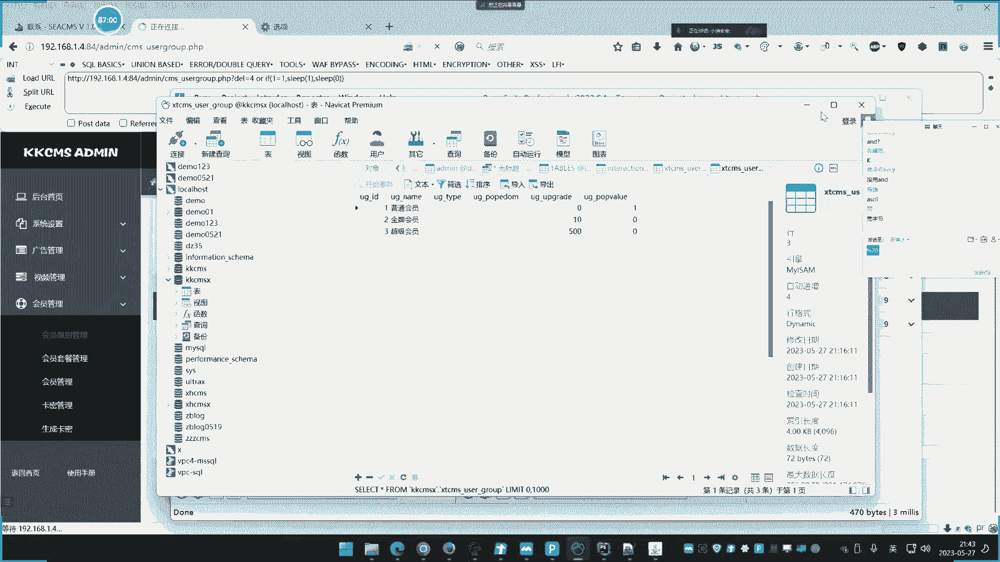

原来是这样的啊，他这个里面呢有个自带过滤，有个傻子在过滤呢，嗯有个对单引号进行一个魔术引号的过滤。

就是用单引号就不行，知道吧，用代号就不行。

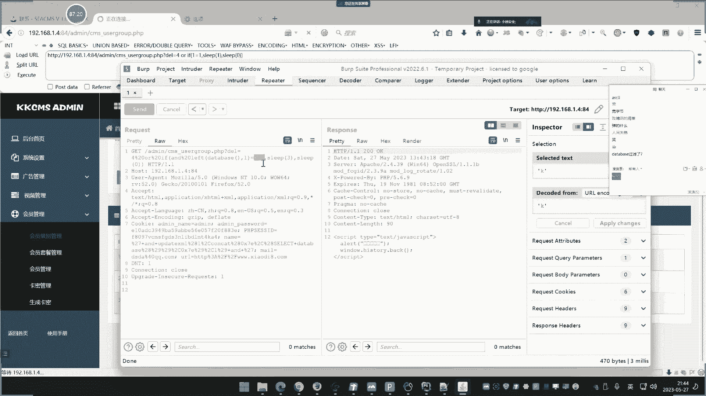

呃你不信的话，我把这个代码给你输出一下啊，大家看着啊，我把这个代码呢给他输出一下，差不执行这个代码啊，把它输出一下啊。

大家看的清楚一点，那我执行一次再看一下来，只要执行的语句看到没，K这里它自动加上加上这个转移符，这是一个PPT里面一个开关的魔术引号过滤，这个我没讲啊，啊后面我们再补充时候会给大家讲了，这个怎么绕过呢。

就不用这个这个这个这个这个什么鬼啊，不用这个东西就完了呗，不用单引号啊，不用单引号就用什么码呀，不讲了嘛呢啊对应的关系啊，那用阿斯克码呀，阿斯玛这个B友们的，那直接在这里呢写这个东西呢。

ORD加上前面去就行了呀，下前面去啊，O r d，对吧，然后再括起来，我就怕你妹的突然子又呃注意一下啊，加上去，然后这里呢就给阿斯克码，阿斯克码呢就是K的那个对应值转换一下。

o id就是取它的那个阿斯克码值啊，取阿斯卡码，然后K的对应值转换为十进制为107，那么这里后面就写107了。

就不需要单引号了，不用单引号那个东西就不会出来。

107看下有没有延迟勾，哎什么情况哎，完了呀，这他妈的哪里写错了呀，勾好严呐，赢呐赢呐赢呐，太严了啊，看语句就不会有那个斜杠反斜杠的干扰了，你看执行语句这里那就没有反斜杠的干扰了啊，你看是吧。

来107对应上了，你可能说那里面的碰运气好了，我改成109108了，你看看延不延迟啊，来勾不延迟啊，108呢随便你乱改了，都没得用户啊，哎，那就一次嘛，第二位是吧，第三位拆起来了呗。

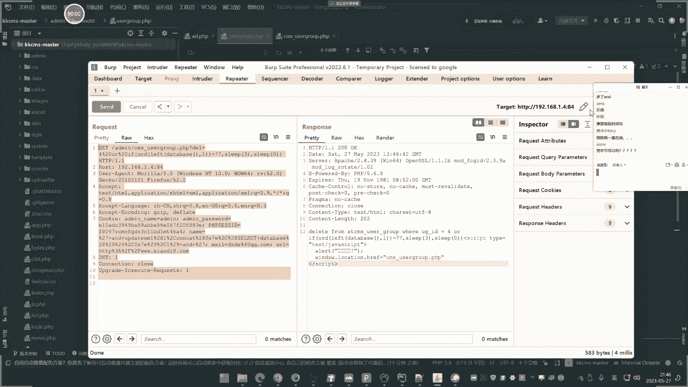

后面就不说了呗是吧，这个注入就这么情况啊，嗯那么还是一样道理。

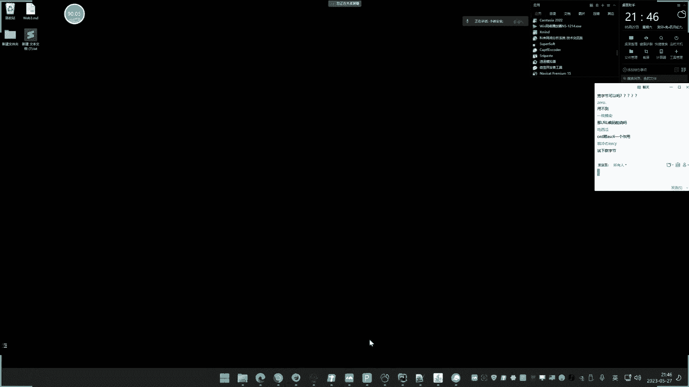

呃刚才不是还有人说网哎这个包错吗，那我试一下包戳之后呢，再试一下，来来把包出租呢写到这来看下能不能行啊，来放到上面去。

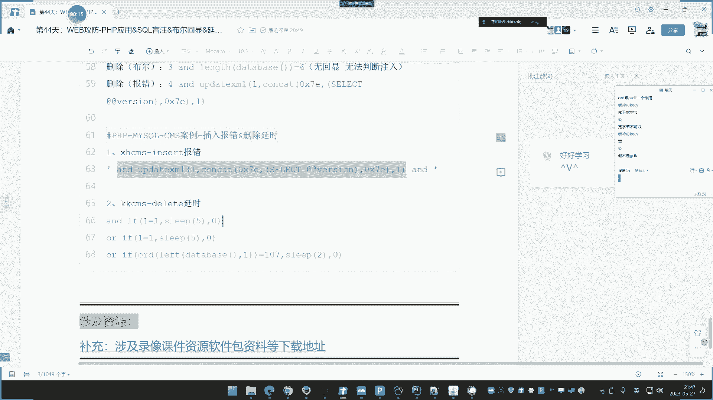

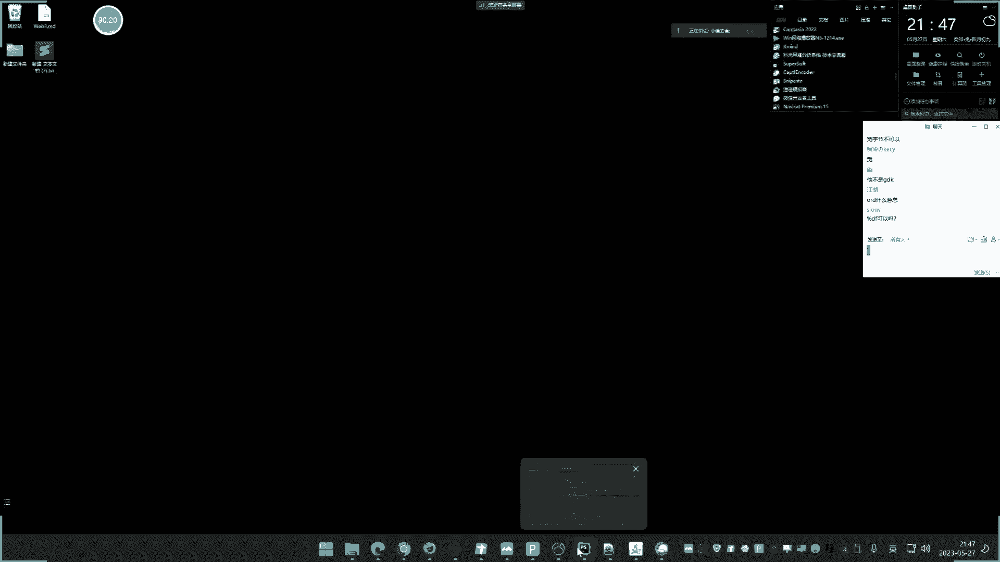

空哥百分二零啊啊这里有一个空格，百分二零，怎么老是写错了，把这个鸟毛事情你妹的，不行不行，什么原因啊，是不按等于原因啊，然后把它改成OR他妈的，完了换换码了，换码了，换码了也不行咯，换码了也没猪肉。

法师娃娃也不行咯，那就不用看了呗，报错没有啊。

嗯好这个今天内容呢就是这么多了啊。

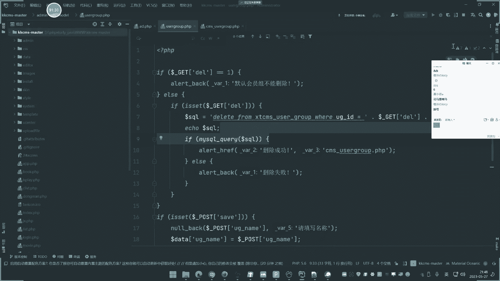

讲完了啊，下节课呢我们就来更加稍微更加复杂的一些。

这个注入的一些什么二次猪猪啊。

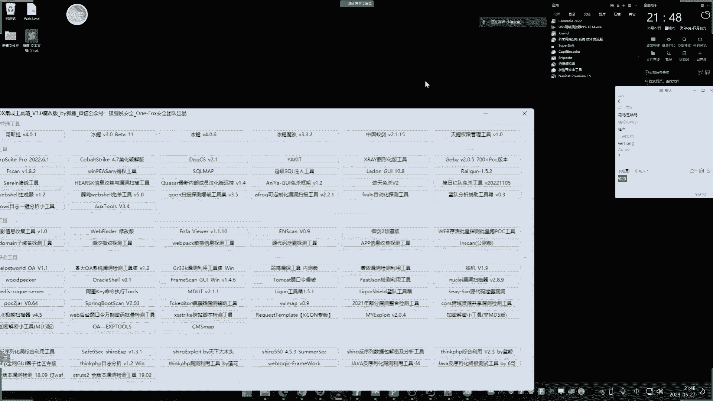

非解猪猪啊，还有一些简单的一些对峙的一些过滤啊。

包括他的一些其他的一些什么不一样的啊，就把它讲完就算了啊，那么最后MYSQL的猪就再讲一节课啊。

嗯比上期呢要少讲节课。

原就是因为这个侏儒呢唉怎么说呢，后面也会讲啊，也不说少了吧，总的来说就是把更多的时间呢，放到了其他知识点上面去了，大体来说是差不多，好今天就讲这么多了啊。

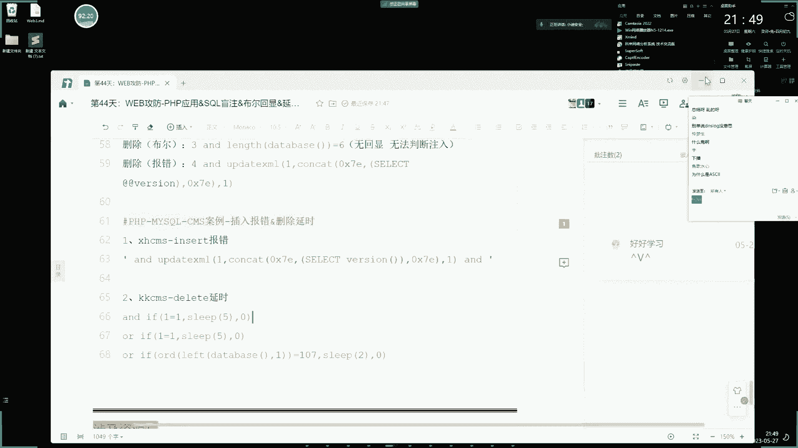

大家有什么问题呢，就问啊，为什么是阿斯克这个支持那个语法吗，就和你那个16进制一样的道理嘛。

ORD就是那个转换的数据库里面，那个转换的写法，他把转换成16进20阿斯克码，所以后面那就是阿斯玛的对应值。

那个word就是转换字啊，转换的你可以看一下这个间接嘛。

那个函数是是个女自带的啊，因为你用那个做数字的话，就不用单引号了，如果你用这个用单引号的话，就会受到那个过滤，导致语句报错，所以用到阿斯特码，具体解释呢可以看一下这里嘛。

ORD就是呢去专门来解释阿斯码的一个函数，这个语音，什么时候讲盲族的顶20log利用我告诉你啊，那个什么盲族顶二是log，没有没有的啊，你不要想多了，迪亚斯logo里面和诸如结合相关的。

MYSQL里面只有个是那个读入查询，就是那个nod five那个东西有有用，其他的联合联联合不上去，就拿一个，所以讲跟没讲没什么意义，网上玩的话，什么赛克猪肉玩出什么顶，那是诺克了，那就是大忽悠。

就是让你看上去更高端，其实实战中你碰都碰不到，我伤心，我伤了的，发现是什么用都没有讲了，跟没讲一样，后面大部分都把他忘记了，当时听的时候牛逼啊，后面的发现碰都碰不到，你要想象一下。

你有些知识点呢你要思考一下的，你不要说网上说什么东西，你就说什么东西，那个DNS x log，那他能解释到数据，就是相当于有对方的去请求过那个DNS s log，地址了，你首先思考一下这个SL组中。

如何能做到让通过SQL语句去请求一个网站，其中呢只有那个MYSQL中只有那个什么note file，就是读取，然后呢加上那个远程地址，让他远程去读取，就像是远程访问，然后把他数据把它DIY数据了。

其他的像这种猪肉哪能带歪呀，带个毛啊，他都是对自己数据库里面的东西，他咋个能放外面的网站呢，访问都访不了，咋个断Y呀，用不到哇，本身买这个猪肉就少，再加上又是root性注入才能进NO的发。

如果说呢他还开展了个什么鬼限制开关，你多的FI都用不了，三个条件，一层你还在实战中能碰到吗，碰个鬼呀，学跟没学一样的，不要搞那些花里胡哨的东西，没价值，就这个东西还是上节课讲的呀。

首先他要支持node file，note file呢又要root权限，还要有这个note file，那个没有设置，就是我说那个SERV，那个PRV那个开关没有关，高档门的一半把他开了。

那还要是哪四个主点高权限注入点，nod f能够使用才能用这个df logo logo那个组，好今天就说这么多了啊，然后呢今天还有个东西给大家提一下啊，就是我们今天讲的是代码，有人可能有疑问了。

那我在实战中怎么去搞啊，所以你也知道，我们今天呢从代码方面来给大家讲的，白和我就不说了，就说代码给到你了，你代码的分析能足够是吧，那么实战中呢对不对，实际上做这个盲足就产生在什么方向呢，其实就是我说的。

你根据这个四个方向去决定啊，就是你在租的时候常规注入注入不了，你就会使用这种盲租，但是说实话说回来了，实战中你用手工注入机会也不多，手工注入是建立在你用工具租不了的情况下面，然后呢你再通过工具的分析呢。

再去佐证的是这么个流程，不是说啊你上麦你就手工，谁都想图图简单，你手猪是鱼，你哪记得猪呢，这么多都是用工具，工具用不了了之后呢，再通过工具的判断是哪方面组织的，还是哪方面原因，在和这个手工进行对比。

去寻找原因，去修复工具，变换工具的一些语句，来实现这个再去租这么个年份，而有人呢在实现之后，他还是住不了，那就是真住不了了，是这么个情况，讲这科呢第一个是让你在白百合中去分析漏洞。

然后浮现漏洞用的在黑盒中呢，就是佐助你工具遇到这种不能做的时候，分析原因，解决问题用的，不是要你在实战中咔咔就把笔记对准一个暂停，一个复制，不是的，实战中哪有这么麻烦的，用工具就完事了。

升龙马普高就可以了啊，搞清楚流程啊。

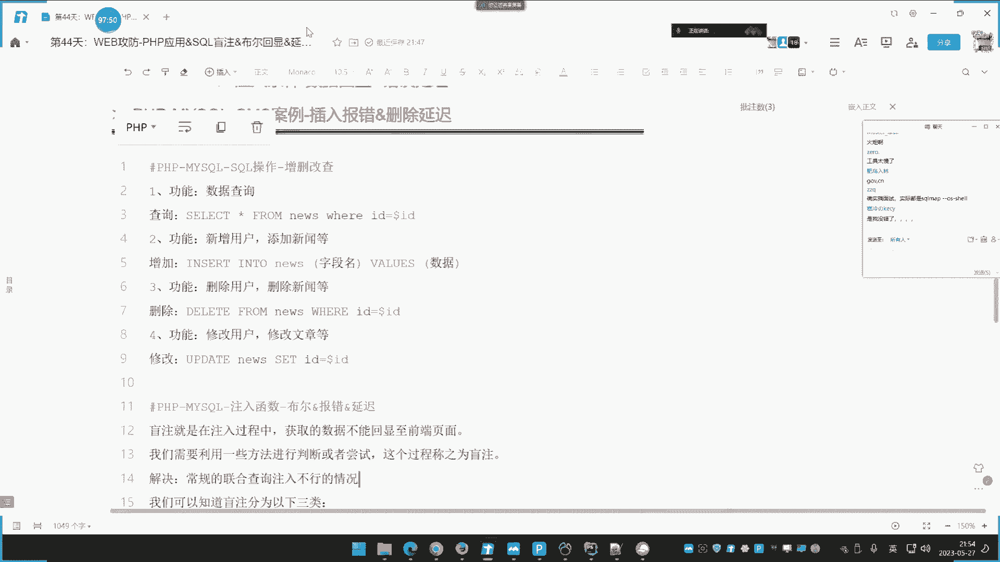

还有刚才大家说什么什么在实战中找社科书。

唉你这个问的，我这这这咋回答呀。

那实战中怎么找漏洞，你说怎么找漏洞呢，那怎么好讲呢。

是吧个漏洞那么多漏洞，你说咋找漏洞啊，怎么找出路啊，用手找啊，用工具扫啊，自己分析呀，有源码从源码中找。

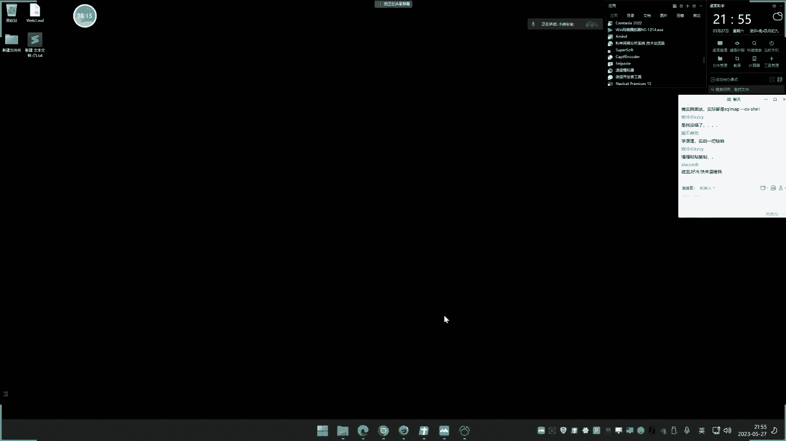

没源码，从黑盒中工具扫扫不了，自己通过功能自己排，有些有些源码里面是吧，工具能扫到，有些工具扫不到，就就自己手工车，手工怎么车呢，你像就像这种的这种猪猪，你觉得工具人少的好吗，来捡钢材。

在假设我不知道源码，我在这里呢，它这里有个驻点，你工具能扫到这里来吗，工具难不成把这里把它进行抓包，然后自己写个主语，提交之后还看反应工具有这么智能吗，大部分工具没有这么智能吧，他了不起。

嫂子这里知道这有一个东西，他还真在这里去写数据，还帮你识别监理证码，有詹姆斯吗，没有啊，那这个侏儒怎么找的呀，自己手工找的，你可能说我手工，我怎么知道找着你呀，一起看一下吧，发表留言。

inside inside用哪些主语句啊，对不对，思考一下呀，你们不会傻傻的还跑上去，用什么u n i n snack的吧，那不是白学了吗，这些点都是你自己要考虑的，我不讲，你也通过这个课之后呢。

自己私下里去思考，并且现在呢我没有讲到这个SC组织怎么找，先把漏洞学完之后再考虑漏洞怎么找，如果说你学完之后，你还不知道怎么找，那就是你学的没学的有问题，压根就没有学明白，不知道这个情况。

好今天就说这么多了啊，看来还没有什么问题啊，漏勺工具会不会讲，你们这不是温的一些哎，你说高端的内容我不讲，我还好想点。

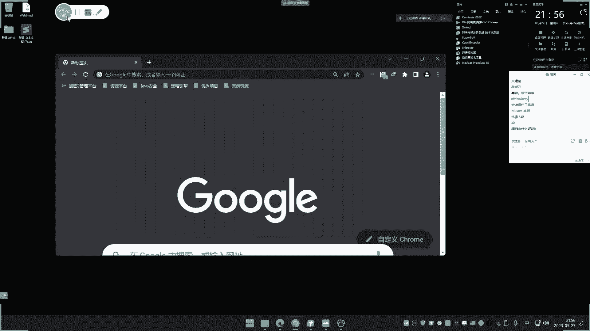