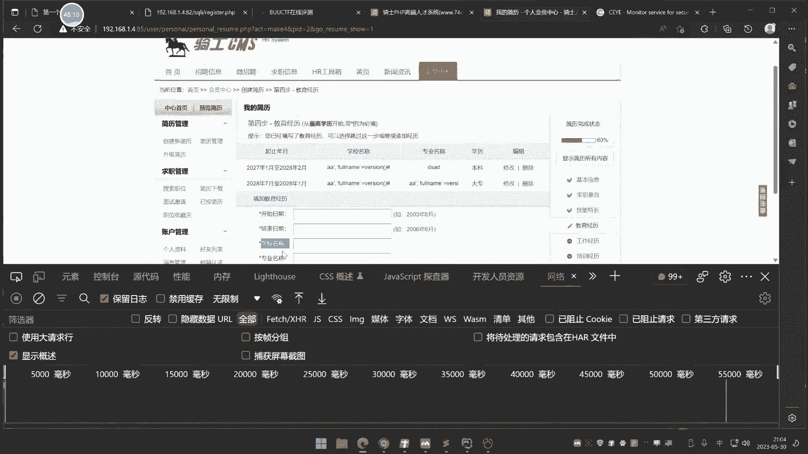
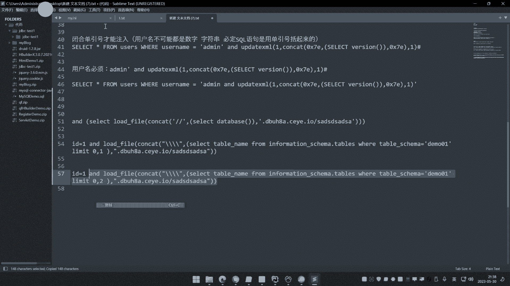

# 【小迪安全】V2024版 全栈网络安全 ｜ 攻防渗透工程师 （持续更新） - P45：第45天：PHP应用&SQL二次注入&堆叠执行&DNS带外&功能点&黑白盒条件 - 逆风微笑的代码狗 - BV1Mx4y1q7Ny

好我们看下今天的内容啊，今天呢是这个circle注入在pp的这个最后一讲，讲完它之后呢，我们下节课呢要上新的内容了啊，你可能说这个SQL注入后面还会不会讲啊，这个后面呢还会讲SQL注入。

但是是基于其他脚本的，比如说像这个java的是吧，还或或者这个点net的是吧，包括什么sex server呀，oracle啊，还有什么post circle啊，MONDB啊是吧，会有那么一点啊啊。

数据库用的比较多的，就课程多一些，这个中呢后面还会讲，只说那是会针对其他数据库的一些讲解了，这个MYSQL呢就没了啊，pp里面居多的嘛，嘶咳当然在这个像java中呢，他也有这个MYSQL的数据库。

那这个呢就没必要讲了，因为我们针对的是数据库类型，只是说这个语言呢和他搭建啊，如果说用java的话，那数据库的攻击呢还是这些方法啊，只是说代码不一样而已了啊，这个中呢后面还有啊。

只是说在PPT里面这个章节呢就不再讲了，今天讲完就讲PPP的这个其他漏洞了啊，那今天呢讲哪些漏洞呢，讲三个漏洞也是，上节课呢有人提到过什么个DNS slog的一个这个，这个漏洞啊。

还有呢像这个今天所有的20注和对立柱，在上课之前呢，还有人说了一句话，说这三个漏洞呢是不是在实战中很少去看到啊，这种情况啊，实话实说呢，的确是的，他比较冷门一些，但是啊呃冷门呢他有个好处。

就是热门漏洞呢大家都注意，可能你在挖漏洞的时候，那反而还不好挖一些冷门漏洞，那反而好挖一些，所以说呢各有各的优势吧，你想啊，这个呢我们今天讲的第一个就是这个二次中，你像我们前面上过的啊。

就是根据这个租的什么这个请求的方法呀，请求类型啊和请求的格式啊是吧，然后根据这个请注入里面的权限呀，啊各种各样的展开了是吧，有基于这个权限下面的不同的思路，有基于这个猪的格式数据，他的请求方法。

包括呢在祖宗呢什么这个不能在在租的时候呢，不能回血，还有这个报错等等的一些这种方式哈，那今天呢就说这个猪里面的一些另类的，一些东西，就这三个，先说二次输入，这二次入呢很多人很难理解它。

其实呢一点都不难理解啊，你只要搞清楚几个着重点就可以了，他是一个什么情况啊，在前面我还举个例子，说一个文件上传导致一个注入是吧，还有人问说是什么原因，其实呢他就是个二次注入的一个原因。

就是个二次注入原理，你把这个原理搞清楚，你再回想一下文件上传的导数，是不是就很好理解了，好简单来说呢，二次注入呢它有个特点，它的一个特点第一点就是什么呢，就是有第一点就是要进行一个添加插入操作。

就是excite语句，干嘛呢，就是通过这个添加插入语句呢，把一个东西呀放到数据库里面去，然后呢，这个数据库呢再把这个数据给他，取出来的时候呢，形成了一个注入，这种流程，我们称之为叫二次注入诶。

那大家就说还是不理解什么意思啊，来我举一个很简单的例子来来看一下啊。

一箱，这个先啊就说我们先呢，比如说拿这个租车用户来讲啊，然后这里呢有个这个修改密码是吧，修改用户密码的一个东西好，我先注册用户的时候啊，用户名呢我写上一个叫下礼仪，然后加上一个这个注入代码是吧。

比如我加个注入代码，这个什么这个一些那个报错的一些主代码啊，好先用户名密码呢我就随便写了嘛，然后我注册一个这个类似的东西好，我然后呢我修改密码大家都知道啊，修改密码呢有几种情况。

一种情况就是没登录状态的时候就没登录，使得修改，还有一种呢是登录后的修改，啥意思啊，这我修改密码，那就像我们这个网上去找回密码一样是吧，有种情况就是说你登录进去，那你选择修改。

还有呢就是说我压根就不知道这个密码了，我要直接重置密码，有这两个选项好，那我们先看没登录的时候修改密码好，这里呢就肯定要有个什么东西啊，要获取你要修改的什么这个用户名是吧，然后这个用户名呢是由你自己啊。

有你输入的，对不对，就你要修改谁，你修改谁的这个密码，肯定要给这个用户名修改这个用户名啊，好如果说你是已经登录了，那么网站这个修改过程啊，就直接是吧，验证这个九密码，然和呢和这个什么，接受这个亲密。

是不是就完了呀，大家看一下是不是这个逻辑呀，来这个怎么理解，先把逻辑搞清楚啊，那这逻辑搞不搞，搞新的呢，我注册个用户，我登录它好，然后呢我要修改密码，需要密码呢一般就是两个途径。

一种呢就像这个是重置密码一样的是吧，就我这个密码忘记了，那我修改之后呢，我就好登录了嘛，哎第二种呢就是说你已经登进去了，登进去之后呢，你也可以修改密码嘛，因为很多网站有这个功能嘛，是吧啊，登进去之后呢。

自己修改自己密码，那么大家思考一下，如果是第二点的话，我们着重看这个DR方向啊，在这里修改过程中，一般他会邀你输入你的用户名吗，大家先思考一下，问一下大家，你在登录后修改密码，你自己看一下网站一些功能。

它会不会要你输入你的用户名，不灰好，大家说不会，那么你还有人说灰是吧，这个灰和不灰呢，你自己可以网上去找一下，你登录过一个网站用户之后，你再点那个修改密码，他是要不要啊，90%的都会要。

那么他这个用户名从哪来，那么用户名从哪里来呀，从哪来，是不是就是获取的就是你不是登录了吗，就获取这个当前登录的用户名呀，对不对，那么就获取你当前用户名当做这个修改条件压，是不是啊。

就获取当前登录的用户名当做修改条件呢，那么试想一下，如果使用户名，在注册的时候是一个SQL语句的啊，是一个circle，有这个什么SQL注入的一个自助餐，那不就是拼接，那不就是会，那不就是个组轮了吗。

这个就是二次注入好你们说长度限制，那不是我们现在关心的长度限制，有分前端限制和后端限制，我等一下会说长度限制，前端里面限制长度，你可以把修改的可以绕过的，知道吧，如果说是后端限制，那是没办法。

但是呢前段限制是给logo的，你不考虑这些东西，这现在不是考虑那些东西，那是不一样的，我们先说原理，那么很简单，因为他修改的时候获取这个条件，那比如说修改的时候是不是一个update啦。

比如说的就像我们的update是吧，修改这个user里面的，然后那个什么site设置这个表里面的，比如说cs这个密码啊，等于比如说你新输的这个A123456，然后呢安然后条件是什么，是不是当前用户名呀。

对吧，用户名，比如说username等于，然后呢这就是你注册的这个用户名，它会取这个嘛，就说他后面呢再去修改这个语句的时，候的语句应该是这样执行，更改当前表设置里面的password。

然后条件是用户等于小迪的，就设置用户等于小迪的这个密码，而这个小迪是你的用户名，如果你在此之前，就在之前把这个小迪呢注册成一个什么小D，单引号and update这种输入语句进去之后啊拉等等。

那么在这里这个代码不就会成为这样子了吗，这叫执行，它不就是一个注入点吗，啥意思啊，其实二次注入就非常好理解，先将攻击代码植入到一个数据库里面去，当这个用户被重新调用释放出来的时候。

重新会拼接成另外一个语句，一个语句呢会把这个结果，就是这个取出这个数据库，结果把它拼接到另外一头，形成了一个注入，所以他呢称之为儿子读，其实就是先把攻击泄到数据库里面，然后呢再连接一个新的语句。

形成这个组，好不好理解，这就是二次注入，那么现在我们用这个demo的一个代码端，给大家去演示，大家就明白了，这个原理大家能不能理解，能理解，我们就用多么单单给大家演示一下啊，但是他有个条件。

条件我们也会说啊，来大家看一下啊。

那我们这里呢有这么一个代码。

那我可以等下呢，把这个代码呢给他打开看一下啊，先演示，我们再来看一下这个过程啊。

beans啊。

来我们看一下这个代码端啊，那这是那个前端页面好。

那是个什么情况啊，大家看着啊。

我们这里呢看一下这个表啊，这个表呢是这个users啊，那看着啊，我先注册个用户，大家看着啊，那先注册个用户名字，那叫呃ADD me是吧，然后呢账号名呢密码呢123456点击注册，他说啊注册成功。

我们刷新一下，这里是不是有了，你要是有了啊，注册一个用户好，那这个时候呢你在登录用户ADD me是吧，输入这个密码好，它提示你欢迎用户，对不对，也正确了，求名格拉是一个修改密码的一个操作，是不是好。

比如说现在啊，我修改enemy的密码为修改成123456，修改成六个一，我看这里啊是不会修改这个密码，看一下啊，点击修改，他说呃什么哦，哦他这里是这样的，这个当前密码，当前密码就是他以前的密码啊。

123456，然后新密码12345修改，它要修改成功，我们刷新下这里，那是不变成六个一啊，修改了吧，好功能都是正常的好，那么接下来啊大家要注重关节了啊，首先他的攻击先注册的时候注册一个什么。

我们看一下啊，之前讲过一些盲蛛嘛，因为他这里没有回血，对不对，没有回旋的话，那就是要借助一些忙族，忙族里面最好死的，那肯定就是这个报错和延迟了，延迟呢稍微麻烦一些，还延，那么报错是首当其选的。

就把这个报错鱼呢当做，但报错余有个条件，我们先姑且认为它存在，然后呢写成了个单引号是吧，写成这个东西，后面呢再加上一个井号，啥意思啊，因为等一下在租的时候呢，就要考虑这个单引号闭合好，我先把它写进去啊。

注册个账号密码，然后密码那我们就123456吧，来点击注册，他注册成功好，然后这里呢我们刷新一下，那是不是就注册了一个账号进去啊，然后这里有个这个这个东西。

稍等一下，我先把那个删掉，那个是那个笔记面粘贴的一个那个蛛丝啊。

谁在那注释了，所以你要注意一下啊，哎这里又多了一个人物系，把去掉啊，好重新来，注册好，然后这里呢刷新一下啊，看一下数据库里面是不是有了啊，有了，那么现在大家看一下啊。

我们呢尝试性的用这个刚才注册的这个账号，密码呢啊用这个账密码呢去登录一下，登录下用户先把它登录，哎密码是多少啊，密码这个账号啊，密码是这个123456，刚才输错了30万，哦他说了，欢迎用户啊是吧。

好登录进去，现在看一下啊，我修改密码的时候会产生什么情况啊，你看啊，我随便打任何东西，看着啊，随便打东西，这密码绝对不对的啊，这密码是不对的呢，我打这么长，这密码不可能对吧，来这我写这个密码嘛。

这个是它当前密码输入之前的密码是吧，来随便打，那我点击修改密码，你看发现什么发现什么细，哎，啥情况，怎么5。7。26，什么鬼东西啊，怎么出现这个情况来，这什么情况，这个呢你要搞清楚。

就需要用代码去解释它，啥意思呢，我们来看一下这个修改密码这个地方的代码啊，为什么它会造成输入。

我们来看一下代码的，找这个代码端啊，这个叫千几password pp啊，我看他是怎么操作的，看下啊，他这样操作的的，这个地方是处理修改密码的请求，然后他怎么操作的啊，他不是要接收这个提交过来的。

当前密码和新密码吗，然后我们都知道我刚才讲了，你修改密码的时候，如果是已登录状态的话，已登录状态的话是不需要获取用户名啊，因为它会获取你当前登录的用户名，我刚才登录的用户名，所以用户名呢我就先获取。

我把那个用户名呢保存到cookie里面中了，就我登录之后呢，cookie擎中呢就有一个这个用户名，所以我就接收这个当前登录的用户名，然后呢，再结束你输入的这个什么这个新密码和旧密码。

然后呢一般去修改的话，肯定是要先验证一下你这个旧密码是否正确，所以呢它就有个语句，snack the symbol will use name等于它，and the password等于这个密码。

这啥情况就是验证当前的旧密码，旧密码是否正确，因为你真缺了，他才会去选择性接受你的新密码，然后呢用了update语句呢，去怎么样去更改他的密码为新密码，条件是这个用户名的，是不是这么一个逻辑啊。

那么在这个snack的这个语句中，由于你已经是登录状态，而这个用户名是你已经登录了，所以他获取这个用户名。

而用户名是我提前注册好的这个用户名，哎那这个语句放到这里来。

不就是直接执行了，等同于在这里就相当于是，不就等同于执行这个语句吗，那后面我就不写了，那这个语句不就是一个典型的报数注入吗，能理解吗啊这就叫二次注入，就是提前把工具代码插入到数据库，通过插入后面呢。

当有一些逻辑的时候是吧，就会引用这个插入的数据，让他去拼接到SQL语中，导致的注入称之为叫二次注入，啊注册源码是怎么写的，这你们还不懂啊，那这注册源码呀，来接收这个用户的这个输入的账号和密码。

然后呢是吧，查询一下，看用户名存不存在，如果存在就提示存在，如果不存在，就进行这个数据的这个插入就添加吧，但是这里呢有一个条件，大家可能忽略了什么条件呢，就是，插入数据的时候。

需要有一个过滤和转移这个工具才能实现，啥意思啊，大家思考一下啊，我攻击的时候呢写的是这个攻击单，选择工具档啊，呃然后呢如果说你这样去写，写个enemy组成enemy，然后呢写个单引号是吧，写进去写。

这样写，大家想象一下啊，你这样写他查到数据库中啊，会有一个问题，什么问题呢，大家有没有想过这个问题，那你把那个原始插入的语句，把它拿过来看一下来，这是在插入那个语句，让我看一下啊，加语句哈。

我们对比一下，呐。

然后用户名我这里输的是刚才的这个代码是吧。

这是我刚才输入的用户名，那么等同于他在插入的时候执行的语句，这样执行，对不对，那这样执行之后。

你放在我们SQL语中去看一下，还有就有谁的性质，哎这哪里是吧，你看我这样一写之后呢，这就出现什么情况呢，报错了，这个为什么报错呀，大家看一下为什么，因为你看啊它这里呢是两个值，你在这里写了一个值。

后面呢也没有写逗号，后面这个逗号呢被注释掉了，那这个值呢按正常来讲，它是一个username的值，但是username值呢，你这里已经把箱子括号括起来，已经结束了，后面呢又没有单引号把它闭合掉。

那这咋办呢，所以说你把这个代号给去掉，把井号去掉了，那他能执行呢啊它它它它能正常执行是吧，就是咱把这个去掉，就是呢哎前面嗯这个中间呢是一个条件，后面的又是个条件，哎它就能执行，你看它就能显示进去。

那这样呢它就能显示去，那它就有数据了，对不对，就是完全把它当字符串，它就能恢复作用，但是你要攻击啊，攻击的时候要后面拼接其他语句啊。

你要攻击的时候拼接其他语句啊。

所以你必须要怎么样用，这里要用井号，这里呢要用单引号，为什么。

因为我们后面要出发的时候，他这个地方呢比不管是snack的还是后面的，那他这里是有单引号啊，你肯定要闭合这个单引号啊，而且要把后面注释掉这个语句才能执行。

呐，呐就是这里面要闭合单引号，所以你的语句里面是必须要有这个单引号的，和这个井号的，但是你有了这个井号和单引号之后呢，哎预计又报错了，无法租车了，那这功能就是死的，所以啊二次注入有个很重要的条件。

这个条件就是对方的代码中有转移，和这个开了这个注释啊，开了这个转移的函数，或者开了这个开关。

也是我们称之为叫魔术引号的一个东西，那我在这里你看到啊，用户名这里我用那个函数叫ADDRACHS，这啥东西啊，这个是个转移的一个函数，那么也可以在pp的模式引号开关里面。

开启之后也会和等同于这个函数的作用，它啥意思呢，这个是啥意思啊，他会对单引号进行反斜杠。

你可以看一下这个代码，这个地方的一个东西啊，他插入乙写斜杠时候，经过转移的会变成乙下划线移，那么数据库在抄到数据库中的时候又把它还原，你可能会这是干嘛呀，怎么你妹的一专一又还原，这是干嘛呀。

这是这样的啊，简单来说就是不转移的话。

你直接把工具鱼写到这里面，语句是会报错的，无法执行，因为他的对应不伤啊，你这样一写这个井号把后面注释了，那么这里就只有一个了，一个这前面有两个东西等待复制啊，你复制一个了，后面东西是啥呢，没有了呀。

语句会报错呀，他无法无法插入数据进去啊，功能有问题，插都插不进去呢，后面还怎么搞，二次组的搞不了，所以他就必须要转移，转移的意思是啥是啥呢，就这个语句在执行的时候啊，它会对应对一个单引号来进行这个转移。

就变成这种东西了，变这东西呢就自动加上个斜杠，然后呢你在租的时候再执行诶，他也能成功执行哎，数据呢是吧，他就进去了，看到没数据就写进去了，而写进去时，那这个斜杠自动没有了，因为写数据写到数据库里面。

会自动把那个斜杠去掉，但是你在代码中去执行的时候呢，它会把代入这个函数，就会自动在这个单引号这里呢加上一个反斜杠，其实就是因为有这个东西之后，才能保证你的数据能够正常的写入，能理解吧。

否则的话你是无法正常写入的，因为这个工具代码你要这样去写的话，必定会报错，而你又不能不这样写，因为你不这样写，那后面也注入不了，能不能理解大家说的是不是，人里物里不听不懂的呀，听不听得懂啊。

听不懂就直说啊，不要说，不好意思啊，听不懂，是这样的啊，我们再来给大家累赘一遍啊，其实这里做实验呢是更好理解，但是我们又不能做实验哈，也不能做实验。

首先啊我们该理一下啊，好我们来看一下这个地方的那个代码段啊，这是后面要执行地方，但20组呢是先插入这个数据，后面再去执行这条代码是吧，先插入然后面的再执行的时候呢，触发这个代码形成的注入好。

首先来看一下啊，我们来思考问题，首先啊如果你要租的时候，那么首先你的用户名，就必须是这么一个情况是吧，用户名，必须是不是尾他呀，是要这样写啊，你可能说我能不能换个其他写法换呀，你换整不管欢的话。

但是前面有个单引号和井号，你是必须的，为什么，因为在这个snack里面，或者说其他语句里面，它有单引号吧，它默认代码中是有这个单引号的呀，你看他把括起来呀，因为这个用户名肯定是字符串，它必定有对号。

那么就你必定的要B和这个单引号。

其实就是说在二次组的最后一步的时候，有个什么东西啊。

就是必须要B和这个什么单引号，才能注意好，因为很简单，你这个用户名不可能是纯数字吧对吧，所以呢不可能为数字吧，就说不可能都是数字吧，你如果说有用，有这个有这个嗯字符串呢，对B0呢。

毕竟这个SQL语句是用了这个什么单引号，我起来的，对不对，那么你就必须要闭合单引号才能出好，你必须要用到单引号进行这个这个东西的话，那么你想象一下啊，那这是刚才语句，对不对，那么在语句呢。

那就是他的这个变量，它在这个插入的时候呢也是这么一个写法是吧，这是它的变量哈，对不对，还要插进去吗，把数据插进去，然后呢他要查的时候输入这个东西好，输入这个东西之后呢，我们来对比一下啊，这是他原有啊。

就是这四费用户。

多用户手套，那完了注册用户的时候呢。

你看啊这个语写进去，我们按照正常来讲，这是我们要提交的这个用户名嘛是吧。

这个语句呢是吧，就把它写进去了呀，对就这样写，这是我们注册的语句嘛，我们写艾德米啊，加上这个东西是吧，然后一执行执行个毛啊，错误为什么啊，它提示什么这个语错误，为什么会语错误，那很简单的道理。

这里有两个咧，又是什么和他是我的，你给的是一个后面这个井井号，把后面怎么样屏蔽了，后面箱子没有了，就后面写不写东西都无所谓了，因为他还是个错，只有一个值到这里，两个值这语句报错呀。

报错了，你这个工地语都写不进去，那和怎么会有下面这部呢，没有啊，没有的呀，下面这步就相当是怎么进行的，没办法进行啊，你要先把雨写进去，才是下面这一步啊，那怎么办。

你说肯定要写是吧，那写那我能不能就像我刚才说的，我能不能怎么怎么写呢，哎就像刚才说的啊，我把这个代号去掉，或者让我再加个单引号行不行啊，是吧，我就说不写井号，我再加个单引号是吧，我执行哎啊。

这个也不行是吧，那我就这样子让他行是吧，哎这样子唉他行了，对不对，他行了，然后呢是吧，你刷新来这里没有代号了，后面也没有井号了，那没有代号，警号这个东西看一下SQL语句。

把组合一下放到这来，这代表也是个鱼吗，你把绑进去，那执行语句为这个了，这还能注入吗，猪猪个鸟啊，全部被扩到单元上去了，里面东西啥也不是了，就是个字符串，怎么注入啊啊。

所以说就必须要有个转移，要么是函数转一。

要么是我们魔术引号转一，一旦这个在插入的时候没有这个函数，或者说没有那个魔术引号的开关，导致这个攻击语句这个地方转移的话就会失败，你不信的话，我可以给你撕一下来看着啊，那我不写这个不写这个这个函数是吧。

我不写它看着啊，我给你演示一下来，我注册都注册不进去。

来看看啊，我注册了，比如我注册了个工具代码，就拿刚才那个那个测的那个点来是吧，那我注册个账号啊，比如说呢随便写个名字，好啊，这是注册代码啊，那我写的东西是吧，后面还有井号，那我注册这个用户名啊。

点击汽车那报错，为什么，那提示错误是啥情况。

包了个错误，为什么，那然后呢，你可以把它打印一下嘛，来给他打印一下，看一下啊，查一下这个数据，再看一下来重新来再提交一下。

那SQL语句打印出来了，你看这是他执行的SQL语句，只要执行这个鱼，我们放到这里来看一下来，是不是这个E320啊，是不是刚才的一模一样的呢，报错吗，数据写不进去，为什么井号把后面单引号屏蔽掉了。

下次就一个东西，你不解井号呢行不行呢，不写井号行不行，也报错，为什么，因为这里呢这里有个代号，前面的有个代号，这中间有个代号，你要么就拼接好是吧，你这里写个单引号呢，他就会把这个屏蔽了。

那这后面又是个啥东西呢，啥也不是啊，所以你又要把这个去掉才行是吧，这个去掉呢，哎写进去了，哎成功了一刷新，哎的确成功了，成功有什么用呢，这个取出来还怎么注入啊，注入不了啊，注入不了了呀。

因为这个东西取出来，和后面那个snack的还对应的上吗，和这个语句能能能拼接组搞到一起的注入吗，全部写到这个原来的这个代号里去了，还租了个了啊，注入不了了，所以说他有个条件的啊，条件就是说。

在这个地方呢他做了转移，要么是函数转移，要么是我们魔术引号转移，魔术引号呢就是这个批评里面有个开关，叫做MANAGGYJPC。

那个东西啊，就这个东西啊，再提一下，就这个东西啊，买了几GPC啊，就这个啊有这个的开关是开的话啊，它就会自动的对这个，那它开启之后，在这个PPPI里面，如果开启之后呢。

就会自动对这个单引号和双引号进行转移啊，这个也是一种防止。

就是说这个函数和这个模型以后呢，它其实是一种防止SQL注入的一个功能，因为一旦SL组里面用到单引号的话，它就会自动前面加上个反斜杠，导致SQL语句出错，但是阿氏族里面呢就希望有他，没有他就不行。

哼所以说蛮他很尴尬啊，他的单独使用那是为了防止这个注入，但是二次注入呢又非他不行，嘿嘿很很有一些这个矛盾的地方，就说你要用猪的攻击的时候，单次注的时候是吧，猪它用到这个单引号，他直接前面加个反斜杠。

让你很尴尬是吧，阻止不了，然后呢在二次入的时候呢，有非他也不行，他没有，他还反而不行。

所以说这个阿斯珠呢简单来说他的条件呢。

条件就是什么，大家能不能想出来啊。

阿指数的这个利用条件就是很简单嘛，首先第一个在数据插入的时候，就是你植入攻击语句的时候，在这个地方有转移函数或者是配置里面有转移，第二个就是后续呢还会有一个利用插入数据，这才是一个二次组织产生的根本。

它需要两个条件，第一个条件就是功能上面是有先插入，后利用的一个功能，然后呢第二个条件就是在查的时候内有转移，这就是二次注入形成的条件啊，然后大家也会问道，我在实战中我怎么发现这个20猪的漏洞啊。

实战中怎么发现这个二次猪的漏洞啊，基本上是发现不了，为什么这样说呢，因为点太多了，你不可能每个点都测得到，而且你没有那么长时间去测，一般这个二次组大部分都是通过代码，源代码中省出来的，就你在黑盒中。

就是如果说没有源码，直接在实战中去测的，这个可能性比较低，原因就是因为啊你不明白对方的那个逻辑，也不明白对方语句的SQL语句怎么写的，你写的攻击语句，即使他有注入，可能因为你的攻击语写错了，导致呢。

他没有成功，而且你也无法判定他有没有转移，如果说他没有转移，你写再多也是无用，就因为你不满足他的利用条件，所以说在黑河注入中，不是说他不能测，是测的这个可能性和失败原因太多了，你无法预知。

你需要大量时间去测，所以呢就相当于说很难去测出来，不是说不能吃啊，大家能不能理解我说的意思啊，我要讲的，首先你要知道对方有没有转移，这个转移呢不是你能看出来的，代码中才能看这个条件，你都不知道。

你测测半天也不知道是成功是否，还有一种原因，就是我说的你那个攻击语句要写进去，而攻击语写不写进去，比如说就像我写这个包子，如对不对，你还不知道这个包出入对方能不能支持，对不对，因为我讲过爆出珠呢。

是对方呢在执行的时候呢，有容错处理才能才能用这个爆出入啊，当然你说你可以用延迟入好，那你用原植入的话，对方有没有单引号，有没有括号，这些你都不太清楚，你要不要过滤单引号，要不要过滤括号，你都不清楚。

你你只能靠猜对不对，而且即使说你全部都搞清楚了，你是不是还要满足一个条件，就说在哪里去触发它的对，在哪里去触发它，因为你插进去啊，你要找个地方触发这个插入的那个数据啊，要不让它调用起来呀。

如果他没有这个功能怎么办呢，你找到有这个功能点错地方，也会可能他没有利用了，可能性太多了，所以黑盒中是很难做到精准的测试的，你不要说你花很多时间一个个测啊，那个时间和效率呢不值得这样啊。

所以一般20组呢，为什么在实战中没有这样测法，是因为它可能性太多了啊，你要测的话还要找功能点，还要找满足条件，很难的说都满足，一般都是在代码审计中，百合审计终端去提取，现在呢我就给大家演示一下啊。

这个一个CMS的一个这个这个东西啊，我们可通过这个代码逻辑和白盒的一个分析呢，来看，同时呢也观察了一下黑盒中的一个功能，来大家看一下啊，在这里呢我们有一个这个一个这个搭建好的。

一个骑士3MS的一个这个东西，大家看一下啊，他这里有二次组，我们先把它利用出来，然后呢再给大家说原理，再看代码，那这里呢他发聘招聘好，先登录用户，那这里有个叫创新简历，简历，这里随便取名字哈。

这里就随便取了，好再取到这个去到这个地方来了啊，然后点保存下一步啊，好这里呢有一些这个其他答案，我们就随便选了啊，好大家看一下啊，这个地方就看一下啊，好这里看着啊，我写个代码呢。

这个代码大家看一下是什么啊，学校名称，我写的这个东西，大家看一下，然后刚才有人说，在写的时候不是有些长度限制吗，你看着啊，那我写这个呢，它是有长度限制，这个是干嘛。

user就是我们查询数据库的那个那个用户嘛，井号有并和后面的单引号啊，写东西，你看这是常用写的，写不进去的，啥情况，长度限制，你把这里改呀，把他妈的他限制20码，你改成一巴，这不写上去了吗。

你老问一些这种事情，我真无语了啊，他前端限制里没什么用，除非说是后端，他只接收那么多数据，那才没办法，这前端线直接浏览器进，把它修改了不就得了，来看下我把这个地方一保存，大家看有什么效果啊。

来我先把你用出来好回车啊，然后大家看一下啊，我看一下啊，查看我交易经历啊，你看这里那就是网上企业写企业信息是吧，然后你看简历管理的诶，大家看到没真实姓名。

这里变成是啥root log host了啥情况诶，然后你再看刚才这个简历管理这里啊，我如果说我是修改哈，我把user改一下，你看一下啊，我把它改一下，我改成什么他的这个database或者这个什么嗯。

版本类型好吧，数据库版本来我改它，这个地方写不写都不错啊，报称好，大家再看解题管理来，哎这个简历管理这里还没有更新出来，Bing，比较修改，诶他这个还没改动啊，啊应该是这个造成的。

我先把这个这个地方也要改一下，他搞了一次，这里显示入手和host，该版本还没有用呢，啊再加加一个吧，再讲一个吧，来看到没变成5。7。26，看到没，这版没有出二了，好大家先看一下啊。

我们先从黑盒的角度来分析它为什么产生漏洞，再从代码层面去分析白合角度，现在从fake角度，恒河里面它为什么产生这个注入，先看一下二次注入的原理，创建等同于什么，添加数据嘛，插入建立管理会显示数据。

先是数据在里面，这5。7。26是什么情况呢，对不对，你看这个简历，这里那可以看到吗，大点的打开看来变成5。7。2的个人简历，这个就是我那个版本这啥情况造成的呢，其实是这样的啊。

从20组的原理架构来讲的话，创建等同于向里面插入数据，而在他这里呢去显示显示这个数据的时候，然后显示数据，这里呢要显示真实姓名啊，这些信息的时候，诶，我在这里呢写了一个这个学校名称为这个东西。

导致他注入了这个查询这个facing，而FANAME是flies什么呢，就是你的用户名字的那个列名，他相当于就是说把联名呢设置为vision，vision是谁啊，就是版本。

所以呢就导致用户名那里就显示了真实姓名，那里就显示facing，facing就是版本嘛，就是5。7。26，知道吧，就是因为呢在这里呢学校名称的时候，你插入的是这个值，然后后续呢他通过查看简历的时候呢。

通过这个选项名称呢去编辑这个用户名，还有编辑的时候呢把这个什么BNAME设置为VIC，所以那显示那就显示了用力，它是满足一个什么20租的一个地方的。

那么可以通过这个代码呢给大家来看一下。

这个黑盒角度啊，就是呢它满足了插入和显示的地方，因为插入是把工具就写进去，查看呢，就是去把这个攻击语呢，给它重新拼接到插入语句或者更新语里面去呢，去分析，然后呢代码就被释放出来了，就重新拼接SQL语。

所以他是满足的，那么从源代码里面看的话啊，我们可以观察一下这个代码呢。

这是它的文件代码，因为你在保存的时候呢，那触发代码是呢user里面的p r f o r reset。

点app是这个文件啊，那就这个文件啊，那他是这个user里面的这个目录，这个什么这个文件，然后你在提交保存的时候呢。

来我们点击修改的时候，提到保存的时候，你看一下啊，我给抓个包，看到出发的地址按钮，那点击一下确定，那触发按钮为什么触发的地址信息，你看一下为CF，那保存的这个什么ACT等于CF这个值。

就我点击确定之后呢，他就把这几个词呢给他提供过去了啊，提交的值呢就是这几个呢，所以我就刚提交这几个值啊，所以你看代码中呢，我们搜索一下这个地方呢，就是ACT等于它的时候就会触发它。

那么它刚好命名的参数呢，就是这个什么ACT等于这个值呢，ACT等于这个值，对不对，那会触发代码栏这里，然后你看他就结束id，接受你输入的这个什么school学校和开始时间，结束时间。

这地方教育的这个什么sign，这些东西其实就是结束你在这里输的什么，来开始实习结束期。

学校名称专业名称和学历啊，这就是了学校开始实践，结束实践学历来习题是吧，那就是你们的开始时间，结束时间，学校名称，专业名称，收购的学历和选择学历，然后你看啊，他把解释到之后呢。

复制给这个参数变量叫sea SQL a r，对不对，复制给他后面呢如果成功就提示修改成功，如果是东西的就保存失败，然后你看这里呢有个代码代码是什么，大家看一下它，If update table。

然后表明为result inte地方，这个地方你看这个呢把跟踪一下CTRL，加上单击触发这个函数的地方，哎，来到这里定义这个函数函数是干嘛的，就不用说了嘛，就是呢执行SQL语句的update更新语句。

那具体更新哪些信息呢，其中第二个参数table name，你看它传入的第一个参数就是这个什么tim name，第二参数是接收到的值，就是这个上面提交的值，那么你看他的第二参数叫SQLIT，好。

从这里面呢去啊，for循环把值取出来，后面的再拼接到这个什么SQL语句中来，这个具体跟踪呢我就不看了，这是他的流程啊，因为这里呢我没有说这个具体代码的分析，审计啊，后面再讲代码审计的时候呢。

跟西可以讲一下，这是如何挖到这个漏洞的，我们只是说从代码角度上给他看的啊，其实那就是很简单的道理，通过接收这些数据，然后来调用一个update语句的去更新数据，来修改数据，然后再那就是他接收到的那个啊。

一个是给他更新的表，后面的就是更新的数据，再从数据里面让他接收到，不是全部复制给他了吗，它从这里拿取呢，以此用这个for循环呢把它取出来，取出来之后呢，复制给这个变量。

然后呢取一次的这个复制值，所以我们刚才查的那个这个东西呢。

其实就是在这个变量，就在这个里面是吧，然后后面那他把取出来之后呢，重新复制给这个叫SSEX，好，这个我们就不再细追了啊，这个就是一个cm s的一个演示，从这个cm s里面呢。

我们站在了黑盒角度去分析情况，白河角度其实就是告诉你，如果在黑河中，你不知道这SQL语句是怎么写的，也不清楚这个什么这些东西。

那这个侏儒呢是很难发现的，因为你不知道在这个利用，因为我们可以看到我创建简历的时候有几部啊，有求职意向，专的东西都要都要操作是吧，他那个租漏洞，那写了一个叫教育经历这里，那你咋知道写到这里呢。

你咋不写到前面，写到后面，写到最后面呢，你都不知道啊，所说黑暗中很难测，虽然你知道你创建简历，这里查看简历，这是符合一个二次注入的条件，就是有添加数据，后面是查看数据的这么一个流程。

所以它是有设呃二次入的一个产生条件的，但是你不知道那个漏洞，那个代码写到哪个地方，或者说怎么写，你都不清楚，你只能猜去试可能性太多了，而且撕你也极可能会失错，或者说他没有这个漏洞，你都不知道是吧。

你试了半天发现他没有，所以说呢恒河中很难发现。

而白盒中的话就好发现一些，白河中呢就只需要找insight，先找inside，找完inside呢再找这种什么update和snack，就是先有插入，后有对数据更新或者是查询的操作。

造成的这个漏洞，所以这里让我写了啊，白河思路就是找插入的地方，再来跟踪这个插入的数据，有没有后续进行snack update的数据操作，这就是找20诸路的白合丝路，黑盒里面就是从功能点上面去分析。

他有没有添加后对数据操作的地方，有就给车，但是黑格测试呢我刚刚说了，可能性东西太多了，所以说一般不会这样吃，我就是怕大家问才给他，这样讲啊，我怕有些人说黑客什么车呀，对不对，所以我就提前跟他说了啊。

可以测，但是可能性太多了啊，无法准确的测到，好这个呢就是我们说的二次注入，那接下来呢我们再看堆叠注入，堆叠注入是个什么东西，堆叠注入呢他的条件呢很苛刻，比这个阿斯多勒还要苛刻，啥意思呢。

我们先来聊一下什么叫对立足，其实就是多条语句执行的意思，啥意思呢，就像我们命令一样，也可以多条执行，那你看一下啊，我给大家演示一下呢，比如说我们这里呢去查询一个数据对吧，来for use10。

我查询下数据啊，以前的语句呢是这样写的，while条件id等于一是吧，这样写哎还得查数据，分号呢代表语句结束，那么大家试想一下，如果我在分号后面再写成一个什么，类似的一些SQL语。

写成一个什么great table，然后呢嗯创建一个tables，然后呢随便取个名字叉叉，然后里面呢再写上这个一个联名是吧，比如说叫test，然后呢这个维A类型，那写这个东西，那这是啥呢。

这个呢是一个创建一个表表叫叉叉，然后呢那里有个name叫特斯，然后那类型的FECH好，你看一下啊，我先把这个语句呢把它执行好，我们来观察一下这面啊，现在是没有那个列的好，我再把语句加上去，创建一个表表。

叫叉叉，里面有个列叫特斯特执行声音之后呢，我发现在这里哎，啥情况，我写错了呀，这不是把我搞尴尬了吗，创建一个列，哎呀这看一下啊，是table啊，不是tables是吧，看一下，哎这也不是啊，哦这里有个哦。

这后面好像还有个什么鬼V鬼东西，叫长都还没写进去，哎呀，啊看到没有了，来看叉叉就有了是吧，然后你打开里面是上一个特斯，然后他内心是那个维恰，那这样一写是吧，他就创建了个表，并且呢创建个列在里面，对不对。

那你试想一下。

那么我们这个租的时候呢，是不是也可以这样尝试一下呀，来我们看下啊。

我就把刚之前那个讲的猪点都拿出来。

那这是哎。

那这是之前那个讲的那个猪点呢是吧，这里是执行这个SQL语句啊，那我是不是也可以这样尝试去对它进行操作呀，来是吧，好你看一下啊，那我试着去尝试一下，看行不行啊，这那个驻点吗，那访问他哎。

他这里是接受驻点呢执行的语句，这样的嘛，那我是不是就可以，按照我刚才说的这个意思来讲呢。

哎，啊我不是在这里拼接，后面这样写之后就会创建一个东西吗，对我先把删掉啊，这个表先把删掉，那刚刚执行之后，那就会那个嘛哈你看啊我就来放后面去，是不是，那我让你接受嘛，你也解释这个语句啊，地址回车。

你看他接收到的语句也是这样子嘛，那没问题吧，没毛病吧是吧，哎，但是这里呢我们发现这里面有没有创建成功呢，看下并没有，那我们在这里执行这个语句呢，那就拿他这个语句打印出来，这个语句来执行。

执行可以在蛇口中咋不行，啥情况啊，这个有些有疑问的啊，为什么这个猪轮里面不行呢，执行又可以呢，啥原因呢，是这样的啊，就是在代码中呢，通常执行SQL局会用到这个叫。

比如说批评里面会用到一个叫MYSQLEQUERY，来去执行，但这个函数呢有个特点，它只能执行一条SQL，啥意思啊，因为SQL语句呢后面这个分号呢代表一个与结束，就说这是一条，那么后面就是一条。

是这个意思，你在这里执行，在这里，这个代码就是在这个开发工具，在我们这个连接器上面执行，它是能够支持多条语句执行的。

但是在代码中你用的这个函数啊，用的这个函数啊，这个什么mysql query呢。

它只能执行一条数据，就是它不支持多条数据执行，所以说你要让它存在这个堆叠注入，就必须要用到这种mysql m u i t r qr，这个函数去执行，它是支持多条语句执行的，所以啊我也给大家看一下。

在这个代码中啊，用的就是这个什么my cury m u t r q i，去执行这个SQL语句，那么和前面代码一模一样，哎结束这个id，然后呢用这个函数的去执行，而这个函数是支持多个SL语句执行的。

我们来观察一下，它是不是就可以来访问一下这个test。

点SQL，然后呢在后面写上什么，这个great呢，写上这个代码，写上去之后，创建表名为小迪，里面有个PID的一个列名，我们来刷新一下，这里开美，是不是就创建了呀，哎再来试一下，发型，看没出来了。

唉所以啊这个堆叠组呢。

简单来说他是一个什么情况呢，就是个执行多条SQL语句，其实就是这个猪呢就可以执行这个什么。

你就可以这里呢想怎么执行就怎么执行，知道吧，这个好理解吧，因为就像你用SQL语句来操作你自己数据会一样，这个数据就是你用SQL语句操作自己数据会样，你不用考虑前面这个东西，现在说是前面的。

它就是另外一条了，后面就是你自己想干嘛，你就写你这个语就完了，这是追剧猪的危害，它比常规那个猪肉还要简单，常规猪肉还要还要去拼接以前的语句，它这个不一样，直接里面重新自己想写什么功能。

就用SL语句帮你去写出来就完了。

但是他有个条件条件是什么，他利用呢首先要看两点，第一点就是我们说的这个函数，使用执行SQL语句的函数，要支持多条语句执行，同时他还要看数据库支不支持多条语句执行，比如说像我们现在说的MYSQL。

它支持多支持多条语句执行，SQL server也支持post，SQL也支持，但是有部分数据库不支持，比如说oracle oracle里面就没有多条鱼执行这个概念，但这个等同于没有。

因为大部分都支持这个多条与执行，只是要看这个代码中函数是选用的哪一个，你选用这个在pp啊，这个pp里面代码中如果选用它，那么就可能导致对立输入入选，这个上面这个写法啊，不好意思没有，能不能理解条件。

我给他说清楚了啊，能不能理解，他看两个啊，一看数据库类型支不支持，还有个呢就是看那个你那个代码中啊，就那个猪代码中那个函数是不是支持那个，这是多行语句执行的，如果他不自测话，是没有用的啊。

这不会产生队列输入的，这个队列注入和常规注入不太一样啊，就是说后面的主语句呢就是一个全新的SQL语句，你怎么写，他就怎么执行，而以前的SL组呢是拼接前面的语句，让这个语句正常啊，他不一样。

就是相对说又是一个整体了，又是个新的整体了啊，注意啊，注意差异，那么现在呢我们再来看这个呃，强网杯一个CTF的题型啊，像这种东西啊，就说我讲什么二次注入啊，包括这个啊这个什么鬼，哎堆叠之路。

其实呢他们在实战中呢出现的不多呃，20株呢还在代码升级出现的较多一点，而这个堆叠组呢和二次猪呢，一般在这个CCTF里面需要考考猪的时候，那需要考这种东西，你看这里呢2019年的强网杯的时候呢。

有个这个体系啊，我来演示一下这个这个什么，这个题的一个解法啊。

就是考的这个堆叠，如，也非常简单呐，这里有个疑，那他就输入一之后呢，然后你在这里再写上那个主语句来，先用单引号把后面那个屏蔽掉，然后呢修database就是完全的SQL语了，虽然让他展示属于数据库诶。

展出来了，有CTFTMYSQL，有什么super cirl i有test，有这个数据库，然后呢你再来什么，再来让他展示show tables，就查看下面的表，这个语句有个叫幺幺几级的。

然后呢再来修它里面的东西，RESNECT查询一下坡那个里面东西，那，哎他报错了，说提示不能拥有这个snack的这些东西，嘿嘿你说这尴不尴尬呢，这是他一个考点啊，然后呢这里呢有这个东西呢，修继续修啊。

嗯这个是查看上面的表，查看所有数据库查看表，然后呢，查看这个一九这个表里面的什么一个这个什么，那里面有个flag，那么其实就是说flag在这个表下面，flag是这里面表里下面那个列名。

那么我们就是相当于说要查与flag，就这样写了嘛对吧，那snack查询flag从这里去查，对不对，从这个表里面去查，但是查的时候要提示有这个正则匹配，就防止你那有这个关键词select呀。

update这个语句，那怎么办呢，就不能用snack的嘛，那么就是换了种方式，叫用SQL语句设置变量的方法，设置一个变量为AA呢，等于这个16进制的代码，然后呢，再把这个16进制代码呢。

把它导入到一个变量中，叫一个S型CSQR，然后再执行这个东西，那么等同于的就是执行则传，能不能理解啊，嗯简单来说呢，就是这里呢它有一个过滤snack的。

然后我们怎么操作的呀。

那打开这个16进行转换，那这里呢写上我们原有四个语句，Snet flag for。

查询flag来源于刚才查到那个列，啊这是他的那个，对吧，Yi，就要正常语句，我们是这样查嘛，那snack的查询flag来源于这里，把flag值给它取出来是吧，但这个语呢你这样写呢，他直接报了问题。

报了什么问题呢，大家也看到了，因为这里的关键字select的那匹配到了，怎么办呢，我们就利用这个变量，把这个值呢给他复制到这个settle a的A里面，就等于这个东西16进制，把它封装在我们前面说过嘛。

16进制在这个宇宙中是通用的，0X加上这个值，然后呢语句结束再把东西呢封装成这个地方，然后执行这个ERTCSQL，好写到后面封号，一个语截图，再把封子这里执行，你看哎啥鬼啊，这粘贴到这来看，看到没。

flag就出来了，嗯这就是他的答案啊，这是个堆叠注入，在实战中呢可能碰不到，在CCTF里面也考的，你不知道也不行，呵呵是吧，啊简单的过程呢就是先查看表表里面呢，找到那个关键地方，再查看他的这个点理。

查看他的表明，弹完表名之后呢，查里面捏，发现呢有个这个flag flag在这个表里面，然后呢尝试呢是用查询资料给他，从这个表里面去查，发现了查不出来怎么办呢，就换一种写法去让它执行，你可能会问了。

那为什么要考这个堆叠书呢，很简单的道理，如果不考对列注入，你这条语句在SQL常规SQL注入能执行吗，执行个毛啊，这个东西在常规里面是执行不了的啊，因为它必须是一个单独的东西才能执行。

就说如果前面是snack的这种语句话，他是执行不了，就像这种的，你比如说像这种的啊，我如果是拼接到这后面是吧，我这样去写，他能认识吗，能不能执行呢，对不对，他都不认识啊，执行不了。

啊你可试一下啊，你看下来，比如我这里那个查询哎。

这就不测试了啊，你就把那个变量一改就可以了啊，这个CDF题型呢就是说给大家看一下利用案例，就是知道他这个大概利用，不是说我为了讲它啊，不是说我讲这个题目，因为这个题目呢只是有这个考点。

就说我们这个知识点呢，他有些是在实战中比较多，有些呢是在一些体系里面比较多啊，不不一样的存在了啊，你说你不学他们，那可能在提醒你们出现啊，大家看一下这个利用就可以了啊。

其实呢就是利用SQL语句执行执行就可以了，他无非就是多了个logo，这个logo那就是对你SQL语句这个掌握的一些指引，各种编译情况也不是什么重要支点啊，过一下就可以啊，大家不需要读啊。

好这个呢是我们这个啊对列输入，那么接下来讲讲今天第三个漏洞，叫做这个呆外租，这上节课有人提到的，本来说不讲的，因为没什么卵用啊，后面那也有人提，还是该讲一下啊。

这个队列猪呢在MYSQL中呢也是比较常见的一种啊，但是利用条件比较苛刻，苛刻条件就是高权限，且支持node node f，如果这条件两个都不满足的话，就不用看了啊，我说只满足一个也不用看了。

两个条件必须要同时满足，你可能说了高权限不就可以这个nod fi了吗，不一定的啊，为什么大家还记不记得问一下大家的高权限，高权限是什么意思啊，就是root权限嘛，root权限的高权限且支持NOTIF。

好问下大家，高权限就一定支持node f吗，我刚才说了，不一定，为什么，还有没有记得呀。

因为还有个开关嘛，大家还记不记得是这个开关啊，叫server file p r，FR就是控制安全文件的一个权限的。

啊有些高版本的里面的默认把它开了，把火把它关了，就导致你无法nod f，所以说即使你是root权限注点，那也用不了这个例子DSDS某个注入，而且你会发现呢，你即使用它好像和你用不用它关系都不大。

什么意思呢，就是说啊你用这个注入点呢，啊你用这个那个这个这个这个这个这个note fire呢，用这个代码注入，和你直接用它好像没有什么太大区别，它唯一的区别就是一个不回血，就是解决不回显的一个问题。

除此之外他解决不了任何事情，他解决不了任何事情，啥意思啊，notify是一个读取文件的注入里面去读取文件。

那我给大家演示一下啊，先把表情给他讲清楚，为什么说要有有有这个知识点崩出来，他不不是无缘无故出来的啊，你看啊，这是我们前期讲的那个漏洞啊，这是那个漏洞啊，我们来给他演示一下啊。

等下在我们前期讲的最常规的注入啊，对六四点B的一，好我们在租的时候呢是这样写的啊，U n i o n，然后呢去查询，那这里有个5。4。26欧好。

那我进行node file去读取的时候啊啊note file，会读取是吧，比如说我读取那个D盘下面的一一点TXT哎，他能读到是吧，这是一点TXT的内容，就是我电脑D盘的对吧。

就这个服务器相当于我就是我电脑嘛。

来这就是这个数据好，他能读到没问题，那我如果我把这里一去掉了，但我把这里注释掉，看阿星报错了，为什么，很简单的道理嘛，没有悔意线的，你读个毛啊，读，是不是道理啊，那么也就是说其实有些驻点呢它是没回显的。

所以又存在什么呢，就是有些猪点呐，但有部分注入点呢，是没有回血的，所以这个读取也是没有回血的啊，没回血，那你咋知道什么内容，那有什么意义呢是吧，所以呢才用到这个什么DIY。

这个DIY基本都是解决没有回旋的问题，你不用说，所以有些老温说这个DIY就是干嘛呀，是或或或问一些面试温的时候，也是问这种问题是吧，说没有回弦呐，什么没有发音呐，怎么办。

这DIY嘛DIY这个统称都可以回答上去，只做细节点，你回到好就行，基本都带Y怎么没有回线，都是这么带Y带Y，DIY的意思就是说让他主动把数据交出来，就等同于我们在前期基础课程里面，学到的过一个名词。

不知道大家我说到这里，大家能不能想起一个名字，如果能想起的话，那就学的非常好，想不起来，那就是尴尬了啊，好有人说出来了啊，正反向的问题，对的啊，就是要你这个词啊，回答NC也不错啊，至少想的是那个知识点。

就是我们说的什么主动连接，反向连接的意思就是主动把数据交出去，让服务器自己主动把数据交出去，能理解吧，就是因为他不不显示嘛，你就让他主动出去，把叫到外面去就完了呗。

就这个意思哈，他也和那个东西相似。

好那么现在呢就像我刚才说的是吧，他这个不会显了，对不对，我们怎么办呢，你就刚才那个驻点呢在这个就不会显了嘛呢，但是刚才还显示是吧，那我现在呢我把它注释掉，对不对，他不会写的呗，怎么办呢。

那我就把它带去出去嘛，带出去呢，由于这个dx log这网站呢崩了啊，我就换了一个这底下logo的，我打不开了啊，不知道咋回事，不知道你们能不能打开啊，我就画了这个这个这个另外一个啊。

这个CNY1的这个网站的，那这是我要注册的啊，那CEIO自己注册一个啊就可以，然后注册之后呢，他会分配给你一个这个域名和一个APIK啊，你其实用这个域就可以了啊，然后这里面有个DS这个地方。

那我先把这个全部清除掉，然后呢你就只需要记住这个地方就可以了，在这里记住这个你的这个这个地址，然后呢怎么去写这个SQL语句呢，是这样的啊，嗯这里呢用这个正常执行的话，就是这样写的。

and under load file去读取，读取呢连接这个值，然后呢把database就是查询到的这个database啊，啊拼接到这个地址上面来，后面的这里也可以随便取，所以说这里写随便啊都可以。

这后面都无所谓，只要这个地方写对点，就是连接，这里是snack啊，最好是写一个snack，那就是我们在写的这种啊啊，就是把数据库呢把查询到。

然后把语句的放出来给他看一下。

就这样写的啊。

来嗯读取，然后这个是个拼接符，拼接这个两斜杠啊，查询这个database，查询到那点连接这个例子，因为很简单啊，前面如果说是123，那么他这个地方呢就会在这个记录里面啊。

在DNS记录前面就显示123，所以他查到的是database。

就是数据库名，把数据库名呢给它获取到，然后呢让他请求到这个D上面去，后面这个AABC这个得随便写啊，这个无所谓的啊，随便写，让他有个值就可以了啊，这个是你那个上面的域好，我们就把这个代码呢写进去啊。

放到这里来复制啊。

大家看一下啊，现在呢我们就来到刚才那个驻点那里，他没有这个没有这个内容显示嘛是吧，我就让他这个怎么样来请求获取数据库名，把他请求在了回车，他也会有一个时间间隔，为什么这个时间间隔其实就是他数据呢。

正在把待到这个目标地上去，然后我就观察这面，来刷新我看这个app请求啊，刷新，哎哪个没改呀，你说哪个没改，我第一次没改，哎什么鬼啊，哦这个地址没改啊，尴尬了。

高温小心看这里哈。

那看到没demo01数据库名就出来了，看到吧，对不对，这个时间有点不一样啊，他这因为他这个是取他自己服务器时间是什么，时，11点钟，他可能是放在国外的，我们的时间不对应上。

那么与此同时来我们可以继续操作下来，比如说我再把这个信息改干什么。

这个是user，关起那个user了是吧，咱们查一下，执行。

那你这他妈什么鬼啊，这，唉你呀，我真是没办法。

那正常请求也不能请求了啊。

哎呀你们这也是那没办法了，我请都请求不了了，现在，那这个呢就是查询那个数据库嘛，那就是那就是你把这个你要写查的数据，那就用这个语法取代，那这个呢是啥版本号码是吧，vision这个一些其他的一些东西哈。

这个把写上去了哈，那这又是别人恶搞的呢，访问这个地方呢，小舌底呀，什么小舌底二幺拔的这个人在访问哎呀，就说你这里呢就可以这样操作了嘛，哈那个我们就不带累赘了啊，那接下来呢比如说比如说啥数据的话。

也是一样的道理，看你看下，我给他演示一下，嗯你看这里，那就有这条语句呢，查询这个表里面的第一个第一个它的什么啊，查询table name，查询table name。

从这个information查tables，然后条件是这个数据库名等于demo01的，是要查查到第一个NO limit01，然后连接这个地址，对不对，把写进去啊，然后这里呢改成我这个地址的一个代码。

把写成这个IP地址。

好我们来查一下啊。

就是查询一下这个demo领域的数据库，第一个数据库名字啊。

诶，没错好，我们再来观察一下，这边你看艾特米出来了，看到没，因为我的数据库里面是有个NMI的，第二个是g bk，那我们来把它换一下，那我这里就是limit什么零二。

对不对，看下哦，自行嗯啊不是零二，应该是一杠一，好再来看，这边刷新看吗，激波可出来了，对不对，这个地方就是其实呢它和我们前面讲的蛮族的，有点相似，就是有些数据呢它不显示，那你查询不到不显示。

我就把它怎么样带出来，那忙租的其实也是一样道理，有些不会写，那我就换一种注入的方式都差不多，但这个迪斯诺克呢看上去要花里胡哨一些，要牛逼一些，其实呢发现呢也没什么卵用，对不对，有什么卵用呢。

有个P的用啊。

因为他条件太苛刻了哈，又要高权限。

又要这个什么鬼东西，你想象下他既然都node翻了，能支持node f，你可以直接写文件了，你写文件不比这个读文件要好，你还在这里咔啦咔啦的搞得花里胡哨的，什么把他带进代入进去，搞文件搞什么鬼。

其实呢这种问题呢，都是在面试题的时候需要问啊，显得你好像很懂的样子，但实战中也碰碰不到面试题，问这个东西呢，不是说让你以后在实战中能碰得到，他是看你这个人呐学知识点能不能融会贯通。

因为你学过这些DIY的是查询，他就会想象到是吧，一下是什么SSR服里面呢喜欢搞这种DIY，还有像这个内网渗透里面，喜欢搞什么正反向连接，对不对，他就看你有没有这些思路呢，应用到各种漏洞中。

那就产生这个什么顶原s log diy组，其实有啥呢，看上去很花里胡哨，实际上呢你在实战中呢基本上不会用到，反正我是一次都没有用啊，因为一般碰到这种高权限入点，那用其他方法就能搞了。

还搞这种什么呆歪呆呆拿呆拿干嘛呀，烦得很没必要啊，条件和这个实战情况下面不是很符合，所以说用到情况下比较少，唉就是应付下有些面试啊。

开拓下自己思路，好这就是今天的内容啊，已经上完了。

好我看大家有没有什么问题啊，刚才的你看着被打对了，人在访问，我也是真是无语了，那个二幺拔的是吧，看是哪里的小伙子啊，来小伙子，你，看是哪个小伙子，香港的，哎呀嘿，你还会用代理呀，小伙子还是不错的呀。

看这个啊，看这个是哪个广东广州啊，你们说去施工它没必要啊，这IP地址很难施工，但是我有办法施工出来，但是我不是接触这种技术的，因为我有大家这个这个什么啊，那个录像的播放的那个权限，我能看到大家。

那个用我那个播放器的那些IP地址，我可以在里面塞到，是谁啊。

尴尬啊，无所谓啦，他搞下破坏就让他搞下破坏的，反正不影响讲个精度就行啊。

好大家看有没有什么问题啊，有问题就问，没问题，我们就瞎了啊。

下节课开始呢我们就讲这个另外一个漏洞呢，啊pp里面另外一个漏洞呢。

看大家有没有什么问题啊，为什么DIY里面的root AD r r不一样，是这样的啊，他这个DIY呢称之为叫DNS slog，是走的是DNS协议，DNS协议呢它是不一样的，啥意思啊。

我们都知道在我们的计算机里面呢，放网站配置的都是运行商的那个DNS，其实呢它其实就是相当于就是说和你上网一样，就是有个出口，你是那个DNSS，你负责你那个当前IP，但那个DNA是服务器去解析的。

所以他接收到是他那里，因为你那个解析网站呢，是用的是别人的DNS服务器，所以它就是获取的是那个DNSS服务器的地址，能理解吗，GSN能不能租住，这不是前面讲的借SN租的吗，你还问这样的问题。

一共有多少主路，多的是啊，我只上了1%部分吧，没有必要了解那么深入啊，因为现在没有多少人想学这个知识点，SITI讲不讲，SITI讲啊，I t i，我们在前面的安全开发者，已经已经有投投东西讲了。

就是模板注入嘛，在pp里面讲了，在那个java里面讲了都讲了啊，还有一个就是Python嘛，Python这三个语言居多，咱就是Python里面多一些，我就是模板注入哎，下节课讲什么啊，下节课看情况吧。

他是讲这个夸张的呀，还是讲凡是夸张的，还是文件上传的呀，还是那些其他的，总是这几个，讲讲hp和SMB外援，这个Y带这个猪里面他只有这个玩法，你说他什么HPSYBSMB，它不支持，你说那些协议。

那首先要看他支不支持那个协议，如果支持，那才能外带，就和内网你一样，内网一样，打隧道一样，他有些协议他不支持，你先判断他除网协议才能呢去带，有比SIGNMB更好的工具吗，哦讲SQL学哈是吧行啊。

那下节课呢我们就最后讲一次课，讲一节课就专门讲circle map这个注入工具的利用，好吧，下课就讲这个行吧，就包括它里面的那个架构，还有嗯什么其他的啊。

我先做一下，做一下这个基因漏洞，我怕忘记了啊。

我下节课讲的啊，我做下记录。

好我们就说这么多了啊。

今天就讲这么多了，看大家还有没有问题啊，问题我们就解答一下，没问题就瞎了啊。

