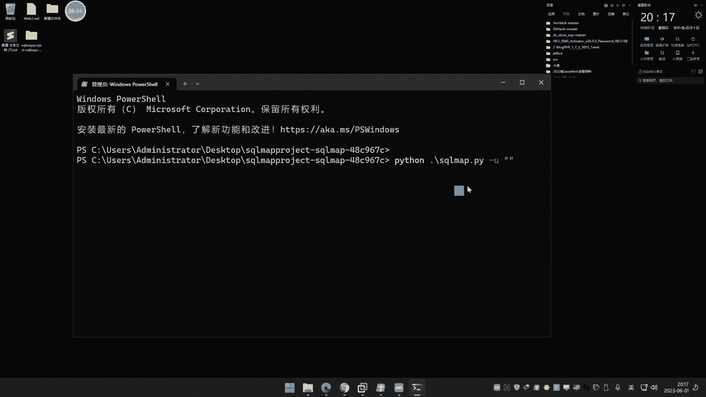
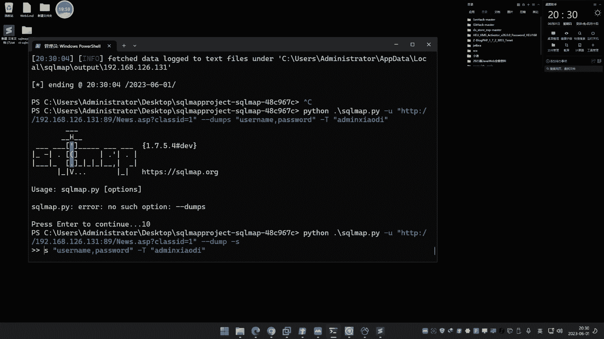
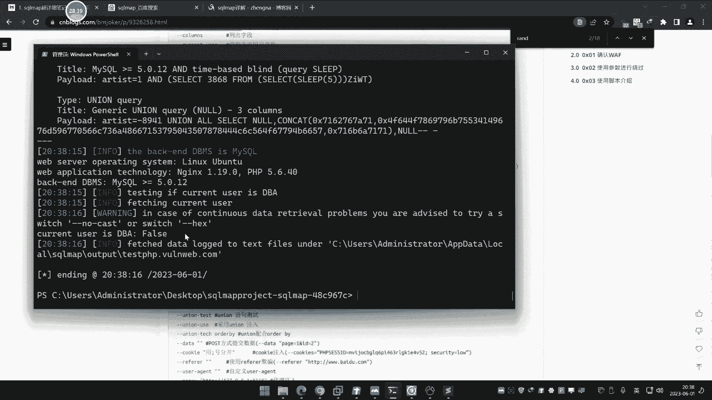
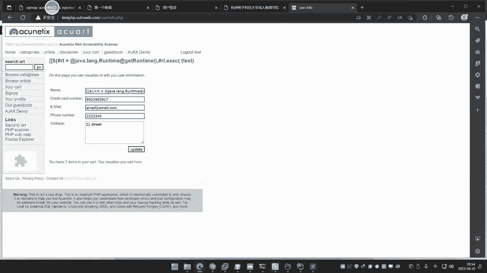

# 【小迪安全】V2024版 全栈网络安全 ｜ 攻防渗透工程师 （持续更新） - P46：第46天：注入工具&SQLMAP&Tamper编写&指纹修改&高权限操作&目录架构 - 逆风微笑的代码狗 - BV1Mx4y1q7Ny

今天呢讲这个pp这个里面那个租工具啊，这个pp应用这个注入的最后讲呃，像后面呢再讲SQL组呢，就可能是一些这个其他数据库和，一些人们数据库的一些讲解了啊，呃这个SL组呢已经讲了一部分了。

嗯今天呢就是有这个工具呢给大家讲一下啊，这个sk map的一个使用，就只讲这个工具，这工具你用好之后呢，其实呢很多SL猪呢，你也不需要额外的再去学的很深入了啊，直接用工具那就好了啊，在工具里面呢。

这是我们今天讲的一个点啊，然后呢你网上你可以看到很多讲这个map的，不管是文章也好，是类工具也好啊，他讲的都是一些很传很多的知识，但是呢他没有一个条形，就是不会说你在什么情况下面用到这些东西。

他只会说把东西都列出来啊，没有给你说到这个哪些东西，该重点掌握哪些东西呢，该简单的看一下，我说该怎么查，没有这样想，就像网上呢这里有个思维导图这么多，我们有必要这样去学吗，没有必要啊。

就是你按照自己对猪的一个理解之后呢，再通过这个资料呢选择性的去学一下，然后不懂的了，可以自己下去啊，查一下就完事了，那这里呢我们就大概分了这个五个点去讲，这四个map的一个工具的使用。

包括它的架构组成原理啊，活学活用，用这个工具的针对SQL注入的一个使用和解释，那学完这课呢，江景啊，你这个四个map呢呃就会灵活的去用它了啊，就不会出现什么意外了，以后呢碰上猪点呢，手工不了的话。

用工具帮你搞啊，都是OK的，好那么现在呢给大家看一下啊，这个SCHEMP的一个解释，然后这里呢有一个参考文章，就是这个工具的一个看文章有这么多，然后这里有很多啊，我们呢也没必要呢说一个看啊。

首先呢我先给大家看一下啊，首先我们来初次来认识一下这个SMAP，关于他的介绍呢，我们就呃给大家简单的看一下吧，我忘记把那个西格玛和那个东西的介绍呢，给他那个写上去了啊，简单把介绍一下啊。

介绍完之后呢说一下啊，但他说sk map呢是这个测试工的一个注入工具，那么在注入方面呢有一个SKEMP的就足够用了，他也是秒杀了很多其他工具，然后这个工具呢这是他的一个介绍，除了知识官呢。

呃他是基本上啊是支持这个大概这个mysql or a post，CIRCL是个server啊，access啊，dB two啊，cil lives啊，呃s y base啊，还MXDB啊。

基本这是十一二总这个数据库的一个注入，然后呢他也支持五种类型的注入啊，对注入我们讲的堆叠联合是吧，包括时间和布尔也是我们讲的这五个嘛，前面的UIO就是联合后面讲的堆叠SD课的是吧。

还有那个盲组上面方面报数是时间，不对不对，嗯好这个是他这个大概介绍啊，就说是一个专门来针对SQL注入利用的一款工具，通过这个租点呢，用这个工具呢可以实现很多类的一些工具方法。

那么接下来我们就来给大家演示一下，它的受邀的测试，我们会从可以在这个真实站点上面呢，去测试一下，比如说这里呢有个真实的这个什么打点好的，这个什么几个单例呃，SP加四个server点。

net加四个server，MYSQL加pp这个i pi的这个rs st的这个加MYSQL，然后还有一个这个Python的，加这个cos dB的一个这个五个这个网站啊。

其实呢这里就涉及到了MYSQL数据库啊，是个server呀，呃MYSQL啊和cont v这几个数据库，那都是可以在SMAP上去测试的，而且呢涉及到三四个语言啊，Python的web。

匹皮的SP的SP点net和这个API的一个写法啊，pp写的API的REST的这个接口放五个啊，呃我们呢等下呢可以在这个上面呢，做一个简单的上面那个测试啊，嗯这个是一个测试站点啊。

你们呢在上面搭建了这个是吧，不同的这个网站，然后呢便于我们对它进行这个测试哈，我们这里等下再用它吧，那么现在呢我们就来现在测第一个最简单的，从这个点，大家不要再说一些关键字了啊。

我们从这个上面那去呃，说简单的测试点啊。

那比如说这里呢呃前期呢我们这里有个租点啊，啊看一下啊，这是我们的一个驻点啊，这个是个SP加RXS。

我们来看一下这个数据库的一个注入，前期我们在SP的时候呢讲过啊。

先从他呢来简单开胃呃，使用SNMAP呢提前准备好Python环境，三版本，二版本都支持，从它的官网上面去下载这个sk map的这个什么，去下他的这个地址啊，他的最新的压缩包好。

我们在那提前给他瞎了，那在这里，它的目前最新版本呢是一个1。7点几的，一个版本，我们来打开，好如何使用它来进行注入啊，前提啊前提背景文交代了，已知这里是个驻点，那如何已知它是个主入点呢。

这不是我们现在要操心的事情呃，判断这个漏洞是否为猪漏洞，这里呢后期在漏洞发现和漏洞扫描工具上面，那个判定呢是能够支持到的，同时呢你在学完之后呢，也能简易的去判断好，这里呢我们打开这个Python啊。

然后运行这个sk Buff，前期呢自己在本地环境呢装一个Python，并且安置到环境变量，我这里要采用的是python3。8的一个版本啊，运行的啊，当然你用其他版本也是OK的啊。

来这里呢使用杠U参数来指向，你要租的一个地址，那这里呢我把这个，哎这个怎么把他的那个字体变大呀，再看到好这个字体呢给大家搞大一点啊，然后这样子啊。

好杠U呢，冒号里面呢加上这个租地址啊。

加上这个主体地址。

好首先呢这里呢把它放进去，这是我们的网址地址啊，然后大家看一下啊，这里要注意一点啊，直接回车啊，他是呢会对这个点呢进行检测，然后在检测同时，它会在你的这一个目录下面生成一个目录。

就是在你的四个map的一个孤立目录里面，那比如说在这里啊，他这个连接给搜一下呢，他在这里呢自己创建了一个目录，这个目录是干嘛的呢，就是用来存储注入的一个保存的一个结果，就是你在上面后面测试的很多东西呢。

它都会保存那个目录，防止你下次查看，比如说里面保存猪肉的日志，保存注入的数据，保存注入的这个地址，他都帮你写上去啊，就会在这里呢创建一个啊，这个目录呢不是固定的啊，它会自动帮你创建。

一般都会在这个盘符下面啊，你可以直接搜索这个网站域名来实现查找好，那现在呢就进行注入回车啊，啊他这里呢一般会有一些会询问，这个询问呢如果你看不懂啊，你就直接回车，如果看得懂就可以简单看一下好。

他就开始尝试书，那么一般看到这种黑色字体里面呢，如果在后面写成个叫might be injection啊，inject就是说可能存在注入，然后后面一个叫post apple dbms。

就是可能性的数据库为matt soft access数据库，然后呢他会询问你说这看着像access，Do you want to skype test payload，是吧啊。

是否问你这个要跳过这些测试，PLODER呢来来自其他数据库呢，对不对啊，这里呢根据自己需要啊，我们就选择回车，就是默认是es s啊，就是说是否跳过，我们直接跳了吧，节省时间啊。

然后他又问你说这个其他的啊，这个什么鬼，有个叫什么NF和risk，这个就是我们说的等级和风险的东西，哎这里那就无所谓的啦，对不对，直接回车呀，好等下会讲的啊，然后他就开始搞了啊，他就开始租了。

好一般呢他这里直接看到说什么，得到这个参数呢，移植什么一个注入点啊，又得到，而如果你发现最后的结果是这么一个结果的话，那么基本上就表示存在注入啊，并且判断出这个当前的中间件和操作系统。

还有这个数据库类型是吧，已经出来了，那么已经得到存在这点之后，我们就可以直接怎么样呢，杠杠tables gtables的意思是啥呢，就是获取它的表，然后这里呢有很多东西我们要讲究。

什么东西要讲究呢，就是啊，我们都知道在之前的数据库注入的时候呢，它通常有几个地方叫做库名，数据库名表明这种东西啊，那具体呢我给大家给看一下哈，就我们在MYSQL注入中，或者说其他数据库后面还没讲啊。

只讲了MYSQL，就在数据库注入时注册里呢，还先拆这个数据库名字吗，然猜到进去才是个表明嘛，哈但是现在你这里呢它是一个access斯。

所以你的第一步那是拆表明啊，所以他是刚刚tables回车，然后你会看到啊，他继续问你，我们就直接回车啊，他这里说了一句什么，问你是否用什么默认的什么这个这个什么table啊。

这个拓展去检测yes s和L而回车好，然后他问你呢，这个table的一个用到哪一个，一个是默认的，在这个second map的安装目录下面，data test这个table里面还有一个呢是自定义的。

啥意思啊，我们来观察一下sk map的这个目录啊。

关注一下这里，那就引出了这个什么这个支点这个概念啊，那在这个data txt这个目录，然后呢下面有这个文件，其中呢他说的指向的是这个什么table，是点TIT，那么就是这个嘛哈啊这个是干嘛的呢。

哎回想一下我们之前讲access的时候说过一句话，这个access注入呢，它不像这个MYSQL5。0以上版本的注入，可以通过查询information s t h e m a那个数据库表。

来获取这个表明和联名和一些字段信息，大家还有没有印象access数据库的注入呢，它是通过这个知识点拆解，所以他在这里那就必须要用字典，那么他刚才询问你，就是说用到的是默认字典还是你自定义字典。

我们就采用默认字典对吧，然后呢我给大家看一下啊。

首先呢我打到这个网站这里啊，再看一下，然后啊现在呢我把这两个库都给他拿出来。

好这是他两个库两个数据库啊，这两个数据库呢大家看一下啊，其中呢他现在用到的是上面那个。

因为下面这个呢你看的这是之前那个啦，这个是艾德米表对，里面有这个联名和表名，然后这个呢。

你看这个啊，看下面这个下面的这个呢。

打开下面这个，啊下面这个就变成什么艾米小迪了，啥情况，那这里有两个啊，来打开这个看一下。

那他变成admin小离了，然后原来的是艾德米，啥情况呢。

我就是说给大家演示一个差异啊，就这里呢有两个啊，一个是我没有修改的，一个是我修改后的，这个是我需要hold的啊，我先将这里呢把它改成这个移好看这个一啊，那这个网站现在是打不开的，我们可以看一下啊。

为什么打不开呢，因为数据库名改了啊，它指向就错了，你看网这里报错了是吧，然后我就把这个上面这个这个下划线，这个呢把它去掉，下划线恢复它原样好。

那么现在呢我们再看这个网站哈，他又打开了是吧。

就这是把回来了好，那现在我去租他来，你看啊，从这里呢去当注入，然后呢他问你多少线程，默认最高线程十线程存个十好，这里呢就有31亿个这个表的去猜，你看就猜到了艾德米是吧，猜到60，看到没对吧。

他拆了还拆了布克啊，好猜了，阿米达。

阿德米德是我们关键好，我先把暂停，那么现在再来看啊，我再把这个哭了，把它换掉，换成这个宜的好，就把这一呢就把替换掉，那这个呢就是刚才我看到的。

他的表明的是什么，是艾德米是什么，看一下哦，就是艾德米小迪表明变成了艾米小迪，那么我们现在再来去猜测一下，先把这个缓存给它删掉，就这个猪的缓存啊，不然的话它可能会出问题，好好了啊，我们继续来猜来。

还是一样的道理啊，就是把数据库里面的表明了，尝试着修改，然后呢我们现在装它呢，去猜那个表是不是能够猜出来啊，啊好十个线程好，他就开始拆了，你看那么他这里是31一个，三千四百四一十一个呃。

我们可以看到他怎么猜出来的呢，他猜到个六四，但是没有把刚才那个enemy猜出来。

因为什么呀，他猜的用这个表吗，我们给大家看一下啊，来3000多格嘛，其实就是这里的这个排列组合呢，从撕开的这个user对对，就是他猜的那个来源就在这里嘛，就是TT的问题对。

那截止到应该是截止到这个哪里啊，截止到这里，3000多个，应该截止到这里啊，前面有几个换行吗，来截止到这里来。

是吧，嗯那他猜不出来了啊，哼。

所以说你如果要后期尝试添加这个支点的话，就是来到这里啊去添加，比如说我们就把刚才它存在的把它填进去，写到这来，写到ADD me小一，因为那个表呢是艾米小迪嘛。

对不对，我把它写进去，那保存到这里啊，那么接下来我们再重新再注入看一下，看着啊，那多了一个是吧，多了一个，你看A的米小题才出来了，对不对，能理解吗，这是他的第一个啊。

这个S个map目录的一个支点里面的一个操作啊，那么它是针对于这种支点呢，是靠这个啊，这针对这个猪，那是靠暴力的一个支点拆解，那么呢如果说支点猜不到的话，你如何呢。

通过修改这个工具的支点呢来实现自己的添加。

注意一下啊，这就不说了啊，大家明白了好。

这个access呢在一个告一段落了啊，然后如何去猜它下面的数据给大家演示一下。

你如说像现在我们猜到了，猜到了他这个下面有个2米的一个东西是吧，那然后拆了2米小迪之后，接下来该怎么拆它的，第接下来数据呢再来啊，刚刚tables是获取他的这个表的所有东西，然后刚刚COMUNS。

就是代表获取它的字段或者列名的意思，然后杠T大写加上刚才猜到的这个名字写上去，那么这个意思呢就是说拆捏拆什么捏呢，来源于这个表下面的捏，猜艾德米下面小迪，艾德米，小迪下面的列米，那我再猜。

然后呢他一次也是采用质检参，所以那我们选择第一个，那换那个啊，变成了CONCOLUNTST，就是另外一个联名字典去猜它，回车啊，选择一，然后实现程去猜，你看现在就是联系logo。

然后猜到id和username啊，紧紧接着呢就等待password这种类似的东西出现，好啊，那我们看一下啊，那么现在可以看到已经出现了username和password，我就直接暂停了。

那么接下来知道这个之后呢，继续拆他的数据，数据该怎么拆呢，然后user name chusim和pass w b啊，这个意思是啥呢，就是dump就是获取里面的数据，然后呢杠C的意思就是什么。

这个好理解吧，杠C的意思是什么，钢铁是杠tables表杠，谁是杠列，就是获取把列username和password，从表里面的艾米效力给它当出来，好理解吧，然后刚有人说刚当奥奥钢就是钢欧。

把他所有东西拆，那个没必要啊，我是只关心账号密码来猜好，回车啊，回车，哎什么情况，刚才那个没有那个啊，就那个联名表明要把他等他拆完，那可能是要获取所有，我们大家猜一下吧，刚当不死是吧，对。

哪来个杠本SS，查下他那个语法啊，我都忘记这个这个写的语法了。

我看一下，因为他如果用重新拆的话，那个东西就比较麻烦一些，杠杠哦，杠T杠T杠D杠C嗯，杠杠二，所有东西刚T就表明联名杠C嘛。

还是C啊，没有问题啊，可能是刚才那个，不是没拆完，写到后面去是吧，然后呢这个就他说拆了去了啊，然后这里说有这个账号密码呢，什么这个有这个暴力破解的东西啊，问你是不是要采用默认的这个MD5呢。

对它进行这个知识点的拆解呃，什么东西我们就无所谓的啦，还有呢就是帮你去暴力破解那个密文啊，他有个那个MD5嘛啊，猜猜得出来就给你抛出来，猜不出来就停了，然然后这里呢他就把所有数据猜出来。

你看所以这个enemy把这个密码对是吧，他其实刚才询问操作呢，就是把那个问，你是不是要把那个密码来进行剖剖解啊，还有采用字典呢去帮你匹配那个MD5的碰撞，这个呢不是很重要啊。

因为你这个密码呢你自己拿去去解一样的啊，你看现在就猜出来了啊，这个就是我们说的那个AXSS的一个S格，map的一个使用方式啊，已经给大家说清楚了啊，好接下来呢我们再看这个MYSQL啊。

我们可以呢在网上呢再去给大家找这么一个呃。

案例呢去演示一下啊，你比如说像现在呢，我们就找一个这个这个测试站点，等下呢我们再用本地车啊，你比如说这个呢这个pp的这个测试的地方啊，这个珠加点，那我们在这里随便找一个这个测试的地方啊。

好这里呢就是来一个注入点啊。

好我们设置这里啊，一样的道理啊，Python smap杠PY，然后杠U加上目标地址进注入，先来看一下有没有出入，让他跑好，这里说直接跑出来有入点啊，那防止这个东西呢，我先把这个缓存给他删掉。

重新找它跑一下两个目录啊，他跑完之后他有个缓存在里好，他说呢一直看到他像这个MYSQL的，问你是不是也跳过啊，直接回车回车啊，基本大部分都是回车回车啊，除了一些意外的知识后呢，要自己设置一下哦。

他就帮你去测他的一些这个是哪个模式，下面的猪他在测啊，测完之后呢，他会给这个结果，然后呢我们再继续跑下面的一个东西，在MYSQL中呢，就和刚才那个access呢会有一些小微的差异。

这里呢就引入到不同数据库，在这个SMAP中的一个使用方式，他这里呢用到那个什么鬼，这个5。0那个什么时间上面那个忙租，还问你这个是否需要啊，用那个类似的忙租的这种东西呢，其实忙不忙租都无所谓啊。

然后你看啊我们之前的就是杠杠tables嘛是吧，Access gtables，你看他这里用GTABLES啊，来他又得到数据，你看这个数据有点莫名其妙了，什么莫名其妙。

information的ICUART是啥情况，这哪个是哪个是这样的啊，我们都知道在这个买SOHO猪中呢，它有不同的这个数据权限，用户普通权限，那就是自带一个information和自己管理的这个数据库。

如果是root的话，就有全部，所以他在租的时候呢，如果你直接杠个tables，他就是获取当前所有数据库下面的所有标明，就包括你自己管理的这个，似乎同时呢还有这个附带的一个微信，这个能理解吧。

所以一般在RMYSQL和其他数据库非access的话，都会有一部叫做杠杠CORENT杠dB，这句话啥意思呢，就是获取当前数据库名，看一下是什么，他说是ACTURT。

然后呢再到这里去杠杠table是杠D杠低什么database，告诉他我要获取这个库下面的表，所以他是这么个流程，它和access呢，因为它高了一等级，它里面呢还分数据库名字，access呢就是只拆表。

只有一那么一个东西，那MYSQL可能不一样，它可能有多个，所以我们先要获取当前的库名，然后呢去让他去猜下面的表名好，你看他就猜到了，是只显示这个，然后再从这个表里面选取你要猜的数据。

比如说我要猜users比较关键，那么接下来就是刚刚什么刚刚CUMN，然后S是吧，然后杠T指向表，为什么users对不对，回车以及指定好，你看是不是就猜到下面有雷姆和这个什么pass。

还your name这几个东西啊，好那接下来就是CHA数据，那么就是什么呢，然后比如说name和ax两个东西维持到哎，这里就出来了，那雷姆斯join me in，密码是test，这不就猜出来了。

并且在猜出来之后呢，它会保存到这个当前的这个注入目录里面。

这个dump文件会有一个这个啦，表明和你猜的这个对应的这个什么啊，数据库名和表明对应的一个表格。

然后呢将你猜的结果呢保存到这里。

啊如果说你要全部拆的话，那就是怎么样直接杠杠什么杠，dump杠欧啊，对不对，那这个呢就是属于把他所有东西呢，都给它剖下来，这个呢我们就不演示了啊，好这个就是买Sol那个那个猪，然后你看啊。

这个是MYSQL租，我们这里的演示的是一个普通权限，为什么叫普通权限呢，有一个参数叫做杠杠is e d a。

你是GBA啥意思啊，我们可以看一下这个上面的这个文章，他这里有一些列举常见的啊，当然以DBA呢就是获取是否为数据库管理员，当然呢你也可以看杠杠PRVITEGER，但是我更建议大家用用杠杠is dba。

为什么呢，因为你用这个权限呢不一定就说准确，他这个呢就是获取他的是这个数据库的名字，你比如说呢就是数据库用户嘛。

你看看我加上这个数据，他要获取这个租点他的一个权限，他说权限是什么，这个叫user you get，那就这个用户啊，他的权限是USAG1啊，这个你也看不懂，你也不知道是不是数据管理。

所以呢我建议大家用用这个好一点啊，已知DBA就看他是不是数据库管理员，这个是最好的，就是看他是不是高权限，意思就是说因为我们在做的时候呢，也跟他说过，你看他说了当前用户的is dba为force。

就是不是数据管理员，那么那就是告诉你，这是个普通用户权限，为什么这样说呢，因为我们知道我们前期在讲MYSQL租的时候呢，是区分是root性驻点还是非root性驻点，就是高权限和普通权限驻点的区别。

原因就是，因为高产型和普通注点呢，是能够有一些不同的差异的，普通用户呢只只能输入数据，而高产线呢是能够进行文件的读写，包括文件的写入等等一系列操作的，大家不知道还有没有印象啊，那么这个杠杆is dba。

那就是判断这个驻点是不是高强线，能理解吧。

那由于这个粘连呢，它不是高权限，所以我们高产线呢，就用我本地给他搭建了这个什么这个站点呢，给他演示，就是前几个呢上的，就拿这个来对它是个高权限的啊。

然后呢我们用它来给大家做一个测试啊，看着继续来输入我们当前本地的高权限的驻点，来给大家看一下，好先让他跑出租点来啊，我们就按照正常逻辑啊，先判断它有驻点，然后呢以此才是好进行下去。

其实呢就是说其实非这个ACACCESS斯的数据库，其他数据库那是流程的，是先判断权限在后面再做操作的，因为流程是权限越高，我们选择性就多，如果权限不高呢，才是拆解数据，最后一步的拆解数据。

如果说能做其他的操作的话，那就直接用其他操作了，我不知道大家理不理解啊，哎哦哦这里差点忘记了啊，我把它加了过滤。

这是为讲那个模块的时候啊，我先把它还原出来，好还原成以前的啊啊他没跑输入点，因为我加了过滤啊，过滤是会讲后面那个tm tm a pr模块。

现在还要回归正常。

好这里呢就已经跑出来了，就这个结果，那你可以对比下来，正是有入点的啊，刚才我跑的呢这种呢报错了，但是没有入点就检测不出来，那这个是有驻点，然后呢你看啊，我们刚刚就是DBA，你看他是什么情况啊。

D b a，你这他妈的怎么你也显示为force啊啊什么鬼啊，你妹的。

来换一下那个那个东西，再查一下。

把这个权限查一下啊，你看这个这个呢显示权限呢里面有几个用户，如果是low host的呢，里面有所有权限的，这是权限的信息，你看呃我们这里呢看一下啊，直接看什么啊。

刚刚user也不是不是刚刚user是刚刚那个cu啊，这里呢有这个参数呢，就是看见当前用户啊，就看一下当前用户呢，刚刚这个刚db3是数据库名，当前用户是谁，看是root to cost。

啊root log host，那他的刚刚的意思，DBA呢他说我不是数据管理员，这也不知道啥情况，所有的呢这些上面包的东西呢也不一定可信啊，其实他私的啊，它显示个force，这我真是没办法好无所谓了啊。

那么接下来呢我们知道这个是root了，并且呢刚才通过权限查看呢，root呢它的这个权限是非常高的，那就有这么多权限，那全新的对应的，这是要比如说删除删除什么这个file文件的，什么鬼。

京城的重新载入的什么snack的修man，各种各样数据库的权限都有啊，那现在呢我就用由于有这个高权限之后呢，我们就可以进行一些文件的读写和命令的执行。

等等一些操作，那具体有哪些呢，我们就给他演示一下啊，那你可以看一下上面的东西啊，比如说像在哪呢，我们就可以用到什么呃，这个刚刚什么，刚刚这个circle circle就是执行SQL命令的。

那我们就给演示一下啊，来杠杠circle，杠circle，当SQL搞下就回显示的，那你看啊，我现在呢就可以在这里那执行SQL命令啊，比如说我执行一个base哎，5。7。6是吧，我还可以进行一个查询。

比如说我查询幸福enemy啊，你们就先先先看下啊，我查询修database有哪些啊，打错了，哦他这里执行之后呢，没有结果啊，没有结果不要紧啊，我们继续来修TLES，看一下还有没有也没有结果。

这个结果呢他说没有显示，那不一定代表没有结果，我们看一下，观察一下他这个什么里面东西的，你们这里有没有保存，来看看这里啊，哎不不是这个站，是这个呃，194的这个呢好这里也没有保存，没有保存就算了啊。

那就可能是要查询其他命令啊，比如说这个能不能查在修里面知道有几个表呢，你看一下我能不能直接查到艾米呀，哎查你看是不是能直接死传命令，你看查询到snack for admin，把里面的数据是不是查出来了。

是在线执行SQL命令呀，那还用等同于你在上面去注入，干嘛呢，直接用SL命令帮你查你想要的东西，不就完了吗，是吧好，这个是它的一种功能啊，我们把它推出一下，然后呢这是SQL命令的一个在线功能。

同时呢还有什么文件读取和写入操作。

我们前期在高权限里面是不是也有这个功能呢，这文件读取note file i note file比nod file比作来读取，读取呢，当前电脑盘符的D盘，下面的这个是B1点T2T1。

读取一下fight rider去读取，然后呢回车好，他说读取了，保存到这个下面来了，我们来看一下里面有没有来保存files。

那D点点击打开诶，这不就是读取的文件吗，内容帮我这展出来。

把它读取的保存到这里来了，诶，文件读取，那么还能进行文件的写入呢，也是可以的好吧，那文件写入是怎么操作的呢，这里呢就是fright那写入的文件写进去，比如说我要把D盘。

当前电脑的D盘一点TT写入到felt，带什么迪斯科，截到堆方盘附的C盘123点点一，这句话意思呢在这里呢有显示啊。

写入本地文件，将本地文件的test文件写到目标目录的这个什么，这个目录，我这边由于两个东西都呃。

都是在同一个电脑上面啊，就是模拟这个攻击者和客户端，就说一个D盘呢是我本地的文件，然后呢写到目标服务器的C盘文件，那其实都是我这台电脑嘛。

所以这个大家看一下就可以啊，你比如说在C盘呢，现在是吧，没有123点TXT，那我这里呢随着这个操作一下，是不是就把D盘的疑点天就写到这来了，并且内容呢保持一致，我们呢在这个D盘一的限制啊，先改一下内容。

内容呢我们就改成123保存，然后呢，我们看一下，是不是将这个一点线线段会写到深海区啊，通过这个组点我们来观察一下回车，大家看到没，123写进去了是吧，来打开一看。

是不是就是其中就有这个诶，写的内容呢有点差异啊，变成什么31331东西啊，这个可能是他写的那个精子的问题啊。

精子精子发生更改，但是无所谓的啊，你换一下那个金子就行呐。

这个就写了啊啊这个就是写入这个文件啊。

写入文件还有呢执行命令还能执行命令吗，我们来试验一下是不是可以执行命令啊，这是高权限就能做的事情就很多了。

那比如说这个刚刚OS刚什么SV啊，一种呢就是子时线条命令。

还有一种呢就是交互式执行，我们来选择交互执行或者子执行命令，我们比如说指定下命令，刚刚semi等于什么VR命令，VR命令呢，就是我们颠倒的这个什么CD来看一下啊。

V1哈，就这个命令嘛是吧，就这个值啊。

你这个东西，或者说我就执行个这个CLOC是吧，等于这个计算器的把弹出来执行一下，看下行不行啊，他就问你说这个是哪个语言，默认是pp，我们就选择回车就是pp，然后他是一个路径。

就是执行命令呢它需要有一个路径啊，有个网站的绝对路径好，这里呢，唉你看计算器弹出来了，这个路径呢是他自己帮我这个搞出来的吧，自己帮我把搞出来的，比如说你搞不出来的话，你就他就会提示你。

让你自己输入一个网格的绝对路径，这里呢需要路径啊，执行命令，那需要路径啊，对不对，那这个计算器弹出来啊，啊这个呢是直接一次，然后如果是交互式的句话，就是勾杠OS杠项来回车交互式啊，然后呢依次选择回车。

就是四默认的pp的脚本路径呢，他把我自己包不出来了，这个路径看，就是他通过在报出页面的搜集到了啊，啊如果说你不知道路径的话，你就找个路径上再把它自定义下载上去也行啊，那你看这里呢。

就是一个像我们看一下我自己名下非二来看，执行了IP场地，可，是吧，IPCONFIER管你，对不对，来是吧，他这个那就是一个就说你用高长线的话，那么就可以做这些事情，能理解吧，好我把它退出一下啊。

好这个呢就是说从他的这个上面呢可以看到啊，高权限呢就能做文件的操作，并且呢后面还有什么这个注册表的读取，但是由于这个也不是很重要啊，因为你执行民警的这个读不注出表，也无所谓了啊。

还有这个什么鬼命令执行啊，文件读写呀，包括这个SQL语句，在线执行这三个功能都能实现是吧，然后这是这个网站，那么呃这个网站是因为它有这个什么高权限，他是个dB dB用户，就是我们说的这个DBA啊。

a root权限注点，你看啊他去租的时候，这个dB啊，刚刚什么DBS就获取他所有的字库的时候啊，他只能把所有用性都列出来，你看这是root姓名的所有驻点，那所有的这个DBS有这么多。

我们刚才哪一个哪一个主点。

那就是这个这个网站注点，对不对，那就不一样了，我们来理一下，这个网站入点呢，你刚DBS你看下就获下所有的库，你看只有两个，为什么，因为他是普通型注入点，就只有一个自带的，还有一个什么当前管理的。

而我这里那本地的就是路径驻点就所有都有，所以在root型驻点的时候呢，你刚刚table是回车，那么就把所有东西都拿出来，你看每一个库都全部帮你猜出来，让每一个库都都都全部猜出来，这就很烦躁。

所以呢你就要注意它的流程呢，就是先进行了之后，刚刚dB获取当前的库名啊，告诉你是多么拟，然后呢就是刚刚什么tables获取它的表，然后告诉他只讲这个数据库名为demo一个不要拆，其他去了。

英文就类似于跨库组的意思，这就差了其他数据不去了，能理解吧，然后呢意思再乘A的幂，那就是接下来就是之前那个模式是一模一样的，啦是吧，让其指向它的表为2米，谁指向USLIM和password，对不对。

那么意思呢就把数据拆出来了啊，这个呢就是有高权限，就有这个文件操作类的，而你如果说像刚才那个驻点，它不是高权限是吧，在这里我们来进行什么，刚刚这个呃OS杠像就是这种命令行模式的，你看啊，你看他。

那他就不行，直接提示弹出来都不让你执行了，告诉note7不行是吧，还有刚刚什么这个fell读取文件的是吧，要读取文件的是吧，我让他读取这个这三目录嘛，我让他读取这个文件目录，那就这个地址，然后进去。

哎他读取了个叉结束了，然后他就说帮我保存到这里来了，那我们打开看一下能不能读到文件，这个网站的是吧，else那里面就一个叉，啥都没有。

这他妈哪是哪个文件呢，错的呀，五包啊是吧，所以说为什么刚才那个网站他读不到权限过低。

命令也不能执行，刚才也看了，直接报错，所以说这个SMAP呢，它和我们常规之前讲的那个珠点呢，是一模一样的情况，它是分高权限和低权限的，access斯呢没有这个东西，那你可能说其他数据库和其他数据库。

也和MYSQL一样，也分高权限和低权限啊，大部分都这情况啊，所以大家要知道啊，在高权限和低权限呢是有区分的，所以为什么在这个数据库租的时候呢，我们有的前面几步就是什么，这刚刚一直DBA啊。

刚刚这个权限了是吧，然后再利用这个文件读写。

因为这些文件读写和命令呢，全部是要建立在一个权限允许的情况下面，如果说权限不允许，你就不用去想这个东西了啊，因为这个东西呢可以直截了当的拿到网站权限，就比那个拆数据呢要简单多了。

拆数据呢可能只是有数据上的东西，其他东西呢我们是做不了任何事情的，但这个文件读写呢和mini执行，那就能做很多事情啊，就和服务器相关的，就不单单是网站了啊，好那这个呢是我们这个常规类的注入。

这个常规类注入呢，就是从access斯引入到支点的使用，从MYSQL那引入到他的这个高权限的玩法，文件读写和命令执行的一些相关的参数，对不对好，那么接下来我们再来看我们在租的时候呢，还学习过什么呀。

这个提交方法，post呀这种东西，那这种租入该怎么租呢，很简单的道理，你比如说像现在啊，我们就找一个主点给大家看一下啊，比如说这里啊他有个登录的这个地方，来这里有个登录的地方。

但这里呢有这个账号密码是吧，来进行这个提交，那么这是他的地址，我们给他看一下啊，来这是他登录的这个点是吧，这里呢有驻点，那网址呢是怎么写的，就这个呢叫user info是吧。

我直接把这个用字服务拿到这里注入他行吗，肯定是不行，有些人学完注入连这一点他都不知道，所以说等于白学啊。

有的人就是把这个知识点放进去，执行I也执行是吧，有没有驻点呢，对不对，直接报错，说没有驻点提示，什么low pp什么没有参数，啥意思啊，因为这上面没有参数啊，怎么办呢。

你说这里有入列，那是啥情况呢，因为他是post注入post入参数，它不在这里。

他在哪里呀，通过抓包分析一下，来点击提交抓到这个登录的数据包请求，这里这是在请求的这个地址，我们把请求头呢大家看一下，来请求post user name，请求数据是test和test。

我们可以把这个复制一下，然后怎么办呢，告诉它参数在后面，但是这不是get行为。

get行为，那是在后面这样去写，对不对，那这里是post的数据包，就是刚刚date的告诉他我采用post注入，把参数写进去回车，这里呢就是用post去检测这个入点，这是我们前面商到过的。

等同于在post注入那里去提交注入参数，一样能理解吧，来回车啊，那么这里呢就是告诉这个网站，我采用post进行注入，那他后婚礼是不是采用post进行出入啊，是的，那么继续拆，对不对，那我就等一下啊。

然后如果说你要省时的话，你可以在这个租的时候呢，那已经抛出租点了啊，你跑出出点，看你跑出来了是吧，后面呢我们就不说了啊，这是个LINUX的乌班图系统，MYSQL数据库，这是他的版本和这个中间间啊。

这个信息啊已经跑出来了，我们后面那什么要继续什么杠杠tables啊，这种东西那我们写不写就无所谓了，因为已经拆了一遍了啊，啊这个东西我们就不拆了啊，我们可以看一下结果，就看你看他正在拆了。

那我们就不管他了，暂停了啊，你要拆完。

他不能会显示好，那是这个post注入，那这个post注入呢是这么一个玩法，那么还有什么啊，还有cookie注入，就刚刚data杠cookie，那么如果说其他的呢像文件投注呢。

文件头注入就是要用到gr参数，就是我说请求完整数据包参数，啥意思啊，来我们都知道啊，来我把它先来写一下啊，先把这个数据包拿出来。

这是他整个数据包啊，我们把它先复制出来，哎，复制这个请求标头啊，这是他整个数据包对吧，然后你看啊，呃这里呢我们请求了这个数据海啊，这是他请求那个数据包啊，在这里，那么现在呢大家观察一下啊。

我们刚才呢就是说告诉这个东西杠data，那它就在这里注入是吧，如果说这个里面呢其中呢还有一个点驻点呢，不在这个里面，在这个什么这个里面呐，或这个里面呢这个里面那个怎么办呢。

刚刚cookie呢是在这里注入，刚刚TURDATA，那就是刚在这个post提交数据中点，那还有这么多是吧，这其他人该怎么办呢，所以如果说你要注入其他的地方的话，那我怎么办呢。

就可以把整个数据包把它写下来保存一下，是保存到这个西格玛布的目录下面去，他在当前这个目录下面去，然后随便取个名字，就叫这个get handle，点TIP包存进去，然后呢，接下来怎么租它呢。

你看啊就是Python是吧，这个map杠U杠二啊，就读杠U了，杠U是地址，杠R告诉他hand，就告诉他对hand的进行注入，然后呢如果说你直接这样写的话，他又会有个问题，什么问题呢。

就是他不知道住哪里，所以他就会所有东西都尝试注入，这个呢就时间很慢了，因为他不知道注入哪个地方，就说是在这个上面注入呢。

还是在这个下面输入呢，还是注入这个UV啊，还是注入其他的，比如说我们现在就告诉他在这个下面输入，就可以在这后面呢写上个星号，那么写信号的就是在pass后面注入啊，如果说你要在这个u name上面注入。

就写这里，如果两个都注入都写下来，这意思呢，就是说告诉他，我是要在这个数据包里面的信号啊，告诉他是在这里注入，而且呢你用这个数据包去发送注入，因为我说过啊，它只有这里有驻点，不是说在这里有驻点啊。

所以我测的时候如果说这里有驻点的话啊，他有什么呢，写着来啊，写个信号，那么就告诉这个数据包啊，在这里注入好，这样写之后呢，你看他也是能够注入的是吧，他就会询问你啊，来是否用这个猪在这个新号这里发现。

在post data里面问你是不是要在这里开始啊，啊我们就开始啊，诶他就开始尝试呢，对他进行阻导，对他就在那个地方就输入，你看，这个呢就是采用数据包注入，这个数据包注入，是我推荐给大家使用的一种方式。

这个是为什么呢，因为大家知道啊，我举个很简单的例子，用这个杠杠data或杠杠cookie呢。

不是大家给他推荐的，虽然它简单方便，也不需要保存数据库，直接告诉他在这里，但是有个问题就是数据包的完整性，这个完整性在前期我们基础课程里面。

为什么要讲，或者说这个要之前给他讲，就是为了有一些思路上面要理解啥意思啊，来我们来思考一个问题啊，啥意思呢，来这个数据包是我们访问网站数据包。

这个我数据包是一个什么，我们举个很简单的例子啊，那假如说现在啊这个一个网站啊，智能这个什么手机访问，大家应该也碰到过这类网站，有些网站呢就是手机设备才能访问，电脑还访问不了，看不了，或者说电脑能访问。

手机不能访问，也有是吧，有这种类似网站的呀，那么就很简单，按这个访问，那假如说上面呢有这个什么有个凸点啊，有个驻点，那么很简单的道理啊，如果不是通过这个什么抓包得到的，这个请求的注入点数据包去输入法。

那么这个SMAP呢就会啊采用，就会采用是吧，自己的这个什么访问口去访问读这里，那就会出现一个问题，可能访问不到，那是访问不到了，还怎么输入啊，那句话一说大家就理解了，这是为什么说。

建议大家用数据包这种钢R模式的这种跑法，去租，这种基于这个数据包里面的，各个地方的一个驻点。

那为什么要在这里进行注入，就这个原因，那就是说我刚才呢刚R点开的TT，告诉他在这里注入，也是post注入是吧，也等同于POS入，还有刚才的是吧，这个刚刚，那就是刚刚data这种的解释。

但这两个是有区别的，区别就在于啊，利用这种方式就会采用set up自身的这个文件头，就是在代码中写好的文件的去访问，那么如果说你用刚才我给大家说的，这种钢马R模式呐。

那么就是采用我们这里固定好的文件头去访问。

那这两个有什么区别呢，很简单的道理，这个是你自己访问，确定能够访问到的数据包抓下来的，而如果说他用SYNMAP自己访问的，那就有可能访问不到，为什么呢，就我刚才说的个例子嘛。

有些网站它就是要看这个文件头的，就像我们写开发代码写了个爬虫一样，他必须要那个头才能访问到是吧，不是说哎你访问就能访问到，是这样的啊，它有一些文件头上面的一些识别，它通过一些识别。

再来帮你一些设备来选择性的访问，有些代码它能做成这自作用，所以啊有些注入点的时候啊，尽量大家要用这个数据，就说如果是数据包里面的一些注入点的话，不只是说这个地址上面那些参数注入点的话。

是这个数据包里面的某一个的话，尽量呢用数据包的这个文件去提交注入，这样子呢是确保不会受到这个不能访问的影响，而造成的是吧，说没有驻点，其实是访问不到所造成的，能不能理解啊，能不能理解。

而且呢这个请求头呢还有个好处，就是很简单的道理，那比如说像现在啊，我们这里呢不是还之前呢有一个这个驻点吗。

这个叫四点破，然后这里有个GSN的这个这个点是吧，这里有个这个驻点。

你看啊，如果说我用这个东西呢去租它对吧，我敲出点啊。

我抓个包，啊提交啊，来把这个驻点拿下来，这是他驻点啊，然后请求地址是这个地址，我们把它复制一下，让他去对它进行注入，等下啊，DSN的啊，杠U第一次讲序，什么情况，粘贴的不容粘贴哪。

你妹要写这个提交地址啊，然后刚刚date啊，你看我就按照这种模式呢，我把它写上去的，你看这里就有些问题了啊，那这个符号问题我就需要写单引号了，因为里面是双引号，就不要搞混淆了啊，啊注入是吧。

你看他直接告诉你说这个什么鬼，没有参数啥情况，就是因为这里呢它本身里面是双引号是吧，你这里呢有搞个双引号诶，他也不知道说算法里面写的对不对，那他又报了，你要么就说这里面搞个单引号了。

因为它要它识别的是双引号，你就不能强行把它改成单引号，所以说啊你就要改里面你的参数为单引号，那你这样一改呢，说实话啊，可能呢驻点就就此就没有了，暂时呢也可能不应影响，这也不知道我们来看他能不能注入。

对不对，你看他就说呢包破不了，租不了，他说这个什么post，这个健身东西呢不像是入点，注入不了啥情况，为什么呀，为什么注入不了啊，因为啊你把它格式改变了，你把它格式改变了，这是个JSON的。

你这杠date的把它弄字不穿了，他这个注入点呢是这样写的，能理解吗，我为什么前面讲JSON在这个注入工具里面，你不把这个原理搞清楚，这个工具为什么注入不了，你原因就不明白，那碰到这个问题咋解决啊。

那我就拿出来来看看看一下，这明明有驻点，为什么用这个东西它做不了啊，来我们看一下啊，这是个GSN的数据输入库啊，我们来看分析的，那为什么用这个驻点它注入不了啊，来大家看一下为什么。

那前面我们去写那个驻点的时候，我们可以把语法拿出来，那个驻点的时候，嗯那个驻点在哪去了，好在这里啊，这是之前那个驻点的啊，唉还有他的啊，这个说可以啊，这个呢他可以尝试啊，正常登录是吧啊。

这个呢他为什么不行，这个很简单，一个就是用JS问的问题，但是为什么JS问会影响他呢，这个不行啊，就是有速度，为什么不能明白简单道理啊，啊不是你们说的这个什么卡普啊，这个东西你继续加上去也可能报错。

主要原因是什么，来他这里写进去了，那么你想一下他的注入点是怎么写的，当他的驻点去这样做的时候，那么等同于啊我们待会分析啊，我后面会教大家怎么分析一些点的时候啊，会讲的啊，很简单的，他注点可能是会这样写。

这三字上面写输入点啊，就是哈去租的这个大概写啊，你就思考一下，就是分析一下啊，大概写是吧，这样写，那么这里呢他这个呢也是一样道理，他就会这样去写，那这一写那不就GG了吗，为什么呀。

数据接受的是这两个间名下面的值，是要把这个驻点呢写到这个里面才正确的呀，你这写到外面去了，这啥啥情况接都接触不到了，那还租了个毛拥有接收到92米的米，啥都不会编了，理解了吧，是不是好，那你可以说。

那我怎么让他明白写到这里面呢，他明白个啥呀，你写的东西就是个字符串，他哪知道啊，所以最好的方式，那你说那我能不能搞个JS格式呢，那你看一下啊，原本JS格式是怎么写的呀。

是这样写的呀，那福字也不好复制啊，那怎么办呢，加个星号啊是吧，加个星号看一下行不行啊，就告诉他是在这里啊，比如说在这里password这里还是username，这里啊，我们就写个这里，比如写在这里啊。

告诉他在这里哎，我不是，在这里来打印好这里啊，看行不行啊，再让它跑一下猪猪看一下行不行啊，唉还是不行还是不行，你说这尴不尴尬，JS都跑不出来了吗，难道是，所以最好的方式就是我说的。

就是把他整个的这个包啊给他拿出来，就是你可能改着改着呢，他总归就是有问题啊，终归就有问题，所以呢我们就没再创建一个包是吧，把这个数据给它拿出来哈，嗯写着这来啊对吧，来告诉他在这里或者在这里录入都行。

保存名字叫做第二个N点cad没错，Set up，杠up点on，然后他通过这个数据包帮我跑一下，那这里基本上不用看了啊，注入点基本要出来了，那是吧，驻点出来，你看他就是老老实实驻点就在这后面写了，你看啊。

这他租了PLOAD呀，可以看到他租点，就是按照我们正常的那个要求去写了呀，你刚才那个就不行呀，所以说我为什么说推荐大家用这个gr模式，就是因为那你即使用这些东西呢。

啊你用好了也会有些意想不到的一些问题啊，还有可能是有租入，它就没注入，也不知道是啥情况造成的，明白了吧，好，这个呢就是我们说的基于这个头部和请求方法，上面的一些玩法，基于SMAP的玩法好。

那紧接着呢我们再来看这个TAM脚本，这个是什么东西啊，其实往前几期20年的公开课就讲过。

现在还要我讲是吧，这其实很这很基础内容啊。

我们来跟他说一下，然后呢这个东西它其实非常简单啊，这是干嘛的啊，我们先用个例子呢给他先开文啊，然后呢大家知道了，前期呢我们给大家写过那个费斯缪斯的。

那个什么那个猪的那个代码啊，然后呢我们先来尝试一下啊。

用这个贝斯六四呢啊去进行注入啊，这是他贝斯六四点啊。

这是租点，那我们呢去注入它啊，看着啊，Python然后呢在做之前，我先把这几个鸟毛缓存给它删掉，避免它受影响啊，诶，这里先把这个几个测试的这个网站那个删掉，好现在呢来对它进行注入，将U嗯写上去好看啊。

让它注入，看能不能注入出来啊，那他这里提示说啊，test这个id呀，可能是一个注入，好看到这里呢有些人说哎呀问了问了啊，好我们继续往下啊，他只是先判断他可不可能，然后后面呢取通过PLOAD测试之后。

才给出一个最终结果啊，我跟你讲啊，我这一科的思科map你在网上的参考很多文章，我一刻帮你总结了，你把我这一课学好，你可以直接不用看网和SMAP的文章了啊，我把能用的好用的都介绍了。

没讲到的都是些用的很少的，或者说没什么用的，这比你自己呢在网上去看那些文章，看这种工具的使用要简单很多，像我是经常给大家讲课的时候呢，我就经常想起我以前读书的时候是吧，我读书的时候呢老去想是吧。

这个老师讲的和我自己在网啊，在外面去买一些这种工具书啊，辅导类的书，感觉都是一样，为什么你没的，我看工具书就没有那些认真听讲的一些，这个同学成绩好呢，我当时老有这种差脑，有这种想法。

后面我自己呢去当老师去给他讲课，我就发现是什么原因，就是因为网上看的书也好，文章也好啊，他永远都是只是搞全，他不会跟你说的哪些东西用的多，或者说哪些东西他重点讲不重点讲，你都不知道。

所以你看的多不代表你在实战中，那就好，因为你学到太多无用的知识，或者说看到太多东西没有什么卵用，但是像我自己讲的，就是因为我自己经历过这些东西啊，我知道哪些该东西该把握，都是还是要听讲啊。

这就像我们之前是吧自己上学一样啊，看工具书和听老师讲的这个差异就在这里。

有些人总觉得说这个是吧，讲的网上一查就回来啊，怎么样啊，但是不然啊，还能帮你省去很多路，你自己碰到的时候，你查工具不漏，一个人给你讲，可能自己摸不摸索，半天一天都摸不出来，但是有人一讲呢。

可能一个小时半个小时就搞清楚了，你看这个点呢，刚开始认为我这个id是注解，但是现在啊你看就没有驻点，啥情况，为什么呀，因为这个驻点是个贝斯求斯的这个编码重点，他要注入是必须对这个组织参数进行编码。

才能进行注入的，前期讲过吧，有印象吧，所以他注入不出来，原因很简单，他哪里知道这是编码呀，它的注入就是很简单，就在后面呢依次去敲他的驻点，那你敲多少有用吗，没有用啊，因为你敲多少它不识别呀。

它有个解码操作啊，这个是个编码的一个那个驻点啊，怎么办呢，是不是就需要告诉这个SN码普。

我要让子后面进行编码。

要告诉他呀，他才知道啊，你不告诉他，他只咋知道呢，那么告诉他该怎么告诉他呢，对不对，那么在sk map的内置，有一个模块叫做TAMPR模块，前面讲的data模块是一些知识点和plow的设置。

然后这里那个模块TM就在这个目录下面，目录下面呢有一些自带的这么多东西，这个是大工具自带的，那么这工具自带的有哪一些呢。

我们先来观察观关注下啊，诶那个文章呢在这里啊，然后自带的呢你可以查看这个表表啊，这个表呢有一张表单，指每一个东西的一个表啦，你比如说这里有很多表，这自带的啊，叶长自自带的解释。

就是每一个脚本对应什么意思，其中呢有个叫什么贝斯缪斯EOT，就什么用base news编码替换诶，那就刚好和我们这个满足了是吧，那刚好我们要说那个租点呢，租的那个代码呢形成这个base6编码去输入。

所以我就用到这个模块，好用这个模块呢它的名字叫什么呢。

我给你找一下呢，在他mod moon里面，打是不是这个啦，Best ecode，对不对，选中它呀，然后呢进行注入怎么操作它呢，告诉他TMPR我要用到模块等于谁呢，把名字一搞过来就行了啊，把名字搞过来。

他也会自己呢用到它好点，PY和补点DY都行，他都知道回车，你看现在在帮再帮我检测，那么现在呢他就说载入了这个什么TV模块，那么意思就是说它即将用到这个模块，对它进行注入，好我们现在再看主点啊。

看是不是就能租出来了啊，因为那个驻点呢它需要编码注入，而你直接使用他不知道，所以我们这里要用到一个它的里面，一个模块是吧，编码让他帮我跑，好这里那就等一下啊。

那就这个点的嘛啊嗯就我们这个结束呢，这里有个解码，你不把编码解码不行啊，你看回车了，看到没，这个刚才就是出来了吗，这能注入了呀，对不对，你看搞个a abs没问题了呀，出来了，出来了，后面就能输入来。

是不是，那这个是实用，有些人说了，我要你加开发，交个实用，有个鸟毛好开发，永远有些人不知道，前几天还有人问我说哎呀，我看到别人那个刷什么一滴U，搞了个TMP模块是吧，嘎嘎乱刷，你要知道啊。

难的不是说这个模块的编写，难的是你自己研究出来的脑壳方案，开发就那么简单，就几行的Python代码有什么难的呀，这个SMAP他是用Python开发的Python开发，你该说我没有教是吧，但是我跟你讲啊。

他那个写代码那个东西呢，把那模块模板1copy，无非就是字符串的处理，啥代码都没有，我们后期呢会讲这个Python开发写脚本，对不对，你需要哪个，你再开发，那简单就是简，那就是绰绰有余啊。

你那个爬虫网络开发的一些库都会用啊，你还不会搞这种植物串处理，无非就是什么替换啊，删除啊这种东西好，我们现在这个给大家看个例子啊，你看着啊，我现在就来说从这个就假设这里有个WAF。

或者说有个这个拦截的这个代码，你看啊，我把它写上去，这是什么个拦截代码，大家看一下啊，来，snack过滤这个什么snack把过滤为空啊，然后在这里输入代码，那这个代码写上去了啊。

new new的pp里面我把它写上去啊，现在呢我们来看一下，优点pp，是吧，你看啊，这是我们的这个注入代码是吧，我这里呢写的吧。

snack看啊，我写snack写上去没有用的，输出代码没用是吧，然后我u n I/O n snack是吧，其前面租点，那是不是前面写的是一个一写上去的，你看SQL语句时那个自动没有了，变成UNIN空了。

1123facing，啥情况，为什么，因为我写了过滤代码，我把接收到的snack把过滤为空了。

把sleep也过滤为空了，把ERT也过滤空了，安德也过滤空了，OR也过滤空了，XOR也过滤为空了，就全部给你清除掉了，对不对，写了这个什么一个过滤在这里面好，那写了这个过滤，我们再用这个SMAP去跑它。

对不对，我再用这个3buff去跑，我这个驻点看能不能跑出来啊。

我是刚好写的，就是说又能绕过呢，又让西格玛P呢跑不出来，你可能说那不能绕过，那不能捞波，那三发布也不是神呐。

他也不行呀，这个TMP这个模块呢，是基于你研究出高个方案之后呢，再写的这个代码，让他绕过即时到里面，并不是说哎他有他有拦截，你就能用S格玛不了，我不是这样的啊，你不要搞错了啊，所以它难点是怎么绕过。

是你通过你自己前期的分析，发现这个东西能绕过来，然后再把这个绕过，这个思路呢用代码帮你去实现，让SMAP融入进去，去注入，是这么一个流程啊，不是说用这个TMP模块呢，就是嘎嘎乱刀啊。

不是你想的啊。

好我们看一下这里啊，这个1。4我先把它删掉啊，防止它有缓存是吧，删掉之后我们继续注入啊，你看啊，现在我加了过滤，我让他注入，前面我没有加过滤，大家都知道前面演示过他是能够租出来的，现在我加了过滤啊。

就是我加了一些过滤，我让sk Buff帮我去租入是吧，现在就说我啥都没加，然后直接帮我跑，也没注点，来跑不出来了吧，肯定跑不出来，那个怎么可能跑出来的，对不对，然后呢通过我们的自己测试呢。

我发现呐诶他是好像是把它过滤为空了是吧，我就采用方案，那怎么写他的这个脚本写法呢，很简单啊，大家看着啊，你随便打开几个他的模板，1copy Ctrl加CCTRL加V就能写了啊，告诉大家怎么写啊。

来看着啊，来直接把这个完整代码1copy，创建一个文件是吧，创建一个Python的脚本，那CTRL加VCTRL那个写，然后这蛛丝这蛛丝要不要都无所谓啊，哎然后这里是引用这个模块。

由于我不用被什么是我爸去掉，用用模块，这个是Python开发代码嘛哈然后这里是TMP对不对，要返回这个什么鬼东西，这里呢都是可以直接把省略的，直接就可以简写，是什么呢，就按照这个模块写啊，然后呢你看啊。

就这么写啊，看着啊，哎这怎么把这个挖出来了，这也是蛛丝啊，这个要不要都无所谓啊，这是注释，就说告诉这个模块大概一个用法来怎么写了，就写个什么，这里有参数嘛，如果只在固定写法，只在固定那个东西。

如果PLOAD，那我怎么办啊，然后直接生命的payload等于什么payload点reprice，啊等一下啊，这个鸟毛，这个Python代码，等一下我把它搞成那个写个名字叫做这个摆pass。

哎呀这个鸟毛，这没有那个帮助我写的还有点尴尬，我还是用那个，专业的开发工具打开吧，没提示，其实没提示，我也能写，只说我让大家看的更清楚一点啊。

那个reprice谁不说写，那也不写，很复杂代码。

那我还是用这个专业的那个啊，这个vs code我没有装那个那个那个东西啊，那放这边吧，哎他这个诗真是呃真是没有，他这个是真实没有啊，不是这个id的问题啊，也不是那个问题，就他这个代码呢。

由于它是和其他代码有点不一样，它是有个模板，它是有个模板啊，因为模板那你就按照这个模型去写就完事了，就是reprice，那就是替换那个替换那个什么东西的，然后怎么样呢，前提他是把snack呢。

把它替换成什么什么东西啊，然后呢后面继续啊，就是写这种各种各样的东西，写多么几行啊，然后他这里呢有snack的，它过滤什么OR是吧，过滤这些东西过了什么，and under还过滤这个草物啊。

还过滤什么药理啊，这关键字是吧，我就把意思写进去啊，那写大写啊，因为它这个色up里面是大写，我就把替换成啊E啊，ECT是吧，大小也替换绕过的啊，因为它过滤的是这个没有考虑大小写啊，只考虑大写和小写。

没有考虑这中间的大小写啊，这是我研究出来方案啊，这个怎么研究不是重点啊，是你自己研究的，我们就替换一下是吧，嗯ANDLE要把它替换成哎嗯对不对，插入啊，把替换成好O啊，求自自己呢。

把这个东西啊啊替换成这个大小写啊，你搞一下就可以了，哎这个写完之后呢，就直接怎么样return啊，返回PLOAD，就可以了，这个东西就写好了啊，就写好了，就前面是固定的。

然后呢这个payload就是那租的payload，就是run它的，这个payload，就是其实就是S格玛不识别的那个攻击语，让这payload呢在租的时候呢，就把这个snake再替换成这种啊。

OR的替换成这种啊这种去写法去绕，因为我们这个过滤里面，那是只过滤小写和过滤大写，对不对，我没有过滤这种大小写组合的这种情况，所以呢我就把这个关键词呢啊搞大小组合，那就不识别不到了是吧。

这我们自己随便写这个防护方案，那你可能说那不是在防护，你这防护里面是随随便便就绕过了，那我那我里面不是这种啊，我很难的呀，你要知道我们说的是它的使用和开发，不是教你怎么去绕过它，绕过它是黑河里面。

你要不断的测，那需要花时间，能绕都不一定能能不能绕，都不一定，你研究出来了就好办了，研究不出来就不行，所以它的难点是绕过，有很多人说哎TMT怎么写怎么写，难点不是怎么写。

是怎么把那个绕过那个东西研究出来，那写哪不会写，那就几行代码，谁不会写呀，无非就是把支付的进行替换呢，删除啊，加什么东西进去干扰，那你要说那我怎么绕呢，绕过那是要学那种类似的一些那种啊。

后面讲了一些WAF的一些那种课程，对不对，那和这个不相干的，你要不不要搞错敌方啊，你只要把这东西搞清楚，你发现哪里难的，难是难的，和你想的一点都不一样是吧，你的你只要写上去是吧，这里叫，哎写哪里去了。

你妹的好，IPASS里面啊，写进去了，好写好之后呢就完了啊，写好之后就完了。

然后你看啊，现在我再给你注入，看着啊，像MV一样，PAPASS写进去，告诉他，我用PAPASS就会引用我刚才写的这个规则。

就放在那个目录嘛。

那就是这里嘛是吧，是刚才写的呢，放在这里，对不对，哎，啥情况，这里面没保存进去啊，咋还不眼里面的，bypass文件叫新啊，好写进去了啊，好了，现在啊试一下了啊，看一下能不能行了啊，把规则写进去了。

哎看看能不能出热啊，嗯刚才是不能租入的啊，现在我们用了这个自己写这个规则之后呢，再去这个它啊，至于这个规则怎么把研究出来的，这是我们自己呢在测试这种黑盒点的时候呢，通过观察和一些关键字的返回来判断啊。

来测的这个过程才是最难的，并不是说写这个东西南啊，因为你研究不出来，绕过规则的话，你就你就没有下一步，等一下啊，这卡了。

然后呢等一下我们通过这个点呢，还要给他引入另外一个点，另外一个知识非常有用啊，看到没，结果出来了啊，来能注入吧，没问题吧，对不对，刚才不能注入，现在能注入啊，你可能说什么情况呢啊给他看一下吧。

啊你看着啊，看是不是我们脚本生效了，我可以给大家介绍另外一个拓展参数。

就马上要讲到的叫什么啊，刚刚V详细等级啥意思啊，给大家解释一下啊，看这个笔记这里啊参数这讲非参数，这个也经常用啊，它主要用来高端和进阶的分析用的，它比较多，刚飞是什么呢，就是详细，你看他有个什么东西啊。

他说的叫做，有六个等级，一零默认呢是什么，默认等级是哪个呢，那这里有一啊，我们一般呢这里有个叫四和五，一般用的最多的就是要用它的话调试信息啊，删这样我们显示四就显示请求信息，啥意思啊。

我们先呢把这个删掉，观察一下啊，这个是用来分析的，就是你有时候呢你在租的时候对不对，然后你不知道你东西修改之后有没有这个修改，或者说有没有这个注入，成功分析一些数据包的时候会用到它。

我们具体给大家看一下啊，你看啊，我现在没有用那个TMP去注入我一个杠V4，看一下他什么东西啊，他解意思呢就是会显示这个circle map，对网站的一个注入的数据包，我们通过数据包呢。

可以看一下这个猪的一个什么这个参数，然后呢去发现情况，那你看一下啊，他在租的时候，这个参数上面它一直在动，其实就是我们所有的请求数据包，就是在租的时候发动每个数据包，它这里显示这个杠V4呢。

就是显示他的请求，然后我杠五呢。

他还会显示这个返回内容，对不对啊，等级越高，显示东西越多。

就这个意思啊，然后这是他的这个请求东西，对不对，然后你可以看一下啊，这是在请求的这个叫什么啊，数据你看啊，这三呢现在租入的数据包嗯，注入数据包是吧，是这样去租的，对不对好，你看着啊。

接下来我们再用到什么这个模块，在刚face回车啊，好我们观察下这面它的数据包的一个注入，好大家可以看一下啊，哎这个怎么没看到啊，大家帮我看一下，你看我们那个OR是不是变成小写。

你看那and的是变成ARD啊，看到没。

这个刚才的规则呢，写的规则跑哪去了。

啊这刚才写那个规则那个文件啊，我看一下来，and的变成A2底Y变成Y。

那他在租的时候看到没，是不前面就变成这个我们指定的呀，这说明你生效了呀，你可能说这讲有什么意义呀，我听不懂啊，你说什么语音呢，他其实就是通过这些调试信息呢去分析你，一个是分析工具，它为什么不能注入。

一个是分析你修改之后它有没有生效，是究竟是哪方面原因，你连这个原因不知道，他一标是不能注入，你该怎么办呢，你说是究竟没出路，还是说你不能绕过呢，你想解决他就必须把他所有东西都搞清楚啊。

是工具的问题还是你的问题，还是绕过问题，讲他是什么意义呢，你说什么一呢，对不对。

还有啊还有几个参数呢，像这个什么鬼UA头的。

你看啊，我们刚才租的时候呢，它的默认这个UI信息变成什么sc map，1。75，这是他版本，这个版本呢就是西格玛普的固有流量特征，这是在后面再讲蓝队防守的时候，防守西格玛步工具的一个攻击的最典型的特征。

以后男队面试问到你说哎，西格玛普的特征是什么呀，这不就能回答上了吗，典型的UV版本，一个头部啊，是吧，所以呢它的简单。

你直接在这个后面呢加上一个什么，刚刚user a ty自定义一个UV头，或者直接用这个re re ua ty。

就是什么随机的加上他区，你看他现在跑出点这个余额不就自动改了吗，随机帮你出现不就行了吗，就没有那四个map啦，这也是在WAF中拦截西格玛普。

拦截那个指纹的一个情况，也是在面试里面学校问的，对不对啊，自定义的也行啊，随机的也可以，还有一个叫延迟，你可说这个延迟有什么玩法呢，这个延迟有什么东西啊，一个网站请求过快速度访问过快。

是不是把你屏蔽了呀，那么这个时候就可以采用什么延迟了呗，这个好理解吧，我言不延迟应该都知道撒。

那延迟个五秒对吧，哎他就慢慢的一点一点的是吧，慢慢的玩，对不对，就这个意思啊，还要多一段时间再蹲一下啊，多一次也就下好，这个就不说了啊延迟，然后呢还有一个是这个我们说的这个代理啊，这个代理是啊。

代理是啊，这个啊只先看这个这个什么等级，这个等级呢也是非常关键的，你不要小看我这讲的几个东西，这几个东西作用可大了，你看等级是什么鬼，还有这个风险是什么鬼啊，听听不清楚啊，我先给大家说等级。

等级呢就是测试的水平等级，啥意思呢，其实我们就理解为测试的深度，来我们看一下SELEMOB的安装包，里面有一个data，Data，里面有个叫这个XML，然后里面有个payload。

然后里面呢有这么多东西，你看啊，比如说这里呢有的error boa sk汤姆O是啥意思啊，代表的是联合注入，延迟注入这个什么啊，呃布尔注入保守注入，哎这两个单词我不知道了啊，不管它。

那你看这个联合注入里面打开一看里面什么。

这有个叫lee risk，一好不可往下面翻，好你看看我们下面翻那lever3risk1，这里有个编号，然后呢对应一个名称，那有这个编号，那这是干嘛的呢，其实就是测试的深度和风险等级。

一个说这有什么意义呢，好啊你看下啊，来设置等级，默认为一，默认为一有1~5等级，这个有0~3等级，我给大家看个例子，大家就知道这个东西有啥意义了啊，你看着啊。

我们刚才注入这个呃驻点的时候啊。

你看着啊，我把代码改一下啊，你看着啊，把这个代码我给集合出来。

先把集合出来啊，哎我先把这个代码给集合出来啊，大家看着啊，把它结果出来保存好。

我先用常规的注入去跑它，把这个缓存删掉，那么可想而知这个是跑不出来的，为什么呀，因为有过滤嘛，我没有用到那个TMP模块，刚才已经测试过了，但是跑不出来的，我们看一下啊，那跑不出来对不对，看着啊。

杠什么杠level把啦。

他不有几个等级吗，那never无人机三等级其实就是说啥意思呢，刚才给你看的这个东西是干嘛的，就是你如果说选择了五，那么这个五以前的所有测试全部都撤，其实就是说他其实内置有一个。

普通测试和进阶测试的高级测试，三种模式。

就是根据这个等级变化的来测试，你不加就是普通测试，你加上了等高等技术全部测试，你看一下啊，我们就把它提升为五，刚刚那把它提升为五啊，就是最高等级，那么他的时间也比较大，我们就搞个不搞最搞搞五。

然后呢杠什么risk呀，这个呢也把它提升了一下啊，好提醒一下啊。

没意思咳，好搞个223都行啊。

搞太多了，他就我怕都跑不出来，搞个三吧，先三和二哈，呃这样的行吧，开开好小啊，你看现在还能不能跑出来租入点啊，就我不是搞的最高等级啊，我搞了个时钟的是吧，最高等级是五和三，就是那个内分为五。

风险评级呢为三，你会发现呢他在这里测的时候发现多了很多，大家有没有发现呢，他多了很多啊，就以前他没有车，这么多年，看他一个个在在搞这啥情况，其实就是我说的嘛，你没有车子之前。

它是用它勒直的一些普通模式去测，你看现在还测了什么，测了UA了啥情况啊，不管他啊，我们看他最终包的注入点是什么情况，看的包不包注入点，或者说啊等他慢慢跑跑完之后再给他一总结，大家就豁然开朗。

知道是个什么东西了，我刚才给大家看的这个文件。

其实就是他的这个定义的地方，就是他根据你设置的等级，如果说你选择五，那么这个五以前的这些东西就这种模式的注入，他就会调用，你不设置，那么比如说你不设置一的那这种模式的注入，它就不会调用，能理解吗。

给你看是解释这个事情，然后你看啊。

现在啊刚才我去对它进行注入，它注入不出来，那么现在我加了一个等级之后，哎咋个情况，咋租出来啥鬼呀，然后包的租点是什么，你看pillow的怎么写的，suck map ua着你那金猪啥情况啊。

我代码中是怎么写的，结束了一个UA信息呢。

这我加了个代码进去，为什么刚才不能租出来，加了风险等级能租出来呢，什么情况，这个风险登记一旦加上去，它就会对你整个数据包的所有头全部进行注入，能理解吗，那么很简单的道理。

这个网站表现出来的只有id上面能接收参数，那么现在我在代码中写了，我还接受UA的这个代码，但是我没有在网站上面表现出来，压根就说你在测试的时候，你不知道这里有驻点，但是呢你加了一个高等级猪猪。

他帮你把其他地方不该测的全部测了遍，诶发现一个驻点是这么个情况，那么这个风险等级和这个等级是什么差异，大家就明白了吧，就是测试更深更深入，能理解吗，那你说这东西有没有用呢，你觉得有没有用呢。

所以啊有些租点为什么有租点啊，这个有些参数要写上去，是因为你不写那个参数，它就不检测那个模式，嗯好这是这一点啊，而且还给大家说一下。

还有个代理也给大家说一下，这个代理呢主要是干嘛的，一个是联动其他工具，还有一个那就是让大家去分析这个驻点，或者说分析sc map的注入流程，用来去看为什么包出驻点，但是你由呢啊检测不出来。

或者说你要在上面呢，再做一个什么第三方的拓展啊等等一些情况，那这个时候呢就可以用它代理功能，配合这个bb shot抓包，来时时刻刻观察这个注入点的一个测试逻辑啊。

比如说像现在我们就可以观察一下啊。

就像我刚才加了风险等级，为什么他能注入是吧。

就看一下他的这个数据包的流程，好代码代码是这里啊，我们在这注入轴呢加上一个参数，杠杠PROXY哎告诉他我加个代理嗯，DI那是本地地址，12700。018080端口是吧。

让他勾好，他就开始注入，然后这里呢我们就发现这里有大量数据包了啊。

哎啧我这里有缓存，先把缓存删掉，缓存呢不删掉它就不跑了，他也只是看缓存了。

好重新来。

大家看一下这个数据包是哪来呀，你看那就是整个的这个注入数据包就咔咔来了，你就能围观到整个SMAP是怎么注入，怎么发现的，他的payload又是怎么构成的，这也是便于你后期针对这个猪猪跑不出来。

和针对这个注入点该怎么改造，该怎么用，去给你提供了一个方便快捷的地方，并且能知道他的一个情况，哪些东西和这个东西，你看比如说我们这里抓了哎，你们的UV头还没改是吧，我就尝试把它改一下啊。

就是能够让你更直观的看到哎，你看对吧，还刚才有人一直刷屏，什么奖带你吃，这用讲吗，这么简单，那，把这个都讲了，你说丹尼斯该怎么讲呢啊。

把这后面的一个地址给他替换一下就行了呀。

替换成那个代理地址不就得了吗。

网上买一个代理斯，那个快代理搞个接口，把那后面DJ替换，他又采用那个代理斯去租不就行了吗。

很难吗。

哎呀怎么好说咯。

我这里是加了本地代理，你把那个地址那个pro是吧。

网上搞个代理词那个地址。

那就用dis斯去跑租点了，对不对。

我经常用快代理，虽然它价格比较高，但是它比较好，这里呢买个那个代理是吧，买个隧道代理，唉我就懒得要搞了啊，那个筷子在你那他会给你一个那个地址，然后把地址写到那个刚才那个代理，那个127081取代。

那就用丹尼斯那去帮你跑那个驻点了，就那么简单，好这个呢就不讲了啊，这就是我们本节课的内容了啊。

就是我讲这个SMAP从它的使用，常使用注意点分析方法，几个常用参数都给你讲到了使用，并且告诉你它的应用价值，比你在网上呢去看这种全面性文章要好很多，对不对，因为你不知道这个东西对于你来讲有什么用。

它能帮助你到哪些，但是我讲了之后，你就知道了它的差异用法应用，所以说听课呢，永远比你在网上看这资料要强很多啊，不要在网上闹迷恋这种网文章，或说听老师说，哎呀今天讲四个map，哎我学过。

我咔咔就是乱猪是吧，哎我不懂的，网上查一下资料就可以了，但是你有很多细节的你都没有学进去，到时候碰上问题了，你还得网上查，还得分析，不要去去想这些问题啊，这个听讲和自己看东西呢是不一样的啊。

除非说你自己学学习能力非常强。

那除此之外呢，你不要想其他的。

你看这个猪点他光跑呢，你看他现在的，你看他是该租的，你看的那他驻点就写到这个余位这里来，你看到没，那你就知道了，你把那个代理一加上去，你看这个数据包呢你就知道了，SMAP现在在租他的UI，对不对。

他为什么能跑出入点呢，因为他这里因为确实有注入点，对吧，这个流程的呢抛了尼玛4000多个数据包，才是这个点，一直测下去，那他一直在跑的，那最终才确定出有驻点才出来，那就出来了，你看最终就出来了是吧。

这整个流程数据包全部把它抓下来了，你就好分析了呀，为什么拦截Y为什么那个不行呢，这个不行呀对吧，通过这个SMAP的整个流程的数据包，全部把它露出来，你好分析了呀，你知道怎么改造了呀。

所以说这些东西呢都是有用的啊。

他自己呢做好一个总结啊，这个SMAP的知识点呢，我讲一节课，足以比你在网上呢看半天的文章要好得多啊，网上还有一些这个SMAP的教程，你可以去看一下是吧，十节课都不如我一节课讲得比你听得好。

你不相信你去看，你可以永远相信我啊，知道吧。

虽然这个我讲不了高端基础number one，但这个基础这方面是吧，那确实是number one，对不对。

好就说这么多啊，不说了啊，今天就讲这么多了。

看大家有什么问题啊，有问题就问，没问题，我们瞎了啊，本来这个色嘛本来我不准备讲的，事实上节课能有人提到了啊，让我讲一下，那下节课就讲其他漏洞了啊，就不讲这个猪了，其他漏洞啊，其他都讲什么漏洞。

那不就是夸张啊。

或者文件上传那个吗，那就那几个漏洞，那也没有什么其他漏洞啊，RASK和level什么区别啊。

这个无所谓的，两个都写和写一个也无谓啊。

主要是never那个rusk写不写都还好啊，主要是never他两个是差不多的啊，就你尽量把写大一点就行啊，就写大一点的注入，这就深入一下，时间慢了啊，他就把所有他能测的都帮你测一遍，所以时间就非常慢。

好今天就说这么多了啊，写太多不会出事吗，这个不好说啊，这个东西除死的可能性比较小，但是有这个可能啊，数据包有心怎么办，什么叫新啊，什么是新啊，将blog注入，有没有参考的结构的组，什么鬼。

没有啊没有没有，civil手工注入，没搞过，用工具搞过啊，这都还是用西格玛不搞，好问一些问题，都是问一些这种是吧，没有什么遇到的可能性的问题，这个jungle呢是Python的那个web框架。

这个租店呢网上都是他和那个java写什么，my baby是啊，那个JDBC那个东西有点类似，大部分都是这个安全写法上面造成的一些猪，他的这个注入点呢你搞错了，他其实还是和数据库打交道。

不是说他自己的注入网上，我不知道有没有漏洞啊，但是漏洞的很鸡肋，几乎就是等同于没有发现的问题。

你问这个问题呢，只能说你压根对注入点没有学好。

才会问这种问题，那网上说有这种jungle的猪漏洞，这种漏洞，那就是他自己本身的这个框架漏洞是吧，就他自己写的时候呢啊，那些版本呢用来写法时候呢会触发，但是具体攻击是怎么攻击的。

你看他这里注入他这个注入语法是什么情况啊，如果说他是jungle加MYSQL，那后面这个注入语法就是MYSQL的语法，那还是MYSQL注入啊，只是说他这里写上去的，这个语法应该是MONDD的。

所以这后面的是个MONDD的注入语法，这个助理有什么东西呢，就是看代码审计中发现这个版本啊，触发这个安全写法有这个漏洞的中心，然后呢是吧，再看什么数据库，再玩，用数据库注入不就行了，核心还是数据库。

联系和这个jungle没关系，无非就是说jungle版本的有这个写法，安全问题，用输入攻击东西，还是用不同数据库就不同写法。

你们学到现在的注入还没有明白一件事情啊，这个注入的攻击，一个是看数据库类型，你们说的什么这个什么江狗啊，这些东西，这是这个框架里面呢，去写这个数据库查询的时候要安全写法有问题。

就类似于我们说写java写数据库查询是吧，写了个什么JDBC啊，my baby10啊，按里面的写法上面造成一些安全问题，然后呢他但是他租的时候，那那个租入该怎么去注入，该怎么利用，那就和他没关系了。

那就和你那数据库类型有关系了，你用的是MYSQL，那就还是MYSQL的主语法，明白没有啊，和框架没关系的，框架，只是说它里面内置一套和事故交互的一个，那个函数啊，代码在里面是那个有问题。

但不是说它攻击方法呢，会随这个框架不同而不同啊，我说的再多，那你能理解就理解，理解不了，永远不能理解的，永远不知道我在说啥，我知道的啊，我也不想解释了啊，自己好好学好好学，好今天就说这么多了啊。

我们十点钟到了啊，我们下一个再见啊。

