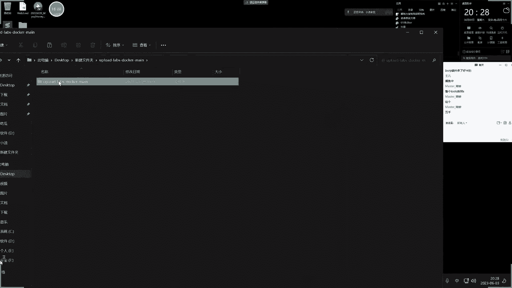
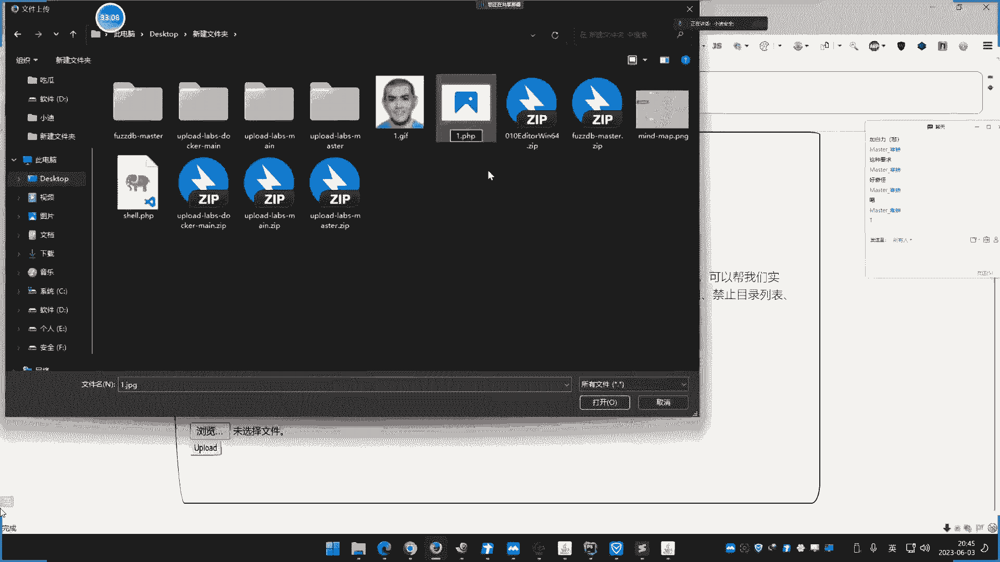
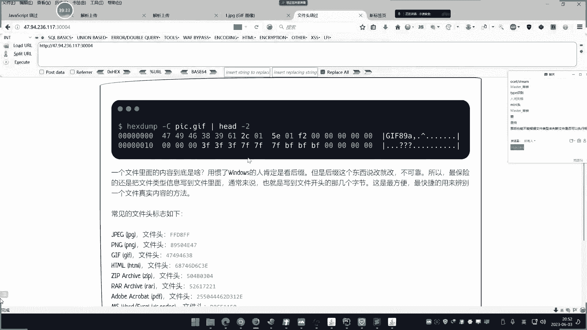

# 【小迪安全】V2024版 全栈网络安全 ｜ 攻防渗透工程师 （持续更新） - P47：第47天：PHP应用&文件上传&函数缺陷&条件竞争&二次渲染&黑白名单&JS绕过 - 逆风微笑的代码狗 - BV1Mx4y1q7Ny

我们上下第47天了，讲一下这个文件上传的安全问题，这个文件上传呢，说实话啊，虽然这里呢，我们是用这个PP的这个东西在演示，不过它有一些漏洞呢，也是在其他语言里面呢，也是有相应的一个情况的啊，讲的话。

如果今天只讲的，我不把图片搞出来，那也显得很低端。

我就做了个导读，这是我们文件上传的大概内容，三次直播讲完，先讲第一次原生态的一些这种常见的一些文件上传的一些安全问题，然后呢，我们再来说一下这个拓展的。

就是包括这个文件上传的引发的一些这个其他的一些方面，然后呢，再来说一下安全架构的，这个安全架构呢，也是我们不得不面临的一个问题，这也是很多文件上传，其实安全架构呢，就是给它接受，然后呢。

有些呢是能够突破，有些呢是没办法的，我们把它介绍出来之后呢，你会发现呢，其实有很多情况都是属于这种安全架构里，什么叫分站储存啊，对象存储啊，包括目录权限的一些配置啊，都会导致一些文件上传漏洞啊。

即使有呢，也没有办法做什么，简单来说呢，就是有些你上传的文件呢，它会放到一些其他分站里面，就像我们前面说的，它会放到这个对象存储这个人应用里面，有些呢就是说放到目录里面呢，但是目录里面呢没有权限执行。

也会导致一些攻击的失效，所以说这是我们在文件上传之后呢，最后一讲要讲的这个东西啊，就给它演示这三部分啊，这也是这个今后的一个发展方向，所以说，这块漏洞呢，它会随着时间的推移呢。

逐渐会和以前上传的一些这种传统的一些攻击方法呢，会有很多错误，或者说压根就行不通了，也有可能在发展的过程中，一年，二年，三年，四年，五年之后呢，可能这个文件上传呢，就消失匿迹了，对吧，可能就很骚了。

就会有这么一个迹象，就是因为这些架构的一些差异所造成的，这也是我们要给它体现，给大家上这课之后呢，最后一节课给它讲的，这样子呢，也彰显了这个课程的这个深度和这个当前的一个主流啊，也同时呢，给大家提个醒。

好，但是现在呢，还有去上这个内容，或者说还有勇武之地呢。

所以这些东西呢，我们还是要上啊，好，那上之前呢，我们先来关注一下这个文件上传啊，这是要必须要了解的这个两个点，这两个点，我上了一百次就讲了一百次，但是依旧还有人会犯同样的错误，我不知道该怎么讲。

他才不会犯错，我希望啊，当我讲了之后，能再解决一部分的疑问，不会以后再问到这样的问题，就第一个啊，就我们说的，课前一定要明白的，学习这个文件上传，首先要明白的第一点，就是什么呢。

就是文件解析的一个对应关系，啥意思啊，这说了两句话，一定要理解啊，你如果说连这个都不理解，你后面就不用学了，学了就等于没学，那跟学了没学一样，什么意思呢，第一句话啊，无文件解析的安全问题上的话。

隔时的解析是一对一的，啥意思呢，就是说，没有解析安全漏洞的情况下的话，你的文件隔时后期解析是一对一的，啥意思，就比如说，你上传了一个jpg的图片，然后呢，这个jpg图片里面可能你在里面查入了后门的代码。

然后这个时候呢，你去连接这个jpg呢，它连接不上，有人就会把这个问题当作一个问题来发给我看，这不是我们说的，在学文件安全，直接上传安全证里面，第一个就是要说的这个问题，我说的很清楚啊。

没有解析漏洞和一些其他漏洞的干扰的情况下的话，这个解析的流程是一对一的，就是你上传的是图片，那么就解析成图片，你后门代码写到这个图片里面去，也没有用和用出，因为你的后门代码是一个其他语言的代码。

你用一个图片怎么能够把这个代码给它执行出来，这是执行不了的，它的解析关系是不能这样搞的，除非是这里有漏洞，能够错误的解析，让那个代码执行出来才行，所以说，你图片上传到对方的网站上去了。

不管你这个图片里面有没有后门代码，都不能连接，知道吧，这才是正常的，不要以为说后门代码在里面，你就能连接，如果是那样子的话，我直接上传图片就能拿下网站了，我何必还要学一些其他莫名其妙的东西呢。

所以这个问题是首要要明白的，以后千万千万不要再犯这样的错误，但是有时候如果说有解析配置上面的错误，就是网站自己配置的解析有问题，导致错误解析，或者说有解析漏洞干扰的情况下，它就能实现差异解析。

就是说能够图片格式解析成脚本格式，但是要解析成功就必须是对方配置错了，或者说有这个解析漏洞才行，明白没有，有前提条件的，就是说刚才这句话呢，你要推翻它的话，只需要有漏洞和配置错误才行的。

再一次再次给他声明，以后不要再出这样的问题了，那么呢，还有句话就是文件商权是干嘛的，在讲课之前呢，这句话还是要给他解读一下的，解读完之后呢，后面才能更好地学习嘛。

文件商权是指攻击者利用这个网站或者是各方面的，文件商权就是说不只是网站中，你像我们一些APP中也经常会有这个什么鬼商权的操作，比如说你的图像，你的个人图像，或者说你上传什么提交的资料，提交的材料。

这都属于商权操作，就是说这种商权操作的话，对方会接受你这个商权文件，所以攻击者就是利用这个功能，事先看是不是能够把后门的文件都给他上传到网站或者服务器上面去，然后呢。

通过上传后门之后如果能够成功的上传的话，那么他再利用这个得到的这个地址呢，去控制这个网站，这就是一个文件商权攻击的一个典型流程，就是通过文件商权功能，不管是网站的还是APP的，只要有上传都可以。

就是通过上传上传自己的后门文件呢，来尝试去连接后门来控制的一种攻击，叫做文件商权攻击，那么对于这个防护者来讲的话，他是如何来确保这种安全问题呢，是吧，既然攻击者能够进行文件上传的话。

他肯定是在商权这里那就会做检测，就确保你上传的是正常文件而不是一个后面文件，那么他的检测思路就会从几个方面出来，哪几个方面呢，就是会从这个你上传的文件的后追，就是我们说的格式，他的这个格式。

还有文件的类型，什么叫类型呢，比如说TST我们就称之为叫文本文档内，是吧，DOC也是文本文档内，那个图片呢有凤井格式，什么JPG，JF，PNG，那通称为这个图像内，对不对，这种是类型。

还有呢就是文件内容，是吧，图片呢有固定的内容，那这个其他文件的有其他固定内容，他会从内容方面，后追方面和文件的信息方面呢来做判断，来追踪确定你这个文件呢，是不是一个正常文件，是不是他需要的文件。

而不是一个非法文件，对不对，但是啊，他这个判断呢，虽然说判断写得很传绵或者写得很逻辑的话，但是他还会受到一些其他方面的影响，比如说什么影响啊，就说漏洞呢，这个安全问题呢。

不仅是在代码验证这个文件的这个安全性的时候呢，会出现安全问题，同样，有些呢可能是在这个，开发的语言上面，包括语言那些函数，或者说使用的这个中间间，或说你用到了别人，提供的这种第三方的这种编辑。

就是第三方的这种文件上传功能的这种编辑，这些地方，他如果存在缺陷，也一样会造成安全问题，啥意思呢，这句话就是很简单的道理了，就说你去做文件上传是吧，你的代码去控制它，但是有时候呢，你代码控制的安全。

没有问题，但是支撑你这个代码扔行的一些其他的一些服务，他有安全问题，那么呢也会造成文件上传漏洞，所以说文件上传漏洞呢，他为什么容易出现，其实呢就是说不仅仅是代码中的问题，利用过那些东西。

包括利用的这个语言的版本，语言里面那些函数，可能会存在一些绕过，或者一些这种系统方面的一些各种各样的一些问题呢，都来了，对不对，然后另外啊，这个文件上传呢，他也存在多个存储逻辑，就是我们说的保存逻辑。

就是文件上传之后，你不是要把这文件上传到某个地方保存吗，诶是上传到你这个代码的这个本身的服务器上面呢，还是单独在放到另外一个地方呢，还是说这个放到其他地方呢，由于这个逻辑不同呢，就会造成一些传先的不同。

为什么这样讲呢，你比如说很简单道理，是吧，我自己的网站，我现在测的是三大问题，小礼拜点卡姆，我通过代码呢，结束这个文件上传，我把文件上传的保存到另外一台服务器，而那台服务器呢，和我这个网站没有任何关系。

那么你去连接就是连接，拿另外一台服务器，那和你这个现在测试网站没有关系，对不对，就会有这种这种影响，那就有这种不同之处，就你在测的目标是这个网站，诶他把它放到另外一个地方。

那你要连的话就另外另外一个地方，那也获取的是另外一个地方的权限，和你现在测的网站没有关系，知道吧，所以说啊，这里面呢，有很多点在讲，我这里呢，花了七年，花了大概十分钟，去给他做这个安全。

在讲课之前的一个安全普及，就是希望大家把这个架构和思路呢，给你刻在脑子中，然后你再通过这个后面的字典学习，把它归类到我们这个不同类字面，那么具体那就是我们这个图片啊。

你看我说的那个存储逻辑就是这个第三方面。

就是我们第三次直播讲的，然后呢，包括这个刚才说的还有像什么编辑器呀，什么鬼东西呀，这一些安全问题造成安全漏洞，那就属于第二次，就是我们第二次直播讲的，那今天呢就是说讲最原始的。

最简单的一种商权的处置方案的一种架构逻辑上面的安全问题，能理解吧，今天讲第一部分，然后呢在第一部分呢，在第一部分来的衍生出第二部分，在演示第三部分啊。

好，那现在呢我们来讲一下这个几个东西啊，我们演示的环境呢，是用的一个多可得的一个多可的一个环境啊，之前呢用了什么，啊，不露的老婆死了一个东西啊，那些为了显示更加高端一些吗。

显示其实内容都差不多，显示的更加完美一些，看上去牛逼一些。

那我们就换了这个，这个呢，这个是一个多可的搭建的啊，然后搭建的事，可以用这个F8X-D呢。

搭建这个dota也可以用F8X-dota搭建，这个F8X-D已经给他介绍过这个项目啊，前期学的比较灵活，应该都知道，这是一个红蓝部署的一个项目，这个项目呢，直接自动化部署，那一个-D就可以直接部署的。

-D就可以自动安装python3，python3-go，doct，doct，pastor，还是个SD跟mine，对不对，就你想安装什么呢，就用它跟刚一下就完了，其他的不用你操心，等着即可，这个呢。

也是我们前面给他介绍的项目啊，所以大部分呢，很多一些常见工具，包括一些这个高端的环境呢，都可以用这个项目的帮你自动搭建，但是这个环境呢，是用的是Ninas超系统啊，所以你可以在你自己电池上面呢。

部署一台啊，我们用了人服器啊，这里呢，多的就不说了啊，直接这个的F8X的，F8X是吧，-D它就会自动安装。

我这里有安装过我就不写了啊，这个很简单啊，直接用网上部署之后呢，这个直接把它进行这个安装就可以，安装之后呢，直接-D，让你自动安装，环境呢就不用操心了啊，安装好多了之后呢。

把这个烟丝的源码呢，给它放在下下来，下下来进入到他的项目。

啊，就是进入到这里来，那我就已经进入了啊。

就这个网项目，这是一个文件上传漏洞的一个测试项目啊，就是一个相当的小靶场啊，里面呢有十几种这个，呃，是一个关于文件上传的一些漏洞的这个测试的地方啊。

啊，那么来给他演示一下，好，然后呢，直接来启动啊，这个启动就不说了。

直接up-D，这里也写了啊，一键不锁。

直接启动，启动之后呢，他会在，这个，啊，这直接启动啊，我这很快，因为我就已经拿取镜像了，好，启动了，启动之后呢，他会在这个，当前主机上面呢，去开放，13个端口，从3001，30100到3013吧，那。

就是相当于有13个关卡的一个文件上传。

我们来给大家看一下啊，3。0打开，然后在测试的时候呢。

我们这里呢，把抓捕工具打开，因为这个文件上传的基本上啊，很多情况下面都要用到这个抓包，因为对这个数据包的不断修改来测试这个文件上传。

就打开吧，啊，当头改一下，好，打开啊，那这是我们的第一关，啊，为什么选用他的软硬是因为，他的界面的相对于来说比较偏向于这种应用，就是看出美观一些，那其他一些那种文件上传的一些东西呢。

看上去比较简单单一啊，然后我们这里呢可以对着这个代码呢去给他分析。

就是这个项目，这个代码的项目呢，我又下下来了，就这个，在哪个里面，这里面还是在代码的一个地方啊，那软码。

这在十几关的一个软码啊，我们来来看一下，你们说的那个什么二十关的25关的那那个东西呢是另外一个项目啊，啊，其实你不用去搞那个多多少关多少关，有些关卡呢是没有任何意义的，还是没有任何意义的啊。

就是说有些东西呢你用不到的。

以后也碰不到了，你学不学他，没啥的意义。

我们把一些，现在说实话，现在讲这个东西很多东西都用不着了。

但是怕晕得着，所以还是讲一下，这是那个软码就是那个整个项目里面的软码呢，比如说我们现在第一关就这个软码，这个软码呢，我们可以对着软码呢去给他分析，这样子的会更好的说明这个流程啊。

嗯，那这个关卡它是一个什么策略呢。

就是这里呢有个文件上传，然后如何是突破他的呢，好，就说我们现在去上传一个这个文件哈，比如说这里呢有一个把格式改一下，这里有个点一点pp的这个格式啊，然后呢我上传这个一点pp上传之后呢。

他说只允许上传图片类型的一个文件哈，然后你可以看到啊，我在上传的时候呢，这个是有很快的一个时间就返回过来了，那像这种时间上面很快的返回的话，一般都是js延展啊，这种逻辑呢，虽然说不是很苛刻的逻辑的话。

嗯，你也可以通过这个优见软代码呢，去观察一下这里面有没有一些js代码呢，写的这个研制逻辑啥意思啊，就说这个第一个关卡呢，他使用的是一个纯前端验证，我们这里呢，就是我们现在讲的这个四位导图。

这里可以看到的一个计划啊。

就是验证这个文件的一个情况的话啊，他的分为前端验证和后端验证，那么前端验证就是用js代码去验证的。

他为什么要验证他啊，很简单道理，这里呢是一个pp的一个后门，如果说我能直接上传这个pp文件的话，那么我就相当是得到这个文件的地址之后呢，我就可以直接连接到网站了，后门了就可以直接连接了。

所以他肯定是不让你直接上传这个脚本文件的，他只允许上传这种类似图片文件，你看我上传图片文件，哎他就能上成功是吧，这并且呢给到这个图片的相关地址是吧，图片地址，对不对，就是你上传的那个图片吗。

是吧，但是实际上中的你这个要上去后门的话，那肯定就像我说的啊，这是个jpg，然后呢你上上去呢里面有后门也连接不上，对就我说的这个情况吧，理解吧，所以我就必须要把这个格式改成pp。

那我一旦改成这种pp格式之后呢，他妈的还把我杀掉了，我一旦改成这个pp之后呢。

哎他就怎么样，他就上去不了了。

他说只允许上去图片类型的文件是吧，那么我们刚才说了，他是个js验证，那如何判断他是js验证，其实最好的方式就是看原版，但看原版呢也要有点基础，你看原版呢，这也可以看到啊，这个表单在这里。

那你看一下这个表单单吧，这里有个什么呢，这个上上图片有个按钮嘛，是吧，这个按钮呢有一个这个时间叫，exchange console file，这个时间，然后这里呢你看on splitter。

就是触发这个鼠标的时候，触发这个点击按钮时间的时候，return返回一个叫check file，这个函数，然后这个函数呢可以看到呢，定义的函数在这里，现在就是用js代码写了一串东西。

来得到文件的一些这个什么轨迹，然后判断一下什么的，从这里面的去编你这么点jpg啊，点png啊点gf啊点jpg，如果说这个判断等于负一，就是没有匹配到这四个答案的话，啊那么他就提示指级上传格式文件。

所以说刚才为什么提示那个信息，就是因为你的格式呢，不是这四个格式，他要提醒你那个格式啊，就是那个后追名啊。

我是点pp吗，不在里面，因为我换成这个其他的这个格式呢，他就可以了，是不是，你看啊，我换成那个png对不对。

他就可以了，你看就可以了，是不是，所以说呢，这是可以看到啊，从代码中的能够看到这是一个js言词，那除此之外，还有没有其他方法判断呢，就是抓包判断，代码中如果看不到的话，再用抓包判断，为什么说抓包呢。

啊我们来看一下啊，我上传一个图片啊，我抓包，然后点抓包，好，是吧他抓到了。

还放出去，哎他放出去了，好，然后呢我在上传另外一个文件的时候。

你看啊我上去批批，再抓包，他直接提示包都没有经过这里，啥情况，这个验证是不是就是在前端产生的，为什么，抓包是抓数据储蓄的包，就是经过这个浏览器并发到对方服务器，服务器呢，再回信过来。

那我发送对方服务器的时候呢，应该会经过我这个抓包工具，但是为什么没有抓到呢，就是因为这个验证就在这浏览器这里产生了，他没有发出去，所以这是前端验证，好理解吧，所以有些抓不到的数据包呢。

其实其实就是在浏览器那边的自动帮你验证完了，他并没有发出去，所以导致你抓过工具的并没有补过到，刚才就是这个情况，那你可能说了，啊为什么这一点批批，呃这个能抓不到这个JPG能抓得到呢，为什么。

因为JPG他本地验证通过了，发到对方，对方的再回过来。

而你是PAP不行了，好理解吧。

能不能理解，理解之后我们就给他演示一下，那么现在就是我刚才说的如何判定他是JS验证逻辑，就是很简单，一个是看他的代码里面，有没有这种JS的验证代码，第二种就是我们说的通过抓包，判断下你在上传的时候啊。

为什么不能上传，那里能不能抓到，对不对，因为很简单，他不能上传，应该就是说你发到对方服务器服务器，再回一些回来，你才知道能不能上传才有这个结果，但是能抓包都抓不到，结果就赢出来了。

那就说明他就在本地就已经验证完了，那么本地验证完就是前端验证，就是JS代码，为什么称之为前端语言，就是这个原因，就是他运行在牛奶鸡端的，他不需要对方服务器的那个后端代码去验证，就是提到这个代码中呢。

牛奶鸡就自动把这个代码执行一遍，认证完了，所以前端验证就是纸老虎，就是你可以把删掉，或者怎么办呢。

就是我先假使让他上传成功，然后呢，是吧，先让他搞一个这个能够支持上传的东西，先让他是吧。

能发到对方服务器，在发服务器的时候呢，我再把这改掉，发到这里，我再把这里改掉，改成一个。pp，对不对，有画屏啊，那我改成个。pp，那么就可以了呀，为什么，因为你直接上去一点pp他不行，我就先把包抓到。

假使先让你和服务器取得联系，然后我再改，发到对方去，原来是什么呢，就是他后面里面的代码没有验证逻辑，他的验证逻辑全部在这个浏览器这里验证了，所以我就先让你通过，那么再发出去就不会再对我做什么事情。

发出去，是吧，然后现在呢，你看这个问题就上上去了，那你看这个就是我们的后门地址，对吧，这是后门地址，然后后门地址里面呢，就是我们的后门。

对吧，我们就可以简单给他连接一下啊，这个连接了我就连接一次啊，后面我就不连接了啊，这是刚才那个后门生存的代码，因为后面呢。

我们上成功就可以了啊，这后面连不连接他都关系不大了。

这是那个文件啊，我看下他里面代码。

你这他妈的，那这是个后门代码对不对。

这个后门代码啊。

你可以在这里生成一个啊，生成的和他一模一样啊，我就不生成了啊，生成之后的你看啊，我这连接了连接他的地址呢，就是这个地址嘛，打开，还是不连接上去了吗，这取消了权限了是不是，但是刚才上传了几个东西吗。

你都在这里面，这谁呀，还上传个9e pro呢，哎，好。

这个就是我们说的第一点啊，这个第一关的一个关卡能不能明白，这个连接操作就是说连上去后续的文件上传连接上去，用这个后门管理工具的连上去控制网子的操作啊，这个不重要啊，主要是这个文件上传操作啊。

这个演示一次后面呢就不演示了，就只要上传这个文件呢，上传上去就默认就是后续连接就行了啊，这个好好理解吧，不难吧啊，好理解之后我们就，看第二个了啊，这个第二个呢是一个什么呢。

他说一个点他说的是阿巴奇福这个配置文件，这个配置文件呢，能够帮助我们去控制一些访问的一些东西，那啥意思呢，这就是我们说的第二点了。

就说前面呢是验证上面的一些逻辑问题，就是他简单方向不对，用的是js验证导致的js验证能够直接被绕过，因为就是说这个代码呢，我们可以忽略他用浏览器呢，把这个js呢给他验证的是吧，先给他绕过去。

然后呢我们后面的就直接上传了，因为他后面的就没有音质了，所以那就可以直接上传pp的，而现在呢，这个第二个关卡呢，他是产生在哪个漏洞上面的呢，在第一关卡就属于属于中间间上面的问题。

就说他这里来说是一个deaccess的一个，Apache的一个配置文件。

那个配置文件是干嘛的呢，我给他说一下啊，配置文件呢。

你可以这样去写这个东西，那这个东西是什么意思呢，我给他说一下啊。

这里有个这个东西是吧，那这里这个东西是什么意思呢。

他这个东西，我把他放左边啊，这什么意思呢，就这个文件呢，他说添加一个类型，类型有个什么application，插adb dpp。png，这是啥意思呢，其实就是接入这个配置，run这个什么。

png的这种命名文件呢，当做这个类型，而这个类型呢是pp的类型，所以也就是说，当做这个什么pp执行，其实呢就是说。

你在apache里面如果有这个文件的话，那么他就会有。

对这个解析更改的这个策略，也就是说呀，这个。ataccess，他是怎么修改这个解析配置的一个文件。

所以说呢我们就可以怎么样呢，比如说我直接上传这个，直接上传这个什么，1。pp，对不对。

让他执行，他不容易上传，对不对。

好我们现在呢，按照之前的讲的来，我把他上传1。jpg。

对吧，上传，好他能够上传啊，看着啊，他有个上传地址，对不对，上传了，哎。

这又是你们啊，我真是啊。

嗯，嗯。

嗯，嗯，我开的这个把上就这么好玩啊，都跑上去上传，这我还没有开始做，这上传一大堆去了，稍等一下啊，我关了，他影响结果不是说他搞搞破坏知道吧，这我刚准备说把那个东西讲一下的这一搞着搞着，嗯，嗯，嗯，嗯。

嗯，(鍵盤有點亂度，玩一下等一下)，(玩遊戲中)。

我把白名單加一個啊，(玩遊戲中)。

(玩遊戲中)。

好，(玩遊戲中)，搞了啊，(玩遊戲中)，來，(玩遊戲中)，兄弟們，(玩遊戲中)，再來幹我吧，(玩遊戲中)，求幹啊，(玩遊戲中)。

看一下啊，剛才呢我們重新上傳一個文件啊。

繼續來這裡啊，你看啊我上傳一個JPG，1。7。7，好上上去了啊，然後我們現在來看一下這個D字啊，(玩遊戲中)。

那你看他說音錯誤而無法顯示，他說音錯誤而無法顯示啊。

看著啊，這個代碼，誒這個時候呢，是吧，大家可能說，誒喲這裡面是有後門代碼嘍，我連接一下，我連接了連接個什麼，我連接個商嗎。

這連接商嗎，連不上啊，這不就是我們的基礎講的一句話呀，你這個裡面有代碼，但是呢你是GPG不行，所以這個時候呢他就通過這個什麼。

上傳一個另外一個文件，因為他直接上傳PP他是不行的，剛才已經講過了，所以他的流程呢是上傳一個。access文件。

那你上TP那不行是吧，不行之後呢我們就隨便抓個包，(玩遊戲中)，抓個包啊，然後呢，再去上傳一個文件，隨便上傳一下啊，直接上傳是吧，把包抓到，這個時候呢，就改一下啊，這樣，(玩遊戲中)，就改成這個名字。

access，(玩遊戲中)，是不是，選這個文件，然後呢再把這個代碼呢改成我剛才說的這個邏輯，改成這個，(玩遊戲中)，好改這個是吧，然後再上把它放出去，對不對，要放出去就是怎麼樣。

他就上傳了，然後你可以看到，這裡呢就上傳一個文件了，這個文件就是剛才上傳的，就這個文件吧已經上傳了啊，沒問題，然後這個上傳之後呢。

我們思考一下，我現在在訪問這個地址，我在用這個後面連接，我問一下大家，能不能連接上啊，趕緊給他吧，能不能連上啊，可以可以，有沒有說不可以的，不行，可以都說可以，好，PNG，對的啊非常正確，不行，錯了啊。

為什麼，因為我搞的是PNG的匹配。

我上傳的是JPG，所以呢，就把這個格式再改一下嘛，改成一個PNG就行了呀，上傳。

再來訪問1。PNG，看1。PNG和1。JPG的一個差異，同一個文件。

這個差異呢就直接，結果出來了，把這個路徑一改，那同樣都是圖片，這個就能成功連接上，哎是吧，好這裡一看之後，大家就明白了，對不對，明白了，是不是，哎呀剛才哎呀，這個就是這個考慮，但這個實驗呢一定要明白。

他就屬於我們剛才講過的，這種問題是吧，是因為解析的一個配置錯誤，一個文件的導致的解析呢，實現了修改，所以呢實現了這個差異解析，你不要說哎呀，又把這句話推翻了啊，搞清楚啊，不要說圖片就能解析成功啊。

一會又要問這問題啊，好這個第三關，這個第三關屬於哪方面的問題啊，屬於中間間裡面一個配置文件，重新寫過，重新修改了這個什麼呀，解析規則，然後呢實現了一個圖片呢，把後面進出來的結果，否則的話。

如果你不能把那個文件進修改的話，解析規則改變不了的話，你這個圖片呢，是不能執行出來結果的，明白沒有，已經做過實驗了啊，不再說了，關卡太多，我們就不一個給他囉嗦了，這還十十多關呢，好這個呢。

第三關是什麼呢，這個類型，這個類型又是什麼意思呢，給他說一下哈，這是一種判斷的一個差異性所導致的，啥意思呢，就是說我們可以抓個包呢，給他看一下啊，抓個包給他看一下，來我抓個包。

那我去上傳一個這個，png的包。

GF的包好吧，先上去GF的，看下GF的包，看著啊。

好這是GF包，裡面呢有個這個信息，我把它拉出來，好然後呢。

現在呢我們再換一個。

換一個格式的包啊，翻個臉pht的，好上傳啊。

看pp的，抓個包。

好這是php的包。

看一下啊，有什麼不同啊，再看一下啊，再看一下啊，這個叫container top，GF包為image gf，pp包為application，什麼acd steam，你可以再上傳其他包的啊。

你可以上傳其他包的，每個都不一樣，他這個上面呢也給了解釋，嗯也給了解釋，每一個格式你在上傳的時候呢，都會附帶一個類型，這個類型呢，就可以確定這是什麼文件，啥意思呢，其實就是管理員呢。

他在驗證這個文件的時候，他是通過這個類型來判定這個文件的。

能不能理解，就通過這個結束這個類型，來判斷你是不是一個圖片，是不是一個正常文件，是不是他允許的上傳文件，但是這個判斷，可以通過抓包把修改掉不就行了嗎。

對不對，就你剛才呢直接讓我上傳pp，你不讓我上傳，說類型不正確。

那好簡單啊，我就怎麼樣呢，我先把你改成什麼。

這個jpg，是吧，你先讓我上傳上去，因為我上傳的時候呢，一上傳，包抓包，我再把這個地方改成什麼，php不就行了嗎，為什麼，因為我上傳jpg的時候，你附帶這個類型是允許我通過的，我再把文件後綴改成pp。

放出去，這不就上傳成功了嗎，對不對，這就是後面的地址啊，去連接他即可呀，這個連接我就不做了，簡單來說，這個呢就屬於是，驗證這個類型所判斷的文件，這種驗證呢，也屬於是有問題的，就是驗證你要從多方位去驗證。

而不僅你說從一個東西，就能判斷這個文件的真實性，這不行的啊，好這是這個第三關，好接下來我們再看第四關，第四關呢，是一個文件頭。

是一個文件頭，這又是啥呢，這裡呢再給大家普及一下。

剛才是文件類型，是吧，我們再看文件頭啊，比如說我們呢，在電腦上面的找一些這種。

GF的文件，我可以把這個GF文件呢，給他用這個010Edit去打開。

就是這個石牛精緻編輯器打開。

打開之後大家可以看到啊，我們打開很多個，來PNG的，是吧還打開幾個啊，比如說這個GF的，再找個GF的打開，這裡這麼多是吧。

我隨便拉幾個進去，這都是GF的，然後呢你觀察一下了，PNG的頭部是一個什麼，PNG，GF呢，GF89A，看沒，孤零的啊，你可以再換一個其他文件，比如說JIP的，你把JIP的，把JIP的，是吧。

把它放到這個亞瑟包裡面去，他是PK開頭的，看沒。

前面的東西，頭部都是孤零的，就是不同格式的文件，他的頭部呢。

是孤零的，能理解了吧，那麼也就說程序員呢。

他在判定這個文件的時候呢，才用的是文件頭來判斷。

才用的是文件頭來判斷，就很簡單道理。

就比如說我現在呢上傳這個GF，他是能夠上成功。

對不對，然後你看啊，我現在呢，把這個文件，找一個這個另外一個文件，比如說像這個PP文件。

是吧，上傳，他就說只能上傳。

為什麼呢，然後你看啊，我在把這個PP文件呢。

前面啊打開，把它在這個代碼前面的加成一個什麼，JF89A或者PNG那個東西。

加個這個頭，就加了個東西。

把它上傳，哎他說還是不行，傻精光，因為你這樣加呢，不對的啊，你這樣加是不對的，我們要怎麼加啊，來抓個包，還改了個類型，對啊他還檢測了一期。

看著啊，那一個是這個頭部該了。

然後把類型的改成那個圖片類型，就他有兩個了啊，哎那個類型剛才各自來的。

搞個類型就可以啊，比如說，放然後看這邊呢，是不是上傳成功了呀，嗯後面上傳成功了，你看，有了啊，所以這就是檢測頭部，那麼其實也非常簡單的，他和剛才那個是基本上是差不多的，啥意思啊。

我們可以理一下嗎，是吧，通過文件頭判定文件，類型後追，是吧，通過文件類型判斷文件後追，是吧，這兩個出來了，頭幫你一個文件類型，而後追，類型也是幫你一個文件後追，不同後追的文件的類型。

上傳上去自帶的就不一樣，但是這兩個呢，都可以通過數據包裏面，把修改的達到偽造，就是一個圖片的後追，啊圖片的文件頭啊圖片的類型呢，來去上傳個pp文件。

好理解並不難，沒有什麼問題啊，好。

接下來我們再看，第五個關卡，第五關卡呢，是一個類似的什麼叫黑名單的一個因子。

什麼叫黑名單白名單呢，我們來想想啊，現在就來到了啊，通過文件的後追來判定文件的這個後追，這時候就有點尷尬了啊，什麼叫文件後追呢，啊，然後這個判斷呢，有一種叫黑名單和一種叫白名單的一個概念。

那麼意思也是非常簡單明瞭的，就是來獲取文件的後綴名呢，來去判斷文件後追啊，然後一個基於黑名單因子就叫白名單因子，黑名單因子就是，檢測，文件這個上傳的這個，文件後追啊，是不是，在黑名單裏，在就GG。

不在就通過，對不對，白名單呢，那也是一樣道理，那就剛好相反，在就通過，不在就GG，對不對，然後這個是在不在白名單，邏輯能看明白吧，這個邏輯能看明白吧，接收文件的後追名，然後呢將後追名去比對。

比對這個後追在黑名單裏面，那麼這種因子叫黑名單因子，如果是定義一個白名單，那麼就是白名單，你們覺得黑名單和白名單，哪個會更有效果一些，試畫一下，一分鐘，對白名單，為什麼呀，因為，白名單就是固定死了類型。

而黑名單呢就是說只要你不在裏面，你都可以上傳，也就是說它還存在一些，理論上其他方面的上傳，但是白名單不一樣，你只能上傳那個名單之類的，上傳其他的就不行，那黑名單就是說，你不在黑名單裏面就可以上傳。

那這個就是說肯定是白名單要嚴格一些。

那這種呢就屬於什麼，黑名單，因為你可以看到，它的代碼中呢定義好了一些常見的一些腳本的格式類型，對不對，你看PPRPP5啊什麼PP4啊PP3啊，這個這個這個一大堆的是吧，然後呢寫了這些東西。

但是這個黑名單驗證呢，它有一個驗證邏輯。

就是有個叫我們說的叫沒有遞歸的一個問題，這個代碼要給他看一下啊，這就是他的代碼啊，呃他雖然有個死STRReprice呢去檢測這裏面的，檢測這個黑名單，如果你沒有匹配到就把它過濾為空。

那這個呢邏輯是有安全問題的，為什麼這樣說呢，就是沒有迭代。

沒有遞歸的一個過濾，啥叫沒有遞歸啊，就是只搞了一次，只搞了一次啊，啥意思啊，但我們來給他演示一下啊。

我直接上傳一個點P點這個CR點PP上傳。

哎你會發現呢，他上傳的類型變成了點CRPP沒有了，他把PP過濾空了，那很簡單的嘛，我可以怎麼操作他呀，是吧，寫這個東西下來，放出去，然後這裏呢，他就出現個類型了，你看，新點PP就上傳成功了。

文件就存在了啊，是不是上傳成功了，這個是後門的嘛，這是一個什麼邏輯呢。

很簡單的道理啊，這是黑名單驗證的一種啊，一種方式說的是這個，無遞歸的邏輯，只檢測一次，沒有循環，那麼我們上傳一個PHPHP，那麼區空，那麼前面是P後面再加HP又換完了，理解。

好理解，非常簡單啊，沒有什麼太大問題，其實就是代碼中的沒有做遞歸處理，只過濾了一次，那麼那就導致呢，我們就可以雙寫一次，是吧，你過濾一次我就搞兩次嘛，那第二次不過濾就GG了，吧，繞過了，啊。

就是沒有遞歸啊，而且這個不僅沒有遞歸，而且他沒有考慮大小寫，為什麼這樣說呢，這個函數呢，他只，只區分這個，大小寫的，就說你這裡的固定是小寫我換個大寫他就不不不不不攔截了。

你要看函數的有些就說為什麼說我們說有些函數差異或是傳函數缺陷呢，就是你用的這個函數呢，他可能有些函數呢，他是大小寫，他是大小寫敏感的，就是你必須要告訴他，我大寫過濾小寫過濾，或者大小寫我都過濾。

你知道吧，這東西要告訴他的啊，所以他我們說函數缺陷呢，也會造成這樣安全問題，那像CTF裡面的這些，啊像一些大塞裡面的一些CTF提醒，如果說考文件上傳，他就是喜歡考這種東西，就是考慮對這個函數的這個理解。

是吧，這個函數是大小寫的一些情況呢，還是一些各種各樣的一些問題啊。

對不對，這個是這個3005啊，我們只看306的啊，306呢和剛才的大馬呢，差不多，這個呢就是我們說的這個大小寫問題啊。

這個就沒什麼說的了啊，就是呢這是個小寫是吧。

你在上傳呢，他嗯，這都直接上去了，我上下了你看編了是吧，然後這個時候呢，你把它改成的大寫你看啊。

嗯改成大寫了後面加個大批。

來上下上去，然後這裡呢改成大批放出去，你看這問題不來了嗎呢，哎這個大小寫呢，如果說是這個是windows服務器的話，那麼大小寫是不敏感的，就說你大小也行小小型，他也能正常訪問，但在pd那時的超系統呢。

他就他就不一樣了啊，他就分別了，所以說這種方式大小寫的這個方案呢，是要在windows的這個服務器上面的才能支持，如果是你那是的話，你要麼就全部大寫，要麼就全部消息，你如果說一大一小的話。

那這個文件就不再是批評文件了，知道吧，你那是他分大小也區分的啊，windows不區分，就是你大寫小寫他都認識，能理解吧，好這是這個第七關啊，第六關我們來看第七關啊，第七關呢是一個以前的老龍叫領英階段的。

這個漏洞呢以前很活，但是隨著這個時間推移的後面都逐漸很少了，原因就是因為這個漏洞呢，他有個有一個先知，這個先知呢就是說，這個pp版本呢，他要小於這個5。4的三次的才有這個漏洞，在其他的這個語言裡面沒有。

所以這個漏洞呢是批評特有的一個漏洞，然後這個漏洞呢，而且只在這個版本5。3年4日之下才行。

所以我們可以先做個實驗，就我們自己呢。

在測試的時候呢，先做個心理設計，提交之後呢，呃，可以看一下他的回顯的這個返回的批評版本是5。2。1，17，那就說滿足這個領領階段的一個條件，那麼我們就可以利用這個領領階段呢。

來實現上傳這個後門文件，直接上傳肯定是不行的，那比如是直接上傳的他肯定是不行的，文件內心不匹配嘛，是吧，那麼如何上傳能夠成功呢，就是利用這個領領階段，我們來給他演示一下啊，什麼是領領階段。

領階段條件有點苛刻，那麼還是講一下啊，比如說這裡的上傳這個pp文件。

上傳之後不抓個包，然後這是他那個包嘛，是吧，然後我們這裡呢，來想一下啊，先把這個大小就給他緩和過來啊，然後你看這個水包上面呢，有個叫post，有個路徑，啊，他意思就是說應該就是說這個路徑呢。

是保存這個文件名的一個地方，就把這個文件放到這個路徑裡面去，對吧，如果說沒有路徑的話，那就改這個名字，有路徑的話就改路徑，就是有路徑這種參數的話啊，如果沒有就是改這個名字，啊，但這裡有路徑。

這個意思我們很好理解，就說把這個文件呢，應該是給他全個參數，這個參數呢，就是一個文件的保存路徑，就是對方服務器的一個那個目錄嘛，保存到這個upload裡面，然後我們在這裡呢，寫上一個什麼東西呢。

寫上一個領領階段那個東西啊，就說如果我不保存的話，我們可以把這個包呢，拿到這邊來提交模擬詞啊，把他放出去之後呢，他的這個結果呢，保存的這個文件路徑呢，結果跑哪去了，結果沒有。

結果沒有因為是這裡這個格式問題啊，我先把格式呢，給他，換回來改成這個jpg格式，你看他就有一個路徑了，是吧，這就是我們上傳上去的這個文件路徑，是吧，結果路徑，這我們上傳那個文件路徑。

你看他就保留個upload，然後這裡都有upload，我怎麼辦呢，如果我把這裡改成一個什麼，你看啊，我寫個這個東西叫a。asp，然後百分之零零，寫上去，好那這是個什麼意思呢。

00就是相當於會把後面的東西給他截斷，就是到此為止，就是一個階段符，截斷符之後，他默認的會在後面呢，添加一個這種圖片的路徑，一添加上去，00呢，把他截斷之後呢，就相當沒有了，那麼就只截取前面了。

這個文件就變成a。asp，好這個是格式p，我不要改sp了，別別別搞錯了啊，寫個a。pp的，因為這是個pp的後面啊，不要寫sp了，寫錯了啊，哎就是這樣，其實就是說他會在這後面的去組，加上這個他自帶的一個。

這個文件名字吧，會以這種形式，但是現在啊，你看啊我把它一上傳，我先給他看一下啊，我訪問一下這個路徑啊，我先訪問一下a。pp，大家看到沒有的啊，然後呢，現在我要放出去這個包，放出去之後呢。

我們在關注這邊打開，看沒寫進去了，他就是個截斷啊，簡單來說呢，就是通過這個文件命名和文件路徑的一些修改，啊，就是讓他這個保存的結構呢，發生更改，然後利用這個領域截斷的將後面這個jpg的那個內容呢。

給他全部咔嚓掉了，那麼就只截取領域前面的，那麼就是保留這個a。pp，那麼就形成一個pp的格式文件，後面的才有，才能得以把它進行解析，是這麼一個邏輯啊，但是這個方法呢，他只使用在，我剛才說的他有兩個條件。

一個條件的就是那個魔術開關的問題，還有一個呢就是我們說的那個版本，就是這個主要是那個版本啊，就那個小於5。3點多少的一個版本才行，所以這是以前老用那個那種，但現在的用的很少了啊。

因為現在批評版本的很多都是五版本的很少，都是七版本的就沒有這個問題了，所以這還是我那句話，就是說有些時候呢，即使你的代碼本身呢，是沒有安全問題的，寫的邏輯是沒有毛病的，但是你用的這個語言的這個版本呢。

他有安全隱患，所以呢也會造成安全問題，這句話是不是就很好理解呢，這就是為什麼我在講課之前，要把這話給他老清楚，就是你要知道啊，這個漏洞呢，他是產生在哪個地方的啊，就是說這個東西。

他和他代碼的邏輯沒有問題，他代碼邏輯是沒有問題的，但是由於這個版本自己啊，有這個安全隱患，所以能利用到這一點了，好這是我們說的這個這個情況啊，再來個安迪克就八萬，第八萬的也是靠這個點，但是靠這個點呢。

有不同之處，這個不同之處在哪裡啊，我們來演示一下啊，同樣道理呢。

也是上傳個這個圖片，然後同樣的做個包，他也是考慮這個點，但是有點不一樣，你看剛才呢，那個路徑是在這個地址上面，然後這個是放在這個下面，這個放地下面，那放在地下面的話，如果你這樣去寫啊，那我這樣去寫。

用他去發包，那這樣去寫去發包，那麼一點批批會不會有呢，訪問我們再來觸發一下訪問一下啊，對不對，看有沒有呢，執行沒有啥情況，為什麼這樣子就沒有了，不是一樣的道理嗎，也是這個這個情況，然後這裡要注意一下啊。

如果是在下面這個地方就要把這個百分之零呢，給他進行怎麼樣，這裡有個叫URL的一個declode解碼過程，把你進行這個呢解碼過程，操作一下，然後這裡變成這個東西，再發包，再訪問就有了。

這是什麼原因造成的呢，這是和這個瀏覽器的一個解析有關係，呃啥意思呢，我這裡有很多人不明白這個原理啊。

可能搞這個錯誤，嗯，就是說呀，有些網站呢，我們可以給他演示一下啊，哪個網站來給他演示一下。

你打開一個網站，你看啊，我在這後面呢，去寫個空格寫個1，他就會自動把這個空格變成百分之二零，對不對，變成百分之二零，那麼也一樣道理，我這裡呢寫個百分之二零，他也知道這是個空格的意思。

這是在這個請求的網址上面，啥意思啊，我們來給他解釋一下。

為什麼要這樣一個操作方式啊，在這個URL上面啊，為什麼這個寫百分之零就好了，然後在這個post的下面啊，這個post下面，就是我們說那個提交數據，為什麼要對個百分之零呢，進行這個R次的解碼，什麼原因呢。

其實就是說啊，其實啊，這個零零階段呢，是這個百分零零的解碼，結果，但是URL上面呢，他會自動解碼，解碼一次，然後呢，你在下面的話，他不自動解碼，所以我們就需要，手工解碼一次，是這個原因造成的啊。

所以剛才我那個操作，就是手工把解碼一次，因為這個零零階段，是他解碼的結果，URL上面寫的，他會自動解碼，就好比我們在瀏覽器裡面。

我寫個百分之二零，他也知道我是個空格，我寫空格。

他也知道我是個百分之二零，是這個意思的一個道理，能理解吧，而你在這個數據包的下面。

在這個下面呢，你寫百分零零，那麼他就會認為這是個百分零零，所以你就要讓他解碼成那個，真正的零零，而如果說你寫到這個上面，他會自動把他解成百分零零，就像是說上面呢，自動解了一次，下面呢他沒有這個邏輯。

所以你就要手動把它還原。

是這個情況啊，好我們這裡呢就不。

不多介紹這個東西了啊，因為這個東西呢，就是給他解了個疑惑啊，實際上呢，也不會考慮這些點啊，你只要知道這些東西就行了啊，好我們來看這個，第九萬，第九萬呢，是一個什麼關卡呢，是一個擺名單的。

剛才玩的這幾個關卡呢。

都是基於這個黑名單的，是吧，那麼我現在呢，就來到擺名單了。

擺名單呢，他說擺名單要比黑名單先知，要更好一些，更多一些，啊這個呢，他是怎麼去把它進通關的呢，對不對，這個是把什麼通關的。

他說擺名單的這個先知呢，我給看下單碼啊，就是這個，嗯這還是黑名單吧，還是黑名單啊。

我還搞錯了，他還是個黑名單先知，就這個呢，其實就是我們可以利用一個，FUZZ的一個思路。

就是我們經常不曉得，車哪些文件嗎，就是他這裡就沒有，他是一個過濾不嚴，就是一個黑名單過濾不嚴，就是他這裡呢，我們剛才是大小寫啊。

還有那些東西是吧，然後到他這裡呢，直接上傳呢，啊他也可以，是不是可以上傳。

然後呢，你看啊我把格式呢，改成這個格式呢，他就，PP他肯定不行了啊，他就不能上傳了。

然後這是SPR，這些提示這些信息。

你可以看一下啊，這個是單碼端，嗯這是個單碼端，對不對，然後這裡呢，定了一些常見類型，這是常見類型的，SPR PPR PPR這些啊，只定義這幾個，但是我們可以看一下，給他介紹個項目。

這個項目呢，在文件上傳和其他項目中呢，都會用到，以後大家有幫助啊。

順便給他提一句，就是個FUZZ項目，你們呢就是一個什麼東西啊，給大家看一下啊，這個叫Wobble的一個字典，discover arctic，然後這裡呢有一個這個叫，Find upload目錄，這個是啥。

你看到啊，他說這個文件上傳的一些這種格式，啊你比如說在這裡呢。

我們可以找到啊，在PP的打開，你看這裡寫這麼多，PATM PPP354啊，IMC他們寫的一大堆呢，你看一大堆，這是啥意思呢，這個其實就是一些可解析成PP的一些場景格式，就說你限制PP不要緊。

你如果說你這裡呢PP5也可以執行出來，就有可能呢可以執行出來。

就你考慮了PP，但你沒有考慮PP5，那麼那你就可以用這個類似的這種。

FUZ這種字典呢，在這個什麼包裡面去跑它。

不就行了嗎，對不對，所以你可能會說，我怎麼知道什麼PP5啊，你把字典導入到那個測試那個地方去不就行了嗎。

那你可能說哎呀我不懂不懂不懂啊，教我教我。

啊來看一下啊，我們上傳，那上傳啊。

那這是那個文件名吧，我就改這個地方嗎，把它發到這個Include模下面去，先清除，把這裡呢當做一個條件選擇中，在這裡呢，把它引入剛才那個字典，是吧，Discover，不是那個ArcTik裡面的那個啊。

這個是個專門那個項目啊，那文件上傳的FUZ這兩PP的呢，是不是那邊全部寫進去了，然後再發包，看著啊，這不就行了嗎，你看根據長度變化來決定哪些文件上傳了，哪些沒有文件上傳，比如這個，看格式裡面。

這個是上傳成功了還是沒有上傳成功啊，對不對，那這是怎麼呢，根據這個長度的變化，是吧，那應該就這幾個都上傳成功了，PP3的上傳成功了，你看起來是不是啊，那上傳成功了，然後你看PP的就沒有成功。

下面就沒有那個路徑，對不對，長度的變異，那其實就是說這個下面長度都是成功的，這就出來了，一個FUZ的一個P2跑，是不是，所以這裡PP3能上成功，PP5也能上成功，那這個文件就能自信了。

那PP5也上成功了，我們試著去訪問一下，W的，PP，是吧，所以說呢，這些東西呢，啊不是C2。PP5，錯誤了，你看是不能訪問到吧，是吧，也能正常解析嘛，PP3，那也能正常解析，對不對。

這個東西我們就不說了啊。

這個FUZ這件事情呢，我們現在呢，還。

沒必要去了解太多，後面這個東西呢，給他說了，你們老文說有沒有什麼支點啊。

這東西老給他推薦，你自己從來不做個遊戲的老文，我不知道你這個報名，究竟在天上幹嘛，什麼一些各種各樣的，什麼遊戲的密碼支點，這裡也有，是吧，你那個支點呢，專門跑這種東西的，那些常見的，什麼鬼。

我還不只說給過一些。

是吧，這個，網上，網站給過的。

這種項目呢，給過的，都給過，老文說。

還有沒有什麼，有沒有啊，唉，自己做個有心人啊，有什麼東西之後呢，自己做個整理和收集，這東西總不是平常。

聽課慢慢收集下來，慢慢了解的，然後再用用的好就，經常用用不好就不用唄。

是吧，他這個不僅是這個文件上傳，你像一些這種常見的一些。

裡面東西都有，是吧，這個，Fuz就是盲逆嘛，盲逆就是不斷拆，對他有很多啊，不管是這個社會租屋啊，文件上傳的啊，還有這個各種各樣的一些東西，他都能拆，你看XS的一些常見的一些這種。

東西是吧，那些常見的一些。

唉這個就自己看吧，我就懶得幹了下去自己翻啊，這個我們後面也會講啊，他是一種叫，我說呢他也不是安全多度，就是一種測試方式啊，就是盲逆的去拆就有什麼，沒辦法的時候呢，就是東西幫你一個勁的跑啊。

尋找裡面可能存在的地方，唉就這個意思，我們現在再來看這個第十關了啊。

這個第十關呢，是一個條件競爭，這個條件競爭還有的用啊，其他的像前面講的九關呢，可能以後都難得碰上，優勢有但是很少，這個條件競爭是個什麼情況啊，簡單來說，他是一種這種邏輯上面的錯誤。

誰說這個驗證呢，他有分代碼的驗證的問題，還分這個邏輯上面的問題，是啥邏輯呢，你這個邏輯有出現什麼問題嗎，我們看這個代碼代碼呢，可以從這裡看，也可以從那個網站上面看。

呃簡單來說，他看代碼呢，如果moving upload file，移動文件那個PP函數，如果前期商務我們給他講過了，安全開發的PP的那個課程的話，對這個函數應該不會陌生，就是針對一個文件的進行移動。

就是文件上傳的一個常見函數，移動一個零四文件，這個零四文件就是我們接收到的文件上傳名，把它移動到這個，upload。png連接這個內容。

那麼代碼呢，可以在這裡看到啊，所以那生命這個全劇變量，upload。png，然後等於這個，路徑下面那個upload，哎呀這個鼠標怎麼回事，怎麼那麼老卡卡的，這是upload目錄，然後呢，這是那個目錄。

然後他把它放在這裡，啥意思呢，他這個邏輯呢我不懂，但我先問大家這個代碼懂不懂啊，他們看得明白你們，他們明白我就不給他慢慢分析了，我直接給你告訴你，他是什麼意思就行了啊，看得懂啊，不明白。

其實你學到最後面了，不管說是挖洞也好，還是說分析一些高級的這種攻擊技巧，全部都要和代碼相關，你如果說不懂代碼，不學安全開發的話，說實話很難的深入，永遠都在那基礎的一些邊界在徘徊，這也是為什麼。

一直要加強代碼方面的原因啊，這種代碼是很簡單的，如果說這種代碼都看不懂，說實話你很難深入了，這個就是文件名啊，我給他直接說這個結果吧，他是先已經商權了，後面判斷呢，再進行這個進這個處理邏輯的。

就是邏輯上的缺陷，啥意思呢，他接收這個文件，接收完之後呢，直接整理呢，就把它進行了一個商權，這個moving upload，就是一個移動文件，是類似商權，就把這個接收過的臨時文件呢。

給他上傳了這個upload目錄，upload目錄就是這個目錄嘛，定義的，定到這個upload裡面，然後呢，接上這個內幕名，內幕名的就是接收到文件名，就把它進行這個商權，後面呢，再進行的是什麼。

判斷EXT和這個writer list，就是擺名單，擺名單裡面有JPG PNG GIF和JPE，這個擺名單驗證，判斷這個EXT，EXT那是接收文件名的一個類型，他就接收到類型，看他在不在裡面，如果在。

那麼就進行正常的邏輯，如果不在，就是輸出，是虧不得，彈出這個black函數，black函數，那我們跟蹤一下，它是幹嘛的，black函數是哪裡，在這裡呢，就提示支援許商權這個類型，然後呢就alig。

就是刪除文件，啥意思呢，就是說他的這個邏輯呢，我進的就是先商權，後面呢再判斷，再進行處理邏輯，成功了就正常，不成功呢就把它進行刪除，那麼其實就是說，在刪除之前呢，這個文件已經商權到這個地方去了。

能不能理解，所以他就利用條件競爭，什麼叫條件競爭呢，就是在這個文件還在服務器的那一插了，我給他，防蚊刀，能不能理解，它是一種邏輯上面的問題，就是說呀，他是先商權，但是很簡單，這個操作呢要同時進行。

就是要不斷的商權，不斷的防蚊，而且他還要一步，一步什麼事情，就是一個防蚊呢，你防蚊呢有什麼用呢，你剛防蚊到裡面又沒了，剛防蚊到又沒了，那怎麼辦呢，就是防蚊機創建那個代碼，搞出來，啥意思。

來看一下這個代碼，這個代碼是幹嘛呢。

forputters寫入文件，打開文件加小點pp，w模式打開，就是我們說寫入模式打開，寫入一個內容就是一個後面代碼，這個代碼是啥意思呢，就是你如果防蚊這個後面代碼，就會自動創建一個文件出來，好理解吧。

這個代碼好理解吧，就是你防蚊了，就自動觸發代碼，這個代碼是幹嘛的呢，就是會新建一個文件，寫入這個代碼，寫入這個後面，代碼就是這個意思，那為什麼要這樣做呢，就是我剛才說的，你上傳了，我防蚊到了。

你剛防蚊到就沒了，有什麼了用，所以我就讓他防蚊的，一旦一防蚊就馬上給我重新創建文件，那他刪除的是那以前文件，那我重新創建文件他不刪，那不就是我的後面代碼，好不好理解，能理解我們就開始操作。

不理解我再給你講一遍，能不能理解，這不理解，不理解，這故意的吧，好我們就來演示啊。

好首先呢我準備一個，這個代碼文件。

這個文件呢就是這個裏面代碼。

就是個叫c2。pp的代碼，就是他的啊，那，那，那，這就是一個，打開一個小點pp，然後寫入文件，就說防蚊這個文件呢就會創建個小點pp，對不對。

好我就先上傳這個小點pp，但是我們可以關注到啊，一旦上傳，他就會自動刪除，打檻子啊。

來我這裏呢，給他檻子啊，我直接防蚊他，先防蚊這個文件啊，現在是沒有的啊，這沒有的，我給他上傳，他直接提示不能上傳，為什麼，他直接提示不能上傳，但並不代表他沒有存在過啊。

原因是什麼呢，代碼執行太快了，就是你剛上傳上去，那服務器存在了一插了，代碼王一下執行發現不符合，那就GG了，所以我們要在他上傳之前，就要準備好，一直去訪問那個路徑的那個準備，能理解吧。

所以呢，我就要做兩個事情，開代碼，第一件事情，就是先不斷的去訪問，他上傳之後保存的地方，如果在黑骸史詩中的話，你可能需要先上傳一下，看一下這個文件的命名，然後確定這個文件路徑，因為你可能之前呢。

不知道他上傳的保存的文件路徑，你可能先上傳個文件，觀察他的命名，然後呢選擇性啊，如果命名呢隨機命名，那就有點尷尬了，那就不能有這個事物了，好我們先訪問啊，那把它保存放到這個Enclose模式下面去。

然後呢在這裡呢設置一下，先把這個清除掉，然後設置一下什麼呢，這個模式叫，Nopenos，選擇這個繼續永遠執行，啥意思啊，就是說我不設置任何東西，在這個數據包不更改任何東西，只是訪問這個路徑。

然後呢把它進行循環，他就會一直在這裡，一直去訪問這個路徑，就是呢不間斷地，訪問他，能理解吧，然後如果說成功之後，按照正常來講，如果成功之後他就會在當前，創建這個小點PD，但現在可以看到並沒有這個問題。

並沒有這個問題，因為有這個文件的話，他不是這個結果，他就會另外一個東西，小點PD沒有出現，有這個結果他就會另外一個東西，一直在訪問，與此同時我們再抓個包，抓個文件，商權包，選中剛才這個文件。

再商權，抓包啊，把這個包也抓到，這個小點PD的那個包，就說這個包呢，你可以先放一下，放出去他會提示，不允許上傳，這個結果，因為呢他後面檢測到，你不是他允許的文件，但是實際上他出現在服務器過。

只說呢在後面的代碼邏輯，把他刪掉了，剛才看了邏輯的，所以我就需要把這個包呢，也不斷地去發送，因為很簡單的道理，你雖然現在呢一直在訪問這個小點PD，但是你文件由於只出現過一次，這個級別，那個代碼指引級別。

不是你用秒能計算出來的，可能就是，多少微秒多少毫秒呢，但是那個代碼一直訪問呢，他不可能做得那麼精準，他不可能說你剛產生他就訪問到的，不會那樣快，所以我還需要做個什麼事情呢，把這個發送商權文件的數據包。

也同樣進行發送，進行批量的測試，依舊來的這個模式，然後呢清除，還是剛才那個測試方案，把商權呢也不斷進行，然後呢也不斷在嘗試訪問那個東西，這個時候啊，看著啊商權呢也不斷進行，我們這個時候刷新一下這個網站。

看到啊，等待奇蹟出現，看這個文件是不是會產生，看這個文件是不是會產生，誒誒誒，啊啊，哦出來了，他來了，他終於來了，你看出來了唄，這就是我們那個後門，對不對，那你接吧，就是兩邊要同時進行才行。

一邊進行都不行，但是有個前因後果，是先訪問那個地址，再上傳，不要說當然你也可以，你也可以先上傳再訪問那個地址，無非就是說時間慢一點而已，邏輯，能不能明白，操作可不可以理解。

這是屬於，他邏輯上面的安全問題，就是說，他的驗證是好的，但是由於呢，他的驗證之前，正常的邏輯應該是，先判斷後上傳，是吧，這麼一個邏輯是正確的，對不對，你這搞錯了，是先上傳後判斷，這就尷尬了呀。

那上傳上去就是說，這個文件呢，還是在服務器的上面停留過的，就是在他停留的這個，那個區間呢，我們就趕緊去訪問他，訪問他呢就利用這個代碼，訪問及清潔文件的特性，是吧，然後訪問了就重新創建文件。

因為如果說我訪問他之後呢，後面又把他刪除了也沒什麼意義，所以我要在他訪問的同時，馬上創建個文件，那這個文件呢由於他不會刪的，那麼這個文件就是我們的後門文件，就把後門文件寫到這個文件裡面去，非常好理解。

簡單易懂，不要說不懂，不懂就是裝懂。

這都不懂那就沒辦法了，細個我給你講。

你都不懂那真沒辦法，那我怎麼判斷呢，沒辦法判斷，前黑盒裡面是沒辦法判斷的，白盒裡面是能夠看到的，黑盒裡面就是沒辦法判斷，你可能問，那我黑盒裡面我怎麼測有沒有這個漏洞呢，就是這個測法呀，能測出來就測出來。

測不出來就測不出來，就這麼簡單，不要問那麼多為什麼。

很多東西你可以自己思考一下就知道原因，不是很大的問題，這個呢我們就說那個，你黑盒裡面測就是我剛才那個操作方法呀，你測個幾遍還測不出來就是沒有這個問題嘛，對不對，那白盒就不說了，直接看單碼嘛，好。

我們再看第十一關卡，第十一關卡，是一個什麼呢，是一個R字渲染，這個R字渲染又是什麼鬼東西呀，是這樣的，在我們這個，圖片的這個，商圈操作裡面呢，大家都知道，我舉個很簡單的例子，這個R字渲染是什麼概念。

就像我拿我這個自己博客來講，我就有這個R字渲染，那我上傳一張圖片，大家都知道，這個圖片呢，有尺寸大小，就好比我在我這個，這個經常給他吃瓜的這個，級別裡面，我可以把這個圖片呢，給他這樣呢縮小，和放大。

他怎麼樣才能做到，放大縮小，這個圖片還那麼清晰，或者說怎麼做到適應於我們這個頁面呢，對不對，所以這個，後端語言呢，就會對他進行R字渲染，什麼意思呢，就是讓這個圖片呢，更好的在這個網站頁面中呢。

去完美的顯示，這就是R字渲染的邏輯，那麼既然有這個邏輯之後，他就會更改這個本身的代碼，所以R字渲染呢，這個呢就是很多網站經常用到的，那麼R字渲染，會造成一些，圖片裡面的一些代碼呢，不存在的情況。

那我給他簡單舉個例子，你看著。

我現在呢去上傳一張圖片，上傳一下我們的這個，圖片，好上上去，然後我把圖片呢。

給他保存出來，好這個圖片呢。

保存出來之後我們來對比一下，這兩張圖片。

我們先看大小，這是我原圖片，是291KB，這是從他上面上傳之後下下來的，變成了20。6KB。

大家可以看到，這個結果呢。

已經顯了一間了，一個是200多KB，一個變成20KB了，那麼。

也就是說呀，你圖片裡面的東西，肯定發生更改，因為你圖片裡面的東西沒更改，那大小字怎麼改了呢，是吧，所以我們就需要對這個圖片來進行分析，你可能會問，這和文件上傳有什麼關係呀，因為R字渲染。

會造成你文件上傳的時候，出現問題，就是你上傳的文件代碼中如果說還有後面代碼的話，你沒有寫到正確的位置，那麼就不行，就會有這麼一個邏輯，我們就需要用到這個專業的工具。

就是0101裡頭，石榴精子，查看器。

還有其他工具都可以看，我們習慣用這個的，用它呢，來幫你去檢測染死的和上傳之後的兩個結果，來幫你去檢測染死的和上傳之後的兩個結果，怎麼檢測啊，這兩文件呢，把它都搞出來，然後這裡有個工具叫做比較文件。

然後在那，文件A和文件B，進行R精子比較，然後這裡呢，就會有一個地圖，有個比較的結果出來，差異和匹配項，差異和匹配項，我們就找到匹配項，這是它還保留在的東西，這是它還保留在的東西，就是說這裡呢。

這個東西，什麼鬼情況，什麼鬼情況，什麼鬼情況，它保留在這個東西，你看保留在這個東西，然後你看我這裡保留在這裡有張後門代碼，意思就是說，意思就是說，你把你的後門代碼呢，要放在它保留的這個部分這裡。

你如果說它不保留這個部分，你看下面部分就出現更改，下面部分就出現更改，下面部分就出現更改，這是差異的地方，差異上面的改了，匹配的地方，也就是說只有這幾個地方呢，它是能夠相應上的，後面東西全部發生更改。

也就是說如果你把後門代碼插入到這個圖片的下面部分的話，那麼上傳上去是沒有任何用處的，它也會自動消失，能理解吧，所以說你只能，先上傳，上傳之後呢，你把文件看它保留哪個部分，然後把後門代碼寫到保留部分這裡。

所以我就把後門代碼寫到保留部分這裡，所以我就把後門代碼寫到保留部分這裡，上傳，你看上傳之後呢它依舊還是把後門代碼保留。

對不對，如果你把後門代碼寫到下面，比如說你看現在，我給它做個演示，你看這個後門代碼，我寫在這個下面，是在這個以禮建府這個下面，我把它寫在這裡，這個代碼裡面有兩個地方，都有這個後門。

我重新再給它上傳一下這個以禮建府，然後呢我把以禮建府拿出來。

好。

你現在再看一下這個文件。

看這個代碼，你看這個地方，這是我上傳之後的這個保留地方，我們先來對比這兩個文件，好，找到它保留的地方，好這個保留的地方，之前超日後門還在這裡，好你看下面，誒還在這裡，尷尬了。

不要緊，不要注意，它有些地方還是更改了，只是有些地方還是沒有把這個清除掉，不要緊，好，知道這個20渲染之後呢。

那麼我就給指標怎麼樣呢，這裡面有後門嘛，我把後門地址寄出，就這個JF裡面的後門，然後呢它給了個提示，包含，它有個文件包含這個路徑，然後呢我就把這個後門單碗呢，剛才上傳的後門單碗呢，讓它去包含這個路徑。

然後呢這裡是後門裡面是個，是多少代碼是多少來著。

密碼是多少。

密碼是這個pass，這個pass，你看結果就出來了。

這個後面不是文件上傳的路徑，相關的這是文件包含的路徑，就是說其實這裡呢，它就是讓你上傳個文件，並沒有說把那個後門上傳。

因為那個文件呢直接訪問它是，直接訪問呢它是不行的。

然後呢你再執行也沒用，就是因為接觸這個文件包含，用這個文件地址包含，去執行這個代碼，這個文件包含呢我們現在沒有講，這個是文件上傳講完馬上要講的，這個路徑呢，就是和這個文件上傳的一個結合。

但是說實話這個文件上傳呢，就是文件上傳文件包含呢，我們拎當摘刀的時候在講，所以後面這個為什麼這樣操作呢，大家不用理解啊，我們後面再講文件上傳的時候呢，他只是考慮這個R4渲染。

就讓大家知道有這個R4渲染的事情，R4渲染給我們帶來的危害是什麼意思呢，就是說有時候呢，你可能文件代碼中呢有這個後門，但是你通過上傳之後呢，他通過這個渲染操作之後呢，會把這個後門的給他刪掉。

也就是說你上傳之後呢，後門代碼就沒了，他就不會把它保留到，所以你需要通過兩次上傳，來看一下他保留的部分，再把代碼寫到那個，後門的部分那你這個文件的才帶有，後門代碼是這個意思啊不要理解錯了啊。

後面這個文件上傳的是另外一回事啊，不用管他，好這個是我們說的R4渲染，再來看第十二關卡，第十二關卡呢屬於函數，上面的這個安全問題，他說，以前呢在版本以下呢，可以領接到，現在呢他的代碼呢。

有個函數缺陷就是，叫Movie Upload Fail，這個函數缺陷，這個函數缺陷如果存在，重命名操作的話就會有這個安全問題，這是屬於函數缺陷，啥意思呢，就是說啊。

他雖然是白名單驗證，我們來看一下代碼啊，他雖然說這裡呢是白名單驗證，也是黑名單驗證啊，我們不用黑名單驗證log他，我直接上傳個圖片，但是他用那個Movie Upload，缺陷文件名和一個，這個名字呢。

是這個Tablet File呢，是從這裡來的。

然後呢進行這個操作，這個是啥概念呢我給他說一下啊，就說你呢去上傳個文件。

就是對這個文件，的命名的一個操作啊，哎呀這怎麼個鼠標，怎麼亂七八糟的，估計這個無線鼠標沒顛了。

我上下個1。jpg，然後這裡是你要保存的文件名，那有人會說了，我就保存成share。pp，你這樣保存了點上傳之後呢，不允許的文件類型，是吧，所以他就寫個什麼share。pp，以前呢有00階段。

就是把後面00階段刪掉，然後寫個。jpg，讓你這個通過，你這樣呢看上去好像可行，但是由於這個版本不是5。3。4以下，所以這個00階段沒有生銷，那麼保存的文件名呢，他還是有問題，對不對，還是有問題啊。

就你這樣寫呢，以前是這樣寫是吧，文件雖然上傳成功了，但是你去訪問這個文件的地址呢，他這個路徑訪問呢，啥也不是，你訪問這個。jpg呢，他也沒有，所以說呢。

他這個文件是不行，就用00階段刪掉。

他是什麼呢，就是這個函數缺陷，就這個函數用到這個函數，去對文件進行保存的時候，如果說這個目錄保存的文件名。

能夠可空的話，就能造成這個安全問題，就說呢。

我上傳一個後門，然後把這個文件名呢改成這個什麼，share。pp，然後一個什麼，改成這個文件名的話，那麼就會當作，share。pp了，這是這個函數的一個缺陷，這是ctf裡面，經常會考的一個點，其實呢。

就是說這個漏洞的利用條件，就是用到這個函數，而且，這個文件的名字呢，你能改成這個，就是以這個名字來命名存儲的，那麼就可以利用這個漏洞，知道吧，他有條件的，不是說哎呀用到這個函數就有漏洞。

是說用到這個函數的前提，下面的話，這個保存的文件名由你來指定，就是類似於說重命名的意思，就說你上傳之後，有些呢是把這個文件名呢，是吧，去按照自己的邏輯去命名的，有些呢就是原封不動的把這個文件名呢。

存儲了，對不對，如果說是這種，這種名字去存儲的話，就是由你來指定這個文件命名的話，命名去存儲的話，那麼你就可以把他命名成這種情況，那我能實現突破，來我們可以看一下啊，點擊上下，我們看一下地址啊。

地址呢他就自動變成這個路徑地址，然後你再訪問這個路徑地址，你看這不就後面了嗎，他自動把點去掉了，這個路徑地址解決出來了。

這個呢，是屬於，函數的漏洞，屬於這個叫moving upload file的漏洞，就你用到，這個函數的時候一定要注意，這個路徑如果，可空的話就是包存的文件名。

可空的話，就會造成這個安全問題，就可以控制他，來實現這個，後面，的部分直路，那麼，截止到目前的話，那麼還有最後一關，這個最後一關呢我們就不講了。

這一關呢，是一個代碼審計題目，就是直接看代碼分析他的安全問題，字典呢和前面呢，沒什麼太大差異。

所以我就不講了，答案呢我也寫到這個後面去了。

有興趣呢你可以把這個答案呢，把它一復制三卷就行了，但是後面那些前面一些字典，無非就是說讓你從代碼中去找漏洞，那就不一樣，他就把前面幾個進行結合，也沒什麼太大差異，這個後面這個最後一個關卡呢。

其實就是考核的是這個，從代碼中的去分析漏洞。

前面幾個呢就是單個的字典，好這個就是我們這個文件上傳的，常規的軟生態的一些，東西，然後這個文件上傳的是講的，這個文件上傳的不一樣，部分有些字典在其他腳本中是通用的，除了一些特性之外，就像我們剛才說的。

什麼這個Movies的代碼的，這個函數漏洞缺陷，包括這個什麼。atxs，的這種缺陷，那像這種呢就屬於這個PP的特性，就是他特有的，其他的像什麼Java裡面的文件上傳，或者說這個。

其他語言的文件上傳就沒有這個東西，但是有些呢是能夠通用的，就是這個邏輯的，就說這個邏輯的判斷不是代碼有問題，而是你自己判斷的，驗證，先後順序呢有問題，是吧所以說呢他和這個，語言代碼沒有關係。

包括像這個文件頭啊，什麼20宣源啊黑白名單的，驗證啊這些前段驗證，這都是和語言，沒有任何關係的，都是屬於一種驗證的思路驗證的，邏輯不是說PP特有，其他語言沒有，PP特有的僅僅只是，他裡面的這種函數差異。

和他的這個中間間這個。access，因為他中間間，和這個PP的版本呢，PP呢是掛勾的，就是PP呢用什麼apache，這個Java呢用什麼tomcat用其他的這些中間間，對不對所以呢如果中間間不同。

那麼中間上面的安全問題造成了，上傳的也不同，所以啊我這裡呢雖然說沒有把它，歸類到這個上面去因為他太多，太複雜了無法說，就說我今天講文件上傳，雖然說我只是說講PP，但是你要意識到，有些這個支點呢是在。

其他語言的這個裡面呢也是通用的，有部分不通用的原因就是，因為一些特性原因，比如說這函數是PP特有的，他不通用中間間呢也是他特有的，他不通用其他的呢，大部分都是通用的，因為這些全部都屬於驗證邏輯了。

和代碼沒有關係，他的邏輯思路出了問題，並不是說你代碼，寫的不安全，說到這裡，希望大家能夠反复思考一下，以後呢即使說，上到java的時候，因為上java的話我不可能說，加到java我再給你講一遍文件上傳。

不會了，因為文件上傳他的那一邊，就是這麼弄你java裡面，也無非就是這些東西，無非就是說他上傳的格式不一樣，asp的就不是在上傳。pep的，除了那個字外沒有，其他區別，他唯一有區別的就是區別在。

後面區別在這個拓展，內就是什麼區別呢，就是他裡面有些組件，就類似比如說編輯器這種類似意思，他有些組件的有文件上傳，功能裡面除了內容，是java的特有的就是他特有的，組件出現這個上傳內容，除此之外上面。

軟生態開發出來的代碼邏輯，都是通用的，都是通用的，說實話，要把它講得很清晰很明瞭，太難了，就說你自己要有個腦子去思考，你要去把它分辨好，這是哪些哪些，我沒有寫出來，但是你要明白，我講了這麼多聽得懂的。

他應該是知道我說的意思，如果說我現在講了這麼多，你聽得人理物理，說實話那真是蠻尷尬的。

我剛才說的，雖然講的是ppp的文件上傳，但是有部分字典，是在其他腳本語言中的文件上傳，也是一樣的邏輯關係，這一點希望大家明白，為什麼大家應該能夠看出來，在講和之前我說的很明確，這個文件上傳。

不僅是代碼中的事情，而且有一些是非代碼方面的問題，就像我說的，驗證的順序問題，這哪是代碼問題，你代碼再安全你先上傳後保存，這個邏輯本身就有問題，和他沒有什麼問題，像這種問題的話。

你說你用java寫用pp寫，有什麼不一樣嗎，都是一樣的都是邏輯出了問題，代碼沒有問題，但是通用的就是這個原因，你把這個漏洞的仔細自己分析好，就知道哪些是通用哪些是不通用，做個總結不就ok了嗎。

你如果說不會分類，不知道是不是通用，那就說明你本身對這個漏洞不理解，所以你就做不到區分，再說一遍，這個課程今天內容就講完了。

這是文件上傳的第一次課，下期課就是按照這個圖往下進行。

我相信把這個文件上傳，上完之後就會有個大致了解，但是實話實說，文件上傳這塊的安全漏洞，說實話，現在是越來越少了，也不是說越來越少了，有機會還是能碰到，就說，碰運氣吧，就算你如果很明顯的文件上傳的地方。

你去撤，很難撤到，一般文件上傳容易產生漏洞的地方，是一些難發現的文件上傳點，啥意思呢，就說你在去資訊蒐集的時候，有些文件上傳就是，你看網站就直接可以看出來的文件上傳，就比如說網站一打開，登陸個用戶。

裡面就有文件上傳，那就很直接的文件上傳，你撤哪一個點就很難撤出來，安全漏洞，但是有時候你去設一個網站，你打開之後早半天都沒有發現文件上傳，少少少，突然少了一個他的子余名，或是少了一個端口。

端口打開之後在裡面又找著，發現裡面有文件上傳的功能，這個時候你撤，說不定他就有安全問題，一般文件上傳是喜歡，產生在那些，難發現的文件上傳點，而不是說，你打開就有文件上傳，然後你就把它撤出來了。

這種機率性比較小，就像我們說的，漏洞能挖出來的大部分都是，不容易發現的地方，因為容易發現的地方就有那個漏洞，那早就有人搞進去了，是不是，就是這個邏輯，包括其他漏洞也是這麼個邏輯。

越難發現的地方你發現到了，那個漏洞的可能性就越高，你直接打開，你卡卡卡的就按撤，今天還有一個人給我發消息，他在撤一個，國外的一個很搭的，一個違法網站，一個很多雷的網站，他在那個登錄框裡面去撤那個豬肉。

他問我是不是有豬肉，呵呵呵，你說哪有那麼簡單的，如果撤有豬肉，你好像把別人當傻子一樣，你真的是，學完豬肉，你就在上面撤起來了，好像學完之後就能出功夫，你換在幾年前。

那個以前沒有現在安全發展得這麼快的時候，那都撤不出來，你別說現在，2023年了，四個小白都懂得安全，還有這麼明顯的漏洞，給你去撤嗎，還是一個這個，賭博類的網站，別人成天每天，幾百上千個W在裡面流行的。

那個東西讓你這樣撤撤撤撤，死了，你覺得現實嗎。

所以不要想太多，你搞這些東西。

你自己呢，唉你們不要說關鍵字，好就說這麼多吧。

再說什麼再說關鍵字，說著說著別把這個直播間搞瘋了。

不說了，我們就說這麼多，時間關係我就不給大家問問題了，有問題的下去再問，拜拜了。

有问题呢下去再问，拜拜了啊。