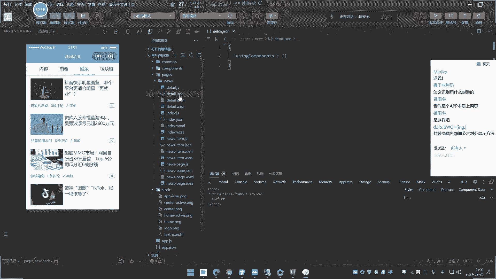

# 【小迪安全】V2024版 全栈网络安全 ｜ 攻防渗透工程师 （持续更新） - P4：第4天.APP架构&小程序&H5+Vue语言&Web封装&原生开发&Flutter - 逆风微笑的代码狗 - BV1Mx4y1q7Ny

今天这个内容呢其实主要是演示的多一点啊，其实也没太多知识点啊，就是构造你这些架构啊，了解一下就可以了啊，也是为我们后面这个讲移动安全和这个小程序，安全呢去做准备的，我们今天主要讲两个方面。

一个是这个小程序和app，因为我们除了这个单独的这个web呢，需要建立这个测试，有些目标呢可能就是针对性的这个app，应用和小程序应用，那么小程序应用呢呃有很多啊，就是说不仅仅是什么微信小程序啊。

什么百度小程序，支付宝小程序，那也会有，但是他们大部分的原理，那是一致的，然后APP那就更常见了，对不对，就是除了网站的一个应用程序之外的，像app小程序的，也是我们在现在的安全测试里面。

一个必备的技能，那么也需要对这个app和小程序的，它的一个架构呢需要有一定的了解，就是他是怎么搞出来的，然后我们简单介绍一下啊，知识点呢就是关于这个两点，一个app的一个小程序，然后呢。

我们先说一下APP的一个开发的一个情况，从这开发上面呢，嗯我们要简单的把进行分类，分类好之后呢，你才能知道它的一个架构啊，什么分类呢，app的一个开发的一个架构大概是有四类。

一类就是原生开发采用H5语言开发，使用这个叫FU的一个开发，还有呢是这个web的常见开发，那你可以说app怎么和web有联系呢，我们等会给大家看一下效果，简单来说是分为四块一种呢。

原生开发就是说像安卓呢，他就用这个java是吧，如果是那个IOS的，他就会用那个欧本欧本欧本JS杠，C是对象C那个语言啊，去开发那个IOS的，然后安卓的就是用java开发的啊。

所以安卓的这个客户端的这个开发语言呢，也基本都是java，当然也会有这个语言开发啊，但是不是很常见啊，主要是java多，还有一种呢就是H5语言，H5呢就是我们说的这个HTML5，Html5。

还有就是我们说这个挖不开放啥意思呢，好我们来现在呢就是说有知道这四种，下面呢我们就来给大家演示一下，这四种，我们看一下，分别举四个例子，大家看待一下这个情况是吧，这四个例子的一个情况对比啊。

首先呢我们先讲web的最简单的给大家看一下。

为了这个叫啥呀。

为了这个真实有效的，我还是一样啊，高台这个服务器啊，然后呢去给大家去点4号，呃首先自己呢购买一台服务器，选择价格最低的，选择一个系统，这个呢无所谓，按流量计费，设置好这个服务器的密码，点击确定订单好。

我们把服务器呢购买一下，购买下之后呢，我在上面搭建一个网站啊，可是你说你不讲个P搭建网站起来了啊，我们稍等片刻啊，把这个东西呢搞清楚之后呢，嗯就好讲了啊。

好等待下一个结果，然后呢我们给大家实现一下一个什么效果呢，就是说我去搭建一个网站，到最后的网站也有app也有了，其实就是说他这个app的一个设计理念。

是采用我们说的web开发的，啥意思呢，其实就是说它的原本是一个web程序，只是说套用了一个APP的壳，运行在了一个我们说的这个安卓啊，苹果端并没有说他和我们网站呢有任何的差异。

网站呢我们在搭建源码的时候，有些源码呢，它是本身就是有几个端的一个访问的，就是你用电脑访问呢，它是一个页面，然后呢你用手机访问的，他也是那个网站，指出他这个那个显示呢会有一些不一样的，稍等一下。

我们等这个搞完啊，我从这个网站的一个服务器购买和网站达成，上面那一点点来啊，如果我直接把网页拉出来了，给你搞，哎那是那是那说实话那没有什么太大意义，从这个搞清楚呢，其实就是让你明白啊。

这个APP呢它有一种分类，那就是我其实就是套用的网站，也没没具体啥，所以你在做app的一个渗透测试的时候呢，BS要明白这一点啊，等待服务器先连接上去啊，他还在装系统，这里还需要等待12分钟吧，好可以了。

好，这里呢，我们把那个之前那个宝塔呢，给他用宝塔搭建个吧，报的打印稿。

爱情保了简单方便一些。

这是我们说的第一种啊，现在讲的就是说这个app应用是吧，我们这样呢就是说采用这个web的，用网站呢去把一个app给它封装起来。

最简单的一种啊。

就说你使用哪种方法去开放app，这个是根据你这个app的一个应用，应用的一个功能或者这个应用的范围来决定的，你只是说简单的去有一个AP端就可以，那么那你是完全可以用这个网站来取代的。

如果说你想让它功能和体验，包括各方面呢更加的这个有效，或者说速率效率都很高，见面美好或是功能强大，那可能就需要你单独的二次开发，就说要结合这个男生态阿发就是用java的，在里面一定得去写界面，写功能。

好我们现在把这个这个包的启动起来啊。

放这边来访问吧。

好那在这里呢我们给大家搭建一下啊，选择一个套件吧，我这里那就选择这个套件吧，装个这个吧，庄哥这个7。4的选择是个7。4版本的，装个奇版本的，把这个几个中间装上去，那两个没勾选啊，因为那两个妖不妖。

都都都都可以去把网站运营起来，他两个是一个第三方的一个东西，刚才有人问什么东西啊，这几天加CD绕过，能不能试试找这个合作啊，我真是IP。

直接找什么鬼。

那个直接找百度好吧，找谷歌的行不行，谷歌可不可以。

在淘宝的，他们有时候问一些问题，这个这个是刀，让我想起一些以前的一些段子啊，以前别人说我要学习黑客技术，对不对，我要学习黑客技术，能不能当我去这个学会了之后，能不能到谁谁谁的号是吧。

或者说能不能搞什么什么什么东西，我说不行，他说那学了个干啊，不学，唉这是没办法的啊，有些东西啊嗯，嗯有些东西其实和技术无关啊，你自己呢有些东西要有点思考的啊，这个已经启动了啊。

我们现在来把那个一键部署啊，这个一键部署，那我们可以看一下它有哪些源码知识，一键部署啊，稍等一下，怎么这个一点不足，这里卡住，饿半天了，别卡呀，啊等一下吧，你首先你有些东西。

你要有一个简单的这个概念啊，对不对，这学安全的又不是只有你一个。

别人又不是不懂。

哎呀这怎么回事啊，这边重新下面板吧。

我的妈，这怎么这都要突然卡起来了呀，啥情况，这又有人搞破坏骂啊，啥情况，这是，先停止一下，启动一下。

等他一下吧辣椒，然后我们这边呢把这个域名把它解析一下，改一下啊，总是要改的，要先把把网址打起来之后，才域名解析那个操作嘛哈，拿玉米解析，其实这里有个小的小说里123点方对吧，也是我们前期测试那么多的。

然后呢我们这里呢请把它解析到这个IP这边呢。

太慢了啊，那我只能给大家看这个宝塔了啊，这个是1111给他打剪的啊，那个就太慢了，我们就不管它了吧，那是因为我前面打好的啊，来我搭建的是什么呢，给大家看一下啊，在我这2300点这里一键部署。

这里那里看呢，这有很多程序，是不是啊，这个太慢了啊，我还是用以前打好了吧，就多了这一步，那我选择这个这几个源码，这个叫shop exo heaven商城，为什么选择它呢，因为可以看到啊。

他这个介绍里面有个什么web加小程序，分销多门户多占点什么DIY啥的情况，其实就是说他这个程序呢是提供，有这个网页访问和小程序访问等等，也访问那个油耗界面，啥意思呢，我等下给他去做演示，就是有些程序呢。

它默认那是支持一些页面的一个转换的，那这个程序呢就支持它的界面显示会更加友好，所以我给他看一下啊，现在把那个解析的也配置上去，那这是我的网站，我打开一看呢，大家可以看到啊，来这是我来打你那个网站。

那它的界面是这样子的，这是我们电脑访问的一个情况，对不对好，然后呢你可以看到啊，我把这个地址给他记住，然后呢我在网上呢去给大家看一下啊，随便找个这个移门移门app这个平台，这是干嘛的，这个ENPP。

它是专门一个设计来，产品里面可以进行这个微信小程序啊，什么自保啊，这个东西啊，这个根据需要网上还有很多平台啊，我点这个移门app，这里说要输入一个网站地址，它会自动创建一个app是吧，然后编辑一下。

我们配置一下，这是名字，他的这个app的什么界面啊，背景色呀，你可以自己去选择的一个设置，包括这些东西啊，我们就让它默认的吧，其他东西呢我们就不搞了啊，我们搞一下啦，用这个创建一个什么app的。

这个我的移动应用在这里那里可以配置一下的，他在这里呢我们就用它试用版，在这里有他的一些这种，就是app里面那个大概一个框架结构嘛，那这个评估啊，安卓的设置，包括他这里的一些版本更新呀。

或或者怎么滴的一些什么增速啊，什么东西啊，你可根据自己需要的，可以把它不上去，然后呢如果说要上架到什么华为的商店啊，谷歌商店，那你就自己填写这个id啊，要自己申请网上，然后这里呢我们只是做这个演示。

我就不填了，直接用这个保存一下他这个配置信息啊，就刚才说的那个网址嘛，啊这网，然后呢，我们点击这个word应用里面点击移动用对吧，然后点击生成这个安装包，然后这里就把这个生存安装包。

这里有个叫我没有应用图标和缺少启动图啊，我在那可以随便上传一个啊，那就是这个刚才那个地址的嘛，哈就随便上传一个这个图片哈，图片呢好在这里拿应用图标，我就随便选这个应用图标吧，在线制作一个就用这个吧。

然后这个系统图片，那我们就随便选择一个，就这个吧对吧，然后自己根据自己需要选择什么样的啊，保存好，重新来到刚才这个我的应用这里，就把它进行一个生成安装包好，生成好，他就开始生成这个这个基于这个网址。

这个app出来了，也不用做任何事情，为什么我使用这个网址生成啊，我待会给大家讲一下这个原因的啊，然后这个呢我是生成的是一个安卓的应用，那苹果应用也是一样的道理，点击下面苹果的IOS的啊。

由于这点在我电脑上面，那是装不了这个IOS的模拟器的，因为这个IOS那是必然的，可能需要用真机，就是用你这个苹果手机呢去装才行啊，嗯在安卓的呢电脑上面是安卓模拟器的，网上呢我就用的是一个逍遥模拟器啊。

对对笑园摩西啊，你网上下一个啊，但那个网上很多摩西啊，什么雷神啊，夜神啊是吧。

那这个呢我怀疑这肯定是内鬼在搞事啊，半天都防不了。

我真是还好，我之前搞了一个，你们说呀，这报我的名都搞这种事情，唉我真是，好在地上还在打包，还有十秒钟，好已经出来了，再下载一个T包，把下载下来，好我们来看一下下载了一个什么，什么情况没有啊。

我下下来了，你看这刚才下载好的。

这把双击运行一下，就自动安装到我这个模拟器里面，可以看这个是我刚才设置的图标啊，你看名字的我没有改是吧，当我打开的时候，大家看一下，打开了是不是我选择那个界面了，再来一打开。

你看这不就是个app版本了吗，这和我们电脑访问有没有什么大的差异。

来看一下这这个这个呢，这是我们电脑访问的一个界面，然后这个是这个什么APP访问的一个界面，其实就是说这个我我把这个案例做出来之后，就给大家带来一个什么消息呢，就说其实呀有些app呢。

他有些app呢它是什么，它其实就是个网站，简单说就是个网站，那为什么我要选取这个页面呢，很简单啊，你比如说像我这个在网上我自己博客好吧，这是我的博客好吧，不是我把我博客封装个B，你看一下啊。

这个是我博客，对不对，我是博客也可以尝试，也是个网站吧，我用博客的来封装一下，看一下能不行啊，来重新再来点击这个我的应用啊，然后在里面点击这个添加应用，那把地址输进去，这个是移动app。

他说要购买一个P，妈的这搞得还有点麻烦的，那就移动app应用，它有abs吧，我换一个平台吧，发个平台，有些人不用那个不用那个这个有些平台呢，它是不用那个，叫啥呀，不用abs啊，有些药他a abs。

那就是强制性的，其实也没有没有太多必要啊，你网上那有很多这个这个优势门户的啊，我用一下那个之前的那个app的封装。

稍等一下啊，我记得有个平台我注册过账号了。

我懒得去看那个那个账号了啊，嗯没有记录，那个平台是多少来着呀，是的呀，有点这个优势，一门的，拥有好边是龙啊，这边是龙也行啊，选择这个王子名字呢，随便选一个，小迪把把选择免费版，创建应用七天试用订单支付。

不要钱的啊，用这个另外一个平台变色龙的一个平台，他他这个拉力英文，刚才那个要abs，这个不要来，这图标自己根据需要设置，我要点保存就会默认打，然后把它这个来启动界面的，根据自己需要自己设置。

然后生成安卓版，安卓版不提升级生成版，对不对，那请求编译在那如果说你剩的苹果单呢，就在这里也编译，这个呢，就是生成我这个小迪吧的啊，为什么说我们要选取另外一套程序，不选用这个随便套程序呢，其实很简单啊。

就是有一些web程序呢，它是没有这个手机四页面的，能理解吗，就你打开之后，你会发现它的页面显示在app里面，显示会有一些不正常的，我们现在就用这个小八给他演示，其实就是说其实啊有些网站程序呢。

它在开发的初衷就已经有适配好的，这个手机端的一个访问的界面，所以就说你那个app要好，他已经帮你去融入到这个web中了，那这种情况我们就称之为是使用的web开发的，就是这个APP的核心，它还是个网站。

啥都不改，就是显示界面不一样而已，他还是那个网站，它没有任何改变，那么我搞，那么你说这个app，它的这个安全测试，和我们这个本身的这个网站测试有什么差别呢，没有差别呀，是不是没有差别。

因为他就是那个网站啥都没有做好，这个已经生成完毕，好我们来导导到这个应用这里啊，刚才生成的，点开这里把它下载下来安装，下载下来好，下下来了，我们把它打开。

打开之后呢，我们看一下是不是安装了，但是安装了就这个嘛哈打开一看这小的八的，那是我的网站啊，但是你可以看到他这个就和我刚才那个设计，就有界面就完全跟不上了，是不是界面就完全跟不上了呀。

隔壁模拟器拖也不好拖，你妈的，他这个下面那个连连这个按钮都没有了，你至少这个呢它下面还有这种分类是吧，那这个呢就是我那个博客网站嘛，然后上面的就是这里面有些在勾选的搜索，然后这就是我那个分类。

是不是就我那个东西，其实也就是说还是那个网站，只是我这个网站没有这个这个网站的源码呢，它跟适配于这个app，这个就跟时配有分类啊，有这些操作是不是能理解吧，其实也就是说通过这个案例。

我们就明白一个道理，这个道理是什么呢，就是使用这个app开发的时候呢，对吧，可以直接把它封装，从web中把它封装成app，也就是说这个app呢，它其实就是那个网站没有任何差异，你做渗透测试呢，也其实呢。

还是还是可以按照那个web上面的测试来进行，那么你说这种它只是一个转变格式，其实原则上面没有任何改变好，这是我们说的第一种情况啊，这是我们说的第一种情况，那还有一种情况是什么呢。

就是采用这个原生态开发的。

那是何为叫原生态呢，来我这里找源码啊，这个源码呢就是原生态开发的，我先给他打开一下，看一下它的源码，就是采用专业的这个开发语言，自己一点点去设计界面，一点点去写这个功能的好。

这里呢安装了一个安卓STUDI。

那么如果说是IOS端的，那还要安装一个IOS的开发器，o object刚C那个语言的一个id，我们主要采用的是这个男生态的，这个什么原生态的一个，太原吧哈那这太远吧，首先呢我先给他安装一下。

把这个先。

缩小一下啊，好这是我的那个安卓模拟器，我先把它关掉，都这前面那两个封装web，然后我看原生态的啊。

原生态的源码呢也在里面，我也给他打包到网盘里去了，你可以去研究一下，然后这里有个pk，这个pk呢是别人写好的啊，我来安装一下好，打开这个时候原生态写的这个app，我们看下它的界面。

它是一个仿网易云音乐的一个这个app，写出来的嗯，一个音乐播放器，那么我看一下他的这个设计，和我刚才那种打包有什么不一样呢，大家可以明确看到他这个APP呢，就不再像我刚才那样子了是吧，下面这几个东西啊。

还是个网站，他这里就是典型把它全部分类分好了，然后呢是吧，里面都有这种东西，好有登录啊，这种事情是吧，对不对，他有这种设计了，他这个呢其实就是说他已经和那个网页端的，那个网易云呢是分离的。

虽然说他们可能会采用同一个东西，但是呢它上面写法完全不一样了，界面这些东西都不一样了。

然后你看这是源码，源码里面呢就是纯java源码，我们这边没必要说啊，弄懂我们可以看一下它简单一个，比如这里源码里面我们可以搜索一下了，在BP上面，比如说有个关键字叫新曲来搜索一下，选择这个项目搜索啊。

不要选错了，嗯怎么搜不到啊，搜错了好不好，选择这个，那名字换一个吧，歌短嗯，就是本名啊，看下。

是没载入啊，等一下啊，我把它重新载入一下，怎么可能呢，这不应该是没载入。

大家先展示下啊，这他妈啥情况，这，还没有，好像是没载入这个代码到里面去，应该是能找到的，我找一下吧，应该会固定在这个资源文件里面，一般会在哪个里面，但他有个资料文件，我找一下看看，资料文件里面。

应该会定义那个train的一个关键词，对就是那个string fm搜一下啊。

在这卷就有点素，它一般会定义到这里哈，一些菜单的设计就是你学过java的一个设计的话，应该知道在这里我看一下是不是这里啊，就这个文件里面RES资料包里面他收不到。

不是说没有啊，他可能没有把项目完全载入，所以他搜不到IE里面values，你看这里呢大家看了没找到了，等一个呢，那他这个搜不到啊，你来妈的，刚才搜不到，在线收到了啊，有时候没载入了。

你看本地音乐最近播放，我看这里的本地音乐最近播放，然后下载管理是吧，我的歌手创建的歌单里面的这个我喜欢的音乐，收藏歌单里面，然后你点击另外一个呢，就是其他东西吧都可以看到的一些链接。

就说就说其实这个源码呢就和这个app是对应的，也就是说这个界面的一个开发呢，这个界面的开发和它的功能的一些东西，全部数学就来源于这个源码，就是他是有成套的源码来给他实现的。

我们刚才这种封装的有没有去搞这种事情，没有吧，其实就是说像这类app的话，他就是自己的啊，用这个程序呢给他写出来的自己设计的界面啊，自己的展示啊，功能呢在这里调，那像这种就是我们称之为叫原生态开发的。

这也是大部分的一个什么app，就是说只要这个app呢，它是大公司产品，或者说这个app的讲究效率，功能追求完美，那么他就会选择原生开发，原生I卡开发的话就会难度是最难的，也是最复杂的，成本也是最高的。

但是他的这个效率和功能界面都是最好的，那么这种的话我们如何进行安全测试呢，那么他的思路其实就是两种情况，一种是利用我们的安卓的理想技术反编译，然后呢利用我们这个安全测试技术抓包。

从里面反编译和抓包里面的提取，这个app里面的一些资产信息，就说它里面有哪些接口，有哪些这个泄露的东西，有哪些接口，接口，就是我们说的有哪些这种数据通讯的IP地址啊，网站域名从这里面去测试。

这里面app涉及到的接口，资产信息，就像什么网站啊，或者IP地址，把这些提出来之后呢，通过反编译或通过抓包抓到这些东西，或提提出来这些东西，来对这些东西呢进行安全措施，那么至于后面的安全是是属于网站的。

还是属于接口的，还是属于单个IP的，那就不得而知了，这也是根据这个app的一个特性决定，能理解吗，所以像这种原生态的话，它的后面的测试思路呢，就是会利用到简单的安卓机箱，和常见的抓包技术。

来从里面去抓住我们的目标信息，然后呢对目标信息进行测试，目标是网站就是网站测试目标是IP，就是IP测试，然后目标是其他的，就其他测试能理解吗，这种是基于原生态的APP上面的，后期的一个测试思路。

通过这个案例呢，大家也看到它的一个本身构成呢，里面呢就是相当于把代码写好了，就很简单，就是说很简单啊，APP里他可以在这里写界面，然后呢，它里面要用到一些数据的这个结束和处理。

就是说比如说啊我点这个人用户是吧，我这个用户是怎么登录上去的，那么你就要找到这个什么登录点，这里找到它的代码代码里面，来看一下它是提交给谁在进行这个登录，然后呢数据又是从哪里获过来的，所以你要通过抓包。

或者说通过反编里面去提取，那个相关的那个接口或者网站相关的东西，能理解吗，我这样说能不能理解啊，我们现在不是说要教大家去搞这个开发啊，这开发说实话呀，这不是我们教的啊，就是大家要知道他这个设计架构。

然后呢，我们从这个架构里面去转到我的安全词，是食物上面的，这是我们在网上找了一个这个用安用java语言，开发了一个安卓的客户端的源码啊，他是从源码里面去开发的app，那这种呢就是我们说的这个原生开发。

还有我刚才演示那个网站的，采用的是什么封装开发，对不对好，除了这个之外呢，还有没有其他的呢，也有孩子呢也属于web开发的一种，但是他这个web开发的和刚才的又有区别。

因为我们可以看到我们刚才搭建的那个web的，是一个什么，是一个什么web，是不是一个pp程序的，那我刚才选打野是他吧，他是个PP程序的一个web，对不对，源码，那你也可以在这里看到它的源码。

那你可以看到这个在源码呢全部是pp的，它是个PP的源码，那么还有一种就是采用前端语言的一些开发，就完全采用什么呢，H5天王五和飞鱼一的架构的开发的app，就是说他其实也属于网站内的这个app。

但是呢之前是采用网站直接封的，这个呢就是换了一种实现语言，好，我们来演示一下。

然后呢用到的开发工具是这个，这个是可以直接做任何事情的啊，我给大家演示一下。

那这个啊你看一下啊，他能干嘛啊，我们来首先把这个先给它移除掉，项目移除掉好，我给大家看一下啊，那用这个工具一个新建项目啊，你看我能做什么事情好，这里有些模板，我们就用这个模板给他演示来代理由。

如果app还是web app是什么，五点就搞这个吧，随便再搞个，比如说就拿这个，找哪个嘞，找个好看的一个，就拿这个吧，然后取个名字，名字就叫小迪，点击创建好，这个呢就是设计好了，你看他这个项目。

所以我们这边的app图标启动界面都可以设置，对不对，你看下面还有什么微信小程序都能配置啊，还有这东西都能配置，那这套源码其实就是这是个源码啊，然后呢你可以怎么办，右键呢点进来发布。

发布这个什么小程序版本，发布个app版本，发布IOS版本，但如果说你要发出安卓版本的话，他需要用到这个这个刚才我那个id，然后呢在下面呢是把这项目载入进去的，编译好，我们先不管它啊。

我们先来给大家看一下啊，我发布浏览器版本，浏览器版本和那个app里面显示是一样的，你看一下，我给大家演示一下，看项目那个效果啊，大家就能看到，其实和APP那个界面打开是一模一样的，我们看一下啊。

把运行起来运行到什么浏览器上看一下啊，然后这是源码源码，那就是你去看呗，这是和app差不多P打开就是这个东西了，建议的这个程序的一个模板，然后这个呢你用app打开也是这个界面，你VP打开也是这个界面。

因为它这个适配界面，那就是个手机界面，然后呢你看他直接能把编译起来，对不对，然后你看源码是什么，你看看源码啊，我们看源码，注意看源码，我们刚才用这个直接web封装的是采用的什么，源码，是pp的。

这个源码是什么，源码全部用的是VUE框架VUE开展，那我们来看一下啊，这套源码源码里面没有任何东西全部为TM的，这个TM就是我们说的H5的一个代码，H5不是我们说的TM是h gm5，你可以了解一下。

这个语言是专门设计这个前端，那个啊来构建网络的一个方式，然后它的设计就是主要针对这个app小程序应用，而且一些小游戏都成为加盟，啊这个app是于就是说他的数据传递是怎么，数据怎么去传递呢。

就是利用这个VU1这个叫什么是AVUE呢，它是一个JAVASCRIPT框架，是一个前端的一个JS框架，然后数据传输就用这个语言去传输，然后界面的一个美观程度呢，就用H5来负责，就是数据传输到长大。

所以那么这种设计出来的app和设计出来的网站，包括小程序，就是用的是哪两个语言，H5加V1，H5加飞一的一个界面，用H5加V1的话，那么它和我们的网站测试，那个思路有什么不同呢。

我们前面搭建网站是采用的什么app是吧，这种什么点net s d x或java类的搭建的网站，而他呢是采用什么H5加V1H5，那是静态的VU，那是JS框架，所以它的测试思路呢就是框架本身的安全问题。

和他提交数据的这个接口问题，像我们常规的这个什么什么PHP这个什么点，net这种漏洞它就是不存在的，因为他用到的语言，就和我们网站以前的一些常规网站就不一样，他就和我们前面说的那个什么前后端分离。

有点类似，采用那个语言的开发，就用它，然后呢你想把它打包成app版本，那么就按照他这个上面来啊，选这个，由于这里需要配置啊，我这里呢搞了半天也没法搞好，所以我没有把它打包成app啊。

但是那个界面给大家看到了啊，就是刚才我们看到这个网页那个界面呃，但是呢它可以打包成小程序，现在呢我就让大家看一下，用它呢开发出一个小程序，所以说其实就是说APP啊，这个这种东西呢它和小程序有同学看。

我给大家来看一下啊，我把它搞成小程序，微信小程序啊，他这个小程序里有区分很多种，大家看一下他发行的时候可以针对呢，微信百度自保直接调整QQ，这都是我们都知道了格达的一些这种呃叫啥呀。

各大的一些公司都有自己的小程序吗，那最常见的就是微信和支付宝的最多对吧，里面有一些各种各样的小程序，那么就微信来测试呃，你要微信测试的话。

它是怎么测试的东西呢，要大家知道啊，你首先要去下载一个什么微信开发者工具。

就是微信小程序工具啊。

要下载这个东西啊，下载东西，那么网上是有下载的啊，我也给他打包了。

然后呢我先把这个就是我刚才看到界面嘛，大家看到界面啊，我把它编译成小程序，怎么编译呢，点击发布啊，点击这个小程序，这里的填写小程序的app id，这个呢要大家准备一个APID，这个ID如何有呢。

我这里有公众号啊，公众号是自带的，如果说你自己申请一个公众公众号就有啊，我要看一下，那就这个开发者id微信公众号里面可以看到啊，塞上去没有，它不能行啊，然后取个名字，然后这里呢就点击发行吧。

就用这套源码来发现一个小程序出来，但这个小程序在哪里运行，我们都知道小程序肯定是在微信里运行，它没把它发出来，没发出来，这源码已经到这来了。

这是它的源码，这是他的小程序源码，把小复制到这里来，用小程序开发工具把它运行起来，点击添加目录呢，就选择我这个什么这个目录，好他说已经在工具中创建，可以直接打开，那我就直接打开给他看看啊，打开。

好那这就是模拟了个什么微信界面，看到没，模拟了微信的界面，来这三源码，看到没，这是那个微信的小程序界面，大家看到常见的一些小程序，就这种界面嘛，对不对，然后这是干嘛，这是干嘛呢。

你告诉我这个小程序你该如何测试，是不是它的源码就是给九架飞机的设计方案呢，那这是他源码，那么你说他会出什么漏洞呢，它和我们常规讲的一些web漏洞相关不相关的，对不对，那这种你说怎么测试它呢。

是不是是不是也是简单，就是说它的核心呢是这个东西呢，就是用构造出了小程序对吧，我用这个专门调试小程序的，微信官方的这个工具呢去把它打开的。

那我不不行，再给你测试呢，我再可以怎么样呢。

去重新创建一个项目，你看啊，我再给你重新创建一个项目，点确定呢，新建一个项目，然后重新选择一个模板的好吧，就拿这个吧，然后名字再创建一个叫小，好这个呢就是小d test。

然后呢这个小车呢我把它怎么样进行这个发型，态度小程序那个，就说这个工具呢它可以把它编写成app端，因为这个TM和那个V呢他可以写web，也可以写小程序，也可以写个app，能理解吗，什么鬼啊，怎么还好诶。

他怎么还在搞云，还说啊，我不要他搞了，搞个毛啊，搞。

57，那应该是在这里的吧，好在这里啊。

这是我刚才有新建的一个小程序啊，我们再来用这里调试啊，用刚才那个开发工具来调。

先把它关闭。

重新来新建项目，导入项目，重新创建个，重新创建一个，重新创建一个路径呢，就换成这个路径，C运行，诶诶咋没有编译出来吗。

你妈的怎么还在烧钱呢，删掉重新编一下诶，我重新搞一下吧，这他妈的刚才点错了，让他去上船去了，我该不让上传的，擦掉擦掉擦都擦不掉了，怎么还在搞啊，关闭项目，关闭项目，重新再来一个。

哦他这个还是要用那个东西啊，都要开发出来，他有那个那个东西，这个项目还不能直接把那个编译出来。

这里除了一个地址，这是编译的这个源码，我先把那个测试一下。

看能不能编译出来了，我看下能不能运行，我先把这个给他删掉。

重新来一下。

好确定，信任别人，请选择这里刷新，还是这个，那我就不知道了啊，这个我不是做开发的，我也不太清楚了啊，我就说其实就是说你这个。

你这个东西呀，你把它自己下去之后呢，啊，可以根据自己需要去设计啊，或者怎么地啊，但是开发呢我这买的我也不是搞开发的，这东西调啊，配置啊，搞不清楚了嗯。

那么这个概念呢其实就是我们说的很简单，就是这个小程序呢它的一个设计。

其中一种设计模式，那就是我们说的采用这个什么H5的H5的啊，app里面原生态的web封装的，然后呢也可以采用H5的，然后这个小程序呢它是也有H5的。

那这个就是小程序吗，H5的演出来的，这个是H5的，它源码的就是H5加V1的这个前端的好呃。

那么加了这么多，我们来回顾一下思路，原生态的是用反编译和抓包，渣村里面的特产呢进行测试，那么网站直接封装的，那其实就是还是网站，所以我们就是常规的网站测试，如果说采用H5和飞鱼一的设计的。

这个app或小程序呢，那么它就是这个本身的H5呢，他也没有漏洞嘛，他静态的，然后VU呢它是JS框架，它里面的就是JS框架自身的安全问题，再就是它里面提交数据的接口问题。

那哪些是接口呢，我们看一下源码啊，其实就是JS的这个语言嘛，哈你看它这里面肯定是有些接口配置，就是数据请求，包括数据在哪里去发送提交啊，他这里是有一些代码的。

我们直接从这里看吧，咖啡机的那个那个啊，他这里就会有一些这种类似的一些JS代码，这个J代码里面呢，有些就会写一些这种请求的路径啊，包括请求的这个地方啊，他也在这里再去接收数据啊，如果他这里有的话啊。

然后下面就是他其他的嘛，所以说你就是从这个JS里面去调，那就和我们说的这个JS有点相关的，JS相关的API就是JS啊，JS就是API的其中一个口啊，就是JS接口，那就和我们那个前后端那个分离呢有点类似。

我这里把追下吧，那个前端测试啊差不多，标准啊，好那么那除了这个小程序用这种模式之外。

还有没有呢，也有小程序的设计。

还有一种情况也是最常见的，和我们这个app的设计相关，它也可以封装，它也可以封装成它也可以封装的啊，就这个小程序呢它也可以用网站来取代。

来我们来看一下啊。

那么我们可以看一下刚才那个封装的，免费封装那个平台啊，你看这里点击查杀小程序，那我的小程序点这里，创建新应用，这是电脑端的应用，这是小程序的，点击网址输上去，随便取个名字，请见那小程序的是吧，点击保存。

下一步保存之后呢，我们看一下啊，这个小程序这边，就刚才创建的吗，哪个是刚才创建的这个吧，应该是配置这里了，好不法五配置，你的点击法五呢，然后这里的基础配置，点击它确定它发布它缺少基础配置，哪个配置呢。

把id填写，把你小程序的密室填写，这个是id，那就是微信公众号那个id啊。

然后这里有个叫小程序商城密室，这啥东西呢，就这两个啊。

就你这个微信公众号这里有两个，一个是开发者id，一个是开发者密码，就这两个把它填进去，他就可以发布了，就是你套用的是什么网站，那么其实就是把网站变成小程序，那么打开呢其实和app界面差不多的。

无非就是画那种模式，那么这里呢我就不给他测试了，为什么不能测试呢，因为他这个密码呢需要我用到这个密码不用了，我这个密码啊，我这个密码呢没有了啊，我不是专门搞开发的，我密码要重置，重置后。

微信公众号会有会有影响啊，我把它搞湿了，所以我就搞不了，给他演示啊，你如果自己申请规定好的，你把这个记一下，我之前搞了，忘记重置后，从后他需要这个会影响到那个，没办法啊，所以你就把这个填下头来一填啊。

保存一分布，那么它就会自动发布一个小程序版本，那么一样道理啊。

发布出来之后呢，你也是用这个微信的这个开发工具的，在上面可以看到你这个小程序的界面啊。

那么那个界面呢就是就和他是一样的，就是小程序的界面，就这个程序这个网站小程界面，也就是说小程序它的设计呢就有两种情况，一种情况就是我们说的用网站直接封装和app呀。

还有就是我们这种H5A非依赖开发的小程序，也是有的，对不对，然后网站app的呢就是有这几种，后面也是三种，其他还有其他的啊，主要是原生态网封装H56HE，就是我们简简单单的就接受了。

这个app和小程序的一个架构，就是它是采用什么，我不同意把它开发出来的什么东西，把它进入的app，它里面的界面，包括它里面的功能，是不是和网站相关，网站呢，又是常规的网站呢，还是说这种前后端这种网站。

对不对。

所以啊我就把四个图给大家整一下啊，内容呢我们就讲完了，没有太多内容，下节课我们再说人应用啊，人应用。

我把这个思维导图给讲一下啊。

app这个应用啊，你们是不是有点傻呀，这个老温这个就这就这那后面不上，那就这。

我们现在是讲基础入门，是搞清楚它的架构，没有讲任何东西，不是说上了这一课后面就没有了，你没听我讲吗，我把这个安全思路给你都写上去了。

原生态的。

我说句不该说的话，如果说这个讲app的渗透测试，谁会谁会给你讲讲讲这个东西啊。

讲他架构分析架构啊，没人跟你讲，这是很基础的课程，这个是实在是找不到，我不是专业搞开发的，没办法研究这个啊，这个F开头的小程序呢，我们也只讲了两种啊，一种是这个封装的封装平台，还有就是A75这个东西。

然后这个原生开发呢呃它的影响方面，那就这两个嘛，就我们测试它的这个东西呀，就要进行这个场景测试啊，我们来进行这个分析一下，封装平台呢就是单纯的本身就是个什么web。

所以他的思路那就很明显就是我们常规的方式，H5U1呢它本身就是什么，我说的这个前后端分离的类似的啊，他在这里有点类似啊，所以他要产生的安全问题呢，就我们说的这个，JS是，除了这个之外。

像他这个体质测试呢也是其中一种，我把它写在后面去吧，把它分几类，然后这个没讲啊，封装平台呢和这个基本是一致，没有什么太大区别，封平台都一样，H5的和他也是一样，那同样的道理啊，他的一个渗透测试里面呢。

其实还有一种思路也是要进行抓包，就像这里呢本身web，那他也是要进行抓包的，我们这里要给他写一下，写个这个另外一个主题吧，新建一个主题啊，拉出来啊，然后在java写一下，把它连接一下，联系到这个上面来。

这个封装，包括这里也和你联系，好这是我们这个今天内容啊，今天内容一个讲解啊，把它设到总结一下啊。

本次内容就这么多吗，讲其他的讲不了太多啊，开发的一些东西无法掩饰，没办法的，然后刚才有人说就这啊什么纠结啊，神经病啊，我早知道不该讲这些东西的，讲这些东西干嘛呀，浪费这个浪费这个叫什么呀，浪费知识点。

我直接给你咔咔的给你一抓，给你把包抓上来，把智商一抓诶，我说这是网站啊，这个网站还在上面做测试啊。

完了到时候你连搞搞都搞不清楚，为什么这个要抓包，那个要反编译，对不对好，我这个讲了之后呢。

呃，加了之后大家就明白了啊，后面这个知识点呢，其实都是围绕这个基础入门里面，一些东西呢去展开的，包括我们讲这个什么挖宝，那么上完进入门之后呢，把开发一讲，就讲web漏洞，那web漏洞讲完之后呢。

就是什么app啊，小程序的一些事情，什么反编译啊，这个提资产呢是吧，这个事情对不对，但也不是说后面的课程呢就没有这个东西了，你老说揪着揪着干嘛呢，啊哎呀，有app不能直接抓包吗，我不讲这个。

你就永远认为抓包就完了，抓包技术还分很就懂了，每次我讲这个抓包，我每次都想把他讲的很清楚，但是每次有人听不清楚，讲的很清楚啊，听不清楚，首先这个抓包这里呀都是一个很大的学问。

网上一些工具呢他是抓网站协议的，装STP的，装TPS的，AHPS呢还装帧数，帧数里面还有什么增速效应是吧，有些证书呢还要进行绕过才能抓，还有些不能直接抓，那又是个支点，那那可不就不说了。

那网站让他走这个hp2或PS这走，他你还能抓到，他不走这个协议，你该怎么抓呢，啥意思啊，我说的啥意思，就是说其实有些数据它不走协议的，他不是走这网站协议的，你工具只支持hp，他抓不到啊。

他可不可以就像我们说的那种像C加加呀，或者说那种开放里面用那个什么socket网络编程，走其他各种协议呢，那你怎么抓啊，像这种原生态开发出来的java产品，那刚才我看到了。

我写下这两码的，我打开一下，要么在这里。

刚才那个这个那个放网易云这个app呢，你看这两个app来讲呃，他这个app里面是有个功能，我随便举个功能来去给他分析一下，他假如这个人登录的吧，那个人用户这里啊，他是假如有个登录，对不对。

或者说我们拿这个呢也给大家看一下，这是刚才那个，来点击这个是不是有个登录啊，你看，你告诉我啊，我用去判断这个用户的账号登录，这是有数据发送和接收啊，网页是不能进行这个验证呢，就是登录的时候。

他就通过发送TP包或HPS包，来去验证你的账号密码是否正确是吧，这是一种情况，那还有一种情况，他这种登陆可不可以可不可以，其他呃这个协议去发送这个照明码，是不是也可以啊，那他如果不走这个协议。

你你怎么办呢，你那个抓捕工具抓ATP的，抓不到怎么办呢，那不是抓不到的吗，我们把它反编译，看源码，就是要看懂他是走什么协议，有一些数据像打游戏，那游戏里面那些数据他走ATP走ATPS吗。

你用那个抓包有能行吗，数据都不走a p a hp和hp s抓什么呀，游戏游戏那个数据只P吗，很多东西都要学啊，不是你们想的那样子，你不把这前期架构摸清楚，你都搞不清楚别人为什么那样设计。

还揪着揪着哎呀，不想说啥，你自己看一下别人这个网上去搞这种那个的啊，除了说你要讲就讲app的理想，专门搞app理想是吧，那个就是直接从啊源码里面去分析，从它的设计里面去分析这个安全测试的。

app的一个测试呢，它就又不一样了，你就说以安全的角度，你不进行源码分析，进行逆向的逆向里面是可以分析出这个漏洞，但它的漏洞，那是产生在这个app的设计的一些逻辑啊，和他的一些这种代码编写。

哪里会存在一些问题，而我们这种安全措施呢，主要是集中在提取这个app里面的一些这个资产，就比如说这个app里面有一些网站为他提供服务，有些网站有些域名，有些IP或者有哪些服务给他提供。

我们就撤资这些东西，这是通过我们安全测试的一个角，如果你搞逆向的话，就是从他代码本身，app的设计逻辑关系上面去测不一样的啊，知道吧，我们把很简单。

你看我们今天上了啊，你可能觉得上的很少。

但这没办法啊，要怪的话只能怪我们，这我也不是搞开发的，我也只能听你讲到这里了，你看这里还有这种平台设计的app，讲不了啊，这他妈的我都不会，我咋给你讲呢，这个小程序也可以用那个全新语言一点写，写不了。

他妈不是搞专业搞开发的，哎。

太太那个了啊，有些东西听清楚就可以了啊，我们解释这个东西呢，就是给大家看一下这个app的一个情况，有几种类型，就像我们刚才说的，像这种web直接封装的，他其实本身就是个web网站。

所以啊它没有任何的和网站有差任何差异，对不对，直接网站做渗透测试就完了，所以这个AP就等同于是一个网站，就这个意思，那么原生态呢它就不是套用网站了，它是用代码一行行写的，所以呢你就需要什么抓包里面。

看一下它里面有哪些数据提交的地方，资产进行测试，然后呢反编译里面呢去看一下源码里面是吧，有没有一些资产再从里面去提，因为抓包是抓的是他表现出来的资产，反编译呢是抓的是它里面写到的资产，这是不一样的。

写到资产不一定会表现出来，或者说即使他不表现出来，他表现出来你也不一定能抓到，为什么呢，因为他表现出来的第一方可能你没有触发到，所以你抓不到，那你写吧，然后呢通过这个抓抓到资产的进行测试，还有一种情况。

那就是我们说的海报协议价，就直接呢从这个理想的角度啊，从这个理想的这个角度呢，去什么分析这个逻辑啊，涉及安全问题，对不对，这个理想安卓理想呢，我们这期呢有浅显的会讲一下啊，不是很深入。

因为这是安卓理想啊，讲生物呢开开一门课，开一年都可以，我们浅浅讲一下。

好今天就说这么多了啊，看大家有什么问题啊。

你们又来了那一个app怎么判断是原生还是web，其实有些课程有像这些东西呀，我们都说是信息收集里面，去这个去给他讲的是吧，所以怎么去判断，但是有些东西呢我可能心收集的时候呢，也会忘记讲。

或者说我没有讲他的反应。

但是我们把这个课程学完之后呢，你说怎么去判断，嘿嘿说实话啊，我觉得这个东西只能意会不能言传的一些东西，特别像这种啊，那你看啊，我们就是呢我打开这个是吧，你说这是别人这个原生态写出来的呢。

还是网站打印出来的呢，对不对，然后打开这个是原生的写出来的，还是哪里出来的呢，对不对，写下这个也没有任何工具，他能判断出来，他判断的方式就是凭经验，啥经验呢，有人说不懂，对不对，这他妈的有什么不懂的呀。

看界面美观，都看功能按钮，这些东西都是细节，我没有说，但是你要懂啊，你就很简单，我们这种的这种小礼包搞出来的，大概是这个这个这个小礼包搞出来的，但这是小礼包搞出来的app来。

你觉得一个正常ab是这样子的吗，那你现在现在往上拖哎，像这样搞，这一看就是个网站嵌套进去的呀，虽然我做垃圾，你可以在网上随便下几个app，你试一下嘛是吧，校园市场随便找几个东西用一下。

我就或者说从它的功能性上面去分析，那我就拿这个来测试吧，那假如这个P表吧，这也是个P这个文件管理器，你告诉我这是网站的吗，还是原生的呀，首先它的功能是干嘛看文件管理的，你的文件管理在网上看，在网上看吗。

啊你自己要去思考这个问题呀，能不能理解这东西我怎么教的啊，他也没有工具能够直接帮你分析啊，他是什么什么情况，对不对，不过有一句话啊，其实你要从这个原理上面去分析的话，它其实也好分析啊。

要分析它是这个原生态还是网站的，如果说你要追追求那种完美性的话，你可以进行反编译，反编译，看它的源码能够看出来他是原生态，还是这个用网站套用的，看源码能看出来，但是但说实话，你问到这个问题。

你就不可能有这个技术能力去开源嘛，所以我只能说品经验，你说我说的对不对呢，是不是，你如果能挥开染发，你就不会问这个问题，其实其实就是看界面的美观程度，和它的一个嵌套信，你看看我翻到这下面来了。

它下面就有点显示不正常了，对不对，你看正常的一些这种app呀，你们自己手里手机赚了那么多，你看一下对不对，你也可以从他这个app的设计里面去思考，每个设计理念都不一样，你看我都写了下那个web开发的。

它有哪些优势，它有哪些缺点，你觉得这个优势和缺点，这个app的厂商它是需求哪一点，你也可以从这个方面去分析它呀，就很简单，公司有钱在乎体验，你说他会套用吗，不套用啊，直接原生开发呀，公司垃圾。

没钱技术短板，他要干嘛，直接套用web，这都是一些思考的点，你自己呢要学会去这个想啊，没有这种工具能够说，或者说没有什么细节能够直接说啊，这是什么开发没有东西啊，都是凭经验。

如果说你要实打实的去判断的话，那就把源码打开，看看源码怎么写的，是不是一点点写出来的，所以刚才大家问的问题就是这个解答啊，我如果说后面呢没有去在信息收集的时候，他没有去讲这个怎么去判断他是什么类型。

我相信他肯定是有人下去有这个疑问，刚好有个人呢刚才问了一个问题，我就跟他说一下啊，但是我说实话，我这样说了之后下去还是有些人不会判断，但那没办法啊，有些人你怎么讲太不清楚。

好今天就说这么多了啊，看大家也没问题啊，有问题问没问题。

我把那个录播关了吧。

