# 【小迪安全】V2024版 全栈网络安全 ｜ 攻防渗透工程师 （持续更新） - P51：第51天：前后台功能点&文件下载&文件读取&文件删除&目录遍历&目录穿越 - 逆风微笑的代码狗 - BV1Mx4y1q7Ny

今天呢讲一下这个51天了，今天内容比较零散，都是些小知识点啊，有时候呢还是碰不到，讲一下啊，主要是这个文件安全的最后一部分，再加上这个目录安全，其实这个字典呢全部是产生在这个文件管理一。

块的一些安全问题，啧嘶有四个啊，一个是这个文件下载，一个文件删除，那文件下载呢和那个文件读取，那是一模一样的一个鸟毛事情啊，他的这个点都差不多，我们先说这个文件内的下载漏洞啊。

这个文件下载漏洞那其实非常好理解啊，文件读取大家想想想啊，文件读取那是读取文件的内容，那么下下载那就是下载文件，那么下载文件呢也没S把打开看的，打开看和文件读取那是一模一样的。

所以说这两个呢可以把它理解为是一个东西，只是说他的这个漏洞形成呢有它不太一样，但是他的这个影响的这个结果呢是一样的，因为你下载下来也是打开看，你读取，那也是省略了一个下载的过程，那我现在看一下啊。

一般这种正常的文件下载，但大部分都是直连地址啊，大家什么叫指令粒子呢，大家可以看一下啊，比如说像这种啊，你直连啊，直接去访问一个网址，加上一个目录，再加上一个文件名，去下载这个123点PDF。

这种正常的一个什么一种下载粒子，那么还有一种情况下载呢可能是这种模式，就是说加上一个网址之后呢，后面传递一个参数啊，参数值和一个参数名，那么这个参数名呢就是我们下载的文件，那么我呢通过更改这个地方呢。

来去下载不同的文件，那么如果说这个地方的参数值，没有进行这个过滤的话，那么也就是说呀，你可以呢把这个东西啊，把它换成一个什么要下载的文件的路径，然后呢他就会尝试去下载个文件啊，大家又会问了。

就说那我直接在上面去换那个文件路径，不是一码事行吗，是这样的啊，我们都知道这个网站呢不是说你放任何文件的，都是下载，有些文件呢他是在网页上面去显示解析了，那除去一些这种常见的之外呢。

像一些什么其他格式文件，像什么压缩包格式，zip啊，RAR呀是吧，这种下载类的格式呢他才会下载，对不对，那么如果说用这种协议去传递的话，那很可能就是说非下载的协议呢，也能装到夏天来，好这样说呢。

不知道大家有没有理解啊，那么利用点就是说一般通过这个下载呢，去下载网站的一些这种配置性文件，像数据库配置文件呢，比如说系统的一些敏感的文件呢，或者说一些这种带有心细的一些文件哪，下载下来之后呢。

去通过翻阅里面的一些敏感资料呢，在对后期的这个渗透测试呢有帮助，这是他的第一用啊，利用我们就不说了，我们先说他这个燃理情况啊，那么这里呢我们就给大家去演示一下啊。

首先呢我们先给大家看一个有异响的一个安全。

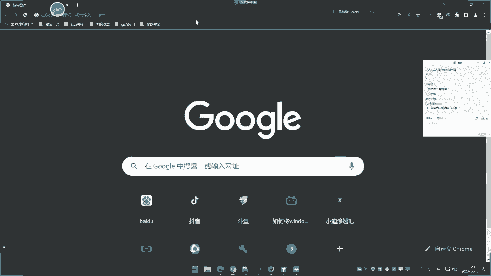

然后呢我们在。

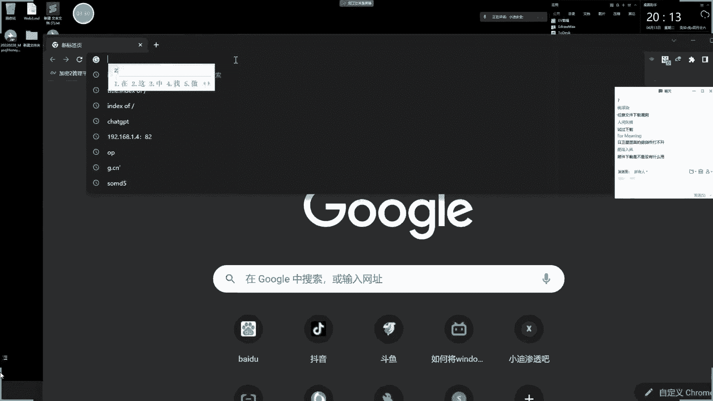

是吧，再再给来看这个一个案例哈，也找不到好的了啊，给他看一下，那这是一个网站，我们这个下载的呢，一般就是产生在这个文件下载的对吧，大家可以看一下啊，这个打开一个这个地址啊，这里呢有这个下载的一个地方。

然后我们点击继续下载，把这个链接呢给大家复制一下，复制这个链接，我们关注一下这边的一个这个东西啊。

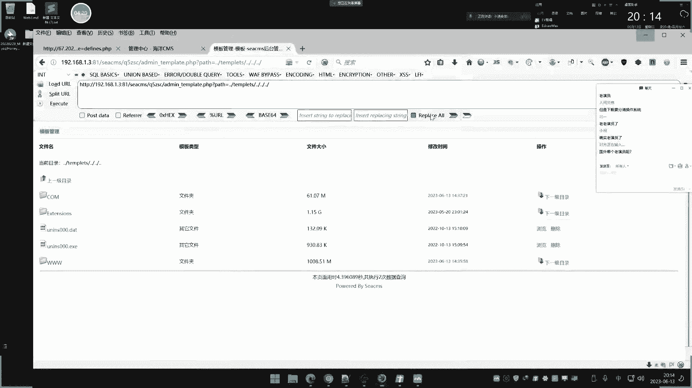

来看一下啊，关注一下这个地址啊。

来看一下，这是那个地址，大家可以看一下啊，我们直接这样子呢分析一下啊，那如果说正常下载呢，是直接访问那个地址的完整路径去下载，那这个呢大家看到他这里有个参数，S等于一长串。

那这个呢很显然比较类似于我们说的那个贝斯，六四，我们可以尝试性的呢把它进行一个解码，看一下啊，好这里解出来的结果呢是这么一个东西，大家可以看到，那么也就是说其实它解码的词呢，就等同于这样去加它的一个值。

大家可以看一下，这个呢应该就是那个网站的一个啊，就是那个APK的那个下载的一个情况，那么你可以试一下啊。

比如说我这里呢去点击下载它，大家可以看到呢，他的名字呢就是BSTV30点bl，多包点APK大家可以看到啊。

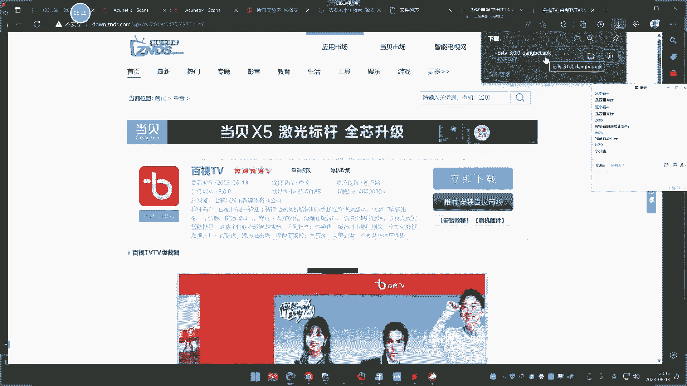

来这就是他这个名字，我们这里能看到的也是这个名字是吧，如果是这种直连下载的话啊，那直连，那有可能他的地址信息会是这么一个模式，那就直接访问它的完整路径在哪个目录下面，然后选择这个app是这样指定下载。

但指令下载的话很简单，如果说你这里改了，比如说这下面有个疑点pp你这样去访问，那么它是解析这个什么，解释个pp对不对，所以呢他就不会下载，那不会下载的话，那这个pp的代码呢是看不到的，对不对。

但是如果说你按照这种模式去下载它的话，我把这个东西呢把它以这种情况去传过去，然后呢，按照他的特有的这个加密的，这么一个模式去加的话，那么应该地址信息就是一个什么，把这个一加，走这个路基，对不对。

那这样子呢去下载的话，就是利用这个下载协议啊，下载这个什么这个pp，那么啊文件的源代码呢，啊可以看到是不是这个意思啊，所以说其实这个下载漏洞呢，它的安全问题就是产生在这个下载的文件。

以这个什么参数值取发送解析下载，那么如果更改这个什么参数值啊，就是就怎么样自定义下载我们的这个，文件对不对，就这么一个概念，所以它的安全问题呢就是这么影响的，这个呢我举这个例子，大家可不可以看到啊。

就说能不能知道这是什么一个意思了，就是说安全问题为什么是这么个漏洞啊。

就我们那写了两个例子嘛，直连下载啊，它就是安全的，就说你只能更改后面的这个东西去下载它，但是有些文件呢你访问他是不会下载，它是解析的，下载和解析是两码事情，解析就是执行后的结果。

下载的就是把它原封不动的保存下来，那这两个是不一样的，所以你去访问他解析的，看到这解析后的结果，而你这个下下来就在源代码里面都在里面，所以你用这种方式呢，它只能下载它只浏览器解析的那个，下载协议的文件。

而如果说以这种参数形式的话，你给他传任何东西，他都能去下载，把它下载下来，那么就是里面的源代码文件，那么如果说我能知道对方的数据库配置文件，包括其他文件的话，是不是就可以进行对这些文件进行下载之后呢。

查看了呀，好那么既然如此，我们现在呢是吧，在本地演示化也没有太大关系，我们找了一个这个国外的啊，国外的一个站啊，存在这个下漏洞，给大家具体演示一下呀，你不要问怎么找到的啊。

我们等下后面会说那个关于他的一些这种啊，这种漏洞的分析，包括如何找，会给大家单独去说的，来看一下啊，这里呢有个这么一个网站，大家看到啊，是这么个网站，这是一个，国外的啊，美国那边的太慢了啊。

那我这开着代理，我把代理关一下，国内的我们不敢乱尝试啊。

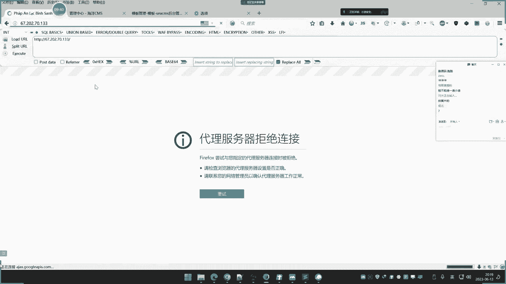

啧有点卡啊，哎这是那个哎那个粘了啊。

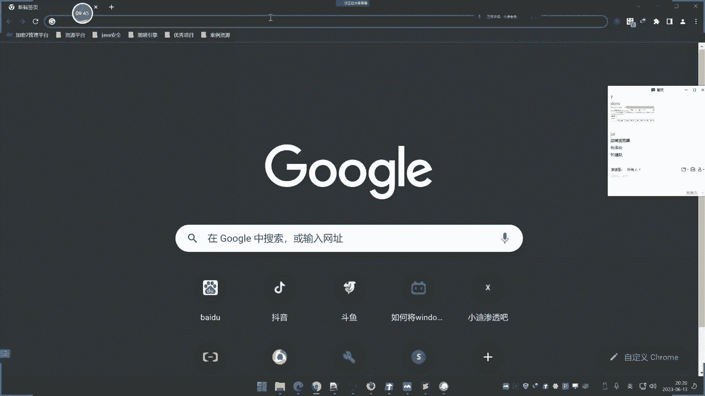

就这个呢我把它翻译过来了，这个是翻译后的那个情况啊，打开看到了啊，来这是一个国外的一个点啊，你看美国的啊，这里的美国的一个IP嘛哈，额然后他的这个漏洞呢它产生在哪里啊，我给大家看一下啊，啊在这里啊。

这条路径我们看一下来，他的有个路径呢是files，然后一个叫radio fpp，然后后面呢传了一个file file呢给的地址啊，这个地址怎么知道的啊，这个地址是通过目录爬行扫出来的，就是看到这个地址。

那就比较明显啊，读取文件的话，后面全都file，然后呢我们可要传递一个什么，你看啊该传递一个就这个名字，就是把这个文件的传递过去，因为这个文件呢是在files目录下面，那我传传的是这个呢。

就是它直接获取这个自己这个文件，来点击一下访问，那是吧，它就提示了这个下载，看到没来，如果你直接访问这个pp文件，它是不回这个提示的，大家可以看到的，我直接访问这个文件，那他就是空白空白。

那你在这里他看不到任何东西，空白的是吧，然后呢刚才那个路径呢把它写上去之后呢，啊对不对。

它就下载了，下载之后呢，我们打开下载后打开，你看这是它源代码，你看它的本身的源代码是怎么写的，接收file参数，然后呢固定这个文件的头，然后它采用这个什么下载协议，那去接收。

并且来进行这个REDFIRE的一个读取下载，所以他下载呢是通过这个代码执行过来的。

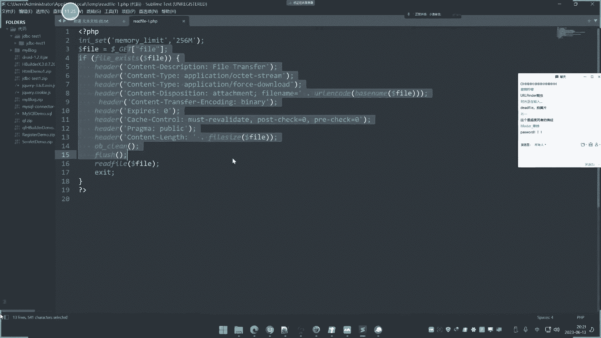

这是一个下载的一个那个pp写代码，那么试想一下，我再尝试去下载他的首页文件，你可能问我怎么知道还有哪些文件呢，这个批评文件我怎么知道啊，一般它有个首页吧，就是说你访问这个地址。

它的首页文件一般大家都知道啊，所有文件如果说是pp的是吧，就是应该都是什么d index pb是不是在这个下面，就是所有文件访问，这个和直接访问是不是一样嘛，你们所有文件index嘛。

我尝试先这个是默认的吗，那其他文件我可能不知道，我尝试下index，那该怎么办呢，是不是就写成index p p啊，这样写行不行啊，那点下载下载后呢，它的确能下载。

我们打开一看哎变成这个东西是啥情况，难道他首页文件是这个代码吗，显然不是什么情况呢。

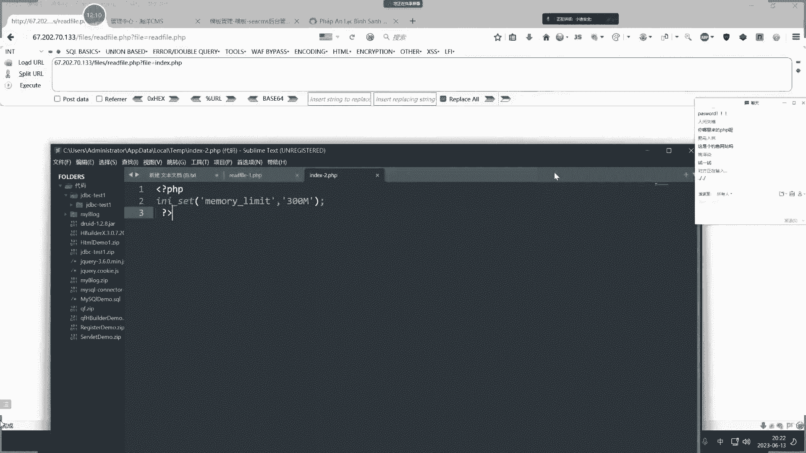

因为首页文件是在前一季目录，你可以看到他这个read file呢，刚才下载的是read file，我这里直接加上去的时候呢啊写这个东西是吧，他去下载这个read file是在这个目录下面。

那首有文件是在files这个这个目录前，那就说我需要怎么样告诉他两点斜杠商，一级的index点app是这样写啊，来点击确定。

然后再去下载，我们再看这个，你看打开之后呢，哎这个表代码是有不同了呀，这就叫首页文件，然后通过里面的观察呢，可以看到这是一个什么j blog的一个这个程序，你可能会哎你怎么知道啊，这个就是经验了呗。

你自己多关注，你们就这种注释代码，有可能就是版权和这个名称的意思，而且这里面包含了很多文件，你看这有取得很多路径下面的文件，这些文件都可以尝试性的把它去下载，然后一个个下载呢一个个包含。

那么大家都知道写程序很忌讳的一件事情，就是我们说的经常会包含一个，数据库配置文件是吧，那么很有可能这里就其中一个是有，数据库配置文件，一打开不就可以得到数据库账密码吗，那么这里呢由于它告诉你。

它是个JMOL的一个这个程序，我们可以尝试一下呢，在网上找一下这个z blog。

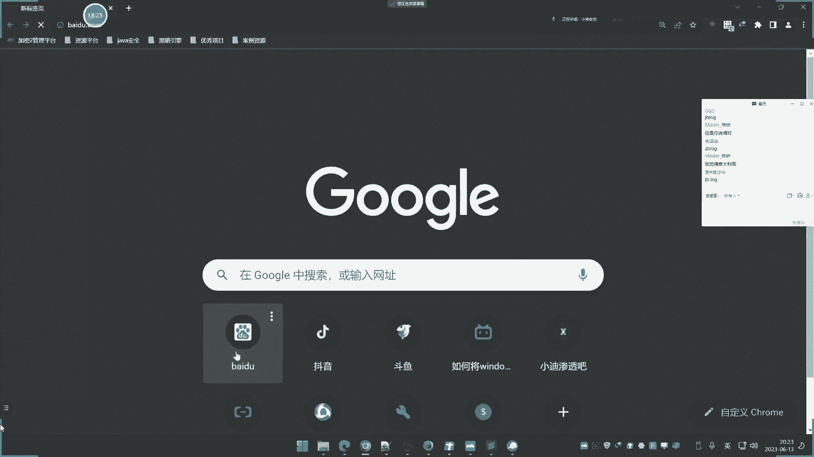

它的数据库配置文件呢在哪里是吧。

哎这没写，妈的都没写啊，数据库配置文件是哪个哟，就找一下路径，你如果说实在不知道，你自己下个圆嘛也是OK的啊，就我直接找他那个数据配置文件在哪里是吧，直接访问它就可以了啊，可访问它，你如果说不知道的话。

你下个源码翻译一下也是OK的啊，自己答间隔，因为我知道路径的话，我直接就去下载他那个东西啊，妈的。

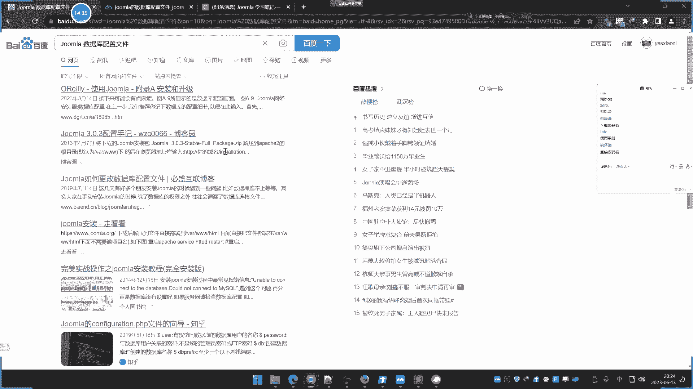

哦这里找到了啦。

是这个叫CONFUKPP文件啊，这个是在这里啊，可以看到呢，然后呢在哦这应该是在了根目录可以看到呢，在根目录好，那既然是根目录，我尝试下载一下，单把替换到根目录嘛。

就和index统一目录那点下载能不一样哦，有打开看一下什么鬼，诶，打开一看哦，出来了，你看host look host，用户密码dB，啊对不对。

所以说呀这个呢就是我们说的这个文件下载呢，他的一些这个后期的利用啊，这里呢我们就下载一些几个敏感，我简单给他看了一下啊，后面虚拟应用呢我们就不讲了啊，就说这个呢就是一个文件下载漏，那带来的危害。

你可能说这是什么问题呢，其实就是说网站呢它开放了这个文件下载，然后呢它的文件下载呢有几种实现模式。

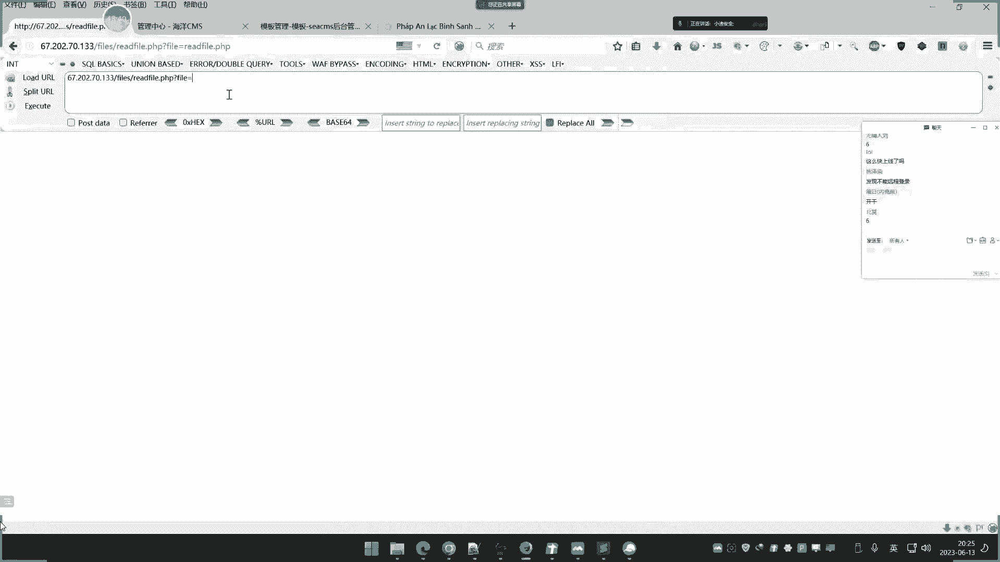

一种实现模式，那就是我们说的直连模式啊，你就说直接访问这个路径地址，能让他下载，还是那就是我们说的以参数传递，那如果说是这种参数传递的话，我们尝试就更改这个路径是吧。

让他去下载我们它本身不让下载的一些文件，然后呢实现了这个把其他文件下下来。

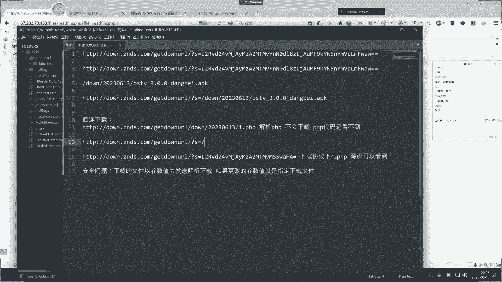

因为是像这种文件，那你直接访问它，是你直接访问这个文件，那他是看不到任何东西的，你直接访问呢，它显示就是空白，因为呢它没有任何执行架构来显示，就是空白，只有下下来才有得到你们的源码的机会。

直接访问的就是解析了，解析里面由于本身就不做任何事情。

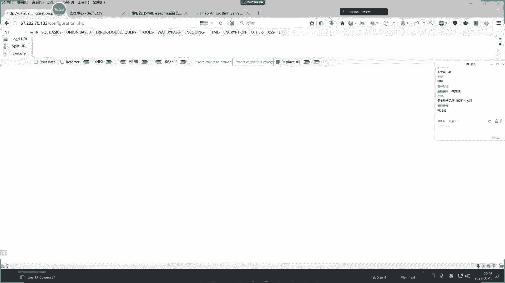

就是声明的一些这种值，所以就不会有任何东西对吧好。

这个呢就是说到文件这个下载一块的，这个问题啊，这个呢我们就不再给大家细说了，包括这里呢，我们还可以尝试下载他的这个什么啊，系统上面那些文件，你可以说系统上面有哪些文件呢，那这个就多了，我可以看一下啊。

呃他是有很多的这文章呢都给大家看一下，但这个系统文件呢说实话不影响呢，还不是很大吧，呃这个系统文件你可以看一下啊，呢那这是一些常见的LINUX的一些系统文件，这个windows的对不对。

你首先得搞清楚对方是什么操作系统啊，尝试下载这些文件，但这个文件呢有没有用呢，就下载下来之后呢，啊可能它的用处呢就不是很明显，因为怎么说呢，啊有可能还下载不了，为什么下载不了呢，大家都知道啊。

有些网站呢他是做了这个目录的这个设置的，就是说你不能跨目录去下了，他可能能把你固定到某一些目录，你可能只能针对这个源码那些文件进行下载，如果你跨越这个源码，那就不行了，权限达不到，会有这么一个情况。

所以在系统文件你要下载的话，首先要支持，而且呢你即使把这个系统文件，一些东西下载下来呢，说实话它会有很多一些策略，比如说像以下载一些文件，当然也得不到任何东西啊，只能说对他的网站信息的了解的更多。

但可能得不到一些直接的效果，但是你如果源码上面那些数据配置文件呐，或者说密室文件呐，那这种呢就可能会和网站安全的直接挂钩的，所以他会更直接了当一些啊，当然了，网络文件拿不到的情况，下面是吧。

那你可以尝试下下，下一下系统的一些这种敏感文件啊，最好呢还是针对网站方面的一些这种文件，进行下载，会更好，好，这个就是我们说的这个文件下载啊，那么还有一个就是我们说文件读取。

那其实文件读取呢和文件下载是一码事情，对不对，它是一码事情，我们可以演示一下啊。

什么是这个文件的读取，那你给个眼看一下啊，文件读取呢即码实行它等同于是下载，我们找一下这个巴巴苏特上面的这个八分。

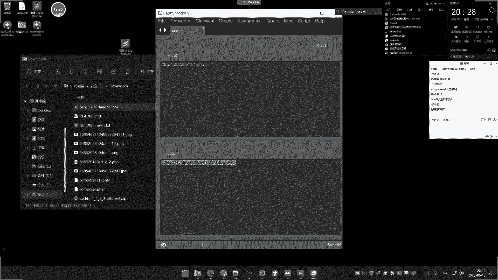

来看一下，它上面呢有很多题，但大了也可以刷一下啊，但是访问有点慢，他这个访问是有点慢的啊，这里呢你看目录便利的啊，这我打开给他看一下啊，但是它里面的题目呢还是比较多的啊，就是说大家如果说自己省得搭建呢。

要测一下简单的一些漏洞的浮现呢，那可用一下还比较方便。

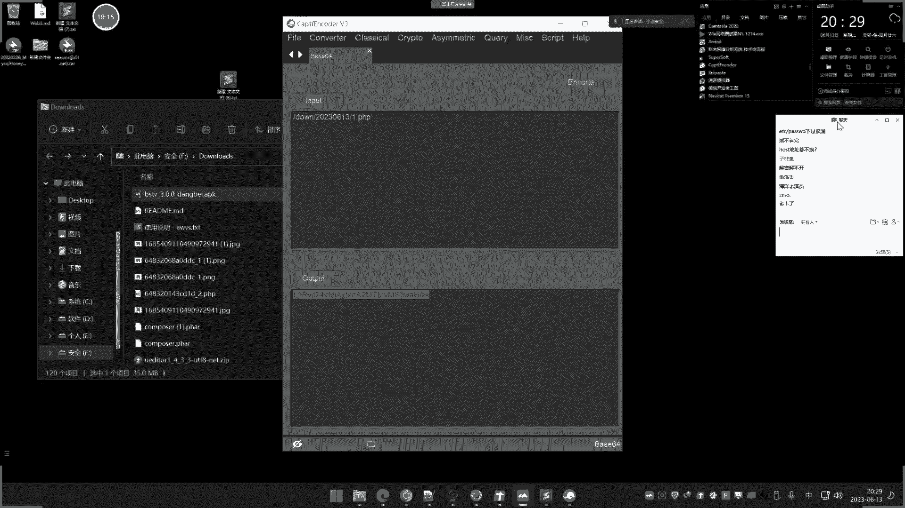

有点慢而已，因为他国外的啊，这是他一个地址啊，我们看一下啊，你看他这个是什么个原因啊，其实种豆腐都是这么一个情况，你发问那里看到啊，这里有张图片是吧，你别点一下了，点一下这个图片新闻。

然后呢你看到啊这个地址，然后你看下这个图片啊，右键那个图片地址的时候，你看一下啊，图片地址里面的，你看啊，imagine file name等于起点JB1哦，那应该就是说哎。

他这个图片呢就是通过这个地址加载出来的，那起点JP1呢就是个图片，应该是啊，那尝试如果说把自己改改成什么点点斜杠，点点斜杠，点点斜杠，什么etc杠pasta b是吧，这样一执行，然后他没反应。

没反应不要紧啊，我们可以试着去用这个招工工具来看一下啊，因为这里看不到源代码，我们用抓包工具在那上面提交看一下，有的时候呢就是说大家呢用这个什么。

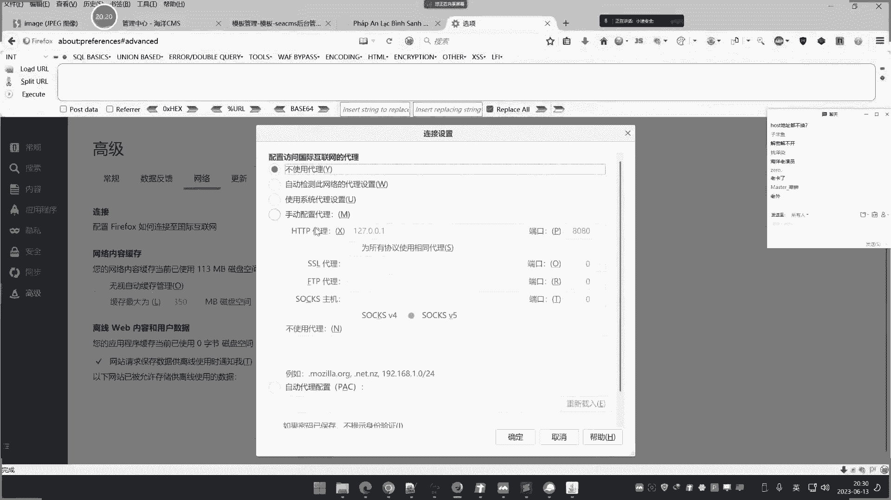

好快来抓个包。

好这里呢装个包之后呢，把这个地址啊，我们发到这模型下面去啊，好上面信息把改一下啊，直接放我这个地址来勾，那是不是啊，这就是得到那个etc p答D的，你不要说为什么一测就测这个。

因为像这个什么省略它LINUX系统啊，这些东西就不看的嘛，对不对，那个你可能说为什么要在前面点点点斜杠啊，那就是跨级目录嘛，跨了三级跨到根目录去是吧，如果一级不行，你死两级死三级多死几次不就行了吗。

对不对，你看就是吧，上去了呀，那如果windows的话，那就在windows上面一些常见的系统文件了，windows系统文件就是刚才看到那个文章里面的吧，其实这个东西都一样啊。

当然了你也可以测他一些其他源码的文件是吧，也可以测自己的制造目录来加工，来去分析也行是吧，它上面都有啊，这应该活学活用啊，活学活用啊，就这个意思啊，就是说呢多去测一下那种参数值的啊，因为你要想象下啊。

他就加了这个图片，然后后面刚好那个地址呢啊，就是刚才我说的嘛，他这个地址呢就是可以明显看到啊，就是这个呢通过file name传参给个起点JB1，然后你看这个地址呢，再观察一下这个地址。

那就是五点JB1是吧，通过这个JPG的全集呢，让它显示不同的图片，那么你试想如果把这个图片改是吧，改成一个这个其他文件，那会不会加入其他文件的这个源码呢，就这个意思啊，这个就是类似文件读取啊。

和文件下载是等同的，因为你文件下载下来看到结果也是这个结果啊，对不对，这文件读取和文件下载的差不多的啊，无非就是说一个是下载下来了，一个呢就是在线读了，对不对，包括了刚才大家说的什么。

这里换个什么shadow是吧，这个呢就是自己想测下，你看他这里，那就不乱看SHADO了，因为他这个是靶场啊，他如果说你都能看的话，把它拿下了，那那就尴尬了，好，这个就是我们说的这个文件下载和文件上传的。

相关东西，其实把这一看呢大家也知道了啊，他在黑盒中的一个测试呢，就是关注几个点，我们要讲讲了他在黑盒中的一个测试，就说我们不知道没有这个程序源码，我们如何去测中有没有这种漏洞呢，主要是看两点。

第一点就是功能点，第二点就是药药的特征，一是功能点，啥意思啊，既然它是文件下载或是文件读取，那就说肯定是和这个功能相关的，它没有文件下载地方，它怎么会有下载的东西产生呢。

所以说你通过就是找这个网站的那个，这个有这个功能的地方，通过这个功能的实现来分析那个UL的路径，是不是类似于这种传参的模式，通过它修改这个参数值，来看一下它是不是能够你修改什么东西，它就下载什么东西。

那就有就这个意思能理解吧，然后这是第一种啊，就是通过这个功能点呢取车，还有一种呢就是直接看UL地址对吧，又要地址上面呢有这种关键字的什么灯啊，read fire reader呀是吧。

直接告诉你是什么作用的一些英文单词，而且后面的参数名呢加上的是什么file啊，或者什么file lion啊，file pi啊，这种文件啊，文件夹呀，文件名字，这种英文单词的东西指向后面那个参数值。

那么这个时候很有可能，它代表的就是去加载一个文件，那么试着呢去把这个加载的参数值呢，改成你想去测试的那个文件，那么如果说能够实现的话，那么就恭喜你找到了，如果说不能实现的话，那要么就是没有漏洞。

要么就是他有顾虑啊，就这个意思。

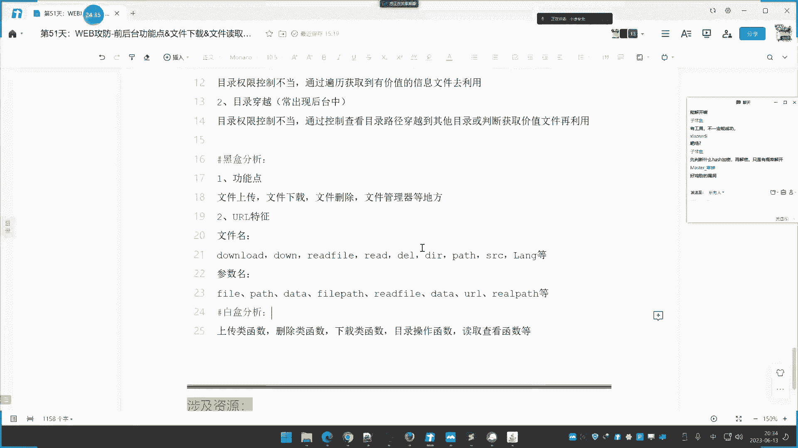

然后呢除此之外大家也看到了，像刚才这个呃这个下载漏洞，你看他的词呢还进行加密，它就有点类似于我们那个circle注入一样的，就是把那个参数的进行加密了，如果说你有懂加密的话，哎你把它换算，那还原出来了。

你再把你要加的文件呢，再把你写写完之后再加密是吧，一样的道理，所以呢这个原理方面的很多知识点的，一些这种技术啊或思路的都是通用的，你学好一门的很多东西呢啊都能自己去了解。

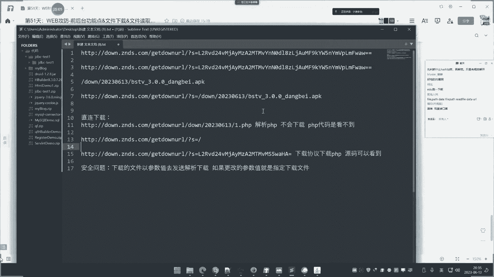

我不这样讲，那你也应该知道怎么做啊，这好这个呢就是我们说的在黑盒上面的，那肯定大家说了，那白盒上面呢是吧，代码方便分析呢，代码分析分析就和其他漏洞一样啊，根据这个相应的这个功能点。

或者说根据这个相关的函数，就说他怎么实现文件读取的，那无非就是文件读取内的函数啊，怎么实现文件下载呢，那就是文件下载的这些操作啊，搜这个地方有没有这个东西，从代码中去翻这个东西。

然后再看他控制代码分析的，有这么一个思路，都是通用的，嘶好，这个呢，就是我们说的这个下载和这个读取方面的，一些这种操作流程啊，那么这个文件删除也是一种安全隐患，但这个山竹呢说实话在实战中呢。

一般车的话他也是一个比较危险的漏洞，车呢也不好测，大部分呢就是说影响的话，就会影响到业务的一些安全问题，因为删除大家都知道啊，这个删除不是个好事情，你不小心删了，那就可能这个是吧就喝茶了啊。

所以这个东西呢，但是他漏洞说实话在实战中很少见到，第一个不是说他这个漏洞很少，主要是删除这个功能比较敏感，第二个呢就是一般有删除的这个操作的地方呢，一般都是在后台里面居多，就说网站呢是有一定权限之后。

就说你哪些用户登录到后台里面，可能有这个3D操作，就说你个网站打开，谁会给你一个这个删除的地方啊，一般不会有吧，所以说一般删除呢它产生的地方，一般就是在一些这种用户授权登录后的地方。

不管是普通用户或者说后台用户对吧，他才会有这种类似功能，就比如说你个人中心里面，删除你自己的文件是吧，然后呢像后台里面的去管理一些这种垃圾文件，去删除，是这么一个流程，对不对啊。

不想说是这个前台里面用户没登啊，他就给了一个删除，那删除的是什么东西呢，这不符合逻辑啊，所以说这个文件删除呢它比较鸡肋，鸡肋的地方不是说漏洞少，而是说它产生的地方呢，我们很多情况下面接触不到。

因为你本身你都你就本身是挖漏洞，这个漏洞产生在后台，你登都没登进去，你怎么撤呀，好但我们在这还要讲一下啊，来我们给大家看一下啊，比如说像现在啊我们搭建这个网站，这是一个cm s啊，呃和常规列车一样啊。

那后台里面呢有这么一个地方，你看啊，这里呢可以看到啊，这里呢有些文件这里呢是提供这个删除啊，然后呢删除了我们可以试一下啊，来啊，比如说这个文件我们点删除，对不对，可以看一下啊，这个删除的一个路径的地址。

我给抓个包啊，大家看一下，那我点击删除，把那个包抓到。

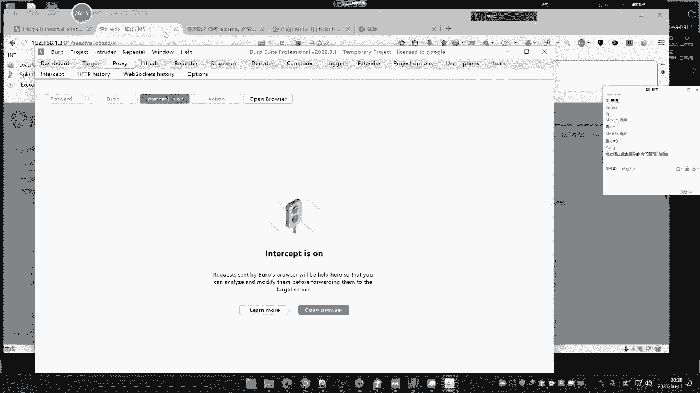

好这个包抓到了，大家看一下这个路径地址啊，那你看到啊，那上面是不是传递了一个删除的这个文件，参数值啊，这里对不对，刚好指向的就是刚才这个我要删的这个文件嘛，啊那他在这个目录下面对不对。

那我你可以说这个删除有什么意义呢，一般你可以尝试性的删除一个文件，这个删除呢就是你按照正常来讲，你只能删除这个地方嘛，他说只能给你删除这个，它显示一些文件，那我尝试能不能删除其他的呢，那我可以试一下啊。

我先找下源码的一个目录，这个删除呢一般配合的，主要是配合这个删除这种锁定文件，锁定文件是啥，锁定文件一般就是那种安装的锁定文件啊，你也可以删除其他的，但是危害比较大啊，一般测到这里就好了。

这in store里面呢有个叫in store，点lock点TT这个是啥玩意啊，先给大家访问看一下，就大家知道了，来我访问这个in store啊，访问他先把这个放出去，那我如果要重新安装它的话。

访问这个目录，它会让我说删除这个文件，那就可以重新安装了，就你安装之后，他怎么知道你这个程序安装过是吧，他有通过这里面有个锁定文件，你如果说把这个锁定文件删掉，那不就是重新可以安装了吗。

那我尝试修改删除这个文件呢，那怎么删除它呢，那我试一下的，我直接的把这里改是吧，来改这个地方删除勾，他说只允许删除TMP目录下面的文件，你看他有过滤，对不对，但这过滤呢通过这个上面理解的话。

我如果不看代码，那我试着尝试一下怎么操作哈，先把反原，后面加上点点斜杠，点点斜杠哎，加就是加几个点，那这个无所谓啊，你可以加一个点试一下勾啊，他说目录存在，目录存在，可能是我级别不够，我继续呢加一点点。

是不是跨越级不够，因为他这里呢是在删除文件呢，是这前面三集我再继续加两点再试，还是目录不存在，继续加，还是不存在，再加价，还是不存在，那他可能就不是这个问题了，那我试着去把这前面删掉一部分。

他不是说要在这个目录吗，我尝试着切换到这里来勾一下来看，他说不存在，那我删进目录看一下，哎好操作成功了，你看可以了，看一下这个文件没了。

再访问一下这个目录，重装了，这个主要是说一般只说车的点呢，就像这样车他啊，当然你在实战中的，你不要这样测啊，你实战中的话，说实话你要测就自己的重新创建一个新文件，小文件，那删你那个文件。

如果说能删除测就可以了，你不要删除它本身文件，你删除本身文件，那出了问题就完了啊，这个删除是个很高位的操作，不要乱搞，啥意思呢，其实就是说他这个本身的功能，那就是让你删除一些可控制一些不要紧的文件。

但是通过这里呢，哎也就实现了删除了一些其他文件，对不对，就实现了任意删除，那你加很简单的道理，那你是不是可以直接把他文往前往上搞崩啊，比如说这里呢有个什么有这个index pp是吧。

它本身呢仿网站都是正常的，你这仿网站的都正常了是吧，你这里咔嚓给他把他首页稳定一三是吧，这里改改成什么INDUST，点p h p go，提示操作成功刷新一下网站，不好意思，直接崩了对吧。

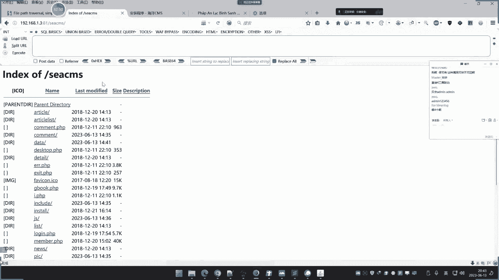

打不开了，这不尴尬了吗。

所以说这些东西呢不能乱操作的啊。

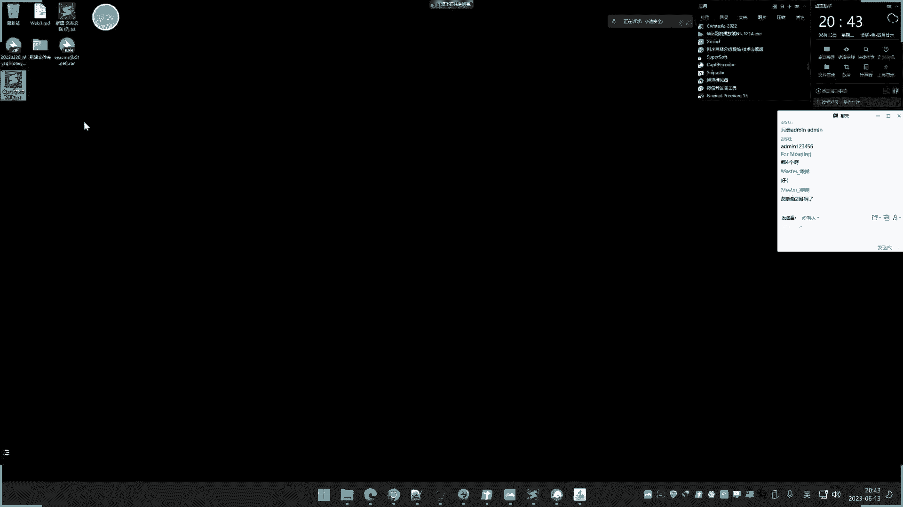

所以这个就是删除，其实他也没什么太大的一些好讲的，讲的就是无非就是在那个网址上面，那去不断去尝试去修改什么点点斜杠啊，点点斜杠呢去跨目录啊，尝试呢去这样去操作它，然后呢把它删除是吧。

但这个操作呢说实话实战中的话，一般就自己创建一个文件，删除一些你自己创建的文件，点到为止不要去尝试删掉它原本的文件，那你删的不对的话，那解有问题的啊，好其实这下载也好，文件删除也好。

他们都有个共同的特性，特性呢都是通过参数传递去给值，然后让让它去删除，那么一旦控制不好的话，我们给一个他原本不想要的东西给他去，那么不就把这个原本不想要我给删掉吗，就是他本身这个网站那是设计的。

就是说让你去操作一些功能的，但是通过这个参数的一些不受空啊，导致了你把一些其他东西呢也代入进去了，这危害就由此产生了啊，好这个就是关于文件类的删除啊，我们想想啊，这个上传下载读取删除。

这就是文件的几个部分的安全问题啊是吧，商传安全下载安全包含安全读取安全删除，安全没了，其实呢还可以有边际内的安全，啥叫边际内安全呢，借好理解啊，我给他举个简单例子，他这里不是能编辑吗，大家看着啊。

来它不是能编辑文件吗是吧，我可以尝试性呢，我比如说把这个修改，我点击重新抓包给他看一下啊，它不是能编辑吗，如果说编辑里面呢它也带有参数传递，我编辑呢抓个包，点下这个修改模板，那编辑了编辑。

大家可以看一下这个包啊，哎画屏哎呀，这他妈的先把关掉，好再来看一下啊，重新发送好，这是他编辑的，大家看到了，那这是他content是编辑的，是内容啊，刚才我加的这个DSD就在这里嘛。

那fail dl什么文件路径，那是不是就是刚才编辑这个文件地址啊，那你试一下，我这里不是刚才这个知道网站目录嘛对吧，我尝试性我编辑一下这个S点pp好吧，你看啊，现在我先打开S点pp。

这是SPP的代码，对不对，我尝试下要把这个替换来看着啊，按照刚才思路，对吧，点点斜杠，S点pp，对不对，我这样写，看他行不行啊，我把它包的保留份来防一下，看下什么，结果操作被禁止。

啧啧你觉得这个被被禁止的原因是什么原因啊，大家觉得可能是这个2%f的问题，把这里换一下，看一下是不是这个问题啊，因为这里呢它默认都是百分RF操作被禁止，那就说他这里呢可能哪里有过滤是吧，你要不断去测它。

嗯这里的最好是把源码翻出来看，就知道它是什么过滤了，源码翻出来看就能直接直接绕过了，如果说你不看源码的话，你这里也不知道能不能绕过，我们先不说就是湿奴呢是这样子的，那就说我尝试呢本来是修改本身那个文件。

哎我这里把路径改，那尝试性就是修改其他文件，这个好理解吧，所以这都是一个概念啊，都是这么个意思，也是说任意文件的修改都这么个情况啊是吧，通过数据包里面的替换它要修改的地方。

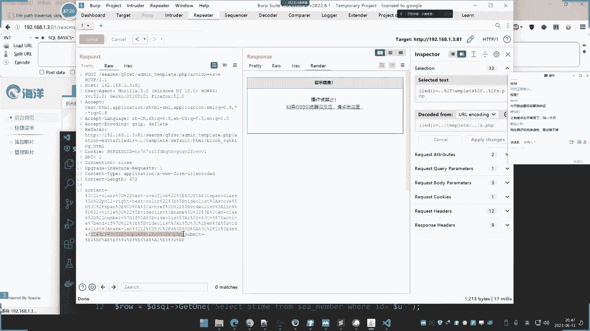

这好不，这还不好理解吗，对不对，你这里呢如果说你要绕过它的话，你可以试着去常看一下燃嘛。

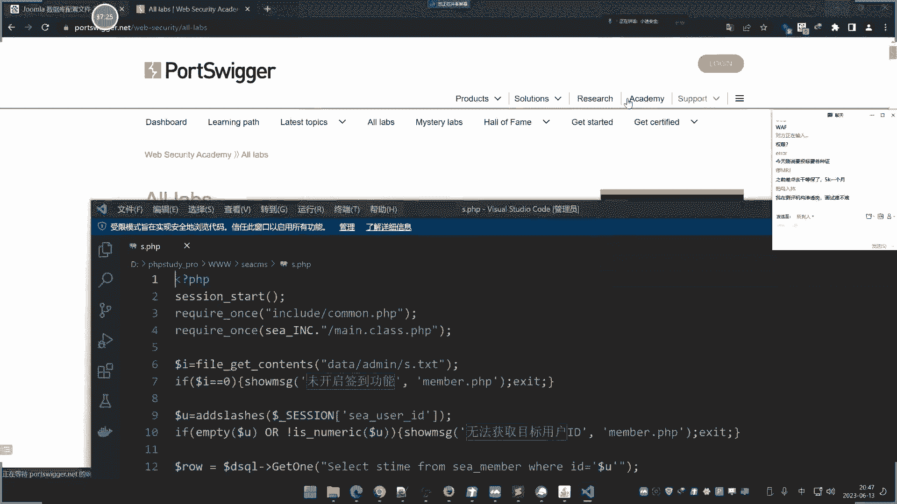

因为这里呢我黑盒测的话，我不知道能不能测出来啊，因为直接看燃嘛是吧，从源码上面可以直接剖析出他这个漏洞的产生。

和漏洞的这个情况嘛，我直接打开源码给大家看啊，找到他那个项目，这这些源码查看呢，在后期的那个代码审计里面呢是经常要看的。

我把源码打开，然后我们关注一下啊。

他的这个数据包呢是产生在这个目录下面。

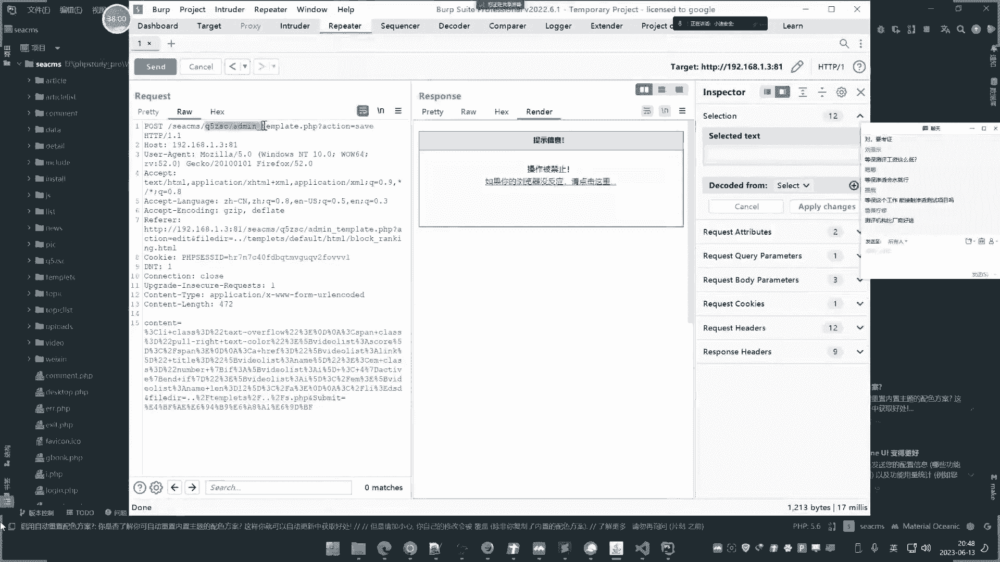

我们来找到这个目录好，然后呢是ADD me点TMP的这个文件，这里嘛好找了之后呢。

你可以看一下啊，通过他的数据包的地址呢，再分析是这个叫xx等于CF啊，保存的，然后这里有两个参数，content和这个fail dr。

我们直接在搜看下来，X型的呢等于空，然后这里呢有个什么X型等于1it哎，那就知道了，当然如果说action等于CF就是来了，刚才那个的我们搜一下e d class，然后这个是CF，这个是凹在这里。

你看啊，刚才提示的只允许还有个操作被禁止，操作被禁止，你看下啊，他是什么情况，他说这个文件类型呢读取它的类型，如果不是ATM2，TMJS和这个什么cs和TST就提示这个然，大家会问大家。

你能不能绕过它呀，大家觉得我能不能饶过他，看到结果吧，结果就是说取得这个fail dr的值，这FDR值呢，应该就是刚才这个参数名的这个地方啊。

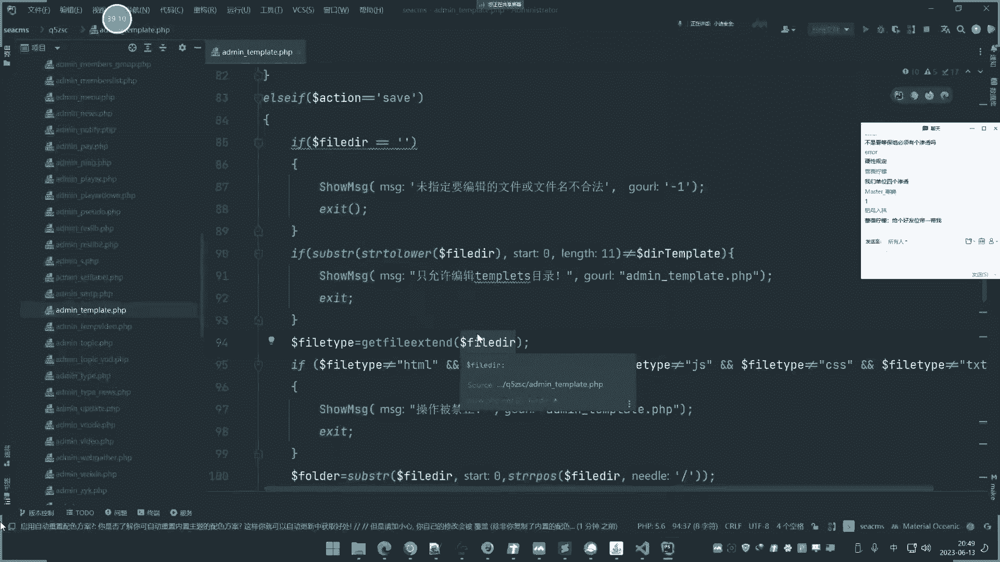

就这个地方呢他就判断这里面呢。

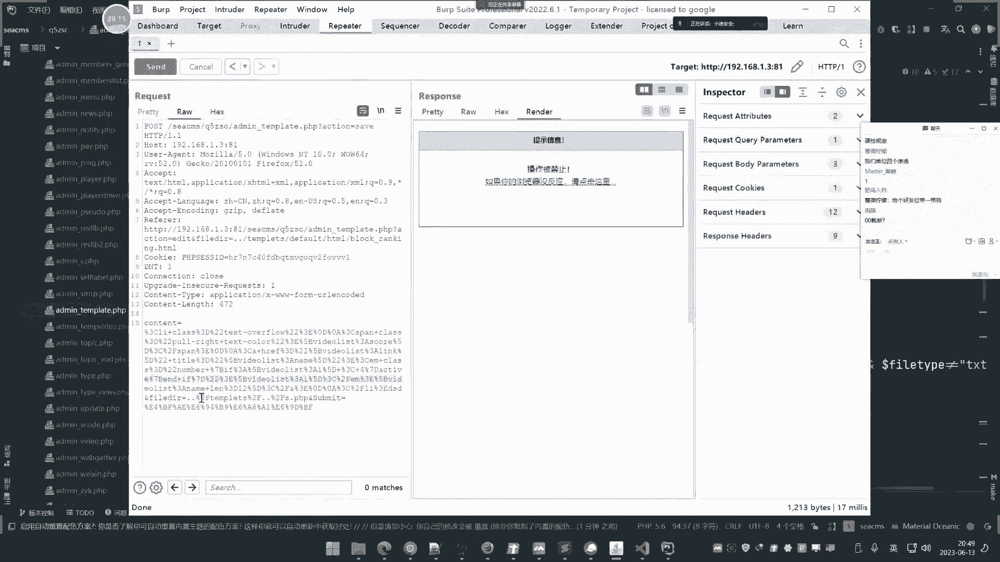

哎他的这个用这个呢这个参数我可以跟一下呢，把CTRL点进去，把跟下来，这个是他配置的这个函数的配置，那他就是取这个什么，取这个后缀的，还取里面的后缀，是不是等于这个点A炮和这个什么鬼东西啊，是不是啊。

能不能绕过，大家觉得，前面这个好，就前面这个呢就判他有没有那个路径就可以了，然后这个呢是判断个后缀。

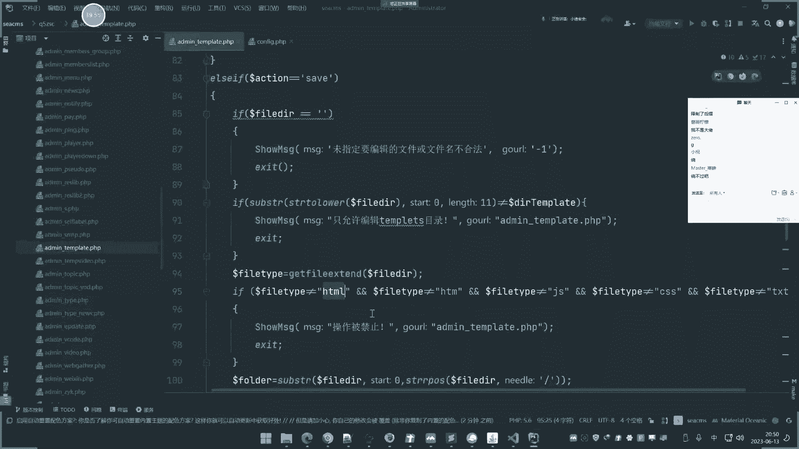

你不信的话，我可以试一下来，我把它改成这个ATM，你看啊，我看ATM之后他应该就成了SDATM勾啊，超成功是吧，你看这个文件是不是保存到这里来了呀，是不是，但是这个是我们创建啊。

如果说编辑的话，那怎么模式啊，这里还有编辑模式啊，有这个edit模式啊是吧，还有编辑模式啊，编辑模式呢也有来有这种过滤，那说两个都一样，到时候看这个safe的话也是一样的道理啊，这个怎么改呢。

那和文件上传有点类似了呀。

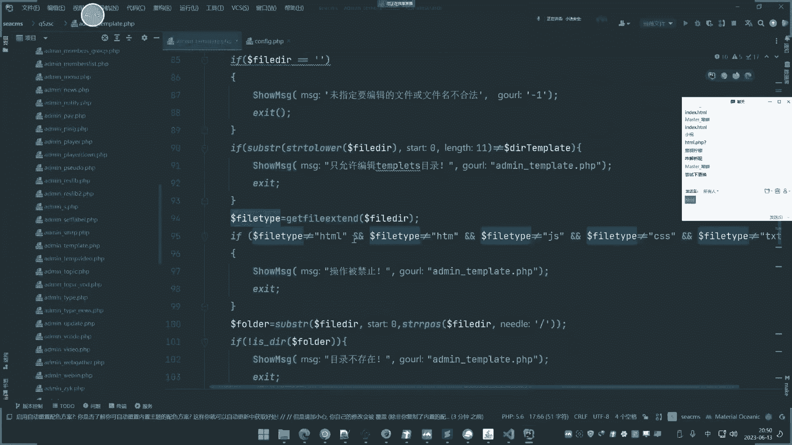

怎么改让它形成pp文件呢，有绕过的过滤的，是不是，大家觉得这里好不好做它，截断这些东西呢也是一种方式，但是怎么说呢，嗯这个东西呀，那你们说这种模式是吧，这是前面讲的那种东西嘛。

哈啊这种细胞嗯啊他说要操作成功，然后你看这里啊，打开，这文件呢还是SPP的写进去了，哎你看这文件哎，哎不要卡呀啊，这次还是那个代码啊，这pp呢这个百分零零呢，你看还没有，然后呢时间呢也是刚才的。

所以说这里呢并没有成功啊，这个零零呢你这样去写，你把他这样子搞一下来，我们讲过这个零零阶段呢，它是只限制于这个什么，只限制于那个pp那个低版本才有零阶段，这个概念，高版本没有。

但是我们可以用一种方式叫做什么方式啊，超长的一些这种字符呢去把它咔嚓掉啊，超长支付把它咔嚓掉，就说你在这里呢写了一大堆啊，不知道在结束的时候呢会不会出现啊，当然这只是一种测试方式啊，具体行不行。

我也不知道，啊并没有成功啊，还是这个模样，就说我们都有呢，是这个测试方式啊，我怀疑他这里呢应该是不能创建新文件啊，能创建新文件，应该不能覆盖这个软有文件啊，感觉是应该是不能覆盖这个软有文件。

嗯都不行啊不行好，这个就不是我们操心的啊。

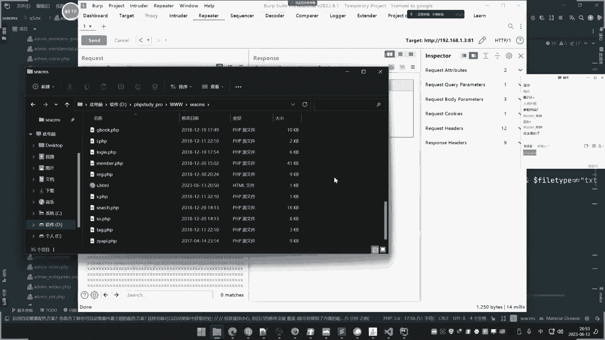

我只说从代码审计的角度给大家看一下，这个是这个保存，刚才的这个删除呢就是个DL的参数，那也是这个模型用到了这个什么，你看unique这个文件删除的东西，我前期讲安全开发的时候，大家有没有印象过。

我们看一下前期我们讲安全开发的一个源码。

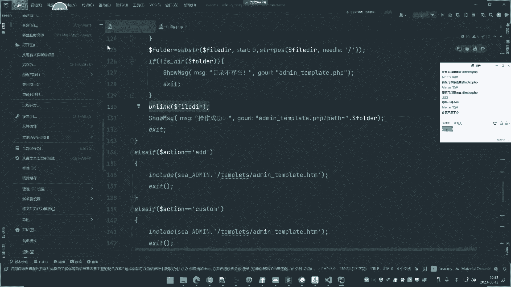

大家不知道还有没有影响，打开给他看一下。

这个是当时讲前期开发那个两个源码呢，当时自己给他写的，你看里面涉及到这个删除DL呢，用unique狭窄讲过编辑是吧，那你用过这写过这个代码，那看再看这种他说的是什么，哎这种的删除这个UI壳呀。

这种删除的这种模式不就是差不多的吗，所以说前期你安全开发这些东西搞好之后呢，你后期针对这种不是很困难的代码，你一眼就知道。

好，这个就是我们说的这个文件删除类的，一些知识点啊。

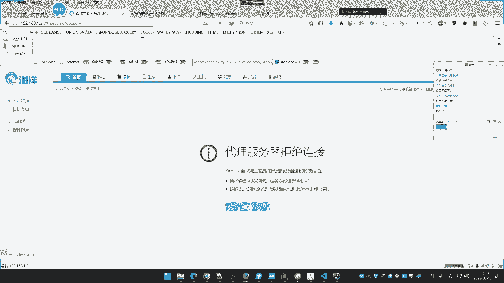

那么紧接着呢文件删除这一块的安全呢，我们就讲到这里了啊，没有什么太大问题，这个文件下载，文件读取和文件删除呢，这俩这三个漏洞呢它是不限制于说是pp语言呢，还是java语言，还是其他语言不限制的。

因为这个漏洞呢产生在任何地方，都有这个思路可行，因为它是一个功能上面的，没有验证过滤的安全问题，而不是说某个脚本特有的入你像你java里面，你涉及到这个什么下载，你如果控制不当的话。

按照他这个逻辑测试的话，也会出现这种质量安全问题，所以说你要知道啊，有些漏洞呢它不是说在某些脚本里面才会出现。

而是说得要看这个漏洞的形成原理啊，他是偏向于功能一方面呢，还是说固定要用那些函数才能实现啊，不一样的啊。

好这是我们说的这个。

呃什么这个叫啥来着，啊文件的下载删除啊，删传啊，还有读取啊，删除这些东西啊，好这个东西呢我们就讲完了啊，还有一个刚说的编辑嘛是吧，刚才有人说什么要听什么冰鞋的魔改，冰鞋的魔改是现在上不了。

现在还在web的课程里面，哪个知识点呢，是在流量混淆，跟我对apt的东西，内网上完之后才有的拉，都到了一百一百六七十克的时候才有，这还有百来克呢，我们再来看一下这个目录的这个情况啊，冰写那个课程。

那可能要到年底和明年的时候才能上吧，那都是尾部的一些课程啊，内网上呢才会有那个东西，我们这期加的那个模改的那些课程是吧，加了三四个工具，前期上期我们简单说了一下cs的魔改，对不对。

那啥怎么现在比较流行的WP工具，哥斯拉的这些东西也有，好我们再来说一下这个目录型的安全问题啊，前面是文件类的，昨天他还有个人问我，还叫我讲细一点，说实话你技术真的很差，他问我这个什么鬼，目录便利。

目录穿越是不是一个东西，不是的啊，你可以把它理解成是个东西，但是不是的，目录便利呢是由于目录权限控制不当，而目录传越的也是这个目录权限控制不当，那这两个有什么区别呢。

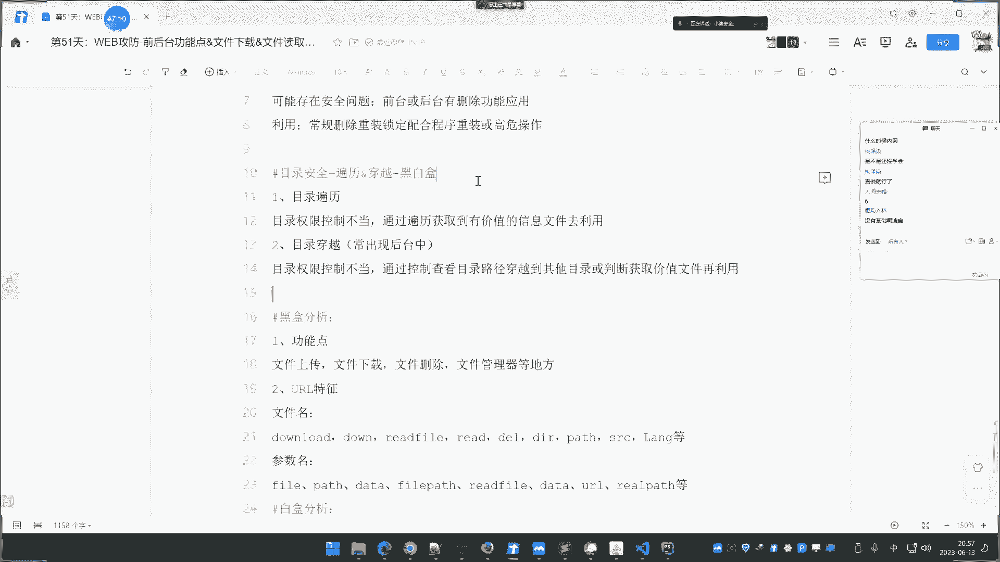

没太大区别，目录便利那是什么情况啊，来它是由于这个权限控制不当。

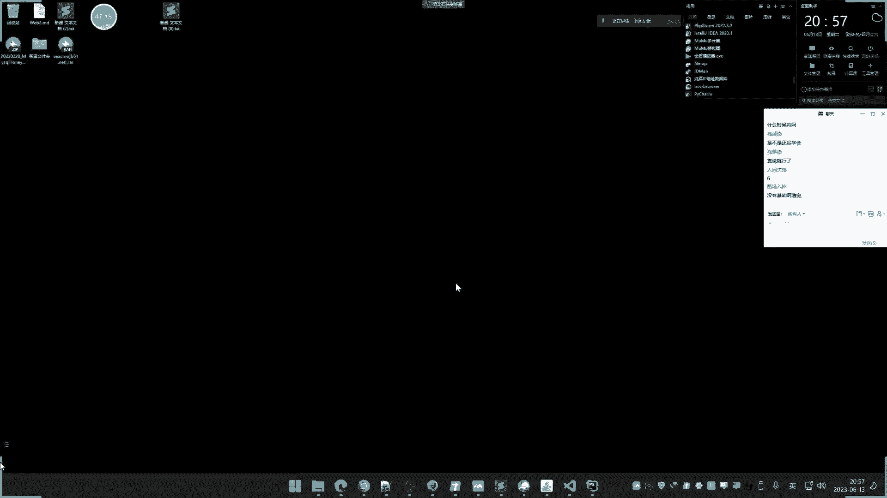

就比如说一个网站目录来你这里呢，这是网站啊，你把这个目录右键呢点击这个属性网站目录，这不是有个共享这个安全吗，它这个里面有些呢就是让它叫列出文件夹内容，里边勾选是啥意思啊，就说你访问这个目录的时候。

它会展示当前目录下面的所有文件和文件夹，就这个意思，其实呢他就和这个东西呢挂钩的，而你访问的用户呢刚好是属属于这个组的。

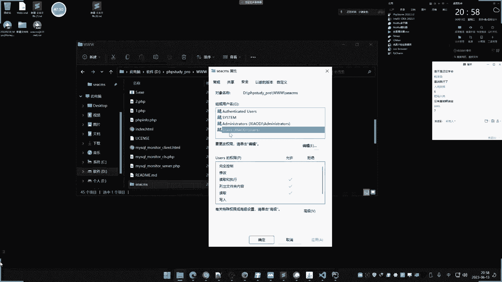

那不好意思，那就按照这个权限进行，就这个意思啊，那么在中间件上面设置呢，也是有这么个设置的啊，比如说呢像这个网站啊，我们打开刚才那个测试那个地方呢，我打开这个修改它，这个地方有个人叫目录索引是吧。

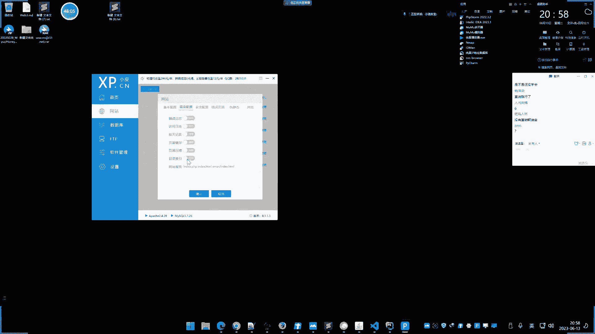

点一个目录索引，你如果让它勾选上，我们现在打开给他看一下啊。

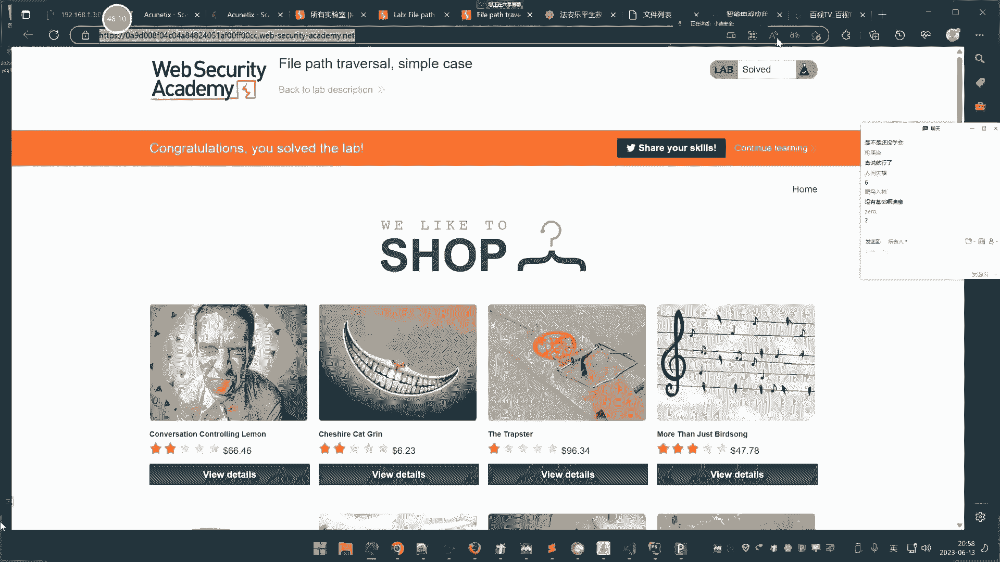

那你看啊，这个1。3。86指向的就是这个地方啊，先把它打开，那他的访问呢提示这个403÷5，就是他不如显示啊，实体商家都知道他是不显示的，说什么没有权限的去访问他，啥意思呢，就是说不显示他的下面资源。

但是你如果说在这个地方呢，给他在目录索引开点确定呀，在八六端口的嘛啊，刷新诶，它就显示了，看到没，但是呢你又会发现有些网站呢，你再打开它又不显示了，比如说index1打开了，它显示啊，有一些你看啊。

我打开有有些的优势里面一打开哎，它就显示网站页面了，这啥情况呢，他这个为什么有些目录显示，有些目录不显示，这又又是由什么原因造成的呢，其实非常简单，就是有没有首页索引的问题，来给大家演说一下啊。

来打开这个目录，内网的目录，这个是那个sea这个地方，那在这里啊，在打开这个目录时候是请求的这个路径嘛，他绑定是这个是不是这个路线，我看一下，啊包里呢就是这个目录，你看SEACMS对不对。

就是这个目录啊，保零就是它，但是在这个目录下面嘛，哈在这目录下面看着啊，我直接打开它能显示整个目录是吧，那我打个60，它显示页面，打开其他目录呢，唉它显示又显示文件，这啥情况好，你看一下啊。

当我在60这里下面给他一个索引，为什么优势显示它，我把这里那里看着啊，我重新再随便在你创建个一文件，然后把这个index把改个名字好，再打开，你六四你看是不是显示了呀，就不展示了，为什么。

是因为这个index呢，告诉他他他这里有索引，就说他解析这个index，所以你在打开的时候呢，哎他也解析这个index的内容，能理解了吧啊刚为什么打开这里呢，它有显示它呢。

是因为你这个目录下面没有它的索引，你当你只在这里能给一个他的首页索引，什么index啊，这种默认的名字对不对，给他搜，你比以ATM2或pp1打开刷新诶是吧，空白了，那他就不展示了，是这么个原因啊。

这个索引呢就是由这个中间间的，这个什么这个地方决定的，你可以看一下啦，来首页他就以这几个名字的为首页文件，就是为索引，如果说没有的话，那我就暂时有的话，就以这个东西呢为准，就这个意思。

这种呢就是文件编辑漏洞，就是由于你在这里呢控制这个权限不当，导致这里泄露了这个什么，泄露这个文件的意思，那么网站有没有这种事情呢。

那也是很多的，我们可以看一下啊，很多网站的东西，那这东西有什么意义呢，就是对于我们来讲呢，就是对于我们来讲是什么个意义呢，这是关键词，它对于我们的意义来讲的话，说白了啊就是一个看到网站目录结构。

然后呢里面有些文件能下载的就下载下来，下载不了，那就不下，这样子呢能帮助我们呢对网站有些了解，比如现在的我们就打开给他看一下呢，那像这种的都是你看是吧，这网上很多的啊。

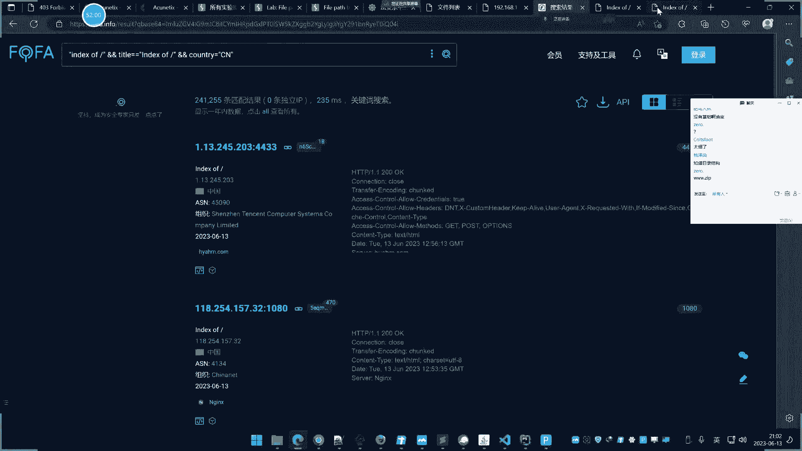

哎就这种情况是吧，就这种呢就属于目录便利啊。

就目录遍历这全景控制不当呢。

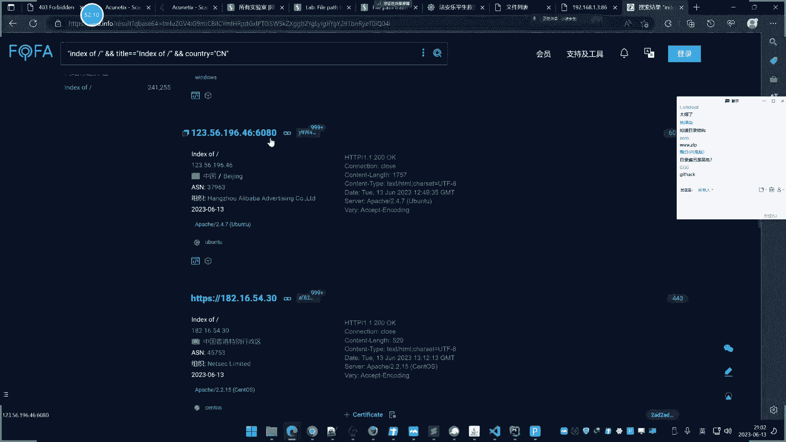

导致的一些这种文件下载啊，这种东西是吧，还有可能呢啊你一翻的话，哎就把那个什么，比如说咱这你看的有这种敏感的东西。

就把瞎了，对不对，比如说数据库文件备份呐，源码备份文件呐，他刚好在上面诶，你下载不就得到一些敏感信息了吗，但是如果说是其他文件的话，那可能就下载不下来啊，就这个意思。

其实那就是他自己在控制这个网站目录的时候，那权限控制不当所导致的，然后为什么有些目录访问呢，它不显示目录结构，是因为里面呢有一个索引文件，让他直接找到首页，显示那个index去了，十个原因啊。

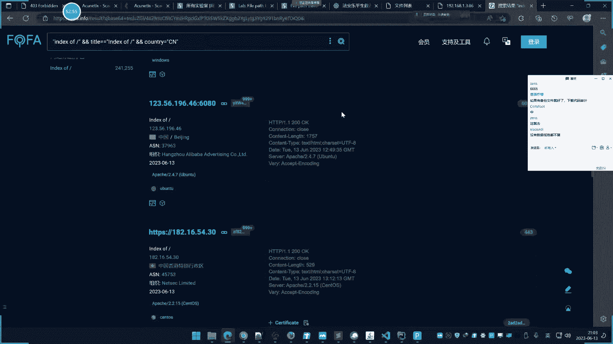

大家明白，那么这一种呢我们又称之为叫目录变离。

他的这个形成原因就是这个意思，就一打开一个目录就显示了，这也不用说怎么去探究这个漏洞了，因为这个漏洞探针就直接访问访问，有那个反应，就是有没有就没用，所以你不要问说怎么防贪污这个漏洞啊。

好然后再说目录穿越，目录穿越呢就和刚才那个有点相似，你看很简单的道理啊，我们来到刚才那个网站嗯，打进来，那你看这里啊，我们看一下来这里不是那个模板管理吗，你看啊，他就只能看这个TMP目录是吧。

那点一下这个地方，这是针对目录的啊，刚才是针对文件的，现在我讲的是针对目录，那我点你TM对不对，等下这ATM哦，我这里点一下商机，或者我点商机，我点这个东西，我把地址一复制啊，我把地址一复制自然地址。

那你看到啊，他传给他的PY是不是关键字段的，pi等于在一个目录地址，那我试一下，我把这里给去掉，两连斜杠往上面挑一下，看看行不行，挑一个来啊，他说只允许这个目录好了，只允目录线，我就让这个名字先有。

我在挑，进来两年，斜杠跳不跳哎，跳上去了，你看它本身就是说啊，这原本的设计呢不是说这样的，因为它原本的设计大家刚才也看到了，它原本的设计就是你在这里只能看这个目录，你不能跑其他地方看的。

但是啊他这个没考虑到你这个这样搞啊是吧，来跳商机好，我们再继续往上翻了，多挑几集，看跳哪里去了是吧，我多跳几句，是不是跳到什么呢，直接跳到哪个盘符上面去了，我看看源码，结果呢他跳到这里来了。

你看跳到D盘这个PB破了，再往上面跳，是不是就跳到整个D盘呢，看下来，有点卡啊，可能这个我的D盘有点多，因为这个目录结构多啊，卡住了嗯，然后呢你可以再点击这个目录是吧，他可以跳到这个3W类目录。

再继续款3W目录下面的东西，卡住了啊，啊与此同时呢你还可以尝试性的是吧，写个这个盘符，就让他恰恰到C盘试一下，是不是好像报错了啊，可能卡了好调到C盘四下，这种操作呢都是可以尝试的是吧。

我们调到C盘看一下啊，能挑就挑，挑不了也无所谓，啊这种呢就是我们说的这种叫目录穿越，这就叫目录穿越，刚才那个人是目编历，目录遍历，就是固定死的目录在里面翻翻翻啊，目录穿越了。

就是尝试性的跳到其他的目录上一级，上一级跳了整个盘符的根目录，那获取更多有价值的文件，就说你这里那本身是在网的目录下面，然后这里呢跳到这整个根目录，嗯但是也是一个事情。

这个目录穿越和这个什么鬼文件删除呢，这两个的是在后台这种用户权限的，这个管终端页面可能出现的地方，它不会一般不会在前端，因为我们知道啊，像这种漏洞都属于像文件管理期的漏洞。

就说提供的这个文件的这种在线的查看啊，编辑啊，删除这些功能，这些地方呢会产生这种事情，因为正常来讲呢，网站前台呢是不会有这些类似功能给你提供的，所以说这也是为什么说这种漏洞呢它不常见。

网上的讲的人比较少的原因，并不是说它出现的比较少，但是就是这些漏洞啊，他不怎么人很多人去想啊，或者说去那个的话，他反而产生漏洞的可能性会更高，因为呢大家觉得是吧，没有怎么学啊，你没怎么关心。

多半注意是关心到一些重点动作上去了，所以在这里呢他经常容易忽略，因为在这里呢好像看上去这种漏洞呢，像是一种没看过呀，或者怎么一个情况，但事实上啊这种漏洞啊他经常常见的啊。

讲起来呢听上去是很基础很好讲的啊，并没有什么太大问题啊，不讲呢有些人也需要温是吧，就给他开了，这一刻他去讲这个东西，把今天的内容呢就基本讲完了啊，也没有什么太多讲，主要在我们把这两点搞清楚啊。

一个是这个黑盒上面的，还是这个百科上面的。

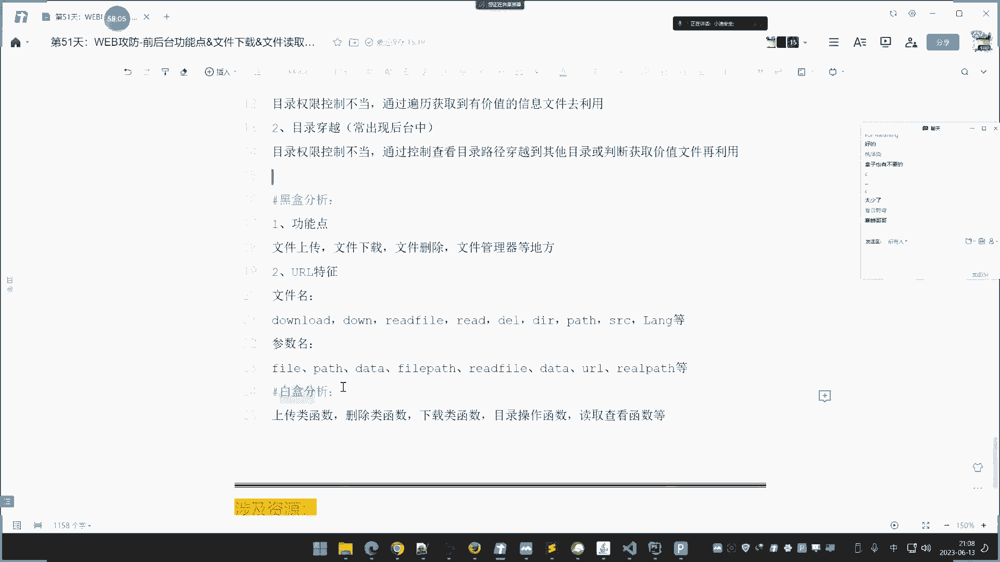

具体代码呢，这是完全可以在代码中的去把体现出来的啊。

好，这就是关于这个文件一块和目录一块的，安全问题，在这个章节的所有内容啊，嗯下一节课开始呢，我们就讲这个其他方向了啊，就讲下一个漏洞，好这就是我们今天支点啊，大家看有没有什么问题啊，有问题就问。

没办法啊，这个内容就这么多，咋讲呢，你上多了也是这些内容，没办法啊，不是说我偷懒了，不想给他上，不要说实战实战，现在这种东西不适合实战。

这不是说实战的问题。

哪有那么多实战，哪。

CCTF秀有没有必要买，你投资学习吗，还有什么什么有没有必要的事情呢，嗯价格也不贵，几百块钱，你觉得你经常打CDF，那就值得买，你不怎么经不怎么打CDF，那就没必要买，THM的号，我又不是会员。

借给你有啥用呢，里面很多题目都要花钱的，没用啊，最多同时登录多少，你不要问我告诉你啊，这个最多多死多少人，我也不清楚，但是我知道你给个三五个人，十个人用是绝对没问题的，你不要说我说的啊。

你不要把我的话录进去，到时候放给那个官方听，你说别问我怎么知道的，我他妈的也想知，对不对，我也不好说的，我你买的一个号CDF修的号，我买了三个了，前面两个封了，你不要问为什么封的。

本来之前第一个号用的好好的，封了三番两次，别人看面子帮我解封几次，后面直接有人把我那个号拿到咸鱼上面卖，官方实在是逼不得暴风了。

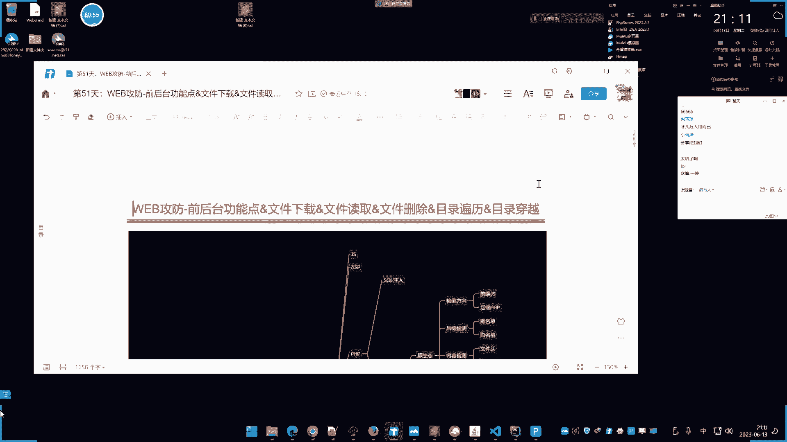

我都很很不想去谈论这个事情。

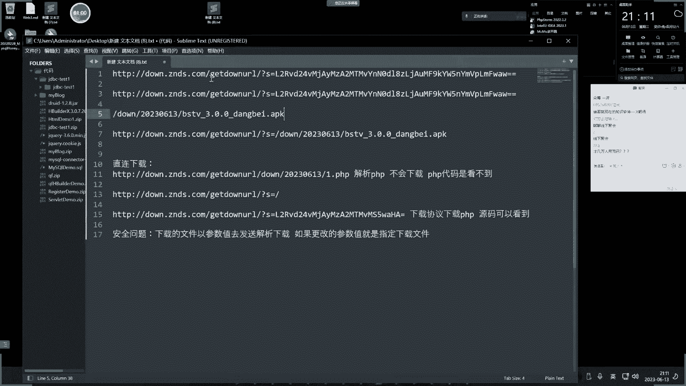

因为每次谈这个事情呢，对不对，下去就有人找我要，我说他妈不给吧，也违背出租给一给你呢，人一多，我怎么好控制呢啊闲鱼上面又咔咔乱买起来了，但是好久用不了多久又疯了又疯了。

而且好歹也知道你登我登不说封不封的事情，你打开个巴掌，我就立马再开个巴掌，结果那个环境就掉了，你做的你也蛮烦不，你也做的也很烦躁的啊，所以有条件的还是自己买，你用我的号的，你又只能晚上用一下。

那个白天转的时候，那里面的十多个人都在用，咋用啊，环境刚开就关了，CCTF网址多少，上节课讲课的时候用过啊，直接CCTF修啊，搜就搜不出来，网上那么多CCTF平台，你如果简单学习一下的话。

你可以网上搞个免费的啊，免费的CDF平台还是蛮多的。

上面免费题目也有CINEA修，他那个收费呢主要是他那些题目呢比较多。

然后呢比较循序渐进整理的比较好一些。

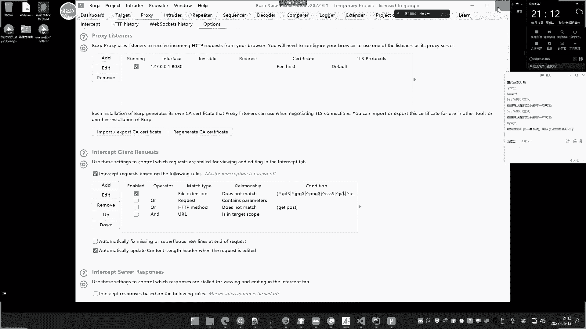

省去你那个自己找的时间，也不是说它上面题目优秀。

而是他整理的比较偏向于刚入门学这块的。

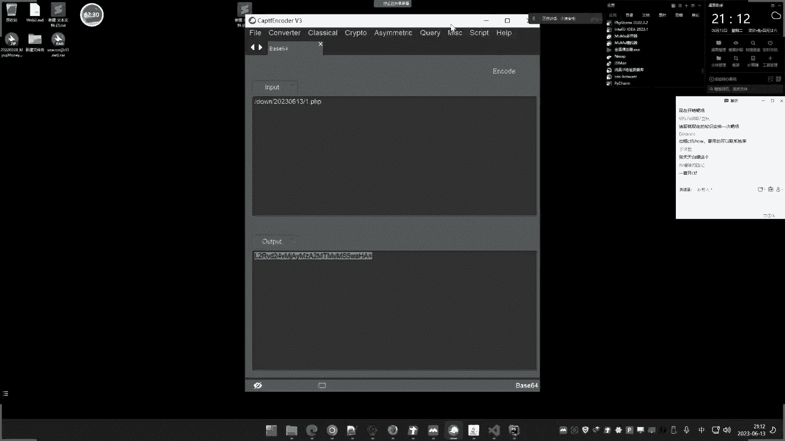

好看大家还没有问题啊。

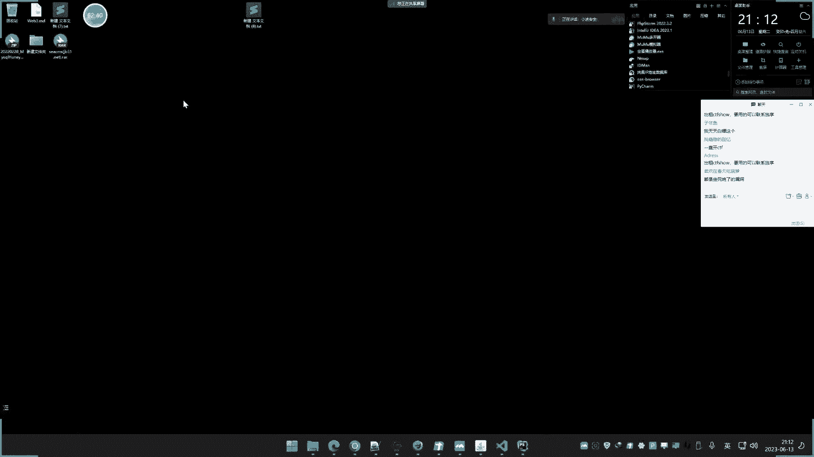

什么问题都可以说的啊，我们给大家解答一下，反正现在有时间。

下节课就上其他漏洞了，你看这个巴布树的上面呢有很多靶场是吧，但是一些漏洞呢，油价考的也不是说很垃圾的一些漏洞，那上面还有一些有一些进阶的一些漏洞的情况，夸张的呀，还有什么JWT的呀是吧。

身份验证的呀都有，不过还是比较偏向于基础。

开发不需要独立开发项目，你如果能独立开发项目了，那你那个水平就已经很高了，不需要达到那个程度，那个程度的一般就可以了啊，半吊子就可以，当然你如果说自己呢，能够能够有那个时间和精力。

能学到个那种开发的专业程度，那是更好，aw环境，Python pp啥都没，应该咋上WF，网上有这种东西的，你们那不管说是技术差，你要学会找资源的呀，很多东西你网上搜一下就有不是这种INCO的啊。

网上有那种别人写好的一些直接脚本套用的，你搞一个那个全局文件配置下也行，所以说还是基础太差了，你如果说懂开发的话，你即使说你自己写了个Buff，是用这个脚本写的，你在那个手头页那个手部文件呢。

像什么数据库配置文件，你把它写到输入配置文件里面去，那很多有数据交点的都会加载的文件里面，外服不就能够实现吗，还有现在就是在那个中间件里面去配置一个，那个类似和那个java的监听器一样。

就是你在出发的时候呢，先经过那个过滤再去进入后面逻辑，这完全和一些开发相关啊，挖不到钟退钱啊，你要做这个事情啊，前昨天今天还有个人在群里发消息，说之前一直挖不到东是吧，学了我的课程，然后挖到龙是吧。

这别人感谢话不是开玩笑的，你应该多向别人学习一下啊，唉这几天有人经常你说这个事情加课程，这种事情呢就能经常有个鸟毛，就是天天在网上上看到了这个什么面试题呀，不灰的，再也是网上看了一些那种嗯。

其他方向的技术的一些安全问题呢，他就过来找我，发给我看，什么时候问我什么时候教他，我真是拦都拦不住，妈的啥都要教，有些我都不回，我咋教你养，现在什么黑客湾的漏洞实战，没事想七想八想一大堆呀。

那国内的SRC都都玩不明白，现在还搞国外去了，那隔壁的搞个国内的SRC10几次直播，五千七千的收你不咋想的，以前说实话，以前什么加课程也好啊什么的，我都很烦，我在想你这娘的，你这话2000多，2000。

240给你上了，你还要我加64再上，我64，你要干死我呀啊，你硬死，你妹的往死里干，对不对，现在我换了个情况，想的我不能那样想了，想的我就很生气啊，我现在换了个想法，我想他们可能就是独处，我进步对不对。

我把这个科呢搞得更好更漂亮诶，就有更多的韭菜，我现在是这样想，我才同意的，不然的话我要坚持下去死，还有啊除以那你看啊每个人都有每个人的需求，这个还说瓦懂的注意事项，有时候你可能会认为很简单。

很清楚的一些事情对吧，但是有些人呢他就会以这种疑问，就是说啊他挖懂注意事项，你说这东西那注意什么东西呢是吧，那可以口说也把他口说出来，那无非就是说遵守规则是吧，不要这个尝试高位操作，不要动别人的数据。

不要收权啊，不不不要这种搞那种像没有授权，那你乱搞的，你也不要把这个漏洞细节呢给别人看，只需要保密是吧，这都是注意细节，但这个东西你自己说实话你都可以想到的啊，再加个C嗯。

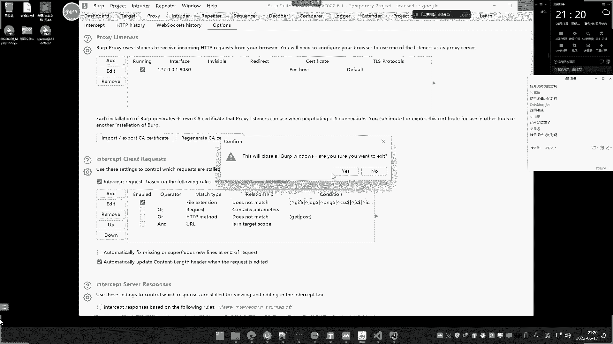

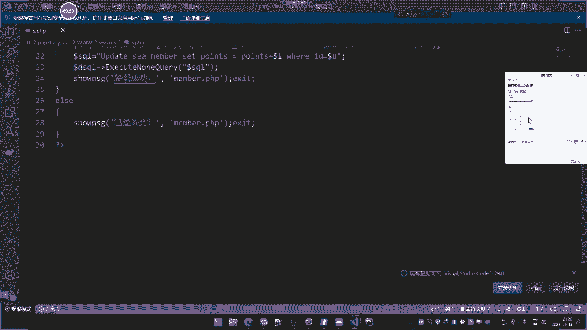

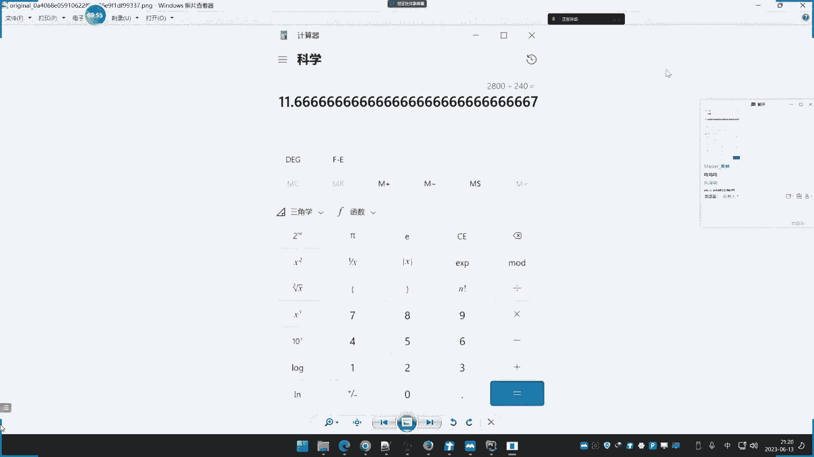

啊还大家看还有没有问题啊，有问题就问啊，没问题，我我把录下先关了吧。

