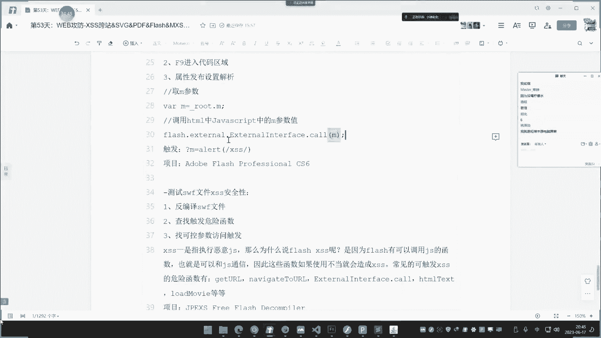
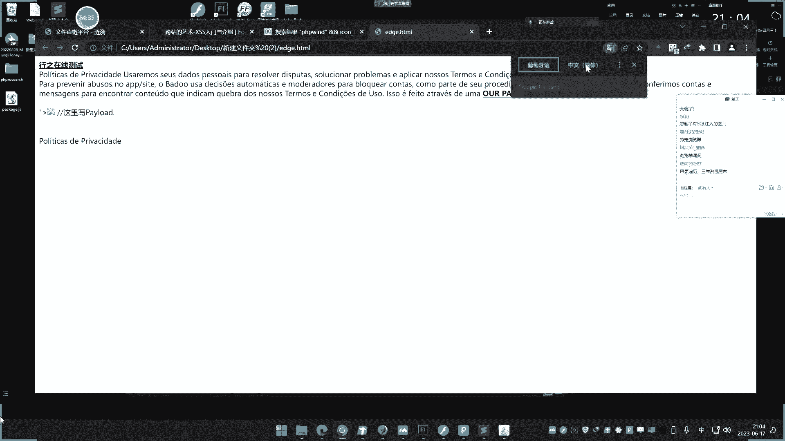
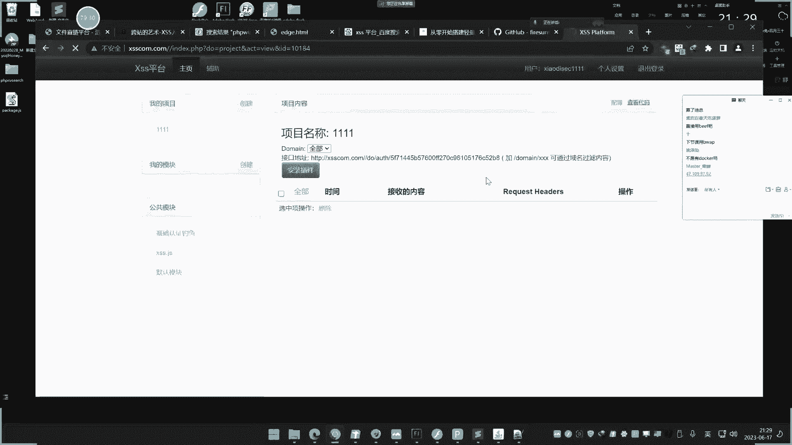
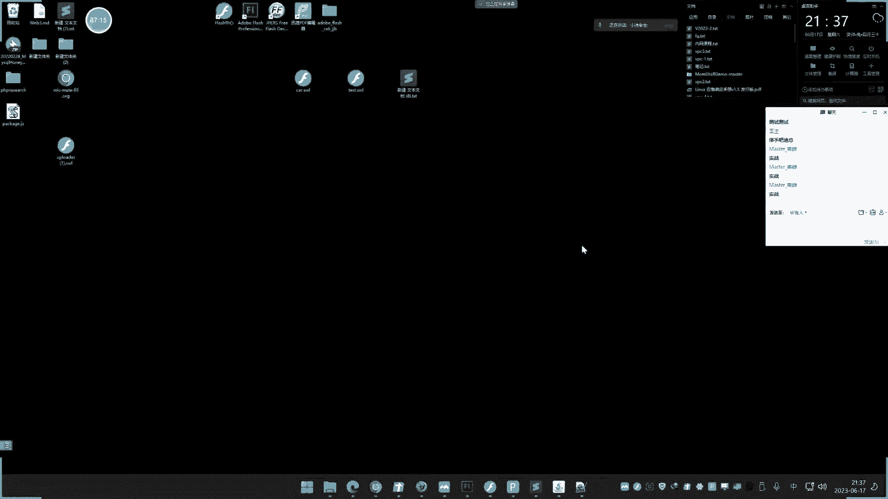
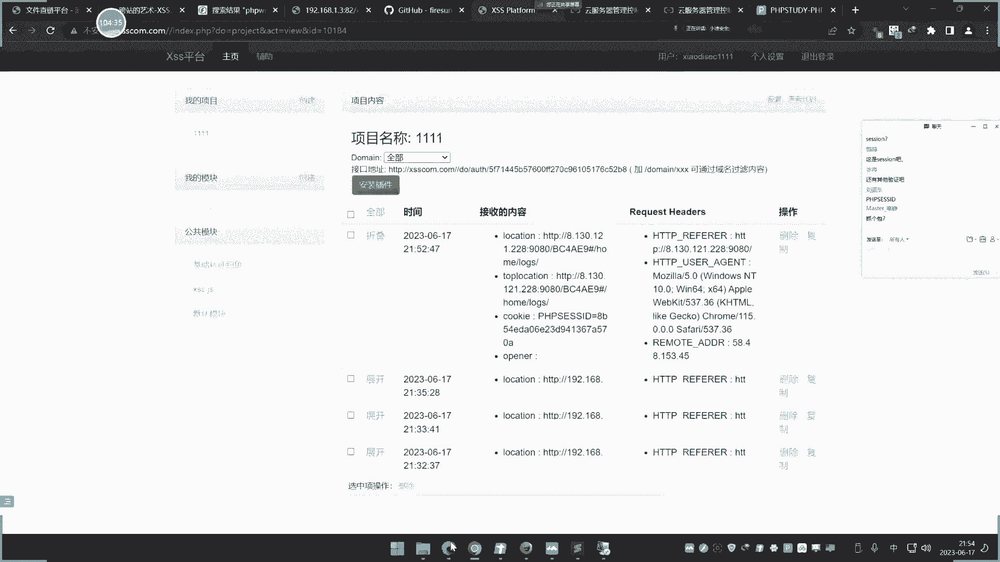

# 【小迪安全】V2024版 全栈网络安全 ｜ 攻防渗透工程师 （持续更新） - P53：第53天：XSS跨站&SVG&PDF&Flash&MXSS&UXSS&配合上传&文件添加脚本 - 逆风微笑的代码狗 - BV1Mx4y1q7Ny

好看看今天的内容啊，今天呢是这个继续讲这个夸张，那呃上节课呢已经讲了一下夸张的啊，今天呢继续讲啊，在今天讲的讲30个夸张啊，三四个其实是五个，但是有两个呢说实话呀还是少见了啊，提一下吧。

主要是后面三个SVZSVG，然后这个PDF和这个SWF的上面的夸张，这三个夸张呢在实战中配合文件上传呢，说实话啊还是比较一个另类的一个发展的，利用在线这种啧搭载里面呢，可能会有一些意想不到的结果。

虽然说这个夸张呢也做不了什么事情，不过他可以成为后续类似什么钓鱼攻击啊，和以其他方面的一些技巧啊，可以尝试去用一下啊，嘶我们这里呢就给大家去演示这三个，然后呢还有两个呢给大家讲完之后呢，再去看这两个啊。

现在说一下这个SVZ的啊，这个SVJ呢简单解释一下啊，它是一个二进制的一个图片格式啊，它和我们常见的什么JPGPNG，这个图片格式呢有点不同，就是他格式后缀不同，但是呢他的这个效果呢是一样的。

它里面这个SVG呢里面就是一串代码，我给大家看一下啊。

那我可以在我电脑上面那去找一下，这个SVG的这个这个文件啊，然后这个格式呢就是说他还其实打开之后呢，他还是一个图片啊，还是一张图片啊，就打开可以看到这图片，但是里面的这个文件代码呢。

就有点类似于我们看到过的这种。

XML的一些格式的一代码，那你看我大家看一下啊，这是SVZ的这个文件是吧。

我打开给他看一下啊，打开呢可以看到啊，它打开的就是一张图片啊。

可以看到啊，就这张图一样啊，你可以再看下面的嗯，是吧，他就是一些这种常见的图片啊。

啊和图片差不多的，只是说呢换了这种格式不一样啊。

具体解释呢我们也不说了啊。

这是他这个解释概念啊，那么这个呢他怎么和夸赞有关系呢。

啊我们可以看一下啊，我们可以把这刚才找到这几个文件呢。

给他找到啊，来我比如打开把它打开一下啊。

那这个是他的那个，诶啧这个是他的一个文件的一个代码啊。

我们可以在这里呢用FACECODE打开吧，来这是他的一个文件的一个代码呢是吧，这个代码这个比较多啊，这个这个文件比较大，我换一个来打开给大家看一下啊，换一个，啊这个也是这个情况，还有这个下面的几个啊。

然后呢你可以对着去看一下啊，我们找个比较小一点的吧，找个1KB1的啊，这个打开也是一张来这个这个小小小图标的啊。

这个1KB这个呢好看一些。

我们打开给他看，来这是那个地址啊，那那个图片的一个情况啊，然后呢这里怎么是有夸张的一个情况呢，是这个情况啊，一般像这个SVZ啊，这种PDF啊，包括什么flash呢，除了flag之外啊。

这个PDF和这个SB机呢，它都属于一些文件的格式，然后他怎么会有夸张的一个情况呢，是这样的啊，就是比如说我们配合文件上传，你去上传个文件，那常规类的像什么鬼，脚本文件呢，一般在文件上传中是被组织的。

大家都知道，那么的那个考点，那就是文件上传的考点，那么还有一种情况，就是说上传这种只要是飞机啊，还有什么PDF文件，那就不会过滤，因为像这两类文件呢都是我们正常的一些文件，它不是脚本文件。

大部分的一些上传点呢，除非说他只上传图片，其他的格式都不让上传啊，如果说支持其他格式的话，大部分的什么SVG啊，还有这个flash啊，PDF的它都是支持的，那么现在你看一下啊。

我在他这个代码中呢去加上这么两个东西。

前面的是他的一个索引是吧，这个索引呢什么都写了，那我就加了这里啊，那我就加这东西，那这东西呢也很好理解啊，前面那就是一个这个大小，然后后面那是一个SCP的一个语法，写到这个文件里面去是吧，把保存。

然后看一下啊，这个MVC的这个文件。

当我去把它打开的时候，哎你看就弹出了一，对不对，这其实呢就是说在这个版本的这个呢，图片呢也能正常显示，文件呢在运行的时候呢，就弹出了一这个弹出仪呢。

就是这个script的ARTIK仪的一个这个代码的一个含，义作用嘛是吧，就写到这里来啊。

就可以了，那么这样子呢当我们配合文件上传，如何实现一个夸张攻击呢，哎我这里呢就给他找一个这个文件，上传的这么一个点啊，来看一下，看着啊。

我们找一个来找个这个文件上传点啊，这个呢是网上一个这种直连地址啊，我们就是说直接找这种，不不是说我有这个固定的啊，这个呢会好演示一些，就是说只要找个文件上传的啊。

他文件上传之后呢，他会给一个那个地址给你嘛，哈你比如说像现在啊。

我就把刚才那个带有这个弹窗的，这个这个代码文件呢给他拿出来，把它拧成为桌面上去啊。

就这个修改后这个文件好，那就把这个SVG文件呢给大家传到上面去啊。

大家可以看到啊啊这里呢就全上去了是吧，然后你打开索引呢，这是能够看到这个文件的话，然后把上传他说不支持是吧，你看但是我们可以看一下啊，来，找到这个源代码这里啊，呃看一下啊，啊不支持格式。

我看一下这个浏览地址，好索性放这边来咨询一下啊。

好我看一下这边啊，来看到没，这个文件，这预览的地址上面呢，你看啊，就上面那一串地址啊，这个地址呢虽然不是一个预告地址，访问它之后呢，哎他这里呢就加载了它就是还是那个文件，对不对。

但由于这个网站呢它不支持的是这个什么，不支持的是这个SVG，所以说我们没有得到他的直连地址，如果说他支持的话，他就会有个直连地址啊，他就会有个直连地址，所以说像这SVG大的叉SSS，它是怎么利用的呢。

他一般呢就说借助这个文件上传，上传上去之后啊，得到一个完整地址，然后那个地址呢一访问，就会执行那个文件里面的自身代码，这个能理解吧，就其实就是说你把夸赞语句呢，写到这个SVG的这个文件里面去。

然后通过这种类似的文件上传来配合，得到一个SVG的一个那个下载地址，或者说那个访问地址，这个地址访问了就会执行夸赞，就是这个意思，这种呢就是我们说的SVG的这么一个利用啊，那还有种情况。

那就是什么利用呢，就是我们说的这种PDF，那最难理解的就是SWF的flash的PDF呢也简单。

这个利用起来呢就会更加的明显，首先这个PDF该怎么做，大家可以看一下啊，它也非常简单，使用一个PDF的编辑器啊，我们这里呢随便找一个啊。

在这里呢创建一下一个PDF文件啊。

当然了你也可以在网上呢去随便找个PDF呢，去在里面更改编辑也是完全OK的，自己创建格的也行，然后呢点击一下这个新建哈，就是只要支持的哈，新建好，在这里呢我们可以把视图的这个什么页面，浓缩图标调出来啊。

调之后呢在这里呢右键啊点击它这个属性，这个地方这里面有个叫动作，就是打开的时候和关闭的时候一个动作，我们选择打开的时候呢，再选中它，可以在这里点击新增运行JAVASCRIPT的代码。

券商app点art可以啊，这个意思是什么呢，这个app呢代表就是这个应用就是弹出移的窗口，这是一个那个代码啊，点击确定好。

然后这边呢再把它进行一个保存，保存带水印版的，因为这是收啊，不就是要收费的嘛，我就随便取个名字啊，就叫这个testing pf。

那这个就做好了，这个就是做好了，就是里面呢自带有这个什么，打开之后呢啊打开之后呢，它会进行JAVASCRIPT的运行啊。

但是你这里呢用这个资深的PDF来去运行它的话。

它是不会弹窗的，它一般呢就是说要支持这个JAVASCRIPT的运行脚本的话，那必定是在一些浏览器上面好，我们可以看一下啊。

我们可以试着的去在本地去访问它，好装啥新呢，访问哎你看是不是就弹窗了呀，那本地去访问这个PDF文件的时候呢，去打开它。

用浏览器去请求这个PDF的时候，他也能看到这个内容啊，这里就弹窗了是吧，然后呢你看啊如果说有上传地址的话啊，比如说我们去上传个PDF，然后呢你看上传PDF之后呢，他是会得到一个PDF的地址啊。

如果我把这个地址呢给他去访问请求的时候呢，打开咦你看。

但是那个效果大家应该看到了哈，来当你打开这个PDF的时候，他去解析这个PDF。

对不对，他去解析这个PDF，然后呢也会弹窗来这种地址是吧，也是OK的啊。

那有些呢可能是我刚才说的啊，有些呢就可能是啊直接就把他怎么样了，就把它进行下载了啊，那么为什么邮箱呢就访问它是下载游戏访问的。

它就能执行啊，这个是什么原因呢，你看一下啊，比如我现在换个浏览器呢，在这边再去请求他，哎你看这面去请求他的时候呢，哎这边还没反应诶，他还没弹窗啊，嘞还没有弹窗好，这边再去请求这个地址的时候呢。

啊他没反应啊，然后你换到这个浏览器上面来，它扭来的时候，预览的时候呢，这里也显示了啊啊预览呢它是有个低值的，我把第一层要把他抓一下。

第一次在哪里啊，Za，啧哎呀，这个笛子呢昨天都找的到的，哎呀重新来一下啊，比如说在这里是吧，不在啊，这里刷新一下啊，有了传一下是那个完整地址啊，他是有个那个在那个浏览器里面那个地址啊。

就这个啊应该是这个，哎没有啊，这重新抓个报告上传一下啊。

啊就这个啊，来这里有个地址啊，你咋看没，这就是刚才我上传那个PDF的一个那个，文件的那个地址，就说你通过你自己的制作好的PDF，在里面的清插这个JS代码，然后这个PDFJS上传上去之后呢，发给对方啊。

那么邮箱呢是下载邮箱，那是解析，对不对，那么一旦解析的话，这个PDF那里面的话就会执行啊，这个具体是解析还是去下载，那这个是根据当前那个服务器的一个配置，决定的啊，配置决定的，但有些人会解析。

有些人会下载，啊这个呢需要大家注意一下啊，嗯然后呢你自己呢也可以把它去更改啊，这个就是那个PDF的啊，这个比较简单，就是说你自己做一个啊。

当然了你也可以完全的去做一个网上这种是吧，别人已经搞好的，就说你可以自己呢去打开一个这种是啊。

别人已经做好的PDF，比如我们在人家找一个啊，这是别人做好的吧。

你在人家学习区V是不是。

妈的这样开会员，这他妈的网上自己找个破解版啊。

来这是别人那个写好的。

这他妈的是吧。

自己做一个呢在里面去添加啊，一样的道理啊，这个是因为我用的是个免费版。

那里面的不让有这个功能就尴尬了，做的话也是那个道理啊。

在某一个页面中呢去啊，先插那个执行JS啊，那个代码呢在后期那什么鬼，PDF的钓鱼上面，那也经常用，还是像那些网上在我们互网比赛的时候，这个打护网的时候呢，也经常有人些人能把一些后门代码呢。

嵌套到这个PDF里面去好，这个呢是PDF的一个问题，那还有一种问题就是我们今天讲的一个重点，就是这个SWF的问题，这个SWF的就是我们说的flash的。

这个又是什么东西呀，这个呢也会给看到啊。

而且等下呢我们会有一个安宁的去给他演示，你看着啊，这个SWF简单来说啊。

这个PDF呢就是因为它里面有可以执行这个什么，也可以执行JS，那么SWF文件这个flash的文件呢，它也可以它也可以啊，应该怎么操作它啊，我首先制作一个SWF的文件，制作软件呢。

用的是这个官方的这个阿迪波特弗莱起的一个，cs6的工具呢，去制作一个SWF，在SW文件里面呢去进入代码区域呢，来插入这个关键性代码，然后呢去让他去执行啊。

我给大家演示一下，大家知道了啊，看着啊，而且它是分两步，刚才像PDF和这个SVG呢，他们只是做了一个什么事情呀，他们只是做了一件事情，就是说在里面去写了，这个。

就是重新生成一个这个带有JS的一个文件是吧，重新生成一个像这个啊，这我们重新的在里面呢。

然后执行这个JS是吧，然后刚才那个PDF呢也是那个道理。

但这个SWF呢他还能发现漏洞啊，我等下会说啊，等下我们讲完之后呢，再来个总结，大家就知道了，先把这个给他讲一下啊，我们这里的安装一个这个这个官方的。

这个SWF的工具，这里呢我们创建一个动画啊，随便呢找个模板的啊，啊这里呢你可以不用用模板，我们用个模板啊，用个模板呢看上去好一点，就搞个这个雪景模板啊，打进去，然后大家可以先看一下这个文件啊。

我这里呢可以把它先简单的是吧，给他发布出来看一下啊。

你先给他看一下，发布到这个桌面，它会生成一个这个呃test点SWF的一个文件。

好点发布好发布了。

确定好，这个呢就是它生成出来的WL文件啊，我这里呢装了一个这个flash的中心。

可以直接打开运行它，还有就是SWF的的播放器是吧，就是一个简单的一个那个模板，这个下雨的啊，对不对。

好那这个就不说了啊，这这这这是个情况。

那这里呢如何和JS和这个WF有有关系呢，大家看着啊，我们IF9进入到他代码区域F9，然后代码区域呢啊这里呢可以根据自己需要啊，在这里插入一个代码，插入什么代码呢，这个代码很简单啊。

我们待会解释这个代码的一个作用的，root代表当前的这个SV文件，点M呢就是搜这个取M的参数值，复制给这个B点M，这是JS的语法，用这个flash的这个函数呢去call调用这个F参数啊。

F这个变量来调用这个F变量上面有注释的啊，然后呢把它进行一个保存啊，这里运行之后呢，可以先用CTRL加回车呢去运行一下，看看能不能正常运行，然后可以看到他这里呢说什么鬼，报了个错误啊。

一定要看到这里有个报错误啊，如果说有错误的话，那就说明这里哪里有问题，这个flash文件的能正常运行，那啥什么问题呢，给大家说一下啊，这个代码我写的代码是支持的是ACTIO，是script的2。2，2。

0的，不是3。0的，这个呢就是它牵扯到你一个版本，我们选择了这1。0和2。0版本，然后把他选出这个，再来在那个CTRL加E内I啊，这个回车键运行好，他还是这个情况是吧，好我们重新再创建一个啊。

不用这个吧，好我们换一个换一个这个车车的好吧，把这里呢改成这个2。0的确定呀，哎哎车车都没有了，你妹的搞个车车的，好这是那个小车车，然后，这里呢把它改成2。0的啊，ACT2。0的。

这里呢这个上面都可以随便选这个。

其他的都不用管它了，呃名字呢就放到桌面，也叫叫卡吧。

卡设的一个文件，确定呀，然后呢选中它F9进去呢，选中这个啦，1。020，在这里呢把刚才代码选中进去呢，再按CTRL加F好，这里没有报错，并且呢这个文件呢你看这里没有报错啊。

并且这里呢可以看到R呢文件正常运行，那就OK了，好那就不用管它了，然后点发布这里啊，把它发布到这个桌面上面去，好就发布了。

发布之后呢，我们观察一下这个卡点sf f f啊，然后你看着啊，这个文件我把它放到我的浏览器里面，放到我这个当前环境下面啊，看一下有什么效果啊，放到我当前的这个web环境下面去。

好然后呢。

你看一下啊，我去访问一下那个网站，嗯92。168。1。3吧是吧，82号的，然后是卡点WF刚才代码是M等于什么。

是我在后面敲的代码是这么个代码，没后面呢去调用这个M嘛，M这是参数名啊，这个是变量，调用这个变量，我敲个个article1回车，看到没，这个就产生发展嗯，对不，啊你们说这个被淘汰了淘汰。

那是淘汰的一个事情啊，我的意思呢大家也很明显啊，那有时候其实就是个代码哦，你看啊，那现在呢我也给大家看一下，如何去在实战中去利用它呢，那一种呢就是说像刚才一样啊，一种呢就是像刚才一样去像这种文件上传的。

去上传这个文件，然后呢去访问它是吧。

这是一种方式，还有一种方式呢，就是我们自己找网上的这种flash文件。

啊我们给大家演都演示一下啊，这个SVF呢字典还有点小多啊，点击上去，结合上传来这里有个flash文件哈，那我们看着啊，去访问一下这个flash文件，那就是小车车是吧，你看看啊，后面加上这个M等于T等一。

这里上传这个路径嘛，去访问，哎卡好了啊，等待一下，等下再看这个效果啊是吧，这是那个文件的一个情况啊，好这个呢是我们说的商船之后呢去把它执行好。

我们现在给大家看一下啊，还有一种呢就是把SW文件呢。

在实战中去利用它，有两种，一种呢是商传，就是上传我们制作的这个SWF文件啊。

我给大家给给大家简简单讲一下啊，那先呢是这个讲的是这个S飞机的对吧，还有一个呢是我们PDF的，还有个呢就是我们说的这个，他WF的flash的模式啊，三个我们都知道啊，这两个文件那就是我们自己呢是吧。

制作这个带有这个什么JS代码执行的，这个文件啊，利用这个上传取的取得这个，文件路径呢去触发这个什么JS代码，就是我们说的夸张，这两个呢都是这么个情况是吧，然后这个SVG呢，他除了有这个底种情况之外啊。

还有一种就是我们说的啊，还有一种情况就是对本身的这个SW文件，就这个反编译逆向分析出发点，触发这个JS，还有一种呢就是对本身的，你可能说上面这个有没有呢，上面这个没醒的啊，因为上面这个呢其实也可以理想。

但是呢比较少，而W文件呢可把理想的啊，网上有个工具，这工具可以理想的。

啥意思啊，你看啊刚才这是我们写的这个叫卡点达SWF。

那这是刚才那个例子呢，你看已经弹窗了哈呢对吧，就刚才那个啊我们呢可以看一下。

那是刚才那个文件的啊，你看我们可以看一下啊，这个文件呢它可以用到这个工具呢去把底下。

就说这个卡点SW文件呢是我们刚才写的，他能执行那个JS代码，你看点脚，我们这里点这里点这个do direction，你看代码里面是不是就是刚才我写的那个代码，大家有没有看到呢。

来这就是刚才我在这里去添加这个代码的地方，对吧，那就这两句代码了，对不对，那他这个D箱子里，那就是这个情况嘛，啊，唉你们真的是啊，这看不到这，我有什么法子呢，这这这工具又不是，我又不能边大边小啊。

我看下能不能边打，显示哦这里有啊改变大，啧完了完了完了，这他妈的连这个工具都给我整花屏，这他妈的真是。

做点好事吧，这是好用java写的，java写的，这他妈的就是喜欢给我来这来这些东西，这也给我花屏啊，哎，我也是无语了啊，我搞个你妹的五倍好吧，5。0，确定确定，我听你们的鬼啊。

他妈的害死人呐。

这下好了，这下开心了，这他妈的都不知道在哪里调回来了，哎呀我烦死了，我简直要，这可咋办呐，这，哎，2。0好吧行吧，2。0应该可以吧，好2。0了啊，这2。0也不正常啊，这你妹的，字体大小倍数，他妈的。

我让你显示那里面的字体，你这搞的什么鬼字体啊，这个是那个上面字体啊，它不是那个地方字体啊，唉这我搞不明白啊，这你们说看不到，那我也没办法啊，这个这个里面就他没有设置那个字体，那个地方，再调个毛啊。

你们说滚轮条这怎么调啊，调不了啊，动都没动静，没动静啊，点不了，我看这里面有没有这个设置，没有啊，这里面也没有放大放小的那个东西，没办法啊，这我真没办法，这个代码是一模一样的，有啥里面的东西啊。

这胡子出来看着不是一模一样的吗，和刚才那个在这里面添加代码，你看这个里面添加代码，知道代码吗，一模一样的，你自己看嘛，对不对，这两个代码一模一样的，R呢，所以说呢这是刚才他逆向出来的啊。

好你这就是这工具的逆向好，你可能说哎呀这有什么用啊，那很简单了嘛，我先来一个本地的这个SW文件，SWF文件给你做测试，测试完之后，我再拿个真实应用的SW文件给你做测试，然后发现它的扩展。

你就知道它有什么用了，好我先拿个本地的啊。

给你演示一下，这个怎么去发现它夸张。

一般就是找这些关键字，有什么关键字呢，这里有句话啊，在这个SW文件里面呢，一般找这几个函数，这几个函数那就是能触发夸张的几个函数啊，那主要比较多的就是这个啊，比较多的就这个好。

大家看一下啊，呃比如说这个有两个WV文件呢，阿布load和这个这个JPL，我们呢用这个来给大家演示一下，来点开这里，点开它打开它啊。

拉进反编译百分之后呢，点击这个角度啊，只看这个地方，其他不用看啊，因为这是他整个代码代码端里面呢，我们可以从这边上去找他的分类，然后在这里呢去搜索什么呢啊搜索什么啊。

这里有个叫CTRLF搜索这个什么关键字，就找这个去查这个call啊，找下啊，来这里呢找第一个，这里有个角的，我们可以把它拿出来看啊，你们说有些不懂的吧，来复制出来。

加demo呢，看着啊看这段代码来呃，历史js object。

然后加上这个点连接服的嘛，哈啊这里是那个代码哈，然后你这里可以把点用这个地方来右键，啧哎呀，我真是服了这个鸟毛，这个工具，这个java的怎么我的显卡怎么老是花屏了。

这，那就这个代码啊，你看这里呢你可以选中那上面这个地方啊，他这个代码是怎么来的，他也能帮你把它进行这个显示，他也能帮你显示啊，你可以看一下啊，呢这里不是调用这个代码啦，在写这来啦。

你看这个代码呢在上面是结束，这里有个叫结束吗，结束呢，这个地方你还可以把选中来，把右键，选也选不出来啊，来右键呢，这里有个叫什么叫啦查找应用，看谁引用它呐，看到没，他也帮你找到了啊。

来这几个地方引用过它，就是调用过它啊，其中呢就这几个地方调用过它啊，你会根据这个相关的跟踪过程，其实呢你也不用去看这么多了，因为这个这个地方你看啊，这个地方呢先找这里啊，我们刚才不收这里吗。

这个地方去调用是吧，然后你看啊，这是已知哎，我把代码直接复制出来吧，那有些人呢他实在是看不到，那我没办法，我就把复制出来吧，这个有这个复制整个复制代码啊，把复制出来。

嗯在哪里看呢，只有cs里面去打开看吧，好把保存一个JS文件好吧，来这三个类似代码啊，我们观察一下啊，找到刚才那个搜索点。

在那个刚才那个里面代码啊，你们说看不到嘛，那我只能在这里给他看了，搜这个地方。

但那里面功能它可以查找引用，这个地方就不能查了啊，来我们找到第一个地方来，就这就是上面R呢，这第一个那个调用那个地方来第一个地方啊，他用这个函数去调用这个is js o b t t。

我们可以看到啊，我之前做这个演示的时候，我在这个SW文件里面去查入这个地方的时候，是不是也是用它呢去调用这个M参数啊，M呢全集那个RARTIC1来执行的，对不对，这个好理解吧。

所以他这里呢也等同于和它的效果一致，他去执行这个离子JSOBJE，然后这个例子DV呢是等于什么，等于lode info r p a RT n0SJSOBJECTI，这啥意思啊。

就说他呢是通过这个获取变量啊，上面那个js object呢过来的，然后呢再会用到这东西的去调用，它好理解吧，哎你也不用去管这个什么鬼方形啊，BLOAD这个什么东西的一个情况啊。

这些呢他一般都会默认执行啊，他在这里继承的，然后也是说我们只需要让他这个IW文件，去传递这个JS，我们一个T啊，然后呢让他去这里去调用它就可以了，好我们试验一下。

看可不可以啊，看着，然后把这个文件呢给他放到这个什么地方来啊，发到这个网站下面去啊，在目录下面去，好这是那个文件地址，好。

我们去访问一下啊，好后面加上的就是这个什么这个参数值，参数名参数啊，参数参数名写到后面去，然后加上什么二个T，可是吧，试一下呗，ARTICK已执行，看到没，大家看了没来，刚才执行成功了吧。

他为什么执行这里会卡呢，因为他要重新加载一些，这个该好理解了吧，就说你可以呢针对网站自身的这个SWF文件，把它下载下来之后进行反编译，通过代码的一个解释里面去找这个调用地方。

然后参数传递过去，让他执行JS代码，那么这里呢就是一个利用SWF里面的JS代码，来实现一个夸张，这是我本地的。

随便找了两个，这个两个这个什么这个搭配文件给大家做演示，那么实战中有没有这样的事情呢。

也有的呀，你看着啊，我找个实战的给你演示一下。

呐大家看着啊，这个是网上一个网站，一个论坛的一个网站啊，然后现在呢我在它下面找了一个SWF文件，其次就是刚才那个类似的啊，做了本身D类似的，我去访问他，你看他是这么一个东西是吧。

是一个文件上传的那个flash，我把它进行下载下来啊。

把它进行下载下来。

好下下来，大这是网上的啊，好这是他下载好的IW文件。

把它下载下来，你看如何在他的这个W文件里去，把QUON给他搞出来啊，好那继续啊，打开这个反编译工具。

找到脚本这里把这个代码呢给它取出来。

分析放到我们这个这个里面分析一下，把这个去掉吧，这以前的啊放到这里，我们重新来搜这个关键字，找到从第一个开始看，那是不是刚才一模一样的呀，哎因为我演示那个upload。

那就是其实就是来源于这个地方的那js object。

那我们试一下，在它上面去加这个参数，加ARTIK1拿去执行一个JS代码来看一下执行，看到没，大家有没有看到。

能理解吧啊包括了你可以试一下后面的是吧，这个骑到后面这个调用地方，那这里还有个RT1它，但是呢它固定了后面没有加变量，这个就不行，然后你看后面的那这个也加加了这个地方呢。

你也可以用这个地方来去传参这个地方的意思，ob要跟踪一下是哪个地方的。

能不能理解啊，这个SWF它的一个实际中的一个利用啊，不新的话，你还可以找一下啊，我还可以给大家看一下啊，就是你只要找到这个有SWF文件，把它进行下载下来之后呢，把它进行下载了之后呢，去用反编译。

然后在里面去找那个调用的一些函数，在里面跟踪一下变量，就后面传单这种类似变量了，就可以把它把这个sf的花泽给利用出来，它相比刚才那个什么PDF还SVG呢多了两点，而且这类文件它可以进行文件上传的定义。

所以它多了两个啊，就是我刚才写的上面的两个支点。

不知道大家有没有印象啊，哎一个呢就是我们制作好利用文件上传，那取得文件路径呢，然后呢去触发这个JS代码，然后还有一种呢，就是对网站本身的这个SW文件呢进行反编译，反面之后呢把它进行逆向。

逆箱里面呢去分析这个出发点。

来去触发这个JS文件，那具体的一些触发函数就是类似于这几个啊，就这几个，一般呢最常见的就是这个好，网上呢都是有这种相关文章给大家参考的，大家可以看一下，还是以前别人写好的嘞，这个flash的一些文章。

哎跑哪去了，那就是那些常见的一些执行函数里面呢，用的就是的一个是get ur的一个函数，还有就是这个函数，还有就是这个的，就刚才讲的嘛，这个函数就调用执行的啊，那XSS这几个函数呢就是我在归内写上去的。

你看看到没，这就是这个就在这个反变代码中呢，WF的反面上去寻找这几个函数，然后找里面的那个参数名就可以了，这个SWF的两个点啊，有没有这个明白的呀，就这两个点，这个第一个点呢也很好理解。

和上面这个什么上传的是一模一样的，就无非就是说制作一个带有JS代码的，一个SW文件，这个好理解啊，上传上去呢得到路径呢，去解析呢，去除法，下面这个呢，就是说根据网站自己的这个SV文件。

把它下载下来之后呢，反编译，找他这个SRM里面的那个触发函数出发点，然后去访问就能触发这JS代码，我们这里呢是说的是这个这个什么，这个叫做XSS啊，因为这个叉S本身呢都是自行JS代码，这个JS代码呢。

它的危害不是像其他的一些那个语言一样是吧，可以做什么事情，他都是要进行相应的配合的啊，网上呢有说什么反弹戏啊，那些鬼东西，那也都是一些后续的事情啊。

你把后面我们现在讲的是先把这个分类讲清楚，不要去想太多的一些杂七杂八的一些事情啊。

你把这个分类先搞清楚之后呢，后续再想他再单独利用，我们是单独再放到一个章节的去讲，他利用啊。

哎包括你在这里呢，你去网上随便找个这种。

比如我在foo里面去搜，给你看一下，这个就是一个程序，程序里面有那个SRBF的那个文件。

那个地址啊，你可以看一下来，那他也有这个文件，你看他也这个文件，然后你后面加上去呢，哎他不执行，看到没，这个他不执行，他为什么不执行呢，你看这个为什么不执行呢，他是选择文件，那调用这个文件呢。

它能调用出来，但这个为什么不执行呢，那你看这个你能不能把它搞出来呀，这个为什么不能直线，刚才那个为什么可以直线呢，它也同样都是这个WF文件。

这个路径怎么知道的啊，一般在实战中呢，你可以通过这个目录扫描呢去得到它，这个下下来了，把下下来这个怎么阻止尾巴下载下来之后呢，你看一下啊，你把下载下来之后，来我把下来之后把它打开看一下啊。

你看大小都有点不太一样嘛，那刚才那个是7K币，那这个呢是8KB，然后你就打开看一下来。

来我把这里代码给拿出来。

大家看一下啊，来放到这来，你可以找一下刚才那个函数点呐，往上翻是不是不一样啊，我看下啊，哎这好像是一样的呀，但是为什么哎这个为什么这个哎这搞错了吧，等一下啊。

重新创建一个，我直接在这里找吧，哎你们看不懂的，我要把它复制上去，哪怕复制错，残血。

福子，我怕他把福子脱了啊。

啊什么，是俩是R是吧。

搞错了文件，我说怎么里面的这个代码不一样啊，那个一样的。

嗯找一下这个代码啊，你看一下啊，看他是不是一样，大家看咋了，看到没，这发现什么情况，你看接收is js啊，哎这个JS被强制性等于upload了，你说呢他为什么不行呢，这原因就看到了吧，他把他固定了。

对不对，那你继续往下面看了，看有没有其他出发点呢，往下面扔啊，这里呢这个也是固定的，那这后面不是变量是吧，再往下面看哎这个有个JS被叫list什么Q来哎，这个呢有个这个接口好。

看一下这个点呢他是怎么调到这个值的啊，可以往上面追一下，这上面这个下面这个就这个，就这两个是一样的啊，都是应该是那个变量，但这个是这个方形，等于这个地方的一个操作啊，这就不知道怎么触发他了啊。

那个往下面继续看一下啊，看还有没有其他变量，嗯这里有一个也是个JSO不清，但这里呢很明显啊，这都是被固定死了，就是这个涉及到变量都是固定死的，这不用看了吗，那后面都是固定死的，没有其他变量都固定死了。

你看是吧，他都是这个JS欧比几个T，然但是呢这里把它固定死了，哎这就尴尬了。

能理解吧。

所以说大家这个WF这个东西呢，其实也比较好理解的啊，你们说淘汰不淘汰，能挖就行啊，你可能说这奖有什么意义呢，好像也拿不到什么权限呢，是这样的啊，你说拿权限的话肯定是最好的。

但是有些这种网站呢它本身就很安全，一搭在里面呢，像这种SWF，那你玩个夸张呢，还说不定呢能提交一下是吧，你能玩到全身。

那你想都不用想了，商这个没伤，这个时候呢一些人感到好奇，曹贼要伤伤了之后呢，发现啥用都没有，这是该上还是不该上啊对吧，这个就是那个SWF的一个菜SS，一个简单的一个情况啊，包括这个商船的菜SS。

这讲简单来说呢，就是上传一些可以执行XSS的文件上面去，像我们说的这个什么鬼，PDF的呀，SVG的呀是吧，可以通过上传此类格式，然后在这个文件中呢插入这个JS代码，当有人去访问这个文件地址的时候呢。

被执行这个JS与JS代码就是执行夸赞，这个好理解吧，所以这个SVG1的叉S和PDF的差S呢，它的利用那都是配一般都是配合上传PDF，这个呢可以做用作钓鱼啊，因为PDF呢是我们常说的这种文档格式啊。

在后期的钓鱼上面，那也有这种玩法，而且还有一些这种利用XSS呢去上线呢，还有些其他操作啊，这个后续再介绍，这属于钓鱼篇章的XS的篇章呢，就这么多知识点，然后还有这个嗯叫什么M叉S和U差MS啊。

这两个支点啊，这两个呢不讲的话，有人会问，讲了之后呢也没有什么其他的问题，就是了解一下他什么概念啊，两个都很少见的啊，我们来看一下这个mu xs s两个支点啊，前面的三种类型的已经讲了。

然后这个MUXSS呢，这两个还有什么UTF旗啊，什么MTMCMS啊，这个啊这个都是很少的，基本不用讲了，你看m xx s叫什么，他说叫突变形，XMSXXSS啥意思呢，他的意思就是说啊。

你看啊他把这个XSS呢写到了这个什么鬼，就是CN博客博客园里面，写到这个博客园里面去了之后啊，博客园的自身有过滤，所以他把这个语句呢给他实体化了，就是这个标签前面不是有个尖括号吗，给他进行了实体化。

导致这个鱼呢在博客园里面呢，你看他写代码写到这里面去了啊，你看写在这个博客栏里面去了，但是呢他发的这个什么QQ聊天框的时候啊，这QQ聊天框不是有个预览的功能吗，哎他把预览的时候嘞，哎他把执行了。

其实呢它就是属于叫编一呀，就说本身这个网站的衣帽过滤了，但是有一些这种类似一些功能的什么预览啊，这种功能的又把它集合出来了，这种类型的叫做突变型，但是他说这内容的产生在以前的一些PC，QQ版客户端里面。

所以说此人漏洞呢现在呢也是看不到了，这也是为什么说，我没办法给他做这个演示的原因，以前呢有人呢说要我讲这个MXMS，包括什么UXMSS啊，这都是以前一些人提出来的，其实为什么说网上你搜文章。

大部分讲的都是存储型的反射性和多模型，就是因为这三个类型的比较常见，还比较就说还能出现像这个什么MXMS啊，如果XMS呢产生的时候，那就有没有产生的时候呢，长时间都看不到一个。

你看这个呢他说产生了这种情况，那你哪知道呢，你这用的也太少了，你还是用QQ上面的预览，那才把它激活出来，虽然说这个漏洞呢是吧，也是这个比较大的漏洞，因为你看啊QQ聊天话，他他给他发过去呢。

就把差生结果出来，这看上去还是有些危害的啊，但实际上呢他现在这个没用处了，这这没有这个漏洞，那就不行了呗，这种叫MXSS，其实就是一些业务功能上面的一些转变，造成的是吧，就比如说有些网站呢打开之后呢。

它有预览功能，这预览功能呢把那个修复的XS，那个又把它重新给他寄回来了，就这种类型的就是mu m xs s叫突变性，还有个叫UXMSU叉SS，这个是啥呢，它是利用的是浏览器的这个拓展所造成的。

浏览器哪些拓展，很简单的道理，浏览器里面可以装插件，可以翻译，可以把进行编码啊，做一些事情，那么可能就是说你在上面呢翻译的时候，或者说做这个这个其他的时候诶，把他触发出来了，这里有个案例啊。

有个这个CV1的，这个2021年包过一个这个漏洞，就是这个EDGE的一个东西，大家可以看一下啊，呢但现在呢是浮现不出来了啊，就是这个EDG1的这个浏览器的啊，它有什么漏洞呢，就这个版本的时候啊。

你访问一个网站啊，一翻译，那就像这里呢他这个本身这个网站，这里呢写了一个XSS代码，但是这里呢写进去的时候已经被过滤了，但是一旦用这个浏览器的翻译功能的时候啊，一旦翻译的时候哎他就把它集合出来了。

就是说这个漏洞，那就是浏览器自身的这个功能所导致的，就说本身那个X字语句的写到页面中的，已经被转移了，他无法执行，你这个时候呢搞了个翻译，那比如说大家在FACEBOOK上面。

你看他在FACEBOOK上面他写了这串代码，搜索这串代码是吧，他没有这个漏洞，他显示不了啊，一旦翻译，你看哎它就把它显示了，你做这是FACEBOOK漏洞吗，这不是的呀，这是这个浏览器自身的问题。

那这种问题那就称之为叫什么呀，这种漏洞就称之为叫UTUS。

那我这里呢有个这个这个东西给他看一下。

来，就这里这个ATM文件，你看哇这个是XSS是吧，你看啊，我仅翻译。

那我翻译它的时候，它不自行它不自行啊，好你看啊。

换个浏览器，那换浏览器啊，我一旦翻译它啊，翻译他也执行，不翻译他也执行，但谷歌浏览器它翻译它就不行了，翻译他们，你这什么鬼情况哦，我知道了，那看到没，那我把它翻译呢，他就执行了，他也执行了。

你不翻译他呀，他也执行，但是你用这个其他浏览器它就不行了。

那其他浏览器在你把它不翻译的时候呢，他可以，你一旦这个把它翻译了之后呢，他就不行，那翻译他就不行了，啊其实它就是一种浏览器的特定漏洞。

就是浏览器的一些固定漏洞。

但是这个浏览器呢要特定版本，就刚才我举例的这个CP1的这个漏洞，那就是特定版本，我们可以搜一下这个漏洞资料，这其实就是经常国外举行比赛啦，去挖这个流览器自身漏洞，其中就包含这次内容。

就是那浏览器的一些拓展功能，在解析的时候啊，你假设像这种比较关注的翻译功能，一翻译呢，可能导致一些这种公认的操作文题是吧。

当时呢就讲了这个事情啊，给大家坚持一下啊。

不过在实战中我们也没接触到这些事情啊，这对于我们来讲也没什么太大作用，当时这个包这个漏洞是还是有些危害的啊，他能把一些这种网站本身不会产生漏洞呢，给他激活出来，是你浏览器自身的问题啊。

也就是说你这个真的漏洞一产生之后呢，能做个什么事情呢，啊这个UXMS那有你可以做个什么事情呢，就是你可以先把这个跨度局呢，写到这种大网站上面去，当这个受害者符合这个漏洞版本的，他触发到翻译功能的时候。

就会被执行，how理解了吧，你看啊，我们可以随便在网上去搜，那大家可以看到啊，那这里呢就是有人呢在这里写了这串代码，在上面去是吧，你觉得他像神经病一样，对不对，去写这个代码，对不啊。

写这种类似代码呢写到这种官方上面，你是肯定不能执行的，因为你可以看到啊，他代码虽然写上去了，但是在这个浏览器里面呢，你看他是把它过滤了啊，你看写到这里面去之后呢，他写到这里面去并没有被执行啊。

但是如果说呀，你用的这个浏览器里面有问题是吧，你把它一翻译哎，他说不定把集合出来了，但是我这个没有激活出来啊，因为我这个版本的没那个漏洞，他那个CV1那是那个九版本的一个漏洞。

他要翻译呢就那个就这个意思啊，我说那个弄那个UXSS就是这么一个玩法，就是那你可以把一些这种啊，JS要执行JS写到你的一些这种大网站上面去，当有人去访问到这个网网页时候，还看有CNCDN是吧，安全网的。

但是如果说你写了一些英文是吧，故意让他哎去翻译这个中文，你翻译G7，那就执行了那个JS代码，可能就搞了什么事情，那这个这个网站呢这个就是在演示案例，他把这些代码都写到那个什么FACEBOOK上面是吧。

一些个人的那种用户昵称啊，这种东西哎当他这里呢去访问，那些用户昵称的时候呢，刚好采用翻译就把它指引出来了，但是版本要符合是91。0的一个版本，这个你可能说，为什么我不去做这个漏洞服务器啊。

我下去做了没有成功，我一直不知道是什么原因，就这个CV1的啊，啧我怀疑是不是那个啊啊版本呢我也该打包了，我这个版本呢不符合，一直没成功，我也不知道是浏览器问题，应该是浏览器问题哈。

他视频演示的是蛮正常的，但我自己呢下去做了，一直成功不了。

不是修复了啊，这里有个90。0876的这个版本呢，就这个漏洞版本，我特点呢去安装了，安装之后呢，他也不行，也不知道是啥情况，就这个东西啊，这两个呢就是我们说的那个MUM叉S和。

那个U叉MSS，这两个呢就是给他提个醒啊，知道大家有这么个回事啊，不需要大家去理解和掌握的，因为这两个呢很少见，平常你也接触不到啊，平常也接触不到啊，那基本上这个XSS的所有分类呢，我们上到这里。

那就基本上全部讲完了，没有其他的了啊，其他的讲的话有的有是有，但是呢跟，更没有必要了，因为他本身在现在这个情况下已经很少见了啊，不知道什么mu啊，这都是上期有人提出来，所以才讲的。

很多地方网上都没有去讲这个事情，什么叫水雷解渴呀，这这是水客吗啊你们这真的是无聊啊，我可以不讲他的，我直接去讲这个讲这个什么东西啊，把上节课的笔记就让我拿出来，那我完全可以直接讲的话，我讲个什么。

讲这种啊，哎跑哪去了啊，来，这不是上节课讲的这个反射呀，存储吗，这节课讲的这个m u r s Pdf flash1啊，是那我完全可以说不讲这个，不讲这个呢，直接讲这个问题，利用啊。

讲到工具人就不是水克了是吧，觉得有用，妈的之前没有讲这个什么鬼PDF啊，讲这个辅梁器差SS是吧，求者将啊，说是去了解下，那讲了之后呢，发现是吧，没什么鸟用，就说水口起来了，我真是尼玛的服了啊。

你们老是说水喝水喝是怎么水啊，哪里水啊，你去看一下，别人去讲XSS讲的这些东西没有啊，妈的讲给你听，你还说水，你在网上找一下，看哪个培训讲这个PDF啊，什么辅料器材SSR或这个S非勾啊，S飞机。

还有这个什么UIM，你找一下给我看一下，你找到了，现在是吧，我自己说怎么搞就怎么搞好吧，行不行，浙江了呀，发给我看一下，啊谁讲的拿出来，然后你也讲了呀，你去找找到，找到截图，找到笔记那个找找发发出来啊。

唉你们真的是啊，我是真的拿你没办法啊，我要是应该是把那个存储性和这几个类型的，放在一颗讲就好一点了，我是说放一颗呀，它不好去把它理解，因为那个存储型和那个反射型这个demo型呢，这是常规类型。

这后面怎么PDFSWF呢，这是属于稳健方面的一些事情，它一般是配合文件上传，就是它本身不会产生这个XSS是你自己制作，配合文件上传的水产生的啊，这几个呢是它本身代码的一些安全问题。

这两个不是一个产生条件，把它去分开讲，怕讲到一起呢会有一些这种是吧，理解上面的差异，分开讲呢，他字典就这么多，你咋讲啊，是不是啊，你们又说这个什么没有实战去实战利用，我将实战利用讲。

把这个每一个的东西的利用去把它利用起来，一节课是讲不完的，我们思路师讲这个课程是怎么安排的呀，上节课我就给他讲了这个哎来这个笔记，这里啊，怎么挑不过来了呀，这是什么鬼情况啊，这这不是有这个攻击利用吗。

攻击利用的技术项目，都是在这下面的这几个一课里面去讲清楚，刚才还有人问说哎呀，这个什么XSS听课怎么不讲，我他妈的207都讲过了，我现在怎么可能不讲啊，你理不理解讲课的那个流程呢，不是像你那样子是吧。

一天把那课堆满了，讲两个小时，那就是牛逼，那就不是水课，你要按照这个逻辑顺序来讲的，以前就是那种讲法啊，我今天讲了这个反射型好，我就把这个利用呢给他一商啊，今天讲的这工具啊。

明天又是工具后天的优势的工具啊，过两天又是个平台，搞得里面的稀里糊涂的，现在就是换那种情况，就是把这个工具和项目单独一节课全部讲工具，项目是一个节课讲的，不把它单独再放在里面。

包括这攻击力用什么cookie刀取是吧，你比如说讲反射使用的时候，哎我把你演示一下，怎么把cookie刀去一下啊，进入到后台，牛逼牛逼，这不是水客牛逼，学到了学到了是吧，都会这样去想。

那后面呢后面我再讲个平局获取，这是啥东西啊，你怎么理解这个概念呢，我直接把它归类到一样的讲，你就知道攻击手法有哪几种，哪种方式，一节课上的全部都是这一方面，这不好理解吗，我今天给你讲个工具。

盗取cookie盗取，明天再给你讲个网络钓鱼，每天都给点小鱼给你吃，牛逼牛逼磕成牛逼。

行我满足你们啊，我现在就给你演示那个你说的攻击。

你用什么这种，刚才我把写了进去的那个几个东西，那这几个啊我不说你说谁吗，我也不讲嘛，到时候反正这个你们自己理解不了啊，那不关我的事情啊，我们不单独在那样搞是吧，我就按照你们说的那个逻辑讲好吧。

那这个盲打和这个cooking盗取啊，这几个东西啊，我们直接讲啊，这个盲打和这个固定倒序，我都没有准备这个东西啊，我直接给你讲啊，盲A和coin大曲啊，今天讲这两个啊，下一个呢我们再说这四个什么。

我们解释一下啊，这个盲达供应倒取啊，这两个两个点啊，第一个呢这个盲达是什么概念啊，盲打就是说没有，这个就是其实就是黑盒的完全测试啊，黑盒的完全测试你什么都不知道，就像我们昨天给他打点那个平台一样。

像那个小皮面板是吧，你也不知道这里有没有XSS，也不知道这里呢会有什么东西，就反正就是把那个XSS语句呢，给他往里面查就完了，什么都不用管了，能不能打到，我不知道，反正我就打进去插进去。

有的就通知我没有呢，我就不管他了是吧，这种呢就是盲打的技术，cookie盗取呢它是另外一种方式，这个cookie盗取是一个什么呢，cookie刀群呢他是获取这个cookie值的。

但这种基数呢它针对于我们说的啊，这种C型和这个什么JWT等，这种身份验证基数啊，它是没有效果的，啥意思呢，因为我们都知道身份验证里面呢，我们当时在讲安全开发的时候呢，给他讲过是吧。

一个讲的是这个讲的是这个叫什么呀，嗯cooking的验证，还有一种C型，还有这种类似JWP的一些生命值，那么大家都知道啊，这几个呢都是有区别的，我先问一下大家，这三个的具体区别记不记得呀。

你们还记不记得啊，记得呀好你们说一下啦，说一下看是什么区别啊，好有些人说的也很对啊，说了两个，说了个可以和C型的啊，这个JWP呢，这道题，是这样的啊，一个呢叫cookie呢叫平局，C型的叫回话。

这个可以叫临牌，其实这三个从那个字面意义上去理解的话啊，字面上去理解的话，他们都是一种身份验证技术，但从字面上理解也好理解它的具体区别呢，就是刚才大家说的这个cookie呢，它是在本地。

就在你访问者的本地，然后这个C型呢是在服务器的那边存储，那个JWT是什么呢，JWT呢他是在服务器那边呢，有一个那个迷失和那个加密的那些算法，然后呢他去对比的，就是你那个访问者的那个东西。

就是说他的验证呢没有对比文件，就是完全就是用那个代码的逻辑呢去对比，你那个那三传值嘛是吧，有三个点大家还有没有印象啊，那三两个点中间三传值就是有什么签名的payload，还有那个尾部是吧。

去对比这三个字的一个对比，然后来确定是不是个身份，由于他们这个特性呀，我们想象一下啊，我用XSS我去盗取cookie，为什么没有说盗取C和盗取什么JWT，这个级数呢，是这样的啊。

因为C型在服务器JWT呢，你盗取了也没什么作用，那才有cooking盗取，为什么呀，你攻击的对象是谁呀，攻击的对象是人，不是攻击的是服务器，你攻击的是目标，攻击的是管理员，攻击的是管理制。

管理者盗取到的cookie，就是说管理员呢，他在他浏览器里面保存有，这个当前登录后台的那个，然后呢，你通过这个XSS技术呢去执行一个JS代码，来实现，把这个cookie呢给他拿到手，拿到手了。

那么就可以围绕他这个cooking，然后去登录它，而C型呢由于是放在服务器的，就说你去达到这个筛选值呢也没什么用，因为那个sin值呢是放在服务器的那个本地的，它不存储，它达不到，所以说为什么呢。

这里是盗取cookie，而不是盗取什么C型这些东西啊，是这个原因啊，好，那个cooking盗取呢其实就是盗取用户的平均值啊，那么如何盗取，对不对，这是XSS一个盗取方式，如何盗取呢。

一般用的最多的就是有工具项目，还有我们说的这个什么这个代码项目，比较经典的这个代码项目就自己写代码，还有工具项目的，比较经典的，以前最多的就是什么XSL平台的是吧，还有像工具这个DEF的这个菜SS对吧。

然后代码项目那就是自己写的这种盗取的啊，一大堆，我们今年呢这个时间关系呢，我们不可能说，把这个每一个项目都给大家介绍清楚是吧，我们就用一两个呢给他撕一下哈，你说的像是个XSS项目。

看着啊，我们来做一下啊。

在网上随便找一个啊，这个菜额项目呢尽量不要用网上的，用我们自己给他搭建的啊，网上我后面的回去给他讲，自己教大家搭建一个。

打起来还是非常好使的啊。

我看一下啊，我这里有没有保存那个妲己，那个项目的那个地址，哦没有，嗯我放哪去了个哦，在这个是那个哦。

不是那个，他有个那个平台那个源码的啊。

是一个比较新的那个项目差的平台的，这种不行啊，这个是以前很老的了啊，后面有人写过那个写过一个比较好使的啊。

就这个啊，这个搭建呢你说我去讲他吧，这也是很尴尬是吧，这个打点打点的好呢，可能打建出来，打建不好的话，直接直接就尴尬了啊，这到下好了，打印的好的话，可能讲完的时候呢，还怕打印出来了。

打印不好的话就可能降到十点钟呢，都没有把打建好，所以这个打井呢我就把先省略了啊，我到时候他下去之后把它搭建好之后呢，给他去演示，我先先用网上的这种东西呢，是那个菜市那个项目啊，去打响他。

去接受他那些信息呢啊对不对。

这有R的，这是带一些常见的哈，我们先用网蛇这种啊，但是不是推荐大家用网绳这种，因为用网绳这种呢。

第一个呢是不安全，第二个呢是你抓到东西呢，在网上这个人呢他也能看，这个也很是吧，也很那个啊，你毕竟你搞的东西呢，你不想别人知道是什么东西嘛是吧，你自己打印就省去这个事情了啊，本来我是说准备是吧。

不上给大家说一下面试题目的，这里面的没办法，只能给他上一下了啊，这什么鬼东西啊，这么注册都注册烂，这都这项目我都不推荐大家用了，我是今天没办法啊，临时给他用一下，这哪有用，这现在的都自己搭建的啊。

这下好了啊，这他妈的还要花钱呢，哎呀。

好用一下这个啊，现场答，不要答不了，我都跟你说了，我没有答过，我怕我答的过程中遇到一些什么问题，我也不尝试又把它解决，我不解决呢，又被你们说什么基础number one来菜逼是吧，我也偏要解决解决。

你妹的，我也不知道能不能把它究竟解不解决，我怕到时候你们的搭建到十点钟有没有打，他也是本身项目就有很多bug，一搭建不出来怎么办呢，不尴尬了吗，所以说我就没有去搞那个东西啊，那下期我把打印好了。

没什么问题，那我再给你演示不好吗，呐这个就是那个利用代码啊，点击这个常用代码啊，那个默认项目就是盗盗取那个cooking的，你把它点出来啊，其实呢我也可以完全自己的去写一个那个解说，那个解说。

那个用那个代码去写出来也是完全OK的啊，用pp写了个解释代码，这里发的是什么鬼平台啊，这点都点不了啊，BF用不了啊，知不知道啊，我用的是那个本地搭建的，看你的看你的，我用这个网上真实的案例去给你讲。

它连接不到那个上面去，我要用外网打进那个BF才行，我的Y网打印BF我都把它删了。

哎呀。

那出来了，就这个代码嘛你看如何使用呢，就解释这个代码他就获取那个口水，就是说对方呢执行这个JS代码的时候呢，就获取这个coin是吧，你把这个代码呢给他执行，他就获取到coin。

然后呢这边就会发送到这边去执行它，这边就会接收到一个信息，好我可以给他先试一下啊，我随便摘个这个网站上面。

那去登录之后呢，去接收一下cookie啊，默认他就没有嘛，我先你说我这就就找个这个，刚才存在夸张那个地方啊。

啊就拿这个地方测一下啦，啊我先先用本地四啊，1920168的那个，先给大家看结束啊，先来看结束XSS，然后是，是什么呀，先返回一下，一个是这个demo xs s，一个是那个东西的。

今天讲的这个里面几个东西呢也都还行，用这个最简单的试吧哈。

然后X等于地方啊，就用那个之前的啊，这个默认呢由于我这个网站呢，它本身没什么cooking啊，它获取到的这个网站因为它没有登录，所以你获取到就是个访问，这个网站本身自带的库，它没有这个用户登录吧。

那获取的就不是，我先给大家看一下，能正常能不能结束啊，结束之后呢，我们再说这个其他的事情。

总这个先给示范啊，好然后把刚才这个XSI语句呢给大连上来。

他这个平台也实在是太卡了啊，这是自己搭建的吧，不要用这个项目搭建，这项目用的淘汰了啊。

还是要用我刚才说的这个项目，他这个项目呢写的好一些，那些界面都没关系。

它功能都封装到这个里面去了，你在网上这种项目真是好找的啦，这好多年那时候我玩跨的时候都是这种项目，那时候流行，现在全部删了啊，你看一下啊，我们观测下有没有成功，可以看一下啊。

当有人去触发这个地址的时候啊，看他会不会执行那个远程地址，你看那时的确是访问的那200的访问，到访问到之后呢，你看这边呢我看他是不是收到了信息啊，点一下这个地方，那是不是收到了，你看就收到呢。

是不是得到这个信息里面cookie啊，这些信息呢就得到的信息，他就把这个cookie给截回来了，但这里为什么没有cookie呢，那为什么没有cookie啊，因为我说了嘛，这网站本身就没有cookie。

这访问都没有后台的，那其实就是说这个cooking盗取这个知识点呢，本身就是要建立在对方是登录状态，或者说在浏览器里面带有孤品，才能成功的一个例子，所以我为什么说这个XSS。

那他有些积累就积累到这些方方面面，就算你没有登录，也没有什么用，你登录了，而且还是要cookie的这种验证才行，那如果说是什么C型的那些东西，那可能就不行了，你说他讲的条件多不多呢。

那即使说对方执行这个语句有啥用呢，你这个解释也没有cooking啊，对不对啊，除非说呢你访问这个网站的同时呢，你把这个把把那个cookie呢把它写到这里面来啊，然后呢你试一下看能不能获取啊。

我们可以试一下啊，写那个加到那个本身的固定里面去，那个条件的，唉内存里面唉算了，我用这个这个浏览器在里加吧，先返回一下啊，这里应该我这个浏览器有带cooking的啊。

我看下我这浏览器有没有带cooking，上面应该也收到了，搜一下看一下好，第二条出来了啊，看第二条的第二条coin也是空，那也没有唉，因为这个网站它得到的是这个网站的cookie啊。

而不是说整个浏览器里面的cookie。

我在这里呢给他加个cookie进去啊，这没办法的，就这网站啊，你看cookie是吧，给他加个值啊，加个。

在这个里面中文加给它好看一些。

待在家，随便写一个啊，就叫雷姆子呢，就叫小离，再搞个password password，密码呢123456是吧，把加上去哎我再试一下刷新，再来看一下这边有没有接收到。

看到没啦，内蒙下的password12356是接收到的呀，所以说他这个cooking刀曲呀，他是获取当前这个域的cookie值，如果说你这个本身用户啊，你们都没有登录过网站。

是因为这个cookie大家都知道啊，这cookie呢前期做安全开发的时候，大家讲过，就说呀你如果说没有登录后台，他就没有这个管理员的cookie，那没有这个管理cookie。

你现在触发这个地址也没什么用，所以说他就是既要你这个管理员登录过后台，并且呢在这个登录后台有效期间呢，触发这个扩展，他才能将管理库存呢给他盗取到，那有这个coin之后，我们就可以围绕用户去登录后台嘛。

是不是大宝。

昨天我们还做了一个演示案例的呗。

大家有没有印象，昨天我们做了个演示案例，那个盲打的那个那个演示案例，不知道大家有没有印象哈，我现在呢就给大家演示一下那个盲打那个呢，呃可能看上去呢会比这个效果呢更直观一些。

就是把那个语句呢查到那个小P面板里面去，然后呢对方去登录那个用户之后呢，然后cookie被盗取啊，这边呢解释到cookie之后呢，用那cookie呢实现登录到网站那个后台上去，这个那就是吧就会直观一些。

但是我不知道那个能不能成功啊，因为那个小平板我不知道是C型的还是cookie，我还现在还不知道，不知道上面还有没有验证啊，你说你你说测试测试，你当然说测试测试呢。

这环境我都删除了，我又要重新答啊，刚好呢又给你们这些人是吧。

有些人不会打你的，哎呀开心的哎呀，你妹的，昨天我刚好不回答，你叫叫打一下。

这不叫实战，这就是本地测试啊，实战是真实网站。

好我们这里呢就把那个小平板给打进去啊。

我直接购买服务器，把服务器搭建小平平板，然后呢做上节课那个演示盗取物品，本来三节课就以前的三节课我就把它讲完了，让大家看到那个效果，哎哎呀牛逼牛逼是吧啊，这这一期呢我没有这样搞啊。

希望大家把这个知识点呢一点点学啊，但是不行呀，这样讲是吧，大家比较接受不了啊，都喜欢看脸，每天都还是有一点是吧，憧憬的一些东西，我现在呢就给他购买台服务器啊，购买服务器，然后给他去操作。

你们有没有打好的，有打好的可以发给我，免得我再打了，有没有打好的，我估计也没有啊，因为有这方面的人呢，他早就跑了大部分的答案，这答案估计都答的有问题哎，所以说啊没办法，还得自己来，昨天答完之后。

还有人问我是吧，还要温说说怎么不行，哎你说这也是没办法，这个数据中心版吧，那就用这个吧，还行吧，就用这个，难得也整了，直接把它开起来，看这个密码对不对，晓得他妈的又没钱了，又要我充钱，充了十块钱。

不要停手。

我讲都讲了还怎么停手啊，你们不要说了，我反正讲到了规定时间啊，跟他说水克水克，好这个重置成功了啊，好我们首先把这个横幅器购买啊，哎呀完了完了完了完了这样，这要给他个那个，这咋里面的没有那个呢。

没有外网啊，外网就出来了，吓我一大跳，我以为搞到那个vb c那个项目里去。

昨天那个小平面板的那个打包的东西。

看这里有没有保存呢，我没有保存。

等一下在百度网盘下一下吧。

嗯这里，昨天那个项目的啊。

把那个下下来，不要半个小时啊，没你们说的那么夸张，他除非是有问题才有半个小时，一般我答卷很快的啊。

怎么可能要半个小时啊，上上去把文件一粘贴复制就可以了。

小云网一安装就可以玩了，就是服务器连接不上。

是啥问题啊，是安全组吗，我看一下啊，大家也是跟着学一下是吧，免得到时候你自己搭建，说什么不搭建，这都演示了啊，老有人在对阵交都不行，那没办法了，全部全部都开了，那说明不是安全组的问题。

那这里呢不是安全无问题，那基本上就不是了呗，把他删，你还不删呢。

好连上了，连上了算是连上了一锁，不能连上它就来了。

然后呢我们把那个。

哎啧把那个文件给他拖上去啊，小平板啊，一安装就可以玩了啊。

这没什么太大问题啊，你安装我们就可以搭了嗯，好安装一下，怎么回事啊，怎么这个上面有花屏呀，你们看到的是不是画屏的呀，这他妈什么情况。

我真是无语了。

什么弄得下午啊，你弄什么弄嘞。

下午啊，装这个环境弄得下午吗，不是这个软件问题啊，这是估计是这个显卡问题，我怀疑他妈的矿卡害死人了，真是。

啧这是什么情况，动也不动啊，等一下啊，等一下，他这个好像是有点那个。

还是有点慢啊，稍等一下，6月8该换电脑了呀，换什么电脑啊，这什么情况，他妈的，不是啊，这是什么情况，这个东西怎么显示这个模样啊，我登吧，最后等一下啊，如果不行，那我真没办法了啊，你们自己看。

只要不是说我你们故意的啊，这我自己重新装的。

你自己打开，你你看都正常的，这他妈的怎么到我这来。

就变成这个鸟模样了，你说是这个远程桌面连接窗口问题吗。

好我试一下啊，什么声音啊。

这还是这个鸟毛事情呀。

我怀疑是不是这个鸟毛事情造成的啊。

啊这个等他答吧。

他能打建好就打建好啊，打建不好，那我没办法了啊，这个时间关系我看能不能还能把它做做，做完都是个问题，等他吧。

看你打小号就本身就不用半个小时，你不用跟我争论，这个东西我搭建就没有半个小时。

他这个花瓶，这你说这是什么情况呢，这又不是我能我能阻止他这个情况，这个情况你们自己打点，你们难道都花屏吗，这不是这意外情况下，我是不能组织的呀。

他如果都正常，哪有半个小时还给安装好就完了。

你们自己学科的时候应该也有感觉是吧。

有课在课上，你就像我拿今天我去讲这种课是吧，讲这个SW的这个什么PDF的这个东西，我咔咔咔的全部搞完了，你自己下去复习，你要对着视频搞10分钟，搞20分钟甚至半个小时甚至不成功，你不信你下去试。

讲咋不讲JQUERY不能讲啊，我讲这个什么鬼，这东西刚才都被说了一顿，你还要什么讲JQU，现在是尽量能不讲的，我就不讲了啊，讲的没有半点好处，我终于知道为什么有些人是吧，他去不讲一些知识点了。

因为讲的没有好处啊，你还会认为一些其他杂七杂八的一些事情，干脆不讲是最好的，讲一些有用的就可以了啊，你些什么没有多大作用啊，或怎么样的就不用讲了，讲了也没用，so8080不能说这是别人真实的啊。

那个不能收，那是别人的，这搞的是搞别人的，别人不点，你怎么去浮现那个漏洞啊。

好了啊，打建好了。

别人不点，你怎么复现那个漏洞呢，这个漏洞是需要有人登录进去看才能触发的。

你打别人的，别人不点，没有人登录怎么办呢。

你把东西都想的太简单了呀。

9080的那个端口复现一下啊。

把这个东西你看着啊，我这个现在在福建是吧，等一下咔咔的。

有人就跑上去蹲，嘿嘿，这他妈的我都预料到了，我先把那个叉子语句把它植入进去，先把植入进去好吧，插一下那个鱼，哎他登不登，随他的便啊，要是他这个阻止不了的，我的他先写进去啊，这个差是必须写进去。

CYC3是吧，就是在这里面写插一句，然后对方正常管人登录的时候呢，那个日志里面记录嘛啊啊真错误啊，我多死几个啊，我怕等下呢他写不进去，DJNM好，歇了几个了，好我们现在呢模拟这个过这个浏览器。

那就模拟那个工具啊。

这个受害者呢去登录他哈，把那个正确照明嘛，那个登录一下。

啊这边的浏览器呢就模拟正常登录啊，他登录了。

好然后呢他看这个操作日志，那看操作日志啊，操作日志里面会记录那个地方的嘛，哈哎怎么回事啊，怎么点不了啊，啊，好啦登录失败了啊，登录失败了，就刚才那个登录两个失败的啊。

我们来观察一下这个COOKI这边有没有收到啊，刚才把那个语攻击者去查入的，收到了，看到没打开，是有这个字啊，这边有这个值吧，好那么现在啊你看着啊。

这边这边他是登录不了的是吧。

他没有登录，我现在呢尝试性的是吧，在这个浏览器这里啊，内存这里，那个地方呢跑哪去了，音乐啊，这里然后呢。

你看啊他获取的是不是这个C型id啊。

我把它进行复制啊，把这里换哎。

换成这个啊，把你的啊，然后呢尝试性的去访问这个登录后的地址啊，登录后的地址呢，其实你访问这个地方他也能进去嘛。

啊我就重新刷新一下这个地址就完了啊，来看一下啊，把这个商品地址就换执行哎，这啥情况咋不行呢，你看这为什么不行啊，PBCIDE也换了呀，啊啥情况，你看我们看这边的一个cookie信息啊，你看一下啊。

他访问这个地址的这个，cookie那就是这个嘛，对不对呢，就是这个这边获取到的也是这个。

但为什么不行啊，看这这也是这个，我这个浏览器获取的也是这个值啊，你看是哪里写错了吗，我们再来试一下，这都是对的啊，都是对的，这个地方的值也是0A06，我看下对比一下啊。

哎呀，你可以看一下这个内存这里啊，这个应用程序这里你看是一模一样的啊，这里面的一个情况，这里那都是一样的，PPC型和DPC，啊值也是一样的，这地方都一样，会画没抬头都不同啊，好我们尝试一下啊。

改一下这个地方是不是这个情况哈，改一下他这个后台的一些其他地址啊，比如说我们这里呢登录进入到这个，网站这边点一下这个地方啊，把这个地址改一下，把这个地址，看看行不行啊，回撤的还是不行，为什么。

大家知道是为什么，这就是C型的吗，还有一种情况是什么情况，这边他为什么C型一模一样，这个不是的，这是哪个哪个哪个网站的这个C型不重要啊，为什么这边的你看啊，这面它可以。

那这边呢正常呢他正常进去这个情况正常的，好你可以把这边关闭掉，把它关闭掉啊，把这个页面给它关掉，然后呢，这里再刷新看一下，哎等一下啊，我把这个线虚掉，哎，我说有没有看到这个效果啊。

大家有没有看那个效果啊，你看我去访问他的时候呢，上面出现了一下，突然一下子怎么样，看到没，它又变了。

其实他是成功的啊，你要在这边浏览器这边呢，你可以发个包给他看一下，我们用那个pose的那些东西呢去给他发个包。

或者说你用那个8P那样去测试一下啊，啊我给他发个包来看一下啊，放我这个数据包get。

然后呢，首先把它打开，这边没有登录了啊。

好你看他也登录，需要我登录了呀，这里那个东西已经失效了哈。

重新来登录一下。

你说这不是浪费时间是什么呢啊，下节课讲多厚啊。

X2SSD意思呢X2S。

好这里呢可以看到啊，这边啊，已经这边收到了啊，啊这边已经收到了，这是那个诗的开头的那个东西，我可以把它在这个砰砰里面去测试一下啊，好去发送，看一下它的返回结果，看这边的预览结果啊。

我们直接看这个里面结果啊，这是成功了还是没成功啊，应该是没成功吧，这是源代码成功的界面，代码应该是这个情况，放我这个地址再试一下啊，啊都是这个结果，那就不用看了，都没成功，啥情况。

代码一模一样的获取也的确获取到了。

的确获取到了啊，你可以看到这边的一个这个代码呢，也都执行了啊，他的cookie呢，你看这个环这个应用对象里面的，那都还是这个值，这个不是的，这是这个网站的，这不影响的啊，这这个网站你看这个这都对的啊。

你不信的话，你看啊，你看我把这个一删掉，把这个删掉，我刷新一下，那他要登录，我再把加上去，再玩一刷新，他还是又又不行了，因为他是C型验证，我刚才说了，这个COOKI盗取不实用，能理解了吧。

但是还要改个地方，我们后面的会给讲，还要把这个东西呢加上这个RC1，这不昨天还有人问吗，说RC1，我下一个跟他说啊，这个把取得突破进入他的那个里面去，然后还加上什么RCE那些连环任务。

把他玩上去显得更加高端，但实际上你会发现没什么卵用，但我下一课我必须要得讲是吧，必须要把这个课搞里面的搞得高端一些，知道吧，不然不行啦，对不对，好今天就说这么多了啊，这个cookie这东西呢讲的一般啊。

没讲完，那个的cookie本地演示演示成功了啊，这个小平面板为什么把那个东西接收到之后，进不去啊，大家可以思考一下，是我操作问题呢，还是C型的问题，还是其他问题，你可以下去看一下啊。

我们下节课马上就要把这个东西把它讲清楚，好今天就讲这么多了啊，我就不说了，那那个面食呢我们就等有空了再给他说吧。

哈好就解释这么多了啊，那问题呢也没答的了，这十点钟了，下节课呢就讲这个攻击点了啊，就下节课全全部都是讲这个攻击点的啊，那刚才呢给他零散的讲了这两个是吧，要不然这个什么鬼钓鱼方面的什么鬼东西。

就下节课都讲了。

