# 【小迪安全】V2024版 全栈网络安全 ｜ 攻防渗透工程师 （持续更新） - P54：第54天-XSS平台&复现源码&其他环境等 - 逆风微笑的代码狗 - BV1Mx4y1q7Ny

今天呢就是主要讲的就是这个夸张的，等一下啊，我把麦克风拿出来一下，听得清楚一点啊，看下啊，今天呢主要讲这个夸张的这个什么，利用啊，利用，那讲的是它基于我们这个安全渗透测试的一些。

常见的一些这种阶段性的一些利用，你比如说像这个平局的获取啊，就是权限的方便的一些获取啊，包括权限利用啊，还包括结合网络钓鱼啊，还有一些综合类的一些工具，项目平台的一些介绍哈，嘶我写的过程中呢。

说写了这个什么鬼权限维持啊，他说到权限维持，那再讲前面这个讲一讲啊，那么上节课呢有一些部分呢，没有给他做清楚的是吧，那么今天呢我们先做，做完之后呢，再下去给大家去搞这个事情啊，上节课的时候啊。

我们讲这个那个小皮面板的那个操作是吧。

一直成功不了，那到最后呢我发现为什么成功不了呢。

我来给大家演示一下啊，首先呢我们这里呢找一下那个那个地方啊。

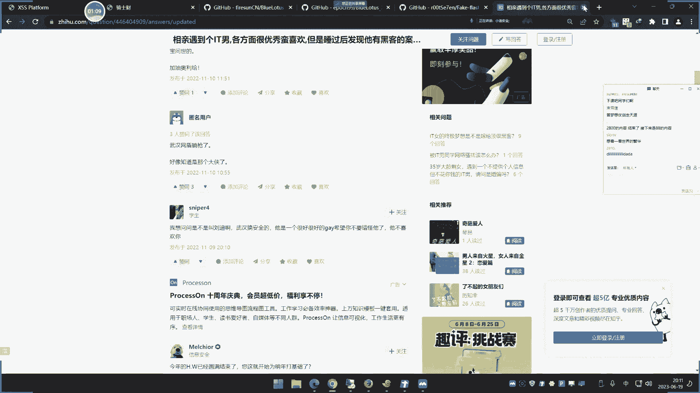

在那个利用的那个地方。

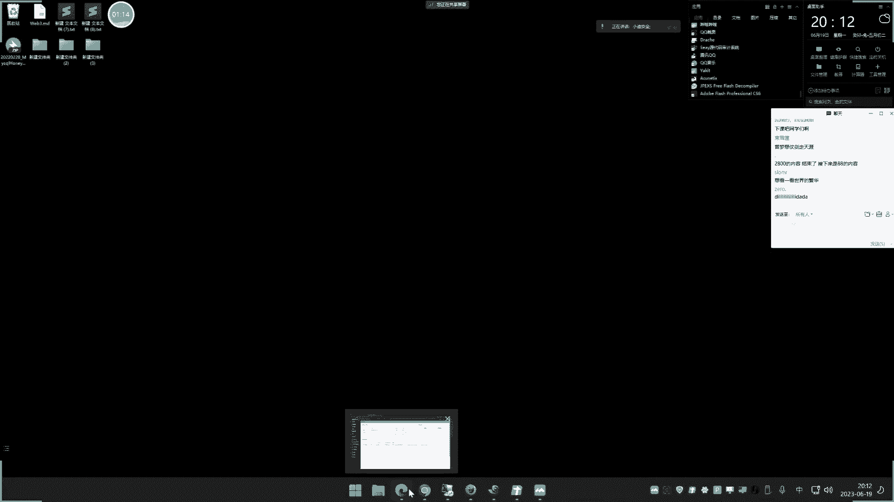

小平面板的啊，好这个呢是个小平面板的那个地方哈。

然后呢呃这里我先把推出来啊。

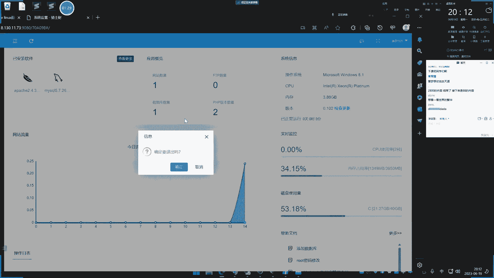

好这里呢是我们之前的攻击点。

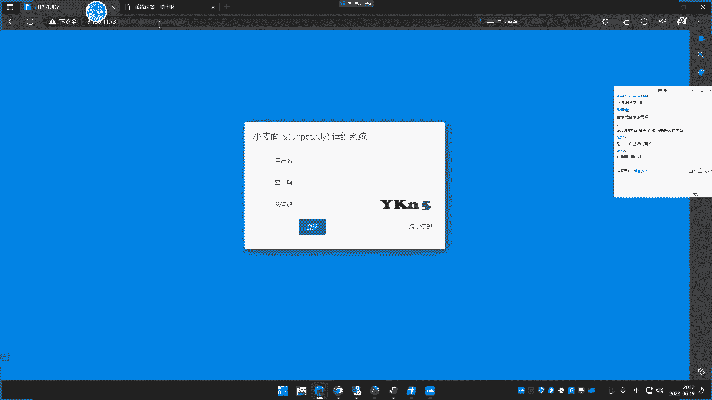

我这里，那就换一个浏览器呢来尝试模拟提交一下啊。

好这边呢我们就来到这边啊，就是谷歌浏览器呢，呃扮演角色呢就是我们那个攻击者，然后这个EDG一体模型，那就是管理员啊，管理员呢去正常的去这个登录呃，去登录，然后呢这边谷歌点呢其实就是攻击它啊。

这里呢去获取它cookie啊，那么现在我们第现在演示的，还是用网上的这个平台，那么等一下演示到后面几个项目之后呢，我们会自己呢给大家搭建一个参赛平台，因为这个搭建过程呢也是非常重要的。

你不可能一直用网上的网上，如现在用的不好的话，一个会鲜明一个人不安全，包括啊用的多的话，会标被直接当做那种特征啊，就比如说像一些这种威胁感知平台呢，它都有网上的一些这种是吧。

平台的工具的一些域名的特征啊，你用它可能就直接标红了，所以说你用这个新的东西会好一点啊。

但是我们现在呢先用它啊，然后呢先用一下啊，等下呢我们自己搭建再用自己的啊，上节课那个娱乐播放啊，然后呢我们把它获取一下啊，再看一下，先把那个XSS那个代码呢在这里查入下，然后呢这里做一个这个截取啊。

这平台太慢了啊，所以说还是自己搭建会好一些，这网站平台呢用的。

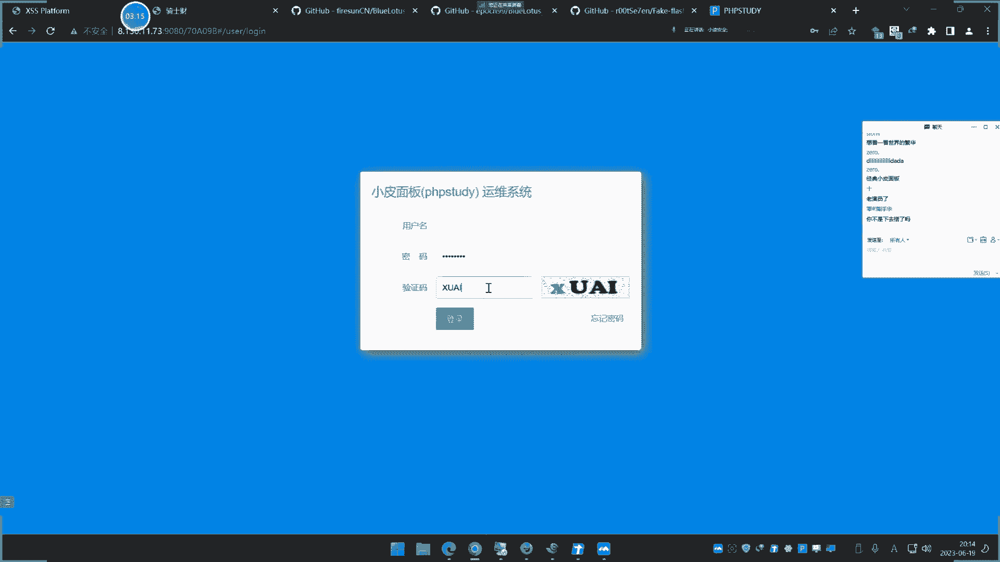

好找到这个利用代码啊。

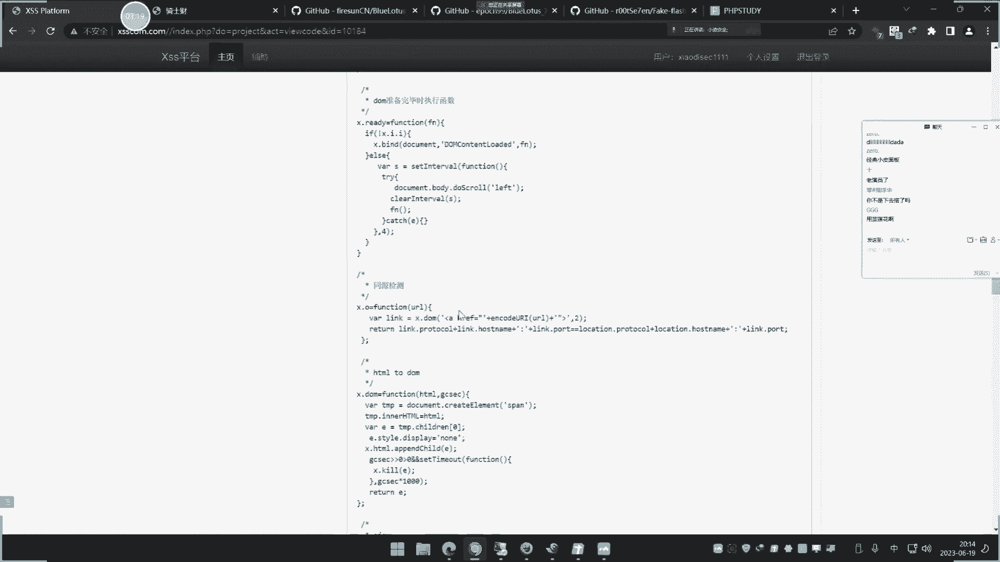

那就这里嘛哈哦然后呢把它插进去好，在提示错误之后呢，这里会有个那个错误日志登录是吧。

然后这个管理员的模拟登录在登录的时候呢，他这里呢会有查看错误日志的地方，对不对，包括在这里的操作日，这里呢它会记录那个登录失败的那个地方，当他去查看这个操作日志的时候呢。

就是登录失败了，会记录这里，然后登录失败呢，刚好呢查了一个建议语句在里面，然后这边呢我们看一下啊。

这个差评呢是不是就接收到了，这上节课我们那个内容啊，我看一下，呐唉还没有结束啊，啥情况。

这个日子咋没有啊，这还是尴尬了啊，重新再写一下，其实呢这里也不用说，可以在在这里呢去测这个东西接不接受到。

因为上节课我们在测的时候呢。

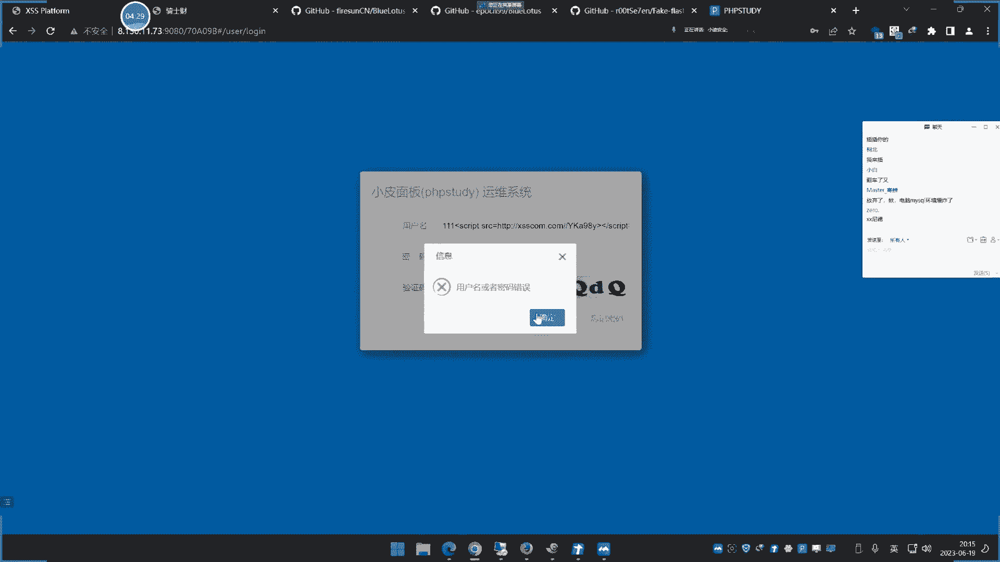

已经给他测过了，他这个接收到了之后呢。

也没用也没用啊，因为等下我们会给他操作，为什么他这个地方没有庸俗，就是你截止到之后。

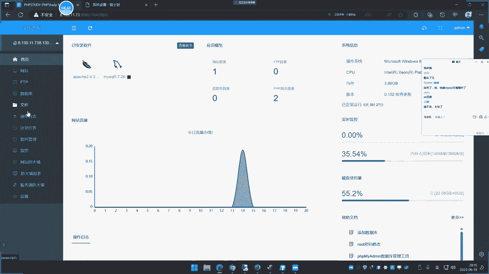

为什么他还是不行啊，为什么还是不行啊，我给大家看一下啊，就是你当你去刷新这个网站地址的时候呢，你可以看一下啊，它这个地方呢你看这个地址上面有个什么东西，你看看还有个叫什么access token。

其实就是说他除了本身进入这个后台，这个里面获取到这个cookie之外呢，他还有一个那个类似的toy，还有一些其他的一些参数导致的问题啊，就是你即使说你现在得到这个cookie信息之后啊，他也不行。

他也不行，他也不行。

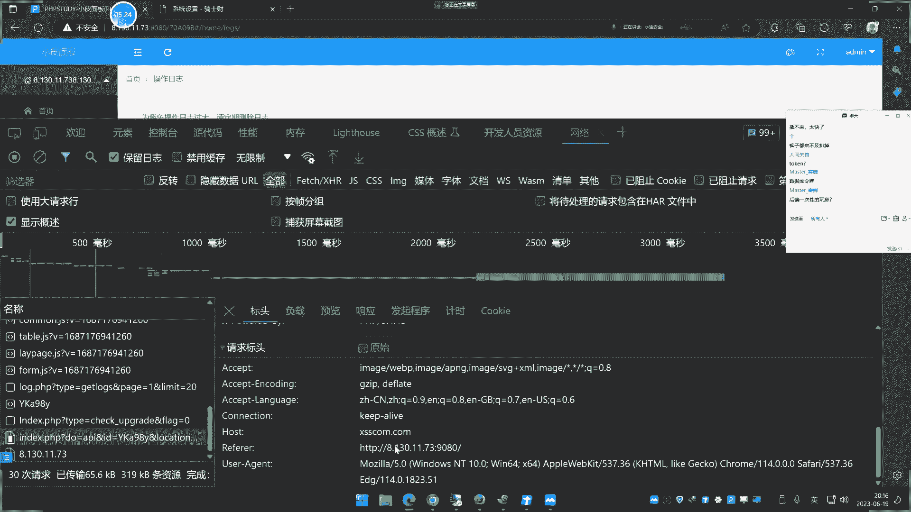

啊这里应该接收到了cooking了啊，我看一下这边，好这里结束了，看到没啊，这里的是得到这个信息啊，来然后呢，我们之前呢，就是说一直不明白是什么原因造成的是吧，在控制面板这里那个地方啊。

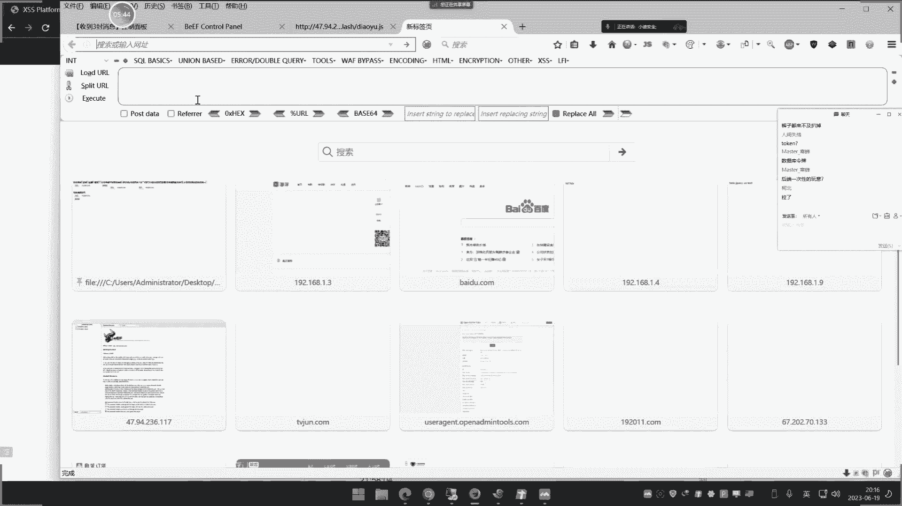

然后模拟器登录他就一直登录不上去，也不知道是啥情况啊。

你去登录，我们开个那个代理工具是吧。

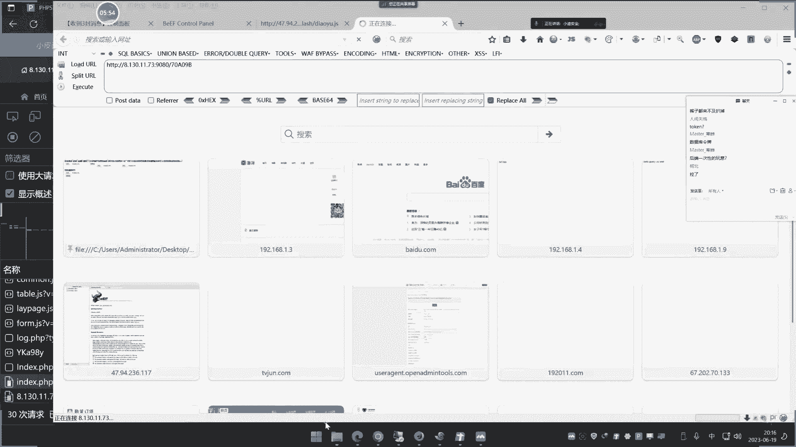

把那个COOKI呢把进气一换，啊你也可以在这个浏览器里面去操作啊。

一直不行啊，这上节课那个问题啊，原因就是因为他这里呢不仅是C型啊，那个东西啊，同时呢还有其他的一些验证在里面，就说你获取到空闲，那不行啊，好我们来给大家演示一下啊，比如说我现在抓个包来去访问这个地址啊。

好我返回这个地址啊，然后呢你看啊，我把这个获取的token呢，把你改改成这个他解释过来的这个地方呢，触发这个夸张解释过来的啊，放这来，然后我把它放出去，放出去之后呢，我们关注一下这边啊。

然后这里呢是会请求这个路径嘛，我继续呢好好好好都要放出去啊，就不管了，你看啊，但他还是会登录对吧，说还是不行啊，这不是说你获取的不对，而是因为他这里的海齐来研制，所以他这个方法就不行。

那我们当时呢就换了一种方式。

换了个什么方式啊，告诉大家啊，就说我直接获取这个cookie，不行的话。

这里那就换了另外一种方式，什么方式呢，我还在诧异是什么情况，原来这里面的不是只这么多，然后呢你看啊，他这里呢是可以进行这个什么叫做这个叫文件，还有这个网站网站你也可以点击这里来。

然后呢可以在这里呢去什么呀，去新建文件，然后呢去写个代码，这个意思也就是说在这个新建文件，这个操作和等一下呢我再编辑一个文件，去在这里写这个代码，这个操作都可以把数据包抓到。

抓到之后利用JS代码来实现文件的写入，所以啊他这个利用呢就换成这种方式，就是利用JAVASCRIPT的代码写上一个代码，怎么写啊，请求这个叫test p p创建一个计划任务。

然后呢再保存它在这里面写入一个后门代码，写入到这个目录下面去，然后这个目录就是一个网站，我们就可以直接连接这个后门来实现控制，啥意思呢，就是说模拟我在后台里面去，在这里呢去创建一个文件。

或者说进行一个计划任务的添加，实现这个什么执行计划任务，然后呢去写入一个文件到网站目录下面去，但是这个攻击条件是需要你能够了解对方，后台那个数据包，如果说不了解的话，这个工作那是做不了的。

这是建立在比如说我拿不到他的cookie，cookie拿到之后呢，但是我做不了其他事情，但是我如果说我知道这个后台里面的一，些常见操作，我可以在本地搭建一套和他一样的系统。

然后呢在这个系统上面我本地做操作，抓到这几个数据包。

把这个数据包呢用JS代码去写出来，写到一个文件里面去，比如说现在呢，我就把这个文件把它进行一个保存。

保存文件名就叫POC点JS，然后呢再到网上去找一个呃。

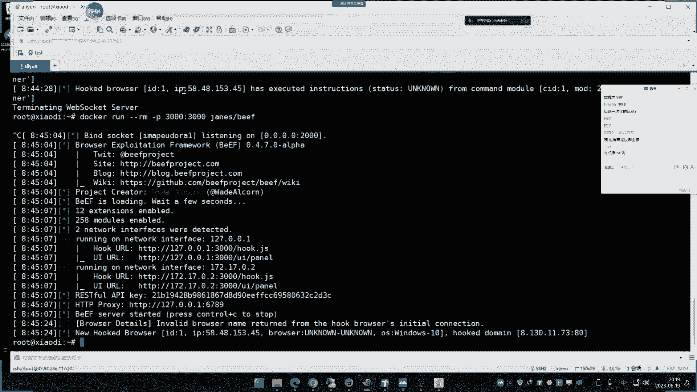

搭建一个web，然后呢，把这个POC呢，放到你那个远程的一个访问web上去是吧，比如说像现在是吧。

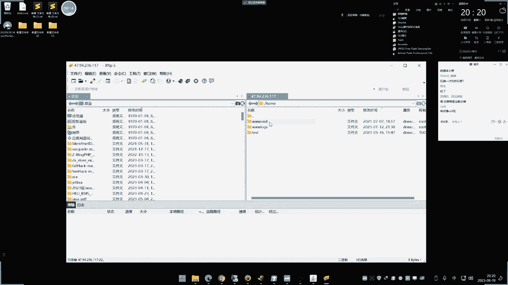

我就放了个POC点JS文件，这个就是刚才那个代码是吧，这个代码呢JS代码一旦执行之后，他就会呢请求一个路径，然后请求post路径，请求什么路径呢，就下面这些代码，就是用用JS呢去写一个模拟请求的路径。

请求的这个数据包，这个请求呢就是模拟在这里点计划任务啊，手工呢需在这里创建脚本，然后呢去执行这个操作，就这个意思能理解吗，所以呢他就把这个POC呢放到这个路径上面，那么呢我们就有个仿路径。

这个仿路径呢就是大家看一下啊，就这个路径的POC点JS，那就是这个代码对吧，然后这个时候呢再利用JavaScript sc script，然后SRC加载这个地址，对不对，加载这个地址，然后呢。

在结尾把这个例子呢，用单引号或者双引号把它括起来，就是相当于这个语句呢，就会远程加载一个POCA点JS文件，JS文件呢就是这里的代码啊，就是这里的代码，然后这个代码他做了什么事情呢。

就是啊把这个代码执行一遍。

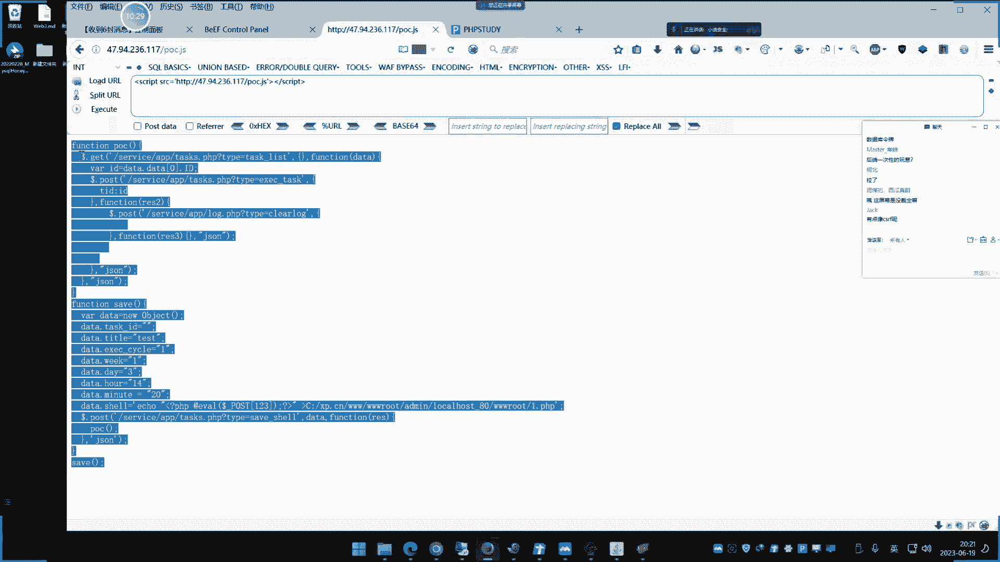

执行的意义呢就是模拟刚才在后台里面操作，把它写到这里去。

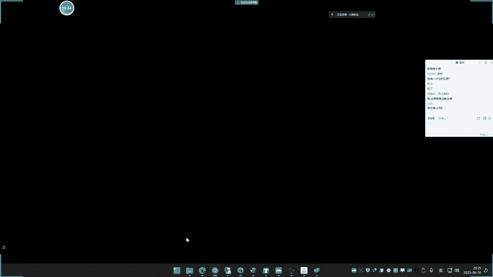

然后我们现在来关注一下啊，他的最后实验操作，就是向这个路径下面去写入个疑点PPP，然后写入代码就是一个后门代码，那么就等下呢判断一下一点，pp这里存不存在，能理解吧。

我们就判断这个一点PB存不存在即可好，那么现在呢我们关注一下啊，这边文件这里啊，这个这个网站路径下面有没有一点pp啊，现在你看啊，这样是没有一点pp的，等下我们来刷新一下啊。

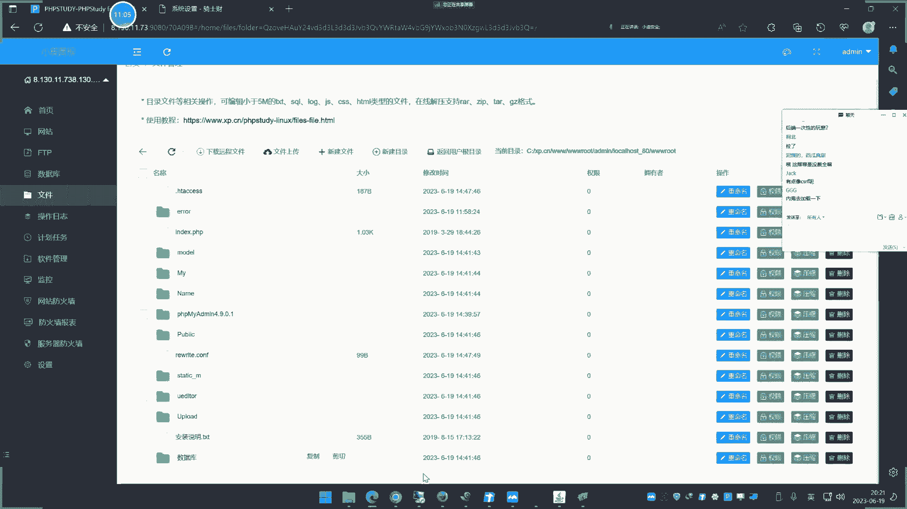

好接下来呢我们来模拟一下攻击，还是在刚才那个地方是吧，协商这个代码呢远程让他远程加载一个POS，然后呢模拟一个什么登录的一个记录日志。

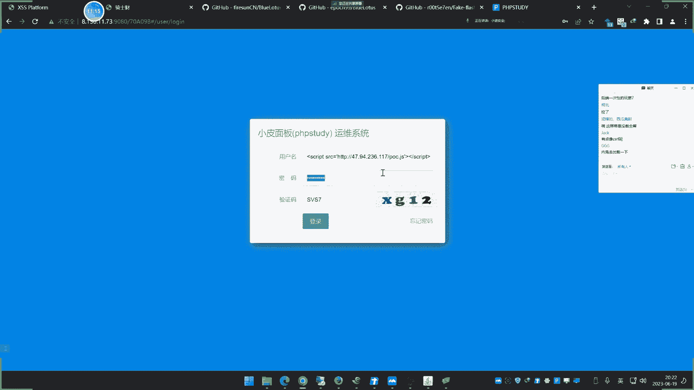

然后在里面点登录之后啊。

他把这个日志记录进去，管理员呢在查看这里日志的时候是吧，查看这个操作日志的时候哎。

这个没写进去啊，再来提交点，什么情况。

这卡了啊。

重新来啊，重新再写一遍，多搞几次啊。

他这个平台有小bug啊，老是你妹的不行。

多换几次烟，怎么老是这样子，接进去没有日志，多搞几次啊，插入一下好了，现在看一下啊，当这边管理员来查看日志的时候呢，这什么情况啊，看一下啊，我们先看一下文件里面存不存在了，找一下，哦现在没存在啊。

哎呀这完了呀，这这怎么日写不进去了呀，这，妈的什么情况啊，多写几个看一下啊，再刷新，再写一下，他老是这个突然一下子就不行啊，多写几遍啊，把那个登录操作的这个日子让它在这里产生，这就尴尬了呀。

这个没有日志呢，这。

我把这个平台给大家看一下啊，把他看能不能重启一下，面板刚才3333的里面的，现在日日都不记录了，停止服务，开启服务，啊再来看一下。

这个浏览器呢就是模拟那个受害者啊，管理员去查看这个日志的时候，那触发的那个夸张啊，这边就把那个错误的那个操作呢，给他记录起来是吧。

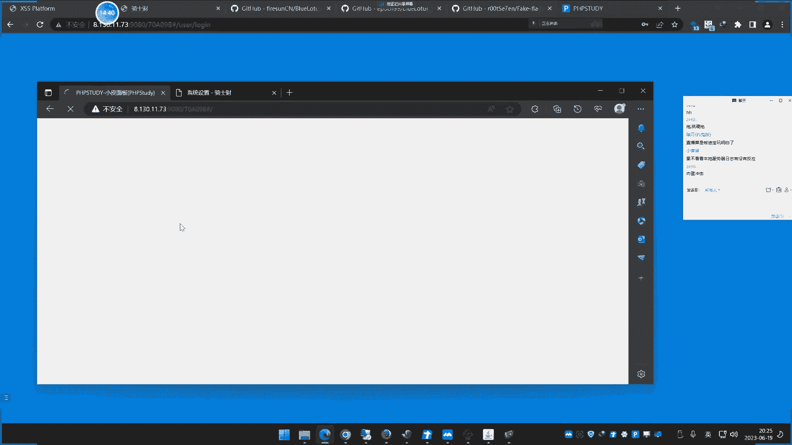

嗯有点卡啊。

你不会说等一下啊，哎呀，这个卡我哪知道是什么原因呢。

你们老说些这个无关紧要的话，什么卡是我翻车的理由吗。

什么鬼东西，哎，那你告诉我这卡怎么解决啊，教下我好不好啊啊要不你来解决试一下，我告诉大家为什么卡啊，就是因为啊，我把重新装一下啊，哎我就是手贱呐，一直要把它清理清理，清理下来，日子都不记录了。

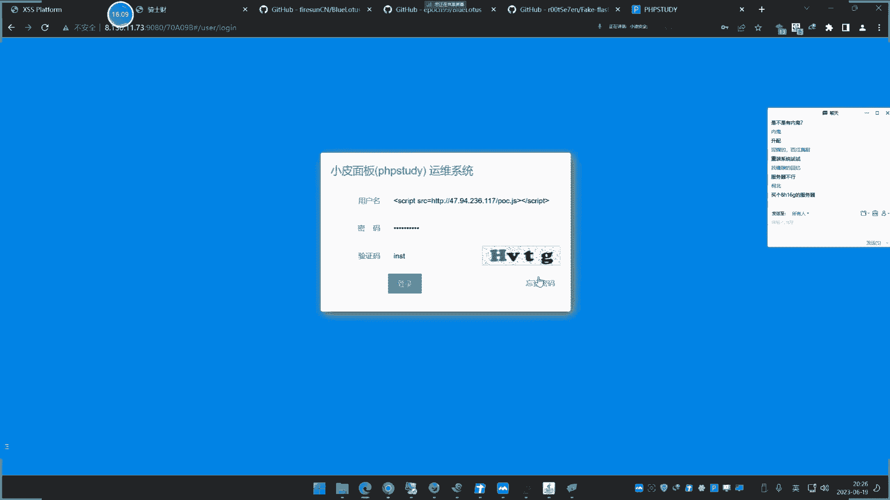

重新开一个啊，重新安装一下，他那个日志不记录了啊。

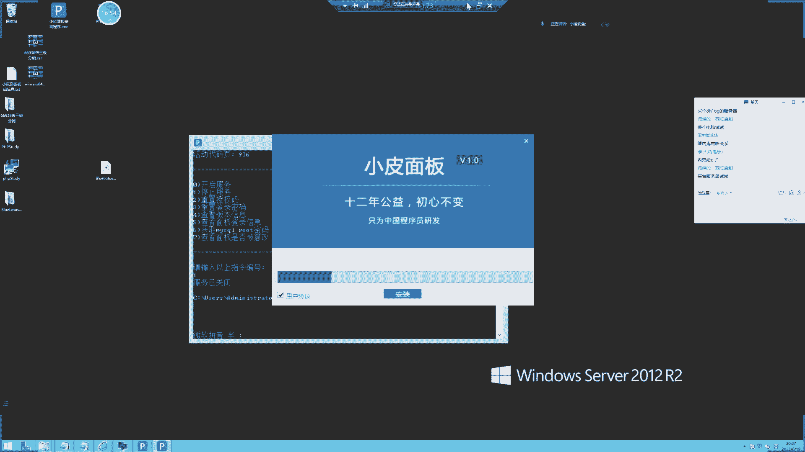

你也完全不知道这是什么情况，搞都搞不明白这种，你说翻车，这这这这这这我能有什么办法呢，对不对，他不激怒，你说那啥情况，等一下啊，后面东西还比较多。

我要重新装一下就可以了啊，不是什么大问题，我没翻车，我讲的知识点没有翻车，观景翻呐，这不是我能决定的，就像你讲课突然跌停了，你说怎么办，那也叫翻车啊。

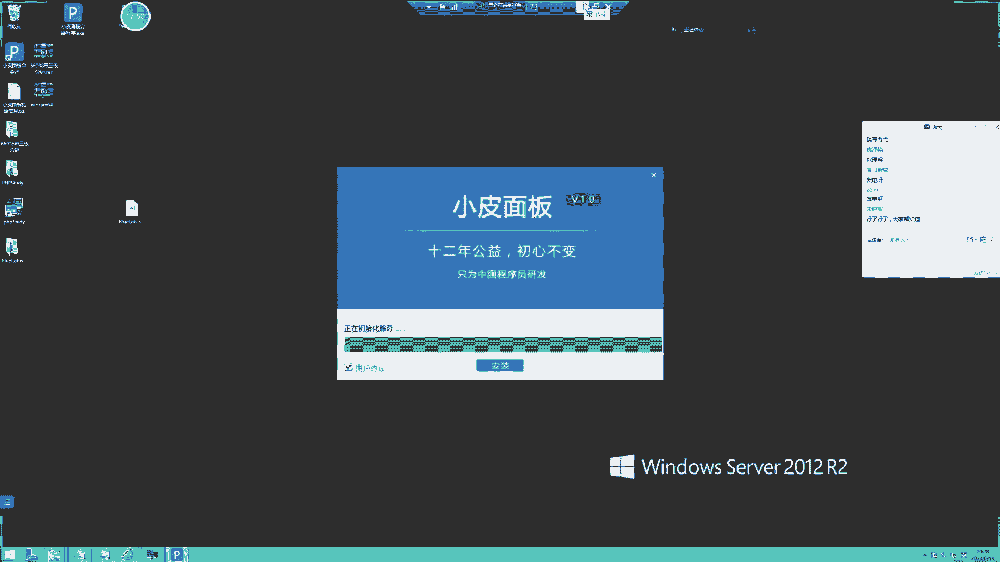

好我们来开了啊，来看一下这个地方，来。

来看一下这里啊，还是登录这里，这密码不知道改没改啊，好登录成功了啊，看这边啊，先看日志，这边能不能正常记录啊，然后呢我们待会攻击一下啊，其他的不用改啊，这重装的应该可以了，我们来实验一下啊。

看一下这个网站这边的一个文件的一些情况，然后来这里啊，你刷新一下，然后把刚才那个script的语句呢给他拿出来，SC的语句呢跑哪去了呀。

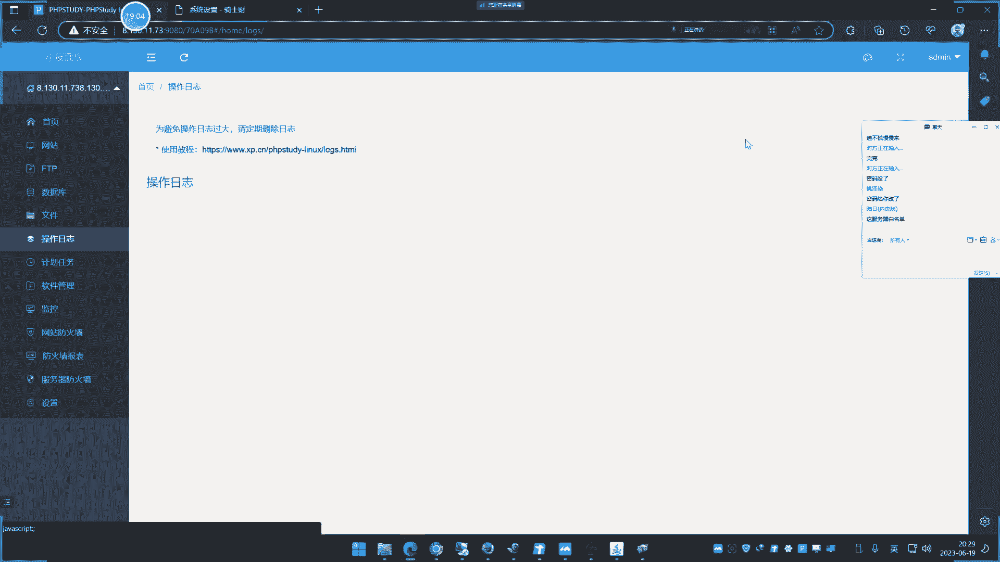

好把那个语句拿出来啊，我写script src等于这个第一次，好吧就是刚才那个浏览器的名单啊。

好了复制过来啊，这个模拟器呢模拟一个错字的插入，把这个语句的查进去，然后这边呢。

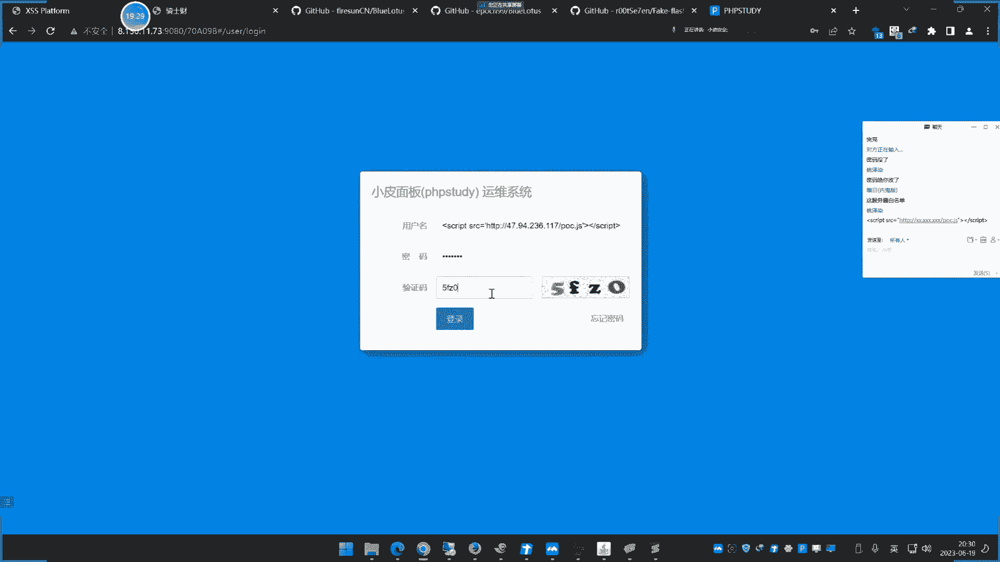

给他登录。

然后呢，为了这个真实有效是吧，我再刷新一遍，再插入一次，趴着个又不行是吧，多搞几次啊，好再来一次。

好这里呢应该就差不多了，我们来看一下啊，当着管理员呢去正面去看这个日志的时候啊，然后呢我们来点击确定啊，超日制的时候啊，这边我也不知道执没执行，但是我们可以看一下这个文件有没有了啊，点一下这个地方来。

但很明显这里没有成功，为什么大家知不知道，为什么这个为什么没有成功啊，因为路径发生更改，我刚才那个POC的路径不是这个路径，默认装的是在这个目录下面是吧，但现在的路径呢不在下面，我们来看一下啊。

之前那个路径里面有没有啊，看这里，叉BCN3W点这里这里哎带个路径不对啊，我们把PUC改一下，哎呀你说这呀这一改呀都要改。

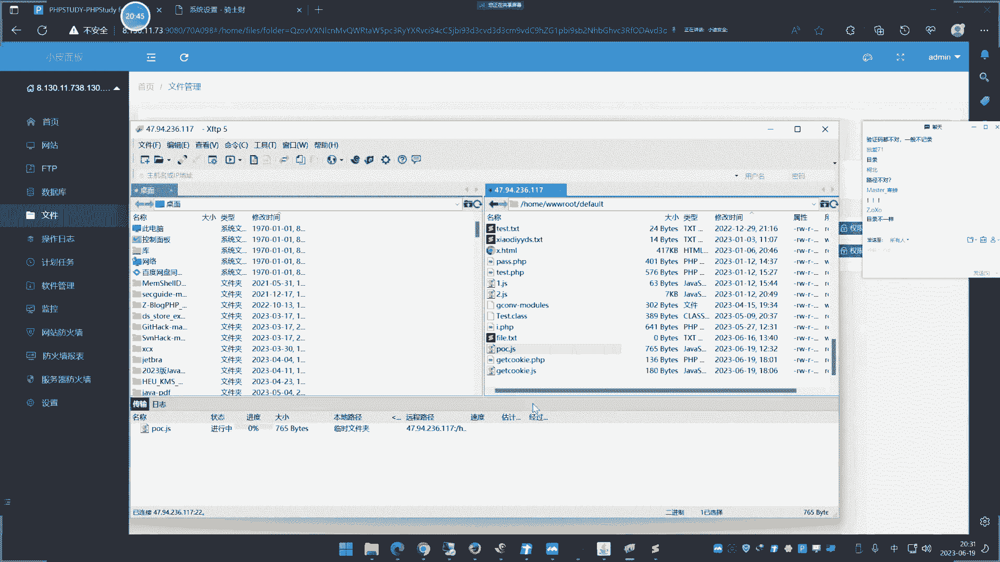

这要这怎么办哦，我直接创建个目录模拟一下吧。

我懒得改PVC了啊。

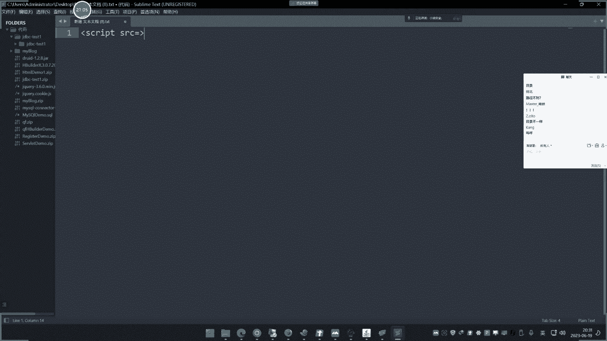

啊POC呢。

就这个目录吧哈来这里有个这个目录哈，我把它创建一下哈。

因为他这个XSS呢是没有权限去创建目录的，他是没有权限做目录的，在这个目录下面，然后这里有个这个目录，好对吧，这个三轮目录对不对啊，为了这个情况呢，我们再来刷新一下啊，这个目录应该是对应上了哈。

三这个刚才那个安装的那个根目啊。

我后面重装的画那个目录，那你可能说那实战中那不是这个目录怎么办，但实战中不是这个目录啊，你可以通过这个其他的获取这个目录，你比如说我先获取下抽这个数据包，把这个值先得到，得到了再再写进去不就行了嘛是吧。

放到目录了，我还是把它改到那个目录上面去吧，他不让我夸目录行吧，好不管他了啊，我们直接开啊，好我们来关注一下那边的一个提交信息，包括这里的一个录音，完了，哎呀这他妈的真是，好存一下。

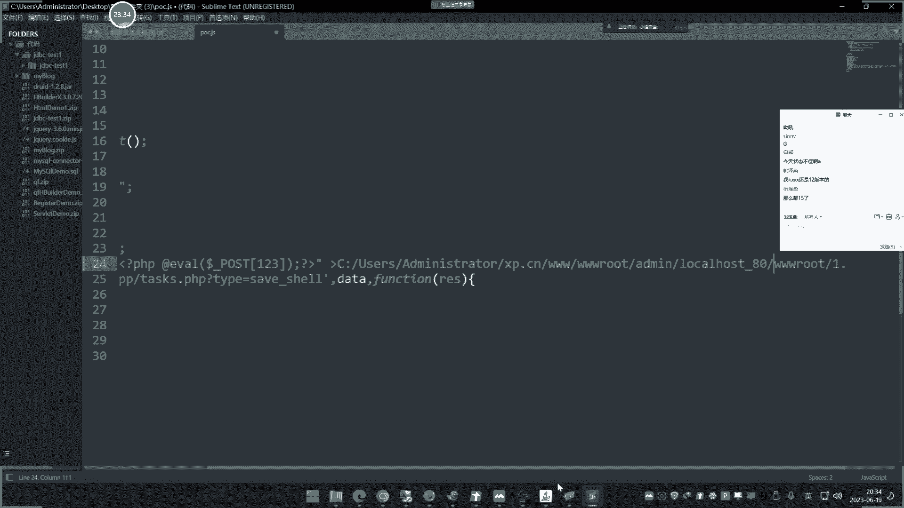

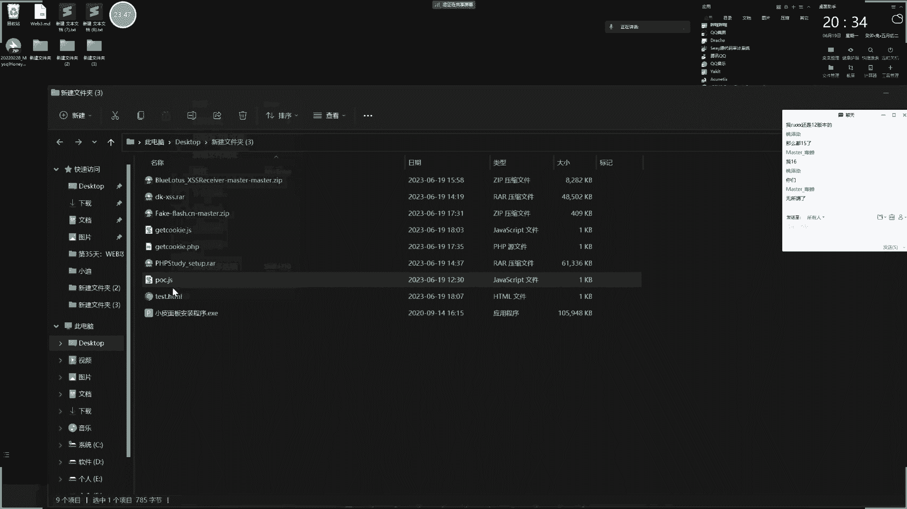

把它放到里面去啊，重新上传一个加载一个PLC1啊，那个POC路径休息一。

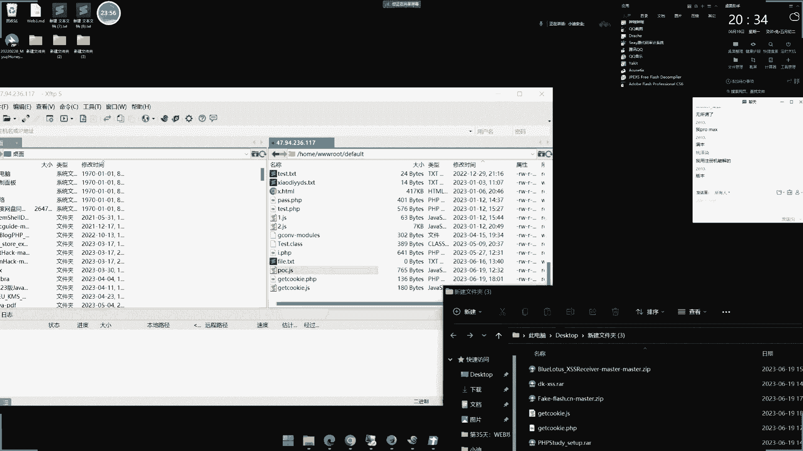

那么在这里呢我们重新把这个日值呢，呃其实这里呢我们等一下啊。

我们先先先先看到这个地方的执行啊，先退出了，好这里重新插入一下啊，把这个换成POC1啊，确定一下没问题啊，Uy x m，好来看下，这边再登录，好现在还没有啊，把那个日志看一下，还有没有啊，哎呀这不行。

说实话这蛮尴尬的的，好这里呢，你们自己看一下啊，那这什么东西啊，这什么东西啊，有人登录这个上面登录进去，把那个防护开了，让我搞不成功，我什么时候添加过网站防火墙啊啊，我什么时候添加过我网箱，8。28分。

我8。20分，我在干嘛呀，我服务器刚装上，我先这样子啊，我我把服务器把它关一下啊。

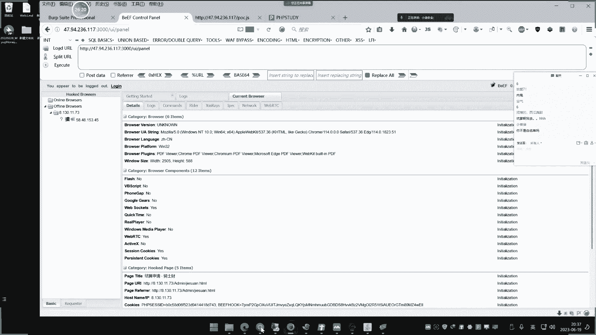

关一下重新装一下啊。

不用不用说啊，我跟你讲这群内鬼多的厉害啊，你不能和他计较的计较只会影响自己心情啊。

我在这里查，他在这里删，你自己看嘛呢，哎呀这尼玛真是人才呀。

这种人要么就是隔壁的同行内鬼报名我的课程，偷学的内容，然后呢他兼顾的好，他就在这里那边边听课边搞破坏，还有一种人就是纯，知道吧，只有这两种情况啊，第一种情况我能理解，第二个情况我就是就不能理解了啊。

大家可以自己看一下啊，我不想耽搁大家时间，你们说什么，说源这东西，这个本身这个网站就有日志的一个情况啊，你可以自己在这边看一下啊，我真不想这个浪费大家时间，你看这个，这边是有那个诶。

他没有没有日志记录吗，我在这里，他没有进入日志，那是在那个安装里面，应该有那个日志啊，我懒得干了啊，我重新装个服务器啊，重新搭建一下，我把那个服务器上安全组啊，你们就知道这有多难了啊，那没办法。

你说这谁顶得住呢，这个事情谢谢你内鬼啊，你这不搞还好，这里面的差点要是真浮现不出来，这就尴尬了，你让我找了个理由对吧，你只要让他看到那个密码，那就那就完了，那你妹的就给你嘎嘎乱动了，大家不用担心啊。

这个我后面东西都要上完的啊，无非就今天多上点内容啊，本来10分钟的课程，这硬是搞了半个小时，10分钟的这个实验，我重新买一个啊，买一个呢从这个买和搭建后面的，刚好要搭建那个东西呢也要买一个。

也买个服务器给搭建，我怕有些人后面搭建另外那个服务器系统呢，又搭建不了，你们自己看着呢，这还有人还在登录，这次我他妈的真是服了。

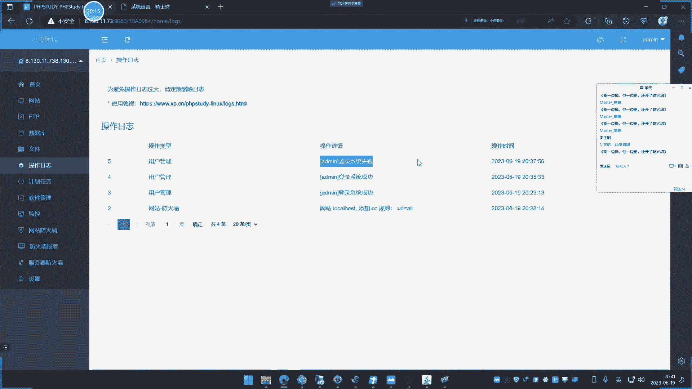

这，我一边查他一边删，还开了防火墙。

我说怎么回事呢，什么网站添加cc规则，如二等于五，孩子这里帮我把这个地方开了是吧。

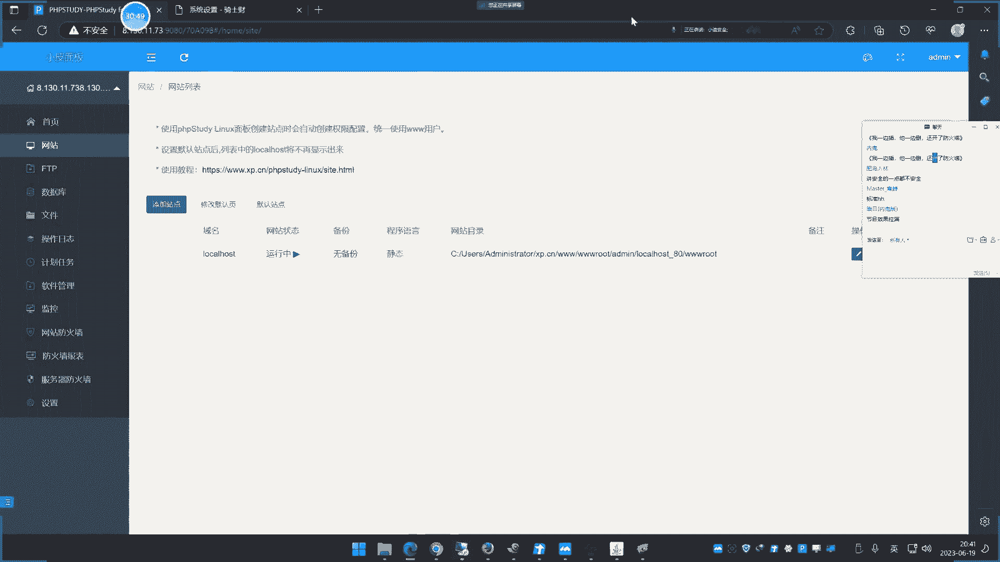

我看是不是开了呀，防火墙，东西都不装了，那日志里面记录着有啊。

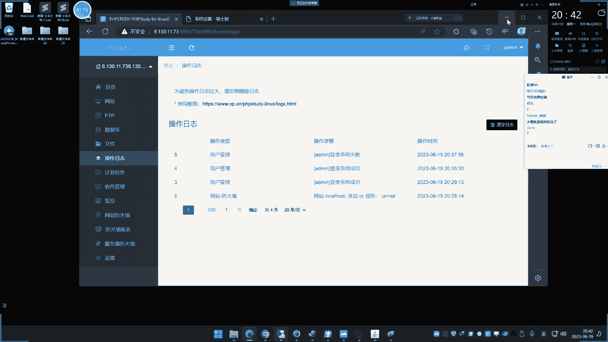

本来这个内容把那一上很完美的，那个后面内容一呆哎呀，那简直完美啊，结果这里面的这不装完美。

这个什么办法呢，哈真的重新启动了，赶紧啊。

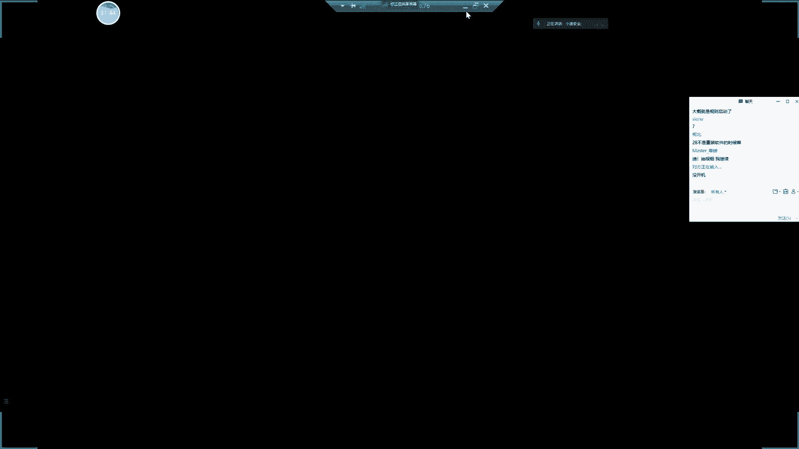

我现在装上去，先就把安全组给他，给他限制，避免这个其他人进来搞事情啊，先把安全主义先给他弄一下，那哪个不怕呀，这。

好了，好限制了啊，这应该没内鬼了，内鬼知道账号密码也没用了，他也访问不了了啊，翻不了翻不了吧，这个漏洞复现，把它搞一下啊，大家不要急啊，等搞完了，我后面内容就慢点，快点上了啊，这次应该不会翻车了啊。

应该不会了，重新装了这东西，怎么可能还翻车呢，那除收内鬼还还还在。

好等一下啊，我们等下装在装的时候呢，我们等一下呢再给大家说一下后面内容啊。

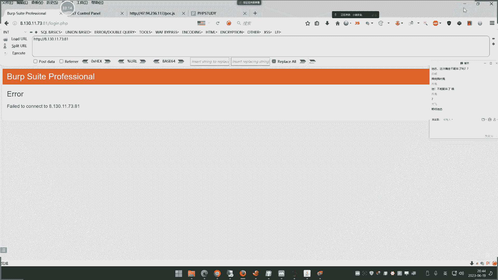

这个把它做完之后呢。

刚才说了啊，获取到cooking之后呢，然后啊这个平局没有凭据是吧，然后呢利用这个数据包去执行呢，去写个后门，那么还有一种呢就是直接获取cookie，还有获取cookie，那我们等下换一个这个平台。

我专门给他找了一个比较贴近于实在的，一个那个网上的那种申请贷款的那个平台啊。

等下会给他看的，那个人他是看到了，我刚才撞上去有个那个密码，那这个这个不刚装上去，有个这个密码吗，他看到这个密码了。

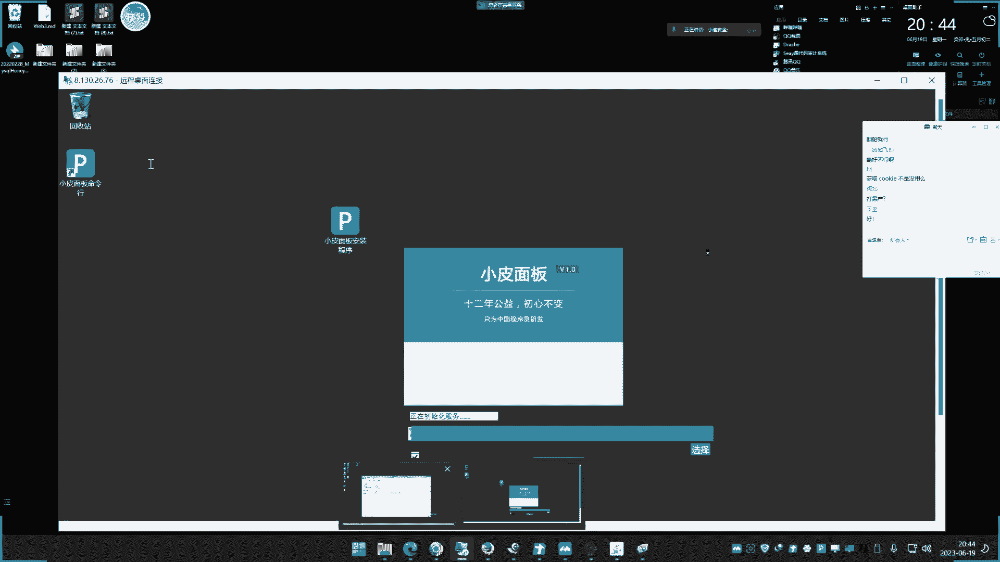

他就赶紧登上去了，是这个情况，我为什么老卡也有这个原因，就是有人在登，有人在看，所以就卡，你看他现在这个呢是吧，内鬼又看到了，那肯定又在等，对不对，这都不用想的，这个是刚才新建的是哪个这个吧。

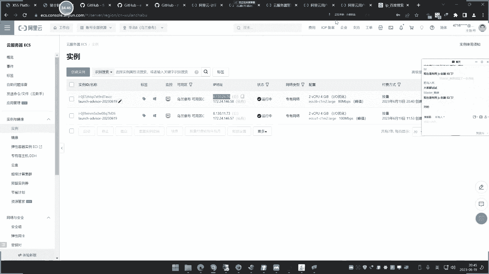

然后我们把它先登录进去啊，然后呢我也不用来看了啊，来直接登录上去，我先补登吧，我先不登啊，我这边呢就是这个谷歌浏览器，我想换一遍，好吧，我换到这边成为攻击者，对不对。

把那个刚才那个框on代码呢给给他写上去，把这个写上去，对不对，都改一下啊，华为sq，然后呢再写几个啊，避免等下又不记录进去，A i，A i n h，你看他现在呢这不卡了啊，对不对，刚才那就一直卡好。

再写几个啊，这不能再翻车了啊，再翻车我只能讲后面的先好，这边已经登录了，然后这边的模拟正常用户去登录它。

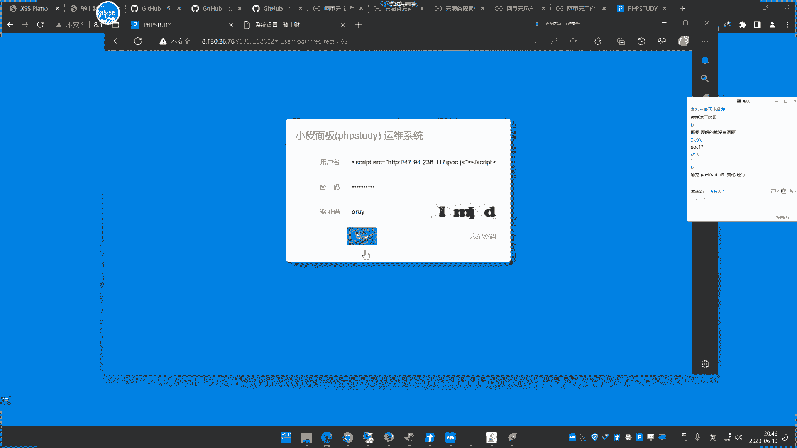

好登录好，他登录了啊，然后呢他去看这个什么操作日志，one z看到没，一点pp写进去了，来立马成功，10分钟的东西硬是让我搞了半个小时，那你不信的话，我们可以自己呢再把它删掉，啊大家可以重新来一下来。

我把它删掉了啊，来删掉了没有了是吧，然后呢你看啊，当我们去看日志的时候是吧，可以看一下这个数据包的一个加载，你看他加载的这个JS文件里面，有没有我们那个外部的那个JS好，这里先不看它。

我们直接看这个结构就可以了，来看这面试纸啊，哇网在这里看网这里啊，也不用看网站，直接看真面目录啊，这又卡了，你看这目录是不是有又有那个文件了，嗯没有啦，怎么又没有啦，刚删了就没有了啊。

那不是我自己创上去啊，你不要说什么的，我作假，我提前把传上去了啊，那刚才又不行了，那可能是要重新再来查入一次啊，我就不演示了，我先演示一下，给他看一下就可以了，然后再出来就可以了啊，再多加注几次。

他可能是执行完之后呢，他就把日志给删除了啊，他后面有个删除日志，自动删除日志这个操作，这个JS里面有写到，我等下给他看一下那个JS代码就知道了，好没理解啊，来登录刷新一下啊，看日志，然后我们看管子这边。

哎搞错了吧，我是打开错了服务器，46来看丢了吧，来看来没有问题啊。

好我们来看下面的啊，这个是我们那个第一个实验啊，还有个人就说直接获取cookie啊。

我现在呢找一个那个直接能获取cookie，那个平台给大家看一下啊，我模拟的是什么平台啊，在那我打进来一个来这个这个平台，我们先给大家去演示，演示完了之后呢，再去给大家看一下那个呃搭建过程啊。

答案过程。

我直接答题过程也给大家去讲吧，免得等下大家自己下去呢。

又不会打奖啊，我还是放到那个上面去啊，答案过程呢我也给他演示出了啊。

就是这个环境的答卷呢，等下你下去要浮现的时候啊，我怕有些人不会搭建，我这里也给大家打印下来，徐明刚买了个服务器嘛是吧，你就说再不回答建。

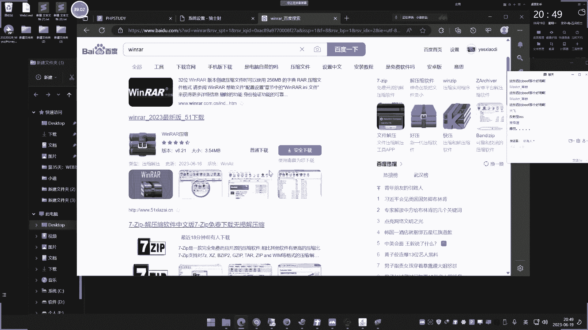

那也没办法了啊，真的是网上找了一个，网上找了一个这个这个源码，这个源码是在这里啊，源码是这个啊，这个然后呢把这三个环境给他复制过去啊，还用老版才能搭建，那个新版还不能搭建。

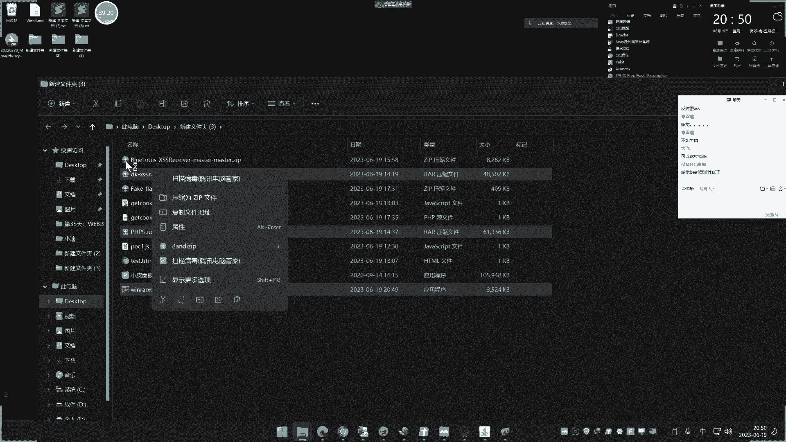

那真是有些尴尬的啊，好复制国家啊，然后把那个环境先打印起来，打印起来再给他演示啊，嗯因为这个呢一旦启动之后呢，他就会有个那个网站嘛，这个网站呢就直接访问，就有那个后门地址了，你可以看一下那个浮现的啊。

那个小平民版的，就那个RC1也说RC1其实是夸张造成的。

我们浮现的就来源于这个文章啊，他这里呢去盲打进去之后呢。

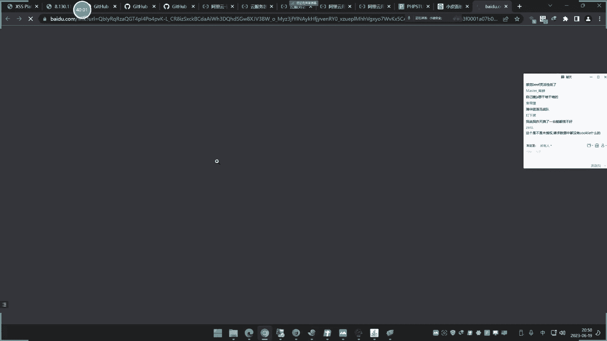

把这个写进去之后呢是吧，那开这个笑嘛，开了起来之后呢，他就把这个访问之后啊，这里需要清空日志是吧，然后呢这里呢去触发了个POCPOC之后呢，就拿出个路径是吧，有个文件写进去了，写进去之后呢。

他就用这个哥斯拉去连接这个后门，看到没，后续操作是这个了啊，我就不说了，所以说他利用XSS呢，去自动的去触发这个数据包的。

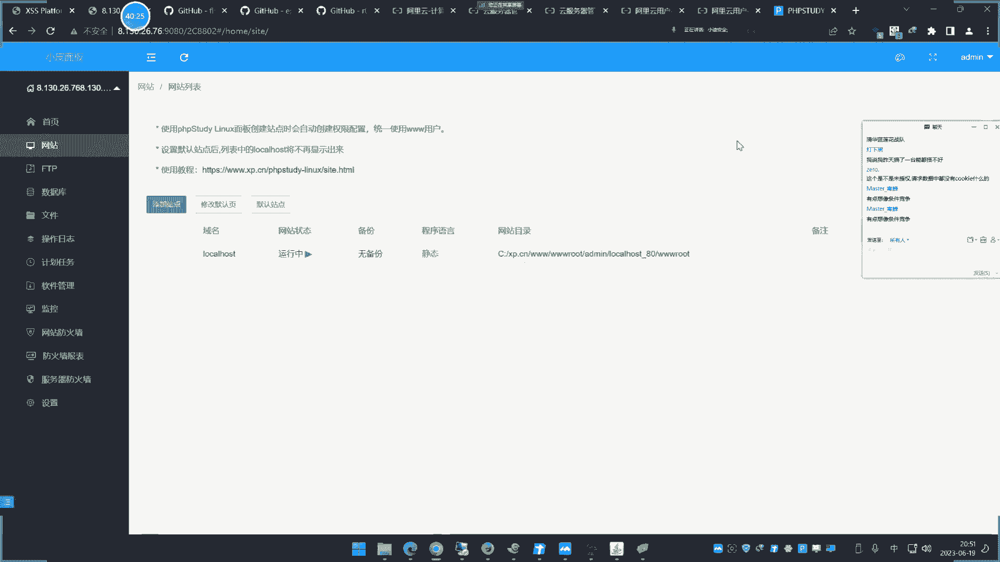

去写入这个文件进去啊，就是前提条件刚才也交代了啊。

它的前提条件呢就是我刚才说的必须怎么样，必须知道后台那个数据包的构成，再用JS写，如果说你不知道那个方法，那是不行的啊，就不要搞错了，好，现在呢，我搭建一下那个贷款的那个平台服务线啊，他邮箱的下去。

那就是这个呃不会搭建，所以我这里的脸打建也给交给你了啊，你不要说到时候那这源码和环境都给你了，不是到手，那你这个也不答应，不也也答应不了，那就那就没办法了啊，先安装下这个环境。

他只能用这个老版本的搭建啊，新版本的搭建不了，因为他那个有些版本差异，我搭建过，给他踩过坑，这个大小平台来个源码啊，好怎么把答你起来啊，首先呢在这里呢不管这些事情啊，点击一下这个地方啊。

把这个源码呢给他拖到这个目录下面去，就是那个源码啊，放到上面去，然后呢随便取个名字，我就叫DK是吧，贷款，然后呢放到这来，好翻过来之后怎么办呢，他在这里呢是有搭建教程的，他会跟你说啊，这是他的版本。

然后呢先修改这个地方的源代码，把数据库呢给它导进去，怎么操作呢，你先把这个数据库给它导进去啊，这里呢可以用pp study give medi啊，诶哦我这里还没启动，先把启动起来。

好然后登录这个默认大密码是root和root啊，在这里呢去创建一个数据库，然后呢导入这个呢是根据你自己需要啊，我们呢这里呢可以点击呢数据库这里，然后再创建个名字，名字就叫随便鲁奇，按照他默认的啊。

这个呢是自己可以创建名字的，好这里创建成功，然后大家选中这个数据库，把那个数据导进去啊，这个的答卷我给大家演示了啊，你下去之后要浮现，就这样跟着来点击这个导入啊。

来把这个是源码里面的那个什么SQL文件的，数据库的SQL文件放进去，点击执行好，这里就导完了啊，导完之后呢，接下来啊就来到你刚才那个目录，就是你那个原目录啊，来这里啊，找到那个文件，数据库配置文件。

把它修改一下，啊这里呢有个啥啊，这是输球名啊，我刚才这是随便撸齐是吧，和他对应上，然后呢把你账号密码那也写上去呢，root和root两个对应账啊，这都都是对应的是吧，就没问题啊，如果连数据库名发生改。

你就改一下啊，账号密码的时候发生，按这里也改一下，由于这里呢我都是对的啊，所以呢我不用改了，那么现在呢再来点击一下这个域名的管理啊，写上自己的IP地址，就想这个IP地址啊。

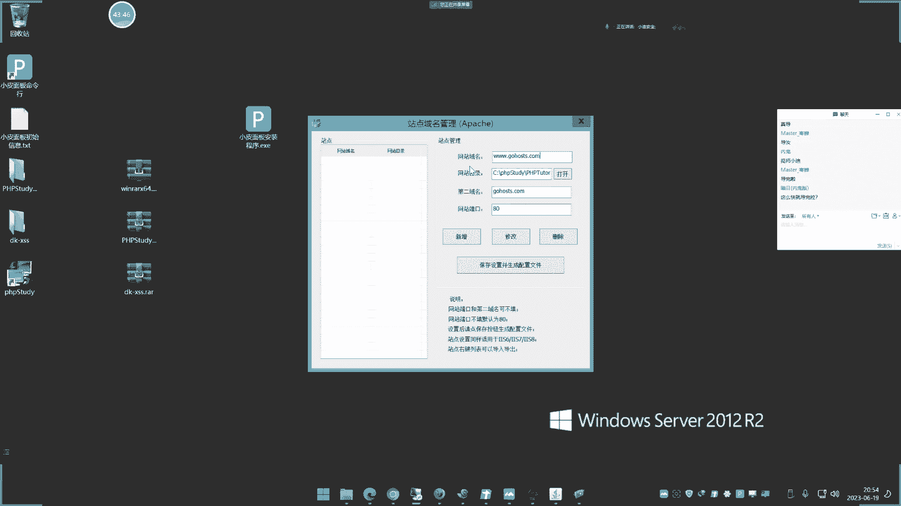

还要绑定这个域名访问的啊，因为你没有域名，所以就绑定IP访问。

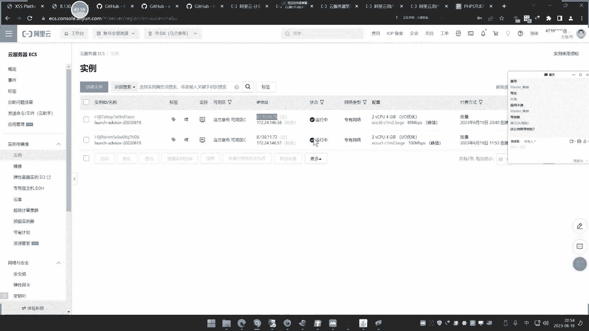

把路径指向下，就是你刚才放的那个网站目录，那就这里啊，绑你新增确定一下，这里好，OK保存访问好，等下重启之后，我们这里呢来访问一下。

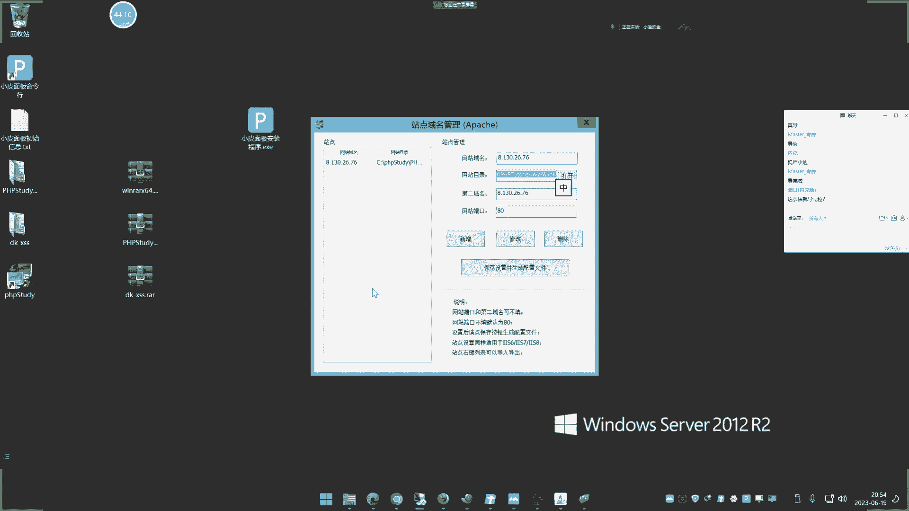

看是否能够打开了啊，看到没打开了，这是他代码名单，是一个手机界面的，就说手机那上面那个贷款啊，申请贷款那个地方，那么这里呢有个什么差异啊，他这里呢提供个账号密码。

你可以注册一个账号密码，我用他一个测试账号密码，那来给大家演示一下哈，然后呢他有个给了一个测试账密码，我们用这个测试账密码了。

给大家演示一下啊，就他这个画质是在哪里产生的啊，我给大家模拟一下啊，大登录到自己账号之后呢，这有个人中心，这是手机的一个界面啊，你不要说这个界面有点丑啊，这是手机端的手机上面那个申请贷款贷款，这里呢。

比如说你现在呢申请了这个，你的可提现金额对吧，多少钱，然后呢这里呢有个账号的一个什么，你的这个支付宝账号姓名是吧，然后呢他这里有个什么情况呢，我跟他说一下这个他的这个夸张产生在哪里，我们都知道啊。

如果说你申请提现的话，后台呢会有这个申请提现的那个显示，那么它就会显示哪些内容，我先给大家把后台打开给大家看一下啊，先打开后台给大家看一下啊，先把后台打开，后台是这个logo。

然后我给你剪一条毛logo啊，找密码是德特密，密码是多少来着，然后大家可以看一下啊，这个是盲打的，你看这里有个提前申请，提前申请，那就会有这个什么申请的用户和申请的金额，对不对，那申请用户我们想一想啊。

申请的用户前面名字和用户，那这个地方在这里要显示，如果说攻击是怎么攻击的呀，如果是黑盒中，你不知道的话，你就随便查，那我点一下这里，我把这地方改成什么，随便改个名字。

改好之后后面写上什么script的代码，是script代码写哪里呢，写跨平台的是吧，我解释这个啊，我等一下呢会给他演示新的平台使用，先用这个老的，就是说我把这个如果说你知道白河。

那你肯定是直接分析到漏洞了，如果说是黑盒，你就随便查，就是你要想到你修改这个地方，后台会不会显示你这个地方，这就是你查的那个地方的关键，比如说用户名，为什么我查这里，是因为我知道是吧。

这个用户名极有可能在灰暗列表，或者说一些这种有信息提示的地方，它会显示啊，我把这里面写了个来是吧，写到这个地方来，这是后台吧，我在那就把修改成单，需要成这个画注入代码是吧，写到这来。

因为我写这里呢就是我自己的这个账户名是吧，我申请的账户名我把修改成功，就下次修改我自己的账号名，然后呢我再申请提现，这样我就点击申请提现，直接提现啊，好它体现成功，然后这边后台呢好看一下啊。

我们模拟后台了，后台这边当他自自己怎么样点击提现申请，他看的时候，后台肯定是近期要看这个提现申请记录嘛，当他去看的时候诶，他就发现诶这个用户啊，他尝试过提现啊，这是他结算账号是吧。

写了他自己的结算账号嘛，我就写过结算账号嘛，我也就是说让你打到这账号诶，好看到了，然后我们这里呢看看跨省平台是不是收到了，看时间20。58分，对了对不对，打开一看，这有个session。

是有个这个cookie啊，然后呢，这是什么，这是个网站的什么地址，你看啊，现在我们来尝试访问这个网站，打开需要登录，对不对，看着啊，检查函数这里把内存这里啊。

这个进程包子里找到这地方来把它session改掉，改成我们接收到的，这个是，固定好，然后呢把地址改一下，改成我们登录后的那个地址，比如说就这个地址，去访问它。

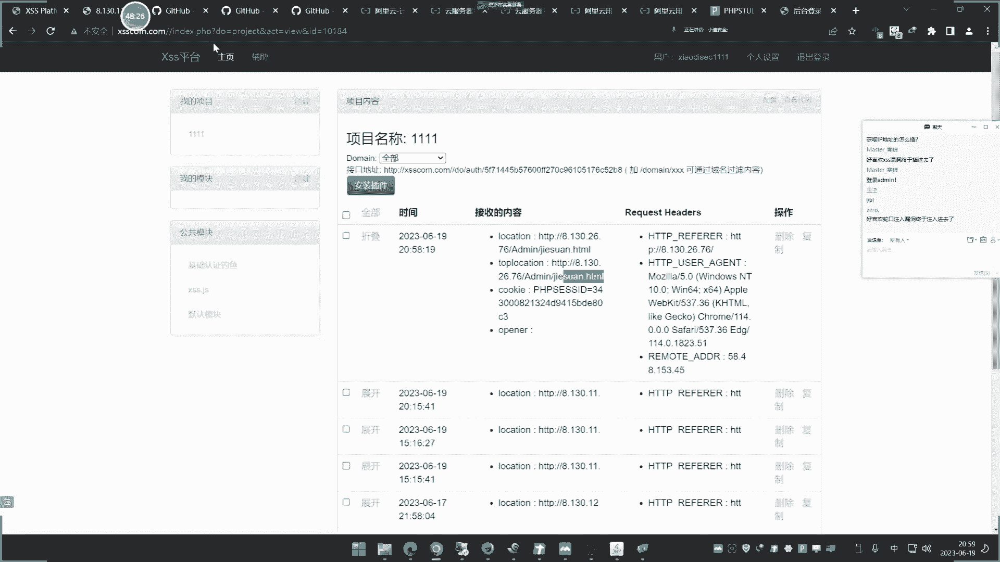

看着啊，刷新看到没，进入后台了。

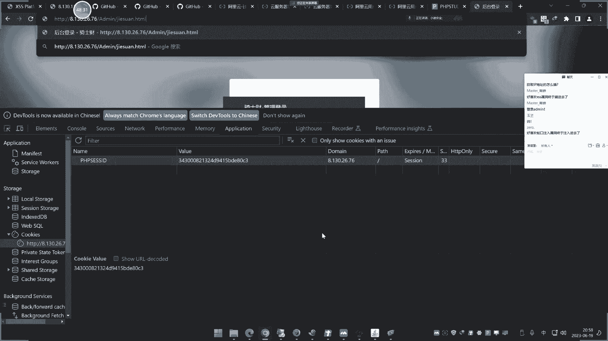

是吧，是这个原理吧，没问题吧，没有内鬼搞我怎么可能翻车呢，啊不要老想着说我翻车翻车，我不是说技术不好，不是说什么鬼没准备好，这都是内鬼，这该死的内鬼啊，妹，对不对，是吧，这个就是那个模拟的那个事情。

大家回顾一下，这个过程有几个点需要大家理解哪几个点，首先我为什么要改这个地方，改这个地方是为了改改什么东西啊，其实就是说概率的，你要这个事情体现，你要给对方一个这个你的名字和这种新密码。

对方的后台你要猜测，就说你在黑盒中，你要猜测你改的这个地方，首先对方会不会看，再说你改的地方会不会显示你提现的话，对方肯定要有显示你这个提现这个账户名吗，对不对，由于你这个申请用户，你这里改不了了。

是你注册的那个申请用户，对不对，你这里不能改改他的，就说除非注册的时候就把它改掉是吧，减少用户你可以二次修改，改成你的减少用户，这里插入个跨语句，你看啊，我们点击检查的时候，你看这里显示是不是。

就把刚才那个话语在这里优雅，你看它其实在这里已经显示，那个跨等于在这里了，对不对，只是说他后面没显示而已，对不对，所以说当他去看到这个信息的时候，哎其实这个语经被执行了，那个夸赞语经接收到了，对不对。

就这个意思啊，你要去猜测你修改这个地方，然后对方的后台第一个会不会看，他看的这个地方的，是不是会显示满足这几个条件，那就是你插入的原因，你不要问我说为什么要查这里。

因为你要知道这个东西它会不会在后台显示，就这么一个简单原因啊。

你要等着他去触发它，而刚好这个提现呢又是个非常重要的功能。

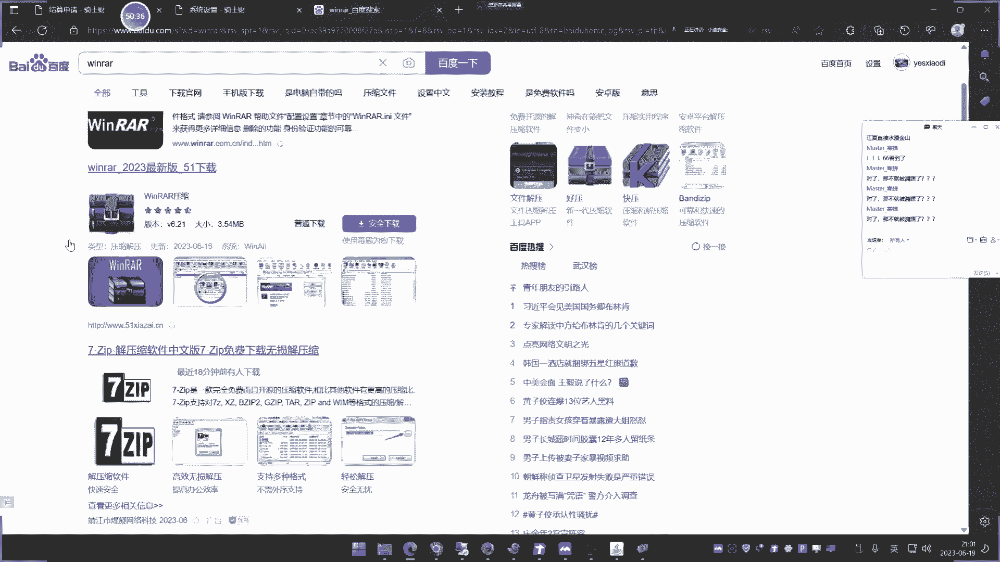

对方肯定脑回去看这个信息是吧，你如果说其他信息他可能不会看，但这个地方他肯定会看，他定期要去结算嘛。

好这个就是我们说的那个呃案例，那么现在我再来给他讲啊，你可能说这个案例是吧，是这个获取供应，还有一种案例就是配合钓鱼，什么叫钓鱼呢，大家思想一想啊，我就是模拟对方不懂的一个情况，我搞个钓鱼页面。

啥钓鱼面啊，我现在网上呢就是模拟一个那个，经常大家知道的。

就是那个flash的那个是最常用的一种钓鱼方式，还可以用其他方式，啥意思呢。

就这个有个项目，这个项目呢我要先看一下。

就这里呢请求这个地址。

这我已经打印好了啊，那就这个了，看上去呢就和那个官方的那个flash的那个更新了。

类似。

那这个是那个官方的是吧，那就这种是吧，那他就和他差不多保持一致，这个呢你可以自己再做出来，和他页面保持一致呢，这是以前的老板啊，后面可以自己做这个治愈怎么作，就是网页克隆。

这在我们讲到这个钓鱼篇章的时候会详细讲，今天呢只是说结合这个夸张，给大家利用一下这个钓鱼页面的克隆呢，我就先不讲，如果说大家有兴趣想学的话，你可以参考一下上期APT那个钓鱼篇章，我讲过网页克隆啊。

这个呢现在不是大家掌握的，因为我们重点的是只用夸张的结合钓鱼，这个页面呢，我们先不讲怎么制作啊，这个页面这个制作的方式呢，我直接在网上下了一套源码，然后怎么操作呢，就是说我去用这个夸赞对方呢。

去查看这个东西呢，弹窗就说操作的时候可能有些动画，或者说什么东西呢要加载这个flash，然后呢就让他去加载这个页面，所以呢点进去下载就会下载我的后门，而这个后门呢，我可以自己呢再制作一个捆绑的过程。

我给他先复述一遍啊，就这么一个过程呢，就首先呢你先准备一个钓鱼页面，把网址准备好，然后呢你可以申请个域名更加的逼真，还有呢将后门和正常文件的捆绑，并且呢实行免杀，我先把这个原理给它实现出来啊。

等下他再说这个细微操作啊，先给大家看一下啊，那比如说这是我第二页面，我怎么操作的啊，我找一个这个代码，这个代码是干嘛的啊，看一下来，首先这个代码是这样子操作的啊，先把它拿出来。

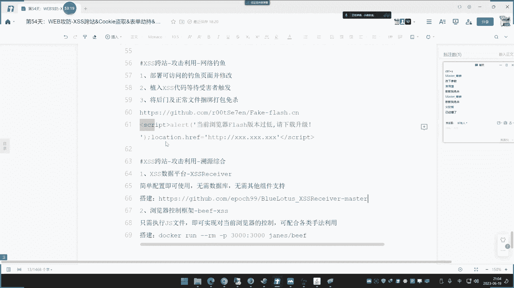

先弹窗，弹窗完之后跳转这个页面，跳成这个符来洗这个页面。

弹出的这个窗口的标题写上的是什么呀，现在是当前flash版本过低。

请下载升级，把这个JAVASCRIPT代码写进去，对方呢当他返回到特定页面的时候呢，触发这个地方，如果他有尝试去升级下载的话，那么下载的就是我们的后面，下一个就是我们后门啊，然后为了这个效果期间啊。

为了效果期间，我在这个网页上面不打进来吗。

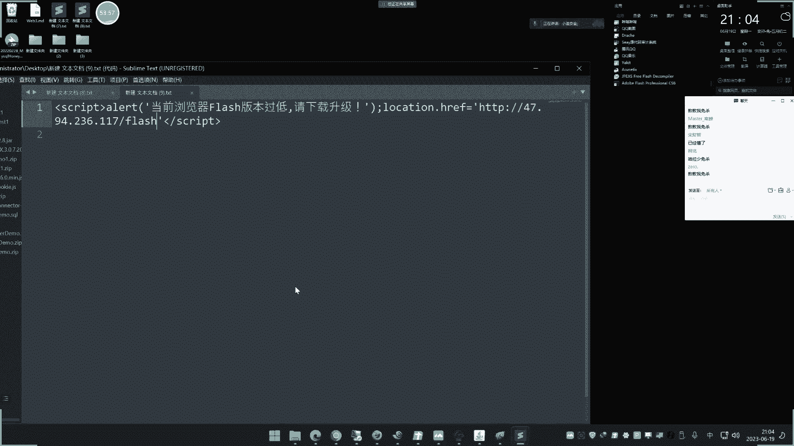

就是这里啊这个路径下面，那就这index啊。

然后点击立即下载的时候，他触发更改一下代码啊，他是触发的是访问BIU点com啊，我为了效果体验，我让他访问小李八点啊，放我自己的博客地址，对不对，等下呢就看这个啊，如果真实情况下的话。

这个就是个后门地址，就搞个es1，搞个E1，那ESC怎么制作。

等下我们再说啊，好这里呢搞好好，那这就把这个代码呢给了一幅字。

然后再模拟一下刚才那个操作啊。

我再申请一下体检啊，再申请下体检，哪个地方呢，好我们在这里呢修修改一下这个地方啊，把这个代码再改改成这个呢，这个代码点击立即取消好，修改成功好，我再来申请几件，好没有金额了。

那我要给他充点金额啊，啊你可以说是没金额怎么办呢，没金额你没的，你自己是吧，在重新注册个账号，我得那就模拟一下那个给他一个那个啊。

什么鬼情况，这，给点金坷他啊不给金坷，他不能提现的，我给你金哥，他那个数据库里面给他加点金额啊，数据库里面改一下就行，就那个用户那个金刚user表吧，应该是，好就这个用户的吧，哎现在金额为零是吧。

加里金的信用器好刷新一下，好应该可以了啊，那再点申请期限确定好可以了好，那么现在呢模拟那个工艺子啊，看啊当他去点这个升级体验的时候，第一个是会盗取cookie是吧，还有一个呢就是杠杆的弹窗。

我看下来看到没，他这边就有提示是吧，当前浏览器flash需要更新，对不对，然后你点一点确定哎，就来到这里来了是吧，当你再一点下载，那么由于我这里在树上跳转了小礼八点com。

所以他跳转小礼八点com，但我网址打不开嘛，那就尴尬了是吧，打不开，那不是我事情了，那里面的又被干了嘛，那没办法啊是吧。

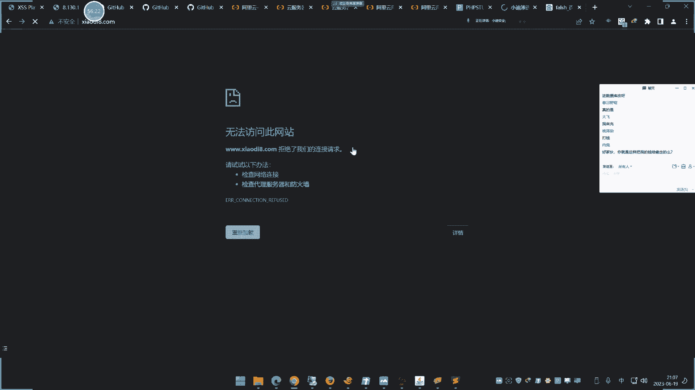

然后你把这个下载地址，那个210改改成个后门地址，那不就是一个后门的吗是吧，捆绑是吧，一个后门，那如何捆绑呢。

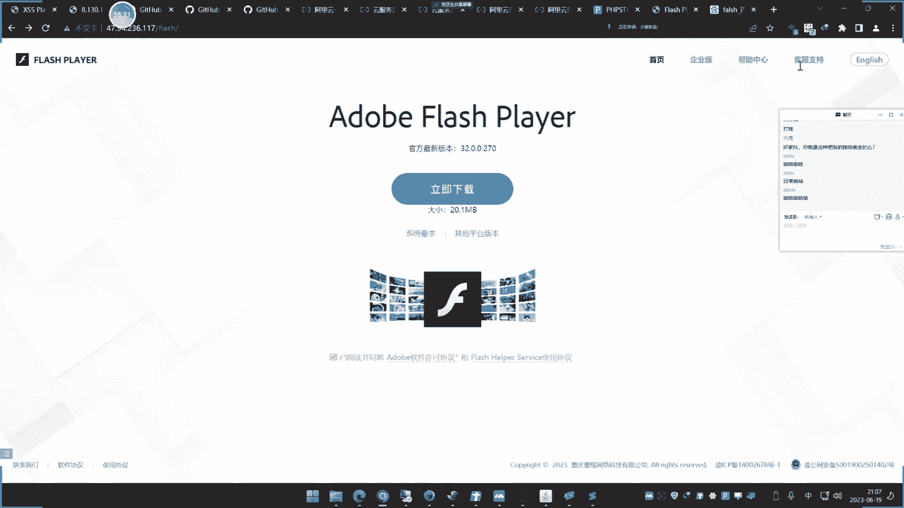

就是把一个后门呢，你先从官网上面去下一个正常文件，再把后门捆绑在一起。

它去下载之后运行之后，正常文件也能运行，后门也被运行了，然后我就上了线，就直接上线，就直接把后门执行了，但是确不确定啊，要搞个免杀噗，这就涉及到几个技术，一个是网页克隆，克隆一个模拟的真实网页。

再要把域名申请一个，和那个官网域名呢一致的是吧，然后呢再做一个免杀后门，但这个知识点呢已经涉及到后面的知识了，我如果讲的就已经体外了，你有兴趣的话，可以呢看一下上期的课程，上期哪几节课。

我给大家说一下啊，来。

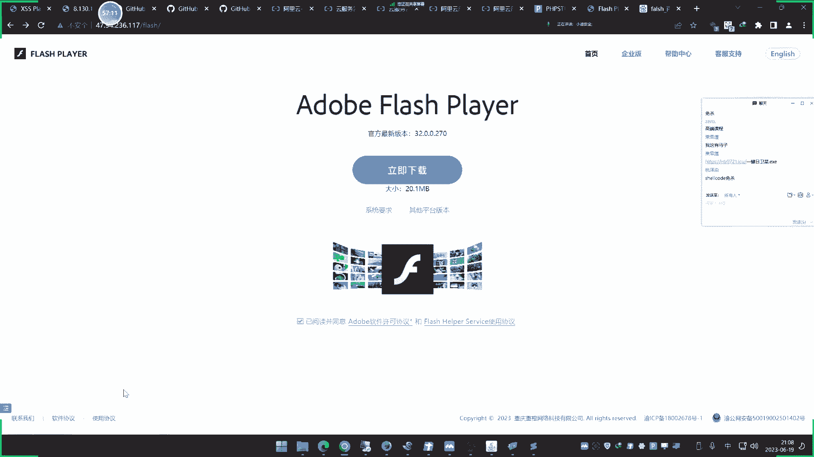

就是后面那个什么木马的啊，后面绑定的制作和这个网页克隆啊，你可以看一下上期的哪一个课程啊，我给大家说一下啊，上汽的这个刀了，这个呐就是在100。

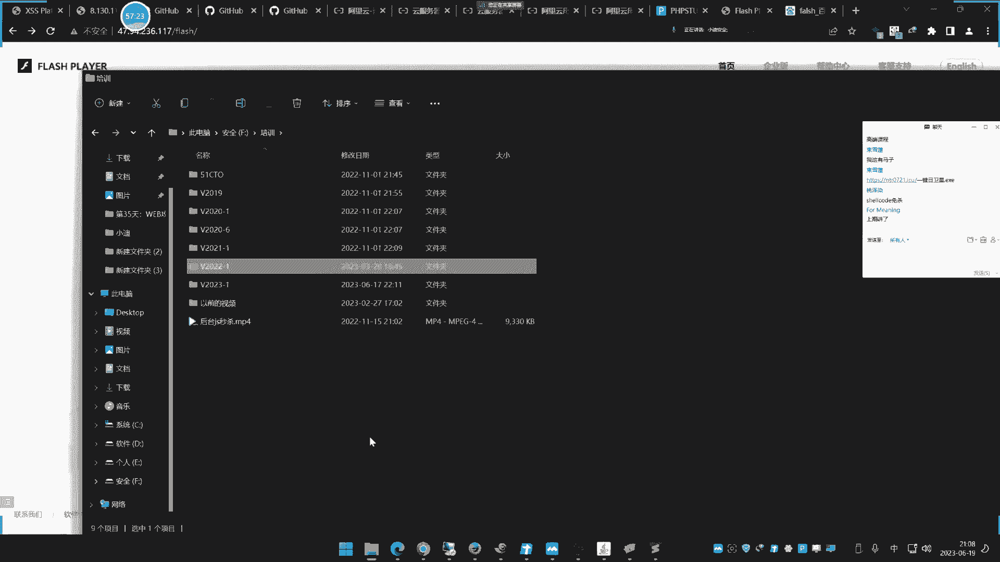

那就就这里啊，那152天，152天和这个，啊就是一一百五十二天啊，152天，这个和这个150，152天和154天，1254天是这个压缩包的那个捆绑啊，打包捆绑呢，然后152天。

就是那个网页克隆两个知识点啊，有兴趣的话可以看一下啊，我现在不浪费大家时间啊，因为这两个知识点那不是夸赞内容啊，是配合那个东西的一个利用，就是花针呢还可以配合这个钓鱼好，就是利用这个模拟一个调用页面啊。

以一种方式呢让你去下载一个文件，而这个文件就是我们典型的免杀后门，当你去运行的时候，那侦查文件它也会正常运行，同时后面也被正常运行来实现的，控制这台服务器，或者说控制这个电脑的一个目的啊。

这个呢就是利用他的这个钓鱼啊，好，那接下来呢我们基本上啊它的一些利用夹子呢，我们就展现出来了，我接下来呢就给他看一下它的一些后期利用。

就是利用这个工具项目两个，一个是这个XSS的平台，还有一个呢是一个浏览器的固定框架，这两个呢能够把这个夸张呢发挥的更好，然后我给大家用一下啊，我现场的就给他打结一下，别人是有说有不会搭建是吧。

都给你啊，搭建这个项目的用都给你搭建起来，这个呢这个搭建不需要数据库，只需要一个环节就可以了，非常方便啊，这个插入平台。

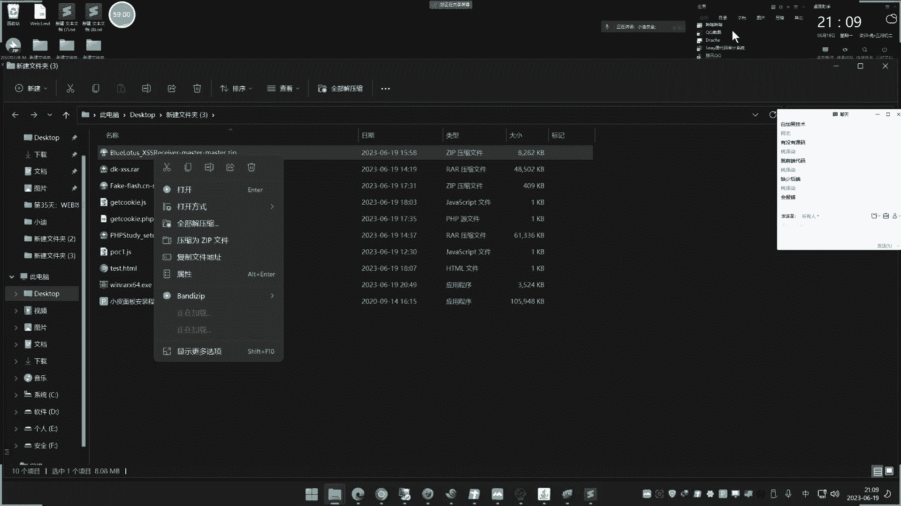

但是呢它的功能呢不是很多，可以具体使用一下，不用网上的平台啊，等下让我回来演示一下啊，来看一下啊，先把解压出来，好这里那就直接呢把那名字一改，改成就叫XS是吧，然后把这个源码呢给他复制。

然后呢来到网站目录，把它放到这里来啊啊，这里呢我们就重新再绑定一个域名，把一些81号端口，然后呢指向这个目录是吧，答卷啊，这个答案给大家说一下，这个不用改什么东西啊，来菜是绑你这个目录，拔掉端口。

点击新增，刚才是八零吧，这个是榜一好，点击保存好，那么现在呢在访问八一端口，就可以去访问那个夸张那个路径了啊。

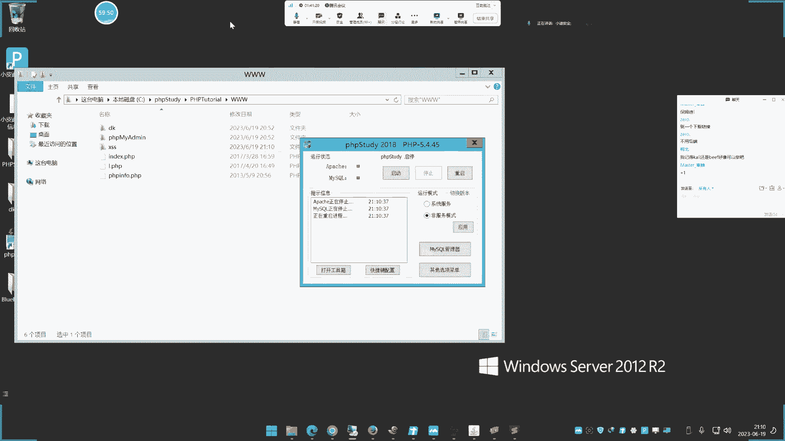

好我来演示一下啊，81号档口。

好那这里呢就直接点安装，然后再将后台密码，自己呢根据自己需要把它修改一下，修改成小B吧，你可能记不住，其他的就不用改，然后这里有个叫启用邮件通知，啥意思呢，就是你可以添加个接口啊。

当有这个呃夸赞中招的就会发邮件给你啊，这个根据自己需要啊，我这里那就不先不需要了啊，然后其他的默认就可以了，点击确定啊，就安装好了，什么都不用给我做了，什么都没做，然后输入刚才你设置的是密码密码哈。

进去它主要是使用啊。

这个就是一个轻量级的一个差赛平台，然后怎么使用它呢，也是非常简单的啊，怎么使用啊，比如说我要盗取他cookie，我盗取cookie怎么使用呢，网上是用别人的平台，那这里怎么使用呢。

首先啊你在这里呢点击我的这个JS，点击一个新建，添加了新建，然后名字就叫这个cookie test是吧，Cookie test，然后呢然后点击一个压缩模板，它这里面有几个模板，然后其中有个呢。

就是呢这个呢叫获取它的基本功能，点击插入，然后呢这里写上你的这个网址，这个网址写的什么网址呢，就是你这个打井平台的网址啊，就写这个就行了啊，把写上去就不用改其他的，把选中之后呢。

点击啊点击这个生成payload啊，他说先保存啊，先新增好修改啊，就这个了，新增好了啊，点击它生成好，这里有个这个JS文件了，然后呢它还支持这个这个文件那个编译，你看啊啊。

它自身编译就是如果说有些过滤的话呢，它可以支持这个编译来看到没，那这种变异写法呢是吧，这个好理解吧，好我们就先用圆形啊，把这个圆形搞，那么现在看一下啊，结束面板就会在这里，你看下等下有没有效果啊。

我还是用刚才那个测试啊，还是用它测试，再给他提交个金额。

还有数据库把提交金刚。

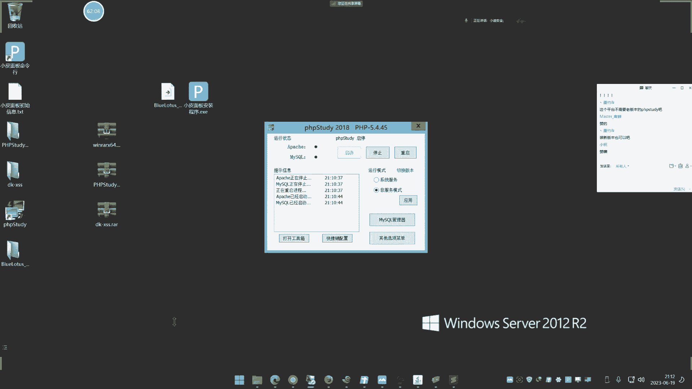

还给点金啊，你不给金额还不行了，妈的尴尬，金哥再给点啊，给他提点金啊，再把之前的那个删掉吧，那个订单那个删掉，唉算了算了，这个订单在哪里申请订单，应该是在这里吧，啊不不，这里，唉删他干了，我唉算了。

我还是删一下吧，好吧，等下有影响啊，就那个那个申请那个提，那应该应该在数据库里面提现哦，这这这好，刚才呢申请的是应该在在不在里面哦，在这里面啊，这是刚才那两条嘛是吧，把它删掉了，就刚才那个查找两条啊。

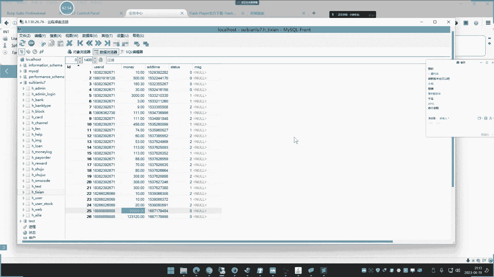

我重新来一个问一下哦，那现在呢我们连接重新来申请好，体验成功好。

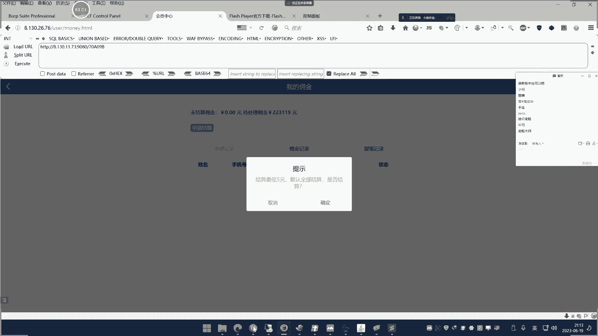

那么现在呢后台正面呢来模拟，来看那个操作界面啊，你看啊我现在这里呢上线这里啊，我看一下这个菜菜平台这里啊，现在是目前没有的啊，你看这控制表好像没有节省了无数据是吧，但是现在你看啊。

我们当这面呢去重新触发这个提交申请的时候，好敲响了，妈的，怎么还在里面，那个没删掉吗，怎么删掉，身上妈的什么鬼啊，哦我没改那个用户名，哦知道知道我要把用户名改掉，我说怎么回事呢，用户名没改啊。

就刚才那个还有个用户名啊，那用户名不是这个就是他的XS语句吗，没改，忘记了，就这里这里啊来所以他为什么提交这里啊，要这里改一下啊，改成刚才那个XS语，有这个语啊，改这个呢大概是我那个平台的语句。

那再再来升级一些，那你们有你买的，我这只要一一个地方没注意，就说翻车翻车。

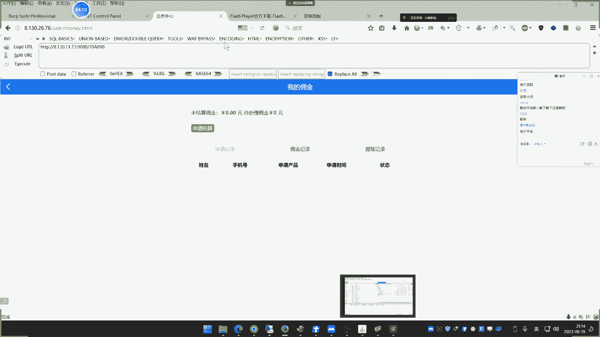

有些东西，这你说这里面的，我哪哪能有那么快的反应速度呢，我真是服了，你说这可不可怕，天天就只是就等着我翻车，好像我开车很我翻译车子很开心的样子，你是一个学生，我翻车不对你没好处哎，申请提现，好好看一下。

这边啊，你看啊，我点击申请提前记录，好点击啊，哎，陈情况怎么网络打不开啦，你不要搞我呀。

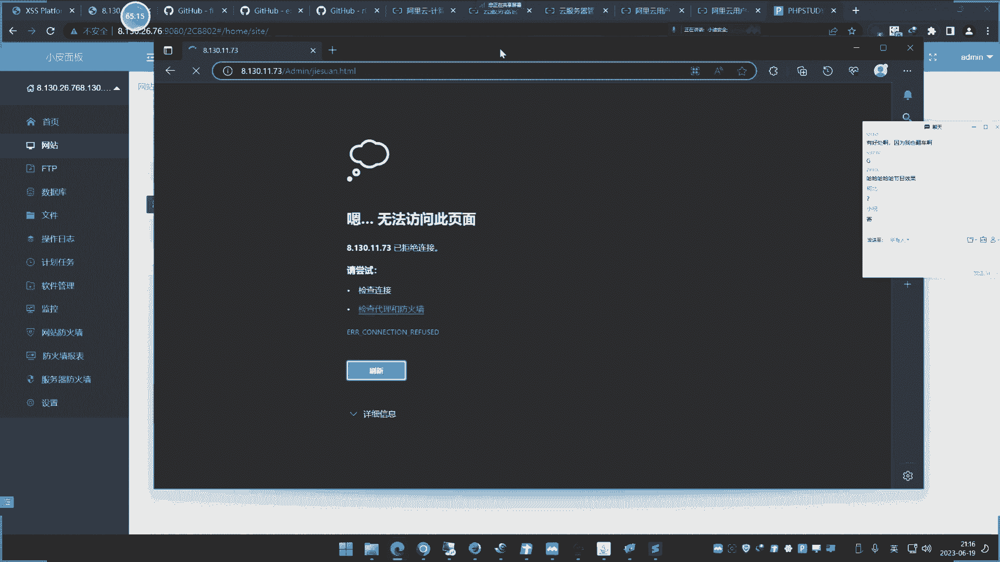

谁入侵进来啦。

不可能吧，这哪里又有问题啊，怎么打不开了，哦哦哦怎么是变成七三了呀。

哎等一下等一下等一下，犀牛哇，哎呀你这他妈的真人都要被你吓死啊，这真是把人都要吓死，我这是啥情况，好这个可以了啊，我看这个这边的一个情况，这边那个看平台的，你看大家有没有看到呢，收到一条信息。

大家看到这个标题都有了，然后点一下控制面板再练，哎消息呢，来看到没上线了，湖北市武汉市那有IP地址，有这个上线的这个信息，然后呢你可以点进去看来gt信息，他的cookie信息，cookie信息有了。

不用你再获取cookie了，他的请求信息是吧，然后其他信息来访问的端口，谁谁谁什么时间访问，这就和那类似，有点类似于什么钓鱼啊，说圆的那些事情差不多是吧的，上线了啊，还上线了，对不对，就这么个情况啊。

所以说你也不用做什么事情了啊，但这个是个很简易的啊，就不用网络平台这种东西，能获取到一些这种信息是吧，那还有一种就是更夸张的一些这个结合了，就是说和一些这种缩源激素有结合的啊，你可以那模拟类似的钓鱼。

还有一种就是我们说的这个BEFXSS平台，单个呢更夸张啊，得给给给你演示一下啊，这个更夸张，你看着哈，我先搭建这个答剪呢，我给大家把坑都踩完了啊，直接用一条命令就能答，建呢都搁这run港批三千三千。

加上这个地址登着就可以，如果man的话，就换一个DOTT加速圆，就是在阿里云上面，那个把那个多客特圆还一下啊，他直接运行。

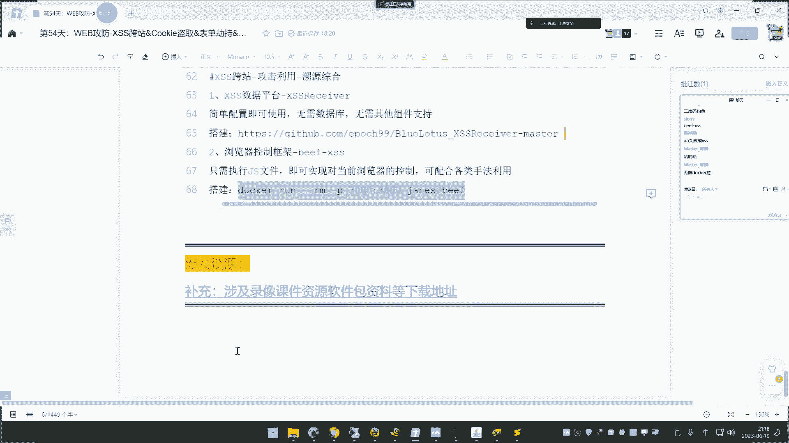

它会启动3000端口啊，然后呢我这里呢由于已经拉取镜像了，所以呢就直接访问就可以了。

然后大家看一下啊，3D窗口，然后他有个地址啊，地址呢就是这个地址后面加这个UI杠。

fail就是他的访问地址。

好这账号密码呢就是BFPF，好这里呢就是一个叫online probe，一个叫AOVERLAB，一个就是在线浏览器和一个私信浏览器，那这个是怎么决定的啊，你看看它有什么功能，它是一个浏览器工具框架。

也是建立夸张攻击的一种，啥意思呢，我们等下会说先把它功功能讲清楚了，我们再说它利用价值啊，比如说像现在我这里呢，如果有人呢去触发这个地址，哪个地址呢，就这里叫hook点JS文件。

这个hook js文件呢我们模拟一下啊，把它改一下啊，代码也改一下，SRC等于。

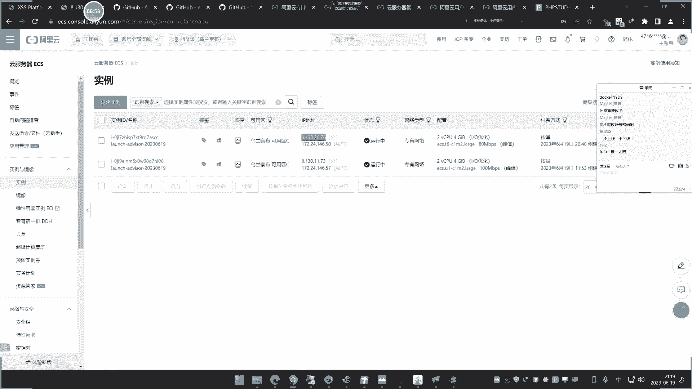

请求下HOKK点JS就加载这个hook js文件之后啊，好我们来模拟一下啊，还是用它来做这个演示，好还是用它来做演示啊，然后呢再给他搞个体现机会，再给他数据库修改一下啊，好你看一下啊。

这边这个工具工具又有什么作用啊，啊先讲啊，把金额再改一下，让他有这个体现的这个金额还行好，我们来模拟，这边再去申请一下体检。

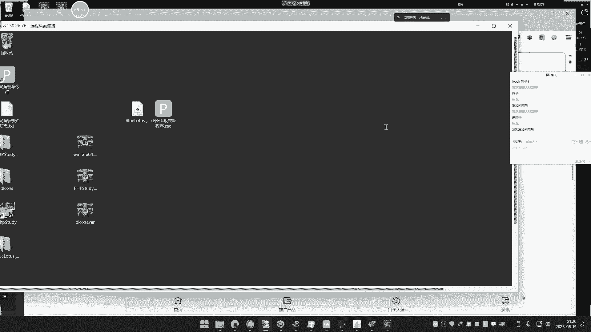

好申请提前之后啊。

我们再来关注一下啊，这边的一个上线情况，现在没有。

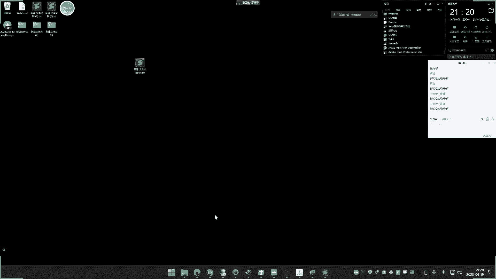

怎么回事啊。

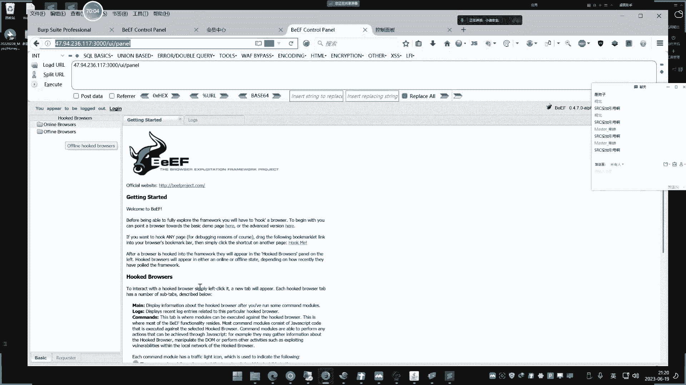

在搞我呀，账号密码是这个工具名字啊，就是DEF和BF。

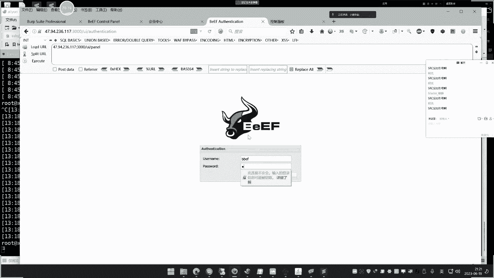

好那么现在呢我们就等着它啊，刚才不知道不知道怎么回事。

暂停了好，我们暂停，那就这个刚才那个申请体检机会已经申请了，然后这边呢再去刷新这个结算列表了，就会又重新触发那个hook js的，待我们去刷新，好，刷新之后我们关注一下，这边看这边啊。

这个在线浏览器这里会不会上上一个线啊，那看到没上线了，来58。48153。45，这就是我上线的浏览器来，这是那个我的浏览器的信息，那这里有哪些功能呢，我们具体一下，先讲一个最明显的功能叫做跳转功能。

什么叫跳转功能呢，让它的模拟器呢先得到cookie，先看一下呢，试着得到cookie，点一下确定啊，cookie得到了，然后呢，你看啊这里有个叫什么，跳转的一个什么类呢，叫这个请求路径是吧。

我让他调整一下，我让跳转的三角面积小的外点com，so看一下啊，空三浏览器我们可以关注一下啊，我的后台这边，我后面现在路径呢是在这个页面上面去，不然后进行调整执行，看下这个页面，哎咋没东西呢。

是搞错了呀，是不是这个下面功能了，是这个吧，好这个这个是重定向啊，搞错了啊，不好意思啊，不好意思，搞错了，重定向的啊，点击执行，看这边看到没，自动浏览器跳到小礼八点com，对吧。

然后呢你看啊这里还有很多其他功能，这里要传英文的，你这里呢还可以结合这个叫什么，它有个功能能实现，有些功能不能实现，具体看你那个XSS到当前浏览器里面，能不能执行，就看浏览器能不能加载一些东西。

你比如说像车站的，还有什么这个啊这个什么鬼，Host，就可以帮你去扫一下，当前这个来获取到互联网IP地址啊，包括一些其他的呢，他这个上面都有是吧，那个啊什么端口扫描啊，这些的是吧。

还有一些啊就可以获取一下端口扫描等等啊，但是这些能不能实现呢，就是要看你那个那个浏览器支不支持，这里面一些脚本运行了，因为我们知道啊，由于JS脚本的浏览器，它策略高的话，它是阻止运行的啊。

所以说大家要知道这个原因啊，他要你要知道这个原因不是说随便都可以啊，然后你看这里呢，还有一些类似的一些施工程工具，你比如说那个刚才那个FLA起的是吧，这个flash的钓鱼页面他该怎么操作呢。

就他这里呢找一张图片，你比如说我现在呢我就找一张图片啊，找那种类似图片，那比如说flash这个图片啊，找这种图片，不是图片链接，把E替换啊，这是图片连接是吧，然后呢这里呢给他提交个啥福来起。

更新的一个消息，点击一下确定，然后呢让他去下载这个染色文件，这个文件那就替换成你那个后门文件，点击下确定，我们看下这个页面，你看页面就出现了个出现了个这个显示图片，看到没有，只说这里显示不完整啊。

没一点，一般一点呢它就会触发这个软件下载地址了，就是在就是那个地址看到没来来是吧，你可以再给他看一下效果啊，你比如说我把图片都搞得明显一些吧，那个图片没没选好啊，我搞个，啊图片都没有一个。

嗯怎么打不开了，还网怎么打不开了，什么鬼，这啥情况。

哎怪不得这个图片不好看的，好搞个唉，还是那两毛图片唉，算了算了算了，哎呀这样你就我随便找个张图片好吧，我懒得说搞那些名，搞那些事情的啊，随便找张图片来模拟一下就行了，哎呀不累死，就搞这个百度图片。

你妹的我也不知道啥了啊，800图片替换啊，这里是那个下载地址，我然后直接跳到小礼拜吧，那你搞个下里巴地址行啊，你那这个自行下看下啊，你看这面呢它在这里啊，你看啊，我连接它自行看这边页面。

来下面的弹出这个图片，然后一点小标点com出来了就可以。

那就相当于说你在它上面的去控制它浏览器。

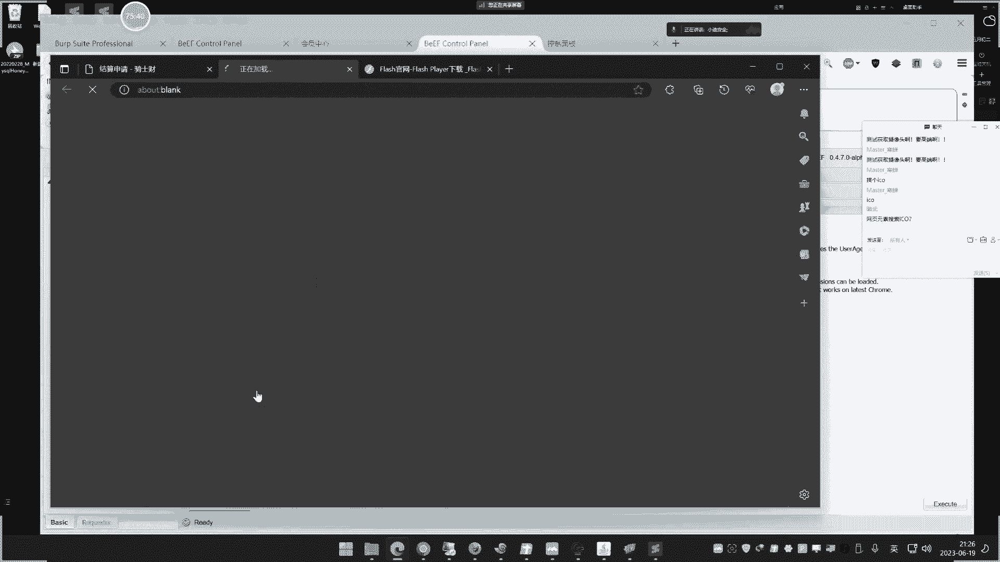

让他去做什么事情，这很多功能啊，刚才有人说什么这个什么摄像头那些啊，那不能啊，因为他那个东西呢是需要请求的，你有才有他有些东西他不支持，他执行之后没反应，不是说所有都有它大部分要敏感功能。

都需要那个条件，允许它可以结合一些其他类的一些这种测试，你包括这里呢不仅说可以做这个事情，XSS还可以进行钓鱼，这个浏览器框架呢不仅是XS利用，还可以进行钓鱼，什么意思呢，我举个很简单的例子，你看着啊。

我在我小。

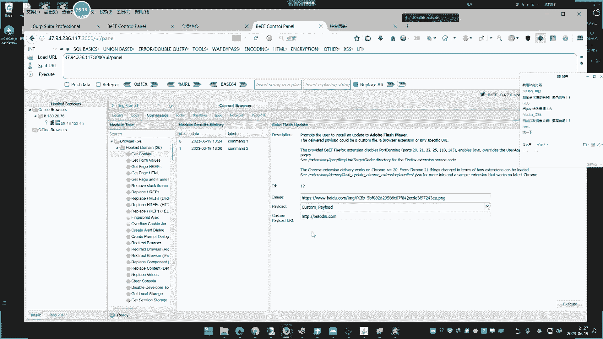

我不那很简单啊，你看啊，我可以在我的这个小零八点com，上面做个什么事情呢，就我知道大家不是喜欢访问我这个什么，小李八点卡诶，这他妈的我想了半密码，忘记了，我密码是多少来着。

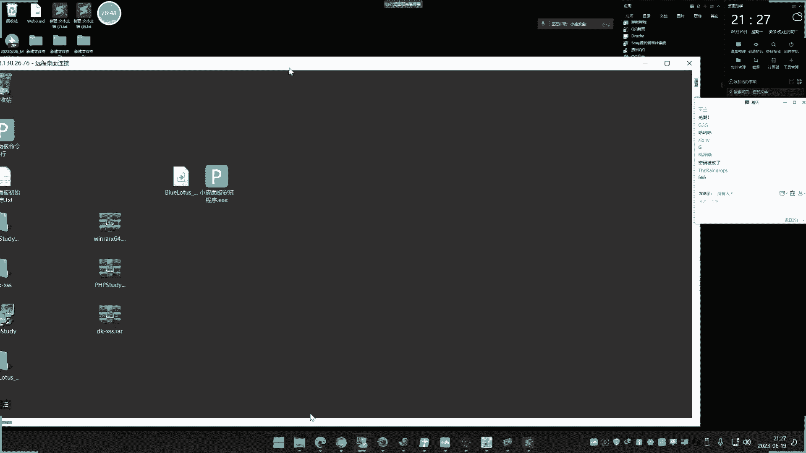

修改一下密码吧，好吧，修改一下密码，我的意思就是说你这个呢他不仅是在夸赞中。

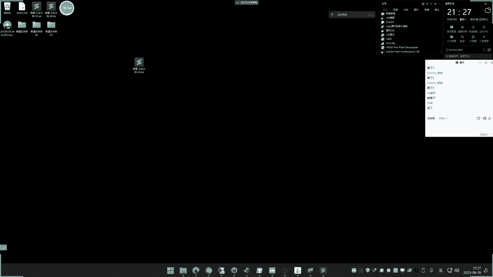

有利用他可以主动式钓鱼，来我给大家演示一下啊，那个香港服务器，我给他这个直接远程连接下，修改下密码吧，密码我都忘记了啊，天天没有看这个密码。

重启一下，把我小六八博客服务器把重启一下啊，然后什么意思啊，因为大家都知道啊。

它只需要触发这个代码，就能在浏览器上面进行显示。

那我可以做个什么事情呢，我知道有些人呢喜欢访问博客，我就在我博客的首页上面，那把这个代码写进去，就是说它可以成为一种XSS的利用，就是让对方的去触发它，然后呢劫持他的浏览器，它有两个工艺模块是吧。

一个是说个X平台，还有一个呢就是这种浏览器控制这个框架，这个地方控制框架呢除了这个利用之外呢，还可以用到很多思路上面去，就是我刚才说的啊，我大家知道大家喜欢访问小的白点com。

我就随便搞个那种可信任的网站，就说不是夸张，但是那你访问了，那我就可以做这个事情，啊大家呢大家可以配合一下是吧。

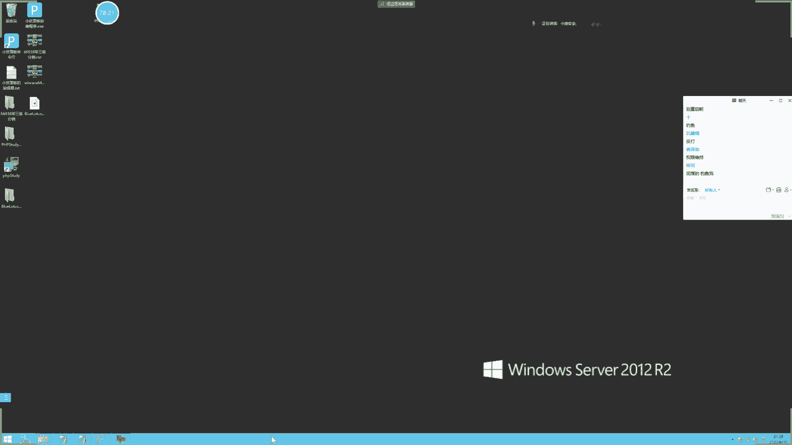

好我先在当时呢在我的首页上面呢给大家呢。

给大家呢做那个加上那个代码啊。

就我在那个博客的首页，就大家只要访问小日八点com就会上线，我这边呢就会接收到，大家可以试一下啊，看是不是这个情况，钱呢不用去访问，我先打开我的首页，这个是我那个首页哈。

我在我的首页上面呢插入一个代码是吧，做个钓鱼，插入什么代码来看看啊。

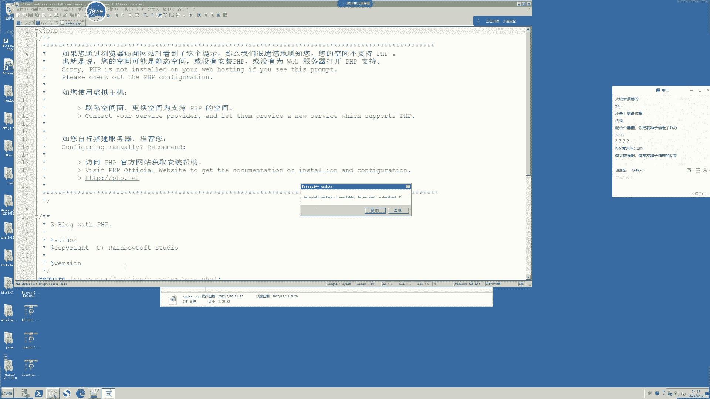

哎，那代码的就这个啊，我写到我的首页上面去，好复制好。

大家呢，现在呢强制性的去访问我的网站看一下啊，是不是我这边能接受的，大家看一下啊，访问下来访问一下小日本点com啊，那比如说现在我访问一下啊，记得刷新啊，不要搞缓存了，缓存的那个修改没词效。

好小点com啊是吧，一访问，对不对，你看啊，访问就不要动了啊，浏览器不用管了，两个边是不会上线，我先看一下我这边有没有加载那个JS啊，我看是不是这个有没有加载啊，先看一下有加载，说明那个成功了。

刷新一下看有没有加载，强制访问，刷新访问，哎怎么没加载啊，没加载了。

说明我改的地方有问题啊，稍等一下，我看是哪里改的有问题啊，我估计是要把这个代码写到这里来，INDUST啊，echo一下，我看一下啊，是不是这个原因，稍等一下啊，我先改好了，大家再访问啊，现在不访问好。

我再试一下啊，还是说是改的地方不对。

这个是我首页嘛，我估计到时说不定要改，要改那个地方的文件。

强制刷新，好应该是改错的地方啊，这个地方所有文件它不加载。

它不加载，所以这里300行啊，改哪个地方，好改哪里啊，应该是改他这个这里有个首页模板里面啊，应该是模板里面，改模板里面一个文件是哪个模板呢，是这个模板里面的这个这个模板里面的test，应该是这个吧。

这个算模板啊，然后前端页面是在，哎呀这一下载我搞得烦得很呢，看一下啊，稍等一下，应该是改错地方啊，模板我用的是他，他因为他那个首页呢不是指向这个，不是指向的那个呃这个index的啊。

他那个指向的是那个模板里面那个东西，模板，是这个，然后，我看一下啊，这里录音，这个50首页啊，哎呀是在哪里啊，这我搞忘记了，首页那个前端页面跑哪去了，稍等一下啊。

我看搜一下这个在blog的前端页面那个路径，因为我那个源码呢它是一个模板，那个首页是要在那个模板里面放，我搜关键字其实也能搜出来TMPR模板里面，这blog对应的flag，在搞什么东西的，这个不是首页。

首页是应该是在这个目录下面啊，这服务器太垃圾了，怎么这么卡呀，这个是我那个模板，在这个里面应该是哪个目录下面，对不对呀，这你妹的跑哪里去了，这首页文件，我忘记在哪里啊，稍等一下啊，不要急，服务器也卡。

我找一下就能找到啊，我搜一下关键字啊，那个default那个关键字搜一下啊，在这里，先搜index的啊，搜一下，啊这个不是啊，说起来关键词新的时候界面对就这个名字啊。

这个这个名字对他这个首页是这个名字的，一格都没有啊，呃真是尴尬了，我知道新建我还不是说想要这个结果，把他搞得跟没关系吗，我都忘记在哪个地方去哪了，所有文件以前老修改的，现在都不知道放哪哪里去了啊。

印象中是这个模板里面，还有一个应该是一个缓存，应该是生成的缓存技术啊，难道是缓存技术完成技术的一个实现，不是以前那种技术实现啦，应该我直接修改那个地方吧，那个接，是不是这个文件这个文件不香，行吧。

那我就直接在这个创建一个吧，不浪费时间了啊，在我再找找找找找，找半天也找不到哪里去了，妈的真是尴尬，我找了个手部文件也可以，Industri，那还有个头部嘛，头部这里有代码，你看这个代码在这里啊。

那行吧，那在这里写啊，应该没什么问题啊，这个头部文件应该也会加载，然后这个手部文件应该也在这里下载啊，在这里写应该也没问题，好我再给他写一个那个pp语法啊，因为这个pp文件写个pp语法。

看看他会不会自信啊，把刚才那个代码给他拿出来哎，补一下输出要输出，然后是刚才那个代码呢。

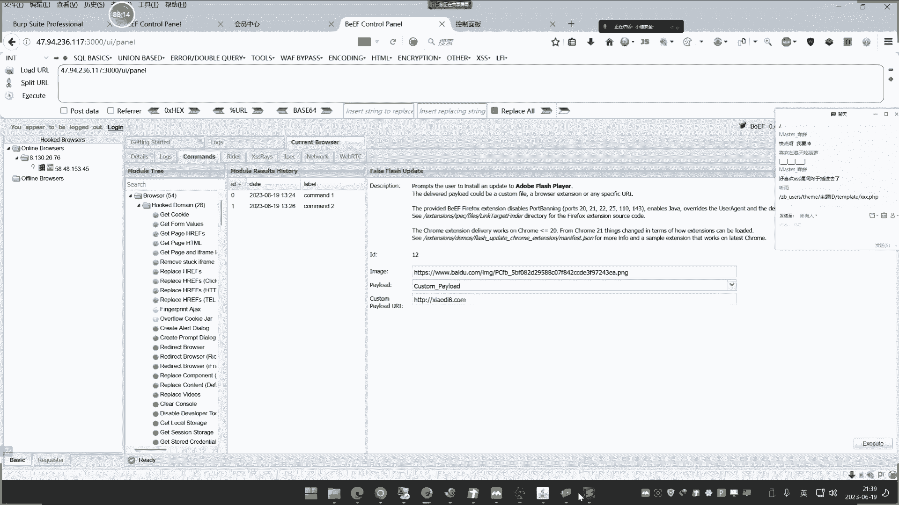

好就这个啊，对吧。

然后我为了确保起见，我输出个123好吧，看看是不是会有123显示啊，页面中好，来看一下，刷新首页看会不会有这个显示啊，这个改了看能不能有。

这里面都改了，跟没改一样。

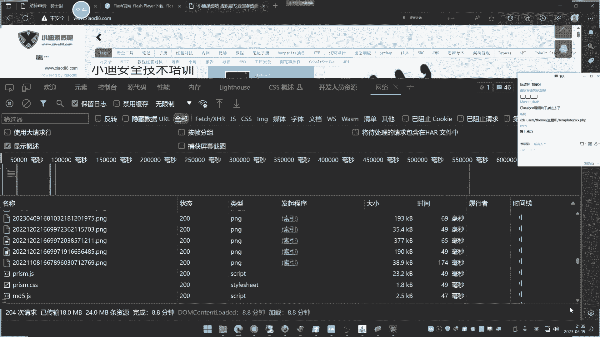

改头部吧，妈的，不改这个了哈，改这个头部的这个骨，头部和尾部，因为头部尾部都是加载的，改这个地方这个地方好好看一些呢，咨询电话哎，等一下，哎呀我是不是改错模板了，哦应该是在这里了啊，改错模板，的。

改错误模板，这个是那个模板，我用的是这个模板，改错模板，刚才没成功，是这个原因啊。

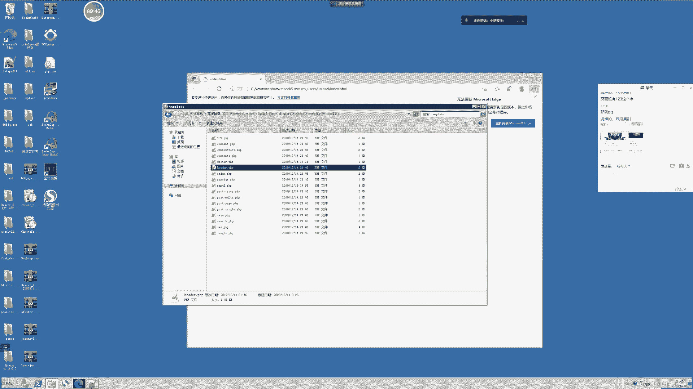

注意到加刷新下。

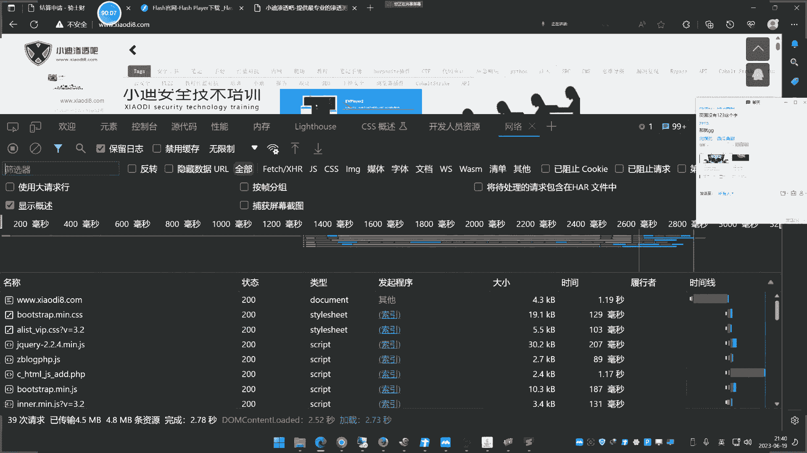

最后改变啊，再不行，我就先暂时把它放一放一下了啊，我只用那个东西大概模拟下就行，哎呀这算了算了算了，懒得搞了，难搞了。

我直接用代码把它写到那个进新建个文件搞吧，不知道搞哪里。

好这里呢大家可以访问一下这个地址啊，我等一下把它搞完了，我再给你改，我绝逼把它改出来，你不要什么拉不拉，我就不信这个邪，大概访问一下这个地址。

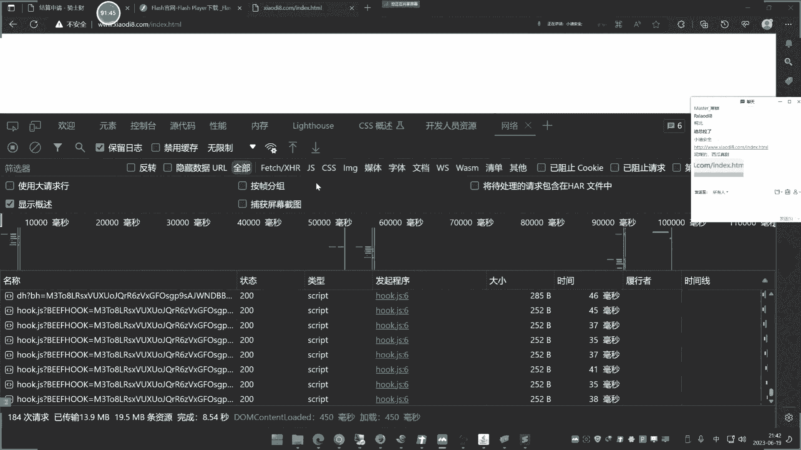

发地址，我看这边是不是有上限的意思，就是说我可以自己呢去固定这个访问是吧，有些人呢喜欢访问博客或者上面的植物，这个东西是吧，这是啥情况啊，这，这谁还喜欢登我这个东西啊，你看他这上仙的呢。

我不知道这个是谁是吧，那这都是你们上仙的，在这上线的啦，来你看一下啊，我们这里呢给大家看一下啊，那谁包个IP地址测试一下来，你不用去访问了啊，我给你挑挑一下，你看能不能成功就完事了，那这个117的啊。

我不知道是谁的啊，哎这个幺七的我们都测试一下啊，你们自己那个调整，到时候自己看啊，我敲了哈哈哈，117的143的还是你啊，那我搞两三个啊，我也不测试了啊，你们这个上面我不一个一个的，看来这妈太麻麻烦了。

你打不开，那就另说了啊，好行，那这个拆到这里我不拆了啊，这个还有几个这几个IP地址的，要自己看效果，你自己下去再弄了吧，啊我们不知道的，我把那个刚才那个东西就不讲了啊，时间关系就不说了。

我就说他这个东西呢是可以获取到一些信息的，啊是吧，除了你这个本身之外的一些这种信息，IP地址啊，这种东西啊，你包括IP地址，那还可以继续再说原来搞这些事情啊，对不对，然后至于他能不能行那些东西。

那我们就不说了啊，好这个就是我们说那个XSS平台那个利用啊，就说你可以呢修改你的首页，把这个东西呢一改，别人访问你的网站呢，就会浏览器呢在这里上线啊，所以说呢他可以成为一个主动式的一个攻击。

就说不仅说网站夸赞里面呢使用这个控制啊，还可以他实现这个主公式的啊，这个呢就是题外话了。

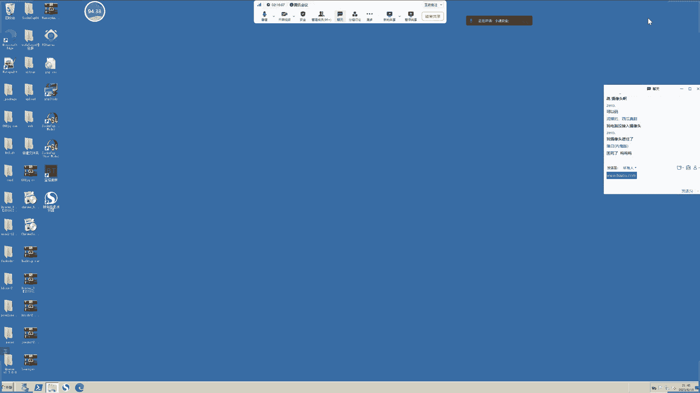

那么这两个工具呢就是XSS啊。

这两个平台一个平台让接收，还有一个呢就是我们说浏览器的攻击框架，但他有个有个缺点，缺点就是说如果浏览器关闭了，那就不好意思，那就掉了，所以他有浏览器在线才行，知道吧，这个呢有缺一有差点的啊。

好其他支点呢倒没有什么了啊啊，今天内容就上这么多了啊啊这个源码修改，说实话呀我是能够把它搞出来的啊，哎呀一直催催催催的，我自己呢也投入也比大，因为以前我经常做这个事情的一个修改。

哪有什么修改不出来的事情呢，对不要相信我啊，怎么修改不出来呢，你老说些什么鬼话嘞，我自己天天这个网站。

自己网站还不清楚啊。

好大家看有没有问题啊，今天内容就讲完了啊，有问题就问啊，我们下节课呢还要讲讲这个鬼什么呀，还要加那个。

哎还有讲XSS1些logo和一些防护，就下一个内容啊，就是说我们都知道啊，这个插进去之后呢。

并不代表就完了啊，他这个里面那些防护啊，那些东西呢都要改都要改啊，啧。

自己乱修改修改，把你们网站都打不开了，这你妈的真是尴尬了。

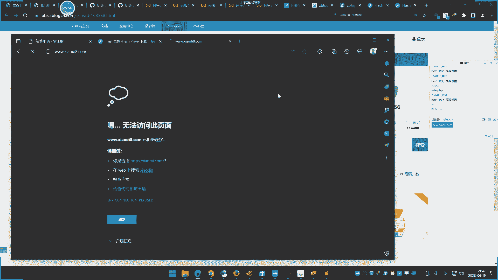

不好修改啊，修改修改他们自己都打不开了。

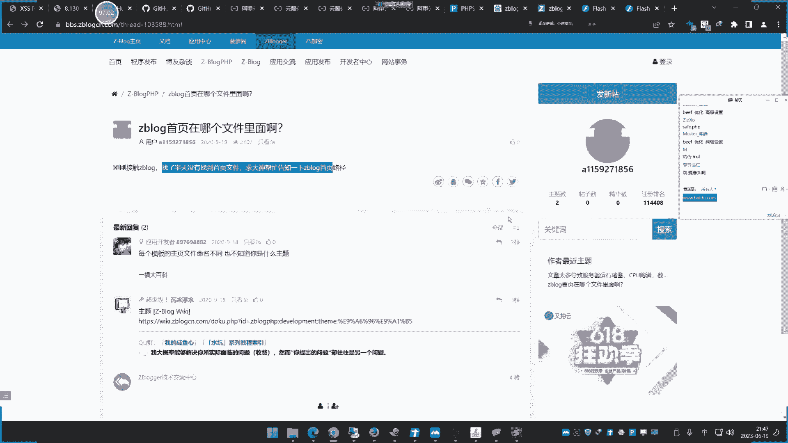

大家有问题问啊。

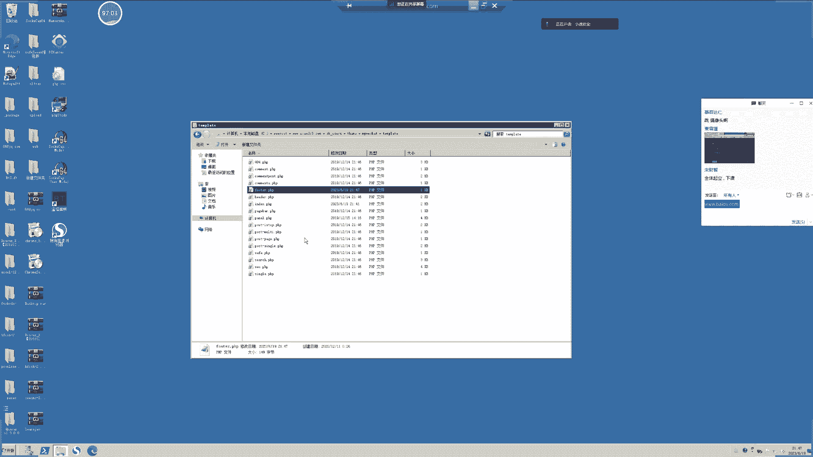

赶紧有问题问，没问题，我就瞎了啊。