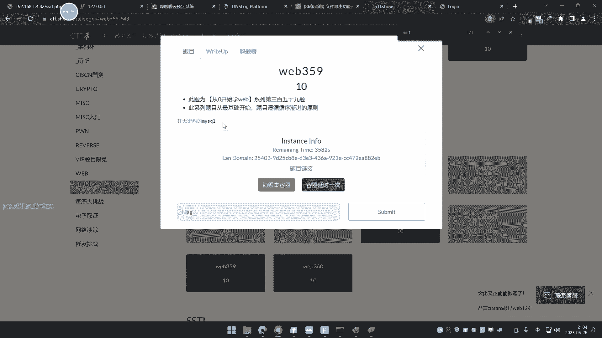

# 【小迪安全】V2024版 全栈网络安全 ｜ 攻防渗透工程师 （持续更新） - P57：第57天：SSRF服务端请求&Gopher伪协议&无回显利用&黑白盒挖掘&业务功能点 - 逆风微笑的代码狗 - BV1Mx4y1q7Ny

好我们来看今天的内容啊，今天呢是讲这个新的一个漏洞啊，讲一下这个SSRF啊，啊上节课那说的是那个CSRF对吧，那今天呢是一个SSRF，大家也不用看了，这两个呢从这个名词上面看的话，就一个是C，一个是S。

那么C呢在英文单词里面就是克里特，是这个S呢就是server，那么简单来说就是一个客户端，一个服务端的意思，所以呀在CSR服呢称之为叫客户端请求伪造，然后这个SSS5呢称之为叫服务端请求伪造。

从这个名词的叫法上面呢，大家应该能够明确到这个漏洞的一个，相关的情况啊，我们呢给大家说一下，它叫SSF，简称为solar site request是吧，然后这个后面那个for gary吧。

服务器请求伪造啊，这个是个什么东西呢，他说是一个这个攻击者呀，通过构造形成对服务端的一个发送请求，这个安全漏洞，哎这个什么意思呢，哈嘶这个网上这种说法呢，说白了啊听的话能够听个大概。

但是呢你要把这个案例给他拉出来之后呢，这样子就理解他了，他说一般情况下面sf攻击呢就是从外部啊，来访问这个内部的一个系统，形成了最大的一个漏洞，原因呢就是服务器的提供了，从其他服务器应用数据的功能。

但是呢你又没有对这个目标的人的，做过滤和限制，从而产生了这个SSR啥意思啊，这是个啥意思，来我这里呢可以在网上呢去给他看一下啊，比如说我们这里呢，就拿这个一个简单功能来去讲它啊。

你像这个是百度图片的一个那个地址，然后这边呢有个这个呢叫按图片搜索是吧，这里呢请输入粘贴图片地址，那啥意思呢，就是说你可以把这个图片你写进去呢，然后呢他去远程去访问这个图片呢，来形成一个识别。

那么也就是说在这个过程中呢，他有去对你这个输入这个网址呢，地址呢进行请求，那么大家试想一下这个网址按照正常来讲，我们就输入一个正常网址，但是如果你想一下，他如果像这样输呢，那就是输入个AHP是啊。

输一个网址，然后加上一个这个1270001，这种地址呢大家都知道，这个12700应该是代表的是我本地地址，那么我输上去，服务器呢对这个对这个地址进行访问，那么他去访问12701，就是访问他自己。

那么这又是一个典型的sr sf攻击，一个漏洞产生的原因，就是说有些功能它会去访问你指定的一些资源，而这个指定资源一旦编成一些内网的地址，或者说本地地址的话，那么服务器就会向他自己的自身的本地。

或他自己的内网那去进行探针，就形成了这个SS法攻击，这个又是S5攻击的一个典型例子。

所以说为什么这个工具上面说的很清楚，说是由外网去访问内网的一个攻击过程，就内网呢就包括你本机一样的道理，很好理解啊，我们通过一个小的本地的demo呢，去给他由此展开啊，那我们来本地这个demo案例。

比如说就像这个啊，这个它是一个什么案例呢，就是一个远程图片加载器的一个东西，请输入图片地址啊。

然后呢他就会读取这个染成了一张图片地址，这么个意思啊。

比如说这里呢我们找个这个图片地址，随便找个R就图片例子啊，来直接放上去。

点提交，啊这个图片地址这样子的啊啊啊不行，写了那个图片地址暂存地址。

啊这是我们的图片地址啊，我让他那去在本地一个多么低压呢，一访问他就能请求到这个代码呢，就是那个图片那个本身那个这显示代码啊，好这个呢就是什么功能，那么就说你输入这个地址呢，它就会请求这个软件地址。

那么你试想一下，如果这个地址呢改成，像我们说本地的这种127001打开访问，哎，这里能变成这个东西，那这个东西是啥东西呢呢，我们看看本地的这个访问200是什么东西，是这么个东西，那么他请求这个东西是吧。

然后你看啊，如果说我访问什么，192。168。1。10点8号来访问一下诶，他访问这个地方，这个是什么地方，他请求十个内容啊，那看一下，是不是就是个模拟2020看，那同样道理呢，我再访问呢本地的127。

0。013306，313306端口嘛，你访问来5。7。26，什么MYSQL这些东西，还有其他协议DICT33061包来购，那那这个306是什么呀，5。7。26又代表什么意思啊，因为我本地环境呢。

MYSQL是5。7。26，看到没，3300端口是这个买SQL的，同理的意思呢，这里呢都是这么个概念，大家知道这个SS5究竟是啥了啊，这个先了解他是啥，我们再说他怎么玩，先说这个是啥。

这个4SR五一个概念呢，大概就是这么个情况，能不能理解啊，这个能理解之后呢，我们再说它会产生在哪里，然后呢他该怎么玩，这就是接下来的事情，这个好不好理解，这个nsr of f，它叫服务端请求伪造。

为什么叫服务端请求伪造，CSR服务叫客户端请求伪造呢，因为cs阿福呢是让受害者呢，他的自己的那个操作呢去请求，就是他自己的电脑上面去请求违规的数据包，电脑上面登录了管理员，它相当于是客户端。

而这个呢是让服务器自己去请求，所以它叫服务端请求伪造，称之为是SSRF，先从概念上去理解为什么是一个是CSF，一个是SSR，原，就是因为你那个CSF的攻击的是别人登录的，一些这种平局的后台网站，然后呢。

他去在不经意之间来访问到你的出发网页，从而使他的浏览器的加载那个授权数据包，来形成了一种攻击，叫做CSRF，但是现在这个SSRF呢是攻击的，是你本身这个人呢，还是攻击的是服务器呢，他攻击的是服务器。

就是服务器的本身，代码呢会针对你这个地址呢，做代码的一个远程加载，当你输出127001的时候，那么就是服务器自己呢在请求他自己的本地，如果这个地址呢一旦改成内网地址，他就会用服务器的访问他内网地址。

一样的一个道理，这样一说，其实很多人都一下子就能理解，但是有些人就不知道我在说什么东西啊，我就问一下大家，我刚才说的，你是不知道我在说啥，还是说你已经理解了啊，理解之后呢，我们就好好讲下面的了啊。

意思理解是吧，二是不不能理解哈，不知道不能理解，什么还还有人说什么鬼啊，改头不啊，哎呀你就说能不能理解就完了，他妈的什么鱼啊，什么牛啊，什么啊，这什么鬼东西啊，还改什么fade是啥意思啊，哎呀。

略懂不要说年懂理解就理解，不理解不理解，那个别懂是什么鬼呀，其实这个说实话啊，你要把它讲的理解的话，要看代码，有些人呢老忽略这个代码的作用。

不用看了代码，我们就不看了，看代码之后越发不懂了，更更说的明明确一些了啊，那看着啊，我们先把这个功能呢，那我现在就拿那个那个功能讲，这个功能呢我们看上去呢说实话不像是这个，这不像很正常的。

我们就拿这种白骨无边这个来讲啊。

还好理解的事情啊，你自己想的太复杂了，那大家想想啊，按他这些功能，这里说请输入或粘贴图片地址好，大家试想一想啊，我现在呢，你们这听不懂的啊，认真听，这是很基础的东西，你都还能理解。

理解不上来啊，这以后这很多东西都要好好学的啊，不是好简单的事情，那我输这个地址给他上去，我百度一下好，你看他是不是把我这个图标给他识别到了，那我把粘贴地址写进去之后呢，这是我那个图片图片地址嘛。

图片地址呢点击视图，他就把这个图标给他显示了，然后呢匹配这个相关的这个图标给我看，是这个意思吧，好好大家看到了啊，这是个功能是吧，我先把功能呢给大家演示了，大家思考一下好，那么现在啊我把地址写上去之后。

我们先思考一个问题啊，他既然得到了这张图片的地址，也就是说他请求过，那么这个请求你觉得是你自己的浏览器，你自己去请求这个地址，还是这个网站它的功能代码去请求的，你先把这个问题先搞清楚。

是哪个是网站自己代码去请求的，就是在服务器自身去请求的，还是我自己啊，我去访问啊，我点十岁以下是我自己去请求这个地址，你们说是服务器对不对，那既然是服务器好，大家试想一下，这是个两层地址是吧。

我把这个地址，如果说我写个1270011270，大家都知道，就相当于是本机的一个意思，就说我如果写亚西尼，我给我自己电脑的话，我说我敲个一夜西尼，他也知道是我本地本地地址的意思，对不对，那么同样道理。

我在这里写个12700111上去，我再点视图下，他会认为那服务器去寻求这个地址，他会请求谁啊，是自己在请求自己啊，是自己在请求自己吧，对不对，是自己在请求自己吧，那么大家试想一下。

假如说这个127001本地的，刚好有个网站呢，那不就是请求这个网站了吗，这就是一个典型的一个信息收集啊，你加个端口八零就是判断这个端口存不存在，在8080存不存在，就是说他只是说看这个数据有没有回。

写出来是吧，你比如说我请求给8。8里对吧，他如果说有回血，他可能请求这个8080上面的数据出来，就像我的功能一样是吧，我请求1170哎，他这里有数据回一些没有回血，那是另外一句话，没有回血。

就说没有显示的意思，你不知道请没请求，但有回血，那就只能看到，我们先不管这个有没有回血的意思，就我写上去之后，他就会请求这个东西有回旋，我就知道这个东西有没有是吧，没有回旋，就说是个错误，它就没有嘛。

就这个意思嘛，那么这个过程就是一个典型符合SSRF的，一个漏洞的一个原理，为什么，先看原因，刚才大家问的答答了，服务器请求s server，昨天的CSRF是服务器在请求吗，和服务器没关系吧。

你攻击的是受害者，受害者是人，他是客户端，所以称之为CSF，这个是让服务器去解析已提交的数据，服务端请求，服务器请求伪造SSRF，这还不明白吗，再听不懂我就没办法了啊。

好这个是搞清楚了SISRF的这个东西了，那么现在呢我们就来思考一个问题啊，思考它的哪个问题呢，哪里搞清楚了啊，再来说他的挖掘，就是说他这个漏洞会产生在哪些地方，我们从两个角度讲，一个是黑河，一个是白河。

先来说黑盒的角度，黑盒的角度大家思考一下，这写了十几个，这是网上抄下来的啊，他说什么分享功能，转码功能，翻译功能，什么图片加载下载功能，图片收藏功能，说说什么采集功能，数据库。

类似功能的邮件系统编码等等，好我们大家看一下它这些功能都有个特点，什么特点呢，分享也好，转码也好，翻译也好，都是有数据的一个接收，并且对这个数据呢做了一定的这个，功能性的操作。

你分享嘛他肯定是要分享一个地址，肯定是有网站地址，那么这个转码呢也是一样道理呃，肯定有这个内容是吧，然后这个翻译呢也可以给指定网页去翻译，图片加载和下载，那就不跟不说了，我们刚才那本地案例呢。

就是一个图远程图片的加载，这个操作对不对，这些功能都有个特点，就是会涉及到一些加载过程，就是那是要对你这个数据的进行处理，怎么处理呢，就是像刚才说的翻译呀，或者什么对数据进行转码呀。

这些功能就是因为他要对数据进行这个操作，就说明他对数据有可能是要进行访问，要对数据进行预览，对它进行读取的操作，就是因为他有这些操作之后，才有可能造成SSRF，因为很清楚。

如果说这个数据它不去不取这个立绘的话，你提交上去有什么用呢，他要去你回去解析这个数据，才会触发你的地址啊，你比如说提交12701，对不对，他去解析它才行啊，他不解析怎么办呢，不解析就没有啊。

所以啊这个SSRF它在黑盒中，黑盒中，就是说我们没有代码未知的情况下面，去分析它这个漏洞，它这个功能点你是要找网站，是不是有这些功能来去测它，有没有SRSRF的，你根据这个功能的一个自己的猜测。

觉得这个功能在实现的过程那个逻辑啊，符不符合一个SSRF的一个产生的那个漏洞，原理，符合就给车，不符合就不用测了，是吧，这个还说的不明显吗，然后再就是这个关键字，从这功能上面肯定就会涉及到关键字。

你想象一下嘛，涉及到网站，那全参的话肯定就是什么，那分享就是需要是吧，粤澳地址宁可自相，那sell源代码的意思TG是吧，目标杠U就简写了，display显示server url就是这个源代码路径。

Image url，图片路径多么，域名地址，其实呢这个呢就是功能的上面的一个瑕疵部分，就是因为这些功能呢它通常遇到地址呢，就会随着这个功能呢去产生一些，参数名和参数值。

然后呢你就通过这个DE值呢可以去判断一下，有没有加载完存地址，有没有这个值，然后呢尝试性修改后面的职能，来实现这个SSF的一个挖掘，这个说实话啊，这这东西呢我讲的逻辑你能够听清楚的话。

你就知道这是个什么东西，如果听不清楚，你就完全不知道我在说啥啊，如果说听不清楚，我不知道我完全说啥的话啊，这就不是说你对这个漏洞不理解，你是对整个的一个那个网站构成的，包括基础性东西不理解啊。

但不是说对这个漏洞单单不理解了，你只要想一想啊，然后呢我们再看这个白合分析啊，百合分析呢说实话啊也是差不多的，百合分析呢简单来说呢就是没给情况的，像是这个类似我们说的文件读取的呀，这个什么加载的呀。

就是对数据操作类的这种函数都是属于，嗯那我们那个刚才那个本地那个源码呢，唉其实也是个非常简单的啊，你学过开发的，一眼就看出来，不学呢也能看明白，也不是什么大问题啊，就是那个男的吧。

这种pp写的其他语言的还不不太相同，这个呢具体要看更圆了。

这个写法呢也非常简单的，他解释这个post结束过来UR地址是吧，就是我们刚才表的体系过来的，然后用这个control呢去访问他去加载它，就这么个意思，就说你可以用这个写了。

也可以用这个pp代码呢远程加载这种叫什么，for open远程去打开这个文件加载，或者说for a file get in connection，就这种原生去读取文件地址信息，的这种写法去写也可以呢。

用这种啊。

他写法很多，主要就是他这个写法的函数代表，一式就是对文件的这个什么读取啊或者加载呀，对数据的处理，操作类的一些函数最容易造成这个SSRF，所以代码审审计里面去分析SS什么漏洞呢。

就是根据这些操作内函数的去搜啊，黑盒中呢就是看这个功能点啊去测好，那么现在呢我们就从两个角度呢，去讲一下这个SSF的一个利用啊，来讲讲他的李咏，讲利用呢，就要讲他的一些利用上面的一些差，异和一些玩法。

首先他这个利用呢就有几个价值，我们先来看啊，刚才我做这个本地案例，他有做哪些事情的一个价值啊，就是说他能干嘛，刚才呢去访问这个地址，对不对，来访问这12701好，他请求了。

然后呢我可以在后面再加上个端口，比如说我加个四个八访问，你看这个网址的一直加载不出来，一直卡了，然后这个防空白这说明一个什么事情啊，因为我们正常八零的时候呢，它有数据，就说明这个端口是开放的。

那么呢我加这个不存在端口，写个乱七八糟的端口下去之后，他卡了半天，最后呢发现结果啥都没有，那就说明他可以做第一件事情，但这个事情呢是需要数据有回旋的，你才能作为一个判断标准，但由于说数据有没有回旋。

我先啊他在利用的时候呢，也分两个区别，就是一个是有回血和一个没回血的意思，回旋的意思就是说有数据呢返回回来给你参考，这个呢就是有数据回线啊，如果说没有数据回线，那是另外一句话啊，我们等下再思考那个问题。

那么现在呢就是有数据回写，所以我就可以进行一个端口的一个，简单的什么扫描了吗，端口存在的，它会有显示数据不存在的，那么是吧，显示呢，是吧，那这是存在的这个白领logo80端口它存在，所以它有数据回血。

然后呢不存在端口，那么就没有数据回旋显示，那就是空白，可以做端口扫描，还可以做内网扫描，一个人说怎么这这怎么就内网扫描呢，很简单的道理来，比如说呢这1。41。1。1点四嘛，我可以怎么样返回1。3。

对不对，返回1。3，返回1。2，返回一点一，来返回一点一，看一下怎么了，喊我下面好，1。1有用啊，为什么，因为我一点一就是我路由器，那这个我路由器啊，是不是，那你看路由器的页面都帮我加载出来了。

你看看来，这不就是一个典型的内网的一个探针吗，内网弹针是这个意思吧，把地址一改改成场景内网地址，你可能说我怎么知道是一二，701111等一啊，内网地址有那三个断码，你都知道，学过网络都知道。

192的172的1010点的，大家都知道吧，这不用我说吧，六网那三个端，你可能说我哪知道是哪一个啊，可能性就那么多，你一次输进去会死啊，不会死吧，对不对，可以进车呀，你不知道是哪个端，你就慢慢测呀。

那三个端也没多少可能吧是吧，但是公用的那个内网端去谈，端口扫描嘛啊，对不对，除了这之外，还有哪些方法呢，我刚才用的是hp，我还用什么调协议，大写可以读取本地文件，你看啊，我D盘一点TIT。

因为他是用服务器请求服务器请求D盘，那是他自己的盘夫，对不对，是自己盘符啊，比如我们这里找D盘啊，那FIL减一，嗯一点TT我们读一下123就不来了是吧，对逗号协议还有什么协议。

DICT协议有哪几个协议呢，给大家看一下啊，来这几个协议啊，用的最多的就是app和file在DICT，然后就是这个叫JPHERPE，这个协议呢是用的高级用法，里面用这个玩这个协议哈。

前面前端的基本都用这个谐音啊进行探针，文件读取的web，就是用web访问的常见DICT去访问，然后这下面这几个呢，是根据根据这个脚本决定的啊，你像这个sf TP是吧，这个是那个SSC起的里面的。

那就说对方是LINUX服务器，可以用这个协议，如果是windows的话，他不支持好为LADAP，大家都知道，这个是个java里面那个应用的那个，轻量级目录访问。

在我们java里面讲那个JNDI注入的时候，那讲过这个东西是吧，所以说这个PPT里面没有这个东西啊，它要根据这个当前的这个什么脚本的一个，支持协议来决定，所以说为什么说这两个用的不多。

原因就是因为他有些不支持嘛，但这个三个呢一般都是支持的哈，还TFTP就是我们说的类似的FTP的那种啊，就这个意思啊，所以说这就是我们说的那几个那个伪协议啊，用的最多的就是前面三个加上最后一个。

这个最后一个那是高端玩法，那我们等下会说，那么这个file呢就是获取读取文件内容啊，对不对，你们可能都说了，那既然文件能够读，能不能写呀，不好意思啊，不能写，写不了，他这个伪协议呢。

和我们前面那个pp的那个什么鬼，用那个什么文件包含的那个什么伪协议，不太一样啊，不要搞成一样的啊，两个不一样的啊，好那么现在呢我们就用这个SSRF啊，这个这个协议玩法呢，把它先教会大家。

先教大家怎么去玩这个这个协议，然后在协议上面那些简单编译，最后呢我们再来思考一下，这个相关的绕过和这个黑河啊，就实战中呢这种没有没有功能的一些地方，怎么测这个漏洞啊，好我们现在呢来看一下这个这个玩法啊。

那么这里呢先玩的就是这个。

百合的方面的一个东西啊，打开我们的这条修啊。

去测一下这里面题目，这题目呢sf出的还可以啊，这个其他题目还不见得出的好。

我换了。

那咋开啊，给大家看一下啊，这个是白盒的玩法，是直接给代码，你然后让你知道是sf去玩，还有一种情况就是说我不知道的，完全不清楚它是什么考点啊，然后呢去测这个sf，那这个呢很清楚。

这代码一看就是远程序请求这个地址啊，去请求，那就把结果输出来，这里那是有回响的，提交的信息呢就是这个叫post url，那怎么玩它呢，那直接右键检查了，装个黑客八那个插件嘛是吧。

这个插件呢还有一些人不会装是吧，唉这个不徽章不想唉，说不顺呢，打点会装吧，这不用我教啊，不要说这教了呃，这是post的这个这个这个这个月熬啊，不灰呀，这里面这尴尬了啊。

然后呢你看啊这个是这个post去提交这个地址啊，那接下这个信息，然后再去请求了啊，来直接请求他来AP呢，然后请求1270001flag flag，猜一下勾，那答案就出来了，对不对，可能离婚啊。

那我直接在这里访问flag不行吗，你直接访问呢访问到本地就是flag，它就不行，哎他就不行，那我就提交了，让他访问本地的一个flag点pp，那他说非本地用户禁止访问，你个弱智咋办，他有限制。

所以我用这个呢这种呢服务器自己访问，对不对，他就访问到了呀，因为他自己访问自己啊，服务器服务访问自己啊，你这直接访问是你客户端去访问他呀，所提交啊，还有呢还有就是在这是hp协议吧。

还可以用file协议呢，代号协议，我先假设我知道他的路径啊，这家知道完成路径的，一般这种默认路径放在这个下面嘛对吧，就默认网站路径嘛没读，哎他这里没有显示是吧。

看U型版的吗，有没有啊，U型版没完的，读到了，看到没有flag了，看到没。

对不对，所以呢这就是我们说的啊。

这个第一关的一个玩法是吧好，那你再看第二关呢。

他这几个关卡过完之后呢，既把协议玩会了，又把这个常见代码都看明白了，就是白和分析里面去分析SRF是怎么分析，把这几个搞完，就是白河方面的分析漏洞的简单入门，搞清楚了玩法，但我会玩的，等一下呢。

我们再从这个实战中去分析，这种真实的网站应用，就是黑盒方面的思路，就是白黑双重加边啊，一个楼层呢把它简单的锅是吧，这大概都能清楚了啊，发错到这来啊，那我们按照刚才那个事物。

也是按照这个逻辑来对它进行操作，你看这个呢我把写上去之后啊，把他执行执行，它提示黑客，为什么呀，他说的要解释这个URUR呢从这里去匹配，他这里有个函数把进行过滤啊，进过滤。

然后呢这里呢X里面如果说等于AHP和JS，它才会进行下新机型，然后ATINS里面呢又不能等于，log house的E27001，那怎么办呢，那怎么办呢，也说他必须要用P协议。

但是你呢又不能用这个什么logo host怎么办呢，来告诉大家啊，可以采取绕过方式，基于IP地址，可以用什么端地址域名解析，禁止转换或者重定向，这十几个制度等下都会讲，CDF喜欢玩这种东西啊。

实战中呢也有这种机会来，比如说他精子转换，把1270001271转成一个金字，你可能说这有什么意义啊，来我给看一下啊，比如说我们本地去拼拼。

这个时候啊，我拼这个了，拼，IP地址的转换呢，270001拼的是吧，他是12701，我不写这个引，我写个这个东西呢，它也是请求这个本领，你还可以这样去写。

前面，就写上精子呢07F那他也是10701。

看到没，他也能解析，知道吧，然后呢这里呢除了16进制。

还可以对它进行什么八进制，对不对，还可以对整体的再进行十进制，就说你可以转一个，也可以转全部。

这个转换从哪里转呢，网上有这种接口啊，IP地址转换的。

对不对，那有这东西啊，你自己那就自己转啊，哦有这个接口的，那这有的啊，比如说12700转啊，设16进制，二进制。

十十十进制是吧，那你凭这个地址，你看，那看到没，他是解析成12701啊。

没问题吧是吧，那我就可以用这个方式啊，对不对，就写上去啊，因为呢他过滤是127的嘛，是我写这个改型吧，然后加上什么读取这个本地的，这也是本地地址嘛，来个点可T因为它既要用到app。

又要让你这个不能出现本地，那我就换一种方式了，解析呢是不是出来了是吧。

没问题吧。

好我们再来看这个第三个啊，好这是第三个，第三个呢你看啊又是一样的，那AP又这里面又多了几个了。

不能带1270呀，那这里面的说实话。

刚才那关就已经把他过了是吧，有一样的道理啊，就是没什么说的，因为他这个呢就是我已经联系他了啊，这个关呢和他一样啊，因为他只过礼啊，希林又过礼仪是吧，我不搞那个零就行了呗，直接写这个地址呢。

这不是个整体嘛，我全部都进行转换，可以吧，觉得没什么讲的啊，再说你如果说用它转换一个不行，这个就完事了啊。

来了三五啊，343354，这里。

啊什么代码讲一下呀，什么代码，这个代码讲一下，这还不懂啊，这一行行给你讲啊，结束的这个是显示源代码意思，这个是报错不提示，然后劫持post的呀，给这个变量UR啊，UR呢经过这个过滤这个这个函数啊。

变量给X啊，检测X里面的这个这个这个这个里面的索引，是不是等于hp，这个怎么APS如果全部等于AB和a as的话，就进入下面循环，在匹配里面是不是等于log host27001，最后呢，这个访问呢。

就是那个sf远程去请求那个地址的一个地址，再把结果输出来，否则的话进行输出hack hack这两个else，那就是上面这两个衣服的else啊，这么简单单码还要解释啊。

如果说你挖漏洞有这么简单的代码，那每个人都能挖到漏洞了，这已经是相当简单的代码了啊，如果说这个代码都看的很刺鼻的话，那就不用谈这个什么代码审计了，来看这个啊，也是post结束这个东西。

为什么说我们又要写到下面，这前期讲安全开发的时候，我不讲过了吗，post do是close，我不讲了，你可能还不明白，我讲的你应该明白了吧，其余二的参数啊，为什么说写在这个下面啊，就这个意思啊，对不对。

然后呢一样道理和刚才一样嘛，无非就是那现在变成零和一，这里面那还和刚才一样嘛，还是用那刚才那个可以发照过他。

我看能不能行啊，看一下这个还能不能行。

绕过它啊，不行，我们再做下面的应该还可以啊，我写了几种，对不对，啊不行了啊，因为他这里呢有个乙，还有你看他不能带一和零，你看没一和零的有检测啊，就你不能代理一和零，然后log host也不能带，对不对。

那你可能说哎呀这个该怎么办呢，呀这个该怎么办呢，告诉大家啊，这个教你一个新的玩法，教个什么新的玩法呢，看着啊，刚才说了他的绕过，讲了这个，哎跑哪去了，来端底子域名访问，我先看一下短笛子能不能行。

什么叫短笛子，大家都知道端王子生存，就是我把那个127。001呀，我把它搞成那个，搞清一个那个对不对，那个1270。01那个点滴滴是吧，这是我们那个地址嘛哈我让他短底生成一下，看一下有没有关键字。

这他妈的什么鬼东西啊，我登登的登吧，呐这是端粒子吗，对不对，哎，端你妹呀，什么鬼呀。

哎。

烧了也不行，你这他妈的垃圾垃圾呀。

这平台不行啊。

还要输什么验证码，呐变成这个了啊，那试一下看行不行呢，复到这里来，还是一样，为什么，很可惜啊，他这个里面带了个乙，这样他妈真是尴尬，你不答应你就不行啦，你这个神经病呐。

说这个单弟子呢也不好怎么说这个东西是吧，但他要是不带那个一。

那就好办一点，就是这个东西呢，你就是他因为他每个都生成的模型呢，它不一样啊，你可以他改变他那个写法，让他那个生成的时候再规则变换一下。

也是OK的嘛，啊啊这个，哎呀我懒得搞了啊，这他妈的一直给我闹眼子，我搞个log house似的，那又带一他这个域名带一，那没办法啊，那我懒得搞他了，我交代一个，你们说用这个是吧，这什么鬼东西啦。

你钓鱼吧。

在，打都打不开，这个是什么好，那我试一下啊，比如说这个啊。

看行不行啊，很抱歉，这里不行好，我单教大家一个例子，刚才有人说这种什么改host的，你说错了啊，不是改host的，改host的，你改谁的hos呢，我刚才说这个操作里面说有个人有个人说改host。

改谁的host，改你的还是改服务器的服务器，你改不了吧，你真改你的改你的有啥用呢，服务器请求伪造服务器拿去解析，你改你的告诉他，你按照我的解析吗。

想啥了啊，回答都错了啊，你改服务器你怎么改呀，你跑上去叫他开电脑给你改嘛，新玩法是吧，怎么改啊，自己搞个域名，搞个域名吗，你自己用你的域名添加个记录，随便添加个绑定本地不就行了嘛，来搞个test。

绑定1701，确定添加，那么对方访问test小于八点com就指向一二，信尼就是他自己呀，好理解吧，你不让我写1270，我这样玩该行了呗是吧，来看一下，哪TESTA下第八点com。

因为很简单，当你你这个小白点com，你看想拼一下嘛呢，那指向本地啊，所以他去访问也是本地啊，你刚说要改host，改host啥用啊，改你自己的，你自己写写本地有啥用啊，服务器不那样。

这些啊你怎么改服务器的。

你改不了啊，所以说你就搞个生肖的自己网上搞个这个，勾。

哎啥情况，怎么还不下啊，哎什么情况哦，哦少了个flag啊，吓我一大跳，勾出来了，你看是吧，结果就出来了来，对不对，这个就是我们说的什么运解析啊，采取域名解析的方式绕过他呀，当温当温那个刚才没有成功啊。

那个没有成功，可能是那个前面有一样啊，那个情况导致的精子转换，刚才也说了是吧好这是那个这关的哈，我们来拿这关，这个该知道了吧是吧，什么内鬼啊，你要看这个啊，这个呢他说呢长度不能。

那STRLN这里买英文单，英文好，你就知道长度host不能大于等于五，就是长度不能高了，这里面的给我们出个难题是吧，但是呢有这种玩法，啥玩法呢，写个零给PP好了，零代表什么，也是12700。

1的意思是长度限制五，那我就直接写个零，代表也是代表，那除了这个之外，还有哪种玩法呢，还有这种啊，还有这种玩法叫什么，真的，这种呢这种写法你可能说这啥啥写法，大家应该在IP地址都是。

或者经常看到这种东西，它有些地址呢就是这种写法了，在那个一些端口里面，如果你有细心脑，会看到有些地址是这样写的，里面写种东西对吧。

也是这个意思啊，对不对，那这个就写个零呢。

也代表的是那个亚西尼的意思，啊虽然他这里解析是0。01啊，但是你写的这个A1上面呢，它代表是127004啊。

你也可以写个0。1，那他也是OK的，这个是那个限制长度的一个情况啊，这这个呢没什么太大压压价值啊。

我们再往后面翻356的。

然后到现在呢我们就只玩了hp和hp啊，abs还有那个file协议的啊，还没玩其他的，我们接下来再看这个啊，然后这个呢是限制为三嗯，那也是一个一道理啊，就刚才那个玩法呢和它是通用的，刚才那个是限制五嘛。

现在就是限制三，所以呢我们就只能加零了，嗯就代表这个意思是吧，这没什么说的，这两个都是先字体，就是把那个地址改成这种能够支持的啊。

这比较简单，没什么话说，我们看357的啊。

好再看这个这个呢有价的限制价什么限制呢，大家可以看一下，来叫读取远程bellion goat host blame，这啥意思啊，读取你这个post里面那个值呢，获取这个IP，再把IP输出来。

现在还做了个限制过滤，IP里面什么这个什么东西一大堆啊，然后呢去输出，这好像也看不太明白了啊，我们这里呢他是个什么概念呢，我们可以试一下啊，比如说我写个apt这个1270001看，那是个什么反向啊。

点进去，那他就提示呢这个IP在输出IP嘛，那就是个接收IP是12700，然后呢后面的输出和由这个截止结果呢，输出IP是这里的呢，输出IP就是你的除法规则，这个里面的规则呢我们也看不到究竟是啥意思。

就是说我不能触发这个衣服，让他执行这个echo才行，对不对，要执行这个echo才行啊，约好了，不用这个forget呢去读取它，这个是那个读取什么造成sf了，否则就会输出这个，所以说他这个是怎么玩的呢。

这个呢用到那个重定向的玩法，什么叫重定向的，这里还有个重定向没有讲，刚才那是用域名解析，那这个重定箱呢和那个域名解析呢有点类似，这么玩是吧，看着啊来，我在我服务上面呢放个这个地址。

这个是前期我们写过的代码，这个能不能用，玉米不能用啊，他这里呢是读取那个IP地址，利用域名呢也是OK的，我们可以试一下呢。

你看一下行不行啊，来再在下第八点com嗯，来P，那我这里执行之后呢，他直接提示的大家可以看到呢，显示也是12701，但这里还是显示这个IP，因为它解析它呢是12701，对不对。

而且它的时间是尼我们这里是个什么情况啊，来给大家看一下啊，播拿重庆一下。

那写成这个代码，这个代码是啥啊，文件头里面location就重定向，重新到本地的log by hot i t里面去，这个过滤是啥意思呢。

就是说它只能加载外部的地址，你比如说我写个3W，啊我写个三到点，你看他就能解析这个IP地址，那他能把这个小礼八点看，我们能解析出来，那他把小于八解析出来，就说能加载外部地址，那我写这个IP地址。

它能访问到这个小标点com，解析到这个把这小标点com解析到IP，但是呢你如果输12700。11的话，但是他又多了个IP，就是进入这个衣服里面，就是说他这个设计题目就是GRI，能够解析外部的。

但是呢你的答案你只能请求本地的flag，才能得到那个答案，你一旦请求本地的这个12701log house呢，就会触发这里衣服实现这个输出的IPIP有问题，所以我们就只能怎么办呢。

我如果用这个test去小于八点com的话，刚才那个可以，因为它只是对这个字符呢做了过滤，他只是对这个字符做了过滤，但是他没有对这个解析地址过滤，而他现在用的是get host by name。

就是对这个地址呢也进行解析了，所以他知道这个是12701，那么你写上去它依旧会触发这个IP，对不对，能理解吗，就是这一关呢比刚才那个域名解析，那关呢多了一个解析过程，就刚才那关呢。

只是对于这个字面上的这个字符串呢，数据呢做了这个字面上的过滤，而现在就是说他没有对这个字面上过滤，它只是对你这个地址能进行解析，你即使这里写的不是127001，但是你解析出来还是12701，它就不行。

它就不行，所以我们要既要保证它是12701，同时呢还不能触发这个规则，就怎么办呢，就进行重定向，重定向是啥意思呢，run代码作为转发，就是在代码里面让他去跳转到本地去读。

然后呢叉叉点pp呢是我一个IP地址，所以他去解析这个远程地址的时候。

就不是本地，从而通过这个if f认证，但是当他去解析这个地址上面的什么，插在点PP的时候呢，去访问这个文件时候，又把它重定向到哪了，本地的flag的PP，所以这里一次性啊flag来读取他的实习。

但是成功的读取到了flag，就是因为这里呢把重定向了。

low不low啊，这个东西。

好再来看这个3582啊。

好然后这个呢这个代码更简单了啊，来过滤app啊，过滤什么CTF这个东西啊，他也不是过滤匹配啦，匹配里面有hp有CTF有这个效，然后呢才会执行这个echo，这个染成这个sf的这个漏洞函数。

也就是说我们必须里面带有这个AP啊，带有的东西，那你可能说那这里面的不简单吗是吧，那就就异想天开了就会简单了，就是打UR是AB对不对，然后那个E27。0。01点flag是不是，执行哎没反应。

为什么他需要带AHP，带CTF带秀怎么办呢，怎么办，这样玩啊，看着啊，前面写个CTF，然后写个点一个AD的符号。

因为这样写呢你可以看一下，它不会影响这个地址的一个什么请求的。

这个东西，这个写还不行啊，这个浏览器上面写可以啊，这样去写，就说你这样去写呢啊，我们可以访问一下本地的啊，那你看我这样去访问这个地址，它依旧访问的还是本地，看到没来，所以说这里基带了CDF访问的结果。

还是也许你就实现这个效果，然后这个后面这个修呢也要待该怎么办呢，写个井号修啊，或者呢写个信号修啊，啊写个井号修啊，因为井号呢通常代表没什么反应，看下这里勾来，结果出来了，就是你要写到让这个结果不受影响。

同时呢东西带有他那个意思，对不对。

好那358呢也不是很难的问题啊，这个呢就是我这个笔记上面写的这个清楚的。

就是一些UR上面那些知识点，你看这上面写了来，那可以用这种方式呢，去捞过一些这种先知这种域名的，就是那你比如说啦，他必须要限制自己域名为这个是吧，你就可以写个at符号，然后再加上后面的地址。

是不是大不大，他看到有这个信息是吧，就和我们上节课那个cs阿伏那个老虎一样是吧，后面再写个这个地址，他以这后面地址都为准，嗯不就捣鼓了吗，自带有这个东西，但是呢以后面基础为止。

就他要检测是本地同源的嘛是吧，但是呢你后面一带他就请求外B选。

好这是这个题目啊，然后呢我们再来看359，3593960，那我就只演示一个啊，因为两个的使用起来操作是一样的，这个呢是一个全新的协议玩法，他这题呢在打开的时候就提示给你了，无密码的MYSQL。

就是说他的密码为空。

root密码为空就告诉你了，怎么打，他在微一些玩法呢，刚才介绍的时候呢，我们介绍过几个，一个呢是叫做什么ATP file，还有DICTDICT，我刚才没有用，因为这个DICT和AABC都差不多啊。

还有个叫GOPHER，这个呢有个专门的叫法，像我们部全部工具使用它来干嘛呢，可以生成payload去打，啥意思啊，那我举个很简单的例子啊。

就怎么说呢，来我们来看一下啊，来比如说下啊这个通达这里啊啊不不不充的啊，就这两好吧，192。168。1。4啊，然后呢他下面不是有个XSS的一些这个漏洞呢，我们就来先测一个啊，是不是这个X啊，是的啊。

好这个地址一访问就会触发夸张，对不对，他一访问就会触发夸张，然后呢我们刚才这个漏洞呢是这么玩的是吧，就是让他去请求这个触发漏洞的地址，让他去请求给他也抒发夸张，你看就说咱这个时候。

他请求这个地址的这个夸张地址嘛，然后请求夸张好，这很简单，为什么，因为都是走的AP协议，但是有些漏洞他是不是只为G协议呢，它不是的，那么这个SSS5能不能去利用漏洞呢，他能利用漏洞。

为什么说能利用漏洞啊，就像我刚才举这个例子啊，这样我访问这个地址，它会触发夸张，对不对，然后呢我就让这个SS方呢，让这个服务器呢去帮我自动驱动，就实际上是服务器呢去访问这个地址。

那么也等同于他去触发这个夸张的一个代码嘛，然后这里呢他也夸了，对不对，他也触发了，好理解吧，这是一个典型的HTTP协议，触发那个漏洞地址，就说你这个漏洞呢去触发那个地址呢，很简单的道理，来我一说。

大家又不明白的，这他妈的什么鬼东西。

讲的莫名其妙，听不听得懂啊。

其实每次我讲课啊，我都是很想把那个思想光给给力啊，但是奈何呀这个每个人的这个基础啊，他是不一样的啊，这个是实在是没办法啊。

毕竟怎么说呢。

莫得办法呀，对不对，那你就像这个漏洞一样。

好就拿这个我不好怎么举例子的了啊。

就比如很简单到你这不是这个是个漏，是个那个是那个租漏洞吗，然后你去利用的话，你就可以怎么样呢，知道这个地址上面有个漏洞，比如说你知道啊。

然后呢你这里呢去触发它，立刻就直接后面敲注这个注入代码是吧。

写到后面啊，然后呢你这就去读，就是说服务器的帮你去形成这个例子，你可能说那你妹的我让服务器请求，我不为自己请求啊，有人就会有这样的疑问，那如果说有这样的疑问，你就是白学了SSF，有没有这样的疑问呢。

问一下来会不会这样想啊，啥意思啊，讲了半天是吧，有人都已经糊了啊，都完全不知道我在讲啥了哈，其实像像现在每次我讲课，我都永远站在这种基础差的人的这个思想上面，再给他讲。

因为我很清楚这些人他现在是个什么情况，只要我稍微讲的不对的话，他就听不懂了，那我刚才说了啊，我来我把地址写上去，对不对好，那我呢你请求唉，他请求这个地址唉，我就知道了，哎我去参加出漏洞。

我在后面加参数除2001啊，爱德华呀，然后去注入他是吧，这个意思对吧，这样写上去，为什么要这样写呢，因为这个疑点湿呢，就把它当做是个内网地址，比如说这个网站搭建在我内网，我刚才准备开虚拟机。

给给给他打几个雷网去演示的那样，看起来更高端，更显示更好一点，但是我没有搞，因为呢这本地答也是一样的嗯，搞那个的有耽搁大家时间，我现在说这个1。4是我内网地址，内网地址呢有个应用对吧，有个应用。

然后呢我去访问这个，让这个SRF呢去请求这个内网这个地址，去请求这个地址，然后呢去利用这个漏洞，这个漏洞利用呢有两个特点来，我把现在写一段。

不能讲上汽的FHS，我一讲又说我什么鬼。

老演员老演员我都听了，这个头都大了，这个疑点四呢就好比是这个什么内网的，一个那个什么网站IP上面呢，有个这个什么这个服务楼的好，被这个SSS5呢看证到了，那么就可以利用这个什么SRF呢。

去租这个漏洞是吧，去利用这个漏洞啊，对不对，是这么个概念啊，好你就不要问了，说为什么要用sf去探针去利用它，为什么内网地址你外部不用sf，你能访问到它吗，他是个A网地址啊，外部访问不了的呀。

你必须接触SSF，因为这S服的是服务器在访问它，服务器和它是通讯的，你没有和他通讯，你要接入SF漏洞的去访问这个1。4，去谈论它，所以你就在那个D上面sf让他先请求这个例子，然后呢再请求N等于等于一好。

然后呢再让他请求什么比这个什么older by啊，这一直往下进行是吧，就一直一直一直下去，好非常OK，思路是没有问题的，没问题是吧，好那么现在换了啊，现在换了，换了个什么东西呢，第一个，如果这里有漏洞。

这里有漏洞是吧，有漏洞也知道是什么漏洞，比如说这里装了个redis my circle，对这种服务呢，假如它上面呢有漏洞，我们怎么玩呢，难道用HT去访问，出发吧，这想想也不思呀。

一个数据库上面漏洞利用个at去访问，你访问什么东西啊，啊这个漏洞是这样访问利用的吗，不对吧，是这个意思吧，也就是说在没讲这个go g h e r那个协议之前，你的这个利用是仅限于TP协议的。

或者说其他协议的，就是那个漏洞支持协议web上面的事情，那非这个web上面的一些漏洞的话，就没办法利用了，是不是没办法利用啊，为什么，因为这种服务的他的数据传输不走app，你用app访问不了。

那就不谈什么漏洞利用的思路，这个概念能理解吧，所以就是这个原因就造就了这个GH啊，GGOPHER这个协议，这个协议就支持，然后呢协议呢有款工具啊，这款游网工具。

叫the most，然后这个工具的地址就是专门给人写出来的，也不用去考虑什么原理不原理了，你只要记住这工具呢支持就可以了哈，至于怎么玩，我们等下给大家演示一下，我先把那个工具的地址打开哈。

那就这个他说了，Least to us，我们用这个打开翻译一下，给他看一下，啊翻译一下啊，妈的翻译啊，你给我，他说leais to了，对不能怪，Last leak for，哎什么鬼啊，这读的。

翻译一下啊，哎他不翻译算的啊，那大家看一下啊了，他说这个TASS呢，能给这个PAYO的一些这个以下啦，买SQL的post sl的FSCGI的什么这个这个man，这是后面也上过了啊。

还要上的release的the boss SMTP的，它支持的其中的一个payload利用，如果如何利用它呢，我给大家演示一下啊，它要生成这个利用代码。

其实就是利用这个协议，把你那个数据呢，以他正确接收的东西给他发过去，就这么简单，它这个工具呢就是帮你把你利用的代码，换成这个协议支持的语句，让他自身发出去，就是说以前呢因为那个app他发不了那个漏洞。

利用代码别人不接收，因为那个协议不一样，所以呢他就利用这个协议呢，完善出他支持的东西，然后呢他需要用到这个python2版本啊，对我这边用Python r7这个版本的Python，要一去运行这个程序。

然后如果使用它也是呢直接杠杠a point，加上你要这个工具的应用，比如说是MYSQL啊，他就会问你MYSQL的账号root，然后你需要执行的密码，执行的语句。

snack的snack什么查询写入个后门就是什么，后面，写入一个pp后面是吧，1fel dot f post，密码为X，这个后面吸到哪里呢，intrl out to f就执行这个语句的意思啊。

写到这个VARWW，这是默认路径嘛是吧，然后密码按交叉点PP回车，那它就生成了，你看它就生成一个路径呢，叫GOPHER127003306，然后访问这个地址，这啥意思呢。

就是说这个代码代表的就是啊用root登录之后，然后呢去执行这条语句的意思能理解吗，就是说他用这个协议这个数据呢，就是相当于完成了这个执行这条语句的意思，就是你发过去呢。

那个MYSQL他是能够知道你的意思，其实他这个概念，那就有类似于那个内网里面搞了个隧道技术，一个道理，就是把某个协议呢转化成某个协议所认识的，不然的话你用app去发这个东西，他哪能吃呢。

所以呢我们先来试一下，看能不能玩这个地方啊。

那这是三五器官对不对。

然后呢你看啊当我去输入这个地址的时候呢，我等于输点，OK他会请求这个地址，对不对，然后我可以抓个包啊，看他请求的路径，新车那就是U等于bot，然后这个是等于那个地址嘛，对不对，然后这里有个路径余额。

我就把它进行一个转换，把它复制过来，这样的传出的那个地址信息哈，U等于左，然后呢后面是个U2地址，那肯定就改变这个URL地址，因为真正上来讲，我们就肯定是这个AB返回一下7001是吧。

然后去请求这一点心理一这个意思，那么现在呢由于我这里他题目已经给到过了。

是攻击这个MYSQL，所以呢我要攻击MYSQL的话，就不再是读取文件了，我直接攻击MYSQL了，攻击MYSQL呢我就用MYSQL来生成一个root。

执行这条语句的一个意思，语句生成出来的这个协议就是这个代码，把这个代码呢进行复制粘贴，copy到这来。

嗯第一次呢，后面的在哪写的在哪，现在来之后呢，由于它生成出来的，这个月熬呢还要进行一次编码，海拔进行编码，意思啊，不编码是不行的，把它复制一下啊，把编码一下哎，所以工具叫什么名字啊。

啊当然你可以在这里编码了，他这里有知识呢，又要以close，这里有个编进去，还把编也编好了啊，我把编程是后面是写后面去了，什么鬼，变变变变变，他妈把低音都变坏了，那直接在这编啊，我就不用这个插件了。

这个插件编编编，他不能指定编插件，有点老了，新插件可以把它编一下来，那这个是解码这个编码的编码，把替换一下，因为它会自动解埋是吧，到这来这个就是他说给他的，因为编码意思就是说发过去，那对方就会自动解码。

解码成这个圆形，知道吧，因为你如果说给这个地址给它的话，它会自动解这里面的东西，那就已经和我们原始意义不一样了，就是说它的本身呢就是这个原型是这个样子的，然后呢你为什么要变后面的呢，因为你比如你发过去。

他会解这个后面的，他解这个里面，就相当于把那个原来的就少了一次，所以我要先把这个变大，让它解出来，成为这个样子才是太原型，知道吧，所以说为什么要这样编码的原因，你可说那怎么不背背前面呢，因为前面的不用。

他不会解码，他只会截这个什么百百分号的这种东西啊，所以呢你看啊，你看现在啊。

因为刚才实行的是写一个码intro f去，写的是差点pp。

所以呢我现在观察一下这里有没有差点pp，分析案子里没有。

当我执行之后好，然后呢刷新一下，有了有了来看一下，进行法律执行非常复，ls s斜杠获取可当前途径，读取根目录下面有个叫flag点TT，那么就直接读取cut blg点TXT答案出来，这就是这题的解决方案。

也使大家第一次认识到GH啊，GOPHER这个协议，它攻击对象就是支持那几个数据库服务，和那些几个那个服务，就是你用它呢来实现攻击啊，这个是SSRF的这个CTF的高端题目，就涉及到漏洞利用的这个知识点啊。

因为这个漏洞利用呢，除了本身的非挖补攻击和这个东西啊，我把它写到这个笔记里面去，但是有些人呢不能理解这个协议的一个，大概介绍啊，就这个协议呢它有个特点，就是我们说的啊，由于有这个。

部分协议呢这个app啊，这种发，不支持，可以使用这个什么来进行精神，Are you are，就是我们说的什么啊这个什么这个MYSQL啊，这个这个的意思啊，这些是吧，就可以用它呢来进行这个生成。

这个它支持的微信的软件通讯，那么一般他这个利用呢就是我们说的啊，他这个应用方面呢，就一般在这个漏洞利用获得个什么信息，收集丰富这个全国服务的新发是啊，然后利用工具呢给这个使用。

刚才我说的这个这边写好的啊，用它来生成那个payload，嗯这是那个概念啊，好那么把这些讲完之后呢，就两个问题，第一个问题那就是刚才还有关吗，这关呢就和刚才一样啊，还有这关卡直接回关和刚才一样啊。

因为这个第二关的就是换了个啦release的一个打法，刚才打打MYSQL。

这个就是打release，就是reduce visu，选返回呢去提用，它，就是内网里面它存在一个reduce的，一个这个这个这个服务，Now release，这个呢我们后期会讲。

它现在呢我讲了大家就不明白了哈，就没必要讲，大家有兴趣可以答一下啊，这网站队过关的，倒批的，他你可能说哎呀好牛逼好牛逼。

但实战中的你会发现碰不到，因为他这个题目呢都有前提条件的，你看刚才我打到MYSQL是个无密码的，对不对，然后呢一打release呢，可能release有未受权，那实战中呢你别人不撞release。

你咋办呢，是不是，所以说你不要去说哎呀，很牛逼很牛逼，他这个是因为他是本身设，而且是这样的，所以他有这个安全隐患，你实战中的拿回去哪有知道他们有没有MYSQL，有没有release。

那么有没有都是个问题，有没有CD，有没有这个SLF都有问题，对不对，就不要和实战中去比较啊，因为他这个东西呢一般是CDF里面除，然后这个解答的实战实战中遇到的时候呢，才会有这么一除，但是有这一出呢。

并不代表你会用到看上去花里胡哨，实战中能用的机会很少，好这个是我们那个东西啊，然后现在还有一个就是我们说的那个无回显，这个是面试题经常会问的，面试问说这个SS5无回显怎么办，基本上大部分温政无回写。

你只要记住一点，就是我们说的那个叫主动和被动的一个事情，然后还有一种那就是本地啥意思啊，这个内网里面学过内网的，对这种什么无回血是相当有经验的，因为内网里面经常会谈及到这个内网，三线的问题。

就是说一种呢就是让木马主动出来找你，还有一种就是你主动去找受控的目标，这和那个五回线15，那是通用的，无核显的意思，就是说没有结果返回回来，没有返回出来，你可以让他主动把数据交出来呀，对不对。

或者说你主动去找他呀，你可以说我怎么主动找他呢，你可以想象下啊，有些无会险是可以有，比如说命令执行无悔险，你怎么判断呢，我就拿这个面试题问一下大家。

就是我先讲无回线思路，讲清楚，你在思考这个sf无回线你该怎么解答，我问一下大家，这个命令执行了，它没有显示你怎么判定这个命令，这个东西我需要两个答案，最起码两个答案，你不要搞个答案，我啊你觉得怎么搞啊。

那命令执行怎么说呢，这个RC1啊，这个这个字体啊，RC1无回血，怎么判断对，你们回答的都是刚才那个类似那个DNS是log一样，就是让他对外发包嘛，然后你在这边接受他，是吧，是这个意思，这是第一种。

这是最常见的一种，这种回答不上来，那就是完全没有这个思路，还有一种你只要记住一个叫真，一个叫反，那我打个比方例子，我这里进行一个监听，或者说进行一个什么检验，什么，我监听一个端口。

我让他执行去请求我这个IP地址，我这边接收到接收到请求了，那就说明他执行命令嘛，是这个意思吧，好这是第一种方法，还有没有方法，还有方法，我们说了，这个是他主动出来，我主动找他怎么样啊。

你们说那那那那怎么找找他呀，你让他起个监听，我找他不一样的嘛，应该说他没有NC啊，他怎么启动呢，他没有NC，那怎么启动呢，没有WC，你可以想办法让启动起个那个类似的Python终端。

他有跟Python就可以好，即使说这些都没有，还有一种方式怎么方式啊，你写一个文件到他的网站目录，你去访问这个文件存不存在不就行了吗，讲激动了啊，把这个手机都搞掉了，对不对，刚才大家觉得我说的对不对。

是不是这个道理，你用那个RCE，你去写一个文件到他那个网站目录下面，你访问那个文件存不存在不就行了吗，他执行他才会有文件呢，不执行哪有那个文件啊，这个思路就是完完整整的，你找他，他找你的意思啊。

你只要记住这两点，你都能回答两条上来，那别人面试一听，小伙子不说成功是吧，你一个一问，你老跑过来问我，哎呜呜，这个误会线怎么怎么办，不要问了呀，教你学的时候不学，老觉得自己学的会会会。

连个他妈真反向那些问题都明不明白嘛，我当个鸟啊，那么大家把刚才那个那个那个东西。

思路想清楚了，你说这个SSRF他这个不会写。

你说该怎么办呢，那不是一样的一个事情嘛，对不对，你让他访问这个走app去访问一个外部地址。

你正面去请求个地址，那很简单，道理呢，我这里的开这个那个那个Python呢，开这个请求能实时监听到回话呢，我开个8000端口的请求，然后假如说他没有回血是吧。

他没有回血，假如说我看不到回线，我也不知道这个我用刚才那个地址，192。168，在那个地址多少零九啊啊，8848 12的那个32还是刚才吧，那我也不知道他有没有回响是吧，我直接让他去访问一下对吧。

来访问下这个8000，我假如说我他没有回血好吧，我把他回血给他删掉，我做做做东西。

我就把它做真一点，免得你说你妈的有回信有回血，我把删掉吧。

把他回血，那个哎那个文件发现在多么里面。

那他有回旋呢，嗯他这个有回血，那就是是哪一个代码里面会先接收到头部，应该是这个执行执行应该不是的，唉他这个算了算了。

就当他没回血吧，这个还不好删，你看我去访问他，我当时他冒了会写，你看我也访问，看到没了，这次结束了呢，有人访问过，有人发过，就说明有人出发呀，解决了呀，但显示也没显示，啥都没有的，这边啥都没有。

那还不等同于没回血的意思啊，这就是一个很简单的一个例子啊，对不对，好这就是我们说的啊，这个无会显得一些事情啊，这个sf呢它由于它不能写文件，所以他大部分的五和弦呢，都是通过让他主动出来的个情况啊。

或者呢你通过这种那个写文件的方式啊，去写到他的目录下面的去判断，就是有那种其他的方法来去判断的时候啊，才可以用到，否则的话你这个不能写文件呢，那那一般只能通过这个什么让他主动出来。

走这个流量。

好这个是我们说到这不会显的问题啊，那接下来让我们思考一个问题，我刚才演示的是CTF的题型，全部都是有源码的参考和分析呢，去从上面那利用到了这个是hp协议啊，这个file协议，然后这个GOK7R协议是吧。

然后从上面那学到的这个什么过滤的绕过，什么这个重定向绕过啊，金子绕过呀，域名这个解析到过，还短文件的一些这种短网址生成绕过呀，还有这种是吧，网址上面加at的符号来再去干扰啊，是不是啊，这都是这样讲的哈。

那么防御我就不写了啊，这个防御的你可以自己下去看一下是吧，有些人呢有这个什么防御要求的，可以看一下，那么接下来我们就思考啊，既然漏洞利用呢，从黑盒上面可以看白盒上面看代码。

那么黑盒上面呢如何去探知你们这个漏洞呢，来我们来演示一下啊，来我们打开网址看一下，你给我看这个例子啊，大家我先看这个例子，这个地址是个请求地址呢，上面有个叫return url地址，那这是个地址啊。

我直接访问他，他是这个地址，对不对，我这里呢把这个改成呢看着啊，改成这个LOCALHOST的时候，那它变成这个地址，那这直接像这样去访问他的时候，你看啊。

这个东西我把它改成logo host的时候变成这东西，这有可能就是一个SSR，就是说它本身在本地方我都cos的，就是这个页面，这个人订单系统，因为这个网站都是这个网站嘛，是他参数传递嘛，对不对对吧。

这样子呢去访问探索它这个页面，对不对，然后那个落后时呢就这个，然后你写127001呢，那他就是这个吧，你看170是这个弄个号是哪一个，这也不清楚有没有啊，可能里面有过滤也说不定啊，然后这是第一种啊。

还有一种呢我有两张图片，这张图片呢因为这个漏洞不存在了，是以前别人挖到的啊，虽然说时间有点久远了，但现在还是有些大人存在，那比如说这个人人网，之前就报了一个人人网这个分享链接，你看啊。

分享的link地址里面分享到这个了，写个百度点com，看上去呢是分享这个百度的一些资源上去，后面呢写个艾特10。1016。1，然后下面的就出现了一个什么web loser，login的一个登录。

这啥情况，其实呢就是说人人网呢自己这个服务器的，这个地址上去，这是那个地点那个地址上面的信息，这个看着不明显，在U道这里那个看的更明显。

来去翻译一些值的时候啊，翻译这个染成地址上面的一些英文，就是说这个页面嘛，这个网站上面呢去翻译它的英文，然后地址呢给到的是10。100。21。3，这是内网地址，让他去翻译，结果呢显示了网易汽车用户中心。

啥意思啊，其实就是那内网的一个web，就这个IP地址，就像说通过这个翻译的方法，请求到自己内网的一个网站上，选，请求到这个网易汽车用户中心，这个呢就是我们说的这个恒河中的一些测试，除了这个之外啊。

其实呢还有那我给大家演示一个啊，这个呢我不知道修没修复。

这个是叫导出类的一个XSS文，网上有这篇文章，这文章有一些小理难理解啊。

文件导出类的文章啥意思啊。

大家看着啊。

比如说这个PDF导出，或者说格式转换，啊就是那种类似的啊。

大家先思考一下，这个格式转换会有什么样的这个逻辑在里面，或者说这个编辑啊编辑PDF呃，你可能说这有什么逻辑在里面呢，比如说这个导出的呀，或者说怎样啊这个pf的编辑啊，或者说转换的啊这种操作啊。

比如说这个编辑啊，就拿个PDF编辑一下，对一个PDF呢进行编辑，或者说对一个word的进行编辑，然后呢进行操作。

首先我们随便呢让他找一个这个PDF，那随便找一个。

好这是那个代码，好代码里面的写这个东西，我们点那可添加文字，然后我写上去点击这个应用，那么这个PDF呢就是相当于在里面呢，就加了我刚才添加的东西。

好它就会这个生成这个相关的文件是吧，就会有这个东西，我先登录一下啊。

哎这登录怎么没反应呢，什么鬼东西啊，这是，好登录了，好你看啊，就是说我去背个文件进行编辑啊，这里头可以添加图片来搞这些事情呢，对这个内容进行添加是吧，然后呢在可以点击应用呢就把它生成出来，大家试想一下。

在这个过程中，首先他打开了这个PDF，打开PDF对PDF的内容进行操作，然后呢你再添加内容呢，再把它进行这个应用之后呢，他就会导出这个PDF，在这个过程中有没有和这个sf挂钩的事情，大致想想啊。

这个代码我可以把添加为一些这种地址，如果他有对这个内容，首先啊编辑PDF和导出PDF，编辑PDF必定它对内容呢进行了预览，必定对内容进行了预览，内容里面我用JS代码让他去请求一个内部网络。

比如说我请求这个DNS slog地址，如果他在解析这个地址的时候，是会加载这个JS代码，会请求一个，比如说12701或者这个这个地址，就是说其实这和夸赞有点类似，就是说他会执行这个代码。

那么一旦执行的话，如果他请求也也要谢你，或者请求过什么地址，那我写个这个叫info标签，你可能说为什么写个info标签。

info标签是个啥东西啊，我先给他本地演示一下啊，这个思路一定要明白啊，这是妥妥的SRC里面的思路，有人到喜欢说隔壁的SRC特别强，我从来不教，其实我跟你讲啊，我也不是说不教，只是说呢我的车主脸不一样。

我无法说白个科又能侧重其他字典呢，又能车主SRC，但是你要明白，你把这个学好了，你只需要在网上看一下文章，自己多想一想。

很多东西呢都是固定，吴勇呢去恶意的什么说哎呀，隔壁讲的好啊，怎么样，你想多了啊，都是一个知识，没有太多说不一样的，他无微不一样的，那可能就是一些经验了，但是你这东西呢你是可以玩自己搞个了，如果打开地址。

你看这个地址就会搞一个小框框是吧。

然后你们可以限制大小是吧呢，比如我把它改成这个百度步骤方法。

改个小于八点干嘛啊，这怎么行嘛呢。

打开这里，那这个地址就是小于八点com的地址来看到没，这是小于八点了，只显示呢不太好吧，就是什么东西好，大家试想一想啊，这个代码让大家看到了。

这是个一四，对不对，是这个意思。

那么大家试想一下，如果现在啊我在这里。

我这里假如说写个27。00，阿波访问2701，那么P点分子出来，他如果说执行这个里面这个东西，那不就是访问他本地那个夜启明了，啥意思啊，他的服务器对你的PDF进行处理，处理的过程中已添加了文本。

他对这个代码呢又重新打包了，如果他有执行在里面的东西，那就尝试过访问12700，是不是这个道理啊，就说赌的就是他访不访问，那么我们也不知道还访不访问，所以我们先呢用个dn s logo地址呢来进行测试。

它有就有没有就没有嘛是吧，这个东西呢我们也不是说啊，一定就说啊，就必须他要有的，对不对，这个东西呢就这个写上去，就说他如果说出发了，那我这边就收到信息，因为他是没有回旋的，你也不知道触没触发。

所以我只能用这种方式来去测试一下，对不对，他如果说等一下呢我们去演示的时候啊，他有触发，那就更好把写好一点啊，当然了，你也可以不加这个东西，我为了确保起见是吧，我多搞几个，但是我也不知道他有没有啊。

有没有是吧，我们把它写进去啊，那我加一下来，需要证来，好进行一个保存是吧，好进行一个保存的应用要处理，必须要应用啊，应用才代表他去访问过，对不对，应用才进行访问过，然后呢我们看一下啊，有没有啊，看到没。

这个什么鬼啊，怎么还有3W分之四，方冠，就贪真的嘛，他就尝试过访问过嘛，就在服务器的一个地址嘛，服务器去访问这个地址，对不对，这个这个字典呢你可以看一下。

这个叫呃DS的一个二。

要叫叫这个什么导出SSRF这个支点啊，就是那个高端玩法，以一些玩玩这个玩这个SRC的，喜欢搞这种事情，都是那个SRC里面的东西啊，你可以看一下这个文章啊，就是导出的一些SSF的一些呢。

PDF导出的导SSF是什么意思呢，那就是说在这个这里面的文章也是，其实就是说呀有些这个文章里面，他会对一些数据呢进行生成这个PDF，然后这个数据里面呢，可能就有我们那个ADP协议啊。

或者说file协议的一些这种东西在生成的时候，那他就会解析那个代码，因为代码在这个文章内容，他肯定要把打包嘛，然后解析的时候呢，不小心把它触发了访问了，然后呢，在打包出来的结果里面就会显示那个结果。

就这个概念啊，就这么意思，那常用的就是用这个方式，就是呢可以用这个东西呢打开那个PDF，看里面那有没有确定，这有点小复杂啊，我是实在是找不到安利了，我本身是今天呢找了里面的，一两个小时都没有找到啊。

你去给他演示，没办法啊，我才投过取巧呢，搞了几张截图啊，在网上随便给他测一下，没办法啊，这个黑盒找这种案例去给他演示出来。

结果太少了啊，没办法，以前的我还用这个什么鬼，这种的有刀是吧，这个已经修复了啊，那以前呢当时说了还是呢，你发问12701翻译呢，它就翻译成这个是吧，那你把那个一翻译成，然后指向这个地址去翻译诶。

它就变成了什么这种嘞，这可能就是他本地地址访问的，这个叫有道的信息，对不对，在黑河呢大买大概都是这么些玩法啊，实在是没有案例，没办法啊，尽可能的给大家去提供，这个相关案例的一些讲解了啊。

你在隔壁不管说在哪里去保证SRC，可他也不是真实案例去给你演示，都是一些提供好的一些截图和文章去给你讲解，其实呢更重要的就是针对这个漏洞的理解。

其他的呢都是废话啊，漏洞理解好了之后呢。

你自己呢花点时间去研究，哪天运气好，碰到一个就挖到了，好这个就是我们今天的内容啊。

然后呢问一下大家如果说有问题的话，就赶紧问啊，没问题就瞎了啊。

那么下节课呢我们就讲其他的了啊，讲一下这个另外漏洞了啊，讲要讲21漏洞了啊。

参证不了啊，参证不了sf探针，内网的话无回血的话，除非说你有其他方面的一些权限才行，如果说只能用hp去访问的话，这是没办法探真的，你可以通过他那个回血时间和回血的那个，其他的异常来去判断。

因为他邮箱没有回形呢，它可以通过那个返回的时间去判断，就是如果说那个东西存在，它会返回非常快，但如果说不存在，它加载半天了才有反应，那肯定就是不存在，火影神乱码很正常啊，这很正常啊。

你看那个文件头把它还原出来不就行了吗，他有文件头的，直接BP访问1701~6535，你怎你想怎么搞就怎么搞，你搞127001，那就是对这个本服务器上面那些东西呢，进行探针，但是没有必要，为什么。

因为你能访问到它，你用其他工具不是也是能扫吗，你访问一页星星，不就是他对他自己的端口进行参证吗，有什么意义，那没有意义啊，一般对他其他的内网主机探测的比较多，能不能去试试17210网段，当然可以试。

这就是内网段了，我刚刚说了三个网段嘛都可以试，就是你把他自己那准备好，就是把那个所有IP的那个支点呢生成，好好让他去访问这个地址，然后呢他除了这个地址还要访问个端口啊，一般呢就会弹成八零端口嘛。

就直接在后面的去弹成八零端口就行了，或者说弹成一些场景端口，看看存不存，就是用那个巴布舒特啊，把那个包的移植阀替换那个地方啊，去测那些内网的IP地址，你像我们刚才看到的这两张截图呢。

这里呢是什么。

这个00。100。21。3，原因就是因为呢他这里肯定就是包括出来的嘛，就一直在换这个地址啊，最终呢看到一个有回形不一样的就确定了。

好不好防御，好防御啊，怎么不好防御，防御方案都写到下面去了呗，你看一下刚才说了，人人网为什么要拉用那种方式，你是为什么要用那方式的，难道这个翻译功能它不支持远程翻译，也很简单的道理，他这个漏洞。

那就是产生在它加载远程页面去翻译，对不对，那你不加载不就行了吗，那你说不加载，那不加载，这不加载，那还是个网站功能吗，他业务就是搞这个的，你人人网是搞什么的呀，他这个是分享上面的。

你看呐built的笑点do分享的页面造成的SR的，那意思就是说不分享呗，那不分享就没有这个问题了呀，功能越多，需要考虑的安全点就越多，为什么有这个功能，那你说为什么有这功能呢，是吧，这不好答的问题哈。

好今天就说这么多啊，大家有问题最好问啊，赶紧问，不问我就瞎了啊，我头都赖不活了，目录上面会把网站扫崩吗，有可能啊，有可能小网站可能会少碰的，SSF流量特征怎么回答，这当然好回答呀。

你先要记住这个SSRF他的几个共同点，用什么协议，就那几个协议，那就是一个特征，第二个特征就是我们说的，就是这种内网地址的特征，对不对，内网IP地址的特征，然后再就是我们说那几个协议的特征。

以这个参数值为后面的那个值的那个特征，就是它的这个流量特征，sf和文件包含黑盒怎么区分，黑盒区分最简单的就是文件包含，一般都是本地包含，远程包含太少了，所以他最好区分。

就是加了个两层地址去区分就可以了呀，文件包含一般都本地本地的文件名嘛是吧，保定文件本件名呢去插下去，去读取配置的S25呢，一般不是加文件名没用的啊，它一般是叫这个测他这个IP地址那些东西。

然后包含的结果呢也不太一样，那个显示的结果也不太一样，你具体的要根据当前页面的回显，和那个参数值和参数名呢去判断啊，什么鱼饵的，像这种呢就类似于偏向于SSF，如果像什么file这种文件形式的。

英文单词的参数名字就偏向于文件包含，这个你要记住啊，要很从很多方面的去分析它的啊，看学的课程质量咋样，肯定可以啊，看学当然可以呀，那搞理想的本来就那么多年了，虽然说我不懂理想，但是那个看起来很多年了啊。

质量应该是不错的，好就说这么多了啊，延时判断是啥，延时判断就是延时判断了就延时时间，延长判断呢，等他看他延不延迟啊，最后问一下啊，没有问题，我就下了啊。

