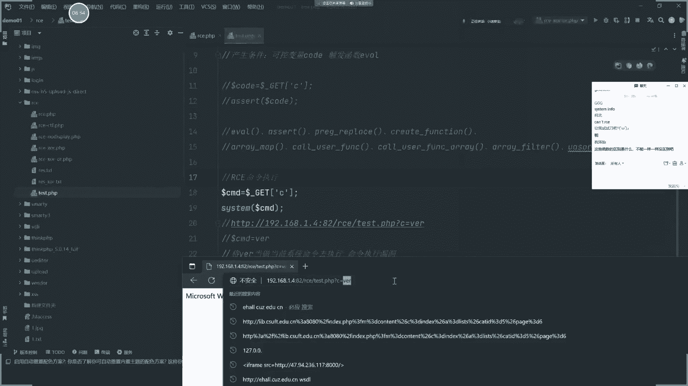
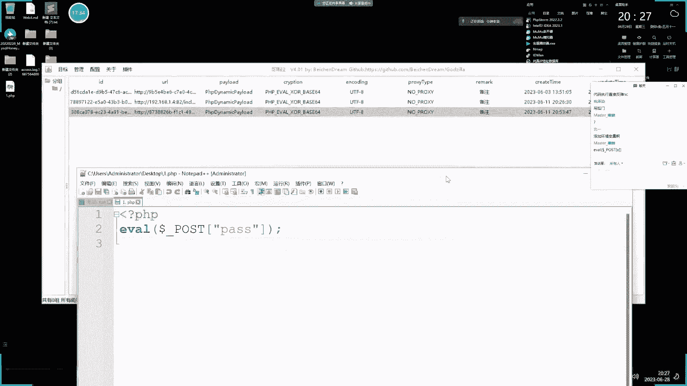
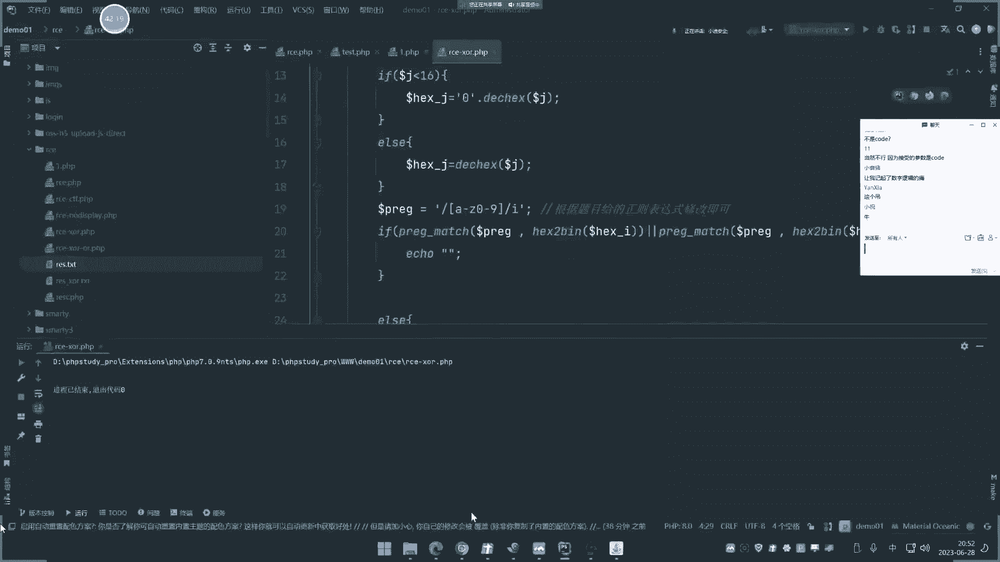
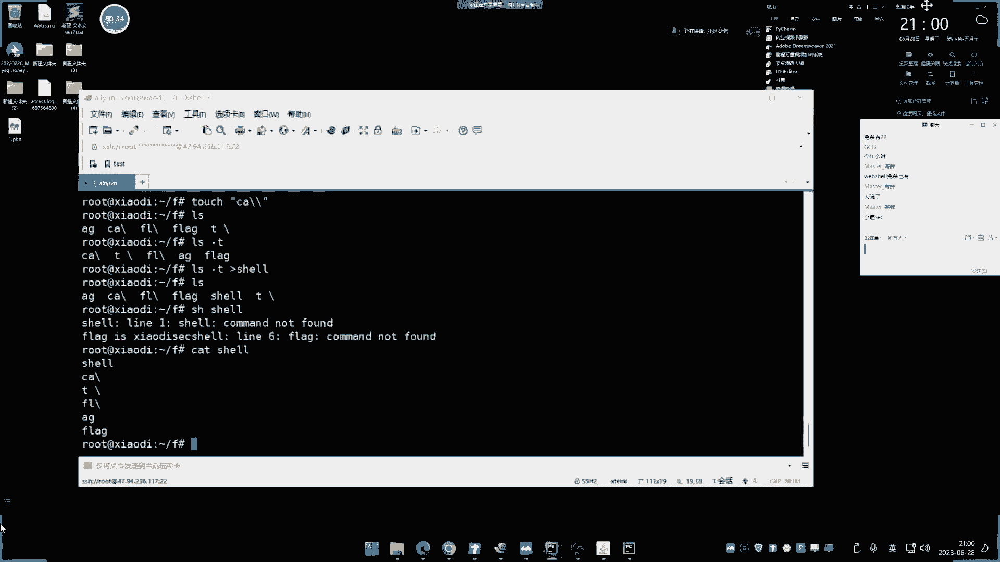
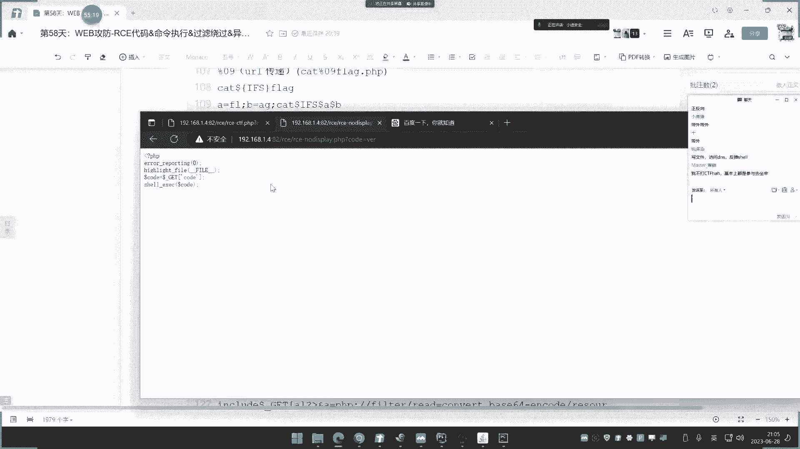
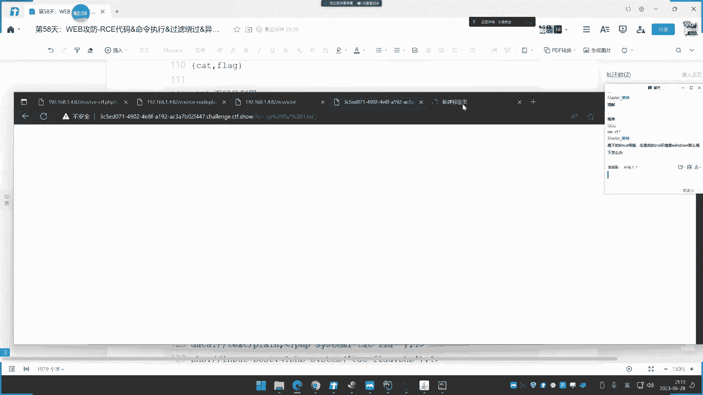

# 【小迪安全】V2024版 全栈网络安全 ｜ 攻防渗透工程师 （持续更新） - P58：第58天：RCE代码&命令执行&过滤绕过&异或无字符&无回显方案&黑白盒挖掘 - 逆风微笑的代码狗 - BV1Mx4y1q7Ny

好来看一下今天的内容啊，今天呢是讲这个RC1的漏洞啊，讲一下这个RC1的代码执行和命令执行呀，然后呢说一下他在CCTF题库里面常考的，然后再说一下他那个黑盒里面些常见的啊。

CCTF里面呢就是训练这个白盒代码升级能力，然后这个黑盒里面呢，就训练大家在这个实战中去发现自己的漏洞，从这个黑白和两个方向呢去讲解这个漏洞啊，然后呢主要的就是从白盒里面的去分析去logo。

这个是最关键的，因为后期这个代码审计里面去划的这个漏洞，那也是要根据这个漏洞的一个过滤，那能不能绕过呢，从而有没有这个漏洞的产生，因为大部分呢我们很多一些漏洞呢，不是说代码中没有，而是说无法绕过。

所以导致了这个漏洞呢发现不了，那么如果能够绕过的话，那就能够去利用出来嘛，哈好这个知识点呢就给大家说到这里，首先呢我们来了解一下这个RC1啊，RC1呢这是网上一个通俗的一个叫法。

它指的就是代码执行和命令执行，你可能说这两个有什么关系呢，两句话RC的代码执行漏洞啊，网上看到的代码执行漏洞，是指的是脚本代码去解析执行，然后呢，命令执行呢就是利用这个源码呢来调用系统，命令。

命令执行指的是执行的是系统的命令，代码执行指的是执行当前脚本的这个代码，这点呢不知道大家能不能理解啊，那么等一下呢我们就通过这个案例呢去给他讲，实在这个几种语言中啊，web的一个基本语言中。

这个代码执行漏洞，21这块漏洞呢，不仅在我们的这个挖宝中会产生，像这个中间间的平台，包括其他的一些环境都会都会有产生啊，他的一个检测呢也是分为在百合中的代码，神级去得到的漏洞。

也可以从黑盒中用一些扫描工具，大家去看到的漏洞啊，在web中常见出现RC1的这个几个代表语言，就是java，PHP和Python的几个这个web语言呢存在啊，P1P呢，自然是这个研究最深入。

或者说最明了的一个漏洞啊，在pp的这个里面呢，RC的这个漏洞呢通常有以下函数呢去造成，这是啊代码执行的有上面的，然后呢命令执行的是有是这里的啊，Python的，然后java里面的啊这个大概的一个解释啊。

我们已经给大家看到了，这是一个大家可以看一下啊，就在pp中由以上函数呢造成，Python中呢有以下函数造成，然后在java中呢一般是由这个表达师去造成的，OGLSPEL和MVEL代表意思呢。

就是我们说的这个spring e l表达式，和这个MOVEN的那个URL表达式，这个在后面的代码审计的课程呢会有讲解到哦，嘶好这个是他的一个大概介绍，我们这里呢啊介绍完之后呢。

就给大家去看一下这个代码的一个逻辑哈，代码的一个逻辑也比较简单哈，看了之后呢大家就能明白了啊，何为代码审计啊，啊何为代码执行，何为这个命令执行，他们都叫RC1，就是说RC1呢指的是两个漏洞。

一个呢就是我们说的命令执行，还有个就是代码执行，这两个是有差异的啊，好那现在呢我们就给大家看一下啊。

首先呢我们来看一下这个，在PPT里面去实现这两个漏洞那个讲解，那其他语言的话也是等同的效果。

V还是一样的，就是说造成漏洞的这个写法都不一样。

但是他们的危害是一样的哦，好我们看一下啊，这里呢有一个代码啊，代码那我就重新写一个啊名文件名。

那就换一下啊，就交个这个test pp好。

这里呢我们看一下啊，这里呢首先先来说这个命令执行啊，先说代码执行啊，代码执行，那这个呢有以下函数。

这里呢pp里面是这些函数嘛，看一下啊，你这里啊这么多。

我们来举几个来常见一看，比如说1FEL，这是最常见的1VL，然后呢你看后面呢我给他个变量，比如说这个叫code啊，等于dotf get们传递过来的这个参数吧，就找C吧，然后呢再把这个变量呢。

用这1fl呢把它包起来啊。

那我们看一下啊，这个呢我们看一下访问一下。

看一下他这个效果啊，好问号C给他传参数，你比如说我传一个什么菲律宾引for，这个是什么，执行之后来访这个地址，我们来对比一下访这地址呢，那就是等于这个这里呢就是这个道夫code，那就会等于这个PP米波。

这个值嘛哈就等于这个吗，那么最终呢e fl呢包括这个东西，那么这个就是什么，将这个啊pp info啊，当做这个什么当前语言代码去执行，这就称之为叫代码执行漏洞，在这个漏洞里面呢产生的条件分析一下。

产生的条件就是两个，一个是可控的，一个，变量什么code，还有个是什么触发函数EZL是吧，这是他的一个触发的一个情况，然后在这里呢能够触发到它，我们如果换一个写法看一下啊。

比如说再换一个用个什么叫ASS，ERT这个函数。

再把这个注释一下，看这里能不能再去触发它，刷新访问。

可以看到这个等同于和上面一致，那么也就是说除此之外啊。

这个常见的这些代码执行的函数，以上的呢都是可以触发到执行代码的一个情况。

对不对，这是它触发的常见函数，我可以把它进行一个归类看一下啊，那，那么这里呢也是给他触发出来的，大家不知道看到没了是吧，这个呢就称之为叫代码执行，能看到了吧，这个是代码执行啊。

其他的这些其他的我们就不再演示了啊，这些其他的其他就稍微复杂一些，但是都能触发到，那么我们介绍这些函数给他是有什么用意呢，因为在后期我们如果说用代码去审计，这个程序的漏洞的时候。

可以通过搜索这个关键字呢，来去查找有没有代码申请录入，对吧，好，这是代码这个执行啊，然后呢我们接下来再看RC1的什么命令执行，刚才是代码执行，现在是命令执行，那命令执行是什么概念啊，同样道理啊。

把这个代码先注释掉，往下面代码来看，把这里改一下，这个呢就搞成叫变量名字叫CMD，然后呢传个参数也全C是吧，同样道理，那这里用一个啊，比如说先用这个什么cs time，然后再去执行这个SAMD。

这有什么效果呢，我们看一下啊，来访问一下这个地址。

把这个C呢改成一个什么，改成一个mini v e r m i执行，编成了这个东西，啥东西啊，发过啊，同样的道理，那么这里呢就等于什么变量cos分之一就等于它，然后呢。

就是将这个什么VR当做什么系统命令去执行，那么这个就是命令执行操作，能理解吗，来去接受这个C过来的值给到V1了，那么呢用CTM来去把它执行，那么这个呢就是我们说的这个RCE的命令，执行漏洞。

那么它的结果和刚才代码执行呢，大家可以看到它的区域大区别，就是一个是以脚本语言去执行你的值，还有一个呢就是将你的这个值呢，当做系统命令去执行，那么等同于在这里呢换一条命令。

换成什么IPCONFIER，就是我们的什么执行的IPCONFIG，那么大家可以看一下这个执行结果呢，就等同于我们在我在我的什么啧，哎在我的电脑上面的去执行，那比如说data user对吧。

它只能执行一条啊，它空格不行。

你看一下啊，就等同于我们在这里呢去执行这东西，IDCONFIG是吧。

就和这里呢是一模一样的啊，对不对，这个呢就是叫命令执行，那么代码执行和命令执行大家就应该清楚了，但是为什么有很多东西呢他不去这样区分它，原因是什么呢，大家可以试想一下啊，那这里可以用它来执行。

还可以用什么来，还可以用这个东西呢，叫什么EXEC还可以用什么，需要也可以，C还可以用什么，还可以用什么PSRSTHIU，那很多一些执行的东西，我们可以把以此呢在打印的时候是吧。

换一个这个将换一行来代表这个东西，执行是都没问题的，来我们看一下啊，访问下这里刷新一下，传一个必要，你看第一条执行成功了，最后一条执行成功了，这两条没有执行成功，为什么这两个需要把它输出来。

把结果把它进行输出，嗯结果把输出一下再来刷题，那四条对吧，这个是先c time执行的，然后输出这个斜杠分隔，这个是EXE执行的，那这个是需要一个执行的，这个呢是pass t h r u执行的。

除了这个之外。

还没有其他函数呢，也有呢，除了还有这么多呢，这都是能够造成命令执行的函数。

给大家做一个总结，对不对，那我们来举例，system m e r e c写EC和这个pass写一些U，还有Z几个呢都是能够造成命令执行的，这是在pp里面编的啊，可以看到这个效果啊。

这种人就称之为叫命令执行漏洞，命令执行漏洞啊，好那这里为什么网上有一些呢是有一个一句话，就是RC1呢，它把它统称了，就mini执行的也是RC1啊，代码执行也是RCE，为什么呢。

因为它统统都是属于代码执行，你可能说为什么都叫代码执行，它不是一个执行命令，一个执行代码吗，一般啊命令执行无法去执行代码，但是它可以调用执行两个可以相互转换，磁化增加，看着啊。

我把这个代码执行这里进行一个转换，转成什么命令执行，如何转换呢，大家看着啊，来我们把这个C改成什么，改成这东西，它不执行命令吗，执行个p p for，这样子执行批评符，对不对，我这样改的，看着啊。

加个c time，再加个什么命令写进去，第一啊，这不就等同于，等同于coder变成coder，等于这个东西了吗，然后这里if fl不包含进去，就不是用e fl执行这个system m。

那就和这里的原本是一模一样的呀，大家看一下，执行不是也是可以把命令用代码执行。

转换成了什么，转完成了命令执行啊，是这个操作吧，来啊是不是，能理解吧，所以说为什么网上呢，通常呢喜欢这样去两个红色，是因为他们能够相互转化，然后这个命令执行能不能转换成代码执行呢，它也是可以的。

它也是可以的，为什么这样讲呢，因为我们都知道啊，语言它是可以调用执行的，你可以怎么办呢，我们试想一下是不是可以这样操作啊，去用到什么P1P取什么呀，任行一串代码，这个大家可能说哎呀，那怎么运行呢。

PPP去运行代码不会吗，那比如说我们这里呢找到pp的安装包那个文件，如果说有设置环境变量的话，那可以直接在这里呢敲上pp任性一个文件，它是可以用那个PPP的ESE文件，就和你Python去运行一个脚本。

用java去运行脚本等同相似的，我相信这里呢讲到这里，有些人就知道了对吧，但有些人呢不看我玩实验，做完他也不知道我在说啥，所以我还是要不要做一下啊，那在这个环境里面呢，如果安装好之后呢。

你是可以在这个3D里面敲菲律宾，他就能知道当前这个pp的环境是吧，还有人知道的，然后呢你可以用这个PV杠V啊，这种参数呢它是起点三四嘛对吧，然后呢你比如说在这里呢，我们可以写成一个文件是吧。

比如我echo输出一个这个文件，PPPP拖这个文件到这个什么一点，pp这个目录下面回车，这个有这个B符号，真是麻烦好，我看一下啊，top一点tb，你看下啊，你看他已经写了。

你看是不是可以利用这个环境变量，菲律宾去运行一个一点pp，一点PB是刚才写的嘛是吧，我们读到呢读到那什么top in的pp，这个内容内容就是里面的pp波嘛，那么呢你用pp来去允许这个一点pp。

不就是把那个1p p for的结果写出来吗，这个结果嘛对不对，我也可以利用这个东西呢去把井运起，是不是就可以利用pp呢去执行这个脚本。

所以等同于呢你在这里是吧，就给传递一个值pp去运行一个脚本，对不对，或者说运行个代码啊，它也是可能转换的啊。

只是说这个要麻烦一些，好这个呢我们就姑且不管它了啊，因为这个呢也不太重要，主要是大家对这个概念的理解啊，所以就是说这个RC呢，不管说是mini执行还是代码执行，相互呢不是存在这个过滤优的情况。

下面的话是能够相互转换的，就说可以用代码执行呢调用出命令执行出来，也可以用命令执行呢，把这个代码执行呢给它调用出来，所以呢基本上啊，这个RC1指的就是代码或者命令执行登录好，那个危害有什么危害。

大家可能会问到这个有什么危害呢，危害就非常大了，很简单的道理。

既然能够代码执行，想执行什么代码就能执行什么代码，想执行什么命令就能执行什么命令，很简单，命令执行我们可以直接反弹，需要我们前期学过这个漏洞，如果说有命令执行，我是不是可以直接弹个shell过来呀。

就直接把这个权限给它弹过来，反弹就直接调用命令，让他去反，把数据呢给我移交到另外一个IP上面，我结束把权限给他反弹回去，然后代码执行就直接可以植入后门，就这么简单，你可能说这要怎么直接后门，对不对，哎。

你比如说像这个刚才这个漏洞还有什么危害呢，这危害就大大有啊，你看比如说这里这就是一个漏洞，唉这就是一个漏洞啊，我们就可以直接用后面的连接上去了。

因为你可以关注到在我们这个工具里面啊。

这其实那一讲就是那个呃后门的那个，比如说pp里面就是这么个原理啊，pp那个一句话后门。

不知道大家有没有关注到他那个写法的代码，就是一个代码执行的一个漏洞的一个原型，你比如说用这个哥斯拉啊，或者说用这个什么倚肩呐，菜刀的一些这种后门呢，他去生成出来的这个什么后门呢，它都有个特性。

就和那个我们刚才讲的这个代码执行漏洞呢，它的燃性是一样的，就是改了个提交方式而已，比如我生成一点pp导桌面，我关注一下这个，后面我们打开看一下它的后门代码来。

是不是就是e fl老dot pos pass，它其实呢就是你在这里呢去双击这个什么，进入的时候就会触发一串代码，代码呢就发送给这个地方来，然后用if fl去执行，就这么简单，就是它只是用来一个啊。

就是程序的那个功能，代码都写到程序里面去了啊，对方代码呢去接收这个攻略性代码，然后用这个EFFEL呢把它执行，所以这个后门的这个原理呢，其实就是一个代码执行漏洞的原理。

知道吧，所以这个代码执行漏洞，就直接可以成为一个web修，直接可以成为一个web two啊，就是用工具把它连接上去，你可能说怎么连哈哈。

这是很简单嘛是吧，你看啊，比如说这个后面这里是个代码执行漏洞，我怎么去连它呢。

来我这里呢就直接写这句话了啊，C这里写好之后啊，就直接呢写个这东西啊，DOLF下划线post，然后呢写个什么这个东西就写这个地址是吧，回车哎，什么情况哦，哦不我，我在写DC l再包含一个啊。

好就把这个地址再一复制啊，然后呢可以用这个歌词拿来去尝试连接它，这里注意一下啊，这个里面呢不要讲白马，就不要写这个白马骑了，因为这个白马旗呢是那个浏览器的啊，你在这里面呢就老老实实用这个东西啊。

不然的话可能会有问题，对不对，这个不知道能不能连上啊，看到没成功添加来通过这个代码执行漏洞呢，我直接拿到这个权限。

你说这咋把死线的呢，这看都看不懂啊，有些人，很简单的道理嘛，这个就是那个后门代码呀，我代码执行，我后面为什么能连上。

我后面连接上是不是会执行这个代码，我们可刚才看到嘛，他那个后面的圆心就是我这段代码样的，前面这个pp就不忽略不计了嘛，因为他总是把他的这个前面就是PPP，这个语言的开端，就看到这个东西呢。

就会把这个代码呢当做pp执行，那么由于他代码执行，本身就把你当成PB执行了，所以有没有他都无所谓，那下面这个就是它原型嘛是吧，你把这个文件放上去访问这个文件，它就会执行这个文件，所以他连杀。

那么很简单的道理，这代码执行他把我后面数据接收到，他也会执行这个后面代码，那不就等同于和你直接访问，执行它不是一样一码事情吗，所以我连接上就是这么个道理是吧，就代码执行漏洞啊，理解了吧。

难不来这是它的危害啊，这可以直接造成这个后门船啊，这权限的丢失，那么命令执行呢那更不用说了啊。

命令执行那个危害那就更不用讲了呀是吧，比如说这里要执行命令对吧，能执行这个命令，对不对，你能执行这个命令，那么你说能干嘛呢，我心在上面想执行什么就执行什么，那反弹我必修啊，反弹小是不是也可以呀，对不对。

李哥说哎，那操作一下，操作一下有啥操作呢，不是妥妥当当嘛是吧，让他连接上去，那finder命令把它写好，你找个那个之前给他介绍那个什么。

反正命令那个生存的地方，对不对，生成一下。

都要准备好一个这个什么还不例子啊。

等它这个通过这个漏洞呢反弹过去呢，那反弹到我的这个6666上面去勾，然后呢这里由于是windows系统，所以我就找个windows系统支持的，这个命令的反弹效啊，前面这个是LINUX的这种命令啊。

这个不支持我们找个windows啊，然后如果说他有装pyon Python环境的话，你可以用Python环境来实现，那这是用Python环境来去实现那个反弹效啊，pp的也行对吧，PPP的呢。

然后去弹给这个地方来哈，还有这个什么泡沫学人的pm秀，那肯定支持啊，还有这个其他的一个各种言是吧，写上去的这个反弹的啊，就是要看他这个本身它只支持哪些这个调用啊，啊Python的可以试一下啊。

Python的可以试一下，就是让他执行这条命令，然后呢反弹这个效啊啊也可以用这个调的NC啊，这种东西啊，如果说你有NC的话，那可以啊，如果说没有的话，那就尴尬了啊，那可能就只能用这东西啊。

因为LINUX是比较丰富，LINUX上面有很多名的知识，但windows上面呢像我们这个N卡特，他一般不自带需要你上传啊，pp呢和Python呢，这个也不不确定对方系统上面装不装，对不对。

但这个脚本是pp的话，一般都行啊是吧，就这个把这个执行是吧，执行的反弹销量就写上去，啊当然呢你还可以进行这个文件的下载和执行，让他去直接远程下载，那你比如说我可以怎么办呢。

就和我们之前讲过那个道理一样是吧，你可以植入后门，当然也是OK的，比如我这里呢八零端口是吧，然后下载一个这个文件，比如说叫一点TST是吧，把它下载到他的这个里面，叫点PHP1改变，让它进行这个文件下载。

调用windows，然后呢再连接上去啊，比如说这个下载命令是吧，去下载个一点TT。

然后放到它里面，当当什么当一点P1P，然后呢你再去连接一点pp不就行了吗。

然后在你这个一点TT里面就写个home，这样子呢也是一种方式啊，自己呢活学活用，你把这个，一点TIT呢在这里写一下来啊，你们那就写个什么啊，我就换个乙一点TT吧，以一点TT是吧。

能够访问的地址在这里呢写个home diss，写个home代码，对不对，把写上去小之后是吧，再用你这个命令执行漏洞啊，所以让他执行，嗯杠C是吧，加上这个命令来让他去调用这个命令去执行。

下载到他的e app里面执行，执行好，他这里的报了这个错误，这个是什么问题呢，这个问题大家要看一下啊，一般他这个命令执行呢，刚才大家也看到了啊，像他这种呢是个什么情况造成的，你看啊。

为什么这里呢我们敲个V啊，哎咋回事啊，哦这上面还有个对我敲个VR对吧，它能执行出个VR，然后呢我把这个命令的写着来，哎他说下载了，我们看下下面是不是有了，看到没，一点pp写上去了。

来是不是写到这里面来了，对不对，但这里为什么变成这个码呢，因为我下的是一点一点TS1。

我把它换成以一点TIT重新复盖一下。

那马被删了，只是说被查杀到了啊，你把恢复一下搞免杀就行了呗，这不写上去了吗，再连接这个一点pp不就是后门了吗。

好吧这个不说了啊，我们不把这个更多的话题呢，转到这个很基础上面啊。

这说他危害简单利用啊。

好现在呢就来说这个下面的了啊，好，那么现在呢我们就来说一下，这个他的一些绕过方式，就说漏洞呢我们基本搞明白了，就说它绕过为什么要学绕过，第一个打CCTF的时候，这个RCE漏洞可以说是层出不穷。

年年都有这种考题，那简直就是从头到尾都在考他是吧，然后呢它里面的CDF里面都喜欢过滤好，我们来看一下啊，怎么去玩它啊，一般呢就是过滤关键字，比如说过滤flag关键字如何实现。

我们呢可以用这个LINUX操作系统去演示，为什么用LINUX操作系统去演示，因为呢这个一般CDF的考题的，这个靶场基本上都是LINUX搭建的，windows搭建的比较少，所以呢我们要适应于这个题目哈。

那个利亚斯搭建的玩法会多一些，就是它里面有很多一些你没见过的啊，你比如说像现在啊。

我们先给他看一下，我先来到这个盘符啊。

好大家可以看一下下面有个flag文件，比如说我现在呢要尝试去读取这个flag，但是我不能用什么，不能用这个来，比如说我cat flag这个文件好，他能读到里面内容是吧。

内容就是这个flag is小迪SEC，大家可以看到啊，这是它内容对不对，那能够读到是吧，没有问题啊。

他能读到这个内容是吧，能读到这内容，但是现在我不能用flag关键字。

我如何读取它呢，如何读取它啊，这就可以利用通配符来写个这个通配符，写个星号，那四也能读到啊，还可以呢，加个问号，问号就代表占位符来写个问号，就写个L啥意思啊，问号就代表。

现在我不知道这个前面这个数字是什么，问号代PL第二个数字为L，第三个就是第四个，后面我就不知道了，回车也能读到，这种就是解决了关键字的一个执行是吧啊，你们说的什么TAAC那些是另外一条命令啊。

cut是读取TAAC呢也是这个意思，所以也是个意思，都是young8，这没什么说的啊。

好这个就是我们说的过滤flag关键字，利用这个什么通配符来牢固。

还有一种呢是转移符，啥意思啊，来我读一个cat，然后呢flag这是真正确的正常的写法是吧，我在中间呢加个这个转移符，它也不会影响，那它也能执行，包括这个cat也是一样，来写上去，它也能读取到，对不对。

还有呢用两点连接。

再再加两点，它也能读取到，没有任何问题。

这种呢叫做转移，还有什么空变量值，什么叫空变量啊，看一下啊，来cat我读那是正常的一个读法是吧，现在呢你看啊，我在这里写个什么变量，那我写个随便写个什么数字，比如说艾特执行，那它也能读到。

在这里写也是一样，它也能读到，你问这是什么东西啊，这是LINUX里面声明变量的一个东西，那变量at由于你没有赋值，所以它默认就是空的，所以也就是说这里就是个空的，切进去跟没写进去一样。

但是呢你干扰到那个flag的正确匹配，绕过这些东西，你现在不要问我说为什么讲这东西，你等下看一下CDF考题，和一些那个代码神经需要绕过的时候，他如果有这个限制的话。

是需要用到这个知识点的啊，你看是吧，变量那除了这个之外。

还有什么可以这样去写，那都是的啊，来演示一下，你看我可以在这里面写一些这种干扰符，到里面去算呢，它也能读取到，啊这个不行，嗯随便写五啊。

三啊一啊都可以写啊，这个无所谓，那都可以，就是说利用这种空变量符号，就是随便呢去写啊，这这这四种都可以写，星号和艾特符号，然后这里加数字啊是吧，这里随便再写个名字啊都行，对不对。

这些操作能用到文件上传中吗，大家有没有帮我回答下这个问题呀，拿来，你这个问题他问的非常好，对不对，啊我怎么答呢，啊思路是能够想到其他漏洞上面去，但是你要明白一点啊，呃他这个操作呢是属于命令执行。

是命令执行上面的操作，你文件上传咋个和命令执行挂上钩了呀，啊挂不上钩吧，你先要搞清楚啊，你文件上传里面就压根不会涉及到这种东西，因为他没有执行命令的机会，那么这个东西和他有没有关系吗，没有关系啊。

不要搞错了啊，还有就是拼接法看一下啊。

那我可以在生命各个变量A等于什么F对不对，在封号代表与结束是吧，B等于什么LAG就是前面flag，然后呢上面是四面，好对不对，然后后面再搞个什么cat读取读取什么文件呐，这是个IFS这啥东西啊。

这个是NUX自带的啊，然后呢一个变量A变量B这个IFS呢，你这样写这样写他也OK执行，那他是能读到啊，嗯能读到吧，那你不写的话，他肯定读不到，所以执行那就是空的是吧空的，但是呢你这样一写诶。

是不是就读到了那个FS呢，代表是空格，或者说你写不写都无所谓，好看就是用变量呢，A等于FB等于F2G两个联合起来就是FLG。

是吧，没问题啊，然后呢这是这个拼接法，还有个什么反应号绕过就是什么意思啊。

你比如说啊，LS等于F下面只有一个flag文件，对不对，那么现在我cat用的是什么这种符号，这种符号是什么，代表命令执行的意思，代表命令执行的意思，JAVS的结果呢它是等于flag。

那么cat执行LS就读取了flag内容，这啥意情况，就是ls s里面是显示路径的，里面有个flag，然后把这个指引结果呢用cat读取来，就读取的flag。

还有编码logo，就是把这个关键字呢打进编码。

就是说我可以利用这个语句，把这个什么把这个flag是吧，进行一个输出，输出的时候呢，我用到base64，那把编码一下啊，就是把这个flag呢给它编码一下啊，就是先输出这个flag。

它的结果呢把它进行base new编码，这是对flag的进行base new编码，编码之后再怎么办呢。

看着啊再怎么办啊，再用这个语句呢，cat去读取，把这个值呢把它进行解码，就是输出这个结果，并且呢用base668进行解码，杠一就是解就是decode的意思，decode解码杠一。

就是那个什么1decode就是编码不加，也是编码加了，杠低就是解码，就将这个echo结果输出来，这个结果就是刚才flag的结果，所以把它输出出来之后呢，再进行解码，解码结果是flag。

所以原型就是flag cat flag的意思，好理不好理，好不好理解啊，cat啊，来echo输出编码后的结果，然后呢再用到这个什么贝斯缪斯把它进解嘛，你看他就读到了这个flag的值，知不知道啊。

没问题吧，好，那么我问一下啊，这个东西我不是说讲给你听到，这很单，就说讲的东西他很乏味，但是用到时它很香，你比如说像现在我读这个，我把这个cat语句呢，把它进这个贝斯尼斯对吧，那该怎么玩它呢。

你看啊我想换一个啊，刚才是对flag进背六四，我现在是cat语进背60，同样的也实行这cat该怎么做啊，就是echo输出cat是吧，然后把它进行什么base64编码好，这个是cat的编码，然后怎么办呢。

由于cat是在前面，所以我现在就是echo echo输出这个值，再进行什么base64解码，然后再flag是吧，输出这个值进解码，解码的结果是cat cat再联动到这个flag。

不就等同于cat flag吗，执行嗯，双学活学活用啊，这是你要知道，是吧，要用到的啊，你只要打CCTF的话，这个东西是必备的，连这个都不懂，那CCTF不用打，打不了，这个是那个编码上面那个绕过啊。

就是说把关键词呢采用编码，然后进行提取，哎好，然后呢还有个叫组合绝学，这个呢是一个绝技，这个绝技和下面这个无符号的绝技，这是在CCTF里面基本上啊考的最多的，因为它难比刚才的都要难理解和最不好理解。

但是他又喜欢考逐和绝技是啥意思啊，他是用到一些特性，看着啊，就是过滤这些关键字怎么办呢，你可以先创建几个东西，你看啊创建什么东西啊，大家看一下啊，看下结果啊，我先THOU创建个什么。

我把命令先把它全部打上去，然后我再给他解释啊，别急，先打这条，那你看着啊，我再打给大家看看啊，慢慢打，先打上去，然后呢我们再把结果看一下，好打完了，这个是创建文件的，你看啊。

文件下面就有AGCAFLT好，有这几个文件了啊，那么现在再来看一个文件叫ELS杠T，形成一个shell，这啥东西，这个命令呢就是将LS杠T是啥意思呢，我先给他执行一下LS杠T是啥意思。

它就是将文件以当前时间创建时间命名，创建时间来进行展示，最新的是ca，因为是最后创建的最新，紧接着是T这是FL斜杠，斜杠和F2G然后呢，我就把这种文件呢形式呢。

把它怎么样把它生成成一个叫shell的文件，把生成的一个叫shell的文件，然后我们再观察一下，就有个shell文件产生的，这个时候我们用SH去指引shell文件回车一下，发生什么效果。

发现他有哎flag被读取到了，啥情况，怎么执行shell文件，怎么把flag这个文件给他读到了，大家来看一下是什么情况造成的，大家有没有看到，其实他就是将这几个文件名啊，看一下解释呢。

S2杠T是将文本实现按时间输出，S杠T杠小，就是将输出的结果输入到这个小NTT，那么输出结果是什么呀，杠T第一个显示是CACA加T就是cat，再加fl，再加AG那不就是cat f l a g吗，对不对。

所以他的这个shell里面的代码，这里面的文件就是c a t flag，所以当你用SSH去执行这个笑的时候，就是cat flag，为什么包错，这个报错原因是什么呢，包错是原因，因为我这里写了换行。

你可以关注一下这个shell文件里面的内容，他是换了行的，你看它线里面的文件内容变成什么了，cat t f l a g为什么这样子，对FL1就是说换行就代表这个结束还没结束，他就一个换。

那最终呢就是cat白给，如果他只写到一行，他当然也可以写到一行，也能执行成功，但是呢写了一行的话，怕有检测，所以就是类似于把它进行分割显示，但是不会影响结果，只是这里会有个报错。

就是上面他不认识第一条命令，当他执行完之后呢，组合起来就认识了，就执行成功了，这个就是组合绝活啊，就是通过创建文件，最终呢执行另外一个文件来实现执行一条命令，那么也就是说你可以把命令呢分割成文件。

再把它进行组合到一个文件里面去，再执行这个文件来实现这个命令执行，比如说他限制了某些命令的执行，你就可以把这个命令呢拆分成文件，再把它形成一个新的文件，再执行这个文件，就能把那个命令把它触发出来。

能不能理解这是他的一个应用价值，还有个叫做异或无符号。

那这个呢我就给大家讲一下啊，我们来看一下这道题目，这是一个比较这两种很常考这个题目看一下啊，来我们等下呢会有真实案例和CCTF的题型。

去给他联系啊，嘶我们来看一下啊，这是讲无符号的啊，这都是CCTFRCE的里面的干货啊，你网上查半天，不如我一节课讲个零，比你那个茶要差的好多了啊，那这个里面有个这个，那就这个啊啊不不不。

这个这个你看这个题啊，那结束这个扣的变量，那前面两个不管它这个是不包出显示，然后这个呢是显示原的吧，意思啊，代码给到你了，解释这get传过来code复制给code。

然后呢这里有个什么e fel code，但是你要执行这个if fail code呢，大家可以看到是需要通过这个if if循环，才能执行的，if循环里面有个匹配A到Z0到九。

然后一个II意思是说不区分大小写，就是大写，它也识别小写，也识别A到Z0到九，那么意思就是说，等同于把我们所有东西都给他屏蔽了，字符不都能出现，你怎么绕过它呀，那你就按常规的，这人家敲什么东西都不行。

敲什么东西都不行啊，你敲任何东西在这里呢都不行，你必须这里呢符合了它才行是吧，敲成何东西它都不能执行成功的，你敲任何东西都不能执行成功，比如说在这里，那我们要执行什么，批评什么呢。

因为这里呢你任何东西都带有这个，什么都带有这个字符，你用数字它也过滤了他，这个组合就是选用了什么叫异或运算，生成无符号的无符号的这个什么过滤，然后呢我给他提供两个脚本，百试不爽啊，怎么用它网上呢。

看了很多文章都不知道怎么用，我直接给你打包了，资源全部给你找好了，抑或和豁，这啥意思，他是这个语言里面的一种算法，叫做异或人山和货运山，还有一种叫飞云散，异或仑三呢，是啥东西啊。

简单来说就是利用无符号的一种数据，能匹配出一个新的数据。

我们这里准备了几个脚本呐，这个是生成异或运算的脚本，你不用管它了，你只要知道使用的时候，就把这个匹配规则里改成过滤规则写到这来，然后呢把它进行运行啊，用PPP运行或者访问运行。

运行完之后它就会生成一个文件，这个文件叫做RES点TXT文件，那会生成文件，我们直接看一下，那么这个文件里面就比如说百分百0%，零和212%个进行运算，就会得到一个感叹号。

其实呢就是说我们用后面这种URL的编码的东西，把它撕成，形成一个数据，能理解吧，它就生成出这个东西，这个脚本呢就是来生成异或运算这个脚本啊，你也不用实现原理啊，你只套用就可以了啊。

它的规则就是什么，就是针对于这个A到Z和0~9的。

这个地方是吧，然后呢你就把它写了，再来啊把规则写出来就可以了啊。

其他你不用管，然后生成RERTIT，这个时候呢还有个Python脚本，Python脚本就是组把那个payload生成出来的，这都是网上帮你找好了资料啊。

这都是连CTF背背背了一些那种优秀脚本，网上那找半天都找不到的啊，我们找这个啊，21，然后呢就把这个RRETIT呢放到这来，就刚才生成的啊，放到这个统计目录，然后用这个去把它运行起来，你看他就问你。

你的函数我就写个什么执行了system，那我就让他执行是吧，执行system，然后我要执行的命令，然后执行这个这个这个什么命令呢，呃IPCONFIG吧，然后执行IPCONFI试一下R看怎么行好。

它就生成这样代码来，这个代码就是什么，前面这段代码应该就是这个system，后面这个代码就是IPCONFIG啊，我们可以试一下了，这个08%，我们看一下这个REST里面的百分零八，对应的是什么。

可以看一下，这里要找一下是不是就是那个类似的啊，搜一下来百里八括号的意思啊，括号的意思，然后他联动的是这个7%b，GB是这个S看到没，是不是有SR呢，零八加S就是括号S好，你可以看后面W0哦。

打冒号再看后面还有没有0%啊，他用的也很多，再看这个啊，7%b啊，其实说这个结果你可以看一下啊，应该就是这个system in for，或者是这个IP卡Faker的一个那个运算结果，就这两条运算结果啊。

用这个东西运算，我们可以把输出一下来看一下啊，用这个pp代码结果输出一下，这个我不需要可以讲很多啊，因为这个异或运算在后面讲的那个啊。

他在很多地方都有使用刀，就是在那个web修免杀的一个领域里面，就是我们说的那个无知乎后门啊，在那个免杀里面经常会用到这个东西啊，就是一种算法叫一货运算，咳咳咳。

我们来给他开一下啊，这是大概大概结果是吧，我们可以把它进行一个这个echo一下，看他这个结果是什么嗯，访问一下特斯，好结果是这么个东西啊，哎那还不好说啊，那结果是这个东西我懒得看了啊，医护人散在后面讲。

我不修的时候再给他讲啊，这个要把他一个拆分出来，一个对比啊，他生出来我们就不管他了啊，是不是要讲啊，你们是不是要听这个东西，我听啊，我跟你说啊，我如果讲他我后面课我讲不完的，今天是讲不完的啊。

你要听我可以下节课讲给你听，我这节课讲听都没问题。

但听不听，后面也会讲，这有不难的个事情，老是你们问号问号，问个锤子。

问老子不讲就好了是吧，就不要问了啊，真的是无语。

每次想给他多讲点内容，就是你们问号问号，你问个啥啥问啊，看着啊，我们把这个呢放到刚才那个地方来，你看一下啊，来这里啊，杠C这里呢回车，哦不好意思啊，刚才搞错了，这个抠的啊，是变量，是抠的。

不是谁把前面那个东西写进去啊，我先确定下前面的，看是不是就提示黑客呀，你看就你写什么东西呢，这里就不行，你用这个来回车拿IPCONFIG执行出来了，对不对，因为你用其他的就提示黑客嘛。

那提示黑客我刚才为什么没提示，我写了个C变量去了啊，应该是扣的变量，而且是扣的嘛。

那这个IPCONFIG执行出来了吧，那同样道理啊，你可以再次用上，你比如说我用这个gm，我再用这个函数是吧，执行这个这个什么，所以这个V1R那它又生成一条。

我们再试一下，来把这个复制到上面去，是不是就执行这个另外一条命令了。

那是不是自己拿啊，然后这个是异或人是异或运算的，还有一种脚本是什么，还有个脚本啊，别打爆两个脚本还是货运算的，这个是货运算的，也是把这个规则写到这来，就你要绕过的规则把它写到这来，他就帮你生成出来。

好勾好，生成了就是这个RESTXOR啊，你可以看一下啊，它生成这个文件，再把这个文件呢把它复制，复制到这个Python这个脚本这来，for到这来覆来之后呢，再打开这个另外一个脚本。

叫做RCEXYO2点PY，用它再来运行，同样道理生成c time for，那同样执行分析化，看到它的生成，那它的结果和刚才又不一样，那他是这个感正符号或刚才那个是什么，刚才那个是怎么符啊。

是不是那个一个那个啊消呃，那个一上一下的那个符号啊对吧。

你看这个符号就不同了，你看写法也不同了，放到上面来，这是或运算使用出来的啊，刚才是这种符号的是吧，联动前面的和后面那个结果比对实行的结果，你看现在这个啊，是不是也执行FAUR了。

也能执行呢，同样道理呢，我继续，我执行一个什么，执行一个这个关闭。

放这呢再进行替换或密执行出来，这就是绕过这个匹配的一种异或运算，无支付的这个RC1的一个漏洞，包括你还可以把它利用成生成这个免纱包，修欧的一些方法，在后期我们都会介绍到，刚才我想讲一下，一会认三啊。

很尴尬啊，因为没把它结果制定出来，嘿嘿因为这个东西呢我在前期还讲过啊，我前面上几期我讲那个面纱，我必学的一些知识点，是我当时讲过这个异火人散，这个你可以看一下啊，你不要什么问号。

问号我前期都讲都讲过那些东西，你自己他妈的学都没学啊，天天问问问，还有为什么又要讲什么高端的，那去年的这个第77天，一湖人山讲的嘎嘎好是吧，当时讲这个生层面上，利用这个医护盾山呢如何写是吧。

自动化的一个生成讲过诶，不要怀疑是吧，我既然答了个代就能够讲出来。

因为这个脚本是网上找的，它的生成规则我还不明白啊，所以呢刚才把输出的结果呢出现乱码呢，也情有可原啊，尽量一下啊，后面呢我们再把这个异或原理给他讲清楚啊，因为这个东西呢在RC1的那个里面有用到。

在web修的那个免杀领域也有用到，在很多领域都有这个用到的方式啊，就是相当于就是把字符呢生成一个，无规则的一个情况啊，因为这个语言呢它就识别到这个代码。

那就是我们生成了个命令的代码，这种叫做疑惑啊。

疑惑抑或啊拟货运散，一种是异或，还有个是货运散。

两种都行啊，然后呢我给他打爆这个四个脚本啊，一货运三的pp生成脚本和XOR的这个payload，生成脚本，然后货运算的这个生成pp脚本和payload，生成脚本啊，两个都打包了呃。

到时候呢你参加RC一比赛的时候，碰上这种东西呢，就可以利用我这个角文呢把规则写进去，来实现生成这个绕过的那个payload出来，但是当然啊不可能说所有的这个都能牢固啊。

你要看他有没有限制这个异或运算的关键符啊，如果说有限制的话，那不好意思，那那也捞顾不了，那可能还要用其他方法再组合啊，好这个呢是我们说的这个东西，然后还有啊还有其他logo再给他讲啊。

还有什么这个lining logo，这个呢其实就是那个额，然后比如说一些关键字是吧，要执行命令，就我刚才说的嘛，嗯这个牢固方式啊，这个没什么说的，看下面这个啊，比如说它过滤这个什么cat taa c。

能不能实现文件读取和文件的一些插入显示呢，可以有很多命令，比如说这里呢EVA上面的，你可以用这个命令来实现，大家可以看一下这是什么命令啊，你看用CTRL命令本地读取一个文件。

来读取root目录下面的F目录，下面的flag，CTRL命令是不是请求网站的吗，请求网站用file文件这个协议来读取，它是也能读对吧，用到string来读flag也是可以获取里面的string类型。

那也能读到，用UNIQ它也能读到，那也能读到，用兵器当V读flag，它也能读到，用F1V也能读到F1V是去反去flag的，反反就是什么呢，再看后面的flag，已知小DSEC是吧，这是常规的命令。

其实就是说现在什么cat啊，TAAC这种读取的一些关键字符的时候，立刻用其他命令取代，选了几种是啥子，还有一种呢就是过滤空格啊，就是直接把你空格过滤怎么办呢，就可以使用我们刚才说的呢这种方式来。

比如说在命令这中间空格，这里加上这个这个东西来实现读取，你看它也能读取，并且这里不会有空格是吧，因为空格是这样读嘛，不用空格的，这样读没问题，好这几个呢都不是很多，也不是很重要，都比较简单。

还有一个比较关键的地方啊，这个绕过里面有两个核心点，大家知道一个核心点就是这个一或的这个支点，因为他经常用，经常考，还有一个就是我们这个无回血，这是面试题喜欢考的问题。

我现在每个支点我基本上都会给大家讲一下，这个无回显这种方案，就是常温的什么SSRF无回显的，或者是什么这个RC无回线呐，或者是什么内网里面的一些这种水刀的，这是面试题喜欢问的。

然后呢高端点就问那个java里面的那个什么啊，SHO啊，什么fast jackson啊，JJASON的那个什么不会先怎么搬是吧，反正就是面试题面选问的，我会写了几个这种常见的一些漏洞方面的。

再是这个内网方面的一些面试题，现，然后呢我们没有讲内网，所以那个内网方向呢我们先在里面估一下，讲过那个S2SFW的也W的RCE也喜欢win，对不对，但这无非显我刚才上节课我还给他提了。

我说五和弦大半部分都可以用个通用的解答，就是让它对外连接是吧，那么同样道理，这个对外连接呢，在某些这个5K线里面它不行啊，但是在这个漏洞里面呢，基本上啊很多答案都有这个答案，它是其中一种方法。

你回答上这个至少你懂了其他方法能够回答上，那就由中加优啊，回答不上的话，那不好说了，比如说像这个无非利用RC1的，你怎么知道这个RC1执行了，并且这个漏洞存在，但是没有显示，那我们用个案例给他去演示。

这是刚才那个过滤案例，我们再来看这个案例，这个叫rc low display的这个案例呢，我看到源代码是吧，我可能知道有代码，但是用个笑EAC，用笑1C呢就有个结果，就是说这个命令呢，那我执行了。

我给大家看一下啊，我执行的code啊，我执行这个code，我执行是不是我执行，比如说我执行一个VR执行，那执行它没有显示啊。

这个非常没有显示啊，为什么呢，因为这个函数它本身就是没有显示的，那比如说我写个echo把输出一下。

哎他这里那就怎么样，你看就能成功是吧，有显示，但是我揪你妹的不给你echo一下，你也不知道我执没执行是吧，你哪知道是这个命令直没执行，那有没有显示啊，结果也没有啊，所以说我们就姑且把它当做一个。

无回血的那个测试案例，那现在就是说怎么去解决这个，怎么知道他这个命令执行了是吧，用无回显怎么判断他呢，很简单，两种方案，第一种方案呢就是让他主动把流量带出来，我自己观察，还有一种呢就是我们说的怎么办。

写个文件再访问这个文件不行了吗，那我就尝试呢用命令写个文件，比如说echo写个文件，写个123，写了这个当前目录下面叫这个差点TT是吧，差点TT，然后呢我先去尝试一下，访问一下这个差点TT存不存在。

那没有是吧，然后呢我回车执行好。

刷新有了命令，执行成功了呀，不执行成功，他咋有这个文件呢，这不就是确定这些漏洞了吗，无回线确定RCE漏洞存在。

第一种方式，孩子呢就让主动出来是吧，找个这种外联的网站，比如说常用的DNS slog，或者说你自己搭建一个web让他访问，那比如说得好，我这里有个这个嘛地址是吧，要怎么样执行条命令。

比如说在那进行拼命令是吧，拼一下我这个域名拼一下是吧，你如果说平了，那就有数据了，有数据就说明什么来。

有数据来了，21啊，有啊存在啊，所以说你问到这种无回险呀，你自己要想啊，你妹的挠死你妹的是吧，问问问的烦死了，真是，虽然说我上级现在没有特意教来讲这个知识点，但是有时候有些东西是不是讲过的。

你要学会套用他的啊。

这是漏洞方面的是吧，还有我们后面说的那常见的几个面试题，问什么，fast jackson的JASON的是吧，五块钱怎么用啊，文章我也发过，还雷网里面呢也需要文，就是凡是是是常见问题对吧。

我这期都给你讲了，我能想到都给你讲讲了，你到时候再去面试，你面试不了是吧，是技术太差，你就不要说了啊，那那是你自己的问题了啊，该讲的都讲了啊，谈不上说面试题100题是吧，讲了这个8%讲了什么。

90%没有那么厉害，但至少啊不是说很高端的题目，你七八十%那是绝逼讲过的，后面的10%到20的题目呢，你如果学的好，你也是能回答一班上来的啊，就看你面试的是什么岗位了，好这个呢是我们那个全部的小知识点。

那么现在呢我们就给他看一下啊，在这个真实应用中，和这个CCTF的骑行中的一个CCTF，这个命令执行的一些讲解啊。

哎我们来看一下，那么CDF呢我们就讲一般。

因为海油版的非常难啊，后面呢我们下节课呢再给他说那个后面题型，这也讲不完了，有他妈的一两百刀啊，有人问这个密码，这个密码我现在在上课，我就怕人多了，所以我就把它先没有给大家，后面我上完课不邀他了。

你再下去念啊，那这个嘛你看啊，他这个题目呢也相对简单。

也没什么太大问题，是不是大家一玩呢就玩的明白。

那这题这里面还不简单呐，只过了一个flag，那我们刚才讲的不就直接删了他吗，过了flag怎么办呢，cat把它flag型号一带一提呀，完了呀，回车呀，哎你可能说咋回事啊，看源代码啊，如果不想看的话。

就用TAAC看一下，哎这咋回事啊，这里面的咋没有发音呢是吧，啥情况是不是讲错了呀，再看一下啊，杠CC呢过的flag，然后用e fail去执行它那1fail代码执行嘛，代码执行，那我写错了啊，应该是什么。

C等于c time对吧，第用代码执行来调用出命令，执行命令执行里面呢再敲这个命令命令，对不对，刚才我就写错了，因为那是执行代码，现在这就叫代码的system嘛，那就执行这个TAAC。

读取这个flag或者这个cut都行啊，TAAC也是一个意思啊，都是读取的命令flag是吧，这个直接写上去，那肯定就GG了呀，我就直接信号，把后面的基本取代它，然后后面加上个分号，代表日结束。

那结果就出来了是吧，就这么简单，有什么太大问题，讲过了，这题目就直接咔咔就是就是就是隔就完了啊，因为讲过了呀，为什么前，我前面要花那么多气力去讲这个东西呢是吧。

这都是要遇到的，你不要小看那种小知识点，但积少成多，多练习，把那支点稳固到自己脑海中，你以后碰到这题目就直接删了啊，来在flag，它过滤在flab和c time过滤P1P，那咋办呢，有几种思路。

EC呢先调用CTM去执行它，执行它咋办呢，我还可以用其他的呀，我不用c time了，我用什么，我用这个什么T1K1C是吧，也可以呀，把结果呢给他输出出来嘛，无非就是调用这个EKC执行这个什么。

执行这个读取名称，Taa c，它过的flag，我再用这个东西把它取下来，flag呢信号取代它，那代表与接水写上去，就是我把这个C塔姆呢用EREC取代echo，因为他有输出结果嘛，不输出的话，它没有结果。

那cat在flag里用星号取代是吧，是不是也可以啊，那没问题啊，读取那个flag内容嘛哈然后呢这是一种方式，还有一种方式呢也可以玩来用这个这种命令，啥命令啊，它不是读取命令或对你这个进行过滤吗。

你可怎么办呢，用这个来这种符号，这种符号就是LINUX云顶的这个什么执行命令符号，CP命令，把flag给他，怎么样给他文件，给它换成当前一点TT，就把这个flag文件呢给它，我不直接读它了。

我就把文件那个复制成E的TD，我再访问一的TD不就等同于是那个意思吗，能不能理解，就是说你你之前那是用思路去读flag，现在我就直接把flag和怎样给他copy分，copy成一点TT。

我等下再访问这个一点TT，不就等同于访问那个什么flag了吗，是吧，这个意思吧，要注意啊，每个都有封号，因为这个封号呢是那个一非要代表与结束意思，有点慢啊，把这flag给它给它copy到这来。

你看哎哦这里也把P1P写上去啊。

他有些flag文件太多了行吧，那就写吧。

把这个pp写进去啊，这个是用那个系统那个命令呢来取那个啊。

嗯怎么还没有啊，什么鬼乱七八糟的。

复制R点TT，这个是。

看一下下面是不是在这个目录下面，没有明显示嘞，我不用这个写了啊，我拿直接用那个C他们写吧，C等于这个写他们里面写吧，哎呀这也是麻烦死了，那个命令好像不能不支持在上面，E x e c，E x e c。

不要他回血，执行这个CP命令，Cp flag，PH再用这个P取代这个星号，因为他有过滤P1P嘛，写到当前一点TITE里面去，好写完之后呢，我们关注一下执行这个命令啊，LS命令把它进行输出一下。

看里面是不是有那个文件，啊有个INDEST啊，哎那个呃复制命令好像没有出来啊，那可能是在根目录，我加个斜杠看一下，啧，这他妈的这鬼东西呀，怎么就显示一哥呀，flag在哪里啊。

刚才用这个直接给我读的flag，那个读的flag就是个flag的pp，我这个把它粘贴还不行啊，真是奇怪呀，再粘贴一下，把粘贴到这个，八点TT他这不现实啊，没粘贴成功啊，显示没有把它粘贴到哪里去。

当前目录执行没看到，用这个粘贴复制命令，质量没办法成功啊。

显示内容呢有了啊，那写出来了，哎呀这里面不知道啥情况。

只现在一下子都出来了，刚才不出来。

这样子在这个当前目录下面呢，20DJ1。7都有了，那你再把这个访问一下这个RTT就可以了啊，这访问有点慢，这也不知道啥情况，八上卡了啊。

那他防不了，这也不知道啥情况，他仿不了了啊。

啧唉八成死了啊。

慢了慢了，那看到了啊，这单切出来就行了啊，就你自己呢读一下这个文件就完事了啊，读它呀，或者说直接在浏览器访问它也是OK的，这里读也可以读cat，读这个一点TTT和读二点TT都是一样的，码事情。

好这个就我们就不说了啊，然后呢我们再来看这个第三关。

这个关卡呢就是类似参数逃一的一个意思，这也是那个几个题目啊，讲完之后呢，我们再看实例，那这里的过滤flag system pp啊，这个各种各样的需要都给过滤，都过滤了是吧。

其实呢他还没过滤那个消ye c没过滤，还可以用ye c，但我们在那不用不下一层了，就这里那里还可以用这个YC嘛，你看过了，小本本没过滤，需要EC啊，对不对，这还可以用它，就是刚才的事，不还可以用。

那我不用它了，我换一个制度就什么呢，就你自己呢写个变量啊，你就写个变量的if FA也要再重新再给1FEL了，给一个变量传递这个XB呢给它，然后X后面呢再传递关键数字，就说我给他呢结束个X变量。

那if非要括起来，再在里面写上什么读取命令不就行了吗，c time该选C，他们去读取什么cat，然后flag点TD回车，你可以说为什么要这样写呢，啊没有成功没有成功是什么原因，来改一下啊。

为什么要这样写呢，if fl读取这个值，然后呢后面呢SYSTETIME啊，取取读取这个flag vb为什么这样去写啊，我这里呢少写了一个东西啊，少写个东西，嗯1FELXX这里少写这个符号啊，变量连接处。

变量连接服啊，好这里哎，不用cat了啊，这cat老是显示不出来，我用TAC，那是不是就出来了，cat是有时候那要看源代码才行，是ta4就把展出来啊，又是要开源代码才能看到这个cat，那你看就出来了。

R呢这什么情况，它的过滤呢就是过滤C的参数，但这里呢我就是把关键代码呢传给这个X，就说我在他们那再嵌套一个变量，才才嵌套一个参数值，就以X呢去传递，然后用一分再把执行是一个道理，就是我再嵌套一个X。

然后把关键词呢放到X上面，就绕过这个什么过滤是吧，就过滤这么多嘛，然后呢他过滤是C嘛，过滤是C嘛呢，过滤变成C，所以呢我就嵌套把C呢只发送这个东西过去，然后呢再怎么样传递另外一个参数，给这个字一样道理。

参数套一，好这个是这个第第一次啊。

第31关啊。

这个31关呢，到后面这个东西在讲32卦和36关呢。

基本都是一个事情，就是那利用这个包含漏洞呢。

把威胁给他带出来，这是新的一种玩法，就是刚才那是用RCE代码执行的，转这个什么命令执行，现在呢就又有个新的东西了，就是用这个RC漏洞呢转换成文件包含，你可能说这是什么玩法呢，就是利用这个文件包含。

文件包含里面就有威胁玩法，他怎么玩法，把C呢给一个东西，用include包含这个A的值啊，写先写这个吧，这个就是用include来去包含这个变量啊，参数A的值，然后呢A的值呢再写个什么东西呢。

A的值就写上伪协议，这个伪协议呢是文件包含的写法，我们前期在讲这个文件包含的时候，不知道大家有没有印象，我们看下笔记啊，在这个第50天的时候讲过，这个文件包含在文件包含了有危险与用法。

那大家呢可以看到呢，其中呢文件读取啊，什么代码执行都是完全OK的，比如说的仅代码执行的伪协管这个外套路上去，就是呢直接给他，然后呢用维协议来来拼接到这个A上面去。

他接收A嘛呢就是用e fl来执行include，包含再利用包含嵌套到上面去，就是利用RC1呢触发文件包含，再利用文件包含的伪协议去玩它，执行批评音符，那么等同于我们可以在这里呢，执行其他的效果是吧。

比如说我们现在呢来实现这个什么去读取，或者说执行代码文件是，那我们就可以试一下呢，比如说这里呢去读取，这个是读取文件的贝斯尼斯的一个编码，是吧，就可以展示到这后面去，把它复制一下。

那就是呢包含这个A参数值，然后A呢再写上来是读取这个flag文件回撤，把它进base news的一个编码读取，再把结果呢把它进行一个什么gm就OK了呀，嗯那个解码工具呢，妈的在这里。

那这个答案呢解码出来是吧，这个文件读取命令执行呢也是OK的，那这是命令执行，把它写到A后面去，降速为一些玩法啊，这里呢可以写pp嘛啊，都可以啊，弄好PPP也行，这样写的也是OK的，来执行都可以。

因为这个PB和写这种东西呢是一样的啊，也等同于写pp的意思呐，所以把执行来来读出这个flag，对不对，所以呢这个32关到39关呢，都可以用这个伪协议来完成，但是威胁那是文件包含的玩法。

命令执行和RCE里面没有，但是我可以用这个RC呢把威胁，把这个文件包含法调用出去，就是呢用这个什么EFFEL，来执行这个encode的代码，来实现一个文件包含的触发漏洞，然后呢再用伪协议套上去。

你可说为什么要用伪协议呢，可能有关键字过滤嘛，对不对，额这个后面的这个通配符就不讲了啊，这个37关和39关呢就是文件包含了，那就不说了，和刚才那一模一样，我们就不讲了啊，刚才呢我看到有人问到一个问题。

说什么这个RC怎么探针好，我现在讲到这里，大家觉得啊我讲的是什么弹针呢，能不能回答出来啊，如果说能想要我，我把把这个答案回答出来，我就相信啊，他思路跟上了啊，回答不出来，不知道我在讲什么东西。

那就是我不知道我这个讲的应用价值啊，给你讲，刚我看有人问问题吧，那个内鬼问到了那内鬼版安置，问到了RC怎么探针啊，啊我现在讲的是基于代码审计和CCTF的体系，CPF提运营和代码审计是相互勾连上的。

这个是什么意思，这里虽然说CDF呢都是小部分代码，代码升级里面cm s源码，那是成体的代码，但是他们的核心点不变，就是代码审计呢你能省到这种关键字，比如说有这个ECL来审，这个RCE漏洞的时候呢。

你审的时候呢，它肯定是有过滤的，因为没有过滤，那就直接漏洞就出来了，那很简单是吧，它有过滤，那么就和这个CTF1些常见的是一样的，它过滤什么东西，能不能绕过，绕过就有漏洞，不能绕过就没有漏洞。

所以CDF里面考的都不都是这种包裹，其实那就是锻炼你代码里面去分析漏洞的，这个技术能力，CTF看上去像是很无脑，但是他很多体型的设计，就是让你在代码中去找漏洞，你把CDA打的多了。

那么代码的一些常见验证逻辑就有logo的价值，你说我这话对不对，你仔细想一想，所以我们现在讲的看似像是CCTF的题型，也讲CCTF，其实上也是训练你代码能力，因为CDF的这个绕过呢，在你代码审计区。

绕过这个漏洞的这个情况的时候呢，也是经常用到的，大家有没有印象，所以CCTF啊不单单是打打这个题目啊，打这种东西，它更重要的就是训练你从代码中去分析，这个漏洞能不能利用出来的结果，因为你想象一下啊。

我就像我刚才讲的，像这个代码一样是吧，像我们讲的这个代码一样来就像这个代码一样，明显这里呢要触发这个1FEL，但是他有个过滤就过滤这个东西是吧，你打过CDF就知道是怎么绕，你没打过CDF。

你直接看这东西，你直你就选择放弃了呀，这A到Z0到九，你还有什么方法呀，你用了任何东西它都过滤，这还有个什么鬼啊，这写的非常严谨的，真实情况下，那可能还没有那么严谨，打过就知道能造。

用那个什么异或氯酸那种东西形成啊，没有打过代码升级，看到有这个e fl啊，他有这个过滤捞不了，那就等同于没有这个漏洞啊，所以这个漏洞能不能挖出来，和你CCTF的力就挂钩了。

所以说你不要小看CCTF的题型，你CCTF答的多，你漏洞代码升级能力就越高，这是相辅相成的，因为其实有很多这个CMS里面他是有漏洞的，别人挖刀的，不是说不是说他技术能力特别强，是他会绕他绕的能力强。

他就挖到漏洞的可能性就大，因为你很简单，一个东西放在这里，你能绕他，你就能挖洞洞，同样东西放在你面前，你觉得你你绕不了，绕过不了，所以你漏洞就他有漏洞，你也不知道啊，你挖不出来呀，你虽然说你看到那里。

你知道这里有问题，可能有问题，你绕不过去，那就是等同于没有漏洞嘛，别人绕过去，那就是有漏洞啊，他就挖到了呀，差别就在这里呀，为什么他能绕，你不能绕啊，这和那个CTF体型不就一样的个事情吗，打的越多。

CTF的技术能力越高，挖洞能力就越高，就是白合能力就越高，不是说这个搞实战能力啊，CCTF和实战是相差很远的，CDF是训练的是百合能力，就是代码升级能力，实在是黑盒能力，就是自己对漏洞的理解能力啊。

所以他是不一样的啊，虽然说他们都可以相辅相成，因为知识点是通用的，但是还是需要这个时间和自己的思路，我我个人呢像我我个人比较擅长黑盒能力，白和能力我还是比较差的，但是你只要天天打CDF，你百合能力就高。

因为白黑和能力呢就考验的就是什么，你的思路，你思路你人脑会想，就是你自己头脑比较灵活，你就擅长于黑河，你对代码的这个东西敏感程度更敏感，你就三场百科，每个人都有自己的擅长啊，但是实话实说啊。

你能有这个白河能力是最好，因为毕竟黑河他这个东西是限制的，更死你能想到东西呢啧就更死，但是你有代码就不一样，有代码呢心中有数啊，所以说大家更应该加强的，就是我们的这个百合能力。

就是我们说的这个代码能力啊，因为这个黑盒呢你不管怎么想，你必须要还是要符合这个原理，符合这个条件是吧，不可能你天马行空乱想一大堆，就像很简单，你比如说有些人绕过老喜欢围观，他绕过他就喜欢回答一个东西。

别骂别骂，这个编码虽然说是一种方式，但是你要符合逻辑呀，你像这种，你把这个东西编码传上去，他哪知道这是什么鬼东西啊，你要解码的呀，他不自检吗，你咋办，你传上去就是个字符串呢，他哪个他难道帮你自动解码。

帮你识别出来的吗，你想多了吧，你，所以你要符合实际，你能解码才行啊，才能用这个编码，你解不了，你用个编码用不了啊，你用上去对方都不知道是啥东西，他怎么执行呢，你天马行空的思路又咋样呢。

不能执行的不符合逻辑啊，好这个我不是题外话啊，我就是说刚才这个题目给他提这个几句，就希望大家能加强这两方面的能力啊，我这课程呢一直在围绕这两个能力，因为你可以看到我们这期课程呢，一直在每节课的时候。

我都说白盒黑盒，就是希望大家呢要同时进行啊，不要说是吧，忽略哪一个好，那么现在呢我们就来看啊，这个白河方面的CCTF体系，那就看就看了这么多了，那么接下来呢我们就看黑河，那么就像刚才说的是吧。

白河我可以看代码，知道有没有这个漏洞，对不对，代码审计一讲瞬间就明白了，漏洞搞清楚了，讲完之后学会利用呢，后期呢我们在代码审计，分析这个cm s的时候是吧，怎么去挖这个漏洞，一看哎就明白了是吧。

这白河那么黑河呢怎么去寻找呢，很简单，黑盒你想象一下这个代码执行命令执行漏洞，如果说我黑盒找显而易见的，他就是哪些功能呢，你想想哪些网站他会把代码去执行，会把命令去执行，这一想啊。

好像不是很不是很常见是吧，你拿妈傻不拉几的网站跑去接受你的这个直呢，跑去要去执行一条命令，在里面，不是直接给别人，给别人这个呃搞嘛，对不对，你要去思考啊，所以说黑盒里面去发现这个RC1呢。

说实话是有难度的，因为它这个功能你要去寻找这个网站，去总狠狠的去找这个漏洞，你要去想他的这个功能点在哪里，像我们说的文件上传嘛，找文件上传中，那就说只需要找有文件上传的地方就可以撤，这很显然这很好理解。

但这种RC1你说别人那个网站好端端的，在哪个地方会接受你的这个值呢，把它当做代码执行或者当做命令执行呢，这显然就不符合逻辑啊，我能给他举的例子就是像哪些呢，比如说模板是吧，他为什么要执行代码。

就可能是一些这种样式文件，他要把这个值呢解释过去呢，把它形成这个网站的这种框架呀，样式它可能会涉及到这个代码执行，对不对，像这个地方，但这个地方呢一般在网站的前端，就说不是在后台里面。

在前面它会有这个功能吗，一般没有吧，一般在后台里面就设置这个网站的界面，那设置它的模板的时候才会有这个功能出现啊，那只能说RC1难道就在后台里面才有吗，我没有后台权限，我怎么测他都测不了啊。

很简单呐，思路要广，比如说呢，网上就有什么这种代码执行的应用功能嘛，来代码执行的功能，在线执行的，比如说在线P1P执行，这有这种功能提方案，你看是吧，有这个东西啊，你打开了，这不就执行代码吗。

啊你可以说这和漏洞有什么关系啊，很简单的道理，我尝试一下，他竟然能执行代码，我给他我里面的，我让他去读取一下他自己这个呃这个什么，那去system m执行一下，我让他执行一下，读取一下他这个文件。

我把它先当成LINUX是吧，读取一下这个文件，我看看能不能读出来，是不是我要执行一下，你看他读不出来了，这读的是谁的，不就是他自己的吗，对不对，你看像这种呢，他也是一样，道理呢，这也是代码执行的。

你自己就说你要找到符合他逻辑的地方，你要想到这个漏洞在展哪里，他执行代码，执行代码就是这功能就是这就是它的应用点了，那你只能找这种啊，你黑盒只能找这种啊，不然的话哪些有这个地方有搞这种事情的呢。

是不是你比如说呢SDM必须执行啊，我看一下啊，那我执行下来，我cat呢先确定下能不能执行是吧，他有些可能还有过滤，或者说他是在虚拟器里面，啥叫虚拟器呢，就是他有个仙子，他怕你搞这种事情。

他可能把这个资金逻辑都放在虚拟器里面，我们可以试一下反弹一下，你看啊，我试一下反弹，我看你能不能反弹啊，来我看一下，学会嘛，你自己呢要举一反三的呀。

你不能说学完之后就傻不拉叽。

是什么都不知道了啊，我不讲，你就完全不知道是什么东西，那我比如说是566反弹端口，把这个反端口我试一下，比如我执行一下啊，呃用这个命令反弹一下啊，看一下啊，是执行一下，看。

啊我先用刚才那个这是几个平台啊，不是说只有一个平台的执行下来，我用这个命令执行下来。

反弹这个端口，那我在这边解释一下，看能不能直接受到NC杠LVP5665百。

来然后执行一下，看看能不能反弹啊，执行go，哎你看他报了个错误，说什么鬼东西，哪里有错误，这怀疑是否语句代码问题是吧，语音弹幕里，那不管他，我再换一个吧，这还有其他的反弹语句吗，也不是说只有个嘛啊。

我这里呢换一下Python那种语法啊，或者说其他语法都试一下嘛，哈来Python大家看下，用Python语法来执行，他反正调命令执行嘛，你不管他是吧，调命令执行就可以用这种语法来。

在pp里面呢用这种语法它也是命令执行啊，这种东西它也是命令执行，那写到后面去，我把它进行一个粘贴复制，等下呢我们就用一下看下执行，他报了个错误，什么Python没发现，那就说他没有Python环境。

这个没有Python环境，那我换一下呢，用这个python3环境来执行一下这个命令，看行不行，写Python代码来让我看一下啊，自己要学会多用嘛，这个分隔符嘛写一下，代码都组织一下。

因为这个Python讲究这个这个东西的一个操作啊。

他没有换行符，我来试一下它运行。

来结束到了来看没，来来来来来，这什么鬼东西啊啊这什么东西啊啊，你告诉我这什么东西，你这个你说我今天讲的PVP，这和这个Python有啥关系呢，一样的道理，他反正也是执行这个代码嘛。

那个Python pp有啥不同的呢，这个无非就是说这个是用Python写个那个反弹，那这个呢就执行那个拍pp的啊，pp的也可以，那你私下那个pp的那个pp的是这样写的，再等同于就是这个代码呀。

是不是也是这pp代码，你可以把它放上去执行，也是一样的道理，那比如说我把pp代码放这里执行，我看这行不行啊，刚才的地方那里知道pp代码吗，是不是这个是执行pp代码的，我看这个行不行，对不对。

啊这PB代码啊，566，我再试一下，这边来，啧什么鬼啊，好来开下，哎又又解释到了，那又解释到了，这没反弹成功啊，不不不是很稳定，但是还是有结识到啊。

那其他的也是一样道理啊，其他一样道理啊，你像这种也是一样道理的，这个执行这个命令执行的地方是吧。

所以你自己要想我们就不是车了啊，都不测了啊，这是说是产生那个漏洞。

那个成因，那个应用功能你自己要思考啊，不是说啊我给你讲的这个东西，但是有可能呢就说这几个平台呢它都有个问题。

有个什么问题呢，就是说呀他都有一个问题，有什么问题呢，就是我刚才讲的，他可能放在沙盒里面，或放在多克的环境里面，啥意思呢，就是说他不是个真实的这个服务器，它可能放到那个沙盒。

就是放在一个那个很安全的环境里面，因为他就怕你这样搞，发你这个执行命令呢，然后呢把他权限得到了，就是把服务器权限得到了，所以他可能都放在一些沙盒，就是一些那种给你虚拟的一个那个磁盘里面。

但是至少啊这个理论是这样的啊，你如果说能逃逸什么多克特呀沙核。

那就和他服务器是一样的道理，但是很多的可能是在沙盒里面啊。

我们没有车，因为这个呢我们只是讲这个简单例子啊，后面那不是我们操心的事情，那属于集权啊，那些方便的事情啊。

好这个就是我们今天这个内容啊，那么至于这个RC在实战中如何去发现，就像我说的一个从他功能点出发，这是黑盒的一个思路，白和速度，那就是从代码里面分析，那可能又问了，那好像很短的呀是吧。

有很这个这个发现的漏洞的意思好像很少，因为在黑盒里面呢，就像我说的这个功能不常见呐，对不对，白盒里面那有圆吗，还好对吧，那有没有其他的呢，很简单的道理嘛，我们前期的心肌收集是干嘛的，是干磁的吗。

网上有很多产品都出现过这个代码审计漏洞啊，代码执行漏洞了是吧，那不就是可以利用的地方吗，以前收集的这个漏洞，代码审计漏洞，拿个什么cm s啊，或者说哪个产品里面的一些东西，有这个代码执行漏洞。

远程代码执行啊，嗯是吧，什么这个web locc的啊，这种地方是吧，包括那多个代码执行漏洞。

你知道是这个产品，不就直接知道是有这个漏洞吗，去利用它就完了呀。

所以除了这个之外呢，你知道产品搜他漏洞，也有找它的功能点里面去搜车也是一方向，有源码的代码分析，也有各种各样类似的，你只要自己把思路理清楚，就是那么个理啊，不要说怎么发现怎么探针。

问这句话就是压根就是自己学的太差了，自己再多看几遍想一下，不要老问这种什么弹真弹真探针啊，鬼啊探针你想清楚把它区分为黑和白河，黑河是什么情况，白河是什么情况，有就有没有就没有，哪有那么多什么贪真贪真的。

你只要想象一下，你们很多人说挖不到东，对不对，那有的人他怎么挖到了三个月五个，那时生人非礼是刚才那个是吧，我那个那个叫什么名字呀，叫什么呀，那个名字超忘记了，刚刚那个叫什么呀，我说那个是张海杰，对不对。

你看我张海杰学了几个月，他怎么挖到了是吧，还是CN飞机，直接30张CVD21，我张海健，我就不服，对不对。

嘶好好学啊，自己少点疑问，多点实际啊，自自己自己多思考一下，我告诉大家啊，我以前我是怎么学出来的，或者说我为什么有些人说我比别人教的好，我告诉你，第一个我也是自我是自学的，自学了过程很漫长。

但是基础很牢固，你学的时候我告诉你啊，你只要老去想它，老去思考它，你每天都在思考你今天学的内容，然后呢自己去想啊，就像我说的漏洞是怎么产生的呀，漏洞会在哪些地方发生呢，你以后碰到漏洞该怎么办呢。

你老去想这样的问题，自己呢去把它进行时间去操作，就学的好，我以前就是这么学的，反正我记得那时候是吧，我那个年代，那个时候我也不像现在也没有一些这种是吧，各种事情打扰啊，那个很单纯，就是学完之后呢。

就天天想他，想完了就上电脑就操作一遍，然后呢就是把自己通过自己想的，比如说有哪些有哪些差异是吧，是不是我想的那样子，我就上街了，一操作，操作完之后呢就知道了，然后一个支点一个支点再慢慢对，后面就知道了。

对不对，所以说呢像我为什么讲课，老会讲到一些这种是吧，你们说哎呀他讲的好，为什么呢，就因为我前期经历过，我知道这个学的人他哪些点他容易理解不了，他有哪些疑问，那为什么隔壁是吧。

他讲课的时候总不能讲到你的痛点呢，就是因为他是培训出来的，培训出来的就是一个一套体系，或说他压根就不愿意花时间花请你讲给你听，所以我翻车不要去你妹的打问号啊，什么骂我跪，我对不对，我愿意讲。

这就是负责的，我拿回你妹的，我直接不翻车，我讲都不讲，我说啊，这里就这样啊。

好拜拜，要这种好一点嘛，啊我给你多提一嘴，是囊是花期的，给你再讲啊，没人愿意趟趟趟趟这一趟浑水呀，翻车少的那都是不负责的，你记住这句话没问题的。

