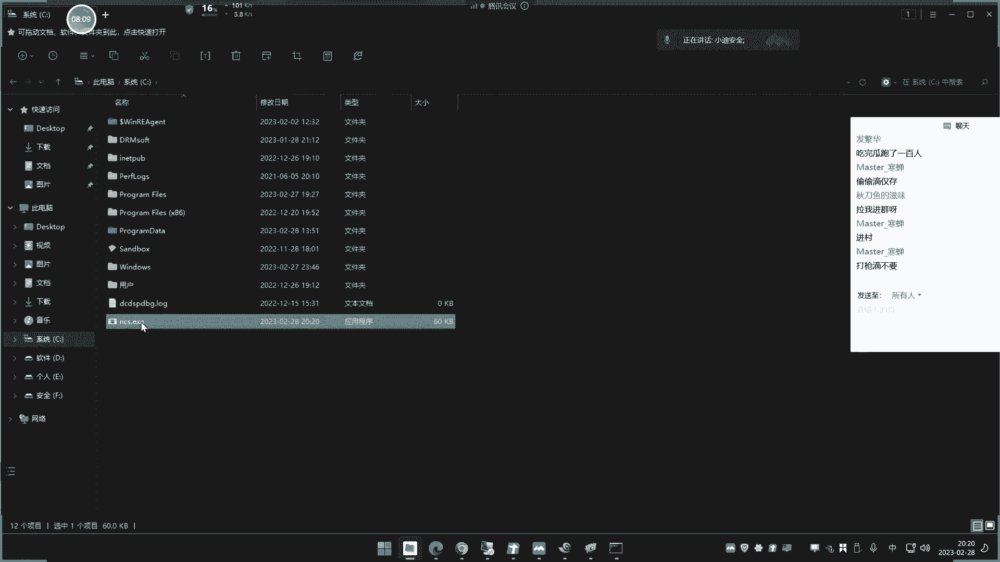
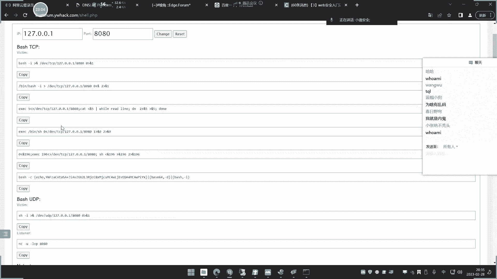
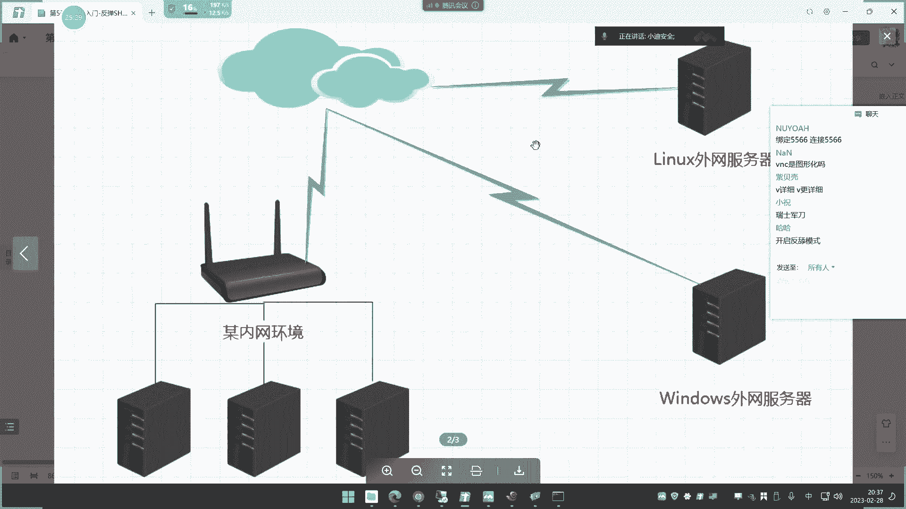
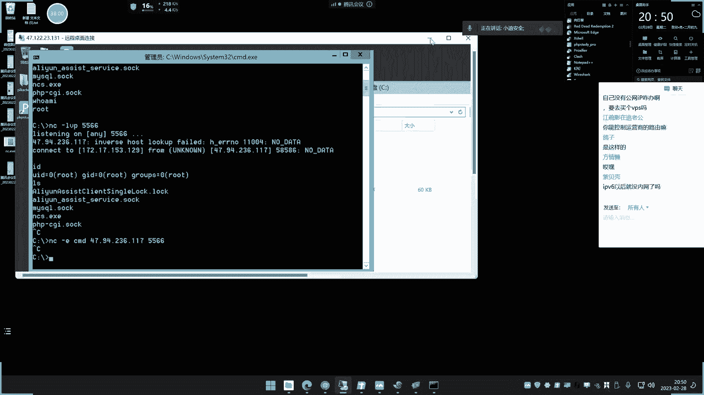
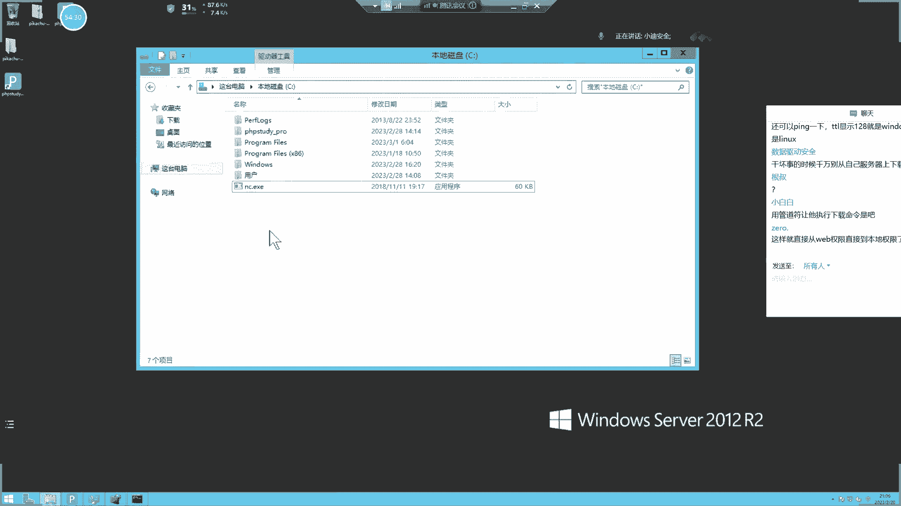
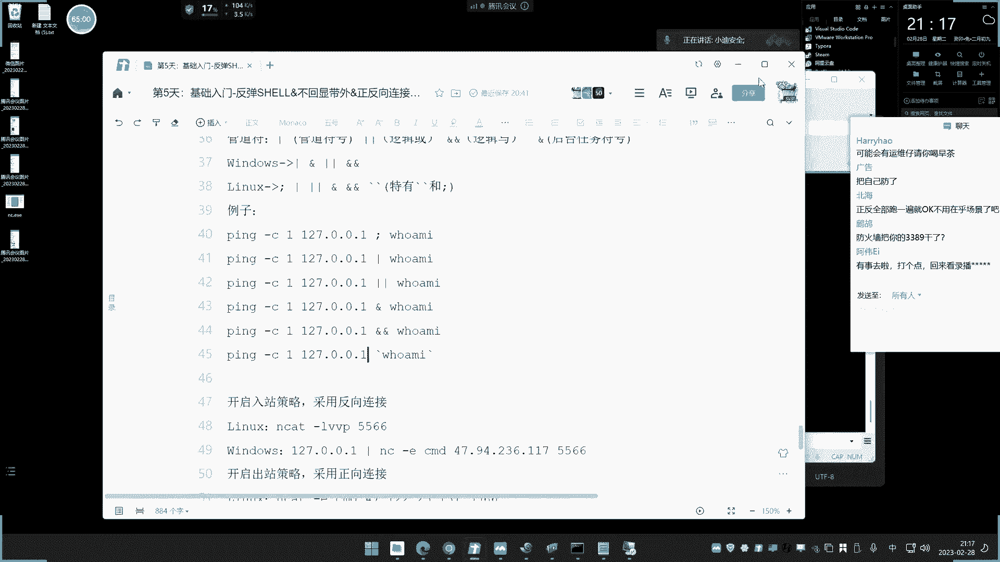
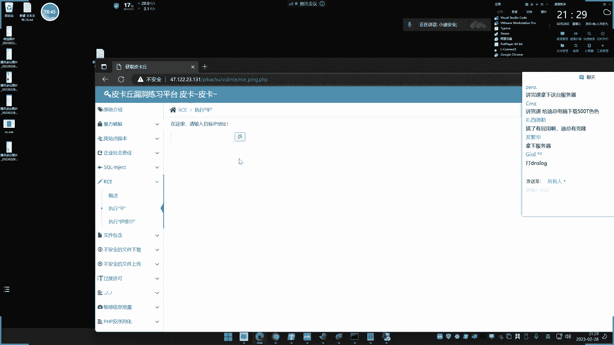
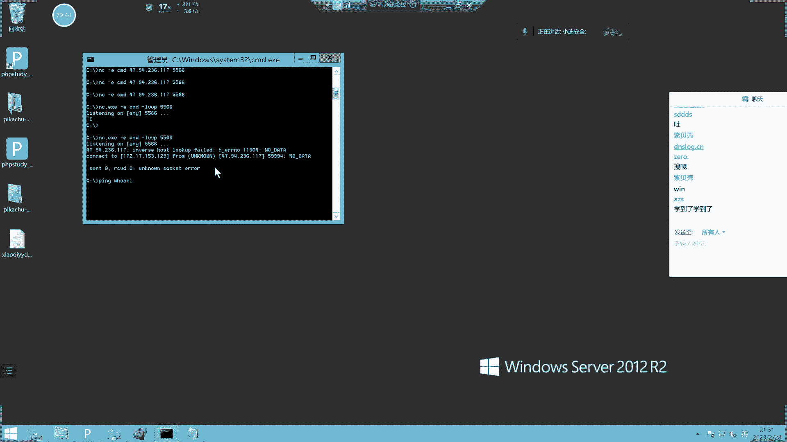
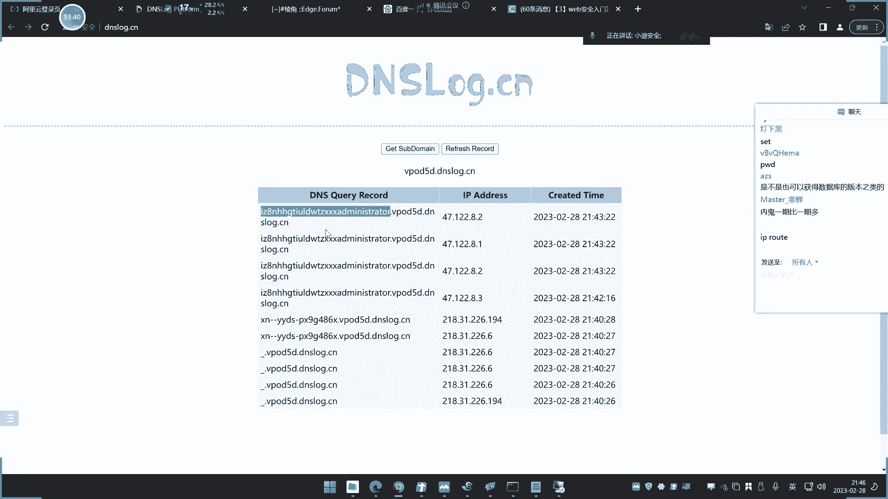

# 【小迪安全】V2024版 全栈网络安全 ｜ 攻防渗透工程师 （持续更新） - P5：第5天.反弹SHELL&不回显带外&正反向连接&防火墙出入站&文件下载 - 逆风微笑的代码狗 - BV1Mx4y1q7Ny

今天呢我们讲第五天啊，原本是讲人产品的一个打点架构的，但是人产品那个东西呢，我下面呢搞了两三个，那个课程内容的不足一次直播，所以我等我把它搞完了之后呢，足够能讲意识直播的时间的时候呢。

我们再把那可乐带来下去啊，就准备时间的准备，那个只能讲班课，所以我们就提前先讲了这个呃，另外的字典今天讲的主要是三个支点啊，这前面讲过的，今天讲的就是这个关于这个神头命令的，一些这个知识点啊。

这个命令就分常规命令和这个文件上传下载，包括反弹需要的一些命令，主要的在这个操作里面呢，我们会有案例演示，案例演示就是演示这个防火墙的一些策略，包括这个正反向连接，还有这个带外查询这三个支点。

这三个支点呢就是我们的终点啊，基于那些命令呢，大家学会怎么查，怎么用就可以了，不用去刻意去记住怎么写，因为这技术怎么写呢，没必要啊，用的多就灰了，主要就是了解三个概念啊，正反向的，包括防火墙的策略。

另外就是我们说的DIY查询，同时能理解这三个概念里面的它的应用场景，这就是我们今天重点啊，好我们来先来说低一点啊，关于这个文件上传下载的第一个案例，文件上传下载，这个呢是解决什么事情呢。

先给大家简单解释一下啊，他这个是解决无图形化，和解决数据传输的一个问题，啥意思呢，就是我们利用命令来尝试去下载文件，这个为什么要去学习这个知识点呢，其实很简单，就像我们这个自己去下载一个文件。

哈哈文件都会有个下载地址，有的呢直接访问就可以下载是吧，有的那就啊可能就点击下载等等等啊，那么你比如说我下这个文件的话，在网上随便下载个文件都是呢啊用鼠标的是吧。

点上去下，或者说直接访问一个网址啊，在这里浏览器访问网址啊，去下，像我给大家的，我给一个百度网盘里啊，你就放我这个网址呢，打开百度网盘的进行下载是吧，是这么一个操作，但是在我们这个安全测试的过程中呢。

有很多情况下面呢都是不允许图形化操作的，就说你获得的权限，他可能是一个执行命令的地方，但是呢他并没有这个界面给了你，所以你就需要用命令来完成这样的操作，比如说你需要在对方的服务器上面。

去上传一个文件对吧，这个时候你就要让对方服务器呢，去尝试性的去下载一个文件，下载他的服务器，你就不能说啊，这个打开对方服务器，在浏览器里面输入什么东西去下载，这不现实，因为你没有这个东西。

你只能通过黑窗窗呢用命令尝试，所以这就是说我们为什么要学习它的反应，其实呢就是解决无图形化的，用命令的尝试下载反应，这也是在后面这个我们这个环境里面，这肯定是要有个这个必备的一个技能啊。

因为你这个东西的话，你不可能在这个实战环境下面是吧，用图形化去下载，这不现实，那么这个狭窄呢它是个非常简单的热点啊，我们简单过一下就可以了，给他演示一下，我们可以利用这个一些这个菱角设计。

上面这个文件下载这个地方的啊，然后这里呢你可以构造一下你的文件下载地址，和他的一个保存的文件命名，比如说我们现在呢就给大家演示一下。

给大家演示一下啊，首先呢我把这个，把这个文件呢放到我这个博客上面。

我把我这个文件放到，我就是我假设我一个渗透工具，或者说我一个这个安全工具怎么这么卡呀，就是你先打几个网站啊。

我就在这里吧，所以在这里给他演示吧。

这个博客服务器有点卡哈。

打开都没反应，是什么情况，这，国服务器太慢了太垃圾了啊，一盒一集的，好这个搭建网站，由于前期已经给大家介绍过了啊，我就不该演示了啊，比如说这里呢有我们给大家开一个文件吗，我随便上传个文件上去啊。

就搞这个ES1的文件给他给他刷上去啊。

我传到我那网站目录，好那么现在呢就是我自己呢，假如说我在IP上面搭建一个web，然后呢我在web目录下面放了一个我的工具。

那么它的下载地址，那就是访问这个IP地址。

就是那个文件名是吧，那这里呢大家就可以看到它自动就会下载。

对不对，那么如何用命令来尝试呢，就很简单，首先我们构造好我们下载地址，这是我们的下载地址，然后我们的端口是八零，对不对，然后我的文件名叫WC，然后呢再就是保存文件名，就是保存到对方的那个电脑的。

我们也把它叫NCNCS，然后点击改变，那么下面就会有很多命令，我们来看一下啊，下载文件的命令，用pom show命令来尝试下载，这是第一种，还有后面用SAMD的命令去查一下载。

那么这里呢就区分于windows和LINUX的一个操作系统，啥意思呢，我们要熟悉，简单了解一下这个命令是来源于哪里，这里呢有常规的一些简单命令，我们可以看一下这个网址，可以简单学习一下其他的一些命令。

那么在windows上面呢就是命令，这是windows cmd命令，分学名呢也是windows一个内值啊，我们等下会锁，那么这里呢就是说我们就够了这个命令，然后这个是windows的CMD。

然后如果是LINUX呢，那是windows的，那么除了这个之外，你还LINUX的一些下载命令，这个上面也有，所以我们就可以尝试给他演示一下，那么具体windows里面的命令有哪些呢，这是LINUX命令。

LINUX命令可以用reg c u r h r，用Python下载，利用ruby下载，用pr下载应用java下载，windows呢肯定用pom show下载，你用这个命令下载，你用这个命令下来。

你用这个这个这个等等在上面的基本都有啊，基本都有什么东西，发了什么啊，等一下啊，不看这个了啊，我等下再看，所以私聊我发的一些图片，我等下把它保存，等下上网看课程再看啊，嗯先上网课啊，好我们来看一下啊。

这就是这几个命令啊，我给他演示一下啊。

尝试一下，比如说像现在啊，我用过电脑给他下载一下，看一下啊，我这里呢就在我的本地的C盘吧。

该演示在C盘里面挑个3D好。

然后呢我用上这几个命令来尝试下载，首先呢用这条命令可以看一下，复制一下。

他说命令成功，我们看C盘是不是就多了一个文件出来了，是不是刚才下载的保存文明，是不是叫SAMNCS啊，你看看是自动下载下来的，你看这个文件来使用这条命令，去下载了一个远程的NCC保存我电脑的NCS是吧。

下载下来了对吧。

所以呢就这个是命令下载，然后呢还有来用pop show。

我们可以试一下。

这里报错了啊，这个报错不管它有些是不支持，你可以往上面翻一下上面这几个啊。

还有些啥都能接拦截好，这里呢我们再看看是不是也来了。

对不对，那么这两个就能下载，那除了这个之外还没有呢，还有你看在这LINUX的，这是LINUX的LINUX，我们先打印一下，是我们在windows上，还有这个还有这个命令，刚才用pal的。

这个是用这个的是吧，再换一个再换一个这个支持的。

再看这里，打开没，什么情况卡了，这个下载半天还没有出来，啥都软件的问题吧，零出来了，看到没出来了啊，它慢了啊，这个慢下的慢一点嗯。

然后呢你看啊，还有下面的呢，还有这个呢也是一样的道理，重开一下啊。

啊这个它不支持啊，有些操作系统它支持，有些不支持，然后呢，这就是我们说的这个windows的一些常规命令下载啊，这里还有这个呢，你可以用这个对吧，也可以用这个啊进行下载。

然后呢LINUX的我们来连上LINUX的，你看我们LINUX上面去演示一下，我首先来到这个盘。

这是我当前镊子下面的目录结构是吧，还有S命令，然后呢我用list的下载命令来测试一下。

比如说呢CTRL下载这个文件，好我们再LS一下，你看是不是多了一个，对不对，同样we get也是可以下载的，应该是操作系统下载也是下载了，对不对，S嗯。

所以说呢再就是关于这个文件下载的操作，这个命令呢非常简单，你就自己去尝试使用就可以了啊，我就不需要再去给到大家说的，一个个去演示了啊，也可以利用这个什么脚本是吧，什么Python的或者那个都可以啊。

根据自己需要，你要根据情况决定啊，就是他是什么操作系统，你看他用ruby也可以下载，用Python也可以进行下载，对不对，但是呢你要知道啊，你用各种东西要看它支不支持，就像我们说的windows。

就用windows上面这些命令，LINUX就是LINUX的，有些不支持。

你比如说像这个刚才这个LINUX的什么REGT啊，你放到windows上面呢，它就不支持，对不对，他也不支持，不知道这window没有这个we get命令。

对不对，好这个就是我们说的文件上下载的一个问题啊，就是那解决我们在这个渗透环境中啊，没有图形化，然后呢你又要去上传这个文件，就让你把你的文件放到你的这个服务器上面，放在你自己的服务器上面是吧。

然后呢构造一个地址，然后能让对方呢去远程用命令，去把你的文件下载到对方的服务器上面去，就这么个操作啊，他就这样抗住，他就支持出他有REGT也支持，嗯好这个就是说文件的一个啊下载啊，那今天呢不是主要学它。

主要是了解这个东西之后呢，我们再给大家看一下它的实战实际的应用啊，那接下来讲实际应用之前呢，我们现在再来学习另外一个知识点，就是关于这个反弹的一个支点，那反弹字典呢，也可以在它上面找到这个对应关系。

刚才是文件下载吧，我们点击反弹效这里啊，反正现在这里呢比如说我们这边尝试去反弹。

反弹什么地方呢，比如说我反弹这个IP某个端口就在这里面一写。

写之后呢，它会上面有很多反弹的模式，有兵器模式就是我们LINUX，并且模式还有呢，你看啊NC NC n cut的，还有呢TELETE的命令来实现反弹，so cut的什么pl的一个表呃。

编啊这个脚本里面如何反弹，用Python如何反弹，用ruby如何反弹，open s s e如反弹，pop show如何反弹，a w k TCL s h java如何反弹。

什么这个ww a r lua low js，还有各种各样的语言是吧，还有这个MSF等等啊，就是他这里呢会写出很多有编程语言，进行反弹的，有自带的命令进行反弹的，还有一些安全工具类的反弹的都有。

那我们这里就不一个个演示，我就给他演示一下，这个反弹里面比较关心的几个事情，我们演示的工具呢是NC，这个NC工具呢是在LINUX的操作系统自带的，然后在windows上面那是不自在的。

所以windows需要下载这个NC来实现反弹，就利用这个工具来实现反弹，然后呢，LINUX就可以直接用它自带的NC或者n cut，来进行这个反弹，一个是NC啊。

我windows liner上面呢也叫N卡特，然后呢这个反弹是干嘛用的，为什么要进行反弹，这个呢给给大家简单解释一下。

比如说我们在这里啊，在LINUX命令上面，或者说在很多命令上面，有些情况都会有这种情况，不知道大家有没有实现过，比如说我用一个UZADD加上一个用户，加一个小迪SEC，这个用户我在加的时候加了是吧。

然后我pass wd，他是WD，然后小DCC的时候呢，这个时候呢在这一边他就会询问我，输入这个密码，就是我添加用户，然后呢，我再用这个paw d呢去填设置这个用户的密码，它就需要我输入这个密码，对不对。

然后如果说我这里不动它是吧，不动它它就会一直卡在这里，好大家想象一下，你获得一个假如说你在网上呢有个漏洞，这个漏洞呢需要去执行命令，而这个命令呢就像我说的这种，你质疑完之后呢对吧。

他需要等待你的输入就会往下进行，那这个时候你那个页面能这样操作吗，就很简单，一个网在上面也能执行命令，命令是你跳过去就执行了，他会不会把对方的一个这个界面给到你啊，不会吧。

所以相当于就是说你那个命令会一直卡在那里，你动不了，这个时候呢就是反弹命令的优势之处，就是说他可以把这个界面呢反弹回来之后，反弹到你的你的这边之后呢，你再用这个命令就可以了，这是他能解决的第一件事情。

还能解决的一个事情。

那就是我们说的解决数据通讯问题，啥意思呢，啥意思呢，就是说把权限都反弹回来，就是你执行命令嘛，就是你执行一次呢，他就一次执行一次呢，显示你能不能就说直接控制它，就是相当于是那比如一个漏洞是吧。

你执行一条命令，他给你回血一条命令，结果出来好没了，你能不能就说一直控制他的权限，权限呢，一直给到你就是维持权限，保持这个权限一直正常在你的控制之内，你不用一直敲，你想敲它就来，想敲就来，立马会写。

对不对，而且反弹命令还有一个好处就是什么呢，就是能直接把对方的权限直接移交过来，如果说你在网页上面一直提交提交提交，那么就像你一直有流量流量流量过去，但是你如果说已经把它引进，反弹回来之后。

就相当于你在本地执行一样，知道吧，就这个意思啊，这是它的应用场景，那么在反弹的时候，其中有两个知识点非常重要，有两个支点非常重要，就是我们说的这个连接的正向和反向问题，这个呢是个难懂的点。

需要我们来给大家简单理解一下啊，首先呢我们先说第一种真相连接的，然后呢我就给大家演示一下，这是一张图片啊，现在呢有这个LINUX服务器和一个windows服务器，好，我给大家写一下啊。

如果说现在呢就是这两个都是在外网，他都能进行连接是吧，好多能进行连接，我们现在要做个什么事情呢，就是让他去连接windows，对不对，这是一种啊，那么可以怎么操作呢。

就说要我这个呃呃这个问LINUX呢去控制这个windows，这是我们第一种情况，就是LINUX去控制这个windows，再来服务器对吧，这是第一种情况啊，那么这种情况呢就有两种方法实现。

一种是正向实现还是反向实现，何为真相，何为返乡呢，这个要看什么为参照物，什么意思呢，真相的意思是主动连接主动啊，就说我主动找你，这叫真相，如果让对方主动回来找你，就叫反向，那么现在呢我就给大家演示一下。

这个砧板在什么情况下会使用刀，这个就是它的核心电脑正向反向都好理解，就是一个是你找他，但是他找你的事情，但是这个东西呢无法判定哪个就是真，哪个就是反，主要是看参照物。

就如果说我以WINNUX为参照物的话，那么它发出的主动发出来的就叫真相，就相当于它叫真相，但是如果真的windows为参照物的话，那么LINUX过来的话，那就属于反向，能不能理解。

所以这个正反呢你不用刻意去纠结，你只要知道它是什么概念就可以了，因为这个针法呢是相对于参照物来决定的，就是说如果你以这个这个什么，以这个LINUX为参照物的话，那么他如果主动出去，那就叫真相。

他如果被别人连进来，就叫反向，知道吧，但是很简单，这是LINUX的这个这个这个参照物，如果说以windows的话，你主动去取的就叫真相，那么这边就变成真了，如果你以为参照物的话。

让别人主动找进来的就叫什么反向，谁说要看什么是参照物，来确定哪个是正，哪个是反，这个没有什么概念啊，就看参照物啊，但是你要了解出去的，主动出去的叫真，然后呢别人找过来的叫反啊，这个也无所谓。

你理解就行了，好那么现在呢我们来给大家做个实验，就说刚才呢我们要做个实验，来给大家做个什么实验呢，首先增强实验，让LINUX去主动连接windows来实现控制，看着啊，这个就是做了一个第一个实验。

就是首先windows上面绑定自己的CMD到566，然后呢LINUX主机呢就是连接目标地址的566，所以这个就相当于说是windows linux空是什么，我有些控制啊，这样好理解点。

控制windows的一个什么连接，然后这个是windows的控制ex连接好，大家看一下啊，LINUX控制这个windows如何实现的呢，在windows上面，windows上执行一个绑定3D的窗口，好。

这里呢需要提前借助一个工具，就是我说的NC工具，这NC工具呢是丽娜是自带的，但是在windows上面需要下载第三方的NC，我下载下来了，给大家演示一下，首先NC执行杠13MB杠LCCP杠566。

这个意思是什么意思呢，这个意思是什么意思呢，给大家解释一下啊，把那个窗口搞大一点吧，那这个意思就是绑定SAMD。

就是我们这个我们在电脑上面执行SEMD。

大家都知道啊，就是一个黑框框的这个东西，就是我们说的命令提示符，就这个东西啊，那么当一就是绑定CMD，给到本地端口的566好，我来把它进行一个什么绑定好，他就说监听任意来自566的端口的。

对不对好，然后这是他IP地址是471222。2，3。131好，正面LINUX服务器，这是我们的LINUX服务器，LINUX服务器是这个IP啊，是我们这个上面IP，然后呢我们做个什么事情呢。

n cut他是n cut啊，他命令叫n cut，然后呢也叫NC，然后呢怎么加上对方的IP，17。122。2，3。131，然后加上5566，看着啊，回车，嗯什么情况，好出来了啊，你看我这边呢。

就来到了这个什么一个叫C盘的地方，我们来看一下当前这台电脑，就是那个就是这个windows，就相当于说我这边就能控制windows，这是windows，你看在windows上面的电脑盘符嘛，对不对啊。

电脑上的盘符是不是就过来了呀，对不对，那他就收到了一个远程IP地址，连接过来的数据是吧，我就可以在这里进行这个命令敲入了，对不对是吧。

我就可以尝试命令的销路了啊，这个就大家都知道。

比如说我让他去下载个文件是吧，我就可以直接写上一个下载命令加热敲，那么这边呢就相当于执行一样，虽说我现在就已经控制这个windows的命令窗口了，你反弹回来了，大家看到了吧，这能理解吧。

这个啊能不能理解。

能理解吧，好我把它推出来啊，退出就回来了，这边就断了是吧，自动断了，这个呢，就相当于说我实现了一个让这个windows被空啊，LINUX控制windows好。

接下来如果说windows呢要控制LINUX的话，该怎么办呢，是不是也是一个道理啊，在LINUX上面执行这条命令，把LINUX的这个命令执行的地方就是这个SH，就是说命令windows是CMD。

然后LINUX是SH这个终端就是这个什么，就是我们这里看到的冰，然后SH就我们现在看到这个东西呢，这是命令的东西嘛是吧，来自东西嘛，就是呢把这个东西呢给他绑定到本地的566，还有非P或非P都行啊。

还有飞飞P飞P都行啊，这个我刚才写的非pp，这里写下非P也可以啊，来就LINUX呢在这边的绑定就绑定自己的566，把绑定这个SH呢给它绑定到这个物流端口。

然后windows这边要控制这个LINUX该怎么办呢，是不是他去连接连接谁呀，连接这个目标地址的566好，连接上去之后，我们在这里执行命令，你看IDIS这是来到la上面去了呀，嗯是不是来到命令上面去了。

像是现在呢就是windows在控制这台服务器，对不对，看到了吧，这个那下次是windows这台窗口，windows这台主机就控制这个LINUX服务器。

对不对，好，我把它推出来啊，推出来好，那这个呢就是我们说的最常见的真相连接，啥意思呢，来我们来举个例子，把图片拿出来，刚才那个原理是什么个情况呢。

就给大家简单解释一下，首先在这个服务器上面去，那么他是做什么事情呢，啊他做过什么事情呢，比如说LINUX服务器去控制windows的时候啊，那么windows上面就什么BD，就是在这里。

那本地什么在这边啊，本地开个物流端口，然后将他绑定一个3D1好，然后这个时候呢这个服务器呢就怎么样呢，他就主动连接这个566对吧，然后呢绑定CMD，就相当于控制还是什么windows服务器是吧。

这是我们说的LINUX呢去控制windows的一个过程，就是他主动去连接这个远程IP地址的566，然后控制不好，还有一种情况就是说windows主动控制LINUX，那么就是这个LINUX服务器呢啊。

LINUX服务器做了个什么事情呢，嗯这个肢体怎么，字体在哪里，什么情况，好那么现在呢我们再来看这个啊，就是你在这边之后呢，你这边啊，就相当于说我们这里的主动去联系他了，然后他的绑定个566。

他就是连接到566，就像是他自己他绑定的SH文件，那个是CMD，你连他看看他这个是566，也是566，这个端口呢可以随机的啊，可以随机的，就是1~65535所有端口号里面啊。

656535在这区间任何一个端口就可以啊，只要这个端口呢没有被占用，不占用就行，不占用就行啊，就任何一个端口都行啊，就这么个概念，刚才做这个实验是吧，就是呢在本地监听等待对方的连接。

所以这个操作呢我们给它简单写一下，就是啊等待监听，然后呢他就是等的监听，然后等待连接，这个操作属于这种情况好，那么现在呢就换一种叫反向连接的，一种情况是什么呢，主动给出去，主动给出去，啥叫主动给出去呢。

刚才那是本地自己监听，等着对方来连是吧，等着对方来连，现在他是主动给出去，对方的监听啥意思啊，看一下啊，我在这个地方，我刚才在这里执行的是什么，刚才这里执行的是这个嘛，本地566。

现在的我把这个本地都改成什么一个IP地址，然后呢在对方的地址上的监听啥意思呢，看着啊，刚才是谁监听就是控制谁，现在是谁监听就控制对方，啥意思呢，你看啊，566，我在我本地监听566，刚才那就是怎么样。

是这样，你去连接对方的物流了，是刚才是这种情况，对不对，就是用这个LINUX去组连接的windows566是吧，现在不一样了啊，现在你看啊，现在就是这边的监听，然后呢他权限的主动给出去啊。

绑定自己的这个SH给到对方的566，然后这边呢就是什么监听566，我们来看一下直接性，你看现在来了还停止，对不对，命令就能执行了，好什么情况，就是主动把你的权限给到远程上面的566。

然后这边呢就是监听566，等待东西过来，是不是就说一个是那本地等着别人来连，还有一个就是别人主动给你，你就等待东西到，能理解吗，哎你们不用刻意去理解，就是一个你来我往的事情是吧，你可以选择性的等待别人。

就是你自己准备好了好，你来找我，这是一种情况，还有一种情况是什么呢，我真的好了，你过来吧，就这个意思，对不对，你看这个辣椒能控制，那么反过来也是一个道理，他可以怎么做啊，你看他啊，绑定。

这是之前他绑定自己的，然后呢我主动把CMD的权限交给这个地方，那我主动交给他，然后这边呢是不是监听了呢，来减轻自己的566，那我我这里等待上钩的，然后这个呢就主动把钩呢给过去执行，你看没有，过来了。

就来到windows这边了，控制windows就是windows这边了是吧，对不对，好理解吗。

能理解吗，这其实就是一个正反向的问题，正反向的问题啥意思呢，还是我说的那个图像的那脏东西的这个事情啊。

有什么好难理解的呢，这有什么好难理解，那这对不对，我去这两个很简单，现在再来看一下这张图片是吧，我控制水，我们先来说第一个概念啊，做一个啊，比如说现在我要问LINUX去控制这个windows。

我怎么去控制它，我有两个选择，一种是我主动找到你，然后呢你本地进行监听是吧，本地监听，然后让我连接的这个本地端口来控制你，这是第一种方式，还有一种方式是什么，由他自己把权限主动给到你。

然后你这边属于什么本地监听，能理解了吗，能不能理解这个，无非就是说啊一个是对方主动找你，这个是你找对方两种情况，这有啥难理解的呢，就一个等待连接，一个呢是让别人主动连接你。

好那么为什么要去学习这两种知识点呢，为什么要学习这两个知识点呢，现在呢就来给大家演示一下简单的一个实验啊，这个实验呢不仅是说啊这个绕防火墙的，在很多情况下解决网络的通讯问题都是一样的，好我们先来看一下。

首先跟内网环境，就是正反相连接的一种最常用的环境，这和内网的一些知识点是挂钩的，你如果说这个网络听不懂的话，在内网里面很多东西都听不懂了，来看一下内网环境，那我给他看了个内网环境啊。

就看这个还要看这种图片，那内网环境是什么呢，什么叫内网环境呢，就好比你自己在你的公司，在你的学校，在网吧里面都属于内网环境，就是说他们这个触网的，都是通过一个公网IP来上网的。

比如说我们电脑的自己在电信是吧，或者移动的办理了一个宽带业务，他就会给你这个网线，网线呢会迁到一个路由器上面，路由器上面，那你就都在这个路由器下面去上网，然后你录一下面的所有设备都属于一个内网。

就是除网的，只有路由器那个独立IP，它是一个外网IP，它能解决是吧，下面所有机器都能上网，就是公用一个厨网网卡，所以我们这种人就称之为叫内网，那么像学校啊，网吧啊，或者是一些公司啊。

企业里面都是这种内部环境是吧，那么内部环境呢，如果说你要控制内部环境的某一台机器，我们来思考一下有什么问题呢，这就是提及到这个外网IP单个唯一性，就说他只有一个除网IP，这个IP地址的是全球唯一的好。

我们先来看一下，如果说我要解决这个网络通讯问题，我们来试想一下，这是个网络啊，我们来思考一下啊，现在呢我要解决个什么问题呢，我先把这个简单的给大家说一下啊，解决了什么问题呢，就是说啊要控制内网的某一台。

极其的权限好好，我们现在想一想啊，现在我们要解决这个问题，那我们想一下啊，现在我们要解决这个问题好，你该怎么解决啊，我们现在想象一下啊，按照我刚才那个思路来，我这台就说我以这两台主机。

随便哪台主机要控制它，我就有这台主机啊，我尝试控制啊，假如说是这台主机，我去控制它，我主动连接你，这是我们说的，刚才不是说了次数吗，我主动连接和你主动出来好，我连接你，还有一种情况就是你出来对吧。

两种情况我们看一下啊，这条路行不行得通行不通，这个是对的，这个是差的，为什么，因为你要和他建立联络，你们是通过互联网的，互联网一个IP的唯一性，外网IP它有个单独的IP地址，而你这个IP是内网IP。

你出去是通过你的外网出去的，他找你能找到，只能通过YMIP找到，所以这个vim p就在这个网卡这里，他只能找到这个路由器这里来了，但路由下面有多少个机器，他哪知道哪台机器是他要的呢。

因为他们都是通过这个网络这里出去的，对不对，但是你说给内网IP它吧6IP呢到处都可以用，就像你网吧的IP，内网IP和我们电脑的这个机房IP都一样，你给内容IP他他找不到，他会找到他自己的内容P。

但他自己内容IP就不属于你这个网络内容IP，所以他只能给一个YYP，但VIP的找到这里就断了，因为他不知道是哪台主机，下面哪台主机，能理解吧，所以这种情况下的话，只能通过什么反宰相，什么意思啊。

让他出来找你，因为你是唯一的IP，他能找到你，你的IP是全球唯一的，他如果找你，你给个全球IP传奇的VIP，它这个是你除了IP他找到这个路易斯里来了，找不到辖区了，因为他不知道下面是哪台。

如果你要主动让他找到的话，需要在路由上面设置个端口转发，就是说谁找过来的，那个找哪个端口就转发给那个IP，拿个雷P，他就知道是他，但是你要在路易上面做一个端口转发，端口映射，也称之为就能找到目标主机。

所以如果说内网环境的话，你要控制这台主机的话，需要怎么办呢，这要怎么办呢，是不是让他反向过来找啊，那么现在呢我们就做这个实验，通过实验呢加深你的印象。

如果不加实验的话，我光讲理论的，你是听懂了，但是你不知道什么情况。

其实这个实验呢我是不想讲的，因为这个说完原理之后呢。

也没必要讲实验，就好比我给大家举个例子，你在你学校宿舍对不对，血压树呢住了很多人，然后呢我自己呢单独又有自己的房子，我房子有个门牌编号，所以别人呢可以通过这个这个这个这个，什么这个门牌编号了。

找到我是吧，但是呢你给他一个学校的宿舍地址，他找到熟悉的地址了，但是不知道哪个是他要找的人，就和这个意识有点差差不多，所以你就让大哥学校里面的人主动找我，我直接给你个门票，你就精确找到我。

但是你给对方熟悉地址呢，哎他找到属地址里面住很多人，他不知道是谁，但是你可能说我直接给个名字不就找到了吗。

给个名字，全国各地有那么多名字，他哪知道是哪个，对不对。

就和这个概念有点像死啊，接下来呢我就给大家做个实验，通过这个实验呢给大家看一下，现在呢我开了个虚拟机，虚拟机呢就是个内网，因为这个虚拟是怎么上网的，都是通过我这台电脑上网的，所以它是属于我下面的网络。

所以它是可以网，所以这个虚拟机呢他虽然能上网，但是呢服务器值都直接控制这台虚拟机，它是控制不了的，因为他只有两种选择。

一个就是给内网IP，他内外IP全国各地都有，他不知道是哪个给YYIP，他他就找到我那个除网，但是呢他不知道是这台机器的，好我们现在来看是不是这个情况啊，我两个IP都给你撕，免得你说这个搞不清楚。

这个呢有点和这个网络相关的基本概念要懂啊，那个是我没办法给大家讲的，网络最基本技术，就像什么什么是叫外网，什么叫内网，这个是没办法给你讲的啊，好我们看一下啊，那我先确定一下，我能上网。

我在这里打开一个浏览器，这是我信息啊，那我能上网啊，这都看到了啊，然后我抢IP，这是我的厨网IP，这是我的YYIP地址，看这是我的I我的我的Y网IP地址是吧，还有个IP地址是内网IP。

也在这里输入IPCONFIG，1920168。1。107，大家可以看到啊，好现在呢就是刚才刚才那个事情。

就我这个LINUX服务器呢，我想控制你这台这台虚拟机，我该怎么控制啊，首先我按照我正常式来，我主动连接你，我看能不能连接啊，来我就主动连接了n cut是吧，n cut主动连接连接的IP啊。

好我先来说连接这个内网IP好吧，都试验一下啊，你这个内容IP，566对吧，然后你这边呢，我就把NC上升到这个盘子下面去啊。

这里还有个杀猪，先把杀毒关一下啊，因为这个工具默认是不免杀的，好看啊，我NCA监听杠一是吧，绑定CMD，然后呢杠LCCP绑定自己的566，等待对方连接，这是我刚才操作嘛。

然后这边是不是就经常去连接这个IP地址，566以前，我用那个linux windows服务器和这个LINA服务器通讯，是正常的，就是我这个服务器是正常的，但这里能不能正常呢，不能正常。

为什么你要执行之后，正面没反应，拉面没反应，连都连不上，然后呢一段时间之后它就会提示你超时，也不是的问题，为什么，因为你这个IP是内网IP，全国各地都有，他不知道是谁呢，连接超时没有了。

然后这边还有没有更新，啥情况都没有，为什么，因为你主动找IP地址，他找不到好，那么接下来大家说了，我要让他找到全球唯一的IP地址，就是我们说的这个自己的外网IP地址，然后我怎么办呢。

我是把这个IP输进去是吧，我就让他主动连接这个P的566看，对不对呢，在这里再，连这个IP地址的5001个连接网页，连连不连上呢，一样的道理也会连不上，因为他去连接这个IP地址呢。

这个IP地址呢是我的那个路由器的出口，路由器出口并没有执行监听这个操作，执行的是这个内网也失败，所以他连不上，所以你要控制这台windows只能怎么办呢，反向怎么反向啊，主动给出去，把权限主动给出去。

因为你能找到这个LINUX，但是LINUX找不到你，所以你就主动给到他，对不对，怎么给呢，是把自己生命给了他566啊，然后这边干个什么事，监听自己的566，对不对，给到这里监听566，你主动给出去回车。

那你看是不是来了呀，来了来了呀，是不是这个意思啊，这就是我们说的这个正反相，它的应用价值就是什么情况下用真相，什么情况下用反向，你要根据这个网络决定，他找不到你，你就找他，他对不对，就很简单。

你去追女孩子，对不对，他喜欢你，你就等着他追你就得了，对不对，他不喜欢你，那你只你去追了呀，那你妹的你还等着他。

是不是这个就好理解了呗，就是因为他的网络决定了这个情况是吧，好我让我代问，反过来问一下他，我刚才是说用这个LINUX服务器去控制这个内网，这台机器好，那么现在我在想问一下大家。

如果现在我要让这个内网控制在LINUX，大家觉得该怎么办呢，啊我反过来问一个，我要装这台这台内网控制在windows linux该怎么操作啊。

是不是要这样操作了呀，该怎么操作啊，是不是就这样操作啊，正面处于一个监听，然后他主动去连接，是不是这样操作啊，那就正面呢把权限给出去，杠1BSH，就把他的这个全新的给到他本地的566。

然后这边呢就主动什么连接它的566，是这样操作的，对不对，就是控制这个力量是嘛，那我们看一下啊，他主动把他的权限给到本地566，然后呢这边呢就主动连接566，对不对，然后你id执行一下，那没问题是吧。

正常出来了，为什么呢，因为这个内网机器他只能去主动连别人，别人找他找不到，因为他在内网找不到，所以只能让他主动发起进攻，所以你要控制LINUX的话，该怎么办呢，LINUX就属于被动，等着他去找他。

因为你主动不行，你主动你找不到他，所以你只能处于被动，两边是内网，两边是内网，咋办好办呐，内网课程接吗，现在讲不了，再讲讲，糊涂了啊，两边内外环境也简单，搞一个中间的一个人就可以了，就很简单。

我搞个中间人，这边把权限给到我中间人，中间人呢再把这个权限的沙发，就相当于说两边呢就是都给了中间人，中间人做一个中专，就中间的假设一个外网服务器，就让两边把请求都发上去，然后呢他他做我想法。

好这个是我们内网课程啊，你在说哪个是内网课程，那不是我操心的事情啊，我们现在只要反向的概念啊。

好这个就是我们说的第一种啊，好那么刚才演示的就是说这种应用场景，那么还有一种应用场景呢，就是防火墙的一个产品，防火墙呢一般都会有入站和出站规则，我们来给大家演示一下，一般就会有这个入站和出站规则。

那么这个呢我们就给大家来进行演示了啊，所以在演示之前呢，我们就配合这个真实的网站应用的漏洞的去讲，这样子呢可以把上面学到的文件下载，包括我们今天这个真相连接，反向连接上线的这个问题呢，刚好把它弄出来好。

我们这里呢随便搭建了一个，这个这个漏洞的一个场景啊，然后呢在讲之前呢，我们先来说一下数据回显的问题啊，来这里的搭建一下这个漏洞场景，然后这里有个执行命令的地方，它可以执行一个拼命令。

就是说你在这里输入一下7。001之后呢，拼一下啊，它就会执行一个偏移下线仪的一个命令，他就会拼，对不对，然后呢，我们就利用这个接口来实现漏洞的一个利用，怎么利用呢。

我们利用这个windows的一个管道符，和丽娜是一个管道服务，什么管道服务的管道符，就是可以执行多条命令的一种叫管道符，那么啥意思呢，windows呢有四个这个管道服务，然后LINUX有六种管道服务。

我给他演示一下分别啊，啥意思啊。

老演员是老演员，但是在老演员基础上又加了一个支点，就是回血问题，来我们看一下好了，我拼一个IP地址，1270001，我们不是讲皮卡丘，你要明白，我们讲的是这个论文件的一个活学活用啊，哪是讲皮卡丘呢。

那我拼12701，我在这里加上一个管道符，我拼了之后他能拼，对不对，然后呢，我加起来一个管道符，五迷啊，打错了，你看我加这个管道符之后，他是执行的换的命令，这地图管道符还有一种管道服呢。

两行相同的两个小号，就是前面一条命令也执行，后面一条命令，他也执行，他后面也执行也执行，就后面的命令执行，刚才你可能说我为什么没有看到自信呢，是因为这个命令会一直执行，你把它只执行三次就可以了啊。

还有一种叫呢这种呢是吧，还有呢那它会执行，还有一种就是哎这个后台执行呢，他在后台里面的一致行，对不对，他后来里面的一致性它会一致性，还有就是加两个斜杠，还有一种情况就是这种号呢拼一下拼命令，对不对。

然后加上一个什么，你只要再拼户外面，他是说不知道户外面是什么呀，但是你把户外命令加上这个东西呢，这种东西加上去变成了root，啥意思啊，他把这个昏迷执行了，执行的命令，结果是root嘛。

所以他就提示不知道root能理解吗，或者理解很简单，把这个改成改成什么PW，那是不是变成斜杠，LUTPW是看当前目录在哪里，是在路T目录下面，对不对，所以这个就是执行这个PW。

还有没有呢，还有啊来还封号，这里有例子呢，你看啊大家演示一下，平分号外面看到没，root被执行了吧，平台报错了，但是RT被执行了，你看，关闭被执行了，对不对，同样道理啊。

换一个mini iOS是不是IOS被执行。

嗯对不对，然后windows里面就没有这两个啊，没有这两个windows，没有这两个啊，没有这个封号，也没有这个这个分析windows就没有了，你看windows我给演示一下这个windows的啊。

你看一下windows的，我拼一个IP地址对吧，然后呢我得加上这个符号关闭啊，他执行执行前面拼命令，然后呢后面是后面的，没有执行这个户外命令，然后我加一个啊，来看是不是执行的，同样道理，加上这个符号。

那下面下面是有了也执行了吧，上面也执行了，然后这里呢就这几个条件啊，那逻辑或逻辑与和后台任务符号等等，就是它有些呢是只执行后面的，有些执行前面的，因为我们主要是执行后面的，只要后面执行就行了。

他要看前面条件是不是不正确的选择执行，这个不需要大家可以去理解啊，我们没必要把它讲的很详细，你只要知道用这个管的符呢，可以执行多条命令就行了啊，其他的你不用管这个什么活条件，那为什么会执行一条啊。

执行两条，那就是我们说的逻辑运算，真真假假条件相关的啊，这个不用可以去读啊，好这个就是管道符，那么现在呢我们就来看啊，这里有个漏洞，这个漏洞，那就是说可以直接写一个IP地址执行命令。

但是我肯定不是说我拼一个命令就完了，我需要把漏洞利用起来，我怎么办呢，是利用管道符吧来写个关闭，对不对，就我写管的符呢，还执行一下户外命令，你看一下这个能不能执行户外命令，你看是不是能执行的。

能执行或命令，对不对，好，那么大家试想一下，那么现在我如何让他把船先主动给到我的，因为我执行命令，我我要把它反弹回来，我便于控制他的权限了，该怎么办呢，大家首先要思考一下。

首先从这里看到的他是个windows服务器，为什么是windows服务器呢，因为执行命令他返回的是TPC，是windows的，第二是root啊，好这里是个windows服务器。

windows服务器的WC呢它不自带，所以我需要怎么办，商传NC，那么刚才讲的商船命令四就有用武之地了，你要上传一个工具到这个网站目录下面，该怎么办，他能执行命令，但是你不能让他在同一个下载。

所以我就要命令去下载一个，是不是让mini下载到之后呢，再怎么办呢，去执行这个NC来进行反弹，所以思路是怎么样的。

给他理一下，不理呢，有些人就不懂，没办法，基础太差啊，这里呢就是首先啊先是什么样，首先这里判断出是windows，如何判断呢，就刚才说的昏迷，你看到的是MC不输出的，那么这里呢就是判断NX接下来怎么办。

windows没有自带是吧，没有没有这个什么自带的这个root，所以我需要怎么办呢，是不是想办法上传这个NC啊，借助NC来进行反弹权限。

是不是，然后如何下载呢，是我提前准备好一个NC的地址啊，由于我前期已经准备好了，放到我自己的服务器上面去了，所以呢我就把服务地址一一构造是吧。

因为我放到这个服务器上面去了啊，然后去从这里去下载这服务器的八零端口是吧。

发了个NCESE，这个是先自己搭建好了，服务器，搭建好了一个下载地址，然后保存到对方的名字，也叫NC改变，然后找一个命令，由于这是windows，所以我下载命令也要选取windows的命令。

所以我选择哪个呢，就选这个吧，对不对。

选这个，选这个之后呢，这是保存路径，我让路径直接保存他的C盘，不保存到对方的C盘上面去，要保存C盘，把它保存到C盘里面，等下我就直接调用C盘吧。

免得说不知道把这个东西下载哪去了，所以我可以来到我服务器那边。

我先把这个C盘的这个NC给他删掉，现在呢我就执行命令，怎么执行啊，先让他假装拼一下一个E70，再加上管道符是吧，先让这个漏洞呢先拼拼了之后呢，怎么办，指引这个下载命令来，我们试一下，看能不能行。

把这个东西呢就让它下载。

他在哪看着啊，然后去下载到C盘的C，点击下载执行，我们这边看服务器在变啊，那它提示这个东西之后。

我们再看这边看到没，是不是有了，二月28号20。07分。

就是刚才下载好之后，服务器上面下载好了，是不是要执行它呀，下一步就是什么下面执行啊，好下一步该怎么办呢。

我们来到这个思路上来想好，下载好了，第四步就是反弹的一个操作了，反弹操作，反弹操作的话，我可以选择两种方式，一种是他去监听我连接他，还有一种是他把权限主动交出来，然后我连上随便选择哪种方案。

就正向连接反应连接都可以啊，因为现在我没有做任何限制，它都是可以的，因为他是个YYP嘛，所以我就怎么办呢，我选择一种真相连接的方案，这样连接方法是怎么操作，NC就C盘的这个文件怎么操作。

C盘这个文件刚一把自己的SAMD是吧，绑定到自己的物理端口上面去对，然后呢前面加上这个PID这个东西，管它不加上去真相，然后我们这个LINUX服务器做什么事情呢，n cut连接这个服务器IP地址，是吧。

让他去连接它的566，对不对，好，还有一种情况还有我怎么操作，还有一种情况是怎么操作啊，我还有这个操作怎么操作。

把他主动给到远程的这个id在上面去。

然后这边做个什么事情啊，本地监听就完了呀，两种方案都行，我们来试第一种方案一个个试。

大家看一下啊，前面是先把它拼的意思。

后面那就是将它绑定本地566，然后我这边呢分别连接这个目标地址的5V6。

看着啊，9D20呢这台控制主机连接它，因为它是个外网，所以我尝试连接它。

连接失败，因为我没有执行好，我们现在呢把这边呢执行一下啊，看着来用NC将3D绑定到本地的566好。

我们现在在哪，主动区连接它，566。

哎哎发现了。

我观察一下这边啊，看一下他这个网络是不是有连接，是不是建立连接，我先看一下啊，这里他5年都没开。

说明没有执行成功啊，刚刚是什么情况，先把它关掉，老是。

哎一个包出啊，他这里报了个粗啊。

网站崩了吗，这有些尴尬，连上去了，看到没，连上去了啊，翻鸡毛车啊，怎么可能翻车啊，你看连上去了。

你再看这边呢是不是进程里面就执行了NC，我们看看有没有NC进程，你自己看端口呢是不是开了五六，开门呐，是不是开了五流了，那你看这是由温水精神啊。

那温水看到没执行了，看到没，怎么可能翻车，老是想翻车，里面的数据慢了而已，翻车翻，你们个鬼翻，天天想我翻车。

好了是不是就行了呀，你看现在的五零应该关了啊，因为我已经推出来，他那个会现在还是正常运行啊，这还物流还是开的啊，这还有个水连接了内鬼真是多呀，内鬼在脸上来了，我赶紧把这个进程结束掉，好进程结了啊。

怎么还在连接。

这是谁呀，他妈的音效连接上那个干小娃。

好这是我们说的这个第一种方案是吧，呃说的这个第一种方案，就是说呢他主动的监听个566，等待这个这个这个谁的连接是吧，那么现在呢还有一种方式呢，就是我们说的，换另外一种方式就是什么情况呢。

我先把这台服务器重启一下啊。

我怕等下内鬼，我搞着搞着，他把我把环境删了。

赶紧重启一下，我这个已经搞怕了哈。

但是重启好多啊，重启好，我们还有一个这个连接啊，刚才那就是说服务上面自己呢去绑定，然后呢你那个控制主机的主动连接，还有一种情况，就是说这个rob服务器呢，他主动把权限交到这个地方。

然后呢你这个控制主机就自己等着他过来。

好那么现在呢我们先把那个NC1把它还原出来，因为之前已经下载了，这个我就不多说了，好这个呢接下来我们就要做他的第二个实验。

就第二个就这里呢。

他本地的去把它反弹到566是吧。

所以我们这边一般提前在这里先监听好，NC杠CPAP物流的货啊，飞机也行啊，等待对方谁来连接我是吧。

就让这台服务器的主动把权限交出去，交到这个IP的566勾。

我们看这里啊，是不是来了，你看直接来了，没问题啊。

所以呢你用哪种方案都可以哈，用哪种方案都可以，现在删不掉，删不掉的原因就是因为他把WC执行了啊，先把WC暂停，让他全丢掉，好那么现在呢在讲这个之前。

我先把它停止一下，防止有人搞破坏啊。

好那么现在呢大家就明白这个道理了啊，这是我们说的最简单的，但是现在啊我就在这个镜上面给他加一下，防火墙的策略，防火墙策略那不是让大家去学习防火墙，防火墙的学习是一方面。

最主要就是了解这个正反向的一个应用问题，我加个什么防火墙策略啊，防火墙里面有陆战策略和出站策略，出站的就是检查出去的，能理解吗，入站就是检查进来的，就是针对这台主机近代的流量。

出站就是针对这个主机储存的流量好，我们先来看鲁战策略，我加一个这个防火墙啊，看着啊，我把防火墙开起来，看这样开了之后。

我们实验该怎么做，主要原理呢是希望大家搞清楚，这个正反向的应用场景，同时呢等下还有一个支点啊，还有一个支点，那我先启用防火墙。

诶什么情况，汽油里面直接卡死了，会不会把之前那个车里搞关了，他妈的我连不上了呀。

好还连得上，吓死我了，好把防火墙启用了啊，我们来给大家看一下这个防火墙，这边我们先来给大家看一下，这个入站的一个防火墙是开的啊。

我八零端口是保证它能运行，所以我开了个八零端口，因为我这个上面五服的是八点logo的。

我现在没办法不开放啊。

好大家，我现在感想啊，我搞个入站策略，搞入站策略啊，我搞个什么东西呢，我就限制物流端口，假设我假死啊，如果真实情况下人，那我肯定会限制很多端口，或者说限制很多东西，我现在是假释。

就说我只能让你用五六人口来反弹，我再把五六口给他限制掉，你该怎么办啊，如果在这里啊，显示一个端口，我要突破566，我该怎么办呢，我限制特定端口566组织连接，是吧，然后就是TCP566写一个名字好。

我加了这个呢，就是金子五溜溜传入好，这个时候该怎么办呢。

这个时候该怎么办呢，后面还是来到刚才那个地方，把网站先开起来。

好刷新。

那么还是来到这里啊，我们这里呢是如粘，限制了这个566，那么你要566去控制的话该怎么办，这两个方案哪个不行了，我先问一下大家，是这个不行，是上面这个不行啊，下面这个不行，是上面的下面的上面的不行是吧。

对不对，好，我们试一下看是不是不行啊，我就直接执行给你看吧，我就不知道这个1270了。

我直接执行，我怕等下又卡死了啊，我直接给你看下了，我直接在这里执行好吧，NC就是这个命令嘛是吧。

来执行这个帮566，然后这边呢之前是连接上的哈。

我来连接了连接这个目标的566常识连接，然后这边先进。

哎呀，他把文学都换了。

直接接近566啊，那我们这边呢来去连接它，是不是连接不上了，大家可以看到，什么我自己删的文件被换了，没看到，我原来60KB变成2KB，我打开就提示这个吗，那连不上啊，看到没，是不是连接不上。

庐山被改了吧，就是你进来之后，这个东西被阻止了，是不是被阻止了啊，所以连不上了，最低只能怎么办呢，是不是只能选取第二种方案呢，就让这个东西主动出去，怎么出去呢，是不是就NC杠1SMD，然后给出去啊。

因为给出去就属于这个什么除张就不属于入站，就说你自己出去流量哈，他没我没有设置嘛，对不对，什么鬼啊，他妈IP是不能复制了，嗯给到目标的566，对不对，然后这边呢是属于一个什么本地接近566。

等待连接566，然后他给出去执行。

我炸了，我可能是之前设置那个那个防火墙没关闭，除在这里呢，是我这里，这里是之前那个啊。

我就把它删掉，因为之前我坐车的时候没有把它关，没把那个删掉啊。

原来的那个啊好再来一下。

你看是不是出来了，你看回来了，解释了。

对不对，所以呢就相当于说做了入站之后，是不是就只能用下面这种，这就是反向的呀，这叫给除去，对不对，因为你限制进入的，所以你就要主动出去了，好那么现在如果我做了这个除债限制，那限制五零，那怎么办呢。

对不对，好，我再限制啊，再把这个删掉是吧，把炉粘的这个这个给删掉，然后呢这边呢就加个什么限制出站的566，哎搞错了，好我现在这个之后大家想都不用想，那刚才这种操作是不是就不行了呀。

那我们测试一下是不行了啊，在刚才那个操作接近566，刚才是可以的对吧，然后我再把这个命令重新执行一遍，你看给出去有没有反应啊，是没反应啊，来给出去没反应，惊死了，对不对，所以呢你就需要怎么办呢。

是就自己绑定了自己绑定自己的566，然后让他去连接它不就行了吗是吧，他连接到五六了，真没绑，你对不对，你看为什么还是不行呢，因为啊这个防火墙开了之后呢，入站呢它是只允许程序通讯的，接口啊。

所以他这个防火墙呢有点那个啊，如果他先知主宰的主宰里面没有方形的话，也不行，为什么呢，因为他这个入站里面只允许这个设置的通讯呢，就这几个端口呢，它能通讯其他端口呢它不会限制嗯，那你先吧，错了无所谓。

这和那个没关系啊。

不是错误原因啊，这个是防火墙的车辆，这个车辆呢一说大家有可能就是说哎呀。

这里又听不懂了，那为什么呢，是这样的啊，这个访问台有个优优先级，有个优先级，啥优先级呢，啥优先级啊，就是默认开启之后，它会对入站的检测的更为严格，对出站的检测的宽松，就是我们说的啊，进来它是检测的。

详细储蓄呢就比较宽松，它和我们人一样啊，你在进这个组织之前是很严厉的，进去之后就发现很宽松了，所以他一般开E之后，即使你没有设置这个除五常规则，它有一些流量，他进不去，他就只允许上面设置这些流量的通讯。

所以呢他即使没有设置这个炉渣的是吧，你这个除站被禁止之后，你真相连接也是失效的，也是失效的啊，但是我们做这个实验呢，我可以把它开一个。

这个让他增加了五六的，那个是保持通讯的，所以我就在那开一下，因为我要做这个正反应实验啊，但实战中呢可能这种情况呢就比较少见了，那你只能用它能通讯的。

那我在他保持状态，有入站的是允许的，就是入站允许五六的进进去，所以这个时候呢我们再做真相就可以了。

我们再来看一下。

所以监听自己本地566，然后这边你去连接是可以连接上了，所以大家要理解啊。

要理解，我如果不做那个就是你相当于说炉渣的话，他是他这个防火墙一个策略，那就是默认是入站比较严格，所以它默认的话你不添加一些端口的话，它只能使用它默认通讯这些端口，否则的话你也进不去，但出战的话。

一般斗士都能出去好，这里呢我先把那几个东西呢全部设好了之后啊，把防火墙呢先不管它好。

那么这个搞清楚之后。

大家就应该能够理解了啊。

其实就是非常简单的事情，你只要记住一句话，他能不能找你，还是你扫他两个情况，因为你要控制对方或者通怎么去控制的话，无非就两种，你主动找他控制，或者说他主动把权限交给你两种情况，对不对。

就像你和一个女孩子一样是吧，是你要约她出去，他主动求约对吧，告诉你他要和你出去，或者你主动告诉他，你要约他，就看你选择哪种方案，哪种方案的可达和不可达的问题，那么现在呢就这个事情。

那么接下来我们再来演示一下，回写数据回血的问题，何为数据回一些问题呢，而且又是个防火墙的问题，麻烦我们的这个今天的一个亮点就在这里了啊。

首先我们来演示一下一个数据回线问题。

先把这个解决，再来解决防火墙问题啊，看着啊。

好刚才那个执行命令这里他是能够回写命令的，他的命令执行命令之后呢，啊他能执行命令对不对，他能执行命令对不对，不会写，你怎么知道他执行命令没有。

那你看着啊，我把源码里面的东西把它改掉，我把源码里面的东西给它改掉，就是这个回响命令这个地方把它改掉，就很简单，我模拟一个不回血的地方，这什么情况，怎么上传字幕都出来了，等我讲完课啊，你们再怎么搞。

是你们的事情啊，先等我讲完课啊，Take a，我在这里注释一下。

保存好，我们看一下啊，重新来执行的命令，啥都没有了，看到没，我现在拼音也好，我自己也好，他什么反应都没有，这种情况下，我有两种情况，一个我不知道这个东西有没有安全问题，第二个他有安全问题。

但是我看不到又该怎么办，所以说反弹C2是他的一个解决方案。

就直接让它反弹给你，你在上面执行是不是一种解决方案，先写一下啊，所以我们现在已知漏洞有漏洞有，但是数据都不会写，所以我们一路前方就是什么反弹先，然后呢就有了是吧，反正现在权限都给你了。

你说还有没有回血呢，你直接在上面自行命令，你说有没有回血，那有了啊，第二种就是我们说的DIY，所以说反弹形状，它有很多地方都用得着DEA查询，什么叫DEA查询呢，让他主动把结果给出来，主动把结果给出来。

而且我现在呢你看啊，我怎么让他主动把权限给出来了，对不对，我刚才不是说了通道符吗，我该怎么写它，他是会拼一下，7。0点，一会这样去拼个地址，对不对，我掐管道符。

我怎么办呢，看着啊，不前面你就像当我我用这个叫dx logo这个东西。

就是网上的，随便搞一个这个第26个地址，啥地址呢，你看我发过这个地址后就会有信息啊。

有什么，比如我拼我拼这个地址。

对不对，你拼了之后，我们刷新一下，你就会有一个IP地址是吧，有个信息曾经触发过好现在我们再看一下啊。

我前面加上个who am i点访问他再刷新。

是不是多了个户外密啊。

那么我一旦把这户外密加上一个什么加的分号，写上去，再来刷新，不就变成root了吗。

他就把户外面执行出了root，带到了原始地址里面，在这里加上了root吗，你就能看到LUT呀，能问你一下，对不对。

那么大家试想一下，我把这条命令他数据不回显，我是不是可以尝试让他拼执行一条命令，看一下这个数据有没有更改就知道了呀，但是这里有点不行，为什么有点不行。

因为这是windows服务器，windows服务器它是不支持这种代入的。

来给简单看一下吧，我拼who are me。

点是吧，罚分配给我的这个地址。

这里，我拼着你拼通了。

但是刷新一下。

是不是还是外面呀，不行呀。

为什么不行，因为我后面要执行命令啊，我该怎么办，我加这个封号行不行，找不到主机，它不识别这个命令。

我刚才说了，windows里面他没有这个和这个。

所以你只用这个，用这个有没有办法呢，来试一下，你必须要执行这个命令，但这个命令执行不了啊，你怎么办呢，你前面你就说你要执行这个有什么用呢，在后面他不识别，他虽然拼了127001有什么用呢。

他后面这个有啥用呢。

他还是昏迷啊，就说我要把那个昏迷执行，意思就是我必须要把它执行才行啊，但是他不支持，他没有这个例子，加这两样东西都会把它关闭的，十给生命令。

他只能当做字符串，能理解吗，所以我怎么办呢，我采用泡沫show泡泡小米。

泡泡小米，你怎么玩呢，先给他演示一下，看着啊，这就是思路，就是你要活学活用，针对各种操作系统要掌握一些东西，你看它虽然不支持，但是PCIE他支持，你看啊怎么办，pom秀，我先来到PCIE的框架。

我自行户外迷，它是等于这个命令的，对不对，我可以用POSURE能复制变量这个权限，SAMD那个窗口是不能复制变量的，但泡沫SHOU，这个是可以的，Pmcisamd。

这个升级版就windows在7win7之后自带的一个东西，我怎么办，写个变量X等于关闭，那么就表示变量X等于y me，我在echo输出X这边变成了这个值，那么大家问一下这个有没有想法了呀，我又该怎么写。

实现它该怎么写，X等于who am i，再写一个变量，写个分号，代表这个与结束Y等于什么。

复制一下Y等于什么点。

这个例子用单引号括起来字符串，对不对，然后我看一下啊，输出变量X是等于这个管理员的，在输出Y是等于这个数值的，我在输出X，是编程那个完整的地址是代入进去了呀，是不是，是不是全部整合到一起了。

那么大家该怎么写它呢，该怎么写，它是不是就利用这个泡沫show命令。

把这个X等于你要执行的命令写进去，加上这个目标地址去拼他不就得了吗，该怎么写啊，你看我在拼这个X加Y，然后呢我再重新怎么样呢，再写个变量XZ等于X加Y，那我来艾特一下XZXZ就等于来。

是不是就是你的权限加上这个目标地址，然后我再拼XZ，他就会尝试找这个主机，对不对，但是找这个主机呢，他又不能找这个主机，他也找不到啊。

他也找不到，这里面会不会收到这个权限呢，你看刷新是还是搜不到啊，为什么呀，因为地址里面有一个东西。

有个斜杠，导致他找不到，我该怎么办呢，又该怎么办，T换一下XX等于什么，X等于，替换一下REARA妈的这个命令，他不给我提三，那我还只能凭记忆了啊，是这样写的吧，将斜杠把它替换成三个，看是不是可以啊。

然后重新复制一个叫xx好，我出去xx他没有替换，那我重新把这里再来Z格吗，再输出好，替换了，你看就把这斜杠它替换成三个X的，我再来看一下，再怎么样，变量XZ等于什么变量，X加上XY。

然后再输出一下XC变量XC，你看是不是就完成了呀，那这里就没有封号了，并且以这个三个四个叉为标格，所以你等下就直接看这个四个叉，就知道是那个斜杠了吗，再拼一下，变量XZ。

是能拼通的呀，能听懂，我在刷线这边会不会是个信息呢，是不是收到了他的信息了呀，就知道了呀。

你知道我做这个事情是为了干嘛呀。

能不能理解我刚刚讲了一穿的那个东西呀。

是为了干什么东西啊，是要把它带出去，该怎么带呀，在这里待，为什么要在这呆，我该怎么构造那个语句啊，我先给他看个完整题，这是我构造出来的语句，来理解一下它是什么东西啊。

大家看一下啊，这啥语句嗯，你看一下啊，这怎么写的，用pop命令复制霍米，把换米的执行结果给到变量X然后呢，X呢就把它替换一下，把这个斜杠替换上差，为什么要替换它，有三个层次的情况，第一种啊。

我先把思路写一下，为什么要这样写，第一种CMD里面无法实行换密，它无法执行关闭，为什么无法执行关闭啊，因为前面是个拼命令，在他的脚本代码中就只能执行IP地址，一些官迷他不支持他不解析换命。

你要把换命结果带出去，你才能知道他有执行命令的机会，能理解吗，他拼昏迷可以，但是你不知道结果，我要把结果带出去，就把昏迷的执行结果带出去，但SAMD呢不能自行换命，因为他前面是个拼命的干扰到了他。

没有像LINUX上面可以用这些东西呢是吧。

直接换me，他不行。

所以我就要用到什么泡沫修变量赋值，把这个结果呢给什么变量，把执行结果货币执行结果啊，给这个变量是吧，然后呢又由于这个结果里面带有这个什么符号，导致这个什么拼命令无法执行，所以怎么办呢。

所以我就进行了这个替换，哪对不对，切换三个S，然后呢再用Y和这个Z呢X呢进行组合变成Z，然后再拼ZZ就是加上目标第一次这里，然后再加上刚才得到的昏迷结果，在这里写成这个用pop shoe来调用执行。

所以我们现在来观察一下啊，我重新来获得一个地址。

刷新一下，把这个替换，好把这个替换之后。

我们加上刚才这个地址里面，去看他是不是能够自行结果，并且带出来来看一下，写进去看着啊，一一后面呢把执行的结果给带出去，因为他没有回血嘛，他没有数据回写啊，现在是空的，现在是空的，这是不知道谁执行的。

不管了哎，真他妈的没意思啊，你们自己说这有什么意思啊，这种人才这样搞，现在自己能来打是吧。

说实话这种人太他妈的没有经过社会的毒打。

我真是懒得跟他计较的，完全啊。

真是他妈的，哎呀不要跟这种人计较，我跟你讲啊，不用计较，我都懒得说，他随他去。

说多了他会他只会这个啊。

简直是他妈的无聊啊。

搞些这种事情，我知道开安全车的。

好，我们这里大家把这个刚才那个蛛丝给他做掉啊。

不知道有回响啊，我们先来看一下啊，我刚才把这个结果呢看一下啊。

不上去，我们来观察一下正面的结果，你看是不是带出来了，你看结果是不是带出来了，这个S就是我刚才那个写过的分割，你知道就可以是吧，这明确的同样道理啊。

你只想执行什么结果，比如说我获取什么结果啊，我获取个VERFIA是什么结果，是我们的电脑版本的这个概念的，第二是这个东西啊。

然后呢我把它进行一个复制，再来看一下四个简单把它带出来，执行刷新，王者又死了吗，没死啊。

这fir命令在这里不支持啊，这个命令没fire嗯，其他命令什么DR呀，是太多了啊，你自己就找个比较简单易懂的一些命令嗯，这画面就觉得简单了，其他命令我倒忘记记录啊，就查看那个信息的这个命令没有飞了。

还是我还是洗锅，不是不是只要信息太多了。

他待的太多了啊，昏昏迷迷看到结果就可以了啊，这个呢其实就是说数据带歪的意思，因为它执行结果里面就这里呢他没有结果，看不到他最近结果里面没有，所以我就把主动脉带出来。

带出来的情况呢，就我刚才说的啊，反正现在能解决，但反正现在我已经演示了，待会结果呢，为什么要这样写，因为很简单，他执行的是samd mini，SAMDI无法执行户外mini，原因是什么呀。

原因呢大家可以看一下源码哈，可以看一下那个源码啊，这个源码不用看了，看的太复杂了。

简单的就是说它前面有一个干扰，就是说你必须要拼一个IP地址，然后加上管道服务。

但是关大户加上去之后呢，你可以拼这个地址，但是你要把你执行命令的结果呢带出来，它无法识别这个结果，你加昏迷，他就全部变成昏迷。

他无法指引昏迷，把昏迷结果带出来，所以我就需要用到什么，用到pom show，用变量赋值获取这个执行结果，然后呢再把这个结果的拼接到这个域名后面去，再利用拼命的去把它怎么样把它带出来，能理解吗。

这就是刚才这一长串为什么这样写的原因，嗯啊能理解吧，这还这还有点难理解，这有什么难理解的，哪个不理解是不理解代码的意思，还是不理解我为什么要这样写的思路，思路不理解，刚才不是做了实验吗。

那他这个地方不是拼IP地址，能够虚拟IP地址吗，拼了，但是他没有什么没有回血，所以我也不知道这个地方有没有执行，所以我就想办法执行一条命令，让他这个带出来，对不对，我自行车会命令呢，他是能执行呀。

它是能执行执行的，但是它不显示啊，你也不知道结果是什么，也不知道究竟值能执行，这都不清楚，所以我需要把它带出来，带出来之后有数据才知道他那个嘛，所以我就会怎么办，就先这样子是吧，让他重新直接是吧。

直接拼这个IP地址，就看这个命令能不能执行，对不对，所以我就重新给写个拼命令，然后拼这个IP地址，看看有没有数据过来是吧，现在确定一下他有没有执行命令，哎有了就说明他这个地方能执行命令。

好这第一步啊，确定了啊，先确定有人知命令的啊，确定人知命令，但是由于它是windows系统，windows系统里面没有这种什么这种管道路，没有任务管的服。

因为有这种管道服的话，他可以带，外加上这个户外迷。

他就会把昏迷执行，结果呢发到这里来，对不对，这样子已经测试过的啊。

来我们来测试一下啊，再演示一遍，再听不懂，那只能说你自己太愚笨了啊，那INUX系统上面可以拼这个命令，你看这个结果是不是就有root啊，他就把这个换执行的结果root显示出来了。

所以你就知道分执行结果是root数据出来了，但是windows上面能不能行啊，来windows可执行下来，windows windows执行这里面有没有效果来提示。

找不到那东西，没有数据，它不允许这个命令，你直接写昏迷也行不行呢，写货币前面就变成昏迷，啥都不死了，他不能把昏迷指定出来，因为他后面结果是这个要把这个传出去才行，传不出去怎么办呢，windows不支持。

所以你用到windows里面的泡沫show，用泡沫show里面去先复制X等于Y名变量，对不对，所以你输出X就是这个值，再把X加，再把Y复制什么这个域名，复制这个域名前面加上个点拼接的，对不对。

然后呢XZ等于什么呢，就变量X加上什么XY就把两个B组合起来，写错了二维变量名，前面写错了，就XC等于它，然后你再数数XC不就拼就好了吗，XZXX就等于这个值吗，是不是带出来了，所以你就可以怎么样拼。

变成Z了，但拼字变成Z了又不行，为什么呢，因为拼的这个域名要求里面不能有这个分号，所以我就有想的方法，就把XZX这里呢把它里面的这个这个什么，就把它这里面的这个斜杠啊，把它换成一个字符是吧。

随便换个字符，然后呢你再来看一下这个Z是吧，再来看一下这个ZZ，那就再来看一下SS就变成这个完整的了，对不对，那么现在呢再重新把变量的重新复制一下，你看现在输出现在再再再拼一下这个什么，再拼一下这个Z。

所以就拼通了呀，拼通这边就有结果了呀，刷新结果出来了吗。

然后再组合到刚才那个里面去，前面加上P地址，后面用来调用这条命令，这数据带歪了，其实那就是你用泡沫来实现自行关闭命令，并把昏迷的复制到域名组合里面去，就这么简单，这个知识点呢就是告诉大家两个事情。

一个是为什么要学命令，学命令就是要体现到这里，还有一个就是什么事情呢，就是这个DIY查询他是干嘛的，很清楚，数据不会写的时候可以用到，就说你执行一个东西之后，对方页面啥都没有，你也不确定是吧。

那你就尝试让这个数据能不能带出来，看下你这边能不能收到反应，就说明他有没有请求过，对不对，既然他是执行命令，我就拼命令让他去请求一个网站，这个网站看有没有收到过访问请求，有，那就说明他命令执行了没有。

那就是没有嘛，对不对。

我前期测试过了，我拼这个域名，他能收到有漏洞，有执行命令的权限，所以我就尝试执行一个昏迷命令，把昏迷的结果给他带出来，那么就有刚才我讲的这个事情了。

当然你也可以采用我们刚才前面说的这个反弹，需要对，用反弹需要，对不对，也可以啊，对不对。

而且我告诉你啊，这种拼的一个解析呢能绕过防火墙，我刚才的防火墙呢全部是开的。

那全部是开的数据都能出去，为什么呀。

因为这有关那个OSI7层那个讲解就是拼命的，他走的是SMP协议，然后这个防火墙过滤的是TCP和UDP，协议呢要比他低一级，它在它的商业等级，这个有点讲到内网的一些那种隧道东西的话，我们不能再讲了，再讲。

我怕越讲越来越多了，这给大家招来这个压力了啊，不不不能讲。

我们点到为止啊。

其实今天讲的这有些超标了啊，但是但是步枪标呢我讲了光脚。

你把这个反弹削了一反弹呢，把这个什么带歪呀，也不知道他究竟是干嘛用的，所以我必须要有一个安利的去给他演示人装。

大家知道啊，这个东西它在哪些范围内啊，哪些范围上面能够使用，就大家知道它的应用场景，这样子呢就会记忆的更深刻啊。

不是说要带大家去利用这个漏洞，主要是通过这个漏洞利用呢，来清除我们今天讲的这个什么DIY查询呀，还有这个正反向，他们是在什么情况下用到的，并不是教大家去打这个皮卡丘这个靶场啊，这不是我们的目的。

这只是一个岩石的场景啊。

好今天的内容就讲这么多了啊，看大家有没有什么问题啊，有问题就赶紧问，没问题，我们就下播是吧，后天再讲下面内容啊。

下面内容是什么内容呢，就是讲这个表啊，这个是我们这一章节要讲的内容是吧，你看哪些没有讲过，就是我们后面要讲的。

唉不抓内鬼没必要，你抓也抓不到是谁，只能抓到IP，你知道IP是谁呢，浪费时间啊，随它去啊，没必要的，看图片的好。

我看下图片啊，啊这个图片是是别人这个一个威胁专家，培训方案里面是吧，培训方案里面所提供学习的时候了，就把我那个B站视频放上去了，参考我那个B站视频。

所以说呀说明还是得到大家认可，啊哈哈看这个是什么图片。

这啥情况。

打都打不开，打不开啊，这是谁发的图片，打打不开，看到了。

环是什么啊。

应该不是假的吧，谁是小的一个图纸，加G好CDFC平台的是吧，主要是我说那个用我的号去留言的。

听说是给我都不敢去报名，没关系的，临时渗透环境。

笑死了，是他小弟，是这个id，小迪害死人呐，这，唉我都说了啊，在别人群里面这些内鬼啊，天天他妈的不干正事，拉着我的好，我他妈的好心意帮你去花钱买来了好，给你一工来学习，你就拿着我的号去调侃。

官方本来就封了一个号，你还跑去调侃别人，哎，真的是啊。

