# 【小迪安全】V2024版 全栈网络安全 ｜ 攻防渗透工程师 （持续更新） - P63：第64天：JS应用&反调试分析&代码混淆&AST加密还原&本地覆盖&断点条件 - 逆风微笑的代码狗 - BV1Mx4y1q7Ny

今天呢是讲这个64天了，讲这个JS安全，JASCRIPT安全的第二次直播，今天呢主要是两个知识点啊，一个是这个反调式的一个东西，还有一个呢是这个代码混淆的，其实就是说反调式和代码混淆的这两个。

他的这个本身的一个概念，意义呢是在于保护这个源代码程序，保护程序的这个安全性的一个操作，反调试是个什么东西啊，我们先给他简单解释一下啊，这个反调师呢简单来说啊，就是实行了防止他人调试动态的。

去分析自己的代码，反调试的意思呢就是做这么一个事情啊，就是防止别人呢啊进行调试去分析，那在JS里面呢有这个反调式，在我们这个一箱的这个知识点里面，那个反调是再多不过了啊，我们的安卓立香啊。

什么PCD箱的上面那都有这个概念啊，都是指的是反调，是这个意思，就是防止的程序被一些软件或者是硬件呢进行，这个分析，从而能得到你们一些关键性的东西啊，这个就是反调式，简单来说呢就是保护你的程序呢。

防止对方的一个调试啊，好那么反条思这是这个解释，还有个是这个代码混淆啊，这个代码混淆有什么东西呢，简单来说就是将代码来进行加密进行混淆，就说上述的方法呢可以进行反调试，反分析的一个结果。

但如果说对方呢呃这个要查看代码的话，代码的本身呢没有进行这个，相应的混淆和加密的话，同样道理呢，他是能够找出这个反调试的这个功能代码，把它删掉之后呢，也能实现呢对JS代码的一个分析，所以最好的方法。

保护程序的最好方法就是加反调式，同样还要加代码混淆，就代码呢是混淆的，同样还加入了反调试功能，那这两个功能一商那就是较安较为安全的啊，这个较为安全的是建立在嗯这个反条是实现的。

功能和代码加密的这个方案的一个选区上面啊，那具体安不安全能不能绕过这个呢，也是要根据实际情况决定，本身这两个方案呢其实就是一种对抗的，其实就是说安全的角度上面要去有这个，有这个这个功能是吧。

但是实质上的话能不能说能够绕过和缓然的话，这些的都是要看实际情况决定的，不是说啊讲了这个东西就一定能行啊，看个人能力和技术水平决定啊，就像我们的说了个WAF一样，他本身就是防护的啊。

所以你要说都是绕过这个东西，那就没有什么存在必要了，那个反调是有这个意思，那这个反调丝呢在JS里面我们讲的是JS啊，没有讲其他的啊，它主要是有几个方面啊，来看一下啊，它是如何来实现这个检测反调试的啊。

比如说键盘的监听，检测浏览器的高度差值，检测开发者利用工具是否为初，检测这个代码的运行时间差和检测，是不是浏览器在运行这几个呢。

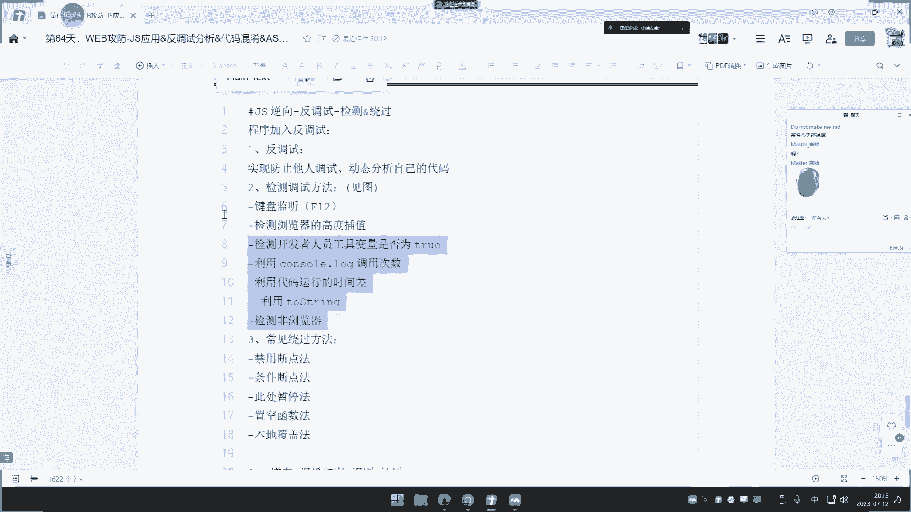

就是反调试一个简单的检测和是什么意思啊，反调试的就是我们这个浏览器点击这个检查，或者直接按快捷键F12是吧，这里呢然后通过抓包呢，那这里呢进行这个相关的代码的一些查看呢，进行分析是吧。

这个呢就是我们说的有未来器的调试，针对这个JS的调试的一个功能点。

那么键盘的F12当你有触发到。

那么也是触发这个调试功能的手入安检，安检的监听到。

那么你就有这个调试的可能性，是浏览器的高度差值。

其实就是这里啊是吧，你这里呢通过这个锁防这些调呢，是呢检测到这个浏览器的一些这种哎东西呢，摆一遍，因为正常访问的话，那不可能是有这个东西的，那正常访问是没有这个东西，所以这就是正常的访问嘛是吧。

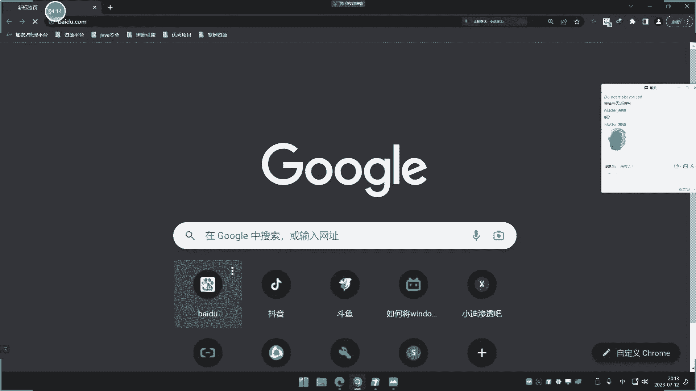

当你到一旦有这个东西呢，有了器这个显示呢都会有些更改嗯。

还有开发者工具，因为这个东西呢也叫开发者工具啊，就我们这个F12这个功能呢。

也是叫开发者工具，这没什么说的，就是在浏览器这边呢，我们也可以在这里呢给点加更多工具。

然后开发工具是吧，点击点击开发工具啊，就是这么个事情是吧，所以呢他也可以检测这个事件的，视为真了，来确定是不是在调试后面东西呢，我就不一一个给他说了啊，就是检测调试方法呢，是根据这个实际情况决定的。

这个是JS的啊，如果是其他语言或者其他程序的这个反调试，那那肯定就不一样了啊，好这个说到这里啊，反调试呢我们就不演示了啊，我们主要介绍的就是常见绕过方法呃，一般绕口方法呢有五下有五种啊。

那么最好的选择呢就是说先用前面的不行的，再用后面的，这是根据目标的一个检测的一个逻辑，和检测的一个强度来来决定的，我们呢都有会有案例的去给大家去讲解，如何分析，到这里呢，有进行反调试。

我们现在给他看一下。

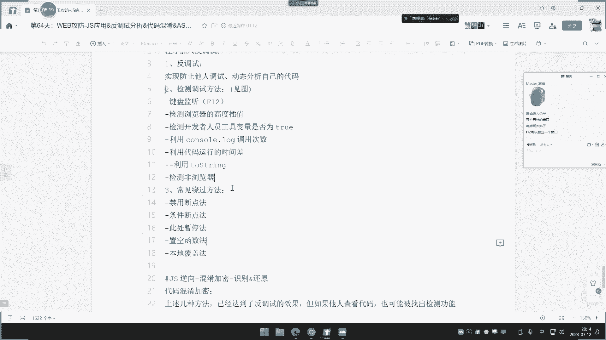

一个简单的一个站点啊，给大家看一下呃，一般这种反调式就是防止JS代码呢被调试出来。

那么一般对一些对JS的数据比较感兴趣的。

或者说一般写这种接口的，就会有这样的一些措施，因为正常来讲，一些正常功能没有什么机密性的话，他是不会加这个反调试的，加上去就肯定是要保护一些东西，所以一般的话啊，你要知道这个网站它是不是以JS为主的。

一些传输数据核心，那这也是判定他有没有调试这种标准，一般像哪些网站有啊，就是一些以这种事情发生的啊，我们可以看一下，我这个换个浏览器看吧。

我用这个啊，那谷歌上面装插件也是就是麻烦的很，这他妈的什么鬼沾点，那我把他拿出来，来我们看看这个站点啊，这个站点呢，一个视频的解析站点，视频的解析站点大家应该有些人都用过。

就是用来这个解析这个视频地址。

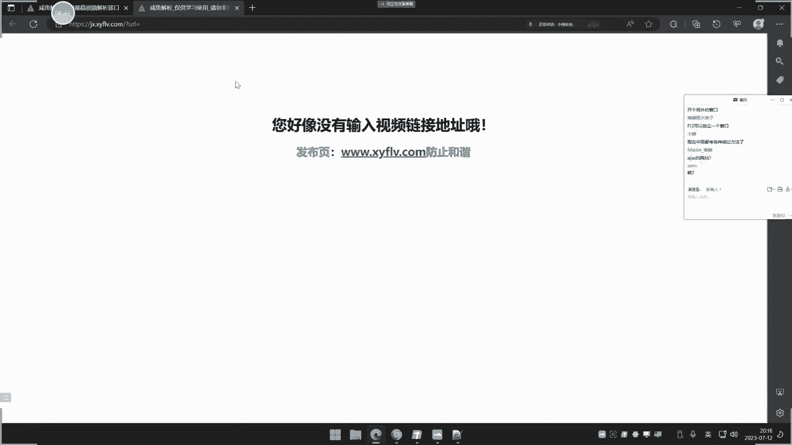

实现这个是吧，在线VIP视频的一个观看，你后面那直接传输这个视频地址呢，啊后面那直接传输这个视频地址啊。

他就可以是吧，来掌握上去。

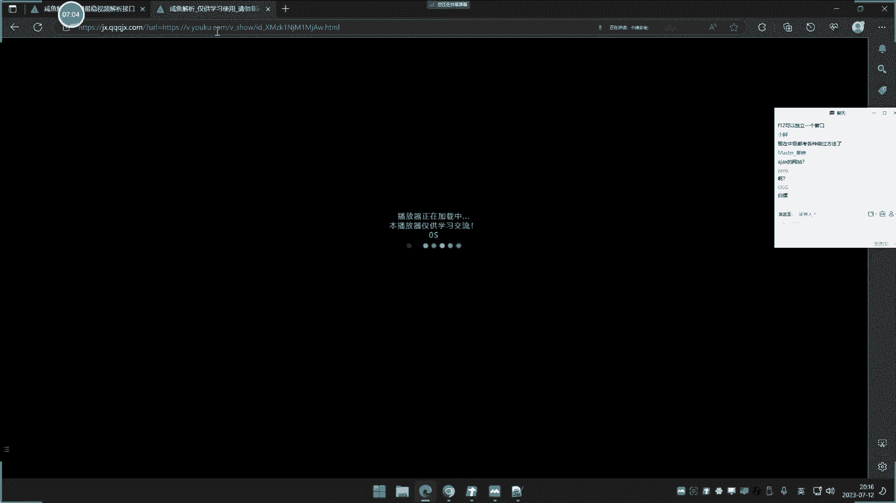

哎他就可以了，去看这个什么，看这个电影，对不对，他就可以看这个电影，就是说以这个VIP视频解析呢，看这个VIP的电影还绕过会员的啊，大家都知道网上有这种是吧，有这种接口，那么大家看一下啊。

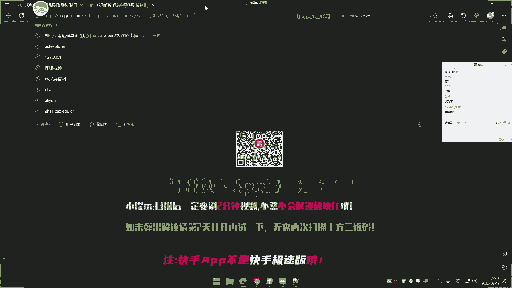

我发完这个地址之后啊，给传成一个优酷的一个在视频，然后呢现在呢我们看一下啊，我们点击F12的时候啊。

一打开可以看到啊，在这个地方呢就直接来到了看这里啊，直接来到这个什么叫debug这个地方来，然后呢正常来讲的话，比如我打开一个网站的话，比如我打开这个正常网站是吧，不管哪个哪个啊，这和搭不搭。

网站搭不搭没关系，就说你在正常网站，那你自己刷新一版，我就把这个数据包都加载了，然后那源代码，那你这里那也能看，是不是这都正常的是吧，但你看这里啊，我啥都没有干，这一打开就变成这里了。

这个什么个function animals，什么debug这个东西，然后呢你可以点这个WC嘛是吧，你们看这里程序自动掉了，他调试程序都暂停了，我啥都没有干，你看就说我这里呢没有做任何的一个端点啊。

我往往第一次访问咋咋个桌，他断连了，猪都没做，他直接端下来了，然后这里的也是这个调整就暂停，然后你点呢一个点呢数据包呢，那动都没动，那这个网络这里呢啥请求都没有，这不现实啊，正常来讲是有请求的呀。

你看看我怎么点，他一直卡人呢，运行不过去啊，简单说就运行不过去，对吧，那你再看呢，我再一刷新了，我重新给你看一下啊，一刷新，然后又断这来了，那他的页面都不显示了，页面直径呢选这个那地方就一直卡了。

不动了，然后呢你装上再运行，它一直卡的动都不动，是吧，你不管你怎么搞，他就是不动哎，看不到任何东西了啊，这个就是典型的反条四，那大家知道了啊。

呃一旦用这个东西呢，又会向提示或直接卡那里不动死循环啊。

嘶他那个反调试呢，我可以分到几步来检测是否反调，是刚才说了啊，就是你直接一看的时候，要么就给直接给提示，说你在法条是不给你高薪，还有一种呢就是我刚才的卡直接卡在哪里啊，动都不动，就是你没有下端点。

它就卡那里卡不动了，一般的死循环死循环，你说的一直卡那里啊，一直循环那个东西只要检测到啊，除非你把关掉它就正常了。

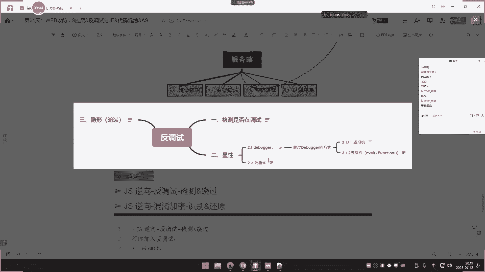

连关它就正常，是不是好。

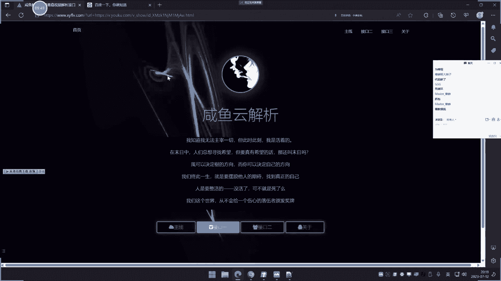

那我打开了正常是吧，它能正常播放，也没什么问题，但是我移到F10了，还在卡这里。

那你运行呢他就一直卡这里，那你现在呢那就正常了是吧，你只有把它关掉，你才能播放，否则的话你那点都点不了，那上面点不了运行的那都点不了，无法经常操作。

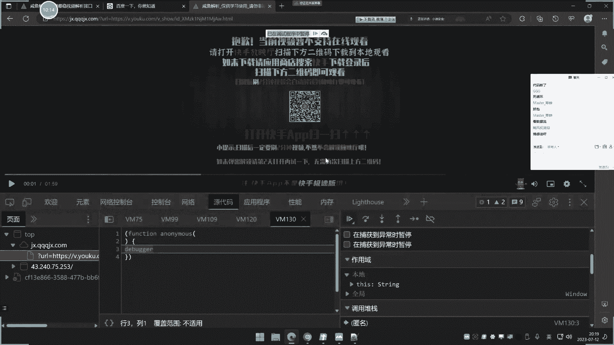

你关掉了是吧，它才能在它正常运行，但你关掉你看不到东西了呀，又是不是嘶好，这个发条方案我就不说了啊，好那这个怎么是绕过方式呢，有种叫金融端点，这种的是屡试不爽，基本上都能像这样绕过。

但是这个金融端点之后呢，你正常的断点也不能进行了，所以说他的绕过呢是基本上都能绕过，都能把这个东西绕过，但是他这样一绕过，那就等同于你把你自己的这个端点的。

也给他禁止掉了，你就不能断了，啥意思啊，你看现在不断掉了吧，那端到这来了怎么办，这边有个叫这个标签来交，你看下就这个啊，这个点一下亮了，就说明禁止断点，钉子断点，意思就是说防止程序呢在这里断掉。

就是说他一直卡卡的话，就是这第八个在生肖一直卡这里，你就防止他在这里生效，就直接点金子端点一点是吧，然后你再看啊，现在我们再来观察。

这里加八边形，那你看现在就能正常运行了。

来，什么情况，这哎，可以了。

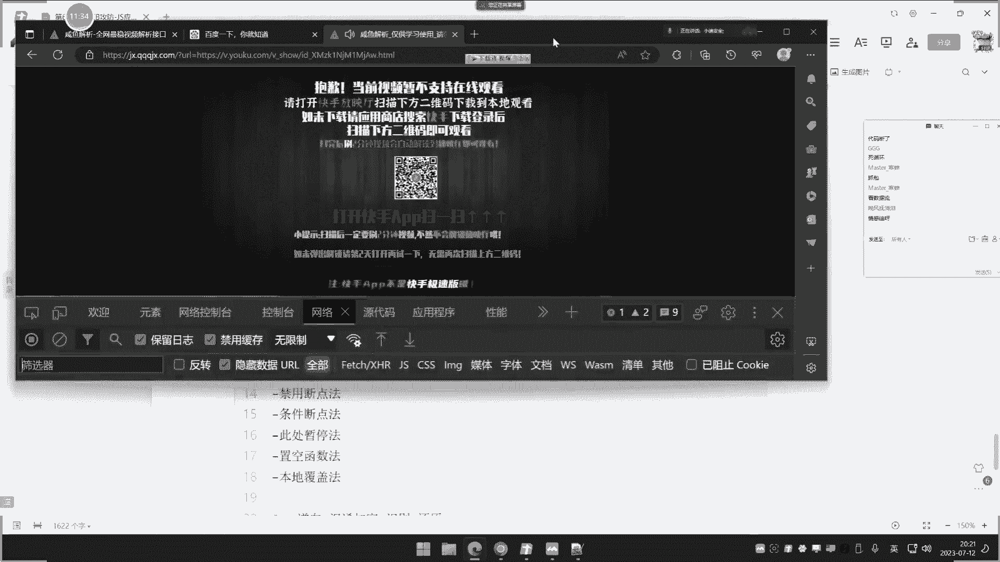

这个浏览器太大了啊，啊现在正常运行了啊，这个也是有数据的，你可以看一下来，那数据包呢正常运行，那也不会卡你了，来现在考了来，那现在正常运行了，你看数据包呢就在走是吧，来就不会有刚才那样了。

数据包正常运行了，就是这打开的时候呢，他没有断档，真的不会断档了，但是呢前提条件也很简单了啊，你再去断的话就断不下来了，你比如说我像现在的我再去随便找搞端点的，端不下来了啊，点不下来了，一旦你开了端点。

你把启用诶，这里呢那第八个又来了是吧，你就只能说怎么办呢，你一点一点是吧，你要不要端起来隔壁刷新一运行，那debug又来了，你也不能断了你一端，那他又出来了。

所以说这个呢能够绕过它，能够正常的让逻辑走下去，能够看到加载后的那个文件，但是他的缺点也很明显是吧。

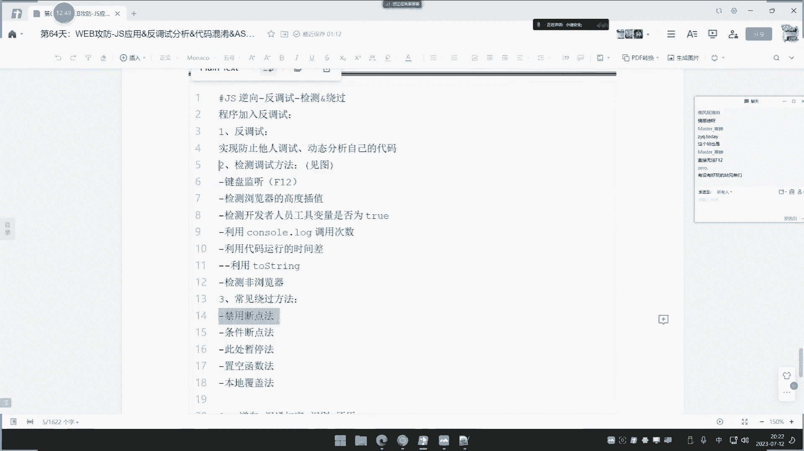

就你不能端了啊，你一端他又回来了，好这是第一种，还有一种呢就是什么方式呢。

还有一种就是我们说的这个条件断点法，就说加个条件。

啥条件呢，我给大家演示一下啊，好重新来一下啊，让他重新来，先把这个关掉，好我们重新来刷新看看啊，重新刷新，然后进入F10，好现在呢你看又断这来了啊，又点不了了是吧，我刚才是点这个地方进行断点。

好现在呢再加条件，什么叫加条件呢，来把这里选中啊，鼠标点到这里来啊，不要点这个地方，这个地方有个叫什么编辑端，点加条件输出false，就是说它为真，它就会执行，这里我输入false就说不让它为假。

我们再运行咋运行，你看好在运行之后啊，好我们来看一下啊，再把网站刷新一下。

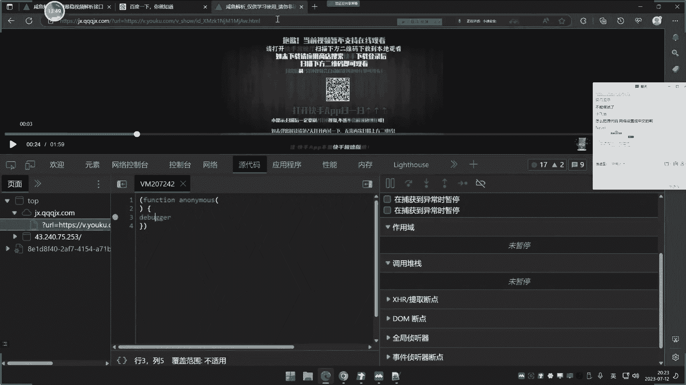

这是卡了还是什么鬼啊，那数据包是正常运行的，只是流流行卡啊，咦怎么又来了，来把编辑一下啊，好好的明信，他没有端下来了啊，现在是没有端的，因为这里的浏览器太卡了啊，这个数据包老这样子搞，这样是可以的啊。

其实是可以的，因为刚才他如果断的话，它会一直卡在里面，正常来讲他是会是这样子操作是吧，就点这里了，让它设置为false，对不对，脑子运行它其实在放啊，这个数据包一直在防出去。

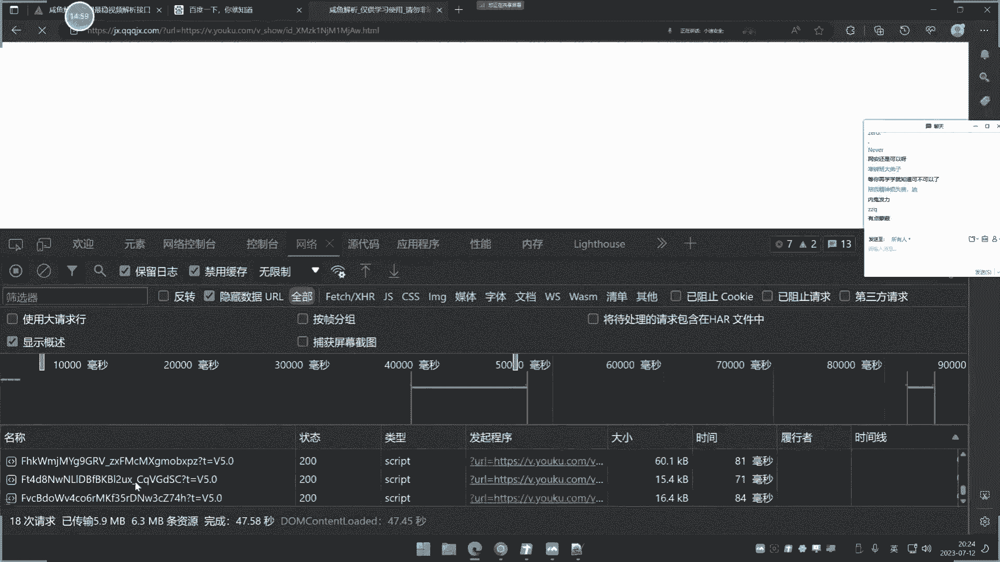

但这里呢一直都加不出来，也不知道啥情况，这是第二种方式，还有种叫磁珠暂停法，什么叫磁珠暂停法啊。

来给大家演示一下啊，再来演示第二种，第三种。

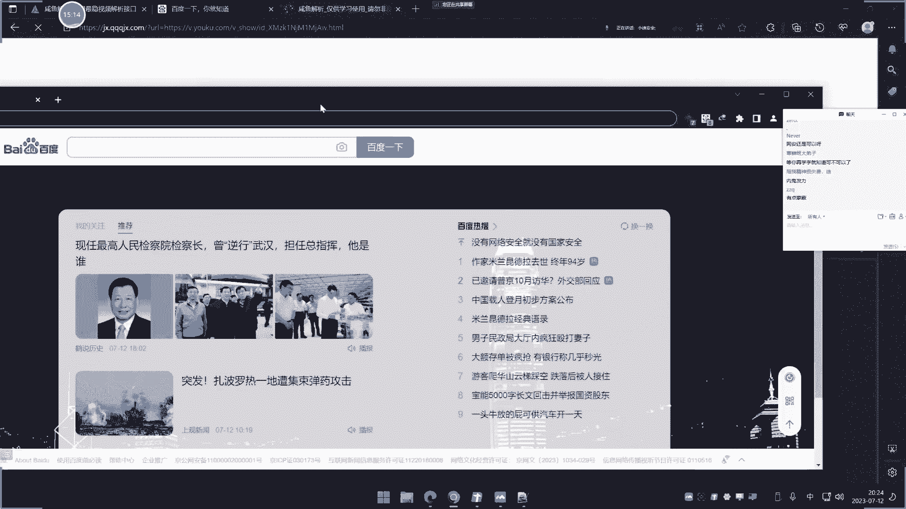

现在打开F12。

好这里暂停了，F12好，现在暂停了啊，暂停暂停，那何为暂停法呢，来右键，这里有个叫什么添加断点，添加断点条件，还有个叫执行执行次数对吧。

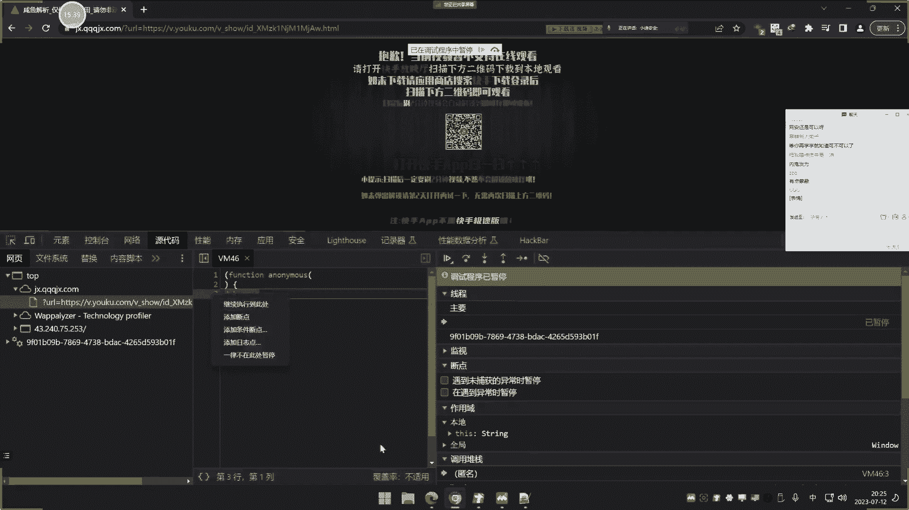

然后呢你看这面啊，这面也有，我给他打开一下，看这面好一点啊。

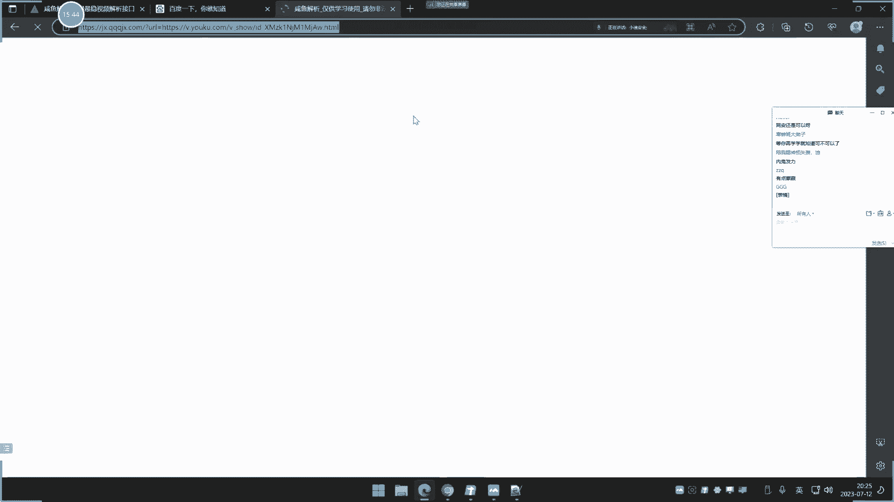

那有个叫永不在此处暂停，也这么个意思，就和刚才设置的pose是一样的道理，在真面浏览器呢也是个东西呢，一律不在此处占中，把选中是吧，再放，好我们再关注一下这个网络数据包，但这里呢你可以看到啊。

这个网络数据包在这里呢它就不动了，就说李奇这个是绕过了啊，但这个网站里依旧有受到影响是吧，那他也受到影响，他也不懂，所以这些方法呢都会有格子的优点和缺点，不是说拿个一零就行，所以你看现在呢它又来了是吧。

你继续这里一点继续放，对不对，那就不行了啊。

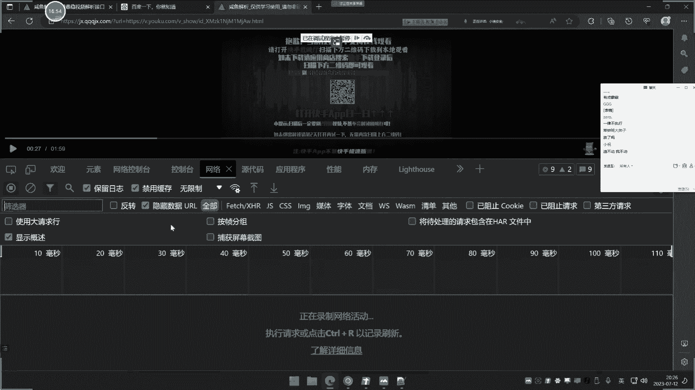

所以这几个方法呢都不是我们主要的。

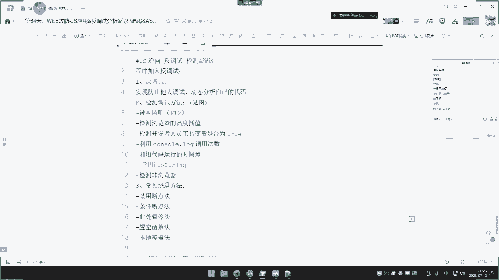

还有制空函数法，啥意思啊，我给大家讲一下这个自空函数法。

这是啥意思，这个呢和下面这个方法呢是用的比较多的，也是高端的一个玩法。

我们先把这个网打开啊，打开给大家演示一下啊。

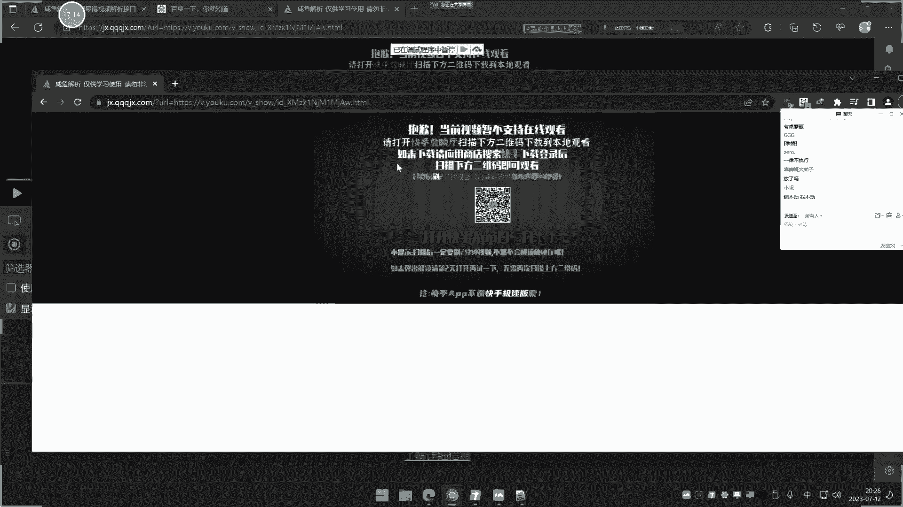

现在重新打开，然后呢如何加自控环法呢，先点这个地方，把数据包给他放起来好，好现在呢能正常方了，这个时候呢你就要找找这个第八个啊，他是在哪里出现的，只要跟它的函数啊，就跟他函数，简单来说就要跟他函数。

跟了函数之后呢，找到这个函数之后啊，比如说这里怎么又卡了，这个网站有点问题啊，太卡了。

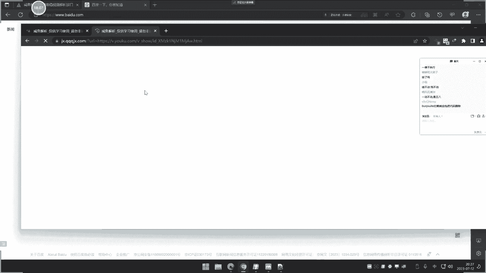

好这里网络数据包出来了，你看啊，然后呢，你找他那个函数啥意思呢，就是要找这个debug，这个地方的那个出现那个地方啊，我可以搜一下，那就是要找那个第八个那个地方，刚才那个是第八个要吧。

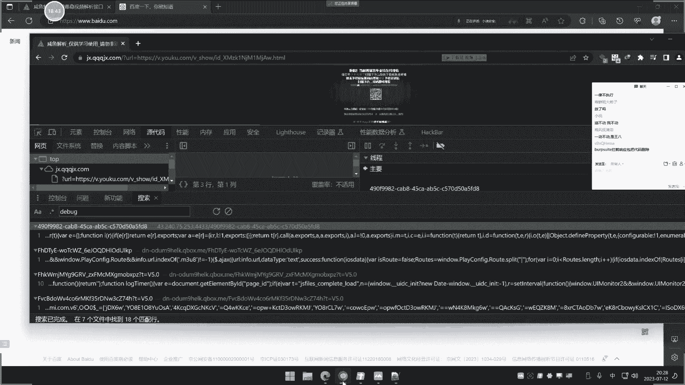

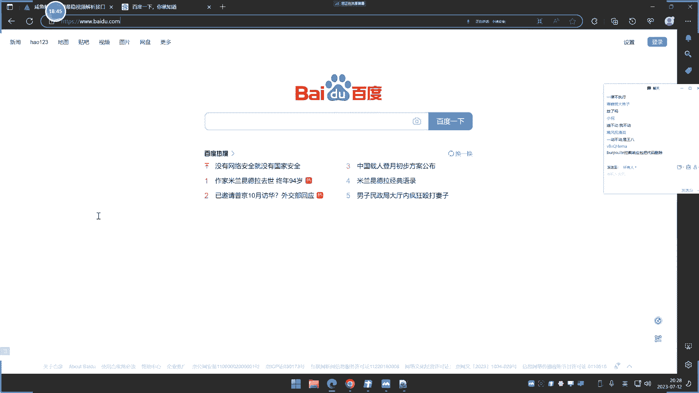

这是哪里，就找了个函数处处，那比如说我们找到之后呢，可以在控制台上面，比如说那个函数啊，找到这里，我可在空禅这面，如刚才那个第八个是吧，那这个让他什么等于function，就重新把它的装浏览器呢。

把他这个函数呢给他指空啊，就是给他指空，就是里面啥都没有，就是不让这个函数呢重新把它升复制一个东西，这个呢也叫霍克级数，其实就是说把这个原有的这个函数里面，东西呢给它去掉，唉去掉去掉之后啊。

让他实现这个，是先让这个东西里面没有任何事情做，就这么个概念，这个叫自控，但这个呢你要找到这个debug的函数，这个地方呢没有找到是不行的。

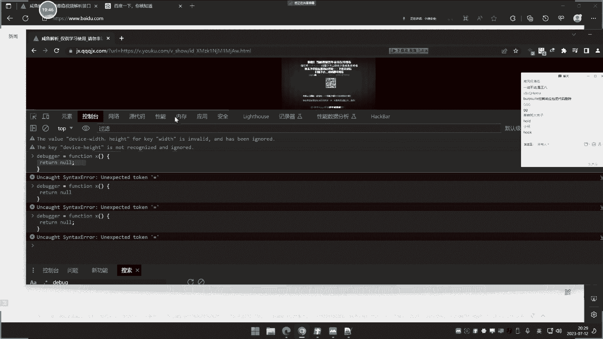

我们只是给他做个演示，你要找他那个函数之后呢，他那个触发了个debug，那个地方找他那个声明，那个地方把那个函数给他，怎么样自控，就是把这个函数呢重新复制一个空的，让这个下次我重新再复制个值一样。

把它原来给它覆盖掉，然后让这个函数呢不起任何作用，这样子呢绕这种呢是叫指控的一个玩法。

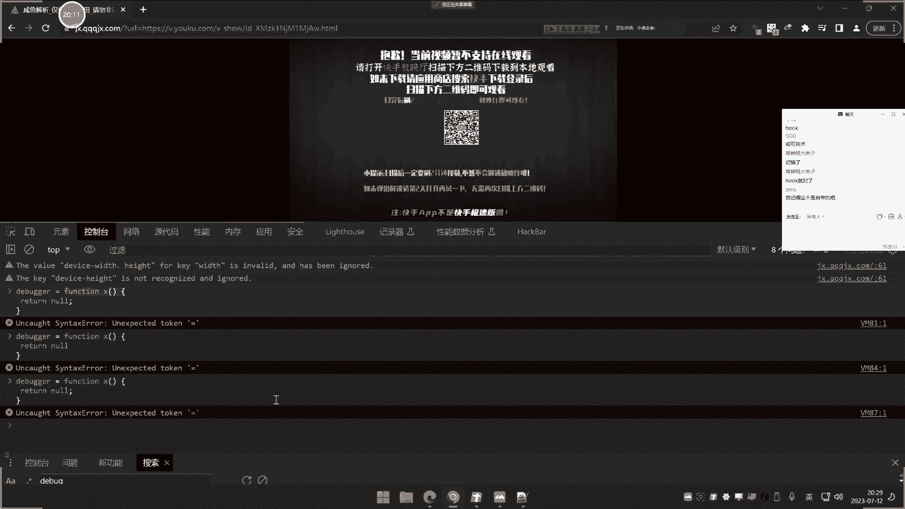

还有叫本地覆盖，这个呢是一个高端的玩法，我们马上有个网站给大家演示，这个网站呢我就不讲它了，我们先来看这个这个就是高端的玩法，这个呢大家有必要学一下，看这个啊，这个就是一个也是一个反混淆的。

其实呢都是对这种数据进行保护的一种网站，这个你看一下啊，来我们刷新访问一下，来我这里呢我还没有做那个事情啊。

我还没有做任何事情啊，我这里大家可以看到的。

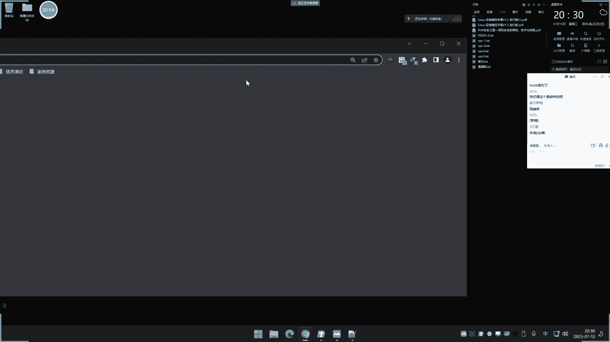

我F12右键点不出来，都点不出来，看他这里直接提示，然后呢你打到这里之后呢。

你会发现是吧，这里也进入到这个debug，然后你看看点击让它运行运行，那他也是那没有这个反应带给看的嘞是吧，然后你把这些过滤掉，你再刷新就不使用任何端点了，对不对，哎怎么没有数据啊。

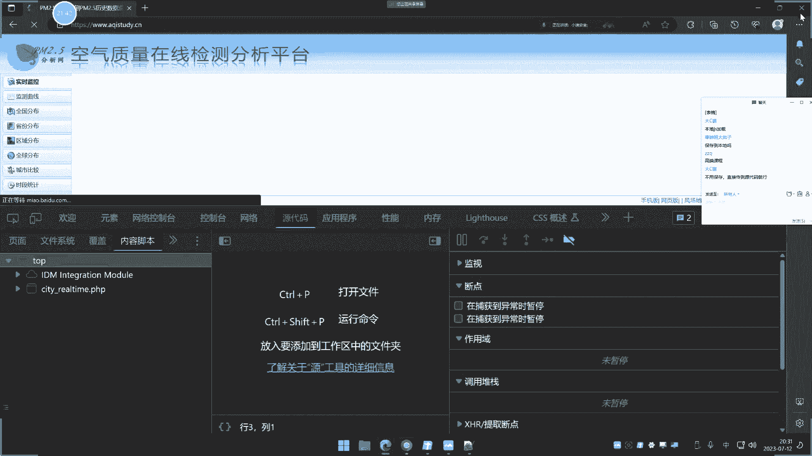

稍等一下，换个浏览器看一下。

哎他就是没数据啊，咋回事啊，怎么没数据了，好奇怪，昨天我车队有数据，这难道是被谁搞了，啊不管他了啊，就是说这个老公啊，那我们点一下它可以看到啊，这大家都看到了啊，我F12也连不出来，我怎么办呢。

那直接被那个了，我就先开个终端F12，再把这个网址给他拉过去，那我再把网址给拉过去啊，再把网站给他拉过去。

好我们来看一下啊，大网站拉过去，然后访问这个地址好，这里呢就暂停了啊，放完的话就暂停了，点击运行，执行呢就运行到这来了，再运行呢再运行呢一直运行啊，它就一直卡，也不会有任何事情，然后网络的一个数据包。

这里呢就显示了一些题外的，也没有什么东西，就是显示一些东西好啦，现在呢你可以看到啊，这是它的一个显示，我们呢也看不到啥，好我们这里呢怎么如何跳到这里啊，如何给他操作之前的方式呢，就是在这里瞎端呐。

搞那种事情，我们现在大家讲另外一种啊，首先呢我们根据这个提示啊。

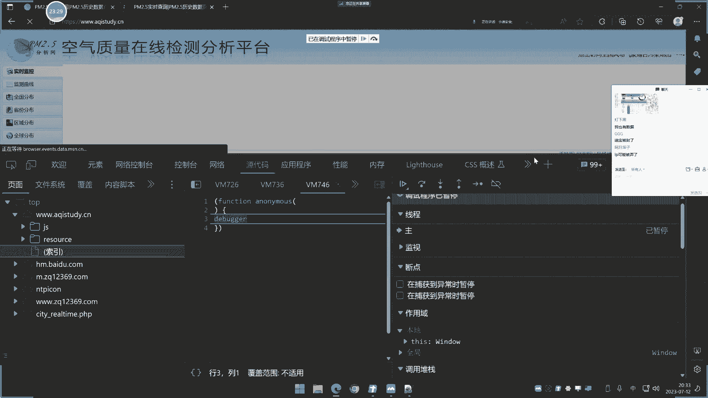

刚才我来我们来找一下这个提示，那右键检测到非法调试是吧，可以把这个关键字再搜一下，因为现在没有办法做嘛是吧。

找到这里呢全局搜索，可以看到啊，在这个地方呢有一个什么检测非法调试的，这个地方，我们可以把原代码呢拿出来，看下这个地方啊，e n debug检测到非法调试啊，这个地方的一个函数，这个页面呢是哪个页面。

就是首页的页面啊，就index这个页面，首页页面索引嘛是吧，他这里的执行这个东西啊，老罗刚才的检测到都是在这里在操作是吧，对都是这个相关代码，这个相关实行代码我们就不讲了，那如何这里怎么搞，他是吧。

一种呢，就是说把这个地方呢给他永不在这里持续暂停，给他点一下，就按这个之前是吧，就是我不知道执行哪，对不对，好我们来试一下啊，这里的这种方式呢，你先搞一下，再搞一下，就让这里呢都给他。

不执行这个下面的这个F12的开关是吧，都给他这个不行啊，随便到这里来哈，好我们来运行好，又来这里啊，又来这里，然后点的呢它依旧还是这个情况，所以说这种方式呢只能解决一部分，就是它来源于这里呢。

他被检测到了，其实我们可以搜一下他这个函数叫inn debug，除了搜关键字，我们知道他的这个函数名称呢，可以搜一下inn debug出现的地方可以看到啊，它出现到这个地方。

有一个在一个什么JQUMINGS里面也有，来这里有一个关键字可以搜一下，在这里搜呢也有这个index可以往前面推代码，往前面推代码啊，可以在这里搜，给他看一下，先把这个下面注掉，这里有个in defg。

然后下面这个呢也有个呢e n def，两个文件都有对这个什么阴力八个对，然后下面的是e fl执行，我们可以关注下，在这个文件里面有没有引用过这两个JS，因为他一页引用了，那就说明这两个被执行了。

我们在这搜一下啊，这两个JS文件，好就这两个啊，我可以看一下这个里面的啊，把文件名呢给他复制一下，在这个地方你搜一下啊，在这个索里搜，那的确有引用过，那说明这里被执行过吧是吧，那这个1。3的。

我们可以看一下1。3的有没有赢过啊，1。3都没有来说我们改一点一应该就可以了，1。3改不改都无所谓是吧，其实就什么意思呢，就是说我刚才呢我是端到了这个什么，我是把这个index里面呢给他这个注释掉。

在这个里面，enable里面的，这里还有引用，这个JS里还引用，那是我在这里呢还要把它断对，还有把短刀，我两边都断了，还行不行是吧，还不行，那就另外再说了，对我再端呗，永不自信永不自信，哎然后呢。

像刚才那个地方也是一样的道理，产品线上去啊，再放好，你可以看到啊，这里呢依旧还是在debug里，这什么情况呢，再刷新一下哈，啊依旧还是在这里，全部这里人永不执行呢，还不行，那还有哪些地方呢。

我给大家说一下，他还有一个地方哪个地方呢，我们先看网络包里面啊，他这里头还有个访问的文件，OK正常的打开的时候看一下啊，正常刷新打开。

先让它正常运行起来，先不下任何端点，我看这个数据包啊，我们可以找一下啊，这里面还没起哎，怎么一下子又没了呀，嗯看这个文件里面，啊就这里呢，这里还有个pp文件，那在这个pp文件。

这pp文件呢是加载了一个文件，就这个网站加载文件，其他的是一些接口，所以不用看，你也不要问我说为什么看这个很简单呢，这是在网站这下面，是他调用在其他上面的一些百度上面，那肯定不是的嘛。

那这也是一些无关紧要的，你看这个地方呢是他访问的是一个pp文件，就访问这个页面的时候加载过这个app，然后呢加载过JS，其他的没有什么加载，你可以看这个数据包嘛，你根据这个类型啊。

像这个JS呢可以看一下JS，我们搜了里面就那两个，然后呢其他的像这个什么图片啊，这种style这就不用看了，因为这里不会有任何效果，所以一般看的话就是JS或者是这个脚本文件。

那么要选择这个pp看的原因是，这里看这里呢有没有过滤代码，我们可以搜一下啊，比如说我在这搜是吧，这个EN就看他这里还没有过滤，就说刚才两个类一删了那一个滤啊，1N第八个搜搜不到。

刚才我们在这里搜这个1n debug的时候，是这两个是吧，然后呢这两个三个有，然后呢在这个地方呢搜这个关键字呢，他搜不到，那是没有还是什么情况呢，他有可能会引起我们会关注到啊，在这个代码中呢。

你也看到这个JAVASCRIPT加载的文件里面呢，有没有加载，刚才的1。3呢是有加载了1。3载，这个收的时候，这个地方是有引用过的呀，你看in debug的1。3里面是有荧光，所以说刚才改了一点一。

没改，1。3也不行，这个1。3的也要改，对不对，也要改，那说123也要改，那等下再改啊，好1。3改了之后，我告诉你还不行，我也不浪费大家时间了啊，还有没有呢，还有啊，这里有个叫e fl代码。

来这里有1FEL代码，这里有个EFEL代码，这个是啥东西啊，就我先让他调试出来，调出来之后呢，就是不下不下单点了，那这里有个一菲尔等，这这这有个一菲尔塔这个什么东西呢，对不对，嘿嘿这个什么东西呢。

啊这里有个这个e pl代码啊，这里有两个，然后呢我给大家说一下啊，这个e fl就是那个海调试的，比如说这我怎么知道的呀，啊你可以多看一下啊，自己也可以盲猜一下来，我们可以往上面翻。

正常来讲呢从这个字面上去理解，在GF的cooking的这里有个加密的是吧，这里还有个加密的，我们可以打开这个地方看一下啊，这里面没有加载出来，然后在其他的呢信息呢也都是正常显示。

然后我现在就给大家操作一下啊，如何去把这几个操作掉，然后那个啊好先把它运行起来，这里是断掉的是吧，看着啊，教大家一个叫本地替换法，在我们的这个浏览器这边呢，有个这个叫覆盖的，这个覆盖是啥意思呢。

简单理解一下啊，就我们正常来讲呢，是把这个页面都给他copy到本地来，把本地把这个验证代码给他删掉，然后呢打开本地的文件来实现什么去访问，这个呢，就有点类似于我们在讲课的时候。

讲过的一个什么知识啊，那个JS那个文件上传是不是啊，就是咸将这个页面呢给它导出来啊，去掉或者说删除这个过滤代码，然后呢再来实现这种操作是吧，那这个呢就和这个意思是一样的。

只是说现在我就是在浏览上面进行这个叫覆盖。

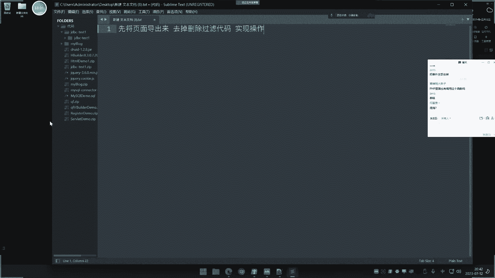

啥意思呢，就我会选择一个文件之后啊，去选择替换，那么对方的这个页面就以我这个本地文件为主，就这个意思，就比如说很简单的道理，这个文件访问它，我就把它放到本地，那么等下我再访问这个文件的时候。

他就以我本地为主，我本地把那个代码给删掉，注释掉，那么的引用，所以他是和这个知识呢是一模一样的，无非就是说那个姿势是放在本地，然后删除之后再用浏器打开，这个呢是在这里进行，你既然都搞这么专业了。

那肯定就有个玩专业的事情是吧，选现在选择一个替换文件夹啊，自己呢找个文件夹来对应，然后就随便取个名字啊，就叫这个还起study这名字，那就和他取对应，选择重点选择，它就会提示你低费托拉斯。

请求对这个目录具有完全访问权限，是否要选择敏感信息允许，那么这就启用了本地替代，这个意思呢就是说啊，让你呢去归类到这个页面之后，那么就会替换这个页面，首先呢我就先把这个页面给他替换掉。

那把优解呢点击选择页面呢叫保存已被替代好，这就有了是吧，然后这个图标的就亮了啊，变成这个颜色了，然后我再拉到下面，我就把它的过滤代码就可以进行删掉了，就是说其实就是保存到你本地了，等下在访问的时候呢。

就以这个本地的去加载啊，比如说呢让你的浏览器，在以这个本地为准去访问，去加载这个代码，好，我再找那个那个地方啊，就和你在本地呢修改再提交一一码事情，来找到这个地方啊是吧，给它直接注释掉，对不对。

注释掉之后CTRLS保存一下好，再来找到刚才那几个文件，1。3里面的13年的BN比八个，啊就找到刚才那几个文件，然后呢在源代码这里哎，在这里啊，再见了，这个很简单啊，就这个啊。

然后把它保存到一倍代换保存这里，你看啊，在这里搜一个debug，啥情况，怎么搜不到啊，哦诶他不叫英文debug吗，该什么情况啊，好一第八个妈的在这里，他在这里啊，英里巴，那这里呢收到了。

那我可以看一下啊，收到了在这里啊，那么就以这行呢给他注释掉啊，重新设在这里啊，九引哪一行，操你妹的这行啊，全选快捷键是吧，CCTRL加这个斜杠快点啊，就把这个注释掉了啊。

这个debug的这个注释都还在这里呢，反正这个if非要把它注释掉，不让他执行，因为他一旦执行，就会把后面的第八个执行嘛，还保存，这个是1。3，那么还有两个文件嘛，1。1和啊，1。1的版本。

这个也是的吧是吧，刚才搜索得到的呗，对不对，这把代码中保存，然后呢右键呢把它保存替换，这里再从这里呢再输，在这里是吧，直接注释掉好，那这里的这两个文件是吧，一个1。3的，1。1的版本的啊，都搞了来是吧。

是不是还有个首页啊，还有那首页有啊，首页里面对不对，首页里面还有啊，手游里面那个搜索是在哪里，country config把所有里面这个地方是吧，在这里啊，右键保存，他必须要在正面加载啊。

在这里打开首页了，什么情况的，哎哎搞，搞搞差了搞搞搞搞没了，首页的咋添加不过区域了吧，我刚才看哦，这里按错了啊，哎呀按错了一下子，这里面的全功尽弃了。

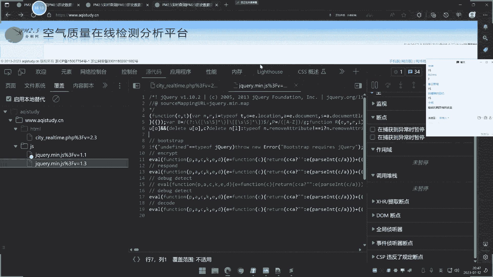

重新开一下。

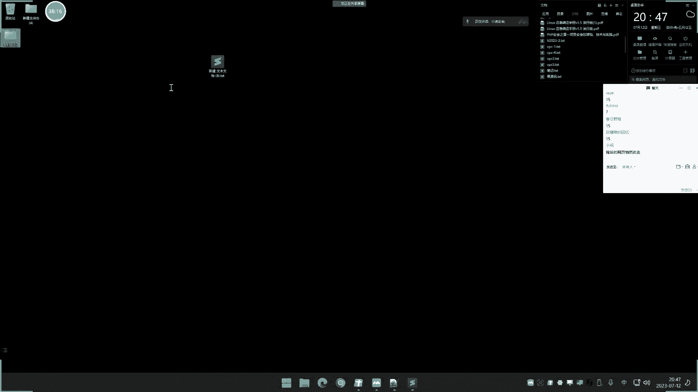

哎呀烦的死啊，真的是啊，刚搓了一下，全部都搞没了，妈的，网络哪里跑到哪去了，人的烦死，那这个又可以了，你妈的真是烦得很，来把这个地方呢给他删掉，那个第八个那里，再从这里啊，啊直接注释掉保存啊。

这个呢就把它删掉了，要重新修改了啊，因为这个颜色没有亮，就说明没有替换成功，那还要重新找来两个，1。1的，这个是几点几的啊，先把水包给他加出来啊，操作还是麻烦啊，重新刷新一下，把这里先不下单点。

让他先加载出来，1。1个，哎网都打不开了。

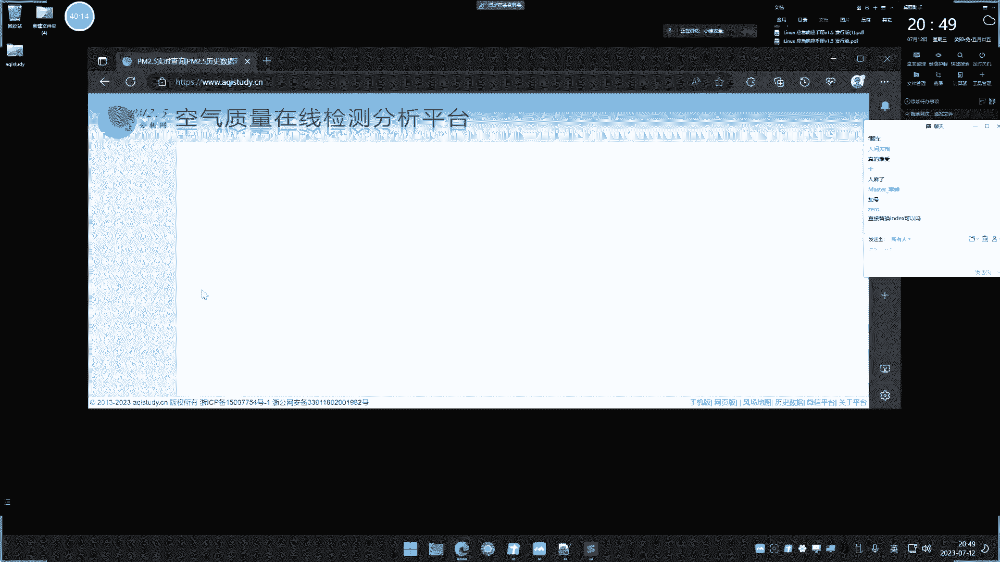

嗯搞错了一步，直接把东西都搞湿了，真的是，头头是渣的啊，重新拿一下啊，不要把这个先开启了，重新拿一下，好把这里的大家修改的时候要注意啊，那个刚才不出来的原因呢也是很清楚啊，就这个嘛输不掉好。

然后呢还有一个是那个pp文件，还有个PVP文件就没了啊，就这里，保存到这里，把pp文件这个一删，找到那个e cl来，注释掉保存好，那么四个文件全部好像把端点开了啊，你看啊，我现在把端点开了啊。

我不我不关掉它就可以，正常是吧，我把端点开了啊，下午我抓紧开了啊，好大王啊，我现在四个都保存成功了啊，启用本地替换了啊，这个时候啊看着啊，我重新呢。

现在浏览器是吧，还是这个拦截我的是吧，好重新打打开啊。

那再来访问它。

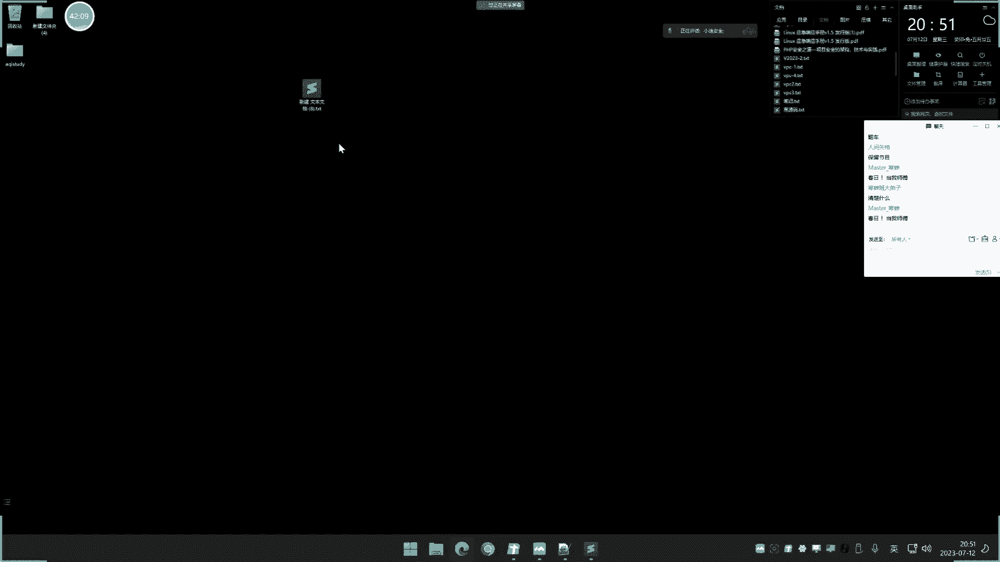

之前我点右键，他拦截我是吧。

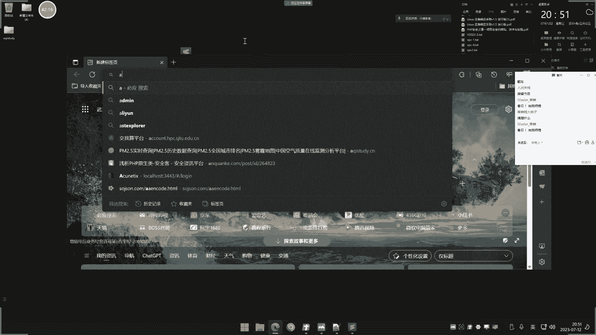

你看拦截我是吧啊，都是拦截我F12，好好先调出来，还不死啊，好拦截我，对不对。

妹呀，你妈的，搞了半天，这两个怎么又没有把它加载成功啊，嗯我把这两个，你都要70这啊，麻烦啊，这没办法的啊，这个事情就是这样子的，也没办法说他什么东西改了，那个就这个不行不改那个就这个不行。

重新把这个删除，重新来一下啊，好重新来一下啊，再来重新来一下啊，先把数据包给他稳稳加载出来，把这个呢不让他这个暂停，把数据包正常加载出来，加上之后确定一下刚才那几个文件，那都有一个是那个JS。

一个是pp还一个是首页啊，pp首页都有，然后两个JS啊，确定的都有啊，一个是一点一版本的，还有1。3好都有，之后这里呢重新再来操作一下，一定要搞错了，一定要搞对啊，这个一不搞对，一下子就又出问题。

哎呀麻烦死，好来到一个一个修改啊，那我就搞快一点了啊，然后慢慢中呢，把它修改了，替换这里来，在你那是这个地方吧，把这个d fl的debug吧被注释掉，保存确定他这个颜色对的啊，你只要说这个颜色不对。

那就GG了啊，这个颜色要对对，保存两个都保存好了，再试上面两个，好找到刚才那个地方，来就这里啊，从这里拿拿这里左手脚，当然你也可以全部注释，这里注掉啊，怕你如果注册下面代码，怕下面代码增长功能啊。

找到个PP啊，这里再来往下翻，啊找到这里啊，收入ECL，这里呢跟中注册加保存好，确定了啊，现在呢你看啊，我再把断点启用好，它还是这样子吧，重新再打开这个浏览器看一下啊，打U解还不值啊。

那还是不出来好。

我们拿在F12把网站发看看，再看源代码，看到没看现在啊，正常的这个数据就加载出来了，我这边暂停是没有暂停的，还有加载，啊你们能够看到这个信息吗，为啥啊，怎么我这边没有没有数据信息啊，这真是奇怪了。

你们那边能不能看到这个正常显示数据啊。

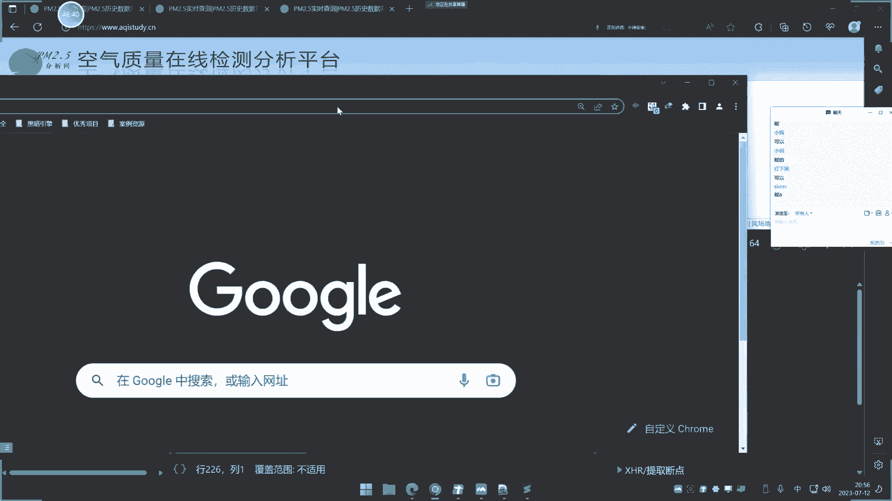

可以啊，我这边怎么不冷呢。

把我屏蔽了，换个IP试一下啊，我换个IP试一下，我加个再来点。

我在浏览器上面去加个代理啊，我加个代理看一下还是是不是这个原因啊。

或者我换个换个服务器访问一下，好来换个服务器访问一下，看，谁有没有服务器可以访问一下，开个虚拟机也行，我看下是不是啊，开个虚拟机啊，我看不是我搞的时候把那个东西给他搞。

搞那个了。

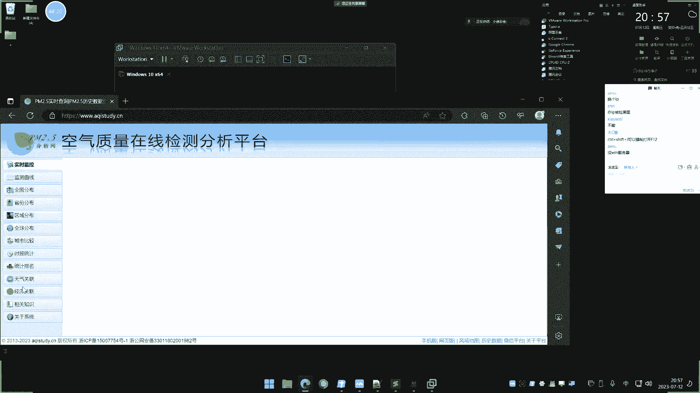

这还怎么在锅里有，哎呀，好我看这边访问一下啊。

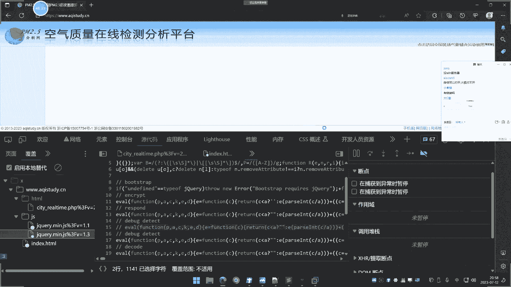

我这边不知道啥情况，都打开那个书，就是看不到，哎这边可以正常啊，好那我在这里呢用一下这个啊。

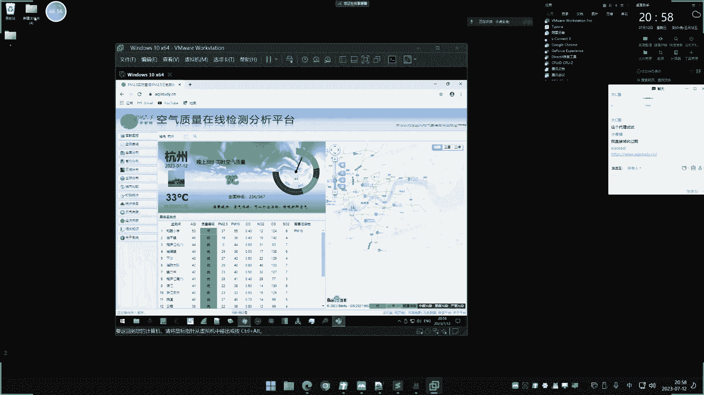

我那个浏览器不知道发什么疯啊，看一下呢，这里是一样的道理啊，我这里最好是看到数据，不然看不到数据的话，你会有那种提示吗哈，诶这什么情况好，原来是这个网站啊，哎这他妈什么鬼啊，搞到手机页面去了。

好来看一下啊，呃我就把刚才那个操作的，这全部是中文的啊，这是英文的，英文的和那个刚操作的是一模一样的啊，也没什么太大区别，我们这里呢就先让他正常的把包呢，给他发出去啊，这右键执行呢先让它把它执行起来。

执行起来啊，然后把这个包呢给他展示出来，他一直呢在这里发送是吧，先把这个加载出来啊，好这个数据呢加载了，加载之后呢，我们还是按照刚才那个思路来啊，那他移植这里呢有这个提示啊，这大小我是没办法的啊。

这个大小你们说小了，那我也没办法，就这个样子，来找到个替换这里啊，那选择一个文件夹，搞快一点啊，这个时间关系我就不在这里了，一直跟他啰嗦了啊，搞完就直接测试，因为刚才原理呢已经讲了啊，这个没什么说的。

这个英文我还看不懂，这，保存过去，然后这两个保存过去，这浏览器硬是搞死了吗，好再来一下啊，我昨天做的好好的啊，这个浏览器直接那个了，但用这个自带浏览器是有没有其他的，像这中文的。

这个浏览器怎么把那个屏幕放大好放大一点啊，再放大一点好看一些，那直接把运行像页面显示页面都显示了，都加载了好，这边都加载了，不是啊，这个怎么在这里打不开呀。

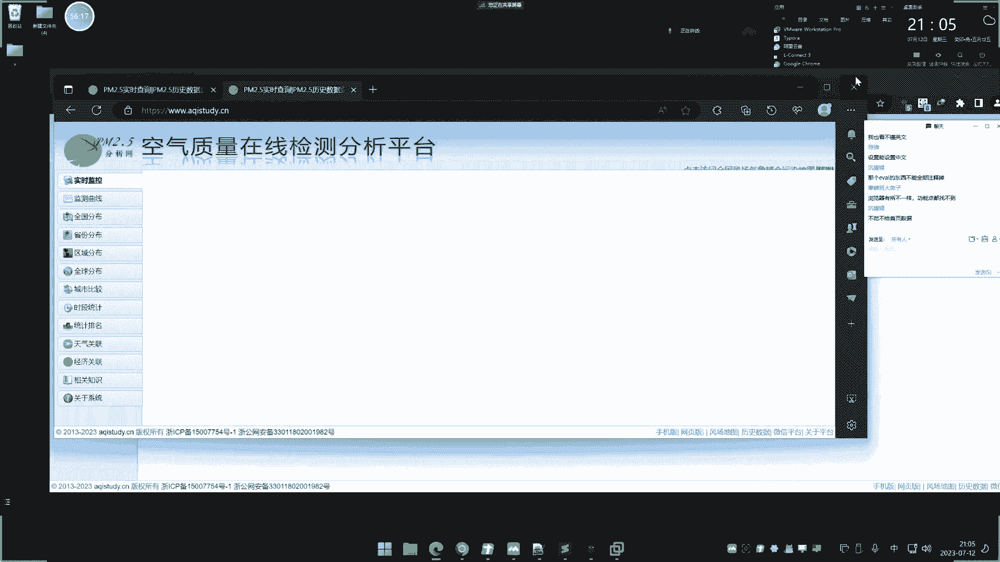

好看一下啊，哎他妈的真是烦死了的，装一个装一个浏览器啊，这个英文的我也看不懂啊，哪个是哪个都不知道，注释多了呀，那个没关系吧，我昨天就这样做事都好好的，放一下啊，我把这个浏览器装一下就应该好了。

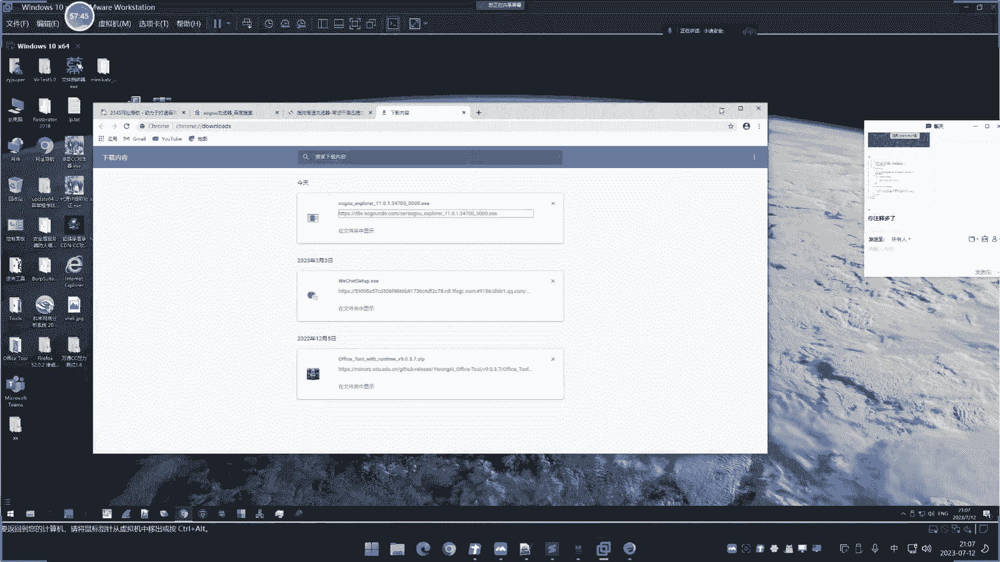

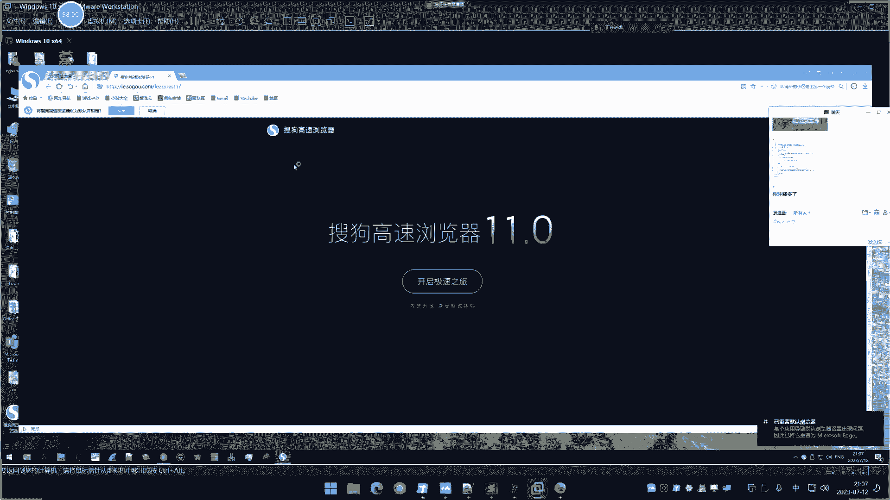

这边他也是英文的无聊，作者把这好，这边有了啊，这个文件有了，来，我们把那个，第二时间还没有，这怎么意思有意思没有啊，好我这里呢就这样子了啊，我直接把它引用到那个文件里面，按照他那个逻辑来操作。

我就不搞那个东西了啊，他这个在上面打不开来，这右键那是咋妈的，没那个功能，这真是不知道啥情况啊，这，莫名其妙啊，我就直接把它保存到本地了吧，保存本地，我把加载删了，而不是保存本地，这个是路径。

是在JS里面，所以我要和他取一样路径啊，JS路径到保存里面去，然后名字呢要对应上，这个是一个啊，然后这个地方也是好，我们直接来个操作啊，那个保存一下，我也懒得整这些东西了，这个。

这个地方怎么把它发到那个源代码里面去看呢，这个上面没看到个模式啊，他不发过去，我这，不不是不不不是你们说的那个事情啊，这没把这个勾选啊，来看一下啊，再来，执行执行执行没了，倒数第二个，这是保存。

都已经调出来了是吧，这个，唉这我真是了，不知道啥情况了，这，哦那用这个吧，这个再不行，我不整了啊，我就再讲下面的吧，那正面他这个地方还好使一点，这个工具这里啊这个地方还好使一些，好我先把后面一讲吧。

把后面加密的讲完之后，我们再把这个做一下啊，不能在这个浪费时间了，把后面的加密的说一下啊，这个加密的呢我们先用个本地代码测试一下啊。

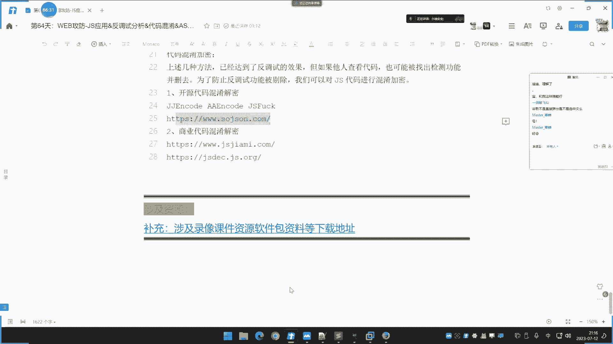

我们再来做这个，加密呢有几个平台啊。

我们先数一下，我那个讲的没问题啊，下面已经有人做做出来了啊，这个我本地浏览器不知道咋回事，那个浏览数据就是不显示，我们看一下这个里面加密啊，下面这里呢我们可以看一下原型代码，好先看一下原型代码。

这个原型代码呢放到这个加密上面，这里有几个常见加密啊，比如说这里呢有，在线加密的这几种东西，那比较知道的，大家都知道的JS发壳呀，还有这个一些常见的这种是开源的加密，就说免费的，还有一些商业版的。

我们先看这个呢加密呢进行加密加密之后。

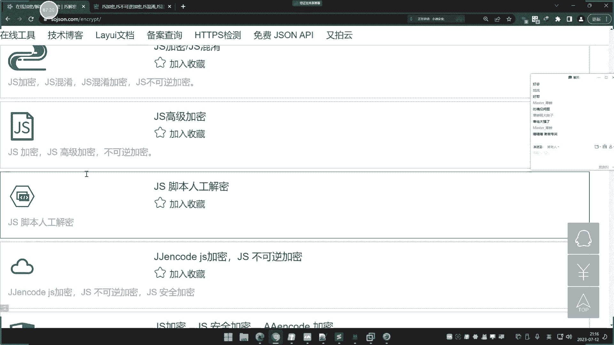

结果是这样的，我们可以呢直接呢在本集的更新一下啊，在等级那是控制的mp镜像，它提示这个东西，那是什么情况呢，就是因为你浏览器有自己保护啊，你可以呢随便呢在本地的起个本地网站呢，去访问他就OK了啊。

就调这个空端，这个比较简单，然后本的这个F12在这里的空端去运行了，刚才代码，你看他就能直接执行，hello小弟，这个执行的结果呢就这个结果吧，那你在这里本身的源代码这里运行的，它也是RO小零，对不对。

然后你得把它加密后的结果呢，这里一加密是吧。

变成这样子啊，复制粘贴到这里了，来他也是hello小李啊。

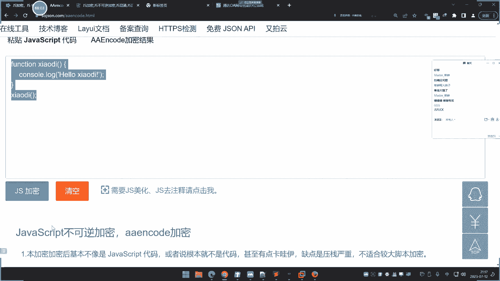

要起个本地端啊，不然的话浏览器那会有那个策略，就是直接开这个终端器，其实它会有这个提示啊，就和那个泡沫秀明星一个道理。

所以呢你要起个本地的，在本地调试，他就不会了好了，这个是AEE扣的，还有一种呢我们再看看其他的啊，这还有这个JJ的，这是开源加密啊，同样道理呢放同样的代码，放同样代码呢去尝试，就说本身代码是这样的啊。

往这里进行加密好，这是那个结果，我们呢放这里的执行，那他也能执行出，Hello world，Hello，小弟是吧，没问题啊，这个是加密后的代码，这两个加密还有啊，我们再来看另外一种。

这个CCTF里面也需要考试出这个什么JS发克，扫一下啊，啊js，那么呢我们来放这来放这来看一下啊，那这J发可JS发，可能这种相方式就行，也是没有问题好那么大家会问，那那这东西有什么用处。

首先呢这个混淆之后，可以看到它本身代码呢发生更改，这是它加密后的代码是吧，这是几个开源产品，在开源产品网上有没有用的呢，有用的有用的啊，我们可以试一下啊，比如说这几个啊，我们如果说要简历它的话。

它是一个什么结论，其实这个呢有关于到这个代码的写法，来我们看一下这个代码写法啊，代码写法是这样的。

那么它加密之后啊，那个结果呢，它其实呢就是类，似于我们说这个组合拼接的一个意思，就是说，这是最常规的简简单的就是把这个F呢，比如说把它形成一些乱七八糟的符号，这样形成，然后呢后面再用的时候呢。

再把它一组合，他会这种一个形式呢去这个混淆这个代码是吧，混淆嘛，那么解谜的话啊，你比如说我们拿刚才这两个来测啊，你看着啊，这是他的这个第一种加密算法，这里我把它放到这里来观察一下，我们在那换一个东西。

打开用这个。

沃克storm这个专业的加加JS的开发工具。

我们在这里呢看这样子呢会看的很清楚一些啊，添加个，新建个文件叫疑点JS放出来啊，这看的更明确一些啊。

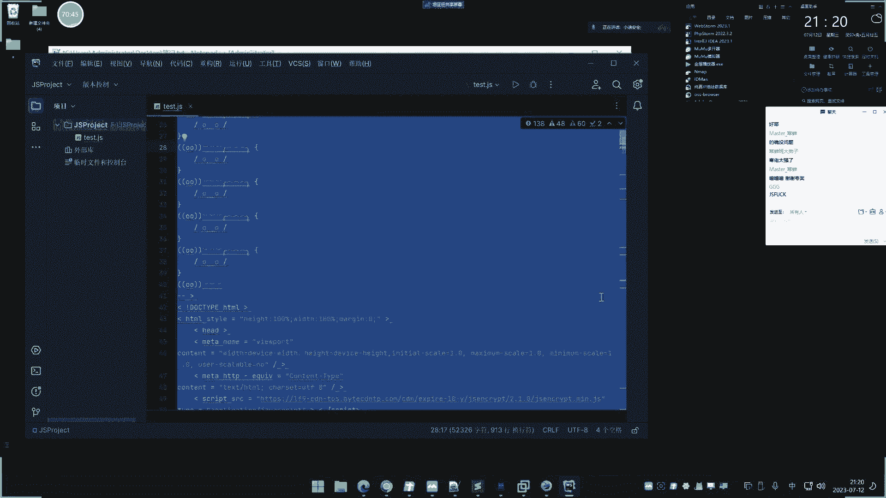

然后你看啊他这里呢是有个有个这个符号啊，你看啊，我把这个选中之后呢，你看这个选中之后来的他会这里呢有个闪交的，这里呢这是那个括号的一个索引是吧，我把这里去掉啊，你看神奇的事情发生了啊。

原理我们等下说我先把这个去掉，去掉之后呢，我把这个复制啊，复制到这里执行，你看执行是什么东西，只因呢还是花了word，然后我再把后面这两个呢去掉，源代码，出现了这啥情况，这个是啥情况呢。

大家理解一下啊了，我先把这个还原，这是我把区域的那个地方，这个区域的地方呢，那我们关注一下啊，这去掉这方括号里面呢把它去掉，对这啥东西啊，这是就等同于前面是叉叉，然后一个引用这个函数这个东西啊就好简单。

我们圆形的是这样的，对不对是吧，原型代码是这样的。

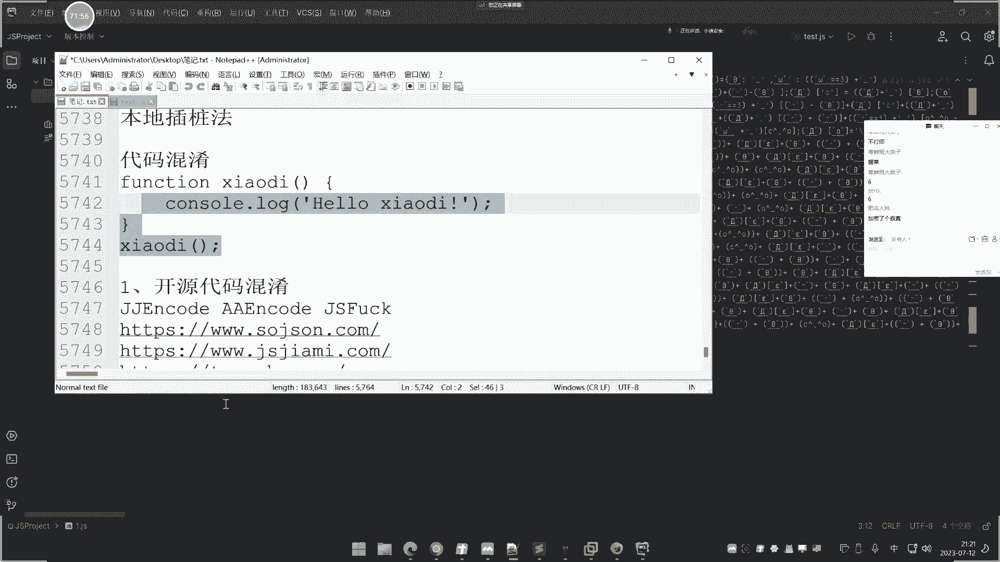

那么你看啊他这个括号呢就和这个是差不多的，那也说这前面应该是个小迪啊，这个前面应该是个小迪一个写法，对不对，他前面的这个代码呢，在上述的他可以这样去理解它，还和这个东西的拼接概念一样好。

我们再看上面还有个代码是吧，看这种方式也行不行啊，你说这里呢这个代码这个加密的就是，不还有个加密吗，就这种呢，你看这种这种的，就是这个这个这样密的，然后看这种啊，这种行不行，同样的放到这边来试一下。

我是要按照这个逻辑一样来，我先找的这个括号啊，为什么要这个编辑，因为你要找个括号在哪里呢，把这里去掉是吧，我先把它进行运行，看一下它怎么运行，先把清空，那是运行也是小的好的小的啊，没问题啊。

你可能说为什么去掉这个也是能运行，其实这里呢就和我们的花指名一样，就是这是无关紧要的，其实这里面是无关紧要的，好加这个预约型，看看来源代码也出来了，他其实和刚才一样，那么这里不是还有那个JS呃的吗。

这个js 什么鬼呢，js 的逆向是什么情况呢，它和刚才有点不太一样，他是这里括号里可以看到啊，他这个括号的和这里一样是吧，你把这些去掉之后，你比如我把这去掉，去掉之后呢，我这样去运行是吧。

我这样去运行看一下行不行啊。

执行之后呢，他也是hello小弟哈，我们正常来讲是把这后面两个括号再去掉，会不会出现那个源代码呢，看下诶什么情况，哎这什么鬼啊，他妈的，刚才有没信号的小弟是吧。

打到把拉掉，拖都拖不下去了，我滴妈真是烦死太多了，支付，把点去掉吧，对我们的粘贴复制来看到没。

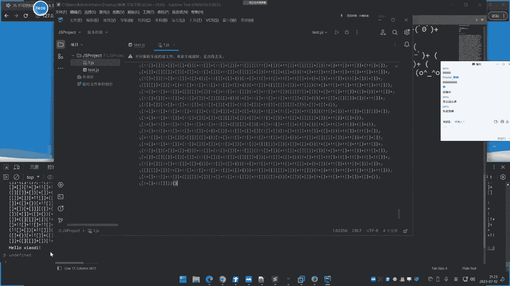

是不是也是一样的，好我们来看一下啊，我们再看这个啦，我给大家看一下有没有用武之地啦，我打开一个了搜狐视频的。

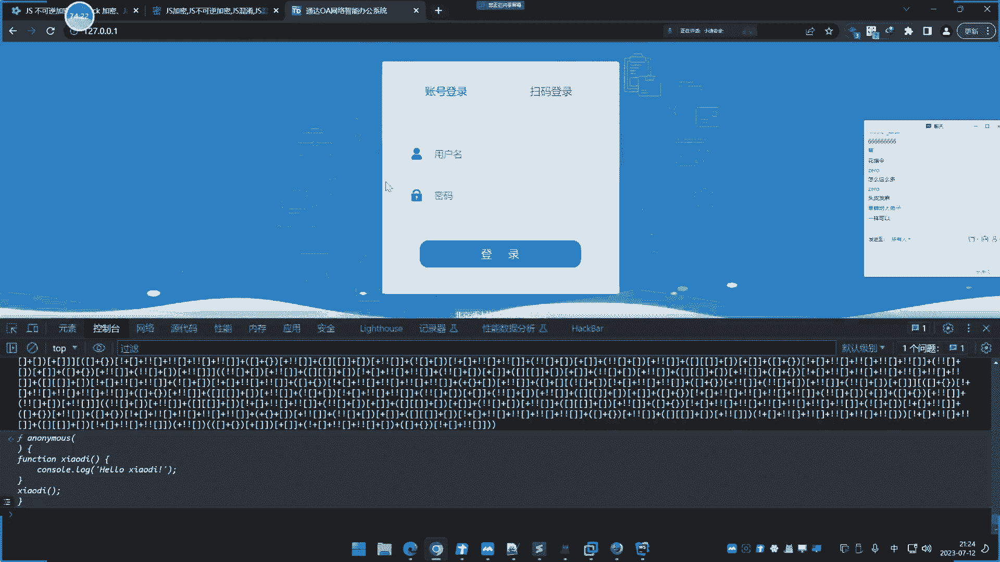

搜狐视频地址是多少啊。

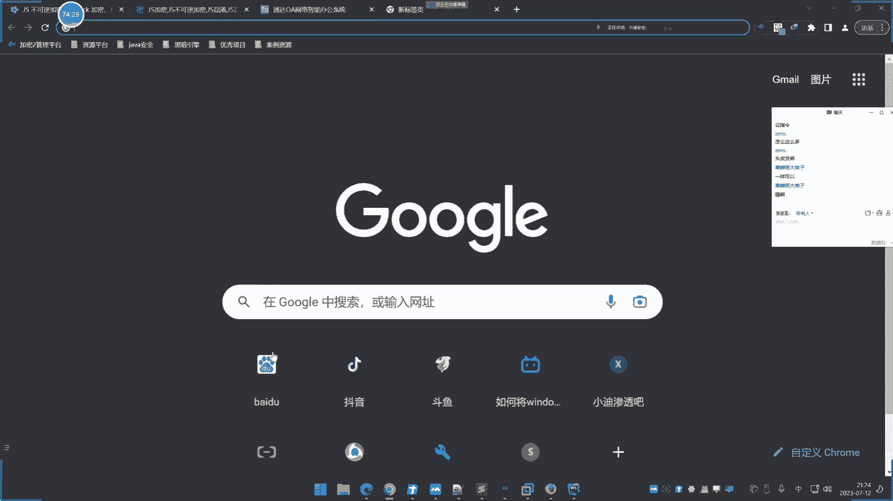

这个是开源的，这个开源的好好搞一些，还有那种商业的啊，商业的除了例外的。

我们待会会说那个方案，先看这个寿司，然后找到这来啊。

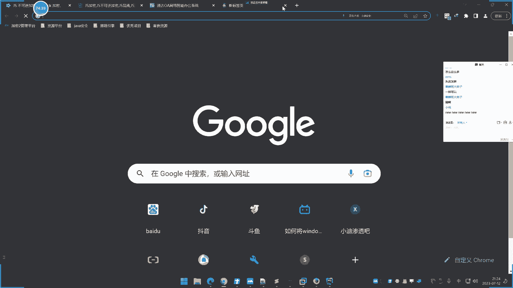

这个登录这里啊，我们登录一下啊。

啧，你看这里让我们登录一下啊，抓个包，这很明显我这个肯定是登录不上去的啊，来个抓个包，你看下它有些数据就会有些混淆，我们点一下登录，点了之后呢，我们关注一下有个数据包。

它就提示错误嘛哈我看下有没有数据包，看返回的数据里面，哎这怎么没有啊，再等等，你今天就给我，很轻松，登录这里，好点登录了，哎等一下我看看那个数据包在不在，我们看一下啊，这面的那个数据包里面。

它是有一个那个加密的啊，我要找一下，看看哪个，这你妹的是是复合里面，怎么找不到啊，跑哪去，啥呀，是不是我这浏览器问题啊，他妈的这逼浏览器。

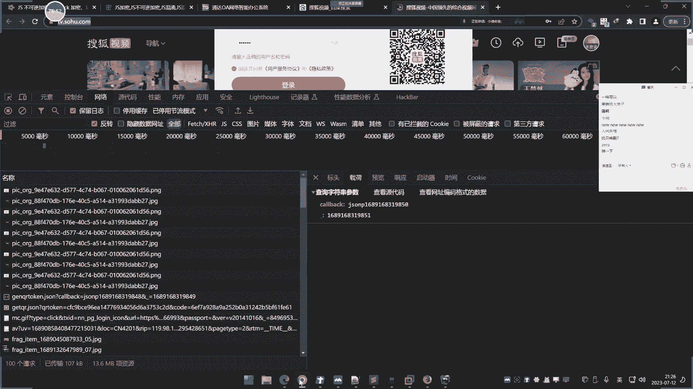

昨天是那个啊，coke里面就有这个马，今年是不出来了，你还真是奇怪，好三零掉，我抓包了，我看一下啊，在不在里面，他那个数据是个加密的，好有了，大家看看有哪来了，大家看下这个数据，这里呢这个有这个东西吗。

那你把它拿出来看一下啊，能不能放这里，对不对，你看啊，这是那个一个他返回一个数据和password类似的，这个请求，这个搜狐的一个登录的一个东西，这个数据里面呢有这个加密的啊，你看这里呢。

就和我们这个今天看到的这个JSFK有点像嘛，啊这个这个东西有点像。

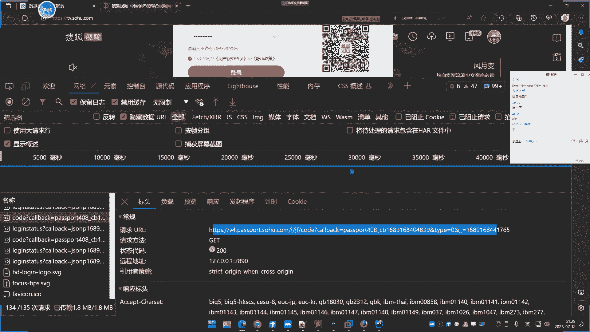

那按照我们那个数来讲的话，那我先把这个去掉啊，因为这个是个把它当做是串的嘛，那这个我也不知道是啥，我先把它去掉，你想想啊，他这个当字不穿呐，那这个是字符串，字符串要执行这个JS代码的话，你可以想一下。

这前面应该是有个什么东西的，大家想一下啊，什么意思呢，就我刚才这个是放在这里直接执行的，它没有问题，能执行出来，但现在呢就是说我这个返回的数据里面了。

这个返回的数据里面呢，嗯跑哪去了，这个返回的数据里面呢，可以明确看到他是把这个加密的这个东西。

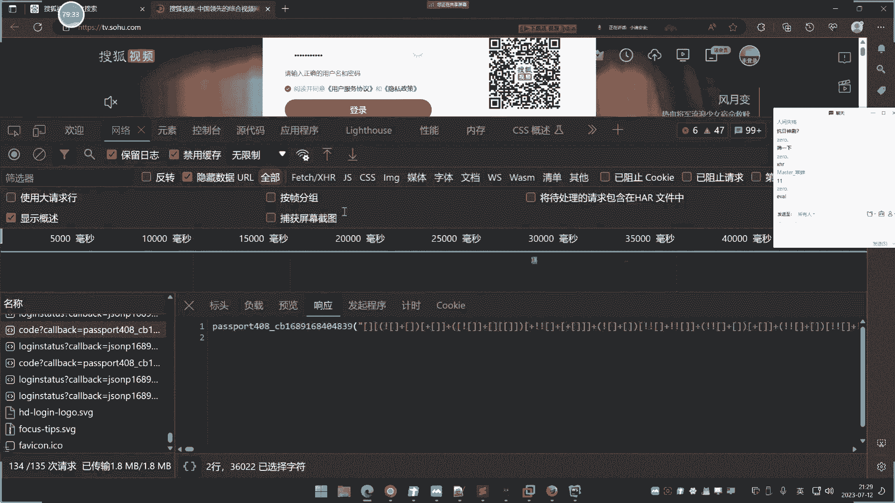

就是看上去这个JS发给这个东西呢到字串了，那么这里呢他如果说要执行这里面东西的话，那必定这个里面东西呢，可能会有1FEL或那些关键词，好我们先试一下我们那个刚才的方法，看能不能把它还原是吧啊。

这先找到这个了，我先把这个东西要去掉是吧，这字串先把它去掉，后面的括号和那个冒号去掉，然后把这里也去掉好，不然好难，还完之后呢，我们先在这里执行一下，看这是什么鬼东西，执行大家看到没，执行的结果呢，你。

是一个that the new，然后呢是一个这个什么鬼，呃搜狐的一个这个数据啊，结果是这样的对吧，结果是这样的，但是我们要知道源码呀，就是他的执行结果是这样的啊，这个结果应该是获取的当前co品啊。

这种信息哈，结果是这样的，嗯那你想想啊，按照我们刚才那个讲话的话啊，就是说哎先找这个最后一个点啊，最后一个括号，你看这个括号八选中之后呢，在这里没有看到他在哪里呢，为什么用i id1。

因为你不用i id1，你就找不到那个地方来，你往上翻，那我来看一下啊，接着往上翻，看他在哪里呢，那括号把选中啊，然后你要找到那个颜色和它对上那个地方，没找到，大家看一下啊，这他妈的是眼睛都要看瞎的。

那你把这个地方选中，八选中之后那里要找啊，找到那个和他那个括号呼应的那个括号那里，因为你在下面没有看到啊，在哪里眼镜呢啊这没办法啊，这个这个id还算好的了，利用其他的都没有这个标识，他找了个哎呀。

这他妈的真是看得我真的眼睛都花了，唉这可咋办呢，这我看了一圈也没看到过这，兄弟们看到了，帮我锁一下啊，哎呀，有个什么插件啊，介绍一下这个是吧，好我试一下啊，这招的实在是头皮发麻啊，R e，太早啊。

他不早了，那个括号发去了，没办法嗯。

在这里是吧，Enable inde，你是没反应呢，啊他要引APB一下，我有自动启用的，你在在哪里看啊，我怕点错了呀，你们真是啊，上面哪里有啊，这眼睛的意思看得头都痛了，这是启用状态呢。

唉我是真的是懒得找了啊，明明下去找吧，这个这眼睛看着实在受不了，这东西，就这样找到那个那个点啊，找那个点把它去掉，就和刚才一样，因为他为什么和刚才不一样呢，刚才直接在下面有它这个原理是什么呢。

它这个原理是什么呢，你看一下啊，他刚才呢为什么说刚才我那个操作那么简单呢，是因为啊刚才那个是直接执行的，他没有那种东西啊，这个呢他是写到括号里面去的啊，所以他这个括号呢就应该是里面带了个1VL。

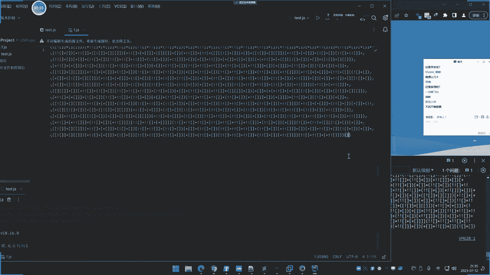

带1VL的话，那么这里肯定是这个代码呢有点不一样的啊，所以你要找到那个地方，找了个括号那里，好我们等下再看这个吧，我们再看一个案例啊，再看这个商业加密的啊，这个商业加密的呢有哪些啊，可以看一下啊。

商家名呢有很多产品，这个用的最多的性价比的吧，有这个产品在国内用的比较多的，对这个加二加密上面呢有这个什么V7版本啊，V76版本呐，什么鬼V5版本啊，这些东西啊，就是加密的这个算法的一些这个版。

然后呢你要开VIP，他才能加你，包括你在这里，那你就用它进行混淆加密是吧，那这就是他这个写法呢，它进行这个加密，对不对啊，解密之后呢，你看他加密结果是这样子，就是本身代码是这样子的。

你加密之后就变成这样东西了，这是用他的围棋加名字啊，你可以用它各种版本是吧，都加密的都可以尝一下来啊，这个很多哒来，那么这个是要加密的一个混淆代码，看到的就是这个东西，本质代码呢非常简单是吧。

那么现在呢我们就来看一下，一个真实案例里面啊，看他如何是把它还原的，并且呢把算法给他拉出来。

打开看一下啊。

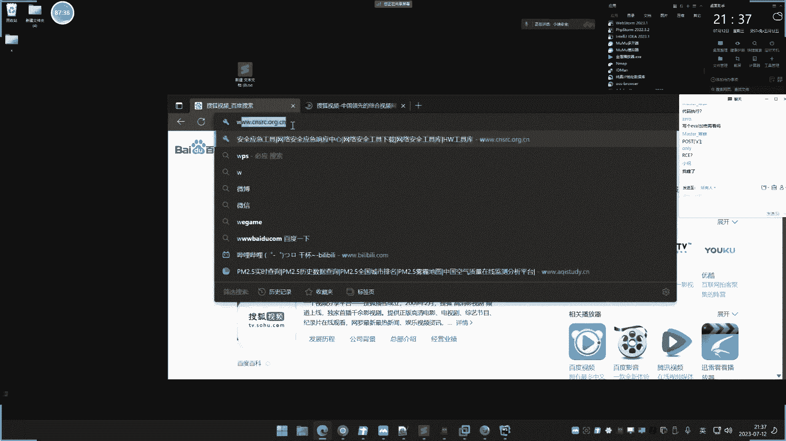

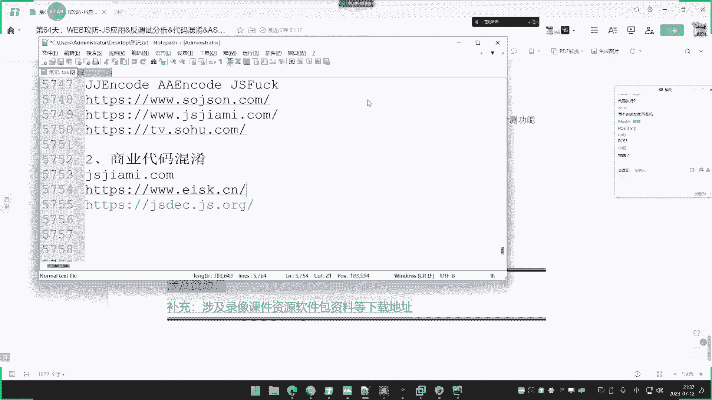

好这个呢是一个那个网上找的啊，我们可以看一下这里啊，我们把它打开网站，那这里呢是一个数据网站，我们打开来一看啊，看下代码，你也看一下啊，正常来讲的话，这里是有一些数据的。

那有一些这个什么防空港的这种潮汐数据是吧，这种东西还有些数据在这里有这大量数据，然后呢你可以关注到啊，他这个数据呢啊并不会在这个页面中显示，你可以看一下啊，我们打开这个页面加载页面。

我这里呢不用这种东西，显示在显示器反这种模式打开看吧，这免得劳死里面的是吧，缩来缩去的烦得很。

然后呢这是他的一个算了算了，还是这种好一点吧。

这也没什么太大区别，这是他数据啊，数据呢这里呢大家可以看一下啊，那当你去刷新之后呢，我们刷新一下这个里面呢有大量的请求，这个请求数据里面呢大家可以看到啊，呃我们找一下，比如说我们想要这个数据啊。

这个里面的一些数据有什么这个这些个东西呀，什么潮汐这些东西呀，那这个数据从哪里来的，这个现在港口呢是这里啊，我们先给他看一下个加密的啊，加密的代码，比如说我们这里打开一个JS文件。

这里呢我们是从这个爬虫角度去讲，如果从安全角度讲的话，就是这些数据呢我们要还原出来，然后对数据进行加密呢，同样按提交方式呢去测是吧，也是个道理，你看他的代码里面啊，我们找一下啊，你看看代码里面。

这个代码呢还是正常的，这个代码正常的，重新好，这里呢你看这个了，看到没了，这里有个叫TT2020JS，打开一看，你看这个JS文件，就我们长时间安全的时候，比如说分析到JS文件的时候也已打开。

那常规的JS文件呢，你是不是都还看得明白呢，这这这都还是看得明白的，是不是啊，你看打开这个JS文件，你看，大家看到嘛呢，都这种写法呢，就这种写法，这哪还看得明白呢，上面还直接告诉你这是用什么算法。

哎你看这种正常的JS文件，这写的都大家都认识是吧，函数都是很清楚，那这个呢你看，大家可以用这个在这里打开给他看看，这个代码在这里，那知道代码，假如说这个JS文件是你要分析的，他是个核心的JS文件。

因为你可能想这个上面也有这个JS文件，这面也有很多JS文件，为什么这个你用这个打开呢，这个它不加名单呢，这个是正常的，先是都还看得明白呀，这个对应的用的函数啊，都没有竞争，那如何判定加名呢。

除了这个之外，看上去就是就有加密，为什么，因为你也看到他写的东西啊，和我们正常的不一样啊，他这个变量呢要声明成么，这么下划线，05X85函数呢算是没有看到几个，你看这里的函数很多呢，什么拎起啊。

JOYN啊，普奇啊是吧，都是一些常见的字符串的一些处理函数，这里呢都没看到多少是吧，就是那生命类型的，然后啥都没有了，你这里看到东西呢，也不知道这个事究竟是啥，看不太懂，就是变量名字全部换成这种是吧。

这种编码这种搞法，那这个就是加密了啊，这个就加密了，如果没有加密的话，函数都是直接写的，都可以看明白了，这个呢就是函数都没有几个，不然你看函数都看不到，全部都是一些这种，那这种数组里面引用这种东西。

没有任何函数看不到啊，所以说这个判断加密你就不要问了啊，有些呢就这里还直接告诉你，这上面都有注释代码，说写的这个加名，你还文字是不是加名，那不废话呀是吧，还有一些呢就是看上去呢不想加密。

但是呢它实际上也是加密，就是主要就是观察这个变量名是不是正常的，你一个正常的拿回去这种鸟毛啊，什么零差几呀，差差几，但是学那种就像我们那个刚才看到的，像这种的乱七八糟的，是把一些字符当什么变量名。

那显然就是不正常的，那么他为什么要加密，很简单的道理，加密是为了保护这个程序的源码，防止你看到他的真实代码就不给你调试，比如说你在安全测试中，这个文件呢它进行加密，那肯定是关键所在呀。

不关键它加密它干嘛都是神经病呀，那不重要的文件加密它干嘛嘞，肯定这个是中药啊，那么如何还原它呢，一现在的方法啊，我不是教大家怎么从他正面直刚他，我是道家，教大家用解密解决方法，所以说原理方面我教不了。

就说直接硬刚，这个算法是干不了的，没有JS基础，不可能从单节课一个小时的内容，能教你把算法给他理解出来，这是不现实的，别人网上呢讲344个小时都讲不明白，你准备隔个小时说，你去刚他双吧。

这不是扯淡吗，在网上这种商业版的要花钱的，你说泼就泼。

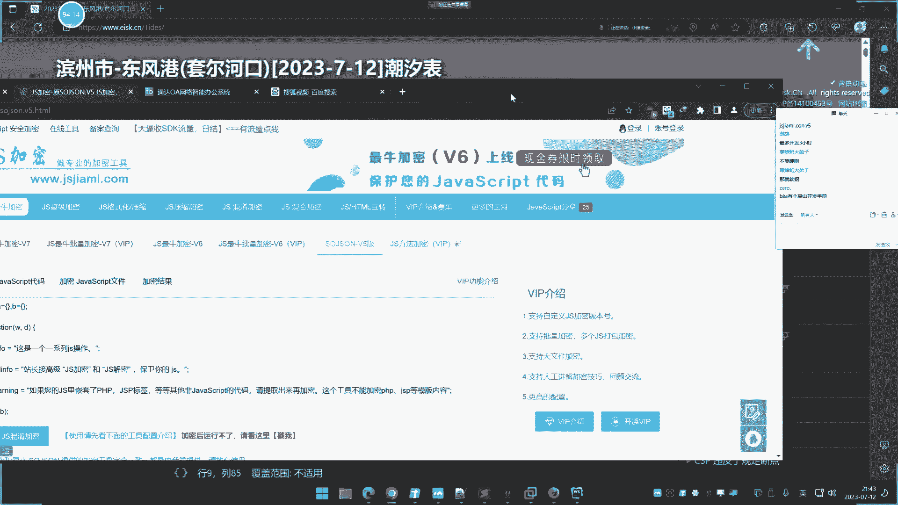

那别人他妈的这不神天天在干嘛呀，所以说应该算法去写他的东西，这不是我们现在操心的问题，没有那个能力啊，除非说你专门去研究这个算法的，那给大家解决之道，就是给他提出解决方案，解决方案就是什么呢。

就是首先明白两个事情，就是说啊知道什么加密，再是用什么解密，知道怎么加密呢，是可以根据这上面的提示，根据上面的提示去创的，对不对，如果说你不知道，你就都试一下，把它加密方式就那么多，国内的是吧。

国外的那是另外方式，然后用什么加密，用什么解密，我这里面专门给他找了半天才找到的，网上这种东西编的是收费的，就是这种算法的本身是收费，你要解密，网上专门有人接单帮你去解密，这个东西收费多少钱。

网上呢有专门研究过这种网站，你可以看一下的，你知道我知道这个是V5是吧，这个JS什么加密V555，可网管给他看一下，来这个解密，那你看啊，这里有了有说这个解密的追星方法呢，解这个什么非五的最新解密方法。

你看这里有好，这是他的文章是吧，好解密东西呢，解密前解密后啊，这里是插座，是在这里解密，在官方网站好，那我行啊，那我他妈的就放把它放上去，让他解密，给我看一下，那解密解谜啦，这他妈不是鸳鸯吗。

你这么想都想得到，怎么可能有解密，那个官方网站自己加密，他自己帮你解密，那还搞了，我靠，这是文章都是这扯淡的，对不对，这文章都扯淡的，你翻半天你都翻不出来的，你翻这个，你看啊，他说哦。

这源码这是加密后好，这是解析它好，他把你删除了，怎么操作呢，发现个事，花字你删除就OK后继我丢你妹的所有人，我恨你，那他说解密，这看半天，你看的明白，这是什么鬼，解密吗，先格式化，然后把自助餐还原。

还原东西在哪里，他妈的神经病啊，哎纯手工人节，这是直接看文章，你说我教这东西，这谁听得下去，这教也教不了的文章，就这个东西呢，这收到的资料怎么乱七八糟一大堆呀，还有这个呢，说什么求解密，看到没有呢。

求解密，可以解决一下，帮我解密一下啊，加密的文件地址在这里，你发布悬赏对吧，所以说你就可想而知了，所以他解密该怎么办呢是吧。

我们也不买这个什么关子了啊，我专门给他找了个项目，找了半天啊，因为我看了一下这种加密解密，有人会有人会的，他是能解密的，但是他都是要画嫩嫩子的，都是要花钱的，你不给钱，谁他妈告诉你呀，神经病呀。

八我又给他找了个免费的来这个地址啊。

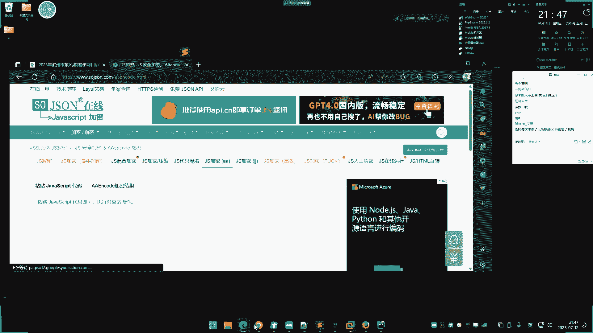

他有一个项目是别人写的，以前别人就是用对吧，有奉献精神的人写出来的，网上你找半天都找不到的，这是我找了半天才找到的，呃当然了，你也可以在这个GHUB上面去搜，有所受的关键字呢。

有人呢有提交过这种解密的这个什么脚本，哎大本呢你也可以用，你比如说我知道这个相比哪啊啊，比如说维奇啊或者什么鬼的，大家可以搜呢，比如说那个是JS加密，或者说这个呃这个搜JS这个关键词V5对吧。

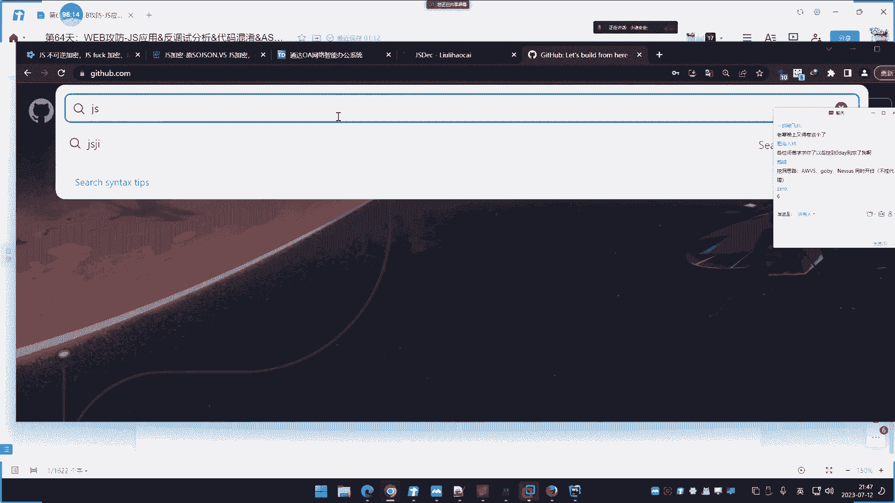

这关键字一搜看有没有人提交过这种东西，你看看是不是有啊，你看那JSJS跟V5代码，好像你看有人提交过，对不对，就是有人研究过他的算法，就不用你自己做了，你就用别人就行了，你不要说哎呀，我也学，当这种人。

你学不会呀，这不是一天的事情呀，这算法又要懂JS，还要懂算法，哪有那么简单的事情，我教几十个小时都教不会的东西，这个呢说解密这个需求，训员工解密基地，我啊这网有这个呢这项目里面的。

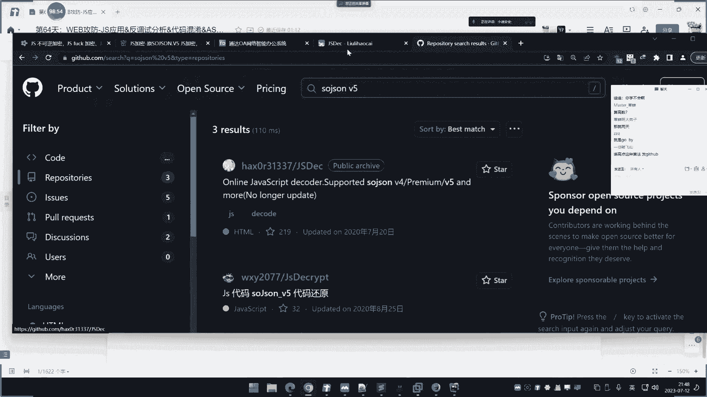

你看啊，我就把刚才那个那个网站的呢。

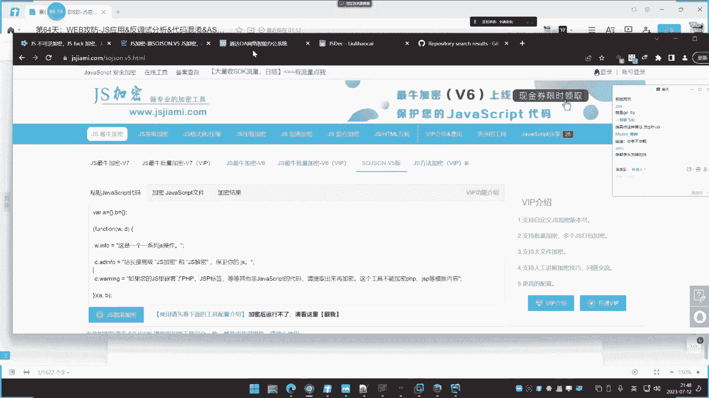

哦这里是吧，把他给拉过来。

对不对，他放上去啊，进行解密啊，自动识别点解密，他说自动识别失败，然后这个是JSV5，对不对，你看他也支持哪些呢，支持常见的技能，常见的呢va encoder，刚才加密的节节以后的JS。

c s g n v4C二级，用高级版JAVASCRIPT等常见的，而且是我网上用的cs u n v5加密V6，你看这个，目前这个官方的收费版本是一个非齐的，这是国内小网站呢，用的最就是小中型网站。

不是那种高薪大厂啊的那些网站，就会用到这些加密，高薪大厂的可能就是自己写的，那就除非是你会玩算法，你才能解密了，否则的话就解决不了哈，网上的一些不是让大厂的网站的，大部分都是用这种商业的啊。

就是钱不够啊，加密一下啊，大厂的话那肯定就是自己写的算法了，那就需要你自己呢去看代码去还原了，那那个难度那就比较大了啊，你看我们还是解密啊，我搜下来我用这个vi牛一解哎，解出来了是吧。

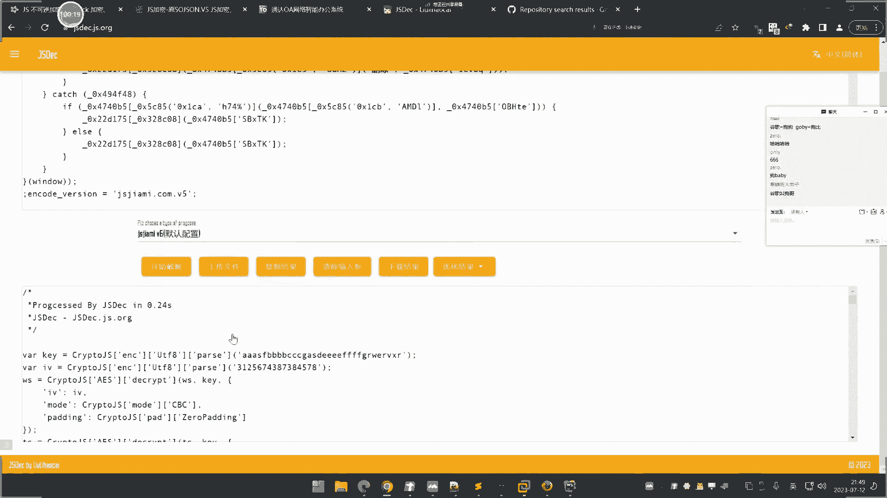

那出来了呀，一出来之后就好办了，这看里面究竟写的啥玩意啊，看下来这是解密数组解密出来代码，你看这个代码呢就比刚才那个好多了是吧，那这里呢直接有算法的写出来呢，K这个加密的K也出来了，加密的IF也出来了。

用到NEX的加密啊，模式CBCZUP等零加密，我看他加密什么数据啊，那既然是问的这个算法都出来了。

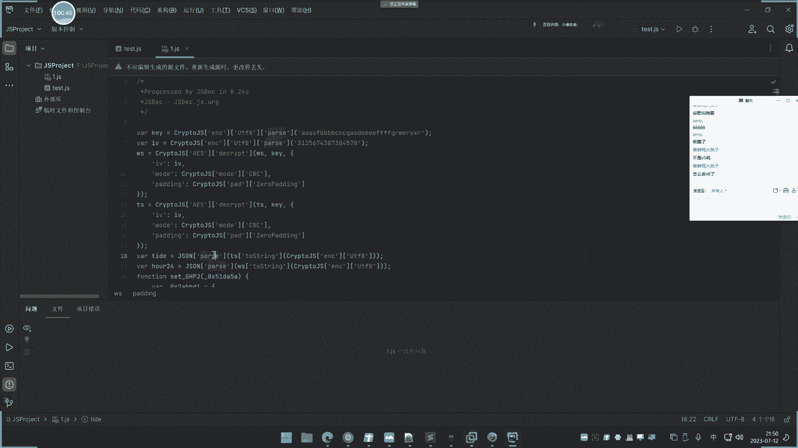

算不出来之后，我尝试看一下这网站的数据。

看能不能对得起页面，我们试一下啊，比如我们来看提交的数据，这算法了，他他把这个加密算法的文件呢，就把它写到这个加密文件去了，就说他把加密算法当做加密文件呢混淆了。

那么他提交的数据我看能不能把它反映出来啊，嘶我先找那个取书，就是那个那个几个地方看一下那几个数据啊，先找一下那个数据，我看一下啊，能不能把那个数据给大家拿出来，F十二二，然后找一下那个数据。

这个是滨州市东风港2023年，那个我找一下那个数据啊，这里呢大家看到啊，他这里有个数据的，这里有个数据的，你看看这里有有有有传数据，不过这个数据好像是哦，这是百度的，这是不清单的啊。

这百度给他们的不是官网的，我找到自己的网站，好看看这里面有没有这个响应数据，从里面找一下啊，因为他这个首页的是访问这test嘛，然后里面呢显示一些这种钢头的数据，对不对，这个数据呢在这个页面中呢搜不到。

比如这里呢有个这个潮汐数据，6010呢啊这个数据呢在里面能能找到，你看高一点，31-31，这不是达到1。30，在干草1。5，他这个部队啊，所以他这个页面显示数据呢，他肯定是用加密算法缓燃的啊。

这个我不需多讲，大家只要知道这个解密环消，然后呢我把里面的给他看一下就可以，这是他所有文件啊，我们把它用这个在这代码玻璃器再打开看，看一下这里啊，那这里有个叫来看ts s和WS一个加密的数据。

在这里我告诉大家啊，这个数据就是这里面的这个数据。

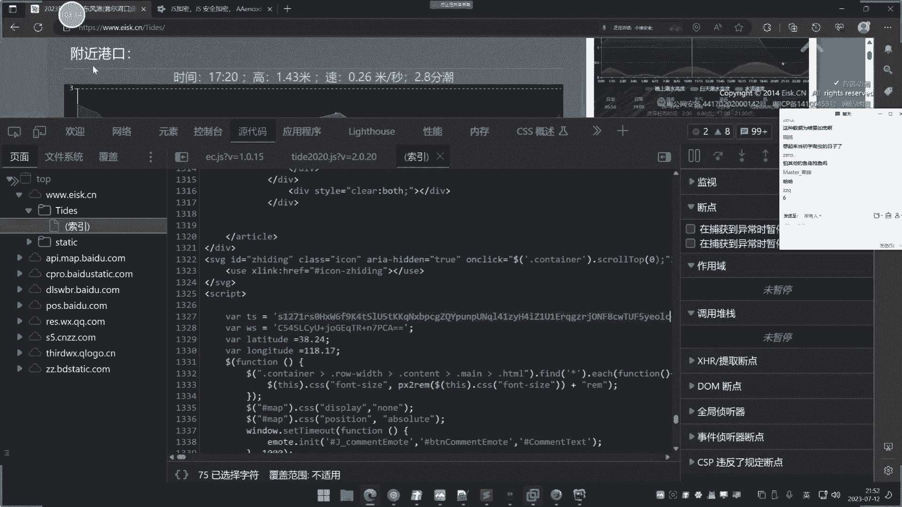

就这个防空港口，包括下面的这个什么这些数据，他就把它写成来，然后你我可以试一下啊，你看着啊，我们来到vex解密的那个网站，嗯vs解密那个网站呢，这个不行啊，这个要找那个网站，那个那个网址跑哪去了。

经常用的那个网站加密好像在这里啊。

这个是那个as的啊，因为我们从这个本质代码那看到了啊嘞。

a as的default，然后这是他的这个K把它填到这来，你便宜点，现在这了是吧。

然后模式CBC嘛来这里显示了嘛，CBCCPU0的啊。

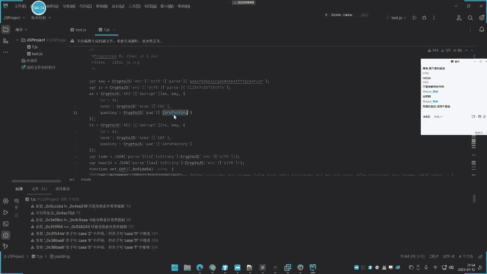

就这个嘛好，然后我们从刚才这个代码中，抓到这个数据啊，那可以看一下，把它拿出来放在这里啊，把这里去掉，后面这里去的解谜解出来了，但是这里不显示不全，把这个改一下编码，看一下UTF8都看到没。

数据出来了哎，潮汐东风港的一个数据是吧，那个数据的那个对应值也出来了，滨州市的东风港潮汐数据，就不是这个页面中显示的这个结果吗。

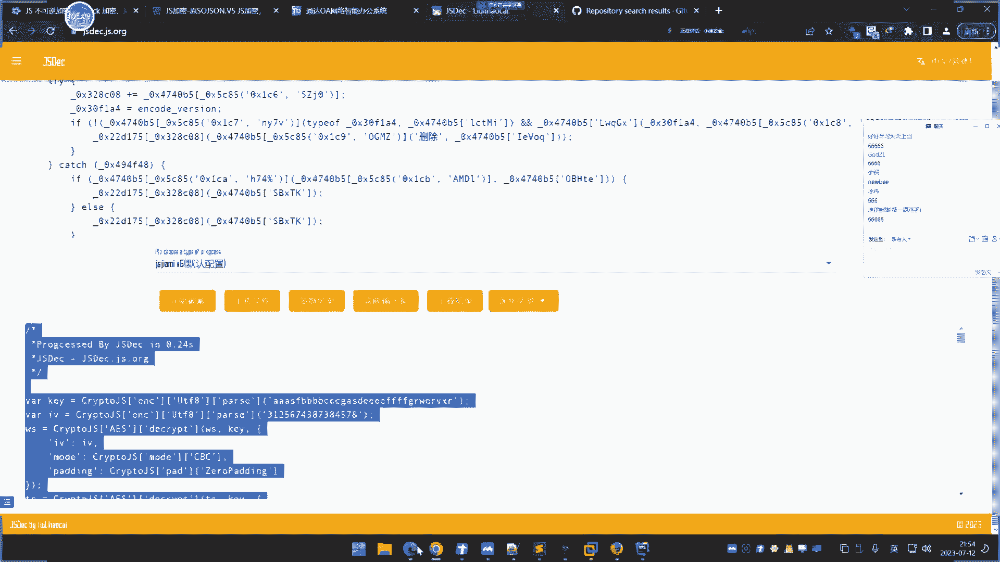

对一页面中就是这个什么滨州的嘛，可以我换一下，我切换港口，再看一下是不是它确定下来就切换港口，我切到这个广东这边来好，然后徽州市大亚湾好吧，我切换过来之后好，我们再来找一下那个源代码中的那个是吧。

找一下源代码中那个东西，看是不是这个数据位置啊，找一下刚才那个地方，好在这里搜WS，好就这个吗，就这个嘛啊复制啊，现在是看的是这个徽州市的大亚湾，好，我们来到刚才解密这里，看是不是它数据为他以他为准啊。

把替换一下，这句话再解密解密的，什么情况啊，等下我看下是不是他妈的妈的没改呀，还是网站bug呀，稍等一下啊，我把那个密室对应一下，看miss有没有改，还是网站卡了，好的，先清空啊，先清空一下啊。

看他有没有反应性，还是滨州东府滨州滨州的那个啊，这是没改呀，他妈缓存来讲啊，我把这个这是刚才从这里抓到的，我怀疑是不是加看的是上个那个数据包，下面还加载了一个，应该刚才把那个去掉的啊啊去掉。

重新重新重新抓包啊，重新抓包，好重新抓包，再来看一下这边的这个代码，在这里搜，好在这里啊，跑到这边来。

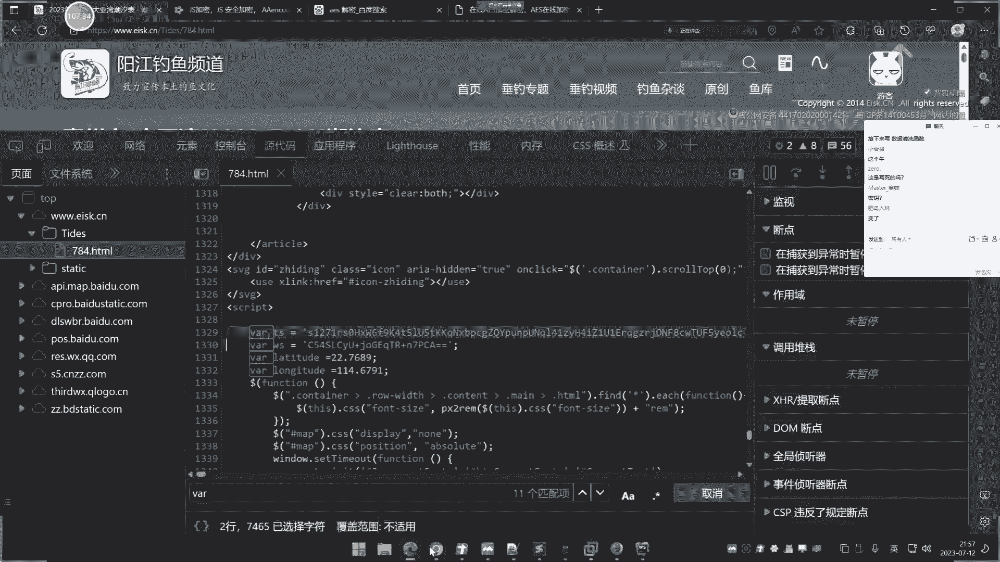

好这样子应该改了啊，这个跟刚才不一样了，数据不一样了，看这里了解好出来了，你看对了啊，刚才可能是抓的是前面那个key，那这个对应在哪啊，这其实就是说他把这个数据呢进行了加密，在里面再去解密显示。

然后这个啊我简单说一下，这个解密有什么意思呢，我看一下啊，这个就是简同意，就是说这个网站呢他把这个数据呢啊加密是吧，然后呢存储是吧，然后页面写的字真是简明这个数据，所以说如果说你要提取这个数据的话。

你肯定是要对这个数据进行解密才能提取的，然后解密呢只需要这个解密算法的，对不对，需要解密算法，那这个算法呢这个代码文件呢又被加密了啊，又被加密了，加密混淆了是吧，所以我们呢要还原这个算法文件。

然后呢啊实现这个在解密这个什么，这个这个算法啊，对不对，这是从这个爬虫的角度，是要爬虫提取数据的的角度，那么从安全角度来讲呢，不也是一样道理吗，安全的角度来讲的话，对不对，那如果说这个提交的数据。

把这个请求的这种请求的数据提交数据呢，也是通过这个什么用这个加密呢发生的，那么我们也是不是要进行这个对应解密，然后呢再加入这个payload啊，进行这个漏洞或者这个攻击测试啊，就是安全措施啊。

就说那yes s1码思情啊，就说这个东西归类到这里，然后很简单的道理啊，这个是一种情况，这是我们提交漏洞的，那么还有一种情况，就是说我得到还原代码之后呢，还原代码就是我混淆。

还原代码也是能够帮助我们是吧，这个升级这个JS文件啊，分析里面的这个什么必要，和这个测试这个诱饵的这个安全，对不对，就是后面的测试，如果说你代码还原不了的话，也就不会有下面这个事情。

所以说代码的混淆和代码还原，包括前面我说那个反调式，都是为了得到你们的些核心数据，进车时同样道理呢，也是在这里的省级这个JS文件呢，从里面去提取一些有价值的这个URL，和他的这个提交方法呀。

或提交数据的来测一些其他的接口，这是我们这个JS的主要的目的啊，就是第一种呢就是说搞清楚它的这个算法呢，在提交的时候呢，按照这个算法呢去请求配漏的，还有一种呢就是说得到里面的JS核心源码。

从源码里面再提取有价值的，又要地址和请求数据信息，然后再测啊，这是个算法的啊。

然后呢我们也是给大家说从这个安全角度讲，所以没有去给大家说这个算法，怎么直接刚他去把解密算法写出来。

都是在网上直接找的这种可用方案，推荐大家这些常见的加密呢，有这些方案可以是吧去解密，那如果说用到这种非奇异版本的，或者说用一些其他商业版，你不知道的，那就没办法了啊，那就只能靠个人能力的去研究算法。

这个呢不是我们一两节课能骄傲的啊。

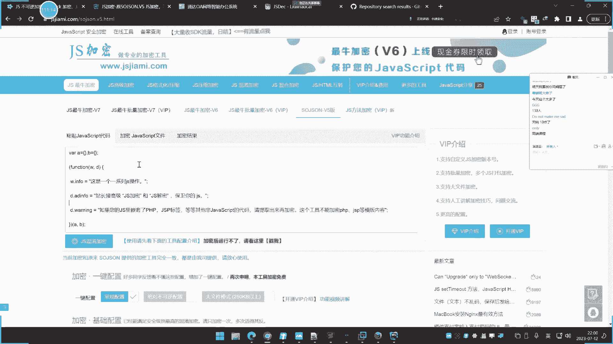

好我们接下来就把刚才那个反调。

是那个按键的杆子把它捉一下啊，这时间关系我就不跟他废话了啊，刚才没成功的那个那个反调是那个案例啊，赶紧做一下，我再试一遍啊，如果还撕不成功的话。

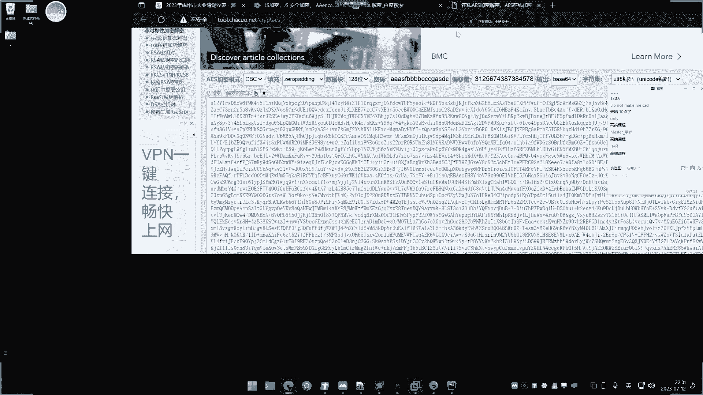

那我就就先讲这么多，然后下去我把四成功。

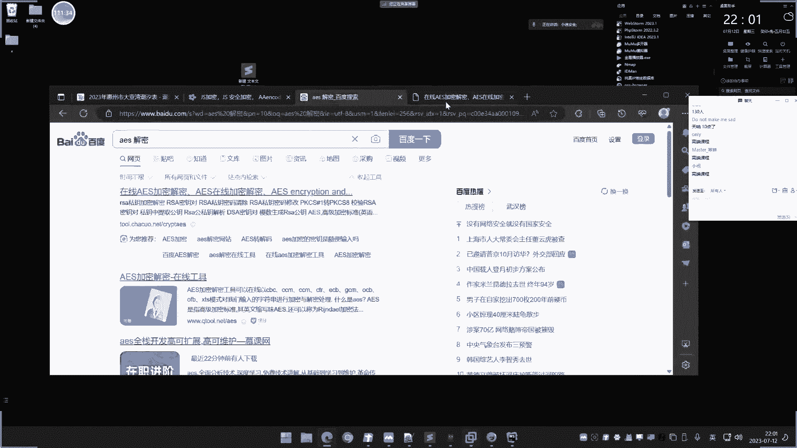

我再录个屏啊，补到上面去，先把试一下啊，如果还是不成功。

我也不浪费大家时间了，开撕不成功。

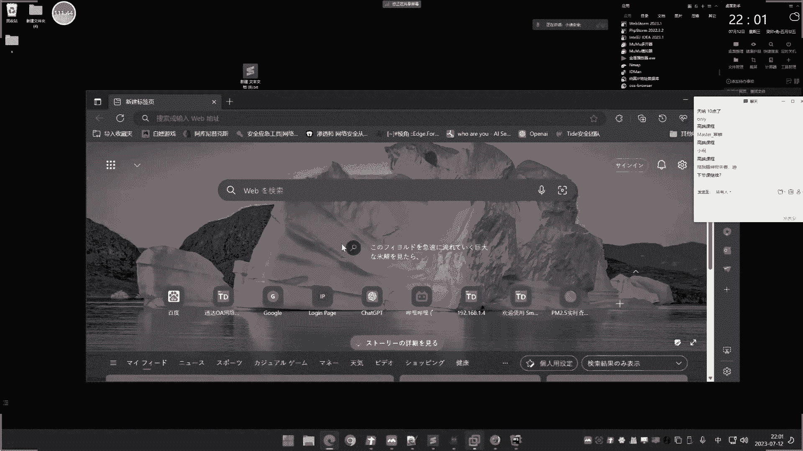

我们就直接，那就只能这个等下去把它录个屏了啊，我感觉这个也是撕不成功的，这他妈的我怀疑这个浏览器应该是有问题了啊，这个我昨天搞搞搞搞了。

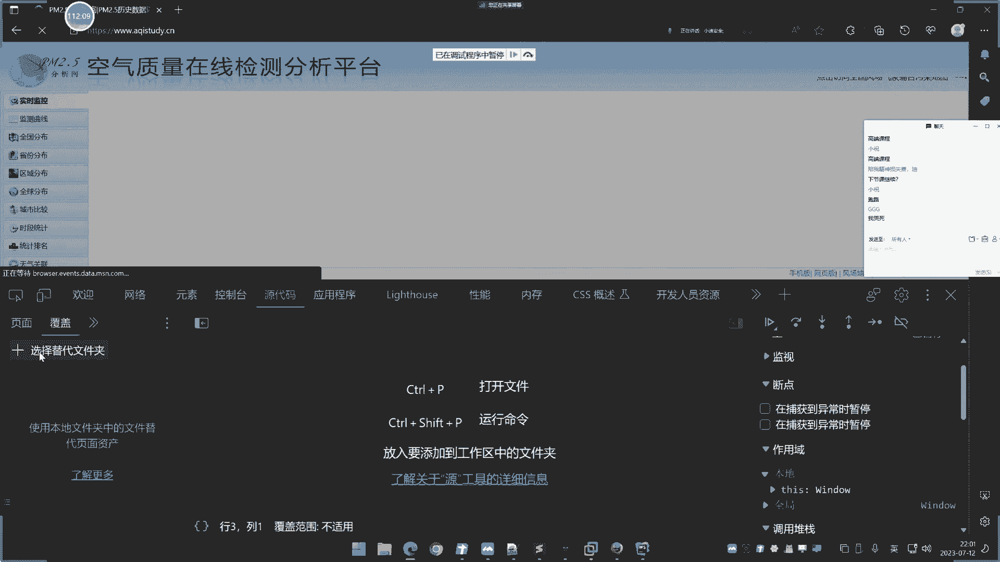

把有问题打你页面都显示不出来了，我把它这样子吧，我把它直接历史记录把它清一下，看一下是不是这个情况啊，清一下历史记录，直接过去七天了好吧，反正24小时，昨天到晚上十点，那也不行，他妈的亲多了也不好。

哎呀亲的，再来试一下。

我怕到时候有些对你说，这不是亲不亲的，亲的也是，呃没办法啊。

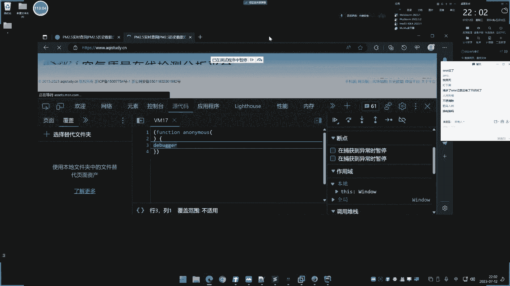

大家执行一下啊，我这不行。

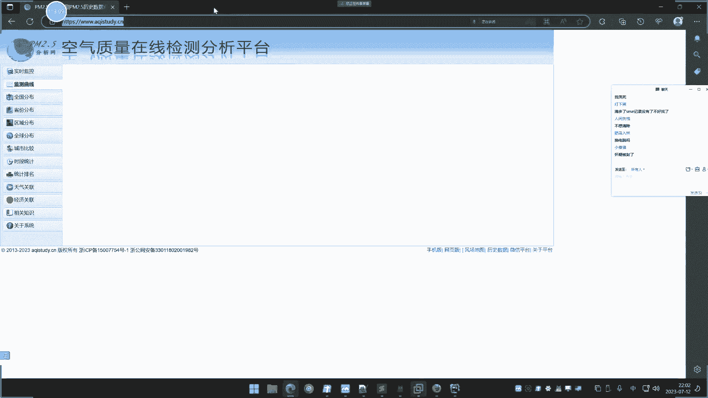

这面浏览器也不显示，我代理也开了啊，我这个代理是开的嘞，一直开的也不是IP地址啊。

我怀疑是昨天搞搞搞完了搞哪里。

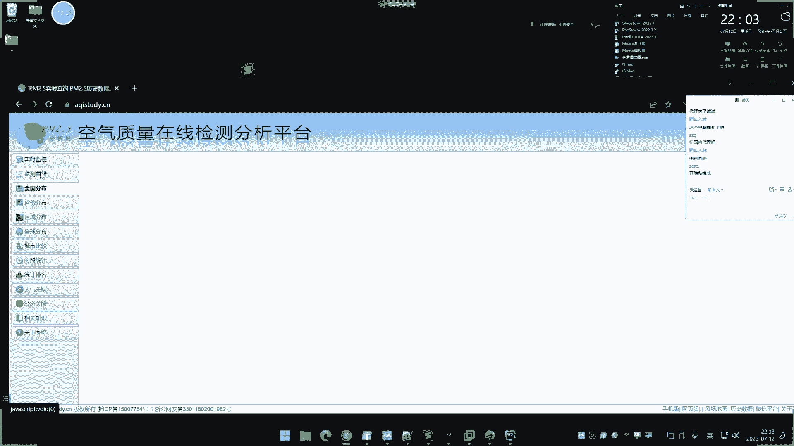

估计搞搞的有问题了。

应该是答，我来看一下吧，我用这个给大家看一下。

我前昨天写了一个的啊，我看一下啊，我把这个换到上面去，把它加载到里面去，还是昨天那个网站呢，我把它画在这边来啊，加载里面去重新打开看一下。

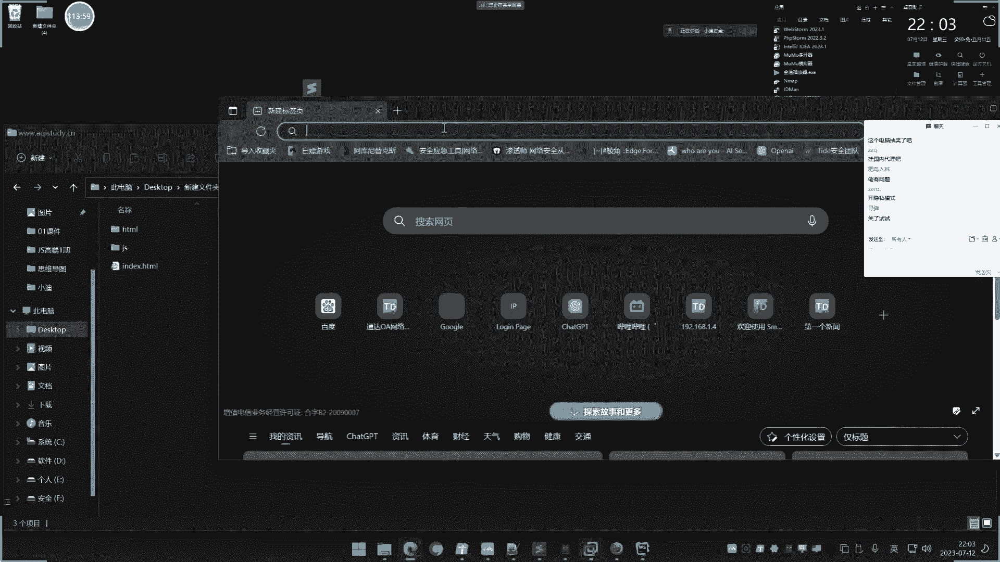

在这个文件这里按覆盖替换，选中我们桌面的新建文本，就这里。

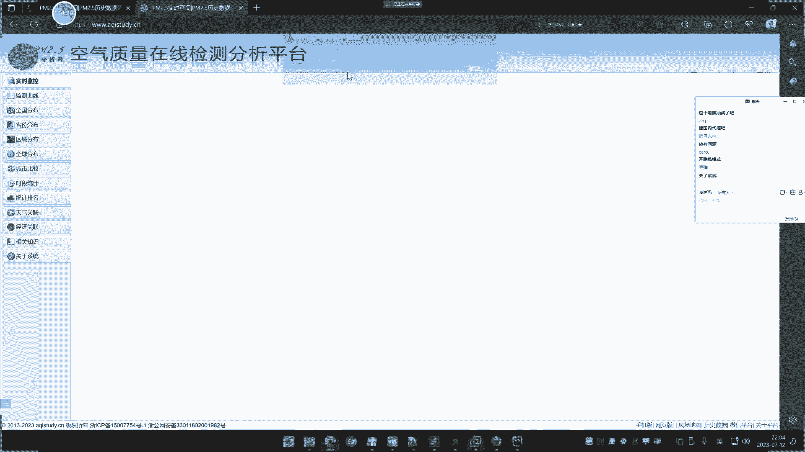

唉行吧，这个搞不了啊，这个还是有问题，不管什么问题啊，我后面呢给他录个屏啊，大家讲解一下啊，这个上面没有成功啊，下面有人成功了，我录个屏啊，录个屏放到放到上面去啊。

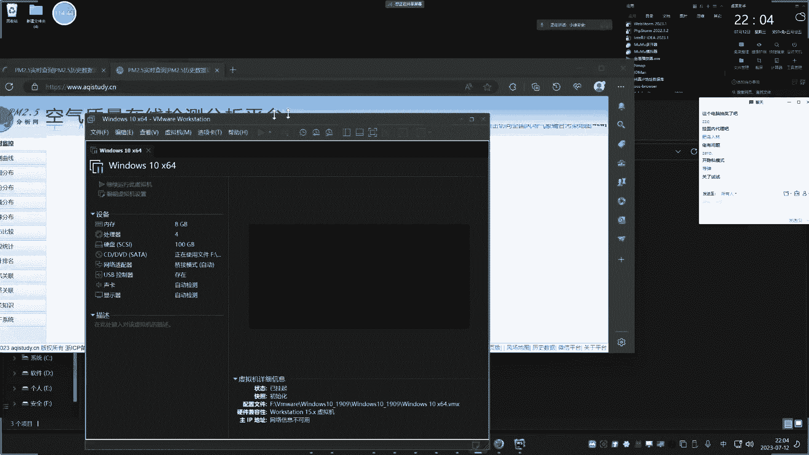

影视模式啊，好我试一下，看影视模式行不行。

下午接了啊，这还不是一样的。

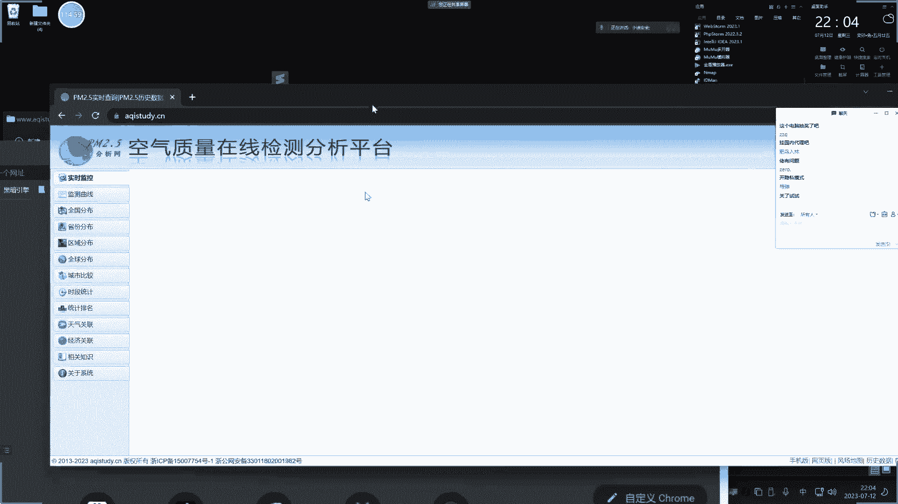

打不开页面都不显示内容，我真搞不明白这啥情况。

在这个里面都能显示。

那就只能等下次，不是下次啊，就是我下去之后，我把那个补充上去啊，以录屏的形式把它把它弄出来吧。

好就说这么多了啊，时间关系我们也不废话了啊，下去我把录屏搞一下，搞一下，把这个案例以录屏的方式再发吧，E g g1，可以啊，我前昨天自己做眼本地演示时是完全OK的，好就说这么多了。

