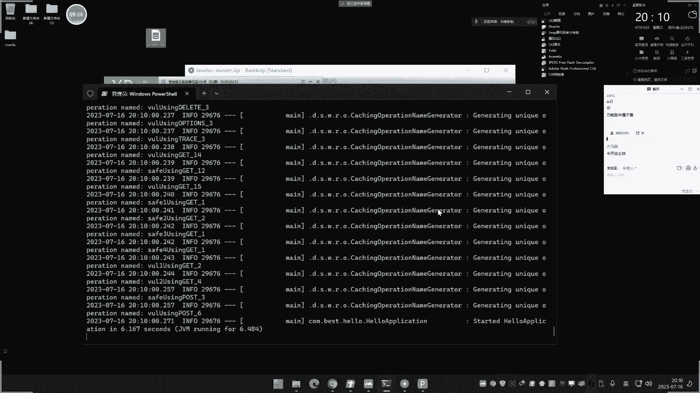
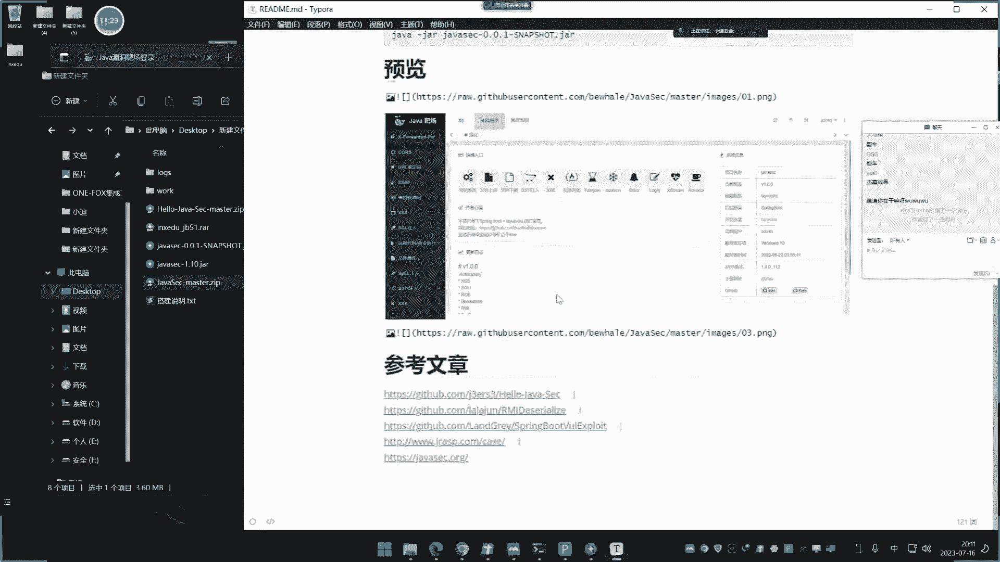

# 【小迪安全】V2024版 全栈网络安全 ｜ 攻防渗透工程师 （持续更新） - P65：第66天：Java安全&SPEL表达式&SSTI模版注入&XXE&JDBC&MyBatis注入 - 逆风微笑的代码狗 - BV1Mx4y1q7Ny

没有挂机上课了啊，今天讲一下这个60由天啊，这个java安全，这个java安全的这一个系列的课程呢，大概，五六次直播吧对吧，嗯前面因为这些漏洞呢有些是讲过的啊，你像一些什么蛇口租这些东西呢。

说白了无非就是说看下这个java里面，有点有哪些不同，它的利用方法呢都差不多的，那没什么讲头七啊，前期的这个pp里面的讲的这个SQL注入，已经讲过很多了，原理啊，包括他的什么利用啊，都是通用的。

无非就是说在这个不同语言中啊，这个漏洞是怎么产生的啊，有哪些差异啊，利用和原理的都一样，所以后续理由呢我们是不再讲讲的了，就是说他这个漏洞在不同语言中是怎么产生的，这个是关键啊。

除了这个之外呢也没其他的，另外像这个还有一些特点性的漏洞，就比如说像pp里面的一些不存在的，一些漏洞是吧，像这个我今天说的这个什么SPL，E2表达式啊，这个东西呢在PPT里面是没有的。

这个呢是它特有的东西，那个SPEL呢其实就是那个SPINPUT，然后下面那个表达式，它其实就是类似于pp里面那个代码执行漏洞，无非就是说SPL呢是这个是ping铺的框架，上面的一个特点，里面呢。

还有网上还有什么OGOGNL，对不对，还有几个啊，都是不同框架的啊，没有什么太大的一些差异，但是我们商单是什SPEL，像什么OGNL啊，对不对，还有JSTL啊，像这个呢我们就不删了。

你不用问为什么不删啊，不删的原因就是淘汰了那个JASEL啊，GL呢那是以前那个JSP的时候是吧，后面那个OGL呢是那个SSTR那个框架里面，这个SPL呢是我们这个SPINPUT的。

我们答案呢会有一些参考文章给大家看啊，好我们来说一下啊，其实在前期的这个安全开发里面呢，我们已经讲了一些了啊，已经讲了一些了，关于他的漏洞原理啊，这个情况只是说现在的我们再次讲的话，是主要是讲他的利用。

就是呢着重的去看他代码的一个差异，你会发现在java这一块的，他这个安全漏洞里面呢，他和这个pp呢有很大的一些差异，就是pp的一些漏洞呢黑盒里面发现的话，大部分都能发现，但是这个java里面先漏洞呢。

如果脱离代码的话啊，你直接在网上面去测呢，它有很多东西不知道怎么测啊，这算很大的差异，好这个呢我们给他说一下啊，那这里呢我们演示的话啊，为了大家更好的去把握这个java里面的，一些常见的安全漏洞。

我们呢给他找了两个系列的一个漏洞，集合的一个环境，一个是这个java c c的，还有一个呢是这个hello java c，这两个呢我从网上的十几个的这个项目里面的，搞了两个，就这两个了。

我觉得界面和学习效果是要更优的，而且他的漏洞的整理面呢也非常高。

先给他看一下，这是两个项目的一个地址啊，这个是一个什么java漏洞平台，结合了一些漏洞代码和安全编码啊，那我看一下结合哪些啊，circle xss r c1反序列化。

SATISPELSSRF目录穿越重定向，CSRF现在目前没有呃，文件上传叉叉一，还有我们之前商的是吧，那个监控的那个系列的是吧，ACTUPL的啊，fast jx啊。

然后这个XS君logo4J的JNDI的，DOS的X喷GJWT的啊，这是它上面的一个集成啊，就这个项目，然后他的这个环境呢采用的是skin boot的一个框架，所以说呢也是符合现在的一个技术潮流。

再来看这个啊，这个呢集成是什么呢，看一下啊，集成哪些漏洞，这个呢，啊他没有写啊，我们等下打开的时候，那边项目好了之后呢，再看一下吧。

然后这两个呢我给大家起先把他启动起来，给他看一下啊。

前期我们把那个安全开发上完之后，像现在这个课，那就非常非常的好理解了，现在这个java这个安全课呢，它的最重要或者说最难点的地方，其实是它的这个虚化这个cc d n的那些东西，包括反射机制。

这才是我们的重点，这两年那是着重讲的，也是我们这个等西进的这个重点，其他漏洞那就是简单过一过就可以，因为其他楼我们基本上啊，PPT里面大部分都利用都是一样的，就是威海呀。

包括那个无非就是说一个在PPT里面写出来的，论文代码，一个呢是用java写的代码上面的有些差异，但是原理和利用的都是一样的，我们把启动一下啊，这两个启动呢哎我怕我如果说这个是吧，现在不把启动起来呢下去。

有些人又不知道咋启动，嘿所以我现在就暂时的给你启动一下啊，这里呢有两个解压包，这是编好的，然后呢两个这个源程序，源程序都是源代码嘛是吧，你写的源代码呃，这里呢要注意啊，如果你不测试SQL注入的话。

你可以直接启动这个解压就可以了啊，如果你要测SQL注入的话，需要把这个里面的一个这个SQL文件呢，这个目录里面是在这里啊，在这里呢这个SQL文件的导入进去，然后呢要这里呢他不是有个这个配置吗。

给大家看一下啊，就这里呢有这个呢账号密码的一个配置，和数据库名，那数据名test，然后root是吧，那1234567的一个密码啊，自己配置一下啊，如何配置啊，我给大家来说一下啊，我先搭建第一个啊。

先搭建这个1。10这个java s e c的啊，如果大家呢先把这个呢他这里有个四个文件，把它拿出来，然后呢启动这个解压，这个已经是给大家，已经是给大家这个打包出来的啊，我怕有些人不会打包把它打包出来。

然后呢我们用这个JAVS哎去运行这个东西啊，这个java环境呢我看一下我现在那个版本啊，这个版本是一个17。0的啊，你最好呢建议大家都用这个1。8，因为这个呢可以用17。0等一下那个环境，那就需要用1。

8了，对最好都是用1。8啊，如果你这个上面装了那个1。8的话，就可以直接调那个全图形的运行卡，我们把启动一下啊，这个启动了啊，然后启动你看他报错了是吧，为什么报错呢，其实就是那个版本的问题呃。

然后这里是他的这个文件啊，然后你看它本身在编译的时候，就是本身编译那个源码，我们看它本身源码里面，那个配置的数据库的那个信息啊，是要和它对应商的啊。

不然的话那就有问题是吧啊，这里呢是123456密码啊，如果说你这里修改了，你就重新再编译啊，最好是和他保持一致，我这编译的是账号等于root，密码为1256，然后你不编译的话。

你就是吧把这个密码设置和他一样啊，如果说你这里要改这个密码的话，密码呢不对应商的话，那你要重新编译时间啊，呃数据库名字叫java c c好。

那么现在呢我们就按照这个配置啊，用就用pp这个自带的这个MYSQL的那个啊，用这个MYSQL的这个东西来操作啊，然后MYSQL这个是吧，然后点一下啊，我们连接一下数据库吧，配置一下啊。

先把环境启动一下啊，好那这里呢在新建是吧，那新建数据库，然后名字就叫做java s e c了，那表示对应上啊，确定嗯，这里呢在是吧，又简单啥啊，运行SQL文件啊，就把刚才那个拿出来先去刷新一下啊。

看一下这里有没有数据了啊，有了那就OK了啊，不用管它了，那么环境好了之后啊。

那我在运行啊，刚才这样直接运行呢，他起不来，因为这个开发环境它是java1。8的，所以我这里呢要换，找到我那个1。8的安装目录啊，工装在低头上，B d a1。8，B目录下面的加号ES1N143。

这个LJL啊，好那么现在呢就用这个1。8呢去运行它啊，刚才数据库也倒了，好现在呢就应该正常了啊，好OK了啊。

那么现在呢我们来打开看一下啊，它的默认端口呢我们可以关注一下啊，但末端口看下这个配置文件里面。

默认端口啊。

8000好，返回一下。

他的路径应该是还有一个路径啊，我看一下那个说明文件里面，看下索命文件，哦搞错了啊，这个你们的搞错了啊，他是这个包，我刚才用这个包上面去了，你说这不尴尬了。

搞错了啊，我以为这两个是一起的，是这个压缩包和这个是一起的。

这个和这个一起的，难怪，那要重新运行这个啊，这个这个G啊。

好环启动拔线条狗啊，可以看到刷新一下好可以了啊。

呃这个呢账号密码呢你可以看他说明文件有啊，如果不知道的话，你也可以直接在数据库里面看也是OK的啊，数据库账号里面记录了啊，账密码就是这个艾德米安的密啊，那个环境上面那也有也有啊。

你可以看一下这里面他这里有啊。

这个账号密码是数据库是默认设置的这个，然后环境密码应该是艾米的密。

我们也看一下刚才那个数据库啊。

那还是米还米好，没问题，登录下啊，好这里报了个错误啊，我怀疑应该是数据库的版本问题，我开个这个数据库吧，不用这个了啊，开这个我下了两个版本，这个5。7版本，有七版本应该就可以了，要注意5。

7版本这个呢要和它对应上的，这是他创建的，有这两个啊，也要创建好啊，换了个版本重新来看一下好，现在正常了，这个呢就是一个那个java的一个那个啊，各种漏洞的一个环境啊，呃这个常规漏洞做完之后呢。

这边还有个其他路，其他漏洞一点啊，反虚化的造成反虚化的三个函数面，讲RIF的fast jackson啊，jx jack six啊，需要XS反序化logo4j has been input的两个。

然后这是几个，那你比如四个注入里面JDBC的啊，买个东西都有是吧，就说常见的一些漏洞啊，比如SP1，还有这个其他漏洞，这里啊是吧，都有它非常舒服啊，还是说把一些整理的啊，就是我们其实前面讲过了。

安全开发里面的那个一常见漏洞的是吧，简单demo，但他把提成到这个页面中了，然后比较好的呢，就是呢像目前的这些java的一些是吧，几个组件的高危漏洞啊，这个都是常见的。

是不是都有好，这是这个啊，我们再把哪一个呢给大家说一下啊。

再把那个。

再把哪个呢也说一下，就这个嘛是吧，还有这个嘛，对不对，启动一下啊，也是微信到哎这个什么鬼啊，先来的这个目录吧。

用这个用这个文件启动方法，然后是这个启动端口不要搞占用了啊，那个是8000，那这个看一下他端口是多少，再看看端口是多少啊，这个应该是看项目的这个情况啊。

是这个里面的，看他的一个端口默认端口是多少，看配置里面的啊。

四个八好好。

这里呢注意一下啊，这两个环境呢都是两个啊，我们着重呢都要看一下。

你格有各的好处啊，换个浏览器打开，不要用同一个浏览器啊。

同一个浏览器的话，他就会一直会登除登录的啊，换另外一个联系账号，密码呢是多少，我会看一下啊，他这个介绍，阿米阿米啊啊都是阿德米安德米啊，没什么说的，啊这是这个啊，那这个呢那几个漏洞。

那逐渐漏洞呢也是刚才那几个其他漏洞来，对不对啊，JNDI注入他这个和刚才那个有什么差异呢，我给大家说一下啊，界面上面的话，第一个呢要比第二个美观些，做的好看一些啊，分类也更清楚一些。

第二个比第一个要好哪些呢，有些显微的差异，比如这里的尖底啊，它有这个没有是吧，然后呢这边有的呢可能那边就少一些，你比如说这个这个RC1的好吧，就拿这个RC1来说一下来源代码进行，他这里呢写了五个是吧。

五个造成的，然后这边呢你看他的这个RCE，他写了一个两个三个四个诶，他也写五个啊，他不同的一个方式呃，有一些呢就可能多一些，少一些啊，就少一两个，但是无关紧要，我们用这个呢，为什么每一关我们还用它呢。

是这个啊这个它的好处就是什么呢，它一目了然，什么叫一目了然呢，你比如说啊我们打开这个啊四个珠子这里啊，我们看一下他这个代码呢，就是漏洞代码给你写出来，然后呢后面呢再给你看到一个过滤性代码。

就是安全的写法，唉然后呢你看这个啊预编译是怎么产生的啊，这边是怎么这个漏洞是怎么产生的，就是有个对比啊，能够可以直观看到啊，虽然说你也可以怎么样。

你也可以用这个IDEA啊是吧，打开这个项目在里面看那个代码是吧。

你也可以在这个里面的去看那个代码，对不对，如果打开那个项目对不对。

你可以用这个id呢去打开这个相关代码，看是不是。

但是呢他这上面看的更直观一些啊，好这是这两个啊有些互补，所以这两个我都介绍一下，另外主要还有一些漏洞，它不存在啊，所以这两个互补了啊，基本上啊，这两个就是把java里面那些常见的漏洞都涵盖了。

然后他们的这个是基础的入门的，java安全终端入门就是要学那个反射，就是构造POC那些东西，高端的就要分析到那个粘的一些情况了，这是我们循行渐进学加完全的一个过程，先了解它的常见安全漏洞。

把一些常见安全漏洞搞清楚，帮助我们后期如果说分析这个java源码的时候，能够一目了然，看一下这个写法上面有没有安全问题，会造成哪些安全问题，这是第一点，第二点呢，就是马上就是对这个漏洞在利用的时候。

我们会发现某些漏洞在利用的时候呢，有些过滤能不能绕过它啊，这个就是要会用到java的反射机制，在前期的这个安全开发里面，我们有简单接触过安全的那个反射机制的，一些常见代码写法。

那么后面呢就要是要用到那个支点呢，来去构造一些绕过的反射，这第二点啊，然后呢把这个搞完之后呢，就着重学习一下java的这个最关注的一个点，就是这个反需要漏洞，反旋漏洞就是那个什么cc连那些东西哎。

把那个搞完之后呢，基本上啊，这就是目前上面在java上面比较多的东西，然后呢牵插到内存码这些技术，还有些各方面的技术啊，基本上现在目前啊java这一块呢，不管是面试还是这个是吧。

这个工作中呢就是用到这些技术，这是他整体的个大概的一个框架，我们呢也是按照这个思路给他进行，前期呢先把安全开发给他讲一下，有个简单的认知，再把这个漏洞呢给他玩一遍，最后呢再来说一下后面的好。

这个呢说到这里啊，刚才呢有人提到了一句话，说让我去商一下这个什么鬼，C o i s，我说句实在话啊，这个东西怎么说呢，没什么鸟用，你知道吧，你包括这个什么COS，什么UR，从丁香。

什么SSRF这些漏洞都是属于叫什么呢，没办法啊，你就是你其他漏洞没有，他揪这个漏洞，哎你就玩一下，那有这下面其他漏洞，谁玩这种东西呢，这个COS是个资源共享，对不对，不管说java里面的P1P啊。

各种语言也有这个漏洞，再个就是个什么跨域资源共享的东西，好多仙子没啥意义啊，说实在话，看上去比较高端，听都没听说过，没听说过，要么就是难，要么就是没什么用，好我们不说这废话，拿底要伤的话。

后面课程我会讲的啊，就像后面那个什么，你可以看一下嘛，我这里写了嘛，那就删了之后，你看这个上来了，来什么cf o n s，这是重定向，既是open对调什么这个东西，这都是些冷门漏洞，你不上呢。

他说你不灰啊，不脏了，一别人一上都是靠别人高端有啥用呢，商了之后你会发现你妈的听了跟没听一样，好我们不说这废话了啊，我们直接讲今天几个这个漏洞啊。

现在说这个SQL组SQL注入，如果前期有学过我那个安全开发的那个科的话，那基本上这个东西我只要给他点一下，看一下这个情况大家就会用了，或者说知道怎么看这个代码有没有设置了。

就从java里面去分析这个写法没有安全问题，如果说没有学，我看一下啊，你别别说我不说，我骗你对吧，那这是我们前讲安全开发的一些项目。

其中呢就讲过这东西好，我们来看一下啊，这个里面有哪几种情况的呢，他说第一种情况叫语句拼接，这是代码啊，这是代码代码，这里呢他这个接收值呢a id呢是这样写，是这样写的，对不对，我们可以这是这个项目。

我们可以看这个项目里面的也是一样的道理。

他这里没有写啊，我们还是看这个吧，这个有对应代码啊，那我们可以打开这个代码给他看一下，circle CD b c的，啊这是他语句啊，这语句这样写的啊，这个id值呢他是这个上面参吧，参数传递啊。

嗯执行这里呢用加号拼接的，这是首要出现的问题，然后他安全写法是什么，他说安全写法是这样写，加上一些过滤，这种过滤呢只是说过滤关键词，就是过滤这呢输入关键字，这个好理解吧，黑名单过滤，还有一种呢。

就是说来你看啊，如果说他用到预编译，但是用预编译呢，你可以看到他说如果你已经定义了SQL语句，是这么一个情况的话啊，是这个拼接的话，那么即使现在呢你进行了预编译，这个预编译呢也无用。

就算你可以看到啊，这个语音定义好了，他这里呢就用这个预编译对象呢，给它进行预编译，但是这里还是会注入，还是存在注入啊，这个代码呢也是在这里呢有写了，就可以往下面翻，等一下啊，这个是哪个。

他是不是找错了代码，他有两个项目啊，circle注入，死在，这里，嗯这个呢要把它写好之后啊，这是在第二个VUR2的请求地址啊，这个采用于编译。

但同同样还用还用这个存储，它的安全写法是什么呢，就这种的问号占位符栽进与变异，这就是安全的，那么这几个案例给大家看，大家就知道了啊，一种情况就是说直接拼接没有预编译，那么漏洞直接产生。

还有情况就是说你运用到与编译，但是你SQL语句的没有按照这种写法去写，也会产生规矩写法，就是写上问号的占位符，在应用编译，这个呢就是安全的，我们可以试验一下看，对不对啊，比如说呢run运行它。

你看它注入的语句都帮你写上去了，你也不用去管这个主语句呢，我们都说过，讲过这有啥说的，那你看地址呢，请求SQL j EBC v u r e i id等于一，后面加上这个报错组语句嘛，对不对的。

请求获取look host，把v user呢进行一个更改，改成VC就是查看这个什么版本的，可是，改了怎么没反应呢，你是不是逗比啊。

他应该是固定死了，这个地方改了没反应。

家人没反应啊，我看这边吧，这真是尴尬了啊，来看这边吧，改了没反应，你是不是不尴尬，来正面请求录个host对吧，那请求地址呢改一下，嗯这个地方也可以啊，那这个可以那一样的啊，没什么太大差异。

这什么整形注入这东西，无非就是说单引号的问题，这也没什么说的，对不对，然后时间布尔诸路已经讲过了是吧。

为什么这个时间注拉布尔珠，就是那个没有回旋的那个事情，那么在这个java里面呢也是这么个情况。

就是看那个结果有没有显示是吧，采用不同数据，就是你要知道啊，这个JD比C呢啊，这种去呃，java里面JDBC的这个数据库的一个操作是吧。

两种漏洞产生在哪里啊，还有一个就是利用JDBC的temple事件，就是这个模板事件也是按照这种拼接写法，也会造成这个错误，所以呢他给了三种写法啊，一个就是拼接啊，用于编译，但是呢还是有漏洞。

还有一种呢就是安全写法呢，就是问号在于编译安全写法，还有一种呢就是我们采用这个什么，那个另外一种模式。

就是我们看到这种模式去写啊，他也有漏洞，规矩写法呢都跟你在后面都写清楚了，是吧，所以说这个呢就是用JD比C实现java里面啊。

实现这个注入的一个可能，我们再来给他说一下GDPC这个知识点的。

前期已经删过了啊，就是说java里面呢如果说对数据库操作的话，有JDBC，然后呢像后面用的最多的，但是没BAB，还有一个是那个H开头的，但是H开头的需要用的少，用的最多的就是这两个G力比C和这个。

那么JDBC里面啊，如何判定有没有SQL注入漏洞，就是看SQL语句的定义的写法要怎么才是安全的，给大家简单写一下啊，他的安全写法写到这个笔记上面去，就是啊占位符，占位符啊，这个问号对不对，然后呢。

预编译，这两个呢才是正确的写法啊，其他的呢都不行，他的这个攻击力用呢，我们可以直接在上面可以看到啊，这个也没什么说的，因为这个呢就刚才说的一样，就是你正常的这个进注入就完事了啊，也没有什么其他的命令。

因为这个在这个猪里面呢已经讲了很多次了，已经讲了很多次了啊，我们这个后面的利用那就不说了啊是吧，这个什么蛮族啊，这些东西都讲过的啊，对着敲着起，对不对，还有就是这个my baby，你这个my baby。

那这个呢我们来看一下啊，马上就会有安利用到这个my baby，我们来看mybis my BIS里面东西啊，他是怎么造成的啊，上面是这个bu的环境，我们看这个版本环境，那个买BB他做了一种是old by。

一种是like，就是搜索框就叫like like注入，还有个叫IN注入，这里没有写，我们还是看这边的吧，这边好一点的，like like主路和old by和in注入，三个like克呢称之为模糊注入。

就是我们用来匹配数据库的时候，就常规语句这样去写，like就是匹配后面的关键字符，比如说像搜索框里面，搜索仪呢会将12345的新闻显示like，那就是匹配的意思，那么为什么会招州路。

my baby又是什么东西啊，前期介绍过JDBC呢，是这个java里面的一个数据库驱动，那么这个my baby呢也是一个，就说对方，如果说要对java呢进行数据库的操作的时候，可以使用JDBC来实现。

也可以使用MYBAB，那么JDBC就是按照刚才的那个操作方式和，判断猪的方法，就是看他的写法，是不是按照我们这个安全写法去写，对不对，那么如果是买baby死的话。

那么my babs的写法的话就是这种写法，然后呢它里面有两个符号，一个是井号，一个是这个美元符号，井号呢是采用预编译写法，美元符号那就是直接拼接，那么也就是说如果用到美元符号的话。

就会和刚才的这个什么一模一样，会和刚才这个JDBC那个写法一模一样，能理解吗，就说用到井号就是采用预编译，那么美元符号呢就是拼接，刚才说过啊，这个上面JD比C造成漏洞，原因就是用到了这个拼接。

那么拼接的其实就没有符号，那么为什么MYBATIS会缠租呢，直接用井号不就不灰了吗，是这样的啊，在order by的时候啊，由于如果说你要使用井号的话，那么它就会呢造成错误。

就是order by是我们的排序的SQL语句，如果你用用井号在这里进行这个预编译的话，那么这个语句呢会出问题，所以很多安全开发者呢，会用这个美元符号来解决这个事情，但是用到美元符号呢。

就是一个拼接SQL就会造成注入，所以这是他造成租的原因，那么大家可能会问了，那我能不能解决这种事情呢，能解决解决的方案就是先用美元符号，后面再进行过滤，这样子那才行，如果说你只用过美元符号。

没有在外面过滤的话，那么同样注入也会产生，这是old by，用by壳的时候也是一样道理，如果呢你直接使用这个井号，采用预编译的时候，那么也会报错，所以开发了有土方面又会将它改成美元符号。

那么那从而又造成阻误，那么这个i in呢也是这么个意思，其实就是说这三个都是SQL语句里面，用来去筛选数据，用来对数据库语句进行操作的时候，如果你在用到这个order by的时候。

用AABSN来进行数据库查询，这个时候呢由于用到井号会报错，所以你不得不用美元符号，用到美元符号，你后期呢还没有过滤，那就会造成这个错误，造成这个注入，原因很简单，和那个JDBC是一模一样的。

统统都是拼接色口，能理解吗。

那么现在呢我们可以看一下这个具体的代码端，来看一下啊，CD比C大。

这两个文件也不知道看哪个，那这个是old by的，你看他的写法啊呢，额这里呢你没有看到SQL语句，它的SL语句是定义哪里呢，一般是定义到这个还是放到一个那个，一般都是放那个XML文件里面，就是个刀刀层。

这里面或者是另外一个地方，我看一下是不是在个刀层里面好，果然是在这里，你看到只要定义到这里了，dot啊，INJE点dot，就是这类定义的这个地方来定义的语句，你看啊这里用load by是吧。

这里有个这个的叫file id啊，这个呢是结束的参数是吧，然后你看他这个这期写的是什么啊，美元符号嘛是吧，然后你看这个呢是也美元符号啊，啊这个呢也是么，原符号对不对，就说正常的写法，你看他写的安全写法。

那就是写井号，写井号啊，写井号，那这里写进号安全语法呢就是后面的写井号，对于那个数据呢写井号，所以说他没有什么太大注意的啊，就是这个井号和边缘符号的差异，额你可以看这个代码本身啊，可以看一下啊。

他这里呢在在执行的时候，那他引用的库呢也是这个什么，这个my babies的库对吧，然后呢进行的后续操作，然后面再进行注入代码端呢也是很清楚啊，大家可以看到这里他全部是用这个免符号。

你也不要说为什么不用这个井号啊，用井号就是会直接报错，有些开发者呢在写这个代码的时候，他图方便就直接用面符号了，那用免号的就积极了。

所以你看啊它注入是什么租呢，由于这个是NIKE注入，所以他的租语呢是怎么写的呢，因为耐克那就是SQL语句的前面有个什么百分号，就是通配符加一个什么字符串单引号并屏蔽掉，后面再加闭合。

所以他语句是大概是这么个情况啊，获取查询这个数据库名单的东西，嗯对对，他主语大概就这么个情况，显示数据库明啊，用户名和版本，对不对，选这里这个写法我就不说了啊，这完全就是SQL注入的利用。

前期伤过太多次嗯，主要是讲怎么区分好，再来看oto by对吧，auto by呢也这么个情况啊，就这么处理，也没有什么其他的，嗯6ROOS报错注入，是吧，他至于使用什么猪呢，这个都无所谓啊，用哪个猪都行。

主要是看他有没有回血啊，有回血呢就用报错啊，没有回血就是延迟和什么盲注啊，还有那个SQL语句有点不太一样啊。

这些东西我不需要讲吧，应该是能够明白的啊，就是为什么这个SQL语句这样写。

为什么这样注入，这不需要我讲的吧，啊，这是前期我们已经给大家在讲，P1P那个四个猪的时候呢，说过很多次了，这个猪呢和脚本语言是没有任何关系的，他的利用那是和数据库类型有关，然后呢。

再就是和这个回旋不回险的这个事情有关啊，忙着的就是解决回旋和不回险的问题，这前期已经商过了啊，所以不要说这种问题呢叫温了啊，我们上了java安全，就以终点java的一些代码的为准啊。

这种SQL注入的理由那就不是我们操心的好加了，把这个讲出来，有人就问到是不是，那如何在这个实战中去发现这个SQL注入呢，首先大家明白一下啊，实战中发现SQL注入，你觉得这个java和pp有没有区别啊。

你觉得啊，如果要去发现这个网站也没注入点的话，这个是网站是java或者是网是pp，你觉得你发现社会植入的那个黑盒里面，去发现它，你觉得有没有区别，就算按照测试漏洞那个测试方法去测，它的话也没有区别。

没有区别对吧，的确是没有区别，都是从参数上面去更改，然后去测就没什么太大区别。

那么从这个代码上面呢是有区别。

代码上面有什么区别呢，pp里面是没有这些什么鬼东西的，PPP里面大部分都黑名单过滤，再是那些他虽然有一语编译。

但很少见，但java里面其实我们就是看写法怎么去看，很简单的道理，你看SQL语句，这个执行是用的JDBC还是用的my babies，如果是其中的一种，你再看他的写法是吧。

这个GDPC的安全解法是这样写的，如果他不是按照这个写的，那恭喜你能找到这个my babies也是一样，看看有没有old by和NIKE和英，有这三个，再看这里是不是用的啊。

其实就直接看是不是美元符号和井井号，井号就直接把它不看了，美元符号是吧，就看他是不是在这三个里面那摘，那恭喜你了啊。

好那么答案回文有没有安妮呢，有啊，呃黑盒案例我就不跟他说了，我们搞一个这个白盒案例给他看一下啊。

白案例呢先给他打一点啊，用网上那个cm s一个java开发的也是SPINT啊，一个MVC的框架的一个java源码呃，在后面代码神经里有很多诸如此类的，包括什么罗伊的一些分析啊，我们都当时后面会讲啊。

呃像这个什么鬼呃，java的一些源码我们给看一下来。

我们先给答案起来，我怕有些人搭建不起来了，我这里呢再给他重新搭建一遍啊，你再答不了，那就不是我的问题了啊，那把源码解出来，这是一个以前的一个网校的一个系统，上期有做过代码分析。

这节课呢我们后面代码审计的案例，那就不用它来讲，用更高端的一些事情去讲，这个源码启动之后啊，我们挨id1把打进去啊，其实他这里呢也有教程教你怎么搞，但是有些教程上面有些差异呢。

有些人他遇到问题又不会解决，所以我这里那没办法啊，还是给大家老老实实的是吧，来一遍，如果说你下去之后还是启动不起来，那打开之后他问你问是1D plus项目还是没有，你就选这个买法项目啊。

确定新人项目新窗口啊。

此窗口存档的都无所谓，打开之后呢啊这是他的情况，然后如何去用它呢，它这里有使用教程是吧，教你怎么把启动起来，这里有啊，我们呢给大家说一下这个具体步骤就可以了，其他的呢基本都没有啥用啊，打开之后啊。

首先第一步呢，就是修改这里的数据库配置信息啊，就打开这个地方呃，这里有个数据库配置信息，打开这个地方，然后这里有个账号JDBC，它是用JDBC啊去连接它是吧，连接它，然后呢这里是数据库名啊。

账号密码写上去不是123456啊，写好啊，这里保存好是对的，写好之后呢，这里有个路径网站的地址，什么1782端口啊，我们这里呢根据自己需要，我们比如说我改成这个，是吧，9001好吧啊，9000吧。

9000端口啊，改了个9000端口，对不对，把它保存好啊，这是等下打开的地址好，这里修改完之后呢，接下来就是要对这个数据库能进行操作了，他在呢给到了一个这个资源文件里面，然给了一个SQL文件。

你看这里有SQL，就导入到这个本地的这个环境里面去啊，他这里呢也给你说了，说环境的一些这个当前的这个什么版本，这些东西就是说用的是什么版本，看环境的情况啊，我们这里呢就是它自带的这个版本就可以了啊。

然后也很奇怪啊，这个你看啊我们就直接执行啊，直接呢执行这个SQL文件，选择那个目录，诶搞错了，在这里是执行营好进行之后刷新一下啊。

那自动创建这个啦啦，但是我告诉你啊，这三个这这几个是不行的啊，我也不知道什么情况，他妈的你在这个数据库上面，那这个版本上面那执行只有这么几个，这几个呢等下就打不开网站，就会有差异，所以呢我后面为什么说。

在这里装了另外一个版本，我也不知道啥情况，换了个版本就好了，换了个版本重新启动这个东西啊，咱俩连接好这个版本的数据库啊，啊下面这个连线，刚才三分那个是那个5。7版本的啊，这个是这个5。5版本。

你看这里啊，我们重新来把这个先删掉，重新来执行这个SQL文件啊，它会自动创建那个文件，然后我们再执行，刷新一下打开表，那你看他就多了，他妈的我完全不知道什么情况，我怀疑是这个SL语句是个文件。

和这个数据库版没有关系，那你看看这就对了啊，这上面的库就对了啊，不对的话，等下打开的网站有些东西显示不出来的，都不好测的啊。

好这个打印好了啊，这个连接配置也配了，接下来怎么办呢，接下来就直接是吧，点击这个地方啊，编辑环境啊，你这里呢可以用maven啊去启动，也可以用这个tm cut，用tm cut啊。

然后我说我本地的tom cut这个版本啊，自己呢去配置一下这个版本目录结构啊，自己下个TM卡的那个版本，我下了990版本，然后这里呢端口和它对应上啊，因为刚才的配置是这个什么9000啊。

等下9000把它对应上啊，这里的改一下，写好之后啊，然后这有个叫修复啊，点击这个呢，只要修复一下，或在这里面添加了弓箭啊，这里面好选这个确定好，这里有个路径嘛是吧，默认就是说它会以这个路径的为准。

由于我这边配置的是什么配置，是根路径，所以我把它去掉，点确定确定，因为这里那是个没有路径嘛，如果说你刚才那个不改的话，你就在这里加了个路径，知道吧，这没什么说的啊，我就我就我就我就不改了，是吧好。

那现在呢就配置完了啊，然后配置完之后呢，其中呢啊可能还会有个问题，有个什么问题，我现在起运起来啊，啊他就报这个提示是吧，来报这个错误是什么原因呢，这是java版本问题啊，我们就把项目这里的改一下啊。

呃这个项目这里呢有个这个项目结构啊，点一下啦，这个默认17版本我选这个吧，1。8版本这个JDK，所以说为什么1。8好用啊，这1。8呢时间太长，好多项目都是1。8的，好再用这个版本是吧。

然后重新这个运行啊，啊他编译，当然了，你可以把这个WAR包呢放到这个tom cut下面去，直接访问也行啊，好现在就开始启动了，他说这个部署弓箭时出错啊，你不管他，你先等他，等他完了之后，我们来访问一下。

一般出桌子后啊啊你注意一下，还可能还要改个地方啊，等下我们说。

好这边我们先返回一下，看你能不能行。

好这里打开之后呢。

唉的确报了错误，这有什么原因呢，啊我告诉大家啊。

可能是刚才呢修改完之后没有这个这个康呃，清除一下啊，先把这个命令输出来，再点一下安装，再重新生成一下那个WAR文件，这个前讲过啊，打包那个jr和那个WAR的那个情况呢，这里安装好之后呢。

你看这个WAR就有了好，我们再重新在这里呢啊，修复一下，选中路径呢，去掉它，确定再来是吧，启动哈，再看一下，嗯怎么又是你妹的部署，部署有问题，这是哪个有错，哪个问题都答都答完了，是抓紧的，好好的。

怎么又出问题了。

我看一下啊，这个索命，英文项目修改地址，修改完之后，更新项目运行，他用的是这个maven里面统统卡的去运行。

重新来一下啊，我重新检查一下刚才那个地方的一个配置啊，我要把搭建好之后呢，那给大家说一个代码审计，给不搭建的打，打下去之后呢，以后测也测不出来，呃当口呢改就加了个完整路径吧，难得改了啊，先把那个去掉吧。

就叫完整路径吧，但是不是这个问题，也不知道，应该也不是这个问题啊，哦这里改一下，127。0。1，加上这个路径机制，求前端后对的确定确定，改完之后明显，能同意下，多点几下啊，清楚和这个，好再来。

我先把这个确定确定好，再启动一下啊，还不行，那我还不知道是哪里出了问题，还哎呀，账号密码都修改了，也没有什么问题，还部署失败，那可能就是其他冲突了，这什么情况。

这。

换个端口试一下啊，可能是这方面要把这边关一下，我等下把这个关一下，看是不是这个两个字问题造成的，我把这两个先关一下啊。

账号密码错误不复杂。

稍等一下，我们重新来分析啊，我这个地址又搞错了，妈的没写上去，Is the boy don t for，我打开这个吧，我打开我那个啊，哎呀我都不完全都不清楚是哪里的啊，看下这个。

还好之前把这个东西打进过一次，这个是之前改好的，已经好，你们遇到问题没有我这个问题啊，这是我哪里看是哪里冲突问题啊，你们对着我下面来是不会出这问题的，我觉得实践我先把这个搞完之后呢。

我们等下搞完之后再看这个情况啊。

对啊，这就正常了，这他妈的不知道什么情况啊，你看这个就正常了。

一模一样的，没有什么改动，我这里呢你看看换了个端口是吧，然后这这些都是一样的，这个里面你看这个地方呢，这个配置这里那也是一样的，可能少了一个什么鬼，斜杠啊，这些东西都有，可能你也不知道是什么鬼哦。

我知道了这个鸟毛密码，我搞错了啊，这个密码是root，你妈的，那我换一下是不是这个情况，把刚才那个打开再看一下，把这个先关掉吧，我刚才再打开，妈了个去，还是不是这个情况啊，来来来试一下，试一下。

你这要是这个情况啊，那就那你妹的就，烦得很啊，看是不是啊，这他妈的还真是。

好好好那行啊，你们也不要说你再遇到什么问题了，给你搞好了好了，这个是那个java写的那个网销的这个系统是吧，然后这是那个什么在线的，那这个是什么漏洞呢，看今天刚刚讲了。

SL注入my baby是和那个CDBC的，我们来观察下，我们这里是怎么看他有没有安全问题啊，首先你这里要看他的哭的引用，那POC的这个XML里面，如果说你要实战车的话，你这里车。

那就肯定是就是我们如果说黑盒黑盒车的话。

那无非就是说点点这几个地方呢在在这里是吧。

就像这样去测它的安全漏洞，对不对，是这样测啊，但这种车呢能不能测出来。

那司机会是不不总关系的，那黑盒车，那如果说是白盒的话，我们这里看啊。

首先呢你要看一下他这里有没有引用这个。

这个我们说的今天两个啊，一个是JDBC，还有个是个买BBS，那JDBC呢它的驱动叫什么名字，前期安全开发我们讲GDP是个买BS的时候，有跟他说过，你直接就看呐，看到这个项目的这个什么引用库。

也可以看这个pom XML，好啊，单位呢也可以看这个地方呢，看这里啊，他是用米粉打包的，你可以看一下，来看这里有没有他引用，就说呢这个MYSQLMYSQL，Csol，java5也。

这这个呢就是个JDBC必带的那个东西啊，就是引用这个东西啊，继续往里面看看有没有单，你看有个ORG来my babies，然后呢看到没，这有啊，就说明他在里面有用到这个my babies，那我猜测的话。

他应该会用到my babies的这个数据操作，就说他呢用数据库操作的时候，应该是用的my babies系，那么常规的是哪三种呢，啊常规的这个写法有哪三种啊，给大家说一下，这三个呢都有安全和漏洞。

一个是JDBC，还有一个是我们的这个什么买babies，还有个是这个HIB1的HIB1呢，这里面有漏洞演示啊，在后面代码审计的时候呢，有生命S能用到这个东西，我会给他讲的啊，现在没用，就大家知道啊。

这是java里面啊常规对数据库操作的三个方法，GDBC的原生态的，还有这个买BBS啊，拿个这个东西啊，用的最多的就是买BAB，那这个项目呢刚好啊他用到的就是什么，这个my babies，对不对好。

那么我们先想想啊，如果我要找他有没有漏洞，我们先从刚才这个知识点这里看呃，Old by like in，我说了安全写法，就是看这个什么美元符号和井号，井号就是安全的，美元符号就是不安全的。

那大家觉得我如果搜搜什么关键字啊，order by的写法的时候是这么一个写法，我们可以关注到刚才那个漏洞源码那里。

咱动员嘛聊聊。

在这里额咋搜索框的注入是这样写的呢，这样写的，然后这个呢是这样写的，还有一个呢是另外一个呢，这里没有看到，就这里呢有这么一个东西是吧，还有个写法在源码中也可以看到。

简单来说，那这里也不用看了啊，那怎么写的啊，那这里有这个代码。

对这是关键字吧。

特征的地方就是SL语句呢，如果这样去写，就是那一刻的这样写的话，就可能是阴的对吧，这样写就可能阴的，那搜搜这个关键字就行了，来搜这个地方来对的吧，还有一种就是这种直接搜这个呢。

这两个呢要相对说更有特殊性一点，那三个了，搜这个搜这个和搜这个为什么搜这三个，能不能明白，我确我先确定他有买BIS数据库啊，用my babies这个哭了，那我怀疑他用到my babies。

那去写这个数据库查询，而刚好如果是有SQL租的话，那应该写法就是这三个开始后面的是变量名字，这无法确定，你可能说我怎么不搜这个井号的，井号是安全性吧，那既然安全了，你还看个屁呀。

那肯定是看这个美元符号的呀，对不对，搜索的语法还是直接hold by的，这种代理是什么in的，那我搜一下给他看一下呗，全局Ctrl shift加F搜什么，先收百分号，美元符号，括号一搜啊，没有收到。

那么继续搜，还有个是这种写法，哎这种写法里面大家看到有的啦，呃然后匹配一下java文件，这里就把这个JSP什么插秒呢，这里你也有的，你看看java里面没有啊，选这里有些语句你看对，来找到你哎，嗯是有个。

打开看一下，你可能说为什么不找前面三个啊，来前面这个是JSP的，这明显就不对，这写法的是在什么ATM的码里面，这个呢就是哎XML就和刚才我们说的一样，就这个语句会定义到这个文件里，代码就是这是个语句。

一打开，它提示删除文章啊，然后delete id这个id呢可以作为参考，那然后这个语句delete edo u write了这个in in，看到没，这不就是my babies的那个音的那个。

这情况符合我们今天讲的，看下这里追踪一下谁调用这个id呢，把它进行CTRL加v Ctrl shift的，再搜这个就看java文件了，看哪里呢，那这是他调用的地方啊，这是实现实现地方。

我们再来看下面那个啊，执行删除文章的地方，还有这个地方删除的地方啊，刀文件，CONSOL文件，这个刀console，还有这个服务文件，三个学过java的应该知道的。

设备服务console控制器的刀文件是吧，那哪个呢，一般就是看这个地方吗，这个是enemy arctic console，点java我们可以看一下路由，路由地址是访问delete。

放delete的目录地址，删除是delete好，这是上面这个额，那么这里呢我们怀疑的话，应该是艾德米目录的艾德米路径那里，看下路径啊，这个文件路径在哪个地方，还有他的路径地址，路径地址在呢。

呃console里面的article ADD me artic console，看他的上面那个主类呀，啊下面那个加尔内，那应该就是呢请求是艾德米的pk，我们来直接访问一下这个网站。

啊在这里后台路径就是在这里啊，报密码呢你可以自己看一下那个项目需求啊，是六个一啊，六个一这个密码呢在他项目里面有介绍啊。

你可以看一下那个锁定文件，这里刚才也给他看过了啊。

哎默认加密码登录下啊。

登录进去之后啊，我看录哪个啊，那就是ALME路径是这个什么tick，我们访问一下，嗯那不对，那是这个里面看文章列表的，阿克提格show time，然后触发地址，他咋个tick。

啊这是请求地址啊，我们要找到刚才的代码段那里，刚才那个打不断呢，啊裂开路由第子啊，请求delete，那应该就是delete了啊，就是ADD me artic，后面加上delete那个应该是路由。

这后面也有啊，那文章列表的一个路由地址，添加文章文件列表，推进文章，好我们实验一下啊。

看这个上面来的应该是删除这里，那是安全漏洞，来我们实验一下啊，他这里呢结束的数据呢，我们找到刚才那个地方还不给。

结束这个参数嘛，可以看一下那个参数的来源啊，这里我们就不细看了啊，我们直接呢来测一下，应该是这个删除这里啊，我这样子啊抓个包。

因为这个是后台的啊，我等下租的时候呢要要什么呀，要登录后台才能注入，所以这个漏洞呢也是个激烈的漏洞，就是后台的四个注入还蛮尴尬的啊，来找一下这个地方呢，把他删除一下啊，我把数据包抓一下，好这是那个点啊。

注意点请求地址。

那就是那delete啊，参数就这个，所以说刚才那个路由了应该是对的啊，分析的是对的，它路由地址呢前面的就是这个什么delete。

加上前面的结束这个参数值呢，啊这个id他发的也是这个值嘛啊，然后触发这个地方吧，delete的一个操作好，我们现在呢就找了个数据包了。

我把数据包呢拿出来测一下是不是有漏洞，把原始报拿出来啊，在这下数据包复制一下啊。

这里测我们就直接用SMAP测了啊，就不用手工测了，因为他这个是可以SMAP测一下啊，用棒刨一下，就用碎包帮我跑吧是吧。

唱你个TIT1名字就叫INXEDU，这个东西是吧。

写包景区，然后这里呢，就把刚才那个数据包的发送的东西呢。

给他提到最后面posting，那么应该是这里阿存在注入给他写个挺好，告诉大家从这里出，其他不用管，你说为什么要数据包呢，很简单的道理，因为这个网站是后台注入，如果你直接去请求这个地址去发这个包的话。

后台都登不进去，怎么测呀，对不对，所以我数据包写进去就是默认的是，这是装这个西格玛的。

有登录权限的，在后台面有登录权限。

那么现在再来了，那开一下这个终端啊，测一下啊，是不是有开始，你一下SMAP杠A，请求这个什么NX点0TIT回车分析，他问你是不是在星河这里注入啊，那就OK了，回撤回撤回撤回撤，能注入对吧，没有问题啊。

是不就和我们简单分析一样啊，后面你有什么资格map啊，那样去操作这个我们讲过的。

如果说你这个不懂，你把前面课程多看一下。

那这个这个网销这个系统呢。

它采用的就是他的这个实现框架呢，我们可以自己通过这个索命吗，这使用那个索命对不对，他也看到了，就是就这个是什么技术架构，那他是这个。

嗯没有价格吗，是那个什么。

是哪个架构，唉我也懒得看了啊。

就是那个spin加my babies，斯加加什么鬼东西，这个价格啊，嗯你这你要自己看的啊，现在呢可能是spring BO的多一点吧，不过也无所谓了啦，好这个就是我们这个情况啊，这个是这个呃。

伤了这个java安全里面那个四个注入啊，这个GDBC和MYBIS，然后呢这个MYBIS里面的有三种写法，所以呢刚好呢这个是一个系统呢，就用到是my baby，然后呢还用到今天这个IN注入，在这里呢。

同样呢也没有使用井号来进行预编译，信用美元符号呢，让我们找到这个漏洞的一个所在，就说你把这个事情啊。

把那个MYBS这个注入玩明白了，java代码懂一点，那像这种简单的这种源码程序，你完全是能够挖到这个漏洞的，这有什么难度啊，没有任何难度，大家看一下我有没有可以去跟踪代码，有没有挑战嘛，什么都没做啊。

就是自己的搜了个特定关键词，找到这里是吧，那这里追踪这个东西在哪里，实现这个删除文章的操作，给你说删除文章了没，又是后台里面的艾特米那个目镜，那肯定是后台里面的文件管理还删除啊，把这个数据抓是吧。

测一下就行了呀，当然这是有源码啊，没有圆嘛，你肯定就只能说黑盒里面乱跑拦车了啊，那就不一样了，好这个是我们说的这个是个租屋的啊。

那么那我们再看下一个啊，这个叉叉一的叉叉一呢其实和我们pp一样，只是说在java里面呢，它有五种实现方式，叉叉一的一个情况，我们再打开一下那个环境哈，叉叉一的哈，有XML reader和SXV的。

还有这个东西嗯，把你关了。

快把环境关了啊。

嗯唉又是那个，真是烦死这个东西，全部用G1。8才行，用到其他版本还不行啊，呀啥情况，9a2 v，什么鬼，你说这有时候啊，这事情就像这样子搞，这谁顶得住啊，啊刚刚的好好的，我这啥都没有干，对对对。

数据库版本，数据库版本，哎呀这里你自己有时候你哪想到呢呢，妈的真是啊，顶都顶不住，你不说我又忘记了，他这个呢有三种呢，XML的reader和这个SSV的，还有这个SSB的，他写了三个。

然后这边他写了五个，对他写了五个乌格勒。

你可以在这里看啊，哎一个是五个，一个是三个，我们就看五个的吧，三个呢就是吧，那没什么说的，三个就不看了啊，我们看五个的叉叉一的，一种呢用XML reader这个实现，内去那个的升级函数都给你写上去了。

就说你要升级这个叉叉一的漏洞的话，就找这五找这一块的函数呢，整不他都帮你写上去了，你可以做个笔记嘛。

在这是吧，他演示了五个，硬是用XMLV的去读取这个结束过来的值，然后进行XML语言的解析。

这一个第二个呢就是用这个LSX啊，这个类工厂类啊来实现叉叉一的这个解析，然后呢还有是吧啊，用这个AERRA呃，一个是那个builder，一个reader啊，这builder啊加上个reader。

然后再你看下面还有啊来用document builder，还有什么这个，然后你可以看一下。

来写了五根吗，叉叉一的一个矢量安全呢，他让你测的话就是这里发送这个content的参数值嘛。

在这里写结束它的参数值，在这里面啊，全部都解释这个cont探讨请求，路由地址那里，接受这个RESU码请求过来的参数值啊，字符串的content啊，然后呢用这个东西呢去解析它们啊。

好后面呢就是写成那个XML的那个po order嘛。

前期也讲过，我们试一下看行不行，是不是这个情况，给这个地址啊，把这个改一下，然后请求下来勾一下，看一下，这里来解释到了，对不对，这个插板也是个请求，请求呢也是把地址一改了。

他后面呢把这个地址改了个那个语法嘛，美女后面DC改就改啊，这我也不用测出车的情况啊，呃他的修复呢说白了就是过滤关键字啊，黑名单啊啊过滤这种嫌疑头写法，这这这里面也就是黑名单公里。

这个叉叉一呢漏洞也讲过，我们把这个java拿出来给你看，那就是告诉你，哪些会造成叉叉一族在java里面的执行函数，因为这些东西呢就会造成，你在审计叉叉一族的时候，那也是搜这个特点的关键字。

如果在黑盒中的话，那怎么测的呢，黑盒中就是看哪里呢有发包发这种XML语言。

然后把这差语呢给他替换成是吧，类似这种是吧，带Y查询js logo，如果你发过去呢，对方呢既然logo收到请求，那恭喜你，这就叉叉一诺啊，如果说没有接收到，对不对，那可能过滤了HD。

那换一个其他协议撕下，能理解吧，黑盒中发这个找这个漏洞的话，不管是java还是pp都是一个码事情，就是看这个数据包里面对不对，发的时候把那个东西呢改成这个东西去测试。

前期我们在讲碳白植物的时候已经讲过了啊，所以这个叉叉一，这个注入在java和pp里面是没有任何区别的，例有区别的地方就是函数不一样，没有其他区别，攻击利用原理和发现全不一样。

这语言不同的话，里面的函数不一样，没有什么区区别啊，这后面的像这下面的，你看啊，这下面的呢还有这个什么这个写法的是吧。

这都是一码事情，对不对，都是一码事情，人家提交，那是不是压不到你还有什么东西，那下面这个几个我就不测了啊，不一个测了，那你就把payload的改成呢，这个请求这么AP的FTP协议啊。

那些其他协议它支持的这个java协议就可以啊，前几天呢我还前几天还听见人讲，说那个什么讲文件上传的时候啊，pp讲也不讲java讲，你说java讲跟文件上传，和个pp讲文件上有啥区别啊。

你看这个文件上传java的。

他是怎么做文件上传啊，我把代码给你看一下来，一模一样，都是那么一个逻辑，java无非就是上传的是JSP文件啊，但这个pp的上传pp文件就这个区别，你看这个文件上传，这是写的代码，它它怎么检测呢。

也是一样道理吗，黑名单白名单单是过做过滤，对不对，满足就行了，不满足就不行，那就这么个情况，有什么一样不一样的，是加个代码，你给你看一遍就好了，就是讲啦。

他们有太多的相同之处，不同之处才是我们研究的终点啊，所以是稳定商圈，我们用PPT讲的就等同于java也讲了，他都是那些方式，都是那些过滤，能绕过就绕过，无非就是说有些工具点在java上面用不了。

就像什么点xx x java里面没有那个东西，因为那是阿帕奇中间件的阿帕奇，那中间不支持JSP，不支持java，那除此之外呢，大部分都差不多，无非就是一个上传JSP的，一个上传P1P。

好这个就是我们说的那个叉叉一啊，叉叉一的上面的情况就和那个pp讲差，上面注入是一模一样的，然后呢再就是这个STI的啊，STI的这个模板，这个模板呢我给大家看一个文章啊，前期我们可以看一下我的课表。

你不要说我没有讲很多东西我都讲过，包括今天我把课表发出来，群里说高端高端SSTI都有讲，都开始讲的，妈的安全开发里面的讲两次直播，你还现在就说我刚讲，我也是真是服了你这些人。

我们这一期的时候，你看我讲pp开发的时候，这有一节课呐，26课pp应用模板应用spring m渲染，这个就是讲P1P里面，那个那个这这这这个这个模板的，那个SSDI是吧，今天呢java里面呢。

你看在安全开发的时候讲过呢，java里面演示过这个，在哪里呀，嗯跑哪去了，java里面在在在哎，这里呢第38天呐，也是这个模板猪，也是s sci的，我都是说没有把全部的奖，我最清楚就是全部模板的。

就抽了一个比较代表性的，这是java，那么你看一下文章啊，这个SSTI这个是模板注入，对不对，这个东西啊，我这篇文章模板做的肉度，我们看一下啊。

来pp的Python的java的pp里面呢有这几个包，出过模板注入其中，我们当时讲的是这个，啊Python的比较经典的是jungle和这个什么JIJA，这是CDF里需要考的。

然后java里面呢这个和这个是吧，我们讲的是另外一个，对不对，那什么是模板注入呢，我前期在安全开发已经给你讲过一次了，简单来说就是服务器模板注入啥意思呢，就是模板渲染模板是个什么东西。

我可以这样去理解它呢，比如说像这个网站啊，他是这么一个架构是吧，打正面是菜单栏选项栏，然后这边呢是显示栏，对不对啊，然后这个网站呢这个八成嘞这面也是的，然后他这个明显的要模板，要比刚才那个好看一些。

是吧，这里还有这个图标这个东西啊，这个呢就可以当做一个模板啊，模板呢写好之后啊，你只需要呢比如说这里啊这个SITI注入，你如果说要改这个字的话，你就只需要怎么样。

只需要把数据库里面把这个sci改成其他数据，那么这里就对应修改，其实就说别人帮你把这个条条框框啊，显示架构啊都帮你全部写好了，你就只需要改一个地方，然后其他地方就全部对应全部修改了，就好简单啊，就好。

你写简历一样，简历模板你知道吧，别人把条条框框搞好了，你就往里面填数据就完了，就是这么个情况，这样解了吧，那么模板注入STI注入就叫模板注入，这个模板注入是什么安全问题呢，它其实也是非常简单的。

由于那个数据在插入进去之后，会被这个网页去解析，那么如果这个数据啊啊C传JAVASCRIPT代码呢，是不是会出现一些RC1漏洞呢，来我们来试一下啊，比如说来这个SIT注入，那这个模板对不对，它就显示啊。

前期我这里还给他讲过，你看一下啊，这个讲过这个demo单，这是我前期安全开发的一个课程。

那个地方你看，那这是刚当时写的呃，就是这里呢有个index页面是吧，然后index界面呢这里有个标题啊，或者说一个值我要更改改成data啊，然后后面这个地方呢取这个把它先删掉删掉。

然后这里呢他就对那个呃data值呢进行修改对吧，data data值再进行修改，这个不知道大家还有没有印象啊，不过大家还没印象啊，有印象应该知道啊，然后一执行是吧，执行地方都没了，妈的，一执行之后呢。

他就会干个什么事情，就把那个替换了吧，这好这讲的有段时间了，不知道大家还记不记得啊，就是那个SPINPUT的那个项目，当时我们用那个给大家去讲安全开放的哈，更改这个值呢来实现一个那个命令，执行那个东西。

你可以参考一下那个课程啊，我懒得去打开看了啊。

对不对，吓我大跳，我怎么可能没有录屏呢，吓我一大跳啊，我说怎么没录屏呢，输了啊。

我都快忘记了啊，就说当时讲的是怎么把它搞出来。

我都忘记了啊，但是这个模板注入这个原理，我们是讲过的，对不对，你可以看一下安全开发额这个支点呢，我看一下这个源码啊，可以看下源码，那这是这里啊，大家可以看一下啊，额这里呢渲染这个页面。

然后这里一个long是吧，渲染这个加载一个long页面，我们来进行一个run，好，这里执行一个什么，Who i meaning，这个地方还没有执行出来，它也是杠杠CAC呢，看计算器，这就弹出来了。

你看他改成个CLC，他这样就弹出来了，这什么情况呢，来看一下啊，他后面参测了这个值呃，就渲染这个long下面这个页面是吧。

然后这个是应该是他那个静态页面，我们看下源码，这里，是是不是这个项目啊，我看一下啊，我怕搞错，项目又有两个靶子，我找一下那个源码，先找个源码，看是不是这个项目的，路径地址是非有STI。

补这个补这个另外一个项目，这个里面的。

啊SITI固有地址就这个了，对了啊，long项目的long long应该是在这个resource字段里面，模板里面后面加上个long目录，正常来讲呢，那你比如说加EN他就会选这个界面，那我也看一下啊。

那是不是就显示UNATM啊。

那就显示这个吧。

如果加ZN，但是这个ZN点替换显示内容。

看一下是不是，是吧，在一起就选这个页面，它其实就是说参数呢就是让你渲染这后面页面。

这个页面就是像是一个模板，对不对，然后这个后面一个值呢，他可空是用这个模板，这个模板有个漏洞，后面那我们就直接加上这个JVA的调用代码，就把这个代码给他写上去，导致呢他直接执行这个java代码。

java代码是干嘛的，Java long long time get wrong time，EEC执行命令的一个什么java函数，执行个CLEC造成RCE安全的写法呢，就是把固定式1N和在一起。

所以你怎么改呢，就没有用了，所以说这也没什么可讲的，那么简单来说呢，你就这个SITI的，他这个利用呢其实就是狗后后面那个的值啊。

改值之后再让他渲染这个相关代码，造成一个RC执行，他其实就是个RC执行就是代码执行，执行后面这个java代码来实现这个命令执行，来实现这个代码执行啊，R c1，然后大家只要记住几点啊。

第一点就是SITI的漏洞原理，还点呢就是我们说到的就是这个支点啊，几个脚本语言里面出现的这个STI的，这个什么漏洞啊，啊在这几个，那么在看源码升级的时候，大家要知道我说在信息设计。

如果发现是这个模板也要呢有所警觉，这是包出过SST带几个包盘，在升级里面看到这个模板，然后呢在黑盒中使信息收集那个场景上面，有些人能够识别出来的啊，看到这个模板，那么很有可能这里呢就会有。

SITI的安全问题，那如何测，在黑盒中如何测呢，其实就是测后面的那个参数值，因为模板呢他后面那就是这个long。

long呢肯大家不知道这个long是什么意思，你可以网上看一下一些正确的地址啊。

我也讲过这个地址呢，有些地址呢就是后面写个long，然后呢你比如说我有些网页你在访问的时候，他是会让你选择什么中文版和英文版是吧，他可能后面一个long加上个EN哎，那就是中文英文版加个在一起。

那中文版或CN那就是中文版，对不对，那么你把这个CNZN1改，改成个代码执行的代码发上去配load，如果他执行成功了，那就是STI就这么个情况啊，对吧，你比如说呢他这里写了很多前端这个模板。

页面写完之后，你看下面有很多变量，是不是，然后呢他就用这个模板呢把这个电源进行替换，就是我刚才说的嘛，对不对，写好的模板之后啊，你在这里呢只需要改一个地方的变量值，那么比如说这个文件下载是吧。

你要把这个改掉，你直接找这个变量那个地方是吧，把它一改，把这里的，所以这个地方都会改啊。

好理解吧是吧，你自己用过简历模板，应该知道模板什么意思啊，然后至于他用什么模板啊，这个白盒里面呢那就比较简单了啊，白盒里面直接可以看到的啊对吧，百科里面直接可以看到的应用的呢，上面的引用的这个呃地址啊。

包括后面这个是吧，这个代码函数啊，这都能看到的是，黑盒里面的话就是看那个上面信息收集，我们可以看一下呢，那地址我们打开之后啊。

看信息收集，这收集个鸟毛，收集半天也没收集啥东西，看这个心情收集这个也只是一个java，这不是刚改，收集不了啊，收集不到，那有些是能够收集到啊，像python1些东西，它涉及到java这些东西搜不到。

那黑盒里面只能盲猜了，所以说这个java里面那些漏洞啊。

这个模像这些漏洞STI这种漏洞呢，他不给你提示，不给源码的话，你自己乱乱，在黑客上面去测，是压根就没有什么理由去测，所以说这黑河里面滑倒漏洞呢，很多都是一些能测的漏洞，一些不能测漏洞，像什么SITI啊。

这种漏洞是吧，测也测不了，没有一个地方的好测，你也不知道这里是不是测sci的。

对不对，好我们这里呢我们再看一下这个支点啊，看一下这个还有这几个呢啊，这几个呢也有啊，还有这个SSPIEL表达式啊，对不对，SPL表达式，这个SPL表达式是什么东西啊，我们现在来解释一下啊。

这个呢是java里面特有漏洞，在pp里面有，pp里面有SITI漏洞，也有这个叉叉一，也有这个什么circle，但没有这个SPL，这个SPL呢是spspin excel language。

我们可以看一下官方这个大概解释啊，啊PL啊，这是要解释，然后这是这个题目，我们看一下啊，还没有东西在这没有了，对不对，搞什么东西啊，你们，LPL的这个表达式语言啊，然后呢这个是那个情况啊，呃简单来说呢。

就是这个spring put的这个解析语，他是干嘛的呢，他说本来为了设计呀，这个模板渲染这个初衷啊，什么用户输入啊，什么教研造成恶意代码问题，额，这个是啥呢，说白了啊，菲律宾的1FEL，大家知不知道啊。

1cl就是我们说的，将后续的这个代码呢当做脚本代码去执行，但是在这个SPEL呢和他是差不多的，我们可以看一下啊，来这是他的一个简单的一个情况啊，他其实和SSTI呢有点相似，我们先看一下这个代码啊。

呃在这里呢我们看一下这个漏洞代码吧。

就把他们关了吗。

那这是它的本身的一个写法啊，本身写他把这个值呢进行解析呃，这个安全代码和增进性的你就自己看吧，我就不看了啊，其实就是一个很简单的一个过滤呃，这是实现代码是PL的那个表达式，那个解析器为什么有这个东西啊。

它其实就是说他说是一种运行，查询操作对象的啊，造成这个漏洞，那么也是有可供参数啊，和一个值也没什么太大区别，其他漏洞都等着相似，就说这个东西有什么不一样啊，你当你传这个值的时候啊。

来传这个东西给他的时候，这个java long long time get的long time e r e c，大家都知道这是一个java里面啊，那个命令执行这个类，后面再加上我的执行命令。

就可以执行命令给这个参数ex之后，那我们自行装啊，100-1，java里面100-199，差点运算，然后呢你再给这个值给它，再给这个值给他是吧啊，这个地方呢换成我们想执行的命令，C号AC。

你看这下去就弹出来了，额源码你自己可以看一下啊。

源码这个SPEL的源码，他在这里，这是它的源码，这个结束值我们就说了，结束这个ex嘛对吧，RESPON这个结束的地方，然后呢这里呢用这个两个东西去解析，去解析它就可以了，这是他的这个漏洞的成因啊。

就是用到这个解析式，而PL呢简单来说了，他就是spring put里面那个解析语言的东西，关键是函数在这里也有，就搜这两个关键字表达式图，其实啊说白了就和PPT那个e fl一样的。

就是你可能呢需要执行一些相应的代码，或是一些相应的东西的时候啊，需要执行它，用到它，那么如果这个函数可空的话，就会造成这个SSPI角组，这个S线组就这么个东西，网上那你没学过的神乎其微。

我不知道这个什么东西啊，表示出啥呀，就这个意思。

就是在你很简单的题，你就把这个放进去是吧，就这个情况，然后呢，主要我们还要学习一下，这个表达式中有什么差异，比如说他有黑名单验证的时候该如何照顾它，你看下啊，来他这里过滤的过滤真的。

黑名单的设置为一个黑名单，java long long time ec过滤这几个关键字，我们可能绕过它。

来这么一篇文章啊，大家可以看一下，就说如果说你碰到了这个安全代码呢，啊这里常见的它就不行了，灰变量过滤，你这里这样写就肯定不行了，对不对，你看他的这个绕过方式啊，看文章给他看一下，编码怎么可能呢。

你想多了吧，这是所有表达式注入我刚才说过的NOGNL，对不对，还是刷刷的，这个刷的框架已经很少了，所以这个表达式中呢像不怎么讲它了啊，不说什么什么不灰啊，不过东西你要根据现在那个框架潮流啊。

现在是流行的是sping put的呀，这都是早几年的东西的漏洞之王啊，这谁用他啊，对不对，好，再往下面看啊，还有呢这个SPINAPL嘛，对不对，我搞错了啊，不是spring boot，是spring的。

spring boot里面呢有CV1，也有这种漏植入，也是spring1R的表达式组，但是他有限制版本啊，这几个漏洞，这就是个表达式的几个注入漏洞的，表达式的一些几个漏洞。

那JSP的JSPTL我刚才也说了嘛，也称之为1L是吧，GSB的啊，GSB所以现在没有用的了啊，太少了啊，所以没有什么讲的必要，还有就是这个这个叫什么，那个搞了个叫什么鬼东西的呀，那个蛮王飞翼哦。

就是那个大数据里面那个搞日志分析，那个鬼东西啊，那个库，是吧，这里有了这几个关键字，那还有VL什么这个框架啊，这都是java里面的所有东西了呢，我们讲的是s pr n g o呢是那个啥啥的啊。

JSPL呢GL那就没必要讲了啊，老级出了轮不到了，所以你看啊这里呢就有这个支点啊，大家就知道了，这是所有java里面存在的表达式注入这几个类型，现在最多的就是阿莫非一奥和这个LPL，你可能说LPL呢。

那怎么讲不讲啊，后面有那个代码审计的案例呢，会给他继续说的啊，现在不要急，先晕思一下，然后呢除了这个之外啊，他不是还有黑名单吗，然后他这里给了个这个E叉P，我看下这个地址啊，他那个里面都还给了E叉P。

就从黑名单里绕过，大家看一下，嗯他写了个黑名单反射，利用反射绕过黑名单过滤，你看他怎么写的，我们再把它拿出来对一下，那这算圆心啊，圆心这样写的，先把杆子拿出来再对着看一下啊。

这也是把我们前期学的知识点呢有没有用呢。

来梳理一下。

对不知道，这是大子装啊，就在以前那个还叫payload，哎，以前那个直接写上去那个那个执行那个地方，对不对，12源码啊，这样写的，然后这里的是我们执行命令抓，比如我们执行的CLC。

他这里是open什么A这个东西就是那个MARCO的啊，你别搞错了，这个MARCOMARCO打开计算器那个东西啊，我的是windows电脑啊，windows电脑是C和C啊，然后这个是他的黑名单的。

我把黑名单拿出来啊，好这黑名单的啊，那黑名单这里呢有这个什么反斜杠这些东西啊，我们先不管他啊，我们可以把它，指环一下啊，C2AC对，把这里去掉，看一下能不能先指示一下，试一下啊。

黑名单的，好这里没成功啊，我们先不管他成不成功啊，先看这个语句，他这样写的啊。

我这个版型啊，先把去掉啊，啊去掉之后呢，好看一些，等下看你就是太麻烦了，哎，他妈的个替换在这里怎么替换呢，好好这里把他全部搞了啊，哎这里呢你看一下啊，什么get class volume。

Java long long time，Get model z r e c，然后什么INVOKE，然后get class嘛，java wrong time应该是写重复了吧，这好我看一下啊嘞。

然后呢这个执行的一个情况啊。

嗯网上呢也有这个写法，网上也有啊，我先给大家看一下啊，这个文章辟谣，这个又是什么东西啊，他这里提到这个反思啊，这是CCTF里面的考点，然后呢这里有个那个，这是他写的另外一种写法，好后面是分析啊。

另外一种写法，好这里呢你可以看到R呢，他这样去写了一个东西呢，这和我刚才差不多，你看啊啊这写的差不多，这个东西是怎么来的啊，他说这里是反射机制，来我们看一下之前我们讲过的反射那个多模。

还记不记得啊，大家当时我们写反射的时候，执行一个EREC的时候是怎么执行的，大家看一下啊，应该是这个吧，Get run esc，那这是我们当时写的，那就是原形，写执行代码是这样写的的，原生态加入这个。

我先把这个注释掉啊，这当时我讲的啊，当时我直接呢，我用原生态去这样执行一个CLAC1运行它，执行一个计算器嘛，就是用这个java代码去调用这个原生的，这个什么盖装反的执行计算器，对不对好。

那么现在看一下啊，把这个代码给注释出来，这是我们自己写的，这怎么写的呢，get a执行里面的方法点class，然后从这里直接说get wrong time，然后在这里呢再用这个VORK阿卡斯。

然后这个当时给他说过了，先获取什么方法来，这是我们写上去的，大家还有没有影响啊，啊有没有影响呢，这是我们当时写上去的，那个呢写上写东西呢都还没影响好，我们来明星，像下面这个之前是直接运行啊。

现在呢就是用反射机制去调用染室内的，这个跟RT e e c执行这个CLECCLAC行，来执行一下，看能不能执行，他们是也执行出来了，那么你对应看一下，来来flame得到里面的jon time。

后面那个get match和这里是不是对应上的呀，L o k f10，get class flame在DOS这里面也常见写法了，所以说他这里提到的这个什么反射绕过呀。

其实就是来源于我们前期讲过的反射机制，就是呢用反射机制呢去写了一层代码，然后呢以这种形式去表示出来，因为你自己如果直接去写这个东西的话啊，你这里把那一空格一去掉，那肯定就有问题了。

他就是叫这个反射机制呢，从这里取把它拆分组合，拆分组合就能让你自己的重新组合这个字符串，所以你才能绕过，你如果直接把这个东西呢把它更改，那这里面谁是谁啊，这个肯定错了呀，所以他需要对这个字符进行操作。

操作的话，就必须要把这个字符都给他拆分拆分，既要让它成功，那就肯定要用反射机制，比如说呢for time get a class，得到class flame哪一个里面的这个里面的，你把自己拆分。

不就绕过这个黑名单吗，他的黑名单是怎么限制的，是限制这几个地方，你把你拆分，他就找不到了呀，就是利用反射机制把关键字的拆分，从而再把它还原出来，就和我们前面讲的反射机制原理一模一样，什么flame啊。

get class啊，get那叫获取你的方法呀，是获取你的方法呀，然后去调用这个方法呀，对不对，就这么个逻辑，包括后面的其他漏洞，不管说CTF里面还是漏洞挖掘里面，在白河里面去挖到这个漏洞。

然后这个漏洞有过滤，能不能绕过，就是能不能挖到这个漏洞的成因，能绕过就是这些事情，那么反射就是经常会用到的，你包括我们之前说的什么反虚化那些漏洞是吧，很多都扯了这个反射这鬼东西，对不对。

其实那就是搞这些事情用的，所以说前期的安全开发不是说上的好玩，你扫完之后呢，要心中要把它去把它记下来，这后面一些漏洞呢在发现的时候啊，把它结合上去，多实践几次啊，要弄懂啊，你搞多了是吧。

把那几个漏的多多浮现几次，把原理最清楚，把什么反射呀，那几个概念搞清楚，感觉现在这个java的一些东西呢，也就是吧也是那个情况，后面呢再多学点展，展现未来，前天还有人说那个什么鬼，还有几个技术啊。

网络上呢之前是吧，在我这边也学过的，他专门搞java的，他也非常厉害是吧。

以前他没有学化学，看下我呆的是吧，然后后面他自己搞java搞的很深入了啊。

我们那个许嵩，他自己呢写了个那个java的那个学习路线啊，你可以参考一下啊。

写的非常好啊，就是在哪里啊，也就这里那，那是他说的啦，A s m，刚才昨天还有人说什么SISIT技术是吧，反射载DA的MEF加500是入门的那概念，那不说了，反射那这个JNDI是什么东西，RM是什么鬼。

代理七是什么鬼是吧，反虚化基础，然后研究这种的各种的种的反虚化，把它把它复写，复写完之后呢，完还内存嘛，完了没有其他的了，其实你说难也难，说简单也简单，你是把条理搞清楚了，一个点一个个点逐步击破。

这前期IDA啊，MAF啊，这不叫我吧，我讲过呀，凡事也讲过呀，对不对，建立安呢入了个门，讲过是不是抛光弹呢，把这个几个反序号连一根那一搞，也还是那个情况嘛，是吧好，那再把这个内存码一完嗯。

啊这个许骚呢他有基础，他以前在学校里面那就是搞java的。

是学汉学java的，当时报名我的课呢就学web，对不对，学完web他结合他自己JA的这个技能，专业java程序员，你说他玩家完全他快不快呢，一下就上市是吧，一下就上市，所以说啊这个专业玩这个开发。

搞这种语言的那一点都不难啊。

网上那些什么讲java安全的，大部分都是java程序员，所以他要玩起来的比你要简单好多，你这个男的不是说java呢，还是你不懂这个语言难啊，你懂得这个语言呢玩起来也是非常简单的。

他的安全问题呢都是那么个情况，有什么难度呢，你今天我把这个课程上什么STISP啊，你说有什么难度，有P那个难度啊，因为没有难度，他的难度一般不是对漏洞的理解，是你大A码看不懂这漏洞就这么个情况。

有什么难度，那个叉叉一啊，这些什么东西是吧，一模一样的啊，你批评在里面东西搞啊，漏洞学完之后，他就这么个情况，只是说有些漏洞它有有些没有，对不对，你看我们今天把这个结束几个漏洞是吧，还有几个漏洞呢。

下节课我们马上要学的，那么接着女儿的一些事情，在这个反虚化的那个原生态的，然后呢再就是这个RC1把自己搞啊，搞完之后呢，我们再搞他的组件，把这几个组件再一分啊，逐渐分完之后呢。

再把这个什么这个什么张个未授权呐，还有什么轨迹打不T的，这个什么这些东西呀是吧，一一上，后面呢再把那个把那个嗯练，把他换一节课更一下就可以了啊，我们后面呢讲完之后呢。

再讲一下那个Python和点net的一些情况，讲的就是把握完全就讲逻辑去了啊，讲完逻辑弄懂再讲，把逻辑漏洞你讲的差不多了几个逻辑漏洞啊，几个能不能东西讲不讲了啊。

再讲讲不了了啊，太多内容了，没完全太多内容好。

今天就说这么多了啊，看看大家有什么问题啊。

其实大家只要记住啊，你找对了环境，找对了这个东西学的东西呢也不是很难的，自己私下里花点时间去学。

如果说我今天不把这个项目呢把它拉出来，你自己一个网上的去搜O中字浮现。

连代码都搞不清楚，你对着这个环境的一些漏洞呢去学，就好比以前我们学PPT的时候是吧，那时候资料甚少有人呢写了个什么皮卡丘啊。

DFWV拉呀，那简直是你妹的。

是把神器天天在那个板子上面不亦乐乎，看下代码呀，打下漏洞，但现在也是这个情况是吧，java的那个安全质量少。

还有人能写的这么好齐全的这个什么八场诶，也是那么个情况啊。

那再缓个几年，这个东西呢也是地道货了。

哈哈哈哈对，还有够浪的是吧。

那我都给大家准备好了，你看看这个呃。

巴萨还击来，啊你们说勾让我想开了，还，啊这是Python的一个什么鬼，button Python的一个那个源码的button，这个是专门s sci的，这pp的pp不用说了吧，太多了啊。

这个什么皮卡丘这些都不用看了啊，我们看下面的xs lab，这些东西也不用看了，SSR的这叉叉一的，这也不用看了，PP旗的也不用看好，在cs的呢，No circle level，No cirl。

关系数据库的勾环境的对勾圆的，loader的，这是我们那个JS框架loader ruby API的，这就有一笔，这就有点玩头是吧，人安全的，是吧，容器的app的app都有啊。

app的。

我是说有时候啊没办法没安利，我就喜欢用这种靶场给他去讲，真正有案例我是不喜欢讲这个靶是没办法，要么说案例那太敏感，要么说实在是找不到了，才会用这把东西讲。

地址要罚的话，在我发了这里啊，笔记这个上面，等一下自己没有，那不怪我啊，王师上面了，好，今天这课讲这么多了啊。

看大家有没有问题，有问题问啊，有问题就瞎了啊。

嗯什么时候线下聚会闲个毛啊。

上一个也说什么线下聚会。

