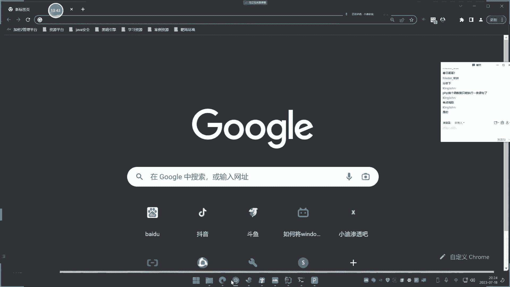
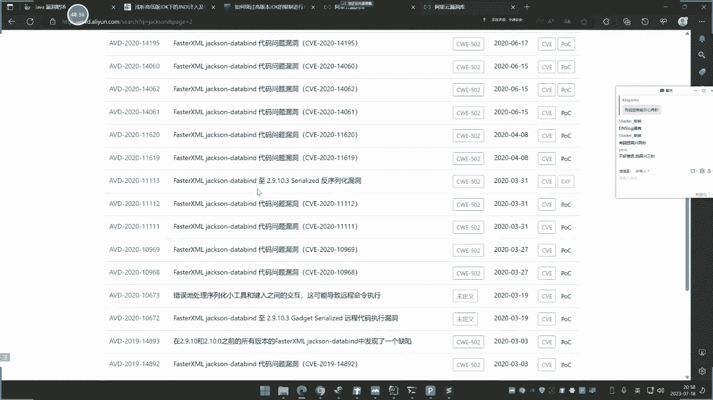

# 【小迪安全】V2024版 全栈网络安全 ｜ 攻防渗透工程师 （持续更新） - P66：第67天：Java安全&JNDI&RMI&LDAP&五大不安全组件&RCE执行&不出网 - 逆风微笑的代码狗 - BV1Mx4y1q7Ny

今天呢是第67天了啊，继续讲这个java安全啊，web上面的加三个知识点啊，一个是java造成原生态的，RCE的执行的几个函数和类，然后呢，再来说一下这个GNDI注入的，这个实现原理啊。

这个在安全开发呢有讲过多某的一个代码端，同时呢也跟他说过啊，哎今天呢就是主要的再给他温故一下，然后呢再来看这个今天的重点，就是这个目前在当前java的这个安全体系中，实战中经常出现的五大不安全组件的。

一个安全的漏洞，指的就是我们这几个啊，给大家看一下武大完全主线sho fast jason啊，JASON啊，然后这个诶这个写错了啊，这可以节省是吧，还有个那个x s stream和这个local时间。

这个呢是我们java里面啊这个五个不安全组件，五个框架啊，也称之为不安全组件啊，专业名字叫不全组件，这在互网中啊，在实战中呢，也基本上好多都是通过这五个的一个安全楼，都是打下的，然后呢。

他的一个白盒和黑盒上面的一个分析啊，好我们来就先给大家看一下啊，呃首先呢我们先来介绍一下这个RC1的啊，RC1呢在pp里面有很多函数，那在java中也有这几个呢，能够实现调用出命令执行过来之后。

那么这几个漏漏洞的话，如果在黑盒中的那和pp的那个黑盒，发现RC1呢是差不多的，都是通过啊网站的这个药的传参和这个名字呢，来去猜测，这里可不可能是一个代码执行，或者是命令执行的地方。

是通过这个URL的参数名和地址，文件名和参数值来去尝试修改，和payload的提交上去呢来测试的一个方法，我们具体看一下，在java中，来实现RCE执行的五个相关的V和函数啊。

我们先把这个环境你都没呢给他开上来。

开上来之后呢，我们在后面呢也会给大家直接看到这个，什么这个CMS啊。

实体的cm s呢去代码分析到这个漏洞的啊，先给他开一个，然后这里注意一下啊，我们这里呢目前开的是一个用JDK，1。80112去开启的啊，等下来我们来逐一观察啊，开错了啊，开错了解压包。

这个死的，把环境启动起来好，我们来访问一下。

好这个是那个环境啊，我们来看一下啊，呃找到这个地方的这个什么，这里好，然后呢他有五个啊，我们具体呢可以打开这个程序。

源代码呢大看一下。

fast JSON和jack jackson开发哪个用的多，应该是fast fast jackson啊，JKJACKSON呢以前用的多，后面呢比这个fast取代了一些啊，好。

这个呢是我们那个GL8那个源代码那个地方啊，我们来找到那个漏洞的那个地方啊，看一下啊。

随意的啊，只有这五个啊，我们先看这个第一个啊，第一个呢是wrong time。

一个Z，这个是wrong time，一个Z，java里面应该是实现命令执行的wrong time一个Z，这个使用起来也非常简单，我可以看一下啊，这个代码段里面啊。

访问路由那是home m r e r c e的rn time地址，然后这里呢可以看一下，后面那个结束的一个调用的一个参数嗯，是这个semd string semd呢去接收的啊。

解释上面第一参数呢用这里呢去调用执行哈啊，这里呢调用的是rn time去执行。

我们呢可以试着去访问一下，执行换密提交，什么情况。

哎。

这他妈的怎么我无关了呀。

不是数据库啊，是正面那个窗口怎么掉了。

你们这简直丧心病狂。

这也叫翻车了吗，这里面的环境断了，这这这这是我这就是环境问题啊，崩了啊，提交你看他就执行这个这个是吧。

然后呢你可以看一下这个要地址嘛是吧，地址呢其实就是这个请求地址嘛对吧，你可以直接在这里的请求也是一样的啊，请求这个外面的地址呢他也是一样的。

这个是第一个实现的啊，然后你看下面这个这个low的JSESC。

这个呢对应代码端呢，我们可以看一下对应代码端，这里这个呢它调用的这个地方呢是一个什么，这个Z呢，你可以往上面看一下调用内啊，嗯是一个这个ASCRIPT里面的这个类，这是啥类函数呢，是这里面的东西啊。

这个类里面的东西一个一个解的这个函数啊，然后呢去执行这个东西啊，这个是怎么执行的呢。

哎呃这里呢有一个JS文件，这个JS文件那里面是这样写的，我们给大家看一下，找他这个代码端那里啊。

这个是那个test js js代码中呢是这样写的啊，就是定义一个函数函数里面的引用，这个java long long time，Get run time，去执行一个CLAC就是我们那个降息啊。

然后呢这里去调用这个函数。

那就这么情况啊，我们这里呢可以看一下啊，直接让他去触发这个访问，这个92。168。1点哦，哦咱们把发动后的test js文件提交。

哎这里点了提交之后呢。

没有反应啊，什么问题啊，第一次搞错了吧，那地址是对的呀，额执行之后呢，这里没反应啊，大家看到没，这个为什么没看第一代码呢，是这样写是没问题的，在windows上面那是这样写的。

long time执行计算器，哎这个java8之后呢，这个东西就是没有了，所以说这个之后呢，说实话这个有点老了啊，看一下啊，换个话题。

打开，把那个试一下啊，不需要看懂啊，看不懂是正常的啊，不需要看懂。

找个，TZHB你只需要记住啊，这个东西是不需要看懂的，这个RCE你小米都灰的啊，你看这里呢和那个脚本引擎之心一样啊，呃地址呢你就写了个什么，刚才个例子，1916801。28test js。

那你看这个将就就弹出来了，你看是吧，对对呃，这个呢说实话啊没有什么太大作用啊，他是在JDK1。8之前的那个代码里面有用到。

它是一个简单来说就是一个java的一个类呢，来实现读取这个JJS代码去执行的啊，然后调用到这个java的一个命令执行。

还有一个那就是我们继续往下看啊，继续往下面看。

浏览器也是真是麻烦啊，他这个一个浏览器登一个啊，你不要登两个，登两个之后，那两个有冲突了，好我们再看这个下面这个这个呢是叫gram，然后我们看一下这里面的一个代码段啊。

就这里了掉的内呢也是上面可以看到啊，那然后呢它的函数呢也是将这个类啊，你用这个东西呢来去执行它，执行之后的一个结果给看一下啊。

来执行cl e c啊，看到没，这就可以了，啊这是输入那个命令，也是给他传参的意思啊，好这是这个函数啊，三个函数了，再看下面这个，这个呢也是其中一个实行命令执行的一个类呃，然后这里呢是IP地址啊。

什么写的东西呢，一执行呢他就拼这个IP地址，然后呢你自己要加上管道符之后呢，哎他就是执行IP地址呢，并且呢是吧，什么管道五嘛，大家都知道了啊，来执行这个计算器。

这个呢你可以看一下对应的这个代码端啊，看一下这个PRO的啊，啊实现内呢可以谈一下，实现内呢就是这个java的原生内，然后呢这里边是他的调用的一个情况函数啊，对不对，啊我们讲这个呢不是说啊。

大一看他说的是好像是讲跟没讲一样是吧，是这样的啊，这个东西其实就是说熟悉这个java里面，触发RC1的几个内核函数，你把这几个记住就可以了，因为他的漏洞影响和利用呢，我们都讲过，我们讲它的原因。

把这些熟悉编之后呢，你后期的话去发现漏洞，去审计漏洞的时候呢，去搜这个相关的类和函数呢，来确定这里有没有这种东西来去挖这些漏洞，能理解吧。

这是原生态的几个东西啊，下面这个呢也是一样，执行之后呢也是一样啊，CLAC都可以简单的熟悉一下啊，这个是PRO的IM的。

这个往下面看一下，这个也是和这个类类差不多的，也是原生内，然后呢里面调用呢基本都差不多，咳就说这五个就是java目前的啊，主要执行命令执行和代码执行的五个地方，后期你在划这个java的项目里面的。

RCE漏洞的时候，就可以记住这五个哈，可以在里面去全局搜索，看这里面有没有调用过，他没有什么知识点讲啊。

主要就是大家熟悉一下就可以了，这是他五个实现命令，执行的五个这个相关的内核函数啊，呃然后呢这是他的几个点啊，黑盒我刚才说了。

和这个pp是一样的啊，就是你通过这个地方的这个参数值和参数名呢。

来去分析的，就很简单的道理啊，如果在黑盒中，你要去如何发现这个漏洞呢，那基本上也是一样的道理，通过这个地址上面的这么一个参数值，和全参的文件名呢来去确定，比如说你像现在啊我们去执行这个代码时。

你在这里呢可以看到啊，他在上面呢有这个什么，有这个执行命令的地方，对不对，执行命令的地方，然后你在这里呢改一下是吧，改完之后呢，他如果说有执行啊命令的一个情况的话，那么呢你就会确定出这个地址上面呢。

存不存在RC，那你看这个也是的啊，改成这个CLOC对他的确执行出来了，黑盒中的话，就主要就是观察这个地址上面的，这个文件名和参数值，就是正常的一些地方呢，你可能怀疑这里面有传参相关的这个命令。

或者是代码来去执行的这么一个可能，那么黑客中呢就是这么个车法啊。

白鹤的话，那这里代码可兼啊，你自己呢有人是接受这几个东西的话。

就能看到的啊，这没有什么太多说的啊，这个东西呢黑盒中发现的几率呢不多，大部分都是白盒发现的，黑盒的话主要就是刚观察它的功能，和这个URL的文件名和参数名和参数值来确定，这里你自己的去猜测，我说到这里呢。

很多人都不明白究竟是什么意思，就像我们说的，你去找一个文件上传的问的话，那么他这个显示就说你去测的话，你很明确他是个文件上传，那就找这个特征性呀，对不对，你要找这个功能点。

你看它指引前和指引后是什么星星，来去猜测的啊，因为黑盒没有白，没有代码，你只能去靠猜和自己的随便在上面去测才确定，而且即使说它有可能存在漏洞，你测不出来也是很正常的，因为你测的方法呢都是盲猜。

等于说这个东西你不知道有没有漏洞，只是一个测试方式，好我们接下来再来看这个JNDI啊，JNDI呢在前期这个37天的时候呢，又给大家普及一下这个知识点，就这个东西是什么鬼啊，然后为什么有这个东西。

他的安全问题有什么啊，这个女儿呢大部分结合的安全问题呢，都是这个RC1，就是说进行这个代码执行和命令执行，这个作用啊，一般就是做这个事情哈，我们也知道这个代码执行和命令执行呢，他两个是通用的。

就是可以利用代码执行的执行，做命令执行出来对吧，这点呢在前期上RC的时候已经讲过，在java中也是同样实用的，这个尖底栏呢说白了啊，我们再给大家巩固一遍啊，他是这个java里面那个域名和目录接口。

这个东西是干嘛的呢，他其实java呢去远程调用一些协议，来调用这些协议呢来去触发的，然后我们主要是了解他是干嘛的，这个之后呢还有个了解，就是要了解他怎么触发的，这个漏洞怎么实现的，又该怎么玩它。

这个才是重点，如果你自己那不太了解的话，我搜一下文章学下开发就明白了，那么现在我们来看一下啊，这个尖底I先来看它利用啊，先看它利用，那这里有个尖底I的个测试点啊，这个代码端其实在前期我们已经写过一次了。

他的实现呢就是用到这个东西啊，来去触发的时候呢，就触发这个RC1啊，然后怎么去触发RC1啊，建立I里面有这几个封装东西啊，这个文章呢可以简单的参考一下。

什么叫间谍呢，这是他这个图片，我们上次也给到一张图片来，就这个图片他java里面呢。

首先你可以看一下啊，他说是开发人员呢，为了这个查找和访问各种资源，来提供一个通用接口，里面呢有这个IMA协议和LDP协议，这两个协议用的最多，这两个协议是干嘛的呢。

简单的说就可以尝试用它呢来指引出RC1，那么还有什么DNSS啊，cooperate这东西呢用的比较少，基本上很少用，所以一般的话就用这个理I啊，这里是个概念，在它概念下面呢有两个协议，一个叫mi。

还有个叫ADP，这两个呢会和安全相关比较多，这两个呢可以调用出RC1来，然后具体他是怎么使用方式，又是怎么触发这个漏洞的，原生态的这个东西也说没有框架，自己写代码去触发这个漏洞，那么简易代码。

就像这里我们看到这个代码啊，就是这个代码，那这个代码呢你可能会问我不懂啊。

没学过呀，不好意思啊，前期在安全开发的时候已经有讲过，这是我们前期那个安开销花那个笔记，当时给他还测试过，测试过很多啊，所以这个东西一点都不陌生啊，一点都不陌生啊，这是他实现那个东西的。

就是说如何去远程调用。

那么就用这个类去调用它，如何去玩它，如何去玩它，一本呢是用RMA去触发它，还有呢就是LDAPM是什么东西，LDP又是什么东西呢，自己呢可以参考一下这个文章介绍一下啊，啊这是他的一个介绍。

我们这里呢也笔记上面呢也简单写一下啊，来r mi称之为远程方法调用注册表，而DP呢称之为轻量级目录访问协议，这两个呢都能进行相应的RCE的一个执行，好，我们先来去检测一下它啊。

那么这个呢在黑盒中是没有任何思路的啊，黑盒中是看不出来的，没有任何东西，因为你是无法去去判断的，像什么RC呢，还能看文件名和参数值呢，去分析一下，这是不是RC这个东西呢就完全看不出来。

基本上它的检测呢都是通过代码里去分析到的。

那么我们先来给大家看一下啊，它的一个简单玩法用的最多的就是这款工具，JNDI这个注入的这个解压包，就是这里呢就是别人写好的一个jr，然后然后你用参数呢去生成你想要执行的命令，和绑定的IP地址就可以。

它是一个什么实现呢，其实呢他就是利用这个JRR编写好了，写好之后啊，把它封装成这样，你就用它来来实现，网上呢还有几个工具，前期安全开发呢呢讲过两个啊，网上的还有几个。

包括我们前面在讲pp反序列化的时候呢，也介绍过一个平台里面呢也有那个东西，这个呢我们不现在不说他啊，说多了大家理解不起来，现在呢就基本上把这东西给讲解一下，看一下就行了，那这里呢执行cl c啊。

然后呢去绑定我的IP地址，一执行执行完之后啊，它就会生成啊这五个1。8的呀，什么JDK和spring put1。2以上版本，那个tom cut8以上的，还有个JDK一点齐了。

根据你自己当前网络环境的去选取，也不要问那我该选取哪一个，就这五个，你说选哪一个，哪一个不行，就往下面一个翻就完了呗，就五种撕撕一下就不行了，那这里呢你可以看一下，我选的1。8的这个r mi是吧。

我把这一勾选呢一一创建，创建完之后呢，我放到刚才这个什么JDI这里啊，看一下啊，这是它代码端嘛，大步端呢就这个代码是吧，接收一个参数值，后面那就是一个这个地址是吧，我把它写上去。

执行下一访问，哎，计算机弹出来了，这什么情况呢，消息里面都可以看到，有个什么接收这个地址请求，这个原理呢简单来说呢，就是用这个工具来生成一个类，这个类的叫做class，就是我写的class。

这个class就是把刚才你要执行的命令，它写成一个java文件，然程序加载可以这样去理解它，什么个理解，你把它理解成pp的一个东西，P1P远程包含一个文件，可以这样去理解它这个RM是什么东西啊。

他讲解的是什么东西啊，叫远程方法，调用，远程方法其实就可以理解为，远程去调用一个文件，文件代码都给他执行而已。

那么什么是这个代码呢，他就是利用这个工具呢生成了一个什么代码。

生成了一个执行cl vc的一个代码段，就是这个class文件把它生出来了，然后呢去监听，一旦有人去软件调用，它就把这个class给他执行，其实也是个java包class，那是编译后的文件而已，对不对。

然后呢你看这个凹DP也是一样。

复制到这里来，看一下它能不能实施这个LDP呢，把它放到这来执行。

可以看到也是一样道理，也是执行成功了，并且这里呢也是一样的，请求得个地址对吧，可能大家会问他这讲跟没讲一样，也听不懂啊，也不知道是什么情况，黑客中也不知道什么车啊，JNDI没有这样的玩法。

它的玩法是主要是在漏洞利用的时候玩，它漏洞利用如何java里面如何去执行出RCE，或者说用什么反序的话，那种各种漏洞如何去把logo利用出来，大部分都是结合的这个GNDI的一些东西，来去结合。

马上我们讲不安全组件的时候，这个JNDI就上来了，简单来说这个界面啊，它不是个漏洞，它只是java里面一个远程调用方法，远程去调用一个文件执行，造成一个RC1的一个结果，他是为了方便开发者。

只是说呀有人呢出现漏洞，把它呢利用起来来实现这个漏洞的执行，结果是这么一个逻辑，所以我们学金融DI是学这个东西是什么东西，然后它能造成哪些效果，这是我们学的，并不是说它是有漏洞。

也不是说他是个漏洞东西能不能理解呀，大家它其实就是个类似的一个功能。

然后漏洞呢是利用它来把漏洞利用成功啊，是把它当做一个利用的一个渠道而已，它不是一个漏洞啊，它是java里面的JNDI的一个技术，然后里面呢有一个IMI和RADP的，两个协议是常使用的。

利用一个呢叫远程方法调用的注册表，R m i，一个呢是这个青年目录访问协议OTAP，然后这两个呢还会有一些差异，有什么差异呢，就和你当前任性环境的JDK版本有差异，啥有差异。

我们来看一下啊，这是一张图，图里面呢前期也讲过，你比如说像现在我运行这个环境的时候，我把它先暂停掉啊，先把它暂停掉，我运行这个环节呢是采用的J里K1。8，112的这个版本，我们先给它去掉之后呢。

来杠一下VC来看看吧，他是一个JDKB点801啊，原始版本呢其实就是叫JDK，8U0112的一个版本。

网上能有这样的一个叫法给大家看一下啊。

来这个指的就是啊8U111啊，8U111和8U12指的就是这里的呢，这后面那个112，就是这个8U8代表的是1。8版本，除了这个是1。8，后面都是什么11版本啊，13啊，14啊，17对不对，还有什么1。

7，就是我们说的奇版本，也称之为JDK8，也称之为EEEK1。8都是这么一个东西啊，GDX8和接力1。8就是两个事情啊，就是一个版本，只是说有些是1。8显示啊，啊这里你看版本的是1。111的是吧。

对不对，然后这里的这图片上面，那那你可以看一下阿拉，他说什么奇U216U45，还有什么6U1327U一二，这指的啥意思啊，指的就是7U7版本，URE就是后面那个版本的编号，我们这里呢是JDK1。

8011啊，那就简称为8U11啊，能理解吗，所以说你看了这个东西呢，你要理解了啊，你不要说这个到时候看不懂啊，这什么鬼东西啊，6U就代表六版本的，这里可U，然后呢211和就是这个版本下面这个序列。

因为我们都知道啊，就像windows一样啊，它还有什么windows啊，win11是吧，SPE啊，SPR这种教法啊，就这个意思啊，对不对，那这个6U啊，6U就是1。6或者六。

这个版本意思啊啊十101呢也是这个意思啊，也11版本哈，第一它的序列号为一的，然后你看一下啊，在MIDJDNJN里面注入，这里面有个截止截止8U113，然后LDAP到哪里，接着8U191，对不对。

好，他就是个截止，那么这里有个什么区域啊，大家看一下，现在是这个版本是吧，刚才测试是没有问题的，那么现在我再换一下啊，1。8并里面的java是吧，来执行一个VISC，我现在这个版本是多少，版本是1。

80362，那么大家想一想这个版本应该怎么写啊，官方的一个写法就是8U312362，是不是这个写法好。

那是这个写法，我们看一下啊，那这里他是在哪个图片哪里呀，是不是应该就是这里都不包含了，这个是8月哦，123嘛，就数字对比嘛，362是大于113的，那这里呢你看啊拔于191，那是不是也大于这个地方。

也大于这个191，这里没问题吧，对不对，那么你看到我这里有个11。0呢，那是不是就是说8~11这里都行啊，不是这里啊，不是这样子的啊，它是区分版本的，就是你八版本你就看这里，11版本就看这里，你就说啊。

14呢17呢他这里没有写，就说没有反应，那就是没有反应，没有写就是另外的事情啊，你只要记住他这个写的词，就说在你的截止这个版本之前才行，或者说等于这个版本才行啊，如果说其他版本的话，那你就自己测啊。

一般是高版本的话就不行了啊，给大家解说一下啊，这个很明显啊，这个36R呢就明显在这个上面，好像是RMI的和RDP的都和它没有关系了，为什么你看RLDP的到这里嘛，拔于191也是大于它的362。

大于这个191嘛也不行，I来的在这里是吧，然后呢呃这个拔U113嗯。

这也不行呀，他也打给他的，那我们试一下吧，我帮你运行起来啊，那调用这个JDK版本是吧，你自己下两个JDK版本啊，怎么下，我等下会给他打包，这个我安装包的啊，你也可以从网上直接搜这个8111话去下载。

这个网上用来下载，对不对，有的啊，不要说这是什么，不知道怎么瞎啊，那里面的那就尴尬了，好我把它启动起来啊，那么重新来看一下，刚才那个JN点那个地方来啊，好我们继续来这里啊，看一下啊，登录小心。

嗯好我访问啊，那刚才那是直接把这个DJ复制上去。

就指引出来了，好吧，我现在看一下啊。

执行了有没有反应呢，没有反应，计算器没有弹出来，数据呢是有接收到，你看他罚了，罚过去了，但是没有反应，没有反应，是IMI的调为底P的。

也接触到了，也没有反应，计算机没有弹出来是吧，好那继续往下面看，这个疑点齐的是吧，试一下。

我们就说因为你实战中你不知道对方版本吗，你肯定都要撕啊，他这一期撕了一个。

还有这个，这也不行啊。

这不行啊，那看这还有这个。

诶这个可以啥情况来看一下吧。

这个中间这个为什么可以的，你看下它上面写的，他说的J1比K这个什么东西，然后是什么呃，top cut8加和spring put的1。2叉，In class ply，你可以看到他这里呢和刚才两个不一样。

刚才两个都有LGAP协议，他这个没有，其实就是说他这个呢并没有看JDK的版本，他看的是你是不是这两个符合这两个条件，那刚好呢我实施这两个条件是吧，我这里呢是用spring put的这个源码。

本身呢就是spring boot实现的嘛。

我们之前在这里看到过啊，那这源码我给给他看一下啊，那就这个源码，你看他那个介绍里面，它的实现框架就是这个视频铺的。

那是ing put的4。0嘛，对不对，他写的就是这个东西嘛，那个1。2，那肯定大于它了，不用说了嘛，那可以。

所以说这个利用呢你是要根据环境决定的。

你要使用这两个协议的话，它是有限制的。

就是不是说哎呀这个所有版本都行啊，为什么呢。

啊这里后面写到过说这个呃在历史漏洞里面，就是这个啊，就看13天的这个37天这个笔记啊，那后面你你没有写到过啊，你可以看一下13天那个笔记里面上几天，这个笔记里面有啊，30几三体内比心这里有啊。

他就是在高版本之后啊，你看啊他这个高版本之后啊，对啊，它这个里面有一些东西呢发生了这个更改啊，这是他的原因，这个原因呢我们不细究，我们主要聊原因，我们不用管他，我们更重要的是说呃他是如何绕过的是吧。

这个有没有绕过思路。

就是如果说哪一天这个版本是吧，不符合啊，刚好这个呢也不是spring铺的，或者说也不是这个什么tm cut这种东西啊，这个也不是不能用了。

那该怎么办呢是吧，这里呢就要看到这个参考文章啊，这个参考文章了，这也是高端的，则是要需要分析代码和之后呢。

看他整个一个调用情况呢才能决定的，就是后面那个我高版的那个绕过嘞，就是在哎大于这个高版本的，这是个什么89191上面的是吧，然后这个什么这个东西啊，其实我告诉大家啊。

呃如果说你要分析怎么绕过它的原理的话，这个还比较复杂，但是我实告诉你，网上那有现成的工具，还有现成名写好的啊，你这个网上这个文章的都是怎么说呢，都是分析文章，你如果说你要做一个安全研究者的话。

你可以去读一读，如果说你作为这个攻击者，你也不在乎那些东西，你只要学会怎么绕，那你就没必要读这个文章了，你只要怎么办呢，下相应的工具啊，下相应的东西，当个脚本小子对着玩就可以了，你分析的话。

这不是一码一一瞎子的事情啊，他是要跟那个连啊，然后呢去堆着去是吧，去触发一个就是你要用那个反射啊，去再去用，它，也要看那个目标对象里面有有哪一些这个类呢，能够调用来实现。

其实这个本身这个工具的原理，就是这个JNDI，还有那个什么反序化那个YS啊，网上的都有相关的系列文章，去分析这个工具的原理，就是为了弄懂这个东西，我们后续啊在讲这个呃分析练的时候呢。

会有一两次直播呢去讲这个分析的啊，那个时候呢你在做合这个高绕过方法的去看。

就会明白一些。

那现在呢我们只要了解他的绕过的思路，绕过思路就是我们说的啊满足条件，他的这个原理呢，其实就是看本身项目中的原始内，有哪一些去调用其他类型的去反射。

调用出来，就有点类似于我们昨天在讲那个反射一样是吧，那个黑名单绕过，不知道大家还没有印象啊，就是和那个呢差不多啊，这个呢就是我们说的个尖底来啊，那为什么要讲他我说过啊，他不是一个漏洞，也不是个什么东西。

我们理解它，第一个是知道这个mi和RDP怎么玩它啊，触发触发C1，然后呢知道它上面有个限制，这个版本限制RY限制到哪个版本截图，然后DP限制哪个版本截图，然后他的绕过方法一个呢就是可以看环境。

就是这里呢它支持还有一个spring布的那个logo是吧，你只要是spring布的一点200米以上哎，就可以用这个呢来尝试绕过这个高版本。

这是一类，还有呢就是我们看的分析两篇文章，这个呢现在啊没有时间也没有精力给他讲啊，后面呢会给大家说，要分析到这个工具的原理之后，这个绕过呢才能讲的明白，否则的话就给工具给你用用了，跟没用一样啊。

好这个就是我们说的这个尖底癌啊，简单来说啊，他就是一个为我们后续漏洞利用的一个管道，了解就可以了，既然你爱别人，问你是什么东西啊，他就是java这个原生的东西，用来提供这个远程方法。

调用一个接口里面呢比较关键的两个方法，两个协议就是这个RMI和奥迪P，它们有什么差异，就是我们说的调用它的时候版本有限制，然后他们具体一个是叫远程方法调用，一个是轻量级目录访问，你把这个记住就可以了啊。

好那么现在呢就来到今天的关键点了啊，就是不安全组件，因为大部分的代码审计呢，从本身的源码领取审计是一个方面，还有一个呢就是这个不安全组件学到这里，很多人呢思路都是糊的，都完全不知道。

这个学了好像和实战没有什么关系，我告诉你啊，是很有关系的，你把这个课学完之后，把安全开发课再学完之后，在后期我们还有代码审计里面还会讲，你把那个三个体系全部学完之后，你就会明白了，现在获得了不要紧啊。

我们呢也尽量给他解决这个疑问，你看一下啊，这个java里面这个不安全组件五大，哪个时间写入杰杰克和那个法师的JSON，还有个XX菌，我们先来解释一下这个东西是干嘛的，在java中。

或者说在任何开发语言中，高端的开发语言什么Python啊，这些东西都会有一个东西叫做组件，或者称之为模块，或者称之为叫这个哭这么一个教法，其实以哪种教法都可以哭，也是对的，模块也是对的，组件呢也是对的。

指的就是第三方的东西，在开发的时候，如果说你要对这个网站进行这个日志的记录，日志的记录的东西，那么在java中，你就可以选用log4J来帮助你去对任性日志，或者一些其他日志呢来进行操作。

那么如果你用到logo世界了，那么不好意思，logo世界包括历史漏洞，在使用的时候使用不当就会造成漏洞，关于它的漏洞的所有漏洞，大家可以商一下这个阿里云的这个什么这个，漏洞平台去看一下曾经报过漏洞啊。

一目了然，这是目前阿里云漏洞库收录的，为什么在这里看，不在其他漏洞公开网站上面看啊，因为这个fast的建设呢，就是阿里云官方出品的一个库，所以他对这类的漏洞呢收集的比较全。

这是目前已知logo世界的历史漏洞，然后呢有些呢是有POC，有这个什么漏洞，利用代码，有些呢是没有的，就是没有公开的，我们具体呢就是要看一下，打开一下之后呢，可以看一下点到里面去呢是吧。

可以看一下他这个漏洞的一个详情是吧，然后呢他会有一些相应的介绍，有些呢会直接告诉你是什么都不懂啊，有这个呢只是大家看一下啊，有些CV编号啊这种情况啊，啊然后呢会有一些大概介绍和他的一个版本，音响。

这个呢就是比较关键的，就是一个是看它有哪些漏洞，第二个呢就是看他的漏洞的影响，和有没有CV1的编号，并且在看有没有这个什么POC，指的就是说点零写好这个漏洞的测试代码，还有现在是没有武器库。

有武器库的意思，就是说有人已经把开发工具都利用出来了啊，就这个意思，那这里呢也是给你后期的来判断，你的代码和分析，在做这个百合申请的时候给你有帮助的啊，就是这个log4J。

那么呢还有像我们这个SHAO是吧，这些都可以在上面的搜索看一下啊，对啊都有啊，那这个呢每一个东西就不接了啊，主要介绍logo时间日志记录的框架，写入身份验证的框架，何为身份验证呢，用户的登录授权。

你在pp里面去写用户的登录授权的时候，去验证这个用户是不是你的这个管理员是吧，pp里面是怎么开发的，java里面就可以用这个框架集成开发，jack和JACKSON和那个fast JSON两个都是一样。

都是对JS数据呢进行处理的，对这个JSN数据进行处理的两个框架，就说你凡是用到这个JSN哪去数据的转换呐，数据的这个格式化呀啊都可以用到这两个框架，就不用自己的去写代码实现，还有个s stream。

就是java这个对XML语言的一个操作，由于这几个框架呀里面呢都有相关的接收数据，和对数据进行序列化和反序化操作，所以大部分广泛利用的漏洞都是返学漏洞，好我们现在呢先来用一个本地的demo。

把五个漏洞的本地demo看一下它具体代码，看完之后简单的浮现一下，把漏洞端进行一个测试，利用完了之后啊，我们就来用一个比较真实的一个源码案例是吧，看一下这个漏洞是怎么发现的，并且呢把这个东西结合进去好。

我们来看一下啊，这个漏洞的一个简单demo端啊，先看一下这个里面写的很清楚啊，看一下来，比如说这里的呢这个fast js他也说了，阿里巴巴的JS解析库，这是阿里巴巴自指自己的啊。

然后这里呢写了个这个long利用代码，你可以先点提交啊，他也没反应，为什么呢，你可以看到啊，他这里有个什么东西叫RMI这个东西，如果我刚才不讲，这里这根解压足够告诉你这里有漏洞，你也不会用啊。

你说讲了有没有用呢，看上去只是听了跟没听一样，第四你知道这个东西你碰到你才会改呀，你看这个呢他这个利用代码里面，你可以说用代码怎么写的，我也不知道啊，网上都有这种模型，你只要把MV放上去。

对应的把它修改就完了。

不需要你操心的事情，你看这1。8呢是吧。

我要放诶，改改这个我放这里来，我测一下来，我看下，就说我把自己改，它原来是那个嘛，他自带的，你该会改点，提交被计算器弹出了执行的呀，我本地环境执行计算器呀啊这这是代码呀。

你看代码怎么写的呢，我一个代码给你看呐，嗯代码把代码找出来，哎你们不要喊高端这个课前去安全开发课，我就上过了，你喊高端就是前面课你都没有看过，看看弯的啊，我只是说以前是给大家认识一下。

现在呢就是说啊把它利用，就是这里呢就强调的是利用和发现了，以前就是告诉他有这么个东西啊，前面讲安全开发，就是告诉他有这么个东西认识他，后面就是讲他的利用和发现了，在代码审计里面呢。

就是有个案例就是成品源码加深影响，这是循行渐进的啊，诶刚才那个跑哪去了，那这里啊，这个是演示是fast season，来，你看下代码端里面这里那库里面这是引用的库。

cm阿里巴巴fast test调用里面去接收这个content的值，所以我发送的呢response body接收content的值，发送过去，用这个什么JS问对象啊，去解析它就没了，就这么个简单。

其实就是说很简单，用到了发射键是库，然后呢有一个可控变量啊，这个空间呢用它去解析了，把它解析成这个什么对象，就是一个给他发一个JSN数据。

然后呢把解析对象应该发的就是JS的数据嘛，指数这样写了是吧，这是你自己写的。

这是个什么东西呢，我给他看一下。

你自己写的话，那就是这么个情况嘛是吧，直接换行啊，这样一自己写的话就这样的情况嘛，对不对，自己写就是这么一个数据嘛对吧。

这些就这么个数据，是不是JS和那个格式数据那方法提交，那就请求了是吧，没问题啊，你说这有什么难度呢，看上去就很难简单DEO。

但看明白了呀，英文库可控变量出现了呀，你可以说这就判断有漏洞了吗，难道有用它就有漏洞吗，不是的呀，还有版本的吧，还有版本呢看呢看他引用的版本呢，版本怎么看呢，一个是看项目里面的这个应用版本。

还有个呢就是看这个pom里面的是吧，在这里搜，对1。2。24，对不对，或者说在这里找也是一样的嘞。

是来1。2。24呃，然后呢你在抖动这个历史库里面发，直接省是吧，有没有包过这个版本都懂，什么这个1。2嗯。

2。68大于小于那里面的这个疑点多少啊，这是个1。2。24哎。

这里面都有，你来看看下这个呢，2017年就有个漏洞的存在，武器库啊，什么这个东西也有，点进去看一下呗，啊由于是官方网站啊，官方网站他就不会给你写那个POC，所以这个漏洞那就需要你在网上找一些浮现呐。

找些那种漏洞文章了，这个呢只是做一个展示那个什么漏洞呢，利用代码那些东西呢，那这里就是看不到的啊，他不会展示的啊，这个懂得都懂啊，他只会告诉你有这个事情啊。

好这个呢就是我们说的这个fast js是吧。

然后你再看啊，这个后面的啊继续往下看，我们把每个都看一下啊，看一下有个就是看到个代码的，知道了以后碰到就认识他了，就不要说是吧，碰到了都不知道。

看看这个啊，JACKSONJASON啊，你看这个对不对。

那这里呢是不是又是个LDP这个地址啊，你继续呀。

他要写LTP，我写个RM看行不行呢，把写的去了，贪了吧，对是吧，隔一样，你告底片二二都行，无所谓的啦。

会用就行，那这个呢是什么JXJXJX，然后你再看代码，看他这个实现，that cool引用收到了呢，com fast XML jackson co好实现的情况呢，后面就不用看了吗。

也是结束这个什么勘探的函数啊，还有参数值后面去解析啊，库呢是什么呢，来看一下，我们看下库啊，嗯是这个com fast哎，看一下，那就这个吧，那co2。1。2。113点三啊。

来看一下漏洞库，对一下，看是不是存在漏洞，打错了，哎不过他这里写的话就有点尴尬了啊，他这里面上面没有写版本，这你说有些查找起来也麻烦。

2。9点，你看这个就是你自己看到就行了，他的版本刚才看的是2。11。3。

这是2。9，那不是这个，你可以往上面继续往上面看一下，这个2。9的啊，是的啊，你自己找吧，这个我就不说了啊，你自己找或网上去看啊，只是在这里面找的根直接线网直接搜就搜到。

这是这个情况啊。

JACKSON的，然后你再看下面的啊，这是泄露的，你看泄露的泄露是什么一个登录框哎，为什么是登录框，前面两个不是直接提交，换啥情况，你看那功能点，那刚才演示的JSON是一个JS数据。

也就是说他接受JS数据，它进行进行序列化和反序化时，那造成这个漏洞节省和这个发时间，都是两搞这个事情的，那现在是泄露，他是身份验证的，身份验证的，我不刚说了吗，举用户登录这里啊，对不对。

然后你看他怎么用啊，你比如说我直接拿个漏洞零工具给他用一下啊。

这个漏洞工具呢那多的厉害的，你看到啊，就用这个4。0版本的好吧，我们最最新的这个工具箱里面的4。0好吧。

那这里呢是这个泄露的，你看这个反序和综合利用这个工具是吧，来你把这个用户名输，我给他砍一下，来把地址一抓好吧，先抓一个，随便登录一下啊，随便写，记住我把点上提交数据包，你属于包的哎，妈的嘴巴这里。

有个登录，那有个地址呢，把你复制呢。

放这来车，你看啊，他车存在现有框架，初始指定名思已包括，包括得到了检测利用率，检测到了执行条命令试下，What i mean，执行了DR执行，这什么情况呢，对不对，这什么情况呢。

你要说你用我看代码，我看一下，来看代码，SHO的是代码呃，代码里面的，你看一下啊，来应用的ORG阿帕奇SHO，这不用看的嘛，直接引用库满足条件了。

版本呢往上面找拖挖机的阿帕奇的泄露，那就这里呢1。2。4啊，1。2。4，对不对，版本呢你历史漏洞查，1。2。4，那这里你可以看到啊。

这还不是一个两个漏洞一大堆了，好吧，我们就不看了，对不对，那你怎么知道是不是泄露呢，都会有，我这里说了啊。

呃实战中的话，黑盒是怎么测的呢，啊我给他说一下，这个泄漏呢它有个特点，这个特点一是大家都懂，勾选了这个基注之后呢，他会有个特定字符，remember me是吧。

什么是每个2米啊，数据包里面啊，你看一下，在这里呢勾选这个机珠之后呢，cookie里面有个叫remember me的一个特殊字符，人跑哪去了，搜一下，好刚拿到这里看没，那remember me。

这个是泄露的一个判断特征，就是在这个数据包的这个cookie里面有这个东西啊，你记住啊，有这个东西要点这个记住我这个选项才行，它就会生成这个东西，然后这个网站呢如果说是java应用的话，那直接给盘里。

这是个泄露，这里有SHO，所以说SHO在黑河中的一个测试，想都不用想了，怎么测它啊，找这种授权的地方，何为授权呢，用户登录判断你权限的功能点，然后呢，在这里面呢去判断数据包里面有没有remind me。

如果有，那就是一个泄露的框架，你就直接用工具帮你泡，就完了，白和我就不说了，直接看代码啊，那可能又说了哎，这个发射JSON和JKJACKSON，那怎么判断呢，一种情况就是怎么判断，来我们来试一下吧。

就说笼统的判断，就比如说你这里点啊，它弹出计算器是吧，你看数据包，首先你要看请求的值，就是他常规正常的请求里面是不是JSN数据，然后除了这次数据之外，有些地方的话他还会有这个关键字，这个什么关键字呢。

就是这个叫fast jsn或者关键字啊，别给JSN，你就搜啊，有没有这个关键字，有时候呢在这里啊，如果有这个东西的话，那就是可能是的，能理解吗，就有时候呢你要看要看你看这个呢。

他这里写法都比较类似于这个情况啊。

他那个车法呢没有那个C罗那么特征，那么明显啊，这个具体的这个黑盒测试细节，我们在漏洞浮现的时候会给大家详细讲的，后面的还有多种复线，复线跟着中间简单啊，服务漏洞，这里面也会浮现这个漏洞。

而且都是那种成品的网站，当浮现的时候呢，你就能知道啊，黑盒中如何判定logo是J啊，SHO啊，jk jk son的是吧，还这几个他有些是强特征，有些是弱特征，弱特征就是说特征不明显，可能会有误包的情况。

强特征就像这个了，蟹肉就是强特征，只要那个东西那不用说了，就是泄漏，但这个什么JSJSON呢，fast JSON呢，你可能你自己去想想，你现在再想想，面试的时候，别人问抓如何判定他是泄漏啊，对不对。

他为什么问你这个问题，他不会问说如何判定他是不是什么JXJX呢，如何判定他不是local是J呀，因为那两个框架组件它是弱特征，你不能说看到这个东西就说是它，你只能猜测，那我去尝试。

而这个泄漏呢他是个强特征，或者你再问一句，说哎呀有些漏洞是吧，这个老问什么fast JSON不出网怎么办呢，这个什么SHO不出网怎么办呢，他有些问题呢，他问他为什么就是你这个漏洞有这么多。

他为什么只问他一个不问全部是吧，不出网，那用温度最多的就fast JSON不出网怎么办，他问这个问题，他怎么不说哎SHAO不输网怎么办呢，是这样的啊，这些问题他为什么说唉都是差不多的漏洞啊。

都是这个java上面为什么有些问题呢，他就问一个，他不是全部都问，不问其他的，是因为漏洞的特征，包括他的这个漏洞的形成都不一样，有些答案是一回答，就是那个真实答案，简单来说就是说不用看了就知道是他。

但有些东西呢它是有蛮多可能性的，所以他不好问这样的问题，他问的这个问题呢，你回答的东西呢和他对上了，他也不能说你对，也不能说你不对，因为可能性太多了，因为你学过这个东西，你就知道这个问题的所在啊。

你没有学过，你就会有这些疑问啊，好这个是那个两个东西啊，我刚才说了啊，就是因为你像这两个他这个特征呢太弱了，你无法通过那一个仅仅的那个条件去判断是它，但这个泄漏不一样啊，其实不一样，java应用啊。

哎一点呢，勾选那身份验证，那就出那个remind me，那基本八九不离十，就是削弱特征太明显了，他有这个强特征，那么你知道这个特征呢，流量分析的那个东西不就也是一样的道理吗，那别人问你流量分析是吧。

如何判定是泄漏攻击啊，你就把这个特征一说，那就是他的攻击啊，攻击里面就有它的关键东西呀，那就是它那就是它特征了，这不就是都呼应上了嘛，是吧嗯，好这个呢我们再看这个X4G啊，这个呢是一个也是一个解析库啊。

它主要解析这个XML的嗯，然后呢在1。4。16版本之前呢，有很多漏洞，然后你看他这个攻击的这个payload呢，大家可以看一下，就是一个XML语言的。

刚才这个fast JSON的攻击披露的就就是JS温数据，而这个XS菌呢就是什么那个什么，就是一个XL语言，然后呢你只需要更改一个地方就可以了，你看他这里有个命令cl e c是吧。

你比如说我改成个note，but就是我们的记记事本嘛，一点击提交哎。

记事本就出来了，是不是连提交漏洞计怎么出来，你看这样去理解这漏洞就好理解了呀，对不对，这个是做XML的一些解析的库，这两个呢是JSN的解析库，攻击payload呢就是JSN的数据，而这个呢是XML。

那就是个XML的数据泄露呢，由于他是授权的，所以他的漏洞产生点呢是在用户授权这里，那就不是在数据的这个发送的格式上面，那你说这个呢又该如何去判定，他有没有有黑盒中，如何判定有没有这个漏洞呢。

首先先确定java的应用好，确定好之后看数据包，数据包里面有看到他有接收XML数据，那这里你就可以撤了，你就可以撤了，因为他没有强特征，它只有弱特征，你只要发现它满足XML语言的发送和接收。

你这里就把PLOAD写上去撤，包括刚才那个什么JS问那些东西，也是这么个道理，除非说你有蛮强的特征是吧，确定他有这个东西了啊，那你就直接很细致测了啊，logo世界logo世界是什么呢。

logo时间是什么日志记录的好，大家想象一下logo时间是一个记录日志这个东西，那logo时间是一个记录日志的东西，日志记录它会记录哪些日记，那肯定就是访问的这个什么访问地址呀，用户的什么鬼信息数据啊。

等级就说你自己想想，你记录日志肯定是记录哪些啊，就是访问日志嘛，这肯定是作用所需的是吧，就调试这些运行日志啊，或者访问日志，这肯定是关键的是吧，他要是java里面呢用对日志来进行操作。

它就会使用这个logo时间，那么logo是J的话，日志既然是日志的话，你觉得这种漏洞它是什么车呀，黑河中的车法，以前刚爆出洛格世界的时候，黑盒中的玩法大约是怎么测的，随便测，什么叫随便车啊。

随便查啥意思啊，就是凡是有数据接收的地方，你就把PLOS写上去就完了，这就是他测法，你可能会知道是什么情况呢，就是因为你在黑河中，你无法预知对方会把哪些东西当做日志，哪些东西作为记录。

作为日志的调试和输出，所以你就没办法，就是随便插，就是我不知道我黑暗中，我不知道你会在哪里出现，所以我就什么用户的呃，这个用户名呐，什么这个这个这个网站地址上面呐什么的，用户图像里面的都查。

就凡是有这个接收地方的数据，你就查查什么呢，就查一个JNDI的一个代码，就查这个东西啊，就查这个东西，这个东西查对吧。

比如说我先给大家看一下，我查一个这个应用打码。

看见了，插进来点执行诶，执行成功了，那就是他这个那可能待会了，这他妈的这查这个有什么鸟用啊，我也不知道对方执没执行呢，执行也是对对方服务器上面执行一个计，计算器啊，执行一个记事本的没什么用啊。

我也看不到啊，所以呢大部分之前测漏个时间，一个漏洞是怎么测的啊，X对Y的一个除网就是底下是logo是吧，因为之前的还有人问我说底下log关了关了，那今天呢徐明给介绍个工具，这工具呢后面也会讲是吧。

一不讲呢，大家说哎呀又跟不上时代了，对不对，既然在工具包里面提供了，不讲一下吗，用这个YAKIT啊，其实八五数字里面有，但这个简单一些，我也不希望大家用那复杂的，他这里面呢是一个渗透框架里面好东西都有。

那你比如说这个DSLOG呢可以打一个出来呢，得多个啊，自己生成一个把dc1复制一复制是吧，一幅字怎么办呢，就把这个dc1改就可以了，就改成这个地址呢，点一下提交，哎这个没有哎什么情况没有吗，要注意啊。

这个r mi你这样写它不支持的啊，要换奥迪AB，把这个试一下提交，看到没收到了来收到了呀，那你不信我再换一个再给你看一下好吧，那我再生成一个来重新换一个来复制，放这来点一下来，我先看看我这没有的啊。

你看啊，我对着给看，免的是作假，那有了呀，这没动态啊，我是吧，当然这里还有很多功能呢，什么反连，那反连呢，你开个公网的来反连地址来，他也能勾出睡觉吧，那也出来了啦，反天回来了，1。

2的中午接到这好不好玩呢，好玩吧，还有这个呢掉链里面的js java的PYLOAD，来你看那我给看这点slog地址，你写个DSLOG域名是吧，这是生成一个写上来生成。

他就把那个原生态的反虚化数据帮你写出来了，然后格式格式，还可以把导导出成一个那个java文件好吧，这个后面会用到啊，海格总这个粘的一些情况啊，这后面都会用到，因为马上到时候呢要讲这些利用是吧。

是时候呢啊，这我用到的反面那个东西啊，还有很多功能啊，这个上面就不讲了，后面都会用的，国产平台的啊，这工具也是在最近啊，在前面半年的开始流行了啊，之前课程的没有，因为去年上的时候呢。

这个工具还没流行开来，所以没有教接手啊，这一期刚好冬季开始流行的时候啊，有人提到过把家读到课程里面去啊，在后面讲漏洞分析啊，漏洞利用的时候，漏洞发现的时候会把工具的详细讲一讲。

里面有些功能呢还是蛮可以的啊，就是漏洞扫描啊，包括这里集成一些有些东西啊，到时候会说包括这里呢，还有这个数据的一些对比，反虚化一些事情都可以在这里能看到啊，这有什么不会用的，这个图形画，你还说不会用啊。

来泄露的工具发射呢，它都支持那框架，你自己勾选，你需要扫什么就扫什么，傻瓜式的，这还不会用啊，自己选茶间，那这个螺丝巾是吧，用出来了有什么，是不是直接看到对外，那你要说你要强制性用这个迪斯诺克。

那也是一样道理，那我把DC复制粘贴是吧，那访问也是一样道理，那访问，提交刷新啊，是不是有了，所以说也没什么太多问题啊，这就是说明他DIY查询的呀。

他DIY执行的呀，待会执行，所以说我知道有这个漏洞，所以我在利用这个生出来这个payload。

让他调用出来，对不对，把打打出来，这执行哎，好吧，哎就有漏洞了，那把那个漏把那个把那个执行代码一改，改成你想要的，那不就是RC1吗，是不是，那讲到这里大家就明白了，你看啊，刚才讲奥杰伦DI这个猪的时候。

大家还不知道讲的有什么意义，现在看了一下，那这几个在利用的时候全部都用的是IM啊，什么啊，这个LADAP就是间谍组，你说不讲他能行吗，不讲他，你哪知道这个东西怎么可是个什么鬼东西啊，简单来说。

J n d i，就是为了让我们去利用这些漏洞的时候，那个漏洞立马让他去传输过去的，你没有这个东西，那就无法造成这个什么远程代码执行这些漏洞，就这个意思啊，所以这个里面他不是个漏洞。

他只是java里面一个东西，然后呢我们利用它把漏洞玩好，就这么个事情。

没有他的话，那漏洞就不好玩了，就玩不了了啊。

然后他呢有个限制，就是有这个JDK版本限制，就是关乎到对方那个应用的运行的。

JDK的版本啊，如果版本低，那就好玩。

那就随便乱搞就行啊，高高版本我们需要捣鼓，唉。

好，这个就是我们说的那几个五大组件的那个漏洞，的一个简单介绍，就大家的熟知了啊，基本上货网里面你去打的话，以前的打都是呢通过这几个漏洞啊，通过这五个漏洞呢去利用成功，然后得到一些全新的打的。

只要说java的很多都是这种打，如果说你要去打其他漏洞，那除非你对啊，大部分都搞不了，所以基本都是在历史漏洞去打，然后历史漏洞利用打的话就是玩这些东西啊，好那么现在呢我们就来看一下啊，这个这个漏洞啊。

在升级的时候是怎么分析的啊，是怎么分析到这个漏洞的。

好我们现在就给大家看一下啊。

首先呢把这个项目呢我给大家先搭建起来啊，怕有些人又不会搭建，所以我这边还是要演示一下他的搭建过程。

免得呢你下去之后要浮现搭建杂印不了啊，也是很尴尬的啊，首先呢我把源码呢拿出来，这也是应用网上篇文章啊，那个星球上面那个发现漏洞的东西，我把它的重新过一遍啊，他那个是视频啊，他那个是文章。

我们在那以视频的模式来讲解，如果好学的人应该是知道啊，这个文章应该也看到过，他香不跑哪去了，唉放哪去了，这里啊，这是那个源码啊，我把打开，我特地呀还把他没有做任何更改啊。

这个是那个项目的源码啊，然后呢先开始怎么做啊，打打开之后呢，先什么都不用管它，先maven先给他可伶一下，再隐私多一下，这个时间如果要记住啊，这个影视多的时间可能会有点长，这个时间长短。

那是根据你这个当前的网络，和你这个maven的那个圆决定啊，大家呢一定要配置好好，这里呢我就已经完成了啊，这个maven是多的已经完成了，可能是我之前呢已经没粉了，一下好，搞完之后呢。

接下来就是要修改数据库的一个配置，这个配置呢他引用的是my babies，其实他这里呢还存在my babies的注，由于上节课我已经给他审计过my baby那个注，这里呢就不再审计这个东西了啊。

然后这里这个数据配置这个端口呢，自行呢不要占用啊，自行修改，这里有个数据库啊，应该是有MYSQL数据库名呢叫tomorrow的啊，这个tomorrow dB数据库名把它进行修改一下，改这个东西改完之后。

接下来啊我们呢就采用自己的pp study，这个自带的数据库，把它启用起来，啊这里的MYSQL是启用的啊，启动了，然后呢再用自己的这个连接工具啊，把它连一下，连上去之后啊。

然后呢点击这个什么创建这个数据库名，或者呢直接执行。

最好是先创建啊，直接执行哪个文件呢，就是这个项目里面的那个circles。

就是项目里面sex有个D文件一执行好，执行完之后，这呢就有这个数据库了啊。

你看写进去了啊，那么就OK了啊，把这里改改完之后呢，进行一个保存啊，保存好之后，这边呢一旦这个maven呢in store之后，这里就亮了啊，那直接点击开始就完了，没有什么操作的啊，很简单。

因为前期配置呢这个项目已经给你配置好了啊，只需要改数据库密码，把SQL文件导入进去，然后呢眉粉把该用的库下载下来就行了。

其他都不用管。

好启动之后呢，就会是一个本地的808088端口，我们来给它打开看一下，好地址就是这个tom。

啊这就是那个项目的地址，一个仿天猫商城的一个java写的啊，这个地址呢你是可以这个看到这里面的啊，看到这个这个地址里面，这里应该有写啊，地址访问配置录音啊，这里呢就是根据自己需要啊。

我这边默认是tomorrow啊，所以我访问就是端口呢加上tomorrow啊，你如果说这里改了，那就对应改一下啊，这个不用管它了。

好这个就是那个写好的那个java的那个啊，就是一个java的那个tomorrow的那个商城啊。

然后这个有什么漏洞啊，我们直接开始整啊，首先呢我们要审计五大组件框架漏洞，首先我们这里该如何判定啊，我们来看一下之前的代码段，之前的代码段啊，打开之前那个漏洞代码端，我们根据刚才学习到的来去对应。

今天的课程来讲，比如说我们刚才学习到的这个什么这个fast建设，对不对，它的解析是引用过了这个库，然后呢调用这个函数内的函数，是不是，我们先来看一下它这里有没有引用这个库，有没有这个函数，直接搜。

有没有函数就完了哭了，我们等下可以再看好，在这里全局Ctrl shift加F全局搜索，搜搜到之后呢，可以看到，这里呢有四个地方存在，然后你看啊这里是有啊，打开一看要找这里，后面是有值的啊。

这里明显看到这里是有值的啊，打开看代码端在这里，这个是它的变量啊，这个是它传入的值，这个值呢我们可以把它选中，看一下它从哪里来的，大选中啊，看是从哪来的，来，从这来的啊，对就这个地方买这什么来的。

看一下代码的叫产品属性JSN呃，这里是叫respond parties，就是我们spring put里面的什么接收参数嘛，就是个参数值请求路由了，可以往上面看ADD me下面的product是吧。

添加产品信息，知道了哦，那应该就是后这里请求路径是艾德米，那应该是后台里面那个请求路径，然后是添加产品信息的时候，接收的这个参数值为这个这个名字，对不对，然后呢结束完之后呢。

在下面代码里面呢用这个介词呢去把它解析了，好，我们来看一下是不是有引用过fast js呢，在这里呢看一下BO，搜一下发射接收，的确有用过1。2。58，那自己呢再去网上的漏洞库里面去对应一下，有这个版本。

有没有包括漏洞，那这里呢很明确告诉你有啊，也不用看了啊，不用看了，那么这里呢知道了哭，有用过函数有调过，我就直接浮现来看一下。

为了这个效果提现，我用虎虎打开吧。

用户不打开好吧，因为用其他的浏览器呢，等下要抓包的啊，怕麻烦，80088，什么鬼啊，怎么打，还是这个两方事情帮我写错了吧，哎是不是这个我把那个先暂停一下吧，我说他妈先暂停一下啊。

可能是那个监听的那个端口占用的问题，都踩不，代理的问题应该是啊，我这里开代理，再把代理先开一下，你们不要老说翻车他妈神经病啊，这他妈处理问题就翻车，翻车说习惯了，简直是，来监听一下端口啊，四个8万。

打开来，好了啊啊登录下后台，因为他是后台的嘛是吧，后台账号密码，那可以看下数据库，123456是这样密码啊，好这里呢我们看一下啊，呃他说是艾德米的那个product，那个地址其实是所有产品里面啊。

产品里面的地址信息呢，就这个大家可以看一下，你不知道的话，你直接访问它也是样，包里面扩大的PRODUCT嘛，就这个东西吗，只是这里显示不太好是吧，就这个了，所有产品这里信息了，你没想到啊。

你在数据包里面的网络也有的访问，对吧，那这个地址，然后呢你在这里看也是一样的，先求地址，他不扎特好了。

这里那代码端，这里面看到的是这个，添加添加产品。

然后添加一下试一下啊，我们来添加一下，试一下，添加个产品随便先写一下啊，写一下，接下来装个数据包，抓一下数据包，好先把这个以前的都删掉，来刷个数据包，提交一下，保存成功，看数据包里面啊。

来请求地址post，来发到这里来看一下，是不是这个值啊。

来对应一下，新旧泽，哎跑哪去了，在这里啊，哎这里了，是这个，那刚才那个这里的不值嘛，对上了啊，就这个值嘛。

怎么办呢，发射件是刚才漏洞多了，单怎么实现的，刚才弄这个要怎么实现呢，把重新启动起来，开下来，就这个嘛，跟着进去看一下啊，直接把那个payload能呢在这里测一下，发起接生是吧，这个这个漏洞大不大。

我们先测一下怎么测。

看一下他对带不带Y就完了呗。

其实那都是引用一个类了去调用它来测一下的。

来。

就这个和那个一样的啊，没什么太大区别啊，都一样的，就说这个是先测带Y啊，再说这个执行，因为我们要先看他能不能带Y，所以有没有这个漏洞，因为你你不可能说一下子就执行你一家啊。

哎跑哪去了，来放这里，那这个地址呢我们就用这个东西呢生成一个了，生成个底是log啊，免得用网上的老老卡老卡是吧，重新生成一个TC替换来看一下这些没有勾，哎什么情况没反应了，哎有了哎有了卡了一下。

不要紧呀，没有翻车，来出来了，那不行，再试一个，你可能说我为什么要用这个，不用叠slog，不说了，我他妈的之前用金个螺丝的那内鬼啊，他一直访问，搞得他妈我都不知道成没成功，所以我就用这个了。

我现在学聪明了，再访问一下哥看一下啊，那正面一访问，你看这面值对应下，他有点帮啊，来出来了是吧，这边完了，这边就能收到了，发射建设出来了呀。

再来看其他的有没有呢，继续今天还学习过什么logo。

4g logo，4G的代码是这样写的，来local local hero是吧啊，然后引用LOVLOGC好，我们来看一下这个代码里面有没有啊，数一下，把这个漏洞代码的那个推下，一搜哎呀没用，啥情况啊。

要注意啊，L是如果说报错输出，还有一个叫info infor呢也会造成，那这里有info有啊，有对应波也会造成啊。

不是说只有gr，刚才那个也是一样的，那刚才放JS呢，你可以搜这个。

也可以搜这个，他们两个都可以，那这个也是logo in for和logo error，都是搜豆干肉，Dol input，搜到了搜看这个吗，是不是这个啊，这个是不是啊，要不要看它啊。

大学的这个东西看不看不看，为什么不看呢，没有变量啊，你看它干嘛呀，它输出就输出这个东西没了，我要找能够有控制地方的，你看那个弄代码端来那个学了这么久，你应该知道这是变量啊。

可控变量和调用地方才能造成一个漏洞，学了这么久，连这个都不明白，那就是白学了，大哥怎么说，这个是不是对不对，好你可能说的这里还有个这个啦，Adm id，这个要不要啊，这个行不行啊，啊为什么。

我等下我等下先打开啊，再锁定一下java文件吧，来为什么这个和这个呢，这几个尤其是一个学这个和MD行不行，我们大家看一下，先来观察一下啊，这个IDBIWB从哪里来的，看一下啊，是不是控制过来的。

i iv等于什么千格的米里面的C型过来的，哎这个呢看上去也不知道能不能控制它是吧，再看下面这个，排序都不排呀，他妈的真是烦得很，啊你看这个有个这个这个有什么获取图片文。

声明这个值那个有输出这个字怎么来的，从file里面得到的一个value，这个如果说你有需啊学过java的文件处理的话，应该知道这个呢是获取文件名的啊，获取那个FINNAME值的，然后这个又从哪来。

finally又从哪来，从这里参数过来的，应该是接收文件的一个上传，上传里面的文件名获取过来的，然能用来打印他就知道了呀，我就上传个文件名，把名字改成payload就给撤了，能理解吧。

这就很显然就是我能够控制它这个从file里面来，file里面得到文件，b file呢从参数这个呢买过来的rise respond party，参数值过来的嘛，请求的路径呢也知道了，说是管理员头像上传。

知道了官员头像上传，这里路径是这个文件名里面得到文件名，得到之后呢，用这个lologin for去打印logo世界吗，我搜一下是不是有logo时间啊，往上面看一下代码，但里面有没赢过logo世界呀。

是吧，哎这里没有看到有没有呢，来看一下这里有没有啊，logo是JS这个看一下这里屁股里面搜，这里有ALLOCAL时间呢，是是是这里有的库里面呢在这里搜啊，来录个时间，8。0。10，那不用说了呗。

啊有没有漏洞，网上查呀，行了啊，那地址知道了啊，地址在哪里啊，在找个地方。

这应该是后台的嘛，来我直接把访问到请求到这来，唉请求之后为什么不能直接访问呢，那可能是吧，需要你自己呢去点一下这里吗，账号管理这里看这个路径是不是那个路径，我们确定一下，刷新一下。

看一下R请求这个点的时候，这里啊，这是这个触发的这个OCCT是吧，然后这里有个图像，我点一下它图像上传，我看一下是不是啊，保存成功，哎呐哎妈的个锤子啊，更新了啊，刚刚看到了是那个路径啊，这个路径啊。

更新图片还要我这个重新登录，呃你们说保持我知道啊，保持就是把那个日志保持嘛，那其他浏览器我这个浏览器我懒得调了啊，大家知道就行了啊，你可以在这里看到，应该这里有历史数据包能看到的，抓个包也能看到的啊。

有那个录音地址，那不是的呢，刚才提交的那个post包呢就在这里嘛，就这里啊，因为他直接割的访问，他访不了，他要post提交，他这个呢是也是post这个数据，post请求是路由地址。

然后解释个FANAME值嘛，他这个地方就显示FAM值，就这个file里面的这个得到这个，这个是得到那个获取的文件名，把这里的打印打印的啊，哎好。

其实这里面还可以检测有没有文件上传漏洞，但这个不是我们重要的啊，我们主要升级这个不安全组件啊，这你看把水包呢给他发一下，发上来，就这个地方嘛，改这个地方，那我们试一下吧，接N底来先代Y1下。

之前测试在这里吗，测的吗，怎么测，就这样测法，现在测试下带Y来重新再生成一个文，到这里，DIY搜一下，放个难执行好，这个是能够测出来的哈，我们来看一下，刚才那个才要把这个配置再换一下，不知道这里啊。

来到这里来来测一下，改改完之后呢，等一下go，哎啥情况没有啊，什么情况，哪里写错了吗，还有哪里错了错了吗，来额请求这里那是哎哦，我知道了这个刚才那个数据包没有登录啊，所以包没有登录。

所以我要重新抓个包啊，我首先把那个包抓到吧，抓到之后呢，再给他在这里测，直接抓，好就这里嘛啊哎就这个地方啊啊多写点啥了啊，就这个触发这个地方，所以把payload呢放在了测，勾看这里有了没有毛病。

有了有了之后好测他有没有RC1了呀。

嗯撤了，打开这里，1。8的给我扯起来。

执行咋回事弹呀怎么不弹了呀。

不行呀，换一下，继续往后画，哎妈的搞错了啊，重新来。

CTRL加C把这个暂停了，执行谈呢没有弹。

盒子。

谈呢还是不给我弹。

不是妈的还是不给我弹。

数据都接收到，收到了，就是不给我弹，弹呀还是不给我弹这个呢，诶这个弹为什么呀啊为什么呀，这我不讲前面的，你知道这是为什么呀，为什么呀。

来看项目的版本的版本是哪个版本呢，八版本，这个八版本是这个里面自带的，打包进去了，不是用的，我电脑上面就这个项目自带的，然后我现在给你看一下啊，他这个自带版本我怎么说呢，也不好把他弄出来的啊，呃这个1。

8呢，就是我这个呢你看调用运行版本1。8，这个版本呢我给大家执行一下呗，这个版本是哪个版本，杠vs哪个还有哪个序列的1。8。36啊，那不就和刚才测的一两吗，事情了吗好，那为了验证猜想。

我现在呀把这个项目呢给他搞成这个的，调用的是1。8。0。112应用，确定暂停重启，好吧，那我现在用的是啊，1。08011哦，好确定啊，重启，是吧，来确定一下啦，加用的是1。112的啊。

没有毛病，对不对好，那我们再来试一下，先把这个包呢来好好重新来访问好，现在呢就是换了一个JDK的环境，启动这个项目的，再来到刚才那个这里来测一下啊，哦同样也给抓到，哦抓到了放进来了，直接撕了。

刚才这个是用这个成功的，那么现在我用这个，这个是刚才不成功的啊，这两个是都不成功的啊，来看这个了。

得把PILOTE拿出来，唉算了算了，我直接放这里吧，免得他妈的搞什么假事情来替换一下啊，这个包吧，哎看下哦，好这是这个一点确定一下啊。

来这个的啊，1。8了啊，刚才这个不行的啊，go行不行行呐，为什么行呀，项目是用这个JDK第一版本加载的，讲杰伦杰人抵押出路讲的有没有意义呀，那你说有没有意义啊，你说有没有意义。

你神经病啊，没有意义讲，那干嘛，明白了吧。

那么大家就会问了啊，这种实战中怎么发现呢，我们先抛开这是后台，假如我是个前台呢，是不是实战中我怎么发发现这个漏洞了，是不是，logo世界那就不说了，实战中就是乱插就完事了，因为太你不知道他哪里结束。

哪里输出，你不清楚，所以你乱查，13岁就是乱杂，那刚才那个什么fast JSON，那还不明显吗，之前那个数据包都看到了呀对吧，之前那个数据包测的时候，是不是他这个数据包就是一个呢，这里都写到了关键词。

求JSN，对不对，而且这里发的数据也是接生数据，你就知道了，话可以就可以在这里设呀，对不对，java型网站的他车单就是这么个流程，他因为他是弱特征，所以你只能找符合条件的地方去测，那个时间呢随便测。

那假如说像现在啊，假如说这里有个用户登录账号，这里啊，这里他用到的是SHO，对不对。

那你这个用户登录这里就可以测陷入了，所以说你自己呢要把这个白和黑盒的，自己要思考，我没有讲，不代表说你就就回答不上来，你包括现在呢我把学完之后哎，面试官问你说哎呀这个什么法子，健身不出网怎么办呢。

来我先给大家看一下文章啊，你看了文章之后，你再看这个上面的啊，先先看这个啊，不错网的通用方法，你只要记住回答这三点，即使回答的不精准，不是他想要的答案，但是至少别人不会问，不会认为你是吧。

这个完全不知道哪三点啊，不会写，你只要记住关闭，不能起诉，第一个就是diva查询，这是无，这是任何东西都使用的答案，只说diva查询呢接触的是DNS协议，有些网络呢有些网站或者说这个目标呢。

它是不支持DA协议，这个DLC是否支持，怎么判定内网的课程的时候会详细讲，就内网里面会详细说什么除网协议，那个那个就是要判断它出不出网，就要会测各种协议的书啊，什么DNSS啊，ADP啊，这鬼东西是吧。

所以很多字典呢它都是通用的，我们现在学挖宝，你提到这个字典，内网里面的也会学它，或者说你把现在学好之后呢，你再学联网，到时候说什么除网协议你就明白了，是啥个意思，就是看他除什么网除网。

那就是说对方有网络限制，有防火墙限制了某些协议的除区，所以常规呢就会让他去DSLOGO，为什么呢，因为DNSS是一个解析协议，就是说把域名的解析是IP地址这种协议，这种协议呢一般防火墙不会把它关闭。

就是因为他可能有网络域名，如果他关了，他自己都不能解析了，所以呢他一般会放心，所以这就造成了大部分的这个不触网去判断，就会走这个DNSS协议去判断，就是看他能不能解析，就随便让他去请求个域名。

看能不能解析，所以既然是logo判断DIY查询，这是一个万变万变的一个答案，就是你任何东西只要说什么不出网啊，什么鬼啊，这个不回血都是这么一个答案，直接这个问题可把回答上，那还有一种就是我们说的啊。

如果说这个被限制了，有些人呢就会回答这个答案，就是把比如说RC1是吧，把这个执行结果把它写入到静态文件中，我们再访问他不就行了吗，就说你不回弦呐，这个不出网，对不对，那我怎么办呢，我就执行一个命令。

这个命令，那就比如说写个写个一啊，写个R写到一个JS文件中，然后呢你再访问这个JS文件，存在命令执行成功了，就知道有漏洞，这也好理解吧是吧，更专业一点的是吧，我不写文件，假设文件没有写入权限呢，对不对。

我写到自己的请求包里面去，就是把结果呢把它回旋到这个请求包里面去，相应注，对不对，好，然后呢这是这种通用答案，如果说对方比较专业，问你高端问题，问这个发射接收，不说网怎么利用。

这是高端啊，你再看高端答案，你再对比我们今天讲的那几个通用答案，瞬间就明白，你看啊他说的什么这个写文件写外修不出网。

如何利用写文件写外维修，这不就是我们那个写文件判断会写吗。

命令执行内存嘛，这不也是那个道理吗，后面这种spring的什么echo啊，怎么看的，什么阿比斯，这这个东西就是说他这个漏洞在利用时候看啊，如何去写命令执行，写内什么，就根据这个环境决定。

然后至于这么写文件，写web show mini执行内存嘛，这都是属于不除网的时候去判定这种方式，只是说他这种呢就是把直接利用了，前面的就是先判断后再利用它，这个就是直接利用了。

直接利用了就涵盖了个思路啊，具体过程那你就继续看这看不看懂，那就那是你个人的技术问题了啊，但是这个答案和这个回答要回答上，因为你有这个思路，你才能往下进行，连思路都没有进行个毛啊。

所以老碰到这样的问题呢，你就想到我说的那个三套方案就完了完了，往上提，你不管你懂不懂，你先回答再说太阳物，再问细节，那是你自己的知识储备了，那没办法，那就考核技术了，那如果说那个能回答上。

那妥妥的中高级的，那不用说了啊，把细节点强调到位了是吧，就杂种环境适用哪种情况，说的一分毫不差是吧，搞懂没啊。

那就妥妥中高级了，那要是把每个漏洞的原理，和他的东西都分析到位了，你脑海中都有那个思想概念，都每个东西的那个是吧，就像我们今天说的，比如说是GDI啊，他有什么差异，就是高端低高版本，比如说别人问你是吧。

IM限制在哪个版本之前，你都能回答上，你说别人还有什么理由说你呢，对不，别人说尖底来这个阿埋是吧，是叫什么名字，是干嘛的，对不对，你能回答出来好再问你是吧，这个猪的时候限制哪个版本，对不对。

你有个大概区间，你回答上也行啊，你要是直接精准到没哪个版本，或者给到了后面的这个解决方案，你说这回答这还说啥呢，对不对，安排安排直接安排。

好就说这么多了啊，今天知识点就讲这么多了啊，下节课呢我们再来学习java的这个框架漏洞。

和他的这个反序列化了啊，加固啊，我是加古是吧，我还有问怎么加固了，还好不是问这样的问题啊，我跟你说这个加固也是这个万有档案啊，打补丁的升级版本，这里面的不用问的这个事情啊，你要专业点。

就是针对性的那种什么黑名单啊。

啊正则表达过滤呀，什么加一些WAF呀，对不对，那通用答案就是升级版本，打补丁，就这两个事情，好今天就说这么多了啊，大家有问题赶紧问啊，没有问题我就瞎了啊。

这个工具箱里面呢有很多东西。

那前面呢一说到这个YAKIT这个工具啊。

我就想起一件事情，想有什么事情呢，就我隔一段时间就有人问到一个问题，有没有知识点呢，我真是服了啊，字典发一下呀，这个里面就有啊，你就不要再问了，你看这里面的字典都有了，自己用了呢。

网贷这个工具包里面都有，包括前两天还有问有没有什么cs插件啊。

我也是服了啊，有些人能把这个工具下下来。

他也不看，他也不管，他就看上面有什么东西，就是什么东西，我告诉你它里面含有很多东西，你比如说他这里那个啊，这里面那个COMMOJK的那个什么鬼，插件里面都有，只是他有现在没有加载上去，你自己要灵活。

你打开了目录，你就不会看一下吗，哎呀难怪说你这学东西就是学的慢，你看这里啊，他这有个cs的这个工具，对不对，你看啊，比如说这个长线的，他这打爆了呀，还有note9。3。0，这是网上还收费的。

有人老问哎呀，有没有9。0后面的版本，这别人都给你发了，你老文自己从来不看，真的是无语。

自己细心一点，你会发现你学起来会更简单，你从来不思考，老是问，连我把那个学习说明给他了是吧，连我那个笔记我都说了，网盘地址在这个下面都不知道，还问我那个当天的资源在哪里下载。

我有没有发，哎呀，真是难为你了啊，你说这咋学得好啊。

他学不好是有原因的，一点都不操心嘛。

自己花钱都不操心哎。

好今天就说这么多了啊，大家有问题赶紧问啊，没问题，我瞎了啊，命令执行回线请求比C小应，这个怎么弄，不太明白，java里面比较难读啊，PPT里面好，java里面要这个写到那个ADP回血里面去。

要改那个这个实现起来比较麻烦啊。

就简单来说呢，他就是利用反射啊，就像这里呢讲过spping put的时候呢。

他有个respond body嘛，就要改写这个那个回血那个包，它不return吗，要改一下这个地方啊，让那个写入数据呢，把这个改一下有点麻烦啊，你要用那个反射，那还有调试代码，那个实现起来比较麻烦。

对啊，你看有些人的难呢，他还会善用搜索，会搜是吧，会用这个什么文件搜索，比如说哎我找不到支点了，我搜一下知识点诶，这也有了呀，哎，好今天就说这么多了啊。

不过问题我就说了啊，搞了拜拜了啊，我给他打包一下啊，工具箱里面这个工具都有啊，包括什么经验底啊，那些东西呢，这工具包里面都有。

4。0发一下网盘都发过，前面都发过啊，不要网文件问题不罚。

早就被骂了啊。

好就说这么多了啊，下了下了啊。

